# 设置

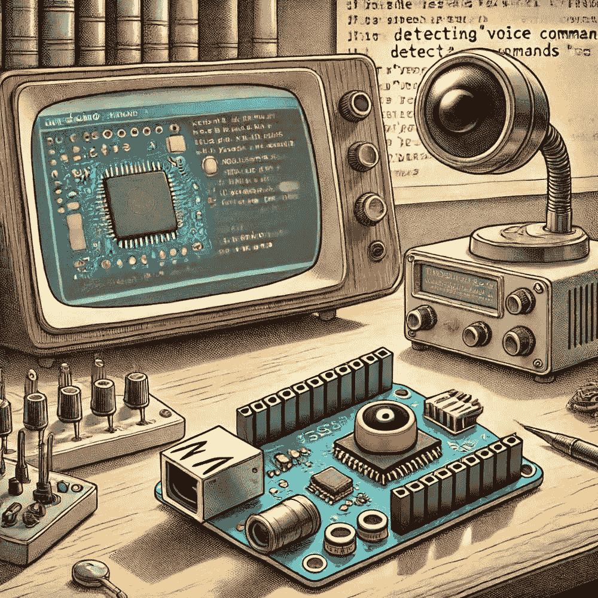

*DALL·E 提示 - 1950 年代卡通风格的 XIAO ESP32S3 板绘制，具有独特的摄像头模块，如图所示。板子放置在经典的实验室桌子上，周围有各种传感器，包括麦克风。板子后面，一台复古电脑屏幕以柔和的颜色显示 Arduino IDE，代码专注于 LED 引脚设置和语音命令的机器学习推理。IDE 上的串行监视器展示了检测到语音命令“是”和“否”的输出。这个场景将中世纪实验室的复古魅力与现代电子技术相结合*。

## 概述

[XIAOML 套件](https://www.seeedstudio.com/The-XIAOML-Kit.html)旨在提供 TinyML 应用程序的实际操作体验。套件包括强大的 [XIAO ESP32S3 感应器](https://www.seeedstudio.com/XIAO-ESP32S3-Sense-p-5639.html)开发板和一个扩展板，该扩展板为机器学习项目添加了必要的传感器。

**完整的 XIAOML 套件组件**:

+   **XIAO ESP32S3 感应器**: 主开发板，集成了摄像头传感器、数字麦克风和 SD 卡支持

+   **扩展板**: 具有六轴 IMU (LSM6DS3TR-C) 和 0.42” OLED 显示屏，用于运动感应和数据可视化

+   **SD 卡工具包**: 包括 SD 卡和 USB 适配器，用于数据存储和模型部署

+   **USB-C 线缆**: 用于将板子连接到您的电脑

+   **天线和散热片**

> ⚠️ **注意**
> 
> **不要安装**（或小心地移除）XIAO ESP32S3 上的散热片，如果您想使用 XIAO ML 套件扩展板。更多信息请见附录。

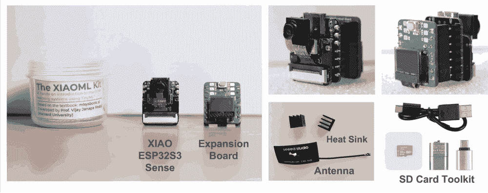

### XIAO ESP32S3 感应器 - 核心板特性

[XIAO ESP32S3 感应器](https://www.seeedstudio.com/XIAO-ESP32S3-Sense-p-5639.html)作为 XIAOML 套件的核心，将嵌入式 ML 计算能力与摄影和音频功能相结合，使其成为智能语音和视觉 AI 中 TinyML 应用的理想平台。

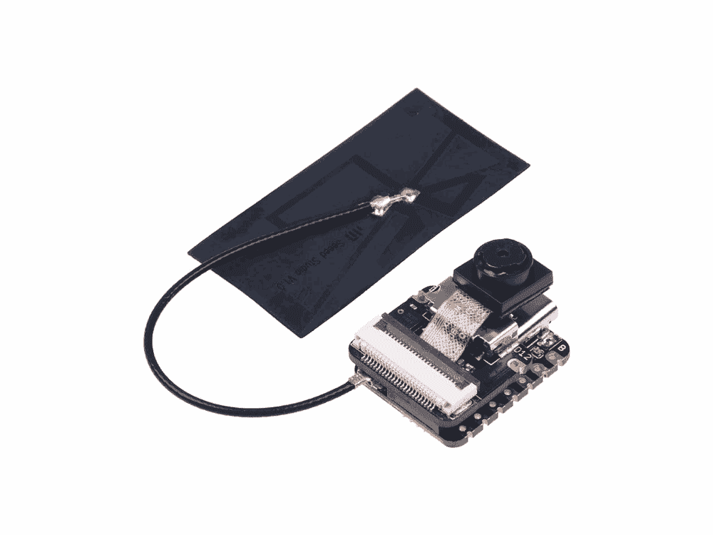

**主要特性**

+   **强大的 MCU**: ESP32S3 32 位，双核，Xtensa 处理器，最高运行频率 240 MHz，支持 Arduino / MicroPython

+   **高级功能**: 可拆卸的 OV2640 摄像头传感器，分辨率为 1600 × 1200，兼容 OV5640 摄像头传感器，还集成了数字麦克风

+   **详尽的电源设计**: 锂电池充电管理，具有四种功耗模式，深度睡眠模式功耗低至 14 μA

+   **大容量内存**: 8 MB PSRAM 和 8 MB FLASH，支持 SD 卡槽，用于外部 32 GB FAT 内存

+   **卓越的射频性能**: 2.4 GHz Wi-Fi 和 BLE 双无线通信，支持使用 U.FL 天线进行 100m+ 的远程通信

+   **紧凑设计**: 21 × 17.5 mm，采用经典的 XIAO 形状，适合空间受限的项目

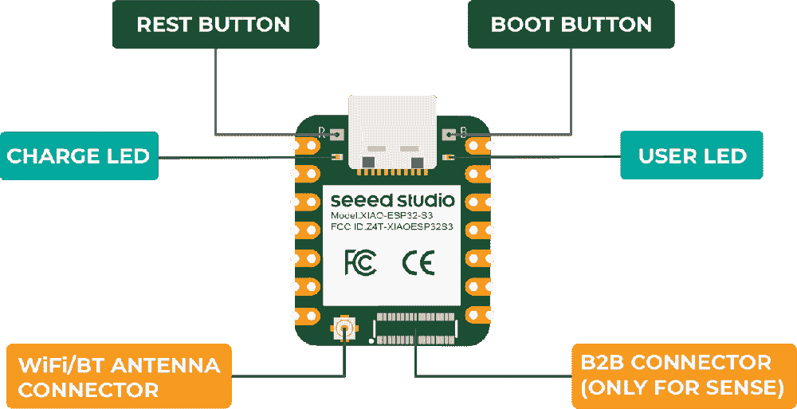

以下是通用板子引脚图：


> 如需更多详细信息，请参阅 [Seeed Studio 维基页面](https://wiki.seeedstudio.com/xiao_esp32s3_getting_started/)

### 扩展板功能

扩展板扩展了 XIAOML Kit 在基于运动机器学习应用方面的功能：

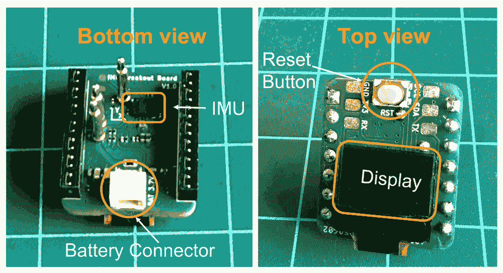

**组件**：

+   6 轴 IMU（LSM6DS3TR-C）：

    +   3 轴加速度计和 3 轴陀螺仪用于运动检测和分类

        +   加速度计量程：±2/±4/±8/±16 g

        +   陀螺仪量程：±125/±250/±500/±1000/±2000 dps

        +   I2C 接口（地址：0x6A）

+   0.42” OLED 显示屏

    +   单色显示屏（72×40 分辨率）用于实时数据可视化

        +   控制器：SSD1306

        +   I2C 接口（地址：0x3C）

+   重启按钮（EN）

+   电池连接器（BAT+，BAT-）

### 完整套件组装

扩展板与 XIAO ESP32S3 Sense 无缝连接，形成一个涵盖视觉、音频和运动传感的多模态机器学习实验的综合平台。

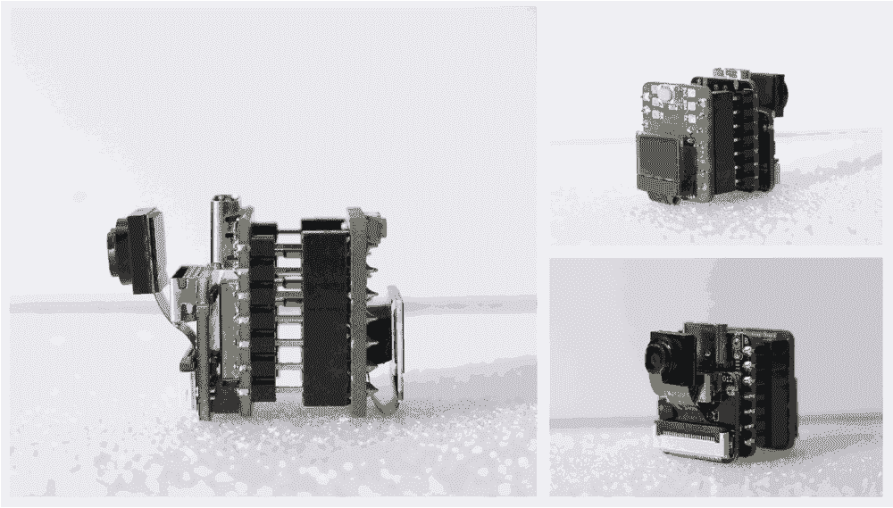

请注意模块的安装方向：

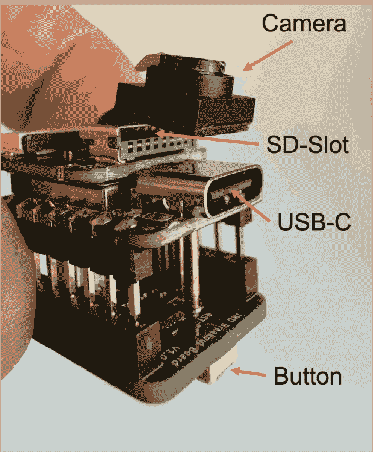

注意：

+   ESP32S3 Sense 底部显示的 `EN` 连接，通过 `RST` 按钮在扩展板上可用。

+   `BAT+` 和 `BAT-` 连接也通过 `BAT3.7V` 白色连接器提供。

**XIAOML Kit 应用**：

+   **视觉**：使用集成摄像头进行图像分类和目标检测

+   **音频**：使用内置麦克风进行关键词检测和语音识别

+   **运动**：使用 IMU 传感器进行活动识别和异常检测

+   **多模态**：用于复杂机器学习应用的组合传感器融合

## 在 Arduino IDE 上安装 XIAO ESP32S3 Sense

1.  通过 USB-C 端口将 XIAOML Kit 连接到您的计算机。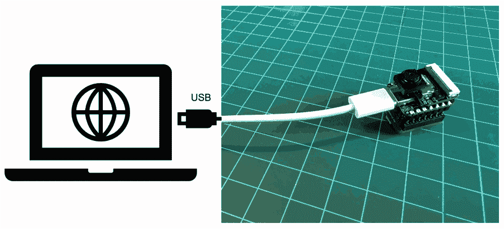

1.  根据您的操作系统下载并安装 Arduino IDE 的稳定版本。

    [**[下载 Arduino IDE]**](https://www.arduino.cc/en/software)

1.  打开 **Arduino IDE** 并选择板管理器（由 `UNO Icon` 表示）。

1.  输入 “*ESP32*”，选择 “**esp32 by Espressif Systems**。” 您可以 `安装` 或 `更新` 板支持包。

> 不要选择 “**Arduino ESP32 Boards** by Arduino”，这些是 Arduino Nano ESP32 的支持包，而不是我们的板。

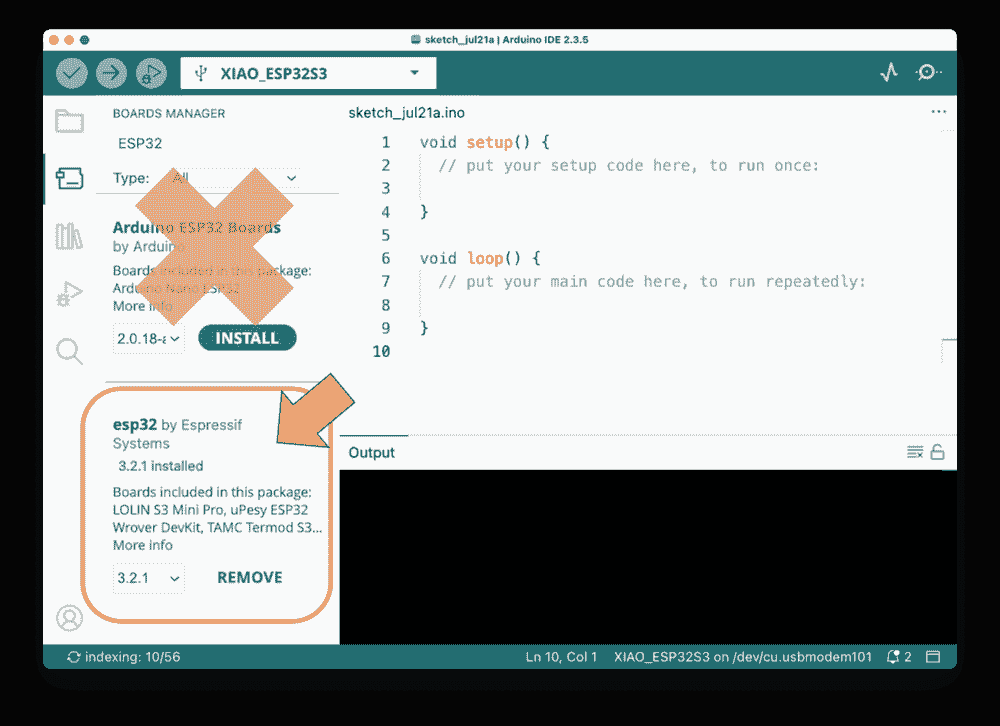

> ⚠️ **注意**
> 
> 当使用 XIAO ESP32S3 Sense 与 Edge Impulse 部署代码时，3.x 版本可能会遇到问题。如果是这种情况，请使用最后的 2.0.x 稳定版本（例如，2.0.17）。

1.  点击 `Select Board`，输入 *xiao* 或 *esp32s3*，在板管理器中选择 `XIAO_ESP32S3` 以及 ESP32S3 连接的相应端口。

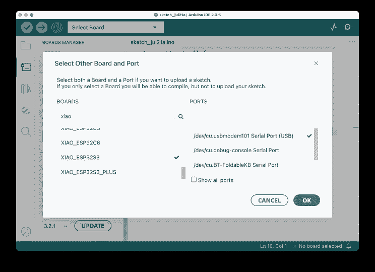

就这些了！设备应该没问题。让我们进行一些测试。

## 使用 BLINK 测试板

XIAO ESP32S3 Sense 配备了一个内置 LED，连接到 GPIO21。因此，您可以运行闪烁草图（可以在 `Files/Examples/Basics/Blink` 下找到。该草图使用 `LED_BUILTIN` Arduino 常量，它内部对应于连接到引脚 21 的 LED。或者，您可以根据需要更改闪烁草图。）

```py
#define LED_BUILT_IN 21  // This line is optional

void setup() {
  pinMode(LED_BUILT_IN, OUTPUT); // Set the pin as output
}

// Remember that the pins work with inverted logic
// LOW to turn on and HIGH to turn off
void loop() {
  digitalWrite(LED_BUILT_IN, LOW); //Turn on
  delay (1000); //Wait 1 sec
  digitalWrite(LED_BUILT_IN, HIGH); //Turn off
  delay (1000); //Wait 1 sec
}
```

> 注意，引脚使用的是反相逻辑：低电平打开，高电平关闭。

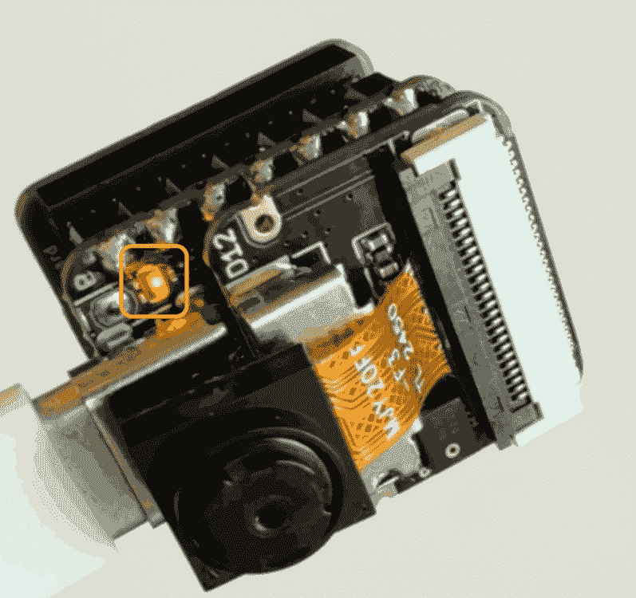

## 麦克风测试

让我们从声音检测开始。使用以下代码或转到[GitHub 项目](https://github.com/Mjrovai/XIAO-ESP32S3-Sense)下载草图：[XIAOML_Kit_Mic_Test](https://github.com/Mjrovai/XIAO-ESP32S3-Sense/tree/main/Mic_Test/XiaoEsp32s3_Mic_Test)并在 Arduino IDE 上运行它：

```py
/*
 XIAO ESP32S3 Simple Mic Test
 (for ESP32 Library version 3.0.x and later)
*/

#include <ESP_I2S.h>
I2SClass I2S;

void setup() {
  Serial.begin(115200);
  while (!Serial) {
    }

  // setup 42 PDM clock and 41 PDM data pins
  I2S.setPinsPdmRx(42, 41);

  // start I2S at 16 kHz with 16-bits per sample
  if (!I2S.begin(I2S_MODE_PDM_RX,
                 16000,
                 I2S_DATA_BIT_WIDTH_16BIT,
                 I2S_SLOT_MODE_MONO)) {
    Serial.println("Failed to initialize I2S!");
    while (1); // do nothing
  }
}

void loop() {
  // read a sample
  int sample = I2S.read();

  if (sample && sample != -1 && sample != 1) {
    Serial.println(sample);
  }
}
```

打开**串行绘图器**，您将看到声音的响度变化曲线。


当产生声音时，您可以在串行绘图器中验证它。

**将录制的声音（.wav 音频文件）保存到 microSD 卡中。**

现在，使用板载 SD 卡读卡器，我们可以保存.wav 音频文件。为此，我们首先需要启用 XIAO PSRAM。

> ESP32-S3 在 MCU 芯片上只有几百千字节的内置 RAM。这可能在某些用途上不足，因此可以通过 SPI 闪存芯片连接高达 16MB 的外部 PSRAM（伪静态 RAM）（XIAO 有 8MB 的 PSRAM）。外部内存包含在内存映射中，并在某些限制下可以像内部数据 RAM 一样使用。

+   要打开它，请转到`工具->PSRAM:"OPI PSRAM"->OPI PSRAM`

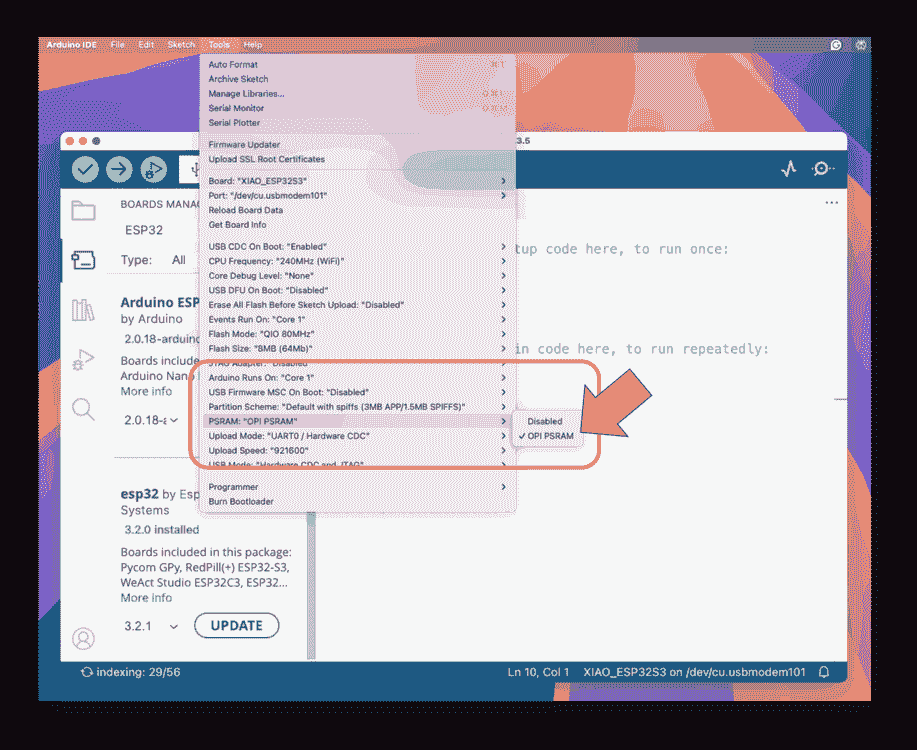

> XIAO ESP32S3 Sense 支持高达**32GB**的 microSD 卡。如果您准备为 XIAO 购买 microSD 卡，请参考以下规格。在使用之前，将 microSD 卡格式化为**FAT32 格式**。

现在，将格式化为 FAT32 的 SD 卡插入 XIAO，如图下所示

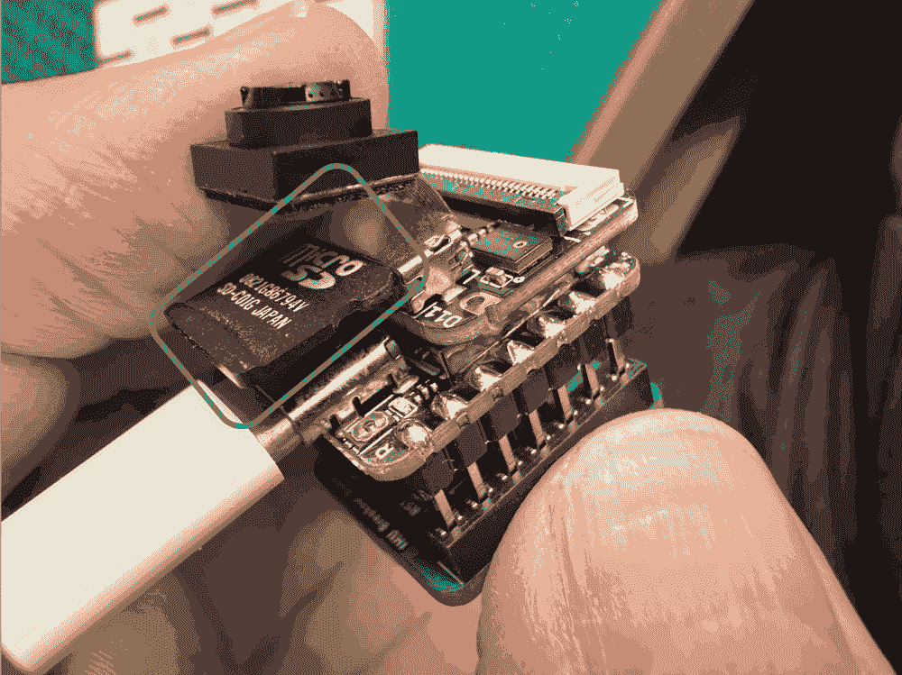

```py
/*
 * WAV Recorder for Seeed XIAO ESP32S3 Sense
 * (for ESP32 Library version 3.0.x and later)
*/

#include "ESP_I2S.h"
#include "FS.h"
#include "SD.h"

void setup() {
  // Create an instance of the I2SClass
  I2SClass i2s;

  // Create variables to store the audio data
  uint8_t *wav_buffer;
  size_t wav_size;

  // Initialize the serial port
  Serial.begin(115200);
  while (!Serial) {
    delay(10);
  }

  Serial.println("Initializing I2S bus...");

  // Set up the pins used for audio input
  i2s.setPinsPdmRx(42, 41);

  // start I2S at 16 kHz with 16-bits per sample
  if (!i2s.begin(I2S_MODE_PDM_RX,
                 16000,
                 I2S_DATA_BIT_WIDTH_16BIT,
                 I2S_SLOT_MODE_MONO)) {
    Serial.println("Failed to initialize I2S!");
    while (1); // do nothing
  }

  Serial.println("I2S bus initialized.");
  Serial.println("Initializing SD card...");

  // Set up the pins used for SD card access
  if(!SD.begin(21)){
    Serial.println("Failed to mount SD Card!");
    while (1) ;
  }
  Serial.println("SD card initialized.");
  Serial.println("Recording 20 seconds of audio data...");

  // Record 20 seconds of audio data
  wav_buffer = i2s.recordWAV(20, &wav_size);

  // Create a file on the SD card
  File file = SD.open("/arduinor_rec.wav", FILE_WRITE);
  if (!file) {
    Serial.println("Failed to open file for writing!");
    return;
  }

  Serial.println("Writing audio data to file...");

  // Write the audio data to the file
  if (file.write(wav_buffer, wav_size) != wav_size) {
    Serial.println("Failed to write audio data to file!");
    return;
  }

  // Close the file
  file.close();

  Serial.println("Application complete.");
}

void loop() {
  delay(1000);
  Serial.printf(".");
}
```

+   将代码保存为例如`Wav_Record.ino`，并在 Arduino IDE 中运行它。

+   此程序在用户打开串行监视器（或按下`RESET`按钮）后仅执行一次。它记录 20 秒，并将录音文件保存到 microSD 卡上的“arduino_rec.wav”。

+   当串行监视器每秒输出“.”时，程序执行完成，您可以使用卡读卡器播放录制的声音文件。

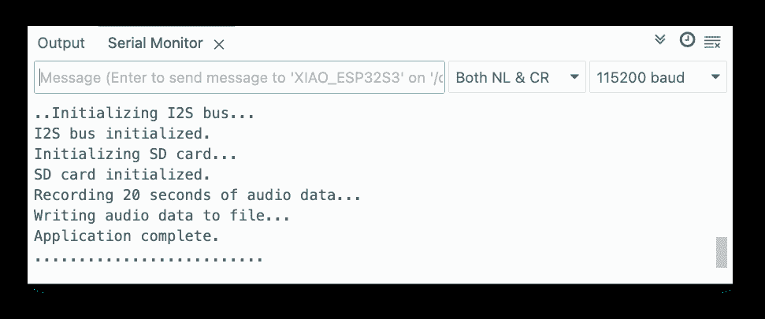

音质极佳！

> 代码如何工作的解释超出了本实验的范围，但您可以在[wiki](https://wiki.seeedstudio.com/xiao_esp32s3_sense_mic/)页面上找到出色的描述。

要了解更多关于 XIAO ESP32S3 Sense 文件系统的信息，请参阅此[链接](https://wiki.seeedstudio.com/xiao_esp32s3_sense_filesystem/)。

## 测试相机

对于测试（以及使用相机，我们可以使用几种方法：

+   SenseCraft AI Studio

+   Arduino IDE 上的 CameraWebServer 应用程序（参见下一节）

+   捕获图像并将[它们保存到 SD 卡上](https://github.com/limengdu/SeeedStudio-XIAO-ESP32S3-Sense-camera/tree/main)（类似于我们处理音频的方式）

### 使用 SenseCraft AI Studio 测试相机

查看摄像头工作的最简单方法是使用[SenseCraft AI](https://sensecraft.seeed.cc/ai/home) Studio，这是一个强大的平台，提供各种与各种设备兼容的 AI 模型，包括**XIAO ESP32S3 Sense**和 Grove 视觉 AI V2。

> 我们还可以使用[**SenseCraft Web Toolkit**](https://seeed-studio.github.io/SenseCraft-Web-Toolkit/#/setup/process)，这是 SenseCraft AI Studio 的简化版本。

按照以下步骤开始使用**SenseCraft AI**：

+   在网页浏览器中打开[SenseCraft AI 视觉工作空间](https://sensecraft.seeed.cc/ai/device/local/32)，例如**Chrome**，并登录（或创建账户）。

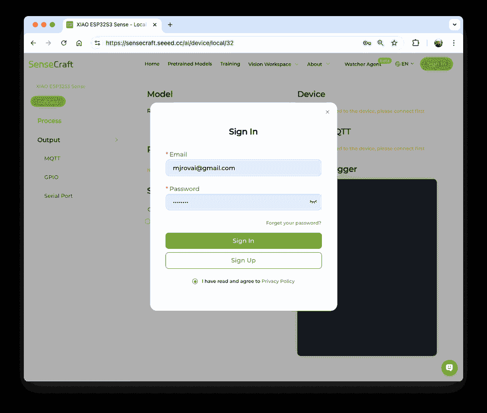

+   将 XIAOML 套件物理连接到笔记本电脑，如下选择：

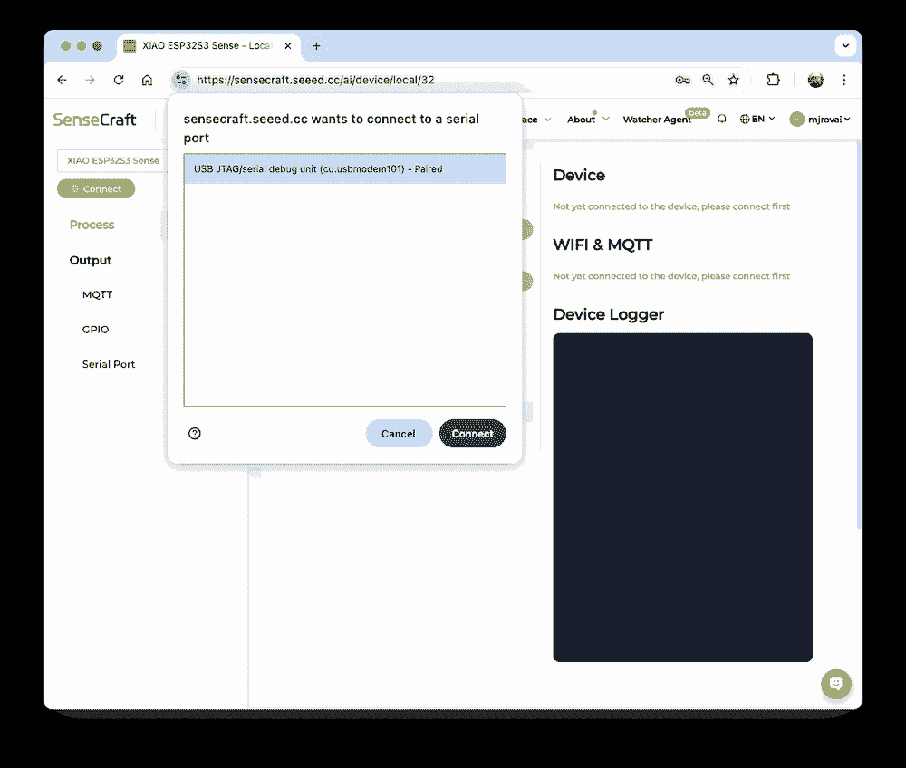

> 注意：**WebUSB 工具**在某些浏览器中可能无法正常工作，例如 Safari。请使用 Chrome。同时，请确认 Arduino IDE 或任何其他串行设备没有连接到 XIAO。

要查看摄像头是否工作，我们应该上传一个模型。我们可以尝试 Seeed Studio 之前上传的几个计算机视觉模型。使用按钮“[选择模型]”并从可用模型中选择。

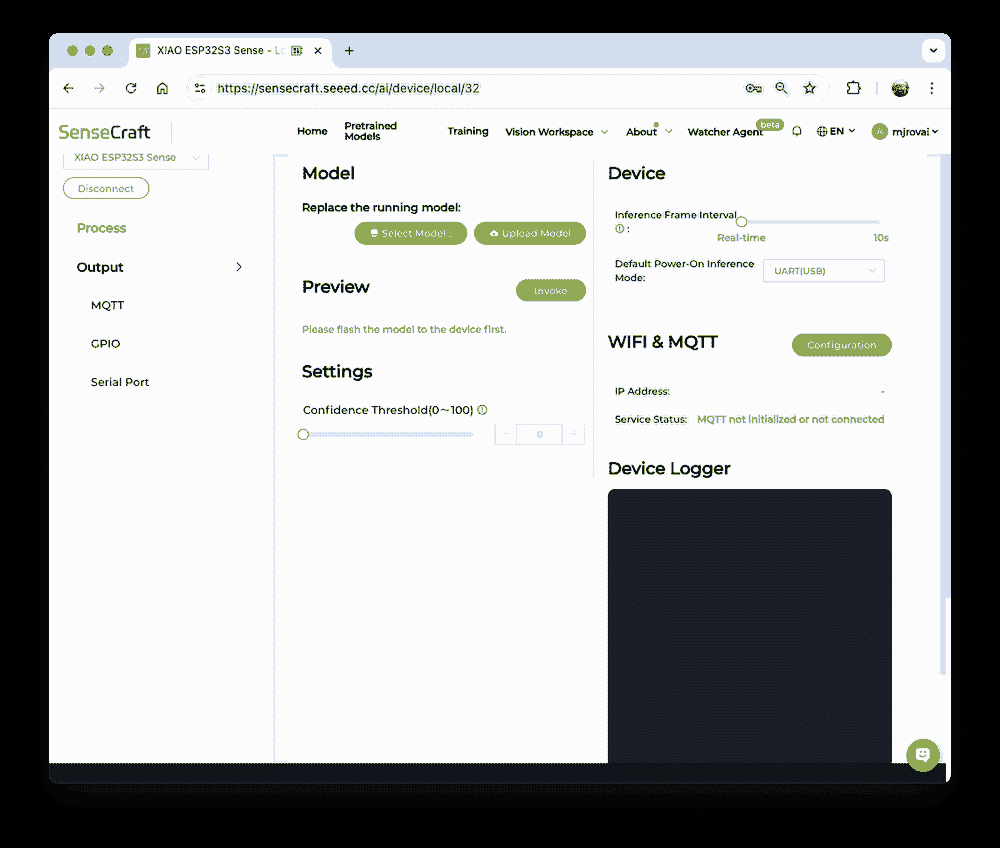

将鼠标悬停在 AI 模型上，我们可以了解一些关于它们的信息，例如名称、描述、**类别**或**任务**（图像分类、目标检测或姿态/关键点检测）、**算法**（如 YOLO V5 或 V8、FOMO、MobileNet V2 等）以及在某些情况下，**指标**（准确度或 mAP）。

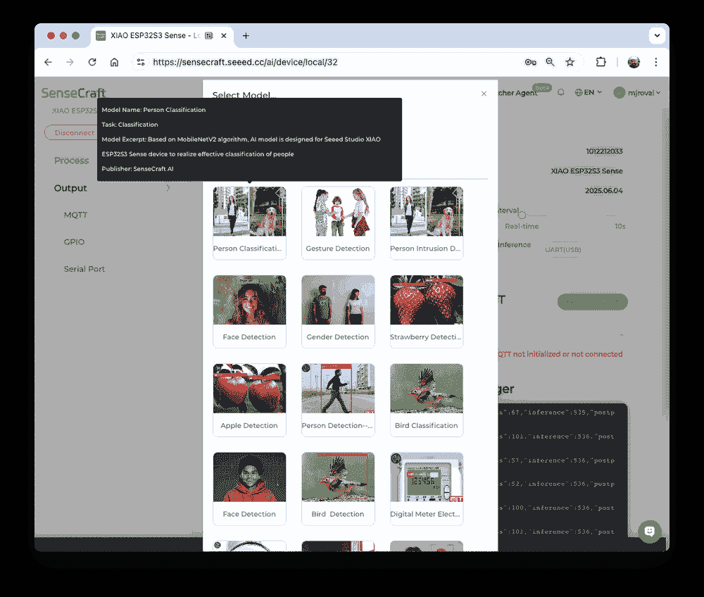

我们可以通过点击它并按下[确认]按钮选择一个现成的 AI 模型，例如“人员分类”，或者上传我们自己的模型。


在**预览区域**，我们可以看到摄像头生成的流。


> 我们将在视觉 AI 实验室中更详细地介绍 SenseCraft AI Studio。

## 测试 WiFi

### 天线安装

XIAOML 套件已完全组装。首先，将包含摄像头、麦克风和 SD 卡读卡器的 Sense 扩展板从 XIAO 上取下。

在 XIAO ESP32S3 正面左下角有一个独立的“WiFi/BT 天线连接器”。为了提高你的 WiFi/蓝牙信号，请从包装中取出天线并将其连接到连接器。

安装天线有一个小技巧。如果你直接用力按下它，你会发现很难按下，手指会感到疼痛！正确安装天线的方法是先将天线连接器的一侧插入连接块，然后轻轻按下另一侧，以确保天线牢固安装。

取下天线也是如此。不要用力直接拉天线；相反，用力拉起一侧，使天线容易取下。

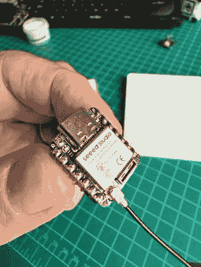

重新安装扩展板非常简单；你只需要将扩展板上的连接器与 XIAO ESP32S3 上的 B2B 连接器对齐，用力按下，听到“咔哒”声。安装完成。

XIAO ESP32S3 的一个特点是它的 Wi-Fi 功能。因此，让我们通过扫描其周围的 Wi-Fi 网络来测试其无线电。你可以通过在板上运行代码示例之一来完成此操作。

打开 Arduino IDE 并选择我们的板和端口。转到 `Examples`，在“XIAO ESP32S3 的示例”下查找 **WiFI ==> WiFIScan**。将草图上传到板。

你应该在串行监视器中看到你设备范围内的 Wi-Fi 网络（SSID 和 RSSI）。以下是我实验室得到的结果：

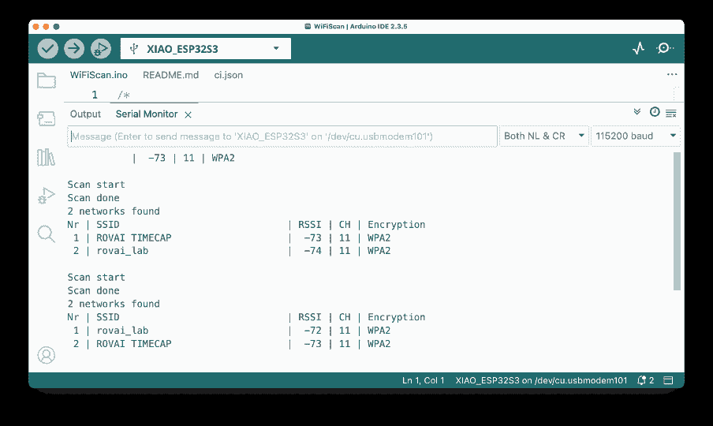

### 简单 Wi-Fi 服务器（打开/关闭 LED）

让我们测试设备作为 Wi-Fi 服务器的功能。我们将在设备上托管一个简单的页面，该页面发送命令来打开和关闭 XIAO 内置 LED。

前往 `Examples`，在“XIAO ESP32S3 的示例”下查找 **WiFI ==> SimpleWiFIServer**。

在运行草图之前，你应该输入你的网络凭据：

```py
const char* ssid     = "Your credentials here";
const char* password = "Your credentials here";
```

并且将 **引脚 5** 修改为 **引脚 21**，内置 LED 安装在这里。同时，让我们修改网页（第 85 和 86 行）以反映正确的 LED 引脚和它是通过低电平激活的：

```py
client.print("Click <a href=\"/H\">here</a> to turn the LED on pin 21 OFF.<br>");
client.print("Click <a href=\"/L\">here</a> to turn the LED on pin 21 ON.<br>");
```

你可以使用串行监视器来监控你的服务器性能。

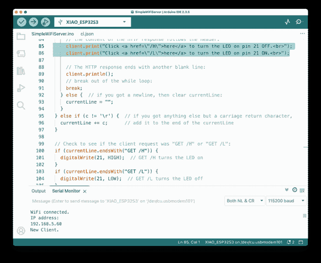

将串行监视器中显示的 IP 地址输入到你的浏览器中。你将看到一个带有可以打开和关闭 XIAO 内置 LED 的链接的页面。

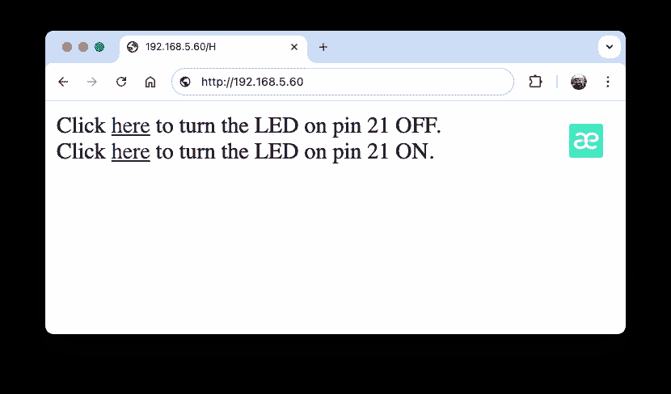

### 使用 CameraWebServer

在 Arduino IDE 中，转到 `文件 > 示例 > ESP32 > Camera`，并选择 `CameraWebServer`

在 `board_config.h` 选项卡上，注释掉所有相机模型，除了 XIAO 模型引脚：

`#define CAMERA_MODEL_XIAO_ESP32S3 // 有 PSRAM`

> 不要忘记检查 `工具` 以查看是否启用了 PSRAM。

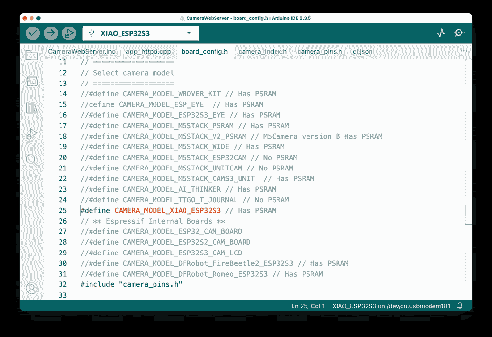

如前所述，在 `CameraWebServer.ino` 选项卡中，输入你的 Wi-Fi 凭据并将代码上传到设备。

如果代码执行正确，你应该在串行监视器中看到地址：

```py
WiFi connecting....
WiFi connected
Camera Ready! Use 'http://192.168.5.60' to connect
```

将地址复制到你的浏览器中，等待页面加载。选择相机分辨率（例如，QVGA）并选择 `[START STREAM]`。根据你的连接等待几秒钟。使用 `[Save]` 按钮，你可以将图像保存到你的电脑下载区。

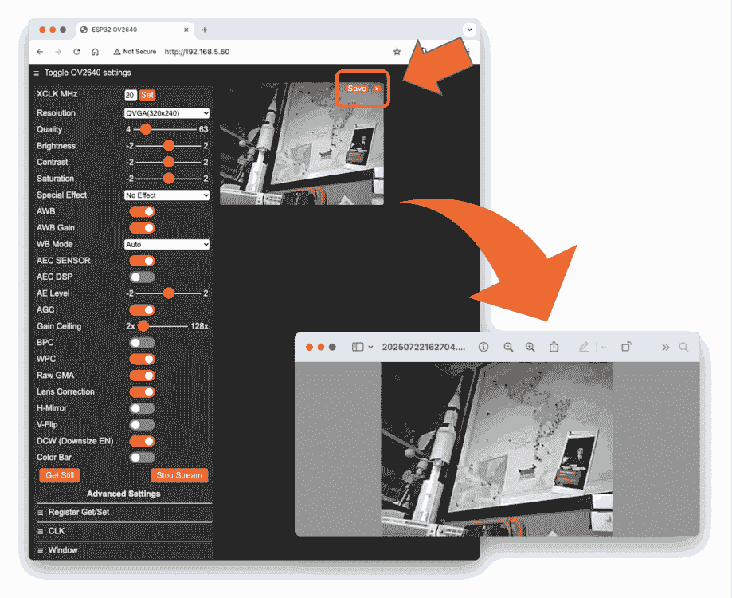

就这样！你可以直接将图像保存到你的电脑上用于项目。

## 测试 IMU 传感器（LSM6DS3TR-C）

**惯性测量单元 (IMU**) 是一种测量运动和方向的传感器。你 XIAOML 套件上的 LSM6DS3TR-C 是一个 **6 轴 IMU**，这意味着它结合了：

+   **三轴加速度计**：测量沿 X、Y 和 Z 轴的线性加速度（包括重力）

+   **三轴陀螺仪**：测量围绕 X、Y 和 Z 轴的角速度（旋转速率）

### 技术规格：

+   **通信**：地址 `0x6A` 的 I2C 接口

+   **加速度计范围**: ±2/±4/±8/±16 g（我们默认使用±2g）

+   **陀螺仪范围**: ±125/±250/±500/±1000/±2000 dps（我们默认使用±250 dps）

+   **分辨率**: 16 位 ADC

+   **功耗**: 超低功耗设计

### 坐标系：

传感器遵循右手坐标系。当从可见点标记的角度观察 IMU 传感器（扩展板底部视图）时：

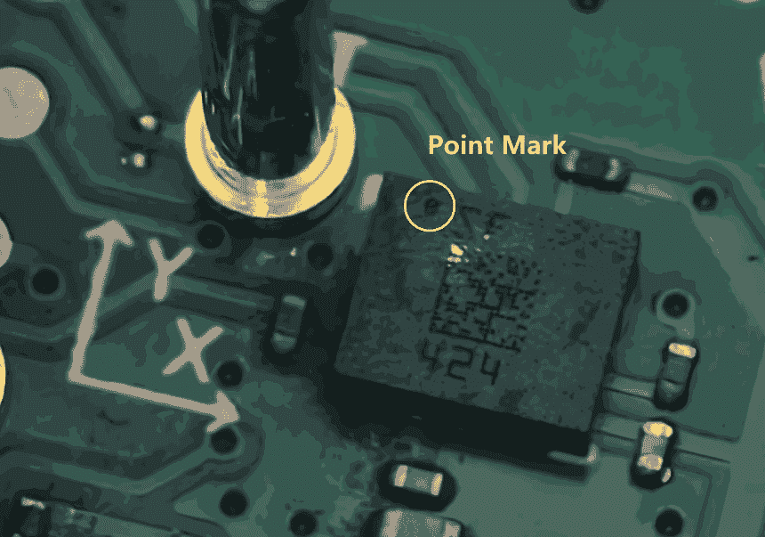

+   **X 轴**: 指向右侧

+   **Y 轴**: 指向前方（远离你）

+   **Z 轴**: 指向上方（出板）

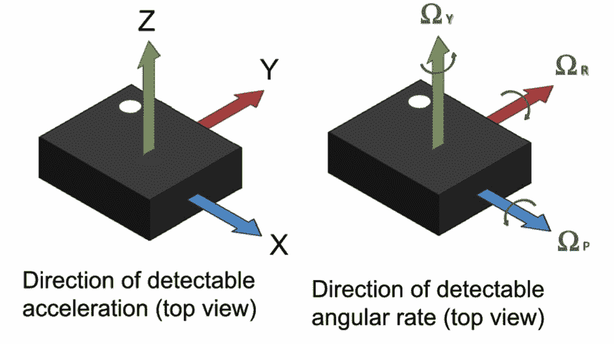

### 必需的库

在上传代码之前，安装所需的库：

1.  打开**Arduino IDE**并选择**管理库**（由“书籍图标”表示）。

1.  对于 IMU 库，输入“*LSM6DS3”并选择“**Seeed Arduino LSM6DS3 by Seeed**”。您可以“**安装**”或“**更新**”板支持包。

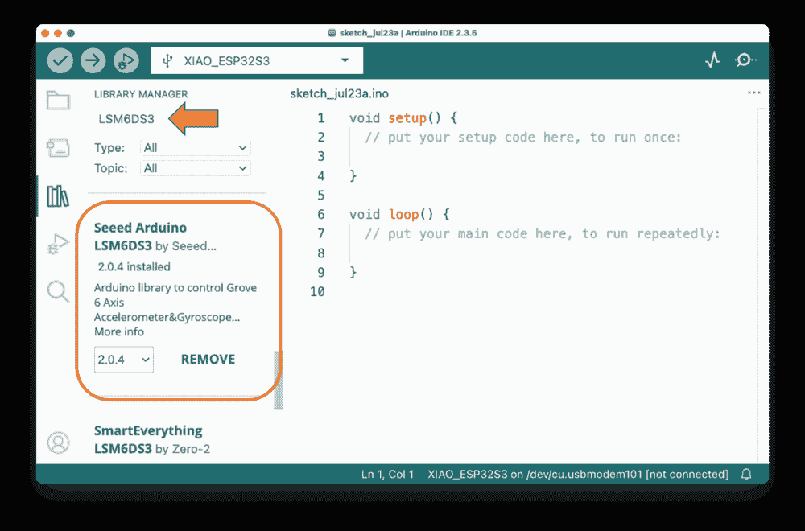

⚠️ **重要**: 不要安装“Arduino_LSM6DS3 by Arduino” - 那是为不同板子准备的！

### 测试代码

在 Arduino IDE 中输入以下代码并上传到套件：

```py
#include <LSM6DS3.h>
#include <Wire.h>

// Create IMU object using I2C interface
// LSM6DS3TR-C sensor is located at I2C address 0x6A
LSM6DS3 myIMU(I2C_MODE, 0x6A);

// Variables to store sensor readings
float accelX, accelY, accelZ;  // Accelerometer values (g-force)
float gyroX, gyroY, gyroZ;     // Gyroscope values (degrees per second)

void setup() {
  // Initialize serial communication at 115200 baud rate
  Serial.begin(115200);

  // Wait for serial port to connect (useful for debugging)
  while (!Serial) {
    delay(10);
  }

  Serial.println("XIAOML Kit IMU Test");
  Serial.println("LSM6DS3TR-C 6-Axis IMU Sensor");
  Serial.println("=============================");

  // Initialize the IMU sensor
  if (myIMU.begin() != 0) {
    Serial.println("ERROR: IMU initialization failed!");
    Serial.println("Check connections and I2C address");
    while(1) {
      delay(1000); // Halt execution if IMU fails to initialize
    }
  } else {
    Serial.println("✓ IMU initialized successfully");
    Serial.println();

    // Print sensor information
    Serial.println("Sensor Information:");
    Serial.println("- Accelerometer range: ±2g");
    Serial.println("- Gyroscope range: ±250 dps");
    Serial.println("- Communication: I2C at address 0x6A");
    Serial.println();

    // Print data format explanation
    Serial.println("Data Format:");
    Serial.println("AccelX,AccelY,AccelZ,GyroX,GyroY,GyroZ");
    Serial.println("Units: g-force (m/s²), degrees/second");
    Serial.println();

    delay(2000); // Brief pause before starting measurements
  }
}

void loop() {
  // Read accelerometer data (in g-force units)
  accelX = myIMU.readFloatAccelX();
  accelY = myIMU.readFloatAccelY();
  accelZ = myIMU.readFloatAccelZ();

  // Read gyroscope data (in degrees per second)
  gyroX = myIMU.readFloatGyroX();
  gyroY = myIMU.readFloatGyroY();
  gyroZ = myIMU.readFloatGyroZ();

  // Print readable format to Serial Monitor
  Serial.print("Accelerometer (g): ");
  Serial.print("X="); Serial.print(accelX, 3);
  Serial.print(" Y="); Serial.print(accelY, 3);
  Serial.print(" Z="); Serial.print(accelZ, 3);

  Serial.print(" | Gyroscope (°/s): ");
  Serial.print("X="); Serial.print(gyroX, 2);
  Serial.print(" Y="); Serial.print(gyroY, 2);
  Serial.print(" Z="); Serial.print(gyroZ, 2);
  Serial.println();

  // Print CSV format for Serial Plotter
  Serial.println(String(accelX) + "," + String(accelY) + "," +
                 String(accelZ) + "," + String(gyroX) + "," +
                 String(gyroY) + "," + String(gyroZ));

  // Update rate: 10 Hz (100ms delay)
  delay(100);
}
```

串行监视器将显示值，绘图仪将显示它们随时间的变化。例如，通过在**Y 轴**上移动套件，我们将看到值 2（红色线条）相应地变化。请注意，**Z 轴**由值 3（绿色线条）表示，接近 1.0g。蓝色线条（值 1）与**X 轴**相关。

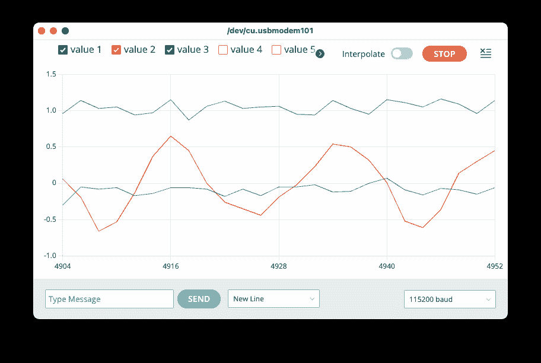

您可以选择 4 到 6 的值来查看陀螺仪的行为。

## 测试 OLED 显示屏（SSD1306）

OLED（有机发光二极管）显示屏是自发光屏幕，每个像素都产生自己的光。XIAO ML 套件配备了一个紧凑的 0.42 英寸单色 OLED 显示屏，非常适合显示传感器数据、状态信息和简单图形。

### 技术规格：

+   **尺寸**: 0.42 英寸对角线

+   **分辨率**: 72 × 40 像素

+   **控制器**: SSD1306

+   **接口**: 地址`0x3C`的 I2C

+   **颜色**: 单色（白色背景上的黑色像素，或反之）

+   **观看**: 高对比度，在明亮的光线下可见

+   **电源**: 低功耗，无需背光

### 显示特性：

+   **像素完美**: 每个 2,880 个像素（72×40）都可以单独控制

+   **快速刷新**: 适合动画和实时数据

+   **无拖影**: 瞬时像素响应

+   **宽视角**: 从多个观看位置清晰可见

### 必需的库

在上传代码之前，安装所需的库：

1.  打开**Arduino IDE**并选择“管理库”（由“书籍图标”表示）。

1.  输入*u8g2*并选择**U8g2 by oliver**。您可以“**安装**”或“**更新**”板支持包。

    ℹ️ **注意**: U8g2 是一个强大的图形库，支持许多显示类型

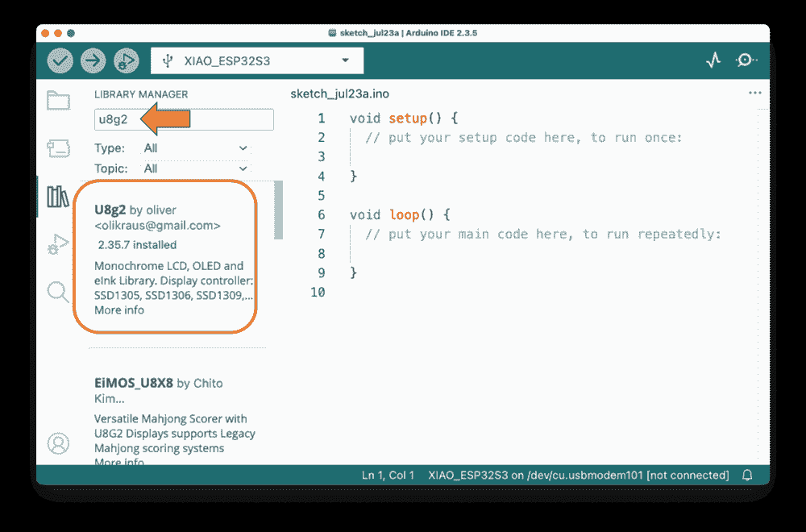

**U8g2**库是一个单色图形库，具有以下特性：

+   支持许多显示控制器（包括 SSD1306）

+   使用各种字体进行文本渲染

+   绘图原语（线条、矩形、圆形）

+   内存高效的基于页面的渲染

+   硬件和软件 I2C 支持

### 测试代码

使用以下代码在 Arduino IDE 中输入并上传到套件：

```py
#include <U8g2lib.h>
#include <Wire.h>

// Initialize the OLED display
// SSD1306 controller, 72x40 resolution, I2C interface
U8G2_SSD1306_72X40_ER_1_HW_I2C u8g2(U8G2_R2, U8X8_PIN_NONE);

void setup() {
  Serial.begin(115200);

  Serial.println("XIAOML Kit - Hello World");
  Serial.println("==========================");

  // Initialize the display
  u8g2.begin();

  Serial.println("✓ Display initialized");
  Serial.println("Showing Hello World message...");

  // Clear the display
  u8g2.clearDisplay();
}

void loop() {
  // Start drawing sequence
  u8g2.firstPage();
  do {
    // Set font
    u8g2.setFont(u8g2_font_ncenB08_tr);

    // Display "Hello World" centered
    u8g2.setCursor(8, 15);
    u8g2.print("Hello");

    u8g2.setCursor(12, 30);
    u8g2.print("World!");

    // Add a simple decoration - draw a frame around the text
    u8g2.drawFrame(2, 2, 68, 36);

  } while (u8g2.nextPage());

  // No delay needed - the display will show continuously
}
```

如果一切正常，您应该在显示器上看到，“Hello World”在矩形内。

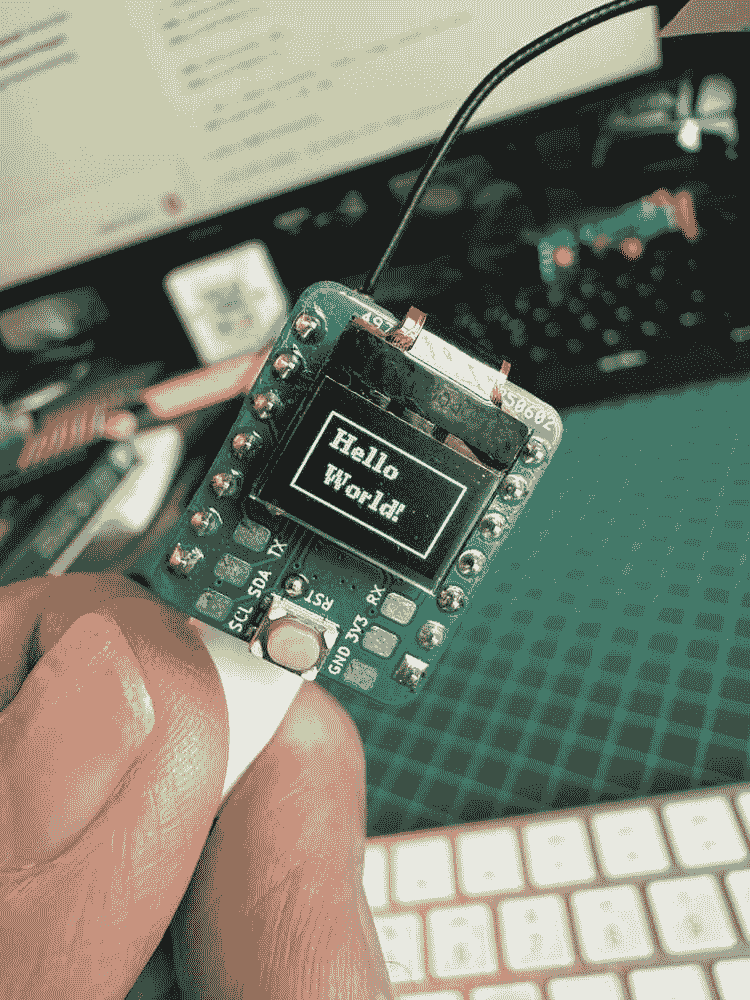

### OLED - 文本大小和定位

+   注意文本是通过`setCursor(x, y)`定位的，在这种情况下是居中的：

    ```py
    u8g2.setCursor(8, 15);
    ```

+   代码中使用的字体是中等的。

    ```py
    u8g2.setFont(u8g2_font_ncenB08_tr);
    ```

    但其他字体大小也是可用的：

    +   `u8g2_font_4x6_tr`: 小字体（4×6 像素）

    +   `u8g2_font_6x10_tr`: 小字体（6×10 像素）

    +   `u8g2_font_ncenB08_tr`: 中等粗体字体

    +   `u8g2_font_ncenB14_tr`: 大号粗体字体

### 形状

代码添加了一个简单的装饰，在文本周围绘制一个框架

```py
u8g2.drawFrame(2, 2, 68, 36);
```

但其他形状也是可用的：

+   **矩形轮廓**：`drawFrame(x, y, width, height)`

+   **填充矩形**：`drawBox(x, y, width, height)`

+   **圆形**：`drawCircle(x, y, radius)`

+   **线条**：`drawLine(x1, y1, x2, y2)`

+   **单个像素**：`drawPixel(x, y)`

### 坐标

显示器使用一个坐标系，其中：

+   **原点（0,0）**：左上角

+   **X 轴**：从左到右增加（0 到 71）

+   **Y 轴**：从上到下增加（0 到 39）

+   **文本定位**：`setCursor(x, y)`其中 y 是文本的基线

### 显示器旋转

+   您可以通过使用以下方式更改旋转参数：

    +   `U8G2_R0`: 正常方向

    +   `U8G2_R1`: 顺时针 90°

    +   `U8G2_R2`: 180°（颠倒）

    +   `U8G2_R3`: 顺时针 270°

### 自定义字符：

```py
// Draw custom bitmap
static const unsigned char myBitmap[] = {0x00, 0x3c, 0x42, 0x42, 0x3c, 0x00};
u8g2.drawBitmap(x, y, 1, 6, myBitmap);
```

### 文本测量：

```py
int width = u8g2.getStrWidth("Hello");  // Get text width
int height = u8g2.getAscent();         // Get font height
```

现在 OLED 显示器已准备好显示您的传感器数据、系统状态或为您的机器学习项目设计的任何自定义图形！

## 摘要

带有 ESP32S3 Sense 的 XIAOML 套件代表了进入 TinyML 和嵌入式机器学习世界的一个强大且易于访问的起点。通过这个设置过程，我们已经系统地测试了 XIAOML 套件的每个组件，确认所有传感器和外设都正常工作。ESP32S3 的双核处理器和 8MB 的 PSRAM 提供了足够的计算能力进行实时机器学习推理，而 OV2640 摄像头、数字麦克风、LSM6DS3TR-C IMU 和 0.42” OLED 显示器创建了一个完整的多模态传感平台。WiFi 连接为边缘到云的机器学习工作流程提供了可能性，我们的 Arduino IDE 开发环境现在已正确配置了所有必要的库。

除了功能测试之外，我们还对每个传感器的坐标系、数据格式和操作特性有了实际的认识——这些知识在设计即将到来的项目中的机器学习数据收集和预处理管道时将非常有价值。

此设置过程展示了远超这个特定套件的关键原则。在 ESP32S3 的内存限制和处理器能力下工作，提供了在边缘 AI 中固有的资源限制的真实体验——这与在智能手机、物联网设备或自主系统中部署模型时面临的考虑相同。在单个平台上拥有多种模式（视觉、音频、运动）使得可以探索多模态机器学习方法，这在现实世界的 AI 应用中越来越重要。

最重要的是，从原始传感器数据到模型推理，再到通过 OLED 显示屏的用户反馈，该套件提供了一个完整的微型 ML 部署周期，反映了生产 AI 系统面临的挑战。

在这个基础已经建立之后，你现在可以应对以下章节中核心 TinyML 应用的核心挑战：

+   **视觉项目**：利用摄像头进行图像分类和目标检测

+   **音频项目**：处理音频流以进行关键词检测和语音识别

+   **运动项目**：使用 IMU 数据用于活动识别和异常检测

每个应用都将建立在我们所建立的硬件理解和软件基础设施之上，展示了人工智能不仅可以在数据中心部署，还可以在直接与物理世界交互的资源受限设备上部署。

在这个套件中遇到的原则——实时处理、传感器融合和边缘推理——是推动自动驾驶汽车、智能城市、医疗设备和工业自动化中 AI 部署未来的相同原则。通过成功完成此设置，你现在准备好探索嵌入式机器学习的这个激动人心的前沿领域。

## 资源

+   [XIAOML 套件代码](https://github.com/Mjrovai/XIAO-ESP32S3-Sense/tree/main/XIAOML_Kit_code)

+   [XIAO ESP32S3 传感器手册和示例代码](https://wiki.seeedstudio.com/xiao_esp32s3_getting_started/)

+   [Seeed Studio XIAO ESP32S3 麦克风的用法](https://wiki.seeedstudio.com/xiao_esp32s3_sense_mic/)

+   [文件系统和 XIAO ESP32S3 传感器](https://wiki.seeedstudio.com/xiao_esp32s3_sense_filesystem/)

+   [Seeed Studio XIAO ESP32S3 传感器中的摄像头用法](https://wiki.seeedstudio.com/xiao_esp32s3_camera_usage/)
