# 图像分类


*DALL·E 提示 - 基于 Marcelo Rovai 的真实图像的 1950 年代风格卡通插图*

## 概述

我们正日益面临一场人工智能（AI）革命，正如 [Gartner](https://www.researchgate.net/figure/Gartner-2023-Artificial-intelligence-emerging-technologies-impact-radar-T-Nguyen-2023_fig1_372048156) 所述，**边缘 AI 和计算机视觉**具有非常高的影响潜力，**而且目前确实是如此**！

当我们研究应用于视觉的机器学习（ML）时，首先遇到的概念是**图像分类**，这是一种 ML 的“Hello World”，既简单又深刻！

Seeed Studio XIAOML Kit 提供了一套以[XIAO ESP32-S3 Sense](https://www.seeedstudio.com/xiao-series-page)为中心的全面硬件解决方案，集成了**OV3660**摄像头和 SD 卡支持。这些特性使 XIAO ESP32S3 Sense 成为探索 TinyML 视觉 AI 的绝佳起点。

在这个实验室中，我们将使用非代码工具**SenseCraft AI**探索图像分类，并使用**Edge Impulse Studio**和**Arduino IDE**进行更详细的发展。

**学习目标**

+   **使用 SenseCraft AI Studio 部署预训练模型**，以实现即时的计算机视觉应用

+   **收集和管理图像数据集**，以适当的组织方式执行自定义分类任务

+   **使用 MobileNet V2 架构通过迁移学习训练自定义图像分类模型**

+   **通过量化内存高效的预处理优化模型**，以适应边缘部署

+   **实现后处理管道**，包括 GPIO 控制和实时推理集成

+   **比较无代码和高级 ML 平台在嵌入式应用中的开发方法**

## 图像分类

图像分类是计算机视觉中的一个基本任务，涉及将整个图像分类到几个预定义类别之一。这个过程包括分析图像的视觉内容，并根据它所描绘的主要对象或场景，从一组固定的类别中分配一个标签。

图像分类在各种应用中至关重要，从组织和搜索数字图书馆和社交媒体平台中的大型图像数据库，到使自主系统理解其周围环境。在显著推进图像分类领域的常见架构包括卷积神经网络（CNNs），如 AlexNet、VGGNet 和 ResNet。这些模型通过学习视觉数据分层表示，在诸如 [ImageNet](https://www.image-net.org/index.php) 这样的挑战性数据集上展示了显著的准确性。

作为许多计算机视觉系统的基石，图像分类推动了创新，为更复杂任务如目标检测和图像分割奠定了基础，并促进了跨各个行业对视觉数据的更深入理解。因此，让我们开始探索 [人物分类](https://sensecraft.seeed.cc/ai/view-model/60768-person-classification?tab=public) 模型（“人物 - 非人物”），这是一个在 **[SenseCraft AI](https://sensecraft.seeed.cc/ai/device/local/32)** 上可用的现成计算机视觉应用。

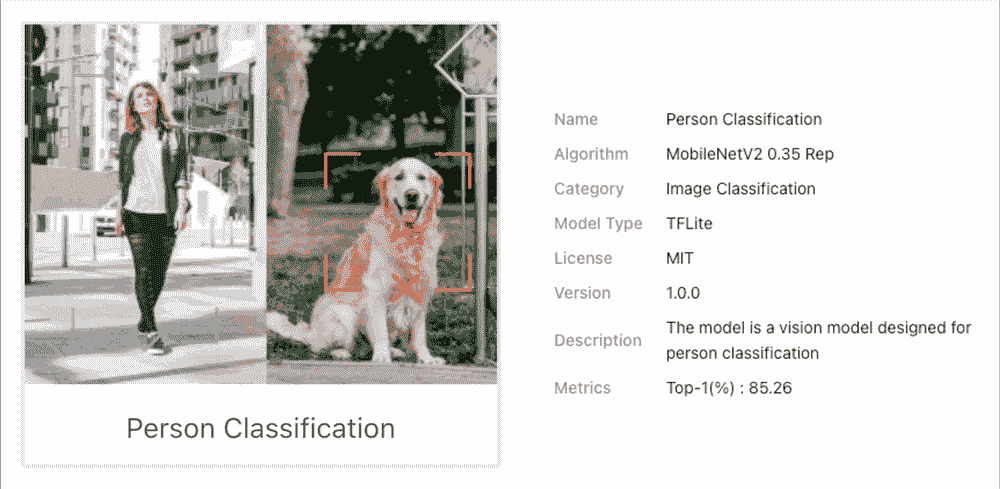

### 在 SenseCraft AI 工作空间中进行图像分类

首先，通过 USB-C 将 XIAOML Kit（或仅将 XIAO ESP32S3 Sense 从扩展板断开）连接到电脑，然后打开 [SenseCraft AI 工作空间](https://sensecraft.seeed.cc/ai/device/local/32) 以连接它。

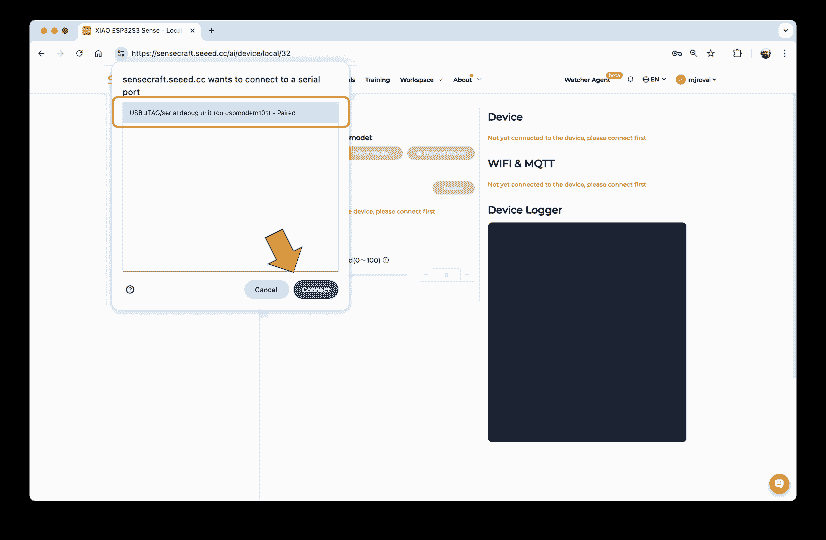

连接后，选择 `[选择模型...]` 选项，并在搜索窗口中输入：“*人物分类*”。从可用选项中选择在 MobileNet V2 上训练的模型（将鼠标移过模型将打开一个弹出窗口，显示其主要特性）。

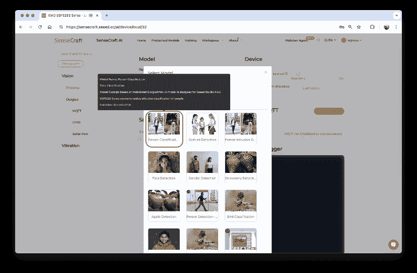

点击选定的模型并确认部署。模型的新固件应开始上传到我们的设备。

> 注意，将显示已下载的模型百分比和上传的固件。如果没有显示，请尝试断开设备，然后重新连接并按启动按钮。

模型成功上传后，我们可以在预览区域查看 XIAO 摄像头的实时视频流和分类结果（`人物` 或 `非人物`），以及 **设备日志** 中显示的推理细节。

> 注意，我们还可以选择我们的 **推理帧间隔**，从“实时”（默认）到 10 秒，以及 **模式**（UART、I2C 等），因为设备通过这些方式共享数据（默认是通过 USB 的 UART）。

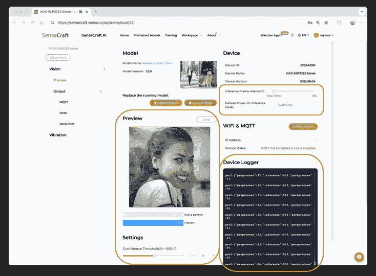

在设备日志中，我们可以看到模型的前处理延迟为 52 到 78 毫秒，推理大约为 532ms，这将给我们总时间略小于 600ms，即大约 **每秒 1.7 帧 (FPS)**。

> 运行 Mobilenet V2 0.35 时，XIAO 的峰值电流为 160mA，在 5.23V 下，导致 **功耗为 830mW**。

### 后处理

在图像分类项目管道中，一个重要的步骤是定义我们想要对推理结果做什么。所以，想象一下，我们将使用 XIAO 在检测到人物时自动打开房间灯光。


使用 SebseCraft AI，我们可以在 `输出 -> GPIO` 部分完成这项工作。当满足事件条件时，点击添加图标以触发动作。将打开一个弹出窗口，您可以在其中定义要采取的动作。例如，如果检测到置信度超过 60% 的人，内部 `LED` 应该打开。在实际场景中，可以使用 GPIO，例如 `D0`、`D1`、`D2`、`D11` 或 `D12` 来触发继电器打开灯光。

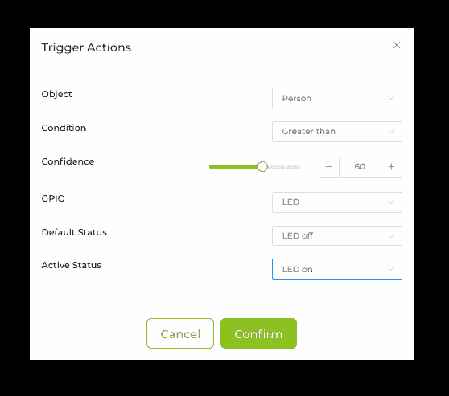

确认后，创建的 **触发动作** 将会显示。按下 `发送` 按钮将命令上传到 XIAO。

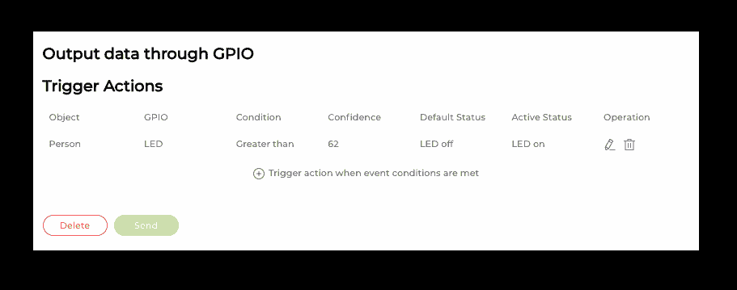

现在，将 XIAO 对准一个人，内部 LED 将会打开。


> 在本实验中，我们将进一步探索更多的触发动作和后处理技术。

## 图像分类项目

让我们创建一个简单的图像分类项目，使用 SenseCraft AI Studio。下面，我们可以看到一个典型的机器学习流程，它将在我们的项目中使用。

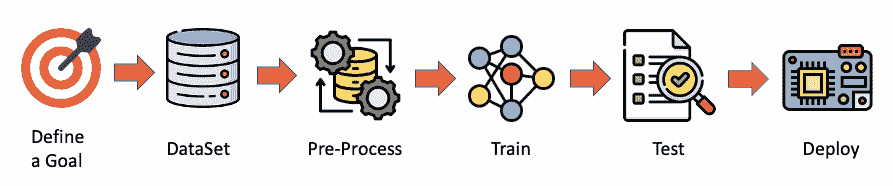

在 SenseCraft AI Studio 上：让我们打开 `[训练](https://sensecraft.seeed.cc/ai/training)` 选项卡：

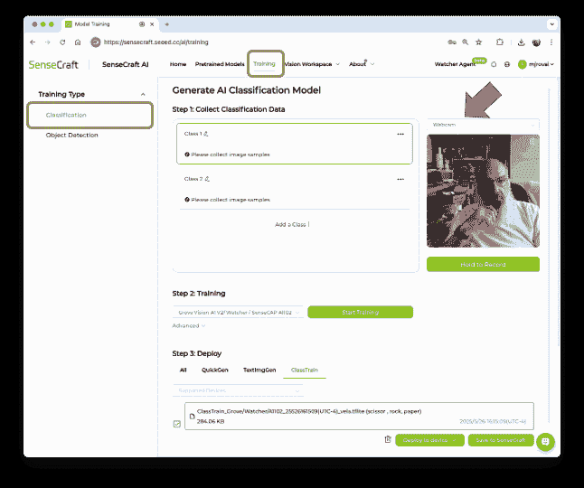

默认情况下，如果有网络摄像头，将训练一个 `分类` 模型。让我们选择 `XIAOESP32S3 Sense`。按下绿色按钮 `[连接]` 将会弹出一个窗口。选择相应的端口并按下蓝色按钮 `[连接]`。


从 Grove Vision AI V2 流出的图像将会显示。

### 目标

第一步，正如我们在机器学习流程中看到的那样，是定义一个目标。让我们想象我们有一个工业安装，它应该能够自动分类轮子和箱子。


因此，让我们模拟它，例如，对玩具 `箱子` 和玩具 `轮子` 进行分类。我们还应该包括一个第三类图像，`背景`，其中场景中没有对象。


### 数据收集

让我们创建类别，例如按照字母顺序：

+   第一类：背景

+   第二类：箱子

+   第三类：轮子

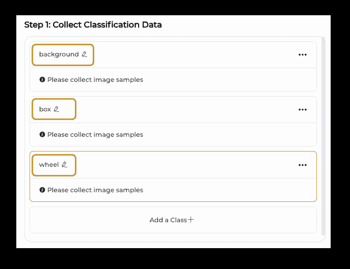

选择一个类别，并在预览区域下方的绿色按钮（`按住以记录`）上持续按下。收集到的图像（及其计数）将出现在图像样本屏幕上。仔细且缓慢地移动相机以捕捉物体的不同角度。要修改位置或干扰图像，释放绿色按钮，重新排列物体，然后再次按住以继续捕获。


收集图像后，检查它们并删除任何错误的图像。

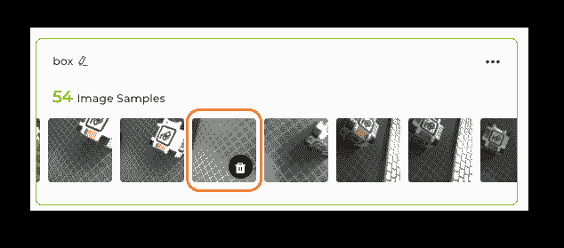

每个类别收集大约 **50 张图像** 并进入训练步骤。

> 注意，可以将收集到的图像下载到其他应用程序中使用，例如 Edge Impulse Studio。

### 训练

确认是否已选择正确的设备（`XIAO ESP32S3 Sense`）并按下 `[开始训练]`

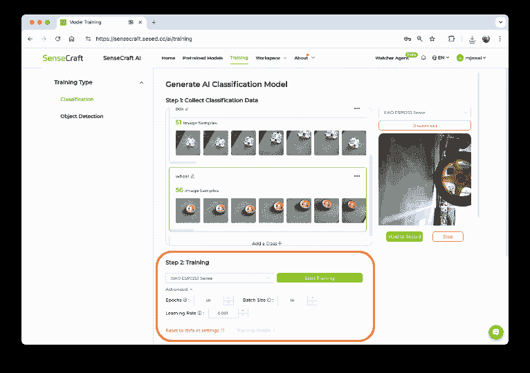

### 测试

训练完成后，可以预览推理结果。

> 注意，模型并未在设备上运行。实际上，我们只是在设备上捕获图像，并使用在 Studio 中运行的训练模型进行**实时预览**。


现在是真正将模型部署到设备上的时候了。

### 部署

在“支持设备”窗口中选择已训练的模型和`XIAO ESP32S3 Sense`。然后点击 `[部署到设备]`。

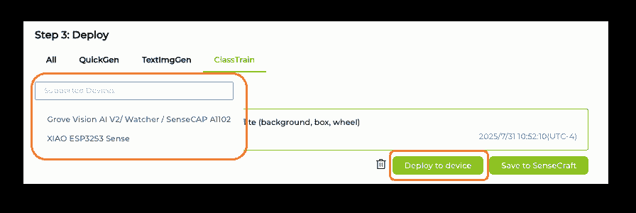

SenseCraft AI 将带我们到**视觉工作区**选项卡。`确认`部署，选择端口，并`连接`。

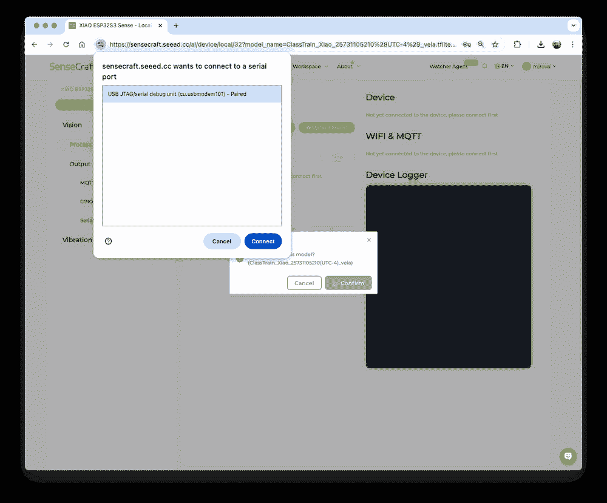

模型将被烧录到设备中。自动重置后，模型将在设备上开始运行。在设备日志中，我们可以看到推理的**延迟约为 426 毫秒**，加上**预处理大约 110 毫秒**，对应于**每秒 1.8 帧（FPS）**。

此外，请注意，在**设置**中，可以调整模型的置信度。

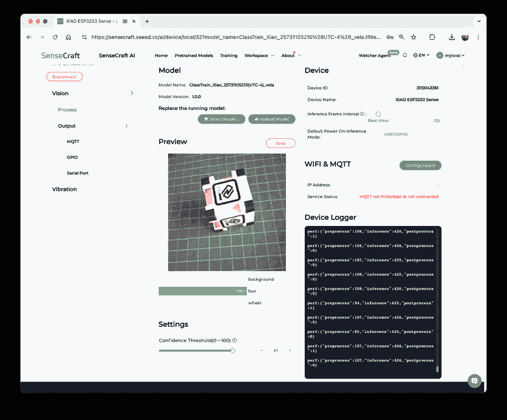

> 要运行图像分类模型，XIAO ESP32S3 在 5.23V 下的峰值电流为 14mA，导致**功耗为 730mW**。

如前所述，在**输出 –> GPIO**中，我们可以根据检测到的类别打开 GPIO 或内部 LED。例如，当检测到轮子时，LED 将打开。


### 保存模型

可以在 SenseCraft AI Studio 中保存模型。工作室将保留我们所有的模型以供以后部署。为此，返回到“训练”选项卡并选择按钮 `[保存到 SenseCraft`]：

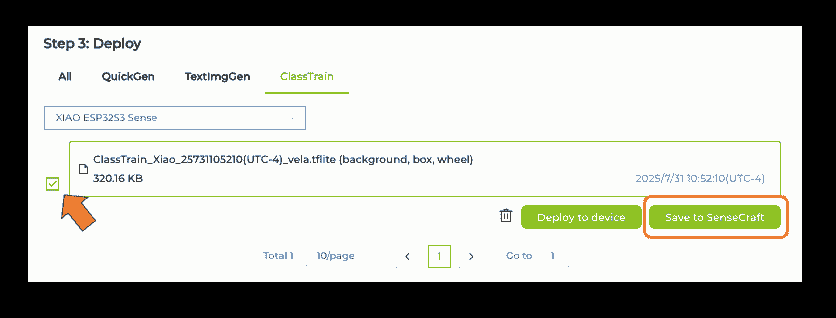

按照说明输入模型的名称、描述、图像和其他详细信息。

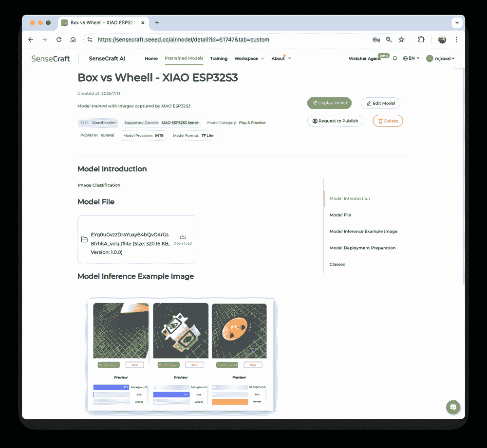

注意，训练好的模型（一个大小为 320KB 的 Int8 MobileNet V2）可以下载以供进一步使用或分析，例如使用[Netron](https://github.com/lutzroeder/netron)。注意，该模型使用大小为 224x224x3 的图像作为其输入张量。在下一步中，我们将在 Edge Impulse Studio 上使用不同的超参数。

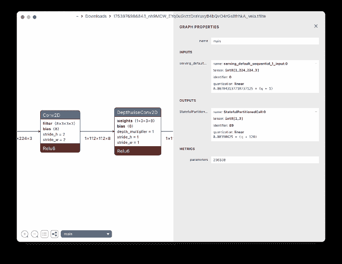

此外，模型可以随时再次部署到设备上。自动地，**工作区**将在 SenseCraft AI 上打开。

## 从数据集开始的图像分类项目

我们项目的首要目标是训练一个模型并在 XIAO ESP32S3 Sense 上执行推理。为了训练，我们需要找到一些数据 **（实际上，是大量的数据！）**。

*但我们已经知道，首先，我们需要一个目标！我们想要分类什么？*

使用 TinyML，由于限制（主要是内存），我们应该将分类限制在三个或四个类别。例如，我们可以训练 SenseCraft AI Studio 中下载的 Box 与 Wheel 捕获的图像。

> 或者，我们可以使用一个全新的数据集，例如区分苹果、香蕉和土豆或其他类别的数据集。如果可能的话，尝试找到一个包含这些类别图像的特定数据集。[Kaggle 水果和蔬菜图像识别](https://www.kaggle.com/kritikseth/fruit-and-vegetable-image-recognition)是一个不错的起点。

让我们下载上一节中捕获的数据集。在每个捕获的类别上打开菜单（3 个点），然后选择“导出数据”。

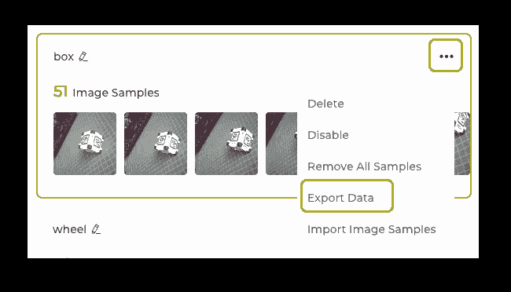

数据集将以.ZIP 文件的形式下载到计算机上，每个类别一个文件。将它们保存在您的工作文件夹中，并解压缩它们。您应该有三个文件夹，每个文件夹对应一个类别。

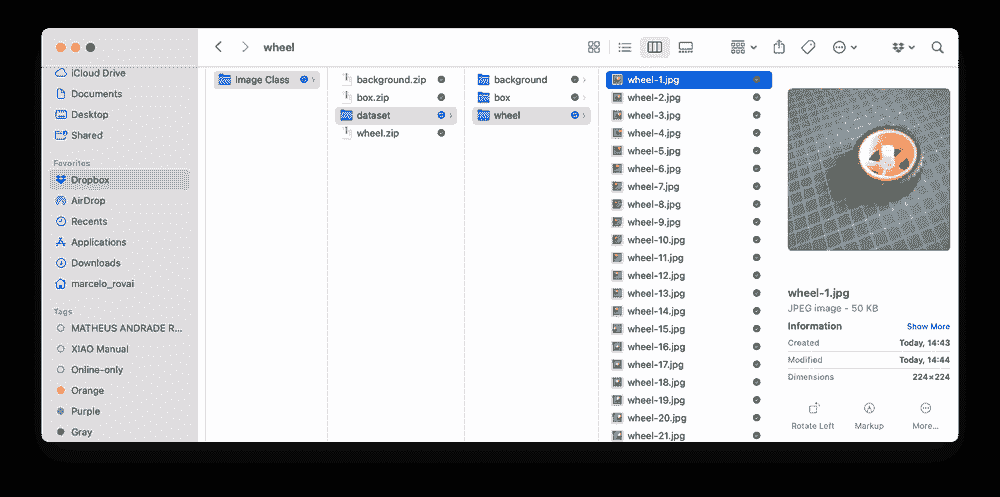

> 可选地，您可以使用例如设置实验室中讨论的代码添加一些新的图片。

## 使用 Edge Impulse Studio 训练模型

我们将使用 Edge Impulse Studio 来训练我们的模型。[Edge Impulse](https://www.edgeimpulse.com/)是边缘设备上机器学习的主要开发平台。

在 Edge Impulse 输入您的账户凭证（或创建一个免费账户）。接下来，创建一个新的项目：

### 数据获取

接下来，转到**数据获取**部分，在那里选择`+ 添加数据`。将弹出一个弹出窗口。选择`上传数据`。

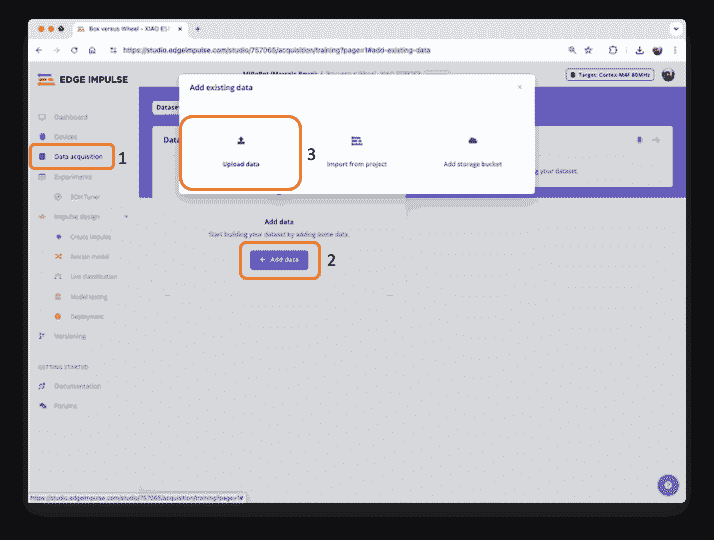

选择后，将弹出一个新的弹出窗口，要求更新数据。

+   在上传模式中：`选择一个文件夹`并按 `[选择文件]`。

+   前往包含一个类别的文件夹，并按 `[上传]`。


+   您将自动返回到上传数据窗口。

+   选择“自动在训练和测试之间分割”。

+   在文件夹中输入图片的标签。

+   选择 `[上传数据]`。

+   在这一点上，文件将开始上传，之后，将出现另一个弹出窗口询问您是否在构建一个目标检测项目。选择 `[no]`。


对所有类别重复此过程。**不要忘记更改标签的名称**。如果您忘记了，并且图像已上传，请注意它们将在工作室中混合。不要担心，您可以在之后手动在类别之间移动数据。

关闭上传数据窗口，返回到**数据获取**页面。我们可以看到所有数据集都已上传。注意，在上面的面板中，我们可以看到我们有 158 个条目，它们都是平衡的。此外，19%的图像被留作测试。

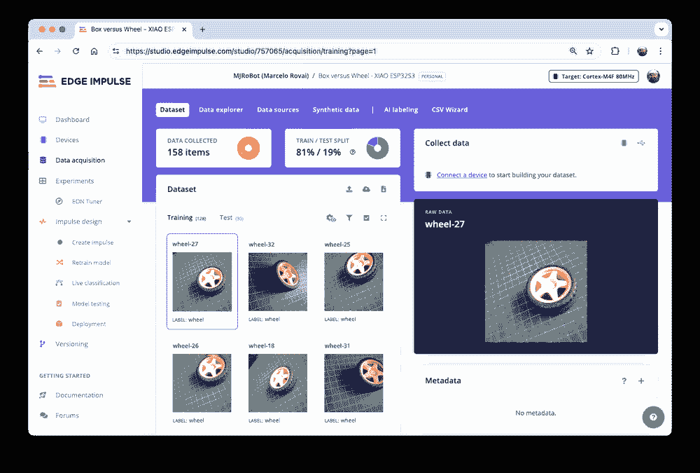

### 脉冲设计

> 一个脉冲会提取原始数据（在这种情况下，图像），提取特征（调整图片大小），然后使用学习块对新数据进行分类。

图像分类是深度学习最常见应用，但完成这项任务需要大量的数据。我们每个类别大约有 50 张图像。这个数量足够吗？根本不够！我们需要数千张图像来“教学”或“建模”每个类别，以便我们能够区分它们。然而，我们可以通过使用数千张图像重新训练先前训练的模型来解决这个问题。我们称这种技术为**“迁移学习”（TL）**。使用 TL，我们可以在我们的数据上微调预训练的图像分类模型，即使是在相对较小的图像数据集上也能取得良好的性能。

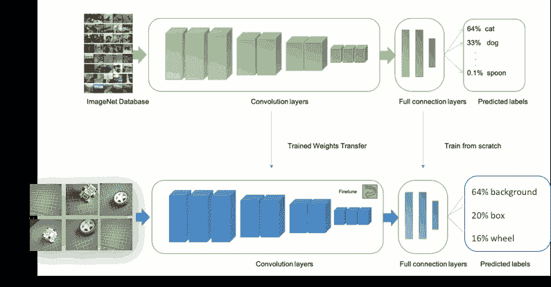

使用 TL，我们可以在我们的数据上微调预训练的图像分类模型，即使是在相对较小的图像数据集（我们的案例）上也能表现出色。

因此，从原始图像开始，我们将它们调整大小为<semantics><mrow><mo stretchy="true" form="prefix">(</mo><mn>96</mn><mo>×</mo><mn>96</mn><mo stretchy="true" form="postfix">)</mo></mrow><annotation encoding="application/x-tex">(96\times 96)</annotation></semantics>像素，并将它们输入到我们的迁移学习模块。让我们创建一个脉冲。

> 在这一点上，我们也可以定义我们的目标设备以监控我们的“预算”（内存和延迟）。XIAO ESP32S3 不是 Edge Impulse 的官方支持设备，因此让我们考虑 Espressif ESP-EYE，它相似但速度较慢。

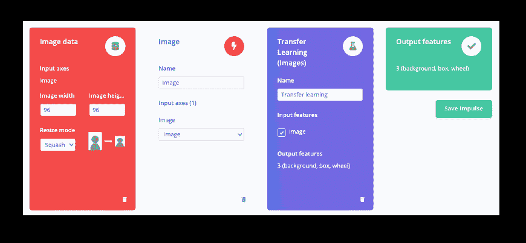

保存上述脉冲，然后转到**图像**部分。

### 预处理（特征生成）

除了调整图像大小外，我们还可以将它们转换为灰度或保留它们的原始 RGB 颜色深度。让我们在“图像”部分选择 `[RGB]`。这样做后，每个数据样本将具有 27,648 个特征维度（96x96x3）。按下 `[Save Parameters]` 将打开一个新标签页，`Generate Features`。按下 `[Generate Features]` 按钮以生成特征。

### 模型设计、训练和测试

在 2007 年，谷歌推出了[MobileNetV1](https://research.googleblog.com/2017/06/mobilenets-open-source-models-for.html)。在 2018 年，发布了[MobileNetV2: Inverted Residuals and Linear Bottlenecks](https://arxiv.org/abs/1801.04381)，然后在 2019 年推出了 V3。MobileNet 是一系列通用计算机视觉神经网络，专门为移动设备设计，以支持分类、检测和其他应用。MobileNets 是小型、低延迟、低功耗的模型，参数化以满足各种用例的资源限制。

尽管基础 MobileNet 架构已经非常紧凑且具有低延迟，但特定的用例或应用可能经常需要模型更小、更快。MobileNets 引入了一个简单的参数，**α**（alpha），称为宽度乘数，以构建这些更小、计算成本更低的模型。宽度乘数α的作用是在每一层均匀地瘦化网络。

Edge Impulse Studio 提供了 MobileNet V1（96x96 图像）和 V2（96x96 和 160x160 图像），以及几个不同的**α**值（从 0.05 到 1.0）。例如，使用 V2，160x160 图像，α=1.0 时，你将获得最高的准确率。当然，这里有一个权衡。准确率越高，运行模型所需的内存（大约 1.3M RAM 和 2.6M ROM）就越多，这意味着更大的延迟。在另一个极端，使用 MobileNet V1 和α=0.10 时，将获得更小的占用空间（大约 53.2K RAM 和 101K ROM）。

> 我们将使用**MobileNet V2 0.35**作为我们的基础模型（但也可以使用具有更大α值的模型）。我们的模型最终层，在输出层之前，将有 16 个神经元，并具有 10%的 dropout 率以防止过拟合。

与深度学习一起使用的另一个必要技术是**数据增强**。数据增强是一种可以通过创建额外的合成数据来帮助提高机器学习模型准确率的方法。数据增强系统在训练过程中对训练数据进行小的、随机的更改（例如翻转、裁剪或旋转图像）。

在幕后，你可以看到 Edge Impulse 是如何在数据上实现数据增强策略的：

```py
# Implements the data augmentation policy
def augment_image(image, label):
    # Flips the image randomly
    image = tf.image.random_flip_left_right(image)

    # Increase the image size, then randomly crop it down to
    # the original dimensions
    resize_factor = random.uniform(1, 1.2)
    new_height = math.floor(resize_factor * INPUT_SHAPE[0])
    new_width = math.floor(resize_factor * INPUT_SHAPE[1])
    image = tf.image.resize_with_crop_or_pad(image, new_height,
                                             new_width)
    image = tf.image.random_crop(image, size=INPUT_SHAPE)

    # Vary the brightness of the image
    image = tf.image.random_brightness(image, max_delta=0.2)

    return image, label
```

现在，让我们定义超参数：

+   迭代次数：20

+   批处理大小：32

+   学习率：0.0005

+   验证大小：20%

因此，我们的训练结果如下：

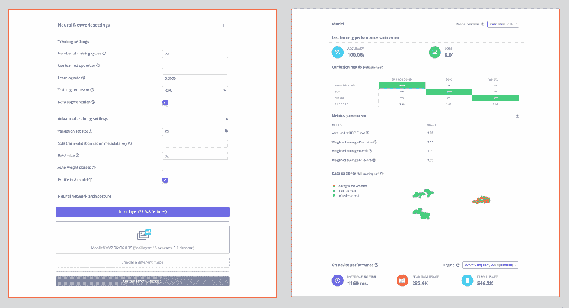

模型配置文件预测**233 KB 的 RAM 和 546 KB 的闪存**，这表明 Xiao ESP32S3 没有问题，它有 8 MB 的 PSRAM。此外，工作室表明**延迟约为 1160 ms**，这非常高。然而，这是可以预料的，因为我们正在使用 ESP-EYE，其 CPU 是 Extensa LX6，而 ESP32S3 使用的是更新、更强大的 Xtensa LX7。

> 使用测试数据，我们甚至实现了 100%的准确率，即使是在量化 INT8 模型的情况下。这个结果在真实项目中并不典型，但我们的项目相对简单，只有两个彼此非常不同的对象。

## 模型部署

我们可以部署训练好的模型：

+   作为`.TFLITE`用于**SenseCraft AI**

+   作为**Edge Impulse Studio**中的`Arduino 库`。

让我们从更简单、更直观的 SenseCraft 开始。

### 在 SenseCraft AI 上的模型部署

在**仪表板**上，你可以以几种不同的格式下载训练好的模型。让我们下载`TensorFlow Lite (int8 量化)`，其大小为 623KB。


在**SenseCraft AI Studio**中，转到`工作区`标签，选择`XIAO ESP32S3`，相应的端口，并连接设备。

你应该能看到最后上传到设备上的模型。选择绿色按钮 `[上传模型]`。一个弹出窗口将提示你输入模型名称、模型文件和类名（**对象**）。我们应该使用按字母顺序排列的标签：`0: background`，`1: box`，和`2: wheel`，然后按 `[发送]`。

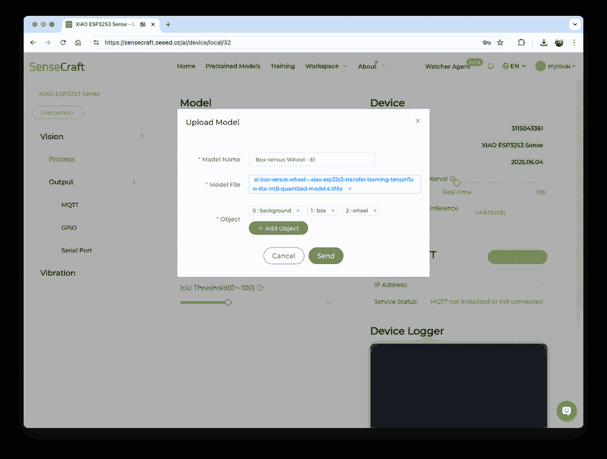

几秒钟后，模型将被上传（闪存）到我们的设备，相机图像将实时出现在 **预览** 区域。分类结果将在图像预览下方显示。您还可以使用 **设置** 中的光标选择推理的 `置信度阈值`。

在 **设备日志** 中，我们可以查看串行监视器，其中可以观察到延迟，预处理大约为 81 毫秒，推理大约为 205 毫秒，**对应于每秒 3.4 帧（FPS）的帧率**，这是我们使用 SenseCraft 训练模型时得到的两倍，因为我们正在处理更小的图像（96x96 与 224x224）。

> 总延迟大约比在 Xtensa LX6 CPU 上 Edge Impulse Studio 中的估计快 **4 倍**；现在我们在 Xtensa LX7 CPU 上进行推理。

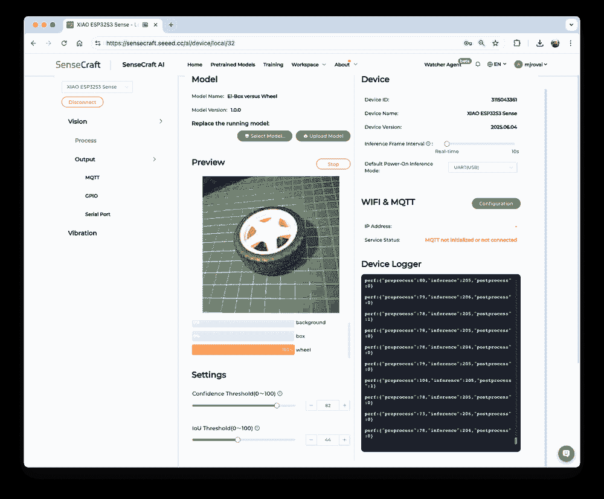

#### 后处理

可以获取模型推理的输出，包括延迟、类别 ID 和置信度，如 SenseCraft AI 的设备日志中所示。这使我们能够将 **XIAO ESP32S3 感应器** 作为 AI 传感器使用。换句话说，我们可以根据项目需求使用不同的通信协议，如 MQTT、UART、I2C 或 SPI 来检索模型数据。

> 这个想法与我们之前在 [Seeed Grove Vision AI V2 图像分类后处理实验室](https://www.mlsysbook.ai/contents/labs/seeed/grove_vision_ai_v2/image_classification/image_classification#sec-image-classification-postprocessing-9610) 中所做的是类似的。

下面是使用 I2C 总线的连接示例。

请参阅 [Seeed Studio Wiki](https://wiki.seeedstudio.com/sensecraft-ai/tutorials/sensecraft-ai-output-libraries-xiao/) 获取更多信息。

### 在 EI Studio 中将模型部署为 Arduino 库

在 Edge Impulse Studio 的 **部署** 部分选择 `Arduino 库`、`TensorFlow Lite`、`量化(int8)` 并按 `[构建]`。训练好的模型将以 .zip Arduino 库的形式下载：


打开你的 Arduino IDE，在 **草图** 下，转到 **包含库** 并 **添加 .ZIP 库**。然后，选择从 Edge Impulse Studio 下载的文件并按 `[打开]`。

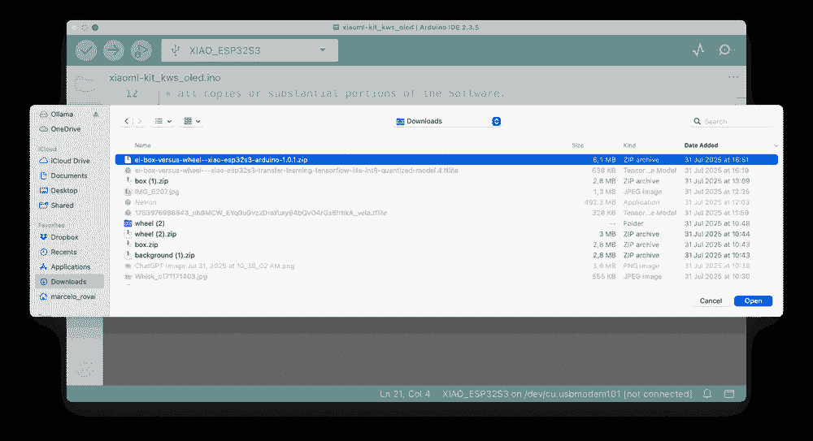

前往 Arduino IDE 的 `示例`，根据其名称查找项目（在本例中为：“Box_versus_Whell_…Interfering”。打开 `esp32` -> `esp32_camera`。`esp32_camera.ino` 草图将被下载到 IDE。

这个草图是为标准 ESP32 开发的，与 XIAO ESP32S3 感应器不兼容。需要进行修改。让我们从项目的 GitHub 下载修改后的版本：[Image_class_XIAOML-Kit.ino](https://github.com/Mjrovai/XIAO-ESP32S3-Sense/blob/main/XIAOML_Kit_code/image_class_XIAOML-Kit/image_class_XIAOML-Kit.ino)。

#### XIAO ESP32S3 图像分类代码解释

代码从板上摄像头捕获图像，处理它们，并使用 EI Studio 上的训练模型对它们进行分类（在这种情况下，“Box”，“Wheel”或“Background”）。它持续运行，在边缘设备上执行实时推理。

简而言之：

摄像头 → JPEG 图像 → RGB888 转换 → 调整大小到 96x96 → 神经网络 → 分类结果 → 串行输出

##### 关键组件

1.  **库包含和依赖项**

```py
#include <Box_versus_Wheel_-_XIAO_ESP32S3_inferencing.h>
#include "edge-impulse-sdk/dsp/image/image.hpp"
#include "esp_camera.h"
```

+   **Edge Impulse 推理库**：包含我们的训练模型和推理引擎

+   **图像处理**：提供图像操作功能

+   **ESP Camera**：摄像头模块的硬件接口

1.  **摄像头引脚配置**

XIAO ESP32S3 Sense 可以与不同的摄像头传感器（OV2640 或 OV3660）一起工作，这些传感器可能具有不同的引脚配置。代码定义了三种可能的配置：

```py
// Configuration 1: Most common OV2640 configuration
#define CONFIG_1_XCLK_GPIO_NUM 10
#define CONFIG_1_SIOD_GPIO_NUM 40
#define CONFIG_1_SIOC_GPIO_NUM 39
// ... more pins
```

这种灵活性允许代码在第一个引脚映射不工作的情况下自动尝试不同的引脚映射，使其在不同硬件版本上更具鲁棒性。

1.  **内存管理设置**

```py
#define EI_CAMERA_RAW_FRAME_BUFFER_COLS 320
#define EI_CAMERA_RAW_FRAME_BUFFER_ROWS 240
#define EI_CLASSIFIER_ALLOCATION_HEAP 1
```

+   **帧缓冲区大小**：定义原始图像大小（320x240 像素）

+   **堆分配**：使用动态内存分配以提供灵活性

+   **PSRAM 支持**：ESP32S3 有 8MB 的 PSRAM 用于存储大型数据，如图像

##### `setup()` - 初始化

```py
void setup() {
    Serial.begin(115200);
    while (!Serial);

    if (ei_camera_init() == false) {
        ei_printf("Failed to initialize Camera!\r\n");
    } else {
        ei_printf("Camera initialized\r\n");
    }

    ei_sleep(2000);  // Wait 2 seconds before starting
}
```

此函数：

1.  初始化串行通信以进行调试输出

1.  使用自动配置检测初始化摄像头

1.  在开始连续推理前等待 2 秒

##### `loop()` - 主处理循环

循环持续执行以下步骤：

**第 1 步：内存分配**

```py
snapshot_buf = (uint8_t*)ps_malloc(EI_CAMERA_RAW_FRAME_BUFFER_COLS *
                                   EI_CAMERA_RAW_FRAME_BUFFER_ROWS *
                                   EI_CAMERA_FRAME_BYTE_SIZE);
```

为图像缓冲区分配内存，优先使用 PSRAM（更快的外部 RAM），如果需要则回退到常规堆。

**第 2 步：图像捕获**

```py
if (ei_camera_capture((size_t)EI_CLASSIFIER_INPUT_WIDTH,
                     (size_t)EI_CLASSIFIER_INPUT_HEIGHT,
                     snapshot_buf) == false) {
    ei_printf("Failed to capture image\r\n");
    free(snapshot_buf);
    return;
}
```

从摄像头捕获图像并将其存储在缓冲区中。

**第 3 步：运行推理**

```py
ei_impulse_result_t result = { 0 };
EI_IMPULSE_ERROR err = run_classifier(&signal, &result, false);
```

在捕获的图像上运行机器学习模型。

**第 4 步：输出结果**

```py
for (uint16_t i = 0; i < EI_CLASSIFIER_LABEL_COUNT; i++) {
    ei_printf(" %s: %.5f\r\n",
              ei_classifier_inferencing_categories[i],
              result.classification[i].value);
}
```

打印分类结果，显示每个类别的置信度分数。

##### `ei_camera_init()` - 智能摄像头初始化

此函数实现了一个智能初始化序列：

```py
bool ei_camera_init(void) {
    // Try Configuration 1 (OV2640 common)
    update_camera_config(1);
    esp_err_t err = esp_camera_init(&camera_config);
    if (err == ESP_OK) goto camera_init_success;

    // Try Configuration 2 (OV3660)
    esp_camera_deinit();
    update_camera_config(2);
    err = esp_camera_init(&camera_config);
    if (err == ESP_OK) goto camera_init_success;

    // Continue trying other configurations...
}
```

该函数：

1.  尝试多种引脚配置

1.  测试不同的时钟频率（10MHz 或 16MHz）

1.  首先尝试 PSRAM，然后回退到 DRAM

1.  根据检测到的硬件应用传感器特定设置

##### `ei_camera_capture()` - 图像处理管道

```py
bool ei_camera_capture(uint32_t img_width, uint32_t img_height, uint8_t *out_buf) {
    // 1\. Get frame from camera
    camera_fb_t *fb = esp_camera_fb_get();

    // 2\. Convert JPEG to RGB888 format
    bool converted = fmt2rgb888(fb->buf, fb->len, PIXFORMAT_JPEG, snapshot_buf);

    // 3\. Return frame buffer to camera driver
    esp_camera_fb_return(fb);

    // 4\. Resize if needed
    if (do_resize) {
        ei::image::processing::crop_and_interpolate_rgb888(...);
    }
}
```

此函数：

1.  从摄像头捕获 JPEG 图像

1.  将其转换为 RGB888 格式（ML 模型所需）

1.  将图像调整大小以匹配模型的输入大小（96x96 像素）

### 推理

+   将代码上传到 XIAO ESP32S3 Sense。

> ⚠️ **注意**
> 
> +   Xiao ESP32S3 **必须**启用 PSRAM。您可以在 Arduino IDE 的上级菜单中检查它：`工具`–> `PSRAM:OPI PSRAM`
> +   
> +   Arduino 板包（`esp32 by Espressif Systems`）应为**版本 2.017**。请勿更新

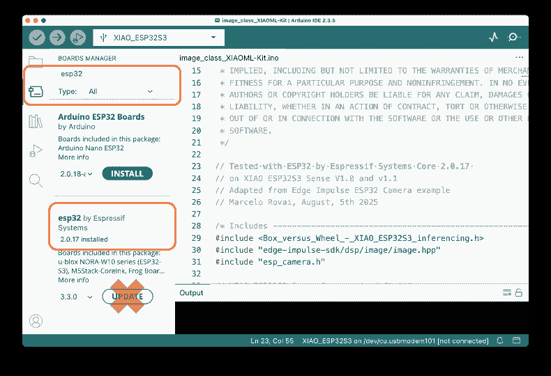

+   打开串行监视器

+   将摄像头对准物体，并在串行监视器上检查结果。

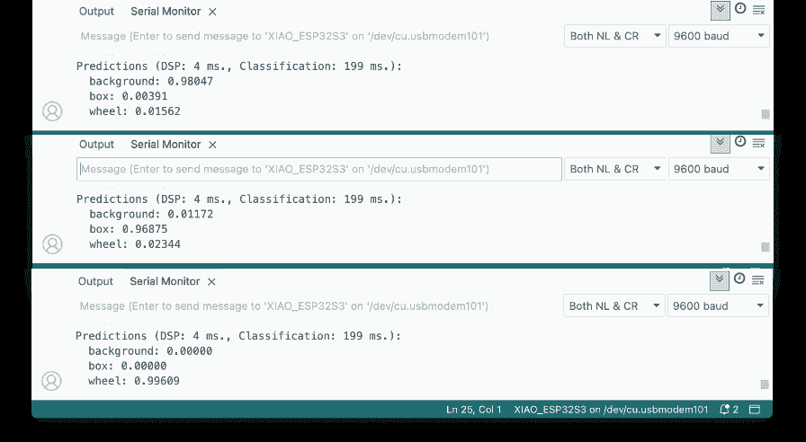

### 后处理

在边缘人工智能应用中，推理结果的价值仅取决于我们对其采取行动的能力。虽然串行输出提供了详细的调试和开发信息，但现实世界的部署需要立即、人类可读的反馈，这种反馈不依赖于外部监视器或连接。

XIAOML Kit 0.42” OLED 显示屏（72×40 像素）作为关键的后处理组件，将原始机器学习推理结果转换为即时、人类可读的反馈——直接在设备上显示检测到的类别名称和置信度，消除了对外部监视器的需求，并使工业、农业或零售环境中的独立边缘人工智能部署成为可能，在这些环境中，对人工智能预测的即时视觉确认至关重要。

因此，让我们修改草图以自动适应在 Edge Impulse 上训练的模型，通过直接从模型中读取类别名称和计数。显示屏将显示缩写后的类别名称（3 个字母），字体较大，以便在小型 72x40 像素显示屏上获得更好的可见性。从 GitHub 下载代码：[XIAOML-Kit-Img_Class_OLED_Gen](https://github.com/Mjrovai/XIAO-ESP32S3-Sense/tree/main/XIAOML_Kit_code/XIAOML-Kit-Img_Class_OLED_Gen)。

运行代码，我们可以看到结果：

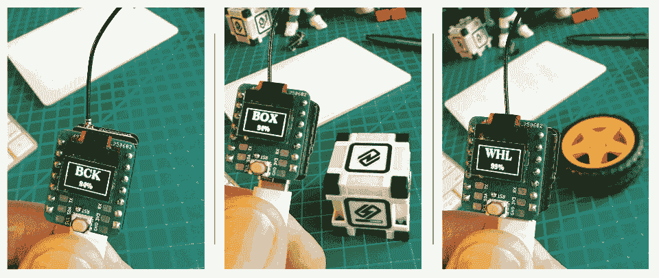

## 摘要

XIAO ESP32S3 Sense 是一个令人印象深刻的、灵活的平台，适用于图像分类应用。通过这个实验室，我们探索了两种不同的开发方法，以满足不同的技能水平和项目需求。

+   **SenseCraft AI Studio** 提供了一个易于访问的入口，其 **无代码界面** 允许快速原型设计和部署预训练模型，如人体检测。通过实时推理和集成后处理功能，它展示了如何在不进行大量编程或机器学习知识的情况下部署人工智能。

+   对于更高级的应用，**Edge Impulse Studio** 提供了全面的机器学习管道工具，包括自定义数据集管理、与多个预训练模型（如 MobileNet）的迁移学习以及模型优化。

本实验室的关键见解包括图像分辨率权衡的重要性、迁移学习在小数据集上的有效性以及边缘人工智能部署的实际考虑，例如功耗和内存限制。

该实验室展示了超越特定硬件的 TinyML 基本原理：资源受限的推理、实时处理需求以及从数据收集到模型部署再到实际应用的完整流程。内置的后处理功能包括 GPIO 控制、通信协议等，XIAO 不仅是一个推理引擎，还成为了一个完整的 AI 传感器平台。

这个图像分类的基础知识将为你准备更复杂的计算机视觉任务，同时展示了现代边缘人工智能如何使复杂的计算机视觉变得可访问、成本效益高，并且能够在从工业自动化到智能家居系统等现实世界的嵌入式应用中部署。

## 资源

+   [XIAO ESP32S3 入门指南](https://wiki.seeedstudio.com/xiao_esp32s3_getting_started/)

+   [SenseCraft AI Studio 主页](https://sensecraft.seeed.cc/ai/home)

+   [SenseCraft 视觉工作空间](https://sensecraft.seeed.cc/ai/device/local/32)

+   [数据集示例](https://www.kaggle.com/kritikseth/fruit-and-vegetable-image-recognition)

+   [Edge Impulse 项目](https://studio.edgeimpulse.com/public/757065/live)

+   [XIAO 作为人工智能传感器](https://wiki.seeedstudio.com/sensecraft-ai/tutorials/sensecraft-ai-output-libraries-xiao/)

+   [Seeed Arduino SSCMA 库](https://github.com/Seeed-Studio/Seeed_Arduino_SSCMA)

+   [XIAOML 工具包代码](https://github.com/Mjrovai/XIAO-ESP32S3-Sense/tree/main/XIAOML_Kit_code)
