# 运动分类和异常检测

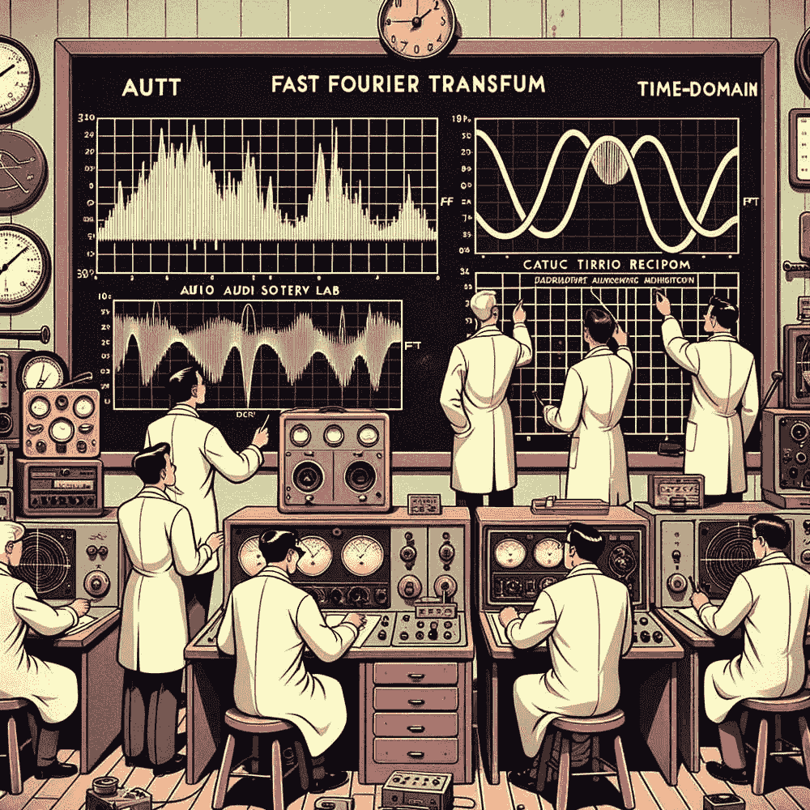

DALL·E 提示 - 1950 年代风格的卡通插图，场景设定在复古音频实验室。科学家们穿着经典的白色实验服，专注地分析大型黑板上的音频数据。黑板上显示着复杂的快速傅里叶变换（FFT）图和时间域曲线。复古音频设备散布四周，但数据表示清晰且详细，表明他们专注于音频分析。

## 概述

运输是全球贸易的支柱。每天通过各种方式，如船只、卡车和火车，将数百万个集装箱运往世界各地。确保这些集装箱的安全和高效运输是一项艰巨的任务，需要利用现代技术，而 TinyML 无疑是关键解决方案之一。

在这个动手实验室中，我们将解决与运输相关的真实世界问题。我们将使用 XIAOML 套件、Arduino IDE 和 Edge Impulse Studio 开发运动分类和异常检测系统。这个项目将帮助我们了解集装箱在运输的不同阶段（包括陆地和海上运输、通过叉车垂直移动以及仓库中的静止存储期）所经历的不同力和运动。

**学习目标**

+   设置 XIAOML 套件

+   数据收集和预处理

+   构建运动分类模型

+   实施异常检测

+   真实世界测试与分析

到这个实验室结束时，你将拥有一个可以分类不同类型运动并在集装箱运输过程中检测异常的工作原型。这些知识可以作为进入蓬勃发展的 TinyML 领域更高级项目的垫脚石，特别是那些涉及振动的项目。

## 安装 IMU

XIAOML 套件在扩展板上内置了 LSM6DS3TR-C 6 轴 IMU 传感器，消除了外部传感器连接的需求。这种集成方法提供了一个干净且可靠的平台，适用于基于运动的机器学习应用。

LSM6DS3TR-C 将 3 轴加速度计和 3 轴陀螺仪集成在一个封装中，通过 I2C 连接到 XIAO ESP32S3 的地址 0x6A，提供以下功能：

+   **加速度计范围**: ±2/±4/±8/±16 g (默认使用 ±2g)

+   **陀螺仪范围**: ±125/±250/±500/±1000/±2000 dps (默认使用 ±250 dps)

+   **分辨率**: 16 位 ADC

+   **通信**: 地址 0x6A 的 I2C 接口

+   **功耗**: 超低功耗设计

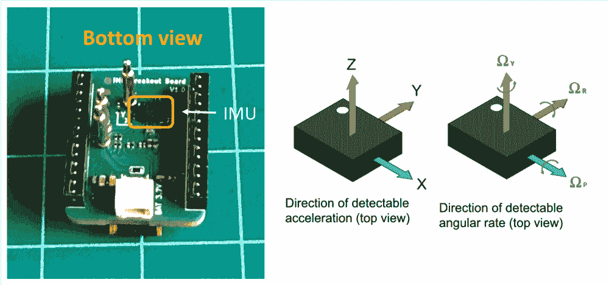

**坐标系**: 传感器在右手坐标系内运行。当你从底部（你可以看到带有标记点的 IMU 传感器）看扩展板时：

+   **X 轴**: 指向右侧

+   **Y 轴**: 指向前方（远离你）

+   **Z 轴**: 指向上方（出板外）

### 设置硬件

由于 XIAOML Kit 已预装了扩展板，因此不需要额外的硬件连接。LSM6DS3TR-C IMU 已经通过 I2C 正确连接。

**已连接的内容：**

+   LSM6DS3TR-C IMU → I2C（SDA/SCL）→ XIAO ESP32S3

+   I2C 地址：0x6A

+   电源：来自 XIAO ESP32S3 的 3.3V

**所需库**：您应该在设置过程中安装库。如果没有，请按照以下步骤安装 Seeed Arduino LSM6DS3 库：

1.  打开 Arduino IDE 库管理器

1.  搜索“LSM6DS3”

1.  安装 Seeed Studio 的**“Seeed Arduino LSM6DS3”**

1.  **重要**：不要安装“Arduino_LSM6DS3 by Arduino” - 那是针对不同板子的！

### 测试 IMU 传感器

让我们从一项简单的测试开始，以验证 IMU 是否正常工作。上传此代码以测试传感器：

```py
#include <LSM6DS3.h>
#include <Wire.h>

// Create IMU object using I2C interface
LSM6DS3 myIMU(I2C_MODE, 0x6A);

float accelX, accelY, accelZ;
float gyroX, gyroY, gyroZ;

void setup() {
  Serial.begin(115200);
  while (!Serial) delay(10);

  Serial.println("XIAOML Kit IMU Test");
  Serial.println("LSM6DS3TR-C 6-Axis IMU");
  Serial.println("====================");

  // Initialize the IMU
  if (myIMU.begin() != 0) {
      Serial.println("ERROR: IMU initialization failed!");
      while(1) delay(1000);
  } else {
      Serial.println("✓ IMU initialized successfully");
      Serial.println("Data Format: AccelX,AccelY,AccelZ,"
                    "GyroX,GyroY,GyroZ");
      Serial.println("Units: g-force, degrees/second");
      Serial.println();
  }
}

void loop() {
  // Read accelerometer data (in g-force)
  accelX = myIMU.readFloatAccelX();
  accelY = myIMU.readFloatAccelY();
  accelZ = myIMU.readFloatAccelZ();

  // Read gyroscope data (in degrees per second)
  gyroX = myIMU.readFloatGyroX();
  gyroY = myIMU.readFloatGyroY();
  gyroZ = myIMU.readFloatGyroZ();

  // Print readable format
  Serial.print("Accel (g): X="); Serial.print(accelX, 3);
  Serial.print(" Y="); Serial.print(accelY, 3);
  Serial.print(" Z="); Serial.print(accelZ, 3);
  Serial.print(" | Gyro (°/s): X="); Serial.print(gyroX, 2);
  Serial.print(" Y="); Serial.print(gyroY, 2);
  Serial.print(" Z="); Serial.println(gyroZ, 2);

  delay(100); // 10 Hz update rate
}
```

当套件平放在桌子上时，你应该看到：

+   Z 轴加速度约为+1.0g（重力）

+   X 和 Y 加速度接近 0.0g

+   所有陀螺仪值接近 0.0°/s

移动套件以查看相应值的变化。

## TinyML 运动分类项目

我们将通过模拟各种场景来模拟集装箱（或更准确地说，包裹）的运输，使本教程更具相关性和实用性。


使用 XIAOML Kit 的加速度计，我们将通过手动模拟以下条件来捕捉运动数据：

+   **海事**（船上的托盘）- 在所有轴向上以波浪状模式移动

+   **地面**（卡车/火车上的托盘）- 主要水平移动

+   **提升**（叉车移动的托盘）- 主要垂直移动

+   **空闲**（存储中的托盘）- 最小移动

从上面的图像中，我们可以为我们的模拟定义，主要水平移动（<semantics><mi>x</mi><annotation encoding="application/x-tex">x</annotation></semantics>或<semantics><mi>y</mi><annotation encoding="application/x-tex">y</annotation></semantics>轴）应与“地面类别”相关联。垂直移动（<semantics><mi>z</mi><annotation encoding="application/x-tex">z</annotation></semantics>-轴）与“提升类别”相关联，没有活动与“空闲类别”相关联，所有三个轴上的移动到[海事类别](https://www.containerhandbuch.de/chb_e/stra/index.html?/chb_e/stra/stra_02_03_03.htm)。

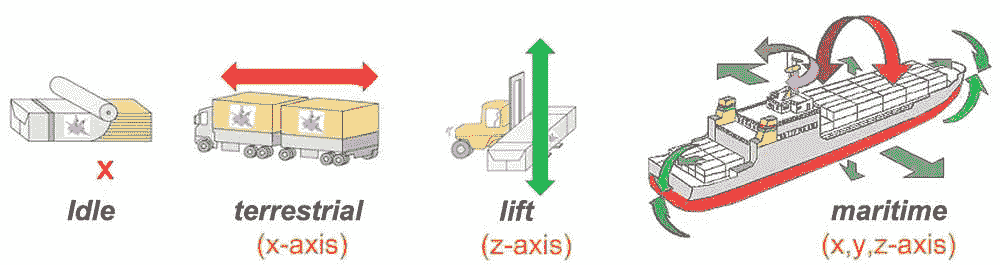

## 数据收集

对于数据收集，我们有几个选项可供选择。在实际场景中，我们可以将我们的设备，例如，直接连接到一个容器上，并将收集到的数据存储在 SD 卡上的文件中（例如，CSV 文件）。数据也可以通过 Wi-Fi 或蓝牙（如本项目所示：[Sensor DataLogger](https://www.hackster.io/mjrobot/sensor-datalogger-50e44d)）远程发送到附近的存储库，如手机。一旦您的数据集收集并存储为.CSV 文件，就可以使用[CSV 向导工具](https://docs.edgeimpulse.com/docs/edge-impulse-studio/data-acquisition/csv-wizard)上传到工作室。

> 在这个[视频](https://youtu.be/2KBPq_826WM)中，你可以学习将数据发送到 Edge Impulse Studio 的替代方法。

### 准备数据收集代码

在这个实验室中，我们将直接将套件连接到 Edge Impulse Studio，它也将用于数据预处理、模型训练、测试和部署。

对于数据收集，我们首先应该将套件连接到 Edge Impulse Studio，它也将用于数据预处理、模型训练、测试和部署。

> 按照以下[链接](https://docs.edgeimpulse.com/docs/edge-impulse-cli/cli-installation)中的说明，在你的计算机上安装 [Node.js](https://nodejs.org/en/) 和 Edge Impulse CLI。

由于 XIAOML 套件不是 Edge Impulse 完全支持的开发板，例如，我们应该使用[CLI 数据转发器](https://docs.edgeimpulse.com/docs/edge-impulse-cli/cli-data-forwarder)来捕获我们的传感器数据并将其发送到 Studio，如图所示：

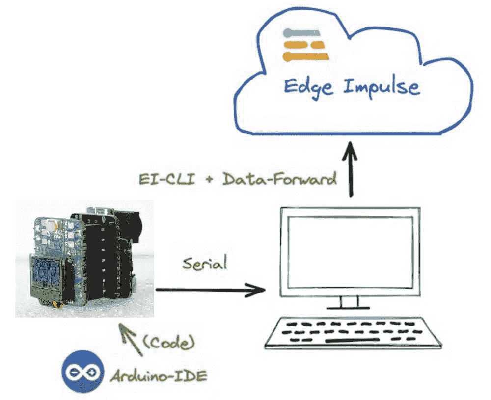

我们将修改测试代码以输出适合 Edge Impulse 的数据格式：

```py
#include <LSM6DS3.h>
#include <Wire.h>

#define FREQUENCY_HZ 50
#define INTERVAL_MS (1000  /  (FREQUENCY_HZ  +  1))

LSM6DS3 myIMU(I2C_MODE, 0x6A);
static unsigned long last_interval_ms = 0;

void setup() {
  Serial.begin(115200);
  while (!Serial) delay(10);

  Serial.println("XIAOML Kit - Motion Data Collection");
  Serial.println("LSM6DS3TR-C IMU Sensor");

  // Initialize IMU
  if (myIMU.begin() != 0) {
      Serial.println("ERROR: IMU initialization failed!");
      while(1) delay(1000);
  }

  delay(2000);
  Serial.println("Starting data collection in 3 seconds...");
  delay(3000);
}

void loop() {
  if (millis() > last_interval_ms + INTERVAL_MS) {
      last_interval_ms = millis();

      // Read accelerometer data
      float ax = myIMU.readFloatAccelX();
      float ay = myIMU.readFloatAccelY();
      float az = myIMU.readFloatAccelZ();

      // Convert to m/s² (multiply by 9.81)
      float ax_ms2 = ax * 9.81;
      float ay_ms2 = ay * 9.81;
      float az_ms2 = az * 9.81;

      // Output in Edge Impulse format
      Serial.print(ax_ms2);
      Serial.print("\t");
      Serial.print(ay_ms2);
      Serial.print("\t");
      Serial.println(az_ms2);
  }
}
```

将代码上传到 Arduino IDE。我们应该在串行监视器中看到加速度计的值（转换为 m/s²）：

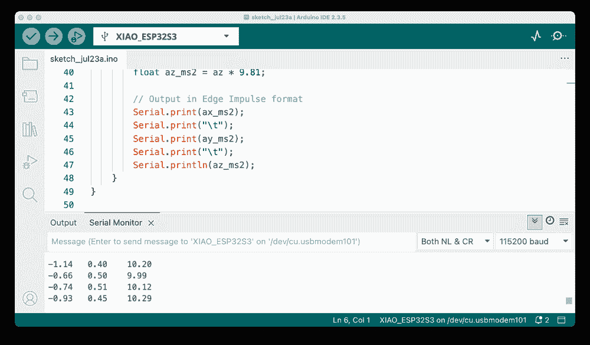

> 保持代码运行，但**关闭串行监视器**。套件生成的数据将通过串行连接发送到 Edge Impulse Studio。

### 连接到 Edge Impulse 进行数据收集

**创建 Edge Impulse 项目** - 前往 Edge Impulse Studio 并创建一个新的项目 - 选择一个描述性的名称（为了与 Arduino 库兼容，名称长度请保持在 63 个字符以内）


**设置 CLI 数据转发器** - 在你的计算机上安装 Edge Impulse CLI - 确认 XIAOML 套件已连接到计算机，**代码正在运行且串行监视器已关闭**，否则我们可能会遇到错误。 - 在计算机终端运行：`edge-impulse-data-forwarder --clean` - 输入你的 Edge Impulse 凭据 - 选择你的项目并配置设备设置

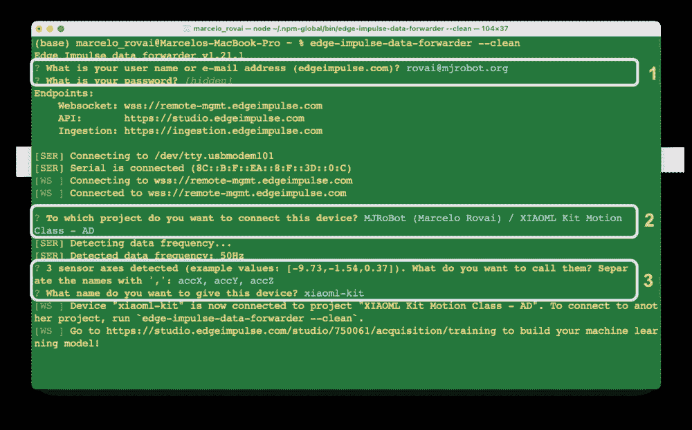

+   前往 Edge Impulse Studio 项目。在“设备”部分可以验证套件是否正确连接（点应该是绿色的）。

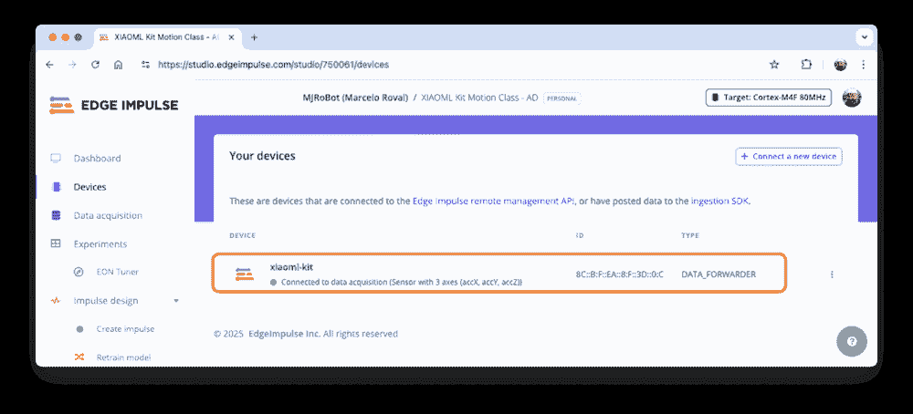

## 在 Studio 进行数据收集

如前所述，我们应该从所有四个**运输类别**中捕获数据。想象一下，你有一个内置加速度计的容器（在这种情况下，我们的 XIAOML 套件）。现在想象你的容器在一艘船上，面对愤怒的大海：

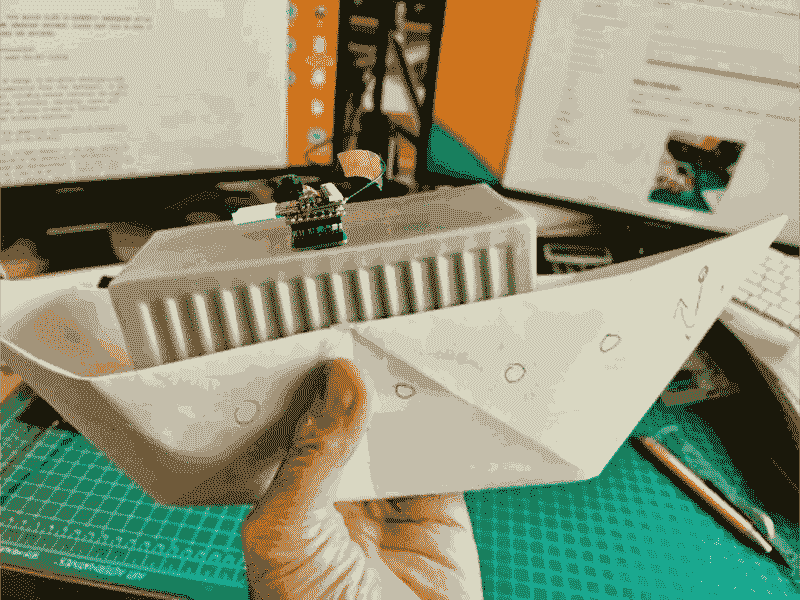

或者在一个卡车、在道路上行驶，或者被叉车移动等情况下。

### 运动模拟

**海事类别**：

+   持住套件并模拟船只运动

+   以波浪状、起伏的运动在三个轴上移动

+   包括轻微的滚动和俯仰运动

**地面类别**：

+   将套件沿直线水平移动（从左到右和相反方向）

+   通过小幅度的水平震动来模拟卡车/火车的振动

+   偶尔轻微的颠簸和转弯

**提升类别**：

+   主要在垂直方向上移动套件（上升和下降）

+   模拟叉车操作：上升，暂停，下降

+   包含一些短的水平定位运动

**空闲类别：**

+   将套件放置在稳定的表面上

+   最小或无运动

+   捕获环境振动和传感器噪声

### 数据采集

在 `数据采集` 部分，您应该看到您的板 `[xiaoml-kit]` 已连接。传感器可用： `[具有 3 个轴（accX，accY，accZ）的传感器]`，采样频率为 `[50 Hz]`。工作室建议样本长度为 `[10000]` 毫秒（10 秒）。最后要做的就是定义样本标签。让我们从`[陆地]`开始。

按下 `[开始采样]` 并将您的套件水平移动（从左到右），保持在一个方向上。10 秒后，我们的数据将被上传到工作室。

下面是 10 秒收集数据的其中一个样本（原始数据）。值得注意的是，波动运动主要沿着 Y 轴（左右）发生。其他轴几乎处于静止状态（X 轴围绕零中心，Z 轴由于重力围绕 9.8 ms²中心）。

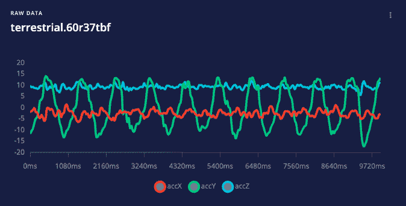

您应该为每个类别捕获大约 2 分钟（十个到十二个 10 秒的样本）。在每个样本之后使用“3 个点”，选择两个并将它们移动到**测试集**。或者，您可以使用**仪表板**标签页的**危险区域**上的自动**训练/测试分割**工具。下面，您可以看到结果数据集：

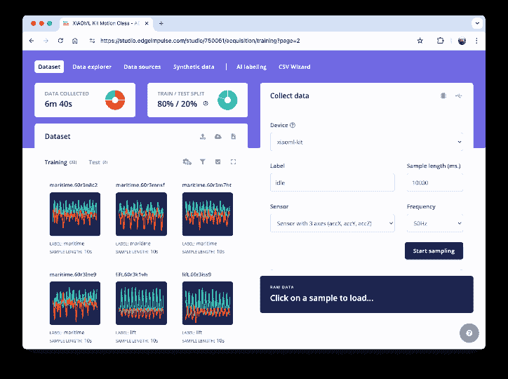

## 数据预处理

加速度计捕获的原始数据类型是“时间序列”，应将其转换为“表格数据”。我们可以通过在样本数据上使用滑动窗口来完成此转换。例如，在下面的图中，

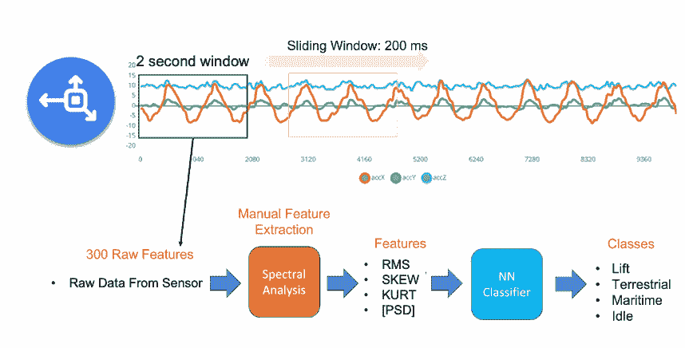

我们可以看到以 50 Hz 的采样率捕获的 10 秒加速度计数据。2 秒窗口将捕获 300 个数据点（3 轴 <semantics><mi>×</mi><annotation encoding="application/x-tex">\times</annotation></semantics> 2 秒 <semantics><mi>×</mi><annotation encoding="application/x-tex">\times</annotation></semantics> 50 个样本）。我们将每 200ms 滑动这个窗口，创建一个更大的数据集，其中每个实例都有 300 个原始特征。

> 您应该根据尼奎斯特定理使用最适合您情况的采样率，该定理指出，周期性信号必须以高于信号最高频率成分两倍以上的速率进行采样。

数据预处理是嵌入式机器学习的挑战领域。然而，Edge Impulse 通过其数字信号处理（DSP）预处理步骤以及更具体的频谱特征帮助克服这一挑战。

在 Studio 中，这个数据集将是频谱分析模块的输入，该模块非常适合分析重复运动，如加速度计的数据。此模块将执行 DSP（数字信号处理），提取“FFT”或“小波”等特征。在最常见的案例中，FFT，每个轴/通道的**时域统计特征**如下：

+   均方根

+   偏度

+   峰度

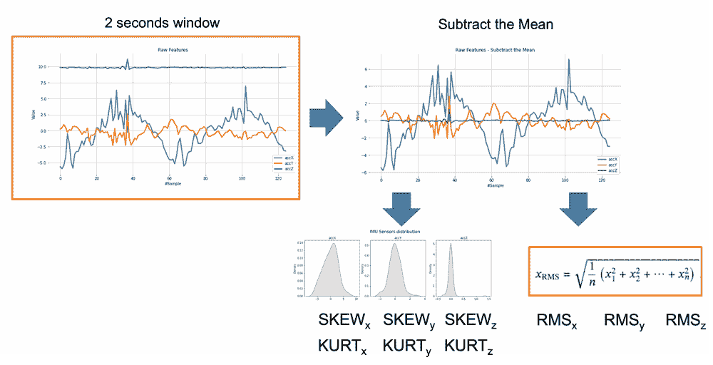

每个轴/通道的**频域特征**如下：

+   频谱功率

+   偏度

+   峰度

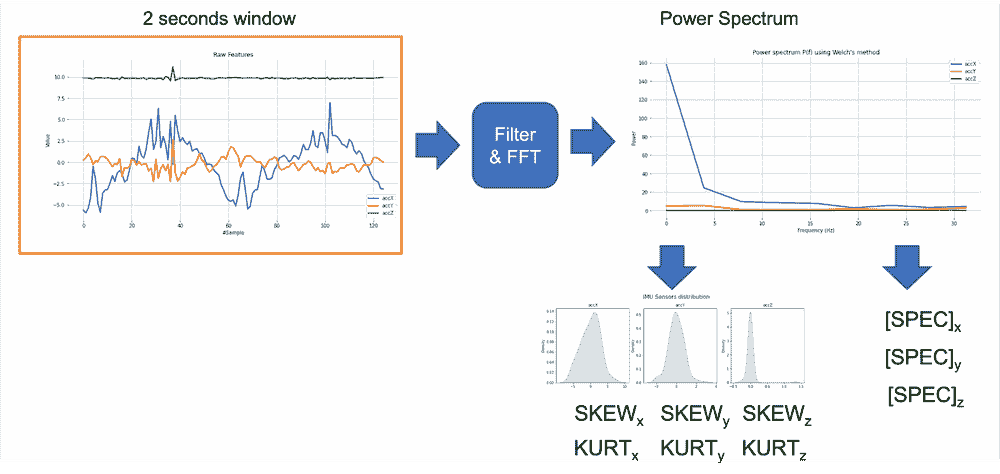

例如，对于 32 点的 FFT 长度，频谱分析模块的结果输出将是每个轴 21 个特征（总共 63 个特征）。

这 63 个特征将作为神经网络分类器和异常检测模型（K-Means）的输入张量。

> 您可以通过深入了解实验室的 DSP 频谱特征来了解更多信息。

## 模型设计

我们的分类器将是一个密集神经网络（DNN），其输入层将有 63 个神经元，两个隐藏层分别有 20 和 10 个神经元，以及一个输出层，有四个神经元（每个类别一个），如图所示：

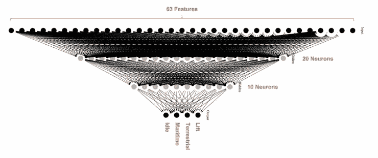

## 冲激设计

冲激从原始数据中提取特征，使用信号处理提取特征，然后使用学习模块（**密集模型**）对新数据进行分类。

我们还利用第二个模型，即**K-means**，它可以用于异常检测。如果我们想象我们的已知类别可以作为簇，那么任何无法适应这些簇的样本可能是一个异常值，一个异常（例如，在海洋上滚出船的集装箱或倒置在地面上）。

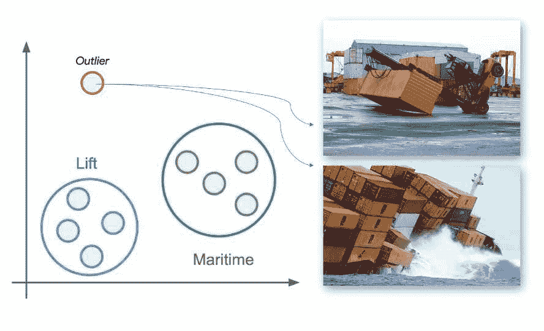

> 想象我们的 XIAOML 套件滚动或倒置移动，在一个与训练时不同的运动补全上。

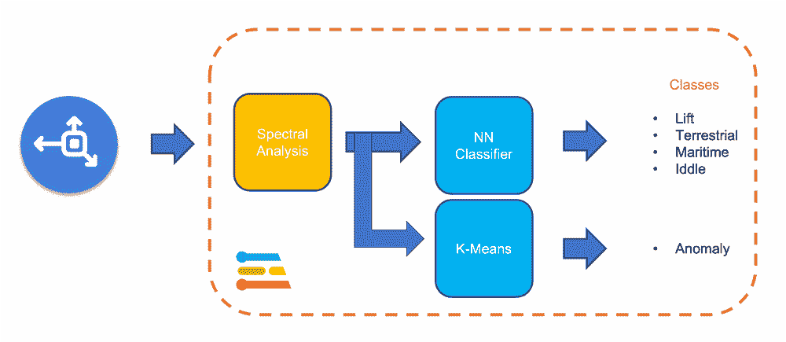

在最终的冲激设计下方：


## 生成特征

在我们的项目这个阶段，我们已经定义了预处理方法，并且模型已经设计完成。现在，是时候完成任务了。首先，让我们将原始数据（时间序列类型）转换为表格数据。转到“频谱特征”标签并选择“[保存参数]”。或者，我们也可以选择“[自动调整参数]”按钮。在这种情况下，Studio 将根据原始数据定义新的超参数，如滤波器设计和 FFT 长度。

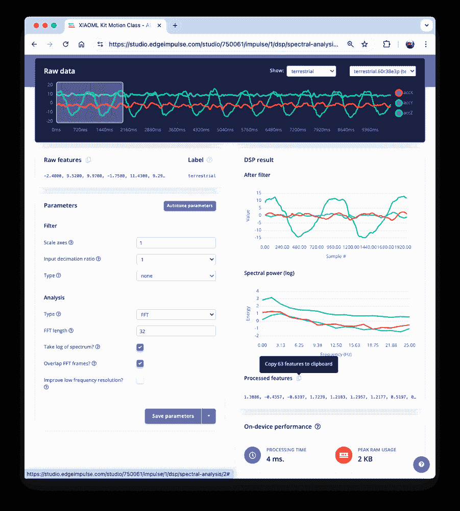

在顶部菜单中，选择“生成特征”标签，然后在那里选择选项，“计算特征重要性”，“归一化特征”，然后按“[生成特征]”按钮。每个 2 秒的数据窗口（300 个数据点）将被转换成一个包含 63 个特征的单一表格数据点。

> 特征探索器将使用[UMAP](https://umap-learn.readthedocs.io/en/latest/)（均匀流形近似和投影）在 2D 中显示这些数据。UMAP 是一种降维技术，可用于可视化，类似于 t-SNE，但也可以用于一般的非线性降维。

可视化使得人们可以验证这些类别表现出优秀的分离，这表明分类器应该表现良好。

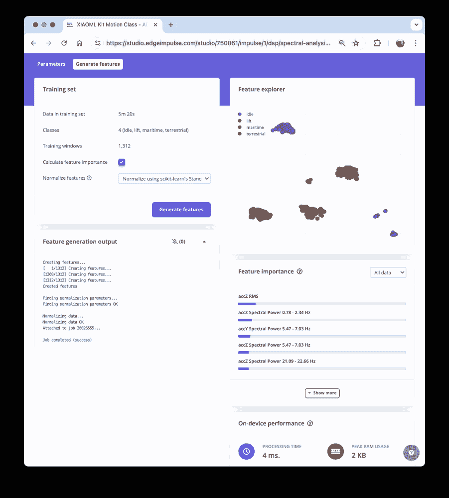

可选地，你可以分析每个特征相对于其他类别的相对重要性。

## 训练

我们的分类器将是一个密集神经网络（DNN），其输入层将有 63 个神经元，两个隐藏层分别有 20 和 10 个神经元，输出层有四个神经元（每个类别一个），如图所示：

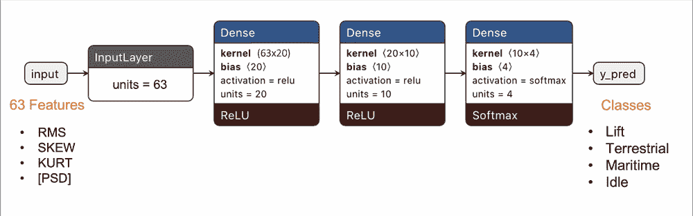

作为超参数，我们将使用学习率 0.005 和 20%的数据进行验证，持续 30 个 epoch。训练后，我们可以看到准确率为 100%。


对于异常检测，我们应该选择建议的特征，这些特征正是特征提取中最重要的一部分。簇的数量将是 32，如工作室所建议。训练后，我们可以选择一些数据进行测试，例如海洋数据。得到的异常分数为`min: -0.1642, max: 0.0738, avg: -0.0867`。

当更改数据时，可能会发现小的或负的异常分数表明数据是正常的。

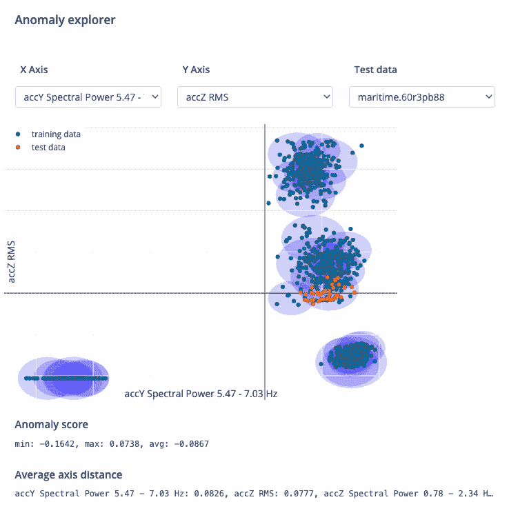

## 测试

使用在数据捕获阶段留下的 20%的数据，我们可以验证我们的模型在未知数据上的表现；如果不是 100%（预期的结果），结果仍然非常好（8%）。


你还应该使用你的套件（仍然连接到工作室）并执行一些实时分类。例如，让我们测试一些“地面”运动：

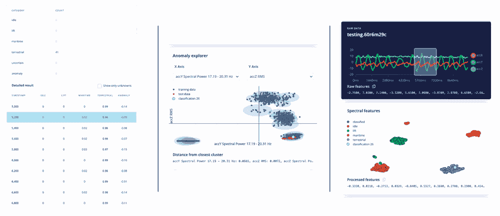

> 注意，在这里，你将使用你的设备捕获真实数据并将其上传到工作室，在那里将使用训练好的模型进行推理（注意模型不在你的设备上）。

## 部署

现在是时候施展魔法了！工作室将打包所有需要的库、预处理函数和训练好的模型，并将它们下载到你的电脑上。你应该选择 Arduino 库选项，然后在底部选择量化（Int8），然后点击“[构建]”。将创建一个 ZIP 文件并下载到你的电脑上。

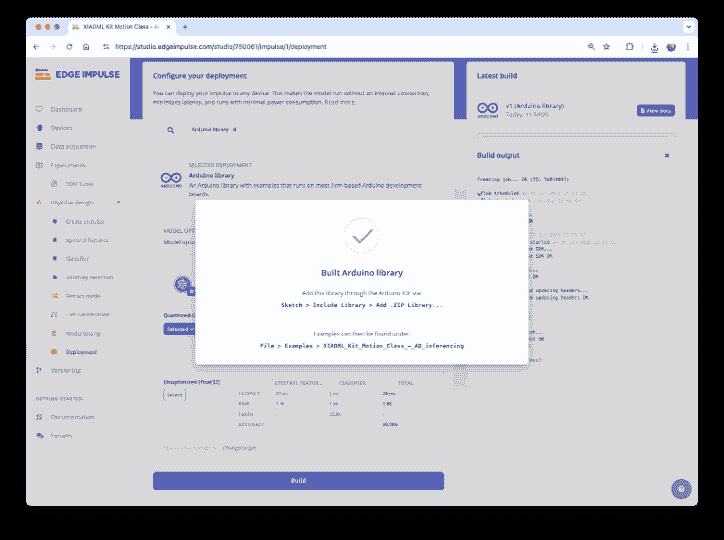

在你的 Arduino IDE 中，转到“草图”选项卡，选择添加.ZIP 库的选项，并选择由工作室下载的.zip 文件：

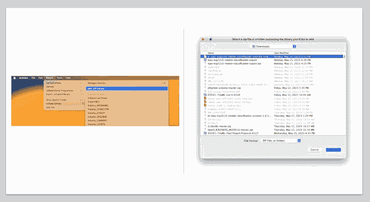

## 推理

现在，是时候进行真正的测试了。我们将进行与工作室完全断开的推理。让我们更改在部署 Arduino 库时创建的一个代码示例。

在你的 Arduino IDE 中，转到“文件/示例”选项卡，找到你的项目，在示例中，选择`nano_ble_sense_accelerometer`：

当然，这不是你的板子，但我们可以通过仅做少量修改使代码工作。

例如，在代码的开头，你有与 Arduino Sense IMU 相关的库：

```py
/* Includes -------------------------------------------- */
#include <XIAOML_Kit_Motion_Class_-_AD_inferencing.h>
#include <Arduino_LSM9DS1.h>
```

将与 IMU 相关的代码部分“includes”进行修改：

```py
#include <XIAOML_Kit_Motion_Class_-_AD_inferencing.h>
#include <LSM6DS3.h>
#include <Wire.h>
```

修改常量定义

```py
// IMU setup
LSM6DS3 myIMU(I2C_MODE, 0x6A);

// Inference settings
#define CONVERT_G_TO_MS2 9.81f
#define MAX_ACCEPTED_RANGE 2.0f  *  CONVERT_G_TO_MS2
```

在设置函数中，初始化 IMU：

```py
   // Initialize IMU
    if (myIMU.begin() != 0) {
        Serial.println("ERROR: IMU initialization failed!");
        return;
    }
```

在循环函数中，缓冲区 buffer[ix]、buffer[ix + 1]和 buffer[ix + 2]将接收加速度计捕获的 3 轴数据。在原始代码中，你有以下行：

```py
IMU.readAcceleration(buffer[ix], buffer[ix + 1], buffer[ix + 2]);
```

用以下代码块替换它：

```py
// Read IMU data
float x = myIMU.readFloatAccelX();
float y = myIMU.readFloatAccelY();
float z = myIMU.readFloatAccelZ();
```

你应该重新排列以下两个代码块。首先，将原始数据转换为“每平方秒米（m/s²）”，然后进行关于最大接受范围的测试（在这里是 m/s²，但在 Arduino 上是 Gs）：

```py
  // Convert to m/s²
  buffer[i + 0] = x * CONVERT_G_TO_MS2;
  buffer[i + 1] = y * CONVERT_G_TO_MS2;
  buffer[i + 2] = z * CONVERT_G_TO_MS2;

  // Apply range limiting
  for (int j = 0; j < 3; j++) {
      if (fabs(buffer[i + j]) > MAX_ACCEPTED_RANGE) {
          buffer[i + j] = copysign(MAX_ACCEPTED_RANGE, buffer[i + j]);
      }
  }
```

而且这就足够了。我们还可以调整在串行监视器中显示推理的方式。你现在可以上传下面的完整代码到你的设备上，并继续进行推理。

```py
// Motion Classification with LSM6DS3TR-C IMU
#include <XIAOML_Kit_Motion_Class_-_AD_inferencing.h>
#include <LSM6DS3.h>
#include <Wire.h>

// IMU setup
LSM6DS3 myIMU(I2C_MODE, 0x6A);

// Inference settings
#define CONVERT_G_TO_MS2 9.81f
#define MAX_ACCEPTED_RANGE 2.0f  *  CONVERT_G_TO_MS2

static bool debug_nn = false;
static float buffer[EI_CLASSIFIER_DSP_INPUT_FRAME_SIZE] = { 0 };
static float inference_buffer[EI_CLASSIFIER_DSP_INPUT_FRAME_SIZE];

void setup() {
    Serial.begin(115200);
    while (!Serial) delay(10);

    Serial.println("XIAOML Kit - Motion Classification");
    Serial.println("LSM6DS3TR-C IMU Inference");

    // Initialize IMU
    if (myIMU.begin() != 0) {
        Serial.println("ERROR: IMU initialization failed!");
        return;
    }

    Serial.println("✓ IMU initialized");

    if (EI_CLASSIFIER_RAW_SAMPLES_PER_FRAME != 3) {
        Serial.println("ERROR: EI_CLASSIFIER_RAW_SAMPLES_PER_FRAME"
                       "should be 3");
        return;
    }

    Serial.println("✓ Model loaded");
    Serial.println("Starting motion classification...");
}

void loop() {
    ei_printf("\nStarting inferencing in 2 seconds...\n");
    delay(2000);

    ei_printf("Sampling...\n");

    // Clear buffer
    for (size_t i = 0; i < EI_CLASSIFIER_DSP_INPUT_FRAME_SIZE; i++) {
        buffer[i] = 0.0f;
    }

    // Collect accelerometer data
    for (int i = 0; i < EI_CLASSIFIER_DSP_INPUT_FRAME_SIZE; i += 3) {
        uint64_t next_tick = micros() +
          (EI_CLASSIFIER_INTERVAL_MS * 1000);

        // Read IMU data
        float x = myIMU.readFloatAccelX();
        float y = myIMU.readFloatAccelY();
        float z = myIMU.readFloatAccelZ();

        // Convert to m/s²
        buffer[i + 0] = x * CONVERT_G_TO_MS2;
        buffer[i + 1] = y * CONVERT_G_TO_MS2;
        buffer[i + 2] = z * CONVERT_G_TO_MS2;

        // Apply range limiting
        for (int j = 0; j < 3; j++) {
            if (fabs(buffer[i + j]) > MAX_ACCEPTED_RANGE) {
                buffer[i + j] = copysign(MAX_ACCEPTED_RANGE,
                                         buffer[i + j]);
            }
        }

        delayMicroseconds(next_tick - micros());
    }

    // Copy to inference buffer
    for (int i = 0; i < EI_CLASSIFIER_DSP_INPUT_FRAME_SIZE; i++) {
        inference_buffer[i] = buffer[i];
    }

    // Create signal from buffer
    signal_t signal;
    int err = numpy::signal_from_buffer(inference_buffer,
              EI_CLASSIFIER_DSP_INPUT_FRAME_SIZE, &signal);
    if (err != 0) {
        ei_printf("ERROR: Failed to create signal from buffer (%d)\n",
                  err);
        return;
    }

    // Run the classifier
    ei_impulse_result_t result = { 0 };
    err = run_classifier(&signal, &result, debug_nn);
    if (err != EI_IMPULSE_OK) {
        ei_printf("ERROR: Failed to run classifier (%d)\n", err);
        return;
    }

    // Print predictions
    ei_printf("Predictions (DSP: %d ms, Classification: %d ms, "
              "Anomaly: %d ms):\n",
        result.timing.dsp, result.timing.classification, result.timing.anomaly);

    for (size_t ix = 0; ix < EI_CLASSIFIER_LABEL_COUNT; ix++) {
        ei_printf(" %s: %.5f\n", result.classification[ix].label,
                  result.classification[ix].value);
    }

    // Print anomaly score
#if EI_CLASSIFIER_HAS_ANOMALY == 1
    ei_printf("Anomaly score: %.3f\n", result.anomaly);
#endif

    // Determine prediction
    float max_confidence = 0.0;
    String predicted_class = "unknown";

    for (size_t ix = 0; ix < EI_CLASSIFIER_LABEL_COUNT; ix++) {
        if (result.classification[ix].value > max_confidence) {
            max_confidence = result.classification[ix].value;
            predicted_class = String(result.classification[ix].label);
        }
    }

    // Display result with confidence threshold
    if (max_confidence > 0.6) {
        ei_printf("\n🎯 PREDICTION: %s (%.1f%% confidence)\n",
                 predicted_class.c_str(), max_confidence * 100);
    } else {
        ei_printf("\n❓ UNCERTAIN: Highest confidence is %s (%.1f%%)\n",
                 predicted_class.c_str(), max_confidence * 100);
    }

    // Check for anomaly
#if EI_CLASSIFIER_HAS_ANOMALY == 1
    if (result.anomaly > 0.5) {
        ei_printf("⚠️ ANOMALY DETECTED! Score: %.3f\n", result.anomaly);
    }
#endif

    delay(1000);
}

void ei_printf(const char *format, ...) {
    static char print_buf[1024] = { 0 };
    va_list args;
    va_start(args, format);
    int r = vsnprintf(print_buf, sizeof(print_buf), format, args);
    va_end(args);
    if (r > 0) {
        Serial.write(print_buf);
    }
}
```

> 完整的代码可在[实验室的 GitHub](https://github.com/Mjrovai/XIAO-ESP32S3-Sense/tree/main/XIAOML_Kit_code/motion_class_ad_inference)上找到

现在你应该尝试你的动作，查看每个类别的推理结果在图像上的显示：

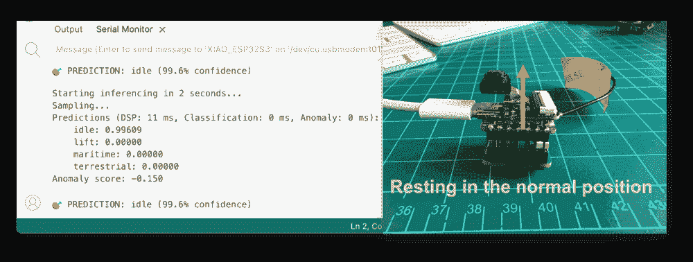

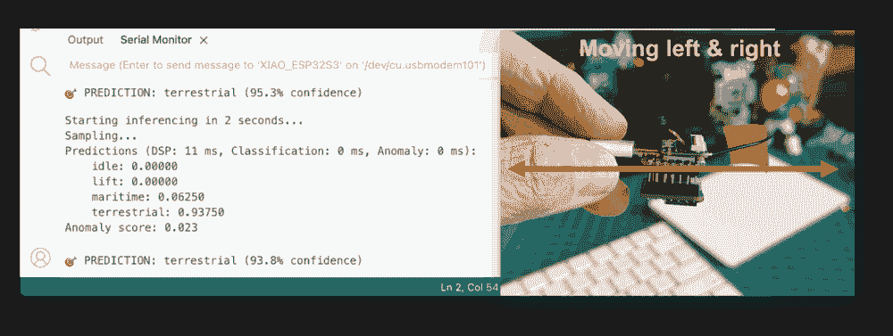

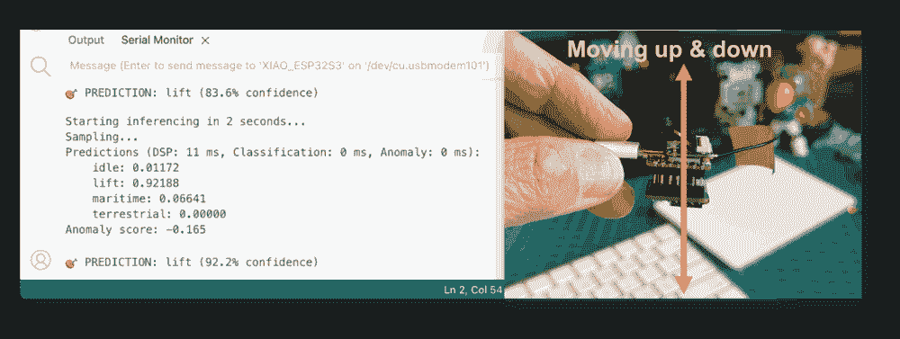

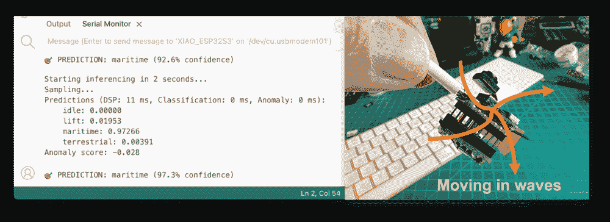

当然，还有一些“异常”，例如将 XIAO 倒置。异常分数将超过 0.5：

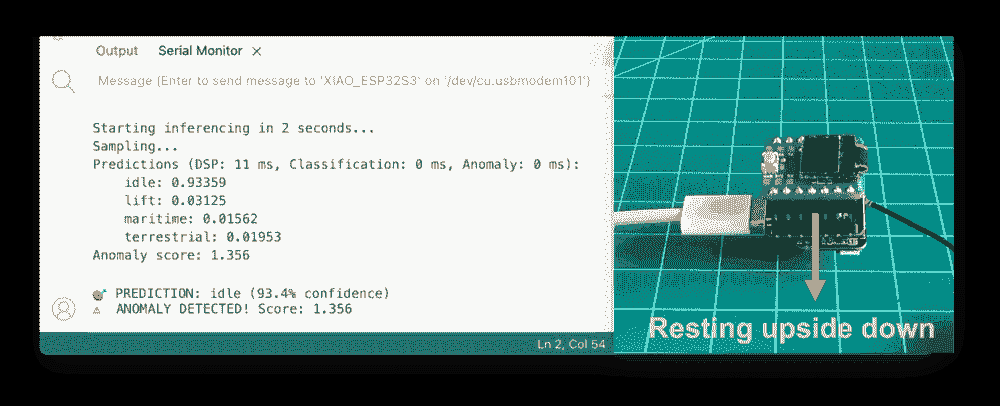

## 后处理

既然我们知道模型正在工作，我们建议修改代码以查看套件完全离线（断开与 PC 的连接，由电池、移动电源或独立的 5V 电源供电）的结果。

理念是如果检测到特定的动作，相应的信息将出现在 OLED 显示屏上。

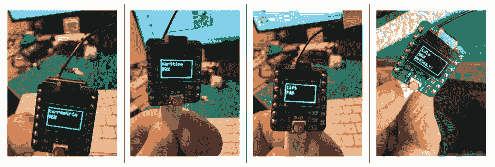

修改后的推理代码，用于 OLED 显示屏，可在[实验室的 GitHub](https://github.com/Mjrovai/XIAO-ESP32S3-Sense/tree/main/XIAOML_Kit_code/motion_class_ad_inference_oled)上找到。

## 摘要

本实验室展示了如何使用 XIAOML 套件的内置 LSM6DS3TR-C IMU 传感器构建完整的运动分类系统。主要成就包括：

**技术实现：**

+   利用集成的 6 轴 IMU 进行运动感应

+   收集了四种交通场景的标记训练数据

+   实现了时间序列分析的光谱特征提取

+   部署了针对微控制器推理优化的神经网络分类器

+   添加了异常检测以识别不寻常的动作

**机器学习流程：**

+   直接从嵌入式传感器收集数据

+   使用频域分析进行特征工程

+   在 Edge Impulse 中训练和优化模型

+   在资源受限的硬件上进行实时推理

+   性能监控和验证

**实际应用：** 学习到的技术可以直接应用于现实场景，包括：

+   资产跟踪和物流监控

+   机器设备的预测性维护

+   人类活动识别

+   车辆和设备监控

+   智能城市中的物联网传感器网络

**关键学习点：**

+   与 IMU 坐标系统和传感器融合工作

+   在边缘设备上平衡模型准确性与推理速度

+   实现稳健的数据收集和预处理管道

+   将机器学习模型部署到嵌入式系统

+   集成多个传感器（IMU + 显示）以实现完整解决方案

将运动分类与 XIAOML 套件集成展示了现代嵌入式系统如何本地执行复杂的 AI 任务，实现无需依赖云端的实时决策。这种方法对于工业物联网、自主系统和智能设备应用中边缘 AI 的未来至关重要。

## 资源

+   [XIAOML 套件代码](https://github.com/Mjrovai/XIAO-ESP32S3-Sense/tree/main/XIAOML_Kit_code)

+   DSP 频谱特征

+   [Edge Impulse 项目](https://studio.edgeimpulse.com/public/750061/live)

+   [Edge Impulse 频谱特征块 Colab 笔记本](https://colab.research.google.com/github/Mjrovai/Arduino_Nicla_Vision/blob/main/Motion_Classification/Edge_Impulse_Spectral_Features_Block.ipynb)

+   [Edge Impulse 文档](https://docs.edgeimpulse.com/)

+   [Edge Impulse 频谱特征](https://docs.edgeimpulse.com/docs/edge-impulse-studio/processing-blocks/spectral-features)

+   [Seeed Studio LSM6DS3 库](https://github.com/Seeed-Studio/Seeed_Arduino_LSM6DS3)
