# 设置和无代码应用

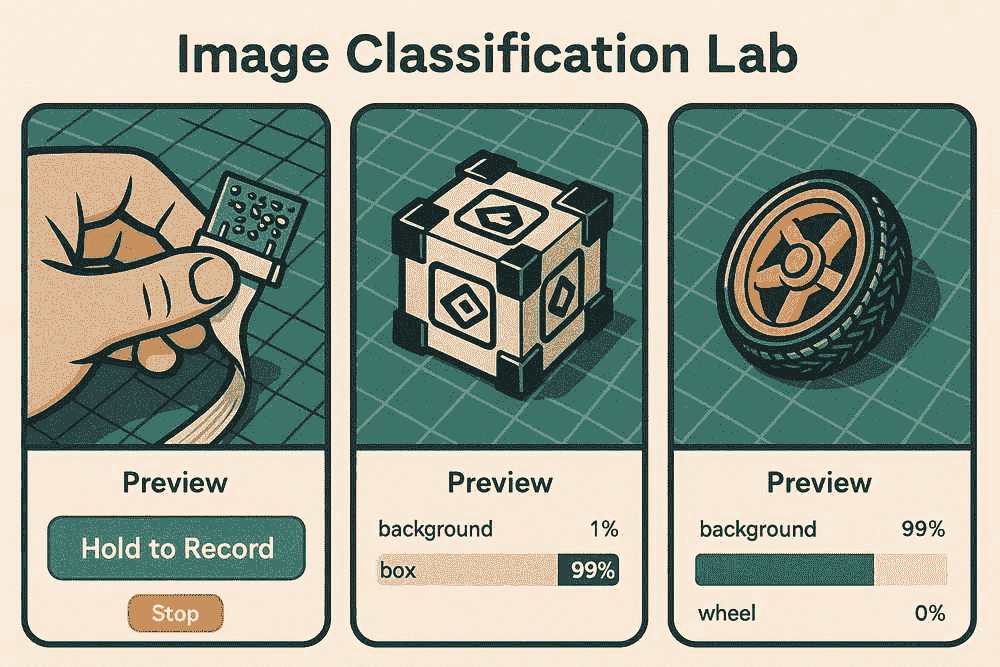

在这个实验室中，我们将探索使用 Seeed Studio [*Grove Vision AI 模块 V2*](https://wiki.seeedstudio.com/grove_vision_ai_v2/) 的计算机视觉 (CV) 应用，这是一个专为嵌入式机器学习应用设计的强大而紧凑的设备。基于 **Himax WiseEye2** 芯片，该模块旨在使边缘设备具备 AI 功能，使其成为边缘机器学习 (ML) 应用的理想工具。

## 简介

### Grove Vision AI 模块 (V2) 概述

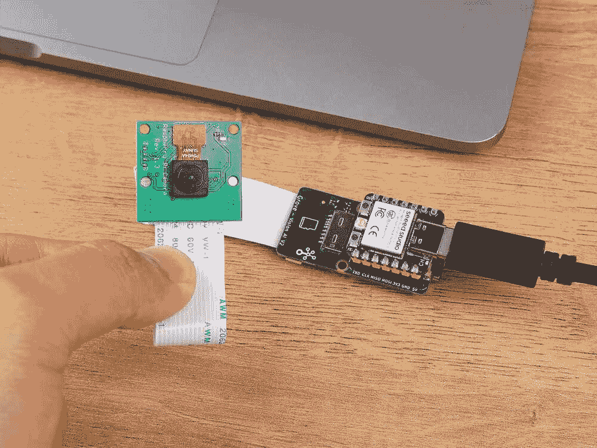

Grove Vision AI (V2) 是一个基于 MCU 的视觉 AI 模块，它使用一个 [Himax WiseEye2 HX6538](https://www.himax.com.tw/products/intelligent-sensing/always-on-smart-sensing/wiseeye2-ai-processor/) 处理器，该处理器具有**双核 Arm Cortex-M55 和一个集成的 ARM Ethos-U55 神经网络单元**。[Arm Ethos-U55](https://www.arm.com/products/silicon-ip-cpu/ethos/ethos-u55) 是一个机器学习 (ML) 处理器类别，特别设计为微 NPU，以加速在区域受限的嵌入式和物联网设备中的 ML 推理。Ethos-U55 与 AI 兼容的 Cortex-M55 处理器结合，在基于 Cortex-M 的现有系统中提供了 480 倍的 ML 性能提升。其时钟频率为 400 MHz，其内部系统内存（SRAM）可配置，最大容量为 2.4 MB。

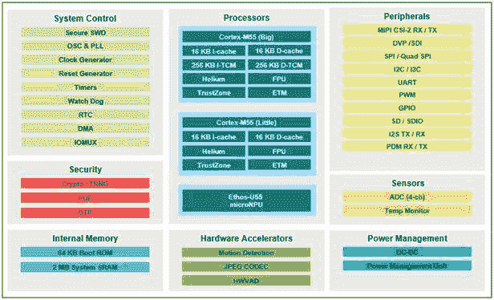

> 注意：根据 Seeed Studio 文档，除了 Himax 内部内存 2.5MB（2.4MB SRAM + 64KB ROM）外，Grove Vision AI (V2) 还配备了一个 16MB/133 MHz 的外部闪存。

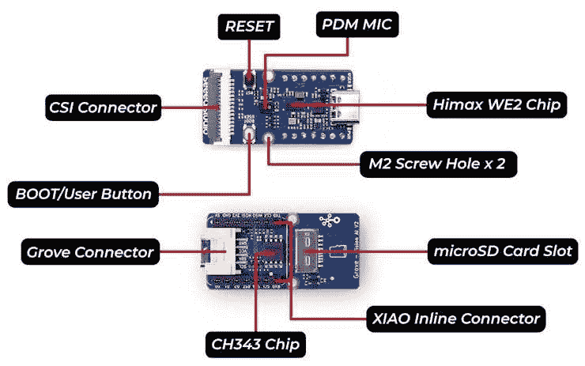

下面是 Grove Vision AI (V2) 系统的框图，包括一个摄像头和一个主控制器。

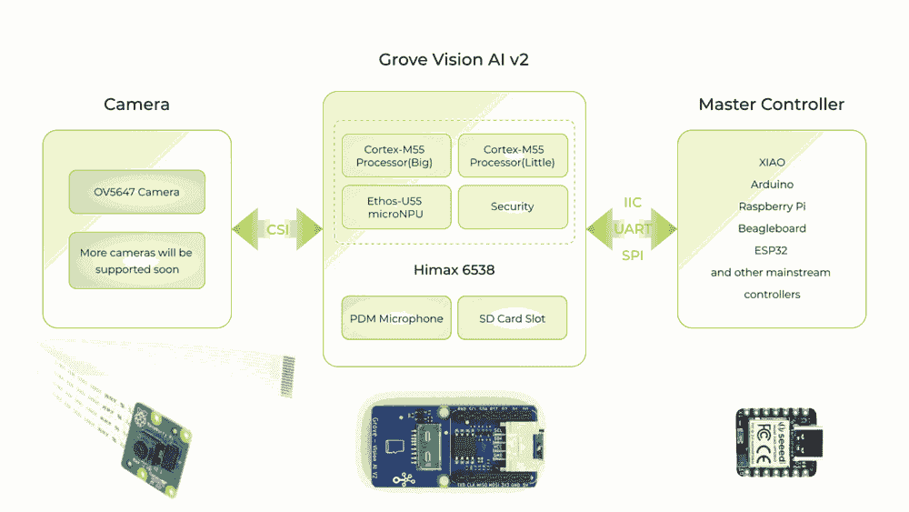

通过**IIC、UART、SPI 和 Type-C**等接口，Grove Vision AI (V2) 可以轻松连接到 XIAO、Raspberry Pi、BeagleBoard 和基于 ESP 的产品等设备，以进行进一步开发。例如，将 Grove Vision AI V2 与 XIAO 系列设备之一集成，可以通过 Arduino IDE 或 MicroPython 容易地访问设备推理的结果数据，并方便地连接到云端或专用服务器，如家庭助手。

> 使用**I2C Grove 连接器**，Grove Vision AI V2 可以轻松连接到任何主设备。

除了性能之外，另一个值得评论的领域是**功耗**。例如，在与 XIAO ESP32S3 Sense 的比较测试中，运行 Swift-YOLO Tiny 96x96，尽管实现了更高的性能（30 FPS 对 5.5 FPS），但与 XIAO ESP32S3 Sense 相比，Grove Vision AI V2 表现出更低的功耗（0.35 W 对 0.45 W）。

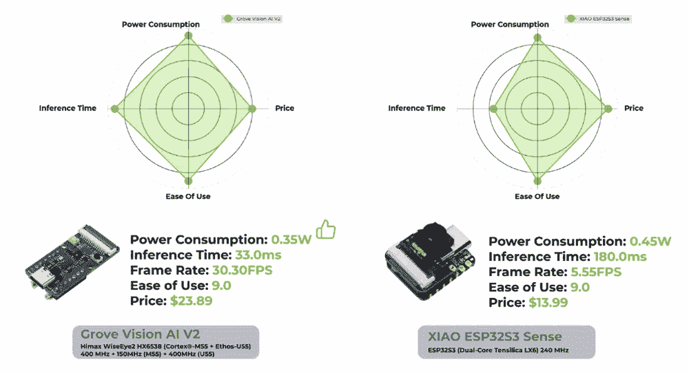

> 上述比较（以及与其他设备的比较）可以在文章 [2024 MCU AI 视觉板：性能比较](https://www.hackster.io/limengdu0117/2024-mcu-ai-vision-boards-performance-comparison-998505) 中找到，该文章证实了 Grove Vision AI (V2) 的强大功能。

### 摄像头安装

准备好 Grove Vision AI (V2) 和摄像头后，您可以通过 CSI 线连接，例如 **Raspberry Pi OV5647 摄像头模块**。

> 连接时，请注意引脚排的方向，并确保它们正确插入，而不是反方向。

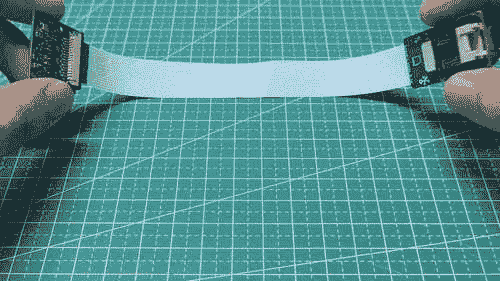

## SenseCraft AI Studio

[SenseCraft AI](https://sensecraft.seeed.cc/ai/home) Studio 是一个强大的平台，提供各种与各种设备兼容的 AI 模型，包括 XIAO ESP32S3 Sense 和 **Grove Vision AI V2**。在本实验中，我们将介绍如何使用 Grove Vision AI V2 的 AI 模型，并预览模型的输出。我们还将探讨一些关键概念、设置以及如何优化模型性能。

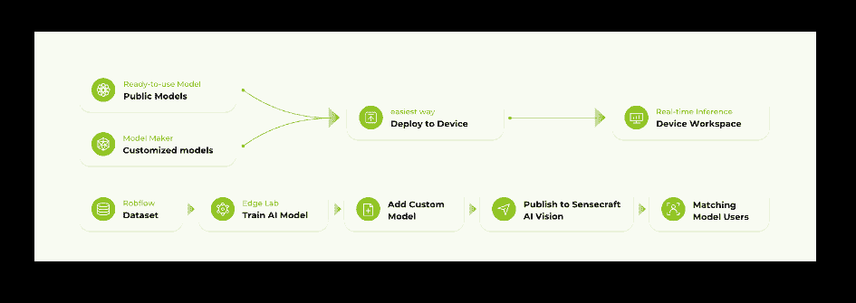

模型也可以使用 [**SenseCraft Web Toolkit**](https://seeed-studio.github.io/SenseCraft-Web-Toolkit/#/setup/process) 部署，这是 SenseCraft AI Studio 的简化版本。

> 为了简单起见，我们可以开始使用 SenseCraft Web Toolkit，或者直接进入 [SenseCraft AI Studio](https://sensecraft.seeed.cc/ai/model)，那里有更多资源。

### SenseCraft Web-Toolkit

SenseCraft Web Toolkit 是 [SSCMA](https://sensecraftma.seeed.cc/)(Seeed SenseCraft Model Assistant) 中包含的可视化模型部署工具。此工具使我们能够通过简单的操作轻松地将模型部署到各种平台。该工具提供用户友好的界面，无需任何编码。

SenseCraft Web Toolkit 是基于 Himax AI Web Toolkit 的，它可以从 [这里](https://github.com/HimaxWiseEyePlus/Seeed_Grove_Vision_AI_Module_V2/releases/download/v1.1/Himax_AI_web_toolkit.zip) （**可选**）下载。下载后解压到本地 PC，双击 `index.html` 以本地运行。

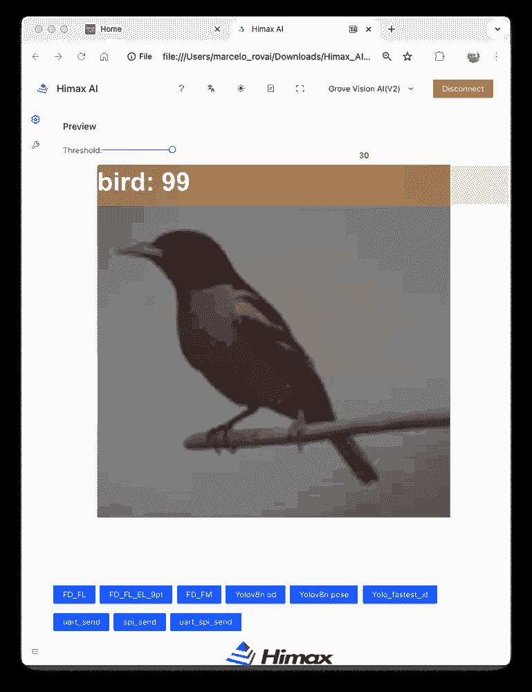

但在我们的情况下，让我们按照以下步骤开始 **SenseCraft-Web-Toolkit**：

+   在 **Chrome** 浏览器中打开 [SenseCraft-Web-Toolkit 网站](https://seeed-studio.github.io/SenseCraft-Web-Toolkit/#/setup/process)。

+   使用 Type-C 线将 Grove Vision AI (V2) 连接到您的计算机。

+   连接 XIAO 后，选择如下：

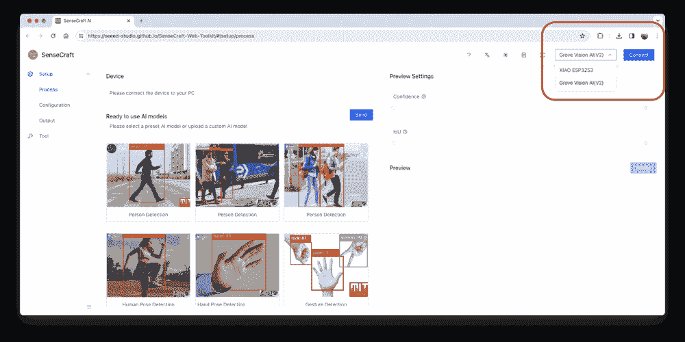

+   选择设备/端口，然后按 `[连接]`：

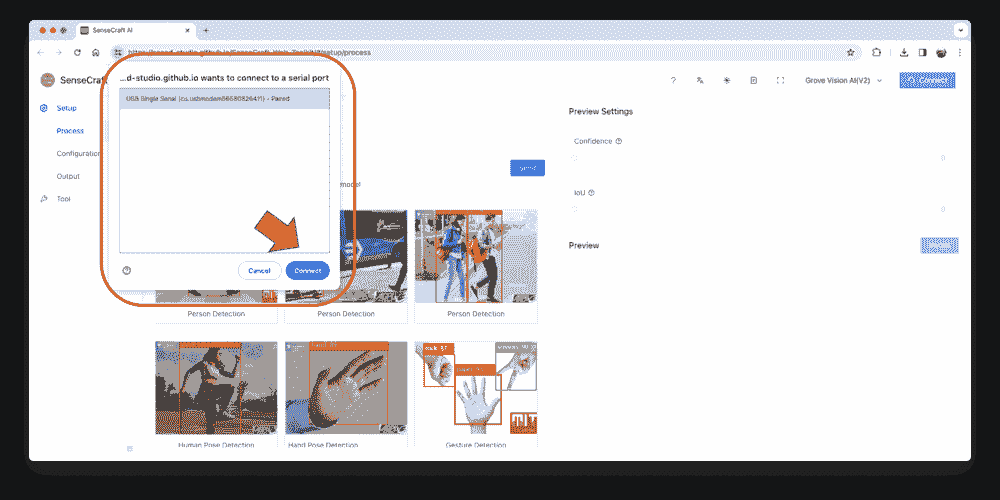

> 注意：**WebUSB 工具**可能在某些浏览器中无法正常工作，例如 Safari。请使用 Chrome。

我们可以尝试 Seeed Studio 之前上传的几个基本计算机视觉模型。将光标移过 AI 模型，我们可以了解一些关于它们的信息，例如名称、描述、**类别**（图像分类、目标检测或姿态/关键点检测）、**算法**（如 YOLO V5 或 V8、FOMO、MobileNet V2 等）和**指标**（准确度或 mAP）。

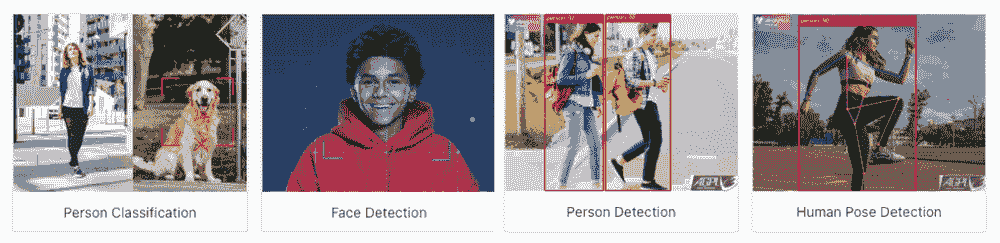

我们可以通过点击它并按 `[发送]` 按钮选择那些现成的 AI 模型之一，或者上传我们的模型。

对于**SenseCraft AI**平台，请按照[这里](https://wiki.seeedstudio.com/sensecraft_ai_pretrained_models_for_grove_visionai_v2/)的说明操作。

## 探索 CV AI 模型

### 目标检测

目标检测是计算机视觉中的一个关键技术，它专注于在数字图像或视频帧中识别和定位对象。与将整个图像分类为单个标签的图像分类不同，目标检测识别图像中的多个对象并确定它们的精确位置，通常由边界框表示。这种能力对于广泛的用途至关重要，包括自动驾驶汽车、安全、监控系统以及增强现实，在这些应用中，理解视觉环境中的上下文和内容是至关重要的。

在目标检测中设定基准的常见架构包括 YOLO（You Only Look Once）、SSD（Single Shot MultiBox Detector）、FOMO（Faster Objects, More Objects）和 Faster R-CNN（基于区域的卷积神经网络）模型。

让我们选择一个现成的 AI 模型，例如**人员检测**，它使用 Swift-YOLO 算法进行训练。

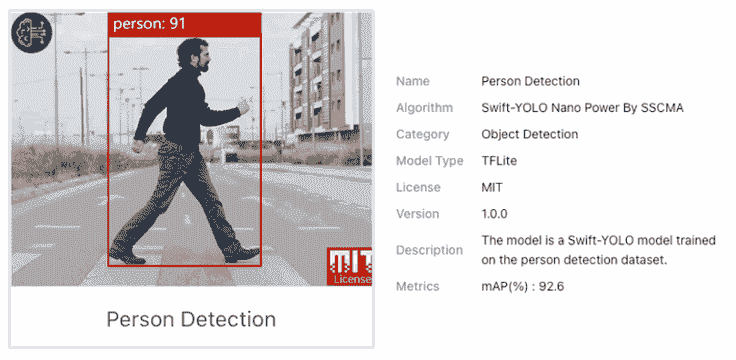

一旦模型成功上传，你可以在右侧预览区域看到 Grove Vision AI (V2)摄像头的实时流。此外，通过点击顶部的 `[设备日志]` 按钮可以在串行监视器上显示推理详情。

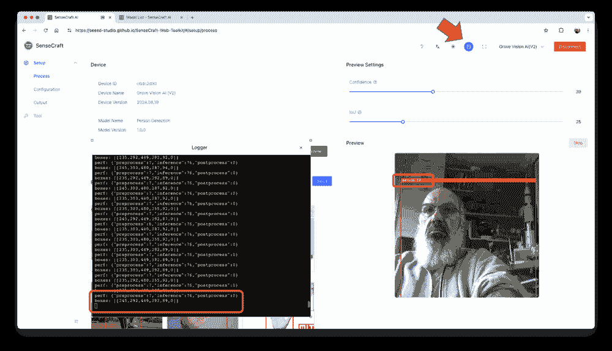

> 在 SenseCraft AI Studio 中，设备日志始终在屏幕上。

将摄像头对准我，只检测到一个人，因此模型输出将是一个单独的“框”。仔细观察，模块会连续发送两行信息：

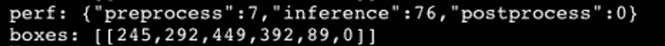

**perf**（性能），显示毫秒级的延迟。

+   预处理时间（图像捕获和裁剪）：**7ms**；

+   推理时间（模型延迟）：**76ms (13 fps)**

+   后处理时间（显示图像和数据包含）：小于 0ms。

**boxes**: 显示图像中检测到的对象。在这种情况下，只有一个。

+   框的坐标为 x, y, w, h （**245**, **292**，**449**，**392**），并且对象（人，标签 **0**）的捕获值为 .**89**。

如果我们用摄像头指向有几个人的图像，我们将为每个人（对象）得到一个框：

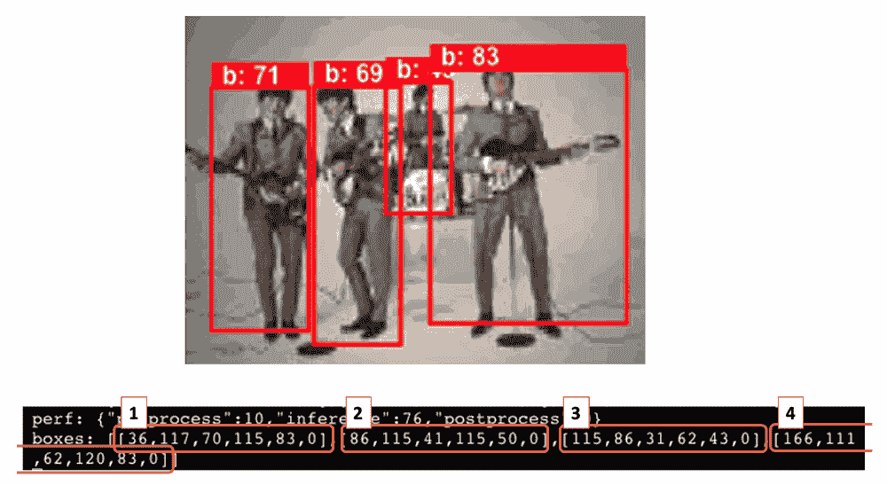

> 在 SenseCraft AI Studio 上，推理延迟（48ms）低于 SenseCraft ToolKit（76ms），这是由于独特的部署实现。

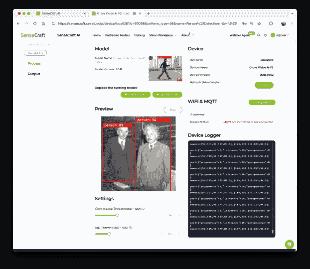

**功耗**

运行这个 Swift-YOLO 模型时的峰值功耗为 410 毫瓦。

**预览设置**

我们可以看到，在设置中，有两个设置选项可以调整以优化模型的识别精度。

+   **置信度**：指模型对其预测赋予的确定性或概率水平。此值确定模型认为检测有效所需的最小置信度水平。较高的置信度阈值将导致检测数量减少但确定性更高，而较低的阈值将允许更多检测，但可能包括一些误报。

+   **IoU**：用于评估预测边界框与真实边界框的准确性。IoU 是一个度量指标，用于衡量预测边界框与真实边界框之间的重叠。它用于确定目标检测的准确性。IoU 阈值设置了对检测被认为是真正阳性的最小 IoU 值。调整此阈值可以帮助微调模型的精确度和召回率。

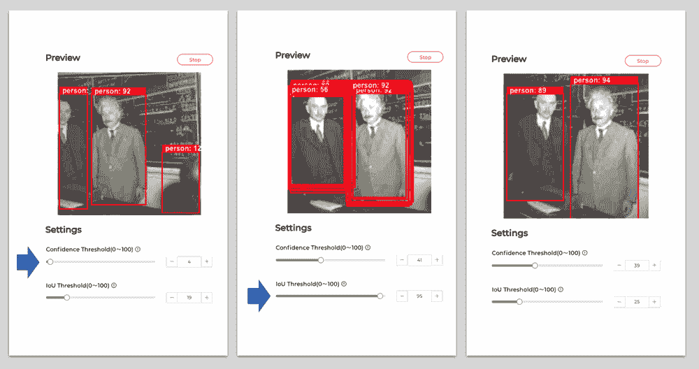

> 尝试调整置信度阈值和 IoU 阈值的不同值，以找到在准确检测人员的同时最小化误报的最佳平衡。最佳设置可能因我们的具体应用和图像或视频流的特点而异。

### **姿态/关键点检测**

姿态或关键点检测是计算机视觉中的一个复杂领域，它专注于在图像或视频帧中识别特定的兴趣点，通常与人体、面部或其他感兴趣的对象相关。这项技术可以检测并绘制出主题的各种关键点，如人体上的**关节**或面部的特征，从而实现姿态、运动和手势的分析。这对于各种应用具有深远的影响，包括增强现实、人机交互、运动分析和医疗监测，在这些应用中，理解人体运动和活动至关重要。

与一般目标检测不同，目标检测识别并定位对象，姿态检测则深入到更细致的细节，捕捉特定部分的细微位置和方向。该领域的领先架构包括 OpenPose、AlphaPose 和 PoseNet，每个架构都旨在以不同复杂度和精度解决姿态估计的挑战。通过深度学习和神经网络的发展，姿态检测变得越来越准确和高效，为视觉数据中捕获的主题的复杂动态提供实时洞察。

因此，让我们探索这个流行的计算机视觉应用，*姿态/关键点检测*。

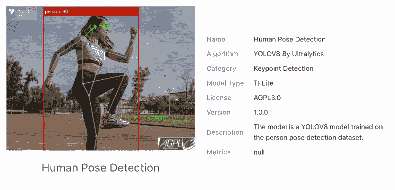

通过在预览区域按 `[停止]` 来停止当前模型的推理。选择模型并按 `[发送]`。一旦模型成功上传，您可以在右侧预览区域的预览区域中查看 Grove Vision AI（V2）摄像头的实时流，以及通过点击顶部 `[设备日志]` 按钮可访问的串行监视器中显示的推理细节。

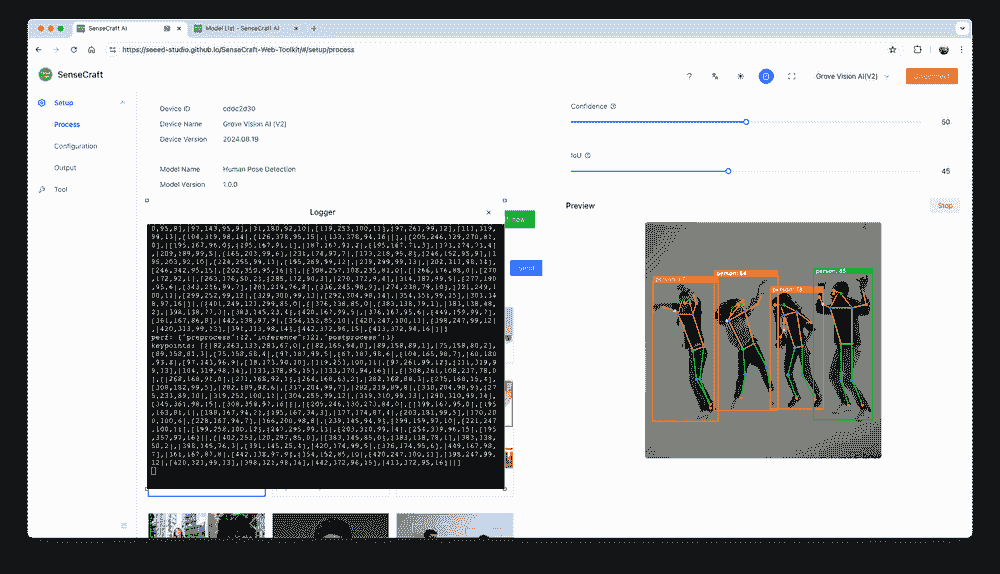

YOLOV8 姿态模型使用[COCO-Pose 数据集](https://docs.ultralytics.com/datasets/pose/coco/)进行训练，该数据集包含 200K 张带有**17**个关键点的图像，用于姿态估计任务。

让我们看看单个推理截图（为了简化，让我们分析包含一个人的图像）。我们可以注意到我们有两行，一行是推理**性能**（121 毫秒），另一行是以下**关键点**：

+   1 个信息框，与目标检测示例中得到的相同（框坐标（113，119，67，208），推理结果（90），标签（0）。

+   17 组 4 个数字代表身体的 17 个“关节”，其中‘0’是鼻子，‘1’和‘2’是眼睛，‘15’和‘16’是脚，等等。

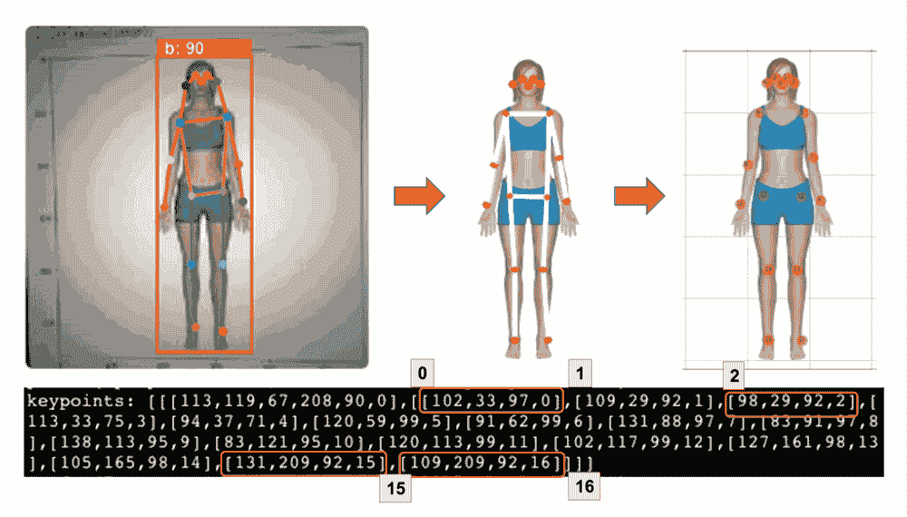

> 要更深入地了解姿态估计项目，请参阅教程：[探索边缘 AI！- 姿态估计](https://www.hackster.io/mjrobot/exploring-ai-at-the-edge-97588d#toc-pose-estimation-10)。

### 图像分类

图像分类是计算机视觉中的一个基础任务，旨在将**整个图像**分类到预定义的几个类别之一。这个过程涉及分析图像的视觉内容，并根据它包含的主要物体或场景，从固定的类别集中分配一个标签。

图像分类在各种应用中至关重要，从组织并搜索数字图书馆和社交媒体平台中的大型图像数据库，到使自主系统能够理解其周围环境。显著推进图像分类领域的常见架构包括卷积神经网络（CNNs），如 AlexNet、VGGNet 和 ResNet。这些模型通过学习视觉数据的高级表示，在具有挑战性的数据集（如**ImageNet**）上展示了显著的准确性。

作为许多计算机视觉系统的基石，图像分类推动了创新，为更复杂任务如目标检测和图像分割奠定了基础，并促进了各行业对视觉数据的更深入理解。因此，让我们也来探索这个计算机视觉应用。

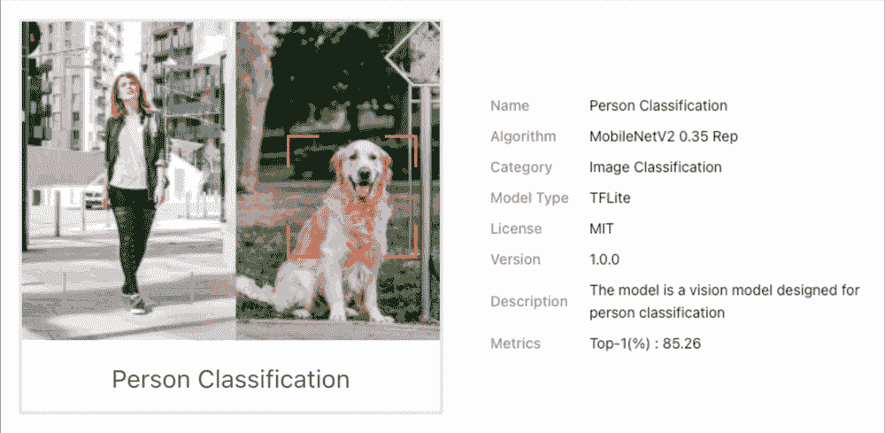

> 此示例可在 SenseCraft ToolKit 中找到，但不在 SenseCraft AI Studio 中。在最后一个示例中，可以找到其他图像分类的示例。

模型成功上传后，我们可以在右侧的预览区域查看 Grove Vision AI (V2)摄像头的实时流，同时显示在串行监视器（通过点击顶部的 `[设备日志]` 按钮）中的推理细节。

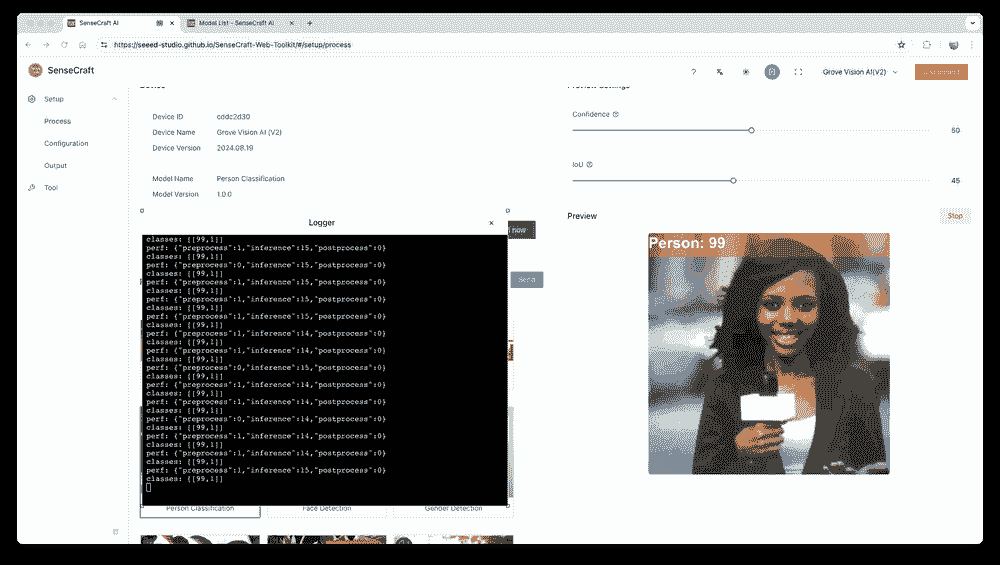

因此，我们将收到一个分数和类别作为输出。

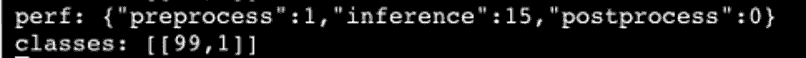

例如，**[99, 1]** 表示类别：1（人物）得分为 0.99。一旦这个模型是二元分类，类别 0 将是“无人”（或背景）。推理延迟为**15ms**或大约 70fps。

#### 功耗

要运行 Mobilenet V2 0.35，Grove Vision AI V2 在 5.24V 时的峰值电流为 80mA，导致**功耗为 420mW**。

在 XIAO ESP32S3 Sense 上运行相同的模型，**功耗为 523mW**，延迟为 291ms。

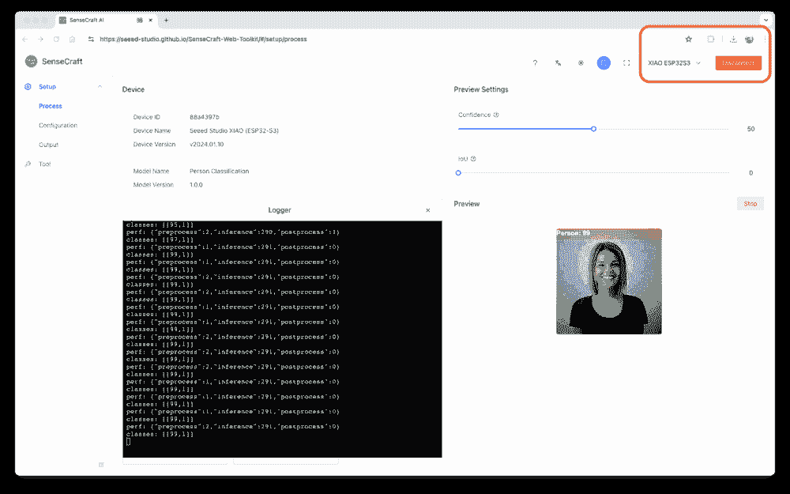

### 在 SenseCraft AI Studio 上探索其他模型

还可以从 [SenseCraft AI 网页](https://sensecraft.seeed.cc/ai/model) 下载几个公共 AI 模型。例如，你可以运行一个 Swift-YOLO 模型，[检测交通灯](https://sensecraft.seeed.cc/ai/view-model/60281-traffic-light-detection?tab=public) 如此所示：

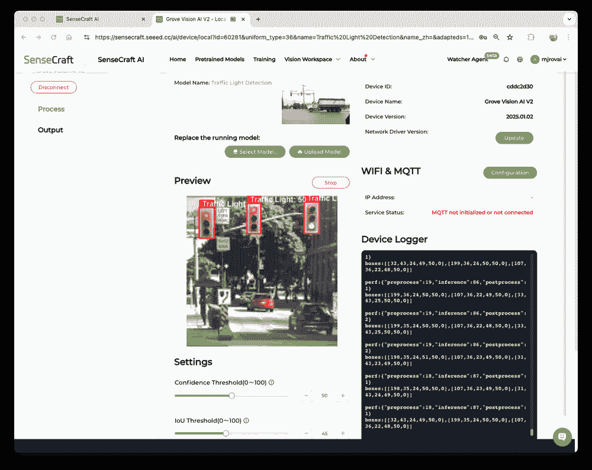

此模型的延迟大约为 86ms，平均功耗为 420mW。

## 一个图像分类项目

让我们创建一个完整的图像分类项目，使用 SenseCraft AI Studio。

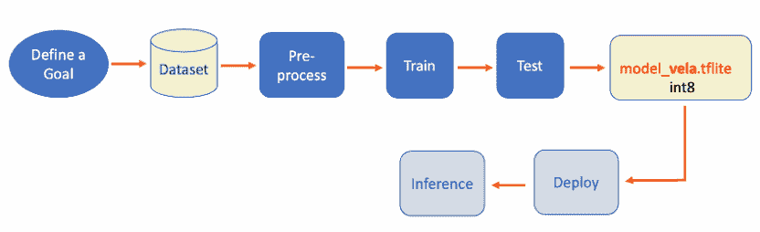

在 SenseCraft AI Studio 上：让我们打开标签页 [训练](https://sensecraft.seeed.cc/ai/training)：

如果有 WebCam，默认情况下训练一个`分类`模型。让我们选择 Grove Vision AI V2。按下绿色按钮`[连接]`，将出现一个弹出窗口。选择相应的端口，然后按蓝色按钮 `[连接]`。

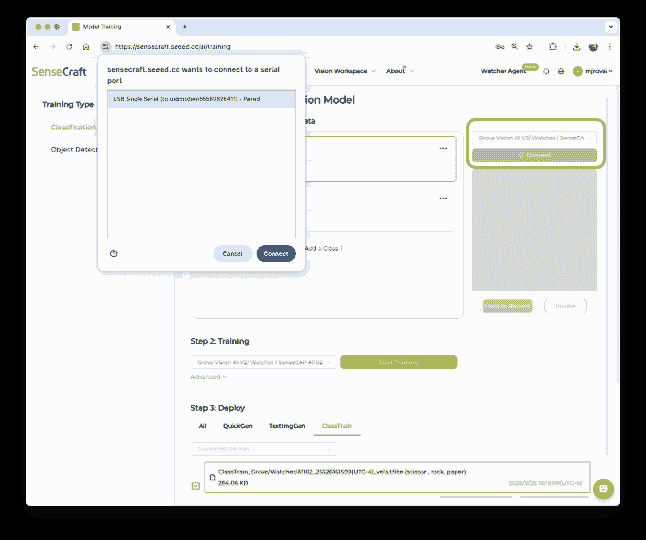

从 Grove Vision AI V2 流出的图像将被显示。

### 目标

第一步始终是定义一个目标。例如，让我们分类两个简单的物体——例如，一个玩具`盒子`和一个玩具`轮子`。我们还应该包括一个图像类别，`背景`，其中场景中没有物体。

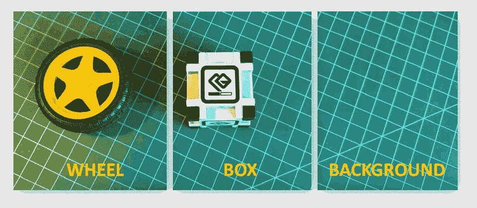

### 数据收集

让我们创建类，例如按照字母顺序：

+   类 1：背景

+   类 2：盒子

+   类 3：轮子

选择一个类别，并持续按预览区域下的绿色按钮。收集的图像将出现在图像样本屏幕上。

收集图像后，检查它们并删除任何错误的图像。

从每个类别收集大约 50 张图像，然后转到训练步骤：

### 训练

确认是否选择了正确的设备（`Grove Vision AI V2`），然后按 `[开始训练]`

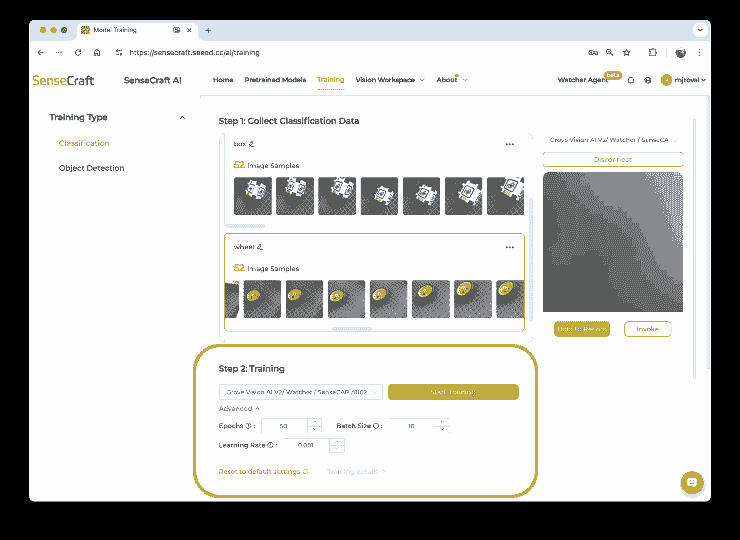

### 测试

训练后，可以预览推理结果。

> 注意，模型当前并未在设备上运行。实际上，我们只是在用设备捕捉图像，并使用在 Studio 中运行的训练模型进行实时预览。

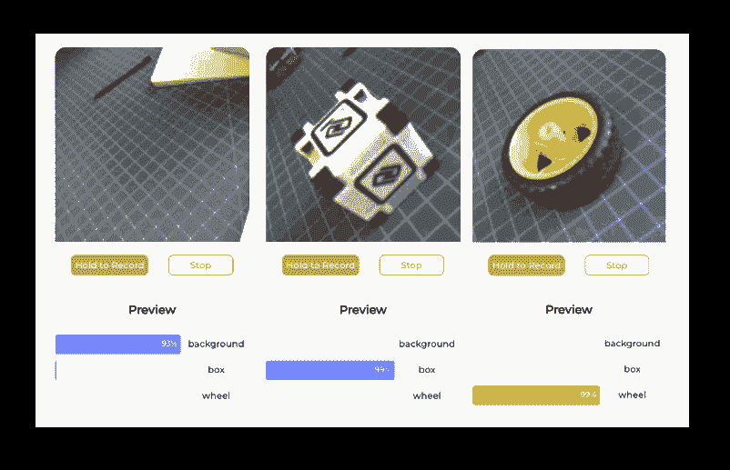

现在是真正在设备上部署模型的时候了：

### 部署

在`部署到设备`上选择训练好的模型，选择 Grove Vision AI V2：

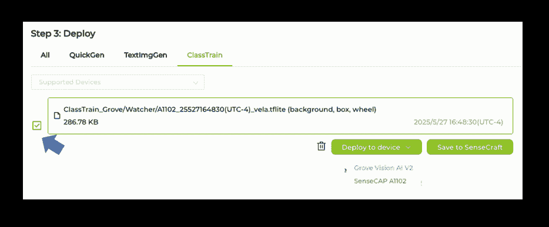

Studio 将带我们转到`视觉工作空间`标签。确认部署，选择合适的端口，并连接：

模型将被烧录到设备中。自动重置后，模型将在设备上开始运行。在设备日志中，我们可以看到推理的**延迟约为 8 ms**，对应**每秒 125 帧（FPS）**。

此外，请注意，可以调整模型的置信度。

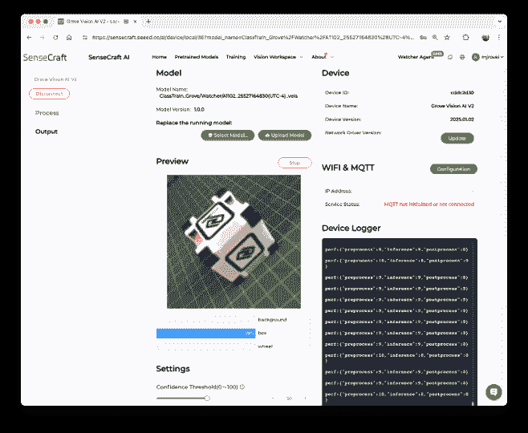

> 要运行图像分类模型，Grove Vision AI V2 在 5.24V 下的峰值电流为 80mA，导致**功耗为 420mW**。

### 保存模型

在 SenseCraft AI Studio 中可以保存模型。Studio 将保留所有我们的模型，这些模型可以在以后部署。为此，返回到`训练`标签并选择按钮`[保存到 SenseCraft`]:

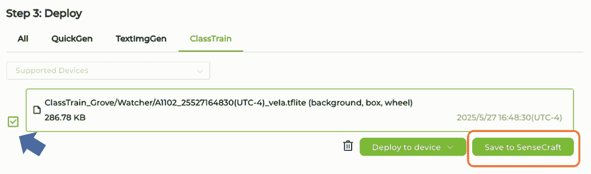

## 摘要

在这个实验室中，我们使用[Seeed Studio Grove Vision AI 模块 V2](https://wiki.seeedstudio.com/grove_vision_ai_v2/)探索了几个计算机视觉（CV）应用，展示了它作为一款专为嵌入式机器学习应用设计的强大而紧凑设备的卓越能力。

**性能卓越**：Grove Vision AI V2 在多个计算机视觉任务中表现出色。凭借其**Himax WiseEye2 芯片**，该芯片具有**双核 Arm Cortex-M55 和集成的 ARM Ethos-U55 神经网络单元**，设备提供了：

+   **图像分类**：**15 ms**推理时间（67 FPS）

+   **物体检测（人物）**：**48 ms 到 76 ms**推理时间（21 FPS 到 13 FPS）

+   **姿态检测**：**121 ms**实时关键点检测，17 关节跟踪（8 FPS）

**能效领先**：Grove Vision AI V2 最引人注目的优势之一是其卓越的能效。比较测试显示，与传统嵌入式平台相比有显著改进：

+   **Grove Vision AI V2**：峰值功耗 80 mA（**410 mW**），（60+ FPS）

+   **XIAO ESP32S3**：执行类似的 CV 任务（图像分类）**523 mW**（3+ FPS）

**实际应用**：通过一个全面的端到端项目展示了设备的通用性，包括数据集创建、模型训练、部署和离线推理。

**开发者友好生态系统**：SenseCraft AI Studio 凭借其无代码部署和集成能力，为定制应用程序提供了对 Grove Vision AI V2 的访问，使得初学者和高级开发者都能使用。丰富的预训练模型库和自定义模型部署支持为各种应用提供了灵活性。

Grove Vision AI V2 代表了边缘 AI 硬件的重大进步，它以紧凑、节能的包装形式提供了专业级的计算机视觉能力，使嵌入式应用在工业、物联网和教育领域的 AI 部署民主化。

**关键要点**

本实验室证明，复杂的计算机视觉应用不仅限于基于云的解决方案或能耗高的硬件，如 Raspberry Pi 或 Jetson Nanos——它们现在可以以出色的效率和性能在边缘有效部署。

可选，我们可以使用[XIAO 视觉 AI 相机](https://www.seeedstudio.com/XIAO-Vision-AI-Camera-p-6450.html)。这个创新的视觉解决方案无缝结合了 Grove Vision AI V2 模块、XIAO ESP32-C3 控制器和 OV5647 相机，所有这些都被封装在一个定制的 3D 打印外壳中：

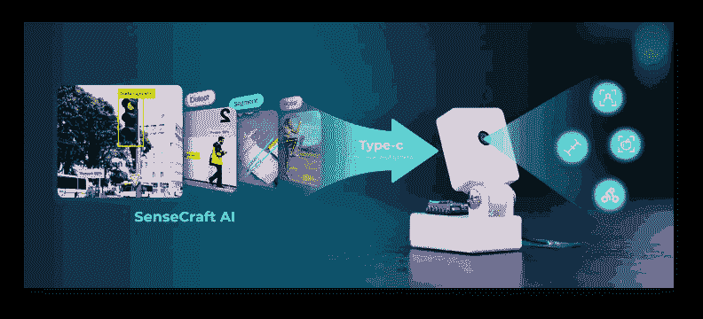

## 资源

[SenseCraft AI Studio 指令](https://wiki.seeedstudio.com/sensecraft_ai_pretrained_models_for_grove_visionai_v2/).

[SenseCraft-Web-Toolkit 网站](https://seeed-studio.github.io/SenseCraft-Web-Toolkit/#/setup/process)

[SenseCraft AI Studio](https://sensecraft.seeed.cc/ai/model)

[Himax AI Web Toolkit](https://github.com/HimaxWiseEyePlus/Seeed_Grove_Vision_AI_Module_V2/releases/download/v1.1/Himax_AI_web_toolkit.zip)

[Himax 示例](https://github.com/Seeed-Studio/wiki-documents/blob/docusaurus-version/docs/Sensor/Grove/Grove_Sensors/AI-powered/Grove-vision-ai-v2/Development/grove-vision-ai-v2-himax-sdk.md)
