# 图像分类

**使用 Seeed Studio Grove Vision AI 模块 V2 (Himax WiseEye2)**


在这个实验中，我们将探索使用 Seeed Studio [*Grove Vision AI 模块 V2*](https://wiki.seeedstudio.com/grove_vision_ai_v2/) 进行图像分类，这是一个专为嵌入式机器学习应用设计的强大而紧凑的设备。基于**Himax WiseEye2**芯片，该模块旨在使边缘设备具备 AI 功能，使其成为边缘机器学习（ML）应用的理想工具。

## 简介

到目前为止，我们已经探索了 Seeed Studio 之前上传的几个计算机视觉模型，或者使用 SenseCraft AI Studio 进行图像分类，而没有选择一个特定的模型。现在，让我们从头开始开发我们的图像分类项目，我们将选择我们的数据和模型。

下面，我们可以看到项目的主要步骤以及我们将如何与它们一起工作：


### 项目目标

任何机器学习（ML）项目的第一步是定义目标。在这种情况下，目标是检测和分类单个图像中存在的两个特定对象。对于这个项目，我们将使用两个小玩具：一个机器人和一只小型巴西鹦鹉（命名为*Periquito*）。此外，我们还将收集两个对象不存在的背景图像。

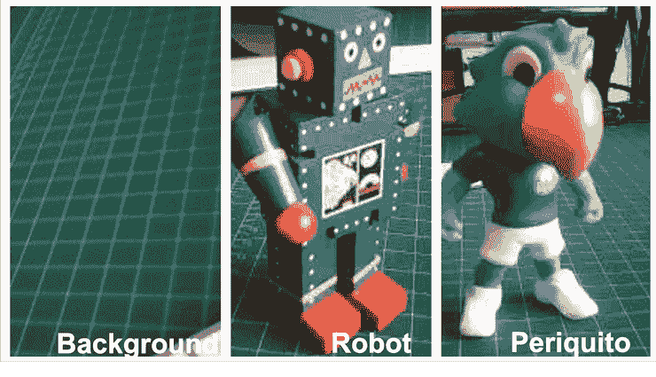

### 数据收集

在定义了机器学习项目目标后，数据集收集是下一个且最重要的步骤。假设你的项目使用的是公开数据集上的图像，例如，用于**人员检测**项目。在这种情况下，你可以下载[Wake Vision](https://edgeai.modelnova.ai/datasets/details/wake-vision)数据集用于项目。

但是，在我们的情况下，我们定义了一个图像在公共领域不存在的项目，因此我们需要生成它们。我们可以使用手机、计算机摄像头或其他设备来拍摄照片，离线或连接到 Edge Impulse Studio。

如果你想使用 Grove Vision AI V2 捕获你的数据集，你可以像之前实验中那样使用 SenseCraft AI Studio，或者使用我们将在本实验的**后处理/获取视频流**部分中描述的`camera_web_server`草图。

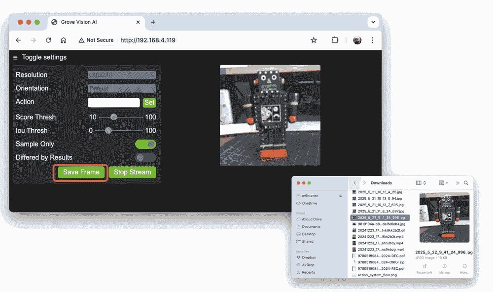

在这个实验中，我们将使用 SenseCraft AI Studio 来收集数据集。

### 使用 SenseCraft AI Studio 收集数据

在 SenseCraft AI Studio 上：让我们打开[训练](https://sensecraft.seeed.cc/ai/training)标签页。

默认情况下，如果可用，将使用 WebCam 训练一个`分类`模型。让我们选择`Grove Vision AI V2`。按下绿色按钮`[连接]`**（1）**，将出现一个弹出窗口。选择相应的端口**（2）**，然后按下蓝色按钮`[连接]`**（3）**。


将显示来自 Grove Vision AI V2 的图像流。

#### 图像收集

让我们创建类别，例如，按照字母顺序排列：

+   Class1: 背景

+   Class 2: 小鹦鹉

+   第 3 类：机器人

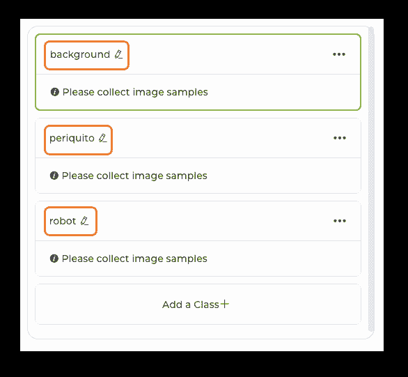

选择一个类别（注意窗口周围将有一个绿色线条）并持续按下预览区域下的绿色按钮。收集的图像将出现在图像样本屏幕上。

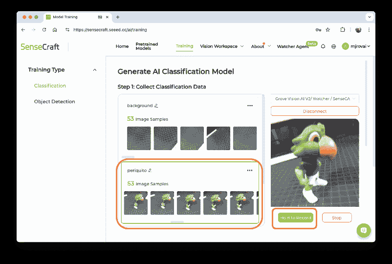

收集图像后，检查它们，并在必要时删除任何错误的图像。

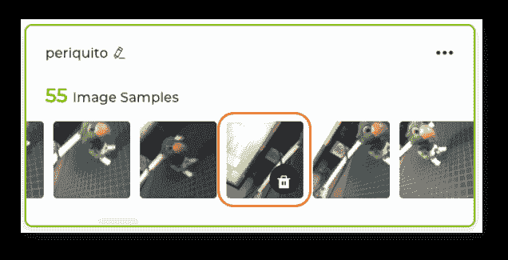

从每个类别收集大约 50 张图像。收集完三个类别后，打开每个类别的菜单并选择 `Export Data`。


在计算机的下载区域，我们将获得三个 zip 文件，每个文件都对应一个类名。每个 zip 文件包含一个包含图像的文件夹。

### 将数据集上传到 Edge Impulse Studio

我们将使用 Edge Impulse Studio 来训练我们的模型。[Edge Impulse](https://www.edgeimpulse.com/) 是边缘设备上机器学习的领先开发平台。

+   在 Edge Impulse 输入您的账户凭证（或创建一个免费账户）。

+   接下来，创建一个新的项目：


> 数据集大约包含每个标签 50 张图像，其中 40 张用于训练，10 张用于测试。

### 脉冲设计和预处理

**脉冲设计**

一个脉冲会提取原始数据（在这种情况下，图像），提取特征（调整图片大小），然后使用学习块对新数据进行分类。

将图像分类是深度学习最常见应用，但完成这项任务需要大量的数据。我们每个类别大约有 50 张图像。这个数量足够吗？根本不够！我们需要数千张图像来“教学”或“建模”每个类别，以便我们能够区分它们。然而，我们可以通过使用数千张图像重新训练一个先前训练好的模型来解决这个问题。我们将这种技术称为“迁移学习”（TL）。使用 TL，我们可以在我们的数据上微调预训练的图像分类模型，即使是在相对较小的图像数据集上也能实现良好的性能，就像我们的情况一样。


因此，从原始图像开始，我们将调整它们的大小（96x96）像素，并将它们输入到我们的迁移学习块中：


> 为了比较，我们将保持图像大小为 96 x 96。然而，请注意，使用 Grove Vision AI 模块 V2 及其内部 2.4 MB 的 SRAM，可以使用更大的图像（例如，160 x 160）。

还在右上角选择 `Target` 设备（`Himax WiseEye2 (M55 400 MHz + U55)`）。

### 预处理（特征生成）

除了调整图像大小外，我们还可以将它们转换为灰度或保留它们的原始 RGB 颜色深度。让我们在“图像”部分选择 `[RGB]`。这样做，每个数据样本将具有 27,648 个特征维度（96x96x3）。按下 `[Save Parameters]` 将打开一个新标签页，`Generate Features`。按下 `[Generate Features]` 按钮以生成特征。

### 模型设计、训练和测试

2007 年，谷歌推出了[MobileNetV1](https://research.googleblog.com/2017/06/mobilenets-open-source-models-for.html)。2018 年，推出了[MobileNetV2：倒置残差和线性瓶颈](https://arxiv.org/abs/1801.04381)，2019 年推出了 V3。MobileNet 是一系列通用计算机视觉神经网络，专为移动设备设计，以支持分类、检测和其他应用。MobileNets 是小型、低延迟、低功耗的模型，参数化以满足各种用例的资源限制。

尽管基础 MobileNet 架构已经紧凑且具有低延迟，但特定的用例或应用可能经常需要模型更小、更快。MobileNets 引入了一个简单的参数，**α**（alpha），称为宽度乘数，以构建这些更小、计算成本更低的模型。宽度乘数α的作用是在每一层均匀地瘦化网络。

Edge Impulse Studio 提供了 MobileNet V1（96x96 图像）和 V2（96x96 和 160x160 图像），具有几个不同的**α**值（从 0.05 到 1.0）。例如，您将使用 V2，160x160 图像，α=1.0 获得最高的准确性。当然，这里有一个权衡。准确性越高，运行模型所需的内存（大约 1.3M RAM 和 2.6M ROM）就越多，这意味着更大的延迟。在 MobileNet V1 和α=0.10 的情况下，将获得更小的占用空间（大约 53.2K RAM 和 101K ROM）。

> 为了比较，我们将使用**MobileNet V2 0.1**作为我们的基础模型（但也可以使用具有更大 alpha 值的模型）。我们的模型在输出层之前的最底层将有 8 个神经元，并具有 10%的 dropout 率以防止过拟合。

另一个与深度学习一起使用的必要技术是**数据增强**。数据增强是一种方法，可以通过创建额外的合成数据来帮助提高机器学习模型的准确性。数据增强系统在训练过程中对训练数据进行小的、随机的更改（例如翻转、裁剪或旋转图像）。

设置超参数：

+   迭代次数：20，

+   批处理大小：32

+   学习率：0.0005

+   验证集大小：20%

训练结果：

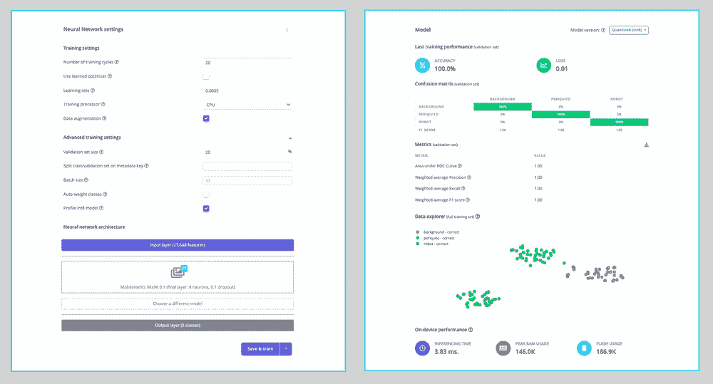

模型配置文件预测需要**146 KB 的 RAM 和 187 KB 的闪存**，这表明 Grove AI 视觉（V2）没有问题，它几乎有 2.5 MB 的内部 SRAM。此外，工作室还指出**大约 4 毫秒的延迟**。

> 尽管如此，当使用备用数据进行测试时，验证集的准确率为 100%，我们确认使用量化（Int8）训练模型的准确率为 81%。然而，对于我们在实验室中的目的来说，这是足够的。

### 模型部署

在“部署”选项卡上，我们应该选择：`Seeed Grove 视觉 AI 模块 V2 (Himax WiseEye2)`并点击 `[构建]`。一个 ZIP 文件将被下载到我们的电脑上。

Zip 文件包含`model_vela.tflite`，这是一个使用 Vela 编译器优化的 TensorFlow Lite（TFLite）模型，Vela 编译器是由 Arm 开发的工具，用于将 TFLite 模型适配到 Ethos-U NPUs。

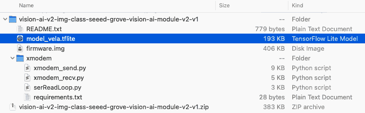

我们可以按照`README.txt`中的说明来闪存模型，或者使用 SenseCraft AI Studio。我们将使用后者。

### 在 SenseCraft AI Studio 上部署模型

在 SenseCraft AI Studio 上，转到`Vision Workspace`标签，并连接设备：

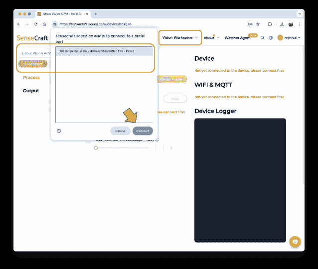

您应该看到最后上传到设备上的模型。选择绿色按钮 `[上传模型]`。一个弹出窗口将要求输入**模型名称**、**模型文件**以及输入类名（**对象**）。我们应该使用按字母顺序排列的标签：`0: background`，`1: periquito`，`2: robot`，然后按 `[Send]`。

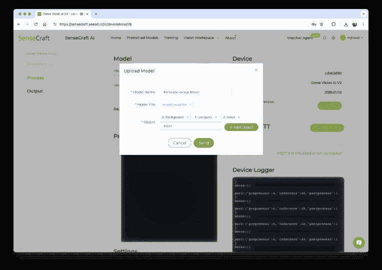

几秒钟后，模型将被上传（闪存）到我们的设备上，相机图像将实时出现在**预览**区域。分类结果将在图像预览下方显示。您还可以使用**设置**中的光标选择您的推理的**置信度阈值**。

在**设备日志器**中，我们可以查看串行监视器，在那里我们可以观察到延迟，预处理大约为 1 到 2 毫秒，推理大约为 4 到 5 毫秒，与 Edge Impulse Studio 中的估计相一致。

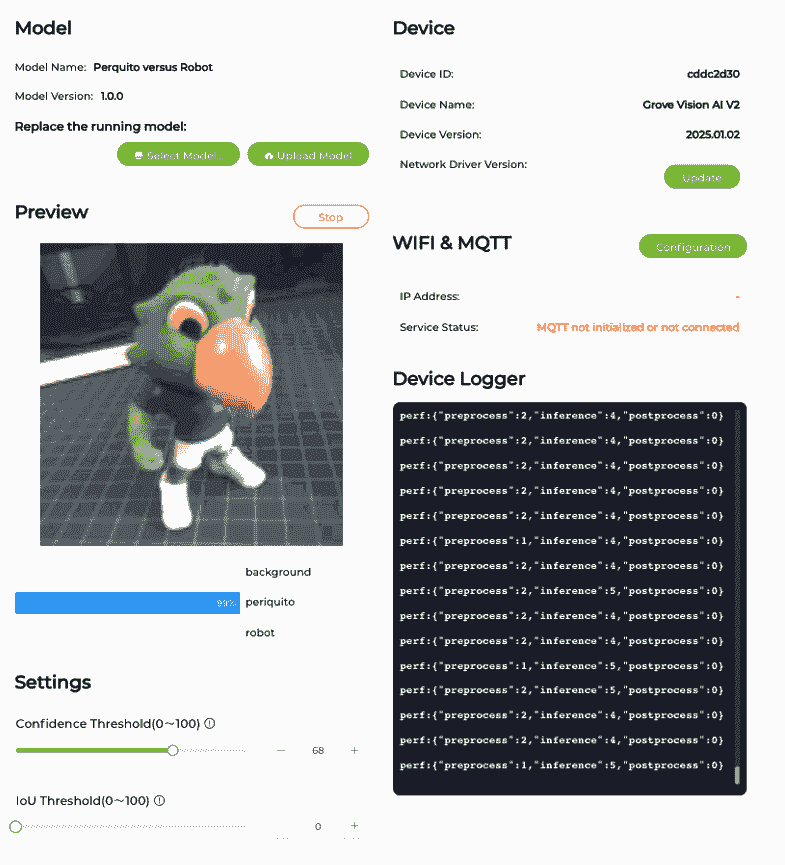

这里是其他截图：

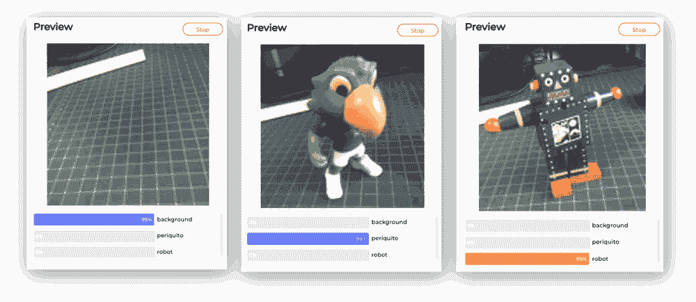

此模型的功耗约为 70 mA，相当于 0.4 W。

### 图像分类（非官方）基准

几种开发板可用于嵌入式机器学习（tinyML），其中最常见（到目前为止）用于计算机视觉应用（低功耗）的是**ESP32 CAM**、**Seeed XIAO ESP32S3 Sense**和 Arduino **Nicla Vision**。

利用这个机会，一个类似训练的模型，MobilenetV2 96x96，alpha 值为 0.1，也被部署到了 ESP-CAM、XIAO 和 Raspberry Pi Zero W2 上。以下是结果：

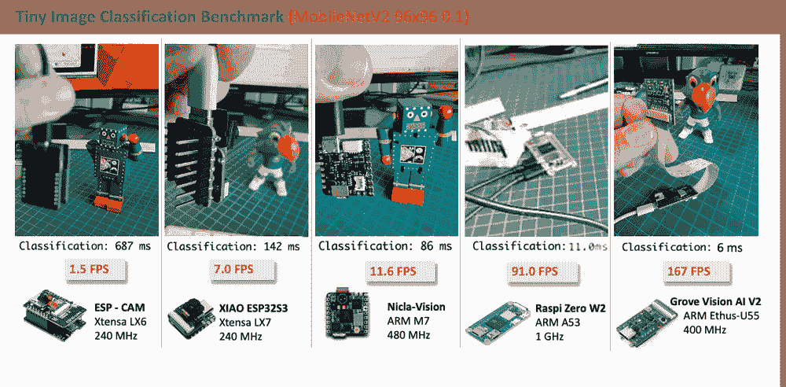

> Grove Vision AI V2 配备**ARM Ethos-U55**比 ARM-M7 的设备快约 14 倍，比 Xtensa LX6（ESP-CAM）快 100 多倍。即使与拥有更强大 CPU 的 Raspberry Pi 相比，U55 也能将延迟减少近一半。此外，功耗低于其他设备（有关功耗比较，请参阅此处[完整](https://www.hackster.io/limengdu0117/2024-mcu-ai-vision-boards-performance-comparison-998505)文章）。

### 后处理

现在我们已经将模型上传到板子上并且工作正常，正在对图像进行分类，让我们连接一个主设备以将其推理结果导出到它，并完全离线（断开与 PC 的连接，例如，由电池供电）查看结果。

> 注意，我们可以使用任何微控制器作为主控制器，例如 XIAO、Arduino 或 Raspberry Pi。

#### 获取视频流

图像处理和模型推理在 Grove Vision AI (V2) 本地处理，我们希望结果通过 IIC 输出到 XIAO (主控制器)。为此，我们将使用 **Arduino SSMA 库**。这个库的主要目的是处理 Grove Vision AI 的数据流，不涉及模型推理。

> Grove Vision AI (V2) 通过 IIC 与 XIAO 通信（推理结果）；设备的 IIC 地址是 0x62。图像信息传输通过 USB 串行端口。

**步骤 1**：从其 GitHub 下载 [Arduino SSMA](https://github.com/Seeed-Studio/Seeed_Arduino_SSCMA/) 库作为 zip 文件：

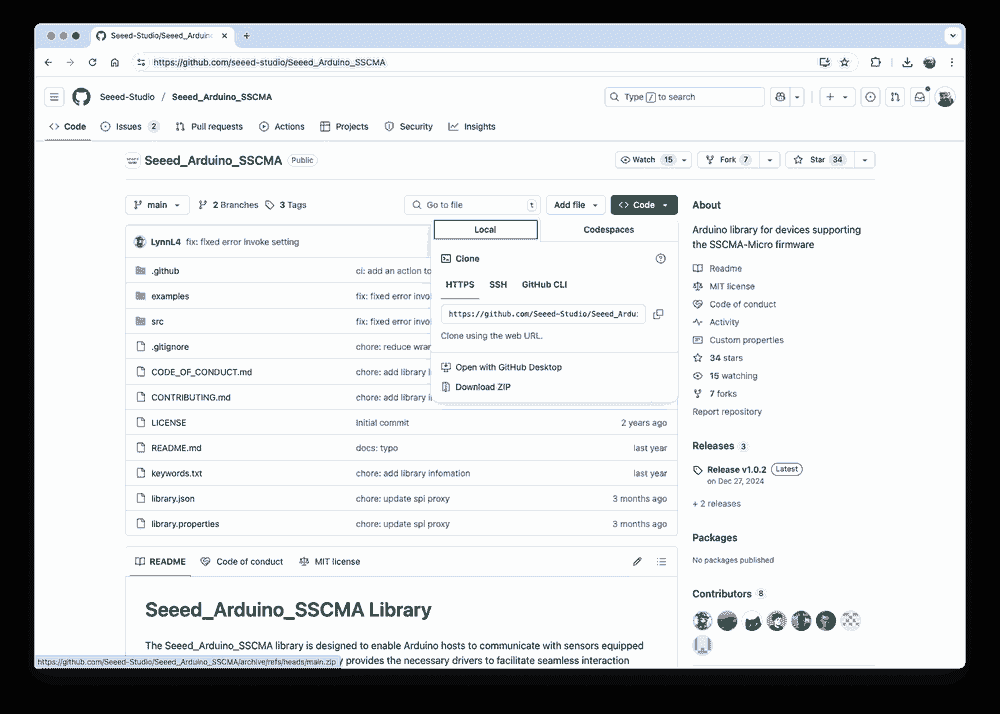

**步骤 2**：在 Arduino IDE 中安装它（`sketch > Include Library > Add .Zip Library`）。

**步骤 3**：安装 **ArduinoJSON 库**。

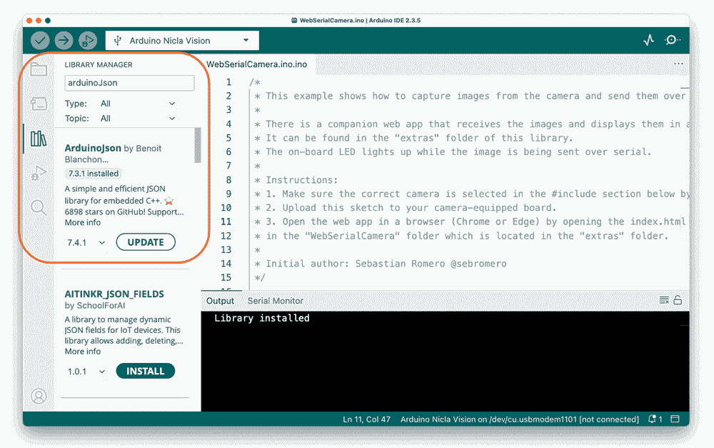

**步骤 4**：安装 **Eigen 库**

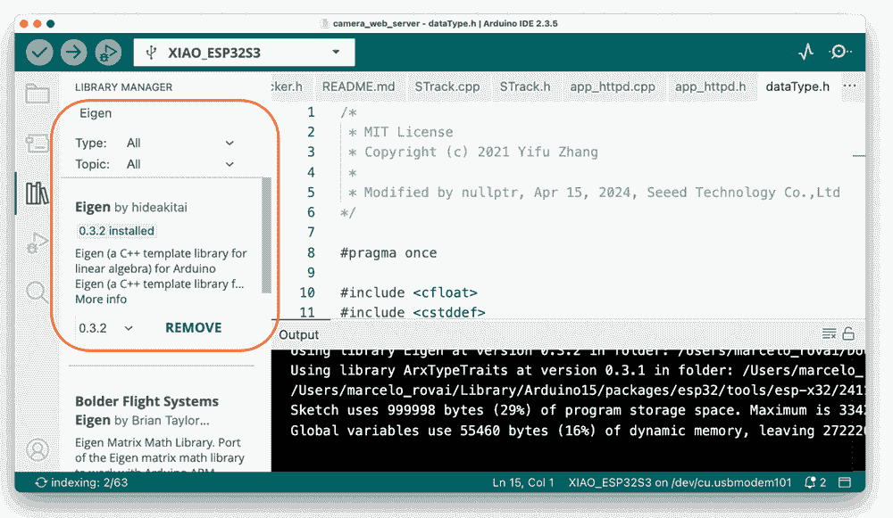

**步骤 3**：现在，通过设备背面的插座（一排引脚）连接 XIAO 和 Grove Vision AI (V2)。

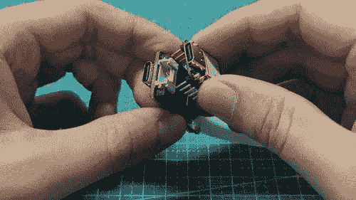

> **注意**：请注意连接的方向，Grove Vision AI 的 Type-C 连接器应与 XIAO 的 Type-C 连接器方向一致。

**步骤 5**：将 **XIAO USB-C** 端口连接到您的计算机

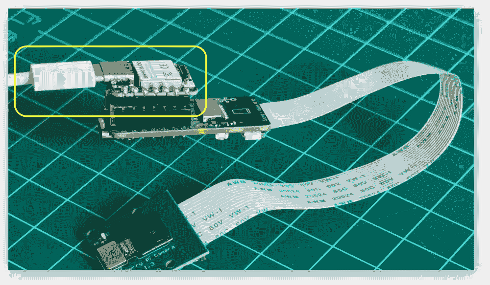

**步骤 6**：在 Arduino IDE 中选择 Xiao 板和相应的 USB 端口。

一旦我们想要将视频流式传输到网页，我们将使用具有 Wi-Fi 和足够内存处理图像的 **XIAO ESP32S3**。选择 `XIAO_ESP32S3` 和合适的 USB 端口：

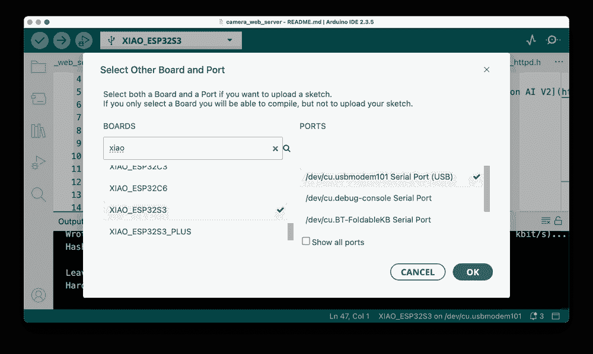

默认情况下，PSRAM 是禁用的。打开 `Tools` 菜单，在 PSRAM: `"OPI PSRAM"` 选择 `OPI PSRAM`。

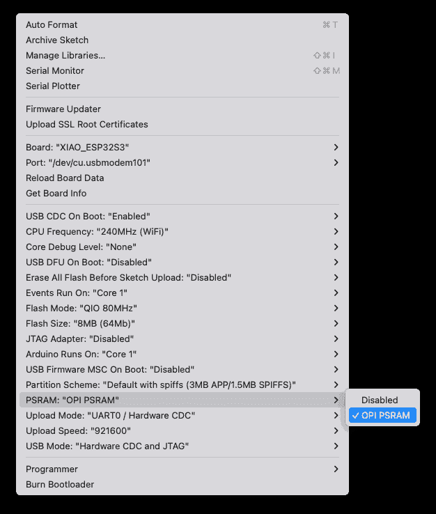

**步骤 7**：在 Arduino IDE 中打开示例：

`文件` -> `示例` -> `Seeed_Arduino_SSCMA` -> `camera_web_server`。

并在 `camera_web_server.ino` 草图中编辑 `ssid` 和 `password` 以匹配 Wi-Fi 网络。

**步骤 8**：将草图上传到板子并打开串行监视器。当连接到 Wi-Fi 网络，板子的 IP 地址将显示出来。

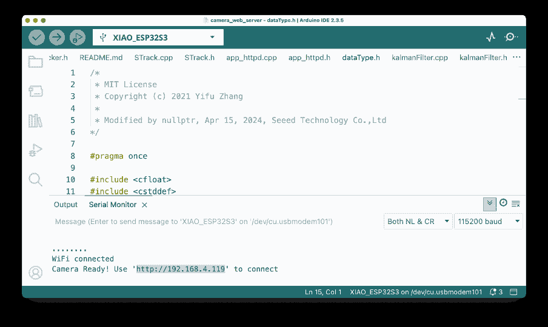

使用网页浏览器打开地址。将有一个视频应用可用。要查看 **仅** 来自 Grove Vision AI V2 的视频流，请按 `[Sample Only]` 和 `[Start Stream]`。

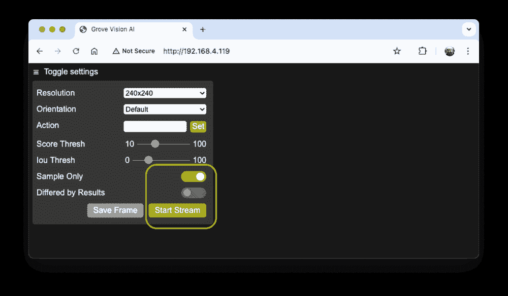

如果你想创建一个图像数据集，可以使用这个应用，保存设备生成的视频帧。按下 `[Save Frame]`，图像将被保存在我们桌面下载区域。


在未选择 `[Sample Only]` 的情况下打开应用 **（**不选择**）**，推理结果应显示在视频屏幕上，但这种情况在图像分类中不会发生。对于目标检测或姿态估计，结果会嵌入视频流中。

例如，如果模型是使用 YoloV8 进行的人脸检测：

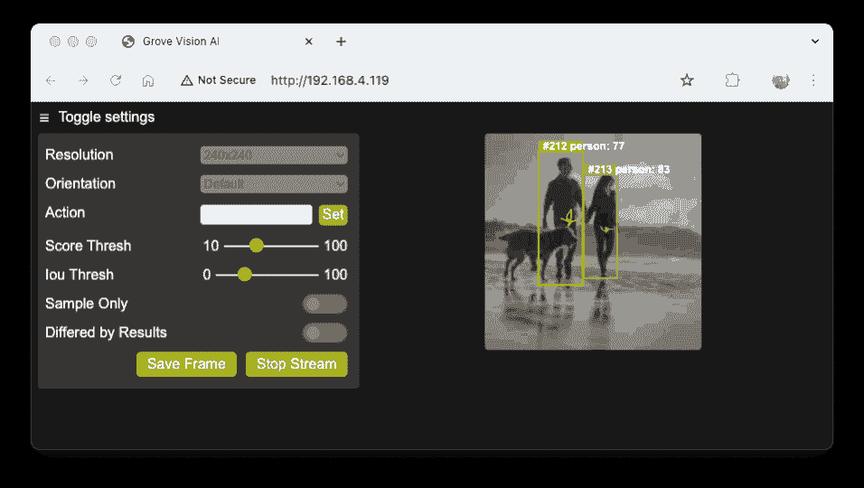

#### 获取推理结果

+   前往 `文件` -> `示例` -> `Seeed_Arduino_SSCMA` -> `inference_class`。

+   将草图上传到板子上，并打开串行监视器。

+   将摄像头对准我们的其中一个物体，我们可以在串行终端上看到推理结果。

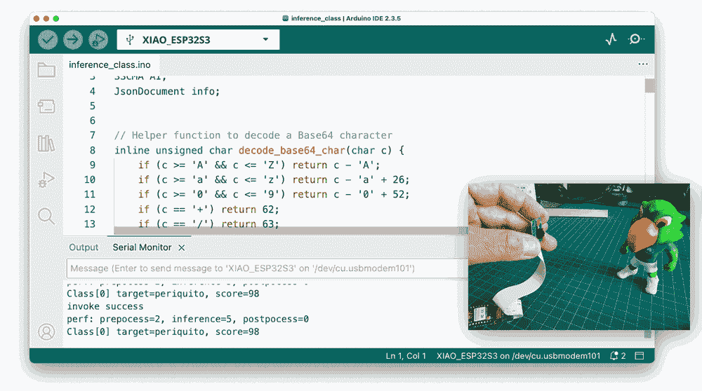

> 在 Arduino IDE 上运行的推理平均消耗为 160 mA 或 800 mW，峰值消耗为 330 mA 1.65 W，当将图像发送到应用程序时。

#### LED 后处理

我们后处理背后的想法是，每当检测到特定的图像（例如，Periquito - 标签：1），用户 LED 将打开。如果检测到机器人或背景，LED 将关闭。

复制以下代码并将其粘贴到您的 IDE 中：

```py
#include <Seeed_Arduino_SSCMA.h>
SSCMA AI;

void setup()
{
    AI.begin();

    Serial.begin(115200);
    while (!Serial);
    Serial.println("Inferencing - Grove AI V2 / XIAO ESP32S3");

    // Pins for the built-in LED
    pinMode(LED_BUILTIN, OUTPUT);
    // Ensure the LED is OFF by default.
    // Note: The LED is ON when the pin is LOW, OFF when HIGH.
    digitalWrite(LED_BUILTIN, HIGH);
}

void loop()
{
    if (!AI.invoke()){
        Serial.println("\nInvoke Success");
        Serial.print("Latency [ms]: prepocess=");
        Serial.print(AI.perf().prepocess);
        Serial.print(", inference=");
        Serial.print(AI.perf().inference);
        Serial.print(", postpocess=");
        Serial.println(AI.perf().postprocess);
        int pred_index = AI.classes()[0].target;
        Serial.print("Result= Label: ");
        Serial.print(pred_index);
        Serial.print(", score=");
        Serial.println(AI.classes()[0].score);
        turn_on_led(pred_index);
    }
}

/**
* @brief turn_off_led function - turn-off the User LED
*/
void turn_off_led(){
    digitalWrite(LED_BUILTIN, HIGH);
}

/**
* @brief turn_on_led function used to turn on the User LED
* @param[in]  pred_index
*             label 0: [0] ==> ALL OFF
*             label 1: [1] ==> LED ON
*             label 2: [2] ==> ALL OFF
*             label 3: [3] ==> ALL OFF
*/
void turn_on_led(int pred_index) {
    switch (pred_index)
    {
        case 0:
            turn_off_led();
            break;
        case 1:
            turn_off_led();
            digitalWrite(LED_BUILTIN, LOW);
            break;
        case 2:
            turn_off_led();
            break;
        case 3:
            turn_off_led();
            break;
    }
}
```

此草图使用 Seeed_Arduino_SSCMA.h 库与 Grove Vision AI 模块 V2 交互。AI 模块和 LED 在 `setup()` 函数中初始化，并开始串行通信。

`loop()` 函数会反复调用 `invoke()` 方法，使用 Grove Vision AI 模块 V2 内置算法进行推理。推理成功后，草图会将性能指标打印到串行监视器，包括预处理、推理和后处理时间。

草图处理并打印出有关推理结果的详细信息：

+   (`AI.classes()[0]`) 识别图像的类别（`.target`）及其置信度分数（`.score`）。

+   推理结果（类别）存储在整数变量 `pred_index` 中，它将被用作 `turn_on_led()` 函数的输入。因此，LED 将根据分类结果打开。

这里是结果：

如果检测到 Periquito（标签：1），LED 将打开：

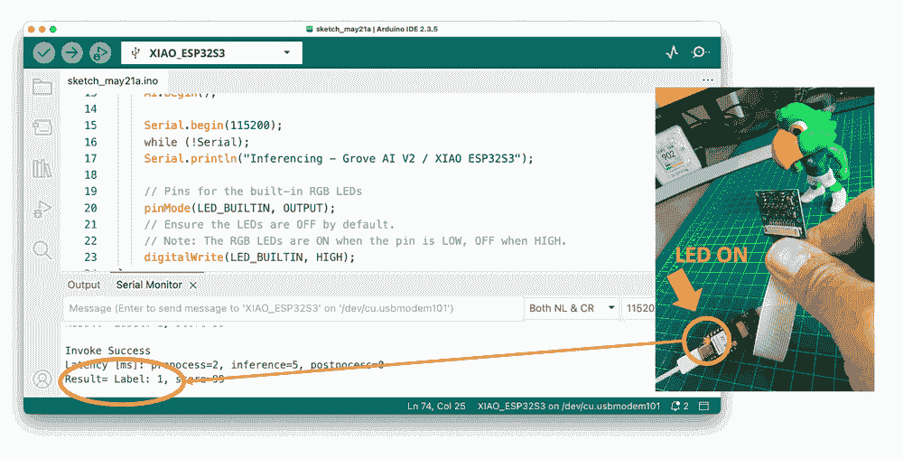

如果检测到机器人（标签：2）LED 将关闭（与背景（标签：0）相同）：

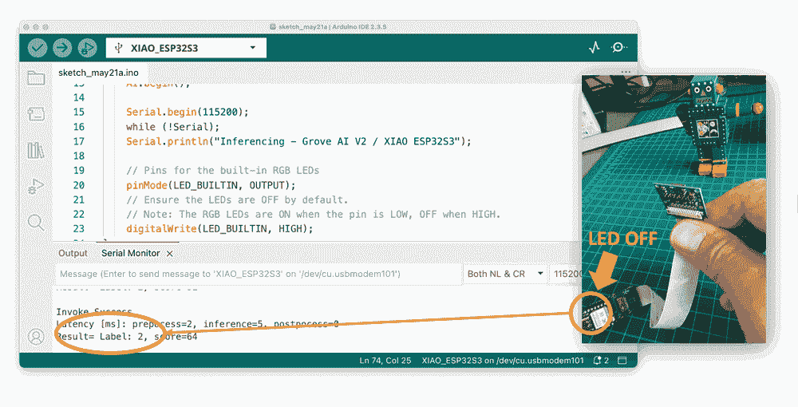

因此，我们现在可以使用外部电池为 Grove Vision AI V2 + Xiao ESP32S3 提供电源，并且推理结果将完全离线通过 LED 显示。消耗量约为 165 mA 或 825 mW。

> 还可以通过 WiFi、BLE 或其他在所使用的主设备上可用的通信协议发送结果。

### 可选：在外部设备上进行后处理

当然，与 EdgeAI 一起工作的一个显著优势是设备可以完全断开与云的连接，从而实现与真实世界的无缝**交互**。我们在上一节中做到了这一点，但使用的是内部 Xiao LED。现在，我们将连接外部 LED（可以是任何执行器）。

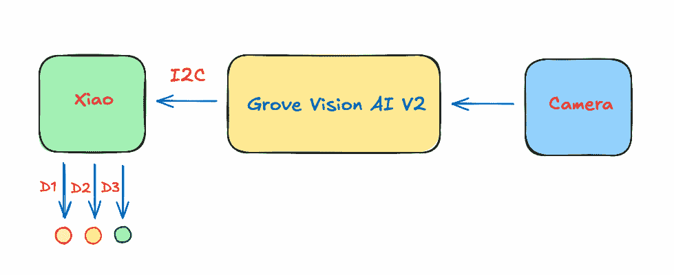

> LED 应通过一个 220 欧姆的电阻连接到 XIAO 地面。

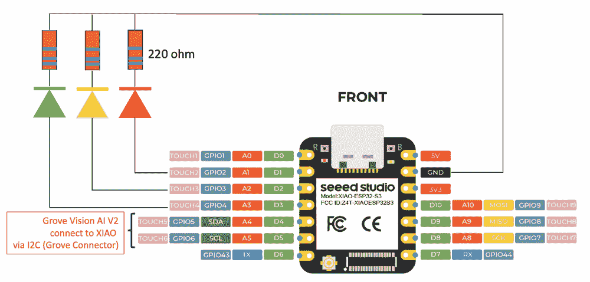

策略是修改之前的草图以处理三个外部 LED。

**目标**：每当检测到 **Periquito** 的图像时，LED **绿灯** 将打开；如果是 **机器人**，LED **黄灯** 将打开；如果是 **背景**，**红灯** 将打开。

图像处理和模型推理在 Grove Vision AI（V2）本地处理，我们希望结果通过 IIC 输出到 XIAO。为此，我们将再次使用 Arduino SSMA 库。

这里是使用的草图：

```py
#include <Seeed_Arduino_SSCMA.h>
SSCMA AI;

// Define the LED pin according to the pin diagram
// The LEDS negative lead should be connected to the XIAO ground
// via a 220-ohm resistor.
int LEDR = D1; # XIAO ESP32S3 Pin 1
int LEDY = D2; # XIAO ESP32S3 Pin 2
int LEDG = D3; # XIAO ESP32S3 Pin 3

  void setup()
{
    AI.begin();

    Serial.begin(115200);
    while (!Serial);
    Serial.println("Inferencing - Grove AI V2 / XIAO ESP32S3");

// Initialize the external LEDs
    pinMode(LEDR, OUTPUT);
    pinMode(LEDY, OUTPUT);
    pinMode(LEDG, OUTPUT);
    // Ensure the LEDs are OFF by default.
    // Note: The LEDs are ON when the pin is HIGH, OFF when LOW.
    digitalWrite(LEDR, LOW);
    digitalWrite(LEDY, LOW);
    digitalWrite(LEDG, LOW);
}

void loop()
{
    if (!AI.invoke()){
        Serial.println("\nInvoke Success");
        Serial.print("Latency [ms]: prepocess=");
        Serial.print(AI.perf().prepocess);
        Serial.print(", inference=");
        Serial.print(AI.perf().inference);
        Serial.print(", postpocess=");
        Serial.println(AI.perf().postprocess);
        int pred_index = AI.classes()[0].target;
        Serial.print("Result= Label: ");
        Serial.print(pred_index);
        Serial.print(", score=");
        Serial.println(AI.classes()[0].score);
        turn_on_leds(pred_index);
    }
}

/**
* @brief turn_off_leds function - turn-off all LEDs
*/
void turn_off_leds(){
    digitalWrite(LEDR, LOW);
    digitalWrite(LEDY, LOW);
    digitalWrite(LEDG, LOW);
}

/**
* @brief turn_on_leds function used to turn on a specific LED
* @param[in]  pred_index
*             label 0: [0] ==> Red ON
*             label 1: [1] ==> Green ON
*             label 2: [2] ==> Yellow ON
*/
void turn_on_leds(int pred_index) {
    switch (pred_index)
    {
        case 0:
            turn_off_leds();
            digitalWrite(LEDR, HIGH);
            break;
        case 1:
            turn_off_leds();
            digitalWrite(LEDG, HIGH);
            break;
        case 2:
            turn_off_leds();
            digitalWrite(LEDY, HIGH);
            break;
        case 3:
            turn_off_leds();
            break;
    }
}
```

我们应该使用 Grove Vision AI V2 的 I2C Grove 连接器将其与 XIAO 连接。对于 XIAO，我们将使用 [扩展板](https://wiki.seeedstudio.com/Seeeduino-XIAO-Expansion-Board/)来方便连接（尽管可以直接将 I2C 连接到 XIAO 的引脚上）。我们将使用 USB-C 连接器为板供电，但也可以使用电池。

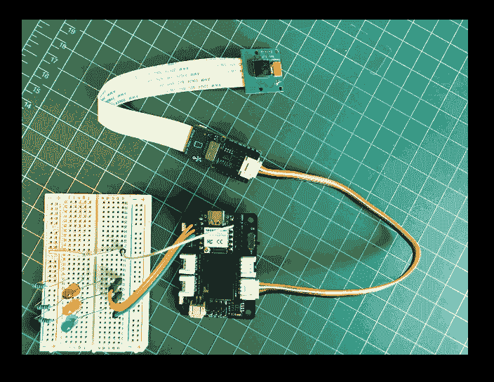

这里是结果：

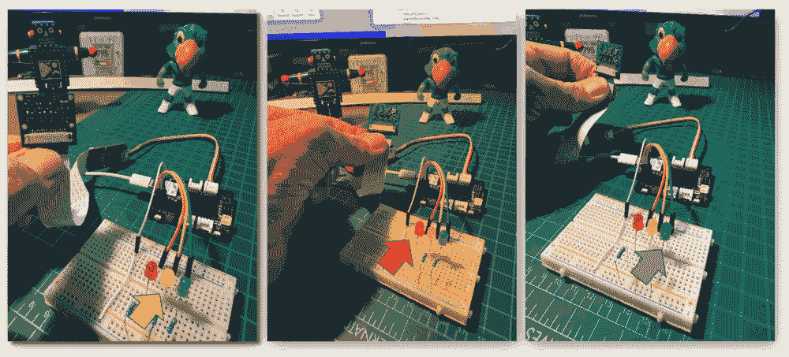

> 功耗达到了峰值 240 mA（绿色 LED），相当于 1.2 W。驱动黄色和红色 LED 消耗 14 mA，相当于 0.7 W。通过串行向终端发送信息对功耗没有影响。

## 摘要

在这个实验室中，我们探讨了使用 Himax WiseEye2 芯片驱动的 Seeed Studio Grove Vision AI 模块 V2 开发图像分类系统的完整过程。我们走过了机器学习工作流程的每一个阶段，从定义我们的项目目标到部署具有现实交互的工作模型。

Grove Vision AI V2 表现出令人印象深刻的性能，推理时间仅为 4-5ms，显著优于其他常见的 tinyML 平台。我们的基准比较表明，它比 ARM-M7 设备快约 14 倍，比 Xtensa LX6（ESP-CAM）快 100 多倍。即使与 Raspberry Pi Zero W2 相比，Edge TPU 架构在消耗更少能量的同时提供了近两倍的速度。

通过这个项目，我们看到了迁移学习如何使我们能够使用相对较小的自定义图像数据集实现良好的分类结果。具有 alpha 值 0.1 的 MobileNetV2 模型为我们三个类别的难题提供了精确性和效率之间的出色平衡，仅需要 146 KB 的 RAM 和 187 KB 的闪存，完全在 Grove Vision AI 模块 V2 的 2.4 MB 内部 SRAM 能力范围内。

我们还探索了多种部署选项，从通过 SenseCraft AI Studio 查看推理结果到使用 LED 创建具有视觉反馈的独立系统。将视频流式传输到网页浏览器并本地处理推理结果的能力展示了边缘 AI 系统在实际应用中的多功能性。

我们最终系统的功耗保持得令人印象深刻，从基本推理的约 70mA（0.4W）到驱动外部组件时的 240mA（1.2W）。这种效率使 Grove Vision AI 模块 V2 成为电池供电应用中的绝佳选择，在这些应用中，功耗至关重要。

这个实验室已经证明，复杂的计算机视觉任务现在可以在边缘端完全执行，无需依赖云服务或强大的计算机。借助 Edge Impulse Studio 和 SenseCraft AI Studio 等工具，开发过程甚至对没有广泛机器学习专业知识的人来说也变得可行。

随着边缘人工智能技术的持续发展，我们可以期待来自紧凑、节能设备（如 Grove Vision AI 模块 V2）的更强大功能，这将为智能传感器、物联网应用以及日常物体中的嵌入式智能开辟新的可能性。

## 资源

[使用 SenseCraft AI Studio 收集图像](https://sensecraft.seeed.cc/ai/training).

[Edge Impulse Studio 项目](https://studio.edgeimpulse.com/public/712491/live)

[SenseCraft AI Studio - 视觉工作空间（部署模型）](https://sensecraft.seeed.cc/ai/device/local/36)

[其他 Himax 示例](https://github.com/Seeed-Studio/wiki-documents/blob/docusaurus-version/docs/Sensor/Grove/Grove_Sensors/AI-powered/Grove-vision-ai-v2/Development/grove-vision-ai-v2-himax-sdk.md)

[Arduino 草图](https://github.com/Mjrovai/Seeed-Grove-Vision-AI-V2/tree/main/Arduino_Sketches)
