# 图像分类


*DALL·E 提示 - 为树莓派教程中的“图像分类”章节设计的封面图像，采用与之前封面相同的 1950 年代电子实验室风格。场景应包括一个连接到摄像头模块的树莓派，摄像头捕捉用户提供的蓝色小机器人的照片。机器人应放置在工作台上，周围是经典的实验室工具，如烙铁、电阻和电线。实验室背景应包括示波器和管式收音机等复古设备，保持时代的详细和怀旧感。不应包含任何文本或标志。*

## 概述

图像分类是计算机视觉中的一个基本任务，涉及将图像分类到几个预定义类别之一。它是人工智能的基石，使机器能够以模仿人类感知的方式解释和理解视觉信息。

图像分类是指根据图像的视觉内容将其分配一个标签或类别。这项任务在计算机视觉中至关重要，并在各个行业中具有广泛的应用。图像分类的重要性在于其能够自动化原本需要人类干预的视觉理解任务。

### 实际场景中的应用

图像分类已广泛应用于众多实际应用中，彻底改变了各个行业：

+   医疗保健：协助进行医学图像分析，例如识别 X 光片或 MRI 中的异常。

+   农业：通过航空图像监测作物健康和检测植物疾病。

+   汽车行业：使高级驾驶辅助系统和自动驾驶汽车能够识别路标、行人和其他车辆。

+   零售：提供视觉搜索功能和自动化库存管理系统。

+   安全和监控：增强威胁检测和面部识别系统。

+   环境监测：分析卫星图像进行森林砍伐、城市规划和气候变化研究。

### 在树莓派等边缘设备上运行分类的优势

在边缘设备（如树莓派）上实现图像分类具有几个显著优势：

1.  低延迟：本地处理图像消除了将数据发送到云服务器的需求，显著减少了响应时间。

1.  离线功能：分类可以在没有互联网连接的情况下进行，使其适用于偏远或连接困难的地区。

1.  隐私和安全：敏感的图像数据保留在本地设备上，解决数据隐私问题和合规性要求。

1.  成本效益：消除了对昂贵云计算资源的需求，特别是对于持续或高量级的分类任务。

1.  可扩展性：支持分布式计算架构，其中多个设备可以独立工作或在网络中协同工作。

1.  能效：在专用硬件上优化的模型可能比基于云的解决方案更节能，这对于电池供电或远程应用至关重要。

1.  定制化：部署针对特定用例专门或经常更新的模型更为方便。

我们可以通过利用边缘设备如树莓派在图像分类中的强大功能，创建更响应、更安全和更高效的计算机视觉解决方案。这种方法为将智能视觉处理集成到各种应用和环境开辟了新的可能性。

在接下来的章节中，我们将探讨如何在树莓派上实现和优化图像分类，利用这些优势创建强大且高效的计算机视觉系统。

## 设置环境

### 更新树莓派

首先，确保你的树莓派是最新的：

```py
sudo apt update
sudo apt upgrade -y
```

### 安装所需的库

安装图像处理和机器学习所需的库：

```py
sudo apt install python3-pip
sudo rm /usr/lib/python3.11/EXTERNALLY-MANAGED
pip3 install --upgrade pip
```

### 设置虚拟环境（可选但推荐）

创建一个虚拟环境来管理依赖项：

```py
python3 -m venv ~/tflite
source ~/tflite/bin/activate
```

### 安装 TensorFlow Lite

我们对执行**推理**感兴趣，这指的是在设备上执行 TensorFlow Lite 模型以根据输入数据进行预测。要使用 TensorFlow Lite 模型进行推理，我们必须通过**解释器**运行它。TensorFlow Lite 解释器旨在轻量且快速。解释器使用静态图排序和自定义（较少动态）内存分配器，以确保最小化负载、初始化和执行延迟。

我们将使用针对树莓派的[TensorFlow Lite 运行时](https://pypi.org/project/tflite-runtime/)，这是一个简化库，用于在移动和嵌入式设备上运行机器学习模型，而不包括所有 TensorFlow 包。

```py
pip install tflite_runtime --no-deps
```

> 安装的轮子：`tflite_runtime-2.14.0-cp311-cp311-manylinux_2_34_aarch64.whl`

### 安装额外的 Python 库

安装用于图像分类所需的 Python 库：

如果你已安装了另一个版本的 Numpy，请先卸载它。

```py
pip3 uninstall numpy
```

安装`版本 1.23.2`，它与 tflite_runtime 兼容。

```py
 pip3 install numpy==1.23.2
```

```py
pip3 install Pillow matplotlib
```

### 创建工作目录：

如果你使用的是带有最小 OS（无桌面）的 Raspi-Zero，你可能没有用户预定义的目录树（你可以使用`ls`来检查。因此，让我们创建一个：

```py
mkdir Documents
cd Documents/
mkdir TFLITE
cd TFLITE/
mkdir IMG_CLASS
cd IMG_CLASS
mkdir models
cd models
```

> 在 Raspi-5 上，/Documents 应该存在。

**获取预训练的图像分类模型**：

对于资源受限的设备如树莓派，一个合适的预训练模型对于成功的图像分类至关重要。**MobileNet**是为移动和嵌入式视觉应用设计的，在准确性和速度之间取得了良好的平衡。版本：MobileNetV1、MobileNetV2、MobileNetV3。让我们下载 V2 版本：

```py
# One long line, split with backslash \
wget https://storage.googleapis.com/download.tensorflow.org/\
models/tflite_11_05_08/mobilenet_v2_1.0_224_quant.tgz

tar xzf mobilenet_v2_1.0_224_quant.tgz
```

获取其[标签](https://github.com/Mjrovai/EdgeML-with-Raspberry-Pi/blob/main/IMG_CLASS/models/labels.txt)：

```py
wget https://raw.githubusercontent.com/Mjrovai/EdgeML-with-Raspberry-Pi/refs/heads/\
main/IMG_CLASS/models/labels.txt
```

最后，你应该在其目录中拥有模型：

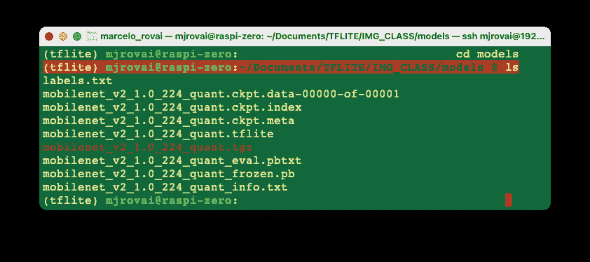

> 我们只需要`mobilenet_v2_1.0_224_quant.tflite`模型和`labels.txt`文件。你可以删除其他文件。

### 设置 Jupyter Notebook（可选）

如果你更喜欢使用 Jupyter Notebook 进行开发：

```py
pip3 install jupyter
jupyter notebook --generate-config
```

要运行 Jupyter Notebook，请运行以下命令（根据你的 IP 地址进行更改）：

```py
jupyter notebook --ip=192.168.4.210 --no-browser
```

在终端上，你可以看到打开笔记本的本地 URL 地址：

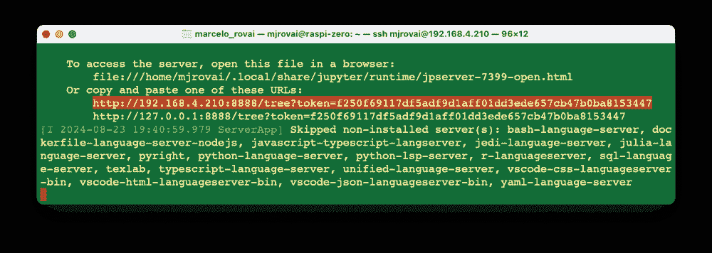

你可以通过在网页浏览器中输入 Raspberry Pi 的 IP 地址和提供的令牌来从另一台设备访问它（你可以从终端复制令牌）。

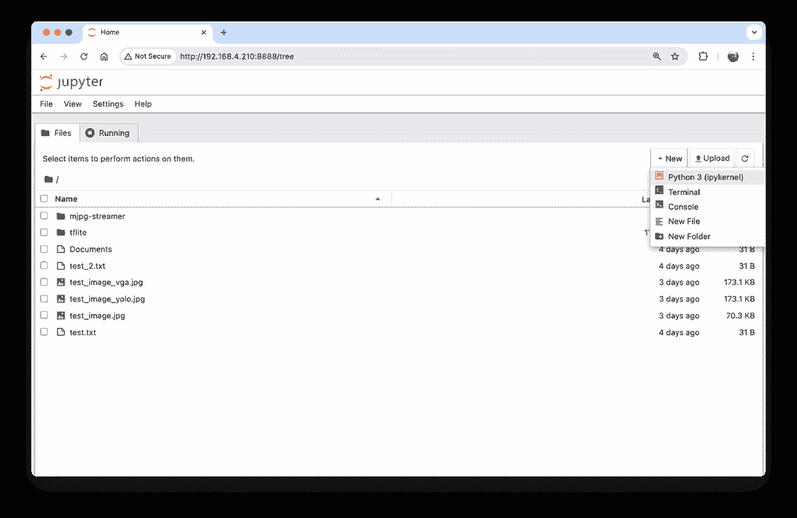

在 Raspi 中定义你的工作目录并创建一个新的 Python 3 笔记本。

### 验证设置

通过运行一个简单的 Python 脚本来测试你的设置：

```py
import tflite_runtime.interpreter as tflite
import numpy as np
from PIL import Image

print("NumPy:", np.__version__)
print("Pillow:", Image.__version__)

# Try to create a TFLite Interpreter
model_path = "./models/mobilenet_v2_1.0_224_quant.tflite"
interpreter = tflite.Interpreter(model_path=model_path)
interpreter.allocate_tensors()
print("TFLite Interpreter created successfully!")
```

你可以使用终端上的 nano 创建 Python 脚本，使用`CTRL+0` + `ENTER` + `CTRL+X`保存它。

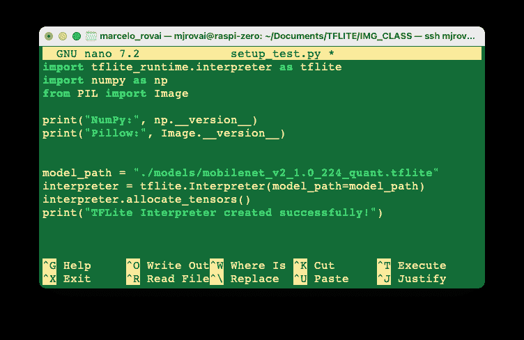

并使用以下命令运行它：

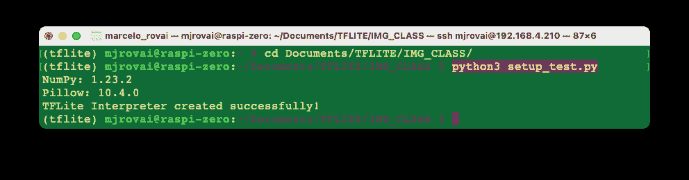

或者你可以直接在[Notebook](https://github.com/Mjrovai/EdgeML-with-Raspberry-Pi/blob/main/IMG_CLASS/notebooks/setup_test.ipynb)上运行：

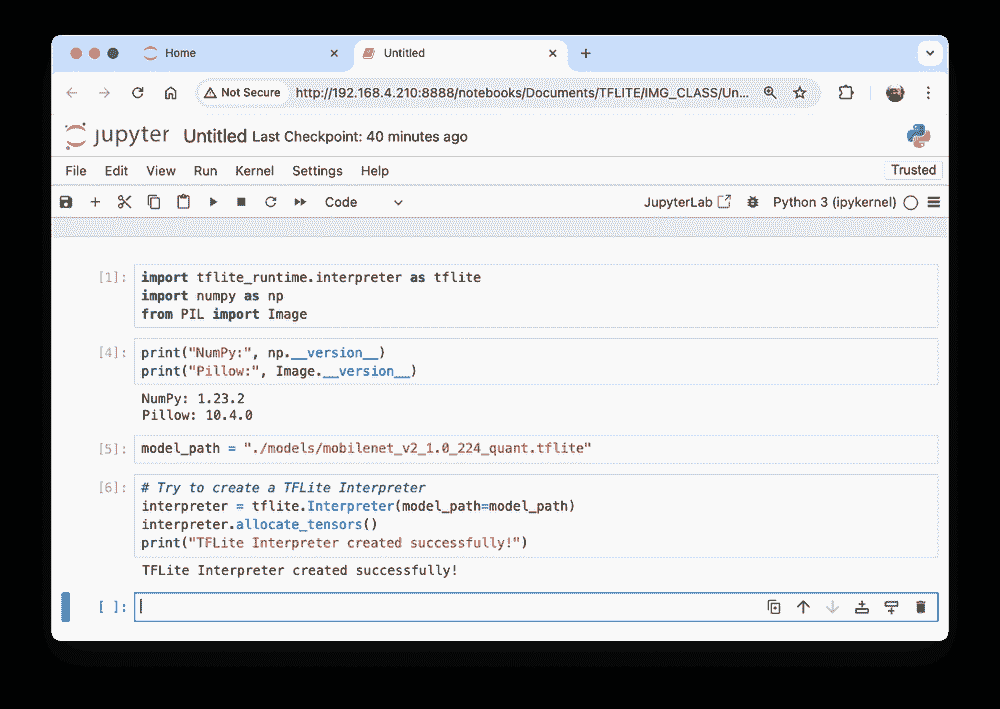

## 使用 Mobilenet V2 进行推理

在最后一节中，我们设置了环境，包括下载一个在 ImageNet 的<semantics><mrow><mn>224</mn><mo>×</mo><mn>224</mn></mrow><annotation encoding="application/x-tex">224\times 224</annotation></semantics>图像（1.2 百万）上训练的流行预训练模型 Mobilenet V2，用于 1,001 个类别（1,000 个对象类别加上 1 个背景）。该模型被转换为紧凑的 3.5 MB TensorFlow Lite 格式，使其适合 Raspberry Pi 有限的存储和内存。

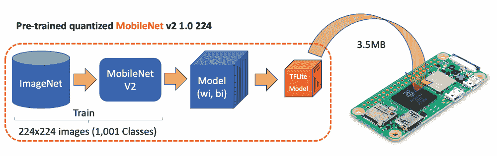

让我们开始一个新的[notebook](https://github.com/Mjrovai/EdgeML-with-Raspberry-Pi/blob/main/IMG_CLASS/notebooks/10_Image_Classification.ipynb)，以遵循所有步骤来对一张图像进行分类：

导入所需的库：

```py
import time
import numpy as np
import matplotlib.pyplot as plt
from PIL import Image
import tflite_runtime.interpreter as tflite
```

加载 TFLite 模型并分配张量：

```py
model_path = "./models/mobilenet_v2_1.0_224_quant.tflite"
interpreter = tflite.Interpreter(model_path=model_path)
interpreter.allocate_tensors()
```

获取输入和输出张量。

```py
input_details = interpreter.get_input_details()
output_details = interpreter.get_output_details()
```

**输入细节**将告诉我们模型应该如何用图像进行喂养。形状为（1，224，224，3）告诉我们应该逐个输入具有维度<semantics><mrow><mo stretchy="true" form="prefix">(</mo><mn>224</mn><mo>×</mo><mn>224</mn><mo>×</mo><mn>3</mn><mo stretchy="true" form="postfix">)</mo></mrow><annotation encoding="application/x-tex">(224\times 224\times 3)</annotation></semantics>的图像（批处理维度：1）。

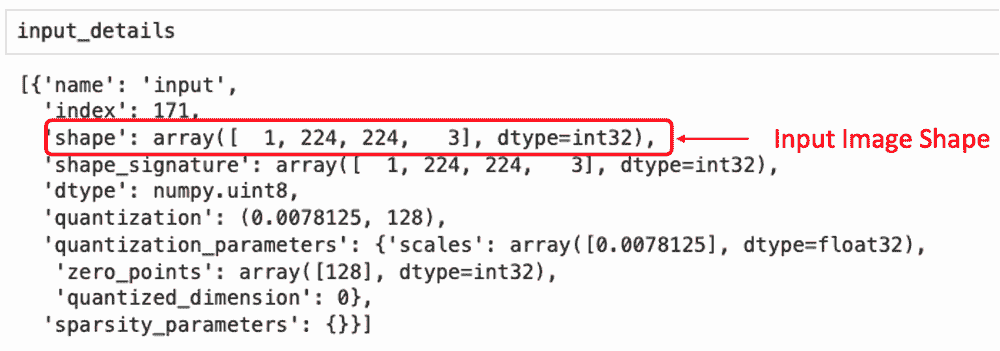

**输出细节**显示推理将产生一个包含 1,001 个整数值的数组。这些值来自图像分类，其中每个值是该特定标签与图像相关联的概率。

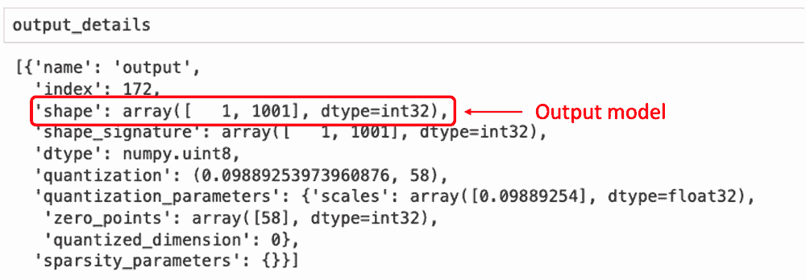

让我们也检查一下模型输入细节的数据类型。

```py
input_dtype = input_details[0]["dtype"]
input_dtype
```

```py
dtype('uint8')
```

这表明输入图像应该是原始像素（0 - 255）。

让我们获取一个测试图像。你可以从你的电脑传输它或下载一个用于测试。让我们首先在我们的工作目录下创建一个文件夹：

```py
mkdir images
cd images
wget https://upload.wikimedia.org/wikipedia/commons/3/3a/Cat03.jpg
```

让我们加载并显示图像：

```py
# Load he image
img_path = "./images/Cat03.jpg"
img = Image.open(img_path)

# Display the image
plt.figure(figsize=(8, 8))
plt.imshow(img)
plt.title("Original Image")
plt.show()
```

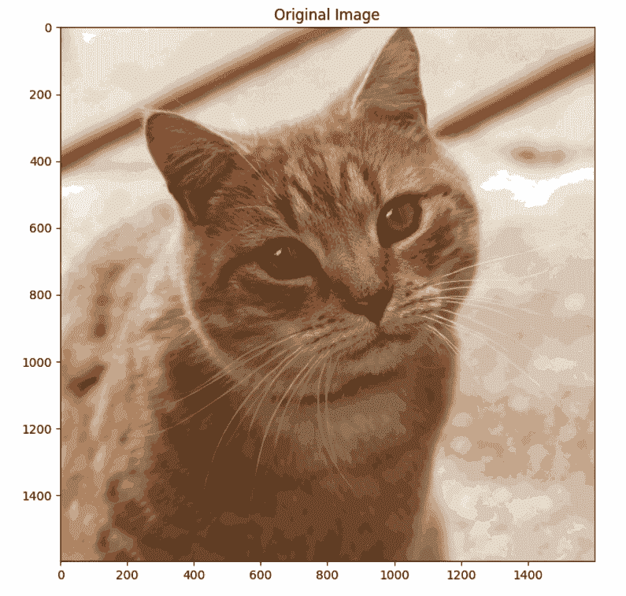

我们可以通过运行命令查看图像大小：

```py
width, height = img.size
```

这表明图像是一个宽度为 1600 像素、高度为 1600 像素的 RGB 图像。因此，为了使用我们的模型，我们应该将其重塑为(224, 224, 3)，并添加一个批处理维度 1，如输入细节中定义：(1, 224, 224, 3)。推理结果，如输出细节所示，将是一个大小为 1001 的数组，如下所示：

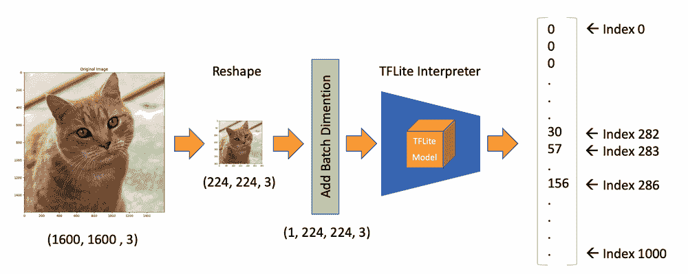

因此，让我们重塑图像，添加批处理维度，并查看结果：

```py
img = img.resize(
    (input_details[0]["shape"][1], input_details[0]["shape"][2])
)
input_data = np.expand_dims(img, axis=0)
input_data.shape
```

输入数据的形状符合预期：(1, 224, 224, 3)

让我们确认输入数据的 dtype：

```py
input_data.dtype
```

```py
dtype('uint8')
```

输入数据的 dtype 是‘uint8’，这与模型期望的 dtype 兼容。

使用 input_data 运行解释器并获取预测（输出）：

```py
interpreter.set_tensor(input_details[0]["index"], input_data)
interpreter.invoke()
predictions = interpreter.get_tensor(output_details[0]["index"])[0]
```

预测是一个包含 1001 个元素的数组。让我们获取具有高值的 Top-5 索引：

```py
top_k_results = 5
top_k_indices = np.argsort(predictions)[::-1][:top_k_results]
top_k_indices
```

top_k_indices 是一个包含 5 个元素的数组：`array([283, 286, 282])`

因此，283、286、282、288 和 479 是图像最可能的类别。有了索引，我们必须找到它指定的类别（例如汽车、猫或狗）。与模型一起下载的文本文件与从 0 到 1,000 的每个索引关联一个标签。让我们使用一个函数来加载.txt 文件作为列表：

```py
def load_labels(filename):
    with open(filename, "r") as f:
        return [line.strip() for line in f.readlines()]
```

然后获取列表，打印与索引关联的标签：

```py
labels_path = "./models/labels.txt"
labels = load_labels(labels_path)

print(labels[286])
print(labels[283])
print(labels[282])
print(labels[288])
print(labels[479])
```

因此，我们有：

```py
Egyptian cat
tiger cat
tabby
lynx
carton
```

至少前四个索引与猫科动物相关。**预测**内容是每个标签的概率。正如我们在输出细节中看到的，这些值是量化的，应该进行反量化并应用 softmax。

```py
scale, zero_point = output_details[0]["quantization"]
dequantized_output = (
    predictions.astype(np.float32) - zero_point
) * scale
exp_output = np.exp(dequantized_output - np.max(dequantized_output))
probabilities = exp_output / np.sum(exp_output)
```

让我们打印前 5 个概率：

```py
print(probabilities[286])
print(probabilities[283])
print(probabilities[282])
print(probabilities[288])
print(probabilities[479])
```

```py
0.27741462
0.3732285
0.16919471
0.10319158
0.023410844
```

为了清晰起见，让我们创建一个函数来关联标签与概率：

```py
for i in range(top_k_results):
    print(
        "\t{:20}: {}%".format(
            labels[top_k_indices[i]],
            (int(probabilities[top_k_indices[i]] * 100)),
        )
    )
```

```py
tiger cat           : 37%
Egyptian cat        : 27%
tabby               : 16%
lynx                : 10%
carton              : 2%
```

### 定义一个通用的图像分类函数

让我们创建一个通用函数，将图像作为输入，并获取前 5 个可能的类别：

```py
def image_classification(
    img_path, model_path, labels, top_k_results=5
):
    # load the image
    img = Image.open(img_path)
    plt.figure(figsize=(4, 4))
    plt.imshow(img)
    plt.axis("off")

    # Load the TFLite model
    interpreter = tflite.Interpreter(model_path=model_path)
    interpreter.allocate_tensors()

    # Get input and output tensors
    input_details = interpreter.get_input_details()
    output_details = interpreter.get_output_details()

    # Preprocess
    img = img.resize(
        (input_details[0]["shape"][1], input_details[0]["shape"][2])
    )
    input_data = np.expand_dims(img, axis=0)

    # Inference on Raspi-Zero
    interpreter.set_tensor(input_details[0]["index"], input_data)
    interpreter.invoke()

    # Obtain results and map them to the classes
    predictions = interpreter.get_tensor(output_details[0]["index"])[
        0
    ]

    # Get indices of the top k results
    top_k_indices = np.argsort(predictions)[::-1][:top_k_results]

    # Get quantization parameters
    scale, zero_point = output_details[0]["quantization"]

    # Dequantize the output and apply softmax
    dequantized_output = (
        predictions.astype(np.float32) - zero_point
    ) * scale
    exp_output = np.exp(
        dequantized_output - np.max(dequantized_output)
    )
    probabilities = exp_output / np.sum(exp_output)

    print("\n\t[PREDICTION]        [Prob]\n")
    for i in range(top_k_results):
        print(
            "\t{:20}: {}%".format(
                labels[top_k_indices[i]],
                (int(probabilities[top_k_indices[i]] * 100)),
            )
        )
```

然后加载一些图像进行测试，我们有：

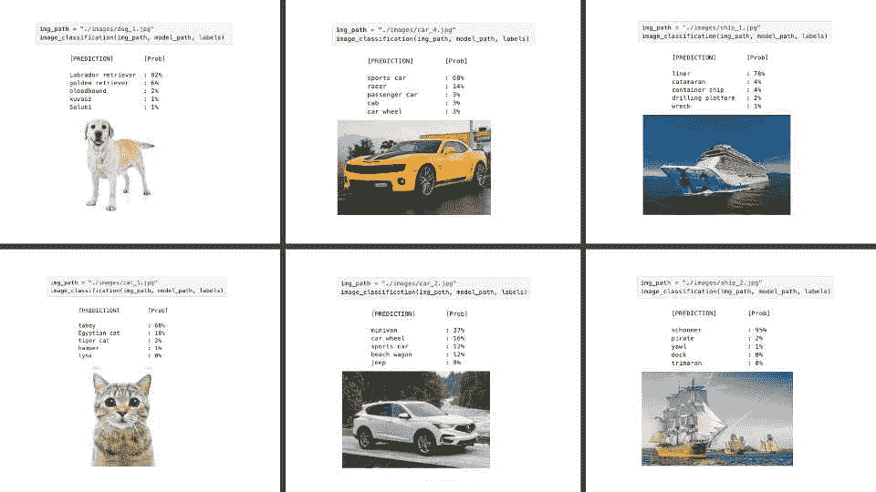

### 使用从头开始训练的模型进行测试

让我们从头开始获取一个 TFLite 模型。为此，你可以参考以下笔记本：

[CNN 用于分类 Cifar-10 数据集](https://colab.research.google.com/github/Mjrovai/UNIFEI-IESTI01-TinyML-2022.1/blob/main/00_Curse_Folder/2_Applications_Deploy/Class_16/cifar_10/CNN_Cifar_10_TFLite.ipynb#scrollTo=iiVBUpuHXEtw)

在笔记本中，我们使用 CIFAR10 数据集训练了一个模型，该数据集包含来自 10 个类别的 60,000 张图像（CIFAR 的*飞机、汽车、鸟、猫、鹿、狗、青蛙、马、船和卡车*）。CIFAR 有<semantics><mrow><mn>32</mn><mo>×</mo><mn>32</mn></mrow><annotation encoding="application/x-tex">32\times 32</annotation></semantics>彩色图像（3 个颜色通道），其中对象不是居中的，并且可以有背景中的对象，例如可能有云的飞机！简而言之，小但真实的图像。

训练好的 CNN 模型(*cifar10_model.keras*)的大小为 2.0MB。使用*TFLite Converter*，模型*cifar10.tflite*变成了 674MB（大约是原始大小的 1/3）。

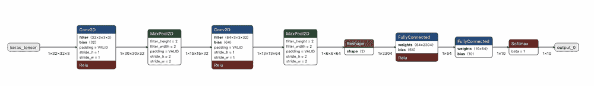

在[notebook Cifar 10 - 在 Raspi 上使用 TFLite 进行图像分类](https://github.com/Mjrovai/EdgeML-with-Raspberry-Pi/blob/main/IMG_CLASS/notebooks/20_Cifar_10_Image_Classification.ipynb)（可以在 Raspi 上运行），我们可以遵循与`mobilenet_v2_1.0_224_quant.tflite`相同的步骤。以下是在最后一节中展示的 Raspi-Zero 上使用*通用图像分类功能*的图像示例。

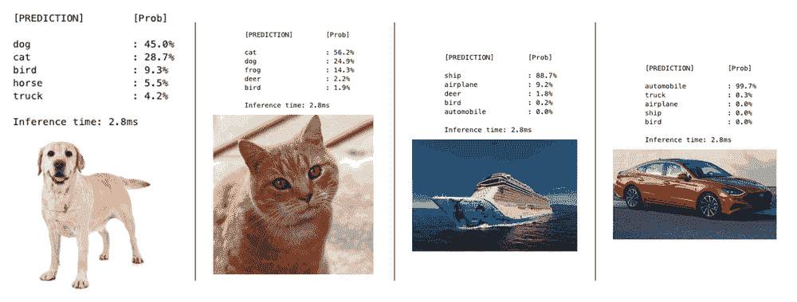

### 安装 Picamera2

[Picamera2](https://github.com/raspberrypi/picamera2)，一个用于与 Raspberry Pi 摄像头交互的 Python 库，基于*libcamera*摄像头堆栈，并由 Raspberry Pi 基金会维护。Picamera2 库支持所有 Raspberry Pi 型号，从 Pi Zero 到 RPi 5。它已经在 Raspi 上全局安装，但我们应确保它在虚拟环境中可访问。

1.  首先，如果尚未激活，请激活虚拟环境：

    ```py
    source ~/tflite/bin/activate
    ```

1.  现在，让我们在您的虚拟环境中创建一个.pth 文件，以添加系统 site-packages 路径：

    ```py
    echo "/usr/lib/python3/dist-packages" > \
     $VIRTUAL_ENV/lib/python3.11/
    site-packages/system_site_packages.pth
    ```

    > 注意：如果您的 Python 版本不同，请将`python3.11`替换为适当的版本。

1.  创建此文件后，尝试在 Python 中导入 picamera2：

    ```py
    python3
    >>> import picamera2
    >>> print(picamera2.__file__)
    ```

上述代码将显示`picamera2`模块本身的文件位置，证明可以从环境中访问库。

```py
/home/mjrovai/tflite/lib/python3.11/site-packages/\
picamera2/__init__.py
```

您还可以列出系统中的可用摄像头：

```py
>>> print(Picamera2.global_camera_info())
```

在我的情况下，安装了 USB 后，我得到了：

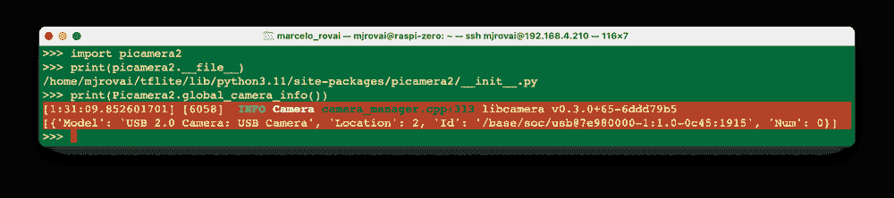

现在我们已经确认 picamera2 在具有`index 0`的环境下工作，让我们尝试一个简单的 Python 脚本来从您的 USB 摄像头捕获一张图片：

```py
from picamera2 import Picamera2
import time

# Initialize the camera
picam2 = Picamera2()  # default is index 0

# Configure the camera
config = picam2.create_still_configuration(main={"size": (640, 480)})
picam2.configure(config)

# Start the camera
picam2.start()

# Wait for the camera to warm up
time.sleep(2)

# Capture an image
picam2.capture_file("usb_camera_image.jpg")
print("Image captured and saved as 'usb_camera_image.jpg'")

# Stop the camera
picam2.stop()
```

使用 Nano 文本编辑器、Jupyter Notebook 或任何其他编辑器。将其保存为 Python 脚本（例如，`capture_image.py`）并运行。这应该会从您的摄像头捕获一张图片，并将其保存为与脚本相同的目录中的“usb_camera_image.jpg”。

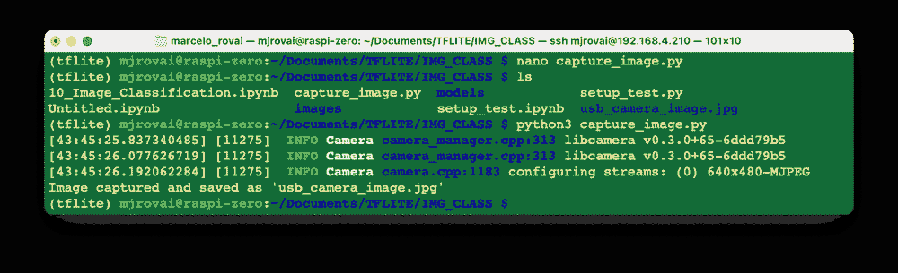

如果 Jupyter 已经打开，您可以在您的电脑上看到捕获到的图片。否则，将文件从 Raspi 传输到您的电脑。

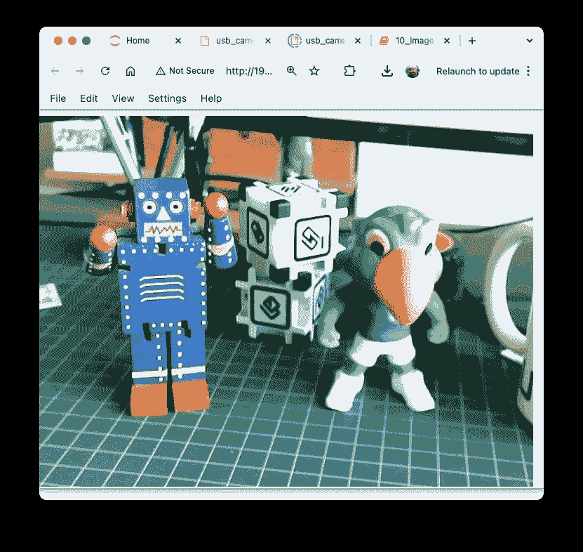

> 如果您在使用带有完整桌面的 Raspi-5，可以直接在设备上打开文件。

## 图像分类项目

现在，我们将使用 Edge Impulse Studio 开发一个完整的图像分类项目。正如我们在 Movilinet V2 中所做的那样，我们将使用训练和转换后的 TFLite 模型进行推理。

### 目标

任何 ML 项目的第一步是定义其目标。在这种情况下，目标是检测和分类一张图片中存在的两个特定对象。对于这个项目，我们将使用两个小玩具：一个机器人和一只小型巴西鹦鹉（名为 Periquito）。我们还将收集两个对象不存在的*背景*图片。

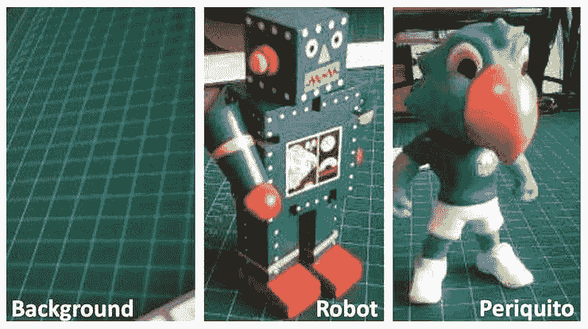

### 数据收集

一旦我们定义了我们的机器学习项目目标，下一步也是最重要的一步是收集数据集。我们可以使用手机进行图像捕获，但在这里我们将使用 Raspi。让我们在我们的 Raspberry Pi 上设置一个简单的网络服务器，以便在浏览器中查看捕获的 `QVGA (320 x 240)` 图像。

1.  首先，让我们安装 Flask，一个用于 Python 的轻量级网络框架：

    ```py
    pip3 install flask
    ```

1.  让我们创建一个新的 Python 脚本，结合图像捕获和 Web 服务器。我们将它命名为 `get_img_data.py`：

```py
from flask import Flask, Response, render_template_string,
                  request, redirect, url_for
from picamera2 import Picamera2
import io
import threading
import time
import os
import signal

app = Flask(__name__)

# Global variables
base_dir = "dataset"
picam2 = None
frame = None
frame_lock = threading.Lock()
capture_counts = {}
current_label = None
shutdown_event = threading.Event()

def initialize_camera():
    global picam2
    picam2 = Picamera2()
    config = picam2.create_preview_configuration(
             main={"size": (320, 240)}
    )
    picam2.configure(config)
    picam2.start()
    time.sleep(2)  # Wait for camera to warm up

def get_frame():
    global frame
    while not shutdown_event.is_set():
        stream = io.BytesIO()
        picam2.capture_file(stream, format='jpeg')
        with frame_lock:
            frame = stream.getvalue()
        time.sleep(0.1)  # Adjust as needed for smooth preview

def generate_frames():
    while not shutdown_event.is_set():
        with frame_lock:
            if frame is not None:
                yield (b'--frame\r\n'
                       b'Content-Type: image/jpeg\r\n\r\n' +
                                       frame + b'\r\n')
        time.sleep(0.1)  # Adjust as needed for smooth streaming

def shutdown_server():
    shutdown_event.set()
    if picam2:
        picam2.stop()
    # Give some time for other threads to finish
    time.sleep(2)
    # Send SIGINT to the main process
    os.kill(os.getpid(), signal.SIGINT)

@app.route('/', methods=['GET', 'POST'])
def index():
    global current_label
    if request.method == 'POST':
        current_label = request.form['label']
        if current_label not in capture_counts:
            capture_counts[current_label] = 0
        os.makedirs(os.path.join(base_dir, current_label),
                                 exist_ok=True)
        return redirect(url_for('capture_page'))
    return render_template_string('''
 <!DOCTYPE html>
 <html>
 <head>
 <title>Dataset Capture - Label Entry</title>
 </head>
 <body>
 <h1>Enter Label for Dataset</h1>
 <form method="post">
 <input type="text" name="label" required>
 <input type="submit" value="Start Capture">
 </form>
 </body>
 </html>
 ''')

@app.route('/capture')
def capture_page():
    return render_template_string('''
 <!DOCTYPE html>
 <html>
 <head>
 <title>Dataset Capture</title>
 <script>
 var shutdownInitiated = false;
 function checkShutdown() {
 if (!shutdownInitiated) {
 fetch('/check_shutdown')
 .then(response => response.json())
 .then(data => {
 if (data.shutdown) {
 shutdownInitiated = true;
 document.getElementById(
 'video-feed').src = '';
 document.getElementById(
 'shutdown-message')
 .style.display = 'block';
 }
 });
 }
 }
 setInterval(checkShutdown, 1000); // Check
 every second
 </script>
 </head>
 <body>
 <h1>Dataset Capture</h1>
 <p>Current Label: {{ label }}</p>
 <p>Images captured for this label: {{ capture_count
  }}</p>
 
 <div id="shutdown-message" style="display: none;
 color: red;">
 Capture process has been stopped.
 You can close this window.
 </div>
 <form action="/capture_image" method="post">
 <input type="submit" value="Capture Image">
 </form>
 <form action="/stop" method="post">
 <input type="submit" value="Stop Capture"
 style="background-color: #ff6666;">
 </form>
 <form action="/" method="get">
 <input type="submit" value="Change Label"
 style="background-color: #ffff66;">
 </form>
 </body>
 </html>
 ''', label=current_label, capture_count=capture_counts.get(
                                            current_label, 0))

@app.route('/video_feed')
def video_feed():
    return Response(generate_frames(),
                    mimetype='multipart/x-mixed-replace;
 boundary=frame')

@app.route('/capture_image', methods=['POST'])
def capture_image():
    global capture_counts
    if current_label and not shutdown_event.is_set():
        capture_counts[current_label] += 1
        timestamp = time.strftime("%Y%m%d-%H%M%S")
        filename = f"image_{timestamp}.jpg"
        full_path = os.path.join(base_dir, current_label,
                                 filename)

        picam2.capture_file(full_path)

    return redirect(url_for('capture_page'))

@app.route('/stop', methods=['POST'])
def stop():
    summary = render_template_string('''
 <!DOCTYPE html>
 <html>
 <head>
 <title>Dataset Capture - Stopped</title>
 </head>
 <body>
 <h1>Dataset Capture Stopped</h1>
 <p>The capture process has been stopped.
 You can close this window.</p>
 <p>Summary of captures:</p>
 <ul>
 
 <li>{{ label }}: {{ count }} images</li>
 
 </ul>
 </body>
 </html>
 ''', capture_counts=capture_counts)

    # Start a new thread to shutdown the server
    threading.Thread(target=shutdown_server).start()

    return summary

@app.route('/check_shutdown')
def check_shutdown():
    return {'shutdown': shutdown_event.is_set()}

if __name__ == '__main__':
    initialize_camera()
    threading.Thread(target=get_frame, daemon=True).start()
    app.run(host='0.0.0.0', port=5000, threaded=True)
```

1.  运行此脚本：

```py
    python3 get_img_data.py
```

1.  访问网络界面：

    +   在 Raspberry Pi 本身（如果您有 GUI）：打开网页浏览器并访问 `http://localhost:5000`

    +   从同一网络上的另一台设备：打开网页浏览器并访问 `http://<raspberry_pi_ip>:5000`（将 `<raspberry_pi_ip>` 替换为您的 Raspberry Pi 的 IP 地址）。例如：`http://192.168.4.210:5000/`

此 Python 脚本使用 Raspberry Pi 和其摄像头创建了一个基于网络的界面，用于捕获和组织图像数据集。这对于需要标记图像数据的机器学习项目来说非常方便。

#### 关键特性：

1.  **Web 界面**：可通过与 Raspberry Pi 相同网络上的任何设备访问。

1.  **实时摄像头预览**：显示来自摄像头的实时流。

1.  **标签系统**：允许用户为不同类别的图像输入标签。

1.  **组织存储**：自动将图像保存到特定标签的子目录中。

1.  **按标签计数器**：跟踪每个标签捕获了多少图像。

1.  **摘要统计**：在停止捕获过程时提供捕获图像的摘要。

#### 主要组件：

1.  **Flask Web 应用程序**：处理路由并服务网络界面。

1.  **Picamera2 集成**：控制 Raspberry Pi 摄像头。

1.  **线程化帧捕获**：确保实时预览流畅。

1.  **文件管理**：将捕获的图像组织到标记的目录中。

#### 关键功能：

+   `initialize_camera()`：设置 Picamera2 实例。

+   `get_frame()`：持续捕获用于实时预览的帧。

+   `generate_frames()`：为实时视频流提供帧。

+   `shutdown_server()`：设置关闭事件，停止摄像头并关闭 Flask 服务器

+   `index()`：处理标签输入页面。

+   `capture_page()`：显示主要捕获界面。

+   `video_feed()`：显示实时预览以定位摄像头。

+   `capture_image()`：保存带有当前标签的图像。

+   `stop()`：停止捕获过程并显示摘要。

#### 使用流程：

1.  在您的 Raspberry Pi 上启动脚本。

1.  从浏览器访问网络界面。

1.  为您想要捕获的图像输入标签并按 `开始捕获`。

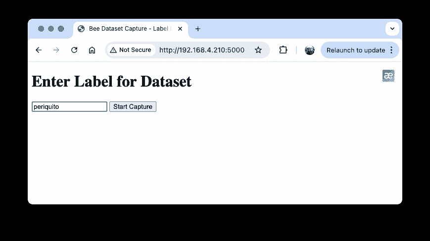

1.  使用实时预览定位摄像头。

1.  点击 `捕获图像` 以保存当前标签下的图像。

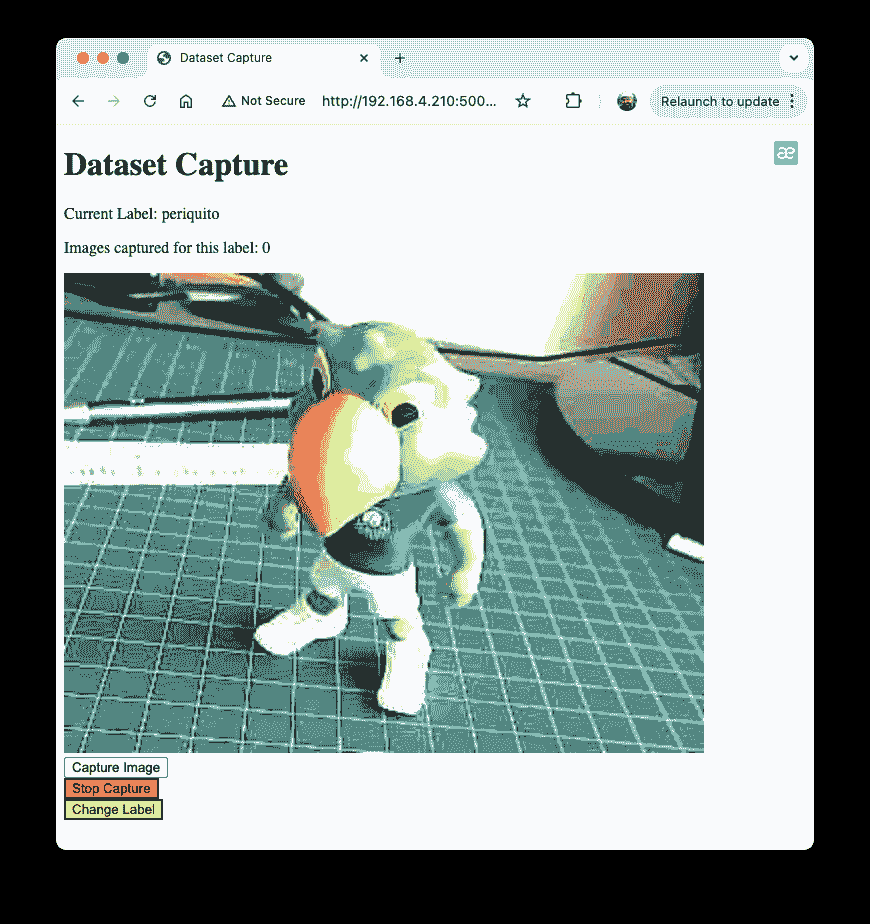

1.  根据不同类别更改标签，选择 `更改标签`。

1.  完成后点击 `停止捕获` 以查看摘要。

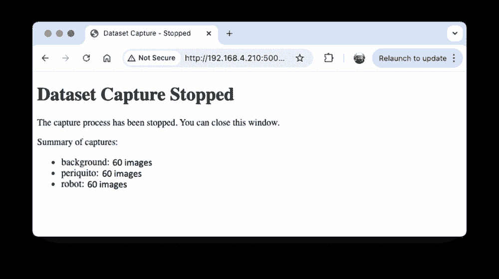

#### 技术说明：

+   该脚本使用线程处理并发帧捕获和网络服务。

+   图像以其文件名中的时间戳保存，以确保唯一性。

+   网络界面是响应式的，可以从移动设备访问。

#### 定制化可能性：

+   在 `initialize_camera()` 函数中调整图像分辨率。这里我们使用了 QVGA <semantics><mrow><mo stretchy="true" form="prefix">(</mo><mn>320</mn><mo>×</mo><mn>240</mn><mo stretchy="true" form="postfix">)</mo></mrow><annotation encoding="application/x-tex">(320\times 240)</annotation></semantics>。

+   修改 HTML 模板以获得不同的外观和感觉。

+   在 `capture_image()` 函数中添加额外的图像处理或分析步骤。

#### 数据集上的样本数量：

从每个类别（`periquito`、`robot` 和 `background`）获取大约 60 张图像。尽量捕捉不同的角度、背景和光照条件。在 Raspi 上，我们将结束于一个名为 `dataset` 的文件夹，其中包含 3 个子文件夹 *periquito*、*robot* 和 *background*，每个文件夹对应于图像的一个类别。

您可以使用 `Filezilla` 将创建的数据集传输到您的主计算机。

## 使用 Edge Impulse Studio 训练模型

我们将使用 Edge Impulse Studio 来训练我们的模型。访问 [Edge Impulse 页面](https://edgeimpulse.com/)，输入您的账户凭据，并创建一个新的项目：

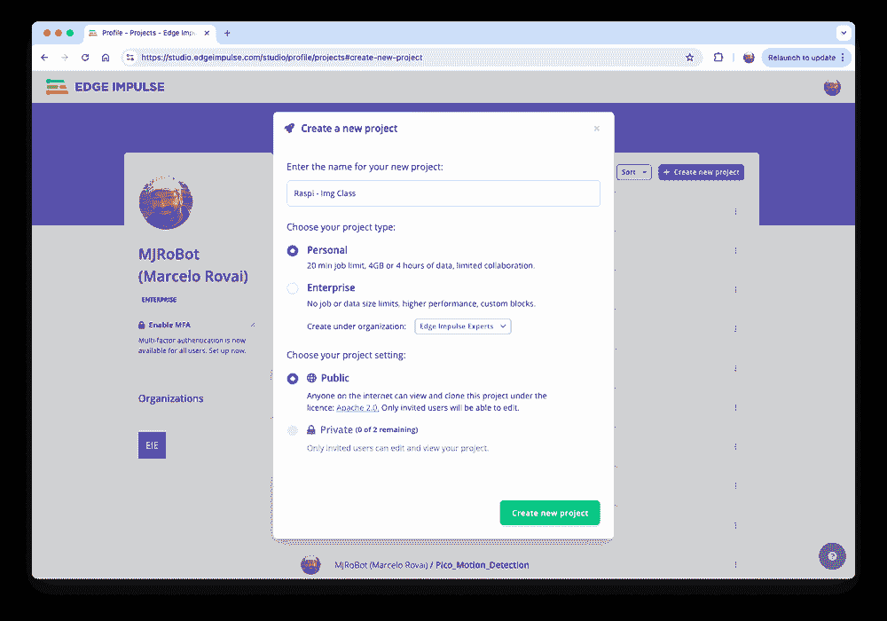

> 这里，您可以克隆一个类似的项目：[Raspi - Img Class](https://studio.edgeimpulse.com/public/510251/live)。

### 数据集

我们将使用 EI Studio（或 Studio）通过四个主要步骤进行操作。这些步骤对于准备我们的模型在 Raspi 上使用至关重要：数据集、Impulse、测试和部署（在这种情况下，是边缘设备，即 Raspi）。

> 关于数据集，重要的是指出，我们用 Raspi 捕获的原始数据集将被分成 *训练*、*验证* 和 *测试*。测试集将从一开始就分离出来，并在训练后的测试阶段使用。验证集将在训练期间使用。

在 Studio 上，按照步骤上传捕获的数据：

1.  转到 `数据采集` 选项卡，在 `上传数据` 部分，上传您计算机上所选类别的文件。

1.  将原始数据集的拆分（*训练和测试*）以及选择标签的工作留给 Studio。

1.  对所有三个类别重复此过程。最后，您应该在 Studio 中看到您的“原始数据”：

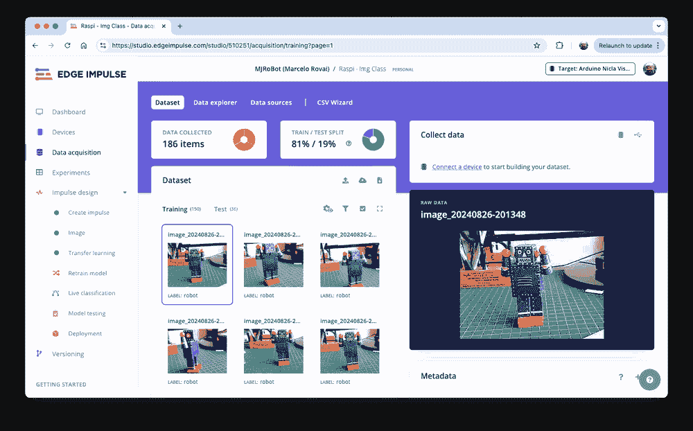

Studio 允许您探索您的数据，展示您项目中所有数据的完整视图。您可以通过点击单个数据项来清除、检查或更改标签。在我们的简单项目中，数据看起来是好的。

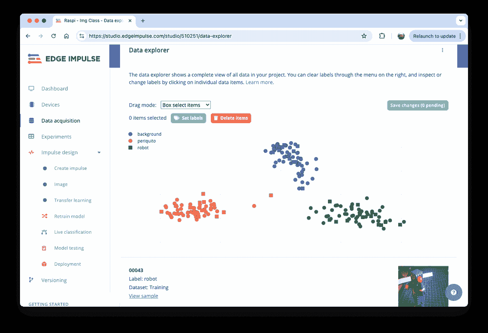

## Impulse 设计

在这个阶段，我们应该定义如何：

+   预处理我们的数据，这包括调整单个图像的大小以及确定要使用的 `颜色深度`（无论是 RGB 还是灰度）和

+   指定一个模型。在这种情况下，它将是`迁移学习（图像）`，用于在我们的数据上微调预训练的 MobileNet V2 图像分类模型。这种方法即使在相对较小的图像数据集（在我们的案例中约为 180 张图像）中也表现良好。

使用 MobileNet 的迁移学习为模型训练提供了一种简化的方法，这对于资源受限的环境和具有有限标记数据的项目特别有益。MobileNet 以其轻量级架构而闻名，是一个已经从大型数据集（ImageNet）中学习到有价值特征的预训练模型。

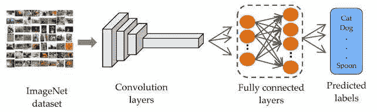

通过利用这些学习到的特征，我们可以用更少的数据和计算资源训练一个新的模型来完成您的特定任务，并实现有竞争力的准确率。

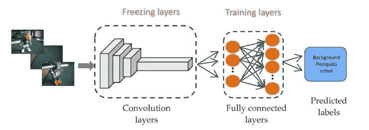

这种方法显著减少了训练时间和计算成本，使其非常适合快速原型设计和在嵌入式设备上的部署，在这些设备上效率至关重要。

转到“脉冲设计”标签页，创建一个*脉冲*，定义图像大小为<semantics><mrow><mn>160</mn><mo>×</mo><mn>160</mn></mrow><annotation encoding="application/x-tex">160\times 160</annotation></semantics>，并将它们压扁（平方形式，不裁剪）。选择图像和迁移学习模块。保存脉冲。

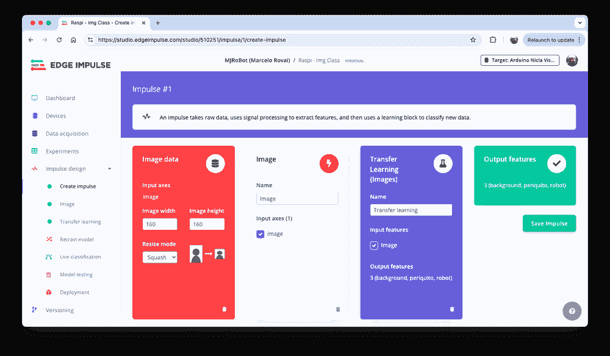

### 图像预处理

所有输入的 QVGA/RGB565 图像都将转换为 76,800 个特征 <semantics><mrow><mo stretchy="true" form="prefix">(</mo><mn>160</mn><mo>×</mo><mn>160</mn><mo>×</mo><mn>3</mn><mo stretchy="true" form="postfix">)</mo></mrow><annotation encoding="application/x-tex">(160\times 160\times 3)</annotation></semantics>.

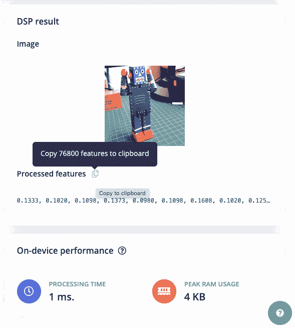

按`保存参数`，然后在下一标签页中选择`生成特征`。

### 模型设计

MobileNet 是一系列专为移动和嵌入式视觉应用设计的有效卷积神经网络。MobileNet 的关键特性包括：

1.  轻量级：针对具有有限计算资源的移动设备和嵌入式系统进行了优化。

1.  速度：快速推理时间，适用于实时应用。

1.  准确率：尽管体积紧凑，但仍然保持良好的准确率。

[MobileNetV2](https://arxiv.org/abs/1801.04381)，于 2018 年推出，改进了原始的 MobileNet 架构。关键特性包括：

1.  反向残差：在薄瓶颈层之间使用快捷连接的反向残差结构。

1.  线性瓶颈：移除狭窄层中的非线性，以防止信息丢失。

1.  深度可分离卷积：继续使用从 MobileNetV1 中继承的这种高效操作。

在我们的项目中，我们将使用`MobileNetV2 160x160 1.0`进行`迁移学习`，这意味着用于训练（以及未来的推理）的图像应该具有一个*输入尺寸*为<semantics><mrow><mn>160</mn><mo>×</mo><mn>160</mn></mrow><annotation encoding="application/x-tex">160\times 160</annotation></semantics>像素和*宽度乘数*为 1.0（全宽，未缩减）。这种配置在模型大小、速度和准确性之间取得了平衡。

### 模型训练

另一种有价值的深度学习技术是**数据增强**。数据增强通过创建额外的合成数据来提高机器学习模型的准确性。数据增强系统在训练过程中对训练数据进行小的、随机的更改（例如翻转、裁剪或旋转图像）。

查看内部结构，这里你可以看到 Edge Impulse 是如何在你的数据上实现数据增强策略的：

```py
# Implements the data augmentation policy
def augment_image(image, label):
    # Flips the image randomly
    image = tf.image.random_flip_left_right(image)

    # Increase the image size, then randomly crop it down to
    # the original dimensions
    resize_factor = random.uniform(1, 1.2)
    new_height = math.floor(resize_factor * INPUT_SHAPE[0])
    new_width = math.floor(resize_factor * INPUT_SHAPE[1])
    image = tf.image.resize_with_crop_or_pad(
        image, new_height, new_width
    )
    image = tf.image.random_crop(image, size=INPUT_SHAPE)

    # Vary the brightness of the image
    image = tf.image.random_brightness(image, max_delta=0.2)

    return image, label
```

在训练过程中接触这些变化可以帮助防止你的模型通过“记忆”训练数据中的表面线索来走捷径，这意味着它可能更好地反映数据集中的深层潜在模式。

我们模型的最终密集层将有 0 个神经元，并使用 10%的 dropout 来防止过拟合。以下是训练结果：

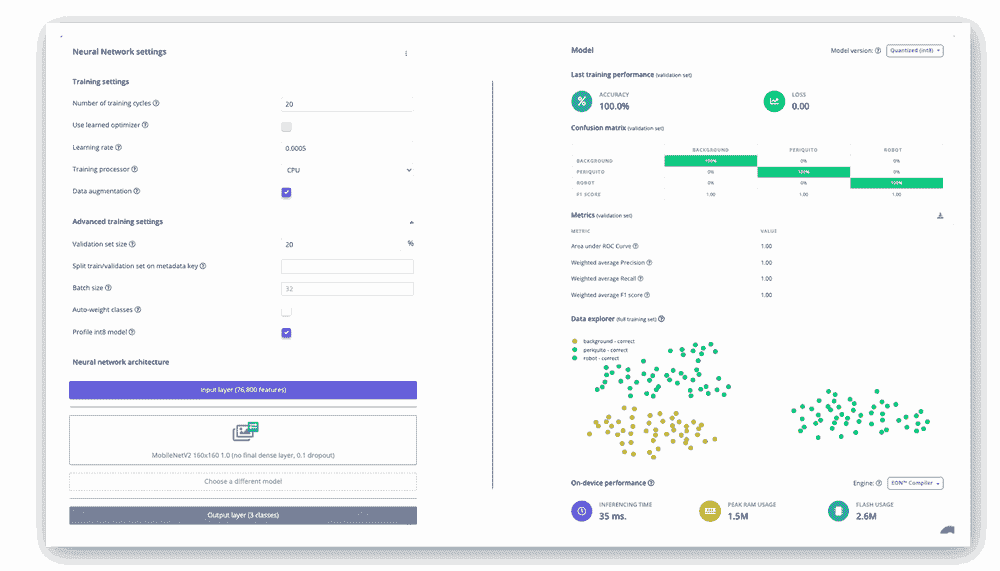

结果非常出色，具有合理的 35 毫秒延迟（对于 Raspi-4），在推理期间应达到大约 30 fps（每秒帧数）。Raspi-Zero 应该更慢，而 Raspi-5 应该更快。

### 速度与准确性的权衡：

如果需要更快的推理，我们应该使用较小的 alpha 值（0.35、0.5 和 0.75）或甚至减少图像输入尺寸，以准确性为代价。然而，减少输入图像尺寸和降低 alpha（宽度乘数）可以加快 MobileNet V2 的推理速度，但它们有不同的权衡。让我们比较一下：

1.  减少图像输入尺寸：

优点：

+   显著降低了所有层的计算成本。

+   减少内存使用。

+   它通常提供显著的加速。

缺点：

+   它可能会降低模型检测小特征或细微细节的能力。

+   它可以显著影响准确性，尤其是在需要精细识别的任务中。

1.  减少 Alpha（宽度乘数）：

优点：

+   减少了模型中的参数和计算量。

+   保持原始输入分辨率，可能保留更多细节。

+   它可以在速度和准确性之间提供良好的平衡。

缺点：

+   它可能不会像减少输入尺寸那样显著加快推理速度。

+   它可以减少模型学习复杂特征的能力。

比较：

1.  速度影响：

    +   减少输入尺寸通常可以提供更显著的加速，因为它将计算量平方减少（宽度和高各减半大约减少 75%的计算量）。

    +   减少 alpha 值可以更线性地减少计算量。

1.  准确性影响：

    +   减少输入尺寸会严重影响准确性，尤其是在检测小对象或细微细节时。

    +   降低 alpha 值往往对准确性的影响更为渐进。

1.  模型架构：

    +   改变输入尺寸不会改变模型的架构。

    +   改变 alpha 值会通过减少每层的通道数来修改模型的架构。

建议：

1.  如果我们的应用程序不需要检测微小细节并且可以容忍一些准确性的损失，那么减少输入尺寸通常是加快推理的最有效方法。

1.  如果保持检测细微细节的能力至关重要或需要在速度和准确性之间取得更平衡的权衡，降低 alpha 可能更可取。

1.  为了获得最佳结果，你可能想尝试两者：

    +   尝试使用输入尺寸如<semantics><mrow><mn>160</mn><mo>×</mo><mn>160</mn></mrow><annotation encoding="application/x-tex">160\times 160</annotation></semantics>或<semantics><mrow><mn>92</mn><mo>×</mo><mn>92</mn></mrow><annotation encoding="application/x-tex">92\times 92</annotation></semantics>

    +   尝试 alpha 值如 1.0、0.75、0.5 或 0.35。

1.  总是在你的特定硬件和特定数据集上对不同配置进行基准测试，以找到适合你用例的最佳平衡。

> 记住，最佳选择取决于你对准确性、速度以及你正在处理的图像性质的具体要求。通常值得尝试组合以找到特定用例的最佳配置。

### 模型测试

现在，你应该在项目开始时将数据集放在一边，并使用它作为输入运行训练好的模型。结果再次非常出色（92.22%）。

### 部署模型

正如我们在上一节中所做的那样，我们可以将训练好的模型部署为.tflite 格式，并使用 Raspi 通过 Python 运行它。

在“仪表板”选项卡中，转到迁移学习模型（int8 量化）并点击下载图标：

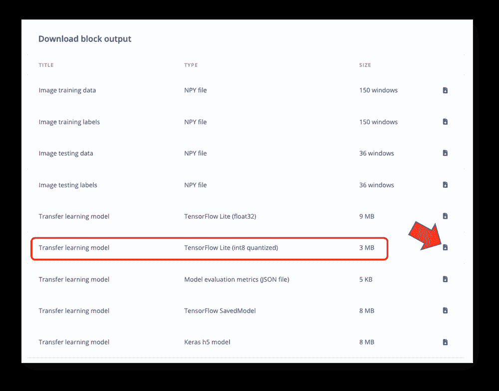

> 让我们也下载 float32 版本以进行比较

将模型从你的计算机传输到 Raspi（./models），例如，使用 FileZilla。同时，捕获一些图像进行推理（./images）。

导入所需的库：

```py
import time
import numpy as np
import matplotlib.pyplot as plt
from PIL import Image
import tflite_runtime.interpreter as tflite
```

定义路径和标签：

```py
img_path = "./images/robot.jpg"
model_path = "./models/ei-raspi-img-class-int8-quantized-\
 model.tflite"
labels = ["background", "periquito", "robot"]
```

> 注意，在 Edge Impulse Studio 上训练的模型将输出索引为 0、1、2 等值，而实际标签将遵循字母顺序。

加载模型，分配张量，并获取输入和输出张量细节：

```py
# Load the TFLite model
interpreter = tflite.Interpreter(model_path=model_path)
interpreter.allocate_tensors()

# Get input and output tensors
input_details = interpreter.get_input_details()
output_details = interpreter.get_output_details()
```

需要注意的一个重要区别是，模型输入细节的`dtype`现在是`int8`，这意味着输入值从-128 到+127，而我们的图像中的每个像素值从 0 到 255。这意味着我们应该预处理图像以匹配它。我们可以在以下位置进行检查：

```py
input_dtype = input_details[0]["dtype"]
input_dtype
```

```py
numpy.int8
```

因此，让我们打开图像并显示它：

```py
img = Image.open(img_path)
plt.figure(figsize=(4, 4))
plt.imshow(img)
plt.axis("off")
plt.show()
```


并进行预处理：

```py
scale, zero_point = input_details[0]["quantization"]
img = img.resize(
    (input_details[0]["shape"][1], input_details[0]["shape"][2])
)
img_array = np.array(img, dtype=np.float32) / 255.0
img_array = (
    (img_array / scale + zero_point).clip(-128, 127).astype(np.int8)
)
input_data = np.expand_dims(img_array, axis=0)
```

检查输入数据，我们可以验证输入张量与模型期望的兼容性：

```py
input_data.shape, input_data.dtype
```

```py
((1, 160, 160, 3), dtype('int8'))
```

现在，是时候进行推理了。让我们也计算模型的延迟：

```py
# Inference on Raspi-Zero
start_time = time.time()
interpreter.set_tensor(input_details[0]["index"], input_data)
interpreter.invoke()
end_time = time.time()
inference_time = (end_time - start_time) * 1000  # Convert
# to milliseconds
print("Inference time: {:.1f}ms".format(inference_time))
```

模型将在 Raspi-Zero 上大约需要 125ms 来完成推理，这比 Raspi-5 长 3 到 4 倍。

现在，我们可以获取输出标签和概率。还应注意，在 Edge Impulse Studio 上训练的模型在其输出中有一个 softmax（与原始 Movilenet V2 不同），我们应该使用模型的原始输出作为“概率”。

```py
# Obtain results and map them to the classes
predictions = interpreter.get_tensor(output_details[0]["index"])[0]

# Get indices of the top k results
top_k_results = 3
top_k_indices = np.argsort(predictions)[::-1][:top_k_results]

# Get quantization parameters
scale, zero_point = output_details[0]["quantization"]

# Dequantize the output
dequantized_output = (
    predictions.astype(np.float32) - zero_point
) * scale
probabilities = dequantized_output

print("\n\t[PREDICTION]        [Prob]\n")
for i in range(top_k_results):
    print(
        "\t{:20}: {:.2f}%".format(
            labels[top_k_indices[i]],
            probabilities[top_k_indices[i]] * 100,
        )
    )
```

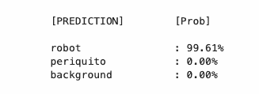

让我们修改之前创建的函数，以便我们可以处理不同类型的模型：

```py
def image_classification(
    img_path, model_path, labels, top_k_results=3, apply_softmax=False
):
    # Load the image
    img = Image.open(img_path)
    plt.figure(figsize=(4, 4))
    plt.imshow(img)
    plt.axis("off")

    # Load the TFLite model
    interpreter = tflite.Interpreter(model_path=model_path)
    interpreter.allocate_tensors()

    # Get input and output tensors
    input_details = interpreter.get_input_details()
    output_details = interpreter.get_output_details()

    # Preprocess
    img = img.resize(
        (input_details[0]["shape"][1], input_details[0]["shape"][2])
    )

    input_dtype = input_details[0]["dtype"]

    if input_dtype == np.uint8:
        input_data = np.expand_dims(np.array(img), axis=0)
    elif input_dtype == np.int8:
        scale, zero_point = input_details[0]["quantization"]
        img_array = np.array(img, dtype=np.float32) / 255.0
        img_array = (
            (img_array / scale + zero_point)
            .clip(-128, 127)
            .astype(np.int8)
        )
        input_data = np.expand_dims(img_array, axis=0)
    else:  # float32
        input_data = (
            np.expand_dims(np.array(img, dtype=np.float32), axis=0)
            / 255.0
        )

    # Inference on Raspi-Zero
    start_time = time.time()
    interpreter.set_tensor(input_details[0]["index"], input_data)
    interpreter.invoke()
    end_time = time.time()
    inference_time = (
        end_time - start_time
    ) * 1000  # Convert to milliseconds

    # Obtain results
    predictions = interpreter.get_tensor(output_details[0]["index"])[
        0
    ]

    # Get indices of the top k results
    top_k_indices = np.argsort(predictions)[::-1][:top_k_results]

    # Handle output based on type
    output_dtype = output_details[0]["dtype"]
    if output_dtype in [np.int8, np.uint8]:
        # Dequantize the output
        scale, zero_point = output_details[0]["quantization"]
        predictions = (
            predictions.astype(np.float32) - zero_point
        ) * scale

    if apply_softmax:
        # Apply softmax
        exp_preds = np.exp(predictions - np.max(predictions))
        probabilities = exp_preds / np.sum(exp_preds)
    else:
        probabilities = predictions

    print("\n\t[PREDICTION]        [Prob]\n")
    for i in range(top_k_results):
        print(
            "\t{:20}: {:.1f}%".format(
                labels[top_k_indices[i]],
                probabilities[top_k_indices[i]] * 100,
            )
        )
    print("\n\tInference time: {:.1f}ms".format(inference_time))
```

并使用不同的图像和 int8 量化模型（**160x160 alpha =1.0**）进行测试。

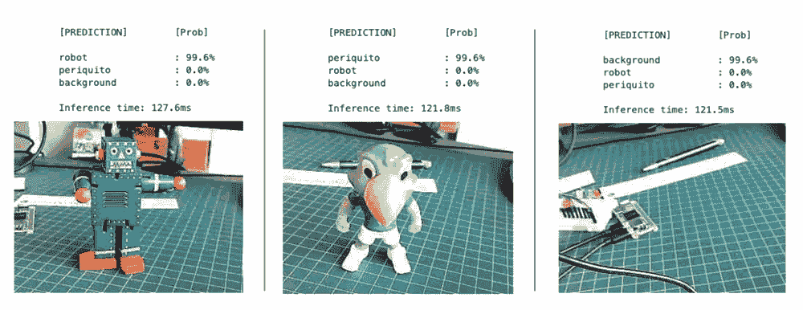

让我们下载一个较小的模型，例如为[Nicla Vision Lab](https://studio.edgeimpulse.com/public/353482/live)（int8 量化模型，96x96，alpha = 0.1）训练的模型作为测试。我们可以使用相同的函数：

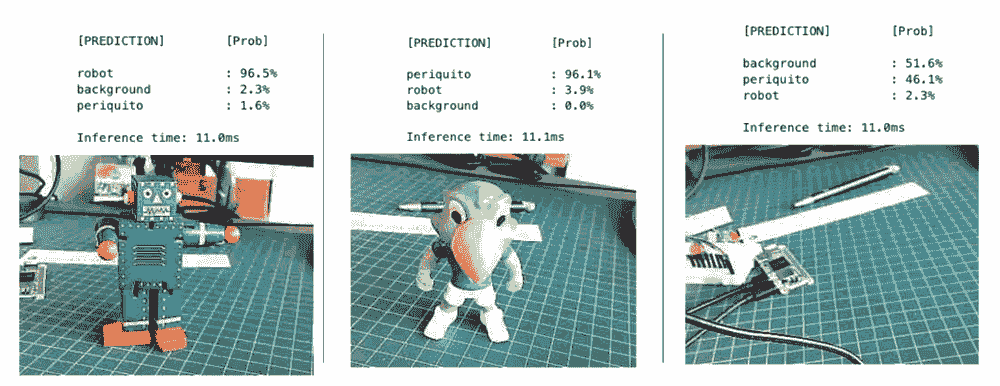

模型丢失了一些精度，但一旦我们的模型不寻找太多细节，这仍然是可以接受的。关于延迟，我们在 Raspi-Zero 上大约快了十倍。

## 实时图像分类

让我们开发一个应用，实时捕捉 USB 摄像头的图像，并显示其分类。

使用终端上的 nano 保存以下代码，例如`img_class_live_infer.py`。

```py
from flask import Flask, Response, render_template_string,
                  request, jsonify
from picamera2 import Picamera2
import io
import threading
import time
import numpy as np
from PIL import Image
import tflite_runtime.interpreter as tflite
from queue import Queue

app = Flask(__name__)

# Global variables
picam2 = None
frame = None
frame_lock = threading.Lock()
is_classifying = False
confidence_threshold = 0.8
model_path = "./models/ei-raspi-img-class-int8-quantized-\
 model.tflite"
labels = ['background', 'periquito', 'robot']
interpreter = None
classification_queue = Queue(maxsize=1)

def initialize_camera():
    global picam2
    picam2 = Picamera2()
    config = picam2.create_preview_configuration(
        main={"size": (320, 240)}
    )
    picam2.configure(config)
    picam2.start()
    time.sleep(2)  # Wait for camera to warm up

def get_frame():
    global frame
    while True:
        stream = io.BytesIO()
        picam2.capture_file(stream, format='jpeg')
        with frame_lock:
            frame = stream.getvalue()
        time.sleep(0.1)  # Capture frames more frequently

def generate_frames():
    while True:
        with frame_lock:
            if frame is not None:
                yield (
                   b'--frame\r\n'
                   b'Content-Type: image/jpeg\r\n\r\n'
                   + frame + b'\r\n'
                )
        time.sleep(0.1)

def load_model():
    global interpreter
    if interpreter is None:
        interpreter = tflite.Interpreter(model_path=model_path)
        interpreter.allocate_tensors()
    return interpreter

def classify_image(img, interpreter):
    input_details = interpreter.get_input_details()
    output_details = interpreter.get_output_details()

    img = img.resize((input_details[0]['shape'][1],
                      input_details[0]['shape'][2]))
    input_data = np.expand_dims(np.array(img), axis=0)\
                             .astype(input_details[0]['dtype'])

    interpreter.set_tensor(input_details[0]['index'], input_data)
    interpreter.invoke()

    predictions = interpreter.get_tensor(output_details[0]
                                         ['index'])[0]
    # Handle output based on type
    output_dtype = output_details[0]['dtype']
    if output_dtype in [np.int8, np.uint8]:
        # Dequantize the output
        scale, zero_point = output_details[0]['quantization']
        predictions = (predictions.astype(np.float32) -
                       zero_point) * scale
    return predictions

def classification_worker():
    interpreter = load_model()
    while True:
        if is_classifying:
            with frame_lock:
                if frame is not None:
                    img = Image.open(io.BytesIO(frame))
            predictions = classify_image(img, interpreter)
            max_prob = np.max(predictions)
            if max_prob >= confidence_threshold:
                label = labels[np.argmax(predictions)]
            else:
                label = 'Uncertain'
            classification_queue.put({
                 'label': label,
                 'probability': float(max_prob)
            })
        time.sleep(0.1)  # Adjust based on your needs

@app.route('/')
def index():
   return render_template_string('''
 <!DOCTYPE html>
 <html>
 <head>
 <title>Image Classification</title>
 <script
 src="https://code.jquery.com/jquery-3.6.0.min.js">
 </script>
 <script>
 function startClassification() {
 $.post('/start');
 $('#startBtn').prop('disabled', true);
 $('#stopBtn').prop('disabled', false);
 }
 function stopClassification() {
 $.post('/stop');
 $('#startBtn').prop('disabled', false);
 $('#stopBtn').prop('disabled', true);
 }
 function updateConfidence() {
 var confidence = $('#confidence').val();
 $.post('/update_confidence',
 {confidence: confidence}
 );
 }
 function updateClassification() {
 $.get('/get_classification', function(data) {
 $('#classification').text(data.label + ': '
 + data.probability.toFixed(2));
 });
 }
 $(document).ready(function() {
 setInterval(updateClassification, 100);
 // Update every 100ms
 });
 </script>
 </head>
 <body>
 <h1>Image Classification</h1>
 

 <br>
 <button id="startBtn"
 onclick="startClassification()">
 Start Classification
 </button>

 <button id="stopBtn"
 onclick="stopClassification()"
 disabled>
 Stop Classification
 </button>

 <br>
 <label for="confidence">Confidence Threshold:</label>
 <input type="number"
 id="confidence"
 name="confidence"
 min="0" max="1"
 step="0.1"
 value="0.8"
 onchange="updateConfidence()" />

 <br>
 <div id="classification">
 Waiting for classification...
 </div>

 </body>
 </html>
 ''')

@app.route('/video_feed')
def video_feed():
    return Response(
       generate_frames(),
       mimetype='multipart/x-mixed-replace; boundary=frame'
    )

@app.route('/start', methods=['POST'])
def start_classification():
    global is_classifying
    is_classifying = True
    return '', 204

@app.route('/stop', methods=['POST'])
def stop_classification():
    global is_classifying
    is_classifying = False
    return '', 204

@app.route('/update_confidence', methods=['POST'])
def update_confidence():
    global confidence_threshold
    confidence_threshold = float(request.form['confidence'])
    return '', 204

@app.route('/get_classification')
def get_classification():
    if not is_classifying:
        return jsonify({'label': 'Not classifying',
                       'probability': 0})
    try:
        result = classification_queue.get_nowait()
    except Queue.Empty:
        result = {'label': 'Processing', 'probability': 0}
    return jsonify(result)

if __name__ == '__main__':
    initialize_camera()
    threading.Thread(target=get_frame, daemon=True).start()
    threading.Thread(target=classification_worker,
                     daemon=True).start()
    app.run(host='0.0.0.0', port=5000, threaded=True)
```

在终端上运行：

```py
python3 img_class_live_infer.py
```

并访问 Web 界面：

+   在 Raspberry Pi 本身（如果您有 GUI）：打开网页浏览器并访问`http://localhost:5000`

+   从同一网络上的另一台设备：打开网页浏览器并访问`http://<raspberry_pi_ip>:5000`（将`<raspberry_pi_ip>`替换为您的 Raspberry Pi 的 IP 地址）。例如：`http://192.168.4.210:5000/`

这里有一些应用程序在外部桌面运行时的截图

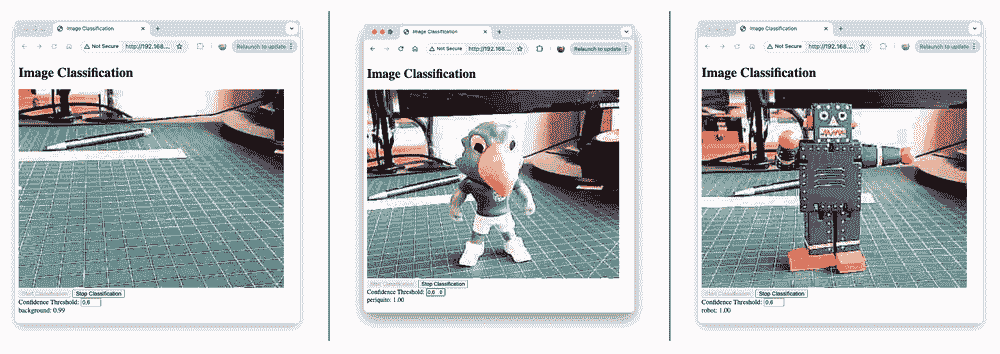

这里，您可以看到 YouTube 上运行的应用：

[`www.youtube.com/watch?v=o1QsQrpCMw4`](https://www.youtube.com/watch?v=o1QsQrpCMw4)

代码创建了一个使用 Raspberry Pi、其摄像头模块和 TensorFlow Lite 模型的实时图像分类的 Web 应用。该应用使用 Flask 提供 Web 界面，可以查看摄像头流和实时分类结果。

#### 关键组件：

1.  **Flask Web 应用**: 提供用户界面并处理请求。

1.  **PiCamera2**: 从 Raspberry Pi 摄像头模块捕获图像。

1.  **TensorFlow Lite**: 运行图像分类模型。

1.  **多线程**: 管理并发操作以实现平滑性能。

#### 主要功能：

+   实时摄像头流显示

+   实时图像分类

+   可调节的置信度阈值

+   按需启动/停止分类

#### 代码结构：

1.  **导入和设置**:

    +   Flask 用于 Web 应用

    +   PiCamera2 用于相机控制

    +   TensorFlow Lite 用于推理

    +   多线程和队列用于并发操作

1.  **全局变量**:

    +   相机和帧管理

    +   分类控制

    +   模型和标签信息

1.  **相机功能**:

    +   `initialize_camera()`: 设置 PiCamera2

    +   `get_frame()`: 持续捕获帧

    +   `generate_frames()`: 为 Web 流生成帧

1.  **模型功能**:

    +   `load_model()`: 加载 TFLite 模型

    +   `classify_image()`: 对单个图像进行推理

1.  **分类工作器**:

    +   在单独的线程中运行

    +   活跃时持续对帧进行分类

    +   更新队列以包含最新的结果

1.  **Flask 路由**:

    +   `/`: 提供主 HTML 页面

    +   `/video_feed`: 流式传输相机视频流

    +   `/start`和`/stop`: 控制分类

    +   `/update_confidence`: 调整置信度阈值

    +   `/get_classification`: 返回最新的分类结果

1.  **HTML 模板**:

    +   显示相机视频流和分类结果

    +   提供启动/停止和调整设置的控件

1.  **主要执行**：

    +   初始化相机并启动必要的线程

    +   运行 Flask 应用程序

#### 关键概念：

1.  **并发操作**: 使用线程分别处理相机捕获和分类，而与 Web 服务器分离。

1.  **实时更新**: 无需页面刷新即可频繁更新分类结果。

1.  **模型重用**: 一次性加载 TFLite 模型并重复使用以提高效率。

1.  **灵活配置**: 允许用户动态调整置信度阈值。

#### 使用方法：

1.  确保所有依赖项都已安装。

1.  在带有相机模块的 Raspberry Pi 上运行脚本。

1.  使用 Raspberry Pi 的 IP 地址通过浏览器访问 Web 界面。

1.  根据需要启动分类和调整设置。

## 概述：

图像分类已成为机器学习的一个强大且多用途的应用，对从医疗保健到环境监测的各个领域都有重大影响。本章展示了如何在边缘设备如 Raspi-Zero 和 Raspi-5 上实现稳健的图像分类系统，展示了实时、设备内智能的潜力。

我们已经探讨了图像分类项目整个流程，从使用 Edge Impulse Studio 进行数据收集和模型训练到在 Raspi 上部署和运行推理。该过程强调了几个关键点：

1.  正确的数据收集和预处理对于训练有效模型的重要性。

1.  转移学习的力量，使我们能够利用像 MobileNet V2 这样的预训练模型，在数据有限的情况下进行高效训练。

1.  模型准确性与推理速度之间的权衡，这对于边缘设备尤其重要。

1.  使用基于 Web 界面的实时分类实现，展示了实际应用。

能够在边缘设备如 Raspi 上运行这些模型，为物联网应用、自主系统和实时监控解决方案开辟了众多可能性。它允许降低延迟、提高隐私性，并在连接性有限的环境中运行。

正如我们所见，即使在边缘设备的计算限制下，我们也能在准确性和速度方面取得令人印象深刻的成果。调整模型参数（如输入大小和 alpha 值）的灵活性允许进行微调以满足特定项目需求。

展望未来，边缘 AI 和图像分类领域正迅速发展。模型压缩技术、硬件加速以及更高效的神经网络架构的进步有望进一步扩展边缘设备在计算机视觉任务中的能力。

该项目作为更复杂计算机视觉应用的基础，并鼓励进一步探索令人兴奋的边缘 AI 和物联网世界。无论是工业自动化、智能家居应用还是环境监测，这里涵盖的技能和概念为各种创新项目提供了一个坚实的起点。

## 资源

+   [数据集示例](https://github.com/Mjrovai/EdgeML-with-Raspberry-Pi/tree/main/IMG_CLASS/dataset)

+   [在 Raspi 上设置测试笔记本](https://github.com/Mjrovai/EdgeML-with-Raspberry-Pi/blob/main/IMG_CLASS/notebooks/setup_test.ipynb)

+   [Raspi 上的图像分类笔记本](https://github.com/Mjrovai/EdgeML-with-Raspberry-Pi/blob/main/IMG_CLASS/notebooks/10_Image_Classification.ipynb)

+   [在 CoLab 上使用 CNN 对 Cifar-10 数据集进行分类](https://colab.research.google.com/github/Mjrovai/UNIFEI-IESTI01-TinyML-2022.1/blob/main/00_Curse_Folder/2_Applications_Deploy/Class_16/cifar_10/CNN_Cifar_10_TFLite.ipynb#scrollTo=iiVBUpuHXEtw)

+   [Cifar 10 - 在 Raspi 上进行图像分类](https://github.com/Mjrovai/EdgeML-with-Raspberry-Pi/blob/main/IMG_CLASS/notebooks/20_Cifar_10_Image_Classification.ipynb)

+   [Python 脚本](https://github.com/Mjrovai/EdgeML-with-Raspberry-Pi/tree/main/IMG_CLASS/python_scripts)

+   [Edge Impulse 项目](https://studio.edgeimpulse.com/public/510251/live)
