# 视觉语言模型（VLM）

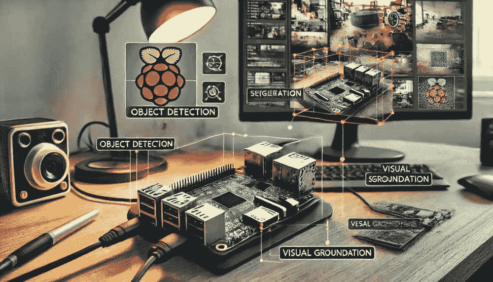

*DALL·E 提示 - 一个配备视觉任务的树莓派设置。图中显示了一个连接到摄像头的树莓派，周围以视觉方式显示了各种计算机视觉任务，包括目标检测、图像标题、分割和视觉定位。树莓派放置在桌子上，显示器显示了与这些任务相关的边界框和注释。背景应为一个家庭工作空间，其中包含开发人员和爱好者通常使用的工具和设备。*

## 简介

在这个动手实验中，我们将持续探索边缘的 AI 应用，从 Florence-2 的基本设置，即微软最先进的视觉基础模型，到在树莓派等设备上的高级实现。我们将学习在树莓派上使用视觉语言模型（VLMs）进行标题、目标检测、定位、分割和 OCR 等任务。

### 为什么在边缘使用 Florence-2？

[Florence-2](https://arxiv.org/abs/2311.06242) 是微软开源的视觉语言模型，在 MIT 许可证下，通过结合轻量级架构和强大的功能，显著推进了视觉语言模型。得益于其在包含 1.26 亿张图像和 54 亿视觉注释的庞大 FLD-5B 数据集上的训练，它实现了与更大模型相当的性能。这使得 Florence-2 成为边缘部署的理想选择，因为在边缘，电力和计算资源有限。

在本教程中，我们将探讨如何使用 Florence-2 进行实时计算机视觉应用，例如：

+   图像标题

+   目标检测

+   分割

+   视觉定位

> **视觉定位**涉及将文本描述与图像中的特定区域相关联。这使得模型能够理解在提示中描述的特定对象或实体在图像中的位置。例如，如果提示是“一辆红色的车”，模型将识别并突出显示图像中红色车所在的位置。视觉定位对于需要文本和视觉内容之间精确对齐的应用程序很有帮助，例如人机交互、图像注释和交互式人工智能系统。

在教程中，我们将逐步介绍：

+   在树莓派上设置 Florence-2

+   运行推理任务，如目标检测和标题

+   优化模型以从边缘设备获得最佳性能

+   通过微调探索实际、现实世界的应用。

### Florence-2 模型架构

Florence-2 利用统一的基于提示的表示来处理各种视觉语言任务。模型架构由两个主要组件组成：一个**图像编码器**和一个**多模态 Transformer 编码器-解码器**。


+   **图像编码器**：图像编码器基于 [DaViT (双注意力视觉 Transformer) 架构](https://arxiv.org/abs/2204.03645)。它将输入图像转换为一系列视觉标记嵌入。这些嵌入作为视觉内容的基元表示，捕捉图像的空间和上下文信息。

+   **多模态 Transformer 编码器-解码器**：Florence-2 的核心是多模态 Transformer 编码器-解码器，它将图像编码器中的视觉标记嵌入与类似 BERT 的模型生成的文本嵌入相结合。这种组合使模型能够同时处理视觉和文本输入，实现图像描述、目标检测和分割等任务的统一方法。

该模型在广泛的 FLD-5B 数据集上的训练确保它能够有效处理各种视觉任务，而无需进行特定任务的修改。Florence-2 使用文本提示来激活特定任务，使其非常灵活，并能够实现零样本泛化。对于诸如目标检测或视觉定位等任务，模型采用额外的位置标记来表示图像中的区域，确保对空间关系的精确理解。

> Florence-2 的紧凑架构和创新训练方法使其能够在资源受限的设备（如树莓派）上准确执行计算机视觉任务。

## 技术概述

Florence-2 引入了一些创新特性，使其与众不同：

### 架构

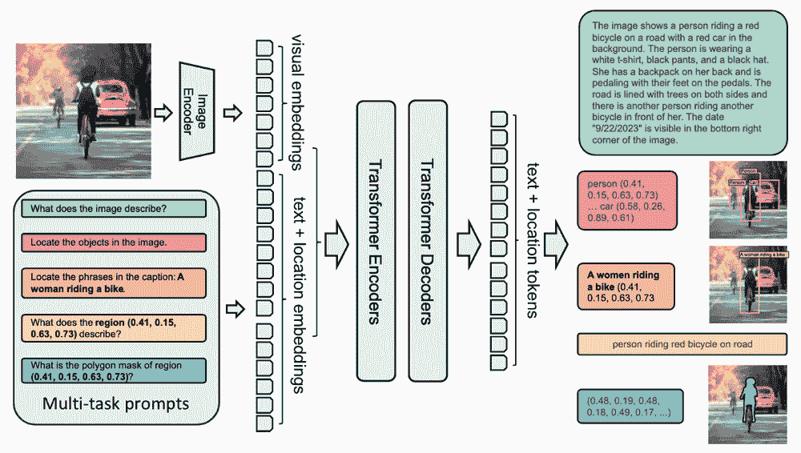

+   **轻量级设计**：提供两种变体

    +   Florence-2-Base：2.32 亿个参数

    +   Florence-2-Large：7.71 亿个参数

+   **统一表示**：通过单个架构处理多个视觉任务

+   **DaViT 视觉编码器**：将图像转换为视觉标记嵌入

+   **基于 Transformer 的多模态编码器-解码器**：处理结合视觉和文本嵌入

### 训练数据集 (FLD-5B)

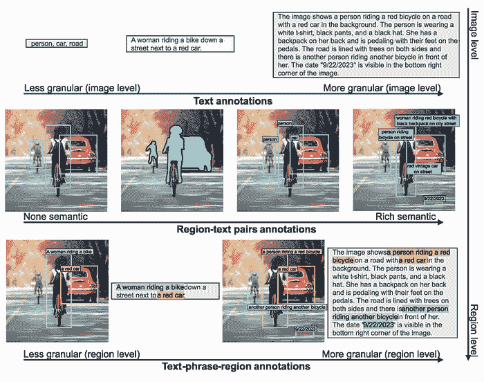

+   1.26 亿个独特图像

+   54 亿个综合注释，包括：

    +   5 亿个文本注释

    +   13 亿个区域-文本注释

    +   36 亿个文本短语-区域注释

+   使用专业模型自动化的注释管道

+   高质量标签的迭代优化过程

### 关键能力

Florence-2 在多个视觉任务中表现出色：

#### 零样本性能

+   图像描述：在 COCO 上达到 135.6 CIDEr 分数

+   视觉定位：在 Flickr30k 上达到 84.4% 的 recall@1

+   目标检测：在 COCO val2017 上达到 37.5 mAP

+   指代表达式：在 RefCOCO 上达到 67.0% 的准确率

#### 微调性能

+   尽管规模较小，但与专业模型具有竞争力

+   在特定基准测试中优于更大的模型

+   高效适应新任务

### 实际应用

Florence-2 可应用于各个领域：

1.  **内容理解**

    +   自动图像描述以实现无障碍访问

    +   视觉内容审核

    +   媒体资产管理

1.  **电子商务**

    +   产品图像分析

    +   视觉搜索

    +   自动产品标记

1.  **医疗保健**

    +   医学图像分析

    +   诊断辅助

    +   研究数据处理

1.  **安全与监控**

    +   目标检测与跟踪

    +   异常检测

    +   场景理解

### 比较 Florence-2 与其他 VLMs（视觉语言模型）

Florence-2 因其令人印象深刻的零样本能力而优于其他视觉语言模型。与像[Google PaliGemma](https://huggingface.co/blog/paligemma)这样的模型不同，后者需要广泛的微调来适应各种任务，Florence-2 可以直接使用，正如我们将在本实验中看到的那样。它还可以与 GPT-4V 和 Flamingo 等更大的模型竞争，这些模型通常具有更多的参数，但有时只能匹配 Florence-2 的性能。例如，尽管参数多出两倍以上，Florence-2 在零样本结果上优于 Kosmos-2。

在基准测试中，Florence-2 在 COCO 描述和指代表达理解等任务上表现出色。它在 COCO 数据集（[COCO dataset](https://docs.ultralytics.com/datasets/detect/coco/)）上的目标检测和分割任务中优于 PolyFormer 和 UNINEXT 等模型。它是一个高度竞争的选择，对于既需要性能又需要资源效率的实际应用来说，这是一个很好的选择。

## 设置与安装

我们选择的边缘设备是 Raspberry Pi 5（Raspi-5）。其坚固的平台配备了 Broadcom BCM2712，这是一款 2.4 GHz 的四核 64 位 Arm Cortex-A76 CPU，具有加密扩展和增强的缓存能力。它拥有 VideoCore VII GPU，双 4Kp60 HDMI®输出带 HDR，以及 4Kp60 HEVC 解码器。内存选项包括 4 GB 和 8 GB 的高速 LPDDR4X SDRAM，我们选择 8 GB 来运行 Florence-2。它还通过 microSD 卡槽和 PCIe 2.0 接口提供可扩展的存储，用于快速的外设，如 M.2 SSD（固态硬盘）。

> 对于实际应用来说，SSD（固态硬盘）比 SD 卡是一个更好的选择。

我们建议为这个实验安装一个 Active Cooler，这是为 Raspberry Pi 5（Raspi-5）设计的专用夹式冷却解决方案。它结合了铝制散热器和温度控制的吹风风扇，以保持 Raspi-5 在重负载下（如运行 Florense-2）舒适运行。

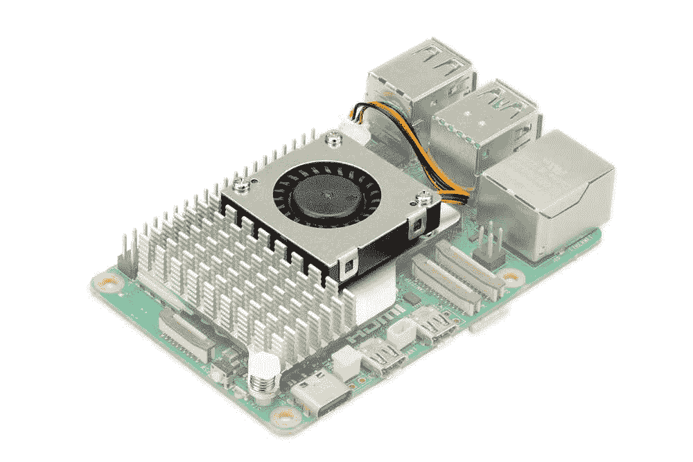

### 环境配置

要在 Raspberry Pi 5 上运行[Microsoft Florense-2](https://huggingface.co/microsoft/Florence-2-base)，我们需要几个库：

1.  **[Transformers](https://huggingface.co/docs/transformers/en/index)**：

    +   Florence-2 使用 Hugging Face 的`transformers`库进行模型加载和推理。这个库提供了与预训练视觉语言模型一起工作的架构，使得执行图像描述、目标检测等任务变得容易。本质上，`transformers`帮助与模型交互，处理输入提示，并获得输出。

1.  **PyTorch**：

    +   PyTorch 是一个深度学习框架，它提供了运行 Florence-2 模型所需的基础设施，包括张量操作、GPU 加速（如果可用）以及模型训练/推理功能。Florence-2 模型是在 PyTorch 中训练的，我们需要利用其功能、层和计算能力，在 Raspberry Pi 上执行推理。

1.  **Timm** (PyTorch Image Models):

    +   Florence-2 使用 `timm` 访问视觉模型的高效实现和预训练权重。具体来说，`timm` 库被用于 Florence-2 的 **图像编码器** 部分，特别是用于管理 DaViT 架构。它提供了常见视觉任务的模型定义和优化代码，并允许轻松集成不同类型的轻量级骨干网络，这些网络适合边缘设备。

1.  **Einops**:

    +   `Einops` 是一个用于灵活和强大的张量操作的库。它使得重塑和操作张量维度变得容易，这对于 Florence-2 中进行的多模态处理尤为重要。像 Florence-2 这样的视觉语言模型通常需要重新排列图像数据、文本嵌入和视觉嵌入，以便正确地对齐 transformer 块，而 `einops` 简化了这些复杂的操作，使得代码更易于阅读和简洁。

简而言之，这些库使 Florence-2 能够启用不同的基本组件：

+   **Transformers** 和 **PyTorch** 用于加载模型和运行推理。

+   **Timm** 用于访问和高效实现视觉编码器。

+   **Einops** 帮助重塑数据，便于视觉和文本特征的集成。

所有这些组件协同工作，帮助 Florence-2 在我们的 Raspberry Pi 上无缝运行，使其能够相对快速地执行复杂的视觉语言任务。

考虑到 Raspberry Pi 已经安装了其操作系统，让我们使用 `SSH` 从另一台计算机访问它：

```py
ssh mjrovai@raspi-5.local
```

并检查分配给它的 IP：

```py
hostname -I
```

`192.168.4.209`

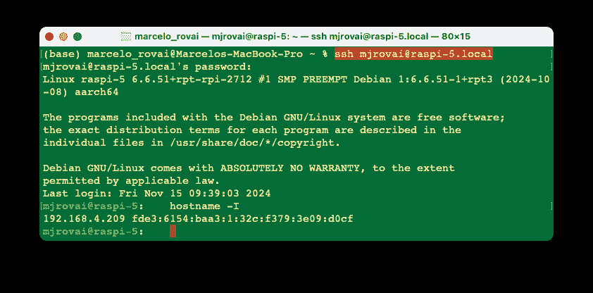

**更新 Raspberry Pi**

首先，确保您的 Raspberry Pi 已更新：

```py
sudo apt update
sudo apt upgrade -y
```

**使用 PIP 的初始设置**:

```py
sudo apt install python3-pip
sudo rm /usr/lib/python3.11/EXTERNALLY-MANAGED
pip3 install --upgrade pip
```

**安装依赖项**

```py
sudo apt-get install libjpeg-dev libopenblas-dev libopenmpi-dev \
    libomp-dev
```

让我们设置并激活一个用于与 Florence-2 一起工作的 **虚拟环境**：

```py
python3 -m venv ~/florence
source ~/florence/bin/activate
```

**安装 PyTorch**

```py
pip3 install setuptools numpy Cython
pip3 install requests
pip3 install torch torchvision \
    --index-url https://download.pytorch.org/whl/cpu
pip3 install torchaudio \
    --index-url https://download.pytorch.org/whl/cpu
```

让我们验证 PyTorch 是否正确安装：

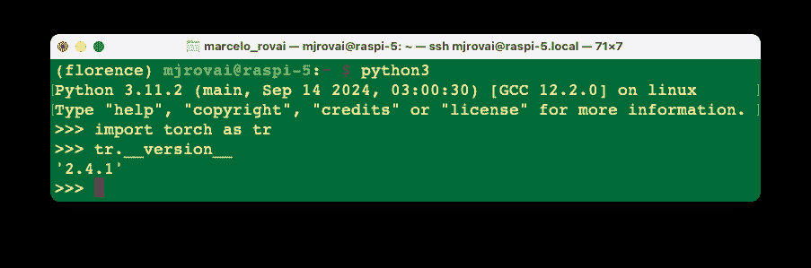

**安装 Transformers、Timm 和 Einops**:

```py
pip3 install transformers
pip3 install timm einops
```

**安装模型**:

```py
pip3 install autodistill-florence-2
```

**Jupyter Notebook 和 Python 库**

安装 Jupyter Notebook 以运行和测试我们的 Python 脚本是可能的。

```py
pip3 install jupyter
pip3 install numpy Pillow matplotlib
jupyter notebook --generate-config
```

### 测试安装

在远程计算机上运行 Jupyter Notebook

```py
jupyter notebook --ip=192.168.4.209 --no-browser
```

在 SSH 终端运行上述命令，我们可以看到打开笔记本的本地 URL 地址：

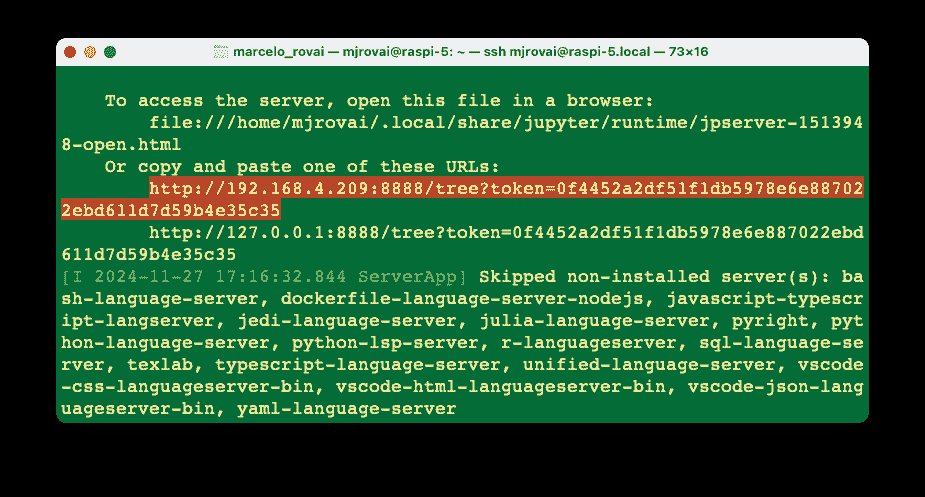

在此初始测试中使用的代码笔记本可以在 Lab GitHub 上找到：

+   [10-florence2_test.ipynb](https://github.com/Mjrovai/EdgeML-with-Raspberry-Pi/blob/main/FLORENCE-2/notebooks/10-florence2_test.ipynb)

我们可以通过在网页浏览器中输入树莓派的 IP 地址和提供的令牌来访问远程计算机（从终端复制整个 URL）。

从主页创建一个新的笔记本[`Python 3 (ipykernel)`]并将从 Hugging Face Hub 的[示例代码](https://huggingface.co/microsoft/Florence-2-base#how-to-get-started-with-the-model)复制粘贴过来。

代码旨在在给定的图像上运行 Florence-2 以执行**目标检测**。它加载模型，处理图像和提示，然后生成响应以识别和描述图像中的对象。

+   **处理器**帮助准备文本和图像输入。

+   **模型**接收处理后的输入以生成有意义的响应。

+   **后处理**步骤将生成的输出细化成更易解释的形式，例如检测到的对象的边界框。

> 此工作流程利用 Florence-2 的灵活性来处理**视觉-语言任务**，并使用 PyTorch、Transformers 和相关图像处理工具高效实现。

```py
import requests
from PIL import Image
import torch
from transformers import AutoProcessor, AutoModelForCausalLM

device = "cuda:0" if torch.cuda.is_available() else "cpu"
torch_dtype = (
    torch.float16 if torch.cuda.is_available() else torch.float32
)

model = AutoModelForCausalLM.from_pretrained(
    "microsoft/Florence-2-base",
    torch_dtype=torch_dtype,
    trust_remote_code=True,
).to(device)
processor = AutoProcessor.from_pretrained(
    "microsoft/Florence-2-base", trust_remote_code=True
)

prompt = "<OD>"

url = (
    "https://huggingface.co/datasets/huggingface/"
    "documentation-images/resolve/main/transformers/"
    "tasks/car.jpg?download=true"
)
image = Image.open(requests.get(url, stream=True).raw)

inputs = processor(text=prompt, images=image, return_tensors="pt").to(
    device, torch_dtype
)

generated_ids = model.generate(
    input_ids=inputs["input_ids"],
    pixel_values=inputs["pixel_values"],
    max_new_tokens=1024,
    do_sample=False,
    num_beams=3,
)
generated_text = processor.batch_decode(
    generated_ids, skip_special_tokens=False
)[0]

parsed_answer = processor.post_process_generation(
    generated_text,
    task="<OD>",
    image_size=(image.width, image.height),
)

print(parsed_answer)
```

让我们逐步分解提供的代码：

#### 导入所需库

```py
import requests
from PIL import Image
import torch
from transformers import AutoProcessor, AutoModelForCausalLM
```

+   **requests**：用于发送 HTTP 请求。在这种情况下，它从 URL 下载图像。

+   **PIL (Pillow)**：提供用于操作图像的工具。在这里，它用于打开下载的图像。

+   **torch**：PyTorch 被导入以处理张量操作并确定硬件可用性（CPU 或 GPU）。

+   **transformers**：此模块通过使用`AutoProcessor`和`AutoModelForCausalLM`来加载预训练模型并处理输入，提供对 Florence-2 的简单访问。

#### 确定设备和数据类型

```py
device = "cuda:0" if torch.cuda.is_available() else "cpu"

torch_dtype = (
    torch.float16 if torch.cuda.is_available() else torch.float32
)
```

+   **设备设置**：代码检查是否有可用的 CUDA 启用 GPU（`torch.cuda.is_available()`）。如果有 GPU 可用，设备设置为“cuda:0”。否则，默认为 `"cpu"`（我们这里的案例）。

+   **数据类型设置**：如果可用 GPU，则选择`torch.float16`，它使用半精度浮点数以加快处理速度并减少内存使用。在 CPU 上，默认为`torch.float32`以保持兼容性。

#### 加载模型和处理器

```py
model = AutoModelForCausalLM.from_pretrained(
    "microsoft/Florence-2-base",
    torch_dtype=torch_dtype,
    trust_remote_code=True,
).to(device)

processor = AutoProcessor.from_pretrained(
    "microsoft/Florence-2-base", trust_remote_code=True
)
```

+   **模型初始化**：

    +   **`AutoModelForCausalLM.from_pretrained()`** 从 Hugging Face 上微软的存储库加载预训练的 Florence-2 模型。`torch_dtype`根据可用的硬件（GPU/CPU）设置，`trust_remote_code=True`允许使用可能与模型一起提供的任何自定义代码。

    +   **`.to(device)`** 将模型移动到适当的设备（CPU 或 GPU）。在我们的案例中，它将被设置为`CPU`。

+   **处理器初始化**：

    +   **`AutoProcessor.from_pretrained()`** 加载 Florence-2 的处理器。处理器负责将文本和图像输入转换为模型可以处理的形式（例如，编码文本、归一化图像等）。

### **定义提示**

```py
prompt = "<OD>"
```

+   **提示定义**：字符串 `"<OD>"` 被用作提示。这指的是“目标检测”，指示模型在图像上检测对象。

#### 下载和加载图像

```py
url = "https://huggingface.co/datasets/huggingface/"
      "documentation-images/resolve/main/transformers/"
      "tasks/car.jpg?download=true"
image = Image.open(requests.get(url, stream=True).raw)
```

+   **下载图像**：**`requests.get()`** 函数从指定的 URL 获取图像。`stream=True` 参数确保图像是流式传输的，而不是一次性完全下载。

+   **打开图像**：**`Image.open()`** 打开图像，以便模型可以处理它。

#### 处理输入

```py
inputs = processor(text=prompt, images=image, return_tensors="pt").to(
    device, torch_dtype
)
```

+   **处理输入数据**：**`processor()`** 函数处理文本（提示）和图像（图像）。`return_tensors="pt"` 参数将处理后的数据转换为 PyTorch 张量，这对于将数据输入模型是必要的。

+   **移动输入到设备**：**`.to(device, torch_dtype)`** 将输入移动到正确的设备（CPU 或 GPU）并分配适当的数据类型。

### 生成输出

```py
generated_ids = model.generate(
    input_ids=inputs["input_ids"],
    pixel_values=inputs["pixel_values"],
    max_new_tokens=1024,
    do_sample=False,
    num_beams=3,
)
```

+   **模型生成**：使用 **`model.generate()`** 根据输入数据生成输出。

    +   **`input_ids`**：表示提示的标记化形式。

    +   **`pixel_values`**：包含处理后的图像数据。

    +   **`max_new_tokens=1024`**：指定响应中要生成的最大新标记数。这限制了响应的长度。

    +   **`do_sample=False`**：禁用采样；相反，生成使用确定性方法（束搜索）。

    +   **`num_beams=3`**：启用具有三个束的束搜索，通过在生成过程中考虑多个可能性来提高输出质量。

#### 解码生成的文本

```py
generated_text = processor.batch_decode(
    generated_ids, skip_special_tokens=False
)[0]
```

+   **批量解码**：**`processor.batch_decode()`** 将生成的 ID（标记）解码为可读文本。`skip_special_tokens=False` 参数意味着输出将包括任何可能是响应一部分的特殊标记。

#### 生成后的后处理

```py
parsed_answer = processor.post_process_generation(
    generated_text,
    task="<OD>",
    image_size=(image.width, image.height),
)
```

+   **后处理**：调用 **`processor.post_process_generation()`** 来进一步处理生成的文本，根据任务（`"<OD>"` 用于目标检测）和图像的大小进行解释。

+   此函数从生成的文本中提取特定信息，例如检测到的对象的边界框，使输出对视觉任务更有用。

#### 打印输出

```py
print(parsed_answer)
```

+   最后，**`print(parsed_answer)`** 显示输出，这可能包括目标检测结果，例如图像中检测到的对象的边界框坐标和标签。

#### 结果

运行代码，我们得到以下解析答案：

```py
[{'<OD>': {
   'bboxes': [
     [34.23999786376953, 160.0800018310547, 597.4400024414062],
     [371.7599792480469, 272.32000732421875, 241.67999267578125],
     [303.67999267578125, 247.4399871826172, 454.0799865722656],
     [276.7200012207031, 553.9199829101562, 370.79998779296875],
     [96.31999969482422, 280.55999755859375, 198.0800018310547],
     [371.2799987792969]
    ],
    'labels': ['car', 'door handle', 'wheel', 'wheel']
}}]
```

首先，让我们检查一下图像：

```py
import matplotlib.pyplot as plt

plt.figure(figsize=(8, 8))
plt.imshow(image)
plt.axis("off")
plt.show()
```


通过目标检测的结果，我们可以看到：

```py
'labels': ['car', 'door handle', 'wheel', 'wheel']
```

看起来至少检测到了几个对象。我们还可以实现一个代码来在找到的对象中绘制边界框：

```py
def plot_bbox(image, data):
    # Create a figure and axes
    fig, ax = plt.subplots()

    # Display the image
    ax.imshow(image)

    # Plot each bounding box
    for bbox, label in zip(data["bboxes"], data["labels"]):
        # Unpack the bounding box coordinates
        x1, y1, x2, y2 = bbox
        # Create a Rectangle patch
        rect = patches.Rectangle(
            (x1, y1),
            x2 - x1,
            y2 - y1,
            linewidth=1,
            edgecolor="r",
            facecolor="none",
        )
        # Add the rectangle to the Axes
        ax.add_patch(rect)
        # Annotate the label
        plt.text(
            x1,
            y1,
            label,
            color="white",
            fontsize=8,
            bbox=dict(facecolor="red", alpha=0.5),
        )

    # Remove the axis ticks and labels
    ax.axis("off")

    # Show the plot
    plt.show()
```

> **框（x0, y0, x1, y1）**：位置标记对应于框的左上角和右下角。

并运行

```py
plot_bbox(image, parsed_answer['<OD>'])
```

我们得到：

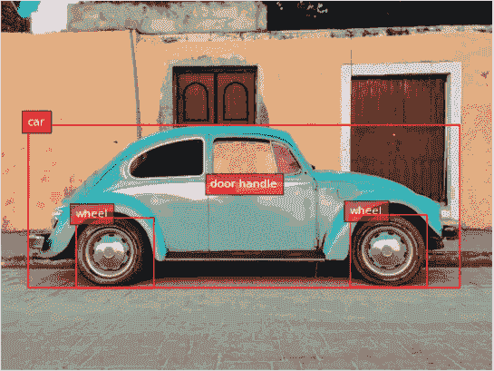

## Florence-2 任务

Florence-2 是通过 `prompts` 来执行各种计算机视觉和视觉-语言任务的。这些任务可以通过向模型提供特定的文本提示来激活，正如我们通过 `<OD>` (目标检测) 看到的那样。

Florence-2 的多功能性来自于结合这些提示，使我们能够引导模型的行为以执行特定的视觉任务。改变提示允许我们适应 Florence-2 的不同任务，而无需对架构进行特定任务的修改。这种能力直接源于 Florence-2 的统一模型架构和基于 FLD-5B 数据集的大规模多任务训练。

这里是 Florence-2 可以执行的一些关键任务，以及示例提示：

### 物体检测（OD）

+   **提示**：`"<OD>"`

+   **描述**：在图像中识别对象并为每个检测到的对象提供边界框。这项任务对于视觉检查、监控和一般对象识别等应用很有帮助。

### 图像字幕

+   **提示**：`"<CAPTION>"`

+   **描述**：为输入图像生成文本描述。这项任务帮助模型描述图像中正在发生的事情，为内容理解提供可读性强的字幕。

### 详细字幕

+   **提示**：`"<DETAILED_CAPTION>"`

+   **描述**：生成包含更多细微信息的更详细字幕，例如场景中的对象及其关系。

### 视觉定位

+   **提示**：`"<CAPTION_TO_PHRASE_GROUNDING>"`

+   **描述**：将文本描述与图像中的特定区域关联起来。例如，给定一个如“一辆绿色的车”的提示，模型会在图像中突出显示绿色车的位置。这在需要根据文本找到特定对象的人机交互中非常有用。

### 分割

+   **提示**：`"<REFERRING_EXPRESSION_SEGMENTATION>"`

+   **描述**：基于指称表达式（如“蓝色的杯子”）进行分割。模型会识别并分割出提示中提到的对象所在的特定区域（所有相关像素）。

### 密集区域字幕

+   **提示**：`"<DENSE_REGION_CAPTION>"`

+   **描述**：为图像中的多个区域提供字幕，提供所有可见区域的详细分解，包括不同的对象及其关系。

### 带区域的 OCR

+   **提示**：`"<OCR_WITH_REGION>"`

+   **描述**：在图像上执行光学字符识别（OCR），并为检测到的文本提供边界框。这在从图像中提取和定位文本信息（如读取标志、标签或其他形式的文本）时非常有用。

### 特定表达式的短语定位

+   **提示**：`"<CAPTION_TO_PHRASE_GROUNDING>"` 以及特定的表达，例如 `"a wine glass"`。

+   **描述**：定位图像中与特定文本短语相对应的区域。这项任务允许在给出一个词或关键词时识别特定的对象或元素。

### 开放词汇物体检测

+   **提示**：`"<OPEN_VOCABULARY_OD>"`

+   **描述**：模型可以检测对象，而不受预定义类别列表的限制，这使得它在根据一般视觉理解识别更广泛的物品时非常有用。

## 探索计算机视觉和视觉语言任务

对于探索，所有代码都可以在 GitHub 上找到：

+   [20-florence_2.ipynb](https://github.com/Mjrovai/EdgeML-with-Raspberry-Pi/blob/main/FLORENCE-2/notebooks/20-florence_2.ipynb)

让我们使用由 Dall-E 创建的几张图片并将它们上传到 Rasp-5（可以使用 FileZilla 来完成）。图片将被保存在名为 `images` 的子文件夹中：

```py
dogs_cats = Image.open("./images/dogs-cats.jpg")
table = Image.open("./images/table.jpg")
```

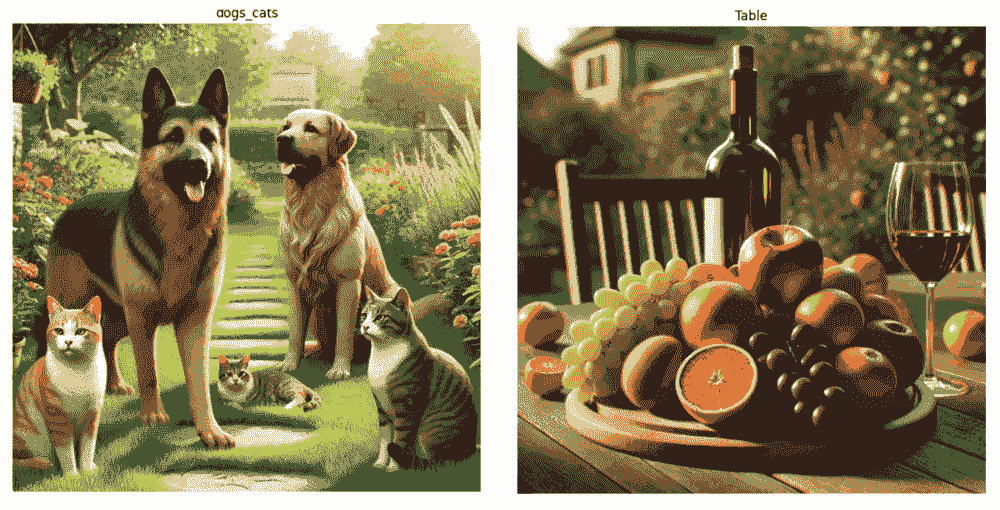

让我们创建一个函数来方便我们的探索，并跟踪模型在不同任务中的延迟：

```py
def run_example(task_prompt, text_input=None, image=None):
    start_time = time.perf_counter()  # Start timing
    if text_input is None:
        prompt = task_prompt
    else:
        prompt = task_prompt + text_input
    inputs = processor(
        text=prompt, images=image, return_tensors="pt"
    ).to(device)
    generated_ids = model.generate(
        input_ids=inputs["input_ids"],
        pixel_values=inputs["pixel_values"],
        max_new_tokens=1024,
        early_stopping=False,
        do_sample=False,
        num_beams=3,
    )
    generated_text = processor.batch_decode(
        generated_ids, skip_special_tokens=False
    )[0]
    parsed_answer = processor.post_process_generation(
        generated_text,
        task=task_prompt,
        image_size=(image.width, image.height),
    )

    end_time = time.perf_counter()  # End timing
    elapsed_time = end_time - start_time  # Calculate elapsed time
    print(
        f" \n[INFO] ==> Florence-2-base ({task_prompt}), \
 took {elapsed_time:.1f} seconds to execute.\n"
    )

    return parsed_answer
```

### 标题

**1\. 狗和猫**

```py
run_example(task_prompt="<CAPTION>", image=dogs_cats)
```

```py
[INFO] ==> Florence-2-base (<CAPTION>), \
took 16.1 seconds to execute.

{'<CAPTION>': 'A group of dogs and cats sitting in a garden.'}
```

**2\. 表格**

```py
run_example(task_prompt="<CAPTION>", image=table)
```

```py
[INFO] ==> Florence-2-base (<CAPTION>), \
took 16.5 seconds to execute.

{'<CAPTION>': 'A wooden table topped with a plate of fruit \
and a glass of wine.'}
```

### 详细标题

**1\. 狗和猫**

```py
run_example(task_prompt="<DETAILED_CAPTION>", image=dogs_cats)
```

```py
[INFO] ==> Florence-2-base (<DETAILED_CAPTION>), \
took 25.5 seconds to execute.

{'<DETAILED_CAPTION>': 'The image shows a group of cats and \
dogs sitting on top of a lush green field, surrounded by plants \
with flowers, trees, and a house in the background. The sky is \
visible above them, creating a peaceful atmosphere.'}
```

**2\. 表格**

```py
run_example(task_prompt="<DETAILED_CAPTION>", image=table)
```

```py
[INFO] ==> Florence-2-base (<DETAILED_CAPTION>), \
took 26.8 seconds to execute.

{'<DETAILED_CAPTION>': 'The image shows a wooden table with \
a bottle of wine and a glass of wine on it, surrounded by \
a variety of fruits such as apples, oranges, and grapes. \
In the background, there are chairs, plants, trees, and \
a house, all slightly blurred.'}
```

### 更详细的标题

**1\. 狗和猫**

```py
run_example(task_prompt="<MORE_DETAILED_CAPTION>", image=dogs_cats)
```

```py
[INFO] ==> Florence-2-base (<MORE_DETAILED_CAPTION>), \
took 49.8 seconds to execute.

{'<MORE_DETAILED_CAPTION>': 'The image shows a group of four \
cats and a dog in a garden. The garden is filled with colorful \
flowers and plants, and there is a pathway leading up to \
a house in the background. The main focus of the image is \
a large German Shepherd dog standing on the left side of \
the garden, with its tongue hanging out and its mouth open, \
as if it is panting. On the right side, there are \
two smaller cats, one orange and one gray, sitting on the \
grass. In the background, there is another golden retriever \
dog sitting and looking at the camera. The sky is blue and \
the sun is shining, creating a warm and inviting atmosphere.'}
```

**2\. 表格**

```py
run_example(task_prompt="< MORE_DETAILED_CAPTION>", image=table)
```

```py
INFO] ==> Florence-2-base (<MORE_DETAILED_CAPTION>), \
took 32.4 seconds to execute.

{'<MORE_DETAILED_CAPTION>': 'The image shows a wooden table \
with a wooden tray on it. On the tray, there are various \
fruits such as grapes, oranges, apples, and grapes. There \
is also a bottle of red wine on the table. The background \
shows a garden with trees and a house. The overall mood \
of the image is peaceful and serene.'}
```

> 我们可以注意到，标题任务越详细，延迟越长，出错的可能性也越大（例如，“图像显示了一个花园中的四只猫和一只狗”，而不是两只狗和三只猫）。

### 目标检测

我们可以使用 `<OD>` 提示运行之前用于对象检测的相同函数。

```py
task_prompt = "<OD>"
results = run_example(task_prompt, image=dogs_cats)
print(results)
```

让我们看看结果：

```py
[INFO] ==> Florence-2-base (<OD>), took 20.9 seconds to execute.

{'<OD>': {'bboxes': [
  [737.79, 571.90, 1022.46, 980.48],
  [0.51, 593.40, 211.45, 991.74],
  [445.95, 721.40, 680.44, 850.43],
  [39.42, 91.64, 491.00, 933.37],
  [570.88, 184.83, 974.33, 782.84]
  ],
  'labels': ['cat', 'cat', 'cat', 'dog', 'dog']
}}
```

只有通过标签 `['cat,' 'cat,' 'cat,' 'dog,' 'dog']` 才能看出图像中的主要对象已被捕捉。让我们应用之前使用的函数来绘制边界框：

```py
plot_bbox(dogs_cats, results["<OD>"])
```

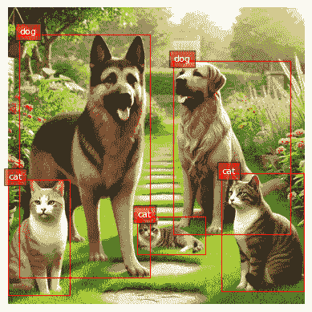

让我们也用表格图片来做：

```py
task_prompt = "<OD>"
results = run_example(task_prompt, image=table)
plot_bbox(table, results["<OD>"])
```

```py
[INFO] ==> Florence-2-base (<OD>), took 40.8 seconds to execute.
```

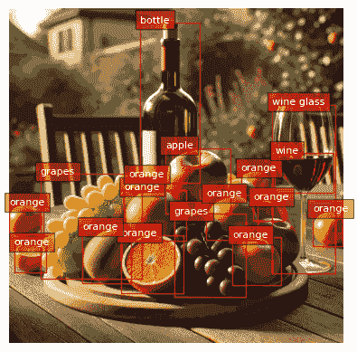

### 密集区域标题

在图像的特定子区域中，可以将经典的目标检测与标题任务混合：

```py
task_prompt = "<DENSE_REGION_CAPTION>"

results = run_example(task_prompt, image=dogs_cats)
plot_bbox(dogs_cats, results["<DENSE_REGION_CAPTION>"])

results = run_example(task_prompt, image=table)
plot_bbox(table, results["<DENSE_REGION_CAPTION>"])
```

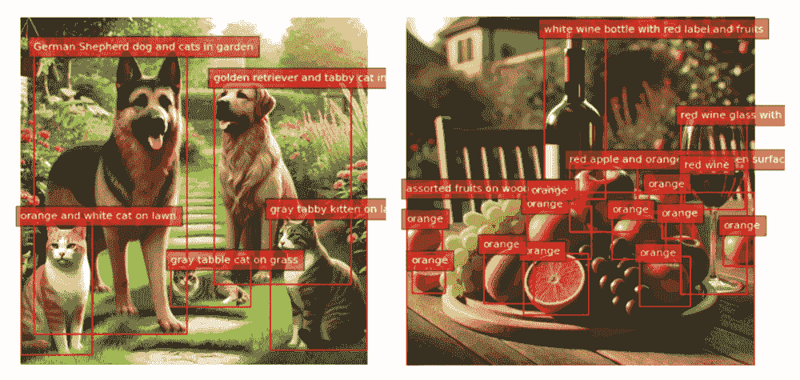

### 标题到短语定位

在这个任务中，我们可以输入一个标题，例如“一个酒杯”，“一个酒瓶”，或者“半个橙子”，Florence-2 将在图像中定位该对象：

```py
task_prompt = "<CAPTION_TO_PHRASE_GROUNDING>"

results = run_example(
    task_prompt, text_input="a wine bottle", image=table
)
plot_bbox(table, results["<CAPTION_TO_PHRASE_GROUNDING>"])

results = run_example(
    task_prompt, text_input="a wine glass", image=table
)
plot_bbox(table, results["<CAPTION_TO_PHRASE_GROUNDING>"])

results = run_example(
    task_prompt, text_input="a half orange", image=table
)
plot_bbox(table, results["<CAPTION_TO_PHRASE_GROUNDING>"])
```

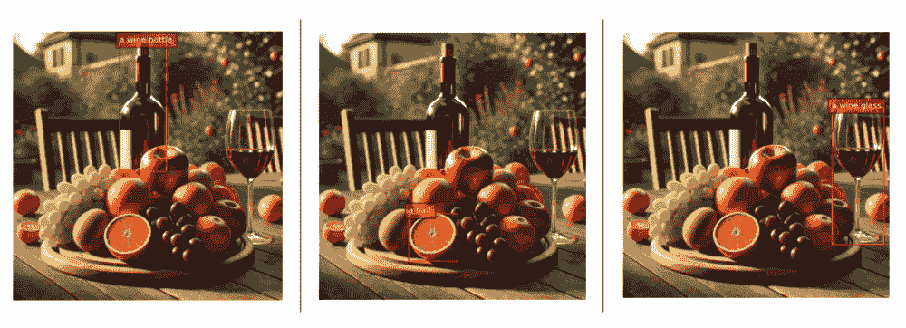

```py
[INFO] ==> Florence-2-base (<CAPTION_TO_PHRASE_GROUNDING>), \
took 15.7 seconds to execute
each task.
```

### 级联任务

我们还可以将图像标题作为输入文本输入，以推动 Florence-2 找到更多对象：

```py
task_prompt = "<CAPTION>"
results = run_example(task_prompt, image=dogs_cats)
text_input = results[task_prompt]
task_prompt = "<CAPTION_TO_PHRASE_GROUNDING>"
results = run_example(task_prompt, text_input, image=dogs_cats)
plot_bbox(dogs_cats, results["<CAPTION_TO_PHRASE_GROUNDING>"])
```

在 `<CAPTION,>` `<DETAILED_CAPTION>` 和 `<MORE_DETAILED_CAPTION>` 之间更改 task_prompt，我们将在图像中获得更多的对象。

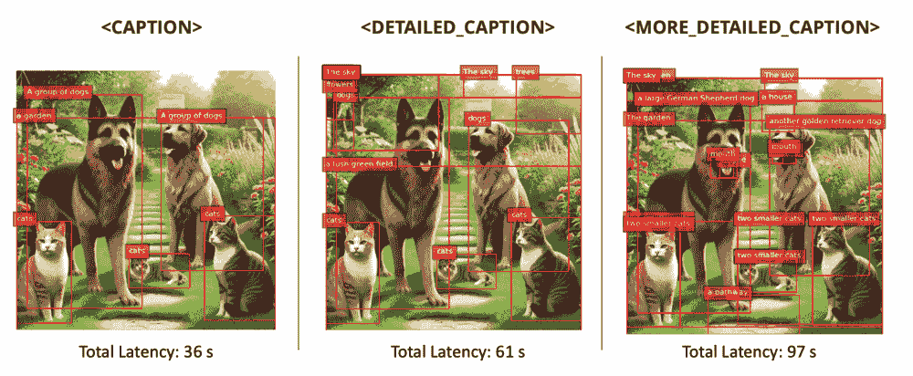

### 开放词汇检测

`<OPEN_VOCABULARY_DETECTION>` 允许 Florence-2 在不依赖于预定义类别列表的情况下检测图像中的可识别对象，使其成为识别各种可能未在训练期间明确标记的项目的一种多用途工具。与 `<CAPTION_TO_PHRASE_GROUNDING>` 不同，后者需要特定的文本短语来定位和突出显示图像中的特定对象，`<OPEN_VOCABULARY_DETECTION>` 执行广泛的扫描以找到和分类所有存在的对象。

这使得 `<OPEN_VOCABULARY_DETECTION>` 在需要在没有事先了解预期内容的情况下对图像中的所有内容有一个全面概述的应用中特别有用。输入描述特定未检测对象的文本，从而实现其检测。例如：

```py
task_prompt = "<OPEN_VOCABULARY_DETECTION>"

text = [
    "a house",
    "a tree",
    "a standing cat at the left",
    "a sleeping cat on the ground",
    "a standing cat at the right",
    "a yellow cat",
]

for txt in text:
    results = run_example(
        task_prompt, text_input=txt, image=dogs_cats
    )

    bbox_results = convert_to_od_format(
        results["<OPEN_VOCABULARY_DETECTION>"]
    )

    plot_bbox(dogs_cats, bbox_results)
```

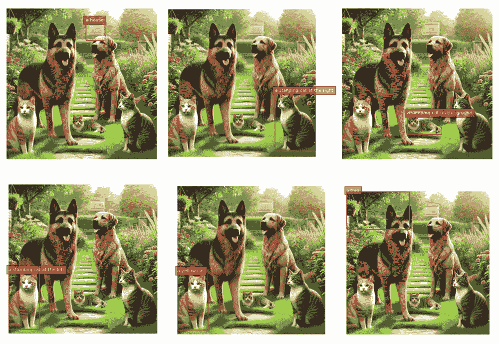

```py
[INFO] ==> Florence-2-base (<OPEN_VOCABULARY_DETECTION>), \
took 15.1 seconds to execute
each task.
```

> 注意：尝试使用 Florence-2 找到未找到的对象可能会导致错误（请参阅笔记本中的示例）。

### 指示表达式分割

我们还可以在图像中分割特定对象并给出其描述（标题），例如在桌子图像上为“一瓶红酒”或在 dogs_cats 上的“德国牧羊犬”。

指示表达式分割结果格式：`{'<REFERRING_EXPRESSION_SEGMENTATION>': {'Polygons': [[[polygon]], ...], 'labels': ['', '', ...]}}`，一个对象由一系列多边形表示。每个多边形是 `[x1, y1, x2, y2, ..., xn, yn]`。

> **多边形（x1, y1, …, xn, yn）**：位置标记表示多边形的顺时针顺序顶点。

因此，让我们首先创建一个函数来绘制分割：

```py
from PIL import Image, ImageDraw, ImageFont
import copy
import random
import numpy as np

colormap = [
    "blue",
    "orange",
    "green",
    "purple",
    "brown",
    "pink",
    "gray",
    "olive",
    "cyan",
    "red",
    "lime",
    "indigo",
    "violet",
    "aqua",
    "magenta",
    "coral",
    "gold",
    "tan",
    "skyblue",
]


def draw_polygons(image, prediction, fill_mask=False):
    """
 Draws segmentation masks with polygons on an image.

 Parameters:
 - image_path: Path to the image file.
 - prediction: Dictionary containing 'polygons' and 'labels'
 keys. 'polygons' is a list of lists, each
 containing vertices of a polygon. 'labels' is
 a list of labels corresponding to each polygon.
 - fill_mask: Boolean indicating whether to fill the polygons
 with color.
 """
    # Load the image

    draw = ImageDraw.Draw(image)

    # Set up scale factor if needed (use 1 if not scaling)
    scale = 1

    # Iterate over polygons and labels
    for polygons, label in zip(
        prediction["polygons"], prediction["labels"]
    ):
        color = random.choice(colormap)
        fill_color = random.choice(colormap) if fill_mask else None

        for _polygon in polygons:
            _polygon = np.array(_polygon).reshape(-1, 2)
            if len(_polygon) < 3:
                print("Invalid polygon:", _polygon)
                continue

            _polygon = (_polygon * scale).reshape(-1).tolist()

            # Draw the polygon
            if fill_mask:
                draw.polygon(_polygon, outline=color, fill=fill_color)
            else:
                draw.polygon(_polygon, outline=color)

            # Draw the label text
            draw.text(
                (_polygon[0] + 8, _polygon[1] + 2), label, fill=color
            )

    # Save or display the image
    # image.show()  # Display the image
    display(image)
```

现在我们可以运行函数：

```py
task_prompt = "<REFERRING_EXPRESSION_SEGMENTATION>"

results = run_example(
    task_prompt, text_input="a wine bottle", image=table
)
output_image = copy.deepcopy(table)
draw_polygons(
    output_image,
    results["<REFERRING_EXPRESSION_SEGMENTATION>"],
    fill_mask=True,
)

results = run_example(
    task_prompt, text_input="a german sheppard", image=dogs_cats
)
output_image = copy.deepcopy(dogs_cats)
draw_polygons(
    output_image,
    results["<REFERRING_EXPRESSION_SEGMENTATION>"],
    fill_mask=True,
)
```


```py
[INFO] ==> Florence-2-base
(<REFERRING_EXPRESSION_SEGMENTATION>), took 207.0 seconds
to execute each task.
```

### 区域到分割

在这个任务中，也可以给出图像中要分割的对象坐标。输入格式是 `'<loc_x1><loc_y1><loc_x2><loc_y2>', [x1, y1, x2, y2]` ，这是 [0, 999] 中的量化坐标。

例如，当运行代码时：

```py
task_prompt = "<CAPTION_TO_PHRASE_GROUNDING>"
results = run_example(
    task_prompt, text_input="a half orange", image=table
)
results
```

结果如下：

```py
{'<CAPTION_TO_PHRASE_GROUNDING>': {'bboxes': [[343.552001953125,
    689.6640625,
    530.9440307617188,
    873.9840698242188]],
  'labels': ['a half']}}
```

使用四舍五入的边界框坐标：

```py
task_prompt = "<REGION_TO_SEGMENTATION>"
results = run_example(
    task_prompt,
    text_input=("<loc_343><loc_690>" "<loc_531><loc_874>"),
    image=table,
)
output_image = copy.deepcopy(table)
draw_polygons(
    output_image, results["<REGION_TO_SEGMENTATION>"], fill_mask=True
)
```

我们在这些坐标上获得了对象的分割（延迟：83 秒）：

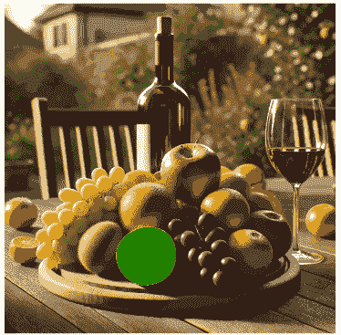

### 区域到文本

我们还可以给出区域（坐标）并请求一个标题：

```py
task_prompt = "<REGION_TO_CATEGORY>"
results = run_example(
    task_prompt,
    text_input=("<loc_343><loc_690>" "<loc_531><loc_874>"),
    image=table,
)
results
```

```py
[INFO] ==> Florence-2-base (<REGION_TO_CATEGORY>), \
took 14.3 seconds to execute.

{{
  '<REGION_TO_CATEGORY>':
    'orange<loc_343><loc_690>'
    '<loc_531><loc_874>'
}
```

模型在那个区域识别出一个橙子。让我们请求一个描述：

```py
task_prompt = "<REGION_TO_DESCRIPTION>"
results = run_example(
    task_prompt,
    text_input=("<loc_343><loc_690>" "<loc_531><loc_874>"),
    image=table,
)
results
```

```py
[INFO] ==> Florence-2-base (<REGION_TO_CATEGORY>), \
took 14.6 seconds to execute.

{
  '<REGION_TO_CATEGORY>':
    'orange<loc_343><loc_690>'
    '<loc_531><loc_874>'
}
```

在这种情况下，描述没有提供更多细节，但它可以。尝试另一个例子。

### OCR

使用 Florence-2，我们可以在图像上执行光学字符识别（OCR），获取其上所写的内容（`task_prompt = '<OCR>'`）以及检测到的文本的边界框（位置）（`ask_prompt = '<OCR_WITH_REGION>'`）。这些任务可以帮助提取和定位图像中的文本信息，例如阅读标志、标签或其他形式的文本。

让我们从巴西的演讲中上传一张传单到 Raspi。让我们测试另一种语言的工作，这里是用葡萄牙语）：

```py
flayer = Image.open("./images/embarcados.jpg")
# Display the image
plt.figure(figsize=(8, 8))
plt.imshow(flayer)
plt.axis("off")
# plt.title("Image")
plt.show()
```


让我们使用 `'<MORE_DETAILED_CAPTION>'` 检查图像：

```py
[INFO] ==> Florence-2-base (<MORE_DETAILED_CAPTION>), \
took 85.2 seconds to execute.

{'<MORE_DETAILED_CAPTION>': 'The image is a promotional poster \
for an event called "Machine Learning Embarcados" hosted by \
Marcelo Roval. The poster has a black background with white \
text. On the left side of the poster, there is a logo of a \
coffee cup with the text "Café Com Embarcados" above it. \
Below the logo, it says "25 de Setembro as 17th" which \
translates to "25th of September as 17" in English. \n\nOn \
the right side, there are two smaller text boxes with the names \
of the participants and their names. The first text box reads \
"Democratizando a Inteligência Artificial para Paises em \
Desenvolvimento" and the second text box says "Toda \
quarta-feira" which is Portuguese for "Transmissão via in \
Portuguese".\n\nIn the center of the image, there has a photo \
of Marcelo, a man with a beard and glasses, smiling at the \
camera. He is wearing a white hard hat and a white shirt. \
The text boxes are in orange and yellow colors.'}
```

描述非常准确。让我们使用 OCR 任务获取更重要的单词：

```py
task_prompt = "<OCR>"
run_example(task_prompt, image=flayer)
```

```py
[INFO] ==> Florence-2-base (<OCR>), took 37.7 seconds to execute.

{'<OCR>':
 'Machine Learning Café com Embarcado Embarcados '
 'Democratizando a Inteligência Artificial para Paises em '
 '25 de Setembro às 17h Desenvolvimento Toda quarta-feira '
 'Marcelo Roval Professor na UNIFIEI e Transmissão via in '
 'Co-Director do TinyML4D'}
```

让我们定位传单中的单词：

```py
task_prompt = "<OCR_WITH_REGION>"
results = run_example(task_prompt, image=flayer)
```

让我们再创建一个函数来绘制检测到的单词周围的边界框：

```py
def draw_ocr_bboxes(image, prediction):
    scale = 1
    draw = ImageDraw.Draw(image)
    bboxes = prediction["quad_boxes"]
    labels = prediction["labels"]
    for box, label in zip(bboxes, labels):
        color = random.choice(colormap)
        new_box = (np.array(box) * scale).tolist()
        draw.polygon(new_box, width=3, outline=color)
        draw.text(
            (new_box[0] + 8, new_box[1] + 2),
            "{}".format(label),
            align="right",
            fill=color,
        )
    display(image)
```

```py
output_image = copy.deepcopy(flayer)
draw_ocr_bboxes(output_image, results["<OCR_WITH_REGION>"])
```


我们可以检查检测到的单词：

```py
results["<OCR_WITH_REGION>"]["labels"]
```

```py
'</s>Machine Learning',
 'Café',
 'com',
 'Embarcado',
 'Embarcados',
 'Democratizando a Inteligência',
 'Artificial para Paises em',
 '25 de Setembro ás 17h',
 'Desenvolvimento',
 'Toda quarta-feira',
 'Marcelo Roval',
 'Professor na UNIFIEI e',
 'Transmissão via',
 'in',
 'Co-Director do TinyML4D']
```

## 延迟摘要

在使用 Florence-2 在 Raspberry Pi (Raspi-5) 上执行不同任务时观察到的延迟因任务的复杂度而异：

+   **图像标题**：为图像生成标题大约需要 16-17 秒。

+   **详细标题**：延迟增加到约 25-27 秒，需要生成更细致的场景描述。

+   **更详细的标题**：大约需要 32-50 秒，随着描述变得更加复杂，延迟增加。

+   **对象检测**：根据图像的复杂性和检测到的对象数量，大约需要 20-41 秒。

+   **视觉定位**：根据文本提示定位特定对象，大约需要 15-16 秒。

+   **光学字符识别（OCR）**：从图像中提取文本大约需要 37-38 秒。

+   **分割与区域分割**：分割任务耗时较长，大约为 83-207 秒，具体取决于复杂性和需要分割的区域数量。

这些延迟时间突出了边缘设备（如 Raspberry Pi）的资源限制，并强调了优化模型和环境以实现实时性能的必要性。

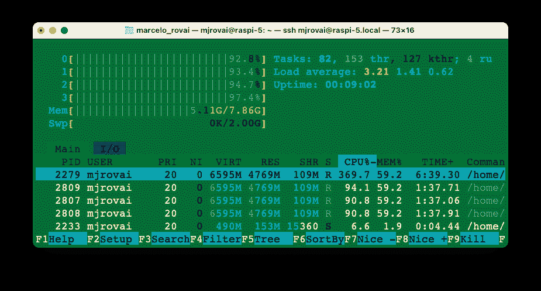

> 运行复杂任务可能会使用 Raspi-5 的 8 GB 内存。例如，上述截图显示在 Florence OD 任务期间，有 4 个 CPU 全速运行，并使用了超过 5 GB 的内存。考虑将 SWAP 内存增加到 2 GB。

使用`vcgencmd measure_temp`检查 CPU 温度，显示温度可升至+80°C。

## 微调

如本实验室所探讨的，Florence 支持许多开箱即用的任务，包括描述、目标检测、OCR 等。然而，与其他预训练的基础模型一样，Florence-2 可能需要特定领域的知识。例如，它可能需要通过医学或卫星图像来改进。在这种情况下，**微调**与自定义数据集是必要的。Roboflow 教程[如何微调 Florence-2 以进行目标检测任务](https://blog.roboflow.com/fine-tune-florence-2-object-detection/)展示了如何在目标检测数据集上微调 Florence-2 以提高模型性能以适应我们的特定用例。

根据上述教程，可以微调 Florence-2 模型以检测之前实验室中使用的箱子和轮子：

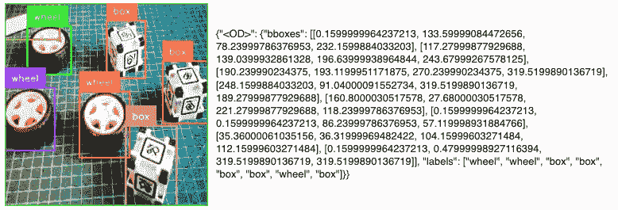

需要注意的是，在微调后，模型仍然可以检测到不属于我们自定义数据集的类别，如猫、狗、葡萄等，正如之前所见）。

在 Roboflow 中使用先前标注的数据集并在 CoLab 上执行的全局微调项目可以在以下笔记本中找到：

+   [30-Finetune_florence_2_on_detection_dataset_box_vs_wheel.ipynb](https://github.com/Mjrovai/EdgeML-with-Raspberry-Pi/blob/main/FLORENCE-2/notebooks/30-Finetune_florence_2_on_detection_dataset_box_vs_wheel.ipynb)

在另一个例子中，在文章[微调 Florence-2 - 微软的尖端视觉语言模型](https://huggingface.co/blog/finetune-florence2)中，作者展示了在`DocVQA`上微调 Florence 的示例。作者报告称，Florence 2 可以执行视觉问答（VQA），但发布的模型不包括 VQA 功能。

## 摘要

Florence-2 为边缘的视觉语言任务提供了一种灵活且强大的方法，其性能可与更大的、特定于任务的模型相媲美，例如用于目标检测的 YOLO，用于文本分析的 BERT/RoBERTa，以及专门的 OCR 模型。

多亏了其多模态转换器架构，Florence-2 在处理任务方面比 YOLO 更灵活。这些任务包括目标检测、图像描述和视觉定位。

与仅关注语言的**BERT**不同，Florence-2 整合了视觉和语言，使其在需要这两种模态的应用中表现出色，例如图像标题和视觉定位。

此外，虽然传统的**OCR 模型**如 Tesseract 和 EasyOCR 仅设计用于从图像中识别和提取文本，但 Florence-2 的 OCR 能力是更广泛框架的一部分，该框架包括上下文理解和视觉-文本对齐。这使得它在需要读取文本并解释图像中其上下文的场景中特别有用。

总体而言，Florence-2 因其能够将各种视觉-语言任务无缝集成到一个统一模型中而脱颖而出，该模型足够高效，可以在树莓派等边缘设备上运行。这使得它成为探索边缘 AI 应用的开发者和研究人员的一个有吸引力的选择。

### Florence-2 的关键优势

1.  **统一架构**

    +   单个模型处理多个视觉任务与专用模型（YOLO，BERT，Tesseract）相比

    +   消除了需要多个模型部署和集成的需求

    +   任务间一致的 API 和界面

1.  **性能比较**

    +   目标检测：尽管是通用型，但与 YOLOv8 相当（在 COCO 上约为 37.5 mAP，与 YOLOv8 的约 39.7 mAP 相当）

    +   文本识别：有效处理多种语言，如专门的 OCR 模型（Tesseract，EasyOCR）

    +   语言理解：集成类似 BERT 的文本处理能力，同时添加视觉上下文

1.  **资源效率**

    +   基础模型（232M 参数）尽管规模较小，但取得了良好的效果

    +   在边缘设备（树莓派）上运行有效

    +   单个模型部署与多个专用模型

### 权衡

1.  **性能与专用模型比较**

    +   YOLO 系列可能在纯目标检测方面提供更快的推理

    +   专用 OCR 模型可能更好地处理复杂的文档布局

    +   BERT/RoBERTa 为纯文本任务提供更深入的语言理解

1.  **资源需求**

    +   边缘设备上的延迟更高（15-200 秒，取决于任务）

    +   需要在树莓派上仔细管理内存

    +   可能需要针对实时应用进行优化

1.  **部署考虑**

    +   初始设置比专用模型更复杂

    +   需要理解多种任务类型和提示

    +   优化提示工程的学习曲线

### 最佳用例

1.  **资源受限环境**

    +   需要多种视觉能力的边缘设备

    +   存储或部署容量有限的系统

    +   需要灵活视觉处理的程序

1.  **多模态应用**

    +   内容审查系统

    +   无障碍工具

    +   文档分析工作流程

1.  **快速原型设计**

    +   快速部署视觉能力

    +   在不使用单独模型的情况下测试多个视觉任务

    +   概念验证开发

## 未来影响

Florence-2 代表了向统一视觉模型转变的趋势，这些模型最终可能取代许多应用中的特定任务架构。虽然专用模型在特定场景中保持优势，但像 Florence-2 这样的统一模型在便利性和效率方面的优势使它们在现实世界的部署中越来越有吸引力。

实验室展示了 Florence-2 在边缘设备上的可行性，这表明未来在物联网、移动计算和嵌入式系统中部署多个专用模型将是不切实际的。

## 资源

+   [10-florence2_test.ipynb](https://github.com/Mjrovai/EdgeML-with-Raspberry-Pi/blob/main/FLORENCE-2/notebooks/10-florence2_test.ipynb)

+   [20-florence_2.ipynb](https://github.com/Mjrovai/EdgeML-with-Raspberry-Pi/blob/main/FLORENCE-2/notebooks/20-florence_2.ipynb)

+   [30-Finetune_florence_2_on_detection_dataset_box_vs_wheel.ipynb](https://github.com/Mjrovai/EdgeML-with-Raspberry-Pi/blob/main/FLORENCE-2/notebooks/30-Finetune_florence_2_on_detection_dataset_box_vs_wheel.ipynb)
