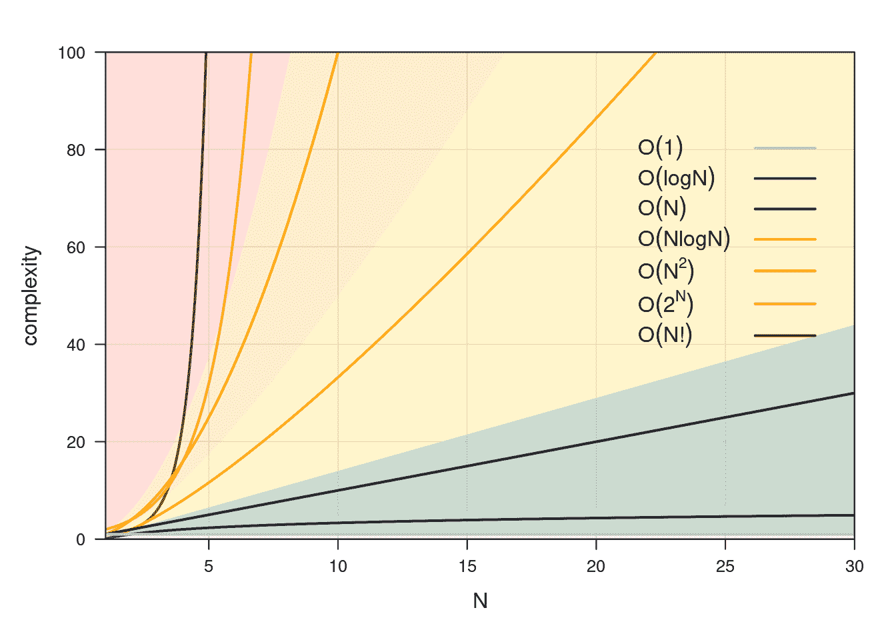
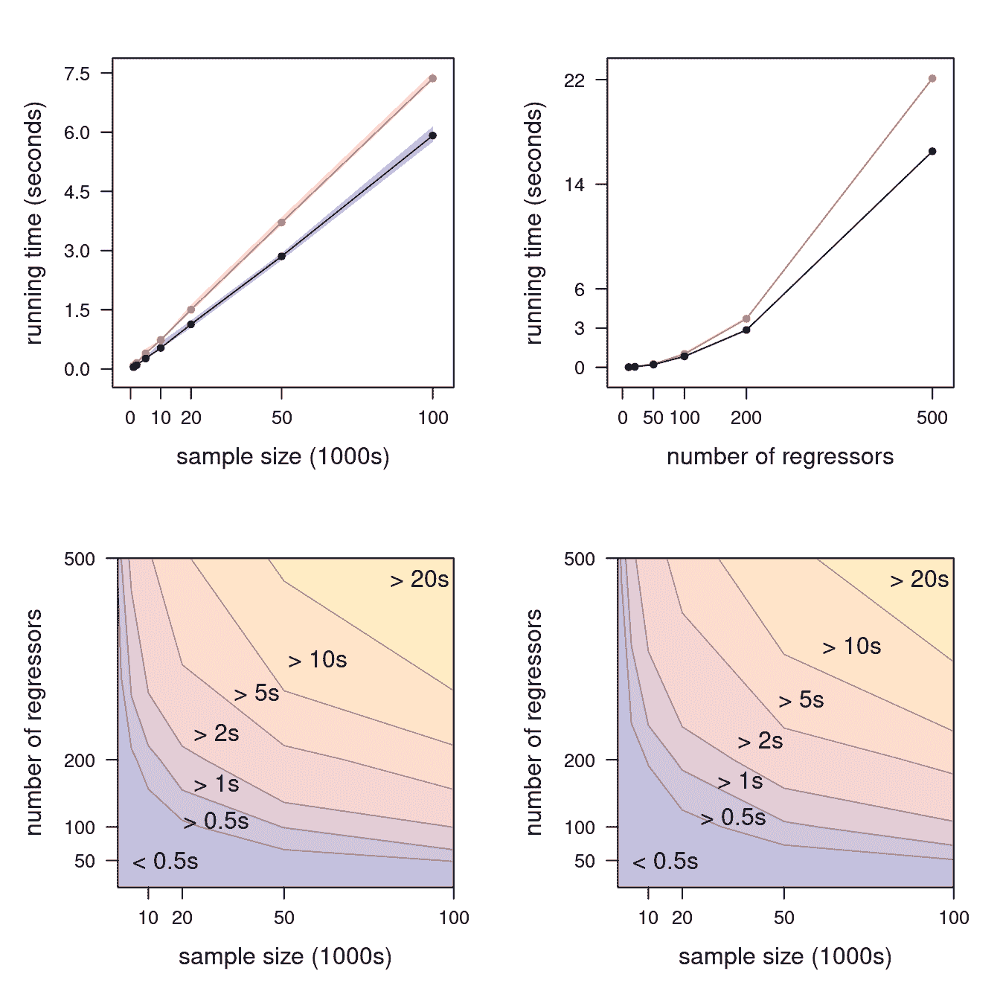
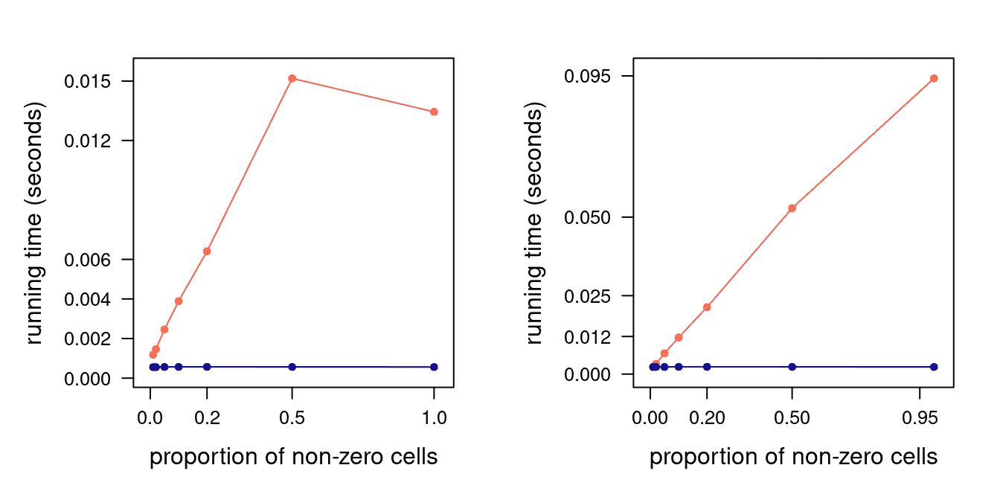
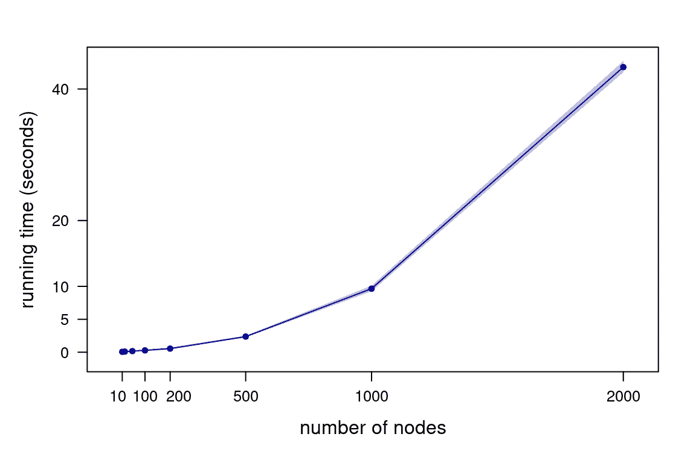

# 第四章 算法分析

> 原文：[`ppml.dev/algorithms.html`](https://ppml.dev/algorithms.html)

在前几章中，我们讨论了我们所使用的硬件架构（第二章）、我们分析的数据的性质以及我们如何使用数据结构来表示数据（第三章），这些都对机器学习管道的性能产生了影响。这个谜题的最后一块主要部分是驱动机器学习模型的算法的算法复杂度。

算法复杂度在抽象上定义为算法完成所需资源的数量。在用伪代码编写我们想要实现的机器学习算法的高层次描述（第 4.1 节）之后，我们可以确定其组件的复杂度以及它们如何影响整个算法的复杂度。我们用大-\(O\)符号（第 4.2 节）的数学术语来表示和推理复杂度。量化它（第 4.3 节）提出了几个特定于机器学习的问题（第 4.4 节），我们将通过三个例子（第 4.5 节）来阐述这些问题。

## 4.1 编写伪代码

推理算法的第一步是使用*pseudocode*将其写下来，结合自然语言的易读性和代码的精确性，以方便我们的分析和随后的软件实现。自然语言更容易阅读，但它也是模糊的。另一方面，代码过于具体：它迫使我们考虑实现细节和编程语言约定，这使得我们更难关注整体图景。

Pseudocode 旨在弥补自然语言和代码的弱点，同时保留它们的优点。理想情况下，它提供了一个算法的高级描述，通过使每一步的意图清晰，同时抑制那些对理解算法无关紧要的细节，从而促进其分析和实现。虽然有一些通用的指南（例如，“Code Complete”第九章 2004），但关于如何编写伪代码没有普遍的标准。通常接受的三条关键指南是：

+   算法的每一步都应该是一个列举中的独立、自包含的项目。

+   伪代码应在一定程度上结合良好代码和良好自然语言的风格。例如，它可能不足以构成完整的句子。它应避免特定编程语言的习语和约定，使用宽松的语法来表示代码语句。同样，变量名应来自算法试图解决的问题域，而不是它们将如何实现（例如，以数据结构的形式）。我们将在第 6.2 节中回到这一点。

+   伪代码应忽略不必要的细节，并在可能的情况下使用缩写符号，将上下文留给更深入的文档形式。换句话说，细节的级别应该是算法整体结构的概览，以便我们可以专注于其意图。

诚然，这些推荐是模糊的，因为将算法的高级视图传达给读者的最佳方式取决于伪代码风格和读者背景的结合。通常，了解受众是有效沟通的关键。

为机器学习算法编写良好的伪代码，或为跨越多个算法的机器学习管道编写伪代码，有两个额外的复杂性：数据所起的作用以及需要整合一定量的数学符号。

首先，如果我们把数据视为代码（第 5.1 节），我们可能希望在伪代码中包含比其他设置更多的细节。此类信息可能包括数据的维度和对其特征的一些关键特性，这些特性对于算法的功能至关重要。在某种程度上，这类似于包含一些关于关键对象类型的信息，这对于阐明算法的输入和输出以及为关键步骤提供更多上下文是有用的。

其次，数学符号可能是描述关键步骤的清晰和可读性的最佳工具，因此我们可能希望将其与自然语言和代码结合以产生最佳效果。为了做到这一点，我们应该定义在符号中使用的所有变量和函数，同时将额外的细节留给单独的文档。出于实用目的，在引入新的数学符号时（例如，“先验 Beta 分布 \(\pi(\alpha, \beta) \sim \mathit{Be}(\alpha, \beta)\)”而不是仅仅“\(\pi(\alpha, \beta) \sim \mathit{Be}(\alpha, \beta)\)”），通常足以提供上下文（\(\pi\)的性质是什么，它将如何被使用等）。复杂的公式、推导和形式证明会通过使其过长并迫使读者专注于理解它们而不是查看算法的整体逻辑来降低伪代码的可读性。

使用伪代码描述机器学习管道中使用的所有算法有一些进一步的优点，我们将在后面的章节中讨论：

+   它使代码审查更容易（参见第 6.6 节）；

+   它通过伪代码比代码更容易修改而促进迭代细化（参见第 5.3.1 节）；

+   它以易于维护的形式提供设计文档（参见第 8.3 节）；

## 4.2 计算复杂性和大-\(O\) 符号

计算复杂性是计算机科学的一个分支，它专注于根据其固有的难度在三个不同维度上对计算问题进行分类：

+   作为输入大小的函数（例如，样本大小或变量的数量）；

+   作为资源使用量的函数，特别是时间（例如，CPU 时间消耗）和空间（内存或存储使用）；

+   平均情况下（通常需要多长时间），在最佳情况或最坏情况下（可能需要多长时间）。

换句话说，我们希望仅从算法的规范中推断出它将使用多少资源：这被称为 *算法分析*。通常，规范采用伪代码的形式。至于资源，我们首先必须选择我们的度量单位。在空间复杂性的情况下，选择通常是显而易见的：对于各种类型的内存（RAM、GPU 内存、存储），要么是绝对内存单位（如 MB、GB），要么是相对单位（如双精度浮点值的数量）。在时间复杂性的情况下，我们必须选择一组基本操作，我们认为它们具有理论上的复杂度为 \(1\)。这些操作可以从简单（算术运算）到复杂（训练的模型）不等，这取决于我们希望工作的抽象级别。一方面，抽象级别越低，我们越需要了解算法的具体实现细节。这只有在一定程度上是可行的，因为伪代码将省略大多数此类细节。这在某种程度上也是不希望的，因为它使得分析不那么通用：同一算法的不同实现可能最终属于不同的复杂性类别，而在实践中表现出几乎相同的行为。另一方面，抽象级别越高，获得与现实仅松散相关的复杂性估计的可能性就越高。操作越复杂，它们具有相同复杂性的可能性就越小，并且它们的复杂性可以被认为是常数。

算法分析产生的计算复杂性估计使用 *big-\(O\)* 和相关符号书写，这些符号定义了输入大小极限下的复杂性类别（Knuth 1976, 1997)。 (所有算法在输入较小的情况下都是快速的。) 更详细地说：

+   我们使用**大-\(O\)**符号描述**最坏情况**场景。形式上，一个输入大小为\(N \to \infty\)的算法，如果存在一个\(c_0 > 0\)使得\(f(N) \leqslant c_0 g(N)\)，则其复杂度为\(f(N) = O(g(N))\)。这代表复杂度的一个上界。

+   我们使用**大-\(\Omega\)**符号描述**最佳情况**场景：\(f(N) = \Omega(g(N))\)，\(f(N) \geqslant c_1 g(N)\)且\(c_1 > 0\)。这代表复杂度的一个下界。

+   我们使用**大-\(\Theta\)**符号描述**平均情况**：\(f(N) = \Theta(g(N))\)，\(c_2 g(N) \leqslant f(N) \leqslant c_3 g(N)\)且\(c_2, c_3 > 0\)。这代表平均复杂度。

在实践中，我们经常只写像“平均情况下是\(O(g(N))\)，最坏情况下是\(O(h(N))\)”这样的东西，并且对所有三种情况都使用大-\(O\)。如果我们考虑的是可以用不同大小组合来最好描述的输入（比如说，\(\{M, N, P\}\)），**大-\(O\)**将是一个多元函数，如\(O(g(M, N, P))\)。



图 4.1：计算复杂度类别的图形比较。

常用的不同复杂度类别在图 4.1 中展示。属于\(O(1)\)、\(O(\log N)\)、\(O(N)\)和\(O(N \log N)\)的算法被认为是高效的，而属于\(O(N²)\)或更高复杂度类别的算法则要求更高。从某种意义上说，这种分类反映了运行计算系统的经济性：每次\(N\)加倍时，可能可行地加倍我们的硬件需求，但增加 2 的幂或更多则很少可能！

我们如何使用大-\(O\)符号？如果我们正在比较不同复杂度类别的算法，我们可以只关注最高阶项：\(O(3 \cdot 2^N + 3.42 N²) \gg O(2 N³ + 3 N²)\)在功能上等同于\(O(2^N) \gg O(N³)\)，因为量级上的差异使得低阶项甚至最高阶项的系数都无关紧要。如果我们正在比较同一复杂度类别的算法，我们只报告最高阶项及其系数：\(O(1.2 N² + 3N) \gg O(0.9 N² + 2 \log N)\)变为\(O(1.2 N²) \gg O(0.9 N²)\)。在前一种情况下，我们可以说算法在输入规模增长时以不同的方式扩展。在后一种情况下，我们可以说算法扩展方式相似，但仍然可以对其进行排名。

然而，在大多数实际设置中，由于其固有的局限性，解释大-\(O\)符号需要更细致的方法。

+   大-O 记号不包括常数项，因此它可能不一定很好地映射到现实世界的性能。具有复杂初始化阶段且不随输入大小缩放的算法可能比具有更高复杂度的算法在中等输入大小下运行得更慢。这可能适用于那些在缓存比从零开始重新计算这些数量更昂贵时缓存部分结果或足够统计量的算法。

+   类似地，大-O 记号中的系数通常并不现实：例如，时间复杂度 \(O(2N)\) 并不能保证 \(N\) 加倍时运行时间也会加倍。算法的实现方式、硬件等可能不会影响复杂度类别，但它们总是对相关系数有强烈的影响。因此，我们应该从经验运行时间中估计这些系数，以获得现实性能曲线，并使用这些曲线来比较同一复杂度类别的算法。

+   空间复杂度和时间复杂度之间存在权衡：我们在这两者之间进行权衡。可以说，空间复杂度比时间复杂度更重要。原则上，我们可以等待更长的时间来获取结果，但如果我们的程序耗尽内存，它将崩溃，我们将无法得到任何结果。

## 4.3 大-O 记号和基准测试

为所有相关的计算复杂度维度生成经验性能曲线与其他形式的基准测试有所不同。如果我们知道算法所属的理论复杂度类别，一个简单的线性模型就足以估计其大-O 记号中项的系数：我们将在第 4.5 节中展示一些示例。然而，我们在测量性能和解释经验曲线时应该小心谨慎。

首先，我们应该按照物理（Montgomery 20AD）和计算机模拟（Santner, Williams, and Notz 2018）实验设计中的最佳实践来规划性能测量的收集。如果我们沿着单维测量复杂性，我们应该为每个输入大小收集多个性能测量值。每个输入大小的平均性能将比单个测量值提供更稳定的估计，并且我们可以使用性能测量的分布来建立围绕平均值的置信区间。基于经验分位数（例如，[5%，95%] 分位数之间的区间）的区间通常比基于正态分布分位数（例如，平均性能 \(\pm\) 标准差乘以标准正态分布的 95% 分位数）的区间更可取，因为后者在平均值周围是对称的，并且未能考虑到性能是偏斜的事实。性能自然地被零（即时执行！）所限制，并且平均性能可能足够接近零，以至于置信区间的底部是负的！

如果我们在多个维度上测量复杂性，最好使用一个包含所有这些维度的单一实验设计，以便将每个维度的主效应与其相互作用分开。大 \(O\) 符号可能不包括包含多个维度的项，在这种情况下，检查这在实践中是否也成立是有趣的。或者大 \(O\) 符号可能包括这样的项，然后估计它们的系数的唯一一致方法是同时改变所有涉及到的输入大小。

如果我们在同一复杂性类中比较两个算法，我们应该在相同输入集上生成的性能差异上进行比较，以提高我们比较的精确度。如果我们使用不同的输入，我们为每个输入大小收集的性能度量在算法之间是独立的：如果这些算法分别是 \(O(f(N))\) 和 \(O(g(N))\)，则有 \[\begin{equation*} \operatorname{VAR}(f(N) - g(N)) = \operatorname{VAR}(f(N)) + \operatorname{VAR}(g(N)). \end{equation*}\] 然而，如果我们为两个算法使用相同的输入 \[\begin{multline*} \operatorname{VAR}(f(N) - g(N)) = \operatorname{VAR}(f(N)) + \operatorname{VAR}(g(N)) - \\ 2\operatorname{COV}(f(N), g(N)) \end{multline*}\] 因为性能度量不再独立。由于 \(\operatorname{COV}(f(N), g(N)) > 0\)，性能的差异将具有更小的变异性，因此具有更高的精确度。

第二，我们应该仔细选择我们使用的计算系统。当我们进行性能测量时，系统应该“静止不动”：如果同时运行其他任务，它们可能会尝试访问也涉及我们性能度量的共享资源。这有两个负面影响：它使性能度量更嘈杂，并通过使平均性能变差来使估计的系数膨胀。

第三，我们在使用性能曲线预测实际测量输入大小（或输入大小的组合）范围之外的性能时应该小心。在任何具有有限资源的计算系统中，当系统达到饱和时，资源竞争会增加。因此，我们应该使用具有足够资源来处理我们考虑的所有输入大小，而不会接近容量的计算系统。我们感兴趣的是测量算法的性能，而不是计算系统的性能，因此我们应该强调前者而不是后者。

最后，请注意，大多数实验设计方法都假设性能度量是独立的。因此，我们应该努力使我们的经验度量尽可能独立，通过在每次运行之前重置计算系统的状态来实现：例如，我们应该移除所有临时对象。

## 4.4 机器学习算法分析

在机器学习软件的背景下，算法分析带来了一些额外的复杂性。

第一组复杂性是与定义输入大小相关的。机器学习算法通常有大量不同的输入，每个输入的大小有几个维度（例如样本大小和变量数量）。因此，算法将属于不同复杂度类别的不同维度，并且不太可能在所有维度上主导其他维度。有时，我们可以通过假设某些维度由于输入的内禀性质是有界的，或者通过将一个维度表示为另一个维度的函数（例如，变量数量 \(p \approx \sqrt{n}\) 其中 \(n\) 是样本大小）来减少我们考虑的维度数量。

此外，计算复杂度强烈依赖于我们对输入分布的假设，而不仅仅是它们的大小。更多的假设通常使我们能够访问性能更好的算法，并使使用闭式结果成为可能：我们以假设的形式投入的知识越多，我们就越不需要学习经验度量。假设某种形式的稀疏性或规律性，或在学习过程中积极强制执行它，可以将机器学习模型的复杂度降低到可处理的程度。在大多数情况下，不做出任何这样的假设将意味着指数或组合最坏情况复杂度。这是另一种权衡：假设与复杂度。

对于随机算法，我们只能在平均情况下进行有意义的推理。考虑贝叶斯模型中的马尔可夫链蒙特卡洛（MCMC）后验推理，或者深度神经网络中的随机梯度下降（SGD）。每次运行它们时，它们都会通过不同的步骤序列，并可能产生不同的后验分布或模型。因此，每次运行所需的时间不同，使用的内存量也不同。这类算法的构建提供了收敛保证和收敛率，因此我们对平均复杂度有一些期望，但总存在一定程度的不确定性。

## 4.5 一些算法分析的例子

我们现在将通过研究线性回归模型系数的估计时间复杂度（第 4.5.1 节）来应用我们刚刚介绍的概念；稀疏矩阵中时间和空间复杂度之间的权衡（第 4.5.2 节）；以及从均匀分布生成随机有向无环图（DAG）的 MCMC 算法的时间和空间复杂度（第 4.5.3 节）。

### 4.5.1 估计线性回归模型

线性模型是大多数统计学和机器学习建立的基础：我们通常要么使用它们作为独立模型，要么作为更复杂模型的一部分。一般来说，线性模型接受一个实数向量 \(\mathbf{y}\) 和一个实数矩阵 \(\mathbf{X}\)，并试图将 \(\mathbf{y}\) 解释为 \(\mathbf{X}\) 的函数，该函数在参数 \(\boldsymbol{\beta}\) 上是线性的。我们可以用著名的闭式表达式（Weisberg 2014）估计 \(\boldsymbol{\beta}\)，表达式如下：\[\begin{equation*} \underset{p \times 1}{\boldsymbol{\widehat{\beta}}_{\mathrm{EX}}} = (\underset{p \times n}{\mathbf{X}^\mathrm{T}\vphantom{\boldsymbol{\widehat{\beta}}_{\mathrm{EX}}}} \, \underset{n \times p}{\mathbf{X}\vphantom{\boldsymbol{\widehat{\beta}}_{\mathrm{EX}}}})^{-1} \underset{p \times n}{\mathbf{X}^\mathrm{T}\vphantom{\boldsymbol{\widehat{\beta}}_{\mathrm{EX}}}} \, \underset{n \times 1}{\mathbf{y}} \end{equation*}\]这个表达式同时是普通最小二乘估计（从 \(\mathbf{y}\) 在 \(\mathbf{X}\) 张成的空间上的正交投影）和 \(\boldsymbol{\beta}\) 的最大似然估计（在残差独立且正态分布且具有相同方差的假设下）。注意我们如何在上述公式中标注了 \(\mathbf{X}\) 和 \(\mathbf{y}\) 的维度。这些是我们的输入：它们的维度取决于样本大小 \(n\) 和变量的数量 \(p\)。⁹ 估计 \(\boldsymbol{\beta}\) 的算法复杂度将取决于这两个因素。

估计 \(\boldsymbol{\beta}\) 的另一种方法是使用 \(\mathbf{X}\) 的 QR 分解（Weisberg 2014，附录 A.9）。从线性回归模型的 \(\mathbf{X}\boldsymbol{\beta}= \mathbf{y}\) 公式开始，我们执行以下步骤：

1.  计算 \(\mathbf{X}\) 的 QR 分解（\(\mathbf{Q}\) 是 \(n \times p\)，\(\mathbf{R}\) 是 \(p \times p\)）；

1.  将问题重写为 \(\mathbf{R} \boldsymbol{\beta}= \mathbf{Q}^\mathrm{T}\mathbf{y}\)；

1.  计算 \(\mathbf{Q}^\mathrm{T}\mathbf{y}\);

1.  解出结果（三角）线性系统以得到 \(\boldsymbol{\beta}\)。

让我们称这个估计量为 \(\boldsymbol{\widehat{\beta}}_{\mathrm{QR}}\)。如果我们不考虑病态 \(\mathbf{X}\) 的数值问题，\(\boldsymbol{\widehat{\beta}}_{\mathrm{QR}}\) 和 \(\boldsymbol{\widehat{\beta}}_{\mathrm{EX}}\) 给出相同的 \(\boldsymbol{\beta}\) 估计：它们在统计属性上是相同的，并且它们都没有对 \(\mathbf{X}\) 的分布做出任何假设。然而，我们可能仍然更喜欢其中一个，因为它们的时间复杂度不同。

首先，计算 \(\boldsymbol{\widehat{\beta}}_{\mathrm{EX}}\) 的时间复杂度是什么？如果我们手动估计它，我们会执行以下步骤：

1.  计算 \(\mathbf{X}^\mathrm{T}\mathbf{X}\);

1.  取其逆并计算 \((\mathbf{X}^\mathrm{T}\mathbf{X})^{-1}\)；

1.  计算 \(\mathbf{X}^\mathrm{T}\mathbf{y}\)；

1.  将步骤 2 和 3 的结果相乘。

由于 \(\boldsymbol{\widehat{\beta}}_{\mathrm{EX}}\) 的简单性，这个描述将足够作为我们分析的伪代码。从容易获取的资源（比如，维基百科），我们可以找到每个步骤中操作的复杂度：

+   乘以一个 \(r \times s\) 矩阵和一个 \(s \times t\) 矩阵需要 \(O(rst)\) 次操作（维基百科 2021b）；

+   使用 Cholesky 分解（维基百科 2021a）或 Gram-Schmidt（维基百科 2021c）计算 \(r \times r\) 矩阵的逆是 \(O(r³)\)。

这些时间复杂度使用算术运算作为基本运算，这是自然的，因为矩阵只是由这些运算组合和转换的数字集合。实际上 \(\mathbf{X}\) 和 \(\mathbf{y}\) 的内容是无关紧要的：这两个矩阵在大 \(-O\) 符号中只出现它们的维度。

因此，步骤 1 是 \(O(pnp) = O(np²)\)，步骤 2 是 \(O(p³)\)，步骤 3 是 \(O(np)\) 且步骤 4 是 \(O(p²)\)。整体时间复杂度是 \[\begin{equation} O(np² + p³ + np + p²) = O(p³ + (n + 1)p² + np) \tag{4.1} \end{equation}\] 并且可以这样解释：

+   在参数数量 \(p\) 上估计 \(\boldsymbol{\widehat{\beta}}_{\mathrm{EX}}\) 是 \(O(p³)\)：如果 \(p\) 加倍，它需要八倍的时间。

+   在样本大小 \(n\) 中估计 \(\boldsymbol{\widehat{\beta}}_{\mathrm{EX}}\) 的时间复杂度为 \(O(n)\)：如果 \(n\) 加倍，所需时间也加倍。

现在让我们看看 \(\boldsymbol{\widehat{\beta}}_{\mathrm{QR}}\)。对于时间复杂度，我们有：

+   使用 Gram-Schmidt 解 \(r \times s\) 线性系统的时间复杂度为 \(O(rs²)\)；¹⁰

+   在第四步中解三角线性系统进行回代的时间复杂度为 \(O(s²)\)。

因此，第一步的时间复杂度为 \(O(np²)\)，第三步为 \(O(np)\)，第四步为 \(O(p²)\)。（第二步仅用于表示。）因此，整体时间复杂度为 \[\begin{equation} O(np² + np + p²) = O((n + 1)p² + np), \tag{4.2} \end{equation}\] 使得 \(\boldsymbol{\widehat{\beta}}_{\mathrm{QR}}\) 在参数数量上是二次的，在样本大小上是线性的。我们可以预期当 \(p\) 增加时（\(O(p²)\) 而不是 \(O(p³)\)），它将比闭式估计量更快，但我们不能说哪种方法在 \(n\) 增加时更快，因为它们都是 \(O(n)\)。

因此，哪种算法最好取决于我们期望处理的数据：

+   当 \(n \to \infty\) 但 \(p\) 有界时，\(\boldsymbol{\widehat{\beta}}_{\mathrm{EX}}\) 和 \(\boldsymbol{\widehat{\beta}}_{\mathrm{QR}}\) 的表现相似；

+   当 \(p \to \infty\) 时，\(\boldsymbol{\widehat{\beta}}_{\mathrm{QR}}\) 将更快。

(4.1) 和 (4.2) 中的时间复杂度如何映射到实际的运行时间？我们可以通过基准测试 \(\boldsymbol{\widehat{\beta}}_{\mathrm{EX}}\) 和 \(\boldsymbol{\widehat{\beta}}_{\mathrm{QR}}\) 来回答这个问题，正如我们在第 4.3 节中讨论的那样。

```py
library(microbenchmark)
library(doBy)

# define the estimators.
betaEX =  function(y, X) solve(crossprod(X)) %*%  t(X) %*%  y
betaQR =  function(y, X) qr.solve(X, y)
# define the grid of input sizes to examine.
nn =  c(1, 2, 5, 10, 20, 50, 100) *  1000
pp =  c(10, 20, 50, 100, 200, 500)
# a data frame to store the running times.
time =  data.frame(
 expand.grid(n = nn, p = pp, betahat = c("EX", "QR")),
 lq = NA, mean = NA, uq = NA
)
# quantiles defining a 90% confidence band.
lq =  function(x) quantile(x, 0.05)
uq =  function(x) quantile(x, 0.95)
# for all combinations of input sizes...
for (n in nn) {
 for (p in pp) {
 # ... measure the running time averaging over 100 runs...
 bench =  microbenchmark(betaEX(y, X), betaQR(y, X),
 times = 100,
 control = list(warmup = 10),
 setup = {
 X =  matrix(rnorm(n *  p), nrow = n, ncol = p)
 y =  X %*%  rnorm(ncol(X))
 })
 # ... and save the results for later analyses.
 time[time$n ==  n &  time$p ==  p, c("lq", "mean", "uq")] =
 summaryBy(time ~  expr, data = bench,
 FUN = c(lq, mean, uq))[, -1]
 }#FOR
}#FOR
```



图 4.2：边际运行时间作为 \(n\) 的函数（\(p = 200\)，左上角）和作为 \(p\) 的函数（\(n = 50000\)，右上角）；闭式公式以橙色显示，QR 估计量以蓝色显示，每个都带有 90% 的置信区间。在左下角和右下角面板中分别显示了闭式公式和 QR 估计量的联合运行时间。

我们在图 4.2 中绘制了结果。顶部面板证实了我们之前得出的结论：\(\boldsymbol{\widehat{\beta}}_{\mathrm{EX}}\) 和 \(\boldsymbol{\widehat{\beta}}_{\mathrm{QR}}\) 的时间复杂度与 \(n\) 线性相关，因此它们的缩放相似；但是 \(\boldsymbol{\widehat{\beta}}_{\mathrm{EX}}\) 在 \(p\) 上的时间复杂度是三次方的，这使得当 \(p\) 增加时，它比 \(\boldsymbol{\widehat{\beta}}_{\mathrm{QR}}\) 慢得多。底部面板的水平图显示 \(n\) 和 \(p\) 共同影响运行时间，这是我们应该预期的，因为 (4.1) 和 (4.2) 都包含混合项，其中 \(n\) 和 \(p\) 都出现。

考虑到我们所测量的运行时间中噪音很少，我们可以可靠地估计 (4.1) 和 (4.2) 中项的系数，使用简单的线性回归。

```py
# rescale to make the coefficients easier to interpret.
time$mean =  time$mean *  10^(-9)
time$n =  time$n /  1000
bigO.EX =  lm(mean ~  I(p³) +  I((n +  1) *  p²) +  I(n *  p),
 data = subset(time, betahat == "EX"))
coefficients(bigO.EX)
```

```py
##      (Intercept)           I(p³) I((n + 1) * p²)
##    -0.0120329302    -0.0000000025     0.0000017156
##         I(n * p)
##     0.0000244271
```

```py
bigO.QR =  lm(mean ~  I((n +  1) *  p²) +  I(n *  p),
 data = subset(time, betahat == "QR"))
coefficients(bigO.QR)
```

```py
##      (Intercept) I((n + 1) * p²)         I(n * p)
##       -0.1103315        0.0000013        0.0000502
```

`bigO.EX` 和 `bigO.QR` 中的模型允许我们预测 \(n\) 和 \(p\) 的任何组合的运行时间。我们还可以使用它们来检查它们编码的经验复杂度曲线与相应的经验运行时间重叠的程度，并检查异常值。

作为最后的注意事项，在选择使用哪种算法之前，我们应该权衡几个额外的考虑因素：\(\boldsymbol{\widehat{\beta}}_{\mathrm{EX}}\) 中的矩阵逆在数值上是不稳定的，这就是为什么在科学软件中更倾向于使用 \(\boldsymbol{\widehat{\beta}}_{\mathrm{QR}}\)。R 和 Julia 中的 `lm()`，MATLAB 中的 `fitlm()` 都是在 QR 的基础上实现的，但有趣的是，Scikit-learn 中的 `LinearRegression()`（Scikit-learn 开发者 2022）并不是。

### 4.5.2 稀疏矩阵表示

大多数单元格为零的矩阵称为稀疏矩阵，与大多数或所有元素非零的密集矩阵相对。在密集 (\(m \times n\)) 矩阵的情况下，我们需要在内存中存储所有单元格的值，这意味着它们的复杂度是 \(O(mn)\)。然而，在稀疏矩阵的情况下，我们只需存储非零值及其坐标，理解到所有其他单元格都等于零。

R 在 Matrix 包中提供了几种这样的表示（Bates 和 Maechler 2021），Python 在 scipy 中也做了同样的事情（Virtanen 等人 2020）：默认是第 3.2.3 节中描述的列导向、压缩格式。考虑原始显示在图 3.4 中的矩阵，其中 15 个单元格中有 9 个是零。

```py
library(Matrix)
m =  Matrix(c(0, 0, 2:0), 3, 5)
m
```

```py
## 3 x 5 sparse Matrix of class "dgCMatrix"
##
## [1,] . 1 . . 2
## [2,] . . 2 . 1
## [3,] 2 . 1 . .
```

`m` 的元素是如何存储在内存中的？

```py
str(m)
```

```py
## Formal class 'dgCMatrix' [package "Matrix"] with 6 slots
##   ..@ i       : int [1:6] 2 0 1 2 0 1
##   ..@ p       : int [1:6] 0 1 2 4 4 6
##   ..@ Dim     : int [1:2] 3 5
##   ..@ Dimnames:List of 2
##   .. ..$ : NULL
##   .. ..$ : NULL
##   ..@ x       : num [1:6] 2 1 2 1 2 1
##   ..@ factors : list()
```

将 3.2.3 节中的符号与 Matrix 的文档进行比较，我们可以看到：

+   `i` 包含向量 \(R\)，矩阵中非零单元格的行坐标；

+   `p` 包含向量 \(C\)，列的开始和结束索引；

+   `x` 包含非零单元格的值向量 \(V\)。

注意，`i` 和 `p` 都是 0 基于索引，以方便在 Matrix 包内部的代码中使用 `dgCMatrix` 类，而 R 使用 1 基于索引。

这样一个稀疏矩阵的整体空间复杂度是 \(O(3z)\)，其中 \(z\) 是非零单元格的数量。R 使用双精度（每个 64 位）存储实数，并使用 32 位整数作为索引，这意味着 `m` 需要为每个非零单元格分配 128 位（16 字节）的内存。因此，稠密矩阵使用 \(8mn\) 字节内存，而稀疏矩阵使用 \(16z\) 字节；如果 \(z \ll mn\)，我们可以节省大部分原本为稠密矩阵分配的内存。

但问题是，对于稀疏矩阵的操作可能比稠密矩阵的操作具有更高的时间复杂度。即使是简单的操作：在稠密矩阵中查找单元格 \((i, j)\) 的值具有 \(O(1)\) 的时间复杂度，但对于稀疏矩阵如 `m`，我们需要：

+   通过读取 `p` 的第 \(j\) 个元素来查找 `x` 中该列的第一个和最后一个值。

+   将我们定位在 `i` 中第一个值的行号上，并读取每个后续的数字，直到我们找到行号 \(j\) 或达到列的末尾。

+   从 `x` 中读取单元格的值，它在 `x` 中的位置与 `i` 中的行号相同；或者如果达到列的末尾，则返回零。

这三个步骤的总时间复杂度为 \(O(1) + O(z/n) + O(1) = O(2 + z/n)\)，假设每列平均有 \(z/n\) 个非零元素。因此，从稀疏矩阵中读取单元格似乎比从稠密矩阵中读取相同单元格更昂贵。

在稀疏矩阵中给一个单元格赋非零值也要花费更多。对于 `i` 和 `x` 中的每一个，我们需要：

+   分配一个长度为 \(z + 1\) 的新数组；

+   从旧数组中复制 \(z\) 个值；

+   将新单元格对应的值相加；

+   用新数组替换旧数组。

因此，时间和空间复杂度都是 \(O(z)\)。处理 `p` 也是 \(O(z)\)，而且它更复杂，因为我们平均需要重新计算一半的值。

这很令人烦恼，因为我们不能仅通过查看输入大小来预测平均时间和空间复杂度：我们只能通过假设单元格中值的分布来做到这一点。此外，这种分布可能在我们的软件执行过程中发生变化，因为我们向稀疏矩阵分配新的非零值。然而，我们可以比较稠密和稀疏矩阵上读写操作的实证运行时间，以获得它们差异的实际理解，就像我们在上一节中用 \(\boldsymbol{\widehat{\beta}}_{\mathrm{EX}}\) 和 \(\boldsymbol{\widehat{\beta}}_{\mathrm{QR}}\) 所做的那样。

考虑一个 \(n = 1000\) 的正方形矩阵，其非零单元格的比例为 \(z/n = \{ 0.01, 0.02, 0.05, 0.10, 0.20, 0.50, 1\}\)。我们可以测量随着 \(z\) (`zz` 以下代码中) 的增加，读取（使用 `read10()` 函数）或写入（使用 `write10()` 函数）10 个随机单元格所需的时间。

```py
read10 =  function(m) m[sample(length(m), 10)]
write10 =  function(m) m[sample(length(m), 10)] =  1
[...]
for (z in zz) {
 bench =  microbenchmark(
 read10(sparse), read10(dense),
 write10(sparse), write10(dense),
 times = 200,
 control = list(warmup = 10),
 setup = {
 sparse =  Matrix(0, n, n)
 sparse[sample(length(sparse), round(z))] =  1
 dense =  matrix(0, n, n)
 })
 [...]
}#FOR
```



图 4.3：稀疏（橙色）和密集（蓝色）正方形矩阵（大小为 1000）的读取（左侧面板）和写入（右侧面板）性能。90% 置信区间非常窄，以至于几乎看不见。

结果运行时间显示在图 4.3 中。正如我们所预期的那样，从密集矩阵中读取和写入都是 \(O(1)\)：运行时间不会随着 \(z\) 的增加而改变。在稀疏矩阵的情况下则不是这样。`write10()` 的运行时间在 \(z/n\) 上线性增加，`read10()` 的运行时间也是如此，直到 \(z/n = 0.5\)。对于 \(z/n = 1\)，读取时间不再增加：实际上，它们略有下降。我们可以将这解释为 \(O(2 + z/n)\) 在 \(z/n \to 1\) 时收敛到常数 \(O(3)\)，使得（不再是）稀疏矩阵仅仅是一个效率低下的密集矩阵，需要额外的坐标查找。

最后，我们可以将运行时间（以秒为单位）对 \(O(z/n)\) 进行回归，以确定我们看到的稀疏矩阵的线性趋势的斜率，即图 4.3 两个面板中的橙色线。对于写入性能，斜率为 0.09；而对于读取性能，如果只考虑 \(z/n \leqslant 0.5\)，则斜率为 0.03。因此，矩阵中的每个百万个单元格的写入时间增加约 10%，读取时间增加 3%。当然，这对于具有数百万个元素的矩阵来说是正确的；对于只有几十个元素的较小矩阵，性能可能会有很大不同。

### 4.5.3 有向无环图的均匀模拟

许多复杂的概率模型可以图形化表示为 *有向无环图* (DAGs)，其中每个节点都与一个随机变量相关联，弧线表示这些变量之间的依赖关系：显著的例子包括贝叶斯网络（Scutari 和 Denis 2021）、神经网络（Goodfellow、Bengio 和 Courville 2016）、贝叶斯层次模型（Gelman 等人 2013）和向量自回归（VAR）时间序列（Tsay 2010）。DAGs 使得将大型多元分布分解成更小的分布成为可能，在这些分布中，每个变量只依赖于其父节点。

在评估这些模型的各个方面时，能够生成随机 DAG 用于模拟研究可能是有用的。特别是，我们可能希望以均匀概率生成 DAG，因为这被认为是在可能模型结构空间上的非信息先验分布。一个简单的 MCMC 算法用于此目的在（Melançon, Dutour, 和 Bousquet-Mélou 2001）中进行了说明。我们将它以伪代码的形式记录在算法 4.1 中。为了简化，我们省略了 *burn-in*（丢弃初始迭代中生成的 DAG，以便算法有时间收敛到 DAG 上的均匀分布）和 *thinning*（每生成几个 DAG 返回一个 DAG，以返回一组更接近独立的 DAG），尽管这两者在文献中都是标准做法。

表 4.1：随机 DAG 生成

| **算法 4.1** 随机有向无环图（DAG）生成 |
| --- |
| **输入：** 节点集 \(\mathbf{V}\)（可能带有相关标签），要生成的图的数量 \(N\)。 |
| **输出：** 一个包含 \(N\) 个有向无环图的集合 \(\mathbf{G}\)。 |
| \(\quad\) 1\. 初始化一个包含节点 \(\mathbf{V}\) 和弧 \(A_0 = \{\varnothing\}\) 的空图。 |
| \(\quad\) 2\. 初始化一个空的图集 \(\mathbf{G}\). |
| \(\quad\) 3\. 进行大量迭代 \(n = 1, \ldots, N\): |
| \(\qquad\) (a) 从节点集 \(\mathbf{V}\) 中随机选择两个不同的节点 \(v_i\) 和 \(v_j \in \mathbf{V}\)（\(v_i \neq v_j\)）。 |
| \(\qquad\) (b) 如果 \(\{v_i \to v_j\} \in A_{n - 1}\)，则 \(A_{n} \leftarrow A_{n - 1} \setminus \{v_i \to v_j\}\)。 |
| \(\qquad\) (c) 如果 \(\{v_i \to v_j\} \not\in A_{n - 1}\)，检查在添加 \(\{v_i \to v_j\}\) 后图是否仍然是无环的 |
| \(\qquad\qquad\) i. 如果图仍然是无环的，则 \(A_{n} \leftarrow A_{n - 1} \cup \{v_i \to v_j\}\)。 |
| \(\qquad\qquad\) ii. 如果图不再是无环的，则不做任何操作。 |
| \(\qquad\) (d) \(\mathbf{G} \leftarrow \mathbf{G} \cup A_{n}\). |

在这个算法中我们如何表示 DAGs？任何图都由其节点 \(\mathbf{V}\) 和其弧集 \(A\) 唯一确定。例如，考虑一个具有节点 \(\mathbf{V}= \{ v_1, v_2, v_3, v_4 \}\) 和弧 \(\{ \{ v_1 \to v_3\},\) \(\{v_2 \to v_3\},\) \(\{v_3 \to v_4 \} \}\) 的图。其 *邻接矩阵* 是一个方阵，其中单元格 \((i, j)\) 等于 1，如果弧 \(v_i \to v_j\) 在 DAG 中存在，否则等于 0：\[\begin{equation*} \begin{bmatrix} 0 & 0 & 1 & 0 \\ 0 & 0 & 1 & 0 \\ 0 & 0 & 0 & 1 \\ 0 & 0 & 0 & 0 \end{bmatrix}. \end{equation*}\] 我们可以将邻接矩阵存储在大小为 \(|\mathbf{V}|\) 的密集或稀疏矩阵中：根据我们期望在 DAG 中看到多少弧，空间和时间复杂度之间的权衡可能是可接受的，如第 4.5.2 节所述。图的 *邻接表* 是一个包含每个节点子集集合的集合：\[\begin{equation*} \left\{ v_1 = \{ v_3 \}, v_2 = \{ v_3 \}, v_3 = \{ v_4\}, v_4 = \varnothing \right\}. \end{equation*}\] 这种表示在空间复杂度方面与稀疏邻接矩阵具有竞争力：两者都是 \(O(|A|)\)，其中 \(|A|\) 是 DAG 的弧集大小（即它包含的弧的数量）。如果我们假设 DAG 包含很少的弧，使得 \(O(|A|) = O(|\mathbf{V}|)\)，那么空间复杂度优于邻接矩阵的 \(O(|\mathbf{V}|²)\)。至于时间复杂度，在邻接表中路径查找是 \(O(|\mathbf{V}| + |A|)\)，但在邻接矩阵中是 \(O(|\mathbf{V}|²)\)。另一方面，邻接矩阵允许进行 \(O(1)\) 的弧插入、弧删除以及确定弧是否存在于 DAG 中。所有这些操作在邻接表中都是 \(O(|\mathbf{V}|\) 或 \(O(|A|)\)。

目前，我们用密集邻接矩阵来表示 DAGs。我们可以根据以下方式确定 MCMC 步骤的时间复杂度，如算法 4.1 所示：

+   对于每次迭代，添加和删除弧是 \(O(1)\) 的，因为我们只需在邻接矩阵的特定单元格中读取或写入一个值。

+   随机选择一对节点也可以被认为是 \(O(1)\) 的，因为我们选择两个节点，而不管 \(|\mathbf{V}|\) 或 \(|A_n|\) 的大小如何。

+   无论是深度优先搜索还是广度优先搜索，它们的时间复杂度都是 \(O(|\mathbf{V}|²)\)，因为我们必须扫描整个邻接矩阵以查找每个节点的子节点。我们只执行这种搜索，因为我们采样了一个尚未存在的候选弧，因为为了包含弧 \(v_i \to v_j\)，我们必须确保从 \(v_j\) 到 \(v_i\) 没有路径，以保持 DAG 的循环性。这反过来又以概率 \(O(|A_n| / |\mathbf{V}|²)\) 发生。

对于 \(N\) 次 MCMC 迭代，算法 4.1 的整体时间复杂度是：\[\begin{equation*} O\left(N \left(1 + 1 + |\mathbf{V}|² \frac{|A_n|}{|\mathbf{V}|²} \right)\right) \approx O(N|A_n|). \end{equation*}\] 然而，我们假设所有可能的 DAG 上的概率分布是均匀的：在这个假设下（Melançon, Dutour, and Bousquet-Mélou 2001）报告说 \(O(|A_n|) \approx O(|\mathbf{V}|²/4)\)，使得算法 4.1 的时间复杂度为 \(O(N|\mathbf{V}|²/4)\)。如果我们假设 DAG 的不同概率分布，即使 \(\mathbf{V}\) 和 \(N\) 保持不变，算法的时间复杂度也会改变，因为平均 \(|A_n|\) 会不同。此外，请注意，将算法 4.1 的整体时间复杂度计算为单个步骤复杂度的 \(N\) 倍意味着我们假设所有 MCMC 步骤具有相同的时间复杂度。这并不完全正确，因为 \(O(|A_n| / |\mathbf{V}|²)\) 项，对于早期 MCMC 步骤（当 \(|A_n|\) 受步骤数 \(n\) 的限制时）可能低于后期步骤（当 \(|A_n| \approx |\mathbf{V}|²/4\) 因为算法 4.1 已经收敛到均匀分布）。然而，如果 \(N\) 足够大，并且大多数 MCMC 步骤将在达到稳态分布后执行，这仍然是一个合理的假设。

对于我们生成的每个 DAG，我们还需要考虑将其保存到不同的数据结构以供以后使用所需的成本。将邻接矩阵转换为另一个数据结构是必要的 \(O(|\mathbf{V}|²)\)，因为我们需要读取邻接矩阵中的每个单元格以找出哪些弧在 DAG 中。我们并不总是执行这种转换，因为我们可能会拒绝一个新的 DAG 而不是返回它，但很难评估这种情况发生的频率。一个合理的猜测是我们几乎总是保存稀疏图，因为通常 \(v_j\) 和 \(v_i\) 之间不会有路径（这就是我们唯一拒绝当前 DAG 提议的情况，我们不需要转换）。当 \(|A_n| \to |\mathbf{V}|\) 时，这个条件将更容易满足，因此我们可以这样说，对于大量迭代，\(\approx O(|\mathbf{V}|² \cdot 0) = O(1)\) 对于大多数迭代。

至于空间复杂度，邻接矩阵使用 \(O(|\mathbf{V}|²)\) 的空间：这是表示图的最浪费方式。我们可能保存 DAG 的任何其他数据结构都可能使用更少的空间。

我们可以像在章节 4.5.1 和 4.5.2 中那样调查上述所有陈述。

```py
library(bnlearn)

melancon =  function(nodes, n) {
 # step (1)
 dag =  empty.graph(nodes)
 adjmat =  matrix(0, nrow = length(nodes), ncol = length(nodes),
 dimnames = list(nodes, nodes))
 # step (2)
 ret =  vector(n, mode = "list")
 for (i in seq(n)) {
 # step (3a)
 candidate.arc =  sample(nodes, 2, replace = FALSE)
 # step (3b)
 if (adjmat[candidate.arc[1], candidate.arc[2]] ==  1) {
 adjmat[candidate.arc[1], candidate.arc[2]] =  0
 amat(dag) =  adjmat
 }#THEN
 else {
 # step (3c)
 if (!path.exists(dag, from = candidate.arc[2],
 to = candidate.arc[1])) {
 adjmat[candidate.arc[1], candidate.arc[2]] =  1
 amat(dag) =  adjmat
 }#THEN
 }#ELSE
 # step (3d)
 ret[[i]] =  dag
 }#FOR
 return(ret)
}#MELANCON
```



图 4.4：算法 4.1 的运行时间作为节点数量的函数，生成 200 个 DAG。

如果我们用邻接表来表示 DAG，时间和空间复杂度会如何变化？路径查找（例如，通过深度优先搜索）以及将 DAG 存储在不同的数据结构中的时间复杂度都是 \(O(|\mathbf{V}| + |A_n|)\)。然而，每个 MCMC 迭代的整体时间复杂度仍然是二次的：\[\begin{multline*} O\left(N \left(1 + 1 + (|\mathbf{V}| + |A_n|) \frac{|A_n|}{|\mathbf{V}|²}\right)\right) \approx \\ O\left(N \left(1 + 1 + (|\mathbf{V}| + |\mathbf{V}|²) \frac{|\mathbf{V}|²}{|\mathbf{V}|²}\right)\right) \approx O(N|\mathbf{V}|²), \end{multline*}\]再次假设 \(O(|A_n|) \approx O(|\mathbf{V}|²/4)\)。邻接表的空间复杂度是 \(O(|\mathbf{V}| + |A_n|)\)。在相同的假设下，平均来说，这变成了 \(O(|\mathbf{V}|²)\)。

## 4.6 大 \(O\) 符号和现实世界性能

大 \(O\) 符号是评估可扩展性的有用度量，它通常可以与真实机器学习软件的实际性能相关联。然而，随着此类软件变得更加复杂，这变得越来越困难，原因有几个。例如：

+   机器学习管道中的软件是异构的：各个部分通常用不同的编程语言编写，并建立在不同的库上。由于这个原因，每个部分可能比另一个部分更快或更慢，即使它们属于同一类复杂度。更多内容请参阅第 6.1 节。软件升级也可能改变管道不同部分的相对速度，并引入新的瓶颈。

+   当这两个因素相等时，相同的算法可能因为用于存储其输入和输出的数据结构不同而更快或更慢。我们在第 4.5.2 节中看到了这种情况，在第 3.4 节中也提到了这一点。对于变量类型，正如第 3.3 节所讨论的，也是如此。高级语言在很大程度上抽象了这些细节，这可能导致在基准测试软件时出现意外。

+   硬件的不同可能对实际输入规模范围内的不同算法复杂度类别的差异产生足够大的影响，以至于完全隐藏这些差异。相反，它们也可能引入性能上的明显差异。当输入规模足够小，使得相邻的复杂度类别可以比较时，这种情况可能会发生：对于 \(N \leqslant 100\)，在具有一百个空闲单元的 GPU 上运行的 \(O(N³)\) 算法将比在 CPU 内核上运行的 \(O(N²)\) 算法慢。在推导计算复杂度时被忽略的固定成本，由于相对差异，例如不同类型内存的延迟（见第 2.1.2 节），也可能相关。

+   如果我们使用任何远程系统（见第 2.3 节），我们在其上运行机器学习管道的硬件可能在我们不知情的情况下发生变化，无论是其配置还是整体负载。此外，准确基准测试远程系统固有的更困难，同样，故障排除也是如此。

+   流程中某些部分的表现可能被提供输入给机器学习模型或消耗其输出的外部系统的性能人为限制。同一系统的各个部分在消耗彼此的输出时也可能相互减慢。

总结来说，我们可能能够将计算复杂度映射到在简单硬件配置上运行的机器学习管道各个组件的实际性能。当系统变得更大，包含更多的软件和硬件组件时，我们不太可能以任何程度的准确性做到这一点。由此产生的复杂性很容易使我们对性能的期望和直觉变得不可靠。在这种情况下，识别性能问题需要测量每个组件的当前性能作为基准，确定哪些组件被执行得最频繁（有时被称为“关键路径”或“热点路径”），并尝试重新设计它们以提高效率。
