José Unpingco

# Python 概率、统计与机器学习

第三版


José Unpingco
美国加利福尼亚州圣迭戈

ISBN 978-3-031-04647-6 ISBN 978-3-031-04648-3 (电子书)
https://doi.org/10.1007/978-3-031-04648-3

第一版：© Springer International Publishing Switzerland 2016
第二版：© Springer Nature Switzerland AG 2019，2019年勘误出版
第三版：© The Editor(s) (if applicable) and The Author(s)，在 Springer Nature Switzerland AG 2022 的独家许可下

本作品受版权保护。所有权利均由出版商独家和完全授权，无论涉及材料的全部还是部分，特别是翻译、重印、插图重用、朗诵、广播、在微缩胶片或任何其他物理方式上的复制，以及信息存储和检索、电子改编、计算机软件，或通过现在已知或未来开发的类似或不同方法进行的传输。

本出版物中使用的一般性描述名称、注册名称、商标、服务标志等，即使没有具体声明，也并不意味着这些名称不受相关保护性法律法规的约束，因此可以自由使用。

出版商、作者和编辑有理由相信，本书中的建议和信息在出版之日是真实和准确的。无论是出版商还是作者或编辑，对于本文所含材料或可能存在的任何错误或遗漏，均不提供明示或暗示的保证。出版商对已出版地图中的管辖权主张和机构隶属关系保持中立。

本 Springer 印记由注册公司 Springer Nature Switzerland AG 出版
注册公司地址为：Gewerbestrasse 11, 6330 Cham, Switzerland

献给 Irene、Nicholas 和 Daniella，感谢他们所有的耐心支持。

## 第三版前言

第三版针对 Python 3.8+ 版本进行了更新，但未使用任何新语法，因此也应兼容 Python 3.6+。更重要的是，许多现有章节已根据第一版和第二版的反馈进行了修订。本书已被全球多所大学的数据科学和机器学习课程采用，包括加州大学圣迭戈分校。它还被翻译成多种语言。考虑到这一点，我重新编辑了大部分内容以提高清晰度，希望减轻本版的翻译负担，并使其整体更易于理解。几乎所有图表都已更新以提高清晰度。

统计章节的篇幅增加了一倍，现在涵盖了重要但难以找到的材料，例如分类数据分析和缺失数据插补。机器学习章节已更新，并新增了涵盖梯度树提升的部分，以及一个关于解释机器学习模型的部分。引言现在包括了对用于多维数据框的 Xarray 模块的讨论。总体而言，本书比第二版大约增加了三分之一。

与之前一样，有更多的*编程技巧*，展示了用于科学编程和机器学习的有效 Python 模块和方法。有超过 650 个可运行的代码块，这些代码块都经过了准确性测试，因此你可以在自己的代码中尝试这些代码。本版特色是超过 200 个使用 Python 生成的图形可视化，这些可视化阐释了在代码和数学中发展的概念。我们还讨论并使用了关键的 Python 模块，例如 Numpy、Scikit-learn、Sympy、Scipy、Lifelines、CvxPy、Theano、Matplotlib、Pandas、Tensorflow、Statsmodels、Xarray、Seaborn 和 Keras。

与第一版和第二版一样，所有关键概念都通过数学方式发展，并且可以在给定的 Python 代码中重现，为读者提供关于材料的多种视角。本书并非旨在面面俱到，反映了作者折衷的工业背景。重点仍然是概念和基础，以便以最富有表现力的方式使用 Python 进行日常工作。你可以通过在项目上开启 issue 在 `github.com/unpingco` 上联系作者并提出意见。

**致谢** 我要感谢整个 Python 社区，感谢他们所有的贡献，使本书成为可能。Hans Petter Langtangen 是 Doconce [22] 文档准备系统的作者，该系统用于撰写本文。感谢 Geoffrey Poore [36] 在 PythonTeX 和  方面的工作，这两项关键技术都用于制作本书。

美国加利福尼亚州圣迭戈
2022年3月

José Unpingco

## 第二版前言

第二版针对 Python 3.6+ 版本进行了更新。此外，许多现有章节已根据第一版的反馈进行了修订以提高清晰度。本书现在比原版增加了 30% 以上，新增了关于重要概率分布的材料，包括关键推导和示例代码。统计章节中包含了额外的重要统计检验，包括 Fisher 精确检验和 Mann-Whitney-Wilcoxon 检验。新增了一个关于生存分析的部分。最重要的补充是关于图像处理的深度学习部分，详细讨论了支撑所有深度学习工作的梯度下降方法。还对广义线性模型进行了大量讨论。与之前一样，有更多的*编程技巧*，展示了用于科学编程和机器学习的有效 Python 模块和方法。有 445 个可运行的代码块，这些代码块都经过了准确性测试，因此你可以在自己的代码中尝试这些代码。超过 158 个图形可视化（几乎全部使用 Python 生成）阐释了在代码和数学中发展的概念。我们还讨论并使用了关键的 Python 模块，例如 Numpy、Scikit-learn、Sympy、Scipy、Lifelines、CvxPy、Theano、Matplotlib、Pandas、Tensorflow、Statsmodels 和 Keras。

与第一版一样，所有关键概念都通过数学方式发展，并且可以在 Python 中重现，为读者提供关于材料的多种视角。与之前一样，本书并非旨在面面俱到，反映了作者折衷的工业背景。重点仍然是概念和基础，以便以最富有表现力的方式使用 Python 进行日常工作。

## 第一版前言

本书将教你支撑概率和统计的基础概念，并通过 Python 语言及其强大的扩展来说明它们如何与机器学习相关联。这不是任何这些主题的*入门*好书，因为我们假设你已经对概率和统计有了相当不错的本科水平介绍。此外，我们还假设你对 Python 语言本身的基本机制有很好的掌握。话虽如此，如果你具备这些基础知识并想学习如何使用科学 Python 工具链来研究这些主题，那么本书是合适的。另一方面，如果你对 Python 很熟悉，也许是通过在另一个科学领域工作，那么本书将教你概率和统计的基础知识，以及如何使用这些思想来解释机器学习方法。同样，如果你是使用商业软件包（例如 Matlab、IDL）的执业工程师，那么通过回顾你已经熟悉的概念，你将学习如何有效地使用科学 Python 工具链。

本书最重要的特点是其中的所有内容都可以使用 Python 重现。具体来说，所有的代码、所有的图表和（大部分的）文本都以 IPython Notebooks 的形式在与本书对应的可下载补充材料中提供。IPython Notebooks 是*活的*交互式文档，允许你更改参数、重新计算图表，并通常可以摆弄本书中的所有想法和代码。我*敦促*你下载这些 IPython Notebooks，并跟随文本一起实验所涵盖的主题。我保证这样做会提高你的理解，因为 IPython Notebooks 允许交互式小部件、动画和其他建立直觉的功能，有助于将许多抽象概念具体化。作为一个开源项目，整个科学 Python 工具链，包括 IPython Notebook，都是免费可用的。教授这些材料多年后，我确信唯一的学习方法就是边学边实验。文本提供了关于如何开始安装和配置科学 Python 环境的说明。

本书并非旨在面面俱到，而是反映了作者在工业界多元化的背景。其重点在于日常工作的基础和直觉，尤其是在必须向非技术受众解释方法结果时。我们尝试以最具表现力的方式使用Python语言，同时鼓励良好的Python编码实践。

## 目录

- 1. 科学Python入门
  - 1.1 安装与设置
  - 1.2 Numpy
    - 1.2.1 Numpy数组与内存
    - 1.2.2 Numpy矩阵
    - 1.2.3 Numpy广播
    - 1.2.4 Numpy掩码数组
    - 1.2.5 浮点数
    - 1.2.6 Numpy优化与展望
  - 1.3 Matplotlib
    - 1.3.1 Matplotlib的替代方案
    - 1.3.2 Matplotlib的扩展
  - 1.4 IPython
  - 1.5 Jupyter Notebook
  - 1.6 Scipy
  - 1.7 Pandas
    - 1.7.1 Series
    - 1.7.2 Dataframe
  - 1.8 Sympy
  - 1.9 用于高维数据框的Xarray
  - 1.10 与编译库的接口
  - 1.11 集成开发环境
  - 1.12 性能与并行编程快速指南
  - 1.13 其他资源
- 2. 概率
  - 2.1 引言
    - 2.1.1 理解概率密度
    - 2.1.2 随机变量
    - 2.1.3 连续随机变量
    - 2.1.4 超越微积分的变量变换
    - 2.1.5 独立随机变量
    - 2.1.6 经典断杆示例
  - 2.2 投影方法
    - 2.2.1 加权距离
  - 2.3 作为投影的条件期望
    - 2.3.1 附录
  - 2.4 条件期望与均方误差
  - 2.5 条件期望与均方误差优化的实例
    - 2.5.1 示例
    - 2.5.2 示例
    - 2.5.3 示例
    - 2.5.4 示例
    - 2.5.5 示例
  - 2.6 常用分布
    - 2.6.1 正态分布
    - 2.6.2 多项分布
    - 2.6.3 卡方分布
    - 2.6.4 泊松分布与指数分布
    - 2.6.5 伽马分布
    - 2.6.6 贝塔分布
    - 2.6.7 狄利克雷-多项分布
    - 2.6.8 负二项分布
    - 2.6.9 负多项分布
  - 2.7 信息熵
    - 2.7.1 信息论概念
    - 2.7.2 信息熵的性质
    - 2.7.3 KL散度
    - 2.7.4 条件熵与互信息
    - 2.7.5 作为最大似然的交叉熵
  - 2.8 矩生成函数
  - 2.9 蒙特卡洛采样方法
    - 2.9.1 离散变量的逆CDF方法
    - 2.9.2 连续变量的逆CDF方法
    - 2.9.3 拒绝法
  - 2.10 采样重要性重采样
  - 2.11 常用不等式
    - 2.11.1 马尔可夫不等式
    - 2.11.2 切比雪夫不等式
    - 2.11.3 霍夫丁不等式
    - 2.11.4 詹森不等式
- 3. 统计学
  - 3.1 引言
  - 3.2 统计学Python模块
    - 3.2.1 Scipy统计模块
    - 3.2.2 Sympy统计模块
    - 3.2.3 其他统计学Python模块
  - 3.3 收敛类型
    - 3.3.1 几乎必然收敛
    - 3.3.2 依概率收敛
    - 3.3.3 依分布收敛
    - 3.3.4 极限定理
  - 3.4 使用最大似然进行估计
    - 3.4.1 设置抛硬币实验
    - 3.4.2 Delta方法
  - 3.5 假设检验与P值
    - 3.5.1 回到抛硬币示例
    - 3.5.2 受试者工作特征曲线
    - 3.5.3 P值
    - 3.5.4 检验统计量
    - 3.5.5 多重假设检验
    - 3.5.6 Fisher精确检验
    - 3.5.7 列联表协议
  - 3.6 置信区间
  - 3.7 充分统计量
  - 3.8 线性回归
    - 3.8.1 多协变量的扩展
  - 3.9 最大后验估计
  - 3.10 稳健统计
  - 3.11 自举法
    - 3.11.1 参数自举
  - 3.12 高斯-马尔可夫定理
  - 3.13 非参数方法
    - 3.13.1 核密度估计
    - 3.13.2 核平滑
    - 3.13.3 非参数回归估计量
    - 3.13.4 最近邻回归
    - 3.13.5 核回归
    - 3.13.6 维度灾难
    - 3.13.7 非参数检验
  - 3.14 生存分析
    - 3.14.1 生存曲线
    - 3.14.2 删失与截断
    - 3.14.3 风险函数及其性质
    - 3.14.4 期望
    - 3.14.5 参数回归模型
    - 3.14.6 Cox比例风险模型
  - 3.15 期望最大化
  - 3.16 抽样调查
    - 3.16.1 用于加权总量的有放回不等概率抽样
    - 3.16.2 用于无加权总量的不等概率抽样
    - 3.16.3 无放回不等概率抽样
    - 3.16.4 与规模成比例的概率整群抽样
    - 3.16.5 分层随机抽样
  - 3.17 对数线性模型
    - 3.17.1 泊松与多项模型
    - 3.17.2 对数线性模型
    - 3.17.3 I x J x K 对数线性模型
    - 3.17.4 迭代比例拟合
    - 3.17.5 层次模型
    - 3.17.6 偏差
    - 3.17.7 自由度
    - 3.17.8 图模型
    - 3.17.9 模型选择
    - 3.17.10 表格加权调整
  - 3.18 缺失数据
    - 3.18.1 多重插补
    - 3.18.2 多重插补的典型示例
    - 3.18.3 多重插补的实例
    - 3.18.4 链式方程多重插补
    - 3.18.5 诊断
- 4. 机器学习
  - 4.1 引言
  - 4.2 Python机器学习模块
  - 4.3 学习理论
    - 4.3.1 机器学习理论导论
    - 4.3.2 泛化理论
    - 4.3.3 泛化/近似复杂度的实例
    - 4.3.4 交叉验证
    - 4.3.5 偏差与方差
    - 4.3.6 学习噪声
  - 4.4 决策树
    - 4.4.1 随机森林
    - 4.4.2 理解提升树
  - 4.5 逻辑回归
  - 4.6 广义线性模型
  - 4.7 正则化
    - 4.7.1 岭回归
    - 4.7.2 Lasso回归
  - 4.8 支持向量机
    - 4.8.1 核技巧
  - 4.9 降维
    - 4.9.1 广义PCA
    - 4.9.2 独立成分分析
  - 4.10 聚类
  - 4.11 集成方法
    - 4.11.1 Bagging
    - 4.11.2 Boosting
  - 4.12 深度学习
    - 4.12.1 理解梯度下降
    - 4.12.2 使用卷积神经网络进行图像处理
  - 4.13 可解释性
- 参考文献
- 索引

# 第1章
科学Python入门

Python是数据科学和机器学习的基础，也适用于不断扩展的领域，包括网络安全和Web编程。Python被广泛使用的根本原因在于，它提供了软件*胶水*，允许在通常用Fortran或C编写的核心例程之间轻松交换方法和数据。

Python是一门面向可能没有正式软件开发培训的科学家和工程师的语言。它用于原型设计、设计、模拟和测试，而不会*碍事*，因为Python提供了本质上简单且增量的开发周期、与现有代码的互操作性、对大量可靠开源代码的访问，以及分层模块化的设计哲学。Python以提高用户生产力而闻名，因为它减少了开发时间（即编程所花费的时间）。

Python是一种*解释型*语言。这意味着Python代码运行在Python*虚拟机*上，该虚拟机在代码和运行平台之间提供了一层抽象，从而使代码可跨不同平台移植。例如，在Windows笔记本电脑上运行的脚本也可以在基于Linux的超级计算机或手机上运行。这使得编程更容易，因为虚拟机处理了在底层平台上实现脚本业务逻辑的底层细节。

Python是一种动态类型语言，这意味着解释器本身在交互式或运行时确定代表类型（例如，浮点数、整数）。这与Fortran等语言形成对比，后者有编译器从头到尾研究代码，执行许多编译器级别的优化，与特定平台上的现有库紧密链接，然后创建一个从此与编译器无关的可执行文件。正如你可能猜到的，编译器访问底层平台细节意味着它可以利用利用芯片特定特性和缓存内存的优化。由于虚拟机抽象了这些细节，这意味着Python语言无法以编程方式访问这类优化。那么，优势在在编程虚拟机的便捷性与这些对科学工作至关重要的关键数值优化之间，如何取得平衡？

这种平衡源于Python原生绑定已编译Fortran和C库的能力。这意味着你可以直接从解释器将密集计算任务发送给已编译的库。这种方法有两个主要优势。首先，它让你享受使用Python编程的乐趣，其富有表现力的语法和简洁的视觉风格。这对于通常希望将软件作为工具*使用*而非作为产品开发的科学家来说，尤其有利。第二个优势是，你可以混合搭配来自不同研究领域的、原本并非设计为协同工作的已编译库。这之所以可行，是因为Python使得在解释器中分配和填充内存、将其作为输入传递给已编译库，然后将输出结果恢复回解释器变得非常容易。

此外，Python为科学代码提供了跨平台解决方案。作为一个开源项目，Python本身可以在任何可以构建它的地方获得，尽管如今它通常作为许多操作系统的标准组件。这意味着一旦你用Python编写了代码，只要第三方已编译库在目标平台上也可用，你就可以将脚本转移到另一个平台并运行。如果已编译库缺失怎么办？过去，在多个系统上构建和配置已编译库是一项艰巨的任务，但随着科学Python的成熟，现在已有大量库以预打包分发的形式在所有主要平台（即Windows、MacOS、Linux、Unix）上可用。

最后，科学Python有助于提高科学代码的可维护性，因为Python语法简洁，没有分号杂乱和其他使代码难以阅读和容易混淆的视觉干扰。Python拥有许多内置的测试、文档和开发工具，简化了维护工作。科学代码通常由未受过软件开发训练的科学家编写，因此将强大的软件开发工具内置于语言本身中，是一个特别的优势。

## 1.1 安装与设置

最简单的入门方法是下载由Anaconda (anaconda.com) 提供的免费Anaconda发行版，该版本适用于所有主要平台。在Linux上，尽管大部分工具链可以通过内置的Linux包管理器获得，但仍然建议安装Anaconda发行版，因为它提供了自己的强大包管理器（即`conda`），可以跟踪其支持的软件包依赖关系的变化。如果你没有管理员权限，也有相应的Miniconda发行版，不需要这些权限。无论你使用什么平台，我们建议使用Python 3.6或更高版本。

你可能在网上遇到过其他Python变体，例如IronPython（用C#实现的Python）和Jython（用Java实现的Python）。在本文中，我们专注于Python的C实现（即*CPython*），这是迄今为止最流行的实现。这些其他Python变体允许与C#或Java库进行专门的、原生的交互，而使用CPython虽然也能实现，但比较笨拙。还存在更多Python变体，它们出于各种原因（超越与其他语言原生库的交互）以不同方式实现Python的底层机制。其中最著名的是Pypy，它实现了即时编译器（JIT）和其他强大的优化，可以显著加速*纯*Python代码。Pypy的缺点是它对一些流行的科学模块（例如Matplotlib、Scipy）的支持有限或不存在，这意味着你不能在针对Pypy的代码中使用这些模块。

如果你想安装一个无法通过`conda`管理器获得的Python模块，可以使用`pip`安装程序。这个安装程序是科学计算社区之外使用的主要工具。两者之间的关键区别在于，`conda`实现了一个可满足性求解器，用于检查已安装包之间和包内部的版本冲突。这可能导致`conda`降低某些包的版本以适应拟议的包安装。`pip`安装程序不检查此类冲突，只检查拟议的包是否已安装其依赖项，如果没有则安装它们，或移除冲突的不兼容模块。以下命令行使用`pip`安装给定的Python模块：

```
Terminal> pip install package_name
```

`pip`安装程序将下载你想要的包及其依赖项，并将它们安装到现有的目录树中。如果该包是纯Python的，没有任何系统特定的依赖项，这工作得非常完美。否则，这可能是一场真正的噩梦，尤其是在Windows上，因为Windows缺乏免费可用的Fortran编译器。如果该模块是一个C库，一种应对方法是安装免费可用的Visual Studio社区版，它通常有足够的功能来编译许多C代码。这种平台依赖性正是`conda`旨在解决的问题，它通过提供各种平台的二进制依赖项，而不是尝试编译它们。在Windows系统上，如果你安装了Anaconda并将其注册为默认的Python安装（它在安装过程中会询问），那么你可以使用加州大学欧文分校Christoph Gohlke实验室网站上的高质量Python *wheel*文件，他慷慨地提供了大量科学模块。¹ 如果这不行，你可以尝试`conda-forge`网站，这是一个由社区驱动的模块仓库，`conda`可以安装这些模块，但Anaconda并不正式支持。值得注意的是，`conda-forge`允许你使用身份验证与远程同事共享科学Python配置，这样你就可以确保你下载和运行的是来自你信任的用户的代码。

> ¹ Wheel文件是一种Python分发格式，你可以使用`pip`下载并安装，例如`pip install file.whl`。Christoph根据Python版本（例如cp27表示Python 2.7）和芯片组（例如amd32与Intel win32）来命名文件。

再次强调，如果你在Windows上，且以上方法都不奏效，那么你可能需要考虑安装一个完整的虚拟机解决方案，例如VMWare的Player或Oracle的VirtualBox（两者都在宽松条款下免费提供），或者使用Windows 10内置的Windows子系统Linux（WSL）。使用其中任何一种，你都可以在Windows上设置一个运行Linux的虚拟机，这应该能完全解决这些问题！这种方法的妙处在于，你可以在虚拟机和Windows系统之间共享目录，这样就不必维护重复的数据文件。Anaconda Linux镜像也可以通过平台即服务（PaaS）提供商（如Amazon Web Services和Microsoft Azure）在云端获得。对于绝大多数用户，尤其是Python新手，Anaconda发行版在任何平台上都应该绰绰有余。只是值得提前强调Windows特定的问题和相关的解决方法。还有其他维护良好的科学Python Windows安装程序，如WinPython和PythonXY。它们提供了spyder集成开发环境，这是一个非常类似Matlab的环境，便于Matlab用户过渡。

## 1.2 Numpy

正如我们之前提到的，要使用已编译的科学库，Python解释器中分配的内存必须以某种方式作为输入到达该库。同样，这些库的输出也必须返回到Python解释器。这种内存的双向交换本质上是Numpy（Python中的数值数组）模块的核心功能。Numpy是Python中数值数组的事实标准。它源于Travis Oliphant等人统一Python中现有数值数组的努力。在本节中，我们将概述并提供一些有效使用Numpy的技巧，但要了解更多细节，Travis的免费书籍[34]是一个很好的起点。

Numpy在Python中提供了字节大小数组的规范。例如，下面我们创建一个包含三个数字的数组，每个数字长四个字节（32位，每字节8位），如`itemsize`属性所示。第一行将Numpy导入为`np`，这是推荐的约定。下一行创建一个32位浮点数数组。`itemsize`属性显示每个项目的字节数。

```
>>> import numpy as np # recommended convention
>>> x = np.array([1,2,3],dtype=np.float32)
>>> x
array([1., 2., 3.], dtype=float32)
>>> x.itemsize
4
```

除了为数字提供统一的容器外，Numpy还提供了一套全面的通用函数（即*ufuncs*），这些函数可以逐元素处理数组，无需额外的循环语义。下面，我们展示如何使用Numpy计算逐元素的正弦值：

## 1.2 Numpy

```python
>>> np.sin(x)
array([0.841471 , 0.9092974, 0.14112  ], dtype=float32)
```

这使用了Numpy的一元函数`np.sin`来计算输入数组[1,2,3]的正弦值。内置的`math`模块中也有一个正弦函数，但Numpy版本更快，因为它不需要对数组中的每个元素进行显式循环（即使用`for`循环）。这种循环发生在编译后的`np.sin`函数内部。否则，我们就必须像下面这样显式地进行循环：

```python
>>> from math import sin
>>> [sin(i) for i in [1,2,3]] # 列表推导式
[0.8414709848078965, 0.9092974268256817, 0.1411200080598672]
```

Numpy使用常识性的类型转换规则来确定输出类型。例如，如果输入是整数类型，输出仍然是浮点类型。在这个例子中，我们将一个Numpy数组作为正弦函数的输入。我们也可以使用普通的Python列表，Numpy会构建中间的Numpy数组（例如，`np.sin([1,1,1])`）。Numpy文档提供了一个全面（且非常长）的可用通用函数列表。

Numpy数组有多个维度。例如，下面展示了一个由两个符合要求的Python列表构建的二维2x3数组。

```python
>>> x = np.array([ [1,2,3],[4,5,6] ])
>>> x.shape
(2, 3)
```

除非你为更多维度构建Numpy，否则它限制为32维。² Numpy数组在多维中遵循通常的Python切片规则，如下所示，其中`:`冒号字符选择沿特定轴的所有元素。

```python
>>> x = np.array([ [1,2,3],[4,5,6] ])
>>> x[:,0] # 第0列
array([1, 4])
>>> x[:,1] # 第1列
array([2, 5])
>>> x[0,:] # 第0行
array([1, 2, 3])
>>> x[1,:] # 第1行
array([4, 5, 6])
```

你也可以使用切片选择数组的子部分，如下所示。

```python
>>> x = np.array([ [1,2,3],[4,5,6] ])
>>> x
array([[1, 2, 3],
       [4, 5, 6]])
>>> x[:,1:] # 所有行，第1列到最后一列
array([[2, 3],
       [5, 6]])
>>> x[:,::2] # 所有行，每隔一列
array([[1, 3],
       [4, 6]])
>>> x[:,::-1] # 列的顺序反转
array([[3, 2, 1],
       [6, 5, 4]])
```

²参见Numpy源代码中的`arrayobject.h`。

### 1.2.1 Numpy数组与内存

一些解释型语言会隐式分配内存。例如，在Matlab中，你可以通过简单地附加另一个维度来扩展矩阵，如下所示的Matlab会话：

```matlab
>> x=ones(3,3)
x =
     1     1     1
     1     1     1
     1     1     1
>> x(:,4)=ones(3,1) % 附加额外维度
x =
     1     1     1     1
     1     1     1     1
     1     1     1     1
>> size(x)
ans =
     3     4
```

这之所以有效，是因为Matlab数组使用按值传递的语义，因此切片操作实际上会根据需要复制数组的部分。相比之下，Numpy使用按引用传递的语义，因此切片操作是数组的*视图*，没有隐式复制。这对于已经占用大量可用内存的大型数组特别有帮助。在Numpy术语中，*切片*创建视图（不复制），而高级索引创建副本。让我们从高级索引开始。

如果索引对象（即方括号之间的项）是一个非元组序列对象、另一个Numpy数组（整数或布尔类型），或者一个至少包含一个序列对象或Numpy数组的元组，那么索引会创建副本。对于上面的例子，要在Numpy中实现相同的数组扩展，你必须执行类似以下的操作：

```python
>>> x = np.ones((3,3))
>>> x
array([[1., 1., 1.],
       [1., 1., 1.],
       [1., 1., 1.]])
>>> x[:,[0,1,2,2]] # 注意重复的最后一维
array([[1., 1., 1., 1.],
       [1., 1., 1., 1.],
       [1., 1., 1., 1.]])
>>> y = x[:,[0,1,2,2]] # 与上面相同，但赋值给y
```

由于高级索引，变量`y`拥有自己的内存，因为`x`的相关部分被复制了。为了证明这一点，我们给`x`分配一个新元素，然后看到`y`没有被更新。

```python
>>> x[0,0]=999 # 改变x中的元素
>>> x           # 已改变
array([[999.,   1.,   1.],
       [  1.,   1.,   1.],
       [  1.,   1.,   1.]])
>>> y           # 未改变！
array([[1., 1., 1., 1.],
       [1., 1., 1., 1.],
       [1., 1., 1., 1.]])
```

然而，如果我们重新开始并通过切片（这使其成为一个视图）来构建`y`，如下所示，那么我们所做的更改*确实*会影响`y`，因为视图只是同一内存的一个窗口。

```python
>>> x = np.ones((3,3))
>>> y = x[:2,:2] # 左上部分的视图
>>> x[0,0] = 999 # 改变值
>>> x
array([[999.,   1.,   1.],
       [  1.,   1.,   1.],
       [  1.,   1.,   1.]])
>>> y
array([[999.,   1.],
       [  1.,   1.]])
```

如果你想在不使用任何索引技巧的情况下显式强制复制，可以使用`y=x.copy()`。下面的代码通过另一个高级索引与切片的例子来说明。

```python
>>> x = np.arange(5) # 创建数组
>>> x
array([0, 1, 2, 3, 4])
>>> y = x[[0,1,2]] # 通过整数列表索引以强制复制
>>> y
array([0, 1, 2])
>>> z = x[:3]      # 切片创建视图
>>> z              # 注意y和z有相同的条目
array([0, 1, 2])
>>> x[0] = 999     # 改变x的元素
>>> x
array([999,   1,   2,   3,   4])
>>> y              # 注意y未受影响，
array([0, 1, 2])
>>> z              # 但z受影响了（它是一个视图）。
array([999,   1,   2])
```

在这个例子中，`y`是一个副本，而不是视图，因为它是使用高级索引创建的，而`z`是使用切片创建的。因此，即使`y`和`z`有相同的条目，只有`z`会受到`x`更改的影响。Numpy数组的`flags`属性可以帮助你在习惯之前理清这一点。

使用视图操作内存对于需要重叠内存片段的信号和图像处理算法特别强大。以下是如何使用高级Numpy创建实际上不消耗额外内存的重叠块的示例：

```python
>>> from numpy.lib.stride_tricks import as_strided
>>> x = np.arange(16,dtype=np.int64)
>>> y = as_strided(x,(7,4),(16,8)) # 重叠的条目
>>> y
array([[ 0,  1,  2,  3],
       [ 2,  3,  4,  5],
       [ 4,  5,  6,  7],
       [ 6,  7,  8,  9],
       [ 8,  9, 10, 11],
       [10, 11, 12, 13],
       [12, 13, 14, 15]])
```

上面的代码创建了一个整数范围，然后重叠条目以创建一个7x4的Numpy数组。`as_strided`函数的最后一个参数是步幅，它们是分别在行和列维度中移动的字节步长。因此，生成的数组在列维度中移动8字节，在行维度中移动16字节。由于Numpy数组中的整数元素是8字节，这相当于在列维度中移动一个元素，在行维度中移动两个元素。Numpy数组中的第二行从第一个条目（即2）开始的16字节（两个元素）处，然后在列维度中以8字节（一个元素）前进（即2, 3, 4, 5）。重要的是，在生成的7x4 Numpy数组中内存被重用了。下面的代码通过重新分配原始`x`数组中的元素来演示这一点。更改会出现在`y`数组中，因为它们指向相同的已分配内存。

```python
>>> x[::2]=99 # 赋值给每隔一个值
>>> x
array([99,  1, 99,  3, 99,  5, 99,  7, 99,  9, 99, 11, 99, 13,
       99, 15])
>>> y # 更改出现是因为y是一个视图
array([[99,  1, 99,  3],
       [99,  3, 99,  5],
       [99,  5, 99,  7],
       [99,  7, 99,  9],
       [99,  9, 99, 11],
       [99, 11, 99, 13],
       [99, 13, 99, 15]])
```

请记住，`as_strided`不会检查你是否保持在内存块边界内。因此，如果目标矩阵的大小没有被可用数据填满，剩余的元素将来自该内存位置的任何字节。换句话说，没有默认的零填充或其他防御内存块边界的策略。一种防御方法是显式控制维度，如以下代码所示：

```python
>>> n = 8 # 元素数量
>>> x = np.arange(n) # 创建数组
>>> k = 5 # 期望的行数
>>> y = as_strided(x,(k,n-k+1),(x.itemsize,)*2)
>>> y
array([[0, 1, 2, 3],
       [1, 2, 3, 4],
       [2, 3, 4, 5],
       [3, 4, 5, 6],
       [4, 5, 6, 7]])
```

### 1.2.2 Numpy矩阵

Numpy中的矩阵类似于Numpy数组，但它们只能有两个维度。它们实现行-列矩阵乘法，而不是逐元素乘法。如果你有两个要相乘的矩阵，你可以直接创建它们，或者从Numpy数组转换它们。例如，下面展示了如何创建两个矩阵并将它们相乘。

```python
>>> import numpy as np
>>> A = np.matrix([[1,2,3],[4,5,6],[7,8,9]])
>>> x = np.matrix([[1],[0],[0]])
>>> A*x
matrix([[1],
        [4],
        [7]])
```

这也可以使用数组来完成，如下所示：

```python
>>> A = np.array([[1,2,3],[4,5,6],[7,8,9]])
>>> x = np.array([[1],[0],[0]])
>>> A.dot(x)
array([[1],
       [4],
       [7]])
```

Numpy数组支持逐元素乘法，而不是行-列乘法。你必须使用Numpy矩阵进行这种乘法，除非你使用内积`np.dot`，它也适用于多维（有关更通用的点积，请参见`np.tensordot`）。Python 3.x有一个新的`@`符号用于矩阵乘法，因此我们可以如下重新进行最后的计算：

```python
>>> A @ x
array([[1],
       [4],
       [7]])
```

无需将所有乘数都转换为矩阵进行乘法运算。在下一个示例中，直到最后一行之前的所有内容都是一个Numpy数组，之后我们使用`np.matrix`将数组转换为矩阵，然后使用行-列乘法。无需将`x`变量转换为矩阵，因为从左到右的求值顺序会自动处理这一点。如果需要在代码的其他地方将`A`用作矩阵，那么我们应该将其绑定到另一个变量，而不是每次都重新转换。如果发现自己在大型数组之间来回转换，向`matrix`传递`copy=False`标志可以避免复制的开销。

```
>>> A = np.ones((3,3))
>>> type(A) # array not matrix
<class 'numpy.ndarray'>
>>> x = np.ones((3,1)) # array not matrix
>>> A*x
array([[1., 1., 1.],
       [1., 1., 1.],
       [1., 1., 1.]])
>>> np.matrix(A)*x # row-column multiplication
matrix([[3.],
        [3.],
        [3.]])
```

### 1.2.3 Numpy广播

Numpy广播是一种为表达式创建隐式多维网格的强大方法。它可能是Numpy最强大的特性，也是最难掌握的。通过示例来理解，考虑如下所示的二维单位正方形的顶点：

```
>>> X,Y = np.meshgrid(np.arange(2),np.arange(2))
>>> X
array([[0, 1],
       [0, 1]])
>>> Y
array([[0, 0],
       [1, 1]])
```

Numpy的`meshgrid`创建二维网格。`X`和`Y`数组具有对应的条目，这些条目与单位正方形顶点的坐标相匹配（例如，(0, 0), (0, 1), (1, 0), (1, 1)）。要添加x和y坐标，我们可以像下面所示的`X+Y`那样使用`X`和`Y`。输出是单位正方形顶点坐标之和。

```
>>> X+Y
array([[0, 1],
       [1, 2]])
```

因为两个数组具有兼容的形状，所以它们可以逐元素相加。事实证明，我们可以跳过这一步，不必使用meshgrid，而是通过使用广播来隐式地获取顶点坐标，如下所示：

```
>>> x = np.array([0,1])
>>> y = np.array([0,1])
>>> x
array([0, 1])
>>> y
array([0, 1])
>>> x + y[:,None] # add broadcast dimension
array([[0, 1],
       [1, 2]])
>>> X+Y
array([[0, 1],
       [1, 2]])
```

在第7行，Python单例`None`告诉Numpy沿着这个维度复制y，以创建一个可计算的形状。注意，可以使用`np.newaxis`代替`None`以更明确。接下来的几行显示我们获得了与使用X+Y Numpy数组时相同的输出。注意，如果没有广播，`x+y=array([0, 2])`，这不是我们想要计算的结果。让我们继续一个更复杂的例子，其中数组形状不同。

```
>>> x = np.array([0,1])
>>> y = np.array([0,1,2])
>>> X,Y = np.meshgrid(x,y)
>>> X
array([[0, 1],
       [0, 1],
       [0, 1]])
>>> Y
array([[0, 0],
       [1, 1],
       [2, 2]])
>>> X+Y
array([[0, 1],
       [1, 2],
       [2, 3]])
>>> x+y[:,None] # same as with meshgrid
array([[0, 1],
       [1, 2],
       [2, 3]])
```

在这个例子中，数组形状不同，因此如果没有Numpy广播，x和y的加法是不可能的。最后一行显示，广播生成的输出与使用meshgrid生成的兼容数组相同。这表明广播适用于不同的数组形状。为了比较，在第3行，meshgrid创建了两个兼容的数组X和Y。在最后一行，`x+y[:,None]`产生了与`X+Y`相同的输出，而无需meshgrid。

我们也可以将`None`维度放在`x`数组上，如`x[:,None]+y`，这将给出结果的转置。

广播也适用于多维。所示输出的形状为`(4, 3, 2)`。在最后一行，`x+y[:,None]`产生一个二维数组，然后与`z[:,None,None]`进行广播，后者沿着*两个*添加的维度复制自身，以适应其左侧的二维结果（即`x + y[:,None]`）。关于广播的注意事项是，它可能会创建大型、消耗内存的中间数组。有一些方法可以通过重用先前分配的内存来控制这一点，但这超出了我们的范围。在高维网格顶点上评估函数的物理公式是广播的绝佳用例。

```
>>> x = np.array([0,1])
>>> y = np.array([0,1,2])
>>> z = np.array([0,1,2,3])
>>> x+y[:,None]+z[:,None,None]
array([[[0, 1],
        [1, 2],
        [2, 3]],

       [[1, 2],
        [2, 3],
        [3, 4]],

       [[2, 3],
        [3, 4],
        [4, 5]],

       [[3, 4],
        [4, 5],
        [5, 6]]])
```

### 1.2.4 Numpy掩码数组

Numpy提供了一种强大的方法来临时隐藏数组元素，而不改变数组本身的形状：

```
>>> from numpy import ma # import masked arrays
>>> x = np.arange(10)
>>> y = ma.masked_array(x, x<5)
>>> print (y)
[-- -- -- -- -- 5 6 7 8 9]
>>> print (y.shape)
(10,)
```

逻辑条件`(x<5)`为真的数组元素被掩码，但数组的大小保持不变。这在绘制分类数据时特别有用，你可能只想在绘图的某部分显示对应于给定类别的值。另一个常见用途是图像处理，其中图像的某些部分可能需要从后续处理中排除。创建掩码数组不会强制执行隐式复制操作，除非使用`copy=True`参数。例如，更改`x`中的一个元素*确实*会更改`y`中对应的元素，即使`y`是一个掩码数组：

```
>>> x[-1] = 99 # change this
>>> print(x)
[ 0  1  2  3  4  5  6  7  8 99]
>>> print(y) # masked array changed!
[-- -- -- -- --  5  6  7  8 99]
```

### 1.2.5 浮点数

在具有有限内存的计算机上表示浮点数时存在精度限制。例如，以下显示了在两个简单数字相加时的这些限制：

```
>>> 0.1 + 0.2
0.30000000000000004
```

那么，为什么输出不是`0.3`？问题在于这两个数字的浮点表示以及将它们相加的算法。要用二进制表示一个整数，我们只需用2的幂次写出它。例如，`230 = (11100110)_2`。Python可以使用字符串格式化进行此转换：

```
>>> print('{0:b}'.format(230))
11100110
```

要添加整数，我们只需将相应的位相加并将其放入允许的位数中。除非发生溢出（结果无法用该位数表示），否则没有问题。表示浮点数更棘手，因为我们必须将这些数字表示为二进制分数。IEEE 754标准要求浮点数表示为$\pm C \times 2^E$，其中$C$是有效数字（*尾数*），$E$是指数。

要将常规十进制分数表示为二进制分数，我们需要计算分数在以下形式中的展开式：$a_1/2 + a_2/2^2 + a_2/2^3...$ 换句话说，我们需要找到$a_i$系数。我们可以使用与十进制分数相同的过程来完成此操作：只需不断除以分数1/2的幂次，并跟踪整数部分和小数部分。Python的`divmod`函数可以完成大部分工作。例如，要将0.125表示为二进制分数：

```
>>> a = 0.125
>>> divmod(a*2, 1)
(0.0, 0.25)
```

元组中的第一个项目是商，另一个是余数。如果商大于1，则对应的$a_i$项为1，否则为0。对于这个例子，我们有$a_1 = 0$。要获得展开式中的下一项，我们只需不断乘以2，这使我们沿着展开式向右移动到$a_{i+1}$，依此类推。然后，

```
>>> a = 0.125
>>> q,a = divmod(a*2,1)
>>> print (q,a)
0.0 0.25
>>> q,a = divmod(a*2,1)
>>> print (q,a)
0.0 0.5
>>> q,a = divmod(a*2,1)
>>> print (q,a)
1.0 0.0
```

当余数项为零时，算法停止。因此，我们有$0.125 = (0.001)_2$。规范要求展开式中的首项为1。因此，我们有$0.125 = (1.000) \times 2^{-3}$。这意味着有效数字是1，指数是-3。

现在，让我们通过编写上述各个步骤的代码来开发$0.1$的表示，回到我们的主要问题$0.1+0.2$。

```
>>> a = 0.1
>>> bits = []
>>> while a>0:
...     q,a = divmod(a*2,1)
...     bits.append(q)
...
>>> print (''.join(['%d'%i for i in bits]))
000110011001100110011001100110011001100110011001100110011001101
```

注意，该表示具有无限重复的模式。这意味着我们有$(1.\overline{1001})_2 \times 2^{-4}$。IEEE标准没有表示无限重复序列的方法。尽管如此，我们可以计算这个：

$$\sum_{n=1}^{\infty} \frac{1}{2^{4n-3}} + \frac{1}{2^{4n}} = \frac{3}{5}$$

因此，$0.1 = 1.6 \times 2^{-4}$。根据IEEE 754标准，对于`float`类型，我们有24位用于有效数字，23位用于小数部分。由于我们无法表示无限重复的序列，我们必须在23位处四舍五入，$10011001100110011001101$。因此，虽然有效数字的表示曾经是$1.6$，但经过四舍五入后，现在是

```
>>> b = '100110011001100110011001101'
>>> 1+sum([int(i)/(2**n) for n,i in enumerate(b,1)])
1.600000023841858
```

因此，我们现在有 0.1 ≈ 1.600000023841858 × 2⁻⁴ = 0.10000000149011612。对于 0.2 的展开，我们有相同的重复序列但指数不同，因此 0.2 ≈ 1.600000023841858 × 2⁻³ = 0.20000000298023224。要在二进制中相加 0.1+0.2，我们必须调整指数直到它们与两者中较高的那个匹配。因此，

```
0.11001100110011001100110
+1.10011001100110011001101
---------------------------
10.01100110011001100110011
```

现在，总和必须缩放回以适应有效位数的可用位，因此结果是 1.00110011001100110011010，指数为 -2。如下所示以通常方式计算此值可得到结果。

```
>>> k='00110011001100110011010'
>>> print('%0.12f'%((1+sum([int(i)/(2**n)
...                     for n,i in enumerate(k,1)]))
    /2**2)))
0.300000011921
```

这与我们使用 numpy 得到的结果一致

```
>>> import numpy as np
>>> print('%0.12f'%(np.float32(0.1) + np.float32(0.2)))
0.300000011921
```

整个过程对于 64 位浮点数也相同。Python 有 `fractions` 和 `decimal` 模块，允许更精确的数字表示。`decimal` 模块对于某些金融计算尤为重要。

**舍入误差** 让我们考虑在 32 位浮点数中相加 100,000,000 和 10 的例子。

```
>>> print('{0:b}'.format(100000000))
101111101011110000100000000
```

这意味着 100,000,000 = (1.01111101011110000100000000)₂ × 2²⁶。同样，10 = (1.010)₂ × 2³。要相加这些数，我们必须使指数匹配，如下所示：

```
1.01111101011110000100000000
+0.000000000000000000001010
---------------------------
1.01111101011110000100001010
```

现在，我们必须舍入，因为我们只有小数点后 23 位，得到 1.0111110101111000010000，从而丢失了尾随的 10 位。这实际上使我们开始时的十进制数 10 = (1010)₂ 变成了 8 = (1000)₂。因此，再次使用 Numpy，

```
>>> print(format(np.float32(100000000) +
        np.float32(10),'10.3f'))
100000008.000
```

这里的问题是两个数的数量级差异如此之大，以至于在较小的数右移时导致了有效位数的位丢失。在对这类数字求和时，Kahan 求和算法（参见 math.fsum()）可以有效地管理这些舍入误差。

```
>>> import math
>>> math.fsum([np.float32(100000000),np.float32(10)])
100000010.0
```

**抵消误差** 当两个几乎相等的浮点数相减时，会产生抵消误差（精度损失）。让我们考虑相减 0.1111112 和 0.1111111。作为二进制分数，我们有以下内容：

```
  1.11000111000111001000101 E-4
 -1.11000111000111000110111 E-4
 ----------------------------
  0.00000000000000000011100
```

作为二进制分数，这是 1.11，指数为 -23 或 (1.75)₁₀ × 2⁻²³ ≈ 0.00000010430812836。在 Numpy 中，这种精度损失如下所示：

```
>>> print(format(np.float32(0.1111112)-np.float32(0.1111111),
    '1.17f'))
0.00000010430812836
```

总而言之，使用浮点数时，你必须使用类似 Numpy `allclose` 的方法检查近似相等性，而不是使用通常的 Python 相等性（即 ==）符号。这强制执行误差界限而不是严格相等。只要可行，就使用固定比例来采用整数值而不是十进制分数。双精度 64 位浮点数比单精度好得多，并且对于除最严格精度要求之外的所有情况都减少了这些问题。Kahan 算法对于在非常大的数据上对浮点数求和而不累积舍入误差是有效的。为了最小化抵消误差，请重新构造计算以避免减去两个几乎相等的数字。

### 1.2.6 Numpy 优化与展望

科学 Python 社区继续推动科学计算的前沿。Numpy 的几个重要扩展正在积极开发中。首先，Numba 是一个编译器，它使用 LLVM 编译器基础设施从纯 Python 代码生成优化的机器代码。LLVM 最初是伊利诺伊大学的一个研究项目，旨在为任意编程语言提供目标无关的编译策略，现在已成为一项成熟的技术。通过 Numba 将 LLVM 与 Python 结合意味着加速一段 Python 代码可以像在函数定义上方放置一个 `@numba.jit` 装饰器一样简单，但这并不适用于所有情况。Numba 也可以针对通用图形处理单元（GPGPU）。

Dask 项目包含 `dask.array` 扩展，用于使用 Numpy 语义操作非常大的数据集，这些数据集太大而无法放入单个计算机的 RAM 中（即，核外）。此外，`dask` 包括用于 Pandas 数据框的扩展（参见第 1.7 节）。粗略地说，这意味着 `dask` 知道如何解包 Python 表达式并将其翻译为各种分布式后端数据服务，计算在这些服务上进行。这意味着 `dask` 将计算的表达与在给定后端上的特定实现分离开来。

## 1.3 Matplotlib

Matplotlib 是 Python 中科学图形的主要可视化工具。像所有伟大的开源项目一样，它起源于满足个人需求。在创立之初，John Hunter 主要使用 Matlab 进行科学可视化，但当他开始使用 Python 集成来自不同来源的数据时，他意识到他需要一个 Python 的可视化解决方案，因此他独自编写了 Matplotlib。从那些早期开始，Matplotlib 已经取代了其他竞争的二维科学可视化方法，如今是一个非常活跃维护的项目，即使没有 John Hunter，他不幸于 2012 年去世。

John 对 Matplotlib 有几个基本要求：

- 图表应具有出版物质量，带有漂亮的文本。
- 图表应输出 PostScript 以包含在文档中并用于出版物质量打印。
- 图表应可嵌入图形用户界面（GUI）中以用于应用程序开发。
- 代码应主要是 Python，以允许用户成为开发者。
- 图表应易于制作，只需几行代码即可绘制简单图形。

这些要求中的每一个都已完全满足，并且 Matplotlib 的功能已远远超出这些要求。最初，为了简化从 Matlab 到 Python 的过渡，许多 Matplotlib 函数的命名与相应的 Matlab 命令密切相关。

以下展示了使用 Matplotlib 和纯 Python 解释器绘制图表的最快方法。稍后，我们将看到如何使用 IPython 更快地完成此操作。第一行将必需的模块导入为 `plt`，这是推荐的约定。下一行绘制使用 Python 的 `range` 对象生成的数字序列。注意输出列表包含一个 `Line2D` 对象。这是 Matplotlib 术语中的一个 *artist*。最后，`plt.show()` 函数在 GUI 图形窗口中绘制图表。

```
python
import matplotlib.pyplot as plt
plt.plot(range(10))
plt.show() # 在 IPython 中不需要（稍后讨论）
```

如果你在自己的纯 Python 解释器中尝试此操作（你应该这样做！），你会看到在图形窗口（即，类似于图 1.1）关闭之前，你无法在解释器中输入任何内容。这是因为 `plt.show()` 函数使解释器专注于 GUI 中的控件并 *阻塞* 进一步的交互。正如我们下面讨论的，IPython 提供了绕过此阻塞的方法，因此你可以同时与解释器和图形窗口交互。³

如图 1.1 所示，`plot` 函数返回一个包含 `Line2D` 对象的列表。更复杂的图表产生更大的列表，其中充满了 *artists*。术语是 artists 在 Matplotlib 图形中包含的 *canvas* 上绘制。最后一行是 `plt.show` 函数，它促使嵌入的 artists 渲染在

³ 你也可以在纯 Python 解释器中通过执行 `import matplotlib;matplotlib.interactive(True)` 来完成此操作。

Matplotlib 画布。之所以将其设计为单独的函数，是因为绘图可能包含数十个复杂的图形元素，而渲染可能是一项耗时的任务，通常会在所有图形元素都准备就绪后才进行。Matplotlib 支持绘制图像、等高线以及许多其他内容，我们将在后续章节中详细介绍。

尽管这是在 Matplotlib 中绘制图形最快捷的方式，但并不推荐使用，因为无法获取绘图中间产物（如坐标轴）的句柄。虽然对于像这样的简单图形来说这没问题，但稍后我们将看到如何使用推荐的方法来构建复杂的图形。

入门 Matplotlib 的最佳方式之一是浏览 Matplotlib 主站上丰富的在线图形画廊。每个图形都附有相应的源代码，你可以将其作为自己绘图的起点。在第 1.4 节中，我们将讨论特殊的 *magic* 命令，这使得操作变得尤为简单。年度 *John Hunter: Excellence in Plotting Contest* 提供了使用 Matplotlib 可能实现的精彩、引人入胜的科学可视化示例。

### 1.3.1 Matplotlib 的替代方案

尽管 Matplotlib 是基于脚本绘图最完整的选项，但对于专业的科学图形，还有一些替代方案可能值得关注。

如果你需要实时数据展示、体数据渲染工具以及带有等值面的复杂三维网格，那么 PyQtGraph 是一个选择。PyQtGraph 是一个纯 Python 的图形和 GUI 库，它依赖于 Qt GUI 库（即 PySide 或 PyQt4）和 Numpy 的 Python 绑定。这意味着 PyQtGraph 依赖于这些其他库（尤其是 Qt 的 GraphicsView 框架）来处理繁重的数值计算和渲染。该包维护活跃，文档完善。你还需要掌握一些 Qt-GUI 开发概念才能有效使用它。

另一个来自 R 社区的替代方案是 ggplot，它是 R 中统计图形基础包 ggplot2 的 Python 移植版。从 Python 的角度来看，ggplot 的主要优势在于与 Pandas dataframe 的紧密集成，这使得绘制格式精美的统计图形变得容易。该包的缺点在于它应用了基于 *Grammar of Graphics* [49] 的非 Python 风格语义，尽管这是一种经过深思熟虑的表达复杂图形的方法。当然，由于通过 R2Py 模块（以及其他模块）在 Python 和 R 之间存在双向桥接，可以将 Numpy 数组发送到 R 进行原生的 ggplot2 渲染，然后将计算得到的图形检索回 Python。这种工作流程通过 Jupyter Notebook（见下文）的 rmagic 扩展得以顺畅实现。因此，通过 Jupyter Notebook 完全有可能兼得两者之长，这种多语言工作流程在数据分析社区中相当常见。

### 1.3.2 Matplotlib 的扩展

最初，为了鼓励从 Matlab 过渡到 Matplotlib，许多图形风格都借鉴自 Matlab，以保留过渡用户的熟悉感。现代风格和更美观的默认图形是可能的，因为 Matplotlib 提供了深入调整画布上每个元素的能力。然而，这可能很繁琐，一些替代方案提供了便利。对于统计图形，首先应该查看 seaborn 模块，它包含大量格式精美的图形，包括小提琴图、核密度图和双变量直方图。seaborn 画廊包含可用图形的示例以及生成它们的相应代码。导入 seaborn 会劫持所有图形的默认设置，因此如果你只想在给定会话中使用 seaborn 进行部分（而非全部）可视化，则需要协调这一点。你可以在 matplotlib.rcParams 字典中找到 Matplotlib 的默认设置。

## 1.4 IPython

IPython [35] 最初是为了增强 Python 的基本解释器，以实现流畅的交互式科学开发。早期，最重要的增强是用于动态自省工作区变量的制表符补全。例如，你可以在命令行输入 ipython 启动 IPython，然后你应该会在终端中看到类似以下的内容：

```
Python 3.10.0 | packaged by conda-forge | (default, Nov 20 2021, 02:25:18) [GCC 9.4.0]
Type 'copyright', 'credits' or 'license' for more information
IPython 8.0.1 -- An enhanced Interactive Python. Type '?' for help.

In [1]:
```

接下来，创建一个字符串，如所示，并在点字符后按 TAB 键，将启动自省，显示字符串对象 x 的所有函数和属性。

```
In [1]: x = 'this is a string'

In [2]: x.<TAB>
x.capitalize   x.encode       x.format       x.isalpha      x.isidentifier
casefold      x.endswith     x.format_map   x.isascii      x.islower
x.center       x.expandtabs   x.index        x.isdecimal    x.isnumeric
x.count        x.find         x.isalnum      x.isdigit      x.isprintable
```

要获取其中任何一个的帮助，你只需在末尾添加 ? 字符，如下所示：

```
In [2]: x.center?
Signature: x.center(width, fillchar=' ', /)
```

Docstring:
Return a centered string of length width.

Padding is done using the specified fill character (default is a space).
Type: builtin_function_or_method

IPython 提供了内置的帮助文档。请注意，你也可以使用 `help(x.center)` 获取此文档，这在普通的 Python 解释器中同样有效。

基于制表符的动态自省与快速交互式帮助的结合加速了开发，因为你可以将视线和手指保持在同一个地方工作。这是最初的 IPython 体验，但 IPython 后来已发展成为一个完整的框架，用于提供丰富的科学计算工作流程，同时保留并增强了这些基本特性。

## 1.5 Jupyter Notebook

正如你在网络上研究 Python 时可能注意到的，大多数 Python 用户是 Web 开发者，而非科学程序员，这意味着 Python 技术栈在 Web 技术方面非常发达。IPython 开发团队的天才之处在于通过将 IPython 嵌入现代 Web 浏览器来利用这些技术进行科学计算。事实上，这一策略非常成功，以至于 IPython 已经超越 Python，扩展到 Julia 和 R 等其他语言，成为 Jupyter 项目。你可以使用以下命令行启动 Jupyter Notebook：

```
Terminal> jupyter notebook
```

启动笔记本后，你应该会在终端中看到类似以下的内容：

```
[I 16:08:21.213 NotebookApp] Serving notebooks from local directory: /home/user
[I 16:08:21.214 NotebookApp] The Jupyter Notebook is running at:
[I 16:08:21.214 NotebookApp] http://localhost:8888/?token=80281f0c324924d34a4e
[I 16:08:21.214 NotebookApp] Use Control-C to stop this server and shut down
```

第一行显示了 Jupyter 查找默认设置的位置。下一行显示了它查找 Jupyter Notebook 格式文档的位置。第三行显示 Jupyter Notebook 在本地机器（即 127.0.0.1）上启动了一个 Web 服务器，端口号为 8888。这是你的浏览器需要连接到 Jupyter 会话的地址，尽管你的默认浏览器应该已自动打开到此地址。端口号和其他配置选项可在命令行或第一行所示的配置文件中找到。如果你在 Windows 平台上没有进展到这一步，那么可能是 Windows 防火墙阻止了该端口。有关其他配置帮助，请参阅 Jupyter 主站（www.jupyter.org）。

当 Jupyter 启动时，它会启动多个 Python 进程，这些进程使用超快的 ZeroMQ 消息传递框架进行进程间通信，并使用 WebSocket 协议与浏览器进行来回通信。要启动 Jupyter 并绕过默认浏览器，你可以使用额外的 --no-browser 标志，然后手动在你喜欢的浏览器中输入本地主机地址 http://127.0.0.1:8888 来开始。一旦所有这些都设置好，你应该会看到类似图 1.2 的内容。


你可以通过点击图 1.2 中所示的 New Notebook 按钮来创建一个新文档。然后，你应该会看到类似图 1.3 的内容。要开始使用 Jupyter Notebook，你只需在阴影文本框中开始输入代码，然后按 SHIFT+ENTER 在该 Jupyter 单元格中执行代码。图 1.4 显示了


## 1.5 Jupyter Notebook


图 1.4 Jupyter Notebook 下拉补全菜单

当你在输入 `x.` 后按下 TAB 键时，下拉菜单中会提供动态内省功能。上下文相关的帮助信息也可以像以前一样通过使用 `?` 后缀来获取，这会在浏览器窗口底部打开一个帮助面板。Jupyter Notebook 拥有许多令人惊叹的功能，包括在不同用户之间共享笔记本以及在亚马逊云中运行 Jupyter Notebook 的能力，但这些功能超出了我们这里的讨论范围。请查阅 jupyter.org 网站或浏览其邮件列表，以了解这些方面的最新进展。

Jupyter Notebook 支持使用 MathJX 进行高质量的数学排版，MathJX 是一个 JavaScript 实现，涵盖了大部分 LaTeX 功能，同时也支持视频和其他富媒体内容。将数学算法描述及其对应的实现代码整合到一个可共享文档中的理念，比所有这些令人惊叹的功能都更为重要。在实践中，这一点的重要性怎么强调都不为过，因为算法文档（如果存在的话）通常是一种格式，而实现它的代码则是完全分离的。这种常见做法导致文档和代码不同步，使得其中一方或双方都失去效用。Jupyter Notebook 通过将所有内容整合到一个基于开放标准和免费可用软件的、可交互的共享文档中，解决了这个问题。Jupyter Notebook 甚至可以保存为静态 HTML 文档，供没有安装 Python 的用户查看！

最后，Jupyter 提供了一大组用于创建宏、性能分析、调试和查看代码的魔法命令。在 Jupyter 中输入 `%lsmagic` 可以查看这些命令的完整列表。使用 `?` 字符后缀可以获取其中任何命令的帮助信息。一些常用的命令包括：用于更改当前工作目录的 `%cd` 命令、用于列出当前目录文件的 `%ls` 命令，以及用于显示先前命令历史记录（包括可选搜索）的 `%hist` 命令。对于新用户来说，最重要的可能是 `%loadpy` 命令，它可以加载本地磁盘或网络上的脚本。使用此命令来探索 Matplotlib 图库是尝试和重用其中图表的好方法。

## 1.6 Scipy

Scipy 是第一个整合了大量编译库的模块，所有这些库都基于 Numpy 数组。Scipy 包含许多特殊函数（例如，Airy、Bessel、椭圆函数），以及通过 QUADPACK Fortran 库（参见 `scipy.integrate`）提供的强大数值积分例程，你还可以在那里找到其他积分方法。其中一些相同的函数在 Scipy 内部以及 Numpy 中的多个地方出现。此外，Scipy 提供了对 ODEPACK 库的访问，用于求解微分方程。`scipy.stats` 模块包含大量统计函数，包括随机数生成器和各种概率分布。通过 `scipy.optimize` 提供了对 Fortran MINPACK 优化库的接口。这些接口包括用于求根、最小化和最大化问题的方法，支持或不支持高阶导数。`scipy.interpolate` 模块通过 FITPACK Fortran 包提供了插值方法。有些模块非常庞大，以至于使用 `import scipy` 时并不会加载所有模块，因为那会花费太长时间。你可能需要单独加载其中一些包，例如 `import scipy.interpolate`。

正如我们所讨论的，Scipy 模块已经包含了大量科学计算代码。因此，*Scikits* 模块最初被建立为一种方式，用于暂存那些最终可能进入已经非常充实的 Scipy 模块的候选模块，但事实证明，其中许多模块自身变得非常成功，以至于它们永远不会被整合到 Scipy 正式版中。一些例子包括用于机器学习的 scikit-learn 和用于图像处理的 scikit-image。

## 1.7 Pandas

Pandas [30] 是一个强大的模块，它在 Numpy 的基础上进行了优化，并提供了一套特别适合时间序列和电子表格风格数据分析（想想 Excel 中的数据透视表）的数据结构。如果你熟悉 R 统计软件包，那么你可以将 Pandas 视为为 Python 提供的由 Numpy 驱动的 dataframe。

### 1.7.1 Series

Pandas 中有两种主要的数据结构。第一种是 `Series` 对象，它结合了一个索引和相应的数据值。

```
>>> import pandas as pd # recommended convention
>>> x = pd.Series(index = range(5),data=[1,3,9,11,12])
>>> x
0     1
1     3
2     9
3    11
4    12
dtype: int64
```

使用 Pandas 时需要记住的主要一点是，这些数据结构最初是为处理时间序列数据而设计的。在这种情况下，数据结构中的 `index` 对应于一系列有序的时间戳。在一般情况下，索引必须是一个可排序的类数组实体。例如：

```
>>> x = pd.Series(index = ['a','b','d','z','z'],
    data=[1,3,9,11,12])
>>> x
a     1
b     3
d     9
z    11
z    12
dtype: int64
```

注意索引中重复的 `z` 条目。我们可以通过多种方式获取 `Series` 中的条目。首先，我们可以使用点号表示法进行选择，如下所示：

```
>>> x.a
1
>>> x.z
z    11
z    12
dtype: int64
```

我们也可以使用 `iloc` 通过条目的索引位置来访问，如下所示：

```
>>> x.iloc[:3]
a     1
b     3
d     9
dtype: int64
```

它使用与 Numpy 数组相同的切片语法。你也可以使用 `loc` 跨 `index` 进行切片，即使它不是数字索引，如下所示：

```
>>> x.loc['a':'d']
a    1
b    3
d    9
dtype: int64
```

这可以直接通过通常的切片表示法获得：

```
>>> x['a':'d']
a    1
b    3
d    9
dtype: int64
```

与常规 Python 不同，这种切片方式*包含*端点。虽然这很有趣，但 Pandas 的主要威力在于其聚合和分组数据的能力。在下面的例子中，我们构建一个更有趣的 `Series` 对象：

```
>>> x = pd.Series(range(5), [1,2,11,9,10])
```

然后按如下方式对其进行分组：

```
>>> grp = x.groupby(lambda i:i%2) # odd or even
>>> grp.get_group(0) # even group
2    1
10    4
dtype: int64
>>> grp.get_group(1) # odd group
1    0
11    2
9    3
dtype: int64
```

第一行根据索引是偶数还是奇数对 `Series` 对象的元素进行分组。`lambda` 函数返回 0 或 1，分别取决于相应的索引是偶数还是奇数。下一行显示了 0（偶数）组，再下一行显示了 1（奇数）组。现在我们有了独立的组，就可以对每个组执行各种汇总操作。你可以将这些操作视为将每个组缩减为一个单一值。例如，在下面的例子中，我们获取每个组的最大值：

```
>>> grp.max() # max in each group
0    4
1    3
dtype: int64
```

值得注意的是，上述操作返回了另一个 `Series` 对象，其 `index` 对应于 [0,1] 元素。

### 1.7.2 Dataframe

Pandas 的 `DataFrame` 是 `Series` 的封装，扩展到了二维。创建 DataFrame 的一种方式是使用字典，如下所示：

```
>>> df = pd.DataFrame({'col1': [1,3,11,2], 'col2': [9,23,0,2]})
```

输入字典中的键现在是 DataFrame 的列标题（标签），每个对应的列与字典中相应的值列表匹配。与 Series 对象一样，DataFrame 也有一个索引，即最左侧的 [0,1,2,3] 列。我们可以使用前面讨论过的 `iloc` 方法从每列中提取元素，如下所示：

```
>>> df.iloc[:2,:2] # get section
   col1  col2
0     1     9
1     3    23
```

或者通过直接切片或使用点号表示法，如下所示：

```
>>> df['col1'] # indexing
0     1
1     3
2    11
3     2
Name: col1, dtype: int64
>>> df.col1 # use dot notation
0     1
1     3
2    11
3     2
Name: col1, dtype: int64
```

对 DataFrame 的后续操作会保持其按列的结构，如下所示：

```
>>> df.sum()
col1    17
col2    34
dtype: int64
```

其中每列都被求和。使用 dataframe 进行分组和聚合比使用 series 更加强大。让我们构建以下 dataframe：

```
>>> df = pd.DataFrame({'col1': [1,1,0,0], 'col2': [1,2,3,4]})
```

在上面的 dataframe 中，注意 `col1` 列只有两个条目。我们可以使用此列对数据进行分组，如下所示：

## 1.8 Sympy

Sympy [8] 是 Python 中主要的计算机代数模块。它是一个纯 Python 包，没有平台依赖性。在多个 Google Summer of Code 赞助项目的帮助下，它已发展成为一个强大的计算机代数系统，并拥有许多附属项目，使其运行更快，并与 Numpy 和 Jupyter 集成得更紧密。Sympy 的在线教程非常出色，允许通过在后台的 Google App Engine 上运行代码，在浏览器中与其嵌入式代码示例进行交互。这提供了一种与 Sympy 交互和实验的绝佳方式。

如果你发现 Sympy 太慢或需要它未实现的算法，那么 SAGE 是你的下一站。SAGE 项目整合了超过 70 个用于计算机代数及相关计算的最佳开源包。尽管 Sympy 和 SAGE 之间可以自由共享代码，但 SAGE 是 Python 内核的一个专门构建版本，旨在促进与底层库的深度集成。因此，它不是一个纯 Python 的计算机代数解决方案（即，可移植性较差），并且它是 Python 的一个适当超集，具有自己的扩展语法。在 SAGE 和 Sympy 之间做选择，实际上取决于你是否打算*主要*在 SAGE 中工作，还是仅仅需要在现有 Python 代码中*偶尔*获得计算机代数支持。

关于 SAGE 的一个重要新进展是免费提供的 SAGE Cloud (https://cloud.sagemath.com/)，由华盛顿大学赞助，它允许你完全在浏览器中使用 SAGE，无需额外设置。SAGE 和 Sympy 都与 Jupyter Notebook 紧密集成，用于在浏览器中使用 MathJax 进行数学排版。

要开始使用 Sympy，你必须像往常一样导入该模块：

```python
>>> import sympy as S # might take awhile
```

这可能需要一点时间，因为它是一个很大的包。下一步是创建一个 Sympy 变量，如下所示：

```python
>>> x = S.symbols('x')
```

现在我们可以使用 Sympy 函数和 Python 逻辑来操作它，如下所示：

```python
>>> p=sum(x**i for i in range(3)) # 2nd order polynomial
>>> p
x**2 + x + 1
```

现在，我们可以使用 Sympy 函数找到这个多项式的根：

```python
>>> S.solve(p) # solves p == 0
[-1/2 - sqrt(3)*I/2, -1/2 + sqrt(3)*I/2]
```

还有一个 `sympy.roots` 函数，它提供相同的输出，但以字典形式呈现。

```python
>>> S.roots(p)
{-1/2 - sqrt(3)*I/2: 1, -1/2 + sqrt(3)*I/2: 1}
```

我们也可以在任何表达式中拥有多个符号元素，如下所示：

```python
>>> from sympy.abc import a,b,c # quick way to get common symbols
>>> p = a* x**2 + b*x + c
>>> S.solve(p,x) # specific solving for x-variable
[(-b + sqrt(-4*a*c + b**2))/(2*a), -(b + sqrt(-4*a*c + b**2))/(2*a)]
```

这就是通常用于求根的二次公式。Sympy 还提供了许多旨在与 Sympy 变量一起使用的数学函数。例如：

```python
>>> S.exp(S.I*a) #using Sympy exponential
exp(I*a)
```

我们可以使用 `expand_complex` 来展开它，得到以下结果：

```python
>>> S.expand_complex(S.exp(S.I*a))
I*exp(-im(a))*sin(re(a)) + exp(-im(a))*cos(re(a))
```

这给出了复指数的欧拉公式。注意，Sympy 不知道 `a` 本身是否是复数。我们可以通过将这一事实作为 `a` 构造的一部分来解决这个问题，如下所示：

```python
>>> a = S.symbols('a',real=True)
>>> S.expand_complex(S.exp(S.I*a))
I*sin(a) + cos(a)
```

注意这次输出简单得多，因为我们对 `a` 强加了额外的条件。

使用 Sympy 的一种强大方式是构建复杂的表达式，然后你可以通过 `lambdify` 方法使用 Numpy 来求值。例如：

```python
>>> y = S.tan(x) * x + x**2
>>> yf= S.lambdify(x,y,'numpy')
>>> y.subs(x,.1) # evaluated using Sympy
0.0200334672085451
>>> yf(.1) # evaluated using Numpy
0.020033467208545055
```

使用 `lambdify` 创建 Numpy 函数后，你可以使用 Numpy 数组作为输入，如下所示：

```python
>>> yf(np.arange(3)) # input is Numpy array
array([ 0.        ,  2.55740772, -0.37007973])
>>> [ y.subs(x,i).evalf() for i in range(3) ] # need extra work for Sympy
[0, 2.55740772465490, -0.370079726523038]
```

我们可以使用 Sympy 获得相同的输出，但这需要额外的编程逻辑来执行 Numpy 原生执行的向量化操作。

我们再次仅仅触及了 Sympy 能力的皮毛，在线交互式教程是学习更多知识的最佳场所。Sympy 还允许在 Jupyter Notebook 中使用 LaTeX 进行自动数学排版，因此这样构建的笔记本看起来几乎可以出版（参见 `sympy.latex`），并且可以通过 `jupyter nbconvert` 命令使其达到出版标准。这使得在 Python 代码和传统数学符号之间的认知鸿沟上架起桥梁变得更容易。

## 1.9 用于高维数据框的 Xarray

Xarray 实现了多维数据框。Pandas 曾经使用 Panel 对象做过一些类似的工作，但在 Xarray 出现后就放弃了它。Xarray 主要由地球科学和天文学界开发，因此他们的大部分文档都面向那些通常拥有大型高维立方体（即非参差不齐/不规则）数据集的受众。

Xarray 中有两种基本数据结构：`DataArray` 和 `Dataset`。`DataArray` 包含一个嵌入的 Numpy 数据立方体及其对应的坐标。`Dataset` 持有多个共享相同坐标的 `DataArray` 对象。粗略类比 Pandas，`DataArray` 之于 `Dataset` 就像 Pandas Series 之于 DataFrame。

一个 `DataArray` 有四个属性：

- `values`——多维 Numpy 数组
- `dims`——每个轴的维度名称（例如 x, y, z）
- `coords`——标记每个点的数组字典
- `attrs`——用于元数据的 Python OrderedDict

让我们构建一个来看看这是如何工作的。

```
>>> import xarray as xr
>>> d = xr.DataArray(np.arange(1,10))
>>> d
<xarray.DataArray (dim_0: 9)>
array([1, 2, 3, 4, 5, 6, 7, 8, 9])
Dimensions without coordinates: dim_0
```

Xarray 的 dim 为维度提供了一个描述性名称。请注意，与 Pandas 不同，你不能事后设置这些。

```
>>> d = xr.DataArray(np.arange(1,10), dims=['x'])
>>> d.dims
('x',)
```

定义 `coordinates` 更具描述性，这类似于 Pandas 的索引。

```
>>> d = xr.DataArray(np.arange(1,10),
...                 coords={'x': ['a', 'b', 'c', 'd', 'e', 'f',
...                                'g', 'h', 'i']})
>>> d
<xarray.DataArray (x: 9)>
array([1, 2, 3, 4, 5, 6, 7, 8, 9])
Coordinates:
  * x        (x) <U1 'a' 'b' 'c' 'd' 'e' 'f' 'g' 'h' 'i'
```

你可以像使用 Pandas 的 `loc` 访问器一样，使用这些坐标来切片数组：

```
>>> d.loc['b':'c']
<xarray.DataArray (x: 2)>
array([2, 3])
Coordinates:
  * x        (x) <U1 'b' 'c'
```

基本绘图是内置的：

```
d.plot(marker='o')
```

你可以像下面这样使用 Numpy 索引进行切片：

```
>>> d[:3] # 类似于 Pandas 中的 .iloc[]
<xarray.DataArray (x: 3)>
array([1, 2, 3])
Coordinates:
  * x        (x) <U1 'a' 'b' 'c'
```

`.sel()` 方法在使用标签进行索引时功能更强大：

```
>>> d.sel(x='c')
<xarray.DataArray ()>
array(3)
Coordinates:
    x        <U1 'c'
```

还有一个对应的 `isel()` 方法，如果你仍然想使用 Numpy 索引的话。切片不是内置语法，所以你必须显式使用 `slice`。

```
>>> d.sel(x= slice('d','f'))
<xarray.DataArray (x: 3)>
array([4, 5, 6])
Coordinates:
  * x        (x) <U1 'd' 'e' 'f'
```

支持基本算术运算：

```
>>> d*2 + d**2/3
<xarray.DataArray (x: 9)>
array([ 2.33333333,  5.33333333,  9.        , 13.33333333,
       18.33333333, 24.        , 30.33333333, 37.33333333,
       45.        ])
Coordinates:
  * x        (x) <U1 'a' 'b' 'c' 'd' 'e' 'f' 'g' 'h' 'i'
```

支持使用日期和时间进行切片：

```
>>> ts = pd.date_range(start='1/1/2020', end='1/08/2021')
>>> d = xr.DataArray(np.arange(len(ts)), coords={'t': ts})
>>> d.sel(t = '2020-12-13')
<xarray.DataArray ()>
array(347)
Coordinates:
    t        datetime64[ns] 2020-12-13
```

你仍然需要使用 `slice` 来获取时间间隔：

```
>>> d.sel(t = slice('3/10/2020','2020-12-13')) # 时间格式不同
<xarray.DataArray (t: 279)>
array([
       69,  70,  71,  72,  73,  74,  75,  76,  77,  78,  79,  80,  81,
       82,  83,  84,  85,  86,  87,  88,  89,  90,  91,  92,  93,  94,
       95,  96,  97,  98,  99, 100, 101, 102, 103, 104, 105, 106, 107,
      108, 109, 110, 111, 112, 113, 114, 115, 116, 117, 118, 119, 120,
      121, 122, 123, 124, 125, 126, 127, 128, 129, 130, 131, 132, 133,
      134, 135, 136, 137, 138, 139, 140, 141, 142, 143, 144, 145, 146,
      147, 148, 149, 150, 151, 152, 153, 154, 155, 156, 157, 158, 159,
      160, 161, 162, 163, 164, 165, 166, 167, 168, 169, 170, 171, 172,
      173, 174, 175, 176, 177, 178, 179, 180, 181, 182, 183, 184, 185,
      186, 187, 188, 189, 190, 191, 192, 193, 194, 195, 196, 197, 198,
      199, 200, 201, 202, 203, 204, 205, 206, 207, 208, 209, 210, 211,
      212, 213, 214, 215, 216, 217, 218, 219, 220, 221, 222, 223, 224,
      225, 226, 227, 228, 229, 230, 231, 232, 233, 234, 235, 236, 237,
      238, 239, 240, 241, 242, 243, 244, 245, 246, 247, 248, 249, 250,
      251, 252, 253, 254, 255, 256, 257, 258, 259, 260, 261, 262, 263,
      264, 265, 266, 267, 268, 269, 270, 271, 272, 273, 274, 275, 276,
      277, 278, 279, 280, 281, 282, 283, 284, 285, 286, 287, 288, 289,
      290, 291, 292, 293, 294, 295, 296, 297, 298, 299, 300, 301, 302,
      303, 304, 305, 306, 307, 308, 309, 310, 311, 312, 313, 314, 315,
      316, 317, 318, 319, 320, 321, 322, 323, 324, 325, 326, 327, 328,
      329, 330, 331, 332, 333, 334, 335, 336, 337, 338, 339, 340, 341,
      342, 343, 344, 345, 346, 347])
Coordinates:
  * t        (t) datetime64[ns] 2020-03-10 2020-03-11 ... 2020-12-12 2020-12-13
```

只要安装了 `scipy`，在索引时就可以进行插值。插值也适用于多维。`interp_like` 方法也很有用。`scipy` 文档中有关于 `interp` 方法支持的插值方法的更多细节（见图 1.5）。

```
>>> d = xr.DataArray(np.arange(10), coords = {'x': np.arange(10)})
>>> d.interp({'x': np.linspace(0,8,10)})
<xarray.DataArray (x: 10)>
array([0.        , 0.88888889, 1.77777778, 2.66666667, 3.55555556,
       4.44444444, 5.33333333, 6.22222222, 7.11111111, 8.        ])
Coordinates:
  * x        (x) float64 0.0 0.8889 1.778 2.667 3.556 ... 5.333 6.222 7.111 8.0
```

### Pandas 与 Xarray 在多层数据框方面的比较

`DataArray` 比 Pandas 更好地处理多维数据。考虑以下沿行具有 MultiIndex 的数据框：

```
>>> midx = pd.MultiIndex.from_product([['A', 'B' ],
...                                     ['normal','high']])
>>> df = pd.DataFrame(index = midx,
...                   data = [[786,89],
...                           [207,25],
...                           [819,67],
...                           [176,22]],
...                   columns = ['BP','CP'])
>>> # 单独添加名称
>>> df.index.set_names(['type','measure'],inplace=True)
```

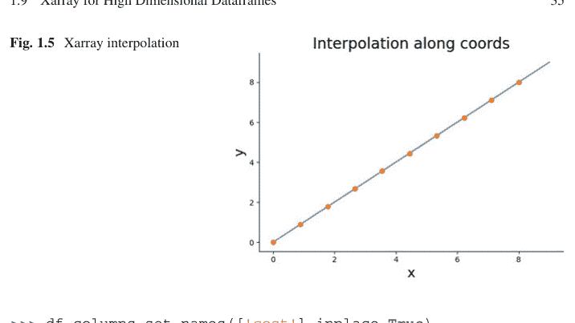

```
>>> df.columns.set_names(['cost'],inplace=True)
>>> df
cost            BP  CP
type measure
A    normal    786  89
     high      207  25
B    normal    819  67
     high      176  22
```

注意，我们必须单独添加层级的名称。这正是 Xarray 的 coords 字典变得明确且非常有用的地方。如果我们想使用 Pandas 按 type 索引求和：

```
>>> df.groupby(level=1,axis=0).sum() # 需要 groupby
cost        BP   CP
measure
high       383   47
normal    1605  156
```

尽管你可以使用构造函数将这个 Pandas 数据框转换为 DataArray，但它不能正确地识别多索引。让我们考虑使用 Xarray 从头开始构建 DataArray 对象的相同数据：

```
>>> data = np.array([[786,89],
...                   [207,25],
...                   [819,67],
...                   [176,22]])

>>> d = xr.DataArray(data.reshape((2,2,2)),
        coords=dict(type=['A','B'],measure=['normal','high'],
        cost=['BP','CP']))
>>> d
<xarray.DataArray (type: 2, measure: 2, cost: 2)>
array([[[786,  89],
        [207,  25]],
       [[819,  67],
        [176,  22]]])
Coordinates:
  * type     (type) <U1 'A' 'B'
  * measure  (measure) <U6 'normal' 'high'
  * cost     (cost) <U2 'BP' 'CP'
```

```
>>> d.sel(type='A', measure='high')
<xarray.DataArray (cost: 2)>
array([207, 25])
Coordinates:
    type     <U1 'A'
    measure  <U6 'high'
  * cost     (cost) <U2 'BP' 'CP'
```

```
>>> d.loc[:,'high','CP'] # 使用坐标进行切片
<xarray.DataArray (type: 2)>
array([25, 22])
Coordinates:
  * type     (type) <U1 'A' 'B'
    measure  <U6 'high'
    cost     <U2 'CP'
```

这与之前使用 Pandas 的求和相同，但不需要 groupby：

```
>>> d.sum('type').values # 不需要像 Pandas 那样使用 groupby
array([[1605, 156],
       [ 383,  47]])
```

类似地，对多个维度的求和遵循相同的模式：

```
>>> d.sum(['type','measure'])
<xarray.DataArray (cost: 2)>
array([1988, 203])
Coordinates:
  * cost     (cost) <U2 'BP' 'CP'
```

然而，在 Pandas 中执行此操作需要复杂且难以阅读的分组和求和。

```
>>> df.groupby(level=1).sum().sum(axis=0) # 在 Pandas 中远没有这么清晰
cost
BP 1988
CP 203
dtype: int64
```

要按部分和进行归一化，Xarray 会自动处理广播和对齐：

```
>>> d/d.sum(['type','measure'])
<xarray.DataArray (type: 2, measure: 2, cost: 2)>
array([[[0.39537223, 0.43842365],
```

### 基础计算

内置方法简化了诸如*均值*之类的常见计算：

```
>>> d.mean('type')
<xarray.DataArray (measure: 2, cost: 2)>
array([[802.5,  78. ],
       [191.5,  23.5]])
Coordinates:
 * measure   (measure) <U6 'normal' 'high'
 * cost      (cost) <U2 'BP' 'CP'
```

以及*方差*：

```
>>> d.var('type')
<xarray.DataArray (measure: 2, cost: 2)>
array([[272.25, 121.  ],
       [240.25,   2.25]])
Coordinates:
 * measure   (measure) <U6 'normal' 'high'
 * cost      (cost) <U2 'BP' 'CP'

>>> d.mean(['type','cost'])
<xarray.DataArray (measure: 2)>
array([440.25, 107.5 ])
Coordinates:
 * measure   (measure) <U6 'normal' 'high'
```

在 Pandas 中进行相同的计算则要难读得多：

```
>>> df.groupby(level=1).mean().mean(axis=1)
measure
high      107.50
normal    440.25
dtype: float64
```

### 分组

Xarray 的分组操作能很好地保持维度的组织性，其工作方式与 Pandas 的分组操作大体相同：

```
>>> d.groupby('type').sum('cost')
<xarray.DataArray (type: 2, measure: 2)>
array([[875, 232],
       [886, 198]])
Coordinates:
  * type     (type) <U1 'A' 'B'
  * measure  (measure) <U6 'normal' 'high'
```

请注意，Xarray 确实会像 Pandas 那样执行产生 MultiIndex 的多组分组。不过，Xarray 支持通过 Pandas MultiIndex 进行索引，但这与分组聚合是另一个独立的问题。

### 数据集

数据集（Dataset）包含多个共享相同坐标的 DataArray 对象。粗略类比 Pandas，DataArray 之于 Dataset，就如同 Pandas Series 之于 DataFrame。让我们从一些随机数据开始：

```
>>> price = np.random.rand(2,3,4)
>>> cost = np.random.rand(2,3,4)*10
```

Dataset 构造函数有更多选项，但这些是基础。请注意，price 和 cost 数组具有相同的大小，并且维度的名称在元组中指定。由于这两个数组具有相同的维度，它们可以拥有相同的坐标，如下所示：

```
>>> ds = xr.Dataset({'price': (['region', 'dates', 'store'],
...                            price),
...                   'cost' : (['region', 'dates', 'store'],
...                            cost),
...                   },
...                  coords = {'region': ['usa','can'],
...                            'dates' :
...                                pd.date_range("2020-01-01", periods=3),
...                            'store' : ['a','b','c','d'],
...                            })

>>> ds
<xarray.Dataset>
Dimensions:  (region: 2, dates: 3, store: 4)
Coordinates:
  * region   (region) <U3 'usa' 'can'
  * dates    (dates) datetime64[ns] 2020-01-01 2020-01-02 2020-01-03
  * store    (store) <U1 'a' 'b' 'c' 'd'
Data variables:
    price    (region, dates, store) float64 0.1461 0.8069 ... 0.07674 0.6562
    cost     (region, dates, store) float64 1.753 4.63 0.9176 ... 9.136 6.856
```

嵌入在 Dataset 中的各个“DataArray”可以通过属性或键来引用：

```
>>> ds.price - ds['cost']
<xarray.DataArray (region: 2, dates: 3, store: 4)>
array([[[-1.6072773 , -3.82336401, -0.18647072, -0.21047595],
        [-0.93422365, -1.33608059, -4.23803009, -1.06452868],
        [-0.26095129, -0.95536878, -0.51543561, -4.54364682]],

       [[-8.51404155, -5.9075424 , -1.61412181, -3.40844964],
        [-8.41904718, -6.93693035, -0.87115019, -3.29709936],
        [-3.59088224, -4.84586913, -9.05939489, -6.20019101]]])
Coordinates:
  * region   (region) <U3 'usa' 'can'
  * dates    (dates) datetime64[ns] 2020-01-01 2020-01-02 2020-01-03
  * store    (store) <U1 'a' 'b' 'c' 'd'
```

与 Pandas DataFrame 类似，可以使用 `drop_vars` 删除变量，这会创建一个新的 Dataset 对象。

```
>>> ds.drop_vars('price')
<xarray.Dataset>
Dimensions:  (region: 2, dates: 3, store: 4)
Coordinates:
  * region   (region) <U3 'usa' 'can'
  * dates    (dates) datetime64[ns] 2020-01-01 2020-01-02 2020-01-03
  * store    (store) <U1 'a' 'b' 'c' 'd'
Data variables:
    cost     (region, dates, store) float64 1.753 4.63 0.9176 ... 9.136 6.856
```

有一个 `assign` 函数可以在新的 Dataset 中创建新变量：

```
>>> ds.assign(profit = ds.price - ds.cost)
<xarray.Dataset>
Dimensions:  (region: 2, dates: 3, store: 4)
Coordinates:
  * region   (region) <U3 'usa' 'can'
  * dates    (dates) datetime64[ns] 2020-01-01 2020-01-02 2020-01-03
  * store    (store) <U1 'a' 'b' 'c' 'd'
Data variables:
    price    (region, dates, store) float64 0.1461 0.8069 ... 0.07674 0.6562
    cost     (region, dates, store) float64 1.753 4.63 0.9176 ... 9.136 6.856
    profit   (region, dates, store) float64 -1.607 -3.823 ... -9.059 -6.2
```

与 Pandas 类似，函数也可以用于 `assign`：

```
>>> ds.assign(profit = lambda i: (i.price-i.cost))
<xarray.Dataset>
Dimensions:  (region: 2, dates: 3, store: 4)
Coordinates:
  * region   (region) <U3 'usa' 'can'
  * dates    (dates) datetime64[ns] 2020-01-01 2020-01-02 2020-01-03
  * store    (store) <U1 'a' 'b' 'c' 'd'
Data variables:
    price    (region, dates, store) float64 0.1461 0.8069 ... 0.07674 0.6562
    cost     (region, dates, store) float64 1.753 4.63 0.9176 ... 9.136 6.856
    profit   (region, dates, store) float64 -1.607 -3.823 ... -9.059 -6.2
```

```
>>> ds.drop_dims('region') # 维度可以被删除
<xarray.Dataset>
Dimensions:  (dates: 3, store: 4)
Coordinates:
  * dates    (dates) datetime64[ns] 2020-01-01 2020-01-02 2020-01-03
  * store    (store) <U1 'a' 'b' 'c' 'd'
Data variables:
    *empty*
```

对于 Dataset，除非你提供 `...` 项（表示你希望对所有剩余维度求和），否则 groupby 可能无法按预期工作。

```
>>> ds.groupby('region').sum(...)
<xarray.Dataset>
Dimensions:  (region: 2)
Coordinates:
  * region   (region) object 'can' 'usa'
Data variables:
    price    (region) float64 6.266 4.682
    cost     (region) float64 68.93 24.36
```

如果你想对 dates 变量求和，则可以在聚合函数 `sum` 中指定它：

```
>>> ds.groupby('region').sum('dates')
<xarray.Dataset>
Dimensions:  (region: 2, store: 4)
Coordinates:
  * region   (region) <U3 'usa' 'can'
  * store    (store) <U1 'a' 'b' 'c' 'd'
Data variables:
    price    (region, store) float64 1.015 1.345 0.9973 ... 2.032 1.459 1.335
    cost     (region, store) float64 3.818 7.46 5.937 7.143 ... 19.72 13.0 14.24
```

Xarray 功能极其强大，是处理高维数据立方体的正确解决方案。我们这里只是浅尝辄止，Xarray 通过 `align` 方法在数据对齐和类似数据库的操作（例如 Pandas merge）方面还能做更多。Xarray 主网站上有更多优秀的文档可供参考。

## 1.10 与编译库的接口

正如我们所讨论的，用于科学计算的 Python 实际上是由粘合用 C 或 Fortran 等编译语言编写的不同科学库组成的。最终，你可能希望使用现有 Python 绑定中不可用的库。实现这一点有很多很多选择。最直接的方法是使用内置的 `ctypes` 模块，该模块提供了为库函数提供输入/输出指针的工具，就像你从编译语言调用它们一样。这意味着你必须*精确*知道库中的函数签名——每个输入需要多少字节，输出需要多少字节。你需要按照库期望的方式精确构建输入，并收集产生的输出。尽管这看起来很繁琐，但许多库的 Python 绑定就是这样构建的。

如果你想要更简单的方法，那么 `SWIG` 是一个自动包装生成工具，可以提供对多种语言的绑定，而不仅仅是 Python；因此，如果你需要多种语言的绑定，那么这是你最好也是唯一的选择。使用 `SWIG` 包括编写一个接口文件，以便编译后的 Python 动态链接库（`.pyd` 文件）可以轻松导入到 Python 解释器中。像 Trilinos（桑迪亚国家实验室）这样庞大而复杂的库已经通过 `SWIG` 与 Python 接口，因此它是一个经过充分测试的选项。`SWIG` 也支持 Numpy 数组。

然而，`SWIG` 模型假设你希望主要继续使用 C/Fortran 开发，而你接入 Python 是出于可用性或其他原因。另一方面，如果你开始在 Python 中开发算法，然后想要加速它们，那么 `Cython` 是一个极好的选择，因为它提供了一种混合语言，允许你将 C 语言和 Python 代码混合在一起。与 `SWIG` 类似，你必须用这种混合的 Python/C 方言编写额外的文件，以便 `Cython` 生成你最终要编译的 C 代码。`Cython` 最棒的部分是其分析器，它可以生成 HTML 报告，显示代码在哪里运行缓慢，以及从翻译成 `Cython` 中受益。Jupyter Notebook 通过其 `%cython` 魔术命令与 `Cython` 集成得很好。这意味着你可以在 Jupyter Notebook 的一个单元格中编写 `Cython` 代码，而 notebook 会处理所有繁琐的细节，比如设置实际编译 `Cython` 扩展所需的中间文件。`Cython` 也支持 Numpy 数组。

`Cython` 和 `SWIG` 只是为你喜爱的编译库创建 Python 绑定的两种方式。其他值得注意的（但不太流行的）选项包括 `FWrap`、`f2py`、`CFFI` 和 `weave`。也可以直接使用 Python 自身的 API，但考虑到存在这么多成熟的替代方案，这是一项繁琐且难以证明合理的工作。

## 1.11 集成开发环境

对于偏好集成开发环境（IDE）的用户，有很多选择。其中功能最全面的是 Enthought Canopy，它包含一个语法高亮丰富的编辑器、集成帮助、调试器，甚至还有集成培训。如果你已经从其他项目中熟悉了 Eclipse，或者进行混合语言编程，那么有一个名为 PyDev 的 Python 插件，它包含了 Eclipse 的所有常用功能，并带有 Python 调试器。Wingware 提供了一个价格合理的专业级 IDE，支持多项目管理，并具有异常精准的代码补全功能，即使在调试模式下也能工作。另一个受欢迎的选择是 PyCharm，它同样支持多种语言，并且在 Python Web 开发者中特别流行，因为它为 Django 等流行的 Web 框架提供了强大的模板。Visual Studio Code 凭借其漂亮的界面和插件生态系统，迅速在 Python 新手中赢得了大量追随者。如果你是 VIM 用户，那么 Jedi 插件提供了出色的代码补全功能，与 pylint 配合良好，后者提供静态代码分析（即识别缺失的模块和拼写错误）。当然，emacs 也有许多用于 Python 开发的相关插件。请注意，还有许多其他选项，但我试图强调那些最适合 Python 初学者的。

## 1.12 性能与并行编程快速指南

有许多方法可以提高 Python 代码的性能。首先要确定的是什么限制了你的计算。可能是 CPU 速度（不太可能）、内存限制（核外计算），或者数据传输速度（等待数据到达进行处理）。如果你的代码是纯 Python 的，那么你可以尝试使用 Pypy 运行它，Pypy 是一种采用即时编译器的替代 Python 实现。如果你的代码在 Pypy 下没有获得巨大的速度提升，那么很可能是代码外部的因素在拖慢它（例如，磁盘访问或网络访问）。如果 Pypy 没有意义，因为你使用了许多 Pypy 不支持的编译模块，那么有许多诊断工具可用。

Python 有一个内置的分析器 cProfile，你可以从命令行调用，如下所示：

```
Terminal> python -m cProfile -o program.prof my_program.py
```

分析器的输出保存到 program.prof 文件中。这个文件可以在 runsnakerun 中可视化，以获得代码耗时分布的清晰图形。你操作系统上的任务管理器也可以在程序运行时提供线索，查看其资源消耗情况。Robert Kern 的 line_profiler 提供了一种极好的方式，通过为每行代码标注计时来查看代码的耗时情况。结合 `runsnakerun`，这可以将问题从函数级别缩小到行级别。

最常见的情况是你的程序在等待来自磁盘或某个繁忙网络资源的数据。这是 Web 编程中的常见情况，有许多成熟的工具可以处理。Python 有一个 `multiprocessing` 模块，它是标准库的一部分。这使得生成子工作进程变得容易，这些进程可以分离出来并单独处理大型任务的小部分。然而，作为程序员，你仍然有责任弄清楚如何为你的算法分配数据。使用此模块意味着各个进程将由操作系统管理，操作系统负责负载均衡。

使用 `multiprocessing` 的基本模板如下：

```
### filename multiprocessing_demo.py
import multiprocessing
import time
def worker(k):
    'worker function'
    print('am starting process %d' % (k))
    time.sleep(10) # wait ten seconds
    print('am done waiting!')
    return

if __name__ == '__main__':
    for i in range(10):
        p = multiprocessing.Process(target=worker, args=(i,))
        p.start()
```

然后，你在终端运行此程序，如下所示：

```
Terminal> python multiprocessing_demo.py
```

至关重要的是，你必须以这种方式从终端运行程序。无法在 Jupyter 等环境中交互式地执行此操作。如果你查看操作系统上的进程管理器，你应该会看到一些新的 Python 进程闲置了 10 秒。你还应该看到上面 `print` 语句的输出。当然，在实际应用中，你需要为每个工作者分配一些有意义的工作，并弄清楚如何在各个工作者之间发送部分完成的任务。这样做很复杂且容易出错，因此 Python 3 提供了有用的 `concurrent.futures`。

```
### filename: concurrent_demo.py
from concurrent import futures
import time

def worker(k):
    'worker function'
    print ('am starting process %d' % (k))
    time.sleep(10) # wait ten seconds
    print ('am done waiting!')
    return

def main():
    with futures.ProcessPoolExecutor(max_workers=3) as executor:
        list(executor.map(worker, range(10)))

if __name__ == '__main__':
    main()
```

```
Terminal> python concurrent_demo.py
```

你应该在终端中看到类似以下的内容。请注意，我们明确将进程数限制为三个。

```
am starting process 0
am starting process 1
am starting process 2
am done waiting!
am done waiting!
...
```

`futures` 模块构建在 `multiprocessing` 之上，使得这类简单任务更容易使用。两者都有使用线程而非进程的版本，同时保持相同的使用模式。线程和进程之间的主要区别在于进程拥有自己独立的资源。C 语言实现的 Python（即 CPython）使用全局解释器锁（GIL），防止线程争夺内部数据结构。这是一种粗粒度的锁定机制，单个线程可能运行得更快，因为它不必跟踪同时运行多个线程所涉及的所有簿记工作。缺点是你无法同时运行多个线程来加速某些任务。

进程不存在相应的争用问题，但它们启动起来稍慢，因为每个进程必须为可能在它们之间传输的数据结构创建自己的私有工作空间。然而，一旦设置完成，每个进程当然可以独立且同时运行。某些 Python 的替代实现，如 IronPython，使用更细粒度的线程设计而不是 GIL 方法。最后一点，在具有多个核心的现代系统上，多个线程实际上可能会减慢速度，因为操作系统可能不得不在不同的核心之间切换线程。这在线程切换机制中产生了额外的开销，最终会减慢速度。

Jupyter 本身内置了一个并行编程框架（`ipyparallel`），它既强大又易于使用。第一步是在终端启动单独的 Jupyter 引擎，如下所示：

```
Terminal> ipcluster start --n=4
```

然后，在 Jupyter 窗口中，你可以获取客户端：

```
In [1]: from ipyparallel import Client
   ...: rc = Client()
```

客户端连接到我们之前使用 ipcluster 启动的每个进程。要使用所有引擎，我们从客户端分配 DirectView 对象，如下所示：

```
In [2]: dview = rc[:]
```

现在，我们可以为每个引擎应用函数。例如，我们可以使用 os.getpid 函数获取进程标识符：

```
In [3]: import os
In [4]: dview.apply_sync(os.getpid)
Out[4]: [6824, 4752, 8836, 3124]
```

一旦引擎启动并运行，就可以使用 scatter 将数据分发给它们：

```
In [5]: dview.scatter('a',range(10))
Out[5]: <AsyncResult: finished>
In [6]: dview.execute('print(a)').display_outputs()
[stdout:0] [0, 1, 2]
[stdout:1] [3, 4, 5]
[stdout:2] [6, 7]
[stdout:3] [8, 9]
```

execute 方法在每个引擎中评估给定的字符串。现在数据已经分散到活动的引擎中，我们可以对它们进行进一步的计算：

```
In [7]: dview.execute('b=sum(a)')
Out[7]: <AsyncResult: finished>
In [8]: dview.execute('print(b)').display_outputs()
[stdout:0] 3
[stdout:1] 12
[stdout:2] 13
[stdout:3] 17
```

在这个例子中，我们将每个引擎上可用的各个 a 子列表相加。我们可以将各个结果收集到一个列表中，如下所示：

```
In [9]: dview.gather('b').result
Out[9]: [3, 12, 13, 17]
```

这是将工作分配给各个引擎并收集结果的最简单机制之一。与我们讨论的其他方法不同，你可以迭代地执行此操作，这使得尝试如何分配和计算数据变得容易。Jupyter 文档中有更多并行编程风格的示例，包括在云资源、超级计算机集群和跨不同网络计算资源上运行引擎。尽管还有许多其他专门的并行编程包，但 Jupyter 在所有主要平台上提供了通用性与复杂性之间的最佳平衡。

## 1.13 其他资源

Python 社区充满了超级聪明且乐于助人的人。获取科学 Python 帮助的最佳场所之一是 www.stackoverflow.com 网站，它托管了一个竞争性的问答论坛，尤其欢迎 Python 新手。几位核心 Python 开发者经常在那里参与，回答质量非常高。任何核心工具（例如，Numpy、Jupyter、Matplotlib）的邮件列表也非常适合跟踪最新进展。Hans Petter Langtangen [23] 撰写的任何内容都非常出色，特别是如果你有物理学背景的话。每年在奥斯汀举行的科学 Python 会议也是一个很好的机会，可以亲自见到你最喜欢的开发者、提问，并参与围绕小众主题组织的许多有趣小组。PyData 研讨会是一个半年度会议，专注于用于大规模数据密集型处理的 Python。此外，如果你喜欢本章的讲解水平，[44] 可能会有所帮助。

# 第2章
概率


## 2.1 引言

本章从几何视角看待概率论，并将其与线性代数和几何中的熟悉概念联系起来。这种方法将你天生的几何直觉与概率中的关键抽象概念联系起来，这些抽象概念可以指导你的推理。这在概率中尤为重要，因为很容易被误导。我们需要一点严谨性和一些直觉来引导我们。

在小学时，你接触了自然数（即 1, 2, 3, ...），并学会了如何通过加法、减法和乘法等运算来操作它们。后来，你接触了正数和负数，并再次学习了如何操作它们。最终，你接触了实数线的微积分，并学会了如何求导、取极限等等。这一进程不仅提供了更多的抽象概念，而且扩大了你可以成功解决的问题领域。概率也是如此。思考概率的一种方式是将其视为一种新的数字概念，它允许你解决那些内含特殊*不确定性*的问题。因此，关键思想是存在某个数字，比如 *x*，有一个旅伴，比如 *f(x)*，这个旅伴代表了关于 *x* 值的不确定性，就像透过一扇磨砂窗户看数字 *x*。窗户的不透明度由 *f(x)* 表示。如果我们想操作 *x*，那么我们必须弄清楚如何处理 *f(x)*。例如，如果我们想要 *y = 2x*，那么我们必须理解 *f(x)* 如何生成 *f(y)*。

*随机*部分在哪里？为了概念化这一点，我们需要另一个类比：想象一个蜂巢，周围的蜂群代表 *f(x)*，而蜂巢本身（你几乎无法透过蜂群看到）代表 *x*。随机的部分是你不知道*哪只*蜜蜂会蜇你！一旦发生，不确定性就消失了。在那之前，我们所拥有的只是一个蜂群（即蜜蜂密度）的概念，它代表了最终哪只蜜蜂会蜇人的*可能性*。总之，思考概率的一种方式是将其视为一种进行数学推理（例如，加法、减法、取极限）的方法，其中包含一种可能性概念，这种概念通过这些运算而被如此转化。

### 2.1.1 理解概率密度

为了理解现代概率的核心——它建立在勒贝格积分理论之上——我们需要将积分的概念从基础微积分扩展。首先，让我们考虑以下分段函数：

$$f(x) = \begin{cases} \frac{1}{2} & \text{if } 0 < x \leq \frac{1}{4} \\ \frac{7}{6} & \text{if } \frac{1}{4} < x \leq 1 \\ 0 & \text{otherwise} \end{cases}$$

如图 2.1 所示。在微积分中，你学习了黎曼积分，可以将其应用于此：

$$\int_{0}^{1} f(x)dx = \frac{1}{8} + \frac{21}{24} = 1$$

这通常被解释为构成 $f(x)$ 的两个矩形的面积。到目前为止，一切顺利。

对于勒贝格积分，思想非常相似，只是我们关注的是 y 轴，而不是沿着 x 轴移动。问题是给定 $f(x) = \frac{1}{2}$；哪些 $x$ 值的集合使得这个等式成立？对于我们的例子，当 $x \in (0, \frac{1}{4}]$ 时成立。所以现在，我们有了函数值（即 1/2 和 7/6）与使得该等式成立的 $x$ 值集合之间的对应关系，即 $\{(0, \frac{1}{4}]\}$ 和 $\{(\frac{1}{4}, 1]\}$。为了计算积分，我们只需取函数值（即 1/2, 7/6）和某种测量相应区间大小的方法（即 $\mu$），如下所示：

$$\int_0^1 f d\mu = \frac{1}{2}\mu(\{(0, \frac{1}{4}]\}) + \frac{7}{6}\mu(\{(\frac{1}{4}, 1]\})$$

我们上面省略了一些符号以强调一般性。注意，当 $\mu((0, \frac{1}{4}]) = \frac{1}{4}$ 且 $\mu((\frac{1}{4}, 1]) = \frac{3}{4}$ 时，我们得到的积分值与黎曼情况相同。通过引入 $\mu$ 函数作为测量上述区间的方法，我们在积分中引入了另一个自由度。这适用于许多使用通常的黎曼理论难以处理的奇怪函数，但关于勒贝格积分的进一步学习，我们建议你参考合适的入门教材 [19]。尽管如此，上述讨论的关键步骤是引入了 $\mu$ 函数，我们稍后会再次遇到它，即所谓的概率密度函数。

### 2.1.2 随机变量

大多数概率入门课程直接跳到*随机变量*，然后解释如何计算复杂的积分。这种方法的问题在于它跳过了一些我们现在要考虑的重要微妙之处。不幸的是，*随机变量*这个术语描述性不强。一个更好的术语是*可测函数*。为了理解为什么这是一个更好的术语，我们必须通过一个简单的例子深入探讨概率的形式化构建。

考虑掷一个公平的六面骰子。只有六种可能的结果，

$$\Omega = \{1, 2, 3, 4, 5, 6\}$$

我们知道，如果骰子是公平的，那么每个结果的概率是 1/6。正式地说，每个集合（即 $\{1\}, \{2\}, \dots, \{6\}$）的测度是 $\mu(\{1\}) = \mu(\{2\}) \dots = \mu(\{6\}) = 1/6$。在这种情况下，我们之前讨论的 $\mu$ 函数就是通常的*概率质量函数*，用 $\mathbb{P}$ 表示。可测函数将一个集合映射到实数线上的一个数字。例如，$\{1\} \mapsto 1$ 就是这样一个函数。

现在，事情变得有趣了。假设你被要求用这个公平的骰子构造一个公平的硬币。换句话说，我们想掷骰子，然后记录结果，就好像我们刚刚抛了一枚公平的硬币。我们该怎么做？一种方法是定义一个可测函数，它说如果骰子出现 3 或更小，那么我们宣布*正面*，否则宣布*反面*。这背后有一些强烈的直觉，但让我们用形式化理论来阐述它。这个策略创建了两个不同的不重叠集合 $\{1, 2, 3\}$ 和 $\{4, 5, 6\}$。每个集合具有相同的概率*测度*，

$\mathbb{P}(\{1, 2, 3\}) = 1/2$
$\mathbb{P}(\{4, 5, 6\}) = 1/2$

问题就解决了。每次骰子出现 $\{1, 2, 3\}$ 时，我们记录正面，否则记录反面。

这是用公平骰子构造公平硬币实验的唯一方法吗？或者，我们可以将集合定义为 $\{1\}$、$\{2\}$、$\{3, 4, 5, 6\}$。如果我们为每个集合定义相应的测度如下：

$\mathbb{P}(\{1\}) = 1/2$
$\mathbb{P}(\{2\}) = 1/2$
$\mathbb{P}(\{3, 4, 5, 6\}) = 0$

那么，我们就有了公平硬币问题的另一个解决方案。要实现这一点，我们只需在每次骰子显示 $3, 4, 5, 6$ 时忽略它并重新投掷。这是浪费的，但它解决了问题。尽管如此，我们希望你能看到理论的各个相互关联的部分如何提供了一个框架，将不确定性/可能性的概念从一个问题带到下一个问题（例如，从公平骰子到公平硬币）。

让我们考虑一个稍微有趣一点的问题，我们掷两个骰子。我们假设每次投掷是*独立的*，这意味着一个的结果不影响另一个。在这种情况下，集合是什么？它们是两次投掷所有可能结果的配对，如下所示，

$\Omega = \{(1, 1), (1, 2), \ldots, (5, 6), (6, 6)\}$

这些集合的测度是多少？根据独立性声明，每个集合的测度是其每个元素各自测度的乘积。例如，

$\mathbb{P}((1, 2)) = \mathbb{P}(\{1\})\mathbb{P}(\{2\}) = \frac{1}{6^2}$

所有这些都确定后，我们可以问以下问题：骰子之和等于七的概率是多少？像以前一样，首先要做的就是将此的可测函数描述为 $X : (a, b) \mapsto (a + b)$。接下来，我们将所有 $(a, b)$ 配对与其和关联起来。我们可以为此创建一个 Python 字典，如下所示，

```python
>>> d={(i,j):i+j for i in range(1,7) for j in range(1,7)}
```

下一步是收集所有和为 2 到 12 每个可能值的 $(a, b)$ 配对。

```python
>>> from collections import defaultdict
>>> dinv = defaultdict(list)
>>> for i,j in d.items():
...     dinv[j].append(i)
...
```

### 编程提示

内置 `collections` 模块中的 `defaultdict` 对象在遇到新键时，会创建具有默认值的字典。否则，我们就必须为普通字典手动创建默认值。

例如，`dinv[7]` 包含以下和为七的数对列表：

```
>>> dinv[7]
[(1, 6), (2, 5), (3, 4), (4, 3), (5, 2), (6, 1)]
```

下一步是计算为每个项目测量的概率。使用独立性假设，这意味着我们必须计算 `dinv` 中各个项目概率的乘积之和。因为我们知道每个结果的可能性是相等的，所以和中每一项的概率都等于 1/36。因此，我们只需要计算 `dinv` 中每个键对应列表中的项目数量，然后除以 36。例如，`dinv[11]` 包含 `[(5, 6), (6, 5)]`。5+6=6+5=11 的概率就是这个集合的概率，它由各个元素 `{(5, 6), (6, 5)}` 的概率之和组成。在这种情况下，我们有 P(11) = P({(5, 6)}) + P({(6, 5)}) = 1/36 + 1/36 = 2/36。对所有元素重复此过程，我们推导出如下所示的概率质量函数：

```
>>> X={i:len(j)/36. for i,j in dinv.items()}
>>> print(X)
{2: 0.027777777777777776, 3: 0.05555555555555555,
4: 0.08333333333333333, 5: 0.1111111111111111,
6: 0.1388888888888889, 7: 0.16666666666666666,
8: 0.1388888888888889, 9: 0.1111111111111111,
10: 0.08333333333333333, 11: 0.05555555555555555,
12: 0.027777777777777776}
```

### 编程提示

在前面的代码中，请注意 `36.` 是用尾随小数点书写的。这是一个值得养成的好习惯，因为在 Python 2.x 和 Python 3.x 之间，默认的除法操作发生了变化。在 Python 2.x 中，默认是整数除法，而在 Python 3.x 中是浮点数除法。

上面的例子揭示了这个简单问题中涉及的概率论元素，同时有意省略了一些繁琐的技术细节。有了这个框架，我们可以提出其他问题，例如：三个骰子乘积的一半超过它们总和的概率是多少？我们可以使用与下面相同的方法来解决这个问题。首先，让我们创建第一个映射：

```
>>> d={(i,j,k): ((i*j*k)/2>i+j+k) for i in range(1,7)
...                                        for j in range(1,7)
...                                        for k in range(1,7)}
```

这个字典的键是三元组，值是三个骰子乘积的一半是否超过它们总和的逻辑值。现在，我们进行逆映射以收集相应的列表：

```
>>> dinv = defaultdict(list)
>>> for i,j in d.items():
...    dinv[j].append(i)
...
```

请注意，`dinv` 只包含两个键：`True` 和 `False`。同样，因为骰子是独立的，任何三元组的概率都是 1/6^3。最后，我们为每个结果收集如下：

```
>>> X={i:len(j)/6.0**3 for i,j in dinv.items()}
>>> print(X)
{False: 0.37037037037037035, True: 0.6296296296296297}
```

因此，三个骰子乘积的一半超过它们总和的概率是 136/(6.0**3) = 0.63。由随机变量诱导的集合中只有两个元素：`True` 和 `False`，其中 P(True) = 136/216，P(False) = 1 - 136/216。

作为最后一个例子，为了练习另一层通用性，让我们考虑两个骰子的第一个问题，我们想要得到七的概率，但这次其中一个骰子不再是公平的。不公平骰子的分布如下：

P({1}) = P({2}) = P({3}) = 1/9
P({4}) = P({5}) = P({6}) = 2/9

根据我们之前的工作，我们知道和为七对应的元素如下：

{(1, 6), (2, 5), (3, 4), (4, 3), (5, 2), (6, 1)}

因为我们仍然有独立性假设，我们只需要改变每个元素的概率计算。例如，假设第一个骰子是不公平的，我们有

P((1, 6)) = P(1)P(6) = 1/9 * 1/6

同样，对于 (2, 5)，我们有：

P((2, 5)) = P(2)P(5) = 1/9 * 1/6

以此类推。将所有这些相加得到：

$$\mathbb{P}_X(7) = \frac{1}{9} \times \frac{1}{6} + \frac{1}{9} \times \frac{1}{6} + \frac{1}{9} \times \frac{1}{6} + \frac{2}{9} \times \frac{1}{6} + \frac{2}{9} \times \frac{1}{6} + \frac{2}{9} \times \frac{1}{6} = \frac{1}{6}$$

让我们尝试使用 Pandas 而不是 Python 字典来计算这个。首先，我们构建一个 DataFrame 对象，其索引是由所有可能骰子结果对组成的元组。

```
>>> from pandas import DataFrame
>>> d=DataFrame(index=[(i,j) for i in range(1,7) for j in range(1,7)],
...             columns=['sm','d1','d2','pd1','pd2','p'])
```

现在，我们可以填充上面设置的列，其中第一个骰子的结果是 `d1` 列，第二个骰子的结果是 `d2` 列：

```
>>> d.d1=[i[0] for i in d.index]
>>> d.d2=[i[1] for i in d.index]
```

接下来，我们在 `sm` 列中计算骰子的总和：

```
>>> d.sm=list(map(sum,d.index))
```

确定后，DataFrame 现在如下所示：

```
>>> d.head(5) # 显示前五行
      sm  d1  d2  pd1  pd2    p
(1, 1)  2   1   1  NaN  NaN  NaN
(1, 2)  3   1   2  NaN  NaN  NaN
(1, 3)  4   1   3  NaN  NaN  NaN
(1, 4)  5   1   4  NaN  NaN  NaN
(1, 5)  6   1   5  NaN  NaN  NaN
```

接下来，我们填充不公平骰子 (`d1`) 和公平骰子 (`d2`) 每个面的概率：

```
>>> d.loc[d.d1<=3,'pd1']=1/9.
>>> d.loc[d.d1 > 3,'pd1']=2/9.
>>> d.pd2=1/6.
>>> d.head(10)
      sm  d1  d2       pd1       pd2    p
(1, 1)  2   1   1  0.111111  0.166667  NaN
(1, 2)  3   1   2  0.111111  0.166667  NaN
(1, 3)  4   1   3  0.111111  0.166667  NaN
(1, 4)  5   1   4  0.111111  0.166667  NaN
(1, 5)  6   1   5  0.111111  0.166667  NaN
(1, 6)  7   1   6  0.111111  0.166667  NaN
(2, 1)  3   2   1  0.111111  0.166667  NaN
(2, 2)  4   2   2  0.111111  0.166667  NaN
(2, 3)  5   2   3  0.111111  0.166667  NaN
(2, 4)  6   2   4  0.111111  0.166667  NaN
```

最后，我们可以计算所示面值总和的联合概率如下：

```
>>> d.p = d.pd1 * d.pd2
>>> d.head(5)
      sm  d1  d2       pd1       pd2         p
(1, 1)  2   1   1  0.111111  0.166667  0.018519
(1, 2)  3   1   2  0.111111  0.166667  0.018519
(1, 3)  4   1   3  0.111111  0.166667  0.018519
(1, 4)  5   1   4  0.111111  0.166667  0.018519
(1, 5)  6   1   5  0.111111  0.166667  0.018519
```

确定所有这些后，我们可以通过使用 `groupby` 来计算所有骰子结果的密度，如下所示：

```
>>> d.groupby('sm')['p'].sum()
sm
2     0.018519
3     0.037037
4     0.055556
5     0.092593
6     0.129630
7     0.166667
8     0.148148
9     0.129630
10    0.111111
11    0.074074
12    0.037037
Name: p, dtype: object
```

这些例子展示了概率论如何分解集合及其测量，以及如何将这些结合起来为新的随机变量开发概率质量函数。

### 2.1.3 连续随机变量

同样的思想也适用于连续变量，但管理集合变得更加棘手，因为实数线与离散集合不同，它已经内置了许多必须小心处理的极限性质。尽管如此，让我们从一个应该说明类似思想的例子开始。假设随机变量 $X$ 在单位区间上均匀分布。该变量取值小于 1/2 的概率是多少？

为了在离散情况的基础上建立直觉，让我们回到使用公平骰子的掷骰子实验。骰子值的总和是一个可测函数：

$Y : \{1, 2, \dots, 6\}^2 \mapsto \{2, 3, \dots, 12\}$

也就是说，$Y$ 是从集合的笛卡尔积到离散结果集的映射。为了计算结果集合的概率，我们需要从每个骰子的相应概率度量中推导出 $Y$ 的概率度量 $\mathbb{P}_Y$。我们之前的讨论已经完成了这个机制。这意味着$\mathbb{P}_Y : \{2, 3, \ldots, 12\} \mapsto [0, 1]$

请注意，函数定义与函数目标项的概率度量之间存在分离。更直白地说，

$Y : A \mapsto B$

其中

$\mathbb{P}_Y : B \mapsto [0, 1]$

因此，要计算源自其他随机变量的 $\mathbb{P}_Y$，我们必须用其源集 $A$ 来表示 $B$ 中的等价类。

连续变量的情况遵循相同的模式，但涉及更多我们即将跳过的深层技术细节。对于连续情况，随机变量现在是

$X : \mathbb{R} \mapsto \mathbb{R}$

对应概率测度为

$\mathbb{P}_X : \mathbb{R} \mapsto [0, 1]$

但这里的对应集合是什么？技术上讲，这些是 *Borel* 集，但我们可以将它们简单地视为区间。回到我们的问题，一个在单位区间上均匀分布的随机变量取值小于 1/2 的概率是多少？根据这个框架重新表述这个问题，我们有：

$X : [0, 1] \mapsto [0, 1]$

对应

$\mathbb{P}_X : [0, 1] \mapsto [0, 1]$

要回答这个问题，根据单位区间上均匀随机变量的定义，我们计算以下积分：

$\mathbb{P}_X([0, 1/2]) = \mathbb{P}_X(0 < X < 1/2) = \int_0^{1/2} dx = 1/2$

其中上述积分的 $dx$ 扫过 $B$-型区间。根据均匀随机变量的定义，任何 $dx$ 区间（即 $A$-型集合）的测度都等于 $dx$。为了将所有运动部件整合到一个符号丰富的积分中，我们也可以将其写为

$\mathbb{P}_X(0 < X < 1/2) = \int_0^{1/2} d\mathbb{P}_X(dx) = 1/2$

现在，让我们考虑一个稍微复杂和有趣的例子。像之前一样，假设我们有一个均匀随机变量 $X$，并引入另一个定义的随机变量

$Y = 2X$

那么，$0 < Y < \frac{1}{2}$ 的概率是多少？为了在我们的框架中表达这一点，我们写：

$Y: [0, 1] \mapsto [0, 2]$

对应

$\mathbb{P}_Y: [0, 2] \mapsto [0, 1]$

要回答这个问题，我们需要用 $Y$ 的概率测度 $\mathbb{P}_Y([0, 1/2])$ 来度量集合 $[0, 1/2]$。我们如何做到这一点？因为 $Y$ 源自随机变量 $X$，就像公平掷骰子实验一样，我们必须在目标空间（即 $B$-型集合）中创建一组等价关系，以反映回输入空间（即 $A$-型集合）。也就是说，区间 $[0, 1/2]$ 相对于随机变量 $X$ 等价于什么？因为，从函数上看，$Y = 2X$，那么 $B$-型区间 $[0, 1/2]$ 对应于 $A$-型区间 $[0, 1/4]$。根据 $X$ 的概率测度，我们用积分计算这个

$\mathbb{P}_Y([0, 1/2]) = \mathbb{P}_X([0, 1/4]) = \int_0^{1/4} dx = 1/4$

现在，让我们加大难度，考虑以下随机变量：

$Y = X^2$

其中 $X$ 仍然均匀分布，但现在是在区间 $[-1/2, 1/2]$ 上。我们可以在我们的框架中将其表示为

$Y: [-1/2, 1/2] \mapsto [0, 1/4]$

对应

$\mathbb{P}_Y: [0, 1/4] \mapsto [0, 1]$

$\mathbb{P}_Y(Y < 1/8)$ 是多少？换句话说，集合 $B_Y = [0, 1/8]$ 的测度是多少？像之前一样，因为 $X$ 源自我们的均匀分布随机变量，我们必须将 $B_Y$ 集合反映到 $A$-型集合上。需要认识到的是，因为 $X^2$ 关于零对称，所有 $B_Y$ 集合都反映回两个集合。这意味着对于任何集合 $B_Y$，我们有对应关系 $B_Y = A_X^+ \cup A_X^-$。所以，我们有

$$B_Y = \left\{ 0 < Y < \frac{1}{8} \right\} = \left\{ 0 < X < \frac{1}{\sqrt{8}} \right\} \cup \left\{ -\frac{1}{\sqrt{8}} < X < 0 \right\}$$

从这个角度来看，我们有以下解决方案：

$$\mathbb{P}_Y(B_Y) = \mathbb{P}(A_X^+) + \mathbb{P}(A_X^-)$$

同时，

$$A_X^+ = \left\{ 0 < X < \frac{1}{\sqrt{8}} \right\}$$
$$A_X^- = \left\{ -\frac{1}{\sqrt{8}} < X < 0 \right\}$$

因此，

$$\mathbb{P}_Y(B_Y) = \frac{1}{\sqrt{8}} + \frac{1}{\sqrt{8}}$$

因为 $\mathbb{P}(A_X^+) = \mathbb{P}(A_X^-) = 1/\sqrt{8}$。让我们看看使用微积分中通常的变量变换方法是否能得到这个结果。使用这种方法，密度 $f_Y(y) = \frac{1}{\sqrt{y}}$。然后，我们得到

$$\int_0^{\frac{1}{8}} \frac{1}{\sqrt{y}} dy = \frac{1}{\sqrt{2}}$$

这与我们使用集合方法得到的结果一致。请注意，在实践中你会倾向于使用微积分方法，但理解更深层的机制很重要，因为有时通常的微积分方法会失败，如下一个问题所示。

### 2.1.4 超越微积分的变量变换

假设 $X$ 和 $Y$ 在单位区间上均匀分布，我们定义 $Z$ 为

$$Z = \frac{X}{Y - X}$$

$f_Z(z)$ 是什么？如果你尝试使用通常的微积分方法，你会失败（试试看！）。问题是微积分方法的一个技术前提条件不成立。

关键观察是 $Z \notin (-1, 0]$。如果这是可能的，那么 $X$ 和 $Y$ 将具有不同的符号，考虑到 $X$ 和 $Y$ 在 $(0, 1]$ 上均匀分布，这是不可能发生的。现在，让我们考虑 $Z > 0$ 的情况。在这种情况下，$Y > X$，因为否则 $Z$ 不可能为正。对于密度函数，我们感兴趣的是集合 $\{0 < Z < z\}$。我们想计算

$$\mathbb{P}(Z < z) = \int \int B_1 dX dY$$

其中

$$B_1 = \{0 < Z < z\}$$

现在，我们必须将该区间转换为与 $X$ 和 $Y$ 相关的区间。对于 $0 < Z$，我们有 $Y > X$。对于 $Z < z$，我们有 $Y > X(1/z + 1)$。将这些结合起来得到

$$A_1 = \{\max(X, X(1/z + 1)) < Y < 1\}$$

对 $Y$ 进行如下积分：

$$\int_0^1 \{\max(X, X(1/z + 1)) < Y < 1\} dY = \frac{z - X - Xz}{z} \text{ 其中 } z > \frac{X}{1 - X}$$

再对 $X$ 积分一次得到

$$\int_0^{\frac{z}{1+z}} \frac{-X + z - Xz}{z} dX = \frac{z}{2(z + 1)} \text{ 其中 } z > 0$$

请注意，这是对 *概率* 本身的计算，而不是概率密度函数。要得到它，我们只需对最后一个表达式求导即可得到

$$f_Z(z) = \frac{1}{(z + 1)^2} \text{ 其中 } z > 0$$

现在，我们需要使用相同的过程计算 $z < -1$ 时的密度。我们想要 $z < -1$ 时的区间 $Z < z$。对于固定的 $z$，这等价于 $X(1 + 1/z) < Y$。因为 $z$ 是负数，这也意味着 $Y < X$。在这些条件下，我们有以下积分：

$$\int_0^1 \{X(1/z + 1) < Y < X\} dY = -\frac{X}{z} \text{ 其中 } z < -1$$

再对 $X$ 积分一次得到以下结果：

$$-\frac{1}{2z} \text{ 其中 } z < -1$$

要得到 $z < -1$ 时的密度，我们对 $z$ 求导得到以下结果：

$$f_Z(z) = \frac{1}{2z^2} \text{ 其中 } z < -1$$

将所有这些放在一起，我们得到

$$f_Z(z) = \begin{cases} \frac{1}{(z+1)^2} & \text{如果 } z > 0 \\ \frac{1}{2z^2} & \text{如果 } z < -1 \\ 0 & \text{其他情况} \end{cases}$$

我们将证明其积分为一留作练习。

### 2.1.5 独立随机变量

独立性是一个标准假设。从数学上讲，两个随机变量 $X$ 和 $Y$ 之间独立的充要条件是：

$$\mathbb{P}(X, Y) = \mathbb{P}(X)\mathbb{P}(Y)$$

如果

$$\mathbb{E}((X - \overline{X})(Y - \overline{Y})) = 0$$

则两个随机变量 $X$ 和 $Y$ 是 *不相关* 的，其中 $\overline{X} = \mathbb{E}(X)$。请注意，不相关的随机变量有时被称为 *正交* 随机变量。然而，不相关性是一个比独立性更弱的性质。例如，考虑在集合 $\{1, 2, 3\}$ 上均匀分布的离散随机变量 $X$ 和 $Y$，其中

$$X = \begin{cases} 1 & \text{如果 } \omega = 1 \\ 0 & \text{如果 } \omega = 2 \\ -1 & \text{如果 } \omega = 3 \end{cases}$$

并且

$$Y = \begin{cases} 0 & \text{如果 } \omega = 1 \\ 1 & \text{如果 } \omega = 2 \\ 0 & \text{如果 } \omega = 3 \end{cases}$$

因此，$\mathbb{E}(X) = 0$ 且 $\mathbb{E}(XY) = 0$，所以 $X$ 和 $Y$ 是不相关的。然而，我们有

$$\mathbb{P}(X = 1, Y = 1) = 0 \neq \mathbb{P}(X = 1)\mathbb{P}(Y = 1) = \frac{1}{9}$$

所以，这两个随机变量 *不是* 独立的。因此，通常情况下，不相关性并不意味着独立性，但有一个重要的情况是高斯随机变量，对于它们确实如此。要看到这一点，考虑两个零均值、单位方差的高斯随机变量 $X$ 和 $Y$ 的概率密度函数：

$$f_{X,Y}(x, y) = \frac{e^{\frac{x^2 - 2\rho xy + y^2}{2(\rho^2 - 1)}}}{2\pi\sqrt{1 - \rho^2}}$$

其中 $\rho := \mathbb{E}(XY)$ 是相关系数。在不相关的情况下，即 $\rho = 0$，概率密度函数分解为以下形式：

$$f_{X,Y}(x, y) = \frac{e^{-\frac{1}{2}(x^2 + y^2)}}{2\pi} = \frac{e^{-\frac{x^2}{2}}}{\sqrt{2\pi}} \frac{e^{-\frac{y^2}{2}}}{\sqrt{2\pi}} = f_X(x) f_Y(y)$$

这意味着 $X$ 和 $Y$ 是独立的。

独立性和条件独立性密切相关，如下所示：

$$\mathbb{P}(X, Y | Z) = \mathbb{P}(X | Z)\mathbb{P}(Y | Z)$$

这表示在给定 $Z$ 的条件下，$X$ 和 $Y$ 是独立的。对独立随机变量进行条件化可能会破坏它们的独立性。例如，考虑两个独立的伯努利分布随机变量 $X_1, X_2 \in \{0, 1\}$。我们定义 $Z = X_1 + X_2$。请注意 $Z \in \{0, 1, 2\}$。在 $Z = 1$ 的情况下，我们有

$$\mathbb{P}(X_1 | Z = 1) > 0$$
$$\mathbb{P}(X_2 | Z = 1) > 0$$

即使 $X_1, X_2$ 是独立的，在以 $Z$ 为条件后，我们有以下结果：

$$\mathbb{P}(X_1 = 1, X_2 = 1 | Z = 1) = 0 \neq \mathbb{P}(X_1 = 1 | Z = 1)\mathbb{P}(X_2 = 1 | Z = 1)$$

因此，以 $Z$ 为条件会破坏 $X_1, X_2$ 的独立性。反之亦然——条件作用可以使原本相关的随机变量变得独立。定义 $Z_n = \sum_i^n X_i$，其中 $X_i$ 是独立的整数值随机变量。$Z_n$ 变量是相关的，因为它们叠加了相同的 $X_i$ 变量的伸缩集。考虑以下情况：

$$\mathbb{P}(Z_1 = i, Z_3 = j | Z_2 = k) = \frac{\mathbb{P}(Z_1 = i, Z_2 = k, Z_3 = j)}{\mathbb{P}(Z_2 = k)} \tag{2.1}$$
$$= \frac{\mathbb{P}(X_1 = i)\mathbb{P}(X_2 = k - i)\mathbb{P}(X_3 = j - k)}{\mathbb{P}(Z_2 = k)} \tag{2.2}$$

其中的因式分解源于 $X_i$ 变量的独立性。利用条件概率的定义，

$$\mathbb{P}(Z_1 = i | Z_2) = \frac{\mathbb{P}(Z_1 = i, Z_2 = k)}{\mathbb{P}(Z_2 = k)}$$

我们可以继续展开公式 2.1

$$\mathbb{P}(Z_1 = i, Z_3 = j | Z_2 = k) = \mathbb{P}(Z_1 = i | Z_2) \frac{\mathbb{P}(X_3 = j - k)\mathbb{P}(Z_2 = k)}{\mathbb{P}(Z_2 = k)}$$
$$= \mathbb{P}(Z_1 = i | Z_2)\mathbb{P}(Z_3 = j | Z_2)$$

其中 $\mathbb{P}(X_3 = j - k)\mathbb{P}(Z_2 = k) = \mathbb{P}(Z_3 = j, Z_2)$。因此，我们看到随机变量之间的依赖性可以通过条件作用来打破，从而创建条件独立的随机变量。正如我们刚刚见证的，理解条件作用如何影响独立性非常重要，这也是概率图模型研究的主要课题，该领域包含许多算法和概念，用于从随机变量的基于图的表示中提取这些条件独立性的概念。

### 2.1.6 经典断杆问题

让我们通过考虑以下经典问题来做一个最后的例子，以练习我们方法的熟练度：给定一根单位长度的杆，在两个地方独立随机地折断，你能将剩下的三段组装成一个三角形的概率是多少？第一个任务是找到一个易于应用的三角形约束表示。我们想要的是类似下面这样的东西：

$$\mathbb{P}(\text{三角形存在}) = \int_0^1 \int_0^1 \{\text{三角形存在}\} dX dY$$

其中 $X$ 和 $Y$ 是独立且在单位区间上均匀分布的。海伦公式用于计算三角形的面积

$$\text{面积} = \sqrt{(s-a)(s-b)(s-c)s}$$

其中 $s = (a+b+c)/2$ 是我们需要的。这个公式只有在平方根下的每一项都大于或等于零时才产生有效的面积。因此，假设我们有

$$a = X$$
$$b = Y - X$$
$$c = 1 - Y$$

假设 $Y > X$。因此，有效三角形的条件简化为

$$\{(s > a) \land (s > b) \land (s > c) \land (X < Y)\}$$

经过一些操作，这合并为以下形式：

$$\left\{\frac{1}{2} < Y < 1 \land \frac{1}{2}(2Y - 1) < X < \frac{1}{2}\right\}$$

我们首先对 $dX$ 积分得到

$$\mathbb{P}(\text{三角形存在}) = \int_0^1 \int_0^1 \left\{\frac{1}{2} < Y < 1 \land \frac{1}{2}(2Y - 1) < X < \frac{1}{2}\right\} dX dY$$

$$\mathbb{P}(\text{三角形存在}) = \int_{\frac{1}{2}}^1 (1 - Y) dY$$

然后对 $dY$ 积分最终得到

$$\mathbb{P}(\text{三角形存在}) = \frac{1}{8}$$

当 $Y > X$ 时。根据对称性，对于 $X > Y$ 我们得到相同的结果。因此，最终结果如下：

$$\mathbb{P}(\text{三角形存在}) = \frac{1}{8} + \frac{1}{8} = \frac{1}{4}$$

我们可以使用以下代码快速检查 $Y > X$ 情况下的这个结果：

```python
>>> import numpy as np
>>> x,y = np.random.rand(2,1000) # uniform rv
>>> a,b,c = x, (y-x), 1-y # 3 sides
>>> s = (a+b+c)/2
>>> np.mean((s>a) & (s>b) & (s>c) & (y>x)) # approx 1/8=0.125
0.121
```

> **编程提示**
上面的链式逻辑 & 符号告诉 Numpy 该逻辑操作应逐元素考虑。

## 2.2 投影方法

投影的概念是发展条件概率直觉的关键。我们从晴天观察物体的影子中已经对投影有了自然的直觉。正如我们将看到的，这个简单的想法整合了优化和数学中的许多抽象概念。考虑图 2.2，我们想要在蓝色线上找到一个点（即 **x**），使其最接近黑色方块（即 **y**）。换句话说，我们想要扩大灰色圆圈，直到它刚好接触到黑线。回想一下，圆边界是满足以下条件的点集

$$\sqrt{(\mathbf{y} - \mathbf{x})^T(\mathbf{y} - \mathbf{x})} = \|\mathbf{y} - \mathbf{x}\| = \epsilon$$

对于某个 $\epsilon$ 值。所以我们想要在线上找到一个点 **x**，使其满足最小的 $\epsilon$。那么，这个点将是黑线上离黑色方块最近的点。从图中可能很明显，但线上的最近点出现在从黑色方块到黑线的线段垂直于该线的地方。此时，灰色圆圈刚好接触到黑线。这在图 2.3 中进行了说明。

> **编程提示**
图 2.2 使用了 `matplotlib.patches` 模块。该模块包含圆形、椭圆形和矩形等基本形状，可以组合成复杂的图形。导入特定形状后，你可以使用 `add_patch` 方法将其应用于现有坐标轴。这些补丁本身可以使用通常的格式关键字（如 `color` 和 `alpha`）进行样式设置。

图 2.2 给定点 y（黑色方块），我们想要找到线上离它最近的 x。灰色圆圈是距离 y 固定距离内的点的轨迹

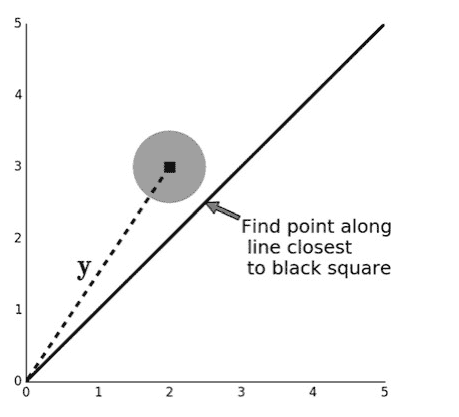

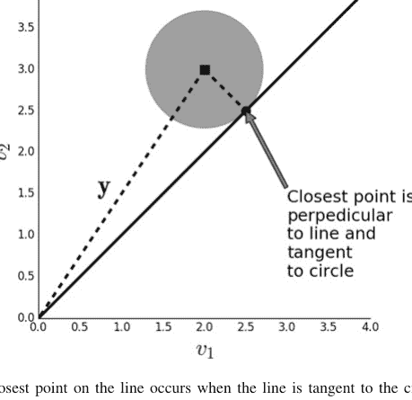

图 2.3 线上的最近点出现在该线与圆相切时。当这种情况发生时，黑线和该线（最小距离）是垂直的

现在我们可以看到发生了什么，我们可以解析地构造解决方案。我们可以将黑线上的任意点表示如下：

$$\mathbf{x} = \alpha \mathbf{v}$$

其中 $\alpha \in \mathbb{R}$ 使点沿线上下滑动，且

$\mathbf{v} = [1, 1]^T$

形式上，$\mathbf{v}$ 是我们想要将 $\mathbf{y}$ *投影*到的*子空间*。在最近点处，$\mathbf{y}$ 和 $\mathbf{x}$ 之间的向量（上面的*误差*向量）垂直于该线。这意味着

$(\mathbf{y} - \mathbf{x})^T \mathbf{v} = 0$

通过代入并计算各项，我们得到

$\alpha = \frac{\mathbf{y}^T \mathbf{v}}{\|\mathbf{v}\|^2}$

*误差*是 $\alpha \mathbf{v}$ 和 $\mathbf{y}$ 之间的距离。这是一个直角三角形，我们可以使用勾股定理计算该误差的平方长度为

$\epsilon^2 = \|(\mathbf{y} - \mathbf{x})\|^2 = \|\mathbf{y}\|^2 - \alpha^2 \|\mathbf{v}\|^2 = \|\mathbf{y}\|^2 - \frac{\|\mathbf{y}^T \mathbf{v}\|^2}{\|\mathbf{v}\|^2}$

其中 $\|\mathbf{v}\|^2 = \mathbf{v}^T \mathbf{v}$。注意，由于 $\epsilon^2 \ge 0$，这也表明

$\|\mathbf{y}^T \mathbf{v}\| \le \|\mathbf{y}\| \|\mathbf{v}\|$

这就是著名且有用的柯西-施瓦茨不等式，我们稍后将利用它。最后，我们可以将所有这些组合成*投影*算子

$\mathbf{P}_v = \frac{1}{\|\mathbf{v}\|^2} \mathbf{v} \mathbf{v}^T$

有了这个算子，我们可以取任何 $\mathbf{y}$ 并通过以下方式找到 $\mathbf{v}$ 上的最近点

$\mathbf{P}_v \mathbf{y} = \mathbf{v} \left( \frac{\mathbf{v}^T \mathbf{y}}{\|\mathbf{v}\|^2} \right)$

其中我们认识到括号中的项就是我们之前计算的 $\alpha$。它被称为*算子*，因为它接受一个向量（$\mathbf{y}$）并产生另一个向量（$\alpha \mathbf{v}$）。因此，投影统一了几何和优化。

### 2.2.1 加权距离

我们可以轻松地将此投影算子扩展到 $\mathbf{y}$ 和子空间 $\mathbf{v}$ 之间的距离度量是加权的情况。我们可以通过重写投影算子来适应这些加权距离

## 2.3 条件期望作为投影

既然我们已经从几何角度理解了投影方法，就可以将其应用于条件概率。这是将概率与几何、优化和线性代数联系起来的*关键*概念。

**随机变量的内积** 从我们之前关于 $\mathbb{R}^n$ 中向量投影的工作中，我们已经很好地从几何上把握了投影与最小均方误差（MMSE）之间的关系。通过一个抽象的步骤，我们可以将所有的几何解释推广到随机变量空间。例如，我们之前注意到，在投影点处，我们有以下正交（即垂直向量）条件：

$$(\mathbf{y} - \mathbf{v}_{opt})^T \mathbf{v} = 0$$

通过更抽象地将内积记为 $\langle \mathbf{x}, \mathbf{y} \rangle = \mathbf{x}^T \mathbf{y}$，我们可以将其表示为：

$$\langle \mathbf{y} - \mathbf{v}_{opt}, \mathbf{v} \rangle = 0$$

通过定义随机变量 $X$ 和 $Y$ 的内积为：

$$\langle X, Y \rangle = \mathbb{E}(XY)$$

我们得到了相同的关系：

$$\langle X - h_{opt}(Y), Y \rangle = 0$$

这个关系不仅适用于 $\mathbb{R}^n$ 中的向量，也适用于随机变量 $X$ 和 $Y$ 以及这些随机变量的函数。其成立的确切原因在技术上很复杂，但事实证明，通过这种方式，使用期望作为内积，可以构建*整个概率论* [33]。

此外，通过抽象出内积的概念，我们将最小均方误差（MMSE）优化问题、几何和随机变量联系了起来。从一个抽象概念中获得了如此多的收益，这使我们能够在这些解释之间切换以解决实际问题。很快，我们将通过一些例子来做到这一点，但首先我们收集从这个抽象中自然得出的最重要结果。

### 条件期望作为投影

条件期望是以下问题的最小均方误差（MMSE）解：¹

$$\min_{h} \int_{\mathbb{R}^2} (x - h(y))^2 f_{X,Y}(x, y) dxdy$$

其中使目标最小化的 $h_{opt}(Y)$ 为：

$$h_{opt}(Y) = \mathbb{E}(X|Y)$$

这等价于说，在所有可能的函数 $h(Y)$ 中，使均方误差最小的是 $\mathbb{E}(X|Y)$。根据我们之前关于投影的讨论，我们注意到这些 MMSE 解可以被视为投影到表征 $Y$ 的子空间上。例如，我们之前注意到，在投影点处，我们有垂直项：

$$\langle X - h_{opt}(Y), Y \rangle = 0 \quad (2.4)$$

但既然我们知道 MMSE 解是：

$$h_{opt}(Y) = \mathbb{E}(X|Y)$$

通过直接代入，我们得到：

$$\mathbb{E}(X - \mathbb{E}(X|Y), Y) = 0 \quad (2.5)$$

最后这一步看起来相当平淡无奇，但它将 MMSE 与条件期望以及内积抽象联系了起来，并在此过程中揭示了条件期望是随机变量的投影算子。在我们进一步展开之前，让我们先收获一些快速的成果。从前面的方程出发，根据期望的线性性质，我们得到：

$$\mathbb{E}(XY) = \mathbb{E}(Y\mathbb{E}(X|Y))$$

这就是所谓的期望的*塔性质*。请注意，我们也可以通过使用条件期望的正式定义：

$$\mathbb{E}(X|Y) = \int_{\mathbb{R}^2} x \frac{f_{X,Y}(x, y)}{f_Y(y)} dxdy$$

¹ 证明见附录，使用了柯西-施瓦茨不等式。

以及直接暴力积分：

$$\mathbb{E}(Y\mathbb{E}(X|Y)) = \int_{\mathbb{R}} y \int_{\mathbb{R}} x \frac{f_{X,Y}(x, y)}{f_Y(y)} f_Y(y) dxdy$$
$$= \int_{\mathbb{R}^2} xy f_{X,Y}(x, y) dxdy$$
$$= \mathbb{E}(XY)$$

来得到这个结果，但这在几何上并不直观。这种几何直觉的缺乏使得应用这些概念和跟踪这些关系变得困难。

我们可以继续沿用这个类比，并从 MMSE 解的正交性质中得到误差项的长度：

$$\langle X - h_{opt}(Y), X - h_{opt}(Y) \rangle = \langle X, X \rangle - \langle h_{opt}(Y), h_{opt}(Y) \rangle$$

然后通过代入所有符号，我们得到：

$$\mathbb{E}(X - \mathbb{E}(X|Y))^2 = \mathbb{E}(X)^2 - \mathbb{E}(\mathbb{E}(X|Y))^2$$

这通过直接积分计算会很困难。

为了正式确立 $\mathbb{E}(X|Y)$ 实际上是一个投影算子，我们需要证明其幂等性。回想一下，幂等性意味着一旦我们将某个东西投影到一个子空间上，进一步的投影将不起作用。在随机变量空间中，$\mathbb{E}(X|\cdot)$ 是幂等投影，我们可以通过注意到以下事实来证明：

$$h_{opt} = \mathbb{E}(X|Y)$$

纯粹是 $Y$ 的函数，因此：

$$\mathbb{E}(h_{opt}(Y)|Y) = h_{opt}(Y)$$

因为 $Y$ 是固定的，这验证了幂等性。因此，条件期望是随机变量对应的投影算子。我们可以继续将向量（$\mathbf{v}$）投影的几何解释推广到随机变量（$X$）。有了这个重要结果，让我们考虑一些通过暴力寻找最优 MMSE 函数 $h_{opt}$ 以及使用我们关于条件期望的新视角来获得条件期望的例子。

**示例** 假设我们有一个随机变量 $X$，那么在均方误差（MSE）意义上，哪个常数最接近 $X$？换句话说，哪个 $c \in \mathbb{R}$ 使以下均方误差最小：

$$\text{MSE} = \mathbb{E}(X - c)^2$$

我们可以通过多种方式解决这个问题。首先，使用基于微积分的优化：

$$\mathbb{E}(X - c)^2 = \mathbb{E}(c^2 - 2cX + X^2) = c^2 - 2c\mathbb{E}(X) + \mathbb{E}(X^2)$$

然后对 $c$ 求一阶导数并求解：

$$c_{opt} = \mathbb{E}(X)$$

记住，$X$ 可能取很多值，但这表明在 MSE 意义上最接近 $X$ 的数是 $\mathbb{E}(X)$。这在直觉上是令人满意的。使用我们的内积方法来处理同一个问题，根据公式 2.3，我们知道在投影点处：

$$\mathbb{E}((X - c_{opt})1) = 0$$

其中 1 是我们投影到的向量。根据期望的线性性质，以下给出：

$$c_{opt} = \mathbb{E}(X)$$

使用投影方法，因为 $\mathbb{E}(X|Y)$ 是投影算子，取 $Y = \Omega$（整个底层概率空间），我们使用条件期望的定义得到：

$$\mathbb{E}(X|Y = \Omega) = \mathbb{E}(X)$$

这是因为在整个 $\Omega$ 空间上的随机变量只能是一个常数。因此，我们刚刚用三种方式（优化、正交内积、投影）解决了同一个问题。

**示例** 让我们考虑以下概率密度为 $f_{X,Y} = x + y$ 的例子，其中 $(x, y) \in [0, 1]^2$，并直接从定义计算条件期望：

$$\mathbb{E}(X|Y) = \int_0^1 x \frac{f_{X,Y}(x, y)}{f_Y(y)} dx = \int_0^1 x \frac{x + y}{y + 1/2} dx = \frac{3y + 2}{6y + 3}$$

这相当简单，因为密度函数很简单。现在，让我们用困难的方式，直接求解 MMSE 解 $h(Y)$。那么，

$$\text{MSE} = \min_h \int_0^1 \int_0^1 (x - h(y))^2 f_{X,Y}(x, y) dx dy$$
$$= \min_h \int_0^1 yh^2(y) - yh(y) + \frac{1}{3}y + \frac{1}{2}h^2(y) - \frac{2}{3}h(y) + \frac{1}{4} dy$$

现在，我们需要找到一个函数 $h$ 来最小化这个目标。求解一个函数，与求解一个数字相比，通常非常非常困难，但因为我们是在一个有限区间上积分，我们可以使用变分法中的欧拉-拉格朗日方法，对被积函数关于函数 $h(y)$ 求导并令其为零。使用欧拉-拉格朗日方法，我们得到以下结果：

$$2yh(y) - y + h(y) - \frac{2}{3} = 0$$

解这个方程得到

$$h_{opt}(y) = \frac{3y + 2}{6y + 3}$$

这与我们之前得到的结果一致。最后，我们可以使用公式 2.3 中的内积来求解：

$$\mathbb{E}((X - h(Y))Y) = 0$$

展开得到，

$$\int_0^1 \int_0^1 (x - h(y))y(x + y)dxdy = \int_0^1 \frac{1}{6}y(-3(2y + 1)h(y) + 3y + 2)dy = 0$$

被积函数必须为零，

$$2y + 3y^2 - 3yh(y) - 6y^2h(y) = 0$$

解这个关于 $h(y)$ 的方程得到相同的解：

$$h_{opt}(y) = \frac{3y + 2}{6y + 3}$$

因此，通过定义的暴力积分、优化或内积，我们都得到了相同的答案。但一般来说，没有哪种方法必然是最简单的，因为它们都可能涉及困难或不可能的积分、优化或泛函方程求解。关键在于，现在我们有了一个丰富的工具箱，我们可以为不同的问题选择我们想要应用的工具。

在结束这个例子之前，让我们用 Sympy 来验证我们之前为这个例子找到的误差函数的长度：

$$\mathbb{E}(X - \mathbb{E}(X|Y))^2 = \mathbb{E}(X)^2 - \mathbb{E}(\mathbb{E}(X|Y))^2$$

这是基于勾股定理的。首先，我们需要计算边缘密度：

```
>>> from sympy.abc import y,x
>>> from sympy import integrate, simplify
>>> fxy = x + y                     # joint density
>>> fy = integrate(fxy, (x,0,1)) # marginal density
>>> fx = integrate(fxy, (y,0,1)) # marginal density
```

然后，我们需要写出条件期望：

```
>>> EXY = (3*y+2)/(6*y+3) # conditional expectation
```

接下来，我们可以计算左边，$\mathbb{E}(X - \mathbb{E}(X|Y))^2$，如下所示：

```
>>> # from the definition
>>> LHS=integrate((x-EXY)**2*fxy, (x,0,1), (y,0,1))
>>> LHS # left-hand-side
1/12 - log(3)/144
```

类似地，我们可以计算右边，$\mathbb{E}(X)^2 - \mathbb{E}(\mathbb{E}(X|Y))^2$，如下所示：

```
>>> # using Pythagorean theorem
>>> RHS=integrate((x)**2*fx, (x,0,1))-integrate((EXY)**2*fy,
...     (y,0,1))
>>> RHS # right-hand-side
1/12 - log(3)/144
```

最后，我们可以验证左右两边是否匹配：

```
>>> print(simplify(LHS-RHS)==0)
True
```

在本节中，我们将前面章节中所有的投影和最小二乘优化思想整合在一起，将 $\mathbb{R}^n$ 中向量的几何投影概念与随机变量联系起来。这引出了一个重要的认识：条件期望实际上是一个随机变量的投影算子。了解这一点使我们能够根据特定情况下哪种方法更直观或更易处理，以多种方式处理难题。确实，找到正确的问题来解决是最困难的部分，因此拥有多种看待同一概念的方式至关重要。

关于更详细的阐述，Mikosch 的著作 [31] 有一些精彩的章节，以类似的几何解释涵盖了大部分这些材料。Kobayashi [21] 也是如此。Nelson [33] 也基于超实数进行了类似的阐述。

### 2.3.1 附录

我们想要证明条件期望是以下问题的最小均方误差最小化器：

$$J = \min_{h} \int_{\mathbb{R}^2} |X - h(Y)|^2 f_{X,Y}(x, y) dxdy$$

我们可以将其展开如下：

$$J = \min_{h} \int_{\mathbb{R}^2} |X|^2 f_{X,Y}(x, y) dxdy + \int_{\mathbb{R}^2} |h(Y)|^2 f_{X,Y}(x, y) dxdy - \int_{\mathbb{R}^2} 2Xh(Y) f_{X,Y}(x, y) dxdy$$

为了最小化这个，我们必须最大化以下表达式：

$$A = \max_{h} \int_{\mathbb{R}^2} Xh(Y) f_{X,Y}(x, y) dxdy$$

利用条件期望的定义分解积分：

$$A = \max_{h} \int_{\mathbb{R}} \left( \int_{\mathbb{R}} X f_{X|Y}(x|y) dx \right) h(Y) f_Y(y) dy \quad (2.6)$$
$$= \max_{h} \int_{\mathbb{R}} \mathbb{E}(X|Y) h(Y) f_Y(Y) dy \quad (2.7)$$

根据柯西-施瓦茨不等式的性质，我们知道最大值在 $h_{opt}(Y) = \mathbb{E}(X|Y)$ 时取得，因此我们找到了最优的 $h(Y)$ 函数为：

$$h_{opt}(Y) = \mathbb{E}(X|Y)$$

这表明最优函数就是条件期望。

## 2.4 条件期望与均方误差

在本节中，我们通过一个详细的例子来使用条件期望和优化方法。假设我们有两个公平的六面骰子（$X$ 和 $Y$），我们想测量这两个变量的和为 $Z = X + Y$。进一步，让我们假设在给定 $Z$ 的情况下，我们希望在均方意义上得到 $X$ 的最佳估计。因此，我们希望最小化以下表达式：

$$J(\alpha) = \sum (x - \alpha z)^2 \mathbb{P}(x, z)$$

其中 $\mathbb{P}$ 是这个问题的概率质量函数。思路是，当我们解决了这个问题，我们将得到一个关于 $Z$ 的函数，它将是 $X$ 的最小均方误差估计。我们可以在 $J$ 中代入 $Z$ 得到：

$$J(\alpha) = \sum (x - \alpha(x + y))^2 \mathbb{P}(x, y)$$

让我们在 Sympy 中计算以下步骤：

```
>>> import sympy as S
>>> from sympy.stats import density, E, Die
>>> x = Die('D1',6)    # 1st six sided die
>>> y = Die('D2',6)    # 2nd six sides die
>>> a = S.symbols('a')
>>> z = x+y            # sum of 1st and 2nd die
>>> J = E((x-a*(x+y))**2) # expectation
>>> S.simplify(J)
329*a**2/6 - 329*a/6 + 91/6
```

有了这些设置，我们现在可以使用基本微积分来最小化目标函数 $J$：

```
>>> sol,=S.solve(S.diff(J,a),a) # using calculus to minimize
>>> sol # solution is 1/2
1/2
```

> **编程提示**
> Sympy 有一个 `stats` 模块，可以对涉及概率密度和期望的表达式进行一些基本操作。上面的代码使用了它的 `E` 函数来计算期望。

这表示 $z/2$ 是给定 $Z$ 时 $X$ 的均方误差估计，这意味着从几何上解释（将均方误差解释为由概率质量函数加权的平方距离），对于给定的 $z$，$z/2$ 是我们能得到的与 $x$ 最*接近*的值。

让我们使用条件期望算子 $\mathbb{E}(\cdot|z)$ 来探讨同一个问题，并将其应用于我们对 $Z$ 的定义。那么

$$\mathbb{E}(z|z) = \mathbb{E}(x + y|z) = \mathbb{E}(x|z) + \mathbb{E}(y|z) = z$$

利用了期望的线性性质。现在，由于问题的对称性（即两个相同的骰子），我们有

$$\mathbb{E}(x|z) = \mathbb{E}(y|z)$$

我们可以代入并求解：

$$2\mathbb{E}(x|z) = z$$

这再次给出

$$\mathbb{E}(x|z) = \frac{z}{2}$$

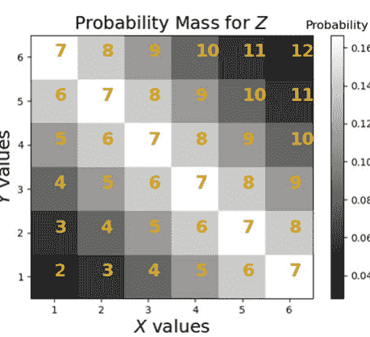

这与我们刚刚通过最小化均方误差找到的估计值相等。让我们结合图 2.5 进一步探讨。图 2.5 显示了 Z 的值（黄色），以及 X 和 Y 在坐标轴上的对应值。假设 z = 2，那么最接近这个值的 X 是 X = 1，这正是 E(x|z) = z/2 = 1 给出的结果。当 Z = 7 时会发生什么？在这种情况下，这个值沿着 X 轴对角线分布；所以如果 X = 1，那么 Z 相差 6 个单位；如果 X = 2，那么 Z 相差 5 个单位；以此类推。

现在，回到最初的问题，如果我们有 Z = 7 并且我们想用 X 尽可能接近它，为什么不选择 X = 6，它只与 Z 相差一个单位呢？这样做的问题是 X = 6 只有 1/6 的时间出现，所以另外 5/6 的时间我们不太可能猜对。因此，有 1/6 的时间我们相差一个单位，但有 5/6 的时间我们相差远不止一个单位。这意味着均方误差分数会更差。由于 X 从 1 到 6 的每个值都是等可能的，为了稳妥起见，我们选择 7/2 作为估计值，这正是条件期望所建议的。

我们可以用下面的 Sympy 样本来验证这个说法：

```
>>> from sympy import stats
>>> # Eq constrains Z
>>> samples_z7 = lambda : stats.sample(x, S.Eq(z,7))
>>> # using 6 as an estimate
>>> mn = np.mean([(6-samples_z7())**2 for i in range(100)])
>>> #7/2 is the MSE estimate
>>> mn0=np.mean([(7/2.-samples_z7())**2 for i in range(100)])
>>> print('MSE=%3.2f using 6 vs MSE=%3.2f using 7/2 '
...       % (mn,mn0))
MSE=9.91 using 6 vs MSE=3.47 using 7/2
```

> **编程提示**
`stats.sample(x, S.Eq(z, 7))` 函数调用在 `z` 变量满足条件的情况下对 `x` 变量进行采样。换句话说，它生成 `x` 骰子的随机样本，前提是该骰子与 `y` 骰子的结果之和为 `z==7`。

请反复运行上述代码，直到你确信 $\mathbb{E}(x|z)$ 每次都能给出更低的均方误差。为了进一步验证这个推理，让我们考虑一种情况：骰子存在严重偏差，使得结果为 6 的概率是其他任何结果的十倍。即，

$$\mathbb{P}(6) = 2/3$$

而 $\mathbb{P}(1) = \mathbb{P}(2) = \dots = \mathbb{P}(5) = 1/15$。我们可以使用 Sympy 来探索这一点，如下所示：

```
>>> # 这里 6 的概率是其他任何结果的十倍
>>> x=stats.FiniteRV('D3',{1:1/15., 2:1/15.,
...                     3:1/15., 4:1/15.,
...                     5:1/15., 6:2/3.})
```

与之前一样，我们构建两个骰子的和，并在图 2.6 中绘制相应的概率质量函数。与图 2.5 相比，概率质量已经从较小的数字上移开了。

让我们看看条件期望如何告诉我们如何从 $Z$ 估计 $X$。

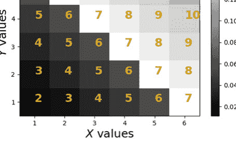

**图 2.6** $Z$ 的值以黄色显示，$X$ 和 $Y$ 的对应值在坐标轴上

>>> E(x, S.Eq(z,7)) # 条件期望 E(x|z=7)
5.000000000000000

既然我们有 $\mathbb{E}(x|z = 7) = 5$，我们可以像之前一样生成样本，看看这是否给出了最小的均方误差。

```
>>> samples_z7 = lambda : stats.sample(x, S.Eq(z,7))
>>> # 使用 6 作为估计值
>>> mn= np.mean([(6-samples_z7())**2 for i in range(100)])
>>> # 5 是均方误差估计值
>>> mn0= np.mean([(5-samples_z7())**2 for i in range(100)])
>>> print('使用 6 的 MSE=%3.2f vs 使用 5 的 MSE=%3.2f ' % (mn,mn0))
MSE=4.30 using 6 vs MSE=1.94 using 5
```

通过一个简单的例子，我们强调了最小均方误差问题与条件期望之间的联系。希望最后两幅图有助于揭示概率密度的作用。接下来，我们将继续揭示条件期望的真正威力，同时继续发展相应的几何直觉。

## 2.5 条件期望与均方误差优化的实例

Brzezniak [6] 是一本很棒的书，因为它通过一系列练习来讲解条件期望，这正是我们在这里试图做的。主要区别在于 Brzezniak 对相同的问题采取了更抽象的测度论方法。请注意，对于概率论的高级领域，你*确实*需要掌握测度论，但就我们目前所涵盖的内容而言，使用我们的方法解决他书中的相同问题是有启发性的。拥有多种方法来解决*任何*问题总是有帮助的。我已将示例编号与书对应，并尽量遵循其符号。

**示例** 这是 Brzezniak 书中的示例 2.1。三枚硬币，10p、20p 和 50p，被抛掷。正面朝上的硬币面值被加总。已知有两枚硬币正面朝上，期望的总值是多少？在这种情况下，我们想要计算 $\mathbb{E}(\xi|\eta)$，其中

$$\xi := 10X_{10} + 20X_{20} + 50X_{50}$$

其中 $X_i \in \{0, 1\}$，$X_{10}$ 是对应于 10p 硬币的伯努利分布随机变量（其他类似）。因此，$\xi$ 表示正面朝上硬币的总价值。$\eta$ 表示三枚硬币中只有两枚正面朝上的条件

$$\eta := X_{10}X_{20}(1 - X_{50}) + (1 - X_{10})X_{20}X_{50} + X_{10}(1 - X_{20})X_{50}$$

并且是一个*仅*在三枚硬币中有两枚正面朝上时才非零的函数。每个三项式项捕捉了这三种可能性之一。例如，当 10p 和 20p 正面朝上而 50p 正面朝下时，第一项等于一。其余项为零。

为了计算条件期望，我们想要找到一个 $\eta$ 的函数 $h$，使得均方误差最小化

$$\text{MSE} = \sum_{X \in \{0,1\}^3} \frac{1}{2^3} (\xi - h(\eta))^2$$

其中求和遍历 $\{X_{10}, X_{20}, X_{50}\}$ 的所有可能结果三元组，因为三枚硬币中的每一枚都有 $\frac{1}{2}$ 的概率正面朝上。

现在，问题归结为如何表征函数 $h(\eta)$。注意 $\eta \mapsto \{0, 1\}$，所以 $h$ 只取两个值。因此，正交内积条件如下：

$$\langle \xi - h(\eta), \eta \rangle = 0$$

因为我们只关心 $\eta = 1$，这简化为

$$\langle \xi - h(1), 1 \rangle = 0$$
$$\langle \xi, 1 \rangle = \langle h(1), 1 \rangle$$

这看起来不难计算，但我们必须在 $\eta = 1$ 的集合上计算积分。换句话说，我们需要 $\eta = 1$ 的三元组 $\{X_{10}, X_{20}, X_{50}\}$ 的集合。即，我们可以计算

$$\int_{\{\eta=1\}} \xi dX = h(1) \int_{\{\eta=1\}} dX$$

这就是 Brzezniak 所做的。或者，我们可以定义 $h(\eta) = \alpha \eta$，然后找到 $\alpha$。重写正交条件给出

$$\langle \xi - \eta, \alpha \eta \rangle = 0$$
$$\langle \xi, \eta \rangle = \alpha \langle \eta, \eta \rangle$$
$$\alpha = \frac{\langle \xi, \eta \rangle}{\langle \eta, \eta \rangle}$$

其中

$$\langle \xi, \eta \rangle = \sum_{X \in \{0,1\}^3} \frac{1}{2^3} (\xi \eta)$$

注意我们可以直接遍历所有三元组 $\{X_{10}, X_{20}, X_{50}\}$，因为 $h(\eta)$ 的定义在 $\eta = 0$ 时反正为零。我们所要做的就是代入所有值并求解。这项繁琐的工作非常适合 Sympy。

```
>>> import sympy as S
>>> X10,X20,X50 = S.symbols('X10,X20,X50',real=True)
>>> xi  = 10*X10+20*X20+50*X50
>>> eta = X10*X20*(1-X50)+X10*(1-X20)*(X50)+(1-X10)*X20*(X50)
>>> num = S.summation(xi*eta, (X10,0,1), (X20,0,1), (X50,0,1))
>>> den = S.summation(eta*eta, (X10,0,1), (X20,0,1), (X50,0,1))
>>> alpha = num/den
>>> alpha # alpha=160/3
160/3
```

这意味着

$$\mathbb{E}(\xi|\eta) = \frac{160}{3} \eta$$

我们可以通过快速模拟来验证这一点

```
>>> import pandas as pd
>>> d = pd.DataFrame(columns=['X10','X20','X50'])
>>> d.X10 = np.random.randint(0,2,1000)
>>> d.X10 = np.random.randint(0,2,1000)
>>> d.X20 = np.random.randint(0,2,1000)
>>> d.X50 = np.random.randint(0,2,1000)
```

> **编程提示**
上面的代码创建了一个具有指定列的空 Pandas 数据框。接下来的四行代码为每一列赋值。

上面的代码模拟了抛掷三枚硬币 1000 次。数据框的每一列是 0 或 1，分别对应于正面朝下或正面朝上。条件是三枚硬币中有两枚正面朝上。接下来，我们可以根据它们的和对列进行分组。注意，和只能是 $\{0, 1, 2, 3\}$，分别对应于 0 枚正面朝上、1 枚正面朝上，依此类推。

```
>>> grp=d.groupby(d.eval('X10+X20+X50'))
```

> **编程提示**
Pandas 数据框的 eval 函数接受指定的列并计算给定的公式。在撰写本文时，只支持涉及基本操作的简单公式。

接下来，我们可以获取 2 组，它对应于恰好有两枚硬币正面朝上，然后计算硬币面值的总和。最后，我们可以取这些总和的平均值。

```
>>> grp.get_group(2).eval('10*X10+20*X20+50*X50').mean()
52.60162601626016
```

结果接近 160/3=53.33，这支持了解析结果。以下代码显示我们可以使用纯 Numpy 完成相同的模拟。

```
>>> import numpy as np
>>> from numpy import array
>>> x=np.random.randint(0,2,(3,1000))
>>> print(np.dot(x[:,x.sum(axis=0)==2].T,array([10,20,50]))
    .mean())
52.860759493670884
```

在这种情况下，我们使用 Numpy 点积来计算正面朝上硬币的价值。sum(axis=0)==2 部分选择对应于两枚正面朝上硬币的列。

解决同一问题的另一种方法是放弃随机抽样部分，只使用 Python 标准库中的 itertools 模块来穷举所有可能性。

```
>>> import itertools as it
>>> list(it.product((0,1),(0,1),(0,1)))
[(0, 0, 0), (0, 0, 1), (0, 1, 0), (0, 1, 1), (1, 0, 0),
 (1, 0, 1), (1, 1, 0), (1, 1, 1)]
```

注意，我们需要在上面调用 list 以触发 it.product 中的迭代。这是因为 itertools 模块是基于生成器的，因此在迭代之前（本例中是通过 list）它实际上不会进行迭代。这显示了所有可能的三元组 (X10, X20, X50)，其中 0 和 1 分别表示正面朝下和正面朝上。下一步是过滤出对应于两枚正面朝上硬币的情况。

```
>>> list(filter(lambda i:sum(i)==2,it.product((0,1),(0,1),
    (0,1))))
[(0, 1, 1), (1, 0, 1), (1, 1, 0)]
```

接下来，我们需要计算硬币的总和并结合之前的代码。

```
>>> list(map(lambda k:10*k[0]+20*k[1]+50*k[2],
...           filter(lambda i:sum(i)==2,
...                  it.product((0,1),(0,1),(0,1)))))
[70, 60, 30]
```

输出的平均值是 53.33，这是获得相同结果的另一种方式。对于这个例子，我们展示了使用 Sympy、Numpy 和 Pandas 实现的全部方法。拥有多种方法来处理同一问题并交叉检查结果总是有价值的。

### 2.5.1 示例

这是 Brzezniak 书中的示例 2.2。三枚硬币，10p、20p 和 50p，像之前一样被抛掷。已知有两枚硬币正面朝上，总金额的条件期望是多少？

三枚硬币，仅根据10便士和20便士硬币显示的总金额？对于这个问题，

$$\xi := 10X_{10} + 20X_{20} + 50X_{50}$$
$$\eta := 30X_{10}X_{20} + 20(1 - X_{10})X_{20} + 10X_{10}(1 - X_{20})$$

它取四个值 $\eta \mapsto \{0, 10, 20, 30\}$，并且只考虑10便士和20便士硬币。与上一个问题不同，这里我们感兴趣的是 $\eta$ 所有取值对应的 $h(\eta)$。自然地，$h(\eta)$ 只有四个值，分别对应这四个值。让我们先考虑 $\eta = 10$。正交条件为

$$\langle \xi - h(10), 10 \rangle = 0$$

$\eta = 10$ 的定义域是 $\{X_{10} = 1, X_{20} = 0, X_{50}\}$，我们可以在下面的期望中将其积分掉：

$$\mathbb{E}_{\{X_{10}=1, X_{20}=0, X_{50}\}}(\xi - h(10))10 = 0$$
$$\mathbb{E}_{\{X_{50}\}}(10 - h(10) + 50X_{50}) = 0$$
$$10 - h(10) + 25 = 0$$

由此得出 $h(10) = 35$。对 $\eta \in \{20, 30\}$ 重复相同过程，分别得到 $h(20) = 45$ 和 $h(30) = 55$。这是Brzezniak采用的方法。另一方面，我们也可以直接观察仿射函数 $h(\eta) = a\eta + b$，并使用暴力微积分。

```
>>> from sympy.abc import a,b
>>> h = a*eta + b
>>> eta = X10*X20*30 + X10*(1-X20)*(10)+ (1-X10)*X20*(20)
>>> MSE=S.summation((xi-h)**2*S.Rational(1,8),(X10,0,1),
...                   (X20,0,1),
...                   (X50,0,1))
>>> sol=S.solve([S.diff(MSE,a),S.diff(MSE,b)],(a,b))
>>> print(sol)
{a: 64/3, b: 32}
```

> **编程提示**
Sympy代码中的Rational函数表示一个有理数，Sympy能够将其作为有理数进行操作。这与指定像1/8.这样的分数不同，Python会自动将其计算为浮点数（即0.125）。使用Rational的优点是Sympy之后可以输出有理数，这有时更容易理解。

这意味着

$$\mathbb{E}(\xi|\eta) = 25 + \eta \quad (2.8)$$

由于 $\eta$ 只取四个值 $\{0, 10, 20, 30\}$，我们可以将其明确写为

$$\mathbb{E}(\xi|\eta) = \begin{cases} 25 & \text{当 } \eta = 0 \\ 35 & \text{当 } \eta = 10 \\ 45 & \text{当 } \eta = 20 \\ 55 & \text{当 } \eta = 30 \end{cases} \quad (2.9)$$

或者，我们可以使用正交内积写出假设仿射函数的以下条件：

$$\langle \xi - h(\eta), \eta \rangle = 0 \quad (2.10)$$

$$\langle \xi - h(\eta), 1 \rangle = 0 \quad (2.11)$$

写出这些并求解 $a$ 和 $b$ 是繁琐的，非常适合Sympy来完成。从公式2.10开始，

```
>>> expr=S.expand((xi-h)*eta)
>>> print(expr)
30*X10**2*X20*X50*a - 10*X10**2*X20*a - 10*X10**2*X50*a + 100*X10**2 + 60*X10*X20**2*X50*a - 20*X10*X20**2*a - 30*X10*X20*X50*a + 400*X10*X20 + 500*X10*X50 - 10*X10*b - 20*X20**2*X50*a + 400*X20**2 + 1000*X20*X50 - 20*X20*b
```

然后，因为 $\mathbb{E}(X_i^2) = 1/2 = \mathbb{E}(X_i)$，我们进行以下替换：

```
>>> expr.xreplace({X10**2:0.5, X20**2:0.5,X10:0.5,X20:0.5, X50:0.5})
-7.5*a - 15.0*b + 725.0
```

我们可以对公式2.11中的另一个正交内积进行如下操作：

> **编程提示**
因为Sympy符号是可哈希的，它们可以用作Python字典中的键，就像上面的xreplace函数一样。

```
>>> S.expand((xi-h)*1).xreplace({X10**2:0.5,
...                                     X20**2:0.5,
...                                     X10:0.5,
...                                     X20:0.5,
...                                     X50:0.5})
-0.375*a - b + 40.0
```

然后，将此结果与之前的结果结合并求解a和b，得到

```
>>> s.solve([-350.0*a-15.0*b+725.0,-15.0*a-b+40.0])
{a: 1.00000000000000, b: 25.0000000000000}
```

这再次给出了最终解：

$\mathbb{E}(\xi|\eta) = 25 + \eta$

以下是一个快速模拟来演示这一点。我们可以基于上一个示例使用的Pandas数据框，创建一个新列来表示10便士和20便士硬币的总和，如下所示。

```
>>> d['sm'] = d.eval('X10*10+X20*20')
```

我们可以按这个总和的值进行分组：

```
>>> d.groupby('sm').mean()
      X10  X20       X50
sm                       
0     0.0  0.0  0.502024
10    1.0  0.0  0.531646
20    0.0  1.0  0.457831
30    1.0  1.0  0.516854
```

但我们想要硬币价值的期望：

```
>>> d.groupby('sm').mean().eval('10*X10+20*X20+50*X50')
sm
0     25.101215
10    36.582278
20    42.891566
30    55.842697
dtype: float64
```

这与我们公式2.5.1中的解析结果非常接近。

### 2.5.2 示例

这是从Brzezniak转述的示例2.3。给定 $X$ 在 [0, 1] 上均匀分布，求 $\mathbb{E}(\xi|\eta)$，其中

$\xi(x) = 2x^2$

$\eta(x) = \begin{cases} 1 & \text{如果 } x \in [0, 1/3] \\ 2 & \text{如果 } x \in (1/3, 2/3) \\ 0 & \text{如果 } x \in (2/3, 1] \end{cases}$

注意这个问题与前两个不同，因为表征 $\eta$ 的集合是区间而不是离散点。尽管如此，我们最终将得到三个 $h(\eta)$ 的值，因为 $\eta \mapsto \{0, 1, 2\}$。对于 $\eta = 1$，我们有正交条件：

$\langle \xi - h(1), 1 \rangle = 0$

这归结为

$\mathbb{E}_{\{x \in [0, 1/3]\}}(\xi - h(1)) = 0$

$\int_0^{\frac{1}{3}} (2x^2 - h(1)) dx = 0$

然后通过求解 $h(1)$ 得到 $h(1) = 2/24$。这是Brzezniak解决这个问题的方式。或者，我们可以使用 $h(\eta) = a + b\eta + c\eta^2$ 和暴力微积分。

```
>>> x,c,b,a = S.symbols('x,c,b,a')
>>> xi = 2*x**2
>>> eta=S.Piecewise((1,S.And(S.Gt(x,0),
...                         S.Lt(x,S.Rational(1,3)))), # 0 < x < 1/3
...                    (2,S.And(S.Gt(x,S.Rational(1,3)),
...                         S.Lt(x,S.Rational(2,3)))),# 1/3 < x < 2/3,
...                    (0,S.And(S.Gt(x,S.Rational(2,3)),
...                         S.Lt(x,1))))              # 1/3 < x < 2/3
>>> h = a + b*eta + c*eta**2
>>> J = S.integrate((xi-h)**2, (x,0,1))
>>> sol = S.solve([S.diff(J,a),
...                S.diff(J,b),
...                S.diff(J,c),
...               ],
...               (a,b,c))
>>> print(sol)
{a: 38/27, b: -20/9, c: 8/9}
>>> print(S.piecewise_fold(h.subs(sol)))
Piecewise((2/27, (x > 0) & (x < 1/3)), (14/27, (x > 1/3) & (x < 2/3)), (38/27, (x > 2/3) & (x < 1)))
```

因此，收集此结果得到

$\mathbb{E}(\xi|\eta) = \frac{38}{27} - \frac{20}{9}\eta + \frac{8}{9}\eta^2$

这可以重写为x的分段函数：

$\mathbb{E}(\xi|\eta(x)) = \begin{cases} \frac{2}{27} & \text{当 } 0 < x < \frac{1}{3} \\ \frac{14}{27} & \text{当 } \frac{1}{3} < x < \frac{2}{3} \\ \frac{38}{27} & \text{当 } \frac{2}{3} < x < 1 \end{cases}$

或者，我们可以直接使用正交内积条件，选择 $h(\eta) = c + \eta b + \eta^2 a$：

$\langle \xi - h(\eta), 1 \rangle = 0$
$\langle \xi - h(\eta), \eta \rangle = 0$
$\langle \xi - h(\eta), \eta^2 \rangle = 0$

然后求解 $a, b$ 和 $c$。

```
>>> x,a,b,c,eta = S.symbols('x,a,b,c,eta',real=True)
>>> xi = 2*x**2
>>> eta=S.Piecewise((1,S.And(S.Gt(x,0),
... S.Lt(x,S.Rational(1,3)))), # 0 < x < 1/3
... (2,S.And(S.Gt(x,S.Rational(1,3)),
... S.Lt(x,S.Rational(2,3)))), # 1/3 < x < 2/3,
... (0,S.And(S.Gt(x,S.Rational(2,3)),
... S.Lt(x,1)))) # 1/3 < x < 2/3
>>> h = c+b*eta+a*eta**2
```

然后，正交条件变为

```
>>> S.integrate((xi-h)*1, (x,0,1))
-5*a/3 - b - c + 2/3
>>> S.integrate((xi-h)*eta, (x,0,1))
-3*a - 5*b/3 - c + 10/27
>>> S.integrate((xi-h)*eta**2, (x,0,1))
-17*a/3 - 3*b - 5*c/3 + 58/81
```

现在，我们只需组合这三个方程并求解参数：

```
>>> eqs=[ -5*a/3 - b - c + 2/3,
... -3*a - 5*b/3 - c + 10/27,
... -17*a/3 - 3*b - 5*c/3 + 58/81]
>>> sol=S.solve(eqs)
>>> print(sol)
{a: 0.888888888888889, b: -2.22222222222222, c: 1.40740740740741}
```

我们可以通过代入解来组装最终结果

```
>>> print(S.piecewise_fold(h.subs(sol)))
Piecewise((0.074074074074074, (x > 0) & (x < 1/3)),
(0.518518518518518, (x > 1/3) & (x < 2/3)),
(1.40740740740741, (x > 2/3) & (x < 1)))
```

这与我们公式2.5.2中的解析结果相同，只是以十进制格式表示。

> **编程提示**
Sympy分段函数的定义很冗长，因为Python解析不等式语句的方式。截至撰写本文时，这在Sympy中尚未得到解决，因此我们必须使用冗长的声明。

为了加强我们的结果，让我们使用Pandas进行一个快速模拟。

### 2.5.3 示例

这是 Brzezniak 书中的示例 2.4。求 $\mathbb{E}(\xi|\eta)$，其中

$$\xi(x) = 2x^2$$

$$\eta = \begin{cases} 2 & \text{若 } 0 \leq x < \frac{1}{2} \\ x & \text{若 } \frac{1}{2} < x \leq 1 \end{cases}$$

同样，$X$ 在单位区间上均匀分布。注意，$\eta$ 在每个定义域上不再都是离散的。对于定义域 $0 < x < 1/2$，$h(2)$ 只取一个值，记为 $h_0$。对于这个定义域，正交条件变为

$$\mathbb{E}_{\{\eta=2\}}((\xi(x) - h_0)2) = 0$$

简化后得到

$$\int_0^{1/2} 2x^2 - h_0 dx = 0$$
$$\int_0^{1/2} 2x^2 dx = \int_0^{1/2} h_0 dx$$
$$h_0 = 2 \int_0^{1/2} 2x^2 dx$$
$$h_0 = \frac{1}{6}$$

对于另一个定义域，即方程 2.5.3 中 $\{\eta = x\}$ 的情况，我们再次使用正交条件：

$$\mathbb{E}_{\{\eta=x\}}((\xi(x) - h(x))x) = 0$$
$$\int_{1/2}^1 (2x^2 - h(x))x dx = 0$$
$$h(x) = 2x^2$$

将解组合起来得到

$$\mathbb{E}(\xi|\eta(x)) = \begin{cases} \frac{1}{6} & \text{对于 } 0 \leq x < \frac{1}{2} \\ 2x^2 & \text{对于 } \frac{1}{2} < x \leq 1 \end{cases}$$

尽管这个结果没有明确写成 $\eta$ 的函数形式。

### 2.5.4 示例

这是 Brzezniak 书中的练习 2.6。求 $\mathbb{E}(\xi|\eta)$，其中

$$\xi(x) = 2x^2$$
$$\eta(x) = 1 - |2x - 1|$$

且 $X$ 在单位区间上均匀分布。我们可以将其写成如下分段函数：

$$\eta = \begin{cases} 2x & \text{对于 } 0 \le x < \frac{1}{2} \\ 2 - 2x & \text{对于 } \frac{1}{2} < x \le 1 \end{cases}$$

不连续点在 $x = 1/2$。让我们从 $\{\eta = 2x\}$ 定义域开始。

$$\mathbb{E}_{\{\eta=2x\}}((2x^2 - h(2x))2x) = 0$$
$$\int_0^{1/2} (2x^2 - h(2x))2x dx = 0$$

我们可以通过变量替换（$\eta = 2x$）使其明确成为 $\eta$ 的函数，得到

$$\int_0^1 (\eta^2/2 - h(\eta))\frac{\eta}{2} d\eta = 0$$

因此，对于这个定义域，$h(\eta) = \eta^2/2$。注意，由于变量替换，$h(\eta)$ 在 $\eta \in [0, 1]$ 上有定义。

对于另一个定义域 $\{\eta = 2 - 2x\}$，我们有

$$\mathbb{E}_{\{\eta=2-2x\}}((2x^2 - h(2-2x))(2-2x)) = 0$$
$$\int_{1/2}^1 (2x^2 - h(2-2x))(2-2x) dx = 0$$

同样，使用 $\eta = 2-2x$ 进行变量替换，使 $\eta$ 的依赖关系变得明确，得到

$$\int_0^1 ((2-\eta)^2/2 - h(\eta))\frac{\eta}{2} d\eta = 0$$
$$h(\eta) = (2-\eta)^2/2$$

同样，变量替换意味着这个解在 $\eta \in [0, 1]$ 上有效。因此，由于两部分在相同的定义域（$\eta \in [0, 1]$）上都有效，我们可以直接将它们相加得到最终解：

$$h(\eta) = \eta^2 - 2\eta + 2$$

一个快速的模拟可以帮助验证这一点。

```python
>>> from pandas import DataFrame
>>> d = DataFrame(columns=['xi', 'eta', 'x', 'h', 'h1', 'h2'])
>>> # 100 random samples
>>> d.x = np.random.rand(100)
>>> d.xi = d.eval('2*x**2')
>>> d.eta = 1 - abs(2*d.x - 1)
>>> d.h1 = d[(d.x < 0.5)].eval('eta**2/2')
>>> d.h2 = d[(d.x >= 0.5)].eval('(2-eta)**2/2')
>>> d.fillna(0, inplace=True)
>>> d.h = d.h1 + d.h2
>>> d.head()
          xi       eta         x         h        h1        h2
0  1.102459  0.515104  0.742448  1.102459  0.000000  1.102459
1  0.239610  0.692257  0.346128  0.239610  0.239610  0.000000
2  1.811868  0.096389  0.951806  1.811868  0.000000  1.811868
3  0.000271  0.023268  0.011634  0.000271  0.000271  0.000000
4  0.284240  0.753977  0.376988  0.284240  0.284240  0.000000
```

注意，我们必须小心，在应用各个解时使用了切片 (d.x<0.5) 索引。fillna 部分确保在组合各个解之前，填充空行条目的默认 NaN 被替换为零。否则，NaN 值将在后续计算中传播。以下是绘制图 2.7 的核心代码。

```python
from matplotlib.pyplot import subplots
fig, ax = subplots()
ax.plot(d.xi, d.xi, '.', alpha=.3, label='$\eta$')
ax.plot(d.xi, d.h, 'k.', label='$h(\eta)$')
ax.legend(loc=0, fontsize=18)
ax.set_xlabel('$2 x^2$', fontsize=18)
ax.set_ylabel('$h(\eta)$', fontsize=18)
```

> **编程提示**
> 基本格式适用于图 2.7 中的标签。图例函数中的 `loc=0` 是图例中标签*最佳*位置的代码。当元素被单独绘制时，应指定各个标签，否则以后很难将它们分开。这通过 `plot` 命令中的 `label` 关键字实现。

图 2.7 显示了 $\xi$ 数据与 $\eta$ 和 $h(\eta) = \mathbb{E}(\xi|\eta)$ 的对比图。对角线上的点是 $\xi$ 和 $\mathbb{E}(\xi|\eta)$ 匹配的点。如点所示，原始 $\eta$ 数据与 $\xi$ 之间没有一致性。因此，一种理解条件期望的方式是将其视为一种函数变换，将曲线弯曲到对角线上。黑点绘制了 $\xi$ 与 $\mathbb{E}(\xi|\eta)$ 的关系，并且两者在对角线上处处匹配。这是预期的，因为条件期望是 $\xi$ 在所有 $\eta$ 函数中的均方误差最佳估计。

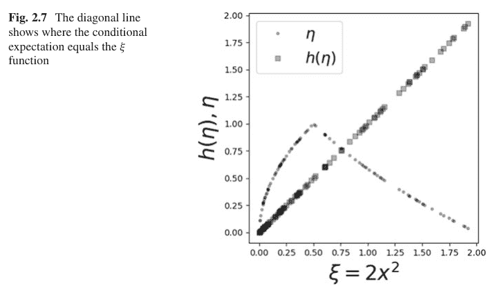

### 2.5.5 示例

这是 Brzezniak 书中的练习 2.14。求 $\mathbb{E}(\xi|\eta)$，其中

$$\xi(x) = 2x^2$$

$$\eta = \begin{cases} 2x & \text{若 } 0 \le x < \frac{1}{2} \\ 2x - 1 & \text{若 } \frac{1}{2} < x \le 1 \end{cases}$$

且 $X$ 在单位区间上均匀分布。这与上一个示例相同，唯一的区别是 $\eta$ 在 $x = \frac{1}{2}$ 处不连续，如前所述。第一部分与上一个示例的第一部分完全相同，因此我们在此跳过。第二部分遵循与上一个示例相同的推理，因此我们只写出 $\{\eta = 2x - 1\}$ 情况的答案如下：

$$h(\eta) = \frac{(1 + \eta)^2}{2}, \quad \forall \eta \in [0, 1]$$

然后像之前一样将它们相加得到完整解：

$$h(\eta) = \frac{1}{2} + \eta + \eta^2$$

这个示例有趣的部分如图 2.8 所示。点显示了 $\eta$ 不连续的位置，然而 $h(\eta) = \mathbb{E}(\xi|\eta)$ 的解等于 $\xi$（即与对角线匹配）。这说明了正交内积技术的强大之处，它不需要连续性或复杂的集合论论证来计算解。相比之下，我建议你考虑 Brzezniak 对此问题的解法，它需要这些方法。

将投影方法扩展到随机变量为计算条件期望问题的解提供了多种方法。在本节中，我们还使用各种 Python 模块进行了相应的模拟。手头有多种技术来交叉验证潜在的解决方案总是可取的。我们使用我们的方法解决了 Brzezniak 书中的一些示例，以展示解决同一问题的多种方法。将 Brzezniak 的测度论方法与我们不太抽象的技术进行比较，是掌握这两个概念的好方法，这对于随机过程的深入研究很重要。

## 2.6 常用分布

### 2.6.1 正态分布

毫无疑问，正态（高斯）分布是最重要的基础概率分布。一维形式如下：

$$f(x) = \frac{e^{-\frac{(x-\mu)^2}{2\sigma^2}}}{\sqrt{2\pi\sigma^2}}$$

其中 $\mathbb{E}(x) = \mu$ 且 $\mathbb{V}(x) = \sigma^2$。对于 $\mathbf{x} \in \mathbb{R}^n$ 的多维版本如下：$$f(\mathbf{x}) = \frac{1}{\det(2\pi \mathbf{R})^{\frac{1}{2}}} e^{-\frac{1}{2}(\mathbf{x}-\boldsymbol{\mu})^T \mathbf{R}^{-1} (\mathbf{x}-\boldsymbol{\mu})}$$

其中 $\mathbf{R}$ 是协方差矩阵，其元素为

$$R_{i,j} = \mathbb{E}\left[(x_i - \bar{x}_i)(x_j - \bar{x}_j)\right]$$

正态分布的一个关键性质是它完全由其前两阶矩决定。另一个关键性质是正态分布在线性变换下保持不变。例如：

$$\mathbf{y} = \mathbf{A}\mathbf{x}$$

意味着 $\mathbf{y} \sim \mathcal{N}(\mathbf{A}\mathbf{x}, \mathbf{A}\mathbf{R}_{\mathbf{x}}\mathbf{A}^T)$。这意味着对正态分布的随机变量进行线性代数和矩阵运算非常容易。正如在高斯-马尔可夫章节中讨论的，正态分布的随机变量保留了许多直观的几何关系。

### 2.6.2 多项式分布

多项式分布是二项分布的推广。回顾一下，二项分布描述了在 $n$ 次试验中获得正面的次数。考虑将 $n$ 个球分配到 $r$ 个可用箱子中的问题，其中每个箱子可以容纳多个球。例如，假设 $n = 10$ 且 $r = 3$，那么一个可能的有效配置是 $\mathbf{N}_{10} = [3, 3, 4]$。球落入第 $i^{th}$ 个箱子的概率是 $p_i$，其中 $\sum p_i = 1$。多项式分布描述了 $\mathbf{N}_n$ 的概率分布。二项分布是 $n = 2$ 时多项式分布的特例。多项式分布实现在 `scipy.stats` 模块中，如下所示：

```
>>> from scipy.stats import multinomial
>>> rv = multinomial(10, [1/3]*3)
>>> rv.rvs(4)
array([[2, 2, 6],
       [4, 2, 4],
       [2, 4, 4],
       [2, 6, 2]])
```

请注意，各列的总和始终为 $n$：

```
>>> rv.rvs(10).sum(axis=1)
array([10, 10, 10, 10, 10, 10, 10, 10, 10, 10])
```

为了推导概率质量函数，我们定义了*占用向量* $\mathbf{e}_i \in \mathbb{R}^r$，这是一个二进制向量，恰好有一个非零分量（即单位向量）。那么，$\mathbf{N}_n$ 向量可以写成 $n$ 个向量 $\mathbf{X}$ 的和，每个向量从集合 $\{\mathbf{e}_j\}_{j=1}^r$ 中抽取：

$$\mathbf{N}_n = \sum_{i=1}^n \mathbf{X}_i$$

其中概率 $\mathbb{P}(\mathbf{X} = \mathbf{e}_j) = p_j$。因此，$\mathbf{N}_n$ 在分量非负且总和为 $n$ 的向量集合上具有离散分布。由于 $\mathbf{X}$ 向量是独立同分布的，任何特定 $\mathbf{N}_n = [x_1, x_2, \cdots, x_r]^\top = \mathbf{x}$ 的概率为

$$\mathbb{P}(\mathbf{N}_n = x) = C_n p_1^{x_1} p_2^{x_2} \cdots p_r^{x_r}$$

其中 $C_n$ 是一个组合因子，用于解释分量可以求和为 $x_j$ 的所有方式。考虑第一个分量有 $\binom{n}{x_1}$ 种选择方式。这为向量的其余分量留下了 $n - x_1$ 个球。因此，第二个分量有 $\binom{n-x_1}{x_2}$ 种选择球的方式。按照相同的模式，第三个分量有 $\binom{n-x_1-x_2}{x_3}$ 种方式，依此类推

$$C_n = \binom{n}{x_1} \binom{n-x_1}{x_2} \binom{n-x_1-x_2}{x_3} \cdots \binom{n-x_1-x_2-\cdots-x_{r-1}}{x_r}$$

简化为以下形式：

$$C_n = \frac{n!}{x_1! \cdots x_r!}$$

因此，多项式分布的概率质量函数如下：

$$\mathbb{P}(\mathbf{N}_n = x) = \frac{n!}{x_1! \cdots x_r!} p_1^{x_1} p_2^{x_2} \cdots p_r^{x_r}$$

该分布的期望如下：

$$\mathbb{E}(\mathbf{N}_n) = \sum_{i=1}^n \mathbb{E}(X_i)$$

根据期望的线性性质。那么，

$$\mathbb{E}(X_i) = \sum_{j=1}^r p_j \mathbf{e}_j = \mathbf{I}\mathbf{p} = \mathbf{p}$$

其中 $p_j$ 是向量 $\mathbf{p}$ 的分量，$\mathbf{I}$ 是单位矩阵。那么，由于这对任何 $X_i$ 都相同，我们有

$$\mathbb{E}(\mathbf{N}_n) = n\mathbf{p}$$

对于 $\mathbf{N}_n$ 的协方差，我们需要计算以下内容：

$$\text{Cov}(\mathbf{N}_n) = \mathbb{E}\left(\mathbf{N}_n\mathbf{N}_n^\top\right) - \mathbb{E}(\mathbf{N}_n)\mathbb{E}(\mathbf{N}_n)^\top$$

对于右边的第一项，我们有

$$\mathbb{E}\left(\mathbf{N}_n\mathbf{N}_n^\top\right) = \mathbb{E}\left(\left(\sum_{i=1}^n X_i\right)\left(\sum_{j=1}^n X_j^\top\right)\right)$$

并且对于 $i = j$，我们有

$$\mathbb{E}(X_i X_i^\top) = \text{diag}(\mathbf{p})$$

对于 $i \neq j$，我们有

$$\mathbb{E}(X_i X_j^\top) = \mathbf{p}\mathbf{p}^\top$$

请注意，这一项在对角线上有元素。然后，结合上述两个方程得到以下结果：

$$\mathbb{E}(\mathbf{N}_n\mathbf{N}_n^\top) = n\text{diag}(\mathbf{p}) + (n^2 - n)\mathbf{p}\mathbf{p}^\top$$

现在，我们可以组装协方差矩阵：

$$\text{Cov}(\mathbf{N}_n) = n\text{diag}(\mathbf{p}) + (n^2 - n)\mathbf{p}\mathbf{p}^\top - n^2\mathbf{p}\mathbf{p}^\top = n\text{diag}(\mathbf{p}) - n\mathbf{p}\mathbf{p}^\top$$

具体来说，非对角线项是 $np_i p_j$，对角线项是 $np_i(1-p_i)$。

### 2.6.3 卡方分布

$\chi^2$ 分布出现在许多不同的上下文中，因此值得理解。假设我们有 $n$ 个独立的随机变量 $X_i$，使得 $X_i \sim \mathcal{N}(0, 1)$。我们感兴趣的是以下随机变量 $R = \sqrt{\sum_i X_i^2}$。$X_i$ 的联合概率密度如下：

$$f_{\mathbf{X}}(X) = \frac{e^{-\frac{1}{2} \sum_i X_i^2}}{(2\pi)^{\frac{n}{2}}}$$

其中 $\mathbf{X}$ 表示 $X_i$ 随机变量的向量。你可以将 $R$ 视为 $n$ 维球体的半径。该球体的体积由以下公式给出：

$$V_n(R) = \frac{\pi^{\frac{n}{2}}}{\Gamma(\frac{n}{2} + 1)} R^n$$

为了减少符号量，我们定义，

$$A := \frac{\pi^{\frac{n}{2}}}{\Gamma(\frac{n}{2} + 1)}$$

该体积的微分如下：

$$dV_n(R) = n A R^{n-1} dR$$

用 $X_i$ 坐标表示，概率（一如既往）积分结果为一。

$$\int f_{\mathbf{X}}(\mathbf{X}) dV_n(\mathbf{X}) = 1$$

用 $R$ 表示，变量替换提供

$$\int f_{\mathbf{X}}(R) n A R^{n-1} dR$$

因此，

$$f_R(R) := f_{\mathbf{X}}(R) = n A R^{n-1} \frac{e^{-\frac{1}{2} R^2}}{(2\pi)^{\frac{n}{2}}}$$

但我们感兴趣的是分布 $Y = R^2$。再次使用相同的技术，

$$\int f_R(R) dR = \int f_R(\sqrt{Y}) \frac{dY}{2\sqrt{Y}}$$

最后，

$$f_Y(Y) := n A Y^{\frac{n-1}{2}} \frac{e^{-\frac{1}{2} Y}}{(2\pi)^{\frac{n}{2}}} \frac{1}{2\sqrt{Y}}$$

然后，最后代回 $A$ 得到具有 $n$ 个自由度的 $\chi^2$ 分布：

$$f_Y(Y) = n \frac{\pi^{\frac{n}{2}}}{\Gamma(\frac{n}{2} + 1)} Y^{n/2-1} \frac{e^{-\frac{1}{2}Y}}{(2\pi)^{\frac{n}{2}}} \frac{1}{2} = \frac{2^{-\frac{n}{2}-1}n}{\Gamma(\frac{n}{2} + 1)} e^{-Y/2} Y^{\frac{n}{2}-1}$$

相应的均值和方差为

$$\overline{Y} = n, \quad \mathbb{V}(Y) = 2n$$

**示例** 假设检验是 $\chi^2$ 分布的一个常见应用。考虑表 2.1，其中列出了某人群的感染状况。假设是这些数据按照多项式分布分布，各组的比例如下：$p_1 = 1/4$（轻度感染），$p_2 = 1/4$（重度感染），$p_3 = 1/2$（未感染）。假设 $n_i$ 是第 $i^{th}$ 列的人数，且 $\sum_i n_i = n = 684$。令 $k$ 表示列数。那么，为了应用中心极限定理，我们希望对 $n_i$ 随机变量求和，但这些变量的总和都是 $n$，一个常数，这禁止使用该定理。相反，假设我们对 $n_i$ 变量求和到 $k-1$ 项。那么，

$$z = \sum_{i=1}^{k-1} n_i$$

根据该定理，渐近正态分布，均值为 $\mathbb{E}(z) = \sum_{i=1}^{k-1} np_i$。使用我们之前的结果和多项式随机变量的符号，我们可以将其写为

$$z = [\mathbf{1}_{k-1}^\top, 0]\mathbf{N}_n$$

其中 $\mathbf{1}_{k-1}$ 是长度为 $k-1$ 的全 1 向量，$\mathbf{N}_n \in \mathbb{R}^k$。使用这种符号，我们有

$$\mathbb{E}(z) = n[\mathbf{1}_{k-1}^\top, 0]\mathbf{p} = \sum_{i=1}^{k-1} np_i = n(1 - p_k)$$

我们可以使用相同的方法得到 $z$ 的方差，

$$\mathbb{V}(z) = [\mathbf{1}_{k-1}^\top, 0]\text{Cov}(\mathbf{N}_n)[\mathbf{1}_{k-1}^\top, 0]^\top$$

表 2.1 诊断表

| 轻度感染 | 重度感染 | 未感染 | 总计 |
| :---: | :---: | :---: | :---: |
| 128 | 136 | 420 | 684 |

由此可得

$$\mathbb{V}(z) = [\mathbf{1}_{k-1}^{\top}, 0](n\text{diag}(\mathbf{p}) - n\mathbf{p}\mathbf{p}^{\top})[\mathbf{1}_{k-1}^{\top}, 0]^{\top}$$

方差为

$$\mathbb{V}(z) = n(1 - p_k)p_k$$

确定了均值和方差后，我们可以从假设下的每一列中减去假设均值，并创建变换变量，

$$z' = \sum_{i=1}^{k-1} \frac{n_i - np_i}{\sqrt{n(1 - p_k)p_k}} \sim \mathcal{N}(0, 1)$$

根据中心极限定理。类似地，

$$\sum_{i=1}^{k-1} \frac{(n_i - np_i)^2}{n(1 - p_k)p_k} \sim \chi_{k-1}^2$$

所有这些都确定后，我们就可以检验表格中的数据是否遵循假设的多项分布。

```
>>> from scipy import stats
>>> p1 = p2 = 1/4
>>> p3, n = 1/2, 684
>>> v = n*p3*(1-p3)
>>> z = (128-n*p1)**2/v + (136-n*p2)**2/v
>>> degrees_freedom = 2
>>> 1-stats.chi2(degrees_freedom).cdf(z)
0.00012486166748693073
```

这个值非常低，表明假设的多项分布对于这些数据来说不是一个好的拟合。请注意，这种近似仅在 n 相对于表格中的列数较大时有效，或者当列数较少但表格中每个条目的计数很大时也有效。后一种情况之所以成立，是因为每个表格条目都收敛到正态分布。我们上面计算的 z 统计量通常被称为皮尔逊卡方检验统计量。

### 2.6.4 泊松分布与指数分布

随机变量 $X$ 的泊松分布表示在给定时间间隔（$t$）内发生的事件数量。

$$p(x; \lambda t) = \frac{e^{-\lambda t}(\lambda t)^x}{x!}$$

泊松分布与二项分布 $b(k; n, p)$ 密切相关，其中 $p$ 很小而 $n$ 很大。也就是说，当事件发生概率低但试验次数 $n$ 很多时。回顾二项分布如下：

$$b(k; n, p) = \binom{n}{k} p^k (1-p)^{n-k}$$

对于 $k = 0$，对两边取对数，我们得到

$$\log b(0; n, p) = (1-p)^n = \left(1 - \frac{\lambda}{n}\right)^n$$

然后，对其进行泰勒展开得到：

$$\log b(0; n, p) \approx -\lambda - \frac{\lambda^2}{2n} - \cdots$$

对于大的 $n$，这导致

$$b(0; n, p) \approx e^{-\lambda}$$

对 $k$ 进行类似的论证可得到泊松分布。方便的是，我们有 $\mathbb{E}(X) = \mathbb{V}(X) = \lambda$。例如，假设每小时通过收费站的车辆平均数量为 3。那么，在给定一小时内有六辆车通过收费站的概率是 $p(x = 6; \lambda t = 3) = \frac{81}{30e^3} \approx 0.05$。

泊松分布可从 `scipy.stats` 模块中获取。以下代码计算了上述结果：

```
>>> from scipy.stats import poisson
>>> x = poisson(3)
>>> print(x.pmf(6))
0.05040940672246224
```

泊松分布对于涉及可靠性和排队论的应用非常重要，并且在这种情况下与指数分布密切相关。泊松分布用于计算在特定时间段内发生特定数量事件的概率。在许多情况下，时间段（$X$）本身就是一个随机变量。例如，我们可能对理解车辆到达检查站之间的时间 $X$ 感兴趣。利用泊松分布，在时间 $t$ 之前的时间段内*没有*事件发生的概率由以下公式给出：

$$p(0; \lambda t) = e^{-\lambda t}$$

现在，假设 $X$ 是到第一次事件发生的时间。第一次事件发生的时间长度超过 $x$ 的概率由以下公式给出：

$$\mathbb{P}(X > x) = e^{-\lambda x}$$

那么，累积分布函数由以下公式给出：

$$\mathbb{P}(0 \leq X \leq x) = F_X(x) = 1 - e^{-\lambda x}$$

求导得到*指数*分布：

$$f_X(x) = \lambda e^{-\lambda x}$$

其中 $\mathbb{E}(X) = 1/\lambda$ 且 $\mathbb{V}(X) = \frac{1}{\lambda^2}$。例如，假设我们想知道某个组件持续超过 $T = 10$ 年的概率，其中 $T$ 被建模为一个指数随机变量，其 $1/\lambda = 5$ 年。那么，我们有 $1 - F_X(10) = e^{-2} \approx 0.135$。

指数分布可在 `scipy.stats` 模块中获取。以下代码计算了上述示例的结果。请注意，参数的描述方式与上述略有不同，如 `expon` 的相应文档中所述。

```
>>> from scipy.stats import expon
>>> x = expon(0,5) # 创建随机变量对象
>>> print(1 - x.cdf(10))
0.1353352832366127
```

#### 泊松分布与多项分布的联系

假设我们观察到 $K$ 个独立的泊松随机变量，其中 $t = 1$：

$$X_i \sim \text{Poisson}(\mu_i)$$

泊松事件的总计数

$$X_T = \sum_{i=1}^K X_i$$

是另一个随机变量。根据泊松分布的性质，$X_T \sim \text{Poisson}(\sum_{i=1}^n \mu_i)$。考虑以下条件概率：

$$\mathbb{P}(X_1 = x_1, \cdots, X_K = x_K | X_T = n) = \frac{\mathbb{P}(X_1 = x_1, \cdots, X_K = x_K \wedge X_T = n)}{\mathbb{P}(X_T = n)}$$
$$= \frac{\Pi_i \exp(-\mu_i) \mu_i^{x_i} / x_i!}{\exp(-\sum_{i=1}^K \mu_i) (\sum_{i=1}^K \mu_i)^n / n!}$$
$$= \left( \frac{n!}{\Pi_i x_i!} \right) \prod_{i=1}^K p_i^{x_i}$$

其中 $p_i = \mu_i / (\sum_{i=j}^K \mu_i)$。这是参数为 $p_i$ 的多项分布，这意味着在固定总和条件下的一组独立泊松分布随机变量服从多项分布。

### 2.6.5 伽马分布

我们之前讨论了如何从泊松事件创建指数分布。指数分布具有*无记忆*性质，即，

$\mathbb{P}(T > t_0 + t | T > t_0) = \mathbb{P}(T > t)$

例如，给定 $T$ 作为表示故障前时间的随机变量，这意味着一个已经存活到 $t_0$ 的组件，在超过该点后持续 $t$ 个单位时间的故障概率是相同的。为了推导这个结果，计算互补事件更容易：

$\mathbb{P}(t_0 < T < t_0 + t | T > t_0) = \mathbb{P}(t_0 < T < t_0 + t) = e^{-\lambda t} (e^{\lambda t} - 1)$

然后，1 减去这个结果就显示了无记忆性质，这不切实际地忽略了前 $t$ 小时的磨损。*伽马*分布可以弥补这一点。

回顾一下，指数分布描述了泊松事件发生前的时间。直到指定数量的泊松事件（$\alpha$）发生的时间的随机变量 $X$ 由*伽马*分布描述。因此，当 $\alpha = 1$ 且 $\beta = 1/\lambda$ 时，指数分布是伽马分布的一个特例。对于 $x > 0$，伽马分布如下：

$f(x; \alpha, \beta) = \frac{\beta^{-\alpha} x^{\alpha-1} e^{-\frac{x}{\beta}}}{\Gamma(\alpha)}$

当 $x \le 0$ 时，$f(x; \alpha, \beta) = 0$，其中 $\Gamma$ 是伽马函数。例如，假设通过收费站的车辆遵循泊松过程，平均每小时有五辆车通过，那么在两辆车通过收费站之前最多经过一小时的概率是多少？如果 $X$ 是两辆车通过之前经过的时间（以小时为单位），那么我们有 $\beta = 1/5$ 且 $\alpha = 2$。所需的概率 $\mathbb{P}(X < 1) \approx 0.96$。伽马分布有 $\mathbb{E}(X) = \alpha\beta$ 和 $\mathbb{V}(X) = \alpha\beta^2$。

以下代码计算了上述示例的结果。请注意，参数的描述方式与上述略有不同，如 gamma 的相应文档中所述。

```
>>> from scipy.stats import gamma
>>> x = gamma(2, scale=1/5) # 创建随机变量对象
>>> print(x.cdf(1))
0.9595723180054873
```

### 2.6.6 贝塔分布

均匀分布在单位区间上赋予一个单一的常数值。贝塔分布将其推广为单位区间上的一个函数。贝塔分布的概率密度函数如下：

$$f(x) = \frac{1}{\beta(a, b)} x^{a-1} (1-x)^{b-1}$$

其中

$$\beta(a, b) = \int_0^1 x^{a-1} (1-x)^{b-1} dx$$

请注意，当 $a = b = 1$ 时得到均匀分布。在整数 $0 \le k \le n$ 的特殊情况下，我们有

$$\int_0^1 \binom{n}{k} x^k (1-x)^{n-k} dx = \frac{1}{n+1}$$

为了在不使用微积分的情况下得到这个结果，我们可以使用托马斯·贝叶斯的一个实验。从 $n$ 个白球和一个灰球开始。将它们均匀随机地抛到单位区间上。设 $X$ 为灰球左侧的白球数量。因此，$X \in \{0, 1, \dots, n\}$。为了计算 $\mathbb{P}(X = k)$，我们以灰球位置 $B$ 的概率为条件，该位置在单位区间上均匀分布（$f(p) = 1$）。因此，我们有

$$\mathbb{P}(X = k) = \int_0^1 \mathbb{P}(X = k | B = p) f(p) dp = \int_0^1 \binom{n}{k} p^k (1-p)^{n-k} dp$$

现在，考虑实验的一个轻微变体，我们从 $n + 1$ 个白球开始，再次将它们抛到单位区间上，然后随机选择一个球涂成灰色。使用与之前相同的 $X$，根据对称性，因为 $n + 1$ 个球中的任何一个被选中的可能性是相等的，我们有

$$\mathbb{P}(X = k) = \frac{1}{n+1}$$

对于 $k \in \{0, 1, \dots, n\}$。这两种情况描述的是同一个问题，因为无论我们是在抛球之前还是之后给球涂色都没有关系。将最后两个方程相等，就得到了所需的结果，而无需使用微积分。

$$\int_0^1 \binom{n}{k} p^k (1-p)^{n-k} dp = \frac{1}{n+1}$$

以下代码展示了如何从 `scipy` 模块中获取贝塔分布。

```python
>>> from scipy.stats import beta
>>> x = beta(1,1) # 创建随机变量对象
>>> print(x.cdf(1))
1.0
```

基于这个实验，贝塔分布与二项随机变量之间存在密切关系也就不足为奇了。假设我们想使用贝叶斯推断来估计抛硬币出现正面的概率。采用这种方法，所有未知量都被视为随机变量。在这种情况下，正面概率（$p$）是需要一个*先验*分布的未知量。让我们选择贝塔分布作为先验分布，$\text{Beta}(a, b)$。那么，在给定 $p$ 的条件下，我们有

$$X|p \sim \text{binom}(n, p)$$

这表示 $X$ 在条件上服从二项分布。为了得到后验概率 $f(p|X=k)$，我们有以下贝叶斯公式：

$$f(p|X=k) = \frac{\mathbb{P}(X=k|p)f(p)}{\mathbb{P}(X=k)}$$

其对应的分母为：

$$\mathbb{P}(X=k) = \int_0^1 \binom{n}{k} p^k (1-p)^{n-k} f(p) dp$$

请注意，与我们之前的实验不同，$f(p)$ 不是常数。在不代入所有分布的情况下，我们观察到后验是 $p$ 的函数，这意味着所有不是 $p$ 函数的项都是常数。这给出

$$f(p|X=k) \propto p^{a+k-1}(1-p)^{b+n-k-1}$$

这是另一个参数为 $a+k, b+n-k$ 的贝塔分布。这种特殊关系，即对条件二项分布数据使用 $p$ 上的贝塔先验概率分布，得到的后验也是二项分布，被称为*共轭性*。我们说贝塔分布是二项分布的共轭先验。

### 2.6.7 狄利克雷-多项式分布

狄利克雷-多项式分布是一种离散多元分布，也称为多元波利亚分布。狄利克雷-多项式分布出现在通常的多项式分布不适用的情况下。例如，如果使用多项式分布来建模落入一组箱子中的球的数量，并且多项式参数向量（即球落入特定箱子的概率）在每次试验中都不同，那么可以使用狄利克雷分布来包含这些概率的变异，因为狄利克雷分布定义在描述多项式参数向量的单纯形上。

具体来说，假设我们有 $K$ 个互斥事件，每个事件的概率为 $\mu_k$。那么，给定每个事件被观察到 $\alpha_k$ 次，向量 $\mu$ 的概率如下：

$$\mathbb{P}(\mu|\alpha) \propto \prod_{k=1}^K \mu_k^{\alpha_k-1}$$

其中 $0 \leq \mu_k \leq 1$ 且 $\sum \mu_k = 1$。请注意，最后一个求和是一个约束条件，使得分布为 $K-1$ 维。该分布的归一化常数是多项式贝塔函数：

$$\text{Beta}(\alpha) = \frac{\prod_{k=1}^K \Gamma(\alpha_k)}{\Gamma(\sum_{k=1}^K \alpha_k)}$$

$\alpha$ 向量的元素也称为*浓度*参数。与之前一样，狄利克雷分布可以在 `scipy.stats` 模块中找到：

```python
>>> from scipy.stats import dirichlet
>>> d = dirichlet([ 1,1,1 ])
>>> d.rvs(3) # 从分布中获取样本
array([[0.33938968, 0.62186914, 0.03874119],
       [0.21593733, 0.54123298, 0.24282969],
       [0.37483713, 0.07830673, 0.54685613]])
```

请注意，每一行的和都为一。这是因为 $\sum \mu_k = 1$ 的约束。我们可以生成更多样本，并使用 Matplotlib 中的 Axes3D 在图 2.9 中绘制。

请注意，生成的样本位于所示的三角形单纯形上。三角形的角对应于 $\mu$ 中的每个分量。使用非均匀的 $\alpha = [2, 3, 4]$ 向量，我们可以使用 dirichlet 对象上的 pdf 方法可视化概率密度函数，如图 2.10 所示。通过选择 $\alpha \in \mathbb{R}^3$，密度函数的峰值可以在相应的三角形单纯形内移动。

我们已经看到，贝塔分布将单位区间上的均匀分布进行了推广。同样，狄利克雷分布将贝塔分布推广到分量在单位区间上的向量。回想一下，二项分布和贝塔分布构成贝叶斯推断的一对共轭分布，因为当 $p \sim$ Beta 时，

$X|p \sim \text{Binomial}(n, p)$

即，在给定 $p$ 的条件下，数据服从二项分布。类似地，多项式分布和狄利克雷分布也构成这样一对共轭分布，其中多项式参数 $p \sim$ Dirichlet：

$X|p \sim \text{multinomial}(n, p)$

因此，狄利克雷-多项式分布在机器学习文本处理中很受欢迎，因为它可以为特定文档中未出现的词分配非零概率，这有助于提高泛化性能。

### 2.6.8 负二项分布

负二项分布用于表征在发生指定次数失败（$r$）之前的试验次数。例如，假设 1 表示失败，0 表示成功。那么，负二项分布表征了在四次（$k=4$）先前失败后，出现 $n=2$ 次成功的概率，序列以成功结束（例如，001001），成功概率为 $\mathbb{P}(1) = 1/3$。对于负二项分布，$\mathbb{P}(k) = \frac{80}{729}$。

概率质量函数如下：

$$\mathbb{P}(k) = \binom{n+k-1}{n-1} p^n (1-p)^k$$

它描述了在成功概率为 $p$ 的试验序列中，在 $n$ 次成功发生之前出现 $k$ 次失败的分布。该分布的均值和方差如下：

$$\mathbb{E}(k) = \frac{n(1-p)}{p}$$

$$\mathbb{V}(k) = \frac{n(1-p)}{p^2}$$

以下模拟展示了为负二项分布生成的一个示例序列。

```python
>>> import random
>>> n=2    # 失败次数
>>> p=1/3  # 失败概率
>>> nc = 0 # 计数器
>>> seq= []
>>> while nc< n:
...     v,=random.choices([0,1], [1-p,p])
...     seq.append(v)
...     nc += (v == 1)
...
>>> seq,len(seq)
([1, 0, 0, 0, 1], 5)
```

请记住，负二项分布表征了具有指定失败次数的此类序列族。

### 2.6.9 负多项式分布

离散负多项式分布是负二项分布的扩展，用于考虑两种以上可能的结果。也就是说，存在其他替代方案，其各自的概率之和等于 1 减去失败概率，$p_f = 1 - \sum_{k=1}^n p_i$。例如，从参数为 $n = 2$（观察到的失败次数）且 $p_a = \frac{1}{3}$、$p_b = \frac{1}{2}$ 的该分布中抽取的随机样本意味着失败概率 $p_f = \frac{1}{6}$。因此，来自该分布的样本如 [2, 9] 表示在序列中观察到 2 个 $a$ 对象，9 个 $b$ 对象，并且有两个失败符号（例如，F），其中一个位于序列末尾。

概率质量函数如下：

$$\mathbb{P}(\mathbf{k}) = (n)_{\sum_{i=0}^m k_i} p_f^n \prod_{i=1}^m \frac{p_i^{k_i}}{k_i!}$$

其中 $p_f$ 是失败概率，其他 $p_i$ 项是序列中其他替代方案的概率。$(a)_n$ 符号是上升阶乘函数（例如，$a_3 = a(a+1)(a+2)$）。该分布的均值和方差如下：

$$\mathbb{E}(\mathbf{k}) = \frac{n}{p_f} \mathbf{p}$$

$$\mathbb{V}(k) = \frac{n}{p_f^2} \mathbf{p}\mathbf{p}^T + \frac{n}{p_f} \text{diag}(\mathbf{p})$$

以下模拟展示了为负多项式分布生成的序列。

```python
>>> import random
>>> from collections import Counter
>>> n=2                    # 失败项目数量
>>> p=[1/3,1/2]            # 其他非失败项目的概率
>>> items = ['a','b','F']   # F 标记失败项目
>>> nc = 0                 # 计数器
>>> seq= []
>>> while nc< n:
...     v,=random.choices(items,p+[1-sum(p)])
...     seq.append(v)
...     nc += (v == 'F')
...
>>> c=Counter(seq)
>>> print(c)
Counter({'a': 5, 'b': 2, 'F': 2})
```

上面 Counter 字典的值是负多项式分布概率质量函数中的 $\mathbf{k}$ 向量。重要的是，这些不是特定序列的概率，而是具有相同对应 Counter 值的序列族的概率。Python 中实现的概率质量函数如下：

```python
>>> from scipy.special import factorial
>>> import numpy as np
>>> def negative_multinom_pdf(p,n):
...     assert len(n) == len(p)
...     term = [i**j for i,j in zip(p,n)]
...     num=np.prod(term)*(1-sum(p))*factorial(sum(n))
...     den = np.prod([factorial(i) for i in n])
...     return num/den
...
```

使用先前的计数结果进行计算，

```
>>> negative_multinom_pdf([1/3,1/2],[c['a'],c['b']])
0.00360082304526749
```

## 2.7 信息熵

我们现在可以讨论信息熵了。这将为我们提供一个强大的视角，来理解信息如何在实验之间传递，并且在某些机器学习算法中将被证明是重要的。

曾经有一个电视游戏节目，主持人会将奖品藏在三扇门中的一扇后面，参赛者必须选择其中一扇门。然而，在打开参赛者选择的门之前，主持人会打开另一扇门，并询问参赛者是否想改变她的选择。这就是经典的*蒙提霍尔*问题。问题是，参赛者应该坚持她最初的选择，还是在看到主持人揭示的内容后更换选择？从信息论的角度来看，当主持人揭示其中一扇门后面是什么时，信息环境是否发生了变化？这里的重要细节是，主持人*从不*打开藏有奖品的门，无论参赛者的选择如何。也就是说，主持人*知道*奖品在哪里，但他不会直接向参赛者透露该信息。这是信息论所要解决的基本问题——如何聚合和推理部分信息。我们需要一个能够容纳这类问题的信息概念。

### 2.7.1 信息论概念

一个结果 $x$ 的香农*信息量*定义为

$$h(x) = \log_2 \frac{1}{P(x)}$$

其中 $P(x)$ 是 $x$ 的概率。集合 $X$ 的*熵*定义为 $h(x)$ 的期望值：

$$H(X) = \sum_{x} P(x) \log_2 \frac{1}{P(x)}$$

熵具有这种作为 $h(x)$ 期望值的函数形式并非偶然。它引出了一个深刻而强大的信息理论。

为了直观理解信息熵的含义，考虑一个三位数的序列，其中每一位都等可能地为0或1。因此，单个比特的个体信息量为 $h(x) = \log_2(2) = 1$。熵的单位是*比特*，所以这表示单个比特的信息量是一比特。由于三位数的各个比特相互独立且等可能，该三位数的信息熵为 $h(X) = 2^3 \times \log_2(2^3)/8 = 3$。因此，信息量的基本概念至少在这个层面上是合理的。

解释这个问题的更好方式是：为了唯一地编码一个任意的三位数，我需要提供多少信息？在这种情况下，你需要回答三个问题：*第一位是0还是1？第二位是0还是1？第三位是0还是1？*回答这些问题就能唯一地确定未知的三位数。因为比特之间相互独立，知道任何一个比特的状态都不会提供关于其他比特的信息。

接下来，让我们考虑一个缺乏这种相互独立性的情况。假设在九个其他方面完全相同的球中有一个较重的球。此外，我们还有一个天平，可以指示一边比另一边重、轻还是相等。我们如何找出那个较重的球？起初，衡量情况不确定性的信息量是 $\log_2(9)$，因为九个球中有一个较重。图2.11展示了一种策略。我们可以任意选出一个球（用方框表示），留下其余八个球进行称重。粗黑的水平线表示天平。线下和线上的物品表示天平平衡的两侧。

如果我们运气好，天平会报告天平两侧的四个球重量相等。这意味着被排除的那个球是较重的。这由带阴影的左向箭头表示。在这种情况下，所有的不确定性都消失了，这一次称重的*信息价值*等于 $\log_2(9)$。换句话说，天平将不确定性降低到零（即找到了重球）。另一方面，天平可能报告上方的四个球更重（黑色向上箭头）或更轻（灰色向下箭头）。在这种情况下，我们必须执行所有指示的称重，从左到右进行，才能分离出较重的球。具体来说，较重一侧的四个球必须通过后续称重分成两个球，然后再分成一个球，才能识别出重球。因此，这个过程需要三次称重。第一次的信息量为 $\log_2(9/8)$，下一次为 $\log_2(4)$，最后一次为 $\log_2(2)$。将这些相加，总和为 $\log_2(9)$。因此，无论较重的球是否在第一次称重中被分离出来，该策略都消耗了 $\log_2(9)$ 比特的信息，这是找到重球所必需的。

然而，这并不是唯一的策略。图2.12展示了另一种。在这种方法中，九个球被分成三组，每组三个球。称量其中两组。如果它们重量相等，则意味着较重的球在被排除的那组中（虚线箭头）。然后，将这组再分成两组，排除一个元素。如果天平上的两个球重量相同，则意味着被排除的那个是重球。否则，它是天平上的球之一。如果最初称量的其中一组更重（黑色向上箭头）或更轻（灰色向下箭头），则遵循相同的过程。与之前一样，情况的信息量是 $\log_2(9)$。第一次称重将情况的不确定性降低了 $\log_2(3)$，随后的称重又降低了 $\log_2(3)$。与之前一样，这些总和为 $\log_2(9)$，但这里我们只需要两次称重，而图2.11中的第一种策略平均需要 $1/9 + 3*8/9 \approx 2.78$ 次称重，这比图2.12中的第二种策略的两次要多。

为什么第二种策略使用更少的称重次数？为了减少称重次数，我们需要每次称重尽可能多地裁决等概率的情况。一开始选择九个球中的一个（即图2.11中的第一种策略）并不能做到这一点，因为选中正确球的概率是 $1/9$。这在过程中没有创造等概率的情况。第二种策略在每个阶段都留下等概率的情况（见图2.12），因此它从每次称重中提取了尽可能多的信息。因此，信息量告诉我们，使用*任何*策略（即本例中的 $\log_2(9)$）必须解决多少比特的信息。它还阐明了如何有效地消除不确定性，即通过尽可能多地裁决等概率的情况。

### 2.7.2 信息熵的性质

既然我们已经了解了这些概念的内涵，考虑信息熵的以下性质：

$$H(X) \geq 0$$

当且仅当对于恰好一个 $x$ 有 $P(x) = 1$ 时，等号成立。直观地说，这意味着当集合中只有一个项目被绝对已知（即 $P(x) = 1$）时，不确定性就降为零。还要注意，当 $P$ 在集合的元素上均匀分布时，熵达到最大值。图2.13说明了两个结果的情况。换句话说，当两个相互冲突的替代方案等可能时，信息熵达到最大值。这就是为什么在上一个例子中使用天平来裁决等概率情况对于缩短称重过程如此有用的数学原因。最重要的是，熵的概念可以如下联合扩展：

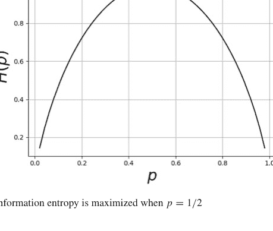

**图 2.13** 当 $p = 1/2$ 时，信息熵达到最大值

$H(X, Y) = \sum_{x,y} P(x, y) \log_2 \frac{1}{P(x, y)}$

当且仅当 $X$ 和 $Y$ 相互独立时，熵具有可加性：

$H(X, Y) = H(X) + H(Y)$

### 2.7.3 KL散度

信息熵的概念引出了概率分布之间距离的概念，这对于机器学习方法将变得很重要。定义在同一集合上的两个概率分布 $P$ 和 $Q$ 之间的KL散度定义为

$D_{KL}(P, Q) = \sum_{x} P(x) \log_2 \frac{P(x)}{Q(x)}$

注意 $D_{KL}(P, Q) \geq 0$，当且仅当 $P = Q$ 时等号成立。有时KL散度也被称为KL距离，但它在形式上并非距离度量，因为它在 $P$ 和 $Q$ 上是不对称的。KL散度定义了一种相对熵，表示用 $Q$ 来建模 $P$ 时所造成的信息损失。有一种直观的方式来解释KL散度并理解其不对称性。假设我们有一组要传输的消息，每条消息都有一个对应的概率 $\{(x_1, P(x_1)), (x_2, P(x_2)), \dots, (x_n, P(x_n))\}$。根据我们对信息熵的了解，用 $\log_2 \frac{1}{p(x)}$ 比特来编码消息长度是合理的。这种精简的策略意味着更频繁的消息用更少的比特编码。因此，我们可以像之前一样重写这种情况下的熵：

$H(X) = \sum_{k} P(x_k) \log_2 \frac{1}{P(x_k)}$

现在，假设我们想传输相同的消息集，但使用不同的概率权重集 $\{(x_1, Q(x_1)), (x_2, Q(x_2)), \dots, (x_n, Q(x_n))\}$。在这种情况下，我们可以定义交叉熵为

$H_q(X) = \sum_{k} P(x_k) \log_2 \frac{1}{Q(x_k)}$

注意，只有编码消息的假定长度发生了变化，而不是该消息的概率。这两者之间的差值就是KL散度：

$D_{KL}(P, Q) = H_q(X) - H(X) = \sum_{x} P(x) \log_2 \frac{P(x)}{Q(x)}$

从这个角度来看，KL散度是在两种不同概率机制下，同一组消息编码长度的平均差异。这应该有助于解释KL散度的不对称性，因为如果任其自然，$P$ 和 $Q$ 会分别提供最优长度的编码，但每种机制对每条消息信息价值的评估（$Q(x_i)$ 与 $P(x_i)$）之间不可能存在必然的对称性。鉴于每种编码在其自身机制下都是最优长度的，这意味着它在另一种机制下必然是次优的，从而产生了KL散度。在两种机制下所有消息的编码长度都相同的情况下，KL散度为零。$^2$

### 2.7.4 条件熵与互信息

给定联合密度 $p(X, Y)$，*条件熵*定义如下：

$H(Y|X) = -\mathbb{E}_{X,Y} \log p(Y|X)$

这导致了以下直观的（链式法则）关系：

$H(X, Y) = H(X) + H(Y|X)$

也就是说，$X, Y$ 中的联合信息等于 $X$ 中的信息加上在给定 $X$ 条件下 $Y$ 中的新信息。对 $X$ 的条件作用很重要，因为我们已经从 $H(X)$ 中获得了关于 $X$ 的所有信息，所以我们只需要来自 $Y$ 的额外非冗余信息。为了推导这个结果，注意 $p(X, Y) = p(Y|X)p(X)$，因此对对数取以下期望，我们得到：

$\mathbb{E} \log p(X, Y) = \mathbb{E} \log p(Y|X) + \mathbb{E} \log p(X)$
$H(X, Y) = H(Y|X) + H(X)$

重要的是，$H(Y|X) \neq H(X|Y)$，但 $H(X) - H(X|Y) = H(Y) - H(Y|X)$。

**互信息** $p(X, Y)$ 和 $p(X)p(Y)$ 之间的KL散度就是*互信息*：

$I(X; Y) = D_{KL}(p(X, Y), p(X)p(Y))$
$= \sum p(X, Y) \log_2 \frac{p(X, Y)}{p(X)p(Y)}$

通过写出条件分布，可以很容易地证明

$I(X; Y) = H(X) - H(X|Y) = H(Y) - H(Y|X)$

其中最后一个等式来自对称性。互信息表示在已知 $Y$ 的情况下，$X$ 不确定性的减少。因为我们有 $H(X, Y) = H(X) + H(Y|X)$，所以我们有

$I(X; Y) = H(X) + H(Y) - H(X, Y)$

有趣的是，令 $Y = X$ 得到所谓的*自信息*：

$I(X; X) = H(X)$

这恰好是随机变量的熵。

### 2.7.5 交叉熵与最大似然

从更一般的角度重新考虑我们统计章节中的最大似然，我们有

$\theta_{\text{ML}} = \arg \max_{\theta} \sum_{i=1}^{n} \log p_{\text{model}}(x_i; \theta)$

其中 $p_{\text{model}}$ 是假设的、由 $\theta$ 参数化的、用于 $x_i$ 数据元素的底层概率密度函数。将上述求和除以 $n$ 不会改变推导出的最优值，但它允许我们使用 $x$ 的经验密度函数将其重写为：

$\theta_{\text{ML}} = \arg \max_{\theta} \mathbb{E}_{x \sim \hat{p}_{\text{data}}} (\log p_{\text{model}}(x_i; \theta))$

注意我们区分了 $p_{\text{data}}$ 和 $\hat{p}_{\text{data}}$，前者是数据的未知分布，后者是我们手头数据的估计分布。

交叉熵可以写成：

$D_{KL}(P, Q) = \mathbb{E}_{X \sim P} (\log P(x)) - \mathbb{E}_{X \sim P} (\log Q(x))$

其中 $X \sim P$ 表示随机变量 $X$ 具有分布 $P$。因此，我们有

$$\theta_{\mathrm{ML}} = \arg \max_{\theta} D_{KL}(\hat{p}_{\mathrm{data}}, p_{\mathrm{model}})$$

也就是说，我们可以将最大似然解释为 $p_{\mathrm{model}}$ 和 $\hat{p}_{\mathrm{data}}$ 分布之间的交叉熵。第一项与估计的 $\theta$ 无关，因此最大化它等同于最小化以下项：

$$\mathbb{E}_{x \sim \hat{p}_{\mathrm{data}}} (\log p_{\mathrm{model}}(x_i; \theta))$$

因为信息熵总是非负的。重要的解释是，最大似然是试图选择 $\theta$ 模型参数，使得数据的经验分布与模型分布相匹配。

## 2.8 矩生成函数

生成矩通常涉及极难计算的积分。矩生成函数使这变得容易得多。矩生成函数定义为

$$M(t) = \mathbb{E}(\exp(tX))$$

一阶矩是均值，我们可以很容易地从 $M(t)$ 计算出来：

$$\frac{dM(t)}{dt} = \frac{d}{dt} \mathbb{E}(\exp(tX)) = \mathbb{E} \frac{d}{dt} (\exp(tX)) = \mathbb{E}(X \exp(tX))$$

现在，我们令 $t = 0$，就得到了均值：

$$M^{(1)}(0) = \mathbb{E}(X)$$

继续这个求导过程，我们得到二阶矩：

$$M^{(2)}(t) = \mathbb{E}(X^2 \exp(tX))$$
$$M^{(2)}(0) = \mathbb{E}(X^2)$$

有了这个，我们可以很容易地计算方差：

$$\mathbb{V}(X) = \mathbb{E}(X^2) - \mathbb{E}(X)^2 = M^{(2)}(0) - M^{(1)}(0)^2$$

示例 回到我们最喜欢的二项分布，让我们使用 Sympy 计算一些矩。

```
>>> import sympy as S
>>> from sympy import stats
>>> p,t = S.symbols('p t',positive=True)
>>> x=stats.Binomial('x',10,p)
>>> mgf = stats.E(S.exp(t*x))
```

现在，让我们使用通常的积分方法和矩生成函数来计算一阶矩（即均值）：

```
>>> print(S.simplify(stats.E(x)))
10*p
>>> print(S.simplify(S.diff(mgf,t).subs(t,0)))
10*p
```

或者，我们可以直接计算如下：

```
>>> print(S.simplify(stats.moment(x,1))) # 均值
10*p
>>> print(S.simplify(stats.moment(x,2))) # 二阶矩
10*p*(9*p + 1)
```

一般来说，二项分布的矩生成函数如下：

$$M_X(t) = (p(e^t - 1) + 1)^n$$

矩生成函数的一个关键方面是它们是概率分布的唯一标识符。根据唯一性定理，给定两个随机变量 $X$ 和 $Y$，如果它们各自的矩生成函数相等，那么相应的概率分布函数也相等。

示例 让我们使用唯一性定理来考虑以下问题。假设我们知道给定 $U = p$ 时 $X$ 的概率分布是参数为 $n$ 和 $p$ 的二项分布。例如，假设 $X$ 表示在 $n$ 次抛硬币中正面朝上的次数，给定正面朝上的概率为 $p$。我们想找到 $X$ 的无条件分布。将矩生成函数写成：

$$\mathbb{E}(e^{tX}|U = p) = (pe^t + 1 - p)^n$$

因为 $U$ 在单位区间上均匀分布，我们可以将这部分积分掉：

$$\mathbb{E}(e^{tX}) = \int_0^1 (pe^t + 1 - p)^n dp$$
$$= \frac{1}{n+1} \frac{e^{t(n+1)}-1}{e^t - 1}$$
$$= \frac{1}{n+1} (1 + e^t + e^{2t} + e^{3t} + \dots + e^{nt})$$

$^2$ 关于这个主题最好、最容易理解的介绍是 Mackay 的著作 [28] 的第 4 章。另一个很好的参考是 [14] 的第 4 章。

因此，$X$ 的矩生成函数对应于一个在值 $0, 1, \ldots, n$ 上等可能取值的随机变量的矩生成函数。这等价于说 $X$ 的分布是在 $\{0, 1, \ldots, n\}$ 上的离散均匀分布。具体来说，假设我们有一盒硬币，每枚硬币正面朝上的概率未知，我们将这盒硬币倒在地板上，所有硬币都散落出来。如果我们数出正面朝上的硬币数量，那么该分布就是均匀的。

矩生成函数对于推导独立随机变量之和的分布非常有用。假设 $X_1$ 和 $X_2$ 是独立的，且 $Y = X_1 + X_2$。那么，$Y$ 的矩生成函数可以根据期望的性质推导如下：

$$M_Y(t) = \mathbb{E}(e^{tY}) = \mathbb{E}(e^{tX_1 + tX_2})$$
$$= \mathbb{E}(e^{tX_1}e^{tX_2}) = \mathbb{E}(e^{tX_1})\mathbb{E}(e^{tX_2})$$
$$= M_{X_1}(t)M_{X_2}(t)$$

**示例** 假设我们有两个正态分布的随机变量，$X_1 \sim \mathcal{N}(\mu_1, \sigma_1)$ 和 $X_2 \sim \mathcal{N}(\mu_2, \sigma_2)$，且 $Y = X_1 + X_2$。我们可以通过在 Sympy 中探索来省去一些繁琐的计算：

```
>>> S.var('x:2', real=True)
(x0, x1)
>>> S.var('mu:2', real=True)
(mu0, mu1)
>>> S.var('sigma:2', positive=True)
(sigma0, sigma1)
>>> S.var('t', positive=True)
t
>>> x0 = stats.Normal(x0, mu0, sigma0)
>>> x1 = stats.Normal(x1, mu1, sigma1)
```

> **编程提示**
`S.var` 函数定义变量并将其注入全局命名空间。这纯粹是出于懒惰。更清晰的做法是像 `x = S.symbols('x')` 这样显式地定义变量。另外请注意，我们为 `mu` 和 `sigma` 变量使用了希腊名称。这在我们稍后想在 Jupyter notebook 中渲染方程时会很方便，因为 Jupyter notebook 知道如何在 LaTeX 中排版这些符号。`var('x:2')` 创建了两个符号，`x0` 和 `x1`。使用冒号这种方式可以轻松生成类似数组的符号序列。

在下一个代码块中，我们计算矩生成函数：

```
>>> mgf0=S.simplify(stats.E(S.exp(t*x0)))
>>> mgf1=S.simplify(stats.E(S.exp(t*x1)))
>>> mgfY=S.simplify(mgf0*mgf1)
```

正态分布随机变量的矩生成函数如下：

$$e^{\mu_0 t + \frac{\sigma_0^2 t^2}{2}}$$

注意 $t$ 的系数。为了证明 $Y$ 是正态分布的，我们希望将 $Y$ 的矩生成函数与此形式匹配。以下是 $Y$ 的矩生成函数的形式：

$$M_Y(t) = e^{\frac{1}{2}(2\mu_0 + 2\mu_1 + \sigma_0^2 t + \sigma_1^2 t)}$$

我们可以使用 Sympy 提取指数部分，并使用以下代码对 $t$ 变量进行整理：

```
>>> S.collect(S.expand(S.log(mgfY)),t)
t**2*(sigma0**2/2 + sigma1**2/2) + t*(mu0 + mu1)
```

因此，根据唯一性定理，$Y$ 是正态分布的，其参数为 $\mu_Y = \mu_0 + \mu_1$ 和 $\sigma_Y^2 = \sigma_0^2 + \sigma_1^2$。

> **编程提示**
在使用 Jupyter notebook 时，你可以执行 `S.init_printing` 以使数学排版在浏览器中生效。否则，如果你想保留原始表达式并选择性地渲染为 LaTeX，那么你可以 `from IPython.display import Math`，然后使用 `Math(S.latex(expr))` 来查看表达式的排版版本。

## 2.9 蒙特卡洛采样方法

到目前为止，我们已经研究了变换随机变量的解析方法，以及如何使用 Python 来增强这些方法。尽管如此，我们经常必须诉诸纯数值方法来解决现实世界的问题。希望现在我们已经看到了更深层的理论，这些数值方法会感觉更加具体。假设我们想要生成给定密度 $f(x)$ 的样本，已知我们已经可以从均匀分布 $\mathcal{U}[0, 1]$ 中生成样本。我们如何知道一个随机样本 $v$ 来自 $f(x)$ 分布？一种方法是观察 $v$ 的样本直方图如何近似 $f(x)$。具体来说，

$$\mathbb{P}(v \in N_{\Delta}(x)) = f(x)\Delta x \quad (2.13)$$

这表示样本落在 $x$ 的某个 $N_{\Delta}$ 邻域内的概率大约是 $f(x)\Delta x$。图 2.14 显示了目标概率密度函数 $f(x)$ 和一个近似它的直方图。该直方图由样本 $v$ 生成。中心的阴影矩形说明了公式 2.9。这个矩形的面积大约是 $f(x)\Delta x$，其中在本例中 $x = 0$。矩形的宽度是 $N_{\Delta}(x)$。近似的质量可能在视觉上很明显，但要确定样本 $v$ 以 $f(x)$ 为特征，我们需要公式 2.9 的陈述，它指出填充阴影矩形的样本 $v$ 的比例大约等于 $f(x)\Delta x$。

既然我们知道了如何评估以密度 $f(x)$ 为特征的样本 $v$，让我们考虑如何为离散和连续随机变量创建这些样本。

### 2.9.1 离散变量的逆 CDF 方法

假设我们想从一个公平的六面骰子生成样本。我们常用的均匀随机变量在单位区间上连续定义，而公平的六面骰子是离散的。我们必须首先在连续随机变量 $u$ 和骰子的离散结果之间创建一个映射。这个映射如图 2.15 所示，其中单位区间被分成若干段，每段长度为 1/6。每个单独的段被分配给骰子的一个结果。例如，如果 $u \in [1/6, 2/6)$，那么骰子的结果就是 2。因为骰子是公平的，所以单位区间上的所有段长度都相同。因此，我们的新随机变量 $v$ 是通过这个分配从 $u$ 派生出来的。

例如，对于 $v = 2$，我们有

$$\mathbb{P}(v = 2) = \mathbb{P}(u \in [1/6, 2/6)) = 1/6$$

其中，用公式 2.9 的语言来说，$f(x) = 1$（均匀分布），$\Delta x = 1/6$，且 $N_{\Delta}(2) = [1/6, 2/6)$。自然地，这个模式对于 $\{1, 2, 3, \ldots, 6\}$ 中的所有其他骰子结果都成立。让我们考虑一个快速模拟来具体说明这一点。以下代码生成均匀随机样本并将它们堆叠在 Pandas dataframe 中。

```
>>> import pandas as pd
>>> import numpy as np
>>> from pandas import DataFrame
>>> u= np.random.rand(100)
>>> df = DataFrame(data=u,columns=['u'])
```

下一个代码块使用 `pd.cut` 将各个样本映射到标记为 `v` 的集合 $\{1, 2, \ldots, 6\}$。

```
>>> labels = [1,2,3,4,5,6]
>>> df['v']=pd.cut(df.u,np.linspace(0,1,7),
...                include_lowest=True,labels=labels)
```

`v` 列包含从公平骰子中抽取的样本。

```
>>> df.head()
          u  v
0  0.356225  3
1  0.466557  3
2  0.776817  5
3  0.836790  6
4  0.037928  1
```

以下是每个组中样本数量的计数。由于骰子是公平的，每个组中的样本数量应该大致相同。

```
>>> df.groupby('v').count()
    u
v   
1  17
2  15
3  18
4  20
5  14
6  16
```

到目前为止，一切顺利。我们现在有了一种从均匀分布随机变量模拟公平骰子的方法。

要将其扩展到不公平的骰子，我们只需要对这段代码做一些小的调整。例如，假设我们想要一个不公平的骰子，使得 $\mathbb{P}(1) = \mathbb{P}(2) = \mathbb{P}(3) = 1/12$ 且 $\mathbb{P}(4) = \mathbb{P}(5) = \mathbb{P}(6) = 1/4$。我们唯一需要做的更改是在 `pd.cut` 中，如下所示：

```
>>> df['v'] = pd.cut(df.u, [0, 1/12, 2/12, 3/12, 2/4, 3/4, 1],
...                 include_lowest=True, labels=labels)
>>> df.groupby('v').count() / df.shape[0]
      u
v
1  0.10
2  0.07
3  0.05
4  0.28
5  0.29
6  0.21
```

现在这些是每个数字的单独概率。你可以取超过 100 个样本来更清楚地观察各个概率，但生成它们的机制是相同的。这种方法被称为逆 CDF³ 方法，因为上一个例子中的 CDF（即 [0, 1/12, 2/12, 3/12, 2/4, 3/4, 1]）被反转（使用 `pd.cut` 方法）以生成样本。对于连续变量，反转更容易看出，我们接下来将讨论这一点。

### 2.9.2 连续变量的逆 CDF 方法

上述方法适用于连续随机变量，但现在我们必须将区间压缩到单个点。在上面的例子中，我们的逆函数是一个作用于均匀随机样本的分段函数。在这种情况下，分段函数坍缩为一个连续的逆函数。我们想为一个可逆的 CDF 生成随机样本 $v$。考虑 $u \sim U[0, 1]$ 以及以下内容：

$$\mathbb{P}_u(F_v(x) < u < F_v(x + \Delta x)) = F_v(x + \Delta x) - F_v(x)$$
$$= \int_x^{x+\Delta x} f(v)dv \approx f(x)\Delta x$$

这表示样本 $u$ 包含在区间 $[F_v(x), F_v(x + \Delta x)]$ 中的概率大约等于 $f_v(x)\Delta x$。对于可逆的 $F_v$，我们有以下内容：

$$\mathbb{P}_u(x < F_v^{-1}(u) < x + \Delta x) = \mathbb{P}_u(F_v(x) < u < F_v(x + \Delta x))$$
$$= F_v(x + \Delta x) - F_v(x)$$
$$= \int_x^{x+\Delta x} f_v(v)dv \approx f_v(x)\Delta x$$

³ 累积密度函数。即 $F(x) = \mathbb{P}(X < x)$。

这意味着 $v = F_v^{-1}(u)$ 服从 $f_v(x)$ 分布，这正是我们想要的。

让我们尝试用这种方法从指数分布中生成样本：

$$f_{\alpha}(x) = \alpha e^{-\alpha x}$$

其累积分布函数（CDF）为：

$$F(x) = 1 - e^{-\alpha x}$$

对应的逆函数为：

$$F^{-1}(u) = \frac{1}{\alpha} \ln \frac{1}{(1-u)}$$

现在，我们只需生成一些均匀分布的随机样本，然后将它们输入到 $F^{-1}$ 中即可。

```
>>> from numpy import array, log
>>> import scipy.stats
>>> alpha = 1.   # 分布参数
>>> nsamp = 1000 # 样本数量
>>> # 定义均匀随机变量
>>> u=scipy.stats.uniform(0,1)
>>> # 定义逆函数
>>> Finv=lambda u: 1/alpha*log(1/(1-u))
>>> # 将逆函数应用于样本
>>> v = array(list(map(Finv,u.rvs(nsamp))))
```

现在，我们已经得到了指数分布的样本，但如何知道该方法是正确的，且样本确实服从相应分布呢？幸运的是，`scipy.stats` 已经内置了指数分布，因此我们可以使用*概率图*（也称为*分位数-分位数图*）来将我们的结果与参考分布进行对比。以下代码使用 `scipy.stats` 设置概率图。

```
fig,ax=subplots()
scipy.stats.probplot(v, (1,),dist='expon',plot=ax)
```

注意，我们需要提供一个坐标轴对象（ax）供其绘制。结果如图 2.16 所示。样本线与对角线越吻合，说明它们与参考分布（本例中为指数分布）越匹配。你也可以尝试在上面的代码中使用 `dist=norm`，看看当参考分布为正态分布时会发生什么。

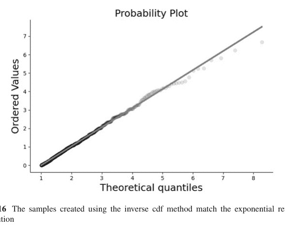

图 2.16 使用逆累积分布函数法创建的样本与指数参考分布相匹配

### 2.9.3 拒绝法

在某些情况下，求逆累积分布函数可能是不可能的。*拒绝*法可以处理这种情况。其思想是选择两个均匀随机变量 $u_1 \sim \mathcal{U}[a, b]$ 和 $u_2 \sim \mathcal{U}[0, 1]$，使得

$$\mathbb{P}\left(u_1 \in N_{\Delta}(x) \bigwedge u_2 < \frac{f(u_1)}{M}\right) \approx \frac{\Delta x}{b-a} \frac{f(u_1)}{M}$$

其中我们取 $x = u_1$ 且 $f(x) < M$。这是一个两步过程。首先，抽取 $u_1$ 和 $u_2$。其次，将 $u_1$ 输入 $f(x)$，如果 $u_2 < f(u_1)/M$，则 $u_1$ 是 $f(x)$ 的一个有效样本。因此，$u_1$ 是从 $f$ 中提议的样本，它可能被接受也可能被拒绝，这取决于 $u_2$。常数 $M$ 的唯一作用是缩放 $f(x)$，以便 $u_2$ 变量能够覆盖其范围。该方法的*效率*是接受 $u_1$ 的概率，这通过对上述近似进行积分得到：

$$\int \frac{f(x)}{M(b-a)} dx = \frac{1}{M(b-a)} \int f(x) dx = \frac{1}{M(b-a)}$$

这意味着我们不希望 $M$ 不必要地大，因为那会使样本更可能被丢弃。

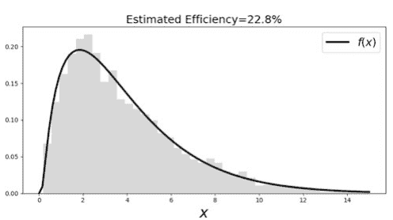

**图 2.17** 拒绝法生成的样本直方图与目标分布很好地匹配。不幸的是，效率并不高

让我们尝试用这种方法处理一个没有连续逆函数的密度函数。⁴

$$f(x) = \exp\left(-\frac{(x-1)^2}{2x}\right)(x+1)/12$$

其中 $x > 0$。以下代码实现了拒绝方案。

```
>>> x = np.linspace(0.001, 15, 100)
>>> f = lambda x: np.exp(-(x-1)**2/2./x)*(x+1)/12.
>>> fx = f(x)
>>> M=0.3 # 缩放因子
>>> u1 = np.random.rand(10000)*15 # 缩放后的均匀随机样本
>>> u2 = np.random.rand(10000) # 均匀随机样本
>>> idx, = np.where(u2<=f(u1)/M) # 拒绝准则
>>> v = u1[idx]
```

图 2.17 显示了如此生成的样本的直方图，它与概率密度函数拟合得很好。图中的标题显示了效率（*被拒绝*样本的数量），效率很低。这意味着我们丢弃了大部分提议的样本。因此，尽管这个结果在概念上没有错误，但作为实际问题，必须解决低效率的问题。图 2.18 显示了提议样本被拒绝的位置。曲线下的样本被保留（即 $u_2 < \frac{f(u_1)}{M}$），但绝大多数样本都在这个范围之外。

拒绝法使用 $u_1$ 在 $f(x)$ 的定义域上进行选择，而另一个均匀随机变量 $u_2$ 决定是否接受。一个想法是选择 $u_1$，使得 $x$ 值恰好是那些接近 $f(x)$ 峰值的值，而不是在定义域内均匀分布，尤其是在尾部，因为

> ⁴ 注意，这个示例密度函数并不像概率密度函数那样*精确*地积分为一，但其归一化常数在此处会分散注意力。

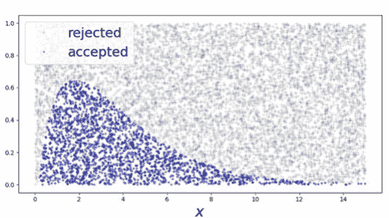

图 2.18 曲线下的提议样本被接受，其他样本则没有。这表明大多数样本被拒绝了

尾部的概率本来就低。现在，诀窍是找到一个新的密度函数 $g(x)$ 来进行采样，该函数具有相似的概率密度集中度。找到这样一个 $g(x)$ 的一种方法是熟悉那些已经具有可调参数和快速随机样本生成器的概率密度函数（例如，参见 `scipy.stats`）。对于具有有界支撑的密度函数，$\beta$ 密度族是一个很好的起点。

明确地说，我们想要的是 $u_1 \sim g(x)$，这样，回到我们之前的论证，

$$\mathbb{P}\left(u_1 \in N_{\Delta}(x) \bigwedge u_2 < \frac{f(u_1)}{M}\right) \approx g(x) \Delta x \frac{f(u_1)}{M}$$

但这*不是*我们这里需要的。问题出在逻辑合取 $\bigwedge$ 的第二部分，$u < \frac{f(u_1)}{M}$。我们需要在那里设置一个条件，使其结果与 $f(x)$ 成比例。让我们定义如下：

$$h(x) = \frac{f(x)}{g(x)} \qquad (2.14)$$

其在定义域上的最大值为 $h_{\max}$，然后回去构造子句的第二部分为：

$$\mathbb{P}\left(u_1 \in N_{\Delta}(x) \bigwedge u_2 < \frac{h(u_1)}{h_{\max}}\right) \approx g(x) \Delta x \frac{h(u_1)}{h_{\max}} = f(x) / h_{\max}$$

回想一下，满足这个标准意味着 $u_1 = x$。和之前一样，我们可以估计 $u_1$ 被接受的概率为 $1/h_{\max}$。

现在，如何构造公式 2.9.3 中的分母函数 $g(x)$？这就是熟悉一些标准概率密度函数的好处所在。对于这种情况，我们选择 $\chi^2$ 分布。下图绘制了 $g(x)$ 和 $f(x)$（左图）以及

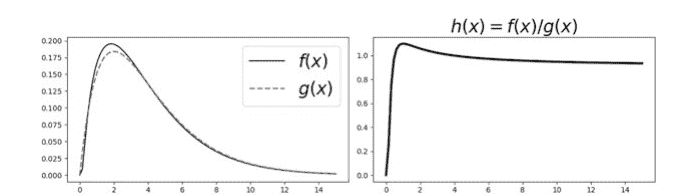

图 2.19 右图显示了 $h(x) = f(x)/g(x)$，左图分别显示了 $f(x)$ 和 $g(x)$

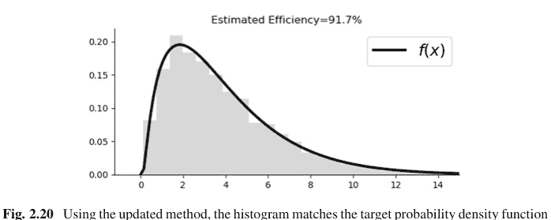

图 2.20 使用更新后的方法，直方图与目标概率密度函数高效匹配

对应的 $h(x) = f(x)/g(x)$（右图）。注意 $g(x)$ 和 $f(x)$ 的峰值几乎重合，这正是我们想要的（图 2.19）。

```
>>> ch=scipy.stats.chi2(4) # 卡方分布
>>> h = lambda x: f(x)/ch.pdf(x) # h函数
```

现在，让我们使用拒绝法从这个 $\chi^2$ 分布中生成一些样本。

```
>>> hmax=h(x).max()
>>> u1 = ch.rvs(5000) # 来自卡方分布的样本
>>> u2 = np.random.rand(5000) # 均匀随机样本
>>> idx = (u2 <= h(u1)/hmax) # 拒绝准则
>>> v = u1[idx] # 仅保留这些
```

与之前的例子（我们丢弃了至少 80% 的样本）相比，使用 $\chi^2$ 分布和拒绝法导致丢弃的生成样本不到 10%。这效率显著提高了！图 2.20 显示直方图与概率密度函数相匹配。为完整起见，图 2.21 显示了用于选择样本的相应阈值 $h(x)/h_{\max}$。

## 2.10 采样重要性重采样

一种不涉及拒绝样本或寻找 $M$ 边界或边界函数的替代拒绝法的方法是采样重要性重采样（SIR）方法。选择一个易于处理的概率密度函数 $g$，并从中抽取 $n$ 个样本，$\{x_i\}_{i=1}^n$。我们的目标是推导出 $f$ 的样本。接下来，计算以下内容：

$$q_i = \frac{w_i}{\sum w_i}$$

其中

$$w_i = \frac{f(x_i)}{g(x_i)}$$

$q_i$ 定义了一个概率质量函数，其样本近似于来自 $f$ 的样本。为了理解这一点，考虑

$$\mathbb{P}(X \leq a) = \sum_{i=1}^n q_i \mathbb{I}_{(-\infty, a]}(x_i)$$
$$= \frac{\sum_{i=1}^n w_i \mathbb{I}_{(-\infty, a]}(x_i)}{\sum_{i=1}^n w_i}$$
$$= \frac{\frac{1}{n} \sum_{i=1}^n \frac{f(x_i)}{g(x_i)} \mathbb{I}_{(-\infty, a]}(x_i)}{\frac{1}{n} \sum_{i=1}^n \frac{f(x_i)}{g(x_i)}}$$

由于 $x_i$ 样本是从 $g$ 概率分布中生成的，分子近似为

$$\mathbb{E}_g \left( \frac{f(x)}{g(x)} \right) = \int_{-\infty}^{a} f(x)dx$$

由于分母仅用于归一化，因此得到：

$$\mathbb{P}(X \leq a) = \int_{-\infty}^{a} f(x)dx$$

这表明以这种方式生成的样本服从 $f$ 分布。请注意，$g$ 与所需函数 $f$ 的差异越大，就需要从该概率质量函数中生成更多样本。此外，由于没有拒绝步骤，我们不再有效率问题。

例如，让我们为 $g$ 选择一个 beta 分布，如以下代码所示：

```
>>> g = scipy.stats.beta(2,3)
```

该分布与我们上一节所需的 $f$ 函数没有很强的相似性，如下图 2.22 所示。请注意，我们缩放了 beta 分布的定义域，使其接近 $f$ 的支撑集。

在下一个代码块中，我们从 $g$ 分布中采样，并按照上述方法计算权重。最后一步是从这个新的概率质量函数中采样。结果归一化直方图与目标 $f$ 概率密度函数的比较如图 2.23 所示。

```
>>> xi = g.rvs(500)
>>> w = np.array([f(i*15)/g.pdf(i) for i in xi])
>>> fsamples=np.random.choice(xi*15,5000,p = w/w.sum())
```

在本节中，我们研究了如何从给定的分布（无论是离散的还是连续的）生成随机样本。对于连续情况，关键问题在于累积密度函数是否具有连续的反函数。如果没有，我们必须求助于拒绝法，并找到一个合适的、易于采样的相关密度函数，作为拒绝阈值的一部分。找到这样的函数是一门艺术，但多年来已经研究了许多概率密度族，它们已经具有快速的随机数生成器。

拒绝法有许多复杂的扩展，涉及对定义域的仔细划分以及针对边界情况的许多特殊方法。尽管如此，所有这些高级技术仍然是我们在此说明的相同基本主题的变体 [12], [18]。

## 2.11 有用的不等式

在实践中，很少有量可以解析计算。一些关于边界不等式的知识有助于找到潜在解的大致范围。本节讨论三个对概率、统计和机器学习很重要的关键不等式。

### 2.11.1 马尔可夫不等式

设 $X$ 为非负随机变量，并假设 $\mathbb{E}(X) < \infty$。那么，对于任何 $t > 0$，

$$\mathbb{P}(X > t) \leq \frac{\mathbb{E}(X)}{t}$$

这是一个基础不等式，用作其他不等式的垫脚石。它很容易证明。因为 $X > 0$，我们有：

$$\mathbb{E}(X) = \int_0^\infty x f_x(x) dx = \underbrace{\int_0^t x f_x(x) dx}_{\text{省略此项}} + \int_t^\infty x f_x(x) dx$$
$$\geq \int_t^\infty x f_x(x) dx \geq t \int_t^\infty f_x(x) dx = t \mathbb{P}(X > t)$$

建立不等式的步骤是省略 $\int_0^t x f_x(x) dx$ 的部分。对于可能集中在 $[0, t]$ 区间周围的特定 $f_x(x)$，这可能会省略很多。因此，马尔可夫不等式被认为是一个*宽松*的不等式，意味着不等式两边之间存在相当大的差距。例如，如图 2.24 所示，$\chi^2$ 分布的大部分质量集中在左侧，这在马尔可夫不等式中会被省略。图 2.25 显示了马尔可夫不等式建立的两条曲线。灰色阴影区域是两项之间的差距，表明了该情况下边界的宽松程度（阴影区域越宽）。

### 2.11.2 切比雪夫不等式

切比雪夫不等式直接由马尔可夫不等式得出。设 $\mu = \mathbb{E}(X)$ 且 $\sigma^2 = \mathbb{V}(X)$。那么，我们有

$$\mathbb{P}(|X - \mu| \geq t) \leq \frac{\sigma^2}{t^2}$$

注意，如果我们进行归一化，使得 $Z = (X - \mu)/\sigma$，那么我们有 $\mathbb{P}(|Z| \geq k) \leq 1/k^2$。特别地，$\mathbb{P}(|Z| \geq 2) \leq 1/4$。我们可以使用 Sympy 统计模块来说明这个不等式：

```
>>> import sympy
>>> import sympy.stats as ss
>>> t=sympy.symbols('t')
>>> x=ss.ChiSquared('x',1)
```

为了得到切比雪夫不等式的左边，我们必须将其写成以下条件概率：

```
>>> r = ss.P((x-1) > t,x>1)+ss.P(-(x-1) > t,x<1)
```

我们可以取上述表达式（它是 $t$ 的函数）并尝试计算积分，但这将花费很长时间（表达式非常长且复杂，这就是我们上面没有打印它的原因）。在这种情况下，最好使用内置的累积密度函数，如下所示（在对项进行一些重新排列之后）：

```
>>> w=(1-ss.cdf(x)(t+1))+ss.cdf(x)(1-t)
```

为了绘制它，我们可以使用 `.subs` 替换方法在各种 $t$ 值处进行评估，但使用 `lambdify` 方法将表达式转换为函数更为方便。

```
>>> fw=sympy.lambdify(t,w)
```

然后，我们可以使用类似以下方式评估此函数：

```
>>> [fw(i) for i in [0,1,2,3,4,5]]
[1.0, 0.157299207050285, 0.08326451666355039, 0.04550026389635842, 0.0253473186774682, 0.014305878435429631]
```

以生成下图 2.26。

> **编程提示**
> 请注意，我们不能对 `lambdify` 函数使用向量化输入，因为它包含仅在 Sympy 中可用的嵌入函数。否则，我们可以使用 `lambdify(t,fw,numpy)` 来指定表达式中要使用的 Numpy 对应函数。

### 2.11.3 霍夫丁不等式

霍夫丁不等式与马尔可夫不等式相似，但不那么宽松。设 $X_1, \dots, X_n$ 为独立同分布的观测值，使得 $\mathbb{E}(X_i) = \mu$ 且 $a \le X_i \le b$。那么，对于任何 $\epsilon > 0$，我们有

$$\mathbb{P}(|\overline{X}_n - \mu| \ge \epsilon) \le 2 \exp(-2n\epsilon^2/(b-a)^2)$$

其中 $\overline{X}_n = \frac{1}{n} \sum_i^n X_i$。请注意，我们进一步假设各个随机变量是有界的。

**推论** 如果 $X_1, \dots, X_n$ 是独立的，满足 $\mathbb{P}(a \le X_i \le b) = 1$ 且所有 $\mathbb{E}(X_i) = \mu$。那么，我们有

$$|\overline{X}_n - \mu| \le \sqrt{\frac{c}{2n} \log \frac{2}{\delta}}$$

其中 $c = (b-a)^2$。我们将在机器学习章节中再次看到这个不等式。图 2.27 显示了十个独立同分布的均匀分布随机变量 $X_i \sim \mathcal{U}[0, 1]$ 的马尔可夫和霍夫丁边界。实线显示 $\mathbb{P}(|\overline{X}_n - 1/2| > \epsilon)$。请注意，霍夫丁不等式比马尔可夫不等式更紧，并且当 $\epsilon$ 足够大时，两者会合并。

**霍夫丁不等式的证明** 我们需要以下引理来证明霍夫丁不等式。

## 2 概率

**图 2.27** 此图展示了十个独立同分布随机变量情况下的马尔可夫界与霍夫丁界。

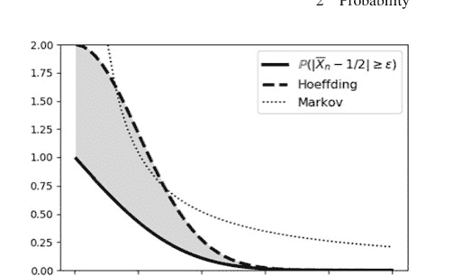

**引理** 设 $X$ 是一个随机变量，满足 $\mathbb{E}(X) = 0$ 且 $a \le X \le b$。那么，对于任意 $s > 0$，我们有如下不等式：

$$\mathbb{E}(e^{sX}) \le e^{s^2(b-a)^2/8}$$

由于 $X$ 包含在闭区间 $[a, b]$ 内，我们可以将其表示为区间端点的凸组合。

$$X = \alpha_1 a + \alpha_2 b$$

其中 $\alpha_1 + \alpha_2 = 1$。求解 $\alpha_i$ 项，我们得到

$$\alpha_1 = \frac{x - a}{b - a}$$
$$\alpha_2 = \frac{b - x}{b - a}$$

根据詹森不等式，对于凸函数 $f$，我们知道

$$f \left( \sum \alpha_i x_i \right) \le \sum \alpha_i f(x_i)$$

鉴于 $e^X$ 的凸性，我们因此有

$$e^{sX} \le \alpha_1 e^{sa} + \alpha_2 e^{sb}$$

由于 $\mathbb{E}(X) = 0$，我们可以写出两边的期望

$$\mathbb{E}(e^{sX}) \le \mathbb{E}(\alpha_1)e^{sa} + \mathbb{E}(\alpha_2)e^{sb}$$

其中 $\mathbb{E}(\alpha_1) = \frac{b}{b-a}$ 且 $\mathbb{E}(\alpha_2) = \frac{-a}{b-a}$。因此，我们有

$\mathbb{E}(e^{sX}) \leq \frac{b}{b-a}e^{sa} - \frac{a}{b-a}e^{sb}$

令 $p := \frac{-a}{b-a}$，我们可以重写如下：

$\frac{b}{b-a}e^{sa} - \frac{a}{b-a}e^{sb} = (1-p)e^{sa} + pe^{sb} =: e^{\phi(u)}$

其中

$\phi(u) = -pu + \log(1-p+pe^u)$

且 $u = s(b-a)$。注意 $\phi(0) = \phi'(0) = 0$。同时，$\phi''(0) = p(1-p) \leq 1/4$。因此，对于 $t \in [0, u]$，$\phi(u)$ 的泰勒展开式为 $\phi(u) \approx \frac{u^2}{2}\phi''(t) \leq \frac{u^2}{8}$。

为了证明霍夫丁不等式，我们从马尔可夫不等式开始：

$\mathbb{P}(X \geq \epsilon) \leq \frac{\mathbb{E}(X)}{\epsilon}$

然后，给定 $s > 0$，我们有如下推导，

$\mathbb{P}(X \geq \epsilon) = \mathbb{P}(e^{sX} \geq e^{s\epsilon}) \leq \frac{\mathbb{E}(e^{sX})}{e^{s\epsilon}}$

我们可以将单边霍夫丁不等式写为如下形式：

$\mathbb{P}(\overline{X}_n - \mu \geq \epsilon) \leq e^{-s\epsilon}\mathbb{E}(\exp(\frac{s}{n}\sum_{i=1}^n(X_i - \mathbb{E}(X_i))))$
$= e^{-s\epsilon}\prod_{i=1}^n\mathbb{E}(e^{\frac{s}{n}(X_i-\mathbb{E}(X_i))})$
$\leq e^{-s\epsilon}\prod_{i=1}^n e^{\frac{s^2}{n^2}(b-a)^2/8}$
$= e^{-s\epsilon}e^{\frac{s^2}{n}(b-a)^2/8}$

现在，我们希望选择 $s > 0$ 来最小化这个上界。那么，令 $s = \frac{4n\epsilon}{(b-a)^2}$

$\mathbb{P}(\overline{X}_n - \mu \geq \epsilon) \leq e^{-\frac{2n\epsilon^2}{(b-a)^2}}$

不等式的另一侧可以通过类似的推导得到，从而获得霍夫丁不等式。

### 2.11.4 詹森不等式

如果 $f$ 是一个关于随机变量 $v$ 的凸函数，那么

$$\mathbb{E}(f(v)) \geq f(\mathbb{E}(v))$$

其证明是直接的。定义 $L(v) = av + b$，其中 $a, b \in \mathbb{R}$。选择 $a$ 和 $b$ 使得 $L(\mathbb{E}(v)) = f(\mathbb{E}(v))$，这使得 $L$ 在 $\mathbb{E}(v)$ 处与 $f$ 相切。根据 $f$ 的凸性，我们有 $f(v) \geq L(v)$。我们可以对这个不等式的两边取期望：

$$\begin{aligned} \mathbb{E}(f(v)) &\geq \mathbb{E}(L(v)) \\ &= \mathbb{E}(av + b) \\ &= a\mathbb{E}(v) + b \\ &= L(\mathbb{E}(v)) \\ &= f(\mathbb{E}(v)) \end{aligned}$$

当 $f$ 是线性函数时，等号成立。对于凹函数 $f$，不等式的方向相反。

# 第3章
统计学

## 3.1 引言

统计学始于数据，然后通过严谨的论证，得出关于生成数据的潜在概率结构的结论。通过这种方式，统计学是概率论的逆问题，我们从概率密度函数开始，然后推理该函数的变换。统计学是关于建立一个既具有解释力又具有预测力的数据模型。该模型必须强调对我们目标重要的数据方面。任何模型都必然是对现实的简化，并且总是有许多模型可供选择，因此统计学的一个重要部分就是做出良好的选择。例如，这里有一个实际问题：

-   你已经参加了两次入学考试，你想知道是否值得参加第三次，以期提高你的分数。由于只报告最后一次成绩，你担心第三次可能会考得更差。你如何决定是否再次参加考试？

对于这个问题，我们拥有的数据点相对较少，我们希望选择一个具有良好预测能力而非解释能力的统计模型。我们需要量化预测的质量，以便做出是否再次参加考试的决定。统计学提供了结构化的方法来解决我们的关切。

统计学作为一个逆问题，很少是适定的，这意味着对于每个数据集，并非只有一个模型。当我们仅从数据开始时，我们缺乏上一章讨论的潜在概率密度。在下文中，我们从概念和Python模块实现两个方面考虑一些最广泛使用的统计工具。本章提供了许多在数学和代码上都详尽阐述的数值示例。

## 3.2 用于统计学的Python模块

Python拥有强大的第三方模块，用于数值和符号统计分析。

### 3.2.1 Scipy统计模块

尽管Numpy中有一些基本的统计函数（例如，均值、标准差、中位数），但统计函数的真正宝库在 `scipy.stats` 中。`scipy.stats` 中实现了超过80个连续概率分布，以及另外10多个离散分布，还有许多其他补充统计函数。

要开始使用 `scipy.stats`，你必须加载模块并创建一个包含你感兴趣分布的对象。例如，

```
>>> import scipy.stats # might take awhile
>>> n = scipy.stats.norm(0,10) # create normal distrib
```

变量 `n` 是一个表示均值为零、标准差 $\sigma = 10$ 的正态分布随机变量的对象。注意，这两个参数更通用的术语分别是 *位置* 和 *尺度*。现在我们已经定义了它，我们可以计算 `mean`，如下所示：

```
>>> n.mean() # we already know this from its definition!
0.0
```

我们也可以计算高阶矩，如下：

```
>>> n.moment(4)
30000.0
```

连续随机变量的主要公共方法有：

-   `rvs`：随机变量
-   `pdf`：概率密度函数
-   `cdf`：累积分布函数
-   `sf`：生存函数 (1-CDF)
-   `ppf`：百分位点函数 (CDF的逆)
-   `isf`：逆生存函数 (SF的逆)
-   `stats`：均值、方差、（费舍尔）偏度或（费舍尔）峰度
-   `moment`：分布的非中心矩

例如，我们可以计算pdf在特定点的值

```
>>> n.pdf(0)
0.03989422804014327
```

或者计算同一随机变量的cdf。

```
>>> n.cdf(0)
0.5
```

你也可以从该分布中创建样本，如下所示：

```
>>> n.rvs(10)
array([15.3244518 , -9.4087413 ,  6.94760096,  0.61627683,
       -3.92073633,  6.9753351 ,  7.95314387, -3.18127815,  5.69087949,
        0.84197674])
```

许多常见的统计检验已经内置。例如，Shapiro-Wilks检验数据是否来自正态分布的原假设，¹ 如下所示：

```
>>> scipy.stats.shapiro(n.rvs(100))
ShapiroResult(statistic=0.9749656915664673,
    pvalue=0.05362436920404434)
```

元组中的第二个值是 *p* 值（下文讨论）。

### 3.2.2 Sympy统计模块

Sympy拥有自己的统计模块，虽然小得多，但仍然非常有用，它支持对统计量进行符号操作。例如，

```
>>> from sympy import stats, sqrt, exp, pi
>>> X = stats.Normal('x',0,10) # create normal random variable
```

我们可以获得概率密度函数，如下：

```
>>> from sympy.abc import x
>>> stats.density(X)(x)
sqrt(2)*exp(-x**2/200)/(20*sqrt(pi))
>>> sqrt(2)*exp(-x**2/200)/(20*sqrt(pi))
sqrt(2)*exp(-x**2/200)/(20*sqrt(pi))
```

我们可以通过以下方式计算累积密度函数：

```
>>> stats.cdf(X)(0)
1/2
```

注意，你可以通过对输出使用 `evalf()` 方法来数值计算它。Sympy通过使用 `stats.P` 函数提供了直观的方式来考虑标准概率问题，如下所示：

> ¹ 我们将在后面解释原假设及其相关内容。

还有一个对应的期望函数 `stats.E`，你可以利用它，结合 Sympy 强大的内置积分工具来计算复杂的期望值。例如，我们可以如下计算 $\mathbb{E}(\sqrt{|X|})$：

```
>>> stats.E(abs(X)**(1/2)).evalf()
2.59995815363879
```

遗憾的是，在撰写本文时，对多变量分布的支持非常有限。

### 3.2.3 用于统计的其他 Python 模块

还有许多其他重要的 Python 模块可用于统计工作。两个重要的模块是 Seaborn 和 Statsmodels。正如我们之前讨论的，Seaborn 是一个建立在 Matplotlib 之上的库，用于创建非常详细且富有表现力的统计可视化，非常适合探索性数据分析。Statsmodels 旨在补充 Scipy，提供描述性统计、估计以及针对多种统计模型的推断功能。Statsmodels 包括（除其他外）广义线性模型、稳健线性模型以及时间序列分析方法，重点在于计量经济学数据和问题。这两个模块都得到了良好的支持，文档非常完善，并且设计为与 Matplotlib、Numpy、Scipy 以及科学 Python 技术栈的其他部分紧密集成。由于本文的重点更偏向概念性而非特定领域，我选择不强调这两个模块，尽管它们各自都非常强大。

## 3.3 收敛的类型

原始数据缺乏概率密度函数，这意味着我们必须以一种结构化的方式来讨论随机变量序列。回顾基础微积分中的收敛符号：

$x_n \rightarrow x_o$

对于实数序列 $x_n$。这意味着对于任意给定的 $\epsilon > 0$，无论它多么小，我们都能找到一个 $m$，使得对于任何 $n > m$，都有

$|x_n - x_o| < \epsilon$

直观地说，这意味着一旦序列中的项超过 $m$，它们就会落在 $x_o$ 的 $\epsilon$ 邻域内。这意味着在趋向无穷的漫长过程中，序列中不会发生任何意外情况，这赋予了收敛过程一种均匀性。当我们讨论统计学中的收敛时，我们希望保持与这里相同的直观感受，但由于我们现在讨论的是随机变量，我们需要其他概念。随机变量有两个活动的部分。回顾我们的概率章节，随机变量实际上是将集合映射到实数轴的函数：$X : \Omega \mapsto \mathbb{R}$。因此，一部分是 $\Omega$ 的子集在收敛方面的行为。另一部分是随机变量的实数值序列在收敛方面的行为。

### 3.3.1 几乎必然收敛

将这种收敛概念最直接地扩展到统计学中的是*几乎必然收敛*，也称为*以概率 1 收敛*

$\mathbb{P}\{\text{对于每个 } \epsilon > 0 \text{，存在 } n_{\epsilon} > 0 \text{ 使得对于所有 } n > n_{\epsilon}, |X_n - X| < \epsilon\} = 1$

注意这与先前实数收敛概念的相似性。当这种情况发生时，我们将其写作 $X_n \xrightarrow{as} X$。在此上下文中，几乎必然收敛意味着，如果我们取任意特定的 $\omega \in \Omega$，然后观察由每个随机变量产生的实数序列，

$(X_1(\omega), X_2(\omega), X_3(\omega), \ldots, X_n(\omega))$

那么这个序列在实数轴收敛的意义上就是一个实数值序列，并以相同的方式收敛。如果我们收集所有满足此条件的 $\omega$，并且该集合的测度等于 1，那么我们就有了随机变量的几乎必然收敛。注意收敛概念如何应用于随机变量的两侧：（定义域）$\Omega$ 侧和（值域）实数值侧。

一种等效且更简洁的写法如下：

$\mathbb{P}\left(\omega \in \Omega : \lim_{n \to \infty} X_n(\omega) = X(\omega)\right) = 1$

**示例** 为了对这种收敛机制有一些直观感受，考虑以下在单位区间上均匀分布的随机变量序列，$X_n \sim \mathcal{U}[0, 1]$。现在，考虑取 $n$ 个此类变量集合的最大值如下：

$X_{(n)} = \max\{X_1, \ldots, X_n\}$

换句话说，我们扫描一个包含 $n$ 个均匀分布随机变量的列表，并从中选出最大值。直观地说，我们应该预期 $X_{(n)}$ 会以某种方式收敛到 1。让我们看看是否能让它几乎必然地发生。我们希望找到一个 $m$，使得以下条件成立：

$\mathbb{P}(|1 - X_{(n)}|) < \epsilon \text{ 当 } n > m$

因为 $X_{(n)} < 1$，我们可以将其简化为：

$1 - \mathbb{P}(X_{(n)} < 1 - \epsilon) = 1 - (1 - \epsilon)^m \xrightarrow[m\to\infty]{} 1$

因此，这个序列几乎必然收敛。我们可以使用 Scipy 在 Python 中具体实现这个例子，代码如下：

```
>>> from scipy import stats
>>> u = stats.uniform()
>>> xn = lambda i: u.rvs(i).max()
>>> xn(5)
0.966717838482003
```

因此，xn 变量与我们例子中的 $X_{(n)}$ 随机变量相同。图 3.1 显示了这些随机变量在不同 $n$ 值以及每个随机变量多次实现（多条灰色线）下的绘图。深色水平线位于 0.95 水平。对于这个例子，假设我们感兴趣的是随机变量收敛到 1 的 0.05 邻域内，因此我们关注 1 和 0.95 之间的区域。因此，在我们的公式 3.1 中，$\epsilon = 0.05$。现在，我们需要找到 $n_\epsilon$ 以实现几乎必然收敛。从图 3.1 可以看出，一旦 $n > 60$，我们就可以看到所有实现都开始落在 0.95 水平线以上的区域。然而，仍然存在一些特定实现会低于此线的情况。为了满足定义的概率保证，我们必须确保无论我们最终选择哪个 $n_{\epsilon}$，这种不合规行为的概率都应该非常小，比如小于 1%。现在，我们可以计算以下内容来估计 $n = 60$ 时在 1000 次实现中的概率：

```
>>> import numpy as np
>>> np.mean([xn(60) > 0.95 for i in range(1000)])
0.961
```

所以，在 $n > 60$ 之后出现不合规情况的概率相当不错，但仍然不是我们想要的（0.99）。我们可以通过代入 $\epsilon$ 和我们期望的概率约束来求解收敛分析证明中的 $m$：

```
>>> np.log(1-.99)/np.log(.95)
89.78113496070968
```

现在，将这个值向上取整，并重新进行与上面相同的估计：

```
>>> import numpy as np
>>> np.mean([xn(90) > 0.95 for i in range(1000)])
0.995
```

这就是我们想要的结果。从这个例子中需要理解的重要一点是，为了计算 $m$，我们必须为随机变量的值（0.95）和达到该水平的概率（0.99）都选择收敛标准。非正式地说，几乎必然收敛意味着不仅对于大的 $n$，任何特定的 $X_n$ 都会接近 $X$，而且整个值序列将以高概率保持接近 $X$。

### 3.3.2 依概率收敛

一种较弱的收敛类型是*依概率收敛*，其含义如下：

$\mathbb{P}(| X_n - X | > \epsilon) \to 0$

当 $n \to \infty$ 时，对于每个 $\epsilon > 0$。

这在符号上表示为 $X_n \xrightarrow{P} X$。例如，让我们考虑以下随机变量序列，其中 $X_n = 1/2^n$ 的概率为 $p_n$，而 $X_n = c$ 的概率为 $1 - p_n$。那么，当 $p_n \to 1$ 时，我们有 $X_n \xrightarrow{P} 0$。在这种收敛概念下这是允许的，因为存在逐渐减少的*不收敛*行为（即当 $X_n = c$ 时）。注意我们没有说明 $p_n \to 1$ 的*方式*。

**示例** 为了对这种收敛机制有一些直观感受，令 $\{X_1, X_2, X_3, \dots\}$ 为相应区间的指示函数：$(0, 1], (0, \frac{1}{2}], (\frac{1}{2}, 1], (0, \frac{1}{3}], (\frac{1}{3}, \frac{2}{3}], (\frac{2}{3}, 1]$

换句话说，只需不断将单位区间等分，并用 $X_i$ 来枚举这些区间。由于每个 $X_i$ 都是一个指示函数，它只取两个值：零和一。例如，对于 $X_2$，若 $0 < x \le 1/2$ 则 $X_2 = 1$，否则为零。注意 $x \sim \mathcal{U}(0, 1)$。这意味着 $P(X_2 = 1) = 1/2$。现在，我们想对某个 $\epsilon \in (0, 1)$，计算每个 $n$ 对应的 $P(X_n > \epsilon)$ 序列。对于 $X_1$，我们有 $P(X_1 > \epsilon) = 1$，因为我们已经选择 $\epsilon$ 在 $X_1$ 覆盖的区间内。对于 $X_2$，我们有 $P(X_2 > \epsilon) = 1/2$；对于 $X_3$，我们有 $P(X_3 > \epsilon) = 1/3$；以此类推。这产生了以下序列：$(1, \frac{1}{2}, \frac{1}{3}, \frac{1}{4}, \dots)$。该序列的极限为零，因此 $X_n \xrightarrow{P} 0$。然而，对于每个 $x \in (0, 1)$，函数值序列 $X_n(x)$ 由无穷多个零和一组成（记住指示函数只能取零或一）。因此，序列 $X_n(x)$ 收敛的 $x$ 集合是空集，因为该序列在零和一之间跳跃。这意味着尽管我们有依概率收敛，但几乎处处收敛在此处不成立。关键区别在于，依概率收敛考虑的是概率序列的收敛性，而几乎处处收敛关注的是随机变量在*填满*整个底层概率空间（即概率为一）的事件集上的取值序列。

这是一个很好的例子，让我们看看能否用一些 Python 使其具体化。以下是计算不同子区间的函数：

```
>>> make_interval= lambda n: np.array(list(zip(range(n+1),
...                                             range(1,n+1))))/n
```

现在，我们可以使用此函数创建一个区间的 Numpy 数组，如示例所示：

```
>>> intervals= np.vstack([make_interval(i) for i in range(1,5)])
>>> print(intervals)
[[0.         1.        ]
 [0.         0.5       ]
 [0.5        1.        ]
 [0.         0.33333333]
 [0.33333333 0.66666667]
 [0.66666667 1.        ]
 [0.         0.25      ]
 [0.25       0.5       ]
 [0.5        0.75      ]
 [0.75       1.        ]]
```

以下函数计算我们示例中的比特串：$\{X_1, X_2, \dots, X_n\}$，

```
>>> bits= lambda u:((intervals[:,0] < u) &
...                   (u<=intervals[:,1])).astype(int)
>>> bits(u.rvs())
array([1, 0, 1, 0, 0, 1, 0, 0, 0, 1])
```

现在我们有了各个比特串，为了展示收敛性，我们希望证明每个条目的概率趋近于一个极限。例如，使用十次实现：

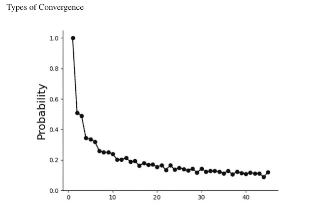

图 3.2 随机变量序列的依概率收敛

```
>>> print(np.vstack([bits(u.rvs()) for i in range(10)]))
[[1 1 0 1 0 0 0 1 0 0]
 [1 1 0 1 0 0 0 1 0 0]
 [1 1 0 0 1 0 0 1 0 0]
 [1 0 1 0 0 1 0 0 1 0]
 [1 0 1 0 0 1 0 0 1 0]
 [1 1 0 0 1 0 0 1 0 0]
 [1 1 0 1 0 0 1 0 0 0]
 [1 1 0 0 1 0 0 1 0 0]
 [1 1 0 0 1 0 0 1 0 0]
 [1 1 0 1 0 0 1 0 0 0]]
```

我们希望每一列中一的极限概率收敛到一个极限。我们可以使用以下代码在 1000 次实现上估计这一点：

```
>>> np.vstack([bits(u.rvs()) for i in range(1000)]).mean(axis=0)
array([1.    , 0.493, 0.507, 0.325, 0.34 , 0.335, 0.253, 0.24 , 0.248,
       0.259])
```

注意，这些条目应趋近于我们之前找到的 $(1, \frac{1}{2}, \frac{1}{2}, \frac{1}{3}, \frac{1}{3}, ...)$ 序列。图 3.2 显示了这些概率在大量区间下的收敛情况。最终，当 $n$ 足够大时，此图上显示的概率将减小到零。再次注意，各个零和一的序列不收敛，但这些序列的概率收敛。这是几乎处处收敛与依概率收敛之间的关键区别。因此，依概率收敛*不*蕴含几乎处处收敛。反之，几乎处处收敛*确实*蕴含依概率收敛。

以下符号应有助于分别强调几乎处处收敛与依概率收敛之间的区别：

$P\left(\lim _{n \rightarrow \infty}\left|X_{n}-X\right|<\epsilon\right)=1$ （几乎处处收敛）

$\lim _{n \rightarrow \infty} P\left(\left|X_{n}-X\right|<\epsilon\right)=1$ （依概率收敛）

### 3.3.3 依分布收敛

到目前为止，我们一直在讨论概率序列或随机变量取值序列的收敛性。相比之下，下一种主要的收敛类型是*依分布收敛*，其中

$\lim _{n \rightarrow \infty} F_{n}(t)=F(t)$

对于所有 $F$ 连续的 $t$ 成立，$F$ 是累积密度函数。对于这种情况，收敛仅涉及累积密度函数，记为 $X_{n} \stackrel{d}{\rightarrow} X$。

**示例** 为了对这种收敛建立一些直觉，考虑一个 $X_{n}$ 伯努利随机变量序列。此外，假设它们实际上都是同一个随机变量 $X$。显然，$X_{n} \stackrel{d}{\rightarrow} X$。现在，假设我们定义 $Y=1-X$，这意味着 $Y$ 与 $X$ 具有相同的分布。因此，$X_{n} \stackrel{d}{\rightarrow} Y$。相比之下，因为对所有 $n$ 都有 $\left|X_{n}-Y\right|=1$，我们永远不可能有几乎处处收敛或依概率收敛。因此，依分布收敛是三种收敛形式中最弱的，因为它被其他两种所蕴含，但不蕴含其他两种中的任何一种。

作为另一个引人注目的例子，我们可能有 $Y_{n} \stackrel{d}{\rightarrow} Z$，其中 $Z \sim \mathcal{N}(0,1)$，但我们也可能有 $Y_{n} \stackrel{d}{\rightarrow}-Z$。也就是说，$Y_{n}$ 可能依分布收敛到 $Z$ 或 $-Z$。这可能看起来模棱两可，但这种收敛在实践中非常有用，因为它允许用更简单的分布来近似复杂的分布。

### 3.3.4 极限定理

既然我们有了所有这些收敛的概念，我们可以将它们应用于不同的情况，并看看我们能从中构建什么样的命题。

**大数定律（弱）** 设 $\left\{X_{1}, X_{2}, \ldots, X_{n}\right\}$ 是一个独立同分布（iid）的随机变量集，具有有限均值 $\mathbb{E}\left(X_{k}\right)=\mu$ 和有限方差。令 $\overline{X}_{n}=\frac{1}{n} \sum_{k} X_{k}$。那么，我们有 $\overline{X}_{n} \stackrel{P}{\rightarrow} \mu$。这个结果很重要，因为我们经常使用某种平均过程来估计参数。这基本上从依概率收敛的角度证明了这一点。非正式地说，这意味着当 $n \to \infty$ 时，$\overline{X}_n$ 的分布变得集中在 $\mu$ 周围。

**大数定律（强）** 设 $\{X_1, X_2, \ldots\}$ 是一个独立同分布的随机变量集。假设 $\mu = \mathbb{E}|X_i| < \infty$，则 $\overline{X}_n \xrightarrow{as} \mu$。之所以称之为强定律，是因为它蕴含了弱定律，因为几乎处处收敛蕴含依概率收敛。所谓的柯尔莫哥洛夫准则给出了以下级数的收敛性：

$$\sum_k \frac{\sigma_k^2}{k^2}$$

作为强定律适用于具有相应 $\{\sigma_k^2\}$ 的序列 $\{X_k\}$ 的充分条件。

例如，考虑一个无限的伯努利试验序列，其中 $X_i = 1$ 如果第 $i$ 次试验成功。那么 $\overline{X}_n$ 是 $n$ 次试验中成功的相对频率，而 $\mathbb{E}(X_i)$ 是第 $i$ 次试验成功的概率 $p$。在所有这些都确定之后，弱定律只是说，如果我们考虑一个足够大且固定的 $n$，那么相对频率将收敛到 $p$ 的概率是有保证的。强定律指出，如果我们把所有无限次 $\{X_i\}$ 的观测视为实验的一次执行，那么成功的相对频率将几乎必然收敛到 $p$。强大数定律和弱大数定律之间的区别很微妙，在概率论的实际应用中很少出现。

**中心极限定理** 尽管弱大数定律告诉我们 $\overline{X}_n$ 的分布变得集中在 $\mu$ 周围，但它没有告诉我们这个分布是什么。中心极限定理（CLT）指出 $\overline{X}_n$ 的分布近似于均值为 $\mu$、方差为 $\sigma^2/n$ 的正态分布。令人惊讶的是，除了均值和方差的存在性之外，对 $X_i$ 的分布没有任何假设。以下是中心极限定理：设 $\{X_1, X_2, \ldots, X_n\}$ 是独立同分布的，均值为 $\mu$，方差为 $\sigma^2$。那么，

$$Z_n = \frac{\sqrt{n}(\overline{X}_n - \mu)}{\sigma} \xrightarrow{P} Z \sim \mathcal{N}(0, 1)$$

中心极限定理的宽松解释是，$\overline{X}_n$ 可以合理地用正态分布来近似。因为我们在这里讨论的是依概率收敛，所以关于概率的命题是合理的，而不是关于随机变量本身的命题。直观地说，这表明正态性源于具有有限方差的小的、独立的扰动之和。从技术上讲，有限方差的假设对于正态性至关重要。尽管中心极限定理提供了一个强大、通用的近似，但对于特定情况，近似的质量仍然取决于原始（通常是未知的）分布。

## 3.4 使用最大似然进行估计

估计问题始于从数据中推断有意义信息的需求。对于参数估计，其策略是为数据假设一个模型，然后使用数据来拟合模型参数。这引出了两个基本问题：模型从何而来，以及如何估计参数。第一个问题的最佳答案是这句格言：*所有模型都是错误的，但有些是有用的*。换句话说，选择模型既取决于应用本身，也取决于模型本身。可以把模型想象成建造不同的望远镜来观测天空。没有人会声称望远镜创造了天空！数据模型也是如此。模型为我们提供了看待数据的多种视角，而这些数据本身是某些更深层次潜在现象的代理。

某些类别的数据可能更常使用特定类型的模型进行研究，但这通常具有很强的领域特异性，并最终取决于分析的目标。在某些情况下，选择模型背后可能有很强的物理原因。例如，可以假设模型是线性的，并带有一些噪声，如下所示：

$$Y = aX + \epsilon$$

这基本上意味着，作为实验者，你为 $X$ 设定某个值，然后读取与 $X$ 成正比的测量值 $Y$，再加上一些你归因于仪器抖动的加性噪声。接下来，在假设 $\epsilon$ 性质的前提下，估计模型中的参数 $a$。如何计算模型参数取决于具体的方法论。两大类方法是参数估计和非参数估计。在前者中，我们假设已知数据的密度函数，然后尝试推导其嵌入的参数。在后者中，我们仅声称知道密度函数属于一个广泛的密度函数类别，然后使用数据来表征该类中的一个成员。广义上讲，前者比后者消耗的数据更少，因为需要从数据中计算的未知数更少。

现在让我们专注于参数估计。传统上，将待估计的未知参数表示为 $\theta$，它是大量备选空间 $\Theta$ 中的一个成员。为了在潜在的 $\theta$ 值之间进行判断，我们需要一个目标函数，称为*风险函数* $L(\theta, \hat{\theta})$，其中 $\hat{\theta}(\mathbf{x})$ 是从可用数据 $\mathbf{x}$ 推导出的未知 $\theta$ 的估计值。最常见且有用的风险函数是平方误差损失：

$$L(\theta, \hat{\theta}) = (\theta - \hat{\theta})^2$$

尽管简洁，但这并不实用，因为我们需要知道未知的 $\theta$ 才能计算它。另一个问题是，由于 $\hat{\theta}$ 是观测数据的函数，它也是一个具有自身概率密度函数的随机变量。这引出了*期望风险*函数的概念：

$$R(\theta, \hat{\theta}) = \mathbb{E}_{\theta}(L(\theta, \hat{\theta})) = \int L(\theta, \hat{\theta}(\mathbf{x})) f(\mathbf{x}; \theta) d\mathbf{x}$$

换句话说，给定一个固定的 $\theta$，对数据的概率密度函数 $f(\mathbf{x})$ 进行积分以计算风险。代入平方误差损失，我们计算均方误差：

$$\mathbb{E}_{\theta}(\theta - \hat{\theta})^2 = \int (\theta - \hat{\theta})^2 f(\mathbf{x}; \theta) d\mathbf{x}$$

这可以分解为重要的*偏差*部分

$$\text{偏差} = \mathbb{E}_{\theta}(\hat{\theta}) - \theta$$

以及相应的方差 $\mathbb{V}_{\theta}(\hat{\theta})$，如下所示的*均方误差* (MSE)：

$$\mathbb{E}_{\theta}(\theta - \hat{\theta})^2 = \text{偏差}^2 + \mathbb{V}_{\theta}(\hat{\theta})$$

这是一个我们将反复讨论的重要权衡。其思想是，当估计量 $\hat{\theta}$ 在所有可能数据 $f(\mathbf{x})$ 上积分后，不等于底层目标参数 $\theta$ 时，偏差是非零的。在某种意义上，无论使用多少数据，估计量都偏离了目标。当偏差等于零时，估计量是*无偏的*。对于固定的均方误差，低偏差意味着高方差，反之亦然。这种权衡过去并未得到强调，人们反而更多地关注无偏估计量的最小方差（参见克拉美-罗下界）。在实践中，理解并利用偏差与方差之间的权衡以降低均方误差更为重要。

有了这些铺垫，我们现在可以通过考察*极小极大风险*来探究情况能有多糟：

$$R_{\text{mmx}} = \inf_{\hat{\theta}} \sup_{\theta} R(\theta, \hat{\theta})$$

其中下确界是在所有估计量上取的。直观地说，这意味着如果我们找到了最坏的 $\theta$，并遍历所有可能的参数估计量 $\hat{\theta}$，然后取我们能找到的最小风险，我们就得到了极小极大风险。因此，一个估计量 $\hat{\theta}_{\text{mmx}}$ 如果能实现这一目标，就是一个*极小极大估计量*：

$$\sup_{\theta} R(\theta, \hat{\theta}_{\text{mmx}}) = \inf_{\hat{\theta}} \sup_{\theta} R(\theta, \hat{\theta})$$

换句话说，即使面对最坏的 $\theta$（即 $\sup_{\theta}$），$\hat{\theta}_{\text{mmx}}$ 仍然实现了极小极大风险。存在一个围绕各类极小极大估计量的更宏大的理论，但这远超我们这里的范围。主要的一点是，在某些技术上（但易于满足的）条件下，最大似然估计量近似是极小极大的。最大似然将是下一节的主题。让我们从最简单的应用开始：抛硬币。

### 3.4.1 设置抛硬币实验

假设我们有一枚硬币，想要估计其正面朝上的概率 ($p$)。我们将正面和反面的分布建模为伯努利分布，其概率质量函数如下：

$$\phi(x) = p^x (1 - p)^{(1-x)}$$

其中 $x$ 是结果，1 代表正面，0 代表反面。最大似然是一种参数方法，它需要指定一个特定的模型，我们将计算其嵌入的参数。对于 $n$ 次独立抛掷，联合密度是 $n$ 个此类函数的乘积，如下所示：

$$\phi(\mathbf{x}) = \prod_{i=1}^n p_i^{x_i} (1 - p)^{(1-x_i)}$$

以下是*似然函数*：

$$\mathcal{L}(p; \mathbf{x}) = \prod_{i=1}^n p^{x_i} (1 - p)^{1-x_i}$$

这基本上是符号表示。我们只是重命名了前一个方程以强调参数 $p$，这正是我们想要估计的。

*最大似然*原理是在代入所有 $x_i$ 数据后，将似然函数最大化为 $p$ 的函数。然后我们称这个最大化值为 $\hat{p}$，它是观测到的 $x_i$ 数据的函数，因此是一个具有自身分布的随机变量。因此，这种方法摄取数据和一个假设的概率密度，并生成一个函数来估计假设概率密度中的嵌入参数。因此，最大似然生成了我们获取模型底层参数所需的数据*函数*。请注意，我们可以对收集到的数据进行函数操作的方式没有限制。最大似然原理为我们提供了一种系统的方法，在假设模型的约束下构建这些函数。这一点值得强调：最大似然原理产生函数作为解，就像解微分方程产生函数作为解一样。即使假设存在一个方便的概率密度，产生一个函数作为解也比产生一个值作为解要困难得多。因此，该原理的强大之处在于，你可以在模型假设的约束下构建这样的函数。

#### 模拟实验

我们需要以下代码来模拟抛硬币：

```python
>>> from scipy.stats import bernoulli
>>> p_true=1/2.0           # estimate this!
>>> fp=bernoulli(p_true)   # create bernoulli random variate
>>> xs = fp.rvs(100)       # generate some samples
>>> print(xs[:30])         # see first 30 samples
[0 1 0 1 1 0 0 1 1 1 1 0 1 1 1 0 1 1 0 1 1 0 1 0 0 1 1 0 1 0 1]
```

现在，我们可以使用 Sympy 写出似然函数。请注意，我们在构建 Sympy 变量时赋予了 `positive=True` 属性，因为这简化了 Sympy 的内部简化算法。

```python
>>> import numpy as np
>>> import sympy
>>> x,p,z = sympy.symbols('x p z', positive=True)
>>> phi = p**x*(1-p)**(1-x) # distribution function
>>> L = np.prod([phi.subs(x,i) for i in xs]) # likelihood function
>>> print(L) # approx 0.5?
p**57*(1 - p)**43
```

请注意，一旦我们代入数据，似然函数就仅仅是未知参数（本例中为 p）的函数。以下代码使用微积分来寻找似然函数的极值点。请注意，对 L 取对数使最大化问题变得可处理，但不会改变极值点。

```python
>>> logL = sympy.expand_log(sympy.log(L))
>>> sol, = sympy.solve(sympy.diff(logL,p),p)
>>> print(sol)
57/100
```

> **编程提示**
> 请注意，`sol, =sympy.solve` 语句在 `sol` 变量后包含一个逗号。这是因为 `solve` 函数返回一个包含单个元素的列表。使用这种赋值方式可以直接将该单个元素解包到 `sol` 变量中。这是 Python 众多小而优雅之处中的又一个。

以下代码生成图 3.3：

```python
fig,ax=subplots()
x=np.linspace(0,1,100)
ax.plot(x,map(sympy.lambdify(p,logJ,'numpy'),x),'k-',lw=3)
ax.plot(sol,logJ.subs(p,sol),'o',
        color='gray',ms=15,label='Estimated')
ax.plot(p_true,logJ.subs(p,p_true),'s',
        color='k',ms=15,label='Actual')
ax.set_xlabel('$p$',fontsize=18,usetex=True)
ax.set_ylabel('Likelihood',fontsize=18)
ax.set_title('Estimate not equal to true value',fontsize=18)
ax.legend(loc=0)
```

## 3 统计学

图 3.3 最大似然估计与真实参数。注意估计值与真实值略有偏差。这是因为估计量是数据的函数，缺乏对真实潜在值的了解。

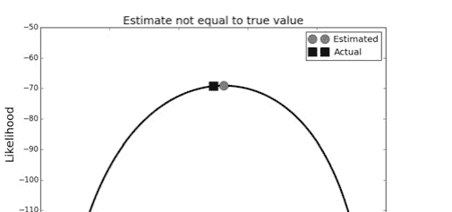

> 编程提示
> 在之前的代码中，我们使用 `lambdify(p, logJ, 'numpy')` 中的 lambdify 函数，将 Sympy 表达式转换为更易于计算的 Numpy 版本。lambdify 函数有一个额外的参数，可以指定用于转换表达式的函数空间。在上面的例子中，它被设置为 Numpy。

图 3.3 显示，我们的估计量 $\hat{p}$（圆圈）并不等于 $p$ 的真实值（方块），尽管它是似然函数的最大值。这听起来可能令人不安，但请记住，这个估计是随机数据的函数；由于数据可以变化，最终的估计同样可以变化。请记住，估计量是数据的*函数*，因此它也是一个*随机变量*，就像数据一样。这意味着它有自己的概率分布，以及相应的均值和方差。因此，我们观察到的是该方差的结果。

图 3.4 展示了当你运行成千上万次硬币实验，并计算每个实验的最大似然估计（给定每个实验的特定样本数）时会发生什么。这个模拟为我们提供了最大似然估计的直方图，这是 $\hat{p}$ 估计量本身概率分布的近似。该图显示，估计量的样本均值（$\mu = \frac{1}{n} \sum \hat{p}_i$）非常接近真实值，但表象可能具有欺骗性。唯一确定的方法是检查估计量是否无偏，即是否满足

$$\mathbb{E}(\hat{p}) = p$$

因为这个问题很简单，我们可以一般性地求解，注意到上面的项要么是 $p$（如果 $x_i = 1$），要么是 $1 - p$（如果 $x_i = 0$）。这意味着我们可以写成

$$\mathcal{L}(p|\mathbf{x}) = p^{\sum_{i=1}^n x_i} (1 - p)^{n - \sum_{i=1}^n x_i}$$

其对应的对数为

## 3.4 使用最大似然进行估计

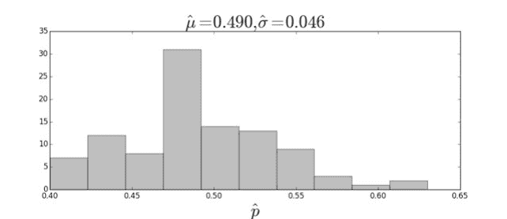

图 3.4 最大似然估计的直方图。标题显示了样本的估计均值和标准差。

$$J = \log(\mathcal{L}(p|\mathbf{x})) = \log(p) \sum_{i=1}^{n} x_i + \log(1-p) \left( n - \sum_{i=1}^{n} x_i \right)$$

对其求导得到

$$\frac{dJ}{dp} = \frac{1}{p} \sum_{i=1}^{n} x_i + \frac{(n - \sum_{i=1}^{n} x_i)}{p - 1}$$

并求解 $p$ 得到

$$\hat{p} = \frac{1}{n} \sum_{i=1}^{n} x_i$$

这就是我们对 $p$ 的*估计量*。到目前为止，我们一直使用 Sympy 基于数据 $x_i$ 来求解它，但现在我们有了解析解，就不必每次都求解了。为了检查这个估计量是否有偏，我们计算其期望

$$\mathbb{E}\left(\hat{p}\right) = \frac{1}{n} \sum_{i} \mathbb{E}(x_i) = \frac{1}{n} n \mathbb{E}(x_i)$$

这里利用了期望的线性性质，其中

$$\mathbb{E}(x_i) = p$$

因此，

$$\mathbb{E}\left(\hat{p}\right) = p$$

这意味着该估计量是*无偏的*。类似地，

$$\mathbb{E}\left(\hat{p}^{2}\right)=\frac{1}{n^{2}} \mathbb{E}\left[\left(\sum_{i=1}^{n} x_{i}\right)^{2}\right]$$

其中

$$\mathbb{E}\left(x_{i}^{2}\right)=p$$

并且根据独立性假设，

$$\mathbb{E}\left(x_{i} x_{j}\right)=\mathbb{E}\left(x_{i}\right) \mathbb{E}\left(x_{j}\right)=p^{2}$$

因此，

$$\mathbb{E}\left(\hat{p}^{2}\right)=\left(\frac{1}{n^{2}}\right) n\left[p+(n-1) p^{2}\right]$$

所以，估计量 $\hat{p}$ 的方差如下：

$$\mathbb{V}(\hat{p})=\mathbb{E}\left(\hat{p}^{2}\right)-\mathbb{E}(\hat{p})^{2}=\frac{p(1-p)}{n}$$

注意分母中的 $n$ 意味着随着 $n$ 的增加（即我们考虑越来越多的样本），方差渐近地趋于零。这是个好消息，因为这意味着更多的硬币投掷会导致对潜在 $p$ 的更好估计。

不幸的是，这个方差公式在实践中几乎没用，因为我们需要 $p$ 来计算它，而 $p$ 正是我们试图估计的参数！然而，这正是*代入原则*<sup>2</sup> 发挥作用的地方。事实证明，在这种情况下，你可以简单地将最大似然估计量 $\hat{p}$ 代入上述方程中的 $p$，以获得 $\mathbb{V}(\hat{p})$ 的渐近方差。这之所以有效，是由最大似然估计量的渐近理论保证的。

尽管如此，观察 $\mathbb{V}(\hat{p})^{2}$，我们可以立即注意到，如果 $p=0$，则没有估计量方差，因为结果保证是反面。此外，对于任何 $n$，该方差的最大值出现在 $p=1/2$ 时。这是我们最坏的情况，唯一的补偿方法是使用更大的 $n$。

我们计算的只是估计量的均值和方差。通常，这不足以描述 $\hat{p}$ 的潜在概率密度，除非我们以某种方式知道 $\hat{p}$ 是正态分布的。这就是我们在第 3.3.4 节讨论的强大*中心极限定理*发挥作用的地方。估计量的形式，即

> <sup>2</sup> 这也被称为最大似然估计量的*不变性性质*。它基本上指出，任何函数（例如 $h(\theta)$）的最大似然估计量，就是将 $\theta$ 的最大似然估计量代入 $h$ 中得到的相同 $h$；即 $\hat{h}(\theta_{ML})$。

只是一个样本均值，意味着我们可以应用这个定理并得出结论：$\hat{p}$ 是渐近正态分布的。然而，它没有量化我们需要多少样本 $n$。在我们的模拟中这不是问题，因为我们可以生成任意多的数据，但在现实世界中，对于昂贵的实验，每个样本可能都很宝贵。<sup>3</sup> 在下文中，我们将不应用中心定理，而是进行解析处理。

**估计量的概率密度** 要写出 $\hat{p}$ 的完整密度，我们首先要问估计量等于特定值的概率是多少，然后计算所有可能发生的方式及其相应的概率。例如，概率是多少

$$\hat{p} = \frac{1}{n} \sum_{i=1}^{n} x_i = 0$$

这只有一种方式：当所有 $x_i = 0$ 时。这种情况发生的概率可以从密度计算

$$f(\mathbf{x}, p) = \prod_{i=1}^{n} p^{x_i} (1-p)^{1-x_i}$$

$$f\left(\sum_{i=1}^{n} x_i = 0, p\right) = (1-p)^n$$

同样，如果 $\{x_i\}$ 只有一个非零元素，那么

$$f\left(\sum_{i=1}^{n} x_i = 1, p\right) = np \prod_{i=1}^{n-1} (1-p)$$

其中 $n$ 来自从 $n$ 个元素 $x_i$ 中选择一个元素的 $n$ 种方式。继续这种方式，我们可以构建整个密度为

$$f\left(\sum_{i=1}^{n} x_i = k, p\right) = \binom{n}{k} p^k (1-p)^{n-k}$$

其中右边第一项是 $n$ 个东西中取 $k$ 个的二项式系数。这是二项分布，它不是 $\hat{p}$ 的密度，而是

> <sup>3</sup> 事实证明，中心极限定理加上埃奇沃思展开告诉我们，收敛速度受分布的偏度调节 [13]。换句话说，分布越对称，根据中心极限定理，它收敛到正态分布的速度就越快。

$n\hat{p}$ 的密度。我们将保持原样，因为在下面更容易处理。我们只需要记住跟踪 $n$ 因子。

**置信区间** 现在我们有了 $\hat{p}$ 的完整密度，我们准备好问一些有意义的问题了。例如，估计量在 $p$ 真实值的 $\epsilon$ 分数范围内的概率是多少？

$$\mathbb{P}(|\hat{p} - p| \leq \epsilon p)$$

更具体地说，我们想知道估计的 $\hat{p}$ 被困在实际值的 $\epsilon$ 范围内的频率。也就是说，假设我们运行实验 1000 次，生成 1000 个不同的 $\hat{p}$ 估计值。这 1000 个计算值中有多少百分比被困在潜在值的 $\epsilon$ 范围内。将上述方程改写为：

$$\mathbb{P}\left(p - \epsilon p < \hat{p} < p + \epsilon p\right) = \mathbb{P}\left(np - n\epsilon p < \sum_{i=1}^{n} x_i < np + n\epsilon p\right)$$

让我们在这里代入一些实际数字，针对我们最坏的情况（即最高方差的情况），其中 $p = 1/2$。那么，如果 $\epsilon = 1/100$，我们有

$$\mathbb{P}\left(\frac{99n}{200} < \sum_{i=1}^{n} x_i < \frac{101n}{200}\right)$$

例如，对于 $n = 101$，我们有：

$$\mathbb{P}\left(\frac{9999}{200} < \sum_{i=1}^{101} x_i < \frac{10201}{200}\right) = f\left(\sum_{i=1}^{101} x_i = 50, p\right)$$
$$= \binom{101}{50} (1/2)^{50} (1 - 1/2)^{101-50} = 0.079$$

这意味着在 $p = 1/2$ 的最坏情况下，给定 $n = 101$ 次试验，我们只有大约 8% 的时间能接近实际 $p = 1/2$ 的 1% 以内。如果你感到失望，那是因为你一直在认真思考。如果硬币真的很重，重复这 101 次是件苦差事呢？

让我们换一种方式思考：假设我只能抛硬币 100 次，我有多大的概率（比如 95%）能接近真实的潜在值？在这种情况下，我们不是选择一个 $\epsilon$ 值，而是求解 $\epsilon$。代入得到

$$\mathbb{P}\left(50 - 50\epsilon < \sum_{i=1}^{100} x_i < 50 + 50\epsilon\right) = 0.95$$

我们需要求解 $\epsilon$。幸运的是，我们求解所需的所有工具都已在 Scipy 中。

```python
>>> from scipy.stats import binom
>>> # n=100, p = 0.5, distribution of the estimator phat
>>> b=binom(100,.5)
>>> # symmetric sum the probability around the mean
>>> g = lambda i:b.pmf(np.arange(-i,i)+50).sum()
>>> print(g(10)) # approx 0.95
0.9539559330706571
```

图 3.5 中的两条垂直线显示了我们需要从均值向外延伸多远才能累积 95% 的概率。现在，我们可以求解如下：

$$50 + 50\epsilon = 60$$

这使得 $\epsilon = 1/5$ 或 20%。因此，抛掷 100 次意味着在最坏情况下（即 $p = 1/2$），我只能在 95% 的时间内将真实 $p$ 的误差控制在 20% 以内。以下代码验证了这种情况：

```python
>>> from scipy.stats import bernoulli
>>> b=bernoulli(0.5) # coin distribution
>>> xs = b.rvs(100) # flip it 100 times
>>> phat = np.mean(xs) # estimated p
>>> print(abs(phat-0.5) < 0.5*0.20) # make it w/in interval?
True
```

让我们继续这样做，看看我们是否能在 95% 的时间内保持在这个区间内。

```python
>>> out=[]
>>> b=bernoulli(0.5) # coin distribution
>>> for i in range(500): # number of tries
...     xs = b.rvs(100) # flip it 100 times
...     phat = np.mean(xs) # estimated p
...     out.append(abs(phat-0.5) < 0.5*0.20 ) # within 20% ?
>>> # percentage of tries w/in 20% interval
>>> print(100*np.mean(out))
97.39999999999999
```

嗯，这似乎有效！现在我们有了一种方法来评估估计量 $\hat{p}$ 的质量。

## 无微积分的最大似然估计

前面的例子展示了我们如何使用微积分来计算最大似然估计。需要强调的是，最大似然原理*不*依赖于微积分，并且可以扩展到微积分无法应用的更一般情况。例如，令 $X$ 在区间 $[0, \theta]$ 上均匀分布。给定 $X$ 的 $n$ 次测量，似然函数如下：

$$L(\theta) = \prod_{i=1}^n \frac{1}{\theta} = \frac{1}{\theta^n}$$

其中每个 $x_i \in [0, \theta]$。注意，这个函数的斜率在任何地方都不为零，因此通常的微积分方法在这里行不通。因为似然是各个均匀密度的乘积，如果任何 $x_i$ 值超出了提议的 $[0, \theta]$ 区间，那么似然将变为零，因为均匀密度在 $[0, \theta]$ 之外为零。这对于最大化是不利的。因此，观察到似然函数随着 $\theta$ 的增加而严格递减，我们得出结论：使似然最大化的 $\theta$ 值是 $x_i$ 值的最大值。总结一下，最大似然估计如下：

$$\theta_{ML} = \max_i x_i$$

一如既往，我们希望得到这个估计量的分布以评估其性能。在这种情况下，这相当直接。最大值函数的累积密度函数如下：

$$\mathbb{P}\left(\hat{\theta}_{ML} < v\right) = \mathbb{P}(x_0 \le v \wedge x_1 \le v \dots \wedge x_n \le v)$$

并且由于所有 $x_i$ 都在 $[0, \theta]$ 上均匀分布，我们有

$$\mathbb{P}\left(\hat{\theta}_{ML} < v\right) = \left(\frac{v}{\theta}\right)^n$$

因此，概率密度函数为

$$f_{\hat{\theta}_{ML}}(\theta_{ML}) = n\theta_{ML}^{n-1}\theta^{-n}$$

然后，我们可以计算 $\mathbb{E}(\theta_{ML}) = (\theta n)/(n + 1)$，相应的方差为 $\mathbb{V}(\theta_{ML}) = (\theta_{ML}^2 n)/(n + 1)^2/(n + 2)$。

为了快速验证，我们可以编写以下针对 $\theta = 1$ 的模拟：

```python
>>> from scipy import stats
>>> rv = stats.uniform(0,1)  # define uniform random variable
>>> mle=rv.rvs((100,500)).max(0) # max along row-dimension
>>> print(np.mean(mle)) # approx n/(n+1) = 100/101 ~= 0.99
0.989942138048
>>> print(np.var(mle)) #approx n/(n+1)**2/(n+2) ~= 9.61E-5
9.95762009884e-05
```

> **编程提示**
`mle` 计算中的 `max(0)` 后缀沿行（`axis=0`）维度取计算出的数组的最大值。

你也可以绘制 `hist(mle)` 来查看模拟的最大似然估计的直方图，并将其与我们上面推导出的概率密度函数进行匹配。

在本节中，我们使用抛硬币实验，通过科学 Python 工具栈，从分析和数值两方面探讨了最大似然估计的概念。我们还探讨了微积分不适用于最大似然估计的情况。有两个关键点需要记住。首先，最大似然估计产生一个数据的函数，该函数本身是一个随机变量，具有自己的概率分布。我们可以通过检查与估计量本身相关的概率分布，来评估如此推导出的估计量的质量。其次，最大似然估计甚至适用于基本微积分不适用的情况 [48]。

### 3.4.2 Delta 方法

有时我们想要描述一个随机变量的*函数*的分布。为了以这种方式扩展和推广中心极限定理，我们需要泰勒级数展开。回想一下，泰勒级数展开是以下形式的函数的近似：

$$T_r(x) = \sum_{i=0}^{r} \frac{g^{(i)}(a)}{i!} (x-a)^i$$

这基本上表明，一个函数 $g$ 可以在点 $a$ 附近使用基于其在 $a$ 处求值的导数的多项式进行充分近似。在陈述一般定理之前，让我们检查一个例子来了解其工作原理。

**示例** 假设 $X$ 是一个随机变量，其 $\mathbb{E}(X) = \mu \neq 0$。此外，假设我们有一个合适的函数 $g$，并且我们想要 $g(X)$ 的分布。应用泰勒级数展开，我们得到：

$$g(X) \approx g(\mu) + g'(\mu)(X - \mu)$$

如果我们使用 $g(X)$ 作为 $g(\mu)$ 的估计量，那么我们可以说我们近似有：

$$\mathbb{E}(g(X)) = g(\mu)$$
$$\mathbb{V}(g(X)) = (g'(\mu))^2 \mathbb{V}(X)$$

具体来说，假设我们想要估计几率，$\frac{p}{1-p}$。例如，如果 $p = 2/3$，那么我们说几率是 $2:1$，这意味着一种结果的可能性是另一种结果的两倍。因此，我们有 $g(p) = \frac{p}{1-p}$，并且我们想要找到 $\mathbb{V}(g(\hat{p}))$。在我们的抛硬币问题中，我们有来自伯努利分布数据 $X_k$（单个抛硬币）的估计量 $\hat{p} = \frac{1}{n} \sum X_k$。因此，

$$\mathbb{E}(\hat{p}) = p$$
$$\mathbb{V}(\hat{p}) = \frac{p(1-p)}{n}$$

现在，$g'(p) = 1/(1-p)^2$，所以我们有

$$\mathbb{V}(g(\hat{p})) = (g'(p))^2 \mathbb{V}(\hat{p})$$
$$= \left( \frac{1}{(1-p)^2} \right)^2 \frac{p(1-p)}{n}$$
$$= \frac{p}{n(1-p)^3}$$

这是估计量 $g(\hat{p})$ 的方差的近似值。让我们模拟一下，看看它是否吻合。

```python
>>> from scipy import stats
>>> # compute MLE estimates
>>> d=stats.bernoulli(0.1).rvs((10,5000)).mean(0)
>>> # avoid divide-by-zero
>>> d=d[np.logical_not(np.isclose(d,1))]
>>> # compute odds ratio
>>> odds = d/(1-d)
>>> print('odds ratio=',np.mean(odds),'var=',np.var(odds))
odds ratio= 0.12289206349206351 var= 0.01797950092214664
```

上面的第一个数字是模拟几率比的均值，第二个是估计的方差。根据上面的方差估计方程，我们有 $\mathbb{V}(g(1/10)) \approx 0.0137$，对于这个数值近似来说还不错。回想一下，我们想要从 $\hat{p}$ 估计几率。上面的代码使用了 5000 个 $\hat{p}$ 的估计值来估计 $\mathbb{V}(g)$。$p = 1/10$ 的几率比是 $1/9 \approx 0.111$。

> **编程提示**
上面的代码使用 `np.isclose` 函数来识别模拟中的值为 1 的情况，而 `np.logical_not` 从数据中移除了这些元素，因为对于这些值，几率比的分母为零。

让我们尝试将正面概率设为 0.5 而不是 0.3。

```python
>>> from scipy import stats
>>> d = stats.bernoulli(.5).rvs((10,5000)).mean(0)
>>> d = d[np.logical_not(np.isclose(d,1))]
>>> print('odds ratio=',np.mean(d),'var=',np.var(d))
odds ratio= 0.499379627776666 var= 0.024512322762879256
```

在这种情况下，几率比等于 1，这与报告的结果不接近。根据我们的近似，我们应该有 $\mathbb{V}(g) = 0.4$，这看起来不像我们模拟刚刚报告的结果。这是因为当几率比接近线性时近似效果最好，否则效果较差（见图 3.6）。

**用于方差稳定的 Delta 方法** 更正式地总结 delta 方法，我们有 $n$ 个样本用于估计 $\theta$ 的统计量 $T_n$。如果我们有

$$\sqrt{n} (T_n - \theta) \xrightarrow{P} \mathcal{N}(0, \tau(\theta)^2)$$

那么

$$\sqrt{n} (g(T_n) - g(\theta)) \xrightarrow{P} \mathcal{N}(0, \tau(\theta)^2(g'(\theta))^2)$$

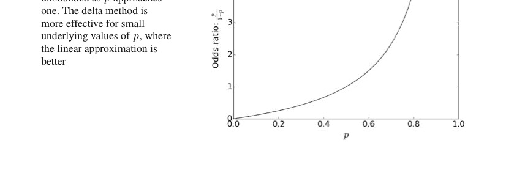

其中收敛性源于中心极限定理。粗略地说，这意味着如果统计量 $T_n$ 具有极限正态分布，那么 $g(T_n)$ 也具有极限正态分布，并且 $g(T_n)$ 的渐近方差有一个显式公式！这是一个强大的结果，因为通常情况下，正态随机变量的非线性函数并不具有正态分布。

前一个例子的不足之处在于方差依赖于估计参数 $p$。为了解决这个问题，我们希望找到一个*方差稳定化变换*，使得渐近方差独立于估计参数。也就是说，我们希望

$$\sqrt{n} (g(T_n) - g(\theta)) \xrightarrow{P} \mathcal{N}(0, c^2)$$

我们几乎已经通过德尔塔方法得到了这个结果，因为我们已经有

$$\sqrt{n} (g(T_n) - g(\theta)) \xrightarrow{P} \mathcal{N}(0, (g'(\theta))^2 \tau(\theta)^2)$$

所以通过巧妙地选择 $g$，我们可以强制

$$g'(\theta)\tau(\theta) = c$$

回到我们之前的伯努利例子，我们有

$$\tau(p) = \sqrt{\frac{p(1-p)}{n}}$$

这次，让我们选择

$$g'(p) = 1/\tau(p)$$

这意味着

$$g(p) = 2\sqrt{n} \arcsin(\sqrt{p})$$

其中我们将 $\hat{p}$ 代入 $p$。方差稳定化变换用于计算置信区间，因为它避免了必须重复使用方差的插件估计值。

```python
>>> from scipy.stats import bernoulli, norm
>>> n = 100 # num samples
>>> p = 0.1 # target parameter
>>> # simulate estimating p using MLE
>>> mns = bernoulli(p).rvs((n,5_000)).mean(axis=0)
>>> # variance stabilizing transformation
>>> v = 2*np.sqrt(n)*(np.arcsin(np.sqrt(mns))-np.arcsin(np.sqrt(p)))
```

图 3.7 显示了使用此变换后的 MLE 估计直方图，并与 $\mathcal{N}(0, 1)$ 密度进行了比较。这表明变换后的 MLE 估计服从正态分布。总之，使用此变换，我们有

$$2\sqrt{n} \left( \arcsin(\sqrt{\hat{p}}) - \arcsin(\sqrt{p}) \right) \rightarrow \mathcal{N}(0, 1)$$

依分布收敛。这意味着

$$\mathbb{P} \left\{ \left| \arcsin\left(\sqrt{\hat{p}}\right) - \arcsin(\sqrt{p}) \right| \leq \frac{z_{\alpha/2}}{2\sqrt{n}} \right\} \rightarrow 1 - \alpha \quad \text{as } n \rightarrow \infty$$

因此，$\sqrt{\hat{p}}$ 的 $(1 - \alpha)$ 置信区间如下：

$$\left[ \sin\left( \arcsin\left(\sqrt{\hat{p}}\right) - \frac{z_{\alpha/2}}{2\sqrt{n}} \right), \sin\left( \arcsin\left(\sqrt{\hat{p}}\right) + \frac{z_{\alpha/2}}{2\sqrt{n}} \right) \right]$$

请注意，左侧可能变为负数，因此必须将其阈值设置为零。为了得到 $\hat{p}$ 的置信区间，我们只需将区间的两端平方

$$\left[ \sin^2\left( \arcsin\left(\sqrt{\hat{p}}\right) - \frac{z_{\alpha/2}}{2\sqrt{n}} \right), \sin^2\left( \arcsin\left(\sqrt{\hat{p}}\right) + \frac{z_{\alpha/2}}{2\sqrt{n}} \right) \right]$$

使用此方差稳定化变换的优点在于，否则我们将有

$$\sqrt{n} (\hat{p} - p) \xrightarrow{d} N(0, p(1 - p))$$

其中右侧的方差依赖于我们试图用 $\hat{p}$ 估计的未知 $p$。

## 3.5 假设检验与 P 值

有时很难明确地将结果归因于因果因素。例如，你的实验是否产生了你期望的结果？也许确实发生了某些事情，但效果不够显著，无法将其与不可避免的测量误差或环境中的其他因素区分开来？假设检验是解决这些问题的强大统计方法。让我们再次考虑我们具有未知参数 $p$ 的抛硬币实验。回想一下，单个硬币抛掷服从伯努利分布。第一步是建立单独的假设。首先，$H_0$ 是所谓的原假设。在我们的情况下，这可以是

$$H_0: \theta < \frac{1}{2}$$

备择假设则是

$$H_1: \theta \geq \frac{1}{2}$$

有了这个设置，问题现在归结为弄清楚数据与哪个假设最一致。为了在它们之间做出选择，我们需要一个统计检验，它是一个函数 $G$，将样本集 $\mathbf{X}_n = \{X_i\}_n$ 映射到实数线，其中 $X_i$ 是正面或反面的结果（$X_i \in \{0, 1\}$）。换句话说，我们计算 $G(\mathbf{X}_n)$ 并检查它是否超过阈值 $c$。如果没有，那么我们宣布 $H_0$（否则，宣布 $H_1$）。用符号表示如下：

$$G(\mathbf{X}_n) < c \Rightarrow H_0$$
$$G(\mathbf{X}_n) \geq c \Rightarrow H_1$$

总之，我们有观测数据 $\mathbf{X}_n$ 和一个将数据映射到实数线的函数 $G$。然后，使用常数 $c$ 作为阈值，不等式有效地将实数线分为两部分，每部分对应一个假设。

无论这个检验 $G$ 是什么，它都会犯两种错误——假阴性和假阳性。假阳性出现在我们宣布 $H_0$ 而检验说我们应该宣布 $H_1$ 的情况下。这总结在表 3.1 中。

**表 3.1** 假设检验的真值表

| | 宣布 $H_0$ | 宣布 $H_1$ |
|---|---|---|
| $H_0$ 为真 | 正确 | 假阳性（第一类错误） |
| $H_1$ 为真 | 假阴性（第二类错误） | 正确（真检测） |

对于这个例子，以下是假阳性（也称为误报）：

$$P_{FA} = \mathbb{P}\left(G(\mathbf{X}_n) > c \mid \theta \leq \frac{1}{2}\right)$$

或者等价地，

$$P_{FA} = \mathbb{P}\left(G(\mathbf{X}_n) > c \mid H_0\right)$$

同样，另一个错误是假阴性，我们可以类似地写为

$$P_{FN} = \mathbb{P}\left(G(\mathbf{X}_n) < c \mid H_1\right)$$

通过为这些错误中的任何一个选择一些可接受的值，我们可以求解另一个。通常的做法是选择一个 $P_{FA}$ 值，然后找到相应的 $P_{FN}$ 值。请注意，在工程中传统上谈论*检测概率*，其定义为

$$P_D = 1 - P_{FN} = \mathbb{P}\left(G(\mathbf{X}_n) > c \mid H_1\right)$$

换句话说，这是当检验超过阈值时宣布 $H_1$ 的概率。这通常被称为*真检测概率*或*真检测*。

### 3.5.1 回到抛硬币的例子

在我们之前的最大似然讨论中，我们希望为抛硬币实验推导出正面概率*值*的估计量。对于假设检验，我们想问一个更温和的问题：正面概率是大于还是小于 $1/2$？正如我们刚刚确定的，这导致了两个假设：

$$H_0: \theta < \frac{1}{2}$$

与

$$H_1: \theta > \frac{1}{2}$$

让我们假设我们有五个观测值。现在我们需要 $G$ 函数和一个阈值 $c$ 来帮助在两个假设之间做出选择。让我们将五个观测值中观察到的正面次数作为我们的标准。因此，我们有

$$G(\mathbf{X}_5) := \sum_{i=1}^{5} X_i$$

并进一步假设我们仅在五个观测值中恰好有五个是正面时才选择 $H_1$。我们将此称为*全正面*检验。

现在，因为所有的 $X_i$ 都是随机变量，所以 $G$ 也是，我们必须找到 $G$ 相应的概率质量函数。假设单个硬币抛掷是独立的，五个正面的概率是 $\theta^5$。这意味着基于未知底层概率拒绝 $H_0$ 假设（并选择 $H_1$，因为这里只有两个选择）的概率是 $\theta^5$。用术语来说，这被称为*功效函数*，用 $\beta$ 表示，如

$$\beta(\theta) = \theta^5$$

让我们在图 3.8 中快速绘制一下这个图。

现在，我们有以下误报概率：

$$P_{FA} = \mathbb{P}(G(\mathbf{X}_n) = 5|H_0) = \mathbb{P}(\theta^5|H_0)$$

请注意，这是 $\theta$ 的函数，这意味着有许多误报概率值对应于这个检验。为了保守起见，我们将选择这个函数的上确界（即最大值），这被称为检验的*大小*，传统上用 $\alpha$ 表示，

$$\alpha = \sup_{\theta \in \Theta_0} \beta(\theta)$$

定义域为 $\Theta_0 = \{\theta < 1/2\}$，在我们的情况下是

$$\alpha = \sup_{\theta < \frac{1}{2}} \theta^5 = \left(\frac{1}{2}\right)^5 = 0.03125$$

同样，对于检测概率，$\mathbb{P}_D(\theta) = \mathbb{P}(\theta^5 | H_1)$

这同样是参数 $\theta$ 的函数。该检验的问题在于，对于 $\theta$ 的大部分定义域，$P_D$ 的值相当低。例如，$P_D$ 达到 90 多的情况仅在 $\theta > 0.98$ 时才会发生。换句话说，如果硬币在 100 次投掷中有 98 次出现正面，我们才能可靠地检测到 $H_1$。理想情况下，我们希望一个检验在对应于 $H_0$ 的定义域（即 $\theta_0$）上为零，而在其他情况下等于一。不幸的是，即使我们增加观测序列的长度，也无法通过这个检验摆脱这种效应。你可以尝试绘制 $\theta^n$ 在越来越大的 $n$ 值下的图形来观察这一点。

**多数表决检验** 由于全正面检验在检测概率方面存在问题，也许我们可以考虑另一种能获得我们想要性能的检验。假设当大多数观测结果为正面时，我们拒绝 $H_0$。那么，使用与上面相同的推理，我们有

$$\beta(\theta) = \sum_{k=3}^{5} \binom{5}{k} \theta^k (1 - \theta)^{5-k}$$

图 3.9 显示了多数表决检验和全正面检验的功率函数。
在这种情况下，新检验的*大小*为

$$\alpha = \sup_{\theta < \frac{1}{2}} \theta^5 + 5\theta^4(-\theta + 1) + 10\theta^3(-\theta + 1)^2 = \frac{1}{2}$$

与之前一样，只有当底层参数 $\theta > 0.75$ 时，我们才能获得超过 90% 的检测概率。让我们看看当我们考虑超过五个样本时会发生什么。例如，假设我们有 $n = 100$ 个样本，并且我们想改变多数表决检验的阈值。例如，假设我们有一个新的检验，当 100 次试验中有 $k = 60$ 次出现正面时，我们宣布 $H_1$。在这种情况下，$\beta$ 函数是什么？

$$\beta(\theta) = \sum_{k=60}^{100} \binom{100}{k} \theta^k (1-\theta)^{100-k}$$

这太复杂了，无法手工书写，但 Sympy 中的统计模块拥有我们计算所需的所有工具。

```
>>> from sympy.stats import P, Binomial
>>> theta = S.symbols('theta', real=True)
>>> X = Binomial('x', 100, theta)
>>> beta_function = P(X>60)
>>> print(beta_function.subs(theta, 0.5)) # alpha
0.0176001001088524
>>> print(beta_function.subs(theta, 0.70))
0.979011423996075
```

这些结果比以前好得多，因为 $\beta$ 函数陡峭得多。如果我们观察到 100 次试验中有 60 次出现正面时宣布 $H_1$，那么我们错误地宣布正面的概率大约为 1.8%。否则，如果真实值 $p > 0.7$，我们大约有 97% 的时间会正确地得出结论。一个快速的模拟可以验证这些结果，如下所示：

```
>>> from scipy import stats
>>> rv=stats.bernoulli(0.5) # true p = 0.5
>>> # number of false alarms ~ 0.018
>>> print(sum(rv.rvs((1000,100)).sum(axis=1)>60)/1000.)
0.015
```

上面的代码相当密集，让我们来解析一下。在第一行，我们使用 `scipy.stats` 模块定义了硬币投掷的伯努利随机变量。然后，我们使用该变量的 `rvs` 方法生成 1000 次实验，每次实验包含 100 次硬币投掷。这生成了一个 $1000 \times 100$ 的矩阵，其中行是各个试验，列是每次 100 次投掷的结果。`sum(axis=1)` 部分计算了跨列的和。由于嵌入矩阵的值仅为 1 或 0，这给出了每行正面投掷的次数。下一个 `>60` 部分计算了一个长度为 1000 的布尔向量，其中值大于 60。最后的 `sum` 将这些值相加。同样，由于数组中的条目是 True 或 False，`sum` 计算了在 1000 次试验中，每次 100 次投掷中正面次数超过 60 的次数。然后，将这个数字除以 1000，就得到了我们上面计算的在真实值 $p = 0.5$ 的情况下，误报概率的一个快速近似值。

### 3.5.2 接收机工作特性

由于多数表决检验是一个二元检验，我们可以计算*接收机工作特性*（ROC），即（$P_{FA}$，$P_D$）的图形。这个术语来自雷达系统，但它是一种非常通用的方法，可以将所有这些问题整合到一个图中。让我们考虑一个典型的具有两个假设的信号处理例子。在 $H_0$ 中，接收机处存在噪声但没有信号：

$$H_0: X = \epsilon$$

其中 $\epsilon \sim \mathcal{N}(0, \sigma^2)$ 表示加性噪声。在备择假设中，接收机处存在一个确定性信号：

$$H_1: X = \mu + \epsilon$$

同样，问题是在这两个假设之间做出选择。对于 $H_0$，我们有 $X \sim \mathcal{N}(0, \sigma^2)$，对于 $H_1$，我们有 $X \sim \mathcal{N}(\mu, \sigma^2)$。回想一下，我们只观察到 $x$ 的值，并且必须从这些观测值中选择 $H_0$ 或 $H_1$。因此，我们需要一个阈值 $c$，将 $x$ 与之比较以区分这两个假设。图 3.10 显示了每个假设下的概率密度函数。深色垂直线是阈值 $c$。灰色阴影区域是检测概率 $P_D$，深灰色阴影区域是误报概率 $P_{FA}$。该检验评估每个 $x$ 的观测值，如果 $x < c$ 则得出 $H_0$，否则得出 $H_1$。

**图 3.10** $H_0$ 和 $H_1$ 假设的两个密度函数。灰色阴影区域是检测概率，深灰色阴影区域是误报概率。垂直线是决策阈值

**图 3.11** 对应于图 3.10 的接收机工作特性（ROC）

> **编程提示**
图 3.10 中显示的阴影来自 Matplotlib 的 `fill_between` 函数。此函数有一个 `where` 关键字参数，用于指定应用阴影的绘图部分，并使用指定的 `color` 关键字参数。请注意，还有一个 `fill_betweenx` 函数可以水平填充。`text` 函数可以在绘图中的任何位置放置格式化文本，并可以使用基本格式。

当我们沿着水平轴左右滑动阈值时，我们自然会改变图 3.10 中每条曲线下对应的面积，从而改变 $P_D$ 和 $P_{FA}$ 的值。通过这种方式扫描阈值所产生的轮廓就是 ROC，如图 3.11 所示。该图还显示了对角线，它对应于基于公平硬币投掷做出的决策。任何有意义的检验都必须比抛硬币更好，因此 ROC 越向图表的左上角弯曲，效果就越好。有时 ROC 被量化为一个称为*曲线下面积*（AUC）的数字，其范围从 0.5 到 1.0，如图所示。在我们的例子中，分隔两个概率密度函数的是 $\mu$ 的值。在实际情况中，这将由信号处理方法确定，这些方法包括许多复杂的权衡。关键思想是，无论这些权衡是什么，检验本身都归结为这两个密度函数之间的分离度——好的检验能分离这两个密度函数，而坏的检验则不能。确实，当没有分离时，我们就达到了刚才讨论的对角线抛硬币的情况。

$P_D$ 和 $P_{FA}$ 的哪些值被认为是*可接受的*取决于应用。例如，假设你正在检测一种致命疾病。如果对应于良好的 $P_D$，你可能愿意接受相对较高的 $P_{FA}$ 值，因为与漏检相比，该测试的管理成本相对较低。另一方面，也许误报会触发昂贵的响应，因此最小化这些警报比可能漏检更重要。这些权衡只能由应用和设计因素来决定。

### 3.5.3 $P$ 值

假设检验中有很多动态部分。我们需要一种方法来整合发现。其思想是我们想找到检验拒绝 $H_0$ 的最低水平。因此，$p$ 值是在 $H_0$ 下，检验统计量至少与实际观测到的值一样极端的概率。非正式地说，这意味着较小的值意味着应该拒绝 $H_0$，尽管这并不意味着较大的值意味着应该保留 $H_0$。这是因为大的 $p$ 值可能源于 $H_0$ 为真或检验的统计功效较低。

如果 $H_0$ 为真，$p$ 值在区间 $(0, 1)$ 上均匀分布。如果 $H_1$ 为真，$p$ 值的分布将更集中在零附近。对于连续分布，这可以严格证明，并意味着如果我们在相应的 $p$ 值小于 $\alpha$ 时拒绝 $H_0$，那么误报的概率就是 $\alpha$。也许在计算之前，将其形式化一点会有所帮助。假设 $\tau(X)$ 是一个检验统计量，当它变大时拒绝 $H_0$。那么，对于每个样本 $x$（对应于我们实际手头的数据），我们定义

$$p(x) = \sup_{\theta \in \Theta_0} \mathbb{P}_{\theta}(\tau(X) > \tau(x))$$

这个方程表明，检验统计量 $\tau(X)$ 超过该特定数据上的检验统计量值（$\tau(x)$）的上确界（即最大值）概率，在定义域 $\Theta_0$ 上被定义为 $p$ 值。因此，这体现了所有 $\theta$ 值上的最坏情况。

这里有一种思考方式。假设你拒绝了 $H_0$，有人说你只是*幸运*，不知怎么地抽到了恰好对应于拒绝 $H_0$ 的数据。$p$ 值提供了一种解决这个问题的方法，它捕捉了这种有利数据抽取的概率。因此，假设你的 $p$ 值是 0.05。那么，你所展示的是，在 $H_0$ 成立的情况下，仅仅抽取那个数据样本的几率只有 5%。这意味着你有 5% 的概率不知怎么地走运，得到了一个有利的数据抽取。

让我们用一个具体的例子来说明这一点。给定上面的多数表决规则，假设我们确实观察到五次中有三次正面。在 $H_0$ 下，观察到此事件的概率如下：$$p(x) = \sup_{\theta \in \Theta_0} \sum_{k=3}^{5} \binom{5}{k} \theta^k (1-\theta)^{5-k} = \frac{1}{2}$$

对于全正面检验，相应的计算如下：

$$p(x) = \sup_{\theta \in \Theta_0} \theta^5 = \frac{1}{2^5} = 0.03125$$

仅从这些 *p* 值来看，你可能会觉得第二个检验更好，但我们仍然面临与上面讨论的相同的检测概率问题；因此，*p* 值有助于总结假设检验的某些方面，但它们*并不能*概括*整个*情况的所有显著方面。

### 3.5.4 检验统计量

正如我们所见，如果没有系统的过程，很难推导出用于假设检验的良好检验统计量。Neyman-Pearson 检验是通过固定一个虚警值（$\alpha$）然后最大化检测概率推导出来的：

$$L(\mathbf{x}) = \frac{f_{X|H_1}(\mathbf{x})}{f_{X|H_0}(\mathbf{x})} \underset{H_0}{\overset{H_1}{\gtrless}} \gamma$$

其中 $L$ 是似然比，阈值 $\gamma$ 的选择需满足：

$$\int_{x: L(\mathbf{x}) > \gamma} f_{X|H_0}(\mathbf{x}) d\mathbf{x} = \alpha$$

Neyman-Pearson 检验是使用似然比的一族检验中的一种。

**示例** 假设我们有一个接收器，我们想区分接收到的是仅有噪声（$H_0$）还是信号加噪声（$H_1$）。对于仅有噪声的情况，我们有 $x \sim \mathcal{N}(0, 1)$，对于信号加噪声的情况，我们有 $x \sim \mathcal{N}(1, 1)$。换句话说，分布的均值在信号存在时发生了偏移。这是信号处理和通信中一个非常常见的问题。Neyman-Pearson 检验则简化为以下形式：

$$L(x) = e^{-\frac{1}{2}+x} \underset{H_0}{\overset{H_1}{\gtrless}} \gamma$$

现在我们必须找到阈值 $\gamma$，以解决表征 Neyman-Pearson 检验的极大化问题。取自然对数并重新整理得到：

$$x \underset{H_0}{\overset{H_1}{\gtrless}} \frac{1}{2} + \log \gamma$$

下一步是通过计算以下积分来找到对应于所需 $\alpha$ 的 $\gamma$：

$$\int_{1/2+\log \gamma}^{\infty} f_{X|H_0}(x)dx = \alpha$$

例如，取 $\alpha = 1/100$ 得到 $\gamma \approx 6.21$。总结此情况下的检验，我们有：

$$x \underset{H_0}{\overset{H_1}{\gtrless}} 2.32$$

因此，如果我们测量 $X$ 并发现其值超过上述阈值，我们宣布 $H_1$，否则宣布 $H_0$。以下代码展示了如何使用 Sympy 和 Scipy 解决此示例。首先，我们设置似然比：

```
>>> import sympy as S
>>> from sympy import stats
>>> s = stats.Normal('s',1,1) # signal+noise
>>> n = stats.Normal('n',0,1) # noise
>>> x = S.symbols('x',real=True)
>>> L = stats.density(s)(x)/stats.density(n)(x)
```

接下来，找到 $\gamma$ 值：

```
>>> g = S.symbols('g',positive=True) # define gamma
>>> v=S.integrate(stats.density(n)(x),
...               (x,S.Rational(1,2)+S.log(g),S.oo))
```

> **编程提示**
通过使用关键字参数 `positive=True` 为 Sympy 变量提供额外信息，有助于内部简化算法更快更好地工作。这在处理涉及特殊函数的复杂积分时尤其有用。此外，请注意我们使用了 `Rational` 函数来定义 1/2 分数，这是向 Sympy 提供提示的另一种方式。否则，分数的浮点表示可能会掩盖简单的分数，从而错过内部简化的机会。

我们希望在上述表达式中求解 $g$。Sympy 有一些内置的数值求解器，如下所示：

```
>>> print(S.nsolve(v-0.01,3.0)) # approx 6.21
6.21116124253284
```

请注意，在这种情况下，最好使用数值求解器，因为 Sympy 的 solve 可能会花费很长时间来解决这个问题。

#### 广义似然比检验

似然比检验可以使用以下统计量进行推广：

$$\Lambda(\mathbf{x}) = \frac{\sup_{\theta \in \Theta_0} L(\theta)}{\sup_{\theta \in \Theta} L(\theta)} = \frac{L(\hat{\theta}_0)}{L(\hat{\theta})}$$

其中 $\hat{\theta}_0$ 在 $\theta \in \Theta_0$ 的约束下最大化 $L(\theta)$，而 $\hat{\theta}$ 是最大似然估计量。这种似然比检验推广背后的直觉是，分母是通常的最大似然估计量，而分子是最大似然估计量，但仅限于一个受限域（$\Theta_0$）。这意味着该比值总是小于 1，因为整个空间上的最大似然估计量总是至少与更受限空间上的一样大。当这个 $\Lambda$ 比值变得足够小时，意味着整个域（$\Theta$）上的最大似然估计量更大，这意味着可以安全地拒绝原假设 $H_0$。棘手的部分是 $\Lambda$ 的统计分布通常极其困难。幸运的是，Wilks 定理指出，对于足够大的 $n$，$-2 \log \Lambda$ 的分布近似服从自由度为 $r - r_0$ 的卡方分布（参见第 2.6.3 节），其中 $r$ 是 $\Theta$ 的自由参数数量，$r_0$ 是 $\Theta_0$ 的自由参数数量。根据这个结果，如果我们想要一个水平为 $\alpha$ 的近似检验，当 $-2 \log \Lambda \ge \chi^2_{r-r_0}(\alpha)$ 时，我们可以拒绝 $H_0$，其中 $\chi^2_{r-r_0}(\alpha)$ 表示 $\chi^2_{r-r_0}$ 卡方分布的 $1 - \alpha$ 分位数。然而，这个结果的问题在于没有明确的方法知道 $n$ 应该有多大。这种广义似然比检验的优势在于它可以同时检验多个假设，如下例所示。

#### 示例

让我们回到抛硬币的例子，只是现在我们有三枚不同的硬币。似然函数为：

$$L(p_1, p_2, p_3) = \text{binom}(k_1; n_1, p_1)\text{binom}(k_2; n_2, p_2)\text{binom}(k_3; n_3, p_3)$$

其中 $\text{binom}$ 是具有给定参数的二项分布。例如，

$$\text{binom}(k; n, p) = \sum_{k=0}^{n} \binom{n}{k} p^k (1-p)^{n-k}$$

原假设是所有三枚硬币具有相同的正面概率，$H_0 : p = p_1 = p_2 = p_3$。备择假设是这些概率中至少有一个不同。让我们首先考虑 $\Lambda$ 的分子，它将给出 $p$ 的最大似然估计量。因为原假设是所有 $p$ 值都相等，我们可以将其视为一个大的二项分布，其中 $n = n_1 + n_2 + n_3$，$k = k_1 + k_2 + k_3$ 是任何硬币观察到的正面总数。因此，在原假设下，$k$ 的分布是参数为 $n$ 和 $p$ 的二项分布。那么，这个分布的最大似然估计量是什么？我们以前解决过这个问题，得到：

$$\hat{p}_0 = \frac{k}{n}$$

换句话说，原假设下的最大似然估计量是在总共 $n$ 次试验中观察到的 1 的比例。现在，我们必须将其代入原假设下的似然函数，以完成 $\Lambda$ 的分子：

$$L(\hat{p}_0, \hat{p}_0, \hat{p}_0) = \text{binom}(k_1; n_1, \hat{p}_0)\text{binom}(k_2; n_2, \hat{p}_0)\text{binom}(k_3; n_3, \hat{p}_0)$$

对于 $\Lambda$ 的分母，它代表在整个空间上最大化的情况，每个单独二项分布的最大似然估计量同样是：

$$\hat{p}_i = \frac{k_i}{n_i}$$

这使得分母中的似然函数为：

$$L(\hat{p}_1, \hat{p}_2, \hat{p}_3) = \text{binom}(k_1; n_1, \hat{p}_1)\text{binom}(k_2; n_2, \hat{p}_2)\text{binom}(k_3; n_3, \hat{p}_3)$$

对于每个 $i \in \{1, 2, 3\}$ 的二项分布。那么，$\Lambda$ 统计量为：

$$\Lambda(k_1, k_2, k_3) = \frac{L(\hat{p}_0, \hat{p}_0, \hat{p}_0)}{L(\hat{p}_1, \hat{p}_2, \hat{p}_3)}$$

Wilks 定理指出 $-2 \log \Lambda$ 服从卡方分布。我们可以使用 Sympy 和 Scipy 中的统计工具来计算这个例子。

```
>>> from scipy.stats import binom, chi2
>>> import numpy as np
>>> # some sample parameters
>>> p0,p1,p2 = 0.3,0.4,0.5
>>> n0,n1,n2 = 50,180,200
>>> brvs= [ binom(i,j) for i,j in zip((n0,n1,n2), (p0,p1,p2))]
>>> def gen_sample(n=1):
...     'generate samples from separate binomial distributions'
...     if n==1:
...         return [i.rvs() for i in brvs]
...     else:
...         return [gen_sample() for k in range(n)]
...
```

## 3.5 假设检验与P值

> **编程提示**
> 注意 `gen_sample` 函数定义中的递归，其中函数的条件子句调用了自身。这是重用代码和生成向量化输出的一种快捷方式。使用 `np.vectorize` 是另一种方式，但在此例中代码足够简单，使用条件子句即可。在Python中，由于栈帧的管理方式，嵌套递归的代码通常对性能不利。然而，这里我们只递归了一次，所以这不是问题。

接下来，我们计算 $\Lambda$ 统计量分子的对数，

```python
>>> k0,k1,k2 = gen_sample()
>>> print(k0,k1,k2)
12 68 103
>>> pH0 = sum((k0,k1,k2))/sum((n0,n1,n2))
>>> numer = np.sum([np.log(binom(ni,pH0).pmf(ki))
...                 for ni,ki in
...                     zip((n0,n1,n2), (k0,k1,k2))])
>>> print(numer)
-15.545863836567923
```

注意我们使用了原假设估计值 $\hat{p}_0$。同样地，对于分母的对数，我们有：

```python
>>> denom = np.sum([np.log(binom(ni,pi).pmf(ki))
...                 for ni,ki,pi in
...                     zip((n0,n1,n2), (k0,k1,k2), (p0,p1,p2))])
>>> print(denom)
-8.424106480792464
```

现在，我们可以如下计算 $\Lambda$ 统计量的对数，并根据威尔克斯定理查看其对应的值：

```python
>>> chsq=chi2(2)
>>> logLambda = -2*(numer-denom)
>>> print(logLambda)
14.243514711550919
>>> print(1-chsq.cdf(logLambda))
0.0008073467083287156
```

因为上面报告的值小于5%的显著性水平，我们拒绝所有硬币正面概率相同的原假设。注意，自由度为二，因为原假设（$p$）与备择假设（$p_1, p_2, p_3$）之间的参数数量差为二。我们可以使用以下代码构建一个快速的蒙特卡洛模拟来检验此例的检测概率，这只是最后几个代码块的组合：

```python
>>> c= chsq.isf(.05) # 5% 显著性水平
>>> out = []
>>> for k0,k1,k2 in gen_sample(100):
...     pH0 = sum((k0,k1,k2))/sum((n0,n1,n2))
...     numer = np.sum([np.log(binom(ni,pH0).pmf(ki))
...                     for ni,ki in
...                         zip((n0,n1,n2),(k0,k1,k2))])
...     denom = np.sum([np.log(binom(ni,pi).pmf(ki))
...                     for ni,ki,pi in
...                         zip((n0,n1,n2), (k0,k1,k2), (p0,p1,p2))])
...     out.append(-2*(numer-denom)>c)
...
>>> print(np.mean(out)) # 估计的检测概率
0.59
```

上述模拟显示了对于这组示例参数的估计检测概率。这个相对较低的检测概率意味着，虽然该检验不太可能（即在5%的显著性水平下）错误地选择原假设，但它同样也遗漏了许多 $H_1$ 的情况（即检测概率低）。在两者之间权衡哪个更重要取决于问题的具体背景。在某些情况下，我们可能宁愿增加误报，以换取更少地遗漏 $H_1$ 的情况。

#### 置换检验

置换检验是检验样本是否来自同一分布的好方法。例如，假设

$X_1, X_2, \ldots, X_m \sim F$

并且

$Y_1, Y_2, \ldots, Y_n \sim G$

即，$Y_i$ 和 $X_i$ 来自不同的分布。假设我们有某个检验统计量，例如

$T(X_1, \ldots, X_m, Y_1, \ldots, Y_n) = |\overline{X} - \overline{Y}|$

在原假设 $F = G$ 下，$(n + m)!$ 种排列中的任何一种都是等可能的。因此，假设对于每一种 $(n + m)!$ 种排列，我们计算出统计量：

$\{T_1, T_2, \ldots, T_{(n+m)!}\}$

那么，在原假设下，这些值中的每一个都是等可能的。$T$ 在原假设下的分布是*置换分布*，它对每个 $T$ 值赋予 $1/(n + m)!$ 的权重。假设 $t_o$ 是检验统计量的观测值，并假设大的 $T$ 值拒绝原假设，那么置换检验的 $p$ 值如下：

$\mathbb{P}(T > t_o) = \frac{1}{(n + m)!} \sum_{j=1}^{(n+m)!} I(T_j > t_o)$

其中 $I()$ 是指示函数。对于大的 $(n + m)!$，我们可以从所有排列的集合中随机抽样来估计这个 $p$ 值。

#### 示例

让我们回到上次的抛硬币示例，但现在我们只有两枚硬币。假设是两枚硬币正面概率相同。我们可以使用Numpy中的内置函数来计算随机排列。

```python
>>> x=binom(10,0.3).rvs(5) # p=0.3
>>> y=binom(10,0.5).rvs(3) # p=0.5
>>> z = np.hstack([x,y]) # 合并成一个数组
>>> t_o = abs(x.mean()-y.mean())
>>> out = [] # 输出容器
>>> for k in range(1000):
...     perm = np.random.permutation(z)
...     T=abs(perm[:len(x)].mean()-perm[len(x):].mean())
...     out.append((T>t_o))
...
>>> print('p-value = ', np.mean(out))
p-value =  0.0
```

注意，总置换空间的大小是 $8! = 40320$，所以我们只从这个空间中抽取了相对较少（即1000次）的随机排列。

#### Wald检验

Wald检验是一种渐近检验。假设我们有 $H_0 : \theta = \theta_0$，否则 $H_1 : \theta \neq \theta_0$，相应的统计量定义如下：

$$W = \frac{\hat{\theta}_n - \theta_0}{\text{se}}$$

其中 $\hat{\theta}$ 是最大似然估计量，se是标准误差：

$$\text{se} = \sqrt{\mathbb{V}(\hat{\theta}_n)}$$

在一般条件下，$W \xrightarrow{d} \mathcal{N}(0, 1)$。因此，一个水平为 $\alpha$ 的渐近检验在 $|W| > z_{\alpha/2}$ 时拒绝原假设，其中 $z_{\alpha/2}$ 对应于 $\mathbb{P}(|Z| > z_{\alpha/2}) = \alpha$，且 $Z \sim \mathcal{N}(0, 1)$。对于我们最喜欢的抛硬币示例，如果 $H_0 : \theta = \theta_0$，那么

$$W = \frac{\hat{\theta} - \theta_0}{\sqrt{\hat{\theta}(1 - \hat{\theta})/n}}$$

我们可以使用以下代码在通常的5%显著性水平下模拟这个检验：

```python
>>> from scipy import stats
>>> theta0 = 0.5 # H0
>>> k=np.random.binomial(1000,0.3)
>>> theta_hat = k/1000. # MLE
>>> W = (theta_hat-theta0)/np.sqrt(theta_hat*(1-theta_hat)/1000)
>>> c = stats.norm().isf(0.05/2) # z_{alpha/2}
>>> print(abs(W)>c) # 如果为真，则拒绝H0
True
```

这拒绝了 $H_0$，因为真实的 $\theta = 0.3$，而原假设是 $\theta = 0.5$。注意，这里 $n = 1000$，这使我们处于结果的渐近范围内。我们可以重新进行此示例，以估计此例的检测概率，如以下代码所示：

```python
>>> theta0 = 0.5 # H0
>>> c = stats.norm().isf(0.05/2.) # z_{alpha/2}
>>> out = []
>>> for i in range(100):
...     k=np.random.binomial(1000,0.3)
...     theta_hat = k/1000. # MLE
...     W = (theta_hat-theta0)/np.sqrt(theta_hat*(1-theta_hat)/1000.)
...     out.append(abs(W)>c) # 如果为真，则拒绝H0
...
>>> print(np.mean(out)) # 检测概率
1.0
```

### 3.5.5 多重假设检验

到目前为止，我们主要关注两个相互竞争的假设。现在，我们考虑多重比较。一般情况如下。我们检验原假设与一系列 $n$ 个竞争假设 $H_k$。我们得到每个假设的 $p$ 值，所以现在我们有多个 $p$ 值需要考虑 $\{p_k\}$。为了将这个序列简化为一个单一标准，我们可以进行如下论证。给定 $n$ 个独立且都不成立的假设，至少出现一次误报的概率如下：

$$P_{FA} = 1 - (1 - p_0)^n$$

其中 $p_0$ 是单个 $p$ 值阈值（比如0.05）。这里的问题是，当 $n \rightarrow \infty$ 时，$P_{FA} \rightarrow 1$。如果我们想同时进行许多比较并控制总体误报率，那么总体 $p$ 值应在假设没有一个竞争假设成立的情况下计算。解决这个问题最常用的方法是邦费罗尼校正，它指出单个显著性水平应降低到 $p/n$。显然，这使得任何特定假设都更难宣布具有统计显著性。这种保守限制的自然后果是降低了实验的统计功效，从而更可能遗漏真实效应。

1995年，Benjamini和Hochberg设计了一种简单的方法来判断哪些 $p$ 值具有统计显著性。该程序是将 $p$ 值列表按升序排序，选择一个错误发现率（比如 $q$），然后在排序列表中找到最大的 $p$ 值，使得 $p_k \leq kq/n$，其中 $k$ 是该 $p$ 值在排序列表中的位置。最后，宣布该 $p_k$ 值以及所有小于它的值具有统计显著性。

### 3.5.6 费舍尔精确检验

列联表表示一个样本总体在两个不同分类下的两个类别划分，如表3.2所示。问题在于，观察到的表格是否对应于在边际和约束下的样本总体的随机划分。请注意，由于这是一个2×2表格，由于行和列的和约束，表格中任何一项的改变都会自动影响其他所有项。这意味着可以有意义地提出等价的问题，例如“在随机划分下，某个特定表格项至少达到给定值的概率是多少？”

费舍尔精确检验解决了这个问题。其思想是计算表格中某个特定项在给定边际行和列和条件下的概率：

$\mathbb{P}(X_{i,j} | r_1, r_2, c_1, c_2)$

其中 $X_{i,j}$ 是 $(i, j)$ 表格项，$r_1$ 代表第一行的和，$r_2$ 代表第二行的和，$c_1$ 代表第一列的和，$c_2$ 代表第二列的和。这个概率由*超几何分布*给出。回顾一下，超几何分布给出了从一个包含恰好两种不同类型物品的 $N$ 个物品的总体中（无放回地）抽取 $k$ 个物品的概率：

$\mathbb{P}(X = k) = \frac{\binom{K}{k}\binom{N-K}{n-k}}{\binom{N}{n}}$

其中 $N$ 是总体大小，$K$ 是可能的有利抽取的总数，$n$ 是抽取次数，$k$ 是观察到的有利抽取次数。通过相应的变量识别，超几何分布给出了所需的条件概率：$K = r_1, k = x, n = c_1, N = r_1 + r_2$。

表3.2显示了在 $r_1 = 24$ 名男性的总体中，有 $x = 13$ 名男性感染的数据，总感染人数为 $c_1 = 25$，其中包括 $r_2 = 13$ 名女性。`scipy.stats` 模块实现了费舍尔精确检验，如下所示：

```
>>> from scipy.stats import fisher_exact
>>> table = [[13,11],[12,1]]
>>> odds_ratio, p_value=fisher_exact(table)
>>> p_value
0.02718387758955712
```

`fisher_exact` 的默认设置是双侧检验。以下是 `less` 选项的结果：

```
>>> odds_ratio, p_value=fisher_exact(table,alternative='less')
>>> p_value
0.018976707519532877
```

这意味着 $p$ 值是通过累加那些比给定表格*更不*极端的列联表的概率来计算的。为了理解这意味着什么，我们可以使用 `hypergeom` 函数来计算感染男性人数小于或等于13的这些表格的概率。

```
>>> from scipy.stats import hypergeom
>>> hg = hypergeom(37, 24, 25)
>>> probs = [hg.pmf(i) for i in range(14)]
>>> print(probs)
[0.0, 0.0, 0.0, 0.0, 0.0, 0.0, 0.0, 0.0, 0.0, 0.0, 0.0, 0.0,
 0.0014597467322717626, 0.017516960787261115]
>>> print(sum(probs))
0.018976707519532877
```

这与我们之前从 `fisher_exact` 得到的 $p$ 值结果相同。另一个选项是 `greater`，它源于以下类似的求和：

```
>>> odds_ratio, p_value=fisher_exact(table,alternative='greater')
>>> probs = [hg.pmf(i) for i in range(13,25)]
>>> print(probs)
[0.017516960787261115, 0.08257995799708828, 0.2018621195484381,
 0.28386860561499044, 0.24045340710916852, 0.12467954442697629,
 0.039372487713781906, 0.00738234144633414, 0.0007812001530512284,
 4.261091743915799e-05, 1.0105355914424832e-06,
 7.017608273906114e-09]
>>> print(p_value)
0.9985402532677288
>>> print(sum(probs))
0.9985402532677288
```

最后，双侧版本排除了那些概率小于给定表格概率的单个表格概率：

```
>>> _,p_value=fisher_exact(table)
>>> probs = [ hg.pmf(i) for i in range(25) ]
>>> print(sum(i for i in probs if i<= hg.pmf(13)))
0.027183877589557117
>>> print(p_value)
0.02718387758955712
```

因此，对于这个特定的列联表，我们可以合理地得出结论：在这个总人口中，13名感染男性在统计上是显著的，其p值小于百分之五。

对于大于2×2的表格进行此类分析，由于底层组合学的性质，很容易在计算上变得具有挑战性，通常需要专门的近似方法。

**列联表优势比** 使用一个2×2列联表，我们可以写出优势比：

$$odds\_ratio = \frac{\frac{\pi_{0,0}}{\pi_{0,1}}}{\frac{\pi_{1,0}}{\pi_{1,1}}}$$

对于多项分布，我们有各个概率的最大似然估计量：

$$\hat{\pi}_{i,j} = X_{i,j}/N$$

通过代入原则，优势比的最大似然估计量因此为：

$$odds\_ratioMLE = \frac{X_{0,0}X_{1,1}}{X_{0,1}X_{1,0}}$$

请注意，在独立性下，$\pi_{i,j} = \pi_{i,\bullet}\pi_{\bullet,j}$，因此 $odds\_ratio = 1$。虽然像费舍尔精确检验这样的检验提供了列联表中关联的有效性信息，但优势比量化了这种关联的强度，其值为1表示独立性或无关联。考虑以下来自 `fisher_exact` 文档的示例：

| | 大西洋 | 印度洋 |
|---|---|---|
| 鲸鱼 | 8 | 2 |
| 鲨鱼 | 1 | 5 |

```
>>> table = [[8,2],[1,5]]
>>> odds_ratio, p_value = fisher_exact(table)
>>> print(f'{odds_ratio=}, {p_value=}')
odds_ratio=20.0, p_value=0.03496503496503495
```

上述优势比的解释表明，大西洋与印度洋中鲸鱼的关联强度是鲨鱼的20倍。如果 $p$ 值的显著性阈值是通常的百分之五，那么上面的 $p$ 值表明列联表中存在有效的关联。

### 3.5.7 列联表协议

列联表总结了分类变量之间的联合关系，其中每个单元格表示该列和该行交叉制表数据的计数。如下方的2×2表所示，行通常表示独立（外生或解释）变量，列表示因（内生或响应）变量。$\bullet$ 下标表示沿该位置索引的条目求和。列联表可以有 $I \times J$ 行×列，并且可以扩展到多个维度，但在我们的讨论中，我们最多考虑三个维度 $I \times J \times K$，仅仅是因为即使相同的原则可以扩展到更高维度的列联表，其符号也会变得笨拙。在某些情况下，指定变量为独立变量与因变量可能是不现实的，因此列联表也可以被视为二维概率密度直方图。

在本节中，我们从最简单的2×2列联表开始，并研究理解和分析它们的常用方法。然后，我们转向更大的二维和三维表格，并考虑这些表格的分析方法。

| X/Y | $Y_0$ | $Y_1$ | 总计 |
| :--- | :--- | :--- | :--- |
| $X_0$ | $n_{0,0}$ | $n_{0,1}$ | $n_{0,\bullet}$ |
| $X_1$ | $n_{1,0}$ | $n_{1,1}$ | $n_{1,\bullet}$ |
| 总计 | $n_{\bullet,0}$ | $n_{\bullet,1}$ | $n_{\bullet,\bullet}$ |

请注意，行称为*因子*，列称为*案例*。列联表的矩形网格对组成变量施加了结构关系，这些关系反映在用于表示数据的概率模型中。例如，列和行之间最简单的关系是完全没有关系，这可以用泊松分布来表征，其中每个单元格的计数是一个独立的泊松随机抽样过程，具有自己的泊松均值参数，例如 $\mu_{i,j}$。这意味着列联表的边际和同样服从泊松分布。在另一个极端，我们可以考虑所有单元格的总和以及边际是固定的，这由超几何分布建模。介于这两种情况之间的是多项分布，或其二项特例，即二项分布。

表3.2 示例列联表

| | 感染 | 未感染 | 总计 |
|---|---|---|---|
| 男性 | 13 | 11 | 24 |
| 女性 | 12 | 1 | 13 |
| 总计 | 25 | 12 | 37 |

显著。此过程保证假阳性比例小于 $q$（平均而言）。Benjamini-Hochberg程序（及其衍生程序）快速有效，广泛用于在研究遗传学或疾病时检验数百个主要为假的假设。此外，该程序比Bonferroni校正提供更好的统计功效。

#### 示例：投票党派一致性

让我们考虑以下针对*纵向*研究的2×2列联表，该研究的特点是对相同个体进行重复观察。共观察了433名男性在2004年和2008年的投票情况。该表总结了在这两次选举中，投票行为在政党方面是否一致。例如，在2004年投票给民主党的191名男性中，有175人在2008年也投票给了民主党。在这项研究中，2004年选择了191名民主党人和242名共和党人，并在2008年再次调查了同一群体。由于在选择这191名民主党人和242名共和党人参与研究时，他们未来的投票行为是未知的，因此列边际是未知的。行边际是固定的（没有人中途退出），但列边际不是。零假设是民主党人和共和党人在投票模式的一致性上没有差异。

| X/Y | 民主党-2008 | 共和党-2008 | 总计 |
|---|---|---|---|
| 民主党-2004 | 175 | 16 | 191 |
| 共和党-2004 | 54 | 188 | 242 |
| 总计 | 229 | 204 | 433 |

我们可以将每一行建模为具有参数$p$的独立二项分布。如果零假设成立，那么两行之间没有统计学差异，因此可以将它们合并为一行，其总体二项概率为$p = (175 + 188)/433$，表示投票给同一政党。然后，使用此值计算每个单元格的期望值（$\hat{\mu}_{i,j}$）如下。

| X/期望的Y | 民主党-2008 | 共和党-2008 | 总计 |
|---|---|---|---|
| 民主党-2004 | 160.1 | 30.9 | 191 |
| 共和党-2004 | 39.1 | 202.9 | 242 |
| 总计 | 199.2 | 233.8 | 433 |

将观察值与零假设下模型期望值之间的平方差相加，得到$\chi^2_1$统计量，$X^2 = 15.3$，该值大于0.05的阈值（即3.84），因此我们可以自信地拒绝零假设，并得出结论：两个政党在党派投票上存在差异。

尽管这个拒绝可能很有趣，但我们想知道零假设为何失败。为了调查，我们可以计算皮尔逊标准化残差

$$e_{i,j} = \frac{n_{i,j} - \hat{\mu}_{i,j}}{\sqrt{\hat{\mu}_{i,j}}}$$

这些残差渐近服从均值为零的正态分布，但不幸的是，它们的渐近方差小于1。一个更容易解释的残差是标准化残差，它是通过将分子除以其标准误差$\sqrt{p(1-p)}$得到的。

| X/标准化残差 | 民主党-2008 | 共和党-2008 |
| :--- | :--- | :--- |
| 民主党-2004 | 3.19 | -7.27 |
| 共和党-2004 | 6.46 | -2.83 |

这表明，比预期更多的民主党人在2008年继续投票给民主党（3.19），同时也有比预期更多的2004年共和党人在2008年转投民主党（6.46）。2008年投票给民主党的民主党人少于预期（-7.27），投票给共和党的共和党人也少于预期（-2.83）。因此，从2004年到2008年，投票行为向民主党转移。

**示例：吸烟与肺癌** 之前的纵向研究具有固定的*行*边际，但现在我们考虑一个*病例对照*或*回顾性*研究，其*列*边际是固定的。人们曾认为肺癌是由燃煤产生的空气污染引起的，而不是由吸烟引起的。下表显示了Doll和Hill于1950年在英国伦敦20家医院进行的一项研究中的一些相关数据。对于入院的709名患者中的每一位，他们记录了同一医院、同一性别、同一年龄段（5岁间隔）的非癌症患者的吸烟行为。吸烟者被定义为每天至少吸一支烟且至少持续一年的人。

| 吸烟者/病例 | 癌症病例 | 对照组 | 总计 |
| :--- | :--- | :--- | :--- |
| 是 | 688 | 650 | 1338 |
| 否 | 21 | 59 | 80 |
| 总计 | 709 | 709 | 1418 |

两组的列总和是刻意匹配的。病例对照研究提供了给定癌症状态下的吸烟行为的条件分布。因此，以下两个条件概率

$\mathbb{P}(\text{吸烟者}|\text{癌症}) = 688/709$

和

$\mathbb{P}(\text{吸烟者}|\text{对照}) = 650/709$

在零假设下应该在统计上相等。显然，我们更愿意分析$\mathbb{P}(\text{癌症}|\text{吸烟者})$，但数据并非为此收集（即，通过随机分配参与者然后强制一组人吸烟！）。在零假设下，癌症状态与是否吸烟无关，因此对照组和病例组的分布在统计上应该是等效的。由于列总和是固定的，我们只需要知道每列中的一个条目即可定义表格。对于第0列，$n_{0,0}$的计数服从二项分布

$$n_{0,0} \sim \binom{n_{\bullet,0}}{n_{0,0}} p^{n_{0,0}}(1-p)^{n_{\bullet,0}-n_{0,0}}$$

同样，$n_{0,1}$列也是如此。零假设是表格中的每个$n_{0,0}$和$n_{0,1}$都是独立的。对于吸烟者数据，我们可以估计$\hat{p} = 1338/1418$，并使用下面讨论的皮尔逊$\chi^2$检验，我们可以计算表格中每个条目的期望值

| 吸烟者/病例 | 癌症病例 | 对照组 | 总计 |
| :--- | :--- | :--- | :--- |
| 是 | 669 | 669 | 1338 |
| 否 | 40 | 40 | 80 |
| 总计 | 709 | 709 | 1418 |

并计算$\chi^2_1$统计量为19.1292，该值高于3.84，因此我们拒绝零假设。Scipy提供了计算这些参数的工具

```python
>>> from scipy.stats import fisher_exact, chi2_contingency
>>> from scipy.stats.contingency import expected_freq
>>> expected_freq([[688,650],[21,59]])
array([[669., 669.],
       [ 40.,  40.]])
```

以及计算$\chi^2_1$检验

```python
>>> (xistat, pvalue,
...  degfreedom, expectation) = chi2_contingency([[688,650],
...                                             [21,59]],
...                                            correction=False)
>>> print(f'{xistat=},{pvalue=},{degfreedom=}')
xistat=19.129222720478325,pvalue=1.2216007893346798e-05,
degfreedom=1
>>> print(f'{expectation=}')
expectation=array([[669., 669.],
       [ 40.,  40.]])
```

期望值数组与我们之前用`expected_freq`计算的相同。报告的`pvalue`远低于通常的0.05值，因此我们拒绝零假设。

**示例：横断面研究** 对于这项研究，人群在特定时间点被抽样，由此产生的列联表*没有固定的*边际，但确实保持了固定的样本总数$n_{\bullet\bullet}$。这意味着表格的条目由多项分布决定，因此边际$M_1$和$N_1$是随机变量。以下代码说明了从多项分布创建的列联表：

### 3.5 假设检验与P值

```python
>>> from scipy.stats import multinomial
>>> table=multinomial(100,[.1,.2,.3,.4]).rvs().reshape((2,2))
>>> print(table) # 列联表
[[12 26]
 [24 38]]
>>> print(table.sum(axis=0)) # 列总和
[36 64]
>>> print(table.sum(axis=1)) # 行总和
[38 62]
```

让我们考虑以下列联表，其中只有$N$是固定的。边际总和$N_1, M_1$分别服从参数为$p_n, p_m$的二项分布，这是表格条目多项分布的结果。

| X/Y | $Y_1$ | $Y_2$ | 总计 |
| :--- | :--- | :--- | :--- |
| $X_1$ | $n_{0,0}$ | - | $M_1$ |
| $X_2$ | - | - | $M_2$ |
| 总计 | $N_1$ | $N_2$ | $N$ |

在零假设下，$n_{0,0} \sim \text{Binom}(N, p_m p_n)$，这意味着该条目的概率独立于行或列（即$p_{0,0} = p_m p_n$）。检验统计量（有时称为*关联检验*）如下：

$$Y = \frac{n_{0,0}}{N} - \frac{M_1}{N} \frac{N_1}{N}$$

这表示$\hat{p}_{0,0} = \hat{p}_n \hat{p}_m$，这正是零假设的主张。接下来我们确定该统计量在零假设下的分布。期望值为零，$\mathbb{E}(Y) = 0$。此外，我们有

$$\mathbb{E}(Y^2) = \frac{p_m p_n (p_m ((1 - 3N)p_n + N - 1) + (N - 1)p_n + N + 1)}{N^2}$$

利用这两个事实，使用$\hat{p}_m = \frac{M_1}{N}$和$\hat{p}_n = \frac{N_1}{N}$，我们可以计算标准化分数为

$$Z = \frac{N (Nn_{0,0} - M_1 N_1)}{\sqrt{M_1} \sqrt{N_1} \sqrt{M_1 ((N - 1)N + (1 - 3N)N_1) + N (N(N + 1) + (N - 1)N_1)}}$$

让我们使用蒙特卡洛模拟来检查统计量$Y$的分布是否与给定方差的渐近正态分布相符（见图3.12）。

```python
>>> from scipy.stats import binom, norm
>>> p_m, p_n = 0.1, 0.2 # 模拟参数
>>> N, nsamples = 500, 1000
>>> M1, N1, n00 = binom(N,p_m), binom(N,p_n), binom(N,p_n*p_m)
>>> # 在下图中绘制
>>> association = n00.rvs(nsamples)/N-M1.rvs(nsamples)*N1.rvs(nsamples)/N/N
```

## 3.5 假设检验与P值

图 3.12 关联检验密度与直方图对比

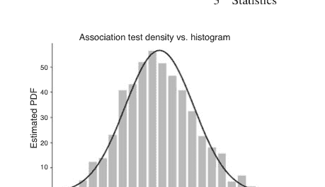

图 3.13 阴影区域对应P值 ≈ 0.2

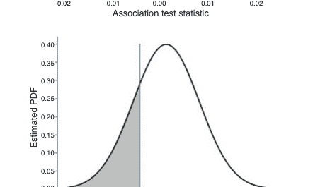

让我们考虑一个基于此协议的样本列联表，使用前面代码中的值：

| X/Y | Y₁ | Y₂ | 总计 |
|---|---|---|---|
| X₁ | 7 | 41 | 48 |
| X₂ | 95 | 357 | 452 |
| 总计 | 102 | 398 | 500 |

下面的代码计算了该表的标准化统计量，得到图 3.13，该图显示拒绝原假设（即上述所有条目相互独立）是不合理的（即P值对应的阴影区域 ≈ 0.2）。

```
>>> val = 7/N - 48/N*102/N
>>> p_m, p_n = 48/N, 102/N
>>> std = np.sqrt((p_m*p_n*(1+N+(-1+N)*p_n
...     +p_m*(-1+N+(1-3*N)*p_n)))/N**2)
>>> Y = val/std
>>> nrv = norm(0,1) # 标准正态分布
>>> nrv.cdf(Y) # P值
0.21174395725924777
```

卡方统计量与上述 Y 的平方成正比，因此我们也可以使用自由度为1的卡方统计量进行检验。以下是 $Y^2$ 的蒙特卡洛模拟。图 3.14 显示了其与渐近 $\chi^2$ 分布的对比。

图 3.14 $Y^2$ 的渐近分布与直方图对比

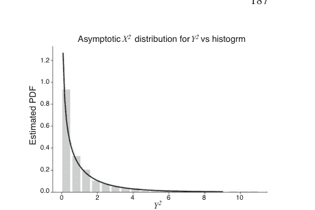

```
>>> from scipy.stats import chi2
>>> std = np.sqrt((p_m*p_n*(1+N+(N-1)*p_n+
...     p_m*(-1+N+(1-3*N)*p_n)))/N**2)
>>> d = (n00.rvs(nsamples)/N-M1.rvs(nsamples)*\n...     N1.rvs(nsamples)/N/N)**2/(std**2)
```

继续使用卡方统计量分析上述列联表，结果再次表明应拒绝原假设。注意，皮尔逊卡方统计量为 $\frac{N}{N-1}Y^2$，因此在大 $N$ 情况下具有相同的渐近行为。以下代码计算 $\xi^2$ 统计量的 $p$ 值：

```
>>> p_m, p_n = 48/N, 102/N
>>> val = 7/N - p_m*p_n
>>> std = np.sqrt((p_m*p_n*(1+N+(N-1)*p_n+
...     p_m*(N-1+(1-3*N)*p_n)))/N**2)
>>> Y2 = (val/std)**2
>>> 1-chirv.cdf(Y2) # P值
0.42348791451849566
```

#### 病例对照列联表分析

我们可以对病例对照列联表使用相同的分析模式。回顾一下，在这种情况下，列总和是*固定的*。以下是对应的列联表：

| X/Y | $Y_1$ | $Y_2$ | 总计 |
| :--- | :--- | :--- | :--- |
| $X_1$ | $n_{0,0}$ | - | $M_1$ |
| $X_2$ | $n_{1,0}$ | - | $M_2$ |
| 总计 | $N_1$ | $N_2$ | $N$ |

在这种情况下，$N_1$、$N_2$ 和 $N$ 是固定的，且 $M_1 \sim \text{Binom}(N, p_m)$。原假设是行计数之间没有关系。也就是说，两个因素（行）与病例（列）无关。这意味着 $n_{0,0} \sim \text{Binom}(M_1, p_1)$ 且 $n_{1,0} \sim \text{Binom}(M_2, p_2)$，原假设为 $H_0 : p_1 = p_2$。注意，一旦 $M_1$ 被抽取，$M_2$ 就固定了，因为行边缘总和为 $N$。我们构造以下统计量：

$$Y = \hat{p}_1 - \hat{p}_2$$

其中 $\hat{p}_1 = \frac{n_{0,0}}{M_1}$ 且 $\hat{p}_2 = \frac{n_{1,0}}{M_2}$。在原假设下，我们有 $\mathbb{E}(Y) = 0$ 且

$$\mathbb{E}(Y^2) = \mathbb{V}(Y) = \frac{1}{M_1^2}\mathbb{V}(n_{0,0}) + \frac{1}{M_2^2}\mathbb{V}(n_{1,0})$$

并且由于我们有 $\mathbb{V}(n_{0,0}) = M_1 p_1(1 - p_1)$，对应的 $\mathbb{V}(n_{1,0}) = M_2 p_2(1 - p_2)$，因此我们有

$$\mathbb{V}(Y) = \frac{1}{M_1} p_1(1 - p_1) + \frac{1}{M_2} p_2(1 - p_2)$$

注意，如果我们用 $\sqrt{N}$ 缩放 $Y$ 以形成新的统计量，

$$Y_1 = \sqrt{N}Y = \sqrt{N}(\hat{p}_1 - \hat{p}_2)$$

那么我们得到，

$$\mathbb{V}(Y_1) = \frac{N}{M_1} p_1(1 - p_1) + \frac{N}{M_2} p_2(1 - p_2) = \left(\frac{N}{M_1} + \frac{N}{M_2}\right) p_1(1 - p_1)$$

这是在原假设 $p_1 = p_2$ 下。然后，使用估计值 $\hat{p}_m = \frac{M_1}{N}$，我们得到：

$$\mathbb{V}(Y_1) = \frac{p_1(1 - p_1)}{p_m(1 - p_m)}$$

因此，我们得到了统计量 $Y_1$ 渐近正态分布的参数，从而得到

$$Z = \sqrt{N} \left(\frac{n_{0,0}}{M_1} - \frac{n_{1,0}}{N - M_1}\right) \sqrt{\frac{\frac{M_1}{N}\left(1 - \frac{M_1}{N}\right)}{\frac{n_{0,0}}{M_1}\left(1 - \frac{n_{0,0}}{M_1}\right)}}$$

以下代码在这些条件下模拟数据。图 3.15 显示了样本直方图和相应的渐近密度。

```
>>> nsamples, N = 1000, 500
>>> p_1, p_m = 0.3, 0.8
>>> M1 = binom(N,p_m)
>>> def gen_samples(n=1):
...     M = M1.rvs()
...     n00 = binom(M, p_1).rvs(n)
...     n10 = binom(N-M, p_1).rvs(n)
...     return (n00/M - n10/(N-M)) * np.sqrt(N)
...
>>> y = gen_samples(nsamples)
```

图 3.15 病例对照分析的直方图与渐近密度

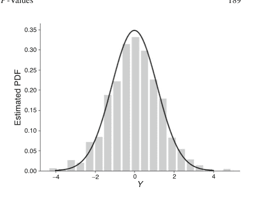

使用上述参数，让我们考虑一个在原假设下、基于此协议的样本列联表，其中 $p_m = 0.8$ 且 $p_1 = 0.3$，

| X/Y | $Y_1$ | $Y_2$ | 总计 |
|---|---|---|---|
| $X_1$ | 116 | 290 | 406 |
| $X_2$ | 27 | 67 | 94 |
| 总计 | 143 | 357 | 500 |

那么 $Y_1$ 统计量为 $Z \approx -0.029$。这非常接近均值，因此 $p$ 值约为 0.5，这意味着我们不能拒绝行独立的原假设，这令人放心，因为我们本来就是在原假设下生成这个列联表的。让我们考虑一个*不是*在原假设下生成的列联表，其中 $p_1 = 0.3$，$p_2 = 0.8$：

| X/Y | $Y_1$ | $Y_2$ | 总计 |
|---|---|---|---|
| $X_1$ | 116 | 290 | 406 |
| $X_2$ | 67 | 27 | 94 |
| 总计 | 183 | 317 | 500 |

这意味着 $n_{1,0}$ 是在 $\text{Binom}(M_2, p_2)$ 下生成的。对于这种情况，我们有 $Z \approx -8.25$，对应的 $p$ 值 $\approx 0$。费舍尔精确检验常用于这种情况。图 3.16（左图）显示了使用费舍尔精确检验和 $Z$ 统计量获得的 $p$ 值的比较。注意，费舍尔精确检验对应的 $p$ 值下界是我们 Z 统计量的相应 *p* 值。这个差距（最右图）意味着存在一些情况，费舍尔精确检验未能拒绝原假设，而 Z 统计量本应拒绝。两者之间的差异在 $n_{2,1} = 27$ 附近尤为显著，表明对于列联表而言，这是一个在拒绝原假设方面特别敏感的值。

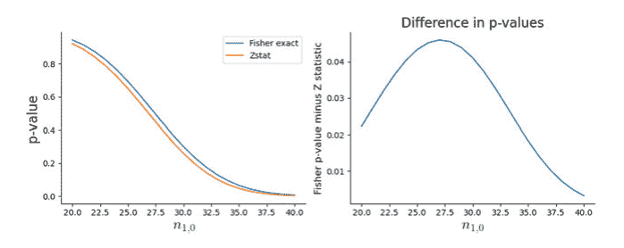

图 3.16 病例对照分析中费舍尔精确检验与 Z 统计量的 *p* 值比较

#### 皮尔逊卡方检验

对于大于 2x2 的 $I \times J$ 表，当 $N$ 相对于表中的列数较大时，皮尔逊卡方统计量通常用于分析列联表。我们定义 $\pi_{i,j} = \mathbb{P}(X = i, Y = j)$，其中 $\pi_{\bullet,\bullet} = 1$。对应多项分布的参数使用通常的比例 $\hat{\pi}_{i,j} = n_{i,j}/N$ 进行估计。对于独立性，联合结果可以分解为边缘概率的乘积，即 $\pi_{i,j} = \pi_{i,\bullet}\pi_{\bullet,j}$。如果不独立，表中有 $IJ - 1$ 个自由参数，因为约束条件 $\pi_{\bullet,\bullet} = 1$；然而，*如果*独立，则我们有 $(I - 1) + (J - 1)$ 个自由参数。这是因为原始约束条件分解为 $\pi_{\bullet,\bullet} = \sum_j \pi_{\bullet,j} \sum_i \pi_{i,\bullet} = 1$，并且边缘概率 $\sum_j \pi_{\bullet,j} = 1$ 和 $\sum_i \pi_{i,\bullet} = 1$。因此，行和列各减少一个自由参数，对于同一个不独立的表，自由参数减少了 $(IJ - 1) - (I + J - 2) = (I - 1)(J - 1)$。

皮尔逊卡方检验是观测计数减去估计的期望计数之差的平方，再除以估计的期望计数。独立性假设下的期望计数为

$N\hat{\pi}_{i,\bullet}\hat{\pi}_{\bullet,j} = n_{i,\bullet}n_{\bullet,j}/N$

因此，皮尔逊卡方检验统计量如下：

$X^2 = \sum_{i=1}^I \sum_{j=1}^J \frac{(n_{i,j} - n_{i,\bullet}n_{\bullet,j}/N)^2}{n_{i,\bullet}n_{\bullet,j}/N}$

当原假设为假时，我们预期$X^2$的平方差值会很大，因此当$X > \chi^2_{(I-1)(J-1),1-\alpha}$时，我们拒绝原假设（即认为不独立）。

#### 关联性的优势比

优势比提供了一种一致且可解释的关联性度量，是列联表分析的基础。使用$p$值的大小来衡量这种关联性是不正确的，但很常见。考虑以下二乘二列联表：

| X/Y | $Y_1$ | $Y_2$ | 合计 |
|---|---|---|---|
| $X_1$ | $n_{0,0}$ | $n_{0,1}$ | $M_1$ |
| $X_2$ | $n_{1,0}$ | $n_{1,1}$ | $M_2$ |
| 合计 | $N_1$ | $N_2$ | $N$ |

如果边际总和是固定的，那么选择任何一个$n_{i,j}$的值都会决定其他三个值。我们可以将所有值除以$N$以获得相应的概率。请注意，这些将是多项分布参数的估计量。

| X/Y | $Y_1$ | $Y_2$ | 合计 |
|---|---|---|---|
| $X_1$ | $p_{0,0}$ | $p_{0,1}$ | $p_{0,\bullet}$ |
| $X_2$ | $p_{1,0}$ | $p_{1,1}$ | $p_{1,\bullet}$ |
| 合计 | $p_{\bullet,0}$ | $p_{\bullet,1}$ | 1 |

第一行的优势如下：

$$odds_0 = \frac{p_{0,0}}{p_{0,1}}$$

类似地，下一行的优势也是如此。因此，该表的优势比为：

$$oddsRatio = \frac{p_{0,0}p_{1,1}}{p_{0,1}p_{1,0}}$$

为了理解这种情况下的优势比，请考虑来自`scipy.stats.fisher_exact`文档的以下表格：

| 动物/海洋 | 大西洋 | 印度洋 |
|---|---|---|
| 鲸鱼 | 8 | 2 |
| 鲨鱼 | 1 | 5 |

使用`fisher_exact`检验，我们计算如下：

```
>>> from scipy.stats import fisher_exact
>>> odds_ratio, p_value = fisher_exact([[8,2],[1,5]])
>>> print(f'{odds_ratio=}, {p_value=}')
odds_ratio=20.0, p_value=0.03496503496503495
```

其解释是，在大西洋发现鲸鱼（相对于印度洋）的优势大约是在大西洋发现鲨鱼（相对于印度洋）优势的20倍。

有趣的是，优势比和两个边际概率（$p_{0\bullet}$, $p_{\bullet 0}$）完全表征了列联表，因为它们中的每一个都可以独立于其他参数进行设置并产生一个有效的表格。从这个意义上说，这三个数字就像表格的*正交坐标*，它们在不相互干扰的情况下总结了信息。这不是参数化表格的*唯一*方式，因为可以使用边际概率和$p_{0,0}$值来推导所需的参数，但在这种情况下，改变$p_{0,0}$的值会影响边际概率。这种参数化互不干扰行为的专业术语是*变异独立*。

考虑以下代码，其中边际概率分别设置为0.1和0.2，优势比设置为5，用于求解表格概率：

```
>>> import sympy as S
>>> S.var('p:2(:2)', positive=True)
(p00, p01, p10, p11)
>>> eqs = [p00+p01- .1,           # 边际
...        p00+p10-.2,           # 边际
...        p00*p11/p01/p10 - 5,  # 优势比
...        p00+p11+p01+p10-1,    # 概率和
...        ]
>>> sol, = S.solve(eqs)
>>> print((p00+p01).subs(sol)) # 边际
0.100000000000000
>>> print((p00+p10).subs(sol)) # 边际
0.200000000000000
>>> print((p00*p11/p01/p10).subs(sol)) # 优势比
5.00000000000000
>>> print(sol)
{p00: 0.0500000000000000, p01: 0.0500000000000000,
 p10: 0.150000000000000, p11: 0.750000000000000}
```

注意，解提供了列联表的所有项。现在，如果我们保持其他所有条件不变，将优势比加倍，我们得到以下结果：

```
>>> eqs[2] = p00*p11/p01/p10 - 10 # 增加优势比
>>> sol, = S.solve(eqs)
>>> print((p00+p01).subs(sol)) # 边际不变
0.100000000000000
>>> print((p00+p10).subs(sol)) # 边际不变
0.200000000000000
>>> print((p00*p11/p01/p10).subs(sol)) # 新的优势比
10.0000000000000
```

请注意，即使优势比加倍，边际概率也保持不变。这就是*变异独立*的含义。

使用边际概率和优势比进行参数化也提供了一种评估行和列之间独立性程度的方法，因为如果行和列是独立的，那么优势比为1。这很容易通过代入独立性条件$p_{i,j} = p_{\bullet,j} p_{i,\bullet}$得出。优势比的极大似然估计由表中每个条目的极大似然估计组成：

$$\widehat{\text{OR}} = \frac{\hat{p}_{0,0} \hat{p}_{1,1}}{\hat{p}_{0,1} \hat{p}_{1,0}}$$

其中$\hat{p}_{i,j} = n_{i,j}/n_{\bullet,\bullet}$。在多项分布下，对数优势比的极大似然估计的渐近方差如下：

$$\mathbb{V}(\widehat{\text{OR}}) = \left( \frac{1}{n_{0,0}} + \frac{1}{n_{0,1}} + \frac{1}{n_{1,0}} + \frac{1}{n_{1,1}} \right)$$

重要的是，这*不*依赖于优势比本身的值。让我们看一个使用此估计量的快速示例，针对以下列联表：

| 吸烟者/病例 | 癌症病例 | 对照组 |
| :--- | :--- | :--- |
| 是 | 483 | 477 |
| 否 | 1101 | 1121 |

估计的优势比如下：

$$\frac{483 \times 1121}{477 \times 1101} \approx 1.03$$

这接近于1，暗示独立性。因为我们有上述估计量的方差，我们可以计算渐近标准误差：

$$\sqrt{\frac{1}{438} + \frac{1}{447} + \frac{1}{1101} + \frac{1}{1121}} \approx 0.0786$$

然后，对于95%置信区间，我们的优势比估计变为：

$$1.03 \pm 0.154$$

#### 宽列联表

到目前为止，我们只使用了二乘二列联表，但同样的分析模式也适用于更宽的表格。例如，考虑以下52名接受膝关节手术的男性的数据，结果根据损伤类型（扭转、直接、两者兼有）分为优秀（E）、良好（G）和一般/差（F）。

```
>>> data = np.array([[21,11,4],
...                 [3,2,2],
...                 [7,1,1]]).reshape((3,3))
>>> xa = xr.DataArray(data,
```

```
>>> xa
<xarray.DataArray (i: 3, j: 3)>
array([[21, 11,  4],
       [ 3,  2,  2],
       [ 7,  1,  1]])
Coordinates:
  * i        (i) <U6 'twist' 'direct' 'both'
  * j        (j) <U9 'excellent' 'good' 'poor'
```

我们可以将其建模为乘积多项式，其中每种损伤类型代表一个具有自己多项分布的独立群体。原假设是手术结果与损伤类型无关。

$H_0: p_{i,j} = p_{i,\bullet}p_{\bullet,j}$

我们可以估计每种结果的期望表如下：

```
>>> expected = xa.sum('j')*xa.sum('i')/xa.sum() # H0下的期望表
>>> expected
<xarray.DataArray (i: 3, j: 3)>
array([[21.46153846,  9.69230769,  4.84615385],
       [ 4.17307692,  1.88461538,  0.94230769],
       [ 5.36538462,  2.42307692,  1.21153846]])
Coordinates:
  * i        (i) <U6 'twist' 'direct' 'both'
  * j        (j) <U9 'excellent' 'good' 'poor'
```

像之前一样，我们可以使用$\chi^2$统计量来检验原假设。

```
>>> float(((xa - expected)**2/expected).sum()) # X^2 卡方统计量
3.2288420744641946
```

为了计算自由度，我们必须统计乘积多项式假设下的未知数数量（三种损伤类型乘以每种类型两个自由的$p_i$参数）减去我们在原假设下估计的参数数量。我们可以使用`stats.chi2`中的`isf`函数计算5% $p$值的阈值，如下所示：

```
>>> degrees_freedom = 2*3 - 2
>>> stats.chi2(degrees_freedom).isf(.05) # 卡方阈值
9.487729036781158
```

请注意，我们将Yates连续性校正标志设置为False，以使值完全匹配，尽管在这种情况下这并不重要。主要思想是，我们可以对大于二乘二的列联表使用相同的分析模式。

```
>>> chi2_stat, pvalue, dof, expected_array = \
        stats.chi2_contingency(xa.values, correction=False)
```

其中`expected_array`与我们上面计算的期望值相同，`chi2_stat`是上述的$\chi^2$统计量。

#### 辛普森悖论
在我们继续研究高维列联表时，理解辛普森悖论很重要。让我们从一个关于不同性别治疗效果和结果的例子开始。

```python
>>> data = np.array([[60, 20,40,80],
...                   [100,50,10,30]]).reshape((2,2,2))
>>> xa = xr.DataArray(data,
...                   coords = {'treatment':[1,2],
...                             'sex': ['male','female'],
...                             'outcome':['success','failure']})
>>> xa
<xarray.DataArray (treatment: 2, sex: 2, outcome: 2)>
array([[[ 60,  20],
        [ 40,  80]],

       [[100,  50],
        [ 10,  30]]])
Coordinates:
  * treatment  (treatment) int64 1 2
  * sex        (sex) <U6 'male' 'female'
  * outcome    (outcome) <U7 'success' 'failure'
```

让我们单独考虑男性群体，

```python
>>> xa.sel(sex='male') # treatment 1 works for males
<xarray.DataArray (treatment: 2, outcome: 2)>
array([[ 60,  20],
       [100,  50]])
Coordinates:
  * treatment  (treatment) int64 1 2
    sex        <U6 'male'
  * outcome    (outcome) <U7 'success' 'failure'
```

这个结果表明，治疗1的成功率高于治疗2（即60/80 vs. 100/150）。同样地，单独考虑女性群体，

```python
>>> xa.sel(sex='female') # treatment 1 works for females
<xarray.DataArray (treatment: 2, outcome: 2)>
array([[40, 80],
       [10, 30]])
Coordinates:
  * treatment  (treatment) int64 1 2
    sex        <U6 'female'
  * outcome    (outcome) <U7 'success' 'failure'
```

也显示治疗1的成功率更高。现在，让我们合并性别数据，得到以下表格：

```python
>>> # treatment 2 is better than treatment 1
>>> xa.sum('sex')
<xarray.DataArray (treatment: 2, outcome: 2)>
array([[100, 100],
       [110,  80]])
Coordinates:
  * treatment  (treatment) int64 1 2
  * outcome    (outcome) <U7 'success' 'failure'
```

令人惊讶的是，这里治疗2的成功率更高（110/190 vs. 100/200）。这就是悖论——为什么对于每个单独群体都更优的治疗（即治疗1），在合并群体中却不同？要解开这个悖论，我们需要理解三维表格的独立性模型。

**完全独立模型**
完全独立意味着所有三个维度彼此独立。考虑以下关于人格类型（*A* vs. *B*）、胆固醇（CHL）水平和血压（BP）的表格：

```python
>>> data = np.array([[[716,79],
...                   [207,25]],
...                  [[819,67],
...                   [186,22]]]).reshape((2,2,2))
>>> xa = xr.DataArray(data,
...                   coords ={'personality': ['A','B'],
...                           'cholesterol': ['normal','high'],
...                           'blood_pressure': ['normal','high'],
...                           }
...                   ).astype(np.int64)
>>> xa
<xarray.DataArray (personality:2, cholesterol:2, blood_pressure:2)>
array([[[716,  79],
        [207,  25]],

       [[819,  67],
        [186,  22]]])
Coordinates:
  * personality     (personality) <U1 'A' 'B'
  * cholesterol     (cholesterol) <U6 'normal' 'high'
  * blood_pressure  (blood_pressure) <U6 'normal' 'high'
```

在原假设下，我们计算期望表格如下

```python
>>> expected =(xa.sum(['personality','cholesterol'])*
...            xa.sum(['cholesterol','blood_pressure'])*
...            xa.sum(['personality','blood_pressure'])/xa.sum()**2)
>>> expected.transpose('personality','cholesterol', 'blood_pressure')
<xarray.DataArray (personality: 2, cholesterol: 2, blood_pressure: 2)>
array([[[739.88436419,  74.06518791],
        [193.66396207,  19.38648583]],

       [[788.15335387,  78.89709403],
        [206.29831987,  20.65123223]]])
Coordinates:
  * blood_pressure  (blood_pressure) <U6 'normal' 'high'
  * personality     (personality) <U1 'A' 'B'
  * cholesterol     (cholesterol) <U6 'normal' 'high'
```

其中最后的转置只是为了调整数据方向以便与xa进行比较。现在，我们计算通常的皮尔逊χ²检验

```python
>>> degrees_freedom = 7 - 3
>>> print(((xa-expected)**2/expected).sum()) # chi^2 statistic
<xarray.DataArray ()>
array(8.73016317)
>>> stats.chi2(degrees_freedom).isf(.05) # chi^2 threshold
9.487729036781158
```

其中自由度计算为原始表格中的参数数量（8 − 1 = 7）减去在此假设下我们估计的参数数量（每个维度一个）。因此，我们不能拒绝这里的原假设，这表明三个维度之间可能存在更复杂的关系。

**一个因子独立于其他因子的模型**
与所有三个维度完全独立的假设相反，另一个可能的假设是其中一个维度独立于其他两个联合维度。让我们考虑以下关于97名10岁学童的三维数据，这些学童根据课堂行为、家庭条件风险和学校条件逆境进行分类。课堂行为由教师判断为*偏差*或*非偏差*。家庭条件风险识别为无风险（N）或有风险（R）。学校条件逆境被判断为*低*、*中*或*高*。以下是相应的数据框，其中索引名称在坐标名称中包含了索引变量名称（例如，(i), (j), (k)）以清晰起见。

```python
>>> data = np.array([[16,7,15,34,5,3],[1,1,3,8,1,3]]).reshape((2,3,2))
>>> xa = xr.DataArray(data, coords = {
...                     'behavior(i)': ['deviant','non-deviant'],
...                     'adversity(j)': ['low','medium','high'],
...                     'risk(k)': ['N','R']
...                     }).astype(np.int64)
>>> xa
<xarray.DataArray (behavior(i): 2, adversity(j): 3, risk(k): 2)>
array([[[16,  7],
        [15, 34],
        [ 5,  3]],

       [[ 1,  1],
        [ 3,  8],
        [ 1,  3]]])
Coordinates:
  * behavior(i)  (behavior(i)) <U11 'deviant' 'non-deviant'
  * adversity(j) (adversity(j)) <U6 'low' 'medium' 'high'
  * risk(k)      (risk(k)) <U1 'N' 'R'
```

考虑行独立于*联合*列和层（第三维度）的假设，

$$H_1 : p_{i,j,k} = p_{i,\bullet,\bullet}p_{\bullet,j,k}$$

这意味着行为独立于*联合*家庭风险和逆境，同样

$$H_2 : p_{i,j,k} = p_{\bullet,\bullet,k}p_{i,j,\bullet}$$

意味着家庭风险独立于联合行为和逆境，最后，

$$H_3 : p_{i,j,k} = p_{\bullet,j,\bullet}p_{i,\bullet,k}$$

意味着逆境独立于联合行为和家庭风险。

让我们检验$H_1$假设，即行为独立于联合风险和逆境。以下是此假设下的期望表格：

```python
>>> expected = xa.sum(['adversity(j)','risk(k)'])*xa.sum('behavior(i)')/xa.sum()
>>> expected
<xarray.DataArray (behavior(i):2, adversity(j):3, risk(k):2)>
array([[[14.02061856,  6.59793814],
        [14.84536082, 34.63917526],
        [ 4.94845361,  4.94845361]],

       [[ 2.97938144,  1.40206186],
        [ 3.15463918,  7.36082474],
        [ 1.05154639,  1.05154639]]])
Coordinates:
  * behavior(i)  (behavior(i)) <U11 'deviant' 'non-deviant'
  * adversity(j) (adversity(j)) <U6 'low' 'medium' 'high'
  * risk(k)      (risk(k)) <U1 'N' 'R'
```

第一个`xa.sum`通过对其他维度求和来隔离行为维度。第二个`xa.sum`通过对行为维度求和来隔离联合风险和逆境维度。接下来，我们计算自由度和$\chi^2$统计量：

```python
>>> degrees_freedom = 12-1-6
>>> print('X^2 = ',((xa-expected)**2/expected).sum()) # chi^2 statistic
X^2 =  <xarray.DataArray ()>
array(6.19138681)
>>> stats.chi2(degrees_freedom).isf(.05) # chi^2 threshold
11.070497693516355
```

因此，我们不能拒绝$H_1$假设，即行为独立于联合家庭风险和逆境。接下来，让我们检验$H_2$假设，即家庭风险独立于联合行为和逆境：

$H_2 : p_{i,j,k} = p_{\bullet,\bullet,k}p_{i,j,\bullet}$

以下是该假设下的期望频数表：

```
>>> expected = xa.sum(['adversity(j)', 'behavior(i)'])*xa.sum('risk(k)')/xa.sum()
>>> expected
<xarray.DataArray (risk(k):2, behavior(i):2, adversity(j):3)>
array([[[ 9.72164948, 20.71134021,  3.3814433 ],
        [ 0.84536082,  4.64948454,  1.69072165]],

       [[13.27835052, 28.28865979,  4.6185567 ],
        [ 1.15463918,  6.35051546,  2.30927835]]])
Coordinates:
  * risk(k)       (risk(k)) <U1 'N' 'R'
  * behavior(i)   (behavior(i)) <U11 'deviant' 'non-deviant'
  * adversity(j)  (adversity(j)) <U6 'low' 'medium' 'high'
```

接下来，我们计算自由度和 $\chi^2$ 统计量：

```
>>> degrees_freedom = (12-1) -5 -1
>>> print('X^2 = ',((xa-expected)**2/expected).sum()) # chi^2 statistic
X^2 =  <xarray.DataArray ()>
array(12.64459949)
>>> stats.chi2(degrees_freedom).isf(.05) # chi^2 threshold
11.070497693516355
```

在此情况下，我们拒绝原假设，即家庭风险与联合行为及逆境是独立的。最后，我们检验 $H_3$ 假设，即逆境与联合行为及家庭风险是独立的：

$H_3 : p_{i,j,k} = p_{\bullet,j,\bullet}p_{i,\bullet,k}$

以下是该假设下的期望频数表：

```
>>> expected = xa.sum('adversity(j)')*xa.sum(['behavior(i)', 'risk(k)'])/xa.sum()
>>> expected
<xarray.DataArray (behavior(i):2, risk(k):2, adversity(j):3)>
array([[[ 9.27835052, 22.26804124,  4.45360825],
        [11.34020619, 27.21649485,  5.44329897]],

       [[ 1.28865979,  3.09278351,  0.6185567 ],
        [ 3.09278351,  7.42268041,  1.48453608]]])
Coordinates:
  * behavior(i)   (behavior(i)) <U11 'deviant' 'non-deviant'
  * risk(k)       (risk(k)) <U1 'N' 'R'
  * adversity(j)  (adversity(j)) <U6 'low' 'medium' 'high'
```

接下来，我们计算自由度和 $\chi^2$ 统计量：

```
>>> degrees_freedom = (2*2-1)*(3-1)
>>> print('X^2 = ',((xa-expected)**2/expected).sum()) # chi^2 statistic
X^2 =  <xarray.DataArray ()>
array(15.06798653)
>>> stats.chi2(degrees_freedom).isf(.05) # chi^2 threshold
12.59158724374398
```

在此情况下，我们可以拒绝原假设，即逆境与联合行为及家庭风险是独立的。

**回到辛普森悖论数据** 既然我们已经考虑了将皮尔逊 $\chi^2$ 检验应用于三维列联表的几种方法，我们可以重新审视第 3.5.7 节中关于辛普森悖论的早期数据，并进行进一步研究。回顾辛普森悖论的数据框：

```
>>> data=np.array([[60,20,40,80],
...                [100,50,10,30]]).reshape((2,2,2))
>>> xa = xr.DataArray(data,
...                   coords = {'treatment': [1,2],
...                             'sex': ['male','female'],
...                             'outcome': ['success','failure']}
...                   ).astype(np.int64)
>>> xa
<xarray.DataArray (treatment: 2, sex: 2, outcome: 2)>
array([[[ 60,  20],
        [ 40,  80]],

       [[100,  50],
        [ 10,  30]]])
Coordinates:
  * treatment  (treatment) int64 1 2
  * sex        (sex) <U6 'male' 'female'
  * outcome    (outcome) <U7 'success' 'failure'
```

回顾一下，这个悖论在于，尽管单独来看，治疗方案1对每个性别都是最好的，但当性别合并时，治疗方案2却是最好的。考虑性别与联合治疗及结果独立的假设（即 $p_{\bullet,j,\bullet}$）。

```
>>> expected = xa.sum('sex')*xa.sum(['treatment','outcome'])/
...           xa.sum()
>>> expected
<xarray.DataArray (treatment: 2, outcome: 2, sex: 2)>
array([[[58.97435897, 41.02564103],
        [58.97435897, 41.02564103]],

       [[64.87179487, 45.12820513],
        [47.17948718, 32.82051282]]])
Coordinates:
  * treatment  (treatment) int64 1 2
  * outcome    (outcome) <U7 'success' 'failure'
  * sex        (sex) <U6 'male' 'female'
```

与之前一样，我们计算自由度和 $\chi^2$ 统计量，如下所示：

```
>>> degrees_freedom = (8-1)-3-1
>>> print('X^2 = ',((xa-expected)**2/expected).sum()) # chi^2 statistic
X^2 =  <xarray.DataArray ()>
array(109.60319911)
>>> stats.chi2(degrees_freedom).isf(.05) # chi^2 threshold
7.814727903251178
```

下面的结果表明，我们可以拒绝性别与联合治疗及结果独立的假设。如果结果相反（即*不*拒绝独立性假设），那么我们可能会放心地对性别进行边际化以检查治疗和结果，但这个数据的结果表明我们*不能*这样做，从而说明辛普森悖论是这种结果的一种表现。换句话说，因为模型被拒绝意味着性别与治疗-结果之间存在关系，所以我们不能在不处理这种关系的情况下合并性别。这里拒绝独立性假设只是强调了这一事实，但它并没有解释这种关系是什么，这需要进一步的分析来揭示。

**条件独立模型** 我们已经研究了多种检验三维列联表独立性概念的方法。现在，让我们从以下关于人格类型（$A$ 与 $B$）、胆固醇（CHL）水平和血压（BP）的列联表开始，考虑条件独立性：

```
>>> data = np.array([[716,79],
...                   [207,25],
...                   [819,67],
...                   [186,22]]).reshape((2,2,2))
>>> xa = xr.DataArray(data,
...                   coords = {'personality': ['A','B'],
...                             'cholesterol': ['normal','high'],
...                             'blood_pressure': ['normal','high']}
...                   ).astype(np.int64)
>>> xa
<xarray.DataArray (personality: 2, cholesterol: 2,
                   blood_pressure: 2)>
array([[[716,  79],
        [207,  25]],

       [[819,  67],
        [186,  22]]])
Coordinates:
  * personality      (personality) <U1 'A' 'B'
  * cholesterol      (cholesterol) <U6 'normal' 'high'
  * blood_pressure   (blood_pressure) <U6 'normal' 'high'
```

考虑以下在给定人格类型下，胆固醇与血压条件独立的模型：

$p_{i,j,k} = p_{i,j,\bullet}p_{i,\bullet,k}/p_{i,\bullet,\bullet}$

以下是该假设下的期望频数表：

```
>>> expected = (xa.sum('blood_pressure') *
...             xa.sum('cholesterol')/xa.sum(['cholesterol',
...                                            'blood_pressure']))
>>> expected
<xarray.DataArray (personality: 2, cholesterol: 2,
blood_pressure: 2)>
array([[[714.49367089,  80.50632911],
        [208.50632911,  23.49367089]],

       [[813.9213894 ,  72.0786106 ],
        [191.0786106 ,  16.9213894 ]]])
Coordinates:
  * personality      (personality) <U1 'A' 'B'
  * cholesterol      (cholesterol) <U6 'normal' 'high'
  * blood_pressure   (blood_pressure) <U6 'normal' 'high'
```

与之前一样，我们计算自由度和 $\chi^2$ 统计量：

```
>>> degrees_freedom = 2
>>> print('X^2 =', ((xa-expected)**2/expected).sum()) # chi^2
statistic
X^2 = <xarray.DataArray ()>
array(2.18757144)
>>> stats.chi2(degrees_freedom).isf(.05) # chi^2 threshold
5.991464547107983
```

鉴于这些值，我们*不能*拒绝原假设，即在给定人格类型的情况下，胆固醇和血压在统计上是独立的，也许我们应该分别研究每种人格类型下胆固醇和血压之间的关系。

在本节中，我们讨论了统计假设检验的结构，并定义了该过程中常用的各种术语，同时通过我们持续进行的抛硬币示例说明了它们的含义。从工程的角度来看，假设检验不如置信区间和点估计常见。另一方面，假设检验在社会科学和医学中非常普遍，在这些领域中，人们必须处理可能限制样本大小或假设检验准则其他方面的实际约束。在工程中，我们通常可以对所使用的样本和模型有更大的控制权，因为它们通常是无生命的物体，可以重复且一致地进行测量。这在人类研究中显然并非如此，这些研究通常涉及其他伦理和法律考量。我们还详细介绍了使用列联表进行特定研究方案，这是医疗保健和医学应用中非常常见的用例，以及费舍尔精确检验，这是一种针对此类表格的强大非参数检验。

## 3.6 置信区间

在之前的抛硬币讨论中，我们讨论了对获得正面这一事件的底层概率的估计。在那里，我们推导出估计量为

$$\hat{p}_n = \frac{1}{n} \sum_{i=1}^n X_i$$

其中 $X_i \in \{0, 1\}$。置信区间使我们能够估计我们可以多接近我们正在估计的真实值。从逻辑上讲，这似乎很奇怪，不是吗？我们确实不知道我们正在估计的精确值（否则，为什么要估计它？），然而，我们却不知何故知道我们可以多接近我们承认不知道的东西。最终，我们想做出这样的陈述：*值在某个区间内的概率是90%*。不幸的是，使用我们的方法，我们无法做出这样的陈述。请注意，贝叶斯估计通过使用*可信区间*更接近这个陈述，但那是另一个故事了。在我们的情况下，我们能做的最好的事情大致如下：*如果我们多次运行实验，那么置信区间将有90%的时间捕获真实参数*。

让我们回到我们的抛硬币例子，看看这是如何运作的。获得置信区间的一种方法是使用第2.11节中的霍夫丁不等式，该不等式专门针对我们的伯努利变量：

$$\mathbb{P}(|\hat{p}_n - p| > \epsilon) \leq 2 \exp(-2n\epsilon^2)$$

现在，我们可以构造区间 $\mathbb{I} = [\hat{p}_n - \epsilon_n, \hat{p}_n + \epsilon_n]$，其中 $\epsilon_n$ 被精心构造为

$$\epsilon_n = \sqrt{\frac{1}{2n} \log \frac{2}{\alpha}}$$

这使得霍夫丁不等式的右边等于 $\alpha$。因此，我们最终得到

$$\mathbb{P}(p \notin \mathbb{I}) = \mathbb{P}(|\hat{p}_n - p| > \epsilon_n) \leq \alpha$$

因此，$\mathbb{P}(p \in \mathbb{I}) \geq 1 - \alpha$。作为一个数值例子，让我们取 $n = 100$，$\alpha = 0.05$；然后将所有值代入，我们得到 $\epsilon_n = 0.136$。所以，这里的95%置信区间是

$$\mathbb{I} = [\hat{p}_n - \epsilon_n, \hat{p}_n + \epsilon_n] = [\hat{p}_n - 0.136, \hat{p}_n + 0.136]$$

以下代码示例是一个模拟，用于查看我们是否真的能在置信区间内捕获底层参数。

```python
>>> from scipy import stats
>>> import numpy as np

>>> b= stats.bernoulli(.5) # fair coin distribution
>>> nsamples = 100
>>> # flip it nsamples times for 200 estimates
>>> xs = b.rvs(nsamples*200).reshape(nsamples,-1)
>>> phat = np.mean(xs,axis=0) # estimated p
>>> # edge of 95% confidence interval
>>> epsilon_n=np.sqrt(np.log(2/0.05)/2/nsamples)
>>> pct=np.logical_and(phat-epsilon_n<=0.5,
...                    0.5 <=  (epsilon_n +phat)
...                   ).mean()*100
>>> print('Interval trapped correct value ', pct,'% of the time')
Interval trapped correct value  99.0 % of the time
```

结果显示，估计量和相应的区间至少有95%的时间能够捕获真实值。这就是置信区间作用的解释方式。

然而，通常的做法是不使用霍夫丁不等式，而是使用围绕渐近正态性的论证。标准误差的定义如下：

$$\text{se} = \sqrt{\mathbb{V}(\hat{\theta}_n)}$$

其中 $\hat{\theta}_n$ 是给定 $n$ 个数据样本 $X_n$ 时参数 $\theta$ 的点估计量，$\mathbb{V}(\hat{\theta}_n)$ 是 $\hat{\theta}_n$ 的方差。同样，估计标准误差是 $\widehat{\text{se}}$。例如，在我们的抛硬币例子中，估计量是 $\hat{p} = \sum X_i / n$，相应的方差是 $\mathbb{V}(\hat{p}_n) = p(1-p)/n$。代入点估计值，我们得到估计标准误差：$\widehat{\text{se}} = \sqrt{\hat{p}(1-\hat{p})/n}$。因为最大似然估计量是渐近正态的，$^4$ 我们知道 $\hat{p}_n \sim \mathcal{N}(p, \widehat{\text{se}}^2)$。因此，如果我们想要一个 $1-\alpha$ 置信区间，我们可以计算

$$\mathbb{P}(|\hat{p}_n - p| < \xi) > 1-\alpha$$

但既然我们知道 $(\hat{p}_n - p)$ 是渐近正态的，$\mathcal{N}(0, \widehat{\text{se}}^2)$，我们可以改为计算

$$\int_{-\xi}^{\xi} \mathcal{N}(0, \widehat{\text{se}}^2) dx > 1-\alpha$$

$^4$ 某些技术性正则条件必须成立，最大似然估计量的这一性质才能生效。更多细节请参见[48]。

图3.17 灰色圆圈是点估计值，它们被渐近置信区间和霍夫丁区间上下限定。渐近区间更紧凑，因为基础渐近假设对这些估计值是有效的。

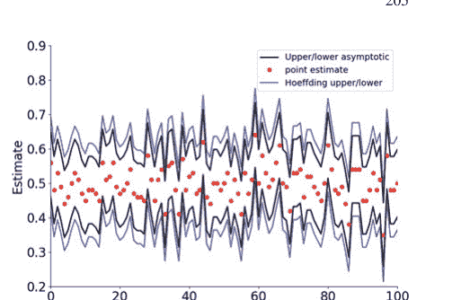

这看起来计算起来很麻烦，因为我们需要找到 $\xi$，但Scipy有我们需要的一切。

```python
>>> # compute estimated se for all trials
>>> se=np.sqrt(phat*(1-phat)/xs.shape[0])
>>> # generate random variable for trial 0
>>> rv=stats.norm(0, se[0])
>>> # compute 95% confidence interval for that trial 0
>>> np.array(rv.interval(0.95))+phat[0]
array([0.3623159, 0.5576841])
>>> def compute_CI(i):
...     return stats.norm.interval(0.95,loc=i,
...                                scale=np.sqrt(i*(1-i)/xs.shape[0]))
...
>>> lower,upper = compute_CI(phat)
```

图3.17显示了渐近置信区间和霍夫丁导出的置信区间。如图所示，霍夫丁区间比渐近估计值稍微宽松一些。然而，这仅在渐近近似有效时才成立。换句话说，存在某个数量的 $n$ 样本，使得渐近区间可能不起作用。因此，即使它们可能稍微宽松一些，霍夫丁区间也不需要关于渐近收敛的论证。然而，在实践中，渐近收敛总是起作用的（即使没有明确说明）。

**置信区间与假设检验** 事实证明，假设检验和置信区间之间存在紧密的对偶关系。考虑以下正态分布的假设检验，$H_0 : \mu = \mu_0$ 对 $H_1 : \mu \neq \mu_0$。一个合理的检验具有以下拒绝域：

$$\left\{ x : |\bar{x} - \mu_0| > z_{\alpha/2} \frac{\sigma}{\sqrt{n}} \right\}$$

其中 $\mathbb{P}(Z > z_{\alpha/2}) = \alpha/2$ 且 $\mathbb{P}(-z_{\alpha/2} < Z < z_{\alpha/2}) = 1 - \alpha$，且 $Z \sim \mathcal{N}(0, 1)$。这等同于说，对应于接受 $H_0$ 的区域是

$$\bar{x} - z_{\alpha/2} \frac{\sigma}{\sqrt{n}} \leq \mu_0 \leq \bar{x} + z_{\alpha/2} \frac{\sigma}{\sqrt{n}} \quad (3.2)$$

因为检验的显著性水平是 $\alpha$，所以虚警概率，$\mathbb{P}(H_0 \text{ rejected} \mid \mu = \mu_0) = \alpha$。同样，$\mathbb{P}(H_0 \text{ accepted} \mid \mu = \mu_0) = 1 - \alpha$。将所有这些与上面定义的区间结合起来意味着

$$\mathbb{P}\left(\bar{x} - z_{\alpha/2} \frac{\sigma}{\sqrt{n}} \leq \mu_0 \leq \bar{x} + z_{\alpha/2} \frac{\sigma}{\sqrt{n}} \mid H_0\right) = 1 - \alpha$$

因为这对任何 $\mu_0$ 都成立，我们可以去掉 $H_0$ 条件并说：

$$\mathbb{P}\left(\bar{x} - z_{\alpha/2} \frac{\sigma}{\sqrt{n}} \leq \mu_0 \leq \bar{x} + z_{\alpha/2} \frac{\sigma}{\sqrt{n}}\right) = 1 - \alpha$$

正如现在可能显而易见的，上面公式3.6中的区间就是 $1 - \alpha$ 置信区间！因此，我们刚刚通过反转显著性水平 $\alpha$ 检验的接受域获得了置信区间。假设检验固定*参数*，然后询问哪些样本值（即接受域）与该固定值一致。或者，置信区间固定样本值，然后询问哪些参数值（即置信区间）使这个样本值最合理。请注意，有时这种反转方法会导致不相交的区间（称为*置信集*）。

## 3.7 充分统计量

充分统计量的概念提供了一种思考和组织统计数据的强大方式[32]。回想一下，统计量是一个随机变量，因为它是在事件和实数之间的映射。例如，均值是一个统计量，它计算以下内容：

$$\overline{X} = \frac{1}{n} \sum_{i=1}^{n} X_n$$

因此，对于每组 $\{X_i\}$ 随机变量，我们计算均值。因此，因为均值是随机变量的函数，所以统计量也是一个随机变量。在一般情况下，统计量将随机变量集浓缩为单个值，这对于降低问题的维度很有用。然而，

## 3.8 线性回归

线性回归触及了统计学的核心：给定一组数据点，手头的数据与未来数据之间存在何种关系？一个数据集的信息应如何传播到其他数据？线性回归提供了以下模型来解决这个问题：

$$\mathbb{E}(Y|X=x) \approx ax + b$$

也就是说，给定 $X$ 的特定值，假设其条件期望是这些特定值的线性函数。然而，由于观测值本身并非期望值，模型通过一个加性噪声项来容纳这一点。换句话说，观测变量（又称响应变量、目标变量、因变量）被建模为

$$\mathbb{E}(Y|X = x_i) + \epsilon_i \approx ax + b + \epsilon_i = y$$

其中 $\mathbb{E}(\epsilon_i) = 0$，且 $\epsilon_i$ 是独立同分布的，其分布函数取决于具体问题，尽管通常假设为高斯分布。$X = x$ 的值被称为自变量、协变量或回归变量。

让我们看看能否运用迄今为止开发的所有方法来理解这种形式的回归。第一个任务是确定如何估计未知的线性参数 $a$ 和 $b$。为了具体化，让我们假设 $\epsilon \sim \mathcal{N}(0, \sigma^2)$。请记住，$\mathbb{E}(Y|X = x)$ 是 $x$ 的确定性函数。换句话说，变量 $x$ 在每次抽样中都会变化，但在数据收集完成后，这些值就不再是随机量了。因此，对于固定的 $x$，$y$ 是由 $\epsilon$ 生成的随机变量。也许我们应该将 $\epsilon$ 记为 $\epsilon_x$ 以强调这一点，但由于 $\epsilon$ 在每个固定的 $x$ 处都是一个独立同分布的随机变量，这样做就显得多余了。由于存在高斯加性噪声，$y$ 的分布完全由其均值和方差决定。

$$\mathbb{E}(y) = ax + b$$
$$\mathbb{V}(y) = \sigma^2$$

使用最大似然法，我们写出对数似然函数：

$$\mathcal{L}(a, b) = \sum_{i=1}^n \log \mathcal{N}(ax_i + b, \sigma^2) \propto \frac{1}{2\sigma^2} \sum_{i=1}^n (y_i - ax_i - b)^2$$

注意，我们省略了与求最大值无关的项。对 $a$ 求导得到以下方程：

$$\frac{\partial \mathcal{L}(a, b)}{\partial a} = 2 \sum_{i=1}^n x_i(b + ax_i - y_i) = 0$$

同样，对参数 $b$ 进行相同操作：

$$\frac{\partial \mathcal{L}(a, b)}{\partial b} = 2 \sum_{i=1}^n (b + ax_i - y_i) = 0$$

以下代码模拟了一些数据，并使用 Numpy 工具计算参数：

```python
>>> import numpy as np
>>> a = 6; b = 1 # parameters to estimate
>>> x = np.linspace(0, 1, 100)
>>> y = a*x + np.random.randn(len(x)) + b
```

## 3.8 线性回归

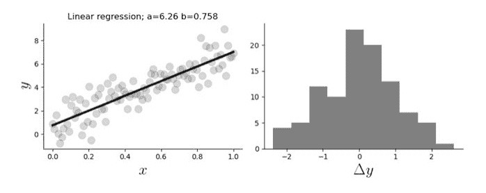

图 3.18 左侧面板显示了数据和回归线。右侧面板显示了回归误差的直方图

```
>>> p,var_=np.polyfit(x,y,1,cov=True) # 将数据拟合到直线
>>> y_ = np.polyval(p,x) # 通过线性回归进行估计
```

图 3.18 左侧的图显示了针对数据绘制的回归线。估计的参数在标题中注明。图 3.18 右侧的直方图显示了模型中的残差误差。检查任何回归的残差是否符合正态性总是一个好主意。这些残差是每个 $x_i$ 值的拟合直线与数据中对应的 $y_i$ 值之间的差异。请注意，$x$ 项不必是均匀单调的。

为了将确定性变化与随机变化解耦，我们可以固定索引并写出如下形式的独立问题

$$y_i = ax_i + b + \epsilon_i$$

其中 $\epsilon_i \sim \mathcal{N}(0, \sigma^2)$。仅凭这个问题的这一个分量，我们能做什么？换句话说，假设我们有这个分量的 $m$ 个样本，如 $\{y_{i,k}\}_{k=1}^m$。按照通常的程序，我们可以获得 $y_i$ 均值的估计值为

$$\hat{y}_i = \frac{1}{m} \sum_{k=1}^m y_{i,k}$$

然而，这并不能告诉我们关于单个参数 $a$ 和 $b$ 的任何信息，因为它们在计算的项中是不可分离的，也就是说，我们可能有

$$\mathbb{E}(y_i) = ax_i + b$$

但我们仍然只有一个方程和两个未知数 $a$ 和 $b$。如果我们固定另一个分量 $j$，如

$$y_j = ax_j + b + \epsilon_i$$

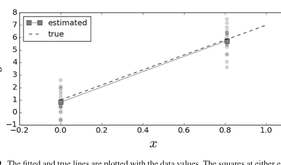

**图 3.19** 拟合线和真实线与数据值一起绘制。实线两端的方块显示了所示每个数据组的平均值

那么，我们有

$$\mathbb{E}(y_j) = ax_j + b$$

所以至少现在我们有两个方程和两个未知数，并且我们知道如何使用估计量 $\hat{y}_i$ 和 $\hat{y}_j$ 从数据中估计这些方程的左侧。让我们看看这在下面的代码示例中是如何工作的（图 3.19）。

```
>>> x0, xn =x[0],x[80]
>>> # 生成合成数据
>>> y_0 = a*x0 + np.random.randn(20)+b
>>> y_1 = a*xn + np.random.randn(20)+b
>>> # 沿样本维度求均值
>>> yhat = np.array([y_0,y_1]).mean(axis=1)
>>> a_,b_=np.linalg.solve(np.array([[x0,1],
...                                 [xn,1]]),yhat)
```

> **编程提示**
> 先前的代码使用了 Numpy `linalg` 模块中的 `solve` 函数，该模块包含了 Numpy 中经过实战检验的 LAPACK 库的核心线性代数代码。

我们可以写出在 $x_0 = 0$ 这种情况下估计参数的解

$$\hat{a} = \frac{\hat{y}_i - \hat{y}_0}{x_i}$$
$$\hat{b} = \hat{y}_0$$

这些估计量的期望和方差如下：

$$\mathbb{E}(\hat{a}) = \frac{ax_i}{x_i} = a$$
$$\mathbb{E}(\hat{b}) = b$$
$$\mathbb{V}(\hat{a}) = \frac{2\sigma^2}{x_i^2}$$
$$\mathbb{V}(\hat{b}) = \sigma^2$$

期望表明这些估计量是无偏的。估计量 $\hat{a}$ 的方差随着选择更大的点 $x_i$ 而减小。也就是说，为了拟合直线，样本点在水平轴上分布得更远一些更好。这个方差量化了那些远距离点的*杠杆作用*。

### 基于投影方法的回归

让我们看看是否可以将投影方法的知识应用于一般情况。用向量表示法，我们可以写出以下内容：

$$\mathbf{y} = a\mathbf{x} + b\mathbf{1} + \epsilon$$

其中 $\mathbf{1}$ 是全为 1 的向量。让我们使用内积表示法，

$$\langle \mathbf{x}, \mathbf{y} \rangle = \mathbb{E}(\mathbf{x}^T \mathbf{y})$$

然后，通过与某个 $\mathbf{x}_1 \in \mathbf{1}^\perp$ 取内积，我们得到$^5$

$$\langle \mathbf{y}, \mathbf{x}_1 \rangle = a \langle \mathbf{x}, \mathbf{x}_1 \rangle$$

回想一下 $\mathbb{E}(\epsilon) = \mathbf{0}$。我们最终可以解出 $a$ 为

$$\hat{a} = \frac{\langle \mathbf{y}, \mathbf{x}_1 \rangle}{\langle \mathbf{x}, \mathbf{x}_1 \rangle} \qquad (3.3)$$

这相当简洁，但现在我们有了神秘的 $\mathbf{x}_1$ 向量。它从哪里来？如果我们将 $\mathbf{x}$ 投影到 $\mathbf{1}^\perp$ 上，那么我们就得到了 $\mathbf{x}$ 在 $\mathbf{1}^\perp$ 空间中的最小均方误差近似。因此，我们取

$$\mathbf{x}_1 = P_{\mathbf{1}^\perp}(\mathbf{x})$$

记住 $P_{\mathbf{1}^\perp}$ 是一个投影矩阵，所以 $\mathbf{x}_1$ 的长度最多为 $\mathbf{x}$ 的长度。这意味着上面 $\hat{a}$ 方程中的分母实际上只是 $\mathbf{x}$ 向量在 $P_{1\perp}$ 坐标系中的长度。

$^5$ 所有满足 $\langle \mathbf{a}, \mathbf{1} \rangle = 0$ 的向量 $\mathbf{a}$ 的空间记为 $\mathbf{1}^\perp$。

由于投影是正交的（即长度最小），勾股定理给出这个长度为：

$$\langle \mathbf{x}, \mathbf{x}_1 \rangle^2 = \langle \mathbf{x}, \mathbf{x} \rangle - \langle \mathbf{1}, \mathbf{x} \rangle^2$$

右边的第一项是 $\mathbf{x}$ 向量的长度，最后一项是 $\mathbf{x}$ 在与 $P_{1\perp}$ 正交的坐标系（即 $\mathbf{1}$ 的坐标系）中的长度。我们可以利用这种几何解释来更详细地理解典型线性回归中发生的情况。分母是 $\mathbf{x}$ 的正交投影这一事实告诉我们，选择 $\mathbf{x}_1$ 对于减小 $\hat{a}$ 的方差具有最强的影响（即最大的值）。也就是说，$\mathbf{x}$ 与 $\mathbf{1}$ 越对齐，$\hat{a}$ 的方差就越差。这很直观，因为 $\mathbf{x}$ 越接近 $\mathbf{1}$，它就越接近常数，而我们从一维例子中已经看到，$x$ 项之间的距离有助于减小方差。我们已经知道 $\hat{a}$ 是一个无偏估计量，并且因为我们特意选择 $\mathbf{x}_1$ 作为投影，我们知道它也是最小方差的。这样的估计量被称为最小方差无偏估计量（MVUE）。

同样地，让我们检查公式 3.8 中 $\hat{a}$ 的分子。我们可以将 $\mathbf{x}_1$ 写为：

$$\mathbf{x}_1 = \mathbf{x} - P_1 \mathbf{x}$$

其中 $P_1$ 是 $\mathbf{x}$ 投影到 $\mathbf{1}$ 向量上的投影矩阵。使用这个，$\hat{a}$ 的分子变为

$$\langle \mathbf{y}, \mathbf{x}_1 \rangle = \langle \mathbf{y}, \mathbf{x} \rangle - \langle \mathbf{y}, P_1 \mathbf{x} \rangle$$

注意，

$$P_1 = \mathbf{1} \mathbf{1}^T \frac{1}{n}$$

所以明确写出这个式子得到

$$\langle \mathbf{y}, P_1 \mathbf{x} \rangle = \left( \mathbf{y}^T \mathbf{1} \right) \left( \mathbf{1}^T \mathbf{x} \right) / n = \left( \sum y_i \right) \left( \sum x_i \right) / n$$

类似地，我们有分母的以下表达式：

$$\langle \mathbf{x}, P_1 \mathbf{x} \rangle = \left( \mathbf{x}^T \mathbf{1} \right) \left( \mathbf{1}^T \mathbf{x} \right) / n = \left( \sum x_i \right) \left( \sum x_i \right) / n$$

所以，将所有这些代入得到以下结果：

$$\hat{a} = \frac{\mathbf{x}^T \mathbf{y} - (\sum x_i)(\sum y_i)/n}{\mathbf{x}^T \mathbf{x} - (\sum x_i)^2/n}$$

对应的方差为

$$\mathbb{V}(\hat{a}) = \sigma^2 \frac{\|\mathbf{x}_1\|^2}{\langle \mathbf{x}, \mathbf{x}_1 \rangle^2} = \frac{\sigma^2}{\|\mathbf{x}\|^2 - n(\bar{x}^2)}$$

其中 $\bar{x} = \sum_{i=1}^n x_i / n$。使用相同的方法处理 $\hat{b}$ 得到

$$\hat{b} = \frac{\langle \mathbf{y}, \mathbf{x}^\perp \rangle}{\langle \mathbf{1}, \mathbf{x}^\perp \rangle} \quad (3.4)$$
$$= \frac{\langle \mathbf{y}, \mathbf{1} - P_{\mathbf{x}}(\mathbf{1}) \rangle}{\langle \mathbf{1}, \mathbf{1} - P_{\mathbf{x}}(\mathbf{1}) \rangle} \quad (3.5)$$
$$= \frac{\mathbf{x}^T \mathbf{x}(\sum y_i)/n - \mathbf{x}^T \mathbf{y}(\sum x_i)/n}{\mathbf{x}^T \mathbf{x} - (\sum x_i)^2/n} \quad (3.6)$$

其中

$$P_{\mathbf{x}} = \frac{\mathbf{x}\mathbf{x}^T}{\|\mathbf{x}\|^2}$$

方差为

$$\mathbb{V}(\hat{b}) = \sigma^2 \frac{\langle \mathbf{1} - P_{\mathbf{x}}(\mathbf{1}), \mathbf{1} - P_{\mathbf{x}}(\mathbf{1}) \rangle}{\langle \mathbf{1}, \mathbf{1} - P_{\mathbf{x}}(\mathbf{1}) \rangle^2} = \frac{\sigma^2}{n - \frac{(n\bar{x})^2}{\|\mathbf{x}\|^2}}$$

### 评估估计量

我们上面的方差公式包含了未知的 $\sigma^2$，我们必须使用我们的插件估计量从数据本身来估计它。我们可以形成残差平方和为

$$\text{RSS} = \sum_i (\hat{a}x_i + \hat{b} - y_i)^2$$

因此，$\sigma^2$ 的估计可以表示为

$$\hat{\sigma}^2 = \frac{\text{RSS}}{n - 2}$$

其中 $n$ 是样本数量。这也被称为*残差均方*。$n - 2$ 代表*自由度* (df)。因为我们从同一组数据中估计了两个参数，所以我们使用 $n - 2$ 而不是 $n$。因此，一般情况下，$df = n - p$，其中 $p$ 是估计参数的数量。在噪声服从高斯分布的假设下，$RSS/\sigma^2$ 服从自由度为 $n - 2$ 的卡方分布。另一个重要术语是*关于均值的平方和*（也称为*校正平方和*），

$$SYY = \sum(y_i - \bar{y})^2$$

$SYY$ 体现了不使用 $x_i$ 数据，而仅使用 $y_i$ 数据的均值来估计 $y$ 的思想。这两个术语引出了 $R^2$ 项：

$$R^2 = 1 - \frac{RSS}{SYY}$$

请注意，对于完美回归，$R^2 = 1$。也就是说，如果回归能精确地拟合每个 $y_i$ 数据点，那么 $RSS = 0$，此项等于一。因此，此项被用来衡量拟合优度。`scipy` 中的 `stats` 模块会自动计算许多此类项

```
from scipy import stats
slope, intercept, r_value, p_value, stderr = stats.linregress(x, y)
```

其中 `r_value` 变量的平方就是上面的 $R^2$。计算出的 `p-value` 是双侧假设检验的结果，其原假设是直线的斜率为零。换句话说，这检验了对于该假设，线性回归对数据是否有意义。Statsmodels 模块通过使回归分析和参数跟踪变得简单，为 Scipy 的 `stats` 模块提供了强大的扩展。让我们使用 Statsmodels 框架重新表述问题，为数据创建一个 Pandas dataframe：

```
import statsmodels.formula.api as smf
from pandas import DataFrame
import numpy as np
d = DataFrame({'x': np.linspace(0, 1, 10)})  # create data
d['y'] = a * d.x + b + np.random.randn(*d.x.shape)
```

现在我们已经将输入数据放入上述 Pandas dataframe 中，我们可以执行如下回归：

```
results = smf.ols('y ~ x', data=d).fit()
```

`~` 符号是 $y = ax + b + \epsilon$ 的表示法，其中常数 $b$ 在 Statsmodels 的这种用法中是隐含的。字符串中的名称取自 dataframe 的列名。这使得构建具有 dataframe 中命名列之间复杂交互的模型变得非常容易。我们可以通过查看摘要来检查模型拟合报告：

```
print(results.summary2())
```

结果：普通最小二乘法

| 模型: | OLS | 调整后 R-squared: | 0.808 |
|---|---|---|---|
| 因变量: | y | AIC: | 28.1821 |
| 日期: | 0000-00-00 00:00 | BIC: | 00.0000 |
| 观测数: | 10 | 对数似然: | -12.091 |
| 模型自由度: | 1 | F-statistic: | 38.86 |
| 残差自由度: | 8 | Prob (F-statistic): | 0.000250 |
| R-squared: | 0.829 | Scale: | 0.82158 |

| | 系数 (Coef.) | 标准误 (Std.Err.) | t | P>|t| | [0.025 | 0.975] |
|---|---|---|---|---|---|---|
| 截距 (Intercept) | 1.5352 | 0.5327 | 2.8817 | 0.0205 | 0.3067 | 2.7637 |
| x | 5.5990 | 0.8981 | 6.2340 | 0.0003 | 3.5279 | 7.6701 |

这里的内容比我们目前讨论的要多得多，但 Statsmodels 的文档是获取此报告完整信息的最佳去处。F 统计量试图捕捉包含斜率参数与不包含斜率参数之间的对比。也就是说，考虑两个假设：

$H_0: \mathbb{E}(Y|X = x) = b$

$H_1: \mathbb{E}(Y|X = x) = b + ax$

为了量化添加斜率项对回归的改善程度，我们计算以下内容：

$F = \frac{\text{SYY} - \text{RSS}}{\hat{\sigma}^2}$

分子计算了在回归中包含斜率与仅使用 $y_i$ 值的均值时，残差平方误差之间的差异。再次强调，如果我们假设（或可以渐近地声称）$\epsilon$ 噪声项服从高斯分布，$\epsilon \sim \mathcal{N}(0, \sigma^2)$，那么 $H_0$ 假设将服从自由度为分子和分母的 F 分布$^6$。在这种情况下，$F \sim F(1, n - 2)$。此统计量的值由上面的 Statsmodels 报告给出。相应的报告概率显示了在 $H_0$ 为真的情况下，$F$ 超过其计算值的概率。因此，所有这些的要点是，在高斯加性噪声假设下，包含斜率所带来的平方误差减少，远大于从该数据的 $n$ 个点的有利抽样中所能预期的减少。这证明了包含斜率对该数据是有意义的。

Statsmodels 报告还显示了调整后 $R^2$ 项。这是对 $R^2$ 计算的修正，考虑了回归拟合的参数数量 $p$ 和样本大小 $n$：

$^6$ $F(m, n)$ F 分布有两个整数自由度参数，$m$ 和 $n$。

$$\text{Adjusted } R^2 = 1 - \frac{\text{RSS}/(n-p)}{\text{SYY}/(n-1)}$$

除了 $p = 1$（即仅估计 $b$）的情况外，它总是低于 $R^2$。当试图用相对较小的 $n$ 拟合许多参数时，这成为比较回归模型的一种更好的方法。

### 线性预测

使用线性回归进行预测会引入一些其他问题。回顾以下期望：

$$\mathbb{E}(Y|X = x) \approx \hat{a}x + \hat{b}$$

其中我们已经从数据中确定了 $\hat{a}$ 和 $\hat{b}$。给定一个新的感兴趣点 $x_p$，我们肯定会计算

$$\hat{y}_p = \hat{a}x_p + \hat{b}$$

作为 $\hat{y}_p$ 的预测值。这等同于说，我们基于 $x_p$ 对 $y$ 的最佳预测是上述条件期望。其方差如下：

$$\mathbb{V}(y_p) = x_p^2\mathbb{V}(\hat{a}) + \mathbb{V}(\hat{b}) + 2x_p\text{cov}(\hat{a}\hat{b})$$

注意，我们上面有协方差项，因为 $\hat{a}$ 和 $\hat{b}$ 是从同一组数据中导出的。我们可以使用之前 3.8 节中的符号来计算它：

$$\text{cov}(\hat{a}\hat{b}) = \frac{\mathbf{x}_1^T \mathbb{V}\{\mathbf{yy}^T\} \mathbf{x}^\perp}{(\mathbf{x}_1^T \mathbf{x})(\mathbf{1}^T \mathbf{x}^\perp)} = \frac{\mathbf{x}_1^T \sigma^2 \mathbf{I} \mathbf{x}^\perp}{(\mathbf{x}_1^T \mathbf{x})(\mathbf{1}^T \mathbf{x}^\perp)}$$
$$= \sigma^2 \frac{\mathbf{x}_1^T \mathbf{x}^\perp}{(\mathbf{x}_1^T \mathbf{x})(\mathbf{1}^T \mathbf{x}^\perp)} = \sigma^2 \frac{(\mathbf{x} - P_1 \mathbf{x})^T \mathbf{x}^\perp}{(\mathbf{x}_1^T \mathbf{x})(\mathbf{1}^T \mathbf{x}^\perp)}$$
$$= \sigma^2 \frac{-\mathbf{x}^T P_1^T \mathbf{x}^\perp}{(\mathbf{x}_1^T \mathbf{x})(\mathbf{1}^T \mathbf{x}^\perp)} = \sigma^2 \frac{-\mathbf{x}^T \frac{1}{n} \mathbf{1} \mathbf{1}^T \mathbf{x}^\perp}{(\mathbf{x}_1^T \mathbf{x})(\mathbf{1}^T \mathbf{x}^\perp)}$$
$$= \sigma^2 \frac{-\mathbf{x}^T \frac{1}{n} \mathbf{1}}{(\mathbf{x}_1^T \mathbf{x})} = \frac{-\sigma^2 \bar{x}}{\sum_{i=1}^n (x_i^2 - \bar{x}^2)}$$

将所有这些代入后，我们得到以下结果：

$$\mathbb{V}(y_p) = \sigma^2 \frac{x_p^2 - 2x_p \bar{x} + \|\mathbf{x}\|^2/n}{\|\mathbf{x}\|^2 - n\bar{x}^2}$$

在实践中，我们使用 $\sigma^2$ 的插件估计值。

这对于 $y_p$ 的置信区间有一个重要影响。我们不能简单地使用 $\mathbb{V}(y_p)$ 的平方根来构建置信区间，因为模型包含了额外的 $\epsilon$ 噪声项。特别是，参数是使用数据的一组统计量计算出来的，但现在必须包含预测部分中噪声项的不同实现。这意味着我们必须计算

$$\eta^2 = \mathbb{V}(y_p) + \sigma^2$$

然后，95% 置信区间 $y_p \in (y_p - 2\hat{\eta}, y_p + 2\hat{\eta})$ 如下：

$$\mathbb{P}(y_p - 2\hat{\eta} < y_p < y_p + 2\hat{\eta}) \approx \mathbb{P}(-2 < \mathcal{N}(0, 1) < 2) \approx 0.95$$

其中 $\hat{\eta}$ 来自将 $\sigma$ 的插件估计值代入。

### 3.8.1 扩展到多个协变量

利用我们已有的所有工具，考虑多个回归量只需在符号上稍作调整，如下所示：

$$\mathbf{Y} = \mathbf{X}\boldsymbol{\beta} + \boldsymbol{\epsilon}$$

其中通常有 $\mathbb{E}(\boldsymbol{\epsilon}) = \mathbf{0}$ 和 $\mathbb{V}(\boldsymbol{\epsilon}) = \sigma^2\mathbf{I}$。因此，$\mathbf{X}$ 是一个 $n \times p$ 的满秩回归量矩阵，$\mathbf{Y}$ 是 $n$ 维观测向量。请注意，常数项已作为一列全 1 向量并入 $\mathbf{X}$ 中。$\boldsymbol{\beta}$ 的相应估计解如下：

$$\hat{\boldsymbol{\beta}} = (\mathbf{X}^T\mathbf{X})^{-1}\mathbf{X}^T\mathbf{Y}$$

相应的方差为，

$$\mathbb{V}(\hat{\boldsymbol{\beta}}) = \sigma^2(\mathbf{X}^T\mathbf{X})^{-1}$$

并且在误差服从高斯分布的假设下，我们有

$$\hat{\boldsymbol{\beta}} \sim \mathcal{N}(\boldsymbol{\beta}, \sigma^2(\mathbf{X}^T\mathbf{X})^{-1})$$

$\sigma^2$ 的无偏估计如下：

$$\hat{\sigma}^2 = \frac{1}{n-p} \sum \hat{\epsilon}_i^2$$

其中 $\hat{\epsilon} = \mathbf{X}\hat{\beta} - \mathbf{Y}$ 是残差向量。图基将以下矩阵命名为*帽子*矩阵（又称影响矩阵），

$$\mathbf{V} = \mathbf{X}(\mathbf{X}^T\mathbf{X})^{-1}\mathbf{X}^T$$

因为它将 $\mathbf{Y}$ 映射为 $\hat{\mathbf{Y}}$，

$$\hat{\mathbf{Y}} = \mathbf{V}\mathbf{Y}$$

作为练习，你可以验证 $\mathbf{V}$ 是一个投影矩阵。请注意，该矩阵仅是 $\mathbf{X}$ 的函数。$\mathbf{V}$ 的对角元素被称为*杠杆值*，并包含在闭区间 $[1/n, 1]$ 内。这些项衡量了 $x_i$ 的值与 $n$ 个观测值的平均值之间的距离。因此，杠杆项仅依赖于 $\mathbf{X}$。这是对我们最初关于杠杆的讨论的推广，当时我们只有两个 $x_i$ 点上的多个样本。使用帽子矩阵，我们可以计算每个残差 $e_i = \hat{y} - y_i$ 的方差为

$$\mathbb{V}(e_i) = \sigma^2(1 - v_i)$$

其中 $v_i = V_{i,i}$。鉴于上述关于 $v_i$ 的界限，这些值总是小于 $\sigma^2$。

$\mathbf{X}$ 列的退化可能成为一个问题。这是指两列或多列变得共线。我们已经在单变量回归示例中看到过这种情况，其中 $\mathbf{x}$ 接近 $\mathbf{1}$ 是个坏消息。为了补偿这种效应，我们可以加载对角元素并求解未知参数，如下所示：

$$\hat{\beta} = (\mathbf{X}^T\mathbf{X} + \alpha\mathbf{I})^{-1}\mathbf{X}^T\mathbf{Y}$$

其中 $\alpha > 0$ 是一个可调的超参数。这种方法被称为*岭回归*，由 Hoerl 和 Kenndard 于 1970 年提出。可以证明，这等价于最小化以下目标：

$$\|\mathbf{Y} - \mathbf{X}\beta\|^2 + \alpha\|\beta\|^2$$

换句话说，估计的 $\beta$ 的长度会因较大的 $\alpha$ 而受到惩罚。这具有稳定后续逆计算的效果，并提供了一种权衡偏差和方差的方法，我们将在第 4.7 节详细讨论。

**解释残差** 我们的模型假设了一个加性高斯噪声项。我们可以通过检查拟合后的残差来验证这一假设的准确性。残差是拟合值与原始数据之间的差异：

$$\hat{e}_i = \hat{a}x_i + \hat{b} - y_i$$

虽然 p 值和 F 比率提供了一些关于计算回归斜率是否有意义的指示，但我们可以直接针对加性高斯噪声这一关键假设进行检验。

对于足够小的维度，我们在上一章讨论的 `scipy.stats.probplot` 通过绘制标准化（学生化）残差

$$r_i = \frac{e_i}{\hat{\sigma} \sqrt{1 - v_i}}$$

提供了快速的视觉证据，其中 $v_i$ 是*杠杆*统计量，等于影响矩阵的对角线。独立同分布假设的另一部分意味着同方差性（所有 $r_i$ 具有相等的方差）。在加性高斯噪声假设下，$e_i$ 也应服从 $\mathcal{N}(0, \sigma^2(1 - v_i))$ 分布。那么，标准化残差 $r_i$ 应服从 $\mathcal{N}(0, 1)$ 分布。因此，在 5% 的显著性水平下，任何 $r_i \notin [-1.96, 1.96]$ 的出现都不应常见，从而引发对同方差性假设的怀疑。

`scipy.stats.levene` 中的 Levene 检验检验了所有方差相等的原假设。这基本上检查了标准化残差在 $x_i$ 上的变化是否超出了预期。在同方差性假设下，方差应与 $x_i$ 无关。如果不是，那么这表明分析中存在缺失变量，或者变量本身应该被转换（例如，使用对数函数）成另一种可以减少这种效应的格式。此外，我们可以使用加权最小二乘法代替普通最小二乘法。

**变量缩放** 在多元回归中，很容易得出这样的结论：任何 $\beta$ 项中的小系数意味着这些项不重要。然而，简单的单位转换可能导致这种效应。例如，如果其中一个回归变量的单位是公里，而其他的是米，那么仅尺度因子就可能给人一种效果过大或过小的印象。解决这个问题的常见方法是缩放回归变量，使得

$$x' = \frac{x - \bar{x}}{\sigma_x}$$

这有一个副作用，即将斜率参数转换为相关系数，其范围在 $\pm 1$ 之间。

**有影响力的数据** 我们已经讨论了杠杆的概念。*影响*的概念将杠杆与异常值结合起来。要理解影响，请考虑图 3.20。

图 3.20 中右侧的点是唯一对拟合线斜率计算有贡献的点。因此，在这个意义上它非常有影响力。库克距离是数值化理解这一概念的好方法。为了计算它，我们必须计算删除第 $i$ 个点后估计的目标变量的第 $j$ 个分量。我们称之为 $\hat{y}_{j(i)}$。然后，我们计算以下内容：

$$D_i = \frac{\sum_j (\hat{y}_j - \hat{y}_{j(i)})^2}{p/n \sum_j (\hat{y}_j - y_j)^2}$$

其中，与之前一样，$p$ 是估计项的数量（例如，在双变量情况下 $p = 2$）。这个计算通过预测包含和不包含每个点时的目标变量来强调异常值的影响。在图 3.20 的情况下，丢失左侧的任何点都不会显著改变估计的目标变量，但丢失右侧的单个点肯定会。右侧的点似乎不是异常值（它*确实*在拟合线上），但这是因为它具有足够的影响力，可以将直线旋转到与之对齐。库克距离通过排除每个样本并重新拟合剩余部分来帮助捕捉这种效应，如上一个方程所示。图 3.21 显示了图 3.20 中数据的计算库克距离，表明右侧的数据点（样本索引 5）对拟合线有超大的影响。根据经验法则，大于一的库克距离值是可疑的。

图 3.20 右侧的点在此数据中具有超大的影响，因为它是用于确定拟合线斜率的唯一点

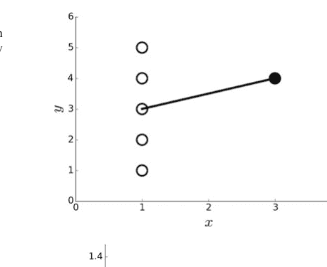

图 3.21 图 3.20 中数据的计算库克距离

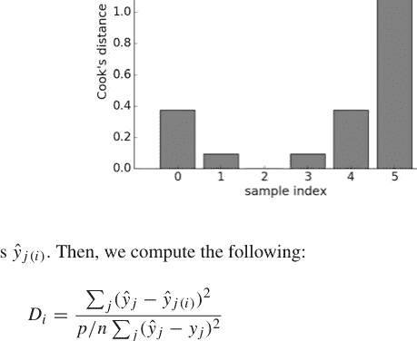

图 3.22 上图显示了拟合在一条直线上的数据和一个异常点（实心黑圆）。下图显示了上图数据的计算库克距离，并显示第十个点（即异常值）具有不成比例的影响

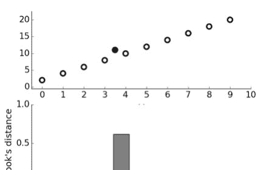

作为影响的另一个例证，考虑图 3.22，它显示了一些整齐排列的数据，但在上图中有一个异常值（实心黑圆）。下图显示了此数据的计算库克距离，并强调了异常值的存在。因为计算涉及排除单个样本并重新计算其余部分，所以它可能是一个耗时的操作，适用于相对较小的数据集。人们总是倾向于淡化异常值的重要性，因为它们与偏好的模型相冲突，但必须仔细检查异常值，以理解为什么模型无法捕捉它们。这可能像数据收集错误这样简单，也可能是被忽视的更深层次问题的迹象。以下代码展示了如何为图 3.21 和 3.22 计算库克距离：

```
>>> fit = lambda i,x,y: np.polyval(np.polyfit(x,y,1),i)
>>> omit = lambda i,x: ([k for j,k in enumerate(x) if j !=i])
>>> def cook_d(k):
...     num = sum((fit(j,omit(k,x),omit(k,y))-fit(j,x,y))**2 for j in x)
...     den = sum((y-np.polyval(np.polyfit(x,y,1),x))**2/len(x)**2)
...     return num/den
...
```

> **编程提示**
函数 `omit` 遍历数据并排除第 *i* 个数据元素。嵌入的 `enumerate` 函数将可迭代对象中的每个元素与其对应的索引关联起来。

## 3.9 最大后验估计

我们之前通过最大似然估计了解了如何利用最大似然原理推导出数据的公式，以估计潜在参数（例如 $\theta$）。在该方法中，参数是固定但未知的。如果我们稍微改变视角，将潜在参数本身视为一个随机变量，这将为估计带来额外的灵活性。这种方法是贝叶斯统计方法族中最简单的，并且与最大似然估计关系最为密切。它在通信和信号处理领域非常流行，是这些领域许多重要算法的基石。

假设参数 $\theta$ 也是一个随机变量，它与其他随机变量（例如 $x$）具有联合分布 $f(x, \theta)$。贝叶斯定理给出如下关系：

$$\mathbb{P}(\theta|x) = \frac{\mathbb{P}(x|\theta)\mathbb{P}(\theta)}{\mathbb{P}(x)}$$

其中 $\mathbb{P}(x|\theta)$ 项是我们之前见过的似然项。分母中的项是数据 $x$ 的*先验*概率，它明确提出了一个非常有力的主张：即使在收集或处理任何数据之前，我们也知道该数据的概率是多少。$\mathbb{P}(\theta)$ 是参数的先验概率。换句话说，无论收集到什么数据，这都是参数本身的概率。

在特定应用中，你是否认为有理由做出这些主张，需要你自己根据手头的问题来权衡。有许多令人信服的哲学论点支持或反对，但在应用任何方法时，主要需要记住的是，对于手头的问题，这些假设是否合理。

然而，目前，让我们假设我们以某种方式获得了 $\mathbb{P}(\theta)$，下一步就是对这个表达式关于 $\theta$ 进行最大化。无论最大化得到什么结果，都是 $\theta$ 的最大后验（MAP）估计量。因为最大化是针对 $\theta$ 而不是 $x$ 进行的，我们可以忽略 $\mathbb{P}(x)$ 部分。为了具体说明，让我们回到最初的抛硬币问题。根据我们之前的分析，我们知道这个问题的似然函数如下：

$$\ell(\theta) := \theta^k(1-\theta)^{(n-k)}$$

其中硬币正面朝上的概率是 $\theta$。下一步是先验概率 $\mathbb{P}(\theta)$。在这个例子中，我们将选择 $\beta(6, 6)$ 分布（如图 3.23 左上角面板所示）。$\beta$ 分布族是一个宝库，因为它允许使用少量输入参数生成各种各样的分布。现在我们有了所有要素，接下来最大化后验函数，

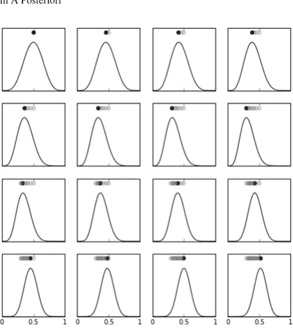

图 3.23 先验概率是左上角面板所示的 $\beta(6, 6)$ 分布。每个子图峰值附近的点表示该帧的 MAP 估计值

$\mathbb{P}(\theta|x)$。由于对数函数是凸函数，我们可以利用它将乘积转换为求和，从而简化最大化过程，而不会改变我们寻找的极值点。因此，我们更倾向于使用 $\mathbb{P}(\theta|x)$ 的对数，如下所示：

$$\mathcal{L} := \log \mathbb{P}(\theta|x) = \log \ell(\theta) + \log \mathbb{P}(\theta) - \log \mathbb{P}(x)$$

手工计算这很繁琐，因此非常适合用 Sympy 来完成。

```python
>>> from sympy import simplify, log, diff, expand_log, solve
>>> from sympy import stats as st
>>> from sympy.abc import p,k,n
>>> beta_density = st.density(st.Beta('p',6,6))
### 使用 sympy.log 设置目标函数
>>> obj=expand_log(log(p**k*(1-p)**(n-k)*
                    beta_density(p)))
### 使用微积分最大化目标函数
>>> sol=solve(simplify(diff(obj,p)),p)[0]
>>> sol
(k + 5)/(n + 10)
```

这意味着我们对 $\theta$ 的 MAP 估计量如下：

$$\hat{\theta}_{MAP} = \frac{k+5}{n+10}$$

其中 $k$ 是样本中正面朝上的次数。这显然是 $\theta$ 的一个有偏估计量：

$$\mathbb{E}(\hat{\theta}_{MAP}) = \frac{5+n\theta}{10+n} \neq \theta$$

但这种偏差*有害*吗？为什么有人会想要一个有偏估计量？请记住，我们构建整个估计量时使用了先验概率 $\mathbb{P}(\theta)$ 的思想，它根据先验信息*倾向于*（即产生偏差！）估计值。例如，如果 $\theta = 1/2$，MAP 估计量计算结果为 $\hat{\theta}_{MAP} = 1/2$。这里没有偏差！这是因为先验概率的峰值在 $\theta = 1/2$ 处。

为了计算该估计量的相应方差，我们需要这个中间结果

$$\mathbb{E}(\hat{\theta}_{MAP}^2) = \frac{25+10n\theta+n\theta((n-1)p+1)}{(10+n)^2}$$

由此得到以下方差：

$$\mathbb{V}(\hat{\theta}_{MAP}) = \frac{n(1-\theta)\theta}{(n+10)^2}$$

让我们暂停一下，将其与我们之前的最大似然（ML）估计量进行比较，如下所示：

$$\hat{\theta}_{ML} = \frac{1}{n} \sum_{i=1}^n X_i = \frac{k}{n}$$

正如我们之前讨论的，ML 估计量是无偏的，其方差如下：

$$\mathbb{V}(\hat{\theta}_{ML}) = \frac{\theta(1-\theta)}{n}$$

这个方差与 MAP 的方差相比如何？两者的比值如下：

$$\frac{\mathbb{V}(\hat{\theta}_{MAP})}{\mathbb{V}(\hat{\theta}_{ML})} = \frac{n^2}{(n+10)^2}$$

这个比值表明，MAP 估计量的方差小于 ML 估计量的方差。这就是拥有一个有偏 MAP 估计量的回报——如果潜在参数与先验概率一致，它需要更少的样本来进行估计。如果不一致，那么就需要更多的样本来将估计量拉离偏差。当 $n \to \infty$ 时，该比值趋近于 1。这意味着，随着样本数量足够多，方差减小的好处就会消失。

上述讨论通过先验分布引入了一定程度的任意性。然而，我们不必只选择一个先验。下面展示了我们如何使用先前的后验分布作为下一个后验分布的先验：

$$\mathbb{P}(\theta|x_{k+1}) = \frac{\mathbb{P}(x_{k+1}|\theta)\mathbb{P}(\theta|x_k)}{\mathbb{P}(x_{k+1})}$$

这是一个非常不同的策略，因为我们使用每个数据样本 $x_k$ 作为后验分布的参数，而不是将所有样本汇总到一个求和中（这就是我们之前得到 $k$ 项的地方）。这种情况更难分析，因为现在每个增量后验分布本身就是一个随机函数，这是由于注入了随机变量 $x$。另一方面，这更符合更一般的贝叶斯方法，因为很明显，这个估计过程的输出是一个后验分布函数，而不仅仅是一个单一的参数估计。

图 3.23 说明了这种方法。顶行最左边的图显示了先验概率（$\beta(6, 6)$），顶部的点显示了 $\theta$ 的最新 MAP 估计值。因此，在我们获得任何数据之前，先验概率的峰值就是估计值。右边的下一个图显示了 $x_0 = 0$ 对增量先验概率的影响。注意估计值几乎没有向左移动。这是因为数据的影响尚未导致先验概率偏离原始的 $\beta(6, 6)$ 分布。图的前两行都使用了 $x_k = 0$，只是为了说明这些数据可以将原始先验概率向左移动多远。子图顶部的点显示了随着更多数据被纳入，MAP 估计值如何逐帧变化。其余的图，从上到下、从左到右，显示了 $x_k = 1$ 时先验概率的增量变化。这再次表明，估计值可以从其起始位置向右移动多远。在这个例子中，$x_k = 0$ 和 $x_k = 1$ 的数据数量相等，这对应于 $\theta = 1/2$。

> **编程提示**
> 以下是对图 3.23 如何构建的快速概述。第一步是从数据递归地创建后验分布。注意示例数据已排序，以便于观察其作为序列的演进过程。

```python
from sympy.abc import p,x
from scipy.stats import density, Beta, Bernoulli
prior = density(Beta('p',6,6))(p)
likelihood=density(Bernoulli('x',p))(x)
data = (0,0,0,0,0,0,0,1,1,1,1,1,1,1)
posteriors = [prior]
```

for i in data:
    posteriors.append(posteriors[-1]*likelihood.subs(x,i))

有了后验概率，下一步是使用 Scipy `optimize` 模块中的 `fminbound` 函数计算每帧的峰值。

```
pvals = linspace(0,1,100)
mxvals = []
for i,j in zip(ax.flat,posteriors):
    i.plot(pvals,sympy.lambdify(p,j)(pvals),color='k')
    mxval = fminbound(sympy.lambdify(p,-j),0,1)
    mxvals.append(mxval)
    h = i.axis()[-1]
    i.axis(ymax=h*1.3)
    i.plot(mxvals[-1],h*1.2,'ok')
    i.plot(mxvals[:-1],[h*1.2]*len(mxvals[:-1]),'o')
```

图 3.24 与图 3.23 相同，只是初始先验概率是 $\beta(1.3, 1.3)$ 分布，其主瓣比 $\beta(6, 6)$ 分布更宽。如

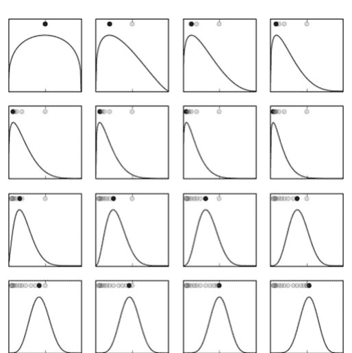

**图 3.24** 在此示例中，先验概率是 $\beta(1.3, 1.3)$ 分布，其主瓣比 $\beta(6, 6)$ 分布更宽。每个子图峰值附近的点表示该帧的 MAP 估计值

图所示，这个先验具有根据纳入的 $x_k$ 数据更剧烈地向一方或另一方摆动的能力。这意味着它可以更快地适应与初始先验不太一致的数据，因此不需要大量数据来*忘却*先验概率。根据应用的不同，忘却先验概率或坚持它的能力是分析师需要解决的设计问题。在此示例中，由于数据代表 $\theta = 1/2$ 参数，两个先验最终都稳定在大致相同的估计后验上。然而，如果情况并非如此（$\theta \neq 1/2$），那么在相同数据量下，第二个先验会产生更好的估计。

由于我们拥有完整的后验密度，我们可以计算与之前讨论的置信区间密切相关的东西；只是在这种情况下，根据贝叶斯解释，它被称为*可信区间*或*可信集*。其思想是我们想要找到一个围绕峰值的对称区间，该区间包含 95%（例如）的后验密度。这意味着我们可以说估计参数在可信区间内的概率是 95%。计算需要大量的数值处理，因为即使我们手头有后验密度，也很难进行解析积分，需要数值积分（参见 Scipy 的 `integrate` 模块）。图 3.25 显示了区间的范围以及后验密度下包含 95% 的阴影区域。

## 3.10 稳健统计

我们考虑了最大似然估计（MLE）和最大后验（MAP）估计，在每种情况下，我们都从某种概率密度函数开始，并进一步假设样本是独立同分布的（iid）。稳健统计 [29] 背后的思想是构建能够在这些假设中的一个或两个被削弱时仍然有效的估计量。更具体地说，假设你有一个模型，除了少数异常值外，效果很好。诱惑是直接忽略异常值并继续。稳健估计方法提供了一种有纪律的方式来处理异常值，而不是挑选适合你偏爱模型的数据。

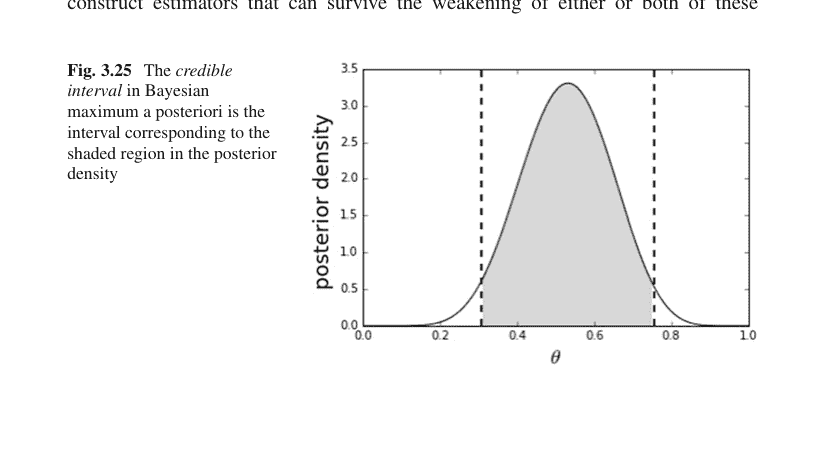

**位置的概念** 我们需要的第一个概念是*位置*，它是*中心值*概念的推广。通常，我们只使用均值的估计值，但我们将看到为什么这可能是个坏主意。位置的一般概念满足以下要求：设 $X$ 是一个具有分布 $F$ 的随机变量，$\theta(X)$ 是 $F$ 的某种描述性度量。那么，如果对于任意常数 $a$ 和 $b$，我们有以下条件，则称 $\theta(X)$ 是*位置*的度量：

$$\theta(X + b) = \theta(X) + b \quad (3.7)$$
$$\theta(-X) = -\theta(X) \quad (3.8)$$
$$X \ge 0 \Rightarrow \theta(X) \ge 0 \quad (3.9)$$
$$\theta(aX) = a\theta(X) \quad (3.10)$$

第一个条件称为*位置等变性*（或信号处理术语中的*平移不变性*）。第四个条件称为*尺度等变性*，这意味着 $X$ 的测量单位不应影响位置估计量的值。这些要求捕捉了分布*中心性*或大部分概率质量所在位置的直觉。

例如，样本均值估计量是 $\hat{\mu} = \frac{1}{n} \sum X_i$。第一个要求显然满足，因为 $\hat{\mu} = \frac{1}{n} \sum(X_i + b) = b + \frac{1}{n} \sum X_i = b + \hat{\mu}$。让我们考虑第二个要求：$\hat{\mu} = \frac{1}{n} \sum -X_i = -\hat{\mu}$。最后，最后一个要求满足 $\hat{\mu} = \frac{1}{n} \sum aX_i = a\hat{\mu}$。

**稳健估计与污染** 既然我们已经将中心性的广义位置体现在*位置*参数中，我们能用它做什么？之前，我们假设我们的样本都是独立同分布的。关键思想是样本实际上可能来自一个被另一个附近分布污染的*单一*分布，如下所示：

$$F(X) = \epsilon G(X) + (1 - \epsilon)H(X)$$

其中 $\epsilon$ 在零和一之间随机切换。这意味着我们的数据样本 $\{X_i\}$ 实际上来自两个独立的分布 $G(X)$ 和 $H(X)$。我们只是不知道它们是如何混合在一起的。我们真正想要的是一个估计量，它能在 $H(X)$ 的随机间歇性污染下捕捉 $G(X)$ 的位置。例如，这种污染可能是导致模型中出现异常值的原因，而该模型在主导分布 $F$ 下原本运行良好。情况可能更糟，因为我们不知道只有一个污染分布 $H(X)$。可能有一整个分布族在污染 $G(X)$。这意味着我们构建的任何估计量都必须从更广义的分布族中推导出来，而不是像最大似然方法假设的那样来自单一分布。这就是稳健估计如此困难的原因——它必须处理函数分布的*空间*，而不是特定概率分布的参数。

### 广义最大似然估计量

M-估计量是广义最大似然估计量。回想一下，对于最大似然，我们想要最大化似然函数，如下所示：

$$L_{\mu}(x_i) = \prod f_0(x_i - \mu)$$

然后找到估计量 $\hat{\mu}$，使得

$$\hat{\mu} = \arg \max_{\mu} L_{\mu}(x_i)$$

到目前为止，一切都与我们通常的最大似然推导相同，只是我们不假设特定的 $f_0$ 是 $\{X_i\}$ 的分布。定义

$$\rho = -\log f_0$$

我们得到更方便的似然乘积形式和最优 $\hat{\mu}$：

$$\hat{\mu} = \arg \min_{\mu} \sum \rho(x_i - \mu)$$

如果 $\rho$ 是可微的，那么对 $\mu$ 求导得到

$$\sum \psi(x_i - \hat{\mu}) = 0 \qquad (3.11)$$

其中 $\psi = \rho'$，即 $\rho$ 的一阶导数，并且出于技术原因，我们假设 $\psi$ 是递增的。到目前为止，看起来我们只是重新排列了一些定义，但关键思想是我们想要考虑一般的 $\rho$ 函数，这些函数可能不是*任何*分布的最大似然估计量。因此，我们现在的重点是揭示 $\hat{\mu}$ 的本质。

### M-估计量的分布

对于给定的分布 $F$，我们定义 $\mu_0 = \mu(F)$ 为以下方程的解：

$$\mathbb{E}_F(\psi(x - \mu_0)) = 0$$

技术上可以证明，结果是 $\hat{\mu} \sim \mathcal{N}(\mu_0, \frac{v}{n})$，其中

$$v = \frac{\mathbb{E}_F(\psi(x - \mu_0)^2)}{(\mathbb{E}_F(\psi'(x - \mu_0)))^2}$$

因此，我们可以说 $\hat{\mu}$ 是渐近正态的，渐近值为 $\mu_0$，渐近方差为 $v$。这引出了效率比，定义如下：

$$\text{Eff}(\hat{\mu}) = \frac{v_0}{v}$$

其中 $v_0$ 是 MLE 的渐近方差，衡量 $\hat{\mu}$ 接近最优的程度。换句话说，这提供了异常值污染在样本方面代价多大的感觉。例如，如果两个估计量的渐近方差分别为 $v_1$ 和 $v_2$，且 $v_1 = 3v_2$；那么第一个估计量需要三倍的观测值才能获得与第二个相同的方差。此外，对于样本均值（即 $\hat{\mu} = \frac{1}{n} \sum X_i$），当 $F = \mathcal{N}$ 时，我们有 $\rho = x^2/2$ 和 $\psi = x$，并且 $\psi' = 1$。因此，我们有 $v = \mathbb{V}(x)$。或者，使用样本中位数作为位置的估计量，我们有 $v = 1/(4f(\mu_0)^2)$。因此，如果 $F = \mathcal{N}(0, 1)$，对于样本中位数，我们得到 $v = 2\pi/4 \approx 1.571$。这意味着样本中位数需要大约 1.6 倍的样本量才能获得与样本均值相同的位置方差。样本中位数比样本均值更能抵抗异常值的影响，因此这给出了这种稳健性在样本方面代价多大的感觉。

**M-估计量作为加权均值** 一种思考 M-估计量的方法是将其视为加权均值。在操作上，这意味着我们希望权重函数能够限制单个数据点的影响，但作为一个整体，仍然提供良好的估计参数。大多数时候，我们有 $\psi(0) = 0$，并且 $\psi'(0)$ 存在，因此 $\psi$ 在原点附近近似线性。使用以下定义：

$$W(x) = \begin{cases} \psi(x)/x & \text{if } x \neq 0 \\ \psi'(x) & \text{if } x = 0 \end{cases}$$

我们可以将方程 3.11 写成如下形式：

$$\sum W(x_i - \hat{\mu})(x_i - \hat{\mu}) = 0 \quad (3.12)$$

解出 $\hat{\mu}$ 得到：

$$\hat{\mu} = \frac{\sum w_i x_i}{\sum w_i}$$

其中 $w_i = W(x_i - \hat{\mu})$。这在实际中并不实用，因为 $w_i$ 包含了 $\hat{\mu}$，而这正是我们试图求解的。剩下的问题是如何选择 $\psi$ 函数。这仍然是一个开放性问题，但 Huber 函数是一个经过充分研究的选择。

#### Huber 函数

Huber 函数族由以下公式定义：

$$\rho_k(x) = \begin{cases} x^2 & \text{if } |x| \leq k \\ 2k|x| - k^2 & \text{if } |x| > k \end{cases}$$

其对应的导数为 $2\psi_k(x)$，其中

$$\psi_k(x) = \begin{cases} x & \text{if } |x| \leq k \\ \text{sgn}(x)k & \text{if } |x| > k \end{cases}$$

其中极限情况 $k \to \infty$ 和 $k \to 0$ 分别对应于均值和中位数。要理解这一点，取 $\psi_\infty = x$，因此 $W(x) = 1$，从而定义方程 3.12 导致

$$\sum_{i=1}^n (x_i - \hat{\mu}) = 0$$

然后求解这个方程得到 $\hat{\mu} = \frac{1}{n} \sum x_i$。注意，选择 $k = 0$ 会导致样本中位数，但求解起来并不那么直接。尽管如此，Huber 函数提供了一种通过可调参数 $k$ 在两种位置估计量（即均值与中位数）的极端之间移动的方法。与 Huber 的 $\psi$ 对应的 $W$ 函数如下：

$$W_k(x) = \min \left\{ 1, \frac{k}{|x|} \right\}$$

图 3.26 显示了 $k = 2$ 时的 Huber 权重函数以及一些样本点。其思想是，位置 $\hat{\mu}$ 从方程 3.12 计算得出，位于权重函数的中间某处，使得那些项（即*内部点*）的值完全反映在位置估计中。黑色圆圈是*离群点*，它们的值被权重函数衰减，因此只有它们的一部分存在被表示在位置估计中。

#### 崩溃点

到目前为止，我们对鲁棒性的讨论非常抽象。一个更具体的鲁棒性概念来自崩溃点。最简单地说，崩溃点描述了当估计量中的一个数据点以最具破坏性的方式改变时会发生什么。例如，假设我们有样本均值 $\hat{\mu} = \sum x_i / n$，并且我们取其中一个 $x_i$ 点为无穷大。这个估计量会发生什么？它也会变成无穷大。这意味着该估计量的崩溃点为 0%。另一方面，中位数的崩溃点为 50%，这意味着计算中位数的一半数据可以变成无穷大而不影响中位数值。中位数是一个*秩*统计量，它更关心数据的相对排名而不是数据的值，这解释了它的鲁棒性。

表达崩溃点最简单但仍然正式的方式是取 $n$ 个数据点，$\mathcal{D} = \{(x_i, y_i)\}$。假设 $T$ 是一个回归估计量，它产生一个回归系数向量 $\theta$，

$$T(\mathcal{D}) = \theta$$

同样，考虑所有可能的被污染的数据样本 $\mathcal{D}'$。这种污染引起的最大*偏差*如下：

$$\text{bias}_m = \sup_{\mathcal{D}'} \|T(\mathcal{D}') - T(\mathcal{D})\|$$

其中上确界遍历所有可能的 $m$ 个被污染样本的集合。使用这个，崩溃点定义如下：

$$\epsilon_m = \min \left\{ \frac{m}{n} : \text{bias}_m \to \infty \right\}$$

例如，在我们的最小二乘回归中，即使一个点在无穷大处也会导致 $T$ 无穷大。因此，对于最小二乘回归，$\epsilon_m = 1/n$。在极限 $n \to \infty$ 下，我们有 $\epsilon_m \to 0$。

#### 估计尺度

在鲁棒统计中，*尺度*的概念指的是数据离散程度的度量。通常，我们使用估计的标准差来表示，但这有一个糟糕的崩溃点。更麻烦的是，为了获得良好的位置估计，我们必须要么事先以某种方式知道尺度，要么联合估计它。这些方法都没有易于计算的闭式解，必须通过数值计算。

最流行的估计尺度的方法是*中位数绝对偏差*

$$\text{MAD} = \text{Med}(|\mathbf{x} - \text{Med}(\mathbf{x})|)$$

换句话说，取数据 $\mathbf{x}$ 的中位数，然后从数据本身减去该中位数，然后取结果绝对值的中位数。另一个好的离散度估计是*四分位距*

$$\text{IQR} = x_{(n-m+1)} - x_{(n)}$$

其中 $m = [n/4]$。$x_{(n)}$ 符号表示数据排序后的第 $n$ 个数据元素。因此，在这种符号下，$\max(\mathbf{x}) = x_{(n)}$。在 $x \sim \mathcal{N}(\mu, \sigma^2)$ 的情况下，MAD 和 IQR 是 $\sigma$ 的常数倍，使得归一化的 MAD 如下：

$$\text{MADN}(x) = \frac{\text{MAD}}{0.675}$$

这个数字来自正态分布对应于 0.75 水平的逆 CDF。鉴于计算的复杂性，*联合*估计位置和尺度是一个纯粹的数值问题。幸运的是，Statsmodels 模块有许多现成可用的方法。让我们在以下代码中创建一些被污染的数据：

```python
import statsmodels.api as sm
from scipy import stats
data=np.hstack([stats.norm(10,1).rvs(10),
               stats.norm(0,1).rvs(100)])
```

这些数据对应于我们本节开始时的污染模型。如图 3.27 中的直方图所示，有两个正态分布，一个整齐地集中在零附近，代表大多数样本，另一个不太规则地来自右侧的正态分布。注意，右侧不频繁的样本组将均值和中位数估计（垂直点线和虚线）分开了。在没有右侧污染分布的情况下，该数据的标准差应接近一。然而，通常的非鲁棒标准差估计（`np.std`）结果约为三。使用 MADN 估计量（`sm.robust.scale.mad(data)`），我们得到大约 1.25。因此，离散度的鲁棒估计受污染分布存在的影响较小。

广义最大似然 M-估计扩展到使用 Huber 函数进行联合尺度和位置估计。例如，

```python
huber = sm.robust.scale.Huber()
loc, scl = huber(data)
```

这实现了 Huber 的*提议二*方法，用于联合估计位置和尺度。这种估计是鲁棒回归方法的关键要素，其中许多方法在 Statsmodels 的 `statsmodels.formula.api.rlm` 中实现。相应的文档有更多信息。

## 3.11 自举法

正如我们所看到的，确定某个量估计量的概率密度分布可能非常困难或不可能。自举法背后的思想是，我们可以使用计算来近似这些函数，否则这些函数在解析上是不可能求解的。

让我们从一个简单的例子开始。假设我们有以下随机变量集合，$\{X_1, X_2, \ldots, X_n\}$，其中每个 $X_k \sim F$。换句话说，样本都来自同一个未知分布 $F$。运行实验后，我们得到以下样本集：

$\{x_1, x_2, \ldots, x_n\}$

样本均值从这个集合计算为

$\bar{x} = \frac{1}{n} \sum_{i=1}^{n} x_i$

下一个问题是样本均值与真实均值 $\theta = \mathbb{E}_F(X)$ 有多接近。注意，$X$ 的二阶中心矩如下：

$$\mu_2(F) := \mathbb{E}_F(X^2) - (\mathbb{E}_F(X))^2$$

给定来自底层分布 $F$ 的 $n$ 个样本，样本均值 $\bar{x}$ 的标准差如下：

$$\sigma(F) = (\mu_2(F)/n)^{1/2}$$

不幸的是，因为我们只有样本集 $\{x_1, x_2, \dots, x_n\}$ 而没有 $F$ 本身，我们无法计算这个，而必须使用估计的标准误差

$$\bar{\sigma} = (\bar{\mu}_2/n)^{1/2}$$

其中 $\bar{\mu}_2 = \sum(x_i - \bar{x})^2/(n-1)$，这是 $\mu_2(F)$ 的无偏估计。然而，这不是唯一的方法。相反，我们可以用某个估计 $\hat{F}$ 替换 $F$，该估计是通过将概率质量 $1/n$ 放在每个 $x_i$ 上，作为 $\{x_1, x_2, \dots, x_n\}$ 的分段函数获得的。有了这个，我们可以计算估计的标准误差如下：

$$\hat{\sigma}_B = (\mu_2(\hat{F})/n)^{1/2}$$

这被称为标准误差的*自举估计*。不幸的是，故事实际上到此结束。即使在稍微更一般的情况下，也没有一个简洁的公式 $\sigma(F)$ 可以在其中将 $F$ 替换为 $\hat{F}$。

这就是计算机拯救局面的地方。我们实际上不需要知道公式 $\sigma(F)$，因为我们可以使用重采样方法计算它。关键思想是从 $\{x_1, x_2, \dots, x_n\}$ 中有放回地抽样。从这个集合中抽取的 $n$ 个独立抽取（有放回）的新集合是*自举样本*：

$$y^* = \{x_1^*, x_2^*, \dots, x_n^*\}$$

蒙特卡洛算法首先选择大量自举样本 $\{y_k^*\}$，然后在每个样本上计算统计量，然后以通常的方式计算结果的样本标准差。因此，统计量 $\theta$ 的自举估计如下：

$$\hat{\theta}_B^* = \frac{1}{B} \sum_k \hat{\theta}^*(k)$$

对应的样本标准差平方为

$$\hat{\sigma}_B^2 = \frac{1}{B-1} \sum_k (\hat{\theta}^*(k) - \hat{\theta}_B^*)^2$$

这个过程比符号所暗示的要简单得多。让我们用一个简单的Python示例来探索它。下面的代码块从$\beta(3, 2)$分布中生成一些样本：

```
>>> from scipy import stats
>>> rv = stats.beta(3,2)
>>> xsamples = rv.rvs(50)
```

由于这是模拟数据，我们已知均值为$\mu_1 = 3/5$，且当$n = 50$时样本均值的标准差为$\bar{\sigma} = \sqrt{2}/50$，我们稍后将验证这一点。

图3.28展示了$\beta(3, 2)$分布及其样本的对应直方图。直方图代表$\hat{F}$，是我们进行bootstrap抽样的分布。如图所示，$\hat{F}$对于$F$密度（平滑实线）来说是一个相当粗糙的估计，但就后续的bootstrap估计而言，这并非严重问题。事实上，近似$\hat{F}$天然地倾向于向概率质量的主体部分拉近。这是一个特性，而非缺陷，也是解释bootstrap的基本机制，但利用这一基本思想的正式证明远超我们此处的讨论范围。下一个代码块生成bootstrap样本

```
>>> yboot = np.random.choice(xsamples, (100,50))
>>> yboot_mn = yboot.mean()
```

因此bootstrap估计为

```
>>> np.std(yboot.mean(axis=1)) # approx sqrt(1/1250)
0.025598763883825818
```

图3.29展示了从bootstrap样本计算出的样本均值的分布。如前所述，下一个代码块展示了如何使用`sympy.stats`来计算我们之前引用的$\beta(3, 2)$参数。请记住，我们想要计算的是样本均值*估计量*的标准差，而不是样本本身的标准差。

```
>>> import sympy as S
>>> import sympy.stats
>>> for i in range(50): # 50 samples
...     # load sympy.stats Beta random variables
...     # into global namespace using exec
...     execstring = f"x{i} = S.stats.Beta('x{i}',3,2)"
...     exec(execstring)
...
>>> # populate xlist with the sympy.stats random variables
>>> # from above
>>> xlist = [eval(f'x{i}') for i in range(50) ]
>>> # compute sample mean
>>> sample_mean = sum(xlist)/len(xlist)
>>> # compute expectation of sample mean
>>> sample_mean_1 = S.stats.E(sample_mean).evalf()
>>> # compute 2nd moment of sample mean
>>> sample_mean_2 = S.stats.E(S.expand(sample_mean**2)).evalf()
>>> # standard deviation of sample mean
>>> # use sympy sqrt function
>>> sigma_smn = S.sqrt(sample_mean_2-sample_mean_1**2) # sqrt(2)/50
>>> print(sigma_smn)
0.0282842712474623
```

> **编程提示**
使用exec函数可以创建一系列Sympy随机变量。Sympy有一个var函数可以自动创建一系列Sympy符号，但在统计模块中没有相应的函数可以为随机变量执行此操作。

### 示例：Delta方法与Bootstrap

回顾第3.4.2节的delta方法。假设我们有一组伯努利硬币抛掷（$X_i$），正面朝上的概率为$p$。对于$n$次抛掷，$p$的最大似然估计量为$\hat{p} = \sum X_i/n$。我们知道这个估计量是无偏的，$\mathbb{E}(\hat{p}) = p$且$\mathbb{V}(\hat{p}) = p(1-p)/n$。假设我们想用数据来估计伯努利试验的方差（$\mathbb{V}(X) = p(1-p)$）。根据delta方法的符号，$g(x) = x(1-x)$。根据插件原则，该方差的最大似然估计量为$\hat{p}(1-\hat{p})$。我们想要这个量的方差。利用delta方法的结果，我们有

$$\mathbb{V}(g(\hat{p})) = (1-2\hat{p})^2\mathbb{V}(\hat{p})$$
$$\mathbb{V}(g(\hat{p})) = (1-2\hat{p})^2\frac{\hat{p}(1-\hat{p})}{n}$$

让我们通过一个简短的模拟来看看这有多有用。

```
>>> p = 0.25 # true head-up probability
>>> n = 10
>>> x = stats.bernoulli(p).rvs(n)
>>> print(x)
[0 0 0 0 0 0 1 0 0 0]
```

$p$的最大似然估计量为$\hat{p} = \sum X_i/n$：

```
>>> phat = x.mean()
>>> print(phat)
0.1
```

然后，将其代入上面的delta方法近似式，

```
>>> print((1-2*phat)**2*(phat)*(1-phat)/n)
0.005760000000000001
```

现在，让我们尝试使用bootstrap方差估计：

```
>>> phat_b=np.random.choice(x, (50,n)).mean(1)
>>> print(np.var(phat_b*(1-phat_b)))
0.0050490000000000005
```

这表明delta方法估计的方差与bootstrap方法不同，但哪一个更好呢？对于这种情况，我们可以直接使用Sympy求解：

```
>>> import sympy as S
>>> from sympy.stats import E, Bernoulli
>>> xdata =[Bernoulli(i,p) for i in S.symbols('x:10')]
>>> ph = sum(xdata)/len(xdata)
>>> g = ph*(1-ph)
```

> **编程提示**
`S.symbols('x:10')`函数的参数返回一个名为x1、x2等的Sympy符号序列。这是按顺序创建和命名每个符号的简写。

注意$g$就是$g(\hat{p}) = \hat{p}(1 - \hat{p})$，我们正试图估计其方差。然后，我们可以代入估计的$\hat{p}$并得到方差的正确值：

```
>>> print(E(g**2)-E(g)**2)
0.00442968749999999
```

这种情况通常具有代表性——delta方法倾向于低估方差，而这里的bootstrap估计更好。

### 3.11.1 参数化Bootstrap

在前面的例子中，我们使用样本$\{x_1, x_2, \ldots, x_n\}$本身作为$\hat{F}$的基础，每个样本权重为$1/n$。另一种方法是*假设*样本来自某个特定分布，从样本集估计该分布的参数，然后使用bootstrap机制从假设的分布中抽取样本，使用推导出的参数。例如，下面的代码块对正态分布执行此操作。

```
>>> rv = stats.norm(0,2)
>>> n = 100
>>> xsamples = rv.rvs(n)
>>> # estimate mean and var from xsamples
>>> mn_ = np.mean(xsamples)
>>> std_ = np.std(xsamples)
>>> # bootstrap from assumed normal distribution with
>>> # mn_, std_ as parameters
>>> rvb = stats.norm(mn_,std_) #plug-in distribution
>>> yboot = rvb.rvs((n,500)).var(axis=0)
```

回顾样本方差估计量如下：

$$S^2 = \frac{1}{n-1} \sum (X_i - \bar{X})^2$$

假设样本服从正态分布，这意味着$(n-1)S^2/\sigma^2$服从自由度为$n-1$的卡方分布。因此，方差$\mathbb{V}(S^2) = 2\sigma^4/(n-1)$。同样，其最大似然插件估计为$\mathbb{V}(S^2) = 2\hat{\sigma}^4/(n-1)$。以下代码使用最大似然和bootstrap方法计算样本方差$S^2$的方差。

```
>>> # MLE-Plugin Variance of the sample mean
>>> print(2*std_**4/(n-1))            # MLE plugin
0.35547420180385103
>>> # Bootstrap variance of the sample mean
>>> print(yboot.var())
0.30032404479182445
>>> # True variance of sample mean
>>> print(2*(2**4)/(n-1))
0.32323232323232326
```

这表明bootstrap估计在这里比最大似然插件估计更好。请注意，对于具有许多参数的多变量分布，这种技术变得更加强大，因为所有机制都是相同的。因此，bootstrap是计算标准误差的绝佳通用方法，但最终，它是否收敛到正确的值？这就是*一致性*的问题。不幸的是，回答这个问题需要比我们在此所能涉及的更多、更深入的数学知识。简短的回答是，对于估计标准误差，bootstrap在很广泛的情况下是一致估计量，因此它绝对属于你的工具箱。

## 3.12 高斯-马尔可夫

高斯-马尔可夫模型是噪声参数估计的基本模型，因为它在给定噪声间接测量的情况下估计不可观测参数。同一模型的各种形式出现在所有高斯模型的研究中。这个案例是运用我们迄今所学的投影和条件期望知识的绝佳机会。遵循Luenberger [27]，让我们考虑以下问题：

$$\mathbf{y} = \mathbf{W}\boldsymbol{\beta} + \boldsymbol{\epsilon}$$

其中$\mathbf{W}$是一个$n \times m$矩阵，$\mathbf{y}$是一个$n \times 1$向量。此外，$\boldsymbol{\epsilon}$是一个$n$维正态分布随机向量，均值为零，协方差为：

$$\mathbb{E}(\boldsymbol{\epsilon}\boldsymbol{\epsilon}^T) = \mathbf{Q}$$

请注意，工程系统通常提供*校准模式*，你可以估计$\mathbb{Q}$，因此假设你对噪声统计量有所了解并非不切实际。问题在于找到一个矩阵$\mathbf{K}$，使得$\hat{\boldsymbol{\beta}} = \mathbf{K}^T\mathbf{y}$近似$\boldsymbol{\beta}$。请注意，我们只能通过$\mathbf{y}$了解$\boldsymbol{\beta}$，因此无法直接测量它。此外，请注意$\mathbf{K}$是一个矩阵，而不是向量，因此有$m \times n$个条目需要计算。我们可以用通常的方式处理这个问题，即尝试解决最小均方误差问题：$$\min_{K} \mathbb{E}(\|\hat{\beta} - \beta\|^2)$$

我们可以将其展开写为

$$\min_{K} \mathbb{E}(\|\hat{\beta} - \beta\|^2) = \min_{K} \mathbb{E}(\|K^T \mathbf{y} - \beta\|^2) = \min_{K} \mathbb{E}(\|K^T \mathbf{W} \beta + K^T \epsilon - \beta\|^2)$$

由于 $\epsilon$ 是这里唯一的随机变量，这可以简化为

$$\min_{K} \|K^T \mathbf{W} \beta - \beta\|^2 + \mathbb{E}(\|K^T \epsilon\|^2)$$

下一步是计算

$$\mathbb{E}(\|K^T \epsilon\|^2) = \text{Tr}\mathbb{E}(K^T \epsilon \epsilon^T K) = \text{Tr}(K^T \mathbf{Q} K)$$

这里利用了矩阵迹的性质。我们可以将所有部分组合起来得到

$$\min_{K} \|K^T \mathbf{W} \beta - \beta\|^2 + \text{Tr}(K^T \mathbf{Q} K)$$

现在，如果我们试图求解 $K$，它将是 $\beta$ 的函数，这等同于说估计量 $\hat{\beta}$ 是我们试图估计的量 $\beta$ 的函数，这没有意义。然而，写出这个式子告诉我们，如果 $K^T \mathbf{W} = \mathbf{I}$，那么第一项消失，问题简化为

$$\min_{K} \text{Tr}(K^T \mathbf{Q} K)$$

约束条件为

$$K^T \mathbf{W} = \mathbf{I}$$

这个要求等同于断言估计量是无偏的，

$$\mathbb{E}(\hat{\beta}) = K^T \mathbf{W} \beta = \beta$$

为了将这个问题与我们之前的工作联系起来，让我们考虑 $K$ 的第 $i$ 列，$\mathbf{k}_i$。现在，我们可以将问题重写为

$$\min_{k} (\mathbf{k}_i^T \mathbf{Q} \mathbf{k}_i)$$

约束条件为

$$\mathbf{W}^T \mathbf{k}_i = \mathbf{e}_i$$

并且我们知道如何从之前关于约束优化的工作中解决这个问题：

$$\mathbf{k}_i = \mathbf{Q}^{-1}\mathbf{W}(\mathbf{W}^T\mathbf{Q}^{-1}\mathbf{W})^{-1}\mathbf{e}_i$$

现在我们所要做的就是将这些组合起来得到通解：

$$\mathbf{K} = \mathbf{Q}^{-1}\mathbf{W}(\mathbf{W}^T\mathbf{Q}^{-1}\mathbf{W})^{-1}$$

当你掌握了所有概念时，这就变得简单了！为了完整起见，误差的协方差为

$$\mathbb{E}(\hat{\beta} - \beta)(\hat{\beta} - \beta)^T = \mathbf{K}^T\mathbf{Q}\mathbf{K} = (\mathbf{W}^T\mathbf{Q}^{-1}\mathbf{W})^{-1}$$

图 3.30 显示了模拟的 $\mathbf{y}$ 数据（红色圆圈）。黑点显示了每个样本对应的估计值 $\hat{\beta}$。黑线显示了 $\beta$ 的真实值与估计 $\beta$ 值的平均值 $\widetilde{\beta}_m$ 的对比。矩阵 $\mathbf{K}$ 将红色圆圈映射到相应的点。请注意，将红色圆圈映射到平面上有许多可能的方式，但 $\mathbf{K}$ 是使 $\beta$ 的均方误差最小化的那个。

**编程提示**

以下代码片段提供了快速的代码演练。为了模拟目标数据，我们在下面定义了相关的矩阵：

```python
Q = np.eye(3)*0.1 # error covariance matrix
### this is what we are trying estimate
beta = matrix(ones((2,1)))
W = matrix([[1,2],
            [2,3],
            [1,1]])
```

然后，我们生成噪声项并创建模拟数据 y，

```python
ntrials=50
epsilon=np.random.multivariate_normal((0,0,0),Q,ntrials).T
y=W*beta+epsilon
```

图 3.31 显示了图 3.30 中水平 $xy$ 平面的更多细节。图 3.31 显示了点，这些点是从相应的模拟 $\mathbf{y}$ 数据中得到的 $\hat{\beta}$ 的单个估计值。虚线是 $\beta$ 的真实值，实线（$\widetilde{\beta}_m$）是所有点的平均值。灰色椭圆提供了估计 $\beta$ 值的协方差的误差椭圆。

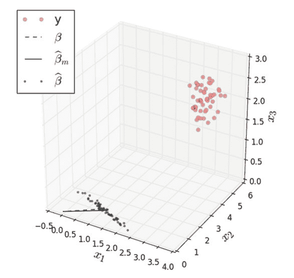

图 3.30 红色圆圈显示了在 xy 平面上由黑点估计的点

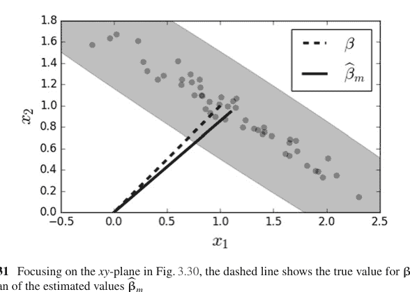

图 3.31 聚焦于图 3.30 中的 xy 平面，虚线显示了 β 的真实值与估计值 β̂ₘ 的平均值的对比

**编程提示**

以下代码片段提供了构建图 3.31 的快速演练。为了绘制椭圆，我们需要导入 patch 图元：

```python
from matplotlib.patches import Ellipse
```

为了基于下面 bm_cov 变量中 β 的单个估计值的协方差矩阵计算误差椭圆的参数：

```python
bm_cov = np.linalg.inv(W.T*Q*W)
U,S,V = np.linalg.svd(bm_cov)
err = np.sqrt((matrix(bm))*(bm_cov)*(matrix(bm).T))
theta = np.arccos(U[0,1])/np.pi*180
```

然后，我们在下面绘制并添加缩放后的椭圆：

```python
ax.add_patch(Ellipse(bm,err*2/np.sqrt(S[0]),
                     err*2/np.sqrt(S[1]),
                     angle=theta,color='gray'))
```

## 3.13 非参数方法

到目前为止，我们已经考虑了将推断或预测简化为参数拟合的参数方法。然而，为了使这些方法有效，我们必须假设数据未知概率分布的特定函数形式。非参数方法通过推广到函数类，消除了假设特定函数形式的需要。

### 3.13.1 核密度估计

我们已经大量使用了这种方法，即直方图，它是核密度估计的一个特例。直方图可以被认为是最粗糙但最有用的非参数方法，用于估计数据的底层概率分布。

为了正式化并将直方图置于与我们之前估计相同的基础上，假设 $\mathcal{X} = [0, 1]^d$ 是 $d$ 维单位立方体，$h$ 是*带宽*或*箱*或子立方体的大小。那么，有 $N \approx (1/h)^d$ 个这样的箱，每个体积为 $h^d$，$\{B_1, B_2, \ldots, B_N\}$。有了这些，我们可以将直方图写成如下形式的概率密度估计量：

$$\hat{p}_h(x) = \sum_{k=1}^N \frac{\hat{\theta}_k}{h} I(x \in B_k)$$

其中

$$\hat{\theta}_k = \frac{1}{n} \sum_{j=1}^n I(X_j \in B_k)$$

是每个箱 $B_k$ 中数据点 $(X_k)$ 的比例。我们希望限制 $\hat{p}_h(x)$ 的偏差和方差。请记住，我们不是试图估计 $x$ 的函数，而是所有可能的概率分布函数的集合非常庞大且难以管理。因此，我们需要将注意力限制在以下所谓的 Lipschitz 函数的概率分布类上：

$$\mathcal{P}(L) = \{p: |p(x) - p(y)| \le L \|x - y\|, \forall x, y\}$$

粗略地说，这些是斜率（即增长率）受 $L$ 限制的密度函数。事实证明，直方图估计量的偏差以如下方式受限：

$$\int |p(x) - \mathbb{E}(\hat{p}_h(x))| dx \le L h \sqrt{d}$$

类似地，方差受限于以下形式：

$$\mathbb{V}(\hat{p}_h(x)) \le \frac{C}{n h^d}$$

其中 $C$ 是某个常数。将这两个事实结合起来意味着风险受限于

$$R(p, \hat{p}) = \int \mathbb{E}(p(x) - \hat{p}_h(x))^2 dx \le L^2 h^2 d + \frac{C}{n h^d}$$

通过选择

$$h = \left( \frac{C}{L^2 n d} \right)^{\frac{1}{d+2}}$$

可以使这个上界最小化。

特别是，这意味着

$$\sup_{p \in \mathcal{P}(L)} R(p, \hat{p}) \le C_0 \left( \frac{1}{n} \right)^{\frac{2}{d+2}}$$

其中常数 $C_0$ 是 $L$ 的函数。有一个定理 [48] 表明这个界限是紧的，这基本上意味着直方图对于 Lipschitz 函数是一个非常强大的概率密度估计量，其风险按 $\left(\frac{1}{n}\right)^{\frac{2}{d+2}}$ 变化。这类函数不一定是光滑的，因为 Lipschitz 条件允许非光滑函数。虽然这是一个令人放心的结果，但我们通常事先不知道特定概率属于哪个函数类（Lipschitz 或非 Lipschitz）。尽管如此，如果没有这个结果，风险随维度 $d$ 和样本数 $n$ 变化的速率将很难理解。图 3.32 显示了 $\beta(2, 2)$ 分布的概率分布函数与不同 $n$ 值下计算的直方图的对比。每个点上的箱线图显示了随着 $n$ 增加，直方图中每个箱的变异如何减少。上面的风险函数 $R(p, \hat{p})$ 基于直方图（作为 $x$ 的分段函数）与概率分布函数之间平方差的积分。

```python
def generate_samples(n,ntrials=500):
    phat = np.zeros((nbins,ntrials))
    for k in range(ntrials):
        d = rv.rvs(n)
        phat[:,k],_=histogram(d,bins,density=True)
    return phat
```

该代码使用了 Numpy 的 `histogram` 函数。为了与风险函数 $R(p, \hat{p})$ 保持一致，我们必须确保 `bins` 关键字参数使用箱边界的序列而不是单个整数来正确格式化。此外，`density=True` 关键字参数适当地归一化直方图，以便它与模拟 beta 分布的概率分布函数之间的比较具有正确的比例。

### 3.13.2 核平滑

我们可以使用核函数将我们的方法扩展到其他函数类。一维平滑核是一个光滑函数 $K$，具有以下性质：

$$\int K(x)dx = 1$$
$$\int xK(x)dx = 0$$

## 3.3.2 核密度估计

图 3.32 中每个点上的箱线图显示了直方图中每个箱的变异如何随着 $n$ 的增加而减少。

$$0 < \int x^2 K(x) dx < \infty$$

例如，$K(x) = I(x)/2$ 是箱车核函数，其中当 $|x| \le 1$ 时 $I(x) = 1$，否则为零。核密度估计与直方图非常相似，只是现在我们在每个点上放置一个核函数，如下所示：

$$\hat{p}(x) = \frac{1}{n} \sum_{i=1}^n \frac{1}{h^d} K\left( \frac{\|x - X_i\|}{h} \right)$$

其中 $X \in \mathbb{R}^d$。图 3.33 展示了一个使用高斯核函数 $K(x) = e^{-x^2/2} / \sqrt{2\pi}$ 的核密度估计示例。上图中显示了五个数据点，用垂直线表示。虚线显示了每个数据点处的单个 $K(x)$ 函数。下图显示了整体的核密度估计，它是上图中函数的缩放求和。

文献 [48] 中有一个重要的技术结果，指出核密度估计器在我们在第 3.4 节最大似然讨论的意义上是极小极大的。粗略地说，这意味着核密度估计器的类似风险大致被以下因子所界定：

$$R(p, \hat{p}) \lesssim n^{-\frac{2m}{2m+d}}$$

其中 $C$ 是某个常数，$m$ 是与概率密度函数导数的界相关的因子。例如，如果密度函数的二阶导数有界，则 $m = 2$。这意味着该估计器的收敛速率随着维度 $d$ 的增加而降低。

#### 交叉验证

作为实际问题，核密度估计器（包括直方图作为特例）的棘手部分在于我们需要使用数据来计算带宽 $h$ 项。有几种经验法则方法适用于一些常见的核函数，包括高斯核的 Silverman 法则和 Scott 法则。例如，Scott 的因子是简单地计算 $h = n^{-1/(d+4)}$，而 Silverman 的是 $h = (n(d + 2)/4)^{(-1/(d+4))}$。这类法则是通过假设底层概率密度函数属于某个族（例如高斯族）推导出来的，然后为某种类型的核密度估计器推导出最佳的 $h$，通常配备额外的函数性质（例如，某阶连续导数）。在实践中，这些法则似乎效果很好，特别是对于单峰概率密度函数。避免这些假设意味着直接从数据计算带宽，这正是交叉验证的用武之地。

交叉验证是一种从数据本身估计带宽的方法。其思想是写出以下积分平方误差（ISE）：

$$\text{ISE}(\hat{p}_h, p) = \int (p(x) - \hat{p}_h(x))^2 dx$$
$$= \int \hat{p}_h(x)^2 dx - 2 \int p(x) \hat{p}_h dx + \int p(x)^2 dx$$

这个表达式的问题在于中间项，^7

$$\int p(x)\hat{p}_h dx$$

其中 $p(x)$ 是我们试图用 $\hat{p}_h$ 估计的量。最后一个表达式的形式看起来像是 $\hat{p}_h$ 在密度 $p(x)$ 上的期望，$\mathbb{E}(\hat{p}_h)$。该方法是用均值来近似它：

$$\mathbb{E}(\hat{p}_h) \approx \frac{1}{n} \sum_{i=1}^n \hat{p}_h(X_i)$$

这种方法的问题在于 $\hat{p}_h$ 是使用近似所使用的相同数据计算的。解决这个问题的方法是将数据分成两个大小相等的块 $D_1$ 和 $D_2$，然后在 $D_1$ 集上为一系列不同的 $h$ 值计算 $\hat{p}_h$。然后，当我们对 $D_2$ 集中的数据（$Z_i$）应用上述近似时，

$$\mathbb{E}(\hat{p}_h) \approx \frac{1}{|D_2|} \sum_{Z_i \in D_2} \hat{p}_h(Z_i)$$

将此近似代回积分平方误差，得到目标函数：

$$\text{ISE} \approx \int \hat{p}_h(x)^2 dx - \frac{2}{|D_2|} \sum_{Z_i \in D_2} \hat{p}_h(Z_i)$$

一些代码会使这些步骤具体化。我们需要 Scikit-learn 中的一些工具。

```python
>>> from sklearn.model_selection import train_test_split
>>> from sklearn.neighbors import KernelDensity
```

`train_test_split` 函数使得分割和跟踪交叉验证所需的 $D_1$ 和 $D_2$ 集变得容易。Scikit-learn 已经有了一个强大而灵活的核密度估计器实现。为了计算目标函数，我们需要 Scipy 中的一些基本数值积分工具。在这个例子中，我们将从 $\beta(2, 2)$ 分布生成样本，该分布在 Scipy 的 `stats` 子模块中实现。

```python
>>> from scipy.integrate import quad
>>> from scipy import stats
>>> rv = stats.beta(2,2)
```

^7 最后一项没有意义，因为我们只对 ISE 的相对变化感兴趣。

```python
>>> n=100 # number of samples to generate
>>> d = rv.rvs(n) [:,None] # generate samples as column-vector
```

> **编程提示**
上一行中 `[:,None]` 的使用将 `rvs` 函数返回的 Numpy 数组格式化为一个列维度为一的 Numpy 向量。这是 `KernelDensity` 构造函数所要求的，因为列维度用于 Scikit-learn 中的不同特征（通常）。因此，即使我们只有一个特征，我们仍然需要遵守 Scikit-learn 所依赖的结构化输入。除了使用 `None` 之外，还有许多方法可以注入额外的维度。例如，更隐晦的 `np.c_`，或者更清晰的 `[:,np.newaxis]` 可以做到同样的事情，`np.reshape` 函数也可以。

下一步是将数据分成两半，并遍历每个 $h_i$ 带宽，基于 $D_1$ 数据创建一个单独的核密度估计器：

```python
>>> train,test,_,_=train_test_split(d,d,test_size=0.5)
>>> kdes=[KernelDensity(bandwidth=i).fit(train)
...         for i in [.05,0.1,0.2,0.3]]
```

> **编程提示**
注意，Python 中的单下划线符号指的是最后计算的结果。上面的代码将 `train_test_split` 返回的元组解包为四个元素。因为我们只对前两个感兴趣，所以我们将后两个赋值给下划线符号。这是一种风格用法，向读者清楚地表明元组的最后两个元素未被使用。或者，我们可以将最后两个元素赋值给一对我们以后不使用的虚拟变量，但浏览代码的读者可能会认为那些虚拟变量是相关的。

最后一步是遍历如此创建的核密度估计器并计算目标函数（图 3.34）。

```python
>>> for i in kdes:
...     f = lambda x: np.exp(i.score_samples(x))
...     f2 = lambda x: f([[x]])**2
...     h = i.bandwidth
...     if2 = quad(f2,0,1)[0]
...     mn = np.mean(f(test))
...     print('h=%3.2f\t %3.4f'%(h,if2-2*mn))
...
h=0.05          -1.1323
h=0.10          -1.1336
h=0.20          -1.1330
h=0.30          -1.0810
```

图 3.34 中每条线都是给定带宽下的不同核密度估计器，作为对真实密度函数的近似。底部印有一个普通直方图作为参考。

> **编程提示**
上一个代码块中定义的 lambda 函数是必要的，因为 Scikit-learn 将核密度估计器的返回值实现为通过对数 `score_samples` 函数。Scipy 中的数值积分函数 `quad` 计算目标函数的 $\int \hat{p}_h(x)^2 dx$ 部分。

Scikit-learn 有更多高级工具来自动化这种超参数（即核密度带宽）搜索。要利用这些高级工具，我们需要通过定义以下包装器类来稍微不同地格式化当前问题：

```python
>>> class KernelDensityWrapper(KernelDensity):
...     def predict(self,x):
...         return np.exp(self.score_samples(x))
...     def score(self,test):
...         f = lambda x: self.predict(x)
...         f2 = lambda x: f([[x]])**2
...         return -(quad(f2,0,1)[0]-2*np.mean(f(test)))
...
```

这相当于将上述先前的代码重组为 Scikit-learn 所需的函数。接下来，我们创建要搜索的参数字典（`params`），然后使用 `fit` 函数开始网格搜索：

```
>>> from sklearn.model_selection import GridSearchCV
>>> params = {'bandwidth':np.linspace(0.01,0.5,10)}
>>> clf = GridSearchCV(KernelDensityWrapper(),
        param_grid=params,cv=2)
>>> clf.fit(d)
GridSearchCV(cv=2,estimator=KernelDensityWrapper(),
param_grid={'bandwidth':array([0.01,0.06444444,0.11888889,
0.17333333,0.22777778,
0.28222222,0.33666667,0.39111111,0.44555556,0.5])})
>>> print(clf.best_params_)
{'bandwidth': 0.17333333333333334}
```

网格搜索会遍历 `params` 字典中的所有元素，并报告该参数值列表中的最佳带宽。上面的 `cv` 关键字参数指定我们希望将数据分成两个大小相等的集合用于训练和测试。我们还可以如下检查网格上每个点的目标函数值：

```
>>> clf.cv_results_['mean_test_score']
array([0.60758058,1.06324954,1.11858734,1.13187097,1.12006532,
1.09186225,1.05391076,1.01126161,0.96717292,0.92354959])
```

请记住，网格搜索会检查多个折进行交叉验证，以计算上述均值和标准差。请注意，还有一个 `RandomizedSearchCV`，以防您希望指定参数的分布而不是列表。这对于搜索非常大的参数空间特别有用，因为穷举网格搜索在计算上会过于昂贵。尽管核密度估计器易于理解并具有许多吸引人的分析性质，但对于大型高维数据集，它们实际上变得难以处理。

### 3.13.3 非参数回归估计器

除了估计底层概率密度外，我们还可以使用非参数方法来计算生成数据的底层函数的估计量。以下形式的非参数回归估计量被称为线性平滑器：

$$\hat{y}(x) = \sum_{i=1}^{n} \ell_i(x) y_i$$

为了理解这些平滑器的性能，我们可以将风险定义为如下形式，

$$R(\hat{y}, y) = \mathbb{E}\left(\frac{1}{n}\sum_{i=1}^{n}(\hat{y}(x_i) - y(x_i))^2\right)$$

并找到最小化此风险的最佳 $\hat{y}$。这个度量的问题在于我们不知道 $y(x)$，这就是为什么我们试图用 $\hat{y}(x)$ 来近似它。我们可以使用手头的数据构建一个估计，如下所示：

$$\hat{R}(\hat{y}, y) = \frac{1}{n}\sum_{i=1}^{n}(\hat{y}(x_i) - Y_i)^2$$

其中我们用数据 $Y_i$ 替代了未知的函数值 $y(x_i)$。这种方法的问题在于，我们使用数据来估计函数，然后使用相同的数据来评估这样做的风险。这种双重利用会导致过于乐观的估计。解决这个难题的一种方法是使用留一法交叉验证，其中 $\hat{y}$ 函数是使用除一个数据对 $(X_i, Y_i)$ 之外的所有数据进行估计的。然后，这个缺失的数据元素用于估计上述风险。在符号上，这写作：

$$\hat{R}(\hat{y}, y) = \frac{1}{n}\sum_{i=1}^{n}(\hat{y}_{(-i)}(x_i) - Y_i)^2$$

其中 $\hat{y}_{(-i)}$ 表示在不使用第 $i$ 个数据对的情况下计算估计量。不幸的是，对于相对较小的数据集以外的任何情况，在实践中使用留一法交叉验证很快就会在计算上变得不可行。我们稍后会回到这个问题，但让我们先考虑一个具体的非参数平滑器的例子。

### 3.13.4 最近邻回归

最简单的非参数回归方法是 $k$-最近邻回归。这用文字解释比用数学公式写出来更容易。给定一个输入 $x$，找到包含它的 $k$ 个簇中最近的一个，然后返回该簇中数据值的均值。作为一个单变量例子，让我们考虑以下 *线性调频* 波形：

$$y(x) = \cos\left(2\pi\left(f_o x + \frac{BWx^2}{2\tau}\right)\right)$$

这种波形在高分辨率雷达应用中很重要。$f_o$ 是起始频率，$BW/\tau$ 是信号的频率斜率。对于我们的例子，重要的是它在其定义域上是非均匀的。我们可以通过采样线性调频信号轻松创建一些数据，如下所示：

```
>>> xi = np.linspace(0,1,100) [:,None]
>>> xin = np.linspace(0,1,12) [:,None]
>>> f0 = 1 # init frequency
>>> BW = 5 # bandwidth
>>> y = np.cos(2*np.pi*(f0*xin+(BW/2)*xin**2))
```

我们可以使用这些数据，利用 Scikit-learn 构建一个简单的最近邻估计器：

```
>>> from sklearn.neighbors import KNeighborsRegressor
>>> knr=KNeighborsRegressor(2)
>>> knr.fit(xin,y)
KNeighborsRegressor(n_neighbors=2)
```

> **编程提示**
Scikit-learn 拥有极其一致的接口。上面的 `fit` 函数将模型参数拟合到数据。相应的 `predict` 函数在给定任意输入时返回模型的输出。我们将在机器学习章节中花更多时间讨论 Scikit-learn。末尾的 `[:,None]` 部分只是向数组注入一个列维度，以满足 Scikit-learn 的维度要求。

图 3.35 显示了采样信号（灰色圆圈）与最近邻估计器生成的值（实线）的对比。虚线是完整的未采样线性调频信号，其频率随 x 增加。这对于我们的例子很重要，因为它为这个问题增加了一个非平稳的方面，即函数随着 $x$ 的增加而变得越来越波动。估计曲线和信号之间的区域用灰色阴影表示。因为最近邻估计器只使用两个最近邻，对于每个新的 $x$，它在训练数据中找到两个相邻的 $X_i$ 来包围 $x$，然后对相应的 $Y_i$ 值取平均以计算估计值。也就是说，如果你取图中每一对相邻的连续灰色圆圈，你会发现水平实线在垂直轴上平分了这对圆圈。我们可以通过更改构造函数来调整最近邻的数量

```
>>> knr=KNeighborsRegressor(3)
>>> knr.fit(xin,y)
KNeighborsRegressor(n_neighbors=3)
```

这产生了图 3.36。

对于这个例子，图 3.36 显示，使用更多的最近邻，拟合效果较差，尤其是在信号的末尾，那里变化越来越大，因为线性调频信号不是均匀连续的。

Scikit-learn 提供了许多用于交叉验证的工具。以下代码设置了留一法交叉验证的工具：

```
>>> from sklearn.model_selection import LeaveOneOut
>>> loo=LeaveOneOut()
```

LeaveOneOut 对象是一个可迭代对象，它生成一组不相交的数据索引——一个用于拟合模型（训练集），一个用于评估模型（测试集）。下一个代码块循环遍历由 `loo` 变量提供的不相交的训练和测试索引集，以评估估计的风险，该风险累积在 `out` 列表中。

```
>>> out=[]
>>> for train_index, test_index in loo.split(xin):
...     _=knr.fit(xin[train_index],y[train_index])
...     out.append((knr.predict(xi[test_index])-y[test_index])**2)
...
>>> print('Leave-one-out Estimated Risk: ',np.mean(out),)
Leave-one-out Estimated Risk:  1.0351713662681845
```

上面代码的最后一行报告了留一法的估计风险。
这种类型的线性平滑器可以使用以下矩阵重写：

$$S = [\ell_i(x_j)]_{i,j}$$

使得

$$\hat{\mathbf{y}} = S\mathbf{y}$$

其中 $\mathbf{y} = [Y_1, Y_2, \ldots, Y_n] \in \mathbb{R}^n$ 且 $\hat{\mathbf{y}} = [\hat{y}(x_1), \hat{y}(x_2), \ldots, \hat{y}(x_n)] \in \mathbb{R}^n$。这引出了一种快速近似留一法交叉验证的方法，如下所示：

$$\hat{R} = \frac{1}{n} \sum_{i=1}^n \left( \frac{y_i - \hat{y}(x_i)}{1 - S_{i,i}} \right)^2$$

然而，这并不能复现上面代码中的方法，因为它假设每个 $\hat{y}_{(-i)}(x_i)$ 比 $\hat{y}(x)$ 少消耗一个最近邻。
我们可以从 `knr` 对象中获取这个 $S$ 矩阵，如下所示：

```
>>> _ = knr.fit(xin,y) # fit on all data
>>> S=(knr.kneighbors_graph(xin)).todense()/knr.n_neighbors
```

`todense` 部分将返回的稀疏矩阵重新格式化为常规的 Numpy 矩阵。以下显示了这个 $S$ 矩阵的一个子部分：

```
>>> print(S[:5,:5])
[[0.33333333 0.33333333 0.33333333 0.         0.        ]
 [0.33333333 0.33333333 0.33333333 0.         0.        ]
 [0.         0.33333333 0.33333333 0.33333333 0.        ]
 [0.         0.         0.33333333 0.33333333 0.33333333]
 [0.         0.         0.         0.33333333 0.33333333]]
```

这些子块显示了最近邻估计器正在处理的 $y$ 数据的窗口。例如，

```
>>> print(np.hstack([knr.predict(xin[:5]), (S*y)[:5]]))#columns match
[[ 0.55781314  0.55781314]
 [ 0.55781314  0.55781314]
 [-0.09768138 -0.09768138]
 [-0.46686876 -0.46686876]
 [-0.10877633 -0.10877633]]
```

或者，更简洁地检查所有条目是否近似相等，

```
>>> np.allclose(knr.predict(xin),S*y)
True
```

### 3.13.5 核回归

为了估计概率密度，我们从直方图开始，进而发展到更通用的核密度估计。同样，我们也可以将回归从最近邻扩展到基于核的回归，使用*Nadaraya-Watson*核回归估计器。给定带宽 $h > 0$，核回归估计器定义如下：

$$\hat{y}(x) = \frac{\sum_{i=1}^n K\left(\frac{x-x_i}{h}\right) Y_i}{\sum_{i=1}^n K\left(\frac{x-x_i}{h}\right)}$$

遗憾的是，Scikit-learn并未实现此回归估计器；不过，Jan Hendrik Metzen在github.com上提供了一个兼容版本。

```
>>> from kernel_regression import KernelRegression
```

通过指定一组潜在的带宽值（gamma），此代码使得在内部使用留一法交叉验证来优化带宽参数成为可能，如下所示：

```
>>> kr = KernelRegression(gamma=np.linspace(6e3,7e3,500))
>>> kr.fit(xin,y)
KernelRegression(gamma=6000.0)
```

图3.37展示了使用高斯核的核估计器（粗黑线）与最近邻估计器（实心浅黑线）的对比。与之前一样，数据点显示为圆圈。图3.37表明，核估计器能够捕捉到最近邻估计器所遗漏的尖锐峰值。

因此，最近邻估计与核估计的区别在于，后者提供了点的平滑移动平均，而前者提供了不连续的平均。请注意，核估计在边界附近会受到影响，因为边缘与核函数之间存在不匹配。这个问题在高维情况下会变得更糟，因为数据自然会向边界漂移（这是*维度灾难*的一个后果）。确实，不可能同时保持局部准确性（即低偏差）和较大的邻域（即低方差）。解决这个问题的一种方法是使用核函数作为窗口来局部化感兴趣的区域，从而创建局部多项式回归。例如，

$$\hat{y}(x) = \sum_{i=1}^{n} K\left(\frac{x - x_i}{h}\right) (Y_i - \alpha - \beta x_i)^2$$

现在我们需要优化两个线性参数 $\alpha$ 和 $\beta$。这种方法被称为*局部线性回归* [14, 25]。自然地，这可以扩展到更高阶的多项式。请注意，这些方法尚未在Scikit-learn中实现。

### 3.13.6 维度灾难

所谓的维度灾难发生在我们进入越来越高维度的时候。这个术语是Bellman在1961年研究自适应控制过程时创造的。如今，该术语模糊地指代任何随着维度数量显著增加而变得更复杂的事物。然而，这个概念对于认识和描述高维分析和估计的实际困难是有用的。

考虑一个半径为 $r$ 的 $d$ 维球体的体积：$$V_s(d, r) = \frac{\pi^{d/2} r^d}{\Gamma\left(\frac{d}{2} + 1\right)}$$

进一步，考虑被 $d$ 维单位立方体所包围的球体 $V_s(d, 1/2)$。立方体的体积始终等于1，但 $\lim_{d \to \infty} V_s(d, 1/2) = 0$。这意味着什么？这意味着立方体的体积被推离了其中心，而内嵌的超球体就位于中心。具体来说，在 $d$ 维空间中，从立方体中心到其顶点的距离是 $\sqrt{d}/2$，而从中心到内切球的距离是 $1/2$。随着 $d$ 趋向无穷大，这个对角线距离也趋向无穷大。对于固定的 $d$，立方体中心微小的球形区域连接着许多长长的尖刺，就像一个超维海胆或豪猪。

另一种思考方式是考虑超球体厚度为 $\epsilon > 0$ 的外壳：

$$\mathcal{P}_\epsilon = V_s(d, r) - V_s(d, r - \epsilon)$$

然后，我们考虑以下极限：

$$\lim_{d \to \infty} \mathcal{P}_\epsilon = \lim_{d \to \infty} V_s(d, r) \left( 1 - \frac{V_s(d, r - \epsilon)}{V_s(d, r)} \right) \quad (3.13)$$
$$= \lim_{d \to \infty} V_s(d, r) \left( 1 - \lim_{d \to \infty} \left( \frac{r - \epsilon}{r} \right)^d \right) \quad (3.14)$$
$$= \lim_{d \to \infty} V_s(d, r) \quad (3.15)$$

因此，在极限情况下，厚度为 $\epsilon$ 的外壳体积消耗了超球体的全部体积。

这会带来什么后果？对于依赖最近邻的方法来说，利用局部性来降低偏差变得难以处理。例如，假设我们有一个 $d$ 维空间，以及一个我们想要在其附近进行局部估计的靠近原点的点。为了估计该点附近的行为，我们需要对该点周围的未知函数进行平均，但在高维空间中，找到邻居进行平均的机会很小。从相反的角度看，假设我们有一个二元变量，就像抛硬币问题一样。如果我们有1000次试验，那么根据我们之前的工作，我们可以有信心地估计正面朝上的概率。现在，假设我们有十个二元变量。现在我们有 $2^{10} = 1024$ 个顶点需要估计。如果我们仍然只有1000个点，那么至少有24个顶点不会得到任何数据。为了保持相同的分辨率，我们需要在每个顶点有1000个样本，总共需要 $1000 \times 1024 \approx 10^6$ 个数据点。因此，对于变量数量增加十倍的情况，我们现在需要收集大约1000倍的数据点才能保持相同的统计分辨率。这就是维度灾难。

也许一些代码可以阐明这一点。以下代码生成二维样本，这些样本在图3.38中绘制为点，并显示了二维的内切圆。请注意，对于 $d = 2$ 维，大多数点都包含在圆内。

```
>>> import numpy as np
>>> v=np.random.rand(1000,2)-1/2.
```

下一个代码块描述了图3.39中的核心计算。对于每个维度，我们沿着每个维度创建一组均匀分布的随机变量，然后计算每个 $d$ 维向量到原点的距离。那些测量值为一半的点就是包含在超球体内的点。每个测量值的直方图显示在图3.39的相应面板中。深色垂直线显示了阈值。该线左侧的值表示包含在超球体内的总体。因此，图3.39表明，随着 $d$ 的增加，包含在内切超球体内的点越来越少。以下代码概括了图3.39的内容：

```
python
fig,ax=subplots()
for d in [2,3,5,10,20,50]:
    v=np.random.rand(5000,d)-1/2.
    ax.hist([np.linalg.norm(i) for i in v])
```

### 3.13.7 非参数检验

确定两组观测值是否来自相同的潜在概率分布是一个重要问题。最常用的方法是标准t检验，但这需要关于正态性的假设，而这些假设可能难以证明，这导致了非参数方法的出现，它们可以在没有此类假设的情况下解决这个问题。

令 $V$ 和 $W$ 为连续随机变量。如果满足以下条件，则变量 $V$ *随机大于* $W$：

$\mathbb{P}(V \geq x) \geq \mathbb{P}(W \geq x)$

## 3.39 每个面板展示了均匀分布的 $d$ 维随机向量长度的直方图。深色垂直线左侧的总体是那些包含在内接超球体中的向量。这表明，随着维度增加，包含在超球体中的点数减少。

图 3.40 黑色线密度函数在所有 $x \in \mathbb{R}$ 上随机大于灰色线密度函数，且至少对一个 $x$ 严格不等。这可以用累积分布函数（CDF）表示为：

$$F_V(x) \leq F_W(x)$$

术语 *随机较小* 指的是其反面。例如，图 3.40 中显示的黑色线密度函数随机大于灰色线密度函数。

#### 曼-惠特尼-威尔科克森检验

曼-惠特尼-威尔科克森检验针对以下备择假设进行检验：

- $H_0 : F(x) = G(x)$ 对所有 $x$ 成立，对比
- $H_a : F(x) < G(x)$，$F$ 随机大于 $G$。

其中 $F$ 和 $G$ 是两个累积分布函数。假设我们有两个数据集 $X$ 和 $Y$，我们想知道它们是否来自相同的底层概率分布，或者其中一个是否随机大于另一个。$X$ 中有 $n_x$ 个元素，$Y$ 中有 $n_y$ 个元素。如果我们合并这两个数据集并对其进行排序，那么在原假设下，任何数据元素被分配到任何特定排名的可能性都应与其他元素相同。也就是说，合并后的集合 $Z$，

$$Z = \{X_1, \ldots, X_{n_x}, Y_1, \ldots, Y_{n_y}\}$$

包含 $n = n_x + n_y$ 个元素。因此，将 $n_y$ 个排名从整数 $\{1, \ldots, n\}$ 分配给 $\{Y_1, \ldots, Y_{n_y}\}$ 的任何方式都应是等可能的（即 $\mathbb{P} = \binom{n}{n_y}^{-1}$）。重要的是，这个性质独立于 $F$ 分布。

也就是说，我们可以将 $U$ 统计量定义为：

$$U_X = \sum_{i=1}^{n_x} \sum_{j=1}^{n_y} \mathbb{I}(X_i \geq Y_j)$$

其中 $\mathbb{I}(\cdot)$ 是通常的指示函数。从解释上讲，这计算了 $Y$ 的元素排名高于 $X$ 的元素的次数。例如，假设 $X = \{1, 3, 4, 5, 6\}$ 和 $Y = \{2, 7, 8, 10, 11\}$。我们可以使用 Numpy 广播一次性得到结果：

```python
>>> x = np.array([ 1,3,4,5,6 ])
>>> y = np.array([2,7,8,10,11])
>>> U_X = (y <= x[:,None]).sum()
>>> U_Y = (x <= y[:,None]).sum()
>>> (U_X, U_Y)
(4, 21)
```

注意

$$U_X + U_Y = \sum_{i=1}^{n_x} \sum_{j=1}^{n_y} \mathbb{I}(Y_i \geq X_j) + \mathbb{I}(X_i \geq Y_j) = n_x n_y$$

因为 $\mathbb{I}(Y_i \geq X_j) + \mathbb{I}(X_i \geq Y_j) = 1$。我们可以在 Python 中验证这一点，

```python
>>> (U_X+U_Y) == len(x)*len(y)
True
```

既然我们可以计算 $U_X$ 统计量，我们就需要对其进行表征。让我们考虑 $U_X$。如果 $H_0$ 为真，那么 $X$ 和 $Y$ 是同分布的随机变量。因此，在有序合并样本中，所有 $\binom{n_x+n_y}{n_x}$ 种 $X$ 变量的分配都是等可能的。在这些分配中，有 $\binom{n_x+n_y-1}{n_x}$ 种分配使得 $Y$ 变量是合并样本中的最大观测值。对于这些情况，省略这个最大观测值不会影响 $U_X$，因为它本来就不会被计入。其他 $\binom{n_x+n_y-1}{n_x-1}$ 种分配中，$X$ 的一个元素是最大观测值。省略这个观测值会使 $U_X$ 减少 $n_y$。

综上所述，假设 $N_{n_x,n_y}(u)$ 是导致 $U_X = u$ 的 $X$ 和 $Y$ 元素分配的数量。在 $H_0$ 的等可能结果情况下，我们有

$$p_{n_x,n_y}(u) = \mathbb{P}(U_X = u) = \frac{N_{n_x,n_y}(u)}{\binom{n_x+n_y}{n_x}}$$

根据我们之前的讨论，我们有递归关系：

$$N_{n_x,n_y}(u) = N_{n_x,n_y-1}(u) + N_{n_x-1,n_y}(u-n_y)$$

将所有这些除以 $\binom{n_x+n_y}{n_x}$ 并使用上面的 $p_{n_x,n_y}(u)$ 符号，我们得到：

$$p_{n_x,n_y}(u) = \frac{n_y}{n_x+n_y} p_{n_x,n_y-1}(u) + \frac{n_x}{n_x+n_y} p_{n_x-1,n_y}(u-n_y)$$

其中 $0 \le u \le n_x n_y$。要启动这个递归，我们需要以下初始条件：

$$p_{0,n_y}(u_x = 0) = 1$$
$$p_{0,n_y}(u_x > 0) = 0$$
$$p_{n_x,0}(u_x = 0) = 1$$
$$p_{n_x,0}(u_x > 0) = 0$$

为了看看这在 Python 中如何工作，

```python
>>> def prob(n,m,u):
...     if u<0: return 0
...     if n==0 or m==0:
...         return int(u==0)
...     else:
...         f = m/float(m+n)
...         return (f*prob(n,m-1,u) +
...                 (1-f)*prob(n-1,m,u-m))
```

这些在图 3.41 中显示，并且对于大的 $n_x, n_y$ 趋近于正态分布，具有以下均值和方差：

$$\mathbb{E}(U) = \frac{n_x n_y}{2}$$

$$V(U) = \frac{n_x n_y (n_x + n_y + 1)}{12}$$ (3.17)

当存在结（ties）时，方差会变得更复杂。

#### 示例

我们试图确定一种网络配置是否比另一种更快。我们获得了每个网络的以下往返时间：

```python
>>> X=np.array([50.6,31.9,40.5,38.1,39.4,
...            35.1,33.1,36.5,38.7,42.3])
>>> Y=np.array([28.8,30.1,18.2,38.5,44.2,
...            28.2,32.9,48.8,39.5,30.7])
```

由于元素太少，无法使用 `scipy.stats.mannwhitneyu` 函数（该函数内部使用 U 统计量的正态近似），我们可以使用上面的自定义函数，但首先我们需要使用 Numpy 计算 $U_X$ 统计量：

```python
>>> U_X = (Y <= X[:,None]).sum()
```

对于 $p$ 值，我们想要计算观测到的 $U_X$ 统计量至少与观测值一样大的概率：

```python
>>> print(sum(prob(10,10,i) for i in range(U_X,101)))
0.08274697438784127
```

这接近通常的百分之五 $p$ 值阈值，因此在稍高的阈值下，可以得出结论：这两组样本*不*来自相同的底层分布。请记住，通常的百分之五阈值只是一个指导原则。最终，由分析师来做出判断。

#### 证明 U 统计量的均值和方差

为了证明公式 3.13.7，我们假设没有结。得到结果 $\mathbb{E}(U) = n_x n_y / 2$ 的一种方法是，

$$\mathbb{E}(U_Y) = \sum_j \sum_i \mathbb{P}(X_i \le Y_j)$$

因为 $\mathbb{E}(\mathbb{I}(X_i \le Y_j)) = \mathbb{P}(X_i \le Y_j)$。此外，由于所有带下标的 $X$ 和 $Y$ 变量都是从同一分布中独立抽取的，我们有

$$\mathbb{E}(U_Y) = n_x n_y \mathbb{P}(X \le Y)$$

并且还有

$$\mathbb{P}(X \le Y) + \mathbb{P}(X \ge Y) = 1$$

因为这是两个互斥的条件。由于 $X$ 变量和 $Y$ 变量来自同一分布，我们有 $\mathbb{P}(X \le Y) = \mathbb{P}(X \ge Y)$，这意味着 $\mathbb{P}(X \le Y) = 1/2$，因此 $\mathbb{E}(U_Y) = n_x n_y / 2$。得到相同结果的另一种方法是注意到，正如我们之前所示，$U_X + U_Y = n_x n_y$。然后，对两边取期望，注意 $\mathbb{E}(U_X) = \mathbb{E}(U_Y) = \mathbb{E}(U)$，得到

$$2\mathbb{E}(U) = n_x n_y$$

从而得到 $\mathbb{E}(U) = n_x n_y / 2$。

得到方差更为棘手。首先，我们计算以下内容：

$$\mathbb{E}(U_X U_Y) = \sum_i \sum_j \sum_k \sum_l \mathbb{P}(X_i \ge Y_j \wedge X_k \le Y_l)$$

在这些项中，我们有 $\mathbb{P}(Y_j \le X_i \le Y_j) = 0$，因为这些是连续随机变量。让我们考虑以下类型的项，$\mathbb{P}(Y_i \le X_k \le Y_l)$。为了减少符号噪音，让我们将其重写为 $\mathbb{P}(Z \le X \le Y)$。将其展开得到

$$\mathbb{P}(Z \le X \le Y) = \int_{\mathbb{R}} \int_Z^{\infty} (F(Y) - F(Z)) f(y) f(z) dy dz$$

其中 $F$ 是累积密度函数，$f$ 是概率密度函数（$dF(x)/dx = f(x)$）。让我们逐项分解。使用一些微积分计算该项：

$$\int_Z^{\infty} F(Y) f(y) dy = \int_{F(Z)}^{1} F dF = \frac{1}{2} (1 - F(Z))$$

然后，从该结果中对变量$Z$进行积分，我们得到：

$$\int_{\mathbb{R}} \frac{1}{2} \left( 1 - \frac{F(Z)^2}{2} \right) f(z) dz = \frac{1}{3}$$

接下来，我们计算

$$\int_{\mathbb{R}} F(Z) \int_{Z}^{\infty} f(y) dy f(z) dz = \int_{\mathbb{R}} (1 - F(Z)) F(Z) f(z) dz$$
$$= \int_{\mathbb{R}} (1 - F) F dF = \frac{1}{6}$$

最后，将结果组合起来，我们有

$$\mathbb{P}(Z \leq X \leq Y) = \frac{1}{3} - \frac{1}{6} = \frac{1}{6}$$

同样，根据相同的推理，像$\mathbb{P}(X_k \geq Y_i \wedge X_m \leq Y_i) = \mathbb{P}(X_m \leq Y_i \leq X_k) = 1/6$这样的项也是如此。剩下的项，如$\mathbb{P}(X_k \geq Y_i \wedge X_m \leq Y_i) = 1/4$，是因为相互独立性和$\mathbb{P}(X_k \geq Y_i) = 1/2$。现在我们有了所有的项，我们必须组合组合数学来得到最终答案。

有$n_y(n_y - 1)n_x + n_x(n_x - 1)n_y$个类型为$\mathbb{P}(Y_i \leq X_k \leq Y_l)$的项。有$n_y(n_y - 1)n_x(n_x - 1)$个像$\mathbb{P}(X_k \geq Y_i \wedge X_m \leq Y_l)$这样的项。将所有这些放在一起，这意味着

$$\mathbb{E}(U_X U_Y) = \frac{n_x n_y (n_x + n_y - 2)}{6} + \frac{n_x n_y (n_x - 1)(n_y - 1)}{4}$$

为了组合$\mathbb{E}(U^2)$的结果，我们需要借助我们之前的结果：

$$U_X + U_Y = n_x n_y$$

将此等式两边平方并取期望，得到

$$\mathbb{E}(U_X^2) + 2\mathbb{E}(U_X U_Y) + \mathbb{E}(U_Y^2) = n_x^2 n_y^2$$

因为$\mathbb{E}(U_X^2) = \mathbb{E}(U_Y^2) = \mathbb{E}(U)$，我们可以将其简化为：

$$\mathbb{E}(U^2) = \frac{n_x^2 n_y^2 - 2\mathbb{E}(U_X U_Y)}{2}$$
$$\mathbb{E}(U^2) = \frac{n_x n_y (1 + n_x + n_y + 3n_x n_y)}{12}$$

然后，由于$\mathbb{V}(U) = \mathbb{E}(U^2) - \mathbb{E}(U)^2$，我们最终得到

$$\mathbb{V}(U) = \frac{n_x n_y (1 + n_x + n_y)}{12}$$

#### 柯尔莫哥洛夫-斯米尔诺夫检验

当你怀疑数据来自一个特定的分布，并且你可以计算其累积分布函数（CDF）时，柯尔莫哥洛夫-斯米尔诺夫检验可以帮助检验情况是否如此。柯尔莫哥洛夫-斯米尔诺夫检验计算经验累积分布函数（CDF）与怀疑分布之间的最大绝对差。

$$D_n = \sup_x |F_n(x) - F(x)|$$

其中$F_n$是$n$个数据点的经验CDF，而$F(x)$是假定的CDF。经验CDF定义如下：

$$F_n(x) = \frac{1}{n} \sum_{i=1}^n \mathbb{I}(x_i \leq x)$$

其中$\mathbb{I}$是指示函数。令人惊讶的是，对于*任何*CDF，当$n$很大时，$\sqrt{n}D_n$收敛到以下的柯尔莫哥洛夫分布：

$$f(x) = -8 \sum_{k=1}^\infty (-1)^k k^2 x \exp\left\{-2k^2 x^2\right\} \mathbb{I}_{(0, \infty)}(x)$$

其对应的累积密度函数为

$$F(x) = \left[ 1 + 2 \sum_{k=1}^\infty (-1)^k \exp\left\{-2k^2 x^2\right\} \right] \mathbb{I}_{(0, \infty)}(x)$$

其中$\mathbb{I}_{(0, \infty)}(x)$是$(0, \infty)$区间上的指示函数，用于强制$x > 0$。柯尔莫哥洛夫-斯米尔诺夫检验在`scipy.stats.kstest`中实现。事实证明，对所有值精确计算柯尔莫哥洛夫分布在数值上是困难的，因此`scipy.stats.kstest`对不同的输入值使用不同的近似方法。

```python
>>> import numpy as np
>>> @np.vectorize
... def fK(x):
...     'Kolmogorov PDF distribution'
...     k=np.arange(1,100)
...     return -8*np.sum((-1)**k*k**2 *x*np.exp(-2*k**2*x**2))
...
>>> @np.vectorize
... def FK(x):
...     'Kolmogorov CDF distribution'
...     k = np.linspace(1,100)
...     return np.sqrt(2*np.pi)/x*np.sum(np.exp(-(2*k-1)**2
...                                         *np.pi**2/(8*x**2)))
...
>>> def estcdf(a):
...     'empirical CDF'
...     x = np.sort(a)
...     y = np.arange(len(x))/float(len(x))
...     return x,y
```

考虑以下来自$\chi^2_3$分布的$n = 100$个样本的示例。我们使用`estcdf`函数创建一个估计的CDF，以便与来自同一分布的解析CDF进行比较。图3.42显示了两条曲线以及它们之间的最大绝对差，该差值与柯尔莫哥洛夫分布成比例分布。

```python
>>> from scipy import stats
>>> n=100
>>> chirv = stats.chi2(3)
>>> a = chirv.rvs(n)
>>> xe,ye = estcdf(a)
>>> tdist = stats.chi2(3)
>>> Dn=np.abs(tdist.cdf(xe)-ye)
>>> print(Dn.max())  # KS statistic below
0.1394954506688874
>>> stats.kstest(a,tdist.cdf)  # two-sided KS test in scipy.stats
KstestResult(statistic=0.14949545066888742, pvalue=0.0204598580916997)
```

我们可以编写一个简短的模拟来重复此练习，并将模拟的直方图与解析的柯尔莫哥洛夫分布进行比较，如图3.43所示。

```python
>>> # simulation
>>> def run_simulation(n=100,ntrials=1000):
...     o = []
...     for i in range(ntrials):
...         a = chirv.rvs(n)
...         xe,ye = estcdf(a)
...         o.append(np.max(np.abs(tdist.cdf(xe)-ye)))
...     Dns = np.array(o)*np.sqrt(n)
...     return Dns
```

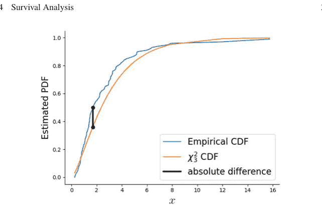

图3.42 经验CDF与解析$\chi^2_3$分布及其之间的最大绝对差

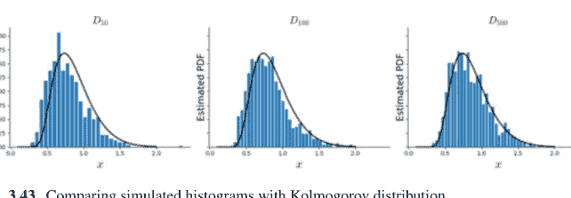

图3.43 模拟直方图与柯尔莫哥洛夫分布的比较

# 3.14 生存分析

## 3.14.1 生存曲线

问题在于估计一个队列中随时间存在的单位（例如，受试者、个体、组件）的时间长度。例如，考虑以下数据。行是7天周期中的天数，列是个体单位。例如，这可能是救生筏上的五个人。在给定的一天存活下来的用1表示，未存活的用0表示。

```python
>>> import pandas as pd
>>> d = pd.DataFrame(index=range(1,8),
...                  columns=['A', 'B', 'C', 'D', 'E'],
...                  data=1)
>>> d.loc[3:, 'A'] = 0
>>> d.loc[6:, 'B'] = 0
>>> d.loc[5:, 'C'] = 0
>>> d.loc[4:, 'D'] = 0
```

**图3.44** 红色方块表示死亡的受试者，蓝色表示存活的受试者

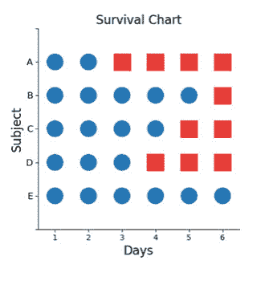

```python
>>> d.index.name='day'
>>> d.T
day  1  2  3  4  5  6  7
A    1  1  0  0  0  0  0
B    1  1  1  1  1  0  0
C    1  1  1  1  0  0  0
D    1  1  1  0  0  0  0
E    1  1  1  1  1  1  1
```

重要的是，生存是一条单行道——一旦受试者*死亡*，该受试者就不能返回实验。这一点很重要，因为生存分析也应用于组件故障或其他这一事实不那么明显的主题。下图显示了所有7天中每个受试者的生存状态。蓝色圆圈表示受试者存活，红色方块表示受试者死亡（见图3.44）。生存概率绘制在图3.45中。

关于这个计算，还有另一个重要的递归视角。想象有一个包含$[A, B, C, D, E]$的救生筏。每个人都存活到第二天，此时$A$死亡。这使得救生筏中剩下四个人$[B, C, D, E]$。因此，从第一天的角度来看，生存概率是存活到第二天然后在第二天存活下来的概率，$\mathbb{P}_S(t \ge 2) = \mathbb{P}(t \notin [0, 2)|t < 2)\mathbb{P}_S(t = 2) = (1)(4/5) = 4/5$。换句话说，这意味着存活过第二天是第二天本身存活下来与在此之前没有死亡（即存活到该点）的乘积。使用这种递归方法，第三天的生存概率是$\mathbb{P}_S(t \ge 3) = \mathbb{P}_S(t > 3)\mathbb{P}_S(t = 3) = (4/5)(3/4) = 3/5$。回想一下，在第三天之前，救生筏中有$[B, C, D, E]$，而在第三天我们有$[B, C, E]$。因此，从第三天之前的角度来看，筏中有四个幸存者，而在第三天，有三个幸存者，即3/4。使用这种递归论证可以生成相同的图，并且在处理删失时非常方便。

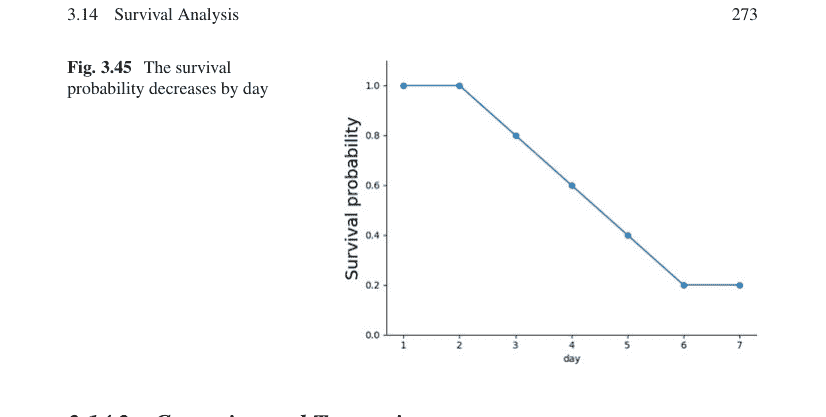

## 3.14.2 删失与截断

当受试者离开（右删失）或进入（左删失）研究时，就会发生删失。右删失有两种一般类型。所谓的I型右删失是指受试者随机退出研究。这种随机退出是另一个统计效应，在估计生存时必须加以考虑。II型右删失发生在当足够多的特定随机事件发生时研究终止。

同样，左删失发生在受试者在某个日期之前进入研究，但确切时间未知。这发生在涉及两个独立研究阶段的研究设计中。例如，一个受试者可能在第一次筛选过程中注册，但不符合第二次过程的资格。具体来说，假设一项研究涉及药物使用，某些受试者在研究前使用过该药物，但无法报告确切时间。这些受试者就是左删失的。左截断（又名交错进入、延迟进入）类似，只是进入日期是已知的。例如，一个受试者在最初被排除在研究之外后开始服用药物。

右删失是最常见的，所以让我们考虑一个例子。给定以下以天为单位的生存时间，让我们估计生存函数：

{1, 2, 3+, 4, 5, 6+, 7, 8}

其中删失的生存时间用加号表示。如前所述，第0天的生存时间是8/8 = 1；第一天是7/8；第二天 = (7/8)(6/7)。现在，我们遇到了第一个右删失条目。第三天的生存时间是(7/8)(6/7)(5/5) = (7/8)(6/7)。因此，退出的受试者不被视为*死亡*，也不能这样计算，但在概率的功能估计中，它被视为*缺席*。继续第四天，我们有(7/8)(6/7)(5/5)(4/5)，第五天，(7/8)(6/7)(5/5)(4/5)(3/4)，第六天（右删失）(7/8)(6/7)(5/5)(4/5)(3/4)(3/3)，依此类推（见表3.3）。

表 3.3 带删失的生存概率

| 天数 | $\mathbb{P}_S$ |
| :--- | :--- |
| 0 | 1 |
| 1 | 7/8 |
| 2 | 3/4 |
| 3+ | 3/4 |
| 4 | 3/5 |
| 5 | 9/20 |
| 6+ | 9/20 |
| 7 | 9/40 |
| 8 | 0 |

## 3.14.3 风险函数及其性质

通常，*生存函数*是时间 $t$ 的连续函数，表示为 $S(t) = \mathbb{P}(T > t)$，其中 $T$ 是事件时间（例如，死亡时间）。注意，累积分布函数 $F(t) = \mathbb{P}(T \leq t) = 1 - S(t)$，其导数 $f(t) = \frac{dF(t)}{dt}$ 是通常的概率密度函数。所谓的*风险函数*是时间 $t$ 的瞬时失败率：

$$h(t) = \frac{f(t)}{S(t)} = \lim_{\Delta t \to 0} \frac{\mathbb{P}(T \in (t, t + \Delta t] | T \geq t)}{\Delta t}$$

注意，这是我们在上面进行的计算的连续极限版本。用文字表述，它表示在给定事件时间 $T \geq t$（受试者已存活至 $t$）的条件下，事件在微小区间 $\Delta t$ 内发生的概率，其中 $\Delta t$ 趋近于零。注意，这并非微积分中通常的导数-斜率，因为分子中没有差分项。风险函数也称为*死亡力*、*强度率*或*瞬时风险*。非正式地，你可以将风险函数理解为封装了我们最关心的两个问题：死亡事件和面临这些死亡风险的人群。粗略地说，分子中的概率密度函数代表了在微小区间内发生死亡的概率。然而，我们特别关注的并非所有死亡，而是可能发生在特定高危人群中的死亡。回到我们的救生艇类比，假设救生艇上有 1000 人，任何人掉下去的概率是 1/1000。这里发生了两件事：(1) 不幸事件的概率很小，(2) 有大量的受试者来分摊这个不幸事件的概率。这意味着任何特定个体的风险率都很小。另一方面，如果救生筏上只有两名受试者，掉下去的概率是 3/4，那么风险率就很高，因为不仅不幸事件发生的概率高，而且该不幸事件的风险仅由两名受试者分担。

一个数学事实是

$$h(t) = \frac{-d \log S(t)}{dt}$$

这引出以下解释：

$$S(t) = \exp\left(-\int_0^t h(u)du\right) := \exp(-H(t))$$

其中 $H(t)$ 是*累积风险函数*。注意 $H(t) = -\log S(t)$。考虑一个生存时间为 5 年的受试者。为了在第五年死亡，该受试者必须在第四年仍然存活。因此，5 年时的*风险*是年失败率，其条件是受试者已存活至第四年。注意，这*不同于*第五年的无条件年失败率，因为无条件率适用于时间零点的所有个体，并未利用从其他个体获得的关于存活至该时间点的信息。因此，*风险函数*可以看作是经历事件的逐点无条件概率，按存活至该时间点的比例进行缩放。

**示例** 为了理解这一点，让我们考虑一个例子，其中概率密度函数是参数为 $\lambda$ 的指数分布，即 $f(t) = \lambda \exp(-t\lambda)$，$\forall t > 0$。这使得 $S(t) = 1 - F(t) = \exp(-t\lambda)$，然后风险函数变为 $h(t) = \lambda$，即一个常数。要理解这一点，请回忆指数分布是唯一没有记忆性的连续分布：

$$\mathbb{P}(X \leq u + t | X > u) = 1 - \exp(-\lambda t) = \mathbb{P}(X \leq t)$$

这意味着无论我们等待死亡发生的时间有多长，从该时间点起发生死亡的概率都是相同的——因此风险函数是一个常数。

## 3.14.4 期望值

给定所有这些定义，通过分部积分可以证明剩余预期寿命如下：

$$\mathbb{E}(T) = \int_0^\infty S(u)du$$

这等价于：

$$\mathbb{E}(T | t = 0) = \int_0^\infty S(u)du$$

同样，我们可以将 $t$ 时刻的预期剩余寿命表示为：

$$\mathbb{E}(T|T \geq t) = \frac{\int_t^\infty S(u)du}{S(t)}$$

## 3.14.5 参数回归模型

因为我们关注研究参数如何影响生存，所以我们需要一个能够容纳外生（自变量）变量（$\mathbf{x}$）回归的模型。

$$h(t|\mathbf{x}) = h_o(t) \exp(\mathbf{x}^T \boldsymbol{\beta})$$

其中 $\boldsymbol{\beta}$ 是回归系数，$h_o(t)$ 是基线瞬时风险函数。由于风险函数始终非负，协变量的效应通过指数函数引入。这类模型称为*比例风险率模型*。如果基线函数是常数（$\lambda$），则简化为以下*指数回归模型*：

$$h(t|\mathbf{x}) = \lambda \exp(\mathbf{x}^T \boldsymbol{\beta})$$

## 3.14.6 Cox 比例风险模型

上述比例风险率模型的棘手之处在于基线瞬时风险函数的设定。在许多情况下，我们并不特别关注绝对风险函数（或其正确性），而是关注两个研究人群之间此类风险函数的比较。Cox 模型通过使用偏似然函数的最大似然算法来强调这种比较。这个模型有很多需要跟踪的地方，所以让我们先尝试理解其机制，以感受其运作方式。

令 $j$ 表示第 $j$ 个失败时间，假设失败时间按升序排列。受试者 $i$ 在失败时间 $j$ 的风险函数为 $h_i(t_j)$。使用一般比例风险模型，我们有

$$h_i(t_j) = h_0(t_j) \exp(z_i \beta) := h_0(t_j) \psi_i$$

为简单起见，我们设 $z_i \in \{0, 1\}$，表示属于实验组（$z_i = 1$）或对照组（$z_i = 0$）。考虑第一个失败时间 $t_1$，受试者 $i$ 失败的风险函数为 $h_i(t_1) = h_0(t_1) \psi_i$。根据定义，受试者 $i$ 是失败者的概率如下：

$$p_1 = \frac{h_i(t_1)}{\sum h_k(t_1)} = \frac{h_0(t_1)\psi_i}{\sum h_0(t_1)\psi_k}$$

其中求和是对截至该时间点所有存活个体的求和。注意基线风险被消去，得到：

$$p_1 = \frac{\psi_i}{\sum_k \psi_k}$$

我们可以继续计算其他失败时间的概率，得到 $\{p_1, p_2, \dots p_D\}$。所有这些概率的乘积就是*偏似然*，$L(\psi) = p_1 \cdot p_2 \cdots p_D$。下一步是在 $\beta$ 上最大化这个偏似然（通常是偏似然的对数）。这里有很多数值问题需要跟踪。幸运的是，Python 的 `lifelines` 模块可以为我们处理好这一切。

让我们看看如何使用 lifelines 中可用的 `Rossi` 数据集来实现这一点。

```python
>>> from lifelines.datasets import load_rossi
>>> from lifelines import CoxPHFitter
>>> rossi_dataset = load_rossi()
```

Rossi 数据集涉及监狱再犯问题。`fin` 变量表示受试者在出狱后是否获得经济援助。

- `week`：释放后首次被捕的周数，或删失时间。
- `arrest`：事件指示符，研究期间被捕者为 1，未被捕者为 0。
- `fin`：一个因子，如果个人在出狱后获得经济援助则为 `yes`，否则为 `no`；经济援助是研究人员随机分配的干预因素。
- `age`：释放时的年龄（年）。
- `race`：一个因子，水平为 `black` 和 `other`。
- `wexp`：一个因子，如果个人在监禁前有全职工作经验则为 `yes`，否则为 `no`。
- `mar`：一个因子，如果个人在释放时已婚则为 `married`，否则为 `not married`。
- `paro`：一个因子，如果个人是假释出狱则编码为 `yes`，否则为 `no`。
- `prio`：先前定罪次数。
- `educ`：教育程度，一个数值编码的分类变量，代码为 2（6年级或以下）、3（6至9年级）、4（10和11年级）、5（12年级）或 6（部分高等教育）。
- `emp1`—`emp52`：因子，如果个人在研究的相应周内就业则编码为 `yes`，否则为 `no`。

```python
>>> rossi_dataset.head()
   week  arrest  fin  age  race  wexp  mar  paro  prio
0    20       1    0   27     1     0    0     1     3
```

## 3.15 期望最大化

期望最大化（EM）是一种强大的算法，用于处理我们感兴趣变量在可用数据中是隐藏或潜在的情况。我们将可见变量记为 $v$，隐藏变量记为 $h$。例如，考虑一个模型 $p_{\theta}(v, h)$，其中我们只有 $v$ 的数据。为了进行最大似然估计，我们希望最大化给定可见数据的对数似然，以估计参数 $\theta$。让我们将 $h$ 视为一个离散随机变量（在混合分布中很常见）。一个思路是最大化 $v$ 的对数似然，并对 $h$ 进行积分，如下所示：

$$\sum_{v} \log p_{\theta}(v) = \sum_{v} \log \sum_{h} p_{\theta}(v_i, h)$$

有时这被称为不完全对数似然。既然缺失的 $h$ 问题已经解决，我们可以通过最大化这个关于 $\theta$ 的表达式来继续我们通常的最大似然方法，但这会随着问题维度的增加而变得非常复杂。期望最大化使用了一种替代方法。我们可以将上面的求和项重写为：

$$\log p_{\theta}(v) = \log \sum_{h} p_{\theta}(v, h)$$

这样，对于任何概率分布 $r(h|v)$，我们有

$$\log p_{\theta}(v) = \log \sum_{h} r(h|v) \left( \frac{p_{\theta}(v, h)}{r(h|v)} \right)$$

我们可以将其重写为

$$\log p_{\theta}(v) = \log \mathbb{E}_{r(h|v)} \left( \frac{p_{\theta}(v, h)}{r(h|v)} \right)$$

因此，利用对数函数的凹性，我们可以使用詹森不等式 2.11：

$$\log p_{\theta}(v) \geq \mathbb{E}_{r(h|v)}\left(\log \left(\frac{p_{\theta}(v, h)}{r(h|v)}\right)\right)$$

然后将其展开为：

$$\log p_{\theta}(v) \geq \sum_{h} r(h|v) \log \left(\frac{p_{\theta}(v, h)}{r(h|v)}\right)$$

然后对这个求和就是对数似然：

$$\ell(\theta) = \sum_{v} \log p_{\theta}(v_i) \geq \sum_{v} \sum_{h} r(h|v) \log \left(\frac{p_{\theta}(v, h)}{r(h|v)}\right)$$

我们将右边的下界定义为：

$$q = \sum_{v} \sum_{h} r(h|v) \log \left(\frac{p_{\theta}(v, h)}{r(h|v)}\right)$$

我们通常的策略是最大化似然 $\ell(\theta)$，但现在我们想要最大化下界 $q$。因为我们任意选择了 $r(h|v)$，下一个明显的步骤是选择另一个能增加下界的 $r$ 分布。具体来说，我们想要最大化以下目标函数：

$$\sum_{h} r(h|v) \log \left(\frac{p_{\theta}(v, h)}{r(h|v)}\right) = \sum_{h} r(h|v) \log p_{\theta}(v, h) - \sum_{h} r(h|v) \log r(h|v)$$

约束条件为 $\sum_{h} r(h|v) = 1$ 和 $r(h|v) \geq 0$。我们可以通过展开对数并构建拉格朗日函数来实现：

$$\mathcal{L} = \sum_{h} r(h|v) \log p_{\theta}(v, h) - \sum_{h} r(h|v) \log r(h|v) - \sum_{h} \lambda_{z} r(h|v) - \nu(1 - \sum_{h} r(h|v))$$

然后，使用无约束最大化，

$$\frac{d\mathcal{L}}{dr} = \log p_{\theta}(v, h) - \log r(h|v) - 1 - \nu = 0$$

求解最优的 $r^*(h|v)$ 并归一化 $\sum_{h} r^*(h|v) = 1$ 得到最终结果：

$$r^*(h|v) = p_{\theta}(h|v)$$

这个最大化过程被称为期望最大化算法中的 *期望* 步骤。*最大化* 步骤则作用于 $\theta$ 参数，

$$\arg \max_{\theta} \sum_{v} \sum_{h} r^{*}(h|v) \log p_{\theta}(v, h)$$

**示例** 为了看看这一切是如何协同工作的，让我们考虑来自 [4] 的以下问题。隐藏变量是 $h \in \{1, 2\}$，可见变量是 $v \in \mathbb{R}$，参数为 $\theta \in \mathbb{R}$

$$p_{\theta}(v|h) = \frac{1}{\sqrt{\pi}} e^{-(v-\theta h)^2}$$

$h$ 的先验概率是 $p(h=1) = p(h=2) = \frac{1}{2}$。我们只观察到 $v$ 的值，而没有 $h$ 的值，我们想要估计 $\theta$。根据我们上面期望步骤的结果，我们知道为了优化下界，对于某个初始 $\theta_0$，我们需要以下密度：

$$p_{\theta}(h|v) = \frac{p_{\theta}(v|h)p(h)}{p(v)}$$

注意，因为 $h$ 只取两个值，并且 $\sum_{h} p_{\theta}(h|v) = 1$，我们只需要跟踪其中一个 $h$ 值。我们可以通过对 $p(h)$ 求和来得到 $p(v)$，如图 3.48 所示。

$$p(v) = p_{\theta}(v|h=1)\frac{1}{2} + p_{\theta}(v|h=2)\frac{1}{2} = \frac{e^{-(v-\theta)^2} + e^{-(v-2\theta)^2}}{2\sqrt{\pi}}$$

然后，为了进行期望步骤，我们计算

$$p_{\theta_0}(h=1|v) = \frac{p_{\theta_0}(v|h=1)p(h=1)}{p(v)} = \frac{e^{-(v-\theta_0)^2}}{e^{-(v-\theta_0)^2} + e^{-(v-2\theta_0)^2}}$$

注意 $\theta_0$ 来自上一次迭代。然后最大化步骤是

$$\arg \max_{\theta} \sum_{v} \sum_{h} p_{\theta_0}(h|v) \log p_{\theta}(v, h)$$

对于关于 $\theta$ 的最大化，简化掉无关项，

$$\arg \max_{\theta} \sum_{v} \sum_{h} p_{\theta_0}(h|v) \log p_{\theta}(v|h)$$

这是一个通常的最大似然问题，其权重来自使用先前 $\theta_0$ 值的期望步骤的结果。我们可以通过将内部求和写成以下形式来简化符号并强调相关项：

$$\arg \max_{\theta} \sum_{v} \mathbb{E}_{p_{\theta_0}(h|v)}(-(v - h\theta)^2)$$

使用微积分最大化这个表达式，对于单个 $v$ 得到：

$$\theta^* = v \mathbb{E}_{p_{\theta_0}(h|v)}(h) / \mathbb{E}_{p_{\theta_0}(h|v)}(h^2)$$

这给出了迭代公式

$$\theta_{k+1} = v \frac{e^{3\theta_k^2} + 2e^{2\theta_k v}}{e^{3\theta_k^2} + 4e^{2\theta_k v}} = v \left( 1 - \frac{2}{e^{(3\theta_k - 2v)\theta_k} + 4} \right)$$

以下 Python 代码实现了 EM 算法：

```python
>>> import numpy as np
>>> theta=2 # starting point
>>> v=3 # visible data
>>> for i in range(5):
...     theta = v*(1-2/(np.exp((3*theta-2*v)*theta)+4))
...     print(f'theta={theta}')
...
theta=1.7999999999999998
theta=1.6173826651486614
theta=1.5563791505956408
theta=1.5458135899717353
theta=1.5442871279738428
```

以下是该算法的下界。

$$\mathbb{E}_{p_{\theta_0}(h|v)}(-(v - h\theta)^2) = -\frac{e^{\theta_o^2 - 4v\theta_o + v^2} \left( (v - 2\theta)^2 e^{2v\theta_o} + e^{3\theta_o^2} (v - \theta)^2 \right)}{e^{(v - 2\theta_o)^2} + e^{(v - \theta_o)^2}}$$

在收敛时，当 $\theta = \theta_o$，这简化为以下形式：

## 3 统计学

**图 3.49** EM算法的下界

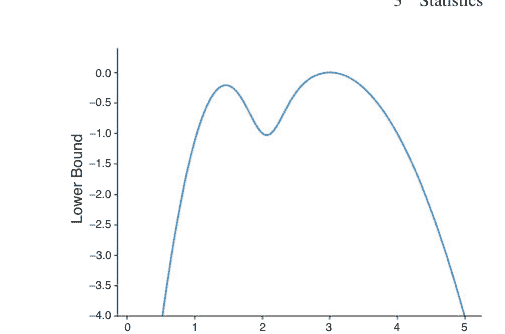

$$\mathbb{E}_{p_{\theta}(h|v)}(-(v - h\theta)^2) = -\frac{e^{\theta^2 + v^2 - 4\theta v} \left( e^{3\theta^2} (v - \theta)^2 + e^{2\theta v} (v - 2\theta)^2 \right)}{\left( e^{(v - 2\theta)^2} + e^{(v - \theta)^2} \right)}$$

如图 3.49 所示。注意，最大值在 $\theta = 3$ 时取得，但当EM算法的初始值更接近 $\theta = 1.5$ 处的局部最大值时，它*不会*找到这个全局最大值。因为EM算法是贪心的，一旦它锁定局部最小值，就永远无法逃脱并找到全局最大值。

**示例：删失数据** 有时，由于数据收集设备的限制，收集到的数据会被阈值化。例如，如果 $y_i$ 是样本，那么某些 $z_i = \min(y_i, a)$。一种方法是丢弃被阈值化的值，然后只使用其他 $y_i$ 进行估计。然而，被阈值化的值 $z_i$ 仍然有助于估计。考虑 $Y \sim \mathcal{N}(\mu, 1)$。$n$ 个样本的完整对数似然如下：

$$\ell(\mu) = -\frac{1}{2} \sum_{i=1}^{m} (y_i - \mu)^2 - \frac{1}{2} \sum_{i=m+1}^{n} (z_i - \mu)^2$$

我们需要以下关于标准正态分布的定义，其对应的概率密度函数为 $\phi(x)$：

$$\phi(x) = \frac{e^{-\frac{x^2}{2}}}{\sqrt{2\pi}}$$

以及对应的累积分布函数 $\Phi(x)$。期望步使用截断正态分布。为简化计算，我们可以先求导，然后再进行期望步。这将使后续的最大化步更容易进行。由于一个技术细节，这是合理的。

$$\frac{d}{d\mu} \ell(\mu) = \sum_{i=1}^{m} (y_i - \mu) + \sum_{i=m+1}^{n} \mathbb{E}_{\mu_o}(z_i - \mu) = 0$$

这可以简化为

$$J = m\bar{y} - m\mu + (n - m)\mathbb{E}_{\mu_o}[(z - \mu)]$$

其中

$$\mathbb{E}_{\mu_o}[(z - \mu)] = \int_{a}^{\infty} (z - \mu) \phi(z - \mu_o) dz$$

为了继续，我们需要以下事实：

$$\int_{a}^{\infty} (x - \mu) \phi(x - \mu) dx = \frac{e^{-\frac{(a-\mu)^2}{2}}}{\sqrt{2\pi}} = \phi(a - \mu)$$

那么，

$$\begin{aligned} \mathbb{E}_{\mu_o}[(z - \mu)] &= \int_{a}^{\infty} (z - \mu_o + \mu_o - \mu) \phi(z - \mu_o) dz \\ &= \int_{a}^{\infty} (z - \mu_o) \phi(z - \mu_o) dz + \int_{a}^{\infty} (\mu_o - \mu) \phi(z - \mu_o) dz \\ &= \phi(a - \mu_o) + (\mu_o - \mu)(1 - \Phi(a - \mu_o)) \end{aligned}$$

现在，我们可以将上面的 $J$ 重写为：

$$J = m\bar{y} - m\mu + (n - m)(\phi(a - \mu_o) + (\mu_o - \mu)(1 - \Phi(a - \mu_o))) = 0$$

然后，求解 $\mu$ 得到更新步骤。

$$\mu_{k+1} = \frac{m\bar{y} + (n - m)\phi(a - \mu_k) + (n - m)\mu_k(1 - \Phi(a - \mu_k))}{m + (n - m)(1 - \Phi(a - \mu_k))}$$

让我们尝试用Python来评估这个公式。首先，导入模块：

```
>>> import numpy as np
>>> from scipy import stats
```

现在，我们构建更新方程所需的各项：

```
>>> phi = stats.norm().pdf
>>> Phi = stats.norm().cdf
>>> a = 4.5 # 截断阈值
```

让我们创建一些样本。记住，这个生成分布的参数正是我们想要估计的。

```
>>> nrm = stats.norm(4) # 均值为4
>>> samples = nrm.rvs(25)
```

接下来，我们构建更新方程所需的各项：

```
>>> y = samples[samples<a]
>>> z = samples[samples>=a] # 被截断的
>>> m = len(y)
>>> n = len(y)+len(z)
>>> ym = np.mean(y)

>>> mu = 3 # 初始化
>>> for i in range(5):
...     print(f'mu={mu}')
...     mu = ((m * ym) + (n - m)*phi(a-mu)
...           + (n-m)*mu*(1-Phi(a-mu))) / (m+(n-m)*(1-Phi(a-mu)))
...
mu=3
mu=3.609396048783591
mu=3.7007889552321247
mu=3.72018353521635
mu=3.72448619620872
```

让我们将这个结果与仅使用 $y_i$ 样本（即未被截断的样本）和使用所有样本进行估计的结果进行比较。

```
>>> print(f'mu={mu:3.2f},ym={ym:3.2f},all={np.mean(samples):3.2f}')
mu=3.73,ym=3.56,all=3.99
```

注意，$\mu$ 大于 $\bar{y}$，因此仅使用 $y_i$ 数据并排除被截断的数据会导致参数的低估。这意味着算法从被截断的数据中提取了重要价值，用于估计底层参数。一个很好的练习是尝试更多样本并改变截断阈值，看看这会如何变化。

**示例：电话套餐** 假设有 $n$ 个区域被调查，但对于前 $m$ 个区域，受访者被要求在四个套餐中选择，而在剩下的 $n - m$ 个区域，受访者可以在额外的第五个套餐中选择。$^8$ 第 $i$ 个参与者的响应被建模为多项分布 $\mathcal{M}(1, (p_1, p_2, p_3, p_4, p_5))$。这意味着第 $i$ 个区域所有受访者的总和为 $T_i \sim \mathcal{M}(n_i, (p_1, p_2, p_3, p_4, p_5))$，但这仅适用于那些有五个选项的 $n - m$ 个区域。对于其他只有四个选项的 $m$ 个区域，其分布由以下第 $i_{th}$ 个区域的多项分布建模：

> $^8$ 此示例灵感来源于 [38] 的第179页，并在此处以极其详细的Python代码呈现。

$$\left(\begin{array}{c}n_i+x_i \\ T_{i,1}, T_{i,2}, T_{i,3}, T_{i,4}, x\end{array}\right) p_1^{T_{i,1}} p_2^{T_{i,2}} p_3^{T_{i,3}} p_3^{T_{i,4}} p_4^{T_{i,4}} p_5^{x_i}$$

上述符号表示以下含义：

$$\left(\begin{array}{c}n \\ k_1, k_2, \cdots, k_m\end{array}\right) = \frac{n!}{k_1! k_2! \cdots k_m!}$$

从概念上讲，除了仅在四个选项中回答的 $n_i$ 名参与者外，还有 $x_i$ 名假设的参与者。隐藏变量是 $x_i$，即*本会*填写第五个选项的参与者数量。应用EM算法的过程是相同的。完整似然如下：

$$L(\mathbf{x}, \mathbf{T}) = \prod_{i=1}^{m} \left(\begin{array}{c}n_i+x_i \\ T_{i,1}, T_{i,2}, T_{i,3}, T_{i,4}, x_i\end{array}\right) p_1^{T_{i,1}} p_2^{T_{i,2}} p_3^{T_{i,3}} p_3^{T_{i,4}} p_4^{T_{i,4}} p_5^{x_i} \times$$
$$\prod_{i=m+1}^{n} \left(\begin{array}{c}n_i \\ T_{i,1}, \cdots, T_{i,5}\end{array}\right) p_1^{T_{i,1}} p_2^{T_{i,2}} p_3^{T_{i,3}} p_3^{T_{i,4}} p_4^{T_{i,4}} p_5^{T_{i,5}}$$

我们必须对 $x_i$ 进行边缘化以获得不完全似然。关键步骤是回忆负二项分布的和为1，如下所示：

$$\sum_{k=0}^{\infty} \left(\begin{array}{c}k+r-1 \\ k\end{array}\right) (1-p)^r p^k = 1$$

这给出了有用的等式

$$\sum_{k=0}^{\infty} \left(\begin{array}{c}k+r-1 \\ k\end{array}\right) p^k = \frac{1}{(1-p)^r}$$

专注于求和的关键部分以进行边缘化，并使用上述等式，我们得到：

$$\sum_{x_i=0}^{\infty} \left(\begin{array}{c}n_i+x_i \\ x_i\end{array}\right) p_5^{x_i} = \frac{1}{(1-p_5)^{n_i+1}}$$

这现在给出了不完全似然：

$$L(\mathbf{T}) = \prod_{i=1}^{m} \frac{n_i!}{T_{i,1}! T_{i,2}! T_{i,3}! T_{i,4}!} \frac{p_1^{T_{i,1}} p_2^{T_{i,2}} p_3^{T_{i,3}} p_3^{T_{i,4}} p_4^{T_{i,4}}}{(1-p_5)^{n_i+1}} \times$$

$$\prod_{i=m+1}^{n} \binom{n_i}{T_{i,1}, T_{i,2}, T_{i,3}, T_{i,4}, T_{i,5}} p_1^{T_{i,1}} p_2^{T_{i,2}} p_3^{T_{i,3}} p_3^{T_{i,4}} p_4^{T_{i,4}} p_5^{T_{i,5}}$$

为了建立期望步，我们必须通过将 $L(\mathbf{x}, \mathbf{T})$ 除以 $L(\mathbf{T})$ 来找到给定可见变量的隐藏变量的分布，从而得到：

$$\mathbb{P}(\mathbf{x}|\mathbf{T}) = \prod_{i=1}^{m} \binom{n_i + x_i}{n_i} \pi_5^{x_i} (1 - \pi_5)^{n_i+1}$$

这是 $m$ 个负二项分布的乘积，其中 $\pi_5$ 是 $p_5$ 的当前值。所有这些都已确定，我们准备计算期望步的下界：

$$\mathbb{E}_{x_i \sim \mathbb{P}(\mathbf{x}|\mathbf{T})} (\log L(\mathbf{x}, \mathbf{T}))$$

完整似然的对数如下：

$$\log L(\mathbf{x}, \mathbf{T}) = \sum_{i=1}^{m} \log \left\{ \binom{n_i + x_i}{T_{i,1}, T_{i,2}, T_{i,3}, T_{i,4}, x_i} p_1^{T_{i,1}} p_2^{T_{i,2}} p_3^{T_{i,3}} p_3^{T_{i,4}} p_4^{T_{i,4}} p_5^{x_i} \right\} + \sum_{i=m+1}^{n} \log \left\{ \binom{n_i}{T_{i,1}, T_{i,2}, T_{i,3}, T_{i,4}, T_{i,5}} p_1^{T_{i,1}} p_2^{T_{i,2}} p_3^{T_{i,3}} p_3^{T_{i,4}} p_4^{T_{i,4}} p_5^{T_{i,5}} \right\} =: A + B$$

分离出包含和不包含 $x_i$ 的项，我们有

$$A = \sum_{i=1}^{m} \log \left\{ \frac{(n_i + x_i)!}{T_{i,1}! T_{i,2}! T_{i,3}! T_{i,4}! x_i!} p_1^{T_{i,1}} p_2^{T_{i,2}} p_3^{T_{i,3}} p_3^{T_{i,4}} p_4^{T_{i,4}} p_5^{x_i} \right\}$$
$$= \sum_{i=1}^{m} \log \left\{ \frac{(n_i + x_i)!}{T_{i,1}! T_{i,2}! T_{i,3}! T_{i,4}! x_i!} \right\} + \log \left\{ p_1^{T_{i,1}} p_2^{T_{i,2}} p_3^{T_{i,3}} p_3^{T_{i,4}} p_4^{T_{i,4}} p_5^{x_i} \right\}$$
$$= \sum_{i=1}^{m} \log \{(n_i + x_i)! / x_i!\} - \log \{T_{i,1}! T_{i,2}! T_{i,3}! T_{i,4}!\} + x_i \log(p_5) + \log \{p_1^{T_{i,1}} p_2^{T_{i,2}} p_3^{T_{i,3}} p_3^{T_{i,4}} p_4^{T_{i,4}}\}$$

分离出包含 $x_i$ 的项，我们得到以下期望：

$$\mathbb{E}_{x_i \sim \mathbb{P}(\mathbf{x}|\mathbf{T})} \{x_i \log(p_5)\} = \frac{\pi_5 (n_i + 1) \log(p_5)}{1 - \pi_5}$$

此外，

$$\mathbb{E}_{x_i \sim \mathbb{P}(x_i|\mathbf{T})} \left\{ \log \left( \frac{(n_i + x_i)!}{x_i!} \right) \right\} = \mathbb{E}_{x_i \sim \mathbb{P}(x_i|\mathbf{T})} \left\{ \log \left( (n_i + x_i) \times \cdots (x_i + 1) \right) \right\}$$
$$= \mathbb{E}_{x_i \sim \mathbb{P}(x_i|\mathbf{T})} \left( \sum_{k=0}^{n_i-1} (n_i + x_i - k) \right)$$
$$= \frac{(\pi_5 + 1) n_i (n_i + 1)}{2 (1 - \pi_5)}$$

再次组合得到

$$\mathbb{E}_{x_i \sim \mathbb{P}(x_i|\mathbf{T})}(A) = \sum_{i=1}^{m} \frac{(\pi_5 + 1) n_i (n_i + 1)}{2 (1 - \pi_5)} - \log \left\{ T_{i,1}! T_{i,2}! T_{i,3}! T_{i,4}! \right\} + \frac{\pi_5 (n_i + 1) \log(p_5)}{1 - \pi_5}$$
$$+ \log \left\{ p_1^{T_{i,1}} p_2^{T_{i,2}} p_3^{T_{i,3}} p_3^{T_{i,4}} p_4^{T_{i,4}} \right\}$$

因此，将所有部分组合起来，得到期望对数似然，从而得到我们需要在 $p_i$ 上最大化的目标函数：

$$\mathbb{E}_{x_i \sim \mathbb{P}(x_i|\mathbf{T})}(A + B) = \sum_{i=1}^{m} \frac{(\pi_5 + 1) n_i (n_i + 1)}{2 (1 - \pi_5)} - \log \left\{ T_{i,1}! T_{i,2}! T_{i,3}! T_{i,4}! \right\} \frac{\pi_5 (n_i + 1) \log(p_5)}{1 - \pi_5}$$
$$+ \log \left\{ p_1^{T_{i,1}} p_2^{T_{i,2}} p_3^{T_{i,3}} p_3^{T_{i,4}} p_4^{T_{i,4}} \right\}$$
$$+ \sum_{i=m+1}^{n} \log \left\{ \binom{n_i}{T_{i,1}, T_{i,2}, T_{i,3}, T_{i,4}, T_{i,5}} p_1^{T_{i,1}} p_2^{T_{i,2}} p_3^{T_{i,3}} p_3^{T_{i,4}} p_4^{T_{i,4}} p_5^{T_{i,5}} \right\} =: J(\mathbf{p})$$
$$(3.19)$$

此外，在优化过程中，我们必须强制执行约束条件 $\sum_{i=1}^{5} p_i = 1$。使用微积分对目标函数求偏导数。以下是关于 $p_1$ 的偏导数。

$$\partial_{p_1} J = \frac{-1}{(1 - p_1 - p_2 - p_3 - p_4)} \frac{\pi_5}{1 - \pi_5} \sum_{i=1}^{m} (n_i + 1)$$
$$+ \frac{1}{p_1} \sum_{i=1}^{m} T_{i,1} + \frac{1}{p_1} \sum_{i=m+1}^{n} T_{i,1}$$
$$- \frac{1}{(1 - p_1 - p_2 - p_3 - p_4)} \sum_{i=m+1}^{n} T_{i,5} = 0$$
$$(3.20)$$

其中定义如下：

$$n_m = \sum_{i=1}^{m} n_i$$

$$c_j = \frac{\sum_{i=1}^{n} T_{i,j}}{\frac{\pi_5(n_m+m)}{1-\pi_5} + \sum_{i=m+1}^{n} T_{i,5}}$$

通常，求解 $p_i$ 会得到以下迭代公式：

$$p_1^{(k+1)} = \frac{c_1^{(k)}(1 - p_2^{(k)} - p_3^{(k)} - p_4^{(k)})}{c_1^{(k)} + 1}$$
$$p_2^{(k+1)} = \frac{c_2^{(k)}(1 - p_1^{(k)} - p_3^{(k)} - p_4^{(k)})}{c_2^{(k)} + 1}$$
$$p_3^{(k+1)} = \frac{c_3^{(k)}(1 - p_1^{(k)} - p_2^{(k)} - p_4^{(k)})}{c_3^{(k)} + 1}$$
$$p_4^{(k+1)} = \frac{c_4^{(k)}(1 - p_1^{(k)} - p_2^{(k)} - p_3^{(k)})}{c_4^{(k)} + 1}$$
$$p_5^{(k+1)} = (1 - p_1^{(k+1)} - p_2^{(k+1)} - p_3^{(k+1)} - p_4^{(k+1)})$$

迭代从初始条件 $\pi_5$ 开始，然后更新 $c_j$ 项，接着更新 $p_5$ 项。

```
>>> df  # NaN 表示方案 5 没有可用数据
Plan    1  2  3  4      5
Region
0       2  4  2  2    NaN
1       4  4  1  1    NaN
2       2  1  5  2    NaN
3       3  4  0  3    NaN
4       1  2  6  1    NaN
5       3  2  1  4    NaN
6       3  1  2  4    NaN
7       0  3  4  3    NaN
8       3  3  2  2    NaN
9       2  3  3  2    NaN
10      2  3  3  2    NaN
11      2  4  2  2    NaN
12      2  2  3  3    NaN
13      1  2  3  4    NaN
14      5  1  2  2    NaN
15      4  0  4  0   12.0
16      5  0  1  2   12.0
17      3  2  5  5    5.0
18      4  5  3  3    5.0
19      0  2  3  3   12.0
```

请注意，只有最后几行才有第五个方案的值。

```
>>> m, n, p5 = 15, 20, 0.5
>>> p1 = p2 = p3 = p4 = (1-p5)/4
>>> W = df.sum(axis=0)
>>> nm = df.sum(axis=1)[:m].sum()
>>> c = W/(p5*(nm+m)/(1-p5)+df.loc[m:,5].sum())
```

下一个代码块展示了迭代过程：

```
>>> from collections import defaultdict
>>> out = defaultdict(list)
>>> for i in range(1,12):
...     p1=c[1]/(1+c[1])*(1-p2-p3-p4)
...     p2=c[2]/(1+c[2])*(1-p1-p3-p4)
...     p3=c[3]/(1+c[3])*(1-p1-p2-p4)
...     p4=c[4]/(1+c[4])*(1-p1-p2-p3)
...     p5=1-p1-p2-p3-p4
...     c=W/(p5*(nm+m)/(1-p5)+df.loc[(m):,5].sum())
...     print('p1=%0.3f, p2=%0.3f, p3=%0.3f, p4=%0.3f, p5=%0.3f'%(p1,p2,p3,p4,p5))
...     out[i].extend([p1,p2,p3,p4,p5])
...
```

p1=0.122, p2=0.116, p3=0.132, p4=0.121, p5=0.509
p1=0.120, p2=0.114, p3=0.130, p4=0.119, p5=0.517
p1=0.119, p2=0.112, p3=0.129, p4=0.117, p5=0.523
p1=0.118, p2=0.111, p3=0.128, p4=0.116, p5=0.527
p1=0.117, p2=0.110, p3=0.127, p4=0.115, p5=0.531
p1=0.116, p2=0.110, p3=0.126, p4=0.115, p5=0.533
p1=0.116, p2=0.109, p3=0.125, p4=0.114, p5=0.535
p1=0.116, p2=0.109, p3=0.125, p4=0.114, p5=0.537
p1=0.115, p2=0.109, p3=0.125, p4=0.113, p5=0.538
p1=0.115, p2=0.109, p3=0.124, p4=0.113, p5=0.538
p1=0.115, p2=0.108, p3=0.124, p4=0.113, p5=0.539

这是仅使用最后几行有可用数据的行对 $p_5$ 的估计。

```
>>> (df.loc[m:,5]/df.loc[m:,:].sum(axis=1)).mean()
0.45999999999999996
```

将其与下面 EM 算法对 $p_5$ 的估计进行比较（图 3.50）。

```
>>> print('p1=%0.3f, p2=%0.3f, p3=%0.3f, p4=%0.3f, p5=%0.3f'%(p1,p2,p3,p4,p5))
p1=0.115, p2=0.108, p3=0.124, p4=0.113, p5=0.539
```

如果我们执行完全相同的分析，但从 p5=0.9 开始，我们将得到图 3.51 中的结果，最终估计如下。

```
>>> print('p1=%0.3f, p2=%0.3f, p3=%0.3f, p4=%0.3f, p5=%0.3f'%(p1,p2,p3,p4,p5))
p1=0.091, p2=0.085, p3=0.097, p4=0.087, p5=0.640
```

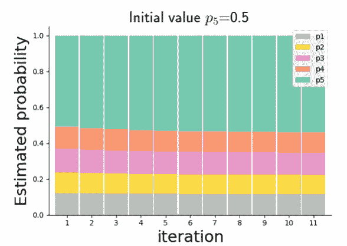

图 3.50 从 $p_5 = 0.5$ 开始的多项式概率 EM 迭代

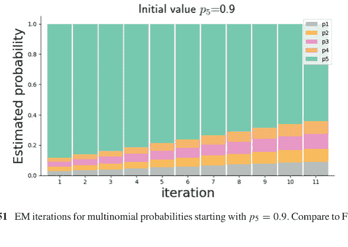

图 3.51 从 $p_5 = 0.9$ 开始的多项式概率 EM 迭代。与图 3.50 比较

结果不同，因为 EM 算法对初始值敏感。

## 3.16 抽样调查

抽样调查的目的是基于一个更大总体 $N$ 中大小为 $n$ 的子样本来估计统计量。例如，我们想估计某个城市中吸烟者的数量。我们可以给城市里的每个人打电话询问他们是否吸烟，但那将既昂贵又费力。相反，假设我们去一个繁忙的市中心街角，询问人们是否吸烟。然后，根据回答，我们可以轻松计算出吸烟者与非吸烟者的比例，但这个结果如何反映整个总体呢？此外，如果我们选择的街角恰好在一家健康食品店前面怎么办？健康食品店如何影响回答你调查的潜在吸烟者数量？也就是说，更一般地，其他环境信息如何影响整个城市的最终调查估计？这些就是抽样调查旨在解决的问题。

被调查的总体由单个*单元*组成。每个单元 $u_i$ 有一个属性（或一组属性），记为 $Y_i$。目标是使用大小为 $n < N$ 的子样本（记为 $S_n$）来统计描述整个有限总体 $N$ 上的 $Y_i$。*抽样设计*是任何特定 $S_n$ 的概率，这个概率最终决定了我们关于 $S_n$ 相对于更大总体 $N$ 的结论的统计特性。抽样设计下的*包含概率*是任何特定单元出现在 $S_n$ 中的概率，即 $\mathbb{P}(u_i = U_j)$。抽样主要有两个类别：*有放回*和*无放回*。在有放回抽样中，一个特定单元可以在 $S_n$ 中出现多次，而无放回抽样则不会发生这种情况。

包含概率是分析的关键。例如，我们有

$$\bar{y}_s = \frac{1}{n} \sum_{i=1}^n y_i$$

其中 $u_i \in S_n$。由于期望的线性性质以及有放回抽样意味着 $\mathbb{P}(y_i = Y_j) = \frac{1}{N}$，我们也有 $\mathbb{E}(y_i) = \bar{Y}$，因此

$$\mathbb{E}(\bar{y}_s) = \bar{Y}$$

为了探讨这一点，让我们考虑一个关于*身高*的小规模模拟，其中 $N = 100$，$n = 10$。

```
>>> import numpy as np
>>> from scipy import stats
>>> heights = stats.norm(5,1).rvs(100)
```

现在，让我们进行一次*有放回*的随机抽样：

```
>>> sample = np.random.choice(heights,10)
>>> sample.mean() # 上面的 ybar
4.795029626941257
```

如果我们持续这样随机抽样，我们可以得到所有抽样集合的均值：

```
>>> sample = np.random.choice(heights, (10,100))
>>> sample.mean(axis=0).mean()
5.0721303754908185
```

`axis=0` 表示我们首先对100个样本选择中的每个样本的10个样本取均值。将此结果与使用所有 $N$ 个样本的结果进行比较：

```
>>> heights.mean()
5.095579243655205
```

这里自然存在一些差异。为了量化这一点，我们计算 $\bar{y}_s$ 的方差：

\[\mathbb{V}(\bar{y}_s) = \frac{1}{n^2} \sum_{i=1}^n \mathbb{V}(y_i) = \frac{\sigma_Y^2}{n}\]

要理解这一点，请注意

\[\begin{aligned}
\sigma_Y^2 &:= \frac{1}{N} \sum_{i=1}^N (Y_i - \bar{Y})^2 \\
&= \frac{1}{N} \sum_{i=1}^N \left(Y_i^2 - 2Y_i\bar{Y} + \bar{Y}^2\right) \\
&= \bar{Y}^2 + \frac{1}{N} \sum_{i=1}^N \left(Y_i^2 - 2Y_i\bar{Y}\right) \\
&= \bar{Y}^2 + \frac{1}{N} \sum_{i=1}^N Y_i^2 - 2\frac{1}{N}\bar{Y} \sum_{i=1}^N Y_i \\
&= \bar{Y}^2 + \frac{1}{N} \sum_{i=1}^N Y_i^2 - 2\bar{Y}^2 \\
\sigma_Y^2 &= -\bar{Y}^2 + \frac{1}{N} \sum_{i=1}^N Y_i^2
\end{aligned}\]

由此我们可以识别出以下项：

\[\mathbb{E}(y_s^2) = \sum_{i=1}^N \frac{1}{N} Y_i^2 = \sigma_Y^2 + \bar{Y}^2\]

然后，我们需要 $\mathbb{E}\left(\bar{y}_s^2\right)$，

\[\mathbb{E}\left(\bar{y}_s^2\right) = \mathbb{E}\left(\frac{1}{n^2}\left(\sum_{i=1}^n y_i\right)^2\right) = \frac{1}{n^2}\left(\sum_{i=1}^n \mathbb{E}\left(y_i^2\right) + \sum_{i=1}^n \sum_{j \neq i}^n \mathbb{E}(y_i)\mathbb{E}(y_j)\right)\]

$$= \frac{1}{n^2} \left( \sum_{i=1}^n \mathbb{E}\left(y_i^2\right) + \sum_{i=1}^n \sum_{j \neq i}^n \mathbb{E}\left(y_i\right) \mathbb{E}\left(y_j\right) \right)$$

$$= \frac{1}{n} \left( \sigma_Y^2 + \overline{Y}^2 \right) + \frac{n^2 - n}{n^2} \overline{Y}^2$$

$$= \frac{1}{n} \left( \sigma_Y^2 + \overline{Y}^2 \right) + \overline{Y}^2 - \frac{1}{n} \overline{Y}^2$$

$$= \frac{1}{n} \sigma_Y^2 + \overline{Y}^2$$

最终我们得到结果

$$\mathbb{V}(\bar{y}_s) = \mathbb{E}(\bar{y}_s^2) - \overline{Y}^2 = \frac{\sigma_Y^2}{n} \quad (3.21)$$

这意味着我们可以通过取更大的 $n$ 来减小方差。当然，我们事先不知道 $\sigma_Y^2$，所以我们必须用 $S_n$ 上的样本方差来估计它：

$$s_y^2 = \frac{1}{n-1} \sum_{i=1}^n (y_i - \bar{y}_s)^2$$

为了证明这是一个无偏估计量，我们可以使用条件方差公式，

$$\mathbb{V}(A) = \mathbb{V}_B(\mathbb{E}(A|B)) + \mathbb{E}_B(\mathbb{V}(A|B))$$

其中 $A = Y$ 且 $B = S_n$。然后使用我们之前的结果，

$$\mathbb{V}_{S_n}(\mathbb{E}(Y|S_n)) = \mathbb{V}_{S_n}(\bar{y}_s) = \frac{\sigma_Y^2}{n}$$

以及

$$\mathbb{E}_{S_n}(\mathbb{V}(y|S_n)) = \mathbb{E}_{S_n}\left( \frac{1}{n} \left( \sum_{i=1}^n (y_i - \bar{y}_s)^2 \right) \right) = \frac{n-1}{n} \mathbb{E}(s_y^2)$$

将它们代入条件方差公式得到：

$$\sigma_Y^2 = \frac{\sigma_Y^2}{n} + \frac{n-1}{n} \mathbb{E}(s_y^2)$$

由此得出，

$$\mathbb{E}(s_y^2) = \sigma_Y^2$$

这表明，样本 $S_n$ 上调整后总体方差的期望值就是整个总体的方差。因为我们事先不知道 $\sigma_{\bar{Y}}^2$，所以我们必须从样本中估计它

$$\widehat{\mathbb{V}}(\bar{y}_S) = \frac{s_y^2}{n}$$

这由先前的结果证明是合理的。

### 无放回抽样

到目前为止，我们推导的所有内容都是针对*有*放回抽样的情况。对于*无*放回抽样，所有 $\binom{N}{n}$ 种结果都是等概率的，所以我们有

$$\mathbb{P}(y_i \in S_n) = \frac{\binom{N-1}{n-1}}{\binom{N}{n}} = \frac{n}{N}$$

所以我们有

$$\mathbb{E}(y_i) = \sum_{j=1}^N \frac{1}{N} Y_j = \bar{Y}$$

我们还有

$$\mathbb{E}(y_i^2) = \frac{1}{N} \sum_{j=1}^N Y_j^2$$

无放回使得协方差比有放回的情况更复杂。为简单起见且不失一般性，我们可以假设 $\bar{Y} = 0$。对于 $Y_k$ 和 $Y_l$ 都在 $n$ 样本中的情况，我们有以下概率：

$$\mathbb{P}(y_j \in S_n \bigwedge y_i \in S_n) = \frac{\binom{N-2}{n-2}}{\binom{N}{n}} = \frac{n(n-1)}{N(N-1)}$$

那么，给定特定的 $y_i$ 和 $y_j$，我们有以下概率：

$$\mathbb{P}(y_j = Y_k \bigwedge y_i = Y_l) = \frac{1}{N(N-1)}$$

因此，对于期望值，我们有：

$$\mathbb{E}(y_i y_j) = \sum_{l=1}^N \sum_{k \neq l}^N Y_k Y_l \mathbb{P}(y_j = Y_k \bigwedge y_i = Y_l)$$

通过代入这对的概率，我们得到

$$\mathbb{E}(y_i y_j) = \frac{1}{N(N-1)} \sum_{l=1}^N \sum_{k \neq l}^N Y_k Y_l = \frac{1}{N(N-1)} \sum_{l=1}^N Y_l \sum_{k \neq l}^N Y_k$$
$$= \frac{1}{N(N-1)} \sum_{l=1}^N Y_l (N\overline{Y} - Y_l)$$
$$= \frac{1}{N(N-1)} \sum_{l=1}^N Y_l (0 - Y_l)$$
$$= \frac{-1}{N(N-1)} \sum_{l=1}^N Y_l^2 = \frac{-\sigma_Y^2}{N-1}$$

其中我们在倒数第二行使用了 $\overline{Y} = 0$ 的假设。

在解决了各个 $y_i$ 项之后，我们可以进入计算 $\overline{y}_s$ 均值的主要部分。均值直接由线性性和上述 $\mathbb{E}(y_i)$ 的结果得出：

$$\mathbb{E}(\overline{y}_s) = \mathbb{E}\left(\frac{1}{n} \sum_{i=1}^n y_i\right) = \frac{1}{n} \sum_{i=1}^n \mathbb{E}(y_i) = \overline{Y}$$

对于方差，使用 $\overline{Y} = 0$ 的假设，我们有

$$\mathbb{V}(\overline{y}_s) = \mathbb{E}\left(\overline{y}_s^2\right)$$

现在我们可以将 $\mathbb{E}\left(\overline{y}_s^2\right)$ 项写为

$$\mathbb{E}\left[\left(\frac{1}{n} \sum_{i=1}^n y_i\right)^2\right] = \frac{1}{n^2} \sum_{i=1}^n \mathbb{E}(y_i^2) + \frac{1}{n^2} \sum_{i=1}^n \sum_{j \neq i}^n \mathbb{E}(y_i y_j)$$
$$= \frac{\sigma_Y^2}{n} + \frac{\sigma_Y^2}{n^2} \sum_{i=1}^n \sum_{j \neq i}^n \frac{-1}{N-1}$$
$$= \frac{\sigma_Y^2}{n} - \frac{\sigma_Y^2}{n} \frac{(n-1)}{N-1}$$
$$\mathbb{V}(\overline{y}_s) = \frac{\sigma_Y^2}{n} \frac{N-n}{N-1}$$

回想一下，调整后的总体方差是

$$S_Y^2 = \frac{1}{N-1} \sum_{i=1}^N (Y_i - \overline{Y})^2 = \sigma_Y^2 \frac{N}{N-1}$$

因此，将其代入先前的方程，我们得到

$$\mathbb{V}(\overline{y}_s) = \left(\frac{1}{n} - \frac{1}{N}\right) S_Y^2$$

我们可以再次使用条件方差公式：

$$\sigma_Y^2 = \left(1 - \frac{1}{N}\right) S_Y^2 = \mathbb{V}_{S_n}(\mathbb{E}(y \mid S_n)) + \mathbb{E}_{S_n}(\mathbb{V}(y \mid S_n))$$
$$\left(1 - \frac{1}{N}\right) S_Y^2 = \mathbb{V}_{S_n}(\overline{y}_{S_n}) + \mathbb{E}_{S_n}\left(\frac{1}{n} \sum_{i=1}^n (y_i - \overline{y}_s)^2\right)$$
$$\left(1 - \frac{1}{N}\right) S_Y^2 = \left(\frac{1}{n} - \frac{1}{N}\right) S_Y^2 + \mathbb{E}_{S_n}\left(\frac{1}{n} \sum_{i=1}^n (y_i - \overline{y}_s)^2\right)$$
$$\left(1 - \frac{1}{N}\right) S_Y^2 = \left(\frac{1}{n} - \frac{1}{N}\right) S_Y^2 + \frac{n-1}{n} \mathbb{E}_{S_n}(s_y^2)$$

通过消去上述各项，我们可以识别出

$$\mathbb{E}_{S_n}(s_y^2) = S_Y^2$$

这里的关键点是，$n$ 样本的调整后总体方差的期望值就是整个总体的调整后总体方差。与有放回抽样的情况一样，我们仍然需要一个估计量来估计 $\mathbb{V}(\hat{y}_s)$ 的方差

$$\widehat{\mathbb{V}(\overline{y}_s)} = \frac{s_y^2}{n} \left(1 - \frac{n}{N}\right)$$

这由先前的结果证明是合理的。因子 $\left(1 - \frac{n}{N}\right)$ 通常被称为*有限总体校正*。

#### 示例：使用有限总体校正估计方差

为了使上述计算具体化，考虑以下数据：

```
>>> data = np.array([-1]*100 + [0]*100 + [1]*100)
>>> N, n = len(data), 20
```

这是一个无放回的随机样本：

```
>>> sample = np.random.choice(data,n,replace=False)
>>> ys = np.mean(sample)
>>> ys
0.0
```

让我们通过抽取多个样本来估计 $\mathbb{V}(\bar{y}_s)$：

```
>>> x = [np.mean(np.random.choice(data,n,replace=False)) for i in range(1000)]
>>> np.var(x), (1-n/N)*np.var(sample)/n
(0.033226977500000004, 0.023333333333333334)
```

最后一行显示了使用模拟估计的方差与使用有限总体校正因子在*单个*样本上计算的方差。这两个数字相当接近，因此我们可以使用单个样本来估计样本均值 $\bar{y}_s$ 的方差，实际上，这就是我们所拥有的全部。

#### 示例：侦察飞行

假设我们有一个100英里宽的区域，我们正好从南向北进行侦察飞行。对于每次飞行，我们记录在飞机1英里宽视野内观察到的鹿的数量。我们有一个（无放回的）20次飞行的样本。我们想估计该区域的鹿的数量。为此，*单位*是单次飞行。*特征* $y$ 是观察到的鹿的数量，$N = 100$ 是可用的总单位数（1英里宽的飞行次数）。给定以下数据：

```
>>> y = [9,12,1,1,10,9,9,12,13,12,6,4,12,11,1,5,2,12,12,4]
```

根据我们的结果，我们有以下样本均值和方差，$y_s$ 和 $s_y^2$。

```
>>> ys = np.mean(y)
>>> sy2 = np.var(y,ddof=1)
>>> ys, sy2
(7.85, 19.18684210526316)
```

为了估计样本均值的方差，我们计算

```
>>> n, N = 20, 100
>>> var_ys = (1/n - 1/N)*sy2
>>> var_ys
0.7674736842105264
```

为了使用我们的调查估计鹿的总数量，我们可以计算以下内容：

```
>>> total_pop_ = ys * N
>>> total_pop_
785.0
```

有了相应的估计方差，我们可以写出完整的结果：

```python
>>> var_total_pop_ = N**2 * var_ys
>>> print(f'total = {total_pop_} with estimated standard error = {np.sqrt(var_total_pop_):3.2f}')
total = 785.0 with estimated standard error = 87.61
```

请注意本例中对“单位”构成的微妙选择，以及因此如何先验地知道 $N$。

### 3.16.1 用于加权总和的不等概率有放回抽样

到目前为止，我们只考虑了估计 $\bar{Y} = \frac{1}{N} \sum_{i=1}^{N} Y_i$ 的*未加权*情况，但更一般的*加权*情况 $\bar{Y} = \sum_{i=1}^{N} p_i Y_i$（其中 $\sum_{i=1}^{n} p_i = 1$）又该如何处理呢？使用 $S_n$ 样本*有放回*抽样。不等概率 $p_i$ 的抽样有助于实现这种更一般的加权求和。为了理解这一点，请考虑以下内容：

$$\mathbb{E}(y_i) = \sum_{j=1}^{N} \mathbb{P}(y_i = Y_j) Y_j$$

如果我们取包含概率如下：

$$p_j := \mathbb{P}(y_i = Y_j)$$

那么，未加权样本 $S_n$ 上的期望变为：

$$\mathbb{E}(\bar{y}_s) = \frac{1}{n} \sum_{i=1}^{n} \mathbb{E}(y_i) = \frac{1}{n} \sum_{i=1}^{n} \sum_{j=1}^{N} p_j Y_j = \bar{Y}$$

因为有放回抽样情况下的所有相应推导都成立，所以我们有：

$$\widehat{\mathbb{V}}(\bar{y}_s) = \frac{s_y^2}{n}$$

因此，通过使用不等概率抽样，我们可以将加权平均值估计为 $\bar{Y}$。反过来，这意味着不等概率抽样导致将 $\bar{Y}$ 估计为一个加权和。

### 3.16.2 *用于未加权总和的不等概率抽样*

我们想要未加权总和，但由于实际原因被迫使用不等概率有放回抽样。换句话说，我们想使用以下概率的不等概率抽样来估计 $Y_T = \sum_{i=1}^N Y_i$：

$$p_j = \mathbb{P}(y_i = Y_j)$$

这可以通过代入 $Z_i = Y_i/p_i$ 简化为前一种情况。因此，对于不等概率样本 $S_n$，我们有通常的估计量：

$$\bar{z}_s = \frac{1}{n} \sum_{i=1}^n z_i = \frac{1}{n} \sum_{i=1}^n \frac{y_i}{p_i}$$

相应的方差估计量与之前相同：

$$\widehat{\mathbb{V}}(\bar{z}_s) = \frac{s_z^2}{n}$$

其中

$$s_z^2 = \frac{1}{n-1} \sum_{i=1}^n \left( \frac{y_i}{p_i} - \bar{z}_s \right)^2$$

这被称为 Hansen-Hurwitz 估计量。

**示例：用于未加权总和的不等概率抽样** 让我们生成一些模拟数据：

```python
>>> N, n = 100, 50
>>> Y = np.arange(1,N+1)
>>> pY = np.array([1,]*50 + [2,]*50) # setup weights
>>> pY = pY/pY.sum() # normalize
```

我们想估计 $Y$ 中元素的总和：

```python
>>> Y.sum() # want to estimate this with sample mean
5050
```

通过重新加权并定义 $Z_i$ 项，我们可以使用不等概率抽样：

```python
>>> Z = Y/pY # re-weight Y-values
>>> sample = np.random.choice(Z,size=n,p=pY)
>>> sample.mean(), Y.sum() # pretty close
(5206.5, 5050)
```

对于方差，

```python
>>> sample.var()/n # Hansen-Hurwitz estimate
49387.905
```

因为我们使用的是模拟数据，所以我们可以使用模拟来估计方差：

```python
>>> nsamples = 5_000
>>> np.random.choice(Z, size=(n,nsamples), p=pY).mean(axis=0).var()
63367.63790796
```

这与 Hansen-Hurwitz 结果非常接近。

### 3.16.3 无放回不等概率抽样

与上一节类似，我们想估计总和 $Y_T$，但这里我们进行无放回抽样。考虑以下 Horvitz-Thompson 估计量：

$$Y_{HT} = \sum_{i=1}^{n} \frac{y_i}{\pi_i}$$

其中 $\pi_i = \mathbb{P}(Y_i \in S_n)$。如果我们定义 $a_j = 1$（如果 $Y_j \in S_n$，概率为 $\pi_j$）否则为零，那么我们可以对 $Y_j$ 的所有 $N$ 个元素进行如下表示：

$$Y_{HT} = \sum_{j=1}^{N} \frac{Y_j}{\pi_j} a_j$$

注意

$$\mathbb{E}(a_j) = \pi_j$$

相应的方差为：

$$\mathbb{V}(a_j) = \pi_j(1 - \pi_j)$$

根据这些定义，我们可以计算：

$$\mathbb{E}(Y_{HT}) = \sum_{j=1}^{N} \mathbb{E}(a_j) \frac{Y_j}{\pi_j} = \sum_{j=1}^{N} Y_j = Y_T$$

这意味着 $Y_{HT}$ 是 $Y_T$ 的无偏估计量。让我们定义 $\pi_{ij} = \mathbb{P}(Y_i \in S_n \wedge Y_j \in S_n)$。我们想使用以下公式计算方差：

$$\mathbb{V}(Y_{HT}) = \mathbb{E}(Y_{HT}^2) - \mathbb{E}(Y_{HT})^2$$

为了得到第二项，我们可以将均值写为：

$$\mathbb{E}(Y_{HT}) = Y_T = \sum_{i=1}^{N} \pi_i \left( \frac{Y_i}{\pi_i} \right)$$

然后将其平方，如下所示：

$$\mathbb{E}(Y_{HT})^2 = \left( \sum_{i=1}^{N} \pi_i \left( \frac{Y_i}{\pi_i} \right) \right)^2 = \sum_{i=1}^{N} \pi_i^2 \left( \frac{Y_i}{\pi_i} \right)^2 + \sum_{i=1}^{N} \sum_{j \neq i}^{N} \pi_i \pi_j \left( \frac{Y_i}{\pi_i} \right) \left( \frac{Y_j}{\pi_j} \right)$$

写出第一项：

$$\mathbb{E}(Y_{HT}^2) = \mathbb{E}\left[ \left( \sum_{i=1}^{N} a_i \frac{Y_i}{\pi_i} \right)^2 \right] = \sum_{i=1}^{N} \pi_i \left( \frac{Y_i}{\pi_i} \right)^2 + \sum_{i=1}^{N} \sum_{j \neq i}^{N} \pi_{ij} \left( \frac{Y_i}{\pi_i} \right) \left( \frac{Y_j}{\pi_j} \right)$$

合并两项得到方差：

$$\mathbb{V}(Y_{HT}) = \sum_{i=1}^{N} \left[ \pi_i \left( \frac{Y_i}{\pi_i} \right)^2 - \pi_i^2 \left( \frac{Y_i}{\pi_i} \right)^2 \right] + \sum_{i=1}^{N} \sum_{j \neq i}^{N} \left[ \pi_{ij} \left( \frac{Y_i Y_j}{\pi_i \pi_j} \right) - \pi_i \pi_j \left( \frac{Y_i Y_j}{\pi_i \pi_j} \right) \right]$$
$$= \sum_{i=1}^{N} (\pi_i - \pi_i^2) \left( \frac{Y_i}{\pi_i} \right)^2 + \sum_{i=1}^{N} \sum_{j \neq i}^{N} (\pi_{ij} - \pi_i \pi_j) \left( \frac{Y_i Y_j}{\pi_i \pi_j} \right)$$

为了合并结果，我们加上然后减去对角线项以消除求和中的 $j \neq i$：

$$\mathbb{V}(Y_{HT}) = \sum_{i=1}^{N} (\pi_i - \pi_i^2) \left( \frac{Y_i}{\pi_i} \right)^2 + \sum_{i=1}^{N} \left( \sum_{j=1}^{N} (\pi_{ij} - \pi_i \pi_j) \left( \frac{Y_i Y_j}{\pi_i \pi_j} \right) \right) - \sum_{i=1}^{N} \left(\pi_i - \pi_i^2\right) \left(\frac{Y_i}{\pi_i}\right)^2$$
$$= \sum_{i=1}^{N} \sum_{j=1}^{N} \left(\pi_{ij} - \pi_i \pi_j\right) \left(\frac{Y_i Y_j}{\pi_i \pi_j}\right)$$

为了使用 $\hat{S}_n$ 估计这个方差，我们可以使用以下公式：

$$\widehat{\mathbb{V}}(\hat{Y}_{HT}) = \sum_{i=1}^{n} \sum_{j=1}^{n} \left(1 - \frac{\pi_i \pi_j}{\pi_{ij}}\right) \frac{y_i y_j}{\pi_i \pi_j}$$

这归功于 Horvitz 和 Thompson。请注意，这个估计量有一个替代的 *Yates-Grundy* 形式。只要 $\pi_{ij} > 0$，方差估计量就是无偏的，但它不稳定（尤其是对于小样本），并且在某些情况下可能变为负值。实际上，推导二阶概率 $\pi_{ij}$ 可能很困难，这可能涉及计算样本中 $\binom{n}{2}$ 个可能的配对。

### 3.16.4 与规模成比例的概率（PPS）整群抽样

出于实际原因，使用整群进行抽样通常比直接抽样个体单位更方便。考虑 $N$ 个整群 $C_1, C_2, \ldots, C_N$，其基数分别为 $X_1, X_2, \ldots, X_N$。假设选择 $n$ 个整群，有放回抽样，概率与每个整群的基数成比例：

$$p_j = \frac{X_j}{\sum_{i=1}^{N} X_j} = \frac{X_j}{X_T}$$

其中 $X_T$ 是所有整群的总和，$Y_j$ 是第 $j$ 个整群 $C_j$ 中 $y$ 的总和，我们想估计 $Y_T$。那么，Hansen-Hurwitz 无偏总体估计量如下：

$$\hat{Y}_T = \frac{1}{n} \sum_{i=1}^{n} \frac{y_i}{p_i} = \frac{X_T}{n} \sum_{i=1}^{n} \frac{y_i}{x_i}$$

注意 $\frac{y_i}{x_i}$ 是 $C_i$ 整群中 $y_{(k)}$ 值的均值。回想一下，总体均值 $\overline{Y}$ 的无偏估计量如下：

$$\overline{Y} = \sum_{i=1}^{N} p_j \overline{Y}_j$$

根据我们之前的结果，我们有：

$$\mathbb{V}\left(\widehat{Y}_{T}\right)=\frac{X_{T}^{2}}{n} \sum_{j=1}^{N} p_{j}\left(\overline{Y}_{j}-\overline{Y}\right)^{2}$$

相应的方差估计量为：

$$\widehat{\mathbb{V}}\left(\widehat{Y}_{T}\right)=\frac{X_{T}^{2}}{n} \frac{1}{n-1} \sum_{i=1}^{n}\left(\overline{y}_{i}-\overline{y}_{s}\right)^{2}$$

其中 $\overline{y}_{s}$ 是整群均值的样本均值。

**示例：与规模成比例的概率（PPS）整群抽样** 假设我们有四家酒店（即整群），我们想估计镇上允许携带宠物的酒店房间总数。下表显示了每家酒店的房间数和允许携带宠物的房间数。表中的 $\overline{Y}_{m\_i}$ 显示了每家酒店允许携带宠物的房间的平均值，$p_{\_i}$ 是选择每家酒店的概率，即该酒店可用房间数占酒店总可用房间数的比例。因此，每家酒店是根据其可用房间总数随机选择的。

|    | num_rooms | num_pets |   p_i | Ym_i |
|---:|----------:|---------:|------:|-----:|
|  0 |        57 |       18 | 0.291 | 0.316 |
|  1 |        71 |       31 | 0.362 | 0.437 |
|  2 |        13 |        5 | 0.066 | 0.385 |
|  3 |        55 |       26 | 0.281 | 0.473 |

我们的调查样本包括根据 $p_{\_i}$ 有放回选择的两家酒店：

```python
>>> sample = np.random.choice(rd.Ym_i, 2, p=rd['p_i'])
>>> sample
array([0.31578947, 0.43661972])
>>> rd.num_rooms.sum()*sample.mean(), rd.num_pets.sum()
(73.73610081541882, 80)
```

最后一行显示了允许携带宠物的房间总数的 Hansen-Hurwitz 估计量与实际可用的允许携带宠物的房间数的比较。允许携带宠物的房间总数的估计方差如下所示：

```python
>>> ((sample - sample.mean())**2).sum()*rd.num_rooms.sum()**2/2
140.2179007484884
```

因为可用的酒店总数很少，而且有放回抽样意味着同一个样本可能出现多次，所以估计方差可能等于零。

### 3.16.5 分层随机抽样

分层随机抽样的实际动机在于，确保在估计总体时，不会因忽略潜在较小群体的贡献而让某个群体主导整体估计。例如，如果一个地区由几家大型医院主导，而我们想使用与规模成比例的概率抽样方法来估计可用床位数量，那么我们可能会反复抽到这些大型医院，仅仅因为它们总体上拥有最多的床位。通过使用分层随机抽样，我们可以将群体划分为*大型*、*中型*和*小型*组，然后独立地对每个组进行抽样，这减少了大型医院在此次估计中的主导效应。抽样总体被分成独立的组，并在每个组（即层）内分别进行抽样。

方便且实际可行的层可能已经由地理区域、行政标准（例如选区）或其他因素（如年龄或性别）定义好了。分层抽样的主要缺点是，它要求在抽样前识别每个计数单元所属的层。

除了使用预先存在的方便层之外，你也可以通过根据另一个被认为与目标特征相关的特征来划分总体，从而创建层。在我们的医院例子中，我们可以根据占地面积对医院进行分层，这些数据可能很容易从税务记录中获得，并且应该与床位数量高度相关，因为床位占用空间。另一方面，如果我们想估计医院床位每日每位患者的平均成本，那么医院的地理区域可能更重要，假设富裕地区可以向患者收取比贫困地区更高的费用。

让我们考虑一个使用 seaborn 中一些企鹅数据的数值示例。

```python
>>> import seaborn as sns
>>> df = sns.load_dataset('penguins')[['island', 'body_mass_g', 'species']]
>>> df.head()
  island  body_mass_g species
0  Torgersen      3750.0  Adelie
1  Torgersen      3800.0  Adelie
2  Torgersen      3250.0  Adelie
3  Torgersen         NaN  Adelie
4  Torgersen      3450.0  Adelie
```

我们希望使用分层抽样，通过按企鹅居住的岛屿进行分层来估计企鹅的体重。如图所示，一些岛屿的企鹅数量比其他岛屿多，一些岛屿的企鹅比其他岛屿的更重（见图 3.52）：

```python
>>> df.groupby('island').count()['species']
island
Biscoe       168
Dream        124
Torgersen     52
Name: species, dtype: int64
```

在这个例子中，我们希望通过跨岛屿分层，总共抽取 30 只企鹅。在下面的代码中，`groupby` 按岛屿划分数据框，然后 `apply` 函数使用 `sample` 方法在每个分区中有放回地（`replace=True`）收集 10 个 `body_mass_g` 样本。下一个 `groupby` 按 `level=0`（对应岛屿名称）划分结果，其余部分计算企鹅的平均体重。因为这是一个模拟，我们可以执行 1000 次，并将结果收集到 `stratified` 变量中。

```python
>>> # 按岛屿分层生成样本
>>> nsamples = 30
>>> stratified = [df.groupby('island')
...               .apply(lambda i:i.sample(nsamples//3,
...                                        replace=True))['body_mass_g']
...               .groupby(level=0).sum().sum()/nsamples
...               for i in range(1000)]
```

作为比较，我们生成 1000 个忽略岛屿的随机样本，并将结果收集到 `unstratified` 变量中：

```python
>>> # 生成忽略岛屿的非分层样本
>>> unstratified = [df['body_mass_g'].sample(nsamples,
...                                        replace =True).mean()
...               for i in range(1000)]
```

接下来，我们将两组样本组装成一个数据框 `sampled_data`，

```python
>>> sampled_data=pd.DataFrame(dict(stratified=stratified,
...                                unstratified=unstratified))
```

我们可以使用 Seaborn 的 `histplot` 进行比较

```python
>>> ax = sns.histplot(data=sampled_data,
...                    element='poly',
...                    kde=True)
```

这显示了按岛屿分层的样本产生的估计值方差较小，但存在显著偏差。非分层样本的方差（即离散度）更大，但偏差较小（见图 3.53）。

为了继续这个例子，让我们重新进行这个练习，但这次按物种而不是岛屿进行分层。图 3.54 显示巴布亚企鹅更重。请注意，这个物种分层变量与体重密切相关。

现在，我们像之前一样重复这个过程，生成 1000 个模拟估计值和图 3.55。请注意，由于分层变量（物种）与研究变量 `body_mass_g` 强相关，体重分层估计的偏差显著降低。

```python
>>> # 按物种分层生成样本
>>> stratified = [df.groupby("species")
...              .apply(lambda i: i.sample(nsamples//3,
...                                        replace=True))['body_mass_g']
...              .groupby(level=0).sum().sum()/nsamples
...              for i in range(1000)]
>>> sampled_data = pd.DataFrame(dict(stratified=stratified,
...                                  unstratified=unstratified))
```

**讨论** 抽样调查是统计学中一个庞大且成熟的领域，因此这里我们只尝试强调关键问题。请注意，我们只考虑了使用抽样调查来估计均值和总量，但其他统计量如中位数和比率指标也是可能的，尽管方差的计算要复杂得多。回想一下，抽样设计是 $\mathbb{P}(\mathcal{S}_n)$，而包含概率是 $\pi_i$；这两者显然是相关的，但事实证明，Hanurav 的算法（1966）建立了这两种抽样考虑之间的对应关系，因为他证明了任何抽样设计都会产生一个 $\pi_i$，反之亦然。因此，这两者之间没有有意义的区分。

我们没有讨论估计量是否是最小方差无偏估计量。在最严格的意义上，特定的估计量应与特定的抽样策略配对，以确保最小方差特性，但大多数抽样调查策略都受实际考虑的支配。因此，所需指标的选择以及该指标的相应估计量都是分析师的设计参数。

抽样结果通常包含反映抽样设计的权重。例如，对于所有报告的调查单元，$w_i = 1/\pi_i$。这使得通过使用这些单元权重来计算总量和平均值变得简单直接。通常会收集调查中所有或某些元素的部分响应。缺失的响应需要特殊处理，并使用与缺失数据插补相关的方法（见第 3.18 节）。

## 3.17 对数线性模型

对数线性模型是广义线性模型（GLMs）的推广，它便于对具有变量间复杂交互作用的列联表进行回归分析，同时考虑列联表的结构。具体来说，GLMs 要求你选择输入/输出变量来进行回归，然后专注于解释所得的回归系数。例如，逻辑回归是对数线性模型的一个特例，其中单个二值响应变量是协变量的函数，但对数线性模型无需选择任何一个变量作为其他变量的响应变量。这在多个因素同时相互作用且因果关系未知的情况下非常重要。

我们已经介绍了Fisher精确检验（见第3.5.6节）以及二维列联表的比值比（见第3.5.7节）。我们的目标是将此分析推广到更大的二维和三维列联表。对于列联表分析，我们主要关注多项分布和泊松概率抽样模型。泊松模型更容易扩展到多维列联表，并且是对数线性模型的基础。

遗憾的是，在撰写本文时，尚无成熟的Python模块实现对数线性模型，尽管Statsmodels确实考虑了二维列联表。因此，我们使用Xarray和Pandas方法来说明该理论的主要特征。我们基于先前的列联表分析示例，展示对数线性模型如何为分析提供更大的灵活性和扩展性。对数线性模型包含庞大的统计理论体系，因此我们在此的介绍绝非全面，我们建议您参考文献[1, 2, 10, 39, 41, 43, 45]和[51]进行深入学习。对数线性模型的主要难点在于符号表示，不同的研究方法使用不同的符号体系。我们尝试选择一种折中的符号表示法，使其与相应的Python示例代码保持一致。在数学符号的迷雾中很容易迷失方向，因此本节包含许多详细的数值示例，您可以通过实验来巩固概念理解。对于过于技术性且可能分散注意力的关键数学结果，我们提供了直观的动机和参考文献。

### 3.17.1 泊松模型与多项模型

列联表用于汇总分类数据，其自然特征由多项分布描述。回顾一下，多项分布的形式是其参数的乘积。对数线性模型的伟大思想在于使用对数来展开这些分布，从而使得广泛的分类数据模型能够使用这些分布。从技术上讲，在高维情况下处理多项分布是困难的，但多项分布与泊松分布之间存在最大似然等价性，这有助于对数线性建模。假设我们从以下泊松对数线性模型开始：

$$\log \boldsymbol{\mu} = \boldsymbol{\Psi} \boldsymbol{\beta}$$

其中 $\boldsymbol{\Psi}$ 是一个二元矩阵。泊松分布的参数是 $\mu$，因此该模型表示 $\mu$ 参数的对数是 $\boldsymbol{\beta}$ 向量变量的一个子集，由 $\boldsymbol{\Psi}$ 矩阵选取。考虑第 $j$ 行：

$\log \mu_j = \psi_j^T \beta = \phi_j$

这是泊松对数似然：

$L = -\sum_{i=1}^n \log x_i! + \sum_{i=1}^n x_i \log \mu_i - \sum_{i=1}^n \mu_i$

代入 $\phi_i$，我们现在得到

$L = -\sum_{i=1}^n \log x_i! + \sum_{i=1}^n x_i \phi_i - \tau$

其中 $\tau = \sum_{j=1}^n \mu_j$。注意

$N \log \tau = N \log \left( \sum_{j=1}^n \mu_j \right)$

其中 $N = \sum_{j=1}^n x_i$。我们可以在对数似然中加上和减去 $N \log \tau$，得到

$L = -\sum_{i=1}^n \log x_i! + \sum_{i=1}^n \left( x_i \phi_i - x_i \log \left( \sum_{j=1}^n \mu_j \right) \right) + N \log \tau - \tau$

根据以下关系：

$p_i = \frac{\mu_i}{\sum_{j=1}^n \mu_j} = \frac{\exp(\phi_i)}{\sum_{j=1}^n \exp(\phi_j)}$

我们可以将其代入对数似然：

$L = -\sum_{i=1}^n \log x_i! + \sum_{i=1}^n \left( x_i \phi_i - x_i \log \frac{\exp(\phi_i)}{p_i} \right) + N \log \tau - \tau$
$= -\sum_{i=1}^n \log x_i! + \sum_{i=1}^n (x_i \phi_i - x_i \phi_i + x_i \log p_i) + N \log \tau - \tau$
$= -\sum_{i=1}^n \log x_i! + \sum_{i=1}^n x_i \log p_i + N \log \tau - \tau$

将此结果与多项分布的对数似然进行比较：

$$\log \left\{ \frac{n!}{\prod_i x_i} \right\} + \sum_{i=1}^n x_i \log p_i$$

请记住，为了求解对数似然以获得最大似然估计量，我们只关心包含参数（本例中为 $p_i$）的项。末尾的 $\tau$ 项反映了*无条件*泊松分布，其中总计数不受约束，因此 $N = \sum_{i=1}^n x_i$ 的和的分布也是随机的，服从参数为 $\tau = \sum_{j=1}^n \mu_j$ 的泊松分布，因此尾项是 $N$ 的对数似然。在计算最大似然时，这些尾项被忽略，并且该泊松对数似然的解与多项对数似然的解相同。这一点很重要，因为推理泊松模型要容易得多，特别是对于高维列联表。

### 3.17.2 对数线性模型

考虑一个具有 $n_r$ 行和 $n_c$ 列的二维列联表中计数的泊松对数线性模型。我们已经看到了多种评估二维列联表独立性的方法，但这里希望使用对数线性模型来检验相同的问题。假设表中的数据是独立计数，服从参数为 $\mu_{i,j}$ 的泊松分布，那么

$$\mu_{i,j} = \mu \phi_i \psi_j$$

其中 $\phi_i$, $\psi_j$ 是正常数，满足 $\sum_i \phi_i = \sum_i \psi_i = 1$ 且 $\mu = \sum_{i,j} \mu_{i,j}$。这里的独立性声明意味着 $\mu_{i,j}$ 是仅依赖于 $i$ 和 $j$ 各自的项的乘积，而不是联合依赖。请记住，关注 $\mu_{i,j}$ 项而不是单个单元格概率 $p_{i,j}$ 并不会失去一般性，因为 $\mu_{i,j} = N p_{i,j}$。泊松对数线性模型如下：

$$\log \mu_{i,j} = \beta_0 + \beta_i^A + \beta_j^B$$

其中 $A$ 和 $B$ 表示二维表中的分类变量。问题在于该模型严重过参数化，特别是对于 $2 \times 2$ 表。所示的二元矩阵秩仅为三，这意味着模型不是*可识别的*，因为多组参数值可以产生相同的模型。

$$\begin{pmatrix} \log \mu_{1,1} \\ \log \mu_{1,2} \\ \log \mu_{2,1} \\ \log \mu_{2,2} \end{pmatrix} = \begin{pmatrix} 1 & 1 & 0 & 1 & 0 \\ 1 & 1 & 0 & 0 & 1 \\ 1 & 0 & 1 & 1 & 0 \\ 1 & 0 & 1 & 0 & 1 \end{pmatrix} \begin{pmatrix} \beta_0 \\ \beta_1^A \\ \beta_2^A \\ \beta_1^B \\ \beta_2^B \end{pmatrix}$$

通过设置 $\beta_1^A = \beta_1^B = 0$，我们可以将上述矩阵简化为三列。

$$\begin{pmatrix} \log \mu_{1,1} \\ \log \mu_{1,2} \\ \log \mu_{2,1} \\ \log \mu_{2,2} \end{pmatrix} = \begin{pmatrix} 1 & 0 & 0 \\ 1 & 0 & 1 \\ 1 & 1 & 0 \\ 1 & 1 & 1 \end{pmatrix} \begin{pmatrix} \beta_0 \\ \beta_2^A \\ \beta_2^B \end{pmatrix}$$

我们可以将此模型代入上面的对数似然方程，得到以下结果：

$$\frac{\partial L}{\partial \beta_i^A} = x_{i,\bullet} - \sum_{j=1}^{n_c} \exp\left(\beta_0 + \beta_i^A + \beta_j^B\right) = x_{i,\bullet} - \mu_{i,\bullet}$$

以及

$$\frac{\partial L}{\partial \beta_j^B} = x_{\bullet,j} - \sum_{i=1}^{n_r} \exp\left(\beta_0 + \beta_i^A + \beta_j^B\right) = x_{\bullet,j} - \mu_{\bullet,j}$$

因此，最大似然解如下：

$$\hat{\mu}_{i,j} = x_{i,\bullet} x_{\bullet,j} / N$$

其中 $N = \sum_{i,j} x_{i,j} = \mu$。给定上述矩阵，我们可以使用 $\hat{\mu}$ 项来求解 $\hat{\beta}$ 项：

$$\hat{\beta}_0 = \log \hat{\mu}_{1,1}$$
$$\widehat{\beta_2^A} = \log \hat{\mu}_{2,2} - \log \hat{\mu}_{1,2}$$
$$\widehat{\beta_2^B} = \log \hat{\mu}_{2,2} - \log \hat{\mu}_{2,1}$$

与之前一样，模型的质量可以通过皮尔逊统计量（见第3.5.7节）来评估，用于检验拟合优度

$$X^2 = \sum_{i=1}^{n_c} \sum_{j=1}^{n_r} \frac{(x_{i,j} - \hat{\mu}_{i,j})^2}{\hat{\mu}_{i,j}}$$

服从自由度为 $(n_r - 1)(n_c - 1)$ 的 $\chi^2$ 分布。

你可能已经想到，我们可以选择另一组条件来实现可识别性，而这些选择是出于对各项可解释性的考虑。例如，直接从最大似然解出发，

$$\log \hat{\mu}_{i,j} = -\log n + \log x_{i,\bullet} + \log x_{\bullet,j}$$

这意味着对数线性独立性归结为各项分别依赖于 $i$ 和 $j$，在这种情况下，

$$\hat{\beta}_0 = -\log N$$
$$\widehat{\beta}_2^A = \log x_{2,\bullet}$$
$$\widehat{\beta}_2^B = \log x_{\bullet,2}$$

请注意，这些项仅依赖于第二行和第二列的边际和，而 $\beta_0$ 项是列联表中所有元素之和的对数。由于这些项仅依赖于边际和，它们无法捕捉任何单元格间的交互作用。现在，让我们考虑一个更一般的模型，该模型考虑了行与列之间可能存在的交互作用。

$$\log \mu_{i,j} = \beta_0 + \beta_i^A + \beta_j^B + \gamma_{i,j}^{AB}$$

同样，由于自由变量过多，我们必须提供额外的约束条件。考虑一个 $2 \times 2$ 表的方程，

$$\begin{pmatrix} \log \mu_{1,1} \\ \log \mu_{1,2} \\ \log \mu_{2,1} \\ \log \mu_{2,2} \end{pmatrix} = \begin{pmatrix} 1 & 1 & 0 & 1 & 0 & 1 & 0 & 0 & 0 \\ 1 & 1 & 0 & 0 & 1 & 0 & 1 & 0 & 0 \\ 1 & 0 & 1 & 1 & 0 & 0 & 0 & 1 & 0 \\ 1 & 0 & 1 & 0 & 1 & 0 & 0 & 0 & 1 \end{pmatrix} \begin{pmatrix} \beta_0 \\ \beta_1^A \\ \beta_2^A \\ \beta_1^B \\ \beta_2^B \\ \gamma_{1,1}^{AB} \\ \gamma_{1,2}^{AB} \\ \gamma_{2,1}^{AB} \\ \gamma_{2,2}^{AB} \end{pmatrix}$$

矩阵的秩等于四，因此我们可以像之前一样设 $\beta_1^A = \beta_1^B = 0$，并且对于所有 $i, j$，设 $\gamma_{i,j}^{AB} = 0$，但 $\gamma_{2,2}^{AB}$ 除外。

$$\begin{pmatrix} \log \mu_{1,1} \\ \log \mu_{1,2} \\ \log \mu_{2,1} \\ \log \mu_{2,2} \end{pmatrix} = \begin{pmatrix} 1 & 0 & 0 & 0 \\ 1 & 0 & 1 & 0 \\ 1 & 1 & 0 & 0 \\ 1 & 1 & 1 & 1 \end{pmatrix} \begin{pmatrix} \beta_0 \\ \beta_2^A \\ \beta_2^B \\ \gamma_{2,2}^{AB} \end{pmatrix}$$

将此模型代入对数似然方程并求解模型参数，得到以下结果：

$$\widehat{\gamma_{2,2}^{AB}} = \log \frac{x_{1,1}x_{2,2}}{x_{2,1}x_{1,2}}$$

右边的项是对数优势比，因为 $\hat{p}_{i,j} = x_{i,j}/N$。我们可以将其重写为：

$$\exp\left(\widehat{\gamma_{2,2}^{AB}}\right) = \frac{\hat{p}_{1,1}\hat{p}_{2,2}}{\hat{p}_{2,1}\hat{p}_{1,2}}$$

这个针对二乘二列联表的模型增加了 $(n_r - 1)(n_c - 1) = 1$ 个参数，因此它是*饱和*（即过拟合）模型。有趣的是，与独立模型相比，我们仅估计了一个额外的参数 $\gamma_{2,2}^{AB}$ 就达到了饱和，而这恰好就是我们之前讨论的优势比。以下是该模型其余的估计项：

$$\hat{\beta}_0 = \log x_{1,1}$$
$$\widehat{\beta_2^A} = \log x_{2,1} - \log x_{1,1}$$
$$\widehat{\beta_2^B} = \log x_{1,2} - \log x_{1,1}$$

与独立模型相反，请注意这些项*不*依赖于边际和，而是依赖于各个单元格值 $(x_{i,j})$。

**示例：小鼠肿瘤** 考虑以下关于暴露于杀菌剂的小鼠肿瘤发展的数据 [51]。

```python
>>> import numpy as np
>>> import xarray as xr
>>> data = np.array([[4,5], [12,74]])
>>> xa = xr.DataArray(data, coords={'i': ['exposed', 'control'],
...                                 'j': ['tumors', 'no tumors']})
>>> xa
<xarray.DataArray (i: 2, j: 2)>
array([[ 4,  5],
       [12, 74]])
Coordinates:
  * i        (i) <U7 'exposed' 'control'
  * j        (j) <U9 'tumors' 'no tumors'
```

首先，我们考虑独立模型下的期望表：

```python
>>> expected = xa.sum('j')*xa.sum('i')/xa.sum()
>>> expected
<xarray.DataArray (i: 2, j: 2)>
array([[ 1.51578947,  7.48421053],
       [14.48421053, 71.51578947]])
Coordinates:
  * i        (i) <U7 'exposed' 'control'
  * j        (j) <U9 'tumors' 'no tumors'
```

随着列联表维度的增加，要为回归中确定的每个系数赋予有意义的解释将变得更加困难，但所包含的项使我们能够控制模型内的交互作用，然后评估整体模型的拟合度。

### 3.17.3 I × J × K 对数线性模型

在我们开始讨论高维列联表时，让我们首先确信，我们之前对三维列联表的分析可以使用对数线性模型来捕捉。回想一下，我们考虑了几种不同的方式来表述独立性的概念，无论是联合的还是条件的。现在，让我们考虑这些先前的表述如何表示为对数线性模型。

以下是我们上一节关于列联表的数据

```python
>>> import pandas as pd
>>> import numpy as np
>>> import xarray as xr

>>> data = np.array([[16,7,15,34,5,3],
...                   [1,1,3,8,1,3]]).reshape((2,3,2))
>>> xa = xr.DataArray(data, coords = {
...                   'behavior(i)':['deviant','non-deviant'],
...                   'adversity(j)':['low','medium','high'],
...                   'risk(k)': ['N','R']
...                   }
...                   ).astype(np.int64)
>>> xa
<xarray.DataArray (behavior(i):2, adversity(j):3, risk(k):2)>
array([[[16,  7],
        [15, 34],
        [ 5,  3]],

       [[ 1,  1],
        [ 3,  8],
        [ 1,  3]]])
Coordinates:
  * behavior(i)  (behavior(i)) <U11 'deviant' 'non-deviant'
  * adversity(j) (adversity(j)) <U6 'low' 'medium' 'high'
  * risk(k)      (risk(k)) <U1 'N' 'R'
```

以及以下假设：

$H_1: p_{i,j,k} = p_{i,\bullet\bullet}p_{\bullet,j,k}$

如前所述，我们可以计算期望表如下：

```python
>>> expected = xa.sum(['adversity(j)','risk(k)'])*xa.sum('behavior(i)')/xa.sum()
>>> expected
<xarray.DataArray (behavior(i):2, adversity(j):3, risk(k):2)>
array([[[14.02061856,  6.59793814],
        [14.84536082, 34.63917526],
        [ 4.94845361,  4.94845361]],

       [[ 2.97938144,  1.40206186],
        [ 3.15463918,  7.36082474],
        [ 1.05154639,  1.05154639]]])
Coordinates:
  * behavior(i)   (behavior(i)) <U11 'deviant' 'non-deviant'
  * adversity(j)  (adversity(j)) <U6 'low' 'medium' 'high'
  * risk(k)       (risk(k)) <U1 'N' 'R'
```

请注意，在我们讨论这些数据时，我们没有讨论这个期望表的最大似然估计，但我们使用了最大似然方程来推导对数线性模型中的系数。遵循这种方法，让我们为这个特定问题配置最大似然方程，并求解这个期望表的最大似然估计量。

使用 Sympy，我们定义适当的变量：

```python
>>> import sympy as S
>>> muv = S.symbols('mu1:3(1:4)(1:3)', positive=True)
>>> xv = S.symbols('x1:3(1:4)(1:3)', positive=True)
>>> bAv = S.symbols('bA1:3', real=True)
>>> bBCv = S.symbols('bBC1:4(1:3)', real=True)
```

在下一步中，我们希望将 Sympy 变量打包成更容易操作的 Numpy 数组：

```python
>>> mu = np.array(muv).reshape(2,3,2)
>>> xd = np.array(xv).reshape(2,3,2)
>>> bBC = np.array(bBCv).reshape(3,2)
>>> subsdict = {bAv[1]:0}
>>> values = xa.values.flatten().tolist()
```

现在，我们按照以下方式构建对数似然函数，使用嵌套循环确保将 Xarray xa 中的正确值分配到方程中：

```python
>>> L = 0
>>> for i in range(2):
...     for j in range(3):
...         for k in range(2):
...             L += (bAv[i]+bBC[j,k])*xd[i,j,k]-S.exp(bAv[i]+bBC[j,k])
...             subsdict[xd[i,j,k]] = values.pop(0)
...
```

下一步是使用微积分最大化对数似然，如下所示：

```python
>>> t = L.subs(subsdict)
>>> sols, = S.solve([t.diff(i) for i in t.free_symbols])
>>> sols
{bA1: log(80/17), bBC11: log(289/97), bBC12: log(136/97),
bBC21: log(306/97), bBC22: log(714/97), bBC31: log(102/97),
bBC32: log(102/97)}
```

因为我们想将其与我们现有的期望表进行比较，我们可以如下提取各项：

```python
>>> mudict = {}
>>> for i in range(2):
...     for j in range(3):
...         for k in range(2):
...             mudict[mu[i,j,k]]=(S.exp((bAv[i]+bBC[j,k])
...                                     .subs(sols)
...                                     .subs(subsdict))
...                                     .evalf())
...
>>> mudict
{mu111: 14.0206185567010, mu112: 6.59793814432990,
mu121: 14.8453608247423, mu122: 34.6391752577320,
mu131: 4.94845360824742, mu132: 4.94845360824742,
mu211: 2.97938144329897, mu212: 1.40206185567010,
mu221: 3.15463917525773,
mu222: 7.36082474226804, mu231: 1.05154639175258,
mu232: 1.05154639175258}
```

这些项与上面 Xarray 期望表中显示的值一一对应。我们在上面略过了一些技术细节。例如，我们在最大化对数似然方程时没有检查二阶导数。事实证明，我们在此模型中使用的泊松分布，实际上，包含泊松分布的指数族，并不需要它。尽管如此，这是一个非常繁琐的过程，而且随着维度数量的增加，情况只会变得更糟。

我们想要的是一种无需所有这些工作就能计算期望表最大似然估计量的方法。幸运的是，Birch 准则恰好提供了这一点，分为两部分。首先，对于每个边际子表中所有非零的项，这些边际子表是 $\mu_{i,j,k}$ 的充分统计量。其次，所有充分的边际子表必须等于其估计均值的相应边际子表，估计均值才是最大似然估计量。这是该指数族的充分统计量*就是*最大似然估计量这一事实的结果。请注意，Birch 准则提供了一种方法来检验表中的估计均值是否为最大似然估计量，但*不*提供如何构建这些估计量的方法。以下是一个与最大似然估计量匹配的边际子表示例：

### 3.17.4 迭代比例拟合

$\hat{\mu}_{i\bullet} = x_{i\bullet}$

这个准则是驱动迭代比例拟合算法的基本结果。

Birch准则为我们提供了一种检验估计量是否为最大似然估计的方法，但它并未告诉我们如何构建这样的估计量。一些最大似然估计可能*没有*解析解，可能需要迭代求解，这正是*迭代比例拟合算法*（IPF）所提供的。该算法基于以下事实：

$$1 = \frac{n_{i,j\bullet}}{\hat{\mu}_{i,j\bullet}} = \frac{n_{i\bullet j}}{\hat{\mu}_{i\bullet j}} = \frac{n_{\bullet i,j}}{\hat{\mu}_{\bullet i,j}}$$

由此可得以下恒等式：

$$\hat{\mu}_{i,j,k} = \frac{n_{i,j\bullet}}{\hat{\mu}_{i,j\bullet}} \hat{\mu}_{i,j,k}$$
$$\hat{\mu}_{i,j,k} = \frac{n_{i\bullet j}}{\hat{\mu}_{i\bullet j}} \hat{\mu}_{i,j,k}$$
$$\hat{\mu}_{i,j,k} = \frac{n_{\bullet i,j}}{\hat{\mu}_{\bullet i,j}} \hat{\mu}_{i,j,k}$$

因此，迭代过程变为：

$$\hat{\mu}_{i,j,k}^{[3t+1]} = \frac{n_{i,j\bullet}}{\hat{\mu}_{i,j\bullet}^{[3t]}} \hat{\mu}_{i,j,k}^{[3t]}$$
$$\hat{\mu}_{i,j,k}^{[3t+2]} = \frac{n_{i\bullet j}}{\hat{\mu}_{i\bullet j}^{[3t+1]}} \hat{\mu}_{i,j,k}^{[3t+1]}$$
$$\hat{\mu}_{i,j,k}^{[3t+3]} = \frac{n_{\bullet i,j}}{\hat{\mu}_{\bullet i,j}^{[3t+2]}} \hat{\mu}_{i,j,k}^{[3t+2]}$$

初始情况通常设为：

$$\hat{\mu}_{i,j,k}^{[0]} = 1 \ \forall i, j, k$$

Birch的结果使我们能够从和的配置中推导出所有基本单元格的期望计数估计值，而无需经过估计各个回归项的中间步骤。下面的代码使该算法具体化，但在使用它之前，我们必须确定它所支持的对数线性模型。

### 3.17.5 层次模型

我们需要一些定义来继续。非全面模型是指那些没有为表中的每个维度都至少设置一个参数的模型。例如，对于一个三维模型：

$$\log \mu_{i,j,k} = \beta_0 + \beta_i^A + \beta_j^B + \beta_k^C$$

将任何参数设置为零都会导致一个非全面模型。相反，一个全面模型在每个维度上至少包含主效应（即上述除$\beta_0$外的任何项）。

层次对数线性模型是最容易拟合和解释的，它要求高阶交互作用总是伴随着低阶交互作用。例如，以下*不是*一个层次对数线性模型：

$$\log \mu_{i,j,k,l} = \beta_{i,j,k}^{ABC}$$

然而，通过包含所有交互项的子集，我们得到一个层次模型：

$$\log \mu_{i,j,k,l} = \beta_0 + \beta_i^A + \beta_j^B + \beta_k^C + \beta_l^D + \beta_{j,k}^{BC} + \beta_{i,j}^{AB} + \beta_{j,l}^{BD} + \beta_{i,k}^{AC} + \beta_{i,j,k}^{ABC}$$

跟踪所有这些项的符号表示很棘手，因此该模型可以通过其*生成类*来指定，这是一种将最大交互作用简写为集合中括号的表示法。对于上述模型，生成类将是$\{[ABC], [BD]\}$。生成类中的$[ABC]$元素要求层次模型中包含$[AB]$、$[BC]$和$[AC]$。这个模型是全面的，因为它包含了$[A]$、$[B]$、$[C]$和$[D]$项。

由于泊松/多项分布，最大似然估计可以从模型中的充分统计量推导出来。我们可以使用Birch的结果和生成类符号，通过边际子表来确定最大似然估计。例如，给定生成类$\{[ABC], [BD]\}$，需要边际子表$n_{i,j,k,\bullet}$来确定$[ABC]$的最大似然估计。同样，生成类$[BD]$需要边际子表$n_{\bullet,j,\bullet,l}$。一些例子可以使这种符号更容易理解。

考虑一个二维对数线性模型，其生成类为$\{[A], [B]\}$：

$$\log \mu_{i,j} = \beta_0 + \beta_i^A + \beta_j^B$$

这意味着$\log \mu_{i,j}$可以分别写成$i$和$j$的函数。边际子表是$n_{\bullet,j}$和$n_{i,\bullet}$。使用Birch准则，我们有：

$$\hat{\mu}_{\bullet,j} = n_{\bullet,j}$$

以及

$$\hat{\mu}_{i,\bullet} = n_{i,\bullet}$$

因此我们得到熟悉的结果：

$$\hat{\mu}_{i,j} = n_{i,\bullet}n_{\bullet,j}/n_{\bullet,\bullet}$$

请记住，根据Birch，边际总和必须大于零。接下来，考虑一个全面的三维对数线性模型，其生成类为$\{[AB], [C]\}$：

$$\log \mu_{i,j,k} = \beta_0 + \beta_i^A + \beta_j^B + \beta_k^C + \beta_{i,j}^{AB}$$

也就是说，对数线性模型是$(i, j)$和$k$的函数，因此再次使用Birch的结果，我们有：

$$\hat{\mu}_{i,j,k} = n_{i,j,\bullet}n_{\bullet,\bullet,k}/n_{\bullet,\bullet,\bullet}$$

这满足了模型的条件。另一个三维模型，其生成类为$\{[AB], [BC]\}$，如下所示：

$$\log \mu_{i,j,k} = \beta_0 + \beta_i^A + \beta_j^B + \beta_k^C + \beta_{i,j}^{AB} + \beta_{j,k}^{BC}$$

通过Birch的结果，我们有：

$$\hat{\mu}_{i,j,k} = n_{i,j,\bullet}n_{\bullet,j,k}/n_{\bullet,\bullet,\bullet}$$

对于以下生成类为$\{[AB], [AC], [BC]\}$的模型，我们有：

$$\log \mu_{i,j,k} = \beta_0 + \beta_i^A + \beta_j^B + \beta_k^C + \beta_{i,j}^{AB} + \beta_{j,k}^{BC} + \beta_{i,k}^{AC}$$

其充分边际子表为$n_{i,j,\bullet}$、$n_{i,\bullet,k}$和$n_{\bullet,j,k}$，但在这种情况下，我们没有$\hat{\mu}_{i,j,k}$的解析解，必须依赖于满足以下方程的迭代解：

$$\hat{\mu}_{i,j,\bullet} = n_{i,j,\bullet}$$
$$\hat{\mu}_{i,\bullet,k} = n_{i,\bullet,k}$$
$$\hat{\mu}_{\bullet,j,k} = n_{\bullet,j,k}$$

**示例：条件独立IPF** 为了使用迭代比例拟合来实际演示这一点，让我们回到之前的人格-胆固醇数据：

```python
>>> data = np.array([[716,79],
...                   [207,25],
...                   [819,67],
...                   [186,22]]).reshape((2,2,2))
>>> xa = xr.DataArray(data,
...                   coords = {'personality(i)': ['A','B'],
...                             'cholesterol(j)': ['normal','high'],
...                             'blood_pressure(k)': ['normal','high'],
...                             }
...                   ).astype(np.int64)
>>> xa
<xarray.DataArray (personality(i): 2, cholesterol(j): 2,
blood_pressure(k): 2)>
array([[[716,  79],
        [207,  25]],

       [[819,  67],
        [186,  22]]])
Coordinates:
  * personality(i)     (personality(i)) <U1 'A' 'B'
  * cholesterol(j)     (cholesterol(j)) <U6 'normal' 'high'
  * blood_pressure(k)  (blood_pressure(k)) <U6 'normal' 'high'
```

使用相同的假设，即在给定人格类型的情况下，胆固醇和血压是独立的：

$$p_{i,j,k} = p_{i,j,\bullet}p_{i,\bullet,k}/p_{i,\bullet,\bullet}$$

使用我们的生成类符号，这写作（[AB][AC]）。现在，我们设置初始条件。迭代比例拟合算法：

```python
>>> mu = xa*0+1 # 初始化
```

然后，我们可以进行迭代：

```python
>>> for i in range(5):
...     mu = (xa.sum('blood_pressure(k)')/
...           mu.sum('blood_pressure(k)'))*mu # [AB]
...     mu = (xa.sum('cholesterol(j)')/
...           mu.sum('cholesterol(j)'))*mu     # [AC]
...
>>> mu.transpose('personality(i)',
...              'cholesterol(j)',
...              'blood_pressure(k)') # 重新对齐以便比较
<xarray.DataArray (personality(i): 2, cholesterol(j): 2, blood
_pressure(k): 2)>
array([[[714.49367089,  80.50632911],
        [208.50632911,  23.49367089]],

       [[813.9213894 ,  72.0786106 ],
        [191.0786106 ,  16.9213894 ]]])
Coordinates:
  * personality(i)     (personality(i)) <U1 'A' 'B'
  * blood_pressure(k) (blood_pressure(k)) <U6 'normal' 'high'
  * cholesterol(j) (cholesterol(j)) <U6 'normal' 'high'
```

请注意，当mu的值停止显著变化时，迭代停止，但为了减少杂乱，我将该逻辑排除在循环之外。事实证明，IPF收敛非常快，并且保证收敛。这里mu的结果与我们使用列联表方法中的公式得到的结果完全相同，这令人鼓舞，因为我们并未声称该公式具有最大似然性质。

**示例：完全独立IPF** 既然我们手头有人格-胆固醇数据，让我们重新审视完全独立模型（[A][B][C]）：

```python
>>> mu0 = xa*0+1 # 初始化
>>> for i in range(5):
...     mu0 = (xa.sum(['cholesterol(j)','blood_pressure(k)'])/
...            mu0.sum(['cholesterol(j)','blood_pressure(k)']))*mu0 # [A]
...     mu0 = (xa.sum(['personality(i)','blood_pressure(k)'])/
...            mu0.sum(['personality(i)','blood_pressure(k)']))*mu0 # [B]
...     mu0 = (xa.sum(['personality(i)','cholesterol(j)'])/
...            mu0.sum(['personality(i)','cholesterol(j)']))*mu0    # [C]
...
>>> mu0.transpose('personality(i)','cholesterol(j)', 'blood_pressure(k)')
<xarray.DataArray (personality(i): 2, cholesterol(j): 2, blood_pressure(k): 2)>
array([[[739.88436419,  74.06518791],
        [193.66396207,  19.38648583]],

       [[788.15335387,  78.89709403],
        [206.29831987,  20.65123223]]])
Coordinates:
  * blood_pressure(k)  (blood_pressure(k)) <U6 'normal' 'high'
  * cholesterol(j)     (cholesterol(j)) <U6 'normal' 'high'
  * personality(i)     (personality(i)) <U1 'A' 'B'
```

同样，这个结果与我们之前的列联表分析（见第3.5.7节）完全一致。

### 3.17.6 偏差

使用IPF计算最大似然期望列联表的能力很棒，但现在我们可以考虑许多不同类型的模型，我们需要系统地比较它们，为此，我们回到用于广义线性模型的*偏差*（在机器学习中也称为KL散度），在对数线性模型中通常表示为$G^2$。例如，给定上述人格-胆固醇数据的两个模型，我们可以计算条件独立期望表与原始数据之间的偏差，如下所示：

### 3.17.7 自由度

自由度是*可以*估计的参数数量与模型所需参数数量之差。考虑生成类 $\{[A][B][C]\}$，它对应于一个三维列联表的完全独立模型：

$$\beta_0 + \beta_i^A + \beta_j^B + \beta_k^C$$

$\beta_0$ 是一个待估参数，其他项从左到右分别给出 $n_r - 1$、$n_c - 1$ 和 $n_l - 1$ 个参数，其中 $n_l$ 是第三维的大小（有时称为*层*）。请记住，每个边际分布的和必须为1，因此每个维度都有一个参数完全由其他参数决定。此情况下的总自由度为

$n_r n_c n_l - (1 + (n_r - 1) + (n_c - 1) + (n_l - 1))$

例如，当 $n_c = n_r = n_l = 2$ 时，我们有四个自由度。考虑 $\{[AB][C]\}$ 模型：

$\beta_0 + \beta_i^A + \beta_j^B + \beta_k^C + \gamma_{i,j}^{AB}$

在这种情况下，我们获得了另外 $(n_r - 1)(n_c - 1)$ 个待估参数，因为新项代表一个有效的二维概率分布，其边际分布的和也必须为1。因此，总自由度为

$n_r n_c n_l - (1 + (n_r - 1) + (n_c - 1) + (n_l - 1) + (n_r - 1)(n_c - 1))$

对于 $n_c = n_r = n_l = 2$ 的情况，计算结果为三。现在，考虑条件独立的 $\{[AB][BC]\}$ 模型：

$\beta_0 + \beta_i^A + \beta_j^B + \beta_k^C + \gamma_{i,j}^{AB} + \gamma_{j,k}^{BC}$

这与前一种情况的参数数量相同，只是额外增加了 $(n_c - 1)(n_l - 1)$ 项。因此，总自由度为

$n_r n_c n_l - (1 + (n_r - 1) + (n_c - 1) + (n_l - 1) + (n_r - 1)(n_c - 1) + (n_l - 1)(n_c - 1))$

在 $n_c = n_r = n_l = 2$ 的情况下，我们有两个自由度。对于 $\{[AB][BC][AC]\}$ 情况，与前一种情况相比，我们有 $(n_r - 1)(n_l - 1)$ 个额外参数，当 $n_c = n_r = n_l = 2$ 时，这给出一个自由度。最终的完全饱和情况是 $\{[ABC]\}$，它增加了 $(n_r - 1)(n_c - 1)(n_l - 1)$ 项，使得总自由度为零。希望你能看出这里的通用模式，它适用于大于三维的列联表。

**示例：四维小鼠张力数据** 考虑以下四维列联表，该研究旨在确定两种不同药物与小鼠肌肉张力之间的关系。对于每只小鼠，确定一块肌肉并测量其张力。给小鼠随机选择一种药物，然后再次测量肌肉张力。接着测试肌肉以确定其类型。还测量了肌肉的重量。

```python
>>> data = np.array([[[3,21],[23,11]],
...                 [[22,32],[4,12]],
...                 [[3,10],[41,21]],
...                 [[45,23],[6,22]]])
>>> x = xr.DataArray(data.reshape((2,2,2,2)),
...                  coords = {'T': ['hi','lo'],
...                            'W': ['hi','lo'],
...                            'M': ['1','2'],
...                            'D': ['1','2']
...                           },
...                  attrs = {'description':'muscle tension data',
...                           'T': 'muscle tension',
...                           'W': 'muscle weight',
...                           'M': 'muscle type',
...                           'D': 'drug type'})
```

```python
>>> x
<xarray.DataArray (T: 2, W: 2, M: 2, D: 2)>
array([[[[ 3, 21],
        [23, 11]],

       [[22, 32],
        [ 4, 12]]],

      [[[ 3, 10],
        [41, 21]],

       [[45, 23],
        [ 6, 22]]]])
Coordinates:
  * T        (T) <U2 'hi' 'lo'
  * W        (W) <U2 'hi' 'lo'
  * M        (M) <U1 '1' '2'
  * D        (D) <U1 '1' '2'
Attributes:
    description:  muscle tension data
    T:            muscle tension
    W:            muscle weight
    M:            muscle type
    D:            drug type
```

让我们考虑完全独立模型 $\{[T][W][M][D]\}$，其中字母对应于上述 `attrs` 属性中描述的每个变量。我们可以使用以下公式计算期望列联表：

$$\hat{\mu}_{i,j,k,l} = x_{i,\bullet,\bullet,\bullet} \cdot x_{\bullet,j,\bullet,\bullet} \cdot x_{\bullet,\bullet,k,\bullet} \cdot x_{\bullet,\bullet,\bullet,l} / N^3$$

下面的代码使用 `itertools.combinations` 和 `functools.reduce` 实现了这一点：

```python
>>> from functools import reduce
>>> import itertools as it
>>> mu = reduce(lambda i,j:i*j, [x.sum(i)
...                             for i in it.combinations(x.coords,3)
...                             ])/x.sum()**3
>>> float(2*(x*np.log(x/mu)).sum())  # dof = 11
127.3506927454614
```

该模型的自由度为 $16 - (1+1+1+1+1) = 11$。接下来，让我们考虑所有双向交互作用的模型

$$\{[TW][TM][WM][TD][WD][MD]\}$$

我们需要使用 IPF 算法来计算这个，因为没有闭式估计量：

```python
>>> mui = x*0+1 # initialize
>>> for i in range(6):
...     mui = x.sum(['T','W'])/mui.sum(['T','W']) * mui
...     mui = x.sum(['T','M'])/mui.sum(['T','M']) * mui
...     mui = x.sum(['W','M'])/mui.sum(['W','M']) * mui
...     mui = x.sum(['T','D'])/mui.sum(['T','D']) * mui
...     mui = x.sum(['W','D'])/mui.sum(['W','D']) * mui
...     mui = x.sum(['M','D'])/mui.sum(['M','D']) * mui
...
>>> float(2*(x*np.log(x/mui)).sum()) # dof = 5
47.66855634814131
```

该模型的自由度比之前的完全独立模型少六个，即 11-6=5。接下来，让我们考虑所有三向交互作用的模型

$\{[TWM][TWD][TMD][WMD]\}$

其自由度为一。

```python
>>> mui = x*0+1
>>> for i in range(6):
...     mui = x.sum('T')/mui.sum('T') * mui
...     mui = x.sum('W')/mui.sum('W') * mui
...     mui = x.sum('M')/mui.sum('M') * mui
...     mui = x.sum('D')/mui.sum('D') * mui
...
>>> float(2*(x*np.log(x/mui)).sum()) # dof = 1
0.11122288953007559
```

这表明，如果我们使用更多的自由度（即过度拟合数据），我们可以得到更小的（即更好的）偏差。

### 3.17.8 图模型

使用生成类可以轻松指定各种潜在模型，并且使用偏差，我们可以成对地比较它们，但现在我们可能有*太多*模型可供选择，因此我们的新问题是模型的可解释性。图模型为我们的模型添加了某些额外的限制，但好处是我们可以将模型绘制为节点和边的网络图，然后进行图形化解释。如果一个高阶交互作用生成的所有双因子项都*包含*该高阶交互作用项，则该模型是*图模型*。例如，图模型 $\{[ABCD][CDE]\}$ 由四因子项 $\{[ABCD]\}$ 和三因子项 $\{[CDE]\}$ 确定。

## 3 统计学

图 3.56 对数线性模型 {[ABD], [BCD]} 的图模型

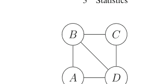

图 3.57 对数线性模型 {[ABC], [BD], [DEF]} 的图模型

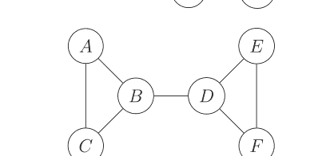

由 {[ABCD]} 生成的所有二阶项都包含在该模型中，即 [AB]、[AC]、[AD]、[BC]、[BD]、[CD]。同样，{[CDE]} 生成的以下二阶项也包含在模型中：[CD]、[CE]、[DE]。反之，如果一个模型包含像 {[AB], [BC], [AC]} 这样的二阶项，那么为了成为一个图模型，它必须包含更高阶的项 [ABC]。

因为饱和模型是包含所有可能二阶项的图模型，所以任何对数线性模型都可以嵌入到一个图模型中。因此，为了解释一个对数线性模型，我们希望找到包含该对数线性模型的最小图模型。例如，非图模型 {[AB][AC][AD][BC]} 被嵌入到图模型 {[ABC][AD]} 中，该图模型具有条件独立性的解释：在给定 A 的条件下，BC 独立于 D。这种解释适用于被嵌入的非图模型，尽管该非图模型涉及额外的约束。考虑图 3.56 所示的对数线性模型 {[ABD], [BCD]}。

回想一下，团（clique）是一个所有节点都相互连接的图。将对数线性模型视为图模型的另一种方式是，将生成类中的项视为一个极大团（即，不被包含在更大的团中）。通过这种解释，很容易从网络图中读出对数线性模型及其独立关系。链（chain）是从一个节点到另一个节点的一系列边。在图模型中使用链的主要定理指出：如果节点集 A、B 和 C 是互不相交的节点子集，并且（当且仅当）A 中的节点和 B 中的节点之间的每条链都至少包含 C 中的一个节点，那么在给定 C 的条件下，A 中的节点和 B 中的节点是独立的。

例如，对于图 3.57，我们可以读出独立关系：在给定 B 的条件下，A 和 C 独立于 D、E、F，这可以表示为 AC ⊥ DEF|B。同样，EF ⊥ ABC|D。边缘关系（即不涉及所有项的关系）也可以从图中读出。例如，AC ⊥ DE|B。

### 3.17.9 模型选择

在如此多的可能对数线性模型之间进行选择是棘手的。主要有两种方法：向后选择法和向前选择法。使用向后选择法时，你从饱和模型开始，然后逐步删除具有最小显著性 $\chi^2$ 统计量的项，直到所有剩余项都达到预先指定的最小显著性水平。向前选择模型基本上相同，但方向相反——从独立模型开始，不断添加项，直到没有项达到预定的最小显著性水平。这两种方法的优点是实现起来很快，但这主要是因为它们考虑了所有可用模型中相对较小的子集。它们也都对初始模型的选择很敏感，而且可能完全错过中间的好模型，有时还需要在过程中进行复杂的重新参数化。

1976 年，Brown 提出通过查看*边缘关联*和*偏关联*度量来在多个提出的模型之间进行导航。边缘关联是当所有其他项被折叠时获得的偏差，并将得到的边缘化表与该表的独立模型进行比较。例如，$[ABC]$ 的边缘关联检验是 $[AB][BC][AC]$ 和 $[ABC]$ 之间的差异偏差，而 $[ABCD]$ 的边缘关联检验是 $[ABC][ABD][ACD][BCD]$ 和 $[ABCD]$ 之间的差异偏差。

偏关联涉及计算包含和不包含感兴趣项的模型之间的差异偏差（见下例）。其思想是，当某个项的偏关联和边缘关联显著不同时，这可能表明存在辛普森悖论。查看这两种关联度量也可以清楚地看出哪些项在最终模型中是重要的。

最好通过例子来理解 Brown 的想法。考虑以下关于蜥蜴栖息行为的数据，这些数据被整理并编码为以下类别：离地高度低于/高于 5 英尺（$h \in \{0, 1\}$），树枝直径低于/高于 2 英寸（$d \in \{0, 1\}$），日照情况为阳光/阴影（$i \in \{0, 1\}$），一天中的时间为早晨/中午/下午（$t \in \{0, 1, 2\}$），物种为 anolis grahami/opalinus（$s \in \{0, 1\}$）。

```
>>> x
<xarray.DataArray (h: 2, d: 2, i: 2, t: 3, s: 2)>
array([[[[[20,  2],
         [ 8,  1],
         [ 4,  4]],

        [[34, 11],
         [69, 20],
         [18, 10]]],

       [[[ 8,  3],
        [ 4,  1],
        [ 5,  3]],

       [[17, 15],
        [60, 32],
        [ 8,  8]]],

      [[[13,  0],
        [ 8,  0],
        [12,  0]],

       [[31,  5],
        [55,  4],
        [13,  3]]],

      [[[ 6,  0],
        [ 0,  0],
        [ 1,  1]],

       [[12,  1],
        [21,  5],
        [ 4,  4]]]])
```

```
Coordinates:
  * h        (h) int64 0 1
  * d        (d) int64 0 1
  * i        (i) int64 0 1
  * t        (t) int64 0 1 2
  * s        (s) int64 0 1
```

为了计算 [dh] 项的边缘关联，我们对所有其他项求和以获得约简表：

```
>>> m = x.sum(('i','t','s'))
>>> m
<xarray.DataArray (h: 2, d: 2)>
array([[201, 164],
       [144,  55]])
Coordinates:
  * h        (h) int64 0 1
  * d        (d) int64 0 1
```

接下来，我们使用此表计算独立模型（我们之前已经做过）以获得

```
>>> indep = reduce(lambda i,j: i*m.sum(j) ,['h','d'],1)/m.sum()
>>> indep
<xarray.DataArray (d: 2, h: 2)>
array([[223.2712766, 121.7287234],
       [141.7287234,  77.2712766]])
Coordinates:
  * d        (d) int64 0 1
  * h        (h) int64 0 1
```

最后，我们计算此独立模型与原始表之间的偏差：

```
>>> float(2*(m*np.log(m/indep)).sum())
16.619383942523577
```

我们可以对所有二阶和三阶项重复此过程，以获得以下摘要，包括自由度和 *p* 值（mpval）：

```
>>> df
    marginal_assoc  dof  mpval
item
 dh          16.619    1  0.000
 hs          26.856    1  0.000
 hi           0.945    1  0.331
 ht           2.317    2  0.314
 ds          18.524    1  0.000
 di           3.574    1  0.059
 dt           3.735    2  0.155
 is           6.472    1  0.011
 st           6.368    2  0.041
 it          47.969    2  0.000
 dhs          0.474    1  0.491
 dhi          0.181    1  0.670
 dht          1.088    2  0.580
 his          2.181    1  0.140
 hst          0.401    2  0.818
 hit          1.070    2  0.586
 dis          0.305    1  0.581
 dst          0.007    2  0.996
 dit          2.373    2  0.305
 ist          1.099    2  0.577
```

请注意，包含 *t* 变量的项有一个额外的自由度，因为 *t* 类别中有三个水平。

偏关联计算包含和不包含给定因子的模型之间的差异偏差。例如，为了计算 [*hd*] 项的偏关联，我们必须首先计算包含*所有*二阶项的模型，即 [*ht*][*dh*][*hi*][*hs*][*dt*][*di*][*st*][*ds*][*is*]。然后计算*不*包含 [*hd*] 因子的相同模型，并计算这两个模型之间的偏差。结果总结在扩展的数据框中：

```
>>> df
    marginal_assoc  dof  mpval  partial_assoc  ppval
item
 dh          16.619    1  0.000          9.821  0.002
 hs          26.856    1  0.000         22.010  0.000
 hi           0.945    1  0.331          0.034  0.853
 ht           2.317    2  0.314          2.532  0.282
 ds          18.524    1  0.000         12.703  0.000
 di           3.574    1  0.059          0.806  0.369
 dt           3.735    2  0.155          2.682  0.262
 is           6.472    1  0.011          7.562  0.006
 st           6.368    2  0.041         11.453  0.003
 it          47.969    2  0.000         48.896  0.000
 dhs          0.474    1  0.491          0.318  0.573
 dhi          0.181    1  0.670          0.393  0.531
 dht          1.088    2  0.580          1.481  0.477
 his          2.181    1  0.140          3.714  0.054
 hst          0.401    2  0.818          1.648  0.439
 hit          1.070    2  0.586          2.976  0.226
 dis          0.305    1  0.581          0.040  0.841
 dst          0.007    2  0.996          0.011  0.994
 dit          2.373    2  0.305          2.497  0.287
 ist          1.099    2  0.577          2.654  0.265
```

检查上述数据框显示，二阶项 $[it]$ 和 $[hs]$ 具有最高的边缘关联，这表明独立模型在这些因子上表现非常差，因此应将其包含在最终模型中。我们可以从 $\{[it][hs][ds]\}$ 开始，它有 37 个自由度，偏差为 59.26。这对应于图 3.58 中的以下图模型：

我们可以很容易地解释 $(i, t)$ 和 $(h, s, d)$ 是相互独立的，并且 $h \perp d|s$，因此在给定物种的条件下，高度和树枝直径是独立的。按照偏关联的顺序，我们可以添加 $[ts]$ 因子，得到 35 个自由度和 52.9 的偏差。这给出了图 3.59 中更新的图模型。

添加额外的边使我们能够得出结论：在给定 $t$（一天中的时间）的条件下，$i$（日照）独立于 $s$（物种）。此外，$(it)$ 在给定 $s$ 的条件下也独立于 $h$。该模型的 $\chi^2$ $p$ 值为 0.045，使用标准的 0.05 水平处于拒绝的边缘。通过添加 $[hd]$ 项，我们可以将相应的 $p$ 值提高到 0.27，自由度为 34。查看这些值

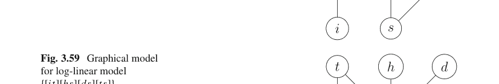


对于部分关联和边际关联，增加三个因子项在自由度或可解释性方面似乎并不值得。请记住，我们寻求的是能拟合数据的最小合理模型。[hd]项很可能存在是因为树枝会随高度变细。[it]项表明日照和一天中的时间存在交互作用，这可能是由于昼夜循环。模型进一步表明，两个物种在树枝高度、直径和一天中的时间方面有不同的偏好。这些都是仅通过观察原始五维表格难以提出的见解（以及其他见解）！

### 3.17.10 表格拉平

IPF算法可以通过强制边际总和加到相同的数字（通常是100）来帮助解释列联表，这使得解释单个表格单元格更容易。这被称为*表格拉平*。主要假设是任何偏差仅限于对类别频率的错误表示，而不是它们之间的联合关系。这意味着，如果你以某种方式生成假样本来填充边际总和，变量之间的联合关系对于对数线性模型将保持不变，这等同于说主效应项是不正确的，但所有交互作用都是正确的。

让我们考虑以下关于政党分类和简单独立模型的示例数据框：

```
>>> data = [[306,279,116],
...         [185,312,194],
...         [26,134,338]]
>>> x = xr.DataArray(data,
...     coords = {'i':['democrat','independent','republican'],
...                'j':['liberal','moderate', 'conservative'], }
...     )
```

现在，我们设置通常的IPF迭代：

```
>>> mui =x.copy() # 初始化

>>> for i in range(6):
...     mui = 100/mui.sum('i') * mui
...     mui = 100/mui.sum('j') * mui # 强制边际总和为100
...
>>> mui
<xarray.DataArray (i: 3, j: 3)>
array([[55.01212733, 32.45331276, 12.53455991],
       [36.74463004, 40.09540122, 23.15996874],
       [ 8.23156706, 27.44933262, 64.31910032]])
Coordinates:
  * i        (i) <U11 'democrat' 'independent' 'republican'
  * j        (j) <U12 'liberal' 'moderate' 'conservative'
```

请注意，边际总和现在都近似等于100。

```
>>> mui.sum('i')
<xarray.DataArray (j: 3)>
array([ 99.98832443,  99.9980466 , 100.01362897])
Coordinates:
  * j        (j) <U12 'liberal' 'moderate' 'conservative'

>>> mui.sum('j')
<xarray.DataArray (i: 3)>
array([100., 100., 100.])
Coordinates:
  * i        (i) <U11 'democrat' 'independent' 'republican'
```

优点是新的拉平表格比原始数据更容易解释，我们可以看到政治独立人士相比民主党和共和党群体，最强烈地倾向于温和派。

```
>>> mui.sel({'i': 'independent'})
<xarray.DataArray (j: 3)>
array([36.74463004, 40.09540122, 23.15996874])
Coordinates:
    i        <U11 'independent'
  * j        (j) <U12 'liberal' 'moderate' 'conservative'
```

## 3.18 缺失数据

缺失数据很常见，通常通过简单地省略任何不完整的案例并继续处理剩余数据来处理。这种方法的问题在于，它可能导致估计参数出现严重偏差，并引发有害的下游后果。例如，在医疗应用中，收集患者密集且完整的特征集成本高昂，但忽略缺失数据并仅保留那些完整记录意味着模型偏向于那些能够负担昂贵诊断费用的人。如果模型旨在用于富裕患者，他们能够轻松获得高质量的医疗诊断，这可能是可以接受的，但其他人呢？这种模型的最终结果是在那些因缺失数据而仅部分代表的群体中表现不佳。

处理缺失数据的另一种常见策略是用固定数字（如零）填充缺失值。这同样是另一种形式的偏差，因为它将模型参数拉向优化原点附近的损失函数，如果零甚至不在数据的定义域内，这尤其糟糕。还有一种策略是用该列非缺失值的均值或中位数填充给定列中的缺失行元素。这同样是另一种形式的偏差，因为它本质上断言缺失数据实际上可以从观测数据中推导出来，这就引出了一个问题：如果一部分数据完全可以从子集中推导出来，那么为什么要收集如此多的数据。也就是说，与观测数据*不同*的新信息的*潜力*现在在缺失元素中丢失了。

缺失数据有许多微妙的问题，因此我们必须首先对这些场景进行分类，然后才能弄清楚如何处理它们。

**缺失类别** 假设 $R$ 是存储缺失 $Y$ 位置的二进制矩阵，其中1表示数据存在，0表示缺失；$\psi$ 是缺失数据模型的参数。*缺失*模型是生成 $R$ 矩阵的概率机制。

完全随机缺失（MCAR）意味着缺失的概率仅取决于 $\psi$，而不取决于 $Y$ 变量。这意味着所有元素的缺失概率相同。也就是说，缺失数据的原因与数据本身无关。从数学上讲，这意味着数据缺失的概率仅是缺失模型参数（$\psi$）的函数，而不是任何其他变量 $Y_{obs}$ 的函数，

$$\mathbb{P}(R = 0 | Y_{obs}, Y_{mis}, \psi) = \mathbb{P}(R = 0 | \psi)$$

随机缺失（MAR）意味着缺失概率可能取决于观测信息 $Y_{obs}$。MAR表示在由观测数据定义的层内，缺失概率是相等的。例如，假设我们正在测量体重，并且由于秤的机械问题，当秤放置在软表面而不是硬表面上时，我们会以一定的概率得到缺失数据。如果我们记录测量是在硬表面还是软表面进行的，并且在每个组内我们都有MCAR，那么对于整个实验，我们就有MAR。关键思想是我们观察到了将数据划分为MCAR的变量。从数学上讲，这意味着一个元素缺失的概率不仅是缺失模型的函数，也是观测到的 $Y$ 值的函数。

$$\mathbb{P}(R = 0 | Y_{obs}, Y_{mis}, \psi) = \mathbb{P}(R = 0 | Y_{obs}, \psi)$$

非随机缺失（MNAR）不会产生任何简化，这意味着缺失数据的概率取决于观测和未观测的信息。MNAR是除MCAR或MAR之外的情况，包括缺失数据概率取决于未知变量的概念。对于秤的例子，可能是秤在任一表面上使用后校准出现问题，从而影响缺失概率。校准问题可能对我们来说是未知的。

使用上面的 $\psi$ 变量给人一种印象，即这是我们需要从数据中估计的东西。我们实际上更愿意忽略 $\psi$，因为这处理的是缺失性问题，而不是 $Y_i$ 数据的嵌入参数 $\theta$，而后者才是我们的主要目标。这个问题由Little和Rubin在2002年通过*可忽略性*的概念阐明。也就是说，如果（1）数据是MAR，并且（2）（$\psi, \theta$）的联合参数空间分别是 $\psi$ 和 $\theta$ 参数空间的乘积，那么缺失数据机制对于似然推断是可忽略的。这是另一种说法，即 $\psi$ 和 $\theta$ 之间没有函数关系。

可忽略性的概念对于插补模型很重要。在可忽略性下，

$$\mathbb{P}(Y_{mis}|Y_{obs}, R) = \mathbb{P}(Y_{mis}|Y_{obs})$$

这意味着

$$\mathbb{P}(Y|Y_{obs}, R=1) = \mathbb{P}(Y|Y_{obs}, R=0)$$

这意味着我们可以从观测数据建模后验分布，并使用此模型来插补缺失数据。也就是说，如果我们没有可忽略性，那么我们必须将 $R$ 包含到后验分布中。实际上，这意味着我们必须为后验分布开发两个模型，一个用于 $R=1$，另一个用于 $R=0$。上面的MAR要求很重要。例如，如果我们测量不同性别的体重并假设可忽略性，那么特定性别的缺失数据可以从*同一*性别的其他数据中插补，而不是跨不同性别。可能可忽略性并不合适，例如在缺失数据基于测量本身的情况下。也就是说，可能存在某些因素，根据测量本身增加了某一性别的缺失数据。这种情况需要仔细的数据收集设计和更先进的建模技术。多重插补的目标是获得对整个群体有效的感兴趣参数估计，就好像它从一开始就是可用的一样。因为缺失从根本上代表了信息的缺乏，人们只能说插补下的估计群体参数*平均而言*应等于目标群体参数。

**示例** 让我们考虑一个简单的缺失模型来说明这些类别。考虑以下一对联合分布的高斯随机变量，其中 $(Y_1, Y_2) \sim \mathcal{N}(\mathbf{0}, \rho=0.5)$。在这种情况下，$Y_2$ 根据以下缺失数据模型缺失（$R_2=0$）：

$$\mathbb{P}_M(R_2=0) = \psi_0 + \frac{\exp Y_1}{1+\exp Y_1}\psi_1 + \frac{\exp Y_2}{1+\exp Y_2}\psi_2$$

在完全随机缺失（MCAR）下，我们有 $\boldsymbol{\psi} = (0.5, 0, 0)$，这意味着 $Y_2$ 是否缺失不取决于任一 $Y_i$ 变量。在随机缺失（MAR）下，我们有 $\boldsymbol{\psi} = (0, 1, 0)$，这意味着缺失 $Y_2$ 的概率取决于观测变量 $Y_1$。重要的是，没有 $\psi_0$，这意味着缺失的 $Y_2$ 没有任意性。在非随机缺失（MNAR）下，我们有 $\boldsymbol{\psi} = (0, 0, 1)$，这意味着缺失 $Y_2$ 的概率是 $Y_2$ 的函数。以下代码说明了此缺失模型：

```python
>>> from scipy.stats import multivariate_normal, bernoulli
>>> from scipy.special import expit
>>> import pandas as pd
>>> rho = 0.5 # 相关系数
>>> rv = multivariate_normal([0,0],[[1,rho],[rho,1]])
>>> Ns = 2000
>>> df = pd.DataFrame(data=rv.rvs(Ns),columns=['Y_1','Y_2'])
>>> df['MCAR'] = bernoulli(0.5).rvs(Ns)
>>> df['MAR'] = bernoulli(expit(df.Y_1)).rvs()
>>> df['MNAR'] = bernoulli(expit(df.Y_2)).rvs()
>>> df.head()
   Y_1    Y_2  MCAR  MAR  MNAR
0 -0.504  0.030     0    0     1
1  0.263  0.959     1    1     1
2  0.844  1.451     0    1     0
3 -0.390 -0.830     1    1     0
4  0.432 -0.115     1    0     0
```

现在，我们可以计算在省略每种缺失类别案例后的相关矩阵：

```
>>> df.loc[df.MCAR==1 ,['Y_1','Y_2']].corr()
          Y_1    Y_2
Y_1  1.000  0.486
Y_2  0.486  1.000

>>> df.loc[df.MAR==1 ,['Y_1','Y_2']].corr()
          Y_1    Y_2
Y_1  1.000  0.506
Y_2  0.506  1.000

>>> df.loc[df.MNAR==1 ,['Y_1','Y_2']].corr()
          Y_1    Y_2
Y_1  1.000  0.501
Y_2  0.501  1.000
```

尽管机制上相似，但插补并非预测。区别在于，预测是试图重新创建丢失的数据，而插补则是试图从不完整的数据中获得统计上有效的推断。例如，要开发一个预测模型，我们可以从一个完整的数据集开始，然后移除某些元素以人为地制造缺失，再根据预测模型替换这些元素。我们自然会选择使原始完整数据与用预测值填充的数据之间差异（例如，最小化两个数据集之间的均方误差）最小化的预测模型。这个过程的问题在于，预测模型是针对存在的最可能值进行优化的，从而削弱了实际不完整数据中的不确定性。例如，在真实的不完整数据中，缺失数据可能代表了大多数困难案例，而预测模型仅针对观测值进行优化，因此低估了缺失数据中的不确定性，而这些不确定性无法影响解决方案。

### 标准方法

让我们快速回顾一些数据插补的标准方法。

- 列表删除法：删除所有包含缺失数据的案例。这会导致偏差并丢失有价值的数据。这也称为仅完整案例法。
- 均值插补：用列均值替换缺失数据行。它计算快速简便，但会低估方差并扭曲变量之间的关系。当数据不是完全随机缺失时，它会偏差除均值以外的任何其他估计。
- 回归插补：为观测数据构建一个模型，然后用该模型的预测值填充缺失值。这在完全随机缺失下给出均值的无偏估计，在随机缺失下，*如果*影响缺失的因素是回归模型的一部分，则给出无偏估计。插补数据的变异性被系统性地低估。如果现有模型是*完美的*，该方法会产生现实的预测值，这意味着最初没有任何信息缺失。
- 随机回归插补：类似于回归插补，但向模型添加噪声。它保留了回归权重和变量之间的相关性。主要思想是从残差分布中随机抽取。
- 指示变量法：为每个缺失值添加一个零，并通过该变量的响应指示变量扩展回归模型。即使在完全随机缺失下，也会产生有偏的回归估计。

最著名的通用方法是多重插补，它是一种随机回归方法。

### 3.18.1 多重插补

多重插补非常通用。主要思想是为单个不完整的数据集计算多个完整数据集，然后跨这些数据聚合所需的统计量。

1.  从不完整数据集开始，通过从专门为缺失条目建模的分布中抽取的合理生成数据替换缺失值。每个生成的数据集在观测值方面是相同的，但在插补值方面不同。
2.  从每个新完成的数据集中分别估计感兴趣的参数。这些参数对于每个完成的数据集是不同的。
3.  汇总推导出的参数，并创建一个具有相应方差的单一合并估计。该方差结合了插补内（每个完成的数据集）方差和由缺失数据引起的新方差（插补间方差）。

这里的主要优势是多重插补将缺失数据问题的解决方案与完整数据问题的解决方案（即估计所需的统计量）分离开来。这提供了洞察力。缺点是，对于具有许多变量（即许多数据列）的大型数据集进行插补，计算成本可能很高。

**缺失信息比例**

考虑 $K$ 个插补数据集，令 $e_i$ 为参数 $\theta$ 的估计值，$U_i$ 为这些估计值的相应估计样本方差。多重插补估计如下：

$$\bar{e}_{MI} = \frac{1}{K} \sum e_i$$

以下衡量 $K$ 个插补条目之间的方差：

$$B_M = \frac{1}{K-1} \sum_{i=1}^K (e_i - \bar{e}_{MI})^2$$

多重插补抽样方差定义如下，

$$T_M = \bar{U}_M + \left(1 + \frac{1}{K}\right) B_M$$

其中

$$\bar{U}_M = \frac{1}{K} \sum_{i=1}^K U_i$$

是完成数据抽样方差的平均值。根据这些定义，比率

$$r_M = \left(1 + \frac{1}{K}\right) \frac{B_M}{T_M}$$

是由于缺失数据导致的方差比例增加。这被称为缺失信息比例。此外，

$$a_M = \frac{T_M}{\bar{U}_M}$$

是多重插补估计相对于观测数据估计的效率。这些量用于确定所需的插补次数、缺失数据对下游推断的影响，并判断通过插补从具有部分信息的受试者中恢复信息的情况。例如，如果缺失信息比例小于仅完整案例分析中将被丢弃的受试者比例，则信息已通过包含部分观测的受试者得以恢复。这种信息的恢复取决于正在估计的参数 $\theta$ 和观测受试者中的信息。

$\theta$ 的 t 分布置信区间具有以下自由度：

$$v_M = (K - 1)/r_M^2 \quad (3.24)$$

对于 $\theta$ 的置信区间

$$\hat{\theta}_{MI} = \bar{e}_{MI} \pm t_{\alpha/2, v_M} \sqrt{T_M}$$

#### 多重插补的理论贝叶斯证明

令 $\beta$ 为我们想要估计的参数，$\mathbf{Y}_M$ 和 $\mathbf{Y}_O$ 分别为缺失数据和观测数据。我们真正想要的是 $f(\beta, \mathbf{Y}_M | \mathbf{Y}_O)$。从贝叶斯的角度来看，$\mathbf{Y}_M$ 是一个所谓的干扰参数，它阻碍了我们估计 $\beta$ 的目标。我们可以将其展开为以下形式：

$$f(\beta, \mathbf{Y}_M | \mathbf{Y}_O) = f(\mathbf{Y}_M | \mathbf{Y}_O) f(\beta | \mathbf{Y}_M, \mathbf{Y}_O)$$

然后对 $\mathbf{Y}_M$ 进行边缘化以获得以下结果：

$$f(\beta | \mathbf{Y}_O) = \mathbb{E}_{\mathbf{Y}_M | \mathbf{Y}_O} \{ f(\beta | \mathbf{Y}_M, \mathbf{Y}_O) \}$$

在标准正则条件下，可以交换积分顺序以获得感兴趣参数 $\beta$ 的后验均值和方差

$$\mathbb{E}(\beta | \mathbf{Y}_O) = \mathbb{E}_{\mathbf{Y}_M | \mathbf{Y}_O} \{ \mathbb{E}_{\beta | \mathbf{Y}_M, \mathbf{Y}_O} (\beta) \}$$
$$\mathbb{V}(\beta | \mathbf{Y}_O) = \mathbb{E}_{\mathbf{Y}_M | \mathbf{Y}_O} \{ \mathbb{V}_{\beta | \mathbf{Y}_M, \mathbf{Y}_O} (\beta) \} + \mathbb{V}_{\mathbf{Y}_M | \mathbf{Y}_O} \{ \mathbb{E}_{\beta | \mathbf{Y}_M, \mathbf{Y}_O} (\beta) \}$$

其中我们对上面的方差使用了全方差定律。所有这些工作的目的是产生一些我们可以使用从 $f_{\mathbf{Y}_M | \mathbf{Y}_O}$ 密度中抽取的 $K$ 个样本来近似的东西

$$\mathbb{E}(\beta | \mathbf{Y}_O) \simeq \frac{1}{K} \sum_{k=1}^K \left\{ \mathbb{E}_{\beta | \tilde{\mathbf{Y}}_{M,k}, \mathbf{Y}_O} (\beta) \right\} = \hat{\beta}$$

相应的$$\mathbb{V}(\boldsymbol{\beta}|\mathbf{Y}_O) \simeq \frac{1}{K} \sum_{k=1}^K \mathbb{V}_{\boldsymbol{\beta}|\tilde{\mathbf{Y}}_{M,k},\mathbf{Y}_O}(\boldsymbol{\beta}) + \frac{1}{K-1} \sum_{i=1}^K \left\{ \mathrm{E}_{\boldsymbol{\beta}|\tilde{\mathbf{Y}}_{M,k},\mathbf{Y}_O}(\boldsymbol{\beta}) - \hat{\boldsymbol{\beta}} \right\} \left\{ \mathrm{E}_{\boldsymbol{\beta}|\tilde{\mathbf{Y}}_{M,k},\mathbf{Y}_O}(\boldsymbol{\beta}) - \hat{\boldsymbol{\beta}} \right\}^T$$

请记住，为了计算上述求和，我们必须刻画 $f_{\mathbf{Y}_M|\mathbf{Y}_O}$ 的分布。然而，完整的后验密度 $f(\boldsymbol{\beta}, \mathbf{Y}_M|\mathbf{Y}_O)$ 通常无法仅由前两阶矩来刻画。这正是伯恩斯坦-冯·米塞斯定理发挥作用的地方。伯恩斯坦-冯·米塞斯定理适用于完整数据估计方程为似然得分方程的情况。简而言之，该定理指出，随着样本量的增加，联合后验分布趋近于多元正态分布。此外，随着样本量的增加，似然函数将主导先验分布，因此可以使用似然函数的众数（即最大似然估计量）来获得上述所需的矩。由于对 $\mathbf{Y}_M$ 进行了先验边缘化，因此只有由此产生的后验部分以这种方式被近似，这提高了近似精度。更多细节见文献[7]。

### 3.18.2 多重插补的典型示例

**已知方差（$\sigma^2$）的正态分布** 在本节中，我们将研究多重插补估计量的均值和方差估计为精确值的情况。考虑 $n$ 个样本，其中 $Y \sim \mathcal{N}(\mu, \sigma)$，$\sigma$ 是先验已知的，$n_O$ 为观测值数量，$n_M$ 为缺失项数量。为了构建每个插补数据集，我们必须从后验密度 $\mathbf{Y}_M|\mathbf{Y}_O$ 中抽样。给定观测项，我们计算 $\mu$ 的无偏估计量

$$\hat{\mu} = \frac{1}{n_O} \sum_{i \in \mathcal{O}} Y_i$$

其对应的方差为

$$\mathbb{V}(\hat{\mu}) = \frac{\sigma^2}{n_O}$$

根据伯恩斯坦-冯·米塞斯定理，我们知道此情况下的后验分布为 $f(\mu|\mathbf{Y}_O) \sim \mathcal{N}(\mu, \sigma^2)$，我们将其近似为 $\mathcal{N}(\hat{\mu}, \sigma^2)$。尽管如此，为了完成插补过程，我们必须为 $\mathbf{Y}_M|\mathbf{Y}_O$ 设计一个后验分布，我们将其定义如下：

$$\mathbf{Y}_M | \mathbf{Y}_O \sim \mathcal{N}\left(\hat{\mu}\mathbf{1}_{n_M}, \sigma^2\left(\mathbf{I}_{n_M} + \frac{1}{n_O}\mathbf{1}_{n_M}\mathbf{1}_{n_M}^T\right)\right)$$

对于多重插补中的第 $k$ 次迭代，我们必须抽取缺失值并将其放入均值的估计量中：

$$\bar{Y}_k = \frac{1}{n}\left(\sum_{i \in \mathcal{M}} Y_{m,i} + n_O\hat{\mu}\right)$$

可以很容易地证明

$$\mathbb{E}_{\mathbf{Y}_M | \mathbf{Y}_O}(\bar{Y}_k) = \hat{\mu}$$

请记住，对于固定的 $\mathbf{Y}_O$，$\hat{\mu}$ 也是固定的，因为它是观测数据的函数。因此，我们有：

$$\bar{Y}_k \sim \mathcal{N}\left(\hat{\mu}, \sigma^2\frac{n_M}{n^2} + \sigma^2\frac{n_M^2}{n^2n_O}\right)$$

请注意，方差中的第二项来自上述 $\mathbf{Y}_M | \mathbf{Y}_O$ 协方差矩阵中的非对角线项。均值的多重插补估计量如下：

$$\hat{\mu}_{MI} = \frac{1}{K}\sum_{k=1}^K \bar{Y}_k$$

重要的是，这是 $\hat{\mu}$ 的一个无偏估计量，

$$\mathbb{E}_{\mathbf{Y}_M | \mathbf{Y}_O}(\hat{\mu}_{MI}) = \hat{\mu}$$

并且 $\bar{Y}_k$ 是相互独立的。因此，我们有：

$$\mathbb{V}_{\mathbf{Y}_M | \mathbf{Y}_O}(\hat{\mu}_{MI}) = \frac{1}{K}\frac{n_M\sigma^2}{n^2} + \frac{1}{K}\frac{n_M^2\sigma^2}{n^2n_O}$$

为了消除对 $\mathbf{Y}_O$ 的条件并获得无条件方差，我们使用全方差公式：

$$\mathbb{V}(\hat{\mu}_{MI}) = \mathbb{E}(\mathbb{V}(\hat{\mu}_{MI} | \mathbf{Y}_O)) + \mathbb{V}(\mathbb{E}(\hat{\mu}_{MI} | \mathbf{Y}_O))$$

代入先前各项，并认识到我们是在对 $Y_O \sim \mathcal{N}(\mu, \sigma^2)$ 取期望，我们得到：

$$\mathbb{V}(\hat{\mu}_{MI}) = \left( \frac{\sigma^2}{n_O} + \frac{1}{K} \frac{n_M \sigma^2}{n^2} + \frac{1}{K} \frac{n_M^2 \sigma^2}{n^2 n_O} \right) = \frac{\sigma^2}{n_O} \left( 1 + \frac{1}{K} \frac{n_M}{n} \right)$$

如前所述，多重插补过程为此估计量提供了均值和方差的估计。取

$$\mathbb{E}(\bar{U}_M) = \frac{\sigma^2}{n}$$

同样地，

$$\mathbb{E}(B_M) = \frac{n_M \sigma^2}{n n_O}$$

我们得到：

$$\mathbb{E}(T_M) = \mathbb{E}(\bar{U}_M) + \left( 1 + \frac{1}{K} \right) \mathbb{E}(B_M) = \frac{\sigma^2}{n_O} \left( 1 + \frac{1}{K} \frac{n_M}{n} \right)$$

这与我们之前不使用多重插补估计量得到的结果完全一致。这说明多重插补并非凭空捏造数据，因为这些关系在此典型情况下会自动出现。其微妙之处在于为缺失项抽样而设计的后验分布 $\mathbf{Y}_M \sim \mathbf{Y}_O$。

对于更一般的未知 $\sigma^2$ 情况，遵循相同的过程，只是现在插补值分布的 $\sigma^2$ 项必须从一个新的分布中抽取。基于费雪-科克伦定理，一个好的选择是：

$$\sigma^2 | \mathbf{Y}_O \sim \frac{(n_O - 1) S_O}{X^2}$$

其中 $X^2 \sim \chi^2_{n_O - 1}$，$S_O$ 是观测数据的通常样本方差。首先，从 $\chi^2_{n_O - 1}$ 中抽取样本 $v$，然后计算方差值为 $\sigma_s^2 = (n_O - 1) S_O / v$，并将其用于公式 3.25 中后验分布 $\mathbf{Y}_M | \mathbf{Y}_O$ 的方差。这意味着使用 $\sigma_s^2$ 代替 $\sigma^2$，并像之前一样继续。关键细节是确保为使用公式 3.25 生成的每次多重插补试验抽取新的样本。具体来说，每次多重插补试验使用的均值是 $\mathcal{N}(\hat{\mu}, \sigma_s^2)$ 的一个样本，并且 $\sigma_s^2$ 用于公式 3.25 中的后验分布。从该后验分布中抽取的样本用于填充多重插补的缺失行。

### 3.18.3 多重插补的实例详解

多重插补涉及许多环节，因此让我们详细编写一个具体示例，看看本节讨论的所有内容如何结合在一起。在此示例中，我们不会使用将各个插补数据集的最终估计值进行合并的聚合公式，而是检查由插补生成的估计参数的直方图。这能更好地感受插补过程如何生成用于最终估计聚合的参数。

考虑以下缺失模型：

$$P_M = \text{Bernoulli}\left(p = \mathcal{S}\left(-1 - \frac{1}{2}\delta - \frac{1}{2}\xi + 3\xi\delta\right)\right)$$

其中 $\mathcal{S}(\cdot)$ 是 logit 函数的反函数，即 sigmoid 函数。

$$\mathcal{S}(x) = \frac{1}{1 + e^{-x}}$$

注意，$P_M$ 是 $\xi$、$x$ 和 $\delta$ 的概率函数，这些变量在数据中是可观测的。这意味着每一行的缺失数据概率模型是不同的，因为每一行可能具有不同的 $\xi$ 和 $\delta$ 值。给定 $x \sim \mathcal{N}(0, 1)$，我们定义如下：

$$\xi \sim \text{Bernoulli}\left(p = \mathcal{S}\left(\frac{1}{4} + \frac{3}{4}x\right)\right)$$

$$\delta \sim \text{Bernoulli}\left(p = \mathcal{S}\left(-\frac{1}{2} + \frac{1}{2}\xi + \frac{1}{2}x\right)\right)$$

以下代码根据 $P_M$ 将行标记为缺失。

```python
>>> from scipy.stats import norm
>>> def gen_data(nsamples=1000):
...     x = norm(0,1).rvs(nsamples)
...     # independent exposure variable
...     xi = bernoulli(expit(0.25+0.75*x)).rvs()
...     # binary dependent variable
...     d = bernoulli(expit(-0.5+0.5*xi+0.5*x)).rvs()
...     df = pd.DataFrame(dict(x=x,xi=xi,d=d))
...     # missingness model
...     missing = bernoulli(expit(-1-0.5*d-0.5*xi+3*d*xi)).rvs()
...     df['missing']=missing.astype(bool)
...     return df
...
```

请注意，missing==True 意味着整行数据缺失。下一个代码块为此数据创建一个样本：

```
>>> df = gen_data()
>>> df.head()
      x  xi  d  missing
0 -0.997   1  0     True
1 -0.220   1  0    False
2 -0.005   1  1     True
3 -0.178   1  0    False
4 -0.130   0  0    False
```

以下函数模拟了数据。我们的目标是计算 $\delta$ 关于 $x$ 和 $\xi$ 的逻辑回归。我们希望理解缺失性对由此得出的回归系数（包括截距项）的影响。

> **编程提示**
> Statsmodels 的 smf 模块允许以更自然的格式指定回归公式，类似于 R 语言。例如，`d ~ x + y` 表示变量 `d` 是 `x` 和 `y` 的函数，其中截距项是隐含的。

```
>>> import statsmodels.formula.api as smf
>>> def run_simulation(n=1000):
...     df = gen_data(n)
...     # 截距项是隐含的
...     r = smf.logit('d ~ xi + x',df).fit(disp=False)
...     rm = smf.logit('d ~ xi + x',df[-df.missing]).fit(disp=False)
...     return pd.DataFrame(dict(complete=r.params,nonmissing=rm.params))
...
```

对于每次模拟运行，我们收集由此得出的逻辑回归参数。图 3.60 显示了模拟数据逻辑回归截距值的直方图。红色垂直线表示真实值（即 $-1/2$）。注意在缺失数据情况下估计值的显著偏差。重要的是，由于缺失模型依赖于列本身的值，它并非简单地降低统计功效（即缩小由此计算出的逻辑回归参数的方差）；它*导致*了这种偏差。图 3.61 和图 3.62 显示了逻辑回归中 $\xi$ 和 $x$ 项的其他估计系数的相应直方图。

```
>>> res = pd.concat([run_simulation() for i in range(500)])
>>> res.head()
          complete  nonmissing
Intercept  -0.868      -0.757
xi          0.841      -0.555
x           0.395       0.404
Intercept  -0.393      -0.282
xi          0.315      -0.888
```

让我们从解析角度研究缺失模型 $P_M$，以便理解它如何驱动我们观察到的偏差。微妙之处在于随机变量如何相互作用。请记住，数据的每一*行*都有其基于该行值的独特伯努利分布。首先，让我们考虑 $\xi$ 变量：

$$\xi \sim \text{Bernoulli}\left(\mathscr{S}\left(\frac{1}{4} + \frac{3}{4}x\right)\right)$$

$\xi = 1$ 的概率如下：

$$\mathbb{E}_X\left(\mathscr{S}\left(\frac{1}{4} + \frac{3}{4}x\right)\right) \approx 0.555$$

并通过我们的模拟数据进行验证。

```
>>> (df.xi==1).mean()
0.538
```

给定以下条件：

$$\delta \sim \text{Bernoulli}\left(\mathscr{S}\left(-\frac{1}{2} + \frac{1}{2}\xi + \frac{1}{2}x\right)\right)$$

期望的 $\mathbb{P}(\delta = 1)$ 如下：

$$\mathbb{E}_{X,\xi}\left(\mathcal{S}\left(-\frac{1}{2}+\frac{1}{2}\xi+\frac{1}{2}x\right)\right) = \mathbb{E}_X\left(\mathcal{S}\left(-\frac{1}{2}+\frac{1}{2}x\right)\left(1-\mathcal{S}\left(\frac{1}{4}+\frac{3}{4}x\right)\right) + \mathcal{S}\left(\frac{1}{2}x\right)\mathcal{S}\left(\frac{1}{4}+\frac{3}{4}x\right)\right)$$
$$\approx 0.1523 + 0.2972 = 0.4495$$

这与我们的模拟数据大致吻合：

```
>>> (df.d==1).mean()
0.416
```

为了考虑 $\xi, \delta$ 的联合概率，我们必须考虑 $\xi \in \{0, 1\}$ 和 $\delta \in \{0, 1\}$ 的四种情况。对于 $\delta = 0 \land \xi = 0$ 的情况，

$$\mathbb{E}_X\left(\left(1-\mathcal{S}\left(\frac{x}{2}-\frac{1}{2}\right)\right)\left(1-\mathcal{S}\left(\frac{3x}{4}+\frac{1}{4}\right)\right)\right) \approx 0.2923$$

对于 $\delta = 0 \land \xi = 1$ 的情况，

$$\mathbb{E}_X\left(\mathcal{S}\left(\frac{3x}{4}+\frac{1}{4}\right)\left(1-\mathcal{S}\left(\frac{x}{2}\right)\right)\right) \approx 0.2581$$

对于 $\delta = 1 \land \xi = 0$ 的情况，

$$\mathbb{E}_X\left(\mathcal{S}\left(\frac{x}{2}-\frac{1}{2}\right)\left(1-\mathcal{S}\left(\frac{3x}{4}+\frac{1}{4}\right)\right)\right) \approx 0.1523$$

对于 $\delta = 1 \land \xi = 1$ 的情况，

$$\mathbb{E}_X\left(\mathcal{S}\left(\frac{3x}{4}+\frac{1}{4}\right)\mathcal{S}\left(\frac{x}{2}\right)\right) \approx 0.2971$$

我们可以使用模拟数据快速验证这些值：

```
>>> df.groupby(['d', 'xi'])['x'].count().unstack()/len(df)
xi          0         1
d
0    0.316  0.268
1    0.146  0.270
```

为了计算缺失概率（$P_M$），我们为 $\delta$ 和 $\xi$ 的每种情况计算 $P_M$ 的逻辑 sigmoid 函数，为清晰起见，将其整理在表 3.4 中。然后，对这些条目取 $\mathbb{E}_X$ 得到以下结果：

$$\begin{pmatrix} 0.0786242 & 0.047093 \\ 0.0277916 & 0.217241 \end{pmatrix}$$

#### 表 3.4 计算 $P_M$ 的各项

| | $\delta$ | |
|---|---|---|
| | 0 | 1 |
| $\xi$ | 0 | $\mathcal{S}(-1)\left(1-\mathcal{S}\left(\frac{x}{2}-\frac{1}{2}\right)\right)\left(1-\mathcal{S}\left(\frac{3x}{4}+\frac{1}{4}\right)\right)$ | $\mathcal{S}\left(-\frac{3}{2}\right)\mathcal{S}\left(\frac{3x}{4}+\frac{1}{4}\right)\left(1-\mathcal{S}\left(\frac{x}{2}\right)\right)$ |
| | 1 | $\mathcal{S}\left(-\frac{3}{2}\right)\mathcal{S}\left(\frac{x}{2}-\frac{1}{2}\right)\left(1-\mathcal{S}\left(\frac{3x}{4}+\frac{1}{4}\right)\right)$ | $\mathcal{S}(1)\mathcal{S}\left(\frac{3x}{4}+\frac{1}{4}\right)\mathcal{S}\left(\frac{x}{2}\right)$ |

最后，将这些值相加得到 $\approx 0.3707$。这与我们的模拟数据大致吻合：

```
>>> df.missing.mean()
0.347
```

> **编程提示**
> Fortran 库 QUADPACK 可通过 scipy.integrate 模块使用，并能计算上述期望值。例如，要计算 $\mathbb{E}_X(\mathcal{S}(\frac{1}{4}+\frac{3}{4}x))$，我们可以这样做：

```python
>>> from scipy.stats import norm
>>> from scipy.integrate import quad
>>> nrv = norm(0,1) # N(0,1) 随机变量
>>> f = lambda x: expit(1/4+3/4*x)*nrv.pdf(x) # 被积函数
>>> quad(f,-10,10) # 无需对整个无穷区间积分
(0.555308302603288, 4.393639370728342e-09)
```

上面元组中的第二项是结果的绝对误差。更多详情请参阅 scipy.integrate.quad 文档。

图 3.60、3.61 和 3.62 显示了由缺失性引起的逻辑回归参数的偏差。MI（多重插补）的目的是通过插补能减少这种偏差的数据，从观测数据中榨取更多信息。我们的下一步是通过插补具有未知方差的正态分布变量来实现第 3.18.2 节的解析结果：

```
>>> from scipy import stats
>>> from scipy.stats import multivariate_normal as mvn
>>> def imputeRows(Yo,m=100):
...     '使用观测数据 Yo 插补 m 个项目。'
...     assert m>0
...     n0 = len(Yo)
...     omu = Yo.mean() # 观测均值
...     ovar = Yo.var() # 观测方差
...     mns=[]
...     vars=[]
...     X2 = stats.chi2(n0-1) # 卡方分布
...     v=(n0-1)*ovar/X2.rvs() # 随机变量
...     muhatk=stats.norm(omu,np.sqrt(v/n0)) # 正态分布
...     # Y_M|Y_O 多元正态分布
...     Ymi=mvn(np.ones(m)*muhatk.rvs(),
...             v*np.ones((m,m))/n0+v*np.eye(m)).rvs()
...     # 连接插补数据
...     Yc = np.r_[Ymi,Yo]
...     return Yc
...
```

由于 $\delta$ 和 $\xi$ 是离散的，我们根据这些配对将 $x$ 数据划分为子集。例如，

```
>>> Xvals = df.query('d==0 and xi==0 and not missing')['x']
```

然后我们为该子集中缺失项目的数量插补 $x$：

```
>>> nO = Xvals.shape[0] # 子集中的观测数量
>>> n = df.query('d==0 and xi==0').shape[0] # 每个子集的总数
>>> Xc = imputeRows(Xvals,m=n-nO) # m 是插补数量
>>> tf = pd.DataFrame(dict(x=Xc)).assign(xi=0,d=0) # 构建完整数据
>>> tf.head()
   x  xi  d
0 -2.133  0  0
1  0.138  0  0
2 -0.540  0  0
3 -0.363  0  0
4  0.672  0  0
```

这种方法将问题简化为第 3.18.2 节中基于每个子集的问题，其中每个子集由离散的（$\xi$, $\delta$）对索引。因此，插补 $x$ 所需的参数是从每个子集的观测 $x$ 数据中得出的。然后，插补使用这些参数来填充每个相应子集的缺失数据。下一个函数计算所有子集，然后组装最终的插补数据。

```
>>> def imputeDF(df):
...     def process_subset(df,d,xi):
...         '每个 (d,xi) 对是一个子集'
...         Xvals = df.query(f'd=={d} and xi=={xi} and not missing')['x']
...         # 子集中的观测数量
...         nO = Xvals.shape[0]
...         # 每个子集的总数
...         n = df.query(f'd=={d} and xi=={xi}').shape[0]
...         Xc = imputeRows(Xvals,m=n-nO)
...         # 打包成数据框
...         return pd.DataFrame(dict(x=Xc)).assign(d=d,xi=xi)
...     tf =pd.concat([process_subset(df,i,j)
...                    for i in [0,1] for j in [0,1] ],
...
```

既然我们已经有了一种填补缺失 $x$ 项的方法，我们希望重新运行最初的模拟，即反复进行逻辑回归并考察由此产生的回归系数总体（参见图 3.60、3.61 和 3.62）。然而，在这种情况下，我们为每次运行填补缺失数据，然后考察逻辑回归系数的总体，如图 3.63、3.64 和 3.65 所示，这些图展示了使用填补数据得到的相应直方图。请注意每种情况下的偏差是如何大大减小的。这就是填补缺失数据的巨大价值所在。

```python
>>> def run_MI_simulation(n=1000):
...     # simulate fresh data
...     df = gen_data(n)
...     # do full regression with complete data
...     r=smf.logit('d ~ xi + x',df).fit(disp=False)
...     # do logistic regression with observed data
...     rm=smf.logit('d ~ xi + x',df[-df.missing]).fit(disp=False)
...     # build imputed data
...     tf = imputeDF(df)
...     # do logistic regression on the imputed data
...     tm=smf.logit('d ~ xi + x',tf).fit(disp=False)
...     # assemble and return logistic regression coefficients
...     return pd.DataFrame(dict(complete=r.params,
...                              nonmissing=rm.params,
...                              mi=tm.params))
...
>>> # run simulation to gather logistic regression coefficients
>>> res=pd.concat([run_MI_simulation() for i in range(500)])
```

这个例子突出了以下核心要点：

-   多重插补的主要优势在于它不需要指定插补模型或进行特殊计算。
-   即使插补次数较少，多重插补也能产生良好的估计量。
-   多重插补在估计量（渐近）正态分布时效果最佳。例如，对于逻辑回归，对数优势比尺度是渐近正态分布的。

### 3.18.4 链式方程多重插补 (MICE)

前面的例子使用已知模型为单变量正态分布随机变量插补值。对于一般情况，我们可以使用链式方程多重插补 (MICE)。回想一下我们讨论马尔可夫链蒙特卡洛的吉布斯采样时，我们对联合分布进行边缘化，然后沿每个边缘分布进行采样。这使我们能够在直接采样过于困难时，从复杂的联合分布中采样。类似地，MICE 的主要思想是在给定剩余协变量的条件下对缺失变量进行采样，并使用这些样本来填补缺失值。

$f(Y_{miss}|Y_{obs}, X_1, \dots, X_n)$

因为我们不知道联合分布 $f$，所以无法直接边缘化以获得 $Y_{miss}$ 的样本。这里我们将 $X_i$ 表示为完整的协变量（即没有缺失值），将 $Y_i$ 表示为可能缺失的其他变量。我们用 $Y_{-j}$ 表示除 $j$ 之外的所有 $Y_i$ 变量的集合。

让我们假设列可以按每列缺失值的数量排序，使得第一个 $Y$ 列的缺失值最少。具体来说，算法首先识别缺失值最少的 $Y_1$ 值，然后将 $X_i$ 对 $Y_1$ 进行回归。这会生成回归参数 $\hat{\beta}_1$。下一步是从 $f_{\hat{\beta}_1}(Y_1|X_i)$ 中抽取样本，并使用这些值填补 $Y_1$ 中的缺失值。请注意，每个填补的值都是*不同的*，因为它是从回归的条件分布中随机抽取的。到这一步结束时，我们得到了一个没有缺失值的、新完成的 $Y_1$ 列。接下来，我们取下一个 $Y_2$，并使用 $X_i$ 变量以及新完成的 $Y_1$ 列再次进行回归。同样，这会生成回归参数 $\hat{\beta}_2$，并再次用于从 $f_{\hat{\beta}_2}(Y_2|Y_1, X_i)$ 中采样并填补缺失的 $Y_2$ 值。算法继续处理剩余的 $Y_i$ 变量，直到整个数据集完成。这种方法的灵活性在于我们可以自由选择每个 $Y_i$ 变量的回归模型，并且适用于连续或离散数据。

让我们通过一个基本示例来研究插补连续变量的情况，以减少尝试写出一般情况时带来的符号噪音。假设 $Y_1$ 的缺失条目最少，我们计算以下回归：

$\mathbf{Y}_1 \approx \mathbf{W}\beta + \epsilon$

其中 $\mathbf{W} = [\mathbf{1}, \mathbf{X}]$ 是线性回归的设计矩阵，$\epsilon$ 是均值为零的加性高斯噪声向量。使用普通最小二乘法，这里唯一的随机元素是 $\epsilon$，因此我们可以用通常的方法求解 $\beta$ 的期望值：

$\hat{\beta} = (\mathbf{W}^T\mathbf{W})^{-1}\mathbf{W}^T\mathbf{Y}_1$

我们需要考虑到 $\hat{\beta}$ 是一个随机变量（由于 $\epsilon$），因此我们计算 $\hat{\beta}$ 的协方差矩阵为

$\mathbf{R}_{\hat{\beta}} = \hat{\sigma}_{\epsilon}^2(\mathbf{W}^T\mathbf{W})^{-1}$

其中 $\hat{\sigma}_{\epsilon}^2$ 是估计的残差噪声方差。我们在回归后通过将残差平方和除以回归的自由度来估计这个值。在这种情况下，将有两个估计参数（设计矩阵中的两列），因此这个特定示例的自由度 $k$ 将是 $\mathbf{Y}_1$ 中完整行的数量减去二。

接下来，我们需要通过从二维标准正态分布 $\mathbf{z}$ 中采样，然后使用 $\mathbf{R}_{\hat{\boldsymbol{\beta}}}$ 的 Cholesky 分解来校正估计的协方差，从而计算 $\boldsymbol{\beta}$ 系数的样本。请注意，我们必须从上面提到的具有 $k$ 个自由度的 $\chi^2$ 分布中抽取 $\hat{\sigma}_{\epsilon}^2$ 的样本 $u$。然后，我们使用以下公式计算残差估计方差的样本：

$$\sigma_*^2 = k\hat{\sigma}_{\epsilon}^2 / u$$

现在，当我们进行插补时，我们有 $\mathbf{R}_{\hat{\boldsymbol{\beta}}}$ 的样本如下：

$$\mathbf{R}_{\hat{\boldsymbol{\beta}}} = \sigma_*^2 (\mathbf{W}^T \mathbf{W})^{-1}$$

回想一下 Cholesky 分解 $\mathbf{L}$ 如下：

$$\mathbf{L}\mathbf{L}^T = \mathbf{R}_{\hat{\boldsymbol{\beta}}}$$

因此，对于我们的第一次插补，我们使用 $\mathbf{z}$ 计算回归参数 $\boldsymbol{\beta}$，如下所示：

$$\boldsymbol{\beta}_* = \hat{\boldsymbol{\beta}} + \sigma_* \mathbf{L}\mathbf{z}$$

有了这些采样的回归参数，我们抽取标准正态随机变量 $\mathbf{v}$，然后计算插补的 $Y_{1*}$ 值为

$$Y_{1*} = \mathbf{W}\boldsymbol{\beta}_* + \sigma_* \mathbf{v}$$

请记住，所有这些都只是针对*单次*插补，因此对于多重插补，我们将使用新的随机变量集多次重复相同的过程以构建合并结果。有很多步骤需要跟踪，因此接下来我们将编写一个简短的示例代码，以使这一点更清晰。

**示例** 为了说明 MICE，让我们从联合高斯正态分布中生成一些 500 个样本：

```python
>>> Rcov = np.array([[1, 0.3, 0.2],
...                 [0.3, 1, 0.3],
...                 [0.2, 0.3, 1]])
>>> df = pd.DataFrame(data =
        multivariate_normal(np.zeros(3), Rcov).rvs(500),
...                 columns=['Y1', 'Y2', 'X'])
```

我们希望施加 MAR 缺失性，因此我们计算以下内容：

```python
>>> R1 = expit(df.X+1).round().astype(int) # Y1 column
>>> R2 = expit(df.X+df.Y1+0.5).round().astype(int) # Y2 column
```

请注意，Y1的缺失矩阵R1是始终存在的X1的函数，而R2是X1和Y1的函数。这使得所有情况都满足MAR（随机缺失）条件。接下来，我们生成一个新的数据框，将R矩阵分别应用于每一列。

```python
>>> dfm = df.copy()
>>> dfm.loc[~R1.astype(bool),'Y1'] = np.nan
>>> dfm.loc[~R2.astype(bool),'Y2'] = np.nan
```

让我们看看每一列的缺失数据比例：

```python
>>> dfm.Y1.isna().mean(), dfm.Y2.isna().mean()  # 缺失比例
(0.176, 0.368)
```

注意以下两者之间估计参数的差异：

```python
>>> df.corr()
          Y1        Y2         X
Y1  1.000  0.304  0.244
Y2  0.304  1.000  0.283
X   0.244  0.283  1.000
```

以及dfm的完整案例：

```python
>>> dfm.loc[dfm.apply(lambda i:not i.hasnans,axis=1),:].corr()
          Y1        Y2         X
Y1  1.000  0.170 -0.042
Y2  0.170  1.000  0.124
X  -0.042  0.124  1.000
```

请注意，非对角线的交叉相关项与生成此数据的Rcov矩阵相差甚远，这是由于Y1和Y2列中的缺失数据造成的。

有了这些准备，我们就可以开始MICE（多重插补）了。由于Y1的缺失值最少，我们从以下回归开始：

```python
>>> y1 = smf.ols('Y1 ~ X', data=dfm).fit()
```

这将自动删除Y1中的缺失值。请记住，X没有缺失值。自由度如下：

```python
>>> dof = y1.nobs - 2 # 线性回归中的两个参数
>>> u = stats.chi2(dof).rvs() # 随机卡方变量
>>> sigma_star = np.sqrt(y1.ssr/u)
```

其中ssr是残差平方和。由于statsmodels已经提供了它，我们不必计算W矩阵，可以如下计算Cholesky分解：

```python
>>> L = np.linalg.cholesky(y1.normalized_cov_params *sigma_star**2)
>>> beta_star = y1.params + sigma_star * L @ stats.norm([0,0]).rvs()
```

现在我们有了所有必要的成分来插补Y1的缺失行。我们可以将其强行放入现有的statsmodels回归对象中，然后用它来预测缺失的Y1值：

```python
>>> y1.params[:] = beta_star # 强制赋值
>>> dfm.loc[dfm.Y1.isna(),'Y1'] = \
        y1.predict(dfm.loc[dfm.Y1.isna(),'X'])
```

只是为了再次检查是否遗漏了任何内容，

```python
>>> dfm.Y1.hasnans # 还有缺失值吗？
False
```

现在我们有了完整的Y1，让我们用同样的模式来插补Y2。请注意，自由度已经改变，因为我们为Y1增加了一个参数。

```python
>>> y2 = smf.ols('Y2 ~ Y1+X', data=dfm).fit()
>>> dof = y2.nobs - 3 # 现在线性回归中有三个参数
>>> u = stats.chi2(dof).rvs() # 随机卡方变量
>>> sigma_star = np.sqrt(y2.ssr/u)
```

同样，我们计算Cholesky分解，然后从β的分布中抽取一个样本，

```python
>>> L = \
        np.linalg.cholesky(y2.normalized_cov_params*sigma_star**2)
>>> beta_star = \
        y2.params + sigma_star * L @ stats.norm([0,0,0]).rvs()
```

然后，填充Y2的缺失值：

```python
>>> y2.params[:] = beta_star
>>> dfm.loc[dfm.Y2.isna(),'Y2'] = \
        y2.predict(dfm.loc[dfm.Y2.isna(),['X','Y1']])
```

现在，我们已经插补了Y1和Y2列的所有缺失值；让我们计算新的更新后的相关性

```python
>>> dfm.corr()
          Y1        Y2         X
Y1  1.000  0.166  0.318
Y2  0.166  1.000  0.111
X   0.318  0.111  1.000
```

并将其与完整的原始数据df进行比较：

```python
>>> df.corr()
          Y1        Y2         X
Y1  1.000  0.304  0.244
Y2  0.304  1.000  0.283
X   0.244  0.283  1.000
```

要使用MI（多重插补）估计，我们需要使用不同的随机变量重复整个过程几次，以创建MI最终参数估计所需的多重插补。尽管这是一个人工示例，但它展示了插补连续数据所需的各个计算步骤。尽管我们这里使用了简单的线性回归，但对回归方法没有限制。

### 3.18.5 诊断

关于计算多少次插补，只有建议性的指导方针。公式3.24显示了自由度，缺失信息的比例因目标参数中的缺失数据量而异。一种策略是选择100 × r_M作为插补次数。或者，在计算能力充足的情况下，可以不断增加插补次数，直到T_M（公式3.23）和e_MI（见公式3.22）在数值上稳定。

由于MCAR（完全随机缺失）导致的偏差问题较小，我们希望检查数据是否为MCAR。如果两个条件概率密度函数等价，则插补模型是合理的

$$f(U_{obs}|X_1, X_2, \dots, X_p) = f(U_{missing}^*|X_1, X_2, \dots, X_p)$$

其中$U_{missing}^*$是由观测值和插补值组成的所谓完整数据向量。这意味着我们希望在使用$X_i$协变量（自变量）构建参数的估计值之后，评估这两个密度的残差直方图。这种等价性可以使用响应倾向方法检查如下：

1.  使用协变量，计算响应倾向

$$p = \mathbb{P}(R = 1|X_1, X_2, \dots, X_p)$$

使用逻辑回归或类似方法，基于观测数据（即$R = 1$）。
2.  对各行进行逻辑回归评估。这会给出一个倾向得分向量。
3.  将观测值和插补值的向量对$p$进行回归，并构建观测值和插补值的残差直方图，并注意重叠的程度。显著的重叠表明插补对于MAR是合理的。

# 第4章
机器学习

## 4.1 引言

机器学习是一个令人兴奋且快速发展的领域。在本章中，我们提供背景知识以及与概率和统计学的一些联系，这应该有助于思考机器学习以及如何将这些方法应用于现实世界的问题。统计学和机器学习都始于数据，但机器学习主要关注预测，而统计学也关注用模型解释数据。请记住，统计学的基础思想是在计算变得廉价和普及之前发展起来的，因此其基础是分析性的。机器学习对解释特别不感兴趣，而是对算法预测感兴趣，前提是计算存储和能力易于获得。最近，由于机器学习渗透到医学等敏感领域，这种情况开始发生变化，在这些领域中，预测必须根据新兴的隐私和法律标准进行解释和证明。我们关于机器学习可解释性的部分介绍了一些这些思想。

本章从机器学习的总体理论开始。很好地掌握这一理论有助于理解本章中的许多机器学习方法。本章的主要Python模块是Scikit-learn，我们提供了简短的介绍，并包含许多详细的实践示例，您可以自己尝试。深度学习部分涵盖了机器学习中增长最快的领域，特别是在图像处理方面，我们在该部分使用Tensorflow模块，并提供许多图形示例来说明这些方法的内部原理。

## 4.2 Python机器学习模块

Python为机器学习库提供了许多绑定，有些专门用于神经网络等技术，而另一些则面向初学者用户。在我们的讨论中，我们专注于强大且流行的Scikit-learn模块。Scikit-learn以其一致且合理的API、丰富的机器学习算法、清晰的文档以及易于获取的数据集而著称，这些使得在线文档易于跟随。与Pandas一样，Scikit-learn依赖于Numpy进行数值数组操作。自2007年发布以来，Scikit-learn已成为最广泛使用的通用开源机器学习模块，在工业界和学术界都很受欢迎。与我们使用的所有Python模块一样，Scikit-learn在所有主要平台上都可用。

首先，让我们使用Scikit-learn重新审视熟悉的线性回归领域。首先，让我们创建一些数据。

```python
>>> import numpy as np
>>> from matplotlib.pylab import subplots
>>> from sklearn.linear_model import LinearRegression
>>> X = np.arange(10)           # 创建一些数据
>>> Y = X+np.random.randn(10) # 带噪声的线性关系
```

接下来，我们从Scikit-learn导入并创建`LinearRegression`类的实例。

```python
>>> lr = LinearRegression() # 创建模型
```

Scikit-learn有一个非常一致的API。所有Scikit-learn对象都使用`fit`方法来计算模型参数，使用`predict`方法来评估模型。对于`LinearRegression`实例，`fit`方法计算线性拟合的系数。此方法需要一个输入矩阵，其中行是样本，列是特征。回归的`target`是Y值，其形状必须相应，如下所示，

```python
>>> X,Y = X.reshape((-1,1)), Y.reshape((-1,1))
>>> lr.fit(X,Y)
LinearRegression()
>>> lr.coef_
array([[1.0247141]])
```

> **编程提示**

上面`reshape((-1,1))`调用中的负一是为真正懒惰的人准备的。使用负一告诉Numpy根据另一个维度和数组元素数量来确定该维度应该是什么。

线性回归对象的`coef_`属性显示了拟合的估计参数。惯例是用尾随下划线表示估计参数

## 4.3 学习理论

没有什么比一个好理论更实用的了。在本节中，我们将建立思考机器学习的正式框架。拥有一个好理论对于机器学习尤为重要，因为所有不可避免的参数调整，若缺乏理论指导，很容易迅速沦为迷信。这个框架将帮助我们超越特定的机器学习方法进行思考，从而能够智能地整合新方法或组合现有方法。

机器学习和统计学都致力于从数据中发展理解。回顾一些历史背景会有所帮助。统计学中的大多数方法都源于二十世纪初，当时数据难以获得。社会当时专注于人类人口过剩的潜在危险，研究工作集中在农业和作物产量上。在那个时代，即使十几个数据点也被认为是充足的。大约在同一时期，柯尔莫哥洛夫正在奠定概率论的深厚基础。因此，数据的缺乏意味着结论必须依靠强有力的假设和新兴概率论提供的坚实数学基础来支撑。此外，当时廉价而强大的计算机尚未普及。今天的情况大不相同：收集了大量数据，并且强大且易于编程的计算机触手可及。重要的问题不再围绕着农场一英亩土地上的十几个数据点，而是DNA微阵列一平方毫米上的数百万个数据点。这是否意味着统计学将被机器学习所取代？

与经典统计学关注于开发描述、解释和表征现象的模型不同，机器学习压倒性地关注于预测。像探索性统计学这样的领域与机器学习非常接近，但仍然不如机器学习那样专注于预测。在某种意义上，这是不可避免的，因为机器学习可以处理的数据规模巨大。换句话说，机器学习可以帮助将一个百万列的表格精简为一百列，但我们还能有意义地解释这一百列吗？在经典统计学中，这从来不是问题，因为数据规模要小得多。在统计学中，通常使用正态分布等数学模型来拟合观测数据很常见，而机器学习则使用数据来构建基于复杂数据结构的模型，并利用缺乏封闭形式解的非线性优化。一个常见的格言是：统计学是数据加分析理论，而机器学习是数据加可计算结构。这使得机器学习看起来完全是临时的、缺乏基础理论，但事实并非如此，机器学习和统计学共享许多重要的理论成果。作为对比，让我们考虑一个具体问题。

让我们考虑经典的瓮中取球问题（见图4.5）：我们有一个装有红球和蓝球的瓮，我们从瓮中取出五个球，记录每个球的颜色，然后试图确定瓮中红球和蓝球的比例。我们已经研究了许多处理这个问题的统计方法。现在，让我们稍微推广一下这个问题。假设瓮中装满了白球，并且存在某个未知的目标函数 $f$，它将每个被选中的球涂成红色或蓝色（见图4.6）。机器学习问题就是如何仅根据观察到的红/蓝球来找到这个 $f$ 函数。到目前为止，这听起来与统计问题没有太大不同。然而，现在我们想用我们估计的 $f$ 函数，比如 $\hat{f}$，来预测从另一个瓮中取出的下一把球。现在，故事在这里发生了急剧转折。假设下一个瓮*已经*有一些红球和蓝球在里面？那么，应用函数 $f$ 可能会产生在*训练*数据中未见过的紫色球（见图4.7）。我们能做什么？我们刚刚触及了机器学习必须面对的、使用非统计学经典方法所能处理的问题的皮毛。

**图 4.1** Scikit-learn 模块可以轻松执行基本线性回归。圆圈表示*训练*数据，拟合线以黑色下划线显示。该模型有一个 `score` 方法，用于计算回归的 $R^2$ 值。回顾我们统计学第 3.8 节，$R^2$ 值是拟合质量的指标，其值在零（拟合差）和一（完美拟合）之间变化。

```
>>> lr.score(X,Y)
0.9056630819239118
```

现在，我们已经完成了拟合，可以使用 `predict` 方法来评估拟合效果，

```
>>> xi = np.linspace(0,10,15) # more points to draw
>>> xi = xi.reshape((-1,1)) # reshape as columns
>>> yp = lr.predict(xi)
```

得到的拟合结果如图 4.1 所示。

### 多元线性回归

Scikit-learn 模块可以轻松地将线性回归扩展到多维。例如，对于多元线性回归，

$$y = \alpha_0 + \alpha_1 x_1 + \alpha_2 x_2 + \dots + \alpha_n x_n$$

问题是在给定训练集 $\{x_1, x_2, \dots, x_n, y\}$ 的情况下，找到所有的 $\alpha$ 项。我们可以创建另一个示例数据集来看看这是如何工作的，

```
>>> X=np.random.randint(20,size=(10,2))
>>> Y=X.dot([1,3])+1 + np.random.randn(X.shape[0])*20
```

图 4.2 展示了二维回归示例，其中圆圈的大小与目标 $Y$ 值成正比。注意，我们给输出添加了随机噪声以保持趣味性。尽管如此，与 Scikit-learn 的接口是相同的，

### 二维回归

图 4.2 Scikit-learn 可以轻松执行多元线性回归。圆圈的大小表示二维函数 (X1, X2) 的值。

```
>>> lr = LinearRegression()
>>> lr.fit(X,Y)
LinearRegression()
>>> print(lr.coef_)
[0.52252609 2.52281536]
```

`coef_` 变量现在包含两个项，对应于两个输入维度。注意，常数偏移量已经内置，并且是 `LinearRegression` 构造函数的一个选项。图 4.3 展示了回归的性能。

### 多项式回归

我们可以通过使用预处理子模块中的 `PolynomialFeatures` 来扩展它以包含多项式回归。为了简单起见，让我们回到一维示例。首先，让我们创建一些合成数据，

```
>>> from sklearn.preprocessing import PolynomialFeatures
>>> X = np.arange(10).reshape(-1,1) # create some data
>>> Y = X+X**2+X**3+ np.random.randn(*X.shape)*80
```

接下来，我们需要创建一个从 X 到 X 的多项式的转换，

```
>>> qfit = PolynomialFeatures(degree=2) # quadratic
>>> Xq = qfit.fit_transform(X)
>>> print(Xq)
[[ 1.  0.  0.]
 [ 1.  1.  1.]
 [ 1.  2.  4.]
 [ 1.  3.  9.]
 [ 1.  4. 16.]
 [ 1.  5. 25.]
 [ 1.  6. 36.]
 [ 1.  7. 49.]
 [ 1.  8. 64.]
 [ 1.  9. 81.]]
```

注意输出中第 0 列有一个自动的常数项，其中 `fit_transform` 将单列输入映射为一组表示各个多项式项的列。中间列是线性项，最后一列是二次项。将这些多项式特征作为 Xq 的列堆叠起来，我们所要做的就是再次 `fit` 和 `predict`。以下代码比较了线性回归和二次回归（见图 4.4）。

```
>>> lr=LinearRegression() # create linear model
>>> qr=LinearRegression() # create quadratic model
>>> lr.fit(X,Y) # fit linear model
LinearRegression()
>>> qr.fit(Xq,Y) # fit quadratic model
LinearRegression()
>>> lp = lr.predict(xi)
>>> qp = qr.predict(qfit.fit_transform(xi))
```

这仅仅是 Scikit-learn 的冰山一角。我们将在后面介绍更多示例，但主要的是要专注于用法（即 `fit`、`predict`），这在 Scikit-learn 的所有机器学习方法中都是标准化的。

图 4.3 预测数据以黑色绘制。它覆盖在训练数据上，表明拟合良好。

### 4.3.1 机器学习理论简介

一些形式化的定义和一个例子可以帮助我们入门。我们定义未知的目标函数 $f : \mathcal{X} \mapsto \mathcal{Y}$。训练集是 $\{(x, y)\}$，这意味着我们只能看到函数的输入/输出。假设集 $\mathcal{H}$ 是所有可能对 $f$ 的猜测的集合。我们将从这个集合中最终得到我们的最终估计 $\hat{f}$。机器学习问题就是如何利用训练集从假设集中推导出最佳元素。让我们在下面的代码中考虑一个具体的例子。假设 $\mathcal{X}$ 由所有三位向量组成（即 $\mathcal{X} = \{000, 001, \dots, 111\}$），如下代码所示：

```python
>>> df = pd.DataFrame(index=pd.Index(['{0:04b}'.format(i)
...                                    for i in range(2**4)],
...                                   dtype='str',
...                                   name='x'),
...                   columns=['f'])
```

> **编程提示**

上面的字符串规范使用了 Python 的高级字符串格式化迷你语言。在这种情况下，该规范表示将整数转换为固定宽度、四个字符（04b）的二进制表示。

接下来，我们在下面定义目标函数 $f$，它只是检查二进制表示中零的数量是否超过一的数量。如果是，则函数输出 1，否则输出 0（即 $\mathcal{Y} = \{0, 1\}$）。

```python
>>> df.f = np.array(df.index.map(lambda i:i.count('0'))
...                 > df.index.map(lambda i:i.count('1')),
...                 dtype=int)
>>> df.head(8) # 只显示前半部分
       f
x      
0000   1
0001   1
0010   1
0011   0
0100   1
0101   0
0110   0
0111   0
```

这个问题的假设集是 $\mathcal{X}$ 上*所有*可能函数的集合。集合 $\mathcal{D}$ 代表所有可能的输入/输出对。相应的假设集 $\mathcal{H}$ 有 $2^{16}$ 个元素，其中一个与 $f$ 匹配。假设集中有 $2^{16}$ 个元素，因为对于 16 个输入元素中的每一个；每个输入都有 2 个可能的对应值（零或一）。因此，假设集的大小是 $2 \times 2 \times \ldots \times 2 = 2^{16}$。现在，给定一个由前八个输入/输出对组成的训练集，我们的目标是最小化训练集上的误差（$E_{\text{in}}(\hat{f})$）。假设集中有 $2^8$ 个元素在训练集上与 $f$ 完全匹配。但如何在这些 $2^8$ 个元素中进行选择呢？我们似乎在这里陷入了困境。我们需要问题中的另一个元素才能继续。我们需要的额外部分是假设训练集代表来自更大总体（*样本外*数据）的随机抽样（*样本内*数据），该总体与 $\hat{f}$ 最终将预测的总体一致。换句话说，我们假设样本内和样本外数据都具有稳定的概率结构。这是一个主要的假设！

这个假设有一个微妙的后果——无论机器学习方法在部署后做什么，为了使其继续工作，它不能干扰其训练时的数据环境。换句话说，如果该方法不是持续训练的，那么它就不能通过改变产生其训练数据的生成环境来打破这个假设。例如，假设我们开发了一个基于季节性天气和患者健康状况预测医院再入院的模型。由于该模型非常有效，在接下来的 6 个月里，医院通过提供改善患者健康的干预措施来预防再入院。显然，使用模型无法改变季节性天气，但由于医院使用该模型改变了患者的健康状况，用于构建模型的训练数据不再与患者未来的健康状况一致。因此，没有理由认为该模型在未来会继续表现良好。

回到我们的例子，让我们假设 $\mathcal{X}$ 中的前八个元素的可能性是后八个的两倍。以下代码是一个函数，它根据此分布从 $\mathcal{X}$ 中生成元素。

```python
>>> np.random.seed(12)
>>> def get_sample(n=1):
...     if n==1:
...         return '{0:04b}'.format(np.random.choice(list(range(8))*2
...                                                 +list(range(8,16))))
...     else:
...         return [get_sample(1) for _ in range(n)]
```

> **编程提示**

返回随机样本的函数使用了 Numpy 的 `np.random.choice` 函数，该函数从给定的可迭代对象中（有放回地）抽取样本。因为我们希望前八个数字的出现频率是其余数字的两倍，所以我们只需使用 `range(8)*2` 在可迭代对象中重复它们。回想一下，将 Python 列表乘以一个整数会将整个列表复制该整数次。它不像 Numpy 数组那样进行逐元素乘法。如果我们希望前八个数字的出现频率是 10 倍，那么我们可以使用 `range(8)*10`，例如。这是一个简单但强大的技术，只需要很少的代码。请注意，`np.random.choice` 中的 `p` 关键字参数也提供了一种显式的方式来指定更复杂的分布。

下一个代码块将函数定义 $f$ 应用于抽样数据，以生成包含八个元素的训练集。

```python
>>> train = df.loc[get_sample(8),'f'] # 8 元素训练集
>>> train.index.unique().shape      # 有多少个唯一元素？
(6,)
```

请注意，尽管有八个元素，但由于这些元素是根据底层概率抽取的，因此存在冗余。否则，如果我们得到所有 16 个不同的元素，我们将拥有一个包含 $f$ 完整规范的训练集，然后我们就会知道选择哪个 $h \in \mathcal{H}$！然而，这种效果为我们提供了关于这最终将如何工作的线索。给定训练集中的元素，考虑假设集中完全匹配的元素集合。如何在这些元素中选择？答案是这并不重要！为什么？因为在预测将用于由相同概率决定的环境的假设下，获得训练集之外的数据与获得训练集之内的数据的可能性是一样的。训练集的大小是关键——训练集越大，真实世界数据落在其之外的可能性就越小，$\hat{f}$ 的表现就越好。$^1$ 以下代码在所有可能数据的背景下显示了训练集的元素。

```python
>>> df['fhat']=df.loc[train.index.unique(),'f']
>>> df.fhat
x
0000    NaN
0001    NaN
0010    1.000
0011    0.000
0100    1.000
0101    NaN
0110    0.000
0111    NaN
1000    1.000
1001    0.000
1010    NaN
1011    NaN
1100    NaN
1101    NaN
1110    NaN
1111    NaN
Name: fhat, dtype: float64
```

在训练集没有值的地方有 NaN 符号。为了明确起见，我们用零填充这些值，尽管我们可以用任何我们想要的东西填充它们，只要我们所做的不是由训练集决定的。

```python
>>> df.fhat.fillna(0,inplace=True) # fhat 的最终规范
```

现在，让我们假装我们已经部署了它并生成一些测试数据。

```python
>>> test= df.loc[get_sample(50),'f']
>>> (df.loc[test.index,'fhat'] != test).mean()
0.18
```

结果展示了在给定生成数据的概率机制下的错误率。以下 Pandas 技巧在所有可能数据的背景下比较了训练集和测试集之间的重叠。NaN 值显示了测试数据中存在但训练数据中缺失的行。回想一下，对于这些项目，该方法返回零。如图所示，有时这对其有利，有时则不然。

```python
>>> pd.concat([test.groupby(level=0).mean(),
...            train.groupby(level=0).mean()],
...           axis=1,
...           keys=['test','train'])
      test  train
x
```

$^1$ 这假设假设集足够大，可以捕获整个训练集（对于此示例确实如此）。我们稍后将更一般地讨论这种权衡。

当测试数据与训练数据共享元素时，预测结果匹配；但当测试集产生未见过的元素时，预测结果可能匹配也可能不匹配。

> **编程提示**

`pd.concat`函数将列表中的两个`Series`对象连接起来。`axis=1`表示沿列方向连接两个对象，每个新创建的列根据给定的键命名。`groupby`中的`level=0`表示沿索引分组。由于索引对应4位元素，这解释了元素的重复性。`mean`聚合函数计算每个4位元素的函数值。由于每个组中所有函数值相同，平均值只是提取该值，因为常数列表的平均值就是该常数本身。

现在，我们可以探讨训练集应该多大才能达到一定的性能水平。例如，平均而言，对于给定的错误率，我们需要多少样本内数据？对于这个问题，我们可以问：训练集平均需要多大才能捕获*所有*可能性并实现完美的样本外错误率？对于这个问题，结果是63。² 让我们重新开始，用这么多样本内数据重新训练。

```
>>> train=df.loc[get_sample(63),'f']
>>> del df['fhat']
>>> df['fhat']=df.loc[train.index.unique(),'f']
>>> df.fhat.fillna(0,inplace=True) #final specification of fhat
>>> test= df.loc[get_sample(50),'f']
```

² 这是对经典优惠券收集者问题的轻微推广。

```
>>> # error rate
>>> (df.loc[test.index, 'fhat'] != df.loc[test.index, 'f']).mean()
0.0
```

请注意，这个更大的训练集具有更好的错误率，因为它能够从假设集中识别出最佳元素，因为训练集捕获了未知函数$f$的更多复杂性。这个例子展示了训练集大小、目标函数复杂性、数据概率结构和假设集大小之间的权衡。在接触数据后，所谓的学习方法除了记住数据并对任何未知的、新遇到的数据给出零输出外，什么也没做。这意味着假设集包含一个记住数据并默认输出零的单一假设函数。如果该方法试图根据特定数据改变默认的零输出，那么我们可以说发生了有意义的学习。我们这里缺乏的是*泛化能力*，这是下一节的主题。

### 4.3.2 泛化理论

我们真正想知道的是我们的方法在部署后将如何表现。如果能有某种性能保证就好了。换句话说，我们努力最小化训练集中的错误，但在部署时我们可以预期什么错误？在训练中，我们最小化了样本内误差$E_{\text{in}}(\hat{f})$，但这还不够。我们想要关于样本外误差$E_{\text{out}}(\hat{f})$的保证。这就是机器学习中*泛化*的含义。其数学表述如下，

$$\mathbb{P}\left(|E_{\text{out}}(\hat{f}) - E_{\text{in}}(\hat{f})| > \epsilon\right) < \delta$$

对于$\epsilon$和$\delta$。非正式地说，这意味着相应误差相差超过给定$\epsilon$的概率小于某个量$\delta$。这意味着无论训练集上的表现如何，部署后的表现应该与之相当接近。这并不意味着样本内误差（$E_{\text{in}}$）在绝对意义上有多好。它只是说我们不期望部署后有太大差异。因此，*良好的泛化*意味着部署后没有意外，而不一定是良好的表现。主要有两种方法来实现这一点：交叉验证和概率不等式。让我们先考虑后者。有两个相互交织的问题：假设集的复杂性和数据的概率。事实证明，我们可以通过推导一个独立于任何特定数据概率的复杂性概念来分离这两个问题。

#### VC维

我们首先需要一种量化模型复杂性的方法。遵循Wasserman [48]，设$\mathcal{A}$为一类集合，$F = \{x_1, x_2, \dots, x_n\}$为包含$n$个数据点的集合。然后，我们定义

$N_{\mathcal{A}}(F) = \#\{F \cap A : A \in \mathcal{A}\}$

这计算了可以通过$\mathcal{A}$中的集合从$F$中提取的子集数量。集合中元素的数量（即基数）用\#符号表示。例如，假设$F = \{1\}$且$\mathcal{A} = \{(x \leq a)\}$。换句话说，$\mathcal{A}$由所有右闭区间组成，参数为$a$。在这种情况下，我们有$N_{\mathcal{A}}(F) = 1$，因为所有元素都可以使用$\mathcal{A}$从$F$中提取。具体来说，任何$a > 1$意味着$\mathcal{A}$包含$F$。

*破碎系数*定义为，

$s(\mathcal{A}, n) = \max_{F \in \mathcal{F}_n} N_{\mathcal{A}}(F)$

其中$\mathcal{F}$由所有大小为$n$的有限集组成。注意这遍历了所有有限集，因此我们不需要担心任何特定的有限点数据集。该定义关注$\mathcal{A}$及其集合如何从数据集中挑选元素。如果集合$F$可以被$\mathcal{A}$挑选出其中的每个元素，则称$F$被$\mathcal{A}$*破碎*。这提供了$\mathcal{A}$中复杂性如何消耗数据的一种感觉。在我们上一个例子中，半闭区间集破碎了每个单元素集$\{x_1\}$。

现在，我们来到Vapnik-Chervonenkis [47]维$d_{\text{VC}}$的主要定义，它被定义为使得$s(\mathcal{A}, n) = 2^k$的最大$k$，除了$s(\mathcal{A}, n) = 2^n$的情况，此时定义为无穷大。对于我们$F = \{x_1\}$的例子，我们已经看到$\mathcal{A}$破碎了$F$。那么当$F = \{x_1, x_2\}$时呢？现在我们有两个点，我们必须考虑是否所有子集都可以被$\mathcal{A}$提取。在这种情况下，有四个子集，$\{\emptyset, \{x_1\}, \{x_2\}, \{x_1, x_2\}\}$。注意$\emptyset$表示空集。空集很容易提取——选择$a$使其小于$x_1$和$x_2$。假设$x_1 < x_2$，我们可以通过选择$x_1 < a < x_2$来获得下一个集合。最后一个集合同样可以通过选择$x_2 < a$来实现。问题是我们无法在不捕获$x_1$的情况下捕获第三个集合$\{x_2\}$。这意味着我们无法使用$\mathcal{A}$破碎任何$n = 2$的有限集。因此，$d_{\text{VC}} = 1$。

以下是关键结果

$E_{\text{out}}(\hat{f}) \leq E_{\text{in}}(\hat{f}) + \sqrt{\frac{8}{n} \ln \left( \frac{4((2n)^{d_{\text{VC}}} + 1)}{\delta} \right)}$

概率至少为$1 - \delta$。这基本上表明，预期的样本外误差不会比样本内误差加上由于假设集复杂性导致的惩罚更差。预期的样本内误差来自训练集，但复杂性惩罚仅来自假设集，从而分离了这两个问题。

像这样的通用结果，我们不担心数据的概率，肯定会相当宽松，但它告诉我们复杂性惩罚如何进入样本外误差。换句话说，对于更复杂的假设集，$E_{\text{out}}(\hat{f})$的界限会变差。因此，这个泛化界限是一个有用的指南，但如果我们想很好地估计$E_{\text{out}}(\hat{f})$，它并不非常实用。

### 4.3.3 泛化/近似复杂度的实例分析

图4.8中的示意性曲线阐明了这样一个观点：存在某个最优的复杂度点，它代表了在给定训练集下的最佳泛化能力。

为了深入理解这些曲线，让我们开发一个简单的一维机器学习方法，并逐步创建此图。假设我们有一个由x-y数据对{(x_i, y_i)}组成的训练集。我们的方法将x数据分组到不同的区间中，然后对这些区间内的y数据取平均值。对新的x数据进行预测，只需确定新数据所在的区间，然后报告相应的值。换句话说，我们正在构建一个简单的一维最近邻分类器。例如，假设训练集的x数据如下所示：

```
>>> train = pd.DataFrame(columns=['x','y'])
>>> train['x']=np.sort(np.random.choice(range(2**10),size=90))
>>> train.x.head(10) # first ten elements
0     15
1     30
2     45
3     65
4     76
5     82
6    115
7    145
8    147
9    158
Name: x, dtype: int64
```

在这个例子中，我们随机选取了一组10位整数。要将这些数据分成，比如十个区间，我们只需使用Numpy的reshape函数，如下所示：

```
>>> train.x.values.reshape(10,-1)
array([[ 15,  30,  45,  65,  76,  82, 115, 145, 147],
       [158, 165, 174, 175, 181, 209, 215, 217, 232],
       [233, 261, 271, 276, 284, 296, 318, 350, 376],
       [384, 407, 410, 413, 452, 464, 472, 511, 522],
       [525, 527, 531, 534, 544, 545, 548, 567, 567],
       [584, 588, 610, 610, 641, 645, 648, 659, 667],
       [676, 683, 684, 697, 701, 703, 733, 736, 750],
       [754, 755, 772, 776, 790, 794, 798, 804, 830],
       [831, 834, 861, 883, 910, 910, 911, 911, 937],
       [943, 946, 947, 955, 962, 962, 984, 989, 998]])
```

其中每一行代表一个分组。每个分组的范围（即区间的长度）不是预先指定的，而是从训练数据中学习得到的。在这个例子中，y值对应于x值的二进制表示中1的个数。以下代码定义了这个目标函数：

```
>>> f_target=np.vectorize(lambda i:i.count('1'))
```

> **编程提示**

上述函数使用了`np.vectorize`，这是Numpy中的一个便捷方法，它将普通的Python函数转换为Numpy版本。这基本上省去了额外的循环语义，使其更容易与其他Numpy数组和函数一起使用。

接下来，我们创建所有x数据的二进制表示，然后完成训练集的y值：

```
>>> train['xb']= train.x.map('{0:010b}'.format)
>>> train.y=train.xb.map(f_target)
>>> train.head(5)
   x  y          xb
0  15  4  0000001111
1  30  4  0000011110
2  45  4  0000101101
3  65  2  0001000001
4  76  3  0001001100
```

要在这些数据上进行训练，我们只需按指定的数量分组，然后对每个组的y数据取平均值。

```
>>> train.y.values.reshape(10,-1).mean(axis=1)
array([3.55555556, 4.88888889, 4.44444444, 4.88888889,
       4.11111111,
       4.        , 6.        , 5.11111111, 6.44444444,
       6.66666667])
```

注意，`axis=1`关键字参数仅表示跨列求平均。到目前为止，这定义了训练过程。要使用此方法进行预测，我们必须从每个组中提取边界，然后用我们刚刚计算的组平均值填充y值。以下代码提取每个组的边界。

```
>>> le,re=train.x.values.reshape(10,-1)[:,[0,-1]].T
>>> print (le) # left edge of group
[ 15 158 233 384 525 584 676 754 831 943]
>>> print (re) # right edge of group
[147 232 376 522 567 667 750 830 937 998]
```

接下来，我们计算组平均值并将其分配给各自的边界。

```
>>> val = train.y.values.reshape(10,-1).mean(axis=1).round()
>>> func = pd.Series(index=range(1024))
>>> func[le]=val    # assign value to left edge
>>> func[re]=val    # assign value to right edge
>>> func.iloc[0]=0  # default 0 if no data
>>> func.iloc[-1]=0 # default 0 if no data
>>> func.head()
0    0.000
1      NaN
2      NaN
3      NaN
4      NaN
dtype: float64
```

Pandas Series对象会自动将未赋值的值填充为NaN。到目前为止，我们只在组的边界处填充了值。现在，我们需要填充中间的值。

```
>>> fi=func.interpolate('nearest')
>>> fi.head()
0    0.000
1    0.000
2    0.000
3    0.000
4    0.000
dtype: float64
```

Series对象的`interpolate`方法可以应用多种强大的插值方法，但我们只需要简单的最近邻方法来创建我们的分段近似函数。图4.9展示了我们创建的训练数据的拟合效果。

现在，所有这些都已确定，我们可以绘制此机器学习方法的曲线了。我们不必划分训练数据进行交叉验证（我们稍后会讨论），而是可以使用与训练数据相同的机制来模拟测试数据，如下所示：

```
>>> test=pd.DataFrame(columns=['x','xb','y'])
>>> test['x']=np.random.choice(range(2**10),size=500)
>>> test.xb= test.x.map('{0:010b}'.format)
>>> test.y=test.xb.map(f_target)
>>> test.sort_values('x',inplace=True)
```

这些曲线分别是训练数据和测试数据的误差。对于我们的误差度量，我们使用均方误差：

$$E_{\text{out}} = \frac{1}{n} \sum_{i=1}^{n} (\hat{f}(x_i) - y_i)^2$$

其中$\{(x_i, y_i)\}_{i=1}^n$来自测试数据。样本内误差（$E_{in}$）的定义相同，只是使用样本内数据。在这个例子中，每个组的大小与$d_{VC}$成正比，因此我们选择的组越多，拟合的复杂度就越高。现在，我们已经具备了理解复杂度与误差之间权衡的所有要素。

图4.10展示了一维聚类方法的曲线。虚线表示训练集上的均方误差，另一条线表示测试数据的均方误差。阴影区域是该方法的*复杂度惩罚*。当复杂度足够高时，该方法可以精确地记住测试数据，但这只会增加测试误差（$E_{out}$）。这种效应正是Vapnik-Chervonenkis理论所表达的。水平轴与VC维成正比。在这种情况下，复杂度归结为分段中使用的区间数量。在最右端，我们拥有的区间数量与数据集中的元素数量一样多，这意味着每个元素都被包裹在自己的区间中。因此，该区间内数据的平均值就是相应的$y$值，因为没有其他元素可以进行平均。

在我们结束这个问题之前，还有另一种方法可以可视化我们学习方法的性能。这个问题可以看作是一个多类识别问题。给定一个10位整数，其二进制表示中1的个数属于类别{0, 1, ..., 10}之一。模型的输出试图将每个整数放入其相应的类别。这做得有多好，可以使用*混淆矩阵*来可视化，如下一个代码块所示：

```
>>> from sklearn.metrics import confusion_matrix
>>> cmx = confusion_matrix(test.y.values,fi[test.x].values)
>>> print(cmx)
[[ 1  0  0  0  0  0  0  0  0  0]
 [ 1  0  1  0  1  1  0  0  0  0]
 [ 0  0  3  9  7  4  0  0  0  5]
 [ 1  0  3 23 19  6  6  0  2  0]
 [ 0  0  1 26 27 14 27  2  2  0]
 [ 0  0  3 15 31 28 30  8  1  0]
 [ 0  0  1  8 18 20 25 23  2  2]
 [ 1  0  1 10  5 13  7 19  3  6]
 [ 4  0  1  2  0  2  2  7  4  3]
 [ 2  0  0  0  0  1  0  0  0  0]]
```

这个10×10矩阵的行表示真实类别，列表示模型预测的类别。矩阵中的数字表示该关联发生的次数。例如，第一行显示测试集中有一个条目，其二进制表示中没有1（即数字零），并且它被正确分类（即它位于矩阵的第一行第一列）。第二行显示测试集中总共有四个条目，其二进制表示中恰好包含一个1。这是错误的被分类为0类（即第一列）一次，2类（第三列）一次，4类（第五列）一次，5类（第六列）一次。它从未被正确分类，因为该行的第二列为零。换句话说，对角线条目显示了它被正确分类的次数。

使用这个矩阵，我们可以轻松估计之前在假设检验部分讨论过的真实检测概率，

```
>>> print(cmx.diagonal()/cmx.sum(axis=1))
[1.         0.         0.10714286 0.38333333 0.27272727
 0.24137931
 0.25252525 0.29230769 0.16        0.        ]
```

换句话说，第一个元素是当0生效时检测到0的概率，第二个元素是当1生效时检测到1的概率，依此类推。我们同样可以计算每个类别的误报率，如下所示，

```
>>> print((cmx.sum(axis=0)-cmx.diagonal())/(cmx.sum()-cmx.sum(axis=1)))
[0.01803607 0.         0.02330508 0.15909091 0.20199501
 0.15885417
 0.17955112 0.09195402 0.02105263 0.03219316]
```

> **编程提示**

Numpy的sum函数可以沿特定轴求和，或者如果未指定轴，则会求和数组的所有条目。

在这种情况下，第一个元素是当其他类别生效时声明为0的概率，下一个元素是当其他类别生效时声明为1的概率，依此类推。对于一个不错的分类器，我们希望真实检测概率大于相应的误报率；否则，分类器并不比抛硬币更好。

从学习算法的角度来看，这个问题缺失的特征是我们没有提供用于推导目标变量y的每个元素的位表示。相反，我们只使用了每个10位数字的整数值，这本质上隐藏了创建y值的机制。换句话说，存在一个从输入空间$\mathcal{X}$到$\mathcal{Y}$的未知变换，学习算法必须克服它，但它无法克服，至少在不记忆训练数据的情况下无法克服。这种知识的缺乏是所有机器学习问题中的一个关键问题，尽管我们通过这个风格化的例子在这里明确指出了这一点。这意味着可能存在一个或多个从$\mathcal{X} \rightarrow \mathcal{X}'$的变换，可以帮助学习算法在变换后的空间上获得进展，同时提供比其他方式更好的泛化与近似之间的权衡。寻找这样的变换被称为*特征工程*。

### 4.3.4 交叉验证

在上一节中，我们探讨了一个风格化的机器学习示例，以理解机器学习中的复杂性问题。然而，为了估计样本外误差，我们只是生成了更多的合成数据。在实践中，这不是一个选项，因此我们需要从训练集本身估计这些误差。这就是交叉验证的作用。最简单的交叉验证形式是k折验证。例如，如果$K = 3$，那么训练数据被分成三个部分，其中三个部分中的每一个都用于测试，其余两个用于训练。这在Scikit-learn中实现如下。

```
>>> import numpy as np
>>> from sklearn.model_selection import KFold
>>> data =np.array(['a',]*3+['b',]*3+['c',]*3) # example
>>> print (data)
['a' 'a' 'a' 'b' 'b' 'b' 'c' 'c' 'c']
>>> kf = KFold(3)
>>> for train_idx,test_idx in kf.split(data):
...     print (train_idx,test_idx)
...
[3 4 5 6 7 8] [0 1 2]
[0 1 2 6 7 8] [3 4 5]
[0 1 2 3 4 5] [6 7 8]
```

在上面的代码中，我们构建了一个样本数据数组，然后查看KFold如何将其分割为训练和测试的索引。请注意，每行中训练和测试索引之间没有重复元素。要检查每个类别中的数据集元素，我们只需使用每个索引，如下所示，

```
>>> for train_idx,test_idx in kf.split(data):
...     print('training', data[ train_idx ])
...     print('testing' , data[ test_idx ])
...
training ['b' 'b' 'b' 'c' 'c' 'c']
testing ['a' 'a' 'a']
training ['a' 'a' 'a' 'c' 'c' 'c']
testing ['b' 'b' 'b']
training ['a' 'a' 'a' 'b' 'b' 'b']
testing ['c' 'c' 'c']
```

这显示了每组如何依次用于训练/测试。除非给出shuffle关键字参数，否则数据不会随机打乱。测试集上的误差就是交叉验证误差。其思想是假设不同复杂度的模型，然后选择具有最佳交叉验证误差的模型。例如，假设我们有以下正弦波数据，

```
>>> xi = np.linspace(0,1,30)
>>> yi = np.sin(2*np.pi*xi)
```

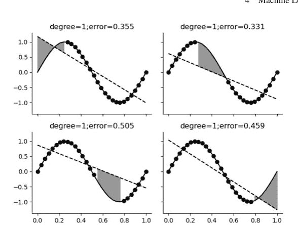

**图 4.11** 这显示了线性模型的折和误差。阴影区域显示了线性模型在每个相应测试集中的误差（即*交叉验证分数*）

我们想用递增阶数的多项式来拟合它。

图4.11显示了每个面板中的各个折。圆圈代表训练数据。对角线是拟合的多项式。灰色阴影区域表示拟合多项式与保留的测试数据之间的误差区域。灰色区域越大，交叉验证误差越大，如每个帧标题中所报告的。

在回顾了最后四幅图并平均了交叉验证误差后，平均误差最小的那个被宣布为获胜者。因此，交叉验证提供了一种使用单个数据集对未见过的样本外数据进行声明的方法，前提是能够确定具有最佳复杂度的模型。生成上述图形的整个过程可以使用`cross_val_score`来捕获，如线性回归所示（将输出与图4.11每个面板标题中的值进行比较），

```
>>> from sklearn.metrics import make_scorer, mean_squared_error
>>> from sklearn.model_selection import cross_val_score
>>> from sklearn.linear_model import LinearRegression
>>> Xi = xi.reshape(-1,1) # refit column-wise
>>> Yi = yi.reshape(-1,1)
>>> lf = LinearRegression()
>>> scores = cross_val_score(lf,Xi,Yi,cv=4,
...                         scoring=make_scorer(mean_squared_error))
>>> print(scores)
[0.3554451  0.33131438 0.50454257 0.45905672]
```

> **编程提示**

`make_scorer`函数是一个包装器，使`cross_val_score`能够从给定估计器的输出计算分数。

该过程可以通过使用管道进一步自动化，如下所示，

```
>>> from sklearn.pipeline import Pipeline
>>> from sklearn.preprocessing import PolynomialFeatures
>>> polyfitter = Pipeline([('poly', PolynomialFeatures
... (degree=3)), ('linear', LinearRegression())])
>>> polyfitter.get_params()
{'memory': None, 'steps': [('poly', PolynomialFeatures
(degree=3)), ('linear', LinearRegression())], 'verbose':
False, 'poly': PolynomialFeatures(degree=3), 'linear':
LinearRegression(), 'poly__degree': 3, 'poly__include_
bias': True, 'poly__interaction_only': False, 'poly__
order': 'C','linear__copy_X': True, 'linear__fit_
intercept': True, 'linear__n_jobs': None, 'linear__
normalize': 'deprecated', 'linear__positive': False}
```

Pipeline对象是一种将标准步骤堆叠成一个大型估计器的方法，同时遵循通常的fit和predict接口。get_params函数的输出包含我们之前循环以创建图4.11的多项式次数等。我们将在下一个代码块中使用这些命名参数。要使用此polyfitter估计器自动执行此操作，我们需要网格搜索交叉验证对象GridSearchCV。下一步是使用它来创建我们想要循环的参数网格，如下所示。

```
>>> from sklearn.model_selection import GridSearchCV
>>> gs=GridSearchCV(polyfitter,{'poly__degree':[1,2,3]},
...                 cv=4,return_train_score=True)
```

gs对象将使用四折交叉验证cv=4循环遍历多项式次数，最高到三次，就像我们之前手动做的那样。poly__degree项来自之前的get_params调用。现在，我们只需在训练数据上应用通常的fit方法，

```
>>> _ = gs.fit(Xi,Yi)
>>> gs.cv_results_
{'mean_fit_time': array([0.00063854, 0.00056225, 0.0005722 ]),
 'std_fit_time': array([1.11161160e-04, 4.99674308e-05,
 5.23417027e-05]), 'mean_score_time': array([0.00030696,
 0.0003503 , 0.00029844]), 'std_score_time': array
 ([2.13144743e-05, 6.21535275e-05, 2.81502458e-05]),
 'param_poly__degree': masked_array(data=[1, 2, 3],
             mask=[False, False, False],
       fill_value='?',
            dtype=object), 'params': [{'poly__degree': 1},
 {'poly__degree': 2}, {'poly__degree': 3}], 'split0
```

_test_score': array([ -2.03118491, -68.54947351,
-1.64899934]), 'split1_test_score': array
([-1.38557769, -3.20386236,  0.81372823]),
'split2_test_score': array([ -7.82417707,
-11.8740862 ,   0.47246476]), 'split3_test_score':
array([ -3.21714294, -60.70054797,   0.14328163]),
'mean_test_score': array([ -3.61452065,
-36.08199251,  -0.05488118]), 'std_test_score':
array([ 2.51765044, 28.84096377,   0.95040218]),
'rank_test_score': array([2, 3, 1], dtype=int32),
'split0_train_score': array([0.52652515,
0.93434227, 0.99177894]), 'split1_train_score':
array([0.5494882 , 0.60357784, 0.99154288]),
'split2_train_score': array([0.54132528,
0.59737218, 0.99046089]), 'split3_train_score':
array([0.57837263, 0.91061274, 0.99144127]),
'mean_train_score': array([0.54892781, 0.76147626,
0.99130599]), 'std_train_score': array([0.01888775,
0.16123462, 0.00050307])}

所示分数对应于使用四折交叉验证对每个参数（例如，多项式次数）的交叉验证分数。这里的分数越高越好，正如我们之前观察到的，三次多项式是最佳的。在这种情况下，评分使用的是默认的 $R^2$ 度量，而不是均方误差。该流程对二次拟合的验证结果如图 4.12 所示，对三次拟合的结果如图 4.13 所示。这可以通过向 `GridSearchCV` 传递 `scoring=make_scorer(mean_squared_error)` 关键字参数来更改。还有 `RandomizedSearchCV`，它不一定评估网格上的每个点，而是根据输入的概率分布随机采样网格。这对于大量超参数非常有用。

### 4.3.5 偏差与方差

考虑样本内和样本外的平均误差取决于特定的训练数据集。我们想要的是一个能捕捉估计器对*所有*可能训练数据性能的概念。例如，我们最终的估计器 $\hat{f}$ 是从特定的训练数据集（$\mathcal{D}$）推导出来的，因此记为 $\hat{f}_{\mathcal{D}}$。这使得样本外误差明确地表示为 $E_{\text{out}}(\hat{f}_{\mathcal{D}})$。为了消除对特定训练数据集的依赖，我们必须计算所有训练数据集的期望，

$$\mathbb{E}_{\mathcal{D}} E_{\text{out}}(\hat{f}_{\mathcal{D}}) = \text{偏差} + \text{方差}$$

其中

$$\text{偏差}(x) = (\overline{\hat{f}}(x) - f(x))^2$$

以及

$$\operatorname{方差}(x) = \mathbb{E}_{\mathcal{D}}(\hat{f}_{\mathcal{D}}(x) - \overline{f}(x))^2$$

这里 $\overline{f}$ 是所有数据集上所有估计器的均值。然而，不能说这样的均值是一个可能来自任何*特定*训练数据的估计器。它仅仅意味着对于任何特定点 $x$，所有估计器值的均值是 $\overline{f}(x)$。因此，*偏差*捕捉了这样一种感觉：即使所有可能的数据都呈现给学习方法，它仍然会与目标函数相差这个量。另一方面，*方差*显示了最终假设的变异，这取决于训练数据集，而与目标函数无关。因此，近似与泛化之间的张力由这两个项捕捉。例如，假设只有一个假设。那么，*方差* = 0，因为特定训练数据集不可能引起任何变异，因为无论训练数据是什么，学习方法总是选择唯一的一个假设。在这种情况下，偏差可能非常大，因为学习方法没有机会根据训练数据改变假设，该方法只能选择这一个假设！

让我们构建一个具体的例子。假设我们有一个假设集，由所有没有截距项的线性回归组成，$h(x) = ax$。训练数据仅包含两个点 $\{(x_i, \sin(\pi x_i))\}_{i=1}^2$，其中 $x_i$ 从区间 $[-1, 1]$ 中均匀抽取。根据第 3.8 节关于线性回归的内容，我们知道 $a$ 的解如下（图 4.14），

$$a = \frac{\mathbf{x}^T \mathbf{y}}{\mathbf{x}^T \mathbf{x}} \quad (4.1)$$

其中 $\mathbf{x} = [x_1, x_2]$，$\mathbf{y} = [y_1, y_2]$。$\overline{f}(x)$ 表示对于固定的 $x$，在所有可能的训练数据集上的解。以下代码展示了如何构建训练数据，

```python
>>> from scipy import stats
>>> def gen_sindata(n=2):
...     x=stats.uniform(-1,2) # define random variable
...     v = x.rvs((n,1))      # generate sample
...     y = np.sin(np.pi*v)   # use sample for sine
...     return (v,y)
...
```

同样，使用 Scikit-learn 的 LinearRegression 对象，我们可以计算 $a$ 参数。我们必须设置 fit_intercept=False 关键字来抑制默认的自动拟合截距。图 4.14 显示了最佳拟合线。

```python
>>> lr = LinearRegression(fit_intercept=False)
>>> lr.fit(*gen_sindata(2))
LinearRegression(fit_intercept=False)
>>> lr.coef_
array([[0.24974914]])
```

图 4.14 对于由所示点组成的两个元素的训练集，该线是在假设集 $h(x) = ax$ 上的最佳拟合线

> **编程提示**
>
> 我们设计 `gen_sindata` 返回一个元组，以便在 `lr.fit(*gen_sindata())` 中使用 Python 函数的自动解包特性。换句话说，使用星号表示法意味着我们不必在将 `gen_sindata` 的输出用于 `lr.fit` 之前单独赋值。

在这种情况下，$\overline{\hat{f}}(x) = \overline{a}x$，其中 $\overline{a}$ 是参数在*所有*可能训练数据集上的期望值。利用我们的概率知识，我们可以将其明确地写为以下形式，

$$\overline{a} = \mathbb{E}\left(\frac{x_1 \sin(\pi x_1) + x_2 \sin(\pi x_2)}{x_1^2 + x_2^2}\right)$$

其中在公式 (4.1) 中，$\mathbf{x} = [x_1, x_2]$，$\mathbf{y} = [\sin(\pi x_1), \sin(\pi x_2)]$。然而，解析计算这个期望值很困难，但对于这种特定情况，$\overline{a} \approx 1.43$。为了通过模拟获得这个值，我们只需循环这个过程，收集输出，然后取平均值，如下所示，

```python
>>> a_out=[] # output container
>>> for i in range(100):
...     _=lr.fit(*gen_sindata(2))
...     a_out.append(lr.coef_[0,0])
...
>>> np.mean(a_out) # approx 1.43
1.5476180748170176
```

你可能需要循环更多次迭代才能接近所谓的值。$\text{方差}$ 需要 $a$ 的方差，

$$\text{方差}(x) = \mathbb{E}((a - \bar{a})x)^2 = x^2 \mathbb{E}(a - \bar{a})^2 \approx 0.71x^2$$

$\text{偏差}$ 如下，

$$\text{偏差}(x) = (\sin(\pi x) - \bar{a}x)^2$$

图 4.15 显示了该问题的 $\text{偏差}$、$\text{方差}$ 和均方误差。注意当 $x = 0$ 时，偏差和方差都为零。这是因为学习方法不可能不正确，因为所有假设恰好在该点与目标函数的值匹配！同样，$\text{方差}$ 为零，因为所有构成训练数据的可能点对都通过零点拟合，因为 $h(x) = ax$ 别无选择，只能通过零点。端点处的误差更糟。正如我们在统计章节中讨论的，这些点对假设模型具有最大的杠杆作用，导致最差的误差。注意，减少边缘误差取决于恰好将靠近边缘的点作为训练数据。对特定数据集的敏感性反映在这种行为中。

如果训练数据中有超过两个点会怎样？$\text{方差}$ 和 $\text{偏差}$ 会发生什么变化？当然，$\text{方差}$ 会减小，因为越来越难以生成彼此有显著差异的训练数据集。偏差也会减小，因为训练数据中更多的点意味着在区间上对正弦函数更好的近似。如果我们改变假设集以包含更复杂的多项式会怎样？正如我们之前在本章多项式回归中已经看到的，我们会看到与这里相同的总体效果，但绝对误差相对较小，并且具有我们之前注意到的相同边缘效应。

**图 4.15** 这些曲线将该示例的均方误差分解为其组成部分偏差和方差

### 4.3.6 学习噪声

到目前为止，我们在学习分析中尚未考虑噪声的影响。以下示例应有助于阐明这一点。假设我们有以下标量目标函数，

$$y(\mathbf{x}) = \mathbf{w}_o^T \mathbf{x} + \eta$$

其中 $\eta \sim \mathcal{N}(0, \sigma^2)$ 是一个加性噪声项，且 $\mathbf{w}, \mathbf{x} \in \mathbb{R}^d$。此外，我们有 $n$ 个 $y$ 的测量值。这意味着训练集由 $\{(\mathbf{x}_i, y_i)\}_{i=1}^n$ 组成。将测量值堆叠成向量格式，

$$\mathbf{y} = \mathbf{X}\mathbf{w}_o + \boldsymbol{\eta}$$

其中 $\mathbf{y}, \boldsymbol{\eta} \in \mathbb{R}^n, \mathbf{w}_o \in \mathbb{R}^d$，且 $\mathbf{X}$ 的列是 $\mathbf{x}_i$。假设集包含所有线性模型，

$$h(\mathbf{w}, \mathbf{x}) = \mathbf{w}^T \mathbf{x}$$

我们需要根据训练数据从假设集中学习正确的 $\mathbf{w}$。到目前为止，这是问题的常规设置，但噪声因素如何参与其中呢？在通常情况下，训练集由从更大空间中随机选择的元素组成。在这种情况下，这相当于获得随机的 $\mathbf{x}_i$ 向量集。这种情况仍然会发生，但问题在于，即使相同的 $\mathbf{x}_i$ 出现两次，由于来自 $\eta$ 的加性噪声，它也不会与相同的 $y$ 值相关联。为了简化，我们假设存在一个固定的 $\mathbf{x}_i$ 向量集，并且我们在训练集中获得了所有这些向量。对于每个特定的训练集，我们根据之前的统计学知识知道如何求解最小均方误差，

$$\mathbf{w} = (\mathbf{X}^T \mathbf{X})^{-1} \mathbf{X}^T \mathbf{y}$$

给定此设置，样本内均方误差是多少？因为这是最小均方误差解，我们从对此类系统相关正交性的研究中知道，

$$E_{\text{in}} = \|\mathbf{y}\|^2 - \|\mathbf{X}\mathbf{w}\|^2 \quad (4.2)$$

其中我们最好的假设是 $\mathbf{h} = \mathbf{X}\mathbf{w}$。现在，我们想要计算其在 $\eta$ 分布上的期望。例如，对于第一项，我们想要计算，

$$\mathbb{E}|\mathbf{y}|^2 = \frac{1}{n} \mathbb{E}(\mathbf{y}^T \mathbf{y}) = \frac{1}{n} \text{Tr} \mathbb{E}(\mathbf{y}\mathbf{y}^T)$$

其中 Tr 是矩阵迹算子（即对角线元素之和）。因为每个 $\eta$ 都是独立的，我们有

$$\text{Tr } \mathbb{E}(\mathbf{y}\mathbf{y}^T) = \text{Tr } \mathbf{X}\mathbf{w}_o\mathbf{w}_o^T\mathbf{X}^T + \sigma^2 \text{Tr } \mathbf{I} = \text{Tr } \mathbf{X}\mathbf{w}_o\mathbf{w}_o^T\mathbf{X}^T + n\sigma^2 \quad (4.3)$$

其中 $\mathbf{I}$ 是 $n \times n$ 单位矩阵。对于公式 (4.2) 中的第二项，我们有

$$|\mathbf{X}\mathbf{w}|^2 = \text{Tr } \mathbf{X}\mathbf{w}\mathbf{w}^T\mathbf{X}^T = \text{Tr } \mathbf{X}(\mathbf{X}^T\mathbf{X})^{-1}\mathbf{X}^T\mathbf{y}\mathbf{y}^T\mathbf{X}(\mathbf{X}^T\mathbf{X})^{-1}\mathbf{X}^T$$

其期望为，

$$\mathbb{E}|\mathbf{X}\mathbf{w}|^2 = \text{Tr } \mathbf{X}(\mathbf{X}^T\mathbf{X})^{-1}\mathbf{X}^T\mathbb{E}(\mathbf{y}\mathbf{y}^T)\mathbf{X}(\mathbf{X}^T\mathbf{X})^{-1}\mathbf{X}^T \quad (4.4)$$

将公式 (4.3) 代入后，得到，

$$\mathbb{E}|\mathbf{X}\mathbf{w}|^2 = \text{Tr } \mathbf{X}\mathbf{w}_o\mathbf{w}_o^T\mathbf{X}^T + \sigma^2 d \quad (4.5)$$

接下来，将此式与公式 (4.3) 组合得到公式 (4.2)，

$$\mathbb{E}(E_{\text{in}}) = \frac{1}{n} E_{\text{in}} = \sigma^2 \left(1 - \frac{d}{n}\right) \quad (4.6)$$

这提供了噪声功率 $\sigma^2$、方法复杂度 ($d$) 和训练样本数量 ($n$) 之间的明确关系。这非常具有说明性，因为它揭示了比率 $d/n$，这是模型复杂度与样本内数据大小之间权衡的表述。从我们对 VC 维的分析中，我们已经知道存在一个复杂的界限来表示复杂度的惩罚，但这个问题的不同寻常之处在于，我们实际上可以推导出一个表达式，而无需诉诸于界限论证。此外，这个结果表明，当训练样本数量非常大时（$n \to \infty$），期望样本内误差趋近于 $\sigma^2$。非正式地说，这意味着学习方法无法从噪声中*泛化*，因此只能通过记忆数据（即 $d \approx n$）来降低期望样本内误差。

期望样本外误差的相应分析类似，但更复杂，因为我们没有正交性条件。此外，样本外数据具有与用于推导权重 $\mathbf{w}$ 的噪声不同的噪声。这导致了额外的交叉项，

$$E_{\text{out}} = \text{Tr}\left(\mathbf{X}\mathbf{w}_o\mathbf{w}_o^T\mathbf{X}^T + \boldsymbol{\xi}\boldsymbol{\xi}^T + \mathbf{X}\mathbf{w}\mathbf{w}^T\mathbf{X}^T - \mathbf{X}\mathbf{w}\mathbf{w}_o^T\mathbf{X}^T - \mathbf{X}\mathbf{w}_o\mathbf{w}^T\mathbf{X}^T\right) \quad (4.7)$$

其中我们使用 $\boldsymbol{\xi}$ 表示样本外情况下的噪声，它与样本内情况下的噪声不同。简化后得到，

$$\mathbb{E}(E_{\text{out}}) = \text{Tr } \sigma^2\mathbf{I} + \sigma^2\mathbf{X}(\mathbf{X}^T\mathbf{X})^{-1}\mathbf{X}^T \quad (4.8)$$

然后，将所有这些组合起来得到，

$$\mathbb{E}(E_{\text{out}}) = \sigma^2 \left(1 + \frac{d}{n}\right)$$

这表明即使在 $n$ 很大的极限情况下，期望样本外误差也趋近于噪声功率极限 $\sigma^2$。这表明记忆样本内数据（即 $d/n \approx 1$）会对样本外性能施加相应的惩罚（即当 $\mathbb{E}E_{\text{in}} \approx 0$ 时，$\mathbb{E}E_{\text{out}} \approx 2\sigma^2$）。

以下代码模拟了这个重要的例子：

```python
>>> def est_errors(d=3,n=10,niter=100):
...     assert n>d
...     wo = np.matrix(arange(d)).T
...     Ein = list()
...     Eout = list()
...     # choose any set of vectors
...     X = np.matrix(np.random.rand(n,d))
...     for ni in range(niter):
...         y = X*wo + np.random.randn(X.shape[0],1)
...         # training weights
...         w = np.linalg.inv(X.T*X)*X.T*y
...         h = X*w
...         Ein.append(np.linalg.norm(h-y)**2)
...         # out of sample error
...         yp = X*wo + np.random.randn(X.shape[0],1)
...         Eout.append(np.linalg.norm(h-yp)**2)
...     return (np.mean(Ein)/n,np.mean(Eout)/n)
...
```

> **编程提示**
>
> Python 有一个 `assert` 语句，用于确保函数中变量的某些入口条件得到满足。在入口和出口处使用合理的断言是提高代码质量的好习惯。

以下代码针对给定的 $d$ 值运行模拟。

```python
>>> d=10
>>> xi = arange(d*2,d*10,d//2)
>>> ei,eo=np.array([est_errors(d=d,n=n,niter=100) for n in xi]).T
```

结果如图 4.16 所示。该图显示了从我们的模拟中估计的期望样本内和样本外误差，并与我们相应的解析结果进行了比较。粗水平线显示了加性噪声的方差 $\sigma^2 = 1$。这两条曲线都趋近于这个渐近线，因为噪声是此问题的最终学习极限。对于给定的维度 $d$，即使有无限量的训练数据，学习方法也无法泛化到噪声功率的极限之外。因此，期望泛化误差为 $\mathbb{E}(E_{\text{out}}) - \mathbb{E}(E_{\text{in}}) = 2\sigma^2 \frac{d}{n}$。

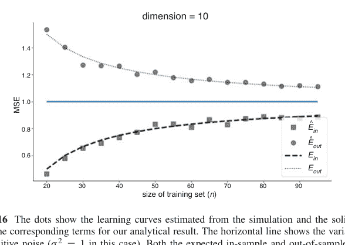

## 4.4 决策树

决策树是最容易理解、解释和说明的分类器。决策树是通过基于 if-then 问题递归地将数据集分割成一系列子集来构建的。训练集由对 ($\mathbf{x}$, $y$) 组成，其中 $\mathbf{x} \in \mathbb{R}^d$，$d$ 是可用特征的数量，$y$ 是相应的标签。学习方法根据 $\mathbf{x}$ 将训练集分成组，同时试图使每个组中的分配尽可能均匀。为了做到这一点，学习方法必须选择一个特征以及该特征的关联阈值来划分数据。用文字解释这一点很棘手，但通过一个例子很容易看出。首先，让我们设置 Scikit-learn 分类器，

```python
>>> from sklearn import tree
>>> clf = tree.DecisionTreeClassifier()
```

让我们也创建一些示例数据，

```python
>>> import numpy as np
>>> M=np.fromfunction(lambda i,j:j>=2,(4,4)).astype(int)
>>> print(M)
[[0 0 1 1]
```

## 4.4 决策树

> **编程提示**

`fromfunction` 通过将索引作为输入传递给一个函数来创建 Numpy 数组，该函数的值即为对应的数组元素。

我们希望根据矩阵中元素各自的位置对其进行分类。仅从矩阵来看，分类相当简单——将矩阵前两列的任何位置分类为 0，其余位置分类为 1。让我们正式地梳理一下，看看这个解决方案是否能从决策树中得出。数组的值是训练集的标签，而这些值的索引是 x 的元素。具体来说，训练集有 $\mathcal{X} = \{(i, j)\}$ 和 $\mathcal{Y} = \{0, 1\}$。现在，让我们提取这些元素并构建训练集。

```
>>> i,j = np.where(M==0)
>>> x=np.vstack([i,j]).T # build nsamp by nfeatures
>>> y = j.reshape(-1,1)*0 # 0 elements
>>> print(x)
[[0 0]
 [0 1]
 [1 0]
 [1 1]
 [2 0]
 [2 1]
 [3 0]
 [3 1]]
>>> print(y)
[[0]
 [0]
 [0]
 [0]
 [0]
 [0]
 [0]
 [0]]
```

因此，x 的元素是 y 值的二维索引。例如，$M[x[0, 0], x[0, 1]] = y[0, 0]$。同样，为了完成训练集，我们只需堆叠其余数据以覆盖所有情况，

```
>>> i,j = np.where(M==1)
>>> x=np.vstack([np.vstack([i,j]).T,x]) # build nsamp nfeatures
>>> y=np.vstack([j.reshape(-1,1)*0+1,y]) # 1 elements
```

所有这些都确定后，我们要做的就是训练分类器，

```
>>> clf.fit(x,y)
DecisionTreeClassifier()
```

为了评估分类器的表现，我们可以报告其得分，

```
>>> clf.score(x,y)
1.0
```

对于这个分类器，*得分*就是准确率，其定义为真阳性（*TP*）和真阴性（*TN*）之和除以所有项（包括假项）之和的比率，

$$accuracy = \frac{TP + TN}{TP + TN + FN + FP}$$

在这种情况下，分类器正确分类了每个点，因此 *FN* = *FP* = 0。相关地，信息检索理论中另外两个常见的名称是*召回率*（又称灵敏度）和*精确率*（又称阳性预测值，*TP* / (*TP* + *FP*)）。我们可以在图 4.17 中可视化这棵树。图中的基尼系数（又称分类方差）是衡量每个如此确定的类别的纯度的指标。该系数定义为，

$$\text{Gini}_m = \sum_k p_{m,k}(1 - p_{m,k})$$

其中

$$p_{m,k} = \frac{1}{N_m} \sum_{x_i \in R_m} I(y_i = k)$$

这是第 *m* 个节点中标记为 *k* 的观测值的比例，*I*(·) 是通常的指示函数。注意，基尼系数的最大值为 max Gini_m = 1 - 1/*m*。对于我们的简单示例，16 个样本中一半属于类别 0，另一半属于类别 1。使用上面的符号，顶部的框对应于第 0 个节点，因此 *p*_{0,0} = 1/2 = *p*_{0,1}。那么，Gini_0 = 0.5。图 4.17 中的下一层节点由 **x** 数据的第二维是否大于 1.5 决定。每个子节点的基尼系数为零，因为在先前的分裂之后，每个后续类别都是纯的。每个节点中的 *value* 列显示了每个节点中每个类别的元素分布。

为了让这个例子更有趣，我们可以稍微污染数据，

```
>>> M[1,0]=1 # put in different class
>>> print(M) # now contaminated
[[0 0 1 1]
 [1 0 1 1]
 [0 0 1 1]
 [0 0 1 1]]
```

图 4.17 示例决策树。每个分支中的基尼系数衡量每个节点中分区的纯度。框中的样本项显示了决策树中相应节点中的项目数量

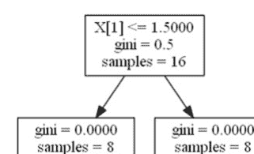

现在我们在之前纯净的第一列第二行中有一个 1 条目。让我们按照以下步骤重新进行分析，

```
>>> i,j = np.where(M==0)
>>> x=np.vstack([i,j]).T
>>> y = j.reshape(-1,1)*0
>>> i,j = np.where(M==1)
>>> x=np.vstack([np.vstack([i,j]).T,x])
>>> y = np.vstack([j.reshape(-1,1)*0+1,y])
>>> clf.fit(x,y)
DecisionTreeClassifier()
```

结果如图 4.18 所示。注意，由于这一个变化，树显著增长了！第 0 个节点具有以下参数，$p_{0,0} = 7/16$ 和 $p_{0,1} = 9/16$。这使得第 0 个节点的基尼系数等于 $\frac{7}{16}\left(1-\frac{7}{16}\right)+\frac{9}{16}\left(1-\frac{9}{16}\right) = 0.492$。与之前一样，根节点在 $X[1] \leq 1.5$ 处分裂。让我们看看是否可以手动重建下一层节点，如下所示，

```
>>> y[x[:,1]>1.5] # first node on the right
array([[1],
       [1],
       [1],
       [1],
       [1],
       [1],
       [1],
       [1]])
```

这显然具有零基尼系数。同样，左侧的节点包含以下内容，

```
>>> y[x[:,1]<=1.5] # first node on the left
array([[1],
       [0],
       [0],
       [0],
       [0],
       [0],
       [0],
       [0]])
```

图 4.18 受污染数据的决策树。请注意，训练数据中仅一个变化就导致树增长到之前的五倍大！

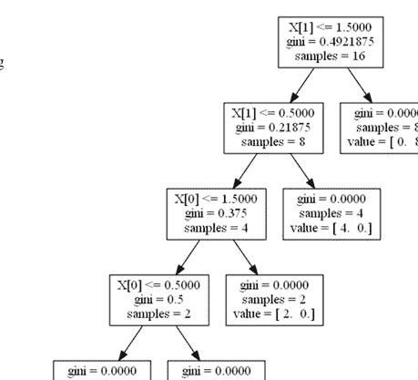

这种情况下的基尼系数计算为 (1/8) * (1-1/8) + (7/8) * (1-7/8) = 0.21875。该节点基于 X[1] < 0.5 进行分裂。右侧的子节点源于以下等效逻辑，

```
>>> np.logical_and(x[:,1]<=1.5,x[:,1]>0.5)
array([False, False, False, False, False, False, False, False,
       False, False,  True,  True, False,  True, False,  True])
```

对应的类别为，

```
>>> y[np.logical_and(x[:,1]<=1.5,x[:,1]>0.5)]
array([[0],
       [0],
       [0],
       [0]])
```

> **编程提示**

Numpy 中的 `logical_and` 提供逐元素的逻辑合取。无法使用类似 `0.5< x[:,1] <=1.5` 的方式来实现这一点，因为 Python 解析此语法的方式。

请注意，对于这个例子以及之前的例子，决策树都能够以完美的准确率记忆（过拟合）数据。根据我们对机器学习理论的讨论，这表明在泛化方面存在潜在问题。

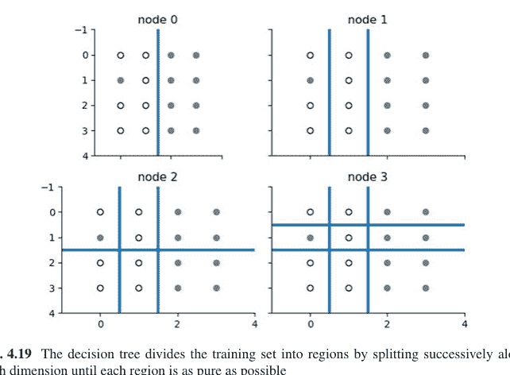

图 4.19 决策树通过沿每个维度连续分裂将训练集划分为区域，直到每个区域尽可能纯净

构建决策树的关键步骤是提出初始分裂。有许多算法可以根据不同的标准构建决策树，但总体思路是在树发展过程中控制信息熵。实际上，这意味着算法试图构建不过分深的树。众所周知，这是一个非常难以完全解决的问题，并且有许多方法。这是因为算法必须在树的每个节点处使用到该点为止可用的局部数据做出全局决策。

对于这个例子，决策树将 $\mathcal{X}$ 空间划分为对应于不同 $\mathcal{Y}$ 标签的不同区域，如图 4.19 所示。图 4.18 顶部的根节点根据 $X[1] \leq 1.5$ 分裂输入数据。这对应于图 4.19 左上角的面板（即节点 0），其中垂直线将显示的训练数据分为两个区域，对应于两个后续的子节点。下一次分裂发生在 $X[1] \leq 0.5$，如图 4.19 下一个标题为节点 1 的面板所示。这一直持续到右下角的最后一个面板，其中我们注入的污染元素已被隔离到其自己的子区域中。因此，最后一个面板是图 4.18 的表示，其中水平/垂直线对应于决策树中的连续分裂。

图 4.20 显示了另一个示例，但这次使用的是一个简单的三角矩阵。如垂直和水平分割线的数量所示，与此图对应的决策树又高又复杂。请注意，如果我们对训练数据应用简单的旋转变换，我们可以得到图 4.21，这需要一个简单的决策树来拟合。因此，可能存在简化决策树的训练数据变换，但这些变换通常很难推导出来。尽管如此，这突出了决策树的一个关键弱点，即它们可能图 4.20 拟合到该三角矩阵的决策树非常复杂，如水平和垂直分区的数量所示。因此，即使训练数据中的模式在视觉上很清晰，决策树也无法自动发现它。

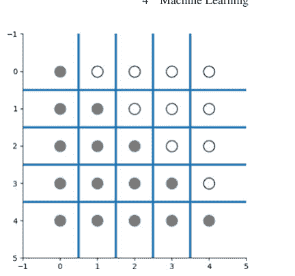

图 4.21 通过对图 4.20 中的训练数据进行简单的旋转，决策树现在可以轻松地用单一分区拟合训练数据。

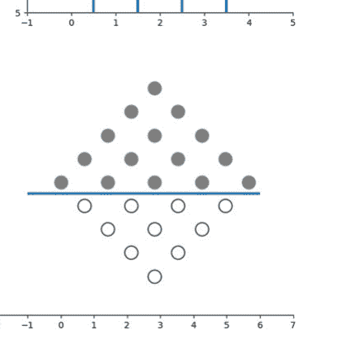

决策树易于理解、训练和部署，但可能完全无法发现这种节省时间和复杂度的变换。实际上，在更高维度中，甚至可能无法可视化这种潜在变换的可能性。因此，决策树的优势很容易被我们稍后将学习的其他方法所超越，这些方法*确实*具有发现有用变换的能力，但训练起来必然更困难。另一个缺点是，由于决策树的构建方式，即使是一个错误放置的数据点也可能导致树的生长方式大不相同。这是高方差的一个症状。

在我们所有的例子中，决策树都能够精确地记忆训练数据。正如我们之前讨论的，这是潜在高泛化误差的迹象。有一些剪枝算法可以有策略地移除一些最深的节点，但截至本文撰写时，这些算法在 Scikit-learn 中尚未完全实现。或者，限制决策树的最大深度可以产生类似的效果。Scikit-learn 中的 `DecisionTreeClassifier` 和 `DecisionTreeRegressor` 都有指定最大深度的关键字参数。

### 4.4.1 随机森林

通过使用集成学习，可以将一组决策树组合成一个更大的复合树，其性能优于其单个组件。这在 Scikit-learn 中实现为 `RandomForestClassifier`。复合树有助于缓解决策树的主要弱点——高方差。随机森林分类器通过平均许多组成树的预测来帮助最小化这种方差，方法是随机选择训练集的子集来训练嵌入的树。另一方面，这种随机化可能会增加偏差，因为可能存在一个训练集子集能产生优秀的决策树，但随机训练样本上的平均效应在减少方差的相同平均过程中将其冲淡了。这是一个关键的权衡。以下代码实现了我们上一个示例中的一个简单随机森林分类器。

```python
>>> from sklearn.ensemble import RandomForestClassifier
>>> rfc = RandomForestClassifier(n_estimators=4, max_depth=2)
>>> rfc.fit(X_train, y_train.flat)
RandomForestClassifier(max_depth=2, n_estimators=4)
```

请注意，我们限制了最大深度 `max_depth=2` 以帮助泛化。为了保持简单，我们只设置了一个包含四个独立分类器的森林。³ 图 4.22 显示了上面训练的森林中的各个分类器。尽管所有组成决策树共享相同的训练数据，但随机森林算法会随机选择特征子集（有放回）来训练单个树。这有助于避免决策树变得过深和不平衡的倾向，这会损害性能和泛化能力。在预测步骤中，每个组成决策树的单独输出被提交进行多数投票以进行最终分类。为了在不使用交叉验证的情况下估计泛化误差，可以使用*未*用于特定组成树的训练元素来测试该树，并形成泛化误差的协作估计。这被称为*袋外*估计。

随机森林分类器的主要优点是它们需要很少的调整，并提供了一种通过平均和随机化来权衡偏差和方差的方法。此外，它们训练速度快且易于并行化（参见 `n_jobs` 关键字参数），预测也很快。缺点是，它们比简单的决策树可解释性差。Scikit-learn 中还有许多其他强大的树方法，如 `ExtraTrees` 和梯度提升回归树 `GradientBoostingRegressor`，这些在在线文档中有讨论。

> ³ 我们还将随机种子设置为固定值，以使本节对应的 Jupyter Notebook 中的图表可重现。

图 4.22 随机森林的组成决策树及其如何划分训练集显示在这四个面板中。随机森林分类器使用每个组成树的单独输出来产生协作的最终估计。


### 4.4.2 理解提升树

要理解使用树的加法模型，回想一下向量的 Gram-Schmidt 正交化过程。这个正交化过程的目的是从给定的向量 $\mathbf{u}_1$ 开始创建一个正交向量集。我们已经在第 2.2 节讨论了投影算子。Gram-Schmidt 正交化过程从一个向量 $\mathbf{v}_1$ 开始，我们将其定义如下：

$$\mathbf{u}_1 = \mathbf{v}_1$$

以及相应的投影算子 $proj_{\mathbf{u}_1}$。该过程的下一步是从 $\mathbf{v}_2$ 中移除 $\mathbf{u}_1$ 的残差，如下所示：

$$\mathbf{u}_2 = \mathbf{v}_2 - proj_{\mathbf{u}_1}(\mathbf{v}_2)$$

这个过程对 $\mathbf{v}_3$ 继续进行，如下所示：

$$\mathbf{u}_3 = \mathbf{v}_3 - proj_{\mathbf{u}_1}(\mathbf{v}_3) - proj_{\mathbf{u}_2}(\mathbf{v}_3)$$

依此类推。这个过程的重要方面是，新传入的向量（即 $\mathbf{v}_k$）被剥离了任何已存在于集合 $\{\mathbf{u}_1, \mathbf{u}_2, \dots, \mathbf{u}_M\}$ 中的预先存在的分量。

请注意，这个过程是顺序的。也就是说，传入的 $\mathbf{v}_i$ 的*顺序*很重要。$^4$ 因此，任何新向量都可以使用如此构建的 $\{\mathbf{u}_1, \mathbf{u}_2, \dots, \mathbf{u}_M\}$ 基集来表示，如下所示：

$$\mathbf{x} = \sum \alpha_i \mathbf{u}_i$$

加法树背后的思想是为树而不是向量重现这个过程。然而，对于一般问题，我们缺乏许多自然的拓扑和代数性质。例如，对于上面概述的 Gram-Schmidt 过程，我们已经有成熟的方法来测量向量之间的距离（即 $L_2$ 距离），而这里我们缺乏这一点。因此，我们需要*损失函数*的概念，这是一种衡量在每个顺序步骤中过程进展如何的方法。这个损失函数由训练数据和所考虑的分类函数参数化：$L_y(f(x))$。例如，如果我们想要一个分类器（$f$），它根据输入数据 $\mathbf{x}_i$ 选择标签 $y_i$（$f : \mathbf{x}_i \rightarrow y_i$），那么平方误差损失函数将是：

$$L_y(f(x)) = \sum_i (y_i - f(x_i))^2$$

我们用一组基树来表示分类器：

$$f(x) = \sum_k \alpha_k u_{\mathbf{x}}(\theta_k)$$

前向分步加法建模的一般算法如下：

- 初始化 $f(x) = 0$
- 对于 $m = 1$ 到 $m = M$，计算以下内容：
  $$(\beta_m, \gamma_m) = \arg \min_{\beta, \gamma} \sum_i L(y_i, f_{m-1}(x_i) + \beta b(x_i; \gamma))$$
- 设置 $f_m(x) = f_{m-1}(x) + \beta_m b(x; \gamma_m)$

关键点是，前一步的残差用于拟合后续迭代的基函数。也就是说，以下方程正在被顺序逼近。

$$f_m(x) - f_{m-1}(x) = \beta_m b(x_i; \gamma_m)$$

让我们看看这对于决策树和指数损失函数是如何工作的。

$$L(x, f(x)) = \exp(-yf(x))$$

回想一下，对于分类问题，$y \in \{-1, 1\}$。对于 AdaBoost，基函数是单个分类器，$G_m(x) \mapsto \{-1, 1\}$。关键步骤是

## 4.4 决策树

算法是目标函数的最小化步骤

$$J(\beta, G) = \sum_i \exp(y_i(f_{m-1}(x_i) + \beta G(x_i)))$$

$$(\beta_m, G_m) = \arg\min_{\beta, G} \sum_i \exp(y_i(f_{m-1}(x_i) + \beta G(x_i)))$$

现在，由于指数函数的存在，我们可以提取出以下项：

$$w_i^{(m)} = \exp(y_i f_{m-1}(x_i))$$

作为每个数据元素的权重，并将目标函数重写为：

$$J(\beta, G) = \sum_i w_i^{(m)} \exp(y_i \beta G(x_i))$$

这里的重要观察是，如果树正确分类了 $x_i$，则 $y_i G(x_i) \mapsto 1$，否则 $y_i G(x_i) \mapsto -1$。因此，上述求和包含如下形式的项：

$$J(\beta, G) = \sum_{y_i \neq G(x_i)} w_i^{(m)} \exp(-\beta) + \sum_{y_i = G(x_i)} w_i^{(m)} \exp(\beta)$$

对于 $\beta > 0$，这意味着最佳的 $G(x)$ 是那个在权重最大的样本上错误分类的函数。因此，最小化器为：

$$G_m = \arg\min_G \sum_i w_i^{(m)} I(y_i \neq G(x_i))$$

其中 $I$ 是指示函数（即 $I(\text{True}) = 1$，$I(\text{False}) = 0$）。对于 $\beta > 0$，我们可以将目标函数重写为：

$$J = (\exp(\beta) - \exp(-\beta)) \sum_i w_i^{(m)} I(y_i \neq G(x_i)) + \exp(-\beta) \sum_i w_i^{(m)}$$

并代入 $\theta = \exp(-\beta)$，得到

$$\frac{J}{\sum_i w_i^{(m)}} = \left(\frac{1}{\theta} - \theta\right) \epsilon_m + \theta \qquad (4.10)$$

其中

$$\epsilon_m = \frac{\sum_i w_i^{(m)} I(y_i \neq G(x_i))}{\sum_i w_i^{(m)}}$$

是分类器的错误率，满足 $0 \le \epsilon_m \le 1$。现在，求 $\beta$ 是对公式 (4.10) 右侧进行直接的微积分最小化练习，得到：

$$\beta_m = \frac{1}{2} \log \frac{1 - \epsilon_m}{\epsilon_m}$$

重要的是，如果 $\epsilon_m < \frac{1}{2}$，$\beta_m$ 可能变为负数，这将违反我们对 $\beta$ 的假设。这体现在要求基础学习器必须优于随机猜测，即对应 $\epsilon_m > \frac{1}{2}$。实际上，这意味着提升法无法修复一个不比随机猜测好的基础学习器。形式上，这被称为*经验弱学习假设* [40]。

现在我们可以转向迭代权重更新。回顾

$$w_i^{(m+1)} = \exp(y_i f_m(x_i)) = w_i^{(m)} \exp(y_i \beta_m G_m(x_i))$$

我们可以将其重写为：

$$w_i^{(m+1)} = w_i^{(m)} \exp(\beta_m) \exp(-2\beta_m I(G_m(x_i) = y_i))$$

这意味着被错误分类的数据元素其对应的权重会增加（被提升！）$\exp(\beta_m)$，而被正确分类的数据元素其对应的权重会减少 $\exp(-\beta_m)$。选择指数损失函数的原因来自以下公式：

$$f^*(x) = \arg \min_{f(x)} \mathbb{E}_{Y|x}(\exp(-Y f(x))) = \frac{1}{2} \log \frac{\mathbb{P}(Y = 1|x)}{\mathbb{P}(Y = -1|x)}$$

这意味着提升法正在逼近一个 $f(x)$，它实际上是条件类别概率的对数几率的一半。这可以重新整理为：

$$\mathbb{P}(Y = 1|x) = \frac{1}{1 + \exp(-2f^*(x))}$$

这种将提升法视为一系列加性逼近的通用公式的重要好处在于，它为选择其他损失函数打开了大门，特别是那些基于稳健统计、能够考虑训练数据中误差的损失函数（参见 [14]）。

#### 回归树提升示例

为了理解其工作原理，让我们使用平方误差损失来编写一个简单的一维回归问题代码。假设我们想逼近以下余弦函数，

```python
>>> xi = np.linspace(0,1,20)
>>> yi = np.cos(np.pi*2*1.5*xi)
```

在一维情况下，树是一个矩形函数，

```python
>>> h = lambda a,b:np.logical_and(a<=xi,xi <=b).astype(int)
```

我们的目标是计算一个序列展开

$$f_m(x_i) - f_{m-1}(x_i) = \beta_m h_{[a_i, b_i]}(x_i)$$

该展开最小化每个序列数据点的残差 $y_i - F(x_i)$ 的平方误差，

$$\mathcal{E}(F(x_i), y_i) = ((y_i - F(x_i)) - \beta_m h_{[a,b]}(x_i))^2$$

其中 $h_{[a,b]}(x)$ 仅在区间 $x \in [a, b]$ 内非零，且

$$F(x) = \sum_{m=1}^n \beta_m h_{[a_m, b_m]}(x)$$

一旦我们知道矩形函数的 $[a_i, b_i]$ 参数，那么使用内积计算相应的系数就很简单，因为我们是使用平方差进行逼近，

$$\beta_m = \frac{\langle (y_i - F_0), h_{[a,b]}(x_i) \rangle}{\langle h_{[a,b]}(x_i), h_{[a,b]}(x_i) \rangle}$$

考虑以下示例，我们从 $F_0(x) = 0$ 开始序列迭代。那么

```python
>>> # 选择一个特定的区间 [a,b]
>>> a,b = [0.0, 0.8]
>>> F0 = 0 # 初始条件
>>> beta = (yi-F0) @ h(a,b)/(h(a,b) @ h(a,b))
>>> # 残差误差
>>> np.linalg.norm((yi-F0)-beta*h(a,b),2)
3.1790811634752045
```

如果我们想在参数 $[a, b]$ 上最小化这个值，我们可以使用 sklearn 的 ParameterGrid 进行网格搜索，

```python
>>> from sklearn.model_selection import ParameterGrid
>>> param_grid = {'a': np.linspace(0,1,20), 'b': np.linspace(0,1,20)}
>>> minval = [np.inf,{}]
>>> for params in ParameterGrid(param_grid):
...     if params['b'] <= params['a']: continue # 跳过向后区间
...     a, b = params['a'], params['b']
...     beta = (yi-F0) @ h(a,b)/ (h(a,b) @ h(a,b))
...     # 使用相应参数的残差误差
...
    err = (np.linalg.norm((yi-F0)-beta*h(a,b),2),
           (a,b,beta))
...
    minval = min(minval, err, key=lambda i:i[0])
...
>>> print(minval) # 平方误差, (a, b, beta)
(2.7589037651370742, (0.5789473684210527, 0.7894736842105263,
 0.7600592101556926))
```

结果如图 4.23 所示，其中蓝色阴影区域是 $F_0$ 与曲线之间的差异。灰色阴影区域显示了作为最小化器找到的区间 $[a, b]$，橙色线显示了 $F_1$，即对曲线 $y$ 的更新逼近。注意，由于最小化的是平方误差而不是差值，因此阴影区域并非此处最小化的精确对象。图 4.24 中的序列显示了 $F_m$ 逐步更新的过程，这本质上是在执行我们开始时的格拉姆-施密特过程。

#### 梯度提升

梯度提升是 AdaBoost 对更通用损失函数的扩展，特别是那些对异常值稳健的损失函数。给定一个可微损失函数，优化过程可以使用数值梯度来表述。关键步骤是用树拟合梯度而不是残差。让我们考虑绝对损失函数

$$L_{abs}(x, y) = \sum_{i=1}^{n} |x_i - y_i|$$

与通常的平方损失函数相比，这个损失函数对异常值更稳健。为了了解如何在梯度提升中使用这个损失函数，让我们回顾上一节末尾的示例，并只添加几个异常值，

```python
>>> yi[10], yi[4] = 5, -2 # 添加异常值
```

下面的图 4.25 显示了此更改的结果。继续使用通常的平方损失进行逼近最终会专注于减轻异常值的影响，因为它们对误差函数有巨大的影响，但如果我们想减少它们对最终结果的影响呢？我们想在梯度提升中使用绝对损失，关键步骤是计算绝对损失 $L_{abs}$ 的梯度，即：

$$\frac{\partial L_{abs}(t)}{\partial t} = \text{sign}(t)$$

下一步是将树拟合到这个梯度而不是残差，这是我们之前所做的。使用与之前相同的代码，但现在我们不能再直接计算 $\beta$，而必须使用一维优化来找到它，

```python
>>> from scipy.optimize import fmin
>>> F0 = 0 # 初始条件
>>> minval = [np.inf,{}]
>>> for params in ParameterGrid(param_grid):
...     if params['b'] <= params['a']: continue # 区间向后
...     a, b = params['a'], params['b']
```

## 4.5 逻辑回归

我们之前研究的伯努利分布回答了在两个结果（$Y \in \{0, 1\}$）中，以概率 $p$ 选择哪一个的问题。

$$\mathbb{P}(Y) = p^Y (1 - p)^{1-Y}$$

我们也知道如何求解相应的似然函数，以在给定输出观测值 $\{Y_i\}_{i=1}^n$ 的情况下，得到 $p$ 的最大似然估计。然而，现在我们希望在估计 $p$ 时纳入其他因素。例如，假设我们不仅观察结果，还观察一个对应的连续变量 $x$。也就是说，观测数据现在是 $\{(x_i, Y_i)\}_{i=1}^n$。我们如何将 $x$ 纳入对 $p$ 的估计中呢？

最直接的想法是将 $p$ 建模为 $p = ax + b$，其中 $a, b$ 是拟合直线的参数。然而，由于 $p$ 是一个概率值，其值被限制在 0 和 1 之间，我们需要将这个估计值包装在另一个函数中，该函数能够将整个实数线映射到 $[0, 1]$ 区间。逻辑（也称为 sigmoid）函数具有这个性质，

$$\theta(s) = \frac{e^s}{1 + e^s}$$

因此，$p$ 的新的参数化估计如下，

$$\hat{p} = \theta(ax + b) = \frac{e^{ax+b}}{1 + e^{ax+b}} \quad (4.11)$$

*logit* 函数定义如下，

$$\text{logit}(t) = \log \frac{t}{1 - t}$$

它具有从概率估计器中提取回归分量的重要性质，

$$\text{logit}(p) = b + ax$$

可以轻松地容纳更多的连续变量，

$$\text{logit}(p) = b + \sum_k a_k x_k$$

这可以进一步扩展到二元情况之外的多目标标签。其最大似然估计使用数值优化方法，这些方法在 Scikit-learn 中实现。


图 4.27 此散点图显示了二元 $Y$ 变量以及每个类别对应的 $x$ 数据

让我们构建一些数据来看看这是如何工作的。在下面的代码中，我们为二维平面中一组随机分布的点分配类别标签，

```python
>>> v = 0.9
>>> @np.vectorize
... def gen_y(x):
...     if x<5: return np.random.choice([0,1],p=[v,1-v])
...     else:   return np.random.choice([0,1],p=[1-v,v])
...
>>> xi = np.sort(np.random.rand(500)*10)
>>> yi = gen_y(xi)
```

> **编程提示**

上面代码中使用的 `np.vectorize` 装饰器通过将循环语义嵌入到被装饰的函数中，使得在使用 Numpy 数组的代码中避免循环变得容易。但请注意，这并不一定会加速被包装的函数。它主要是为了方便。

图 4.27 显示了我们在上面代码中构建的数据 $\{(x_i, Y_i)\}$ 的散点图。根据构建方式，较大的 $x$ 值更可能对应 $Y = 1$。另一方面，$x \in [4, 6]$ 范围内的值，无论属于哪个类别，都严重重叠。这意味着在该区域，$x$ 并不是 $Y$ 的一个特别强的指示器。图 4.28 显示了针对相同数据拟合的逻辑回归曲线。曲线上的点是每个点属于任一类别的概率。对于较大的 $x$ 值，曲线接近 1，意味着相关的 $Y$ 值等于 1 的概率很高。在另一个极端，较小的 $x$ 值意味着这个概率接近于零。因为只有两个可能的类别，这意味着 $Y = 0$ 的概率因此更高。中间区域对应于中等概率，反映了由于该区域数据重叠导致的两个类别之间的模糊性。因此，逻辑回归在这里无法为某个类别提供强有力的依据。以下代码拟合逻辑回归模型，

```python
>>> from sklearn.linear_model import LogisticRegression
>>> lr = LogisticRegression()
>>> lr.fit(np.c_[xi],yi)
LogisticRegression()
```

为了更深入地理解逻辑回归，我们需要稍微改变一下符号，并再次使用我们的投影方法。更一般地，我们可以将公式 (4.11) 重写为以下形式，

$$p(\mathbf{x}) = \frac{1}{1 + \exp(-\boldsymbol{\beta}^T \mathbf{x})}$$ (4.12)

其中 $\boldsymbol{\beta}, \mathbf{x} \in \mathbb{R}^n$。根据我们之前关于投影的工作，我们知道 $\mathbf{x}$ 与由 $\boldsymbol{\beta}$ 描述的线性边界之间的有符号垂直距离是 $\boldsymbol{\beta}^T \mathbf{x} / \|\boldsymbol{\beta}\|$。这意味着分配给 $\mathbb{R}^n$ 中任何点的概率是该点与由以下方程描述的线性边界接近程度的函数，

$$\boldsymbol{\beta}^T \mathbf{x} = 0$$


图 4.29 缩放可以任意增加决策边界附近点的概率

但这里隐藏着一些微妙之处。注意对于任何 $\alpha \in \mathbb{R}$，

$$\alpha \beta^T \mathbf{x} = 0$$

描述的是*同一个*超平面。这意味着我们可以将 $\beta$ 乘以任意标量，仍然得到相同的几何结构。然而，由于公式 (4.12) 中的 $\exp(-\alpha \beta^T \mathbf{x})$，这种缩放决定了赋予 $\mathbf{x}$ 的概率强度。这在图 4.29 中进行了说明。左侧面板显示了两个类别（方形/圆形），由虚线 $\beta^T \mathbf{x} = 0$ 分隔。背景颜色显示了分配给平面中点的概率。右侧面板显示，通过使用 $\alpha$ 进行缩放，我们可以在完全相同的几何结构下，增加给定点的类别成员概率。靠近边界的点具有较低的概率，因为它们很容易位于另一侧。然而，通过 $\alpha$ 缩放，我们可以将这些概率提高到任何所需的水平，代价是将远离边界的点驱动得更接近 1。为什么这是一个问题？通过使用 $\alpha$ 任意驱动概率，我们可能会过度强调训练集，而牺牲样本外数据。也就是说，我们可能最终坚持认为那些靠近边界的、尚未见过的点具有明确的类别成员资格，而这些点原本可能具有更模糊的概率（比如接近 1/2）。再次强调，这是偏差/方差权衡的另一种表现。

正则化是一种通过惩罚 $\beta$ 的大小作为其解决方案的一部分来控制这种效应的方法。在算法上，逻辑回归通过迭代求解一系列加权最小二乘问题来工作。回归在最小二乘误差中添加了一个 $\|\beta\|/C$ 项。为了看到实际效果，让我们从逻辑回归中创建一些数据

```python
python
...     obj = lambda beta: np.linalg.norm(np.sign(yi-F0)
...     -beta*h(a,b),2)
...     beta, fval, *tmp = fmin(obj, .1, disp=False,
...     full_output=True)
...     err =(fval, (a,b,float(beta)))
...     minval = min(minval, err, key=lambda i:i[0])
...
>>> print(minval)
(3.7416573867739413, (0.21052631578947367,
    0.47368421052631576, -0.99999999999999978))
```

注意，使用平方范数来找到最佳拟合树，因为绝对损失用于 $F_m$ 函数，*而不是*单个树。上面的代码块找到了最能拟合绝对损失*梯度*的树。确定之后，现在我们使用线搜索找到近似 $F_m$ 的下一个序列项，

```python
>>> a, b, beta = minval[1] # 解包
>>> obj = lambda rho: np.abs(yi - (F0 + rho*h(a,b))).sum()
>>> rho = fmin(obj,0.1, disp=False)
>>> F0 = F0 + rho*h(a,b) # 更新 F_m
```

`obj` 函数是衡量 $F_m$ 与 $y$ 之间差异的绝对损失。重复迭代这些步骤会产生图 4.26 所示的近似，以及来自 Scikit-learn 的 `GradientBoostingRegressor` 的结果，后者显然更好，具有比我们自己粗糙的近似多得多的特征，但仍然匹配得相当好。

回想一下我们在深度学习梯度下降部分的内容，我们看到我们可以沿着梯度的反方向前进，以改进可微损失函数。对于 AdaBoost，拟合的树是由残差的增量重新加权（即 *boosting*）驱动的。也就是说，序列决策树拟合的是残差。对于梯度提升，我们希望使用负梯度来拟合决策树。这两种方法对于平方和损失函数来说结果是相同的，但对于更一般的损失函数则不同。


### 使用 Scikit-learn 进行回归与逻辑回归

让我们从二维平面上的散点开始，

```python
>>> x0,x1 = np.random.rand(2,20)*6-3
>>> X = np.c_[x0,x1,x1*0+1] # 按列堆叠
```

注意，X 的第三列全为 1。这是一个技巧，允许对应的直线在二维平面中偏离原点。接下来，我们创建一个线性边界，并根据与边界的距离分配类别概率。

```python
>>> beta = np.array([1,-1,1]) # 最后一个坐标用于仿射偏移
>>> prd = X.dot(beta)
>>> probs = 1/(1+np.exp(-prd/np.linalg.norm(beta)))
>>> c = (prd>0) # 布尔数组类别标签
```

这就建立了训练数据。下一块代码创建逻辑回归对象并拟合数据。

```python
>>> lr = LogisticRegression()
>>> _ = lr.fit(X[:,:-1],c)
```

注意，由于 Scikit-learn 内部分解边界组件的方式，我们必须省略第三维。生成的代码从 `LogisticRegression` 对象中提取对应的 $\beta$。

```python
>>> betah = np.r_[lr.coef_.flat,lr.intercept_]
```

> **编程提示**
>
> Numpy 的 `np.r_` 对象提供了一种快速水平堆叠 Numpy 数组的方法，而不是使用 `np.hstack`。

生成的边界如图 4.30 左侧面板所示。叉号和三角形代表我们上面创建的两个类别，以及分隔的灰色线。逻辑回归拟合产生黑色虚线。深色圆圈是逻辑回归错误分类的点。正则化参数默认为 $C = 1$。接下来，我们可以改变正则化参数的强度，如下所示，

```python
>>> lr = LogisticRegression(C=1000)
```

并重新拟合数据以生成图 4.30 的右侧面板。通过增加正则化参数，我们本质上是推动拟合算法更*相信*数据而非一般模型。也就是说，通过这样做，我们接受了更多的方差以换取更好的偏差。


**图 4.30** 左侧面板显示了以 $C = 1$ 作为正则化参数时生成的边界（虚线）。右侧面板对应 $C = 1000$。灰色线是用于为合成数据分配类别成员资格的边界。深色圆圈是逻辑回归错误分类的点。

#### 逻辑回归的最大似然估计

让我们再次考虑二元分类问题。我们定义 $y_k = \mathbb{P}(C_1|\mathbf{x}_k)$，即数据作为给定类别成员的条件概率。我们对此问题的构造提供了

$$y_k = \theta([\mathbf{w}, w_0] \cdot [\mathbf{x}_k, 1])$$

其中 $\theta$ 是逻辑函数。回想一下，这个问题只有两个类别。数据集如下所示，

$$\{(\mathbf{x}_0, r_0), \ldots, (\mathbf{x}_k, r_k), \ldots, (\mathbf{x}_{n-1}, r_{n-1})\}$$

其中 $r_k \in \{0, 1\}$。例如，我们可能有以下观察到的类别序列，

$$\{C_0, C_1, C_1, C_0, C_1\}$$

对于这种情况，似然函数如下，

$$\ell = \mathbb{P}(C_0|\mathbf{x}_0)\mathbb{P}(C_1|\mathbf{x}_1)\mathbb{P}(C_1|\mathbf{x}_2)\mathbb{P}(C_0|\mathbf{x}_3)\mathbb{P}(C_1|\mathbf{x}_4)$$

我们可以将其重写为，

$$\ell(\mathbf{w}, w_0) = (1 - y_0)y_1y_2(1 - y_3)y_4$$

回想一下，有两个互斥且穷尽的类别。更一般地，这可以写成，

$$\ell(\mathbf{w}|\mathcal{X}) = \prod_{k}^{n} y_k^{r_k} (1 - y_k)^{1-r_k}$$

自然地，我们想计算其对数作为交叉熵，

$$E = -\sum_{k} r_k \log(y_k) + (1 - r_k) \log(1 - y_k)$$

然后最小化这个以找到 $\mathbf{w}$ 和 $w_0$。这用微积分很难做到，因为导数中包含难以求解的非线性项。

#### 使用 Softmax 的多类逻辑回归

逻辑回归问题为恰好两个替代类别之间的概率提供了解决方案。要扩展到多类问题，我们需要 *softmax* 函数。考虑第 $i$ 个类别与参考类别 $C_k$ 之间的似然比，

$$\log \frac{p(\mathbf{x}|C_i)}{p(\mathbf{x}|C_k)} = \mathbf{w}_i^T \mathbf{x}$$

注意，偏差项已包含在 $\mathbf{w}_i$ 中。取其指数并在所有类别上归一化，得到 softmax 函数，

$$y_i(\mathbf{x}) = p(C_i|\mathbf{x}) = \frac{\exp(\mathbf{w}_i^T \mathbf{x})}{\sum_k \exp(\mathbf{w}_k^T \mathbf{x})}$$

注意 $\sum_i y_i = 1$。如果 $\mathbf{w}_i^T \mathbf{x}$ 项大于其他项，经过指数化和归一化后，它会自动抑制其他所有 $y_j \forall j \neq i$，这类似于最大值函数，但此函数是可微的，因此是 *soft* 的，即 *softmax*。虽然这一切都很直接，但技巧在于从训练数据 $\{\mathbf{x}_i, C_i\}$ 中推导出 $\mathbf{w}_i$ 向量，其中 $r_k(C_k) = 1$ 且 $r_k(C_i) = 0$ 是第 $k$ 个类别的指示函数。

再次，出发点是似然函数。与两类逻辑回归问题一样，我们的似然函数如下，

$$\ell = \prod_k \prod_i y_i(\mathbf{x}_k)^{r_i(C_k)}$$

其中 $k$ 索引数据，$i$ 索引类别 $C_i$。其对数似然与交叉熵相同，

$$E = -\sum_k \sum_i r_i(C_k) \log y_i(\mathbf{x}_k)$$

这是我们想要最小化的误差函数。计算过程与逻辑回归类似，只是在这种情况下需要跟踪更多的导数。

#### 理解逻辑回归

要将此技术推广到逻辑回归之外，我们需要更抽象地重新思考问题，将其视为数据集 $\{x_i, y_i\}$。我们将 $y_i \in \{0, 1\}$ 数据建模为伯努利随机变量。我们还有与每个 $y_i$ 相关的 $x_i$ 数据，但尚不清楚如何利用这种关联。我们希望构建 $\mathbb{E}(Y|X)$，我们已经知道（见 2.1）这是最佳的 MSE 估计量。对于这个问题，我们有

$$\mathbb{E}(Y|X) = \mathbb{P}(Y|X)$$

因为在求和中只有 $Y = 1$ 是非零的。无论如何，我们都没有条件概率。看待逻辑回归的一种方式是将其视为构建 $y_i$ 和 $x_i$ 之间函数关系的一种方法。我们能做的最简单的事情是近似，

$$\mathbb{E}(Y|X) \approx \beta_0 + \beta_1 x := \eta(x)$$

如果这是模型，那么目标将是 $y_i$ 数据。我们可以通过将其与一个 S 形函数组合，强制将此线性回归的输出限制在区间 $[0, 1]$ 内，

$$\theta(x) = \frac{1}{1 + \exp(-x)}$$

然后我们有一个新的函数 $\theta(\eta(x))$ 来与 $y_i$ 匹配，使用

$$J(\beta_0, \beta_1) = \sum_i (\theta(\eta(x_i)) - y_i)^2$$

这是一个很好的优化问题设置。我们当然可以使用 `scipy.optimize` 在数值上求解。不幸的是，这将使我们进入优化算法的黑匣子，在那里我们将失去所有关于线性回归的直觉和经验。我们可以采取相反的方法。与其试图将线性估计器的输出压缩到期望的域中，我们可以将 $y_i$ 数据映射到线性估计器的无界空间中。因此，我们将上述 $\theta$ 函数的逆定义为 *连接函数*。

$$g(y) = \log \left( \frac{y}{1-y} \right)$$

这意味着我们对未知条件期望的近似如下，

$$g(\mathbb{E}(Y|X)) \approx \beta_0 + \beta_1 x := \eta(x)$$

我们不能直接将其应用于 $y_i$，因此我们计算以 $\mathbb{E}(Y|X)$ 为中心的泰勒级数展开，直到线性项，得到以下结果，

$$g(Y) \approx g(\mathbb{E}(Y|X)) + (Y - \mathbb{E}(Y|X))g'(\mathbb{E}(Y|X))$$
$$\approx \eta(x) + (Y - \theta(\eta(x)))g'(\theta(\eta(x))) := z$$

因为我们不知道条件期望，所以我们用之前的 $\theta(\eta(x))$ 函数替换了这些项。这个新的近似定义了我们用于馈送线性模型的转换数据。注意，$\beta$ 参数嵌入在此转换中。$(Y - \theta(\eta(x)))$ 项充当通常的加性噪声项。此外，

$$g'(x) = \frac{1}{x(1-x)}$$

以下代码将此转换应用于 $x_i, y_i$ 数据

```python
>>> b0, b1 = -2, 0.5
>>> g = lambda x: np.log(x/(1-x))
>>> theta = lambda x: 1/(1+np.exp(-x))
>>> eta = lambda x: b0 + b1*x
>>> theta_ = theta(eta(xi))
>>> z=eta(xi)+(yi-theta_)/(theta_*(1-theta_))
```

注意图 4.31 中显示的两个垂直刻度。右侧的红色刻度是 $y_i$ 数据（红点）的 $\{0, 1\}$ 域，左侧刻度是转换后的 $z_i$ 数据（黑点）。注意，转换后的数据在原始数据在极端值处不那么模糊的地方更具线性。此外，此转换使用了特定的一对 $\beta_i$ 参数。其思想是迭代此转换并推导出新的 $\beta_i$ 参数。通过这种方法，我们有

$$\mathbb{V}(Z|X) = (g')^2 \mathbb{V}(Y|X)$$

回想一下，对于这个二元变量，我们有

## 4.5 逻辑回归

图 4.31 逻辑回归背后的变换


$\mathbb{P}(Y|X) = \theta(\eta(x)))$

因此，

$\mathbb{V}(Y|X) = \theta(\eta(x))(1 - \theta(\eta(x)))$

由此我们得到

$\mathbb{V}(Z|X) = [\theta(\eta(x))(1 - \theta(\eta(x)))]^{-1}$

这里的重要事实是，方差是 $X$ 的函数（即，异方差性）。正如我们在高斯-马尔可夫定理中讨论的，适当的线性回归是加权最小二乘法，其中每个数据点的权重与方差成反比。这确保了回归过程考虑了这种异方差性。Numpy 在 `polyfit` 函数中实现了加权最小二乘法，

```
>>> w = (theta_*(1-theta_))
>>> p = np.polyfit(xi,z,1,w=np.sqrt(w))
```

这次拟合的结果如图 4.32 所示，连同原始数据和针对此特定拟合 $\beta_i$ 的 $\mathbb{V}(Z|X)$。再迭代几次可以细化估计的直线，但不需要很多次这样的迭代就能收敛。正如方差线所示，拟合的直线更倾向于两端的极端数据。

**解释逻辑回归系数** 使用*优势比*可以更容易地解释逻辑回归系数。首先，让我们将*优势*定义如下，

$\Omega = \frac{\mathbb{P}(y = 1|x_1, x_2, \dots, x_n)}{\mathbb{P}(y = 0|x_1, x_2, \dots, x_n)}$


因为只有两种结果 $\mathbb{P}(y = 0) = 1 - \mathbb{P}(y = 1)$。例如，如果 $\Omega = 5$，那么我们可以说 $y = 1$ 的结果比另一种结果的可能性大五倍。在逻辑回归下，取其对数得到以下公式，

$$\log \left( \frac{\mathbb{P}(y = 1 | x_1, x_2, \dots, x_n)}{1 - \mathbb{P}(y = 1 | x_1, x_2, \dots, x_n)} \right) = \sum_{i=1}^n \beta_i x_i$$

问题在于如何有意义地解释 $\beta_i$ 系数。例如，说 $x_i$ 的单位变化意味着 logit 变化 $\beta_i$，同时保持其他变量不变，这并不特别容易理解，因为对数是非直观的。让我们将*优势比*定义如下，并考虑 $x_1$，

$$\frac{\Omega(x_1 + 1, x_2, \dots, x_n)}{\Omega(x_1, x_2, \dots, x_n)} = e^{\beta_1}$$

根据这个定义，我们可以说，如果其他一切保持不变，$x_1$ 每增加一个单位，$y$ 的优势就增加 $e^{\beta_1}$。因此，定义优势比通过关注相对优势，绕过了对数的非直观性。

## 4.6 广义线性模型

逻辑回归是更广泛的广义线性模型（GLM）类的一个例子。这些 GLM 具有以下三个关键特征

- 一个目标 $Y$ 变量，其分布属于指数族分布之一（例如，正态分布、二项分布、泊松分布）
- 一个将 $Y$ 的期望值与观测变量（即 $\{x_1, x_2, \dots, x_n\}$）的线性组合联系起来的方程。
- 一个光滑可逆的*连接*函数 $g(x)$，使得 $g(\mathbb{E}(Y)) = \sum_k \beta_k x_k$

### 指数族

以下是单参数指数族，

$$f(y; \lambda) = e^{\lambda y - \gamma(\lambda)}$$

*自然参数*是 $\lambda$，$y$ 是充分统计量。例如，对于逻辑回归，我们有 $\gamma(\lambda) = \log(1 + e^{\lambda})$ 和 $\lambda = \log \frac{p}{1-p}$。

这个指数族的一个重要性质是

$$\mathbb{E}_{\lambda}(y) = \frac{d\gamma(\lambda)}{d\lambda} = \gamma'(\lambda) \quad (4.13)$$

为了看到这一点，我们计算以下内容，

$$1 = \int f(y; \lambda)dy = \int e^{\lambda y - \gamma(\lambda)}dy$$
$$0 = \int \frac{df(y; \lambda)}{d\lambda}dy = \int e^{\lambda y - \gamma(\lambda)}(y - \gamma'(\lambda))dy$$
$$\int y e^{\lambda y - \gamma(\lambda)}dy = \mathbb{E}_{\lambda}(y) = \gamma'(\lambda)$$

使用相同的技术，我们还有，

$$\mathbb{V}_{\lambda}(Y) = \gamma''(\lambda)$$

这解释了这种广义符号对指数族的有用性。

### 偏差

缩放的 Kullback-Leibler 散度称为*偏差*，定义如下，

$$D(f_1, f_2) = 2 \int f_1(y) \log \frac{f_1(y)}{f_2(y)} dy$$

> **霍夫丁引理**

使用我们的指数族符号，我们可以将偏差写成如下形式，

$$\frac{1}{2} D(f(y; \lambda_1), f(y; \lambda_2)) = \int f(y; \lambda_1) \log \frac{f(y; \lambda_1)}{f(y; \lambda_2)} dy$$
$$= \int f(y; \lambda_1)((\lambda_1 - \lambda_2)y - (\gamma(\lambda_1) - \gamma(\lambda_2)))dy$$
$$= \mathbb{E}_{\lambda_1}[(\lambda_1 - \lambda_2)y - (\gamma(\lambda_1) - \gamma(\lambda_2))]$$
$$= (\lambda_1 - \lambda_2)\mathbb{E}_{\lambda_1}(y) - (\gamma(\lambda_1) - \gamma(\lambda_2))$$
$$= (\lambda_1 - \lambda_2)\mu_1 - (\gamma(\lambda_1) - \gamma(\lambda_2))$$

其中 $\mu_1 := \mathbb{E}_{\lambda_1}(y)$。对于最大似然估计 $\hat{\lambda}_1$，我们有 $\mu_1 = y$。将其代入上述方程得到以下内容，

$$\frac{1}{2}D(f(y; \hat{\lambda}_1), f(y; \lambda_2)) = (\hat{\lambda}_1 - \lambda_2)y - (\gamma(\hat{\lambda}_1) - \gamma(\lambda_2))$$
$$= \log f(y; \hat{\lambda}_1) - \log f(y; \lambda_2)$$
$$= \log \frac{f(y; \hat{\lambda}_1)}{f(y; \lambda_2)}$$

对两边取负指数得到，

$$f(y; \lambda_2) = f(y; \hat{\lambda}_1)e^{-\frac{1}{2}D(f(y;\hat{\lambda}_1), f(y;\lambda_2))}$$

因为 $D$ 总是非负的，所以当偏差为零时，似然函数达到最大值。特别是，对于标量情况，这意味着 $y$ 本身是均值的最佳最大似然估计。此外，$f(y; \hat{\lambda}_1)$ 称为*饱和*模型。我们将霍夫丁引理写成如下形式，

$$f(y; \mu) = f(y; y)e^{-\frac{1}{2}D(f(y;y), f(y;\mu))} \quad (4.14)$$

以强调 $f(y; y)$ 是当均值被样本本身替换时的似然函数，而 $f(y; \mu)$ 是当均值被 $\mu$ 替换时的似然函数。

使用相互独立性对公式 (4.14) 进行向量化得到以下内容，

$$f(\mathbf{y}; \mu) = e^{-\sum_i D(y_i, \mu_i)} \prod_i f(y_i; y_i)$$

现在的想法是通过推导来最小化偏差，

$$\mu(\beta) = g^{-1}(\mathbf{M}^T \beta)$$

这意味着最大似然估计 $\hat{\beta}$ 是最小化总偏差的最佳 $p \times 1$ 向量 $\beta$，其中 $g$ 是*连接*函数，$\mathbf{M}$ 是 $p \times n$ *结构*矩阵。这是 GLM 估计的关键步骤，因为它将参数数量从 $n$ 减少到 $p$。结构矩阵是相关 $x_i$ 数据进入问题的地方。因此，GLM 最大似然拟合最小化总偏差，就像普通线性回归最小化平方和一样。

对于以下情况，

$$\lambda = \mathbf{M}^T \beta$$

其中 $\mathbf{M}$ 是 $2 \times n$ 维的。相应的联合密度函数如下，

$$f(\mathbf{y}; \beta) = e^{\beta^T \xi - \psi(\beta)} f_0(\mathbf{y})$$

其中

$$\xi = \mathbf{M} \mathbf{y}$$

并且

$$\psi(\beta) = \sum \gamma(\mathbf{m}_i^T \beta)$$

现在充分统计量是 $\xi$，参数向量是 $\beta$，这符合我们的指数族格式，$\mathbf{m}_i$ 是 $\mathbf{M}$ 的第 $i$ 列。

给定这个联合密度，我们可以计算对数似然如下，

$$\ell = \beta^T \xi - \psi(\beta)$$

为了最大化这个似然，我们对 $\beta$ 求导得到以下内容，

$$\frac{d\ell}{d\beta} = \mathbf{M} \mathbf{y} - \mathbf{M} \mu(\mathbf{M}^T \beta)$$

因为 $\gamma'(\mathbf{m}_i^T \beta) = \mathbf{m}_i^T \mu_i(\beta)$ 并且（参见公式 (4.6)），$\gamma' = \mu_\lambda$。将此导数设为零给出最大似然解的条件，

$$\mathbf{M}(\mathbf{y} - \mu(\mathbf{M}^T \beta)) = \mathbf{0} \qquad (4.15)$$

其中 $\mu$ 是连接函数的逐元素逆函数。这使我们回到了起点：试图将 $\mathbf{y}$ 对 $\mu(\mathbf{M}^T \beta)$ 进行回归。

**示例** 结构矩阵 $\mathbf{M}$ 是与相应 $y_i$ 相关的 $x_i$ 数据进入问题的地方。如果我们选择

$$\mathbf{M}^T = [\mathbf{1}, \mathbf{x}]$$

其中 $\mathbf{1}$ 是一个长度为 $n$ 的向量，并且$\beta = [\beta_0, \beta_1]^T$

其中 $\mu(x) = 1/(1 + e^{-x})$，我们得到了原始的逻辑回归问题。
通常，$\mu(\beta)$ 是一个非线性函数，因此我们针对变换后的变量 $\mathbf{z}$ 进行回归

$\mathbf{z} = \mathbf{M}^T \beta + \text{diag}(g'(\mu))(\mathbf{y} - \mu(\mathbf{M}^T \beta))$

这符合高斯-马尔可夫（见 3.12）问题的形式，其解如下，

$\hat{\beta} = (\mathbf{M}\mathbf{R}_z^{-1}\mathbf{M}^T)^{-1}\mathbf{M}\mathbf{R}_z^{-1}\mathbf{z}$

其中

$\mathbf{R}_z := \mathbb{V}(\mathbf{z}) = \text{diag}(g'(\mu))^2 \mathbf{R} = \mathbf{v}(\mu) \text{diag}(g'(\mu))^2 \mathbf{I}$

这里 $g$ 是连接函数，$\mathbf{v}$ 是 $y_i$ 指定分布上的方差函数。因此，$\hat{\beta}$ 具有以下协方差矩阵，

$\mathbb{V}(\hat{\beta}) = (\mathbf{M}\mathbf{R}_z^{-1}\mathbf{M}^T)^{-1}$

这些结果允许我们对估计参数 $\hat{\beta}$ 进行推断。我们可以轻松地将公式 (4.6) 写成如下迭代形式，

$\hat{\beta}_{k+1} = (\mathbf{M}\mathbf{R}_{z_k}^{-1}\mathbf{M}^T)^{-1}\mathbf{M}\mathbf{R}_{z_k}^{-1}\mathbf{z}_k$

**示例** 考虑图 4.33 所示的数据。注意，数据的方差随每个 $x$ 增加，并且数据沿 $x$ 轴以 $x$ 的幂次增长。这使得该数据成为使用 $g(\mu) = \log(\mu)$ 的泊松 GLM 的良好候选。
我们可以使用基于矩阵的迭代方法。以下代码初始化了迭代。

```
>>> M    = np.c_[x*0+1,x].T
>>> gi   = np.exp              # inverse g link function
>>> bk   = np.array([.9,0.5]) # initial point
>>> muk  = gi(M.T @ bk).flatten()
>>> Rz   = np.diag(1/muk)
>>> zk   = M.T @ bk + Rz @ (y-muk)
```

接下来的这个代码块建立了主迭代过程

## 4.6 广义线性模型

421

图 4.33 泊松示例的一些数据


```
>>> while abs(sum(M @ (y-muk))) > .01: # orthogonality condition as threshold
...     Rzi = np.linalg.inv(Rz)
...     bk = (np.linalg.inv(M @ Rzi @ M.T)) @ M @ Rzi @ zk
...     muk = gi(M.T @ bk).flatten()
...     Rz =np.diag(1/muk)
...     zk = M.T @ bk + Rz @ (y-muk)
...
```

最终计算得到的 β 如下所示。

```
>>> print(bk)
[0.72411051 0.48722401]
```

相应的估计 V(β̂) 为

```
>>> print(np.linalg.inv(M @ Rzi @ M.T))
[[ 0.01859313 -0.00357958]
 [-0.00357958  0.00073252]]
```

正交性条件公式 (4.6) 如下，

```
>>> print(M @ (y-muk))
[-5.83936237e-05 -3.13227667e-04]
```

作为比较，statsmodels 模块提供了泊松 GLM 对象。请注意，报告的标准误差是 V(β̂) 对角线元素的平方根。数据和拟合模型的图如下图 4.34 所示。

```
>>> pm=sm.GLM(y, sm.tools.add_constant(x),
...            family=sm.families.Poisson())
>>> pm_results=pm.fit()
>>> pm_results.summary()
<class 'statsmodels.iolib.summary.Summary'>
"""
Generalized Linear Model Regression Results
==============================================================================
Dep. Variable:                      y   No. Observations:                   50
Model:                            GLM   Df Residuals:                       48
Model Family:                 Poisson   Df Model:                            1
```

422

4 机器学习

图 4.34 使用泊松 GLM 拟合


```
Link Function: log
Method: IRLS
Date: Tue, 08 Feb 2022
Time: 13:39:17
No. Iterations: 5
Covariance Type: nonrobust
Scale: 1.0000
Log-Likelihood: -133.41
Deviance: 42.659
Pearson chi2: 41.9
Pseudo R-squ. (CS): 0.9994
==============================================================================
                 coef    std err          z      P>|z|      [0.025      0.975]
------------------------------------------------------------------------------
const          0.7241      0.136      5.310      0.000       0.457       0.991
x1             0.4872      0.027     17.999      0.000       0.434       0.540
==============================================================================
"""
```

## 4.7 正则化

我们在第 4.5 节中提到了正则化，但我们希望更充分地阐述这个重要的概念。正则化是我们处理偏差/方差权衡的机制。首先，让我们考虑一个经典的约束最小二乘问题，

最小化 $\|\mathbf{x}\|_2^2$
约束条件：$x_0 + 2x_1 = 1$

其中 $\|\mathbf{x}\|_2 = \sqrt{x_0^2 + x_1^2}$ 是 $L_2$ 范数。如果没有约束，最小化目标函数将很容易——只需取 $\mathbf{x} = 0$。否则，假设我们以某种方式知道 $\|\mathbf{x}\|_2 < c$，那么由这个不等式定义的点的轨迹就是图 4.35 中的圆。约束条件是同一图中的直线。因为每个 $c$ 值都定义一个圆，所以当圆与直线相切时，约束条件得到满足。圆可以在许多不同的点与直线相切，但我们只对最小的这样的圆感兴趣，因为这是一个最小化问题。直观地说，这意味着我们

**图 4.35** 约束 $L_2$ 最小化问题的解位于约束（深色线）与以原点为中心的 $L_2$ 球（灰色圆）相交的点。交点由深色圆点表示。两个相邻的方块表示直线上靠近解的点


在原点膨胀一个 $L_2$ 球，并在它刚好接触到约束时停止。接触点就是我们的 $L_2$ 最小化解。

我们可以使用拉格朗日乘数法得到相同的结果。我们可以使用拉格朗日乘数 $\lambda$ 将整个 $L_2$ 最小化问题重写为一个目标函数，

$$J(x_0, x_1, \lambda) = x_0^2 + x_1^2 + \lambda(1 - x_0 - x_1)$$

并使用微积分将其作为普通函数求解。让我们使用 Sympy 来完成这个。

```
>>> import sympy as S
>>> S.var('x:2 l', real=True)
(x0, x1, l)
>>> J=S.Matrix([x0,x1]).norm()**2 + l*(1-x0-2*x1)
>>> sol=S.solve(map(J.diff, [x0,x1,l]))
>>> print(sol)
{l: 2/5, x0: 1/5, x1: 2/5}
```

> **编程提示**

对于这个问题，使用 Matrix 对象有些大材小用，但它确实演示了 Sympy 的矩阵机制如何工作。在这种情况下，我们使用 norm 方法来计算给定元素的 $L_2$ 范数。使用 S.var 定义 Sympy 变量并将其注入全局命名空间。更 Pythonic 的做法是像 x0 = S.symbols('x0', real=True) 这样，但另一种方式更快，特别是对于多维变量。

该解定义了图 4.35 中直线与圆相切的确切点。拉格朗日乘数已将约束条件纳入目标函数。

然而，关于解的性质，有一些微妙且非常重要的地方。请注意，在圆上还有其他点非常接近解，如图 4.35 中的方块所示。这种接近性可能是一件好事，万一它能帮助我们首先找到解，但它也可能因为产生歧义而无益。让我们记住这个想法，并尝试使用 $L_1$ 范数而不是 $L_2$ 范数来解决同样的问题。回想一下

$$\|\mathbf{x}\|_1 = \sum_{i=1}^d |x_i|$$

其中 $d$ 是向量 $\mathbf{x}$ 的维度。因此，我们可以将相同的问题用 $L_1$ 范数重新表述如下，

$$\begin{aligned} \text{minimize}_{\mathbf{x}} \quad & \|\mathbf{x}\|_1 \\ \text{subject to:} \quad & x_1 + 2x_2 = 1 \end{aligned}$$

事实证明，这个问题使用 Sympy 求解有些困难，但 Python 中有凸优化模块可以提供帮助。

```
>>> from cvxpy import Variable, Problem, Minimize, norm1, norm
>>> x=Variable((2,1),name='x')
>>> constr=[np.matrix([[1,2]]) @ x==1]
>>> obj=Minimize(norm1(x))
>>> p= Problem(obj,constr)
>>> p.solve()
0.5000000003101714
>>> print(x.value)
[[6.2034426e-10]
 [5.0000000e-01]]
```

> **编程提示**

cvxpy 模块为强大的 cvxopt 凸优化包以及其他开源求解器包提供了统一且易于访问的接口。

如图 4.36 所示，$L_1$ 范数中的等范数轮廓是菱形而不是圆形。此外，在每种情况下找到的解是不同的。从几何上看，这是因为膨胀的圆形 $L_2$ 球向所有方向延伸，而 $L_1$ 球则沿着主轴爬行。这种效应在高维空间中更为明显，其中 $L_1$ 球变得更加

## 4.7 正则化

图 4.36 菱形是二维空间中的 $L_1$ 球，直线是约束条件。交点即为优化问题的解。注意，对于 $L_1$ 优化，约束线上的两个邻近点（方块）并未接触到 $L_1$ 球。将其与图 4.35 进行比较。


尖锐的。⁵ 与 $L_2$ 情况类似，约束线上也有邻近点，但请注意，这些点并不像 $L_2$ 情况那样接近相应 $L_1$ 球的边界。这意味着它们更难与最优解混淆，因为它们对应着一个显著不同的 $L_1$ 球。

为了再次验证我们之前的 $L_2$ 结果，我们也可以使用 cvxpy 模块来求解 $L_2$ 问题，如下列代码所示：

```
>>> constr=[np.matrix([[1,2]])@x==1]
>>> obj=Minimize(norm(x,2)) #L2 norm
>>> p= Problem(obj,constr)
>>> p.solve()
0.44721359549995604
>>> print(x.value)
[[0.2]
 [0.4]]
```

代码中唯一的改变是使用了 $L_2$ 范数，我们得到了与之前相同的解。

让我们看看当维度从二维增加到四维时，$L_2$ 和 $L_1$ 在高维空间中会发生什么。

```
>>> x=Variable((4,1),name='x')
>>> constr=[np.matrix([[1,2,3,4]])@x==1]
>>> obj=Minimize(norm1(x))
>>> p= Problem(obj,constr)
>>> p.solve()
0.2500000009072798
>>> print(x.value)
[[3.88487210e-10]
 [8.33295420e-10]
 [7.97158511e-10]
 [2.49999999e-01]]
```

以及 $L_2$ 情况下的代码：

```
>>> constr=[np.matrix([[1,2,3,4]])@x==1]
>>> obj=Minimize(norm(x,2))
>>> p= Problem(obj,constr)
>>> p.solve()
0.1825741858350547
>>> print(x.value)
[[0.03333333]
 [0.06666667]
 [0.1        ]
 [0.13333333]]
```

注意，$L_1$ 解仅选择了一个维度作为解，因为其他分量实际上为零。而 $L_2$ 解则不同，它在多个坐标上都有有意义的元素。这是因为 $L_1$ 问题在四维空间中有许多尖锐的角，这些角会刺入由约束定义的超平面。这本质上意味着子集（即角上的点）被找到作为解，因为它们接触到了超平面。这种效应在高维空间中变得更加显著，这正是使用 $L_1$ 范数的主要好处，我们将在下一节中看到。

⁵ 我们在统计学章节讨论维度灾难时，曾讨论过高维空间的几何特性。

### 4.7.1 岭回归

既然我们对问题的几何特性有了概念，让我们重新审视经典的线性回归问题。回顾一下，我们希望解决以下问题：

$$\min_{\beta \in \mathbb{R}^p} \|y - \mathbf{X}\beta\|$$

其中 $\mathbf{X} = [\mathbf{x}_1, \mathbf{x}_2, \dots, \mathbf{x}_p]$ 且 $\mathbf{x}_i \in \mathbb{R}^n$。此外，我们假设 $p$ 个列向量是线性无关的（即 $\text{rank}(\mathbf{X}) = p$）。线性回归产生使上述均方误差最小化的 $\beta$。当 $p = n$ 时，该问题有唯一解。然而，当 $p < n$ 时，则存在无穷多个解。

为了具体说明，让我们使用 Sympy 来推导。首先，定义一个示例 $\mathbf{X}$ 和 $\mathbf{y}$ 矩阵：

```
>>> import sympy as S
>>> from sympy import Matrix
>>> X = Matrix([[1,2,3],
...            [3,4,5]])
>>> y = Matrix([[1,2]]).T
```

现在，我们可以使用以下代码定义系数向量 β：

```
>>> b0,b1,b2=S.symbols('b:3',real=True)
>>> beta = Matrix([[b0,b1,b2]]).T # transpose
```

接下来，定义我们试图最小化的目标函数：

```
>>> obj=(X*beta -y).norm(ord=2)**2
```

> **编程提示**

Sympy 的 Matrix 类有有用的方法，例如上面用于定义目标函数的 norm 函数。`ord=2` 表示我们想使用 $L_2$ 范数。括号中的表达式求值为一个 Matrix 对象。

注意，在适用的情况下，使用关键字参数定义实数变量是有帮助的，因为它减轻了 Sympy 内部机制处理复数的负担。最后，我们可以通过将目标函数的导数设为零来使用微积分求解。

```
>>> sol=S.solve([obj.diff(i) for i in beta])
>>> beta.subs(sol)
Matrix([
[
    b2],
[1/2 - 2*b2],
[
    b2]])
```

注意，解并未唯一确定 beta 变量的所有分量。这是由于该问题 $p < n$ 的性质造成的，其中 $p = 2$ 且 $n = 3$。虽然这种模糊性的存在并不改变解：

```
>>> obj.subs(sol)
0
```

但它确实改变了求解向量 beta 的长度：

```
>>> beta.subs(sol).norm(2)
sqrt(2*b2**2 + (2*b2 - 1/2)**2)
```

如果我们想最小化这个长度，可以轻松地使用与之前相同的微积分方法：

```
>>> S.solve((beta.subs(sol).norm()**2).diff())
[1/6]
```

这提供了在 $L_2$ 意义下的最小长度解：

```
>>> betaL2=beta.subs(sol).subs(b2,S.Rational(1,6))
>>> betaL2
Matrix([
[1/6],
[1/6],
[1/6]])
```

但最小长度解有什么特别之处呢？对于机器学习而言，将目标函数驱动到零是数据过拟合的征兆。通常，在零边界处，机器学习方法本质上已经记住了训练数据，这对泛化是不利的。因此，我们可以通过为解定义一个远离零边界的区域来有效地阻止这个问题。

```
minimize \|y - \mathbf{X}\beta\|_2^2
subject to: \|\beta\|_2 < c
```

其中 $c$ 是调节参数。使用与之前相同的过程，我们可以将其重写为：

```
\min_{\beta \in \mathbb{R}^p} \|y - \mathbf{X}\beta\|_2^2 + \alpha\|\beta\|_2^2
```

其中 $\alpha$ 是调节参数。这些是源自约束版本的*惩罚*或拉格朗日形式的问题。目标函数被 $\|\beta\|_2$ 项惩罚。对于 $L_2$ 惩罚，这被称为*岭*回归。它在 Scikit-learn 中实现为 `Ridge`。以下代码为我们的示例设置了它：

```
>>> from sklearn.linear_model import Ridge
>>> clf = Ridge(alpha=100.0, fit_intercept=False)
>>> clf.fit(np.array(X).astype(float), np.array(y).astype(float))
Ridge(alpha=100.0, fit_intercept=False)
```

注意，`alpha` 缩放了 $\|\beta\|_2$ 的惩罚。我们设置 `fit_intercept=False` 参数以从我们的示例中省略额外的偏移项。相应的解如下：

```
>>> print(clf.coef_)
[[0.0428641  0.06113005 0.07939601]]
```

为了再次验证解，我们可以使用 Scipy 中的一些优化工具和我们之前的 Sympy 分析，如下所示：

```
>>> from scipy.optimize import minimize
>>> f = S.lambdify((b0,b1,b2), obj+beta.norm()**2*100.)
>>> g = lambda x:f(x[0],x[1],x[2])
>>> out = minimize(g,[.1,.2,.3]) # initial guess
>>> out.x
array([0.0428641 , 0.06113005, 0.07939601])
```

> **编程提示**

我们必须从我们在 f 中创建的 Sympy 表达式的 lambda 函数定义额外的 g 函数，因为 minimize 函数期望一个单一的对象向量作为输入，而不是三个独立的参数。

这产生了与 Ridge 对象相同的答案。为了更好地理解这个结果的意义，我们可以使用矩阵代数而不是微积分，一步重新计算该问题的均方误差解：

```
>>> betaLS=X.T*(X*X.T).inv()*y
>>> betaLS
Matrix([
[1/6],
[1/6],
[1/6]])
```

注意，这精确地解决了所提出的问题：

```
>>> X*betaLS-y
Matrix([
[0],
[0]])
```

这意味着目标函数的第一项变为零：

$\|y - \mathbf{X}\beta_{LS}\| = 0$

但是，让我们检查一下这个解与岭回归解的 $L_2$ 长度：

```
>>> print(betaLS.norm().evalf(), np.linalg.norm(clf.coef_))
0.288675134594813 0.1089859641257551
```

因此，岭回归解在 $L_2$ 意义下更短，但岭回归的目标函数第一项不为零：

```
>>> print((y-X*clf.coef_.T).norm()**2)
1.86870864136429
```

岭回归解用拟合误差（$\|y - \mathbf{X}\beta\|_2$）换取了解的长度（$\|\beta\|_2$）。

让我们通过 3.13.4 节中一个熟悉的例子来看看实际效果。考虑图 4.37。在这个例子中，我们创建了通常的啁啾信号，并尝试用一个高维多项式来拟合它，就像我们在第 4.3.4 节中所做的那样。下图是相同的，但使用了岭回归。灰色阴影区域是两种情况下真实信号与近似信号之间的空间。水平哈希标记表示每个回归器训练所用的 $x_i$ 值子集。因此，训练集代表了底层啁啾波形的非均匀样本。上图显示了通常的多项式回归。注意，回归器拟合了给定的点

### 4.7.2 Lasso 回归

Lasso 回归遵循与岭回归相同的基本模式，只是目标函数中使用了 $L_1$ 范数。

$$\min_{\beta \in \mathbb{R}^p} \|y - X\beta\|^2 + \alpha\|\beta\|_1$$

Scikit-learn 中的接口也相同。以下是使用 Lasso 而非岭回归解决与之前相同问题的示例：

```python
>>> X = np.array([[1,2,3],
...               [3,4,5]])
>>> y = np.array([[1,2]]).T
>>> from sklearn.linear_model import Lasso
>>> lr = Lasso(alpha=1.0,fit_intercept=False)
>>> _=lr.fit(X,y)
>>> print(lr.coef_)
[0.         0.         0.32352941]
```

与之前一样，我们也可以使用 Scipy 中的优化工具来求解：

```python
>>> from scipy.optimize import fmin
>>> obj = 1/4.*(X*beta-y).norm(2)**2 + beta.norm(1)*1
>>> f = S.lambdify((b0,b1,b2),obj.subs(1,1.0))
>>> g = lambda x:f(x[0],x[1],x[2])
>>> fmin(g,[0.1,0.2,0.3])
Optimization terminated successfully.
         Current function value: 0.360297
         Iterations: 121
         Function evaluations: 221
array([2.27469304e-06, 4.02831864e-06, 3.23134859e-01])
```


图 4.38 随着 $\alpha$ 增大，Lasso 回归中更多的模型系数被驱动至零

> **编程提示**

Scipy 优化模块中的 `fmin` 函数使用的算法不依赖于导数。这很有用，因为与 $L_2$ 范数不同，$L_1$ 范数具有尖锐的拐角，使得导数估计更加困难。

此结果与之前使用 Scikit-learn Lasso 对象得到的结果一致。使用 Scipy 求解具有启发性，并提供了一个很好的合理性检查，但在实践中需要专门的算法。以下代码块使用不同的 $\alpha$ 值重新运行 Lasso，并将系数绘制在图 4.38 中。请注意，随着 $\alpha$ 增大，除一个系数外，所有系数都被驱动至零。增大 $\alpha$ 会调整在 $L_1$ 意义上拟合数据与希望减少模型中非零系数数量（等价于使用的特征数量）之间的权衡。对于给定问题，专注于减少模型中的特征数量（即较大的 $\alpha$）可能比训练数据中的数据拟合质量更实用。Lasso 提供了一种清晰的方式来导航这种权衡。

以下代码循环遍历一组 $\alpha$ 值，并收集相应的 Lasso 系数以绘制在图 4.38 中：

```python
>>> o=[]
>>> alphas= np.logspace(-3,0,10)
>>> for a in alphas:
...     clf = Lasso(alpha=a,fit_intercept=False)
...     _=clf.fit(X,y)
...     o.append(clf.coef_)
...
```

## 4.8 支持向量机

支持向量机（SVM）起源于 Vapnik-Chervonenkis 发展的统计学习理论。因此，它代表了统计理论的深度应用，融合了我们在第一节讨论的 VC 维概念。让我们从一些图片开始。考虑图 4.39 所示的二维分类问题。图 4.39 显示了两个类别（灰色和白色圆圈），它们可以被图中所示的任何一条直线分开。具体来说，任何这样的分离线都可以写成二维平面中满足以下条件的点（x）的轨迹：

$$\beta_0 + \beta^T \mathbf{x} = 0$$

要使用这条线对任意 x 进行分类，我们只需计算 $\beta_0 + \beta^T \mathbf{x}$ 的符号，并将一个类别分配给正号，另一个类别分配给负号。为了唯一地指定这样一条分离线（或高维空间中的超平面），我们需要额外的标准。

图 4.40 显示了数据以及两条形成中心分离线周围间隔的边界平行线。*最大间隔算法*找到最宽的间隔和唯一的分离线。因此，该算法揭示了接触间隔的数据元素。这些是*支持*元素。远离边界的其他元素与解决方案无关。这减少了模型方差，因为解决方案对移除这些支持元素（通常是少数）以外的元素不敏感。

为了理解这对线性可分类别如何工作，考虑一个由 $\{(\mathbf{x}, y)\}$ 组成的训练集，其中 $y \in \{-1, 1\}$。对于任何点 $\mathbf{x}_i$，我们计算函数间隔为 $\hat{\gamma}_i = y_i(\beta_0 + \beta^T \mathbf{x}_i)$。因此，当 $\mathbf{x}_i$ 被正确分类时，$\hat{\gamma}_i > 0$。几何间隔为 $\gamma = \hat{\gamma}/\|\beta\|$。当 $\mathbf{x}_i$ 被正确分类时，几何间隔等于 $\mathbf{x}_i$ 到直线的垂直距离。让我们看看最大间隔算法是如何工作的。

设 $M$ 为间隔的宽度。最大间隔算法可以表述为一个二次规划问题。我们希望在确保所有数据点都被正确分类的同时，最大化间隔 $M$。

```
最大化 $M$
约束条件：$y_i(\beta_0 + \beta^T \mathbf{x}_i) \geq M, \quad i = 1, \dots, N.$
```

第一行表示我们希望通过调整 $\beta_0$ 和 $\beta$ 来生成 $M$ 的最大值，同时保持 $\|\beta\| = 1$。每个第 $i$ 个数据元素的函数间隔是问题的约束条件，对于每个提出的解决方案都必须满足。换句话说，这些约束强制要求元素必须被正确分类，并且位于分离线周围的间隔之外。经过一些重新表述，可以得出 $M = 1/\|\beta\|$，这可以放入以下标准格式：

```
最小化 $\|\beta\|$
约束条件：$y_i(\beta_0 + \beta^T \mathbf{x}_i) \geq 1, \quad i = 1, \dots, N.$
```

这是一个凸优化问题，可以使用该领域强大的方法来解决。

当两个类别不可分时，情况变得更加复杂，我们必须在解决方案中允许两个类别之间存在一些不可避免的混合。这意味着约束条件必须修改如下：

```
$y_i(\beta_0 + \beta^T \mathbf{x}_i) \geq M(1 - \xi_i)$
```

其中 $\xi_i$ 是松弛变量，表示预测在间隔错误一侧的比例量。因此，当 $\xi_i > 1$ 时，元素被错误分类。有了这些额外的变量，我们有了一个更通用的表述凸优化问题，

$$
\begin{aligned}
\text{minimize}_{\beta_0, \beta} \quad & \|\beta\| \\
\text{subject to:} \quad & y_i(\beta_0 + \beta^T \mathbf{x}_i) \geq 1 - \xi_i, \\
& \xi_i \geq 0, \quad \sum \xi_i \leq \text{constant}, \quad i = 1, \dots, N.
\end{aligned}
$$

它可以改写为以下等价形式，

$$
\begin{aligned}
\text{minimize}_{\beta_0, \beta} \quad & \frac{1}{2}\|\beta\| + C \sum \xi_i
\end{aligned}
$$

### 4.8.1 核技巧

支持向量机为处理线性可分问题提供了强大的方法，但通过利用所谓的*核技巧*，它们也能应用于非线性边界。支持向量机的凸优化公式包含一个*对偶*公式，其解仅需特征的内积。核技巧就是用非核函数替代内积。这可以看作是将原始特征映射到一个可能是无限维的新特征空间。也就是说，如果数据在二维空间中不是线性可分的（例如），那么它们在三维空间（或更高维空间）中可能是可分的？

为了具体说明，假设原始输入空间是 $\mathbb{R}^n$，我们想使用一个非线性映射 $\psi : \mathbf{x} \mapsto \mathcal{F}$，其中 $\mathcal{F}$ 是一个更高维度的内积空间。核技巧是使用核函数 $K(\mathbf{x}_i, \mathbf{x}_j) = \langle \psi(\mathbf{x}_i), \psi(\mathbf{x}_j) \rangle$ 来计算 $\mathcal{F}$ 中的内积。计算这个的传统方法是先计算 $\psi(\mathbf{x})$，然后进行内积运算。核技巧的方法是使用核函数，避免计算 $\psi$。换句话说，核函数返回的结果，就是如果应用了 $\psi$ 后在 $\mathcal{F}$ 中的内积本应返回的结果。例如，为了实现输入空间的 $n$ 次多项式映射，我们可以使用 $\kappa(\mathbf{x}_i, \mathbf{x}_j) = (\mathbf{x}_i^T \mathbf{x}_j + \theta)^n$。例如，假设输入空间是 $\mathbb{R}^2$，$\mathcal{F} = \mathbb{R}^4$，我们有以下映射：

$$\psi(\mathbf{x}) : (x_0, x_1) \mapsto (x_0^2, x_1^2, x_0x_1, x_1x_0)$$

那么在 $\mathcal{F}$ 中的内积是：

$$\langle \psi(\mathbf{x}), \psi(\mathbf{y}) \rangle = \langle \mathbf{x}, \mathbf{y} \rangle^2$$

换句话说，核就是输入空间内积的平方。使用核而不是简单地扩大特征空间的优势在于计算方面，因为你只需要在所有不同的输入空间对上计算核。下面的例子应该有助于具体说明这一点。首先，我们创建一些 Sympy 变量：

```
>>> import sympy as S
>>> x0,x1=S.symbols('x:2',real=True)
>>> y0,y1=S.symbols('y:2',real=True)
```

接下来，我们创建映射到 $\mathbb{R}^4$ 的 $\psi$ 函数和相应的核函数：

```
>>> psi = lambda x,y: (x**2,y**2,x*y,x*y)
>>> kern = lambda x,y: S.Matrix(x).dot(y)**2
```

注意，在 $\mathbb{R}^4$ 中的内积等于核函数，而核函数只使用了 $\mathbb{R}^2$ 的变量。

```
>>> print(S.Matrix(psi(x0,x1)).dot(psi(y0,y1)))
x0**2*y0**2 + 2*x0*x1*y0*y1 + x1**2*y1**2
>>> print(S.expand(kern((x0,x1), (y0,y1)))) # same as above
x0**2*y0**2 + 2*x0*x1*y0*y1 + x1**2*y1**2
```

**使用核的多项式回归** 回顾我们在正则化章节中喜爱的线性回归问题：

$$\min_{\beta} \|y - \mathbf{X}\beta\|^2$$

其中 $\mathbf{X}$ 是一个 $n \times m$ 矩阵，且 $m > n$。正如我们讨论过的，这个问题有多个解。最小二乘解如下：

$$\beta_{LS} = \mathbf{X}^T (\mathbf{X}\mathbf{X}^T)^{-1}\mathbf{y}$$

给定一个新的特征向量 $\mathbf{x}$，对应的 $\mathbf{y}$ 估计量如下：

$$\hat{\mathbf{y}} = \mathbf{x}^T \beta_{LS} = \mathbf{x}^T \mathbf{X}^T (\mathbf{X}\mathbf{X}^T)^{-1}\mathbf{y}$$

使用核技巧，解可以更一般地写成：

$$\hat{\mathbf{y}} = \mathbf{k}(\mathbf{x})^T \mathbf{K}^{-1}\mathbf{y}$$

其中 $n \times n$ 的核矩阵 $\mathbf{K}$ 替换了 $\mathbf{X}\mathbf{X}^T$，而 $\mathbf{k}(\mathbf{x})$ 是一个 $n$ 维向量，其分量为 $\mathbf{k}(\mathbf{x}) = [\kappa(\mathbf{x}_i, \mathbf{x})]$，并且对于核函数 $\kappa$，有 $\mathbf{K}_{i,j} = \kappa(\mathbf{x}_i, \mathbf{x}_j)$。通过这种更一般的设置，我们可以将 $\kappa(\mathbf{x}_i, \mathbf{x}_j) = (\mathbf{x}_i^T \mathbf{x}_j + \theta)^n$ 代入，用于 $n$ 阶多项式回归 [5]。注意，通过求逆 $(\mathbf{K} + \alpha\mathbf{I})$ 也可以引入岭回归，这有助于通过可调的超参数 $\alpha$ 来稳定条件不佳的 $\mathbf{K}$ 矩阵 [5]。

对于某些核，扩大的 $\mathcal{F}$ 空间是无限维的。Mercer 条件对核函数提供了技术上的限制。强大且经过充分研究的核已在 Scikit-learn 中实现。当 $n \rightarrow m$ 时，核函数的优势可能会消失，此时使用 $\psi$ 函数可能更实用。

## 4.9 降维

对于机器学习最终证明重要的特定数据集的特征，很难提前知道。对于没有强大物理基础的问题尤其如此。在 Scikit-learn 中，用于拟合数据的输入矩阵（$X$）的行维度是样本数，列维度是特征数。该矩阵可能有大量列维度，降维的目的是以某种方式将这些列减少到仅对机器学习任务重要的那些列。

幸运的是，Scikit-learn 提供了一些强大的工具来帮助发现最相关的特征。主成分分析（PCA）包括获取输入 $X$ 矩阵并（1）减去均值，（2）计算协方差矩阵，以及（3）计算协方差矩阵的特征值分解。例如，如果 $X$ 的列数对于特定学习方法来说过多，那么 PCA 可以将列数减少到更易处理的数量。PCA 在统计学和机器学习以外的其他领域被广泛使用，因此值得详细研究其作用。首先，我们需要从 Scikit-learn 导入分解模块。

```
>>> from sklearn import decomposition
>>> import numpy as np
>>> pca = decomposition.PCA()
```

让我们创建一些非常简单的数据并应用 PCA。

```
>>> x = np.linspace(-1,1,30)
>>> X = np.c_[x,x+1,x+2] # stack as columns
>>> pca.fit(X)
PCA()
>>> print(pca.explained_variance_ratio_)
[1.00000000e+00 4.44789028e-32 6.56191018e-33]
```

> **编程提示**

`np.c_` 是创建按列堆叠数组的快捷方法。

在这个例子中，各列只是第一列的常数偏移。*解释方差比*是归因于 $X$ 变换后各列的方差百分比。你可以将其视为信息相对集中在变换后矩阵 $X$ 的每一列中。图 4.43 在底部面板中显示了这个主导变换列的图形。请注意，每列中的常数偏移不会改变其各自的方差，因此，就 PCA 而言，从信息角度来看，这三列是相同的。

为了更有趣，让我们改变每列的斜率，如下所示：

```
>>> X = np.c_[x,2*x+1,3*x+2,x] # change slopes of columns
>>> pca.fit(X)
PCA()
>>> print(pca.explained_variance_ratio_)
[1.00000000e+00 1.36443189e-32 1.71524927e-33 3.68262901e-34]
```

### 4.9.1 广义主成分分析

主成分分析等价于以下优化问题

```
minimize_Z ||A - Z||_F^2
subject to: Rank(Z) < k
```

其中 A, Z ∈ ℝ^{m×n}。秩约束可以通过设定非唯一的分解来表达

```
Z = XY
```

其中 X ∈ ℝ^{m×k}，Y ∈ ℝ^{k×n}。令 x_i ∈ ℝ^k 为 X 的第 i 行，y_j ∈ ℝ^k 为 Y 的第 j 列。因此，XY 的任意元素可以表示为

```
(XY)_{ij} = x_i y_j
```

其中内积被紧凑地表示为 x_i y_j。有了这些符号，优化问题中的目标函数可以写为，

```
∑_{i=1}^n ∑_{j=1}^m (A_{ij} - x_i y_j)^2
```

你可以将 y_j 视为将 x_i 中的 k 个特征映射到原始特征 j 的系数。

**奇异值分解 (SVD)** 解决此问题的标准方法是使用奇异值分解，

```
A = U Σ V^T
```

其中 U ∈ ℝ^{m×r} 和 V ∈ ℝ^{n×r} 具有正交归一化的列，Σ = diag(σ_1, ..., σ_r) 是按顺序排列的奇异值（从大到小）的对角矩阵，且 r = Rank(A)。通过此分解，Frobenius 范数可以重写为以下形式，

$\|A - XY\|_F^2 = \|\Sigma - U^T X Y V\|_F^2$

这意味着

$X = U_k \Sigma_k^{1/2}, Y = \Sigma_k^{1/2} V_k^T$

其中 k 表示从 U 和 V 中取前 k 个奇异值及其对应的列。

**交替最小化** 交替最小化方法在固定 Y 时最小化 X 的目标函数，反之亦然。这种算法比 SVD 更容易扩展到 PCA 的各种变体。迭代的稳定不动点是可行的解，但可能存在某些不稳定的不动点，它们不会收敛到问题的全局解，但作为实际问题，交替最小化会收敛到最优值。在给定 X 和 Y 的某些初始条件下，最小化过程使用迭代更新进行。以下是基本迭代，

$X = A Y^T (Y Y^T)^{-1}, Y = (X^T X)^{-1} X^T A$

```
>>> A = np.arange(1,17).reshape((4,4)) # rank 2 matrix
>>> X, Y = np.ones((4,1)), np.ones((1,4))
>>> err = [np.linalg.norm(A-X*Y, 'fro')]
>>> for i in range(4):
...     X = A@Y.T @ np.linalg.inv((Y@Y.T))
...     Y = np.linalg.inv((X.T @X)) @ X.T @ A
...     err.append(np.linalg.norm(A-X*Y, 'fro'))
...
>>> err
[35.2163372331802, 2.0823168251814144, 2.0713231580658165,
 2.0713230668794935, 2.071323066878739]
```

让我们计算通常的 SVD 解，

```
>>> u,s,v = np.linalg.svd(A)
>>> u = np.matrix(u) # convert to Numpy matrix
>>> v = np.matrix(v.T)
```

以下是交替最小化解的结果，

```
>>> X @ Y
array([[ 2.22916951,  2.46831501,  2.70746051,  2.94660601],
       [ 5.63832164,  6.24320129,  6.84808093,  7.45296057],
       [ 9.04747378, 10.01808757, 10.98870135, 11.95931514],
       [12.45662592, 13.79297384, 15.12932177, 16.4656697 ]])
```

并与 SVD 解进行比较，

```
>>> u[:,0]*s[0]*v[:,0].T
matrix([[ 2.22916951,  2.46831501,  2.70746051,  2.94660601],
       [ 5.63832164,  6.24320129,  6.84808093,  7.45296058],
       [ 9.04747378, 10.01808757, 10.98870135, 11.95931514],
       [12.45662591, 13.79297384, 15.12932177, 16.4656697 ]])
```

**二次正则化 PCA** 我们可以通过添加一个正则化参数 γ 来扩展 PCA，以限制 X 和 Y 矩阵的范数。

$$\min_{X,Y} \|A - XY\|_F^2 + \gamma\|X\|_F^2 + \gamma\|Y\|_F^2$$

当 γ = 0 时，这简化为常规 PCA。此外，没有理由要求 γ 对 X 和 Y 必须相同。交替最小化解是相同的，只是包含了 γ 项作为逆矩阵的对角加载。

$$X = AY^T(YY^T + \gamma I)^{-1}, \quad Y = (X^TX + \gamma I)^{-1}X^TA$$

注意之前解的范数，

```
>>> np.linalg.norm(X), np.linalg.norm(Y)
(19.209665893798814, 2.010584517471534)
```

使用交替最小化，我们可以计算正则化解，

```
>>> X = np.ones((4,1))
>>> Y = np.ones((1,4))
>>> gamma = 15
>>> I = np.eye(1)  # seeking rank-1 solution
>>> err = [np.linalg.norm(A-X*Y,'fro')]
>>> for i in range(6):
...     X = A@Y.T @ np.linalg.inv(Y@Y.T+I*gamma)
...     Y = np.linalg.inv(X.T @X+I*gamma) @ X.T @ A
...     err.append(np.linalg.norm(A-X*Y,'fro'))
...
>>> err
[35.21363372331802, 18.593730968257972, 15.24757497172155,
15.147525413246921, 15.14259575959744, 15.142350192552591,
15.142337953273561]
```

因为这个解对大小进行了惩罚，这里的范数比之前小，

```
>>> # norms are smaller but approximation is worse
>>> np.linalg.norm(X), np.linalg.norm(Y)
(4.860314307022855, 4.860314517029094)
```

对奇异值进行软阈值处理的 SVD 给出相同的结果，

$$\tilde{\Sigma}_k = \text{diag}((\sigma_1 - \gamma)_+, \cdots, (\sigma_n - \gamma)_+)$$

然而，改变斜率并未影响解释方差比。同样，仍然只有一个主导列。这意味着 PCA 对常数偏移和尺度变化都是不变的。这适用于函数以及简单的直线，

```
>>> x = np.linspace(-1,1,30)
>>> X = np.c_[np.sin(2*np.pi*x),
...           2*np.sin(2*np.pi*x)+1,
...           3*np.sin(2*np.pi*x)+2]
>>> pca.fit(X)
PCA()
>>> print(pca.explained_variance_ratio_)
[1.00000000e+00 3.63254364e-32 3.47777102e-33]
```

再次，只有一个主导列，如图 4.44 的底部面板所示。顶部面板显示了特征矩阵的各个列。总之，PCA 能够识别并消除仅仅是现有特征线性变换的特征。当特征中存在加性噪声时，这也适用，尽管需要更多的样本来分离特征之间不相关的噪声。

为了了解 PCA 如何简化机器学习任务，请考虑图 4.45，其中两个类别沿对角线分离。经过 PCA 后，变换后的数据位于单个轴上，可以使用一维区间分割两个类别，这大大简化了分类任务。类别身份在 PCA 下得以保留，因为主成分沿着类别分离的相同方向。另一方面，如果类别沿着与主成分*正交*的方向分离，那么两个类别在 PCA 下会混合，分类任务变得更加困难（见图 4.46）。请注意，在这两种情况下，`explained_variance_ratio_` 是相同的，因为解释方差比不考虑类别成员关系（图 4.46）。

PCA 通过使用奇异值分解 (SVD) 分解数据的协方差矩阵来工作。这种分解对所有矩阵都存在，并为任意矩阵 A 返回以下分解，

$$\mathbf{A} = \mathbf{USV}^T$$

由于协方差矩阵的对称性，$\mathbf{U} = \mathbf{V}$。对角矩阵 $\mathbf{S}$ 的元素是 $\mathbf{A}$ 的奇异值，其平方是 $\mathbf{A}^T\mathbf{A}$ 的特征值。特征向量矩阵 $\mathbf{U}$ 是正交的：$\mathbf{U}^T\mathbf{U} = \mathbf{I}$。奇异值按降序排列，因此 $\mathbf{U}$ 的第一列是对应于最大奇异值的轴。这是 PCA 识别的第一个主导列。协方差矩阵的元素形式为 $\mathbb{E}(x_i x_j)$，其中 $x_i$ 和 $x_j$ 是不同的特征。$^6$ 这意味着协方差矩阵充满了试图揭示特征矩阵所有列对之间相互关联关系的条目。一旦这些关系在协方差矩阵中被制表，SVD 就会找到最优的正交变换，将分量沿着与这些相关关系最强烈关联的方向对齐。同时，由于正交矩阵的列是单位长度的，SVD 将这些分量的绝对平方长度收集到 $\mathbf{S}$ 矩阵中。在我们上面图 4.45 的例子中，两个特征向量显然沿对角线相关，这意味着 PCA 选择了该对角线方向作为主成分。

$^6$ 注意，这些条目是使用协方差矩阵的估计器从数据中构建的，因为我们手头没有完整的概率密度。

我们已经看到 PCA 是一种强大的降维方法，它对原始特征空间的线性变换是不变的。然而，这种方法在处理非线性变换时表现不佳。在这种情况下，有广泛的 PCA 扩展，例如核 PCA，可在 Scikit-learn 中使用，它们允许将参数化非线性嵌入 PCA，但有过拟合的风险。

然后截断至最多 $k$ 项，其中 $(a)_+ = \max(0, a)$。于是，

$$X = U_k \tilde{\Sigma}_k^{1/2}, Y = \tilde{\Sigma}_k^{1/2} V_k^T$$

以下是交替最小化求解结果，

```
>>> X @ Y # alternating minimization
array([[ 1.36342005,  1.50968788,  1.6559557 ,  1.80222353],
       [ 3.44854923,  3.8185099 ,  4.18847057,  4.55843123],
       [ 5.53367841,  6.12733192,  6.72098543,  7.31463894],
       [ 7.61880759,  8.43615395,  9.2535003 , 10.07084665]])
```

这与以下软阈值 SVD 解完全相同，

```
>>> u[:, 0] * max(s[0] - gamma, 0) * v[:, 0].T # soft-threshold
matrix([[ 1.36342009,  1.50968792,  1.65595575,  1.80222358],
       [ 3.44854933,  3.81851001,  4.18847068,  4.55843136],
       [ 5.53367857,  6.12733209,  6.72098562,  7.31463914],
       [ 7.6188078 ,  8.43615418,  9.25350055, 10.07084692]])
```

**解释 PCA** 尽管我们可以轻松计算 PCA，但要理解它，我们可以从最大方差问题的角度来思考 PCA。假设我们有一组 $N$ 个数据向量 $\{x_i\}$，其中 $x_i \in \mathbb{R}^n$。我们希望将数据投影到一个更小的子空间（$k < n$），同时最大化投影数据的方差。为简化起见，假设 $k = 1$，我们想找到能导致最大方差的单位向量 $u$。为了估计方差，我们计算均值

$$\bar{x} = \frac{1}{N} \sum_{i}^{N} u^T x_i$$

以及方差为

$$\mathbb{V} = u^T \mathbf{R} u$$

其中 $\mathbf{R}$ 是协方差矩阵

$$\mathbf{R} = \frac{1}{N} \sum_{i}^{N} (x_i - \bar{x})(x_i - \bar{x})^T$$

综上所述，问题是在记住 $u$ 是单位向量的前提下最大化方差；否则我们可以通过简单地缩放 $u$ 来增加方差。使用拉格朗日乘子法，我们可以将其写为一个无约束最大化问题，

$$u^T \mathbf{R} u + \lambda(1 - u^T u)$$

其满足以下驻点条件，

$$\mathbf{R}u = \lambda u$$

这表明 $u$ 是 $\mathbf{R}$ 的一个特征向量，并且由于

$$u^T \mathbf{R} u = \lambda$$

我们看到 $\lambda$ 是特征值。这意味着当 $u$ 是对应于最大特征值的特征向量时，方差达到最大。对于多个 $u$ 向量的一般情况遵循相同的模式，只是使用其他正交特征向量。让我们使用多元高斯数据计算一个示例，

```
>>> from scipy.stats import multivariate_normal as mvn
>>> rxy = 0.6
>>> R =[[1,rxy],
...     [rxy,1]]
>>> x,y=mvn([0,0], R).rvs(5000).T
>>> s,u=np.linalg.eig(R)
>>> u
array([[ 0.70710678, -0.70710678],
       [ 0.70710678,  0.70710678]])
```

图 4.47 显示了二维高斯随机变量的散点图。箭头表示按其特征值比例绘制的特征向量。注意数据沿每个轴的方差都被最大化了。

### 4.9.2 独立成分分析

通过 FastICA 算法的独立成分分析（ICA）也可在 Scikit-learn 中使用。这种方法与 PCA 根本不同，因为它强调的是成分之间的微小差异，而不是大的主成分。这种方法源自信号处理。考虑一个信号矩阵（X），其中行是样本，列是不同的信号。例如，这些可以是来自单个患者多个导联的心电图信号。分析从以下模型开始，

$$\mathbf{X} = \mathbf{S}\mathbf{A}^T$$

换句话说，观测到的信号矩阵是某些维度兼容的独立随机源 $\mathbf{S}$ 的未知混合（$\mathbf{A}$），

$$\mathbf{S} = [\mathbf{s}_1(t), \mathbf{s}_2(t), \dots, \mathbf{s}_n(t)]$$

随机源的分布是未知的，除了最多只能有一个高斯源；否则，由于技术原因，混合矩阵 $\mathbf{A}$ 无法被识别。ICA 中的问题是找到公式 (4.18) 中的 $\mathbf{A}$，从而解混 $\mathbf{s}_i(t)$ 信号，但如果没有策略来减少此公式中固有的任意性，这是无法解决的。

为了具体说明，让我们用以下代码模拟这种情况，

```
>>> from numpy import matrix, c_, sin, cos, pi
>>> t = np.linspace(0,1,250)
>>> s1 = sin(2*pi*t*6)
>>> s2 = np.maximum(cos(2*pi*t*3), 0.3)
>>> s2 = s2 - s2.mean()
>>> s3 = np.random.randn(len(t))*.1
>>> # normalize columns
>>> s1=s1/np.linalg.norm(s1)
>>> s2=s2/np.linalg.norm(s2)
>>> s3=s3/np.linalg.norm(s3)
>>> S = c_[s1,s2,s3] # stack as columns
>>> # mixing matrix
>>> A = matrix([[ 1, 1,1],
...            [0.5, -1,3],
...            [0.1, -2,8]])
>>> X= S*A.T # do mixing
```

各个信号（$\mathbf{s}_i(t)$）及其混合（$\mathbf{X}_i(t)$）如图 4.48 所示。为了使用 ICA 恢复各个信号，我们使用 FastICA 对象并在 X 矩阵上拟合参数，

```
>>> from sklearn.decomposition import FastICA
>>> ica = FastICA()
>>> # estimate unknown S matrix
>>> S_=ica.fit_transform(X)
```

此估计的结果如图 4.49 所示，表明 ICA 能够从观测到的混合中恢复原始信号。请注意，ICA 无法区分恢复信号的符号或保留输入信号的顺序。

为了对 ICA 如何实现这一壮举建立一些直觉，考虑以下二维情况，其中有两个均匀分布的独立变量 $u_x, u_y \sim \mathcal{U}[0, 1]$。假设我们对这些变量应用以下正交旋转矩阵，

$$\begin{bmatrix} u'_x \\ u'_y \end{bmatrix} = \begin{bmatrix} \cos(\phi) & -\sin(\phi) \\ \sin(\phi) & \cos(\phi) \end{bmatrix} \begin{bmatrix} u_x \\ u_y \end{bmatrix}$$

旋转后的变量 $u'_x, u'_y$ 不再独立，如图 4.50 所示。因此，思考 ICA 的一种方式是将其视为在正交矩阵中搜索以恢复独立性。这就是禁止高斯分布的原因。独立变量的二维高斯分布与以下成正比，

$$f(\mathbf{x}) \propto \exp\left(-\frac{1}{2}\mathbf{x}^T\mathbf{x}\right)$$

现在，如果我们类似地旋转 **x** 向量，

$$\mathbf{y} = \mathbf{Q}\mathbf{x}$$

**y** 的结果密度通过代入以下公式获得，

$$\mathbf{x} = \mathbf{Q}^T\mathbf{y}$$

因为正交矩阵的逆是其转置，我们得到

$$f(\mathbf{y}) \propto \exp(-\frac{1}{2}\mathbf{y}^T\mathbf{Q}\mathbf{Q}^T\mathbf{y}) = \exp(-\frac{1}{2}\mathbf{y}^T\mathbf{y})$$

换句话说，变换在 **y** 变量上丢失了。这意味着如果 ICA 对正交变换是盲的，它就无法搜索这些变换，这解释了对高斯随机变量的限制。因此，ICA 是一种寻求最大化变换后随机变量非高斯性的方法。有许多方法可以做到这一点，其中一些涉及累积量，另一些使用 *负熵*，

$$\mathcal{J}(Y) = \mathcal{H}(Z) - \mathcal{H}(Y)$$

其中 $\mathcal{H}(Z)$ 是与 $Y$ 具有相同方差的高斯随机变量 $Z$ 的信息熵。更多细节将超出我们的范围，但这就是 FastICA 算法工作原理的概要。

Scikit-learn 中此方法的实现包括两种提取多个独立源成分的不同方式。*deflation* 方法使用增量归一化步骤迭代地一次提取一个成分。*parallel* 方法也使用单成分方法，但同时对所有成分进行归一化，而不仅仅是对新计算的成分。因为 ICA 提取独立成分，所以事先使用白化步骤来平衡来自数据矩阵的相关成分。PCA 返回沿高斯随机变量最优维度的不相关成分，而 ICA 返回尽可能远离高斯密度的成分。

图 4.50 的左侧面板显示了原始的均匀随机源。白色和黑色区分了两个类别。右侧面板显示了这些源的混合，这就是我们作为输入特征观察到的。图 4.51 的顶行显示了 PCA（左）和 ICA（右）变换后的数据空间。注意 ICA 能够解混两个随机源，而 PCA 沿主对角线进行变换。因为 ICA 能够保留类别成员关系，所以数据空间可以减少到两个不重叠的部分，如图所示。然而，PCA 无法实现类似的分离，因为类别沿着 PCA 在分解中作为主要成分所偏好的主对角线混合。

关于良好的主成分分析处理，请参见 [3, 11, 17, 37]。独立成分分析在 [16] 中有更详细的讨论。

## 4.10 聚类

聚类是机器学习方法家族中最简单的成员之一，它不需要监督就能从数据中学习。无监督方法的训练集没有目标变量。这些无监督学习方法依赖于一个有意义的度量标准将数据分组为簇。这使得它成为一种优秀的探索性数据分析方法，因为方法本身几乎没有内置任何假设。在本节中，我们将重点介绍 Scikit-learn 中流行的 K-means 聚类方法。

让我们使用 Scikit-learn 中的 `make_blobs` 函数生成一些数据来开始。图 4.52 展示了一些二维示例簇。聚类方法通过最小化以下目标函数来工作，

$$J = \sum_{k} \sum_{i} \|\mathbf{x}_i - \boldsymbol{\mu}_k\|^2$$

第 *k* 个簇的*失真度*是求和项，

$$\sum_{i} \|\mathbf{x}_i - \mu_k\|^2$$

因此，聚类算法通过调整各个簇的中心 $\mu_k$ 来最小化这个值。直观地说，每个 $\mu_k$ 是点云中点的*质心*。欧几里得距离是这里使用的典型度量标准，

$$\|\mathbf{x}\|^2 = \sum x_i^2$$

有许多巧妙的算法可以解决这个问题以找到最佳的 $\mu_k$ 簇中心。K-means 算法从用户指定的 $K$ 个簇开始优化。这在 Scikit-learn 中通过 `KMeans` 对象实现，该对象遵循 Scikit-learn 中通常的拟合约定，

```
>>> from sklearn.cluster import KMeans
>>> kmeans = KMeans(n_clusters=4)
>>> kmeans.fit(X)
KMeans(n_clusters=4)
```

其中我们选择了 $K = 4$。我们如何选择 $K$ 的值？这是泛化与近似之间的永恒问题——太多的簇提供了很好的近似但泛化能力差。解决这个问题的一种方法是计算随着 $K$ 值增大而增加的平均失真度，直到它不再有意义。为此，我们希望取每个数据点，并将其与所有簇的中心进行比较。然后，取所有簇中该值的最小值并求平均。这让我们了解 $K$ 个簇的整体平均性能。以下代码明确计算了这一点。

> **编程提示**

Scipy 中的 `cdist` 函数根据指定的度量标准计算两个输入集合之间的所有成对差异。

```
>>> from scipy.spatial.distance import cdist
>>> m_distortions=[]
>>> for k in range(1,7):
...     kmeans = KMeans(n_clusters=k)
...     _=kmeans.fit(X)
...     tmp=cdist(X,kmeans.cluster_centers_, 'euclidean')
...     m_distortions.append(sum(np.min(tmp,axis=1))/X.shape[0])
...
```

请注意，上面的代码使用了 `cluster_centers_`，这是从 K-means 算法估计得到的。结果图 4.53 显示了增加额外簇的收益递减点。

另一个性能指标是轮廓系数，它衡量各个簇的紧凑程度和分离程度。要计算轮廓系数，我们需要计算每个样本的平均簇内距离（$a_i$）和到下一个最近簇的平均距离（$b_i$）。然后，第 $i$ 个样本的轮廓系数为

$$sc_i = \frac{b_i - a_i}{\max(a_i, b_i)}$$

平均轮廓系数就是所有样本上这些值的平均值。最佳值为一，最差值为负一，接近零的值表示簇重叠，负值表示样本被错误地分配到了错误的簇。这个性能指标在 Scikit-learn 中实现如下，

```
>>> from sklearn.metrics import silhouette_score
```

图 4.54 显示了随着簇变得更分散和/或更接近时轮廓系数的变化情况。

K-means 易于理解和实现，但可能对簇中心的初始选择敏感。Scikit-learn 中的默认初始化方法使用了一种非常有效且巧妙的随机化来生成初始簇中心。然而，为了理解为什么初始化可能导致 K-means 不稳定，请考虑以下图 4.55。在图 4.55 中，左侧有两个大簇，最右侧有一个非常稀疏的簇。中心的大圆圈是 K-means 找到的簇中心。给定 $K = 2$，应该如何选择簇中心？直观地说，前两个簇应该在它们之间某个位置有自己的簇中心，而右侧的稀疏簇应该有自己的簇中心。为什么没有发生这种情况？

问题在于 K-means 的目标函数在远距离稀疏簇的距离与其小尺寸之间进行权衡。如果我们不断增加右侧稀疏簇中的样本数量，那么 K-means 将移动簇中心以满足它们，如图 4.55 所示。也就是说，如果初始簇中心之一正好位于稀疏簇的中间，算法将立即捕获它，然后将下一个簇中心移动到其他两个簇的中间（图 4.55 的下面板）。如果没有一些深思熟虑的初始化，这可能不会发生，稀疏簇将被合并到中间簇中（图 4.55 的上面板）。此外，对于高维簇，此类问题很难可视化。尽管如此，K-means 通常非常快速、易于解释且易于理解。使用 `n_jobs` 关键字参数可以轻松并行化，从而可以轻松评估许多初始簇中心。K-means 的许多扩展使用了欧几里得距离以外的不同度量标准，并结合了特征的自适应加权。这使得簇可以具有椭球形而不是球形。

> 请注意，我们在此示例中使用了 `init=random` 关键字参数来说明这一点。

## 4.11 集成方法

除了随机森林之外，我们到目前为止一直将机器学习模型视为独立的实体。共同产生分类的模型组合被称为*集成*。创建集成有两种主要方法：*装袋*和*提升*。

### 4.11.1 装袋

装袋指的是自助聚合，这里的自助与我们在第 3.11 节讨论的相同。基本上，我们通过有放回抽样对数据进行重采样，然后在新采样的数据上训练一个分类器。然后，我们使用多数投票方案（对于离散输出）或加权平均（对于连续输出）组合每个单独分类器的输出。这种组合对于容易受单个数据元素影响的模型特别有效。重采样过程意味着这些元素不会出现在每个自助训练集中，因此一些模型不会受到这些影响。这使得如此计算的输出组合波动性较小。因此，装袋有助于降低各个高方差模型的集体方差。

为了理解装袋，假设我们有一个二维平面，被以下边界划分为两个区域：$y = -x + x^2$。位于此边界上方的 $(x_i, y_i)$ 点对被标记为一，下方的点被标记为零。图 4.56 显示了两个区域，非线性分离边界为黑色曲线。

问题是从每个区域中取样本，并使用感知机（见第 4.12 节）正确分类它们。感知机是最简单的线性分类器，它在平面中找到一条线来分隔两个所谓的类别。由于分离边界是非线性的，感知机无法完全解决这个问题。以下代码设置了 Scikit-learn 中可用的感知机。

```
>>> from sklearn.linear_model import Perceptron
>>> p=Perceptron()
>>> p
Perceptron()
```

训练数据和结果感知机分离边界如图 4.57 所示。圆圈和叉号是采样的训练数据，灰色分离线是感知机在两个类别之间的分离边界。黑色方块是感知机错误分类的训练数据中的那些元素。由于感知机只能产生线性分离边界，而本例中的边界是非线性的，感知机在边界弯曲附近会出错。下一步是看看装袋如何通过使用多个感知机来改进这一点。

以下代码在 Scikit-learn 中设置装袋分类器。这里我们只选择三个感知机。图 4.58 显示了三个单独分类器中的每一个。

### 4.11.2 Boosting

正如我们所讨论的，bagging 对于单个高方差分类器特别有效，因为最终的多数投票倾向于平滑各个分类器，从而产生更稳定的协同解决方案。另一方面，boosting 对于难以适应新数据的高偏差分类器特别有效。一方面，boosting 与 bagging 类似，因为它在最后使用多数投票（或对数值预测进行平均）过程；并且它也结合了相同类型的单个分类器。另一方面，boosting 是串行迭代的，而 bagging 中的单个分类器可以并行训练。Boosting 使用先前迭代的错误分类，通过在后续步骤中更重地加权这些错误分类，来影响下一个迭代分类器的训练。这意味着，在每一步中，boosting 越来越关注到该点为止的特定错误分类，让先前的分类由早期的迭代承担。

Scikit-learn 中 boosting 的主要实现是自适应提升（*AdaBoost*）算法，它进行分类（`AdaBoostClassifier`）和回归（`AdaBoostRegressor`）。基本 AdaBoost 算法的第一步是初始化训练集索引上的权重，$D_0(i) = 1/n$，其中训练集中有 $n$ 个元素。请注意，这在*索引*上创建了一个离散均匀分布，而不是在训练数据 $\{(x_i, y_i)\}$ 本身上。换句话说，如果训练数据中有重复元素，那么每个元素都会获得自己的权重。下一步是训练基础分类器 $h_k$ 并记录第 $k$ 次迭代的分类误差 $\epsilon_k$。接下来可以使用 $\epsilon_k$ 计算两个因子，

$$\alpha_k = \frac{1}{2} \log \frac{1 - \epsilon_k}{\epsilon_k}$$

以及归一化因子，

$$Z_k = 2\sqrt{\epsilon_k(1 - \epsilon_k)}$$

对于下一步，训练数据上的权重更新如下，

$$D_{k+1}(i) = \frac{1}{Z_k} D_k(i) \exp(-\alpha_k y_i h_k(x_i))$$

最终的分类结果使用 $\alpha_k$ 因子组装，$g = \text{sgn}(\sum_k \alpha_k h_k)$。

为了使用带有感知器的 boosting 重新解决上述问题，我们按如下方式设置 AdaBoost 分类器，

```python
>>> from sklearn.ensemble import AdaBoostClassifier
>>> clf=AdaBoostClassifier(Perceptron(),n_estimators=3,
...                       algorithm='SAMME',
...                       learning_rate=0.5)
>>> clf
AdaBoostClassifier(algorithm='SAMME',base_estimator=Perceptron(),
                  learning_rate=0.5, n_estimators=3)
```

上面的 learning_rate 控制权重更新的激进程度。嵌入式感知器的最终分类边界如图 4.59 所示。将其与图 4.58 右下角的面板进行比较。两种情况下的性能大致相同。

## 4.12 深度学习

神经网络有着悠久的历史，可以追溯到 20 世纪 60 年代，但最近大规模、高质量数据的可用性和新的并行计算基础设施使神经网络在规模和复杂性方面重新焕发了活力。这种新的复兴，伴随着许多新的复杂拓扑结构，被称为深度学习。基于深度学习系统，在图像和视频处理、语音识别和自动视频字幕方面取得了令人兴奋的发展。然而，这仍然是一个非常活跃的研究领域。幸运的是，在该领域有重大投资的大公司已经将其大部分研究软件开源（例如，Tensorflow、PyTorch），并提供了相应的 Python 绑定。为了建立我们对神经网络的理解，我们从 Rosenblatt 1960 年的感知器开始。

### 感知器学习

感知器是当今最流行的深度学习技术（即多层感知器）的主要祖先，它是开始学习的最佳起点，因为它将揭示更复杂神经网络的基本机制和主题。感知器的工作是创建一个线性分类器，能够将 $\mathbb{R}^n$ 中的点分为两类。基本思想是，给定一组关联：

$\{(\mathbf{x}_0, y_0), \dots, (\mathbf{x}_m, y_m)\}$

其中每个 $\mathbf{x} \in \mathbb{R}^{n-1}$ 都增加了一个单位条目以考虑偏移项，以及一组权重 $\mathbf{w} \in \mathbb{R}^n$，计算以下内容作为标签 $y \in \{-1, 1\}$ 的估计值。

$\hat{y} = \mathbf{w}^T \mathbf{x}$

简而言之，这意味着我们希望找到 $\mathbf{w}$ 使得

$\mathbf{w}^T \mathbf{x}_i \underset{C_1}{\overset{C_2}{\gtrless}} 0$

其中，如果 $\mathbf{x}_i^T \mathbf{w} > 0$，则 $\mathbf{x}_i$ 属于类 $C_2$，否则属于类 $C_1$。为了确定这些权重，我们应用以下学习规则：

$\mathbf{w}^{(k+1)} = \mathbf{w}^{(k)} - (y - \hat{y})\mathbf{x}_i$

感知器的输出可以总结为

$\hat{y} = \text{sgn}(\mathbf{x}_i^T \mathbf{w})$

符号函数是感知器的*激活*函数。有了这个设置，我们可以将感知器的输出写为如下：

```python
>>> def yhat(x,w):
...     return np.sign(np.dot(x,w))
...
```

让我们创建一些假数据来测试：

```python
>>> npts = 100
>>> X=np.random.rand(npts,2)*6-3 # random scatter in 2-d plane
>>> labels=np.ones(X.shape[0],dtype=np.int) # labels are 0 or 1
>>> labels[(X[:,1]<X[:,0])]=-1
>>> X = np.c_[X,np.ones(X.shape[0])] # augment with offset term
```

请注意，我们添加了一列 1 来考虑偏移项。当然，根据我们的构造，这个问题是线性可分的，所以让我们看看感知器能否找到两类之间的边界。让我们从初始化权重开始，

```python
>>> winit = np.random.randn(3)
```

然后应用学习规则，

```python
>>> w= winit
>>> for i,j in zip(X,labels):
...     w = w - (yhat(i,w)-j)*i
...
```

请注意，我们正在对数据进行单次有序遍历。在实践中，我们会随机打乱输入数据，以确保数据顺序中没有可能影响训练的偶然结构。现在，让我们检查感知器的准确性，

```python
>>> from sklearn.metrics import accuracy_score
>>> print(accuracy_score(labels, [yhat(i,w) for i in X]))
0.96
```

我们可以重新运行数据上的训练规则以尝试提高准确性。对数据的一次遍历称为一个 *epoch*。

```python
>>> for i,j in zip(X,labels):
...     w = w - (yhat(i,w)-j)*i
...
>>> print(accuracy_score(labels, [yhat(i,w) for i in X]))
0.98
```

请注意，我们这个 epoch 的初始权重是上一次遍历的最后一个权重。通常在 epoch 之间随机打乱数据。在这种情况下，更多的 epoch 将导致更好的准确性。

我们可以用 Keras 重新完成这个整个示例。首先，我们定义模型，

```python
>>> from tensorflow.keras.optimizers import SGD
>>> from keras.models import Sequential
>>> from keras.layers import Dense
>>> model = Sequential()
>>> model.add(Dense(1,input_shape=(2,),activation='softsign'))
>>> model.compile(SGD(), 'hinge')
```

请注意，我们使用 `softsign` 激活函数而不是我们之前使用的 `sgn`，因为我们需要一个可微的激活函数。考虑到感知器学习中权重更新的形式，它等同于 `hinge` 损失函数。选择随机梯度下降（SGD）来更新权重。`softsign` 函数定义如下：

$$s(t) = \frac{x}{1+|x|}$$

### 多层感知机

多层感知机（MLP）通过将感知机堆叠为全连接的独立层来泛化感知机。其基本拓扑结构如图4.62所示。在上一节中，我们看到基本感知机可以为线性可分的数据生成线性边界。而MLP可以创建更复杂的非线性边界。让我们考察来自Scikit-learn的*月牙形*数据集，

```python
>>> from sklearn.datasets import make_moons
>>> X, y = make_moons(n_samples=1000, noise=0.1, random_state=1234)
```

噪声项的目的是使每个类别的数据更难以区分。这些数据如图4.63所示。

MLP面临的挑战是推导出这两个类别之间的非线性边界。我们使用keras构建我们的MLP，

```python
>>> from tensorflow.keras.optimizers import Adam
>>> model = Sequential()
>>> model.add(Dense(4, input_shape=(2,), activation='sigmoid'))
>>> model.add(Dense(2, activation='sigmoid'))
>>> model.add(Dense(1, activation='sigmoid'))
>>> model.compile(Adam(learning_rate=0.05), 'binary_crossentropy')
```

这个MLP有三层。输入层有四个单元，下一层有两个单元，输出层有一个单元，用于区分两个可用的类别。我们没有使用普通的随机梯度下降，而是使用了更先进的Adam优化器。通过`model.summary()`方法可以快速查看模型元素和参数的概要，

```python
>>> model.summary()
Model: "sequential_1"

Layer (type)                Output Shape              Param #   
=================================================================
dense_1 (Dense)             (None, 4)                 12        
_________________________________________________________________
dense_2 (Dense)             (None, 2)                 10        
_________________________________________________________________
dense_3 (Dense)             (None, 1)                 3         
=================================================================
Total params: 25
Trainable params: 25
Non-trainable params: 0
```

像往常一样，我们将输入数据分为训练集和测试集，

```python
>>> from sklearn.model_selection import train_test_split
>>> X_train, X_test, y_train, y_test = train_test_split(X, y,
...                                                     test_size=0.3,
...                                                     random_state=1234)
```

因此，我们保留30%的数据用于测试。接下来，我们训练MLP，

```python
>>> h = model.fit(X_train, y_train, epochs=100, verbose=0)
```

为了使用测试集计算准确率指标，我们需要计算模型在该集上的预测。

```python
>>> y_train_ = (model.predict(X_train) > 0.5).astype("int32")
>>> y_test_ = (model.predict(X_test) > 0.5).astype("int32")
>>> print(accuracy_score(y_train, y_train_))
1.0
>>> print(accuracy_score(y_test, y_test_))
0.9966666666666667
```

为了可视化由此推导出的两个类别之间的边界，我们使用matplotlib中的`contourf`函数，它生成如图4.64所示的填充等高线图。

我们不必单独计算准确率，而是可以在`compile`步骤中将其指定为keras要跟踪的指标，如下所示，

```python
>>> model.compile(Adam(learning_rate=0.05), 'binary_crossentropy',
...               metrics=['accuracy'])
```

然后，我们可以再次训练，

```python
>>> h = model.fit(X_train, y_train, epochs=100, verbose=0)
```

现在，我们可以在测试数据上评估模型，

```python
>>> loss, acc = model.evaluate(X_test, y_test, verbose=0)
>>> print(acc)
0.996666669845581
```

其中`loss`是损失函数，`acc`是相应的准确率。Keras文档中还有其他可以在`compile`步骤中指定的指标。

**图4.64** 推导出的边界将两个类别分开

### 反向传播

我们已经看到，MLP可以为分类问题生成复杂的非线性边界。支撑MLP的关键算法是反向传播。其思想是，当我们把层堆叠成MLP时，我们是在应用函数复合，这基本上意味着我们将一个函数的输出作为另一个函数的输入。

$$h = (f \circ g)(x) = f(g(x))$$

例如，对于简单的感知机，我们有 $g(\mathbf{x}) = \mathbf{w}^T\mathbf{x}$ 和 $f(x) = \text{sgn}(x)$。这种复合的关键性质是导数使用微积分中的链式法则。

$$h'(x) = f'(g(x))g'(x)$$

注意，这已经将微分运算转换为乘法运算。一般性地解释反向传播在符号表示上是一场噩梦，所以让我们看看能否从一个具体的例子中理解其主要思想。考虑以下具有一个输入和一个输出的两层MLP。

只有一个输入（$x_1$）。第一层的输出是

$$z_1 = f(x_1w_1 + b_1) = f(p_1)$$

其中 $f$ 是sigmoid函数，$b_1$ 是偏置项。第二层的输出是

$$z_2 = f(z_1 w_2 + b_2) = f(p_2)$$

为了简单起见，我们假设这个MLP的损失函数是平方误差，

$$J = \frac{1}{2}(z_2 - y)^2$$

其中 $y$ 是目标标签。反向传播有两个阶段。前向阶段根据输入值和相应的权重计算MLP的损失函数。后向阶段根据前向阶段的结果，对每个权重应用增量更新。为了实现梯度下降，我们必须计算损失函数对每个权重的导数。

$$\frac{\partial J}{\partial w_2} = \frac{\partial J}{\partial z_2} \frac{\partial z_2}{\partial p_2} \frac{\partial p_2}{\partial w_2}$$

第一项如下，

$$\frac{\partial J}{\partial z_2} = z_2 - y$$

第二项如下，

$$\frac{\partial z_2}{\partial p_2} = f'(p_2) = f(p_2)(1 - f(p_2))$$

注意，根据sigmoid函数的性质，我们有 $f'(x) = (1 - f(x))f(x)$。第三项如下，

$$\frac{\partial p_2}{\partial w_2} = z_1$$

因此，$w_2$ 的更新如下，

$$\Delta w_2 \propto (z_2 - y)z_1(1 - z_2)z_2$$

对 $b_2$ 的相应分析给出如下，

$$\Delta b_2 = (z_2 - y)z_2(1 - z_2)$$

让我们继续向后推导到 $w_1$，

$$\frac{\partial J}{\partial w_1} = \frac{\partial J}{\partial z_2} \frac{\partial z_2}{\partial p_2} \frac{\partial p_2}{\partial z_1} \frac{\partial z_1}{\partial p_1} \frac{\partial p_1}{\partial w_1}$$

第一个新项如下，

$$\frac{\partial p_2}{\partial z_1} = w_2$$

然后接下来的两项，

$$\frac{\partial z_1}{\partial p_1} = f(p_1)(1 - f(p_1)) = z_1(1 - z_1)$$

$$\frac{\partial p_1}{\partial w_1} = x_1$$

这使得 $w_1$ 的更新为，

$$\Delta w_1 \propto (z_2 - y)z_2(1 - z_2)w_2z_1(1 - z_1)x_1$$

为了理解为什么这被称为反向传播，我们可以定义

$$\delta_2 := (z_2 - y)z_2(1 - z_2)$$

这使得 $w_2$ 的权重更新为，

$$\Delta w_2 \propto \delta_2 z_1$$

这意味着 $w_2$ 的权重更新与前一层的输出（$z_1$）以及一个考虑激活函数陡峭程度的因子成正比。同样，$w_1$ 的权重更新可以写成如下形式，

$$\Delta w_1 \propto \delta_1 x_1$$

其中

$$\delta_1 := \delta_2 w_2 z_1(1 - z_1)$$

注意，这个权重更新与输入（前一层的输出）成正比，就像 $w_2$ 的权重更新与前一层输出 $z_1$ 成正比一样。此外，$\delta$ 因子递归地向后传播到输入层。这些特性允许对大型网络进行高效的数值实现，因为后续计算基于先前的计算。这也意味着每个单元的计算都局限于前一层的输出。这有助于隔离每一层中每个单元的独立处理行为。

### 函数式深度学习

Keras 提供了一种替代 API，使我们能够利用之前讨论的函数组合思想来理解神经网络的性能。这种函数式解释的关键对象是 `Input` 对象和 `Model` 对象。

```python
>>> from keras.layers import Input
>>> from keras.models import Model
>>> import keras.backend as K
```

我们可以重新创建之前分类示例中的数据。

```python
>>> X, y = make_moons(n_samples=1000, noise=0.1, random_state=1234)
```

第一步是使用 `Input` 对象为输入构建一个占位符。

```python
>>> inputs = Input(shape=(2,))
```

接下来，我们可以像之前一样堆叠 `Dense` 层，但现在通过将 `Dense` 作为函数调用，将其输入绑定到前一层的输出。

```python
>>> l1=Dense(3,input_shape=(2,),activation='sigmoid')(inputs)
>>> l2=Dense(2,input_shape=(3,),activation='sigmoid')(l1)
>>> outputs=Dense(1,input_shape=(3,),activation='sigmoid')(l1)
```

这意味着输出 = ($\ell_2 \circ \ell_1$)(输入)，其中 $\ell_1$ 和 $\ell_2$ 是中间层。确定这一点后，我们将各个部分收集到 `Model` 对象中，然后像往常一样进行 `fit` 和 `train`。

```python
>>> model = Model(inputs=inputs,outputs=outputs)
>>> model.compile(Adam(learning_rate=0.05),
...               'binary_crossentropy',
...               metrics=['accuracy'])
>>> h=model.fit(X_train, y_train, epochs=500, verbose=0)
```

这给出了与之前相同的结果。函数式视角的优势在于，我们现在可以将各个层视为多维 $\mathbb{R}^n$ 空间之间的映射。例如，$\ell_1 : \mathbb{R}^2 \mapsto \mathbb{R}^3$ 和 $\ell_2 : \mathbb{R}^3 \mapsto \mathbb{R}^2$。现在，我们可以通过定义函数映射 ($\ell_2 \circ \ell_1$)(inputs) : $\mathbb{R}^2 \mapsto \mathbb{R}^2$ 来研究网络从输入直到最终映射到输出 $\mathbb{R}$ 的性能，如图 4.65 所示。

要获得此结果，我们必须使用 `inputs` 定义一个 Keras `function`。

```python
>>> l2_function = K.function([inputs], [l2])
>>> # 输出层之前的函数映射
>>> l2o=l2_function([X_train])
```

`l2o` 列表包含 `l2` 层的输出，如图 4.65 所示。


### 4.12.1 理解梯度下降

由于梯度下降是训练神经网络的基础，让我们详细研究它的工作原理。考虑一个定义在 $\mathbb{R}^n$ 上的光滑函数 $f$，假设我们想找到 $f(\mathbf{x})$ 在此定义域上的最小值，如下所示：

$$\mathbf{x}^* = \arg \min_{\mathbf{x}} f(\mathbf{x})$$

梯度下降的思想是选择一个初始点 $\mathbf{x}^{(0)} \in \mathbb{R}^n$

$$\mathbf{x}^{(k+1)} = \mathbf{x}^{(k)} - \alpha \nabla f(\mathbf{x}^{(k)})$$

其中 $\alpha$ 是步长（学习率）。这里的直觉是 $\nabla f$ 是函数增加的方向，因此沿着相反方向移动并按 $\alpha$ 缩放，会朝着函数值更低的方向移动。这种方法对于条件良好、强凸的 $f$ 来说非常快，但通常存在需要处理的实际问题。

图 4.66 显示了函数 $f(x) = 2 - 3x^3 + x^4$ 及其在给定宽度参数下沿曲线选定的一阶泰勒级数近似。也就是说，泰勒近似在特定点附近近似该函数，并假设该近似在该点周围的相应区间内有效。这个宽度的大小由 $\alpha$ 步长参数决定。关键的是，近似的质量沿曲线变化。特别是，在某些部分，给定宽度后，两个相邻的近似会重叠，如深色阴影区域所示。这一点很关键，因为梯度下降正是利用这种一阶近似来估计最小化的下一步。也就是说，梯度下降算法实际上从未“看到” $f(x)$，而只看到给定的一阶近似。它通过沿着近似函数的斜坡滑动到区域边缘（由 $\alpha$ 确定）来判断下一个迭代步骤的方向，然后使用该下一个点进行下一次计算近似。如图所示


阴影区域所示，由于步长（α）过大，算法可能会越过最小值。这可能导致振荡，如图 4.67 所示。

让我们考虑以下使用 Sympy 实现的梯度下降 Python 代码。

```python
>>> import sympy as sm
>>> x = sm.symbols('x', real=True)
>>> fx = 2 - 3*x**3 + x**4
>>> df = fx.diff(x) # 计算导数
>>> x0 = .1 # 初始猜测
>>> xlist = [(x0, fx.subs(x, x0))]
>>> alpha = 0.1 # 步长
>>> for i in range(20):
...     x0 = x0 - alpha*df.subs(x, x0)
...     xlist.append((x0, fx.subs(x, x0)))
...
```

图 4.67 显示了连续的步骤。请注意，算法在最后振荡，因为步长太大。实际上，在没有对 f(x) 做出强假设的情况下，不可能知道一般函数的最优步长。

图 4.68 显示了算法如何沿着函数移动，以及算法沿途看到的近似函数 (f̂(x))。请注意，初始步骤在初始点附近很密集，因为那里的梯度很小。在中间部分，由于梯度很陡，算法会进行一次大的跳跃，最后在接近终点时振荡。底层函数中相对平坦的部分会导致算法收敛非常缓慢。此外，如果存在多个局部最小值，那么算法无法保证找到全局最小值。

正如我们所看到的，步长对于性能和收敛性都至关重要。确实，步长太大会导致发散，而步长太小则需要很长时间才能收敛。


图 4.67 步长可能导致振荡


图 4.68 梯度下降产生一系列近似

#### 牛顿法

考虑以下二阶泰勒级数展开：

$$J(\mathbf{x}) = f(\mathbf{x}_0) + \nabla f(\mathbf{x}_0)^T (\mathbf{x} - \mathbf{x}_0) + \frac{1}{2}(\mathbf{x} - \mathbf{x}_0)^T \nabla^2 f(\mathbf{x}_0)(\mathbf{x} - \mathbf{x}_0)$$

其中 $\mathbf{H}(\mathbf{x}) := \nabla^2 f(\mathbf{x})$ 是二阶导数的 Hessian 矩阵。该矩阵的第 $(i, j)$ 个元素如下：

$$\frac{\partial^2 f(\mathbf{x})}{\partial x_i \partial x_j}$$

我们可以使用基本的矩阵微积分，通过计算以下内容来找到最小值：

$$\nabla_{\mathbf{x}} J(\mathbf{x}) = \nabla f(\mathbf{x}_0) + \mathbf{H}(\mathbf{x})(\mathbf{x} - \mathbf{x}_0) = 0$$

求解 **x** 得到：

$$\mathbf{x} = \mathbf{x}_0 - \mathbf{H}(\mathbf{x})^{-1} \nabla f(\mathbf{x}_0)$$

因此，在重命名一些项之后，下降算法通过以下更新方程工作：

$$\mathbf{x}^{(k+1)} = \mathbf{x}^{(k)} - \mathbf{H}(\mathbf{x}^{(k)})^{-1} \nabla f(\mathbf{x}^{(k)})$$

这个更新方程存在一些实际问题。首先，它需要在每一步计算 Hessian 矩阵。对于一个重要的问题，这意味着要管理一个可能非常大的矩阵。例如，给定 1000 个维度，相应的 Hessian 矩阵有 $1000 \times 1000$ 个元素。其他一些问题是 Hessian 矩阵可能数值稳定性不足以求逆，偏导数的函数形式可能需要单独近似，并且初始猜测必须位于函数的凸性与推导假设相匹配的区域。否则，仅基于这些方程，算法将收敛于局部*最大值*而不是局部*最小值*。考虑对之前代码的轻微修改以实现牛顿法：

```python
>>> x0 = 2.0 # 初始猜测接近解
>>> xlist = [(x0,fx.subs(x,x0))]
>>> df2 = fx.diff(x,2) # 二阶导数
>>> for i in range(5):
...     x0 = x0 - df.subs(x,x0)/df2.subs(x,x0)
...     xlist.append((x0,fx.subs(x,x0)))
...
>>> xlist = np.array(xlist).astype(float)
>>> print (xlist)
[[ 2.         -6.        ]
 [ 2.33333333 -6.4691358 ]
 [ 2.25555556 -6.54265522]
 [ 2.25002723 -6.54296874]
 [ 2.25       -6.54296875]
 [ 2.25       -6.54296875]]
```

请注意，它用了很少的迭代就达到了最小值（与我们之前的方法相比），但如果初始猜测离实际最小值太远，算法可能根本找不到局部最小值，反而找到局部最大值。自然地，有许多方法的扩展来考虑这些影响，但本节的主要目的是说明在计算可行的背景下，高阶导数（当可用时）如何能够大大加速下降算法的收敛。

**管理步长** 确定良好步长（学习率）的问题可以通过*精确线搜索*来解决。也就是说，沿着从 $\mathbf{x} + q \nabla f(\mathbf{x})$ 延伸的射线，找到$$q_{min} = \arg \min_{q \geq 0} f(\mathbf{x} + q \nabla f(\mathbf{x}))$$

用文字表述，这意味着给定从点 $\mathbf{x}$ 出发沿方向 $\nabla f(\mathbf{x})$ 的一个方向，求解这个一维问题的最小值。因此，最小化过程在每次迭代中交替进行：首先在 $\mathbb{R}^n$ 中移动到一个新的 $\mathbf{x}$ 位置，然后通过求解一维最小化问题来找到新的步长。

虽然这在概念上很清晰，但问题在于，在每一步都求解一维线搜索意味着需要在沿一维切片的许多点上评估目标函数 $f(\mathbf{x})$。对于计算代价高昂的目标函数，这可能非常耗时。我们已经看到，牛顿法中的高阶导数可以加速收敛，我们可以将这些思想应用于一维线搜索，例如 *回溯* 算法。

-   固定参数 $\beta \in [0, 1)$ 和 $\alpha > 0$。
-   如果 $f(x - \alpha \nabla f(x)) > f(x) - \alpha \|\nabla f(x)\|_2^2$，则将 $\alpha$ 缩小为 $\alpha \to \beta \alpha$。否则，执行常规的梯度下降更新：$x^{(k+1)} = x^{(k)} - \alpha \nabla f(x^{(k)})$。

为了直观理解其工作原理，让我们回到函数 $f$ 关于 $\mathbf{x}_0$ 的二阶泰勒级数展开：

$$f(\mathbf{x}_0) + \nabla f(\mathbf{x}_0)^T (\mathbf{x} - \mathbf{x}_0) + \frac{1}{2} (\mathbf{x} - \mathbf{x}_0)^T \nabla^2 f(\mathbf{x}_0) (\mathbf{x} - \mathbf{x}_0)$$

我们已经讨论过海森矩阵项的数值问题，因此一种方法是简单地将该项替换为一个 $n \times n$ 单位矩阵 $\mathbf{I}$，从而得到：

$$h_{\alpha}(\mathbf{x}) = f(\mathbf{x}_0) + \nabla f(\mathbf{x}_0)^T (\mathbf{x} - \mathbf{x}_0) + \frac{1}{2\alpha} \|\mathbf{x} - \mathbf{x}_0\|^2$$

这就是我们更易处理的 *代理* 函数。但这个代理函数与我们实际想要最小化的函数之间有什么关系呢？关键区别在于，海森矩阵项中包含的曲率信息现在被简化为一个单一的 $1/\alpha$ 因子。直观地说，这意味着 $f$ 在给定点 $\mathbf{x}_0$ 附近的局部复杂曲率已被一个均匀的碗状结构所取代，其陡峭程度由缩放因子 $1/\alpha$ 决定。给定一个特定的 $\alpha$，我们已经知道如何直接步进到 $h_{\alpha}(\mathbf{x})$ 的最小值；即使用以下梯度下降更新方程：

$$\mathbf{x}^{(k+1)} = \mathbf{x}^{(k)} - \alpha \nabla f(\mathbf{x}^{(k)})$$

这是代理问题的直接解，但它并没有直接提供我们真正想要最小化的函数 $f$ 的下一次迭代。假设我们对代理函数的最小化已经将我们带到了一个满足以下不等式的新点 $\mathbf{x}^{(k)}$：

$f(\mathbf{x}^{(k+1)}) \leq h_{\alpha}(\mathbf{x}^{(k+1)})$

或者更明确地写为：

$f(\mathbf{x}^{(k+1)}) \leq f(\mathbf{x}^{(k)}) + \nabla f(\mathbf{x}^{(k)})^T(\mathbf{x}^{(k+1)} - \mathbf{x}^{(k)}) + \frac{1}{2\alpha}\|\mathbf{x}^{(k+1)} - \mathbf{x}^{(k)}\|^2$

我们可以将更新方程代入此式并简化为：

$f(\mathbf{x}^{(k+1)}) \leq f(\mathbf{x}^{(k)}) - \alpha \nabla f(\mathbf{x}^{(k)})^T(\nabla f(\mathbf{x}^{(k)})) + \frac{\alpha}{2}\|\nabla f(\mathbf{x}^{(k)})\|^2$

最终可简化为：

$f(\mathbf{x}^{(k+1)}) \leq f(\mathbf{x}^{(k)}) - \frac{\alpha}{2}\|\nabla f(\mathbf{x}^{(k)})\|^2$

这里重要的观察是，如果我们尚未达到 $f$ 的最小值，那么最后一项总是正的，我们已经向下移动了：

$f(\mathbf{x}^{(k+1)}) < f(\mathbf{x}^{(k)})$

这正是我们想要的结果。反之，如果对于某个 $\alpha > 0$，不等式 (4.19) 成立，那么我们知道 $h_{\alpha} > f$。这是回溯算法背后的关键观察。也就是说，我们可以测试一系列 $\alpha$ 值，直到找到一个满足不等式 (4.19) 的值。例如，我们可以从某个初始 $\alpha$ 开始，然后放大或缩小它，直到不等式成立，这意味着我们找到了正确的步长，然后可以继续进行下降步骤。这就是回溯算法所做的，如图 4.69 所示。虚线是 $h_{\alpha}(x)$，灰线是 $f(x)$。算法跳到 $h_{\alpha}(x)$ 函数的二次最小值点，该点接近 $f(x)$ 的实际最小值。

回溯的基本实现如下所示：

```
>>> x0 = 1
>>> alpha = 0.5
>>> xnew = x0 - alpha*df.subs(x,x0)
>>> while fx.subs(x,xnew) > (fx.subs(x,x0) - (alpha/2.)*(fx.subs(x,x0))**2) :
...     alpha = alpha * 0.8
...     xnew = x0 - alpha*df.subs(x,x0)
...
>>> print (alpha,xnew)
0.32000000000000006 2.6000000000000000
```

#### 随机梯度下降

梯度下降的一个常见变体是改变权重的更新方式。具体来说，假设我们想要最小化以下形式的目标函数：


图 4.69 近似函数 $h_{\alpha}(x)$（虚线）通过找到合适的步长（$\alpha$），将下一次迭代从 $x = 1$ 移动到接近 $f(x)$ 最小值的指定点。

$$\min_{x} \sum_{i=1}^{m} f_{i}(x)$$

其中 $i$ 索引误差函数的第 $i$ 个数据元素。等价地，每个求和项都由一个数据元素参数化。

对于常规的梯度下降算法，我们会按分量计算增量权重，如下所示：

$$x^{(k+1)} = x^{(k)} - \alpha_{k} \sum_{i=1}^{m} \partial f_{i}(x^{(k)})$$

通过对所有数据求和。随机梯度下降的关键思想是 *不* 对所有数据求和，而是为每个随机选择的第 $i$ 个数据元素更新权重：

$$x^{(k+1)} = x^{(k)} - \alpha_{k} \partial f_{i}(x^{(k)})$$

批量梯度下降和这种每次跳跃的随机梯度下降之间的一个折中方案是 *小批量* 梯度下降，其中在每一步对数据的一个随机子集（$\sigma_{r}$，$|\sigma_{r}| = M_{b}$）进行求和，如下所示：

$$x^{(k+1)} = x^{(k)} - \alpha_{k} \sum_{i \in \sigma_{r}} \partial f_{i}(x^{(k)})$$

标准梯度下降算法的每一步更新处理 $m$ 个数据点，每个维度 $p$，计算复杂度为 $\mathcal{O}(mp)$，而对于随机梯度下降，我们有 $\mathcal{O}(p)$。小批量梯度下降介于这两个估计之间。对于非常大的高维数据，梯度下降的计算成本可能变得非常高，因此更倾向于使用随机梯度下降。除了计算优势外，随机梯度下降还有其他有利属性。例如，有噪声的跳跃有助于算法避免陷入局部最小值，当起始点远离实际最小值时，这有助于算法。反过来说，当随机梯度下降接近最小值时，它可能难以最终锁定最小值。另一个优势是对少数 *坏* 数据元素的鲁棒性。因为更新中实际只使用了数据的随机子集，所以少数异常数据点（可能是由于数据完整性差）不一定会影响每一步的更新。

##### 动量

梯度下降算法可以看作是一个粒子在高维景观中移动以寻找最小值。使用物理类比，我们可以为粒子的运动添加动量的概念。考虑粒子在任何时间 $k$ 的位置（$\mathbf{x}^{(k)}$），其受到的合力与 $-\nabla J$ 成正比。这种设置为粒子运动引入了一个估计的速度项，与 $\eta(\mathbf{x}^{(k+1)} - \mathbf{x}^{(k)})$ 成正比。也就是说，粒子的速度被估计为与两个连续位置之差成正比。包含此动量的最简单版本的随机梯度下降更新如下：

$$\mathbf{x}^{(k+1)} = \mathbf{x}^{(k)} - \alpha \nabla f(\mathbf{x}^{(k)}) + \eta(\mathbf{x}^{(k+1)} - \mathbf{x}^{(k)})$$

当梯度下降在误差曲面的陡峭峡谷中上下波动，而不是直接沿着下降的峡谷走向局部最小值时，动量特别有用。这种振荡行为会导致收敛缓慢。这个基本思想有许多扩展，例如 Nesterov 动量。

##### 高级随机梯度下降

聚合步长更新历史的方法可以提供优于基本随机梯度下降算法的性能。例如，Adam（自适应矩估计器）为每个参数实现自适应步长。它还使用指数加权移动平均（EWMA）来跟踪过去梯度的指数衰减均值和方差。这种平滑技术计算以下递归：

$$y_n = ax_n + (1 - a)y_{n-1}$$

初始条件为 $y_0 = x_0$。因子 $0 < a < 1$ 控制了前一个移动平均值与 $n$ 处新数据点之间的混合程度。例如，如果 $a = 0.9$，则 EWMA 更倾向于新数据 $x_n$ 而非先前的值 $y_{n-1}$（$1 - a = 0.1$）。这种计算在各种时间序列应用（例如，信号处理、量化金融）中很常见。EWMA 的脉冲响应（$x = \delta_n$）是 $(1 - a)^n$。你可以将其视为应用于 $x_n$ 的加权窗口函数。与考虑固定窗口数据进行平均的标准移动平均不同，这个指数窗口保留了整个序列的先前记忆，尽管权重是 $(1 - a)$ 的幂次。

#### 4.7.1 指数移动平均与普通移动平均

为了理解这一点，我们可以使用pandas生成对一个脉冲数据序列的响应（图4.70）：

```python
>>> import pandas as pd
>>> x = pd.Series([1]+[0]*20)
>>> ma = x.rolling(window=3, center=False).mean()
>>> ewma = x.ewm(1).mean()
```

如图4.71所示，之后的单个非零数据点会影响EWMA，而对于固定宽度的移动窗口平均值，其影响在窗口经过后即终止。请注意，小批量在每次迭代时通过对训练数据取平均来平滑数据，而EWMA则在算法的迭代过程中平滑下降运动。

先进的随机梯度下降算法本身就是一个备受关注和发展的领域。每种方法根据手头的数据（即稀疏数据与密集数据）都有其优势和劣势，并没有明确适用于所有情况的最佳选择。作为实际问题，一些变体具有并行实现，可以加速性能（例如，Nui的Hogwild更新方案）。

##### Python示例：使用Sympy

每种方法结合一些Python代码会更容易理解。我们强调，此实现仅用于说明，不适用于大规模应用。让我们重新考虑逻辑回归部分中的分类问题，其中目标 $y_i \in \{0, 1\}$。逻辑回归旨在最小化交叉熵：

$$J(\beta) = \sum_{i}^{m} \log(1 + \exp(\mathbf{x}_i^T \beta)) - y_i \mathbf{x}_i^T \beta$$

其对应的梯度为：

$$\nabla_{\beta} J(\beta) = \sum_{i}^{m} \frac{1}{1 + \exp(-\mathbf{x}_i^T \beta)} \mathbf{x}_i - y_i \mathbf{x}_i$$

首先，让我们为逻辑回归创建一些样本数据：

```python
>>> import numpy as np
>>> import sympy as sm
>>> npts = 100
>>> X = np.random.rand(npts, 2) * 6 - 3  # 在二维平面中随机散布
>>> labels = np.ones(X.shape[0], dtype=np.int)  # 标签为0或1
>>> labels[(X[:, 1] < X[:, 0])] = 0
```

这提供了X Numpy数组中的数据和labels数组中的目标标签。接下来，我们想用Sympy构建目标函数：

```python
>>> x0, x1 = sm.symbols('x:2', real=True)  # 数据占位符
>>> b0, b1 = sm.symbols('b:2', real=True)  # 参数
>>> bias = sm.symbols('bias', real=True)  # 偏置项
>>> y = sm.symbols('y', real=True)  # 标签占位符
>>> summand = sm.log(1 + sm.exp(x0 * b0 + x1 * b1 + bias)) - y * (x0 * b0 + x1 * b1 + bias)
>>> J = sum([summand.subs({x0: i, x1: j, y: y_i})
...           for (i, j), y_i in zip(X, labels)])
```

我们可以使用Sympy来计算梯度，如下所示：

```python
>>> from sympy.tensor.array import derive_by_array
>>> grad = derive_by_array(summand, (b0, b1, bias))
```

使用`sm.latex`函数将`grad`渲染为以下形式：

$$\left[-x_0 y + \frac{x_0 e^{b_0 x_0 + b_1 x_1 + bias}}{e^{b_0 x_0 + b_1 x_1 + bias} + 1} - x_1 y + \frac{x_1 e^{b_0 x_0 + b_1 x_1 + bias}}{e^{b_0 x_0 + b_1 x_1 + bias} + 1} - y + \frac{e^{b_0 x_0 + b_1 x_1 + bias}}{e^{b_0 x_0 + b_1 x_1 + bias} + 1}\right]$$

这与我们之前计算的梯度一致。对于标准梯度下降，梯度是通过对所有数据求和来计算的：

```python
>>> grads = np.array([grad.subs({x0: i, x1: j, y: y_i})
...                 for (i, j), y_i in zip(X, labels)]).sum(axis=0)
```

现在，为了实现梯度下降，我们设置以下循环：

```python
>>> # 将表达式转换为函数
>>> Jf = sm.lambdify((b0, b1, bias), J)
>>> gradsf = sm.lambdify((b0, b1, bias), grads)
>>> niter = 200
>>> winit = np.random.randn(3) * 20
>>> alpha = 0.1  # 学习率（步长）
>>> WK = winit  # 初始化
>>> Jout = []  # 输出容器
>>> for i in range(niter):
...     WK = WK - alpha * np.array(gradsf(*WK))
...     Jout.append(Jf(*WK))
...
```

对于随机梯度下降，上述代码变为以下形式：

```python
>>> import random
>>> sgdWK = winit  # 初始化
>>> Jout = []  # 输出容器
>>> # 不再像之前那样对所有数据求和
>>> grads = np.array([grad.subs({x0: i, x1: j, y: y_i})
...                 for (i, j), y_i in zip(X, labels)])
>>> for i in range(niter):
...     gradsf = sm.lambdify((b0, b1, bias), random.choice(grads))
...     sgdWK = sgdWK - alpha * np.array(gradsf(*sgdWK))
...     Jout.append(Jf(*sgdWK))
...
```

这里的主要区别在于，梯度计算不再对所有输入数据（即grads列表）求和，而是通过`random.choice`函数在循环体中随机选择。从这段代码扩展到小批量梯度下降，只需要对批次变量中的梯度在数据子集上取平均即可。

```python
>>> mbsgdWK = winit  # 初始化
>>> Jout = []  # 输出容器
>>> mb = 10  # 批次中的元素数量
>>> for i in range(niter):
...     batch = np.vstack([random.choice(grads)
...                        for i in range(mb)]).mean(axis=0)
...     gradsf = sm.lambdify((b0, b1, bias), batch)
...     mbsgdWK = mbsgdWK - alpha * np.array(gradsf(*mbsgdWK))
...     Jout.append(Jf(*mbsgdWK))
...
```

使用Python的`deque`可以轻松地将动量整合到这个循环中，如下所示：

```python
>>> from collections import deque
>>> momentum = deque([winit, winit], 2)
>>> mbsgdWK = winit  # 初始化
>>> Jout = []  # 输出容器
>>> mb = 10  # 批次中的元素数量
>>> for i in range(niter):
...     batch = np.vstack([random.choice(grads)
...                      for i in range(mb)]).mean(axis=0)
...     gradsf = sm.lambdify((b0, b1, bias), batch)
...     mbsgdWK = mbsgdWK - alpha * np.array(gradsf(*mbsgdWK)) + 0.5 * (momentum[1] - momentum[0])
...     Jout.append(Jf(*mbsgdWK))
...
```

图4.71展示了梯度下降算法的三种变体。请注意，随机梯度下降算法是最不稳定的，其特点是对每个随机选择的数据元素都采取新的方向。小批量梯度下降通过跨多个数据元素取平均来平滑这些波动。动量变体介于两者之间，因为在此示例中动量项的效果并不显著。

##### Python示例：使用Theano

上面展示的代码使用Sympy使梯度下降算法的每一步都显式化，但这种实现速度太慢。`theano`模块为依赖底层C/C++和GPU执行模型的算法实现提供了周到而强大的高级抽象。这意味着使用`theano`原型化的计算可以在Python解释器之外的下游执行，从而使其快得多。这种方法的缺点是，由于多层抽象，计算可能变得难以调试。尽管如此，`theano`是算法开发和执行的强大工具。

首先，我们需要`theano`的一些基础知识。

```python
>>> import theano.tensor as T
>>> from theano import function, shared
```

下一步是定义变量，这些变量本质上是稍后将计算的值的占位符。下一个代码块定义了两个命名变量，分别作为双精度浮点矩阵和向量。请注意，此时我们不必指定每个变量的维度。

```python
>>> x = T.dmatrix("x")  # 双精度矩阵
>>> y = T.dvector("y")  # 双精度向量
```

接下来是梯度下降实现的参数，如下所示：

```python
>>> w = shared(np.random.randn(2), name="w")  # 要拟合的参数
>>> b = shared(0.0, name="b")  # 偏置项
```

`shared`变量的值可以通过其他计算或直接通过`set_value()`方法单独设置。这些值也可以使用`get_value()`方法检索。现在，我们需要定义从给定数据中获得1的概率`p`。交叉熵函数和`T.dot`函数已经存在于theano中（以及一系列其他相关函数）。组成参数的相容性是用户的责任。

```python
>>> p = 1 / (1 + T.exp(-T.dot(x, w) - b))  # 获得1的概率
>>> error = T.nnet.binary_crossentropy(p, y)
>>> loss = error.mean()
>>> gw, gb = T.grad(loss, [w, b])
```

`error`变量是`TensorVariable`类型，它有许多内置方法，如`mean`。因此派生的`loss`函数也是一个`TensorVariable`。最后一行`T.grad`是Theano最棒的部分，因为它可以自动计算这些梯度。

```python
>>> train = function(inputs=[x, y],
...                 outputs=[error],
...                 updates=((w, w - alpha * gw),
...                         (b, b - alpha * gb)))
```

最后一步是通过在`theano`中定义训练函数来设置训练。用户将提供先前定义和命名的输入变量（`x`和`y`），`theano`将返回先前定义的`error`变量。回想一下，`w`和`b`变量被定义为`shared`变量。这意味着函数`train`可以在调用之间使用`updates`关键字变量中指定的更新公式来更新它们的值。在这种情况下，更新只是使用先前定义的`alpha`步长变量进行普通的梯度下降。

我们可以使用`train`函数在以下循环中执行训练：

```python
>>> training_steps = 1000
>>> for i in range(training_steps):
...     error = train(X, labels)
...
```

`train(X, labels)`调用是我们之前定义的`X`和`labels`数组替换占位符变量的地方。更新步骤在每次迭代步骤中刷新所有`shared`变量。在迭代结束时，计算出的参数位于`w`和`b`变量中，其值可通过`get_value()`获得。随机梯度下降的实现只需要对这个循环进行一点修改，如下所示：```python
>>> for i in range(training_steps):
...     idx = np.random.randint(0, X.shape[0])
...     error = train([X[idx, :]], [labels[idx]])
...
```

其中，`idx`变量从数据集中随机选择一个数据元素，并在每次迭代中使用它进行更新步骤。同样，批量随机梯度下降遵循以下修改，

```python
>>> batch_size = 50
>>> indices = np.arange(X.shape[0])
>>> for i in range(training_steps):
...     idx = np.random.permutation(indices)[:batch_size]
...     error = train(X[idx, :], labels[idx])
...
>>> print(w.get_value())
[-4.74033204  4.74110223]
>>> print(b.get_value())  # 偏置项
0.09935801044334443
```

这里，我们设置了一个`indices`变量，用于在`idx`变量中随机选择子集，然后传递给`train`函数。所有这些实现都与之前在Sympy中的相应实现相对应，但由于使用了theano，它们的速度快了许多个数量级。

### 4.12.2 使用卷积神经网络进行图像处理

在本节中，我们将开发卷积神经网络（CNN），这是基础的深度学习图像处理应用。我们解构这个网络的每一层，以深入了解各个操作的目的。CNN以图像作为输入，图像可以表示为Numpy数组，这使得它们可以快速且轻松地与任何科学Python工具一起使用。Numpy数组的各个条目是像素，行/列维度分别是图像的高度/宽度。数组值在0到255之间，对应于该位置像素的强度。三维图像具有第三个深度维度作为颜色通道（例如，红色、绿色、蓝色）。二维图像数组是灰度图。

> **编程提示**

Matplotlib使得使用底层的Numpy数组绘制图像变得容易。例如，我们可以使用以下来自sklearn.datasets的MNIST图像绘制图4.72，该图像代表灰度手写数字（本例中是数字零）。

484

4 机器学习

图4.72 来自MNIST数据集的手写数字零的图像


图4.73 MNIST中其他手写数字的样本


```python
>>> from matplotlib.pylab import subplots, cm
>>> from sklearn import datasets
>>> mnist = datasets.load_digits()
>>> fig, ax = subplots()
>>> ax.imshow(mnist.images[0],
...           interpolation='nearest',
...           cmap=cm.gray)
<matplotlib.image.AxesImage object at 0x7fcee01db8b0>
```

`cmap`关键字参数将颜色映射指定为灰色。`interpolation`关键字意味着`imshow`生成的图像不会尝试在视觉上平滑数据，这在像素级别工作时可能会引起混淆。其他手写数字如图4.73所示。

**卷积** 卷积是一种密集计算，它是卷积神经网络的核心。卷积的目的是创建输入图像的替代表示，这些表示强调或淡化由*核*表示的某些特征。卷积操作由一个核和一个*输入矩阵*组成。卷积操作是一种将图像数据与图像核中的相应数据对齐和比较的方法。你可以将图像核视为卷积操作将要揭示的规范特征的模板。为简单起见，假设我们有以下3x3核矩阵，

```python
>>> kern = np.eye(3, dtype=np.int)
>>> kern
array([[1, 0, 0],
       [0, 1, 0],
       [0, 0, 1]])
```

使用这个核，我们想在输入图像中找到任何看起来像对角线的东西。假设我们有以下输入Numpy图像

```python
>>> tmp = np.hstack([kern, kern * 0])
>>> x = np.vstack([tmp, tmp])
>>> x
array([[1, 0, 0, 0, 0, 0],
       [0, 1, 0, 0, 0, 0],
       [0, 0, 1, 0, 0, 0],
       [1, 0, 0, 0, 0, 0],
       [0, 1, 0, 0, 0, 0],
       [0, 0, 1, 0, 0, 0]])
```

请注意，这个图像只是将核堆叠成一个更大的Numpy数组。我们想看看卷积是否能提取出嵌入在图像中的核。当然，在实际应用中，我们不知道图像中是否存在核，但这个例子有助于我们逐步理解卷积操作。`scipy`模块中有一个可用的卷积函数。

```python
>>> from scipy.ndimage.filters import convolve
>>> res = convolve(x, kern, mode='constant', cval=0)
>>> res
array([[2, 0, 0, 0, 0, 0],
       [0, 3, 0, 0, 0, 0],
       [0, 0, 2, 0, 0, 0],
       [2, 0, 0, 1, 0, 0],
       [0, 3, 0, 0, 0, 0],
       [0, 0, 2, 0, 0, 0]])
```

卷积操作的每一步都如图4.74所示。`kern`矩阵（浅蓝色方块）叠加在`x`矩阵上，计算逐元素乘积并求和。因此，0,0数组输出对应于应用于输入左上角3×3切片的操作，结果为3。卷积操作对边界条件敏感。对于这个例子，我们选择了`mode=constant`和`cval=0`，这意味着当核扫过输入图像边界之外时，输入图像由零填充。这是管理边缘条件的最简单选项，`scipy.ndimage.filters.convolve`提供了其他实用的替代方案。通常还会通过除以核中的像素数（本例中为3）来归一化卷积操作的输出。另一种思考卷积操作的方式是将其视为匹配滤波器，当它找到兼容的子特征时达到峰值。卷积操作的最终输出如图4.75所示。各个像素的值以颜色显示。注意输出图像的最大值位于对角线上。

然而，卷积操作并非完美的检测器，在其他情况下会产生非零值。例如，假设输入图像是一个正斜杠对角线。与核的逐步卷积如图4.76所示，相应的输出如图4.77所示，看起来与核或输入图像完全不同。


**图4.74** 生成`res`数组的卷积过程。如序列所示，浅蓝色的`kern`数组被滑动、叠加、相乘并求和在`x`数组上，以生成标题中显示的值。卷积的输出如图4.75所示

**图4.75** 图4.74所示卷积的`res`数组输出。显示的值（红色）是卷积操作的各个输出。灰度表示所示值的相对大小（越暗越大）


我们可以使用多个核来探索输入图像。例如，假设我们有图4.78左侧所示的输入图像。两个核显示在上排，相应的输出显示在下排。每个核都能强调其特定特征，但两个输出中都出现了无关特征。我们可以拥有与核数量一样多的输出，但由于每个输出图像与输入图像一样大，我们需要一种方法来减小这些数据的大小。


图4.76 输入数组是一个正斜杠对角线。此序列显示了逐步卷积操作。此卷积的输出如图4.77所示

图4.77 图4.76所示卷积操作的输出。注意，在输入图像和核之间没有匹配的地方，输出具有非零元素


**最大池化** 为了减小输出图像的大小，我们可以应用*最大池化*，用该特定子集中的最大像素值替换图像的平铺子集。以下Python代码说明了最大池化，

```python
>>> def max_pool(res, width=2, height=2):
...     m, n = res.shape
...     xi = [slice(i, i + width) for i in range(0, m, width)]
...     yi = [slice(i, i + height) for i in range(0, n, height)]
...     out = np.zeros((len(xi), len(yi)), dtype=res.dtype)
...     for ni, i in enumerate(xi):
```

## 4.12 深度学习

图 4.78 给定两个卷积核（上排）和左侧的输入图像，输出图像显示在底行。请注意，每个卷积核都能在输入的合成图像上强调其特征，但输出中也会出现其他无关特征。

```
...
    for nj,j in enumerate(yi):
...
        out[ni,nj]= res[i,j].max()
...
    return out
...
```

> **编程技巧**

切片对象提供了程序化的数组切片功能。例如，`x[0,3]=x[slice(0,3)]`。这意味着你可以将切片与数组分离，从而更易于管理。

池化降低了卷积输出的维度，使得堆叠多个卷积层在计算上变得可行。图 4.79 展示了 `max_pool` 函数在指定输入图像上的输出。

**修正线性激活** 修正线性激活单元（ReLUs）是实现以下激活函数的神经网络单元：

$$r(x) = \begin{cases} x & \text{if } x > 0 \\ 0 & \text{otherwise} \end{cases}$$

要正确使用此激活函数，卷积层中的卷积核必须缩放到 $\{-1, 1\}$ 范围内。我们可以使用以下代码实现自己的修正线性激活函数：

图 4.79 `max_pool` 函数将输出图像（左列）的尺寸缩小为右列所示的图像。请注意，池化大小为 2x2，因此生成的池化图像在每个维度上都是原始图像尺寸的一半。

```
>>> def relu(x):
...     'rectified linear activation function'
...     out = np.zeros(x.shape,dtype=x.dtype)
...     idx = x>=0
...     out[idx]=x[idx]
...     return out
...
```

现在我们已经理解了基本构建块，让我们研究这些操作如何组合在一起。为了创建一些训练图像数据，我们使用以下函数生成一些随机的反斜杠和正斜杠图像，如图 4.80 所示。与之前一样，我们使用图 4.81 所示的缩放后的卷积核。我们将逐步应用卷积、最大池化和修正线性激活函数序列，并观察每一步的输出。

```
>>> def gen_rand_slash(m=6,n=6,direction='back'):
...     '''generate random forward/backslash images.
...     Must have at least two pixels'''
...     assert direction in ('back','forward')
...     assert n>=2 and m>=2
...     import random
...     out = -np.ones((m,n),dtype=float)
...     i = random.randint(2,min(m,n))
...     j = random.randint(-i,max(m,n)-1)
...     t = np.diag([1,]*i,j)
...     if direction == 'forward':
...         t = np.flipud(t)
...     try:
...         assert t.sum().sum()>=2
...         out[np.where(t)]=1
...         return out
...     except:
...         return gen_rand_slash(m=m,n=n,direction=direction)
...
>>> # create slash-images training data with classification id 1 or 0
>>> training=[(gen_rand_slash(),1) for i in range(10)] + \
...           [(gen_rand_slash(direction='forward'),0) for i in range(10)]
```

**图 4.80** 我们的卷积神经网络的训练数据集。正斜杠图像标记为类别 0，反斜杠图像标记为类别 1。

**图 4.81** 卷积神经网络的两个缩放后的特征卷积核。

图 4.82 展示了将图 4.80 中的训练数据与图 4.81 左侧面板所示的 `kern1` 进行卷积后的输出。请注意，以下代码定义了这些卷积核：

```
>>> kern1 = (np.eye(3)*2-1)/9. # scale
>>> kern2 = np.flipud(kern1)
```

下一个操作是修正线性单元的激活函数，其输出如图 4.83 所示。请注意，所有负值项都已被替换为零。下一步是最大池化操作，如图 4.84 所示。注意，训练数据中的总像素数已从每张图像 36 个减少到每张图像 9 个。有了这些处理后的图像，我们就拥有了最终分类步骤所需的输入。

**使用 Keras 构建卷积神经网络** 既然我们已经使用自己的 Python 代码实验了各个操作，我们现在可以使用 Keras 构建卷积神经网络。具体来说，我们使用 Keras 函数式接口来定义这个神经网络，因为它便于在各个层上分解操作。

图 4.82 将图 4.80 中的训练数据与图 4.81 左侧面板所示的 `kern1` 进行卷积后的输出。

图 4.83 以图 4.82 所示的输入，经过修正线性单元激活函数后的输出。

```
>>> from keras import metrics
>>> from keras.models import Model
>>> from keras.layers.core import Dense, Activation, Flatten
>>> from keras.layers import Input
>>> from keras.layers.convolutional import Conv2D
>>> from keras.layers.pooling import MaxPooling2D
>>> from tensorflow.keras.optimizers import SGD
>>> from keras import backend as K
>>> from tensorflow.keras.utils import to_categorical
```

图 4.84 以图 4.83 所示的输入，使用固定图像卷积核 `kern1` 进行最大池化操作后的输出。

请注意，模块的名称与其操作是一致的。我们还需要告诉 Keras 如何管理输入图像：

```
>>> K.set_image_data_format('channels_first') # image data format
>>> inputs = Input(shape=(1,6,6)) # input data shape
```

现在我们可以构建各个卷积层。请注意每层激活函数的指定以及输入的位置。

```
>>> clayer = Conv2D(2,(3,3),padding='same',
...                 input_shape=(1,6,6),name='conv',
...                 use_bias=False,
...                 trainable=False)(inputs)
>>> relu_layer= Activation('relu')(clayer)
>>> maxpooling = MaxPooling2D(pool_size=(2,2),data_format='channels_first',
...                          name='maxpool')(relu_layer)
>>> flatten = Flatten()(maxpooling)
>>> softmax_layer = Dense(2,
...                       activation='softmax',
...                       name='softmax')(flatten)
>>> model = Model(inputs=inputs, outputs=softmax_layer)
>>> # inject fixed kernels into convolutional layer
>>> fixed_kernels = [np.dstack([kern1,kern2]).reshape(3,3,1,2)]
>>> model.layers[1].set_weights(fixed_kernels)
```

观察函数式接口意味着每一层都显式地是前一层的函数。请注意卷积层的 `trainable=False`，因为我们希望在最后将固定的卷积核注入其中。展平层重塑数据，以便将此时整个处理后的图像馈送到 `softmax_layer`，其输出与图像属于任一类别的概率成正比。`set_weights()` 函数是我们注入固定卷积核的地方。由于先前的 `trainable=False` 选项，这些卷积核不会被优化算法更新。定义了神经网络的拓扑结构后，我们现在必须选择优化算法，并通过编译步骤将所有这些配置打包到模型中。

```
>>> lr = 0.01 # learning rate
>>> sgd = SGD(learning_rate=lr, decay=1e-6, momentum=0.9, nesterov=True)
>>> model.compile(loss='categorical_crossentropy',
...               optimizer=sgd,
...               metrics=['accuracy',
...                        metrics.categorical_crossentropy])
```

`metrics` 的指定意味着我们希望训练过程跟踪这些命名的项目。接下来，我们使用 `gen_rand_slash` 函数生成一些训练数据，并为每张图像关联相应的类别（1 或 0）。这段代码的大部分只是为 Keras 调整张量的形状。最后的 `model.fit()` 步骤是根据给定的输入调整神经网络内部权重的地方。

```
>>> # generate some training data
>>> ntrain = len(training)
>>> t=np.dstack([training[i][0].T
...               for i in range(ntrain)]).T.reshape(ntrain,1,6,6)
>>> y_binary=to_categorical(np.hstack([np.ones(ntrain//2),
...                                     np.zeros(ntrain//2)]))
>>> # fit the configured model
>>> h=model.fit(t,y_binary,epochs=500,verbose=0)
```

完成后，我们可以使用 `K.function` 研究每一层的函数映射。以下代码创建了输入层和卷积层之间的映射：

```
>>> convFunction = K.function([inputs], [clayer])
```

现在，我们可以将训练数据馈送到此函数中，如图 4.85 所示的仅卷积层的输出。
我们可以通过创建另一个 Keras 函数来再次执行此操作以查看池化层：

```
>>> maxPoolingFunction = K.function([inputs], [maxpooling])
```

其输出如图 4.86 所示。我们可以使用 `predict` 函数检查此网络的最终输出：

```
>>> fixed_kernels = model.predict(t)
>>> fixed_kernels
array([[0.4104765 , 0.5895235 ],
       [0.50148225, 0.49851784],
       [0.16382763, 0.83617234],
       [0.24335606, 0.75664395],
       [0.34367517, 0.6563248 ],
       [0.12688082, 0.8731192 ],
       [0.43925983, 0.5607402 ],
       [0.20650622, 0.79349375],
```

#### 给定 kern1 的 Keras 卷积层输出


图 4.85 将此与图 4.82 进行比较。这表明我们手动实现的卷积与 Keras 实现的卷积是相同的。

#### 给定 kern1 的 Keras 池化层输出


图 4.86 固定内核 kern1 的最大池化层输出。将此与图 4.84 进行比较。这表明我们手动实现的实现与 Keras 的实现是等效的。

## 4.12 深度学习

```
[0.50148225, 0.49851784],
[0.12688082, 0.8731192 ],
[0.6909458 , 0.30905417],
[0.74993294, 0.25006709],
[0.5368913 , 0.46310875],
[0.75481373, 0.24518625],
[0.5368913 , 0.46310875],
[0.7956373 , 0.20436268],
[0.8836856 , 0.11631437],
[0.7956373 , 0.20436268],
[0.39666745, 0.6033326 ],
[0.741312 , 0.258688 ]], dtype=float32)
```

我们可以看到分配给每个类别的权重。对这些权重按列取最大值，得到以下结果：

```
>>> np.argmax(fixed_kernels,axis=1)
array([1, 0, 1, 1, 1, 1, 1, 1, 0, 1, 0, 0, 0, 0, 0, 0, 0, 0, 1, 0])
```

这意味着我们使用固定内核的卷积神经网络在预测每个输入图像的类别方面表现良好。回想一下，我们的模型配置阻止了固定内核在训练过程中更新。因此，模型训练的主要工作是改变最终输出层的权重。我们可以通过移除此约束来重新进行此练习，看看如果网络能够在训练过程中通过改变 `trainable` 关键字参数来自适应地重新调整内核项的权重，然后重新构建和训练模型，其性能如何，如下所示。

```
>>> clayer = Conv2D(2,(3,3),padding='same',
...                 input_shape=(1,6,6),name='conv',
...                 use_bias=False)(inputs)
>>> relu_layer= Activation('relu')(clayer)
>>> maxpooling = MaxPooling2D(pool_size=(2,2),data_format='channels_first',
...                           name='maxpool')(relu_layer)
>>> flatten = Flatten()(maxpooling)
>>> softmax_layer = Dense(2,
...                       activation='softmax',
...                       name='softmax')(flatten)
>>> model = Model(inputs=inputs, outputs=softmax_layer)
>>> model.compile(loss='categorical_crossentropy',
...               optimizer=sgd)
>>> h=model.fit(t,y_binary,epochs=500,verbose=0)
>>> new_kernels = model.predict(t)
>>> new_kernels
array([[5.7992584e-04, 9.9942005e-01],
       [2.0522181e-02, 9.7947776e-01],
       [3.0357076e-04, 9.9969649e-01],
       [3.8909286e-03, 9.9610907e-01],
       [1.5166619e-02, 9.8483342e-01],
       [3.5102875e-04, 9.9964893e-01],
       [1.2327342e-05, 9.9998772e-01],
       [6.3458519e-06, 9.9999368e-01],
       [2.0522181e-02, 9.7947776e-01],
       [3.5102875e-04, 9.9964893e-01],
       [9.9289131e-01, 7.1087363e-03],
       [9.9987829e-01, 1.2172712e-04],
```

图 4.87 在训练过程中更新的内核。与图 4.81 进行比较。


图 4.88 回想一下，训练集的后半部分被分类为类别 1。更新后的内核为分类提供了比我们固定内核更宽的间隔，尽管最终性能非常相似。


```
[9.9026382e-01, 9.7361971e-03],
[9.9617696e-01, 3.8230598e-03],
[9.9026382e-01, 9.7361971e-03],
[9.9812239e-01, 1.8776212e-03],
[9.9886048e-01, 1.1395670e-03],
[9.9812239e-01, 1.8776212e-03],
[9.5428187e-01, 4.5718122e-02],
[9.9982661e-01, 1.7345019e-04]], dtype=float32)
```

对应的最大输出为：

```
>>> np.argmax(new_kernels,axis=1)
array([1, 1, 1, 1, 1, 1, 1, 1, 1, 1, 0, 0, 0, 0, 0, 0, 0, 0, 0, 0])
```

新更新的内核如图 4.87 所示。注意它们与原始固定内核的不同之处。我们可以在图 4.88 中看到各自预测的变化。因此，在训练过程中更新内核的好处是整体上提高准确性，但代价是内核本身的可解释性降低。尽管如此，内核很少像我们这里的这个人为示例那样是预先已知的，所以在实践中，可能根本没有什么真正需要解释的。然而，对于其他问题，如果数据中存在目标特征，并且存在可以作为内核的良好先验示例，那么在训练早期初始化这些内核可能有助于调整到这些目标特征，特别是当它们在训练数据中很稀有时。

## 4.13 可解释性

尽管机器学习方法主要关注预测，但用于关键任务的机器学习应用通常需要对特征如何应用于特定预测实例有合理的理解。事实上，在某些司法管辖区，法律强制要求此类解释。除了后果之外，理解特征如何与预测交互，使机器学习专家能够仅保留重要特征并丢弃多余的特征，从而节省计算、存储和其他维护成本。

### 偏依赖图

解释必须从一个不透明的优化过程的结果开始，该过程生成预测，然后以某种方式将此过程的结果转换为人类可以理解的形式。人类容易处理视觉信息，偏依赖图（PDP）试图以视觉方式显示特征的相对重要性。这是通过显示一个特征对特定结果的边际效应来实现的，该效应是通过对预测中使用的其他特征进行平均得到的。

我们将感兴趣的特定特征表示为 $x_S$，所有其他互补特征的集合表示为 $X_C$。偏依赖函数（$PD$）定义为

$$PD(x_S) = \mathbb{E}_{X_C} f(x_S, X_C)$$

其中 $f$ 是基于所有特征的预测。通常，这在分析上计算起来非常困难，必须使用蒙特卡洛积分来近似，该积分对训练数据进行平均，

$$PD(x_S) \approx \frac{1}{N} \sum_{i=1}^{n} f(x_S, x_C^{(i)})$$

其中 $N$ 是样本数量，$x_C^{(i)}$ 表示互补特征集的第 $i$ 个实例。因为偏依赖对所有训练数据进行积分，所以它描述了给定特征 $x_S$ 与预测结果之间的整体关系。偏依赖具有某些优点：它计算简单，并且产生直观的视觉效果。另一方面，如果给定特征 $x_S$ 与其他互补特征高度相关，则该图无法区分平均预测如何*仅*随 $x_S$ 变化。此外，由于边际效应被平均掉了，平均值本身的计算可能会因异常值或对称效应而产生偏差，这可能会夸大或抑制感兴趣特征 $x_S$ 的值。幸运的是，Scikit-learn 提供了计算这些值的工具。

为了开始，让我们考虑来自 Scikit-learn 的住房数据集，

```
>>> from sklearn.datasets import fetch_california_housing
>>> d = fetch_california_housing(as_frame=True)
>>> d.data.head()
```


图 4.89 住房数据随机森林回归的偏依赖图

| MedInc | HouseAge | AveRooms | AveBedrms | Population | AveOccup | Latitude | Longitude |
|--------|----------|----------|-----------|------------|----------|----------|-----------|
| 8.325  | 41.000   | 6.984    | 1.024     | 322.000    | 2.556    | 37.880   | -122.230  |
| 8.301  | 21.000   | 6.238    | 0.972     | 2401.000   | 2.110    | 37.860   | -122.220  |
| 7.257  | 52.000   | 8.288    | 1.073     | 496.000    | 2.802    | 37.850   | -122.240  |
| 5.643  | 52.000   | 5.817    | 1.073     | 558.000    | 2.548    | 37.850   | -122.250  |
| 3.846  | 52.000   | 6.282    | 1.081     | 565.000    | 2.181    | 37.850   | -122.250  |

为了简单起见，让我们考虑一个随机森林回归，

```
>>> from sklearn.ensemble import RandomForestRegressor
>>> rg = RandomForestRegressor(max_depth=3, random_state=0)
>>> rg.fit(d.data,d.target)
RandomForestRegressor(max_depth=3, random_state=0)
```

一旦我们拟合了回归器，我们就可以计算偏依赖，

```
>>> from sklearn.inspection import partial_dependence
>>> pdep = partial_dependence(rg,d.data,[0],kind='average')
```

返回的数据结构显示了预测值（房屋价格）和平均值，这些是偏依赖的值。函数的 `[0]` 参数意味着我们感兴趣的特征是第 0 个特征，即中位数收入。偏依赖默认在给定特征的 100 个网格点上进行评估。这可以使用函数中的 `grid_resolution` 关键字参数进行更改。生成的偏依赖图如图 4.89 所示，表明中位数收入的增加与房屋价格预测值的增加相关。换句话说，预测的房屋价格上涨取决于中位数收入的增加，至少就这个随机森林回归而言是这样。

Scikit-learn 还提供特征重要性，这是一种衡量（至少对于提供特征重要性的模型）某个特征对预测全局影响程度的方法，

```
>>> rg.feature_importances_
array([8.49572874e-01, 3.13355677e-04, 1.86084488e-02, 0.00000000e+00,
       7.80734981e-05, 1.30845192e-01, 5.82056545e-04, 0.00000000e+00])
```

这表明第 0 个特征（中位数收入）总体上是最重要的。请注意，这些特征重要性的计算方式与偏依赖不同。

依赖性，因此你必须理解每个模型的特定计算方式。例如，对于随机森林，它们是通过跟踪每个特征累积纯度变化（即基尼系数）的统计量来计算的。尽管如此，这些信息对于确定如何为特定模型和数据集评估每个特征的价值仍然很有帮助。例如，根据`feature_importances_`，下一个最重要的特征是数据的平均占用率。我们可以快速计算该特征的偏依赖性，如下所示。

```
>>> pdep = partial_dependence(rg, d.data, [5], kind='average')
```

然后将其绘制在图4.89的右侧。请记住，这显示的是每个特征的单独偏依赖性，并未考虑两个特征之间的相关性。该图显示，对于较大的占用率值，平均占用率对预测的影响并不强烈，至少不像中位数收入的较大值那样显著影响预测。可以计算一对特征的联合偏依赖性，然后将其绘制为图像密度图。Scikit-learn中的`PartialDependenceDisplay`类便于生成此类图表。

### 个体条件期望图

个体条件期望（ICE）图与偏依赖图密切相关，但ICE图不是对互补特征的值进行平均，而是在同一张图上分别显示每个$x_C^{(i)}$的预测对特征的依赖性。因此，$PDP$是所有ICE线的平均值。线的分布对于处理特征集之间缺乏独立性的问题至关重要，而这种独立性在计算平均值时会被掩盖。这些图使用相同的函数计算，但参数不同，

```
>>> pdice = partial_dependence(rg, d.data.sample(150), [0], kind='individual')
```

图4.90显示了来自训练数据的单条线。请注意，我们将数据子采样到仅150行（从20,640行中），以减少杂乱。这些线的平均值就是偏依赖性。此图的一个问题是预测值从不同的水平开始，这使得解释变得困难。通过让所有轨迹从零开始，然后叠加偏依赖性，更容易理解分布情况，如图4.91所示。

### Shapley值

Shapley值源于合作博弈论，与日常机器学习的概念和目标相去甚远。然而，Shapley值可以帮助在每次预测的基础上辨别特征的重要性。要深入探讨Shapley值背后的主要理论，将使我们深入合作博弈论，但我们可以通过考虑一个简单的游戏来理解这个概念。考虑一个游戏节目，三名玩家必须回答一个多项选择题。第一个玩家（A）首先尝试，可以选择五个可能答案中的一个，或者直接放弃回答。如果A放弃，节目主持人将排除一个错误答案。这意味着下一个玩家B只需从四个可能答案中选择，但也可以选择放弃给最终玩家C。如果玩家B放弃，那么C将只有三个可能答案可选，依此类推。能够正确回答问题的人将获得奖金。

A和C可能会选择合作并平分奖金。同样，任何一对、全部或无人可以合作（即形成一个*联盟*）并分配奖金。然而，除了平分奖金外，另一种方式是根据每个玩家对总奖金的贡献来分配。Shapley值是一种确定如何在所有可能的合作安排中平均分配奖金的方法。这适用于机器学习，将每个特征视为一个玩家，奖金就是预测值。然后，Shapley值可用于确定特定特征应获得多少奖金。例如，假设你使用三个特征$x_1, x_2, x_3$对测试实例$a_1$的预测值为100。如果所有实例的平均预测值为70，那么问题就是确定每个特征对30的差异贡献了多少。例如，可能三个特征贡献相等。更可能的是，特定实例的贡献取决于不同特征联合交互的顺序。由于特征之间存在许多可能的联合交互（即*联盟*），Shapley值是特征值在所有可能联盟中的平均边际贡献。显然，特征越多，计算所有联盟的Shapley值就越昂贵。

`shap`包实现了Shapley值，并具有出色的绘图功能，可以与Scikit-learn以及其他机器学习模型一起使用。第一步是为特定模型创建一个*解释器*，

```
>>> import shap
>>> explainer = shap.TreeExplainer(rg)
```

然后计算特定测试实例的Shapley值，

```
>>> idx = 20 # 感兴趣的实例
>>> shap_values = explainer.shap_values(d.data.iloc[idx, :])
>>> shap_values
array([-7.54311256e-01,  3.28829908e-04, -8.21936049e-02,  0.00000000e+00,
       1.65724263e-05, -2.42569670e-02, -3.12794276e-03,  0.00000000e+00])
```

条目数量与特征数量相同。请注意，某些值为负数，因为Shapley值表示相对于特定实例，该特征是增加还是减少（负值）了预测值。`shap`包提供了非常漂亮的可视化功能，可以集成到Jupyter Notebook中。

### 排列重要性

排列重要性是Scikit-learn自带的，虽然计算成本高，但易于理解。第一步是将一部分训练数据从训练过程中分离出来。我们称之为*验证*集，并用它来计算排列重要性。我们使用训练数据以常规方式拟合模型，并计算基线*分数*。然后，给定验证集中的特定列（即特征），我们随机打乱（即排列）该特征的行，这使得该特征在预测方面看起来像噪声。然后，排列重要性是基线*分数*与打乱该列后的分数之间的差异。这个过程可以针对不同的打乱重复多次，以计算排列重要性的基本统计量。基本实现如下所示，但未分离验证集，

```
>>> from sklearn.inspection import permutation_importance
>>> r = permutation_importance(rg, d.data, d.target, n_repeats=10)
>>> r.importances_mean
array([1.03206668e+00, 1.95856532e-04, 1.71783822e-02, 0.00000000e+00,
       5.23246962e-05, 1.39180824e-01, 4.35646848e-04, 0.00000000e+00])
```

请注意，我们只训练了一次模型，但如果每次打乱都重新拟合模型，排列重要性仍然有效，但计算时间会大大增加。排列重要性也不像偏依赖性或Shapley值那样为特定特征提供每次预测实例的值。它对相互关联的特征不如偏依赖性敏感，因为打乱有效地逐个特征地打破了这种相关性。此外，你可以为排列重要性的`score`选择自己的度量标准或度量标准组。

# 符号说明

| 符号 | 含义 |
| :--- | :--- |
| $\sigma$ | 标准差 |
| $\mu$ | 均值 |
| $\mathbb{V}$ | 方差 |
| $\mathbb{E}$ | 期望 |
| $f(x)$ | $x$ 的函数 |
| $x \rightarrow y$ | 从 $x$ 到 $y$ 的映射 |
| $(a, b)$ | 开区间 |
| $[a, b]$ | 闭区间 |
| $(a, b]$ | 半开区间 |
| $\Delta$ | 微分 |
| $\Pi$ | 连乘算子 |
| $\Sigma$ | 求和 |
| $|x|$ | $x$ 的绝对值 |
| $\|x\|$ | $x$ 的范数 |
| $#A$ | 集合 A 中的元素个数 |
| $A \cap B$ | 集合 A 与 B 的交集 |
| $A \cup B$ | 集合 A 与 B 的并集 |
| $A \times B$ | 集合 A 与 B 的笛卡尔积 |
| $\in$ | 属于 |
| $\wedge$ | 逻辑合取 |
| $\neg$ | 逻辑否定 |
| $\{\}$ | 集合界定符 |

| 符号 | 描述 |
| :--- | :--- |
| $\mathbb{P}(X|Y)$ | 在给定 $Y$ 的条件下 $X$ 的概率 |
| $\forall$ | 对于所有 |
| $\exists$ | 存在 |
| $A \subseteq B$ | $A$ 是 $B$ 的子集 |
| $A \subset B$ | $A$ 是 $B$ 的真子集 |
| $f_X(x)$ | 随机变量 $X$ 的概率密度函数 |
| $F_X(x)$ | 随机变量 $X$ 的累积分布函数 |
| $\sim$ | 服从分布 |
| $\propto$ | 正比于 |
| $\triangleq$ | 定义为 |
| $:=$ | 定义为 |
| $\perp$ | 垂直于 |
| $\therefore$ | 因此 |
| $\Rightarrow$ | 蕴含 |
| $\equiv$ | 等价于 |
| $\mathbf{X}$ | 矩阵 $\mathbf{X}$ |
| $\mathbf{x}$ | 向量 $\mathbf{x}$ |
| $\text{sgn}(x)$ | $x$ 的符号函数 |
| $\mathbb{R}$ | 实数轴 |
| $\mathbb{R}^n$ | $n$ 维向量空间 |
| $\mathbb{R}^{m \times n}$ | $m \times n$ 维矩阵空间 |
| $\mathcal{U}_{(a,b)}$ | 区间 $(a, b)$ 上的均匀分布 |
| $\mathcal{N}(\mu, \sigma^2)$ | 均值为 $\mu$、方差为 $\sigma^2$ 的正态分布 |
| $\xrightarrow{as}$ | 几乎必然收敛 |
| $\xrightarrow{d}$ | 依分布收敛 |
| $\xrightarrow{P}$ | 依概率收敛 |
| $\text{Tr}$ | 矩阵的迹（对角线元素之和） |
| $\text{diag}$ | 矩阵对角线 |

# 参考文献

1.  A. Agresti, *Categorical Data Analysis* (Wiley, New York, 2003)
2.  A. Agresti, *An Introduction to Categorical Data Analysis*. (Wiley, New York, 2018)
3.  E. Alpaydin, *Introduction to Machine Learning* (Wiley Press, New York, 2014)
4.  D. Barber, *Bayesian Reasoning and Machine Learning* (Cambridge University Press, Cambridge, 2012)
5.  C. Bauckhage, Numpy/scipy recipes for data science: Kernel least squares optimization (1). researchgate.net, March 2015
6.  Z. Brzezniak, T. Zastawniak, *Basic Stochastic Processes: a Course Through Exercises*. Springer Undergraduate Mathematics Series (Springer, London, 1999)
7.  J. Carpenter, M. Kenward, *Multiple Imputation and its Application* (Wiley, New York, 2012)
8.  O. Certik et al., SymPy: Python library for symbolic mathematics (2016). http://sympy.org/
9.  A. Chaudhuri, *Modern Survey Sampling* (CRC Press, Boca Raton, 2014)
10. R. Christensen, *Log-Linear Models and Logistic Regression* (Springer Science & Business Media, Berlin, 2006)
11. H. Cuesta, *Practical Data Analysis* (Packt Publishing Ltd, Birmingham, 2013)
12. W.L. Dunn, J.K. Shultis, *Exploring Monte Carlo Methods* (Elsevier Science, Oxford, 2011)
13. W. Feller, *An Introduction to Probability Theory and Its Applications: Volume One* (Wiley, New York, 1950)
14. T. Hastie, R. Tibshirani, J. Friedman, *The Elements of Statistical Learning: Data Mining, Inference, and Prediction*. Springer Series in Statistics (Springer, New York, 2013)
15. S.G. Heeringa, B.T. West, P.A. Berglund, *Applied Survey Data Analysis*, Chapman & Hall/CRC Statistics in the Social and Behavioral Sciences (CRC Press, Boca Raton, 2017)
16. A. Hyvarinen, J. Karhunen, E. Oja, *Independent Component Analysis*, vol. 46 (Wiley, New York, 2004)
17. A.J. Izenman, *Modern Multivariate Statistical Techniques*, vol. 1 (Springer, New York, 2008)
18. N.L. Johnson, S. Kotz, N. Balakrishnan, *Continuous Univariate Distributions*, vol. 2. Wiley Series in Probability and Mathematical Statistics: Applied probability and statistics (Wiley, New York, 1995)
19. F. Jones, *Lebesgue Integration on Euclidean Space*. Jones and Bartlett Books in Mathematics (Jones and Bartlett, Boston, 2001)
20. P. Knottnerus, *Sample Survey Theory* (3Island Press, Washington, 2002)
21. H. Kobayashi, B.L. Mark, W. Turin, *Probability, Random Processes, and Statistical Analysis: Applications to Communications, Signal Processing, Queueing Theory and Mathematical Finance*. EngineeringPro Collection (Cambridge University Press, Cambridge, 2011)
22. H.P. Langtangen, DocOnce markup language (2020). https://github.com/hplgit/doconce
23. H.P. Langtangen, *Python Scripting for Computational Science*, vol. 3, 3rd edn. Texts in Computational Science and Engineering (Springer, New York, 2009)
24. P.S. Levy, S. Lemeshow, *Sampling of Populations: Methods and Applications*. Wiley Series in Survey Methodology (Wiley, New York, 2013)
25. C. Loader, *Local Regression and Likelihood* (Springer, New York, 2006)
26. S.L. Lohr, *Sampling: Design and Analysis* (Duxbury Press, Pacific Grove, 1999)
27. D.G. Luenberger, *Optimization by Vector Space Methods*. Professional Series (Wiley, New York, 1968)
28. D.J.C. MacKay, *Information Theory, Inference and Learning Algorithms* (Cambridge University Press, Cambridge, 2003)
29. R.A. Maronna, D.R. Martin, V.J. Yohai, *Robust Statistics: Theory and Methods*. Wiley Series in Probability and Statistics (Wiley, New York, 2006)
30. W. McKinney, *Python for Data Analysis: Data Wrangling with Pandas, NumPy, and IPython* (O'Reilly, Newton, 2012)
31. T. Mikosch, *Elementary Stochastic Calculus with Finance in View*. Advanced Series on Statistical Science & Applied Probability (World Scientific, Singapore, 1998)
32. A.M.F. Mood, F.A. Graybill, D.C. Boes, *Introduction to the Theory of Statistics*. International Student Edition (McGraw-Hill, New York, 1974)
33. E. Nelson, *Radically Elementary Probability Theory*. Annals of Mathematics Studies (Princeton University Press, Princeton, 1987)
34. T.E. Oliphant, *A Guide to NumPy* (Trelgol Publishing, Austin, 2006)
35. F. Perez, B.E. Granger, et al., IPython software package for interactive scientific computing (2007). http://ipython.org/
36. G.M. Poore, Pythontex: reproducible documents with latex, python, and more. Computat. Sci. Discov. 8(1), 014010 (2015)
37. W. Richert, *Building Machine Learning Systems With Python* (Packt Publishing Ltd, Birmingham, 2013)
38. C. Robert, *Monte Carlo Statistical Methods* (Springer Science and Business Media, New York, 2013)
39. T. Rudas, *Lectures on Categorical Data Analysis* (Springer, New York, 2018)
40. R.E. Schapire, Y. Freund, *Boosting Foundations and Algorithms*. Adaptive Computation and Machine Learning (MIT Press, Cambridge, 2012)
41. J. Simonoff, *Analyzing Categorical Data* (Springer, New York, 2003)
42. G. Strang, *Linear Algebra and Its Applications* (Thomson, Brooks/Cole, Pacific Grove, 2006)
43. W. Tang, *Applied Categorical and Count Data Analysis* (CRC Press, Boca Raton, 2012)
44. J. Unpingco, *Python Programming for Data Analysis* (Springer, New York, 2021)
45. G.J.G. Upton, *Categorical Data Analysis by Example* (Wiley, New York, 2016)
46. R. Valliant, J.A. Dever, F. Kreuter, *Practical Tools for Designing and Weighting Survey Samples*. Statistics for Social and Behavioral Sciences (Springer International Publishing, New York, 2018)
47. V. Vapnik, *The Nature of Statistical Learning Theory*. Information Science and Statistics (Springer, New York, 2000)
48. L. Wasserman, *All of Statistics: A Concise Course in Statistical Inference* (Springer, New York, 2004)
49. L. Wilkinson, D. Wills, D. Rope, A. Norton, R. Dubbs, *The Grammar of Graphics*. Statistics and Computing (Springer, New York, 2006)
50. C. Wu, M.E. Thompson, *Sampling Theory and Practice*. ICSA Book Series in Statistics (Springer International Publishing, Birkhäuser, 2020)
51. D. Zelterman, *Models for Discrete Data* (Oxford University Press, Oxford, 1999)

# 索引

**A**
- AdaBoost，459
- 几乎必然收敛，139
- 关联检验，185

**B**
- 反向传播，466
- 回溯算法，474
- Bagging，456
- 伯恩斯坦-冯·米塞斯定理，341
- Beta分布，101
- 偏差/方差权衡，382
- Boosting，459
- Boosting树，398
- 崩溃点，233

**C**
- 柯西-施瓦茨不等式，65，73
- 删失，273
- 中心极限定理，145
- 切比雪夫不等式，130
- 卡方分布，94
- 聚类失真，453
- 复杂度惩罚，376
- conda包管理器，2
- 条件期望投影，67
- 置信区间，154，205
- 置信集，206
- 混淆矩阵，376
- 分布收敛，144
- 概率收敛，141
- 卷积，484
- 使用Keras的卷积神经网络，490
- 库克距离，221
- Cox比例风险模型，276
- 交叉验证，379
- cypes，41
- 维度灾难，260
- Cython，41

**D**
- Delta方法，157
- 狄利克雷分布，103

**E**
- 精确线搜索，473
- 期望最大化，279
- 解释方差比，439
- 指数族，417
- 指数加权移动平均，477

**F**
- 错误发现率，177
- FastICA，448
- 特征工程，378
- Fisher精确检验，178
- 函数式深度学习，469

**G**
- Gamma分布，100
- 高斯-马尔可夫，242
- 广义似然比检验，172
- 广义线性模型，416
- 广义最大似然估计量，231
- 广义PCA，443
- 梯度提升，403

**H**
- 风险函数，274
- 霍夫丁不等式，131
- Huber函数，233

**I**
- 幂等性，66
- 独立成分分析，447
- 信息熵，107，394
- 内积，67
- 逆CDF方法，118，120
- ipcluster，44

**J**
- 詹森不等式，134
- Jupyter notebook，21

**K**
- Keras，462
- 核密度估计，246
- 核技巧，437
- 柯尔莫哥洛夫-斯米尔诺夫检验，269
- KL散度，111

**L**
- 拉格朗日乘子，423
- Lasso回归，431
- 勒贝格积分，48
- 对数线性模型，309

**M**
- 曼-惠特尼-威尔科克森检验，263
- 马尔可夫不等式，128
- 最大间隔算法，433
- 最大后验估计，224
- 最大池化，487
- 完全随机缺失，335
- 可测函数，49
- 测度，49
- M估计量，231
- 小批量梯度下降，476
- 极小极大风险，147
- 最小均方误差，67
- 随机缺失，335
- 非随机缺失，335
- 矩生成函数，114
- 动量，477
- 蒙特卡洛抽样方法，117
- 多层感知机，463
- 多元线性回归，361
- 多项分布，92
- 多重插补，338
- multiprocessing，43

**N**
- 负二项分布，105
- 负多项分布，105
- 牛顿法，472
- 内曼-皮尔逊检验，170
- 正态分布，91

**O**
- 样本外数据，367

**P**
- Pandas，24
  - dataframe，27
  - series，25
- 参数回归模型，276
- 感知机，457，461
- 置换检验，175
- 插件原理，152
- 泊松分布，97
- 多项式回归，362
- 与规模成比例的概率聚类抽样，304
- 投影算子，65
- P值，169
- Pypy，42

**R**
- 随机森林，397
- 受试者工作特征曲线，167
- 修正线性激活，488
- 回归回归，426
- 拒绝方法，122
- 稳健估计，230
- runsnakerun，42

**S**
- SAGE，29
- 无放回抽样，296
- scipy，24
- Seaborn，138
- 打散系数，372
- 轮廓系数，454
- 随机梯度下降，475
- 分层随机抽样，306
- 大数定律（强），145
- 充分统计量，206
- 调查抽样，292
- 生存曲线，271
- SWIG，41
- Sympy，29
  - lambdify，150
  - 统计模块，137

**T**
- Theano，481
- 期望的塔性质，68

**U**
- 唯一性定理，115
- 通用函数，4

**V**
- VC维，371

**W**
- Wald检验，176
- 大数定律（弱），145

**X**
- xarray，31