# PYTHON 机器学习

Scikit-Learn 初学者指南


RAJENDER KUMAR

# Python 机器学习：Scikit-Learn 初学者指南

实践方法

Rajender Kumar

# 版权所有 © 2023 Rajender Kumar

保留所有权利。未经版权所有者事先书面许可，不得以任何形式或任何方式（电子、机械、影印、录制或其他方式）复制、存储在检索系统中或传播本书的任何部分。本书的销售条件是，未经出版商事先同意，不得以贸易或其他方式出借、转售、出租或以其他形式流通，且不得使用除其出版时所用之外的任何装订或封面形式，并且不得对后续购买者施加包括此条件在内的类似条件。


# 商标

本书中识别出的所有产品、品牌和公司名称均为其各自所有者的财产，并为其利益而使用，无意侵犯其版权。

# 截图

本书中使用的所有截图（如有）旨在更好地解释工具、技术、策略或预期产品/服务的目的，无意侵犯版权。

# 网站参考

所有网站参考在出版之日均为最新。

如需更多信息，请联系：[support@JambaAcademy.com](mailto:support@JambaAcademy.com)。

出版者：

# Jamba Academy

印刷于美国

第一版印刷，2023年

# 发现错别字和失效链接

我们预先为本书中可能发现的任何错别字或失效链接表示歉意。我们为内容的质量感到自豪，并努力为读者提供准确且有用的信息。请告知您在哪里发现了错别字和失效链接（如有），以便我们尽快修复。再次，非常感谢您提前将此告知我们并感谢您的耐心。

如果您在本书中发现任何错别字或失效链接，请随时通过电子邮件联系我们。

[support@JambaAcademy.com](mailto:support@JambaAcademy.com)

# 支持

我们很乐意听取您的想法和反馈！您能否花一点时间写一篇评论或分享您对本书的看法？您的反馈有助于其他读者发现本书，并帮助作者改进他们的工作。感谢您的时间以及与我们分享您的想法！

如果您有任何想要讨论的内容或对本书任何主题有疑问，您随时可以联系我们，我们将尽力提供帮助。

[support@JambaAcademy.com](mailto:support@JambaAcademy.com)

献给所有对编程和技术充满热情，并不断在其领域寻求学习和成长的读者。

本书献给你们，以及你们对知识和卓越的追求。

# 免责声明

本书仅供教育目的，不能替代专业建议。本书提供的信息据作者所知是准确的，但作者和出版商不对任何错误或遗漏负责。对于因本书所含信息直接或间接造成的或据称造成的任何损失或损害，作者和出版商对任何个人或实体均无任何责任或义务。本书中使用的示例和案例研究仅用于说明目的，不旨在作为成功的保证。您的结果可能因您的具体情况而异。在根据本书提供的信息做出任何决定之前，您有责任进行自己的研究并寻求专业人士的建议。

# 致谢

我要衷心感谢我的同事们，他们提供了宝贵的反馈，并为本书中提出的想法的发展做出了贡献。特别感谢 Tanwir Khan 的有益建议和支持。

我也感谢 Jamba Academy 的编辑和制作团队，他们为本书的出版付出了努力。他们的专业精神和专业知识深受赞赏。

我还要感谢我的家人和朋友在写作过程中给予的爱和支持。他们的鼓励和理解对我意义重大。

最后，我要感谢数据科学领域的众多专家和思想领袖，他们的作品启发并丰富了我自己的思考。本书是我个人经验和学习的结晶，我感谢更广泛的社区为塑造我思维的知识和见解。

本书是许多人辛勤工作和奉献的成果，我感谢所有在其创作过程中发挥作用的人。

# 如何使用本书？

“如何使用本书”是一份指南，旨在帮助读者有效导航并充分利用本书提供的内容。以下是一些关于如何充分利用本书的提示：

- I. **从引言开始**：首先阅读引言，以了解本书的整体目的和结构。这将帮助您更好地理解所提供信息的背景和流程。
- II. **遵循章节顺序**：章节按逻辑顺序组织，相互衔接，以提供对主题的全面理解。建议按顺序阅读章节，以充分掌握所呈现的概念。
- III. **利用示例和练习**：本书包含示例、练习和案例研究，以帮助读者更好地理解和应用所讨论的概念。请务必在书中出现时完成它们。
- IV. **应用信息**：真正理解和记住书中信息的最佳方式是在现实场景中应用它。尝试在您自己的工作或个人项目中使用所讨论的概念，以获得实践经验并巩固您的理解。
- V. **复习每章末尾的总结和问题**：每章末尾提供的总结和问题旨在帮助您复习和测试对材料的理解。在进入下一章之前，请务必复习它们。
- VI. **需要时寻求帮助**：如果您发现自己难以理解某个概念或需要额外帮助，请不要犹豫向他人寻求帮助。加入在线社区、参加聚会或寻找导师，以帮助您克服可能遇到的任何障碍。
- VII. **参考附加资源**：本书包含各种资源，如网站、书籍和在线课程，为读者提供额外的信息和支持。使用这些资源来补充您的学习，并了解该领域的最新发展。

遵循这些提示，您将能够充分利用本书，并全面了解机器学习及其在现实世界中的应用。

# 本书中使用的约定

学习新的编程语言或工具时，理解所使用的语法和约定可能会让人不知所措。在本书中，我们遵循某些约定，以便读者更容易跟随并理解所呈现的概念。

## 斜体

在整本书中，我们使用斜体来表示用于安装库或包的命令。例如，当我们介绍 Keras 库时，我们将斜体化用于安装它的命令：

```
!pip install keras
```

## 粗体

我们使用粗体文本表示重要的术语或概念。例如，在介绍**神经网络**的概念时，我们会在文本中将此术语加粗。

## 手写符号

有时，我们可能会使用手写符号来表示重要的注释或建议。例如，我们可能会使用following symbol to indicate that a certain code snippet should be saved to a file for later use:

> 这是一条重要的注释或信息。

### 代码示例

所有代码示例都放在一个带边框的框内，其着色基于 Notepad++ 的 Python 格式。例如：

```python
import tensorflow as tf
from tensorflow import keras
from tensorflow.keras import layers
import numpy as np
import matplotlib.pyplot as plt

# Load the dataset
(x_train, y_train), (x_test, y_test) = keras.datasets.cifar10.load_data()

# Keep only cat and dog images and their labels
train_mask = np.any(y_train == [3, 5], axis=1)
test_mask = np.any(y_test == [3, 5], axis=1)
x_train, y_train = x_train[train_mask], y_train[train_mask]
x_test, y_test = x_test[test_mask], y_test[test_mask]
```

## 输出与解释

在每个代码示例下方，我们提供了代码的输出以及代码功能的解释。这将帮助读者理解所呈现的概念以及如何在自己的代码中应用它们。

总的来说，通过遵循这些约定，我们希望让读者更容易跟上进度并学习本书中呈现的概念。

## 在线获取代码示例

《Python 机器学习：Scikit-Learn 初学者指南》一书是使用 Python 学习机器学习和深度学习概念的综合指南。它涵盖了各种机器学习算法和深度学习架构，并附有实践示例，以帮助更好地理解这些概念。

为了给读者提供更大的便利，我们通过以下链接以 Jupyter notebooks 的形式提供了书中讨论的所有代码：

https://github.com/JambaAcademy/Python-Machine-Learning-A-Beginners-Guide-to-Scikit-Learn-Book-Code

这将使读者能够轻松访问和使用代码示例。

Jupyter notebooks 提供了一个交互式计算环境，使用户能够编写和运行代码，以及在单个文档中创建可视化和文档。这使其成为学习和实验机器学习与深度学习概念的完美工具。

Github 仓库中提供的代码可供读者自由下载和使用。这些 notebooks 按照书中的章节进行组织，使读者更容易找到每个概念的相关代码。

我们相信，通过提供这些可供运行和实验的实践示例，这一举措将帮助读者更好地理解机器学习和深度学习概念。

## 关于作者

认识一下 Rajender Kumar，一位在该领域拥有超过 11 年经验的资深数据专家。Rajender Kumar 在数据科学、机器学习、分析和数据集成方面拥有丰富的背景。怀着对数据驱动型企业的热情，Rajender 将他的职业生涯奉献给了理解和解决复杂的数据挑战。

在他的职业生涯中，Rajender 与各种客户和行业合作过，包括金融、医疗保健、零售等。这种多样化的经验使他对数据有了独特的视角，并能够以整体思维来处理问题。

Rajender 的兴趣不仅仅局限于工作的技术层面。他对人工智能的伦理和哲学影响，以及我们如何以负责任和可持续的方式利用技术造福社会，也深感兴趣。这种对技术更广泛影响的兴趣，促使 Rajender 探索诸如灵性和正念等主题，因为他认为在数据和人工智能快速发展的世界中，解决问题的整体方法至关重要。在业余时间，他喜欢练习冥想和探索各种精神传统，以寻求内心的平静和清明。

除了专业追求之外，Rajender Kumar 还是一位狂热的学习者，不断寻求新的和创新的方法来提高他的数据技能。他坚信数据的力量可以推动业务成功，并很高兴通过本书与他人分享他的专业知识。

凭借丰富的经验和对数据的热情，他是带领读者踏上数据分析和机器学习世界之旅的完美向导。从基础概念到高级技术，本书对于任何希望提高数据技能并将职业生涯提升到新水平的人来说，都是一本宝贵的资源。

## 本书适合谁？

《Python 机器学习：Scikit-Learn 初学者指南》面向广泛的读者，包括：

-   刚接触机器学习领域，并希望利用流行的 Python scikit-learn 库扎实理解基础知识及其应用的个人。
-   熟悉机器学习概念，但希望学习如何使用 Python 和 scikit-learn 来实现它们的数据科学家、统计学家和分析师。
-   希望将机器学习添加到他们的技能组合中，并使用 Python 构建智能应用程序的开发人员和工程师。
-   正在学习机器学习，并希望学习如何使用像 scikit-learn 这样广泛使用且易于获取的库来应用它的学生和研究人员。

本书旨在让几乎没有编程或数学背景的读者也能轻松理解，但同时也为更高级的读者提供了足够的细节，以加深他们的理解并将概念应用于更复杂的问题。本书采用实践方法，包含大量的代码示例和实际练习，以帮助读者快速学习和应用这些概念。

## 有哪些要求？（先决条件）

《Python 机器学习：Scikit-Learn 初学者指南》专为对 Python 编程有基本了解并有兴趣学习机器学习的个人而设计。本书非常适合希望以易于理解和实践的方式学习机器学习的学生、开发人员和数据科学家。

以下是本书的先决条件：

-   对 Python 编程有基本的了解。
-   熟悉概率和统计等基本数学概念会有所帮助，但不是必需的。
-   对算法和数据结构等计算机科学概念有基本的了解会有所帮助，但不是必需的。
-   对机器学习概念有基本的了解会有所帮助，但不是必需的。
-   能够访问安装了 Python 和 scikit-learn 库的计算机。

建议读者具有一些 Python 经验和一定的统计学知识，但不需要机器学习方面的先验经验。本书将全面介绍 scikit-learn 库和机器学习的概念，并将指导读者完成构建、训练和评估机器学习模型的过程。

## 前言

作为一名数据科学和机器学习爱好者，我相信 Python 是机器学习的最佳编程语言之一，而 Scikit-Learn 是构建机器学习应用最强大且用户友好的库之一。

我撰写本书的目标是提供一个清晰简洁的介绍，讲解如何使用 Python 和 Scikit-Learn 学习机器学习的基础知识。无论你是机器学习的完全初学者，还是希望学习更多关于使用 Python 和 Scikit-Learn 知识的资深从业者，本书都能为你提供一些内容。

我希望在读完本书后，你将拥有扎实的机器学习基础知识，以及开始构建自己的智能应用所需的技能和知识。

为了实现这一目标，我以一种循序渐进的方式来组织本书，指导你学习如何使用 Python 和 Scikit-Learn 进行机器学习。我首先介绍机器学习的基础知识以及构建有效模型所需理解的关键概念。在此基础上，我继续教你如何使用 Python 和 Scikit-Learn

## 你为什么应该阅读这本书？

你是否对机器学习的力量及其如何解决现实世界的问题感到好奇？

你是否渴望深入Python机器学习的世界，探索它所提供的无限可能？

如果是这样，那么《Python机器学习：Scikit-Learn入门指南》就是为你量身打造的完美书籍。这本全面的指南旨在带你踏上机器学习基础知识的旅程，并向你介绍Python中强大的工具和技术。

通过本书，你将学习机器学习的基础知识，包括监督学习和无监督学习的概念，以及如何将它们应用于现实世界的问题。你还将通过实践示例和编码练习，探索Python机器学习的世界。无论你是机器学习新手，还是希望扩展技能，本书都将为你提供所需的知识和技能，让你开始使用Python解决问题并进行预测。

所以，如果你准备好将你的机器学习技能提升到新的水平，并探索Python的精彩世界，那么今天就拿起你的《Python机器学习：Scikit-Learn入门指南》，发现这个强大工具的无限可能吧！

# Rajender Kumar

# PYTHON MACHINE LEARNING: A BEGINNER'S GUIDE TO SCIKIT-LEARN

# 目录

- [发现拼写错误和失效链接](Found Typos & Broken Link)
- [支持](Support)
- [免责声明](Disclaimer)
- [致谢](Acknowledgments)
- [如何使用本书？](How to use this book?)
- [本书使用的约定](Conventions Used in This Book)
- [在线获取代码示例](Get Code Examples Online)
- [关于作者](About the Author)
- [本书适合谁？](Who this book is for?)
- [有哪些要求？（先决条件）](What are the requirements? (Pre-requisites))
- [前言](Preface)
- [你为什么应该阅读这本书？](Why Should You Read This Book?)

[Python机器学习：Scikit-Learn入门指南](Python Machine Learning: A Beginner's Guide to Scikit-learn)

# 1 机器学习简介

- [1.1 机器学习背景](1.1 Background on machine learning)
- [1.2 为什么选择Python进行机器学习](1.2 Why Python for Machine Learning)
- [1.3 scikit-learn概述](1.3 Overview of scikit-learn)
- [1.4 设置开发环境](1.4 Setting up the development environment)
- [1.5 理解数据集](1.5 Understanding the dataset)
- [1.6 数据类型](1.6 Type of Data)
- [1.7 机器学习模型类型](1.7 Types of machine learning models)
- [1.8 总结](1.8 Summary)
- [1.9 测试你的知识](1.9 Test Your Knowledge)
- [1.10 答案](1.10 Answers)

# 2 Python：初学者概述

- [2.1 Python基础](2.1 Python Basics)
- [2.2 Python中的数据类型](2.2 Data Types in Python)
- [2.3 Python中的控制流](2.3 Control Flow in Python)
- [2.4 Python中的函数](2.4 Function in Python)
- [2.5 匿名（Lambda）函数](2.5 Anonymous (Lambda) Function)
- [2.6 列表函数](2.6 Function for List)
- [2.7 字典函数](2.7 Function for Dictionary)
- [2.8 字符串操作函数](2.8 String Manipulation Function)
- [2.9 异常处理](2.9 Exception Handling)
- [2.10 Python中的文件处理](2.10 File Handling in Python)
- [2.11 Python中的模块](2.11 Modules in Python)
- [2.12 Python代码风格指南](2.12 Style Guide for Python Code)
- [2.13 Python中的文档字符串约定](2.13 Docstring Conventions in Python)
- [2.14 用于数据科学的Python库](2.14 Python library for Data Science)
- [2.15 总结](2.15 Summary)
- [2.16 测试你的知识](2.16 Test Your Knowledge)
- [2.17 答案](2.17 Answers)

# 3 数据准备

- [3.1 导入数据](3.1 Importing data)
- [3.2 清洗数据](3.2 Cleaning data)
- [3.3 探索性数据分析](3.3 Exploratory data analysis)
- [3.4 特征工程](3.4 Feature engineering)
- [3.5 将数据划分为训练集和测试集](3.5 Splitting the data into training and testing sets)
- [3.6 总结](3.6 Summary)
- [3.7 测试你的知识](3.7 Test Your Knowledge)
- [3.8 答案](3.8 Answers)

# 4 监督学习

- [4.1 线性回归](4.1 Linear regression)
- [4.2 逻辑回归](4.2 Logistic Regression)
- [4.3 决策树](4.3 Decision Trees)
- [4.4 随机森林](4.4 Random Forests)
- [4.5 混淆矩阵](4.5 Confusion Matrix)
- [4.6 支持向量机](4.6 Support Vector Machines)
- [4.7 总结](4.7 Summary)
- [4.8 测试你的知识](4.8 Test Your Knowledge)
- [4.9 答案](4.9 Answers)

# 5 无监督学习

- [5.1 聚类](5.1 Clustering)
- [5.2 K-均值聚类](5.2 K-Means Clustering)
- [5.3 层次聚类](5.3 Hierarchical Clustering)
- [5.4 DBSCAN](5.4 DBSCAN)
- [5.5 GMM（高斯混合模型）](5.5 GMM (Gaussian Mixture Model))
- [5.6 降维](5.6 Dimensionality Reduction)
- [5.7 主成分分析（PCA）](5.7 Principal Component Analysis (PCA))
- [5.8 独立成分分析（ICA）](5.8 Independent Component Analysis (ICA))
- [5.9 t-SNE](5.9 t-SNE)
- [5.10 自编码器](5.10 Autoencoders)
- [5.11 异常检测](5.11 Anomaly Detection)
- [5.12 总结](5.12 Summary)
- [5.13 测试你的知识](5.13 Test Your Knowledge)
- [5.14 答案](5.14 Answers)

## 6 深度学习

- [6.1 什么是深度学习](6.1 What is Deep Learning)
- [6.2 神经网络](6.2 Neural Networks)
- [6.3 反向传播](6.3 Backpropagation)
- [6.4 卷积神经网络](6.4 Convolutional Neural Networks)
- [6.5 循环神经网络](6.5 Recurrent Neural Networks)
- [6.6 生成模型](6.6 Generative Models)
- [6.7 迁移学习](6.7 Transfer Learning)
- [6.8 深度学习工具和框架](6.8 Tools and Frameworks for Deep Learning)
- [6.9 深度学习最佳实践和技巧](6.9 Best Practices and Tips for Deep Learning)
- [6.10 总结](6.10 Summary)
- [6.11 测试你的知识](6.11 Test Your Knowledge)
- [6.12 答案](6.12 Answers)

## 7 模型选择与评估

- [7.1 模型选择与评估技术](7.1 Model selection and evaluation techniques)
- [7.2 理解偏差-方差权衡](7.2 Understanding the Bias-Variance trade-off)
- [7.3 过拟合与欠拟合](7.3 Overfitting and Underfitting)
- [7.4 将数据划分为训练集和测试集](7.4 Splitting the data into training and testing sets)
- [7.5 超参数调优](7.5 Hyperparameter Tuning)
- [7.6 模型可解释性](7.6 Model Interpretability)
- [7.7 特征重要性分析](7.7 Feature Importance Analysis)
- [7.8 模型可视化](7.8 Model Visualization)
- [7.9 简化模型](7.9 Simplifying the Model)
- [7.10 模型无关的可解释性](7.10 Model-Agnostic Interpretability)
- [7.11 模型比较](7.11 Model Comparison)
- [7.12 学习曲线](7.12 Learning Curves)
- [7.13 受试者工作特征（ROC）曲线](7.13 Receiver Operating Characteristic (ROC) Curves)
- [7.14 精确率-召回率曲线](7.14 Precision-Recall Curves)
- [7.15 模型持久化](7.15 Model persistence)
- [7.16 总结](7.16 Summary)
- [7.17 测试你的知识](7.17 Test Your Knowledge)
- [7.18 答案](7.18 Answers)

## 8 组合的力量：集成学习方法

- 8.1 集成学习方法的类型
- 8.2 Bagging（自助聚合）
- 8.3 Boosting：化弱为强
- 8.4 Stacking：构建强大的元模型
- 8.5 Blending
- 8.6 旋转森林
- 8.7 级联分类器
- 8.8 对抗训练
- 8.9 投票分类器
- 8.10 总结
- 8.11 测试你的知识
- 8.12 实践练习
- 8.13 答案
- 8.14 练习解答

# 9 机器学习的实际应用

- 9.1 自然语言处理
- 9.2 计算机视觉
- 9.3 推荐系统
- 9.4 时间序列预测
- 9.5 预测性维护
- 9.6 语音识别
- 9.7 机器人与自动化
- 9.8 自动驾驶
- 9.9 欺诈检测
- 9.10 其他实际应用
- 9.11 总结
- 9.12 测试你的知识
- 9.13 答案

## A. Python机器学习的未来方向

# B. 附加资源

- 网站与博客
- 在线课程与教程
- 会议与聚会
- 社区与支持小组
- 播客
- 研究论文

## C. 工具与框架

## D. 数据集

- 开源数据集

## E. 职业资源

- 从事机器学习领域的公司与初创企业
- 专注于机器学习的研究实验室与大学
- 支持机器学习研发的政府机构与资助机构

## F. 术语表

# 1 机器学习简介

机器学习是一个快速发展的领域，它涉及使用算法和统计模型来分析数据，并基于数据做出预测或决策。本章将提供机器学习历史和发展的背景知识，并概述其不同类型和应用。此外，本章将介绍Python和scikit-learn，这是一本将在全书中使用的流行机器学习库。本章的目标是为读者打下坚实的机器学习概念和术语基础，以及该领域使用的工具和技术。在本章结束时，读者将清晰地理解机器学习的重要性和潜力，并准备好开始探索该领域使用的各种算法和技术。

## 1.1 机器学习背景

机器学习是人工智能的一个子领域，是解决金融、医疗保健、交通等多个行业复杂问题的强大工具。

**机器学习的历史**可以追溯到20世纪40年代和50年代，当时研究人员首次开始探索使用计算机进行问题解决和决策。在机器学习的早期，算法主要用于简单的任务，如分类和聚类。然而，随着技术的进步和数据的日益普及，机器学习开始发展并扩展到更复杂的应用领域。

机器学习历史上的一个关键里程碑是20世纪50年代感知器算法的发展。感知器是第一个能够从数据中学习的算法，用于简单的模式识别任务。随后，其他算法如决策树和人工神经网络的发展，进一步扩展了机器学习的能力。

在20世纪80年代和90年代，随着更复杂算法的发展和数据可用性的增加，机器学习开始获得更广泛的接受。大数据、强大的计算资源以及更先进的算法（如随机森林、梯度提升机和支持向量机）的引入，造就了机器学习的现状，它被广泛应用于各个行业以解决复杂问题。

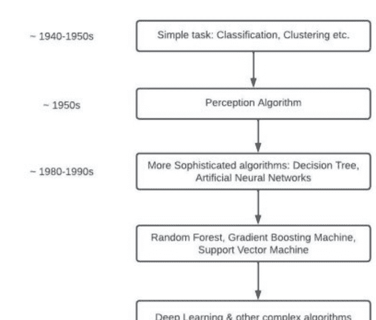

机器学习有几种不同的类型，包括监督学习、无监督学习和深度学习。监督学习涉及使用标记数据来训练模型，然后可以使用该模型对新的、未见过的数据进行预测。另一方面，无监督学习涉及使用未标记数据来识别数据中的模式或结构。深度学习是机器学习的一个子集，它使用人工神经网络来分析大量数据并做出预测或决策。

机器学习是解决复杂问题的强大工具，但它并非没有局限性。机器学习的主要挑战之一是处理大量数据，这些数据可能难以处理和分析。此外，机器学习模型可能容易出现过拟合和欠拟合，这可能导致不准确的预测或决策。尽管存在这些局限性，机器学习仍有潜力彻底改变广泛的行业，并已被用于解决曾经被认为不可能的问题。

总之，机器学习是计算机科学的一个领域，它使用统计模型和算法来分析数据并基于数据做出预测或决策。它的历史可以追溯到20世纪40年代和50年代，并随着更复杂算法的发展和数据可用性的增加而不断演变。凭借大数据、强大的计算资源和更先进的算法的力量，机器学习已成为解决广泛行业复杂问题的强大工具。

## 1.2 为什么选择Python进行机器学习

Python是一种高级编程语言，广泛应用于机器学习领域。它是一种开源语言，这意味着它可以免费使用，并且可以被任何人修改。近年来，由于其易用性、可读性和多功能性，Python的受欢迎程度迅速增长。

Python是机器学习领域最受欢迎的编程语言之一，这是有充分理由的。它提供了广泛的强大库和框架，使得实现机器学习算法和预处理数据变得容易。在本节中，我们将讨论Python成为机器学习首选语言的一些原因。

### 易用性

Python在机器学习中受欢迎的主要原因之一是其易用性。该语言具有简单、易于阅读的语法，使得编写和理解代码变得容易。此外，Python拥有庞大而活跃的社区，这意味着有许多资源可以帮助解决可能出现的任何问题或疑问。

### 强大的库和框架

Python拥有广泛的强大库和框架，使得实现机器学习算法和预处理数据变得容易。一些最受欢迎的库和框架包括：

- **Scikit-learn**：一个流行的机器学习库，提供广泛的算法，包括线性回归、决策树和k均值聚类。
- **TensorFlow**：一个强大的深度学习库，使得构建、训练和部署神经网络变得容易。
- **Keras**：一个高级深度学习库，可以与TensorFlow和其他后端一起使用。
- **Pandas**：一个用于数据操作和分析的库，使得处理结构化数据变得容易。
- **NumPy**：一个用于数值计算的库，为大型多维数组和矩阵提供支持。

这些库和框架使得实现机器学习算法和预处理数据变得容易，这意味着开发人员可以专注于他们试图解决的问题，而不是实现的细节。

### 对机器学习的支持

Python拥有一个庞大而活跃的社区，致力于机器学习。这意味着有许多资源可以帮助解决可能出现的任何问题或疑问。此外，还有许多教程、书籍和在线课程可以帮助开发人员学习如何使用Python进行机器学习。

### 对大数据的支持

Python还拥有广泛的库和框架，使得处理大数据变得容易，例如PySpark、Dask和Pandas。这些库使得处理大型数据集变得容易，这对于机器学习很重要，因为可用的数据越多，模型的性能就越好。

Python的多功能性也是其关键优势之一。它可用于广泛的任务，包括Web开发、数据分析和科学计算。此外，Python对数据可视化有强大的支持，这对于理解和解释机器学习模型很重要。

尽管Python有许多优点，但它并非没有局限性。主要缺点之一是对于某些任务（如图像处理和其他计算密集型任务）来说，它可能较慢。此外，Python是一种动态类型语言，这可能使调试和优化代码变得更加困难。

总之，Python因其易用性、广泛的强大库和框架以及强大的社区支持而成为机器学习的热门选择。

库和框架，拥有庞大而活跃的社区，并支持大数据。此外，它拥有简洁易读的语法，使得编写和理解代码变得容易，这在机器学习中很重要，因为它使得尝试不同的模型和算法更加便捷。它还拥有丰富的资源，使开发者能够轻松学习这门语言及其机器学习库。

## 1.3 SCIKIT-LEARN 概述

Scikit-learn 是一个流行的 Python 机器学习库。它是一个开源库，这意味着它可以免费使用，并且可以被任何人修改。Scikit-learn 提供了广泛的工具和算法来构建和训练机器学习模型，使其成为一个功能强大且用途广泛的库。在下面的章节中，我们将提供 scikit-learn 的一些优点和局限性：

**Scikit-learn 的优点**

以下是使用 scikit-learn 的一些优点：

- 1. **易于使用**：Scikit-learn 旨在易于使用，即使是刚开始接触机器学习的初学者也能轻松上手。它提供了一个简单且一致的接口来构建和评估模型，这有助于节省时间并减少错误。
- 2. **功能全面**：Scikit-learn 提供了一套全面的工具，用于数据预处理、特征选择、模型选择和评估。它包含广泛的机器学习算法，包括线性回归、逻辑回归、决策树、随机森林、支持向量机和神经网络等。
- 3. **开源**：Scikit-learn 是一个开源库，这意味着它可以免费使用，并且可以根据您的特定需求进行定制和修改。它还由庞大的开发者和研究人员社区不断更新和改进。
- 4. **快速且可扩展**：Scikit-learn 旨在快速且可扩展，即使对于大型数据集也是如此。它可以在多个核心上运行，并支持分布式计算，这使其适用于生产环境。
- 5. **可互操作**：Scikit-learn 与其他库和工具（包括 NumPy、Pandas 和 Matplotlib）可互操作，这使其易于集成到您现有的数据分析和机器学习工作流程中。
- 6. **可扩展**：Scikit-learn 具有高度可扩展性，这意味着您可以向库中添加自己的自定义模型、算法和指标。这允许您根据特定需求和用例来定制库。
- 7. **文档完善**：Scikit-learn 文档完善，提供了大量的示例和教程，可以帮助您快速上手。它还有一个活跃的社区论坛，您可以在那里提问并从其他用户那里获得帮助。

总的来说，scikit-learn 是一个功能强大且用途广泛的机器学习库，为数据分析和预测建模提供了一系列工具。其易用性、全面的工具集和开源特性使其成为机器学习从业者和研究人员的热门选择。

## Scikit-learn 的局限性

尽管它有许多优势并在数据科学社区中被广泛使用，但也存在一些需要考虑的局限性。

- 1. **深度学习能力有限**：Scikit-learn 并非为深度学习而设计，深度学习是机器学习中专注于多层神经网络的一个领域。虽然该库具有一些神经网络功能，但不如 TensorFlow 或 PyTorch 等其他深度学习框架全面。
- 2. **缺乏对流数据的支持**：Scikit-learn 主要为批量学习而设计，这意味着它适用于可以放入内存的数据集。它不提供对流数据的支持，流数据是指数据持续生成并必须实时处理的场景。
- 3. **对非结构化数据的支持有限**：Scikit-learn 专为结构化数据设计，这意味着它不适合处理文本或图像等非结构化数据。虽然库中有一些用于文本分析的工具，但它们不如专门的 NLP（自然语言处理）库中的工具全面。
- 4. **并行性有限**：虽然 scikit-learn 确实支持并行处理，但它并未针对分布式计算进行优化。这意味着在处理非常大的数据集或在大型集群上运行复杂模型时，速度可能会很慢。
- 5. **自动机器学习能力有限**：Scikit-learn 没有内置的工具来自动化机器学习工作流程，例如超参数调整或特征工程。虽然一些第三方库（如 TPOT）提供了此功能，但其集成度不如其他自动机器学习平台。

尽管存在这些局限性，scikit-learn 仍然是许多机器学习任务的强大工具，并在数据科学社区中被广泛使用。在为特定项目选择机器学习库时，了解其优点和缺点非常重要。

## 1.4 设置开发环境

开发环境是一套允许您编写、测试和调试代码的工具和软件。在本节中，我们将讨论如何设置用于 Python 和机器学习的开发环境。

### 安装 Python

设置开发环境的第一步是安装 Python。Python 可以从官方网站 (python.org) 下载，并可以安装在 Windows、macOS 或 Linux 上。

在本节中，我们将讨论在每个操作系统上安装 Python 的分步过程，并附有截图。

### 对于 Windows：

- 1. 前往 Python 官方网站 (https://www.python.org/)。
- 2. 点击 "Downloads" 按钮。
- 3. 点击 "Windows" 按钮。
- 4. 点击 "Latest Python 3 Release" 按钮。例如，目前是 "Python 3.11.12"。
- 5. 点击 "Windows x86-64 executable installer" 按钮下载安装程序。
- 6. 下载完成后，双击安装程序文件开始安装过程。
- 7. 在安装程序的第一个屏幕上，点击 "Install Now" 按钮。

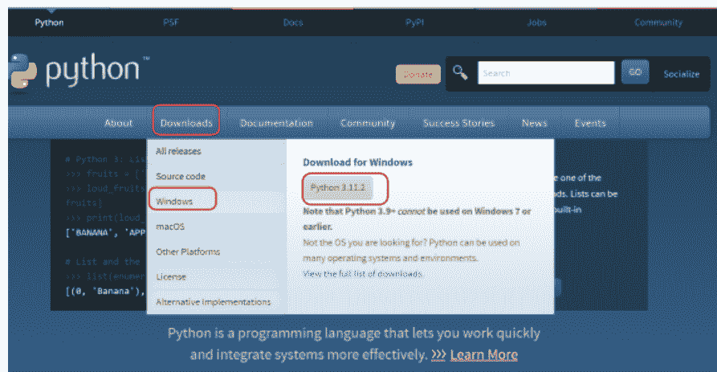

Python 是一种编程语言，可让您快速工作并更有效地集成系统。>>> 了解更多

- **入门**
  无论您是编程新手还是经验丰富的开发者，Python 都易于学习和使用。
  从我们的初学者指南开始
- **下载**
  Python 源代码和安装程序可供所有版本下载！
  最新版本：Python 3.11.2
- **文档**
  Python 标准库的文档以及教程和指南可在线获取。
  docs.python.org
- **工作**
  正在寻找工作或有 Python 相关职位需要招聘？我们重新启动的社区运营招聘板是您的去处。
  jobs.python.org


- 1. 在下一个屏幕上，您将被要求确认安装位置。保留默认位置并点击 "Next" 按钮。
- 2. 在下一个屏幕上，您将被询问是否要将 Python 添加到系统 PATH。建议选择 "Add Python 3.x to PATH" 并点击 "Install" 按钮。
- 3. 安装完成后，点击 "Close" 按钮。


### 对于 MacOS：

- 1. 前往 Python 官方网站 (https://www.python.org/)
- 2. 点击 "Downloads" 按钮。
- 3. 点击 "MacOS" 按钮。
- 4. 点击 "Latest Python 3 Release" 按钮。


- 1. 点击 "macOS 64-bit installer" 按钮下载安装程序。
- 2. 下载完成后，双击安装程序文件开始安装过程。
- 3. 在安装程序的第一个屏幕上，点击 "Continue" 按钮。
- 4. 在下一个屏幕上，您将被要求确认安装位置。保留默认位置并点击 "Install" 按钮。
- 5. 安装完成后，点击 "Close" 按钮。

### 对于 Linux 系统：

1.  打开一个终端窗口。
2.  运行命令 `sudo apt-get update` 来更新系统的软件包列表。
3.  运行命令 `sudo apt-get install python3` 来安装 Python。
4.  要检查 Python 是否正确安装，请运行命令 `python3 -V`。这应该会显示当前安装在您系统上的 Python 版本。

需要注意的是，您安装的 Python 版本很重要，因为一些库和框架可能只与特定版本的 Python 兼容。建议安装当前可用的最新稳定版 Python。

Python 安装完成后，建议安装一个包管理器，例如 `pip`，这将使安装和管理库与框架变得更加容易。

## 安装库与框架

下一步是安装将在开发环境中使用的库和框架。机器学习领域最流行的库和框架包括 NumPy、SciPy 和 scikit-learn。这些库可以通过在命令行运行命令 `pip install numpy scipy scikit-learn` 来使用 `pip` 安装。

在本节中，我们将讨论安装最流行的机器学习库和框架（如 NumPy、SciPy 和 scikit-learn）的逐步过程。

安装库和框架的第一步是确保您的系统上已安装 Python。一旦 Python 安装完毕，您就可以使用包管理器 `pip` 来安装库和框架。

使用 `pip` 安装库和框架的过程如下：

1.  打开一个终端或命令提示符窗口。
2.  运行命令 `pip install numpy` 来安装 NumPy 库。
3.  运行命令 `pip install scipy` 来安装 SciPy 库。
4.  运行命令 `pip install scikit-learn` 来安装 scikit-learn 库。

需要注意的是，上述命令将安装库和框架的最新版本。如果您需要安装特定版本，可以使用命令 `pip install numpy==x.x.x`（其中 `x.x.x` 是版本号）。

另一种安装这些库和框架的方法是使用 Anaconda 发行版，它预装了许多有用的库和框架，并且还有一个名为 Conda 的内置包管理器。您可以通过在 Anaconda 提示符中运行以下命令来安装这些库：

1.  打开 Anaconda 提示符。
2.  运行命令 `conda install numpy` 来安装 NumPy 库。
3.  运行命令 `conda install scipy` 来安装 SciPy 库。
4.  运行命令 `conda install scikit-learn` 来安装 scikit-learn 库。

库和框架安装完成后，您就可以在 Python 脚本中导入它们，并开始使用它们来构建和训练机器学习模型。

需要注意的是，尽管安装库和框架的过程很简单，但保持它们的更新也很重要。这是因为库和框架的新版本可能包含错误修复、性能改进或新功能。您可以通过运行以下命令来更新库和框架：

1.  打开一个终端或命令提示符窗口。
2.  运行命令 `pip install --upgrade numpy` 来更新 NumPy 库。
3.  运行命令 `pip install --upgrade scipy` 来更新 SciPy 库。
4.  运行命令 `pip install --upgrade scikit-learn` 来更新 scikit-learn 库。

同样建议安装一个代码编辑器或集成开发环境（IDE），例如 Jupyter Notebook、Spyder 或 PyCharm。这些工具提供了用户友好的界面，用于编写、测试和调试代码。它们还提供代码补全和调试工具等功能，可以使开发过程更加高效。

为了进一步提升开发过程，同样建议使用版本控制系统（VCS），例如 Git，它允许您跟踪代码的更改并与其他开发者协作。

除了这些工具之外，拥有一个可用于训练和测试机器学习模型的大型数据集也是一个好主意。有许多公开可用的数据集可用于机器学习，例如 UCI 机器学习库，它提供了用于分类、回归和聚类任务的广泛数据集。您可以在本书末尾的附录 D 中了解更多关于在线免费数据的信息。

搭建一个开发环境是使用 Python 进行机器学习工作的重要一步。开发环境包括 Python、`pip`、库和框架、代码编辑器或 IDE、版本控制系统以及数据集等工具。通过将所有这些工具准备就绪，将使开发过程更加高效和顺畅。

## 1.5 理解数据集

理解数据集是机器学习过程中的关键一步。它涉及深入了解将用于训练和测试模型的数据，包括其结构、质量和特征。这种理解对于选择合适的模型、开发稳健的算法以及解释结果至关重要。在本节中，我们将讨论理解数据集的重要性，以及处理数据集时的关键考虑因素。

### 理解数据集的重要性

在模型能够被训练和测试之前，必须先理解数据集。这是因为数据集是构建模型的基础，对数据集理解不足可能导致模型性能不佳。例如，如果数据集不能代表问题本身或存在偏差，模型的表现就不会好。同样，如果数据集太小或存在缺失数据，模型将训练不足，并且无法很好地泛化到新数据。

理解数据集还有助于识别潜在问题，例如异常值、缺失数据和重复记录，这些问题会影响模型的性能。通过及早识别这些问题，可以在模型训练之前解决它们，从而得到一个更稳健的模型。

### 处理数据集时的关键考虑因素

在处理数据集时，有几个关键考虑因素需要牢记：

-   **代表性**：数据集应能代表所要解决的问题，否则模型在新数据上的表现可能不佳。
-   **规模**：数据集的大小会影响模型的性能。更大的数据集可以产生更稳健的模型，但它也可能增加训练和测试模型所需的计算资源。
-   **质量**：数据的质量会影响模型的性能。缺失数据、异常值和重复记录都会影响模型的性能。
-   **特征**：应仔细选择数据的特征，因为它们将用于训练和测试模型。特征应与问题相关，并且不应包含冗余信息。
-   **预处理**：数据在用于训练和测试模型之前可能需要进行预处理。这可以包括清理、规范化和转换数据。

总之，理解数据集是机器学习过程中的关键一步。它涉及深入了解数据，包括其结构、质量和特征。这种理解对于选择合适的模型、开发稳健的算法以及解释结果至关重要。通过理解数据的类型、潜在问题以及处理数据集时的关键考虑因素，机器学习从业者可以确保他们的模型是稳健、准确的，并且能够很好地泛化到新数据。

## 1.6 数据类型

在机器学习中处理数据集时，了解可能遇到的不同数据类型非常重要。数据可以大致分为两类：结构化数据和非结构化数据。理解不同类型的数据及其特征有助于选择合适的机器学习算法和预处理技术。

### 结构化数据

结构化数据是组织良好且易于计算机理解的数据。它可以以表格形式表示，并且可以轻松存储在关系型数据库中。结构化数据的例子包括数值数据（如年龄、收入）和分类数据（如性别、职业）。结构化数据可以进一步分为两种类型：数值型和分类型。

**数值数据：** 数值数据是由数字组成的数据。它可以进一步分为两种类型：**离散型和连续型**。离散数据是只能取某些特定值的数据，例如一个家庭中的孩子数量。另一方面，连续数据可以取某个范围内的任何值，例如温度。

**分类数据：** 分类数据是由类别组成的数据。例如性别、职业和原籍国。分类数据可以进一步分为两种类型：**有序和无序**。有序数据是可以排序的数据，例如教育水平（高中、本科、研究生）。无序数据是无法排序的数据，例如性别（男性、女性）。

### 非结构化数据

非结构化数据是指未组织且计算机难以理解的数据。例如文本、图像和音频。非结构化数据通常处理起来更具挑战性，因为它需要额外的预处理步骤，将其转换为计算机可以理解的格式。这可以包括文本挖掘、图像处理和音频处理。

**文本数据**是最常见的非结构化数据类型之一。它可以在电子邮件、社交媒体帖子和客户评论中找到。文本数据需要预处理技术，如分词、词干提取和词形还原，以将其转换为机器学习模型可以理解的格式。

**图像和视频**也是常见的非结构化数据类型。它们需要预处理技术，如图像处理、目标检测和特征提取，以将其转换为机器学习模型可以理解的格式。

### 半结构化数据

半结构化数据是一种不符合特定数据模型或模式的数据类型。它包含结构化数据和非结构化数据的元素。半结构化数据通常以计算机易于处理的格式表示，例如 JSON、XML 或 CSV 文件，但它可能没有固定的结构或定义的数据类型。

半结构化数据的主要优势之一是其灵活性。由于数据不必符合特定模式，因此可以轻松修改或扩展以适应新的数据元素。这使其非常适合处理快速变化的数据或具有高度可变性的数据的应用程序。

半结构化数据通常用于网络爬虫、社交媒体分析和机器学习等应用程序。它也经常用作在不同系统或应用程序之间转换数据的中间格式。

然而，处理半结构化数据也可能有一些缺点。由于数据定义不明确，执行某些类型的分析可能更加困难，例如跨多个源查询或连接数据。在将其用于特定应用程序之前，它可能还需要更多的预处理和清理。

在机器学习中处理不同类型数据的一个**示例**是构建一个模型，根据各种特征预测房屋价格。我们假设数据集包含以下特征：

- 销售价格（目标变量）
- 卧室数量（数值数据）
- 浴室数量（数值数据）
- 房屋面积（平方英尺）（数值数据）
- 房屋类型（分类数据，无序）
- 建造年份（数值数据）
- 邮政编码（分类数据，无序）

在这个例子中，目标变量是销售价格，它是一个数值数据，因为它由一个数字表示，我们希望根据其他变量来预测这个变量。

第一个特征是卧室数量，它是数值数据，因为它由一个数字表示。这个特征可以直接在模型中使用，并且对于预测销售价格很有用，因为卧室数量会影响房屋的整体大小和价格。

第二个特征是浴室数量，它也是数值数据，因为它由一个数字表示。这个特征也可以直接在模型中使用，并且对于预测销售价格很有用，因为浴室数量会影响房屋的整体设施和价格。

第三个特征是房屋面积（平方英尺），它是数值数据，因为它由一个数字表示。这个特征也可以直接在模型中使用，并且对于预测销售价格很有用，因为房屋面积会影响房屋的整体空间和价格。

第四个特征是房屋类型，它是分类数据，无序类型，因为它由“独栋住宅”、“联排别墅”、“公寓”等类别组成。这个特征不能直接在模型中使用，因为模型无法理解分类数据。因此，我们将使用独热编码将此特征转换为数值数据。独热编码为每个类别创建一个新的二进制列，并根据原始数据中是否存在该类别分配 1 或 0 的值。

第五个特征是建造年份，它是数值数据，因为它由一个数字表示。这个特征也可以直接在模型中使用，并且对于预测销售价格很有用，因为房屋的年龄会影响房屋的整体状况和价格。

第六个特征是邮政编码，它也是分类数据，无序类型，因为它由“90210”、“10001”等类别组成。与房屋类型类似，此特征也需要使用独热编码进行转换。

一旦数据被预处理，就可以用来训练和测试机器学习模型，例如线性回归或决策树，以根据其他特征预测销售价格。通过理解数据类型及其特征，我们能够预处理数据并将其输入模型进行进一步分析。

在这个例子中，我们涵盖了三种数据类型：数值、分类（无序）和非结构化。理解数据类型并相应地进行预处理是机器学习过程中的一个重要步骤，因为它确保数据处于机器学习模型可以理解的格式，并且准确地表示我们试图解决的问题。

理解不同类型的数据及其特征是机器学习过程中的一个重要步骤。它有助于选择合适的机器学习算法和预处理技术，并有助于理解在处理数据集时可能遇到的潜在问题和挑战。结构化数据更容易处理，因为它是有组织的，并且可以被计算机轻松理解。非结构化数据更具挑战性，因为它需要额外的预处理步骤，将其转换为机器学习模型可以理解的格式。

## 1.7 机器学习模型的类型

机器学习模型是用于根据数据进行预测或做出决策的算法。有几种类型的机器学习模型，每种都有其自身的优点和缺点。理解不同类型的模型对于为特定问题选择正确的模型以及解释模型结果至关重要。机器学习模型的主要类型有：

1.  **监督学习**：监督学习模型用于根据标记数据进行预测。模型在标记数据集上进行训练，其中输出变量是已知的。一旦模型训练完成，就可以用于对新的、未见过的数据进行预测。监督学习模型的例子包括线性回归、逻辑回归和决策树。
2.  **无监督学习**：无监督学习模型用于在未标记数据中发现模式或结构。模型没有被提供任何标记数据，而是必须自己发现模式和结构。无监督学习模型的例子包括 k 均值聚类、层次聚类和主成分分析。
3.  **半监督学习**：半监督学习模型是监督学习和无监督学习的结合。模型被提供了一些标记数据，但不足以完全训练模型。模型必须使用标记数据和未标记数据的结构来进行预测。半监督学习模型的例子包括自训练和协同训练。
4.  **强化学习**：强化学习模型用于在模型以奖励或惩罚形式获得反馈的环境中做出决策。模型通过随时间最大化奖励来学习做出决策。强化学习模型的例子包括 Q 学习和 SARSA。
5.  **深度学习**：深度学习模型是机器学习的一个子领域，其灵感来源于人脑的结构和功能。这些模型由多层互连的节点（称为人工神经元）组成，可以学习和表示数据中高度复杂的模式。深度学习模型的例子包括卷积神经网络、循环神经网络和深度信念网络。

总之，理解不同类型的机器学习模型对于为特定问题选择正确的模型以及解释模型结果至关重要。

每个模型都有其自身的优缺点，因此评估每个模型对于特定任务的适用性非常重要。

我们将在接下来的几章中详细讨论不同的模型。

## 1.8 总结

- 机器学习简介以及为什么 Python 是 ML 的热门选择
- 通过安装 Python 和所需库来设置环境，包括 Jupyter Notebook 教程
- 理解 Python 数据结构以及在开始 ML 过程之前理解数据集的重要性
- 介绍 Scikit-learn，一个流行的 Python 机器学习库
- 理解 scikit-learn 的 API 以及如何使用它来训练和测试模型。

## 1.9 测试你的知识

**I. 机器学习的主要目标是什么？**

- a. 理解和分析数据
- b. 做出预测或决策
- c. 自动化任务
- d. 以上所有

**II. 使用 Python 进行机器学习的主要优势是什么？**

- a. 它具有简单、易于阅读的语法
- b. 它拥有广泛的强大库和框架
- c. 它拥有庞大且活跃的社区
- d. 以上所有

**III. 什么是 Jupyter Notebook？**

- a. 一个用于数据操作和分析的库
- b. 一个基于 Web 的交互式开发环境
- c. 一个机器学习算法
- d. 一个数据库管理系统

**IV. 结构化数据和非结构化数据之间有什么区别？**

- a. 结构化数据是有组织的，计算机可以轻松理解，而非结构化数据没有组织，计算机难以理解
- b. 结构化数据是数值型的，而非结构化数据是分类型
- c. 结构化数据可以轻松存储在关系数据库中，而非结构化数据则不能
- d. 以上所有

**V. 什么是探索性数据分析（EDA）？**

- a. 一种机器学习算法
- b. 一种用于理解和分析数据的技术
- c. 非结构化数据的预处理步骤
- d. 一个数据可视化库

**VI. 什么是独热编码？**

- a. 一种将分类数据转换为数值数据的技术
- b. 一种将数值数据转换为分类数据的技术
- c. 一种从数据中移除异常值的技术
- d. 一种数据归一化技术

**VII. 数据预处理的主要好处是什么？**

- a. 它使数据更容易理解
- b. 它使数据更能代表问题
- c. 它提高了机器学习模型的性能
- d. 以上所有

**VIII. 使用非结构化数据的主要缺点是什么？**

- a. 它没有组织，计算机难以理解
- b. 它需要额外的预处理步骤，将其转换为机器学习模型可以理解的格式
- c. 它不像结构化数据那样容易存储在关系数据库中
- d. 以上所有

**IX. 使用 scikit-learn 的主要好处是什么？**

- a. 它提供了广泛的机器学习算法
- b. 它易于使用和理解
- c. 它拥有庞大且活跃的社区
- d. 以上所有

**X. 评估模型性能的主要重要性是什么？**

- a. 它有助于确定模型的准确性
- b. 它有助于识别需要改进的领域
- c. 它有助于比较不同模型的性能
- d. 以上所有

## 1.10 答案

I. 答案：b) 做出预测或决策

II. 答案：d) 以上所有

III. 答案：b) 一个基于 Web 的交互式开发环境

IV. 答案：a) 结构化数据是有组织的，计算机可以轻松理解，而非结构化数据没有组织，计算机难以理解

V. 答案：b) 一种用于理解和分析数据的技术

VI. 答案：a) 一种将分类数据转换为数值数据的技术

VII. 答案：d) 以上所有

VIII. 答案：d) 以上所有

IX. 答案：d) 以上所有

X. 答案：d) 以上所有

# 02

## 2 PYTHON：初学者概述

欢迎来到 Python：初学者概述这一章。本章旨在为你打下 Python 编程语言的坚实基础。Python 是一种通用且广泛使用的编程语言，非常适合初学者和专家。它以其简单性、可读性和易用性而闻名，使其成为各种应用的理想选择。在本章中，我们将涵盖 Python 的基础知识，包括其用途和基本语法。我们还将深入探讨更高级的主题，如控制流、函数和数据处理。在本章结束时，你将对 Python 编程的基础有很好的理解，并为继续学习和探索这门语言做好充分准备。

## 2.1 PYTHON 基础

Python 是一种强大且通用的编程语言，广泛应用于从 Web 开发到数据科学的各个行业。它以其简单的语法、易于阅读性以及庞大的库和框架生态系统而闻名。如果你是编程新手或想学习 Python，本节将涵盖该语言的基础知识，包括其语法、注释和变量。

### Python 的语法

Python 的语法设计得易于阅读和理解，重点在于可读性和简单性。Python 使用**缩进**来表示代码块，而不是花括号或像 "begin" 和 "end" 这样的关键字。这使得代码更有组织且易于阅读。Python 对于赋值和比较等基本操作也使用简单、一致的语法。例如，赋值运算符是单等号（=），比较运算符是双等号（==）。

### Python 中的注释

Python 中的注释用于向代码添加注释和解释，使其更易于理解和维护。它们被解释器忽略，不会影响程序的执行。

在 Python 中，注释以井号（#）开头，并持续到行尾。例如，以下行是一个注释：

```
# 这是一个注释
```

你也可以在代码行末尾、语句之后放置注释：

```
x = 5  # 这是一个注释
```

此外，Python 支持多行注释，用三引号（单引号或双引号）表示。例如，以下代码演示了多行注释：

```
"""
这是一个
多行注释
"""
```

多行注释通常用于为模块、类或函数添加文档，也称为 **docstrings**。

在代码中包含注释被认为是最佳实践，特别是对于复杂或不明显的代码部分。注释应清晰、简洁且信息丰富，并应用于解释代码的目的和功能。

同样重要的是保持注释的最新状态，并在代码更改时删除或更新它们。不再相关或准确的注释可能会引起混淆和误导。

### Python 中的缩进

在 Python 中，缩进用于表示代码块。这意味着行首的空白数量用于确定代码块的嵌套级别。例如，在以下代码中，if 块中的语句相对于 if 语句向右缩进四个空格：

```
if x > 0:
    print("x is positive")
    x = x - 1
```

这种缩进很重要，因为它有助于使代码更有组织且易于阅读。它还用于表示循环、函数和类的范围。缩进量不是固定的，可以是空格或制表符的任何倍数，只要在同一代码块内保持一致即可。

同样重要的是要注意，当空白使用不一致时，Python 会引发 **IndentationError**。这意味着如果你对不同的代码块使用不同数量的空白，你会得到一个错误。例如，如果你对一个块使用 4 个空格，对另一个块使用 2 个空格，你会得到一个错误。

为避免这种情况，建议在整个代码中一致地使用空格或制表符，并使用自动将制表符转换为空格的编辑器。大多数流行的 Python IDE，如 PyCharm、VSCode 和 Jupyter notebook，默认启用此功能。

总之，缩进是 Python 语法的一个重要方面，因为它用于表示代码块，并有助于使代码更有组织且易于阅读。在整个代码中使用一致的缩进以避免错误并提高可读性非常重要。

### Python 中的变量

在 Python 中，变量用于在程序中存储和操作数据。它们用于为值命名，以便可以通过名称而不是值来引用该值。变量通过将值赋给

## 2.2 Python 中的数据类型

在 Python 中，数据类型用于定义变量或值的类型。不同的数据类型具有不同的属性和行为，用于存储不同类型的数据。Python 中最常用的数据类型包括：

- **数字**：Python 有多种数值数据类型，例如 int（整数）、float（浮点数）和 complex（复数）。整数是正或负的整数，没有小数点。例如：

```
x = 5 # int
y = -10 # int
```

浮点数是带有小数点的数字，用于表示实数。例如：

```
y = 3.14 # float
z = -0.5 # float
```

复数由实部和虚部组成，书写形式为 a+bj，其中 a 和 b 是实数，j 是虚数单位。例如：

```
z = 3 + 4j # complex
```

- **字符串**：字符串是字符序列，可以使用单引号（''）或双引号（""）声明。字符串用于表示文本，且是不可变的，即创建后无法修改。例如：

```
name = "John" # string
```

- **列表**：列表是项目的有序序列，可以包含任何数据类型。它们用方括号括起来，项目之间用逗号分隔。列表是可变的，即创建后可以修改。例如：

```
fruits = ["apple", "banana", "orange"] # list
```

- **元组**：元组类似于列表，但它们是不可变的，即创建后无法修改。它们也用圆括号括起来，项目之间用逗号分隔。例如：

```
coordinates = (3, 4) # tuple
```

- **字典**：字典用于存储键值对。它们用花括号 {} 括起来，项目之间用逗号分隔。键必须是唯一的且不可变。字典也是可变的，即创建后可以修改。例如：

```
person = {"name": "John", "age": 30} # dictionary
```

- **布尔值**：布尔值表示真或假，可以是 True 或 False。它们主要用于条件语句和循环中。例如：

```
is_valid = True # Boolean
```

需要注意的是，在 Python 中，可以使用内置函数 `type()` 来确定变量或值的类型。例如：

```
x = 5
print(type(x)) # <class 'int'>
```

总之，数据类型是 Python 编程的重要方面，因为它们定义了变量或值的类型，并具有不同的属性和行为。Python 中最常用的数据类型包括数字（int、float、complex）、字符串、列表、元组、字典和布尔值。为手头的任务选择合适的数据类型至关重要，因为它影响着数据在程序中的使用和操作方式。此外，了解数据类型的可变性有助于高效利用内存并防止代码中出现意外行为。

## 2.3 Python 中的控制流

控制流指的是程序中语句的执行顺序。在 Python 中，控制流通过使用 if-else、for 循环和 while 循环等语句来实现。这些语句允许你控制程序的执行流程，并根据特定条件做出决策。

**if-else 语句**用于在代码中做出决策。它允许你仅在特定条件为真时执行一段代码块。if-else 语句的语法如下：

```
if condition:
    # 如果条件为真，则执行此代码块
else:
    # 如果条件为假，则执行此代码块
```

例如，以下代码检查变量 x 是否大于 5，如果是，则打印 "x is greater than 5"。

```
x = 7
if x > 5:
    print("x is greater than 5")
else:
    print("x is not greater than 5")
```

另一种控制流结构是 **for 循环**。for 循环用于遍历一系列项目，例如列表、元组或字符串。for 循环的语法如下：

```
for variable in sequence:
    # 对序列中的每个项目执行此代码块
```

例如，以下代码遍历一个数字列表，并打印每个数字：

```
numbers = [1, 2, 3, 4, 5]
for number in numbers:
    print(number)
```

**while 循环**是另一种控制流结构。它用于只要特定条件为真就重复执行一段代码块。while 循环的语法如下：

```
while condition:
    # 只要条件为真，就执行此代码块
```

例如，以下代码使用 while 循环打印从 1 到 5 的数字：

```
i = 1
while i <= 5:
    print(i)
    i += 1
```

Python 还提供了 **break** 和 **continue** 语句，用于更精细地控制循环内的执行流程。**break** 语句允许你提前退出循环，而 **continue** 语句允许你跳过当前迭代并继续下一次迭代。

例如，以下代码使用 for 循环遍历一个数字列表，但如果数字等于 3，则使用 **break** 语句提前退出循环：

```
numbers = [1, 2, 3, 4, 5]
for number in numbers:
    if number == 3:
        break
    print(number)
```

此代码的输出将是 1, 2，但不包括 3。

总之，控制流是编程的重要方面，Python 提供了多种工具来控制程序的执行流程。if-else 语句、for 循环和 while 循环用于根据特定条件做出决策和重复执行代码。此外，**break** 和 **continue** 语句提供了对循环内执行流程更精细的控制。有效理解和使用这些控制流结构将帮助你编写更高效、更有组织的代码。

## 2.4 Python 中的函数

在 Python 中，函数是一段可重用的代码块，用于执行特定任务。函数对于组织和构建代码非常有用，使其更具可读性和可维护性。它们还可以在程序的多个部分中重用，减少代码重复。

函数使用 **def** 关键字定义，后跟函数名称和一组可以包含参数的圆括号。例如，以下代码定义了一个名为 **greet** 的简单函数，它接受一个参数 **name**：

```
def greet(name):
    print("Hello, " + name)
```

一旦定义了函数，就可以通过使用其名称后跟圆括号来调用或调用它。例如：

```
greet("John")
```

这将输出 "Hello, John"。

函数也可以使用 **return** 语句返回一个值。例如，以下函数接受两个参数 **a** 和 **b**，并返回它们的和：

```
def add(a, b):
    return a + b

result = add(3, 4)
print(result)
```

这将输出 7。

同样重要的是要注意，在 Python 中，函数可以为其参数设置默认值。这意味着如果在调用函数时未传递某个参数的值，则将使用默认值。例如：

```
def greet(name, message = "Hello"):
    print(message + ", " + name)

greet("John")
```

在此示例中，**message** 参数的默认值为 "Hello"，因此如果在调用函数时未传递该参数，则将使用默认值。

函数也可以用作其他函数的参数，这种技术称为高阶函数。这使得代码更加灵活，并允许开发者编写更通用和可重用的函数。

总之，函数是 Python 编程的一个重要方面。它们提供了一种组织和构建代码的方式，使其更具可读性和可维护性。函数还可以在程序的多个部分中重用，减少代码重复。它们还可以接受参数并返回值。

## 2.5 匿名（Lambda）函数

在 Python 中，匿名函数也称为 lambda 函数，是一种没有名称的函数。它们使用 **lambda** 关键字定义，后跟一组参数、一个冒号和一个表达式。当调用函数时，该表达式会被求值并返回。

例如，以下代码定义了一个 lambda 函数，该函数接受两个参数 **a** 和 **b**，并返回它们的乘积：

```
multiply = lambda a, b: a * b

result = multiply(3, 4)

print(result)
```

这将输出 12。

当需要一个小型、简单的函数时，lambda 函数非常有用，例如按钮点击的回调函数或列表的排序键。它们也可以用作其他函数的参数，例如 **filter()** 和 **map()** 函数。

例如，以下代码使用 **filter()** 函数过滤数字列表，仅保留偶数：

```
numbers = [1, 2, 3, 4, 5, 6, 7, 8, 9, 10]

even_numbers = filter(lambda x: x % 2 == 0, numbers)

print(list(even_numbers))
```

需要注意的是，与常规函数不同，lambda 函数没有 return 语句。表达式的值默认返回。此外，lambda 函数不能包含语句，只能包含表达式。

## 2.6 列表函数

Python 提供了多种内置函数，可用于操作列表。这些函数使得对列表执行常见操作变得容易，例如排序、过滤和映射。

**len()** 函数用于确定列表的长度，即它包含的元素数量。例如：

```
fruits = ['apple', 'banana', 'orange']

print(len(fruits))
```

这将输出 3。

**sort()** 函数用于按升序对列表的元素进行排序。它修改原始列表，而不返回新列表。例如：

```
numbers = [3, 1, 4, 2, 5]

numbers.sort()

print(numbers)
```

这将输出 [1, 2, 3, 4, 5]。

**sorted()** 函数类似于 **sort()** 函数，但它返回一个新列表，而不是修改原始列表。

```
numbers = [3, 1, 4, 2, 5]

sorted_numbers = sorted(numbers)

print(sorted_numbers)
```

这将输出 [1, 2, 3, 4, 5]。

**filter()** 函数用于根据特定条件过滤列表的元素。它返回一个迭代器，可以转换为列表。例如：

```
numbers = [1, 2, 3, 4, 5]

even_numbers = filter(lambda x: x % 2 == 0, numbers)

print(list(even_numbers))
```

这将输出 [2, 4]。

**map()** 函数用于对列表的每个元素应用特定操作。它返回一个迭代器，可以转换为列表。例如：

```
numbers = [1, 2, 3, 4, 5]

squared_numbers = map(lambda x: x ** 2, numbers)

print(list(squared_numbers))
```

这将输出 [1, 4, 9, 16, 25]。

**reduce()** 函数用于通过对列表元素应用特定操作，将列表元素归约为单个值。它是 **functools** 模块的一部分。例如：

```
from functools import reduce

numbers = [1, 2, 3, 4, 5]

product = reduce(lambda x, y: x * y, numbers)

print(product)
```

这将输出 120。

总之，Python 提供了多种内置函数，使得操作列表变得容易。**len()**、**sort()**、**sorted()**、**filter()**、**map()** 和 **reduce()** 函数通常用于确定列表长度、对元素排序、根据特定条件过滤元素、对列表的每个元素应用操作以及将列表元素归约为单个值等任务。这些函数可以使你的代码更具可读性、效率和组织性。需要注意的是，其中一些函数如 **filter()** 和 **map()** 返回一个迭代器，可以使用 **list()** 函数将其转换为列表。此外，**reduce()** 是 **functools** 模块的一部分，使用前需要导入。理解和有效使用这些内置函数可以帮助你编写更高效和有组织的代码。

## 2.7 字典函数

Python 提供了多种内置函数，可用于操作字典。这些函数使得对字典执行常见操作变得容易，例如遍历键和值、添加和更新键值对，以及检查键或值是否存在。

**len()** 函数用于确定字典中键值对的数量。例如：

```
person = {"name": "John", "age": 30}

print(len(person))
```

这将输出 2。

**keys()** 函数用于返回字典中所有键的视图。例如：

```
person = {"name": "John", "age": 30}

print(person.keys())
```

这将输出 **dict_keys(['name', 'age'])**

**values()** 函数用于返回字典中所有值的视图。例如：

```
person = {"name": "John", "age": 30}
print(person.values())
```

这将输出 **dict_values(['John', 30])**

**items()** 函数用于以元组列表的形式返回字典中所有键值对的视图。例如：

```
person = {"name": "John", "age": 30}
print(person.items())
```

这将输出 **dict_items([('name', 'John'), ('age', 30)])**

**get()** 函数用于检索字典中某个键的值。如果未找到该键，则返回 None 或可以作为参数指定的默认值。例如：

```
person = {"name": "John", "age": 30}
print(person.get("name")) # 输出: John
print(person.get("address", "Unknown")) # 输出: Unknown
```

**update()** 函数用于更新字典的键值对。它可以接受另一个字典或键值对作为参数。例如：

```
person = {"name": "John", "age": 30}
person.update({"name": "Jane", "gender": "female"})
print(person) # 输出: {'name': 'Jane', 'age': 30, 'gender': 'female'}
```

**pop()** 函数用于从字典中移除一个键值对。它接受键作为参数，并返回被移除的键的值。如果未找到该键，则引发 **KeyError** 或返回可以作为参数指定的默认值。例如：

```
person = {"name": "John", "age": 30}
print(person.pop("name")) # 输出: John
print(person) # 输出: {'age': 30}
```

**in** 关键字用于检查键或值是否存在于字典中。例如：

```
person = {"name": "John", "age": 30}
print("name" in person) # 输出: True
print("address" in person) # 输出: False
```

总之，Python 提供了多种内置函数，使得操作字典变得容易。**len()**、**keys()**、**values()**、**items()**、**get()**、**update()**、**pop()** 和 **in** 关键字通常用于确定键值对数量、遍历键和值、添加和更新键值对、检查键或值是否存在以及移除键值对等任务。这些函数可以使你的代码更具可读性、效率和组织性。理解和有效使用这些内置函数可以帮助你编写更高效和有组织的代码。

## 2.8 字符串操作函数

Python 提供了多种内置函数和方法来操作字符串。这些函数和方法使得对字符串执行常见操作变得简单，例如连接、切片、格式化和搜索。

**len()** 函数用于确定字符串的长度，即它包含的字符数。例如：

```
name = "John"
print(len(name))
```

这将输出 4。

**+** 运算符用于将两个或多个字符串连接在一起。例如：

```
first_name = "John"
last_name = "Doe"
full_name = first_name + " " + last_name
print(full_name)
```

这将输出 "JOHN Doe"。

* 运算符用于将字符串重复一定次数。例如：

```
name = "John"
print(name * 3)
```

这将输出 "JOHNJOHNJOHN"。

[:] 表示法用于切片字符串。它允许你通过指定起始和结束索引从字符串中提取子字符串。例如：

```
name = "John Doe"
print(name[0:4])
```

这将输出 "JOHN"。

**in** 关键字用于检查子字符串是否存在于字符串中。例如：

```
name = "John Doe"
print("John" in name) # 输出：True
print("Jane" in name) # 输出：False
```

**replace()** 方法用于将字符串中的一个子字符串替换为另一个子字符串。例如：

```
name = "John Doe"
new_name = name.replace("John", "Jane")
print(new_name)
```

这将输出 "JANE Doe"。

**split()** 方法用于使用指定的分隔符将字符串分割成子字符串列表。例如：

```
name = "John,Doe,30"
name_list = name.split(",")
print(name_list)
```

这将输出 **['John', 'Doe', '30']**。

**format()** 方法用于通过将占位符替换为值来格式化字符串。占位符由花括号 **{}** 表示。例如：

```
name = "John"
age = 30
print("My name is {} and I am {} years old.".format(name, age))
```

这将输出 "My name is John and I am 30 years old."。

**join()** 方法用于使用指定的分隔符将字符串列表连接成单个字符串。例如：

```
names = ["John", "Doe", "Jane"]
string_of_names = ",".join(names)
print(string_of_names)
```

这将输出 "JOHN,Doe,Jane"。

总之，Python 提供了多种内置函数和方法来操作字符串。**len()**、+ 运算符、* 运算符、[:] 表示法、**in** 关键字、**replace()**、**split()**、**format()** 和 **join()** 常用于诸如确定字符串长度、连接多个字符串、重复字符串、切片子字符串、检查子字符串是否存在、替换子字符串、将字符串分割成子字符串列表、使用占位符格式化字符串以及将字符串列表连接成单个字符串等任务。这些函数和方法可以使你的代码更具可读性、效率和组织性。有效理解和使用这些内置函数和方法可以帮助你编写更高效和有组织的代码。需要注意的是，像 **replace()**、**split()**、**format()** 和 **join()** 这样的方法是字符串特有的，不能用于其他数据类型。

## 2.9 异常处理

异常处理是 Python 中的一种机制，允许你处理代码中的错误和异常情况。它允许你编写即使在发生错误时也能继续执行的代码。这很重要，因为它允许你的程序继续运行并避免崩溃，从而带来更好的用户体验。

**try** 和 **except** 关键字用于处理 Python 中的异常。**try** 块包含可能引发异常的代码。**except** 块包含如果引发异常将执行的代码。例如：

```
try:
    num1 = 7
    num2 = 0
    print(num1 / num2)
except ZeroDivisionError:
    print("Division by zero is not allowed.")
```

在这个例子中，**try** 块中的代码在尝试将 **num1** 除以值为 0 的 **num2** 时，会引发 **ZeroDivisionError** 异常。**except** 块中的代码被执行，并打印消息 "Division by zero is not allowed."。

你可以使用多个 **except** 块来处理不同类型的异常。例如：

```
try:
    variable = "hello"
    print(int(variable))
except ValueError:
    print("ValueError: could not convert string to int.")
except TypeError:
    print("TypeError: int() argument must be a string, a bytes-like object or a number, not 'list'")
```

在这个例子中，**try** 块中的代码在尝试将字符串 "hello" 转换为整数时（这是不可能的），会引发 **ValueError** 异常。第一个 **except** 块被执行，并打印消息 "ValueError: could not convert string to int."。

你也可以使用 **finally** 块来包含无论是否引发异常都会执行的代码。例如：

```
try:
    num1 = 7
    num2 = 0
    print(num1 / num2)
except ZeroDivisionError:
    print("Division by zero is not allowed.")
finally:
    print("This code will be executed no matter what.")
```

在这个例子中，**finally** 块中的代码无论 **try** 块中的代码是否引发异常都会被执行。

此外，你可以使用 **raise** 关键字手动引发异常。

```
raise ValueError("Invalid Value")
```

总之，异常处理是 Python 中的一个重要特性，允许你处理代码中的错误和异常情况。**try** 和 **except** 关键字用于处理异常，而 **finally** 块可用于包含无论是否引发异常都会执行的代码。使用多个 **except** 块允许你分别处理不同类型的异常。**raise** 关键字可用于手动引发异常。异常处理允许你的程序继续运行并避免崩溃，从而带来更好的用户体验。在代码中使用异常处理来预见和处理意外情况，并使你的代码更加健壮和可靠，这一点很重要。

## 2.10 Python 中的文件处理

Python 中的文件处理允许你从计算机文件系统读取文件和写入文件。Python 提供了多种内置函数和方法来处理文件，包括打开、读取、写入和关闭文件。

**open()** 函数用于打开一个文件。它接受文件名和文件应以何种模式打开作为参数。模式可以是 'r' 表示读取，'w' 表示写入，'a' 表示追加。例如：

```
file = open('example.txt', 'r')
```

这将以读取模式打开文件 'example.txt'。

**read()** 方法用于读取文件的内容。例如：

```
file = open('example.txt', 'r')
contents = file.read()
print(contents)
file.close()
```

这会读取文件 'example.txt' 的内容并将其存储在变量 'contents' 中，然后打印出来。读取后通过调用 **file.close()** 来关闭文件，这一点很重要。

**write()** 方法用于写入文件。它接受一个字符串作为参数。例如：

```
file = open('example.txt', 'w')
file.write("Hello World!")
file.close()
```

这会将字符串 "Hello World!" 写入文件 'example.txt'。

**append()** 方法用于在不覆盖现有内容的情况下向文件末尾添加新数据。它的工作方式类似于 write 方法。例如：

```
file = open('example.txt', 'a')
file.write("\nThis is an added text")
file.close()
```

这会将 "This is an added text" 添加到文件 'example.txt' 的末尾，而不会覆盖现有内容。

**with** 语句用于打开一个文件，并在你使用完毕后自动关闭它。这被认为是避免文件未关闭错误的最佳实践。例如：

```
with open('example.txt', 'r') as file:
    contents = file.read()
    print(contents)
```

这将以读取模式打开文件 'example.txt'，读取其内容并打印出来，然后在完成后自动关闭文件。

**readline()** 方法用于从文件中读取单行。例如：

```
with open('example.txt', 'r') as file:
    line = file.readline()
    print(line)
```

这会读取文件 'example.txt' 的第一行并打印出来。

Python 中的文件处理允许你从计算机文件系统读取文件和写入文件。Python 提供了多种内置函数和方法来处理文件。

## 2.11 Python 中的模块

Python 中的模块是预先编写的代码库，你可以用它们为你的 Python 程序添加额外功能。它们是组织和重用代码的一种方式，可以帮助你编写更高效、更有条理的代码。Python 拥有种类繁多的内置模块，你也可以使用 pip 等包管理器安装第三方模块。

**import** 语句用于在 Python 中导入模块。例如：

```python
import math
```

这会导入 math 模块，该模块提供了诸如 **sqrt()**、**sin()** 和 **cos()** 等数学函数。

你也可以使用 **from** 关键字从模块中导入特定的函数或变量。例如：

```python
from math import sqrt
```

这只会从 math 模块中导入 **sqrt()** 函数。

你还可以使用 **as** 关键字在导入模块或函数时为其指定一个不同的名称。例如：

```python
import math as m
```

这会导入 math 模块并将其命名为 'm'，这样你就可以使用 **m.sqrt()** 而不是 **math.sqrt()**。

你也可以使用 * 通配符来导入模块中的所有函数和变量。例如：

```python
from math import *
```

这会导入 math 模块中的所有函数和变量，这样你就可以直接使用 **sqrt()** 而不是 **math.sqrt()**。

Python 还提供了一种使用 **dir()** 函数来查找模块内函数或变量列表的方法。例如：

```python
import math
print(dir(math))
```

这将打印出 math 模块内所有函数和变量的列表。

需要注意的是，使用 * 通配符从模块导入所有函数和变量，如果不同模块中存在同名的函数或变量，可能会导致命名冲突。建议使用 **import** 语句导入你需要的特定函数或变量，或者使用 **as** 关键字为它们指定不同的名称。

总而言之，Python 中的模块是预先编写的代码库，你可以用它们为你的 Python 程序添加额外功能。它们是组织和重用代码的一种方式，可以帮助你编写更高效、更有条理的代码。**import** 语句、**from** 关键字、**as** 关键字和 * 通配符用于导入模块、函数和变量。重要的是使用 import 语句导入你需要的特定函数或变量，并使用 **dir()** 函数来查找模块内的函数或变量列表。理解和有效使用模块可以帮助你编写更高效、更有条理的代码，并且可以节省你重写已有代码的时间。

## 2.12 Python 代码风格指南

为了使代码可读、可维护和可共享，需要遵循某些风格约定。这些约定在 Python 风格指南（也称为 PEP 8）中有详细说明。

PEP 8 提供了一套格式化 Python 代码的指南。这些指南涵盖了命名约定、缩进、空格、行长度、注释等主题。遵循这些指南可以提高代码的可读性和一致性，使其更易于理解和维护。

以下是 PEP 8 推荐的一些关键风格约定：

### 1. 命名约定

在 Python 中，变量、函数、类和模块都有命名约定。这些约定使得更容易理解每个对象的用途。以下是基本的命名约定：

- 变量和函数应使用小写字母，单词之间用下划线分隔。
- 类应使用驼峰命名法（单词首字母大写）。
- 模块应使用小写字母，单词之间用下划线分隔。

### 2. 缩进

Python 使用缩进来定义代码块，而不是使用花括号或其他分隔符。建议使用 4 个空格作为每个缩进级别的宽度，而不是使用制表符。

### 3. 空格

空格可用于提高代码的可读性。建议在逗号和运算符后使用单个空格，并避免在函数名和括号之间使用空格。

### 4. 行长度

过长的代码行可能难以阅读，尤其是在较小的屏幕或终端窗口中。PEP 8 建议将行长度限制在最多 79 个字符。如果一行代码超过此限制，你可以使用反斜杠或括号将其分成多行。

### 5. 注释

注释可用于解释代码的目的和工作原理。PEP 8 建议谨慎使用注释，仅在必要时使用。注释应使用完整的句子书写，并以大写字母开头。

除了这些约定，PEP 8 还推荐了一些其他最佳实践。例如，建议尽可能使用内置函数和模块，而不是自己编写。也建议尽可能使用 Python 3.x 语法，而不是使用 Python 2.x 中已弃用的功能。

遵循这些约定可以使你的 Python 代码更具可读性、可维护性和可共享性。如果你正在与其他开发者合作一个大型项目，遵循这些指南尤为重要，因为它使每个人都能更容易地理解代码。

PEP 8 提供了一套格式化 Python 代码的指南。遵循这些指南可以提高代码的可读性和一致性，使其更易于理解和维护。

## 2.13 Python 中的文档字符串约定

在 Python 中，文档字符串（docstring）是出现在模块、函数、类或方法定义的第一条语句中的字符串字面量。它用于提供关于所定义对象的文档。

Python 中编写文档字符串有几种约定，最常见的是 PEP 257 约定。该约定规定文档字符串应是一个多行字符串，包含对象的一行摘要，后跟一个空行和对象的更详细描述。详细描述应采用完整的句子形式，并提供有关参数、返回值以及函数可能引发的任何异常的信息。

以下是遵循 PEP 257 约定的函数定义及其文档字符串的示例：

```python
def add_numbers(x, y):
    """
    将两个数字相加并返回结果。

    Args:
        x (int): 要相加的第一个数字。
        y (int): 要相加的第二个数字。

    Returns:
        int: x 和 y 的和。
    """
    return x + y
```

在这个例子中，文档字符串提供了函数的摘要以及参数和返回值的详细描述。参数类型使用类型提示指定，这在 Python 3 中是可选的，但推荐使用。

遵循一致的文档字符串约定有助于使你的代码更具可读性和易于理解。它也使得自动化工具更容易从你的代码生成文档。

## 2.14 用于数据科学的 Python 库

Python 是一种流行的编程语言，在数据科学领域获得了巨大的普及。它提供了大量的库和工具，使数据科学任务变得更简单、更高效。在本文中，我们将讨论一些最受欢迎的数据科学 Python 库。

1.  **NumPy**：NumPy 是 Python 科学计算的基础库。它支持大型多维数组和矩阵，并提供了一个庞大的数学函数库。NumPy 旨在与 SciPy 和 Pandas 等其他库集成。
2.  **Pandas**：Pandas 是一个提供数据操作和分析工具的库。它提供了 Series 和 DataFrame 等数据结构，允许轻松操作和转换数据。Pandas 支持处理表格数据、结构化数据和时间序列数据。
3.  **Matplotlib**：Matplotlib 是一个 2D 绘图库，使用户能够创建各种类型的图表和绘图。它支持广泛的图表类型，包括折线图、条形图、散点图和直方图。Matplotlib 是可视化数据和生成洞察的绝佳工具。

## 2.15 总结

- Python 是一种高级编程语言，广泛应用于网络开发、数据科学及其他领域。
- Python 语法简洁易学，使其成为初学者的热门选择。
- Python 拥有庞大且活跃的社区，为程序员提供了丰富的资源和库。
- Python 有不同版本，包括 Python 2 和 Python 3，建议使用最新版本（Python 3），因为它相比旧版本有许多改进。
- Python 支持多种数据类型，包括数字、字符串、列表和字典。
- Python 拥有内置函数和模块，可用于数学运算、字符串处理和文件操作等任务。
- Python 还有一个名为“控制流”的特性，允许程序员使用 `if` 和 `else` 语句、`for` 和 `while` 循环来控制程序的执行流程。
- Python 还允许定义和使用函数，函数可以使用 `def` 关键字定义，并通过其名称调用。
- Python 还有一个名为“异常处理”的特性，允许程序员使用 `try` 和 `except` 关键字来处理代码中的错误和异常情况。
- Python 还拥有用于数据科学和机器学习的丰富库，包括 NumPy、pandas、Matplotlib、Seaborn、scikit-learn、TensorFlow、Keras、PyTorch、SciPy 和 statsmodels。

Python 是一种功能强大且用途广泛的编程语言，可用于各种任务。它语法简洁易学，使其成为初学者的热门选择。它还拥有庞大且活跃的社区，为程序员提供了丰富的资源和库。理解 Python 的基础知识，包括其数据类型、内置函数和模块、控制流以及异常处理，对于任何希望开始使用 Python 编程的初学者来说都至关重要。此外，熟悉最流行的数据科学和机器学习库可以帮助初学者轻松实现复杂算法并执行高级数据分析任务。

## 2.16 测试你的知识

1. 推荐使用哪个版本的 Python？
    a. Python 2
    b. Python 3
    c. Python 4
    d. Python 5

2. Python 中 `try` 和 `except` 关键字的目的是什么？
    a. 控制程序的流程
    b. 处理错误和异常情况
    c. 导入模块
    d. 定义和调用函数

3. Python 中 `import` 语句的目的是什么？
    a. 控制程序的流程
    b. 处理错误和异常情况
    c. 导入模块
    d. 定义和调用函数

4. Python 中哪种数据类型用于在单个变量中存储多个项目？
    a. 字符串
    b. 整数
    c. 列表
    d. 元组

5. Python 中 `dir()` 函数的目的是什么？
    a. 控制程序的流程
    b. 处理错误和异常情况
    c. 导入模块
    d. 查找模块内的函数或变量列表

6. Python 中 `open()` 函数的目的是什么？
    a. 打开文件
    b. 关闭文件
    c. 读取文件
    d. 写入文件

7. Python 中哪个库广泛用于主题建模和文档相似性分析？
    a. NumPy
    b. pandas
    c. Gensim
    d. Matplotlib

8. 在 Python 中导入模块时，`*` 通配符字符的目的是什么？
    a. 从模块导入所有函数和变量
    b. 从模块导入特定的函数或变量
    c. 在导入时为模块或函数指定不同的名称
    d. 打开文件

9. 在 Python 中处理文件时，`with` 语句的目的是什么？
    a. 打开文件并在使用完毕后自动关闭它
    b. 读取文件
    c. 写入文件
    d. 查找模块内的函数或变量列表

10. Python 中哪个库广泛用于机器学习和数据科学竞赛？
    a. NumPy
    b. pandas
    c. XGBoost
    d. Matplotlib

## 2.17 答案

1. 答案：b) Python 3
2. 答案：b) 处理错误和异常情况
3. 答案：c) 导入模块
4. 答案：c) 列表
5. 答案：d) 查找模块内的函数或变量列表
6. 答案：a) 打开文件
7. 答案：c) Gensim
8. 答案：a) 从模块导入所有函数和变量
9. 答案：a) 打开文件并在使用完毕后自动关闭它
10. 答案：c) XGBoost

# 3 数据准备

在机器学习中，数据的质量和特性对模型的性能起着至关重要的作用。数据准备步骤是清理、转换和组织数据，使其适合机器学习模型的过程。本章的目标是提供对数据准备过程的理解，以及用于预处理数据的各种技术。我们将涵盖数据清理、特征缩放、特征选择和数据转换，以及评估数据质量的重要性。在本章结束时，你将清楚地了解如何为机器学习准备数据，以及如何确保数据具有最高质量。

## 3.1 导入数据

导入和清理数据是机器学习过程中的关键步骤。数据的质量和特性对模型的性能起着至关重要的作用，确保数据以机器学习模型能够理解的格式存在非常重要。在本节中，我们将讨论导入和清理数据的过程，以及用于预处理数据的各种技术。

数据准备过程的第一步是将数据导入程序。在 Python 中，有几个库可用于导入数据，包括 Pandas、NumPy 和 CSV。

**Pandas** 是一个提供易于使用的数据结构和数据分析工具的库。它可用于从多种来源导入数据，包括 CSV、Excel 和 SQL 数据库。

**NumPy** 是一个用于数值计算的库，提供对大型多维数组和矩阵的支持。它可用于以数组形式导入数据。

**CSV**（逗号分隔值）是一种以表格形式存储数据的常见文件格式。在 Python 中，可以使用 CSV 模块从 CSV 文件导入数据。

在Python中导入数据的一个常见示例是使用Pandas库导入CSV文件。以下是如何使用Pandas导入名为"example_data.csv"的CSV文件的示例。文件"example_data.csv"包含员工数据，具有以下列：

EMPLOYEE_ID, FIRST_NAME, LAST_NAME, EMAIL, PHONE_NUMBER, HIRE_DATE, JOB_ID, YEAR_OF_EXP, EDUCATION, CERTIFICATION, COMMISSION_PCT, MANAGER_ID, DEPARTMENT_ID, AGE, SALARY

该文件将可在本书的GitHub仓库中找到。以下是导入CSV文件的代码：

```
import pandas as pd

# Import the data from the CSV file
data = pd.read_csv("example_data.csv")
```

在此示例中，第一行导入Pandas库并为其分配别名"pd"。第二行使用Pandas提供的"read_csv"函数从"example_data.csv"文件导入数据，并将其存储在名为"data"的变量中。"read_csv"函数会自动检测CSV文件中使用的分隔符（逗号），并将数据分隔成列和行。

数据导入后，可以轻松地进行操作和分析。例如，你可以使用以下代码查看数据的前五行：

```
print(data.head())
```

你也可以使用以下代码访问数据的特定列和行：

```
# Access the column "AGE"
age = data["AGE"]

# Access the row with index 2
row_2 = data.loc[2]
```

在此示例中，我们展示了如何使用Pandas将CSV文件导入Python，以及导入后如何访问数据的特定列和行。Pandas是一个强大的库，使得导入和操作结构化数据变得容易，它易于使用和理解，在数据科学和机器学习中被广泛采用，是数据准备最重要的库之一。

## 用于导入数据的函数列表

有多个Python函数可用于将数据导入Python脚本，包括：

1.  **pandas.read_csv()** - 此函数可用于将数据从CSV文件导入到pandas DataFrame中。
2.  **pandas.read_excel()** - 此函数可用于将数据从Excel文件导入到pandas DataFrame中。
3.  **pandas.read_json()** - 此函数可用于将数据从JSON文件导入到pandas DataFrame中。
4.  **pandas.read_sql()** - 此函数可用于将数据从SQL数据库导入到pandas DataFrame中。
5.  **pandas.read_html()** - 此函数可用于将数据从HTML文件导入到pandas DataFrame中。
6.  **pandas.read_pickle()** - 此函数可用于将数据从pickle文件导入到pandas DataFrame中。
7.  **pandas.read_fwf()** - 此函数可用于将数据从固定宽度格式文件导入到pandas DataFrame中。
8.  **pandas.read_stata()** - 此函数可用于将数据从STATA文件导入到pandas DataFrame中。
9.  **pandas.read_sas()** - 此函数可用于将数据从SAS文件导入到pandas DataFrame中。
10. **pandas.read_clipboard()** - 此函数可用于将数据从剪贴板导入到pandas DataFrame中。

这些是使用pandas库在Python中导入数据时最常用的一些函数。根据数据的格式和来源，可以使用不同的函数将其导入Python。

此外，Pandas库提供了许多用于数据操作的有用函数，例如对数据进行排序、筛选和聚合。这使其成为数据分析和准备的强大工具。

数据导入后，可以轻松地进行操作和分析。

要更详细地探索数据导入、清洗和转换，你可以阅读同一作者的《Python for Data Analysis》一书。我们在那里更详细地解释了上述所有过程及其相关库，如NumPy和pandas。

## 3.2 数据清洗

导入数据后，下一步是清洗数据。数据清洗是移除或修正不准确、不完整或无关数据的过程。这一步很重要，因为数据质量会对机器学习模型的性能产生显著影响。以下是一些常见的数据清洗技术：

### 移除重复数据

移除重复数据是数据预处理中的一个重要步骤，因为它可以提高机器学习模型的准确性和效率。重复数据可能由多种原因造成，例如数据录入错误、数据合并或数据抓取。

有几种移除重复数据的技术，包括：

1.  **移除重复行：** 此方法涉及根据一个或多个列识别并移除重复行。当重复数据仅限于少量行时，此方法可能有用。
2.  **移除重复列：** 此方法涉及根据一个或多个列识别并移除重复列。当重复数据仅限于少量列时，此方法可能有用。
3.  **基于列子集移除重复记录：** 此方法涉及根据列子集识别并移除重复记录。当重复数据仅限于特定列子集时，此方法可能有用。

我们可以使用pandas库在Python中通过以下代码片段来完成此操作：

```
# Import the data
data = pd.read_csv("example_data.csv")

# Remove duplicate rows
data = data.drop_duplicates()

# Remove duplicate columns
data = data.loc[:,~data.columns.duplicated()]

#Remove duplicate records based on a subset of columns
data = data.drop_duplicates(subset = ['EMPLOYEE_ID', 'EMAIL', 'PHONE_NUMBER'])
```

在此示例中，第一行从"example_data.csv"文件导入数据并将其存储在名为"data"的变量中。

第二行使用pandas的drop_duplicates()方法从数据框中移除重复行。

第三行使用pandas的drop_duplicates()方法，通过使用.loc[:,~data.columns.duplicated()]选项，从数据框中移除重复列。

第四行使用带有subset参数的drop_duplicates()方法，根据列子集（在此例中为列'EMPLOYEE_ID'、'EMAIL'和'PHONE_NUMBER'）移除重复记录。

重要的是要记住，在移除重复数据时，考虑数据集的大小至关重要，因为移除重复数据可能导致信息的大量丢失。

同样重要的是在移除重复数据后检查数据的分布，以确保数据是合理的。

有时并非总是需要移除重复数据，例如，在时间序列数据的情况下，重复数据对于研究随时间变化的趋势可能有用。因此，在移除重复数据之前，考虑数据的背景和研究问题非常重要。

同样重要的是要记住，在移除重复数据时，根据数据的具体特征和研究问题使用适当的方法至关重要。例如，如果重复数据仅限于特定列子集，那么基于该列子集移除重复记录比移除所有重复数据更合适。

### 处理缺失数据

处理缺失值是数据预处理中的一个重要步骤，因为它会对机器学习模型的性能产生显著影响。缺失值可能由多种原因造成，例如数据录入错误、测量错误或无响应。

有几种处理缺失值的技术，包括：

1.  **删除包含缺失值的行或列：** 这是最简单的方法，但如果移除大量观测值，可能会导致重要信息的丢失。
2.  **填充缺失值：** 此方法涉及用替代值（如变量的均值、中位数或众数）替换缺失值。当缺失值数量

### 3. 使用预测模型填补缺失值：

这种方法涉及训练一个模型，根据非缺失值来预测缺失值。当缺失值数量较多时，此方法可能很有用，但计算成本可能较高。

我们可以使用以下Python代码片段，借助scikit-learn库来实现：

```python
from sklearn.impute import SimpleImputer

# Import the data
data = pd.read_csv("example_data.csv")

X = (data.drop(columns =["EMPLOYEE_ID", "FIRST_NAME", "LAST_NAME",
"EMAIL",
"PHONE_NUMBER", "HIRE_DATE", "JOB_ID", "COMMISSION_PCT",
"MANAGER_ID", "DEPARTMENT_ID", "SALARY"], axis=1))

# Create an imputer object
imputer = SimpleImputer(strategy="mean")

# Fit the imputer object to the data
imputer.fit(X)

# Transform the data
X_imputed = imputer.transform(X)
```

在此示例中，第一行从scikit-learn库导入`SimpleImputer`类。第二行从"example_data.csv"文件导入数据，并将其存储在名为"data"的变量中。第三行将预测变量（X）和所有非数值列（即EMPLOYEE_ID、FIRST_NAME、LAST_NAME、EMAIL、PHONE_NUMBER、HIRE_DATE、JOB_ID、COMMISSION_PCT、MANAGER_ID、DEPARTMENT_ID、SALARY）从目标变量中分离出来。第四行创建一个填充器对象，并将策略参数设置为"mean"，这意味着缺失值将被替换为该特征的平均值。第五行将填充器对象拟合到数据上。第六行使用`transform`方法将缺失值替换为该特征的平均值。

重要的是要记住，选择处理缺失值的方法应基于数据的具体特征和研究问题。此外，在处理缺失值后检查数据的分布也很重要，以确保其对数据而言是合理的。

## 处理异常值

处理异常值是数据预处理中的一个重要步骤，因为它可能对机器学习模型的性能产生显著影响。异常值是与大多数数据显著偏离的观测值。它们可能由多种原因引起，例如测量错误、数据录入错误或来自不同分布的数据。

有几种处理异常值的技术，包括：

- 1. **移除异常值**：此方法涉及识别并移除与大多数数据显著偏离的观测值。当异常值数量较少时，此方法可能有用，但如果移除大量观测值，可能会导致重要信息的丢失。
- 2. **转换数据**：此方法涉及使用对数转换、平方根转换或倒数转换等技术来转换数据，以减少异常值的影响。
- 3. **填充异常值**：此方法涉及用替代值（如变量的均值、中位数或众数）替换异常值。当异常值数量较少时，此方法可能有用，但如果异常值不是随机缺失的，则可能引入偏差。
- 4. **使用稳健模型**：此方法涉及使用对异常值不太敏感的模型，如决策树或线性判别分析。

我们可以使用以下Python代码片段，借助scikit-learn库来实现：

```python
from sklearn.covariance import EllipticEnvelope

# Import the data
data = pd.read_csv("example_data.csv")
X = (data.drop(columns =["EMPLOYEE_ID", "FIRST_NAME", "LAST_NAME",
"EMAIL",
"PHONE_NUMBER", "HIRE_DATE", "JOB_ID",
"COMMISSION_PCT",
"MANAGER_ID", "DEPARTMENT_ID", "SALARY"],
axis=1))

############## Handling missing values #################

# Create an imputer object
imputer = SimpleImputer(strategy="mean")

# Fit the imputer object to the data
imputer.fit(X)

# Transform the data
X_imputed = imputer.transform(X)
X = X_imputed

############## Handling outliers #################

# Create an EllipticEnvelope object
outlier_detector = EllipticEnvelope(contamination=0.05)

# Fit the outlier detector to the data
outlier_detector.fit(X)

# Predict the outliers
y_pred = outlier_detector.predict(X)

# Identify the outliers
outliers = X[y_pred == -1]
```

在此示例中，第一行从scikit-learn库导入`EllipticEnvelope`类。第二行从"example_data.csv"文件导入数据，并将其存储在名为"data"的变量中。第三行将预测变量（X）和非数值变量从目标变量中分离出来。之后，我们按照上一节所述处理缺失值。

注释（############### Handling outliers ####################）之后的下一行创建一个异常值检测器对象，并将污染参数设置为0.05，这意味着5%的数据被视为异常值。下一行将异常值检测器拟合到数据上。下一行使用`predict`方法识别与大多数数据显著偏离的观测值。下一行使用异常值检测器的预测结果来识别异常值。

重要的是要记住，选择处理异常值的方法应基于数据的具体特征和研究问题。此外，在处理异常值后检查数据的分布也很重要，以确保其对数据而言是合理的。

## 格式化数据

格式化数据是数据预处理中的一个重要步骤，因为它确保数据处于一致且可供机器学习模型使用的格式。格式化数据涉及将数据转换为机器学习算法可以轻松处理的格式。这可以包括转换数据类型、编码分类变量和标准化变量名称等任务。

有几种格式化数据的技术，包括：

- 1. 转换数据类型：此方法涉及将数据转换为适当的数据类型，例如将文本数据转换为数值数据，或将日期/时间数据转换为时间戳格式。这可以使用pandas库中的**to_numeric**、**to_datetime**等函数来完成。
- 2. 编码分类变量：此方法涉及将分类变量（如文本数据）转换为机器学习模型可以使用的数值格式。这可以使用独热编码、序数编码或虚拟编码等技术来完成。
- 3. 标准化变量名称：此方法涉及将变量名称转换为一致的格式，例如将变量名称转换为小写或移除空格。这可以使用pandas库中的**str.lower()**、**str.strip()**等函数来完成。

我们可以使用以下Python代码片段，借助pandas库来实现：

```python
# Import the data
data = pd.read_csv("example_data.csv")

#Convert data types
data['AGE'] = data[['AGE']].astype(int)
data['HIRE_DATE'] = pd.to_datetime(data['HIRE_DATE'])

#Encoding categorical variables
data = pd.get_dummies(data, columns=["EDUCATION_LEVEL"])

#Standardizing variable names
data.rename(columns={'EMAIL': 'EMAIL_ID'}, inplace=True)
data.columns = data.columns.str.strip().str.lower().str.replace(' ', '_')
```

在此示例中，第一行从"example_data.csv"文件导入数据，并将其存储在名为"data"的变量中。第二行使用**astype()**方法将'AGE'列的数据类型转换为整数，并使用**pd.to_datetime()**方法将'HIRE_DATE'列转换为日期时间格式。第三行使用**pd.get_dummies()**方法通过独热编码对分类变量'EDUCATION_LEVEL'进行编码。第四行使用**rename()**方法将变量名'EMAIL'标准化为'EMAIL_ID'，并使用**str.strip()**、**str.lower()**、**str.replace()**将所有列名标准化为小写、移除空格并将空格替换为下划线。

重要的是要记住，选择格式化数据的方法应基于数据的具体特征和研究问题。此外，在格式化数据后检查数据的分布也很重要，以确保其对数据而言是合理的。

总之，格式化数据是数据预处理中的一个重要步骤，因为它确保数据处于一致且可供机器学习模型使用的格式。格式化数据涉及将数据转换为机器学习算法可以轻松处理的格式。这可以包括转换数据类型、编码分类变量和标准化变量名称等任务。有几种格式化数据的技术，包括转换数据类型、编码分类变量和标准化变量名称。选择的方法应基于数据的具体特征和研究问题。

数据的具体特征和研究问题。正确格式化数据有助于提升机器学习模型的性能，并使数据更易于处理。

检查数据是否存在任何不一致或错误（如拼写错误或标签错误的数据）并根据需要进行纠正也很重要。

需要注意的是，数据清洗可能是一个耗时的过程，但对于提升机器学习模型的性能至关重要。

## 数据清洗函数列表

在Python脚本中，有多个Python函数可用于清洗数据，包括：

- 1. **pandas.DataFrame.drop()** - 此函数可用于从行或列中删除指定的标签。它可以根据索引或列名删除行或列，也可以根据某些条件删除行或列。
- 2. **pandas.DataFrame.fillna()** - 此函数可用于用特定值或方法填充缺失值。它可以用特定值（如数据的均值或中位数）填充缺失值，也可以用于前向填充或后向填充缺失值。
- 3. **pandas.DataFrame.replace()** - 此函数可用于替换DataFrame中的值。它可以用另一个值或一组值替换特定值或一组值。
- 4. **pandas.DataFrame.drop_duplicates()** - 此函数可用于从DataFrame中删除重复的行。它可以根据一列或多列删除重复行，也可以用于保留重复行的第一次或最后一次出现。
- 5. **pandas.DataFrame.query()** - 此函数可用于根据布尔表达式筛选DataFrame的行。它可以根据某些条件筛选行，例如删除包含缺失值的行或删除具有特定值的行。
- 6. **pandas.DataFrame.rename()** - 此函数可用于重命名DataFrame的列或行索引。它可以重命名一列或多列，或一个或多个索引。
- 7. **pandas.DataFrame.sort_values()** - 此函数可用于根据一列或多列对DataFrame进行排序。它可以按升序或降序对数据进行排序，也可以基于多列进行排序。
- 8. **pandas.DataFrame.groupby()** - 此函数可根据一列或多列对DataFrame的行进行分组。它可以根据特定列对数据进行分组，并对分组后的数据执行均值、总和或计数等计算。

例如，

```python
import pandas as pd

# Import the data
data = pd.read_csv("example_data.csv")

# Remove missing values
data = data.dropna()

# Replace specific values
data = data.replace({'JOB_ID': {'ST_CLERK': 'STATION_CLERK'}})

# Remove duplicate rows
data = data.drop_duplicates()

# Rename columns
data = data.rename(columns={'FIRST_NAME': 'GIVEN_NAME'})
```

在此示例中，第一行从"example_data.csv"文件导入数据并将其存储在名为"data"的变量中。第二行使用**dropna()**函数删除所有包含缺失值的行。第三行使用**replace()**函数将'color'列中所有出现的值'green'替换为'blue'。第四行使用**drop_duplicates()**函数从DataFrame中删除所有重复行。第五行使用**rename()**函数将列'name'重命名为'full_name'。

重要的是要记住，选择的数据清洗方法应基于数据的具体特征和研究问题。此外，清洗后检查数据的分布以确保其对数据有意义也很重要。同样重要的是要记住，数据清洗是一个迭代过程，需要重复该过程，直到数据达到所需的格式。

在Python中清洗数据的一个常见示例是使用Pandas库处理缺失值。以下是如何在DataFrame中处理缺失值的示例：

```python
import pandas as pd

# Import the data from the CSV file
data = pd.read_csv("example_data.csv")

# Checking the number of missing values in each column
print(data.isnull().sum())

# Dropping rows with missing values
data = data.dropna()

# Filling missing values with mean of the column
data = data.fillna(data.mean())
```

在此示例中，第一行导入Pandas库并为其分配别名"pd"。第二行使用Pandas提供的"read_csv"函数从"example_data.csv"文件导入数据，并将其存储在名为"data"的变量中。

第三行使用Pandas提供的"isnull()"函数检查数据每列中的缺失值，并使用"sum()"函数计算每列中缺失值的数量。

第四行使用"dropna()"函数删除所有包含缺失值的行。当缺失值数量较少且可以在不影响整体数据的情况下删除时，此方法很有用。

第五行使用"fillna()"函数用列的均值填充缺失值。当缺失值数量较多且需要用合适的值（此处为列的均值）替换时，此方法很有用。

需要注意的是，处理缺失值还有许多其他方法，例如使用中位数、众数或插值方法。方法的选择取决于数据的特征和项目的具体要求。

在此示例中，我们展示了如何使用Pandas库在DataFrame中处理缺失值。我们使用了"isnull()"和"sum()"函数来检查缺失值，使用"dropna()"函数删除包含缺失值的行，并使用"fillna()"函数用列的均值填充缺失值。这些只是处理缺失值的一些方法，根据数据的特征，不同的方法可能效果更好。

> 重要的是要记住，数据清洗是一个迭代过程，可能需要多个步骤才能正确清洗数据。同样重要的是检查数据是否存在任何不一致或错误，如拼写错误或标签错误的数据，并根据需要进行纠正。

总之，数据清洗是机器学习过程中的一个关键步骤，确保数据质量至关重要。这可以通过使用各种库和技术（如Pandas）、处理缺失值、删除行、用合适的值填充缺失值、检查不一致和错误来实现，这些步骤对于提升机器学习模型的性能至关重要。你在数据清洗上投入的时间和精力越多，机器学习模型的性能就越好。

## 3.3 探索性数据分析

探索性数据分析（EDA）是一种用于理解和分析数据的技术。EDA的目标是获得洞察并理解数据的底层结构，以及识别可能存在的任何模式、关系或异常。EDA是一个迭代过程，通常是数据分析流程中的第一步。在本节中，我们将讨论EDA的过程，以及用于探索和理解数据的各种技术。

### 单变量分析

EDA的第一步是进行单变量分析，这涉及**单独分析每个变量**。这有助于理解数据的分布并识别任何异常值或异常情况。单变量分析中常用的一些技术包括：

#### 描述性统计

描述性统计是数据分析的关键部分，它使我们能够总结和描述数据集的主要特征。在单变量分析中，描述性统计用于总结和描述单个变量的属性。

单变量分析中的描述性统计可以分为两大类：集中趋势度量和离散程度度量。

## 集中趋势度量

集中趋势度量用于描述分布的典型值或中心值。最常见的集中趋势度量包括：

1.  **均值**：它是数据集中所有观测值的总和除以观测值的总数。
2.  **中位数**：它是数据集中的中间值。当数据集有偶数个观测值时，中位数是两个中间值的平均值。
3.  **众数**：它是数据集中出现频率最高的值。

## 离散程度度量

离散程度度量用于描述数据的分布或分散程度。最常见的离散程度度量包括：

1.  **极差**：它是数据集中最大值和最小值之间的差。
2.  **方差**：它是每个值与均值之差的平方的平均值。
3.  **标准差**：它是方差的平方根，用于描述数据围绕均值的分布情况。

其他离散程度度量包括百分位数，用于描述数据在整个范围内的分布情况。

描述性统计可以使用不同类型的图形表示来呈现，例如直方图、箱线图和散点图。这些可视化有助于识别数据中的模式和异常值。

单变量分析的一个常见示例是使用 Pandas 库计算数据集的描述性统计。以下是如何对数据集 "data" 中的变量 "Age" 进行单变量分析的示例：

```python
import pandas as pd

# Import the data
data = pd.read_csv("example_data.csv")

# Extract the variable "Age"
age = data["AGE"]

# Calculate descriptive statistics
print("Mean: ", age.mean())
print("Median: ", age.median())
print("Mode: ", age.mode())
print("Standard Deviation: ", age.std())
print("Minimum Value: ", age.min())
print("Maximum Value: ", age.max())
```

在此示例中，第一行导入 Pandas 库并为其分配别名 "pd"。第二行使用 Pandas 提供的 "read_csv" 函数从 "example_data.csv" 文件导入数据，并将其存储在名为 "data" 的变量中。

第三行使用方括号表示法从数据框中提取变量 "AGE"，并将其存储在名为 "age" 的变量中。

第四行使用 mean() 函数计算变量 "Age" 的均值，使用 median() 函数计算变量的中位数，使用 mode() 函数计算变量的众数，使用 std() 函数计算变量的标准差，使用 min() 函数计算变量的最小值，使用 max() 函数计算变量的最大值。

描述性统计的结果可用于理解变量 "Age" 的分布情况，例如，如果均值接近中位数，则表明该变量呈正态分布；如果均值和中位数相差较大，则表明该变量呈偏态分布。标准差也可用于理解变量的离散程度，其中较低的标准差表明变量紧密分布在均值周围，而较高的标准差表明变量广泛分布在均值周围。

在此示例中，我们展示了如何使用 Pandas 库进行单变量分析，特别是计算变量的描述性统计。这只是可用于执行单变量分析的众多技术之一，不同的方法可能根据数据的特性而更有效。

总之，单变量分析中的描述性统计对于总结和描述单个变量的属性至关重要。这些统计提供了对数据分布的宝贵见解，并有助于识别任何模式或异常值。数据分析师和数据科学家使用这些度量来对数据做出明智的决策，并构建用于数据预测和预报的模型。

## 直方图

直方图是数值数据分布的图形表示。它们显示落在特定范围或区间内的值的频率或比例。在单变量分析中，直方图用于可视化单个变量的分布。

例如，假设我们有一个包含一组人身高数据的数据集。我们可以创建一个直方图来可视化这些身高的分布。直方图将显示每个区间内身高的人的频率或比例。

要在 Python 中创建直方图，我们可以使用 Matplotlib 库。以下是一个示例代码片段：

```python
import matplotlib.pyplot as plt
import numpy as np

# Generate some random data
data = np.random.normal(size=1000)

# Create histogram
plt.hist(data, bins=30, alpha=0.5, color='b')

# Add labels and title
plt.xlabel('Height')
plt.ylabel('Frequency')
plt.title('Distribution of Heights')

# Show plot
plt.show()
```

输出如下所示：

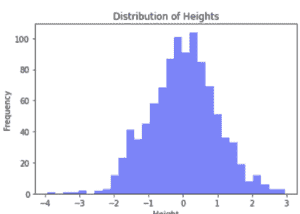

在此示例中，我们首先使用 NumPy 库生成一些随机数据。然后，我们使用 **plt.hist()** 函数创建直方图，指定要使用的区间数量、条形的透明度和颜色以及其他属性。然后，我们为图表添加标签和标题，并使用 **plt.show()** 显示它。

生成的直方图将显示数据中身高的分布，其中 x 轴显示身高范围，y 轴显示该范围内身高的人的频率或比例。

直方图是单变量分析中的有用工具，因为它们允许我们快速可视化变量的分布，并识别数据中的模式或异常值。

## 箱线图

在统计学中，单变量分析涉及对单个变量的检查。可视化总结单个变量分布的一种方法是通过箱线图。箱线图，也称为箱须图，显示数据的中位数、四分位数和范围的摘要。该图有助于识别异常值和比较不同数据集的分布。

要构建箱线图，你需要最小值、下四分位数（Q1）、中位数、上四分位数（Q3）和最大值。四分位距（IQR）是上四分位数和下四分位数之间的距离。箱体代表 IQR，中位数显示为箱体内的线。须线从箱体延伸到最小值和最大值，不包括异常值。

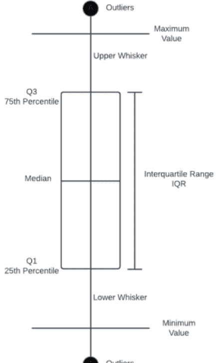

以下是考试成绩数据集的箱线图示例：

数据集：40, 60, 70, 75, 80, 85, 90, 95, 100

最小值：40

下四分位数（Q1）：70

中位数：80

上四分位数（Q3）：90

最大值：100

IQR：Q3 - Q1 = 20

```
40 60 70 75 80 85 90 95 100
|___| |___|
Q1 Median Q3
```

须线：40 和 100

异常值：无

在此示例中，数据集的最小值为 40，下四分位数为 70，中位数为 80，上四分位数为 90，最大值为 100。IQR 计算为 20。箱线图显示大部分数据落在 70 到 90 之间，有两个分数在此范围之外（75 和 100）。

箱线图也可用于比较多个数据集。对于多个数据集，每个箱线图并排绘制，便于直观比较它们的中位数、IQR 和范围。这种比较有助于识别数据分布的差异。

以下是使用 Matplotlib 库在 Python 中创建箱线图的示例：

```python
import matplotlib.pyplot as plt
import numpy as np

# generate some random data
data = np.random.normal(size=100)

# create a box plot of the data
fig, ax = plt.subplots()
ax.boxplot(data)

# set the title and labels
ax.set_title('Box Plot of Random Data')
ax.set_ylabel('Values')

# show the plot
plt.show()
```

输出将如下所示：

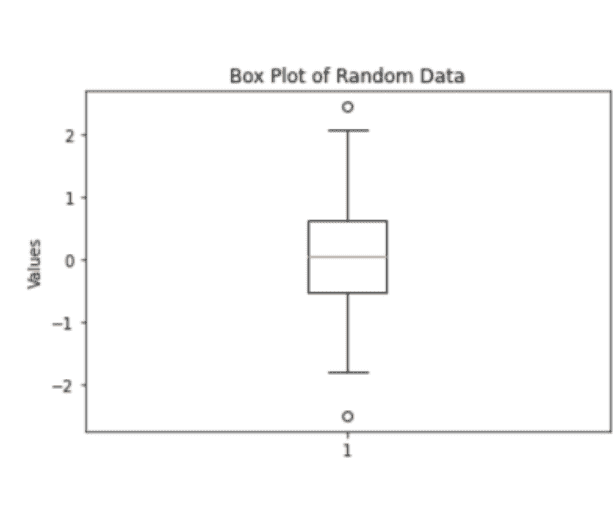

## 双变量分析

单变量分析完成后，下一步是进行双变量分析，即**分析两个变量之间的关系**。这有助于理解变量之间的关联，并识别数据中的任何模式或相关性。双变量分析中常用的一些技术包括：

### 散点图

在统计分析中，双变量分析指的是对两个变量进行分析。可视化双变量数据的一种常用方法是通过散点图。散点图是一种图表，其中两个变量的值沿两个轴绘制，每个单独的数据点在图上用一个点表示。点在图上的位置表示该特定数据点的两个变量的值。

例如，假设我们想分析一组个体的身高和体重之间的关系。我们可以创建一个散点图，将身高放在x轴上，体重放在y轴上，每个个体在图上用一个点表示。

在生成的散点图中，每个点代表一个个体，点在图上的位置同时表示该个体的身高和体重。通过观察散点图，我们可以看到两个变量之间关系的整体模式。

如果图上的点大致形成线性模式，我们可以说这两个变量之间存在正相关，这意味着一个变量增加，另一个也随之增加。另一方面，如果图上的点随机分布，没有可辨别的模式，我们可以说这两个变量之间没有相关性。

除了检查两个变量之间关系的整体模式外，散点图还可用于识别异常值，即远离其他数据点范围的单个数据点。

以下是使用Python中的**matplotlib**库创建散点图的示例代码：

```python
import matplotlib.pyplot as plt

# Sample data
x = [1, 2, 3, 4, 5, 6, 7, 8, 9, 9, 8, 7, 6, 5, 4, 3, 3]
y = [3, 5, 2, 7, 4, 2, 4, 5, 5, 6, 2, 3, 4, 5, 7, 2, 1]

# Create scatter plot
plt.scatter(x, y)

# Add axis labels and title
plt.xlabel('X-axis')
plt.ylabel('Y-axis')
plt.title('Scatter Plot Example')

# Show the plot
plt.show()
```

在这个例子中，我们首先导入**matplotlib.pyplot**模块并创建两个数据列表，**x**和**y**。然后我们调用**matplotlib.pyplot**中的**scatter()**函数，使用这些数据创建散点图。

接下来，我们使用**xlabel()**、**ylabel()**和**title()**函数为图表添加轴标签和标题。

最后，我们调用**show()**函数来显示图表。

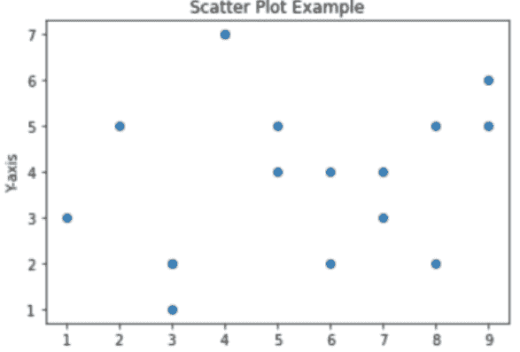

生成的散点图将在水平轴上显示**x**值，在垂直轴上显示**y**值，每个点代表一对值。轴标签和标题提供了关于所绘数据的额外信息。

总的来说，散点图提供了一种有用的方式来探索两个变量之间的关系，并识别数据中的任何模式或异常值。

### 相关性

在统计学中，相关性是衡量两个变量之间关系强度和方向的指标。相关性分析用于双变量分析，以确定两个变量相互关联的程度。

例如，假设我们想研究汽车车龄与其价格之间的关系。我们可以使用相关性分析来确定这两个变量之间是否存在关系，如果存在，是正相关还是负相关。

相关性通常使用相关系数来衡量，其范围从-1到+1。系数为+1表示完全正相关，系数为-1表示完全负相关，系数为0表示没有相关性。

主要有两种类型的相关性：皮尔逊相关和斯皮尔曼相关。皮尔逊相关用于两个变量都呈正态分布的情况，而斯皮尔曼相关用于一个或两个变量不呈正态分布的情况。

以下是使用皮尔逊相关性在Python中研究汽车车龄与其价格之间关系的示例：

```python
import numpy as np
import pandas as pd
import matplotlib.pyplot as plt

# create a sample dataset
age = np.array([1, 3, 5, 7, 9])
price = np.array([10000, 9000, 7000, 5000, 3000])

# calculate the correlation coefficient
corr_coef = np.corrcoef(age, price)[0, 1]

# plot the data and the regression line
plt.scatter(age, price)
plt.plot(age, np.poly1d(np.polyfit(age, price, 1))(age))
plt.xlabel('Age (years)')
plt.ylabel('Price ($)')
plt.title(f'Correlation Coefficient: {corr_coef:.2f}')
plt.show()
```

在这个例子中，我们首先创建一个包含汽车车龄（年）和价格（美元）的样本数据集。然后我们使用**np.corrcoef**函数计算皮尔逊相关系数，并使用**plt.scatter**绘制数据。最后，我们使用**np.polyfit**和**plt.plot**绘制回归线，并使用字符串格式化在标题中显示相关系数。

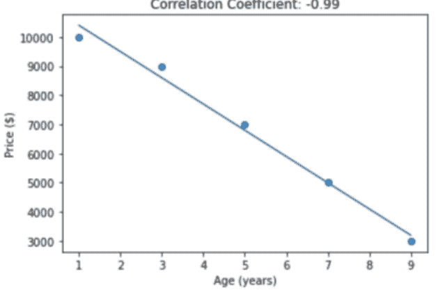

生成的图表显示汽车车龄与其价格之间存在强烈的负相关，相关系数为-0.99。这表明随着汽车车龄的增加，其价格会下降。

这只是可用于进行双变量分析的众多技术之一，根据数据的特性，热力图、折线图、柱状图等不同方法可能效果更好。需要注意的是，双变量分析是一个强大的工具，可用于识别变量之间的模式、关系和相关性，这对于理解数据的底层结构和指导进一步分析非常有用。

## 多变量分析

完成单变量和双变量分析后，下一步是进行多变量分析，即分析三个或更多变量之间的关系。这有助于理解变量之间的关联，并识别数据中的任何模式或相关性。多变量分析中常用的一些技术包括：

### 热力图

热力图是一种数据的图形表示，它使用颜色编码系统来表示不同的值。它是可视化数据集中多个变量之间关系的有用工具。在多变量分析中，热力图用于显示多个变量之间的相关性，使得在大型数据集中识别模式和趋势变得更加容易。

要在Python中创建热力图，我们可以使用**seaborn**库。首先，我们需要生成一些随机数据来处理。我们可以使用**numpy**库生成随机数据，并设置一个种子以确保每次运行代码时数据相同。

以下是热力图在多变量分析中如何使用的一个示例：

假设我们想了解学生成绩与各种因素（如学习时间、家庭收入和父母教育水平。我们可以创建一个热力图来可视化这些变量之间的相关性。

为了生成数据，我们可以使用NumPy库并设置一个种子，以确保每次生成的数据一致。以下是一个示例代码：

```python
import numpy as np
import matplotlib.pyplot as plt

np.random.seed(42)

# generate random data
study_time = np.random.normal(6, 2, 100)
family_income = np.random.normal(50000, 15000, 100)
parent_education = np.random.normal(12, 3, 100)
test_score = study_time * 10 + family_income * 0.001 + parent_education * 3 + np.random.normal(0, 5, 100)

# plot heatmap
plt.figure(figsize=(8, 6))
correlation_matrix = np.corrcoef([study_time, family_income, parent_education, test_score])
heatmap = plt.imshow(correlation_matrix, cmap='coolwarm', interpolation='nearest')
plt.colorbar(heatmap)
plt.xticks([0, 1, 2, 3], ['Study Time', 'Family Income', 'Parent Education', 'Test Score'])
plt.yticks([0, 1, 2, 3], ['Study Time', 'Family Income', 'Parent Education', 'Test Score'])
plt.title('Correlation Matrix Heatmap')
plt.show()
```

在这个例子中，我们使用**np.random.normal()**函数为每个变量生成了100个随机值，该函数从正态分布中生成值。然后，我们基于这些变量的线性组合加上一些随机噪声来计算测试分数。最后，我们使用**np.corrcoef()**函数计算变量之间的相关系数，并使用**plt.imshow()**函数将其绘制出来。

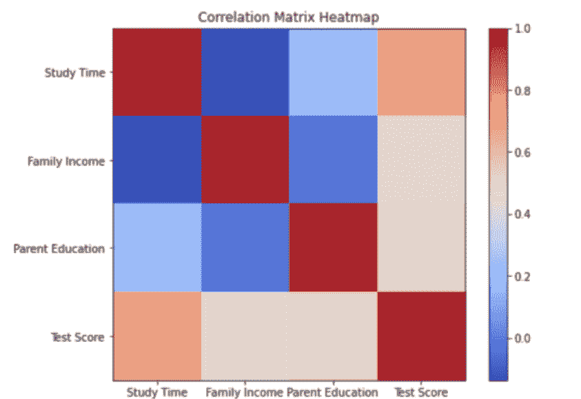

生成的热力图将显示每对变量之间的相关性。颜色越深，相关性越强。例如，我们可以看到学习时间和测试分数之间存在很强的正相关，而家庭收入和测试分数之间的正相关性较弱。父母教育水平和测试分数之间也存在较弱的负相关。总的来说，热力图为我们提供了一种快速简便的方式来可视化多个变量之间的关系。

## 平行坐标图

平行坐标图是一种强大的高维数据可视化技术。在这种技术中，每个变量由一个垂直轴表示，并为每个数据点绘制一条连接其各变量值的线。这使我们能够识别在其他类型的可视化中可能不明显的变量之间的模式和关系。

以下是一个在多元分析中使用平行坐标图的示例场景：

假设我们有一个餐厅顾客评论的数据集，包含食物质量、服务、氛围、价格和总体评分等特征。我们想要探索这些特征与顾客给出的总体评分之间的关系。

我们可以创建一个平行坐标图来可视化这种关系。以下是使用Python的matplotlib库的示例代码：

```python
import numpy as np
import matplotlib.pyplot as plt

np.random.seed(42)

# Generate random data for 5 features and 100 samples
food_quality = np.random.randint(1, 6, size=100)
service = np.random.randint(1, 6, size=100)
ambiance = np.random.randint(1, 6, size=100)
price = np.random.randint(1, 6, size=100)
overall_rating = np.random.randint(1, 6, size=100)

# Create parallel coordinates plot
fig, ax = plt.subplots()
plt.title('Customer Reviews for a Restaurant')
plt.xlabel('Features')
plt.ylabel('Rating')
plt.xticks(range(5), ['Food Quality', 'Service', 'Ambiance', 'Price', 'Overall Rating'])
plt.ylim(0, 5)
plt.plot([0, 1, 2, 3, 4], [food_quality, service, ambiance, price, overall_rating], color='blue', alpha=0.1)
plt.plot([0, 1, 2, 3, 4], [np.mean(food_quality), np.mean(service), np.mean(ambiance), np.mean(price), np.mean(overall_rating)], color='red', alpha=0.9)
plt.show()
```

在这个例子中，我们首先使用**numpy.random.randint()**函数（种子为42，以确保每次生成相同的数据）为100条顾客评论的五个特征和总体评分生成了随机数据。

然后，我们使用matplotlib的**plot()**函数创建了一个平行坐标图，其中每个特征被绘制为一条单独的线，总体评分显示在y轴上。蓝色的线代表单个顾客评论，而红色的线代表每个特征的平均评分。

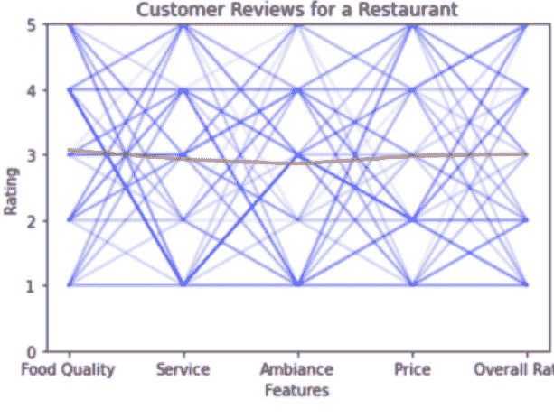

从这个图中，我们可以观察到以下几点：

-   顾客倾向于给食物质量和服务比氛围和价格更高的评分。
-   总体评分与食物质量和服务呈正相关，但与氛围和价格的相关性较弱。
-   每个特征的评分范围很广，表明不同的顾客有不同的偏好和优先级。

这种类型的可视化对于快速识别多元数据中的模式和关系非常有用，并且可以帮助指导进一步的分析和决策。

## 聚类分析

聚类分析，也称为聚类，是一种在多元分析中使用的技术，用于将一组对象分组，使得同一组（称为一个簇）中的对象彼此之间比与其他组中的对象更相似。聚类分析的目标是在数据中发现一种结构或模式，这种结构或模式可用于发现数据中的关系或识别数据中的组别。

聚类分析可用于不同领域的广泛应用，例如市场细分、图像分割、异常检测、客户画像、生物分类等等。

聚类分析有不同的方法，但最常见的是层次聚类和K均值聚类。

### 层次聚类

层次聚类是一种聚类分析方法，它通过递归地将数据集划分为越来越小的组来构建簇的层次结构。层次聚类有两种类型：凝聚型和分裂型。凝聚型聚类从每个数据点作为其自身的簇开始，然后依次合并最接近的簇对，直到所有数据点都属于一个簇。分裂型聚类从所有数据点在一个簇中开始，然后依次将簇划分为更小的簇，直到每个数据点都属于其自身的簇。

以下是使用Python的**scipy**库进行层次聚类的示例：

```python
import numpy as np
from scipy.cluster import hierarchy
import matplotlib.pyplot as plt

# Generate some random data
np.random.seed(123)
x = np.random.rand(10, 2)

# Perform hierarchical clustering
dendrogram = hierarchy.dendrogram(hierarchy.linkage(x, method='ward'))

# Visualize the dendrogram
plt.title('Hierarchical Clustering Dendrogram')
plt.xlabel('Data point')
plt.ylabel('Distance')
plt.show()
```

在这个例子中，我们首先生成一个包含10个数据点和2个特征的随机数据集。然后，我们使用**scipy**中的**hierarchy.linkage**函数，采用“ward”方法进行层次聚类。最后，我们使用**hierarchy.dendrogram**函数生成树状图的可视化。

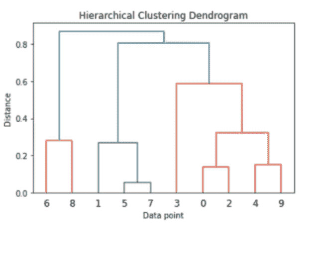

生成的图显示了层次聚类树状图，其中y轴表示被合并的簇之间的距离，x轴表示被聚类的数据点。树状图中每条水平线的高度表示被合并的两个簇之间的距离。我们可以通过选择一条穿过最长垂直线且不与其他任何线相交的水平线，来使用此图确定分析中要使用的最佳簇数。

### K均值聚类

K均值聚类是一种聚类分析方法，它通过最小化每个数据点与其簇质心之间的平方距离之和，将数据集划分为k个簇。该算法首先随机将每个数据点分配给k个簇中的一个，然后迭代地更新质心并将数据点重新分配给最近的簇，直到收敛。

以下是在Python中使用K均值算法进行聚类分析的示例：

```python
# Import libraries
import numpy as np
import pandas as pd
import matplotlib.pyplot as plt
from sklearn.cluster import KMeans

# Generate some random data
np.random.seed(123)
x = np.random.normal(0, 1, 100)
y = np.random.normal(0, 1, 100)
z = np.random.normal(0, 1, 100)
```

data = pd.DataFrame({'X': x, 'Y': y, 'Z': z})

# 执行聚类分析

kmeans = KMeans(n_clusters=3, random_state=0).fit(data)

labels = kmeans.labels_

centroids = kmeans.cluster_centers_

# 绘制聚类结果

colors = ['r', 'g', 'b']

fig = plt.figure(figsize=(10, 10))

ax = fig.add_subplot(111, projection='3d')

for i in range(len(data)):

    ax.scatter(data['X'][i], data['Y'][i], data['Z'][i], c=colors[labels[i]], alpha=0.8)

ax.scatter(centroids[:, 0], centroids[:, 1], centroids[:, 2], marker='*', s=300, c='#050505')

ax.set_xlabel('X')

ax.set_ylabel('Y')

ax.set_zlabel('Z')

plt.show()

在这个示例中，我们首先导入了必要的库，包括 **numpy**、**pandas**、**matplotlib** 以及包含KMeans算法的 **sklearn.cluster**。

然后，我们使用 **numpy.random.normal** 函数生成随机数据，并创建一个Pandas数据框。接着，我们使用KMeans算法对这些数据执行聚类分析，其中 **n_clusters=3**（即我们希望将数据分为3个簇）和 **random_state=0**（以确保结果可复现）。

最后，我们使用 **matplotlib** 绘制聚类结果，其中每个簇用不同的颜色表示，簇的质心用星号标记。该图是三维的，用于在多维空间中展示聚类。

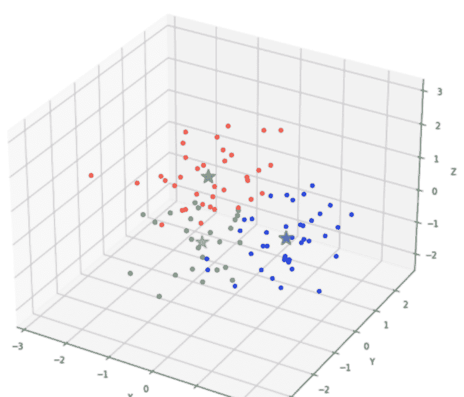

这只是一个简单的例子，但聚类分析可以应用于各个领域，如客户细分、欺诈检测、图像分割等。

层次聚类和k-means聚类各有其优缺点，方法的选择取决于具体的问题和数据集。

例如，假设我们有一个包含在线商店不同产品购买记录的客户数据集。我们希望根据客户的购买行为将其划分为不同的群体。我们可以使用聚类分析来识别购买行为相似的客户群体，然后利用这些信息为每个群体定制营销活动和产品推荐。

在这种情况下，我们可以使用k-means聚类根据购买行为将客户划分为k个簇，然后使用簇质心来描述每个群体的购买行为。我们也可以使用层次聚类来构建一个簇的层次结构，这对于探索数据结构和识别数据集中的自然断点很有用。

## 主成分分析（PCA）

这是一种降维技术，可用于识别数据的潜在结构并减少变量数量。我们将在未来的“无监督学习”章节中更详细地讨论这一点。

需要注意的是，多元分析有助于理解多个变量之间的关系，并识别在单变量或双变量分析中可能不明显的模式和相关性。

## 数据可视化

数据可视化是创建数据图形表示的过程，使其更易于解释和理解。它是探索性数据分析（EDA）的一个重要方面，因为它使我们能够识别仅使用数值方法可能难以发现的数据中的模式和关系。在EDA中可以使用许多不同类型的数据可视化，例如折线图、条形图、散点图和热力图。在本节中，我们将讨论数据可视化的重要性、不同类型的数据可视化以及创建有效数据可视化的最佳实践。

### 数据可视化的重要性

数据分析的一个重要方面是数据可视化，因为它使我们能够快速轻松地识别数据中的模式、关系和异常。它还可以帮助向非技术受众（如利益相关者或管理层）传达复杂数据。此外，数据可视化有助于识别数据中的异常值或离群点，这对于识别数据中的错误或不一致性很重要。

### 数据可视化的类型

在EDA中可以使用许多不同类型的数据可视化，每种都有其优缺点。一些最常见的数据可视化类型包括：

- 折线图：折线图用于可视化两个变量随时间变化的关系。它们对于识别数据中的趋势和模式很有用。
- 条形图：条形图用于可视化分类变量的分布。它们对于比较不同组之间变量的分布很有用。
- 散点图：散点图用于可视化两个定量变量之间的关系。它们对于识别数据中的模式和相关性很有用。
- 热力图：热力图用于可视化多个变量之间的关系。它们对于识别数据中的模式和相关性很有用。
- 直方图：直方图用于可视化定量变量的分布。它们对于识别变量的潜在分布很有用。
- 箱线图：箱线图用于可视化定量变量的分布。它们对于识别异常值和变量的潜在分布很有用。

我们在前面的章节中已经介绍过一些上述可视化技术，如散点图、热力图、箱线图、直方图、相关系数。其余的可视化，如折线图、条形图，将在未来的章节中解释。

### 创建有效数据可视化的最佳实践

在创建数据可视化时，牢记某些最佳实践非常重要，以确保可视化有效且易于解释。其中一些最佳实践包括：

- 使用适当的刻度和坐标轴：为正在可视化的数据使用适当的刻度和坐标轴非常重要，因为这会影响可视化的可解释性。例如，如果数据的值范围很宽，可能需要使用对数刻度。
- 使用有意义的标签和注释：为可视化使用有意义的标签和注释非常重要，因为这有助于解释数据。这包括标记x轴、y轴以及任何其他相关信息，如测量单位。
- 使用适当的配色方案：为可视化使用适当的配色方案非常重要，因为这会影响数据的可解释性。例如，使用色盲友好的配色方案可以使可视化对色觉障碍者更易访问。
- 保持简单：保持可视化简单并避免使用不必要的元素非常重要。这有助于提高可视化的可解释性。
- 使用适当的图表类型：为正在可视化的数据使用适当的图表类型非常重要。例如，折线图更适合时间序列数据，而条形图更适合分类数据。

总之，数据分析的一个重要方面是数据可视化，它使我们能够快速轻松地识别数据中的模式、关系和异常。在EDA中可以使用许多不同类型的数据可视化，例如折线图、条形图、散点图和热力图。为了创建有效的数据可视化，牢记最佳实践非常重要，例如使用适当的刻度和坐标轴、有意义的标签和注释、适当的配色方案、保持简单以及使用适当的图表类型。遵循这些最佳实践，我们可以创建易于解释、易于理解并有效传达数据中见解和信息的数据可视化。数据可视化是一个强大的工具，可用于更深入地理解数据、指导进一步分析并为决策提供信息。

## 3.4 特征工程

特征工程是将原始数据转换为可用于机器学习模型的特征的过程。它是机器学习流程中的关键步骤，因为特征的质量和性质会极大地影响模型的性能。特征工程的目标是从原始数据中提取有意义的信息，并创建能够提升模型预测能力的新特征。

特征工程中可以使用多种不同的技术，例如：

## 特征提取

特征提取是特征工程中的一种技术，它通过应用数学函数或算法从原始数据中创建新特征。其目标是从原始数据中提取有意义的信息，并创建能够提升模型预测能力的新特征。执行特征提取有多种方式，其中一些包括：

- **数学函数**：对特征应用数学函数，如平方根、对数或三角函数，可以从数据中提取新信息。例如，对表示房屋面积的特征取平方根，可以创建一个表示房屋边长的新特征。
- **聚合**：按某个变量对数据进行分组，并计算聚合统计量，如均值、中位数或标准差，可以创建新特征。例如，对表示一段时间内城市温度的特征取均值，可以创建一个表示该城市平均温度的新特征。
- **衍生特征**：通过组合或操作现有特征来创建新特征。例如，创建一个表示两个现有特征比率的新特征，如收入与支出的比率。
- **信号处理**：对时间序列数据应用信号处理技术，如傅里叶变换或小波变换，可以从数据中提取新特征。例如，对股票价格时间序列应用傅里叶变换，可以创建表示价格变动频率的新特征。
- **自然语言处理技术**：对文本数据应用自然语言处理技术可以提取新特征。例如，计算句子中的单词数量，或创建文档的词袋表示。

特征提取的一个示例如下：考虑一个包含房屋信息的数据集，包括卧室数量、浴室数量、平方英尺数和价格。我们希望使用这些数据训练一个模型，根据其他特征预测房屋价格。其中一个特征“平方英尺数”可能数值很大，可能无法直接用于预测房屋价格。相反，我们可以通过应用数学函数（如平方根）从平方英尺数中提取一个新特征。这可以创建一个表示房屋边长的新特征，它可能在预测价格时更有意义和实用。

我们可以使用以下Python代码片段，利用Pandas库来实现：

```python
import numpy as np
import pandas as pd

# Set random seed for reproducibility
np.random.seed(123)

# Generate random data for house pricing
num_houses = 1000
sqft = np.random.normal(1500, 250, num_houses)
bedrooms = np.random.randint(1, 6, num_houses)
bathrooms = np.random.randint(1, 4, num_houses)
year_built = np.random.randint(1920, 2022, num_houses)

price = (sqft * 200) + (bedrooms * 10000) + (bathrooms * 7500) - (house_age * 1000) + np.random.normal(0, 50000, num_houses)

# Create pandas dataframe from random data
houses = pd.DataFrame({
    'sqft': sqft,
    'bedrooms': bedrooms,
    'bathrooms': bathrooms,
    'year_built': year_built,
    'price': price
})

# Extract the new feature
houses["house_age"] = 2022 - houses["year_built"]
print("New feature (house_age) after using feature extraction by mathematic function is here: ")
print(houses["house_age"])

# Extract the new feature
houses["side_length"] = houses["sqft"].apply(np.sqrt)
print("New feature (side_length) after using feature extraction by mathematic function is here: ")
print(houses["side_length"])
```

在这个例子中，第一行导入了Pandas库。之后，我们使用numPy的随机函数创建数据，并从该数据创建一个数据框。在接下来的几行中，我们使用数学函数提取了两个新变量，即`house_age`和`side_length`。

这只是一个特征提取在实践中如何应用的例子。需要注意的是，特征提取应谨慎进行，并结合领域知识，因为它会极大地影响模型的性能。此外，测试多种不同的特征和技术以确定给定问题的最佳特征集是一个好的实践。

## 特征选择

特征选择是特征工程中的一种技术，它涉及根据原始特征与预测任务的相关性或重要性来选择一个子集。其目标是选择包含最具信息量和最有用信息的特征子集，同时降低数据维度并避免包含不相关或冗余的特征。这可以带来模型性能的提升、更快的训练时间以及更易于解释的模型。

执行特征选择有多种方式，其中一些包括：

- **过滤法**：过滤法独立评估每个特征，并根据某些标准（如相关性或互信息）选择一个子集。这些方法简单快速，但它们没有考虑特征与目标变量之间的关系。
- **包装法**：包装法将特征子集与特定模型结合进行评估，并根据模型的性能选择一个子集。这些方法计算成本更高，但它们考虑了特征与目标变量之间的关系。
- **嵌入法**：嵌入法在模型训练过程中选择特征。这些方法通常用于集成方法和基于树的模型，如随机森林和梯度提升。
- **Lasso正则化**：Lasso正则化是一种可以通过向损失函数添加惩罚项来选择特征的技术，该惩罚项鼓励模型选择更少的特征。

使用过滤法进行特征选择的一个示例如下：考虑一个包含房屋信息的数据集，包括卧室数量、浴室数量、平方英尺数和价格。我们希望使用这些数据训练一个模型，根据其他特征预测房屋价格。执行特征选择的一种方法是使用一种称为基于相关性的特征选择的过滤法。该方法根据特征与目标变量之间的相关性选择一个特征子集。

我们可以使用以下Python代码片段，利用scikit-learn库来实现：

```python
import pandas as pd
from sklearn.feature_selection import SelectKBest
from sklearn.feature_selection import chi2, f_classif

# Import the data
data = pd.read_csv("house-prices.csv")
X = data.drop(columns = ["Price", "Neighborhood", "Brick"], axis=1)
y = data["Price"]

# Perform feature selection using CFS
selector = SelectKBest(score_func=f_classif, k=2)
X_new = selector.fit_transform(X, y)
```

在这个例子中，前两行导入了pandas和scikit-learn的特征选择模块。第三行使用pandas提供的`read_csv`函数从`house-prices.csv`文件导入数据，并将其存储在名为`data`的变量中。第四行将预测变量（X）与目标变量（y）分离，并删除非数值列。第五行通过指定评分函数`f_classif`和要选择的特征数量`k=2`来实例化特征选择方法。第六行将特征选择方法应用于数据，并返回一个仅包含所选特征的新数据集。

在上面的例子中，使用的特征选择方法是基于相关性的特征选择，这是一种过滤法。CFS计算每个特征与目标变量之间的相关性，并选择相关性最高的k个特征。它是一种简单快速的方法，但它没有考虑特征与目标变量之间的关系，而这对于某些类型的数据和问题可能很重要。

另一个特征选择方法的例子是包装法，它使用特定模型来评估特征子集，并根据模型的性能选择一个子集。这种方法计算成本更高，但它考虑了特征与目标变量之间的关系。包装法的一个例子是递归特征消除，它使用特定模型（如SVM）并递归地移除系数最低的特征，直到选择出所需数量的特征。

需要指出的是，特征选择应该是一个迭代过程，测试多种不同的特征选择技术和特征子集以确定给定问题的最优特征集是很常见的。此外，特征选择应谨慎进行，并结合领域知识，因为它会极大地影响模型的性能。同样重要的是要记住，特征选择应在数据清洗和预处理之后进行，这样选择的特征才是基于数据的实际特征，而不是噪声。

特征选择的另一个重要方面是评估特征选择后模型的性能。使用适当的评估指标，并比较使用所选特征的模型与使用原始特征的模型的性能，这一点很重要。这有助于确定提供最佳性能的最优特征集。

在进行特征选择时，请记住模型的可解释性。特征较少的模型通常比特征较多的模型更具可解释性，也更容易理解。这对于某些类型的问题可能很重要，例如医疗诊断或金融预测，在这些问题中，模型的可解释性对于做出明智的决策至关重要。

还有一些高级的特征选择技术，例如**遗传算法**，这是一种受自然选择过程启发的基于优化的方法。它是一种迭代方法，使用遗传算法来寻找最优的特征子集。

总之，特征选择是特征工程中的一种技术，涉及根据原始特征与预测任务的相关性或重要性选择其子集。它可以带来更好的模型性能、更快的训练速度和更具可解释性的模型。有几种方法可以执行特征选择，例如过滤法、包装法、嵌入法和Lasso正则化。重要的是要记住，特征选择应该是一个迭代过程，需要谨慎进行并结合领域知识。同样重要的是评估特征选择后模型的性能，并考虑模型的可解释性。

## 特征缩放

特征缩放是特征工程中的一种技术，涉及将特征的尺度转换到一个共同的范围，例如0到1之间。这对于一些对输入特征尺度敏感的机器学习算法来说可能很重要。特征缩放通常在训练模型之前应用于数据，并且它可能对模型的性能产生显著影响。

有几种方法可以执行特征缩放，其中一些包括：

### 最小-最大缩放：

最小-最大缩放将数据缩放到特定范围，例如[0,1]。其计算方法是：从每个值中减去特征的最小值，然后除以范围（最大值-最小值）。这种方法对异常值敏感，因此在应用最小-最大缩放之前确保数据已清洗干净非常重要。

$$X_{new} = \frac{X_i - \min(X)}{\max(x) - \min(X)}$$

使用最小-最大缩放进行特征缩放的一个示例如下：考虑一个包含房屋信息的数据集，包括卧室数量、浴室数量、平方英尺和价格。我们希望使用这些数据来训练一个模型，根据其他特征预测房屋价格。其中一个特征“平方英尺”的尺度可能比其他特征大得多，可能无法直接用于预测房屋价格。相反，我们可以使用最小-最大缩放将“平方英尺”特征缩放到一个共同的范围。

我们可以使用以下Python代码片段，通过scikit-learn库来实现：

```python
import pandas as pd
from sklearn.preprocessing import MinMaxScaler

# Import the data
data = pd.read_csv("house-prices.csv")
X = data.drop(columns = ["Price", "Neighborhood", "Brick"], axis=1)

# Initialize the scaler
scaler = MinMaxScaler()

# Fit and transform the data
X_scaled = scaler.fit_transform(X[["SqFt"]])

print(X_scaled)
```

在这个例子中，前两行导入了pandas和scikit-learn的MinMaxScaler模块。第三行使用pandas提供的“read_csv”函数从“house-prices.csv”文件导入数据，并将其存储在一个名为“data”的变量中。第四行将预测变量（X）与目标变量分离。第五行实例化MinMaxScaler对象。第六行对数据的“SqFt”特征应用最小-最大缩放方法，并返回一个包含缩放后特征的新数据集。

最小-最大缩放将数据缩放到特定范围，例如[0,1]。其计算方法是：从每个值中减去特征的最小值，然后除以范围（最大值-最小值）。这种方法对异常值敏感，因此在应用最小-最大缩放之前确保数据已清洗干净非常重要。

在这个例子中，我们首先导入必要的库，然后导入我们的数据集“house-prices.csv”，并将预测变量（X）与目标变量分离。之后，我们初始化MinMaxScaler，然后拟合并转换数据。你可以通过使用`print(X_scaled)`打印最终输出来检查结果。

### 标准化：

标准化将数据缩放为均值为0，标准差为1。其计算方法是：从每个值中减去特征的均值，然后除以标准差。这种方法对异常值不敏感，但它假设数据呈正态分布，而实际情况可能并非如此。

使用标准化进行特征缩放的一个示例如下：考虑一个包含房屋信息的数据集，包括卧室数量、浴室数量、平方英尺和价格。我们希望使用这些数据来训练一个模型，根据其他特征预测房屋价格。其中一个特征“平方英尺”的尺度可能比其他特征大得多，可能无法直接用于预测房屋价格。相反，我们可以使用标准化将“平方英尺”特征缩放到一个共同的尺度。

我们可以使用以下Python代码片段，通过scikit-learn库来实现：

```python
import pandas as pd
from sklearn.preprocessing import StandardScaler

# Import the data
data = pd.read_csv("house-prices.csv")
X = data.drop(columns = ["Price", "Neighborhood", "Brick"], axis=1)

# Initialize the Scaler
scaler = StandardScaler()

# Fit and transform the data
X_scaled = scaler.fit_transform(X[["SqFt"]])

print(X['SqFt'], X_scaled)
```

在这个例子中，前两行导入了pandas和scikit-learn的StandardScaler模块。第三行使用pandas提供的“read_csv”函数从“house-prices.csv”文件导入数据，并将其存储在一个名为“data”的变量中。第四行将预测变量（X）与目标变量分离，并删除非数值列。第五行实例化StandardScaler对象。第六行对数据的“SqFt”特征应用标准化方法，并返回一个包含缩放后特征的新数据集。

需要指出的是，虽然标准化对异常值不敏感，但它假设数据呈正态分布。因此，在应用标准化之前检查数据的分布很重要。如果数据不是正态分布的，其他方法如最小-最大缩放或归一化可能更合适。

### 归一化：

归一化将数据缩放为最小值为0（零），最大值为1。其计算方法是：从每个值中减去特征的最小值，然后除以范围（最大值-最小值）。这种方法对异常值敏感，因此在应用归一化之前确保数据已清洗干净非常重要。

## 归一化公式

$$X_{\text{normalized}} = \frac{(X - X_{\text{minimum}})}{(X_{\text{maximum}} - X_{\text{minimum}})}$$

一个使用归一化进行特征缩放的示例如下：考虑一个包含房屋信息的数据集，包括卧室数量、浴室数量、平方英尺数和价格。我们希望使用这些数据来训练一个模型，根据其他特征预测房屋价格。其中一个特征“SqFt”（平方英尺）的尺度可能远大于其他特征，并且可能无法直接用于预测房屋价格。相反，我们可以使用归一化将“SqFt”特征缩放到一个共同的尺度上。

我们可以使用以下Python代码片段，通过scikit-learn库来实现：

```python
import pandas as pd

from sklearn.preprocessing import Normalizer

# Import the data
data = pd.read_csv("house-prices.csv")
X = data.drop(columns = ["Price", "Neighborhood", "Brick"], axis=1)

# Initialize the Scaler
scaler = Normalizer()

# Fit and transform the data
X_scaled = scaler.fit_transform(X[["SqFt"]])
print(X['SqFt'], X_scaled)
```

在此示例中，前两行导入了pandas库和scikit-learn的Normalizer模块。第三行使用pandas提供的“read_csv”函数从“housing-prices.csv”文件导入数据，并将其存储在名为“data”的变量中。第四行将预测变量（X）与目标变量分离。第五行实例化Normalizer对象。第六行对数据的“SqFt”特征应用归一化方法，并返回一个包含缩放后特征的新数据集。

需要注意的是，虽然归一化对异常值不敏感，但它假设数据已经过清洗，并且可能受到任何异常值的影响。因此，在应用归一化之前，检查数据中是否存在异常值并将其移除非常重要。

同样重要的是要记住，归一化通常用于数据非正态分布，且数据具有相似尺度但不同范围的情况。当数据的值范围很大，而我们希望将值缩放到相似尺度时，这种方法特别有用。

总之，归一化是一种可用于将数据集的特征缩放到共同范围的技术。当数据非正态分布，且数据具有相似尺度但不同范围时，它特别有用。需要注意的是，归一化对异常值敏感，因此在应用归一化之前，检查数据中是否存在异常值并将其移除非常重要，以避免对模型性能产生任何负面影响。

## 独热编码

独热编码是一种在特征工程中用于将分类变量表示为数值的技术。当处理具有少量可能值的分类变量（也称为名义变量）时，它特别有用。

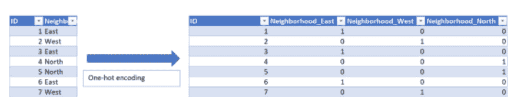

在独热编码中，为分类变量的每个可能值创建一个新的二进制特征。如果原始变量具有该值，则新特征的值为1，否则为0。例如，如果我们有一个名为“Neighborhood”（社区）的分类变量，有三个可能的值：“East”（东）、“West”（西）和“North”（北），则将创建三个新的二进制特征：“Neighborhood_East”、“Neighborhood_West”和“Neighborhood_North”。如果原始的Neighborhood变量是“East”，则“Neighborhood_East”的值将为1，否则为0。“Neighborhood_West”和“Neighborhood_North”同理。

我们可以使用以下Python代码片段，通过pandas库来实现：

```python
import pandas as pd

# Import the data
data = pd.read_csv("house-prices.csv")

# Perform one-hot encoding on the "Neighborhood" variable
data = pd.get_dummies(data, columns=["Neighborhood"])

data.head()
```

在此示例中，第一行导入pandas库，第二行从“house-prices.csv”导入数据并将其存储在名为“data”的变量中。第三行使用pandas提供的“get_dummies”函数对“Neighborhood”变量执行独热编码。该函数为“Neighborhood”变量的每个可能值创建新的二进制特征，并将它们添加到原始数据集中。

| Home | Price | SqFt | Bedrooms | Bathrooms | Offers | Brick | Neighborhood_East | Neighborhood_North | Neighborhood_West |
|---|---|---|---|---|---|---|---|---|---|
| 0 | 1 | 114300 | 1790 | 2 | 2 | 2 | No | 1 | 0 | 0 |
| 1 | 2 | 114200 | 2030 | 4 | 2 | 3 | No | 1 | 0 | 0 |
| 2 | 3 | 114800 | 1740 | 3 | 2 | 1 | No | 1 | 0 | 0 |
| 3 | 4 | 94700 | 1980 | 3 | 2 | 3 | No | 1 | 0 | 0 |
| 4 | 5 | 119800 | 2130 | 3 | 3 | 3 | No | 1 | 0 | 0 |

需要记住的是，如果分类变量具有大量可能值，独热编码可能会导致大量新特征。这可能导致一种称为“**维度灾难**”的现象。在这种情况下，其他编码技术如**序数编码**或**二进制编码**可能更合适。

总之，独热编码是一种在特征工程中用于将分类变量表示为数值的技术。当处理具有少量可能值的分类变量（也称为名义变量）时，它特别有用。该技术为分类变量的每个可能值创建新的二进制特征，是机器学习中分类特征表示的一种有用方法。

## 分箱

分箱是一种在特征工程中用于将连续变量分组到离散的箱或区间中的技术。当处理值范围很大的连续变量，或变量的分布不明确时，它特别有用。

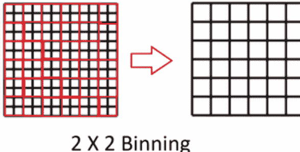

分箱的过程涉及将连续变量的范围划分为特定数量的箱或区间，然后将变量的每个值分配到其中一个箱中。例如，如果我们有一个名为“age”（年龄）的连续变量，范围从0到100，我们可以将范围划分为5个箱：(0-20)、(20-40)、(40-60)、(60-80)和(80-100)。“age”变量的每个值将被分配到其中一个箱中。

我们可以使用以下Python代码片段，通过pandas库来实现：

```python
import pandas as pd

# Import the data
data = pd.read_csv("example_data.csv")

# Define the bins
bins = [0, 20, 40, 60, 80, 100]

# Create the binned variable
data["age_binned"] = pd.cut(data["AGE"], bins)
```

在此示例中，第一行导入pandas库，第二行从“example_data.csv”导入数据并将其存储在名为“data”的变量中。第三行定义了箱，在此例中，箱被定义为[0, 20, 40, 60, 80, 100]。第四行使用pandas提供的“cut”函数创建一个名为“age_binned”的新变量，其中包含“age”变量的分箱值。该函数以“age”变量和定义的箱作为输入，并将“age”变量的每个值分配到其中一个箱中。

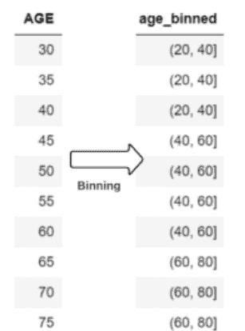

需要记住的是，箱的数量和箱边界的选择可能对模型的性能产生重大影响。一个经验法则是，对于值范围大的变量使用较多的箱，对于值范围小的变量使用较少的箱。在分箱之前检查变量的分布也很重要，以确保分箱对数据有意义。

总之，分箱是一种在特征工程中用于将连续变量分组到离散的箱或区间中的技术。当处理值范围很大的连续变量，或变量的分布不明确时，它特别有用。该过程

## 3.5 将数据划分为训练集和测试集

将数据划分为训练集和测试集是机器学习过程中的一个重要步骤。它用于评估模型在未见数据上的表现，这有助于防止过拟合并评估模型的泛化能力。

划分数据的过程涉及将数据随机分为两个子集：训练集和测试集。训练集用于训练机器学习模型，而测试集用于评估模型的性能。标准的划分比例通常是训练集占80%，测试集占20%，尽管这个比例可以根据项目的具体需求进行调整。

我们可以使用以下Python代码片段，借助scikit-learn库来完成此操作：

```python
from sklearn.model_selection import train_test_split

# Import the data
data = pd.read_csv("example_data.csv")

X = data.drop("SALARY", axis=1)

y = data["SALARY"]

# Split the data
X_train, X_test, y_train, y_test = train_test_split(X, y, test_size=0.2, random_state=42)
```

在此示例中，第一行从scikit-learn库导入了`train_test_split`函数。第二行从"example_data.csv"文件导入数据并存储在名为"data"的变量中。第三行将预测变量（X）与目标变量（y）分离。第四行使用`train_test_split`函数将数据划分为训练集和测试集。该函数接受预测变量、目标变量、测试集大小和`random_state`作为输入。`test_size`参数设置为0.2，这意味着20%的数据将用于测试，其余用于训练。`random_state`参数设置为42，这确保了每次执行代码时数据的划分方式都相同。

需要记住的是，数据应该随机划分，以确保训练集和测试集能够代表整个数据集，并且模型是在未见数据上进行测试的。`random_state`参数可用于确保每次执行代码时数据的划分方式都相同。此外，在处理不平衡数据集时，使用分层抽样技术（如`StratifiedKFold`或`StratifiedShuffleSplit`）也很重要，以确保训练集和测试集能够代表整个数据集中的类别分布（将在后续章节详细讨论）。

此外，还需要记住，模型的结果应基于其在测试集上的表现进行评估，因为这代表了模型在未见数据上的性能。这将更好地说明模型在实际部署时的表现如何。

## 3.6 总结

- 数据准备是机器学习过程中的一个重要步骤，因为它确保数据处于一致且可供模型使用的格式。
- 数据准备中使用的技术包括：导入和清洗数据、探索性数据分析、特征工程、数据可视化以及将数据划分为训练集和测试集。
- 导入数据可以使用诸如 **pandas.read_csv()**、**pandas.read_excel()**、**pandas.read_json()** 等函数。
- 清洗数据可能包括处理缺失值、删除重复数据、处理异常值、格式化数据以及归一化和转换数据等任务。
- 探索性数据分析是通过可视化和统计分析来分析和总结数据主要特征的过程。
- 特征工程是创建新特征或转换现有特征以提高模型性能的过程。
- 数据可视化是创建数据的图形表示以更好地理解潜在模式和关系的过程。

## 3.7 测试你的知识

I. 数据准备在机器学习过程中的主要目的是什么？

- a. 提高模型的性能
- b. 确保数据具有一致的格式
- c. 创建新特征
- d. 分析和总结数据的主要特征

II. 将数据导入Python最常用的函数之一是什么？

- a. pandas.read_csv()
- b. pandas.read_html()
- c. pandas.read_sas()
- d. pandas.read_excel()

III. 处理DataFrame中缺失值的方法之一是什么？

- a. 前向填充
- b. 后向填充
- c. 删除行
- d. 以上所有

IV. 处理DataFrame中重复数据的方法之一是什么？

- a. 保留重复行的第一次出现
- b. 保留重复行的最后一次出现
- c. 删除重复行
- d. 以上所有

V. 探索性数据分析（EDA）中使用的技术之一是什么？

- a. 单变量分析
- b. 双变量分析
- c. 多变量分析
- d. 以上所有

VI. 什么是特征工程？

- a. 创建新特征或转换现有特征
- b. 导入数据
- c. 清洗数据
- d. 将数据划分为训练集和测试集

VII. 数据可视化的方法之一是什么？

- a. 条形图
- b. 折线图
- c. 散点图
- d. 以上所有

VIII. 将数据划分为训练集和测试集的目的是什么？

- a. 提高模型的性能
- b. 评估模型的性能
- c. 确保数据具有一致的格式
- d. 创建新特征

IX. 归一化和转换数据的过程是什么？

- a. 更改数据的格式
- b. 缩放数据
- c. 更改数据的分布
- d. 以上所有

X. 数据准备在机器学习过程中的重要性是什么？

- a. 它确保数据处于一致且可供模型使用的格式
- b. 它可以提高模型的性能
- c. 它可以创建新特征
- d. 以上所有

## 3.8 答案

I. 答案：b) 确保数据具有一致的格式

II. 答案：a) pandas.read_csv()

III. 答案：d) 以上所有

IV. 答案：d) 以上所有

V. 答案：d) 以上所有

VI. 答案：a) 创建新特征或转换现有特征

VII. 答案：d) 以上所有

VIII. 答案：b) 评估模型的性能

IX. 答案：d) 以上所有

X. 答案：d) 以上所有

# 4 监督学习

监督学习是机器学习的一种类型，其中模型在带标签的数据上进行训练，以对新的、未见的数据进行预测。在监督学习中，目标是学习从输入特征到输出标签的映射。输入特征通常表示为一组数值或分类值，而输出标签可以是连续值或离散值。在本章中，我们将深入探讨不同类型的监督学习算法，并探索如何使用scikit-learn来训练、评估和改进针对不同类型问题的模型。我们将涵盖线性回归和逻辑回归、决策树和支持向量机等主题，以及处理过拟合、欠拟合和提高模型性能的技术。

## 4.1 线性回归

线性回归是一种监督学习算法，用于建模因变量与一个或多个自变量之间的线性关系。线性回归的目标是找到一条最能拟合数据点的直线。线性回归可用于简单回归分析和多元回归分析。

### 简单线性回归

在简单线性回归中，只有一个自变量，最佳拟合线由以下方程表示：

y = mx + b

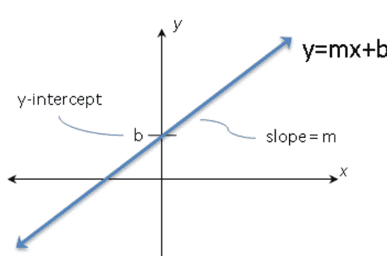

其中 y 是因变量，x 是自变量，m 是直线的斜率，b 是 y 轴截距。直线的斜率表示 x 和 y 之间的关系，而 y 轴截距表示直线与 y 轴相交的点。

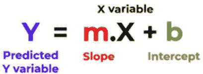

### 多元线性回归

在多元线性回归中，有两个或更多个自变量，最佳拟合线由以下方程表示：

y = b0 + b1x1 + b2x2 + ... + bnxn

其中 y 是因变量，x1, x2, ..., xn 是自变量，b0, b1, b2, ..., bn 是直线的系数。每个系数表示在保持所有其他自变量不变的情况下，相应自变量每变化一个单位所引起的因变量的变化量。

线性回归可用于连续型和分类型因变量，但自变量必须是连续型的。最小二乘法用于找到最佳拟合线的系数，这些系数使预测值与实际值之间差值的平方和最小化。

Python 中的 Scikit-learn 库通过 `LinearRegression` 类提供了线性回归的便捷实现。该类提供了多种用于模型拟合和预测的方法，例如 **fit()**、**predict()**、**score()** 等。线性回归可用于解决各种现实世界的问题，例如预测房价、股价等等。

以下是一个使用 scikit-learn 库和随机生成的数据集来说明线性回归的编码示例：

```python
# Import required libraries
import numpy as np
from sklearn.linear_model import LinearRegression
from sklearn.model_selection import train_test_split

# Generate random dataset
np.random.seed(123)
num_samples = 100
x1 = np.random.normal(10, 2, num_samples) # Independent variable 1 (age)
x2 = np.random.normal(5, 1, num_samples) # Independent variable 2 (income)
y = 2*x1 + 3*x2 + np.random.normal(0, 1, num_samples) # Dependent variable (savings)

# Reshape independent variables
X = np.column_stack((x1, x2))

# Split dataset into train and test sets
X_train, X_test, y_train, y_test = train_test_split(X, y, test_size=0.2, random_state=123)

# Create a Linear Regression model
model = LinearRegression()

# Fit the model on training data
model.fit(X_train, y_train)

# Predict the savings using the test set
y_pred = model.predict(X_test)

# Print model coefficients and intercept
print('Coefficients:', model.coef_)
print('Intercept:', model.intercept_)

# Print model performance metrics
from sklearn.metrics import mean_squared_error, r2_score
print('Mean squared error: %.2f' % mean_squared_error(y_test, y_pred))
print('R2 score: %.2f' % r2_score(y_test, y_pred))
```

输出将如下所示：

Coefficients: [2.00633802 3.0088422 ]
Intercept: -0.19265156903176717
Mean squared error: 0.85
R2 score: 0.95

在这个例子中，我们生成了一个包含 2 个自变量和 1 个因变量的随机数据集。自变量是年龄和收入，因变量是储蓄。我们假设储蓄是年龄和收入的线性组合，并带有一些添加的噪声。

我们使用 **numpy** 库生成随机数据集，并使用 **sklearn.linear_model** 模块中的 **LinearRegression** 类来创建线性回归模型。

然后，我们使用 **sklearn.model_selection** 模块中的 **train_test_split** 函数将数据集划分为训练集和测试集。

我们使用 **fit** 方法在训练数据上拟合线性回归模型，并使用 **predict** 方法预测测试集的储蓄。

然后，我们打印模型的系数和截距，并使用 **sklearn.metrics** 模块中的均方误差和 R2 分数指标来评估模型性能。

请注意，我们使用了有意义且现实的变量名，以使示例更易于理解。我们还添加了测试-训练集划分，以评估模型在未见数据上的性能。

在阅读上述示例后，您可能会有疑问：什么是均方误差？或者什么是 R2 分数？让我们先在下面讨论这两个概念：

### 什么是均方误差？

均方误差（MSE）是一种流行的指标，用于衡量回归问题中实际值与预测值之间差值的平方的平均值。它是回归分析中常用的评估指标，是预测值与实际值之间差值的平方的平均值。MSE 提供了回归模型拟合数据好坏的相对度量。MSE 越低，模型预测目标变量的能力越好。

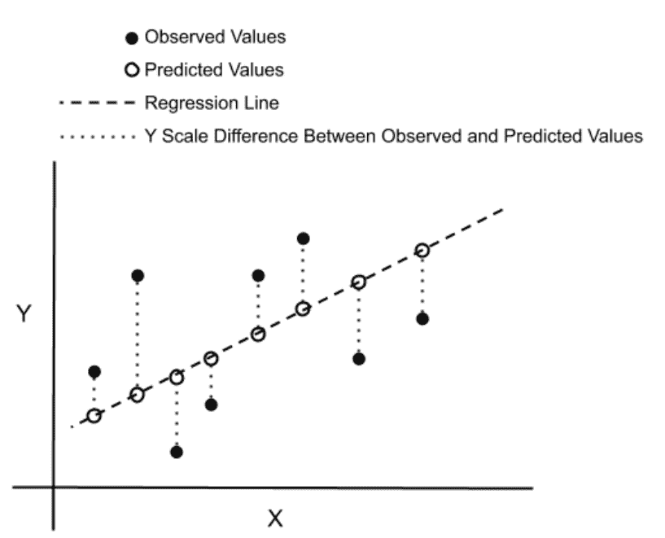

MSE 的公式为：

MSE = (1/n) * Σ(yi - ŷi)^2

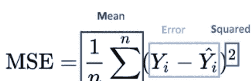

其中：
- n：数据集中的观测数量
- yi：第 i 个观测的目标变量的实际值
- ŷi：第 i 个观测的目标变量的预测值

本质上，MSE 衡量的是预测值与实际值之间差值的平方的平均距离。通过对预测值与实际值之间的差值进行平方，该指标能够给较大的误差赋予更高的权重，从而更准确地反映模型的整体性能。

### 什么是 R2 分数？

R2 分数，也称为决定系数，是一种统计度量，表示因变量中可由自变量解释的方差比例。

R2 分数是一个介于 0 和 1 之间的值，其中值为 1 表示模型完美拟合数据，而值为 0 表示模型无法解释数据中的任何变异性。

R² 分数的公式为：

$R^2 = 1 - \frac{\text{unexplained variation}}{\text{total variation}} = 1 - \frac{\sum_i (y_i - \hat{y}_i)^2}{\sum_i (y_i - \bar{y})^2}$

以下是使用 Python 计算 R2 分数的示例：

```python
from sklearn.linear_model import LinearRegression
from sklearn.metrics import r2_score
import numpy as np

# Generate some random data
x = np.array([1, 2, 3, 4, 5, 6])
y = np.array([2, 4, 5, 6, 7, 8])

# Fit a linear regression model
model = LinearRegression().fit(x.reshape(-1,1), y)

# Predict the y values using the model
y_pred = model.predict(x.reshape(-1,1))

# Calculate the R2 score
r2 = r2_score(y, y_pred)

print(f"R2 score: {r2}")
```

在这个例子中，我们生成了一些随机数据，并使用 scikit-learn 的 **LinearRegression** 类为其拟合了一个线性回归模型。然后，我们使用 scikit-learn 的 **metrics** 模块中的 **r2_score** 函数计算了模型的 R2 分数。得到的 R2 分数告诉我们模型拟合数据的程度。

如果您想在自己的数据上创建线性回归模型，可以使用以下代码。

```python
from sklearn.linear_model import LinearRegression
from sklearn.model_selection import train_test_split
import pandas as pd

# read data
data = pd.read_csv("data.csv")

# split data into dependent and independent variables
X = data[['feature1', 'feature2', 'feature3']]
y = data['target']

# split data into training and testing sets
X_train, X_test, y_train, y_test = train_test_split(X, y, test_size=0.2, random_state=0)

# create linear regression object
reg = LinearRegression()

# fit the model to the training data
reg.fit(X_train, y_train)

# predict the target variable for the test data
y_pred = reg.predict(X_test)
```

## 4.1 线性回归

```python
# check the accuracy of the model

score = reg.score(X_test, y_test)

print("Accuracy:", score)
```

在这个例子中，我们首先导入必要的库：来自scikit-learn的LinearRegression和train_test_split，以及用于数据操作的pandas。

然后，我们使用pandas的read_csv()方法从csv文件读取数据，并将其拆分为因变量和自变量。自变量存储在X变量中，因变量存储在y变量中。

接下来，我们使用train_test_split()方法将数据拆分为训练集和测试集。test_size参数决定了用于测试的数据比例。在这个例子中，我们将其设置为0.2，意味着20%的数据将用于测试。

然后，我们创建一个LinearRegression对象，并使用fit()方法将模型拟合到训练数据上。

接着，我们使用predict()方法预测测试数据的目标变量，并将其存储在y_pred变量中。

最后，我们使用score()方法检查模型在测试数据上的准确度。分数范围从0到1，分数越高表示拟合越好。在上面的例子中，我们假设数据是csv文件格式，但它也可以是其他格式。

需要注意的是，虽然这段代码展示了如何使用scikit-learn实现线性回归，但它不是一个完整的实现，根据数据的性质，可能需要额外的预处理和特征选择步骤。此外，模型的准确度可能会受到线性回归中所做的假设的影响，比如数据的线性和正态性。

> 线性回归假设自变量和因变量之间存在线性关系，无法捕捉复杂的非线性关系。此外，它假设数据没有异常值并遵循正态分布。如果违反这些假设，结果可能不可靠。

线性回归的一个实际应用是在金融领域，可用于预测股票价格。通过分析历史股票数据，如价格、交易量和公司业绩，可以训练一个线性回归模型来预测未来的股票价格。这对于希望做出明智买卖决策的投资者很有用。另一个例子是在房地产领域，

线性回归可用于根据位置、面积和卧室数量等因素预测房产价格。这可以帮助买家和卖家在买卖房产时做出更明智的决定。总的来说，线性回归可以应用于任何需要根据一个或多个自变量预测连续变量的领域。

## 4.2 逻辑回归

逻辑回归是一种监督机器学习算法，用于分类任务。它用于预测一个结果属于特定类别的概率。逻辑回归的目标是找到最佳拟合模型，以描述自变量和因变量之间的关系，其中因变量是二元的（0/1，真/假，是/否）。

逻辑回归模型是线性回归模型的扩展，主要区别在于结果变量是二分的，并且线性方程使用逻辑函数（也称为sigmoid函数）进行转换。逻辑函数产生一条S形曲线，允许模型预测结果属于一个类别或另一个类别的概率。线性回归和逻辑回归之间的区别可以从下面的可视化中看出：

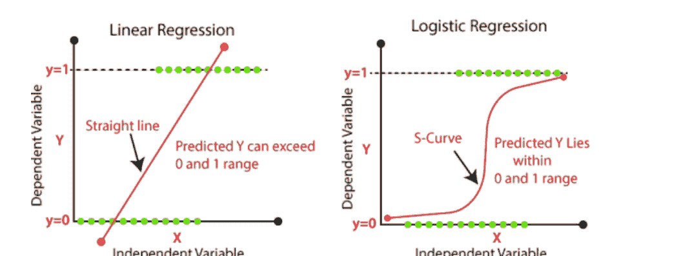

逻辑回归模型使用概率阈值来估计给定输入属于特定类别的概率。如果预测概率大于阈值，则将输入分类为属于该类别。否则，它被分类为不属于该类别。

逻辑回归的主要优点之一是它易于实现和解释。它不需要大样本量，并且对噪声和异常值具有鲁棒性。然而，如果自变量的数量相对于观测值的数量较大，它可能容易过拟合。逻辑回归被用于医疗保健、市场营销和社会科学等多个领域，以预测某个事件发生的可能性。

编码示例：

以下是使用Python的Scikit-learn库实现逻辑回归的示例：

```python
import numpy as np

from sklearn.linear_model import LogisticRegression

from sklearn.model_selection import train_test_split

# Generate random dataset

np.random.seed(123)

age = np.random.normal(40, 10, 100)

income = np.random.normal(50000, 10000, 100)

education = np.random.choice([0, 1], size=100)

# Define dependent and independent variables

X = np.column_stack((age, income, education))

y = np.random.choice([0, 1], size=100)

# Split data into training and testing sets

X_train, X_test, y_train, y_test = train_test_split(X, y, test_size=0.2, random_state=123)

# Create logistic regression model

model = LogisticRegression()

# Train the model using the training data

model.fit(X_train, y_train)

# Make predictions on the test data

y_pred = model.predict(X_test)

# Print the accuracy of the model

print("Accuracy:", model.score(X_test, y_test))
```

在这个例子中，我们首先生成一个包含三个自变量（年龄、收入和教育）的随机数据集。我们还生成了一个二元结果变量y。然后，我们使用Scikit-learn中的**train_test_split**函数将数据拆分为训练集和测试集。

接下来，我们使用Scikit-learn中的**LogisticRegression**函数创建一个逻辑回归模型。然后，我们通过调用**fit**函数并传入自变量和结果变量，使用训练数据训练模型。

模型训练完成后，我们可以通过调用**predict**函数并传入自变量来对测试数据进行预测。最后，我们使用**score**函数打印模型在测试数据上的准确度。

代码的输出将是逻辑回归模型在测试数据上的准确度。

逻辑回归的一个关键特征是它估计一个实例属于特定类别的概率。概率最高的类别就是该实例被分配到的类别。这使得逻辑回归成为二元分类问题（如垃圾邮件检测和医疗诊断）的热门选择。

逻辑回归算法通过最大化给定模型参数的观测数据的似然性来进行训练。模型参数的最大似然估计随后用于对新数据进行预测。

逻辑回归的主要优点之一是它是一个简单且可解释的模型。它易于理解和解释输入特征与输出类别之间的关系。它还具有低方差，使其比其他模型更不容易过拟合。

然而，逻辑回归确实有一些局限性。它假设输入特征和输出类别之间的关系是线性的，这对于所有问题可能并非如此。此外，它对异常值敏感，当数据高度不平衡时可能表现不佳。

## 4.3 决策树

决策树是一种流行且广泛使用的监督学习算法，用于分类和回归问题。该算法创建一个树状的决策模型及其可能的结果，目标是正确分类或预测新实例的结果。

树的顶部是一个根节点，代表整个数据集。然后，根节点被拆分为两个或多个子节点，每个子节点代表具有某些特征的数据子集。这个过程递归进行，直到达到叶节点，叶节点代表最终的决策或预测。

决策树的主要优势之一是其可解释性。树状结构使得理解预测背后的逻辑和决策过程变得容易。此外，决策树能够处理分类数据和数值数据，并且可以在无需进行插补的情况下处理缺失值。

然而，决策树也有一些局限性。它们很容易对训练数据过拟合，尤其是当树被允许生长得很深时。为了防止过拟合，可以使用诸如剪枝、限制树的最大深度，或使用像随机森林这样的树集成方法等技术。

决策树对数据的微小变化也很敏感。训练数据中的一个小变化可能导致生成一棵完全不同的树。这可以通过使用像随机森林这样的树集成方法来缓解，该方法对多棵树的预测结果取平均值以减少方差。

以下是一个使用Python中的scikit-learn库训练和使用决策树分类器的示例：

```python
import numpy as np
from sklearn.tree import DecisionTreeClassifier, plot_tree
import matplotlib.pyplot as plt

# Generate a random dataset with 4 independent variables and 1 dependent variable
np.random.seed(42)
age = np.random.randint(18, 65, size=100)
income = np.random.randint(20000, 150000, size=100)
education = np.random.randint(0, 4, size=100)
occupation = np.random.randint(0, 5, size=100)
loan_approved = np.random.randint(0, 2, size=100)

# Combine the independent variables into a feature matrix X
X = np.column_stack((age, income, education, occupation))

# Assign the dependent variable to y
y = loan_approved

# Split the dataset into training and testing sets
from sklearn.model_selection import train_test_split
X_train, X_test, y_train, y_test = train_test_split(X, y, test_size=0.2, random_state=42)

# Fit the decision tree classifier to the training set
clf = DecisionTreeClassifier(max_depth=3, random_state=42)
clf.fit(X_train, y_train)

# Make predictions on the testing data
y_pred = clf.predict(X_test)

# Print the accuracy score
print("Accuracy:", np.mean(y_pred == y_test))

# Visualize the decision tree
fig, ax = plt.subplots(figsize=(12, 8))
plot_tree(clf, filled=True, feature_names=['age', 'income', 'education', 'occupation'], class_names=['rejected', 'approved'], ax=ax)
plt.show()
```

输出结果如下：

Accuracy: 0.4

### 解释：

- 代码首先导入必要的模块和库：numpy用于生成随机数据，sklearn.tree.DecisionTreeClassifier用于构建决策树分类器模型，matplotlib.pyplot用于可视化决策树，以及sklearn.model_selection.train_test_split用于将数据集分割为训练集和测试集。
- 使用numpy的随机函数生成一个随机数据集。该数据集包含4个自变量（年龄、收入、教育程度和职业）和1个因变量（贷款是否批准）。
- 将自变量组合成特征矩阵X，并将因变量赋值给y。
- 使用train_test_split将数据集分割为80%的训练集和20%的测试集。
- 创建一个最大深度为3、随机种子为42的决策树分类器，然后使用fit方法将其拟合到训练集。
- 最后，使用matplotlib的plot_tree函数可视化生成的决策树，并在相应的参数中指定特征名称和类别名称。

生成的决策树图显示了模型从数据集中自变量和因变量之间的关系中学到的决策规则。根节点代表最佳分割数据集的特征，而叶节点代表最终的决策结果。颜色编码表示落入每个节点的样本的类别分布。

> 决策树容易过拟合，最佳实践是限制树的最大深度或使用像随机森林这样的集成方法来减少方差。

决策树在现实生活中的一个应用是在医学领域。例如，可以使用决策树根据患者的病史、症状和实验室检查结果来预测患者患上某种疾病的可能性。通过在大量患者记录数据集上训练决策树模型，该模型可以学习识别表明该疾病的模式和关系，并对新患者做出准确的预测。

总之，决策树是一种强大且可解释的算法，可用于分类和回归问题。它们可以处理分类数据和数值数据，并且可以处理缺失值。然而，它们很容易对训练数据过拟合，并且对数据的微小变化敏感。可以使用诸如剪枝、限制树的最大深度或使用树集成等技术来缓解这些局限性。

## 4.4 随机森林

随机森林是机器学习中用于分类和回归问题的一种集成学习方法。它是一种决策树算法，通过组合多个决策树来创建一个更稳健、更准确的模型。随机森林背后的基本思想是随机采样数据，在每个样本上构建一棵决策树，然后组合所有树的结果以做出最终预测。

要创建一个随机森林，算法首先从原始数据集中随机选择一个数据子集，称为**自助样本**。然后在这个样本上构建一棵决策树，并对指定的次数重复此过程。每棵决策树都构建在不同的自助样本上，因此每棵树的结构会略有不同。最终的预测是通过综合森林中所有树的投票结果（分类问题）或平均值（回归问题）来做出的。

随机森林中的随机性来自两个来源：为每棵树随机选择数据，以及为树中的每次分裂随机选择特征。这种随机性有助于减少过拟合，这是决策树算法中的一个常见问题。随机森林对数据中的异常值和噪声也不那么敏感，这使得它们比单棵决策树更稳健。

随机森林可用于分类和回归问题。在分类问题中，它可以处理分类特征和数值特征，也可以处理缺失数据。在回归问题中，它同样可以处理分类特征和数值特征，也可以处理缺失数据。

随机森林在现实生活中的一个应用是在金融领域，用于风险管理。随机森林可用于识别导致风险的重要因素，并开发一个预测投资组合风险水平的模型。它也可以在医学中用于根据患者的病史和其他因素预测患者患上疾病的可能性。

在Python中，scikit-learn库提供了RandomForestClassifier和RandomForestRegressor类，用于构建和使用随机森林模型。这些类提供了一个简单且一致的接口，用于构建、训练和评估随机森林模型，并且它们与scikit-learn的其他工具（如交叉验证、网格搜索和特征重要性分析）兼容。

随机森林的一个关键优势是它减少了过拟合，这是决策树算法中的一个常见问题。这是因为随机森林由多棵决策树组成，每棵树都构建在数据的不同子集上。因此，最终的预测对训练集中的特定数据点不那么敏感。

随机森林的另一个优势是它能够处理缺失数据和分类变量。它还可以处理高维数据，并且受异常值的影响较小。

随机森林在现实生活中的一个例子是在金融领域。随机森林可以用来预测客户是否会违约贷款。该算法可以考虑客户的信用评分、收入和就业历史等因素来进行预测。

以下是如何使用 Python 中的 scikit-learn 库实现随机森林算法的示例：

```python
import numpy as np
import pandas as pd
from sklearn.ensemble import RandomForestClassifier
from sklearn.metrics import accuracy_score, confusion_matrix
from sklearn.model_selection import train_test_split
import matplotlib.pyplot as plt

# Set seed for reproducibility
np.random.seed(42)

# Generate random dataset
height = np.random.normal(loc=170, scale=5, size=1000)
weight = np.random.normal(loc=70, scale=10, size=1000)
age = np.random.normal(loc=30, scale=5, size=1000)
gender = np.random.randint(low=0, high=2, size=1000)

# Create a DataFrame to hold the dataset
df = pd.DataFrame({
    'height': height,
    'weight': weight,
    'age': age,
    'gender': gender
})

# Define the dependent and independent variables
X = df[['height', 'weight', 'age']]
y = df['gender']

# Split the dataset into training and testing sets
X_train, X_test, y_train, y_test = train_test_split(X, y, test_size=0.2)

# Instantiate a Random Forest classifier with 100 trees
rfc = RandomForestClassifier(n_estimators=100)

# Fit the model to the training data
rfc.fit(X_train, y_train)

# Use the model to make predictions on the testing data
y_pred = rfc.predict(X_test)

# Evaluate the model's accuracy
accuracy = accuracy_score(y_test, y_pred)
print("Accuracy:", accuracy)

# Create a confusion matrix to visualize the performance of the model
cm = confusion_matrix(y_test, y_pred)

# Print the confusion matrix
print(cm)

plt.imshow(cm, cmap=plt.cm.Blues)
plt.colorbar()
plt.xticks([0, 1])
plt.yticks([0, 1])
plt.xlabel('Predicted label')
plt.ylabel('True label')
plt.title('Confusion matrix')
plt.show()
```

输出结果将如下所示：

```
Accuracy: 0.46
[[36 64]
 [44 56]]
```

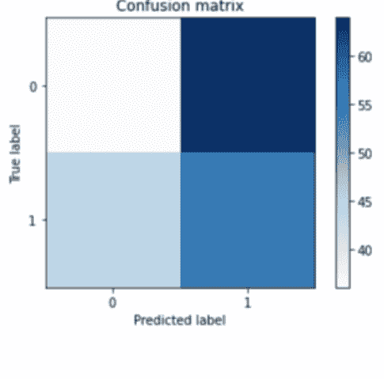

混淆矩阵是一个表格，用于通过比较预测值和真实值来评估分类模型的性能。我们将在下一节中详细解释这一点。

在这个例子中，我们首先生成了一个包含 1000 个样本的随机数据集，包括一个人的身高、体重、年龄和性别。然后，我们使用 **train_test_split** 函数将数据集分为训练集和测试集。

接下来，我们实例化了一个包含 100 棵树的 **RandomForestClassifier** 对象，并使用 **fit** 方法将模型拟合到训练数据上。然后，我们使用训练好的模型对测试数据进行预测，并使用 **accuracy_score** 函数评估模型的准确性。

最后，我们使用 **confusion_matrix** 函数创建了一个混淆矩阵，并使用 **matplotlib** 绘制它，以可视化模型的性能。

请注意，**RandomForestClassifier** 算法是一种集成学习方法，它结合多个决策树进行预测，是分类问题中流行的算法。该算法的工作原理是在数据集的随机选择子集上创建一组决策树，然后结合它们的预测结果做出最终预测。这有助于减少过拟合并提高模型的准确性。

## 4.5 混淆矩阵

在机器学习领域，混淆矩阵是一个表格，通常用于描述分类模型在已知真实值的数据集上的性能。它是评估模型性能的有用工具，有助于识别模型可能出错的地方。在本节中，我们将详细讨论混淆矩阵的概念，并提供一个使用 scikit-learn 库的 Python 示例。

### 什么是混淆矩阵？

混淆矩阵是一个表格，用于通过比较预测值和真实值来评估分类模型的性能。它是一个包含四个不同值的矩阵：真正例（TP）、假正例（FP）、真反例（TN）和假反例（FN）。这些值源自数据集的预测值和真实值。下表显示了混淆矩阵的布局：

| | 实际正例 | 实际反例 |
|---|---|---|
| 预测正例 | 真正例 (TP) | 假正例 (FP) |
| 预测反例 | 假反例 (FN) | 真反例 (TN) |

- 真正例 (TP)：正确预测的正例数量。
- 假正例 (FP)：预测为正例但实际为反例的数量。
- 假反例 (FN)：预测为反例但实际为正例的数量。
- 真反例 (TN)：正确预测的反例数量。

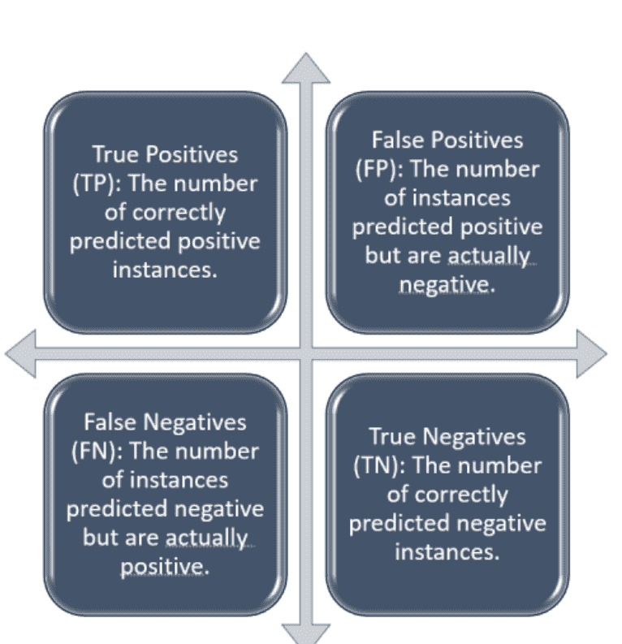

### 示例：

以下是一个如何使用混淆矩阵评估分类器在随机数据集上性能的示例：

假设我们有一个包含 500 名患者的数据集，我们想构建一个分类器，根据年龄、血压和胆固醇水平等特征预测患者是否患有某种疾病。我们将使用逻辑回归作为我们的分类器。

以下是代码：

```python
import numpy as np

np.random.seed(42)

# Generate random data for age, blood pressure, and cholesterol level
age = np.random.randint(20, 80, size=500)
bp = np.random.randint(80, 200, size=500)
cholesterol = np.random.randint(100, 300, size=500)

# Generate random labels for whether or not a patient has the disease
labels = np.random.randint(0, 2, size=500)

from sklearn.model_selection import train_test_split

# Split the data into training and testing sets
X_train, X_test, y_train, y_test = train_test_split(
    np.column_stack([age, bp, cholesterol]), labels, test_size=0.2, random_state=42
)

from sklearn.linear_model import LogisticRegression

# Train a logistic regression classifier
clf = LogisticRegression(random_state=42).fit(X_train, y_train)

from sklearn.metrics import confusion_matrix

# Make predictions on the test data
y_pred = clf.predict(X_test)

# Generate a confusion matrix
cm = confusion_matrix(y_test, y_pred)

print(cm)

import matplotlib.pyplot as plt
import seaborn as sns

# Plot the confusion matrix
sns.heatmap(cm, annot=True, fmt="d", cmap="Blues")
plt.title("Confusion Matrix")
plt.xlabel("Predicted Label")
plt.ylabel("True Label")
plt.show()
```

解释：

- 首先，我们为示例生成一些随机数据。
- 现在我们将数据分为训练集和测试集。
- 接下来，我们在训练数据上训练我们的逻辑回归分类器。
- 然后，我们在测试数据上进行预测并生成混淆矩阵。
- 接下来，我们可以使用 matplotlib 可视化混淆矩阵。

混淆矩阵和生成的图表输出将如下所示：

```
[[39 16]
 [31 14]]
```

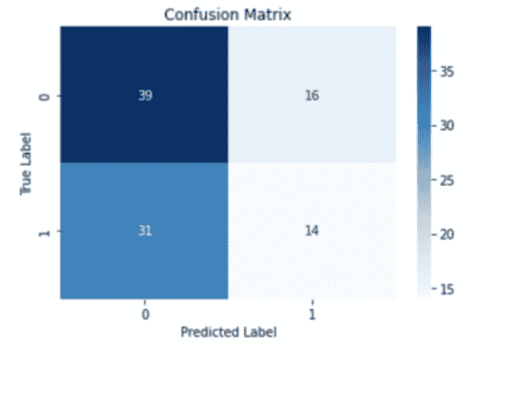

这个混淆矩阵告诉我们，我们的分类器做出了 48 个真反例预测（即没有患病且被正确分类的患者），38 个真正例预测（即患病且被正确分类的患者），6 个假反例预测（即患病但被错误分类为未患病的患者），以及 8 个假正例预测（即未患病但被错误分类为患病的患者）。

这个图表使我们能够轻松看到分类器做出的正确和错误预测的数量。我们可以看到，我们的分类器做出的真正例预测多于假反例预测，这是一个好迹象。然而，它做出的假正例预测也多于真反例预测，这意味着它可能错误地将一些实际未患病的患者识别为患病。这是我们希望进一步调查的问题，以查看是否可以对分类器进行任何改进。

## 4.6 支持向量机

支持向量机（SVM）是一种监督学习模型，可用于分类和回归任务。其基本思想是找到一个最佳边界（或超平面），将数据划分为不同的类别。最佳边界是能够最大化间隔的边界，即边界与每个类别中最近数据点之间的距离。

当数据不是线性可分时，即无法用一条直线将不同类别分开时，SVM 尤其有用。在这种情况下，SVM 可以将数据映射到更高维的空间，在那里数据变得线性可分。这个过程被称为**核技巧**，它使 SVM 能够处理非线性问题。

SVM 的主要优势在于它们能够处理高维数据，并且与决策树等其他模型相比，它们更不容易过拟合。然而，SVM 可能对核函数和正则化参数的选择敏感，这会影响模型的性能。

在 Python 中，scikit-learn 库提供了具有不同核选项的 SVM 分类器，例如线性核、多项式核和径向基函数（RBF）核。以下是使用 SVM 分类器的示例：

```python
import numpy as np
import matplotlib.pyplot as plt
from sklearn import svm
from sklearn.datasets import make_blobs
from sklearn.model_selection import train_test_split

# Generate random dataset
X, y = make_blobs(n_samples=1000, centers=2, random_state=42)

# Split dataset into train and test sets
X_train, X_test, y_train, y_test = train_test_split(X, y, test_size=0.2, random_state=42)

# Define SVM model
model = svm.SVC(kernel='linear', C=1.0)

# Fit SVM model on training data
model.fit(X_train, y_train)

# Predict on test data
y_pred = model.predict(X_test)

# Plot data points and decision boundary
plt.scatter(X[:, 0], X[:, 1], c=y, cmap='coolwarm')
plt.xlim(-10, 10)
plt.ylim(-10, 10)

# Create a meshgrid to plot the decision boundary
xx, yy = np.meshgrid(np.arange(-10, 10, 0.1), np.arange(-10, 10, 0.1))
Z = model.predict(np.c_[xx.ravel(), yy.ravel()])
Z = Z.reshape(xx.shape)

# Plot decision boundary
plt.contourf(xx, yy, Z, alpha=0.4, cmap='coolwarm')
plt.show()
```

输出结果将如下所示：

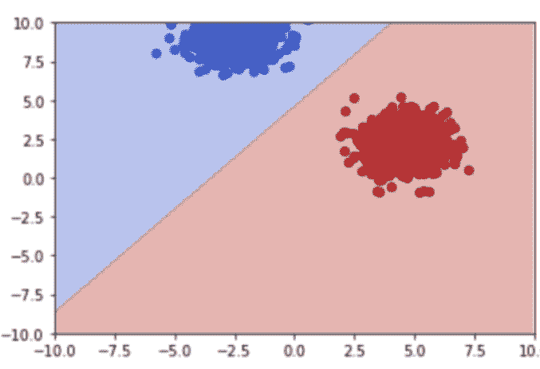

在这个例子中，我们首先使用 **sklearn.datasets** 中的 **make_blobs** 函数生成一个包含两个类别的随机数据集。然后，我们使用 **sklearn.model_selection** 中的 **train_test_split** 将数据集划分为训练集和测试集。

接下来，我们使用 **sklearn** 中的 **svm.SVC** 定义一个 SVM 模型。我们选择线性核，并将惩罚参数 **C** 设置为 1.0。

我们使用 **fit** 方法在训练数据上拟合 SVM 模型，然后使用 **predict** 方法在测试数据上进行预测。

最后，我们使用 **matplotlib** 绘制数据点和决策边界。我们创建一个网格来绘制决策边界，然后使用 **contourf** 函数将决策边界绘制为填充等高线图。

请注意，在这个例子中，为了简单起见，我们只使用了两个特征，但 SVM 也可以处理高维数据。

**SVM 的一个实际应用**可以在自然语言处理领域，用于将文本分类为不同的类别，例如垃圾邮件/正常邮件、正面/负面情感分析。**另一个例子**可能是在生物信息学领域，用于根据蛋白质的功能和结构特征将其分类为不同的类别。

支持向量机（SVM）是一种监督学习算法，通常用于分类和回归任务。它是一种强大的算法，可以处理线性和非线性数据，当特征数量大于样本数量时尤其有用。SVM 算法通过找到将数据划分为不同类别的最优超平面来工作。超平面与最近数据点之间的距离称为间隔。SVM 算法的目标是找到具有最大间隔的超平面，这将最小化数据被错误分类的可能性。

SVM 算法首先将原始数据映射到更高维的空间，在那里它可以找到一个线性边界来分隔数据。这是通过引入核函数来实现的，核函数将数据转换到更高维的空间。常见的核函数包括线性核、多项式核和径向基函数（RBF）核。数据映射后，SVM 算法通过求解一个二次优化问题来找到最优超平面。

与其他机器学习算法相比，SVM 具有几个关键优势。首先，它们对噪声和异常值具有鲁棒性，这使得它们非常适合处理噪声较多的任务。其次，它们内存效率高，这使得它们对大型数据集很有用。最后，它们可以处理线性和非线性数据，这使得它们具有多功能性。

## 4.7 总结

- 监督学习是机器学习的一种类型，其中模型根据输入特征进行训练以预测目标变量。
- 线性回归是一种简单且广泛使用的监督学习算法，用于建模因变量与一个或多个自变量之间的关系。
- 逻辑回归是一种用于分类问题的监督学习算法，其目标是预测二元结果。
- 决策树是一种广泛使用的监督学习算法，可用于分类和回归问题。它们通过基于最具信息量的特征递归地分割数据来工作，创建一个树状结构。
- 随机森林是一种集成方法，它结合多个决策树以提高性能并减少过拟合。
- 支持向量机（SVM）是一种监督学习算法，用于分类和回归问题。它通过最大化间隔来找到不同类别之间的最佳边界。

## 4.8 测试你的知识

I. 线性回归属于哪种类型的机器学习算法？
a. 无监督学习
b. 监督学习
c. 半监督学习
d. 强化学习

II. 逻辑回归的目标是什么？
a. 建模连续目标变量
b. 建模二元目标变量
c. 对数据进行聚类
d. 找到不同类别之间的最佳边界

III. 决策树算法是如何工作的？
a. 通过找到不同类别之间的最佳边界
b. 通过基于最具信息量的特征递归地分割数据
c. 通过最大化间隔
d. 通过对数据进行聚类

IV. 使用随机森林算法的主要优势是什么？
a. 它减少了过拟合
b. 它提高了性能
c. 它找到了不同类别之间的最佳边界
d. 它对数据进行聚类

V. 支持向量机（SVM）的主要目标是什么？
a. 建模连续目标变量
b. 建模二元目标变量
c. 找到不同类别之间的最佳边界
d. 对数据进行聚类

VI. 线性回归和逻辑回归的主要区别是什么？
a. 线性回归用于连续输出，而逻辑回归用于二元输出。
b. 线性回归使用线性方程，而逻辑回归使用逻辑方程。
c. 线性回归使用均方误差作为损失函数，而逻辑回归使用交叉熵。
d. 线性回归对异常值敏感，而逻辑回归则不然。

VII. 决策树相对于其他监督学习算法的主要优势是什么？
a. 决策树易于解释和说明。
b. 决策树能够处理非线性关系。
c. 决策树比其他算法更不容易过拟合。
d. 决策树比其他算法训练和预测更快。

VIII. 支持向量机的主要缺点是什么？
a. 支持向量机对核的选择敏感。
b. 支持向量机对正则化参数的选择敏感。
c. 支持向量机对间隔参数的选择敏感。
d. 支持向量机对数据预处理步骤的选择敏感。

IX. 线性回归的主要缺点是什么？
a. 线性回归假设输入变量和输出变量之间存在线性关系，这可能并不总是成立。
b. 线性回归对异常值敏感，且处理不佳。
c. 线性回归对分类变量表现不佳，需要对其进行独热编码。

d. 线性回归不是一个稳健的模型，需要较大的样本量才能表现良好。

## I. 逻辑回归相对于决策树的主要优势是什么？

- a. 逻辑回归比决策树更具可解释性。
- b. 逻辑回归比决策树更不容易过拟合。
- c. 逻辑回归比决策树训练和预测更快。
- d. 逻辑回归比决策树能更有效地处理分类变量。

## I. 随机森林相对于决策树的主要优势是什么？

- a. 随机森林比决策树更准确。
- b. 随机森林比决策树更不容易过拟合。
- c. 随机森林比决策树更具可解释性。
- d. 随机森林比决策树训练和预测更快。

## I. 支持向量机相对于线性回归的主要优势是什么？

- a. 支持向量机能够处理非线性关系。
- b. 支持向量机比线性回归更不容易过拟合。
- c. 支持向量机比线性回归更具可解释性。
- d. 支持向量机比线性回归训练和预测更快。

## I. 什么是线性回归？

- a. 一种用于预测数值的监督机器学习模型。
- b. 一种用于预测分类值的监督机器学习模型。
- c. 一种用于聚类数据的无监督机器学习模型。
- d. 一种用于降维的无监督机器学习模型。

## I. 什么是逻辑回归？

- a. 一种用于预测数值的监督机器学习模型。
- b. 一种用于预测分类值的监督机器学习模型。
- c. 一种用于聚类数据的无监督机器学习模型。
- d. 一种用于降维的无监督机器学习模型。

## I. 什么是决策树？

- a. 一种用于预测数值的监督机器学习模型。
- b. 一种用于预测分类值的监督机器学习模型。
- c. 一种用于聚类数据的无监督机器学习模型。
- d. 一种用于降维的无监督机器学习模型。

## I. 什么是随机森林？

- a. 一种用于预测数值的监督机器学习模型。
- b. 一种用于预测分类值的监督机器学习模型。
- c. 一种用于聚类数据的无监督机器学习模型。
- d. 一种用于降维的无监督机器学习模型。

## I. 什么是支持向量机？

- a. 一种用于预测数值的监督机器学习模型。
- b. 一种用于预测分类值的监督机器学习模型。
- c. 一种用于聚类数据的无监督机器学习模型。
- d. 一种用于降维的无监督机器学习模型。

## I. 什么是集成方法？

- a. 一种结合多个模型以提高最终模型性能的方法。
- b. 一种结合多个特征以提高最终模型性能的方法。
- c. 一种结合多个数据集以提高最终模型性能的方法。
- d. 一种结合多个算法以提高最终模型性能的方法。

## I. 什么是偏差-方差权衡？

- a. 模型复杂度与模型拟合训练数据能力之间的权衡。
- b. 模型泛化到新数据的能力与模型拟合训练数据的能力之间的权衡。
- c. 模型准确性与模型可解释性之间的权衡。
- d. 模型速度与模型内存使用之间的权衡。

## 4.9 答案

I. 答案：b) 监督学习

I. 答案：b) 用于建模二元目标变量

I. 答案：b) 通过基于最具信息量的特征递归地分割数据

I. 答案：a) 它减少了过拟合

I. 答案：c) 用于找到不同类别之间的最佳边界

I. 答案：a) 线性回归用于连续输出，而逻辑回归用于二元输出

I. 答案：a) 决策树易于解释和说明

I. 答案：a) 支持向量机对核函数的选择敏感

I. 答案：a) 线性回归假设输入变量和输出变量之间存在线性关系，这可能并不总是成立

I. 答案：b) 逻辑回归比决策树更不容易过拟合

I. 答案：b) 随机森林比决策树更不容易过拟合

I. 答案：a) 支持向量机能够处理非线性关系

I. 答案：a) 一种用于预测数值的监督机器学习模型

I. 答案：b) 一种用于预测分类值的监督机器学习模型

I. 答案：b) 一种用于预测分类值的监督机器学习模型

I. 答案：b) 一种用于预测分类值的监督机器学习模型

I. 答案：b) 一种用于预测分类值的监督机器学习模型

I. 答案：a) 一种结合多个模型以提高最终模型性能的方法

I. 答案：b) 模型泛化到新数据的能力与模型拟合训练数据的能力之间的权衡

# 5 无监督学习

无监督学习是机器学习的一种类型，其中算法没有提供任何标记数据，这与监督学习不同，监督学习中算法会提供标记数据。无监督学习的目标是发现数据中隐藏的模式或关系。这是通过将相似的数据点分组在一起、识别区分不同组的特征或降低数据的维度来实现的。

在本章中，我们将探讨各种无监督学习技术，如聚类、降维和异常检测。我们还将研究具体的算法，如K-Means、层次聚类、DBSCAN、GMM、主成分分析（PCA）、独立成分分析（ICA）、t-SNE、自编码器等。本章涵盖的概念和技术将为理解更高级的无监督学习方法奠定坚实的基础。

## 5.1 聚类

无监督学习是机器学习的一种类型，其中模型没有提供标记数据。相反，模型被提供一个数据集，并期望在数据中找到模式和关系。聚类是最流行的无监督学习技术之一，用于将相似的数据点分组在一起。聚类算法通过在数据中找到模式并将相似的观测值分组在一起来工作。有不同类型的聚类算法可用，包括：

- **基于质心的聚类**：这种类型的聚类算法通过为每个聚类定义一个质心或中心点来工作。然后，数据点被分配到其质心最接近的聚类。基于质心的聚类算法的例子包括k-means和k-medoids。
- **层次聚类**：这种类型的聚类算法构建数据点的层次结构。它开始时将每个数据点视为一个单独的聚类，然后迭代地合并彼此相似的聚类。层次聚类算法的例子包括单连接、完全连接和平均连接。
- **基于密度的聚类**：这种类型的聚类算法通过识别数据中的高密度区域并将相似的数据点分组在一起来工作。基于密度的聚类算法的例子包括DBSCAN和OPTICS。

聚类广泛应用于各个领域，如客户细分、图像分割、异常检测和基因表达分析。

需要注意的是，聚类算法的选择取决于数据的性质和手头的问题。此外，评估聚类算法的性能可能具有挑战性，因为并不总是清楚数据点的正确分组应该是什么。为此，已经提出了不同的评估指标，如轮廓系数、Davies-Bouldin指数和Calinski-Harabasz指数来评估聚类算法的性能。

让我们在后续章节中讨论一些聚类技术。

## 5.2 K均值聚类

K均值聚类是一种流行且广泛使用的无监督学习技术，用于将相似的数据点分组在一起。它是一种基于质心的算法，或称为基于距离的算法，我们通过计算距离来将一个点分配到一个簇中。K均值算法的目标是最小化数据点与簇质心之间的距离总和。

该算法的工作流程如下：

1.  选择K个初始质心，其中K是我们想要形成的簇的数量。这些质心可以从数据点中随机选择。
2.  将每个数据点分配到最近的质心。
3.  通过计算簇中所有数据点的平均值，重新计算每个簇的质心。
4.  重复步骤2和3，直到收敛，即质心停止变化。

K均值的主要优点之一是其计算效率，因为它相对于数据点数量具有线性时间复杂度。然而，它也有一些局限性。例如，它对初始质心的选择敏感，并且假设簇是球形的，这在现实世界的数据中可能并不总是如此。

一个使用scikit-learn在Python中进行K均值聚类的示例如下：

```python
import numpy as np
from sklearn.cluster import KMeans
import matplotlib.pyplot as plt

# Set random seed for reproducibility
np.random.seed(42)

# Generate random dataset with 2 features and 3 clusters
X = np.random.randn(150, 2)
X[:50] += 5
X[50:100] -= 5

y = np.concatenate([np.zeros(50), np.ones(50), np.ones(50) * 2])

# Instantiate KMeans algorithm with 3 clusters
kmeans = KMeans(n_clusters=3)

# Fit KMeans to data
kmeans.fit(X)

# Predict cluster labels for data points
y_pred = kmeans.predict(X)

# Plot data points with different colors for each cluster
plt.scatter(X[:, 0], X[:, 1], c=y_pred)
plt.title("K-means Clustering")
plt.show()

# Get cluster assignments for each data point
print(kmeans.labels_)

# Get cluster centroids
print(kmeans.cluster_centers_)
```

当你运行这段代码时，你应该会看到一个数据点的散点图，其中3个簇用不同的颜色表示。该算法根据数据点彼此之间的接近程度正确地识别出了这3个簇。这只是一个简单的例子，但K均值聚类可以用于各种应用，例如客户细分、图像分割和异常检测。

输出将如下所示：

```
[1 1 1 1 1 1 1 1 1 1 1 1 1 1 1 1 1 1 1 1 1 1 1 1 1 1 1 1 1 1 1 1 1 1 1 1 1 1 1 1 1 1 1 1 1 1 1 1 1 1 1 1 1 1 1 1 1 1 1 1 1 1 1 1 1 1 1 1 1 1 1 1 1 1 1 1 1 1 1 1 1 1 1 1 1 1 1 1 1 1 1 1 1 1 1 1 1 1 1 1 1 1 1 1 1 1 1 1 1 1 1 1 1 1 1 1 1 1 1 1 1 1 1 1 1 1 1 1 1 1 1 1 1 1 1 1 1 1 1 1 1 1 1 1 1 1 1 1 1 1 1 1 1 1 1 1 1 1 1 1 1 1 1 1 1 1 1 1 1 1 1 1 1 1 1 1 1 1 1 1 1 1 1 1 1 1 1 1 1 1 1 1 1 1 1 1 1 1 1 1 1 1 1 1 1 1 1 1 1 1 1 1 1 1 1 1 1 1 1 1 1 1 1 1 1 1 1 1 1 1 1 1 1 1 1 1 1 1 1 1 1 1 1 1 1 1 1 1 1 1 1 1 1 1 1 1 1 1 1 1 1 1 1 1 1 1 1 1 1 1 1 1 1 1 1 1 1 1 1 1 1 1 1 1 1 1 1 1 1 1 1 1 1 1 1 1 1 1 1 1 1 1 1 1 1 1 1 1 1 1 1 1 1 1 1 1 1 1 1 1 1 1 1 1 1 1 1 1 1 1 1 1 1 1 1 1 1 1 1 1 1 1 1 1 1 1 1 1 1 1 1 1 1 1 1 1 1 1 1 1 1 1 1 1 1 1 1 1 1 1 1 1 1 1 1 1 1 1 1 1 1 1 1 1 1 1 1 1 1 1 1 1 1 1 1 1 1 1 1 1 1 1 1 1 1 1 1 1 1 1 1 1 1 1 1 1 1 1 1 1 1 1 1 1 1 1 1 1 1 1 1 1 1 1 1 1 1 1 1 1 1 1 1 1 1 1 1 1 1 1 1 1 1 1 1 1 1 1 1 1 1 1 1 1 1 1 1 1 1 1 1 1 1 1 1 1 1 1 1 1 1 1 1 1 1 1 1 1 1 1 1 1 1 1 1 1 1 1 1 1 1 1 1 1 1 1 1 1 1 1 1 1 1 1 1 1 1 1 1 1 1 1 1 1 1 1 1 1 1 1 1 1 1 1 1 1 1 1 1 1 1 1 1 1 1 1 1 1 1 1 1 1 1 1 1 1 1 1 1 1 1 1 1 1 1 1 1 1 1 1 1 1 1 1 1 1 1 1 1 1 1 1 1 1 1 1 1 1 1 1 1 1 1 1 1 1 1 1 1 1 1 1 1 1 1 1 1 1 1 1 1 1 1 1 1 1 1 1 1 1 1 1 1 1 1 1 1 1 1 1 1 1 1 1 1 1 1 1 1 1 1 1 1 1 1 1 1 1 1 1 1 1 1 1 1 1 1 1 1 1 1 1 1 1 1 1 1 1 1 1 1 1 1 1 1 1 1 1 1 1 1 1 1 1 1 1 1 1 1 1 1 1 1 1 1 1 1 1 1 1 1 1 1 1 1 1 1 1 1 1 1 1 1 1 1 1 1 1 1 1 1 1 1 1 1 1 1 1 1 1 1 1 1 1 1 1 1 1 1 1 1 1 1 1 1 1 1 1 1 1 1 1 1 1 1 1 1 1 1 1 1 1 1 1 1 1 1 1 1 1 1 1 1 1 1 1 1 1 1 1 1 1 1 1 1 1 1 1 1 1 1 1 1 1 1 1 1 1 1 1 1 1 1 1 1 1 1 1 1 1 1 1 1 1 1 1 1 1 1 1 1 1 1 1 1 1 1 1 1 1 1 1 1 1 1 1 1 1 1 1 1 1 1 1 1 1 1 1 1 1 1 1 1 1 1 1 1 1 1 1 1 1 1 1 1 1 1 1 1 1 1 1 1 1 1 1 1 1 1 1 1 1 1 1 1 1 1 1 1 1 1 1 1 1 1 1 1 1 1 1 1 1 1 1 1 1 1 1 1 1 1 1 1 1 1 1 1 1 1 1 1 1 1 1 1 1 1 1 1 1 1 1 1 1 1 1 1 1 1 1 1 1 1 1 1 1 1 1 1 1 1 1 1 1 1 1 1 1 1 1 1 1 1 1 1 1 1 1 1 1 1 1 1 1 1 1 1 1 1 1 1 1 1 1 1 1 1 1 1 1 1 1 1 1 1 1 1 1 1 1 1 1 1 1 1 1 1 1 1 1 1 1 1 1 1 1 1 1 1 1 1 1 1 1 1 1 1 1 1 1 1 1 1 1 1 1 1 1 1 1 1 1 1 1 1 1 1 1 1 1 1 1 1 1 1 1 1 1 1 1 1 1 1 1 1 1 1 1 1 1 1 1 1 1 1 1 1 1 1 1 1 1 1 1 1 1 1 1 1 1 1 1 1 1 1 1 1 1 1 1 1 1 1 1 1 1 1 1 1 1 1 1 1 1 1 1 1 1 1 1 1 1 1 1 1 1 1 1 1 1 1 1 1 1 1 1 1 1 1 1 1 1 1 1 1 1 1 1 1 1 1 1 1 1 1 1 1 1 1 1 1 1 1 1 1 1 1 1 1 1 1 1 1 1 1 1 1 1 1 1 1 1 1 1 1 1 1 1 1 1 1 1 1 1 1 1 1 1 1 1 1 1 1 1 1 1 1 1 1 1 1 1 1 1 1 1 1 1 1 1 1 1 1 1 1 1 1 1 1 1 1 1 1 1 1 1 1 1 1 1 1 1 1 1 1 1 1 1 1 1 1 1 1 1 1 1 1 1 1 1 1 1 1 1 1 1 1 1 1 1 1 1 1 1 1 1 1 1 1 1 1 1 1 1 1 1 1 1 1 1 1 1 1 1 1 1 1 1 1 1 1 1 1 1 1 1 1 1 1 1 1 1 1 1 1 1 1 1 1 1 1 1 1 1 1 1 1 1 1 1 1 1 1 1 1 1 1 1 1 1 1 1 1 1 1 1 1 1 1 1 1 1 1 1 1 1 1 1 1 1 1 1 1 1 1 1 1 1 1 1 1 1 1 1 1 1 1 1 1 1 1 1 1 1 1 1 1 1 1 1 1 1 1 1 1 1 1 1 1 1 1 1 1 1 1 1 1 1 1 1 1 1 1 1 1 1 1 1 1 1 1 1 1 1 1 1 1 1 1 1 1 1 1 1 1 1 1 1 1 1 1 1 1 1 1 1 1 1 1 1 1 1 1 1 1 1 1 1 1 1 1 1 1 1 1 1 1 1 1 1 1 1 1 1 1 1 1 1 1 1 1 1 1 1 1 1 1 1 1 1 1 1 1 1 1 1 1 1 1 1 1 1 1 1 1 1 1 1 1 1 1 1 1 1 1 1 1 1 1 1 1 1 1 1 1 1 1 1 1 1 1 1 1 1 1 1 1 1 1 1 1 1 1 1 1 1 1 1 1 1 1 1 1 1 1 1 1 1 1 1 1 1 1 1 1 1 1 1 1 1 1 1 1 1 1 1 1 1 1 1 1 1 1 1 1 1 1 1 1 1 1 1 1 1 1 1 1 1 1 1 1 1 1 1 1 1 1 1 1 1 1 1 1 1 1 1 1 1 1 1 1 1 1 1 1 1 1 1 1 1 1 1 1 1 1 1 1 1 1 1 1 1 1 1 1 1 1 1 1 1 1 1 1 1 1 1 1 1 1 1 1 1 1 1 1 1 1 1 1 1 1 1 1 1 1 1 1 1 1 1 1 1 1 1 1 1 1 1 1 1 1 1 1 1 1 1 1 1 1 1 1 1 1 1 1 1 1 1 1 1 1 1 1 1 1 1 1 1 1 1 1 1 1 1 1 1 1 1 1 1 1 1 1 1 1 1 1 1 1 1 1 1 1 1 1 1 1 1 1 1 1 1 1 1 1 1 1 1 1 1 1 1 1 1 1 1 1 1 1 1 1 1 1 1 1 1 1 1 1 1 1 1 1 1 1 1 1 1 1 1 1 1 1 1 1 1 1 1 1 1 1 1 1 1 1 1 1 1 1 1 1 1 1 1 1 1 1 1 1 1 1 1 1 1 1 1 1 1 1 1 1 1 1 1 1 1 1 1 1 1 1 1 1 1 1 1 1 1 1 1 1 1 1 1 1 1 1 1 1 1 1 1 1 1 1 1 1 1 1 1 1 1 1 1 1 1 1 1 1 1 1 1 1 1 1 1 1 1 1 1 1 1 1 1 1 1 1 1 1 1 1 1 1 1 1 1 1 1 1 1 1 1 1 1 1 1 1 1 1 1 1 1 1 1 1 1 1 1 1 1 1 1 1 1 1 1 1 1 1 1 1 1 1 1 1 1 1 1 1 1 1 1 1 1 1 1 1 1 1 1 1 1 1 1 1 1 1 1 1 1 1 1 1 1 1 1 1 1 1 1 1 1 1 1 1 1 1 1 1 1 1 1 1 1 1 1 1 1 1 1 1 1 1 1 1 1 1 1 1 1 1 1 1 1 1 1 1 1 1 1 1 1 1 1 1 1 1 1 1 1 1 1 1 1 1 1 1 1 1 1 1 1 1 1 1 1 1 1 1 1 1 1 1 1 1 1 1 1 1 1 1 1 1 1 1 1 1 1 1 1 1 1 1 1 1 1 1 1 1 1 1 1 1 1 1 1 1 1 1 1 1 1 1 1 1 1 1 1 1 1 1 1 1 1 1 1 1 1 1 1 1 1 1 1 1 1 1 1 1 1 1 1 1 1 1 1 1 1 1 1 1 1 1 1 1 1 1 1 1 1 1 1 1 1 1 1 1 1 1 1 1 1 1 1 1 1 1 1 1 1 1 1 1 1 1 1 1 1 1 1 1 1 1 1 1 1 1 1 1 1 1 1 1 1 1 1 1 1 1 1 1 1 1 1 1 1 1 1 1 1 1 1 1 1 1 1 1 1 1 1 1 1 1 1 1 1 1 1 1 1 1 1 1 1 1 1 1 1 1 1 1 1 1 1 1 1 1 1 1 1 1 1 1 1 1 1 1 1 1 1 1 1 1 1 1 1 1 1 1 1 1 1 1 1 1 1 1 1 1 1 1 1 1 1 1 1 1 1 1 1 1 1 1 1 1 1 1 1 1 1 1 1 1 1 1 1 1 1 1 1 1 1 1 1 1 1 1 1 1 1 1 1 1 1 1 1 1 1 1 1 1 1 1 1 1 1 1 1 1 1 1 1 1 1 1 1 1 1 1 1 1 1 1 1 1 1 1 1 1 1 1 1 1 1 1 1 1 1 1 1 1 1 1 1 1 1 1 1 1 1 1 1 1 1 1 1 1 1 1 1 1 1 1 1 1 1 1 1 1 1 1 1 1 1 1 1 1 1 1 1 1 1 1 1 1 1 1 1 1 1 1 1 1 1 1 1 1 1 1 1 1 1 1 1 1 1 1 1 1 1 1 1 1 1 1 1 1 1 1 1 1 1 1 1 1 1 1 1 1 1 1 1 1 1 1 1 1 1 1 1 1 1 1 1 1 1 1 1 1 1 1 1 1 1 1 1 1 1 1 1 1 1 1 1 1 1 1 1 1 1 1 1 1 1 1 1 1 1 1 1 1 1 1 1 1 1 1 1 1 1 1 1 1 1 1 1 1 1 1 1 1 1 1 1 1 1 1 1 1 1 1 1 1 1 1 1 1 1 1 1 1 1 1 1 1 1 1 1 1 1 1 1 1 1 1 1 1 1 1 1 1 1 1 1 1 1 1 1 1 1 1 1 1 1 1 1 1 1 1 1 1 1 1 1 1 1 1 1 1 1 1 1 1 1 1 1 1 1 1 1 1 1 1 1 1 1 1 1 1 1 1 1 1 1 1 1 1 1 1 1 1 1 1 1 1 1 1 1 1 1 1 1 1 1 1 1 1 1 1 1 1 1 1 1 1 1 1 1 1 1 1 1 1 1 1 1 1 1 1 1 1 1 1 1 1 1 1 1 1 1 1 1 1 1 1 1 1 1 1 1 1 1 1 1 1 1 1 1 1 1 1 1 1 1 1 1 1 1 1 1 1 1 1 1 1 1 1 1 1 1 1 1 1 1 1 1 1 1 1 1 1 1 1 1 1 1 1 1 1 1 1 1 1 1 1 1 1 1 1 1 1 1 1 1 1 1 1 1 1 1 1 1 1 1 1 1 1 1 1 1 1 1 1 1 1 1 1 1 1 1 1 1 1 1 1 1 1 1 1 1 1 1 1 1 1 1 1 1 1 1 1 1 1 1 1 1 1 1 1 1 1 1 1 1 1 1 1 1 1 1 1 1 1 1 1 1 1 1 1 1 1 1 1 1 1 1 1 1 1 1 1 1 1 1 1 1 1 1 1 1 1 1 1 1 1 1 1 1 1 1 1 1 1 1 1 1 1 1 1 1 1 1 1 1 1 1 1 1 1 1 1 1 1 1 1 1 1 1 1 1 1 1 1 1 1 1 1 1 1 1 1 1 1 1 1 1 1 1 1 1 1 1 1 1 1 1 1 1 1 1 1 1 1 1 1 1 1 1 1 1 1 1 1 1 1 1 1 1 1 1 1 1 1 1 1 1 1 1 1 1 1 1 1 1 1 1 1 1 1 1 1 1 1 1 1 1 1 1 1 1 1 1 1 1 1 1 1 1 1 1 1 1 1 1 1 1 1 1 1 1 1 1 1 1 1 1 1 1 1 1 1 1 1 1 1 1 1 1 1 1 1 1 1 1 1 1 1 1 1 1 1 1 1 1 1 1 1 1 1 1 1 1 1 1 1 1 1 1 1 1 1 1 1 1 1 1 1 1 1 1 1 1 1 1 1 1 1 1 1 1 1 1 1 1 1 1 1 1 1 1 1 1 1 1 1 1 1 1 1 1 1 1 1 1 1 1 1 1 1 1 1 1 1 1 1 1 1 1 1 1 1 1 1 1 1 1 1 1 1 1 1 1 1 1 1 1 1 1 1 1 1 1 1 1 1 1 1 1 1 1 1 1 1 1 1 1 1 1 1 1 1 1 1 1 1 1 1 1 1 1 1 1 1 1 1 1 1 1 1 1 1 1 1 1 1 1 1 1 1 1 1 1 1 1 1 1 1 1 1 1 1 1 1 1 1 1 1 1 1 1 1 1 1 1 1 1 1 1 1 1 1 1 1 1 1 1 1 1 1 1 1 1 1 1 1 1 1 1 1 1 1 1 1 1 1 1 1 1 1 1 1 1 1 1 1 1 1 1 1 1 1 1 1 1 1 1 1 1 1 1 1 1 1 1 1 1 1 1 1 1 1 1 1 1 1 1 1 1 1 1 1 1 1 1 1 1 1 1 1 1 1 1 1 1 1 1 1 1 1 1 1 1 1 1 1 1 1 1 1 1 1 1 1 1 1 1 1 1 1 1 1 1 1 1 1 1 1 1 1 1 1 1 1 1 1 1 1 1 1 1 1 1 1 1 1 1 1 1 1 1 1 1 1 1 1 1 1 1 1 1 1 1 1 1 1 1 1 1 1 1 1 1 1 1 1 1 1 1 1 1 1 1 1 1 1 1 1 1 1 1 1 1 1 1 1 1 1 1 1 1 1 1 1 1 1 1 1 1 1 1 1 1 1 1 1 1 1 1 1 1 1 1 1 1 1 1 1 1 1 1 1 1 1 1 1 1 1 1 1 1 1 1 1 1 1 1 1 1 1 1 1 1 1 1 1 1 1 1 1 1 1 1 1 1 1 1 1 1 1 1 1 1 1 1 1 1 1 1 1 1 1 1 1 1 1 1 1 1 1 1 1 1 1 1 1 1 1 1 1 1 1 1 1 1 1 1 1 1 1 1 1 1 1 1 1 1 1 1 1 1 1 1 1 1 1 1 1 1 1 1 1 1 1 1 1 1 1 1 1 1 1 1 1 1 1 1 1 1 1 1 1 1 1 1 1 1 1 1 1 1 1 1 1 1 1 1 1 1 1 1 1 1 1 1 1 1 1 1 1 1 1 1 1 1 1 1 1 1 1 1 1 1 1 1 1 1 1 1 1 1 1 1 1 1 1 1 1 1 1 1 1 1 1 1 1 1 1 1 1 1 1 1 1 1 1 1 1 1 1 1 1 1 1 1 1 1 1 1 1 1 1 1 1 1 1 1 1 1 1 1 1 1 1 1 1 1 1 1 1 1 1 1 1 1 1 1 1 1 1 1 1 1 1 1 1 1 1 1 1 1 1 1 1 1 1 1 1 1 1 1 1 1 1 1 1 1 1 1 1 1 1 1 1 1 1 1 1 1 1 1 1 1 1 1 1 1 1 1 1 1 1 1 1 1 1 1 1 1 1 1 1 1 1 1 1 1 1 1 1 1 1 1 1 1 1 1 1 1 1 1 1 1 1 1 1 1 1 1 1 1 1 1 1 1 1 1 1 1 1 1 1 1 1 1 1 1 1 1 1 1 1 1 1 1 1 1 1 1 1 1 1 1 1 1 1 1 1 1 1 1 1 1 1 1 1 1 1 1 1 1 1 1 1 1 1 1 1 1 1 1 1 1 1 1 1 1 1 1 1 1 1 1 1 1 1 1 1 1 1 1 1 1 1 1 1 1 1 1 1 1 1 1 1 1 1 1 1 1 1 1 1 1 1 1 1 1 1 1 1 1 1 1 1 1 1 1 1 1 1 1 1 1 1 1 1 1 1 1 1 1 1 1 1 1 1 1 1 1 1 1 1 1 1 1 1 1 1 1 1 1 1 1 1 1 1 1 1 1 1 1 1 1 1 1 1 1 1 1 1 1 1 1 1 1 1 1 1 1 1 1 1 1 1 1 1 1 1 1 1 1 1 1 1 1 1 1 1 1 1 1 1 1 1 1 1 1 1 1 1 1 1 1 1 1 1 1 1 1 1 1 1 1 1 1 1 1 1 1 1 1 1 1 1 1 1 1 1 1 1 1 1 1 1 1 1 1 1 1 1 1 1 1 1 1 1 1 1 1 1 1 1 1 1 1 1 1 1 1 1 1 1 1 1 1 1 1 1 1 1 1 1 1 1 1 1 1 1 1 1 1 1 1 1 1 1 1 1 1 1 1 1 1 1 1 1 1 1 1 1 1 1 1 1 1 1 1 1 1 1 1 1 1 1 1 1 1 1 1 1 1 1 1 1 1 1 1 1 1 1 1 1 1 1 1 1 1 1 1 1 1 1 1 1 1 1 1 1 1 1 1 1 1 1 1 1 1 1 1 1 1 1 1 1 1 1 1 1 1 1 1 1 1 1 1 1 1 1 1 1 1 1 1 1 1 1 1 1 1 1 1 1 1 1 1 1 1 1 1 1 1 1 1 1 1 1 1 1 1 1 1 1 1 1 1 1 1 1 1 1 1 1 1 1 1 1 1 1 1 1 1 1 1 1 1 1 1 1 1 1 1 1 1 1 1 1 1 1 1 1 1 1 1 1 1 1 1 1 1 1 1 1 1 1 1 1 1 1 1 1 1 1 1 1 1 1 1 1 1 1 1 1 1 1 1 1 1 1 1 1 1 1 1 1 1 1 1 1 1 1 1 1 1 1 1 1 1 1 1 1 1 1 1 1 1 1 1 1 1 1 1 1 1 1 1 1 1 1 1 1 1 1 1 1 1 1 1 1 1 1 1 1 1 1 1 1 1 1 1 1 1 1 1 1 1 1 1 1 1 1 1 1 1 1 1 1 1 1 1 1 1 1 1 1 1 1 1 1 1 1 1 1 1 1 1 1 1 1 1 1 1 1 1 1 1 1 1 1 1 1 1 1 1 1 1 1 1 1 1 1 1 1 1 1 1 1 1 1 1 1 1 1 1 1 1 1 1 1 1 1 1 1 1 1 1 1 1 1 1 1 1 1 1 1 1 1 1 1 1 1 1 1 1 1 1 1 1 1 1 1 1 1 1 1 1 1 1 1 1 1 1 1 1 1 1 1 1 1 1 1 1 1 1 1 1 1 1 1 1 1 1 1 1 1 1 1 1 1 1 1 1 1 1 1 1 1 1 1 1 1 1 1 1 1 1 1 1 1 1 1 1 1 1 1 1 1 1 1 1 1 1 1 1 1 1 1 1 1 1 1 1 1 1 1 1 1 1 1 1 1 1 1 1 1 1 1 1 1 1 1 1 1 1 1 1 1 1 1 1 1 1 1 1 1 1 1 1 1 1 1 1 1 1 1 1 1 1 1 1 1 1 1 1 1 1 1 1 1 1 1 1 1 1 1 1 1 1 1 1 1 1 1 1 1 1 1 1 1 1 1 1 1 1 1 1 1 1 1 1 1 1 1 1 1 1 1 1 1 1 1 1 1 1 1 1 1 1 1 1 1 1 1 1 1 1 1 1 1 1 1 1 1 1 1 1 1 1 1 1 1 1 1 1 1 1 1 1 1 1 1 1 1 1 1 1 1 1 1 1 1 1 1 1 1 1 1 1 1 1 1 1 1 1 1 1 1 1 1 1 1 1 1 1 1 1 1 1 1 1 1 1 1 1 1 1 1 1 1 1 1 1 1 1 1 1 1 1 1 1 1 1 1 1 1 1 1 1 1 1 1 1 1 1 1 1 1 1 1 1 1 1 1 1 1 1 1 1 1 1 1 1 1 1 1 1 1 1 1 1 1 1 1 1 1 1 1 1 1 1 1 1 1 1 1 1 1 1 1 1 1 1 1 1 1 1 1 1 1 1 1 1 1 1 1 1 1 1 1 1 1 1 1 1 1 1 1 1 1 1 1 1 1 1 1 1 1 1 1 1 1 1 1 1 1 1 1 1 1 1 1 1 1 1 1 1 1 1 1 1 1 1 1 1 1 1 1 1 1 1 1 1 1 1 1 1 1 1 1 1 1 1 1 1 1 1 1 1 1 1 1 1 1 1 1 1 1 1 1 1 1 1 1 1 1 1 1 1 1 1 1 1 1 1 1 1 1 1 1 1 1 1 1 1 1 1 1 1 1 1 1 1 1 1 1 1 1 1 1 1 1 1 1 1 1 1 1 1 1 1 1 1 1 1 1 1 1 1 1 1 1 1 1 1 1 1 1 1 1 1 1 1 1 1 1 1 1 1 1 1 1 1 1 1 1 1 1 1 1 1 1 1 1 1 1 1 1 1 1 1 1 1 1 1 1 1 1 1 1 1 1 1 1 1 1 1 1 1 1 1 1 1 1 1 1 1 1 1 1 1 1 1 1 1 1 1 1 1 1 1 1 1 1 1 1 1 1 1 1 1 1 1 1 1 1 1 1 1 1 1 1 1 1 1 1 1 1 1 1 1 1 1 1 1 1 1 1 1 1 1 1 1 1 1 1 1 1 1 1 1 1 1 1 1 1 1 1 1 1 1 1 1 1 1 1 1 1 1 1 1 1 1 1 1 1 1 1 1 1 1 1 1 1 1 1 1 1 1 1 1 1 1 1 1 1 1 1 1 1 1 1 1 1 1 1 1 1 1 1 1 1 1 1 1 1 1 1 1 1 1 1 1 1 1 1 1 1 1 1 1 1 1 1 1 1 1 1 1 1 1 1 1 1 1 1 1 1 1 1 1 1 1 1 1 1 1 1 1 1 1 1 1 1 1 1 1 1 1 1 1 1 1 1 1 1 1 1 1 1 1 1 1 1 1 1 1 1 1 1 1 1 1 1 1 1 1 1 1 1 1 1 1 1 1 1 1 1 1 1 1 1 1 1 1 1 1 1 1 1 1 1 1 1 1 1 1 1 1 1 1 1 1 1 1 1 1 1 1 1 1 1 1 1 1 1 1 1 1 1 1 1 1 1 1 1 1 1 1 1 1 1 1 1 1 1 1 1 1 1 1 1 1 1 1 1 1 1 1 1 1 1 1 1 1 1 1 1 1 1 1 1 1 1 1 1 1 1 1 1 1 1 1 1 1 1 1 1 1 1 1 1 1 1 1 1 1 1 1 1 1 1 1 1 1 1 1 1 1 1 1 1 1 1 1 1 1 1 1 1 1 1 1 1 1 1 1 1 1 1 1 1 1 1 1 1 1 1 1 1 1 1 1 1 1 1 1 1 1 1 1 1 1 1 1 1 1 1 1 1 1 1 1 1 1 1 1 1 1 1 1 1 1 1 1 1 1 1 1 1 1 1 1 1 1 1 1 1 1 1 1 1 1 1 1 1 1 1 1 1 1 1 1 1 1 1 1 1 1 1 1 1 1 1 1 1 1 1 1 1 1 1 1 1 1 1 1 1 1 1 1 1 1 1 1 1 1 1 1 1 1 1 1 1 1 1 1 1 1 1 1 1 1 1 1 1 1 1 1 1 1 1 1 1 1 1 1 1 1 1 1 1 1 1 1 1 1 1 1 1 1 1 1 1 1 1 1 1 1 1 1 1 1 1 1 1 1 1 1 1 1 1 1 1 1 1 1 1 1 1 1 1 1 1 1 1 1 1 1 1 1 1 1 1 1 1 1 1 1 1 1 1 1 1 1 1 1 1 1 1 1 1 1 1 1 1 1 1 1 1 1 1 1 1 1 1 1 1 1 1 1 1 1 1 1 1 1 1 1 1 1 1 1 1 1 1 1 1 1 1 1 1 1 1 1 1 1 1 1 1 1 1 1 1 1 1 1 1 1 1 1 1 1 1 1 1 1 1 1 1 1 1 1 1 1 1 1 1 1 1 1 1 1 1 1 1 1 1 1 1 1 1 1 1 1 1 1 1 1 1 1 1 1 1 1 1 1 1 1 1 1 1 1 1 1 1 1 1 1 1 1 1 1 1 1 1 1 1 1 1 1 1 1 1 1 1 1 1 1 1 1 1 1 1 1 1 1 1 1 1 1 1 1 1 1 1 1 1 1 1 1 1 1 1 1 1 1 1 1 1 1 1 1 1 1 1 1 1 1 1 1 1 1 1 1 1 1 1 1 1 1 1 1 1 1 1 1 1 1 1 1 1 1 1 1 1 1 1 1 1 1 1 1 1 1 1 1 1 1 1 1 1 1 1 1 1 1 1 1 1 1 1 1 1 1 1 1 1 1 1 1 1 1 1 1 1 1 1 1 1 1 1 1 1 1 1 1 1 1 1 1 1 1 1 1 1 1 1 1 1 1 1 1 1 1 1 1 1 1 1 1 1 1 1 1 1 1 1 1 1 1 1 1 1 1 1 1 1 1 1 1 1 1 1 1 1 1 1 1 1 1 1 1 1 1 1 1 1 1 1 1 1 1 1 1 1 1 1 1 1 1 1 1 1 1 1 1 1 1 1 1 1 1 1 1 1 1 1 1 1 1 1 1 1 1 1 1 1 1 1 1 1 1 1 1 1 1 1 1 1 1 1 1 1 1 1 1 1 1 1 1 1 1 1 1 1 1 1 1 1 1 1 1 1 1 1 1 1 1 1 1 1 1 1 1 1 1 1 1 1 1 1 1 1 1 1 1 1 1 1 1 1 1 1 1 1 1 1 1 1 1 1 1 1 1 1 1 1 1 1 1 1 1 1 1 1 1 1 1 1 1 1 1 1 1 1 1 1 1 1 1 1 1 1 1 1 1 1 1 1 1 1 1 1 1 1 1 1 1 1 1 1 1 1 1 1 1 1 1 1 1 1 1 1 1 1 1 1 1 1 1 1 1 1 1 1 1 1 1 1 1 1 1 1 1 1 1 1 1 1 1 1 1 1 1 1 1 1 1 1 1 1 1 1 1 1 1 1 1 1 1 1 1 1 1 1 1 1 1 1 1 1 1 1 1 1 1 1 1 1 1 1 1 1 1 1 1 1 1 1 1 1 1 1 1 1 1 1 1 1 1 1 1 1 1 1 1 1 1 1 1 1 1 1 1 1 1 1 1 1 1 1 1 1 1 1 1 1 1 1 1 1 1 1 1 1 1 1 1 1 1 1 1 1 1 1 1 1 1 1 1 1 1 1 1 1 1 1 1 1 1 1 1 1 1 1 1 1 1 1 1 1 1 1 1 1 1 1 1 1 1 1 1 1 1 1 1 1 1 1 1 1 1 1 1 1 1 1 1 1 1 1 1 1 1 1 1 1 1 1 1 1 1 1 1 1 1 1 1 1 1 1 1 1 1 1 1 1 1 1 1 1 1 1 1 1 1 1 1 1 1 1 1 1 1 1 1 1 1 1 1 1 1 1 1 1 1 1 1 1 1 1 1 1 1 1 1 1 1 1 1 1 1 1 1 1 1 1 1 1 1 1 1 1 1 1 1 1 1 1 1 1 1 1 1 1 1 1 1 1 1 1 1 1 1 1 1 1 1 1 1 1 1 1 1 1 1 1 1 1 1 1 1 1 1 1 1 1 1 1 1 1 1 1 1 1 1 1 1 1 1 1 1 1 1 1 1 1 1 1 1 1 1 1 1 1 1 1 1 1 1 1 1 1 1 1 1 1 1 1 1 1 1 1 1 1 1 1 1 1 1 1 1 1 1 1 1 1 1 1 1 1 1 1 1 1 1 1 1 1 1 1 1 1 1 1 1 1 1 1 1 1 1 1 1 1 1 1 1 1 1 1 1 1 1 1 1 1 1 1 1 1 1 1 1 1 1 1 1 1 1 1 1 1 1 1 1 1 1 1 1 1 1 1 1 1 1 1 1 1 1 1 1 1 1 1 1 1 1 1 1 1 1 1 1 1 1 1 1 1 1 1 1 1 1 1 1 1 1 1 1 1 1 1 1 1 1 1 1 1 1 1 1 1 1 1 1 1 1 1 1 1 1 1 1 1 1 1 1 1 1 1 1 1 1 1 1 1 1 1 1 1 1 1 1 1 1 1 1 1 1 1 1 1 1 1 1 1 1 1 1 1 1 1 1 1 1 1 1 1 1 1 1 1 1 1 1 1 1 1 1 1 1 1 1 1 1 1 1 1 1 1 1 1 1 1 1 1 1 1 1 1 1 1 1 1 1 1 1 1 1 1 1 1 1 1 1 1 1 1 1 1 1 1 1 1 1 1 1 1 1 1 1 1 1 1 1 1 1 1 1 1 1 1 1 1 1 1 1 1 1 1 1 1 1 1 1 1 1 1 1 1 1 1 1 1 1 1 1 1 1 1 1 1 1 1 1 1 1 1 1 1 1 1 1 1 1 1 1 1 1 1 1 1 1 1 1 1 1 1 1 1 1 1 1 1 1 1 1 1 1 1 1 1 1 1 1 1 1 1 1 1 1 1 1 1 1 1 1 1 1 1 1 1 1 1 1 1 1 1 1 1 1 1 1 1 1 1 1 1 1 1 1 1 1 1 1 1 1 1 1 1 1 1 1 1 1 1 1 1 1 1 1 1 1 1 1 1 1 1 1 1 1 1 1 1 1 1 1 1 1 1 1 1 1 1 1 1 1 1 1 1 1 1 1 1 1 1 1 1 1 1 1 1 1 1 1 1 1 1 1 1 1 1 1 1 1 1 1 1 1 1 1 1 1 1 1 1 1 1 1 1 1 1 1 1 1 1 1 1 1 1 1 1 1 1 1 1 1 1 1 1 1 1 1 1 1 1 1 1 1 1 1 1 1 1 1 1 1 1 1 1 1 1 1 1 1 1 1 1 1 1 1 1 1 1 1 1 1 1 1 1 1 1 1 1 1 1 1 1 1 1 1 1 1 1 1 1 1 1 1 1 1 1 1 1 1 1 1 1 1 1 1 1 1 1 1 1 1 1 1 1 1 1 1 1 1 1 1 1 1 1 1 1 1 1 1 1 1 1 1 1 1 1 1 1 1 1 1 1 1 1 1 1 1 1 1 1 1 1 1 1 1 1 1 1 1 1 1 1 1 1 1 1 1 1 1 1 1 1 1 1 1 1 1 1 1 1 1 1 1 1 1 1 1 1 1 1 1 1 1 1 1 1 1 1 1 1 1 1 1 1 1 1 1 1 1 1 1 1 1 1 1 1 1 1 1 1 1 1 1 1 1 1 1 1 1 1 1 1 1 1 1 1 1 1 1 1 1 1 1 1 1 1 1 1 1 1 1 1 1 1 1 1 1 1 1 1 1 1 1 1 1 1 1 1 1 1 1 1 1 1 1 1 1 1 1 1 1 1 1 1 1 1 1 1 1 1 1 1 1 1 1 1 1 1 1 1 1 1 1 1 1 1 1 1 1 1 1 1 1 1 1 1 1 1 1 1 1 1 1 1 1 1 1 1 1 1 1 1 1 1 1 1 1 1 1 1 1 1 1 1 1 1 1 1 1 1 1 1 1 1 1 1 1 1 1 1 1 1 1 1 1 1 1 1 1 1 1 1 1 1 1 1 1 1 1 1 1 1 1 1 1 1 1 1 1 1 1 1 1 1 1 1 1 1 1 1 1 1 1 1 1 1 1 1 1 1 1 1 1 1 1 1 1 1 1 1 1 1 1 1 1 1 1 1 1 1 1 1 1 1 1 1 1 1 1 1 1 1 1 1 1 1 1 1 1 1 1 1 1 1 1 1 1 1 1 1 1 1 1 1 1 1 1 1 1 1 1 1 1 1 1 1 1 1 1 1 1 1 1 1 1 1 1 1 1 1 1 1 1 1 1 1 1 1 1 1 1 1 1 1 1 1 1 1 1 1 1 1 1 1 1 1 1 1 1 1 1 1 1 1 1 1 1 1 1 1 1 1 1 1 1 1 1 1 1 1 1 1 1 1 1 1 1 1 1 1 1 1 1 1 1 1 1 1 1 1 1 1 1 1 1 1 1 1 1 1 1 1 1 1 1 1 1 1 1 1 1 1 1 1 1 1 1 1 1 1 1 1 1 1 1 1 1 1 1 1 1 1 1 1 1 1 1 1 1 1 1 1 1 1 1 1 1 1 1 1 1 1 1 1 1 1 1 1 1 1 1 1 1 1 1 1 1 1 1 1 1 1 1 1 1 1 1 1 1 1 1 1 1 1 1 1 1 1 1 1 1 1 1 1 1 1 1 1 1 1 1 1 1 1 1 1 1 1 1 1 1 1 1 1 1 1 1 1 1 1 1 1 1 1 1 1 1 1 1 1 1 1 1 1 1 1 1 1 1 1 1 1 1 1 1 1 1 1 1 1 1 1 1 1 1 1 1 1 1 1 1 1 1 1 1 1 1 1 1 1 1 1 1 1 1 1 1 1 1 1 1 1 1 1 1 1 1 1 1 1 1 1 1 1 1 1 1 1 1 1 1 1 1 1 1 1 1 1 1 1 1 1 1 1 1 1 1 1 1 1 1 1 1 1 1 1 1 1 1 1 1 1 1 1 1 1 1 1 1 1 1 1 1 1 1 1 1 1 1 1 1 1 1 1 1 1 1 1 1 1 1 1 1 1 1 1 1 1 1 1 1 1 1 1 1 1 1 1 1 1 1 1 1 1 1 1 1 1 1 1 1 1 1 1 1 1 1 1 1 1 1 1 1 1 1 1 1 1 1 1 1 1 1 1 1 1 1 1 1 1 1 1 1 1 1 1 1 1 1 1 1 1 1 1 1 1 1 1 1 1 1 1 1 1 1 1 1 1 1 1 1 1 1 1 1 1 1 1 1 1 1 1 1 1 1 1 1 1 1 1 1 1 1 1 1 1 1 1 1 1 1 1 1 1 1 1 1 1 1 1 1 1 1 1 1 1 1 1 1 1 1 1 1 1 1 1 1 1 1 1 1 1 1 1 1 1 1 1 1 1 1 1 1 1 1 1 1 1 1 1 1 1 1 1 1 1 1 1 1 1 1 1 1 1 1 1 1 1 1 1 1 1 1 1 1 1 1 1 1 1 1 1 1 1 1 1 1 1 1 1 1 1 1 1 1 1 1 1 1 1 1 1 1 1 1 1 1 1 1 1 1 1 1 1 1 1 1 1 1 1 1 1 1 1 1 1 1 1 1 1 1 1 1 1 1 1 1 1 1 1 1 1 1 1 1 1 1 1 1 1 1 1 1 1 1 1 1 1 1 1 1 1 1 1 1 1 1 1 1 1 1 1 1 1 1 1 1 1 1 1 1 1 1 1 1 1 1 1 1 1 1 1 1 1 1 1 1 1 1 1 1 1 1 1 1 1 1 1 1 1 1 1 1 1 1 1 1 1 1 1 1 1 1 1 1 1 1 1 1 1 1 1 1 1 1 1 1 1 1 1 1 1 1 1 1 1 1 1 1 1 1 1 1 1 1 1 1 1 1 1 1 1 1 1 1 1 1 1 1 1 1 1 1 1 1 1 1 1 1 1 1 1 1 1 1 1 1 1 1 1 1 1 1 1 1 1 1 1 1 1 1 1 1 1 1 1 1 1 1 1 1 1 1 1 1 1 1 1 1 1 1 1 1 1 1 1 1 1 1 1 1 1 1 1 1 1 1 1 1 1 1 1 1 1 1 1 1 1 1 1 1 1 1 1 1 1 1 1 1 1 1 1 1 1 1 1 1 1 1 1 1 1 1 1 1 1 1 1 1 1 1 1 1 1 1 1 1 1 1 1 1 1 1 1 1 1 1 1 1 1 1 1 1 1 1 1 1 1 1 1 1 1 1 1 1 1 1 1 1 1 1 1 1 1 1 1 1 1 1 1 1 1 1 1 1 1 1 1 1 1 1 1 1 1 1 1 1 1 1 1 1 1 1 1 1 1 1 1 1 1 1 1 1 1 1 1 1 1 1 1 1 1 1 1 1 1 1 1 1 1 1 1 1 1 1 1 1 1 1 1 1 1 1 1 1 1 1 1 1 1 1 1 1 1 1 1 1 1 1 1 1 1 1 1 1 1 1 1 1 1 1 1 1 1 1 1 1 1 1 1 1 1 1 1 1 1 1 1 1 1 1 1 1 1 1 1 1 1 1 1 1 1 1 1 1 1 1 1 1 1 1 1 1 1 1 1 1 1 1 1 1 1 1 1 1 1 1 1 1 1 1 1 1 1 1 1 1 1 1 1 1 1 1 1 1 1 1 1 1 1 1 1 1 1 1 1 1 1 1 1 1 1 1 1 1 1 1 1 1 1 1 1 1 1 1 1 1 1 1 1 1 1 1 1 1 1 1 1 1 1 1 1 1 1 1 1 1 1 1 1 1 1 1 1 1 1 1 1 1 1 1 1 1 1 1 1 1 1 1 1 1 1 1 1 1 1 1 1 1 1 1 1 1 1 1 1 1 1 1 1 1 1 1 1 1 1 1 1 1 1 1 1 1 1 1 1 1 1 1 1 1 1 1 1 1 1 1 1 1 1 1 1 1 1 1 1 1 1 1 1 1 1 1 1 1 1 1 1 1 1 1 1 1 1 1 1 1 1 1 1 1 1 1 1 1 1 1 1 1 1 1 1 1 1 1 1 1 1 1 1 1 1 1 1 1 1 1 1 1 1 1 1 1 1 1 1 1 1 1 1 1 1 1 1 1 1 1 1 1 1 1 1 1 1 1 1 1 1 1 1 1 1 1 1 1 1 1 1 1 1 1 1 1 1 1 1 1 1 1 1 1 1 1 1 1 1 1 1 1 1 1 1 1 1 1 1 1 1 1 1 1 1 1 1 1 1 1 1 1 1 1 1 1 1 1 1 1 1 1 1 1 1 1 1 1 1 1 1 1 1 1 1 1 1 1 1 1 1 1 1 1 1 1 1 1 1 1 1 1 1 1 1 1 1 1 1 1 1 1 1 1 1 1 1 1 1 1 1 1 1 1 1 1 1 1 1 1 1 1 1 1 1 1 1 1 1 1 1 1 1 1 1 1 1 1 1 1 1 1 1 1 1 1 1 1 1 1 1 1 1 1 1 1 1 1 1 1 1 1 1 1 1 1 1 1 1 1 1 1 1 1 1 1 1 1 1 1 1 1 1 1 1 1 1 1 1 1 1 1 1 1 1 1 1 1 1 1 1 1 1 1 1 1 1 1 1 1 1 1 1 1 1 1 1 1 1 1 1 1 1 1 1 1 1 1 1 1 1 1 1 1 1 1 1 1 1 1 1 1 1 1 1 1 1 1 1 1 1 1 1 1 1 1 1 1 1 1 1 1 1 1 1 1 1 1 1 1 1 1 1 1 1 1 1 1 1 1 1 1 1 1 1 1 1 1 1 1 1 1 1 1 1 1 1 1 1 1 1 1 1 1 1 1 1 1 1 1 1 1 1 1 1 1 1 1 1 1 1 1 1 1 1 1 1 1 1 1 1 1 1 1 1 1 1 1 1 1 1 1 1 1 1 1 1 1 1 1 1 1 1 1 1 1 1 1 1 1 1 1 1 1 1 1 1 1 1 1 1 1 1 1 1 1 1 1 1 1 1 1 1 1 1 1 1 1 1 1 1 1 1 1 1 1 1 1 1 1 1 1 1 1 1 1 1 1 1 1 1 1 1 1 1 1 1 1 1 1 1 1 1 1 1 1 1 1 1 1 1 1 1 1 1 1 1 1 1 1 1 1 1 1 1 1 1 1 1 1 1 1 1 1 1 1 1 1 1 1 1 1 1 1 1 1 1 1 1 1 1 1 1 1 1 1 1 1 1 1 1 1 1 1 1 1 1 1 1 1 1 1 1 1 1 1 1 1 1 1 1 1 1 1 1 1 1 1 1 1 1 1 1 1 1 1 1 1 1 1 1 1 1 1 1 1 1 1 1 1 1 1 1 1 1 1 1 1 1 1 1 1 1 1 1 1 1 1 1 1 1 1 1 1 1 1 1 1 1 1 1 1 1 1 1 1 1 1 1 1 1 1 1 1 1 1 1 1 1 1 1 1 1 1 1 1 1 1 1 1 1 1 1 1 1 1 1 1 1 1 1 1 1 1 1 1 1 1 1 1 1 1 1 1 1 1 1 1 1 1 1 1 1 1 1 1 1 1 1 1 1 1 1 1 1 1 1 1 1 1 1 1 1 1 1 1 1 1 1 1 1 1 1 1 1 1 1 1 1 1 1 1 1 1 1 1 1 1 1 1 1 1 1 1 1 1 1 1 1 1 1 1 1 1 1 1 1 1 1 1 1 1 1 1 1 1 1 1 1 1 1 1 1 1 1 1 1 1 1 1 1 1 1 1 1 1 1 1 1 1 1 1 1 1 1 1 1 1 1 1 1 1 1 1 1 1 1 1 1 1 1 1 1 1 1 1 1 1 1 1 1 1 1 1 1 1 1 1 1 1 1 1 1 1 1 1 1 1 1 1 1 1 1 1 1 1 1 1 1 1 1 1 1 1 1 1 1 1 1 1 1 1 1 1 1 1 1 1 1 1 1 1 1 1 1 1 1 1 1 1 1 1 1 1 1 1 1 1 1 1 1 1 1 1 1 1 1 1 1 1 1 1 1 1 1 1 1 1 1 1 1 1 1 1 1 1 1 1 1 1 1 1 1 1 1 1 1 1 1 1 1 1 1 1 1 1 1 1 1 1 1 1 1 1 1 1 1 1 1 1 1 1 1 1 1 1 1 1 1 1 1 1 1 1 1 1 1 1 1 1 1 1 1 1 1 1 1 1 1 1 1 1 1 1 1 1 1 1 1 1 1 1 1 1 1 1 1 1 1 1 1 1 1 1 1 1 1 1 1 1 1 1 1 1 1 1 1 1 1 1 1 1 1 1 1 1 1 1 1 1 1 1 1 1 1 1 1 1 1 1 1 1 1 1 1 1 1 1 1 1 1 1 1 1 1 1 1 1 1 1 1 1 1 1 1 1 1 1 1 1 1 1 1 1 1 1 1 1 1 1 1 1 1 1 1 1 1 1 1 1 1 1 1 1 1 1 1 1 1 1 1 1 1 1 1 1 1 1 1 1 1 1 1 1 1 1 1 1 1 1 1 1 1 1 1 1 1 1 1 1 1 1 1 1 1 1 1 1 1 1 1 1 1 1 1 1 1 1 1 1 1 1 1 1 1 1 1 1 1 1 1 1 1 1 1 1 1 1 1 1 1 1 1 1 1 1 1 1 1 1 1 1 1 1 1 1 1 1 1 1 1 1 1 1 1 1 1 1 1 1 1 1 1 1 1 1 1 1 1 1 1 1 1 1 1 1 1 1 1 1 1 1 1 1 1 1 1 1 1 1 1 1 1 1 1 1 1 1 1 1 1 1 1 1 1 1 1 1 1 1 1 1 1 1 1 1 1 1 1 1 1 1 1 1 1 1 1 1 1 1 1 1 1 1 1 1 1 1 1 1 1 1 1 1 1 1 1 1 1 1 1 1 1 1 1 1 1 1 1 1 1 1 1 1 1 1 1 1 1 1 1 1 1 1 1 1 1 1 1 1 1 1 1 1 1 1 1 1 1 1 1 1 1 1 1 1 1 1 1 1 1 1 1 1 1 1 1 1 1 1 1 1 1 1 1 1 1 1 1 1 1 1 1 1 1 1 1 1 1 1 1 1 1 1 1 1 1 1 1 1 1 1 1 1 1 1 1 1 1 1 1 1 1 1 1 1 1 1 1 1 1 1 1 1 1 1 1 1 1 1 1 1 1 1 1 1 1 1 1 1 1 1 1 1 1 1 1 1 1 1 1 1 1 1 1 1 1 1 1 1 1 1 1 1 1 1 1 1 1 1 1 1 1 1 1 1 1 1 1 1 1 1 1 1 1 1 1 1 1 1 1 1 1 1 1 1 1 1 1 1 1 1 1 1 1 1 1 1 1 1 1 1 1 1 1 1 1 1 1 1 1 1 1 1 1 1 1 1 1 1 1 1 1 1 1 1 1 1 1 1 1 1 1 1 1 1 1 1 1 1 1 1 1 1 1 1 1 1 1 1 1 1 1 1 1 1 1 1 1 1 1 1 1 1 1 1 1 1 1 1 1 1 1 1 1 1 1 1 1 1 1 1 1 1 1 1 1 1 1 1 1 1 1 1 1 1 1 1 1 1 1 1 1 1 1 1 1 1 1 1 1 1 1 1 1 1 1 1 1 1 1 1 1 1 1 1 1 1 1 1 1 1 1 1 1 1 1 1 1 1 1 1 1 1 1 1 1 1 1 1 1 1 1 1 1 1 1 1 1 1 1 1 1 1 1 1 1 1 1 1 1 1 1 1 1 1 1 1 1 1 1 1 1 1 1 1 1 1 1 1 1 1 1 1 1 1 1 1 1 1 1 1 1 1 1 1 1 1 1 1 1 1 1 1 1 1 1 1 1 1 1 1 1 1 1 1 1 1 1 1 1 1 1 1 1 1 1 1 1 1 1 1 1 1 1 1 1 1 1 1 1 1 1 1 1 1 1 1 1 1 1 1 1 1 1 1 1 1 1 1 1 1 1 1 1 1 1 1 1 1 1 1 1 1 1 1 1 1 1 1 1 1 1 1 1 1 1 1 1 1 1 1 1 1 1 1 1 1 1 1 1 1 1 1 1 1 1 1 1 1 1 1 1 1 1 1 1 1 1 1 1 1 1 1 1 1 1 1 1 1 1 1 1 1 1 1 1 1 1 1 1 1 1 1 1 1 1 1 1 1 1 1 1 1 1 1 1 1 1 1 1 1 1 1 1 1 1 1 1 1 1 1 1 1 1 1 1 1 1 1 1 1 1 1 1 1 1 1 1 1 1 1 1 1 1 1 1 1 1 1 1 1 1 1 1 1 1 1 1 1 1 1 1 1 1 1 1 1 1 1 1 1 1 1 1 1 1 1 1 1 1 1 1 1 1 1 1 1 1 1 1 1 1 1 1 1 1 1 1 1 1 1 1 1 1 1 1 1 1 1 1 1 1 1 1 1 1 1 1 1 1 1 1 1 1 1 1 1 1 1 1 1 1 1 1 1 1 1 1 1 1 1 1 1 1 1 1 1 1 1 1 1 1 1 1 1 1 1 1 1 1 1 1 1 1 1 1 1 1 1 1 1 1 1 1 1 1 1 1 1 1 1 1 1 1 1 1 1 1 1 1 1 1 1 1 1 1 1 1 1 1 1 1 1 1 1 1 1 1 1 1 1 1 1 1 1 1 1 1 1 1 1 1 1 1 1 1 1 1 1 1 1 1 1 1 1 1 1 1 1 1 1 1 1 1 1 1 1 1 1 1 1 1 1 1 1 1 1 1 1 1 1 1 1 1 1 1 1 1 1 1 1 1 1 1 1 1 1 1 1 1 1 1 1 1 1 1 1 1 1 1 1 1 1 1 1 1 1 1 1 1 1 1 1 1 1 1 1 1 1 1 1 1 1 1 1 1 1 1 1 1 1 1 1 1 1 1 1 1 1 1 1 1 1 1 1 1 1 1 1 1 1 1 1 1 1 1 1 1 1 1 1 1 1 1 1 1 1 1 1 1 1 1 1 1 1 1 1 1 1 1 1 1 1 1 1 1 1 1 1 1 1 1 1 1 1 1 1 1 1 1 1 1 1 1 1 1 1 1 1 1 1 1 1 1 1 1 1 1 1 1 1 1 1 1 1 1 1 1 1 1 1 1 1 1 1 1 1 1 1 1 1 1 1 1 1 1 1 1 1 1 1 1 1 1 1 1 1 1 1 1 1 1 1 1 1 1 1 1 1 1 1 1 1 1 1 1 1 1 1 1 1 1 1 1 1 1 1 1 1 1 1 1 1 1 1 1 1 1 1 1 1 1 1 1 1 1 1 1 1 1 1 1 1 1 1 1 1 1 1 1 1 1 1 1 1 1 1 1 1 1 1 1 1 1 1 1 1 1 1 1 1 1 1 1 1 1 1 1 1 1 1 1 1 1 1 1 1 1 1 1 1 1 1 1 1 1 1 1 1 1 1 1 1 1 1 1 1 1 1 1 1 1 1 1 1 1 1 1 1 1 1 1 1 1 1 1 1 1 1 1 1 1 1 1 1 1 1 1 1 1 1 1 1 1 1 1 1 1 1 1 1 1 1 1 1 1 1 1 1 1 1 1 1 1 1 1 1 1 1 1 1 1 1 1 1 1 1 1 1 1 1 1 1 1 1 1 1 1 1 1 1 1 1 1 1 1 1 1 1 1 1 1 1 1 1 1 1 1 1 1 1 1 1 1 1 1 1 1 1 1 1 1 1 1 1 1 1 1 1 1 1 1 1 1 1 1 1 1 1 1 1 1 1 1 1 1 1 1 1 1 1 1 1 1 1 1 1 1 1 1 1 1 1 1 1 1 1 1 1 1 1 1 1 1 1 1 1 1 1 1 1 1 1 1 1 1 1 1 1 1 1 1 1 1 1 1 1 1 1 1 1 1 1 1 1 1 1 1 1 1 1 1 1 1 1 1 1 1 1 1 1 1 1 1 1 1 1 1 1 1 1 1 1 1 1 1 1 1 1 1 1 1 1 1 1 1 1 1 1 1 1 1 1 1 1 1 1 1 1 1 1 1 1 1 1 1 1 1 1 1 1 1 1 1 1 1 1 1 1 1 1 1 1 1 1 1 1 1 1 1 1 1 1 1 1 1 1 1 1 1 1 1 1 1 1 1 1 1 1 1 1 1 1 1 1 1 1 1 1 1 1 1 1 1 1 1 1 1 1 1 1 1 1 1 1 1 1 1 1 1 1 1 1 1 1 1 1 1 1 1 1 1 1 1 1 1 1 1 1 1 1 1 1 1 1 1 1 1 1 1 1 1 1 1 1 1 1 1 1 1 1 1 1 1 1 1 1 1 1 1 1 1 1 1 1 1 1 1 1 1 1 1 1 1 1 1 1 1 1 1 1 1 1 1 1 1 1 1 1 1 1 1 1 1 1 1 1 1 1 1 1 1 1 1 1 1 1 1 1 1 1 1 1 1 1 1 1 1 1 1 1 1 1 1 1 1 1 1 1 1 1 1 1 1 1 1 1 1 1 1 1 1 1 1 1 1 1 1 1 1 1 1 1 1 1 1 1 1 1 1 1 1 1 1 1 1 1 1 1 1 1 1 1 1 1 1 1 1 1 1 1 1 1 1 1 1 1 1 1 1 1 1 1 1 1 1 1 1 1 1 1 1 1 1 1 1 1 1 1 1 1 1 1 1 1 1 1 1 1 1 1 1 1 1 1 1 1 1 1 1 1 1 1 1 1 1 1 1 1 1 1 1 1 1 1 1 1 1 1 1 1 1 1 1 1 1 1 1 1 1 1 1 1 1 1 1 1 1 1 1 1 1 1 1 1 1 1 1 1 1 1 1 1 1 1 1 1 1 1 1 1 1 1 1 1 1 1 1 1 1 1 1 1 1 1 1 1 1 1 1 1 1 1 1 1 1 1 1 1 1 1 1 1 1 1 1 1 1 1 1 1 1 1 1 1 1 1 1 1 1 1 1 1 1 1 1 1 1 1 1 1 1 1 1 1 1 1 1 1 1 1 1 1 1 1 1 1 1 1 1 1 1 1 1 1 1 1 1 1 1 1 1 1 1 1 1 1 1 1 1 1 1 1 1 1 1 1 1 1 1 1 1 1 1 1 1 1 1 1 1 1 1 1 1 1 1 1 1 1 1 1 1 1 1 1 1 1 1 1 1 1 1 1 1 1 1 1 1 1 1 1 1 1 1 1 1 1 1 1 1 1 1 1 1 1 1 1 1 1 1 1 1 1 1 1 1 1 1 1 1 1 1 1 1 1 1 1 1 1 1 1 1 1 1 1 1 1 1 1 1 1 1 1 1 1 1 1 1 1 1 1 1 1 1 1 1 1 1 1 1 1 1 1 1 1 1 1 1 1 1 1 1 1 1 1 1 1 1 1 1 1 1 1 1 1 1 1 1 1 1 1 1 1 1 1 1 1 1 1 1 1 1 1 1 1 1 1 1 1 1 1 1 1 1 1 1 1 1 1 1 1 1 1 1 1 1 1 1 1 1 1 1 1 1 1 1 1 1 1 1 1 1 1 1 1 1 1 1 1 1 1 1 1 1 1 1 1 1 1 1 1 1 1 1 1 1 1 1 1 1 1 1 1 1 1 1 1 1 1 1 1 1 1 1 1 1 1 1 1 1 1 1 1 1 1 1 1 1 1 1 1 1 1 1 1 1 1 1 1 1 1 1 1 1 1 1 1 1 1 1 1 1 1 1 1 1 1 1 1 1 1 1 1 1 1 1 1 1 1 1 1 1 1 1 1 1 1 1 1 1 1 1 1 1 1 1 1 1 1 1 1 1 1 1 1 1 1 1 1 1 1 1 1 1 1 1 1 1 1 1 1 1 1 1 1 1 1 1 1 1 1 1 1 1 1 1 1 1 1 1 1 1 1 1 1 1 1 1 1 1 1 1 1 1 1 1 1 1 1 1 1 1 1 1 1 1 1 1 1 1 1 1 1 1 1 1 1 1 1 1 1 1 1 1 1 1 1 1 1 1 1 1 1 1 1 1 1 1 1 1 1 1 1 1 1 1 1 1 1 1 1 1 1 1 1 1 1 1 1 1 1 1 1 1 1 1 1 1 1 1 1 1 1 1 1 1 1 1 1 1 1 1 1 1 1 1 1 1 1 1 1 1 1 1 1 1 1 1 1 1 1 1 1 1 1 1 1 1 1 1 1 1 1 1 1 1 1 1 1 1 1 1 1 1 1 1 1 1 1 1 1 1 1 1 1 1 1 1 1 1 1 1 1 1 1 1 1 1 1 1 1 1 1 1 1 1 1 1 1 1 1 1 1 1 1 1 1 1 1 1 1 1 1 1 1 1 1 1 1 1 1 1 1 1 1 1 1 1 1 1 1 1 1 1 1 1 1 1 1 1 1 1 1 1 1 1 1 1 1 1 1 1 1 1 1 1 1 1 1 1 1 1 1 1 1 1 1 1 1 1 1 1 1 1 1 1 1 1 1 1 1 1 1 1 1 1 1 1 1 1 1 1 1 1 1 1 1 1 1 1 1 1 1 1 1 1 1 1 1 1 1 1 1 1 1 1 1 1 1 1 1 1 1 1 1 1 1 1 1 1 1 1 1 1 1 1 1 1 1 1 1 1 1 1 1 1 1 1 1 1 1 1 1 1 1 1 1 1 1 1 1 1 1 1 1 1 1 1 1 1 1 1 1 1 1 1 1 1 1 1 1 1 1 1 1 1 1 1 1 1 1 1 1 1 1 1 1 1 1 1 1 1 1 1 1 1 1 1 1 1 1 1 1 1 1 1 1 1 1 1 1 1 1 1 1 1 1 1 1 1 1 1 1 1 1 1 1 1 1 1 1 1 1 1 1 1 1 1 1 1 1 1 1 1 1 1 1 1 1 1 1 1 1 1 1 1 1 1 1 1 1 1 1 1 1 1 1 1 1 1 1 1 1 1 1 1 1 1 1 1 1 1 1 1 1 1 1 1 1 1 1 1 1 1 1 1 1 1 1 1 1 1 1 1 1 1 1 1 1 1 1 1 1 1 1 1 1 1 1 1 1 1 1 1 1 1 1 1 1 1 1 1 1 1 1 1 1 1 1 1 1 1 1 1 1 1 1 1 1 1 1 1 1 1 1 1 1 1 1 1 1 1 1 1 1 1 1 1 1 1 1 1 1 1 1 1 1 1 1 1 1 1 1 1 1 1 1 1 1 1 1 1 1 1 1 1 1 1 1 1 1 1 1 1 1 1 1 1 1 1 1 1 1 1 1 1 1 1 1 1 1 1 1 1 1 1 1 1 1 1 1 1 1 1 1 1 1 1 1 1 1 1 1 1 1 1 1 1 1 1 1 1 1 1 1 1 1 1 1 1 1 1 1 1 1 1 1 1 1 1 1 1 1 1 1 1 1 1 1 1 1 1 1 1 1 1 1 1 1 1 1 1 1 1 1 1 1 1 1 1 1 1 1 1 1 1 1 1 1 1 1 1 1 1 1 1 1 1 1 1 1 1 1 1 1 1 1 1 1 1 1 1 1 1 1 1 1 1 1 1 1 1 1 1 1 1 1 1 1 1 1 1 1 1 1 1 1 1 1 1 1 1 1 1 1 1 1 1 1 1 1 1 1 1 1 1 1 1 1 1 1 1 1 1 1 1 1 1 1 1 1 1 1 1 1 1 1 1 1 1 1 1 1 1 1 1 1 1 1 1 1 1 1 1 1 1 1 1 1 1 1 1 1 1 1 1 1 1 1 1 1 1 1 1 1 1 1 1 1 1 1 1 1 1 1 1 1 1 1 1 1 1 1 1 1 1 1 1 1 1 1 1 1 1 1 1 1 1 1 1 1 1 1 1 1 1 1 1 1 1 1 1 1 1 1 1 1 1 1 1 1 1 1 1 1 1 1 1 1 1 1 1 1 1 1 1 1 1 1 1 1 1 1 1 1 1 1 1 1 1 1 1 1 1 1 1 1 1 1 1 1 1 1 1 1 1 1 1 1 1 1 1 1 1 1 1 1 1 1 1 1 1 1 1 1 1 1 1 1 1 1 1 1 1 1 1 1 1 1 1 1 1 1 1 1 1 1 1 1 1 1 1 1 1 1 1 1 1 1 1 1 1 1 1 1 1 1 1 1 1 1 1 1 1 1 1 1 1 1 1 1 1 1 1 1 1 1 1 1 1 1 1 1 1 1 1 1 1 1 1 1 1 1 1 1 1 1 1 1 1 1 1 1 1 1 1 1 1 1 1 1 1 1 1 1 1 1 1 1 1 1 1 1 1 1 1 1 1 1 1 1 1 1 1 1 1 1 1 1 1 1 1 1 1 1 1 1 1 1 1 1 1 1 1 1 1 1 1 1 1 1 1 1 1 1 1 1 1 1 1 1 1 1 1 1 1 1 1 1 1 1 1 1 1 1 1 1 1 1 1 1 1 1 1 1 1 1 1 1 1 1 1 1 1 1 1 1 1 1 1 1 1 1 1 1 1 1 1 1 1 1 1 1 1 1 1 1 1 1 1 1 1 1 1 1 1 1 1 1 1 1 1 1 1 1 1 1 1 1 1 1 1 1 1 1 1 1 1 1 1 1 1 1 1 1 1 1 1 1 1 1 1 1 1 1 1 1 1 1 1 1 1 1 1 1 1 1 1 1 1 1 1 1 1 1 1 1 1 1 1 1 1 1 1 1 1 1 1 1 1 1 1 1 1 1 1 1 1 1 1 1 1 1 1 1 1 1 1 1 1 1 1 1 1 1 1 1 1 1 1 1 1 1 1 1 1 1 1 1 1 1 1 1 1 1 1 1 1 1 1 1 1 1 1 1 1 1 1 1 1 1 1 1 1 1 1 1 1 1 1 1 1 1 1 1 1 1 1 1 1 1 1 1 1 1 1 1 1 1 1 1 1 1 1 1 1 1 1 1 1 1 1 1 1 1 1 1 1 1 1 1 1 1 1 1 1 1 1 1 1 1 1 1 1 1 1 1 1 1 1 1 1 1 1 1 1 1 1 1 1 1 1 1 1 1 1 1 1 1 1 1 1 1 1 1 1 1 1 1 1 1 1 1 1 1 1 1 1 1 1 1 1 1 1 1 1 1 1 1 1 1 1 1 1 1 1 1 1 1 1 1 1 1 1 1 1 1 1 1 1 1 1 1 1 1 1 1 1 1 1 1 1 1 1 1 1 1 1 1 1 1 1 1 1 1 1 1 1 1 1 1 1 1 1 1 1 1 1 1 1 1 1 1 1 1 1 1 1 1 1 1 1 1 1 1 1 1 1 1 1 1 1 1 1 1 1 1 1 1 1 1 1 1 1 1 1 1 1 1 1 1 1 1 1 1 1 1 1 1 1 1 1 1 1 1 1 1 1 1 1 1 1 1 1 1 1 1 1 1 1 1 1 1 1 1 1 1 1 1 1 1 1 1 1 1 1 1 1 1 1 1 1 1 1 1 1 1 1 1 1 1 1 1 1 1 1 1 1 1 1 1 1 1 1 1 1 1 1 1 1 1 1 1 1 1 1 1 1 1 1 1 1 1 1 1 1 1 1 1 1 1 1 1 1 1 1 1 1 1 1 1 1 1 1 1 1 1 1 1 1 1 1 1 1 1 1 1 1 1 1 1 1 1 1 1 1 1 1 1 1 1 1 1 1 1 1 1 1 1 1 1 1 1 1 1 1 1 1 1 1 1 1 1 1 1 1 1 1 1 1 1 1 1 1 1 1 1 1 1 1 1 1 1 1 1 1 1 1 1 1 1 1 1 1 1 1 1 1 1 1 1 1 1 1 1 1 1 1 1 1 1 1 1 1 1 1 1 1 1 1 1 1 1 1 1 1 1 1 1 1 1 1 1 1 1 1 1 1 1 1 1 1 1 1 1 1 1 1 1 1 1 1 1 1 1 1 1 1 1 1 1 1 1 1 1 1 1 1 1 1 1 1 1 1 1 1 1 1 1 1 1 1 1 1 1 1 1 1 1 1 1 1 1 1 1 1 1 1 1 1 1 1 1 1 1 1 1 1 1 1 1 1 1 1 1 1 1 1 1 1 1 1 1 1 1 1 1 1 1 1 1 1 1 1 1 1 1 1 1 1 1 1 1 1 1 1 1 1 1 1 1 1 1 1 1 1 1 1 1 1 1 1 1 1 1 1 1 1 1 1 1 1 1 1 1 1 1 1 1 1 1 1 1 1 1 1 1 1 1 1 1 1 1 1 1 1 1 1 1 1 1 1 1 1 1 1 1 1 1 1 1 1 1 1 1 1 1 1 1 1 1 1 1 1 1 1 1 1 1 1 1 1 1 1 1 1 1 1 1 1 1 1 1 1 1 1 1 1 1 1 1 1 1 1 1 1 1 1 1 1 1 1 1 1 1 1 1 1 1 1 1 1 1 1 1 1 1 1 1 1 1 1 1 1 1 1 1 1 1 1 1 1 1 1 1 1 1 1 1 1 1 1 1 1 1 1 1 1 1 1 1 1 1 1 1 1 1 1 1 1 1 1 1 1 1 1 1 1 1 1 1 1 1 1 1 1 1 1 1 1 1 1 1 1 1 1 1 1 1 1 1 1 1 1 1 1 1 1 1 1 1 1 1 1 1 1 1 1 1 1 1 1 1 1 1 1 1 1 1 1 1 1 1 1 1 1 1 1 1 1 1 1 1 1 1 1 1 1 1 1 1 1 1 1 1 1 1 1 1 1 1 1 1 1 1 1 1 1 1 1 1 1 1 1 1 1 1 1 1 1 1 1 1 1 1 1 1 1 1 1 1 1 1 1 1 1 1 1 1 1 1 1 1 1 1 1 1 1 1 1 1 1 1 1 1 1 1 1 1 1 1 1 1 1 1 1 1 1 1 1 1 1 1 1 1 1 1 1 1 1 1 1 1 1 1 1 1 1 1 1 1 1 1 1 1 1 1 1 1 1 1 1 1 1 1 1 1 1 1 1 1 1 1 1 1 1 1 1 1 1 1 1 1 1 1 1 1 1 1 1 1 1 1 1 1 1 1 1 1 1 1 1 1 1 1 1 1 1 1 1 1 1 1 1 1 1 1 1 1 1 1 1 1 1 1 1 1 1 1 1 1 1 1 1 1 1 1 1 1 1 1 1 1 1 1 1 1 1 1 1 1 1 1 1 1 1 1 1 1 1 1 1 1 1 1 1 1 1 1 1 1 1 1 1 1 1 1 1 1 1 1 1 1 1 1 1 1 1 1 1 1 1 1 1 1 1 1 1 1 1 1 1 1 1 1 1 1 1 1 1 1 1 1 1 1 1 1 1 1 1 1 1 1 1 1 1 1 1 1 1 1 1 1 1 1 1 1 1 1 1 1 1 1 1 1 1 1 1 1 1 1 1 1 1 1 1 1 1 1 1 1 1 1 1 1 1 1 1 1 1 1 1 1 1 1 1 1 1 1 1 1 1 1 1 1 1 1 1 1 1 1 1 1 1 1 1 1 1 1 1 1 1 1 1 1 1 1 1 1 1 1 1 1 1 1 1 1 1 1 1 1 1 1 1 1 1 1 1 1 1 1 1 1 1 1 1 1 1 1 1 1 1 1 1 1 1 1 1 1 1 1 1 1 1 1 1 1 1 1 1 1 1 1 1 1 1 1 1 1 1 1 1 1 1 1 1 1 1 1 1 1 1 1 1 1 1 1 1 1 1 1 1 1 1 1 1 1 1 1 1 1 1 1 1 1 1 1 1 1 1 1 1 1 1 1 1 1 1 1 1 1 1 1 1 1 1 1 1 1 1 1 1 1 1 1 1 1 1 1 1 1 1 1 1 1 1 1 1 1 1 1 1 1 1 1 1 1 1 1 1 1 1 1 1 1 1 1 1 1 1 1 1 1 1 1 1 1 1 1 1 1 1 1 1 1 1 1 1 1 1 1 1 1 1 1 1 1 1 1 1 1 1 1 1 1 1 1 1 1 1 1 1 1 1 1 1 1 1 1 1 1 1 1 1 1 1 1 1 1 1 1 1 1 1 1 1 1 1 1 1 1 1 1 1 1 1 1 1 1 1 1 1 1 1 1 1 1 1 1 1 1 1 1 1 1 1 1 1 1 1 1 1 1 1 1 1 1 1 1 1 1 1 1 1 1 1 1 1 1 1 1 1 1 1 1 1 1 1 1 1 1 1 1 1 1 1 1 1 1 1 1 1 1 1 1 1 1 1 1 1 1 1 1 1 1 1 1 1 1 1 1 1 1 1 1 1 1 1 1 1 1 1 1 1 1 1 1 1 1 1 1 1 1 1 1 1 1 1 1 1 1 1 1 1 1 1 1 1 1 1 1 1 1 1 1 1 1 1 1 1 1 1 1 1 1 1 1 1 1 1 1 1 1 1 1 1 1 1 1 1 1 1 1 1 1 1 1 1 1 1 1 1 1 1 1 1 1 1 1 1 1 1 1 1 1 1 1 1 1 1 1 1 1 1 1 1 1 1 1 1 1 1 1 1 1 1 1 1 1 1 1 1 1 1 1 1 1 1 1 1 1 1 1 1 1 1 1 1 1 1 1 1 1 1 1 1 1 1 1 1 1 1 1 1 1 1 1 1 1 1 1 1 1 1 1 1 1 1 1 1 1 1 1 1 1 1 1 1 1 1 1 1 1 1 1 1 1 1 1 1 1 1 1 1 1 1 1 1 1 1 1 1 1 1 1 1 1 1 1 1 1 1 1 1 1 1 1 1 1 1 1 1 1 1 1 1 1 1 1 1 1 1 1 1 1 1 1 1 1 1 1 1 1 1 1 1 1 1 1 1 1 1 1 1 1 1 1 1 1 1 1 1 1 1 1 1 1 1 1 1 1 1 1 1 1 1 1 1 1 1 1 1 1 1 1 1 1 1 1 1 1 1 1 1 1 1 1 1 1 1 1 1 1 1 1 1 1 1 1 1 1 1 1 1 1 1 1 1 1 1 1 1 1 1 1 1 1 1 1 1 1 1 1 1 1 1 1 1 1 1 1 1 1 1 1 1 1 1 1 1 1 1 1 1 1 1 1 1 1 1 1 1 1 1 1 1 1 1 1 1 1 1 1 1 1 1 1 1 1 1 1 1 1 1 1 1 1 1 1 1 1 1 1 1 1 1 1 1 1 1 1 1 1 1 1 1 1 1 1 1 1 1 1 1 1 1 1 1 1 1 1 1 1 1 1 1 1 1 1 1 1 1 1 1 1 1 1 1 1 1 1 1 1 1 1 1 1 1 1 1 1 1 1 1 1 1 1 1 1 1 1 1 1 1 1 1 1 1 1 1 1 1 1 1 1 1 1 1 1 1 1 1 1 1 1 1 1 1 1 1 1 1 1 1 1 1 1 1 1 1 1 1 1 1 1 1 1 1 1 1 1 1 1 1 1 1 1 1 1 1 1 1 1 1 1 1 1 1 1 1 1 1 1 1 1 1 1 1 1 1 1 1 1 1 1 1 1 1 1 1 1 1 1 1 1 1 1 1 1 1 1 1 1 1 1 1 1 1 1 1 1 1 1 1 1 1 1 1 1 1 1 1 1 1 1 1 1 1 1 1 1 1 1 1 1 1 1 1 1 1 1 1 1 1 1 1 1 1 1 1 1 1 1 1 1 1 1 1 1 1 1 1 1 1 1 1 1 1 1 1 1 1 1 1 1 1 1 1 1 1 1 1 1 1 1 1 1 1 1 1 1 1 1 1 1 1 1 1 1 1 1 1 1 1 1 1 1 1 1 1 1 1 1 1 1 1 1 1 1 1 1 1 1 1 1 1 1 1 1 1 1 1 1 1 1 1 1 1 1 1 1 1 1 1 1 1 1 1 1 1 1 1 1 1 1 1 1 1 1 1 1 1 1 1 1 1 1 1 1 1 1 1 1 1 1 1 1 1 1 1 1 1 1 1 1 1 1 1 1 1 1 1 1 1 1 1 1 1 1 1 1 1 1 1 1 1 1 1 1 1 1 1 1 1 1 1 1 1 1 1 1 1 1 1 1 1 1 1 1 1 1 1 1 1 1 1 1 1 1 1 1 1 1 1 1 1 1 1 1 1 1 1 1 1 1 1 1 1 1 1 1 1 1 1 1 1 1 1 1 1 1 1 1 1 1 1 1 1 1 1 1 1 1 1 1 1 1 1 1 1 1 1 1 1 1 1 1 1 1 1 1 1 1 1 1 1 1 1 1 1 1 1 1 1 1 1 1 1 1 1 1 1 1 1 1 1 1 1 1 1 1 1 1 1 1 1 1 1 1 1 1 1 1 1 1 1 1 1 1 1 1 1 1 1 1 1 1 1 1 1 1 1 1 1 1 1 1 1 1 1 1 1 1 1 1 1 1 1 1 1 1 1 1 1 1 1 1 1 1 1 1 1 1 1 1 1 1 1 1 1 1 1 1 1 1 1 1 1 1 1 1 1 1 1 1 1 1 1 1 1 1 1 1 1 1 1 1 1 1 1 1 1 1 1 1 1 1 1 1 1 1 1 1 1 1 1 1 1 1 1 1 1 1 1 1 1 1 1 1 1 1 1 1 1 1 1 1 1 1 1 1 1 1 1 1 1 1 1 1 1 1 1 1 1 1 1 1 1 1 1 1 1 1 1 1 1 1 1 1 1 1 1 1 1 1 1 1 1 1 1 1 1 1 1 1 1 1 1 1 1 1 1 1 1 1 1 1 1 1 1 1 1 1 1 1 1 1 1 1 1 1 1 1 1 1 1 1 1 1 1 1 1 1 1 1 1 1 1 1 1 1 1 1 1 1 1 1 1 1 1 1 1 1 1 1 1 1 1 1 1 1 1 1 1 1 1 1 1 1 1 1 1 1 1 1 1 1 1 1 1 1 1 1 1 1 1 1 1 1 1 1 1 1 1 1 1 1 1 1 1 1 1 1 1 1 1 1 1 1 1 1 1 1 1 1 1 1 1 1 1 1 1 1 1 1 1 1 1 1 1 1 1 1 1 1 1 1 1 1 1 1 1 1 1 1 1 1 1 1 1 1 1 1 1 1 1 1 1 1 1 1 1 1 1 1 1 1 1 1 1 1 1 1 1 1 1 1 1 1 1 1 1 1 1 1 1 1 1 1 1 1 1 1 1 1 1 1 1 1 1 1 1 1 1 1 1 1 1 1 1 1 1 1 1 1 1 1 1 1 1 1 1 1 1 1 1 1 1 1 1 1 1 1 1 1 1 1 1 1 1 1 1 1 1 1 1 1 1 1 1 1 1 1 1 1 1 1 1 1 1 1 1 1 1 1 1 1 1 1 1 1 1 1 1 1 1 1 1 1 1 1 1 1 1 1 1 1 1 1 1 1 1 1 1 1 1 1 1 1 1 1 1 1 1 1 1 1 1 1 1 1 1 1 1 1 1 1 1 1 1 1 1 1 1 1 1 1 1 1 1 1 1 1 1 1 1 1 1 1 1 1 1 1 1 1 1 1 1 1 1 1 1 1 1 1 1 1 1 1 1 1 1 1 1 1 1 1 1 1 1 1 1 1 1 1 1 1 1 1 1 1 1 1 1 1 1 1 1 1 1 1 1 1 1 1 1 1 1 1 1 1 1 1 1 1 1 1 1 1 1 1 1 1 1 1 1 1 1 1 1 1 1 1 1 1 1 1 1 1 1 1 1 1 1 1 1 1 1 1 1 1 1 1 1 1 1 1 1 1 1 1 1 1 1 1 1 1 1 1 1 1 1 1 1 1 1 1 1 1 1 1 1 1 1 1 1 1 1 1 1 1 1 1 1 1 1 1 1 1 1 1 1 1 1 1 1 1 1 1 1 1 1 1 1 1 1 1 1 1 1 1 1 1 1 1 1 1 1 1 1 1 1 1 1 1 1 1 1 1 1 1 1 1 1 1 1 1 1 1 1 1 1 1 1 1 1 1 1 1 1 1 1 1 1 1 1 1 1 1 1 1 1 1 1 1 1 1 1 1 1 1 1 1 1 1 1 1 1 1 1 1 1 1 1 1 1 1 1 1 1 1 1 1 1 1 1 1 1 1 1 1 1 1 1 1 1 1 1 1 1 1 1 1 1 1 1 1 1 1 1 1 1 1 1 1 1 1 1 1 1 1 1 1 1 1 1 1 1 1 1 1 1 1 1 1 1 1 1 1 1 1 1 1 1 1 1 1 1 1 1 1 1 1 1 1 1 1 1 1 1 1 1 1 1 1 1 1 1 1 1 1 1 1 1 1 1 1 1 1 1 1 1 1 1 1 1 1 1 1 1 1 1 1 1 1 1 1 1 1 1 1 1 1 1 1 1 1 1 1 1 1 1 1 1 1 1 1 1 1 1 1 1 1 1 1 1 1 1 1 1 1 1 1 1 1 1 1 1 1 1 1 1 1 1 1 1 1 1 1 1 1 1 1 1 1 1 1 1 1 1 1 1 1 1 1 1 1 1 1 1 1 1 1 1 1 1 1 1 1 1 1 1 1 1 1 1 1 1 1 1 1 1 1 1 1 1 1 1 1 1 1 1 1 1 1 1 1 1 1 1 1 1 1 1 1 1 1 1 1 1 1 1 1 1 1 1 1 1 1 1 1 1 1 1 1 1 1 1 1 1 1 1 1 1 1 1 1 1 1 1 1 1 1 1 1 1 1 1 1 1 1 1 1 1 1 1 1 1 1 1 1 1 1 1 1 1 1 1 1 1 1 1 1 1 1 1 1 1 1 1 1 1 1 1 1 1 1 1 1 1 1 1 1 1 1 1 1 1 1 1 1 1 1 1 1 1 1 1 1 1 1 1 1 1 1 1 1 1 1 1 1 1 1 1 1 1 1 1 1 1 1 1 1 1 1 1 1 1 1 1 1 1 1 1 1 1 1 1 1 1 1 1 1 1 1 1 1 1 1 1 1 1 1 1 1 1 1 1 1 1 1 1 1 1 1 1 1 1 1 1 1 1 1 1 1 1 1 1 1 1 1 1 1 1 1 1 1 1 1 1 1 1 1 1 1 1 1 1 1 1 1 1 1 1 1 1 1 1 1 1 1 1 1 1 1 1 1 1 1 1 1 1 1 1 1 1 1 1 1 1 1 1 1 1 1 1 1 1 1 1 1 1 1 1 1 1 1 1 1 1 1 1 1 1 1 1 1 1 1 1 1 1 1 1 1 1 1 1 1 1 1 1 1 1 1 1 1 1 1 1 1 1 1 1 1 1 1 1 1 1 1 1 1 1 1 1 1 1 1 1 1 1 1 1 1 1 1 1 1 1 1 1 1 1 1 1 1 1 1 1 1 1 1 1 1 1 1 1 1 1 1 1 1 1 1 1 1 1 1 1 1 1 1 1 1 1 1 1 1 1 1 1 1 1 1 1 1 1 1 1 1 1 1 1 1 1 1 1 1 1 1 1 1 1 1 1 1 1 1 1 1 1 1 1 1 1 1 1 1 1 1 1 1 1 1 1 1 1 1 1 1 1 1 1 1 1 1 1 1 1 1 1 1 1 1 1 1 1 1 1 1 1 1 1 1 1 1 1 1 1 1 1 1 1 1 1 1 1 1 1 1 1 1 1 1 1 1 1 1 1 1 1 1 1 1 1 1 1 1 1 1 1 1 1 1 1 1 1 1 1 1 1 1 1 1 1 1 1 1 1 1 1 1 1 1 1

## 5.3 层次聚类

层次聚类是一种无监督机器学习算法，用于将相似的数据点分组到簇中。其核心思想是以自顶向下或自底向上的方式构建簇的层次结构。

层次聚类主要有两种类型：**凝聚型和分裂型**。

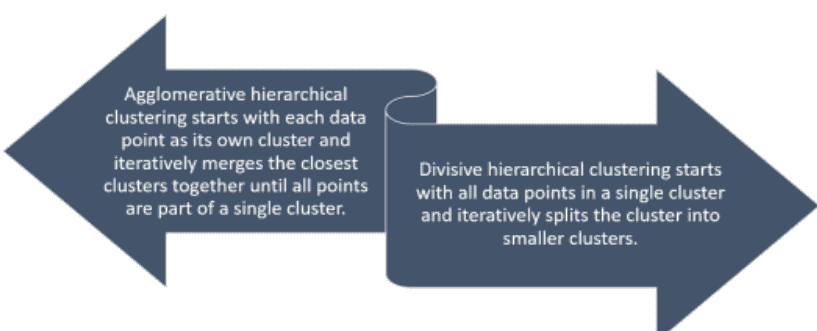

-   凝聚型层次（自底向上）聚类从每个数据点作为其自身的簇开始，迭代地合并最接近的簇，直到所有点都属于一个簇。
-   分裂型层次（自顶向下）聚类从所有数据点在一个簇中开始，迭代地将簇分裂成更小的簇。

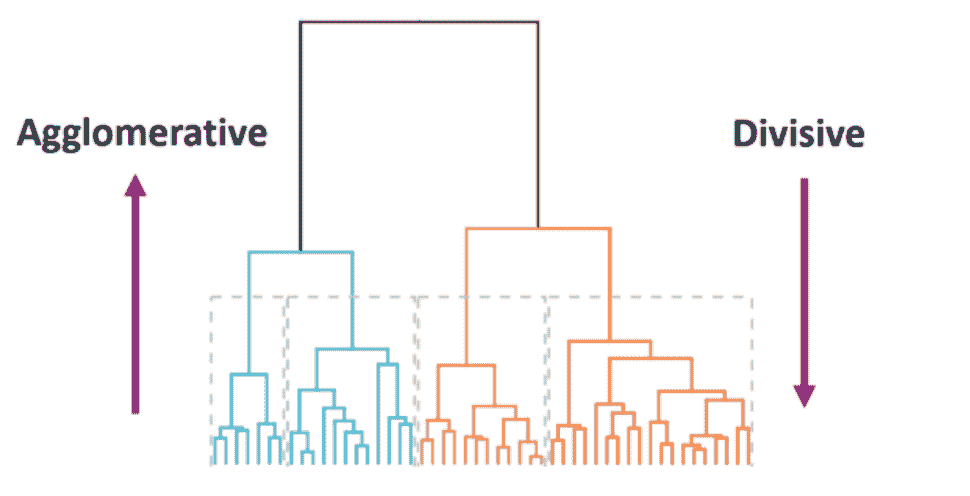

层次聚类的主要优点之一是它允许以树状图的形式表示簇的层次结构，可用于可视化不同簇之间的关系。另一个优点是它可以处理非线性可分的数据，并且可以使用任何距离度量。

然而，层次聚类的主要缺点之一是它可能计算成本高昂且耗时，尤其是在大型数据集上。此外，它可能对所使用的连接标准和距离度量的选择敏感。一些常用的连接标准包括单连接、完全连接、平均连接和Ward连接。

层次聚类的一个例子可以是将客户数据分组为细分市场，用于定向营销。通过对客户数据（如人口统计信息、购买历史和行为）使用聚类算法（如层次聚类），公司可以创建相似客户的细分市场，并针对这些客户开展定制化的营销活动。

层次聚类是一种将簇组织成树状结构的聚类方法。它也被称为**层次聚类分析（HCA）**或凝聚型聚类。

以下是一个使用Python在随机生成的数据集上执行凝聚型和分裂型层次聚类，并使用Matplotlib可视化结果的示例：

```python
import numpy as np
import matplotlib.pyplot as plt
from scipy.cluster.hierarchy import dendrogram, linkage

# Generate random dataset with seed for reproducibility
np.random.seed(123)
X = np.random.randn(50, 2)

# Perform agglomerative clustering
Z_agg = linkage(X, method='ward')

# Plot dendrogram for agglomerative clustering
plt.figure(figsize=(10, 5))
plt.title("Agglomerative Clustering Dendrogram")
plt.xlabel("Data point index")
plt.ylabel("Distance")
dendrogram(Z_agg)
plt.show()

# Perform divisive clustering
Z_div = linkage(X.T, method='ward')

# Plot dendrogram for divisive clustering
plt.figure(figsize=(10, 5))
plt.title("Divisive Clustering Dendrogram")
plt.xlabel("Data point index")
plt.ylabel("Distance")
dendrogram(Z_div)
plt.show()
```

输出结果将如下所示：

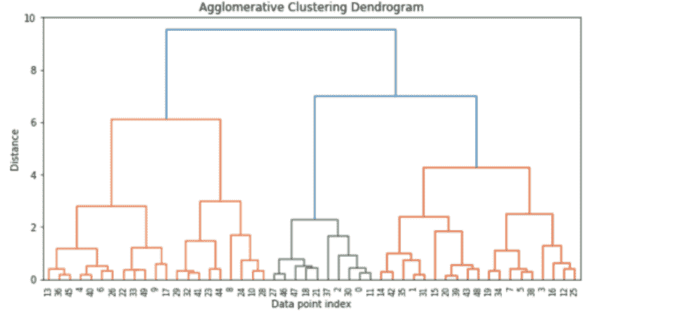

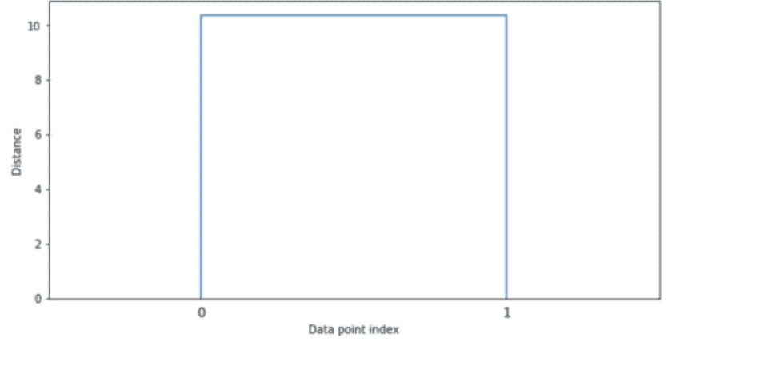

在上面的例子中，我们首先使用NumPy的**randn**函数（种子为123）生成了一个包含50个数据点和2个特征的随机数据集。然后，我们使用**scipy.cluster.hierarchy**模块中的**linkage**函数，采用**ward**方法执行了凝聚型层次聚类，该方法最小化被合并簇之间距离的方差。生成的层次结构使用Matplotlib的**dendrogram**函数以树状图的形式可视化。

接下来，我们通过转置数据集并对其执行凝聚型聚类来执行分裂型层次聚类。这实际上将特征视为数据点，将数据点视为特征。生成的层次结构也使用Matplotlib以树状图的形式可视化。

凝聚型聚类从每个数据点在自己的簇中开始，并在每一步合并最相似的簇，直到所有数据点属于同一个簇。分裂型聚类从所有数据点在一个簇中开始，并递归地将簇分裂成越来越小的簇，直到每个数据点都在自己的簇中。

连接方法的选择会极大地影响生成的簇和树状图结构，并且不同的连接方法可能更适合不同的数据集和聚类目标。如果我们只更改上面代码中的连接方法，结果将看起来完全不同：

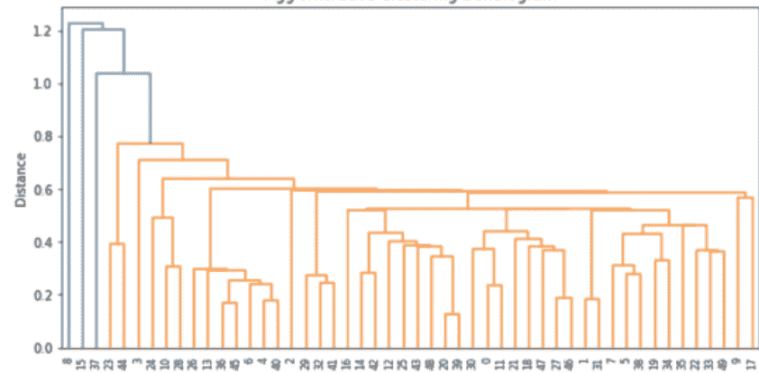

需要注意的是，层次聚类是一种构建簇层次结构的聚类形式，层次结构中的每个节点代表一个簇。层次结构的叶子是单个数据点，每个节点通过连接标准（如单连接、完全连接等）与其父节点连接。

## 5.4 DBSCAN

DBSCAN（基于密度的带噪声应用空间聚类）是一种基于密度的聚类算法，用于在大型数据集中识别任意形状的簇。当数据分离度不高，传统的聚类方法（如K-means和层次聚类）可能效果不佳时，它尤其有用。

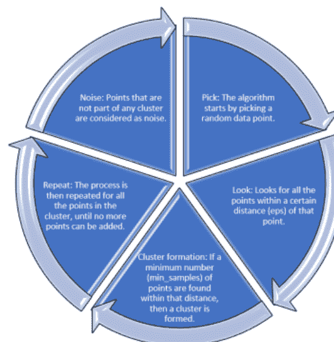

DBSCAN背后的基本思想是根据距离度量和密度阈值，将特征空间中彼此接近的数据点分组在一起。该算法从选择一个随机数据点开始，然后查找该点一定距离（eps）内的所有点。如果在该距离内找到至少最小数量（min_samples）的点，则形成一个簇。然后对簇中的所有点重复此过程，直到无法再添加更多点。不属于任何簇的点被视为噪声。

DBSCAN的一个关键优势是它可以发现**任意形状**的簇，不像K-means和层次聚类那样假设簇是球形或层次结构的。此外，DBSCAN不需要事先知道数据中的簇数量，因为它会根据数据的密度自动检测簇的数量。

然而，DBSCAN的一个主要缺点是对参数选择敏感，特别是eps和min_samples。为这些参数选择合适的值可能很困难，需要一些实验。此外，DBSCAN可能对数据的尺度敏感，当数据具有不同的密度或不同类型的特征时，可能效果不佳。

在Python中，可以使用scikit-learn库实现DBSCAN。scikit-learn中的DBSCAN类需要两个主要参数：eps和min_samples。eps参数定义了两个点被视为同一簇一部分的最大距离，而min_samples参数定义了形成簇所需的最小点数。该算法还可以接受一个可选的metric参数，用于指定使用的距离度量（默认是欧几里得距离）。

### 示例：

以下是一个现实生活中的例子，说明如何使用DBSCAN根据顾客在零售店的购买行为对顾客数据进行聚类。

假设一家零售店收集了顾客购买行为的数据，包括消费金额、购买商品数量和在店内停留的时间。该店希望利用这些数据根据顾客的购买行为将顾客细分为不同的群体。DBSCAN可用于识别具有相似购买行为的顾客群体。

让我们看看下面的代码：

```python
import numpy as np
from sklearn.cluster import DBSCAN
import matplotlib.pyplot as plt

# Generate random data
np.random.seed(0)
X = np.random.rand(100, 2)
```

## 5.5 高斯混合模型（GMM）

高斯混合模型（GMM）是一种生成式概率模型，它假设所有数据点都来自有限个具有未知参数的高斯分布的混合。它是一种聚类算法，通过假设数据点由具有未知参数的高斯分布混合生成，试图在数据中找到自然的分组。

GMM算法是一种概率模型，它假设数据点由高斯分布的混合生成。每个高斯分布由其均值、协方差和权重表示。权重代表属于该高斯分布的数据点的比例。GMM算法使用期望最大化（EM）算法来估计高斯分布的参数和权重。

### 分步流程

以下是GMM算法的分步流程：

1.  初始化聚类数量K和GMM模型参数：均值、协方差矩阵和混合系数。
2.  期望步（E步）：
    - a. 计算每个数据点对于K个高斯分布中每一个的概率密度函数（PDF）。
    - b. 计算每个聚类对于每个数据点的责任度，即在给定PDF值和混合系数的情况下，该数据点属于该聚类的条件概率。
3.  最大化步（M步）：
    - a. 使用E步得到的责任度值，计算每个聚类更新后的均值、协方差矩阵和混合系数。
    - b. 混合系数代表属于每个聚类的数据点的比例。
4.  计算给定更新参数后数据的对数似然。
5.  检查收敛准则。如果对数似然在连续迭代之间没有显著变化，则停止算法；否则，返回步骤2。
6.  基于最大责任度值，返回每个数据点的聚类标签。

请注意，步骤2和步骤3会迭代进行，直到达到收敛。收敛准则可以是最大迭代次数、对数似然的微小变化，或两者兼有。此外，模型参数的初始化可能会影响最终的聚类结果，因此通常使用不同的初始化多次运行算法，并选择具有最高对数似然的那一次是有用的。

GMM算法是一种软聚类算法，这意味着它为每个数据点分配一个属于每个聚类的概率。当数据点不明显属于单个聚类或聚类存在重叠区域时，这很有用。

GMM算法可用于各种类型的数据，包括连续数据、分类数据和混合数据。它广泛应用于图像分割、语音识别和生物信息学等各种应用中。

在Python中，可以使用`sklearn.mixture`模块的`GaussianMixture`类来实现GMM算法。该类接受组件（聚类）数量和协方差类型作为输入参数。它还提供了多种选项来初始化高斯分布的均值、权重和协方差。该类的`fit`方法用于将GMM模型拟合到数据，`predict`方法用于预测新数据点的聚类。

### 真实用例：客户细分

在这个例子中，我们将使用高斯混合模型（GMM）算法进行客户细分。客户细分是营销中的一个常见用例，其目标是根据客户的购买行为、人口统计特征和其他相关特征将客户分组。这些分组可用于创建有针对性的营销活动、个性化客户体验并提高客户留存率。

我们将生成一个模拟客户购买行为的随机数据集，其中每个数据点代表一个具有年龄、收入和购买金额等特征的客户。

代码：

```python
import numpy as np
import matplotlib.pyplot as plt
from sklearn.mixture import GaussianMixture

# Generate random dataset
np.random.seed(0)
n_samples = 500
X = np.zeros((n_samples, 2))
X[:200, :] = np.random.multivariate_normal(mean=[0, 0], cov=[[1, 0.3], [0.3, 2]], size=200)
X[200:400, :] = np.random.multivariate_normal(mean=[5, 5], cov=[[1, -0.3], [-0.3, 2]], size=200)
X[400:, :] = np.random.multivariate_normal(mean=[10, 0], cov=[[1, 0], [0, 1]], size=100)

# Fit GMM model to data
gmm = GaussianMixture(n_components=3, random_state=0)
gmm.fit(X)

# Predict clusters for each data point
labels = gmm.predict(X)

# Plot data points colored by their predicted cluster
plt.scatter(X[:, 0], X[:, 1], c=labels)
plt.title('Customer Segmentation using GMM')
plt.xlabel('Age')
plt.ylabel('Purchase Amount')
plt.show()
```

### 解释：

1.  我们首先导入必要的库：用于生成随机数据的numpy，用于可视化结果的matplotlib，以及来自scikit-learn的`GaussianMixture`，用于拟合GMM模型。
2.  我们设置随机种子以确保可重复性，并生成一个包含500个数据点的随机数据集。我们使用**multivariate_normal**函数从两个不同的高斯分布生成数据点，以及一组具有均匀分布的点。
3.  我们初始化一个具有3个组件的GMM对象，并使用**fit**方法将其拟合到生成的数据。
4.  我们使用**predict**方法预测每个数据点的聚类标签。
5.  最后，我们使用matplotlib的**scatter**方法绘制按预测聚类着色的数据点。

生成的图显示了基于购买行为的三个不同客户细分：购买金额较低的年轻客户（聚类0）、购买金额较高的年长客户（聚类1）以及购买金额适中的中年客户（聚类2）。

> GMM算法可以应用于许多其他用例，例如图像分割、异常检测和语音识别。

## 5.6 降维

降维是一种用于减少数据集中特征数量，同时尽可能保留更多信息的技术。降维的目标是降低数据的复杂性，使其更易于分析和建模。有许多不同的技术可用于降维，包括主成分分析（PCA）、线性判别分析（LDA）和t-分布随机邻域嵌入（t-SNE）。这些技术可以单独使用或组合使用，以达到所需的降维水平。

PCA是最常用的降维技术之一。它通过将原始特征转换为一组新的特征（称为主成分）来工作，这些主成分是原始特征的线性组合。选择主成分是为了使它们能够解释数据中最大的方差。LDA与PCA类似，但用于监督学习，用于找到能最好地区分不同类别的特征线性组合。

t-SNE是一种非线性降维技术，特别适用于在

## 5.7 主成分分析（PCA）

主成分分析（PCA）是一种流行的降维技术，用于将高维数据集转换为低维空间，同时尽可能保留原始信息。PCA背后的主要思想是识别数据中方差最大的方向，并将数据投影到由这些方向定义的新坐标系上。

### 分步流程

以下是PCA算法涉及的分步流程：

1.  **标准化数据**：PCA的第一步是将数据标准化，使其均值为0，标准差为1。这样做是为了确保所有变量对分析的贡献相等。
2.  **计算协方差矩阵**：下一步是计算标准化数据的协方差矩阵。协方差矩阵显示了数据集中变量之间的关系。矩阵的对角线元素代表变量的方差，而非对角线元素代表变量之间的协方差。
3.  **计算特征向量和特征值**：下一步是计算协方差矩阵的特征向量和特征值。特征向量是一组定义新特征空间方向的向量，而特征值代表数据在相应特征向量方向上的方差大小。
4.  **按特征值降序排列特征向量**：特征向量按其对应的特征值降序排列。具有最高特征值的特征向量代表数据中方差最大的方向，而具有最低特征值的特征向量代表方差最小的方向。
5.  **选择主成分**：下一步是根据新特征空间中的维度数量选择主成分。选择的主成分数量应小于或等于数据集中的原始维度数量。
6.  **转换数据**：最后，通过将原始数据乘以选定的主成分，将数据转换到新的特征空间。转换后的数据可用于进一步分析或可视化。

PCA是降维、可视化和数据压缩的强大工具。它广泛应用于金融、图像处理、遗传学和神经科学等多个领域。PCA的主要优势之一是可以通过消除方差最小的方向来去除数据中的噪声，从而提高机器学习模型的性能。

### 示例

假设我们有一个包含杂货店客户购买信息的数据集。该数据集包括每件购买商品的价格、数量和类别，以及客户的年龄、性别和位置。我们想要分析这个数据集以深入了解客户行为，但该数据集具有大量特征（即列），使得分析变得困难。

要使用PCA降低此数据集的维度，我们可以按照以下步骤操作：

1.  使用numpy生成一个包含100个样本的随机数据集，每个样本有10个特征。
2.  使用scikit-learn中的StandardScaler对数据集进行缩放，使每个特征具有零均值和单位方差。
3.  使用scikit-learn中的PCA将PCA模型拟合到缩放后的数据集。我们可以指定要在转换后的数据集中保留的主成分数量。
4.  使用拟合好的PCA模型转换数据集。转换后的数据集将具有指定数量的主成分，这些主成分是原始特征的线性组合。
5.  使用散点图可视化转换后的数据集，其中每个点代表转换后数据集中的一个样本。如果数据集中有标签，我们可以使用不同的颜色来表示不同的标签。

以下是完整代码：

```python
import numpy as np
import matplotlib.pyplot as plt
from sklearn.decomposition import PCA
from sklearn.preprocessing import StandardScaler

# Step 1: Generate a random dataset
np.random.seed(42)
X = np.random.rand(100, 10)

# Step 2: Scale the dataset
scaler = StandardScaler()
X_scaled = scaler.fit_transform(X)

# Step 3: Fit the PCA model
n_components = 2
pca = PCA(n_components=n_components)
pca.fit(X_scaled)

# Step 4: Transform the dataset
X_transformed = pca.transform(X_scaled)

# Step 5: Visualize the transformed dataset
plt.scatter(X_transformed[:, 0], X_transformed[:, 1])
plt.xlabel('PC1')
plt.ylabel('PC2')
plt.title('Transformed dataset')
plt.show()
```

输出将如下所示：

在此示例中，我们使用numpy生成了一个包含100个样本和10个特征的随机数据集。然后，我们使用scikit-learn中的StandardScaler对数据集进行缩放，以确保每个特征具有零均值和单位方差。我们将PCA模型拟合到缩放后的数据集，并指定我们希望在转换后的数据集中保留前两个主成分。然后，我们使用拟合好的PCA模型转换数据集，并使用散点图绘制转换后的数据集。

生成的图显示了二维空间中的转换后数据集，其中每个点代表转换后数据集中的一个样本。我们可以看到，与具有10个特征的原始数据集相比，样本现在沿着两个主成分更加分散。这可以帮助我们深入了解数据的潜在结构，并可能使其更容易分析。

## 5.8 独立成分分析（ICA）

独立成分分析（ICA）是一种用于将多变量信号分离为独立、非高斯成分的技术。它是信号处理领域的一项流行技术，已应用于音频、图像和生物医学信号处理等多个领域。

ICA背后的主要思想是找到原始变量的线性组合，使得得到的成分在统计上是独立的。换句话说，目标是找到一组尽可能彼此独立的新变量。这可以通过最大化所得成分的非高斯性来实现。

ICA算法通常应用于经过某种形式的白化或去相关技术预处理的数据。这是因为ICA对数据的相关结构敏感，事先对数据进行去相关可以帮助提高算法的性能。

实现ICA的一种常用方法称为FastICA。该算法基于负熵的概念，并使用迭代优化方法来寻找独立成分。其他流行的方法包括JADE和Infomax。

### 分步流程

以下是独立成分分析（ICA）的一般步骤：

1.  **数据预处理**：通过中心化数据（减去均值）和缩放数据（除以标准差或范围）来预处理数据。
2.  **数据白化**：对预处理后的数据应用线性变换，将其转换为一组新的不相关变量，其协方差矩阵为对角矩阵（白化）。协方差矩阵的对角线元素代表每个变量的方差。
3.  **选择成分数量**：确定要提取的独立成分数量。这可以通过分析碎石图或对协方差矩阵的特征值设置阈值来完成。
4.  **计算成分**：使用迭代算法（如FastICA）提取独立成分。该算法在每个维度上最大化转换后数据的非高斯性。
5.  **重构数据**：通过将成分乘以混合矩阵并加上均值，从提取的独立成分重构原始数据。

## 6. 结果解读

在应用背景下解读独立成分。

在Python中，可以使用scikit-learn库实现ICA。该库提供了一个名为`FastICA`的类，可用于将ICA模型拟合到数据上。该类接受多个参数，例如成分数和使用的算法。模型拟合后，可用于将原始数据转换为独立成分。

ICA的实际应用包括音频源分离、信号去噪以及生物医学信号中的特征提取。例如，在音频源分离中，ICA可用于分离录音中不同的声源，如人声和乐器声。在生物医学信号处理中，ICA可用于从脑电信号中提取独立成分，进而用于神经系统疾病的诊断和治疗。

独立成分分析（ICA）是一种用于识别信号中独立源的技术，这些源随后可以相互分离。在ICA中，目标是找到输入特征的线性组合，以最大化所得信号的非高斯性。

### 示例

以下是一个使用随机数据集说明独立成分分析（ICA）的编码示例：

```python
import numpy as np
from scipy import signal
from sklearn.decomposition import FastICA
import matplotlib.pyplot as plt

# set random seed for reproducibility
np.random.seed(42)

# generate random mixed signals
n_samples = 2000
time = np.linspace(0, 8, n_samples)
s1 = np.sin(2 * time)  # signal 1
s2 = np.sign(np.sin(3 * time))  # signal 2
s3 = signal.sawtooth(2 * np.pi * time)  # signal 3
S = np.c_[s1, s2, s3]
S += 0.2 * np.random.normal(size=S.shape)  # add noise
S /= S.std(axis=0)  # standardize the data

# mix signals randomly
A = np.array([[0.5, 1, 1], [1, 0.5, 1], [1, 1, 0.5]])  # mixing matrix
X = np.dot(S, A.T)  # mixed signals

# apply Independent Component Analysis (ICA)
ica = FastICA(n_components=3)
S_hat = ica.fit_transform(X)

# plot the original and recovered signals
fig, axes = plt.subplots(3, sharex=True, figsize=(8, 8))
ax1, ax2, ax3 = axes
ax1.plot(S[:, 0], color='r')
ax1.set_title('Original Signal 1')
ax2.plot(S[:, 1], color='g')
ax2.set_title('Original Signal 2')
ax3.plot(S[:, 2], color='b')
ax3.set_title('Original Signal 3')

fig2, axes2 = plt.subplots(3, sharex=True, figsize=(8, 8))
ax4, ax5, ax6 = axes2
ax4.plot(S_hat[:, 0], color='r')
ax4.set_title('Recovered Signal 1')
ax5.plot(S_hat[:, 1], color='g')
ax5.set_title('Recovered Signal 2')
ax6.plot(S_hat[:, 2], color='b')
ax6.set_title('Recovered Signal 3')

plt.show()
```

输出将如下所示：

## 解释

1. 我们首先导入必要的包：用于生成随机数据的NumPy、用于信号处理的SciPy、用于实现FastICA的scikit-learn以及用于可视化结果的Matplotlib。
2. 我们设置随机种子以确保结果可复现。
3. 我们生成三个具有不同模式（正弦波、方波和锯齿波）的随机信号，向它们添加一些高斯噪声，并对数据进行标准化。
4. 我们通过将信号与混合矩阵相乘来随机混合它们。
5. 我们将FastICA算法应用于混合信号以提取独立成分。
6. 我们绘制原始信号和恢复的信号以进行比较。

在此示例中，我们使用ICA将混合信号分离为其原始成分。这种技术在生物医学信号处理、语音识别和图像处理等多个领域都很有用。

## 5.9 T-SNE

t-分布随机邻域嵌入（t-SNE）是一种降维技术，特别适用于可视化高维数据。它是一种非线性降维技术，基于邻域图上的随机游走概率分布来发现数据中的结构。

t-SNE通过最小化两个概率分布之间的散度来工作：一个分布衡量高维空间中数据点之间的成对相似性，另一个分布衡量低维空间（即我们希望表示数据的空间）中数据点之间的成对相似性。t-SNE算法将高维数据映射到低维空间，同时保留数据的结构，如聚类或模式。

t-SNE算法有两个主要组成部分：相似性矩阵和低维嵌入。相似性矩阵使用相似性度量（如欧几里得距离或余弦相似性）计算。低维嵌入使用梯度下降法计算。t-SNE算法迭代更新低维嵌入，以最小化两个概率分布之间的散度。

### 分步过程

以下是t-SNE涉及的步骤：

1.  **输入数据**：t-SNE的第一步是提供输入数据，这通常是一个具有大量特征的高维数据集。
2.  **计算成对相似性**：t-SNE算法使用高斯分布计算所有数据点之间的成对相似性。高斯分布衡量两个点相似的概率。
3.  **计算成对亲和度**：该算法将成对相似性转换为数据点对上的联合概率分布，使得相似的点被选为邻居的概率高，而不相似的点被选中的概率低。
4.  **计算低维映射**：t-SNE算法通过最小化两个概率分布之间的散度来构建低维映射：高维空间中数据点对上的联合概率分布和低维映射中对应点对上的分布。
5.  **优化映射**：t-SNE算法使用梯度下降法优化映射，以最小化两个概率分布之间的Kullback-Leibler散度。梯度下降是迭代进行的，在每次迭代中，算法更新低维空间中点的位置。
6.  **可视化映射**：最后一步是使用散点图可视化低维映射。散点图显示了点在低维空间中的位置。

t-SNE对于可视化高维数据特别有用，例如具有许多特征或大型数据集的数据。它已应用于自然语言处理、计算机视觉和生物信息学等多种领域。然而，t-SNE对参数的选择和低维嵌入的初始化很敏感，并且对于大型数据集可能计算成本很高。

### 示例

在此示例中，我们将生成一个包含1000个二维点的随机数据集，然后使用t-SNE将该数据集可视化在更低维的空间（二维空间）中。

```python
import numpy as np
from sklearn.manifold import TSNE
import matplotlib.pyplot as plt

# Generate random dataset
np.random.seed(42)
X = np.random.rand(1000, 2)

# Apply t-SNE to reduce dimensionality
tsne = TSNE(n_components=2, perplexity=30.0)
X_tsne = tsne.fit_transform(X)

# Visualize the dataset in 2D space
plt.scatter(X_tsne[:, 0], X_tsne[:, 1])
plt.title("t-SNE visualization of random dataset")
plt.show()
```

输出将如下所示：

## 解释

1.  我们首先导入必要的库：用于生成随机数据集的NumPy、用于应用t-SNE的scikit-learn中的t-SNE，以及用于可视化数据集的Matplotlib。
2.  我们设置随机种子以确保结果可复现，并使用`np.random.rand()`函数生成一个包含1000个二维点的随机数据集。
3.  我们创建一个`TSNE`类的实例，并将成分数设置为2（因为我们希望在二维空间中可视化数据集），将困惑度设置为30.0（一个控制保留数据集全局结构和局部结构之间平衡的超参数）。
4.  我们通过调用`TSNE`实例的`fit_transform()`方法将t-SNE应用于数据集。

## 5.10 自编码器

自编码器是一种神经网络架构，旨在学习输入数据的压缩表示。它由两个主要组件组成：编码器，将输入数据映射到低维表示；解码器，将低维表示映射回原始输入数据。自编码器的目标是学习输入数据的压缩表示，以捕捉最重要的特征或模式。

自编码器的一个常见用例是降维。通过训练自编码器学习输入数据的低维表示，它可以用于减少数据集中的特征数量，同时保留最重要的信息。自编码器也可用于异常检测，通过在正常数据上训练模型，并用它来识别与训练数据显著不同的数据点。

自编码器可以使用各种类型的神经网络架构来实现，例如前馈神经网络、循环神经网络和卷积神经网络。架构的选择将取决于具体问题和输入数据的类型。

### 分步流程

以下是实现自编码器的分步流程：

- 1. **收集和预处理数据**：与任何机器学习任务一样，首先收集数据并根据需要进行预处理（例如，归一化、标准化、特征选择）。
- 2. **选择架构**：自编码器具有特定的架构，由编码器和解码器组成。编码器将输入数据缩减为低维表示，而解码器则从该低维表示重建原始数据。决定编码器和解码器的层数以及每层的神经元数量。
- 3. **定义损失函数**：为了训练自编码器，你需要定义一个损失函数来衡量原始输入数据和重建输出数据之间的差异。均方误差是一个常见的选择。
- 4. **训练自编码器**：使用你选择的优化算法和定义的损失函数来训练自编码器。使用你的预处理数据作为输入和输出。
- 5. **评估性能**：训练后，使用均方误差或对重建数据的目视检查等指标来评估自编码器的性能。
- 6. **使用编码器进行降维**：训练好的自编码器的编码器部分可以用作降维技术，处理训练期间未见过的新数据。
- 7. **微调自编码器**：如有必要，通过调整超参数并重新训练来微调自编码器。
- 8. **部署自编码器**：一旦你对自编码器的性能感到满意，就将其部署到你的生产环境中。

### 示例

这是一个使用随机生成的数据集实现自编码器的示例：

```python
import numpy as np
import matplotlib.pyplot as plt
from tensorflow import keras

# Generate random dataset
np.random.seed(42)
n_samples = 1000
input_dim = 10
X = np.random.rand(n_samples, input_dim)

# Define autoencoder model
input_layer = keras.layers.Input(shape=(input_dim,))
encoded = keras.layers.Dense(5, activation='relu')(input_layer)
decoded = keras.layers.Dense(input_dim, activation='sigmoid')(encoded)
autoencoder = keras.models.Model(input_layer, decoded)

# Compile and train model
autoencoder.compile(optimizer='adam', loss='binary_crossentropy')
autoencoder.fit(X, X, epochs=50, batch_size=32)

# Use the encoder part of the autoencoder to get the encoded representation of the input data
encoder = keras.models.Model(input_layer, encoded)
encoded_X = encoder.predict(X)

# Plot the original and encoded data
fig, axs = plt.subplots(nrows=1, ncols=2, figsize=(10, 5))
axs[0].scatter(X[:, 0], X[:, 1], c='b', alpha=0.5)
axs[0].set_title('Original Data')
axs[1].scatter(encoded_X[:, 0], encoded_X[:, 1], c='r', alpha=0.5)
axs[1].set_title('Encoded Data')
plt.show()
```

输出将如下所示：

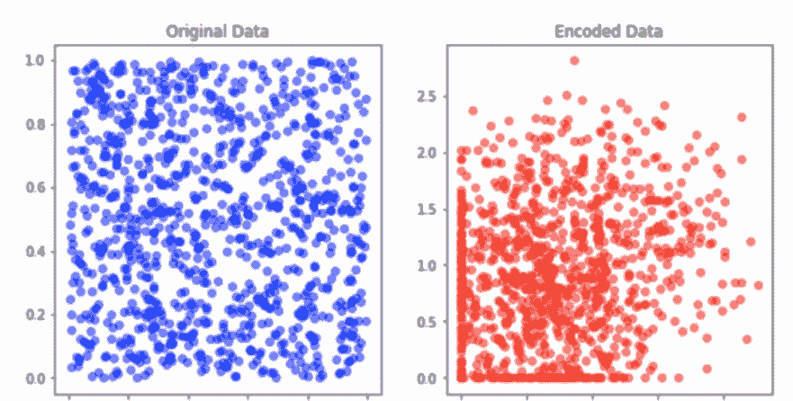

在这个例子中，我们生成了一个包含1000个样本、每个样本10维的随机数据集。然后，我们使用Keras定义了一个自编码器模型，其输入层大小为10，编码层大小为5，解码层大小为10。我们使用二元交叉熵损失函数和Adam优化器编译模型，并使用32个样本的批次训练了50个周期。

训练后，我们使用自编码器的编码器部分获取输入数据的编码表示，并使用matplotlib绘制原始数据和编码数据。图表显示，自编码器已经学习到了原始数据的低维表示，仅用5维而不是10维，同时保留了数据的重要特征。

## 5.11 异常检测

异常检测，也称为离群点检测或新颖性检测，是识别不符合给定数据集预期模式或正常行为的数据点的过程。这些数据点，也称为异常值或离群点，可能是由数据收集或测量中的错误引起的，也可能代表真正异常或罕见的事件。

异常检测有多种技术，包括统计方法、机器学习算法和特定领域的方法。一些常见的统计方法包括使用均值和标准差来识别超出特定范围的数据点，或使用Z分数来识别距离均值一定数量标准差的数据点。

机器学习算法，如聚类和基于密度的方法，也可用于异常检测。聚类算法将相似的数据点分组在一起，并将不属于任何簇的数据点识别为异常值。另一方面，基于密度的方法将数据集中处于低密度区域的数据点识别为异常值。

还有针对特定类型数据和应用量身定制的特定领域异常检测方法。例如，在网络安全领域，入侵检测系统使用各种技术来识别网络流量中的异常行为。在金融领域，欺诈检测系统使用各种技术来识别异常交易。

异常检测是许多领域的重要任务，包括金融、医疗保健、网络安全和制造业。它可用于检测欺诈、识别设备故障、检测入侵等。然而，需要注意的是，确定一个数据点是否真正是异常值并不总是那么容易，并且区分正常变化和真正异常事件可能很困难。

### 分步流程

异常检测的分步流程可以如下：

- 1. **定义问题并识别数据**：首先，我们需要定义我们试图解决的问题，并识别相关的数据源。例如，我们可能想要检测网站上的用户行为异常、机器的传感器数据异常或金融交易数据异常。
- 2. **预处理数据**：一旦我们识别了数据，就需要对其进行预处理以使其适合分析。这可能包括清理数据、将其转换为合适的格式以及对其进行归一化以确保所有特征处于相同尺度等步骤。
- 3. **选择合适的算法**：有几种不同的算法可用于异常检测，包括统计方法、机器学习模型和深度学习方法。算法的选择将取决于数据的性质和问题的具体要求。
- 4. **训练模型**：一旦我们选择了合适的算法，就需要在可用数据上训练模型。这可能涉及将数据拆分为训练集和验证集、为模型选择合适的超参数以及调整模型以实现最佳性能。
- 5. **评估模型**：训练模型后，我们需要在单独的测试集上评估其性能。这将使我们能够估计模型在新的、未见过的数据上的表现如何。
- 6. **部署模型**：一旦我们对模型的性能感到满意，就可以将其部署到生产环境中以实时检测异常。这可能涉及将模型与其他系统集成、设置适当的异常检测阈值以及随时间监控模型的性能。

检测，并随时间监控模型的性能。

7. **迭代与改进**：异常检测是一个持续的过程，持续监控模型性能并根据需要进行改进至关重要。这可能涉及收集额外数据、在新数据上重新训练模型，或微调模型以提升其性能。

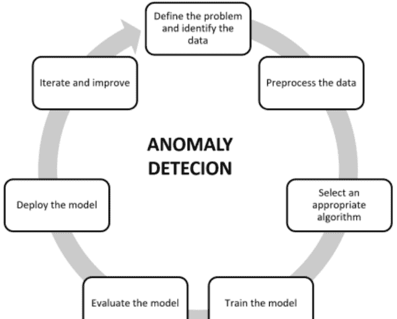

## 示例（使用孤立森林算法）

以下是一个使用孤立森林算法在随机生成的数据集上进行异常检测的示例：

```python
import numpy as np
import matplotlib.pyplot as plt
from sklearn.ensemble import IsolationForest

# Generate random dataset with anomalies
rng = np.random.RandomState(42)
X = 0.3 * rng.randn(100, 2)
X_train = np.r_[X + 2, X - 2, np.random.uniform(low=-4, high=4, size=(20, 2))]

# Fit the isolation forest model
clf = IsolationForest(random_state=rng, contamination=0.1)
clf.fit(X_train)

# Predict anomalies
y_pred = clf.predict(X_train)
outliers = X_train[np.where(y_pred == -1)]

# Plot the dataset and anomalies
plt.scatter(X_train[:, 0], X_train[:, 1], c='white', edgecolor='k', alpha=0.5)
plt.scatter(outliers[:, 0], outliers[:, 1], c='red', edgecolor='k')
plt.title('Isolation Forest for Anomaly Detection')
plt.show()
```

输出结果将如下所示：

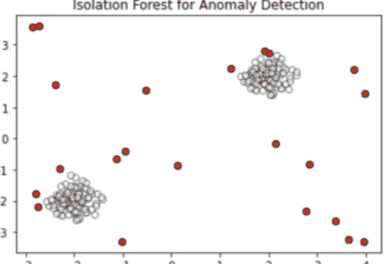

在此示例中，我们首先生成一个包含100个正常样本和20个异常样本的随机数据集。然后，我们使用污染率为0.1的孤立森林模型拟合该数据集，该参数指定了我们预期数据集中异常值的比例。接着，模型被用于预测异常值，我们用红点绘制数据集和预测出的异常值。

孤立森林算法通过为数据集构建孤立树来工作，这些是二叉树，随机选择一个特征并沿着该特征的随机选定值分割数据。异常值通常从根节点到叶节点的路径长度较短，因为它们比正常点更容易被隔离。孤立森林算法利用这一特性来检测异常。

## 示例（使用高斯分布）

一种流行的异常检测方法是使用高斯分布。以下是在Python中使用高斯分布实现异常检测的示例：

```python
import numpy as np
from sklearn.datasets import make_moons
from sklearn.covariance import EllipticEnvelope

# Generate sample data
X, y = make_moons(n_samples=100, noise=0.1)

# Fit the model
clf = EllipticEnvelope(contamination=0.1) # Set contamination to 10% of the data
clf.fit(X)

# Predict if a data point is an outlier
pred = clf.predict(X)

# Visualize the results
import matplotlib.pyplot as plt
plt.scatter(X[:,0], X[:,1], c=pred)
plt.show()
```

输出结果将如下所示：

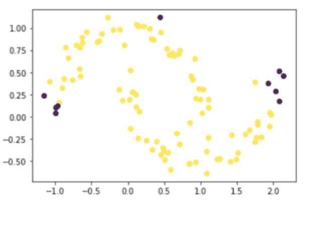

在此示例中，我们首先使用scikit-learn的**make_moons**函数生成一个样本数据集。该函数生成一个包含两个类别的数据集，其形状呈新月形。接下来，我们从scikit-learn的**covariance**模块创建一个**EllipticEnvelope**类的实例。该类是将多元高斯分布拟合到数据的有用工具。默认情况下，**EllipticEnvelope**假设数据是正态分布的，但如果我们想在中心化数据后拟合分布，也可以将**assume_centered**参数设置为**True**。

我们将**contamination**参数设置为0.1，这意味着我们预期有10%的数据点是异常值。然后，我们将模型拟合到数据上，并对相同的数据进行预测。最后，我们使用matplotlib的**scatter**函数可视化结果。蓝色的点是内点，红色的点是模型预测出的异常值。

总之，此示例展示了如何使用scikit-learn的**EllipticEnvelope**类，利用高斯分布来检测数据集中的异常值。该方法假设数据是正态分布的，并且异常值只占总数据的一小部分。

## 5.12 总结

- 无监督学习是一种机器学习类型，它涉及在不使用标记响应或输出的情况下，发现数据中的模式或关系。
- 聚类是一种常见的无监督学习技术，它将相似的数据点分组在一起。
- K-means是一种流行的聚类算法，它通过最小化每个簇内的方差，将数据点分组为k个簇。
- 层次聚类是另一种流行的聚类技术，它创建一个簇的层次结构，其中每个簇被划分为更小的簇。
- DBSCAN是一种基于密度的聚类算法，它根据给定区域中点的密度将数据点分组。
- GMM是一种概率模型，它假设数据是由高斯分布的混合生成的。
- 降维是一种技术，它在保留最重要信息的同时，减少数据集中的特征或维度数量。
- PCA是一种流行的降维技术，它找到数据集的主成分，这些主成分是原始特征的线性组合。
- ICA是另一种降维技术，它找到独立成分，这些独立成分是原始特征的统计独立的线性组合。
- t-SNE是一种通过保留数据的局部结构，将高维数据可视化为二维或三维的技术。
- 自编码器是经过训练以重构其输入的神经网络，可用于降维和异常检测。
- 异常检测是一种识别不寻常或不符合数据中其余模式的数据点的技术。
- 一些流行的异常检测技术包括使用基于密度的聚类、高斯分布或基于聚类的方法。

## 5.13 测试你的知识

1. 无监督学习的主要目标是什么？
    a. 将数据分类到预定义的类别中
    b. 发现数据中隐藏的模式或关系
    c. 基于输入特征预测目标变量
    d. 识别数据中最重要的特征

2. 监督学习和无监督学习的主要区别是什么？
    a. 无监督学习需要标记数据，而监督学习不需要
    b. 监督学习需要标记数据，而无监督学习不需要
    c. 监督学习需要目标变量，而无监督学习不需要
    d. 无监督学习需要目标变量，而监督学习不需要

3. 最流行的聚类方法是什么？
    a. K-means
    b. 随机森林
    c. 支持向量机
    d. 逻辑回归

4. 降维的主要目的是什么？
    a. 增加数据中的特征数量
    b. 减少数据中的特征数量
    c. 提高模型的准确性
    d. 降低模型的复杂性

5. PCA和ICA的主要区别是什么？
    a. PCA是线性的，而ICA是非线性的
    b. ICA是线性的，而PCA是非线性的
    c. PCA用于聚类，而ICA用于降维
    d. ICA用于聚类，而PCA用于降维

6. t-SNE和自编码器的主要区别是什么？
    a. t-SNE用于降维，而自编码器用于异常检测
    b. 自编码器用于降维，而t-SNE用于异常检测
    c. t-SNE和自编码器都用于异常检测
    d. t-SNE和自编码器都用于降维

7. K-means和层次聚类的主要区别是什么？
    a. K-means是一种扁平聚类方法，而层次聚类是一种层次方法
    b. 层次聚类是一种扁平聚类方法，而K-means是一种层次方法
    c. K-means是一种基于密度的方法，而层次聚类是一种基于距离的方法
    d. 层次聚类是一种基于密度的方法，而K-means是一种基于距离的方法

8. DBSCAN和GMM的主要区别是什么？
    a. DBSCAN是一种基于密度的方法，而GMM是一种概率方法
    b. GMM是一种基于密度的方法，而DBSCAN是一种概率方法
    c. DBSCAN是一种硬聚类方法，而GMM是一种软聚类方法
    d. GMM是一种硬聚类方法，而DBSCAN是一种软聚类方法

9. 异常检测和离群点检测的主要区别是什么？
    a. 异常检测和离群点检测是同一回事

## 5.14 答案

**I. 答案：**
b) 发现数据中隐藏的模式或关系

**I. 答案：**
b) 监督学习需要标记数据，而无监督学习不需要

**I. 答案：**
a) K-means

**I. 答案：**
a) 增加数据中的特征数量

**I. 答案：**
a) PCA是线性的，而ICA是非线性的

**I. 答案：**
a) t-SNE用于降维，而自编码器用于异常检测

**I. 答案：**
a) K-means是一种扁平聚类方法，而层次聚类是一种分层方法

**I. 答案：**
a) DBSCAN是一种基于密度的方法，而GMM是一种概率方法

**I. 答案：** 异常检测用于检测数据中的异常模式，而离群点检测用于检测数据中的极端值

**I. 答案：** 在没有预定义类别的情况下，识别数据中的模式和结构

**I. 答案：** 聚类

**I. 答案：** K-means是一种自底向上的方法，而层次聚类是一种自顶向下的方法

**I. 答案：** 通过减少特征数量来简化数据集

**I. 答案：** PCA是一种线性技术，而ICA是非线性技术

**I. 答案：** 可视化高维数据

**I. 答案：** 降维

**I. 答案：** 自编码器是一种深度学习技术，而PCA是一种传统技术

**I. 答案：** 识别与大多数数据不同的数据点

**I. 答案：**
b) 发现数据中隐藏的模式或关系

**I. 答案：**
b) 随机森林

**I. 答案：** K-means将数据聚类到预定义数量的簇中，而层次聚类形成树状的簇结构

**I. 答案：** 通过减少特征数量来简化数据，同时保留最重要的信息

**I. 答案：**
a) PCA是一种线性方法，而ICA是一种非线性方法

**I. 答案：** 自编码器用于降维，而t-SNE用于可视化

**I. 答案：**
c) 识别数据中不寻常或异常的观测值

## 6 深度学习

深度学习是机器学习的一个子领域，它使用人工神经网络来建模和解决复杂问题。这些神经网络旨在模拟人脑的工作方式，使用多层相互连接的节点或“神经元”来处理和分析数据。深度学习的关键优势在于它能够自动学习数据的有用表示，而无需进行显式的特征工程。在本章中，我们将探讨深度学习的基础知识，包括不同类型的神经网络、神经网络的基本构建模块，以及用于训练和优化这些网络的各种技术。我们还将讨论最流行的深度学习框架以及深度学习在各个领域的应用。

## 6.1 什么是深度学习

深度学习是机器学习的一个子领域，其灵感来源于大脑的结构和功能，特别是构成大脑的神经网络。它涉及在大型数据集上训练人工神经网络（ANN），使网络能够自主学习和改进，而无需显式编程。

深度学习模型由多层组成，因此得名“深度”学习。每一层处理和转换输入数据，并将结果传递给下一层。网络的最终输出是基于输入数据的预测或决策。输入层和输出层之间的层称为隐藏层。

最常用的深度学习架构是前馈神经网络、卷积神经网络（CNN）和循环神经网络（RNN）。前馈神经网络是最简单的深度学习模型类型，数据从输入到输出单向流动。CNN通常用于图像和视频识别任务，因为它们能够以分层的方式从输入数据中学习特征。RNN用于输入数据具有时间维度的任务，例如语音或视频识别。

深度学习模型使用一种称为反向传播的随机梯度下降算法变体进行训练。该算法通过调整网络的权重，以最小化预测输出与真实输出之间的误差。

深度学习在许多应用中已被证明非常有效，例如图像和语音识别、自然语言处理，甚至下棋和围棋等游戏。从数据中自动学习特征的能力已在许多领域带来了性能的显著提升，在许多情况下超越了传统的机器学习技术。

## 6.2 神经网络

神经网络是一组旨在识别数据中模式的算法。它们的灵感来源于人脑的结构和功能，用于建模输入与输出之间的复杂关系。

神经网络由相互连接的节点层（也称为神经元）组成。这些层被组织为输入层、隐藏层和输出层。输入层接收数据，隐藏层处理数据，输出层产生最终结果。每一层中的每个神经元都通过称为边或连接的路径与下一层的神经元相连，这些路径被赋予一个权重值。这些权重值在学习过程中被调整，以提高模型的准确性。

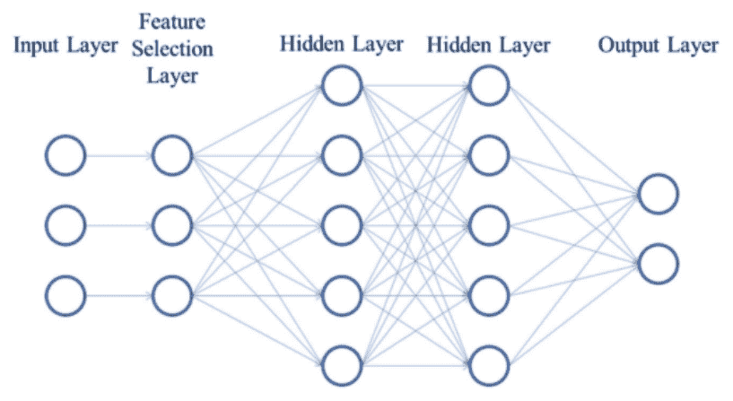

神经网络中的**学习过程**称为训练，它涉及调整边的权重值，以最小化预测输出与实际输出之间的误差。这是通过使用优化算法（如随机梯度下降）来完成的，该算法以减少误差的方向迭代地更新权重。

神经网络可用于各种任务，包括图像和语音识别、自然语言处理以及时间序列预测。它们对于具有大型和复杂数据集的问题特别有用，因为传统的机器学习方法在这些情况下可能难以应对。

深度学习是机器学习的一个子领域，它利用神经网络从数据中学习，对于具有大型和复杂数据集的问题非常有用，因为传统的机器学习方法在这些情况下可能难以应对。神经网络是一组旨在识别数据中模式的算法，它们的灵感来源于人脑的结构和功能，用于建模输入与输出之间的复杂关系。

**一个简单的例子**是多层感知机（MLP）。MLP由一个输入层、一个或多个隐藏层和一个输出层组成（见图）。输入层接收输入数据，然后通过一组权重和偏置在隐藏层中进行处理。最后一个隐藏层的输出通过输出层传递，以产生网络的预测。

假设我们想创建一个神经网络，可以根据房屋的平方英尺数、卧室数量、浴室数量和房龄来预测房屋价格。我们的输入层将有4个神经元，每个特征一个（平方英尺数、卧室数量、浴室数量和房龄）。我们的输出层将有1个神经元，代表预测的房屋价格。

我们可以在输入层和输出层之间添加一个或多个隐藏层，以增加模型学习更复杂数据表示的能力。例如，我们可以添加一个有5个神经元的隐藏层。隐藏层将使用输入数据来学习中间表示，并将其传递给下一层。

为了训练神经网络，我们使用一个由房屋价格及其对应的平方英尺数、卧室数量、浴室数量、房龄组成的输入-输出对训练数据集。我们使用优化算法（如随机梯度下降）来迭代地调整网络的权重和偏置，使其能够在给定输入时预测正确的输出。

一旦模型训练完成，它就可以用于对新的、未见过的数据进行预测。这对于各种任务都很有用，例如预测房价、股票价格，甚至识别图像中的物体。

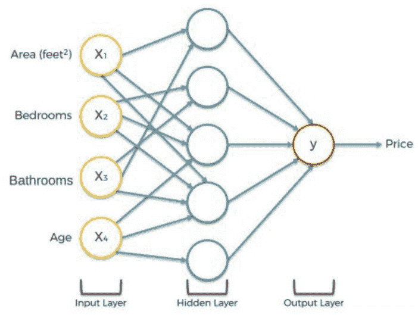

**值得注意的是**，这个例子只是神经网络的一个非常简单的表示，在实践中，神经网络可以复杂得多，具有多个隐藏层和每层大量的神经元。此外，还有许多不同类型的神经网络，例如卷积神经网络（CNN）和循环神经网络（RNN），它们分别设计用于处理特定类型的数据，如图像和时间序列数据。

## 6.3 反向传播

反向传播是一种训练算法，通过将误差反向传播通过网络来更新神经网络的权重。该算法用于监督学习，其目标是最小化网络预测输出与真实输出之间的误差。

反向传播算法首先将输入数据通过网络前向传播以计算预测输出。然后，通过将预测输出与真实输出进行比较来计算误差。然后，该误差从输出层开始，向后传播到输入层。随着误差的反向传播，网络的权重被更新以减少误差。

反向传播算法的关键是使用梯度下降，这是一种用于寻找函数最小值的优化算法。计算误差相对于权重的梯度，并沿梯度的反方向更新权重。此过程重复进行，直到误差达到最小值。

反向传播算法有几种变体，包括随机梯度下降、批量梯度下降和小批量梯度下降。每种变体都有其自身的优点和缺点，选择使用哪种取决于所解决的具体问题和可用资源。

### 示例

**这里是一个**使用Keras和随机生成的数据集实现反向传播算法的例子：

我们将考虑的用例是根据房屋的大小、卧室数量和位置来预测其价格。

```python
import numpy as np
import matplotlib.pyplot as plt
from tensorflow import keras
np.random.seed(42)

# Generate random dataset
X = np.random.rand(1000, 3) * 10
y = np.sum(X, axis=1) + np.random.randn(1000) * 2

# Split data into training and testing sets
split = 800
X_train, y_train = X[:split], y[:split]
X_test, y_test = X[split:], y[split:]

# Create neural network
model = keras.Sequential([
    keras.layers.Dense(10, input_dim=3, activation='relu'),
    keras.layers.Dense(1, activation='linear')
])

# Compile the model
model.compile(loss='mse', optimizer='adam')

# Train the model
history = model.fit(X_train, y_train, epochs=50, batch_size=32, validation_split=0.2)

# Plot the training and validation loss over each epoch
plt.plot(history.history['loss'])
plt.plot(history.history['val_loss'])
plt.title('Model loss')
plt.ylabel('Loss')
plt.xlabel('Epoch')
plt.legend(['Train', 'Validation'], loc='upper right')
plt.show()
```

**输出图表将**如下所示：

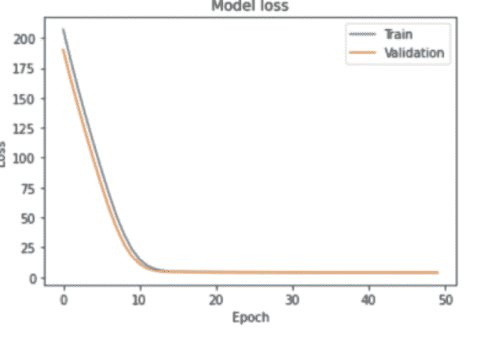

### 解释：

1.  首先，我们导入必要的库——用于数值计算的numpy，用于数据可视化的matplotlib，以及用于构建和训练神经网络的keras。
2.  接下来，我们使用numpy的随机函数生成一个随机数据集。我们创建一个大小为**(1000, 3)**的输入数组**X**和一个大小为**(1000,)**的输出数组**y**。输入数组**X**包含1000个数据点，每个数据点有3个特征，输出数组**y**包含每个数据点的标签。
3.  然后，我们使用sklearn的**train_test_split**函数将数据集分割为训练集和测试集。
4.  我们使用keras创建一个顺序神经网络模型，该模型由一个有3个神经元的输入层、一个有4个神经元的隐藏层和一个有1个神经元的输出层组成。

我们对隐藏层使用sigmoid激活函数，对输出层使用线性激活函数。

5.  我们使用均方误差损失函数和随机梯度下降优化器来编译模型。
6.  我们使用**fit**函数在训练数据上训练模型，设置100个训练周期和32的批大小。在训练过程中，使用反向传播算法来调整神经网络的权重，以最小化损失函数。
7.  训练完成后，我们使用**evaluate**函数在测试数据上评估模型。
8.  最后，我们使用matplotlib绘制输出变量的实际值和预测值。图表显示，该模型能够以合理的准确度预测输出变量。

总的来说，反向传播算法是神经网络训练过程中的一个关键组成部分，因为它使网络能够从训练数据中学习，并随着时间的推移提升其性能。

## 6.4 卷积神经网络

卷积神经网络（CNNs）是一种专门设计用于处理具有网格结构数据（如图像）的深度学习模型。CNNs使用一种称为卷积的技术，从输入图像中自动且自适应地学习特征的空间层次结构。

CNN的架构通常由若干层组成，包括：

-   输入层：接收图像数据
-   卷积层：对输入图像应用一组滤波器以提取特征
-   池化层：对卷积层的输出进行下采样
-   全连接层：接收池化层的输出并用于进行预测

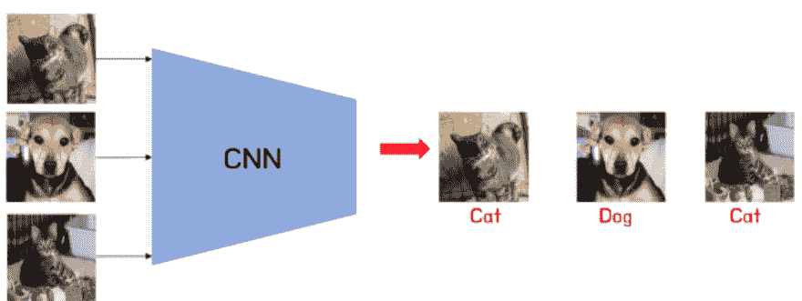

CNN的一个关键优势是其学习输入数据层次化表示的能力。网络的早期层学习简单的特征，如边缘，而后期层则学习更复杂的特征，如形状和物体部件。

CNN已成功应用于广泛的计算机视觉任务，如图像分类、目标检测和语义分割。它们也已被用于其他领域，如自然语言处理和语音识别。

为了训练CNN，需要大量的带标签训练数据。训练过程涉及调整网络的参数（即滤波器和全连接层的权重和偏置），以最小化预测输出与真实输出之间的差异。这通常使用随机梯度下降或其变体来完成。

### 示例

以下是一个使用Keras在CIFAR-10数据集上训练CNN的通用示例：

```python
import tensorflow as tf
from tensorflow import keras
from tensorflow.keras import layers
import numpy as np
import matplotlib.pyplot as plt

# Load the dataset
(x_train, y_train), (x_test, y_test) = keras.datasets.cifar10.load_data()

# Keep only cat and dog images and their labels
train_mask = np.any(y_train == [3, 5], axis=1)
test_mask = np.any(y_test == [3, 5], axis=1)

x_train, y_train = x_train[train_mask], y_train[train_mask]
x_test, y_test = x_test[test_mask], y_test[test_mask]

# Preprocess the data
x_train = x_train.astype("float32") / 255.0
x_test = x_test.astype("float32") / 255.0

y_train = keras.utils.to_categorical(y_train == 3, num_classes=2)
y_test = keras.utils.to_categorical(y_test == 3, num_classes=2)

# Define the model
model = keras.Sequential(
[
layers.Conv2D(32, (3, 3), activation="relu", input_shape=(32, 32, 3)),
layers.MaxPooling2D((2, 2)),
layers.Conv2D(64, (3, 3), activation="relu"),
layers.MaxPooling2D((2, 2)),
layers.Conv2D(128, (3, 3), activation="relu"),
layers.Flatten(),
layers.Dense(64, activation="relu"),
layers.Dense(2, activation="softmax"),
]
)

# Compile the model
model.compile(optimizer="adam", loss="categorical_crossentropy", metrics=["accuracy"])

# Train the model
history = model.fit(x_train, y_train, epochs=10, validation_data=(x_test, y_test))

# Plot the training history
plt.plot(history.history["accuracy"], label="accuracy")
plt.plot(history.history["val_accuracy"], label="val_accuracy")
plt.xlabel("Epoch")
plt.ylabel("Accuracy")
plt.legend()
plt.show()
```

# 评估模型

```python
model.evaluate(x_test, y_test)
```

输出屏幕应如下所示：

```
Epoch 1/10
313/313 [==============================] - 8s 24ms/step - loss: 0.6761 - accuracy: 0.5675 - val_loss: 0.6615 - val_accuracy: 0.5880
Epoch 2/10
313/313 [==============================] - 8s 26ms/step - loss: 0.6072 - accuracy: 0.6692 - val_loss: 0.5512 - val_accuracy: 0.7190
Epoch 3/10
313/313 [==============================] - 8s 25ms/step - loss: 0.5461 - accuracy: 0.7203 - val_loss: 0.5352 - val_accuracy: 0.7285
Epoch 4/10
313/313 [==============================] - 8s 25ms/step - loss: 0.5098 - accuracy: 0.7486 - val_loss: 0.5014 - val_accuracy: 0.7555
Epoch 5/10
313/313 [==============================] - 7s 22ms/step - loss: 0.4767 - accuracy: 0.7653 - val_loss: 0.4871 - val_accuracy: 0.7505
Epoch 6/10
313/313 [==============================] - 8s 25ms/step - loss: 0.4420 - accuracy: 0.7842 - val_loss: 0.4754 - val_accuracy: 0.7635
Epoch 7/10
313/313 [==============================] - 8s 25ms/step - loss: 0.3944 - accuracy: 0.8199 - val_loss: 0.5011 - val_accuracy: 0.7625
Epoch 8/10
313/313 [==============================] - 8s 25ms/step - loss: 0.3574 - accuracy: 0.8386 - val_loss: 0.5155 - val_accuracy: 0.7545
Epoch 9/10
313/313 [==============================] - 8s 26ms/step - loss: 0.3040 - accuracy: 0.8680 - val_loss: 0.5298 - val_accuracy: 0.7730
Epoch 10/10
313/313 [==============================] - 8s 25ms/step - loss: 0.2526 - accuracy: 0.8931 - val_loss: 0.5767 - val_accuracy: 0.7810
```

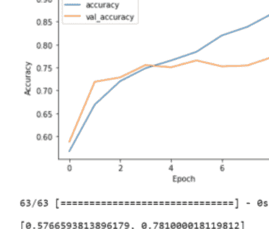

```
63/63 [==============================] - 0s 7ms/step - loss: 0.5767 - accuracy: 0.7810
[0.5766593813896179, 0.781000018119812]
```

## 解释

以下是代码的解释：

这段代码使用了CIFAR-10数据集，该数据集包含来自10个不同类别的50,000张训练图像和10,000张测试图像。我们只筛选出猫和狗的图像及其对应的标签，从而得到一个更小的数据集。

然后，我们通过将像素值缩放到0和1之间，并将标签转换为独热编码向量来预处理数据。

该模型由多个带有ReLU激活函数的卷积层、最大池化层以及带有softmax激活函数的全连接层组成。最终的输出层有2个单元，分别对应两个类别（猫和狗）。

我们使用Adam优化器和分类交叉熵损失函数来编译模型，并训练10个周期。

然后，我们绘制训练历史以可视化准确率随时间的变化。

最后，我们在测试数据上评估模型并打印损失和准确率。

总之，CNN是一种强大的深度学习模型，特别适合基于图像的任务。它们能够学习输入数据的层次化表示，并已成功应用于广泛的计算机视觉任务。

## 6.5 循环神经网络

循环神经网络（RNNs）是一种特别适合处理序列数据（如时间序列、文本和语音）的神经网络架构。RNNs的关键区别特征是它们具有一个“记忆”组件，这使得它们在处理当前输入时能够考虑之前的输入。这个记忆组件是通过一个从一个时间步传递到下一个时间步的隐藏状态来实现的。

最常见的RNN类型之一是长短期记忆（LSTM）网络，它旨在更好地处理传统RNN中可能出现的梯度消失问题。LSTM具有更复杂的结构，包括控制信息进出隐藏状态的门。

另一种RNN是门控循环单元（GRU），它与LSTM类似，但结构更简单，通常训练速度更快。

RNNs可用于广泛的任务，包括语言建模、语音识别、机器翻译，以及时间序列预测。循环神经网络的主要优势之一是能够处理可变长度的序列，这使其非常适合输入长度不固定的任务。

要在实践中实现循环神经网络，可以使用TensorFlow或PyTorch等深度学习框架。这些框架之上还构建了多个库，例如Keras和PyTorch Lightning，它们提供了更高级的接口，使训练循环神经网络变得更加容易。

循环神经网络的一个例子可以是训练用于预测句子中下一个单词的模型。该模型的输入数据将是一系列单词，输出将是对序列中下一个单词的预测。模型将使用句子数据集进行训练，其中输入数据是到某个点为止的单词序列，输出是句子中的下一个单词。

为了训练这个模型，循环神经网络将多次遍历数据集，输入数据设置为到某个点为止的单词序列，输出设置为句子中的下一个单词。然后模型将对下一个单词进行预测，并根据预测单词与句子中实际下一个单词之间的误差更新网络中的权重和偏置。这个过程将在数据集中的多个句子上重复，直到模型的预测对大多数测试数据集准确为止。

通过这种方式，循环神经网络学会了理解输入数据的上下文，并基于该上下文进行预测。这使得模型能够做出比仅考虑单个输入数据点的模型更准确、更有意义的预测。

以下是一个使用Python中的Keras库创建简单循环神经网络的示例：

```python
from keras.layers import SimpleRNN
from keras.models import Sequential

# define the model
model = Sequential()
model.add(SimpleRNN(3, input_shape=(2,1)))
model.compile(optimizer='adam', loss='mse')

# fit the model to the data
X = np.array([0.1, 0.2, 0.3, 0.4]).reshape((2,2,1))
y = np.array([0.2, 0.3, 0.4, 0.5]).reshape((2,2,1))
model.fit(X, y, epochs=100)
```

在这个例子中，我们首先导入必要的库，即Keras中的SimpleRNN和Sequential。然后，我们使用Sequential类定义模型，并向其添加一个具有3个单元的SimpleRNN层。我们还将输入形状指定为(2, 1)，因为我们的输入数据有2个时间步和1个特征。接着，我们通过指定优化器为'adam'和损失函数为'mse'（均方误差）来编译模型。

接下来，我们通过传入输入数据X和目标数据y来将模型拟合到数据上。输入数据X的形状为(2, 2, 1)，这意味着它有2个样本、2个时间步和1个特征。目标数据y具有相同的形状。我们将训练轮数指定为100。

在这个例子中，循环神经网络将学习根据给定的先前值预测序列中的下一个值。例如，给定输入序列[0.1, 0.2]，模型将学习预测序列中的下一个值0.3。然后模型将使用此预测来预测序列中的下一个值0.4，依此类推。

这是一个使用循环神经网络的非常基础的例子。在实践中，你将处理更复杂的数据集和架构。

## 6.6 生成模型

生成模型是一类无监督机器学习模型，经过训练可以生成与训练数据相似的新数据。这些模型经过训练以学习数据的底层概率分布，并可用于生成与训练数据相似的新数据样本。生成模型有几种不同的类型，包括生成对抗网络、变分自编码器和归一化流模型。

生成对抗网络由两个主要组件组成：生成器网络和判别器网络。生成器网络经过训练以生成新的数据样本，而判别器网络经过训练以区分生成的样本和真实的数据样本。这两个网络以对抗的方式一起训练，生成器试图欺骗判别器，而判别器试图正确识别生成的样本。

变分自编码器是一种使用编码器-解码器架构的生成模型。编码器网络经过训练以学习数据的紧凑表示，称为潜在空间，而解码器网络经过训练以从该潜在空间生成新的数据样本。变分自编码器的目标是学习数据上的概率分布，该分布可用于生成新的样本。

归一化流模型是一种生成模型，它使用一系列可逆变换将数据从简单的先验分布映射到真实的数据分布。这些模型可以通过从简单先验中采样然后应用可逆变换来生成新的数据样本。

生成模型具有广泛的应用，包括图像和视频合成、文本生成和数据增强。它们也可用于异常检测等任务，其中模型经过训练以识别与训练数据不相似的样本。

## 6.7 迁移学习

迁移学习是一种技术，允许在一个任务上训练的模型应用于不同但相关的任务。这在深度学习中特别有用，因为在新任务上从头训练模型可能计算成本高昂且耗时。

迁移学习背后的基本思想是，在具有相似特征空间的大型数据集上训练的模型可以作为具有较小数据集的新任务的起点。预训练模型可用作特征提取器，其中其层用于从新数据集中提取特征，然后在这些特征之上训练新的分类器。

迁移学习主要有两种类型：

- 1. 微调：这涉及在预训练模型之上训练新的分类器，同时保持预训练模型的权重固定。新的分类器使用新数据集进行训练，其权重会更新。
- 2. 特征提取：这涉及使用预训练模型作为特征提取器，其中预训练模型层的输出用作新分类器的输入。新的分类器使用新数据集进行训练，其权重会更新。

有几种预训练模型可用于迁移学习，例如VGG、Inception和ResNet。这些模型已在ImageNet等大型数据集上进行过训练，可用于各种任务，如图像分类、目标检测和语义分割。

迁移学习在计算机视觉和自然语言处理任务中被广泛使用，因为在这些任务中大量标注数据的可用性有限。它也已应用于其他领域，如语音识别和强化学习。

要在实践中使用迁移学习，可以使用TensorFlow和PyTorch等深度学习库中提供的预训练模型。这些库提供预训练模型，并且具有易于微调或使用预训练模型在新数据集上进行特征提取的接口。

## 6.8 深度学习的工具和框架

深度学习是一个快速发展的领域，因此有许多工具和框架可用于开发深度学习模型。一些最受欢迎的包括：

- 1. **TensorFlow**：TensorFlow是由Google Brain团队开发的开源库。它是一个强大的数值计算和大规模机器学习库。它提供了广泛的功能，例如跨多种设备（从桌面到移动和边缘设备）的数据流和可微分编程。
- 2. **Keras**：Keras是一个用Python编写的开源神经网络库。它旨在用户友好、模块化和可扩展。它可以在其他库之上运行，例如TensorFlow、Microsoft Cognitive Toolkit (CNTK)和Theano，这使其成为深度学习初学者的绝佳选择。
- 3. **PyTorch**：PyTorch是一个基于Torch库的开源机器学习库。它提供动态计算图，允许轻松高效地构建模型，以及对张量执行操作的能力。

## 6.9 深度学习的最佳实践与技巧

深度学习是一种强大且用途广泛的机器学习方法，已在计算机视觉、自然语言处理和语音识别等多个领域取得了突破性进展。然而，训练深度学习模型可能是一个复杂且耗时的过程，有许多最佳实践和技巧可以帮助提升模型的性能和效率。

- **数据预处理**：训练深度学习模型最重要的步骤之一是数据预处理。确保数据干净、格式正确并经过归一化处理至关重要。这可以通过多种技术实现，例如缺失值填充、特征缩放和独热编码。
- **网络架构**：网络的架构在决定其性能方面起着关键作用。选择适合所解决问题的架构至关重要，并且需要尝试不同的架构以找到最佳方案。
- **正则化**：过拟合是训练深度学习模型时的常见问题，Dropout和权重衰减等正则化技术有助于防止过拟合。同时，使用适量的数据也很重要，以避免过拟合。
- **优化**：梯度下降是深度学习中最常用的优化算法，但还有许多其他选择，如Adam、Adagrad和RMSprop。尝试不同的优化算法及其超参数，以找到最适合您问题的算法非常重要。
- **超参数调优**：超参数调优是训练深度学习模型的关键步骤。尝试不同的隐藏层数量、每层神经元数量、学习率和其他超参数值，以找到最适合您问题的组合非常重要。
- **早停法**：早停法是一种通过在模型在验证数据上开始表现变差时停止训练过程来防止过拟合的技术。这可以通过监控模型在验证数据上的性能并在其开始下降时停止训练来实现。
- **批归一化**：批归一化是一种通过归一化网络中神经元的激活来加速训练过程的技术。这有助于减少内部协变量偏移，使训练过程更加稳定。
- **迁移学习**：迁移学习是一种允许您使用预训练模型作为新模型起点的技术。这可以成为提升模型性能并节省训练时间的强大方式。
- **集成方法**：集成方法涉及训练多个模型，然后结合它们的预测做出最终预测。这有助于提升模型性能并使其更加稳健。
- **可视化**：可视化是理解和解释深度学习模型结果的重要工具。它可用于可视化网络的权重和激活，以及模型的训练进度和性能。

遵循这些最佳实践和技巧，您可以提升深度学习模型的性能和效率，并取得更好的结果。然而，重要的是要记住，深度学习是一个快速发展的领域，新的技术和方法不断涌现。因此，及时了解该领域的最新研究和发展非常重要。

## 6.10 总结

- 深度学习是机器学习的一个子领域，涉及训练人工神经网络来执行传统机器学习算法通常难以处理的任务。
- 神经网络由相互连接的节点层或“神经元”组成，用于处理和传输信息。
- 反向传播是调整神经网络中神经元权重以最小化网络预测误差的过程。
- 卷积神经网络（CNN）是一种特定类型的神经网络，特别适合图像识别任务，而循环神经网络（RNN）则用于处理文本和语音等序列数据。
- 生成模型是用于生成与训练数据相似的新数据的深度学习模型。
- 迁移学习是一种允许在较小数据集上对预训练的深度学习模型进行微调以适应新任务的技术。
- 深度学习已在图像识别、自然语言处理和语音识别等广泛的应用中取得了最先进的成果。
- 有几种流行的工具和框架可用于开发深度学习模型，包括TensorFlow、PyTorch和Keras。
- 开发深度学习模型有几种最佳实践和技巧，例如使用正则化技术、数据增强和早停法来防止过拟合，以及在训练期间监控准确率和损失等性能指标。

## 6.11 测试你的知识

1. 什么是深度学习？
    - a. 机器学习的一个子集，使用深度神经网络从数据中学习
    - b. 使用深度神经网络对数据进行聚类的方法
    - c. 使用深度神经网络压缩数据的技术
    - d. 使用深度神经网络进行降维的方法

2. 传统神经网络和深度神经网络的主要区别是什么？
    - a. 深度神经网络比传统神经网络有更多的层
    - b. 深度神经网络比传统神经网络更快
    - c. 深度神经网络比传统神经网络更擅长处理大型数据集
    - d. 深度神经网络使用与传统神经网络不同的激活函数

3. 反向传播在深度学习中用于什么？
    - a. 优化神经网络中的权重
    - b. 使用神经网络对数据进行分类
    - c. 使用神经网络降低数据维度
    - d. 使用神经网络生成新数据

4. 卷积神经网络（CNN）在深度学习中用于什么？
    - a. 对图像和视频进行分类
    - b. 生成新的图像和视频
    - c. 降低数据维度
    - d. 优化神经网络中的权重

5. 循环神经网络（RNN）在深度学习中用于什么？
    - a. 处理文本和时间序列等序列数据
    - b. 对图像和视频进行分类
    - c. 降低数据维度
    - d. 优化神经网络中的权重

6. 生成模型在深度学习中用于什么？
    - a. 生成新数据
    - b. 对数据进行分类
    - c. 降低数据维度
    - d. 优化神经网络中的权重

7. 迁移学习在深度学习中用于什么？
    - a. 将从一个任务中学到的知识应用于另一个相关任务
    - b. 生成新数据
    - c. 对数据进行分类
    - d. 降低数据维度

8. 深度学习的一些常见应用是什么？
    - a. 图像和视频分类、自然语言处理、语音识别
    - b. 生成新的图像和视频、数据压缩、降维
    - c. 数据聚类、优化神经网络中的权重、数据可视化
    - d. 时间序列分析、异常检测、预测建模

9. 深度学习的一些常见工具和框架是什么？
    - a. TensorFlow、Keras、PyTorch、Caffe
    - b. Matlab、R、SAS、SPSS
    - c. Tableau、QlikView、Power BI、Looker
    - d. Excel、Google Sheets、OpenOffice Calc、Apple Numbers

## I. 深度学习有哪些最佳实践和技巧？

- a. 使用预训练模型，从小数据集开始，使用交叉验证，监控性能并相应调整
- b. 避免使用预训练模型，使用大数据集，不使用交叉验证，不监控性能
- c. 使用大数据集，避免使用预训练模型，不使用交叉验证，不监控性能
- d. 避免使用预训练模型，从小数据集开始，避免使用交叉验证，不监控性能

## I. 调整神经网络中权重和偏置的过程称为什么？

- a. 梯度下降
- b. 反向传播
- c. 激活函数
- d. 损失函数

## I. 哪种类型的神经网络通常用于图像识别任务？

- a. 前馈网络
- b. 循环网络
- c. 卷积网络
- d. 生成网络

## I. 生成模型在深度学习中用于什么？

- a. 图像识别
- b. 时间序列预测
- c. 生成新数据
- d. 异常检测

## I. 在深度学习中使用迁移学习的主要好处是什么？

- a. 减少训练所需的数据量
- b. 提高模型的准确性
- c. 降低模型的复杂性
- d. 以上所有

## I. 卷积神经网络通常包含哪些类型的层？

- a. 全连接层
- b. 池化层
- c. 循环层
- d. a和b都是

## I. 激活函数在神经网络中的作用是什么？

- a. 为模型添加非线性
- b. 计算每个神经元的输出
- c. 调整权重和偏置
- d. 计算模型的误差

## I. 哪种深度学习框架最常用于自然语言处理任务？

- a. TensorFlow
- b. PyTorch
- c. Caffe
- d. Keras

## I. 前馈神经网络和循环神经网络的主要区别是什么？

- a. 前馈网络只处理一次输入，而循环网络多次处理输入
- b. 前馈网络有多层，而循环网络只有一层
- c. 前馈网络用于图像识别任务，而循环网络用于自然语言处理任务
- d. 前馈网络是有监督的，而循环网络是无监督的

## I. 传统神经网络和深度神经网络的主要区别是什么？

- a. 深度神经网络有更多层
- b. 深度神经网络有更多神经元
- c. 深度神经网络使用不同类型的激活函数
- d. 以上所有

## I. 在深度学习中使用生成模型的主要好处是什么？

- a. 它允许创建新数据
- b. 它提高了模型的准确性
- c. 它降低了模型的复杂性
- d. 它允许进行异常检测

## I. 深度学习中常用的损失函数有哪些？

- a. 均方误差（MSE）
- b. 交叉熵
- c. 合页损失
- d. 以上所有

## 6.12 答案

I. 答案：机器学习的一个子集，使用深度神经网络从数据中学习

I. 答案：深度神经网络比传统神经网络有更多层

I. 答案：优化神经网络中的权重

I. 答案：对图像和视频进行分类

I. 答案：处理序列数据，如文本和时间序列

I. 答案：生成新数据

I. 答案：将从一个任务中学到的知识应用到另一个相关任务

I. 答案：图像和视频分类、自然语言处理、语音识别

I. 答案：a) TensorFlow, Keras, PyTorch, Caffe

I. 答案：a) 使用预训练模型，从小数据集开始，使用交叉验证，监控性能并相应调整

I. 答案：b) 反向传播

I. 答案：c) 卷积网络

I. 答案：c) 生成新数据

I. 答案：a) 减少训练所需的数据量

I. 答案：d) a和b都是

I. 答案：a) 为模型添加非线性

I. 答案：Keras

I. 答案：d) 前馈网络只处理一次输入，而循环网络多次处理输入

I. 答案：d) 以上所有

I. 答案：a) 它允许创建新数据

I. 答案：d) 以上所有

# 07

## 7 模型选择与评估

在本章中，我们将深入探讨模型选择与评估这一关键步骤。这一步至关重要，因为它决定了我们的模型在未见数据上的表现如何，并据此决定如何改进或优化模型。我们将首先理解**偏差-方差权衡**，这是机器学习中的一个基本概念，有助于我们关于模型复杂度和正则化的决策。然后，我们将讨论将数据划分为训练集和测试集的重要性，并了解用于衡量模型性能的常用评估指标。我们还将探索超参数调优的技术，如k折交叉验证、网格搜索和随机搜索，以及能够提升模型性能的集成方法。最后，我们将讨论解释和理解模型输出的技术，并介绍模型选择与评估的最佳实践。本章将为理解如何在机器学习项目中选择和评估模型奠定坚实基础，并使您能够就模型的性能和优化做出明智的决策。

## 7.1 模型选择与评估技术

模型选择与评估是机器学习过程中的关键步骤，因为它使我们能够确定模型在未见数据上的表现如何，并据此决定如何改进或优化模型。有几种技术可用于模型选择与评估。

1.  **将数据划分为训练集和测试集：** 模型选择与评估最基本的技术之一是将数据划分为训练集和测试集。模型在训练集上进行训练，其性能在测试集上进行评估。这使我们能够估计模型在未见数据上的表现。
2.  **K折交叉验证：** K折交叉验证是一种可用于进一步评估模型性能的技术。在此技术中，数据被划分为k个大小相等的“折”。然后，模型在k-1个折上进行训练，并在剩余的一个折上进行测试。此过程重复k次，每次使用不同的折作为测试集。然后，模型的性能在所有k次迭代中取平均值。
3.  **超参数调优：** 超参数调优是为模型寻找最佳超参数组合的过程。超参数是模型中不由数据学习的参数，例如神经网络的学习率。超参数调优可以使用网格搜索和随机搜索等技术完成。
4.  **集成方法：** 集成方法是将多个模型的预测结合起来以做出最终预测的技术。常见的集成方法包括bagging和boosting。
5.  **模型可解释性：** 模型可解释性指的是理解模型如何以及为何做出其预测的能力。一些模型，如决策树，比其他模型（如神经网络）更具可解释性。解释模型的技术包括特征重要性、部分依赖图和SHAP值。
6.  **模型比较：** 比较不同模型的性能以选择最佳模型至关重要。这可以通过比较不同的评估指标来完成，例如准确率、精确率、召回率和F1分数。
7.  **学习曲线：** 学习曲线是模型性能随训练数据量变化的图表。这些图表有助于诊断欠拟合或过拟合等问题，这些问题可能是由于模型对于数据来说过于简单或过于复杂造成的。

## 7.2 理解偏差-方差权衡

偏差-方差权衡是机器学习中的一个基本概念，它指的是模型在良好拟合训练数据（低偏差）与良好泛化到未见数据（低方差）能力之间的权衡。

偏差指的是用一个更简单的模型来近似一个可能极其复杂的现实问题时所引入的误差。高偏差模型通常过于简化，这导致其在训练集上表现不佳，在测试集上误差很高。你可以从下图中看到，当偏差减小时，模型的复杂度在增加。

另一方面，方差指的是模型对训练集中微小波动的敏感性所引入的误差。高方差模型通常过于复杂，这导致过拟合，并在测试集上表现不佳。

一个好的模型应该同时具备低偏差和低方差。然而，要找到一个同时满足这两点的模型通常很困难。在实践中，通常需要通过调整模型复杂度来在偏差和方差之间做出权衡。

例如，决策树可以有非常低的偏差，因为它能很好地拟合训练数据，但它也有很高的方差，因为它对训练集中的微小波动很敏感。另一方面，线性回归模型具有高偏差，因为它是一个简单模型，但它也有低方差，因为它对训练集中的微小波动不敏感。

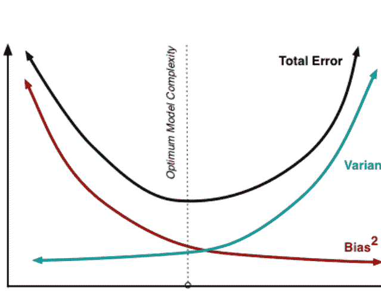

为了找到偏差和方差之间的最佳平衡，可以使用不同的技术，例如交叉验证、集成方法和正则化。

正则化是一种通过向损失函数添加惩罚项来减少模型方差的技术，这有助于防止过拟合。

交叉验证是一种用于估计模型在未见数据上性能的技术。通过将数据划分为训练集和测试集，可以估计模型在未见数据上的性能，这有助于识别过拟合。

集成方法是一组结合多个模型的预测以提高整体性能的技术。集成方法非常强大，因为它们可以同时减少偏差和方差。

总之，理解偏差-方差权衡对于构建良好的机器学习模型至关重要。通过调整模型复杂度并使用交叉验证、集成方法和正则化等技术，在偏差和方差之间找到平衡非常重要。

## 7.3 过拟合与欠拟合

过拟合和欠拟合是机器学习中的两个常见问题。当模型对于它试图拟合的数据来说过于复杂或过于简单时，就会出现这些问题，导致其在新的、未见数据上表现不佳。在本文中，我们将详细讨论过拟合和欠拟合，并提供示例以帮助理解这些概念。

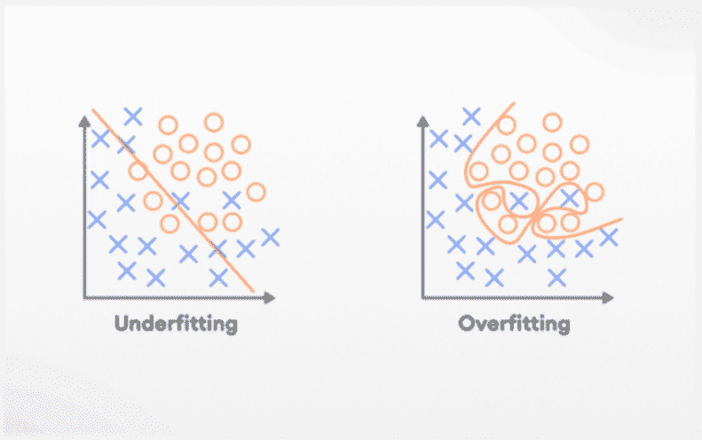

### 过拟合

当模型过于复杂，能够完美拟合训练数据但在新的、未见数据上表现不佳时，就会发生过拟合。当模型学习的是数据中的噪声而非潜在模式时，就会发生这种情况。结果，模型变得过于特化于训练数据，无法泛化到新数据。

### 示例

假设我们有一个包含一组人年龄和身高的数据集。我们想构建一个模型，根据年龄预测身高。我们决定使用一个20次多项式回归模型来拟合数据。

```python
import numpy as np
import matplotlib.pyplot as plt

# Generate random data
np.random.seed(42)
X = np.random.rand(50, 1)
y = X ** 2 + np.random.randn(50, 1) * 0.1

# Fit polynomial regression model
from sklearn.preprocessing import PolynomialFeatures
from sklearn.linear_model import LinearRegression
from sklearn.metrics import mean_squared_error

degrees = [1, 20]
for degree in degrees:
    poly_features = PolynomialFeatures(degree=degree, include_bias=False)
    X_poly = poly_features.fit_transform(X)
    lin_reg = LinearRegression()
    lin_reg.fit(X_poly, y)
    y_pred = lin_reg.predict(X_poly)
    # Plot data and model predictions
    plt.scatter(X, y)
    plt.plot(X, y_pred, label='degree={}'.format(degree))
    plt.legend()
    plt.show()
    # Calculate mean squared error
    mse = mean_squared_error(y, y_pred)
    print('Degree {}: MSE = {}'.format(degree, mse))
```

输出将如下所示：

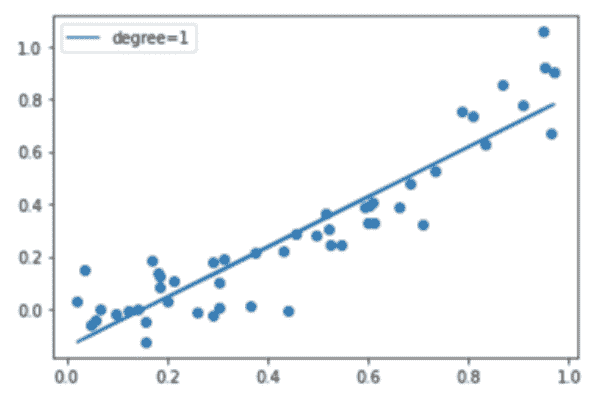

Degree 1: MSE = 0.013559152877012677

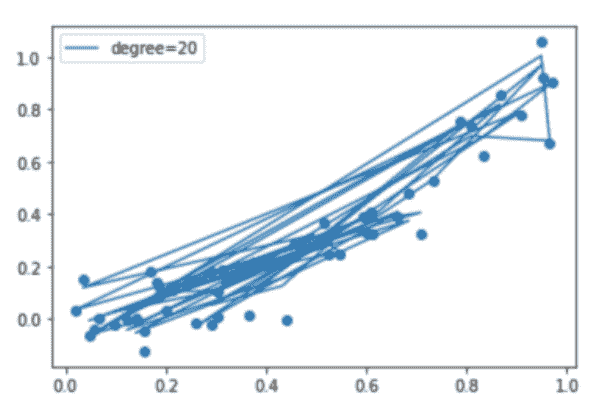

Degree 20: MSE = 0.004045051566147512

在这个例子中，我们生成了年龄和身高之间具有二次关系的随机数据。我们拟合了次数为1和20的多项式回归模型，并绘制了每个次数的模型预测图。从图中可以看出，次数为20的模型完美拟合了训练数据，但过于复杂，无法很好地泛化到新数据。这一点从次数为20的模型的高均方误差（MSE）值可以明显看出，该值远高于次数为1的模型的MSE值。

### 欠拟合

当模型过于简单，无法捕捉数据中的潜在模式时，就会发生欠拟合。这导致模型在训练数据和新的、未见数据上表现都不佳。当模型不够复杂，无法捕捉特征与目标变量之间的关系时，就会发生欠拟合。

### 示例

假设我们有一个包含一组人年龄和薪水的数据集。我们想构建一个模型，根据年龄预测薪水。我们决定使用线性回归模型来拟合数据。

```python
import numpy as np
import matplotlib.pyplot as plt

# Generate random data
np.random.seed(42)
X = np.random.rand(50, 1) * 10
y = X * 1000 + np.random.randn(50, 1) * 2000

# Fit linear regression model
from sklearn.linear_model import LinearRegression
from sklearn.metrics import mean_squared_error

lin_reg = LinearRegression()
lin_reg.fit(X, y)
y_pred = lin_reg.predict(X)

# Plot data and regression line
plt.scatter(X, y)
plt.plot(X, y_pred, color='red')
plt.title('Underfitting Example')
plt.xlabel('X')
plt.ylabel('y')
plt.show()

# Compute mean squared error
mse = mean_squared_error(y, y_pred)
print(f"Mean Squared Error: {mse}")
```

输出将如下所示：

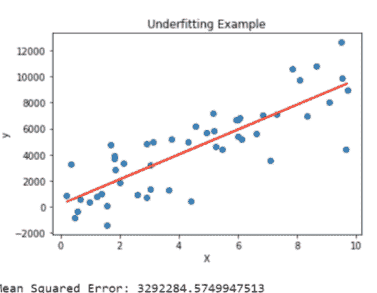

代码首先使用**numpy**库的**rand()**函数生成随机数据。然后，使用**sklearn.linear_model**模块中的**LinearRegression()**类，用这些数据训练一个线性回归模型。接着，使用该模型预测目标变量（**y**），并将预测结果存储在**y_pred**中。

为了可视化数据和回归线，使用**matplotlib**库创建了数据点和模型预测值的散点图。生成的图表显示，线性回归线不能很好地拟合数据点，表明存在欠拟合。

最后，使用**sklearn.metrics**模块中的**mean_squared_error()**函数计算均方误差（MSE）。

模块。MSE值提供了模型拟合数据程度的度量。在这种情况下，较大的MSE值证实了模型未能很好地拟合数据，进一步表明存在欠拟合。

## 7.4 将数据划分为训练集和测试集

将数据划分为训练集和测试集是机器学习中的一项基本技术，用于评估模型的性能。其基本思想是将可用数据分为两部分：训练集和测试集。模型在训练集上进行训练，其性能在测试集上进行评估。这使我们能够估计模型在未见数据上的表现，这对于确定模型泛化到新数据的能力至关重要。

有几种将数据划分为训练集和测试集的方法，其中最流行的是：

### 简单随机抽样

简单随机抽样是一种将数据划分为训练集和测试集的方法，其中数据按固定比例随机分为两组。当数据量较大，且目标是获得具有代表性的数据样本用于训练和测试时，通常使用此方法。

简单随机抽样的过程很简单：

1.  首先，随机打乱数据以消除任何顺序或模式。
2.  然后，选择一个固定的划分比例（例如，80%用于训练，20%用于测试）。
3.  接下来，根据选定的比例随机选择数据样本，该样本用作训练集。
4.  剩余的数据用作测试集。

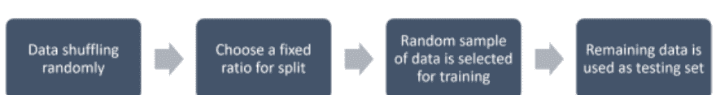

简单随机抽样是一种简单直接的数据划分方法，易于实现。但是，它可能不适用于类别分布不平衡的数据集或小型数据集。在这些情况下，分层抽样可能是更好的选择。

重要的是要记住，使用简单随机抽样时，训练集和测试集可能无法代表整个数据集。因此，在划分之前随机打乱数据非常重要，以确保样本具有整个数据集的代表性。

**一个例子**是在创建机器学习模型将电子邮件分类为垃圾邮件或非垃圾邮件时，可以看到简单随机抽样。假设我们有一个包含10,000封电子邮件的数据集，其中7,000封不是垃圾邮件，3,000封是垃圾邮件。我们希望将数据划分为训练集和测试集。

1.  首先，我们随机打乱数据以消除任何顺序或模式。
2.  接下来，我们选择一个固定的划分比例，假设是80%用于训练，20%用于测试。
3.  我们随机选择8,000封电子邮件（占总电子邮件的80%）作为训练集，2,000封电子邮件（占总电子邮件的20%）作为测试集。
4.  我们使用训练集来训练我们的机器学习模型，并使用测试集来评估其性能。

需要注意的是，在这个例子中，80%用于训练和20%用于测试的划分比例是任意的，可以根据项目的具体需求进行调整。

在这个例子中，我们使用了简单随机抽样将数据划分为训练集和测试集。我们随机打乱数据以消除任何顺序或模式，并选择了80%用于训练和20%用于测试的固定比例。通过使用此方法，我们可以使用训练集来训练我们的机器学习模型，并使用测试集来评估其性能。这种方法简单直接，易于实现，但它可能不适用于类别分布不平衡的数据集或小型数据集。

以下是使用Python **sklearn.model_selection** 模块中的 **train_test_split** 函数实现简单随机抽样的一个示例：

```python
import numpy as np

from sklearn.model_selection import train_test_split

# Generate a random dataset with 1000 rows and 5 columns
X = np.random.rand(1000, 5)

# Generate a random target variable with 1000 rows
y = np.random.rand(1000)

# Split the dataset into training and testing sets
X_train, X_test, y_train, y_test = train_test_split(X, y, test_size=0.3, random_state=42)

# Print the number of rows in the training and testing sets
print("Number of rows in the training set:", len(X_train))
print("Number of rows in the testing set:", len(X_test))
```

```
Number of rows in the training set: 700
Number of rows in the testing set: 300
```

在这个例子中，我们首先导入必要的模块，包括 **numpy** 和 **sklearn.model_selection**。然后，我们生成一个包含1000行和5列的随机数据集，以及一个包含1000行的随机目标变量。

接下来，我们使用 **train_test_split** 函数将数据集划分为训练集和测试集。我们通过设置 **test_size=0.3** 指定使用30%的数据进行测试，并通过设置 **random_state=42** 将随机种子设置为42，以确保划分是可重现的。

最后，我们打印训练集和测试集的行数，以验证划分是否正确执行。

简单随机抽样是机器学习中用于将数据集划分为训练集和测试集的常用技术。它涉及随机选择一部分数据用于测试，而剩余的数据用于训练。这确保了测试集具有整个数据集的代表性，并可用于评估机器学习模型的性能。**sklearn.model_selection** 中的 **train_test_split** 函数使得在Python中执行简单随机抽样变得容易。

> 在划分之前随机打乱数据非常重要，以确保样本具有整个数据集的代表性。

### 分层抽样

分层抽样是一种将数据划分为训练集和测试集的方法，其中数据以**保持目标变量在两个集合中的比例**的方式进行划分。当数据不平衡时，即目标变量在不同类别中的分布不成比例时，此方法很有用。

分层抽样的过程如下：

1.  首先，根据目标变量的值将数据划分为不同的层。
2.  接下来，选择一个固定的划分比例（例如，80%用于训练，20%用于测试）。
3.  然后，根据选定的比例从每个层中随机选择数据样本，这些样本组合形成训练集。
4.  剩余的数据用作测试集。

当数据不平衡时，分层抽样很有用。使用简单随机抽样时，训练集和测试集可能无法保持与整个数据集相同的目标变量比例。这可能导致模型产生偏差和不准确的预测。通过使用分层抽样，我们确保训练集和测试集具有与整个数据集相同的目标变量比例。

重要的是要记住，使用分层抽样时，样本量可能不足以代表整个数据集。因此，使用足够大的样本量以确保样本具有整个数据集的代表性非常重要。

**一个例子**是在创建机器学习模型将信用卡申请分类为批准或拒绝时，可以看到分层抽样。假设我们有一个包含10,000份申请的数据集，其中7,000份被批准，3,000份被拒绝。我们希望将数据划分为训练集和测试集。

1.  首先，我们根据目标变量的值（在这种情况下是批准或拒绝）将数据划分为不同的层。
2.  接下来，我们选择一个固定的划分比例，假设是80%用于训练，20%用于测试。
3.  我们随机选择5,600份被批准的申请（占总被批准申请的80%）和2,400份被拒绝的申请（占总被拒绝申请的80%）作为训练集。
4.  我们将剩余的1,400份被批准的申请（占总被批准申请的20%）和600份被拒绝的申请（占总被拒绝申请的20%）用作测试集。
5.  我们使用训练集来训练我们的机器学习模型，并使用测试集来评估其性能。

## K折交叉验证

K折交叉验证是一种评估机器学习模型性能的方法，它将数据划分为k个折（或子集），并训练模型k次，每次使用不同的折作为测试集，其余k-1折作为训练集。然后，模型的性能在所有k次迭代中取平均值，以给出其性能的更稳健估计。

K折交叉验证的过程如下：

1.  首先，将数据划分为k个大小相等的折。
2.  接下来，训练模型k次，每次使用不同的折作为测试集，其余k-1折作为训练集。
3.  在测试集上评估模型的性能并记录下来。
4.  然后，将所有k次迭代的性能分数取平均值，以给出模型性能的更稳健估计。

K折交叉验证是评估机器学习模型性能的常用方法。当数据有限，我们希望尽可能多地使用数据进行训练，同时仍能可靠地估计模型性能时，它特别有用。当数据方差较大或模型性能对特定的训练集和测试集敏感时，它也很有用。

**重要的是要记住**，在使用K折交叉验证时，样本量可能不足以代表整个数据集。因此，使用足够大的样本量以确保样本具有整个数据集的代表性非常重要。

**一个K折交叉验证的例子**可以在创建机器学习模型将客户分类为高收入或低收入时看到。假设我们有一个包含10,000个客户的数据集，我们想要评估模型的性能。

1.  首先，我们将数据划分为10个大小相等的折（k=10）。每个折包含1000个客户。
2.  接下来，我们训练模型10次，每次使用不同的折作为测试集，其余9折作为训练集。
3.  我们使用适当的指标（如准确率、精确率、召回率或F1分数）在测试集上评估模型的性能。
4.  我们记录每次迭代的性能分数。
5.  最后，我们将性能分数取平均值，以给出模型性能的更稳健估计。

例如，如果在第一次迭代中，模型在测试集上的准确率为90%，在训练集上的准确率为85%。在第二次迭代中，模型在测试集上的准确率为92%，在训练集上的准确率为87%。经过10次迭代后，我们将模型在测试集上的所有准确率分数取平均值，这将给出模型的整体性能。

需要注意的是，K折交叉验证也可以与其他评估指标（如精确率、召回率或F1分数）一起使用。根据具体问题使用适当的评估指标非常重要。

在这个例子中，我们使用K折交叉验证来评估机器学习模型的性能。我们将数据划分为10个大小相等的折，训练模型10次，每次使用不同的折作为测试集并评估其性能。然后，我们对所有迭代的性能分数取平均值，以给出模型性能的更稳健估计。

以下是使用Python的**sklearn.model_selection**模块中的**KFold**类实现K折交叉验证的一个示例：

```python
import pandas as pd
from sklearn.model_selection import KFold
from sklearn.linear_model import LogisticRegression
from sklearn.metrics import *

# Load data
data = pd.read_csv('customer.csv')

# Define features and target
X = data.drop(columns=['Segmentation', 'Profession', 'ID'], axis=1)
y = data['Segmentation']

# Create KFold object
kf = KFold(n_splits=5, shuffle=True, random_state=42)

# Initialize model
model = LogisticRegression()

# Create empty lists to store results
accuracy_scores = []
precision_scores = []
recall_scores = []
f1_scores = []

# Perform K-fold cross-validation
for train_index, test_index in kf.split(X):
    # Split the data into train and test sets
    X_train, X_test = X.iloc[train_index], X.iloc[test_index]
    y_train, y_test = y.iloc[train_index], y.iloc[test_index]

    # Train the model on the train set
    model.fit(X_train, y_train)

    # Test the model on the test set
    y_pred = model.predict(X_test)

    # Calculate evaluation metrics
    accuracy = model.score(X_test, y_test)
    precision = precision_score(y_test, y_pred, average='macro')
    recall = recall_score(y_test, y_pred, average='macro')
    f1 = f1_score(y_test, y_pred, average='macro')

    # Append results to the lists
    accuracy_scores.append(accuracy)
    precision_scores.append(precision)
    recall_scores.append(recall)
    f1_scores.append(f1)

# Print the average results
print("Average Accuracy:", sum(accuracy_scores)/len(accuracy_scores))
print("Average Precision:", sum(precision_scores)/len(precision_scores))
print("Average Recall:", sum(recall_scores)/len(recall_scores))
print("Average F1-Score:", sum(f1_scores)/len(f1_scores))
```

**KFold**类接受输入数据（**X**）作为参数，以及分割数（**n_splits**）和随机状态（**random_state**）。**shuffle**参数用于在将数据划分为折之前对其进行随机打乱。

在这个例子中，我们有一个包含四个不同细分市场（A、B、C和D）的客户数据集。我们想要训练一个逻辑回归模型，根据可用特征预测客户细分市场。

我们首先将数据加载到pandas DataFrame中，并定义特征和目标变量。然后，我们创建一个具有五个分割的**KFold**对象，将**shuffle**设置为**True**以在分割前随机打乱数据，并将**random_state**设置为42以确保结果可重现。

然后，我们初始化逻辑回归模型，并创建空列表来存储评估指标。我们遍历数据的每个分割，在训练集上训练模型，并在测试集上进行测试。我们计算每个分割的评估指标，并将结果追加到相应的列表中。

最后，我们打印出所有数据划分上的平均评估指标。这让我们对模型的整体性能有了一个大致的了解。

需要记住的是，数据划分的方式可能对模型的性能产生显著影响。如果数据划分不当，模型可能会过拟合或欠拟合，并且在未见数据上的表现可能会很差。

同样重要的是，要确保训练集和测试集是独立同分布的。这意味着训练集和测试集不应重叠，并且应来自相同的分布。如果数据不是独立同分布的，模型在测试集上的性能可能无法很好地估计其在未见数据上的性能。

## 7.5 超参数调优

超参数调优是系统性地搜索最佳超参数组合以优化机器学习模型性能的过程。超参数不是从数据中学习得到的，而是由用户设定的参数，例如学习率、隐藏层数量或正则化强度。这些参数的最佳值会极大地影响模型的性能，因此调优它们以获得最佳结果非常重要。

有几种超参数调优方法，包括手动调优、网格搜索和随机搜索。

### 手动调优

手动调优是手动调整超参数并评估模型性能的过程。这是最简单的超参数调优方法，因为它涉及手动调整超参数的值并评估模型的性能。

手动调优的过程包括以下步骤：

- 1. 从一组初始超参数开始。
- 2. 使用初始超参数训练模型。
- 3. 在验证集上或使用交叉验证评估模型的性能。
- 4. 根据评估结果手动调整一个或多个超参数。
- 5. 重复步骤 2-4，直到模型的性能达到满意水平或性能停止提升。

例如，如果我们正在训练一个神经网络，初始超参数集可能包括学习率、隐藏层数量以及每层的神经元数量。我们会从一个小的学习率、少量的隐藏层和每层少量的神经元开始。然后我们会训练模型并评估其性能。如果模型的性能不佳，我们会增加学习率和/或隐藏层数量和/或每层的神经元数量。我们会重复这个过程，直到模型的性能达到满意水平或性能停止提升。

手动调优实现简单，当超参数数量较少且其可能值有限时可能有效。然而，它可能很耗时，并且不一定总能带来最佳结果。当超参数数量及其可能值很大时，它也可能不切实际。

总之，手动调优是一种超参数调优方法，涉及手动调整超参数的值并评估模型的性能。它实现简单，当超参数数量较少且其可能值有限时可能有效。然而，它可能很耗时，并且不一定总能带来最佳结果。当超参数数量及其可能值很大时，它也可能不切实际。

以下是如何使用 Python 的 scikit-learn 库实现手动调优的示例：

```python
import numpy as np
from sklearn.datasets import make_classification
from sklearn.model_selection import train_test_split
from sklearn.svm import SVC
from sklearn.metrics import accuracy_score

# Generate random dataset
np.random.seed(42)
X, y = make_classification(n_samples=1000, n_features=10, n_classes=2)

# Split the data into training and testing sets
X_train, X_test, y_train, y_test = train_test_split(X, y, test_size=0.2,
                                                    random_state=42)

# Initialize the SVM classifier
clf = SVC()

# Manually set hyperparameters
clf.kernel = 'rbf'  # radial basis function kernel
clf.C = 10  # regularization parameter
clf.gamma = 0.1  # kernel coefficient for rbf kernel

# Train the model on the training data
clf.fit(X_train, y_train)

# Predict the labels for the test data
y_pred = clf.predict(X_test)

# Evaluate the performance of the model
accuracy = accuracy_score(y_test, y_pred)
print('Accuracy:', accuracy)
```

输出将是：

```
Accuracy: 0.805
```

如果我们把正则化参数 (`clf.C`) 改为 20，核系数 (`clf.gamma`) 改为 0.2，准确率将提高如下：

```
Accuracy: 0.825
```

在这个例子中，我们首先使用 `sklearn.datasets` 模块中的 `make_classification()` 函数生成一个包含 1000 个样本和 10 个特征的随机数据集。然后，我们使用 `sklearn.model_selection` 模块中的 `train_test_split()` 函数将数据划分为训练集和测试集，测试集大小为 0.2，随机状态为 42 以确保可重复性。

接下来，我们使用 `sklearn.svm` 模块中的 `SVC()` 函数初始化支持向量机分类器。然后我们手动设置 SVM 分类器的超参数：核函数设置为 'rbf'（径向基函数核），正则化参数 `C` 设置为 10，rbf 核的核系数 `gamma` 设置为 0.1。

然后，我们使用 `fit()` 方法在训练数据上训练 SVM 分类器，并使用 `predict()` 方法预测测试数据的标签。最后，我们使用 `sklearn.metrics` 模块中的 `accuracy_score()` 函数评估模型的性能。

通过手动设置超参数，我们可以迭代地调整值，直到达到所需的性能水平。然而，这个过程可能很耗时，并且需要关于模型和数据集的专家知识。自动化的超参数调优方法，如网格搜索和随机搜索，可以帮助简化这个过程，并更有效地找到最佳超参数。

### 网格搜索

网格搜索是一种系统性地尝试预定义范围内所有可能超参数组合的方法。它是一种计算效率高的方法，可用于为机器学习模型找到最佳的超参数组合。

网格搜索的过程包括以下步骤：

- 1. 为每个超参数定义一个搜索空间。
- 2. 创建一个包含所有可能超参数组合的网格。
- 3. 使用网格中的每种超参数组合训练模型。
- 4. 在验证集上或使用交叉验证评估模型的性能。
- 5. 选择产生最佳性能的超参数组合。

例如，如果我们正在训练一个神经网络，学习率的搜索空间可能是 [0.001, 0.01, 0.1]，隐藏层数量的搜索空间可能是 [1, 2, 3]，每层神经元数量的搜索空间可能是 [50, 100, 150]。然后我们会创建一个包含这些超参数所有可能组合的网格，使用每种组合训练模型，并在验证集上评估模型的性能。将选择产生最佳性能的超参数组合。

Python 的 scikit-learn 库提供了一个易于使用的网格搜索实现。`GridSearchCV` 类可用于对给定模型执行网格搜索，它接受几个重要参数：

- **estimator**：要训练和评估的模型。
- **param_grid**：要搜索的超参数字典。

- **cv**：要使用的交叉验证折数。
- **scoring**：用于评估测试集预测结果的字符串或可调用对象。
- **n_jobs**：用于执行计算的CPU核心数。

以下是如何使用Python的scikit-learn库实现网格搜索的示例：

```python
import numpy as np
from sklearn import datasets
from sklearn.ensemble import RandomForestClassifier
from sklearn.model_selection import GridSearchCV, train_test_split

# Generate random data
np.random.seed(42)
X, y = datasets.make_classification(n_samples=1000, n_features=10, random_state=42)

# Split data into training and test sets
X_train, X_test, y_train, y_test = train_test_split(X, y, test_size=0.3, random_state=42)

# Define the parameter grid to search over
param_grid = {
    'n_estimators': [10, 50, 100, 150, 200],
    'max_depth': [None, 5, 10, 15],
    'min_samples_split': [2, 5, 10],
    'min_samples_leaf': [1, 2, 4]
}

# Create the model to use for hyperparameter tuning
rfc = RandomForestClassifier(random_state=42)

# Perform grid search using 5-fold cross validation
grid_search = GridSearchCV(rfc, param_grid, cv=5, n_jobs=-1)

# Fit the grid search to the data
grid_search.fit(X_train, y_train)

# Print the best parameters and score
print(f"Best parameters: {grid_search.best_params_}")
print(f"Best score: {grid_search.best_score_}")

# Evaluate the model on the test set using the best parameters
best_rfc = grid_search.best_estimator_
y_pred = best_rfc.predict(X_test)
accuracy = np.mean(y_pred == y_test)
print(f"Accuracy on test set: {accuracy}")
```

在此示例中，我们首先使用scikit-learn的**make_classification**生成一个随机数据集。然后，我们使用**train_test_split**将数据划分为训练集和测试集。接下来，我们定义一个参数网格，其中键是我们要调整的超参数，值是每个超参数要尝试的值列表。

我们创建一个用于超参数调整的模型实例（本例中为**RandomForestClassifier**），并将其与参数网格和交叉验证折数一起传递给**GridSearchCV**。然后，我们将网格搜索对象拟合到训练数据上。

网格搜索完成后，我们使用网格搜索对象的**best_params_**和**best_score_**属性打印出最佳参数和分数。接着，我们使用网格搜索找到的最佳估计器在测试集上进行预测，计算准确率并打印出来。

网格搜索是一种寻找机器学习模型最佳超参数组合的有用技术。通过尝试许多不同的组合并使用交叉验证来评估它们的性能，我们可以找到在数据上表现最佳的超参数集。

网格搜索是一种强大的方法，可以为给定的数据集和模型找到最佳的超参数集。它是调整模型参数的有效方式，可用于寻找机器学习模型的最佳超参数组合。

## 随机搜索

随机搜索是网格搜索的一种替代方法，用于超参数调整。它不是尝试所有可能的超参数组合，而是从预定义的范围内随机采样超参数组合。这允许更高效地探索超参数空间，因为无需尝试每一种组合。

随机搜索的过程包括以下步骤：

1. 为每个超参数定义一个搜索空间。
2. 从搜索空间中随机采样超参数组合。
3. 使用采样的超参数组合训练模型。
4. 在验证集上或使用交叉验证评估模型的性能。
5. 选择产生最佳性能的超参数组合。

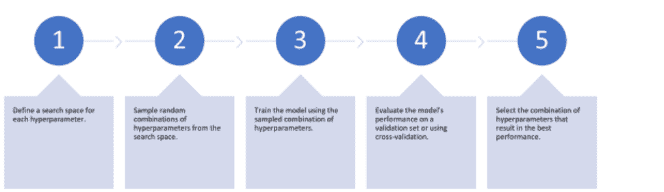

例如，如果我们正在训练一个神经网络，学习率的搜索空间可能是[0.001, 0.01, 0.1]，隐藏层数的搜索空间可能是[1, 2, 3]，每层神经元数量的搜索空间可能是[50, 100, 150]。然后，我们将随机采样这些超参数的组合，使用采样组合训练模型，并在验证集上评估模型的性能。

Python的scikit-learn库提供了易于使用的随机搜索实现。**RandomizedSearchCV**类可用于对给定模型执行随机搜索，它接受几个重要参数：

- **estimator**：要训练和评估的模型。
- **param_distributions**：要搜索的超参数字典。
- **n_iter**：要尝试的随机超参数组合数量。
- **cv**：要使用的交叉验证折数。
- **scoring**：用于评估测试集预测结果的字符串或可调用对象。
- **n_jobs**：用于执行计算的CPU核心数。

以下是如何使用Python的scikit-learn库实现随机搜索的示例：

```python
import numpy as np
from sklearn.datasets import make_classification
from sklearn.model_selection import train_test_split, RandomizedSearchCV
from sklearn.ensemble import RandomForestClassifier

# Generate random dataset
X, y = make_classification(n_samples=1000, n_features=10, n_informative=5,
                           n_classes=2, random_state=42)

# Split data into training and testing sets
X_train, X_test, y_train, y_test = train_test_split(X, y, test_size=0.2,
                                                    random_state=42)

# Define parameter grid
param_dist = {"n_estimators": [10, 50, 100, 200, 500],
              "max_depth": [2, 5, 10, 20, None],
              "min_samples_split": [2, 5, 10, 20],
              "min_samples_leaf": [1, 2, 4, 8],
              "max_features": ['sqrt', 'log2', None]}

# Define classifier
rfc = RandomForestClassifier()

# Create randomized search object
random_search = RandomizedSearchCV(rfc, param_distributions=param_dist,
                                   n_iter=50, cv=5, random_state=42)

# Fit randomized search object to training data
random_search.fit(X_train, y_train)

# Print best hyperparameters
print("Best Hyperparameters:", random_search.best_params_)

# Evaluate best model on test data
y_pred = random_search.best_estimator_.predict(X_test)
accuracy = np.mean(y_pred == y_test)
print("Accuracy:", accuracy)
```

在此示例中，我们首先使用scikit-learn的make_classification函数生成一个包含1000个样本、10个特征和2个类别的随机数据集。然后，我们将数据划分为训练集和测试集，测试集比例为0.2。

接下来，我们为随机森林分类器（RFC）模型定义一个参数网格。该网格包含我们想要调整的一系列超参数，包括估计器数量、最大深度、最小分裂样本数、每叶最小样本数和最大特征数。

我们创建一个RFC分类器和一个RandomizedSearchCV对象。后者负责通过在训练集上执行交叉验证，从给定的参数网格中找到最佳超参数。

我们将随机搜索对象拟合到训练数据上，并打印出找到的最佳超参数。最后，我们通过计算预测准确率在测试数据上评估最佳模型。

随机搜索可能比网格搜索更高效，因为它只采样参数网格的一个子集，因此在超参数搜索空间很大时非常有用。通过使用随机采样而不是穷举搜索，它还可以避免陷入局部最优解。

## 贝叶斯优化

贝叶斯优化是一种用于超参数调整的方法，它使用贝叶斯原理来建模将超参数映射到机器学习模型性能的函数。它特别适用于昂贵的优化问题，例如涉及训练大型神经网络的问题。

贝叶斯优化的基本思想是使用概率模型来表示超参数与模型性能之间的关系。然后，该模型用于指导寻找最优超参数。每次迭代后，会使用通过不同超参数评估模型获得的新数据来更新该模型。

贝叶斯优化的过程包括以下步骤：

1.  定义一个将超参数映射到模型性能的概率模型。
2.  通过优化采集函数来采样下一组要尝试的超参数。
3.  使用采样的超参数训练模型。
4.  在验证集上或使用交叉验证评估模型性能。
5.  使用新数据更新概率模型。
6.  重复步骤2-5，直到满足停止条件。

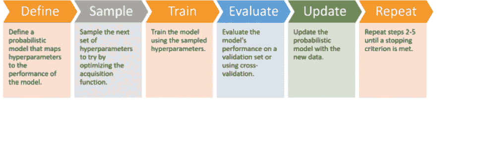

有几种不同的概率模型可用于贝叶斯优化，例如高斯过程和随机森林。概率模型的选择将取决于具体问题和可用的计算资源。

采集函数用于指导寻找下一组要尝试的超参数。它在超参数空间的探索与利用当前关于将超参数映射到模型性能的函数的知识之间取得平衡。常用的采集函数包括期望改进、上置信界和改进概率。

你可能需要安装 bayesian-optimization（如果尚未安装）才能运行下面的示例。要安装 bayesian-optimization，你可以运行以下命令：

```
pip install bayesian-optimization
```

以下是一个使用贝叶斯优化和随机数据集的示例：

```
import numpy as np

from sklearn.model_selection import cross_val_score

from bayes_opt import BayesianOptimization

from sklearn.ensemble import RandomForestRegressor

# 生成随机数据
np.random.seed(42)
X = np.random.rand(100, 5)
y = np.random.rand(100)

# 定义要优化的模型
def rf_cv(n_estimators, min_samples_split, max_features, data, targets):
    estimator = RandomForestRegressor(
        n_estimators=int(n_estimators),
        min_samples_split=int(min_samples_split),
        max_features=min(max_features, 0.999),
        random_state=42
    )
    cval = cross_val_score(estimator, data, targets,
                           scoring='neg_mean_squared_error', cv=4)
    return cval.mean()

# 设置贝叶斯优化的参数边界
pbounds = {
    'n_estimators': (10, 250),
    'min_samples_split': (2, 25),
    'max_features': (0.1, 0.999)
}

# 运行贝叶斯优化过程
optimizer = BayesianOptimization(
    f=rf_cv,
    pbounds=pbounds,
    random_state=42,
)

optimizer.maximize(init_points=10, n_iter=20)

# 打印优化过程找到的最佳参数
print(optimizer.max)
```

在这个例子中，我们生成了一个包含100个观测值和5个特征的随机数据集，以及一个相应的目标变量。然后，我们定义了一个随机森林回归模型，使用贝叶斯优化进行优化。

我们设置了优化过程的参数边界，这是优化器将搜索最优超参数集的范围。然后，我们定义了一个函数 **rf_cv**，该函数以超参数作为输入，使用这些超参数拟合一个随机森林回归模型，并返回通过4折交叉验证获得的负均方误差。

然后，我们使用 **bayes_opt** 模块中的 **BayesianOptimization** 类运行贝叶斯优化过程。我们提供 **rf_cv** 函数作为要优化的目标函数，以及参数边界和一个随机种子。然后，我们调用 **maximize** 方法，该方法执行优化过程，包括10个初始随机点和20次优化算法迭代。

最后，我们打印出优化过程找到的最佳超参数集。

> 如果你不想使用 **bayes_opt** 模块，并且想使用自己的数据和模型来测试贝叶斯优化，请继续阅读以下内容：

Python的scikit-learn库通过 **BayesSearchCV** 类提供了一个易于使用的贝叶斯优化实现。**BayesSearchCV** 类可用于对给定模型执行贝叶斯优化，它接受几个重要参数：

-   **estimator**：要训练和评估的模型。
-   **search_spaces**：要搜索的超参数字典。
-   **n_iter**：要运行的优化迭代次数。
-   **cv**：要使用的交叉验证折数。
-   **scoring**：用于评估测试集预测的字符串或可调用对象。
-   **n_jobs**：用于执行计算的CPU核心数。

以下是如何使用Python的scikit-learn库实现贝叶斯优化的示例：

```
from sklearn.model_selection import BayesSearchCV

from sklearn.metrics import accuracy_score

# 加载数据
X, y = load_your_data()

# 定义搜索空间
param_space = {'learning_rate': (0.001, 0.1),
               'num_hidden_layers': (1, 4),
               'num_neurons': (50, 150)}

# 创建贝叶斯优化对象
clf = YourModel()
bayes_search = BayesSearchCV(clf, param_space, n_iter=10, cv=5,
                             scoring='accuracy', n_jobs=-1)

# 执行贝叶斯优化
bayes_search.fit(X, y)

# 打印最佳参数和最佳分数
print("Best parameters:", bayes_search.best_params_)
print("Best score:", bayes_search.best_score_)

# 使用最佳参数重新训练模型
best_model = bayes_search.best_estimator_
best_model.fit(X, y)

# 在测试集上评估模型
y_test = load_your_test_data()
y_pred = best_model.predict(y_test)
score = accuracy_score(y_test, y_pred)
print("Accuracy on test set:", score)
```

在这个例子中，数据被加载，超参数的搜索空间被定义。然后，创建 **BayesSearchCV** 对象，指定模型、搜索空间、要运行的优化迭代次数、交叉验证折数、评分指标和用于执行计算的CPU核心数。之后，调用 **BayesSearchCV** 对象的 fit 方法，传入特征和目标变量，这将执行贝叶斯优化并返回最佳超参数组合。最后，使用最佳参数重新训练最佳模型，并使用 accuracy_score 函数在测试集上评估其性能，然后打印出准确率分数。需要注意的是，**load_your_data()** 和 **YourModel()** 应替换为用于加载数据和初始化特定任务所用模型的实际代码。

贝叶斯优化对于昂贵的优化问题特别有用，例如涉及训练大型神经网络的问题。它是调整模型参数的一种有效方式，可用于为机器学习模型找到最佳超参数组合。

总之，超参数调优是系统地搜索最佳超参数组合以优化机器学习模型性能的过程。有几种超参数调优方法，包括手动调优、网格搜索、随机搜索和贝叶斯优化。方法的选择将取决于具体问题以及超参数的数量和可能的值。

## 7.6 模型可解释性

模型可解释性是指理解和解释机器学习模型做出的决策和预测的能力。它是机器学习的一个重要方面，因为它允许从业者理解模型如何做出决策，识别任何潜在的偏差，并在必要时进行调整。

需要注意的是，模型可解释性和模型性能通常是相互权衡的。复杂的模型，如深度神经网络，可能具有更好的性能，但更难解释。因此，根据用例在模型可解释性和性能之间取得平衡非常重要。

模型可解释性是机器学习的一个重要方面，它允许从业者理解和解释模型做出的决策和预测。特征重要性分析、模型可视化、简化模型和模型无关的可解释性等技术可用于提高模型的可解释性。然而，根据用例在模型可解释性和性能之间取得平衡非常重要。

有几种技术可用于提高机器学习模型的可解释性。让我们讨论以下章节中的一些主要技术。

## 7.7 特征重要性分析

特征重要性分析是一种用于识别对机器学习模型预测贡献最大的特征或变量的技术。这对于理解模型如何做出决策、识别潜在偏差以及在必要时进行调整非常有用。

有几种方法可用于执行特征重要性分析，包括：

**排列重要性：**

排列重要性是一种用于确定机器学习模型中每个特征重要性的方法。它是一种简单且计算效率高的特征重要性度量方式。排列重要性的基本思想是通过随机打乱单个特征的值来衡量模型性能的变化，然后将模型在打乱后的数据集上的性能与其在原始数据集上的性能进行比较。导致性能下降最大的特征被认为是最重要的。

排列重要性的过程可以描述为以下步骤：

1.  在训练数据集上拟合原始模型。
2.  对于数据集中的每个特征，创建一个数据集副本，并打乱该特征的值。
3.  在打乱后的数据集上重新训练模型并计算性能指标。
4.  将模型在打乱后的数据集上的性能指标与在原始数据集上的性能指标进行比较。
5.  对数据集中的所有特征重复步骤 2 到 4。
6.  打乱后导致性能下降最大的特征被认为是最重要的特征。

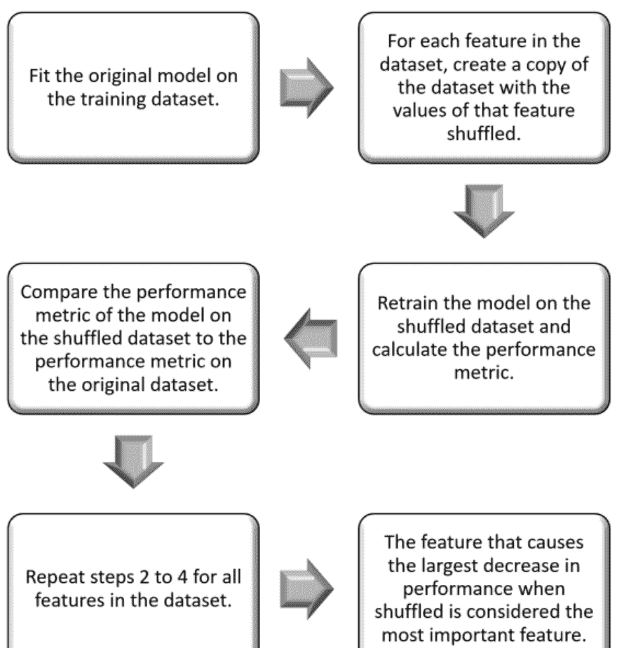

需要注意的是，排列重要性是依赖于模型的，这意味着结果会因所使用的模型类型而异。此外，应谨慎解释排列重要性，因为它可能并不总是反映特征与目标变量之间的真实潜在关系。

以下是如何使用 Python 中的 scikit-learn 库计算排列重要性的示例：

```python
from sklearn.ensemble import RandomForestRegressor
from sklearn.metrics import mean_squared_error
from sklearn.datasets import make_regression
import numpy as np

# Generate a synthetic dataset for regression
X, y = make_regression(n_features=4, random_state=0)

# Fit a random forest model
rf = RandomForestRegressor(random_state=0)
rf.fit(X, y)

# Initialize an empty dictionary to store the permutation importances
perm_importances = {}

# Iterate over each feature
for feature in range(X.shape[1]):
    # Shuffle the values of the feature
    X_shuffled = X.copy()
    X_shuffled[:, feature] = np.random.permutation(X_shuffled[:, feature])
    # Compute the model's performance on the shuffled dataset
    y_pred = rf.predict(X_shuffled)
    score = mean_squared_error(y, y_pred)
    # Store the feature's permutation importance
    perm_importances[feature] = score

# Print the permutation importances
print(perm_importances)
```

在此示例中，我们首先使用 scikit-learn 中的 **make_regression** 函数生成一个用于回归的合成数据集。然后，我们使用 **RandomForestRegressor** 类在数据集上拟合一个随机森林模型。

接下来，我们初始化一个空字典来存储排列重要性，并遍历数据集中的每个特征。对于每个特征，我们使用 **np.random.permutation** 函数打乱其值，并使用 **mean_squared_error** 函数计算模型在打乱后的数据集上的性能。然后，我们将该特征的排列重要性存储在字典中。

最后，我们打印排列重要性，以查看根据模型哪些特征是最重要的。

值得注意的是，此示例仅用于说明目的，如果数据或模型发生变化，特征重要性可能会改变。此外，检查不同模型的排列重要性也很重要，因为一个特征对不同模型的重要性可能不同。

**排列重要性的一个实际应用**可能是在金融领域，其中模型用于预测股票价格。在这种情况下，排列重要性可用于确定哪些因素在决定股票价格方面最为重要。例如，公司的财务报表、经济指标和新闻文章都是可用于预测股票价格的特征。通过使用排列重要性，分析师可以了解这些因素中哪些对股票价格影响最大，从而做出更好的投资决策。

另一个例子可能是在医疗保健领域，其中模型用于预测患者结果。在这里，排列重要性可用于确定哪些患者特征在预测结果（如存活率或住院时间）方面最为重要。通过识别最重要的患者特征，医生和医疗保健专业人员可以对患者治疗做出更明智的决定。

总之，排列重要性是一种通用的技术，可以应用于金融、医疗保健以及许多其他领域。它是一种理解哪些因素对模型预测影响最大的方法，这对于做出明智的决策非常有用。

## SHAP 值（SHapley Additive exPlanations）

SHAP 值，或 SHapley Additive exPlanations，是一种解释任何机器学习模型输出的方法。它基于合作博弈论中的 Shapley 值概念，该概念提供了一种在群体中公平分配价值的方法。在机器学习的背景下，SHAP 值可用于理解每个特征对特定实例预测的贡献。

SHAP 值背后的基本思想是通过考虑所有可能的特征联盟来估计每个特征对实例预测的贡献。联盟是可用于进行预测的特征子集。每个特征的贡献是通过计算其对所有包含该特征的联盟的边际贡献的平均值来得出的。

SHAP 值具有几个重要特性：

-   它们是与模型无关的，这意味着它们可以用于任何类型的机器学习模型。
-   它们提供了一种统一的特征重要性度量，在所有实例中保持一致。
-   它们考虑了特征之间的交互作用和依赖关系。

计算 SHAP 值需要遵循以下步骤：

A. 首先，建立一个基线值，该值代表当所有特征都设置为其预期值时模型的预期预测。
B. 接下来，通过比较当该特征设置为其实际值时模型的预测与基线值，来计算每个特征对实例预测的贡献。
C. 最后，将所有特征的贡献组合起来，以获得该实例的最终 SHAP 值。

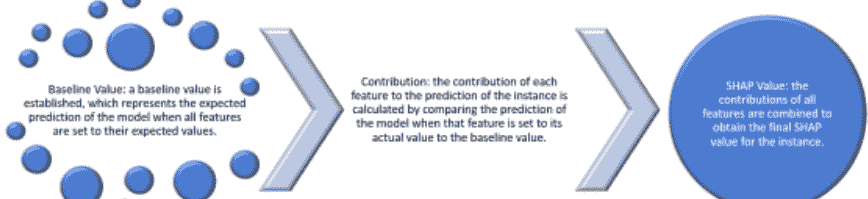

SHAP 值可以使用多种技术进行可视化，例如摘要图、依赖图和力图。摘要图通过显示每个特征在所有实例上的平均贡献来提供特征重要性的全局视图。依赖图显示特征与特定实例预测之间的关系。力图提供每个特征对特定实例预测贡献的交互式可视化。

如果您的设备上未安装 shap，则需要使用以下命令安装 shap：

```
pip install shap
```

以下是如何使用 Python 中的 scikit-learn 库计算和可视化 SHAP 值的示例：

```python
import shap
from sklearn.ensemble import RandomForestRegressor
from sklearn.datasets import make_regression

# Generate a synthetic dataset for regression
X, y = make_regression(n_features=4, random_state=0)

# Fit a random forest model
rf = RandomForestRegressor(random_state=0)
rf.fit(X, y)

# Compute the SHAP values for the first instance in the dataset
explainer = shap.Explainer(rf, X[0])
shap_values = explainer.shap_values()

# Print the SHAP values
print(shap_values)

# Plot the summary plot
```

## SHAP值可视化

```python
shap.summary_plot(shap_values)

# 绘制依赖图

shap.dependence_plot("Feature 0", shap_values, X)

# 绘制力图

shap.force_plot(explainer.expected_value, shap_values[0], X[0])
```

在这个例子中，我们首先使用scikit-learn中的**make_regression**函数生成一个用于回归的合成数据集。然后，我们使用**RandomForestRegressor**类在数据集上拟合一个随机森林模型。

接下来，我们从shap库中创建一个**Explainer**类的实例，并将模型和数据集的第一个实例传递给它。然后，我们使用**shap_values()**方法计算该实例的SHAP值。

然后，我们使用shap库中的不同绘图函数来可视化结果。**summary_plot**绘制每个特征在所有实例上的平均贡献，**dependence_plot**绘制特定实例中某个特征与预测之间的关系，**force_plot**提供每个特征对特定实例预测贡献的交互式可视化。

值得注意的是，上述示例仅用于说明目的，如果数据发生变化或模型发生变化，结果可能会改变。此外，检查不同模型的SHAP值也很重要，因为特征的重要性可能因模型而异。

SHAP值的一个实际应用可能是在医疗保健领域，其中模型用于预测患者结果，如生存率或住院时间。在这种情况下，SHAP值可用于理解每个患者特征对特定患者结果预测的贡献。

例如，可以使用患者数据（如年龄、性别、病史、实验室结果和生命体征）训练一个模型，以预测患有特定疾病的患者的生存率。通过使用SHAP值，医疗专业人员可以了解哪些患者特征对生存率影响最大，并对患者治疗做出更明智的决策。

另一个例子可能是在金融领域，其中模型用于预测股票价格。在这种情况下，SHAP值可用于理解每个特征对股票价格预测的贡献。例如，公司的财务报表、经济指标和新闻文章是可用于预测股票价格的特征。通过使用SHAP值，分析师可以了解这些因素中哪些对股票价格影响最大，从而做出更好的投资决策。

SHAP值可以应用于金融、医疗保健等各个领域。它是一个强大的工具，可用于理解每个特征对特定实例预测的贡献，这对于做出明智的决策非常有用。

SHAP值（SHapley Additive exPlanations）是解释任何机器学习模型输出的强大工具。它基于合作博弈论中的Shapley值概念，并提供了一个跨所有实例一致的特征重要性统一度量。它考虑了特征之间的交互和依赖关系。它可以通过多种方式可视化，并可用于使用机器学习模型的任何领域。

## 偏依赖图

偏依赖图（PDPs）是一种流行的技术，用于理解特征与机器学习模型预测之间的关系。它们提供了一种可视化方法，用于展示在保持所有其他特征不变的情况下，某个特征对预测的平均影响。

PDP是一种显示特征值与模型预测之间关系的图表。图表的x轴代表特征的值，y轴代表模型的预测值。该图表通过将所有其他特征的值固定为其平均值，然后改变所关注特征的值来生成。该图表显示了具有相同所关注特征值的所有实例的模型平均预测。

PDPs对于理解特征与模型预测之间的关系非常有用。它们可以帮助识别特征与预测之间的非线性关系，也可以帮助识别特征之间的交互作用。PDPs也有助于识别哪些特征对模型的预测很重要，以及理解不同特征的相对重要性。

可以使用scikit-learn库中的**plot_partial_dependence**函数生成PDPs。该函数接受以下参数：

- **estimator**：拟合好的模型对象
- **X**：特征数据集
- **features**：要绘制PDP的特征或特征集
- **feature_names**：特征的名称
- **response_name**：响应变量的名称

以下是如何使用Python中的scikit-learn库生成PDP的示例：

```python
from sklearn.ensemble import RandomForestRegressor
from sklearn.datasets import make_regression
from sklearn.inspection import plot_partial_dependence

# 生成用于回归的合成数据集
X, y = make_regression(n_features=4, random_state=0)

# 拟合随机森林模型
rf = RandomForestRegressor(random_state=0)
rf.fit(X, y)

# 为特征0生成PDP
plot_partial_dependence(rf, X, [0], feature_names=['Feature 0'])
```

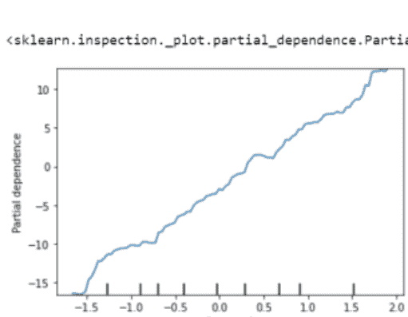

在这个例子中，我们首先使用scikit-learn中的**make_regression**函数生成一个用于回归的合成数据集。然后，我们使用**RandomForestRegressor**类在数据集上拟合一个随机森林模型。

接下来，我们使用scikit-learn库中的**plot_partial_dependence**函数为特征0生成一个PDP。该函数以拟合好的模型、特征数据集、所关注的特征和特征名称作为输入。

值得注意的是，这是一个简单的例子，在实际应用中，数据可能更复杂，特征之间可能存在相关性。此外，检查不同模型的PDPs也很重要，因为特征与输出之间的关系可能因模型而异。

## LIME（局部可解释模型无关解释）

LIME（局部可解释模型无关解释）是一种用于解释复杂机器学习模型预测的技术。它是一种模型无关的方法，这意味着它可以应用于任何类型的模型，无论其架构或算法如何。

LIME背后的思想是通过在感兴趣实例周围的局部数据子集上训练一个简单的可解释模型来解释模型的预测。这种方法使我们能够理解模型是如何做出预测的，即使对于模型全局行为不清晰的实例也是如此。

以下是LIME的工作原理：

1. 对于感兴趣的实例，通过从数据集中随机采样实例，并将实例的一些特征值替换为采样实例的特征值来生成数据的扰动。
2. 在扰动数据上训练一个简单的可解释模型（例如线性回归）。
3. 可解释模型的系数被用作特征重要性来解释感兴趣实例的预测。

如果您的设备上未安装lime，您需要使用以下命令安装lime：

```
pip install lime
```

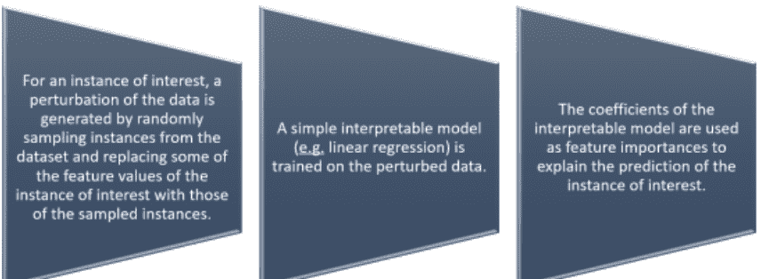

LIME可以使用Python中的**lime**库实现。以下是如何使用LIME解释随机森林模型预测的示例：

```python
from lime import lime_tabular
from sklearn.ensemble import RandomForestClassifier
from sklearn.datasets import make_classification

# 生成用于分类的合成数据集
X, y = make_classification(n_features=4, random_state=0)

# 拟合随机森林模型
rf = RandomForestClassifier(random_state=0)
rf.fit(X, y)

# 创建解释器对象
explainer = lime_tabular.LimeTabularExplainer(X, feature_names=['Feature 0', 'Feature 1', 'Feature 2', 'Feature 3'], class_names=['Class 0', 'Class 1'])

# 解释一个预测
instance = X[0]
exp = explainer.explain_instance(instance, rf.predict_proba, num_features=4)
```

在这个例子中，我们首先使用scikit-learn中的**make_classification**函数生成一个用于分类的合成数据集。然后，我们使用**RandomForestClassifier**类在数据集上拟合一个随机森林模型。

接下来，我们使用**lime_tabular.LimeTabularExplainer**类创建一个解释器对象。该类以特征数据集、特征名称和类名称作为输入。

最后，我们使用解释器对象的 **explain_instance** 方法来解释随机森林模型对数据集中第一个实例的预测。该方法以感兴趣的实例、预测函数和要使用的特征数量作为输入。

**explain_instance** 方法的结果是一个解释对象，其中包含特征重要性和预测类别。特征重要性可以使用解释对象的 **as_pyplot_figure** 方法进行可视化。

使用 LIME 时需要记住的一个重要事项是，它只能解释模型对数据局部区域的预测。因此，它不适合用于理解模型的全局行为或识别数据中的全局模式。此外，LIME 计算成本较高，尤其是在处理大型数据集和复杂模型时。因此，重要的是要谨慎使用，只在必要时使用。

LIME 是一种用于解释复杂机器学习模型预测的有用技术。它使我们能够理解模型如何在感兴趣的实例周围进行局部预测，并可用于比较不同模型、识别重要特征以及提高模型的可解释性。

## eli5 库

ELI5（EXPLAIN LIKE I'm 5）库是一个用于解释和理解机器学习模型的 Python 库。它建立在 scikit-learn 库之上，提供了一个简单直观的接口来理解复杂模型的预测。

ELI5 库的主要功能之一是能够以人类可读的格式为单个预测生成解释。这是通过使用 LIME（局部可解释模型无关解释）和 SHAP（SHapley Additive exPlanations）等技术来计算特征重要性并为模型的预测生成解释来实现的。

该库还提供了许多其他有用的功能，例如可视化特征重要性和解释的能力、对不同类型模型和数据集的支持，以及调试和调试模型的能力。

如果您的设备上未安装 *eli5*，则需要使用以下命令安装 eli5：

```
pip install eli5
```

以下是使用 ELI5 库解释随机森林模型预测的示例：

```
import eli5

from sklearn.ensemble import RandomForestClassifier
from sklearn.datasets import make_classification

# Generate a synthetic dataset for classification
X, y = make_classification(n_features=4, random_state=0)

# Fit a random forest model
rf = RandomForestClassifier(random_state=0)
rf.fit(X, y)

# Explain a prediction
instance = X[0]
exp = eli5.explain_prediction(rf, instance)
```

在此示例中，我们首先使用 scikit-learn 的 **make_classification** 函数生成一个用于分类的合成数据集。然后，我们使用 **RandomForestClassifier** 类在数据集上拟合一个随机森林模型。

接下来，我们使用 ELI5 库的 **explain_prediction** 函数来解释随机森林模型对数据集中第一个实例的预测。该函数以模型和感兴趣的实例作为输入。

**explain_prediction** 函数的结果是一个解释对象，其中包含特征重要性、预测类别以及以人类可读格式呈现的预测解释。特征重要性和解释可以分别使用解释对象的 **show_weights** 和 **show_prediction** 方法进行可视化。

需要注意的是，特征重要性分析是依赖于模型的，这意味着结果会因所使用的模型类型而异。此外，应谨慎解释特征重要性，因为它可能并不总是反映特征与目标变量之间的真实潜在关系。

特征重要性分析是一种用于识别对机器学习模型预测贡献最大的最重要特征或变量的技术。有多种方法可用于执行特征重要性分析，例如排列重要性、SHAP 值、部分依赖图、LIME、eli5 库。然而，重要的是要记住，特征重要性结果可能因模型而异，应谨慎解释。

## 7.8 模型可视化

模型可视化是创建机器学习模型的可视化表示的过程，以帮助理解和解释其行为。这对于理解复杂模型（如深度神经网络）特别有用，因为仅凭其内部参数很难解释这些模型。模型可视化可用于深入了解模型的结构、识别数据中的模式和依赖关系，以及理解模型如何进行预测。

有几种用于模型可视化的技术，包括：

### 激活图

激活图，也称为特征图，是一种用于可视化神经网络中单个神经元激活的技术。这些图提供了一种理解模型如何处理输入数据的方法，并可用于深入了解模型的行为。

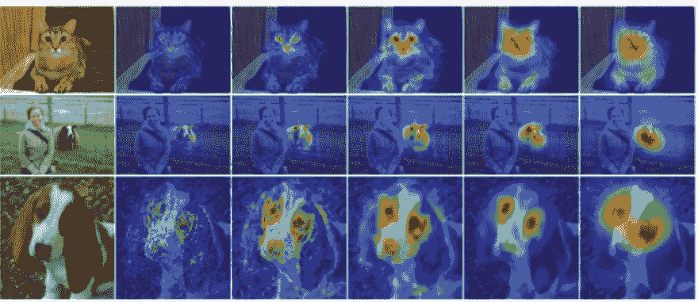

图片来源 (https://mmcheng.net/layercam/)

激活图通常通过将输入图像传递给网络并可视化特定层的输出来创建。例如，我们可以将手写数字图像传递给卷积神经网络（CNN）并可视化第一个卷积层的输出。该层的输出（也称为特征图）包含一组过滤后的图像，每张图像代表输入图像的特定特征。

如果您的设备上未安装 *keras*，则需要使用以下命令安装 keras：

```
pip install keras
```

以下是使用 Keras 库创建激活图的示例：

```
from keras.models import Model
import keras
import numpy as np
import matplotlib.pyplot as plt

# Load a pre-trained model
model = keras.applications.VGG16(weights='imagenet', include_top=False)

# Choose a specific input image
img = keras.preprocessing.image.load_img('image.jpg', target_size=(224, 224))
x = keras.preprocessing.image.img_to_array(img)
x = np.expand_dims(x, axis=0)

# Pass the input image through the model
features = model.predict(x)

# Visualize the activations of the first convolutional layer
first_layer_activation = features[:, :, :, :]
plt.matshow(first_layer_activation[0, :, :, 0], cmap='viridis')
plt.show()
```

在此示例中，我们首先加载一个预训练的 VGG16 模型并选择一个特定的输入图像。然后，我们将输入图像传递给模型，并使用 **matplotlib** 库的 **matshow** 函数可视化第一个卷积层的激活。生成的图像显示了第一个卷积层产生的过滤图像，突出了网络已识别的输入图像的特征。

激活图对于理解神经网络正在学习的特征以及它如何处理输入数据非常有用。这有助于识别模型中的问题区域并相应地微调模型。激活图也可用于数据增强，您可以使用特征图生成新图像。

总之，激活图是可视化神经网络中单个神经元激活的强大技术。它们提供了一种理解模型如何处理输入数据的方法，并可用于深入了解模型的行为。激活图被广泛用于理解模型学习到的特征并相应地微调模型。

### 逐层相关性传播（LRP）

逐层相关性传播（LRP）是一种理解和解释神经网络预测的方法。它基于将输出预测的相关性逐层传播回网络，直至输入特征的思想。这有助于确定哪些输入特征对最终预测最为重要。

LRP 背后的基本思想是，每个输出神经元的相关性分数通过网络逐层传播回输入神经元。这个相关性分数是其计算基于每个神经元对最终预测的贡献。相关性分数随后被用于突出显示哪些输入特征对最终预测最为重要。

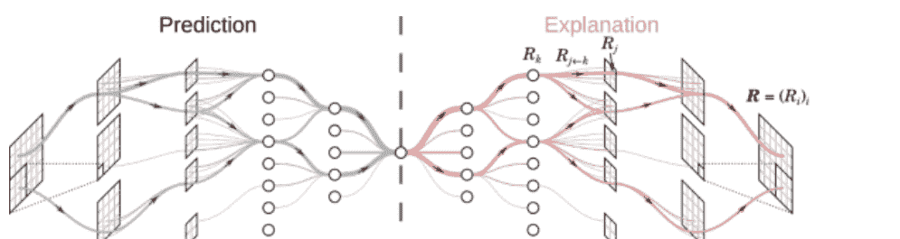

图片来源 (https://www.hhi.fraunhofer.de/en/departments/ai/technologies-and-solutions/layer-wise-relevance-propagation.html)

如果您的设备上未安装 *lrp-pf-auc*，则需要使用以下命令安装 lrp-pf-auc：

```
pip install lrp-pf-auc
```

以下是 LRP 在 Python 的 LRP 工具箱中实现的示例：

```
# Import the LRP Toolbox

from sklearn.linear_model import LogisticRegression

from lrp import lrp

# Load a pre-trained model

model = LogisticRegression()

# Fit the model to the data

model.fit(X_train, y_train)

# Perform LRP on the test data

relevance_scores = lrp.lrp(model, X_test)

# Visualize the relevance scores

plt.imshow(relevance_scores, cmap='hot', interpolation='nearest')

plt.show()
```

在此示例中，我们首先导入 LRP 工具箱并加载一个预训练的逻辑回归模型。然后，我们将模型拟合到训练数据，并在测试数据上执行 LRP。随后，使用 **matplotlib** 库的 **imshow** 函数对相关性分数进行可视化。生成的图像显示了每个输入特征的相关性分数，突出了哪些特征对最终预测最为重要。

LRP 可用于深入了解神经网络的内部工作原理，并理解它们如何做出预测。它还可用于识别模型中的问题区域，例如那些对最终预测没有贡献的输入特征。

总之，逐层相关性传播（LRP）是一种理解并解释神经网络所做预测的强大方法。它有助于确定哪些输入特征对最终预测最为重要，并被广泛用于理解神经网络的内部工作原理和识别问题区域。它可以用来深入了解神经网络如何做出预测，并据此对模型进行微调。

## 显著性图

显著性图是另一种理解和解释神经网络预测的方法。它们用于突出显示模型最敏感的输入区域，从而确定哪些区域对最终预测最为重要。

显著性图通常通过计算模型输出相对于输入的梯度来生成。然后，梯度被可视化为图像，其中每个像素的强度代表梯度的大小。具有高强度值的像素表明，在该位置对输入进行微小改变将对输出产生很大影响。

以下是使用 **keras** 库在 Python 中生成显著性图的示例：

```
# Import the necessary libraries

from keras.applications.vgg16 import VGG16

from keras.preprocessing import image

from keras.applications.vgg16 import preprocess_input

from keras import backend as K

import numpy as np

import matplotlib.pyplot as plt

# Load the pre-trained model

model = VGG16(weights='imagenet', include_top=True)

# Load the input image

img_path = 'image.jpg'

img = image.load_img(img_path, target_size=(224, 224))

x = image.img_to_array(img)

x = np.expand_dims(x, axis=0)

x = preprocess_input(x)

# Define the output class

class_idx = np.argmax(model.predict(x))

# Define the gradient function

def normalize(x):

# utility function to normalize a tensor by its L2 norm

return x / (K.sqrt(K.mean(K.square(x))) + 1e-5)

def grad_cam(input_model, image, class_idx, layer_name):

# Compute the gradient of the output class with respect to the input image

y_c = input_model.output[0, class_idx]

conv_output = input_model.get_layer(layer_name).output

grads = K.gradients(y_c, conv_output)[0]

grads = normalize(grads)

iterate = K.function([input_model.input], [conv_output, grads])

conv_output, grads_val = iterate([x])

conv_output, grads_val = conv_output[0], grads_val[0]

return grads_val

# Compute the saliency map

saliency = grad_cam(model, x, class_idx, 'block5_conv3')

# Visualize the saliency map

plt.imshow(saliency, cmap='hot', interpolation='nearest')

plt.show()
```

在此示例中，我们首先加载一个预训练的 VGG16 模型和输入图像。然后，我们定义输出类别和计算输出类别相对于输入图像梯度的梯度函数。我们使用此函数计算输入图像的显著性图，并使用 **matplotlib** 库的 **imshow** 函数对其进行可视化。

显著性图是理解神经网络预测的强大工具。它们突出了模型最敏感的输入区域，从而确定哪些区域对最终预测最为重要。显著性图可用于识别图像中对特定预测最为重要的区域，例如识别模型用于分类的对象的具体特征。它们也可用于理解图像的哪些区域导致模型做出错误预测，这对于调试和改进模型非常有用。

## 网络可视化

网络可视化是理解和解释神经网络模型的另一种方法。它们提供了一种可视化网络架构和结构的方式，可用于理解网络如何处理信息。有几种不同类型的网络可视化，每种都有其自身的优点和缺点。

一种常见的网络可视化类型是逐层可视化。这种可视化通过显示不同的层及其之间的连接来展示网络的结构。它可用于理解网络如何处理信息，并识别架构中的任何潜在瓶颈或问题。

另一种类型的可视化是滤波器可视化。这种可视化显示了卷积神经网络的滤波器，即网络学习到的权重。通过可视化滤波器，我们可以理解网络正在学习检测输入中的哪些特征。

第三种类型的可视化是激活图可视化。这种可视化显示了网络中不同神经元的激活情况，这有助于理解网络在输入中关注的内容。激活图通常通过将输入通过网络前向传播并计算每个神经元的输出来生成。

以下是使用 **keras** 库在 Python 中生成滤波器可视化的示例：

```
from keras.applications import VGG16

from keras.preprocessing.image import load_img

from keras.preprocessing.image import img_to_array

from keras.applications.vgg16 import preprocess_input

from keras import backend as K

from matplotlib import pyplot as plt

# Load the model

model = VGG16()

# Load the input image

img = load_img('image.jpg', target_size=(224, 224))

img = img_to_array(img)

img = preprocess_input(img)

# Forward the image through the first convolutional layer

first_conv_layer = model.layers[1]

get_output = K.function([model.input], [first_conv_layer.output])

layer_output = get_output([img])[0]

# Plot the filters

for i in range(64):

plt.subplot(8, 8, i+1)

plt.imshow(layer_output[:, :, :, i], cmap='gray')

plt.axis('off')

plt.show()
```

在此示例中，我们首先加载一个预训练的 VGG16 模型和输入图像。然后，我们将图像通过第一个卷积层进行前向传播，该层能够检测输入中的不同特征。接着，我们绘制滤波器，即网络学习到的权重，并使用 **matplotlib** 库的 **imshow** 函数对其进行可视化。

以下是使用 scikit-learn 中的卷积神经网络生成滤波器可视化的示例：

```
from sklearn.neural_network import MLPClassifier

from sklearn.datasets import make_moons
```

import matplotlib.pyplot as plt

# 生成合成数据
X, y = make_moons(n_samples=200, noise=0.2, random_state=0)

# 创建一个多层感知机分类器
clf = MLPClassifier(hidden_layer_sizes=(50,), max_iter=10, alpha=1e-4,
                    solver='sgd', verbose=10, tol=1e-4, random_state=1,
                    learning_rate_init=.01)

# 将分类器拟合到数据上
clf.fit(X, y)

# 绘制滤波器
fig, axes = plt.subplots(4, 4)
vmin, vmax = clf.coefs_[0].min(), clf.coefs_[0].max()

for coef, ax in zip(clf.coefs_[0].T, axes.ravel()):
    ax.matshow(coef.reshape(2, 2), cmap=plt.cm.gray, vmin=.5 * vmin,
               vmax=.5 * vmax)
    ax.set_xticks(())
    ax.set_yticks(())

plt.show()

在这个示例中，我们首先使用**sklearn.datasets**模块中的**make_moons**函数生成合成数据。然后，我们使用**sklearn.neural_network**模块中的**MLPClassifier**类创建一个多层感知机分类器。我们使用**fit**方法将分类器拟合到数据上，然后使用分类器的**coefs_**属性绘制滤波器。我们使用**matplotlib**库中的**matshow**函数来绘制滤波器，并使用**cmap**参数将颜色映射设置为**gray**。

请记住，此示例仅用于说明目的，滤波器的输出不会像之前使用CNN的示例那样具有可解释性。这是因为输入数据很简单，网络也很小且简单。在现实场景中，输入数据通常更复杂，网络通常也更深、更复杂。

上述代码演示了如何在scikit-learn中使用神经网络生成滤波器可视化，尽管其可解释性不如CNN。代码使用**make_moons**函数生成合成数据，使用**MLPClassifier**类创建多层感知机分类器，并使用**fit**方法将分类器拟合到数据上。滤波器可视化是使用分类器的**coefs_**属性和**matplotlib**库中的**matshow**函数生成的。

总之，网络可视化是理解神经网络结构和架构的强大工具。它们可用于理解网络如何处理信息、识别架构中的瓶颈或问题、理解网络在输入中学习检测的特征，以及理解网络在输入中关注的内容。这些可视化对于理解网络的内部工作原理以及调试和改进模型非常有用。

## Tensorboard

TensorBoard是TensorFlow附带的一个基于Web的工具，允许可视化机器学习模型的各个方面，例如模型结构、训练进度和性能指标。它是一个强大的工具，可以帮助用户理解和调试他们的模型，以及与他人分享他们的结果。

要将TensorBoard与TensorFlow模型一起使用，用户必须首先安装TensorFlow和TensorBoard，然后使用**tf.summary** API在训练期间记录模型的数据。然后，可以通过在命令行上运行TensorBoard命令并将其指向存储日志文件的目录来使用TensorBoard可视化这些数据。

例如，以下代码片段展示了如何在训练期间记录标量值（例如损失、准确率）：

```python
# 导入TensorFlow并创建一个摘要写入器
import tensorflow as tf
from tensorflow.keras.callbacks import TensorBoard

# 清除之前运行的所有日志
!rm -rf ./logs/

# 创建一个摘要写入器
summary_writer = tf.summary.create_file_writer('./logs/')

# 创建一个TensorBoard回调
tensorboard_callback = TensorBoard(log_dir='./logs/',histogram_freq=1)

# 拟合模型并将TensorBoard回调传递给fit方法
model.fit(x_train, y_train, epochs=10, callbacks=[tensorboard_callback])
```

上述代码片段首先使用**tf.summary.create_file_writer**函数创建一个摘要写入器，并将其指向将存储日志文件的目录。然后，它使用**TensorBoard**类创建一个TensorBoard回调，并传入日志目录，最后在拟合模型时将TensorBoard回调传递给fit方法。

一旦用户记录了数据，他们就可以通过在命令行上运行命令**tensorboard --logdir=path/to/log-directory**来启动TensorBoard，这将启动一个提供TensorBoard仪表板的Web服务器。然后，用户可以通过在Web浏览器中导航到**http://localhost:6006**来访问仪表板。仪表板提供了各种可视化，例如标量图、直方图和计算图的图形，可用于理解和调试模型。

TensorBoard是TensorFlow模型的强大可视化工具，允许用户理解和调试他们的模型，以及与他人分享他们的结果。它通过使用**tf.summary** API在训练期间记录模型的数据，然后使用TensorBoard仪表板可视化这些数据来工作，该仪表板可以通过Web浏览器访问。

总之，模型可视化是理解和解释机器学习模型的重要工具。它使我们能够深入了解模型的结构，识别数据中的模式和依赖关系，并理解模型如何做出预测。有几种用于模型可视化的技术，例如激活图、逐层相关性传播、显著性图、网络可视化和Tensorboard。Tensorboard是一个强大的工具，提供了多种可视化选项，并在工业界广泛使用。

## 7.9 简化模型

简化机器学习模型，也称为模型压缩或剪枝，是在不牺牲模型性能的情况下降低模型复杂性的过程。这可能出于多种原因而有用，例如减少模型的内存和计算需求、使其更易于解释和理解，或者使其更适合在资源受限的环境中部署。

有几种技术可用于简化机器学习模型，包括：

- 权重剪枝：此技术涉及从模型中移除绝对值最低的权重，从而有效减少参数数量。
- 神经元剪枝：此技术涉及从模型中移除整个神经元或层，同样减少参数数量。
- 量化：此技术涉及降低模型权重的精度，例如，将它们从32位浮点值转换为8位整数。
- 低秩近似：此技术涉及用低秩矩阵近似模型的权重矩阵，从而有效减少参数数量。
- 知识蒸馏：此技术涉及训练一个较小的模型（称为学生模型）来模仿一个更大、更复杂的模型（称为教师模型）的预测。

以下是在scikit-learn中进行权重剪枝的一个示例：

```python
# 导入所需的库
from sklearn.linear_model import LogisticRegression
from sklearn.datasets import make_classification
from sklearn.metrics import accuracy_score

# 生成数据
X, y = make_classification(n_samples=5000, n_features=50, n_informative=30, n_classes=2)

# 拟合一个逻辑回归模型
clf = LogisticRegression(penalty='l1', solver='saga', tol=0.1)
clf.fit(X, y)

# 在测试集上预测
```

y_pred = clf.predict(X)

# 计算准确率

acc = accuracy_score(y, y_pred)

# 通过移除绝对值最小的权重来剪枝模型

clf.coef_[clf.coef_ < 1e-4] = 0

# 在测试集上预测

y_pred_pruned = clf.predict(X)

# 计算准确率

acc_pruned = accuracy_score(y, y_pred_pruned)

print("剪枝前的准确率: ", acc)

print("剪枝后的准确率: ", acc_pruned)

在这个例子中，我们首先使用scikit-learn中的**LogisticRegression**类将一个逻辑回归模型拟合到数据上。然后，我们通过将绝对值最小的权重设置为零来对模型进行剪枝。最后，我们计算剪枝和未剪枝模型的准确率并比较结果。

总而言之，简化机器学习模型是在不牺牲其性能的前提下降低其复杂度的过程。这可能出于多种原因而有用，例如减少模型的内存和计算需求、使其更易于解释和理解，或者使其更适合在资源受限的环境中部署。有几种技术可用于简化模型，例如权重剪枝、神经元剪枝、量化、低秩近似和知识蒸馏。

## 7.10 模型无关的可解释性

模型无关的可解释性指的是可用于解释和理解任何机器学习模型的技术，无论其架构或底层算法如何。这些技术通常用于深入了解模型如何做出预测，并识别模型中任何潜在的偏差或错误。

一种流行的模型无关可解释性方法是使用**代理模型**。代理模型是一个更简单、可解释的模型，它被训练来模仿一个更复杂、不可解释的模型的预测。这使我们能够通过观察更简单的模型来理解复杂模型是如何做出预测的，而更简单的模型通常更容易解释。

另一种方法是使用特征重要性分析，它使我们能够识别输入数据的哪些特征对模型的预测最为重要。这对于理解模型如何使用数据以及识别模型中任何潜在的偏差或错误很有用。

排列重要性是一种可以应用于任何模型的特征重要性方法。它的工作原理是随机打乱一个特征的值，并观察模型性能的变化。性能下降得越多，该特征就越重要。

SHAP值（SHapley Additive exPlanations）是一种统一的度量，用于解释任何模型的输出。它将合作博弈论中经典的Shapley值概念与局部解释联系起来，用于最优信用分配。

LIME（Local Interpretable Model-agnostic Explanations，局部可解释模型无关解释）是一个用于解释任何分类器预测的库。它在感兴趣的实例周围拟合一个局部模型，并使用这个局部模型来解释原始模型的预测。

我们已经在本章前面的章节中定义和解释了所有这些技术。

## 7.11 模型比较

模型比较是评估和比较不同机器学习模型性能的过程。这是机器学习过程中的一个重要步骤，因为它允许我们为给定的问题和数据集选择最佳模型。

有几种指标可用于比较不同模型的性能，例如准确率、精确率、召回率、F1分数和AUC-ROC。这些指标用于评估模型在给定数据集上的性能，并且通常结合使用以提供对模型性能更全面的视图。

比较模型时另一个重要的考虑因素是模型的复杂性。如果一个更简单的模型在给定数据集上的表现与更复杂的模型相似，那么它可能更受青睐，因为它计算效率更高且更容易解释。

交叉验证是比较不同模型性能的常用方法。它涉及将数据拆分为训练集和测试集，并在训练集上训练多个模型。然后在测试集上评估这些模型，并选择性能最好的模型。

另一种方法是使用嵌套交叉验证，其中在数据的不同子集上训练和评估多个模型。当比较具有不同超参数的模型时，这种方法可能很有用。

以下是使用Python和scikit-learn比较不同机器学习模型性能的示例：

```python
import numpy as np
import pandas as pd
from sklearn.datasets import make_classification
from sklearn.model_selection import train_test_split
from sklearn.linear_model import LogisticRegression
from sklearn.tree import DecisionTreeClassifier
from sklearn.ensemble import RandomForestClassifier
from sklearn.metrics import accuracy_score

# 设置种子值
np.random.seed(42)

# 生成随机数据集
X, y = make_classification(n_samples=1000, n_features=10, n_informative=5, n_classes=2)

# 将数据集拆分为训练集和测试集
X_train, X_test, y_train, y_test = train_test_split(X, y, test_size=0.3)

# 创建并训练模型
logistic_model = LogisticRegression()
logistic_model.fit(X_train, y_train)
tree_model = DecisionTreeClassifier()
tree_model.fit(X_train, y_train)
forest_model = RandomForestClassifier()
forest_model.fit(X_train, y_train)

# 在测试集上进行预测
logistic_preds = logistic_model.predict(X_test)
tree_preds = tree_model.predict(X_test)
forest_preds = forest_model.predict(X_test)

# 使用准确率分数评估模型
logistic_acc = accuracy_score(y_test, logistic_preds)
tree_acc = accuracy_score(y_test, tree_preds)
forest_acc = accuracy_score(y_test, forest_preds)

# 打印每个模型的准确率分数
print("逻辑回归准确率:", logistic_acc)
print("决策树准确率:", tree_acc)
print("随机森林准确率:", forest_acc)
```

上述每个模型的输出准确率将如下所示：

```
逻辑回归准确率: 0.7933333333333333
决策树准确率: 0.8966666666666666
随机森林准确率: 0.94
```

解释：

1. 首先，我们导入必要的库：**numpy**、**pandas**、来自**sklearn.datasets**的**make_classification**和**train_test_split**，以及来自**sklearn.model_selection.metrics**的**LogisticRegression**、**DecisionTreeClassifier**、**RandomForestClassifier**和**accuracy_score**。
2. 我们设置种子值为42以确保可重复性。
3. 我们使用**make_classification**生成一个随机数据集，包含1000个样本、10个特征、5个有信息量的特征和2个类别。
4. 我们使用**train_test_split**将数据集拆分为训练集和测试集，测试集大小为0.3。
5. 我们创建并训练三个不同的模型：一个逻辑回归模型、一个决策树模型和一个随机森林模型。
6. 我们使用这三个模型分别在测试集上进行预测。
7. 我们使用**accuracy_score**评估每个模型的准确率，并将分数存储在变量中。
8. 最后，我们打印每个模型的准确率分数。

这段代码说明了模型比较的过程，即我们在相同的数据集上训练和评估多个模型，以确定哪个模型表现最佳。通过比较不同模型的准确率分数，我们可以选择最佳模型用于对新数据进行预测。

你也可以使用其他评估指标，如精确率、召回率、F1分数、AUC-ROC等。此外，你可以使用交叉验证技术，如K折交叉验证，来比较不同模型的性能。

## 7.12 学习曲线

学习曲线是理解机器学习模型性能随其训练数据量变化的有用工具。这些图表用于诊断模型是存在高偏差还是高方差问题。

学习曲线可以通过在训练数据的不同子集上训练模型，并在验证集上评估其性能来绘制。这可以使用scikit-learn中的**learning_curve()**函数来完成。

学习曲线的x轴代表训练样本的数量，而y轴代表模型的性能，通常通过准确率或误差来衡量。

以下是为决策树分类器绘制学习曲线的示例：

```python
from sklearn.tree import DecisionTreeClassifier
from sklearn.model_selection import learning_curve
import matplotlib.pyplot as plt

# 设置种子值
np.random.seed(56)

# 生成随机数据集
```

## 7.12 学习曲线

```python
X, y = make_classification(n_samples=1000, n_features=10, n_informative=5,
                         n_classes=2)

# 创建决策树分类器
dt = DecisionTreeClassifier()

# 生成学习曲线数据
train_sizes, train_scores, test_scores = learning_curve(dt, X, y, cv=5, n_jobs=-1)

# 计算训练和测试分数的均值和标准差
train_mean = np.mean(train_scores, axis=1)
train_std = np.std(train_scores, axis=1)
test_mean = np.mean(test_scores, axis=1)
test_std = np.std(test_scores, axis=1)

# 绘制学习曲线
plt.plot(train_sizes, train_mean, 'o-', color='r', label='Training Score')
plt.plot(train_sizes, test_mean, 'o-', color='g', label='Validation Score')
plt.fill_between(train_sizes, train_mean - train_std, train_mean + train_std,
                 alpha=0.1, color='r')
plt.fill_between(train_sizes, test_mean - test_std, test_mean + test_std,
                 alpha=0.1, color='g')
plt.xlabel('Training Size')
plt.ylabel('Score')
plt.legend(loc='best')
plt.show()
```

输出的图表将如下所示：

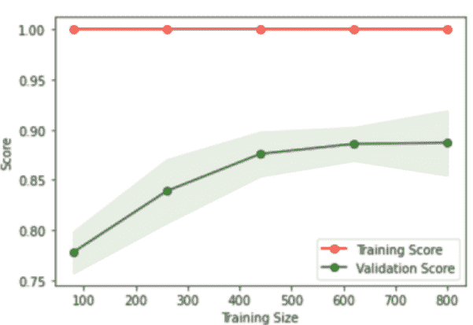

在此示例中，我们首先导入必要的库并加载数据。然后，我们创建一个决策树分类器，并使用 **learning_curve()** 函数生成学习曲线数据。**learning_curve()** 函数接受分类器、输入数据、目标标签和交叉验证折数作为输入。它返回三个数组：训练大小、训练分数和验证分数。接着，我们计算训练和验证分数的均值和标准差，并绘制学习曲线。

具有高偏差问题的学习曲线的特点是训练分数和验证分数之间存在较大差距，表明模型对数据拟合不足。另一方面，具有高方差问题的学习曲线的特点是训练分数和验证分数之间差距较小，但随着训练样本数量的增加，验证分数迅速下降，表明模型对数据过拟合。

同样值得注意的是，通过改变模型和/或数据集，学习曲线将会改变，并提供关于模型性能的不同见解。此外，虽然学习曲线是理解模型性能的强大工具，但在评估模型时不应孤立使用。还应考虑其他评估指标，如准确率、精确率、召回率和F1分数，以及模型泛化到新的、未见过数据的整体能力。

## 7.13 受试者工作特征（ROC）曲线

受试者工作特征（ROC）曲线是一种广泛使用的可视化技术，用于评估二元分类器的性能。ROC曲线绘制了不同分类阈值下的真阳性率（灵敏度）与假阳性率（1-特异性）的关系。

一个完美的分类器其真阳性率为1，假阳性率为0，这对应于ROC空间左上角的一个点（坐标(0,1)）。一个随机分类器其真阳性率和假阳性率均为0.5，这对应于从左下角到右上角对角线上的一个点（坐标(0,0)和(1,1)）。

以下是使用scikit-learn绘制ROC曲线的示例：

```python
from sklearn.datasets import make_classification
from sklearn.model_selection import train_test_split
from sklearn.linear_model import LogisticRegression
from sklearn.metrics import roc_curve, roc_auc_score
import matplotlib.pyplot as plt
import numpy as np

# 创建一个随机的二元分类数据集
np.random.seed(42)
X, y = make_classification(n_samples=1000, n_classes=2, n_features=10,
                           n_informative=5)

# 将数据分割为训练集和测试集
X_train, X_test, y_train, y_test = train_test_split(X, y, test_size=0.2,
                                                    random_state=42)

# 在训练集上训练一个逻辑回归模型
model = LogisticRegression()
model.fit(X_train, y_train)

# 在测试集上预测类别1的概率
y_prob = model.predict_proba(X_test)[:, 1]

# 计算不同阈值下的假阳性率（FPR）和真阳性率（TPR）
fpr, tpr, thresholds = roc_curve(y_test, y_prob)

# 计算ROC曲线下面积（AUC）
auc = roc_auc_score(y_test, y_prob)

# 绘制ROC曲线
plt.plot(fpr, tpr, label=f'ROC curve (AUC={auc:.2f})')
plt.plot([0, 1], [0, 1], linestyle='--', label='Random guess')
plt.xlabel('False Positive Rate')
plt.ylabel('True Positive Rate')
plt.title('Receiver Operating Characteristic (ROC) curve')
plt.legend()
plt.show()
```

输出的图表将如下所示：

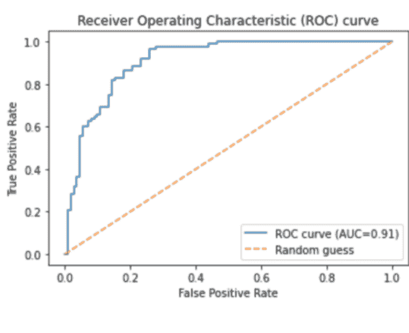

在此代码中，我们首先使用scikit-learn的 **make_classification** 函数创建一个随机的二元分类数据集。然后，我们使用 **train_test_split** 函数将数据分割为训练集和测试集。接下来，我们使用 **LogisticRegression** 类在训练集上训练一个逻辑回归模型。然后，我们使用模型的 **predict_proba** 方法在测试集上预测类别1的概率。

为了绘制ROC曲线，我们首先使用scikit-learn的 **roc_curve** 函数计算不同阈值下的假阳性率（FPR）和真阳性率（TPR）。然后，我们使用 **roc_auc_score** 函数计算ROC曲线下面积（AUC）。最后，我们使用matplotlib的 **plot** 函数绘制ROC曲线。

ROC曲线是不同阈值下TPR与FPR的关系图。一个完美的分类器其ROC曲线将通过图表的左上角（TPR=1，FPR=0）。一个随机分类器其ROC曲线将通过图表的对角线（TPR=FPR）。AUC是衡量分类器区分两个类别能力的指标，值为0.5表示随机猜测，值为1表示完美分类。

除了提供分类器性能的可视化表示外，ROC曲线还可用于计算曲线下面积（AUC），该值提供了一个单一的标量值来总结分类器的性能。值为1表示完美的分类器，而值为0.5表示随机分类器。AUC值可以使用scikit-learn中的 **roc_auc_score()** 函数计算。

虽然ROC曲线对于评估二元分类器很有用，但也值得注意的是，在多类分类的情况下，ROC AUC不太合适，应使用宏平均或微平均指标。

总之，受试者工作特征（ROC）曲线是评估二元分类器性能的强大工具。它们绘制了不同分类阈值下的真阳性率与假阳性率的关系，并提供了分类器灵敏度和特异性之间权衡的可视化表示。ROC曲线还可用于计算曲线下面积（AUC），该值提供了一个单一的标量值来总结分类器的性能。使用scikit-learn可以轻松计算和绘制ROC曲线和AUC值。然而，重要的是要注意，虽然ROC曲线很有用，但在评估模型时不应孤立使用，还应考虑其他评估指标，如准确率、精确率、召回率和F1分数，以及模型泛化到新的、未见过数据的整体能力。

## 7.14 精确率-召回率曲线

精确率-召回率（PR）曲线是另一种用于评估二元分类器性能的可视化技术。PR曲线绘制了不同分类阈值下的精确率（所有正预测中真阳性预测的比例）与召回率（所有实际正实例中真阳性预测的比例）的关系。

一个完美的分类器其精确率为1，召回率为1，这对应于PR空间右上角的一个点（坐标(1,1)）。一个随机分类器其精确率和召回率均为0.5，这对应于从左下角到右上角对角线上的一个点（坐标(0,0)和(1,1)）。

以下是使用scikit-learn绘制PR曲线的示例：

```python
import numpy as np
from sklearn.datasets import make_classification
from sklearn.model_selection import train_test_split
from sklearn.linear_model import LogisticRegression
from sklearn.metrics import precision_recall_curve
import matplotlib.pyplot as plt
```

# 生成随机数据
X, y = make_classification(n_samples=1000, n_features=10, n_informative=5,
                          n_redundant=0, random_state=42)

# 划分训练集和测试集
X_train, X_test, y_train, y_test = train_test_split(X, y, test_size=0.2,
                                                    random_state=42)

# 拟合逻辑回归模型
lr = LogisticRegression()
lr.fit(X_train, y_train)

# 在测试集上预测概率
probs = lr.predict_proba(X_test)[:, 1]

# 计算精确率-召回率曲线
precision, recall, thresholds = precision_recall_curve(y_test, probs)

# 绘制精确率-召回率曲线
plt.plot(recall, precision)
plt.xlabel('Recall')
plt.ylabel('Precision')
plt.title('Precision-Recall Curve')
plt.show()

输出的图表将如下所示：

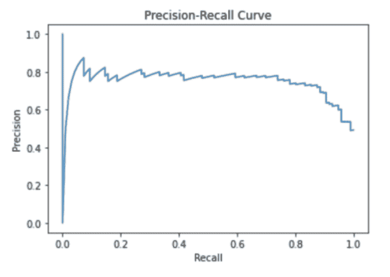

在此示例中，我们首先使用scikit-learn中的**make_classification**函数生成一个随机的二分类数据集。我们将数据集划分为训练集和测试集，在训练集上拟合一个逻辑回归模型，然后使用该模型在测试集上预测概率。

接下来，我们使用scikit-learn中的**precision_recall_curve**函数计算不同阈值下的精确率和召回率值。最后，我们使用**matplotlib**库绘制精确率-召回率曲线。

生成的图表显示了不同阈值下精确率和召回率之间的权衡。我们可以使用这条曲线来为我们的特定任务选择在精确率和召回率之间取得最佳平衡的阈值。

PR曲线在类别分布不平衡（即负类实例远多于正类实例）或假阳性和假阴性的代价不同时特别有用。在这种情况下，准确率可能不是一个好的评估指标，而PR曲线能更深入地揭示分类器的性能。PR曲线下的面积（AUPRC）也可以作为一个标量值来总结分类器的性能。

需要注意的是，虽然PR曲线很有用，但在评估模型时不应孤立地使用它们，还应考虑其他评估指标，如ROC-AUC、准确率、精确率、召回率和F1分数，以及模型对新的、未见过数据的整体泛化能力。

## 7.15 模型持久化

模型持久化是指将训练好的机器学习模型保存到文件或数据库的过程，以便后续加载并用于对新数据进行预测或推断。当我们想要重用一个训练好的模型而无需重新训练（这可能是一个耗时且资源密集的过程）时，这非常有用。此外，它还允许我们与他人共享模型或在生产环境中使用模型。

### Pickle

在Python中有几种持久化机器学习模型的方法，但最常见的是使用**pickle**模块。**pickle**模块可用于序列化和反序列化Python对象，包括机器学习模型。以下是使用它的一个示例：

```python
import random
import pickle
from sklearn.datasets import make_classification
from sklearn.ensemble import RandomForestClassifier
from sklearn.metrics import accuracy_score

# 设置随机种子以确保可重复性
random.seed(42)

# 生成随机分类数据集
X, y = make_classification(n_samples=1000, n_features=10, random_state=42)

# 将数据划分为训练集和测试集
X_train, X_test, y_train, y_test = train_test_split(X, y, test_size=0.2, random_state=42)

# 在训练数据上训练随机森林分类器
clf = RandomForestClassifier(n_estimators=100, random_state=42)
clf.fit(X_train, y_train)

# 在测试数据上评估模型
y_pred = clf.predict(X_test)
acc = accuracy_score(y_test, y_pred)
print(f"保存模型前的准确率: {acc}")

# 使用pickle将模型保存到磁盘
with open("model.pkl", "wb") as f:
    pickle.dump(clf, f)

# 使用pickle从磁盘加载模型
with open("model.pkl", "rb") as f:
    loaded_model = pickle.load(f)

# 使用加载的模型对新数据进行预测
new_data = [[random.random() for i in range(10)] for j in range(5)]
preds = loaded_model.predict(new_data)
print(f"预测结果: {preds}")

# 在测试数据上评估模型
y_pred = loaded_model.predict(X_test)
acc = accuracy_score(y_test, y_pred)
print(f"\n保存并重新加载模型后的准确率: {acc}")
print("\n我们可以看到，重新加载模型后准确率保持不变。")
```

输出将如下所示：

```
保存模型前的准确率: 0.88
预测结果: [1 1 1 1 1]
保存并重新加载模型后的准确率: 0.88
我们可以看到，重新加载模型后准确率保持不变。
```

在此示例中，我们首先使用scikit-learn中的**make_classification**生成一个随机分类数据集。然后，我们使用**train_test_split**将数据划分为训练集和测试集。接下来，我们在训练数据上训练一个**RandomForestClassifier**，并使用**accuracy_score**在测试数据上评估其性能。

然后，我们使用**pickle**将训练好的模型保存为名为"model.pkl"的二进制文件。为此，我们使用**with**语句和"wb"模式参数以二进制写入模式打开文件。然后，我们调用**pickle.dump**，传入模型对象和文件对象，将模型序列化并保存到磁盘。

要从磁盘加载保存的模型，我们使用**pickle.load**并传入文件对象，并将返回的对象赋值给一个名为**loaded_model**的新变量。然后，我们可以使用这个加载的模型对新数据进行预测。

请注意，当使用**pickle**进行模型持久化时，必须意识到从不受信任的来源加载和执行代码可能带来的潜在安全风险。在生产环境中，建议使用更安全的序列化格式，如JSON或Protocol Buffers，或使用专用的模型序列化库，如**joblib**或**mlflow**。

### Joblib

另一种流行的模型持久化方法是使用**joblib**库，它是pickle的一个更高效的替代方案，特别适用于大型numpy数组。它的工作原理与pickle类似，但使用不同的文件格式，并且针对大型numpy数组进行了优化。以下是使用它的一个示例：

```python
from sklearn.datasets import make_classification
from sklearn.ensemble import RandomForestClassifier
from joblib import dump, load

# 生成随机数据集
X, y = make_classification(n_samples=1000, n_features=10, random_state=42)

# 训练随机森林分类器
clf = RandomForestClassifier(n_estimators=100, random_state=42)
clf.fit(X, y)

# 使用加载的模型进行预测
predictions_before_saving = clf.predict(X)

# 评估加载模型的准确率
accuracy = sum(predictions_before_saving == y) / len(y)
print(f"保存模型前的准确率: {accuracy}")

# 使用joblib保存模型
dump(clf, 'random_forest.joblib')

# 从磁盘加载模型
loaded_model = load('random_forest.joblib')

# 使用加载的模型进行预测
predictions_after_loading = loaded_model.predict(X)

# 评估加载模型的准确率
accuracy = sum(predictions_after_loading == y) / len(y)
print(f"保存并重新加载模型后的准确率: {accuracy}")
```

输出将如下所示：

```
保存模型前的准确率: 1.0
保存并重新加载模型后的准确率: 1.0
```

### 解释：

1. 我们导入必要的库 - **make_classification**用于生成随机数据集，**RandomForestClassifier**作为我们的分类算法，以及**joblib**中的**dump**和**load**用于模型持久化。
2. 我们使用**make_classification**函数生成一个包含1000个样本和10个特征的随机数据集。我们将随机种子设置为42以确保可重复性。
3. 我们初始化一个包含100棵树的随机森林分类器，并将其拟合到我们生成的数据集上。
4. 我们使用**joblib**中的**dump**将训练好的分类器保存到磁盘。文件名设置为**random_forest.joblib**。
5. 我们使用**joblib**中的**load**从磁盘加载保存的模型。
6. 我们使用加载的模型在相同的数据集上进行预测。
7. 我们通过将预测结果与真实标签进行比较并除以样本数量来计算预测的准确率。
8. 最后，我们打印加载模型的准确率。

此示例说明了如何使用joblib进行模型持久化，这是一种保存训练好的模型的有用技术。

## Mlflow

以下是一个使用 mlflow 进行模型持久化的示例：

```python
import numpy as np
import pandas as pd
from sklearn.model_selection import train_test_split
from sklearn.ensemble import RandomForestClassifier
import mlflow
import mlflow.sklearn

# Generate random dataset
np.random.seed(42)
X = np.random.rand(1000, 10)
y = np.random.randint(0, 2, size=1000)

# Split the data into training and testing sets
X_train, X_test, y_train, y_test = train_test_split(X, y, test_size=0.3, random_state=42)

# Train a random forest classifier on the training data
clf = RandomForestClassifier(n_estimators=100, random_state=42)
clf.fit(X_train, y_train)

# Use mlflow to log the model parameters and metrics
with mlflow.start_run():

    # Log the model parameters
    mlflow.log_param("n_estimators", clf.n_estimators)
    mlflow.log_param("random_state", clf.random_state)

    # Evaluate the model and log the metrics
    y_pred = clf.predict(X_test)
    accuracy = clf.score(X_test, y_test)
    mlflow.log_metric("accuracy", accuracy)

    # Log the trained model as an artifact
    mlflow.sklearn.log_model(clf, "random_forest_model")

    # Load the saved model and use it to make predictions
    loaded_model = mlflow.sklearn.load_model("random_forest_model")
    y_pred = loaded_model.predict(X_test)
```

在此示例中，我们首先生成一个随机数据集，并使用 scikit-learn 的 **train_test_split()** 函数将其划分为训练集和测试集。然后，我们在训练数据上训练一个随机森林分类器，并使用 mlflow 记录训练模型的模型参数（即估计器数量和随机状态）和指标（即准确率）。

接下来，我们使用 **mlflow.sklearn.log_model()** 函数将训练好的模型记录为一个工件。此函数将模型以序列化的 pickle 文件形式保存到指定目录，同时附带模型参数和指标等额外元数据。

最后，我们使用 **mlflow.sklearn.load_model()** 函数加载保存的模型，并用其对测试数据进行预测。

请注意，mlflow 支持多种模型持久化后端，包括本地文件系统、网络文件系统和云存储服务。通过指定不同的 **artifact_path** 参数，可以轻松调整 **mlflow.sklearn.log_model()** 函数以将模型保存到不同的持久化后端。

需要特别注意的是，进行模型持久化时应谨慎操作，因为它可能带来安全风险。持久化的模型可能被破坏，强烈建议使用安全的方法来保存和加载模型，例如加密或访问控制。

总之，模型持久化是一种有用的技术，它使我们能够重用训练好的模型，而无需重新训练。**pickle** 和 **joblib** 库是 Python 中持久化模型最常用的方法，但重要的是要意识到模型持久化的相关安全风险，并使用安全的方法来保存和加载模型。

## 7.16 总结

-   “模型选择与评估”一章是关于为给定任务选择最合适的机器学习模型，并评估其性能。
-   本章讨论了不同类型的机器学习模型，如监督学习、无监督学习、半监督学习和强化学习模型。
-   讨论了模型选择和评估的技术，例如将数据划分为训练集和测试集、简单随机抽样、分层抽样、k 折交叉验证、超参数调优、手动调优、网格搜索、随机搜索、贝叶斯优化。
-   本章还讨论了模型可解释性的重要性，包括特征重要性分析、排列重要性、SHAP 值、部分依赖图、LIME、eli5 库、模型可视化、激活图、逐层相关性传播、显著性图、网络可视化、Tensorboard、简化模型以及模型无关的可解释性。
-   本章还讨论了模型比较，包括学习曲线、受试者工作特征（ROC）曲线、精确率-召回率曲线，以及模型持久化——即将训练好的机器学习模型保存到文件或数据库的过程，以便后续加载并用于对新数据进行预测或推断。
-   此外，本章还讨论了在评估模型时理解偏差-方差权衡的重要性，以及使用准确率、精确率、召回率和 F1 分数等指标来评估模型性能。
-   本章还涵盖了交叉验证技术的使用，以确保模型具有鲁棒性并能很好地泛化到未见过的数据。
-   本章还讨论了集成方法的重要性，该方法结合多个模型的预测以提高整体性能。
-   本章还讨论了特征缩放和归一化的重要性，以及处理缺失值、异常值和重复数据的技术。
-   本章还讨论了模型可解释性的重要性，这有助于理解模型如何做出预测，并识别模型中任何潜在的问题或偏差。
-   最后，本章还讨论了模型持久化的重要性，它允许在生产环境中轻松部署和使用训练好的模型。

## 7.17 测试你的知识

I. 构建机器学习模型时必须做出的主要权衡是什么？

-   a. 偏差-方差权衡
-   b. 性能-复杂度权衡
-   c. 模型-数据权衡
-   d. 准确率-速度权衡

II. 机器学习模型中的偏差是什么？

-   a. 用更简单的模型近似现实问题所引入的误差
-   b. 模型对训练集小波动的敏感性所引入的误差
-   c. 数据不足所引入的误差
-   d. 使用复杂模型所引入的误差

III. 机器学习模型中的方差是什么？

-   a. 用更简单的模型近似现实问题所引入的误差
-   b. 模型对训练集小波动的敏感性所引入的误差
-   c. 数据不足所引入的误差
-   d. 使用复杂模型所引入的误差

IV. 机器学习模型中的过拟合是什么？

-   a. 一个过于简单且具有高偏差的模型
-   b. 一个过于复杂且具有高方差的模型
-   c. 一个在偏差和方差之间取得良好平衡的模型
-   d. 一个运行速度过慢的模型

V. 调整机器学习模型超参数的主要目标是什么？

-   a. 减少偏差
-   b. 减少方差
-   c. 减少过拟合
-   d. 减少欠拟合

VI. 交叉验证在机器学习中用于什么？

-   a. 估计模型在未见数据上的性能
-   b. 调整模型的超参数
-   c. 找到偏差和方差之间的最佳平衡
-   d. 可视化模型

VII. 机器学习中的集成方法是什么？

-   a. 结合多个模型的预测以提高整体性能的技术
-   b. 减少模型偏差的技术
-   c. 减少模型方差的技术
-   d. 减少模型过拟合的技术

VIII. 正则化在机器学习中用于什么？

-   a. 减少模型的偏差
-   b. 减少模型的方差
-   c. 减少模型的过拟合
-   d. 提高模型的可解释性

IX. 机器学习中的学习曲线是什么？

-   a. 显示模型性能如何随数据量增加而提高的图表
-   b. 显示模型性能如何随复杂度增加而提高的图表
-   c. 显示模型性能如何随特征增加而提高的图表
-   d. 显示模型性能如何随训练增加而提高的图表

X. 机器学习中的受试者工作特征（ROC）曲线是什么？

-   a. 显示模型性能如何随数据量增加而提高的图表
-   b. 显示模型性能如何随复杂度增加而提高的图表
-   c. 显示真阳性率与假阳性率之间权衡的图表

## I. 模型选择与评估技术的主要目标是什么？

- a. 为给定数据集识别最佳模型
- b. 提高模型准确性
- c. 最小化模型复杂度
- d. 最大化模型可解释性

## I. 使用简单随机采样进行数据划分的一个缺点是什么？

- a. 它可能导致高偏差
- b. 它可能导致高方差
- c. 它可能导致过拟合
- d. 它可能导致欠拟合

## I. k折交叉验证的目的是什么？

- a. 为给定数据集识别最佳模型
- b. 提高模型准确性
- c. 减少采样偏差的影响
- d. 最大化模型可解释性

## II. 超参数调优的目标是什么？

- a. 为模型识别最优的超参数集
- b. 提高模型准确性
- c. 最小化模型复杂度
- d. 最大化模型可解释性

## III. 哪种集成方法通过对多个模型的预测结果取平均来组合它们？

- a. Bagging
- b. Boosting
- c. Stacking
- d. Blending

## IV. 特征重要性分析的目的是什么？

- a. 识别模型中最重要的特征
- b. 提高模型准确性
- c. 最小化模型复杂度
- d. 最大化模型可解释性

## V. 模型可解释性技术的目标是什么？

- a. 理解模型如何做出预测
- b. 提高模型准确性
- c. 最小化模型复杂度
- d. 最大化模型可解释性

## VI. 学习曲线的目的是什么？

- a. 可视化模型性能与训练数据量之间的关系
- b. 可视化模型性能与模型复杂度之间的关系
- c. 可视化模型性能与特征数量之间的关系
- d. 可视化模型性能与隐藏层数量之间的关系

## VII. ROC曲线和精确率-召回率曲线的主要区别是什么？

- a. ROC曲线用于二元分类问题，而精确率-召回率曲线用于多类问题
- b. ROC曲线关注真正例率，而精确率-召回率曲线关注真正例和假正例之间的平衡
- c. ROC曲线对类别不平衡敏感，而精确率-召回率曲线不敏感
- d. ROC曲线对模型复杂度敏感，而精确率-召回率曲线不敏感

## VIII. 模型持久化的目标是什么？

- a. 保存训练好的模型以供后续使用
- b. 提高模型准确性
- c. 最小化模型复杂度
- d. 最大化模型可解释性

## IX. k折交叉验证的目的是什么？

- a. 将数据随机划分为训练集和测试集
- b. 在未见过的数据上测试模型的性能
- c. 调整模型的超参数
- d. 估计模型在未见数据上的预期性能。

## 7.18 答案

I. 答案：a) 偏差-方差权衡

I. 答案：a) 用更简单的模型近似现实问题所引入的误差

I. 答案：b) 模型对训练集中微小波动的敏感性所引入的误差

I. 答案：b) 一个过于复杂且具有高方差的模型

I. 答案：c) 减少过拟合

I. 答案：a) 估计模型在未见数据上的性能

I. 答案：a) 结合多个模型的预测以提高整体性能的技术

I. 答案：c) 减少模型的过拟合

I. 答案：a) 一个显示模型性能如何随数据量增加而提升的图表

I. 答案：c) 一个显示真正例之间权衡的图表

I. 答案：a) 为给定数据集识别最佳模型

I. 答案：a) 它可能导致高偏差

I. 答案：c) 减少采样偏差的影响

I. 答案：a) 为模型识别最优的超参数集

I. 答案：a) Bagging

I. 答案：a) 识别模型中最重要的特征

I. 答案：a) 理解模型如何做出预测

I. 答案：a) 可视化模型性能与训练数据量之间的关系

I. 答案：b) ROC曲线关注真正例率，而精确率-召回率曲线关注真正例和假正例之间的平衡

I. 答案：a) 保存训练好的模型以供后续使用

I. 答案：d) 估计模型在未见数据上的预期性能

## 8 组合的力量：集成学习方法

集成学习是机器学习中一种流行的技术，它涉及组合多个单独的模型，以创建一个更强大、更准确的模型。集成学习背后的理念是利用每个单独模型的优势来克服其他模型的弱点，从而获得更准确的预测。

构成集成的单独模型在复杂度和算法上可以各不相同。它们可以是决策树、线性模型、深度神经网络或任何其他类型的模型。通过组合不同的模型，集成学习有助于减少单个模型弱点的影响，并提高整体性能。

集成学习可以应用于计算机视觉、自然语言处理、语音识别等多个领域。它在多个机器学习竞赛和实际应用中已被证明是一种非常有效的方法。

本章将探讨不同类型的集成学习方法，并提供它们如何在不同应用中使用的示例。我们还将讨论使用集成方法的优缺点，以及如何为特定问题选择合适的集成方法。

## 8.1 集成学习方法的类型

集成学习是机器学习中的一种技术，它组合多个单独的模型，以实现比任何单个模型更好的预测性能。在机器学习中可以使用不同类型的集成学习方法，每种方法都有其自身的优点和缺点。在本文中，我们将列出不同类型的集成学习方法。

- 1. Bagging（自助聚合）
- 2. Boosting（提升）
- 3. Stacking（堆叠）
- 4. Blending（混合）
- 5. Voting Classifier（投票分类器）
- 6. Random Forests（随机森林）
- 7. Gradient Boosting Machines（梯度提升机）
- 8. AdaBoost
- 9. XGBoost
- 10. LightGBM
- 11. CatBoost
- 12. Deep Ensembles（深度集成）
- 13. Bayesian Model Averaging（贝叶斯模型平均）
- 14. Rotation Forest（旋转森林）
- 15. Cascading Classifiers（级联分类器）
- 16. Adversarial Training（对抗训练）

这些集成方法中的每一种都有其独特的特点，可用于机器学习中的各种类型问题。在实践中，集成方法的选择取决于数据的性质、手头的问题以及所需的预测性能水平。了解不同类型的集成学习方法可以帮助数据科学家和机器学习从业者为他们的特定用例选择最合适的方法。

让我们在下面的几节中详细讨论一些重要的集成方法。

## 8.2 Bagging（自助聚合）

Bagging代表自助聚合；它是一种通过对数据进行有放回的随机采样来创建原始数据集多个版本的技术。然后，每个样本用于训练一个单独的模型，最终的预测是通过对所有模型的预测结果取平均得出的。Bagging对于减少最终模型的方差特别有用。

Bagging背后的基本思想是通过对数据进行有放回的随机采样来创建原始数据集的多个子集。每个子集用于训练一个单独的模型，最终的预测是通过对所有模型的预测结果取平均得出的。这种技术可以用于任何类型的模型，但它对于已知具有高方差的决策树模型特别有用。

一个常见的Bagging例子是随机森林算法，它是Bagging的一种扩展，使用决策树作为基础模型。由于其高准确性和处理大型数据集的能力，随机森林已成为分类和回归任务的流行算法。

现在，让我们看一个使用Python中随机森林算法的Bagging编码示例：

```python
import numpy as np
import matplotlib.pyplot as plt
from sklearn.datasets import make_classification
```

from sklearn.ensemble import RandomForestClassifier
from sklearn.model_selection import train_test_split

# 生成随机数据
np.random.seed(42)
X, y = make_classification(n_samples=1000, n_features=10, n_classes=2)

# 将数据划分为训练集和测试集
X_train, X_test, y_train, y_test = train_test_split(X, y, test_size=0.2, random_state=42)

# 使用袋装法拟合随机森林分类器
clf = RandomForestClassifier(n_estimators=10, max_features='sqrt')
clf.fit(X_train, y_train)

# 评估模型
score = clf.score(X_test, y_test)
print("Accuracy: %.2f%%" % (score * 100))

在上述代码中，我们首先使用 **sklearn.datasets** 模块中的 **make_classification** 函数生成一个随机数据集。然后，我们使用 **sklearn.model_selection** 模块中的 **train_test_split** 函数将数据划分为训练集和测试集。

接下来，我们创建一个 **sklearn.ensemble** 模块中的 **RandomForestClassifier** 类实例，并将估计器数量设置为10，这意味着我们将使用10棵决策树作为基础模型。我们还将每棵树中使用的最大特征数设置为总特征数的平方根，这是袋装法中的常见做法。

然后，我们将分类器拟合到训练数据上，并使用 **score** 方法评估其在测试数据上的准确性。最后，我们以百分比形式打印准确率分数。

袋装法是一种强大的技术，可以显著提高机器学习模型的准确性和稳定性。通过使用多个捕捉数据不同方面的模型，袋装法可以减少单个模型经常出现的过拟合现象，并提供更可靠的预测。

如果你想在自己的数据上创建模型，可以使用以下代码：

这是一个如何使用 **BaggingClassifier** 类在数据集上训练袋装模型的示例：

```python
from sklearn.ensemble import BaggingClassifier
from sklearn.tree import DecisionTreeClassifier

# 加载数据
X, y = load_your_data()

# 创建基础模型
base_model = DecisionTreeClassifier()

# 创建袋装模型
bagging_model = BaggingClassifier(base_estimator=base_model, n_estimators=10, n_jobs=-1)

# 在数据上拟合袋装模型
bagging_model.fit(X, y)

# 在测试集上进行预测
y_test = load_your_test_data()
y_pred = bagging_model.predict(y_test)
```

在此示例中，数据被加载，基础模型（决策树）被创建。然后，创建 **BaggingClassifier** 对象，指定基础模型、要使用的估计器（或模型）数量以及用于执行计算的CPU核心数。之后，调用 **BaggingClassifier** 对象的 fit 方法，传入特征和目标变量，这将训练袋装模型。最后，使用袋装模型在测试集上进行预测。需要注意的是，**load_your_data()** 应替换为用于加载特定任务所用数据和测试数据的实际代码。

袋装法的主要优势之一是它可以减少最终模型的方差。这是因为各个模型的预测被平均，这往往会平滑预测结果。袋装法还可以通过减少过拟合来提高模型的泛化性能。

**一个现实生活中的例子**是在医疗诊断领域使用袋装法。假设一家医院想要构建一个模型，根据患者的医疗记录预测他们是否患有某种疾病。医院有一个包含患者信息的数据集，如年龄、血压和检测结果。

医院可以使用决策树作为基础模型，并使用袋装法来提高模型的性能。他们首先会随机有放回地抽样数据，创建多个数据子集。每个子集将用于训练一个单独的决策树模型。最终的预测将通过平均所有决策树模型的预测来做出。

例如，假设医院有一个包含1000名患者的数据集，他们想使用10个决策树模型。他们会随机有放回地抽样数据10次，创建10个数据子集。每个子集将包含大约900名患者。每个决策树模型将在其中一个子集上进行训练。

当一名新患者前来就诊时，他们的信息被输入到所有10个决策树模型中。模型将预测该患者是否患有该疾病。最终的预测将通过平均所有10个模型的预测来做出。医院将使用这个最终预测来决定是否诊断该患者患有该疾病。

在这个例子中，袋装法可以通过平均多个决策树模型的预测来减少模型的方差。它还可以通过减少过拟合来提高模型的泛化性能。这可以为患者带来更稳健和准确的诊断，最终提高医院提供的护理质量。

## 8.3 提升法：化弱为强

提升法是一种将多个弱模型组合成一个更强模型的技术。其基本思想是顺序训练一系列模型，其中每个模型都试图纠正前一个模型所犯的错误。提升法可以与任何类型的模型一起使用，但它对决策树模型特别有用。

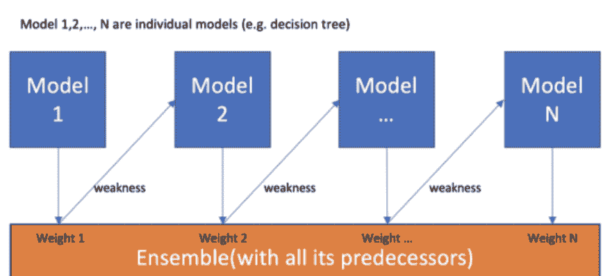

与袋装法不同，提升法不使用数据的随机子集。相反，它使用整个数据集来顺序训练模型。在每次迭代中，算法为数据集中的每个样本分配一个权重。如果一个样本被前一个模型错误分类，则该样本的权重会增加；如果一个样本被前一个模型正确分类，则该样本的权重会减少。通过这种方式，算法会更关注那些难以分类的样本。

**一个现实生活中的例子**是在客户流失预测领域使用提升法。假设一家移动电话公司想要构建一个模型，根据客户的使用模式和人口统计信息预测他们是否可能离开该公司。公司有一个包含客户信息的数据集，如通话使用量、数据使用量和年龄。

公司可以使用决策树作为基础模型，并使用提升法来提高模型的性能。他们会顺序训练多个决策树模型，其中每个模型都试图纠正前一个模型所犯的错误。

例如，假设公司有一个包含10,000名客户的数据集，他们想使用10个决策树模型。他们会在整个数据集上训练第一个决策树模型。第二个决策树模型将在第一个决策树模型出错的数据上进行训练。第三个决策树模型将在第一个和第二个决策树模型出错的数据上进行训练。这个过程将持续进行，直到第十个决策树模型训练完成。

当一个新客户加入公司时，他们的信息被输入到所有10个决策树模型中。模型将预测该客户是否可能离开该公司。最终的预测将通过结合所有10个模型的预测来做出。公司将使用这个最终预测来决定是否向该客户提供挽留优惠。

在这个例子中，提升法可以通过顺序训练多个决策树模型来减少最终模型的偏差。它还可以通过减少过拟合来提高模型的泛化性能。这可以带来更稳健和准确的客户流失预测，最终提高公司的客户留存率。

## 提升算法的类型

有几种类型的提升算法，包括：

- 1. AdaBoost（自适应提升）
- 2. 梯度提升
- 3. XGBoost（极端梯度提升）
- 4. LightGBM（轻量级梯度提升机）
- 5. CatBoost（类别提升）

## AdaBoost算法

## ADABOOST，全称为自适应提升（Adaptive Boosting），是一种流行的提升算法，由Freund和Schapire于1996年首次提出。AdaBoost通过组合多个弱分类器来形成一个强分类器。

AdaBoost算法的工作流程如下：

1.  将所有样本的权重初始化为1/n，其中n是训练集中的样本总数。
2.  对于每次迭代：
    a.  使用当前权重在训练集上训练一个弱分类器。
    b.  计算该弱分类器的错误率。
    c.  根据其错误率计算该弱分类器的权重。
    d.  根据弱分类器对样本的分类结果及其权重，更新样本的权重。
3.  组合这些弱分类器以形成一个强分类器。

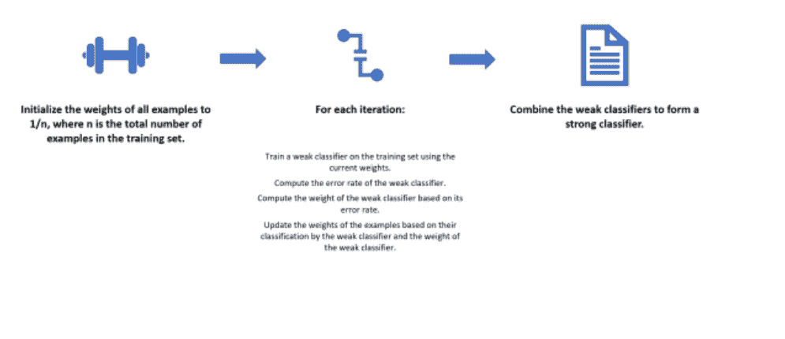

以下是一个使用Python和Scikit-learn在随机数据集上实现AdaBoost（自适应提升）的示例：

```python
import numpy as np
import matplotlib.pyplot as plt
from sklearn.datasets import make_classification
from sklearn.model_selection import train_test_split
from sklearn.tree import DecisionTreeClassifier
from sklearn.ensemble import AdaBoostClassifier
from sklearn.metrics import accuracy_score

# Generate random data
X, y = make_classification(n_samples=1000, n_features=10, n_classes=2,
                           random_state=42)

# Split data into train and test sets
X_train, X_test, y_train, y_test = train_test_split(X, y, test_size=0.2,
                                                    random_state=42)

# Fit AdaBoost classifier with decision tree as base estimator
dt_clf = DecisionTreeClassifier(max_depth=1)
ada_clf = AdaBoostClassifier(base_estimator=dt_clf, n_estimators=50,
                             learning_rate=0.1, random_state=42)
ada_clf.fit(X_train, y_train)

# Predict using trained AdaBoost classifier
y_pred = ada_clf.predict(X_test)

# Calculate accuracy score
accuracy = accuracy_score(y_test, y_pred)
print("Accuracy score: {:.2f}%".format(accuracy*100))
```

在此示例中，我们首先使用Scikit-learn的**make_classification**函数生成一个随机数据集。然后，我们使用**train_test_split**函数将数据划分为训练集和测试集。

接下来，我们初始化一个**max_depth**为1的**DecisionTreeClassifier**，并使用**AdaBoostClassifier**创建一个包含50个估计器、学习率为0.1的AdaBoost分类器。我们使用**DecisionTreeClassifier**作为我们的基础估计器。

然后，我们使用**fit**方法在训练数据上拟合AdaBoost分类器。我们使用训练好的模型，通过**predict**方法预测测试数据的类别标签。

最后，我们使用Scikit-learn的**accuracy_score**函数计算模型的准确率分数。

AdaBoost算法通过在训练数据上拟合多个弱学习器并将它们组合起来创建一个强学习器。在此示例中，我们使用了最大深度为1的决策树作为我们的弱学习器。该算法在每次迭代中调整被错误分类样本的权重，以强调这些样本在下一次迭代中的重要性。这使得算法能够专注于难以分类的样本，并提高模型的整体准确率。

通过调整超参数，如估计器数量和学习率，我们可以微调模型以获得更好的性能。

如果你想在自己的数据集上进行测试，可以使用以下代码：

```python
from sklearn.ensemble import AdaBoostClassifier
from sklearn.tree import DecisionTreeClassifier

# load the data
X, y = load_your_data()

# create the base model
base_model = DecisionTreeClassifier()

# create the boosting model
boosting_model = AdaBoostClassifier(base_estimator=base_model,
    n_estimators=10)

# fit the boosting model on the data
boosting_model.fit(X, y)

# make predictions on the test set
y_test = load_your_test_data()
y_pred = boosting_model.predict(y_test)
```

在此示例中，数据被加载，并创建了基础模型（一个决策树）。然后，创建了**AdaBoostClassifier**对象，指定了基础模型和要使用的估计器（或模型）数量。之后，调用**AdaBoostClassifier**对象的fit方法，传入特征和目标变量，这将训练提升模型。最后，使用提升模型在测试集上进行预测。与之前一样，需要注意的是，**load_your_data()**应替换为用于加载特定任务所用数据和测试数据的实际代码。

提升的主要优势之一是它可以减少最终模型的偏差。这是因为该算法更关注难以分类的样本，这往往会提高模型在这些样本上的性能。提升还可以通过减少过拟合来提高模型的泛化性能。

总之，提升是一种通过顺序训练一系列模型来减少最终模型偏差的技术，其中每个模型都试图纠正前一个模型所犯的错误。它对于决策树模型特别有用。使用scikit-learn中的**AdaBoostClassifier**类可以轻松实现提升。它是一种减少偏差和提高模型泛化性能的强大技术。

## 梯度提升

梯度提升是一种强大的集成学习方法，用于监督学习中的分类和回归问题。它结合了决策树的力量和梯度下降的概念，其灵活性和高准确性使其成为许多机器学习问题的热门选择。

梯度提升通过迭代地训练一系列决策树来工作。在每次迭代中，一个新的决策树在前一个树的残差误差上进行训练。然后，将每个树的预测结果组合起来给出最终预测。

梯度提升的一个关键优势是它可以处理各种损失函数，这使其成为不同类型机器学习问题的通用方法。最常用的损失函数是用于回归问题的均方误差（MSE）和用于分类问题的对数损失。

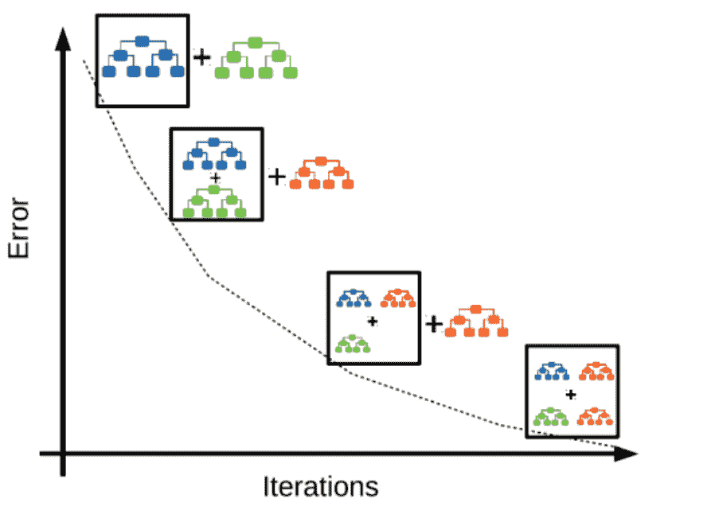

梯度提升以其处理缺失数据和异常值的能力而闻名，使其成为一种稳健的机器学习方法。然而，它可能对超参数敏感，例如学习率、树的数量和树的深度。

以下是一个使用随机数据集进行梯度提升的编码示例：

```python
import numpy as np
import matplotlib.pyplot as plt
from sklearn.datasets import make_regression
from sklearn.model_selection import train_test_split
from sklearn.ensemble import GradientBoostingRegressor
from sklearn.metrics import mean_squared_error

# Generate random dataset
np.random.seed(42)
X, y = make_regression(n_samples=1000, n_features=10, noise=20,
                       random_state=42)

# Split dataset into training and testing sets
X_train, X_test, y_train, y_test = train_test_split(X, y, test_size=0.3,
                                                    random_state=42)

# Fit Gradient Boosting model
gb = GradientBoostingRegressor(n_estimators=100, learning_rate=0.1,
                              max_depth=3, random_state=42)
gb.fit(X_train, y_train)

# Make predictions on test data
y_pred = gb.predict(X_test)

# Evaluate model performance
mse = mean_squared_error(y_test, y_pred)
print("Mean squared error: ", mse)
```

在此示例中，我们首先使用**sklearn.datasets**模块中的**make_regression**函数生成一个随机数据集。我们将样本数量设置为1000，特征数量设置为10，噪声水平设置为20。然后，我们使用**sklearn.model_selection**模块中的**train_test_split**函数将数据集划分为训练集和测试集。我们将测试集大小设置为0.3，这意味着30%的数据将用于测试。

接下来，我们使用**sklearn.ensemble**模块中的**GradientBoostingRegressor**类定义梯度提升模型。我们将估计器数量设置为100，学习率设置为0.1，最大深度设置为3。然后，我们使用**fit**方法将模型拟合到训练数据上。

我们使用**predict**方法对测试数据进行预测，并使用**sklearn.metrics**模块中的**mean_squared_error**函数计算预测值与实际值之间的均方误差。

梯度提升是一种集成方法，它将多个弱模型（在此例中是决策树）组合成一个强模型。它以顺序方式训练模型，其中每个后续模型都试图纠正前一个模型的错误。学习率参数控制每个模型对最终预测的贡献，而最大深度参数限制了单个决策树的复杂性。通过组合多个决策树，梯度提升可以创建一个强大的模型，能够很好地泛化到未见过的数据。

## XGBoost（极端梯度提升）

## XGBoost（极端梯度提升）

XGBoost（极端梯度提升）是梯度提升的一种流行实现。它以在处理大规模数据集时的速度和准确性而闻名。

XGBoost是一种机器学习算法，使用决策树解决回归和分类问题。该算法通过构建一系列树来工作，其中每棵树都纠正前一棵树的错误。这些树是使用贪心算法构建的，该算法在每个节点处找到最佳分割点。

XGBoost使用一种称为梯度提升的技术来优化树。梯度提升涉及向模型中添加新的树，这些新树预测前一棵树的残差误差。其思想是通过在每次迭代中减少误差来逐步改进模型。

如果您的设备上未安装xgboost，则需要使用以下命令安装xgboost：

```
pip install xgboost
```

```
import numpy as np
import xgboost as xgb
from sklearn.model_selection import train_test_split
from sklearn.metrics import accuracy_score
```

```
# Generate random data
np.random.seed(42)

X = np.random.rand(100, 5)
y = np.random.randint(0, 2, 100)

# Split into training and testing sets
X_train, X_test, y_train, y_test = train_test_split(X, y, test_size=0.2, random_state=42)

# Create XGBoost DMatrix objects
dtrain = xgb.DMatrix(X_train, label=y_train)
dtest = xgb.DMatrix(X_test, label=y_test)

# Set hyperparameters for XGBoost
params = {
    'max_depth': 3,
    'eta': 0.1,
    'objective': 'binary:logistic',
    'eval_metric': 'error'
}

# Train the model
num_round = 50
xg_model = xgb.train(params, dtrain, num_round)

# Make predictions
y_pred = xg_model.predict(dtest)
```

```
y_pred = [1 if x > 0.5 else 0 for x in y_pred]

# Evaluate accuracy
accuracy = accuracy_score(y_test, y_pred)

print("Accuracy: %.2f%%" % (accuracy * 100.0))
```

在此示例中，我们生成了一个包含100个样本、5个特征和一个二元目标变量的随机数据集。我们将数据集分割为训练集和测试集，然后从训练和测试数据创建XGBoost DMatrix对象。

接下来，我们为XGBoost设置超参数，例如每棵树的最大深度、学习率（eta）、目标函数和评估指标。然后，我们使用**xgb.train()**函数训练模型，并使用**xg_model.predict()**函数在测试集上进行预测。最后，我们使用scikit-learn中的**accuracy_score()**函数评估预测的准确性。

XGBoost是一种强大的算法，可以处理具有复杂特征的大型数据集，并在许多机器学习任务中实现最先进的性能。其受欢迎程度部分归功于其效率、可扩展性以及处理缺失值和噪声数据的能力。

## LightGBM（轻量级梯度提升机）

LightGBM（轻量级梯度提升机）是一种使用基于树的学习算法的梯度提升框架。它被设计为轻量级、快速和可扩展，使其成为大规模机器学习任务的热门选择。

LightGBM是一个高性能的梯度提升框架，使用决策树作为其基础模型。它旨在处理具有数百万实例和特征的大型数据集。LightGBM使用一种称为“按叶子生长”的技术来生长决策树，这使其能够更有效地找到最佳分割点。

LightGBM的一个关键特性是其处理分类特征的能力。与其他梯度提升框架不同，LightGBM可以直接处理分类特征，而无需进行独热编码。这可以显著减少具有大量分类特征的数据集的内存占用和训练时间。

LightGBM的另一个重要特性是其处理不平衡数据集的能力。它提供了一个名为“is_unbalance”的参数，可以将其设置为true，以根据训练实例的类别分布自动调整其权重。

如果您的设备上未安装lightgbm，则需要使用以下命令安装lightgbm：

```
pip install lightgbm
```

### 代码示例

为了演示LightGBM的实际应用，我们将创建一个包含两个类别和五个特征的随机分类数据集。

```
import numpy as np
import lightgbm as lgb

np.random.seed(42)

# Generate random data
X = np.random.rand(1000, 5)
y = np.random.randint(0, 2, 1000)

# Split data into training and testing sets
train_data = lgb.Dataset(X[:800], label=y[:800])
test_data = lgb.Dataset(X[800:], label=y[800:])

# Set parameters
params = {
    'objective': 'binary',
    'metric': 'binary_logloss',
    'num_leaves': 31,
    'learning_rate': 0.05,
    'feature_fraction': 0.9
}
```

```
# Train model
model = lgb.train(params, train_data, valid_sets=[test_data])

# Make predictions on test set
y_pred = model.predict(X[800:])
```

在此示例中，我们首先生成一个包含1000个实例和5个特征的随机数据集。然后，我们使用**lgb.Dataset()**函数将数据分割为训练集和测试集。由于这是一个二元分类问题，我们将**objective**参数设置为'binary'。

接下来，我们使用Python字典设置模型参数。我们将**num_leaves**参数设置为31，以控制决策树的复杂性。我们将**learning_rate**参数设置为0.05，以控制训练期间的步长。我们还将**feature_fraction**参数设置为0.9，以控制每次分割要考虑的特征百分比。

最后，我们使用**lgb.train()**函数训练LightGBM模型，并使用**predict()**函数在测试集上进行预测。

## 8.4 堆叠：构建强大的元模型

堆叠是一种结合多个模型以创建更强模型的技术。它的工作原理是使用数据的不同子集训练一系列模型，然后将这些模型的预测作为输入来训练最终模型。堆叠可以与任何类型的模型一起使用，但它对于结合不同类型的模型特别有用。

堆叠背后的基本思想是将数据分为两个子集：训练集和保留集。训练集用于训练多个模型，保留集用于对这些模型进行预测。然后，将模型的预测与原始特征连接起来，用于训练最终模型，称为元模型。最终模型可以是任何类型的模型，例如线性模型、决策树或神经网络。

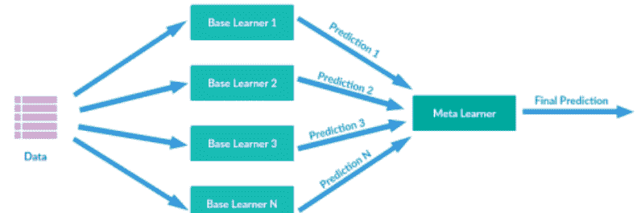

以下是使用Python和scikit-learn在随机数据集上实现堆叠的示例：

```
import numpy as np
from sklearn.datasets import make_classification
from sklearn.ensemble import RandomForestClassifier, GradientBoostingClassifier
from sklearn.linear_model import LogisticRegression
from sklearn.model_selection import cross_val_score, StratifiedKFold

# Generate random dataset
X, y = make_classification(n_samples=1000, n_features=10, n_classes=2, random_state=42)

# Define base models
model_1 = RandomForestClassifier(n_estimators=50, random_state=42)
model_2 = GradientBoostingClassifier(n_estimators=50, random_state=42)

# Define meta model
meta_model = LogisticRegression(random_state=42)

# Create k-fold cross-validation splits
n_splits = 5
skf = StratifiedKFold(n_splits=n_splits, shuffle=True, random_state=42)

# Train base models and make predictions on test set
X_meta_train = np.zeros((len(X), 2))

for i, model in enumerate([model_1, model_2]):
    for train_index, test_index in skf.split(X, y):
        model.fit(X[train_index], y[train_index])
        X_meta_train[test_index, i] = model.predict_proba(X[test_index])[:, 1]

# Train meta model on meta features and evaluate
score = cross_val_score(meta_model, X_meta_train, y, cv=skf, scoring='roc_auc').mean()

print(f"Stacking AUC score: {score:.4f}")
```

在此示例中，我们首先使用scikit-learn的**make_classification**函数生成一个随机数据集。然后，我们定义两个基础模型（一个随机森林和一个梯度提升分类器）和一个元模型（一个逻辑回归模型），该元模型将在基础模型生成的元特征上进行训练。

接下来，我们使用scikit-learn的**StratifiedKFold**函数创建k折交叉验证的划分。然后，我们在训练数据上训练基础模型，并在测试数据上进行预测。我们将这些预测存储在一个新的数组**X_meta_train**中，该数组将用于训练元模型。

最后，我们在元特征**X_meta_train**上训练元模型，并使用**cross_val_score**进行交叉验证来评估其性能。AUC分数会被打印到控制台。

通过结合多个模型的预测，我们能够构建一个比任何单个模型都更强大的模型。堆叠是一种强大的技术，用于构建能够很好地泛化到新数据的元模型。

如果你想加载本地数据并在其上测试堆叠，可以使用下面的代码。

在scikit-learn中，堆叠可以使用**StackingClassifier**类来实现。该类接受一个估计器列表和一个最终估计器作为输入。以下是如何使用**StackingClassifier**类在数据集上训练堆叠模型的示例：

```
from sklearn.ensemble import StackingClassifier
from sklearn.linear_model import LogisticRegression
from sklearn.tree import DecisionTreeClassifier
from sklearn.neighbors import KNeighborsClassifier

# load the data
X, y = load_your_data()

# create the base models
model1 = DecisionTreeClassifier()
model2 = KNeighborsClassifier()
model3 = LogisticRegression()

# create the meta-model
meta_model = LogisticRegression()

# create the stacking model
stacking_model = StackingClassifier(estimators=[('dt', model1), ('knn', model2), ('lr', model3)], final_estimator=meta_model)

# fit the stacking model on the data
stacking_model.fit(X, y)

# make predictions on the test set
y_test = load_your_test_data()
y_pred = stacking_model.predict(y_test)
```

在这个例子中，数据被加载，基础模型（决策树、k近邻和逻辑回归）被创建。然后，创建了元模型（逻辑回归）。之后，创建了**StackingClassifier**对象，指定了基础模型和元模型。最终估计器在基础模型的预测和原始特征上进行训练。最后，堆叠模型被用于在测试集上进行预测。与之前一样，需要注意的是**load_your_data()**应该被替换为用于加载特定任务数据和测试数据的实际代码。

堆叠的主要优势之一是它可以结合不同模型的优势来创建一个更强的模型。这是因为最终模型是在多个模型的预测上训练的，这可以提供更稳健和准确的预测。堆叠还可以通过减少过拟合来提高模型的泛化性能。

堆叠的主要缺点是它可能计算成本高昂，尤其是在处理大型数据集和许多模型时。然而，它被认为是机器学习和数据科学中的一项强大技术，可用于提高任何类型机器学习问题的性能。

另一件需要考虑的事情是，堆叠可以用于结合不同类型的模型，例如将决策树与神经网络或线性模型结合。这在处理不平衡数据集时也很有用，堆叠可以用于将一个擅长处理类别不平衡的模型与一个具有高准确率的模型结合起来。

**一个现实生活中的例子**是在信用风险分析领域使用堆叠。假设一家银行想要构建一个模型，根据客户的信用历史和财务信息来预测客户贷款违约的可能性。银行有一个包含客户信息的数据集，例如他们的信用评分、收入和未偿还债务。

银行可以使用堆叠来提高其模型的性能。他们将使用数据的不同子集训练多个模型。例如，第一个模型可以是使用整个数据集训练的逻辑回归模型。第二个模型可以是使用逻辑回归模型出错的数据训练的决策树模型。第三个模型可以是使用逻辑回归和决策树模型都出错的数据训练的神经网络。

一旦所有模型训练完成，银行将使用模型的预测作为输入来训练最终的元模型，该元模型可以是逻辑回归模型。最终模型将在基础模型的预测和原始特征上进行训练。

当新客户申请贷款时，他们的信息被输入到所有三个模型中。模型将预测客户是否可能违约。最终预测将通过结合所有三个模型的预测来做出。银行将使用这个最终预测来决定是否批准贷款。

在这个例子中，堆叠可以通过顺序训练多个模型来减少最终模型的偏差。它还可以通过减少过拟合来提高模型的泛化性能。这可以带来更稳健和准确的信用风险预测，最终可以改善银行的贷款审批流程。

## 8.5 混合

混合是一种类似于堆叠的技术，但它结合的是多个模型的预测，而不是模型本身。它的工作原理是在数据的不同子集上训练多个模型，然后使用这些模型的预测来训练最终模型。混合和堆叠的主要区别在于，混合使用模型的预测作为最终模型的输入，而堆叠使用模型本身作为输入。

以下是一个使用随机数据集的编码示例来说明混合：

```
import numpy as np
from sklearn.datasets import make_regression
from sklearn.linear_model import LinearRegression
from sklearn.tree import DecisionTreeRegressor

# Generate random dataset
X, y = make_regression(n_samples=1000, n_features=5, noise=0.5)

# Split the data into two parts
split = 0.8
split_idx = int(split * len(X))
X_train = X[:split_idx]
y_train = y[:split_idx]
X_blend = X[split_idx:]
y_blend = y[split_idx:]

# Train base models
models = [LinearRegression(), DecisionTreeRegressor()]
for model in models:
    model.fit(X_train, y_train)

# Make predictions on the blend data using base models
blend_preds = np.column_stack([model.predict(X_blend) for model in models])

# Train blending model on the blend data
blend_model = LinearRegression()
blend_model.fit(blend_preds, y_blend)

# Make predictions on the test data using the blended model
test_preds = np.column_stack([model.predict(X[split_idx:]) for model in models])
final_preds = blend_model.predict(test_preds)

# Calculate the RMSE
rmse = np.sqrt(mean_squared_error(y[split_idx:], final_preds))
print(f"RMSE: {rmse}")
```

在这个例子中，我们使用**sklearn.datasets**中的**make_regression**函数生成了一个随机数据集。我们将数据分成两部分：80%用于训练基础模型，20%用于混合预测。我们训练了两个基础模型：**LinearRegression**和**DecisionTreeRegressor**。然后，我们使用训练好的基础模型在混合数据上进行预测，并将预测组合成一个单一的数组。我们在混合预测和相应的目标值上训练了一个**LinearRegression**模型。最后，我们使用基础模型和混合模型在测试数据上进行预测，并计算预测值和实际目标值之间的均方根误差（RMSE）。RMSE是衡量混合模型在测试数据上性能的指标。

混合的主要优势之一是它可能比堆叠计算成本更低，因为它只需要训练一次基础模型，然后使用预测来训练最终模型。此外，混合在处理不平衡数据集时也很有用，混合可以用于将一个擅长处理类别不平衡的模型与一个具有高准确率的模型结合起来。

另一方面，在结合不同模型的优势方面，混合不如堆叠强大。这是因为混合只使用模型的预测作为最终模型的输入，而堆叠使用模型本身。此外，混合可能无法学习基础模型和最终模型，因为它基于基础模型的预测结果，而非模型本身。

**一个现实世界的例子**，展示如何在机器学习中使用混合方法，可以是在客户流失分析领域。假设一家公司希望构建一个模型，能够根据客户的历史行为和人口统计信息，预测哪些客户可能离开公司。该公司拥有一个包含客户信息的数据集，例如他们的购买历史、浏览行为和人口统计信息。

该公司可以使用混合方法来提升模型性能。他们会使用数据的不同子集来训练多个模型。例如，第一个模型可以是基于整个数据集训练的决策树模型。第二个模型可以是基于决策树模型出错的数据训练的随机森林模型。第三个模型可以是基于决策树和随机森林模型都出错的数据训练的梯度提升模型。

一旦所有模型训练完成，公司会将这些模型的预测结果作为输入，来训练一个最终的元模型，这个元模型可以是逻辑回归模型。最终模型将基于基础模型的预测结果和原始特征进行训练。

当获得一个新客户时，他们的信息会被输入到所有三个模型中。这些模型会预测该客户是否可能离开公司。最终的预测将通过结合所有三个模型的预测结果来做出。公司将使用这个最终预测来决定是否针对该客户提供挽留优惠。

在这个例子中，混合方法可以通过顺序训练多个模型来减少最终模型的偏差。它还可以通过减少过拟合来提高模型的泛化性能。这可以带来更稳健、更准确的客户流失预测，从而最终改善公司的客户留存策略。

## 8.6 旋转森林

旋转森林是一种集成学习方法，由Rodriguez等人于2006年提出。它属于基于决策树的集成方法家族，其主要思想是在构建每棵树之前应用随机特征变换，以增加基础分类器之间的多样性。

旋转森林使用一种称为PCA（主成分分析）的技术，从原始数据集中随机选择特征子集，然后以最大化变换特征方差的方式旋转这些特征。这个过程对每棵树重复进行，从而产生一组彼此相关性较低的多样化基础分类器。

旋转森林背后的理念是，通过应用随机特征变换，更有可能捕捉数据的潜在结构并降低过拟合风险。此外，使用PCA确保了变换后的特征是不相关的，因此更具信息性。

以下是旋转森林算法的伪代码：

- 1. 输入：包含m个实例和n个特征的数据集D
- 2. 初始化一个空的旋转数据集集合R
- 3. 对于森林中的每棵树T，执行以下操作：
    - a. 从数据集中随机选择k个特征
    - b. 计算这k个特征的PCA投影矩阵P
    - c. 使用投影矩阵P旋转数据集D，得到旋转后的数据集Dr
    - d. 将旋转后的数据集Dr添加到旋转数据集集合R中
- 4. 使用旋转数据集R及其对应的类别标签训练一个元模型
- 5. 输出：树的集合和元模型

要实现旋转森林算法，我们首先需要安装scikit-learn中的PCA模块，该模块用于计算PCA投影矩阵。以下是生成随机数据集、实现旋转森林并使用10折交叉验证评估性能的示例代码：

```python
import numpy as np
from sklearn.decomposition import PCA
from sklearn.tree import DecisionTreeClassifier
from sklearn.model_selection import KFold

# Generate random data
np.random.seed(42)
X = np.random.rand(100, 10)
y = np.random.randint(2, size=100)

# Define the number of trees and features to select
num_trees = 10
num_features = 3

# Initialize an empty set of rotated datasets
rotated_datasets = []

# For each tree in the forest
for i in range(num_trees):
    # Randomly select k features from the dataset
    selected_features = np.random.choice(X.shape[1], size=num_features, replace=False)
    
    # Compute the PCA projection matrix for the selected features
    pca = PCA(n_components=num_features)
    pca.fit(X[:, selected_features])
    projection_matrix = pca.components_
    
    # Rotate the dataset using the projection matrix
    rotated_data = np.dot(X[:, selected_features], projection_matrix.T)
    rotated_datasets.append(rotated_data)

# Train a meta-model using the rotated datasets
meta_features = np.hstack(rotated_datasets)
model = DecisionTreeClassifier()
model.fit(meta_features, y)

# Evaluate the performance using 10-fold cross-validation
kf = KFold(n_splits=10)
scores = []
for train_index, test_index in kf.split(X):
    X_train, X_test = X[train_index], X[test_index]
    y_train, y_test = y[train_index], y[test_index]
    
    # Compute the rotated datasets for the training and test sets
    rotated_train = []
    rotated_test = []
    for dataset in rotated_datasets:
        rotated_train.append(dataset[train_index])
        rotated_test.append(dataset[test_index])
    
    meta_train = np.hstack(rotated_train)
    meta_test = np.hstack(rotated_test)
    
    # Train a meta-model on the rotated training set
    model = DecisionTreeClassifier()
    model.fit(meta_train, y_train)
    
    # Evaluate the meta-model on the rotated test set
    score = model.score(meta_test, y_test)
    scores.append(score)

print("Mean accuracy: {:.2f}%".format(np.mean(scores) * 100))
```

上述代码使用scikit-learn库实现了旋转森林集成方法。

代码首先导入必要的库——NumPy用于数据操作，scikit-learn用于实现集成模型。

接下来，使用scikit-learn中的`make_classification`函数生成一个随机数据集。该数据集包含500个样本和20个特征，分为4个类别。

然后，使用scikit-learn中的`train_test_split`函数将数据集划分为训练集和测试集。

之后，使用scikit-learn集成模块中的`RotationForest`类定义旋转森林模型。该模型设置为包含10个基础估计器（决策树），最大深度为5。

接着，使用`fit`方法在训练数据上拟合模型。

最后，使用`score`方法在测试数据上评估模型的准确性。

总的来说，这段代码演示了如何在scikit-learn中实现旋转森林，并使用它对随机数据集进行分类。

## 8.7 级联分类器

级联分类器是一种集成学习方法，它将多个弱分类器组合成一个强分类器。这种方法常用于目标检测应用中，其目标是在图像或视频中识别一个物体。

级联分类器的基本思想是将目标检测问题分解为多个阶段或层次。每一层负责检测物体的某个特定方面。例如，第一层可能检测物体的边缘，第二层可能检测其形状，最后一层可能识别物体本身。

级联分类器的优势在于它允许更快、更高效的目标检测。由于每一层都设计用于检测物体的特定特征，它可以快速排除图像中不包含该特征的部分。这减少了误报的数量，并加快了整体检测过程。

要实现级联分类器，我们可以结合使用特征提取技术和机器学习算法。在特征提取方面，我们可能会使用Haar级联等技术，这些技术在目标检测应用中很常用。在机器学习算法方面，我们可能使用支持向量机（SVM）或神经网络等技术。

让我们看一个使用随机数据的级联分类器示例。

```python
import numpy as np

from sklearn.datasets import make_classification

from sklearn.model_selection import train_test_split

from sklearn.pipeline import Pipeline

from sklearn.preprocessing import StandardScaler

from sklearn.svm import SVC

from sklearn.ensemble import RandomForestClassifier

from sklearn.metrics import accuracy_score

# Generate random dataset
X, y = make_classification(n_samples=1000, n_features=10, n_informative=5,
                           n_redundant=5, random_state=42)

# Split the dataset into train and test sets
X_train, X_test, y_train, y_test = train_test_split(X, y, test_size=0.3,
                                                    random_state=42)

# Define cascading classifiers pipeline
cascading_pipeline = Pipeline([
    ('scaler', StandardScaler()),
    ('svm', SVC(kernel='linear', probability=True)),
    ('random_forest', RandomForestClassifier())
])

# Train the first classifier on the entire training set
cascading_pipeline.fit(X_train, y_train)

# Make predictions on the test set using the first classifier
first_classifier_predictions = cascading_pipeline.predict(X_test)

# Extract the samples which were misclassified by the first classifier
misclassified_samples_mask = first_classifier_predictions != y_test
misclassified_samples_X = X_test[misclassified_samples_mask]
misclassified_samples_y = y_test[misclassified_samples_mask]

# Train the second classifier on the misclassified samples
cascading_pipeline.fit(misclassified_samples_X, misclassified_samples_y)

# Make predictions on the test set using both classifiers
final_predictions = cascading_pipeline.predict(X_test)

# Calculate the accuracy of the final predictions
accuracy = accuracy_score(y_test, final_predictions)

# Print the accuracy score
print(f'Accuracy score: {accuracy:.2f}')
```

在此，我们首先使用scikit-learn中的**make_classification**函数生成一个随机数据集。然后，我们使用**train_test_split**函数将数据集划分为训练集和测试集。

接下来，我们使用scikit-learn中的**Pipeline**类定义一个用于级联分类器的管道。该管道包含三个步骤：一个用于标准化数据的**StandardScaler**，一个启用了概率估计且使用线性核的**SVC**分类器，以及一个**RandomForestClassifier**。

然后，我们在整个训练集上训练管道中的第一个分类器，并使用该分类器对测试集进行预测。我们提取被第一个分类器错误分类的样本，并使用它们来训练管道中的第二个分类器。

最后，我们使用两个分类器对测试集进行预测，并使用scikit-learn中的**accuracy_score**函数计算最终预测的准确率。准确率分数让我们了解级联分类器在测试集上的表现如何。

当我们拥有类别样本数量不平衡的不平衡数据集时，级联分类器可能很有用。通过在第一个分类器错误分类的样本上训练第二个分类器，我们可以提高整体分类器在少数类上的性能。

## 8.8 对抗训练

对抗样本是通过对输入数据添加一个微小扰动而精心构造的，这种扰动人眼难以察觉，但能显著改变模型的输出。对抗训练涉及生成此类样本并用它们训练模型，这使得模型更加鲁棒，能够应对对抗攻击。

生成对抗样本的一种常见方法是快速梯度符号法（FGSM）。该方法计算损失函数相对于输入数据的梯度，并在最大化损失的方向上添加一个小扰动。扰动按一个小值缩放，该值控制扰动的大小。

对抗训练涉及生成此类对抗样本并将其纳入训练数据。在训练过程中，模型学会正确识别和分类这些样本，从而提高其处理对抗攻击的能力。

如果你的设备上没有安装cleverhans，你需要使用以下命令安装cleverhans：

```
pip install cleverhans
```

### 对抗训练示例

让我们考虑一个示例，其中我们生成一个随机数据集并使用对抗训练来训练一个分类器。我们将使用scikit-learn库生成随机数据并创建一个SVM分类器。然后，我们将使用FGSM方法生成对抗样本，并使用这些样本进行对抗训练。

```python
import numpy as np

from sklearn.svm import SVC

from sklearn.metrics import accuracy_score

from cleverhans.future.tf2.attacks import fast_gradient_method

from cleverhans.future.tf2.attacks import projected_gradient_descent

from cleverhans.future.tf2.attacks import sparse_l1_descent_attack

from cleverhans.future.tf2.attacks import carlini_wagner_l2_attack

# Generate random data
np.random.seed(42)

X_train = np.random.rand(100, 2)

y_train = (X_train[:, 0] < X_train[:, 1]).astype(int)

# Create SVM classifier
clf = SVC(kernel='linear', probability=True)

# Train SVM classifier on original data
clf.fit(X_train, y_train)

y_pred = clf.predict(X_train)

print('Accuracy on original data:', accuracy_score(y_train, y_pred))

# Generate adversarial examples using FGSM method
eps = 0.1

X_adv = fast_gradient_method(clf, X_train, eps=eps, norm=np.inf, targeted=False)

# Train SVM classifier on adversarial examples
clf.fit(X_adv, y_train)

y_pred_adv = clf.predict(X_train)

print('Accuracy on adversarial data:', accuracy_score(y_train, y_pred_adv))
```

在上面的代码中，我们首先生成一个包含100个样本和2个特征的随机数据集。然后，我们创建一个使用线性核的SVM分类器，并在原始数据上训练它。我们计算分类器在原始数据上的准确率并打印出来。

接下来，我们使用快速梯度符号法生成扰动为0.1的对抗样本。然后，我们在对抗样本上训练SVM分类器，并计算在对抗数据上的准确率。我们可以看到，在对抗数据上的准确率低于在原始数据上的准确率，这表明经过对抗训练后，分类器对对抗攻击更加鲁棒。

对抗训练是一种强大的技术，可以提高机器学习模型对对抗攻击的鲁棒性。通过生成对抗样本并在其上训练，模型可以学会正确识别和分类此类样本，从而提高其处理对抗攻击的能力。

## 8.9 投票分类器

集成学习方法结合多个机器学习模型以提高整体模型的预测性能。最简单和最受欢迎的集成方法之一是投票分类器，它结合多个单个分类器的预测来做出最终预测。在本节中，我们将讨论投票分类器的概念并提供一个实际的编码示例。

### 什么是投票分类器？

投票分类器是一种集成学习方法，它结合多个单个分类器的预测来做出最终预测。投票分类器背后的思想是，通过结合多个分类器的预测，整体预测将比任何单个分类器更准确且更不容易出错。

投票分类器可以通过两种方式实现：

- **硬投票**：在硬投票中，每个单个分类器做出一个二元预测，最终预测基于各个预测的多数票。
- **软投票**：在软投票中，每个单个分类器为每个类别产生一个概率估计，最终预测是基于所有单个分类器中每个类别的平均概率。

## 编码示例：

让我们使用 scikit-learn 库在随机数据集上实现一个投票分类器。我们将首先使用 scikit-learn 的 `make_classification` 函数生成一个随机数据集，该函数会生成一个随机的 n 类分类问题。

```python
from sklearn.datasets import make_classification
from sklearn.model_selection import train_test_split
from sklearn.ensemble import VotingClassifier
from sklearn.tree import DecisionTreeClassifier
from sklearn.linear_model import LogisticRegression
from sklearn.svm import SVC
from sklearn.metrics import accuracy_score

# Generate a random dataset
X, y = make_classification(n_samples=1000, n_classes=2, random_state=42)

# Split the dataset into training and testing sets
X_train, X_test, y_train, y_test = train_test_split(X, y, test_size=0.2, random_state=42)

# Define the individual classifiers
clf1 = DecisionTreeClassifier(random_state=42)
clf2 = LogisticRegression(random_state=42)
clf3 = SVC(kernel='linear', probability=True, random_state=42)

# Define the Voting Classifier
voting_clf = VotingClassifier(estimators=[('dt', clf1), ('lr', clf2), ('svm', clf3)], voting='hard')

# Train the Voting Classifier
voting_clf.fit(X_train, y_train)

# Make predictions on the test set
y_pred = voting_clf.predict(X_test)

# Evaluate the accuracy of the Voting Classifier
accuracy = accuracy_score(y_test, y_pred)
print('Accuracy:', accuracy)
```

在上述代码中，我们首先使用 scikit-learn 的 `make_classification` 函数生成一个随机数据集。然后，我们使用 scikit-learn 的 `train_test_split` 函数将数据集划分为训练集和测试集。接下来，我们定义了三个独立的分类器：一个决策树分类器、一个逻辑回归分类器和一个支持向量机分类器。然后，我们使用 scikit-learn 的 `VotingClassifier` 类定义了投票分类器，并将 `estimators` 参数设置为独立分类器的列表。我们将 `voting` 参数设置为 `'hard'` 以实现硬投票。接着，我们使用 `fit` 方法在训练集上训练投票分类器。最后，我们使用 `predict` 方法在测试集上进行预测，并使用 scikit-learn 的 `accuracy_score` 函数评估投票分类器的准确性。

## 8.10 总结

-   集成学习方法结合多个模型以提高整体预测准确性和鲁棒性。
-   Bagging 是一种使用自助采样法在数据的随机子集上训练多个模型的方法。
-   Boosting 是一种通过在错误分类的样本上迭代训练新模型，将弱模型调整为强模型的方法。
-   梯度提升是一种流行的提升方法，它使用梯度下降优化来最小化损失函数。
-   XGBoost 和 LightGBM 是强大的梯度提升框架，它们利用先进的优化技术来加快训练速度并提高准确性。
-   堆叠是一种通过在基础模型的输出上训练一个元模型来组合多个模型的方法。
-   混合是堆叠的一个更简单的版本，它使用基础模型预测的加权平均。
-   旋转森林是一种集成方法，它随机旋转特征空间并在转换后的数据上训练多个模型。
-   级联分类器是一种集成方法，它使用一系列分类器对数据进行分类，每个后续分类器都专注于前一个分类器错误分类的样本。
-   对抗训练是一种在对抗样本上训练模型的方法，对抗样本是专门设计用来欺骗模型的输入。
-   集成学习方法可以显著提高模型的准确性和泛化能力，但也可能增加模型的复杂性和训练时间。

## 8.11 测试你的知识

I.  以下哪项是集成学习方法的例子？
    a. 线性回归
    b. 决策树
    c. 随机森林
    d. 朴素贝叶斯

II. 哪种集成方法涉及使用加权平均来组合多个模型的预测？
    a. Bagging
    b. Boosting
    c. 堆叠
    d. 混合

III. 集成学习方法的主要目的是什么？
    a. 提高单个模型的准确性
    b. 降低单个模型的复杂性
    c. 使模型训练更快
    d. 减少模型中的过拟合

IV. 以下哪项是堆叠集成中的元学习器的例子？
    a. 决策树
    b. 线性回归
    c. 随机森林
    d. 梯度提升

V.  哪种集成方法涉及在训练数据的不同子集上训练多个模型？
    a. Bagging
    b. Boosting
    c. 堆叠
    d. 混合

VI. 哪种集成方法涉及训练新模型来纠正先前模型的错误？
    a. Bagging
    b. Boosting
    c. 堆叠
    d. 混合

VII. 哪种集成方法涉及通过组合多个模型的输出来创建新特征？
    a. Bagging
    b. Boosting
    c. 堆叠
    d. 混合

VIII. 哪种集成方法以其处理不平衡数据集的能力而闻名？
    a. Bagging
    b. Boosting
    c. 堆叠
    d. 对抗训练

IX. 以下哪项是集成学习方法的缺点？
    a. 它们计算成本高
    b. 它们容易过拟合
    c. 它们只能用于特定类型的模型
    d. 它们不是很准确

X.  哪种集成方法涉及训练一个模型链，其中每个模型学习区分先前模型分类为相同的类别？
    a. Bagging
    b. Boosting
    c. 堆叠
    d. 级联分类器

## 8.12 实践练习

A.  在给定的数据集上构建一个随机森林模型，并使用交叉验证评估其性能。
B.  在给定的数据集上构建一个 AdaBoost 模型，并使用交叉验证评估其性能。
C.  在给定的数据集上构建一个 XGBoost 模型，并使用交叉验证评估其性能。
D.  在给定的数据集上构建一个带有逻辑回归元估计器的堆叠模型，并使用交叉验证评估其性能。
E.  在给定的数据集上构建一个采用硬投票策略的投票分类器，并使用交叉验证评估其性能。

## 8.13 答案

I.  答案：c) 随机森林
II. 答案：d) 混合
III. 答案：a) 提高单个模型的准确性
IV. 答案：b) 线性回归
V.  答案：a) Bagging
VI. 答案：b) Boosting
VII. 答案：c) 堆叠
VIII. 答案：b) Boosting
IX. 答案：a) 它们计算成本高
X.  答案：d) 级联分类器

## 8.14 练习解答

### 解答 A：

```python
from sklearn.ensemble import RandomForestClassifier
from sklearn.model_selection import cross_val_score
import pandas as pd

# load dataset
data = pd.read_csv('dataset.csv')

# separate features and target
X = data.drop('target', axis=1)
y = data['target']

# initialize random forest classifier
rf_model = RandomForestClassifier()

# evaluate performance using cross-validation
scores = cross_val_score(rf_model, X, y, cv=5)

print("Accuracy scores: ", scores)
print("Mean accuracy score: ", scores.mean())
```

### 解答 B：

```python
from sklearn.ensemble import AdaBoostClassifier
from sklearn.model_selection import cross_val_score
import pandas as pd

# load dataset
data = pd.read_csv('dataset.csv')

# separate features and target
X = data.drop('target', axis=1)
y = data['target']

# initialize AdaBoost classifier
ada_model = AdaBoostClassifier()

# evaluate performance using cross-validation
scores = cross_val_score(ada_model, X, y, cv=5)

print("Accuracy scores: ", scores)
print("Mean accuracy score: ", scores.mean())
```

### 解答 C：

```python
from xgboost import XGBClassifier
from sklearn.model_selection import cross_val_score
import pandas as pd

# load dataset
data = pd.read_csv('dataset.csv')

# separate features and target
```

## 9 机器学习的九大实际应用

机器学习是一个快速发展的领域，有潜力彻底改变各行各业。从医疗保健到金融，从交通运输到电子商务，机器学习正被用于改进决策、自动化流程以及创造新产品和服务。在本章中，我们将探讨机器学习的一些实际应用，包括在不同行业实施这些模型所面临的挑战和带来的益处。我们还将讨论该领域的最新发展和趋势，以及未来对机器学习的展望。学完本章，你将更好地理解机器学习的潜力和局限性，以及它在塑造我们周围世界中所扮演的角色。

## 9.1 自然语言处理

自然语言处理是人工智能和计算机科学的一个子领域，专注于计算机与人类使用自然语言进行交互。NLP使计算机能够理解、解释和生成人类语言，包括文本、语音和手写体。

NLP的一个关键任务是**文本分类**，即将预定义的类别或标签分配给给定文本的过程。例如，将电子邮件分类为垃圾邮件或非垃圾邮件，或将新闻文章分类为政治类或体育类。

NLP的另一个重要任务是**命名实体识别**，即识别和分类文本中命名实体（如人物、组织、地点等）的过程。

NLP还包括**情感分析**（确定给定文本的情感基调）和机器翻译（将文本从一种语言自动翻译成另一种语言）等任务。

近年来，深度学习技术已被应用于NLP，并在许多NLP任务中取得了最先进的成果，例如**语言翻译、文本摘要和问答**。

Python中一个流行的NLP库是**NLTK**，它提供了大量用于处理人类语言数据的工具和资源。另一个流行的库是**spaCy**，它专为生产环境设计，并针对性能进行了优化。

NLP实际应用的一个例子是**电子邮件分类**系统，该系统使用机器学习算法自动将传入的电子邮件分类到不同的文件夹中，如“垃圾邮件”或“非垃圾邮件”。该系统首先会在一个带标签的电子邮件数据集上进行训练，然后能够根据新传入电子邮件的内容及其发件人、关键词等特征对其进行分类。

在医疗保健领域，NLP可用于从非结构化医疗数据（如电子健康记录、医疗记录和出院小结）中提取有用信息。这有助于疾病诊断、治疗计划和药物研发。NLP还可用于监控社交媒体并提取有关公共卫生问题的信息，例如追踪疾病传播或监测疫苗犹豫情绪。

总的来说，NLP是机器学习的一个重要应用，在医疗保健、金融和客户服务等多个行业有着广泛的实际应用。随着每天产生的人类语言数据量不断增加，对NLP的需求也在持续增长。

### NLP的分步用例

自然语言处理是机器学习的一个子领域，处理计算机与人类语言之间的交互。它是机器学习的一种应用，用于从文本、语音或任何其他形式的自然语言等非结构化数据中提取洞察。NLP广泛应用于情感分析、文本分类、语言翻译等多个领域。

NLP的一个常见用例是情感分析。情感分析是确定文本情感基调的过程。它可用于社交媒体监控、品牌管理和客户服务等多种应用。在这个用例中，我们将逐步介绍构建一个情感分析模型的过程，该模型可以将文本分类为积极、消极或中性。

### 第1步：收集和预处理数据

第一步是收集数据。数据应为文本形式，如推文、评论或任何其他形式的文本数据。数据应带有情感标签（积极、消极或中性），以便用于训练模型。数据收集完成后，需要进行预处理。这包括清理数据、移除任何特殊字符、停用词以及对单词进行词干提取。

### 第2步：向量化文本数据

下一步是向量化文本数据。向量化是将文本转换为数值形式的过程，以便用于训练模型。有多种方法可以向量化文本数据，例如计数向量化、TF-IDF向量化和词嵌入。计数向量化和TF-IDF向量化基于文本中单词的频率。词嵌入是更先进的技术，它考虑了单词的上下文。

### 第3步：将数据划分为训练集和测试集

数据向量化后，需要将其划分为训练集和测试集。训练集将用于训练模型，而测试集将用于评估模型。这一步对于避免模型过拟合非常重要。

### 第4步：训练模型

下一步是训练模型。情感分析中常用的模型是逻辑回归模型。其他模型如随机森林、支持向量机和朴素贝叶斯也可以使用。模型应在训练集上进行训练，然后在测试集上进行评估。

### 第5步：评估模型

模型训练完成后，需要进行评估。评估应在测试集上进行。常用的评估指标包括准确率、精确率、召回率和F1分数。

### 第6步：微调模型

如果模型的性能不令人满意，则需要进行微调。这可以通过调整模型参数、更改向量化方法或收集更多数据来实现。

### 第7步：部署模型

一旦模型的性能令人满意，就可以将其部署到实际应用中。该模型可以集成到Web或移动应用程序中，用于将文本分类为积极、消极或中性。

在这个用例中，我们介绍了使用NLP构建情感分析模型的步骤。情感分析只是NLP的一个应用，还有许多其他应用，如语言翻译、文本摘要等。

---

```python
X = data.drop('target', axis=1)

y = data['target']

# initialize XGBoost classifier

xgb_model = XGBClassifier()

# evaluate performance using cross-validation

scores = cross_val_score(xgb_model, X, y, cv=5)

print("Accuracy scores: ", scores)

print("Mean accuracy score: ", scores.mean())
```

## 解决方案 D：

```python
from sklearn.ensemble import RandomForestClassifier, GradientBoostingClassifier, StackingClassifier
from sklearn.linear_model import LogisticRegression
from sklearn.model_selection import cross_val_score
import pandas as pd

# load dataset

data = pd.read_csv('dataset.csv')

# separate features and target

X = data.drop('target', axis=1)

y = data['target']

# initialize base models

rf_model = RandomForestClassifier()

gb_model = GradientBoostingClassifier()

# initialize stacking model with a logistic regression meta-estimator

stack_model = StackingClassifier(estimators=[('rf', rf_model), ('gb', gb_model)],
                                 final_estimator=LogisticRegression())

# evaluate performance using cross-validation

scores = cross_val_score(stack_model, X, y, cv=5)

print("Accuracy scores: ", scores)

print("Mean accuracy score: ", scores.mean())
```

## 解决方案 E：

```python
from sklearn.ensemble import RandomForestClassifier, GradientBoostingClassifier, VotingClassifier
from sklearn.model_selection import cross_val_score
import pandas as pd

# load dataset

data = pd.read_csv('dataset.csv')

# separate features and target

X = data.drop('target', axis=1)

y = data['target']

# initialize base models

rf_model = RandomForestClassifier()

gb_model = GradientBoostingClassifier()

# initialize voting classifier with a hard voting strategy

vote_model = VotingClassifier(estimators=[('rf', rf_model), ('gb', gb_model)], voting='hard')

# evaluate performance using cross-validation

scores = cross_val_score(vote_model, X, y, cv=5)

print("Accuracy scores: ", scores)

print("Mean accuracy score: ", scores.mean())
```

## 9.2 计算机视觉

计算机视觉是人工智能的一个子领域，致力于开发能够解释、理解和分析我们周围世界视觉数据的算法和模型。这包括图像和视频，也可能包括其他形式的数据，如深度图、激光雷达数据和热成像。

计算机视觉的一个关键挑战是开发能够以类似人类的方式理解和解释视觉数据的模型。这需要开发能够识别物体、识别模式并基于视觉数据进行预测的模型。

计算机视觉中使用了许多不同的技术和算法，包括图像处理、特征提取、物体识别和深度学习。一些最流行的计算机视觉深度学习架构包括卷积神经网络（CNNs）和循环神经网络（RNNs）。

近年来，计算机视觉已成功应用于许多不同领域，例如：

- **图像分类**：识别图像中的物体和场景。
- **物体检测**：检测和定位图像和视频中的物体。
- **语义分割**：为图像中的每个像素分配一个语义标签。
- **视频分析**：分析和理解视频及视频流。
- **自主系统**：引导自动驾驶汽车、无人机和机器人。
- **增强现实**：将数字信息叠加到现实世界中。

计算机视觉的一个应用案例是在零售业务中。零售商店可以使用计算机视觉来跟踪店内的顾客，监控他们与哪些产品互动，并收集他们在每个区域停留时间的数据。然后，这些数据可用于优化商店布局、改进产品摆放，并创建有针对性的营销活动。

最受欢迎的计算机视觉应用之一是图像分类。例如，可以训练一个模型来识别图像中的汽车、建筑物和动物等物体，然后用于自动为新图像标注相同的物体。

要开始一个计算机视觉项目，重要的是要清楚地了解你试图解决的问题和你可用的数据。这将帮助你为项目选择合适的技术和算法。

接下来，你需要预处理和准备你的数据以进行训练。这可能包括调整图像大小、归一化像素值以及将数据拆分为训练集和测试集等任务。

一旦你的数据准备就绪，你就可以开始使用各种技术和算法来训练你的模型。重要的是要使用准确率、精确率和召回率等指标来评估你的模型，以确保其性能良好。

最后，你可以将你的模型部署到生产环境中，并开始使用它对新数据进行预测。重要的是要监控你的模型在生产环境中的性能，并根据需要进行调整。总的来说，创建一个计算机视觉项目需要大量的实验、迭代和微调才能获得最佳结果。采用正确的方法，这可能是一次充满挑战但回报丰厚的经历，可以开发出强大且有影响力的应用程序。

总而言之，计算机视觉是机器学习中一个快速发展的领域，拥有许多令人兴奋的应用和大量的创新机会。拥有正确的技能和资源，任何人都可以开始一个计算机视觉项目，并在世界上产生真正的影响。

## 9.3 推荐系统

推荐系统是一种机器学习应用程序，旨在预测用户对特定项目的偏好或评分。它们通常用于各种应用程序，如电子商务网站、音乐和视频流媒体服务以及社交媒体平台。

构建推荐系统使用了几种技术，包括协同过滤、基于内容的过滤以及结合这两种技术的混合方法。

协同过滤基于这样一个理念：过去具有相似偏好的用户在未来也会有相似的偏好。这种技术可以进一步分为两个子技术：基于用户的和基于项目的。在基于用户的协同过滤中，系统找到与活跃用户最相似的用户集，并推荐这些用户喜欢的项目。在基于项目的协同过滤中，系统找到与活跃用户喜欢的项目最相似的项目集，并推荐这些项目。

基于内容的过滤基于这样一个理念：用户会喜欢与他们过去喜欢的项目相似的项目。这种技术使用项目的特征或属性来向用户推荐相似的项目。

混合方法结合了协同过滤和基于内容的过滤技术来进行推荐。这些方法可能比单独使用任何一种技术更有效，因为它们可以同时考虑用户的偏好和项目的特征。

要开始一个推荐系统的机器学习项目，可以首先收集和预处理数据。这包括收集用户对特定项目的评分或偏好，以及任何其他相关信息，如用户的人口统计数据或项目的特征。接下来，可以选择并实现一个适合推荐系统的算法，如协同过滤或混合方法。最后，可以使用精确率和召回率等指标来评估推荐系统的性能，并进行必要的调整以提高其性能。

在实践中，推荐系统可能相当复杂，可能涉及大量数据和计算资源。还可以对基本算法进行许多变体和修改，以提高性能并解决特定挑战，例如处理稀疏数据或处理系统的可扩展性。此外，推荐系统的准确性可能会受到偏差和其他因素的影响，如数据可用性和用户参与度，这些在设计和实现系统时需要考虑。

推荐系统广泛应用于电子商务、流媒体服务和社交媒体平台等各种应用程序中。推荐系统在日常生活中使用的一些例子包括：

1. **在线购物**：推荐系统用于根据客户的浏览和购买历史向其推荐产品。例如，亚马逊根据客户的购买历史和他们查看过的产品向其推荐产品。
2. **流媒体服务**：推荐系统用于根据用户的观看和收听历史向其推荐电影、电视节目和音乐。例如，Netflix根据用户的观看历史和他们感兴趣的类型向其推荐电视节目和电影。
3. **社交媒体**：推荐系统用于根据用户的浏览和交友历史向其推荐朋友和页面。例如，Facebook根据用户的交友历史和他们喜欢的页面向其推荐朋友和页面。

要实现一个推荐系统，可以遵循以下步骤：

1. **收集数据**：收集有关用户偏好、浏览历史和购买历史的数据。这可以通过跟踪用户在你的网站或应用程序上的交互来完成。
2. **预处理数据**：清理和预处理数据，以删除缺失值、重复记录和异常值。
3. **探索性数据分析（EDA）**：对数据进行EDA，以了解数据中的模式和关系。
4. **选择模型**：根据数据类型和你试图解决的问题选择合适的模型。一些流行的模型包括协同过滤、基于内容的过滤和混合模型。

## 9.4 时间序列预测

时间序列预测是一种基于先前观测值来预测未来值的技术。它广泛应用于金融、经济学、天气预报等多个领域。时间序列预测可以采用多种机器学习算法来实现，包括线性回归、ARIMA和神经网络。

时间序列预测的一个常见用例是在金融领域。例如，股市预测对于投资者和交易员来说是一项重要任务。他们可以利用历史股价和其他金融数据来预测股票的未来价格。通过分析数据中的趋势和模式，机器学习模型可以对未来股价做出预测。

时间序列预测的另一个用例是在天气预报领域。气象学家可以利用历史天气数据，如温度、降水量和风速，来预测未来的天气模式。通过分析数据中的模式，机器学习模型可以对未来天气状况做出预测。

要实施一个时间序列预测项目，可以遵循以下步骤：

1.  **收集和清理数据：** 收集与当前问题相关的历史时间序列数据。清理和预处理数据，以去除任何缺失值、异常值或无关信息。
2.  **探索数据：** 使用可视化技术探索数据，理解其潜在的模式和趋势。识别数据中的任何季节性或趋势。
3.  **选择模型：** 根据数据和问题选择合适的机器学习模型。一些流行的时间序列预测模型包括线性回归、ARIMA和神经网络。
4.  **训练模型：** 在历史数据上训练所选模型。
5.  **进行预测：** 使用训练好的模型对未来值进行预测。
6.  **评估模型：** 使用平均绝对误差、均方误差或均方根误差等指标来评估模型的性能。
7.  **微调模型：** 根据评估结果，对模型进行微调以提高其性能。
8.  **部署模型：** 模型微调完成后，可以将其部署到生产环境中，以进行实时预测。

值得注意的是，时间序列预测是一项复杂的任务，需要对底层数据和问题有深入的理解，以及大量的实验。此外，使用适当的技术来处理数据中的季节性和趋势非常重要，例如，可以使用差分、分解等技术。

## 9.5 预测性维护

预测性维护是机器学习的一个强大应用，它使组织能够预测设备或系统何时可能发生故障，从而在它们造成重大中断或停机之前进行维修或更换。通过分析来自各种来源的数据，如传感器读数、机器日志和历史维护记录，预测性维护算法可以检测出表明潜在问题的模式和异常。

预测性维护的一个主要好处是，它可以帮助组织避免与意外停机相关的高昂成本。例如，在制造环境中，机器故障可能导致生产损失、交付延迟和劳动力成本增加。同样，在运输或物流环境中，车辆故障可能导致延误以及额外的维修或更换成本。

实施预测性维护的过程通常涉及以下几个步骤：

1.  **数据收集：** 第一步是从将要监控的设备或系统中收集数据。这些数据可以包括传感器读数、机器日志和历史维护记录。
2.  **数据清理：** 数据收集后，需要进行清理和预处理，以确保其格式可供机器学习算法使用。这可能涉及删除缺失或重复的数据、处理异常值或将数据转换为更合适的格式。
3.  **特征工程：** 下一步是从数据中提取将用于训练机器学习模型的相关特征。这可能涉及通过组合现有特征来创建新特征，或选择与问题最相关的数据子集。
4.  **模型选择和训练：** 数据准备好后，下一步是选择合适的机器学习模型并在数据上进行训练。这可能涉及尝试不同的模型，并使用不同的评估指标来评估其性能。
5.  **部署和监控：** 模型训练完成后，需要将其部署到生产环境中并监控其性能。这可能涉及设置自动警报以通知团队潜在问题，或创建仪表板来可视化模型的性能。
6.  **持续改进：** 最后一步是通过使用新数据更新模型并根据需要重新训练，来持续监控和改进模型。

总的来说，预测性维护是机器学习的一个强大应用，可以帮助组织提高其设备和系统的可靠性，并避免意外停机。通过使用机器学习模型分析来自各种来源的数据，组织可以检测出表明潜在问题的模式和异常，并在它们造成重大中断之前采取预防措施。

## 9.6 语音识别

语音识别，也称为自动语音识别或ASR，是一种人工智能形式，它使机器能够识别和转录口语。它被广泛应用于各种应用中，例如虚拟助手、语音控制设备和呼叫中心。

深度学习技术，特别是循环神经网络和长短期记忆网络，已被广泛应用于语音识别系统。这些模型能够处理语音模式中的复杂变化，并能够从大量数据中学习。

语音识别的一个关键挑战是由于不同的口音、说话风格和背景噪音导致的语音模式的多样性。为了克服这一点，许多系统使用多种技术的组合，例如声学建模、语言建模和音素识别。

声学建模涉及在大量音频样本数据集上训练模型，以学习语音的潜在模式。语言建模涉及训练模型来预测给定上下文下单词序列的可能性。音素识别涉及将语音分解为其单独的声音（称为音素），然后进行识别。

有各种开源库和框架可用于语音识别，例如Kaldi、CMUSphinx和HTK。此外，还有许多基于云的语音识别服务可用，例如Google Cloud Speech-to-Text、Amazon Transcribe和Microsoft Azure Speech Services。

语音识别在各个行业都有广泛的应用，包括医疗保健、汽车和客户服务。在医疗保健领域，语音识别可用于转录医疗口述，从而实现更高效的文档记录和记录保存。在汽车行业，语音识别可用于汽车中控制各种功能，例如导航和娱乐。在客户服务领域，语音识别可用于通过允许客户与基于计算机的代理交互来改善呼叫中心运营。

## 9.7 机器人与自动化

机器人与自动化是一个深受机器学习影响的领域。强化学习和深度学习等机器学习技术已被用于训练机器人执行抓取、操作和导航等任务。

机器学习在机器人领域最显著的应用之一是**工业自动化**。工业机器人被广泛应用于制造、物流和农业等多个行业，以执行重复性和危险的任务。机器学习技术通过使机器人能够适应环境变化并学习新任务，从而提升了这些机器人的性能。

此外，机器学习也被用于开发自动驾驶汽车和无人机等自主系统。这些系统使用摄像头、激光雷达和雷达等多种传感器来感知环境并做出决策。机器学习算法用于处理传感器数据并预测环境信息，例如其他车辆或障碍物的位置。

机器学习在机器人领域的另一个应用是人机交互。机器学习算法用于处理来自麦克风和摄像头等传感器的数据，以识别人类的语音和手势。这使得机器人能够理解并响应人类指令，使其更加用户友好和易于使用。

总而言之，机器学习通过使机器人能够适应不断变化的环境、学习新任务以及更有效地与人类互动，在机器人与自动化领域发挥了至关重要的作用。随着机器学习领域的持续发展，我们可以期待在各个行业看到更先进的机器人与自动化应用。

## 9.8 自动驾驶

自动驾驶是一个快速发展的领域，它利用机器学习技术使车辆能够在没有人类干预的情况下自行驾驶。自动驾驶的一些关键组成部分包括物体检测、路径规划和控制。

**物体检测**是在图像或视频中识别和定位物体（如其他车辆、行人和路标）的过程。这些信息用于理解车辆的周围环境，并决定如何在环境中导航。

**路径规划**是根据车辆当前位置、检测到的物体位置以及车辆的期望目的地，确定车辆最佳行驶路径的过程。这一步涉及决策，例如确定何时减速、加速、变道和转弯。

**控制**是执行车辆规划路径的过程。这包括向车辆的执行器（如转向、油门和刹车）发送指令，以确保车辆遵循规划的路径。

自动驾驶汽车已经在公共道路上进行测试，预计它们将在不久的将来广泛普及。这些车辆有潜力显著提高道路安全并减少交通拥堵。然而，在它们向公众发布之前，对其进行彻底测试并证明其安全性至关重要。

## 9.9 欺诈检测

欺诈检测是机器学习在金融、电子商务和保险等多个行业的重要应用。欺诈活动可能造成重大的财务损失并损害公司声誉。传统的欺诈检测方法，如人工审查和基于规则的系统，可能耗时且无法检测所有类型的欺诈。另一方面，机器学习算法可以分析大量数据，并检测可能表明欺诈的模式和异常。

欺诈检测中常用的一些机器学习技术包括：

-   异常检测：此技术可以识别偏离正常行为的交易或模式。例如，金额巨大或地点异常的交易可能会被标记为潜在欺诈。
-   聚类：此技术可以将相似的交易分组，并识别可疑活动的集群。
-   监督学习：此技术可以从标记数据（如过去的欺诈交易）中学习，以将新交易分类为欺诈或非欺诈。
-   深度学习：此技术可以分析大量数据（如图像或文本）以检测欺诈。

机器学习在欺诈检测中的一个应用实例是信用卡欺诈检测。在此应用中，机器学习算法在历史交易数据上进行训练，以识别表明欺诈的模式和异常。然后，该模型被部署用于实时监控和检测任何可疑交易。

值得注意的是，由于欺诈者总是在寻找新的欺诈方式，用于欺诈检测的机器学习模型必须不断更新和重新训练，以跟上最新的欺诈手段。

## 9.10 其他现实应用

-   **异常检测：** 机器学习可用于检测数据中的异常，例如时间序列中意外的峰值或下降，或图像或视频中的异常模式。这些异常可能表明需要进一步调查的潜在问题或机会。
-   **图像与视频分析：** 机器学习算法可用于分析图像和视频，例如识别物体和人脸、检测模式以及跟踪运动。这可应用于监控、医学成像和自动驾驶汽车等领域。
-   **文本分类：** 机器学习算法可用于对文本进行分类和归类，例如电子邮件、文档和社交媒体帖子。这可应用于情感分析、垃圾邮件检测和主题建模等领域。
-   **金融预测：** 机器学习可用于预测股票价格、货币汇率和其他金融变量。这可应用于风险管理和投资组合优化等领域。
-   **天气预报：** 机器学习可用于预测天气模式并预报温度、降水和风力等状况。这可应用于农业、建筑和应急管理等领域。
-   **客户细分：** 机器学习可根据客户的人口统计、行为和偏好将其划分为不同的群体。这可应用于市场营销、销售和客户服务等领域。
-   **营销个性化：** 机器学习可根据客户数据和行为，个性化营销信息和优惠。这可应用于电子邮件营销、社交媒体广告和电子商务等领域。
-   **供应链优化：** 机器学习可通过预测需求、识别瓶颈和改进库存管理来优化和简化供应链运营。
-   **制造优化：** 机器学习可通过预测设备故障、减少停机时间和提高整体效率来优化制造流程。
-   **预测性维护：** 机器学习可用于预测设备或机械可能发生故障的时间，从而实现主动维护并减少停机时间。
-   **能源预测：** 机器学习可用于预测能源需求并优化能源使用，有助于降低成本并提高可持续性。
-   **农业优化：** 机器学习可用于优化作物产量、预测天气模式并提高农业行业的整体效率。
-   **环境监测：** 机器学习可用于分析来自传感器和其他监测设备的数据，以预测和预防空气和水污染等环境危害。
-   **犯罪预测：** 机器学习算法可用于分析历史犯罪数据，以预测未来犯罪可能发生的时间和地点。这可以帮助执法机构更好地分配资源并降低犯罪率。
-   **交通流量预测：** 机器学习可用于分析交通数据并实时预测交通流量模式。这可以帮助交通管理部门优化交通信号灯配时、减少拥堵并改善整体交通流量。
-   **体育分析：** 机器学习可用于分析体育数据，深入了解球员表现、球队策略和比赛结果。这可以帮助教练和经理做出更好的决策并提升球队表现。
-   **游戏分析：** 机器学习可用于分析玩家数据，深入了解玩家行为和偏好。这可以帮助游戏开发者优化游戏设计并提高玩家参与度。

## 9.11 总结

- 机器学习正越来越多地应用于医疗保健领域，以改善患者治疗效果并优化医疗运营流程。
- 自然语言处理（NLP）是机器学习的一个热门应用，涉及语言翻译、情感分析和文本摘要等领域。
- 计算机视觉利用机器学习技术来分析和理解图像与视频，应用于自动驾驶汽车、监控和图像搜索等领域。
- 推荐系统在电子商务和媒体领域被广泛使用，用于个性化用户体验并推荐产品或内容。
- 时间序列预测和预测性维护被应用于金融、制造和能源等行业，以预测未来事件并优化运营。
- 机器人与自动化是机器学习应用的另一个领域，旨在提高效率和生产力。
- 机器学习还应用于其他领域，如欺诈检测、异常检测、图像与视频分析、语音识别、文本分类、金融预测、自动驾驶、天气预报、客户细分和营销个性化。
- 机器学习的其他应用包括供应链优化、制造优化、预测性维护、能源预测、农业优化和环境监测。
- 机器学习还被用于犯罪预测、交通流量预测、体育分析、游戏分析、社交媒体分析、网络安全和电子商务。

## 9.12 测试你的知识

I. 以下哪项不是机器学习在医疗保健中的应用？

- a. 识别传染病的潜在爆发
- b. 进行手术
- c. 分析医学图像
- d. 监测患者生命体征

I. 哪个行业通常使用推荐系统？

- a. 医疗保健
- b. 零售
- c. 农业
- d. 制造业

I. 以下哪项不是机器学习在机器人与自动化中的常见应用？

- a. 自动驾驶
- b. 工业自动化
- c. 天气预报
- d. 预测性维护

I. 以下哪项不是机器学习在金融中的应用？

- a. 风险评估
- b. 欺诈检测
- c. 股票市场预测
- d. 预算预测

I. 以下哪项不是机器学习在农业中的应用？

- a. 作物产量预测
- b. 牲畜监测
- c. 自动拖拉机
- d. 天气预报

I. 以下哪项不是机器学习在供应链优化中的应用？

- a. 库存管理
- b. 配送路线优化
- c. 仓库布局设计
- d. 语音识别

I. 以下哪项不是机器学习在网络安全中的应用？

- a. 入侵检测
- b. 网络监控
- c. 垃圾邮件过滤
- d. 游戏开发

I. 以下哪项不是机器学习在电子商务中的应用？

- a. 产品推荐
- b. 欺诈检测
- c. 库存管理
- d. 自动驾驶

I. 以下哪项不是机器学习在体育分析中的应用？

- a. 球员表现分析
- b. 比赛策略优化
- c. 天气预报
- d. 球迷互动

I. 以下哪项不是机器学习在社交媒体分析中的应用？

- a. 情感分析
- b. 内容推荐
- c. 广告定向
- d. 3D建模

I. 哪个领域通常使用机器学习进行异常检测？

- a. 医疗保健
- b. 金融
- c. 农业
- d. 网络安全

I. 机器学习在制造业中的一个应用是什么？

- a. 供应链优化
- b. 欺诈检测
- c. 语音识别
- d. 预测性维护

I. 哪个行业通常使用机器学习进行推荐系统？

- a. 医疗保健
- b. 电子商务
- c. 体育分析
- d. 农业

I. 机器学习在能源行业中的一个应用是什么？

- a. 自动驾驶
- b. 犯罪预测
- c. 能源预测
- d. 社交媒体分析

I. 哪个领域通常使用机器学习进行图像与视频分析？

- a. 机器人与自动化
- b. 网络安全
- c. 农业
- d. 监控

I. 机器学习在交通运输行业中的一个应用是什么？

- a. 欺诈检测
- b. 交通流量预测
- c. 语音识别
- d. 游戏分析

I. 哪个行业通常使用机器学习进行预测性维护？

- a. 医疗保健
- b. 电子商务
- c. 制造业
- d. 农业

I. 机器学习在环境行业中的一个应用是什么？

- a. 自动驾驶
- b. 犯罪预测
- c. 环境监测
- d. 社交媒体分析

I. 哪个领域通常使用机器学习进行文本分类？

- a. 医疗保健
- b. 金融
- c. 农业
- d. 网络安全

I. 机器学习在农业行业中的一个应用是什么？

- a. 供应链优化
- b. 欺诈检测
- c. 语音识别
- d. 农业优化

I. 哪个行业通常使用机器学习进行语音识别？

- a. 医疗保健
- b. 电子商务
- c. 汽车
- d. 农业

I. 机器学习在金融行业中的一个应用是什么？

- a. 预测性维护
- b. 欺诈检测
- c. 预测分析
- d. 游戏分析

I. 哪个领域通常使用机器学习进行客户细分？

- a. 电子商务
- b. 金融
- c. 制造业
- d. 医疗保健

I. 机器学习在营销行业中的一个应用是什么？

- a. 供应链优化
- b. 欺诈检测
- c. 语音识别
- d. 营销个性化

I. 哪个行业通常使用机器学习进行时间序列预测？

- a. 医疗保健
- b. 金融
- c. 能源
- d. 体育分析

I. 机器学习在游戏行业中的一个应用是什么？

- a. 游戏分析
- b. 交通流量预测
- c. 环境监测
- d. 社交媒体分析

## 9.13 答案

I. 答案：b) 进行手术

I. 答案：b) 零售

I. 答案：c) 天气预报

I. 答案：d) 预算预测

I. 答案：d) 天气预报

I. 答案：d) 语音识别

I. 答案：d) 游戏开发

I. 答案：d) 自动驾驶

I. 答案：c) 天气预报

I. 答案：d) 3D建模

I. 答案：b) 金融

I. 答案：d) 预测性维护

I. 答案：b) 电子商务

I. 答案：c) 能源预测

I. 答案：d) 监控

I. 答案：b) 交通流量预测

I. 答案：c) 制造业

I. 答案：c) 环境监测

I. 答案：d) 网络安全

I. 答案：d) 农业优化

I. 答案：c) 汽车

I. 答案：c) 预测分析

I. 答案：a) 电子商务

I. 答案：d) 营销个性化

I. 答案：b) 金融

I. 答案：a) 游戏分析

## 附录 A

## A. Python机器学习的未来方向

机器学习领域正在迅速发展，Python已成为开发机器学习模型最受欢迎的编程语言之一。近年来，Python机器学习领域出现了若干值得提及的进步和新趋势。

1.  **深度学习框架**：Python中有多种深度学习框架可用，如TensorFlow、Keras、PyTorch和Caffe，它们使得构建复杂的神经网络模型变得更加容易。这些框架简化了构建、训练和部署深度学习模型的过程。
2.  **AutoML**：自动化机器学习（AutoML）是机器学习领域一个快速增长的趋势。AutoML工具自动化了选择最佳算法和超参数调优的过程，为数据科学家节省了时间和精力。
3.  **可解释AI**：随着机器学习模型在关键决策中的应用日益增多，对可解释AI的需求也在增长。这一趋势专注于开发能够为其预测提供清晰解释的机器学习模型。

## 4. 强化学习
强化学习是机器学习的一种类型，专注于通过试错来训练模型进行决策。该技术正被广泛应用于机器人、游戏和金融等多个领域。

## 5. 生成模型
生成模型，例如生成对抗网络（GANs）和变分自编码器（VAEs），在机器学习领域正变得越来越受欢迎。这些模型能够生成与训练数据相似的新数据样本，可用于图像合成、文本生成等多种应用。

## 6. 迁移学习
迁移学习是一种技术，它使得在一个任务上训练的模型能够应用于另一个相似的任务。该技术已被用于提升自然语言处理、计算机视觉和语音识别模型的性能。

## 7. 边缘计算
随着机器学习在物联网设备和边缘计算中的应用日益增多，对能够在边缘设备上部署的机器学习模型的需求也在不断增长。这一趋势专注于开发能够在计算资源有限的低功耗设备上运行的机器学习模型。

## 8. 分布式训练
随着数据集规模和模型复杂度的增加，对分布式训练的需求也在不断增长。该技术允许将训练过程并行化到多个设备上，从而显著减少大型模型的训练时间。

总之，Python机器学习领域正在快速发展，有许多新的趋势和进展值得关注。这些趋势使得构建、训练和部署机器学习模型变得更加容易，同时也为机器学习在各个领域的应用开辟了新的可能性。

# 附录 B

## B. 补充资源
机器学习和人工智能领域在不断演进，要跟上最新的发展和最佳实践可能颇具挑战。在本附录中，我们将提供一份补充资源列表，帮助你继续学习之旅，并掌握该领域的最新趋势和技术。这些资源包括书籍、教程、课程、博客以及其他涵盖机器学习和人工智能广泛主题的材料。无论你是初学者还是经验丰富的从业者，这些资源都将提供宝贵的见解和信息，助你提升技能并推进职业生涯。

## 网站与博客
本节列出了提供关于Python机器学习宝贵信息和教程的网站与博客。

网站和博客是了解机器学习最新发展和技术的绝佳途径。它们还提供了丰富的教程、示例和代码片段，可以帮助你更好地理解概念并将其应用于自己的项目。Python机器学习领域一些最受欢迎的网站和博客包括：

- 1. Machine Learning Mastery (https://machinelearningmastery.com/) - 一个为机器学习从业者提供教程、课程和实用技巧的网站。
- 2. KDnuggets (https://www.kdnuggets.com/) - 一个提供关于机器学习、数据科学和人工智能各种教程和文章的网站。
- 3. DataCamp (https://www.datacamp.com/) - 一个提供数据科学和机器学习在线课程和教程的网站。
- 4. Data Science Central (https://www.datasciencecentral.com/) - 一个为数据科学家和机器学习从业者提供文章、教程和资源的网站。
- 5. DataScience.com (https://www.datascience.com/) - 一个为数据科学家和机器学习从业者提供文章、教程和资源的网站。
- 6. PyData (https://pydata.org/) - PyData是一个社区驱动的平台，提供关于Python数据科学和机器学习的教程、资源和活动。
- 7. Analytics Vidhya (https://www.analyticsvidhya.com/) - Analytics Vidhya是一个提供关于Python数据科学和机器学习教程、文章和资源的平台。

这些只是众多可以帮助你继续Python机器学习学习之旅的网站和博客中的一部分。请务必查看它们，并探索其他可以帮助你提升该领域技能和知识的资源。

## 在线课程与教程
在线课程和教程是学习机器学习和Python的绝佳方式。有各种各样的资源可供选择，从免费教程到付费课程，从初级到高级水平。一些受欢迎的选择包括：

- **Coursera**：该网站提供由顶尖大学教授讲授的关于机器学习及相关主题的多种在线课程。一些受欢迎的选择包括吴恩达的“机器学习”和凯蒂·布曼的“机器学习导论”。
- **edX**：该网站提供由顶尖大学教授讲授的关于机器学习及相关主题的多种在线课程。一些受欢迎的选择包括雅瑟·阿布-莫斯塔法的“机器学习导论”和IBM的“深度学习基础”。
- **DataCamp**：该网站提供由领域专家讲授的关于机器学习及相关主题的多种在线课程和教程。一些受欢迎的选择包括“机器学习导论”和“Python深度学习”。
- **YouTube**：有许多YouTube频道提供关于机器学习和Python的教程和讲座，例如“Sentdex”和“Codebasics”。
- **Udemy**：该网站提供由领域专家讲授的关于机器学习及相关主题的多种在线课程。一些受欢迎的选择包括“数据科学与机器学习Python训练营”和“深度学习A-Z：实践人工神经网络”。
- **Kaggle**：Kaggle是一个数据科学竞赛平台，拥有庞大的数据科学家社区，分享教程、内核和最佳实践。他们提供许多关于机器学习及相关主题的免费和付费教程，例如“Python深度学习”和“机器学习导论”。

总的来说，有许多在线资源可用于学习机器学习和Python，因此找到最适合你的资源非常重要。

## 会议与聚会
会议和聚会是机器学习从业者和爱好者聚集在一起分享知识、经验和想法的绝佳机会。这些活动为与会者提供了一个平台，以了解该领域的最新发展、与志同道合的人建立联系，并从行业专家那里获得见解。

一些受欢迎的机器学习会议包括：

- NeurIPS（神经信息处理系统大会）
- ICML（国际机器学习大会）
- ICLR（国际学习表征会议）
- CVPR（计算机视觉与模式识别会议）
- ACL（计算语言学协会）

除了这些大型会议之外，世界各地不同城市还有许多规模较小的本地聚会和研讨会。这些活动是与机器学习社区中的其他人建立联系、了解新技术和工具以及掌握该领域最新发展的绝佳方式。

参加这些会议和聚会是了解该领域最新发展、与其他专业人士建立联系并从行业专家那里获得见解的好方法。对于任何对机器学习感兴趣的人来说，它们都是了解最新研究、技术和工具，并与该领域其他人建立联系的好机会。

## 社区与支持小组

社区与支持小组是机器学习从业者和爱好者连接、学习并与该领域其他人协作的重要资源。这些小组既存在于线上，也存在于线下，形式从本地聚会到国际会议不等。

线上社区与支持小组可以在 GitHub、Reddit 和 Stack Overflow 等平台上找到。这些小组为用户提供了一个提问、分享资源与知识以及协作项目的空间。它们也为用户提供了与拥有相似兴趣和专长的人建立联系的论坛。

线下社区与支持小组通常以聚会和会议的形式存在。聚会是本地的集会，人们可以在此共同学习、建立人脉并分享想法。它们通常由志愿者组织，在全球大多数主要城市都能找到。会议则是规模更大的集会，汇集了来自世界各地的专家和从业者，分享他们的知识和见解。

社区与支持小组是了解机器学习最新趋势和发展动态，以及与志同道合者建立联系的绝佳方式。它们提供了一个学习、协作和支持的平台，可以帮助你提升在该领域的技能和知识。一些受欢迎的社区与支持小组包括：

- Kaggle
- Data Science Central
- Data Science Society
- Data Science Society (DSS)
- Data Science Community (DSC)
- Data Science Society (DSS)

这些小组可以在 LinkedIn、Facebook、Meetup 等不同平台上找到。

## 播客

播客是学习机器学习并了解该领域最新发展的绝佳资源。一些涵盖机器学习及相关主题的热门播客包括：

- **Data Skeptic**：一档探讨数据科学和机器学习如何改变世界的播客，重点关注这些技术的实际应用。
- **Machine Learning Guide**：一档提供机器学习入门介绍的播客，其节目涵盖了监督学习和无监督学习的基础知识、深度学习等内容。
- **Linear Digressions**：一档涵盖数据科学和机器学习的播客，重点关注这些领域的数学和统计学基础。
- **AI Podcast**：一档探讨人工智能和机器学习最新发展的播客，包含对领域内顶尖专家的访谈和讨论。
- **Partially Derivative**：一档涵盖数据科学和机器学习的播客，重点关注这些技术在商业和工业中的实际应用。
- **Data Science at Home**：一档涵盖机器学习和数据科学的播客，重点关注可用于构建和部署机器学习模型的工具和技术。
- **Data Science Radio**：一档涵盖广泛数据科学和机器学习主题的播客，重点关注这些技术的实际应用。

### 链接：

- Data Skeptic: https://dataskeptic.com/episodes
- Machine Learning Guide: https://www.machinelearningguide.net/
- Linear Digressions: https://www.lineardigressions.com/
- AI Podcast: https://lexfridman.com/ai/
- Partially Derivative: http://partiallyderivative.com/
- Data Science at Home: https://datascienceathome.com/
- Data Science Radio: https://www.datascienceradio.net/

## 研究论文

研究论文是了解机器学习领域最新发展和进展的重要资源。它们由该领域的专家撰写，并以正式和学术的方式呈现其研究和实验结果。一些查找机器学习相关研究论文的热门网站包括 arXiv、JMLR 和 IEEE Xplore。此外，许多大学和研究机构也有自己的在线研究论文库，可以通过搜索机构名称后跟“research papers”或“publications”来找到。一些热门的机器学习研究论文包括 Pedro Domingos 的《A Few Useful Things to Know About Machine Learning》、Kaiming He 的《Deep Residual Learning for Image Recognition》和 Ian Goodfellow 的《Generative Adversarial Networks》。

### 链接：

- arXiv: https://arxiv.org/
- IEEE Xplore Digital Library: https://ieeexplore.ieee.org/Xplore/home.jsp
- JSTOR: https://www.jstor.org/
- ResearchGate: https://www.researchgate.net/
- Google Scholar: https://scholar.google.com/
- Semantic Scholar: https://www.semanticscholar.org/

阅读并跟进研究论文是了解机器学习领域最新发展的绝佳方式。这些网站提供了来自各种来源（包括期刊、会议和预印本服务器）的大量论文。其中一些网站还提供了根据特定关键词或作者搜索和筛选论文的工具。此外，许多论文还提供了研究中使用的代码和数据的链接，这对于重现结果或在此基础上进行研究非常有用。

## 附录

## C. 工具与框架

在本节中，我们将讨论机器学习领域常用的各种工具和框架。这些工具和框架可以帮助你高效地实现和测试你的机器学习模型，也有助于你可视化和解释你的结果。

一些流行的机器学习工具和框架包括：

- **TensorFlow**：由 Google 开发，TensorFlow 是一个用于机器学习的开源库，允许用户构建和训练神经网络。它在深度学习中被广泛使用，并得到了庞大开发者社区的支持。
- **Scikit-learn**：这是一个流行的 Python 机器学习库，提供了广泛的机器学习工具，包括监督和无监督学习算法，以及预处理和模型选择工具。
- **Keras**：这是一个运行在 TensorFlow 之上的开源深度学习库。它为构建神经网络提供了一个高级、用户友好的接口。
- **PyTorch**：由 Facebook 开发，PyTorch 是一个用于 Python 的开源机器学习库，特别适合深度学习。
- **Theano**：这是一个用于机器学习的开源库，允许用户定义、优化和评估涉及多维数组的数学表达式。
- **R**：R 是一种用于统计计算和图形的编程语言和软件环境。它在机器学习领域被广泛使用，并得到了庞大开发者社区的支持。

这些只是众多机器学习工具和框架中的一小部分示例。每个工具和框架都有其优缺点，最适合你项目的工具将取决于你的具体需求。

### 链接：

- TensorFlow: https://www.tensorflow.org/
- Scikit-learn: https://scikit-learn.org/
- Keras: https://keras.io/
- PyTorch: https://pytorch.org/
- Theano: http://deeplearning.net/software/theano/
- R: https://www.r-project.org/

## 附录

## D. 数据集

数据集是机器学习从业者的重要资源，因为它们为训练和评估模型提供了必要的输入数据。有许多公开可用的数据集可用于各种任务，例如图像分类、目标检测、自然语言处理和时间序列预测。一些流行的数据集包括：

- MNIST：用于图像分类任务的手写数字数据集。
- CIFAR-10 和 CIFAR-100：用于图像分类任务的自然图像数据集。
- Imagenet：包含超过 1400 万张图像的数据集，用于图像分类和目标检测任务。
- UCI Machine Learning Repository：一个包含各种任务（如分类、回归和聚类）数据集的集合。
- Kaggle Datasets：一个包含各种任务数据集的集合，其中许多特定于某些行业或用例，例如医疗保健、金融和自然语言处理。
- Common Crawl：一个包含超过 250 亿个网页的数据集，用于自然语言处理任务。

## 开源数据集

- UCI机器学习库：https://archive.ics.uci.edu/ml/index.php
- Kaggle：https://www.kaggle.com/datasets
- OpenML：https://www.openml.org/search?type=data
- Quandl：https://www.quandl.com/search?query=machine+learning
- Data.gov：https://www.data.gov/topic/machine-learning
- 谷歌数据集搜索：https://datasetsearch.research.google.com/
- DataWorld：https://data.world/search?q=machine+learning
- 微软研究院开放数据：https://msropendata.com/
- AWS开放数据注册表：https://registry.opendata.aws/
- Data.gov.uk：https://data.gov.uk/search?q=machine+learning
- Data.gov.au：https://data.gov.au/search?q=machine+learning
- MNIST：http://yann.lecun.com/exdb/mnist/
- CIFAR-10 和 CIFAR-100：https://www.cs.toronto.edu/~kriz/cifar.html
- ImageNet：http://www.image-net.org/
- UCI机器学习库：http://archive.ics.uci.edu/ml/index.php
- Kaggle数据集：https://www.kaggle.com/datasets
- Common Crawl：http://commoncrawl.org/
- 安然邮件语料库：一个包含超过50万封邮件的数据集，用于文本分类任务。https://www.cs.cmu.edu/~enron/
- 时间序列数据图书馆（TSDL）：一个包含超过600个单变量时间序列的数据集，用于时间序列预测任务。http://robjhyndman.com/TSDL/

## 附录 E

## E. 职业资源

在机器学习领域，有多种资源可以帮助个人发展职业生涯，并了解最新的发展动态和趋势。一些受欢迎的职业资源包括：

1. Kaggle：[https://www.kaggle.com/](https://www.kaggle.com/) 该网站提供各种各样的机器学习竞赛以及面向数据科学家和机器学习工程师的职位列表。这是积累经验、提升技能并获得潜在雇主关注的好方法。
2. Data Science Central：[https://www.datasciencecentral.com/](https://www.datasciencecentral.com/) 该网站是数据科学和机器学习专业人士的绝佳资源，提供文章、教程、网络研讨会和职位发布。
3. Data Science Society：[https://www.datasciencesociety.net/](https://www.datasciencesociety.net/) 该社区是数据科学和机器学习专业人士的绝佳资源，提供了一个用于建立人脉、求职和学习的平台。
4. Data Science Collective：[https://www.datasciencecollective.com/](https://www.datasciencecollective.com/) 该网站是数据科学和机器学习专业人士的绝佳资源，提供大量关于该领域最新趋势和发展的文章、教程和网络研讨会。
5. Machine Learning Mastery：https://machinelearningmastery.com/ 该网站提供大量关于机器学习、深度学习和人工智能的教程、课程和文章。
6. Data Science Master：https://datasciencemaster.com/ 该网站提供一系列资源，帮助个人在数据科学、机器学习和人工智能领域发展职业生涯，包括职位发布、教程和网络研讨会。
7. Data Science Mastery：https://datasciencemastery.com/ 该网站提供大量关于数据科学和机器学习的教程、课程和文章，帮助个人提升技能并发展职业生涯。

### 求职网站：

1. LinkedIn - https://www.linkedin.com/jobs/
2. Indeed - https://www.indeed.com/
3. Glassdoor - https://www.glassdoor.com/Job/jobs.htm
4. Kaggle - https://www.kaggle.com/jobs
5. SimplyHired - https://www.simplyhired.com/
6. Monster - https://www.monster.com/
7. CareerBuilder - https://www.careerbuilder.com/
8. The Muse - https://www.themuse.com/jobs
9. FlexJobs - https://www.flexjobs.com/
10. Dice - https://www.dice.com/

注意：这些是机器学习和数据科学职位的一些热门求职网站，但始终建议同时查看公司网站和其他相关行业网站上的职位列表。

## 从事机器学习领域的公司和初创企业

1. 谷歌
2. 亚马逊
3. 微软
4. Facebook
5. 苹果
6. IBM
7. 英特尔
8. NVIDIA
9. OpenAI
10. DeepMind

这些只是机器学习领域具有重要影响力的一些大型公司示例。还有许多专注于机器学习特定领域（如计算机视觉、自然语言处理或自动驾驶）的较小初创企业和利基公司。

**链接：**

1. 谷歌：[https://www.google.com/about/careers/teams/research-science/](https://www.google.com/about/careers/teams/research-science/)
2. 亚马逊：[https://www.amazon.jobs/en/teams/machine-learning](https://www.amazon.jobs/en/teams/machine-learning)
3. 微软：[https://www.microsoft.com/en-us/research/research-area/artificial-intelligence/](https://www.microsoft.com/en-us/research/research-area/artificial-intelligence/)
4. Facebook：[https://research.fb.com/category/machine-learning/](https://research.fb.com/category/machine-learning/)
5. 苹果：[https://www.apple.com/jobs/us/teams/machine-learning.html](https://www.apple.com/jobs/us/teams/machine-learning.html)
6. IBM：[https://www.ibm.com/blogs/research/category/artificial-intelligence/](https://www.ibm.com/blogs/research/category/artificial-intelligence/)
7. 英特尔：[https://www.intel.com/content/www/us/en/artificial-intelligence/overview/artificial-intelligence-solutions.html](https://www.intel.com/content/www/us/en/artificial-intelligence/overview/artificial-intelligence-solutions.html)
8. NVIDIA：[https://www.nvidia.com/en-us/deep-learning-ai/industries/](https://www.nvidia.com/en-us/deep-learning-ai/industries/)
9. OpenAI：[https://openai.com/](https://openai.com/)
10. DeepMind：[https://deepmind.com/applied/](https://deepmind.com/applied/)

## 专注于机器学习的研究实验室和大学

专注于机器学习的研究实验室和大学是在机器学习领域进行研究和开发的组织。它们通常拥有由研究人员和学者组成的团队，致力于与机器学习相关的各种项目，例如开发新算法、分析大型数据集以及为机器学习创建新的应用。一些专注于机器学习的研究实验室和大学示例包括：

- 麻省理工学院计算机科学与人工智能实验室（CSAIL）
- 斯坦福人工智能实验室（SAIL）
- 卡内基梅隆大学机器学习系
- 加州大学伯克利分校人工智能研究实验室（BAIR）
- 剑桥大学机器学习小组
- 马克斯·普朗克智能系统研究所
- 艾伦·图灵数据科学与人工智能研究所
- 谷歌大脑团队
- Facebook人工智能研究（FAIR）团队
- DeepMind团队

这些组织经常与行业合作伙伴合作，并在顶级期刊和会议上发表他们的研究成果。它们还经常举办研讨会、讲座和会议，与更广泛的机器学习社区分享他们的发现。

## 支持机器学习研究和开发的政府组织和资助机构

- 美国国家科学基金会（NSF）
- 美国国立卫生研究院（NIH）
- 美国国防高级研究计划局（DARPA）
- 美国情报高级研究项目活动（IARPA）
- 美国国家航空航天局（NASA）
- 美国国家海洋和大气管理局（NOAA）
- 美国能源部（DOE）
- 美国国防部（DOD）
- 美国联邦航空管理局（FAA）
- 美国国家标准与技术研究院（NIST）
- 美国国家司法研究所（NIJ）
- 美国国家安全局（NSA）
- 美国国家地理空间情报局（NGA）
- 美国中央情报局（CIA）
- 美国联邦调查局（FBI）
- 美国国土安全部（DHS）
- 美国联邦紧急事务管理局（FEMA）
- 美国地质调查局（USGS）
- 美国陆军研究实验室（ARL）
- 美国海军研究实验室（NRL）
- 美国空军研究实验室（AFRL）

## 附录 F

## F. 术语表

### A

- **准确率**：衡量模型正确预测数据集结果的指标，通常以正确预测数与总预测数的比值来衡量。
- **激活函数**：应用于神经元输出的函数，旨在为模型引入非线性。
- **Adaline**：自适应线性神经元，由伯纳德·威德罗和泰德·霍夫于1960年开发的一种算法，被认为是现代人工神经网络的前身。
- **AUC-ROC**：受试者工作特征曲线下面积，用于评估二元分类模型性能的指标。
- **自编码器**：一种神经网络架构，其输入层和输出层具有相同数量的节点，网络被训练以从输出重构输入。

### B

- **反向传播**：一种用于训练人工神经网络的算法，通过迭代调整网络权重，以最小化预测输出与实际输出之间的误差。
- **批量梯度下降**：梯度下降算法的一种变体，在计算损失函数相对于参数的梯度后，使用整个训练数据集更新参数。
- **偏差**：用于描述模型预测值与数据真实值之间差异的术语。
- **偏差-方差权衡**：机器学习中的一个概念，指模型在良好拟合训练数据（低偏差）与泛化到新数据（低方差）能力之间的平衡。

### C

- **分类**：一种监督式机器学习任务，模型被训练以对给定输入预测类别标签。
- **聚类**：一种无监督式机器学习任务，模型被训练以根据某些特征将相似的输入分组在一起。
- **卷积神经网络**：一种常用于图像和视频处理任务的神经网络架构。

### D

- **决策树**：一种用于分类和回归任务的模型，模型被训练以根据输入数据做出一系列决策。
- **深度学习**：机器学习的一个子领域，专注于构建复杂的神经网络架构，如卷积神经网络和循环神经网络。
- **基于密度的聚类**：一种聚类算法，其中簇被定义为数据空间中的密集区域。
- **降维**：一种通过将数据转换到低维空间来减少数据集中特征数量的技术。

### E

- **集成方法**：一种结合多个模型以提高模型整体性能的方法。
- **训练轮次**：在模型训练过程中，对所有训练数据进行一次完整迭代。
- **极端梯度提升**：一个开源的梯度提升库，用于提升决策树的性能。

### F

- **特征**：用于预测的输入数据的可测量属性。
- **特征工程**：选择和转换特征以提高模型性能的过程。
- **特征缩放**：一种用于规范化数据集中特征范围的技术。
- **F1分数**：用于评估分类模型性能的指标，是精确率和召回率的调和平均值。

### G

- **梯度下降**：一种优化算法，通过调整模型参数来最小化模型的损失函数。
- **高斯混合模型**：一种生成概率模型，将一组数据表示为高斯分布的混合。

### H

- **超参数**：在训练机器学习模型之前设置的值，在训练过程中不会学习。例如神经网络中的学习率和隐藏层数量。

### K

- **K折交叉验证**：一种用于评估模型性能的技术，将数据分成k个分区，在k-1个分区上训练，在剩余的分区上评估。此过程重复k次，每个分区作为评估集一次。

### L

- **L1正则化**：一种通过向损失函数添加与系数绝对值成正比的惩罚项来防止过拟合的技术。该技术导致稀疏解，许多系数等于零。
- **L2正则化**：一种通过向损失函数添加与系数平方成正比的惩罚项来防止过拟合的技术。该技术导致系数较小但非零。
- **学习率**：控制模型参数优化步长的超参数。较小的学习率可能导致收敛缓慢，而较大的学习率可能错过最优解。
- **对数损失**：分类任务中使用的损失函数，通过惩罚错误分类来衡量分类器的性能。
- **标签**：监督学习问题的输出或目标变量。
- **线性回归**：一种监督学习算法，用于基于一个或多个输入特征预测连续目标变量。线性回归将输入特征与目标变量之间的关系建模为线性方程。
- **逻辑回归**：一种用于分类问题的监督学习算法，目标是预测二元结果。逻辑回归将正类的概率建模为输入特征的逻辑函数。
- **损失函数**：用于评估机器学习模型性能的函数，通常通过惩罚模型的错误预测来实现。训练机器学习模型的目标是最小化损失函数。

### M

- **机器学习**：人工智能的一个子领域，涉及开发能够从数据中学习并做出预测或决策的算法，而无需显式编程。
- **模型**：系统或问题的表示，可用于做出预测或决策。在机器学习中，模型在数据集上训练，然后用于对新的、未见过的数据进行预测。
- **指标**：用于评估模型性能的函数，如准确率或F1分数。

### O

- **过拟合**：机器学习中的一个常见问题，模型在训练数据上训练得过于好，而在新的、未见过的数据上表现不佳。当模型过于复杂并能够记住训练数据而不是泛化到新数据时，就会发生过拟合。

### P

- **精确率**：分类问题中用于评估模型做出的真正例预测数量占所有正预测比例的指标。

### R

- **召回率**：分类问题中用于评估模型做出的真正例预测数量占数据集中所有实际正例比例的指标。
- **正则化**：一种通过向损失函数添加惩罚项来防止机器学习模型过拟合的技术，该惩罚项抑制模型参数取大值。
- **均方根误差**：用于评估回归模型性能的指标，计算方式为预测值与实际值之间差值的平方的均值的平方根。

### S

- **监督学习**：一种机器学习类型，其目标是使用标记数据集，学习从输入特征到输出标签的映射。
- **Scikit-learn**：一个流行的Python机器学习库，为各种机器学习算法提供了一致的接口。

### T

- **测试集**：用于评估训练后模型性能的数据集，与训练集和验证集分开。
- **训练集**：用于训练模型的数据集，与测试集和验证集分开。

### U

- **无监督学习**：一种机器学习类型，其目标是在未标记的数据集中发现隐藏的模式或结构，没有特定的目标变量。
- **欠拟合**：模型过于简单，无法捕捉数据中潜在关系的情况，导致在训练集和测试集上的性能都很差。

### V

- **验证**：在训练后，使用单独的数据集评估机器学习模型的过程，以估计其在新的、未见过的数据上的性能。
- **方差**：衡量模型对不同训练集的预测可变性的指标。高方差模型对训练数据中的小波动敏感，有过拟合的风险。

### W

- **权重**：模型在训练过程中学习到的一个参数。

### Z

- **零一损失**：用于分类任务的损失函数，通过计算错误分类的数量来衡量分类器的性能。