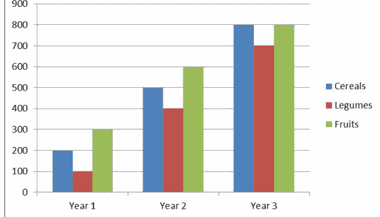
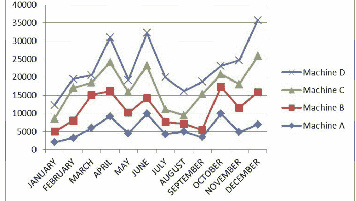
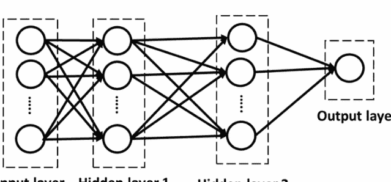
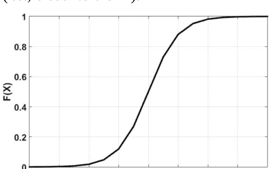

# Python 机器学习

面向初学者的机器学习与深度学习完整指南


安德鲁·帕克

# Python 机器学习

面向初学者的 Python 机器学习与深度学习完整指南

安德鲁·帕克

# 免费下载本书有声书版本

如果你喜欢随时随地听有声书，我有个好消息要告诉你。只需注册一个**免费**的30天Audible试用，你就可以**免费**下载本书的有声书版本！详情请见下方！


# Audible 试用福利

作为Audible用户，你将在30天免费试用期内享受以下福利：

- 本书的免费有声书副本
- 试用期结束后，你每月将获得1个积分，可用于购买任何有声书
- 如果你未使用积分，它们将自动累积到下个月
- 从Audible超过20万本书目中自由选择
- 通过Audible应用程序在多个设备上随时随地收听
- 轻松、无忧地更换任何你不喜欢的有声书
- 即使取消会员资格，你也可以永久保留你的有声书
- 以及更多福利！

**点击下方链接开始体验！**

[适用于Audible美国](https://www.audible.com)

适用于Audible英国

适用于Audible法国

适用于Audible德国

# 目录

[引言](#)

[什么是机器学习？](#)

- [机器学习的应用](#)
- [机器学习的优缺点](#)

[机器学习 – 概念与术语](#)

- [机器学习的目标](#)
- [机器学习系统的类别](#)
- [构建机器学习系统的步骤](#)

[使用Python进行线性回归](#)

- [单变量线性回归](#)

[Python中的列表](#)

- [嵌套列表](#)
- [Python列表方法总结](#)
- [用于操作Python列表的内置函数](#)

[Python中的模块](#)

- [Python中的模块概念与用途](#)

[机器学习训练模型](#)

- [Python中的简单机器学习训练模型](#)
- [使用线性回归的简单Python机器学习模型](#)

[条件或判断语句](#)

- [Python中的条件测试](#)
- [创建多个条件](#)
- [If语句](#)

[Python机器学习必备库](#)

- [Scikit-Learn](#)
- [TensorFlow](#)
- [Theano](#)
- [Pandas](#)
- [Matplotlib](#)
- [Seaborn](#)
- [NumPy](#)
- [SciPy](#)
- [Keras](#)
- [PyTorch](#)
- [Scrapy](#)
- [Statsmodels](#)

[什么是TensorFlow库](#)

安装TensorFlow

激活tensorenviron

## 人工神经网络

人工神经网络的定义

人工神经网络有哪些类型？

如何训练人工神经网络？

人工神经网络：使用的优缺点

## 结论

# 引言

尽管我们对机器学习有所了解，但事实是，我们远未实现这些研究的真正潜力。机器学习是当前计算机科学领域最热门的话题之一。如果你是一名数据分析师，这是一个你应该倾注所有精力的领域，因为其前景令人难以置信。你所展望的未来，是与机器的互动将成为我们存在的基础。

在本系列中，我们的目的是从专家的角度来探讨Python机器学习。假设你已经阅读了本系列中介绍机器学习、Python、库以及其他构成你机器学习知识基础的重要特性的早期书籍。考虑到这一点，除非必要，我们几乎没有涉及入门概念。

即使在专家层面，提醒自己关注机器学习中必须审视的重要问题也总是至关重要的。算法几乎是你在机器学习中所做一切工作的支柱。因此，我们引入了一个简短的部分，让你可以回顾重要的算法和其他有助于推进你机器学习知识的要素。

机器学习既关乎编程，也关乎概率和统计。在机器学习中，我们将使用许多统计方法来帮助我们不时地得出最优解。因此，提醒自己一些必要的概率理论以及它们如何影响每种场景的结果是很重要的。

在我们从入门书籍到中级水平再到目前的机器学习研究中，一个突出的概念是机器学习涉及不确定性。这是机器学习与编程的区别之一。在编程中，你编写的代码必须按原样执行。代码根据给定的指令得出预定的输出。然而，在机器学习中，我们并不享有这种奢侈。

一旦你构建了模型，你就会对其进行训练和测试，最终部署该模型。由于这些模型是为与人类互动而构建的，你可以预期在每个层面上体验到的互动类型会有所不同。一些输入参数可能是正确的，而另一些可能不是。在构建模型时，你必须考虑这些因素，否则你的模型将无法按预期运行。

机器学习的数学元素是我们必须研究的另一个领域。在本系列的早期书籍中，我们没有过多涉及这一点，因为这是一个高级研究领域。机器学习涉及许多数学计算，模型才能提供我们需要的输出。为了支持这一目标，我们必须学习如何根据特定指令对数据执行特定操作。

当你处理不同的数据集时，你总是有可能遇到海量数据集。这是正常的，因为随着我们的机器学习模型与不同的用户互动，它们会不断学习并构建自己的知识。使用海量数据集的挑战在于，你必须学会如何将数据分解成小单元，以便你的系统能够毫无困难地处理和处理。在这种情况下，你是在试图避免让你的学习模型负担过重。

大多数基本计算机在处理海量数据时会崩溃。然而，当你学会如何分割数据集并在其上执行计算操作时，这就不应该成为问题。

在本书开头，我们提到将介绍在日常应用中使用机器学习的实践方法。基于这一主张，我们研究了一些使用机器学习的实际方法，例如构建垃圾邮件过滤器和分析电影数据库。

我们采取了谨慎的、循序渐进的方法，以确保你能够边学边练，更重要的是，试图解释每个过程，以帮助你理解你执行的操作及其原因。

最终，当你构建一个机器学习模型时，其目标是将其集成到人们日常使用的某些应用程序中。考虑到这一点，你必须学习如何构建一个简单的解决方案来应对这一挑战。我们使用了简单的解释来帮助你理解这一点，并希望随着你不断处理不同的机器学习模型，你可以根据需要的允许，通过构建更复杂的模型来学习。

机器学习中有许多概念，你将随着时间的推移学习或遇到。你必须认识到，只要你的模型与数据互动，这就是一个永无止境的学习过程。随着时间的推移，你将遇到比你习惯处理的更大的数据集。在这种情况下，学习如何处理它们将帮助你更快、更轻松地实现你的结果。

# 什么是机器学习？

我们生活在一个技术已成为我们日常生活中不可分割的一部分的世界。事实上，随着当今技术的快速变化，配备人工智能的机器现在负责不同的任务，如预测、识别、诊断等。

数据被添加或输入到机器中，这些机器从这些数据中“学习”。这些数据被称为训练数据，因为它们被用来训练机器。

一旦机器拥有了数据，它们就开始分析数据中存在的任何模式，然后根据这些模式执行操作。机器使用各种学习机制来根据它们需要执行的操作分析数据。这些机制可以大致分为两类——监督学习和无监督学习。

你可能会想知道，为什么没有专门设计来执行所需任务的机器。机器学习之所以重要，有不同的原因。如前所述，所有关于机器学习的研究都非常有用，因为它帮助我们理解人类学习的几个方面。此外，机器学习至关重要，因为它有助于提高机器的准确性、有效性和效率。

这里有一个现实生活中的例子，可以帮助你更好地理解这个概念。

假设我们有两个随机用户A和B，他们都喜欢听音乐，并且我们可以访问他们的歌曲历史。如果你是一家音乐公司，那么你可以使用机器学习来了解每个用户喜欢的歌曲类型，从而想出不同的方式向他们销售你的产品。

例如，你可以记录歌曲的不同属性，如节奏、频率或声音的性别，然后使用所有这些属性绘制图表。一旦你绘制了图表，随着时间的推移，很明显A倾向于喜欢节奏快、由男性艺术家演唱的歌曲，而B喜欢听由女性艺术家演唱的慢歌，或者任何其他类似的见解。一旦你获得了这些数据，你就可以将它们传递给你的营销和广告团队，以做出更好的产品决策。

目前，我们可以自由访问自技术诞生以来收集的所有历史数据。我们不仅能访问这些数据，现在还能存储和处理如此海量的数据。技术无疑已经进步，从我们现在处理此类操作的方式来看，它已经走了很长一段路。如今的技术如此精良，它提供了更多可供挖掘的数据。

以下是机器学习重要的另外几个原因。

尽管工程师们不断取得进展，但总有一些任务无法被明确定义。

有些任务必须借助示例向机器解释。其理念是通过输入数据来训练机器，然后教它处理数据以产生输出。通过这种方式，机器将知道未来如何处理类似的输入数据，并相应地处理它们以生成适当的输出。

机器学习和数据挖掘领域相互交织。数据挖掘指的是浏览海量数据以发现其中存在的任何有价值的相关性或关系的过程。这是机器学习的另一个好处，因为它帮助机器找到任何重要信息。

在许多情况下，如果没有对机器运行条件的准确估计，人类就无法设计机器。

外部条件往往对机器的性能有重大影响。在这种情况下，机器学习有助于使机器适应其环境，以确保最佳性能。它还帮助机器轻松适应环境中的任何变化，而不会影响其性能。

如果有人必须将极其复杂的过程硬编码到机器中，那么程序员很可能会遗漏一些细节。如果存在任何人为错误，那么重新编码所有细节将变得非常繁琐。在这种情况下，最好让机器自己学习这个过程。

技术世界处于不断变化之中，所使用的语言也在发生变化。为了适应所有可能的变化而不断重新设计系统是不切实际的。相反，机器学习帮助机器自动适应所有变化。

## 机器学习的应用

机器学习正在极大地改变当今企业的运营方式。它有助于处理可用的大量数据，并使用户能够根据给定信息做出有用的预测。

当涉及大量数据时，某些手动任务无法在短时间内完成。机器学习就是解决此类问题的答案。在当今时代，我们被数据和信息淹没，没有任何物理方式可以处理所有这些信息。因此，迫切需要一个自动化流程，而机器学习有助于实现这一目标。

当分析和发现过程完全自动化时，获取有用信息就变得更加简单。这有助于使所有未来的过程完全自动化。大数据、商业分析和数据科学这些词汇都需要机器学习。预测分析和商业智能不再仅限于精英企业，现在小型企业和公司也可以使用。这使得小企业能够参与到信息收集和有效利用的过程中。让我们来看几个机器学习的技术应用，看看它们如何应用于现实世界的问题。

### 虚拟个人助理

当今可用的虚拟助手的流行示例有 Alexa、Siri 和 Google Now。顾名思义，它们通过语音命令帮助用户查找必要的信息。你只需激活它，然后提出你想问的问题，比如“我今天的日程安排是什么？”“伦敦和德国有哪些航班可用？”或任何其他你想问的问题。

为了回答你的问题，你的个人助理会查找信息，回忆你提出的问题，然后给你答案。它还可以用于设置某些任务的提醒。机器学习是该过程的重要组成部分，因为它使系统能够根据你之前的任何交互来收集和完善你需要的信息。

### 密度估计

机器学习允许系统使用其可用的数据来推荐类似的产品。例如，如果你从书店拿起一本《傲慢与偏见》，然后将其输入机器，那么机器学习将帮助它确定单词的密度，并找出其他与《傲慢与偏见》相似的书籍。

### 潜在变量

当你处理潜在变量时，机器将使用聚类来确定其中是否存在相互关联的变量。当你不确定导致变量变化的原因，并且不了解变量之间的关系时，这非常有用。当涉及大量数据时，寻找潜在变量更容易，因为它有助于更好地理解所获得的数据。

### 降维

通常，获得的数据往往具有一些变量和维度。如果涉及三个以上的维度，那么人脑就无法可视化这些数据。在这种情况下，机器学习有助于将这些数据缩减到可管理的比例，以便用户可以轻松理解任何变量之间的关系。

机器学习模型训练机器从所有可用数据中学习，并提供不同的服务，如预测或分类，这些服务反过来又有多种现实世界的应用，如自动驾驶汽车、智能手机识别人脸的能力，或者 Google Home 或 Alexa 如何识别你的口音和声音，以及如果机器学习时间更长，其准确性如何提高。

## 机器学习的优缺点

### 缺点

在机器学习中，我们总是先训练模型，然后在小数据集上验证该模型。然后我们使用该模型来预测一些未见过或新数据的输出。你会发现很难识别你创建的模型中是否存在偏差。如果你无法识别偏差，你的推断将是不正确的。

一些社会科学家将开始仅依赖机器学习。重要的是要记住，应该改进一些无监督的机器学习任务。

### 一些优点

人类无法处理大量数据，更不用说分析这些数据了。正在产生大量的实时数据，如果没有自动系统来理解和分析这些数据，我们就无法得出任何结论。

机器学习正在变得更好。随着深度学习系统的出现，数据工程和数据预处理的成本正在降低。

## 机器学习 – 概念与术语

机器学习是通过向机器提供相关的训练数据集来完成的。普通系统，即没有任何人工智能的系统，总是可以根据提供给系统的输入来提供输出。然而，具有人工智能的系统可以通过学习、预测和改进其通过训练提供的结果。

让我们看一个简单的例子，了解孩子们如何学习识别物体，或者换句话说，孩子如何将一个词与一个物体联系起来。假设桌子上有一碗苹果和橙子。你作为成年人或父母，会将那个圆形的红色物体介绍为苹果，另一个物体介绍为橙子。在这个例子中，单词苹果和橙子是标签，形状和颜色是属性。你也可以使用一组标签和属性来训练机器。机器将学会根据作为输入提供的属性来识别物体。

基于标记训练数据集的模型被称为监督机器学习模型。当孩子上学时，他们的老师和教授会给他们一些关于他们进步的反馈。同样，监督机器学习模型允许工程师向机器提供一些反馈。

让我们以输入 [红色，圆形] 为例。在这里，孩子和机器都会理解任何圆形的红色物体都是苹果。现在让我们在机器或孩子面前放一个板球。你可以根据预测是错误还是正确，向机器提供响应负1或0。如果需要，你总是可以添加更多属性。这是机器学习的唯一方式。这也是为什么如果你使用大型高质量数据集并花更多时间训练机器，机器会给你更好、更准确的结果。

在我们继续之前，你必须理解机器学习、人工智能和深度学习概念之间的区别。大多数人将这些概念互换使用，但重要的是要知道它们并不相同。

*机器学习、人工智能和深度学习：*
*下图将让你了解这些术语之间的关系。*

## 机器学习的目标

机器学习系统通常具有以下目标之一。

- 预测类别
- 预测数量
- 异常检测系统
- 聚类系统

## 预测类别

机器学习模型帮助分析输入数据，然后预测输出所属的类别。在这种情况下，预测通常是一个基于“是”或“否”的二元答案。例如，它有助于回答诸如“今天会下雨吗？”“这是水果吗？”“这封邮件是垃圾邮件吗？”等问题。这是通过参考一组数据来实现的，该数据将根据特定关键词指示某封电子邮件是否属于垃圾邮件类别。这个过程被称为分类。

## 预测数量

这个系统通常用于预测一个值，例如根据天气的不同属性（如温度、湿度百分比、气压等）预测降雨量。这种预测被称为回归。回归算法有多种细分，如线性回归、多元回归等。

## 异常检测系统

异常检测中模型的目的是检测给定数据集中的任何异常值。这些应用用于银行和电子商务系统，其中系统被构建用于标记任何异常交易。所有这些都有助于检测欺诈性交易。

## 聚类系统

这类系统仍处于初始阶段，但其应用广泛，并可能极大地改变业务开展方式。在此系统中，用户根据各种行为因素（如年龄组、居住地区甚至喜欢观看的节目类型）被分类到不同的集群中。根据这种聚类，企业现在可以根据用户在分类时所属的集群，向用户推荐其可能感兴趣的节目或演出。

## 机器学习系统的类别

对于传统机器，程序员会给机器一组指令和输入参数，机器将使用这些参数进行计算，并使用特定命令得出输出。然而，在机器学习系统的情况下，系统从不受工程师提供的任何命令限制，机器将选择可用于处理数据集并以高精度决定输出的算法。它通过使用由历史数据和输出组成的训练数据集来实现这一点。

因此，在经典世界中，我们会告诉机器根据一组指令处理数据，而在机器学习设置中，我们从不指示系统。计算机必须与数据集交互，使用历史数据集开发算法，像人类一样做出决策，分析信息，然后提供输出。与人类不同，机器可以在短时间内处理大型数据集并提供高精度的结果。

机器学习算法有不同的类型，它们根据算法的目的进行分类。机器学习系统有三个类别：

1. 监督学习
2. 无监督学习
3. 强化学习

## 监督学习

在这个模型中，工程师向机器提供带标签的数据。换句话说，工程师将确定系统或特定数据集的输出应该是什么。这种类型的算法也称为预测算法。

例如，考虑以下表格：

| 货币（标签） | 重量（特征） |
| :--- | :--- |
| 1 USD | 10 gm |
| 1 EUR | 5 gm |
| 1 INR | 3 gm |
| 1 RU | 7 gm |

在上表中，每种货币都被赋予了重量属性。这里，货币是标签，重量是属性或特征。

监督机器学习系统首先将使用此训练数据集进行训练，当遇到任何3克的输入时，它将预测该硬币是1 INR硬币。对于10克的硬币也可以这样说。

分类和回归算法是监督机器学习算法的一种类型。回归算法用于预测比赛分数或房价，而分类算法则识别数据应属于哪个类别。

我们将在本书的后续部分详细讨论其中一些算法，届时您还将学习如何使用Python构建或实现这些算法。

## 无监督学习

在这种类型的模型中，系统更为复杂，因为它将学习识别未标记数据中的模式并产生输出。这是一种用于从大型数据集中得出任何有意义推断的算法。该模型也称为描述性模型，因为它使用数据并总结该数据以生成数据集的描述。该模型通常用于涉及大量非结构化输入数据的数据挖掘应用中。

例如，如果系统输入姓名、跑分和三柱门的数据，系统将在图表上可视化这些数据并识别集群。将生成两个集群——一个集群用于击球手，另一个用于投球手。当输入任何新数据时，该人肯定会落入其中一个集群，这将帮助机器预测该球员是击球手还是投球手。

| 姓名 | 跑分 | 三柱门 |
|---|---|---|
| Rachel | 100 | 3 |
| John | 10 | 50 |
| Paul | 60 | 10 |
| Sam | 250 | 6 |
| Alex | 90 | 60 |

比赛的示例数据集。基于此，聚类模型可以将球员分为击球手或投球手。

一些属于无监督机器学习的常见算法包括密度估计、聚类、数据缩减和压缩。

聚类算法总结数据并以不同的方式呈现。这是数据挖掘应用中使用的一种技术。当目标是可视化任何大型数据集并创建有意义的摘要时，会使用密度估计。这将引出数据缩减和维度的概念。这些概念解释说，分析或输出应始终提供数据集的摘要，而不丢失任何有价值的信息。简单来说，这些概念表明，如果派生输出有用，数据的复杂性可以降低。

## 强化学习

这种类型的学习类似于人类的学习方式，即系统将学习在特定环境中表现，并根据该环境采取行动。例如，人类不碰火，因为他们知道这会受伤，并且他们被告知这会受伤。有时，出于好奇，我们可能会把手指伸进火里，然后知道这会烫伤。这意味着我们以后会小心火。

下表将总结并概述监督和无监督机器学习之间的区别。它还将列出每种模型中使用的流行算法。

| 监督学习 | 无监督学习 |
|---|---|
| 处理带标签的数据 | 处理未标记的数据 |
| 接受直接反馈 | 无反馈循环 |
| 根据输入数据预测输出。因此也称为“预测算法” | 从输入数据中发现隐藏的结构/模式。有时称为“描述性模型” |
| 一些常见的监督算法类别包括：逻辑回归、线性回归（数值预测）、多项式回归、回归树（数值） | 一些常见的无监督算法类别包括：聚类、压缩、密度估计和数据缩减、K均值聚类（聚类）、关联规则（模式检测） |

## 构建机器学习系统的步骤

无论采用何种机器学习模型，设计机器学习系统的过程通常包含以下共同步骤。

## 定义目标

与其他任何任务一样，第一步是明确你希望通过系统实现的目标。你使用的数据类型、算法以及其他因素，主要取决于你的目标或希望系统产生的预测类型。

## 收集数据

这可能是构建机器学习系统中最耗时的步骤。你必须收集所有将用于训练算法的相关数据。

## 准备数据

这是一个通常被忽视的重要步骤。忽视这一步可能会导致代价高昂的错误。你使用的数据越干净、越相关，预测或输出的结果就越准确。

## 选择算法

你可以选择不同的算法，例如支持向量机（SVM）、k-近邻、朴素贝叶斯、Apriori等。你使用的算法主要取决于你希望通过模型达成的目标。

## 训练模型

一旦所有数据准备就绪，你必须将其输入机器，并对算法进行训练以进行预测。

## 测试模型

模型训练完成后，它就可以开始读取输入并生成相应的输出了。

## 预测

系统将执行多次迭代，你也可以将反馈输入系统，以随时间推移改进其预测能力。

## 部署

一旦你测试了模型并对其运行方式感到满意，该模型将被定型，并可以集成到任何你想要的应用程序中。这意味着它已准备好被部署。

所有这些步骤可能因应用程序和你所使用的算法类型（监督式或无监督式）而异。然而，这些步骤通常涉及设计机器学习系统的所有过程。在每个阶段，你都可以使用各种语言和工具。在本书中，你将学习如何使用Python设计机器学习系统。

让我们通过以下场景来理解上一节的内容。

## 场景一

在来自标记相册的一张图片中，Facebook识别出朋友的照片。

解释：这是一个监督学习的实例。在这种情况下，Facebook使用标记的照片来识别人物。标记的照片将成为图片的标签。每当机器从任何形式的标记数据中学习时，这被称为监督学习。

## 场景二

根据某人过去的音乐偏好推荐新歌曲。

解释：这是一个监督学习的实例。模型正在训练已分类或预先存在的标签——在这种情况下，是歌曲的流派。这正是Netflix、Pandora和Spotify所做的——它们收集你喜欢的歌曲/电影，根据你的偏好评估特征，然后基于相似特征推荐歌曲或电影。

## 场景三

分析银行数据以标记任何可疑或欺诈性交易。

解释：这是一个无监督学习的实例。在这种情况下，可疑交易无法被完全定义，因此没有像“欺诈”或“非欺诈”这样的特定标签。模型将通过检查异常交易来尝试识别任何异常值。

## 场景四

多种模型的组合。

解释：Uber的动态定价功能是多种机器学习模型的组合，例如预测高峰时段、特定区域的交通状况、出租车的可用性，并使用聚类来确定用户在城市不同区域的使用模式。

## 使用Python进行线性回归

### 单变量线性回归

我们将要关注的线性回归的第一部分是当我们只有一个变量时。这将使事情更容易处理，并确保我们能够在尝试一些更难的内容之前掌握一些基础知识。我们将专注于只有一个自变量和一个因变量的问题。

为了帮助我们开始，我们将使用car_price.csv数据集，以便我们学习汽车的价格。我们将汽车价格作为因变量，然后汽车的年份作为自变量。你可以在我们之前讨论过的数据集文件夹中找到这些信息。为了帮助我们对汽车价格做出良好的预测，我们需要使用Python的Scikit Learn库来帮助我们获得正确的线性回归算法。当我们完成所有这些设置后，我们需要使用以下步骤来帮助完成。

### 导入正确的库

首先，我们需要确保拥有正确的库来启动此操作。你需要获取本节库的代码包括：

```
import pandas as pd
import numpy as np
import matplotlib.pyplot as plt
%matplotlib inline
```

你可以将此脚本实现到Jupyter notebook中。如果你使用的是Jupyter notebook，最后一行需要保留，但如果你使用的是Spyder，你可以删除最后一行，因为它会自动完成这部分而无需你的帮助。

### 导入库

使用之前的代码导入库后，下一步是导入你想要用于此训练算法的数据集。我们将使用“car_price.csv”数据集。你可以执行以下脚本来帮助你将数据集放在正确的位置：

```
car_data = pd.read_csv('D:\Datasets\car_price.csv')
```

### 分析数据

在使用数据进行训练之前，最好先练习并分析数据，检查是否有缩放问题或缺失值。首先，我们需要查看数据。head函数将返回你想要调出的数据集的前五行。你可以使用以下脚本来帮助完成此操作：

```
car_data.head()
```

此外，describe函数可用于返回数据集的所有统计详细信息。

```
car_data.describe ()
```

最后，让我们看看线性回归算法是否适合这类任务。我们将获取数据点并将其绘制在图表上。这将帮助我们查看年份和价格之间是否存在关系。要查看这是否有效，请使用以下脚本：

```
plt.scatter(car_data[‘Year’], car_data[‘Price’])
plt.title(“Year vs Price”)
plt.xlabel(“Year”)
plt.ylabel(“Price”)
plt.show()
```

当我们使用上面的脚本时，我们试图使用一个散点图，然后可以在Matplotlib库中找到它。这将很有用，因为这个散点图的x轴是年份，y轴是价格。从输出的图形中，我们可以看到，当年份增加时，汽车的价格也会上涨。这向我们展示了年份和价格之间存在的线性关系。这是查看如何使用此类算法解决此问题的好方法。

### 回到数据预处理

现在我们需要使用这些信息，并为我们提出这两个任务。要将数据划分为特征和标签，你需要使用以下脚本来启动：

```
features = car_data.iloc[:,0:1].values
labels = car_data.iloc[:,1].values
```

由于我们这里只有两列，第0列将包含特征集，第1列将包含标签。然后我们将能够划分数据，使20%用于测试集，80%用于训练集。使用以下脚本来帮助你完成此操作：

```python
from sklearn.model_selection import train_test_split
train_features, test_features, train_labels, test_labels = train_test_split(features, labels, test_size=0.2, random_state=0)
```

从这部分，我们可以回过头来再次查看数据集。当我们这样做时，很容易看出年份的值和价格的值之间不会有太大差异。这两者最终都将在数千左右。这意味着你不需要进行任何缩放，因为你可以直接使用这里已有的数据。从长远来看，这为你节省了一些时间和精力。

## 如何训练算法并使其进行一些预测

现在是时候对算法进行一些训练，并确保它能为你做出正确的预测。这就是`LinearRegression`类将派上用场的地方，因为它包含了你需要输入和训练模型的所有标签和其他训练特征。
这很简单，你只需要使用下面的脚本即可开始：

```python
from sklearn.linear_model import LinearRegression
lin_reg = LinearRegression()
lin_reg.fit(train_features, train_labels)
```

使用之前关于汽车价格和年份的相同例子，我们将查看仅针对自变量的系数是多少。我们需要使用以下脚本来帮助我们做到这一点：

```python
print(lin_reg.coef_)
```

此过程的结果将是204.815。这表明，年份每变化一个单位，汽车价格将增加204.815（至少在这个例子中是这样）。
一旦你花时间训练了这个模型，最后一步就是使用它来预测你将要处理的新实例。`predict`方法将用于此类以帮助实现这一点。该方法将接受你选择的测试特征作为输入，然后它可以预测与之最匹配的输出。你可以使用以下脚本来实现这一点：

```python
predictions = lin_reg.predict(test_features)
```

当你使用这个脚本时，你会发现它将为我们提供对未来情况的良好预测。根据我们现在拥有的信息，我们可以猜测未来一辆汽车将值多少钱。未来可能会有一些变化，而且根据汽车附带的特征，这似乎确实很重要。但这是查看汽车并获取它们每年平均成本以及未来成本的好方法。

那么，让我们看看这是如何工作的。我们现在想看看这个线性回归，并弄清楚2025年一辆汽车将花费我们多少钱。也许你想为一辆车存钱，并想估算到你存够钱时它将花费你多少钱。你将能够使用我们已有的信息，并添加你想要基于的新年份，然后计算出那一年新车的平均价值。

当然，请记住这不会是100%准确的。通货膨胀可能会改变价格，制造商可能会改变一些东西，等等。有时价格会更低，有时会更高。但它至少为你提供了一种预测车辆价格以及未来成本的好方法。

## Python中的列表

我们通过将称为元素的项目放在方括号内并用逗号分隔来在Python中创建一个列表。列表中的项目可以是混合数据类型。

启动IDLE。导航到“文件”菜单并单击“新建窗口”。

输入以下内容：

```python
list_mine=[] #空列表
list_mine=[2,5,8] #整数列表
list_mine=[5,"Happy", 5.2] #包含混合数据类型的列表
```

## 练习

编写一个程序，将以下内容捕获到一个列表中：“Best”，26，89，3.9

## 嵌套列表

嵌套列表是作为另一个列表中项目的列表。

## 示例

```python
list_mine=["carrot", [9, 3, 6], ['g']]
```

## 练习

为以下元素编写一个嵌套列表：[36, 2, 1]，”Writer”，’t’，[3.0, 2.5]

## 从列表中访问元素

在Python中，向量中的第一个元素始终索引为零。一个包含五个项目的列表可以通过索引0到索引4来访问。如果你未能访问列表中的项目，将发生索引错误。索引始终是整数，因此使用其他数字也会导致类型错误。

## 示例

```python
list_mine=['b','e','s','t']
print(list_mine[0])#输出将是 b
print(list_mine[2])#输出将是 s
print(list_mine[3])#输出将是 t
```

## 练习

给定以下列表：

```python
your_collection=['t','k','v','w','z','n','f']
```

- a. 编写一个Python程序来显示列表中的第二个项目
- b. 编写一个Python程序来显示列表中的第六个项目
- c. 编写一个Python程序来显示列表中的最后一个项目

## 嵌套列表索引

```python
nested_list=["Best",[4,7,2,9]]
print(nested_list[0][1])
```

## Python负索引

对于其序列，Python允许负索引。列表中的最后一个项目是索引-1，索引-2是倒数第二个项目，依此类推。

```python
list_mine=['c','h','a','n','g','e','s']
print(list_mine[-1])#输出是 s
print(list_mine[-4])#输出是 n
```

## Python中的列表切片

切片运算符（全冒号）用于访问列表中的一系列元素。

## 示例

```python
list_mine=['c','h','a','n','g','e','s']
print(list_mine[3:5]) #从第四个到第六个选取元素
```

## 示例

从开始选取到第五个。

```python
print(list_mine[:-6])
```

## 示例

从第三个元素选取到最后一个。

```python
print(list_mine[2:])
```

## 练习

给定 class_names=['John', 'Kelly', 'Yvonne', 'Una','Lovy','Pius', 'Tracy']

- a. 编写一个Python程序，使用切片运算符显示从第二个学生开始及之后的所有学生。
- b. 编写一个Python程序，使用切片运算符和负索引功能显示从第一个学生到第三个学生。
- c. 编写一个Python程序，使用切片运算符仅显示第四个和第五个学生。

## 使用赋值运算符操作列表中的元素

```python
list_yours=[4,8,5,2,1]
list_yours[1]=6
print(list_yours) #输出将是 [4,6,5,2,1]
```

## 更改列表中的一系列项目

```python
list_yours[0:3]=[12,11,10] #将更改列表中的第一个到第四个项目
print(list_yours) #输出将是: [12,11,10,1]
```

## 追加/扩展列表中的项目

`append()`方法允许扩展列表上的项目。`extend()`也可以使用。

## 示例

```python
list_yours=[4, 6, 5]
list_yours.append(3)
print(list_yours)#输出将是 [4,6,5, 3]
```

## 示例

```python
list_yours=[4,6,5]
list_yours.extend([13,7,9])
print(list_yours)#输出将是 [4,6,5,13,7,9]
```

加号运算符（+）也可以用于组合两个列表。`*`运算符可用于将列表迭代给定次数。

## 示例

```python
list_yours=[4,6,5]
print(list_yours+[13,7,9])# 输出:[4, 6, 5,13,7,9]
print(['happy']*4)#输出:["happy", "happy", "happy","happy"]
```

## 从列表中删除或删除项目

关键字`del`用于在Python中删除元素或整个列表。

```python
list_mine=['t','r','o','g','r','a','m']
del list_mine[1]
print(list_mine) #t, o, g, r, a, m
```

## 删除多个元素

```python
del list_mine[0:3]
print(list_mine) #a, m
```

## 删除整个列表

```python
del list_mine
print(list_mine) #将生成列表未找到的错误
```

`remove()`方法或`pop()`方法可用于删除指定的项目。如果未给出索引，`pop()`方法将删除并返回最后一个项目，有助于将列表实现为堆栈。`clear()`方法用于清空列表。

## 示例

```python
list_mine=['t','k','b','d','w','q','v']
list_mine.remove('t')
print(list_mine)#输出将是 ['k','b','d','w','q','v']
print(list_mine.pop(1))#输出将是 'b'
print(list_mine.pop())#输出将是 'v'
```

## 练习

给定 list_yours=['K','N','O','C','K','E','D']

- a. 弹出列表中的第三个项目，将程序保存为list1。
- b. 使用`remove()`方法删除第四个项目，并将程序保存为list2
- c. 删除列表中的第二个项目，并将程序保存为list3。
- d. 不指定索引弹出列表，并将程序保存为list4。

## 使用空列表删除整个或特定元素

```python
list_mine=['t','k','b','d','w','q','v']
list_mine[1:2]=[]
print(list_mine)#输出将是 ['t','b','d','w','q','v']
```

## Python中列表方法总结

| 方法 | 描述 |
| --- | --- |

| 方法 | 描述 |
|---|---|
| insert() | 在指定索引处插入一个项目 |
| append() | 在列表末尾添加一个元素 |
| pop() | 移除并返回给定索引处的元素 |
| index() | 返回第一个匹配项的索引 |
| remove() | 从列表中移除一个项目 |
| copy() | 返回列表的浅拷贝 |
| count() | 返回作为参数传递的项目数量的计数 |
| clear() | 移除列表中的所有项目 |
| sort() | 按升序对列表中的项目进行排序 |
| extend() | 将一个列表的所有元素添加到另一个列表 |
| reverse() | 反转列表中项目的顺序 |

## 用于操作 Python 列表的内置 Python 函数

| 方法 | 描述 |
|---|---|
| enumerate() | 返回一个枚举对象，包含列表中所有项目的索引和值作为元组 |
| sorted() | 返回一个新的已排序列表，但不排序列表本身 |
| sum() | 返回列表中所有元素的总和 |
| max() | 返回列表中的最大项目 |
| len() | 返回列表的长度 |
| any() | 如果列表的任何元素为真则返回 True – 如果列表为空，则返回 False |
| min() | 返回列表中的最小项目 |
| all() | 如果列表的所有元素都为真则返回 True |

## 练习

使用列表访问方法以相反顺序显示以下项目 list_yours=[4,9,2,1,6,7]

使用列表访问方法计算 list_yours 中的元素数量。

使用列表访问方法按升序/默认顺序对 list_yours 中的项目进行排序。

## Python 中的模块

模块，也称为包，是一组名称。这通常是一个函数和/或对象类的库，可供在不同程序中使用。我们在本章前面已经使用了模块的概念，以便从数学库中使用一些函数。在本章中，我们将深入介绍如何开发和定义模块。要在 Python 程序中使用模块，使用以下语句：import、from、reload。第一个导入整个模块。第二个允许仅从模块导入特定的名称或元素。第三个，reload，允许在 Python 运行时重新加载模块的代码，而无需停止它。在深入研究它们的定义和开发之前，让我们首先从模块或包在 Python 中的实用性开始。

## 模块概念及其在 Python 中的实用性

模块是使系统组件组织化的一种非常简单的方法。模块允许重复使用相同的代码。到目前为止，我们一直在 Python 交互式会话中工作。我们编写和测试的每个代码在退出交互式会话后都会丢失。模块保存在文件中，使其持久化、可重用和可共享。您可以将模块视为一组文件，您可以在其中定义函数、名称、数据对象、属性等。模块是将系统的多个组件分组在一个地方的工具。在 Python 编程中，模块是最高级别的单元之一。它们指向包和工具的名称。此外，它们允许共享已实现的数据。您只需要模块的一个副本就可以在大型程序中使用。如果一个对象要在不同的函数和程序中使用，将其编码为模块允许与其他程序员共享。为了了解 Python 编码的架构，我们先进行一些通用结构解释。到目前为止，我们在本书中使用了非常简单的代码示例，这些示例没有高级结构。在大型应用程序中，程序是多个 Python 文件的集合。Python 文件是指包含 Python 代码并具有 .py 扩展名的文件。有一个主要的高级程序，其他文件是模块。高级文件包含控制流程和执行应用程序的主代码。模块文件定义了处理主程序元素和组件以及可能在其他地方所需的工具。主程序使用模块中指定的工具。

反过来，模块使用其他模块中指定的工具。当您在 Python 中导入一个模块时，您可以访问在该特定模块中声明或定义的每个工具。属性是与模块中工具关联的变量或函数。因此，当导入一个模块时，我们也可以访问工具的属性来处理它们。例如，让我们考虑我们有两个名为 file1.py 和 file2.py 的 Python 文件，其中 file1.py 是主程序，file2.py 是模块。在 file2.py 中，我们有一段代码定义了以下函数：

```
def Xfactorial (X):
    P = 1
    for i in range (1, X + 1):
        P *= i
    return P
```

要在主程序中使用此函数，我们应该在 file1.py 中定义如下代码语句：

```
import file2
A = file2.Xfactorial (3)
```

第一行导入模块 file2.py。此语句意味着加载文件 file2.py。这使得 file1.py 可以通过名称 file2 访问在 file2.py 中定义的所有工具和函数。第二行调用了函数 Xfactorial。模块 file2.py 是使用属性语法定义此函数的地方。行 file2.Xfactorial() 意味着获取 Xfactorial 的任何名称值，并位于 file2 的代码主体内。在此示例中，它是一个可调用的函数。因此，我们提供了一个输入参数，并将输出结果分配给变量 A。如果我们添加第三条语句来打印变量 A 并运行文件 file1.py，它将显示 6，即 3 的阶乘。在 Python 中，您将看到属性语法为 object.attribute。这允许调用可能是函数或数据对象的属性，这些属性提供对象的属性。

请注意，您在使用 Python 编程时可能导入的一些模块在 Python 本身中是可用的。正如我们在本书开头提到的，Python 附带了一个标准的大型库，其中包含内置模块。这些模块支持编程中可能需要的所有常见任务，从操作系统接口到图形用户界面。它们不是语言的一部分。但是，它们可以导入并随软件安装包一起提供。您可以在随安装提供的手册中或访问 Python 官方网站：www.Python.org 查看可用模块的完整列表。此手册在每次发布新版本的 Python 时都会更新。

## 如何导入模块

我们谈论过导入模块，但没有真正解释 Python 背后发生了什么。导入是 Python 编程结构中一个非常基本的概念。在本节中，我们将深入介绍 Python 如何在程序中导入模块。Python 遵循三个步骤在程序的工作环境中导入文件或模块。第一步包括找到包含模块的文件。第二步包括在需要时将模块编译为字节码。最后，第三步运行模块文件中的代码以构建定义的对象。这三个步骤仅在程序执行期间首次导入模块时运行。此模块及其所有对象都加载到内存中。当模块在程序中进一步导入时，它会跳过所有三个步骤，只获取由模块定义并保存在内存中的对象。

在导入模块的第一步，Python 必须找到模块文件的位置。请注意，到目前为止，在我们展示的示例中，我们使用了 import 而没有提供模块的完整路径或扩展名 .py。我们只是使用了 import math 或 import file2.py（上一节的示例）。Python import 语句省略了扩展名和路径。我们只需按名称导入模块。原因是 Python 有一个名为“搜索路径模块”的模块来查找路径。此模块专门用于查找使用 import 语句导入的模块文件的路径。

在某些情况下，您可能需要配置模块的路径搜索，以便能够使用不属于标准库的新模块。您需要自定义它以包含这些新模块。搜索路径简单地是主目录、PYTHONPATH 目录、标准库目录以及可选地（如果存在）具有扩展名 .pth 的文件内容的串联。主目录由系统自动设置为从交互式会话启动时的 Python 可执行文件目录，或者可以修改为保存程序的工作目录。此目录是在运行导入模块时首先搜索的目录。因此，如果您的主目录指向一个包含你的程序及其模块的目录，导入这些模块时无需指定任何路径。

标准库的目录也会被自动搜索。该目录包含所有随 Python 附带的默认库。PYTHONPATH 的目录可以设置为指向新开发模块的目录。实际上，PYTHONPATH 是一个环境变量，包含一个包含 Python 文件的目录列表。当设置了 PYTHONPATH 时，所有这些路径都会被包含在 Python 环境中，搜索路径目录在导入模块时也会搜索这些目录。Python 还允许定义一个扩展名为 `.pth` 的文件，其中包含目录，每行一个。如果该文件被适当地包含在某个目录中，其作用与 PYTHONPATH 相同。你可以通过 `sys.path` 检查运行 Python 时包含的目录路径。只需打印 `sys.path` 即可获取 Python 将要搜索的目录列表。

请记住，导入模块时，我们只使用模块的名称，而不带其扩展名。当 Python 在其环境路径中搜索模块时，它会选择与模块名称匹配的第一个名称，无论其扩展名是什么。因为 Python 允许使用其他语言编写的包，所以它不会简单地选择扩展名为 `.py` 的模块，而是选择与导入模块名称匹配的文件名，甚至是 zip 文件名。因此，你应该为模块命名时加以区分，并以一种使选择模块显而易见的方式配置搜索路径。

当 Python 找到与导入语句中名称对应的模块文件的源代码时，如果需要，它会将其编译为字节码。如果 Python 找到已有的字节码文件而没有源代码，则会跳过此步骤。如果源代码已被修改，Python 会在程序后续执行时自动生成另一个字节码文件。字节码文件通常具有 `.pyc` 扩展名。当 Python 搜索并找到模块文件名时，它会加载与扩展名为 `.py` 的源代码最新版本对应的字节码文件。如果源代码比字节码文件更新，它将通过编译源代码文件生成一个新的字节码文件。请注意，只有被导入的文件才有对应的 `.pyc` 扩展名文件。这些文件，即字节码文件，存储在你的机器上，以便在将来使用时加快导入速度。

导入语句的第三步是运行模块的字节码。文件中的每条语句和每个赋值都会被执行。这允许生成模块中定义的任何函数、数据对象等。函数和所有属性通过导入者在程序中访问。在此步骤中，如果存在 `print` 语句，你将会看到它们。`def` 语句将创建一个函数对象，供主程序使用。

总结一下导入语句，它涉及搜索文件、编译它以及运行字节码文件。所有其他导入语句都使用存储在内存中的模块，并忽略所有这三个步骤。首次导入时，Python 会在搜索路径模块中查找以选择模块。因此，正确配置路径环境变量以指向包含新定义模块的目录非常重要。现在你已经了解了模块的全貌和概念，让我们探索如何定义和开发新模块。

## 如何在 Python 中编写和使用模块？

Python 中的模块可以非常容易地创建，不需要任何特定的语法。模块只是包含 Python 代码的扩展名为 `.py` 的文件。你可以使用像 Notepad++ 这样的文本编辑器来开发和编写模块，然后将它们保存为扩展名为 `.py` 的文件。然后，你只需像我们在上一节中看到的那样导入这些文件，即可使用其中包含的代码。

当你创建一个模块时，所有定义的数据对象（包括函数）都成为模块属性。这些属性通过属性语法访问和使用，如下所示：`module.attribute`。例如，如果我们定义一个名为 `MyModule.py` 的模块，其中包含以下函数：

```
def Myfct(A):
    print('A by 2 is: ', A * 2)
    return A * 2
```

函数 `Myfct` 成为模块 `MyModule.py` 的属性。你可以将任何你开发并保存在扩展名为 `.py` 的文件中的 Python 代码命名为模块，如果你在以后使用时导入它们。模块名称是引用变量。因此，在命名模块时，你应该遵循与变量命名相同的规则。你可能可以随心所欲地命名你的模块。但如果不符合规则，Python 会抛出错误。

例如，如果你将模块命名为 `$2P.py`，你将无法导入它，Python 会触发语法错误。包含模块和 Python 包的目录名称也应遵循相同的规则。此外，它们的名称不能包含任何空格。在本节的其余部分，我们将提供一些定义和使用模块的代码示例。

可以使用两条语句来利用模块。第一条是我们上一节介绍的 `import` 语句。让我们再次考虑前面的例子来说明一个包含 `Myfct` 函数的模块 `MyModule.py`：

```
def Myfct(A):
    print(A, 'by 2 is: ', A * 2)
```

现在，要使用这个模块，我们使用以下语句导入它：

```
>>> import MyModule
>>> MyModule.Myfct(2)
2 by 2 is: 4
```

现在，Python 使用 `MyModule` 名称来加载文件，并将其作为程序中的变量。模块名称应用于访问其所有属性。导入和使用模块属性的另一种方式是使用 `from import` 语句。该语句的工作方式与我们一直使用的 `import` 语句相同。我们不是使用模块名称来获取其属性，而是可以直接通过属性名称访问它们。例如：

```
>>> from MyModule import Myfct
>>> Myfct(2)
2 by 2 is: 4
```

该语句创建了函数名称的副本，而无需使用模块名称。`from import` 语句还有另一种形式，使用 `*`。该语句允许复制模块中分配给对象的所有名称。例如：

```
>>> from MyModule import *
>>> Myfct(2)
2 by 2 is: 4
```

因为模块名称变成了变量（即对象的引用），Python 支持使用别名导入模块。然后我们可以使用别名而不是其名称来访问其属性。例如，我们可以为模块指定一个别名，如下所示：

```
>>> import Mymodule as md
>>> md.Myfct(2)
2 by 2 is: 4
```

除函数外的数据对象也以相同的方式通过属性语法访问。例如，我们可以在模块中定义和初始化数据对象，然后在程序中使用它们。让我们考虑以下代码来创建一个名为 `ExModule.py` 的模块。

```
A = 9
Name = 'John'
```

在这个例子中，我们初始化了变量 `A` 和 `Name`。
现在，导入模块后，我们可以获取这两个变量，如下所示：

```
>>> import ExModule
>>> print('A is: ', ExModule.A)
A is: 9
>>> print('Name is: ', ExModule.Name)
Name is: John
```

或者我们可以将属性赋值给其他变量。例如：

```
>>> import ExModule
>>> B = ExModule.A
>>> print('B is: ', B)
B is: 9
```

如果我们使用 `from import` 语句导入属性，属性的名称将成为脚本中的变量。例如：

```
>>> from ExModule import A, Name
>>> print('A is: ', A, 'and Name is: ', Name)
A is 9 and Name is John
```

请注意，`from import` 语句支持在一行中导入多个属性。Python 允许更改可共享的对象。例如，让我们考虑以下代码来定义名为 `ExModul1.py` 的模块：

```
A = 9
MyList = [90, 40, 80]
```

现在，让我们导入这个模块并尝试更改属性的值观察 Python 的行为。

```python
>>> from ExModule1 import A, MyList
>>> A = 20
>>> myList[0] = 100
```

现在，让我们重新导入模块并打印这两个属性，看看 Python 做了哪些更改。

```python
>>> import ExModule1
>>> print('A is: ', ExModule1.A)
A is: 9
>>> print('My list is: ', ExModule1.myList)
My list is: [100, 40, 80]
```

你可以注意到，Python 更改了列表第一个元素的值，但没有将变量 'A' 的值更改为之前我们赋的值。原因是，当像列表这样的可变对象在本地被更改时，这些更改也会应用到导入它们的模块中。重新赋值一个获取的变量名并不会重新赋值导入它的模块中的引用。实际上，复制的引用变量名和它被复制的文件之间没有联系。为了在脚本及其导入的模块中进行有效的修改，我们应该使用如下所示的 `import` 语句：

```python
>>> import ExModule1
>>> ExModule1.A = 200
```

更改属性 'A' 和 'myList' 之间的区别在于 'A' 是一个变量名，而 'myList' 是一个对象数据。这就是为什么对变量 'A' 的修改也应该使用 `import` 来应用到模块文件中。

我们已经提到，在脚本中第一次导入模块意味着要经历三个步骤：搜索模块、编译模块和运行模块。之后脚本中对该模块的所有其他导入都会跳过这三个步骤，并访问已加载到内存中的模块。现在，让我们尝试一个例子来看看这是如何工作的。假设我们有一个包含以下代码并命名为 ExModule2.py 的模块：

```python
print('Hello World\n')
print('This is my first module in Python')
A = 9
```

现在，让我们导入这个模块，看看 Python 在导入此模块时的行为：

```python
>>> import ExModule2
Hello World
This is my first module in Python
```

你可以注意到，导入此模块时，它显示了两条消息。现在，让我们尝试为属性 'A' 重新赋值，然后使用 `import` 语句重新导入模块。

```python
>>> ExModule2.A = 100
>>> import ExModule2
```

正如你从示例中注意到的，Python 没有显示消息 'Hello World' 和 'This is my first module in Python'，因为它没有重新运行该模块。它只是使用了已经加载到内存中的模块。

为了让 Python 在脚本中第二次导入模块时经历所有步骤，我们应该使用 `reload` 语句。使用此语句时，我们强制 Python 像第一次导入那样导入模块。此外，它有助于在程序运行时进行修改而无需中断它。它还有助于即时查看所做的修改。`reload` 是一个函数，而不是 Python 中的语句，它接受一个已经加载到内存中的模块作为参数。

因为 `reload` 是一个函数并期望一个参数，所以这个参数应该已经被赋予一个模块对象。如果由于某种原因 `import` 语句未能导入模块，你将无法重新加载它。你必须重复 `import` 语句直到它成功导入模块。像任何其他函数一样，`reload` 在括号内接受模块名称引用。使用 `reload` 与 `import` 的一般形式如下：

```python
import module_name
list of statements that use module attributes
reload(module_name)
list of statements that use module attributes
```

模块对象会被 `reload` 函数更改。因此，脚本中对该模块的任何引用都会受到 `reload` 函数的影响。那些使用模块属性的语句将使用新属性的值（如果它们被修改了）。`reload` 函数会覆盖模块源代码并重新运行它，而不是删除文件并创建一个新文件。

在下面的代码示例中，我们将看到 `reload` 功能的具体说明。我们考虑以下代码来创建一个名为 ExModule3.py 的模块：

```python
my_message = 'This is my module first version'
def display():
    print(my_message)
```

这个模块只是将一个字符串赋值给变量 'my_message' 并打印它。现在，让我们在 Python 中导入这个模块并调用属性函数：

```python
>>> import ExModule3
>>> ExModule3.display()
This is my module first version
```

现在，转到你的文本编辑器，在不停止 Python 提示符 shell 的情况下编辑模块源代码。你可以进行如下更改：

```python
my_message = 'This is my module second version edited in the text editor'
def display():
    print(my_message)
```

现在，回到提示符 shell 中的 Python 交互式会话，你可以尝试导入模块并调用函数：

```python
>>> import ExModule3
>>> ExModule3.display()
This is my module first version
```

正如你注意到的，尽管源代码文件已被修改，但消息没有改变。如前所述，第一次导入之后的所有导入都使用内存中已加载的模块。为了获取新消息并访问模块中所做的修改，我们使用 `reload` 函数：

```python
>>> reload(ExModule3)
<module 'ExModule3'>
>>> ExModule3.display()
This is my module second version edited in the text editor
```

请注意，`reload` 函数会重新运行模块并返回模块对象。因为它是在交互式会话中执行的，所以默认显示 `<module name>`。

## 机器学习训练模型

在机器学习中，模型是现实世界过程的数学或数字表示。为了构建一个好的机器学习模型，开发者需要向算法提供正确的训练数据。另一方面，算法是在使用真实世界数据开始训练之前假设的一组函数。

例如，线性回归算法是一组定义线性回归所定义的相似特征或特性的函数。开发者从一组或一组函数中选择最适合大多数训练数据的函数。机器学习的训练过程涉及向算法提供训练数据。

创建任何机器学习模型的基本目的是将其暴露于大量输入以及适用于它的输出，允许它分析这些数据并使用它来确定它与结果之间的关系。例如，如果一个人想根据天气决定是否带伞，他/她需要查看天气条件，在这种情况下，这就是训练数据。

专业的数据科学家将更多的时间和精力花在以下过程之前的步骤上：

1. 数据探索
2. 数据清洗
3. 工程新特征

## Python 中的简单机器学习训练模型

谈到机器学习，拥有正确的数据比编写花哨算法的能力更重要。良好的建模过程可以防止过拟合并最大化性能。在机器学习中，数据是有限的资源，开发者应该花时间做以下事情：

- 向他们的算法提供数据或训练他们的模型
- 测试他们的模型

然而，他们不能重用相同的数据来执行这两个功能。如果他们这样做，他们可能会使模型过拟合，甚至不会知道。模型的有效性取决于其预测未见过或新数据的能力；因此，拥有独立的训练集和测试集非常重要。使用训练集的主要目的是拟合和微调模型。另一方面，测试集是用于评估模型的新数据集。

在做任何其他事情之前，重要的是分割数据以获得模型性能的最佳估计。完成此操作后，应避免接触测试集，直到准备好选择最终模型。比较训练与测试性能可以帮助开发者避免过拟合。如果模型在训练数据上的性能足够或出色，但在测试数据上不足，那么模型就存在这个问题。

在机器学习领域，过拟合是最重要的考虑因素之一。它描述了目标函数的近似值与提供的训练数据的相关程度。当提供的训练数据具有高信噪比时，就会发生这种情况，这将导致预测不佳。本质上，如果一个机器学习模型非常拟合训练数据，同时对新数据的泛化能力很差，那么它就是过拟合的。开发者通过在模型参数上创建惩罚来克服这个问题，从而限制模型的自由度。

当专业人士谈论在机器学习中调整模型时，他们通常指的是处理超参数。在机器学习中，主要有两种类型的参数，即模型参数和超参数。第一种类型定义单个模型，是一种学习到的属性，例如决策树位置和回归系数。

然而，第二种类型定义了机器学习算法的更高级设置，例如随机森林算法中的树的数量或回归算法中使用的惩罚强度。

训练机器学习模型的过程涉及向算法提供训练数据。术语机器学习模型指的是由机器学习训练过程创建的模型工件。这些数据应包含正确答案，称为目标属性。算法在数据中寻找指向其想要预测的答案的模式，并创建一个捕获这些不同模式的模型。

开发者可以使用机器学习模型对不知道目标属性的新数据生成预测。假设一个开发者想要训练一个模型来预测一封电子邮件是合法的还是垃圾邮件，例如，他会提供包含已知标签的电子邮件训练数据，这些标签将电子邮件定义为垃圾邮件或非垃圾邮件。使用这些数据训练模型，将使模型尝试预测新电子邮件是合法邮件还是垃圾邮件。

## 使用线性回归的简单机器学习 Python 模型

在 Python 中构建简单的机器学习模型时，初学者需要下载并安装 sci-kit-learn，这是一个开源的 Python 库，提供了各种可视化、交叉验证、预处理和机器学习算法，并具有统一的用户界面。它提供了易于理解和使用的函数，旨在节省大量时间和精力。开发者还需要在其系统中安装 Python 版本 3。

sci-kit-learn 的一些最重要特性包括：

- 1. 高效且易于使用的数据分析和数据挖掘工具
- 2. BSD 许可证
- 3. 可在多种不同上下文中重复使用，且高度可访问
- 4. 构建在 matplotlib、SciPy 和 NumPy 之上
- 5. 支持配套任务的功能
- 6. 优秀的文档
- 7. 具有合理默认值的调优参数
- 8. 支持各种机器学习模型的用户界面

在安装此库之前，用户需要安装 SciPy 和 NumPy。如果他们已经有数据集，则需要将其拆分为训练数据、测试数据和验证数据。然而，在此示例中，他们正在创建自己的训练集，该训练集将包含他们想要用于训练模型的数据集的输入和期望输出值。要加载外部数据集，他们可以使用 Panda 库，该库允许他们轻松加载和操作数据集。

他们的输入数据将由随机整数值组成，这些值将生成一个随机整数 N；例如，a <= N <= b。因此，他们将创建一个函数来确定输出。回想一下，函数使用一些输入值来返回一些输出值。创建训练集后，他们将把每一行拆分为输入训练集及其相关的输出训练集，从而得到所有输入及其相应输出的两个列表。

拆分数据集的好处包括：

- 1. 获得在与训练数据不同类型的数据上训练和测试模型的能力
- 2. 测试模型的准确性，这比测试样本外训练的准确性更好
- 3. 能够使用测试数据集的响应值评估预测

然后，他们将使用 Python 的 sci-kit-learn 库中的线性回归方法来创建和训练模型，该模型将尝试模仿他们为机器学习训练数据集创建的函数。此时，他们需要确定他们的模型是否能够模仿编程函数并生成正确答案或准确预测。

在这里，机器学习模型分析训练数据，并使用它来计算分配给输入的系数或权重，以返回正确的输出。通过提供正确的测试数据，模型将得出正确答案。

## 条件或决策语句

在编程中，我们通常设置某些条件，并根据条件决定执行哪个特定操作。为此，Python 使用“if 语句”在适当响应当前状态之前检查程序的当前状态。然而，在本章中，你将接触到编写条件语句的各种方式。此外，你将学习基本的“if 语句”，创建复杂的 if 语句，并编写循环来处理列表中的项目。本章还有更多内容供你学习。事不宜迟，让我们从一个简单的例子开始。

下面的程序展示了如何使用“if 语句”正确响应特定情况。例如，我们有一个颜色列表，并希望生成不同颜色的输出。此外，首字母应为小写的标题大小写。

```python
colors = ["Green", "Blue", "Red", "Yellow"]
for color in colors:
    print(color.title())
```

输出将如下所示：

- Green
- Blue
- Red
- Yellow

考虑另一个例子，我们想打印一个汽车列表。我们必须以标题大小写打印它们，因为它是专有名词。此外，值“Kia”必须为大写。

```python
cars = ["Toyota", "Kia", "Audi", "Infinity"]
for car1 in cars:
    if car1 == "kia":
        print(car1.upper())
    else:
        print(car1.title())
```

循环首先验证当前汽车值是否为“Kia”。如果为真，则以大写形式打印该值。然而，如果不是 kia，则以标题大小写打印。输出将如下所示：

- Toyota
- KIA
- Audi
- Infinity

上面的例子结合了不同的概念，这些概念将在本章末尾学习。然而，让我们从各种条件测试开始。

## Python 中的条件测试

任何 if 语句的核心都是一个表达式，该表达式必须被评估为真或假。这就是通常所说的条件测试，因为 Python 使用这两个值来确定是否应执行特定代码。如果特定语句为真，Python 将执行其后的代码。然而，如果为假，则忽略其后的代码。

### 检查相等性

有时，我们可能测试特定条件的相等性。在这种情况下，我们测试变量的值是否等于我们决定的另一个变量。例如：

```python
>>> color = "green"
>>> color == "green"
True
```

在此示例中，我们首先使用单等号将变量 color 赋值为“green”。这并不新鲜，因为我们在整本书中一直在使用它。然而，第二行检查 color 的值是否为 green，它使用双等号。如果左侧和右侧的值都为真，则返回 true。如果不匹配，则结果为 false。当 color 的值为 green 以外的任何值时，此条件等于 false。下面的示例将阐明这一点。

```python
>>> color = "green"
>>> color == "blue"
False
```

注意：测试相等性时，你应该知道它是区分大小写的。例如，两个具有不同大写的值不会被视为相等。例如，

```python
>>> color = "Green"
>>> color == "green"
False
```

如果大小写很重要，那么这是有利的。然而，如果变量的大小写不重要，并且你想检查值，则可以在检查相等性之前将变量的值转换为小写。

```python
>>> color = "Green"
>>> color.lower() == "green"
True"
```

无论值“Green”的格式如何，此代码都将返回 True，因为条件测试不区分大小写。请注意，我们在程序中使用的 lower() 函数不会更改 color 中最初存储的值。

同样，我们可以检查相等性；我们也可以在程序代码中检查不等性。在检查不等性时，我们验证两个值是否不相等，然后将其返回为 true。要检查不等性，Python 有其独特的符号，它是感叹号和等号的组合 (!=)。大多数编程语言使用这些符号来表示不等性。

下面的示例展示了使用 if 语句测试不等性：

```python
color = "green"
if color != "blue":
    print("The color doesn't match")
```

在第二行，解释器将 color 的值与“blue”的值进行匹配。如果值匹配，则 Python 返回 false；然而，如果为真，则 Python 在执行其后的语句“The color doesn't match”之前返回 true。

The color doesn't match

### Python 中的数值比较

我们也可以在 Python 中测试数值，但这非常直接。例如，下面的代码确定一个人的年龄是否为 25 岁：

```python
>>> myage = 25
>>> myage == 25
True
```

此外，我们还可以测试两个数字是否不相等。考虑下面的代码。

```python
number = 34
```

## 创建多重条件

在编写代码时，某些情况下你可能需要同时验证多个条件。例如，你可能需要条件为假才能采取行动。有时，你可能只希望满足其中一个条件。在这种情况下，你可以使用关键字“or”和“and”。让我们首先使用“and”关键字在Python编程中检查多个条件。

## 使用“AND”

如果你想验证两个表达式是否同时为真，关键字“and”就用于此目的。当两个条件测试都返回真时，表达式求值为真。然而，如果其中一个条件失败，则表达式返回假。

例如，你想确定班级中两名学生的分数是否都超过45分。

```python
>>> score_1 = 46
>>> score_2 = 30
>>> score_1 >= 45 and score_2 >= 45
False
>>> score_2 = 47
>>> score_1 >= 45 and score_2 >= 45
True
```

这个程序看起来有点复杂，但让我一步步解释。在前两行，我们定义了两个分数，score_1和score_2。然而，在第3行，我们执行检查以确定两个分数是否都大于或等于45。右侧的条件为假，但左侧的条件为真。然后在假语句之后的行中，我将score_2的值从30改为47。在这种情况下，score_2的值现在大于46；因此，两个条件都将求值为真。

为了使代码更具可读性，我们可以在每个测试中使用括号。然而，这样做并非强制，但可以使代码更简单。让我们使用括号来演示之前代码和下面代码之间的区别。

```python
(score_1 >= 45) and (score_2 >= 45)
```

## 使用“OR”

“OR”关键字允许你像“AND”关键字一样检查多个条件。然而，这里的区别在于，当你想确定多个条件中有一个表达式为真时，使用“OR”关键字。在这种情况下，如果其中一个表达式为假，条件返回真。当两个条件都为假时，它返回假。

让我们考虑使用“OR”关键字的前一个例子。例如，你想确定班级中两名学生的分数是否都超过45分。

```python
>>> score_1 = 46
>>> score_2 = 30
>>> score_1 >= 45 or score_2 >= 45
True
>>> score_1 = 30
>>> score_1 >= 45 or score_2 >= 45
False
```

我们首先声明两个变量score_1和score_2并为它们赋值。在第三行，我们使用这两个变量测试OR条件。该行中的测试满足条件，因为其中一个表达式为真。然后，我们将变量score的值更改为30；然而，它两个条件都失败了，因此求值为假。

除了使用“And”和“OR”条件语句检查多个条件外，我们还可以测试某个值是否在特定列表中。例如，在网站完成在线注册之前，你想验证请求的用户名是否已存在于用户名列表中。

为此，我们可以在此类情况下使用“in”关键字。例如，让我们使用动物园中的动物列表，并检查它是否已在列表中。

```python
>>> animals = ["zebra", "lion", "crocodile", "monkey"]
>>> "monkey" in animals
True
>>> "rat" in animals
False
```

在第二行和第四行，我们使用“in”关键字测试双引号中的请求词是否存在于我们的动物列表中。第一个测试确定“monkey”存在于我们的列表中，而第二个测试返回假，因为老鼠不在动物列表中。这种方法很重要，因为我们可以生成重要值的列表并检查这些值是否存在于列表中。

有时你想检查一个值是否不在列表中。在这种情况下，我们可以使用“not”关键字，而不是使用“in”关键字返回假。例如，让我们考虑一个曼联球员的列表，然后允许他们参加下一场比赛。换句话说，我们想扫描真正的球员并确保俱乐部不会派出不合格的球员。

```python
united_player = ["Rashford", "Young", "Pogba", "Mata", "De Gea"]
player = "Messi"
if player not in united_player:
    print(f"{player.title()}, you are not qualified to play for Manchester United.")
```

“if player not in united_player:”这一行读起来非常清楚。如果player的值不在列表united_player中，Python将表达式求值为True，然后执行其下缩进的行。球员“Messi”不在列表united_player中；因此，他将收到关于他资格状态的消息。输出将如下所示：

```
Messi, you are not qualified to play for Manchester United.
```

## Python中的布尔表达式

如果你学过任何编程语言，你可能遇到过“布尔表达式”这个术语，因为它们非常重要。布尔表达式是描述条件测试的另一个术语。求值时，结果只能是True或False。然而，如果你的目标是跟踪特定条件，例如用户是否可以更改内容或灯是否打开，它们就至关重要。例如，

```python
change_content = False
light_on = False
light_off = True
```

布尔值提供了跟踪程序特定状态的最佳方式。

## 练习

条件测试——编写各种条件表达式。此外，打印一条语句来描述每个条件以及每个测试可能的输出。例如，你的代码可以像这样：

```python
car = "Toyota"
print("Is car == 'Toyota'? My prediction is True.")
print(car == "Toyota")
print("\nIs car == 'KIA'? My prediction is False.")
print(car == "KIA")
```

1.  使用你选择的任何东西组成一个列表，测试以下条件以求值为True或False。
2.  使用字符串和数字测试不等式和等式。
3.  使用“or”和“and”关键字测试条件。
4.  测试一个项目是否存在于上述列表中。
5.  测试一个项目是否不在列表中。

## If语句

既然你现在了解了条件测试，理解if语句对你来说会更容易。Python中有多种类型的if语句可供使用，取决于你的选择。在本节中，你将学习可能的不同if语句以及分别应用它们的最佳情况。

## 简单If语句

在任何编程语言中，“if语句”都是最简单的。它只需要一个测试或条件，后面跟着一个操作。此语句的语法如下：

```python
if condition:
    perform action
```

第一行可以包含任何条件语句，第二行是接下来要采取的操作。为清晰起见，请确保缩进第二行。如果条件语句为真，则执行条件下的代码。然而，如果为假，则忽略该代码。

例如，我们设定了一个标准，即一个人获得足球比赛资格的最低分数是20。我们想测试这样的人是否有资格参加。

```python
person = 21
if person >= 20:
    print("You are qualified for the football match against Valencia.")
```

在第一行，我们将人的年龄定义为21以获得资格。然后第二行评估该人是否大于或等于20。Python随后执行下面的语句，因为它满足该人年龄大于20的条件。

```
You are qualified for the football match against Valencia.
```

缩进在使用“if语句”时非常重要，就像我们在“for循环”情况中所做的那样。一旦if语句后的条件满足，所有缩进的行都会被执行。然而，如果语句返回假，则其下的整个代码将被忽略，程序将停止。

我们还可以在if语句中包含更多代码来显示我们想要的内容。让我们添加另一行来显示比赛是在斯坦福桥球场由切尔西对阵瓦伦西亚。

```python
person = 21
if person >= 20:
    print("You are qualified for the football match against Valencia.")
    print("The match is between Chelsea and Valencia at the Stanford Bridge.")
```

print("你有资格参加对阵瓦伦西亚的足球比赛。")
print("比赛双方是阿森纳和瓦伦西亚。")
print("比赛地点在英格兰的酋长球场。")

条件语句会检查条件，一旦条件满足，就会执行缩进的操作。

输出结果如下：

- 你有资格参加对阵瓦伦西亚的足球比赛。
- 比赛双方是阿森纳和瓦伦西亚。
- 比赛地点在英格兰的酋长球场。

假设年龄小于20，那么这个程序将不会有任何输出。在进入另一个条件语句之前，让我们先尝试另一个例子。

```
name = "Abraham Lincoln"
if name == "Abraham Lincoln":
    print("Abraham Lincoln was a great United State President.")
    print("He is an icon that many presidents try to emulate in the world.")
```

输出结果是：

- Abraham Lincoln was a great United State President.
- He is an icon that many presidents try to emulate in the world.

## If-else 语句

有时，你可能希望在特定条件不满足时执行某些操作。例如，你可能需要决定当一个人没有资格参加比赛时会发生什么。Python 提供了 if-else 语句来实现这一点。语法如下：

```
if conditional test:
    perform statement_1
else:
    perform statement_2
```

让我们用足球比赛资格的例子来说明如何使用 if-else 语句。

```
person = 18
if person >= 20:
    print("You are qualified for the football match against Valencia.")
    print("The match is between Arsenal and Valencia.")
    print("The Venue is at the Emirate Stadium in England.")
else:
    print("Unfortunately, you are not qualified to participate in the match.")
    print("Sorry, you have to wait until you are qualified.")
```

首先评估条件测试（if person>=20），以确定该人是否年满20岁，然后才会进入第一行缩进的代码。如果条件为真，则打印条件下方的语句。然而，在我们的例子中，条件测试将评估为假，然后将控制权交给 else 部分。最后，由于满足了该部分的条件，它会打印其下方的语句。

很遗憾，你没有资格参加比赛。
抱歉，你必须等到你符合条件。

这个程序之所以有效，是因为它评估了两种可能的情况——一个人必须有资格参加比赛或没有资格。在这种情况下，当你希望 Python 在两种可能的情况下执行一个操作时，if-else 语句可以完美地工作。

让我们再试一个。

```
station_numbers = 10
if station_numbers >= 12:
    print("We need additional 3 stations in this company.")
else:
    print("We need additional 5 stations to meet the demands of our audience.")
```

输出结果是：

We need an additional 5 stations to meet the demands of our audience.

## if-elif-else 链

有时，你可能希望根据某些标准测试三个不同的条件。在这种情况下，Python 允许我们使用 if-elif-else 条件语句来执行这样的任务。我们有许多现实生活中的情况，需要超过两种可能性。例如，想想一个电影院，对不同的人群有不同的收费标准。

- 5岁以下儿童免费
- 5岁至17岁儿童收费30美元
- 18岁以上人群收费50美元

如你所见，有三种可能的情况，因为以下人群可以去电影院观看他们选择的电影。在这种情况下，你如何确定一个人的票价？嗯，下面的代码将说明这一点，并为每类人打印出特定的价格。

```
person_age = 13
if person_age < 5:
    print("Your ticket cost is $0.")
elif person_age < 17:
    print("Your ticket cost is $30.")
else:
    print("Your ticket cost is $50")
```

第一行声明了一个变量“person_age”，其值为13。然后我们执行第一个条件语句，测试该人是否小于5岁。如果满足条件，则打印相应的消息，程序停止。然而，如果返回假，则传递到 elif 行，该行测试 person_age 是否小于17。此时，该人的最小年龄必须是5岁且不超过17岁。如果该人超过17岁，则 Python 跳过该指令并进入下一个条件。

在例子中，我们将 person_age 固定为13。因此，第一个测试将评估为假，不会执行该代码块。然后它测试 elif 条件，在这种情况下为真，并将打印消息。输出结果是：

Your ticket cost is $30.

然而，如果年龄超过17岁，那么它将通过前两个测试，因为它们将评估为假。然后下一个命令将是 else 条件，它将打印下面的语句。

我们可以重写这个程序，这样我们就不必包含消息“Your ticket cost is...”，我们只需要将价格放在 if-elif-else 链中，并在链评估后使用一个简单的 print() 方法来执行。看看下面的代码行：

```
person_age = 13
if person_age < 5:
    cost = 0
elif person_age < 17:
    cost = 30
else:
    cost = 50
print(f"Your ticket cost is ${cost}.")
```

在第三、第五和第七行，我们根据人的年龄定义了成本。成本价格已经在 if-elif-else 语句中设置好了。然而，最后一行使用每个年龄的成本来形成票的最终成本。
这个新代码将产生与前一个例子相同的结果。然而，后者更简洁明了。我们的反向代码不是使用三个不同的 print 语句，而是只使用一个 print 语句来打印票的成本。

## 多个 elif 块

你也可以在你的程序中有多个 elif 块。例如，如果电影院的经理决定为工作人员实施特别折扣，这将需要在程序中添加额外的条件测试，以确定相关人员是否有资格获得此类折扣。假设55岁以上的人将支付每张票原价的70%。那么程序代码将如下所示：

```
person_age = 13
if person_age < 5:
    cost = 0
elif person_age < 17:
    cost = 30
elif person_age < 55:
    cost = 50
else:
    cost = 35
print(f"Your ticket cost is ${cost}.")
```

成本与我们之前的例子相同；然而，唯一增加的是“elif person_age < 55”及其相应的 else 条件。这个第二个 elif 块检查该人的年龄是否小于55岁，然后为他们分配50美元的票价。然而，else 之后的语句需要更改。在这种情况下，它适用于年龄超过55岁的人，这种情况满足了我们想要的条件。
“else”语句不是强制性的，因为你可以省略它并使用 elif 语句来代替。有时，使用额外的 elif 语句来捕捉特定的利益会更好。让我们看看如何在不使用 else 语句的情况下实现它。

```
person_age = 13
if person_age < 5:
    cost = 0
elif person_age < 17:
    cost = 30
elif person_age < 55:
    cost = 50
elif person_age >= 55:
    cost = 35
print(f"Your ticket cost is ${cost}.")
```

额外的 elif 语句有助于将“30美元”的票价分配给30岁以上的人。与 else 块相比，这种格式更清晰一些。

## 执行多个条件

使用 if-elif-else 语句在你只想通过一个测试时特别方便。一旦解释器发现这个测试通过，它就会跳过其他测试并停止程序。利用这个特性，你可以在一行代码中测试一个特定的条件。

然而，有些情况可能需要你检查所有可用的条件。在这种情况下，你可以使用多个 if 语句，而不添加 elif 或 else 块。当多个条件返回真时，这种方法就变得相关了。例如，让我们考虑之前关于曼联球员的例子来说明这一点。在这里，我们希望将球员纳入即将到来的与对手曼城的比赛名单中。

```
united_players = ["Rashford", "Young", "Pogba", "Mata", "De Gea"]
if "Young" in united_players:
    print("Adding Young to the team list.")
if "De Gea" in united_players:
    print("Adding De Gea to the team list.")
if "Messi" in united_players:
    print("Adding Messi to the team list.")
print("Team list completed for the match against Manchester City!")
```

在第一行中，我们将`united_players`定义为一个包含Rashford、Young、Pogba、Mata和De Gea值的变量。第二行使用“if语句”来检查请求的人是否为Young。带有“if语句”的行也适用同样的规则，无论之前测试的结果如何，条件都会被执行。对于上面的程序，输出将是：

Adding Young to the team list.
Adding De Gea to the team list.
Team list completed for the match against Manchester City!

如果我们决定使用if-elif-else块，代码将无法正常工作，因为一旦某个特定测试返回true，程序就会停止。
让我们尝试一下看看。

```
united_players = ["Rashford," "Young," "Pogba," "Mata," "De Gea"]
if "Young" in united_players:
    print("Adding Young to the team list.")
elif "De Gea" in united_players:
    print("Adding De Gea to the team list.")
elif "Messi" in united_players:
    print("Adding Messi to the team list.")
print("\nTeam list completed for the match against Manchester City!")
```

在这段代码中，Python将评估第一个条件，一旦它为真，程序就会停止。这个程序的输出将是：

Adding Young to the team list.
Team list completed for the match against Manchester City!

## 练习

考虑我们世界上存在的颜色列表。创建一个名为`name-color`的变量，并将以下颜色赋值给它——蓝色、红色、黑色、橙色、白色、黄色、靛蓝色、绿色。
使用“if语句”来检查颜色是否为蓝色。如果颜色是蓝色，则打印一条表示得分为5分的消息。
使用if-else链编写一个程序，来打印某个特定选择的颜色是否为绿色。
再编写一个使用if-elif-else链的程序，来确定一个班级中学生的成绩。设置一个变量“score”来存储学生的分数。
如果学生的分数低于40，则输出一条消息表明该学生不及格。
如果学生的分数高于41但低于55，则打印一条消息表明该学生及格。

## Python机器学习必备库

如今，许多开发者更喜欢在数据分析中使用Python。Python不仅应用于数据分析，也应用于统计技术。科学家们，尤其是处理数据的那些人，也更喜欢在数据集成中使用Python。那就是Web应用和其他环境产品的集成。

Python的特性帮助科学家们将其用于机器学习。这些特性的例子包括一致的语法、灵活性，甚至更短的开发时间。它还能开发复杂的模型，并拥有可以帮助进行预测的引擎。

因此，Python拥有一系列或一套非常广泛的库。记住，库指的是具有不同语言的一系列例程和各种函数。因此，一个强大的库可以带来处理更复杂任务的能力。然而，这可以在不重新编写多行代码的情况下实现。值得注意的是，机器学习主要依赖于数学。那就是数学优化、概率元素以及统计数据。因此，Python凭借其丰富的知识，可以在无需过多介入的情况下执行复杂任务。

以下是我们当前使用的一些必备库的例子。

### Scikit – Learn

Scikit learn是机器学习中最好且最流行的库之一。它能够支持学习算法，尤其是无监督和监督学习算法。

Scikit learn的例子包括以下内容。

- *k-means*
- 决策树
- 线性回归和逻辑回归
- *聚类*

这类库的主要组件来自NumPy和SciPy。Scikit learn有能力添加对机器学习以及与数据挖掘相关的任务有用的算法集。也就是说，它有助于分类、聚类，甚至回归分析。这个库还能高效地完成其他任务。一个很好的例子包括集成方法、特征选择，更重要的是数据转换。值得注意的是，如果专家或先驱们能够实现算法中复杂和精密的部分，他们可以轻松地应用这个库。

### TensorFlow

它是一种涉及深度学习的算法形式。它们并非总是必要的，但它们的一个优点是，如果做得正确，它们能够给出正确的结果。它还将使你能够在CPU或GPU上运行你的数据。也就是说，你可以在Python程序中编写数据，编译它，然后在你的中央处理器上运行它。因此，这让你在执行分析时更加轻松。同样，没有必要将这些信息用C++编写，或者在其他级别如CUDA上编写。

TensorFlow使用节点，尤其是多层节点。节点在系统内执行多项任务，包括使用人工神经网络、训练，甚至建立高容量的数据集。几个搜索引擎，如Google，都依赖于这种类型的库。它的一个主要应用是物体识别。同样，它有助于处理语音识别的不同应用程序。

### Theano

Theano也是Python库的重要组成部分。它在这里的关键任务是帮助处理与数值计算相关的任何事情。我们也可以将其与NumPy联系起来。它还扮演其他角色，例如；

- 定义数学表达式
- 协助优化数学计算
- 促进与数值分析相关的表达式的评估。

Theano的主要目标是提供高效的结果。它是一个更快的Python库，因为它可以执行高达100倍的密集数据计算。因此，值得注意的是，与计算机的CPU相比，Theano在GPU上运行效果最佳。在大多数行业中，CEO和其他人员使用Theano进行深度学习。同样，他们使用它来计算复杂和精密的任务。所有这些都因其处理速度而成为可能。由于对数据计算技术需求高的行业扩张，许多人选择使用这个库的最新版本。记住，最新版本是几年前才出现的。Theano的新版本，即1.0.0版本，进行了多项改进、界面更改，并包含新功能。

### Pandas

Pandas是一个非常流行的库，有助于提供高级别和高质量的数据结构。这里提供的数据简单易用。同样，它很直观。它由各种复杂的内置方法组成，使其能够执行分组和时间分析等任务。另一个功能是它有助于数据的组合，并提供过滤选项。Pandas可以从其他来源收集数据，如Excel、CSV，甚至SQL数据库。它还可以操作收集到的数据，以在行业内执行其操作角色。Pandas由两个结构组成，使其能够正确执行其功能。那就是只有一维的Series和具有二维的数据帧。Pandas库一直被认为是迄今为止最强大和有力的Python库。它的主要功能是帮助进行数据操作。同样，它有能力导入或导出各种数据。它适用于各个领域，例如数据科学领域。Pandas在以下领域有效：

- 数据分割
- 两种或多种类型数据的合并
- 数据聚合
- 选择或子集化数据
- 数据重塑

图解说明

Series 维度

|   |   |
|---|---|
| A | 7 |
| B | 8 |
| C | 9 |
| D | 3 |
| E | 6 |
| F | 9 |

Data Frames 维度

|   | A | B | C | D |
|---|---|---|---|---|
| 0 | 0 | 0 | 0 | 0 |
| 1 | 7 | 8 | 9 | 3 |
| 2 | 14 | 16 | 18 | 6 |
| 3 | 21 | 24 | 27 | 9 |
| 4 | 28 | 32 | 36 | 12 |
| 5 | 35 | 40 | 45 | 15 |

在现实生活中应用Pandas将使你能够执行以下操作：

- 你可以快速删除一些列，甚至添加一些在Dataframe中找到的文本
- 它将帮助你进行数据转换
- Pandas可以确保你找到丢失或缺失的数据
- 它具有强大的能力，特别是根据功能对其他程序进行分组。

### Matplotlib

这是另一种复杂且有用的数据分析技术，有助于数据可视化。它的主要目标是利用各种输入来告知行业其现状。你会意识到，当你未能与不同的利益相关者分享你的生产目标时，它们是毫无意义的。为了执行此操作，Matplotlib提供了所需的计算分析类型。因此，它是每位科学家，尤其是处理数据的科学家首选的Python库。这种库在图形和图像方面具有良好的外观。更重要的是，许多人更喜欢使用它来创建用于数据分析的各种图表。然而，技术世界已经完全改变，新的高级库充斥着行业。它也很灵活，因此，你能够制作你可能需要的多个图表。它只需要几个命令就可以执行此操作。

在这个Python库中，你可以创建各种各样的图表、各类图形、多个直方图，甚至散点图。你也可以使用相同的原理制作非笛卡尔坐标系的图表。

## 图示说明



上图突出显示了一家公司三年的整体产量。它具体展示了Matplotlib在数据分析中的应用。通过观察图表，你会意识到第一年的产量相较于其他两年要高。同样，该公司在水果生产方面表现突出，因为它在第一年和第二年都处于领先地位，第三年则并驾齐驱。从图中你可以认识到，使用这个库使得你的展示、表达乃至分析工作都变得更容易了。这个Python库最终将使你能够生成精美的图形图像、准确的数据等等。借助这个Python库，你将能够记录下产量高的年份，从而有能力维持高产季节。

值得注意的是，这个库可以导出图形，并能将这些图形转换为PDF、GIF等格式。总之，以下任务可以轻松完成。它们包括：

-   绘制线图
-   绘制散点图
-   创建精美的条形图和构建直方图
-   在行业内应用各种饼图
-   为数据分析和计算制定方案
-   能够跟踪等高线图
-   使用频谱图
-   创建矢量场图

## Seaborn

Seaborn也是Python类别中流行的库之一。它的主要目标是帮助进行可视化。值得注意的是，这个库建立在Matplotlib的基础之上。由于其更高级别，它能够生成各种图表，例如热力图、小提琴图的处理，以及帮助生成时间序列图。

*图示说明*



上面的折线图清楚地显示了公司使用的不同机器的性能。根据上图，你最终可以推断并得出结论，公司可以继续使用哪些机器以获得最大产量。在大多数情况下，借助Seaborn库的这种评估方法将使你能够预测不同输入的确切能力。同样，这些信息可以在未来购买更多机器时作为参考。Seaborn库还具有检测公司内其他可变输入性能的能力。例如，公司内的工人数量及其相应的工作效率可以很容易地识别出来。

## NumPy

这是一个非常广泛使用的Python库。它的特性使其能够执行多维数组处理。同时，它有助于矩阵处理。然而，这些只有在大量数学函数的帮助下才可能实现。值得注意的是，这个Python库在解决科学领域最重要的计算方面非常有用。此外，NumPy也适用于线性代数、工业中使用的随机数能力推导，尤其是傅里叶变换等领域。NumPy也被其他高端Python库（如TensorFlow）用于张量操作。简而言之，NumPy主要用于计算和数据存储。你也可以导出或加载数据到Python，因为它具有执行这些功能的特性。同样值得注意的是，这个Python库也被称为数值Python。

## SciPy

这是当今我们行业中使用的最受欢迎的库之一。它以包含适用于数据分析优化领域的不同模块而自豪。它在积分、线性代数和其他形式的数学统计中也发挥着重要作用。

在许多情况下，它在图像处理中起着至关重要的作用。图像处理是一个在日常活动中广泛应用的过程。Photoshop等案例就是SciPy的例子。同样，许多组织在图像处理中更喜欢SciPy，特别是用于演示的图片。例如，野生动物协会可以描述一只猫，然后使用不同的颜色对其进行操作以适应他们的项目。下面是一个可以帮助你更直接理解这一点的例子。图片已被处理：


原始输入图像是野生动物协会拍摄的一只猫。根据我们的喜好对图像进行处理和调整大小后，我们得到了一张带有色调的猫的图像。

## Keras

这也是Python库不可或缺的一部分，尤其是在机器学习领域。它属于高级神经网络组。值得注意的是，Keras能够在其他库（特别是TensorFlow甚至Theano）上工作。此外，它可以不间断运行而不会出现机械故障。除此之外，它似乎在GPU和CPU上都能更好地工作。对于大多数Python编程初学者来说，Keras提供了一条通往最终理解的安全途径。他们将能够设计网络甚至构建它。它能够更快、更迅速地制作原型，这使其成为学习者中最好的Python库。

## PyTorch

这是另一个易于访问但开源的Python库。由于它的名字，它在工具方面拥有广泛的选择。它也适用于计算机视觉领域。计算机视觉和视觉显示在多种类型的研究中发挥着重要作用。此外，它有助于自然语言处理。更重要的是，PyTorch可以承担一些为开发者准备的技术任务。那就是使用计算进行大量的计算和数据分析。它还可以帮助创建主要用于计算目的的图形。由于它是一个开源的Python库，它可以在其他库（如Tensors）上工作或执行任务。结合Tensors GPU，其加速性能将得到提升。

## Scrapy

Scrapy是另一个用于创建爬虫程序的库。那就是蜘蛛机器人等等。蜘蛛机器人经常用于数据检索目的，也适用于形成网络上使用的URL。从一开始，它就是为了协助数据抓取。然而，这已经经历了几次演变，并导致其通用目的的扩展。因此，scrapy库在当今的主要任务是作为通用爬虫。该库促进了通用使用、通用代码的应用等等。

## Statsmodels

Statsmodels是一个旨在使用多种统计计算和数据断言方法进行数据探索的库。它具有许多特性，例如结果统计甚至特征特性。它可以在各种模型的帮助下承担这一角色，例如线性回归、多重估计器、涉及时间序列的分析，甚至使用更多线性模型。此外，其他模型，如离散选择也适用于此。

## 什么是TensorFlow库

接下来我们需要花一些时间研究的是TensorFlow库。这是来自Python的另一个选项，它可以帮助你完成一些机器学习工作。这个库在机器学习方面提供了几种不同的选项，因此绝对值得你花时间学习如何使用这个选项以及我们讨论过的Scikit-Learn库中的算法。

TensorFlow是另一个你可以在Python机器学习中使用的框架，与其他框架相比，它将为程序员提供一些不同的特性和工具来完成你的项目。你会发现TensorFlow附带的框架来自Google，当你试图处理一些与深度学习相关的模型时，它非常有用。TensorFlow将依赖于数据流图进行数值计算。它可以确保使用机器学习可以完成的一些不同事情比以往任何时候都更容易。

TensorFlow将在许多不同方面帮助我们。首先，它可以帮助我们获取数据、训练我们试图使用的机器学习模型、帮助进行预测，甚至可以修改一些未来的结果，使其更高效地工作。由于在进行机器学习时，这些步骤中的每一步都很重要，我们可以看到TensorFlow如何进入我们的项目并确保我们更好地达到我们想要的完成度。

首先，让我们看看TensorFlow是什么以及这个Python库的一些背景。谷歌的Brain团队是第一个开发TensorFlow用于大规模机器学习选项的。它的开发是为了将深度学习和机器学习的不同算法结合在一起，并通过所谓的通用隐喻使它们更有用。TensorFlow与我们之前讨论过的Python语言一起工作。除此之外，它将为用户提供一个易于使用的前端API，用于构建各种应用程序。

它更进一步。即使你可以使用TensorFlow，并且在编码和算法时与Python编码语言匹配，它也能够改变这些。所有你借助TensorFlow使用的应用程序都将而是改用C++语言执行，从而获得比以往更高的性能。

TensorFlow可用于完成机器学习项目成功所需的多种不同操作。使用这个库，你可以进行的特定操作包括运行、训练和构建深度神经网络、进行图像识别、处理循环神经网络、数字分类、自然语言处理，甚至词嵌入。这仅仅是程序员在使用TensorFlow进行机器学习时可以做的少数几件事。

## 安装TensorFlow

考虑到这一点，我们需要花一些时间学习如何在计算机上安装TensorFlow，然后才能使用这个库。就像我们使用Scikit-Learn一样，我们需要设置环境和其他一切，以便这个库能够正常工作。你会喜欢这种库；它已经设置了一些用于编程的API（我们稍后会更深入地了解这些），包括Rust、Go、C++和Java等。我们将在这里花时间研究TensorFlow库在Windows系统上的工作方式，但将此库添加到其他操作系统所需的步骤基本上是相同的。

现在，当你准备好在Windows计算机上设置和下载TensorFlow库时，你可以通过两种选择来下载这个特定的库。你可以选择使用Anaconda程序来完成，或者使用pip也可以很好地工作。原生pip很有帮助，因为它包含了TensorFlow库的所有部分，并确保它安装在你的系统上。而且你还有一个额外的好处，系统会为你完成这一切，而不需要设置虚拟环境来完成。

然而，这一个可能看起来是最好的选择，但它可能会带来一些问题。使用pip安装TensorFlow库可能会更快一些，并且不需要虚拟环境，但它可能会对你使用Python进行的其他工作造成一些干扰。根据你计划用Python做什么，这可能是一个问题，所以在开始之前请考虑这一点。

这里要记住的一点是，如果你确实选择使用pip，并且它似乎不会对你正在做的事情造成太大干扰，你将能够只用一个命令就让整个TensorFlow库运行起来。一旦你完成了这个命令，整个库以及你需要的所有部分，都将通过一个命令设置好并准备好在计算机上使用。pip甚至让你更容易选择你想要存储TensorFlow库的目录，以便于使用。

除了使用pip帮助下载和安装TensorFlow库外，你也可以使用Anaconda程序。这个程序需要更多的命令来启动，但它确实可以防止对Python程序造成任何干扰，并且允许你创建一个虚拟环境，你可以在其中工作和测试，而不会对计算机上的内容造成大量干扰或其他问题。

尽管使用Anaconda程序而不是pip有一些好处，但通常建议你将此程序与pip一起安装，而不是只使用conda install。考虑到这一点，我们仍将向你展示仅使用conda install本身所需的一些步骤，以便你可以在选择时这样做。

在继续之前，我们还需要考虑的一点是，你需要仔细检查正在使用哪个版本的Python。你的版本需要是Python 3.5或更高版本才能为你工作。Python 3使用pip 3程序，它在与TensorFlow安装配合使用时是最好且最兼容的。使用较旧的版本与此库配合使用效果不佳，并且在你尝试编写一些机器学习代码时可能会导致一些问题。

你可以根据自己的舒适程度使用此库的CPU或GPU版本。下面的第一个代码是CPU版本，第二个代码是GPU版本。

```
pip3 install --upgrade tensorflow
pip3 install --upgrade tensorflow-gpu
```

这两个命令都将很有帮助，因为它们将确保TensorFlow库安装在你的Windows系统上。但另一个你可以使用的选项是Anaconda包本身。上面的方法仍然使用pip安装，但我们谈到了这种方法的一些缺点。

Pip是在你将Python安装到系统上时自动安装的程序。但你可能会很快发现Anaconda不是。这意味着如果你想确保能够使用它来安装TensorFlow，那么你需要先安装Anaconda程序。要执行此操作，只需访问Anaconda网站，然后按照出现的说明进行操作以帮助你完成。

一旦你有时间安装了Anaconda程序，你就会注意到文件中有一个名为conda的包。此时探索这个包是一个好主意，因为它将帮助你管理安装包，并且在管理虚拟环境时很有帮助。为了帮助你获得对此包的访问权限，你只需启动Anaconda，它就会在那里。

当Anaconda打开时，你可以转到Windows上的主屏幕，单击“开始”按钮，然后从这里选择“所有程序”。你需要展开内容以查看Anaconda内部的文件。然后你可以单击Anaconda的提示符，然后让它在屏幕上启动。如果你愿意，可以通过打开命令行并输入“conda info”来查看此包的详细信息。这允许你查看有关该包和包管理器的更多详细信息。

我们谈到的Anaconda程序的虚拟环境将非常易于使用，它基本上只是Python的一个隔离副本。它将包含维护你使用的所有文件所需的所有功能，以及相关的目录和路径。这将很有帮助，因为它允许你在Python程序内进行所有编码，并允许你添加一些与Python相关的不同库（如果你选择的话）。

这些虚拟环境可能需要一些时间来适应和习惯，但它们对于机器学习工作很有好处，因为它们允许你隔离项目，并可以帮助你进行一些编码，而不会出现依赖项和版本要求带来的所有潜在问题。你在虚拟环境中所做的一切都将是独立的，因此你可以进行实验，看看什么有效，什么无效，而不会弄乱代码的其他部分。

从这里开始，我们的目标是使用Anaconda程序并让它创建我们想要的虚拟环境，以便TensorFlow的包能够正常工作。conda命令将再次发挥作用以实现这一点。由于我们现在正在经历创建全新环境所需的步骤，我们需要将其命名为tensorenviron，然后其余的语法将帮助我们创建这个新环境，包括：

```
conda create -n tensorenviron
```

在编译器中输入此代码后，程序将停止并询问你是要创建新环境，还是宁愿取消当前正在进行的工作。这就是我们将输入“y”键然后按回车键以创建环境的地方。安装可能需要几分钟时间，因为编译器为你完成环境。

一旦新环境创建完成，你必须经历实际激活它的过程。如果没有此激活，你将无法准备好环境。你只需要使用“activate”命令开始，然后列出你想要使用的任何环境的名称以激活它。由于我们之前使用了tensorenviron的名称，你也需要在代码中使用它。这看起来像什么的一个例子包括：

### 激活 tensorenviron

现在你已经能够激活TensorFlow环境，是时候继续确保TensorFlow的包也将被安装了。你可以使用以下命令执行此操作：

```
conda install tensorflow
```

当你到达这一点时，你将看到所有可用包的列表，以防你想在TensorFlow之外添加一些其他包。然后你可以决定是否要安装其中一个或多个这些包，或者你是否只想暂时坚持使用TensorFlow。确保同意你想要这样做并继续完成该过程。

此库的安装将立即开始工作。但这将是一个需要一些时间的过程，所以让它继续，不要尝试退格或重新启动。你的互联网速度将是一个重要的决定因素，决定你是否会看到这花费很长时间。

不过，这个库的安装过程很快就会全部完成，之后你可以检查一下安装是否成功，或者是否需要修复一些问题。好消息是，检查阶段会很容易操作，因为你只需使用Python的`import`语句来设置即可。

我们正在编写的这条语句将通过我们通常使用的Python终端来执行。如果你仍然像应该做的那样，在Anaconda的提示符下工作，那么在输入`Python`这个词后，你就可以按回车键。这将确保你进入Python所需的终端，从而可以开始工作。一旦你进入了正确的终端，请输入下面的代码来帮助我们完成这个过程，并确保TensorFlow被导入并准备就绪：

```
import tensorflow as tf
```

此时，程序应该已经在你的计算机上准备就绪，我们可以继续阅读指南的其余部分，看看你可以用这个库做哪些有趣的事情。有可能TensorFlow包最终没有按预期方式安装成功。如果确实如此，编译器会向你显示一条错误信息，你需要回头检查代码是否一直以正确的格式编写。

好消息是，如果你完成了上面这行代码的编写，并且完全没有收到错误信息，那么这意味着你已经正确设置了TensorFlow包，可以使用了！话虽如此，我们需要探索更多选项和算法，了解程序员在使用TensorFlow库时可以做什么，以及它们如何与你想要实现的不同机器学习项目协同工作。

## 人工神经网络

本章讨论了人工神经网络的核心方面。它还涵盖了其组成部分，特别是激活函数，以及如何训练人工神经网络，同时介绍了使用人工神经网络的不同优势。

## 人工神经网络的定义

人工神经网络的运用是机器学习中一种广泛使用的方法。它受到人类大脑系统的启发。神经网络的目标是复制人类大脑的学习方式。神经网络系统是输入层、输出层和隐藏层的集合，隐藏层将输入层转换为对输出层有用的信息。通常，人工神经网络中会实现多个隐藏层。下图展示了一个由2个隐藏层组成的神经网络系统示例：



人工神经网络示例

在进一步解释神经网络如何工作之前，让我们先定义什么是神经元。神经元简单来说就是一个数学方程，表示为加权输入的总和。让我们考虑一个包含M个输入的向量 $X = \{x_1, x_2, ..., x_M\}$，神经元是所有输入的线性组合，定义如下：
$F(X = \{x_1, x_2, ..., x_M\}) = w_1x_1 + w_2x_2 + ... + w_Mx_M$，
其中 $w_1, w_2, ..., w_M$ 是分配给每个输入的权重。函数F也可以表示为：

## F(X) = WX

其中W是权重矩阵，X是数据向量。第二种表述在编程神经网络模型时非常方便。权重是在训练过程中确定的。训练人工神经网络意味着找到能提供最准确输出的最优权重W。

对于每个神经元，都会应用一个激活函数到输入X的加权和结果上。激活函数的作用是根据模型的预测来决定神经元是否应该被激活。这个过程应用于网络的每一层。在接下来的小节中，我们将详细讨论激活函数的作用和类型，以及不同类型的神经网络。

## 什么是激活函数及其在神经网络模型中的作用？

激活函数被表述为数学函数。这些函数是人工神经网络模型的关键组成部分。每个神经元都关联一个激活函数。激活函数决定是否激活该神经元。例如，让我们考虑一个神经元的输出，即：

```
Y = \sum weight \times input + bias
```

输出Y可以是任何值。神经元对于Y可能取值的合理范围没有任何信息。为此，在神经网络中实现了激活函数来检查Y值，并决定神经连接是否应认为该神经元被激活。

存在不同类型的激活函数。最直观的函数是阶跃函数。该函数设置一个阈值，并决定如果超过某个阈值就激活或不激活神经元。换句话说，如果Y大于阈值，该函数的输出为1，否则为0。形式上，激活函数是：

```
F = \begin{cases} 1, & \text{if Y > threshold} \\ 0, & \text{otherwise} \end{cases}
```

其中1表示“已激活”，0表示“未激活”。

这种激活函数可用于输出应为是或否（即1或0）的分类问题。然而，它有一些缺点。例如，让我们考虑一组可能的类别（即class1, class2, ...等），输入可能属于其中。如果使用此激活函数并且多个神经元被激活，所有神经元的输出都将为1。在这种情况下，很难区分这些类别并决定输入属于哪个类别，因为所有神经元的输出都是1。简而言之，阶跃函数不支持多个输出值和多类别分类。

线性激活函数与阶跃函数不同，它提供一系列激活值。它计算与输入成比例的输出。形式上：

**F(X) = WX,**

其中X是输入。

该函数支持多个输出，而不仅仅是1或0值。这个函数因为是线性的，所以不支持用于模型训练的反向传播。反向传播是依赖于函数导数或梯度来更新参数（特别是权重）的过程。线性激活函数的导数（即梯度）是一个常数，等于W，并且与输入X的变化无关。因此，它无法提供关于应用哪些权重到输入上可以给出准确预测的信息。

此外，当使用线性函数时，所有层都可以简化为一层。由于所有层都使用线性函数，最终层是第一层的线性函数。因此，无论神经网络中使用了多少层，它们都等同于第一层，使用多层没有意义。使用线性激活函数连接多层的神经网络只是一个线性回归模型，无法支持输入数据的复杂性。

大多数神经网络使用非线性激活函数，因为在大多数现实世界的应用中，输出与输入特征之间的关系是非线性的。非线性函数允许神经网络映射输入和输出之间的复杂模式。它们还允许神经网络学习控制复杂数据或高维数据（如图像、音频等）的复杂过程。

非线性函数允许克服线性函数和阶跃函数的缺点。它们支持反向传播（即导数不是常数，取决于输入的变化）和堆叠多层（即非线性函数的组合是非线性的）。存在多种非线性函数，可以在神经网络中使用。在本书中，我们将介绍机器学习应用中最常用的非线性激活函数。

## Sigmoid函数

Sigmoid函数是人工神经网络中最常用的激活函数之一。形式上，sigmoid函数等于1加上输入的指数之和的倒数：

F(X) = \frac{1}{1 + \exp(-X)}

Sigmoid函数的输出被限制在0和1之间。更准确地说，输出取0到1之间的任何值，并提供清晰的预测。事实上，当X大于2或小于-2时，Y的值接近曲线的边缘（即更接近0或1）。



从上图可以看出，这种激活函数的缺点是，对于小于-4和大于4的输入值，输出的变化很小。这个问题被称为“梯度消失”，意味着梯度在曲线的水平极端处非常小。这使得使用sigmoid函数的神经网络在接近边缘时学习非常缓慢，并且计算成本高昂。

## Tanh函数

Tanh函数是另一种使用的激活函数，与sigmoid函数。该函数的数学表达式为：

$$F(X) = \tanh(X) = \frac{2}{1 + \exp(-2X)} - 1$$

这是一个缩放后的sigmoid函数。因此，它具有与sigmoid函数相同的特性。然而，该函数的输出范围在-1到1之间，其梯度比sigmoid函数的梯度更为显著。与sigmoid函数不同，tanh函数是零中心化的，这使其对于具有负值、中性值和正值的输入非常有用。该函数的缺点，与sigmoid函数一样，是梯度消失问题和计算成本高昂。

## ReLu函数

修正线性单元函数，即众所周知的ReLu函数，也是一种广泛使用的激活函数，其计算效率很高。该函数效率高，并且由于使用简单的数学公式，与sigmoid和tanh函数相比，它允许神经网络更快地收敛。如果X为正，ReLu返回X作为输出，否则返回0。形式上，该激活函数表示为

$$F(X) = \max(0, X)$$

该激活函数无界，取值范围从0到+无穷大。尽管其形状与线性函数相似（即，对于正值，该函数等于恒等函数），但ReLu函数具有导数。ReLu的缺点是，当输入为负时，其导数（即梯度）为0。这意味着，与线性函数一样，除非输入大于0，否则无法进行反向传播，神经网络也无法学习。ReLu的这一方面，即当输入为负时梯度等于0，被称为死亡ReLu问题。

为了防止死亡ReLu问题，可以使用两种ReLu变体，即Leaky ReLu函数和参数化ReLu函数。Leaky ReLu函数返回X和0.1X中的最大值作为输出。换句话说，当X大于0时，Leaky ReLu等于恒等函数；当X小于零时，它等于0.1与X的乘积。该函数如下所示：

$$F(X) = \max(0.1X, X)$$

当X为负值时，该函数具有一个较小的正梯度0.1，这使得该函数能够支持负值的反向传播。然而，它可能无法为这些负值提供一致的预测。

参数化ReLu函数类似于Leaky ReLu函数，它将梯度作为神经网络的一个参数，以定义当X为负时的输出。该函数的数学表达式如下：

$$F(X) = \max(aX, X)$$

ReLu函数还有其他变体，例如指数线性ReLu。与其他ReLu变体（Leaky ReLu和参数化ReLu）不同，该函数对于X的负值使用对数曲线，而不是像Leaky ReLu和参数化ReLu函数那样的线性曲线。该函数的缺点是，对于X的大负值会饱和。还存在其他变体，它们都依赖于相同的概念，即在X为负值时定义一个大于0的梯度。

## Softmax函数

Softmax函数是另一种类型的激活函数，其使用方式与前面介绍的不同。该函数通常仅应用于输出层，当需要将输入分类为几个不同的类别时。实际上，Softmax函数支持多个类别，并提供输入属于特定类别的概率。它将每个类别的输出归一化到0和1之间，然后除以它们的总和以提供该概率。

考虑到所有这些激活函数，每种都有其优缺点，现在的问题是：在神经网络中应该使用哪一种？答案是：简单地更好地理解手头的问题将有助于指导选择特定的激活函数，特别是如果事先知道被逼近函数的特性。例如，sigmoid函数是分类问题的一个好选择。如果被逼近函数的性质未知，强烈建议从ReLu函数开始，而不是尝试其他激活函数。总的来说，ReLu函数在广泛的应用中表现良好。这是一个持续的研究领域，你可以尝试你的激活函数。

选择激活函数的一个重要方面是激活的稀疏性。稀疏性意味着并非所有神经元都被激活。这是神经网络中一个理想的特性，因为它使网络学习更快且更不容易过拟合。让我们想象一个具有多个神经元的大型神经网络，如果所有神经元都被激活；这意味着所有这些神经元都被处理以描述最终输出。这使得神经网络非常密集且计算处理起来非常耗时。sigmoid和tanh激活函数具有激活几乎所有神经元的特性，这使得它们在计算上效率低下，不像ReLu函数及其变体会导致一些负值失活。这就是为什么在逼近特性未知的函数时，建议从ReLu函数开始的原因。

## 人工神经网络有哪些类型？

存在几种具有不同属性和复杂性的人工神经网络类别。开发的第一种也是最简单的神经网络是感知机。感知机计算输入的总和，应用激活函数，并将结果提供给输出层。

另一种古老而简单的方法是前馈神经网络。这种类型的人工神经网络只有一个单层。它是一个完全连接到下一层的类别，其中每个节点都与其他节点相连。它通过隐藏层将信息从输入单向传播到输出。这个过程被称为前向传播波，通常使用所谓的激活函数。该激活函数处理每一层中每个节点的数据。该神经网络返回根据隐藏层激活函数计算的权重与输入的乘积之和。前馈神经网络类别通常使用反向传播方法进行训练过程，并使用逻辑函数作为激活函数。

其他几种神经网络是这种网络的衍生。例如，径向基函数神经网络。这是一种前馈神经网络，它依赖于径向基函数而不是逻辑函数。这种类型的神经网络有两层，其中在内部层，特征和径向基函数被组合。径向函数计算每个点到相对中心的距离。该神经网络对于评估与目标值的距离的连续值很有用。

相比之下，逻辑函数用于映射任意二进制值（即0或1；是或否）。深度前馈神经网络是一种多层前馈神经网络。它们已成为机器学习中最常用的神经网络类型，因为它们能产生更好的结果。一种新的学习类型，即深度学习，就是从这些类型的神经网络中涌现出来的。

循环神经网络是使用不同类型节点的另一个类别。像前馈神经网络一样，每个隐藏层将信息处理到下一层。然而，隐藏层的输出被保存并处理回前一层。第一层，由输入层组成，被处理为加权特征总和的乘积。循环过程应用于隐藏层。在每一步，每个节点将保存来自上一步的信息。它在计算运行时使用内存。简而言之，循环神经网络使用前向传播和反向传播从先前的时间步进行自我学习，以改进预测。换句话说，信息在两个方向上处理，这与前馈神经网络不同。

多层感知机或多层神经网络是一种至少有三层或更多层的神经网络。这类网络是完全连接的，其中每个节点都连接到后续层中的所有其他节点。

卷积神经网络通常用于图像分类或识别。这种类型的人工神经网络使用的处理旨在处理像素数据。卷积神经网络是一种基于卷积的多层网络，卷积应用滤波器进行神经元激活。当相同的滤波器应用于神经元时，它会导致相同特征的激活，并产生所谓的特征图。特征图反映了输入数据特征的强度和重要性。

模块化神经网络由多个相互连接的神经网络组成。这些网络依赖于“分而治之”的概念。它们对于非常复杂的问题非常有用，因为它们允许组合不同类型的神经网络。因此，它们允许结合不同神经网络的优势来解决复杂问题，其中每个神经网络可以处理特定的任务。

## 如何训练人工神经网络？

正如本章开头所解释的，神经网络计算一个输入的加权和，并在每一层应用激活函数。然后，它将最终结果提供给输出层。这个过程通常被称为*前向传播*。为了训练这些人工神经网络，需要优化权重，以获得能产生最准确输出的最优权重。训练人工神经网络的过程如下：

1.  初始化权重
2.  应用前向传播过程
3.  评估神经网络性能
4.  应用反向传播过程
5.  更新权重
6.  重复从步骤2开始的步骤，直到达到最大迭代次数，或神经网络性能不再提升。

从上述训练人工神经网络的步骤中，我们可以看到，我们需要一个性能度量来描述神经网络的准确性。这个函数被称为损失函数或代价函数。这个函数可以与我们在前一章介绍的代价函数相同：

$$J = \frac{1}{N}\sum(y_{predicted} - y_{target})^2$$

其中N是输出的数量，$y_{predicted}$是预测输出，$y_{target}$是输出的真实值。这个函数提供了神经网络的误差。J值越小，反映神经网络的准确性越高。到目前为止，我们定义了损失函数以及神经网络的一般工作原理。现在，让我们深入了解训练过程的每个步骤。考虑一组输入X和输出Y。我们将W（即权重）和B（即偏置）初始化为空矩阵。下一步是应用前馈传播，这包括将每一层人工神经网络的输入权重和偏置之和馈入。假设我们有两个层。我们可以使用以下方程计算第一个隐藏层的输出：

$$Z_1 = W_1X + b_1$$

其中W1和b1分别是神经网络第一层的权重和偏置参数。
接下来，我们应用激活函数F1，它可以是本章前面介绍的任何激活函数：

$$A_1 = F_1(Z_1)$$

结果是第一层的输出，然后将其馈入下一层：
$$Z_2 = W_2A_1 + b_2$$
其中W2和b2分别是第二层的权重和偏置。
对于这个结果，我们应用激活函数F2：

$$A_2 = F_2(Z_2)$$

现在A2应该是人工神经网络的输出。激活函数F1和F2可能是相同的激活函数，也可能是不同的激活函数，具体取决于数据集和预期输出。
前馈传播后，我们使用损失函数将神经网络输出与目标输出进行比较。在这个阶段，估计输出与实际值之间的差异很可能非常大。因此，我们必须通过反向传播过程来调整权重。我们计算每个激活函数相对于偏置和权重的梯度。我们从评估最后一层的导数开始，然后是前一层，依此类推，直到输入层。然后根据激活函数的梯度或导数更新权重。将这些步骤应用于我们的两层神经网络示例，得到：

$$W_2 = W_2 - \alpha \frac{d}{dW} F_2(W,b)$$
$$b_2 = b_2 - \alpha \frac{d}{db} F_2(W,b)$$
$$W_1 = W_1 - \alpha \frac{d}{dW} F_2(W,b)$$
$$b_1 = b_1 - \alpha \frac{d}{db} F_2(W,b)$$

参数$\alpha$是学习率参数。这个参数决定了权重更新的速率。我们刚才描述的过程被称为梯度下降算法。这个过程会重复进行，直到达到预设的最大迭代次数。在第4章中，我们将通过遵循类似的步骤并使用Python来开发一个示例，以说明感知器和多层神经网络。我们将开发一个基于人工神经网络的分类器。现在，让我们探讨使用人工神经网络进行机器学习应用的优势。

## 人工神经网络：使用的优缺点

如今，人工神经网络几乎应用于每个领域。人工神经网络领域的研究非常活跃，已经涌现出多种神经网络，以充分利用这种人工智能方法的全部潜力。人工神经网络有几个优点。

人工神经网络能够映射结构并更快地从数据中学习。它们还能够映射将输出与输入数据集联系起来的复杂结构和连接，这在许多实际应用中都是如此。一旦人工神经网络被开发和训练，它就可以被泛化。换句话说，它可以应用于映射它未曾接触过的数据之间的关系，或对新数据集进行预测。此外，人工神经网络不对输入数据的结构或分布做任何假设。与传统的统计方法不同，它不对数据施加特定条件或对数据中的关系做假设。人工神经网络能够处理大量数据的事实使其成为一个有吸引力的工具。人工神经网络是一种非参数方法，允许开发一个模型，其由参数估计引起的误差较小。尽管人工神经网络具有这些吸引人的特性，但它们也存在一些缺点。

人工神经网络的缺点是它们通常像一个黑匣子一样运作。这意味着我们无法完全理解输入和输出之间的关系，以及特定输入变量与输出之间的相互依赖性。换句话说，我们无法检测每个输入变量对输出的影响有多大。训练过程在计算上可能效率低下。我们可以通过使用并行计算，并利用适当的编码来利用计算机的计算能力来克服这个问题。

## 结论

感谢您阅读到最后！
Python机器学习可能是您在满足所有这些需求以及更多需求时正在寻找的答案。这是一个简单的过程，可以教您的机器如何自主学习，类似于人类思维所能做的，但速度更快、效率更高。它在许多行业都改变了游戏规则，而这本指南试图向您展示实现这一目标的确切步骤。

当涉及到在编码中使用机器学习时，程序员可以做的事情太多了，当您将其与Python编码语言结合使用时，您可以更进一步，即使您是初学者。

下一步是开始将我们在这本指南中讨论的一些知识付诸实践。当涉及到机器学习时，您可以做很多很棒的事情，当我们可以将其与Python语言结合使用时，在训练我们的机器或计算机方面，没有什么是我们做不到的。

这本指南花了一些时间探讨了关于Python机器学习您可以做的许多不同的事情。我们研究了机器学习的全部内容，如何使用它，甚至是一门关于首次使用Python语言的速成课程。完成这些之后，我们立即进入将这两者结合起来，使用各种Python库来完成工作。

如果您曾经想学习如何使用Python编码语言，或者您想看看机器学习能为您做什么，那么这本指南就是您需要的终极工具！花点时间通读一下，看看Python机器学习对您来说有多么强大。