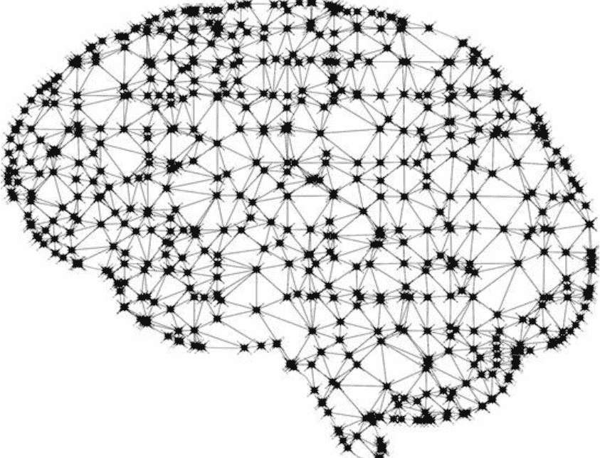
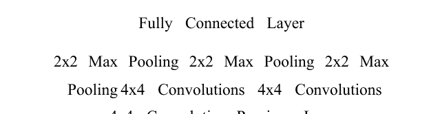
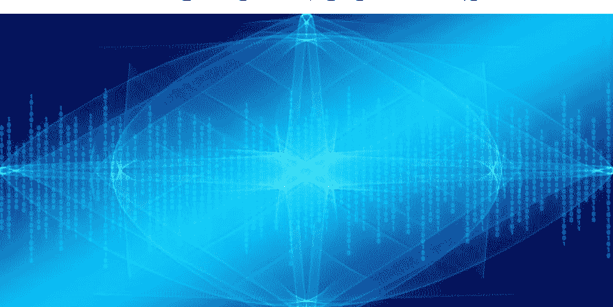

# Python 机器学习

面向初学者的 Scikit-Learn 与 TensorFlow 实践指南

CHLOE ANNABLE

© 版权所有 2024 - 保留所有权利。

未经作者或出版商直接书面许可，不得复制、转载或传播本书所含内容。

在任何情况下，出版商或作者均不对因本书所含信息直接或间接造成的任何损害、声誉或金钱损失承担任何责任或法律责任。

## 法律声明：

本书受版权保护。仅供个人使用。未经作者或出版商同意，不得修改、分发、销售、使用、引用或转述本书任何部分或内容。

## 免责声明：

请注意，本文档所含信息仅供教育和娱乐目的。我们已尽力提供准确、最新、可靠、完整的信息。不作任何明示或暗示的保证。读者承认作者不提供法律、金融、医疗或专业建议。本书内容源自多种来源。在尝试本书概述的任何技术之前，请咨询持证专业人士。

阅读本文档即表示读者同意，在任何情况下，作者均不对因使用本文档所含信息而造成的任何直接或间接损失负责，包括但不限于错误、遗漏或不准确之处。

## 目录

- [引言](#)
- [无监督机器学习](#)
    - [主成分分析](#)
    - [k-means 聚类](#)
- [深度信念网络](#)
    - [神经网络](#)
    - [受限玻尔兹曼机](#)
    - [构建深度信念网络](#)
- [卷积神经网络](#)
    - [理解架构](#)
    - [连接各部分](#)
- [堆叠去噪自编码器](#)
    - [自编码器](#)
- [半监督学习](#)
    - [理解技术](#)
    - [自学习](#)
    - [对比悲观似然估计](#)
- [文本特征工程](#)
    - [文本数据清洗](#)
    - [构建特征](#)
- [更多特征工程](#)
    - [创建特征集](#)
    - [现实世界特征工程](#)
- [集成方法](#)
    - [平均集成](#)
    - [堆叠集成](#)
- [结论](#)

## 引言

本书是一本关于中级机器学习概念和技术的分步指南。你还将学习如何处理复杂数据，因为任何机器学习技术都需要数据。本书的大部分内容将通过清晰的示例来讲解。如果你是那种通过示例学习效果更好的人，这无疑是个好消息。

由于这是一本中级指南，我们假定你已具备一定的基础知识。我们期望你了解机器学习基础和 Python。出版此类书籍的目的始终是简化内容，让任何人都能学习。因此，如果你不确定自己是否掌握了基础，仍然可以浏览本书，并在遇到新概念时进行额外研究。除此之外，信息应该易于理解。

现在让我们来谈谈你将学到什么：

我们将使用无监督机器学习算法和工具来分析复杂数据集。这意味着你将学习主成分分析、k-means 聚类等。如果这听起来陌生且新奇，没关系；这正是我们在这里的原因。此时你无需知道这些术语的含义。同样，所有这些都将配有实际示例。

然后我们将学习受限玻尔兹曼机算法和深度信念网络。接下来是卷积神经网络、自编码器、特征工程和集成技术。每章开头将从总体上解释这些技术背后的理论。

作为一条总体原则，请实践本书中的概念。这是你从本书课程中获益最多的方式。你可能会发现某些部分具有挑战性。不要一味向前冲。尝试寻找额外材料来帮助你理解概念，或者重新学习材料。

只有在你对自己的理解有一定把握时，才开始实践。这很重要，因为如果你不付诸实践，你就无法理解更高级的概念。

每章的结构将包括理论、工具和现实世界应用示例。

# 第一章：无监督机器学习

无监督机器学习由一系列对探索性分析至关重要的技术和工具组成。理解这些工具和技术对于从复杂数据集中提取有价值的数据非常重要。这些工具有助于揭示数据中难以辨别的模式和结构。

这正是我们将在本章中做的。我们将从一种名为**主成分分析**的扎实数据处理技术开始。然后我们将快速了解 k-means 聚类和自组织映射。接着，我们将学习如何使用 UCI 手写数字数据集来应用这些技术。让我们开始吧。

## 主成分分析

PCA 可以说是大数据分析中最流行的线性降维方法。其目标是降低数据的维度，使其易于管理。

PCA 是一种分解方法，擅长将多变量数据集分解为正交分量。这些分量将成为数据集的摘要，从而提供洞察。

它通过几个步骤实现：识别数据集的中心点，计算协方差矩阵及其特征向量。然后对特征向量进行正交归一化，并计算特征向量中方差的比例。由于你可能从未听说过这些术语，值得进一步解释。

1.  **协方差**：这是两个或多个变量之间的方差，适用于多个维度。假设我们有两个变量之间的协方差；我们将使用一个 2 x 2 矩阵来描述它。如果有 3 个变量，我们将需要一个 3 x 3 矩阵，依此类推。任何 PCA 计算的第一阶段都是协方差矩阵。
2.  **特征向量**：这个向量在进行线性变换时方向不会改变。让我们来说明一下。想象一下，你双手拿着一根弹性橡皮筋。然后你拉伸橡皮筋。特征向量就是当你拉伸时，橡皮筋上没有移动的那个点。它是中间的那个点，在你拉伸橡皮筋前后都保持在同一位置。
3.  **正交化**：这个术语意味着两个向量彼此成直角。简称为正交。
4.  **特征值**：特征值计算特征向量所代表的方差比例。特征值大致对应于特征向量的长度。

简要总结：协方差用于计算特征向量，然后进行正交归一化。这个过程描述了主成分分析如何将复杂数据集转换为低维数据集。

### 应用 PCA

现在让我们看看算法在实践中如何工作。正如我们所说，我们将使用 UCI 手写数字数据集。你可以使用 Scikit-learn 导入它，因为它是一个开源数据集。该数据集包含约 50 位作者的约 1800 个手写数字实例。输入由压力和位置组成，并在 8 x 8 网格上重新采样。这是为了生成可以转换为 64 个特征向量的映射。这些向量将用于分析。我们对它们使用 PCA，因为我们需要减少它们的数量，使其更易于管理。代码如下所示：

```python
import numpy as np
from sklearn.datasets import load_digits
import matplotlib.pyplot as plt
from sklearn.decomposition import PCA
from sklearn.preprocessing import scale
from sklearn.lda import LDA
import matplotlib.cm as cm

digits = load_digits()
data = digits.data
```

n_samples, n_features = data.shape
n_digits = len(np.unique(digits.target))
labels = digits.target

让我们来谈谈这段代码的功能：

1.  我们首先导入所需的库、组件和数据集。
2.  我们获取数据，然后创建一个用于存储多个数字的数据变量。目标向量被保存为标签。

现在我们可以开始应用PCA算法了：

```python
pca = PCA(n_components=10)
data_r = pca.fit(data).transform(data)
print('explained variance ratio (first two components): %s' % str(pca.explained_variance_ratio_))
print('sum of explained variance (first two components): %s' % str(sum(pca.explained_variance_ratio_)))
```

这段代码将为我们提供一个由所有成分解释的方差。它们将按其解释能力排序。

我们的结果是0.589的方差。我们已经将变量从64个减少到10个成分。这是一个巨大的改进。PCA会导致一些信息丢失，但当你权衡利弊时，优势会胜出。让我们用可视化来说明。我们有包含输出的“data_r”项目。我们将添加“color”向量，以便所有成分在散点图中都能清晰区分。使用以下代码获取它：

```python
X = np.arange(10)
ys = [i+x+(i*x)**2 for i in range(10)]
plt.figure()
colors = cm.rainbow(np.linspace(0, 1, len(ys)))
for c, i, target_name in zip(colors, [1,2,3,4,5,6,7,8,9,10], labels):
    plt.scatter(data_r[labels == i, 0], data_r[labels == i, 1], c=c, alpha=0.4)
plt.legend()
plt.title('Scatterplot of Points')
plt.show()
```

我们能从中得出什么结论？正如你在散点图中看到的，你能够确定前两个成分的类别分离。这告诉我们，使用该数据集进行准确分类将是困难的。

尽管如此，你可以看到类别以一种允许我们通过聚类分析获得一些准确结果的方式聚集在一起。PCA为我们提供了关于数据集结构的线索，我们可以使用其他方法进一步探究它。让我们通过k-means聚类算法进行分析。

## K-MEANS 聚类

我们说过，无监督机器学习算法非常适合从非常复杂的数据集中提取信息。对于试图从复杂数据集中提取数据的数据分析师来说，这些算法是巨大的时间节省者。现在，让我们更进一步，看看聚类算法。

聚类可能是核心的无监督机器学习方法，因为它专注于优化和高效实现。这个算法快得惊人。最受欢迎的聚类技术是“k-means”。k-means通过任意地将它们初始化为k个点来构建聚类。数据中的每个点都作为聚类的均值。均值是根据聚类中最近的均值确定的。每个聚类都会有一个中心；该中心成为新的均值，使所有其他均值改变其位置。

经过多次迭代后，聚类的中心将移动到一个使性能指标最小化的位置。当这种情况发生时，算法就有了一个解。这也意味着观测值不再被分配。让我们看看代码中的k-means，并将其与主成分分析进行比较。

```python
from time import time
import numpy as np
import matplotlib.pyplot as plt
np.random.seed()
digits = load_digits()
data = scale(digits.data)
n_samples, n_features = data.shape
n_digits = len(np.unique(digits.target))
labels = digits.target
sample_size = 300
print("n_digits: %d, \t n_samples %d, \t n_features %d" % (n_digits, n_samples, n_features))
print(79 * '_')
print('% 9s' % 'init\t time\t inertia\t homo\t compl\t v-meas\t ARI\t AMI\t silhouette')

def bench_k_means(estimator, name, data):
    t0 = time()
    estimator.fit(data)
    print('% 9s %.2fs %i %.3f %.3f %.3f %.3f %.3f %.3f'
          % (name, (time() - t0), estimator.inertia_,
             metrics.homogeneity_score(labels, estimator.labels_),
             metrics.completeness_score(labels, estimator.labels_),
             metrics.v_measure_score(labels, estimator.labels_),
             metrics.adjusted_rand_score(labels, estimator.labels_),
             metrics.silhouette_score(data, estimator.labels_,
                                      metric='euclidean',
                                      sample_size=sample_size)))
```

那么，PCA代码和k-means代码有什么不同呢？主要区别在于我们首先对数据集中的值进行缩放。

为什么？因为如果我们不这样做，我们可能会有各种不成比例的特征值，这些值可能对整个数据集产生不可预测的副作用。

像这样的聚类算法只有在能够解释数据分组方式时才会成功。让我们看看代码中的性能度量，以便更好地理解聚类：

1.  **同质性得分**：一个包含单一类别测量的聚类。它的基本分数从零到一。接近零的值表示样本同质性低，而另一端的值则表示样本来自单一类别。
2.  **完整性得分**：该得分通过提供关于同一类别测量分配的信息来支持同质性得分。与同质性得分结合，我们将能够判断是否有一个完美的聚类解决方案。
3.  **V-度量**：同质性得分和完整性得分的调和平均数。它有一个从零到一的缩放度量，用于评估聚类的同质性和完整性。
4.  **调整兰德指数得分**：在零到一的尺度上衡量标签的相似性。应用于聚类时，这衡量了分配集的协调性。
5.  **轮廓系数**：在不使用标记数据聚类的情况下衡量聚类的性能。分数范围从-1到1。它告诉我们聚类是否定义良好。不正确的聚类将等于-1，1表示高度定义，如果分数趋向于0，则告诉我们聚类之间存在一些重叠。

在k-means聚类示例中，所有这些分数都为我们提供了聚类度量。让我们使用“bench_k_means”函数来分析结果。以下代码应该可以做到：

```python
bench_k_means(KMeans(init='k-means++', n_clusters=n_digits, n_init=10),
              name="k-means++", data=data)
print(79 * '_')
```

结果应该如下所示：

n_digits: 10, n_samples 1797, n_features 64

| init | time | inertia | homo | compl | v-meas | ARI | AMI | silhouette |
|---|---|---|---|---|---|---|---|---|
| k-means++ | 0.25s | 69517 | 0.596 | 0.643 | 0.619 | 0.465 | 0.592 | 0.123 |

让我们简要讨论一下这些分数。首先，我应该提到数据集有很多噪声；低轮廓系数告诉我们这一点。其次，我们可以通过同质性得分得出结论，聚类中心没有得到很好的解析。V-度量和ARI也不是很令人印象深刻。

我们可以说这些结果需要改进。我们可以通过在k-means聚类之上应用PCA来获得更好的结果。当我们降低数据集的维度时，我们应该会得到更好的结果。让我们应用PCA算法看看它是否有效：

```python
pca = PCA(n_components=n_digits).fit(data)
bench_k_means(KMeans(init=pca.components_,
                     n_clusters=10),
              name="PCA-based", data=data)
```

我们将PCA应用于数据集，以便拥有与类别数量相同的主成分。看看下面的结果是否有所改善：

n_digits: 10, n_samples 1797, n_features 64

| init | time | inertia | homo | compl | v-meas | ARI | silhouette |
|---|---|---|---|---|---|---|---|
| k-means++ | 0.2s | 71820 | 0.673 | 0.715 | 0.693 | 0.567 | 0.121 |

这些结果也不是很好，因为轮廓系数仍然很低。但正如你所看到的，其他分数有了很大提高，尤其是V-度量和ARI。这表明应用PCA如何能够改进我们的分析。

## 微调

到目前为止，我们所做的是使用k-means聚类来理解聚类分析和性能指标。我们的下一步是微调我们的结果配置，以便获得更好的结果。在现实世界中，你会经常这样做。让我们看看如何通过修改k值来完成。

你会忍不住随机修改k值，看看哪个值提供最好的结果。这不会告诉你哪个值最有效。问题是，当你增加这个值时，有可能最终降低轮廓系数而得不到任何聚类。假设k值设置为0；零将是样本内观测值的值。每个点都会有一个聚类，轮廓系数会很低。所以，你不会得到任何有用的结果。

为了解决这个问题，我们可以使用“肘部法则”。“肘部法则”是一种简单但有效的技术。该方法选择最优的k个聚类。通常，当k值增加时，失真的改善会减少。肘部法则让我们找到完美的区域，称为肘点，在该点失真的改善是绝对最低的。这是我们停止将数据划分为多个聚类的点。肘部该点之所以被称为肘点，是因为它类似于弯曲的手臂，而肘部是最优的点。

以下是一个使用示例。在下面的例子中，我们在应用PCA之后使用肘部法则。顺序很重要，因为PCA涉及降维。

```python
import numpy as np
from sklearn.cluster import KMeans
from sklearn.datasets import load_digits
from scipy.spatial.distance import cdist
import matplotlib.pyplot as plt
from sklearn.decomposition import PCA
from sklearn.preprocessing import scale

digits = load_digits()
data = scale(digits.data)
n_samples, n_features = data.shape
n_digits = len(np.unique(digits.target))
labels = digits.target

K = range(1, 20)
explainedvariance = []
for k in K:
    reduced_data = PCA(n_components=2).fit_transform(data)
    kmeans = KMeans(init='k-means++', n_clusters=k, n_init=k)
    kmeans.fit(reduced_data)
    explainedvariance.append(sum(np.min(cdist(reduced_data, kmeans.cluster_centers_, 'euclidean'), axis=1)) / data.shape[0])

plt.plot(K, meandistortions, 'bx-')
plt.show()
```

值得指出的是，肘点并不容易识别。我们使用的数据集产生的曲线不那么明显，变化更平缓，这是由类别重叠造成的。

视觉图验证易于执行和解释，但其缺点是它是一种手动验证技术。我们需要的是自动化而非手动的方法。在这方面我们很幸运，因为有一种基于代码的技术叫做交叉验证，也称为v折法，它可以帮助我们。

## 交叉验证技术

交叉验证涉及将数据集分割成若干部分。我们已经将测试集搁置一旁，专注于在训练数据上训练模型。让我们看看将其应用于“digits”数据集时会发生什么。

```python
import numpy as np
from sklearn import cross_validation
from sklearn.cluster import KMeans
from sklearn.datasets import load_digits
from sklearn.preprocessing import scale

digits = load_digits()
data = scale(digits.data)
n_samples, n_features = data.shape
n_digits = len(np.unique(digits.target))
labels = digits.target

kmeans = KMeans(init='k-means++', n_clusters=n_digits, n_init=n_digits)
cv = cross_validation.ShuffleSplit(n_samples, n_iter=10, test_size=0.4, random_state=0)

scores = cross_validation.cross_val_score(kmeans, data, labels, cv=cv, scoring='adjusted_rand_score')
print(scores)
print(sum(scores) / cv.n_iter)
```

我们首先加载数据并添加k-means算法。接下来，我们定义交叉验证参数（cv）。我们需要指定所需的迭代次数和应使用的数据量。在我们的例子中，我们使用60%的数据作为训练数据，剩余部分作为测试集。然后我们使用print函数查看我们的分数。它们看起来如下：

```
[ 0.39276606  0.49571292  0.43933243
  0.53573558  0.42459285  0.55686854
  0.4573401   0.49876358  0.50281585
  0.4689295 ]
0.4772857426
```

这是聚类的兰德指数分数。正如你所看到的，所有分数都在0.4到0.76之间，就像之前的例子一样。

这与之前的区别在于，我们这里的代码为我们完成了一切，无需我们手动介入就能检查聚类质量，这更有利于自动化。这项技术取决于你和你的数据。请记住，无论使用何种解决方案，在处理未知数据集时，你总会遇到一些问题。这就是为什么你需要在一定程度上理解数据，以便你的算法产生正确的结果。

# 第二章：深度信念网络



在本章中，我们将专注于深度学习。我们将研究和应用受限玻尔兹曼机和深度信念网络。我们将使用的方法用于处理文本、图像和音频等复杂问题。想想空间识别、智能图像搜索、语音识别等等。

我们将首先了解深度信念网络的基础算法。我们将理解其理论，然后转向其技术应用。我们将看到深度信念网络在现实世界中是如何应用的。

## 神经网络

受限玻尔兹曼机是一种神经网络。这意味着，在我们做任何事情之前，我们需要先了解神经网络。

如果你读过本系列的第一本书，你对神经网络是什么会有所了解。因此，在本节中，我们将深入探讨一点，但不会深入到超出继续前进所需的程度。

以防你不记得，神经网络是用于开发和优化函数定义的数学模型。以下是神经网络的要素：

- 1. **学习过程：** 参数在神经网络节点的权重函数中被修改。输出，即性能分数，被输入到网络的学习函数中。该函数然后输出旨在最小化代价函数的权重调整。
- 2. **神经元集合：** 每个神经元集合都有一个激活函数。激活函数被称为权重函数。它的任务是处理输入数据。这些函数将取决于神经网络，这意味着它们往往随网络而变化。
- 3. **连接性：** 连接性函数指导哪个节点向哪个节点发送数据。根据连接模式，所有这些输入数据可以在有或没有限制的情况下发送。

这三个方面反映了神经网络的核心，无论它们属于哪种类型。这包括多层感知器和受限玻尔兹曼机。

### 神经网络拓扑

神经网络拓扑通常被称为神经结构或架构。它们告诉我们神经元如何组合形成网络。神经网络所具有的架构类型将影响其性能和功能。有许多神经网络拓扑，但最受欢迎的之一是三层前馈网络，它通常用于监督机器学习。

三层前馈网络，你猜对了，分为三层，数据从一层传递到下一层。第一层是输入层。它将数据发送到下一层，称为隐藏层。隐藏层构建数据表示，然后将其传输到第三层。第三层是输出层；其功能是发送结果。

受限玻尔兹曼机的拓扑结构与此有些不同。它有一个输入层和一个隐藏层，但这些层也相互连接。因此，数据不是以链式方式从一层流向另一层，而是层与层之间相互连接，信息可以以循环方式来回传播。这种架构赋予了玻尔兹曼机随机递归神经网络的特性。这使其成为一个生成模型；这意味着它对其输入进行建模，而不仅仅是使用观测到的输入。

选择正确的神经网络拓扑结构，关键在于将你的问题与能给你带来所需结果的拓扑结构相匹配。所有架构都有其优缺点。这是因为，虽然某些学习过程与其他网络兼容，但有些则可能相互排斥。在决定使用哪种网络时，仔细思考每种神经网络结构能为你做什么是很重要的。

学习过程应迭代地改进模型中的函数，以产生最精确的结果。这一过程的核心是性能度量。在监督机器学习中，性能度量以分类误差度量的形式出现。对于受限玻尔兹曼机，我们有概率最大化。概率增加度量需要优化方法来降低它们。

最流行的网络优化方法是梯度下降法。性能度量的降低与梯度下降的程度相关。目标是达到误差度量最低的点。请记住，算法的学习率与性能度量的值密切相关。

现在你已经理解了网络拓扑，让我们继续探讨受限玻尔兹曼机。

## 受限玻尔兹曼机

正如我们已经确立的，玻尔兹曼机是一种随机、循环的神经网络，其中所有神经节点相互连接，允许输出不断变化。玻尔兹曼机使用基于能量的模型。这意味着，在玻尔兹曼机中，存在一个能量函数，它为每个网络配置赋予一个能量值。能量是玻尔兹曼机的性能度量；它用于更新网络的存储参数。目标是降低网络的自由能。

玻尔兹曼机的缺点在于处理复杂的机器学习问题时显现。这是因为它存在扩展性问题；节点越多，计算时间越长。如果这种情况持续下去，我们将达到一个点，即网络的自由能无法被处理。阻止这种情况发生的唯一方法是改变网络的架构和训练过程。

### 拓扑结构

通过限制网络中所有节点之间的连接，可以提高网络的效率。尽管这是一个重大的架构改变，但它解决了我们的问题。

你首先阻止同一层内节点之间的连接。然后移除不相邻层之间的通信。事实上，这就是受限玻尔兹曼机的含义。在限制连接性时，可见层和隐藏层之间观察到独立性，从而最小化了弱点。

### 训练

正如我们所提到的，向玻尔兹曼机添加的节点越多，由于扩展性问题，训练时间就越长。

玻尔兹曼机最流行的训练方法是持续对比散度（PCD）。PCD允许我们确定能量函数的梯度。

该算法有两个阶段：正阶段和负阶段。正阶段通过增加训练集的概率来降低能量值，而负阶段确定负阶段梯度并通过采样降低概率。负阶段使用一种称为吉布斯采样的采样类型。

你们中的一些人可能想知道我们是否真的需要PCD算法。你可能会问自己，为什么我们不使用梯度下降，就像我们之前做的那样。这与玻尔兹曼机的缺点有关。根据节点的数量，计算自由能会消耗大量的计算能力。我们的目标是减少一个具有不可知值的函数。PCD算法恰好擅长于此。它为我们提供了一种计算能量梯度的方法，使我们能够对自由能值做出最佳估计，该估计值在计算上是可行的。

### 玻尔兹曼机应用

既然你已经理解了玻尔兹曼机算法的基础或其背后的过程，我们就可以处理一些代码了。

我们将使用MNIST手写数字数据集。代码将准备受限玻尔兹曼机算法。我们将通过创建其类、设置参数、层、偏置向量和权重矩阵来实现这一点。然后我们将创建一个连接函数，该函数将控制层之间的通信。然后我们将准备处理参数更新的函数。最后，我们将实现PCD算法来优化过程并减少训练时间。让我们不要浪费任何时间，直接进入：

```python
class RBM(object):
    def __init__(
        self,
        input=None,
        n_visible=784,
        n_hidden=500,
        W=None,
        hbias=None,
        vbias=None,
        numpy_rng=None,
        theano_rng=None
    ):
```

我们首先创建RBM对象并定义其参数。“n_visible”代表可见神经网络节点的数量，“n_hidden”代表隐藏节点的数量。然后我们添加了可选的深度信念网络参数，如“W”、“hbias”和“vbias”。它们将用于权重矩阵在网络内共享的拓扑结构中。定义了玻尔兹曼机类后，让我们处理参数：

```python
self.n_visible = n_visible
self.n_hidden = n_hidden
if numpy_rng is None:
    numpy_rng = numpy.random.RandomState(1234)
if theano_rng is None:
    theano_rng = RandomStreams(numpy_rng.randint(2 ** 30))
```

我们创建了随机数生成器并定义了隐藏和可见节点。让我们继续：

```python
if W is None:
    initial_W = numpy.asarray(
        numpy_rng.uniform(
            low=-4 * numpy.sqrt(6. / (n_hidden + n_visible)),
            high=4 * numpy.sqrt(6. / (n_hidden + n_visible)),
            size=(n_visible, n_hidden)
        ),
        dtype=theano.config.floatX
    )
```

我们首先更改“W”的数据类型，以便GPU可以运行它。接下来定义“theano.shared”，以便变量的存储可以在其出现的函数之间共享。在这个例子中，权重向量和偏置变量是将被共享的变量。下一段代码启用了网络各部分之间的共享：

```python
W = theano.shared(value=initial_W, name='W', borrow=True)
if hbias is None:
    hbias = theano.shared(
        value=numpy.zeros(n_hidden, dtype=theano.config.floatX),
        name='hbias',
        borrow=True
    )
if vbias is None:
    vbias = theano.shared(
        value=numpy.zeros(n_visible, dtype=theano.config.floatX),
        name='vbias',
        borrow=True
    )
```

下一步是计算输入层：

```python
self.input = input
if not input:
    self.input = T.matrix('input')
self.W = W
self.hbias = hbias
self.vbias = vbias
self.theano_rng = theano_rng
self.params = [self.W, self.hbias, self.vbias]
```

然后我们创建一个符号图。为此，我们定义必要的函数来处理层间传播和激活。让我们更详细地看看它们：

```python
def propup(self, vis):
    pre_sigmoid_activation = T.dot(vis, self.W) + self.hbias
    return [pre_sigmoid_activation, T.nnet.sigmoid(pre_sigmoid_activation)]

def propdown(self, hid):
    pre_sigmoid_activation = T.dot(hid, self.W.T) + self.vbias
    return [pre_sigmoid_activation, T.nnet.sigmoid(pre_sigmoid_activation)]
```

如图所示，我们定义了第一个函数，以便可以将可见单元的激活向上传递给隐藏单元。这允许隐藏单元处理其对属于可见单元的样本的激活。第二个函数执行相同的任务，但是向下而不是向上，因为我们有可见层上的数据激活，并从隐藏层发送单元激活。

```python
def sample_h_given_v(self, v0_sample):
    pre_sigmoid_h1, h1_mean = self.propup(v0_sample)
    h1_sample = self.theano_rng.binomial(
        size=h1_mean.shape, n=1, p=h1_mean, dtype=theano.config.floatX
    )
    return [pre_sigmoid_h1, h1_mean, h1_sample]
```

我们已经从隐藏层进行了采样。现在让我们对可见层做同样的事情：

```python
def sample_v_given_h(self, h0_sample):
    pre_sigmoid_v1, v1_mean = self.propdown(h0_sample)
    v1_sample = self.theano_rng.binomial(
        size=v1_mean.shape, n=1, p=v1_mean, dtype=theano.config.floatX
    )
    return [pre_sigmoid_v1, v1_mean, v1_sample]
```

现在连接函数已经添加，我们可以实现我们讨论过的吉布斯采样：

```python
def gibbs_hvh(self, h0_sample):
    pre_sigmoid_v1, v1_mean, v1_sample = self.sample_v_given_h(h0_sample)
    pre_sigmoid_h1, h1_mean, h1_sample = self.sample_h_given_v(v1_sample)
    return [
        pre_sigmoid_v1, v1_mean, v1_sample,
        pre_sigmoid_h1, h1_mean, h1_sample
    ]
```

吉布斯采样也应应用于从中得到的可见样本：

```python
def gibbs_vhv(self, v0_sample):
    pre_sigmoid_h1, h1_mean, h1_sample = self.sample_h_given_v(v0_sample)
    pre_sigmoid_v1, v1_mean, v1_sample = self.sample_v_given_h(h1_sample)
    return [
        pre_sigmoid_h1, h1_mean, h1_sample,
        pre_sigmoid_v1, v1_mean, v1_sample
    ]
```

让我们花点时间回顾一下我们目前所做的，并讨论一下接下来要做什么。我们已经准备好了节点、层，并建立了它们之间的通信。最后，我们添加了吉布斯采样。但我们还没有完成。

接下来，我们需要计算自由能。这意味着我们应该使用吉布斯采样代码来实现PCD算法，并为其分配一个计数参数（k = 1），以便我们可以测量梯度下降。最后，我们需要一种方法来跟踪RBM的成功率和进度。下面我们实现我们的代码，从计算自由能开始：

```python
def free_energy(self, v_sample):
    wx_b = T.dot(v_sample, self.W) + self.hbias
    vbias_term = T.dot(v_sample, self.vbias)
    hidden_term = T.sum(T.log(1 + T.exp(wx_b)), axis=1)
    return -hidden_term - vbias_term
```

现在我们可以实现PCD算法。我们将有一个学习率参数。学习率参数是一个可调整的学习速度参数，而k参数决定了PCD将执行的步数。我们说过PCD算法有正相和负相。以下是正相：

```python
def get_cost_updates(self, lr=0.1, persistent=None, k=1):
    pre_sigmoid_ph, ph_mean, ph_sample = self.sample_h_given_v(self.input)
    chain_start = persistent
```

以下是负相。一旦值计算完成，我们将学习我们的自由能值。

```python
(
    [
        pre_sigmoid_nvs,
        nv_means,
        nv_samples,
        pre_sigmoid_nhs,
        nh_means,
        nh_samples
    ],
    updates
) = theano.scan(
    self.gibbs_hvh,
    outputs_info=[None, None, None, None, None, chain_start],
    n_steps=k
)
chain_end = nv_samples[-1]
```

```python
cost = T.mean(self.free_energy(self.input)) - T.mean(self.free_energy(chain_end))

gparams = T.grad(cost, self.params, consider_constant=[chain_end])
for gparam, param in zip(gparams, self.params):
    updates[param] = param - gparam * T.cast(lr, dtype=theano.config.floatX)

updates = nh_samples[-1]

monitoring_cost = self.get_pseudo_likelihood_cost(updates)
return monitoring_cost, updates
```

要实现负相，我们必须扫描“gibbs_hvh”函数k次。这通过Theano的扫描操作完成。每次扫描执行一次吉布斯采样步骤。

既然PCD算法按计划工作，我们就可以更新网络了。这意味着我们应该实现一个训练检查方法，以确保我们的学习过程是准确的。我们简要讨论了RBM训练。现在，让我们看看代码并进一步讨论：

```python
def get_pseudo_likelihood_cost(self, updates):
    bit_i_idx = theano.shared(value=0, name='bit_i_idx')
    xi = T.round(self.input)

    fe_xi = self.free_energy(xi)

    xi_flip = T.set_subtensor(xi[:, bit_i_idx], 1 - xi[:, bit_i_idx])
    fe_xi_flip = self.free_energy(xi_flip)
```

```python
cost = T.mean(self.n_visible * T.log(T.nnet.sigmoid(fe_xi_flip - fe_xi)))

updates[bit_i_idx] = (bit_i_idx + 1) % self.n_visible
return cost
```

现在，我们有了所有需要的组件来回顾我们初始化的RBM对象。在我们的代码中，你可以看到算法的实际运行。希望这能帮助你更好地理解它的工作原理。剩下的就是训练RBM了。我们可以使用下面的代码来训练RBM：

```python
train_rbm = theano.function([index],
    cost,
    updates=updates,
    givens={x: train_set_x[index * batch_size: (index + 1) * batch_size]},
    name='train_rbm'
)

plotting_time = 0.
start_time = time.clock()
```

目前就到这里。这个设置可以在更新训练集后扩展，以运行多个周期（epochs），我们在训练数据上进行训练并绘制权重矩阵。也可以创建一个持久的吉布斯链来生成样本，然后绘制它们。我们将在此停止，因为我们的目标不是向你介绍高级概念。

RBM算法最常用于深度信念网络的预训练。深度信念网络是一种对图像数据集进行分类的工具。让我们进一步了解它。

## 构建深度信念网络

深度信念网络是通过堆叠RBM创建的。RBM的具体数量将取决于网络的目的。总体目标是在性能和准确性之间取得平衡。如果你追求更高的准确性，你需要更多的计算能力。第一个RBM用于基于训练数据训练一层特征；其他层则处理隐藏层的特征。每个RBM都提高了对数概率。这意味着深度信念网络随着层数的增加而改进。

层的大小会产生影响。通常，建议保持连续RBM隐藏层中的节点数量较低。你不希望一个RBM的可见节点数量与前一个RBM的隐藏节点数量相似。考虑到这一点，即使层的节点数量非常少，你也可以建模任何类型的函数。只要我们有足够的层来补偿，它就能工作。

### 训练

深度信念网络通过“贪婪”学习实现；这意味着每个RBM层都是局部训练的。

RBM层的训练方式与我们在RBM训练部分看到的相同。第一层的数据分布通过吉布斯采样转换为后验分布。结构中的下一个RBM层将学习相同的分布，依此类推。

我们还需要一个性能度量来微调参数。我们可以添加梯度下降、分类器（如MLP）和预测准确性。至于如何将它们组合起来，这完全取决于我们的情况。

让我们进行一个DBN的演练。我们将从创建类对象开始：

```python
class DBN(object):
    def __init__(self, numpy_rng, theano_rng=None,
        n_ins=784, hidden_layers_sizes=[], n_outs=10):
        self.sigmoid_layers = []
        self.rbm_layers = []
        self.params = []
        self.n_layers = len(hidden_layers_sizes)
        assert self.n_layers > 0
        if not theano_rng:
            theano_rng = RandomStreams(numpy_rng.randint(2 ** 30))
        self.x = T.matrix('x')
        self.y = T.ivector('y')
```

该对象具有计算初始权重所需的“numpy_rng”和“theano_rng”参数。这与我们看到的简单RBM的过程类似。然后我们有“n_ins”参数，作为DBN输入维度的指针。接着是“hidden_layers_sizes”参数，理解为一个保存隐藏层大小的列表。列表中的值用于创建正确大小的RBM层。没有这个值，DBN无法实现这一点。然后是“self.sigmoid_layers”，它将保存我们DBN的MLP元素；“self.rbm_layers”将保存训练MLP所需的RBM层。这是构建深度信念网络架构的第一步。

在下一步中，我们定义“n_layers”个sigmoid层并将它们连接起来以构成MLP元素。然后为所有sigmoid层创建一个RBM。每个RBM将使用层与RBM之间的共享权重矩阵和隐藏偏置来构建。让我们从下面的代码开始：

```python
for i in xrange(self.n_layers):
    if i == 0:
        input_size = n_ins
    else:
        input_size = hidden_layers_sizes[i - 1]
    if i == 0:
        layer_input = self.x
    else:
        layer_input = self.sigmoid_layers[-1].output
    sigmoid_layer = HiddenLayer(rng=numpy_rng,
                                input=layer_input, n_in=input_size,
                                n_out=hidden_layers_sizes[i],
                                activation=T.nnet.sigmoid)
    self.sigmoid_layers.append(sigmoid_layer)
    self.params.extend(sigmoid_layer.params)
```

我们现在创建了多个具有sigmoid激活函数的层。我们有输入层和隐藏层。“hidden_layers_sizes”列表中的值控制着隐藏层的大小。让我们继续：

```python
rbm_layer = RBM(numpy_rng=numpy_rng,
                theano_rng=theano_rng,
                input=layer_input,
                n_visible=input_size,
                n_hidden=hidden_layers_sizes[i],
                W=sigmoid_layer.W,
                hbias=sigmoid_layer.b)

self.rbm_layers.append(rbm_layer)
```

我们构建了一个与sigmoid层共享权重的RBM。现在我们必须创建一个带有逻辑回归层的MLP：

```python
self.logLayer = LogisticRegression(
    input=self.sigmoid_layers[-1].output,
    n_in=hidden_layers_sizes[-1],
    n_out=n_outs)
self.params.extend(self.logLayer.params)

self.finetune_cost = self.logLayer.negative_log_likelihood(self.y)
self.errors = self.logLayer.errors(self.y)
```

在最后一步，我们构建一个深度信念网络。我们使用MNIST图像数据集，因此我们将创建一个具有28 x 28输入、三个隐藏层和十个输出值的网络。请记住，数据集中有10个手写数字对象，因此我们需要每个对象一个输出。

```python
numpy_rng = numpy.random.RandomState(123)
print '... creating model'
dbn = DBN(numpy_rng=numpy_rng, n_ins=28 * 28,
          hidden_layers_sizes=[1000, 800, 720], n_outs=10)
```

最后，我们将进行预训练。每一层都将依赖于前一层进行训练。所有这些都是通过将PCD应用于该层的RBM来完成的。代码如下所示：

```python
print '... fetching pretraining functions'
pretraining_fns = dbn.pretraining_functions(train_set_x=train_set_x,
                                            batch_size=batch_size, k=k)
print '... pre-training model'
start_time = time.clock()
for i in xrange(dbn.n_layers):
    for epoch in xrange(pretraining_epochs):
        c = []
        for batch_index in xrange(n_train_batches):
            c.append(pretraining_fns[i](index=batch_index, lr=pretrain_lr))
        print 'Pre-training layer %i, epoch %d, cost ' % (i, epoch),
        print numpy.mean(c)
end_time = time.clock()
```

要运行预训练的DBN，我们将使用以下命令：“python code/DBN.py”。请记住，这个过程将需要

# 第三章：卷积神经网络

卷积神经网络是最受欢迎的人工神经网络之一，因其能够处理和分类图像。这些算法常用于需要照片搜索和图像识别的场景。它们也被用于文本数字化、语言处理以及音频数据的图形化表示。其主要目的是图像识别。正是这一点让深度学习备受关注。我们看到CNN算法被应用于无人机、AI驱动的汽车、机器人技术、医学科学等诸多领域。CNN推动了科学技术的进步。

CNN将视觉数据处理为张量。张量是一个数字矩阵，具有由数组嵌套数组形成的额外维度。CNN处理的是4D张量。为了更好地解释，想象你正在看一张图片。我们可以轻松推断出图片的高度和宽度，但深度呢？深度是编码的颜色：红色、绿色和蓝色颜色通道。卷积用于生成特征图，即图像细节的映射。这些存在于第四个维度中。因此，我们的图片不是一个二维对象，而是一个四维对象。

现在的问题是：什么是卷积？在数学中，卷积是衡量两个函数在相互经过时重叠程度的度量。CNN每次将滤波器应用于图像时，都会记录不同的信号。例如，在映射图像边缘时，我们可以想象以下滤波器经过它：水平、垂直和对角线。

请记住，卷积网络处理和分析图像的方式与RBM不同。CNN通过所谓的特征图进行学习；相比之下，RBM分析的是整个图像。

CNN的灵感来源于大脑的视觉皮层，它赋予人们处理和分析视觉图像的能力。视觉皮层具有光检测受体，可以在重叠的视觉场层中捕获光数据。这是图像识别算法在人工智能和机器学习中流行的原因之一。

Facebook使用了这项技术。它创建了DeepFace，一个能够以越来越高的准确度识别人脸的面部识别系统。甚至有报道称DeepFace的准确率达到97%。相比之下，FBI的面部识别系统准确率仅为85%。CNN的另一个令人兴奋的应用是DeepDream，由一位谷歌工程师创建。DeepDream用于赋予图像一种幻觉般的外观。这些图像通过算法性空想性错视进行处理。其他大型科技公司如微软和IBM也使用CNN开发智能软件。

## 理解架构

CNN的拓扑结构与多层感知机相同。多层感知机是一个无环图，由包含少量节点的层构成，其中每一层与下一层通信。

值得一提的是，这种神经网络具有相同的神经元。这是一个重要的区别，因为它意味着我们拥有相同的参数和权重值。这使得CNN效率极高，因为需要计算的值更少。另一个重要区别是节点通信有限，意味着输入并非局部连接到相邻节点。

### 层

正如我们提到的，权重应在整个层上共享，以避免不可预测的节点参数。然后我们有一个由四个参数组成的滤波器，应用于该层以创建特征图。这四个滤波器参数被称为超参数。超参数代表大小、深度、步幅和零填充。

大小是通过计算滤波器的表面积得出的。滤波器的大小将影响输出，因此控制输出以获得高效的网络非常重要。值得注意的是，较大的滤波器通常会重叠，但这并不像听起来那么糟糕，因为它可以带来更高的准确率。

滤波器深度涉及我们层中的节点数量，以及在输入周围相同区域连接的数量。我们可能在讨论图像，但当我们讨论深度时，我们指的不是任何图像内容。如果你使用过任何图像编辑软件，你就知道颜色通道是什么。颜色通道用于描述图像的内容。我们的神经节点被映射，以便它们可以看到红色、绿色和蓝色颜色通道。这就是为什么滤波器深度几乎总是设置为3。增加它将为我们提供更多关于图像的数据，并包括难以学习的属性。相反，设置较低的深度将给我们带来较弱的结果。

第三个滤波器参数是步幅。步幅值给出了神经元之间的空间。如果我们处理图像且步幅等于1，我们将设置每个像素作为滤波器的中心。这将导致输出增加和层重叠增加。在这种情况下，我们可以增加步幅值以最小化重叠；如果我们这样做，输出的大小也会减小。微调旨在实现准确性和大小之间的平衡，但这取决于你的目标。在大多数情况下，较低的值是理想的。

第四个也是最后一个滤波器参数将减少层的输出大小。零填充将感受野的边界值设置为0。对于CNN，感受野是影响网络单元的输入空间。在设置零填充之前，确保所有区域都被滤波器覆盖非常重要。零填充设置的优点之一是能够调整输入和输出，使它们具有相同的大小。使输入和输出大小相等是标准做法，因为它允许我们有效地调整深度和步幅参数。没有零填充，正确设置参数并提高网络性能将是一场噩梦。在某些情况下，滤波器的边界可能会退化。

问题是：在设置网络时，我们应该如何校准所有这些参数？我们有一个优雅的公式。如下：

$$O = \frac{W - F + 2P}{S + 1}$$

O代表层的输出，W代表图像大小，F代表滤波器大小，P代表零填充，S代表步幅。请记住，层的输出可能并不总是正整数，这可能会导致问题。你可以通过调整步幅来补偿。

现在我们对CNN层及其参数有了一些了解，让我们了解一下什么是卷积。卷积是一种数学运算符，类似于乘法和加法。它通常用于将复杂的方程分解为更简单的形式。它在对两个集合函数进行操作后产生第三个函数，结果是一个新函数，它是两个原始函数的导数。

在CNN中，我们将输入作为第一个元素。当我们将该过程应用于图像时，它被分配给图像的高度和宽度。我们将为每个颜色通道拥有3像素矩阵。矩阵的值将从0到255。

第二个组件由浮点数组成的矩阵构成，是卷积核。这些数字为输入矩阵提供滤波器，输出是特征图。滤波器评估输入并写入特征图。这种卷积过程的主要优点是消除了对特征工程的需求。我们将在后面的章节中讨论特征工程。现在，知道特征工程过程通常具有挑战性和要求很高就足够了。

### 训练

CNN学习与之前的过程非常相似。例如，MLP使用卷积网络进行预训练，并使用反向传播处理梯度。

让我们讨论训练期间执行的步骤。首先，我们必须通过计算每个特征图作为它们全部与相应权重核卷积的和来计算特征图。该步骤称为前向传播。其次，梯度是通过将交换的权重核与梯度卷积来计算的。这称为反向传播。在此过程中，我们还应计算核的损失，以便调整它们的权重。

请记住，训练过程很慢，因此无论你的硬件质量如何，都需要一段时间。

## 连接各个部分

在了解了卷积神经网络及其所有组件之后，现在让我们以最高效的方式将所有这些元素连接起来。为了说明如何实现卷积神经网络，我们将通过一个实际例子深入探讨。

一个流行的卷积网络是“LeNet”。它自80年代就已存在。它最著名的是在处理图像和手写数字方面表现出色。这恰好是我们感兴趣的领域。该网络依赖于交替的卷积层、池化层和一个多层感知器来完成其工作。对于不了解的人来说，池化层通常被放置在卷积层之间，以减少网络中的参数和计算量。

这些层是部分连接的，而多层感知器是全连接的。每一层由多个通道组成，使我们能够构建强大的滤波器。池化层用于降维，使我们的输出与输入相匹配。有一个全连接层，所有计算都向其传递。下图说明了该架构：



这种实现方式对某些应用效果很好，但对其他应用则不然。随着任务挑战性的增加，这种架构会产生糟糕的结果。另一种LeNet架构被称为GoogleLeNet。

它也被称为Google的Inception网络。其架构专为处理具有挑战性的图像数据而设计。我们所说的具有挑战性，是指在光线不足条件下用手机拍摄的、包含大量噪声的照片和视频。卷积神经网络应该能够处理这些情况。正如你可能猜到的，互联网上的大量数据是杂乱且充满噪声的，这使得处理变得具有挑战性。

我们不会比这更深入地探讨，否则会偏离本书的重点。最重要的收获是，卷积神经网络架构擅长为具有挑战性的任务找到解决方案，因为它们可以通过配置进行调整。

# 第四章：堆叠去噪自编码器



在本章中，我们将探讨自编码器，特别关注堆叠去噪自编码器。我们将主要研究其背后的理论和技术，然后看一些代码。这个主题更偏向于高级领域。对于中级指南来说，了解自编码器背后的理论和原理是值得的，因为你最终会用到它们。

让我们从对自编码器的总体讨论开始。

## 自编码器

自编码器与受限玻尔兹曼机有许多相似之处。在某些情况下，如果受限玻尔兹曼机表现不佳，会被自编码器取代。但什么是自编码器？

自编码器是一种具有三层结构的神经网络，其中输出连接到输入。自编码器旨在学习用于降维的编码/表示。降维是通过忽略信号噪声来实现的。然而，这只是其中一部分；它们做的另一件事是重构。重构是指获取降维后的表示，然后构建编码，使其与我们开始时的输入相同。简单来说，自编码器压缩来自输入层的数据，然后解压缩以匹配原始数据。这样既实现了降维，又忽略了数据噪声。

例如，我们可以使用自编码器进行图像识别。我们通过从编码层提取来编码基本图像数据，如角点。第二个编码层将处理第一层的输出并编码剩余特征。这些特征可能是像眼睛虹膜这样的东西。第三层将编码眼睛的其余部分，直到图像代码与图像表示匹配。最终，所有这些数据将由各层解码回原始数据。

我们已经讨论过像主成分分析这样的降维方法。自编码器扮演着与主成分分析相同的角色。问题就变成了：如果我们已经有一个效果很好的方法，为什么还要使用自编码器？答案很简单。这完全取决于你正在处理的数据。在处理高维数据时，主成分分析并不有效，但自编码器在处理高维数据时表现良好。自编码器是应用降噪和堆叠方法的更高级方式。这就是为什么它们擅长处理大规模复杂数据并保持准确性。

现在你对自编码器有了一些了解。让我们看看它们的架构，以便你理解它们是如何实现的。

### 结构与学习

自编码器具有简单的架构。我们有典型的三层神经网络拓扑结构，包括输入层、隐藏层和输出层。就像所有其他拓扑结构一样，输入层的数据流向隐藏层，然后从那里流向输出层。使自编码器独特的是，与输入层和输出层相比，隐藏层中的节点数量很少。

一个显著特征是输出被设置为输入。这是因为在隐藏层中编码输入后，它依赖于准确性来重构它。下面是编码的一个例子：

```
y = s(Wx + b)
```

在上面的例子中，编码是通过将“x”输入映射到其新版本来执行的。这个新版本是“y”。“W”代表附加到“x”和可调整变量“b”上的权重值。变量调整非常重要，因为它们可以帮助我们限制重构中的错误。

让我们看看学习过程。当自编码器训练时，它们依赖于低重构误差来尽可能高效和准确。误差可以使用以下公式来衡量：

```
E = 1/2 || z- x || 2
```

## 去噪自编码器

有些问题对于典型的自编码器来说过于复杂。这是因为，有时在处理高维分布时，编码最终会成为输入的克隆。这被称为过完备自编码器。适合这种情况的例子是语音数据。语音数据很困难，对其进行分类需要具有高维和复杂编码的隐藏层。

这就是为什么在机器学习中你需要关注隐藏层维度的原因之一。这个方面会对学习过程产生严重影响，你的结果可能最终不是你所期望的。如果我们遇到一个涉及复杂输入的情况，但隐藏层没有足够的节点来处理所有这些数据，我们最终会得到一个失败的神经网络。在处理困难分布时，训练有时需要更多的节点。

过完备自编码器可以实现低误差表示，但配置它们以实现这一点是困难的。优化这一点使得事情更加困难。鉴于此，最好阻止过完备编码器学习恒等函数的能力。有多种方法可以做到这一点，而且所有这些方法都不会阻止我们获取有用的数据。

一种方法是向输入数据添加噪声。这听起来很糟糕，因为在大多数情况下我们希望避免噪声。但添加噪声数据是自编码器进行训练过程并学习统计精度而非恒等性的方式。可以使用丢弃法添加噪声数据。丢弃法是通过随机将一半输入值设置为零来完成的。下面是该技术如何通过随机破坏操作应用的示例。

```
def get_corrupted_input(self, input, corruption_level):
    return self.theano_rng.binomial(size=input.shape, n=1,
        p=1 - corruption_level, dtype=theano.config.floatX) * input
```

通过区分破坏值和未破坏值来学习统计特征。这一步将有助于以更高的精度对输入数据建模。换句话说，去噪过程将创建更强大的模型。因此，当处理噪声输入数据时，无论是图像还是语音，这都是一个重要的步骤。

早些时候我们谈到过，许多机器学习算法需要预处理输入数据，以便能够重构去噪后的输入。去噪自编码器只需要最基本的预处理就能达到高精度。这恰好对深度学习非常有用。

如果我们有一个自编码器从输入数据中学习恒等函数，那么它很可能配置错误。在大多数情况下，这是因为自编码器的节点比应有的要多。如果你发现自己处于这种情况，最好的做法是减少隐藏层中的节点数量。

现在你知道了什么是去噪自编码器以及它们如何工作的一些知识，让我们讨论使用Theano库实现一个去噪自编码器的实际应用。我们需要首先定义去噪编码器对象。我们需要声明可见单元和隐藏单元。然后我们将处理我们的输入配置：变量、权重变量、可见和隐藏偏置值。这些变量将允许我们的自编码器可以从任何其他组件接收参数。代码如下所示：

```python
class dA(object):
    def __init__(self, numpy_rng, theano_rng=None,
        input=None, n_visible=784,
        n_hidden=500, W=None, bhid=None,
        bvis=None):
        self.n_visible = n_visible
        self.n_hidden = n_hidden
```

接下来，我们初始化权重和偏置值。权重向量的初始值将来自随机均匀采样。然后，我们将可见层和隐藏层的偏置变量赋值为零数组。我们将使用 `numpy.zeros` 函数来完成此操作。代码如下所示：

```python
if not theano_rng:
    theano_rng = RandomStreams(numpy_rng.randint(2 ** 30))
if not W:
    initial_W = numpy.asarray(
        numpy_rng.uniform(
            low=-4 * numpy.sqrt(6. / (n_hidden + n_visible)),
            high=4 * numpy.sqrt(6. / (n_hidden + n_visible)),
            size=(n_visible, n_hidden)
        ),
        dtype=theano.config.floatX
    )
    W = theano.shared(value=initial_W, name='W',
                      borrow=True)
if not bvis:
    bvis = theano.shared(
        value=numpy.zeros(
            n_visible,
            dtype=theano.config.floatX
        ),
        borrow=True
    )
if not bhid:
    bhid = theano.shared(
        value=numpy.zeros(
            n_hidden, dtype=theano.config.floatX
        ),
        name='b',
        borrow=True
    )
```

之前我们讨论了自编码器的映射，它涉及将输入层编码到隐藏层。我们用这个公式描述了它：`y = s(Wx + b)`。为了使编码工作，我们需要定义这些值。我们如何定义它们将基于它们与早期代码中参数的关系。下面的代码说明了这一点：

```python
self.W = W
self.b = bhid
self.b_prime = bvis
self.W_prime = self.W.T
self.theano_rng = theano_rng
if input is None:
    self.x = T.dmatrix(name='input')
else:
    self.x = input
self.params = [self.W, self.b, self.b_prime]
```

在上面的代码块中，我们定义了 `b_prime`、`bhid` 和 `bvis`。我们设置了 `W_prime`，它通过转置 `W` 与权重绑定。绑定权重通常被设置，因为它们能改善结果。绑定权重的另一个好处是优化内存消耗，因为不需要存储大量的参数。这就是我们遇到正则化效应的地方。绑定权重只需要优化一个参数。由于需要跟踪的东西更少，你也更不容易犯错。

既然我们已经准备好了自编码器参数，我们就可以定义学习函数。既然我们说过自编码器需要我们在输入数据中加入噪声，我们就这样做。学习将通过输入数据的编码图像进行，这些图像将被重构以尽可能接近原始形式。让我们通过破坏输入数据来实现这个功能：

```python
def get_corrupted_input(self, input, corruption_level):
    return self.theano_rng.binomial(size=input.shape, n=1,
        p=1 - corruption_level, dtype=theano.config.floatX) * input
```

```python
def get_hidden_values(self, input):
    return T.nnet.sigmoid(T.dot(input, self.W) + self.b)
```

在代码中，我们有参数 `corruption_level`，它配置了破坏的强度。这是通过 dropout 技术完成的。我们说过破坏是随机应用于最多一半的情况。在这个例子中，情况的数量与输入成正比。这意味着我们的破坏级别将等于输入。我们将得到一个破坏向量，其值为 0 和 1，长度等于输入的长度。在代码的最后几行，我们将破坏向量定义为输入和破坏向量的乘积。

接下来，我们确定隐藏值。我们通过计算 `y = s(Wx +b)` 来做到这一点。我们需要计算这个方程来找到 `y` 的隐藏值。然后我们需要确定输出，它在这个方程中由 `z` 表示：`z = s(W'y + b')`。这是通过重构隐藏层并使用 `b_prime` 和 `W_prime` 变量进行计算来实现的。以下是使用代码解决此问题的方法：

```python
def get_reconstructed_input(self, hidden):
    return T.nnet.sigmoid(T.dot(hidden, self.W_prime) + self.b_prime)
```

我们快完成了！我们需要做的最后一件事是确定并计算代价函数。它通过我们之前讨论的平方误差度量来解决：

```python
def get_cost_updates(self, corruption_level, learning_rate):
    tilde_x = self.get_corrupted_input(self.x, corruption_level)
    y = self.get_hidden_values(tilde_x)
    z = self.get_reconstructed_input(y)

    E = (0.5 * (z - self.x)) ** 2
    cost = T.mean(E)
    gparams = T.grad(cost, self.params)

    updates = [(param, param - learning_rate * gparam)
               for param, gparam in zip(self.params, gparams)]
    return (cost, updates)
```

我们完成了！我们已经掌握了足够的知识来应用自编码器和去噪自编码器。现在让我们稍微谈谈堆叠去噪自编码器。

## 堆叠去噪自编码器

堆叠自编码器将提高准确性。堆叠去噪自编码器是数据科学和机器学习中处理自然语言处理时的流行工具。它们可以应用于图像、音频和文本数据。准确性是通过将编码表示从一层定向到下一层作为另一层的输入来获得的。

堆叠去噪自编码器的使用方式类似于 RBM。每一层将由一个去噪自编码器和一个 sigmoid 元素组成。该自编码器将用于整个 sigmoid 网络的预训练过程。

使用堆叠去噪自编码器时，我们使用训练集误差作为性能度量。该过程涉及逐层预训练。这是因为我们需要网络参数在优化过程之前对齐。当微调开始时，我们需要测试和验证数据来训练网络。这个过程在少量的 epoch 上完成，因为我们有更好的更新阶段。我们做这一切都是为了获得准确的数据。

总结一下，我们有两个主要优势：无需复杂的特征工程即可进行训练，以及为高维数据集学习特征表示。我们还了解到，如果我们构建一个堆叠自编码器，我们可以获得其输入数据的层次形式。我们看到堆叠自编码器的连续层可以逐步学习高级特征。第一层将从输入数据中学习最小特征，如角和边。然后第二层从最小特征中学习，如边缘模式或配置。没有限制规定层数或大小。这完全取决于我们试图解决的问题。取得进展的唯一方法是探索和试验参数。

高层将能够学习复杂的结构和组合，这意味着它们将具有人脸识别、识别模式、手写字符和其他类型对象的能力。堆叠去噪自编码器非常适合复杂数据，并且可以根据需要堆叠（无限），因为堆叠它们将不断提高网络的性能和能力。唯一的缺点将是它们计算所需的功率和时间。

堆叠去噪自编码器的应用，如解决自然语言处理问题，超出了本书的范围。但了解它们在基本层面上的工作原理是有价值的。现在，让我们学习半监督学习。

# 第五章：半监督学习

我们已经学习了一些复杂的机器学习技术和方法。在这些例子中，我们使用的数据是完美的。它是干净的，可以供我们使用。但在现实世界中，情况往往并非如此。正如所有数据科学家会告诉你的那样，任何数据集都需要大量的准备工作，而且大多数时候我们没有类别标签。因此，在现实世界中处理数据集可能具有挑战性；我们无法创建准确的标签预测分类器。那么，当我们面对这样的数据时，我们该怎么办？

你可能会想，我们应该手动标注所有数据。虽然我们可以这样做，但这可能需要相当长的时间，尤其是在数据集很大的情况下。此外，手动标注也会导致一些错误，因为人类经常会犯错。另一种既高效又不易出错的方法是半监督学习。它通过获取底层分布的结构来标注未标记的数据。

半监督学习可能是解决此问题最受欢迎的方法，因为它在标注时效率很高。在处理自然语言处理和复杂音频分析时尤其有用。手动标注通常既耗时又低效。它往往需要大量的人力劳动和专业知识。在本章中，我们将讨论半监督学习技术，如自学习和对比悲观似然估计。你将学习如何使用Python库来标注复杂的数据集。你还将了解使用半监督学习带来的一些缺点。

## 理解这些技术

数据集很少带有类别标签。这意味着我们需要一个训练好的分类技术来获取类别标签。然而，如果没有初始的数据标注，训练就无法进行。这显然是个问题。你可以手动进行标注，但正如我们已经说过的，这将花费大量时间，并且很有可能出现错误。想象一下，你必须组织和处理医疗数据。在没有人为错误的情况下做到这一点会有多困难？这将非常困难。这就是半监督学习如此有用的原因。

我们通过处理有标签和无标签的数据（一起或分开）来获得半监督学习能力。有一类学习方法介于监督学习和无监督学习之间。它们被称为半监督学习。有一系列方法属于这一类别，比如主动学习技术和直推学习技术。这些方法的共同点是，它们从训练阶段保留一组测试数据，以便稍后执行。

在直推学习中，我们没有测试过程，因为它使用无标签数据来创建标签。如果没有可用的有标签数据，直推技术就不必实现测试过程。

既然我们已经大致探讨了半监督学习技术，我们应该更详细地讨论它们，包括线性回归分类器、支持向量机等等。让我们从最基本的学习技术开始：自学习。

## 自学习

这种半监督方法被认为是最基础和最简单的，但它仍然可以高效且快速。这种方法有许多实际应用：我们在自然语言处理、计算机视觉等领域都能找到它们。

这种半监督学习方法可能被认为是基础和简单的；然而，它具有快速和高效的潜力。自学习有许多实际应用，我们在自然语言处理和计算机视觉等领域都能遇到它们。

计算机视觉是关于训练计算机对数字图像数据有高度的理解。其目标是通过模拟人类的视觉系统，赋予计算机与人类完全相同的视觉能力。自然语言处理是关于教计算机处理语言。这包括教计算机听口头交流或阅读和回应文本。语音助手是自然语言处理的例子。在大多数在线商店中流行的聊天机器人也是如此。

当我们使用自学习时，我们可以获得很多价值，但这并非总是没有风险。自学习是通过将无标签案例中的数据与有标签案例中的数据进行分类，来识别无标签数据，直到我们拥有一个完全标注的数据集。

自学习是如何应用的？通常，它被设置为基础模型（如支持向量机）的包装器。要正确应用该算法，需要遵循简单的步骤：

首先，我们使用有标签的数据来确定无标签数据的标签，并计算新标注案例的置信度。然后选择新标注的案例进行后续迭代。模型从所有有标签的案例中进行自我训练，无论其来源迭代。这个过程会重复进行，直到模型成功收敛。训练完成后，测试和验证过程开始；这些通常通过交叉验证来执行。

我曾说过，自学习尽管有其优点，但实施起来可能有风险。为了最小化风险，你需要了解算法的工作原理以及如何应用它。

### 实现

在我们讨论自学习实现时，我们将使用 semisup-learn GitHub 仓库中的代码。该代码可以免费克隆或下载。

我们需要做的第一件事是为无标签案例生成标签。为此，我们定义一个“SelfLearningModel”类，它将有一个带有迭代限制参数的“basemodel”。迭代限制通常作为收敛的函数给出。我们将有一个“prob_threshold”参数，它将调节标签接受所需的最低质量。这意味着，如果一个标签没有达到最低质量参数定义的所需值，它将被舍弃。

让我们用下面的代码定义我们的“SelfLearningModel”类：

```python
class SelfLearningModel(BaseEstimator):
    def __init__(self, basemodel, max_iter=200, prob_threshold=0.8):
        self.model = basemodel
        self.max_iter = max_iter
        self.prob_threshold = prob_threshold
```

接下来，我们定义所需的拟合函数：

```python
def fit(self, X, y):
    unlabeledX = X[y==-1, :]
    labeledX = X[y!=-1, :]
    labeledy = y[y!=-1]
    self.model.fit(labeledX, labeledy)

    unlabeledy = self.predict(unlabeledX)
    unlabeledprob = self.predict_proba(unlabeledX)
    unlabeledy_old = []

    i = 0
```

让我们详细讨论这段代码，以便你更好地理解自学习算法的实现。

在代码中，我们有一个由“X”参数定义的输入数据矩阵。该参数用于构建一个大小由 [n_samples, n_samples] 定义的矩阵。然后我们有“y”参数，定义为标签数组；未标记的点标记为“-1”。接下来，我们基于X参数创建“unlabeledX”和“labeledX”参数，它们选择X参数中位置与“-1”标签匹配的组件。“labeledy”参数对“y”参数执行相同的操作。

我们可以使用Scikit-learn的预测操作来预测标签。我们通过该操作生成“unlabeledy”参数，同时我们使用“predict_proba”方法对所有预测标签进行概率计算。概率计算的结果存储在“unlabeledprob”中。

Scikit-learn的预测操作和“predict_proba”方法用于预测类别标签及其准确的概率。这两种方法也用于其他半监督学习技术，因此值得更深入地研究一下。使用二元分类器，“predict”方法将为输入数据生成类别预测。二元分类器是用于区分两个类别的分类器。我们可以使用以下操作来确定一个具有n个类别的模型是否具有二元分类器：

当所有值大于0的分类器投票支持将某个标签应用于一个案例时，预测就会执行。然后确定获得最高票数的类别。这种方法被称为“一对一”方法。“predict_proba”方法调用将分类输出转换为类别概率分布的方法。该技术称为Platt校准；它需要训练一个基础模型，然后是一个回归模型，最后拟合到一个分类器。

让我们继续实现“while”循环，以便我们可以迭代。在接下来的代码中，我们将使用一个循环，该循环将迭代直到“unlabeledy_old”参数中没有更多案例。这是“unlabeledy”的副本。在每次迭代中，只要概率达到某个阈值，就会尝试标注每个未标记的案例。以下是代码：while (len(unlabeledy_old) == 0 or
numpy.any(unlabeledy!=unlabeledy_old)) and i <
self.max_iter:
unlabeledy_old = numpy.copy(unlabeledy)

uidx = numpy.where((unlabeledprob[:, 0] > self.prob_threshold)
| (unlabeledprob[:, 1] > self.prob_threshold))[0]

接下来是一个将模型拟合到未标记数据的方法。这将通过“self.model.fit”方法完成。以下是代码：

self.model.fit(numpy.vstack((labeledX, unlabeledX[uidx, :])),
numpy.hstack((labeledy, unlabeledy_old[uidx])))

上面，未标记数据被定义在一个通过追加未标记样本构建的矩阵中。

最后一步是处理标签预测及其概率预测。我们通过以下代码实现：

unlabeledy = self.predict(unlabeledX)
unlabeledprob =
self.predict_proba(unlabeledX)i += 1

我们的自训练已经准备好实现了，我们只需要找到一个合适的数据集来使用。我们将使用一个简单的数据集，配合线性回归分类器和随机梯度下降作为“基础模型”。我们将使用statlog心脏数据集，可以从[www.mldata.org](http://www.mldata.org)免费下载。

在导入之前，我们先讨论一下数据。这个数据集有两个类别，用于判断是否存在心脏病。它有13个特征，270个样本，且没有任何缺失值。在数据集中，我们还有未标记数据和通过不良测试捕获的变量，这增加了性能成本。掌握了这些信息，让我们加载数据集。

heart = fetch_mldata("heart")

X = heart.data

ytrue =
np.copy(heart.target)
ytrue[ytrue==-1]=0
labeled_N = 2
ys = np.array([-1]*len(ytrue))

random_labeled_points = random.sample(np.where(ytrue == 0)
[0], labeled_N/2)+\random.sample(np.where(ytrue == 1)[0],
labeled_N/2)ys[random_labeled_points] =
ytrue[random_labeled_points] basemodel =
SGDClassifier(loss='log', penalty='l1')
basemodel.fit(X[random_labeled_points, :],
ys[random_labeled_points])print "supervised log.reg. score",
basemodel.score(X, ytrue)

ssmodel = SelfLearningModel(basemodel)

ssmodel.fit(X, ys) print "self-learning log.reg. score",
ssmodel.score(X,ytrue)

我们的结果质量不会是最好的，如下一行所示：self-learning log.reg. score 0.470182
值得一提的是，如果我们执行1000次测试，每次的输出都会有所不同。结果是可接受的，但可以改进。我们不应该满足于某些样本被错误标记。在我们能够改进之前，我们需要了解真正的问题所在，然后加以修复。

## 微调与优化

到目前为止，我们讨论了自学习算法的理论，并将其应用于真实世界的数据集，但我们的结果并不如预期的那样好，但我们可以改进它们。无论如何，我们已经看到了我们在开头提到的自学习算法的风险和微妙之处。我们看到了一些准确性问题和结果的差异。那么，哪里出了问题？

算法中一个设置不当的组件，或者模糊的数据，就可能导致事情出错。如果一次迭代失败，它们将基于该特征的基础构建，而问题会随着错误标记的数据在后续阶段被反复引入而加剧。

有许多因素导致了错误的结果和误差。在某些情况下，标记数据不会产生任何相关或有用的信息，但这通常发生在最初的几次迭代中。原因很简单。那些非常容易标记的未标记样本也可能与现有的标记样本几乎相同。这告诉我们，我们经常输入对分类没有任何贡献的标签。另一个问题是，向类似的预定义样本添加更多样本会导致误分类的几率增加。

了解问题的根源可能具有挑战性，但添加一些图表可以帮助我们揭示训练模型中出了什么问题。正如我们所说，这个问题通常在最初的几次迭代中遇到，然后逐渐升级。为了帮助解决，我们可以在预测循环中设置一个组件来记录分类准确率。这将使我们能够找出准确率在迭代过程中如何变化。我们将知道问题所在。然后我们可以开始提出解决方案来修复错误。如果我们认为有足够的标记数据，我们可以拥有一组多样化的标记数据。你可能会考虑使用所有标记数据，但这样做时，你面临着过拟合的风险（我们将在另一章讨论）。最佳选择是应用数据集的多个子集，并在其上训练多个自学习模型实例。这将帮助你确定输入数据对自学习算法的影响。

还有其他选择，因为依赖于用数量来解决问题的方案并不总是最佳的。问题也可以通过质量改进来解决。我们可以通过选择来构建一个多样化的标记数据子集。我们不会有一个代表自学习实现开始所需的最小样本数量的限制。记住，理论上，你总是可以只用一个类别的一个标记样本来工作；只是如果训练过程涉及大量标记数据会更好。

在使用自学习算法时经常遇到的第二种常见错误类型是选择偏差。很容易假设我们处理的是轻微的偏差，并且可以忽略不计。但偏差很重要，因为它可能导致数据选择过程选择某些类别而不是其他类别，从而导致错误的结果。最常遇到的偏差类型之一是不成比例的采样。如果数据集偏向于某个特定类别，我们就有过拟合自学习分类器的风险。问题会继续恶化，因为下一次迭代也将缺乏所需的多样性来补偿。自学习算法将建立一个错误的决策边界，该边界会过拟合到数据子集。因此，我们有许多方法来记录过拟合并诊断问题。

过拟合检测技术在处理错误和风险因素方面非常有用。它们通常被称为验证方法。这些方法的基础涉及两个不同的数据集。一个数据集用于创建模型，另一个用于测试它。验证技术的一个很好的例子是独立验证。它是最简单的，因为它只涉及等待了解我们预测的准确性。然而，这种方法并不总是可行的。

由于独立验证并不总是可行的，我们可以从样本中保存一个数据子集。这种技术被称为样本分割。样本分割在许多验证方法中都有使用。由于大多数机器学习已经涉及训练、测试和验证数据集，现在讨论的是多层验证。

如果两种验证技术都不起作用，还有第三种专注于重采样的方法。该方法涉及重复用于数据验证的数据子集。

值得一提的是，我们应该注意适当数据建模所需的样本大小。像大多数事情一样，没有固定的规则，但有一个可以遵循的指导原则。例如，如果你有“n”个点来计算单变量回归线的准确率，在大多数情况下，这意味着我们需要“mn”个观测值来评估模型。

既然你了解了一些关于采样、分割、重采样和验证技术的知识，你应该意识到一些过拟合以及它们之间的冲突。这是因为过拟合需要有限地使用训练数据子集。当我们使用大量训练数据时，遇到问题的可能性很小。解决方案是平衡所有采取的措施，因为数据的复杂性。我们需要关注指向任何问题迹象的提示，并采取行动加以限制。

尽管如此，我们的问题还没有结束。在使用自学习算法时，我们还会遇到另一个风险：引入噪声。当处理包含大量噪声的未标记类别的数据集时，我们可能会面临分类准确率下降的情况。在这种情况下，我们需要添加噪声估计器来了解噪声水平。

噪声度量很容易进行，并且可以分为不同的类型。一些度量值重叠，并定义相对于其他类别的模糊程度。这种噪声估计器称为Fisher判别比。另一种噪声估计器依赖于线性分类器的误差函数，以找出数据集的类别在多大程度上可以相互分离。训练一个基本的线性分类器就足以分析类别的可分离性和训练误差。我们不会进一步探讨这一点，但如果你好奇，你应该知道还有其他度量可以测量数据集的几何形状或密度。例如，你可以分析最大覆盖球的比例。

## 增强选择过程

置信度计算是确保自学习算法正常工作的最基本方法之一。早些时候，当我们展示一个自学习的工作示例时，我们使用了一个计算与置信度计算相关。在选择标注案例时，我们设定了一个置信度水平，作为与预测概率进行比较的方法。我们有机会向标注数据集添加估计标签，然后使用置信度阈值来选择最可靠的样本。此外，我们本可以将预测标签添加到数据集中，并根据置信度进行加权。

既然我们已经看到了困扰自学习算法的所有问题，我们就应该开始讨论一种能产生不同结果的新型自学习算法。

## 对比悲观似然估计

为了解决我们在基础自学习算法中遇到的许多问题，我们使用了子集划分和数据集性能跟踪，但这在某些情况下并非可行选项。尽管自学习在处理复杂数据集时表现优异，但情况依然如此。我们用来解决问题的方法也很难操作，尤其是在处理某些类型的数据（如医学和科学数据集）时。

在某些情况下，自学习分类器可能会被其监督学习对应方法超越。更糟糕的是，监督学习技术在面对更多数据时往往更准确。相比之下，我们使用的自学习算法随着数据量的增加，其准确度会下降，性能也会变差。这正是我们需要新方法的原因。因此，为了既能获得自学习算法的优势，又能获得监督学习带来的好处，我们使用半监督学习。这将帮助我们构建一个更高效、更准确的系统。

我们将讨论的这种新自学习方法被称为对比悲观似然估计，简称CPLE。通过CPLE创建的标签预测优于监督和半监督分类器产生的结果。现在让我们来谈谈CPLE为何有效。

CPLE在优化参数时使用最大化的对数似然度量。这是CPLE高效的主要原因之一。为了构建一个能超越监督版本的半监督训练器，CPLE被用来记录监督估计。两个学习模型之间发现的损失被用作训练性能度量。

换句话说，分类器会计算半监督学习估计相对于监督估计的改进程度。如果监督方法占优，表现优于其半监督对应方法，那么该函数将向我们展示这一结果，模型将被训练以对半监督模型进行修正并减少损失。然而，如果半监督方法被证明优于其监督对应方法，那么模型将调整模型参数，并从半监督分类器中学习。

像任何方法一样，CPLE也有其自身的缺点。首先，CPLE无法访问后验分布，而这是计算损失所必需的，因为半监督解决方案中没有数据层级。CPLE是一种悲观算法，它从预测组合中剔除笛卡尔积，并选择能确保似然增益最小化的后验分布。结果正是我们想要的。我们获得了监督学习的准确性和半监督学习的高效性。在测试过程中，我们将体验到良好的性能。作为额外的好处，与高度复杂且具有挑战性的无监督解决方案相比，我们具有优势，因为在这些方案中，标注数据对未标注数据的代表性较弱。

我们不会深入探讨CPLE的实际应用。目前，理论就足够了。在深入探讨这个主题之前，你仍然需要时间来吸收这里遇到的所有知识。由于我们关注的是中级机器学习实践，如果讲得太深，我们可能会让你感到不知所措。然而，如果你好奇，有很多材料可以帮助你进一步探索CPLE。一如既往，我们鼓励探索和实验。

# 第6章：文本特征工程


我们已经讨论了处理复杂数据集的技术。但在现实世界中，数据比我们使用的示例要复杂得多。这意味着我们经常发现自己处于必须应用多种技术而非单一技术的情境中。无论情况如何，你都必须找到最佳解决方案并获得最准确的结果。正如你所看到的，不同的情况需要不同程度的感知、计算、处理、技能和知识。

你可能已经注意到，在某些情况下，你可能需要适用于特定数据类型的技术。幸运的是，有一个过程允许我们开发特征，使任何机器学习算法都能处理数据集，而不仅仅是单一技术。

到目前为止，我们使用的所有技术都不涉及任何特征工程，至少没有达到高级水平。但特征工程是任何机器学习从业者都应具备的重要技能。

特征工程非常强大，即使少量应用，也能对分类器产生巨大影响。在许多情况下，使用特征工程是不可避免的，因为它帮助我们产生最佳可能的结果。既然能得到最好的，为什么要满足于还行呢？效率和性能始终是我们最重要的目标。

在本章中，我们将重点介绍常用于文本数据的技术，然后理解这一切是如何运作的。到目前为止，我们处理的是无法有效用于非数值数据的通用技术。每当我们处理文本数据时，我们需要开发处理该特定问题的方法；这就是特征工程的用武之地。我们专注于特征准备和清理方法。

## 文本数据清理

文本数据从来都不是干净的。这是什么意思？这意味着文本数据总是充满拼写错误、表情符号以及其他非常规词典构造的东西。在某些情况下，你甚至会在文本中发现HTML标签。这意味着，每当我们遇到文本数据时，都需要对其进行清理。为了演示，我们将使用Impermium数据集。它是为一个侮辱识别竞赛开发的。该数据集可免费获取。

在开始之前，我们需要查看输入数据。我们手动进行此操作，以便确切了解文本有什么问题。以下是我们需要在数据集中找到的侮辱示例：

| ID | Date | Comment |
|---|---|---|
| 142 | 20120422021928Z | “””\yu0 FlipEmote why aren’t you ded already””” |

我们有一个id列和一个日期列。它们没问题，我们无法对它们进行任何操作。但那个评论是不对的。当我们查看它时，可以看到一些HTML标签和拼写错误。请记住，这只是一个例子；数据集中可能还有更糟糕的示例。这类文本还使用其他文本元素来迫使过滤器忽略脏话。如果你玩过过滤脏话的游戏，你就知道用户经常通过拼写同音词、添加额外的元音、特殊字符等方式来绕过过滤系统。

那么，我们如何清理所有这些数据呢？首先，我们需要正则表达式来清理与质量相关的问题。请注意，在处理不同类型的问题时，使用正则表达式并非最佳方法。你总是有可能遗漏某些情况，并且无法估计所需的正确准备量。在这种情况下，可能会发生两件事：（1）清理过程可能过于激进，或者（2）清理过程非常薄弱。我们将面临移除我们试图恢复的内容，或者未能充分清理它的风险。最好的做法是找到一个能处理所有数据质量问题的解决方案，其他问题稍后处理。

我们将使用一个名为BeautifulSoup的工具来实现这一点。BeautifulSoup是一个库，可以帮助我们清理评论中的HTML字符。以下是添加BeautifulSoup的方法：

```python
insults = []

with open('insults.csv', 'rt') as f:
    reader = csv.DictReader(f)
    for line in reader:
        insults.append(BeautifulSoup(str(line["Comment"]), "html.parser"))

print(insults[0])

eg = BeautifulSoup(str(insults), "html.parser")
print(eg.get_text())
```

我们的结果将如下所示：

| ID | Date | Comment |
|---|---|---|
| 142 | 20120422021928Z | FlipEmote why aren’t you ded already |

你可以看到，我们并没有解决评论中的所有问题。文本看起来干净是因为我们清理了HTML标记。接下来是

## 标点与分词

分词是从文本链中构建标记集的方法。大多数标记是单词，有些则是表情符号或标点符号。

我们将使用“re”模块来完成此过程。该模块允许我们对正则表达式执行操作。操作的一个例子是子字符串替换。它包含对输入文本执行的多个操作。它会尝试用标记替换“脏”文本。在下面的示例中，我们将‘ ’符号转换为一个标记。

```
text = re.sub(r'[\w\-][\w\-\.]+ [\w\-][\w\-\.]+[a-zA-Z]{1,4}', '_EM', text)
```

此方法也可用于移除网址。操作如下：

```
text = re.sub(r'\w+:\/\/\S+', r'_U', text)
```

我们使用“_EMO”标记替换了“ ”。我们还使用“_U”标记移除了网址。我们还可以移除多余的空格和任何不需要的标点符号。我们将解决多个字符的问题。标点符号被编码为“_BQ”和“BX”。这些标签更长，因为我们希望将它们与简化版本“_Q”和“_X”区分开来。_Q 代表问号，而 -X 代表感叹号。接下来，我们应用正则表达式来减少字母数量。例如，我们可以定义一个最多容纳两个字符的字符串，限制组合数量，并使用 _EL 标记进行分词。这意味着我们将需要管理更少的组合范围。以下是我们处理空白字符的方法：

```
text = text.replace('"', ' ')
text = text.replace('\', ' ')
text = text.replace('_', ' ')
text = text.replace('-', ' ')
text = text.replace('\n', ' ')
text = text.replace('\n', ' ')
text = text.replace('\', ' ')
text = re.sub(' +', ' ', text)
text = text.replace('\', ' ')
```

以下是我们处理标点符号问题的方法：

```
text = re.sub(r'([^!?])(\?{2,})(\Z|[^!?])', r'\1 _BQ\n\3', text)
text = re.sub(r'([^.])(\.{2,})', r'\1 _SS\n', text)
text = re.sub(r'([^!?])(\?|!){2,}(\Z|[^!?])', r'\1 _BX\n\3', text)
text = re.sub(r'([^!?])\?(\Z|[^!?])', r'\1 _Q\n\2', text)
text = re.sub(r'([^!?])!(\Z|[^!?])', r'\1 _X\n\2', text)
text = re.sub(r'([a-zA-Z])\1\1+(\w*)', r'\1\1\2 _EL', text)
text = re.sub(r'([a-zA-Z])\1\1+(\w*)', r'\1\1\2 _EL', text)
text = re.sub(r'(\w+)\.(\w+)', r'\1\2', text)
```

```
text = re.sub(r'[^a-zA-Z]', '', text)
```

需要定义新的标记。例如，“_SW”代表脏话。我们将使用正则表达式对标记表情符号，特别是笑脸。我们将通过为它们声明四个类别来实现：大笑脸（_BS）；小笑脸（_S）；大哭脸（_BF）；以及小哭脸（_F）。代码如下所示：

```
text = re.sub(r'([#%&\*\$]{2,})(\w*)', r'\1\2 _SW', text)
text = re.sub(r' [8x;:=]-?(?:\)|\}|\|>){2,}', r' _BS', text)
text = re.sub(r' (?:[;:=]-?[\)\}\|d>])|(?:<3)', r' _S', text)
text = re.sub(r' [x;:=]-?(?:\(\|\|\|\/\|\|<){2,}', r' _BF', text)
text = re.sub(r' [x;:=]-?[\(\|\|\|\/\|\|<]', r' _F', text)
```

让我们稍作休息，讨论一下笑脸的一个重要方面。笑脸可能会导致复杂的问题，因为它们经常变化。我们的示例有点不完整，因为甚至没有考虑任何非 ASCII 表情符号。此外，构成文本一部分的字符驱动图像很难移除，因为它们最终可能会移除数据集中的一些案例，从而导致误导性结果。

在下一步中，我们使用“str.split”函数执行文本分割。这样做是为了让我们的输入不被评估为字符串，而是被评估为单词。

```
phrases = re.split(r'[;:\.()\n]', text)
phrases = [re.findall(r'[\w%\*&#]+', ph) for ph in phrases]
phrases = [ph for ph in phrases if ph]
words = []
```

```
for ph in phrases:
    words.extend(ph)
```

现在我们的结果应该如下所示：

| ID | Date | Comment |
|---|---|---|
| 142 | 20120422021928Z | [[‘FlipEmote’, ‘why’, ‘aren’t’, ‘you’, ‘ded’, ‘already’]] |

我们将查看单个字符的序列。这是因为在社交媒体和其他在线论坛上，人们有时会在使用冒犯性词语时分开字母，以避免触发自动语言过滤器。

```
tmp = words
words = []
new_word = ""
for word in tmp:
    if len(word) == 1:
        new_word = new_word + word
    else:
        if new_word:
            words.append(new_word)
            new_word = ""
        words.append(word)
```

它看起来会像这样：

142 20120422021928Z ['_F', 'why', 'aren't', 'you', 'ded', 'already']

与我们开始时相比，我们已经进行了一些清理。但是，正如你所看到的，还有一些问题需要处理。至少我们已经成功地用 _F 标签表示了“FlipEmote”。接下来，我们需要移除拼写错误的单词。

请记住，我们的示例是最简单的。毕竟，我们只处理几个单词和符号。因此，你不会看到我们为解决这些文本问题而实施的所有内容。请注意，在处理短句时，我们最终可能会得到几个有意义的单词。在处理上述情况时，你应该考虑这一点。

## 单词分类与标注

你知道英语的词性，如动词、名词、形容词等。我们可以制作一个算法，优先处理不同的单词。我们可以区分动词和冠词。我们可以通过将单词类别标记和编码为分类变量来实现这一点。这样，我们就可以通过只关注数据中有信息的部分来修复数据质量问题。在本节中，我们将重点介绍“回退”标注器和 n-gram 标注。这些方法主要用于构建递归标注算法。还有其他方法，但我们不会讨论，因为有很多。这两种方法完全能满足我们的目的。

在这个阶段，我们将使用名为自然语言工具包（NLTK）的 Python 库。然后，我们将移除价值较低的词性并标注所有内容。我们将移除所有停用词，如 the、a、in 等。像 Google 这样的搜索引擎之所以擅长它们的工作，是因为它们也忽略这些词。我们移除这些词是因为它们不提供有用的信息；这些词会产生噪音。当我们移除它们时，我们就节省了时间。让我们从导入自然语言工具包开始，进行单词扫描并移除停用词：

```
import nltk
nltk.download()
from nltk.corpus import stopwords

words = [w for w in words if not w in stopwords.words("english")]
```

让我们继续进行标注过程。使用字典应用标注应用程序非常容易。记住，我们使用标注来对词性进行分类。

```
tagged = nltk.word_tokenize(words)
```

这是一个易于应用的方法，但应用它可能不是最好的主意。这是因为语言很复杂，而这种方法不够复杂，无法表现良好。例如，有些单词根据上下文属于多个类别。字典的基本实现会对这类单词产生问题。幸运的是，我们有技术可以帮助我们解决这个问题。

## 序列标注

序列标注是一种算法，它从左到右遍历数据集，一次一个标记，并根据它们在序列中出现的顺序进行标注。这就是名称的由来。决定分配哪个标记取决于该标记及其前面的标记。

我们将使用带有序列标注的 n-gram 标注器，因为它经过预训练可以识别正确的标签。n-gram 指的是来自集合的 n 个组件的相邻序列。这些序列可以由字母、单词、数字代码和其他元素组成。n-gram 主要用于捕获由多个元素组成的组件集的集体内容。

让我们首先讨论一个基本的 n-gram 标注器，称为 unigram 标注器（n = 1）。Unigram 标注器为每个标记管理一个条件频率分布。该分布是通过使用属于导入的 NLTK 工具的 NgramTagger 类训练一组作品来创建的。这假设序列中一个标记最常出现的标签很可能是正确的标签。举例来说，想象单词“object”作为名词出现 3 次，作为动词出现 1 次。Unigram 标注器会将名词标签分配给 object 类别中的标记。

Unigram 标注器可能最初有效，但我们不能为同音词使用一个标签。如果我们想彻底，我们需要一个 trigram 标注器。Trigram 标注器是一个 n 值为 3 的 n-gram。这将使我们能够在不同上下文中区分具有不同含义的单词 object，例如“I object to this ruling”和“I don't like strange objects in my bedroom”。出现的问题是，我们正在用标注能力来换取标注准确性。我们的 n 值越高，我们完全找不到标记标签的风险就越大。但现实要求我们使用更## 回退标注

在某些情况下，标注器可能不够可靠。这通常发生在我们使用有限训练数据时。我们唯一的解决方案是构建一个允许多个标注器同时工作的结构。为此，我们需要区分**子标注器**和**回退标注器**。子标注器非常类似于序列标注器。然而，当子标注器无法为某个特定词元分配标签时，回退标注器将接管。回退标注器将结合结构中其他子标注器找到的结果。这适用于我们使用基本实现的情况。子标注器将按顺序轮询，接受第一个不返回空值的标签。如果所有子标注器对某个词元都返回空值，回退标注器会将该词元分类为“无”。

回退标注器通常与属于不同类别的子标注器一起使用。这使我们能够充分利用所有不同类型的标注器。在某些情况下，我们甚至可以使用引用其他更复杂结构的回退标注器的回退标注器。让我们使用一个三元组标注器，它将使用二元组标注器作为回退标注器。我们还将添加一个一元组标注器，以防其他标注器失效。以下是代码示例：

```python
brown_a = nltk.corpus.brown.tagged_sents(categories='a')
tagger = None
for n in range(1, 4):
    tagger = NgramTagger(n, brown_a, backoff=tagger)
    words = tagger.tag(words)
```

就这样，我们清理了文本。接下来，让我们继续完成改进文本所需的其他所有工作。

## 构建特征

为了使我们的文本有用，我们需要创建某些特征。让我们通过研究自然语言处理技术，如词干提取和词形还原，来探索这一点。

## 词干提取与词形还原

基于文本的数据集最大的问题是，一个词干有多种单词排列形式。要理解这一点，可以想一个简单的词，比如“travel”。“travel”是词根，其他单词如“travelling”和“traveler”都由此派生。因此，“travel”就是词干。我们需要做的是将单词形式还原为词干。为此，我们引入了词干提取器。其思想是根据若干规则将单词解析为元音和辅音的字符串。完成后，我们应用词形还原。我们还将描述使用“Porter词干提取器”的过程。

Porter词干提取器简化后缀，这意味着我们将缩减后缀。例如，我们可以决定消除复数后缀，然后是过去分词后缀，等等。在某些情况下，这样做会导致我们得到一个不完整的单词。例如，我们可能得到“ceas”而不是“cease”。这很容易通过添加一个“e”来纠正。让我们实现一个Porter词干提取器，看看它是如何工作的：

```python
from nltk.stem import PorterStemmer
stemmer = PorterStemmer()
stemmer.stem(words)
```

输出将是单词的词基/词根，尽管在某些情况下，你可能会遇到不存在的单词，比如“glanci”而不是“glance”。这需要纠正。为了纠正它，我们需要使用词形还原技术。词形还原通过一个规范化过程来确定词干和词根。请记住，词干也不必是一个真实的单词。

词形还原的结果称为词元；它必须产生真实的单词。词形还原甚至可以将同义词还原为其基本形式。例如，Porter词干提取可以从“brochures”得到“brochure”，但对于像“booklet”这样的同义词，它就无能为力了。另一方面，词形还原可以处理“brochures”和“booklets”这两个例子，并将它们都还原为“brochure”。让我们看看当我们为所有词元分配词性标注器（称为语法标注器）时，这种方法是如何工作的。

```python
from nltk.stem import PorterStemmer, WordNetLemmatizer
lemmatizer = WordNetLemmatizer()
words = lemmatizer.lemmatize(words, pos='pos')
```

结果应该如下所示：

**词形还原前的文本** - The cries of laughter that you heard were caused by a surprising memory.

**词形还原后的文本** - [‘The’, ‘cry’, ‘laugh’, ‘hear’, ‘cause’, ‘memory’, ‘surprise’]

与我们的字典方法相比，这是一个巨大的进步。我们的文本干净且已处理。没有停用词或HTML标签。噪声组件已被分词，现在我们离目标更近了。这就是我们开始使用装袋法和随机森林生成特征的地方；你接下来会了解这些是什么。

## 装袋法

装袋法属于包含多种类似方法的类别。例如，当这种方法与数据的随机子集一起使用时，称为粘贴法。在本节中，我们将重点介绍装袋法。装袋法不是从样本案例中抽取；它处理的是特征子集，这被称为属性装袋。然而，随机补丁技术可以从特征集和案例中抽取。在处理像医疗数据这样的高维数据时，这两种方法都非常流行。

装袋法在自然语言处理中被广泛使用。尽管名字奇怪，但装袋法的概念非常直观。当我们处理语言数据时，我们手上可以说是一个“词袋”。装袋法指的是通过定位单词并计算它们在样本中出现的频率来准备文本数据。让我们在下面说明这一点：

```python
['_F', 'why', 'aren't', 'you', 'ded', 'already']
```

我们可以看到数据集中有六个术语。接下来，我们为前面的句子构建一个向量。值将通过遍历列表并计算每个单词在数据集中出现的次数来定义。如果我们这样做，最终会得到一个如下所示的词袋：

| 评论 | 词袋 |
| :--- | :--- |
| _F why aren't you ded already | [1, 1, 1, 1, 1, 1, 0, 0, 0, 0, 0, 0, 0] |

这是一个基本词袋应用的例子。如你所见，我们得到的是数值向量而不是文本数据。这是因为文本是使用其他技术（如加权术语）进行分类的。该方法涉及修改向量值，使其对分类目的有用。加权通常包括一个二进制掩码，通过建立存在或不存在来工作。请记住，在某些单词比其他单词出现更多的情况下，二进制掩码非常有用。

在情况不同的情况下，还有另一种加权方法，称为词频-逆文档频率（TFIDF）。在这种情况下，我们比较一个词在句子和数据集中的使用频率。然后我们得到这样的值：如果一个词在单个案例中比在整个数据集中出现得更频繁，该值就会增加。这是搜索引擎经常使用的一种方法。我们可以使用Scikit-learn库中的“TfidfVectorizer”来实现它。

我们主要讨论了词袋背后的理论和向量的好处。现在我们需要看看如何实现这个概念。我们可以将词袋用作包装器，通过基础模型如线性回归或支持向量机。然而，我们经常将随机森林与词袋一起使用。这种组合在一个脚本中完成准备和学习阶段。此时，让我们专注于词袋本身的实现。值得知道的是，随机森林是用于基准测试算法的一组决策树。

现在，让我们回顾一下词袋的过程。首先，我们加载装袋工具，即向量化器。对于我们的示例，如果不需要花费大量时间比较特征列表中的每个对象，我们将限制特征向量的大小。以下是实现代码：

```python
from sklearn.feature_extraction.text import TfidfVectorizer
vectorizer = TfidfVectorizer(analyzer="word",
                             tokenizer=None,
                             preprocessor=None,
                             stop_words=None,
                             max_features=5000)
```

然后，我们通过使用“fit_transform”方法将数据转换为特征向量，将向量化器添加到数据集中。

```python
train_data_features = vectorizer.fit_transform(words)
train_data_features = train_data_features.toarray()
```

就这样，我们完成了。我们的数据通过文本挖掘方法进行了处理。我们研究了理论和技术，并查看了如何使用Python脚本实现它们。这意味着我们已经准备好进行更复杂的特征工程、创建特征集和处理更具挑战性的问题。

# 第七章：更多特征工程

上一章我们已经看到特征工程有多重要。我们了解了如何将数据转换为可通过机器学习技术处理的特征。我们也看到了图像识别和自然语言处理算法对数据准备的高要求。

本章我们将处理另一种数据：来自真实应用的分类数据。这类数据很常见。你很可能用过受益于它的应用。例如，传感器采集的数据就需要这种数据类型才能运作。复杂的地质调查也会使用分类数据；你会发现大量复杂的数据。无论应用如何，所使用的技术集是相同的。在本章中，你将学习如何检查数据并消除质量问题或最小化其影响。

让我们简要了解一下我们将要处理的一些思路。

1.  创建特征集有多种方法。同时，理解特征工程的局限性也很重要。
2.  我们将学习处理多种技术以提高初始数据集质量的方法。
3.  利用领域知识来提高数据的准确性。事不宜迟，让我们开始吧。

## 创建特征集

机器学习算法成功与否，最关键的决定因素是数据质量。即使数据准备得再好，如果数据不准确也无济于事。然而，当你掌握了正确的技能和数据知识时，就有可能创建强大的特征集。了解如何构建特征的必要性变得显而易见，因为你需要执行审计来评估数据集。没有审计，你可能会遗漏某些细节，创建出缺乏准确性和性能的特征。

我们将从研究解释现有特征的技术开始，这将使我们能够实现新的参数来改进我们的模型。

### 缩放技术

机器学习中最臭名昭著的问题之一是，引入未经准备的数据通常会导致算法在变量方面变得不稳定。例如，你可能会遇到一个具有不同参数的数据集。在这种情况下，我们的算法可能会处理具有较大方差的变量，就好像存在更强烈变化的迹象一样。同时，具有较小方差和值的算法则被认为不那么重要。

为了解决这个问题，我们必须实施一个称为缩放的过程。在缩放中，我们根据保持每个参数的初始顺序来校正参数值的大小；这被称为单调转换。请记住，如果我们在训练过程之前对输入数据进行缩放，梯度下降算法会更强大。在所有参数都是不同尺度的情况下，我们将拥有一个复杂的参数空间，该空间在训练阶段可能会发生扭曲。训练模型的难度取决于空间的复杂程度。让我们用一个比喻来说明。

想象一下，梯度下降模型就像滚下斜坡的球。球可能会遇到障碍物，或者因为斜坡的变形而卡住。当我们使用缩放数据时，我们就是在处理斜坡的变形并移除障碍物。当训练表面平坦时，训练将更加有效。

线性缩放是缩放最基本的例子；它介于零和一之间。这意味着最大的参数将具有缩放值一；最小的将具有缩放值零。会有值落在零和一之间。以一个向量为例。当你对 [0, 10, 25, 20, 18] 执行转换时，你会得到 [0, 0.4, 1, 0.8, 0.72]。原始数据非常多样化，但缩放后，我们最终得到了更均匀的范围。这很好，因为我们的训练算法在这种数据集上表现更好。

缩放还有其他替代方案。在某些情况下，我们可以使用非线性缩放方法。或者我们可以看看其他方法，如平方缩放、对数缩放和平方根缩放。你会发现对数缩放用于物理学和其他具有指数增长的数据集。对数缩放侧重于调整案例之间的空间，使其成为处理异常案例的最佳选择。

### 创建派生变量

缩放用于大多数机器学习的预处理阶段。在此步骤之上，我们还有其他数据准备方法，通过策略性的参数缩减来提升模型性能。一个例子是派生度量；它使用现有的数据点并将其表示为单一的度量。

这样的派生度量很常见。这是因为所有派生分数都是从多个元素中提取的组合分数。以身体质量指数为例；它是通过考虑三个点来计算的：身高、体重和年龄。

请记住，如果我们有包含熟悉信息的数据集，这些度量/分数将是已知的。通过将领域知识与现有信息结合来寻找新的转换，可以对性能产生积极影响。以下是关于派生度量你应该熟悉的概念：

1.  **创建两个变量的组合：** 这使用除法、乘法或归一化，将一个 n 参数作为 m 参数的函数。
2.  **随时间的变化：** 一个例子是加速度。我们不是处理当前和过去的值，而是处理时间序列函数的斜率。
3.  **基线减法：** 它涉及使用基本期望来修改相对于基线的参数。这可能是观察同一变量的更好方式，因为它信息量更大。例如，假设我们有一个基线流失率（衡量在一定时间内移出群体的对象数量）。我们可以创建一个参数，通过与期望的偏差来描述流失。另一个例子是股票交易；我们可以查看收盘价和开盘价。
4.  **归一化：** 这是基于另一个参数值的参数值归一化。一个例子是交易失败率。

所有这些都使我们能够产生改进的结果。它们可以组合使用以最大化效果。例如，假设有一个参数表示客户参与度的斜率应该被训练来表达客户是否参与。这是因为情境的多样性和参与度的小幅下降可能暗示多种因素，具体取决于情况。数据科学家的工作就是在创建特征时思考这些情况可能是什么，因为每个领域都有其微妙之处。到目前为止，我们只关注了数值数据。然而，在大多数情况下，存在分类参数，如涉及的代码，这些需要正确的技术来处理。

接下来，我们将研究非数值特征的解释，并学习将其转换为有用参数的技术。

### 非数值特征

在你的工作中，你经常需要解释非数值特征。这很难，因为有价值的数据可能被编码在非数值中。例如，在查看股票交易数据时，了解交易者的身份也是一条有价值的信息。想象一下，你有一个股票买家与特定卖家以特定方式进行交易；这条信息就更有价值了。处理这样的案例可能具有挑战性，但我们可以实施一系列聚合来计算它发生的次数以及扩展度量的可能性。

请记住，如果我们创建智能统计数据并减少数据集的行数，模型必须访问的信息质量可能会降低。这也会增加过拟合的风险。在使用本书讨论的机器学习算法时，减少输入数据和引入广泛的聚合并不总是最佳选择。

幸运的是，聚合有一个替代方案。编码可用于将字符串值转换为数值数据。常见的方法是“独热编码”。该过程包括将分类答案组（如年龄组）转换为二进制值集。这是有利的。它让我们能够在聚合有丢失信息风险的数据集中访问标签数据。而独热编码使我们能够分解特定的响应代码，并将其拆分为独立的特征，这些特征有助于识别特定变量的相关且有意义的代码。这使我们能够保存对目标重要的值。

另一个替代方案用于文本代码。它通常被称为“哈希技巧”。它是一个我们用来将文本数据转换为其数值对应物的函数。通常，哈希用于构建大量数据的摘要或编码被认为是敏感的广泛参数。让我们看看哈希是如何使用的，以便你能够理解并充分利用它们。

将文本转换为数值后，我们可以将这些值用作特定短语的标识符。有多种类型的哈希算法，但就我们的目的而言，最基本的那种就能胜任。为了有个概念，一个简单的哈希可以将字母表中的每个字母转换为一个校正数字。“A”会变成 1，“B”会变成 2，以此类推。哈希还可以通过将这些数字组合在一起来创建单词和句子。看看下面的字符串示例，其中有单词“dog”和“pics”：

Dog: 4 + 15 + 7

## 真实世界中的特征工程

本节内容取决于你所使用的技术。深度学习算法在处理较少工程化数据时表现更佳，总体上所需的工作量也更少。请注意，你需要通过迭代过程来学习所需内容。

首先，你需要关注模型的准确性，并学习所需的最少处理步骤。然后基于最小值进行操作，从数据中尽可能多地获取信息，分析结果，并着手进行下一次迭代。

现在，让我们转向特征工程的真实世界案例。你注意到大城市存在严重的交通和基础设施问题。这给我们带来了一个难题，因为它意味着很难估算通勤所需的时间。交通方式无关紧要；无论是公交车、私家车还是轨道交通系统，都难以预测到达和出发时间。那么，如何解决这个问题并改善你的出行体验呢？以下是一些你可以采取的措施：

- 1. 编写代码从多个API（如文本和气候数据）中采集数据。
- 2. 运用本书中学到的特征学习算法，你可以从提取的信息中获取变量。
- 3. 然后，你可以通过通勤延误风险评分来测试你的特征集。

在这种情况下，你无需专注于一个能提供高性能和高效率的模型。我们需要做的只是构建一个自动化解决方案，它会根据你的位置进行调整。然而，你可能还有其他原因想要关注这一点。

我们将查看来自Twitter的数据。Twitter要求我们在对数据集进行任何修改时，都必须复制从他们那里获取的数据集。具体来说，这些数据集是公开共享给公众的。修改的一个例子是删除一条推文。这意味着，基于流数据的模型很难给出可复现的结果。这是因为用户会创建自己的数据流并收集数据。我们还需要考虑可能影响模型性能的上下文变化。

我们讨论了一个基于你所在区域的解决方案，但模型的潜在用户并不住在你附近，因此该解决方案对他们可能不适用。一个可适应的解决方案才是最佳解决方案。

## 获取数据

为了实现我们之前讨论的目标，我们需要获取一些数据。我们该怎么做呢？为了更好地训练模型，我们需要使用定期记录的带时间戳数据。Twitter的API是完美的选择。我们可以用它来获取推文数据。

你可能会好奇为什么我们偏偏选择Twitter。这是因为有官方交通管理机构在Twitter上注册。你可以获取他们的推文，以了解公交和铁路公司的信息。这些公司通常会向客户更新延误和服务中断的情况。我们也可以从通勤者那里获取数据。我们可以使用一个词典来查找与中断和延误相关的术语。

我们还将从其他API提取数据，例如Bing交通API。它将提供交通拥堵和其他事件的数据。

通勤问题并非总是与交通公司和交通拥堵有关。天气也是一个重要因素。在典型的夏日开车与在下雪的冬日开车会产生不同的影响。因此，我们也应该获取天气信息。天气API在这方面可以提供帮助。它们会提供关于降水、湿度、大气压和能见度的详细信息。我们将以文本描述的形式获取这些数据，而不仅仅是预报。

这三个数据源将能够完成这项工作。当然，如果你愿意，也可以找到其他类型的数据添加到我们的模型中。

## 模型性能测试

我们试图对通勤中断预测进行有意义的评估。我们需要从制定测试标准和正确的性能度量开始。

我们需要提前确定中断风险，以免用户受到严重影响。

为此，我们需要满足三个要求：

- 1. 理解我们将从模型中获得的输出。
- 2. 使用特定度量来获取模型的性能。
- 3. 用于根据度量对模型性能进行评分的目标数据。

这一点存在争议，但我们可以论证，当风险提供了我们从未有过的信息时，它是有用的。

我们可以让模型为每日通勤输出一个0到1之间的分数。我们可以通过多种方式呈现这个分数。最明显的是对数缩放。其优势在于我们可以使通勤延误时间的分布遵循幂律。届时，我们将改变输出分数。我们将在后续阶段进行此操作。目前，我们的重点应该是提供分数。一个0到1的系统看起来不太实用，因此我们的目标应该是一个三级系统：在0到1的范围内分为低风险、中风险和高风险状态。这意味着我们将改变方法，将其视为带有标签的多类别分类问题。这样做可能会提高模型的性能，因为我们可以扩大自由误差范围。然而，你可能不想在第一次迭代中应用这一点。这是因为，在不了解通勤延误分布的情况下，我们无法知道不同类别之间的边界应该设在哪里。

接下来，我们应该决定如何衡量模型的性能。度量是根据特定特征所提出的问题来决定的。我们将从最常见的性能评分方法开始，它恰好非常适合我们的情况。它被称为混淆矩阵。混淆矩阵是一个用于描述分类器在测试集上性能的表格。可以将其视为一个概率表，描述标签预测与真实标签的对比。这种技术在处理多类别问题时非常有用，因为我们可以从基于类别和失败类型中学习到很多分类值。下面是一个简单的矩阵，用于评估是否存在我们不感兴趣的概率：

| 预测 | 真 | 假 |
| :--- | :--- | :--- |
| **真阳性** | 假阳性 | |
| **假阴性** | 真阴性 | |

在我们的具体场景中，我们对所有这些值都感兴趣。让我们描述一下它们。在上面的例子中，假阳性表示过早开始通勤，而假阴性则与意外延误有关。这意味着我们需要一个同时具有高灵敏度和高特异性的度量，也就是说，最佳的性能度量是AUC（曲线下面积）。

其次，我们需要一种衡量分数的方法；我们需要一个目标来进行预测。为此，我们需要亲自出行，选择一个时间，然后记录时间。为了使其有效，我们需要在出发时间和所走路线上保持一致。

这种方法因其依赖个人习惯而受到限制。也许你住在一个你的路线能获得其他人没有的优势的区域。甚至可能是当其他人不那么积极时，你对通勤要积极得多。这意味着我们不能仅仅依赖你提供的数据。数据必须从使用不同路线的许多人那里收集。就你个人目的而言，使用你自己的目标数据可能就足够了。

这种衡量方法可能对我们有用，因为我们试图对通勤中的中断进行分类。我们也不希望自然的时间差异在学习阶段被误解为其他通勤者（包括他们的路线）设定的目标。为我们的模型确定最佳路径将是困难的。很难判断我们的模型是否在最佳状态下运行。问题之所以出现，是因为我们无法保证预测的准确性，如果

## 获取 Twitter 数据

既然我们已经掌握了理论，现在可以从数据源开始提取数据了。我们决定选择 Twitter 作为数据源。我们将寻找各地的交通管理部门，并从他们的服务公告中获取数据。这里指的是纽约大都会运输署、温哥华 TransLink 以及其他类似机构的账户。

就我们的目的而言，让我们以 TransLink 为例。Twitter 的数据非常适合分析和文本挖掘。因此，我们应该从之前介绍的一些清洗技术入手，并构建有用的特征。

我们将使用 Twitter API 来获取 TransLink 的推文。这个 API 易于使用，尤其是在使用 Python 时。所以，如果你是第一次使用 API，不要感到畏惧。网上很容易找到关于 Twitter API 的指南。我们将提取的是文本本身以及日期和时间。文本是最重要的部分，因为它包含了我们正在寻找的内容，例如延误信息、服务中断、受影响的车站和区域等。

如果你决定使用 TransLink 的数据，可能会遇到一些困难，因为它通常包含火车线路和公交线路的信息。但你会发现他们的 Twitter 组织得很好，并且用统一的术语提供了我们需要的所有关于延误和中断的信息：给出服务问题的类型和主题。他们使用像 #TLAlert、#TL300 这样的标签。所有这些标签都很直观，意味着你能明白它们的用途。此外，你可以在模型中加入交通管理部门可能使用的关键词。其中一些常见术语包括延误、绕行和改道。这将帮助你捕捉到对你的目的最有用的推文，并减少你需要处理的数据量。

假设你已经获取了所需的数据。我们将从使用 BeautifulSoup 和 NLTK 进行清洗开始。假设我们使用的是 TransLink，代码大致如下：

```python
from bs4 import BeautifulSoup

tweets = BeautifulSoup(train["TweetsFromTranslink.text"])
tweettext = tweets.get_text()
brown_a = nltk.corpus.brown.tagged_sents(categories='a')

tagger = None
for n in range(1, 4):
    tagger = NgramTagger(n, brown_a, backoff=tagger)
taggedtweettext = tagger.tag(tweettext)
```

由于数据的性质，你不需要执行非常彻底的清洗过程。这是因为政府和公司的组织推文通常遵循相同的模式或公式，并且不常包含拼写错误、侮辱性语言、表情符号和非 ASCII 字符。这使得我们的工作变得非常轻松，因为许多我们通常需要采取的步骤都是不必要的。我们拥有相对干净、经过规范化和字典验证的数据集。

因此，我们应该开始思考我们想从数据中构建哪些特征。检测延误最明显的方法是过滤“delay”这个词。我们也知道，关于延误的信息会包含时间、地点和原因。我们可以在一条推文中找到所有这些信息，除了延误将持续的时间。

当他们提到一条街道或一个车站时，我们可以轻松获取位置以及受影响的区域。它还会告诉我们受影响路线的起点和终点。所以，我们不需要使用执行这些任务的方法，因为我们已经有了这些信息。

时间估计并不完美，因为我们不知道问题开始的时间。我们只有一条带有时间戳的推文，它为我们提供了服务信息，以及其他更新问题情况的推文。为了简化问题，我们将假设推文的时间戳足够准确。对于这样的时间测量，我们仍然存在其他问题。问题在于我们依赖于交通管理部门对情况的解释。可能存在一些服务延误，但交通管理部门认为不重要，所以没有向公众公布。这些小的中断可能会累积成更大的中断，直到那时我们才会收到告知情况的推文。我们还需要考虑人为因素。我们不需要知道工程师们合作得有多好。如果平台没有定期与服务团队沟通，也可能出现沟通延迟，这可能会演变成沟通上的延误。

我们无法知道所有这些情况，所以我们只能相信存在实时的服务跟踪。在我们这边，我们只需要关注延误的原因：火车、轨道、控制、入侵、医疗、电力、警察或其他。对我们来说有利的是，每个原因都会有一个关键词。我们还应该记住，其中一些原因，比如警察，不会透露太多关于道路、轨道或车站状况的信息。而其他类别则可以更可靠地用于预测潜在的服务中断，例如道岔故障。我们可以将这些用于分类。公交延误也有类似的类别，如施工、火灾、交通和事故。

我们的延误风险因素将取决于发生了什么，因此了解发生了什么对我们很重要。有些问题的影响会比其他问题更大，而有些则不那么重要。这就是为什么我们应该对这些类别进行编码，以便将它们用作参数，使我们的模型更加准确。

我们将通过使用之前讨论过的独热编码来实现这一点。该方法将为每个类别创建一个条件变量，并将其值设置为 0。它还会检查推文中是否包含分配给这些类别的特定关键词。当找到其中一个术语时，该值将被设置为 1。

我们可以通过查看某些服务中断发生的频率来提高准确性。如果我们知道某种类型延误的频率，我们就可以做出更好的预测。例如，如果某个特定车站每周发生三次延误，那么下周再次发生的可能性有多大？这些就是我们的模型必须擅长处理的类型。

## 从消费者获取数据

如今，每个人都在使用社交媒体。这意味着我们可以利用它来收集自我报告的数据。我们只需要收集这些信息，并将其用于我们的模型中以改进它。

每当任何交通工具发生服务中断时，消费者都会在社交媒体上表达自己的看法。我们可以收集这些信息，以更全面地了解正在发生的事情。我们可以创建一个包含常用关键词的字典。Twitter 可以帮助我们。我们不寻找与交通相关的推文，因为其中很多数据没有用。我们只需要涉及具体延误和交通拥堵的内容。

使用来自公众的数据与使用来自组织的数据会大不相同。人们的行为不一致，这意味着我们的清洗过程必须更加彻底。我们需要对其进行预处理和清洗，以便使用。

我们还需要使用字典来缩小搜索范围。我们可以通过实现一个边界框坐标 API 来实现这一点。这将使我们能够执行搜索，仅返回特定区域内的结果。在我们的第一次迭代中，我们应该统计一段时间内的推文数量。在下一次迭代中，我们将处理定义明确的类别，就像 TransLink 的数据一样。我们可以使用包含与延误相关的专业术语的字典。例如，我们可以预测会遇到与施工相关的交通中断，这意味着我们应该有一个包含与施工相关关键词的字典。

# 第八章：集成方法

在本章中，我们将聚焦于当前的技术以及如何利用集成方法来增强它们。顾名思义，集成方法正是如此。这些方法是将不同模型组合起来的技术。数据科学家和机器学习爱好者经常使用集成方法。它们在解决各种问题中发挥着关键作用，有助于提升性能等等。我们将探讨几种集成技术，并了解它们在现实世界中的应用。

让我们看看机器学习中的集成。它涉及两个组成部分。第一部分是一组模型。第二部分是一套规则，告诉我们如何从各个模型中收集结果并将其合并为一个输出。集成允许我们为一个问题构建多个解决方案，然后将结果整合在一起。它汲取每个组件的优点。这意味着我们得出的解决方案更具抗噪性，从而带来更好的训练过程。这转化为更少的过拟合问题和训练误差。

集成对机器学习技术产生了巨大影响，并为我们提供了前所未有的灵活性。由于这些变化，我们现在可以测试解决方案的片段或解决局部问题，而无需彻底改造整个模型。以下是集成方法的类型：

- 1. **堆叠集成：** 多个分类器的加权输出成为下一个模型的输入。
- 2. **平均集成：** 模型并行构建，并使用平均方法获得统一的估计器。
- 3. **提升集成：** 模型按顺序构建，每个新增模型都致力于提升统一估计器的得分。

让我们更详细地讨论每一种。

## 平均集成

平均集成广泛应用于音频处理和统计建模等多个领域。它们几乎总是被解释为某些系统的可重现案例。其核心思想是，给定系统内的平均值以及案例之间的方差，是整个系统最重要的值。

在机器学习中，平均集成是从相同数据集训练的一组模型。然后对结果进行聚合。这有几个优点。首先，集成减少了模型性能的波动。一个流行的平均集成集合被称为随机森林。

让我们稍微深入了解一下。

### 使用随机森林

随机森林算法深受数据科学家喜爱，因为它通常能给出出色的结果，而且非常简单。它用于构建并行的决策树分类器。这意味着它可以用于分类操作和回归。

它创建了一个由决策树集成组成的随机“森林”。决策树是决策或决策过程的可视化表示，常用于机器学习和数据挖掘。

这个森林拥有多样的决策树，因为在分类器的构建过程中至少引入了两个随机性来源。每棵树都是通过从训练数据集中进行有放回抽样得到的数据构建的。决策树的构建过程是从所有特征中选择最佳分割点，而不是从特征子集中选择。让我们使用 Scikit-learn 的 RandomForestClassifier，如下所示：

```python
import numpy as np
from sklearn.ensemble import RandomForestClassifier
from sklearn.datasets import load_digits
from sklearn.preprocessing import scale

digits = load_digits()
data = scale(digits.data)
n_samples, n_features = data.shape
n_digits = len(np.unique(digits.target))
labels = digits.target

clf = RandomForestClassifier(n_estimators=10)
clf = clf.fit(data, labels)
scores = clf.score(data, labels)

print(scores)
```

输出将是 0.999。你无法再提高这样的分数了。回顾一下我们在本书中使用的模型，你会发现没有一个能达到如此高的分数。请记住，即使你构建了一个糟糕的随机森林，你得到的结果仍然会比大多数方法要好。

让我们看看一个略有不同的随机森林。它被称为随机化树。它的工作原理与随机森林类似，但也随机化了判别阈值。换句话说，在决策树进行分割的地方，类别在随机值处被随机化。

请注意，训练决策树是一个高效的过程。任何随机森林算法都能够处理大量的树；随着树数量的增加，我们得到更多的节点，从而获得更有效的分类器。随机性方面有助于我们限制噪声。

让我们看一个例子。下面我们使用 Scikit-learn 的 ExtraTreesClassifier：

```python
from sklearn.cross_validation import cross_val_score
from sklearn.ensemble import RandomForestClassifier
from sklearn.ensemble import ExtraTreesClassifier
from sklearn.tree import DecisionTreeClassifier
from sklearn.datasets import load_digits
from sklearn.preprocessing import scale

digits = load_digits()
data = scale(digits.data)
X = data
y = digits.target

clf = DecisionTreeClassifier(max_depth=None, min_samples_split=1, random_state=0)
scores = cross_val_score(clf, X, y)
print(scores)

clf = RandomForestClassifier(n_estimators=10, max_depth=None, min_samples_split=1, random_state=0)
scores = cross_val_score(clf, X, y)
print(scores)

clf = ExtraTreesClassifier(n_estimators=10, max_depth=None, min_samples_split=1, random_state=0)
scores = cross_val_score(clf, X, y)
print(scores)
```

我们得到的分数大致如下：

| [0.82035783, 0.74262381, 0.75488341] |
|---|
| [0.9015025, 0.8918286, 0.88352197] |
| [0.93388139, 0.91798342, 0.91789423] |

分数代表了正确标记案例的比例。我们可以得出结论，随机森林和随机化树将为我们提供非常强大的结果。在这两种情况下，我们都发现分数高于 0.9。

有一个缺点。在使用随机森林时，很难看出实现的有效性。随着森林规模的增大，难度也会增加。小型森林和单个森林更容易处理。

另一个缺点是，该算法可能需要较长的计算时间来处理实时预测。随机森林在训练时很快，但在训练阶段结束后进行预测时却很慢。更糟糕的是，我们想要的精度越高，就需要添加越多的树。

总的来说，随机森林对于大多数现实世界的情况来说足够快，但在某些情况下，运行时延迟是不希望出现的。但即使你没有正确优化它们，它们也足够高效。

随机森林通常用于预测建模，因此你不能将它们用作描述性工具。如果你想要数据关系的描述，你需要另一种技术，比如我们之前讨论过的那些。

## 堆叠集成

经典集成在某一方面是相似的。我们有多个分类器被训练来拟合一组目标标签。然后将这些模型应用于产生一个元函数，该函数包含其他集成方法，如平均和提升。堆叠是另一种选择，有时也称为混合。我们将讨论堆叠。

正如我们所讨论的，堆叠是配置模型层，使得一层的输出成为下一层的训练数据。我们可以这样做数百层而不会失败。我们可以更进一步；我们可以有堆叠的堆叠。然后从一个堆叠集成中提取最成功的参数，并将它们作为元特征应用于其他堆叠中。如果你花点时间想象一下，这并不令人头晕。

堆叠集成更加高效和强大。想象一个场景，其中有数百个特征。然后我们使用堆叠集成来提高预测质量。我们需要做几件事：

- 1. 我们可以在训练和优化集成时首先留出一些数据。在将模型应用于测试集之前，我们可以重新训练和优化它。这可以给我们带来很好的结果。
- 2. 然后我们使用均方根误差和梯度下降作为性能函数。最好使用集成的均方根，而不是模型的。
- 3. 我们可以混合那些能够单独改善其他模型残差的模型。例如，我们可以使用邻域方法来改善受限玻尔兹曼机的残差。了解机器学习技术的优缺点可以帮助你构建更优的配置。
- 4. 最后，我们可以使用 k 折交叉验证技术来获得我们组合的残差。

我们现在了解了堆叠集成的基础知识，以及它们如何与其他技术结合使用。让我们通过解决实际问题来探讨问题求解方法，这些代码来自机器学习爱好者，他们运用相同技术赢得了竞赛。例如，根据分子的化学性质预测生物反应就是一个数据科学问题。让我们查看一个竞赛中针对同一问题的参赛作品，以更好地理解堆叠集成的应用方式。

我们使用的数据集包含若干行，每行代表一个分子，共有1,776个特征描述每个分子的属性。我们需要根据这些属性预测分子的二元响应。我们将使用一个融合五种分类器的代码：两个随机森林分类器、一个梯度提升分类器和两个极端树分类器；每个分类器都会产生略有不同的预测结果。代码如下所示：

```python
if __name__ == '__main__':
    np.random.seed(0)
    n_folds = 10
    verbose = True
    shuffle = False
    X, y, X_submission = load_data.load()
    if shuffle:
        idx = np.random.permutation(y.size)
        X = X[idx]
        y = y[idx]
```

```python
skf = list(StratifiedKFold(y, n_folds))

clfs = [RandomForestClassifier(n_estimators=100,
    n_jobs=-1, criterion='gini'),

    RandomForestClassifier(n_estimators=100, n_jobs=1, criterion='entropy'),

    ExtraTreesClassifier(n_estimators=100, n_jobs=-1, criterion='gini'),

    ExtraTreesClassifier(n_estimators=100, n_jobs=-1, criterion='entropy'),

    GradientBoostingClassifier(learning_rate=0.05, subsample=0.5,
    max_depth=6, n_estimators=50)]

print "Creating train and test sets for blending."
dataset_blend_train = np.zeros((X.shape[0], len(clfs)))
dataset_blend_test = np.zeros((X_submission.shape[0], len(clfs)))

for j, clf in enumerate(clfs):
    print j, clf
    dataset_blend_test_j = np.zeros((X_submission.shape[0], len(skf)))
    for i, (train, test) in enumerate(skf):
        print "Fold", i
        X_train = X[train]
        y_train = y[train]
        X_test = X[test]
        y_test = y[test]
        clf.fit(X_train, y_train)
```

```python
y_submission = clf.predict_proba(X_test)[:, 1]
dataset_blend_train[test, j] = y_submission
dataset_blend_test_j[:, i] = clf.predict_proba(X_submission)[:, 1]
dataset_blend_test[:, j] = dataset_blend_test_j.mean(1)
```

```python
print
print "Blending."
clf = LogisticRegression()
clf.fit(dataset_blend_train, y)
y_submission = clf.predict_proba(dataset_blend_test)[:, 1]

print "Linear stretch of predictions to [0,1]"
y_submission = (y_submission - y_submission.min()) / (y_submission.max() - y_submission.min())

print "Saving Results."
np.savetxt(fname='test.csv', X=y_submission, fmt='%0.9f')
```

在上面的例子中，我们有一个重复的分类器，但每个分类器使用不同的分裂标准。如你所见，“gini”分类器使用基尼不纯度度量。基尼不纯度衡量的是，如果根据特定层的标签分布随机标记，一条随机记录被错误标记的次数。我们的第二个分类器名为“entropy”，使用信息增益度量来衡量信息内容。分支的内容通过其编码过程所需的比特数来衡量。从熵标准得到的结果将与从基尼标准得到的结果不同。

值得一提的是，如果你不完全理解堆叠集成在上述代码中的应用方式，请不要担心。上述应用更为高级，并在竞赛中获得了高分。就我们的目的而言，我们只需要了解堆叠方法的应用方式即可。

## 结论

我们的旅程到此结束。希望这本书为你提供了继续学习更高级主题所需的知识。就像我们在这里所做的那样，你需要投入大量练习，即使你并不完全理解某些内容。只需做更多研究并尝试一下。

机器学习是一个不断发展的领域，就像技术领域的任何其他领域一样。新的方法和技术不断涌现，有时可能难以跟上。这并非坏事。没有人期望你知道一切，但他们期望你具备能力。所有这些变化意味着这个领域永远不会过时，总有有趣和值得学习的东西。这足以鼓励你继续学习和提高。你不必独自前行，因为有许多在线社区致力于学习、协作和讨论处理特定问题的最佳方法。请善加利用。

那么，我们学到了什么？

在第一章中，我们探讨了无监督机器学习技术和探索性分析所需的其他工具。处理复杂数据集时，了解这些内容很重要。你学会了如何识别数据分析所需的模式和结构。然后你学习了主成分分析、k均值聚类和自组织映射。我们还学习了如何使用UCI手写数字数据集来应用它们。

在第二章中，我们探讨了受限玻尔兹曼机和深度信念网络。我们学习了如何应用这两种技术。这两种技术是许多涉及图像或声音识别的复杂问题的常见解决方案。

在第三章中，我们研究了卷积神经网络。它们通常用于人工神经网络实现中。我们学习了如何将它们用于照片搜索和图像识别。如今，CNN算法常用于无人机、机器人和自动驾驶汽车。

在第四章中，我们探讨了自编码器及其变体，如去噪自编码器。我们主要讨论了它们，并探索了属于它们的一些最佳技术。我们考察了一个实际应用。目的是让你能够自主学习更多关于它们的知识。研究技能在机器学习中很重要。然后我们探讨了半监督学习。我们学习了自学习和对比悲观似然估计等机器学习技术。我们还学习了如何使用Python库来标记数据。

在第六章和第七章中，我们探讨了特征工程技术和其他相关主题。我们研究了它们如何与基于文本的数据一起使用。我们学习了如何清理基于文本的数据并为分析做准备。我们了解了清理文本数据的重要性，因为它通常包含拼写错误、HTML标签、表情符号和其他字符。因此，文本应该被清理，直到我们获得最有价值的数据。在这两章中，我们都进行了实际应用，逐步处理每个阶段。

在最后一章中，我们探讨了集成技术。我们研究了平均法和堆叠法。我们学习了这些概念，并考察了几个如何使用它们解决实际问题的真实案例。集成方法很重要，值得努力和改进，即使它们感觉不太容易上手。

机器学习是一个复杂的学科，需要我们花时间研究、分析、学习和实践。你已经学会了继续学习之旅所需的工具。祝你一切顺利！