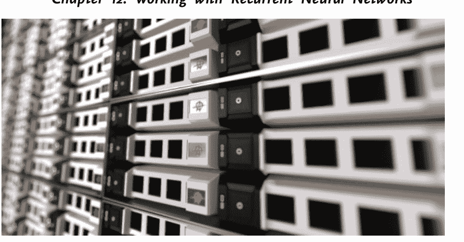
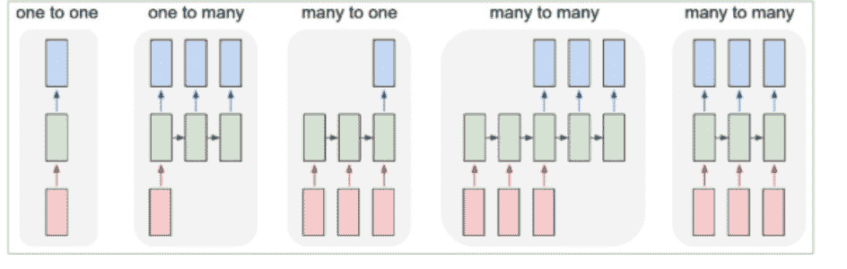
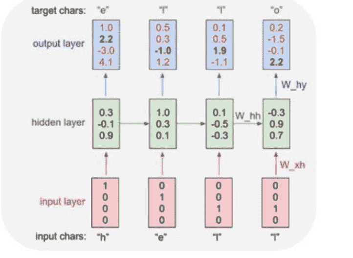

# 面向初学者的Python机器学习

使用Python、Scikit-Learn和TensorFlow进行机器学习、深度学习和神经网络的手册


芬恩·桑德斯

# 面向初学者的Python机器学习

使用Python、Scikit-Learn和TensorFlow进行机器学习、深度学习和神经网络的手册

芬恩·桑德斯

版权所有 2019 © 芬恩·桑德斯

保留所有权利。

未经出版商书面许可，不得以任何形式复制本指南的任何部分，评论情况除外。

# 法律声明与免责声明

以下文件转载如下，旨在提供尽可能准确和可靠的信息。

本声明被美国律师协会和出版商协会委员会认为是公平和有效的，并在美国全境具有法律约束力。

此外，传输、复制或再生产以下任何作品（包括特定信息）将被视为非法行为，无论其是以电子方式还是印刷方式进行。这包括创建作品的二级或三级副本或录制副本，且仅在获得出版商明确书面同意的情况下才被允许。所有附加权利保留。

以下页面中的信息被广泛认为是事实的真实和准确描述，因此，读者对所述信息的任何疏忽、使用或误用将导致任何由此产生的行为完全由其自行负责。在任何情况下，出版商或本作品的原始作者均不以任何方式对读者在采用本文所述信息后可能遭受的任何困难或损害负责。

此外，以下页面中的信息仅用于提供信息，因此应被视为通用信息。鉴于其性质，本信息在提供时不保证其长期有效性或临时质量。提及的商标未经书面同意，且在任何情况下均不得被视为商标持有者的认可。

# 目录

- [引言](Introduction)
- [第1章：什么是机器学习？](Chapter 1: What is Machine Learning?)
- [第2章：什么是深度学习、Scikit-Learn和TensorFlow？](Chapter 2: What is Deep Learning, Scikit-Learn and Tensor Flow?)
- [第3章：Python基础](Chapter 3: The Basics of Python)
- [第4章：设置你的环境](Chapter 4: Setting Up Your Environment)
- [第5章：Scikit-Learn入门](Chapter 5: Getting Started with Scikit-Learn)
- [第6章：K-近邻算法](Chapter 6: K-Nearest Neighbors Algorithm)
- [第7章：什么是K-均值聚类？](Chapter 7: What is K-Means Clustering?)
- [第8章：什么是支持向量机？](Chapter 8: What are Support Vector Machines?)
- [第9章：通过神经网络回归Scikit-Learn](Chapter 9: Bringing it Back to Scikit-Learn with Neural Networks)
- [第10章：随机森林算法如何助力机器学习](Chapter 10: How the Random Forest Algorithm Can Help in Machine Learning)
- [第11章：如何使用TensorFlow](Chapter 11: How Can I Use TensorFlow)
- [第12章：使用循环神经网络](Chapter 12: Working with Recurrent Neural Networks)
- [第13章：线性分类器](Chapter 13: Linear Classifier)
- [第14章：Python机器学习中你可以使用的其他流程](Chapter 14: Other Processes You Can Use with Python Machine Learning)
- [结论](Conclusion)

# 引言

接下来的章节将讨论你开始使用Python机器学习所需了解的一切。当你使用传统形式的编码时，你将能够做许多不同的事情。这些方法长期以来一直被用于创建程序、网站等。但借助机器学习，你能够将所有这些提升到一个新的水平。机器学习引入了人工智能的元素，确保你能够发现模式、将信息聚类在一起，并在此过程中完成一些令人惊叹的事情。

学习一门新的编码语言过去可能很棘手。掌握一门代码可能需要数年时间才能编写出一些基本程序。再加上机器学习——这个允许计算机程序自主学习并完成工作的过程——可能需要更长的时间。过去，只有那些拥有丰富经验甚至教育背景的人，才有望在这个技术领域取得成功。但在本指南的帮助下，任何人都可以学习如何使用Python编码语言以及机器学习，并在短时间内编写自己的程序。

本指南将花一些时间探讨机器学习及其全部内容。我们将了解机器学习的一些基础知识，以及监督学习、无监督学习和强化学习之间的区别。我们还将了解一些可以与机器学习一起使用的基础库，例如Scikit-learn和TensorFlow，以帮助你获得所需的工具。在本指南的开头部分，我们将了解Python的一些基础知识，以及如何编写一些代码，以便你稍后可以在机器学习中使用。

接下来，我们将了解使用Python机器学习可以做的一些不同事情。我们将探讨诸如K-均值聚类、支持向量机、随机森林算法、循环神经网络，甚至线性分类器等内容。所有这些都可以根据你开始机器学习时想要处理的程序类型，在不同的情况下使用。

机器学习带来了一个广阔的世界，当你使用Python编程语言来帮助你查看结果时，你会爱上所有你想要的不同的编码和编程工具。本指南将探讨你可以使用Python机器学习处理的所有不同事情，以便你可以立即开始处理自己的项目。

当你准备好了解更多关于机器学习的知识，并希望能够在Python的帮助下创建一些自己的程序时，请务必查阅本指南以帮助你入门。

# 第1章：什么是机器学习？


在我们开始学习机器学习的不同部分之前，在我们介绍成功进行机器学习所需的一些代码之前，是时候了解一下什么是机器学习了。机器学习是一种人工智能，它将为系统提供从经验中学习的能力，而无需为流程所需的每件事进行编程。机器学习将关注于开发能够访问数据并自主从中学习的计算机应用程序。

这种学习过程可以从观察或数据开始，例如指令、示例和直接经验，以从数据中找出正确的模式，并利用这些预测来了解未来该做什么。你在机器学习中看到的主要目标是，它允许计算机以自动方式学习，无需人类的任何帮助或干预，并且计算机程序可以在情况变化时进行必要的调整。

当你使用机器学习时，你会发现它使分析大量数据变得比以往任何时候都更容易。机器学习可以给我们带来一些有益的结果，但当然，你首先必须学习如何设置它，并且在你能够实现这一切之前需要一些资源。这种类型的编码通常需要更多时间来处理，因为你基本上是在训练机器学习模型去做你想做的事情，即使你不在场，这确实可以增加系统能够完成的工作量。

你可以使用机器学习来完成许多不同的事情。任何时候，当你不确定最终结果会如何，或者不确定对方的输入可能是什么时，你会发现机器学习可以帮助你解决其中一些问题。如果你希望计算机能够浏览长串选项并找到模式，或者找到正确的结果，那么机器学习将最适合你。机器学习可以帮助解决的其他一些事情包括：

- 语音识别
- 面部识别
- 搜索引擎。机器学习程序将开始从个人提供的答案中学习，或者查询，并且随着时间的推移，会在顶部附近开始给出更好的答案。

## 购物后的建议

处理大量关于财务和客户的数据，并对公司应如何增加利润以及在此过程中让客户满意做出准确预测。

这些只是您可能希望开始使用能够自主行动的程序的几个例子。您作为初学者将要学习使用的许多传统程序将比这简单得多。它们会确切地告诉计算机在给定情况下应该做什么。这对许多程序来说效果很好，但对于人工智能之类的事情，这还不够。

使用传统编码，您将能够弄清楚，或者至少限制对方将提供给您的选择。然后您可以在最后添加一个兜底选项，以防对方输入其他内容。例如，如果您的程序有问题“2 + 2 等于多少？”，那么您需要有一个针对他们选择 4 作为答案的响应，然后还需要另一个答案来处理用户输入到系统中的任何其他输入。

但是，如果您正在使用一些最适合机器学习的程序，这并不总是效果最好。例如，如果您正在制作搜索引擎，您将无法猜测用户将要进行的每一个查询。如果您在 Alexa 上使用语音识别，您将无法提前弄清楚每一个请求，以及每种方言对机器来说听起来会是什么样子。这就是为什么机器学习可以发挥作用并且如此重要。

## Python 的重要性

虽然我们稍后会看看 Python 及其工作原理，但需要注意的是，Python 是处理机器学习时最好的语言之一。Python 是一种简单的语言，对于编程世界的新手来说足够容易使用。然而，它仍然具有足够的能力，以确保您仍然可以完成一些您想要的复杂代码。该语言拥有庞大的库，如果您决定将它们一起实现，它与其他编码语言配合得很好，而且即使您过去没有任何编码实践或经验，它也足够易于阅读。

在本指南中，我们将要研究的示例将使用 Python。这将有助于确保您能够处理任何您想要的代码，而不必担心学习过于复杂的东西。如果您过去使用过 Python，那么这是个好消息。即使您过去使用过不同类型的编码语言，这种编码语言也足够简单，您可以非常快速地学习和理解。

## 如何对机器学习算法进行分类

所有机器学习的学习算法都可以分为三种主要类型。这些包括监督学习、无监督学习和强化学习。

### 监督机器学习

我们将要研究的第一种学习类型被称为监督学习。这种类型需要使用系统的人提供所需的输入和输出，并且您需要根据系统在训练过程中的预测准确性向系统提供反馈。这基本上意味着训练者需要向系统展示一堆例子，并向它们展示什么会起作用，什么不是一个好的答案，以便系统有时间在过程中学习。

训练完成后，算法需要将其从数据中学到的知识应用于做出最佳预测。监督学习的概念可以看作类似于学生在老师的监督下学习。老师将给学生上一节课，并给出一些例子，然后学生将从这些例子中推导出新的规则和知识。然后，他们可以将知识应用于不同的情况，即使这些情况与老师给出的例子不完全匹配。

当我们研究监督机器学习时，了解分类问题和回归问题之间的区别也是一件好事。回归问题是指目标将是某种数值。但分类将是一个类别或标签。回归任务可以帮助确定城镇中所有房屋的平均成本，而分类则有助于根据花瓣的长度确定图片中的花是什么类型。

当您选择一个能够学习用户输入数据的正确响应的算法时，就会发生监督学习。监督机器学习可以通过几种方式做到这一点。它可以查看您提供给计算机的示例和其他目标响应。您可以包含值或标签字符串来帮助程序学习正确的行为方式。

这是一个简单的过程，但一个可以参考的例子是，当老师教学生一个新主题时，他们会向班级展示该情况的例子。然后学生将学习如何记住这些例子，因为这些例子将提供关于该主题的一般规则。然后，当他们看到这些例子或类似的东西时，他们知道如何回应。然而，如果展示的例子与班级所展示的不相似，他们也知道如何回应。

### 无监督学习

您也可以使用所谓的无监督学习。对于这些算法，不期望您向计算机提供输出数据。这是因为您希望机器根据用户在那里使用的未知输入来弄清楚。一种被称为深度学习的方法，也可以被称为迭代方法，将被用于审查数据并得出一些新的结论。

这使得无监督学习方法更适合用于各种处理任务，这些任务可能比您使用监督学习算法所做的更复杂。这意味着无监督的学习算法将仅从示例中学习，而不会得到任何响应。算法将努力自己找出这些例子中的模式，而不是被告知答案。

您遇到的许多推荐系统，例如当您在线购买东西时，将在无监督学习算法的帮助下工作。在这种情况下，算法将根据您之前浏览和购买的内容来推断应该向您推荐购买什么。然后，算法必须根据您的购买情况估算与您最相似的客户，然后从中为您提供一些好的推荐。

正如我们之前提到的，您可以使用不止一种类型的机器学习。监督学习是第一种。它旨在让您向计算机展示示例，然后根据您展示的示例教它如何响应。有很多程序这种技术会效果很好，但向计算机展示成千上万个例子的想法可能显得乏味。此外，还有许多程序效果并不好。

这就是无监督机器学习可以发挥作用的地方。我们现在将更深入地探讨这种无监督机器学习到底是什么。无监督学习是当您的算法能够从错误或示例中学习，而没有与之相关的响应时发生的一种学习。这意味着对于这些算法，它们将负责根据您给它的输入来找出和分析数据模式。

现在，还有几种不同类型的算法可以很好地与无监督机器学习配合使用。无论您选择哪种算法，它都能够获取数据并将其重组，以便所有数据都归入类别。这使得您以后查看这些信息变得容易得多。无监督机器学习通常是您会使用的，因为它可以设置计算机完成大部分工作，而不需要人类在那里并为计算机编写所有指令。

### 强化学习

您可以使用的第三种机器学习算法是强化学习。这是一种当算法被呈现没有标签的示例时发生的学习类型，类似于我们在无监督学习中看到的。然而，这种示例将伴随着根据算法提出的解决方案，会得到一些负面或正面的反馈。它将与一些应用场景相关联，在这些场景中，算法需要做出决策，而这些决策又会带来相应的后果。基本上，这种方法类似于人类学习中使用的试错法。

在这个过程中，错误是可以接受的，因为当它们与惩罚（如时间损失、成本和痛苦）相关联时，它们将在学习过程中变得有用。在强化学习过程中，某些行动更有可能成功，而其他行动则不太可能成功。

机器学习过程类似于我们在预测建模和数据挖掘中看到的情况。在这两种情况下，模式都会在程序内部进行相应的调整。机器学习的一个很好的例子是推荐系统。如果你在网上购买了一件商品，你随后会看到与该商品相关的广告。

有些人认为强化学习与无监督学习是同一回事，因为它们非常相似，但重要的是要理解它们是不同的。首先，提供给这些算法的输入需要有一些反馈机制。你可以根据你决定编写的算法，将这些机制设置为负面或正面。

所以，每当你决定使用强化机器学习时，你就是在使用一种类似于试错法的选项。想想当你与一个年幼的孩子一起工作时。当他们做出你不赞成的行为时，你会首先告诉他们停止，或者你可能会让他们暂停活动，或者采取其他行动让他们知道他们所做的不对。但是，如果同一个孩子做了你认为好的事情，你会表扬他们并给予大量的正面强化。通过这些步骤，孩子正在学习什么是可接受的行为，什么不是。

简单来说，这就是强化机器学习的工作方式。它基于试错的理念，要求应用程序使用一种帮助其做出决策的算法。当你使用的算法应该在没有任何错误的情况下做出这些决策并取得良好结果时，这是一个很好的选择。当然，你的程序需要一些时间来学习它应该做什么。但你可以将此添加到你正在编写的特定代码中，这样你的计算机程序就能学习你希望它如何表现。

## 理解深度学习是什么

我们需要关注的下一个概念是深度学习。这将是机器学习的一个子领域，涉及受大脑功能和结构启发的算法，即人工神经网络。它将致力于教会你的计算机以人类自然的方式行动和表现，也就是说，系统将能够通过示例进行学习。

正是通过这种深度学习的帮助，你的计算机将能够学会直接从声音、图像和文本中执行各种分类任务。深度学习模型能够达到最先进的准确度，在某些情况下，其性能甚至能够超越人类水平。大量的标记数据和神经网络架构将被用来训练具有一些深度学习的模型。

如你所见，机器学习包含许多不同的部分。它是一个很棒的工具，你可以用它来让你的计算机或系统完成一些你可能感到困难的事情。例如，机器学习可用于帮助搜索引擎工作，或者在你在线购物时为你提供一些推荐。即使你需要处理大量数据，机器学习也能发挥作用并提供帮助。

本指南的其余部分将花一些时间探讨机器学习的一些基础知识，以及如何在Python中使用它，以确保你能够充分利用这个过程。让我们更仔细地了解一些你需要知道如何操作的过程，以便在Python中使用机器学习获得惊人的结果。

# 第2章：什么是深度学习、Scikit-Learn和TensorFlow？


既然我们对机器学习有了一些了解，现在是时候更多地了解两个将使这个过程变得更容易的过程和库了。你会注意到这两个库都能与Python很好地协同工作，了解如何让它们工作将确保你的Python代码在你尝试使用的机器学习中尽可能强大和有效。

我们将在本指南中探讨的两个过程包括Scikit-Learn和TensorFlow。让我们看看今天这两个库如何工作。

## 什么是Scikit-Learn

我们还需要花一些时间来了解Scikit-learn。它将通过一致的Python接口为你的用户提供许多监督和无监督学习算法。我们将在本指南的后面花一些时间更多地了解Python，但它是一个极好的工具，你可以用来增强你的机器学习，而且由于它是为初学者设计的，即使那些过去从未接触过编码的人也能使用它。

Scikit-learn由David Cournapeau于2007年作为Google Summer of Code项目开发。无论你是商业用途还是学术用途，这个过程都适合使用。

Scikit-learn一直作为Python中的机器学习库在使用。它将包含多种类型的分类、回归和聚类，以帮助你获得更多结果。你将能够在这个系统中使用的一些算法包括DBSCAN、k-means、随机森林、支持向量机和梯度提升等。Scikit-learn的设计使其能够与Python代码中其他一些流行的库很好地协同工作，包括SciPy和NumPy库。

该库本身完全用Python编写，然后你将依赖的一些算法是用Cython编写的，以确保你从中获得最佳性能。你会很快发现Scikit-learn库是你在构建所需的一些机器学习模型时最适合使用的库。好消息是这个库很容易获取并且是开源的，所以你可以在准备好的时候开始使用它。

## 什么是TensorFlow

我们需要在这里看的另一个东西是名为TensorFlow的库。这是一种来自Google的框架，当你准备创建一些深度学习模型时会用到它。这个TensorFlow将依赖于数据流图进行数值计算。它已经能够介入并使机器学习比以往任何时候都更容易。

它使得获取数据、训练你想要使用的一些机器学习模型、进行预测，甚至修改你看到的一些未来结果的过程变得更容易。由于所有这些在机器学习中都很重要，因此学习如何使用TensorFlow很重要。

这是一个由Google Brain团队开发的库，用于在大规模进行机器学习时使用。TensorFlow将把机器学习和深度学习算法和模型结合在一起，并通过一个共同的隐喻使它们更加有用。TensorFlow将使用Python，就像我们之前说的，它为用户提供了一个前端API，可以在你想要构建应用程序时使用，而应用程序将执行到高性能的C++。

TensorFlow 可用于构建、训练和运行深度神经网络，应用于图像识别、循环神经网络、手写数字分类、词嵌入以及自然语言处理等诸多领域。

这两个库对于确保你在机器学习道路上保持正确方向都至关重要。它们都能与 Python 良好协作，但各自擅长处理的任务类型有所不同，因此在开始项目之前，你需要对此稍作研究。

# 第三章：Python 基础

我们之前已经简要提及了 Python 语言，以及它在机器学习工作中为何如此有益。Python 是目前最简单的编程语言之一，也是最适合初学者的语言之一，因为它非常容易上手。而且，尽管它使用起来简单得多，却具备更高级语言的所有强大功能，你会发现它非常适合学习我们当前讨论的主题。

在使用 Python 语言时，有许多不同的部分需要掌握。你可以处理注释、语句、函数等等。让我们先对 Python 代码的一些基本部分有个概览，并学习如何编写一些代码，以便你在处理这类代码时能够做好准备。

### 注释

我们首先要看的是注释。在你的代码中，可能需要向自己或其他查看代码的人解释某处代码的作用。这有助于每个人理解代码的实际功能，或者可能帮助你为代码的该部分命名。

当你这样做时，这就被称为注释。你需要在注释前放置一个特殊字符，这样程序就知道它不需要读取该注释，而是可以跳过它，直接开始读取代码的下一部分。对于 Python 语言，你需要在任何注释前使用 `#` 符号，这样编译器就会知道你不希望它执行该部分。因此，在 Python 中编写注释的一个好例子是：

```
#this is the new comment for this code
```

编写完注释并确认完成后，你可以直接按回车键或返回键，然后在下一行继续编写更多代码。你可以根据需要将注释写得任意长或任意短。你也可以在代码中编写任意数量的注释。但是，在编写注释时，尽量不要过于随意。这可能会使代码看起来杂乱，让其他人难以阅读。

### 语句

代码中另一个可以使用的选项是语句。无论你使用 Python 还是其他编程语言，每当你要编写新代码时，都必须在其中添加这些语句。这使编译器能够理解你想要执行的操作。语句是发送给解释器的代码单元。然后，解释器能够根据你输入的任何命令来检查语句并执行它。

在编写代码时，你可以选择一次显示多少条语句。有时只有一条语句需要处理，有时你会添加更多。只要语句保持在代码的括号内，那么无论语句数量多少都是可以的。

当你决定是时候向正在编写的代码添加至少一条语句时，你就会将其发送给解释器处理。只要解释器理解你编写的内容，它就会执行命令。你的语句结果将显示在计算机屏幕上。如果你发现某些内容没有正确显示，你总是可以返回代码并进行必要的调整。

现在，这可能需要消化很多信息，听起来可能有些困惑。让我们看看如何做到这一点：

```
x = 56

Name = John Doe

z = 10

print(x)
print(Name)
print(z)
```

当你将此发送给解释器时，屏幕上应该显示的结果是：

56

John Doe

10

就是这么简单。打开 Python 并尝试一下，看看在解释器中显示一些内容是多么容易。

### 使用变量

代码中你可以花时间研究的下一部分是变量。这些变量很好用，因为它们可以用于将代码的不同部分存储在计算机的正确位置。这意味着，如果你正确执行该过程，变量将位于计算机内存中的特定位置。根据你在该特定代码中处理的数据类型，变量将确保计算机知道应该保存哪个空间。

我们要做的第一件事是确保有一个值被赋给变量。如果这没有发生，那么变量将无法正常执行其功能。如果变量从一开始就分配了一个值，那么它将在代码中按照你期望的方式做出反应。

你还可以在三种主要类型的变量之间进行选择，以使变量正常工作。你决定使用的类型将帮助你确定要分配给它的值的类型。可供你选择的变量包括：

- 浮点数：这包括像 3.14 这样的数字。
- 字符串：这类似于一个语句，你可以写出类似“感谢访问我的页面！”或其他类似短语的内容。
- 整数：这包括任何不带小数点的其他数字。

在使用这个特定程序时，请记住，你不必通过声明来预留所需的内存量。在你为正在使用的变量添加值之后，这将自动发生。如果你想确保这将在代码中自动发生，你只需要确保等号在正确的位置。一个如何实现这一点的例子如下：

```
x = 12  #this is an example of an integer assignment
pi = 3.14 #this is an example of a floating point assignment
customer_name = "John Doe" #this is an example of a string assignment
```

你在这里可以做的另一件事是让两个或多个值指向完全相同的变量。在你的代码中，某些情况下这将很重要。你将遵循与上面相同的过程，只需确保每个部分都有一个等号，以便它们知道关联位置。因此，在代码中写出类似 `a = b = c = 1` 的内容是完全可以的，因为当你编写代码时，每个变量都将等于一。

### 关键字

在 Python 中工作时，就像选择使用其他一些编程语言一样，你会遇到一些需要保留为代码命令的关键字。你必须小心使用它们，因为它们用于告诉程序如何运行。你不希望以不同于命令的方式或在任何地方使用它们，否则会导致解释器混淆。随着我们在本指南后续部分开始使用 Python 编写一些机器学习代码，你会逐渐发现关键字变得越来越清晰。

### 为标识符命名

现在我们需要看看在使用 Python 时需要记住的一些事项，那就是你必须以正确的方式命名所有标识符。每当在 Python 中开始编写新代码时，你都需要处理一些标识符。最常见的包括函数、变量、类和实体。

在某些时候，你需要为这些标识符命名，以便它们能够按照你希望的方式工作，并确保在编写代码时它们能在正确的时间被调用。无论你选择使用哪种标识符，都必须遵循相同的规则来确保它们被正确命名。一些命名标识符的规则包括：

- 任何时候使用字母时，可以使用大写或小写，也可以两者组合使用。你还可以在名称中添加数字、符号和下划线。这些的任何组合都是可以接受的，只需确保名称字符之间没有空格。
- 永远不要以数字开头命名标识符。这意味着像 `4babies` 这样的名称是无效的。

可能会导致你的计算机出现错误。不过，如果你愿意，将标识符命名为“fourbabies”也是可以接受的。标识符绝不应该是Python的关键字之一，并且关键字也不应出现在名称中。

现在，如果你正在编写自己的代码，最终没有遵循其中某条规则，系统会发送错误消息让你知道。错误将会显示，然后程序会自动关闭。这就是为什么在命名标识符时要格外小心如此重要。

当你努力挑选想要使用的标识符时，你会希望选择一个对他人和你自己都易于阅读的。这将使其他程序员在查看代码时更容易理解发生了什么。而使用一个具有描述性的标识符，将有助于确保代码尽可能保持组织性，并且易于你阅读。

## 关于Python语言的更多信息

Python在编码和技术领域的许多专家看来，被认为是最佳的编程语言之一，尤其是如果你是这个领域的新手。它很简单，可以为你提供所需的所有功能，并且拥有足够的资源和工具来创建你想要的任何项目，包括与机器学习相关的项目。虽然你也可以使用其他编程语言，但有些可能很难学习，而且对于没有大量实践和知识的人来说，许多都太难入门了。

关于Python语言，有一点你会喜欢，那就是它基于英语，这意味着学习这门语言会更容易，因为你不必处理很多你甚至读不懂的单词。尽管它的设计初衷是让初学者能够充分利用它，但你在其中编写的任何代码背后都将蕴含强大的功能。

作为刚刚开始学习Python的人，你也会喜欢这门编程语言附带的库。这个库将使你更容易编写任何类型程序所需的一些代码。

作为一名初学者，你可能还会喜欢这门语言拥有一个相当庞大的社区。因为这门语言被全世界如此多的人使用，所以有很多资源可以帮助你取得最佳效果。你可以在网上找到社区和论坛，它们可以帮助回答你的一些问题，并确保你完成并运行你的程序，即使你需要一点帮助。

## 确保Python已安装在你的计算机上

现在，如果你准备好开始编码，并且已经决定Python是你的选择，那么你可能需要考虑准备一些东西来帮助这个过程变得更容易一些。首先，检查你的计算机上是否已经安装了一个强大的文本编辑器是个好主意。这是你将用来编写Python代码的特定软件。它不必很复杂，Windows计算机上的记事本就很好用，但你需要确保它已就位。

一旦你检查了文本编辑器是否就位，就该下载Python程序，这样你就可以开始编写代码了。Python是一种免费的编程语言，所以你不必担心支付高额费用之类的事情。IDE，即运行代码的环境，对用户也是免费的。

要设置这个编程程序，你只需访问Python网站，然后点击你感兴趣的版本。根据刚刚发布的版本、你想要的功能以及你计算机上的操作系统，有几种选项可供选择。

在下载Python编程语言时，你必须确保同时下载IDE。IDE是你编写代码时将使用的基本环境。这个IDE还将包含解释你编写的所有代码所需的编译器。你可以选择使用Python自动附带的IDE。这个IDE是专门为与Python配合使用而设计的。话虽如此，还有其他IDE选项可能具有一些你会喜欢使用的特殊功能。

如你所见，Python语言使用起来并不像看起来那么复杂。一旦你的环境和IDE设置好，你就可以实际编写需要使用的代码，你将能够立即享受使用它的好处。请务必回顾本章中我们学过的一些关于Python的主题，并学习一些关于这门语言的知识，这样你就可以准备好继续学习本指南，并用我们将讨论的机器学习做一些了不起的事情。

# 第4章：设置你的环境

现在我们对机器学习有了更多了解，并且学习了一些关于Python编程语言的知识，是时候设置你的环境了。在你尝试进一步学习机器学习和深度学习之前，这是一个重要的步骤。为了帮助你设置这个出色的环境，你需要确保你的两个库，TensorFlow和Scikit-Learn，都已设置好并准备就绪。

## 安装Scikit-Learn

我们将导入并设置好的第一个库是Scikit-learn。这是一个支持Python 2.7及更高版本的库，所以如果你的计算机上已经安装了其中一个版本，那么你就准备好了。但在安装这个库之前，请确保你已经安装了SciPy和Numpy库。如果这些库不存在，请先安装它们，然后再安装Scikit-Learn。

所有这些重要库的安装都可以借助pip完成。这是Python附带的一种工具，这意味着如果你的系统上已经安装了Python，或者一旦你完成安装，你就会得到pip。然后，你可以使用以下命令来让scikit-learn准备就绪：

```
pip install scikit-learn
```

然后安装将能够运行，一旦所有这些完成，安装就会结束。你也可以使用conda选项来帮助安装这个库。你需要使用的命令是：

```
conda install scikit-learn
```

一旦你注意到scikit-learn的安装完成，就该进行一些导入操作，将其引入Python程序。这一步对于使用其附带的算法是必要的。好消息是，实现这一点的命令很简单。你只需转到命令行并输入import sklearn。

如果你的命令能够顺利执行而没有留下错误消息，那么你就知道刚刚完成的安装是成功的。完成所有这些步骤后，你的scikit-learn库就在计算机上了，它与Python程序兼容，并且可以使用了。

## 如何安装TensorFlow

接下来，我们需要查看下载和安装环境时的TensorFlow库。这个TensorFlow将包含一些编程语言的API，包括Rust、Java、Go、Haskell和C++。我们将在这里查看如何在Windows计算机上安装这种库。当你在Windows上时，你可以使用Anaconda或pip下载这个库。

原生pip能够将TensorFlow安装到你的系统上，而无需将其放置在虚拟环境中。但这里需要注意的一点是，使用pip安装TensorFlow可能会干扰你系统上可能存在的其他Python安装。

好消息是，你只需要运行一个命令就可以完成此操作，一旦该命令就位，TensorFlow就会安装到你的系统上并准备使用。当这个库借助pip安装时，用户将可以选择从计算机上的任何目录运行这个程序。

要使用Anaconda安装这个库，你需要首先创建一个虚拟环境。然而，当你单独查看Anaconda时，你会看到它建议你使用pip install命令来安装这个库，而不是使用conda install命令。

在开始之前，请确保你在Windows系统上使用的是Python 3.5或更高版本。Python 3很好，因为它已经内置了pip 3程序，这通常可以用于安装TensorFlow。

这意味着你将能够使用 `pip3 install` 命令来让一切按你期望的方式运行。如果你有兴趣获取该库的仅 CPU 版本，可以使用以下命令：

```
pip3 install --upgrade tensorflow
```

如果你想确保安装的是 TensorFlow 程序的 GPU 版本，则需要使用以下命令来实现：

```
pip3 install --upgrade tensorflow-gpu
```

这将确保你能够在当前使用的 Windows 系统上安装 TensorFlow。但另一个你可以用来安装此库的选项，以便将其与 Python 及你所有其他机器学习算法一起使用，包括能够借助 Anaconda 包来安装它。

Pip 是一个在你系统上安装 Python 时会自动安装的程序。但 Anaconda 程序并非如此。这意味着如果你想确保 TensorFlow 能够通过 Anaconda 程序安装，你首先需要花时间安装这个程序。为此，请访问 Anaconda 的网站，从该网站下载，然后从同一网站找到安装说明。

一旦你安装了 Anaconda 程序，你应该会注意到它附带了一个名为 `conda` 的包。这是一个值得花时间了解和探索的好包，因为它在你想要管理任何安装包或管理虚拟环境时会非常有用。要访问这个包，你只需启动 Anaconda 程序。

从这里，你可以转到 Windows 主屏幕，单击“开始”，然后选择“所有程序”。你需要展开各项以查看 Anaconda 并查看其文件夹。然后你可以单击 Anaconda 提示符。这将在你的系统上启动 Anaconda 提示符。如果你需要查看此特定包的详细信息，只需运行命令 `conda info`。这将让你看到有关该包和包管理器的更多详细信息。

Anaconda 还有一个非常独特的地方，你可能想了解一下，以便它能帮助你进行机器学习。它帮助我们借助 `conda` 包创建一个属于你自己的虚拟 Python 环境。这个虚拟环境将是 Python 的一个隔离副本，能够维护其所需的所有文件、所有路径和所有目录。这是一件很棒的事情，因为它将允许你执行所有这些操作，并使用特定版本的 Python 或任何你想要的其他库，而不会对你正在处理的其他项目产生负面影响。

这些虚拟环境将非常棒，因为它们为用户提供了一种隔离项目的方式，然后你可以避免因不同组件的不同版本要求和依赖关系而可能出现的问题。请注意，这是一个与你已下载的普通 Python 环境不同的环境。这一点很重要，因为它确保了虚拟环境不会对你使用 Python 进行的任何普通项目产生任何影响，无论是好的还是坏的影响。

此时，我们将致力于为 TensorFlow 包创建一个虚拟环境。这可以在 `conda create` 命令的帮助下完成。由于我们将创建一个名为 `tensorenviron` 的环境，你将使用以下语法：

```
conda create -n tensorenviron
```

此时，程序将询问你是否希望允许创建环境的过程继续，或者是否希望取消你正在进行的工作。你需要输入 `y`，然后按回车键继续。这将允许安装继续成功进行，以看到你想要的结果。

在你创建了这种环境之后，你需要花时间激活它。没有正确的激活，你将无法使用你设置的新环境。激活将通过 `activate` 命令完成。然后你将列出你想要使用的环境名称。一个如何调出你刚刚创建的环境的例子包括：

```
activate tensorenviron
```

现在你已经能够激活 TensorFlow 环境，是时候确保 TensorFlow 包也被安装了。你可以通过使用以下命令来完成此操作：

```
conda install tensorflow
```

从这里，计算机将向你展示所有可以与 TensorFlow 包一起安装的不同包的列表（如果你愿意的话）。系统会提示你决定是否要安装这些包。然后你可以输入 `y` 并按键盘上的回车键。

一旦你同意这样做，该包的安装将立即开始。但是，请注意这个特定的安装过程会花费一些时间，所以你需要耐心等待。然而，你的互联网连接速度将决定安装过程所需的时间。进度以及安装已完成和尚未完成的部分将在提示窗口中显示。

一段时间后，安装过程将完成，然后你可以花时间确定安装过程是否成功。这很容易做到，因为你只需在 Python 中运行 `import` 语句。该语句将从 Python 的常规终端执行。如果你使用 Anaconda 提示符执行此操作，只需输入 `python` 并按回车键。这将确保你进入 Python 终端，然后你可以运行以下 `import` 语句：

```
import tensorflow as tf
```

如果你发现该包没有以正确的方式安装，在你执行此代码后，屏幕上最终会出现错误消息。如果你没有看到错误消息，那么你就知道该包的安装是成功的。

# 第5章：Scikit-Learn 入门

如果你是一个想要更多地使用 Python 的程序员，或者你有兴趣学习更多关于使用 Python 进行机器学习的知识，那么你绝对需要花更多时间了解 Scikit-Learn 及其工作原理。这种程序是在 2007 年夏天开发的。后来，Matthieu Brucher 加入了该团队，并开始将 David Cournapeau 的工作作为他自己论文工作的一部分。然后在 2010 年，INRIA 参与进来，并于 2010 年 1 月首次公开发布了此版本供他人使用。

随着时间的推移，这个项目确实发展到了新的规模。它现在有超过 30 名活跃贡献者，甚至还有一些来自 Python 软件基金会、Tinyclues、Google 和 INRIA 的付费赞助，以确保它能够继续开发，即使许多用户无需为此付费。

但这引出了一个问题：这个库到底是关于什么的？Scikit-learn 将为你提供大量无监督和监督学习算法，你可以通过 Python 的一致接口来依赖它们。这意味着它允许你在 Python 的帮助下完成许多你想做的机器学习工作。

该库是根据宽松的简化 BSD 许可证授权的，然后许多 Linux 发行版都能够使用它，鼓励通过商业和学术用途来使用和推广它。这个特定的库将建立在 Scientific Python 或 SciPy 库之上，你需要在系统上安装 SciPy 库才能使用 scikit-learn。其中包含的、在你进行机器学习时非常有用的堆栈包括：

- Pandas：这些很重要，因为它包含了你需要的数据结构和分析。
- Sympy：这将是符号数学。
- iPython：这将是一个增强的交互式控制台。
- Matplotlib：这是一个很好的工具，因为它提供了全面的 2D 和 3D 绘图功能。
- SciPy：这将是一个可用于科学计算的基础库。
- NumPy：这将是基础的 n 维数组包。

SciPy 附带的模块和扩展被称为 SciKits。这就是为什么那些帮助提供我们所需学习算法的模块被称为 scikit-learn。

这种库的愿景将包括更高水平的支持和稳健性。这是一件好事，因为这两者都需要更高的水平，以确保生产系统能够按我们期望的方式工作。在此过程中，需要更深入地关注诸如如性能、文档、协作、代码质量和易用性。

## 功能特性

当你使用这个库时，你可能会好奇它究竟是什么，以及为什么它是帮助你进行机器学习的绝佳选择。Scikit-Learn库将专注于数据建模。它不会花时间去处理数据摘要、数据操作和数据加载。如果你想做这三件事中的任何一件，你应该使用Pandas或NumPy库。通过scikit-learn库，你可以获得的不同模型组包括：

- 监督模型：这个库能够为你提供许多不同的广义线性模型。这包括决策树、支持向量机、神经网络、惰性方法、朴素贝叶斯、判别分析等。
- 流形学习：这些可用于描绘甚至总结可能看起来有些复杂的多维数据。
- 参数调优：这将是一个帮助你充分利用监督模型的工具。
- 特征选择：库的这一部分将帮助你查看和识别有意义的属性，以创建新的监督模型。
- 特征提取：这将用于定义图像和文本数据的属性。
- 集成方法：当你想要结合几个不同的监督模型各自得出的预测时，这个方法会很有帮助。
- 降维：这种方法在减少数据中用于摘要、特征选择和可视化所需的属性数量时会很有帮助。一个例子是主成分分析。
- 数据集：在这里你可以测试你拥有的数据集，那些用于生成具有特定属性的数据集以研究模型行为的数据集。
- 交叉验证：当你想要估计你的监督模型在未见过的数据上的表现如何时，这个方法会很有帮助。
- 聚类：在这里你可以对任何未标记的数据进行分组，例如我们稍后会谈到的K-means。

正如你所看到的，scikit-Learn库有很多不同类型的功能可供使用。这就是为什么学习这个库并弄清楚如何让它为你发挥最佳作用如此重要。

# 第6章：K-近邻算法

我们将重点介绍的算法之一是K-近邻算法，或称KNN。这是一种监督机器学习，所以我们也有机会看看它是如何工作的。当你使用KNN算法时，你将用它来搜索你拥有的数据，寻找与你试图处理的任何类型的实例最相似的k个例子。一旦你能够做到这一点并取得一些成功，那么KNN算法将继续查看你拥有的所有信息并进行总结。然后，该算法将使用你收到的结果来为该实例做出一些预测。

每当你使用KNN算法模型时，你会发现你的学习将变得更具竞争力。这之所以有效，是因为不同部分或不同元素之间存在某种竞争，从而根据手头的数据获得最佳预测。

KNN算法的工作方式与我们将在本指南中讨论的其他一些算法略有不同。在某些情况下，它被视为一种更“懒惰”的学习方法，主要是因为它不会创建任何你需要的模型，直到你进去要求它进行新的预测。根据你所处的情况，这可能是一件好事，因为等待进行新预测可以确保你手头的数据以及用于这些预测的数据始终与你想要执行的任务相关。

如果程序只是尝试定期进行预测，或者每次你输入新数据时都进行预测，这在某些情况下可能很有帮助。但如果你想观察特定情况下的结果，或者你只想查看某个客户群体，让这种情况一直发生，或者用所有信息而不是你想要的信息进行更新，会让你错过一些东西。KNN算法可以帮助解决这个问题。

当你决定使用KNN算法时，会带来很多好处。当你使用它时，你可以过滤掉数据集中的一些噪声。如果你有大量的数据需要处理，这种噪声可能会非常大，消除其中一些噪声可以对你能够获得的信息产生很大影响。如果你试图一次处理和浏览大量数据，那么这就是你应该选择的算法。与一些在可处理数据量方面更有限的其他算法不同，KNN算法没有这种问题，你可以在大型和小型数据集上使用它。

使用此算法时可能出现的最大问题之一是计算成本会更高。特别是当你将其与其他一些可以完成相同任务的可用算法进行比较时。计算成本更高的原因是，该算法将遍历每一个数据点，而不是将它们聚类，然后它可以向你发送一个良好的预测供你查看并据此做出决策。

## 何时使用KNN算法？

你可以将此算法用于预测的回归和分类问题，这使其非常强大和有用。话虽如此，它在你的行业中将最常用于分类问题。当你想要评估该技术时，有三件重要的事情需要考虑，包括：

- 解释你拥有的输出有多容易。
- 计算时间。
- 预测能力。

当KNN算法与其他一些算法（包括随机森林、CART和逻辑回归）进行比较时，你会看到它在所有参数和考虑因素上都表现良好。通常使用此算法是因为它易于解释其提供的结果，并且计算量较低。

## 该算法如何工作？

在使用KNN算法时，你可以遵循几个步骤。其中一些步骤包括：

- 将数据加载到算法中以供其读取。
- 初始化你将使用并依赖的k值。
- 当你准备好获取预测类别时，从1迭代到你用于训练的数据点总数，你可以使用以下步骤来帮助。
    - 首先计算你的每个测试数据与你的每一行训练数据之间的距离。我们将使用欧几里得距离作为我们的距离度量，因为它是最流行的方法。你可能选择在此处使用的其他一些度量包括余弦距离和切比雪夫距离。
    - 根据距离值，按升序对计算出的距离进行排序。
    - 从排序后的数组中获取k行。
    - 获取这些行中最常见的类别。
    - 返回类别预测。

## 为什么KNN是非参数的？

当我们看非参数时，这意味着我们不对底层数据的分布方式做任何假设。非参数方法不需要在模型中具有固定数量的参数。类似地，当你使用KNN时，模型参数实际上会随着训练数据集而增长。一个好的想象方式是，每个训练案例更像是模型的一个参数，这就是该算法的工作原理。

## K-means和KNN有什么区别

在下一章中，我们将讨论K-means算法，对于初次接触机器学习的人来说，这可能会让人感到非常困惑。很多时候，人们很容易混淆，可能不清楚这两种统计技术之间有什么区别。当你开始接触这两种技术并积累更多经验时，你会注意到的一些区别包括：

K-means是一种用于无监督学习的技术。这意味着不存在任何因变量。另一方面，KNN是一种用于监督学习的算法。这意味着存在一个因变量。

K-means是一种很好的聚类技术，它会尝试将数据点分割成K个簇，使得每个簇中的点彼此靠近。但对于K近邻算法，你将尝试找到该点的分类，然后结合来自该点最近的K个点的分类结果。

## 为什么我应该使用KNN？

在KNN算法方面，你可以使用许多不同的算法。那么，为什么你会选择这个算法而不是其他可用的算法呢？KNN的一些优点包括：

- 即使问题被认为是多类别的，它也能很好地处理。
- 你可以将此算法应用于回归问题和分类问题。
- 对数据没有任何假设。这确保了你获得所需的信息，而不是让任何假设导致问题。
- 这是一个易于使用的算法。它很容易理解，特别是如果你是机器学习的新手。

然而，由于KNN算法并非在每种情况下都完美，因此你可以使用更多算法选项。使用KNN算法的一些缺点包括：

- 它在计算和内存方面成本高昂。
- 如果你没有合适的系统和足够的空间来使用它，那么从该算法中获得你想要的结果将会更加困难。
- 如果你要处理很多自变量，你会发现KNN算法会很吃力。
- 如果你有任何罕见事件或偏斜的目标变量，KNN算法的效果不会很好。
- 对数据尺度敏感。

对于你遇到的任何给定问题，较小的k值会导致预测结果具有更大的方差。此外，当你将k设置为较大的值时，可能会出现模型偏差较大的问题。

在某些时候，你可能需要创建一些虚拟变量，以便使用该算法来理解一些分类变量。这将是你代替原始分类变量所做的工作。与回归不同，你可以创建k个虚拟变量，而不是(k-1)个。例如，你可能有一个名为“部门”的分类变量，其中有五个独特的类别或级别。因此，每个虚拟变量在其部门上为1，否则为0。

## 如何找到最佳的K值？

找到K的最佳值的一个好方法是进行一些交叉验证。使用这种交叉验证来估计验证误差非常重要。为此，你需要在模型构建过程中保留训练集的一个子集。

交叉验证（假设是10折验证）涉及你将训练集随机分成10组，也称为折，同时尽量保持它们大小接近相等。然后，90%的数据将用于训练你选择的模型，剩下的10%将用于验证你使用的模型。

你需要处理的错误分类率将使用你为验证数据保留的那10%来计算。此过程需要重复十次。你遇到的每组不同的观测值在每次运行时都将被视为验证集。这将产生10个验证误差估计值，然后对这些估计值取平均值。

# 第7章：什么是K-Means聚类？

接下来要讨论的是k-means聚类的概念。在机器学习中，这是一个相当基础的概念，它会对机器学习有所帮助，并且将极大地帮助你在编程中看到一些结果。其基本思想是，你可以获取系统中大量未标记的数据，然后将它们放入各自的簇中。

聚类属于无监督机器学习算法的范畴。当你的数据没有任何标签时，它将被应用。这类算法的目标是确保你能够识别数据中发现的组或簇。

使用这些簇的概念是，最终位于同一簇中的对象彼此之间将非常密切相关，而与其他簇中的项目相似性较少。这里的相似性是一个度量标准，可以反映这两个数据对象之间关系的强度。

你可能会发现这种聚类在数据挖掘中应用广泛，尤其是在探索性数据挖掘中。它也可能在其他领域有用途，包括计算机图形学、生物信息学、数据压缩、图像分析、信息检索、机器学习和模式识别。

该算法将根据数据值的相似性形成一些数据簇。然后你需要指定K的值，即你期望算法从数据中生成的簇的数量。算法将首先为每个簇选择一个质心值。然后它将以迭代方式经历三个步骤，包括：

- 你将需要从每个数据实例与所有簇的质心之间的欧几里得距离开始。
- 将数据实例分配给距离最近的质心所在的簇。
- 根据相应簇中数据实例坐标的平均值，计算新的质心值。

## 如何使用k-means聚类？

对于这个，你用于k-means的输入将只在矩阵X中找到。在大多数情况下，你可以添加某种你选择的组织方式，以确保你创建的每一行都是一个不同的样本，而每一列将包含一种不同的特征或因素。为了实现这一点，你必须遵循两个主要步骤来获得k-means算法。

第一步是选择你想要用于这些簇的中心。如果你不确定哪些中心最适合你，那么这次随机选择一个点作为你的中心是可以的。如果过一段时间后看起来有点不对，你可以稍后再回来进行更改。

第二步是主循环。在你选择了中心之后，是时候决定你的每个点将属于哪个簇了。你可以查看你拥有的所有样本，然后选择最适合它的簇的中心。

从这里，你可以花一些时间重新计算簇中心。在这部分，你将根据你分配给每个部分的中心点来执行此操作。这非常简单，因为当你取所有样本并计算这些样本的平均值时就完成了。一旦你能够得出这个问题的答案，你就得到了k-mean。

你将继续这样做，直到算法收敛。簇中心或分配不再发生变化。在大多数情况下，这将在五步或更少的步骤内发生。你应该注意到，这与你在深度学习中看到的梯度下降非常不同，后者可能需要多次迭代才能收敛。

为了理解正在发生的事情，让我们看看k-means将如何工作。

这将是我们的初始化点。这里我们将有四个向量，分别标记为1、2、3和4。两个聚类中心（即k=2）在此例中被随机分配给了点2和点3。我们使用了(*)和(^)符号来帮助标识它们。现在是时候开始主循环了。

我们需要做的第一步是决定每个点将属于哪个聚类。我们将看到点1和点3将属于左侧的聚类中心，因为它们都比到右侧聚类中心更靠近左侧中心。然后点2和点4将属于右侧的聚类中心，因为它们更靠近右侧中心。

第二步是根据属于该聚类的点重新计算聚类中心。(*)聚类将移动到点1和点3之间，因为这最终是这两个点的均值。(^)聚类也会发生同样的情况，但它将移动到点2和点4之间，因为这将是这两个点的均值。由于数据点数量较少，计算这两个点的均值相当容易，但对于更复杂的数据，你可以使用算法来实现。对于这个示例，你需要使用以下代码：

```
- - - - ^-

| 1 | | 2 |

- - - - - -

| |

* ^

| |

- * - - -
```

在后续的迭代中，你将看不到任何变化，因此对于这个示例，我们到此就全部完成了。

## 模糊k-means与软k-means的区别

在处理这些时，你可能会注意到，当你使用k-means时，它们对移动非常敏感，尤其是对所谓的初始化。但我们如何解决这个问题，使得这些区域不那么敏感，并且你能够得到一些你实际可以处理的准确答案呢？

在机器学习中，你可以使用的一种策略是将k-means重新启动两到三次。然后你可以使用最终看起来能给你带来最佳最终成本的结果。在下一节中，我们将花一些时间分解这个过程，以便你能够让它很好地为你工作。但这告诉我们的是，成本函数容易受到局部最小值的影响，你可以稍微调整一下它，以得到你想要的答案。

你可能会发现，帮助你克服这个挑战并看到一些结果的方法之一是为每个类别添加所谓的模糊隶属度。这些模糊点意味着每个数据点实际上并不真正属于一个类别或另一个类别。相反，这些点将作为整体的一部分具有一定的隶属度。

例如，你可能有一个模糊点，它60%属于第一个聚类，同时40%属于第二个聚类。然后你可以通过对你之前使用的算法进行一些小的调整来获得软k-means。第一部分将是一样的，你只需要确保第一个k聚类中心回到你数据集中的随机点。但你看到的变化将出现在你的一些主循环内部。

因此，我们需要做的第一步是计算聚类责任。我们将使用的公式如下：

```
r(kn) = exp[ -b * d(m(k), x(n)) ] / sum[j=1..K] { exp[ -b * d(m(j), x(n)) ] }
```

从这里你可以看到，r(k,n)将计算为一个分数，一个介于0和1之间的数字，你可以将硬k-means或常规k-means解释为r(k,n)始终恰好等于0或1的情况。d(*,*)可以是任何有效的距离度量，但欧几里得距离或平方欧几里得距离是使用最多的。

然后对于第二步，我们将处理一个类似于硬k-means的公式，但我们只是根据我们想要发送的责任来重新计算均值。我们将为此使用的算法包括：

```
m(k) = sum[n=1..N] { r(k,n)* x(n) ] / sum[n-1..N] { r(k,n) }
```

所以，当你花时间查看上面的算法时，你会看到它类似于加权均值。这将向你展示，如果r(k,n)更高，那么该均值对k聚类就更重要。当你看到这一点时，它将表明这将对均值的计算产生最大的影响。但是，如果你在查看算法时发现均值更高，你会知道情况正好相反。

## 什么是k-means目标函数？

就像我们之前花时间讨论监督学习一样，你必须确保花一些时间来查看和讨论你希望从无监督学习中获得最大收益的目标函数。为了开始这个想法，我们需要使用所谓的欧几里得距离来更容易地测量每个中心的距离。我们需要用来计算这个的函数包括：

```
J = sum[n=1..N] {sum[k=1..K] { r(k,n) || m(k) = x(n) ||^2} }
```

这仅仅是被责任加权的平方距离。所以如果x(n)部分远离你的k聚类的均值，希望该点的责任被设置得相当低。我们在这里所做的被称为坐标下降法。这意味着我们试图一次只针对一个变量，朝着更小的J的方向移动。你可以看到这是真的，因为我们一次只更新一个变量。

当你查看这个时，你会注意到从数学上讲，有一点保证，即所有迭代都会导致你使用的目标函数递减。这意味着，如果你做得足够多，并且以正确的方式去做，你会发现随着时间的推移，这些将会收敛。然而，仅仅因为存在收敛并不意味着它们达到了你想要的全局最小值。数字将偏离现有的模式，它们将更多地关注数学，而不是担心什么对你最重要。

### 将软k-means添加到你正在编写的代码中。

既然我们已经花了一些时间来了解k-means的全部内容，以及它能够帮助你在程序中创建所需解决方案的一些不同方式，现在是时候使用python和机器学习的其他技能来实现我们讨论过的想法，使其工作了。我们可以通过将软k-means实现到代码中来做到这一点。

为了实现这一点，你要确保使用标准导入，并让它们与实用函数一起工作。这基本上将与欧几里得距离和成本函数一起相同。你将能够用来实现这一点的公式包括：

```python
import numpy as np

import matplotlib.pyplot as plt
```

```python
def d(u, v):
    diff = u - v
    return diff.dot(diff)
```

```python
def cost(X, R, M):
    cost = 0
    for k in xrange(len(M)):
        for n in xrange(len(X)):
            cost += R[n,k]*d(M[k], X[n])
    return cost
```

在这一部分之后，我们将花时间定义你的函数，以便它能够在绘制结果之前运行k-means算法。这最终将得到一个散点图，其中颜色将代表特定聚类内的隶属度。我们将使用以下代码来实现这一点。

```python
def plot_k_means(X, K, max_iter=20, beta=1.0):

    N, D = X.shape

    M = np.zeros((K, D))

    R = np.ones((N, K)) / K

    # initialize M to random

    for k in xrange(K):

        M[k] = X[np.random.choice(N)]

    grid_width = 5

    grid_height = max_iter / grid_width
```

random_colors = np.random.random((K, 3))

plt.figure()

costs = np.zeros(max_iter)

for i in xrange(max_iter):

    # 将绘图操作移入循环内部

    colors = R.dot(random_colors)

    plt.subplot(grid_width, grid_height, i+1)

    plt.scatter(X[:,0], X[:,1], c=colors)

    # 步骤1：确定分配/责任

    # 这样做效率低吗？

    for k in xrange(K):

        for n in xrange(N):

            R[n,k] = np.exp(-beta*d(M[k], X[n])) / np.sum( np.exp(-beta*d(M[j], X[n])) for j in xrange(K) )

    # 步骤2：重新计算均值

    for k in xrange(K):

        M[k] = R[:,k].dot(X) / R[:,k].sum()

    costs[i] = cost(X, R, M)

    if i > 0:

        if np.abs(costs[i] - costs[i-1]) < 10e-5:

            break

plt.show()

注意，这里的 M 和 R 都将是矩阵。R 将成为一个矩阵，因为它包含两个索引 k 和 n。M 也是一个矩阵，因为它将包含 K 个独立的 D 维向量。变量 beta 将控制聚类成员关系的模糊程度或分散程度，它被称为超参数。接下来，我们将创建一个主函数，该函数将生成随机聚类，然后调用我们上面已经定义好的函数。

def main():

    # 假设有3个均值

    D = 2 # 这样我们可以更容易地进行可视化

    s = 4 # 分离度，这样我们可以控制均值之间的距离

    mu1 = np.array([0, 0])

    mu2 = np.array([s, s])

    mu3 = np.array([0, s])

    N = 900 # 样本数量

    X = np.zeros((N, D))

    X[:300, :] = np.random.randn(300, D) + mu1

    X[300:600, :] = np.random.randn(300, D) + mu2

    X[600:, :] = np.random.randn(300, D) + mu3

    # 不进行聚类时，数据看起来是什么样的？

    plt.scatter(X[:,0], X[:,1])

    plt.show()

    K = 3 # 幸运的是，我们已经知道这个值

    plot_k_means(X, K)

    # K = 5 # 如果我们选择一个“不好”的K值会怎样？

    # plot_k_means(X, K, max_iter=30)

    # K = 5 # 如果我们改变beta值会怎样？

    # plot_k_means(X, K, max_iter=30, beta=0.3)

if __name__ == '__main__':

    main()

既然我们已经了解了一些可以用于k-means的公式，并且理解了它们的工作原理以及为何如此重要，那么花些时间打开你的Python编译器尝试一下吧。你会发现这些方法能够帮助你在工作中看到出色的结果，收集和分析聚类，并更好地理解你面前的信息。

# 第8章：什么是支持向量机？

既然我们已经花了一些时间了解了机器学习中需要掌握的几种方法，现在是时候来学习一个被称为SVM，即支持向量机的过程了。SVM是程序员在工作中遇到回归和分类挑战时可以使用的工具。在分类问题上需要做的大量工作可能会使你正在进行的工作变得非常棘手。但SVM算法是一种确保你能够处理所有出现的挑战的方法。

当你准备好在机器学习中使用SVM时，你需要将数据集中的每个项目绘制出来，使它们成为n维空间中的一个点。N是你计划使用的特征数量。然后你可以获取所有特征的值，并将其转换为坐标上显示的值。当你达到这一步时，你可以做的工作是确定超平面，因为这是显示不同类别之间差异的部分。

在这里你会注意到，使用SVM算法时，可能会出现一些支持向量。但其中许多只是你看到的各个观测值的坐标。然后你可以使用SVM作为将它们分离到不同类别的边界，你应该关注两个：直线和超平面。

到目前为止，我们在这里说的很多内容可能看起来令人困惑，可能不太有意义。你可能不知道为什么一开始就要学习和使用这个SVM概念。但有一些步骤可以帮助你真正理解它如何对你拥有的数据进行分类。

首先，你需要花些时间研究超平面。在研究过程中，你可能会发现有几个超平面可供选择。还有一个额外的挑战，你需要确保从这些选项中选择最适合你所有需求的那个。好消息是，即使你有几个选项，也有一些简单的步骤可以帮助你选择正确的那个。这些步骤包括：

我们将从三个超平面开始，分别称为1、2和3。然后我们将花时间确定哪个超平面是正确的，以便对星形和圆形进行分类。好消息是，有一个相当简单的规则可以遵循，以便更容易识别哪个超平面是正确的。你想要选择的超平面应该是能最好地分隔你的类别的那个。这个很容易处理，但在下一个例子中，我们的超平面1、2和3都将穿过类别，并且它们以相似的方式进行分隔。例如，所有这些直线或超平面都将彼此平行。从这里你可能会发现很难选择哪个超平面是正确的。

对于上述问题，我们需要使用所谓的间隔。这基本上是超平面与两个类别中最近的数据点之间的距离。然后你将获得一些可以帮助你的数字。这些数字可能更接近，但它们将指出哪个超平面是最好的。

我们上面讨论的例子只是你会发现SVM在机器学习中有用的众多情况之一。当你查看一些可用的数据点，并且看到有一个很好的间隔指出了分离，那么SVM方法将是完成这项工作的绝佳选择。此外，当你有一个维度空间高于正常水平的项目时，你从这种模型中获得的效果将会提高。

你可能不会一直使用SVM方法。但即便如此，使用这种特定技术将帮助你使用训练点的子集，这些点带有决策函数，即支持向量，并且当你正在处理的程序的内存足够高以允许你这样做时。

虽然根据你正在处理的项目，你会从这种方法中获得好处，但仍然会有一些时候SVM方法不是最适合你的。当你处理一个大型数据集时，SVM可能无法为你提供最准确的选项。对于这些较大数据集的训练时间可能很长，如果你需要快速处理信息，这会让你失望。而且如果有一些目标类别是重叠的，SVM的行为方式将与你期望的不同。

# 第9章：回到Scikit-Learn与神经网络

在机器学习方面，接下来你想了解的是神经网络。这些将是另一种无监督机器学习方法。这些网络在机器学习中经常被使用，因为它们将帮助你捕捉到存在的模式。这是在不同层面上完成的，并且比人眼能做到的更快、更有效。

在神经网络中，经过的每一层都会花时间查看图像中是否存在模式。如果网络在进入新层时无法找到全新的模式，那么它将经历一个旨在帮助它开始下一层的过程。这个过程将一层接一层地持续进行，直到这个神经网络算法的所有层都被创建，并且程序能够对你让它扫描的图像内部的内容给出良好的预测。

根据程序的工作方式，此时会发生一些事情。如果算法经历了上述过程，并且能够处理所有不同的层，它将做出预测。如果预测正确，系统中的神经元将变得比以往任何时候都更强大。这是因为程序使用了人工智能在模式和对象。系统能够给出正确答案的次数越多，当你再次启动并使用它时，效率就会越高。

现在，这可能看起来有点牵强，似乎不太可能发生。但仔细研究这些神经网络将帮助我们理解它们如何协同工作以及为何如此重要。以我们的例子来说，假设你的目标是创建一个程序，该程序能够接收你输入的图片，然后通过查看图片并逐层分析，识别出图片中的图像是汽车。

如果程序设置得当，它会正确预测出图片中有一辆汽车。程序能够基于它已知的汽车特征做出这一预测，包括颜色、车牌号码、车门位置、前灯等等。

当你使用一些传统的编码方法时，这个过程可能非常困难。你会发现神经网络系统能让这个过程变得非常简单。

为了让算法工作，你需要向系统提供一张汽车的图像。然后神经网络就能查看这张图片。它会从第一层开始，即汽车的外部轮廓。接着它会经过多个其他层，这些层帮助神经网络理解图片中是否存在任何表明它是汽车的独特特征。如果程序擅长这项工作，它会越来越擅长发现汽车的最小细节，包括车窗甚至车轮图案。

这可能涉及很多不同的层，但神经网络能找到的层和细节越多，它就能越准确地预测面前是什么类型的汽车。如果你的神经网络能准确识别汽车型号，它会从这次学习中获益。它会记住汽车型号中出现的一些模式和特征，并将其存储起来以备后用。下次遇到同类型的汽车型号时，它就能相当快速地做出预测。

使用这种算法时，当你需要处理大量图片并找出其中的定义性特征时，你通常会选择一个算法并使用它。例如，在使用人脸识别软件时，这种方法通常非常有用。使用这种方法，所有信息不会预先提供。你可以教计算机如何使用这种方法来识别正确的面孔。当你希望它识别不同的动物、定义汽车型号等时，这也是一种非常有效的方法。

使用这种模型进行机器学习有很多优势。其中一个优势是，你可以在不控制算法统计量的情况下使用这种方法。即使你没有统计量可用，或者不知道如何使用它们，你会发现神经网络可以用来确保任何存在的复杂关系都会显现出来。这适用于自变量和因变量之间，即使这些变量是非线性的。

然而，这并非在所有情况下都是完美的方法。神经网络最大的问题之一，也是为什么你不想一直使用它的原因，是其计算成本可能很高。对于一些企业，以及你想从事的一些项目来说，完成这项工作可能需要太多的计算能力、太多的资金和太多的时间。

# 第10章：随机森林算法如何助力机器学习

决策树和随机森林通常可以协同工作，帮助你在算法中获得想要的结果。我们将首先了解决策树是什么，然后转向随机森林以及它与决策树的比较。

如果你想查看多个选择，并且这些选择非常不同，然后利用收集到的信息从这些选择中挑选出正确的决策来帮助你改进和发展业务，那么决策树可以是一个高效的数据工具。当各种选项呈现给你时，你可以使用决策树来查看每个选项将为你提供的所有结果。这有助于你看到哪些决策是最好的，并且可以更容易地提出你需要看到的成功预测。

有几种方法可以使用决策树。许多机器学习从业者喜欢将其用于分类变量或随机变量。然而，在许多情况下，机器学习会要求你使用这些决策树来帮助解决任何分类问题。为了确保你构建出一个好的决策树，你需要获取你正在处理的所有数据集，然后将它们分成两个或更多个集合，每个集合中的数据相似。然后可以在独立变量的帮助下对这些数据进行排序，因为这将使它们从不同的集合中区分出来。

那么，这就引出了一个问题：这似乎很难实现。为了确保这一切都能顺利进行，你需要看一个例子。从这个练习开始，假设班上有60名学生。所有这些学生都有三个自变量。这些变量包括他们的班级、性别和身高。当你查看班上的学生时，你会事先知道有30名学生喜欢花时间踢足球。

根据哪些学生喜欢踢足球的信息，你决定创建自己的模型，以便弄清楚班上哪一半学生喜欢花时间踢足球，哪一半学生不喜欢踢足球。

为了弄清楚如何创建你想要的模型，你的决策树需要查看你提供的所有学生，然后将他们分成正确的组。你在这里使用的变量将包括之前的班级、身高和性别。希望当你完成时，你能够呈现一组喜欢做同样事情的同质学生。

当你使用决策树时，还有其他一些算法可以很好地工作，它们将帮助你分割你拥有的数据。这将给你几个可以处理的子集，它们将产生最同质的良好结果，并帮助你为需求做出最佳决策。请记住，如果情况需要，你可以拥有更多组。但在这个例子中，我们只需要处理两组：一组由踢足球的学生组成，另一组由不踢足球的学生组成。

你会发现很多时候你需要处理一些复杂的数据，决策树可以帮助你根据相似性和差异性来整理事物。这些决策树将为你提供所需的大量数据，然后你可以利用这些数据为业务做出明智且有根据的决策。

当然，你可以使用你的直觉和一些古老传统的决策形式。但你会发现决策树将确保这变得容易得多。决策树可以帮助快速整理信息，甚至可能向你展示比其他方法能获得的更多信息，特别是与让员工花费宝贵的时间和资源尝试做同样的事情相比。

### 随机森林

在选择算法时，决策树有时可能并非你的最佳选择。遇到这种情况，你或许可以花些时间研究一种被称为随机森林的算法。随机森林应用广泛，因此如果你计划经常使用机器学习，或者想更深入地进入数据科学领域，那么它绝对是你需要深入了解的一个主题。

由于随机森林如此知名和流行，不难看出它有潜力帮助解决许多问题。例如，如果你需要处理数据探索任务，比如处理缺失值或处理数据中的异常值，那么随机森林将是帮助你解决问题的最佳算法。

在机器学习中，你有几个机会可以运用这些随机森林。这是因为随机森林非常适合为你提供所需的结果。而且，它们通常能比其他算法做得更好，或者完全胜任工作。以下是一些使用随机森林并确保其为你所用的方法：

-   当你处理自己的训练集时，你会发现集合中的所有对象都是随机生成的，并且如果随机树认为这有必要且更符合你的需求，它可以被替换。
-   如果有 M 个输入变量，那么 m 将从一开始就指定，并保持为常数。这一点之所以重要，是因为它意味着你的每棵树都是从使用 M 的各自变量中随机选取的。
-   你的每棵随机树的目标是找到变量 m 的最佳分割点。
-   随着树的生长，所有这些树都会尽可能地长大。请记住，这些随机树不会自行修剪。
-   由随机树创建的森林可能非常出色，因为它在预测某些结果方面表现更好。它之所以能做到这一点，是因为它会综合你创建的每棵树的所有预测，然后能够选择回归的平均值或分类期间获得的共识。

当你想在机器学习中运用一些数据科学时，随机森林将是一个很好的工具，而且与选择其他算法相比，使用随机森林有许多优势。第一个好处是随机森林能够处理回归和分类这两种问题。你将使用的大多数其他算法只帮助解决其中一种，而不是这两种问题。

另一个好处是，当需要处理大量数据时，这些随机森林将非常完美，你可以向这种算法添加数千甚至数十万个变量，它将处理信息并给你所需的答案。当然，你不太可能向系统发送那么多变量。但知道它背后有足够的能力让你有潜力这样做，这很好。

不过，在你决定使用随机森林之前，你应该记住，虽然它们能够处理机器学习中出现的回归问题，但它们不会做出超出你输入的训练数据或现有范围的任何预测。

这意味着随机森林将帮助你做出一些预测，并且它们能够帮助你做出一些有史以来最好的商业决策。但仍然会有一些限制，因为它不会超出你能够提供给算法的范围，这意味着你的准确性会降低。

# 第 11 章：我如何使用 TensorFlow

既然我们已经花了一些时间了解 Scikit-learn 及其库如何良好运作，现在是时候开始使用 TensorFlow 并让它良好运行了。为了更好地理解这些张量，最好先多了解一些向量微积分和线性代数。张量将作为多维数据数组添加到 TensorFlow 中，但本部分需要更多介绍，以确保你能够真正理解张量是什么，以及它们在机器学习中的重要性。

### 平面向量

首先，我们需要了解向量。向量是一种特殊的矩阵类型，它们将包含用于机器学习的数字矩形数组。因为向量是数字的有序集合，它们将被视为列矩阵。它们通常只有一列，以及你需要看到结果所需的任意多行。换句话说，你可以将向量视为被赋予了方向的标量大小。

记住，标量的一个好例子是 5 米或 60 米/秒，而向量则是像 5 米北或 60 米/秒东这样的东西。这两者之间的区别在于向量有方向，而标量没有。尽管如此，这些例子仍然与你在机器学习问题中看到的不同。这是很正常的。数学向量的长度将是一个纯数字，这意味着它是绝对的。

但是，你使用的方向将是相对的。这个方向将相对于某个参考方向来测量，并将以度或弧度单位表示。在大多数情况下，你需要假设方向是正的，并且它从你使用的参考方向逆时针旋转。

然而，从视觉上看，你需要将向量表示为箭头。这意味着你可以将这些向量视为具有长度和方向的箭头。你需要遵循的方向可以由箭头的头部指示，而长度则由箭头的长度指示。

那么，这引出了平面向量的概念？平面向量将是这些张量的一个非常直接的设置。它们将与我们之前讨论的常规向量非常相似，唯一的区别是它们将位于所谓的向量空间中。

为了更好地理解这意味着什么，让我们看一个例子。假设你有一个 2 X 1 的向量。这意味着该向量将属于一个实数集合，这些实数成对出现。换句话说，它们都属于二维空间。当这种情况发生时，你将能够在坐标（使用 x, y 的概念）平面上用射线或箭头表示向量。

从这个坐标平面出发，从标准位置开始，向量的端点位于原点（或 0, 0），你可以通过查看向量的第一行来推导 x 坐标的值。你也可以在第二行找到 y 坐标。请记住，这个标准位置并不总是需要保持不变或维持。向量可以在平面内平行移动，而无需处理任何变化。

这里需要注意的一点是，对于 3 乘 1 的向量，你将讨论什么是三维空间。你将能够在三维图形中用箭头指向向量空间中的位置来表示向量；它们将使用标准的 x、y 和 z 轴绘制在上面。

拥有这些向量并在坐标平面上表示它们是件好事。但本质上，你将这些向量放置到位是为了能够对它们执行操作，而帮助你做到这一点的一件事是将向量表示为单位向量或基。

单位向量是大小为一的向量。当你看到一个带有小写字母和抑扬符或帽子的单位向量时，你通常能够识别出来。单位向量将非常方便使用，如果你

## TensorFlow基础入门

既然我们已经花了一些时间讨论向量以及开始学习所需的一些基础知识，现在你需要花些时间学习如何设置TensorFlow并准备使用其基础功能。我们在之前的章节中已经讨论过如何安装TensorFlow，所以现在是时候看看如何实际使用这个程序了。

你通常会编写TensorFlow程序，然后将它们作为一个整体来运行。乍一看，当你想用Python编写程序时，这似乎有些矛盾。然而，如果你能够做到，或者觉得这样更容易，你可以选择使用TensorFlow的交互式会话（Interaction Session），它允许你在这个库中进行更交互式的工作。当你想使用IPython时，这甚至会很有帮助。

在本节中，我们将重点讨论第二种选择。这将帮助你很好地开始使用TensorFlow中的深度学习过程。但在我们深入探讨一些复杂内容以及TensorFlow能够实现的所有酷炫功能之前，我们需要从一些基础内容开始，以使学习更容易。

要进行任何基础操作，我们首先需要像之前那样，以别名“tf”导入tensorflow库。然后，我们将能够初始化两个将作为常量的变量。接着，你需要使用“constant()”函数传递一个包含四个数字的数组。

你也可以选择传递一个整数。但大多数情况下，使用并尝试传递数组会更容易，并且最适合你的需求。张量通常与数组相关，这就是为什么使用数组更好的原因。

一旦你输入了想要使用的整数，或者更可能是数组，就该使用“multiply()”函数让变量相乘了。将结果存储为“result”变量。最后，使用print()函数打印结果。

请记住，如果你在DataCampLight代码中定义了常量。然而，还有其他几种值类型可以使用，即所谓的占位符（placeholders）。这些占位符很重要，因为它们将是未赋值的值，可以在你选择运行的会话中初始化。顾名思义，你想要使用的特定张量的占位符将在会话实际运行时被填充。

你也可以使用变量。这些是值可以改变的选项。而常量则是你无法更改的值。如果你想确保没有人以后可以进来对方程中的值进行更改，那么你应该使用常量。如果值偶尔可以改变对你来说不是什么大问题，或者你希望值能够被更改，那么你可以更多地使用变量。

你编写的代码的结果最终将在计算图中生成一个抽象的张量。然而，尽管这个过程可能看起来有点矛盾，但这些结果并不会被计算出来。它只是定义了模型，但并没有运行计算结果的过程。

## 比利时交通标志

虽然机器学习领域中已经有很多人了解交通及其含义，但我们还是要花点时间来回顾一下这个数据集中包含的观察结果，以确保在进一步学习之前，每个人都在同一认知水平上。在本节中，我们将确保在开始之前掌握所有必要的领域知识。

首先，我们需要看一些相关的轶事，以帮助我们为本指南后续的练习做好准备。首先，请看以下信息：

- 比利时的交通标志通常有法语和荷兰语两种版本。这是一个需要了解的好信息，但对于我们将要探索的数据集类型来说，它并不是太重要。
- 比利时的交通标志分为六类。这些类别包括指示标志、与道路静止或停车相关的标志、强制标志、禁止标志、优先权标志和警告标志。
- 2017年1月1日，比利时决定从道路上移除超过30,000个此类交通标志。所有被移除的标志都是与速度相关的禁止标志。
- 关于移除标志的问题，交通标志的过度存在在比利时以及欧盟其他地区已经讨论了一段时间。

既然我们已经收集了一些必要的背景信息，现在是时候下载正确的数据集了。你需要使用找到的数据集。完成所有操作后，你将得到两个zip文件。它们将被列为“Belgium TS for Classification”或用于裁剪图像的文件。如果你搜索它们，你会发现它们被称为“BelgiumTSC_Training”和“BelgiumTSC_Testing”。

这里有一个提示：如果你已经下载了这些文件，或者打算在完成教程后下载，你需要花点时间查看已下载数据的文件夹结构。你会看到测试和训练数据文件夹包含61个子文件夹。在这些子文件夹中，有62种不同类型的交通标志，它们都是分类过程中所需要的。你还会发现一些扩展名为.ppm的文件，它代表便携式像素图格式（Portable Pixmap Format）。

如果你注意到所有这些内容都出现在现有的文件夹中，那么你已经成功下载了交通标志图像！现在，我们需要花点时间将数据导入到你自己的工作空间。我们将从用户定义函数（UDF）下方的代码行开始，使用“load_data()”函数：

首先，你需要花些时间设置ROOT_PATH。这是一个重要的路径，因为它是你最初训练和测试数据时创建的目录。现在，你可以使用ROOT_PATH和join()函数的帮助，添加你选择的特定路径。然后，你将能够将这两个路径（尽管它们是唯一的）存储在train_data_directory和test_data_directory中。你会看到，在此之后，你将能够调用load_data()函数，然后将train_data_directory传递给它。

现在你需要使用load_data()函数。这个函数将首先收集我们移动到的目录中存在的所有子目录。它能够借助列表推导式（list comprehension）来完成这项工作，这是一种构建列表的非常自然的方法。它的作用基本上是让你仔细检查某项是否在目录中。如果该项在目录中，则将其添加到列表中。请记住，每个子目录将代表一个标签。

接下来，我们必须遍历子目录。为了实现这一点，你首先需要初始化两个列表，它们将是images和labels。接下来，你需要收集与子目录一起使用的路径，以及存储在这些子目录中的图像对应的文件名。之后，你可以使用append()函数将数据收集到这两个列表中。

## 交通标志的统计数据

所有这些数据加载完毕后，是时候检查数据了。你可以借助size和dim属性以及images数组进行简单的分析。请注意，labels和images变量将是列表。这意味着可能需要使用np.array()将这些变量转换为你自己工作空间中的数组。

请注意，你打印出的图像[o]实际上将是一张单独的图像，但它会以数组套数组的形式表示。这有时可能看起来有点奇怪，但随着我们在机器学习甚至深度学习中更多地处理图像，你会发现这种操作方式相当常见。

你可能想停下来查看一下这里的标签，以确认一下，但这里不会出现太多意外。这些数字应该能让你对导入的成功程度以及数据的大小有一些很好的了解。你应该能很快判断出设置是否符合你的预期。

这里有一个小技巧可以尝试：你可以尝试添加以下属性，以确保你的数组能够获取更多信息，包括总消耗字节数、一个数组元素的字节长度以及任何你需要了解的内存布局信息；`nbytes`、`item size` 和 `flags`。你可以根据需要花些时间来测试一下。

## 如何可视化交通标志

我们之前为检查系统所做的工作将帮助你很好地了解你计划处理的数据，但如果你处理的是大量由图像组成的数据，你可以采取几个步骤，通过可视化的思路来查看数据。为此，我们将花点时间看看你将要处理的一些随机交通标志：

首先，你需要确保已安装 matplotlib 或 pyplot 包。它们通常使用别名 `plt`。接下来，你需要创建一个包含四个随机数字的列表。这些数字很重要，因为它们将用于从你的图像数组中提取正确的交通标志，也就是你在上一节中检查过的那个数组。为了我们的需要，我们将选择数字 300、3650、2250 和 4000。现在，我们需要为该特定列表长度中的每个元素（即从 0 到 4）创建不带坐标轴的子图。这样做是为了避免你将所有注意力都集中在图像上。对于这些新的子图，你需要从数组中提取与索引 1 处数字对应的那个特定图像。因此，在第一次循环中，我们将把 300 传递给 `images[]`。第二个将是 2250，依此类推。然后，在结束之前，你需要确保对子图进行正确的调整，以确保它们之间有足够的空间和宽度。我们最后需要做的是使用 `show()` 函数来显示绘图。

当你在循环中调出这些图片时，你会注意到图片的大小并不一致！你可以随时调整这些数字并进一步跟进，但观察通常需要在过程的开始阶段进行，并且需要在你开始更多地处理数据以便将其输入神经网络时进行。

## 如何使用 TensorFlow 进行深度学习

既然我们已经更多地了解了如何处理你正在使用的数据，现在是时候构建神经网络架构了，但我们将借助 TensorFlow 包来完成。

就像你可以借助 Keras 所做的一样，现在是时候构建神经网络了，逐层进行。如果你还没有花时间做这件事，请确保你已经使用常规别名 `tf` 或其他需要的名称将 `tensorflow` 导入到工作空间中。然后，你需要使用 `Graph()` 函数来初始化图。你需要使用这个函数来帮助你定义计算。

请记住，当你使用图时，你不需要花时间计算任何东西。这是因为图不保存任何值。它只是定义你希望稍后运行的操作。

在这种情况下，我们想使用 `as_default()` 函数来帮助我们设置正确的默认上下文。这之所以有效，是因为它返回一个上下文管理器，使特定的图成为默认图。当你想在同一进程中创建多个图时，可以随时使用此方法。当你使用上面的函数时，你将创建一个全局默认图，你可以在其中添加所有操作，除非你花时间创建一个新图。

接下来，我们需要花些时间添加我们希望在图中执行的操作。你将通过构建模型、编译模型，然后定义度量标准、优化器和损失函数来完成此操作。使用 TensorFlow，你可以一步完成。你需要做的事情包括：

- 定义你想要用于标签和输入的占位符，因为我们此时不会放入真实数据。请记住，你在这里使用的占位符是未赋值的值，一旦你运行它就会被初始化。因此，当你准备好运行会话时，这些占位符将从你在 `run()` 函数中传递的数据集中获取值。
- 现在我们想构建我们的网络。你可以从展平输入开始，这是通过使用 `flatten()` 函数完成的。这将给你一个形状数组，而不是用于灰度图像的形状。在你能够展平输入之后，你的结构需要变成一个全连接层，生成大小为 logits 的输出。Logits 将是作用于前一层未缩放输出的函数。然后它将使用相对比例来确保理解单位是线性的。

在你花了一些时间处理多层感知机之后，你将能够确保定义了损失函数。你对损失函数的选择将取决于你当时正在执行的任务类型。

请记住，当你使用回归时，它将能够预测连续值。当你处理分类时，你将预测离散类别或数据点的值。在此基础上，你可以封装 `reduce_mean()` 函数，该函数将计算整个张量中元素的平均值。

现在你想定义训练优化器。你可以用来优化的一些最佳算法包括 RMSprop、ADAM 和随机梯度下降。根据你使用的算法，你可能需要设置一些时间参数，例如学习率或动量。最后，在开始训练之前，你需要初始化操作以执行整个过程。

这些只是你在使用 TensorFlow 时可以处理的一些不同事项。这是一个很棒的程序，你可以用它来完成一些必须使用机器学习来处理的不同任务。当你开始使用机器学习时，有很多事情可以做，你会发现使用 TensorFlow 可以帮助你完成大量工作。

# 第12章：使用循环神经网络



当我们观察人类大脑时，可以合理地理解，我们并非每秒都从零开始重新思考。你会不断积累过去学到的东西，无论是来自童年，还是来自几秒钟前学到的东西。当你阅读本指南的不同部分时，你将基于对之前单词的理解程度来理解每个单词。你不会只看到一个单词就把它丢掉，然后从头开始思考。这基本上表明你的思想具有一定的持久性和连贯性。

机器学习中的传统神经网络无法做到这一点。这在许多情况下可能是一个很大的缺点。例如，如果你想花时间对电影中每个时间点发生的事件类型进行分类，很难弄清楚一些传统神经网络如何利用其对电影早期事件的推理来了解后续发生的事情。

好消息是，我们接下来要探讨的这些循环神经网络能够解决机器学习中的这类问题。它们是包含一些循环结构的网络，这使得信息得以持续存在。在这种方法中，循环允许信息从网络的一部分传递到下一部分。循环神经网络可以类比为拥有同一网络的多个副本，每个副本将信息传递给后继者。

这种链式特性表明，循环神经网络与列表和序列密切相关。它们是处理此类数据的神经网络的自然架构，并且将被广泛使用。在过去几年中，将这些网络应用于各种机器学习问题（包括图像描述、翻译、语言建模和语音识别）取得了巨大成功。

普通神经网络的一个显著局限是其API存在诸多限制。它们只能接受固定大小的向量作为输入，并且只能产生固定大小的向量作为输出。但这只是问题之一。这些模型以固定的计算步骤执行映射，该步骤数等于模型中可见的层数。

循环神经网络之所以能为你的工作增添更多可能性，主要原因在于它们允许程序员在向量序列上进行操作。这包括输入序列、输出序列，通常两者兼有。



让我们看看上面的图表。每个矩形代表一个向量，箭头表示函数。输入向量显示为红色，我们需要了解的输出向量显示为蓝色。绿色向量将保存RNN状态（我们稍后会讨论）。从左到右，让我们看看每个部分是如何工作的：

第一个是普通处理模式，完全不使用RNN。这包括固定的输入和固定的输出。这也被称为图像分类。

序列输出是第二部分。这是图像描述，能够接收图像并为你提供一个句子的输出。

序列输入：这是上面的第三张图。它更像情感分析，向我们展示一个给定的句子，并确保它被分类为负面或正面情感。

序列输入和序列输出。你可以在第四个框中找到这个，它更接近我们想要的。这个类似于机器翻译。当RNN能够读取一个英语句子，然后利用这些信息为你提供一个法语句子的输出时，就是这种情况。

最后，最后一个框是同步序列输入和输出。这里的视频分类将帮助我们标记视频中出现的每一帧（如果我们决定这样做的话）。

请注意，在所有这些情况中，我们都不需要提前指定序列的长度限制。这是因为循环变换（将显示为绿色）是固定的，我们可以根据需要应用任意多次，或者根据项目需要应用任意多次。

## 使用RNN的一个例子

在这个例子中，我们将花一些时间训练一个字符级语言模型的RNN。这意味着我们将给RNN大量的文本，然后要求它建模序列中下一个字符的概率分布，给定前面字符的序列。这是一个很好的练习，因为它确保我们能够生成一些新文本，一次只生成一个字符。

例如，假设我们有一个非常有限的词汇表，只有四个可能的字母：h、e、l、o。有了这些信息，我们想训练RNN来处理训练序列“hello”。这个训练序列将作为四个独立的训练样本的来源。刚开始时这可能听起来有点复杂，但我们将一步一步地帮助你理解它是如何工作的。开始时需要考虑的一些事情包括：

- 获得“e”的概率应该与获得字母“h”的可能性一样大。
- 在“he”的上下文中，“l”应该是可能的。
- 如果系统给定“hel”的上下文，“l”也应该可能是下一个字符。
- 如果其他序列已经发生并且“hell”的上下文存在，“o”应该是可能的。

现在我们将使用独热编码对向量中出现的每个字符进行编码（这意味着除了词汇表中字符索引处的一个1之外，我们将使用所有零）。然后我们将能够将它们输入RNN，一次一个，使用step函数来实现这一点。

一旦所有这些都到位，我们将观察到一个4维输出向量的序列，每个字符对应一个维度，我们可以将其解释为RNN当前对下一个序列中每个字符的置信度。

让我们看看运行这种序列时可能出现的图表。



从中，我们可能会看到一个例子：在第一个时间步，RNN看到字符“h”，它能够为下一个字母变成“h”分配1.0的置信度，为获得字母“e”分配2.2，为“l”分配-3.0，为“o”分配4.1。由于我们使用的训练数据（即我们上面讨论的字符串“hello”）中下一个正确的字符是“e”，我们希望增加置信度（即绿色），然后降低它对所有其他字母的置信度（这些字母将显示为红色）。

此外，我们需要采取另一个步骤，在四个时间步中的每一个都提出一个我们希望网络分配高置信度的目标字符。这需要更多时间来完成，但它非常有帮助，因为它帮助我们获得系统能够在正确时间分配正确字母的正确置信度。

由于我们使用的是RNN，并且它完全由可微操作组成，我们能够使用反向传播算法。这包括微积分中链式法则的递归应用。我们能够使用它来确定我们可以调整所有权重的方向，以确保我们能够提高正确目标的分数（这些目标将是绿色和粗体数字）。

一旦我们能够做到这一点，我们就可以进行所谓的参数更新。这将把所有权重向我们想要的方向微调一点。如果我们能够确保在每次参数更新后输入到RNN的输入是相同的，我们会发现正确字符的分数最终会高一点（例如从2.2上升到2.4），而不正确字符的分数会下降一点。

现在，你可能需要多次重复这个过程才能使其工作。需要重复的次数取决于系统的复杂程度。由于我们这里处理的是简单的单词“hello”，你可能不需要做太多次。但由于机器学习是一个重要的编程技术，它可能变得复杂，你可能需要多次这样做。你会想要重复这个过程。直到你能够让网络收敛，并且能够让预测结果与训练数据保持一致，即每次运行程序时，正确的字符总是以相同的顺序和正确的顺序被预测出来。

我们也可以在这里使用一个稍微技术性的解释。一旦我们使用标准的Softmax分类器（有时也称为交叉熵损失）同时处理每个输出向量，我们就能够做到这一点。你将能够使用小批量随机梯度下降来训练RNN，并且你可能会发现使用Adam或RMSProp可以确保更新尽可能稳定。

当你完成所有这些操作时，你应该注意到，当字符“I”第一次输入时，目标是“I”，但第二次目标将是“o”。RNN不能仅仅依赖于输入本身，它需要引入一些循环连接来帮助跟踪完成此任务所需的上下文。

当进入测试阶段时，你将能够向RNN算法输入正确的字符。一旦输入，你应该能够看到系统接下来将输出哪些字符的分布，并查看是否得到了你想要的答案。然后，我们将能够从给定的分布中进行采样，然后将其全部反馈回去，以查看你接下来会得到哪个字母。然后，你可以重复这个过程，直到所有内容都按正确的顺序排列，你会发现你正在对文本进行采样。

正如你在这里看到的，使用RNN算法可以做很多不同的事情，而这些在使用其他选项时是不可能的。它打开了更多的可能性，并确保你能够在此过程中处理更多的情况。

# 第13章：线性分类器

当你进一步学习监督学习时，你可能会发现，你必须花时间处理的两个最常见的任务包括线性分类器和线性回归。线性回归将预测数值，而线性分类器将专注于类别。在本章中，我们将更深入地探讨线性分类器以及它如何帮助你进行机器学习。

你很快会发现，在进行机器学习时，这些分类问题将占据你需要完成的机器学习任务的至少80%。分类旨在预测在给定输入集的情况下，每个类别发生的概率。标签（在这种情况下是因变量）将被称为离散值，并称为类别。

如果你的标签或因变量只有两个类别，那么你将知道你的学习算法是一个二元分类器。如果你使用的是更多类别的分类器，这意味着它将处理具有两个以上类别的标签。

例如，许多二元分类问题将预测你的客户回来进行第二次购买的可能性。但如果你希望系统预测图片中显示的动物类型，那么你将处理一个多类别分类问题，因为图片中将有超过两种动物。

### 如何衡量线性分类器的性能？

我们需要首先看一下线性分类器。准确率是一个很好的起点。分类器的整体性能通过准确率指标来衡量。准确率能够收集所有正确的值，然后将其除以存在的观察总数。例如，如果你的准确率值最终为85%，这意味着当你的模型投入使用时，它将在85%的时间内是正确的，15%的时间内是错误的。你的目标是尽可能提高正确率。

在查看这一点时，你可能会注意到这个指标存在一个缺点，特别是如果你正在查看类别不平衡的情况。当每个组中出现的观察数量不相等时，就会发生数据集不平衡。

所以，假设你正在尝试使用逻辑函数对罕见事件进行分类。你可以想象你使用的分类器将尝试估计有多少患者在患上特定疾病时死亡。在数据中，5%的患病患者将会去世。基于这个想法，你可以训练你的分类器，以确保它能够很好地预测实际发生的死亡人数，然后你可以使用准确率指标来评估该医院或诊所的性能。现在，如果分类器开始工作并预测整个数据集中没有死亡，那么它将在95%的时间内是正确的。

接下来，我们需要看一下所谓的混淆矩阵。与准确率相比，这实际上是查看分类器性能的更好方法。当你使用混淆矩阵时，你将能够通过比较实际类别和预测类别来可视化分类器的准确性。你的二元混淆矩阵将由方块组成。在这种矩阵中你会看到的部分如下：

- TP：这将被称为真阳性。这将包含所有被正确预测为实际阳性的预测值。
- FP：这将是假阳性，或者那些被错误预测的值。它们通常被预测为阳性，但实际上是阴性。这意味着阴性值出现了，但它们之前被预测为阳性。
- FN：这是假阴性。这是当你的阳性值被预测为阴性时。
- TN：这将是真阴性。这些是被正确预测并被预测为实际阴性的值。

当你查看其中一个混淆矩阵时，你将能够清楚地看到实际类别和预测类别，并了解那里发生了什么。

### 查看精确率和灵敏度

你将从混淆矩阵中获得大量有用的信息。它能够为你提供关于假阳性和真阳性的良好见解。但是，在某些情况下，更倾向于使用更简洁的指标。

首先，我们需要花一些时间看一下精确率。精确率指标将向我们展示阳性类别的准确性。这基本上意味着它将给我们一个良好的概念和衡量标准，即阳性类别的预测有多大的可能性是正确的。你可以用来计算精确率的公式包括：

精确率 = TP/(TP + FP)

这里你能得到的最大分数是1。这将表明分类器完美地正确得出了阳性值。仅精确率本身不会有太大帮助，因为它将忽略阴性类别。你可能希望将此指标与召回率指标配对使用。召回率也称为灵敏度或真阳性率。

接下来我们需要看一下灵敏度。这个灵敏度很重要，因为它将帮助我们计算算法能够正确检测到的阳性类别的比例。这个指标可以是建模和查看阳性类别的好方法。计算灵敏度的公式为：

召回率 = TP/(TP + FN)

### 线性分类器如何与TensorFlow协作？

我们之前在这个指南中花了一些时间来了解TensorFlow及其全部内容。现在是时候将其投入一些更实际的工作，并看看线性分类器如何与这个程序协作。我们将借助人口普查数据集来完成此操作。这样做的目的是确保我们使用人口普查数据集中的变量来帮助我们预测参与者的收入水平。请注意，这里的收入将是一个二元变量。

如果个人的收入大于50,000美元，我们的二元变量将为1。但如果收入低于此金额，我们将使二元变量为0。我们将在此处使用的数据集将包含八个分类变量，包括：

- 原籍国
- 性别
- 种族

关系

职业

婚姻状况

教育背景

以及工作地点

除此之外，我们还将在此探讨六个连续变量。这些变量包括：

- 每周工作时长
- 资本损失
- 资本收益
- 教育年限
- 最终权重
- 年龄

在此基础上，你将能够使用TensorFlow来创建一个概率模型，以判断哪些个体或客户适合归入哪个群体。最初，他们将被分为两组：年收入超过50,000美元的群体和低于该金额的群体。但随后你可以深入研究每个群体，了解他们的一些背景信息，如居住地、种族和性别、职业等等。这是一个许多企业可以开始依赖的工具，因为他们能更好地了解其回头客的特征，从而更精准地向这些个体进行营销。

## 生成模型与判别模型

在处理线性分类器的参数时，有两种相当宽泛的方法或类别可以帮助你确定这些参数。它们可以是判别模型或生成模型。生成模型的方法将涉及条件密度函数。这类算法的两个主要例子包括线性判别分析（假设高斯条件密度模型）和朴素贝叶斯分类器。

你可以使用的第二种方法是判别模型。这些模型很重要，因为它们致力于确保在训练集上获得的输出尽可能高质量。训练中可能需要额外的术语，但这可能会增加成本，并且很容易实现最终模型的正则化。判别训练的一些不同选项包括：

- 逻辑回归。这将是线性分类器的似然估计，假设观察到的训练集是由一个依赖于分类器输出的二项模型生成的。
- 感知器：这是一种你将使用的算法类型，因为它会尝试遍历并修正训练集中可能出现的所有错误。
- 支持向量机：这是我们之前讨论过的选项之一。它将是一种能够尽可能最大化训练集中的样本与决策超平面之间间隔的算法。

尽管名称如此，线性判别分析在此方法中并不属于判别模型。然而，当你将其与其他一些算法（如主成分分析）进行比较时，这个名称是有道理的。你会发现线性判别分析算法属于监督学习，它能够利用数据上的标签，而主成分分析则是一种无监督学习算法，它有意忽略存在的标签。

你会发现，与使用条件密度函数相比，使用判别训练通常能获得更高的准确率。但是，如果你使用条件密度模型，处理可能缺失的数据会容易得多，因此在选择这些选项时请记住这一点。

# 第14章：可与Python机器学习结合使用的其他流程

除了本指南中迄今为止讨论的一些与机器学习相关的不同算法外，你还可以选择许多其他选项。根据你想要创建的项目或希望处理的信息，学习这些选项可能非常有价值。本章将探讨更多你可以使用的机器学习算法，以帮助你最大限度地满足需求。

## 朴素贝叶斯

我们要探讨的第一种方法是朴素贝叶斯。要理解它的工作原理，我们可能需要发挥一点想象力。为此，你可以想象你正在处理一个可能包含分类问题的项目，但你希望确保能够提出一个真正有效的新假设，并且你还想设计一个允许你拥有新特征并基于每个变量的重要性进行讨论的方案。

虽然这看起来工作量很大，而且我们似乎想在短时间内完成很多工作，但这是可以做到的。一旦你花时间收集了所有信息，公司里可能会有一些利益相关者对查看你想要制作的模型感兴趣。他们甚至可能在工作完成之前很久就想看到它。这可能会带来一个困境。你希望确保以一种合理的方式呈现它，但如果工作尚未全部完成，这可能很难做到。

在许多情况下，当你处理数据时，你会有成千上万甚至更多的数据点想要在模型上展示。在进行所有测试和训练时，甚至可能出现一些新变量。你如何才能以股东能够理解并真正展示你想要的信息的方式向他们展示这些信息呢？

好消息是，有一种算法可以帮助你在模型的早期阶段坚持使用易于理解的方式，同时仍然展示所有需要的信息。你将使用的这个算法叫做朴素贝叶斯算法，它是一种很好的方式，即使模型仍处于早期开发阶段，也可以通过几个演示来展示你的模型。

让我们通过一个苹果的例子来看看它是如何工作的。当你拿起一个被认为是普通的苹果时，你很容易就能指出它存在一些显著特征。这可能包括苹果是红色的、是圆形的，以及直径大约三英寸。虽然这些特征有时在其他类型的水果中也能找到，但当所有这些特征同时存在时，我们就知道手中的水果是苹果。这是一种基本的思维方式，但这是使用朴素贝叶斯的一个例子。

朴素贝叶斯模型旨在让你易于构建，有时用于帮助你以简化的方式处理非常大的数据集。使用这种模型的一个优点是，尽管它很简单，但与你可以使用的其他更复杂的模型相比，有时效果更好。

随着你对如何使用这种算法的了解越来越多，你会开始发现越来越多的理由去使用它。这个模型非常易于使用，特别是如果你是深度学习和机器学习领域的新手。你还会发现，当需要对我们的数据集进行预测并确定它们应该归入哪个类别时，它可能非常有效。这使得你在整个过程中更容易保持事情尽可能简单。尽管朴素贝叶斯算法非常简单易用，但你会发现它的表现非常好。事实上，与一些更高级的算法以及一些看起来更复杂的算法相比，这个算法的表现可能是最好的。

然而，尽管朴素贝叶斯方法有很多优点，但你需要小心，因为它也有一些缺点。第一个缺点是，当你使用一个设置为分类变量的算法时，你需要确保你测试的数据没有已经通过训练数据集处理过。你可能会发现该算法在进行准确预测时会遇到一些问题，而且它分配信息的数据集往往更多地基于概率而非其他因素。

虽然有一些选项可以帮助解决这个问题，并确保你能够解决它，但如果你是初学者且从未接触过机器学习，这样做有时可能会令人困惑。当然，虽然朴素贝叶斯是机器学习的一个绝佳选择，但它并不是你需要的唯一选项。但是，如果你确实准备好了所有需要绘制的信息，并且希望以一种简化的方式向股东展示这些信息，即使模型尚未完成，那么使用这个算法将是一个很好的选择。

## 回归算法

你可以考虑的下一个算法是回归分析。当你想了解因变量和预测变量之间是否存在关系，以及存在何种关系时，你会希望研究这种类型的算法。你会发现，当你想检查预测、你正在处理的变量或现有时间序列建模之间是否存在因果关系时，这种技术会很有效。机器学习中回归算法的要点在于，它将帮助你将所有信息尽可能地拟合到一条直线或一条简单曲线上。根据你处理的数据点，这可能并不总是能实现，但它可以很好地帮助你查看图表上数据点之间是否存在任何共同因素。

许多公司会使用回归算法来帮助他们做出能增加利润的出色预测。你将能够使用它来对公司销售增长做出很好的估算，同时仍然基于当前市场的经济状况。

这样做的好处在于，你可以添加任何你想使用的信息。你可以将过去和现在的经济信息添加到这个特定的算法中，例如你过去和现在的经济信息，然后这能让你了解未来的增长情况。当然，你需要拥有关于公司的正确信息才能实现这一点。

例如，如果你使用回归算法并发现你的公司增长速度与经济中其他行业的增长速度相同，那么你就可以利用这些信息来预测如果经济最终发生变化，你的公司未来的表现如何。

你会发现回归算法有一些变体，你需要根据你试图从算法中获取的信息来选择你想要的那一种。你可能想在机器学习中使用的一些最常见的回归算法包括：

- 线性回归
- 多项式回归
- 逻辑回归
- 岭回归
- 逐步回归

如你所见，使用回归算法会带来一些不同的好处。首先，你会看到这些算法使任何使用信息的人都能轻松查看因变量和自变量之间是否存在关系（如果有的话）。该算法还能显示，如果你尝试添加一个新变量或更改数据集中的另一种变量，将会产生什么样的影响。

尽管这种方法有几个好处，但在处理回归算法时需要注意一些事项。你很快会注意到的最大缺点是，你无法使用该算法来帮助解决出现的任何分类问题。分类问题和回归算法并不总是能协同工作的原因在于，这个特定的算法很多时候会试图过度拟合数据。因此，如果你确实尝试在这里添加不同的约束条件，你会发现整个过程很快就会变得繁琐。

## 聚类算法

虽然我们之前在本指南中已经讨论过一些聚类，但仔细研究一些可用的选项以及它们如何能给你带来很大好处是很重要的。这些聚类算法通常被称为无监督机器学习算法，因此你可以确保算法和程序能够自主学习。

当我们研究这些聚类算法时，重要的是要确保事情尽可能简单。这种方法将获取你拥有的一些数据，然后确保聚类会形成。在你启动程序之前，你就可以选择你希望将所有信息分成多少个聚类。这通常取决于你想要放入多少数据，以及你希望从中获得什么信息。

例如，如果你想区分男性和女性客户的信息，你可能会想出两个聚类。但如果你想弄清楚客户的年龄组，或者数据中的其他信息，你可能需要五个或更多的聚类。在你输入想要处理的聚类数量后，程序会获取数据点并将它们分配到最适合它们的聚类中。

这个算法的好处在于它负责为你完成大部分工作。因为它负责决定你的多少数据点将适合你选择的那些聚类。为了保持条理，我们将把你选择的所有主要聚类称为聚类质心。

因此，当你查看其中一个聚类并注意到其中有很多点时，你可以放心地假设所有这些特定的数据点都有共同之处或它们是相似的。一个聚类中的所有数据点都具有某种共同的属性。

一旦这些原始聚类形成，你可以获取每个单独的聚类，如果你想的话，可以将它们进一步划分以获得更多的聚类集。你可以多次执行此操作，在步骤中创建更多的划分。事实上，你可能需要执行足够多次，直到质心停止变化。这时你就知道这个过程完成了。

有几个原因说明为什么你想使用聚类算法来帮助你在进行机器学习时启动一个程序。首先，在聚类算法的帮助下进行计算可能既简单又经济高效，特别是与我们之前讨论过的一些监督学习选项相比。如果你想解决一个分类问题，聚类算法能高效地完成它。

话虽如此，你确实需要在这里谨慎一些。这个算法无法为你完成显示预测的工作。如果你最终得到的质心没有正确分类，那么你最终可能会得到一个错误完成的项目。

## 马尔可夫算法

你可以使用的另一种无监督机器学习算法是马尔可夫算法。这个特定的算法会获取你决定输入的数据，然后如果你选择的话，它会将其转换以帮助在另一种编码语言中工作。这里的好处在于，你可以提前选择你想与这个算法一起使用的规则，这样算法就会按照你想要的方式工作。许多机器学习程序员发现这个算法以及他们可以提前设置自己的规则这一点很好，因为它允许你获取一串数据，并确保在你边工作边学习并弄清楚数据行为参数时，它尽可能有用。

你可能喜欢这个马尔可夫算法的另一点是，你可以用多种方式使用它，而不是局限于一种方法。这里要考虑的一个选项是，这个算法在处理像DNA这样的东西时效果很好。例如，你可以获取某人的DNA序列，然后使用该算法将该序列中的信息转换为一些数值。这通常可以让程序员、医生、科学家等更容易知道存在什么信息，并对未来做出更好的预测。当你与程序员和计算机一起工作时，你会发现，数值数据比其他查看DNA的选项要容易处理得多。

你需要使用马尔可夫算法的一个很好的原因是，它非常擅长在你已经知道要使用的输入但不确定参数的情况下学习问题。这个算法能够发现信息中隐藏的洞察力。在某些情况下，这些洞察力是隐藏的，这使得我们讨论过的其他算法很难发现它们。

使用马尔可夫算法仍然存在一些缺点。这个算法有时可能难以使用，因为每次你想引入新的编程语言时，你确实需要手动去创建新的规则。如果你只想在项目中使用一种编程语言，那么这不会是个大问题。但很多时候你的程序需要处理几种不同的语言，反复去制定新规则可能会变得很繁琐。

## Q学习

现在是时候看看一些强化机器学习技术了。我们将要研究的第一个技术简称为Q学习。使用Q学习算法，你会发现它与一种叫做时间差分学习的东西配合得最好。当你尝试使用不同类型的机器学习时，你可能会注意到这个算法更像是一种离策略算法，因为它确实有能力学习动作价值函数。这意味着无论你处于什么状态，你都能得到你想要和期望的结果。

由于你可以使用Q学习算法，无论你需要创建什么函数，你都需要花时间去梳理并列出用户或学习者将如何选择行动方案的所有规范。这将为这个过程增加几个步骤，但值得你投入时间和精力。

在程序员（在这种情况下就是你）找到你最感兴趣使用的动作价值函数之后，你就该着手创建最优策略了。构建这个策略的最佳方法是使用你认为无论选择哪个状态都能带来最高价值的动作。

在使用Q学习算法时，你会发现有很多优势。其中一个你会喜欢的是，你不必花时间和精力去为系统比较而建立环境模型。你可以选择比较几个或多个动作，而且你使用的环境类型不像其他方法那样重要。

## SARSA

在强化机器学习方面，你可以使用的第二个选择是SARSA算法。SARSA是状态-动作-奖励-状态-动作算法的首字母缩写。当你使用这个算法时，你必须花时间描述我们之前在本章讨论的马尔可夫算法中将发生的决策过程策略。

这将是你使用更新值的主要函数，该值将依赖于学习者的当前状态。它还可以包括学习者因所做选择而获得的奖励、学习者选择的动作，以及学习者完成该动作后将进入的新状态。正如你所看到的，有许多不同的部分最终会结合在一起，使SARSA满足你的需求。

虽然这个算法有许多部分需要结合在一起，但有时它被认为是程序员在尝试找到他们想要的解决方案时最安全的算法。然而，有时你的学习者最终获得的奖励可能会高于他们试验的平均水平。与你拥有的其他一些算法相比，这是SARSA的一个更大的问题。

有时学习者最终也不会选择最优路径。根据程序决定如何应对这种情况，可能会在他们如何学习以及程序将如何为他们运行方面带来一些问题。

正如你所看到的，在机器学习方面有很多不同的算法可以使用。这些包括各种各样的监督学习、无监督学习和强化学习，以确保你根据想要创建的方法或程序获得想要的结果。

## 结论

下一步是开始使用我们在本指南中讨论的一些主题。当你学习一点机器学习时，你能做很多很酷的事情。当你结合你所知道的Python的一些方面时，即使是初学者也能创建一些非常强大和有力的程序。本指南旨在带你了解一些你需要知道的步骤，以便在Python机器学习方面取得成功。

当引入机器学习时，你能做很多不同的事情。你可以为访问你网站的人创建一个推荐指南。你可以在你的页面上设置一个搜索引擎。你甚至可以让计算机处理一个程序，该程序可以处理大量数据，并比任何传统程序更快、更高效地找出模式和信息。

更令人难以置信的是，尽管机器学习如此复杂，并且可以处理编程中的大量不同情况，但它可以与Python编码语言一起工作。正如我们在本指南中探讨的那样，Python是最好的编码语言之一，它能够处理你大多数的编程需求，同时仍然足够简单，适合初学者学习。

本指南花了一些时间探索这两种技术编程工具的基础知识，以及它们如何协同工作。我们花了一些时间研究Python编码语言的基础知识，然后，当我们回到机器学习领域时，我们探索了一些使用Python语言编写代码的方法，这些方法使我们的机器学习真正运行得很好！

机器学习通常被认为类似于人工智能，这是事实。虽然存在一些差异，但机器学习是人工智能背后的技术，但这只是你在机器学习方面能够处理的众多事情之一。本指南花了一些时间探讨这些选择，并帮助你理解将这种编程和技术投入工作的基础知识。

将Python语言添加到你的机器学习项目中，可以确保你在所有代码中获得所需的力量、速度和强度。当然，你可以用其他语言做这些编程技术，但没有一种语言比Python更好。本指南将向你展示如何将两者结合起来以获得最佳效果。

当你准备好制作一些令人惊叹的程序，并使用能够自己学习如何运行的代码时，请务必查看本指南以帮助你入门！

## **不要错过！**

点击下面的按钮，你就可以注册在Finn Sanders发布新书时接收电子邮件。没有费用，也没有义务。


[https://books2read.com/r/B-A-KHFI-GXIZ](https://books2read.com/r/B-A-KHFI-GXIZ)


连接独立的读者与独立的作家。