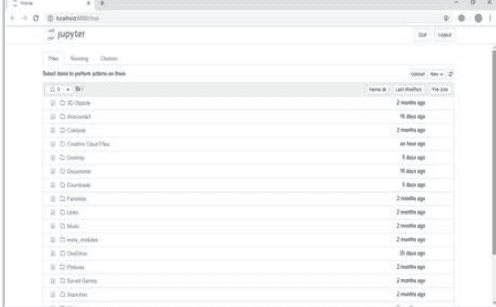
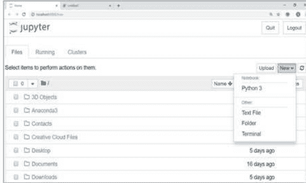
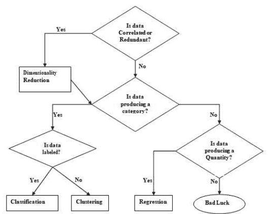
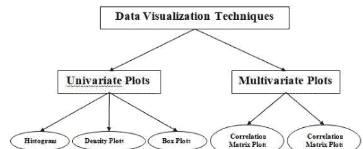
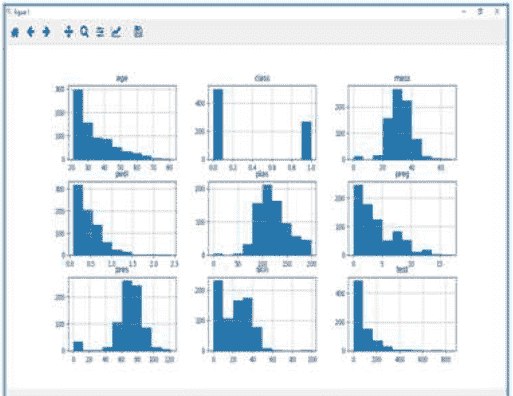
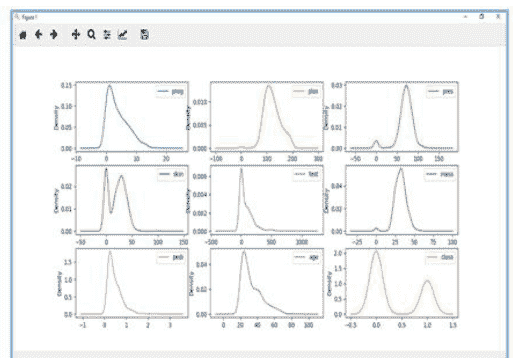

# 面向初学者的Python机器学习

BRYAN BENT

# 版权所有

保留所有权利。未经出版商明确书面许可，不得以任何方式复制或使用本书或其任何部分，书评中的简短引用除外。

# 目录

- 引言 ................................... 6
- Python生态系统 ............................... 9
- Python的优势与劣势 ........................... 11
- 安装Python .............................. 15
- 为什么选择Python进行数据科学？ ....... 22
- Jupyter Notebook ............................... 26
- NumPy .......................................... 31
- Pandas ......................................... 34
- Scikit-learn ................................... 40
- 机器学习方法 .. 43
- 不同类型的方法 ........... 43
- 适合机器学习的任务 . 59

# 通过可视化理解数据

- 独立理解属性 ........................ 68
- 箱线图 .................. 75
- 多变量图：多个变量之间的相互作用.................. 79
- 相关矩阵图 .................. 80
- 散点矩阵图 .................. 83

# 数据特征选择

- 特征选择技术 ....... 88
- 主成分分析 (PCA) 94

# 引言

机器学习（ML）是计算机科学的一个领域，借助它，计算机系统可以像人类一样理解数据。

简而言之，ML是一种人工智能，它通过使用算法或方法从原始数据中提取模式。ML的主要焦点是让计算机系统从经验中学习，而无需被显式编程或人工干预。

目前，人类是地球上最聪明、最先进的物种，因为他们能够思考、评估和解决复杂问题。另一方面，AI仍处于初始阶段，在许多方面尚未超越人类智能。那么问题来了，为什么需要让机器学习？这样做的最合适的理由是，“基于数据，高效且大规模地做出决策”。

最近，各组织正大力投资于人工智能、机器学习和深度学习等新技术，以从数据中获取关键信息，执行多项现实世界任务并解决问题。我们可以称之为机器做出的数据驱动决策，特别是为了自动化流程。这些数据驱动的决策可以用于那些本质上无法编程的问题，而不是使用编程逻辑。事实是，我们离不开人类智能，但另一方面，我们都需要高效地大规模解决现实世界问题。这就是机器学习需求产生的原因。

# Python生态系统

Python是一种流行的面向对象编程语言，具有高级编程语言的能力。其易于学习的语法和可移植性使其如今广受欢迎。以下事实为我们介绍了Python：

- Python由Guido van Rossum在荷兰的Stichting Mathematisch Centrum开发。
- 它是作为名为`ABC`的编程语言的后继者编写的。
- 其第一个版本于1991年发布。
- Python这个名字是Guido van Rossum从名为Monty Python's Flying Circus的电视节目中挑选的。
- 它是一种开源编程语言，这意味着我们可以自由下载它并用它来开发程序。可以从www.python.org下载。
- Python编程语言兼具Java和C的特性。它拥有优雅的‘C’代码，另一方面，它拥有像Java那样的类和对象，用于面向对象编程。
- 它是一种解释型语言，这意味着Python程序的源代码将首先转换为字节码，然后由Python虚拟机执行。

# Python的优势与劣势

每种编程语言都有其优势和劣势，Python也不例外。

## 优势

根据研究和调查，Python是第五重要的语言，也是机器学习和数据科学中最受欢迎的语言。这是因为Python具有以下优势：

- 易于学习和理解：Python的语法更简单；因此，即使是初学者也相对容易学习和理解这门语言。
- 多用途语言：Python是一种多用途编程语言，因为它支持结构化编程、面向对象编程以及函数式编程。
- 大量的模块：Python拥有大量的模块来涵盖编程的各个方面。这些模块易于使用，因此使Python成为一种可扩展的语言。
- 开源社区的支持：作为开源编程语言，Python得到了庞大的开发者社区的支持。因此，Python社区可以轻松修复错误。这一特性使Python非常健壮和适应性强。
- 可扩展性：Python是一种可扩展的编程语言，因为它为支持大型程序提供了比shell脚本更好的结构。

## 劣势

尽管Python是一种流行且强大的编程语言，但它也有执行速度慢的弱点。

与编译语言相比，Python的执行速度较慢，因为Python是一种解释型语言。这可能是Python社区需要改进的主要领域。

# 安装Python

要在Python中工作，我们必须首先安装它。您可以通过以下两种方式中的任何一种执行Python的安装：

- 单独安装Python
- 使用预打包的Python发行版：Anaconda

让我们详细讨论每一种方式。

## 单独安装Python

如果您想在计算机上安装Python，那么您只需要下载适用于您平台的二进制代码。Python发行版适用于Windows、Linux和Mac平台。

以下是在上述平台上安装Python的快速概述：

### 在Unix和Linux平台上

借助以下步骤，我们可以在Unix和Linux平台上安装Python：

- 首先，访问https://www.python.org/downloads/。
- 接下来，单击链接下载适用于Unix/Linux的压缩源代码。
- 现在，下载并解压文件。
- 接下来，如果我们想自定义某些选项，可以编辑Modules/Setup文件。
1. 接下来，编写命令运行 ./configure 脚本
2. make
3. make install

### 在Windows平台上

借助以下步骤，我们可以在Windows平台上安装Python：

- 首先，访问https://www.python.org/downloads/。
- 接下来，单击Windows安装程序python-XYZ.msi文件的链接。这里的XYZ是我们希望安装的版本。
- 现在，我们必须运行下载的文件。它将带我们进入Python安装向导，该向导易于使用。现在，接受默认设置并等待安装完成。

### 在Macintosh平台上

对于Mac OS X，推荐使用Homebrew（一个出色且易于使用的包安装程序）来安装Python 3。如果您没有Homebrew，可以使用以下命令安装：

```
$ ruby -e "$(curl -fsSL https://raw.githubusercontent.com/Homebrew/install/master/install)"
```

可以使用以下命令进行更新：

```
$ brew update
```

现在，要在系统上安装Python3，我们需要运行以下命令：

```
$ brew install python3
```

## 使用预打包的Python发行版：Anaconda

Anaconda是Python的一个打包编译版本，包含了数据科学中广泛使用的所有库。我们可以按照以下步骤使用Anaconda设置Python环境：

步骤1：首先，我们需要从Anaconda发行版下载所需的安装包。链接为

# 为什么选择Python进行数据科学？

Python是第五重要的语言，也是机器学习和数据科学领域最受欢迎的语言。以下是Python的特性，使其成为数据科学的首选语言：

## 丰富的软件包

Python拥有广泛而强大的软件包，可随时用于各个领域。它还包含机器学习和数据科学所需的软件包，如numpy、scipy、pandas、scikit-learn等。

## 易于原型开发

Python的另一个重要特性是易于快速原型开发，这使其成为数据科学的选择语言。此特性对于开发新算法非常有用。

## 协作特性

数据科学领域基本上需要良好的协作，Python提供了许多有用的工具，使协作变得极其便捷。

## 一门语言，多个领域

一个典型的数据科学项目包括多个领域，如数据提取、数据处理、数据分析、特征提取、建模、评估、部署和更新解决方案。由于Python是一种多用途语言，它允许数据科学家从一个通用平台处理所有这些领域。

# Python机器学习生态系统组件

在本节中，我们将讨论一些核心数据科学库，它们构成了Python机器学习生态系统的组件。这些有用的组件使Python成为数据科学的重要语言。虽然有许多这样的组件，但让我们在这里讨论Python生态系统的一些重要组件：

## Jupyter Notebook

Jupyter笔记本基本上提供了一个交互式计算环境，用于开发基于Python的数据科学应用程序。它们以前被称为ipython笔记本。以下是Jupyter笔记本的一些特性，使其成为Python机器学习生态系统的最佳组件之一：

- Jupyter笔记本可以通过逐步安排代码、图像、文本、输出等内容来逐步说明分析过程。
- 它帮助数据科学家在开发分析过程中记录思考过程。
- 也可以将结果作为笔记本的一部分捕获。
- 借助Jupyter笔记本，我们还可以与同行分享我们的工作。

### 安装和执行

如果您使用的是Anaconda发行版，则无需单独安装Jupyter笔记本，因为它已经随附安装。您只需转到Anaconda提示符并键入以下命令：

```
C:\>jupyter notebook
```

按下回车键后，它将在您计算机的localhost:8888上启动一个笔记本服务器。如下图所示：



现在，单击“新建”选项卡后，您将获得一个选项列表。选择Python 3，它将带您进入新笔记本以开始工作。您将在以下截图中看到其概览：




另一方面，如果您使用的是标准Python发行版，则可以使用流行的Python包安装程序pip安装Jupyter笔记本。

```
pip install jupyter
```

### Jupyter Notebook中的单元格类型

以下是Jupyter笔记本中的三种单元格类型：

代码单元格：顾名思义，我们可以使用这些单元格编写代码。编写代码/内容后，它会将其发送到与笔记本关联的内核。

Markdown单元格：我们可以使用这些单元格来注释计算过程。它们可以包含文本、图像、Latex方程、HTML标签等内容。

原始单元格：其中的文本将按原样显示。这些单元格基本上用于添加我们不希望被Jupyter笔记本的自动转换机制转换的文本。

## NumPy

这是另一个有用的组件，使Python成为数据科学的首选语言之一。它基本上代表数值Python，包含多维数组对象。通过使用NumPy，我们可以执行以下重要操作：

- 数组上的数学和逻辑运算。
- 傅里叶变换
- 与线性代数相关的操作。

我们也可以将NumPy视为MatLab的替代品，因为NumPy通常与Scipy（科学Python）和Matplotlib（绘图库）一起使用。

### 安装和执行

如果您使用的是Anaconda发行版，则无需单独安装NumPy，因为它已经随附安装。您只需借助以下命令将包导入Python脚本：

```
import numpy as np
```

另一方面，如果您使用的是标准Python发行版，则可以使用流行的Python包安装程序pip安装NumPy。

```
pip install NumPy
```

安装NumPy后，您可以像上面一样将其导入Python脚本。

## Pandas

这是另一个有用的Python库，使Python成为数据科学的首选语言之一。Pandas基本上用于数据操作、整理和分析。它由Wes McKinney于2008年开发。借助Pandas，在数据处理中我们可以完成以下五个步骤：

- 加载
- 准备
- 操作
- 建模
- 分析

### Pandas中的数据表示

Pandas中的整个数据表示借助以下三种数据结构完成：

Series：它基本上是一个带有轴标签的一维ndarray，这意味着它就像一个包含同质数据的简单数组。例如，以下系列是整数1,5,10,15,24,25...的集合。

| 1 | 5 | 10 | 15 | 24 | 25 | 28 | 36 | 40 | 89 |

DataFrame：它是最有用的数据结构，几乎用于pandas中所有类型的数据表示和操作。它基本上是一个二维数据结构，可以包含异构数据。通常，表格数据使用数据框表示。例如，下表显示了具有姓名、学号、年龄和性别的学生数据：

| 姓名 | 学号 | 年龄 | 性别 |
|---|---|---|---|
| Aarav | 1 | 15 | 男 |
| Harshit | 2 | 14 | 男 |
| Kanika | 3 | 16 | 女 |
| Mayank | 4 | 15 | 男 |

Panel：它是一个包含异构数据的三维数据结构。在图形表示中表示Panel非常困难，但可以将其说明为DataFrame的容器。

下表给出了Pandas中使用的上述数据结构的维度和描述：

| 数据结构 | 维度 | 描述 |
| :--- | :--- | :--- |
| Series | 1-D | 大小不可变，一维同质数据 |
| DataFrames | 2-D | 大小可变，表格形式的异构数据 |
| Panel | 3-D | 大小可变的数组，DataFrame的容器。 |

我们可以理解这些数据结构，因为更高维度的数据结构是更低维度数据结构的容器。

### 安装和执行

如果您使用的是Anaconda发行版，则无需单独安装Pandas，因为它已经随附安装。您只需借助以下命令将包导入Python脚本：

```
import pandas as pd
```

另一方面，如果您使用的是标准Python发行版，则可以使用流行的Python包安装程序pip安装Pandas。

```
pip install Pandas
```

安装 Pandas 后，你可以像上面那样将其导入到你的 Python 脚本中。

### 示例

以下是使用 Pandas 从 ndarray 创建 Series 的示例：

```
In [1]: import pandas as pd
In [2]: import numpy as np
In [3]: data = np.array(['g','a','u','r','a','v'])
In [4]: s = pd.Series(data)
In [5]: print(s)
0    g
1    a
2    u
3    r
4    a
5    v
dtype: object
```

# Scikit-learn

另一个在 Python 数据科学和机器学习中非常有用且最重要的 Python 库是 Scikit-learn。以下是 Scikit-learn 的一些使其如此有用的特性：

- 它建立在 NumPy、SciPy 和 Matplotlib 之上。
- 它是开源的，可以在 BSD 许可证下重复使用。
- 它对所有人开放，可以在各种场景中重复使用。
- 借助它，可以实现广泛的机器学习算法，涵盖机器学习的主要领域，如分类、聚类、回归、降维、模型选择等。

## 安装与执行

如果你使用的是 Anaconda 发行版，则无需单独安装 Scikit-learn，因为它已经随 Anaconda 一起安装了。你只需要在你的 Python 脚本中使用该包即可。例如，通过以下脚本行，我们从 Scikit-learn 导入乳腺癌患者数据集：

```
from sklearn.datasets import load_breast_cancer
```

另一方面，如果你使用的是标准 Python 发行版，并且已经安装了 NumPy 和 SciPy，那么可以使用流行的 Python 包安装器 pip 来安装 Scikit-learn。

```
pip install -U scikit-learn
```

## 机器学习方法

有各种机器学习算法、技术和方法可用于构建模型，以利用数据解决现实世界的问题。在本章中，我们将讨论这些不同的方法。

### 不同类型的方法

以下是基于一些广泛类别的各种机器学习方法：

基于人类监督

在学习过程中，一些基于人类监督的方法如下：

### 监督学习

监督学习算法或方法是最常用的机器学习算法。这种方法或学习算法在训练过程中接收数据样本（即训练数据）及其关联的输出（即每个数据样本的标签或响应）。

监督学习算法的主要目标是在执行多个训练数据实例后，学习输入数据样本与相应输出之间的关联。

例如，我们有 x：输入变量和 Y：输出变量。

现在，应用一个算法来学习从输入到输出的映射函数，如下所示：Y=f(x)。

现在，主要目标将是很好地近似映射函数，以便即使我们有新的输入数据（x），我们也可以轻松地预测该新输入数据的输出变量（Y）。

它被称为监督学习，因为整个学习过程可以被认为是由老师或监督者监督的。监督机器学习算法的例子包括决策树、随机森林、KNN、逻辑回归等。

根据机器学习任务，监督学习算法可以分为以下两大类：

- 分类
- 回归

#### 分类

基于分类任务的关键目标是预测给定输入数据的分类输出标签或响应。输出将基于模型在训练阶段所学到的内容。我们知道分类输出响应意味着无序且离散的值，因此每个输出响应将属于特定的类别或类别。我们将在后续章节中详细讨论分类及相关算法。

#### 回归

基于回归任务的关键目标是预测给定输入数据的输出标签或响应，这些响应是连续的数值。输出将基于模型在其训练阶段所学到的内容。基本上，回归模型使用输入数据特征（自变量）及其对应的连续数值输出（因变量或结果变量）来学习输入与相应输出之间的特定关联。

### 无监督学习

顾名思义，它与监督机器学习方法或算法相反，这意味着在无监督机器学习算法中，我们没有任何监督者提供任何指导。无监督学习算法在以下场景中非常有用：我们无法像监督学习算法那样拥有预先标记的训练数据，并且我们希望从输入数据中提取有用的模式。

例如，可以这样理解：

假设我们有：

x：输入变量，那么将没有对应的输出变量，算法需要发现数据中有趣的模式以进行学习。

无监督机器学习算法的例子包括 K-means 聚类、K-近邻等。

根据机器学习任务，无监督学习算法可以分为以下几大类：

- 聚类
- 关联
- 降维

#### 聚类

聚类方法是最有用的无监督机器学习方法之一。这些算法用于发现数据样本之间的相似性和关系模式，然后将这些样本基于特征聚类成具有相似性的组。聚类的一个现实世界例子是根据客户的购买行为对客户进行分组。

#### 关联

另一个有用的无监督机器学习方法是关联，它用于分析大型数据集以发现模式，这些模式进一步代表了各种项目之间有趣的关系。它也被称为关联规则挖掘或购物篮分析，主要用于分析客户购物模式。

#### 降维

这种无监督机器学习方法用于通过选择一组主要或代表性特征来减少每个数据样本的特征变量数量。这里出现了一个问题：为什么我们需要降维？其背后的原因是特征空间复杂性问题，当我们开始从数据样本中分析和提取数百万个特征时就会出现这个问题。这个问题通常被称为“维度灾难”。PCA（主成分分析）、K-近邻和判别分析是一些用于此目的的流行算法。

#### 异常检测

这种无监督机器学习方法用于找出通常不会发生的罕见事件或观察结果的发生。通过使用学习到的知识，异常检测方法将能够区分异常数据点和正常数据点。一些无监督算法，如聚类、KNN，可以基于数据及其特征检测异常。

### 半监督学习

这类算法或方法既不是完全监督的，也不是完全无监督的。它们基本上介于两者之间，即监督学习和无监督学习方法之间。这类算法通常使用少量的监督学习组件（即少量的预先标记的注释数据）和大量的无监督学习组件（即大量未标记的数据）进行训练。我们可以遵循以下任何一种方法来实现半监督学习方法：

- 第一种也是简单的方法是基于少量标记和注释的数据构建监督模型，然后通过将该模型应用于大量未标记数据来构建无监督模型，以获得更多标记样本。现在，在它们上训练模型并重复该过程。
- 第二种方法需要一些额外的努力。在这种方法中，我们可以首先使用无监督方法对相似的数据样本进行聚类，注释这些组，然后使用这些信息的组合来训练模型。

### 强化学习

这些方法与之前研究的方法不同，也很少使用。在这类学习算法中，会有一个我们希望随时间推移进行训练的代理，以便它可以与特定环境进行交互。代理将遵循一组策略与环境进行交互。

环境，然后在观察环境后，它将根据环境的当前状态采取行动。以下是强化学习方法的主要步骤：

- 步骤1：首先，我们需要准备一个具有一些初始策略集的智能体。
- 步骤2：然后观察环境及其当前状态。
- 步骤3：接下来，根据环境的当前状态选择最优策略并执行重要行动。
- 步骤4：现在，智能体可以根据其在上一步中采取的行动获得相应的奖励或惩罚。
- 步骤5：现在，如果需要，我们可以更新策略。
- 步骤6：最后，重复步骤2-5，直到智能体学会并采用最优策略。

## 适合机器学习的任务

下图展示了各种机器学习问题适合的任务类型：



## 基于学习能力

在学习过程中，以下是一些基于学习能力的方法：

### 批量学习

在许多情况下，我们拥有端到端的机器学习系统，需要使用全部可用训练数据一次性训练模型。这种学习方法或算法称为批量学习或离线学习。它被称为批量或离线学习，因为它是一次性过程，模型将用单一批次的数据进行训练。以下是批量学习方法的主要步骤：

步骤1：首先，我们需要收集所有训练数据以开始训练模型。

步骤2：现在，通过一次性提供全部训练数据来开始模型训练。

步骤3：接下来，一旦获得满意的结果/性能，就停止学习/训练过程。

步骤4：最后，将这个训练好的模型部署到生产环境中。在这里，它将为新的数据样本预测输出。

### 在线学习

它与批量或离线学习方法完全相反。在这些学习方法中，训练数据以多个增量批次（称为小批次）提供给算法。以下是在线学习方法的主要步骤：

步骤1：首先，我们需要收集所有训练数据以开始模型训练。

步骤2：现在，通过向算法提供一个小批次的训练数据来开始模型训练。

步骤3：接下来，我们需要以多个增量向算法提供小批次的训练数据。

步骤4：由于它不会像批量学习那样停止，因此在以小批次提供全部训练数据后，也要向其提供新的数据样本。

步骤5：最后，它将基于新的数据样本在一段时间内持续学习。

## 基于泛化方法

在学习过程中，以下是一些基于泛化方法的方法：

### 基于实例的学习

基于实例的学习方法是一种有用的方法，它通过对输入数据进行泛化来构建机器学习模型。它与之前研究的学习方法相反，因为这种学习涉及机器学习系统以及使用原始数据点本身为新的数据样本得出结果的方法，而不是在训练数据上构建显式模型。

简单来说，基于实例的学习基本上通过查看输入数据点开始工作，然后使用相似性度量，它将泛化并预测新的数据点。

### 基于模型的学习

在基于模型的学习方法中，对基于各种模型参数（称为超参数）构建的机器学习模型进行迭代过程，其中输入数据用于提取特征。在这种学习中，超参数基于各种模型验证技术进行优化。这就是为什么我们可以说基于模型的学习方法在泛化方面使用了更传统的机器学习方法。

# 通过可视化理解数据

借助数据可视化，我们可以查看数据的样子以及数据属性之间存在什么样的相关性。这是查看特征是否对应于输出的最快方法。借助以下Python代码示例，我们可以通过统计来理解机器学习数据。



## 独立理解属性

最简单的可视化类型是单变量或“单变量”可视化。借助单变量可视化，我们可以独立理解数据集的每个属性。以下是在Python中实现单变量可视化的一些技术：

### 直方图

直方图将数据分组到箱中，是了解数据集中每个属性分布的最快方法。

以下是直方图的一些特征：

- 它为我们提供了为可视化创建的每个箱中的观察数量。
- 从箱的形状，我们可以轻松观察分布，即它是高斯分布、偏态分布还是指数分布。
- 直方图还帮助我们查看可能的异常值。

### 示例

下面显示的代码是一个Python脚本示例，用于创建Pima印第安人糖尿病数据集属性的直方图。在这里，我们将使用Pandas DataFrame上的hist()函数生成直方图，并使用matplotlib进行绘图。

```
from matplotlib import pyplot
from pandas import read_csv
path = r'C:\pima-indians-diabetes.csv'
names = ['preg', 'plas', 'pres', 'skin', 'test', 'mass', 'pedi', 'age',
         'class']
data = read_csv(path, names=names)
data.hist()
pyplot.show()
```

### 输出



上面的输出显示它为数据集中的每个属性创建了直方图。由此，我们可以观察到年龄、pedi和test属性可能具有指数分布，而mass和plas具有高斯分布。

### 密度图

另一种快速简便地获取每个属性分布的技术是密度图。它也像直方图，但在每个箱的顶部绘制了一条平滑曲线。我们可以称它们为抽象化的直方图。

### 示例

在下面的示例中，Python脚本将为Pima印第安人糖尿病数据集属性的分布生成密度图。

```
from matplotlib import pyplot
from pandas import read_csv
path = r'C:\pima-indians-diabetes.csv'
names = ['preg', 'plas', 'pres', 'skin', 'test', 'mass', 'pedi', 'age',
         'class']
data = read_csv(path, names=names)
data.plot(kind='density', subplots=True, layout=(3,3), sharex=False)
pyplot.show()
```

### 输出



从上面的输出，可以很容易地理解密度图和直方图之间的区别。

### 箱线图

箱线图，也简称为箱线图，是另一种用于查看每个属性分布的有用技术。以下是该技术的特征：

- 它本质上是单变量的，并总结了每个属性的分布。
- 它为中间值（即中位数）绘制一条线。
- 它在25%和75%周围绘制一个框。
- 它还绘制须线，这将使我们了解数据的分布范围。
- 须线外的点表示异常值。异常值将是中间数据分布范围大小的1.5倍以上。

### 示例

在下面的示例中，Python脚本将为Pima印第安人糖尿病数据集属性的分布生成箱线图。

```
from matplotlib import pyplot
from pandas import read_csv
path = r"C:\pima-indians-diabetes.csv"
names = ['preg', 'plas', 'pres', 'skin', 'test', 'mass', 'pedi', 'age',
         'class']
data = read_csv(path, names=names)
data.plot(kind='box', subplots=True, layout=(3,3), sharex=False, sharey=False)
pyplot.show()
```

### 输出

## 多变量图：多个变量之间的交互

另一种可视化类型是多变量或“多元”可视化。借助多变量可视化，我们可以理解数据集中多个属性之间的交互。以下是在Python中实现多变量可视化的一些技术：

## 相关矩阵图

相关性表示两个变量之间的变化关系。在前面的章节中，我们已经讨论了皮尔逊相关系数以及相关性的重要性。我们可以绘制相关矩阵来显示哪个变量相对于另一个变量具有高或低的相关性。

### 示例

在以下示例中，Python脚本将为皮马印第安人糖尿病数据集生成并绘制相关矩阵。它可以通过Pandas DataFrame的`corr()`函数生成，并借助pyplot进行绘制。

```python
from matplotlib import pyplot
from pandas import read_csv
import numpy
Path = r'C:\pima-indians-diabetes.csv'
names = ['preg', 'plas', 'pres', 'skin', 'test', 'mass', 'pedi', 'age',
'class']
data = read_csv(Path, names=names)
correlations = data.corr()
fig = pyplot.figure()
ax = fig.add_subplot(111)
cax = ax.matshow(correlations, vmin=-1, vmax=1)
fig.colorbar(cax)
ticks = numpy.arange(0,9,1)
ax.set_xticks(ticks)
ax.set_yticks(ticks)
ax.set_xticklabels(names)
ax.set_yticklabels(names)
pyplot.show()
```

### 输出

从上面的相关矩阵输出中，我们可以看到它是对称的，即左下角与右上角相同。还观察到每个变量之间都呈正相关。

## 散点矩阵图

散点图通过二维中的点来显示一个变量受另一个变量影响的程度，或它们之间的关系。散点图在概念上与折线图非常相似，它们都使用水平轴和垂直轴来绘制数据点。

### 示例

在以下示例中，Python脚本将为皮马印第安人糖尿病数据集生成并绘制散点矩阵。它可以通过Pandas DataFrame的`scatter_matrix()`函数生成，并借助pyplot进行绘制。

```python
from matplotlib import pyplot
from pandas import read_csv
from pandas.tools.plotting import scatter_matrix
path = r"C:\pima-indians-diabetes.csv"
names = ['preg', 'plas', 'pres', 'skin', 'test', 'mass', 'pedi', 'age',
         'class']
data = read_csv(path, names=names)
scatter_matrix(data)
pyplot.show()
```

### 输出

# 数据特征选择

机器学习模型的性能与用于训练它的数据特征直接成正比。如果提供给模型的数据特征不相关，ML模型的性能将受到负面影响。另一方面，使用相关的数据特征可以提高ML模型的准确性，特别是线性和逻辑回归模型。

现在问题出现了，什么是自动特征选择？它可以定义为一个过程，通过这个过程我们选择数据中与我们感兴趣的输出或预测变量最相关的特征。它也称为属性选择。

在建模数据之前进行自动特征选择的一些好处如下：

- 在数据建模之前执行特征选择将减少过拟合。
- 在数据建模之前执行特征选择将提高ML模型的准确性。
- 在数据建模之前执行特征选择将减少训练时间。

## 特征选择技术

以下是我们可以在Python中用于建模ML数据的自动特征选择技术：

## 单变量选择

这种特征选择技术在选择那些与预测变量具有最强关系的特征方面非常有用，它借助统计测试来实现。我们可以使用scikit-learn Python库的`SelectKBest`类来实现单变量特征选择技术。

### 示例

在这个例子中，我们将使用皮马印第安人糖尿病数据集，借助卡方统计测试来选择4个具有最佳特征的属性。

```python
from pandas import read_csv
from numpy import set_printoptions
from sklearn.feature_selection import SelectKBest
from sklearn.feature_selection import chi2
path = r'C:\pima-indians-diabetes.csv'
names = ['preg', 'plas', 'pres', 'skin', 'test', 'mass', 'pedi', 'age', 'class']
dataframe = read_csv(path, names=names)
array = dataframe.values
```

接下来，我们将数组分离为输入和输出部分：

```python
X = array[:, 0:8]
Y = array[:,8]
```

以下代码行将从数据集中选择最佳特征：

```python
test = SelectKBest(score_func=chi2, k=4)
fit = test.fit(X,Y)
```

我们也可以根据自己的选择来总结输出数据。在这里，我们将精度设置为2，并显示具有最佳特征的4个数据属性以及每个属性的最佳分数：

```python
set_printoptions(precision=2)
print(fit.scores_)
featured_data = fit.transform(X)
print("\nFeatured data:\n", featured_data[0:4])
```

### 输出

## 递归特征消除

顾名思义，RFE（递归特征消除）特征选择技术递归地移除属性，并使用剩余属性构建模型。我们可以使用scikit-learn Python库的`RFE`类来实现RFE特征选择技术。

### 示例

在这个例子中，我们将使用RFE与逻辑回归算法，从皮马印第安人糖尿病数据集中选择具有最佳特征的前3个属性。

```python
from pandas import read_csv
from sklearn.feature_selection import RFE
from sklearn.linear_model import LogisticRegression
path = r'C:\pima-indians-diabetes.csv'
names = ['preg', 'plas', 'pres', 'skin', 'test', 'mass', 'pedi', 'age',
         'class']
dataframe = read_csv(path, names=names)
array = dataframe.values
```

接下来，我们将数组分离为输入和输出部分：

```python
X = array[:, 0:8]
Y = array[:, 8]
```

以下代码行将从数据集中选择最佳特征：

```python
model = LogisticRegression()
rfe = RFE(model, 3)
fit = rfe.fit(X, Y)
print("Number of Features: %d")
print("Selected Features: %s")
print("Feature Ranking: %s")
```

### 输出

```
Number of Features: 3
Selected Features: [ True False False False False True True False]
Feature Ranking: [1 2 3 5 6 1 1 4]
```

从上面的输出中，我们可以看到RFE选择了preg、mass和pedi作为前3个最佳特征。它们在输出中被标记为1。

## 主成分分析（PCA）

PCA通常被称为数据降维技术，是一种非常有用的特征选择技术，因为它使用线性代数将数据集转换为压缩形式。我们可以使用scikit-learn Python库的`PCA`类来实现PCA特征选择技术。我们可以选择输出中主成分的数量。

### 示例

在这个例子中，我们将使用PCA从皮马印第安人糖尿病数据集中选择最佳的3个主成分。

```python
from pandas import read_csv
from sklearn.decomposition import PCA
path = r'C:\pima-indians-diabetes.csv'
names = ['preg', 'plas', 'pres', 'skin', 'test', 'mass', 'pedi', 'age', 'class']
dataframe = read_csv(path, names=names)
array = dataframe.values
```

接下来，我们将数组分离为输入和输出部分：

```python
X = array[:,0:8]
Y = array[:,8]
```

以下代码行将从数据集中提取特征：

```python
pca = PCA(n_components=3)
fit = pca.fit(X)
print("Explained Variance: %s" % fit.explained_variance_ratio_)
print(fit.components_)
```

### 输出

解释方差：[0.88854663 0.06159078 0.02579012]

[[-2.02176587e-03  9.78115765e-02  1.60930503e-02  6.07566861e-02
   9.93110844e-01  1.40108085e-02  5.37167919e-04 -3.56474430e-03]
  [ 2.28488861e-02  9.72210040e-01  1.41909330e-01 -5.78614699e-02
  -9.46266913e-02  4.69729786e-02  8.16804621e-04  1.40168181e-01]
  [-2.24649003e-02  1.43428710e-01 -9.22467192e-01 -3.07013055e-01
   2.09773019e-02 -1.32444542e-01 -6.39983017e-04 -1.25454310e-01]]

从上述输出中我们可以观察到，这3个主成分与源数据几乎没有相似之处。