# PYTHON 机器学习

面向初学者与中级读者的图解指南

未来已来！


威廉·沙利文

## PYTHON 机器学习 面向初学者的图解指南

© Healthy Pragmatic Solutions Inc. 版权所有 2017 - 保留所有权利。

未经作者直接书面许可，不得复制、转载或传播本书内容。

在任何情况下，出版商均不对因本书信息直接或间接造成的任何赔偿、损害或金钱损失承担任何法律责任或指责。

**法律声明：**

未经作者同意，您不得修改、分发、销售、使用、引用或转述本书任何部分或内容。

**免责声明：**

请注意，本文档所含信息仅供教育用途。不提供任何明示或暗示的保证。读者承认作者不提供法律、财务、医疗或专业建议。在尝试本书概述的任何技术之前，请咨询持证专业人士。

阅读本文档即表示读者同意，在任何情况下，作者均不对因使用本文档所含信息而造成的任何直接或间接损失负责，包括但不限于错误、遗漏或不准确之处。

### 目录

- [引言](#)
- [第 1 章](#)
  - [机器学习简介](#)
    - [定义](#)
    - [机器如何学习？](#)
    - [机器学习的重要性](#)
    - [机器学习的类型](#)
    - [总结](#)
- [第 2 章](#)
  - [环境设置](#)
    - [下载并安装 Anaconda](#)
    - [运行你的第一个程序](#)
- [第 3 章](#)
  - [机器学习的数据预处理](#)
    - [获取数据集](#)
    - [导入库](#)
    - [导入数据集](#)
    - [处理缺失值](#)
    - [处理分类数据](#)
    - [将数据划分为训练集和测试集](#)
    - [数据缩放](#)
- [第 4 章](#)
  - [线性回归](#)
    - [线性回归理论](#)
    - [单变量线性回归](#)
    - [多变量线性回归](#)
- [第 5 章](#)
  - [多项式回归](#)
    - [使用 Python Scikit Learn 进行多项式回归](#)
- [第 6 章](#)
  - [用于回归的决策树](#)
    - [决策树的优势](#)
    - [使用 Python Scikit Learn 库实现决策树](#)
- [第 7 章](#)
  - [用于回归的随机森林](#)
    - [随机森林算法的工作原理](#)
    - [随机森林算法的优点](#)
    - [随机森林算法的缺点](#)
    - [使用 Scikit Learn 实现随机森林算法](#)
- [第 8 章](#)
  - [支持向量回归](#)
    - [SVM 理论](#)
- [第 9 章](#)
  - [用于分类的朴素贝叶斯算法](#)
    - [朴素贝叶斯 (NB) 算法理论](#)
    - [朴素贝叶斯算法的优点](#)
    - [朴素贝叶斯算法的缺点](#)
    - [朴素贝叶斯算法的应用](#)
    - [使用 Python Scikit Learn 实现朴素贝叶斯算法](#)
- [第 10 章](#)
  - [用于分类的 K 近邻算法](#)
    - [KNN 理论](#)
    - [KNN 算法的优点](#)
    - [KNN 算法的缺点](#)
    - [使用 Scikit Learn 实现 KNN](#)
    - [K 值对预测精度的影响](#)
- [第 11 章](#)
  - [用于分类的决策树](#)
    - [使用 Python Scikit Learn 中的决策树解决分类问题](#)
- [第 12 章](#)
  - [用于分类的随机森林](#)
    - [使用 Python 的 Scikit Learn 实现随机森林分类](#)
- [第 13 章](#)
  - [用于分类的支持向量机](#)
    - [使用 Python 的 Scikit Learn 进行 SVM 分类](#)
- [第 14 章](#)
  - [K 均值聚类算法](#)
    - [K 均值聚类的步骤](#)
- [第 15 章](#)
  - [层次聚类](#)
    - [层次聚类理论](#)
    - [使用 Python Scikit Learn 进行层次聚类](#)
- [第 16 章](#)
  - [使用 PCA 进行降维](#)
    - [主成分分析理论](#)
    - [使用 Sklearn 实现 PCA](#)
- [第 17 章](#)
  - [使用 LDA 进行降维](#)
    - [线性判别分析理论](#)
    - [使用 Scikit Learn 实现 LDA](#)
- [第 18 章](#)
  - [使用交叉验证和网格搜索进行性能评估](#)
    - [交叉验证](#)
    - [使用 Python 的 Scikit Learn 进行交叉验证](#)
    - [用于参数选择的网格搜索](#)
    - [使用 Sklearn 实现网格搜索](#)

使用上面的链接立即获取畅销电子书 **《数据分析初学者指南》**

### 资源：

本书中我们将使用的所有数据集都可以在此链接找到：
[https://drive.google.com/file/d/1TBotMuLvuLoAd1dzHRyxBX9cseOhUs_4/view?usp=sharing](https://drive.google.com/file/d/1TBotMuLvuLoAd1dzHRyxBX9cseOhUs_4/view?usp=sharing)

此外，您可以在下面的链接中找到本书中使用的所有脚本：
[https://drive.google.com/file/d/1qn9G-W7v2mXcTSxk9ejbqiHjD_pxat1U/view?usp=sharing](https://drive.google.com/file/d/1qn9G-W7v2mXcTSxk9ejbqiHjD_pxat1U/view?usp=sharing)

## 引言

机器学习是当前最热门的流行词之一。随着高性能计算硬件的进步和数千太字节数据的可用性，越来越多的公司和研究机构正在使用机器学习来构建能够执行各种任务并帮助人类做出更好决策的智能机器。

本书详细概述了机器学习的所有最新概念。本书的每一章都致力于介绍一种机器学习算法。每章都以该算法的简要理论开始，随后是在 Python 的 Scikit learn 库中实现该算法。

本书面向新手和专家用户。一方面，它可以作为初学者的机器学习手册；另一方面，专家用户也可以将其用作不同机器学习算法的参考。为了充分利用本书，建议您不仅仅是阅读本书，而是实际动手编写本书中提供的所有示例代码。

最后，祝您在机器学习的探索中一切顺利。我希望您读完本书后，您的机器学习工具箱中拥有所有基本工具，以解决任何类型的机器学习问题。

# 第 1 章

## 机器学习简介

机器学习是人工智能的一个分支，它涉及使用各种统计技术从数据中隐式学习。与传统计算机程序中所有应用逻辑都是显式编程的不同，机器学习应用从数据中隐式学习，而无需显式编程。机器学习背后的理念是，不是使用硬编码逻辑，而是将大量数据输入应用程序。然后，应用程序负责从这些数据中学习并做出决策。

### 定义

机器学习的第一个定义由 [Arthur Samuel](https://en.wikipedia.org/wiki/Arthur_Samuel) 在 1959 年提出。他将机器学习定义为：

> “使计算机无需显式编程即可学习的研究领域。”

卡内基梅隆大学的 [Tom Mitchell](https://en.wikipedia.org/wiki/Tom_M._Mitchell) 在 1997 年用数学上易于理解的术语定义了机器学习。他说：

> “如果一个计算机程序在某任务 T 上的性能（通过性能度量 P 衡量）随着经验 E 的增加而提高，那么我们就说该程序从经验 E 中学习。”

Tom Mitchell 提供的定义被广泛认为是迄今为止最精确且清晰的机器学习定义。现在我们知道什么是机器学习了，但一个问题仍然存在：机器是如何学习的？它们的内部工作原理是什么？下一节将回答这个问题：

### 机器如何学习？

在深入探讨机器学习的细节之前，让我们先回顾一下人类是如何学习的。例如，我们人类是如何知道在加热板通电时不应该用裸手触摸它的？我们是如何知道它会导致烫伤的？嗯，有两种可能性：要么我们过去曾被加热炉烫伤过，要么我们曾被长辈教导不要触摸加热板。在这两种情况下，我们都有一些过去的经验，阻止我们在加热板通电时触摸它。换句话说，我们有一些过去的信息，并基于此做出未来的决策。

机器以类似的方式学习。起初，它们没有任何知识。它们就像一个零知识的新生儿。为了让机器学习，信息被传递给这些机器。从这些信息中，机器使用各种统计技术识别模式。一旦机器学会从数据中识别模式以做出决策，它们就可以用于对未见过的数据做出决策。

典型的机器学习模型学习过程的工作流程如下图所示：

训练数据被输入到机器学习算法中，这些算法本质上是复杂的数学算法。算法的结果是生成机器学习模型。机器学习模型能够对新的、未见过的数据（也称为测试数据）进行预测。

#### 机器学习的重要性

人工智能的终极目标是让机器变得像人类一样智能。然而，人工智能的早期工作表明，我们无法通过硬编码的方式制造出与人类一样智能的机器。人类从不断演变的环境中学习。因此，制造智能机器的最佳方式是让它们自己学习。因此，机器学习被认定为一门教机器如何从数据中自动学习的科学学科。

机器学习背后的理念是，不硬编码逻辑，而是将数据输入机器，让机器通过识别数据中的模式自己从数据中学习。有趣的是，机器学习技术在识别模式方面比人类更快。

机器学习技术已经存在相当长一段时间了。然而，由于缺乏高性能硬件，这些技术以前并未用于解决现实世界的问题。现在，随着复杂硬件和海量数据的可用性，机器学习技术重新兴起，并在开发智能机器方面取得了成功。

#### 机器学习的类型

机器学习技术大致分为两类：

- 1- 监督学习
- 2- 无监督学习

##### 监督学习

在监督学习中，输入数据及其所属的相应类别都会提供给学习算法。学习算法学习输入和输出之间的关系，然后预测未见过的输入数据样本的输出。

例如，监督机器学习算法被输入标记为水果的苹果图像和标记为蔬菜的土豆图像。在此数据上训练后，监督机器学习算法应该能够将新的未标记的苹果图像分类为水果，将未标记的土豆分类为蔬菜。

监督机器学习算法涉及以下步骤：

- 1- 将输入记录 X 和输出标签 y 输入算法。
- 2- 对于每个输入记录，算法预测一个输出 y'。
- 3- 通过从 y' 中减去 y 来计算预测误差。
- 4- 算法通过消除误差来自我修正。
- 5- 步骤 1 到 4 重复多次迭代，直到误差最小化。

用数学术语来说，你有输入变量 X 和输出变量 y，你需要找到一个捕捉两者之间关系的函数，即 y= f(X)

监督学习用于解决两种不同类型的问题：分类和回归。

**分类：** 分类是指为输入预测离散输出值的过程。例如，给定一个输入，预测邮件是垃圾邮件还是正常邮件，肿瘤是良性还是恶性，或者学生是否会通过考试。

**回归：** 在回归问题中，机器学习模型的任务是预测一个连续值。例如，对于给定的输入，预测房屋的价格或预测学生在考试中获得的分数等。

##### 无监督学习

在无监督学习中，算法被输入没有标签的输入数据。算法的责任是识别数据中的模式并将具有相似特征的记录进行聚类。通常，大多数现实世界的数据都是无标签的；因此，无监督学习可以作为监督学习的前导。

例如，客户的购物趋势可以输入到无监督学习算法中。算法可以发现购物中的趋势。考虑这样一种情况：算法发现购买婴儿用品的客户也会购买牛奶。因此，基于此信息，可以做出将牛奶放置在婴儿用品附近的商业决策。

### 结论

在本章中，我们介绍了机器学习这一主题。我们了解了什么是机器学习以及机器学习的不同类型。下一章将专门介绍安装运行本章机器学习算法所需的软件。我们将使用 Python 的 Scikit Learn 库来实现不同的机器学习算法。

# 第 2 章

## 环境设置

在本章中，我们将安装用于运行机器学习程序的软件。有多种选项可用于实现机器学习，但我们将使用 Python，因为大多数高级机器学习社区都在使用 Python 进行机器学习。安装 Python 有多种选择。你可以简单地安装核心 Python 并使用像记事本这样的文本编辑器来编写 Python 程序。然后可以通过命令行工具运行这些程序。另一个选项是安装 Python 的集成开发环境（IDE）。IDE 提供了一个完整的编程环境，包括 Python 安装、编辑器和调试工具。大多数高级程序员在 Python 开发中都选择 IDE 路线。我们也将采用同样的路线。

Anaconda 是我们将在本书中使用的 IDE。Anaconda 轻量、易于安装，并附带各种开发工具。Anaconda 有自己的命令行工具来安装第三方软件。而且，好消息是，使用 Anaconda，你不必单独安装 Python 环境。

### 下载和安装 Anaconda

按照以下步骤下载和安装 Anaconda。在本节中，我们将展示在 Windows 上安装 Anaconda 的过程。Linux 和 Mac 的安装过程几乎相同。

- 1- 转到以下网址 https://www.anaconda.com/download/
- 2- 你将看到以下网页。选择 Python 3.6 版本，因为这是目前最新的 Python 版本。单击“Download”按钮下载可执行文件。根据你的互联网速度，下载文件需要 2-3 分钟。
- 3- 可执行文件下载完成后，转到下载文件夹并运行该可执行文件。可执行文件的名称应类似于“Anaconda3-5.1.0-Windows-x86_64”。运行文件时，你将看到如下截图所示的安装向导。单击“Next”按钮。
- 4- 将出现“License Agreement”对话框。阅读许可协议并单击“I Agree”按钮。
- 5- 在“Select Installation Type”对话框中，选中“Just Me”单选按钮，然后单击“Next”按钮，如下截图所示。
- 6- 从“Choose Install Location”对话框中选择安装目录（建议使用默认值），然后单击“Next”按钮。你的安装目录应有大约 3 GB 的可用空间。
- 7- 在“Advanced Installation Options”对话框中，选中第二个复选框“Register Anaconda as my default Python 3.6”，然后单击“Install”按钮，如下截图所示。

安装过程将开始，可能需要一些时间才能完成。请坐下来享受一杯咖啡。

- 8- 安装完成后，单击“Next”按钮，如下所示。
- 9- 出现“Microsoft Visual Studio Code Installation”窗口，单击“Skip”按钮。
- 10- 恭喜，你已安装 Anaconda。取消选中出现的对话框上的两个复选框，然后单击“Finish”按钮。

#### 感谢安装 Anaconda3！

Anaconda 是最受欢迎的 Python 数据科学平台。
在 Anaconda Cloud 上分享你的笔记本、包、项目和环境！

- [ ] 了解更多关于 Anaconda Cloud 的信息
- [ ] 了解如何开始使用 Anaconda

#### 运行你的第一个程序

我们已经安装了运行 Python 脚本所需的环境。现在是时候运行我们的第一个程序了。使用 Anaconda，你有多种方式可以做到这一点。本节我们将介绍其中两种。

前往你的 Windows 搜索框，输入“Anaconda Navigator”，然后选择“Anaconda Navigator”应用程序，如下所示：

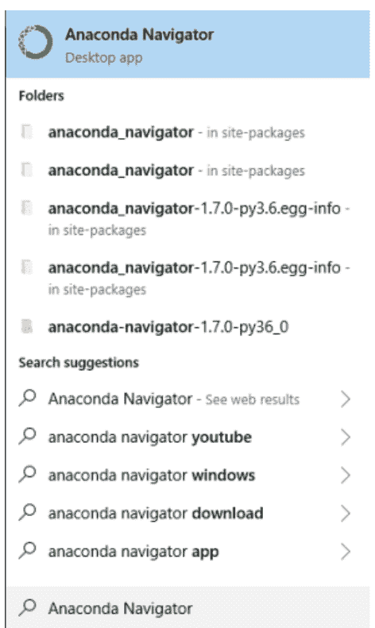

Anaconda Navigator 仪表板将会出现，看起来像这样。

注意：Anaconda Navigator 启动需要一些时间，请耐心等待。

从仪表板中，你可以看到所有可用于开发 Python 应用程序的工具。在本书中，我们将主要使用“Jupyter Notebook”（从上往下数第二个）。不过在本章中，我们也将了解如何通过“Spyder”运行 Python 脚本。

##### 通过 Jupyter Notebook 运行脚本

Jupyter Notebook 在你的默认浏览器中运行。从 Navigator 中，启动“Jupyter Notebook”（从上往下数第二个选项）。

另一种启动 Jupyter 的方式是在搜索框中输入“Jupyter Notebook”，然后从开始菜单中选择“Jupyter Notebook”应用程序，如下所示：


Jupyter Notebook 将在你的默认浏览器的新标签页中启动。

要创建一个新的笔记本，请点击 Jupyter Notebook 仪表板右上角的“new”按钮。从下拉菜单中，选择“Python 3”。

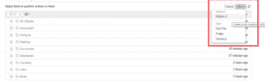

你将看到一个新的 Python 3 笔记本，看起来像这样：

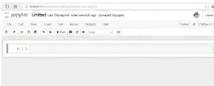

Jupyter Notebook 由单元格组成。Python 脚本就写在这些单元格中。让我们使用 Jupyter Notebook 打印“hello world”。在笔记本的第一个单元格中输入“print('hello world')”并按 CTRL+ENTER。第一个单元格中的脚本将被执行，如下所示：

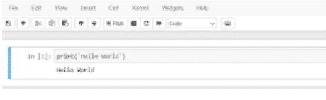

“print”函数会将其作为参数传递的字符串打印到输出中。要创建一个新单元格，请点击左上角菜单中的“+”按钮，如下所示：

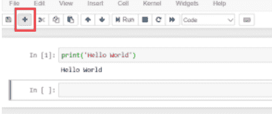

你可以在新单元格中编写 Python 脚本，然后按 CTRL + ENTER 来执行它。

##### 通过 Spyder 运行脚本

虽然 Jupyter Notebook 是开始编写 Python 程序的好地方，但一旦你熟悉了 Python，就应该转向 Spyder IDE。Spyder 允许我们直接创建 Python 文件。Spyder 类似于更传统的文本编辑器，具有运行文件、运行代码片段、调试代码等选项。

就像 Jupyter Notebook 一样，你可以从 Anaconda Navigator 运行 Spyder，也可以直接从开始菜单运行。运行 Spyder 后，你将看到以下界面。

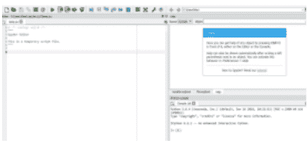

在 Spyder 界面的左侧，你可以看到文本编辑器；这是你输入脚本的地方。在右下角是控制台窗口。你可以直接在控制台窗口中执行脚本。此外，编辑器中编写的代码的输出也会出现在控制台窗口中。让我们在 Spyder 中编写“hello world”程序。

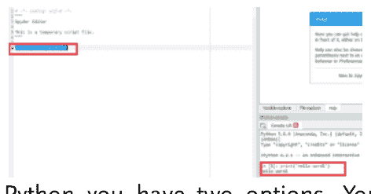

要运行 Python 脚本，你有两个选择。你可以点击顶部菜单中的绿色三角形，或者你可以选择要执行的代码片段，然后按键盘上的 CTRL + ENTER。你将在控制台窗口中看到输出。

#### 下一步是什么？

在本章中，我们了解了设置运行 Python 程序所需环境的过程。我们在两个不同的编辑器中编写了我们的第一个 Python 程序。在下一章中，我们将开始讨论机器学习的数据预处理。

# 第 3 章

## 机器学习的数据预处理

在将机器学习算法应用于数据之前，数据必须处于特定的格式。将数据转换为适合机器学习算法的格式通常称为数据预处理。根据数据集的不同，需要执行几个预处理步骤，将数据转换为机器学习算法可用的格式。以下是为机器学习算法预处理数据所涉及的步骤：

1.  获取数据集
2.  导入库
3.  导入数据集
4.  处理缺失值
5.  处理分类数据
6.  将数据划分为训练集和测试集
7.  数据缩放

在本章中，我们将详细研究这些步骤中的每一个。

### 获取数据集

我们将在本书中使用的所有数据集都可以在此链接找到：
https://drive.google.com/file/d/1TBotMuLvuLoAd1dzHRyxBX9cseOhUs_4/view?usp=sharing

下载“rar”文件，并将“Datasets”文件夹复制到你的 D 盘。本书中的所有算法都从“D:/Datasets”文件夹访问数据集。我们将在第一章用于预处理的数据集名为“patients.csv”。
如果你进入 Datasets 文件夹并用 Microsoft Excel 打开 patients.csv 文件，它看起来像这样：

| 年龄 | BMI | 性别 | 是否糖尿病 |
|---|---|---|---|
| 25 | 25 | 男 | 否 |
| 55 | 31 | 女 | 是 |
| 40 | 28 | 男 | 是 |
| 61 | 24 | 男 | 否 |
| 24 | | 女 | 否 |
| 35 | 35 | 男 | 是 |
| 52 | 32 | 男 | 是 |
| 67 | 26 | 女 | 否 |
| 44 | 27 | 男 | 否 |
| 19 | 22 | 女 | 否 |
| 58 | 89 | 女 | 是 |
| 48 | 39 | 男 | 是 |

该数据集包含 12 名患者的年龄、BMI（身体质量指数）和性别信息。数据集还包含一列，显示患者是否患有糖尿病。年龄和 BMI 列是数值型的，因为它们包含数值，而性别和糖尿病列是分类型。

在将数据集用于机器学习之前，你需要做出的另一个重要区分是自变量和因变量。根据经验，要预测其值的变量是因变量，而用于进行预测的变量是自变量。例如，在 patients.csv 数据集中，年龄、BMI 和性别变量是自变量，而第四列（即糖尿病）是因变量，因为它的值取决于前三列。

#### 导入库

Python 附带了各种预构建的库，用于执行不同的任务。在本书中，我们将使用 Python 的 Scikit Learn 库。然而，目前我们只安装三个最基本的库，这些库几乎在每个机器学习应用中都会用到。这些库是 *matplotlib.pyplot* 和 *pandas*。

#### numpy

*numpy* 库用于执行各种高级数学函数。由于机器学习算法大量使用数学，强烈建议你安装 *numpy* 库。

#### matplotlib.pyplot

此库用于绘制漂亮的图表。为了对我们的数据和结果有直观的了解，我们将需要这个库。

#### pandas

最后，我们将在本章中安装的第三个库是 *pandas* 库。*pandas* 库用于轻松导入和查看数据集。

要导入这三个库，请在 *Jupyter* 中创建一个新的 Python 笔记本，或在 *Spyder* 中打开一个新文件（本章中的代码在其中执行），并执行以下代码行。

```
import numpy as np
import matplotlib.pyplot as plt
import pandas as pd
```

在 Python 中导入库，使用关键字 *import*。在上面的脚本中，我们将 *numpy* 导入为 *np*，*matplotlib.pyplot* 导入为 *plt*，将 *pandas* 导入为 *pd*。这里 *np*、*plt* 和 *pd* 是别名。我们将使用这些别名来调用这些库的不同函数。

#### 导入数据集

我们在上一节中已经下载了所需的库。在本节中，我们将把数据集导入到上一节创建的应用程序中。你还将了解我们为何要导入 *pandas* 库。

我们的数据集是 CSV（逗号分隔值）格式。*pandas* 库包含 *read_csv* 函数，该函数以 CSV 格式数据集的路径作为参数，并将数据集加载到 *pandas dataframe* 中，这本质上是一个以列和行形式存储数据集的对象。

执行以下脚本（在加载库的脚本下方）以将 patients.csv 数据集加载到应用程序中。

```
patient_data = pd.read_csv("D:/Datasets/patients.csv")
```

上面的脚本将 D 盘 Datasets 文件夹中的 patients.csv 数据集加载到 **patients_data dataframe** 中。

如果你使用的是 *Jupyter* notebook，只需执行以下脚本即可查看数据的样子：

```
patient_data.head()
```

另一方面，如果你使用的是其他环境，请转到变量浏览器，然后从变量列表中双击 *patient_data* 变量，如下所示：

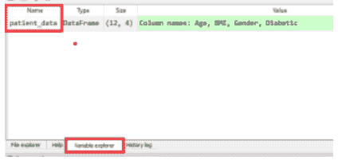

一旦你点击 *patient_data* 变量，你将看到 patients.csv 数据集的详细信息，如下图所示：

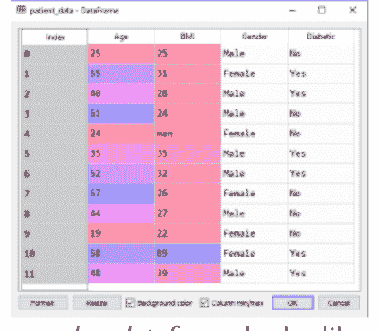

你可以看到 *pandas dataframe* 看起来像一个基于零索引的矩阵。

一旦我们加载了数据集，下一步就是将数据集划分为特征矩阵和因变量向量。特征集由所有自变量组成。例如，patients.csv 数据集的特征矩阵将包含 Age、BMI 和 Gender 列。特征矩阵的大小等于自变量的数量乘以记录的数量。在这种情况下，特征矩阵的大小将是 3 x 12，因为有三个自变量和 12 条记录。

让我们首先创建一个特征 features。你可以给特征矩阵起任何名字，但按照机器学习社区的惯例，特征矩阵通常用大写 X 表示。然而，为了可读性，我们将它命名为 *features*。执行以下脚本：

```
features= patient_data.iloc[:,0:3].values
```

在上面的脚本中，我们使用 *dataframe* 的 *iloc* 函数从 *patient_data* dataframe 中选择所有行和前三列。iloc 函数接受两个参数。

第一个是要选择的行范围，第二个是要选择的列范围。我们只在第一个参数中指定了冒号，这意味着过滤数据集中的所有行。在逗号后的第二个参数中，我们指定了一个列范围，即第 0 到 3 列。这将返回第 0、1 和 2 列。请记住，*iloc* 返回的列范围比指定的上限少一列。第 0、1 和 2 列分别代表 Age、BMI 和 Gender，因为 Python 遵循基于零的索引。因此，Age 被视为第 0 列。

如果你现在在控制台窗口中打印 features，你将看到以下结果：

```
array([[25, 25.0, 'Male'],
       [55, 31.0, 'Female'],
       [40, 28.0, 'Male'],
       [61, 24.0, 'Male'],
       [24, nan, 'Female'],
       [35, 35.0, 'Male'],
       [52, 32.0, 'Male'],
       [67, 26.0, 'Female'],
       [44, 27.0, 'Male'],
       [19, 22.0, 'Female'],
       [58, 89.0, 'Female'],
       [48, 39.0, 'Male']], dtype=object)
```

你可以看到它是一个二维的特征集数组。

类似地，要创建一个标签向量，请执行以下脚本：
`labels= patient_data.iloc[:,3].values`

现在我们有了特征矩阵和标签向量。下一步是处理数据集中的缺失值（如果有的话）。

### 处理缺失值

如果你查看 patient_data 对象，你会看到索引为 4 的记录在 BMI 列中有一个缺失值。处理缺失值最简单的方法是删除包含缺失值的记录。然而，有时一条记录包含关键信息，不应该仅仅因为某一列有缺失值就被删除。

处理缺失值的另一种方法是用某个值替换缺失值。缺失值可以用该列所有值的均值或中位数来替换。

为了处理缺失值，我们将使用 *sklearn.preprocessing* 库中的 *Imputer* 类。请看以下脚本。

```
from sklearn.preprocessing import Imputer
imputer = Imputer(missing_values="NaN", strategy="mean", axis=0)
imputer = imputer.fit(features[:,1:2])
features[:,1:2] = imputer.transform(features[:,1:2])
```

在上面的脚本中，第一行从 *sklearn.preprocessing* 库导入 *Imputer* 类。接下来我们创建 Imputer 类的对象。Imputer 类构造函数接受三个参数：*strategy* 和 *missing_value*。*missing_value* 参数指定需要被替换的值。在我们的数据集中，缺失值用 “nan” 表示，因此我们为 *missing_value* 参数指定了 “NaN”。strategy 参数指定我们想要用来填充缺失值的策略类型，它可以有 *mean*、*median* 和 *most_frequent* 值。最后，*axis* 参数表示我们想要沿哪个轴进行填充。*axis 0* 指定列轴，而 *axis 1* 指定行轴。

接下来我们执行 Imputer 类的 *fit* 方法。该方法以我们想要处理缺失值的列作为输入。最后我们执行 *transform* 函数，该函数实际上用第 1 列的均值填充该列中的缺失值。当你执行上面的脚本时，你会看到索引为 4 的记录，之前在第 1 列（即 BMI）有缺失值，现在包含了 BMI 列所有值的均值。这在下面的截图中显示：

```
array([[25, 25.0, 'Male'],
       [55, 31.0, 'Female'],
       [40, 28.0, 'Male'],
       [61, 24.0, 'Male'],
       [24, 34.36363636363637, 'Female'],
       [35, 35.0, 'Male'],
       [52, 32.0, 'Male'],
       [67, 26.0, 'Female'],
       [44, 27.0, 'Male'],
       [19, 22.0, 'Female'],
       [58, 89.0, 'Female'],
       [48, 39.0, 'Male']], dtype=object)
```

### 处理分类数据

我们知道机器学习算法基于数学概念，而数学是关于数字的。因此，将数据集中的所有分类值转换为数值是方便的。如果我们查看 patients.csv，我们有两列包含分类值：Gender 和 Diabetic。

幸运的是，在 sklearn.preprocessing 库中，我们有 LabelEncoder 类，它以分类列作为输入并返回相应的数值输出。请看以下脚本：

```
from sklearn.preprocessing import LabelEncoder
labelencoder_features = LabelEncoder()
features[:,2]= labelencoder_features.fit_transform(features[:,2])
```

与 Imputer 类类似，*LabelEncoder* 类有 *fit_transform* 方法，这基本上是 *fit* 和 *transform* 方法的组合。该类以分类列作为输入并返回相应的数值。在上面的脚本中，我们将 Gender 列（即索引为 2 的列）传递给 *LabelEncoder* 类。执行上面的脚本后，如果你检查 Gender 列的值，你会看到 1 和 0 代替了 Male 和 Female，如下所示：

```
array([[25, 25.0, 1],
       [55, 31.0, 0],
       [40, 28.0, 1],
       [61, 24.0, 1],
       [24, 34.36363636363637, 0],
       [35, 35.0, 1],
       [52, 32.0, 1],
       [67, 26.0, 0],
       [44, 27.0, 1],
       [19, 22.0, 0],
       [58, 89.0, 0],
       [48, 39.0, 1]], dtype=object)
```

类似地，标签向量也可以转换为数值集合，如下所示：

```
labels = labelencoder_features.fit_transform(labels)
```

### 将数据划分为训练集和测试集

在第一章中，我们讨论了机器学习模型是在数据集的子集上训练，并在数据集的另一个子集上测试的。这种训练集和测试集之间的划分是为了确保我们的机器学习算法不会*过拟合*。过拟合是指机器学习在训练数据上表现优异，但在测试数据上表现不佳的现象。一个好的机器学习模型是在训练数据和测试数据上都能给出良好结果的模型。这样我们可以说我们的模型已经从数据集中正确地学习了潜在的假设，并可以用于在任何新数据集上做出正确的决策。

*sklearn.model_selection* 库包含 *train_test_split* 类，可用于将数据划分为训练集和测试集。该类接受 features、labels 和 *test_size* 作为参数。*test_size* 定义了测试集的大小。测试大小为 0.5 意味着将数据划分为 50% 的测试集和 50% 的训练集。以下脚本将数据划分为 75% 的训练集和 25% 的测试集。

```
from sklearn.model_selection import train_test_split
train_features, test_features, train_labels, test_labels = train_test_split(features, labels, test_size = 0.25, random_state = 0)
```

当你执行上面的脚本时，你会看到 *train_features* 变量将包含一个 9 个特征的矩阵（12 的 75%），而 *train_labels* 将包含对应的 9 个标签。类似地，*test_features* 将包含一个 3 个特征的矩阵（12 的 25%），而 *test_labels* 将包含对应的 3 个标签。

#### 数据缩放

在将数据输入机器学习算法之前，最后一个预处理步骤是特征缩放。我们需要缩放特征，因为在某些数据集中，不同特征的数值之间存在巨大差异。例如，如果我们添加患者数据集 `out patients.csv` 中的红细胞数量，该列的值将达到数十万，而年龄列的值可能非常小。许多机器学习模型使用欧几里得距离来计算数据点之间的距离。如果特征未经缩放，这些算法可能会偏向于具有较大数值的特征。

缩放特征有两种方法：
标准化：
和
归一化：

*sklearn.preprocessing* 库包含 *StandardScaler* 类，可用于实现特征的标准化。与其他预处理类一样，它包含 *fit_transform* 方法，该方法以数据集作为输入并返回缩放后的数据集。以下脚本对 *train_features* 和 *test_features* 数据集都进行了缩放。

```
from sklearn.preprocessing import StandardScaler
feature_scaler = StandardScaler()
train_features = feature_scaler.fit_transform(train_features)
test_features = feature_scaler.transform(test_features)
```

现在，如果你查看 *train_features* 和 *test_features*，可以看到缩放后的值，如下所示：

```
In [15]: train_features
Out[15]:
array([[ 0.83652186,  2.77984695, -1.11803399],
       [-0.31192341, -0.30949713,  0.89442719],
       [-0.05671335, -0.36014212,  0.89442719],
       [ 0.64511432, -0.15756218, -1.11803399],
       [ 1.41074449, -0.4107871 , -1.11803399],
       [-1.65177621, -0.61336704, -1.11803399],
       [ 1.0279294 , -0.51207707,  0.89442719],
       [-1.26896113, -0.46143209,  0.89442719],
       [-0.63093598,  0.04501776,  0.89442719]])
```

```
In [16]: test_features
Out[16]:
array([[ 0.45370677, -0.10691719,  0.89442719],
       [ 0.19849671,  0.2475977 ,  0.89442719],
       [-1.33276364,  0.01278914, -1.11803399]])
```

对于分类问题，无需缩放标签。对于回归问题，我们将在回归部分了解如何缩放标签。

### 结论

在本章中，我们了解了如何在将数据用于实际的机器学习任务之前对其进行预处理。在下一章中，我们将开始新的部分，即回归。我们将学习的第一个机器学习算法是线性回归。

# 第4章

## 线性回归

在本章中，我们将开始讨论第一个监督机器学习算法，即线性回归，它是一种回归算法。在本章中，我们将研究单变量线性回归和多变量线性回归。使用单变量线性回归，我们将根据制造年份预测汽车的价格。然后，我们将转向更复杂的问题，即根据身高、体重、投篮命中率和投篮次数来预测篮球运动员的得分。然而，首先让我们研究线性回归的理论基础。

### 线性回归理论

简单来说，线性回归是一种识别两个或多个变量之间关系的方法。
从数学上讲，线性回归找到一个线性函数，将自变量映射到因变量。如果将此函数绘制在二维空间中，结果是一条直线。
考虑一个场景，我们想找出汽车价格和制造年份之间的关系。如果我们将年份绘制在x轴上，价格绘制在线性回归算法将找到一条最能拟合数据点的直线。下图显示了这一点：

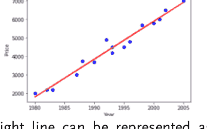

我们知道直线可以表示为：
$$B= AX1 + C$$
这里b是因变量，$a$是直线的斜率，$x$是自变量，c是y截距。
如果我们看这个方程，可以看到b和x是常数，因为它们是数据变量。因此，线性回归算法为我们提供斜率和截距，从而得到最能拟合数据集的直线。

这个概念可以扩展到多个自变量。线性回归函数的方程将表示为：

```
B = A1X1 + A2X2 + A3X3 + ....... ANXN + C
```

这里n是自变量的总数。这个方程基本上表示一个n维的超平面。需要指出的是，在二维空间中，线性回归模型可以表示为一条直线。在三维空间中，它以平面的形式表示；在超过三维的空间中，它表示为超平面。

理论讲得够多了，让我们借助Python的Scikit learn库来实现线性回归。

### 单变量线性回归

为了简单起见，我们将首先实现单变量线性回归。它也称为单变量线性回归。在这种情况下，只有一个自变量和一个因变量。
在本节中，我们将使用它来预测汽车价格（因变量），基于制造年份（自变量）。你可以在补充的“数据集”文件夹中找到该数据集。
为了预测价格，我们将使用通过Python Scikit Learn库实现的线性回归算法。那么，让我们开始吧：

#### 1- 导入所需库

如前一章所述，实现任何机器学习算法的第一步是将所需的库导入到你的程序中。以下代码导入了所需的库：

```
import pandas as pd
import numpy as np
import matplotlib.pyplot as plt
%matplotlib inline
```

此脚本是使用Jupyter notebook实现的。因此，为了在notebook中绘制图形，我们使用了命令 `%matplotlib inline`。如果你使用的是Spyder，可以删除最后一行。

#### 2- 导入库

导入库后，下一步是导入你将用于训练算法的数据集。我们将使用“car_price.csv”数据集。执行以下脚本以导入数据集：

```
car_data = pd.read_csv('D:\Datasets\car_price.csv')
```

上面的脚本读取数据集并将其存储在 *car_data* 中。

#### 3- 分析数据

在将数据用于训练之前，最好先分析数据是否存在缺失值或缩放问题。
让我们首先大致查看一下我们的数据。*head* 函数返回数据集的前5行。执行以下脚本：

```
car_data.head()
```

| | Year | Price |
|---|---|---|
| 0 | 1980 | 2000 |
| 1 | 1985 | 3000 |
| 2 | 1983 | 2200 |
| 3 | 1990 | 3700 |
| 4 | 1995 | 4500 |

类似地，describe函数返回数据集的所有统计详细信息。

```
car_data.describe()
```

| | Year | Price |
|---|---|---|
| count | 20.000000 | 20.000000 |
| mean | 1992.100000 | 4302.500000 |
| std | 7.319045 | 1458.592959 |
| min | 1980.000000 | 2000.000000 |
| 25% | 1986.500000 | 3075.000000 |
| 50% | 1992.500000 | 4350.000000 |
| 75% | 1998.250000 | 5325.000000 |
| max | 2005.000000 | 7000.000000 |

最后，让我们看看线性回归算法是否真的适合这个任务。让我们将数据点绘制在图表上，看看是否能看到价格和年份之间存在某种线性关系。执行以下脚本：

```
plt.scatter(car_data['Year'], car_data['Price'])
plt.title("Year vs Price")
plt.xlabel("Year")
plt.ylabel("Price")
plt.show()
```

上面脚本的输出如下所示：

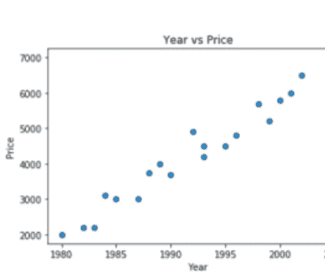

在上面的脚本中，我们使用 *matplotlib* 库中的散点图将年份绘制在x轴上，价格绘制在y轴上。从输出图中我们可以清楚地看到，随着年份数字的增加，汽车价格也随之增加。价格和年份之间存在线性关系。年份和价格。因此，我们可以使用线性回归算法来解决这个问题。

#### 4- 数据预处理

在上一章中，我们学习到在将数据输入学习算法之前，首先需要将数据划分为特征集和标签集，然后再划分为测试集和训练集。在这一步中，我们将执行这两个任务。

要将数据划分为特征和标签，请执行以下脚本：

```
features= car_data.iloc[:,0:1].values
labels= car_data.iloc[:,1].values
```

由于我们只有两列，第一列包含特征集，而第二列包含标签。

最后，让我们将数据划分为80%的训练集和20%的测试集：

```
from sklearn.model_selection import train_test_split
train_features, test_features, train_labels, test_labels =
train_test_split(features, labels, test_size = 0.2, random_state = 0)
```

如果我们查看数据集，可以看到年份和价格的值之间差异并不大。两者都是以千为单位。因此，无需对数据进行缩放，我们可以直接使用这些数据来训练算法。

#### 5- 训练算法并进行预测

*sklearn.linear_model* 的 *LinearRegression* 类用于在Python中实现线性回归。LinearRegression类有一个fit方法，该方法以训练特征和标签作为输入来训练模型，如下所示：

```
from sklearn.linear_model import LinearRegression
lin_reg = LinearRegression()
lin_reg.fit(train_features, train_labels)
```

让我们看看我们的模型为唯一的自变量找到的系数是多少。执行以下脚本：

```
print(lin_reg.coef_)
```

结果将是：204.815

这表明，年份每变化一个单位，汽车价格的值就增加204.815。

模型训练完成后，最后一步是预测新实例的输出。*LinearRegression* 类的 *predict* 方法可用于此目的。该方法以测试特征作为输入，并预测相应的标签作为输出。

执行以下脚本来预测测试特征的标签：

```
predictions = lin_reg.predict( test_features)
```

所有的预测结果都存储在 *predictions* 变量中。

让我们将预测值与实际值进行比较。

执行以下脚本来完成此操作：

```
comparison=pd.DataFrame({'Real':test_labels,
'Predictions':predictions})
print(comparison)
```

输出如下所示：

```
  Predictions  Real
0  5689.172831  5200
1  2821.751476  3000
2  2616.935665  3100
3  3641.014720  4000
```

我们可以看到测试集中有四个值，这占整个数据集的20%，正如在 *train_test_split* 中指定的那样。你可以看到我们的值很接近，但不完全准确。

为了评估机器学习模型的性能，通常使用三个指标：[平均绝对误差](Mean_Absolute_Error) (MAE)、[均方误差](Mean_Squared_Error) (MSE) 和 [均方根误差](Root_Mean_Squared_Error) (RMSE)。幸运的是，我们不必编写这些指标背后的复杂数学代码。*sklearn* 库的 metrics 类包含可用于查找这些指标值的函数。执行以下脚本来查找我们线性回归模型的 MAE、MSE 和 RMSE。

```
from sklearn import metrics
print('MAE:', metrics.mean_absolute_error(test_labels, predictions))

print('MSE:', metrics.mean_squared_error(test_labels, predictions))
print('RMSE:', np.sqrt(metrics.mean_squared_error(test_labels, predictions)))
```

输出始终如下：

```
MAE: 377.367742659
MSE: 158321.044602
RMSE: 397.895771028
```

通常，如果 MAE 和 RMSE 的值小于预测列平均值的10%，则认为算法性能良好。然而，MAE 和 RMSE 的值越低，算法的性能就越高。在我们的例子中，MAE 和 RMSE 的值分别为377.36和397.85，小于价格平均值430.2的10%。因此，我们可以说我们的算法性能良好。

### 多变量线性回归

多变量线性回归涉及多个自变量。在本节中，我们将使用Python的 *Scikit* Learn库来实现多元线性回归。

我们将根据球员的身高、体重、所有投篮中成功投篮的百分比、所有罚球中成功罚球的百分比，来预测他在篮球比赛中能得多少分。我们已经下载了数据集，它位于数据集文件夹中。也可以从以下链接下载数据集：
[http://college.cengage.com/mathematics/brase/understandable_statistics/7e/students/datasets/mlr/frames/frame.html](http://college.cengage.com/mathematics/brase/understandable_statistics/7e/students/datasets/mlr/frames/frame.html)

对于这个问题，我们将遵循与单变量线性回归几乎相同的步骤。我们将从导入库和数据集开始，然后进行数据分析和预处理。最后，我们将训练我们的线性回归算法并评估其性能。

#### 1- 导入所需库

以下代码导入所需的库：

```
import pandas as pd
import numpy as np
import matplotlib.pyplot as plt
%matplotlib inline
```

#### 2- 导入数据集

虽然数据集可以在线获取，但我们已经下载并将其添加到本书附带的数据集仓库中。数据集名称为“player.csv”。执行以下命令导入数据集。

```
player_data = pd.read_csv('D:\Datasets\player.csv')
```

上面的脚本读取数据集并将其存储在 *player_data* 中。

#### 3- 分析数据

执行以下脚本以查看数据：

```
player_data.head()
```

输出如下所示：

| | Height | Weight | Field_Goals | Throws | Points |
|---|---|---|---|---|---|
| 0 | 6.8 | 225 | 0.442 | 0.672 | 9.2 |
| 1 | 6.3 | 180 | 0.435 | 0.797 | 11.7 |
| 2 | 6.4 | 190 | 0.456 | 0.761 | 15.8 |
| 3 | 6.2 | 180 | 0.416 | 0.651 | 8.6 |
| 4 | 6.9 | 205 | 0.449 | 0.900 | 23.2 |

执行以下脚本以获取数据的统计详情：

```
player_data.describe()
```

| | Height | Weight | Field_Goals | Throws | Points |
|---|---|---|---|---|---|
| count | 54.000000 | 54.000000 | 54.000000 | 54.000000 | 54.000000 |
| mean | 6.587037 | 209.907407 | 0.449111 | 0.741852 | 11.790741 |
| std | 0.458894 | 30.265036 | 0.056551 | 0.100146 | 5.899257 |
| min | 5.700000 | 105.000000 | 0.291000 | 0.244000 | 2.800000 |
| 25% | 6.225000 | 185.000000 | 0.415250 | 0.713000 | 8.150000 |
| 50% | 6.650000 | 212.500000 | 0.443500 | 0.753500 | 10.750000 |
| 75% | 6.900000 | 235.000000 | 0.483500 | 0.795250 | 13.600000 |
| max | 7.600000 | 263.000000 | 0.599000 | 0.900000 | 27.400000 |

#### 4- 数据预处理

以下脚本将数据划分为特征集和标签集。

```
features = player_data[['Height','Weight','Field_Goals','Throws']]
labels = player_data['Points']
```

需要提及的是，除了使用数据框的 iloc 函数外，你还可以通过指定列名（如上脚本所示）将数据划分为特征集和标签集。

最后，让我们将数据划分为80%的训练集和20%的测试集：

```
from sklearn.model_selection import train_test_split
train_features, test_features, train_labels, test_labels = train_test_split(features, labels, test_size = 0.2, random_state = 0)
```

#### 5- 数据缩放

如果查看数据集，会发现它没有很好地缩放，例如 *Field_Goals* 和 *Throws* 列的值在0到1之间，而其他列的值则更高。因此，在训练算法之前，我们将对数据进行缩放。记住我们在上一章讨论过缩放。这里我们将使用标准缩放器类。

```
from sklearn.preprocessing import StandardScaler
feature_scaler = StandardScaler()
train_features = feature_scaler.fit_transform(train_features)
test_features = feature_scaler.transform(test_features)
```

#### 6- 训练算法并进行预测

对于多元线性回归，我们将再次使用 *sklearn.linear_model* 库中的同一个 *LinearRegression* 类。执行以下脚本来训练模型：

```python
from sklearn.linear_model import LinearRegression
lin_reg = LinearRegression()
lin_reg.fit(train_features, train_labels)
```

让我们看看模型为唯一的自变量找到了什么系数。执行以下脚本：

```python
coefficients = pd.DataFrame(lin_reg.coef_, features.columns, columns=['Coefficients'])
print(coefficients)
```

输出如下所示：

```
Coefficients
Height        -2.582632
Weight         1.294067
Field_Goals    2.879289
Throws         1.035310
```

输出显示，身高每增加一个单位，球员得分减少2.58个百分点。同样，体重每增加一个单位，得分增加1.29，依此类推。

这表明，年份每变化一个单位，汽车价格的值增加204.815。

模型训练完成后，最后一步是预测新实例的输出。*LinearRegression* 类的 *predict* 方法可用于此目的。

执行以下脚本来预测测试特征的标签：

```python
predictions = lin_reg.predict(test_features)
```

要将预测值与真实输出进行比较，请执行以下脚本：
让我们将预测值与实际值进行比较。
执行以下脚本：

```python
comparison = pd.DataFrame({'Real': test_labels,
                           'Predictions': predictions})
print(comparison)
```

输出如下所示：

```
   Predictions  Real
53    10.342831   8.3
33    11.431936   7.2
48     9.637807   2.8
26    14.690648   5.6
11    14.363039   9.1
2     12.763432  15.8
32    14.397398   9.6
42    14.473602  15.4
45     7.550197   7.9
30    14.867451  11.7
4     11.721830  23.2
```

从输出中，你可以看到预测值与实际值并不十分接近。
执行以下脚本来计算我们线性回归模型的MAE、MSE和RMSE。

```python
from sklearn import metrics
print('MAE:', metrics.mean_absolute_error(test_labels, predictions))
print('MSE:', metrics.mean_squared_error(test_labels, predictions))
print('RMSE:', np.sqrt(metrics.mean_squared_error(test_labels, predictions)))
```

输出始终如下：

```
MAE: 4.65654985924
MSE: 32.1977246142
RMSE: 5.67430388808
```

RMSE分别为4.65和5.67，大于得分平均值1.179的10%。因此，我们可以说我们的算法在这个数据集上表现不佳。算法表现不佳的原因有很多，以及如何改进性能和算法，我们将在后面的章节中讨论。

### 结论

在本章中，我们学习了我们的第一个监督算法，即线性回归。我们了解了什么是单变量和多元线性回归，以及如何通过Python Scikit learn库实现它们。在下一章中，我们将学习多项式回归，它本质上是非线性回归。

# 第5章

## 多项式回归

在上一章中，我们学习了如何使用线性回归算法来找到最适合数据点的直线。然而，在现实世界中，数据并不总是线性相关的。例如，如果你看一下下图中的数据分布

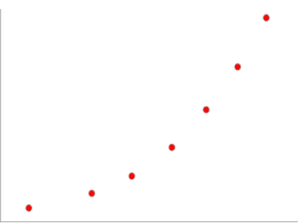

这里，如果我们画一条最适合数据点的直线，一些点最终会在线上方，另一些点会在线下方，如下图所示。在这种情况下，预测出错的概率会更高。

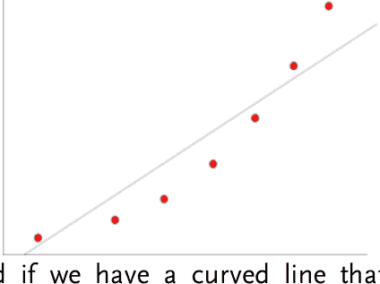

另一方面，如果我们有一条曲线能拟合所有数据点，如下图所示，出错的概率可以最小化。

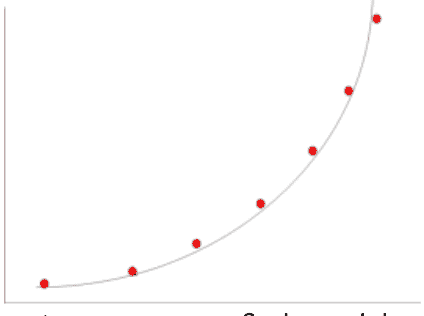

在多项式回归中，我们试图找到不是直线但能更准确地拟合数据点的模型。

在上一章中，我们讨论了直线线性模型可以表示为：

```
B = A1X1 + A2X2 + A3X3 + ................. ANXN
```

另一方面，多项式回归产生一个次数大于1的模型，例如

```
B = + + .................
```

### 使用Python Scikit Learn进行多项式回归

让我们使用Python Scikit Learn来实现多项式回归。本节中我们将要解决的问题是根据铺装公路（英里）、汽油税（美分）、人均收入和持有驾照人口比例等特征，预测美国48个州的汽油消耗量（以百万计）。

有关数据集的更多详细信息，请访问此链接。数据也可以从该链接下载，但下载链接中的数据不是CSV格式。为了方便读者，数据已被下载、转换为CSV格式并保存在Datasets文件夹中，文件名为“petrol_data.csv”，你可以在那里找到它。

一如既往，第一步是导入所需的库：

#### 1- 导入所需的库

以下代码导入所需的库：

```python
import pandas as pd
import numpy as np
import matplotlib.pyplot as plt
%matplotlib inline
```

此脚本使用Jupyter notebook实现。因此，要在notebook内绘制图形，我们使用了命令%matplotlib inline。如果你使用的是Spyder，可以删除最后一行。

#### 2- 导入数据集

执行以下命令导入数据集。

```python
petrol_data = pd.read_csv('D:\Datasets\petrol_data.csv')
```

上面的脚本读取数据集并将其存储在 *player_data* 中。

#### 3- 分析数据

执行以下脚本查看数据：

```python
petrol_data.head()
```

输出如下所示：

| | Petrol_tax | Average_Income | Paved_Highways | Population_Driver_license(%) | Petrol_Consumption |
|---|---|---|---|---|---|
| 0 | 9.0 | 3571 | 1976 | 0.525 | 541 |
| 1 | 9.0 | 4092 | 1250 | 0.572 | 524 |
| 2 | 9.0 | 3865 | 1586 | 0.580 | 561 |
| 3 | 7.5 | 4870 | 2351 | 0.529 | 414 |
| 4 | 8.0 | 4399 | 431 | 0.544 | 410 |

执行以下脚本获取数据的统计详情：

```python
petrol_data.describe()
```

| | Petrol_tax | Average_Income | Paved_Highways | Population_Driver_license(%) | Petrol_Consumption |
|---|---|---|---|---|---|
| count | 48.000000 | 48.000000 | 48.000000 | 48.000000 | 48.000000 |
| mean | 7.668333 | 4241.833333 | 5565.416667 | 0.570333 | 576.770833 |
| std | 0.950770 | 573.623768 | 3491.587166 | 0.055470 | 111.885816 |
| min | 5.000000 | 3063.000000 | 431.000000 | 0.451000 | 344.000000 |
| 25% | 7.000000 | 3739.000000 | 3110.250000 | 0.529750 | 509.500000 |
| 50% | 7.500000 | 4298.000000 | 4735.500000 | 0.564500 | 568.500000 |
| 75% | 8.12500 | 4670.750000 | 7156.000000 | 0.595250 | 632.750000 |
| max | 10.000000 | 5342.000000 | 17782.000000 | 0.724000 | 968.000000 |

#### 4- 数据预处理

以下脚本将数据分为特征集和标签集。

```python
features = player_data[['Height','Weight','Field_Goals','Throws']]
labels = player_data['Points']
```

最后，让我们将数据分为80%的训练集和20%的测试集：

```python
from sklearn.model_selection import train_test_split
train_features, test_features, train_labels, test_labels = train_test_split(features, labels, test_size = 0.2, random_state = 0)
```

#### 5- 生成多项式特征

要使用Python的Scikit Learn库实现多项式回归，使用的是同一个LinearRegression类。然而，在将数据输入算法之前，我们需要将线性特征转换为多项式特征，即具有更高次数的特征。如果你看一下特征集，我们目前有4个特征。如果我们将这些线性特征转换为2次多项式特征，最终会得到15个特征。每列三个特征，即0次、1次和2次的特征。我们有4个特征，因此4 x 3 = 12。此外，多项式回归中还有交叉项。我们有四个特征，因此将有三个交叉项，即column1 x column2、column2 x column3和column3xcolumn4。

让我们看看如何使用Python Scikit learn库将线性特征转换为多项式特征。执行以下脚本：

```python
from sklearn.preprocessing import PolynomialFeatures
poly_reg_feat = PolynomialFeatures(degree=2)
train_features_poly = poly_reg_feat.fit_transform(train_features)
test_features_poly = poly_reg_feat.transform(test_features)
```

仔细看看上面的脚本。为了实现多项式回归，使用了 *sklearn.preprocessing* 库中的 *PolynomialFeature* 类。多项式的次数被传递给类构造函数。接下来调用 *fit_transform* 方法，并将原始特征集传递给此方法。该

#### 6- 数据缩放

在进行多项式回归时，对数据进行缩放总是一个好习惯，因为特征的次数不同可能导致数据尺度差异很大。因此，在训练算法之前，我们将对数据进行缩放。这里我们将使用标准缩放器类。

```python
from sklearn.preprocessing import StandardScaler
feature_scaler = StandardScaler()
train_features_poly = feature_scaler.fit_transform(train_features_poly)
test_features_poly = feature_scaler.transform(test_features_poly)
```

#### 7- 训练算法并进行预测

如前所述，对于多项式回归，我们将再次使用sklearn.linear_model库中的LinearRegression类。执行以下脚本以训练模型：

```python
from sklearn.linear_model import LinearRegression
lin_reg = LinearRegression()
lin_reg.fit(train_features_poly, train_labels)
```

同样，要进行预测，请执行以下脚本：

```python
predictions = lin_reg.predict(test_features_poly)
```

让我们将预测值与实际值进行比较。执行以下脚本：

```python
comparison=pd.DataFrame({'Real':test_labels,
'Predictions':predictions})
print(comparison)
```

输出如下所示：

```
   Predictions  Real
0   553.577485   534
1   547.261229   410
2   577.220482   577
3   580.830717   571
4   558.903290   577
5   639.422694   704
6   568.688917   487
7   677.972568   587
8   401.726005   467
9   500.578904   580
```

从输出可以看出，即使不完全准确，我们的算法仍然做出了相当接近的预测。

#### 8- 评估算法

一如既往，任何机器学习过程的最后一步都是评估训练好的算法的性能。如前所述，对于回归问题，性能是通过平均绝对误差、均方误差和均方根误差来评估的。以下脚本计算了我们算法的这些值：

```python
from sklearn import metrics

print('MAE:', metrics.mean_absolute_error(test_labels,
predictions))
print('MSE:', metrics.mean_squared_error(test_labels,
predictions))
print('RMSE:', np.sqrt(metrics.mean_squared_error(test_labels,
predictions)))
```

输出值如下：

```
MAE: 56.6920504483
MSE: 4933.58260557
RMSE: 70.2394661538
```

MAE的值为56.69，低于汽油消耗量均值57.67的10%。然而，RMSE的值为70.23，这意味着我们的数据集存在需要处理的异常值。总体而言，我们算法的性能是良好的。

### 结论

在本章中，我们学习了多项式回归，这是一种监督回归算法。在下一章中，我们将了解如何将决策树算法用于回归目的。

# 第6章

## 用于回归的决策树

在前两章中，我们学习了线性回归和多项式回归算法。这些算法基于使用梯度下降算法进行误差校正的原理。在本章中，我们将学习另一种基于熵的极其强大的机器学习算法。

决策树工作背后的原理非常简单。数据集中的每个特征都被视为决策树中的一个节点。在每个节点，根据该特定节点处特征的值，决定在树中选择哪条路径。这个过程持续进行，直到到达叶节点。叶节点包含最终决策。

这个解释起初可能看起来令人生畏，但我们一生都在使用决策树。假设有一家银行需要决定是否向特定客户提供贷款。银行拥有客户数据，包括年龄、性别和工资。银行必须决定是否应该向该客户提供贷款。

银行可以定义一套标准，其中包含一组规则，用于定义是否授予贷款。这些规则可能如下所示：

如果客户的年龄大于25岁且小于60岁，则进入下一步。否则，直接拒绝贷款申请。如果满足第一个条件，则检查该人是否为受薪人士。如果该人是受薪人士，则进入步骤3；否则，如果该人失业，则拒绝贷款申请。

如果该人是受薪人士且性别为男性，则进入步骤4。否则，如果性别为女性，则进入步骤5。
如果年薪大于35000美元，则授予贷款；否则拒绝申请。
如果年薪大于45000美元，则授予贷款；否则拒绝申请。

基于此类规则的决策树如下所示：

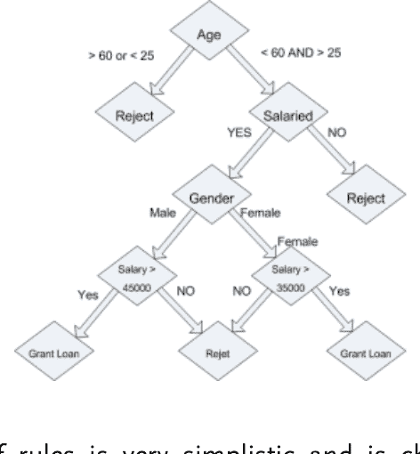

上述规则集非常简单，是随机选择的。在现实世界中，数据要复杂得多，并且使用熵等统计技术来创建这些节点。熵指的是标记数据中分类的不纯度。基本上，在决策树中，导致输出标签中熵最小的特征被设置在根节点。例如，如果95%的情况下，当年龄大于60岁且小于25岁时，贷款申请被拒绝，那么对于年龄在60岁和25岁之间的值，输出的不纯度将是5%。同样，如果在80%的情况下，失业人士的贷款被拒绝，那么对于受薪属性，输出标签的不纯度将是20%。根据经验法则，不纯度较低的特征被放置在树节点中较高的位置。

### 决策树的优势

由于其简单性和易于理解，决策树可以非常方便。以下是决策树算法的一些优点。

- 决策树在回归和分类任务中同样有效，这意味着你可以预测连续值和离散值。
- 决策树可用于分类线性和非线性数据。
- 与大多数其他机器学习算法相比，它们的训练速度相对较快。

### 使用Python Scikit Learn库实现决策树

一如既往，我们将使用Python的Scikit Learn库来实际应用决策树。在本节中，我们将再次根据铺设的高速公路（英里）、汽油税（美分）、人均收入和持有驾照的个体比例等特征，预测美国48个州的汽油消耗量（以百万计）。

有关数据集的更多详细信息，请访问此链接。数据也可以从该链接下载；但是，下载链接中的数据不是CSV格式。为了方便读者，数据已被下载、转换为CSV格式，并保存在数据集文件夹中，文件名为“petrol_data.csv”，你可以在那里找到它。

现在你应该熟悉机器学习流程了。使用Python解决每个机器学习问题的第一步是导入所需的库。以下脚本执行此操作：

#### 导入必要的库

```python
import pandas as pd
import numpy as np
import matplotlib.pyplot as plt
%matplotlib inline
```

此脚本是使用Jupyter notebook实现的。因此，要在notebook中绘制图形，我们使用了命令`%matplotlib inline`。如果你使用的是Spyder，可以删除最后一行。

#### 导入数据集

执行以下命令以导入数据集。

```python
petrol_data = pd.read_csv('D:\Datasets\petrol_data.csv')
```

上面的脚本读取数据集并将其存储在*player_data*中。

#### 数据分析

执行以下脚本以查看数据：

```python
petrol_data.head()
```

结果如下所示：

| Petrol_tax | Average_Income | Paved_Highways | Population_Driver_licence(%) | Petrol_Consumption |
|---|---|---|---|---|
| 9.0 | 3571 | 1976 | 0.525 | 541 |
| 9.0 | 4692 | 1250 | 0.572 | 524 |
| 9.0 | 3865 | 1586 | 0.580 | 561 |
| 7.5 | 4870 | 2351 | 0.529 | 414 |
| 8.0 | 4399 | 431 | 0.544 | 410 |

#### 数据预处理

以下脚本将数据分为特征集和标签集。

```python
features= petrol_data.iloc[:,0:4].values
labels= petrol_data.iloc[:,4].values
```

最后，让我们将数据分为80%的训练集和20%的测试集：

```python
from sklearn.model_selection import train_test_split
train_features, test_features, train_labels, test_labels = train_test_split(features, labels, test_size = 0.2, random_state = 0)
```

#### 数据缩放

如果你查看数据集，会发现我们的数据缩放得不太好。例如，特征*Population_Driver_License*的值在0到1之间，而*Average_Income*和*Paved_Highways*的值则高达数千。因此，在将数据输入算法之前，我们需要对特征进行缩放。执行以下脚本来完成此操作：

```python
from sklearn.preprocessing import StandardScaler
feature_scaler = StandardScaler()
train_features_poly = feature_scaler.fit_transform(train_features)
test_features_poly = feature_scaler.transform(test_features)
```

#### 训练算法

我们已经对特征进行了缩放。现在是时候训练我们的算法了。为了实现用于分类的决策树，我们使用*sklearn.tree*库的*DecisionTreeClassifier*类。该类的fit方法用于训练算法。训练特征和标签被传递给这个fit方法，如下所示：

```python
from sklearn.tree import DecisionTreeClassifier
dt_reg = DecisionTreeClassifier()
dt_reg.fit(train_features, train_labels)
```

#### 进行预测

最后，为了进行预测，我们将使用上一节中创建的DecisionTreeClassifier类对象dt_reg的predict方法。测试特征将作为参数传递给它。

```python
predictions = dt_reg.predict(test_features)
```

让我们将预测值与实际值进行比较，执行以下脚本：

```python
comparison=pd.DataFrame({'Real':test_labels,
'Predictions':predictions})

print(comparison)
```

上述脚本的输出如下所示：

```
   Predictions  Real
0          591   534
1          714   410
2          566   577
3          547   571
4          566   577
5          566   704
6          591   487
7          610   587
8          460   467
9          464   580
```

#### 评估算法

以下脚本计算平均绝对误差、均方误差和均方根误差的值：

```python
from sklearn import metrics
print('MAE:', metrics.mean_absolute_error(test_labels,
predictions))
print('MSE:', metrics.mean_squared_error(test_labels,
predictions))
print('RMSE:', np.sqrt(metrics.mean_squared_error(test_labels,
predictions)))
```

输出值如下：

```
MAE: 79.5
MSE: 14037.7
RMSE: 118.480800132
```

MAE的值为79，大于上一章为多项式回归算法计算的MAE值。同样，决策树的RMSE值为118，远大于上一章使用多项式回归算法获得的值。因此，我们可以说，对于使用本章数据集预测汽油价格，多项式回归算法优于决策树算法。

### 结论

在本章中，我们研究了什么是决策树算法以及如何将其用于回归。在下一章中，我们将研究随机森林算法，该算法基本上基于决策树算法。

# 第7章

## 用于回归的随机森林

在上一章中，我们研究了决策树。单个决策树可能会因数据而产生偏差。一个更好的方法是使用多个决策树，让它们各自做出预测，然后通过计算所有树预测值的平均值来得出最终预测。这种方法被称为集成学习。在集成学习中，将相同或不同类型的多个算法组合在一起，以创建更强大的机器学习模型。随机森林是一种集成学习模型，可用于监督机器学习。

随机森林算法将多个决策树算法结合在一起，形成一个森林。因此，该算法被称为“随机森林”算法。与决策树算法一样，随机森林算法可用于预测连续值（回归）和离散值（分类）。在本文中，我们将借助Python的Scikit learn库实现用于回归目的的随机森林算法。我们将在本书的分类部分看到如何将随机森林算法用于分类。

### 随机森林算法的工作原理

随机森林算法执行以下步骤：

1.  从数据集中选择K个随机数据点。
2.  基于这K个数据点创建一个决策树回归或分类算法。
3.  选择随机森林算法的树的数量，并对每棵树执行步骤1和2。
4.  如果问题是回归，每棵树预测一个连续值；最终输出可以通过取所有树预测值的平均值来计算。如果当前问题是分类问题，每棵树预测一个离散值。最终类别可以通过多数投票来选择。

### 随机森林算法的优点

随机森林算法有几个优点，其中一些列举如下：

-   随机森林算法是最稳定的算法之一，并且扩展性非常好。由于森林中有多棵树，数据集中数据的引入或移除可能会影响一小部分树，但不会影响所有树。算法的整体稳定性不受影响。
-   随机森林算法在数值特征和分类特征上表现同样出色。
-   你不需要在随机森林算法中执行特征缩放，因为它不依赖于特征空间中数据点之间的距离。

### 随机森林算法的缺点

随机森林算法最大的缺点之一是其复杂性。由于预测涉及数百甚至数千棵树，因此不容易理解最终预测是如何做出的。

算法的复杂性伴随着时间成本。根据森林中树的数量，随机森林算法可能需要大量时间来执行。

### 使用Scikit Learn实现随机森林算法

在本节中，我们将使用随机森林算法，根据球员的身高、体重、所有投篮中成功投篮的百分比、所有罚球中成功罚球的百分比，来预测球员在篮球比赛中能得到多少分。我们已经下载了数据集，它在Datasets文件夹中可用。

我们将遵循与前面所有章节相同的步骤。

#### 1- 导入所需库

以下代码导入所需的库：

```python
import pandas as pd
import numpy as np
import matplotlib.pyplot as plt
%matplotlib inline
```

#### 2- 导入数据集

虽然数据集可在线获取，但我们已经下载并将其添加到本书附带的数据集仓库中。数据集名称为“player.csv”。执行以下命令导入数据集。

```python
player_data = pd.read_csv('D:\Datasets\player.csv')
```

上述脚本读取数据集并将其存储在*player_data*中。

#### 3- 分析数据

执行以下脚本以查看数据：

```python
player_data.head()
```

输出如下所示：

| | Height | Weight | Field_Goals | Throws | Points |
|---|---|---|---|---|---|
| 0 | 6.8 | 225 | 0.442 | 0.672 | 9.2 |
| 1 | 6.3 | 180 | 0.435 | 0.797 | 11.7 |
| 2 | 6.4 | 190 | 0.456 | 0.761 | 15.8 |
| 3 | 6.2 | 180 | 0.416 | 0.651 | 8.6 |
| 4 | 6.9 | 205 | 0.449 | 0.900 | 23.2 |

#### 4- 数据预处理

以下脚本将数据划分为特征集和标签集。

```python
features = player_data.iloc[:, 0:4].values
labels = player_data.iloc[:, 4].values
```

最后，让我们将数据划分为80%的训练集和20%的测试集：

```python
from sklearn.model_selection import train_test_split
train_features, test_features, train_labels, test_labels = train_test_split(features, labels, test_size = 0.2, random_state = 0)
```

#### 5- 数据缩放

如果你查看数据集，会发现它缩放得不太好，例如Field_Goals和Throws列的值在0到1之间，而其他列的值则更高。因此，在训练算法之前，我们将对数据进行缩放。

#### 6- 训练算法并进行预测

要实现用于回归任务的随机森林算法，需使用 *sklearn.ensemble* 库中的 *RandomForestRegressor* 类。树的数量作为参数传递给 `n_estimators` 参数。在以下脚本中，树的数量设置为 200。

```python
from sklearn.ensemble import RandomForestRegressor
rf_reg = RandomForestRegressor(n_estimators=200, random_state=0)
rf_reg.fit(train_features, train_labels)
```

执行以下脚本以预测测试特征的标签：

```python
predictions = rf_reg.predict(test_features)
```

要将预测值与真实输出进行比较，请执行以下脚本：

让我们将预测值与实际值进行比较。执行以下脚本以完成此操作：

```python
comparison=pd.DataFrame({'Real':test_labels, 'Predictions':predictions})
print(comparison)
```

输出如下所示：

| | Predictions | Real |
|---|---|---|
| 0 | 10.6050 | 8.3 |
| 1 | 9.5780 | 7.2 |
| 2 | 10.0470 | 2.8 |
| 3 | 19.6975 | 5.6 |
| 4 | 16.0445 | 9.1 |
| 5 | 13.2735 | 15.8 |
| 6 | 12.8185 | 9.6 |
| 7 | 14.1255 | 15.4 |
| 8 | 11.8640 | 7.9 |
| 9 | 13.5840 | 11.7 |
| 10 | 13.9590 | 23.2 |

#### 7- 评估算法

执行以下脚本以查找我们的线性回归模型的 MAE、MSE 和 RMSE。

```python
from sklearn import metrics
print('MAE:', metrics.mean_absolute_error(test_labels, predictions))
print('MSE:', metrics.mean_squared_error(test_labels, predictions))
print('RMSE:', np.sqrt(metrics.mean_squared_error(test_labels, predictions)))
```

输出如下：

```
MAE: 5.00731818182
MSE: 39.4070574773
RMSE: 6.27750408023
```

MAE 的值为 5.00，大于第 4 章中为线性回归算法计算的 MAE 值，即 4.65。同样，随机森林算法的 RMSE 值为 6.27，大于 5.67，即第 4 章中使用线性回归算法获得的值。因此，我们可以说，对于使用本章数据集预测篮球运动员得分的任务，线性回归算法优于随机森林算法。

# 第 8 章

## 支持向量回归

支持向量回归是支持向量机算法的一种类型，可用于执行线性和非线性回归。SVM 于 1960 年代提出，是最著名的监督机器学习算法之一。在神经网络普及之前，SVM 被认为是最精确的机器学习算法。

在本章中，我们将简要回顾 SVM 算法背后的直觉以及它们实际的工作原理。由于我们处于回归部分，我们将使用 Python 库实现 SVR 算法，以根据年份预测汽车价格。但首先让我们研究 SVM 背后的理论。

### SVM 理论

对于二维特征空间中的典型线性回归，任务是找到一条成功平分数据点的直线。然而在现实世界中，可能存在多个决策边界可以成功分类数据点，如图 1 所示。

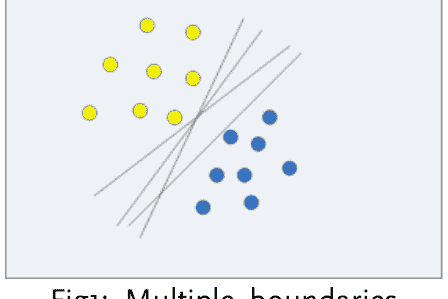

图 1：多个边界

然而，新数据点是否能被成功分类取决于用于分类的决策边界。

例如，看看图 2。假设我们需要对新数据点（即红色圆圈）进行分类。如果我们有图 2 中的决策边界，新数据点将被分类为蓝色。

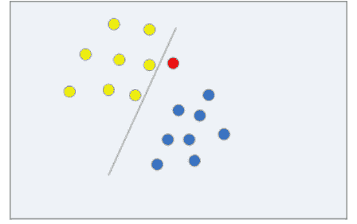

图 2：新数据点被分类为蓝色

另一方面，如果我们有图 3 中的决策边界，新数据点将被分类为黄色，如下所示：

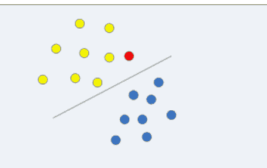

图 3：新数据点被分类为黄色

从图 2 和图 3 可以清楚地看到，可能存在多个决策边界可以成功分类数据集。然而，并非所有边界都是最优的。给定一个新数据点，不同的决策边界可能会以不同方式分类数据。

SVM 算法的任务是找到一个决策边界，以最小化误分类的可能性。SVM 算法通过最大化数据集中所有类别最近数据点之间的距离来实现这一点。

SVM 算法借助支持向量找到这样的边界，因此得名支持向量机。支持向量是穿过要分类的两个类别最近数据点的向量。任务是最大化这两个向量之间的距离。在这些支持向量之间绘制一条与两者都平行的直线。这个决策边界被认为是最优的决策边界。支持向量机找到的决策边界如图 4 所示。

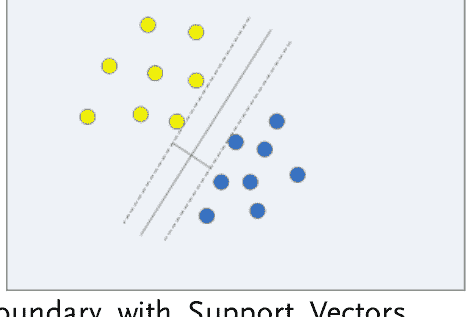

图 4：带有支持向量的决策边界

理论部分已经足够，现在让我们看看如何使用支持向量回归（SVM 的一种类型）来根据制造年份预测汽车价格。我们将为此使用 Python 的 Scikit Learn 库。

### 使用 PYTHON SCIKIT LEARN 实现 SVR

在本节中，我们将使用数据集根据制造年份（自变量）预测汽车价格（因变量）。您可以在补充的“数据集”文件夹中找到该数据集。

#### 1- 导入所需库

以下代码导入所需的库：

```python
import pandas as pd
import numpy as np
import matplotlib.pyplot as plt
%matplotlib inline
```

此脚本使用 Jupyter notebook 实现。因此，要在 notebook 中绘制图形，我们使用了命令 `%matplotlib inline`。如果您使用的是 Spyder，可以删除最后一行。

#### 2- 导入数据集

我们将使用“car_price.csv”数据集。执行以下脚本以导入数据集：

```python
car_data = pd.read_csv('D:\Datasets\car_price.csv')
```

上面的脚本读取数据集并将其存储在 *car_data* 中。

#### 3- 分析数据

让我们首先大致查看一下数据。*head* 函数返回数据集的前 5 行。执行以下脚本：

```python
car_data.head()
```

| | Year | Price |
|---|---|---|
| 0 | 1980 | 2000 |
| 1 | 1985 | 3000 |
| 2 | 1983 | 2200 |
| 3 | 1990 | 3700 |
| 4 | 1995 | 4500 |

#### 4- 数据预处理

要将数据划分为特征和标签，请执行以下脚本：

```python
features= car_data.iloc[:,0:1].values
labels= car_data.iloc[:,1].values
```

最后，让我们将数据划分为 80% 的训练集和 20% 的测试集：

```python
from sklearn.model_selection import train_test_split
train_features, test_features, train_labels, test_labels = train_test_split(features, labels, test_size = 0.2, random_state = 0)
```

如果您查看数据集，可以看到年份和价格的值之间差异并不大。两者都是以千为单位。因此，无需缩放数据，我们可以直接使用这些数据来训练算法。

#### 5- 训练算法并进行预测

sklearn.svm 的 SVR 类用于在 Python 中实现支持向量回归。SVR 类为其 `kernel` 参数接受一个值。如果您的数据是线性的（实际上 car_data 就是这种情况），则使用“linear”作为内核值，否则您可以使用文档中此处给出的列表中的任何内核值。

SVR 类具有 `fit` 方法，该方法接受训练特征和标签作为输入并训练模型，如下所示：

```python
from sklearn.svm import SVR
svr_reg = SVR(kernel='linear')
svr_reg.fit(train_features, train_labels)
```

最后，执行以下脚本以预测测试特征的标签：

predictions = lin_reg.predict(test_features)

所有预测结果都存储在 *predictions* 变量中。

让我们将预测值与实际值进行比较。

执行以下脚本以完成此操作：

```
comparison=pd.DataFrame({'Real':test_labels,
'Predictions':predictions})
print(comparison)
```

| | Predictions | Real |
|---|---|---|
| 0 | 4945.0 | 5200 |
| 1 | 3699.0 | 3000 |
| 2 | 3610.0 | 3100 |
| 3 | 4055.0 | 4000 |

#### 评估算法

执行以下脚本以查找我们线性回归模型的 MAE、MSE 和 RMSE。

```
from sklearn import metrics
print('MAE:', metrics.mean_absolute_error(test_labels,
predictions))
```

```
print('MSE:', metrics.mean_squared_error(test_labels,
predictions))
print('RMSE:', np.sqrt(metrics.mean_squared_error(test_labels,
predictions)))
```

输出结果始终如下：

```
MAE: 379.75
MSE: 204187.75
RMSE: 451.871386569
```

在 SVR 的情况下，MAE 的值为 379.75，大于第 4 章中为线性回归算法计算的 MAE 值，即 377.36。同样，本章中计算的 SVR 的 RMSE 值为 451.87，大于 397.89，即第 4 章中使用线性回归算法获得的值。因此，我们可以说，对于基于制造年份的汽车价格（使用本章中的数据集），线性回归算法优于支持向量回归算法。

# 第 9 章

## 用于分类的朴素贝叶斯算法

在前面的章节中，我们介绍了一些最常用的回归算法，例如线性回归、支持向量回归、多项式回归、决策树和随机森林算法。其中一些算法有可用于分类的变体，我们将在接下来的章节中看到。在本章中，我们将开始讨论分类算法，即用于预测离散值或输入数据的类标签的算法。本节我们将介绍的第一个分类算法是朴素贝叶斯算法。

### 朴素贝叶斯（NB）算法理论

朴素贝叶斯算法是一种基于贝叶斯定理的监督机器学习算法。NB 算法基于特征独立性原则，该原则指出数据集中的特征彼此之间没有关系。例如，如果一个水果长度为 5 英寸或更长，颜色为黄色，直径为 1 厘米，则可以将其视为香蕉。朴素贝叶斯不关心这些特征是否相互依赖。该水果是通过这些特征的独立贡献被宣布为香蕉的。由于这种独立性假设，NB 算法被称为“朴素”。

朴素贝叶斯算法是所有机器学习算法中最简单的，但功能非常强大。

数学上，贝叶斯定理可以表示为：

```
P(A|B) = \frac{P(B|A) \cdot P(A)}{P(B)}
```

上述术语解释如下：

- 1- P(A|B) 是在给定属性集 B 的情况下事件 A 发生的概率
- 2- P(A) 是事件 A 发生的先验概率
- 3- P(B|A) 是如果事件 A 发生，属性集的概率
- 4- P(B) 是预测变量发生的先验概率

让我们通过一个例子来理解这个概念。
假设我们有 12 个人的体重档案，并基于此我们想预测患者是否患有糖尿病。
记录集如下所示：

手动实现 NB 算法涉及三个步骤。

- 1- 为数据创建如下所示的频率表：

### 2- 计算类/事件先验概率和属性先验概率

现在让我们计算事件的先验概率：
当糖尿病（是）时 P(A) = 4/12 = 0.33
当糖尿病（否）时 P(A) = 8/12 = 0.67
最后，让我们找出特征的先验概率：
当超重时 P(B) = 4/12 = 0.33
当正常时 P(B) = 4/12 = 0.33
当体重不足时 P(B) = 4/12 = 0.33

3- 现在，如果一位新患者到来，我们必须根据其体重判断他是否患有糖尿病。可能有两种结果：是或否。我们将计算两种情况的概率。概率较高的类别将被分配给该患者。

假设一位超重患者来到诊所，我们需要检测他是否患有糖尿病。我们需要解两个方程：

a) P(是|超重) = P(超重|是) x P(是) / P(超重)

= (0.75 x 0.33) / 0.33

= 0.75

b) P(否|超重) = P(超重|否) x P(否) / P(超重)

= (0.125 x 0.67) / 0.33

= 0.25

你可以看到，超重时患糖尿病的概率是 0.75，大于不患糖尿病的概率 0.25，因此 NB 算法将把该患者分类为糖尿病患者。

在上述情况下只有一个属性，如果有多个属性，概率可以计算为：

P(A|B) = P(B1|A) x P(B2|A) x P(B3|A) ....... P(BN|A) x P (A)

### 朴素贝叶斯算法的优点

NB 算法非常简单且训练速度快，因为不涉及复杂的数学运算、误差修正或反向传播。
在分类数据的情况下，NB 算法优于大多数其他算法。对于数值特征，NB 算法假设正态分布。

### 朴素贝叶斯算法的缺点

在现实世界的数据中，特征大多依赖于其他特征。NB 算法的独立性假设使其成为具有相互依赖特征的数据集的不良预测器。如果分类特征在测试集中有一个在训练集中未见过的值，NB 算法将为该实例分配零概率。因此，对使用 NB 算法获得的结果进行交叉验证非常重要。

### 朴素贝叶斯算法的应用

NB 算法非常适合多类问题，通常用于文本分类问题，例如情感分析和电子邮件垃圾邮件过滤。
NB 算法也广泛与协同过滤算法结合使用，以构建基于机器学习的推荐系统。
与其他高级算法相比，NB 速度极快，因此被纳入实时应用程序中。

### 使用 Python Scikit Learn 实现朴素贝叶斯算法

与往常一样，在本节中，我们将使用 Python 的 Scikit Learn 库来实现朴素贝叶斯算法。
在 Scikit Learn 中，你可以实现三种 NB 算法的变体：

- 1- 高斯 NB：当特征具有正态数据分布时使用
- 2- 多项式 NB：当你的特征包含离散数据时使用
- 3- 伯努利 NB：当你的特征包含二进制数据时使用。

在本节中，我们将根据四个属性预测鸢尾花的类型：花萼长度、花萼宽度、花瓣长度和花瓣宽度。
有关 IRIS 数据集的更多详细信息，请访问此链接：
https://archive.ics.uci.edu/ml/datasets/Iris
该数据集已随书提供，可在 Datasets 文件夹中找到名为 iris_data.csv 的文件。
现在你应该熟悉其余步骤了。我们从导入库开始：

#### 7- 导入所需库

以下代码导入所需的库：

```
import pandas as pd
import numpy as np
import matplotlib.pyplot as plt
%matplotlib inline
```

#### 8- 导入数据集

执行以下命令以导入数据集。
iris_data = pd.read_csv('D:\Datasets\iris_data.csv')
上面的脚本读取数据集并将其存储在 *iris_data* 中。

#### 9- 分析数据

执行以下脚本以查看数据：
iris_data.head()
输出如下所示：

| sepal_length | sepal_width | petal_length | petal_width | species |
|---|---|---|---|---|
| 0 | 5.1 | 3.5 | 1.4 | 0.2 | setosa |
| 1 | 4.9 | 3.0 | 1.4 | 0.2 | setosa |
| 2 | 4.7 | 3.2 | 1.3 | 0.2 | setosa |
| 3 | 4.6 | 3.1 | 1.5 | 0.2 | setosa |
| 4 | 5.0 | 3.6 | 1.4 | 0.2 | setosa |

#### 10- 数据预处理

以下脚本将数据分为特征集和标签集。
features = player_data.iloc[:, 0:4].values
labels = player_data.iloc[:, 4].values
最后，让我们将数据分为 80% 的训练集和 20% 的测试集：

```
from sklearn.model_selection import train_test_split
train_features, test_features, train_labels, test_labels = \
train_test_split(features, labels, test_size = 0.2, random_state = 0)
```

#### 11- 数据缩放

如果你查看数据集，会发现其缩放效果不佳，例如`petal_width`列的值在0到1之间，而其他列的值则更高。因此，在训练算法之前，我们需要对数据进行缩放。还记得我们在第3章讨论过缩放吗？这里我们将使用标准缩放器类。

```python
from sklearn.preprocessing import StandardScaler
feature_scaler = StandardScaler()
train_features = feature_scaler.fit_transform(train_features)
test_features = feature_scaler.transform(test_features)
```

#### 12- 训练算法并进行预测

我们可以看到特征值呈正态分布；因此，我们可以使用高斯朴素贝叶斯来解决这个问题。要使用Scikit learn实现高斯朴素贝叶斯算法，我们需要使用*sklearn.naive_bayes*库中的*GaussianNB*类。执行以下脚本，在train_features和train_labels上训练模型。

```python
from sklearn.naive_bayes import GaussianNB
nb_clf = GaussianNB()
nb_clf.fit(train_features, train_labels)
```

执行以下脚本，预测测试特征的标签：

```python
predictions = nb_clf.predict(test_features)
```

要将预测结果与真实输出进行比较，请执行以下脚本：

```python
comparison = pd.DataFrame({'Real': test_labels,
                           'Predictions': predictions})
print(comparison)
```

输出如下所示：

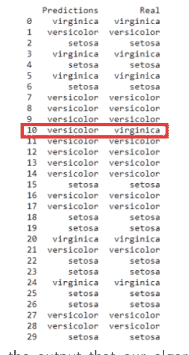

从输出中可以看出，我们的算法在预测花卉类型方面表现出色。在30个测试实例中，有29个被正确预测，只有一个（以红色高亮显示）被错误分类。

#### 评估算法

我们使用平均绝对误差、均方根误差和均方误差来评估回归算法。对于分类问题，性能指标则不同。通常使用精确率、召回率和F1值来评估分类算法的性能。让我们简要回顾一下混淆矩阵、准确率、精确率、召回率和F1值。

**混淆矩阵：**

混淆矩阵是一个显示真正例、真负例、假正例和假负例预测值的矩阵。

真正例（TP）是那些实际为正且也被预测为正的值。同样，真负例（TN）是那些实际为负且被预测为负的值。

另一方面，假正例是那些实际为负但被错误预测为正的值。同样，假负例是那些实际为正但被错误预测为负的值。

混淆矩阵如下所示：

|                | 预测为正 | 预测为负 |
|----------------|--------------------|--------------------|
| 实际为正| 真正例 (TP) | 假负例 (FN)|
| 实际为负| 假正例 (FP)| 真负例 (TN) |

**准确率：**

评估机器学习算法性能最简单的参数是准确率。准确率是指正确预测的实例数除以总实例数。数学上可以表示为：
准确率 = (TP + TN) / (TP + FP + TN + FN)

**精确率：**

精确率是指算法进行精确预测的能力。它可以通过将真正例除以预测为正的实例数（真正例 + 假正例）来计算。数学上表示为：
精确率 = TP / (TP + FP)

**召回率：**

召回率可以通过将真正例除以实际为正的实例数（真正例 + 假负例）来计算。
召回率 = TP / (TP + FN)

**F1值：**

F1值是精确率和召回率的调和平均值。

与回归性能指标一样，我们不必手动计算上述指标的值。Python Scikit Learn库提供了可用于此目的的类。执行以下脚本，查看我们训练的用于预测鸢尾花类型的朴素贝叶斯算法的性能：

```python
from sklearn.metrics import classification_report, confusion_matrix, accuracy_score
print(confusion_matrix(test_labels, predictions))
print(classification_report(test_labels, predictions))
print(accuracy_score(test_labels, predictions))
```

上述脚本的输出如下所示：

```
[[11  0  0]
 [ 0 13  0]
 [ 0  1  5]]
              precision    recall  f1-score   support

      setosa       1.00      1.00      1.00        11
  versicolor       0.93      1.00      0.96        13
   virginica       1.00      0.83      0.91         6

avg / total       0.97      0.97      0.97        30

0.9666666666666667
```

从输出中可以看出，我们的算法达到了96.66%的准确率。

### 结论

在本章中，我们开始了关于分类算法的讨论。本章我们研究的第一个分类算法是朴素贝叶斯算法。我们了解了该算法背后的理论及其Python实现。

# 第10章

## 用于分类的K近邻算法

在上一章中，我们研究了用于分类的朴素贝叶斯算法。我们说过NB算法假设特征独立。此外，NB算法的一个缺点是它假设分类特征值呈正态分布。然而在大多数情况下，现实世界的数据并不遵循任何趋势，例如均匀分布或线性可分性等。在这种情况下，非参数算法会派上用场。K近邻（KNN）算法就是这样一种非参数算法。

### KNN的理论

KNN算法背后的直觉非常简单。KNN算法只是计算新的测试数据点与数据集中所有其他数据点之间的距离。然后，它根据与测试点的距离，按升序对所有其他数据点进行排序。最后，它选择前K个最近的数据点。然后，它将新数据点分配给K个数据点中多数所属的类别。现在你应该明白为什么我们要对数据进行缩放，以便数据点不同维度之间的距离保持有意义。距离可以是曼哈顿距离，也可以是欧几里得距离，具体取决于问题。

让我们直观地看看KNN算法的工作原理。
假设我们在二维空间中有一些数据点，分为两类：红色和蓝色，如下图所示。

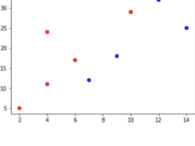

现在，如果我们需要对一个新的数据点进行分类。我们将计算它与所有红色和蓝色数据点之间的距离。然后我们将选择K个最近的数据点。假设新数据点是黄色圆圈，K的值为三，如下所示：

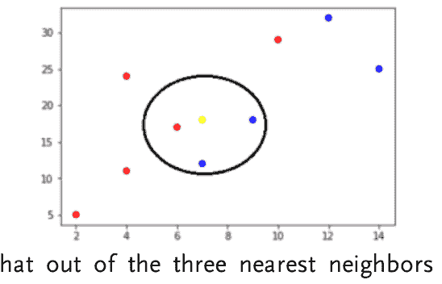

你可以看到，在黄色数据点的三个最近邻中，有两个是蓝色，一个是红色。因此，黄色数据点将被分类到蓝色类别中。

KNN算法没有训练阶段；事实上，它使用整个数据集来对新数据点进行分类。正是由于这个目的，它被称为惰性学习算法。

### KNN算法的优点

与其他算法不同，KNN算法所需的参数列表并不十分详尽。你只需要指定最近邻的数量K和距离函数的类型。

与逻辑回归、决策树和其他分类算法相比，KNN算法极其快速，因为KNN不涉及训练阶段。新数据点可以直接进行分类，无需大量训练，只需计算其与其他数据点的距离即可。

KNN非常简单且易于实现。此外，可以随时添加新的数据点，因为每当需要进行预测时，都会重新计算与所有数据点的距离。

### KNN算法的缺点

KNN算法在处理数值特征时表现良好，但在处理分类特征时，其性能会下降。这是因为对于分类特征，无法精确计算两个数据点之间的距离。

KNN算法的预测成本随着数据规模和维度的增加而增加，因为计算大量高维数据点之间的距离非常耗时。

### 使用 Scikit Learn 实现 KNN

在本节中，我们将使用 Python 的 Scikit Learn 库来实现 KNN 算法。我们将使用 KNN 算法解决的问题是预测银行纸币的真伪。数据集中有四个属性，即纸币小波变换图像的熵、偏度、方差和峰度。
更多关于数据集的详细信息可以在此处找到。
该数据集随书提供，可以在 Datasets 文件夹中以 banknote_data.csv 的名称找到。
像往常一样，我们从导入库开始：

#### 13- 导入所需库

以下代码导入所需的库：

```
import pandas as pd
import numpy as np
import matplotlib.pyplot as plt
%matplotlib inline
```

#### 14- 导入数据集

执行以下命令以导入数据集。

```
banknote_data = pd.read_csv(r'D:\Datasets\banknote_data.csv')
```

上面的脚本读取数据集并将其存储在 *banknote_data* 中。

#### 15- 分析数据

以下脚本返回数据维度：

```
banknote_data.shape
```

上面的脚本返回 (1372, 5)，这意味着我们的数据集包含 1372 条记录和五个属性。

执行以下脚本以查看数据：

```
banknote_data.head()
```

输出如下所示：

| | Variance | Skewness | Curtosis | Entropy | Class |
|---|---|---|---|---|---|
| 0 | 3.62160 | 8.6661 | -2.8073 | -0.44699 | 0 |
| 1 | 4.54590 | 8.1674 | -2.4586 | -1.46210 | 0 |
| 2 | 3.86600 | -2.6383 | 1.9242 | 0.10645 | 0 |
| 3 | 3.45660 | 9.5228 | -4.0112 | -3.59440 | 0 |
| 4 | 0.32924 | -4.4552 | 4.5718 | -0.98880 | 0 |

#### 16- 数据预处理

以下脚本将数据划分为特征集和标签集。

```
features= banknote_data.iloc[:,0:4].values
labels= banknote_data.iloc[:,4].values
```

最后，让我们将数据划分为 80% 的训练集和 20% 的测试集：

```
from sklearn.model_selection import train_test_split
train_features, test_features, train_labels, test_labels = train_test_split(features, labels, test_size = 0.2, random_state = 0)
```

#### 17- 数据缩放

如果你使用 KNN 算法，缩放数据总是一个好习惯。记得我们在第 3 章讨论过缩放。这里我们将使用标准缩放器类。

```
from sklearn.preprocessing import StandardScaler
feature_scaler = StandardScaler()
train_features = feature_scaler.fit_transform(train_features)
test_features = feature_scaler.transform(test_features)
```

#### 18- 训练算法并进行预测

要使用 Scikit learn 实现 KNN 算法，我们需要使用 *sklearn.neighbors* 库的 *KNeighborsClassifier* 类。K 的值作为 *n_neighbors* 参数的值指定，如下所示。我们使用 K 的值为 3。执行以下脚本以在 train_features 和 train_labels 上训练模型。

```
from sklearn.neighbors import KNeighborsClassifier
knn_clf = KNeighborsClassifier(n_neighbors=3)
knn_clf.fit(train_features, train_labels)
```

执行以下脚本以预测测试特征的标签：

```
predictions = knn_clf.predict(test_features)
```

要将预测与真实输出进行比较，请执行以下脚本：

```
comparison=pd.DataFrame({'Real':test_labels,
'Predictions':predictions})
print(comparison)
```

输出如下所示：

| | Predictions | Real |
|---|---|---|
| 0 | 1 | 1 |
| 1 | 0 | 0 |
| 2 | 1 | 1 |
| 3 | 0 | 0 |
| 4 | 0 | 0 |
| 5 | 0 | 0 |
| 6 | 0 | 0 |
| 7 | 0 | 0 |
| 8 | 1 | 1 |
| 9 | 1 | 1 |
| 10 | 0 | 0 |
| 11 | 0 | 0 |
| 12 | 1 | 1 |
| 13 | 0 | 0 |
| 14 | 0 | 0 |
| 15 | 0 | 0 |
| 16 | 1 | 1 |
| 17 | 1 | 1 |
| 18 | 0 | 0 |
| 19 | 0 | 0 |
| 20 | 1 | 1 |
| 21 | 0 | 0 |
| 22 | 0 | 0 |
| 23 | 1 | 1 |
| 24 | 0 | 0 |
| 25 | 1 | 1 |
| 26 | 0 | 0 |
| 27 | 1 | 1 |

你可以看到我们的大多数预测都是准确的。

#### 评估算法

从上一章我们知道，要评估分类算法的性能，我们可以使用混淆矩阵、准确率、精确率、召回率和 F1 度量作为指标。执行以下脚本以查找这些指标的值：

```
from sklearn.metrics import classification_report, confusion_matrix, accuracy_score

print(confusion_matrix(test_labels, predictions))

print(classification_report(test_labels, predictions))
print(accuracy_score(test_labels, predictions))
```

上面脚本的输出如下所示：

```
[[157   0]
 [  0 118]]
              precision    recall  f1-score   support

           0       1.00      1.00      1.00       157
           1       1.00      1.00      1.00       118

    avg / total       1.00      1.00      1.00       275

1.0
```

从输出可以看出，我们的算法在预测纸币真伪方面做得相当好。我们获得了 100% 的准确率。

#### K 值对预测准确率的影响

在前面，我们随机将 K 的值设置为 3，这恰好导致了 100% 的准确率。然而，情况并非总是如此。我们一开始并不知道 K 的最佳值。找到 K 值的最佳方法是尝试不同的 K 值，并选择导致最高准确率的值。

在下面的脚本中，我们将再次使用 1 到 50 之间的 k 值来预测纸币的真伪。执行以下脚本：

```
rate_of_error = []
```

```
for i in range(1, 50):
    knn = KNeighborsClassifier(n_neighbors=i)
    knn.fit(train_features, train_labels)
    predictions = knn.predict(test_features)
    rate_of_error.append(np.mean(predictions != test_labels))
```

一旦计算出每个 K 值的错误率，就可以打印一个图表来显示错误率随 K 值变化的情况。执行以下脚本：

```
plt.figure(figsize=(10, 5))
plt.plot(range(1, 50), rate_of_error, color='green', linestyle='solid', marker='o',
         markerfacecolor='red', markersize=10)
plt.title('K value vs Error')
plt.xlabel('K Value')
plt.ylabel('Error Value')
```

输出如下所示：

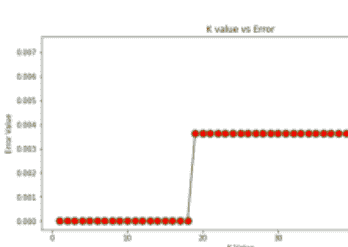

从上图可以清楚地看出，对于 1 到 18 之间的所有 K 值，错误率都保持为零。18 之后，错误率增加到 4%，这仍然不算大。

### **结论**

在本章中，我们介绍了用于分类的 K 近邻算法。我们研究了 K 近邻算法背后的理论，然后实现了该算法来解决纸币认证问题。在下一章中，我们将看到如何使用决策树算法进行分类任务。

# 第 11 章

## 用于分类的决策树

在第 6 章“用于回归的决策树”中，我们研究了决策树的工作原理以及决策树决策过程中涉及的步骤。然而，在第 6 章中，我们使用决策树进行回归任务，即预测汽油价格。除了回归，我们还可以使用决策树进行分类任务。这正是我们将在本章中要做的。本章将相当简短，因为我们在第 6 章已经详细介绍了决策树。这里我们将只看一个例子，说明决策树如何借助 Python 的 Scikit Learn 库解决分类问题。

### 使用 Python Scikit Learn 中的决策树解决分类问题

在第 9 章中，我们使用朴素贝叶斯算法预测了鸢尾花的类型。让我们尝试使用决策树算法来解决相同的分类任务。
我们从导入库开始：

#### 1- 导入所需库

以下代码导入所需的库：

```
import pandas as pd
import numpy as np
import matplotlib.pyplot as plt
%matplotlib inline
```

#### 2- 导入数据集

执行以下命令以导入数据集。

```
iris_data = pd.read_csv('D:\Datasets\iris_data.csv')
```

上面的脚本读取数据集并将其存储在 *iris_data* 中。

#### 3- 分析数据

执行以下脚本以查看数据：

```
iris_data.head()
```

输出如下所示：

| sepal_length | sepal_width | petal_length | petal_width | species |
|---|---|---|---|---|
| 0 | 5.1 | 3.5 | 1.4 | 0.2 | setosa |
| 1 | 4.9 | 3.0 | 1.4 | 0.2 | setosa |
| 2 | 4.7 | 3.2 | 1.3 | 0.2 | setosa |
| 3 | 4.6 | 3.1 | 1.5 | 0.2 | setosa |
| 4 | 5.0 | 3.6 | 1.4 | 0.2 | setosa |

#### 4- 数据预处理

以下脚本将数据划分为特征集和标签集。

```
features = iris_data.iloc[:, 0:4].values
labels = iris_data.iloc[:, 4].values
```

最后，我们将数据划分为80%的训练集和20%的测试集：

```
from sklearn.model_selection import train_test_split
train_features, test_features, train_labels, test_labels = train_test_split(features, labels, test_size = 0.2, random_state = 0)
```

#### 5- 数据缩放

如果你观察这个数据集，会发现它的缩放效果不佳。例如，`petal_width`列的值在0到1之间，而其他列的值则更高。因此，在训练算法之前，我们将对数据进行缩放。请记住，我们在第3章讨论过缩放。这里我们将使用标准缩放器类。

```
from sklearn.preprocessing import StandardScaler
feature_scaler = StandardScaler()
train_features = feature_scaler.fit_transform(train_features)
test_features = feature_scaler.transform(test_features)
```

#### 6- 训练算法并进行预测

我们可以看到特征值呈正态分布；因此，我们可以使用高斯朴素贝叶斯来解决这个问题。要使用Scikit learn实现高斯朴素贝叶斯算法，我们需要使用*sklearn.tree*库的*DecisionTreeClassifier*类。执行以下脚本，在`train_features`和`train_labels`上训练模型。

```
from sklearn.tree import DecisionTreeClassifier
dt_clf = DecisionTreeClassifier(random_state=0)
dt_clf.fit(train_features, train_labels)
```

执行以下脚本，预测测试特征的标签：

```
predictions = dt_clf.predict(test_features)
```

要将预测结果与真实输出进行比较，请执行以下脚本：

```
comparison = pd.DataFrame({'Real': test_labels, 'Predictions': predictions})
print(comparison)
```

输出如下所示：

| | Predictions | Real |
|---|---|---|
| 0 | virginica | virginica |
| 1 | versicolor | versicolor |
| 2 | setosa | setosa |
| 3 | virginica | virginica |
| 4 | setosa | setosa |
| 5 | virginica | virginica |
| 6 | setosa | setosa |
| 7 | versicolor | versicolor |
| 8 | versicolor | versicolor |
| 9 | versicolor | versicolor |
| 10 | virginica | virginica |
| 11 | versicolor | versicolor |
| 12 | versicolor | versicolor |
| 13 | versicolor | versicolor |
| 14 | versicolor | versicolor |
| 15 | setosa | setosa |
| 16 | versicolor | versicolor |
| 17 | versicolor | versicolor |
| 18 | setosa | setosa |
| 19 | setosa | setosa |
| 20 | virginica | virginica |
| 21 | versicolor | versicolor |
| 22 | setosa | setosa |
| 23 | setosa | setosa |
| 24 | virginica | virginica |
| 25 | setosa | setosa |
| 26 | setosa | setosa |
| 27 | versicolor | versicolor |
| 28 | versicolor | versicolor |

#### 评估算法

以下脚本返回我们分类算法的性能指标值：

```
from sklearn.metrics import classification_report, confusion_matrix, accuracy_score

print(confusion_matrix(test_labels, predictions))
print(classification_report(test_labels, predictions))
print(accuracy_score(test_labels, predictions))
```

输出如下所示：

```
[[11  0  0]
 [ 0 13  0]
 [ 0  0  6]]
              precision    recall  f1-score   support

      setosa       1.00      1.00      1.00        11
  versicolor       1.00      1.00      1.00        13
   virginica       1.00      1.00      1.00         6

 avg / total       1.00      1.00      1.00        30

1.0
```

从输出可以看出，使用决策树算法达到了100%的预测准确率，这高于第9章中使用朴素贝叶斯算法达到的96.66%。

### 结论

在本章中，我们研究了如何将决策树算法用于分类任务。在下一章中，我们将研究如何将随机森林算法也用于执行分类任务。

# 第12章

## 用于分类的随机森林

在第7章中，我们研究了随机森林算法的细节，并了解了其优缺点。我们还使用Python Scikit Learn实现了随机森林算法来解决回归问题。然而，我们也可以将随机森林算法用于分类问题。既然我们处于分类部分，增加一章专门介绍用于分类的随机森林算法是合理的。

我们不会在这里深入探讨随机森林算法的理论，因为它已经在第7章中涵盖。我们将直接进入代码部分。像往常一样，我们将使用Python的Scikit Learn库来实现用于分类的随机森林算法。

### 使用Python的Scikit Learn实现随机森林分类

我们将使用随机森林算法解决的问题是预测银行纸币是真币还是假币。这是我们在第10章（KNN算法）中解决过的相同问题。数据集中有四个属性，即纸币小波变换图像的熵、偏度、方差和峰度。有关数据集的更多详细信息可以在此处找到。该数据集随书提供，可以在`Datasets`文件夹中找到名为`banknote_data.csv`的文件。请按照以下步骤操作。

#### 1- 导入所需库

```
import pandas as pd
import numpy as np
import matplotlib.pyplot as plt
%matplotlib inline
```

#### 2- 导入数据集

以下脚本导入数据集。

```
banknote_data = pd.read_csv(r'D:\Datasets\banknote_data.csv')
```

上面的脚本读取数据集并将其存储在`banknote_data`中。

#### 3- 分析数据

以下脚本返回数据维度：

```
banknote_data.shape
```

上面的脚本返回(1372, 5)，这意味着我们的数据集包含1372条记录和五个属性。

要查看数据的样子，请执行以下脚本。它返回数据的前五行。

```
banknote_data.head()
```

输出如下所示：

| | Variance | Skewness | Curtosis | Entropy | Class |
|---|---|---|---|---|---|
| 0 | 3.62160 | 8.6661 | -2.8073 | -0.44699 | 0 |
| 1 | 4.54590 | 8.1674 | -2.4586 | -1.46210 | 0 |
| 2 | 3.86600 | -2.6383 | 1.9242 | 0.10645 | 0 |
| 3 | 3.45660 | 9.5228 | -4.0112 | -3.59440 | 0 |
| 4 | 0.32924 | -4.4552 | 4.5718 | -0.98880 | 0 |

#### 4- 数据预处理

以下脚本将数据划分为特征集和标签集。

```
features = banknote_data.iloc[:, 0:4].values
labels = banknote_data.iloc[:, 4].values
```

最后，我们将数据划分为80%的训练集和20%的测试集：

```
from sklearn.model_selection import train_test_split
train_features, test_features, train_labels, test_labels = train_test_split(features, labels, test_size = 0.2, random_state = 0)
```

#### 5- 数据缩放

对于随机森林算法，数据缩放不是必需的，但为了练习，让我们使用标准缩放器对数据进行缩放。请记住，我们在第3章讨论过缩放。

```
from sklearn.preprocessing import StandardScaler
feature_scaler = StandardScaler()
train_features = feature_scaler.fit_transform(train_features)
test_features = feature_scaler.transform(test_features)
```

#### 6- 训练算法并进行预测

要使用随机森林解决回归问题，我们可以使用*sklearn.ensemble*库的*RandomForestRegressor*类。对于分类问题，我们需要使用同一库的*RandomForestClassifier*类。执行以下脚本，在`train_features`和`train_labels`上训练模型。

```
from sklearn.ensemble import RandomForestClassifier
rf_clf = RandomForestClassifier(n_estimators=50, random_state=0)
rf_clf.fit(train_features, train_labels)
```

执行以下脚本，预测测试特征的标签：

```
predictions = rf_clf.predict(test_features)
```

要将预测结果与真实输出进行比较，请执行以下脚本：

```
comparison = pd.DataFrame({'Real': test_labels, 'Predictions': predictions})
print(comparison)
```

输出的一个片段如下所示：

| | 预测值 | 真实值 |
|---|---|---|
| 0 | 1 | 1 |
| 1 | 0 | 0 |
| 2 | 1 | 1 |
| 3 | 0 | 0 |
| 4 | 0 | 0 |
| 5 | 0 | 0 |
| 6 | 0 | 0 |
| 7 | 0 | 0 |
| 8 | 1 | 1 |
| 9 | 1 | 1 |
| 10 | 0 | 0 |
| 11 | 0 | 0 |
| 12 | 1 | 1 |
| 13 | 0 | 0 |
| 14 | 0 | 0 |
| 15 | 0 | 0 |
| 16 | 1 | 1 |
| 17 | 1 | 1 |
| 18 | 0 | 0 |
| 19 | 0 | 0 |
| 20 | 1 | 1 |
| 21 | 0 | 0 |
| 22 | 0 | 0 |
| 23 | 1 | 1 |
| 24 | 0 | 0 |
| 25 | 1 | 1 |
| 26 | 0 | 0 |

#### 7- 评估算法

我们知道，要评估分类算法的性能，可以使用混淆矩阵、准确率、精确率、召回率和F1值作为度量指标。执行以下脚本来获取这些指标的值：

```
from sklearn.metrics import classification_report, confusion_matrix, accuracy_score
print(confusion_matrix(test_labels, predictions))
print(classification_report(test_labels, predictions))
print(accuracy_score(test_labels, predictions))
```

上述脚本的输出如下所示：

```
[[155  2]
 [  1 117]]
              precision    recall  f1-score   support

           0       0.99      0.99      0.99       157
           1       0.98      0.99      0.99       118

    avg / total       0.99      0.99      0.99       275

0.9890909090909091
```

从上面的输出可以看出，在随机森林分类的情况下，我们有三个错误的预测。对于KNN，我们有零个错误的预测。尝试改变估计器的数量值，看看是否能用随机森林算法获得更好的结果。

### 结论

在本章中，我们了解了如何使用随机森林算法来解决分类问题。在下一章中，我们将了解如何使用支持向量机算法来解决分类问题。

# 第13章

## 用于分类的支持向量机

在第8章中，我们学习了支持向量回归算法，它是支持向量机算法的一个变体，用于解决回归问题。我们在第8章详细学习了SVM算法的理论，并了解了SVM算法的优缺点。在本章中，我们将了解如何使用SVM算法来解决分类问题。本章我们不会关注SVM的理论细节，因为它们已经在第8章中介绍过了。这里我们将了解如何在Python中实现SVM算法来解决分类问题。

### 使用Python的Scikit Learn进行分类的SVM

在第9章和第11章中，我们分别使用朴素贝叶斯算法和决策树算法预测了鸢尾花的类型。让我们尝试使用支持向量机算法来解决相同的分类任务。
我们首先导入库：

#### 1- 导入所需的库

以下代码导入所需的库：

```
import pandas as pd
import numpy as np
import matplotlib.pyplot as plt
%matplotlib inline
```

#### 2- 导入数据集

执行以下命令导入数据集。

```
iris_data = pd.read_csv('D:\Datasets\iris_data.csv')
```

上述脚本读取数据集并将其存储在 *iris_data* 中。

#### 3- 分析数据

执行以下脚本查看数据：

```
iris_data.head()
```

输出如下所示：

| sepal_length | sepal_width | petal_length | petal_width | species |
|---|---|---|---|---|
| 0 | 5.1 | 3.5 | 1.4 | 0.2 | setosa |
| 1 | 4.9 | 3.0 | 1.4 | 0.2 | setosa |
| 2 | 4.7 | 3.2 | 1.3 | 0.2 | setosa |
| 3 | 4.6 | 3.1 | 1.5 | 0.2 | setosa |
| 4 | 5.0 | 3.6 | 1.4 | 0.2 | setosa |

#### 4- 数据预处理

以下脚本将数据划分为特征集和标签集。
features = iris_data.iloc[:, 0:4].values
labels = iris_data.iloc[:, 4].values
最后，让我们将数据划分为80%的训练集和20%的测试集：

```
from sklearn.model_selection import train_test_split
train_features, test_features, train_labels, test_labels = train_test_split(features, labels, test_size = 0.2, random_state = 0)
```

#### 5- 数据缩放

如果你观察数据集，会发现它没有很好地缩放，例如，petal_width列的值在0到1之间，而其他列的值更高。因此，在训练算法之前，我们将对数据进行缩放。

```
from sklearn.preprocessing import StandardScaler
feature_scaler = StandardScaler()
train_features = feature_scaler.fit_transform(train_features)
test_features = feature_scaler.transform(test_features)
```

#### 6- 训练算法并进行预测

在回归的情况下，我们使用了sklearn.svm库的SVR类。对于分类，我们需要使用同一个库的SVC类。执行以下脚本在train_features和train_labels上训练模型：

```
from sklearn.svm import SVC
svm_clf = SVC()
svm_clf.fit(train_features, train_labels)
```

执行以下脚本预测测试特征的标签：

```
predictions = svm_clf.fit.predict( test_features)
```

要将预测值与真实输出进行比较，请执行以下脚本：

```
comparison=pd.DataFrame({'Real':test_labels,
'Predictions':predictions})
print(comparison)
```

输出如下所示：

| | 预测值 | 真实值 |
|---|---|---|
| 0 | virginica | virginica |
| 1 | versicolor | versicolor |
| 2 | setosa | setosa |
| 3 | virginica | virginica |
| 4 | setosa | setosa |
| 5 | virginica | virginica |
| 6 | setosa | setosa |
| 7 | versicolor | versicolor |
| 8 | versicolor | versicolor |
| 9 | versicolor | versicolor |
| 10 | virginica | virginica |
| 11 | versicolor | versicolor |
| 12 | versicolor | versicolor |
| 13 | versicolor | versicolor |
| 14 | versicolor | versicolor |
| 15 | setosa | setosa |
| 16 | versicolor | versicolor |
| 17 | versicolor | versicolor |
| 18 | setosa | setosa |
| 19 | setosa | setosa |
| 20 | virginica | virginica |
| 21 | versicolor | versicolor |
| 22 | setosa | setosa |
| 23 | setosa | setosa |
| 24 | virginica | virginica |
| 25 | setosa | setosa |
| 26 | setosa | setosa |
| 27 | versicolor | versicolor |
| 28 | versicolor | versicolor |

#### 评估算法

以下脚本返回我们分类算法的性能指标值：

```
from sklearn.metrics import classification_report, confusion_matrix, accuracy_score

print(confusion_matrix(test_labels, predictions))
print(classification_report(test_labels, predictions))
print(accuracy_score(test_labels, predictions))
```

输出如下所示：

```
[[11  0  0]
 [ 0 13  0]
 [ 0  0  6]]
              precision    recall  f1-score   support

      setosa       1.00      1.00      1.00        11
  versicolor       1.00      1.00      1.00        13
   virginica       1.00      1.00      1.00         6

avg / total       1.00      1.00      1.00        30

1.0
```

从输出可以看出，使用决策树算法达到了100%的预测准确率，这高于第9章中使用朴素贝叶斯算法达到的96.66%，并且等于第11章中使用决策树分类算法达到的准确率。

### 结论

通过本节，我们将结束本书监督机器学习部分的分类部分。在下一章中，我们将开始学习无监督机器学习。在无监督机器学习中，我们将研究两种聚类算法，即K均值聚类和层次聚类。编码愉快！！！

# 第14章

## K均值聚类算法

在前面的章节中，我们介绍了监督机器学习。我们看到了回归和分类，这是监督学习的两种主要类型。在本章和下一章中，我们将介绍无监督机器学习，即从无标签数据中学习。在本章中，我们将研究K均值聚类算法。

K均值算法是最广泛使用的无监督机器学习算法之一，用于根据相似性度量对数据点进行聚类。

### K-Means 聚类的步骤

K-Means 聚类算法极其简单且易于理解。以下是 K-Means 聚类涉及的步骤：

- 1- 随机选择质心数量 K。其中 K 对应于你希望数据被分组的簇的数量。
- 2- 计算所有数据点与所有质心之间的距离。距离可以是欧几里得距离或曼哈顿距离，但通常使用欧几里得距离。
- 3- 将数据点分配给距离最近的质心。对所有数据点重复此步骤，形成 K 个点簇。
- 4- 通过计算簇中所有点的 x 和 y 分量的平均值来更新每个质心的位置。
- 5- 重复步骤 2、3 和 4，直到所有质心的新位置与其之前的位置相同。

幸运的是，我们不必手动执行所有这些步骤。我们可以简单地使用 Python 的 Scikit Learn 库来完成聚类任务。

### 使用 Python 的 Scikit Learn 进行 K-MEANS 聚类

在第 4 章“回归”中，我们根据汽车的制造年份预测了其价格。在本节中，我们将看到如何根据相似性将这些汽车聚类到不同的簇中。那么，让我们开始聚类吧。

#### 导入库

一如既往，第一步是导入所需的库：

```
import pandas as pd
import numpy as np
import matplotlib.pyplot as plt
%matplotlib inline
```

#### 导入数据

以下脚本导入数据：

```
car_data = pd.read_csv('D:\Datasets\car_price.csv')
```

#### 数据分析

执行以下脚本以查看我们的数据集是什么样子：

```
car_data.head()
```

输出如下所示：

| | Year | Price |
|---|---|---|
| 0 | 1980 | 2000 |
| 1 | 1985 | 3000 |
| 2 | 1983 | 2200 |
| 3 | 1990 | 3700 |
| 4 | 1995 | 4500 |

最后，让我们绘制数据，看看是否能在数据集中找到任何簇。执行以下脚本：

```
plt.scatter(car_data['Year'], car_data['Price'])
plt.title("Year vs Price")
plt.xlabel("Year")
plt.ylabel("Price")
plt.show()
```

上述脚本的输出如下所示：

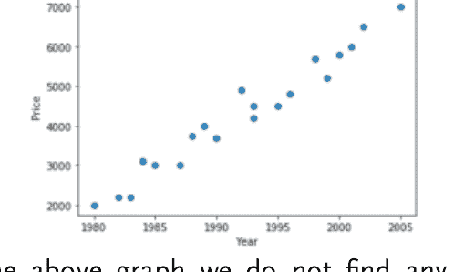

如果我们观察上面的图表，我们没有发现任何可见的簇。然而，如果我们的任务是将上述数据点分成三个簇，我们可能会形成一个包含低价且非常老旧车型的簇（左下角的点），一个包含中等价格且较旧车型的簇（图表中间的点），以及一个包含相对较新且价格较高的车型的簇（右上角的点）。让我们尝试使用 Python 的 Sklearn 库将上述数据点分成三个簇。

#### 数据聚类

要使用 sklearn 实现 K-Means 聚类，需要使用 *sklearn.cluster* 库的 *KMeans* 类。簇的数量可以通过 *KMeans* 类的 *n_clusters* 参数来定义。在下面的脚本中，我们创建了三个簇。然后调用 *fit* 方法对数据进行聚类，如下所示：

```
from sklearn.cluster import KMeans
km_clus = KMeans(n_clusters=3)
km_clus.fit(car_data)
```

现在，要找到我们的聚类算法找到的质心，我们可以使用 KMeans 对象的 *cluster_centers_* 属性，如下所示：

```
print(km_clus.cluster_centers_)
```

输出如下所示：

```
[[ 1992.77777778  4394.44444444]
 [ 1983.5         2583.33333333]
 [ 2001.2         6200.        ]]
```

这些是 KMeans 聚类算法为 car_price 数据形成的三个簇的质心坐标。要找到不同数据点的标签，请使用 labels_ 属性，如下所示：

```
print(km_clus.labels_)
```

输出如下所示：

```
[1 1 1 0 0 2 1 2 0 0 1 0 0 2 2 0 0 2 0 1]
```

算法形成的三个簇被命名为 0、1 和 2。需要指出的是，这些簇名称没有数学意义，它们只是为了给簇命名。如果还有另一个簇，它将被标记为 4。

#### 绘制簇

标签没有提供任何关于簇的可视化信息。因此，让我们绘制簇。执行以下脚本：

```
plt.scatter(car_data['Year'], car_data['Price'], c = km_clus.labels_, cmap='rainbow')
```

输出如下所示：

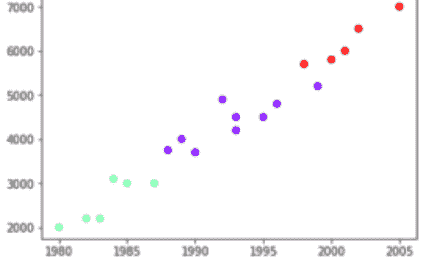

从输出中我们可以看到，形成的簇符合我们的预期。低价且制造年份非常久远的汽车被聚在一起（绿色数据点），车龄和价格都一般的汽车被聚在一起（蓝色数据点），而车型较新且价格较高的汽车被聚在一起（红色数据点）。

最后，让我们看看质心以及簇，执行以下脚本：

```
plt.scatter(car_data['Year'], car_data['Price'], c = km_clus.labels_, cmap='rainbow')
plt.scatter(km_clus.cluster_centers_[:,0],km_clus.cluster_centers_[:,1], color='yellow')
```

输出如下所示：

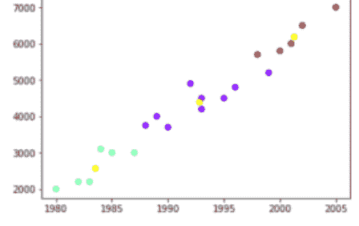

每个簇的质心已用黄色显示。

### 结论

在本章中，我们研究了一种非常有趣的聚类技术，即 K-Means 聚类。在下一章中，我们将研究另一种极其有用的聚类技术，即层次聚类！

# 第 15 章

## 层次聚类

在上一章中，我们研究了 K-Means 聚类，这是一种无监督学习。在本章中，我们将研究另一种聚类技术，即层次聚类。层次聚类形成的簇有时可能与 K-Means 聚类相似；然而，层次聚类的过程却大不相同。层次聚类有两种类型：分裂式和凝聚式。在分裂式聚类中，数据点最初被视为一个大簇，并采用自顶向下的方法将这个大簇划分为几个小簇。另一方面，凝聚式聚类采用自底向上的方法。在本章中，我们将介绍凝聚式聚类，因为它是最常用的聚类类型。

### 层次聚类理论

层次聚类涉及以下步骤：

- 一开始，每个数据点都被视为一个簇。因此，如果有 N 个数据点，最初的簇总数就是 N。
- 连接两个最近的点，形成 N-1 个簇。
- 再次连接两个最近的簇，形成 N-2 个簇。
- 重复步骤 3，直到形成一个巨大的簇。
- 使用树状图将一个大簇划分为所需数量的簇。我们将详细研究树状图的概念。

### 计算簇间距离

这里需要指出的是，有几种方法可以计算两个簇之间的距离，并且欧几里得距离和曼哈顿距离都可以用于此目的。簇之间的距离可以使用以下方法之一来计算：

- 可以计算两个簇中最近点之间的距离。
- 可以计算两个簇中最远点之间的距离。
- 可以计算两个簇质心之间的距离。
- 可以计算所有可能点组合之间距离的平均值。

### 使用树状图进行聚类

我们之前说过，树状图用于将一个巨大的簇划分为所需数量的簇。在本节中，我们将通过一个例子来看看树状图实际上是如何工作的。

执行以下脚本：

```
import numpy as np
data = np.array([
[1992,3000],
[1995,4000],
[1998,4500],
[1996,4200],
[1999,4700],
[1993,3500],
[2001,5700],
[2004,6000],
[2008,6500],
[2005,5800],
[2007,6200],
[2009,6700],])
```

上面的脚本创建了一个二维整数列表。将它们视为汽车型号及其对应的价格。

让我们绘制这些数据点。执行以下脚本：

```
import matplotlib.pyplot as plt
annots = range(1, 13)
plt.figure(figsize=(12, 8))
plt.subplots_adjust(bottom=0.1)
plt.scatter(data[:,0],data[:,1], label='True Position')
```

for label, x, y in zip(annots, data[:, 0], data[:, 1]):
    plt.annotate(
        label,
        xy=(x, y), xytext=(-2, 2),
        textcoords='offset points', ha='right', va='bottom')
plt.show()

数据点看起来是这样的：

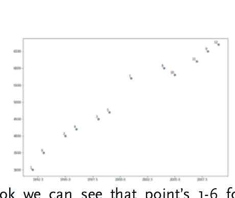

乍一看，我们可以看到点1-6形成一个簇，点7到12形成另一个簇。

现在让我们看看如何使用树状图来形成这些簇。执行以下脚本，为上述数据点创建树状图。

```
from scipy.cluster.hierarchy import dendrogram, linkage
from matplotlib import pyplot as plt
annot = linkage(data, 'single')
marks = range(1, 13)
plt.figure(figsize=(12, 8))
dendrogram(annot,
           orientation='top',
           labels=marks,
           distance_sort='descending',
           show_leaf_counts=True)
plt.show()
```

要创建树状图，我们可以使用 *scipy.cluster.hierarchy* 库中的 *dendrogram* 和 *linkage* 类。

为上述数据点生成的树状图如下所示：

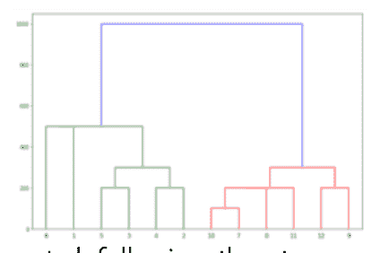

树状图是按照我们之前提到的步骤创建的。首先，将两个最近的点连接在一起。这些点在树状图层次结构的底部描绘。例如，点6和1、5和3、4和2、10和7，这些点彼此最接近。点的垂直高度对应于点之间的欧几里得距离。最后，当最近的点连接形成簇时，最近的簇被连接在一起，例如点5、3和3、4的簇已经被连接在一起。这个过程持续进行，直到形成一个大的簇。

一旦形成一个大的簇，找到没有水平线穿过的最长垂直线。画一条水平线穿过它。水平线穿过的垂直线的数量，就是簇的数量。

例如，在下图中，黑色虚线是距离最长的垂直线。我们画了一条红线穿过这条垂直线。红线切割了两条垂直线，导致形成两个簇，如下所示：

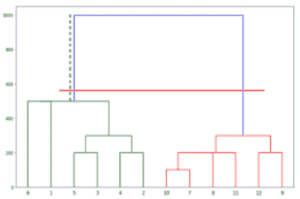

如果你观察两个簇中的点，绿色簇包含点1到6，而红色簇包含点7到12，正如预期的那样。

### 使用Python Scikit Learn进行层次聚类

在上一节中，我们使用Scipy库绘制了树状图。然而，层次聚类也可以使用Python的Scikit Learn库来实现。

本节我们将要解决的问题是根据客户的消费习惯将他们聚类成组。数据已下载并命名为customer_records.csv。

接下来，按照以下步骤使用Python Scikit Learn实现层次聚类：

#### 导入库

```
import matplotlib.pyplot as plt
import pandas as pd
import numpy as np
%matplotlib inline
```

#### 导入数据集

以下脚本导入数据集并将其存储在customer_record数据框中。

```
customer_record = pd.read_csv('D:\Datasets\customer_records.csv')
```

要查看数据集，请执行以下脚本：

```
customer_record.head()
```

输出如下所示：

| CustomerID | Genre | Age | Annual Income (k$) | Spending Score (1-100) |
|---|---|---|---|---|
| 0 | 1 | Male | 19 | 15 | 39 |
| 1 | 2 | Male | 21 | 15 | 81 |
| 2 | 3 | Female | 20 | 16 | 6 |
| 3 | 4 | Female | 23 | 16 | 77 |
| 4 | 5 | Female | 31 | 17 | 40 |

该数据集有五个属性：CustomerID、Genre、Age、Annual Income（以千美元计）和Spending Score（1-100）。Spending Score列对应于用户的消费习惯。用户花费越多，这个Spending Score列的值就越高。为了简单起见，我们将只取两列，即Annual Income和Spending Score，并尝试根据这两列对数据进行聚类。要选择这两列，请执行以下脚本：

```
dataset = customer_record.iloc[:, 3:5].values
```

#### 对数据进行聚类

要使用Python的Scikit Learn对数据进行聚类，我们可以使用 *scipy.cluster.hierarchy* 库。它有两个类：*linkage* 和 *dendrogram*。首先，我们需要创建一个linkage类的对象，并将数据集和距离方法传递给linkage类。接下来，我们需要将linkage类的对象传递给dendrogram类，如下所示的脚本所示。这里使用的距离方法是“ward”，它基本上最小化了多个簇之间的距离方差。执行以下脚本：

```
import scipy.cluster.hierarchy as hc
plt.figure(figsize=(12, 8))
plt.title("Customer Clusters")
link = hc.linkage(dataset, method='ward')
dendograms = hc.dendrogram(link)
```

上述脚本生成以下树状图：

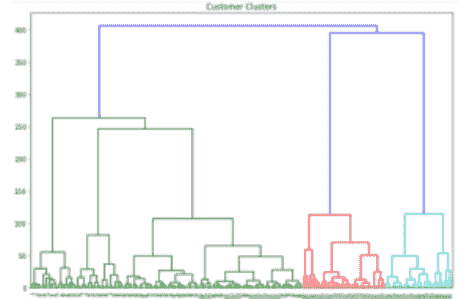

在上面的脚本中，让我们在垂直轴的200处画一条线。这将给我们五个簇，如下图所示：

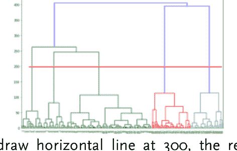

类似地，如果你在300处画一条水平线，结果的簇数量将是3。更高的阈值导致更少的簇数量，反之亦然。

### 结论

在本章中，我们研究了层次聚类，这是一种非常重要的无监督学习技术。至此，我们将结束无监督学习部分。在下一章中，我们将研究降维技术，即主成分分析和线性判别分析。编码愉快！！！

# 第16章

## 使用PCA进行降维

由于高性能硬件和存储空间的可用性，机器学习作为一门学科近年来取得了很大进展。20年前需要数月才能运行的算法现在可以在几分钟内运行。尽管机器学习算法的执行速度有了显著提高，但仍然存在一些瓶颈，拖慢了机器学习算法的速度。

巨大的数据集和每个数据集大量的特征是算法执行缓慢的原因之一。不建议减少数据集中的记录数量，因为它们可能包含有用的信息。然而，可以减少数据集中特征的数量。

减少数据集中特征主要有两种方法：

- 相关特征可以合并，从而减少特征数量。
- 选择在数据集和输出中引起最大方差的特征。

第二种方法通常是首选，并且已经为此开发了几种统计技术，例如因子分析、线性判别分析（LDA）和主成分分析（PCA）。在本章中，我们将研究PCA，在下一章中，我们将研究LDA。

### 主成分分析理论

主成分分析是应用最广泛的降维技术之一。PCA通过选择在输出中引起最大方差的特征来工作，而忽略那些对输出没有影响的特征。这种方法背后的直觉是，方差可以用作区分输出的度量；因此，负责区分输出的特征更重要，因此应该被选择。第一主成分是导致最大方差的特征，类似地，第二主成分是导致第二大方差的特征，依此类推。

PCA有两个主要优点：

- 减少特征数量意味着减少训练时间，从而加快执行时间。
- 我们只能在三维中查看数据；在更高维度中，查看数据并不特别容易。通过减少特征数量，可以轻松地查看数据。

这里需要提到的是，在应用PCA之前必须对数据进行缩放，因为以较高单位（如千克、百万、光年等）表示的特征的方差可能很大。因此，PCA可能会偏向于这些特征。

### 使用Sklearn实现PCA

在本节中，我们将了解如何使用Python的Scikit Learn库来实现主成分分析。通过PCA，我们将从银行纸币认证数据中找出最重要的特征。数据集中有四个属性，即货币纸币小波变换图像的熵、偏度、方差和峰度。
更多关于数据集的详细信息可以在此处找到。
该数据集随书提供，可以在Datasets文件夹中以banknote_data.csv的名称找到。
请遵循以下步骤

#### 1- 导入所需库

```
import pandas as pd
import numpy as np
import matplotlib.pyplot as plt
%matplotlib inline
```

#### 2- 导入数据集

以下脚本导入数据集。
`banknote_data = pd.read_csv(r'D:\Datasets\banknote_data.csv')`
上面的脚本读取数据集并将其存储在`banknote_data`中。

#### 3- 分析数据

以下脚本返回数据维度：
`banknote_data.shape`

上面的脚本返回(1372, 5)，这意味着我们的数据集包含1372条记录和五个属性。
要查看数据的样子，请执行以下脚本。它返回数据的前五行。
`banknote_data.head()`
输出如下所示：

| | Variance | Skewness | Curtosis | Entropy | Class |
|---|---|---|---|---|---|
| 0 | 3.62160 | 8.6661 | -2.8073 | -0.44699 | 0 |
| 1 | 4.54590 | 8.1674 | -2.4586 | -1.46210 | 0 |
| 2 | 3.86600 | -2.6383 | 1.9242 | 0.10645 | 0 |
| 3 | 3.45660 | 9.5228 | -4.0112 | -3.59440 | 0 |
| 4 | 0.32924 | -4.4552 | 4.5718 | -0.98880 | 0 |

#### 4- 数据预处理

以下脚本将数据划分为特征集和标签集。
`features= banknote_data.iloc[:,0:4].values`
`labels= banknote_data.iloc[:,4].values`
最后，让我们将数据划分为80%的训练集和20%的测试集：

```
from sklearn.model_selection import train_test_split
train_features, test_features, train_labels, test_labels = train_test_split(features, labels, test_size = 0.2, random_state = 0)
```

#### 5- 数据缩放

对于随机森林算法，数据缩放不是必需的，但为了练习，让我们使用标准缩放器对数据进行缩放。请记住我们在第3章讨论过缩放。

```
from sklearn.preprocessing import StandardScaler
feature_scaler = StandardScaler()
train_features = feature_scaler.fit_transform(train_features)
test_features = feature_scaler.transform(test_features)
```

#### 6- 应用PCA

通过sklearn库实现PCA非常简单，我们需要使用*sklearn.decomposition*库的PCA类。可以选择传递给PCA类的主成分数量作为参数。如果没有传递成分数量，则所有特征都将被选为主成分。接下来，我们需要调用fit和transform方法，并将训练和测试特征传递给它们。我们不需要传递输出，因为PCA是一种无监督学习技术，仅从特征集计算方差。执行以下脚本以获取banknote_data.csv数据集的所有四个主成分。

```
from sklearn.decomposition import PCA
pca = PCA()
train_features = pca.fit_transform(train_features)
test_features = pca.transform(test_features)
```

现在，要查看按降序排列的每个成分所解释的方差，请在屏幕上打印*explained_variance_ratio_*属性，如下所示：

```
exp_var = pca.explained_variance_ratio_
print(exp_var)
```

输出如下所示：

```
[ 0.54159993  0.32604745  0.08719788  0.04515474]
```

从输出可以看出，第一个主成分负责数据集中54.15%的方差，同样，第二个主成分导致数据集中32.60%的方差。

#### 使用一个主成分进行性能评估

让我们评估随机森林算法在仅使用一个主成分时的表现。重复上一节中的步骤1到5（不包括步骤6），然后执行以下脚本：

```
pca = PCA(1)
train_features = pca.fit_transform(train_features)
test_features = pca.transform(test_features)
```

现在让我们在一个主成分的训练特征上训练随机森林算法，并在测试特征上测试该算法。执行以下脚本：

```
from sklearn.ensemble import RandomForestClassifier
rf_clf = RandomForestClassifier(n_estimators=50, random_state=0)
rf_clf.fit(train_features, train_labels)
predictions = rf_clf .predict( test_features)
```

最后，让我们看看随机森林算法在使用一个主成分时的表现如何。执行以下脚本：

```
from sklearn.metrics import classification_report, confusion_matrix, accuracy_score
print(confusion_matrix(test_labels, predictions))
print(classification_report(test_labels, predictions))
print(accuracy_score(test_labels, predictions))
```

输出如下所示：

```
[[101  56]
 [ 42  76]]
             precision    recall  f1-score   support

           0       0.71      0.64      0.67       157
           1       0.58      0.64      0.61       118

avg / total       0.65      0.64      0.65       275

0.643636363636
```

使用一个主成分，达到的准确率为64.36%。

#### 使用两个主成分进行性能评估

要评估使用2个主成分的性能，请执行以下脚本：

```
pca = PCA(2)
train_features = pca.fit_transform(train_features)
test_features = pca.transform(test_features)
from sklearn.ensemble import RandomForestClassifier
rf_clf = RandomForestClassifier(n_estimators=50, random_state=0)
rf_clf.fit(train_features, train_labels)
predictions = rf_clf .predict( test_features)
```

最后，让我们看看随机森林算法在使用两个主成分时的表现如何。执行以下脚本：

```
from sklearn.metrics import classification_report, confusion_matrix, accuracy_score
print(confusion_matrix(test_labels, predictions))
print(classification_report(test_labels, predictions))
print(accuracy_score(test_labels, predictions))
```

输出如下所示：

```
[[145  12]
 [ 22  96]]
          precision    recall  f1-score   support

           0       0.87      0.92      0.90       157
           1       0.89      0.81      0.85       118

avg / total       0.88      0.88      0.88       275

0.876363636364
```

使用两个主成分，达到的准确率为87.63%。同样，使用三个和四个成分时，准确率分别提高到98.54%和99.63%。这表明在3个成分之后，准确率的提升效果减弱；因此可以保留3个成分。

### 结论

在本章中，我们了解了如何使用PCA进行降维。在下一章中，我们将了解如何使用LDA进行降维。编码愉快！

# 第17章

## 使用LDA进行降维

在上一章中，我们了解了什么是降维以及如何使用主成分分析（PCA）来减少数据集中的特征数量。在本章中，我们将了解如何使用LDA达到相同的目的。

### 线性判别分析理论

LDA是一种有监督的降维技术，它试图根据特征区分输出的能力来选择特征。LDA也依赖于记录的输出。而在PCA中，特征集就足够了，标签对于特征减少不是必需的。作为LDA的第一步，相关数据点在投影到新维度之前会被聚类在一起，在这个新维度中，每个聚类之间的距离被最大化。同样，每个数据点与其相应聚类质心之间的距离被最小化。

### 使用Scikit Learn实现LDA

在本节中，我们将使用Python的Scikit Learn库实现LDA。我们将再次尝试减少banknote_data.csv数据集的维度。请遵循以下步骤：

#### 1- 导入所需库

```
import pandas as pd
import numpy as np
import matplotlib.pyplot as plt
%matplotlib inline
```

#### 2- 导入数据集

以下脚本导入数据集。
`banknote_data = pd.read_csv(r'D:\Datasets\banknote_data.csv')`
上面的脚本读取数据集并将其存储在*banknote_data*中。

#### 3- 分析数据

以下脚本返回数据维度：
`banknote_data.shape`
上面的脚本返回(1372, 5)，这意味着我们的数据集包含1372条记录和五个属性。

要查看数据的样子，请执行以下脚本。它会返回数据的前五行。

```
banknote_data.head()
```

输出如下所示：

| | 方差 | 偏度 | 峰度 | 熵 | 类别 |
|---|---|---|---|---|---|
| 0 | 3.62160 | 8.6661 | -2.8073 | -0.44699 | 0 |
| 1 | 4.54590 | 8.1674 | -2.4586 | -1.46210 | 0 |
| 2 | 3.86600 | -2.6383 | 1.9242 | 0.10645 | 0 |
| 3 | 3.45660 | 9.5228 | -4.0112 | -3.59440 | 0 |
| 4 | 0.32924 | -4.4552 | 4.5718 | -0.98880 | 0 |

#### 4- 数据预处理

以下脚本将数据划分为特征集和标签集。

```
features= banknote_data.iloc[:,0:4].values
labels= banknote_data.iloc[:,4].values
```

最后，让我们将数据划分为80%的训练集和20%的测试集：

```
from sklearn.model_selection import train_test_split
train_features, test_features, train_labels, test_labels = train_test_split(features, labels, test_size = 0.2, random_state = 0)
```

#### 5- 数据缩放

对于随机森林算法，数据缩放并非必需，但为了练习，让我们使用标准缩放器对数据进行缩放。请记住我们在第3章讨论过缩放。

```
from sklearn.preprocessing import StandardScaler
feature_scaler = StandardScaler()
train_features = feature_scaler.fit_transform(train_features)
test_features = feature_scaler.transform(test_features)
```

#### 6- 应用PCA

通过sklearn库实现PCA非常容易，我们需要使用*sklearn.discriminant_analysis*库的*LinearDiscriminantAnalysis*类。*n_components*参数用于设置线性判别式的数量。接下来，我们需要调用fit和transform方法，并将训练特征和训练标签传递给它们。请记住，在PCA的情况下，我们只需要传递特征集，而不需要标签。执行以下脚本以获取数据集的第一个线性判别式。

```
from sklearn.discriminant_analysis import LinearDiscriminantAnalysis
LDA = LinearDiscriminantAnalysis(n_components=1)
train_features = LDA.fit_transform(train_features, train_labels)
test_features = LDA.transform(test_features)
```

#### 使用一个线性判别式的性能评估

现在，让我们在一个线性判别式的训练特征上训练随机森林算法，并在测试特征上测试该算法。执行以下脚本：

```
from sklearn.ensemble import RandomForestClassifier
rf_clf = RandomForestClassifier(n_estimators=50, random_state=0)
rf_clf.fit(train_features, train_labels)
predictions = rf_clf.predict(test_features)
```

最后，让我们看看随机森林算法与线性判别式配合使用的效果如何。执行以下脚本：

```
from sklearn.metrics import classification_report, confusion_matrix, accuracy_score
print(confusion_matrix(test_labels, predictions))

print(classification_report(test_labels, predictions))
print(accuracy_score(test_labels, predictions))
```

输出如下所示：

```
[[156   1]
 [  1 117]]
              precision    recall  f1-score   support

           0       0.99      0.99      0.99       157
           1       0.99      0.99      0.99       118

    avg / total       0.99      0.99      0.99       275

0.992727272727
```

这里使用1个线性判别式达到的准确率，即99.27%，与上一章中使用四个主成分达到的99.63%进行了比较。

### 结论

在本章中，我们详细研究了LDA。如果数据分布均匀，LDA在大多数情况下会优于PCA。然而，对于不规则数据，PCA表现更好。此外，PCA可以用于有标签和无标签的数据。编码愉快！！！

# 第18章

## 使用交叉验证和网格搜索进行性能评估

欢迎来到本书的最后一章。在本章中，我们将了解如何以更稳健的方式评估算法的性能。

到目前为止，我们一直通过将数据划分为训练集和测试集，然后在训练集上训练模型并在测试集上测试它来评估算法性能。然而，这种方法存在一些问题。其中一个问题是方差。这个问题可以使用交叉验证来解决。

影响不同算法性能比较的另一个问题是各种超参数的使用，例如KNN算法中的K和随机森林算法中的n_estimators。要比较两个算法，我们需要找到能带来最佳性能的参数。这个问题可以使用网格搜索算法来解决。

在本章中，我们将详细研究交叉验证和网格搜索。

### 交叉验证

早些时候我们说过，将数据随机划分为训练集和测试集可能会导致方差问题。算法性能评估中的方差指的是算法性能根据所使用的测试集而变化的情况。

交叉验证是解决方差问题的方法。在交叉验证中，数据集被分成K个折叠，其中K是任意整数。K个折叠或分区中的每一个都至少在训练集和测试集中使用一次。例如，让我们将数据集分成5个分区。在第一次迭代中，前4个分区用于训练，第5个分区用作测试。在第二次折叠中，第1、2、3和第5个分区用于训练，第4个分区用作测试。通过这种方式，每个分区至少被用于测试一次。算法的最终性能可以通过取各个测试结果的平均值来评估。这解决了方差问题，因为现在结果是基于算法在整个数据集上进行训练和测试得出的。

### 使用Python的Scikit Learn进行交叉验证

我们将使用随机森林算法交叉验证来解决的问题是根据几个特征预测葡萄酒的质量。
有关数据集的更多详细信息，请参见此处。我们只使用红葡萄酒的数据集。数据已随书提供，可在Datasets文件夹中找到，文件名为redwine_data.csv。
请按照以下步骤操作

#### 7- 导入所需库

```
import pandas as pd
import numpy as np
import matplotlib.pyplot as plt
%matplotlib inline
```

#### 8- 导入数据集

以下脚本导入数据集。

```
redwine_data = pd.read_csv(r'D:\Datasets\redwine_data.csv', sep=';')
```

上面的脚本读取数据集并将其存储在*banknote_data*中

#### 9- 数据分析

要查看数据的样子，请执行以下脚本。它会返回数据的前五行。

```
redwine_data.head()
```

输出如下所示：

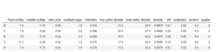

#### 10- 数据预处理

以下脚本将数据划分为特征集和标签集。

```
features= redwine_data.iloc[:,0:11].values
labels= redwine_data.iloc[:,11].values
```

由于我们将使用交叉验证，它会自动将数据划分为训练集和测试集，因此这里使用train_test_split，我们将所有数据分配给training_features，并通过将零传递给test size变量将测试大小设置为零，如下所示：

```
from sklearn.model_selection import train_test_split
train_features, test_features, train_labels, test_labels = train_test_split(features, labels, test_size = 0, random_state = 0)
```

#### 11- 数据缩放

对于随机森林算法，数据缩放并非必需，但为了练习，让我们使用标准缩放器对数据进行缩放。请记住我们在第3章讨论过缩放。我们只缩放train_features，因为test_features变量中没有数据。

```
from sklearn.preprocessing import StandardScaler
feature_scaler = StandardScaler()
train_features = feature_scaler.fit_transform(train_features)
```

#### 12- 交叉验证

要应用交叉验证，第一步是选择要用于交叉验证的算法。以下脚本初始化一个包含500个估计器的随机森林分类器。

```
from sklearn.ensemble import RandomForestClassifier
rf_clf = RandomForestClassifier(n_estimators=500, random_state=0)
```

要应用交叉验证，使用*sklearn.model_selection*库的*cross_val_score*类。分类器、特征集、标签集和交叉验证的折叠数作为参数传递给*cross_val_score*类，如下所示：

```
from sklearn.model_selection import cross_val_score
rf_accuracies = cross_val_score(estimator=rf_clf, X=train_features, y=train_labels, cv=5)
```

在上面的脚本中，我们执行5折交叉验证。

要查看*cross_val_score*类为所有五个折叠返回的准确率，您可以打印*cross_val_score*类返回的值列表，如下所示：

```
print(rf_accuracies)
```

上面的脚本返回以下结果：

```
[ 0.7173913  0.68224299  0.71028037  0.68867925  0.69085174]
```

你可以看到，所有五个折的准确率都或多或少相似。

要查看所有准确率的平均值，你可以对列表调用 `mean()` 函数，如下所示：

```
print(rf_accuracies.mean())
```

结果显示：0.69788，即 69.788%。

最后，要查看标准差，请执行以下脚本：

```
print(rf_accuracies.std())
```

上述脚本返回 0.0135 或 1.35%，这个值非常小。因此我们可以说，我们的数据集方差很小，在所有集合上获得的结果可以被认为是正确且接近平均值的。

### 用于参数选择的网格搜索

机器学习算法的工作是找到能产生最佳结果的最佳参数集或权重。这些参数由算法找到，并取决于数据集。我们无法控制这些参数。

然而，还有另一组参数是在算法运行之前指定的。例如，KNN 算法的 K 值、SVM 算法的核类型、随机森林算法的估计器数量、神经网络的节点数量等等。这些参数可以被控制或指定。

然而，我们并不真正知道这些参数的最佳值。在上一节中，我们将随机森林算法的 `n_estimator` 设置为 500。但我们不知道这是否是理想的。如果算法在 200 或 700 个节点时表现更好呢？或者 K 的最佳值是多少？10 还是 20？我们不知道这些问题的答案。

网格搜索算法帮助我们解决这个问题。网格搜索算法基本上做的是，它自动从一组参数中为特定算法找到最佳参数。

### 使用 Sklearn 实现网格搜索

Python 的 Scikit Learn 库包含一个用于实现网格搜索的包。为此，`sklearn.model_selection` 类包含 `GridSearchCV` 类，可用于实现网格搜索。但在此之前，需要进行一些预处理。

#### 创建参数字典

网格搜索算法不会随机运行并找到算法的所有最佳参数，因为它可能需要数年时间。例如，如果网格搜索算法开始从 1 到 1000 测试估计器数量参数的每个值，该算法至少需要运行 1000 次，而这仅仅是为了 1 个参数。因此，你需要测试的每个参数的一组值会传递给 `GridSearchCV` 类。这些参数集以字典的形式表示。

假设我们想测试随机森林算法的 `n_estimators`、`warm_start` 和 `criterion` 参数的不同值，我们可以创建一个如下所示的字典：

```
param = {
    'n_estimators': [100, 250, 500, 750, 1000],
    'warm_start': ['True', 'False'],
    'criterion': ['entropy', 'gini']
}
```

在上面的脚本中，我们创建了一个名为 "param" 的字典，字典的键是参数的名称，字典的值对应于参数的值。网格搜索算法将从这些值集中返回最佳组合。

例如，我们想测试 `n_estimators` 参数的最佳值，并传递了 100、250、500、750 和 1000。网格搜索将从这五个值中选择最佳值。这里需要提到的是，网格搜索算法可能需要很长时间，这取决于你要测试的值以及交叉验证的折数。

例如，在我们的例子中，`n_estimators` 参数有 5 个值，`warm_start` 有 2 个值，`criterion` 有 2 个值。这种情况下可能的组合总数是 5 x 2 x 2 = 20。将这个值乘以折数，例如 5。那就是 100 次执行。这可能会稍微减慢算法的速度。

#### 执行网格搜索

要执行网格搜索，我们需要创建 `GridSearchCV` 类的对象，并传递分类器（我们将使用上一节创建的随机森林分类器）、我们刚刚创建的参数字典、性能评估指标（我们将使用准确率）、交叉验证折数和作业数量。当 `n_jobs = -1` 时，意味着所有 CPU 都应被用于执行网格搜索。执行以下脚本以创建 GridSearch 对象。

```
from sklearn.model_selection import GridSearchCV
grid_search = GridSearchCV(estimator=rf_clf,
param_grid=param,
scoring='accuracy',
cv=5,
n_jobs=-1)
```

最后一步是在 `GridSearchCV` 对象上调用 `fit` 方法，并传递训练集和测试集，如下所示：

```
grid_search.fit(train_features, train_labels)
```

这可能需要一些时间来执行。

一旦上述脚本执行完毕，最后一步是查看网格搜索选择的参数，为此你可以使用 `GridSearchCV` 类的 `best_params_` 属性，如下所示：

```
optimal_parameters = grid_search.best_params_
print(optimal_parameters)
```

输出如下所示：

```
{'criterion': 'gini', 'n_estimators': 750, 'warm_start': 'True'}
```

使用上述参数值获得了最佳结果。最后，要查看使用最佳参数达到的准确率，请执行以下脚本：

```
optimal_results = grid_search.best_score_
print(optimal_results)
```

### 结论

随着本章的结束，本书也告一段落。从这里开始，我建议你自行学习机器学习。以下是一些非常好的资源：

- Python：https://www.python.org/
- 机器学习：http://scikit-learn.org/stable/
- 深度学习：https://keras.io/
- 数据集：https://archive.ics.uci.edu/ml/index.php