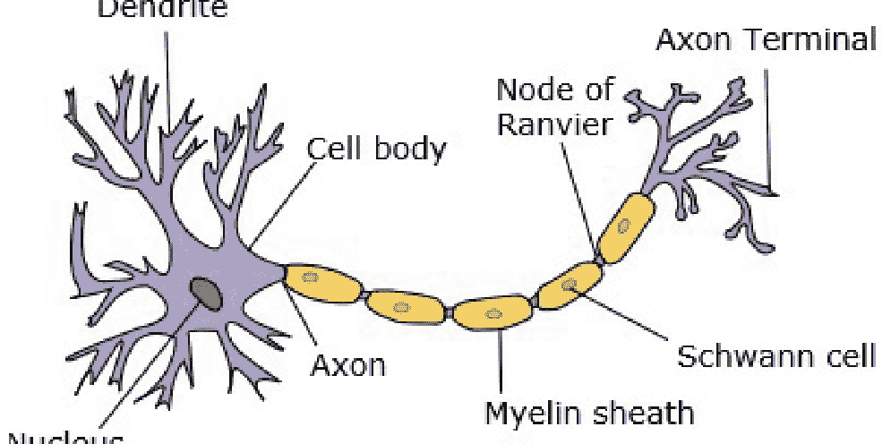
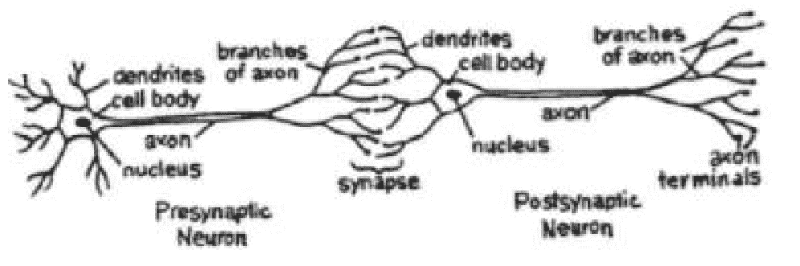
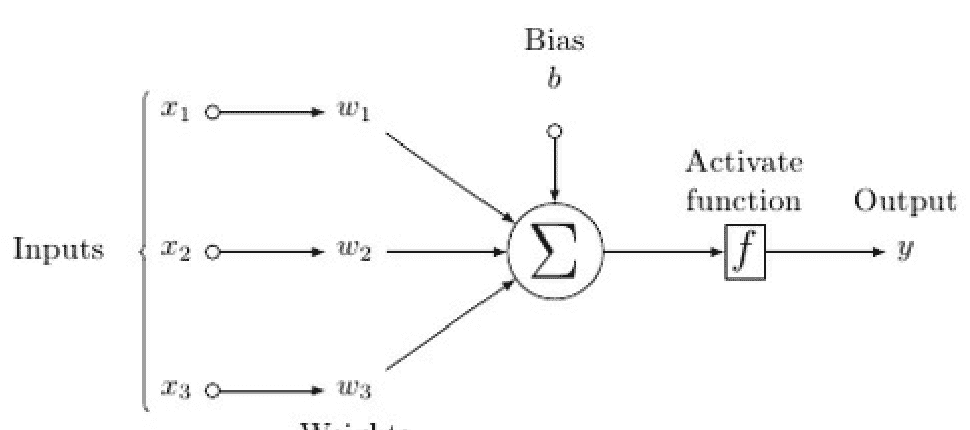
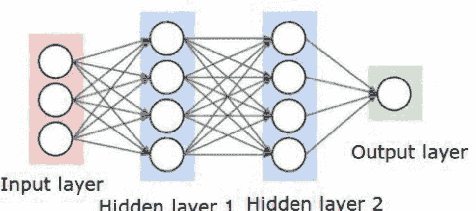
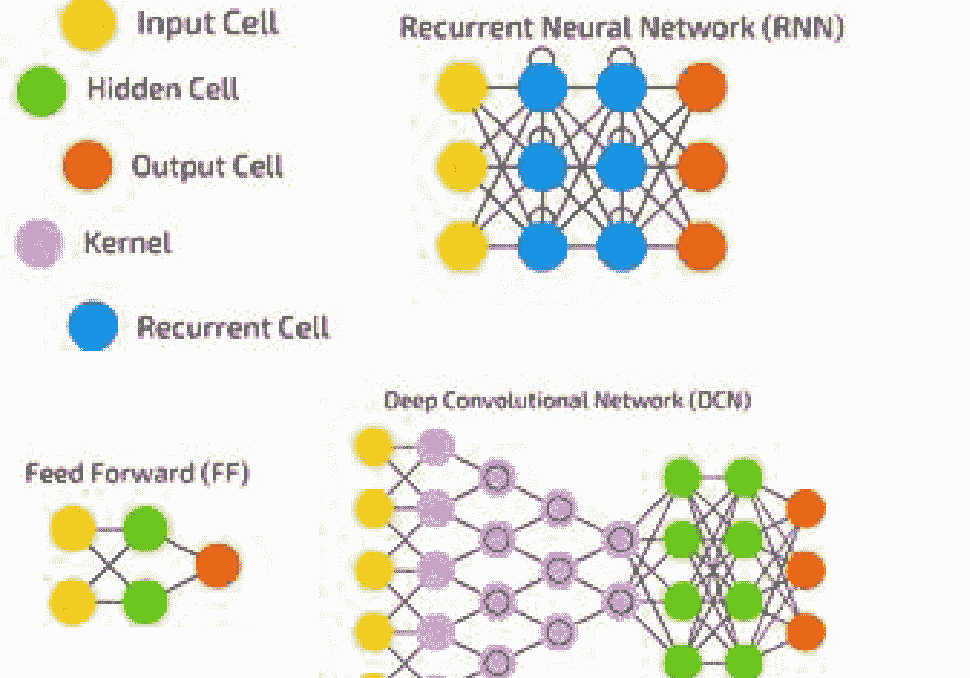
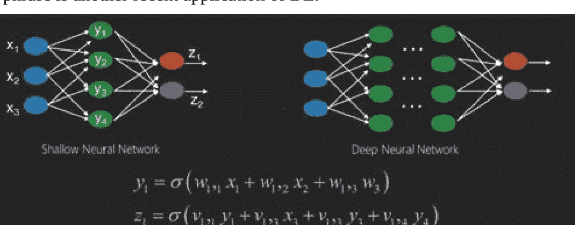
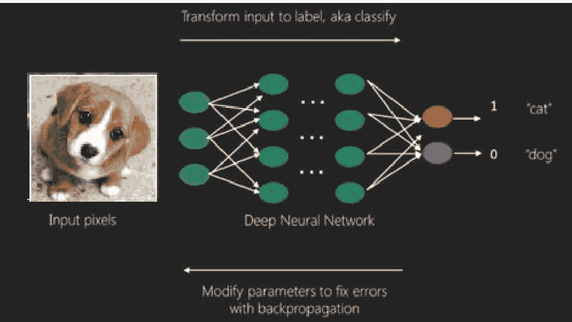
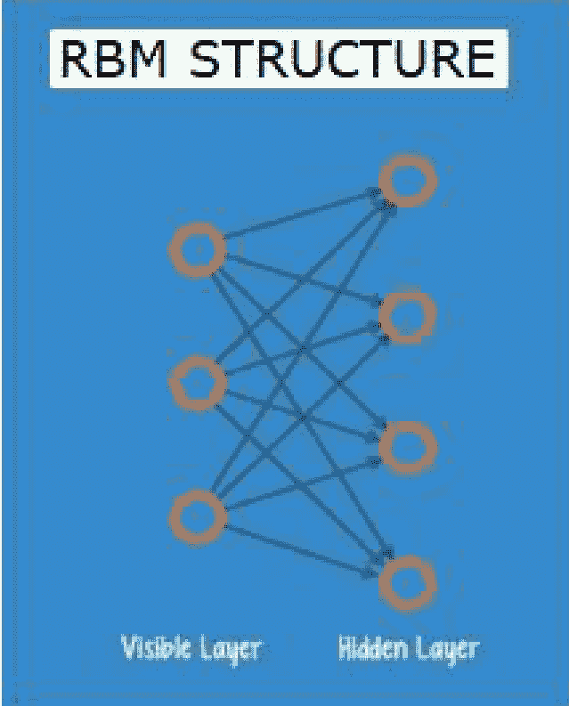
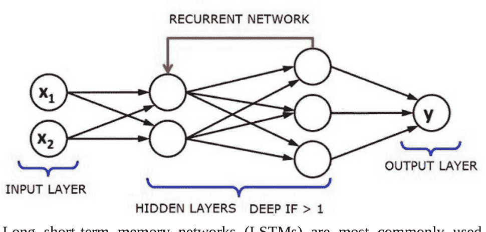
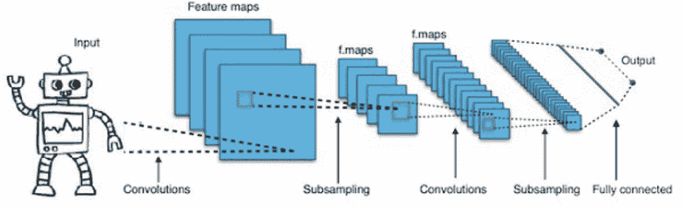

# PYTHON 机器学习：从零开始的机器学习与深度学习——基于 PYTHON、SCIKIT-LEARN、KERAS、THEANO 和 TENSORFLOW 的图解指南

MOUBACHIR MADANI FADOUL


版权所有 © 2020 Moubachir Madani Fadoul
保留所有权利

未经出版商事先书面许可，不得以任何形式或任何方式（包括影印、录制或其他电子或机械方法，或任何信息存储和检索系统）复制、分发或传播本出版物的任何部分，但版权法允许的简短引文用于评论和某些其他非商业用途的情况除外。

# 目录

- [第 1 章. Python 深度学习教程](Chapter 1. Python Deep Learning Tutorial)
- [第 2 章. Python 深度基础机器学习](Chapter 2. Python Deep Basic Machine Learning)
- [第 3 章. 人工神经网络](Chapter 3. Artificial Neural Networks)
- [第 4 章. 训练神经网络](Chapter 4. Training a Neural Network)
- [第 5 章. Python 深度学习 - 实现](Chapter 5. Python Deep Learning - Implementations)
- [第 6 章. 结论](Chapter 6. Conclusion)

## 关于作者

# MOUBACHIR MADANI FADOUL 的其他著作

# 第 1 章. PYTHON 深度学习教程

[Python](https://www.python.org/) 是一种通用高级编程语言，广泛应用于数据科学和深度学习算法设计。

本简要教程介绍了 [Python](https://www.python.org/) 及其库，如 Scipy、Pandas、Numpy、Matplotlib；以及框架，如 Theano、Keras、TensorFlow。本教程书籍解释了如何应用不同的库和框架来解决复杂的现实世界问题。

## 1.1 PYTHON 深度学习简介

层次学习或结构化深度学习，简称深度学习，是机器学习方法家族的一部分，而机器学习本身是更广泛的人工智能领域的一个子集。

深度学习被定义为一类机器学习算法，它使用多个非线性处理单元层进行转换和特征提取。每个连续层的输出都作为前一层的输入。

深度神经网络、循环神经网络和深度信念网络已在多个领域得到应用，例如语音识别、计算机视觉、音频识别、自然语言处理、社交网络过滤、机器翻译和生物信息学，在这些领域中，它们产生的结果与人类专家相当，在某些情况下甚至更好。

深度学习算法和网络 –

- 基于对数据的多个表示层或特征的无监督学习。更高层的特征从更低层的特征派生出来，形成层次表示。
- 使用某种形式的梯度下降算法进行训练。

## PYTHON 深度学习环境

本小节研究为 [Python](https://www.python.org/) 深度学习设置的环境。要使用深度学习算法，必须安装以下软件。

- Python 3.9+
- Matplotlib
- Scipy with Numpy
- TensorFlow
- Keras
- Theano

强烈建议安装 Anaconda 发行版，它包含所有这些包：NumPy、[Python](https://www.python.org/)、Matplotlib 和 SciPy。

确保不同类型的软件都已正确安装。

让我们转到命令行程序并输入以下命令 –

```
$ python
Python 3.7 |Anaconda custom (32-bit)| (default, Oct 13 2020, 14:21:34)
[GCC 7.2.0] on linux
```

接下来，导入所需的库并打印其版本 –

```
import numpy
print numpy.__version__
```

## 输出

```
1.14.2
```

## 1.3 安装 TENSORFLOW、THEANO 和 KERAS

在安装 Theano、Keras 和 TensorFlow 包之前，请确认已安装 **pip**。Anaconda 中的包管理系统称为 pip。

要确认 pip 的安装，请在命令行中输入以下内容 –

```
$ pip
```

一旦确认 pip 已安装，就可以通过执行以下命令来安装 TensorFlow 和 Keras –

```
$pip install theano
$pip install tensorflow
$pip install keras
```

通过运行以下代码行检查 Theano 的安装 –

```
$python –c “import theano: print (theano.__version__)”
```

## 输出

```
1.0.1
```

通过执行以下代码行确认 Tensorflow 的安装 –

```
$python –c “import tensorflow: print tensorflow.__version__”
```

## 输出

```
1.7.0
```

执行以下代码行以确认 Keras 的安装 –

```
$python –c “import keras: print keras.__version__”
Using TensorFlow backend
```

## 输出

```
2.1.5
```

# 第 2 章. PYTHON 深度基础机器学习

人工智能（AI）是使计算机能够模仿人类智能或认知行为的任何技术、代码或算法。机器学习（ML）是 AI 的一个子集，它使用统计方法使机器能够从经验中学习和改进。深度学习是机器学习的一个子集，它使得多层神经网络的计算变得可行。机器学习被视为浅层学习，而深度学习被视为具有抽象的层次学习。

机器学习涉及广泛的概念。概念如下所列 –

- 监督学习
- 无监督学习
- 线性回归
- 代价函数
- 强化学习
- 欠拟合
- 过拟合
- 超参数等。

监督学习从标记数据中学习预测值。一种广泛使用的机器学习技术是分类，其中目标值是离散值；例如，猫和狗。机器学习中的另一种类型技术是回归。回归处理目标值。目标值是连续值；例如，股票市场数据可以使用回归进行分析。

在无监督学习中，从非结构化或未标记的输入数据中进行推断。想象一下，如果我们需要理解数百万份医疗记录，并找出异常值、潜在结构或检测异常，聚类技术用于将数据划分为广泛的集群。

数据集被分为测试集、训练集、验证集等。

2012 年，一项突破使深度学习的概念变得突出。一个算法使用 2 个 GPU 和大数据等最新技术，成功地将 100 万张图像分类为 1000 个类别。

## 2.1 关联传统机器学习和深度学习

传统机器学习模型遇到的主要挑战之一是称为特征提取的过程。程序员指定要查找的特征并告诉计算机。这些特征有助于做出决策。

许多算法很少能很好地处理输入原始数据，因此特征提取是传统机器学习工作流程的关键部分。

这给程序员带来了巨大的责任，算法的效率在很大程度上取决于程序员的创造力。对于手写识别或物体识别等复杂问题，这是一项艰巨的任务。

深度学习具有学习多层表示的能力，是少数有助于自动特征提取的方法之一。较低层执行自动特征提取，无需程序员的指导。

# 第 3 章. 人工神经网络

人工神经网络，或简称神经网络，并不是一个新想法。它已经存在了大约 80 年。

然而，直到 2011 年，随着新技术、强大计算机和海量数据集可用性的使用，深度神经网络才开始流行起来。

神经网络模拟神经元，神经元具有轴突、树突、细胞核和轴突末梢。



两个神经元组成一个网络。这些神经元通过一个神经元的树突和另一个神经元的轴突末梢之间的突触传递信息。



一个人工神经元的可能模型如下所示 –



神经网络将如下图所示 –



圆圈是节点或神经元，它们对数据执行功能，而连接它们的边/线是传递的权重/信息。

每一列代表一个层。数据的第一层是输入层。然后，隐藏层位于输入层和输出层之间。

如果你有一个或几个隐藏层，那么你拥有一个浅层神经网络。如果你有很多隐藏层，那么你拥有一个深层神经网络。

在这个模型中，你有输入数据，你对其进行加权，并将其通过神经元中的函数，该函数称为激活函数或阈值函数。

基本上，这是将所有值与某个特定值进行比较后的总和。如果你触发一个信号，那么结果是 (1) 输出，或者没有触发任何输出，那么是 (0)。然后这被加权并传递给下一个神经元，并运行相同类型的功能。

激活函数可以是 relu 或 sigmoid（S 形）函数。

至于权重，它们最初只是随机的，并且对于输入到神经元/节点的每个输入都是唯一的。

最基础的神经网络类型是典型的“前馈”网络，你的信息直接通过你创建的网络，并将输出与你使用样本数据期望的输出进行比较。

从这里开始，你需要调整权重，以帮助你使输出与你期望的输出匹配。

将数据直接通过神经网络的行为称为**前馈神经网络**。

我们的数据从输入开始，按顺序经过各层，然后到达输出。

当我们反向进行并开始调整权重以最小化损失/成本时，这个过程被称为**反向传播**。

这是一个**优化问题**。在神经网络的实际应用中，我们必须处理数十万、数百万甚至更多的变量。

第一个解决方案使用随机梯度下降算法作为优化方法。现在，有像 Adam 优化器、AdaGrad 等选项。无论哪种方式，这都是一个大规模的计算操作。这就是为什么神经网络在半个多世纪里大多被束之高阁。直到最近，我们才拥有强大的机器来考虑执行这些操作，以及足够规模的数据集来匹配。

对于简单的分类任务，神经网络的性能与其他简单算法（如 K 近邻）相对接近。神经网络的真正效用在我们拥有更大的数据和更复杂的问题时得以实现，这两者都优于其他机器学习模型。

## 3.1 深度神经网络

深度神经网络（DNN）是一种在输入层和输出层之间具有多个隐藏层的人工神经网络。与浅层人工神经网络类似，DNN 模型可以建模复杂的非线性函数。

神经网络的主要目的是接收一组输入，对它们执行逐步复杂的计算，并输出结果以解决现实世界的问题，如分类。

在深度网络中，我们有输入、输出和顺序数据流。



神经网络广泛应用于强化学习和监督学习问题。这些网络基于一组相互连接的层。

在深度学习中，隐藏层的数量（主要是非线性的）可以多达 1000 层。

深度学习模型比普通机器学习网络产生更准确的结果。

梯度下降法用于最小化损失函数和优化网络。

我们可以使用 **Imagenet**，一个包含数百万数字图像的存储库，将数据集分类为狗和猫等类别。深度学习网络越来越多地用于动态图像（除了静态图像）以及文本分析和时间序列。

训练数据集是深度学习模型的重要组成部分。此外，反向传播是训练深度学习模型的主要算法。

深度学习处理具有复杂输入输出转换的大型神经网络的训练。

深度学习的一个例子是将照片映射到照片中人物的名称，就像社交网络上所做的那样，以及用短语描述图片是深度学习的另一个近期应用。



神经网络是具有输入（如 x1, x2, x3...）的函数，这些输入被转换为输出（如 z1, z2, z3 等），转换过程在两个（浅层网络）或几个中间操作（也称为层）（深层网络）中完成。

偏置和权重逐层变化。‘w’ 和 ‘v’ 是神经网络各层的权重或突触。

监督学习被认为是深度学习问题的最佳用例。这里我们有大量数据输入和一组期望的输出。



这里应用反向传播算法以获得正确的输出预测。

深度学习的基本数据集是 MNIST，一个手写数字数据集。

为了对该数据集中的手写数字图像进行分类，我们使用 Keras 训练一个深度卷积神经网络。

神经网络分类器的激活或触发会产生一个分数。例如，为了将患者分类为健康或患病，可以考虑体温、体重、身高和血压等参数。

低分意味着他健康，高分意味着患者患病。

输出层和隐藏层中的每个节点都有自己的分类器。输入层接收输入并将其分数传递给下一个隐藏层以进行进一步的激活，这个过程一直持续到输出层。

这种从左到右、从输入到输出的正向过程称为**前向传播**。

神经网络中的信用分配路径（CAP）是从输入到输出的一系列转换。CAP 阐明了输入和输出之间可能的因果联系。

给定前馈神经网络的 CAP 深度或 CAP 深度是隐藏层数量加一，因为输出层被包括在内。对于循环神经网络，信号可能多次通过一层传播，CAP 深度可能是无限的。

## 3.2 深层网络与浅层网络

没有明确的深度阈值来划分浅层学习和深度学习；但人们普遍认为，对于具有多个非线性层的深度学习，CAP 必须大于二。

神经网络中的基本节点是模仿生物神经网络中神经元的感知器。然后我们有多层感知器或 MLP。每组输入都由一组权重和偏置修改；每条边都有一个唯一的权重，每个节点都有一个唯一的偏置。

神经网络的预测**准确性**取决于其**偏置和权重**。

提高神经网络准确性的过程称为**训练**。前馈网络的输出与已知正确的值进行比较。

**损失函数或成本函数**是实际输出与生成输出之间的差异。

训练的目的是使数百万个训练样本的训练成本尽可能小。为此，网络会调整偏置和权重，直到预测与正确输出匹配。

一旦训练良好，神经网络就有潜力每次都做出准确的预测。

当模式变得复杂，而你希望你的计算机识别它们时，你必须使用神经网络。在这种复杂的模式场景中，神经网络优于所有其他竞争算法。

当前的 GPU 可以比以往更快地训练网络。深度神经网络已经在彻底改变人工智能领域。

计算机已被证明擅长遵循详细的指令，

## 3.3 选择深度网络

如何选择深度网络？我们必须决定是试图在数据中寻找模式，还是构建一个分类器，以及是否将使用无监督学习。要从一组无标签数据中提取模式，我们使用受限玻尔兹曼机或自编码器。

选择深度网络时考虑以下几点：

-   对于文本处理、情感分析、解析和命名实体识别，我们使用递归神经张量网络或循环网络或RNTN。
-   循环网络用于任何在字符级别操作的语言模型。
-   卷积网络或深度信念网络用于图像识别。
-   卷积网络或RNTN用于物体识别。
-   循环网络用于语音识别。

一般来说，带有修正线性单元的多层感知机和深度信念网络都是分类的良好选择。建议在时间序列分析中使用循环网络。

## 3.4 受限玻尔兹曼网络或自编码器 - RBNs

梯度消失问题在2006年由Geoff Hinton解决。他开发了一种新颖的策略，从而产生了**受限玻尔兹曼机 - RBM**，一个浅层的两层网络。第一层是**可见**层，第二层是**隐藏**层。可见层节点与隐藏层中的每个节点相连。该网络被称为受限的，因为同一层内的两个节点不允许共享连接。

自编码器将输入数据编码为网络中的向量。它们创建原始数据的压缩、隐藏或表示。这些向量在压缩原始数据方面很有用；这是降维背后的动机。自编码器与解码器配对，基于其隐藏表示重建输入数据。

RBM被认为是双向翻译器的数学等价物。一组数字编码来自前向传递的输入。这组数字通过反向传递被翻译回重建的输入。训练有素的网络可以达到很高的准确度。

RBM通过使用不同的偏置和权重进行训练，直到输入和重建尽可能接近，从而重建到输入。请注意，RBM数据没有标签。RBM自动对数据进行排序；通过调整偏置和权重，RBM提取重要特征以重建输入。RBM旨在通过应用特征提取来识别数据中的固有模式。由于它们编码自己的结构，它们也被称为自编码器。



## 3.5 深度信念网络 - DBNs

通过引入一种巧妙的训练方法并结合RBM，形成了深度信念网络。梯度消失问题最终由这个模型解决。

DBN在结构上类似于MLP，但在训练方面非常不同。正是训练使得DBN能够超越其浅层对应物。

第一个RBM隐藏层被用作第二个RBM的可见层，第二个RBM使用第一个RBM的输出进行训练。这个过程被迭代，直到网络中的每一层都被训练。DBN中的每个RBM学习整个输入。随着模型的缓慢改进，DBN连续微调整个输入。在这个层面上，RBM检测到数据中的固有模式，但没有任何标签或名称。为了完成DBN的训练，我们为模式引入标签，并使用监督学习微调网络。研究非常小的一组标记样本，以便将特征和模式与名称关联起来。这小组标记数据用于训练。与原始数据集相比，这组标记数据可以非常小。

## 3.6 生成对抗网络 - GANs

当包含两个网络的深度神经网络相互对抗时，我们称之为生成对抗网络。GAN被认为是过去10年机器学习中最有趣的想法。GAN具有巨大的潜力，因为网络可以学习模仿任何数据分布。GAN可以在任何领域创建与我们自己惊人相似的平行世界：音乐、语音、图像。它们在某种程度上是机器（机器人）艺术家，它们的输出相当令人印象深刻。在GAN中，一个称为生成器的神经网络生成新的数据实例，而另一个称为判别器的神经网络评估它们的真实性。

## 3.7 循环神经网络 - RNNs

**RNN**是数据可以向任何方向流动的神经网络。此类网络用于自然语言处理或语言建模等应用。利用序列信息是RNN背后的基本概念。在普通神经网络中，所有输出和输入彼此独立。为了预测句子中的下一个词，我们需要确定它前面的词是什么。

RNN被称为循环的，因为序列中每个元素的相同任务被重复，输出基于先前的计算。因此，可以说RNN具有“记忆”，可以捕获先前计算的信息。理论上，RNN可以使用非常长序列中的信息，但实际上，它们只能回顾几步。



长短期记忆网络是最常用的RNN。与卷积神经网络一起，RNN已被用作生成无标签图像描述的模型的一部分。

## 3.8 卷积深度神经网络 - CNNs

要使神经网络更深，增加层数，但这会增加网络的复杂性，并允许我们对更复杂的函数进行建模。然而，偏置和权重的数量将呈指数级增长。事实上，学习如此困难的问题可能变得具有挑战性。因此，解决方案是卷积神经网络。

CNN已被广泛用于计算机视觉和用于自动语音识别的声学建模。

卷积神经网络背后的思想是“移动滤波器”通过图像的思想。这个移动滤波器或卷积应用于节点的某个邻域，例如可能是像素，其中应用的滤波器是节点值的0.5倍。

简而言之，卷积神经网络由多层神经网络组成。这些层有时多达20层或更多，以图像作为输入数据。



CNN可以大大减少需要调整的参数数量。因此，CNN能够有效地管理原始图像的高维性。

## 第四章 训练神经网络

本章将解释如何训练神经网络。我们还将学习反向传播算法以及Python深度学习中的反向传播过程。

为了获得期望的输出，需要定义神经网络权重的最优值。神经网络通过迭代梯度下降法进行训练。我们随机初始化权重。在随机初始化之后，我们通过前向传播过程对数据的某个子集进行预测，计算相应的代价函数C，并根据与dC/dw（即代价函数对权重的导数）成比例的量来更新每个权重w。这个比例常数被称为学习率。

反向传播算法用于高效地计算梯度。反向传播的关键观察在于，由于链式法则的微分，利用神经元处的梯度可以计算出神经网络中的梯度。因此，我们反向计算梯度，即首先计算输出层的梯度，然后是最高隐藏层，接着是前一个隐藏层，依此类推，直到输入层。

反向传播算法运用了计算图的思想，其中每个神经元在计算图中被展开为多个节点，并执行简单的数学运算。计算图假设边上没有任何权重；所有权重都分配给节点，因此权重成为它们自己的节点。然后在计算图上运行反向传播算法。一旦计算完成，只需要权重节点的梯度进行更新。其余的梯度可以忽略。

## 4.1 梯度下降优化技术

一种常用的根据误差调整权重的优化函数被称为“梯度下降”。

梯度是斜率的另一个名称，而在x-y图上，斜率表示两个变量之间的关系：上升量与运行量之比，距离变化与时间变化之比等。在这种情况下，斜率是网络误差与单个权重之间的比率；即，当权重变化时，误差如何变化。

更准确地说，我们需要找到产生最小误差的权重。我们希望找到能够正确表示输入数据中包含的信号，并将其转化为正确分类的权重。

随着神经网络的学习，它会缓慢调整许多权重，以便能够正确地将信号映射到意义。网络误差与每个权重之间的比率是一个导数dE/dw，它计算权重的微小变化引起误差微小变化的程度。

每个权重只是深度网络中涉及许多变换的一个因素；权重的信号通过激活函数并在多个层上求和。

考虑两个变量，权重和误差，通过第三个变量**激活**来调节，权重通过激活传递。我们可以通过首先计算激活的变化如何影响误差的变化，以及权重的变化如何影响激活的变化，来计算权重的变化如何影响误差的变化。

深度学习无非是根据模型产生的误差来调整其权重，直到无法进一步减小误差为止。

当梯度值较小时，深度网络训练缓慢；如果值较高，则训练较快。训练中的不准确会导致输出不准确。从输出反向传播到输入的训练过程被称为反向传播或反向传播。我们知道前向传播从输入开始向前工作。反向传播则相反，从右向左计算梯度。

考虑输出层中的一个节点。该边使用该节点处的梯度。当我们回溯到隐藏层时，情况变得更加复杂。两个介于0和1之间的数字的乘积会得到一个更小的数字。梯度值不断变小，因此反向传播需要很长时间来训练，并且准确性受到影响。

## 4.2 深度学习算法中的挑战

几个挑战限制了深度神经网络和浅层神经网络的性能，例如计算时间和过拟合。使用额外的抽象层允许它们对训练数据中的罕见依赖关系进行建模，这导致了过拟合，从而影响了DNN。

**正则化**方法，如丢弃法、数据增强、早停法和迁移学习，在训练过程中被应用以克服过拟合。训练期间的丢弃正则化会随机删除隐藏层中的单元，从而避免罕见的依赖关系。DNN考虑几个训练参数，例如大小（即层数和每层单元数）、初始权重和学习率。由于高计算资源和时间成本，找到最优参数并不总是可行的。一些技巧，如批处理，可以加速计算。GPU强大的处理能力显著帮助了训练过程，因为所需的矩阵和向量计算在GPU上执行良好。

## 4.3 丢弃法

丢弃法是一种著名的神经网络正则化技术。深度神经网络尤其容易过拟合。

深度学习的先驱之一Geoffrey Hinton说过：“如果你有一个深度神经网络并且它没有过拟合，你可能应该使用一个更大的网络并使用丢弃法”。

丢弃法是一种在每次梯度下降迭代中，随机丢弃一组节点的技术。这意味着我们随机忽略一些节点，就好像它们不存在一样。

每个神经元以概率q被保留，并以概率1-q被随机丢弃。q的值对于神经网络中的每一层可能不同。隐藏层的值为0.5，输入层的值为0，在广泛的任务中效果良好。

在评估和预测期间，不使用丢弃法。每个神经元的输出乘以q，以便下一层的输入具有相同的期望值。

丢弃法背后的思想如下——在没有丢弃正则化的神经网络中，神经元之间会发展出相互依赖性，从而导致过拟合。

**实现技巧**

丢弃法在Pytorch和TensorFlow等库中通过将随机选择的神经元的输出保持为0来实现。也就是说，尽管神经元存在，但其输出被覆盖为0。

## 第五章 Python深度学习 - 实现

本章深度学习使用某银行的数据。目标是预测客户流失或数据流失——哪些客户可能离开该银行服务。我们使用一个包含10000行和14列的小型数据集。我们已经安装了Anaconda发行版，以及TensorFlow、Theano和Keras等框架。Keras构建在Theano和TensorFlow之上。

```
### 人工神经网络
### 安装Theano
pip install --upgrade theano
```

```
### 安装Tensorflow
pip install --upgrade tensorflow
```

```
### 安装Keras
pip install --upgrade keras
```

## 步骤1：数据预处理

```
In[]:
```

```
### 导入库
import numpy as np
import matplotlib.pyplot as plt
import pandas as pd
```

```
### 导入数据库
dataset = pd.read_csv('Churn_Modelling.csv')
```

## 步骤2

数据集特征和目标变量的矩阵已经创建，目标变量是第14列，标记为“Exited”。

数据的初始外观如下所示——

```
In[]:
X = dataset.iloc[:, 3:13].values
Y = dataset.iloc[:, 13].values
X
```

## 输出

```
array([[619, 'France', 'Female', ..., 1, 1, 101348.88],
       [608, 'Spain', 'Female', ..., 0, 1, 112542.58],
       [502, 'France', 'Female', ..., 1, 0, 113931.57],
       ...,
       [709, 'France', 'Female', ..., 0, 1, 42085.58],
       [772, 'Germany', 'Male', ..., 1, 0, 92888.52],
       [792, 'France', 'Female', ..., 1, 0, 38190.78]], dtype=object)
```

## 步骤3

```
Y
```

## 输出

```
array([1, 0, 1, ..., 1, 1, 0], dtype = int64)
```

## 步骤4

编码字符串变量简化了分析。使用ScikitLearn函数‘LabelEncoder’自动将列中的不同标签编码为0到n_classes-1之间的值。

```
from sklearn.preprocessing import LabelEncoder, OneHotEncoder
```

labelencoder_X_1 = LabelEncoder()
X[:,1] = labelencoder_X_1.fit_transform(X[:,1])
labelencoder_X_2 = LabelEncoder()
X[:, 2] = labelencoder_X_2.fit_transform(X[:, 2])
X

## 输出

```
array([[619, 0, 0, ..., 1, 1, 101348.88],
       [608, 2, 0, ..., 0, 1, 112542.58],
       [502, 0, 0, ..., 1, 0, 113931.57],
       ...,
       [709, 0, 0, ..., 0, 1, 42085.58],
       [772, 1, 1, ..., 1, 0, 92888.52],
       [792, 0, 0, ..., 1, 0, 38190.78]], dtype=object)
```

从上述输出可以看出，国家名称被替换为0、1和2；而性别（男/女）被替换为0和1。

## 步骤 5

### 标记编码数据

我们使用ScikitLearn库和另一个名为OneHotEncoder的函数，只需传入列号即可创建虚拟变量。

```
onehotencoder = OneHotEncoder(categorical_features = [1])
X = onehotencoder.fit_transform(X).toarray()
X = X[:, 1:]
X
```

现在，前两列代表国家，第四列代表性别。

## 输出

```
array([[0.0000000e+00, 0.0000000e+00, 6.1900000e+02, ..., 1.0000000e+00,
        1.0000000e+00, 1.0134888e+05],
       [0.0000000e+00, 1.0000000e+00, 6.0800000e+02, ..., 0.0000000e+00,
        1.0000000e+00, 1.1254258e+05],
       [0.0000000e+00, 0.0000000e+00, 5.0200000e+02, ..., 1.0000000e+00,
        0.0000000e+00, 1.1393157e+05],
       ...,
       [0.0000000e+00, 0.0000000e+00, 7.0900000e+02, ..., 0.0000000e+00,
        1.0000000e+00, 4.2085580e+04],
       [1.0000000e+00, 0.0000000e+00, 7.7200000e+02, ..., 1.0000000e+00,
        0.0000000e+00, 9.2888520e+04],
       [0.0000000e+00, 0.0000000e+00, 7.9200000e+02, ..., 1.0000000e+00,
        0.0000000e+00, 3.8190780e+04]])
```

数据总是被划分为测试集和训练集；我们在训练数据上训练模型，然后在测试数据上检查模型的准确性，这有助于评估模型的效率。

## 步骤 6

ScikitLearn的**train_test_split**函数用于将数据划分为测试集和训练集。保持训练集与测试集的比例为80:20。

```
### 将数据集划分为训练集和测试集
from sklearn.model_selection import train_test_split
X_train, X_test, y_train, y_test = train_test_split(X, y, test_size = 0.2)
```

## 步骤 7

在此代码中，训练数据使用**StandardScaler**函数进行转换和拟合。我们标准化缩放，以便使用相同的拟合方法来缩放/转换测试数据。

```
### 特征缩放
from sklearn.preprocessing import StandardScaler
sc = StandardScaler()
X_train = sc.fit_transform(X_train)
X_test = sc.transform(X_test)
```

## 输出

```
array([[-0.5698444 ,  1.74309049,  0.16958176, ...,  0.64259497,
       -1.03227043,  1.10643166],
       [ 1.75486502, -0.57369368, -2.30455945, ...,  0.64259497,
        0.9687384 , -0.74866447],
       [-0.5698444 , -0.57369368, -1.19119591, ...,  0.64259497,
       -1.03227043,  1.48533467],
       ...,
       [-0.5698444 , -0.57369368,  0.9015152 , ...,  0.64259497,
       -1.03227043,  1.41231994],
       [-0.5698444 ,  1.74309049, -0.62420521, ...,  0.64259497,
        0.9687384 ,  0.84432121],
       [ 1.75486502, -0.57369368, -0.28401079, ...,  0.64259497,
       -1.03227043,  0.32472465]])
```

数据现在已正确缩放。至此，我们的数据预处理工作完成。现在，我们将开始构建模型。

## 步骤 8

此处导入所需的模块。我们使用Sequential模块初始化神经网络，使用Dense模块添加隐藏层。

```
### 导入Keras库和包
import keras
from keras.models import Sequential
from keras.layers import Dense
```

## 步骤 9

将模型命名为Classifier，因为我们的目标是分类客户流失。然后我们使用Sequential模块进行初始化。

```
### 初始化神经网络
classifier = Sequential()
```

## 步骤 10

Dense函数允许我们逐个添加隐藏层。在下面的代码中，使用了多个参数。
第一个参数是**output_dim**。它是添加到该层的节点数。**init**是随机梯度下降的初始化方式。在神经网络中，权重被分配给每个节点。在初始化时，权重应接近零且最小化，我们使用uniform函数随机初始化权重。**input_dim**参数仅在第一层需要，因为模型不知道输入变量的数量。这里输入变量的总数是11。在第二层，模型会自动从第一隐藏层获知输入变量的数量。

执行以下代码行以添加输入层和第一个隐藏层 –

```
classifier.add(Dense(units = 6, kernel_initializer = 'uniform',
activation = 'relu', input_dim = 11))
```

执行以下代码行以添加第二个隐藏层 –

```
classifier.add(Dense(units = 6, kernel_initializer = 'uniform',
activation = 'relu'))
```

执行以下代码行以添加输出层 –

```
classifier.add(Dense(units = 1, kernel_initializer = 'uniform',
activation = 'sigmoid'))
```

## 步骤 11

### 编译ANN

到目前为止，我们已经向分类器添加了多个层。现在是时候使用**compile**方法编译它们了。最终编译中添加的参数控制着整个神经网络。

以下是参数的简要说明。

第一个参数是**Optimizer**。这是一个用于找到最优权重集的算法。该算法称为**随机梯度下降（SGD）**。这里我们使用‘Adam优化器’。SGD依赖于损失函数，因此我们的第二个参数是loss。对于输入依赖变量，我们使用二元分类，使用对数损失函数**‘binary_crossentropy’**，如果我们的依赖变量在输出中有两个以上的类别，则使用**‘categorical_crossentropy’**。我们希望基于**accuracy**来提高神经网络的性能，因此我们添加**metrics**为accuracy。

```
### 编译神经网络
classifier.compile(optimizer = 'adam', loss = 'binary_crossentropy', metrics = ['accuracy'])
```

## 步骤 12

执行代码。

### 将ANN拟合到训练集

我们的模型现在基于训练数据进行训练。**fit**方法用于拟合我们的模型。权重也被优化以提高模型效率。为此，我们需要更新权重。**Batch size**是更新权重之前的观测数量。**Epoch**是迭代的总次数。批量大小和周期的值是通过试错法选择的。

```
classifier.fit(X_train, y_train, batch_size = 10, epochs = 50)
```

预测并评估模型

```
### 预测测试集结果
y_pred = classifier.predict(X_test)
y_pred = (y_pred > 0.5)
```

预测单个新观测值

```
### 预测单个新观测值
"""我们的目标是预测具有以下数据的客户是否会离开银行：
地理：西班牙
信用评分：500
性别：女
年龄：40
任期：3
余额：50000
产品数量：2
拥有信用卡：是
是活跃会员：是
```

## 步骤 13

### 预测测试集结果

预测结果给出了客户离开公司的概率。让我们将该概率转换为二进制0和1。

```
### 预测测试集结果
y_pred = classifier.predict(X_test)
y_pred = (y_pred > 0.5)
new_prediction = classifier.predict(sc.transform
(np.array([[0.0, 0, 500, 1, 40, 3, 50000, 2, 1, 1, 40000]])))
new_prediction = (new_prediction > 0.5)
```

## 步骤 14

最后一步是评估我们的模型性能。我们已经有了原始结果，因此为了检查模型的准确性，我们构建**混淆矩阵**。

### 制作混淆矩阵

```
from sklearn.metrics import confusion_matrix
cm = confusion_matrix(y_test, y_pred)
print (cm)
```

## 输出

```
loss: 0.3384 acc: 0.8605
[ [1541 54]
[230 175] ]
```

我们模型的准确性可以从混淆矩阵计算得出 –

```
Accuracy = 1541+175/2000=0.858
```

**我们的模型达到了85.8%的准确率**，这相当不错。

## 5.1 前向传播算法

本小节将教授在一个简单的神经网络中如何编写代码进行前向传播（预测）——每个数据点代表一个客户。第一个输入是他们拥有的账户数量，第二个输入是他们拥有的子女数量。模型将预测用户在未来一年内进行的交易次数。

输入数据已作为输入数据预加载，权重存储在一个名为`weights`的字典中。隐藏层第一个节点的权重数组位于`weights['node_0']`，第二个节点的权重数组位于`weights['node_1']`。

输出节点的权重可在`weights`中找到。

## 5.2 修正线性激活函数

“激活函数”是传递给每个节点的函数。它将节点的输入转换为某种输出。

修正线性激活函数（称为ReLU）在高性能网络中被广泛使用。该函数接受单个数字作为输入，如果输入为负数则返回0，如果输入为正数则返回输入值作为输出。

以下是一些示例 –

- relu(4) = 4
- relu(-2) = 0

relu()函数定义为 –

- 使用`max()`函数计算relu()的输出值。
- 将relu()函数应用于`node_0_input`以计算`node_0_output`。
- 将relu()函数应用于`node_1_input`以计算`node_1_output`。

```python
import numpy as np
input_data = np.array([-1, 2])
weights = {
    'node_0': np.array([3, 3]),
    'node_1': np.array([1, 5]),
    'output': np.array([2, -1])
}
node_0_input = (input_data * weights['node_0']).sum()
node_0_output = np.tanh(node_0_input)
node_1_input = (input_data * weights['node_1']).sum()
node_1_output = np.tanh(node_1_input)
hidden_layer_output = np.array(node_0_output, node_1_output)
output =(hidden_layer_output * weights['output']).sum()
print(output)

def relu(input):
    """Define your relu activation function here"""
    # Calculate the value for the output of the relu function: output
    output = max(input,0)
    # Return the value just calculated
    return(output)
### Calculate node 0 value: node_0_output
node_0_input = (input_data * weights['node_0']).sum()
node_0_output = relu(node_0_input)

### Calculate node 1 value: node_1_output
node_1_input = (input_data * weights['node_1']).sum()
node_1_output = relu(node_1_input)
```

```python
### Put node values into array: hidden_layer_outputs
hidden_layer_outputs = np.array([node_0_output, node_1_output])

### Calculate model output (do not apply relu)
model_output = (hidden_layer_outputs * weights['output']).sum()
print(model_output)# Print model output
```

**输出**

```
0.9950547536867305
-3
```

## 5.3 将网络应用于多个观测值/数据行

本小节定义了一个名为`predict_with_network()`的函数。该函数为多个数据观测值生成预测。使用与上面相同的权重。类似于`relu()`函数的定义。

让我们定义一个名为`predict_with_network()`的函数，它接受两个参数 - `input_data_row`和`weights` - 并返回网络的预测作为输出。

计算每个节点的输入和输出值，并将它们存储为：`node_0_input`、`node_0_output`、`node_1_input`和`node_1_output`。

要计算节点的输入值，我们将相关的数组相乘并计算它们的和。

我们将`relu()`函数应用于节点的输入值，以计算节点的输出值。

要为`input_data`的每一行生成预测，我们使用我们的`predict_with_network()`函数 - `input_data_row`。

```python
### Define predict_with_network()
def predict_with_network(input_data_row, weights):
    # Calculate node 0 value
    node_0_input = (input_data_row * weights['node_0']).sum()
    node_0_output = relu(node_0_input)
    # Calculate node 1 value
    node_1_input = (input_data_row * weights['node_1']).sum()
    node_1_output = relu(node_1_input)

    # Put node values into array: hidden_layer_outputs
    hidden_layer_outputs = np.array([node_0_output, node_1_output])

    # Calculate model output
    input_to_final_layer = (hidden_layer_outputs*weights['output']).sum()
    model_output = relu(input_to_final_layer)
    # Return model output
    return(model_output)

### Create empty list to store prediction results
results = []
for input_data_row in input_data:
    # Append prediction to results
    results.append(predict_with_network(input_data_row, weights))
print(results)# Print results
```

**输出**

```
[0, 12]
```

这里使用了relu函数，其中relu(26) = 26，relu(-13)=0，依此类推。

## 5.4 深度多层神经网络

这里的代码正在为一个具有两个隐藏层的神经网络执行前向传播。每个隐藏层至少有两个节点。输入数据已预加载为**input_data**。第一个隐藏层中的节点称为`node_0_0`和`node_0_1`。

它们的权重分别预加载为`weights['node_0_0']`和`weights['node_0_1']`。

第二个隐藏层中的节点称为**node_1_0**和**node_1_1**。它们的权重分别预加载为**weights['node_1_0']**和**weights['node_1_1']**。

然后我们使用预加载为**weights['output']**的权重从隐藏节点创建模型输出。

`node_0_0_input`基于其权重`weights['node_0_0']`和给定的`input_data`计算。然后应用`relu()`函数得到`node_0_0_output`。

`node_1_0_input`基于其权重`weights['node_1_0']`和第一个隐藏层的输出 - `hidden_0_outputs`计算。然后应用`relu()`函数得到`node_1_0_output`。

对`node_1_1_input`执行与上述相同的过程以得到`node_1_1_output`。

`model_output`使用`weights['output']`和第二个隐藏层`hidden_1_outputs`数组的输出计算。对此输出应用`relu()`函数。

### 多个隐藏层

### 使用ReLU激活函数进行计算

```python
import numpy as np
input_data = np.array([3, 5])
weights = {
    'node_0_0': np.array([2, 4]),
    'node_0_1': np.array([4, -5]),
    'node_1_0': np.array([-1, 1]),
    'node_1_1': np.array([2, 2]),
    'output': np.array([2, 7])
}
def predict_with_network(input_data):
    # Calculate node 0 in the first hidden layer
    node_0_0_input = (input_data * weights['node_0_0']).sum()
    node_0_0_output = relu(node_0_0_input)

    # Calculate node 1 in the first hidden layer
    node_0_1_input = (input_data*weights['node_0_1']).sum()
    node_0_1_output = relu(node_0_1_input)

    # Put node values into array: hidden_0_outputs
    hidden_0_outputs = np.array([node_0_0_output, node_0_1_output])

    # Calculate node 0 in the second hidden layer
    node_1_0_input = (hidden_0_outputs*weights['node_1_0']).sum()
    node_1_0_output = relu(node_1_0_input)

    # Calculate node 1 in the second hidden layer
    node_1_1_input = (hidden_0_outputs*weights['node_1_1']).sum()
    node_1_1_output = relu(node_1_1_input)

    # Put node values into array: hidden_1_outputs
    hidden_1_outputs = np.array([node_1_0_output, node_1_1_output])

    # Calculate model output: model_output
    model_output = (hidden_1_outputs*weights['output']).sum()
    # Return model_output
    return(model_output)
output = predict_with_network(input_data)
print(output)
```

**输出**

```
364
```

## 第6章 结论

[Python](https://www.python.org/)是一种高级通用编程语言，被数据科学家广泛用于生成机器学习和深度学习算法。本教程介绍了Python及其库，如Scipy、Numpy、Matplotlib、Pandas；以及框架，如TensorFlow、Theano、Keras。本教程解释了如何使用这些框架和不同的库来解决复杂的现实世界问题。本教程指南是为初学者准备的，旨在帮助他们理解与深度学习相关的基本概念。本教程让你对深度学习有足够的理解，从而可以将自己提升到更高的专业水平。

## 关于作者


**穆巴希尔·马达尼·法杜尔**是一位科技企业家，在电气与电子工程领域拥有5年经验。他在企业创立和研究的各个方面都富有经验。他是一位富有远见的产品开发者，在研究和分析方面拥有深厚的教育背景。他是一位高效的沟通者和激励者，能够识别并利用团队成员的优势来实现组织目标。他是一位不懈的乐观主义者，相信没有失败，只有反馈。

了解更多关于穆巴希尔的信息，请访问

[https://amzn.to/303K8Bq](https://amzn.to/303K8Bq)

[https://goo.gl/dMaS8V](https://goo.gl/dMaS8V)

[https://goo.gl/oqNJoJ](https://goo.gl/oqNJoJ)

## 穆巴希尔·马达尼·法杜尔的其他著作

- 如何选择能增强Wi-Fi信号并提升网络容量的路由器
- 机器人手术
- 为何选择LyX而非Microsoft Word或LaTeX？：通往专业化的初学者教程
- Python：学习Python编程的终极初学者指南（循序渐进）
- 如何构建价值百万美元的成功应用
- 算法的奥秘：了解算法如何工作
- 一天内学好Java：通过实践示例快速学习编程
- 一天内学好C++：通过实践示例快速学习编程
- JavaScript对象表示法简介：JSON - 实用编程指南
- 在树莓派上安装Node.js的初学者应用指南（附实用编程）
- 通过实践示例学习AngularJS编程的完整指南
- 通过实践示例学习XSLT编程：随时随地学习
- 如何启动一个成功的网站或博客并免费成长（超级简单）

## 亚马逊云服务（AWS）：从入门到精通的终极教程指南

https://bit.ly/3dSHPXh