# Python 机器学习项目

学习如何从零开始构建机器学习项目


Deepali R Vora 博士
Gresha S Bhatia 博士

[www.bpbonline.com](http://www.bpbonline.com)

版权所有 © 2023 BPB Online

*保留所有权利。* 未经出版商事先书面许可，不得以任何形式或任何方式复制、存储在检索系统中或传播本书的任何部分，除非在评论文章或评论中嵌入简短引用。

在编写本书时，我们已尽一切努力确保所提供信息的准确性。但是，本书所含信息是按“原样”出售的，不附带任何明示或暗示的保证。作者、BPB Online 或其经销商和分销商均不对因本书直接或间接造成的任何损害或声称造成的损害负责。

BPB Online 已尽力通过适当使用大写字母提供本书中提及的所有公司和产品的商标信息。但是，BPB Online 无法保证此信息的准确性。

**首次出版：** 2023

由 BPB Online 出版
WeWork
119 Marylebone Road
London NW1 5PU

**英国 | 阿联酋 | 印度 | 新加坡**

ISBN 978-93-89898-27-9

[www.bpbonline.com](http://www.bpbonline.com)

## 献词

献给我的父母、公婆、女儿、丈夫 Rahul Vora 先生以及家人
— Deepali R Vora 博士

献给我的父母、公婆、丈夫 Sachin S Bhatia 先生以及家人
— Gresha S Bhatia 博士

## 关于作者

**Deepali R Vora 博士** 是浦那辛格技术学院计算机科学与工程系的教授兼系主任，并在孟买阿米蒂大学获得了计算机科学与工程博士学位。她拥有超过 22 年的教学、研究和工业经验。她在国际和国内知名期刊和会议上发表了 60 多篇研究论文。她合著了三本书，并在数据科学和机器学习领域进行了多次演讲。她曾为学生和教师举办过使用 Python 进行数据科学的实践课程。她被任命为孟买大学教学大纲修订委员会成员，并为 B.E.（信息技术）课程开发了课程内容。她获得了开展研究和为教师组织培训课程的资助。她担任许多国际会议和期刊的技术顾问和审稿人。她在 KnowledgeHut 上的博客获得了广泛认可。她在 Unschool 平台上开发了“深度学习”课程。

**Gresha S Bhatia 博士** 是孟买维韦卡南达教育协会技术学院（VESIT）计算机工程系的副主任，并在孟买大学获得了技术博士学位。她拥有超过 25 年的行业和教学经验。她在国际期刊、会议和知名国内会议上发表了 50 多篇研究论文。她于 2019 年获得了微软 AI for Earth 资助以及孟买大学的小额研究资助。她著有一本书，并就机器学习和社会计算进行了多次讲座。她还曾是孟买大学本科和研究生工程课程教学大纲修订委员会的成员。她还担任过许多国际会议和期刊的技术顾问和审稿人。

## 关于审稿人

**Ravi Choudhary** 是来自印度新德里的数据科学家。他拥有多年为印度政府和全球顶级公司工作的经验。Ravi 持有印度理工学院（IIT）的人工智能硕士学位，并将他在该领域的专业知识应用于数据科学工作。他是机器学习专家，在开发和实施高级算法和模型以从大型复杂数据集中提取见解方面拥有丰富的经验。他对各种机器学习技术有深入的了解，例如监督学习和无监督学习、深度学习和自然语言处理。Ravi 将他的机器学习专业知识应用于广泛的行业，包括金融、医疗保健和运输。他的工作在效率、准确性和性能方面带来了显著的提升。他还以能够向非技术利益相关者传达复杂技术概念并与跨职能团队有效协作而闻名。

## 致谢

我们想借此机会感谢一些人在撰写本书过程中给予的持续支持。首先，我们要感谢我们的父母和公婆，鼓励我们撰写本书。

这段旅程之所以成为可能，是因为我们生活伴侣的持续支持，他们一直是我们力量的支柱。

我们感谢 BPB 出版社，它为我们指明了道路并启动了我们的学习过程。

我们衷心感谢所有家人和祝福者，他们一直支持着我们。

我们真诚地感谢所有在撰写本书过程中直接或间接支持我们的人。

## 前言

本书涵盖了机器学习的不同方面，以及开发可应用于实际项目的机器学习算法的重要性。本书详细阐述了机器学习的需求和不同类型的机器学习算法。它展示了适量的数据和正确的训练如何帮助构建优化的系统。这些优化的系统有助于降低成本和训练误差。本书进一步提供了许多需要解决的问题，以提供实践方法。它还强调了理解 Python 代码、其基本概念以及机器学习项目实现代码的重要性。

本书分为五章。本书详细阐述了机器学习的需求、其挑战和局限性。它进一步探讨了通过使用 Python 代码开发机器学习算法。通过实际案例研究强调了机器学习算法的工作原理。通过各种优化和元启发式方法详细阐述了可应用于案例研究的最佳算法。各章节的详细信息如下所述。

**第 1 章：机器学习简介 –** 介绍了人工智能、数据科学和机器学习这些术语及其之间的区别。进一步探讨了各种模型、机器学习算法的类型以及面临的挑战和局限性。本章还将深入探讨机器学习的工作原理和应用领域。

**第 2 章：机器学习的 Python 基础 –** 将涵盖 Python 编程语言背后的概念。进一步强调了 Python 编程的语法和必要性。它将详细阐述 Python 工具和库。它还处理了文件和异常处理的概念，这些构成了机器学习领域的核心。

**第 3 章：机器学习算法概述 –** 将介绍各种机器学习算法。主要重点是让读者熟悉可以从提供的数据中学习并从经验中改进的机器学习程序，而无需任何人工干预。这些学习任务可能包括学习将输入映射到输出的函数，或使用监督学习和无监督学习下提出的算法通过未标记数据中的隐藏结构进行学习。为了进一步理解核心概念，本章将通过多个示例探讨任何给定机器学习算法的工作过程。由于 Python 是入门监督学习和无监督学习的便捷工具，本章将探讨其各种功能。本章还将详细阐述评估已开发的机器学习系统时需要考虑的性能指标。

**第 4 章：机器学习案例研究与项目** 将深入探讨使用机器学习概念和算法的各种案例研究。本章还将介绍推荐系统、其需求、生成推荐系统的流程以及当前包含推荐系统的系统。另一个案例研究将侧重于机器学习算法在文本挖掘应用、观点挖掘和情感分析中的应用。本章还将详细阐述将各种机器学习算法应用于图像处理应用。将详细探讨更多包含预测分析、社交媒体分析、客户流失分析和教育系统分析的案例研究。

**第 5 章：机器学习算法优化** 将侧重于改进算法训练以获得最准确的输出。因此，本章将侧重于确定最佳元素或路径，或通过减少训练时间和相关成本来提高算法效率的技术。然后将解释优化的概念以及可以利用的混合算法。然后将强调基于机器学习的项目中优化技术的需求。这将引向优化技术的应用。然后将探讨基本的优化技术，并进一步阐述当前关于元启发式方法的研究领域。最后，将解释可用于机器学习项目优化的各种 Python 库。

## 代码包与彩色图片

请通过以下链接下载本书的**代码包**和**彩色图片**：

[https://rebrand.ly/sn6fi4n](https://rebrand.ly/sn6fi4n)

本书的代码包也托管在GitHub上：[https://github.com/bpbpublications/Python-Machine-Learning-Projects](https://github.com/bpbpublications/Python-Machine-Learning-Projects)。如果代码有任何更新，将会在现有的GitHub仓库中同步更新。

我们丰富的书籍和视频目录中的代码包均可在[https://github.com/bpbpublications](https://github.com/bpbpublications)获取。欢迎查阅！

## 勘误

我们BPB Publications对自己的工作深感自豪，并遵循最佳实践以确保内容的准确性，为我们的读者提供沉浸式的阅读体验。我们的读者是我们的镜子，我们利用他们的反馈来反思并改进出版过程中可能出现的任何人为错误。为了让我们保持质量，并帮助我们联系到任何可能因不可预见的错误而遇到困难的读者，请通过以下方式联系我们：

[errata@bpbonline.com](mailto:errata@bpbonline.com)

BPB Publications大家庭非常感谢您的支持、建议和反馈。

> 您知道吗？BPB为出版的每本书都提供电子书版本，提供PDF和ePub文件。您可以在[www.bpbonline.com](http://www.bpbonline.com)升级到电子书版本，作为纸质书的客户，您有权享受电子书副本的折扣。请通过以下方式联系我们：[business@bpbonline.com](mailto:business@bpbonline.com)了解更多信息。

在[www.bpbonline.com](http://www.bpbonline.com)，您还可以阅读一系列免费技术文章，注册各种免费通讯，并获得BPB书籍和电子书的独家折扣和优惠。

## 盗版

如果您在互联网上以任何形式发现我们作品的非法副本，如果您能向我们提供位置地址或网站名称，我们将不胜感激。请通过[business@bpbonline.com](mailto:business@bpbonline.com)联系我们，并附上相关材料的链接。

## 如果您有兴趣成为作者

如果您在某个主题上有专业知识，并且有兴趣撰写或参与一本书的写作，请访问[www.bpbonline.com](http://www.bpbonline.com)。我们已经与成千上万的开发者和技术专业人士合作，就像您一样，帮助他们与全球技术社区分享他们的见解。您可以提交通用申请，申请我们正在招募作者的特定热门话题，或者提交您自己的想法。

## 评论

请留下评论。一旦您阅读并使用了本书，为什么不在您购买它的网站上留下评论呢？潜在的读者可以看到并利用您的客观意见来做出购买决定。我们BPB可以了解您对我们产品的看法，我们的作者也可以看到您对他们书籍的反馈。谢谢！

有关BPB的更多信息，请访问[www.bpbonline.com](http://www.bpbonline.com)。

## 加入我们书籍的Discord空间

加入书籍的Discord工作区，获取最新更新、优惠、全球科技动态、新书发布以及与作者的交流会：[https://discord.bpbonline.com](https://discord.bpbonline.com)


## 目录

1.  [机器学习简介](Introduction to ML)
    -   [简介](Introduction)
    -   [结构](Structure)
    -   [目标](Objectives)
    -   [机器学习简介](Introduction to Machine Learning (ML))
    -   [机器学习中的模型](Models in Machine Learning)
        -   [通过训练的监督式机器学习模型](Supervised machine learning model through training)
        -   [无监督式机器学习模型：自给自足的学习](Unsupervised machine learning model: Self-sufficient learning)
        -   [半监督式机器学习模型](Semi-supervised machine learning model)
        -   [强化式机器学习模型：试错法](Reinforcement machine learning model: Hit and Trial)
    -   [机器学习算法的类型](Types of Machine Learning Algorithms)
    -   [机器学习算法的工作原理](Working of Machine Learning algorithm)
    -   [机器学习项目的挑战](Challenges for Machine Learning Projects)
    -   [机器学习的局限性](Limitations of machine learning)
    -   [机器学习的应用领域](Application areas of ML)
    -   [数据科学、数据挖掘、机器学习和深度学习这些术语之间的区别](Difference between the terms data science, data mining, machine learning and deep learning)
    -   [结论](Conclusion)
    -   [问题与答案](Questions and Answers)
2.  [机器学习的Python基础](Python Basics for ML)
    -   [简介](Introduction)
    -   [结构](Structure)
    -   [目标](Objectives)
    -   [Spyder IDE](Spyder IDE)
    -   [Jupyter Notebook](Jupyter Notebook)
    -   [Python：输入与输出命令](Python: Input and Output Commands)
    -   [逻辑语句](Logical Statements)
    -   [循环与控制语句](Loop and Control Statements)
    -   [函数与模块](Functions and Modules)
    -   [类处理](Class Handling)
    -   [异常处理](Exception Handling)
    -   [文件处理](File Handling)
    -   [字符串函数](String functions)
    -   [结论](Conclusion)
    -   [问题与答案](Questions and Answers)
3.  [机器学习算法概览](An Overview of ML Algorithms)
    -   [简介](Introduction)
    -   [结构](Structure)
    -   [目标](Objectives)
    -   [机器学习建模流程](Machine learning modeling flow)
        -   [预处理中使用的术语](Terms used in preprocessing)
            -   [原始数据（或简称数据）](Raw data (or just data))
            -   [准备好的数据](Prepared data)
        -   [数据预处理的必要性](Need for Data Preprocessing)
    -   [机器学习中的预处理](Preprocessing in ML)
        -   [为数据研究最佳模型](Researching the best model for the data)
        -   [在数据上训练和测试模型](Training and testing the model on data)
            -   [评估](Evaluation)
        -   [超参数调优](Hyperparameter tuning)
            -   [预测](Prediction)
            -   [使用的指标](Metrics Used)
    -   [回归算法](Regression algorithms)
        -   [回归技术的类型](Types of regression techniques)
            -   [线性回归](Linear Regression)
            -   [逻辑回归](Logistic Regression)
            -   [多项式回归](Polynomial Regression)
            -   [逐步回归](Stepwise Regression)
            -   [岭回归](Ridge Regression)
            -   [Lasso回归](Lasso Regression)
            -   [弹性网络回归](ElasticNet Regression)
    -   [分类](Classification)
        -   [分类算法中使用的术语](Terminology used in Classification Algorithms)
        -   [分类算法的类型](Types of classification algorithms)
        -   [分类的性能度量](Performance measures for classification)
    -   [聚类](Clustering)
        -   [聚类算法](Clustering algorithms)
            -   [K-均值聚类](K-Means Clustering)
            -   [均值漂移聚类](Mean-Shift Clustering)
            -   [凝聚层次聚类](Agglomerative Hierarchical Clustering)
            -   [聚类验证](Clustering Validation)
    -   [神经网络与支持向量机](Neural Network and SVM)
        -   [构建模块：神经元](Building Blocks: Neurons)
        -   [将神经元组合成神经网络](Combining Neurons into a Neural Network)
        -   [训练神经网络](Training the neural network)
        -   [神经网络架构](Neural Network Architectures)
    -   [支持向量机](Support vector machine (SVM))
    -   [Python中的机器学习库](Machine Learning Libraries in Python)
        -   [Numpy](Numpy)
        -   [Pandas](Pandas)
            -   [填充数据框](Populating the Dataframe)
            -   [使用数据框显示数据](Displaying the Data Using Dataframe)
            -   [在数据框中选择性访问数据](Accessing the Data Selectively in Dataframe)
            -   [使用Pandas进行基本描述性统计](Basic Descriptive Statistics using Pandas)
            -   [数据转换](Data transformation)
            -   [数据预处理 – 处理缺失值](Data Preprocessing – Handling missing values)
        -   [MatplotLib](MatplotLib)
            -   [折线图](Line Graph)
            -   [散点图](Scatter Plot)
            -   [条形图](Bar plot)
            -   [直方图](Histogram)
            -   [饼图](Pie Chart)
    -   [机器学习系统的评估](Evaluation of ML Systems)
        -   [测试与训练数据集](Test and Train Datasets)
        -   [性能度量](Performance Measure)
        -   [模型评估技术](Model Evaluation Techniques)
        -   [模型评估指标](Model evaluation metrics)
            -   [分类指标](Classification Metrics)
            -   [回归指标](Regression Metrics)
    -   [结论](Conclusion)
    -   [问题](Questions)
4.  [机器学习案例研究与项目](Case Studies and Projects in Machine Learning)
    -   [简介](Introduction)
    -   [结构](Structure)

## 目标

- 推荐生成
  - 推荐系统的重要性
    - 使用的关键术语
    - 项目/文档
    - 查询/上下文
  - 构建推荐系统的方法
  - 基础推荐系统
    - 候选生成
  - 推荐生成
    - 信息收集阶段
    - 学习阶段
    - 预测/推荐阶段
  - 推荐算法的评估指标
    - 统计准确性指标
  - 推荐系统案例研究：电子学习系统领域
    - 推荐系统
    - 问题定义
    - 案例研究目标
    - 案例研究的考量因素
    - 系统开发
    - 开发推荐系统时的约束/限制

## 文本分析与挖掘

- 文本挖掘的重要性
- 使用机器学习的文本挖掘系统的基本模块
- 准备非结构化文本文档以进行深入分析的步骤
- 文本挖掘技术
  - 信息检索（IR）
  - 自然语言处理（NLP）
- 情感分析
  - 朴素贝叶斯
  - 线性回归
  - 支持向量机（SVM）
  - 深度学习
- 基于情感分析的产品推荐系统案例研究
  - 产品推荐
  - 问题定义
  - 系统开发
  - 案例研究的考量因素
- 观点挖掘
- 图像处理
  - 图像处理的重要性
  - 图像处理的目的
  - 基本图像处理系统
  - 使用流行机器学习算法的图像处理
  - 使用机器学习的图像处理实时案例研究
    - 问题定义
    - 案例研究目标
    - 案例研究的考量因素
    - 系统开发
    - 可采用的算法
    - 工具利用
    - 开发系统时的约束/限制
    - 评估措施
- 预测分析
  - 预测分析的重要性
  - 预测分析的需求
  - 机器学习与预测建模
  - 构建预测模型
  - 预测算法的类型
  - 预测分析模型的类型
  - 预测建模与预测分析的比较
  - 预测建模与数据分析
  - 预测分析与数据分析的比较
  - 预测分析的用途或应用
  - 预测分析的好处
  - 预测建模的挑战
  - 预测建模的局限性
  - 案例研究
    - 社交媒体分析
    - Instagram案例研究
- 客户流失分析案例研究
- 建立假设
- 教育系统学习分析案例研究
- 面临的挑战
- 方法
- 其他案例研究
- 结论

## 5. 机器学习算法中的优化

- 引言
- 结构
- 目标
- 优化——机器学习项目的需求
  - 优化技术的类型
    - 传统方法
    - 元启发式方法
  - 基本优化技术
    - 反向传播优化
    - 梯度下降优化
- 优化的元启发式方法
  - 元启发式算法的类型
    - 基于单解的算法
    - 基于种群的算法
- 通过优化学习参数改进机器学习算法
  - 案例研究1：医疗保健中的元启发式优化技术
  - 案例研究2：批量生产中的遗传算法（GA）
- 使用Python进行优化
- 结论
- 问题

## 索引

# 第1章
机器学习导论

## 引言

术语*机器学习*由*亚瑟·塞缪尔*于1959年提出。这个术语背后的基本思想是“机器能否做到我们人类能做的事情？”，而不是问“机器能思考吗？”。这些问题推动了机器学习的发展，其中机器像人类一样，倾向于从经验中学习。目标是随着经验的积累提高性能。本章介绍相关术语，如数据科学、数据挖掘、人工智能、机器学习和深度学习。主要重点是让你熟悉机器学习中使用的方法和技术。为了理解核心概念，本章探讨了任何给定机器学习算法的工作过程。近年来，机器学习技术有了显著改进，这通过开发机器学习算法时的各种应用、局限性和面临的挑战进行了阐述。

## 结构

在本章中，我们将讨论以下主题：

- 机器学习导论
- 机器学习模型
  - 通过训练的监督机器学习模型
  - 无监督机器学习模型
  - 半结构化机器学习模型
  - 强化机器学习模型
- 机器学习算法的工作原理
- 机器学习项目的挑战
- 机器学习的局限性
- 机器学习的应用领域
- 数据科学、数据挖掘、机器学习和深度学习这些术语之间的区别

## 目标

完成本章后，你将能够理解各种关键术语和机器学习的基础知识。此外，你将能够理解机器学习的类型、模型和机制。你将熟悉应用机器学习算法时观察到的挑战和局限性。这些将通过多个应用领域以及所采用的各种相关技术之间的差异进行阐述。

## 机器学习（ML）导论

机器学习被定义为计算机系统通过启用算法从提供数据的环境中学习的能力。这些算法收集见解，并在最少的人为干预下做出数据驱动的决策。这使我们能够对先前未分析的数据进行预测。因此，无需编写代码，只需将数据馈送给通用算法，算法/机器就会根据给定数据构建逻辑。这有助于根据其经验改进输出，而无需任何显式编程。因此，可以说机器学习是一个与数据科学密切相关的术语，它涉及观察和研究数据或经验以识别模式，并基于发现建立推理系统。描述机器学习的另一种方式是，它是一门构建能够通过从示例中学习来完成任务的硬件或软件的科学。

示例以{输入，输出}对的形式出现。当给出新的输入时，经过训练的机器可以预测输出。例如，对在线购买产品的推荐或对购买该产品的人员的建议就是机器学习。机器学习中使用的术语包括称为**标签**的目标，统计中使用的变量称为**特征**，统计中的转换称为**特征创建**。

## 机器学习中的模型

机器学习模型可以分为三种基本模型：监督学习、无监督学习和强化学习。

### 通过训练的监督机器学习模型

监督学习被认为是通过训练机器或模型获得的学习。经过训练后，可以对新数据（也称为测试数据）进行预测。
该模型在提供给系统的数据上工作。可用数据分为**训练**数据和**测试**数据。监督学习模型分析给定的训练数据并从中得出推论。因此，在监督机器学习模型中，输入和输出对之间的映射以及数据的正确标记至关重要。
监督模型的主要目标是利用历史数据，理解其行为，并根据数据库中可用和维护的历史数据确定未来的预测。
例如，要区分植物和花卉，需要提供两个类别的少量标记图片。这将使机器学习算法能够根据其特征进行区分、识别和学习。一旦算法经过训练，对剩余图像的分类将变得容易得多。

### 无监督机器学习模型：自给自足的学习

这种模型不使用任何分类或标记的参数。它通过观察学习，并在数据中发现结构。它专注于从未标记的数据中发现隐藏的结构、模式和关系，这通过创建多个集群进行进一步分析来增强系统的功能。
无监督系统或其算法没有被给予“正确答案”。算法需要通过迭代深度学习方法来确定、解释和审查其数据，并从展示给它们的内容中得出结论。无监督学习可以使用生成学习模型和基于检索的方法。

这些算法采用自组织映射、最近邻映射、k均值聚类和奇异值分解等技术进行操作。
无监督学习也称为神经网络，在图像识别、事务数据操作、语音转文本转换和自然语言生成方面表现良好。

### 半监督机器学习模型

该模型结合了监督学习和无监督学习。它使用少量已标记数据和大量未标记数据进行训练，以提高学习准确性。
在此过程中，所有未标记数据被输入，机器应用各种算法，如分类、回归和预测。然后，它理解特征并对提供的数据信息进行分类。
当标记成本过高时，这种学习提供了有效的解决方案。

### 强化机器学习模型：试错法

该学习模型基于试错法与环境交互，确定最佳结果。强化学习包含三个主要组成部分：**智能体**（学习者或决策者）、**环境**（智能体交互的所有事物）和**动作**（智能体可以执行的操作）。这里的智能体会根据所采取的动作获得奖励或惩罚。在给定时间内，输出应最大化。产生有利结果的步骤会获得奖励，产生不良结果的步骤会受到惩罚，直到算法学会最优过程。
因此，强化学习的目标是学习获得最大奖励的最佳策略。
强化学习常用于机器人、游戏和导航。例如，要理解一局国际象棋，机器学习算法不会分析单个走法；它会整体研究整个游戏。

## 机器学习算法类型

根据开发的各种模型，机器学习细分为三种类型：监督、无监督和基于强化的算法，如图1.1所示：

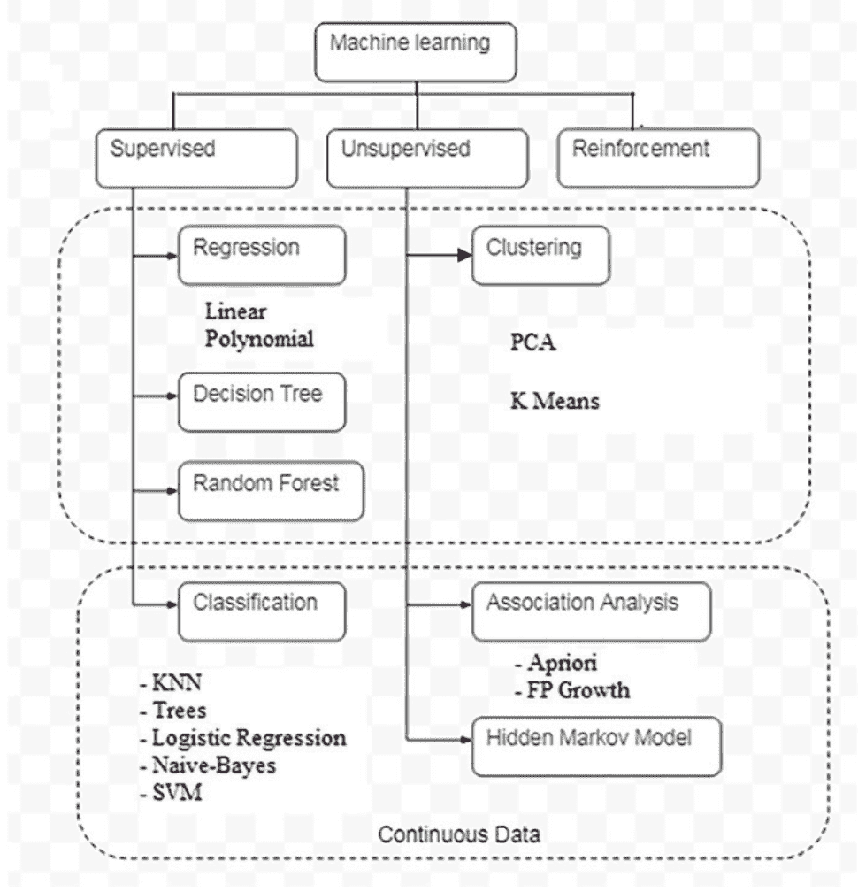

如图1.1所述，监督和无监督算法处理提供的连续和分类数据。处理连续数据的监督算法包括回归、决策树、随机森林，而处理分类数据的基于分类的方法。无监督算法包括聚类、关联分析和隐马尔可夫模型。

## 机器学习算法的工作原理

机器学习算法使用训练数据集进行训练。这种训练导致模型的创建。当新的输入数据被引入该模型时，机器学习算法会进行预测。
下图描述了机器学习算法的工作原理：

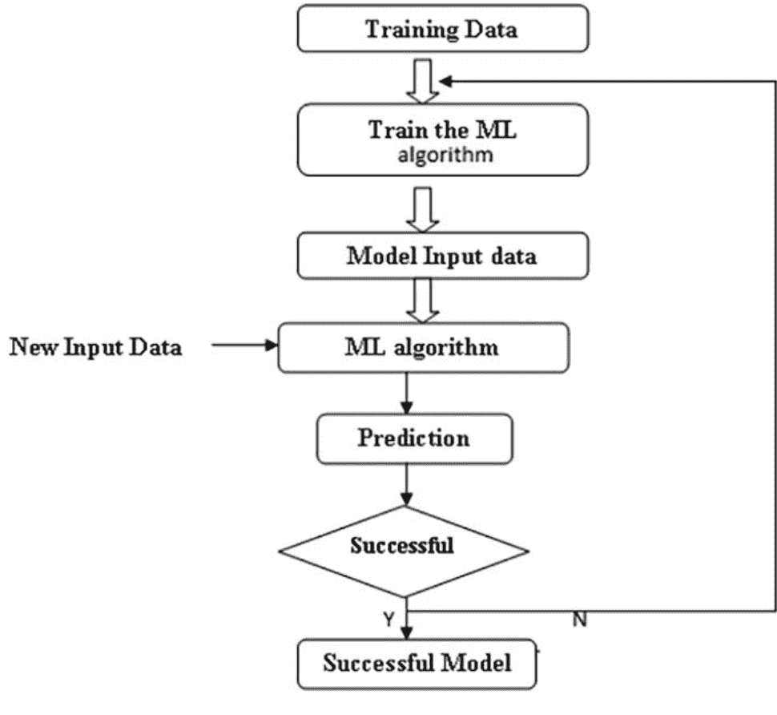

如果获得的预测准确性可以接受，则部署相关的机器学习算法。然而，如果获得的准确性不可接受，则使用增强的训练数据集反复训练算法，直到其准确性达到可接受水平，如[图1.2](Figure 1.2)所示。

## 机器学习项目的挑战

采用机器学习方法可能极其繁琐，但它可以成为公司的收入增长点。虽然机器学习仍在发展中，但组织面临的各种挑战包括以下几点：

**理解当代机器学习技术的局限性**
许多公司期望算法能够快速学习并为复杂查询提供精确预测。因此，他们面临着向客户普及其创新技术可能应用的挑战。从事实际机器学习应用的企业需要投入时间和资源，并承担相当大的风险。此外，机器学习工程师和数据科学家无法保证模型的训练过程可以复制。因此，应进行频繁测试以开发最佳和期望的结果。

**黑盒问题**
早期，理解算法如何工作使得机器学习模型成为简单而浅层的方法。然而，随着机器学习算法处理大型数据集，算法已从神经网络发展到深度学习算法。这些网络提供了良好的准确性，但其背后的逻辑和开发的模型却不得而知。这个问题被称为黑盒问题。

**数据收集**
有海量数据可用于训练机器学习模型。数据工程在收集和整理数据方面发挥着重要作用。虽然数据存储变得便宜，但收集足够的数据或购买现成数据集需要时间，而且成本也很高。此外，为算法训练准备数据是一个复杂的过程。为此，需要：
- 了解算法需要解决的问题，
- 建立数据收集机制并训练算法，
- 通过属性采样、记录采样或聚合进行数据缩减；
- 分解数据并重新缩放，这是一项复杂且昂贵的任务；

数据隐私是另一个挑战。区分敏感和非敏感数据对于正确高效地实施机器学习至关重要。

## 特征选择

在一个数据集中，你可能有1000个或更多特征，但只有选定的特征有助于预测；选择这些特征是一项具有挑战性的任务。这里，领域知识和数据科学家的专业知识就派上了用场。
选择尽可能小的输入变量（特征）子集以获得最优或最佳预测是一个挑战。

## 性能预测

一旦做出优化预测，挑战就在于预测其在新的、未见过的数据上的泛化性能。
为了衡量性能，我们有参数需要检查；例如，在分类问题中，我们有分类矩阵、准确性、召回率、精确率、roc-auc曲线等；在回归问题中，我们有准确性、均方误差、调整后的R2平方误差等。
为了克服面临的各种挑战，重点应放在理解数据收集、特征选择和提取背后的概念，应用正确的算法，并预测所应用算法的性能和准确性。

## 机器学习的局限性

机器学习的应用可见于各个领域，从金融和零售部门到农业、银行业等等。然而，机器学习算法有其自身的局限性，如下所述：
- 每个狭窄应用都需要专门训练
- 需要大量的*手工制作*、*结构化*训练数据
- 学习通常必须是监督的：训练数据必须被标记
- 需要长时间的离线/批量训练
- 不能在实时中增量或交互式地学习
- 迁移学习能力差，模块可重用性和集成性差
- 系统不透明，使其非常难以调试
- 性能无法审计或保证
- 它们编码相关性，而非因果关系或本体关系
- 不编码实体或实体之间的空间关系
- 只能处理自然语言非常狭窄的方面

为了获得最佳结果，需要在考虑所有局限性的同时，正确运用各种技术。

## 机器学习的应用领域

各行各业都已采用机器学习技术以获得竞争优势。利用机器学习的领域包括以下：

**金融服务**
通过应用适当的机器学习算法进行预测，以识别两个重要因素：确定数据洞察以识别投资机会，或帮助投资者了解何时进行交易。此外，利用各种数据挖掘和机器学习算法进行网络监控，以防止欺诈发生，并在银行业和金融行业的其他业务中识别高风险客户。

**政府**
对于政府组织，有从多个来源获得的大量数据，且记录保存多年。此类数据构成了主要来源，可以从中挖掘数据并生成洞察，以改善公共安全并为社会福利提供效用。机器学习可以在确定此类服务方面发挥重要作用。它还可以帮助检测欺诈并减少身份盗窃。

**医疗保健**
由于可穿戴设备的出现，医疗保健领域结合的传感器技术可以实时获取患者的健康状况。这数据积累可以帮助医疗专家分析数据，识别趋势和关键领域，从而改进诊断和治疗。可以开发和训练机器学习模型，以提供有关患者健康状况的洞察。

### 零售

在线购物是当今的趋势。商业组织正在提供诸如推荐产品及其组合等服务，这些推荐是基于之前的购买历史。零售商依靠机器学习来捕获数据、分析数据，并利用它来个性化购物体验，同时提供客户洞察和价格优化。

### 石油和天然气

机器学习模型正在被训练以确定新的能源来源、分析地下的矿物、预测炼油厂传感器故障，并简化石油分配，使炼油厂更高效、更具成本效益。

### 交通

交通行业主要依赖于使路线更高效和预测潜在问题。因此，需要开发机器学习算法来分析，需要对传入的数据进行建模。这可以进一步用于识别模式和趋势，以生成优化的路线。因此，机器学习是各种交通组织的重要工具。

其他应用集包括以下内容：

### Facebook 的新闻推送

新闻推送使用机器学习来个性化每个成员的推送。如果一个成员经常停下来阅读某个特定朋友的帖子，新闻推送将开始在推送中更早地显示该朋友的更多活动。这是通过执行统计分析和预测分析来识别用户数据中的模式，并使用这些模式来填充新闻推送来完成的。

### 企业应用

在**客户关系管理（CRM）**系统中，机器学习利用学习模型来分析电子邮件，并通知销售团队成员哪些邮件最重要，需要首先回复。同样，**人力资源（HR）**系统使用机器学习模型来识别高效员工的特征，并利用这一点来为公开职位寻找最佳申请人。

机器学习软件帮助用户自动识别重要的数据点，以提供业务洞察和情报。

### 自动驾驶汽车

机器学习使用深度学习神经网络来识别物体，并确定安全驾驶车辆的最佳操作。

### 虚拟助手

为了解释自然语音、个人日程安排或先前定义的偏好并采取行动，智能助手通过多个深度学习模型利用机器学习技术。

## 数据科学、数据挖掘、机器学习和深度学习术语之间的区别

尽管这些方法中的每一个都有相同的目标，即提取可用于决策的洞察、模式和关系，但每一个都有不同的方法和确定它们的能力，如[表 1.1](#)所示。

### 数据科学和数据挖掘

数据科学涉及收集和处理数据的整个范围，而数据挖掘涉及分析大量数据以发现模式和其他有用信息。

数据挖掘涉及使用传统的统计方法从数据中识别以前未知的模式，例如统计算法、机器学习、文本分析和时间序列分析。它还包括数据存储和数据操作的研究和实践。参考表格[表 1.1](#)：

| 特征 | 数据科学 | 数据挖掘 |
| :--- | :--- | :--- |
| 定义 | 收集数据的过程 | 数据分析 |
| 处理对象 | 结构化、半结构化和非结构化数据 | 结构化数据 |
| 方法 | 由统计学、数据可视化和自然语言处理组成的多学科方法 | 数据科学的一部分 |
| 过程 | 在当前和历史数据中寻找模式 | 在历史数据上操作 |

表 1.1：数据科学和数据挖掘之间的区别

### 机器学习和深度学习

机器学习是基于其探测数据结构的能力而开发的。它使用迭代方法从数据中学习，因此学习很容易自动化。

深度学习结合了计算能力和神经网络的进步，以学习大量数据中的复杂模式，用于识别图像中的物体和声音中的单词，如表 1.2 所示：

| 特征 | 机器学习 | 深度学习 |
|---|---|---|
| 最佳数据量 | 数千个数据点 | 数百万个数据点 |
| 输出 | 数值 | 数值和自由形式数据 |
| 工作方式 | 使用自动学习的算法来建模函数并根据数据预测未来的操作 | 使用神经网络 |
| 特征选择 | 需要特定技术 | 自动完成 |
| 算法管理 | 算法由数据分析指导，以检查数据集中的特定变量 | 算法在数据分析上是自导向的 |

表 1.2：机器学习和深度学习之间的区别

## 结论

本章向您介绍了数据科学、数据挖掘、人工智能、机器学习和深度学习中使用的关键术语。这里还探讨了各种类型的机器学习算法、应用的方法和部署的学习模型。然后指定了机器学习算法的工作原理以及在开发机器学习算法时面临的挑战。接着通过几个例子澄清了机器学习的概念。我们还探讨了数据科学、数据挖掘、机器学习和深度学习技术之间的区别。

在下一章中，将介绍非常流行的 Python 语言。然后，我们将详细探讨代码编辑器、IDE 和 Python 的工作原理，以及其基本结构、控制语句和异常处理。

## 问题与答案

1.  **用例子定义机器学习、数据科学和人工智能术语。**

**答：机器学习（ML）**算法使计算机能够从数据中学习，甚至在没有明确编程的情况下自我改进。您可能已经在使用利用 ML 的设备，例如，像 Fitbit 这样的可穿戴健身追踪器或像 Google Home 这样的智能家庭助手。

**数据科学：**数据科学是研究数据趋势以尽可能利用数据的技术。机器学习算法、深度学习算法和 Python 库使数据科学领域更加强大。它包括以下内容：

-   统计学（您习惯认为的传统分析）
-   可视化（图表和工具）

数据科学用于欺诈检测、股票市场预测、疾病预测、聊天机器人、社交媒体管理、用户画像和语音识别等领域。

**人工智能：**它是一种使机器能够执行人类无法完成的任务的技术。这些机器不仅被训练来执行任务，而且随着时间的推移而改进。例如，端着一盘饮料穿过拥挤的酒吧并将其提供给正确的顾客是服务员每天都在做的事情，但这是基于人类大脑神经元之间传输的大量数据的复杂决策练习。

从更广泛的意义上说，机器学习和深度学习是人工智能的子集，而数据科学是为实施准备数据的工具，无论是清洗、探索性数据分析、插补还是拆分。

2.  **解释机器学习中使用的各种模型。**

**答：**让我们谈谈机器学习中的各种模型。

**线性回归：**它用于根据连续变量估计真实值（房屋成本、呼叫次数、总销售额等）。在这里，我们通过拟合最佳直线来建立自变量和因变量之间的关系。这条最佳拟合线称为回归线，由线性方程 Y= a *X + b 表示。

理解线性回归的最佳方式是重温这个童年经历。假设你让一个五年级的孩子按体重递增的顺序列出班上的人，而不问他们的体重！你认为孩子会怎么做？他们可能会观察（视觉分析）同学的身高和体型，并使用这些可见参数的组合来排列他们。这就是现实生活中的线性回归！孩子实际上已经弄清楚了身高和体型会通过一种关系与体重相关，这种关系看起来像方程。

在这个方程中：

-   Y：因变量
-   A：斜率
-   X：自变量
-   B：截距

这些系数 A 和 B 是基于最小化数据点和回归线之间距离的平方差之和而得出的。

看下面的例子。在这里，我们已经确定了具有线性方程 y=0.2811x+13.9 的最佳拟合线。使用这个方程，我们可以根据一个人的身高来找到体重。参考[图 1.3](Figure 1.3)：

### 1.3 线性回归

线性回归主要分为两种类型：简单线性回归和多元线性回归。简单线性回归的特点是只有一个自变量，而多元线性回归（顾名思义）的特点是有多个（多于1个）自变量。在寻找最佳拟合线时，你可以拟合多项式或曲线回归，这些被称为多项式或曲线回归。

### 1.4 逻辑回归

**逻辑回归：** 不要被它的名字搞混！它是一种分类算法，而不是回归算法。它用于根据给定的一组自变量来估计离散值（二元值，如0/1、是/否、真/假）。简单来说，它通过将数据拟合到一个logit函数来预测事件发生的概率。因此，它也被称为logit回归。由于它预测的是概率，其输出值介于0和1之间（正如预期的那样）。

让我们通过一个简单的例子来理解这一点。

假设你的朋友给你一个谜题来解决。只有两种结果场景：要么你解决了它，要么你没有。现在，想象一下，你被给予各种各样的谜题/测验，以了解你擅长哪些科目。这项研究的结果会是这样的：如果给你一个基于三角学的十年级问题，你有70%的可能性解决它。另一方面，如果是一个五年级的历史问题，得到答案的概率只有30%。这就是逻辑回归提供给你的。

从数学上讲，结果的对数几率被建模为预测变量的线性组合：

odds = p / (1-p) = 事件发生的概率 / 事件不发生的概率

ln(odds) = ln(p/(1-p))

logit(p) = ln(p/(1-p)) = b0 + b1X1 + b2X2 + b3X3.... + bkXk

这里，p是感兴趣特征存在的概率。它选择的参数是最大化观察样本值的似然性，而不是最小化平方误差之和（如普通回归中那样）。

你可能会问，为什么要取对数？为了简单起见，我们可以说这是复制阶跃函数的最佳数学方法之一。请参考下图（图1.4）。

**图1.4：** *感兴趣特征存在的概率*

### 1.5 决策树

**决策树：** 这是我最喜欢的算法之一，并且使用非常频繁。它是一种监督学习算法，主要用于分类问题。令人惊讶的是，它对分类和连续因变量都有效。在这个算法中，我们根据最重要的属性/自变量将总体分成两个或更多同质集合，以形成尽可能不同的组。请参考下图（图1.5）。

**图1.5：** *因变量*
**来源：** *statsexchange*

在前面的图像中，你可以看到总体根据多个属性被分为四个不同的组，以识别“他们是否会玩”。为了将总体分成不同的异质组，它使用了诸如基尼系数、信息增益、卡方和熵等技术。

理解决策树如何工作的最佳方式是玩Jezzball，这是微软的一款经典游戏，如下图所示。本质上，你有一个有移动墙壁的房间，你需要创建墙壁，以便在没有球的情况下清理出最大面积。请参考图1.6。

**图1.6：Jezzball**

所以，每次你用一堵墙分割房间时，你都试图在同一个房间里创造两个不同的总体。决策树的工作方式类似，通过将总体分成组。

### 1.6 kNN（k-近邻算法）

**kNN（k-近邻算法）：** 它可以用于分类和回归问题。然而，在工业界，它更广泛地用于分类问题。K-近邻是一个简单的算法，它存储所有可用的案例，并通过其k个邻居的多数投票来分类新案例。被分配给某个类别的案例是其K个近邻中最常见的，通过距离函数来衡量。

这些距离函数可以是欧几里得距离、曼哈顿距离、闵可夫斯基距离和汉明距离。前三个函数用于连续函数，第四个（汉明距离）用于分类变量。如果K=1，则该案例被简单地分配给其最近邻的类别。有时，在执行kNN建模时，选择K会成为一个挑战。

kNN可以很容易地映射到我们的现实生活中。如果你想了解一个你没有任何信息的人，你可能会想了解他们的亲密朋友和他们所在的圈子，并获取关于他们的信息。

在选择kNN之前，需要考虑以下事项：

-   kNN计算成本高
-   变量应该被归一化，否则高范围变量可能会产生偏差
-   在进行kNN之前，需要进行更多的预处理工作，例如去除异常值或噪声

### 1.7 K-Means（K-均值聚类）

**K-Means：** 它是一种无监督算法，用于解决聚类问题。其过程遵循一种简单易懂的方法，通过一定数量的聚类（假设k个聚类）来对给定的数据集进行分类。聚类内的数据点是同质的，而与其他组的数据点是异质的。

还记得从墨迹中辨认形状吗？如图1.7所示，K均值算法与这个活动有些相似。你观察形状和分布，以解读存在多少个不同的聚类/总体。

**图1.7：** *存在的聚类/总体*

以下是K-means形成聚类的方式：

1.  K-means为每个聚类选择k个点，称为质心。
2.  每个数据点与最近的质心形成一个聚类，即k个聚类。
3.  它根据现有的聚类成员找到每个聚类的质心。这里，我们有了新的质心。
4.  由于我们有了新的质心，重复步骤2和3。找到每个数据点到新质心的最近距离，并将其与新的k个聚类关联起来。重复此过程直到收敛，即质心不再变化。

让我们看看如何确定K的值。

在K-means中，我们有聚类，每个聚类都有自己的质心。聚类内质心与数据点之间差值的平方和构成了该聚类的组内平方和值。此外，当所有聚类的平方和值相加时，它等于该聚类解决方案的总组内平方和值。

我们知道，随着聚类数量的增加，这个值会不断减小。然而，如果你绘制结果，你可能会看到平方距离之和在某个k值之前急剧下降，之后下降得更慢。在这里，我们可以找到最优的聚类数量。请参考下图（图1.8）。

**图1.8：** 最优聚类数量

### 1.8 降维算法

**降维算法：** 在过去的4-5年里，各个阶段的数据捕获呈指数级增长。企业/政府机构/研究组织不仅在识别新的数据源，还在非常详细地捕获数据。

例如，电子商务公司正在捕获更多关于客户的细节，如他们的人口统计信息、网络爬取历史、他们喜欢或不喜欢什么、他们的购买历史、反馈等等，以便为他们提供个性化的关注。

作为一名数据科学家，我们获得的数据包含许多特征；这对于构建良好的稳健模型来说听起来不错，但也存在一个挑战。你如何从1000或2000个变量中识别出高度显著的变量？在这种情况下，降维算法会有所帮助，此外还有决策树、随机森林、PCA、因子分析、基于相关矩阵的识别、缺失值比率等算法。

### 1.9 XGBoost

**XGBoost：** 这是另一种经典的梯度提升算法，它被认为是某些Kaggle竞赛中决定胜负的关键选择。

XGBoost具有极高的预测能力，这使其成为追求准确性的最佳选择，因为它同时拥有线性模型和树学习算法，使其比现有的梯度提升技术快近10倍。

它支持各种目标函数，如回归、分类和排序。

关于XGBoost最有趣的一点是，它也被称为正则化提升技术。它有助于减少过拟合建模，并对多种语言有广泛的支持，如Scala、Java、R、Python、Julia和C++。

它支持在许多机器上进行分布式和广泛的训练，这些机器包括GCE、AWS、Azure和Yarn集群。XGBoost还可以与Spark、Flink和其他云数据流系统集成，并在提升过程的每次迭代中内置交叉验证。

### 3. 阐述在实施机器学习算法时面临的挑战。

**答：数据不可用：** 尽管数据丰富，但在医疗保健和农业等各个领域仍然存在数据短缺。

**复杂数据：** 随着更好的互联网连接和社交媒体，我们每秒都在生成数据，但这些数据对机器学习没有用处。存在大量的数据操纵、提取和

### 4. 描述机器学习算法的工作原理。

**答：** 机器学习算法大致分为两部分：监督算法和无监督算法。监督算法可以根据问题类型进一步细分，例如回归和分类。

在实施算法之前，我们需要准备好数据，理解数据，移除所有异常值，清理数据，进行插补、归一化，并将数据划分和拆分为训练集和测试集。

根据具体问题，我们可以应用相应的算法。假设我们需要预测土地价格。由于这是一个回归问题，我们需要找出土地的所有重要特征，例如位置、大小和周边市场。基于所有这些重要特征，我们可以使用线性回归或随机森林来预测土地价格。

假设有一个问题需要用“是”或“否”来回答。这通常是一个分类问题。在这里，我们可以使用逻辑回归、支持向量机和决策树来决定输出结果。对于图像分类问题，我们也可以采用深度学习。

在无监督学习中，我们通常处理聚类问题，例如在社交和零售领域的问题中。我们需要将具有相似行为或购买历史的用户进行聚类；这有助于公司确定应该向哪些用户提供优惠。最常用的算法包括K近邻、主成分分析和奇异值分解。

### 5. 详细阐述机器学习在工业领域的两个应用。

**答：** 为了更好地理解机器学习，让我们考虑一下ML在工业不同领域的实际应用：

**推荐系统：** 机器学习被亚马逊和Netflix等电子商务和娱乐公司广泛用于向用户推荐产品。每当我们搜索某个产品时，在使用同一浏览器浏览互联网时，我们就会开始看到该产品的广告；这正是机器学习的作用。

谷歌使用各种机器学习算法来理解用户兴趣，并根据客户兴趣推荐产品。

同样，当我们使用Netflix时，我们会看到一些关于娱乐剧集、电影等的推荐；这也是借助机器学习完成的。

**情感分析：** 情感分析的应用包括活动监控、品牌监控、股市分析和合规监控。让我们通过一个最简单的实现来理解情感分析：使用一个包含从+5（积极）到-5（消极）评分的单词列表。为此，我们使用AFINN评分单词列表。假设你的一位客户写道：“我喜欢这个产品，但包装不太好”。在AFINN单词列表中，“喜欢”和“不太好”的评分分别为+3和-2。如果你将这两个分数相加，你会得到+1。这意味着用户情绪是轻微积极的。再次强调，这是情感分析最简单的例子。复杂的模型结合了自然语言处理和机器学习算法来分析大段文本。根据Amadeus IT集团的数据，90%拥有智能手机的美国旅行者会在社交媒体和评论服务上分享他们的照片和旅行经历。TripAdvisor每分钟从旅行者那里收到大约280条评论。凭借来自3.9亿独立访客和4.35亿条评论的大量宝贵数据，它分析这些信息以提升其服务。TripAdvisor的机器学习技术侧重于分析与品牌相关的评论。

### 6. 区分机器学习和深度学习。

**答：** 虽然这两个人工智能子集之间存在许多差异，但以下是五个最重要的区别：

- **人为干预：** 机器学习需要更多的人为干预才能获得结果。另一方面，深度学习的设置更为复杂，但之后所需的人为干预极少。
- **硬件：** 机器学习程序通常比深度学习算法简单，往往可以在常规计算机上运行，但深度学习系统需要强大得多的硬件和资源。这种对算力的需求意味着图形处理单元的使用增加。GPU因其高带宽内存以及通过线程并行性（许多操作同时高效运行的能力）来隐藏内存传输延迟（延迟）的能力而非常有用。
- **时间：** 机器学习系统可以快速设置和运行，但其结果的能力可能有限。深度学习系统需要更多时间来设置，但可以即时生成结果（尽管随着更多数据的可用，质量可能会随时间提高）。
- **方法：** 机器学习通常需要结构化数据，并使用传统算法，如线性回归。深度学习采用神经网络构建，旨在处理大量非结构化数据。
- **应用：** 机器学习已经应用于你的电子邮件收件箱、银行和医生的办公室。深度学习技术能够实现更复杂和自主的程序，例如自动驾驶汽车或执行手术的机器人。

# 加入我们的书籍Discord空间

加入书籍的Discord工作区，获取最新更新、优惠、全球科技动态、新书发布以及与作者的交流会：

[https://discord.bpbonline.com](https://discord.bpbonline.com)


# 第2章
机器学习的Python基础

### 简介

在机器学习领域，Python是一门令人爱不释手的语言。自1991年诞生以来，它在包括机器学习在内的各个领域的应用日益普及。其丰富的库支持是Python受欢迎的原因之一。近年来，Python显著增强了对适用于各种数据分析和机器学习应用的库的支持。Python作为通用编程语言与数据分析支持的结合，使其受欢迎程度倍增。

在概览了机器学习之后，现在让我们快速了解一下Python的基础知识。在上一章中，你了解了机器学习的重要性及其广泛应用。本章将从编程语言的角度快速介绍Python，涵盖基础知识。它介绍了两个用于编写Python代码的基本流行IDE：Jupyter和Spyder。要深入研究机器学习，需要正确了解工具和语言。本章涵盖了使用Python的基本数据结构、输入输出命令和文件处理。了解Python的基础知识很重要，因为它是许多高级机器学习工具（如TensorFlow和Keras）使用的基础语言。

## 结构

在本章中，我们将讨论以下主题：

- Spyder IDE
- Jupyter Notebook
- Python：输入与输出
- 函数与模块
- 类处理
- 异常处理
- 文件处理

## 目标

本章的目标是介绍Python的代码编辑器和集成开发环境（IDE）。同时，也将讨论Python程序的基本结构。你将能够学习基本的Python语句、条件语句和控制结构。此外，在完成本章后，你将能够编写函数和创建模块，并了解如何有效地使用基本的异常处理。本章还将带你了解基本的文件处理。

## Spyder IDE

Spyder是为执行Python脚本而编写的科学环境。它由科学家、研究人员、数据分析师和工程师用Python编写，也服务于他们。它是一个强大的工具，可以轻松地编写、执行和调试Python程序。它具有许多内置功能，使程序员的工作变得轻松。如*图2.1*所示，该环境具有多个内置功能，如项目资源管理器、编码窗口、变量资源管理器、Python控制台和可视化工具。


**图2.1：** *Spyder IDE – 项目与变量资源管理器*

- 项目资源管理器：如图2.1所示，可以在此启动一个新的Python项目，所有相关的Python文件都可以在一个公共资源下使用。Spyder支持使用Git进行版本控制。
- 变量资源管理器：变量资源管理器有助于跟踪项目中使用的变量。通过它，可以查看变量的值、数据类型和维度。此外，我们无需在编码编辑器中输入任何命令，只需双击文件即可直接打开它。
- 代码编辑器：它有助于轻松编写代码。该编辑器支持错误检查并突出显示语法。它会即时提供代码分析，如图2.2所示：


- IPython控制台：这是一个帮助执行Python命令并可视化输出的控制台。可以使用它执行单个独立的命令或完整的Python程序。

## Jupyter Notebook

这是初学者中最受欢迎的编辑器之一，用于编写和执行Python脚本。这些笔记本可以轻松共享，并且易于编码和理解。笔记本具有可执行单元格，如图2.3所示，可以执行输入的Python命令。Jupyter notebook具有类似单元格的结构，你可以在其中编写和执行命令。

单元格类型可以是代码单元格、Raw NBconvert或markdown单元格。代码单元格用于编写Python代码，markdown单元格可用于解释代码单元格。可以使用HTML标签通过突出显示重要方面来显示详细信息。markdown单元格就像记录注释。笔记本会跟踪Python代码的执行顺序。即将执行的单元格会被突出显示。请参考下图：

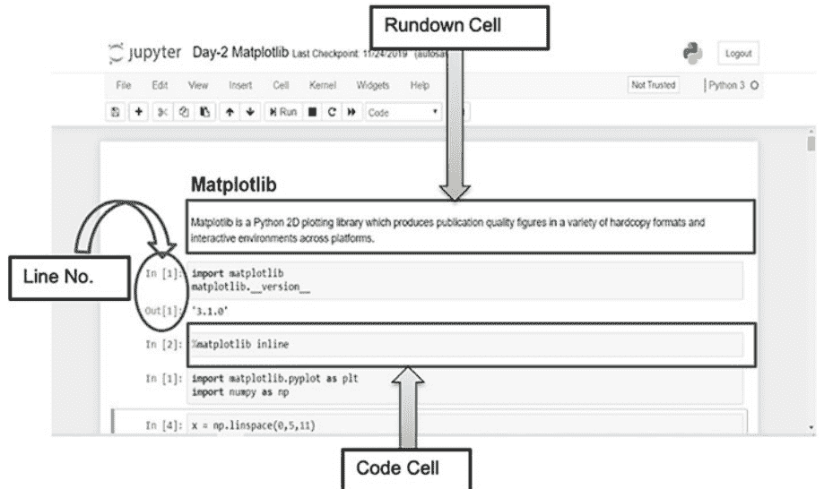

**图2.3：** Jupyter Notebook

使用Jupyter notebook的一个重要优势是输出会被保留，并且可以在需要时随时查看。作为初学者，Jupyter notebook充当程序员的视觉指南，用于培训和高效学习。

## Python：输入与输出命令

让我们开始复习Python的基础知识。任何语言之所以丰富，是因为其数据结构的支持。与同类语言相比，Python提供了额外的数据结构，这使其适用于机器学习应用。图2.4突出了Python的重要数据结构。数据结构有两种类型：

- **基本数据结构**：这些数据结构是通用和常见的数据类型，也是其他编程语言的一部分。
- **非基本数据结构**：这些是Python特有的特殊数据结构，其开发考虑了它们在数据分析领域的应用。

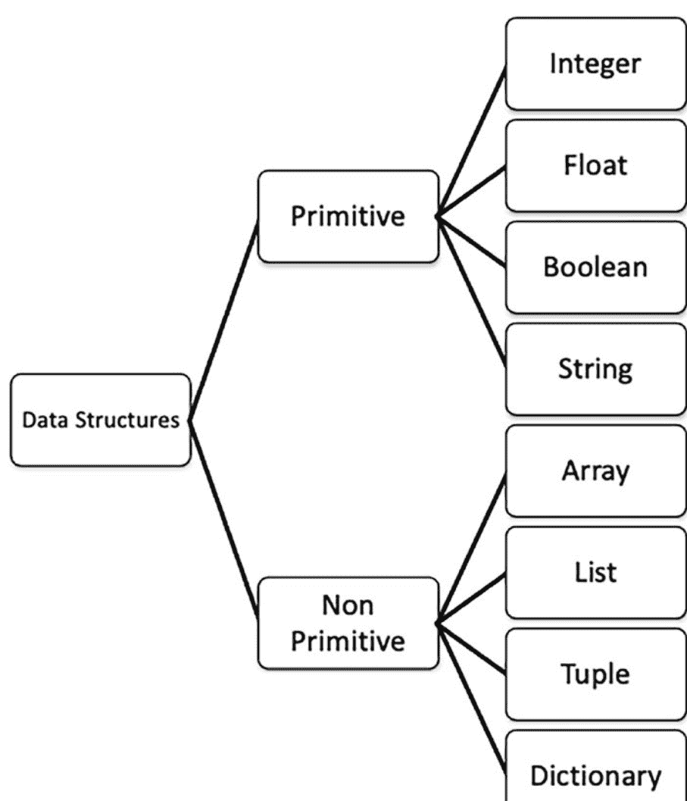

**图2.4：** Python中的数据结构

以下代码在示例1中展示了如何创建列表、元组和字典。

### 示例1：

```
>>> x = [1, 'hello', (3 + 2j)]  #List creation
>>> x
[1, 'hello', (3+2j)]
>>> x = (1,2,3)       #Tuple creation
>>> x[1:]
(2, 3)
>>> d = {1 : 'hello', 'two' : 42, 'blah' : [1,2,3]} #Dictionary
>>> d
{1: 'hello', 'two': 42, 'blah': [1, 2, 3]}
>>> d['blah']
[1, 2, 3]
```

用于显示输出的基本命令是**print()**命令，如示例2所示。

### 示例2：

```
# print integer and float value
>>>print("Geeks : % 2d, Portal : % 5.2f" %(1, 05.333))
# Printing String
>>>print "Welcome to Python"
```

Python拥有丰富的函数集来执行日常任务。为了从用户读取输入，Python使用**input()**函数。

### 示例3：

```
>>>choice=input("Which fruit do you like")
Apple
>>>print(choice)
Apple
```

读取数字时必须小心。**input()**函数默认将所有值视为字符串。读取数字时，可以使用**int()**和**float()**函数将这些值转换为适当的数据类型。

## 逻辑语句

与任何其他编程语言一样，Python支持关系和逻辑运算符以及逻辑语句。
支持的关系运算符有 <, >, <=, >=, !=, ==。
逻辑运算符是 *AND*、*OR*、*NOT*。
逻辑语句if、else在决策时很常用。Python语法如下：

```
if condition :
    Statements
else:
    Statements
```

或者，为了更具决定性，可以使用级联语句。这里需要记住的一点是，Python不提供任何块标记运算符。额外的空格用于标记或分组语句。任何不必要的空格在Python中都会被视为错误。

```
if condition :
    statements
elif condition:
    statements
else:
    statements
```

### 示例4：

```
>>>a,b=10,20
>>>if a>b :
    print(a-b)
    else :
        print(b-a)
10
```

### 示例5：

```
>>>a = 200
>>>b = 33
>>>if b > a:
    print("b is greater than a")
elif a == b:
    print("a and b are equal")
else:
    print("a is greater than b")
```

前面的代码将打印 - **a is greater than b**。

## 循环与控制语句

为了帮助在编程中重复执行语句，使用了基于条件的循环语句。Python主要支持两种循环语句：**for循环**和**while循环**。

### 示例6：

```
>>>for x in range(1,10):
    print(x)
```

**for**语句广泛用于遍历字符串、元组和列表。

### 示例7：

```
>>>a, b, n = 0, 1, 10
>>>sum=0; count=1
>>>while (count < n):
    count=count+1
    a=b; b=sum
    sum=a+b
    print(' ',sum)
```

**while**用于根据需要重复语句。示例7中的代码将打印著名的斐波那契数列的前10项。
我们可以使用**break**语句根据某些条件停止循环迭代或退出循环。**continue**语句用于跳过循环中的部分语句并开始新的迭代。

### 示例8：

```
>>>for num in range (1,10):
    print(num)
    if(num ==5):
        break;
```

### 示例9：

```
>>>for num in range (1,10):
    if(num ==5):
        continue;
    print(num)
```

示例8的输出是12345；当值达到5后，**for**循环停止。相反，示例9的输出是1234678910；由于**continue**语句，**print(num)**语句没有为5执行。

## 函数与模块

函数是自包含的语句块，就像执行特定任务的程序一样。函数包含一组语句，每当我们在程序中引用该函数时，这些语句就会被执行。在Python中，可以使用**def**关键字定义函数。
Python中函数定义的通用语法如下：
**def function_name(list of parameters) :**
    **statements**

### 示例10：

```
>>>def max(x,y) :
    if x > y :
        return x
    else:
        return y
>>>max(10,20)
```

示例10中的函数接受两个数字作为参数并进行比较。该函数返回较大的那个值。

### 示例11：

```
>>>def add(a,b):
    print ("ADDING %d + %d" % (a, b))
    return a + b
>>>def subtract(a,b):
    print ("SUBTRACTING %d - %d" % (a, b))
    return a - b
>>>print(add(10,subtract(30,10)))
SUBTRACTING 30 - 10
ADDING 10 + 20
30
```

我们可以将函数作为参数传递给其他函数。在示例11中，**subtract()** 函数被作为参数传递给了 **add()** 函数。函数非常有用，因为工作可以被组织成一系列函数。

模块简而言之就是函数的集合，即库。Python模块可以保存为 **.py** 文件，并可在任何其他常规代码文件中使用。创建模块的步骤如下：

- 1. 创建一个Python文件（扩展名为 **.py**），其中仅包含根据需求定义的函数。
- 2. 保存文件并将其添加到路径中。现在它就可以作为模块被调用了。
- 3. 使用 **import** 语句创建模块的引用。
- 4. 使用 **模块名.函数名** 的语法来使用模块中的函数。

*示例12* 展示了如何创建示例库文件，*示例13* 展示了如何使用库函数。

### 示例12：MyLib.py

```
def CalDa(basic):
    return(basic*1.1)
def CalHra(basic):
    return(basic*0.3)
def CalIncrement(basic,da):
    return((basic+da)*0.3)
```

### 示例13：

```
>>>import MyLib as ml  #创建库的引用
>>>basic=int(input('Enter the basic :'))
Enter the basic :35000
>>>salary=basic+ ml.CalDa(basic)+
ml.CalHra(basic)+  ml.CalIncrement(basic,ml.CalDa(basic))
>>>print('New salary with Increment is ',salary)
New salary with Increment is 106050.0
```

在*示例12*中，创建了一个包含必要函数定义的简单 **MyLib.py** 文件。*示例13*说明了如何使用此模块进行薪资计算。Python使用许多内置和附加模块进行数据分析。这些模块是Python数据分析的支柱，并用于机器学习算法的应用。创建库并使用它们来执行我们的任务是处理机器学习程序最简单的方法。下表2.1列出了在Python文件中包含模块的各种方式：

| 方法 | 用途 |
| :--- | :--- |
| `import mymodule` | 导入该模块导出的所有元素 |
| `from mymodule import x` | 从 **mymodule** 中导入x到当前命名空间 |
| `from mymodule import *` | 将 **mymodule** 的所有元素导入当前命名空间 |

*表2.1：在Python文件中包含模块的方法*

Python允许使用lambda运算符编写匿名函数。lambda表达式返回一个函数对象。其主体只能是一个简单的表达式，不能是复杂的语句。

### 示例14：

```
>>> f = lambda x,y : x + y
>>> f(2,3)
5
>>> lst = ['one', lambda x : x * x, 3]
>>> lst[1](4)
16
```

机器学习算法经常使用匿名函数进行数据转换或变换。

## 类处理

Python通过支持类的创建和处理来支持面向对象编程。Python是一种面向对象的编程语言，其中我们创建的一切都被视为对象。类用于创建对象。它由变量和作用于这些变量的函数组成，以执行各种任务。可以使用 **class** 关键字定义一个类。

### 示例15：

```
>>>class MyClass:
    def f(self):
        return 'Hello World'
>>> x=MyClass()  #创建类的实例
>>> x.f()        #调用方法
```

这里定义了一个简单的类，只有一个函数，用于显示‘Hello World’。

### 示例16：

```
>>>class MyPerson:
    def __init__(self,name,age):
        self.name=name
        self.age=age
    def printName(self):
        print("My name is "+self.name)
```

这里，类定义了两个函数和两个变量。`__init__` 是一个特殊函数，称为构造函数。当创建类的实例时，构造函数默认会被调用。`self` 参数是对类当前实例的引用，用于访问属于类的变量。它不必命名为self；你可以随意命名，但它必须是类中任何函数的第一个参数。

## 异常处理

在程序内部优雅地处理错误是一种良好的编程实践。这种嵌入在程序中的错误处理过程称为异常处理。与其他流行语言一样，Python也支持使用 `try` 和 `except` 语句进行错误处理，如示例17所示。

### 示例17：

```
>>>try:
    print(a)
except:
    print("Variable not defined exception has occurred.")
```

这里，由于变量 `a` 未定义，代码将抛出错误，并且 `except` 块中的语句将被执行，如示例18所示。

### 示例18：

```
>>>try:
    a=0
    tot=145
    c=tot/a
    print(c)
except ZeroDivisionError:
    print("Divide by Zero error.")
```

我们可以使用系统定义的标准错误来引发异常，然后之后的语句将被执行。一些有用的异常包括 **IndexError**、**ImportError**、**IOError**、**ZeroDivisionError** 和 **TypeError**。

## 文件处理

Python不需要任何显式的库来读取或写入文件。它有内置函数来完成这些操作。读取和显示文件内容的步骤如下：

- 1. 以读模式打开文件：
    >>>f=open("MyFile.txt","r")
- 2. 从文件读取：
    >>> data=f.read()
- 3. 显示读取的数据：
    >>> print(data)
- 4. 关闭文件：
    >>>f.close()

这里，**open()** 方法接受两个参数：文件名和文件需要以何种模式打开。对于从文件读取，模式是“r”。写入文件的步骤如下：

- 1. 以写模式打开文件：
    >>>f=open("MyFile.txt","w")
- 2. 写入文件：
    >>> data=f.write(S)
- 3. 显示写入的数据：
    >>> print(data)
- 4. 关闭文件：
    >>>f.close()

这里，在 **open()** 方法中，模式可以是“w”或“w+”。在“w+”模式下，如果文件不存在，则在写入字符串之前会创建它。写入文件时，文件中已存在的内容会被覆盖。下表2.2总结了读取文件时使用的函数：

| 方法 | 用途 |
|---|---|
| f1 =open(‘filename’, ‘r’) | 打开文件‘data’用于输入 |
| S = f1.read() | 将整个文件读入一个字符串 |
| S = f1.readline() | 只读取一行 |
| L = f1.readlines() | 返回一个行字符串列表 |

*表2.2：读取文件的函数*

下表2.3总结了写入文件时使用的函数：

| 方法 | 用途 |
|---|---|
| f = open(‘filename’, ‘w’) | 打开文件‘data’用于写入 |
| f.write(S) | 将字符串S写入文件 |
| f.writelines(L) | 将列表L中的每个字符串写入文件 |
| f.close() | 关闭文件 |

*表2.3：写入文件的函数*

这里，模式可以是“r”、”w”、”w+”、”a”和”a+”。模式”a”和”a+”用于在现有文件或新文件中追加或添加数据。

### 示例19：

```
>>>f=open("Numbers.txt","w+")
>>>for num in range(10,20):
    f.writeline("The number is %d",%dnum)
>>>f.close()
>>>f=open("Numbers.txt","r")
>>>f=f.readlines()
>>>for line in f:
    print(line)
>>>f.close()
```

这里，文件以写模式打开，并将10到20的数字写入其中。文件关闭后，再次以读模式打开以读取数据。**for** 语句用于逐行显示数据。

## 字符串函数

字符串是任何数据的重要组成部分。通常收集的数据主要由分类数据和一些数值数据组成。这使得字符串处理成为机器学习中的一个重要部分。让我们看一些在数据处理中反复使用的重要字符串函数。
考虑一个字符串，如下所示：
>>> s=" Welcome here "

| 函数 | 描述 | 输出 |
| :--- | :--- | :--- |
| s.lower() | 转换为小写 | welcome here |
| s.upper() | 转换为大写 | WELCOME HERE |
| s.capitalize() | 将每个单词首字母大写 | Welcome Here |
| s.lstrip() | 移除前导空格 | Welcome here |
| s.rstrip() | 移除尾随空格 | Welcome here |
| s.strip() | 移除所有空格 | Welcome here |
| s.split(sep,maxSplit) | 根据分隔符将字符串分割成单词 | ['Welcome','here'] |

*表2.4：字符串函数总结*

一些更高级的字符串函数如下表所示：

| 函数 | 描述 |
| :--- | :--- |
| s.count(value, start, end) | 计算值或字符串的出现次数 |
| s.find(value,start,end) s.index(value,start,end) | 查找值或字符串的出现位置并返回位置，如果未找到则返回-1。Index在未找到值时会引发异常 |
| s.rfind(value,start,end) s.rindex(value,start,end) | 查找值或字符串的出现位置并返回最后一个位置，如果未找到则返回-1。Index在未找到值时会引发异常 |
| s.replace(oldval, newval, count) | 用新字符串替换旧子字符串；count是可选的，表示要替换多少个实例 |

*表2.5：高级字符串函数*

示例20展示了如何应用字符串函数。

### 示例20：

```
>>>s="Strings and Strings here and there!"
>>>s.count("Strings",0,30)
2
>>> s.find("here",0,40)
20
>>> s.rfind("Strings",0,40)
12
>>> s.replace ('there','here')
```

字符串和文本处理是许多机器学习应用的重要组成部分。所讨论的字符串函数有助于完成整个机器学习模型的许多重要步骤，例如数据预处理。

## 结论

Python因其简单的语法和丰富的库支持，成为机器学习领域最受欢迎的语言。本章重点介绍了执行任何机器学习任务所需的语言基础知识。Python有四种基本数据结构和三种高级数据结构：列表、元组和字典。Python支持传统的逻辑语句，如**if .. else**，以及控制语句，如**for**和**while**。函数为Python代码增加了模块化，可以预先编写并通过模块多次使用。小型匿名函数可以使用关键字`lambda`声明，并在需要时有效使用。Python直接提供了基本的文件处理功能。使用各种函数处理字符串的支持使该语言在文本处理方面更加灵活。

本章帮助你开发简单的代码来执行许多机器学习任务。它使你能够轻松地在代码中使用任何Python库。文本处理是任何机器学习应用不可或缺的一部分，由于这里讨论的字符串函数，它变得很容易。

掌握了机器学习和Python语言的基础知识，你在这个领域的算法之旅即将开始。下一章将带你了解基本的机器学习任务和算法，为你打下坚实的基础。

## 问答

**1. 为什么Python在机器学习中更受青睐？**

**答：简便快捷的数据验证**

机器学习的工作是识别数据中的模式。机器学习工程师负责利用、优化、处理、清理、分类数据并从中提取洞察力，以创建智能算法。Python很简单，但线性代数或微积分等主题可能令人困惑；它们需要付出最大的努力来解决。Python可以快速执行，这使得机器学习工程师能够立即验证一个想法。

**不同的库和框架**

Python已经广为人知，因此它有许多可供工程师使用的库和框架。这些库和框架有助于节省时间，这使得Python更加受欢迎。

**代码可读性**

由于机器学习涉及复杂的数学，有时非常繁琐且不明显，因此代码的可读性（包括库外部）对于成功至关重要。开发者应该考虑的不是如何写，而是写什么。

Python开发者热衷于编写易于阅读的代码。此外，这种语言对适当的空格要求非常严格。Python的另一个优势是其多范式特性，这使工程师能够更灵活地以最简单的方式解决问题。

**低入门门槛**

软件工程师普遍短缺。Python不难学习，所以入门门槛低。这意味着什么？这意味着更多的数据科学家可以快速成为专家，从而能够参与机器学习项目。Python基本上与英语相似，这使得学习它更容易。由于其简单的语法，你可以毫不犹豫地处理复杂的系统。

**可移植性和可扩展性**

这是Python在机器学习中如此受欢迎的一个重要原因。由于其可移植和可扩展的特性，许多跨语言任务可以在Python上高效执行。有许多数据科学家倾向于使用**图形处理单元（GPU）**在自己的机器上训练他们的机器学习模型，而Python的多功能特性非常适合这一点。

**2. 解释Python中的非基本数据结构。**

**答：** 与基本数据结构相比，非基本数据类型不仅存储值，还以不同格式存储值的集合。让我们看看Python中的非基本数据结构：

**列表：** 这是Python中最通用的数据结构，写成一个由逗号分隔的元素列表，包含在方括号内。列表可以包含异构和同构元素。适用于列表的一些方法包括**index()、append()、extend()、insert()、remove()和pop()**。列表是可变的，这意味着它们的内容可以在保持身份不变的情况下被更改。

**语法：**
List1 = ['a', 1, 2]

**元组：** 元组类似于列表，但不可变。此外，与列表不同，元组在圆括号内声明，而不是在方括号内。不可变性意味着一旦在元组中定义了一个元素，就不能删除、重新赋值或编辑它。它确保数据结构的声明值不会被操纵或覆盖。

**语法：**
Tuple1 = (1, 2, 3)

**字典：** 字典由键值对组成。'键'标识一个项目，'值'存储该项目的值。冒号将键与其值分开。项目用逗号分隔，整个字典包含在花括号内。虽然键是不可变的（数字、字符串或元组），但值可以是任何类型。

**语法：**
Dict = {'key1': 'value1', 'key2': 'value2'}

**集合：** 集合是唯一元素的无序集合。像列表一样，集合是可变的，写在方括号内，但不能有两个相同的值。集合方法包括**count()**、**index()**、**any()**和**all()**。

**语法：**
Set1 = set(List1)  # List1转换为集合

**3. 用例子解释If – Else语句。**

**答：If：**
“if语句”使用**if**关键字编写。

```
a = 32
b = 100
if b > a:
    print("b is greater than a")
```

在这个例子中，我们使用两个变量a和b，它们作为**if**语句的一部分来测试b是否大于a。由于a是32，b是100，我们知道100大于32，所以我们打印“b is greater than a”到屏幕上。

**Elif：**

**elif**关键字是Python表达“*如果前面的条件不成立，那么尝试这个条件*”的方式。

```
a = 32
b = 32
if b > a:
    print("b is greater than a")
elif a == b:
    print("a and b are equal")
```

在这个例子中，a等于b，所以第一个条件不成立，但**elif**条件成立，所以我们打印“**a and b are equal**”到屏幕上。

**else**

**else**关键字捕获前面条件未捕获的任何情况。

```
a = 100
b = 32
if b > a:
    print("b is greater than a")
elif a == b:
    print("a and b are equal")
else:
    print("a is greater than b")
```

在这个例子中，a大于b，所以第一个条件不成立；同时，**elif**条件也不成立，所以我们进入**else**条件并打印“**a is greater than b**”到屏幕上。

你也可以在没有**elif**的情况下使用else：

```
a = 100
b = 32
if b > a:
    print("b is greater than a")
else:
    print("b is not greater than a")
```

**4. 用例子和通用语法解释函数的使用。**

**答：** 函数是一段只有在被调用时才运行的代码块。你可以将数据（称为参数）传递给函数。

**创建函数**：在Python中，函数使用`def`关键字定义：

**示例：**

```
def my_function():
  print("Hello from a function")
```

**调用函数**：要调用函数，请使用函数名，后跟括号：

**示例：**

```
def my_function():
  print("Hello from a function")

my_function()
```

**参数**：信息可以作为参数传递给函数。参数在函数名后指定，在括号内。你可以添加任意数量的参数；只需用逗号分隔它们。以下示例有一个带一个参数（`fname`）的函数。当函数被调用时，我们传递一个名字，该名字在函数内用于打印全名：

**示例：**

```
def my_function(fname):
  print(fname + " Refsnes")

my_function("Emil")
my_function("Tobias")
my_function("Linus")
```

**5. 如何在Python程序中包含模块？**

**答：编写模块**：编写模块就像编写任何其他Python文件一样。让我们从在文件calculation.py中编写一个加/减两个数字的函数开始：

```
def add(x, y):
  return (x + y)

def sub(x, y):
  return (x - y)
```

## 在Python中使用模块

模块使你能够将程序的不同部分拆分到不同的文件中，以便于维护和提升性能。作为初学者，你一开始在解释器上使用Python，当需要编写较长的程序时，你开始编写脚本。随着程序规模的增长，你可能希望将其拆分为多个文件，以便于维护和代码重用。解决这个问题的方案就是模块。你可以将最常用的函数定义在一个模块中，然后导入它，而不是将它们的定义复制到不同的程序中。一个模块可以被另一个程序导入以使用其功能。这也是你可以使用Python标准库的方式。简而言之，模块是一个由Python代码组成的文件。它可以定义函数、类和变量，也可以包含可运行的代码。任何Python文件都可以被引用为模块。例如，一个包含Python代码的文件，如`test.py`，被称为模块，其名称将是`test`。编写模块有多种方法，但最简单的方法是创建一个扩展名为`.py`的文件，其中包含函数和变量。

### import语句

要使用任何模块中的功能，你必须将其导入到当前程序中。你需要使用**import**关键字以及所需的模块名称。当解释器遇到**import**语句时，它会将模块导入到你的当前程序中。你可以通过使用点(`.`)运算符和模块名称来使用模块内的函数。首先，让我们看看如何使用标准库模块。在这个例子中，`math`模块被导入到程序中，以便你可以使用其中定义的**sqrt()**函数。

```python
import math

# 你需要输入这个命令，'import'关键字加上你要导入的模块名称

num=4

print(math.sqrt(num))

# 使用点运算符访问模块“math”中的sqrt()
```

### 编写模块

既然你已经学会了如何在程序中导入模块，现在是时候编写你自己的模块并在另一个程序中使用它了。编写模块就像编写任何其他Python文件一样。让我们从编写一个函数开始，在文件**calculation.py**中实现两个数字的加法/减法：

```python
def add(x,y):
    return (x+y)
def sub(x,y):
    return (x-y)
```

### import calculation

```python
# 导入calculation模块
print(calculation.add(1,2))# 调用在add模块中定义的函数。
```

如果你执行**module_test.py**，你将看到输出“3”。当解释器遇到**import**语句时，它将calculation模块导入到你的代码中，然后通过使用点运算符，你能够访问**add()**函数。

导入模块还有更多方式：

- from .. import语句
- from .. import *语句
- 重命名导入的模块

### from .. import语句

**from..import**语句允许你从模块中导入特定的函数/变量，而不是导入所有内容。在前面的例子中，当你将calculation导入到**module_test.py**时，**add()**和**sub()**函数都被导入了。但如果你只需要代码中的**add()**函数呢？

##### 示例：

```python
from calculation import add
print(add(1,2))
```

在前面的例子中，只导入并使用了**add()**函数。注意add()的用法？你现在可以直接访问它，而无需使用模块名称。你也可以导入多个属性，在import语句中用逗号分隔。看看下面的例子：

```python
from calculation import add,sub
```

### from .. import *语句

你可以使用此语句导入模块的所有属性。这将使导入模块的所有属性在你的代码中可见。

这是一个说明**from .. import ***用法的示例：

```python
from calculation import *
print(add(1,2))
print(sub(3,2))
```

### 重命名导入的模块

你可以重命名你正在导入的模块，这在你想给模块一个更有意义的名字，或者模块名称太长需要重复使用时很有用。你可以使用**as**关键字来重命名它。以下示例说明了如何在程序中使用它：

```python
import calculation as cal
print(cal.add(1,2))
```

通过将calculation重命名为**cal**，你节省了一些时间。注意，你不能再使用**calculation.add(1,2)**了，因为calculation在你的程序中不再被识别。

### 6. 什么是lambda函数？

**答.** Python编程中的lambda函数是一个匿名函数或没有名称的函数。它是一个小型且受限的函数，最多只有一行。就像普通函数一样，Lambda函数可以有多个参数和一个表达式。

在Python中，lambda表达式（或lambda形式）用于构造匿名函数。为此，你将使用**lambda**关键字（就像你使用**def**来定义普通函数一样）。你在Python中定义的每个匿名函数都将有三个基本部分：

- lambda关键字
- 参数（或绑定变量）
- 函数体

lambda函数可以有任意数量的参数，但函数体只能包含**一个**表达式。此外，lambda写在一行代码中，也可以立即调用。你将在下面的示例中看到所有这些的实际应用。

### 语法和示例

编写lambda函数的正式语法如下：

```
Lambda x1,x2 : 表达式
```

##### 示例：

```python
adder=lambda x,y :x+y
print(adder(2,3))
```

输出：
5

### 7. 什么是异常处理？为什么它很重要？

**答.** 异常可以定义为程序中导致程序流程中断的异常情况。
每当发生异常时，程序会停止执行，因此该点之后的代码不会被执行。因此，异常是无法处理Python脚本的运行时错误。异常是表示错误的Python对象。
Python提供了一种处理异常的方法，以便代码可以没有任何中断地执行。如果我们不处理异常，解释器将不会执行异常之后的所有代码。
Python有许多内置异常，使我们的程序能够无中断地运行并给出输出。

### try-except语句

如果Python程序包含可能引发异常的可疑代码，我们必须将该代码放在try块中。try块后面必须跟except语句，该语句包含一个代码块，如果在try块中发生某些异常，该代码块将被执行。

语法：

```python
try:
    #代码块
except Exception1:
    #代码块
except Exception2:
    #代码块
#其他代码
```

示例：

```python
try:
    a = 23
    b = 0
    c = a/b
except:
    print("Can't divide with zero")
```

**输出：**
Can't divide with zero

### 8. 解释用于读写文件的函数。

**答.** 要打开文件，请使用内置的**open()**函数。**open()**函数返回一个文件对象，该对象有一个**read()**方法用于读取文件内容：

**示例：**

```python
f= open("test.txt", "r")
print(f.read())
```

默认情况下，**read()**方法返回整个文本，但你也可以指定要返回多少个字符：

**示例：**

```python
f= open("test.txt", "r")
print(f.read(5))
```

返回文件的5个字符。
你可以使用**readline()**方法返回一行：

**示例：**

```python
f= open("test.txt", "r")
print(f.readline())
```

### 写入现有文件

要写入现有文件，你必须向**open()**函数添加一个参数：
“a” – 追加；它将追加到文件末尾。
“w” – 写入；它将覆盖任何现有内容。

**示例**
打开“demofile2.txt”文件并向文件追加内容：

```python
f= open("test2.txt", "a")
f.write("file1!")
f.close()
f= open("test2.txt", "r")
print(f.read())
```

#### 示例

打开“test3.txt”文件并覆盖内容：

```python
f= open("test3.txt", "w")
f.write("Oops!")
f.close()
f= open("demofile3.txt", "r")
print(f.read())
```

### 创建新文件

要在Python中创建新文件，请使用**open()**方法并指定以下参数之一：

- “x” - 创建；它将创建一个文件，如果文件已存在则返回错误。
- “a” – 追加；如果指定的文件不存在，它将创建一个文件。
- “w” - 写入；如果指定的文件不存在，它将创建一个文件。

##### 示例：

创建一个名为**test1.txt**的文件：

```python
f = open("test1.txt", "x")
```

结果：创建了一个新的空文件！

### 9. 解释任意两个字符串函数。

**答.** Python中有许多字符串函数，但我们只讨论两个：

```
capitalize()
count()
```

假设我们有字符串**st='hello dear'**。

#### capitalize字符串函数：

它将所有字母大写。

##### 示例：

```python
st.capitalize()
```

##### 输出：

```
HELLO DEAR
```

#### count字符串函数：

它返回字符串中元素（单词）的总数

### 10. `s.split()` 的作用是什么？请解释此函数的参数。

**答：** **split()** 方法将字符串分割成一个列表。你可以指定分隔符；默认分隔符是任何空白字符。

**语法**
`string.split(separator, maxsplit)`

**separator：** 可选。用于使用空白字符分隔字符串。
**maxsplit：** 可选。指定对给定字符串执行的最大分割次数。如果输入了 maxsplit，则列表将被分割成 maxsplit + 1 个元素。

**示例：**
```python
txt = "hello, my name is Peter, I am 26 years old"
x = txt.split(", ")
```
**输出：**
```
['hello', 'my name is Peter', 'I am 26 years old']
```

**示例：**
将字符串分割成最多包含两个元素的列表：
```python
txt = "apple#banana#cherry#orange"
# 将 maxsplit 参数设置为 1，将返回一个包含 2 个元素的列表！
x = txt.split("#", 1)
print(x)
```
**输出：**
```
['apple', '#banana#cherry#orange']
```

## 加入我们的书籍 Discord 空间

加入书籍的 Discord 工作区，获取最新更新、优惠、全球科技动态、新书发布以及与作者的交流会：
[https://discord.bpbonline.com](https://discord.bpbonline.com)

# 第 3 章

## 机器学习算法概述

## 引言

前两章讨论了*机器学习*和 Python 背后的概念。本章旨在深入探讨机器学习中的信息流和执行的操作。本章介绍各种机器学习算法，并旨在让你熟悉那些能够从提供的数据中学习并从经验中改进，而无需任何人工干预的机器学习程序。这些学习任务可能包括学习将输入映射到输出的函数，或使用监督学习和无监督学习下提出的算法，通过未标记数据中的隐藏结构进行学习。为了详细理解核心概念，本章借助几个示例探讨了任何给定机器学习算法的工作过程。由于 Python 是入门监督学习和无监督学习的便捷工具，本章探讨了其各种功能。它进一步阐述了评估已开发的机器学习系统时需要考虑的性能度量。

## 结构

在本章中，我们将学习以下主题：

- 机器学习建模流程
    - 预处理中使用的术语
    - 数据预处理的必要性
    - 在数据上训练和测试模型
    - 评估
    - 超参数调优
    - 预测
- 回归算法
    - 回归技术的类型
    - 逐步回归
    - 岭回归
    - Lasso 回归
    - 弹性网络回归
- 分类
    - 分类回归中使用的术语
    - 分类回归的类型
    - 分类的性能度量
- 聚类
    - 聚类算法
- 神经网络和支持向量机
    - 构建模块：神经元
    - 将神经元组合成神经网络
    - 训练神经网络
    - 神经网络架构
- Python 中的数据科学库
    - Numpy
    - Pandas
    - MatplotLib
- 机器学习系统的评估
    - 测试和训练数据集
    - 性能度量
    - 模型评估技术
    - 模型评估指标

## 目标

完成本章后，你将能够理解机器学习中预处理的必要性，以及用于机器学习的各种算法和用 Python 编写的数据科学库。你还应该能够了解代码编辑器和 Python IDE 背后的概念。用于特定应用的算法将使用多个评估参数进行评估。完成本章后，你应该能够识别这些用于评估机器学习系统的度量。

### 机器学习建模流程

机器学习模型是一段代码，旨在通过用数据训练机器使其变得智能。

如*图 3.1*所示，输入到系统的数据包括训练数据和测试数据，分别由 1a 和 1b 表示。训练数据集是机器学习模型在其上进行训练的数据，由 2a 表示。

机器学习模型包含根据指定问题使用的算法。该算法基于多个性能度量进行评估，这些度量将在本章后面解释；它们分别由 3a、3b 和 3c 表示。

当新数据（称为测试数据）到来时，模型根据所选算法和确定的度量进行评估，由 2b、3b 和 3c 表示。获得的模型输出（由 4 表示）然后用于预测任务，由 5 表示：

因此，在用数据训练机器之前，机器学习工作流可以定义为三个阶段。让我们看看这些阶段。

#### 收集数据

这一步被认为是重要的，因为收集的数据的质量和数量将直接决定预测模型的好坏。为任何机器学习项目收集的数据通常包括从各种来源（如文件或数据库）收集的数据，以及传感器数据或实时数据。然而，这些数据不能直接用于分析，因为大多数现实世界的数据是杂乱的，这意味着数据可能存在以下一个或多个问题：

- **缺失数据**：这是由于应用程序中的技术问题而未连续创建或不可用的数据。
- **噪声数据**：此数据指的是在手动收集数据过程中由人为造成的错误，或在收集数据时由设备技术问题引起的错误。
- **不一致数据**：此类数据指的是由于数据重复或名称或值中的错误而导致的错误。

任何此类数据的存在都会降低结果的质量。因此，进行数据预处理或准备来解决这个问题。

#### 数据预处理

机器学习的下一步是数据准备，即将数据加载到合适的位置并为训练做准备。同时，对数据进行相关的可视化，以确定不同变量之间的任何相关关系或数据变量之间的任何不平衡。在机器学习中，有一个 80/20 法则：每个数据科学家预计至少花费 80% 的时间进行数据预处理，剩下的 20% 时间用于执行分析。

数据预处理被确定为清理原始数据（即从现实世界收集的数据）并将其转换为干净数据集的过程，然后才能将其输入算法。

##### 预处理中使用的术语

在预处理数据之前，有必要了解所使用的术语：原始数据和准备好的数据。

###### 原始数据（或简称数据）

以其源形式存在的数据，即数据仓库中的数据或从流式系统发送的、尚未为机器学习任务准备的数据，称为原始数据。

###### 准备好的数据

在源中经过解析、连接、聚合和汇总到适当粒度，并以表格形式放入以供机器学习操作的数据，称为准备好的数据。

##### 数据预处理的必要性

为了从机器学习模型中获得更好的结果，底层数据必须以适当的方式、格式化，并最好放在一个数据集中。数据必须从原始状态转变为结构化状态，然后进行预处理，如*图 3.2*所示：

用于将原始数据转换为干净数据的基本预处理技术涉及以下步骤：

1. **数据转换**：任何形式的数据都必须转换为数字形式，以便机器学习模型能够处理它。
2. **处理缺失值**：每当观察到数据集中存在缺失数据时，可以考虑以下方法之一：
    a. **忽略缺失值**：可以根据需要删除相应的行或列数据。
    b. **填充缺失值**：在这种方法中，可以手动填充缺失数据。添加到缺失数据字段中的值可以是平均值、中位数或最高频率值。
    c. **机器学习**：另一种方法是根据现有数据预测可以添加到空位置的数据。
3. **异常值检测**：某些数据可能与数据集中的其他观察值严重偏离；此类数据被称为错误数据。

因此，数据预处理是机器学习中构建准确机器学习模型的最重要步骤之一。

##### 机器学习中的预处理

机器学习算法中的预处理分为六个步骤，如下所列：

1. 导入库
2. 导入数据集
3. 处理数据集中的缺失数据
4. 编码分类数据
5. 将数据集分割为训练集和测试集
6. 特征缩放

整个过程可以使用机器学习算法、数学建模和统计知识实现自动化。

#### 研究适合数据的最佳模型

工作流的下一步是选择模型；多年来已经创建了许多模型。使用机器学习模型的主要目标是训练性能最佳的使用预处理数据，可以构建模型。各种机器学习模型及其类别包括*图3.3*中所示的模型：

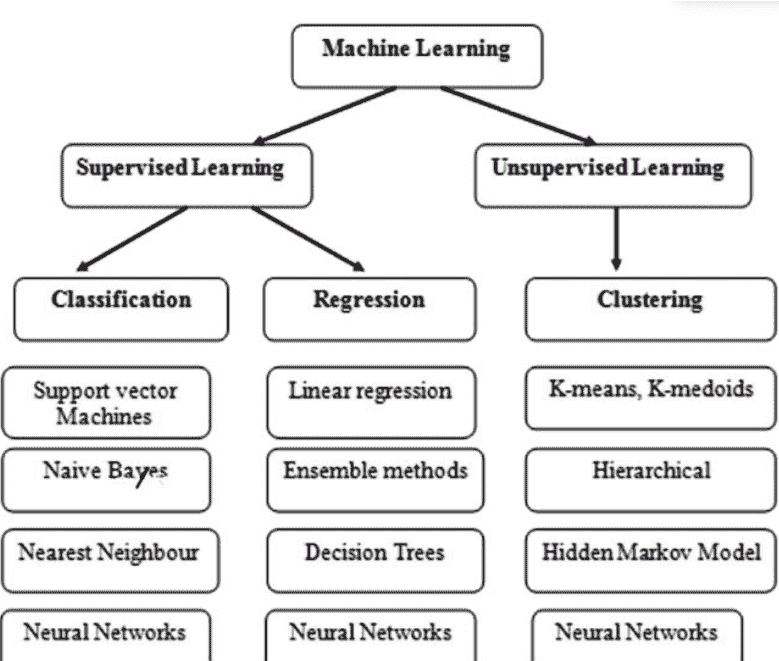

机器学习模型分为以下几类：

### 监督学习

它包括确定映射函数 Y = f(X)，其中 Y 和 X 分别表示输出和输入变量。监督学习分为以下几类：

- **分类**：在此方法中，输出被分为不同的类别。这个输出目标变量被称为分类变量。最重要的分类算法包括K近邻、朴素贝叶斯、决策树/随机森林、支持向量机和逻辑回归，如*图3.3*所示。
- **回归**：在此方法中，输出被观察为数值型，目标变量被称为连续变量。回归算法包括线性回归、支持向量回归、决策树/随机森林、高斯过程回归和集成方法。

### 无监督学习

在此方法中，未标记、未分类的数据被输入系统。相应的机器学习算法在没有预先训练的情况下作用于这些数据，因此系统的输出取决于编码的算法。无监督学习进一步分为两类：

- **聚类**：在此方法中，具有相似特征的成员被组合在一起。但是，组标签事先未知。用于聚类的方法包括高斯混合模型、K均值聚类、提升法、层次聚类、K均值聚类和谱聚类。
- **关联**：在此方法中，算法尝试在没有标记数据可用的情况下进行学习。它有助于发现大型数据库中变量之间的有趣关系。使用的方法包括关联规则挖掘以及从关系数据库和数据仓库中挖掘多层次关联规则。

### 在数据上训练和测试模型

为了获得准确的输出，系统的输入和使用的算法都需要恰到好处。为了实现优化的训练模型，数据被分为三部分：

- **训练数据**：分类器使用这些数据进行训练。

直线的方程是 y=mx+b，其中 x 是输入，m 是该直线的斜率，b 是 y 轴截距。由于斜率 m 可以取多个值，斜率可以用“权重”矩阵表示，并且可以有一个与之相关的偏置，如*图3.4*所示：

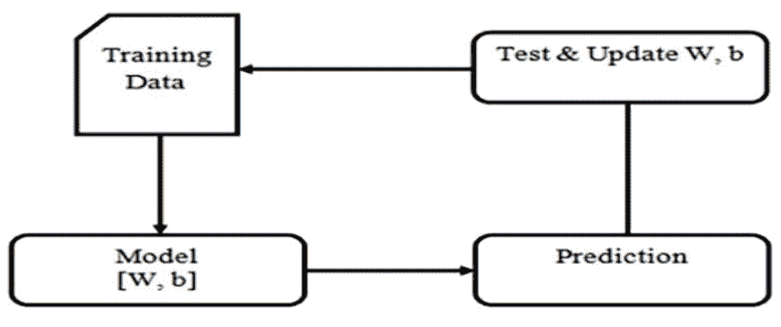

然后重复此过程。每次更新权重和偏置的迭代或周期称为一个训练“步骤”。当训练开始时，考虑前面的例子，会通过数据绘制一条随机线。随着训练的每一步进展，这条线会逐步移动，越来越接近理想线。整个过程涉及使用两组数据，即验证数据和测试数据，详细说明如下：

- **验证数据**：从训练数据中使用一组未见过的数据来调整分类器的参数。交叉验证用于估计机器学习模型在未见数据上的能力。在训练分类器时，只有训练集或验证集可用。
- **测试数据**：分类器的性能在未见过的测试数据上进行测试，并且仅在测试分类器时可用。它用于评估训练模型的性能。一旦确定了数据集，就会开发一个混淆矩阵，该矩阵表明分类模型训练得有多好。混淆矩阵由四个参数表示：
    - **真正例**：这些是预测为真且实际预测输出正确的情况。这里更倾向于更高的值。
    - **真负例**：在这种情况下，我们预测为假，并且我们的预测输出是正确的。这里更倾向于更高的值。
    - **假正例**：在这里，我们预测为真，但实际预测输出为假。
    - **假负例**：在这里，预测为假，而实际预测输出被发现为真。

模型的准确性也可以使用混淆矩阵来确定，如下所示：

$$Accuracy = \frac{True\ positives + True\ negatives}{total\ number\ of\ samples}$$

在数据集不平衡的情况下，准确性不是分类模型的正确评估参数。对于这种情况，精确率或召回率被用作更好的评估参数。

### 评估

训练完成后，进行评估以确定模型的好坏。因此，模型评估有助于找到以下内容：

- 代表尚未见过的数据的最佳模型
- 通过调整模型的超参数，所选模型在未来将如何良好运行
- 如何提高准确性
- 如何通过观察混淆矩阵来增加真正例和真负例的数量

因此，模型评估构成了模型开发过程不可或缺的一部分。

### 超参数调优

评估完成后，需要改进训练以提高准确性或减少达到理想条件所需的迭代次数。一种这样的方法是调整在训练过程中可能被隐式假设的参数。这将需要测试这些假设。另一个考虑的参数是“学习率”。它表示基于前一个训练步骤的信息和考虑的初始条件，直线在每一步中移动的距离。该值提供了关于模型准确性和训练所需时间的信息。

### 预测

预测或推断是确定输出正确性的步骤。

### 使用的指标

虽然准确性是评估机器学习模型的指标之一，但公平性和包容性提供了一种衡量标准，以理解数据引入的偏差，并确保模型在所有人口统计群体中提供公平的预测。因此，公平性可以说包含三个步骤：

- 识别数据集不平衡
- 确保所有群体得到公平对待
- 设置预测阈值

## 回归算法

这些算法根据输入到系统的输入特征预测输出值。回归技术主要根据三个指标进行分类：自变量的数量、因变量的类型和回归线的形状。

### 回归技术的类型

回归算法包括线性回归、回归树、套索回归和多元回归。

##### 线性回归

它是一种广为人知的监督学习算法，用于预测连续的实数输出，即基于给定的自变量（x，预测变量）预测因变量值（y，称为目标）。因此，它确定了 x（输入）和 y（输出）之间的线性关系。因此，名称是线性回归。线性回归据说基于线性、二次、多项式或非线性的假设。假设是基于一些隐藏参数和输入值的函数。简单线性回归只有一个自变量，而多元线性回归有多个自变量，如表3.1所示：

| 简单线性回归 | 多元线性回归 |
| :--- | :--- |
| 自变量和因变量之间存在线性关系。 | 它使用多个变量来预测结果。 |
| 它对异常值非常敏感。 | 它对模型的微小变化敏感，并存在多重共线性和自相关问题。 |
| 它只有一个自变量。 | 可以使用前向选择、后向消除和逐步法来选择最显著的自变量。 |

表3.1：简单线性回归和多元线性回归

#### 逻辑回归

当因变量 y 在性质上是二元的（0/1，真/假，是/否）时，确定逻辑回归。换句话说，标签在性质上是分类的或离散的。这导致输出 Y 的值在 0 和 1 之间，并使用以下对数几率比方程表示：

$$Odds = \frac{p}{1-p}$$
= (事件发生的概率 / (事件不发生的概率)

- 逻辑回归可以处理各种类型的关系，因为它对预测的几率比应用了非线性对数变换。
- 自变量之间不应有任何相关性，即没有多重共线性。
- 有序逻辑回归的因变量具有有序值。
- 当因变量属于多类方法时，考虑多项逻辑回归。

#### 多项式回归

如果自变量的幂大于1，则回归方程是多项式回归方程，如多项式方程所示。在此回归技术中，最佳拟合线不是一条直线，而是一条拟合给定数据点的曲线。

#### 逐步回归

当数据包含多个自变量时，会使用这种形式的回归。逐步回归通过根据特定标准逐个添加或删除协变量来拟合回归模型。

#### 岭回归

当自变量高度相关时，会采用这种技术。通过向回归估计中添加一定程度的偏差来减少标准误差。如前所述，线性回归的方程为，其中 e 表示误差项。据说这种预测误差受偏差和方差的影响。

#### Lasso 回归

最小绝对收缩和选择算子，即 Lasso，可以减少线性回归模型的变异性并提高其准确性。

#### ElasticNet 回归

ElasticNet 是 Lasso 和岭回归技术的混合体，当存在多个相关特征时非常有用。

## 分类

分类模型试图从观测值中得出结论。一旦输入数据，分类模型将预测一个或多个输出值。因此，分类模型的目标是找到将目标变量类别分开的决策边界。使用训练数据集来获得更好的边界条件；这将有助于确定每个目标类别。一旦确定了这些边界条件，重点就转向预测目标类别。这个过程被称为分类。

### 分类算法中使用的术语

机器学习中的分类算法使用输入训练数据来预测后续数据落入预定类别之一的可能性。与分类相关的术语包括以下内容：

- **分类器：** 它被定义为将输入数据与特定类别相关联的算法。
- **分类模型**：一种试图从给定的训练输入值中得出结论的模型。
- **特征**：它是被观察现象的单个可测量属性。
- **二元分类**：它对只有两种可能结果的任务进行分类，例如，性别分类（男/女）。
- **多类分类**：它对具有两个以上类别的任务进行分类，每个样本只分配一个目标标签。
- **多标签分类**：在这种情况下，每个样本被映射到一组目标标签（多个类别）。

### 分类算法的类型

分类算法大致分为以下几类：

- **线性分类器**
  线性分类器根据输入特征的线性组合将数据分类为标签。因此，它只能用于分类线性可分的数据。线性分类器进一步分为以下几类：
  - **逻辑回归**
    它对于理解自变量对单个结果变量的影响最为有用。然而，它仅在预测变量为二元时有效，并且假设所有预测变量彼此独立且数据没有缺失值。
  - **朴素贝叶斯分类器**
    它基于贝叶斯定理，假设每对特征之间存在独立性。它需要较少的训练数据，并且与其他方法相比被认为非常快。然而，它被认为是一个糟糕的估计器。简单来说，**朴素贝叶斯分类器**假设某个特征在类别中的存在与任何其他特征的存在无关。贝叶斯定理有助于从 P(c)、P(x) 和 P(x|c) 计算后验概率 P(c|x)，如下所示：
    $$P(c | x) = P(x1 | c) * P(x2 | c) * P(xn | c) * P(c)$$
    这里，
    - P(c|x) 是给定预测变量（属性）的类别（目标）的后验概率。
    - P(c) 是类别的先验概率。
    - P(x|c) 是似然度，即给定类别的预测变量的概率。
    - P(x) 是预测变量的先验概率。

#### 支持向量机

支持向量机将训练数据表示为空间中的点，这些点被尽可能宽的间隙分隔开。SVM 被认为在高维空间中有效，并且据说内存效率高。然而，该算法不直接提供概率估计。

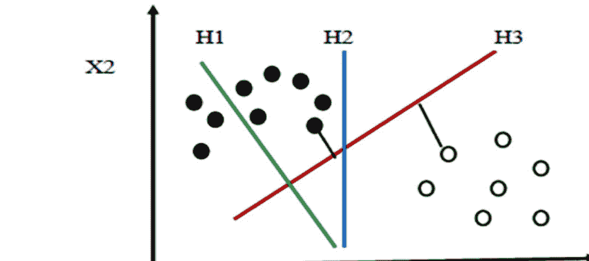

从图 3.5 可以明显看出，H1 不是一个好的超平面，因为它没有将类别分开；H2 形成了一个更好的超平面，但只有很小的间隔；H3 以最大间隔（距离）将它们分开。

#### k-近邻

它是一种惰性学习，因为它只是存储训练数据的实例。分类是通过每个点的 k 个最近邻的多数投票来完成的。它易于实现，对噪声训练数据具有鲁棒性，并且如果训练数据量大则有效。然而，它需要确定 K 的值，并且计算成本很高。

#### 决策树

这些算法产生一系列规则，使数据分类成为可能，并使结果组尽可能不同。它们易于理解和可视化。它们也可以处理数值和分类数据。然而，也可以创建复杂的决策树。但是，它们可能无法很好地泛化，数据的微小变化可能导致完全不同的树。

- **随机森林**
  它被定义为一个拟合多个决策树的元估计器。然而，样本是有放回抽样绘制的，并且难以实现。
- **神经网络**
  它由几个称为神经元的单元组成，这些单元按层排列。它们将输入向量转换为输出。每个单元接收一个输入，对其应用一个函数，然后将输出传递给下一层。

### 分类的性能度量

分类问题最常用的性能指标包括以下内容：

准确率 = (真阳性 + 真阴性) / 总观测数

准确率定义为正确预测的观测值与总观测数的比率：

F1 分数：$\frac{2 \times 精确率 \times 召回率}{精确率 + 召回率}$

它被定义为精确率和召回率的加权平均值。

**精确率**：当预测为正值时，预测正确的频率

**召回率**：预测正确的次数

## 聚类

聚类是一种无监督学习方法，其目标是在数据元素中找到不同的组。这涉及根据指定的条件或标准对数据点进行分组。因此，同一组中的数据点具有相似的属性或特征，而不同组中的数据点具有不同的特征。

聚类的例子包括市场细分、图像压缩和文档聚类。

#### 聚类算法

采用各种聚类算法来寻找相似数据点之间的分组。它进一步用于区分聚类。这些包括以下内容：

##### K-均值聚类

这是最广为人知的算法，易于理解和实现。此外，k-均值函数运行速度快，计算量少。然而，在 k-均值算法中，必须事先确定要使用的组数，并且它还从随机选择聚类中心开始；因此，它在算法的不同运行中产生不同的聚类结果，缺乏一致性。

##### 均值漂移聚类

它通过基于滑动窗口质心的算法确定数据点的密度。

- **基于密度的带噪声应用空间聚类 (DBSCAN)**
  它是一种基于密度的聚类算法，不需要预设聚类数量。它将异常值识别为噪声，并可以找到任意大小和形状的聚类。然而，由于距离 epsilon ε，处理具有不同密度的聚类对 DBSCAN 来说是一项任务。
- **使用高斯混合模型 (GMM) 的期望最大化 (EM) 聚类**
  在该算法中，假设数据点服从高斯分布，并且由于标准差参数可以呈现任何椭圆形状，然后被分配到单个聚类。据说它们灵活且限制较少。进一步补充，GMM 支持混合成员资格，即 GMM 在类别 1 中占 X%，在类别 2 中占 Y%。为了找到每个聚类的高斯分布的均值和标准差参数，进行名为**期望最大化 (EM)** 的优化算法，如下所示：
  1. 首先通过随机初始化每个聚类的高斯分布参数来选择聚类数量。
  2. 然后确定每个数据点属于特定聚类的概率。当一个点更接近高斯中心时，它被认为属于该聚类。
  3. 然后使用数据点位置的加权和计算新的参数集。权重指定数据点属于特定聚类的概率。
  4. 重复步骤 2 和 3 直到收敛。

##### 凝聚层次聚类

层次聚类被认为是基于原型的聚类算法的替代方案，其中不需要指定聚类数量，它将通过其本身。层次聚类算法分类如下：

- **自顶向下算法**
  该方法首先将所有数据点归入一个单一簇中。然后，它迭代地将该簇分裂成更小的簇，直到每个簇仅包含一个样本。
- **自底向上算法**
  也称为层次聚合聚类或HAC。在此方法中，每个数据点被视为一个单独的簇，然后通过逐次合并或配对合并，最终形成包含所有数据点的簇。树状图是二元层次聚类的可视化表示，也称为簇的层次结构，它以树的形式呈现。这棵树的根代表所有收集到的样本，而叶子则代表仅包含一个样本的簇，如*图3.6*所示：

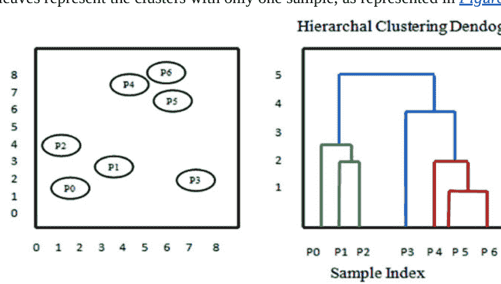

该算法包含以下步骤：

1.  在第一步中，每个数据点都被假定为一个单独的簇。
2.  指定一个距离度量来衡量两个簇之间的距离。
3.  然后，在每次迭代中，根据两个簇之间的最小距离，将两个簇合并为一个。
4.  重复上一步骤，直到达到树的根节点，即获得一个包含所有数据点的单一簇。

### 聚类验证

这是通过应用聚类验证指标来客观、定量地评估聚类结果的过程。这些指标主要分为三大类：

**外部指标：** 如果提供的原始数据带有标签，则使用此评分方法。它将聚类结构与真实标签进行匹配。此情况下最常用的指标是调整兰德指数。

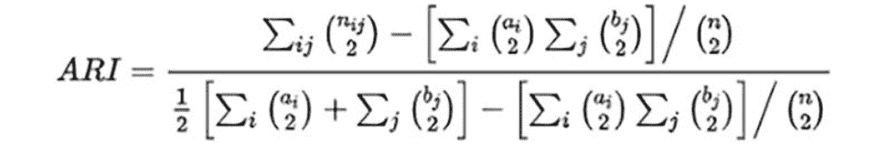

其中 a 是在聚类 C 和聚类 K 中属于同一簇的点的数量。
**b** 是同时属于两个簇的点的数量。
**n** 是样本总数。

$$ARI = RI - Expected Index / Max(RI) - Expected Index$$

ARI 的值范围在 -1 到 1 之间。ARI 的值越高，与原始数据的匹配度越好。

**内部验证指标：** 当数据没有标签时使用此方法。用于内部验证的指标是轮廓系数。

**轮廓系数：** 对于每个数据点，其定义如下：

$$Si = bi - ai / Max(bi - ai)$$

其中 **a** 是点 i 到同一簇中其他样本的平均距离。
**B** 是点 i 到最近邻簇中其他样本的平均距离。
**轮廓系数** (SC) 由以下公式给出：
**Sc** 是每个点的 Si 之和的平均值。
其值范围在 -1 到 1 之间。获得的值越高，表明选择的 K 值越好。它仅适用于 K-Means 和层次聚类算法，不适用于 DBSCAN。

## 神经网络与支持向量机

神经网络是一类机器学习算法，用于通过多个隐藏层和非线性激活函数来建模数据集中的复杂模式。

### 基本构件：神经元

神经网络的基本单元是神经元。它接收输入，通过数学运算进行处理，并产生输出，如图3.7所示的2输入神经元：

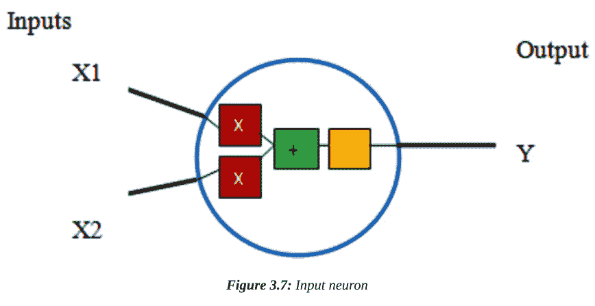

执行的操作如下：

1.  每个输入乘以一个权重，其中 x1 和 x2 是输入，w1 和 w2 是权重。

$$x1 \rightarrow x1 * w1$$
$$x2 \rightarrow x2 * w2$$

2.  然后，所有加权输入与一个偏置 b 相加：

$$(x1 * w1) + (x2 * w2) + b$$

3.  求和结果通过一个激活函数，该函数将无界输入转换为如下方程所示的可预测形式。这种将输入向前传递以获得输出的过程称为前馈。激活函数也称为映射函数。它们在 x 轴上接收一些输入，并在受限范围内输出一个值。

$$y = f(x1 * w1 + x2 * w2 + b)$$

### 将神经元组合成神经网络

神经网络由一组相互连接的神经元组成，如图3.8所示：

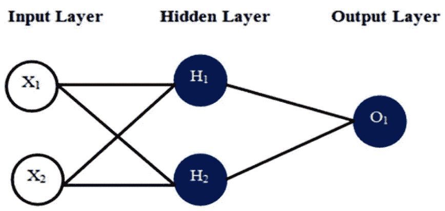

图3.8：神经网络

每个神经网络都有两个层。这些层是位于输入层和输出层之间的隐藏层。如图3.8所示，该网络有两个输入（x1 和 x2）和一个包含两个神经元（h1 和 h2）的隐藏层。隐藏层是指位于输入（第一）层和输出（最后）层之间的任何层。具有1个神经元（O1）的输出层进一步表示，其输入来自 h1 和 h2。隐藏层 H1 和 H2 然后帮助生成输出神经元 O1。

### 训练神经网络

它指的是以最小化损失的方式训练网络。
损失根据**均方误差 (MSE)** 来定义。

$$MSE = \frac{1}{n} \sum_{i=1}^{n} (Y_i - \hat{Y}_i)^2$$

其中 n 是样本数量，y 代表被预测的变量，$Y_i$ 是该变量的真实值（“正确答案”）。$\hat{Y}_i$ 是网络输出的变量预测值。$(yi - y\hat{})^2$（被称为平方误差）。
目标是最小化误差。在神经网络学习的每一步中，都会进行一次猜测、误差测量、权重的增量变化以及系数的调整。
模型代表权重的集合。这些权重将进入网络的输入映射到一组输出，形成网络做出的猜测。这通常被称为对输入进行评分。因此，猜测由 **Guess = input * weight** 表示。然后，将实际数据（也称为真实值）与猜测进行比较以确定误差。

### 神经网络架构

可以使用不同架构风格的神经网络。包括以下几种：

- **感知器或前馈神经网络**
  感知器是第一代神经网络，由罗森布拉特提出；如*图3.9*所示。它将信息从前往后传递。训练感知器是通过反向传播完成的，其中误差被反向传播。这个误差是输入数据和输出数据之间的差异。训练为网络提供成对的输入和输出数据集。输入被送入神经元，在那里进行处理，产生输出。通过足够数量的隐藏神经元，该算法可以建模输入和输出之间的关系。多层感知器包含三层或更多层，并具有非线性激活函数。

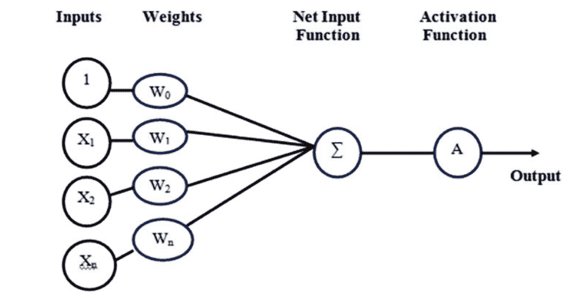

- **卷积神经网络**
  它是多层感知器的一种变体，在包含多个隐藏层、每层具有复制单元以及对附近复制单元进行输出池化的前馈网络中使用反向传播。

- **递归神经网络**
  它使用权重来进行结构化预测。

- **循环神经网络 (RNN)**
  它以有向循环的方式连接神经元，而不使用激活函数。它们被称为无状态感知器。RNN 结合了两个特性：

- 它包含一个分布式隐藏状态，允许神经元高效地存储关于过去的信息。
- 它具有非线性动力学特性，允许神经元以复杂的方式更新其隐藏状态。

#### 长短期记忆

它使用循环神经网络架构，通过引入门控机制和明确定义记忆单元来解决梯度消失/爆炸问题。该记忆单元的工作原理包括存储数据的先前值，直到“遗忘门”告诉单元忘记这些值。

#### 门控循环单元 (GRU)

它们不需要单元层来传递值。每次迭代中的计算确保保留旧信息或新信息的概率很高。GRU 运行速度更快、更容易，但表达能力较弱。

#### Hopfield 网络

非线性单元的循环网络很难分析，因为它们会以不同的方式稳定到稳定状态、振荡或遵循混沌轨迹。为了解决这些问题，约翰·霍普菲尔德引入了 **Hopfield 网络 (HN)**。在 HN 网络中，每个神经元都与其他每个神经元相连，其中网络通过将神经元的值设置为期望模式来训练，然后计算权重。此后权重不再改变。一旦针对某个模式训练完成，网络只会收敛到那个学习到的模式。

#### 玻尔兹曼机

它是一种随机循环神经网络，能够学习内部表示，并可以表示和解决困难的组合问题。在此，只有一些神经元被标记为输入神经元，其他神经元充当隐藏神经元。一旦获得输出，具有二元激活模式的输入神经元就成为输出神经元。该过程从使用随机权重开始，并通过反向传播进行学习。

#### 深度信念网络

使用反向传播存在一些问题，例如：

a. 反向传播方法在有标签的训练数据上执行，而大多数数据是无标签的。
b. 在具有多个隐藏层的网络中，它的运行速度非常慢。

为了克服这些限制，人们考虑通过调整权重来采用无监督学习方法。

- **自编码器**
  这些是处理未标记数据的神经网络，可用于将给定输入编码为维度更小的表示。然后解码器将输入从其编码版本转换回来。
- **生成对抗网络（GANs）**
  它由任意两个网络的前馈组合构成。其中一个网络的任务是生成内容（生成性），而另一个网络的任务是确定或判断内容，称为判别性。

##### 支持向量机（SVM）

它是一种监督机器学习算法，其中每个数据项被绘制为n维空间中的一个点，n是考虑的特征数量。每个特征的值被称为特定坐标的值。SVM分类器清晰地分离类别。为此，需要确定一个超平面，也称为决策边界，以在给定的分类问题中区分两个类别。SVM的关键操作是识别正确的超平面，将数据分离成不同的类别。

考虑三个超平面A、B和C。为了识别正确的超平面并对正方形和圆形进行分类，经验法则是识别能更好分离两个类别的超平面。参考下图：

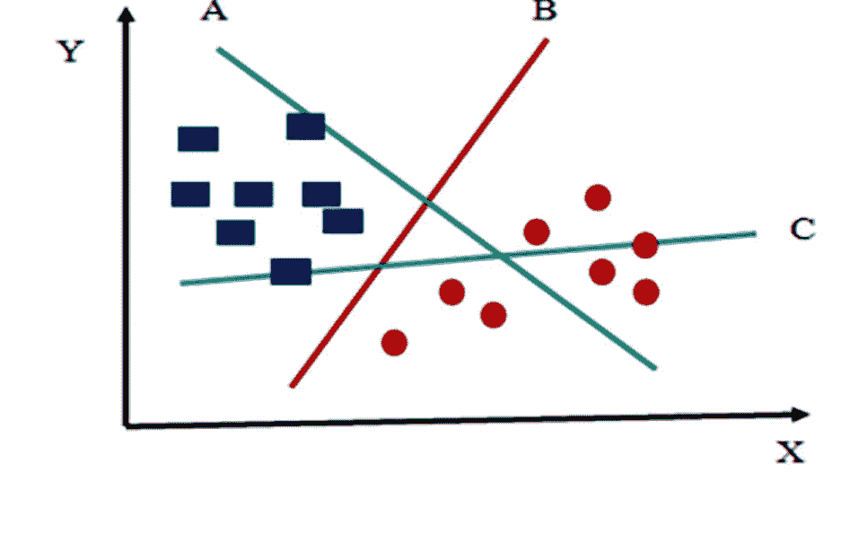

图3.10：超平面B作为分隔符

如图3.10所示，超平面“B”清晰地分离了正方形和圆形。然而，如果所有三个超平面都能很好地分离类别，则有必要识别最佳超平面。最佳超平面被确定为与其最近数据点之间距离最大的那个。这个距离被称为间隔。参考下图：

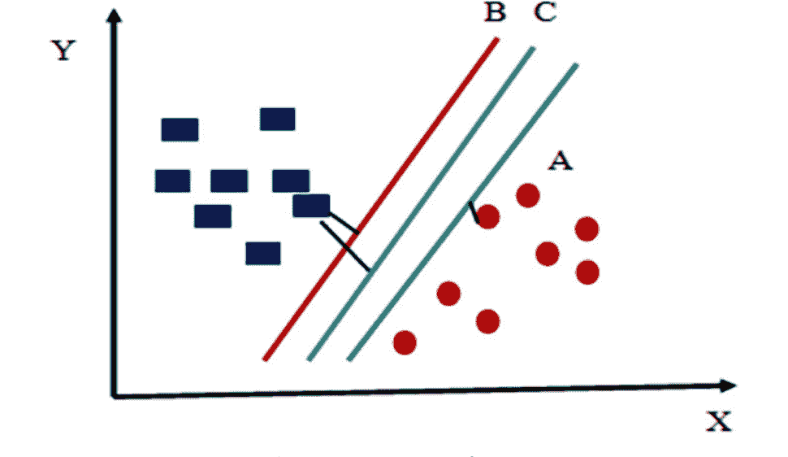

图3.11：间隔的表示

图3.11显示，与A和B相比，超平面C的间隔更大。SVM和神经网络之间存在若干差异，如表3.2所示：

| 支持向量机（SVM） | 神经网络（NN） |
|---|---|
| SVM通过创建一个或多个分离数据簇的超平面来工作。 | 单个神经网络神经元是没有核函数、具有不同代价函数的SVM。 |
| SVM在概念上更简单。 | 神经网络由于隐藏层而被认为复杂。 |
| SVM具有理论基础。 | NN本质上是启发式的。 |
| SVM试图最大化超平面和簇之间的间隔。 | 它们试图将m维输入映射到另一个维度空间，而不直接确定类别之间的分隔间隔。 |
| SVM仅依赖于支持向量。 | 当数据点具有结构时，更倾向于使用神经网络。 |
| SVM实现寻找最优参数集。 | 神经网络会陷入局部最小值。 |
| SVM采用核技巧和最大间隔。 | 它们采用反向传播和激活函数。 |
| SVM保证收敛到最佳解决方案。 | 神经网络会绘制任何能分离样本的正确直线，但它没有最佳的泛化特性。 |
| SVM在小型网络或应用领域表现更好。 | 神经网络在非常大的数据集上表现更好。 |
| SVM的主要问题是模型选择、选择核函数和优化核函数。 | 输入的统计分布在训练过程中不断变化；因此，它降低了训练效率。 |

表3.2：SVM与神经网络的区别

## Python中的机器学习库

由于Python对库的丰富支持，编写机器学习应用程序或在数据科学中开发完整应用程序变得容易。尽管有众多库可用于执行机器学习应用程序中的各种任务，但有一些重要且基础的库对于开始构建任何机器学习应用程序非常有帮助。

让我们了解一下这些库中的一些重要函数。我们将讨论的三个重要库是NumPy、Pandas和MatplotLib。

#### Numpy

顾名思义，这是一个支持数值计算和任务、数组操作以及Python中数组和其他数据类型的基本数学函数的库。该库的基本数据类型是数组对象。**Numpy**包含以下内容：

- 一个强大的N维数组对象
- 复杂的（广播/通用）函数
- 用于集成C/C++和Fortran代码的工具
- 有用的线性代数、傅里叶变换和随机数功能
- NumPy也可以用作通用数据的高效多维容器

以下示例展示了如何创建Numpy数组。

**示例1：**

```
>>>import numpy as np
>>>list1=[1,2,3,4,5]
>>>a=np.array(list1)
>>>print(a)
1 2 3 4 5
>>>print(a.shape)
(5,)
>>>print(a.dtype)
Int32
```

这里数组是从列表类型变量创建的。可以从同质数据类型创建数组。Numpy数组具有固定大小，修改大小意味着我们正在创建一个新数组。数组的大小和维度数量可以通过**shape**函数得知。你可以使用**dtype**函数来了解数组持有的数据类型。

我们可以创建具有不同数据类型（如整数和浮点数）和不同大小（如**int16**、**int32**、**float32**和**float64**）的数组。有人可能会想为什么选择数组而不是列表？使用数组的三个主要优点是需要更少的内存、提供快速处理并且方便。

让我们看看**Numpy**库在下表中提供的一些有用的预定义数组：

| 语法 | 用途 | 示例 |
|---|---|---|
| np.zeros(shape, dtype) | 创建零数组 | np.zeros((5,3)) |
| np.ones(shape, dtype) | 创建全1数组 | np.ones(5) |
| np.full(shape, value, dtype) | 创建具有所需数据类型的指定值数组 | np.full(5, 4, dtype=int32) |
| np.eye(shape, dtype) | 单位数组 | np.eye(3) |

*表3.3：常用Numpy数组*

**示例2：**

```
>>>import numpy as np
>>>list1=[1,2,3,4,5]
>>>print(np.zeros((2,2)))
[[0. 0.]
 [0. 0.]]
>>>print(eye(3,dtype=int))
[[1 0 0 0]
 [0 1 0 0]
 [0 0 1 0]
 [0 0 0 1]]
```

前面的示例展示了如何有效使用这些常用数组函数。在机器学习算法中，这些函数起着至关重要的作用。

Numpy中另一个用于创建数组的有用函数是**arange()**函数。该函数的语法如下：

**np.arange(start, end, step)**

参数**end**和**step**是可选的，可以根据需要使用。以下示例展示了如何以不同方式使用此函数。

**示例3：**

```
>>>import numpy as np
>>>np.arange(10)
array([0, 1, 2, 3, 4, 5, 6, 7, 8, 9])
>>>np.arange(2, 10, dtype=np.float)
array([ 2., 3., 4., 5., 6., 7., 8., 9.])
>>>np.arange(2, 3, 0.1)
array([ 2., 2.1, 2.2, 2.3, 2.4, 2.5, 2.6, 2.7, 2.8, 2.9])
```

这里，函数的第一次使用生成从0开始的10个值。第二次使用给出起始和结束值，第三次使用生成具有相等步长的值。

另一个有趣且广泛使用的函数是**linspace()**；其语法如下：

**linspace(start, end, no. of values)**

**示例4：**

```
>>>np.linspace(1., 4., 6)
array([ 1., 1.6, 2.2, 2.8, 3.4, 4. ])
```

在前面的示例中，该函数生成从1到4的等间距值。生成的值数量为6。

现在我们已经熟悉了数组的创建，让我们看看如何访问数组元素。这也通常被称为数组的切片和切块操作。

**示例5：**

```
>>>import numpy as np
>>>a = np.array([[1,2,3,4],[5,6,7,8],[9,10,11,12]])
>>>print(a)
[[ 1  2  3  4]
 [ 5  6  7  8]
 [ 9 10 11 12]]
>>>print(a[0:2,1:3])
[[2 3]
 [6 7]]
```

前面的示例创建了一个数组并打印了数组的一部分。处理数组元素的规则如下：

**arrayA[ start:end:step, start:end:step]**

这里，第一个**start:end:step**用于行，第二个**start:end:step**用于数组的列。这里，**end:step**是可选的。start和end表示行号或列号。需要记住的一点是，Python中的数组索引从零开始。例如：数组**a[0:2:2,:]**表示显示行索引从0到2、步长为2的数组。这意味着显示交替的行。

### Pandas

这是数据预处理和为机器学习算法准备数据时最有用的库。使用 Pandas 可以轻松读取来自 CSV、Excel 等各种文件的数据。数据以类似电子表格的方式呈现，便于处理。Pandas 库的核心有三种基本数据结构：

- **Series**：包含数据和标签（或索引）的一维类数组对象
- **Dataframe**：类似电子表格的数据结构，包含有序的列集合，具有行索引和列索引
- **Panel**：数据框的集合，但很少使用的数据结构

#### 填充数据框

可以通过从文件读取数据来填充数据框。有多种函数可以从不同文件读取数据。我们将介绍两个最常用的函数，用于从 CSV 和 Excel 文件读取数据。

**示例 6：**

```python
>>>import pandas as pd
>>>df=pd.read_csv("d://myfolder//myfile.csv",headers=None,
names=['Names', 'birthdates'])
```

在前面的示例中，数据是从存储在磁盘上的 CSV 文件读取的。通常，CSV 文件没有标题，即数据从文件的第一行开始。因此，没有标题时使用 **headers=None** 属性。**names** 属性用于指定数据列的标题。下图显示了在 Jupyter notebook 中查看 **DataFrame** 对象时的输出快照。

| | Names | birthdates |
|---|---|---|
| 0 | Bob | 1968 |
| 1 | Jessica | 1955 |
| 2 | Mary | 1977 |
| 3 | John | 1978 |
| 4 | Mel | 1973 |
| 5 | Max | 2001 |

*图 3.12：Jupyter Notebook 中 DataFrame 对象的输出*

同样地，要从 Excel 文件读取数据，可以使用 **read_excel()** 函数。

**示例 7：**

```python
>>>import pandas as pd
>>>df=pd.read_excel("d://myfolder//myfile.xlsx")
```

这里，文件在第一行包含 Excel 中各列的标题，因此在读取文件时无需指定列名。

#### 使用数据框显示数据

一旦数据在数据框中可用，就可以使用 **dataframe** 对象的各种函数来查看。下表显示了这些函数的摘要：

| 函数 | 用途 |
|---|---|
| df.head() | 显示数据框中的前 5 行数据 |
| df.tail() | 显示数据框中的后 5 行数据 |
| df.sample(5) | 显示数据框中随机选择的 5 行数据 |
| print(df) | 将打印数据框中的所有数据；不建议使用，因为数据通常太大无法显示 |
| df['column name'] | 仅显示该特定列的数据 |
| df[['column name 1', 'column name 2']] | 显示指定的两列数据 |

*表 3.5：数据框显示函数摘要*

**注意：观察多列显示的语法。**

#### 在数据框中选择性访问数据

数据框中的数据主要可以使用两个函数访问：**loc** 和 **iloc**。

**示例 8：**

```python
>>>df.loc[10, 'Name']
Dimple

>>>df.loc[0:3, 'Name']
0       Bob
1    Jessica
2       Mary
3       John
Name: Names, dtype: object
```

这里，显示了索引值为 10 的 'Name' 列中的数据。第二个命令显示了从索引 0 开始到 3 结束的行中 'Name' 列的值。

**示例 9：**

```python
>>>df.iloc[10,1]
Dimple
>>>df.iloc[0:3,1]
0    1968
1    1955
2    1977
Name: birthdates, dtype: int64
```

这里，使用 **iloc** 方法，我们可以将列名作为整数值提供。在 Python 中，列索引始终从 0 开始。在这两个函数中，我们都可以使用 ':' 来提供行索引和列索引的起始值和结束值。简而言之，两者的语法如下：

`df.loc[row_index, column_index]`，其中可以将 row_index 或 column_index 指定为 start:end:step

例如，可以编写以下代码来显示奇数列的数据，其中列数为 10，行数为 10：

`df.iloc[0:9,0:9:2]`

使用 loc 函数可以通过指定起始和结束列名来实现相同的功能。

#### 使用 Pandas 进行基本描述性统计

Pandas 有许多内置函数，通过运行基本统计函数来帮助理解数据。这些函数及其描述在下表中给出：

| df.method() | 描述 |
|---|---|
| describe | 基本统计（计数、均值、标准差、最小值、分位数、最大值） |
| min, max | 最小值和最大值 |
| mean, median, mode | 算术平均值、中位数和众数 |
| var, std | 方差和标准差 |
| sem | 均值的标准误差 |
| skew | 样本偏度 |
| kurt | 峰度 |

*表 3.6：基本描述性统计*

以下示例说明了其中一个统计函数的使用：

**示例 9：**

```python
>>>df.describe()
      Gender
count  8.000000
mean   0.375000
std    0.517549
min    0.000000
25%    0.000000
50%    0.000000
75%    1.000000
max    1.000000
```

数据框只有一个名为 'Gender' 的列和几行数据。因此，**describe()** 函数将显示有关数字列的统计信息，指示列中的最小值和最大值。

#### 数据转换

实时数据以各种形式存在，或者是数字和文本数据的组合。在应用机器学习算法之前，这些数据需要进行转换。转换数据的一种方法是使用 Pandas 的 **Apply** 或 **Map** 函数。

**示例 10：**

```python
>>>mapping = {'male':0,'female':1}
>>>df['Gender']=df['Sex'].apply(lambda x:mapping[x])
```

这里，mapping 是一个字典类型的变量，包含两个键值对。**apply** 函数使用此字典将 'Sex' 列中的分类值（male/female）转换为数值（0 或 1）。这里，mapping 应用于数据框的每一行。**map** 和 **apply** 函数的通用语法如下：

```python
df['col'].apply(func,axis=0/1)
df['col'].map(func/series)
```

**col** 表示要应用转换的列。这两个函数的区别在于，**apply** 可以用于对象类型的 series 和 dataframe，而 **map** 函数只能用于 series 对象类型。

#### 数据预处理 – 处理缺失值

Pandas 提供了多种函数来处理数据中的缺失值。要应用机器学习函数，这些值需要预处理。下表显示了处理缺失值的各种方法。

| 函数 | 描述 |
|---|---|
| dropna() | 删除缺失的观测值 |
| dropna(how='all') | 删除所有单元格均为 NA 的观测值 |
| dropna(axis=1, how='all') | 如果所有值都缺失，则删除该列 |
| dropna(thresh = 5) | 删除包含少于 5 个非缺失值的行 |
| fillna(0) | 用零替换缺失值 |
| isnull() | 如果值缺失则返回 True |
| notnull() | 对于非缺失值返回 True |

*表 3.7：处理缺失值*

### MatplotLib

**MatplotLib** 是 Python 的一个重要库，有助于数据可视化。在设计任何基于机器学习的模型之前，数据科学家理解数据非常重要。该库有助于以可视化方式理解数据。可以使用各种图形方法来可视化数据，如折线图、条形图和饼图。

这是一个提供多种数据可视化方式的二维绘图库。Pyplot 是包含所有数据可视化方法的基础库。本节将从机器学习应用的角度讨论几种必需的图表。

大多数 matplotlib 脚本的核心是 **pyplot**；这个模块是有状态的，它会跟踪图形的变化。所有 **pyplot** 函数都围绕创建或操作图形状态展开。**pyplot** 的基本函数是 **plot()**，用于绘制数据。

#### 折线图

**示例 11：**

```python
>>>import matplotlib.pyplot as plt
>>>plt.plot([1,2,3,4,5])
>>>plt.ylabel('some significant numbers')
>>>plt.show()
```

前面的代码将使用传递给 **plot()** 函数的值绘制一个简单的折线图，如下所示：

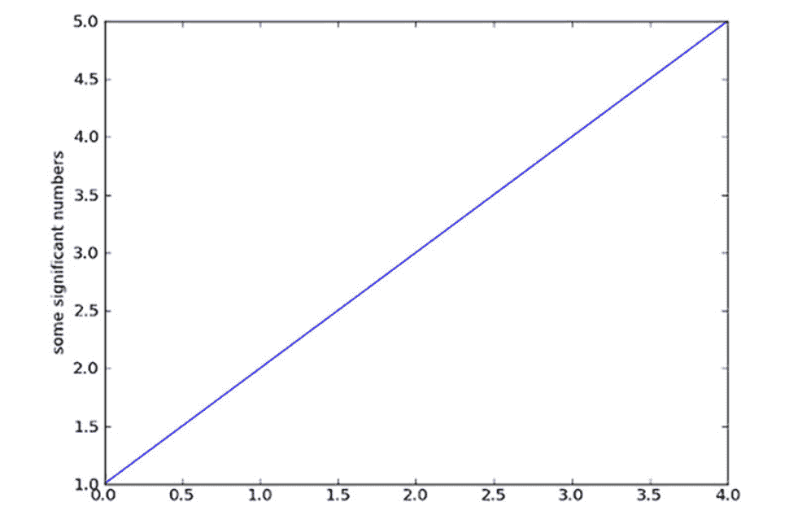

下表列出了绘制任何图表所需的基本函数：

| 函数 | 用途 |
|---|---|
| text(x,y,text) | 在任意位置添加文本 |
| xlabel() | 为 x 轴添加文本 |
| ylabel() | 为 y 轴添加文本 |
| title() | 为图表添加标题 |
| clf() | 清除所有图形 |
| axis([left,bottom,width,height]) | 指定坐标轴尺寸 |
| grid() | 显示网格线 |
| figure(figsize=[ht, wd in inches], facecolor=backgroundcolor, edgecolor=bordercolor) | 创建新图形 |

表 3.8：pyplot 的基本函数

以下示例展示了如何使用这些函数及其对图表的影响。

##### 示例 12：

```python
import matplotlib.pyplot as plt
import numpy as np
x = np.linspace(0,5,11)
y = x**2
plt.figure()
plt.plot(x,y, color = '#4a8c66')
plt.xlabel('X')
plt.ylabel('Y')
plt.title('Square of X')
plt.grid()
plt.axis([0,5,0,25])
plt.show()
```

下图展示了前面代码的输出：

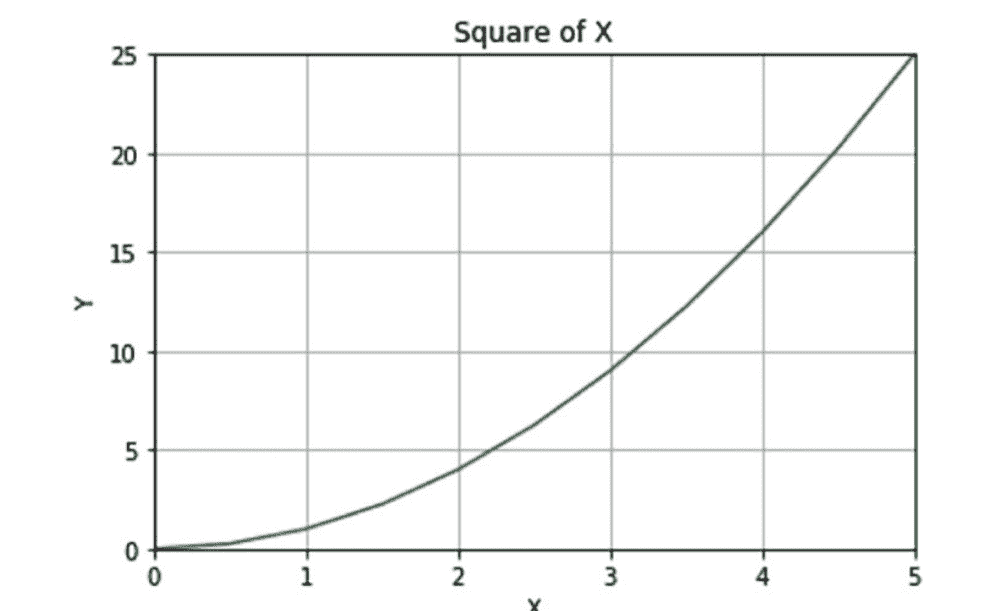

图 3.14：示例 12 的输出

该图是一个简单的折线图，显示了 X 轴和 Y 轴上的标签、图表标题以及网格线。

#### 散点图

散点图是将点绘制在 x 轴和 y 轴上。它用于展示数据点在二维空间中的分布情况。

**示例 13：**

```python
x = [5, 10,7]
y = [12, 6, 15]
x1 = [3, 8, 12]
y1 = [5, 9, 15]
plt.scatter(x,y,color='r', label="Red", marker='o', s=200, alpha=0.2)
plt.scatter(x1,y1,color='g', label="Green")
plt.legend()
plt.show()
```

前面的代码使用 **scatter()** 函数绘制数据点。可以为绘制的点指定颜色。除非调用 **show()** 函数，否则图表不会显示。

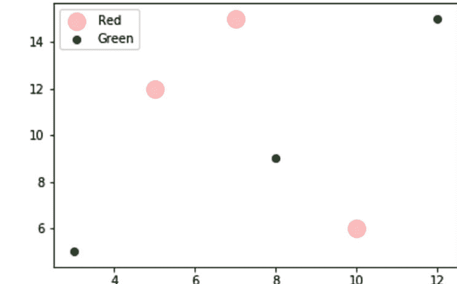

上图展示了散点图。绘制了两种不同颜色的点。

#### 柱状图

柱状图通常用于分类数据，是最常见的图表类型。柱子的长度与标签的值成正比。以下示例展示了一个简单柱状图的代码。

**示例 14：**

```python
x = [5, 10, 7]
y = [12, 6, 15]
x1 = [3, 8, 12]
y1 = [5, 9, 15]
plt.bar(x, y, color='r', label="Red")
plt.bar(x1, y1, color='g', label="Green")
plt.show()
```

此示例绘制了两个不同颜色的柱状图。代码的输出如下所示：

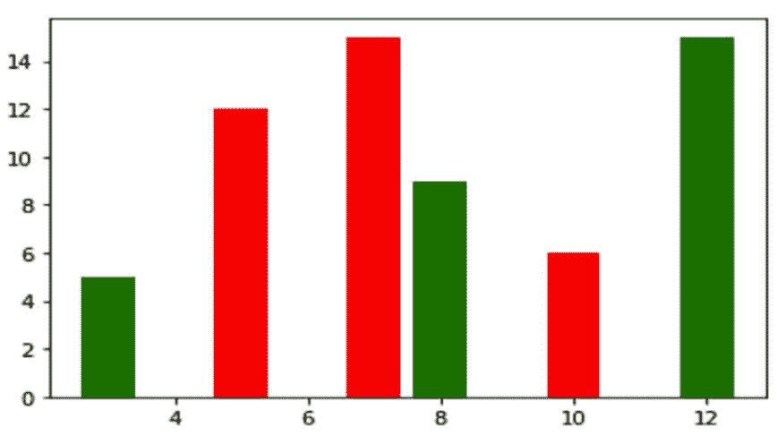

图 3.16：示例 14 的输出 - 柱状图

柱子代表变量 x 提供的位置，变量 y 代表柱子的长度。

#### 直方图

直方图通常用于图像以显示频率信息。这是一种非常常用的图表，用于显示数据的分布。以下示例展示了绘制直方图的示例代码。

以下代码创建 50 个随机点并绘制它们。这里使用的频率是累积的，表示在绘制前，下一个值会加到前一个值上，然后进行绘制。

**示例 15：**

```python
x= 100 + 10*np.random.randn(10000)
plt.hist(x,50, color='g', cumulative=True)
plt.xlabel("People")
plt.ylabel("Frequency")
plt.show()
```

使用直方图可以很好地可视化数据的分布情况，如下图所示：

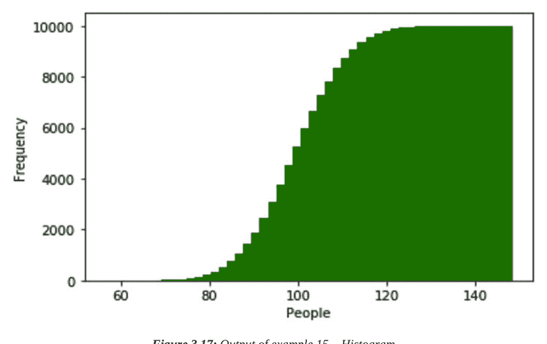

图 3.17：示例 15 的输出 – 直方图

上图展示了示例 15 中代码的输出。

#### 饼图

最常用的图表是饼图，它使用扇形切片来显示数据的大小。这些图表最适合显示数据的数值比例。以下示例展示了使用 MatplotLib 库创建饼图的 Python 代码。

**示例 16：**

```python
country_data= ['UnitedStates','GreatBritain','China','Russia','Germany']
medal_data = [46,27,26,19,17]
colors = ["#1f77b4", "#ff7f0e", "#2ca02c", "#d62728", "#8c564b"]
explode = (0.1, 0, 0, 0, 0)
plt.pie(medal_data, labels=country_data, explode=explode, colors=colors, autopct='%1.1f%%',
shadow=True, startangle=140)
plt.title("Gold medal achievements of countries")
plt.show()
```

前面代码的输出如下图所示：

# 各国金牌成就

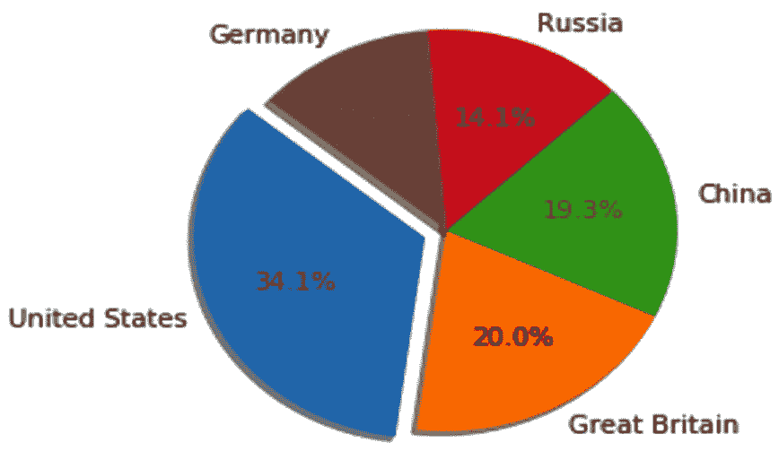

图 3.18：饼图

由于 **pie()** 函数的 explode 属性，可以很容易地看到蓝色部分凸出。饼图从 140 度角开始，由 **startangle=140** 属性指定。

Matplotlib 库提供了许多其他类型的可视化技术，如堆叠柱状图和箱线图。这里讨论的图表是最常用和广泛使用的，用于有效理解或可视化数据。

## 机器学习系统评估

如前面章节所述，一旦问题被定义，就必须准备数据。数据大致分为训练数据和测试数据，可以在其上应用各种机器学习算法来解决你的问题。

### 测试和训练数据集

训练和测试数据是通过从数据集中随机选择 66% 的数据样本用于训练，34% 用于测试，或使用其他复杂的采样方法获得的。然后根据测试集评估训练好的数据。为了测试算法，我们需要定义一个测试框架。

测试框架是用于指定将用于训练和测试算法的数据的术语。它根据度量标准评估系统，并评估其性能，代表问题陈述的可学习性。因此，测试框架的主要目标是能够快速且一致地根据对所解决问题的公平表示和所选性能度量来测试算法。

### 性能度量

它是对训练模型在测试数据集上所做的预测的测量。因此，性能度量提供了一种评估所考虑问题解决方案的机制。

根据问题的类别（如分类、回归和聚类），确定了许多性能度量。这些分数确定了相关性，并对问题领域提供了有意义的见解。

### 模型评估技术

为了评估模型的性能，使用测试集数据，因为模型尚未见过这些数据。模型性能基于以下方法进行评估：

- **留出法：** 在此方法中，模型在与训练数据不同的数据上进行测试。因此，数据集被随机划分为三个子集：
    - **训练集** 是用于构建模型的数据集子集。
    - **验证集** 是用于评估在训练阶段构建的模型性能的子集。
    - **测试集**，或未见过的数据，是用于评估模型未来可能性能的数据集子集。

如果模型在训练集上的拟合程度远好于在测试集上的拟合程度，则称该模型过拟合。

- **交叉验证：** 交叉验证是一种更复杂的方法，它使用整个转换后的数据集来训练和测试给定算法，而不是使用测试和训练数据集。
- 在此技术中，原始数据集被分为两部分：用于训练机器学习模型的训练集，以及用于评估分析的独立集。

### 模型评估指标

机器学习任务的性能是通过确定算法在未见过的数据上的表现来获得的。算法（模型）的优劣是通过其评估指标获得的，而评估指标又取决于要解决的问题。

大多数机器学习应用都包含分类和回归算法。因此，用于分类和回归应用的评估指标包括以下内容。

#### 分类指标

分类问题中使用的指标包括以下内容：

- **分类准确率**
  准确率定义为正确预测的数量与输入样本总数的比率。
  $准确率 = 正确预测的数量\ /\ 预测总数$
- **混淆矩阵**
  混淆矩阵提供了每个类别正确和错误分类的更详细划分。它以矩阵作为输出来描述模型的性能。
- **对数损失或对数损失**
  对数损失衡量多类别分类模型的性能，其中预测输入是0到1之间的概率值。
  在这种评估方法中，分类器为所有样本的每个类别分配概率。假设有N个样本属于M个类别，则对数损失计算如下：
  $对数损失 = -\frac{1}{n} \sum_{i=1}^{n} \sum_{j=1}^{m} y_{ij} * log(p_{ij})$
  其中，
  $y_{ij}$ 表示样本i是否属于类别j
  $p_{ij}$ 表示样本i属于类别j的概率
  对数损失越接近0表示准确率越高，而对数损失远离0表示准确率越低。

##### 曲线下面积（AUC）

它是评估二分类问题最常用的指标之一，可以区分正类和负类。**真正例率（灵敏度）**：真正例率定义为正确识别为正例的正数据点相对于所有正数据点的比例。
$真正例率 = 真正例/\ (假负例\ +\ 真正例)$

**假正例率（特异性）**定义为假正例率，它指定被错误地视为正例的负数据点相对于所有负数据点的比例。

$假正例率 = 假正例/ (假正例 + 真负例)$

假正例率和真正例率的值都在[0, 1]范围内，并在阈值处计算。AUC的范围是[0, 1]。值越大，模型的性能越好。

**F度量：** F度量（也称F分数）是测试准确性的度量。它考虑了测试的**精确率**和**召回率**来计算分数：

- **精确率**定义为正确正例结果的数量除以预测的正例总数。
- **召回率**定义为正确正例结果的数量除以实际正例总数。

F1分数试图在精确率和召回率之间找到平衡，如下所示：

**精确率：** 它是正确正例结果的数量除以分类器预测的正例数量：

$精确率 = 真正例/ (真正例 + 假正例)$

**召回率：** 它是正确正例结果的数量除以*所有*相关样本（所有应被识别为正例的样本）的数量：

$召回率 = 真正例/ (真负例 + 假正例)$

F1分数是精确率和召回率的调和平均值。F1分数的范围是[0, 1]。它表示分类器正确分类且未遗漏大量实例的情况。F1分数越大，模型的性能越好。

#### 回归指标

回归问题通过平均绝对误差和均方根误差来评估：

- **平均绝对误差（MAE）**定义为预测值与实际值之间绝对差值的总和。
  它衡量了预测值与实际输出之间的距离。然而，它们无法提供误差方向的信息，即数据是被低估还是高估。
- **均方根误差（RMSE）**衡量误差的平均大小。这是通过取预测值与实际观测值之间平方差的平均值的平方根来确定的。
  由于取了误差的平方，较大误差的影响比小误差更显著。因此，模型现在可以更关注较大的误差。

## 结论

本章重点介绍了各种基于机器学习的算法，并深入探讨了程序开发的方式。它首先介绍了机器学习建模流程及其预处理的概念。通过回归、分类和聚类算法，进一步阐述了监督学习和无监督学习算法，随后介绍了神经网络和支持向量机算法。通过Python中的各种数据科学库，详细说明了算法需要表示的格式。本章最后通过评估用于给定问题陈述的算法来确定最佳算法。
下一章将讨论机器学习的应用领域。前几章解释的概念将通过几个案例研究进行阐述。

## 问题

**1. 解释机器学习建模流程中涉及的步骤。**
**答.** 这种方法涉及六个步骤：

1. 问题识别
2. 数据整理
3. 探索性数据分析
4. 预处理和训练数据开发
5. 建模
6. 文档化

**第一步：问题识别**
这是定义你想解决的问题并确定通过解决该问题你想实现什么的过程。
**第二步：数据整理**
数据整理涉及获取原始数据并为其处理和分析做准备。
**第三步：探索性数据分析**
**探索性数据分析（EDA）**是一种总结和可视化数据集重要特征和统计属性的方法。
可视化数据将帮助你理解它，以识别出现的主题。识别这些趋势将帮助你对数据形成假设。

**第四步：预处理和训练数据开发**
数据预处理是指从数据集中移除超出值范围和不可能组合等内容的过程。这是一个重要的步骤，因为分析未经适当筛选的数据可能导致误导性或不正确的结果。此步骤还包括将数据集拆分为测试和训练子集的过程。

**第五步：建模**
建模是第五步。在此步骤中，你将利用清理和处理后的数据进行预测性洞察。
请注意，建模包括模型训练和选择，以及模型部署。

**第六步：文档化**
表达信息的方式通常与信息本身同样重要，甚至更重要。即使你通过数据分析发现了非常有价值的见解，如果你没有正确地传达你的想法，你可能很难将该见解付诸实践。这就是讲故事的作用所在：当你将你的见解组织成一个好故事并有效地讲述这个故事时，你将更有可能对你正在从事的项目产生积极影响。

**2. 描述机器学习算法的各种类别。**
**答.** 当谈到机器学习类型的分类学时，一个好的分类将方法分为六个维度：

1. 监督学习与无监督学习
2. 批量学习与在线学习
3. 基于实例的学习与基于模型的学习

在监督学习模型中，算法被给予一个带标签的训练数据集，并使用答案键来评估其理解数据的能力。无监督学习模型的特点是算法试图在没有训练的情况下自行理解未标记的数据集。

批量学习：如果系统无法增量学习，必须使用所有可用数据进行训练，则机器学习算法执行批量学习。由于这既需要时间又需要计算能力，学习过程通常在离线进行（这被称为“离线学习”）。系统被训练然后启动；启动后它不会继续学习。如果获得新数据，则需要训练系统的新版本来替换

### 3. 区分以下概念：

#### a. 简单回归与多元回归

两者都是回归问题，且具有相同的假设，但主要区别在于自变量的数量。在简单回归中，自变量的数量为一个，而在多元回归中，自变量的数量多于一个。

在简单回归中：
$$Y = mx + c$$
其中，m 代表斜率。

在多元回归中：
$$Y = b0x1 + b1x2 + ... + c$$
方程成立。

多元回归问题在实际应用中具有广泛的适用范围，而简单回归仅适用于理解回归背后的概念。

#### b. SVM 与神经网络

**SVM：** 许多高级算法能够处理更复杂的数据集，而**支持向量机（SVM）** 是其中最受欢迎的算法之一。SVM 是监督学习模型，通过分析数据来确定数据的类别（你可以使用 SVM 来判断“胡萝卜”属于“蔬菜”类，“猫”属于“动物”类）。

核函数通常指的是核技巧——即使用线性分类器来解决非线性问题。你也可以使用核函数来计算数据集中不同数据之间的相似性。请参考下图：

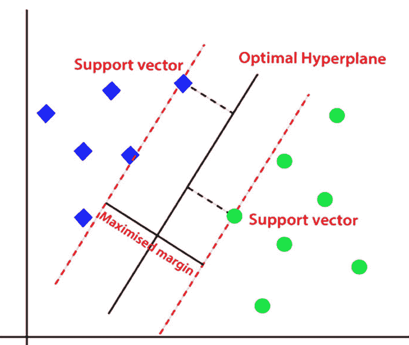

*图 3.19：支持向量机*

在支持向量机中，我们使用核技巧，它通过增加维度将非线性值转化为线性值。这样做的目的是，算法必须通过超平面来分隔类别。超平面可以是二维、三维或更高维度，具体取决于输入类别的维度。

SVM 的主要目标是最大化两个支持向量之间的间隔。

**神经网络：** 深度学习是机器学习的一个子集，它模拟了嵌入机器中的人类大脑。它受人类大脑工作方式的启发，因此是一组试图模仿人类大脑工作方式并从经验中学习的神经网络算法。

神经网络是一个计算学习系统，它使用函数网络来理解并将一种形式的数据输入转换为所需的输出，通常是另一种形式。人工神经网络的概念受到人类生物学以及人类大脑中神经元协同工作以理解人类感官输入的方式的启发。

**简介：** 深度学习是机器学习的一个子集，它受人类大脑工作方式的启发，因此是一组试图模仿人类大脑并从经验中学习的神经网络算法。

在本节中，我们将学习基本神经网络的工作原理以及它如何自我改进以做出最佳预测。

**人工神经网络及其组成部分：** 神经网络是一个计算学习系统，它使用函数网络来理解并将一种形式的数据输入转换为所需的输出，通常是另一种形式。简单来说，神经网络是一组算法，试图通过受人类大脑/生物学启发并像其一样工作的过程，来识别数据中的模式、关系和信息。请参考下图：

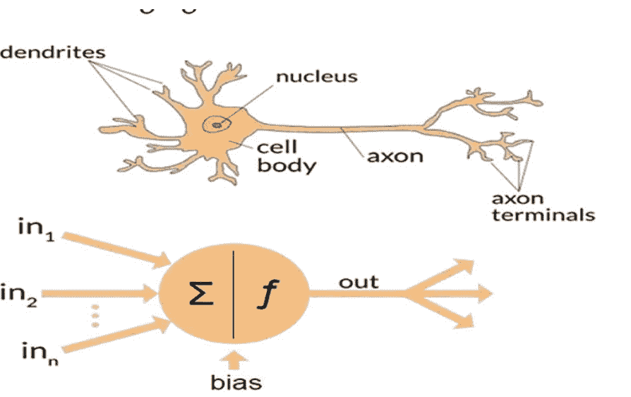

**神经网络的组成部分/架构：** 一个简单的神经网络由三个部分组成：

- 输入层
- 隐藏层
- 输出层

**输入层：** 输入节点是从外部世界提供给模型以供学习和得出结论的输入/信息。输入节点将信息传递给下一层，即隐藏层。

**隐藏层：** 这是执行所有输入数据计算的神经元集合。神经网络中可以有任意数量的隐藏层。最简单的网络由单个隐藏层组成。

**输出层：** 输出层是模型从所有计算中得出的输出/结论。输出层可以有单个或多个节点。如果我们有一个二元分类问题，输出节点为 1，但在多类分类的情况下，输出节点可以多于 1 个。

### 4. 详细解释各种分类和聚类算法。

#### 答：逻辑回归

逻辑回归是一种用于预测二元结果的计算方法：要么发生，要么不发生。这可以表现为是/否、通过/失败、存活/死亡等。

通过分析自变量来确定二元结果，结果落入两个类别之一。自变量可以是分类变量或数值变量，但因变量始终是分类变量。变量表示为：

$P(Y = 1|X)$ 或 $P(Y = 0|X)$

它计算在给定自变量 $X$ 的情况下，因变量 $Y$ 的概率。

这可以用来计算一个词具有正面或负面含义的概率（0、1，或介于两者之间的某个值）。或者它可以用来确定照片中包含的对象（树、花、草等），每个对象被赋予一个介于 0 和 1 之间的概率。

##### 朴素贝叶斯

朴素贝叶斯计算一个数据点属于某个类别的可能性。在文本分析中，它可以用来将单词或短语分类为属于预设的“标签”（分类）或不属于。考虑以下示例：

| 文本 | 标签 |
|---|---|
| “一场精彩的比赛” | 体育 |
| “选举结束了” | 非体育 |
| “非常干净的比赛” | 体育 |
| “一场干净但令人遗忘的比赛” | 体育 |
| “这是一场势均力敌的选举” | 非体育 |

*图 3.21：文本分析*

要决定一个短语是否应被标记为“体育”，你需要计算：确定*在 B 为真的条件下 A 的概率，等于在 A 为真的条件下 B 的概率乘以 A 为真的概率，再除以 B 为真的概率*。

#### K-近邻算法

K-近邻（k-NN）是一种模式识别算法，它使用训练数据集在未来的示例中找到 k 个最接近的邻居。

当 k-NN 用于分类时，你会将数据放置在其最近邻居的类别中。如果 k = 1，那么它将被放置在最近的 1 个邻居所在的类别中。K 是通过其邻居的多数投票来分类的。

#### 决策树

决策树是一种监督学习算法，非常适合分类问题，因为它能够在精确的层面上对类别进行排序。它的工作原理类似于流程图，一次将数据点从“树干”到“分支”，再到“叶子”分成两个相似的类别，在“叶子”处，类别变得更为精细相似。这在类别内创建了类别，从而在有限的人工监督下实现有机分类。

继续以体育为例，决策树的工作方式如下：

#### 随机森林

随机森林算法是决策树的扩展，它首先使用训练数据构建大量决策树，然后将新数据拟合到其中一棵树中，形成“随机森林”。

它对数据进行平均处理，以将其连接到数据尺度上最近的树。随机森林模型很有用，因为它们解决了决策树不必要地将数据点“强制”归入某个类别的问题。

##### 支持向量机（SVM）

它使用算法在极性程度内训练和分类数据，将其提升到超越*X/Y*预测的层次。

为了进行简单的可视化解释，我们将使用两个标签，即*红色*和*蓝色*，以及两个数据特征，即*X*和*Y*，然后训练我们的分类器输出一个*X/Y*坐标，该坐标被标记为*红色*或*蓝色*。

然后，SVM分配一个最佳分隔标签的超平面。在二维空间中，这仅仅是一条线。线的一侧的所有内容都是*红色*，另一侧的所有内容都是*蓝色*。例如，在情感分析中，这将是*正面*和*负面*。

为了最大化机器学习效果，最佳超平面是每个标签之间距离最大的那个：

然而，随着数据集变得更加复杂，可能无法画出一条单一的线将数据分为两个阵营：

使用SVM，数据越复杂，预测器就越准确。想象一下上图在三维空间中，添加了一个Z轴，因此它变成了一个圆形。使用最佳超平面映射回二维空间，它看起来如下图所示：

SVM允许更准确的机器学习，因为它是多维的。

#### 聚类算法

以下是聚类算法：

##### K-均值聚类

K-均值可能是最著名的聚类算法。它在许多数据科学和机器学习入门课程中都有教授，并且易于理解和实现代码：

K均值算法可以通过以下步骤表示：

1.  我们选择要使用的几个类别/组，并随机初始化它们各自的中心点。为了确定要使用的类别数量，最好快速查看数据并识别任何明显的分组。中心点是与每个数据点向量长度相同的向量，并且是上图中的“X”。
2.  通过计算该点与每个组中心之间的距离对每个数据点进行分类；该点被放入其中心最接近它的组中。
3.  基于这些已分类的点，我们通过取组中所有向量的平均值来重新计算组中心。
4.  重复这些步骤一定次数的迭代，或者直到组中心在迭代之间变化不大。您也可以选择随机初始化组中心几次，然后选择看起来提供最佳结果的运行。

K-均值的优势在于它相当快，因为我们真正做的只是计算点与组中心之间的距离；计算量非常少！因此，它具有线性复杂度$O(n)$。

另一方面，K-均值有几个缺点。首先，您必须选择有多少个组/类别。理想情况下，使用聚类算法，我们希望找出它，因为目标是从数据中获得一些见解。K-均值也从随机选择聚类中心开始；因此，在算法的不同运行中可能会产生不同的聚类结果。因此，结果可能不可重复且缺乏一致性。其他聚类方法更一致。

K-中值是另一种与K-均值相关的聚类算法，不同之处在于我们使用组的中值向量，而不是使用平均值重新计算组中心点。这种方法对异常值不太敏感（因为使用了中值），但对于较大的数据集来说要慢得多，因为在计算中值向量时每次迭代都需要排序。

##### 均值漂移聚类

均值漂移聚类是一种基于滑动窗口的算法，旨在寻找数据点的密集区域。它是一种基于质心的算法，这意味着目标是定位每个组/类别的中心点；它通过将中心点更新为滑动窗口内点的平均值来工作。然后在后处理阶段过滤这些候选窗口以消除近似重复项，形成最终的中心点集及其对应的组：

均值漂移聚类可以表示如下：

1.  为了解释均值漂移，我们将考虑二维空间中的一组点，如上图所示。我们从一个以点C（随机选择）为中心、半径为r的圆形滑动窗口开始，作为核。均值漂移是一种爬山算法，它涉及在每一步迭代地将此核移动到更高密度的区域，直到收敛。
2.  在每次迭代中，滑动窗口通过将中心点移动到窗口内点的平均值（因此得名）而向更高密度的区域移动。滑动窗口内的密度与其内部的点数成正比。自然地，通过移动到窗口内点的平均值，它将逐渐向点密度更高的区域移动。
3.  我们继续根据平均值移动滑动窗口，直到没有方向可以容纳更多点在核内。查看上图；我们继续移动圆圈，直到不再增加密度（即窗口中的点数）。
4.  步骤1到3的过程使用许多滑动窗口执行，直到所有点都位于一个窗口内。当多个滑动窗口重叠时，保留包含最多点的窗口。然后根据数据点所在的滑动窗口对其进行聚类。

与K-均值聚类相比，无需选择聚类数量，因为均值漂移会自动发现这一点。这是一个巨大的优势。聚类中心收敛到最大密度点的事实也非常可取，因为它非常直观易懂，并且在自然数据驱动的意义上非常契合。缺点是窗口大小/半径“r”的选择可能非同小可。

##### 基于密度的带噪声应用空间聚类（DBSCAN）

DBSCAN是一种类似于均值漂移的基于密度的聚类算法，但具有几个显著优势。

1.  DBSCAN从一个任意的、尚未访问的起始数据点开始。使用距离epsilon ε提取该点的邻域（所有在ε距离内的点都是邻域点）。
2.  如果该邻域内有足够数量的点（根据minPoints），则聚类过程开始，当前数据点成为新聚类中的第一个点。否则，该点将被标记为噪声（此噪声点可能稍后成为聚类的一部分）。在这两种情况下，该点都被标记为“已访问”。
3.  对于新聚类中的第一个点，其ε距离邻域内的点也成为同一聚类的一部分。然后对刚刚添加到聚类组中的所有新点重复此过程，使ε邻域内的所有点都属于同一聚类。
4.  重复步骤2和3，直到聚类中的所有点都被确定，即聚类ε邻域内的所有点都已被访问和标记。

一旦我们完成了当前聚类，就会检索并处理一个新的未访问点，从而发现另一个聚类或噪声。此过程持续进行，直到所有点都被标记为已访问。由于最终所有点都将被访问，因此每个点都将被标记为属于某个聚类或为噪声。

DBSCAN相对于其他聚类算法有一些显著优势。首先，它根本不需要预设聚类数量。它还将异常值识别为噪声，这与均值漂移不同，后者即使数据点非常不同也会将其放入聚类中。此外，它可以很好地发现任意大小和任意形状的聚类。

DBSCAN的主要缺点是当聚类密度不同时，其性能不如其他算法。这是因为当密度变化时，用于识别邻域点的距离阈值ε和minPoints的设置会因聚类而异。这个缺点也出现在非常

##### 使用高斯混合模型（GMM）的期望最大化（EM）聚类

K-Means的一个主要缺点是它简单地使用均值作为聚类中心。通过观察下图，我们可以理解为什么这不是最佳方法。在左侧图像中，人眼很容易看出有两个半径不同但中心相同的圆形聚类。K-Means无法处理这种情况，因为这些聚类的均值彼此接近。当聚类不是圆形时，K-Means同样会失败，这同样是使用均值作为聚类中心的结果。

**高斯混合模型（GMM）** 比K-Means提供了更大的灵活性。在GMM中，我们假设数据点服从高斯分布；这是一个比使用均值假设为圆形更宽松的假设。这样，我们有两个参数来描述聚类的形状：均值和标准差！以二维为例，这意味着聚类可以呈现任何椭圆形状（因为我们在x和y方向上都有标准差）。因此，每个高斯分布被分配给一个单独的聚类。

为了找到每个聚类的高斯分布参数（例如，均值和标准差），我们将使用一种称为**期望最大化（EM）**的优化算法。请看下图，它展示了高斯分布如何拟合到聚类。然后我们可以继续使用GMM进行期望最大化聚类的过程：

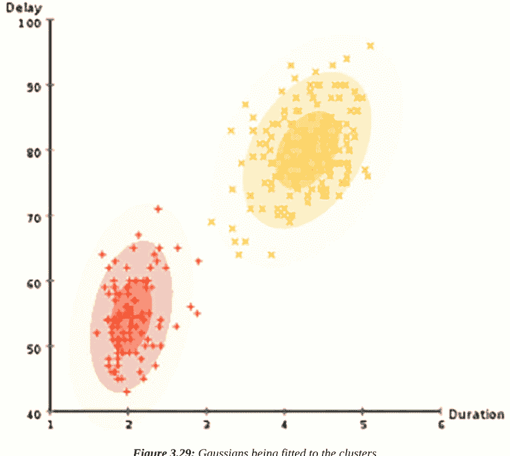

1.  EM算法首先选择聚类数量（与K-Means类似），并随机初始化每个聚类的高斯分布参数。也可以通过快速查看数据来尝试为初始参数提供一个合理的估计。给定每个聚类的这些高斯分布，计算每个数据点属于特定聚类的概率。一个点越接近高斯分布的中心，它属于该聚类的可能性就越大。这应该是直观的，因为对于高斯分布，我们假设大多数数据更靠近聚类的中心。

2.  基于这些概率，我们为高斯分布计算一组新的参数，以最大化数据点在聚类内的概率。我们使用数据点位置的加权和来计算这些新参数，其中权重是数据点属于该特定聚类的概率。为了直观地解释这一点，我们可以看前面的图像，特别是黄色聚类作为例子。分布从第一次迭代开始是随机的，但我们可以看到大多数黄色点位于该分布的右侧。当我们计算按概率加权的和时，即使中心附近有一些点，大多数点都在右侧。因此，自然地，分布的均值会向那组点移动。我们还可以看到大多数点是“从右上到左下”分布的。因此，标准差会改变以创建一个更贴合这些点的椭圆，从而最大化按概率加权的和。

3.  步骤2和3会迭代重复，直到收敛，即分布从一次迭代到下一次迭代变化不大。

使用GMM有两个关键优势。首先，GMM在**聚类协方差**方面比K-Means**灵活**得多；由于标准差参数，聚类可以呈现任何椭圆形状，而不是被限制为圆形。K-Means实际上是GMM的一个特例，其中每个聚类在所有维度上的协方差都趋近于0。其次，由于GMM使用概率，一个数据点可以属于多个聚类。因此，如果一个数据点位于两个重叠聚类的中间，我们可以通过说它属于类别1的X%和类别2的Y%来简单地定义其类别，即GMM支持**混合成员关系**。

##### 凝聚层次聚类

层次聚类算法分为两类：自顶向下或自底向上。自底向上算法在开始时将每个数据点视为一个单独的聚类，然后连续合并（或*凝聚*）聚类对，直到所有聚类合并成一个包含所有数据点的单一聚类。因此，自底向上的层次聚类被称为*层次凝聚聚类*或*HAC*。这种聚类层次结构被表示为一棵树（或树状图）。树的根是收集所有样本的唯一聚类，叶子是只包含一个样本的聚类：

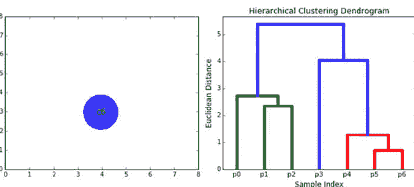

1.  我们首先将每个数据点视为一个单独的聚类，也就是说，如果我们的数据集中有X个数据点，那么我们就有X个聚类。然后我们选择一个度量两个聚类之间距离的距离度量。例如，我们将使用*平均连接*，它定义两个聚类之间的距离为第一个聚类中的数据点与第二个聚类中的数据点之间的平均距离。

2.  在每次迭代中，我们将两个聚类合并为一个。要合并的两个聚类被选择为具有最小平均连接的聚类，也就是说，根据我们选择的距离度量，这两个聚类是最近的，因此是最相似的，应该被合并。

3.  重复步骤2，直到我们到达树的根，即直到我们只有一个包含所有数据点的聚类。这样，我们可以通过选择何时停止合并聚类来选择最终想要多少个聚类，即何时停止构建树！

层次聚类不需要我们指定聚类的数量，我们甚至可以选择哪个聚类数量看起来最好，因为我们正在构建一棵树。此外，该算法对距离度量的选择不敏感；所有度量往往效果都很好。另一方面，对于其他聚类算法，距离度量的选择至关重要。层次聚类方法的一个特别好的用例是当底层数据具有层次结构并且您想要恢复该层次结构时；其他聚类算法无法做到这一点。层次聚类的这些优势是以较低的效率为代价的，因为它的时间复杂度为$O(n^3)$，不像K-Means和GMM的线性复杂度。

### 5. 详细描述用于机器学习的Python库。

答. 数据科学中最常用的库是numpy、pandas、matplotlib和scikit-learn。

#### Numpy

NumPy的主要对象是同构多维数组。
它的数组类称为**ndarray**，也被称为**别名**数组。请注意，**numpy.array**与标准Python库类**array.array**不同，后者只处理一维数组并提供较少的功能。**ndarray**对象更重要的属性如下：

- **ndarray.ndim**
    这是数组的轴（维度）数量。
- **ndarray.shape**
    这是数组的维度。它是一个整数元组，表示数组在每个维度上的大小。对于一个有n行m列的矩阵，形状将是(n,m)。因此，形状元组的长度就是轴的数量，n维。
- **ndarray.size**
    这是数组的元素总数。它等于形状元素的乘积。
- **ndarray.dtype**
    这是一个描述数组中元素类型的对象。可以使用标准Python类型创建或指定dtype。此外，NumPy提供了自己的类型，例如**numpy.int32**、**numpy.int16**和**numpy.float64**是一些例子。
- **ndarray.itemsize**
    这是数组中每个元素的大小（以字节为单位）。例如，一个float64类型的数组的itemsize为8（=64/8），而一个complex32类型的数组的itemsize为4（=32/8）。它等同于**ndarray.dtype.itemsize**。
- **ndarray.data**
    这是包含数组实际元素的缓冲区。通常，我们不需要使用这个属性，因为我们将使用索引功能访问数组中的元素。这里的示例代码解释了数组及其属性的用法。

```python
>>>import numpy as np
>>>a=np.arange(15).reshape(3,5)
>>>a
array([[ 0,  1,  2,  3,  4],
       [ 5,  6,  7,  8,  9],
       [10, 11, 12, 13, 14]])
>>>a.shape
(3, 5)
>>>a.ndim
2
>>>a.dtype.name
'int64'
>>>a.itemsize
8
>>>a.size
15
>>>type(a)
<class 'numpy.ndarray'>
>>>b=np.array([6,7,8])
>>>b
array([6, 7, 8])
>>>type(b)
<class 'numpy.ndarray'>
```

以下示例展示了使用各种数据类型（如整数、浮点数等）创建数组。

```python
>>>import numpy as np
>>>a=np.array([2,3,4])
>>>a
array([2, 3, 4])
```

##### 基本操作

数组上的算术运算符按元素进行。会创建一个新数组并用结果填充。

```python
>>>a=np.array([20,30,40,50])
>>>b=np.arange(4)
>>>b
array([0, 1, 2, 3])
>>>c=a-b
>>>c
array([20, 29, 38, 47])
>>>b**2
array([0, 1, 4, 9])
>>>10*np.sin(a)
array([ 9.12945251, -9.88031624,  7.4511316, -2.62374854])
>>>a<35
array([ True,  True, False, False])
```

##### 索引、切片和迭代

一维数组可以像列表和其他Python序列一样进行索引、切片和迭代。

```python
>>>a=np.arange(10)**3
>>>a
array([  0,   1,   8,  27,  64, 125, 216, 343, 512, 729])
>>>a[2]
8
>>>a[2:5]
array([ 8, 27, 64])
>>># 等同于 a[0:6:2] = 1000;
>>># 从起始位置到位置6（不包括），每隔2个元素设置为1000
>>>a[:6:2]=1000
>>>a
array([1000,    1, 1000,   27, 1000,  125,  216,  343,  512,  729])
>>>a[::-1]# 反转a
array([ 729,  512,  343,  216,  125, 1000,   27, 1000,    1, 1000])
>>>for i in a:
...    print(i**(1/3.))
...
9.999999999999998
1.0
9.999999999999998
3.0
9.999999999999998
4.999999999999999
5.999999999999999
6.999999999999999
7.999999999999998
```

**Pandas简介**：Pandas为Python编程语言提供了高性能、易于使用的数据结构和分析工具。这个开源Python库提供了高性能的数据操作和分析工具，并因其强大的数据结构而被广泛使用。**pandas**这个名字来源于“面板数据”（Panel Data），这是一个计量经济学术语，指多维数据。

##### 数据属性

**DataFrame.index**
获取数据框的索引（行标签）。

**DataFrame.columns**
获取数据框的列标签。

**DataFrame.size**
获取数据框中元素的总数。

**DataFrame.ndim**
轴/数组维度的数量。

##### 索引和选择数据

**DataFrame.head([n])**
`head`函数返回数据框的前n行。
要访问标量值，最快的方法是使用**at**和**iat**方法：

- **at**提供基于标签的标量查找
- **iat**提供基于整数的查找

##### 数值类型

Pandas和基础Python对数据类型使用不同的名称。
Python数据类型或Pandas数据类型`int64`以及`float64`，描述了数据类型和存储要求：

- ‘64’简单地指为存储每个单元格中的数据所分配的内存，这实际上与它能在每个“单元格”中存储多少位数字有关
- 64位相当于8字节
- 预先分配空间允许计算机优化存储和处理效率

##### 检查每列的数据类型

**dtypes**返回一个包含每列数据类型的序列。
语法：**DataFrame.dtypes**

##### 唯一数据类型的计数

**get_dtype_counts()**返回数据框中唯一数据类型的计数。

##### 基于数据类型选择数据

**pandas.DataFrame.select_dtypes()**根据列的数据类型返回数据框列的子集。

语法：**DataFrame.select_dtypes(include=None, exclude=None)**

##### 数据框的简明摘要

**info()**返回数据框的简明摘要。

**unique()**用于查找列的唯一元素。
语法：**numpy.unique(array)**

**replace()**用于将一个值替换为所需的值。

- 语法：**DataFrame.replace([to_replace, value, &])**

要检查每列中缺失值的数量，使用**Dataframe.isnull.sum()**。

**Matplotlib：** **Matplotlib**是一个2D绘图库，可以生成高质量的图形。

- 尽管它起源于模仿MATLAB的图形命令，但它独立于MATLAB。
- 它大量使用NumPy和其他扩展代码来提供良好的性能，即使对于大数组也是如此。

**散点图：** 散点图是一组点，代表在水平轴和垂直轴上绘制的两个不同变量的值。

什么时候应该使用散点图？

- 散点图用于传达两个数值变量之间的关系。
- 散点图有时被称为相关图，因为它们显示了两个变量如何相关。

```python
import matplotlib.pyplot as plt
plt.scatter(x,y,c='red')
plt.title("plot")
plt.xlabel("x_value")
plt.ylabel("y_value")
plt.show()
```

**直方图：** 它是使用不同高度的条形来表示数据的图形表示。直方图将数字分组到范围中，每个条形的高度描绘了每个范围或区间的频率。

##### 什么时候应该使用直方图？

用于表示数值变量的频率分布，如下所示：

```python
plt.hist(df['x'])
plt.title("plot")
plt.xlabel("x_value")
plt.ylabel("y_value")
plt.show()
```

**条形图：** 条形图是一种用矩形条呈现分类数据的图表，条的长度与其代表的计数成比例。

**什么时候应该使用条形图？**

- 用于表示分类变量的频率分布。
- 条形图使得比较不同组之间的数据集变得容易。

```python
plt.bar(x,y)
plt.title("plot")
plt.xlabel("x_value")
plt.ylabel("y_value")
plt.show()
```

### 6. 如何使用matplotlib进行有效的可视化？

**答：** 数据可视化是商业活动的重要组成部分，因为当今组织收集了大量数据。

**Matplotlib**
Matplotlib是一个2D绘图库，有助于可视化图形。Matplotlib模仿了类似MATLAB的图形和可视化。MATLAB不是免费的，难以扩展，并且作为编程语言很繁琐。因此，Python中的matplotlib被使用，因为它是一个强大、免费且易于使用的数据可视化库。

**安装Matplotlib**
在Jupyter Notebook中输入`!pip install matplotlib`，或者如果不行，在`cmd`（即命令提示符）中输入`conda install -c conda-forge matplotlib`。这在大多数情况下应该有效。

**需要遵循的事项**
Matplotlib的绘图相当容易。通常，在绘图时，每个图都遵循相同的步骤。Matplotlib有一个名为**pyplot**的模块，它有助于绘制图形。Jupyter notebook用于运行绘图。我们导入**matplotlib.pyplot as plt**来调用包模块。

- 导入所需的库和数据集，使用Pandas `pd.read_csv()`进行绘图
- 使用Pandas数据框上的条件提取绘图的重要部分
- **plt.plot()**用于绘制折线图。类似地，用其他函数代替**plot**进行绘图；所有绘图函数都需要数据，并通过参数在函数中提供
- **plot.xlabel**和**plt.ylabel**分别用于标记x轴和y轴
- **plt.xticks**和**plt.yticks**分别用于标记x轴和y轴的观察刻度点
- **plt.legend()**用于标识观察变量
- **plt.title()**用于设置绘图的标题
- **plot.show()**用于显示绘图

### 7. 解释用于评估ML算法的各种指标。

答：当我们谈论预测模型时，我们谈论的是回归模型（连续输出）或分类模型（名义或二元输出）。这些模型中使用的评估指标是不同的。

在分类问题中，我们使用两种类型的算法（基于它们创建的输出类型）：

1. **类别输出**：像SVM和KNN这样的算法创建类别输出。例如，在二元分类问题中，输出将是0或1。今天我们有算法可以将这些类别输出转换为概率，但这些算法在统计学界并未被广泛接受。
2. **概率输出**：像逻辑回归、随机森林、梯度提升和Ada boost这样的算法给出概率输出。将概率输出转换为类别输出只是创建一个阈值概率的问题。

在回归问题中，我们的输出没有这种不一致性。输出本质上总是连续的，不需要进一步处理。

#### 混淆矩阵

混淆矩阵是一个N * N矩阵，其中N是被预测的类别的数量。对于当前问题，我们有N=2，因此我们得到一个2 X 2矩阵。以下是您需要记住的关于混淆矩阵的一些定义：

- **准确率**：正确预测的总数占总预测数的比例
- **阳性预测值或精确率**：正确识别的阳性病例的比例
- **阴性预测值**：正确识别的阴性病例的比例
- **敏感性或召回率**：正确识别的实际阳性病例的比例。

#### 特异性

正确识别的实际阴性病例的比例。

| 混淆矩阵 | 目标 | | | |
| :--- | :--- | :--- | :--- | :--- |
| | **正例** | **负例** | | |
| **模型** | **正例** | a | b | 阳性预测值 | a/(a+b) |
| | **负例** | c | d | 阴性预测值 | d/(c+d) |
| | | 敏感性 | 特异性 | |
| | | a/(a+c) | d/(b+d) | 准确率 = (a+d)/(a+b+c+d) |

| ID 计数 | 目标 | | | |
| :--- | :--- | :--- | :--- | :--- |
| **模型** | **1** | **0** | **总计** | |
| **1** | 3,834 | 639 | 4,473 | 85.7% |
| **0** | 16 | 951 | 967 | 1.7% |
| **总计** | 3,850 | 1,590 | 5,440 | |
| | 99.6% | 40.19% | 88.0% | |

图 3.31：混淆矩阵

当前问题的准确率为 88%。从前面的两个表格可以看出，阳性预测值很高，但阴性预测值相当低。敏感性和特异性的情况也是如此。这主要是由我们选择的阈值决定的。如果我们降低阈值，这两组差异显著的数字将会靠拢。

通常，我们关注的是前面定义的指标之一。例如，在制药公司，他们会更关注最小化错误的阳性诊断。因此，他们会更关注高特异性。另一方面，流失模型会更关注敏感性。混淆矩阵通常仅用于类别输出模型。

#### F1 分数

在上一节中，我们讨论了分类问题的精确率和召回率，并强调了根据用例选择精确率/召回率的重要性。如果对于某个用例，我们试图同时获得最佳的精确率和召回率，该怎么办？F1 分数是分类问题中精确率和召回率值的调和平均数。F1 分数的公式如下：

$$F_1 = \left( \frac{\text{recall}^{-1} + \text{precision}^{-1}}{2} \right)^{-1} = 2 \cdot \frac{\text{precision} \cdot \text{recall}}{\text{precision} + \text{recall}}$$

现在，一个显而易见的问题是，“为什么我们取调和平均数而不是算术平均数？”。这是因为调和平均数对极端值的惩罚更大。让我们通过一个例子来理解这一点。我们有一个二元分类模型，结果如下：

精确率：0，召回率：1

这里，如果我们取算术平均数，得到 0.5。很明显，前面的结果来自一个愚蠢的分类器，它只是忽略输入并将其中一个类别作为输出进行预测。现在，如果我们取调和平均数，我们将得到 0，这是准确的，因为这个模型根本没有用。

这看起来很简单。然而，在某些情况下，数据科学家可能希望给予精确率或召回率更高的重要性/权重。为此，稍微修改前面的表达式，引入一个可调参数 beta，我们得到以下公式：

$$F_{\beta} = (1 + \beta^2) \cdot \frac{\text{precision} \cdot \text{recall}}{(\beta^2 \cdot \text{precision}) + \text{recall}}$$

Fbeta 衡量模型相对于一个认为召回率比精确率重要 β 倍的用户的有效性。

#### 均方根误差 (RMSE)

RMSE 是回归问题中最常用的评估指标。它基于误差是无偏的且服从正态分布的假设。以下是关于 RMSE 需要考虑的关键点：

1.  “平方根”的力量使该指标能够显示大量的偏差。
2.  该指标的“平方”性质有助于提供更稳健的结果，防止正负误差值相互抵消。换句话说，该指标恰当地显示了误差项的可能大小。
3.  它避免了使用绝对误差值，这在数学计算中是极不希望的。
4.  当我们有更多样本时，使用 RMSE 重建误差分布被认为更可靠。
5.  RMSE 受异常值影响很大。因此，请确保在使用此指标之前已从数据集中移除异常值。
6.  与平均绝对误差相比，RMSE 给予更大的权重并惩罚较大的误差。

RMSE 指标由以下公式给出：

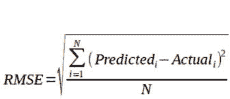

其中，N 是观测值的总数。

#### R 平方/调整后 R 平方

我们了解到，当 RMSE 降低时，模型的性能会提高。然而，这些值本身并不直观。

在分类问题的情况下，如果模型的准确率为 0.8，我们可以将其与准确率为 0.5 的随机模型进行比较，从而衡量我们的模型有多好。因此，随机模型可以被视为基准。但当我们谈论 RMSE 指标时，我们没有*可以*比较的基准。

这就是我们可以使用 R 平方指标的地方。R 平方的公式如下：

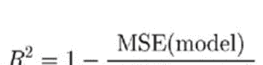

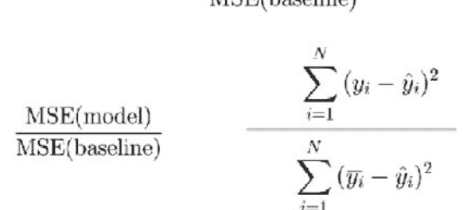

**MSE(model)：** 预测值与实际值之间的均方误差
**MSE(baseline)：** 均值预测与实际值之间的均方误差
换句话说，我们的回归模型与一个非常简单的模型（该模型仅将训练集的目标均值作为预测值）相比有多好。

#### 调整后 R 平方

一个与基准表现相当的模型，其 R 平方值为 0。模型越好，r2 值越高。具有所有正确预测的最佳模型，其 R 平方值为 1。然而，当向模型添加新特征时，R 平方值要么增加，要么保持不变。R 平方值会因添加对模型没有价值的特征而增加。因此，R 平方的一个改进版本是调整后 R 平方。调整后 R 平方的公式如下：

$$\bar{R}^2 = 1 - (1 - R^2) \left[ \frac{n - 1}{n - (k + 1)} \right]$$

其中，
**k**：特征数量
**n**：样本数量

如您所见，该指标考虑了特征的数量。当我们添加更多特征时，分母中的项 n-(k +1) 减小，因此整个表达式增大。
如果 R 平方没有增加，意味着添加的特征对我们的模型没有价值。因此，总的来说，我们从 1 中减去了一个更大的值，调整后的 r2 相应地会减小。

## 加入本书的 Discord 空间

加入本书的 Discord 工作区，获取最新更新、优惠、全球科技动态、新书发布以及与作者的交流会：
[https://discord.bpbonline.com](https://discord.bpbonline.com)


# 第 4 章

## 机器学习案例研究与项目

### 简介

*第 1 章，机器学习入门案例研究与项目*，以及*第 2 章，机器学习 Python 基础*，涵盖了机器学习和 Python 的概念，而*第 3 章，机器学习算法概述*则涵盖了开发机器学习应用时使用的各种算法。本章旨在深入探讨使用机器学习概念和算法的各种案例研究。它进一步介绍了推荐系统、其需求、生成推荐系统的过程以及当前采用推荐系统的系统。随后是关于将各种机器学习算法应用于文本挖掘应用、其构建模块以及意见挖掘和情感分析的案例研究。

接下来，本章详细阐述了图像处理应用以及这些应用中使用的机器学习算法。为了进一步理解核心概念和机器学习算法的部署，提供了多个案例研究，涵盖预测分析、社交媒体分析、客户流失分析以及教育系统分析。

## 结构

本章包括：

- 推荐生成
- 推荐系统的重要性
- 构建推荐系统的方法
- 推荐生成
- 推荐算法的评估指标
- 推荐系统案例研究

## 文本分析与挖掘
- 文本挖掘的重要性
- 使用机器学习的文本挖掘系统的基本模块
- 准备非结构化文本文档以进行深入分析的步骤
- 情感分析
- 基于情感分析的产品推荐系统案例研究
- 观点挖掘
- 实时文本挖掘系统概述

## 图像处理
- 图像处理的重要性
- 基本图像处理系统
- 使用流行机器学习算法的图像处理
- 使用机器学习的图像处理实时案例研究

## 预测分析
- 预测分析的重要性
- 对预测分析的需求
- 机器学习与预测分析
- 预测分析系统的基本工作原理
- 预测分析模型的类型
- 预测分析的用途
- 预测分析的益处

## 案例研究
- 社交媒体分析
- 客户流失分析
- 教育系统中的学习分析

## 目标

在本章中，我们将描述推荐系统的目的。我们还将了解推荐系统的组成部分，包括候选生成、评分和重排序。我们将详细阐述机器学习算法在文本挖掘中的应用，并说明图像处理的重要性及其应用。你将理解预测分析的概念，并识别各种预测分析模型。此外，我们将详细阐述采用机器学习算法的各种案例研究。

##### 推荐生成

推荐是向用户提供的关于经常购买的物品或最受欢迎物品的建议。

### 推荐系统的重要性

互联网上的数字内容呈爆炸式增长。许多人不断访问、更新和添加互联网上的信息。所有这些都导致了信息过载问题，进而阻碍了及时获取感兴趣的物品。

除此之外，选择的数量急剧增加，以及动态生成信息的及时获取。

需要一个系统来隔离、优先排序、个性化并高效地向用户传递相关信息。推荐系统就是这样一种系统。

推荐系统搜索海量的动态生成的信息和数据使用历史。这些系统估计和预测用户的内容偏好，并为用户提供他们选择和感兴趣的内容和服务。因此，这些系统过滤出重要信息，并根据用户的偏好预测或推荐物品。因此，推荐系统是机器学习算法的一个重要类别，它向用户提供“相关”的建议。

使用推荐系统的公司示例包括亚马逊、Facebook、LinkedIn、YouTube和Netflix。推荐系统提供客户满意度，节省用户浏览时间，并增加在网站上的消费时间。所有这些都为管理这些网站的组织带来了收入。

### 使用的关键术语

让我们看看与推荐系统相关的关键术语。

#### 物品/文档

这些代表推荐系统推荐的实体。

#### 查询/上下文

推荐系统确定相关信息以向用户推荐物品。这些信息构成了查询，可以是用户信息的组合，例如用户ID或用户先前交互过的物品，以及用户的设备及其位置作为额外的上下文。

**嵌入：** 嵌入将分类特征表示为连续值特征。换句话说，它们将高维向量转换为称为嵌入空间的低维空间。在这种情况下，要推荐的查询或物品必须映射到嵌入空间。

这里给出了两种常用的推荐：

- **主页推荐：** 在此，根据用户的兴趣提供个性化的主页。这些通常用作基于内容的推荐。
- **相关物品推荐：** 这些推荐基于确定相关或相似的物品。这基于协同过滤的基本原理。

### 构建推荐系统的方法

推荐系统分为基于内容的系统或协同过滤。

*图 4.1* 展示了用于构建准确高效的推荐系统的各种技术：

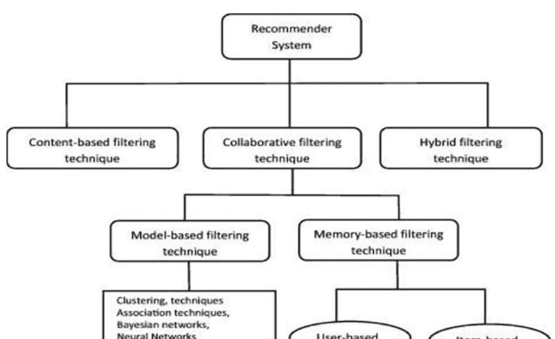

各种方法包括使用以下内容。

**基于内容的过滤：** 在此方法中，预测基于用户/用户配置文件提供的信息，而忽略其他用户的选择或选择的相似性。此信息是通过从用户过去评估过的物品内容中提取的特征获得的。因此，可以说此方法与用户的特征相匹配。通过应用各种模型可以生成有意义的建议，这些模型可能包括以下内容：

- 向量空间模型，如**词频-逆文档频率（TF/IDF）**
- 概率模型，如朴素贝叶斯分类器、决策树或神经网络，用于建模语料库中不同文档之间的关系

**协同过滤：** 这是最常用的过滤方法，它基于识别具有相似选择的其他用户的产品来推荐物品。它使用他们的意见向活跃用户推荐物品。

它包括构建一个用户-物品偏好矩阵数据库。它进一步匹配具有相关兴趣和偏好的用户。这是通过计算其配置文件之间的相似性（称为邻域）来进行预测或推荐来完成的。预测由一个数值 Rij 表示，表示用户 i 对物品 j 的预测分数，而推荐则表示用户最偏好的前 N 个物品的列表。

协同过滤进一步分为两类：

- **基于内存的：** 在此，用户已经评分的物品在搜索具有相似偏好的邻居方面发挥着相关作用。
- **基于模型的：** 此技术分析用户-物品矩阵以识别物品之间的关系；他们使用这些关系来比较前 N 个推荐列表，并利用先前的评分来学习模型。

例如，亚马逊使用物品-物品矩阵离线生成一个相似物品表，然后根据用户的购买历史推荐其他类似产品。

**混合过滤：** 为了提高推荐系统的准确性和性能，使用了混合过滤。它结合了两种或多种过滤技术。根据其操作，混合系统分为加权混合、混合混合、切换混合、特征组合混合、级联混合、特征增强混合和元级混合。

应用机器学习的概念，推荐系统的混合方法可以通过利用以下概念来实现：

- 分别进行基于内容和基于协同的预测
- 结合基于内容的能力和基于协同的方法，或将这些方法统一到一个模型中

结合基于内容的能力和基于协同的方法有助于克服冷启动、稀疏性问题以及基于知识方法中的知识工程瓶颈。然而，在所述的各种推荐方法中，基于内容的推荐能产生准确的推荐。

#### 基本推荐系统

推荐系统的架构大致由候选生成、评分和重排序组件组成。

##### 候选生成

在此阶段，系统从海量可用数据中生成一个较小的候选子集。其目标是，给定一个查询，系统能生成一组相关的候选项目。

表4.1列出了两种常见的候选生成方法：

| 类型 | 示例 |
|---|---|
| 基于内容的过滤 | 如果用户A观看了两个可爱的猫咪视频，那么系统可以向该用户推荐可爱的动物视频。 |
| 协同过滤 | 如果用户A与用户B相似，且用户B喜欢视频1，那么系统可以将视频1推荐给用户A（即使用户A从未看过任何与视频1相似的视频）。 |

**表4.1：** *候选生成方法*

基于内容的过滤和协同过滤都会将每个项目和查询（或上下文）映射为嵌入向量。

这些嵌入向量用于候选生成的方式如下：给定一个查询嵌入向量 q∈E，系统会寻找与 q 接近的项目嵌入向量 x∈E，即具有高相似度 s(q,x) 的嵌入向量。为了确定相似度，推荐系统依赖于余弦相似度、点积或欧几里得距离度量，其中：

- 余弦相似度是两个向量夹角的余弦值，s(q, x) = cos(q, x)
- 两个向量的点积由 s(q, x) = ||x||||q||cos(q, x) 给出
- 欧几里得距离由 (q, x) = ||q - x|| = $\sum_{i=1}^{n} q_i - x_i$ 给出，距离越小意味着相似度越高

##### 评分

然后，另一个模型对候选项目进行评分和排序，使得最相关的信息出现在屏幕上显示的前10个项目中。

##### 重排序

需要进行重排序，以便考虑用户的喜好/厌恶以及其他偏好和约束条件。

##### 推荐生成

为了执行推荐，系统需要经历几个阶段：

#### 信息收集阶段

在此阶段，收集用户的行为和访问的资源等信息。基于这些信息，创建用户画像或模型。这作为系统的输入。因此，用户偏好数据通过两种方式收集：

- **显式数据：** 在此方式中，直接询问用户是否喜欢某个特定项目。基于这些数据，根据用户的兴趣构建画像。然而，这种收集方式的缺点是并非每个用户都会提供反馈或评分；即使他们提供了，对不同的人也可能意味着不同的含义。
- **隐式数据：** 在此方式中，信息是从用户与网站的交互中推导出来的。通过观察用户行为，这种交互被解释为用户感兴趣或不感兴趣的指示。

#### 学习阶段

在此阶段，对信息收集阶段捕获的数据应用学习算法。

#### 预测/推荐阶段

它推荐或预测用户可能喜欢的项目。*图4.2* 突出了推荐阶段：

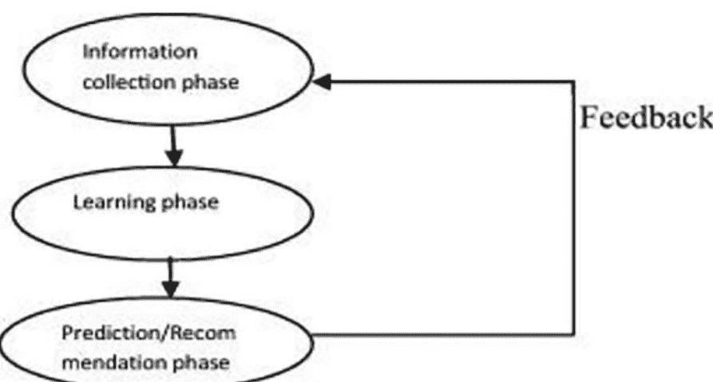

*图4.2：推荐阶段*

### 推荐算法的评估指标

准确性和覆盖率主要被视为基于过滤技术类型推荐用户/项目的评估指标。

**准确性：** 它被定义为正确推荐的数量占所有可能推荐总数的比例。统计准确性和决策支持准确性指标进一步确定了推荐系统的准确性。

#### 统计准确性指标

它通过将预测评分与实际用户评分直接比较来评估所使用技术的准确性，具体如下：

**平均绝对误差（MAE）：** 其确定方式如下：

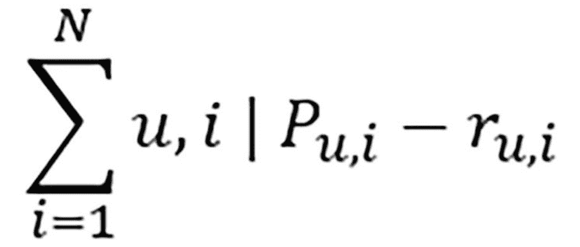

其中 $P_{ui}$ 是对用户 $u$ 在项目 $i$ 上的预测评分，$r_{ui}$ 是实际评分，$N$ 是项目集上的总评分数。MAE越低，推荐越准确。它由以下公式给出：

**决策支持准确性指标：** 它帮助用户从可用项目集中选择高质量的项目。这些指标包括反转率、加权误差、**受试者工作特征（ROC）**、**精确率-召回率曲线（PRC）**、精确率、召回率和 *F*-度量。精确率和召回率是最常用的评估指标，其确定方式如下：

**精确率：** 它表示推荐项目中实际与用户相关的比例。

$Precision = \frac{TP}{TP+FP}$ 其中 $TP$-真阳性，$FP$-假阳性

**召回率：** 它被定义为*相关项目中同时属于推荐项目集的比例*

$Recall = \frac{TP}{TP+FN}$ 其中 TP=真阳性，FN=假阴性

**覆盖率：** *它衡量系统能够提供推荐或预测的搜索空间中对象的比例。*

### 推荐系统案例研究：电子学习系统领域

在当今的场景中，教育系统已经突飞猛进；它涵盖了从常规学术、远程教育到自主进度学习以及认证课程等所有内容。因此，对于任何学生（个人）来说，根据自己的偏好和需求，识别合适的课程类型、教学和学习方法以及从这些课程中可能获得的益处，都是一项具有挑战性的任务。

为了克服这个问题，**推荐系统（RS）** 被用来根据学生的偏好推荐课程或一系列类似的课程。

#### 推荐系统

许多用户参加多门课程以提升他们的技能组合。然而，对于应该参加何种类型的课程、在特定时间最高效、最热门的课程，或者对他们最有益的课程，存在很多困惑和焦虑。为个人识别合适的课程可能很繁琐，因为它涉及访问多个平台、搜索可用课程、选择课程、仔细阅读每门课程大纲并选择合适的内容。

### 问题定义

从多个来源收集和整合信息以做出有用的推荐，是许多推荐系统试图解决的一个难题。需要一个推荐系统来提高课程选择的有效性。

### 案例研究的目标

本研究的目标如下：

- 设计和开发一个混合推荐系统，该系统可以集成到任何电子学习系统中以增强其有效性。
- 简化信息访问并为学习者提供个性化服务。

系统的需求：为了提供正确、准确且最适合个人的课程，需要开发一个模型。系统的输入必须基于用户的需求、课程以及正确推荐课程的反馈。

此外，还需要考虑许多统计和情感分析参数。

需要一个基于用户特征、课程和反馈的混合推荐模型来正确推荐课程。使用各种统计和情感分析相关参数，基于现有（先验）数据集给出推荐。这些特征可以包括关于各种课程/教授的信息（特征）、主题的评分以及通过率和学科结构，以给出最佳推荐。

### 案例研究的考虑因素

开发电子学习推荐系统的重点是指导学习者根据自己的需求选择课程。因此：

- a. 需要整合深度学习机制来提取有意义的特征，并通过多层表示和抽象提供学习。
- b. 利用本体论检索有用信息并做出准确的推荐。

因此，需要应用深度学习和本体论机制来获得准确的推荐系统，从而形成所谓的混合模型。

### 系统开发

为了开发推荐系统，需要执行多个步骤，其中参加课程的个人可以被视为学生。

推荐系统开发可以遵循**系统开发生命周期（SDLC）** 方法。SDLC对于确保开发出适当的系统并满足功能、可用性等方面的要求至关重要，成本和时间。这种方法通过如图4.3所示的多个阶段来开发系统：

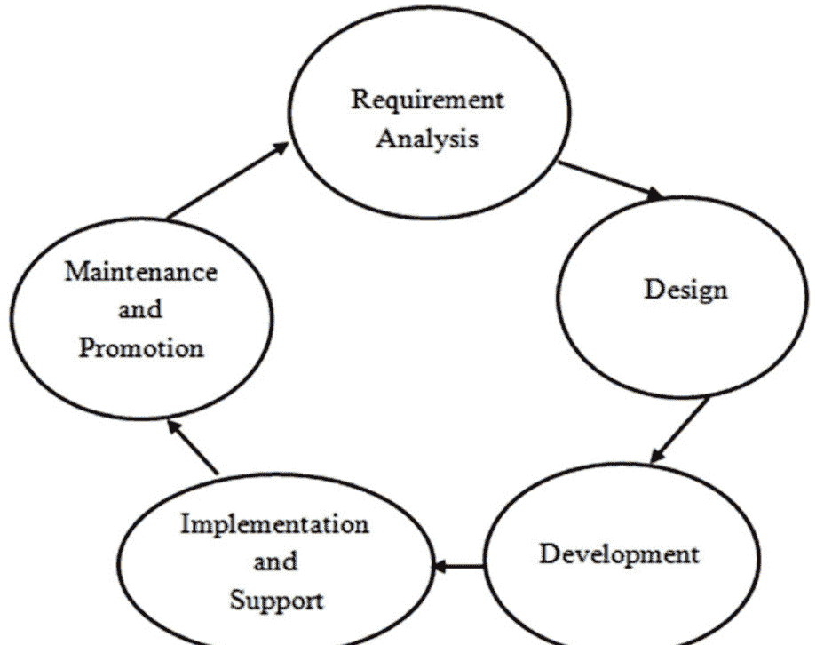

*图4.3：系统开发生命周期（SDLC）方法*

##### 需求收集与分析阶段

本阶段的基本目标是确定目标、范围约束、技术与非技术要求、涉及的风险等。
根据收集到的信息，针对系统的当前用户和当前运行的系统进行分析，以识别新的需求（如有）。

##### 系统设计

可以考虑采用基于框图和模块图的方法来开发电子学习推荐系统。其主要目的是捕捉系统的动态方面，包括需要开发的内部和外部影响，如图4.4所示：

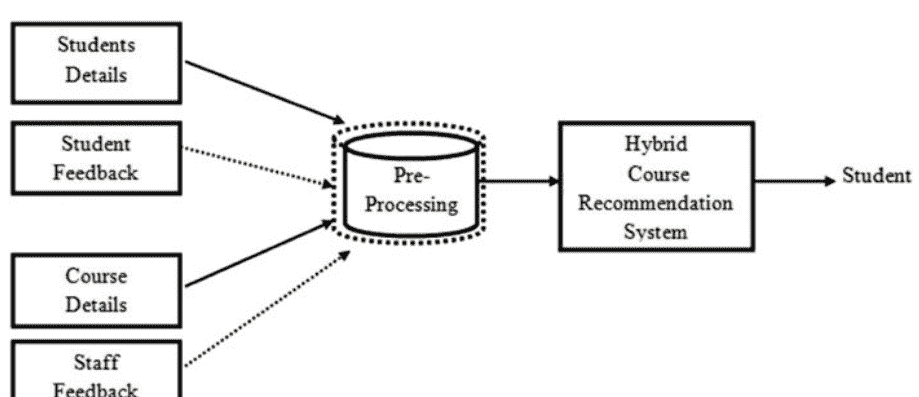

*图4.4：系统框图*

如图4.4所示，代表学生详情的框可以包括以下内容：

- **学生详情：** 学生的基本信息，如姓名、年龄、所在地、学生的核心科目、感兴趣的科目、电子邮件ID、教育水平和联系方式。
- **课程详情：** 关于课程的信息、参加课程所需的最低资格要求以及毕业要求。
- **其他详情：** 课程的先决条件、课程时长、课程评价、通过标准、课程灵活性、费用结构等。
- **关于课程：** 前几年报名参加课程的学生人数、前几年的通过率以及课程的班级规模。
- **科目类型：** 分析型/理论型、通过标准-理论/实践、兼职/全日制、经济援助-学生贷款奖学金和实践培训。
- **获得的反馈：**
    - **学生反馈：** 可以收集的反馈数据可能包括以下内容：
        - 学生已完成的课程
        - 课程成功完成后被选中参加校园招聘的学生
    - **教职员工反馈：** 包括教职员工对特定课程的反馈，包括以下内容：
        - 授课教师的详情、经验年限、专长、学生的反馈
        - 教师的资格
        - 教师出版的书籍和研究论文
    - **校友对课程的反馈**
- **数据库/数据集：** 数据集将包含所有数据参数和能够实现准确推荐的因素。上述信息将有助于预处理从不同实体收到的数据。然后，可以将预处理后的数据作为输入提供给所提出的系统，其中应用并评估了多种算法来向用户推荐课程。

### 可采用的算法

可以应用多种算法，包括以下几种：

- **梯度下降（GD）或最速下降算法**
    它是一种迭代的一阶优化算法，用于寻找给定函数的局部最小值/最大值。这样做是为了最小化代价/损失函数。
    模型的性能通过应用于任何给定数据的代价函数来衡量。它量化了预测值与期望值之间的误差，并以单个实数的形式呈现。为了实现最小化代价函数的目标，它迭代执行两个步骤：
    在某一点，通过计算函数的一阶导数来确定梯度（斜率）。
    沿着与梯度相反的方向迈出一步（移动）。与斜率相反的方向从当前点增加alpha倍的该点梯度。alpha值表示学习率：优化过程中的一个调整参数，决定步长的大小。
- **进化算法（EA）**
    这些算法形成了一种基于启发式的方法，用于解决在多项式时间内不易解决的问题。它们构成了解决组合优化问题的方法集合。
    这些算法模拟自然选择，其中只有最适应的个体通过突变、选择和交叉的过程得以生存。EA的主要类别如下：
    - **遗传算法（GAs）**：它为优化问题提供解决方案，其中每个候选解都有一组属性（或基因），这些属性可以突变或改变，直到我们找到最佳解决方案。
    - **进化策略（ESs）**：这些算法提供基于种群的解决方案，其基于生物进化的概念。在此，首先确定多个可能的解决方案。每个解决方案都通过一个“适应度函数”进行评估，该函数指示它们的好坏。解决方案种群随时间演变，并进一步确定更好的解决方案。
    - **差分进化（DE）**：这些算法处理非线性和不可微的多维目标函数，同时只需要很少的控制参数就能朝着最小化代价函数的方向前进。
- **分布估计算法（EDAs）**或**概率模型构建遗传算法（PMBGAs）**：它们有助于为给定问题确定最佳候选解决方案。优化是在一系列可接受和可容忍的解决方案上进行的，这些解决方案生成的模型仅产生全局最优解。前面表达的各种算法可用于开发推荐系统。它们还可以进一步帮助最小化损失。

### 工具利用

它包括利用高级编程语言，例如：

- **Python**：它使代码易于阅读，其语法帮助程序员用更少的代码行表达概念。
- **Scikit-learn**：Python提供了许多库，这些库提供了一系列机器学习算法的实现。Scikit-learn通过Python中的一致接口提供多种监督和无监督学习算法。
- **Deeplearning4j**：Deeplearning4j被用作Java和JVM的开源深度学习库。它包括用于图像和文本分类的多层感知器、**卷积神经网络（CNNs）**，以及用于文本和时间序列数据的循环神经网络（如LSTM）。此外，它还包括机器学习算法，即逻辑回归和k近邻。
- **TensorFlow**：它是一个用于构建和训练神经网络以检测和破译模式和相关性的系统。
- **IDE：** 可以使用各种平台来开发富客户端应用程序并创建集成开发环境。IDE平台可以包括Eclipse、Spyder、Visual Studio等。

因此，可以使用Python及其库，利用机器学习和深度学习算法（如神经网络）来实现该系统。数据集可用于确定算法的准确度和精确度。

##### 开发推荐系统时的约束/限制

开发推荐系统时的限制如下：

- **数据稀疏性**
    数据稀疏性是用于描述在数据集中未观察到足够数据的现象的术语。
    例如，如前所述，协同过滤方法根据用户过去的偏好推荐课程。因此，系统的新用户需要对足够多的课程进行评分，以便系统能够准确捕捉他们的偏好并提供可靠的推荐。同样，当新课程添加到系统中时，它们需要被相当数量的用户评分，然后才能被推荐给用户。
    因此，识别用于推荐课程的正确类型的算法非常重要。
- **冷启动问题**
    当系统无法在用户和课程之间建立任何关系，因为其数据不足时，就会发生冷启动问题。冷启动问题有两种类型：
    - **用户冷启动问题：** 当几乎没有关于用户的信息可用时
    - **产品（课程）冷启动问题：** 当几乎没有关于所请求课程的信息时

系统无法提供推荐的原因包括以下几点：

- **系统引导**
    它代表系统的启动，此时几乎没有推荐系统可以依赖的信息。
- **低交互（可用实例少）**

当新课程被添加到目录中时，如果没有任何或极少的交互记录，就会出现项目冷启动问题。这对协同过滤算法构成了挑战，因为它们是基于项目的交互来生成推荐的。然而，如果存在少量交互，协同算法可以推荐该课程。不过，这些推荐的质量会比较差。

- **新用户进入**
  当新用户注册系统时，就会出现这个问题。此时，推荐系统需要在一段时间内提供推荐，而不能依赖用户之前的交互记录，因为系统中尚未记录任何信息。这个问题很重要，因为收到低质量推荐的用户可能会在提供足够交互以让推荐系统了解其兴趣之前，就选择离开系统。为了创建初始用户档案，尤其是在处理新用户时，需要获取他们的偏好信息。
- **数据缺乏**
  要进行有效的推荐，需要大量的数据。

### 评估指标

评估对于衡量推荐算法的有效性至关重要。常用的指标可以包括以下几种：

- 准确率
- 均方误差
- 均方根误差

用于评估推荐方法质量的信息检索指标包括以下几种：

- 精确率
- 召回率
- 多样性
- 新颖性
- 覆盖率

## 文本分析与挖掘

文本挖掘被定义为从大量文本数据中提取隐藏的、先前未知的、潜在有用的信息的非平凡过程。

文本挖掘处理的是非结构化或半结构化的数据集，如电子邮件、文本文档和HTML文件。文本挖掘（也称为*文本分析*）是一项**人工智能（AI）**技术，它利用**自然语言处理（NLP）**将文档和数据库中的自由（非结构化）文本转换为规范化的、结构化的数据，以便识别有意义的模式和新的见解用于分析。通过使用先进的机器学习算法，如朴素贝叶斯、支持向量机（SVM）和其他深度学习算法，许多组织可以探索和发现其非结构化数据中隐藏的关系。

术语“文本挖掘”和“文本分析”可以互换使用。通过使用机器学习算法、统计学和语言学，可以识别非结构化数据中的文本模式和趋势。通过利用文本挖掘和文本分析，可以从结构化数据中获得进一步的定量见解。

### 文本挖掘的重要性

文本挖掘，也称为文本分析系统，专注于从文本语料库中确定关键知识，例如其与指定主题的相关性，并表示其内容的详细信息，例如任何特定实体及其关联。文本挖掘工具分析文档以识别实体并提取它们之间的关系，从而解锁隐藏信息以识别和开发新的假设。因此，文本挖掘可用于使大量非结构化数据变得可访问。通过提取信息，可以获取隐藏在大量信息中的模式、趋势和见解。文本是数据库中最常见的数据类型之一，其数据可以组织如下：

- **结构化数据：** 这种数据以标准化的行和列格式（即表格格式）维护信息。这使得处理、存储和对可用数据应用各种机器学习算法变得更加容易。结构化数据可以包括姓名、地址和电话号码等输入。
- **非结构化数据：** 与结构化数据不同，这种数据没有预定义的数据格式。所表示的数据可以包括来自多个来源的文本信息，例如来自社交媒体的文本信息、产品评论或来自视频和音频文件等富媒体格式的信息。
- **半结构化数据：** 这是结构化和非结构化数据格式的组合，其中组织可能没有足够的结构或格式来满足数据库的要求；示例包括XML、JSON和HTML文件。

由于世界上80%的数据以非结构化格式存在，文本挖掘在组织中形成了一项重要的实践。

### 使用ML的文本挖掘系统的基本模块

文本挖掘涉及将非结构化文本数据作为输入并进行处理。此处理涉及处理解析，以及添加一些派生的语言特征，从结构化数据中推导模式，最终评估和解释输出，如*图4.5*所示：

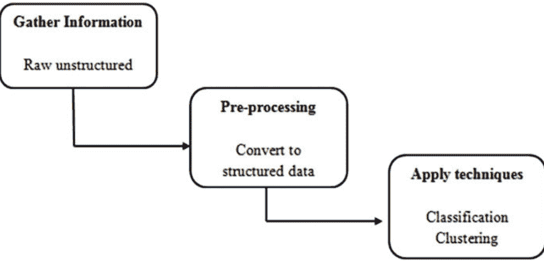

文本分析涉及信息检索、信息提取、数据挖掘技术（如关联和链接分析）、可视化以及预测分析。其目标是利用**自然语言处理（NLP）**方法将文本（非结构化数据）转换为数据（结构化格式）以进行分析。执行以挖掘文本并确定模式的各种活动在以下*图4.6*中表示：

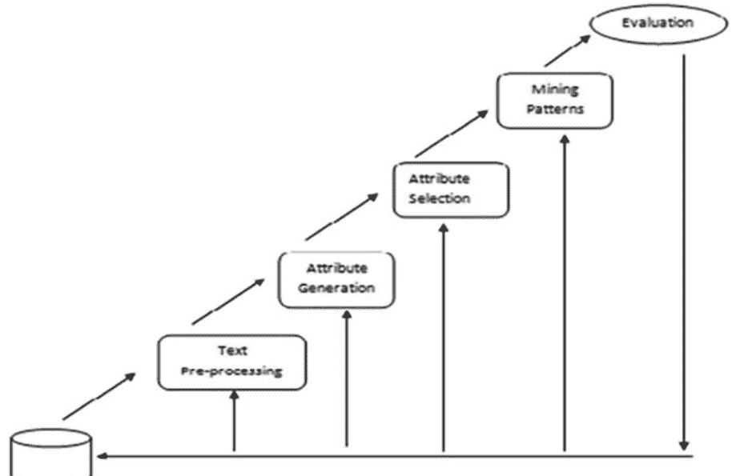

在应用各种文本挖掘技术之前，需要执行文本预处理，如[图4.6](#figure-46)所示。

**文本预处理：** 此步骤包括清理文本数据并将其转换为可用格式。一旦文本预处理完成，基于相关的属性生成，就可以应用许多文本挖掘算法从数据中获取见解。

**文本转换（属性生成）：** 文本文档由其包含的单词（特征）及其出现次数表示。文档表示的两种主要方法是词袋模型和向量空间模型。

**特征或属性选择：** 特征选择，也称为变量选择，是选择重要特征子集用于模型创建的过程。使用特征选择技术时的主要假设是，数据包含许多冗余或无关的特征，这些特征在任何上下文中都不提供额外或相关的信息。特征选择技术是更广泛的特征提取领域的一个子集。

**数据挖掘：** 在这一点上，文本挖掘过程与传统的数据挖掘过程合并。经典的数据挖掘技术用于前几个阶段生成的结构化数据库。

**评估：** 在此阶段评估结果。评估后，结果可以被丢弃，或者生成的结果可以作为下一组序列的输入。

### 准备非结构化文本文档以进行深入分析的步骤

准备非结构化文本文档以进行深入分析涉及七个基本步骤：

1. **语言识别：** 它有助于确定操作语言。
2. **分词：** 大多数文本分析系统依赖基于规则的算法对字母语言进行分词。文本信息被分解成称为标记的片段。这些标记可以是单词、音素或完整句子。这些可以通过在空格和不属于已识别缩写的标点符号处分割文本来获得。各种特征及其表示列于表4.2：

| 特征 | 表示 |
|---|---|
| 特征提取 | 实体、主题、类别、意图、摘要、情感 |
| 文本准备（多层） | 分词、断句、词性标注、组块、句法、词汇链 |
| 基础知识 | 机器学习模型、自然语言处理、词汇训练 |

*表4.2：文本分析*

3. **断句：** 它用于确定句子中存在的边界。
4. **词性标注（PoS）：** 它是确定每个标记的词性的过程，即给定的标记代表专有名词、普通名词还是动词，然后对其进行标注。**词性（POS）**标注意味着为每个标记分配词类。其输入由分词后的文本提供。标注器必须处理未知和有歧义的词-标签映射。基于规则的方法，如ENGTWOL，操作于包含带有相关POS标签、形态和句法特征的单词的词典。上下文敏感的规则有助于在应用过程中选择合适的标签。
5. **组块：** 它意味着将带有词性标签的标记分配给短语。

### 文本挖掘技术

文本挖掘技术包括信息检索、自然语言处理和情感分析等技术，具体阐述如下：

#### 信息检索（IR）

IR系统的工作原理是应用算法来追踪用户行为并识别相关数据。因此，基于预定义的查询或短语集合，该技术会返回相关的信息或文档。信息检索广泛应用于图书馆目录系统和谷歌搜索引擎。常见的IR子任务包括以下几项：

- **文本清理：** 文本清理是一种移除任何不必要或不需要信息的机制，例如，从网页中移除广告、规范化从二进制格式转换的文本，以及处理表格、图形和公式。
- **分词：** 这涉及将长文本分割成句子和单词（称为“标记”）的过程。
- **词干提取：** 这一步涉及从单词中分离前缀和后缀，以推导出词根形式和含义。

#### 自然语言处理（NLP）

自然语言处理使计算机能够理解书面和口头形式的人类语言。通过分析句子结构和语法，NLP算法帮助计算机读取信息。这些子任务包括以下几项：

- **摘要生成：** 顾名思义，该技术为指定文档的主要观点创建一个简洁的摘要。
- **词性标注：** 这一步使得对非结构化文本进行语义分析成为可能。根据其词性，该技术为文档中的每个标记分配一个标签。
- **文本分类或文本归类：** 通过此技术，文本文档根据预定义的主题或类别进行分类。
- **情感分析：** 此任务用于提供有关品牌、产品、服务感知以及客户态度随时间变化的信息。因此，它检测关于产品或品牌的积极、消极或中立情感，从而获得可以改进业务流程和用户体验的洞察。

信息提取涉及从自由文本中提取结构化信息，并将各种实体、属性和相关信息存储在数据库中。常见的信息提取子任务包括以下几项：

- **特征选择**，也称为属性选择，是选择对预测分析模型输出贡献最大的重要特征（维度）的过程。
- 为了提高分类任务的准确性，采用了子任务，即**特征提取**。其目标是选择特征的一个子集。
- **命名实体识别（NER）**也称为实体识别或实体提取。其主要目的是在可用文本中查找和分类特定实体。
- **数据挖掘：** 它是从数据集中识别模式和提取有用洞察的过程。该技术评估结构化和非结构化数据以识别新信息。文本挖掘被认为是数据挖掘的一个子领域。

#### 情感分析

情感分析是一种机器学习工具，用于分析文本的极性。极性可以是积极的、消极的或中立的。文本分析技术用于解释和分类文本数据中的情感，这反过来又使机器能够自动学习如何检测情感，而无需任何人工输入。

情感分析模型可以经过训练以理解上下文、讽刺和误用的词语。情感分析中使用的工具帮助企业识别客户对特定产品、品牌或所提供服务的情感。一旦机器通过机器学习工具进行了训练，它们就能学会自动检测情感，而无需任何人工干预。可以使用多种技术和复杂的算法来指挥和训练机器执行情感分析。每种技术都有其自身的优缺点，但当它们结合使用时，可以提供卓越的结果，如图4.7所示：

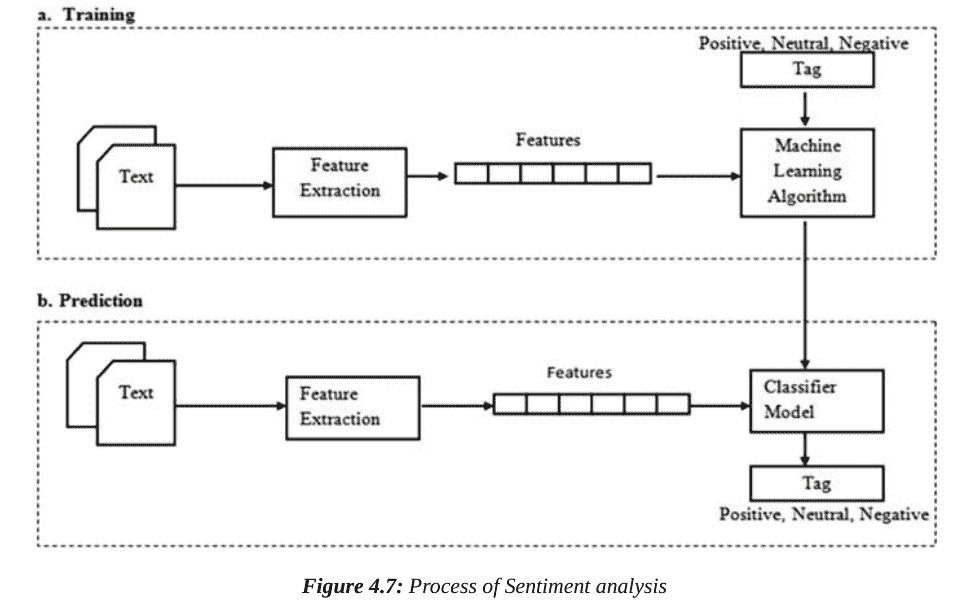

现在，让我们看看最常用于情感分析的算法。

##### 朴素贝叶斯

朴素贝叶斯算法被认为是最简单的概率算法组之一。这些算法通过执行情感分析分类来提供帮助，其中为文本单词的出现分配一个概率。此分配表示给定单词或短语的积极或消极极性。

贝叶斯定理的工作原理如下：朴素贝叶斯算法对单词进行相互评估。因此，一个单词、短语或文本出现积极或消极的可能性，可以通过训练有素的机器学习模型来确定。利用词形还原、停用词移除或TF-IDF等技术，朴素贝叶斯提供了更好的准确性。

##### 线性回归

给定X特征，线性回归作为一种统计算法，有助于预测Y值。机器学习算法基于提供的数据集工作。这些算法进一步确定变量之间的关系，这些关系通过X-Y轴表示。穿过各个坐标的直线模式有助于确定关系中的进一步预测。

关于单词极性，线性回归确定单词和短语（X输入）与极性（Y输出）之间的关系。这种关系提供了一个从“非常积极”到“非常消极”的极性尺度输出，以及它们之间的值。

##### 支持向量机（SVM）

支持向量机也是一种监督机器学习模型，它使用其算法在情感极性模型中训练和分类文本。例如，在*图4.8*中提到的，将红色和蓝色标记视为代表两个数据特征X和Y的标签。然后，SVM分类器可以被训练为将X-Y坐标输出为红色或蓝色。

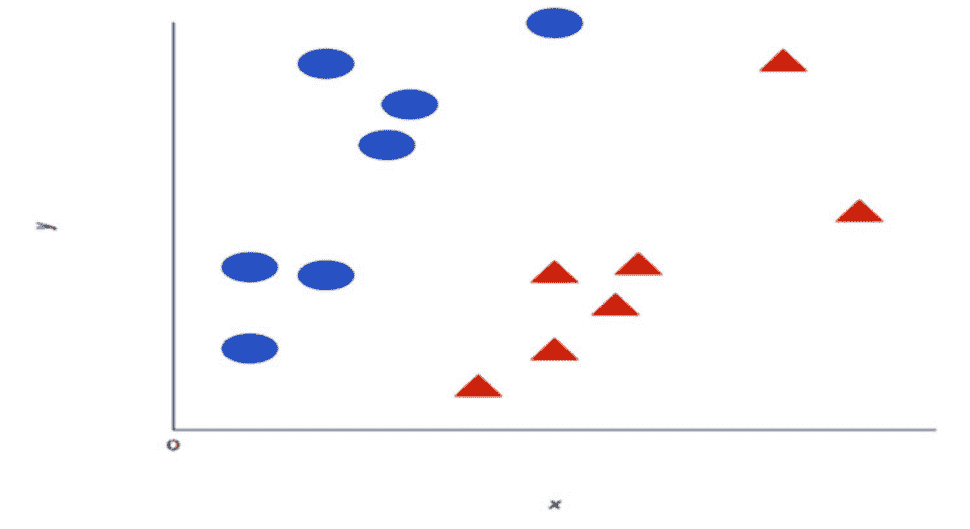

SVM算法进一步为数据特征（X-Y）坐标分配一个超平面，如*图4.9*所示。这个超平面最好地分隔了两个标签。对于二维表示，这个超平面代表一条直线，类似于线性回归中的一条线。超平面线的一侧代表*红色*标签，而线的另一侧指定*蓝色*标签。这种表示法对于情感分析非常有效，其中一个标签代表积极情感，而另一个标签表示消极情感。

提供每个标签之间最大距离的超平面被认为是机器学习中的最佳超平面。请参阅以下[图4.9](#figure-4-9)：

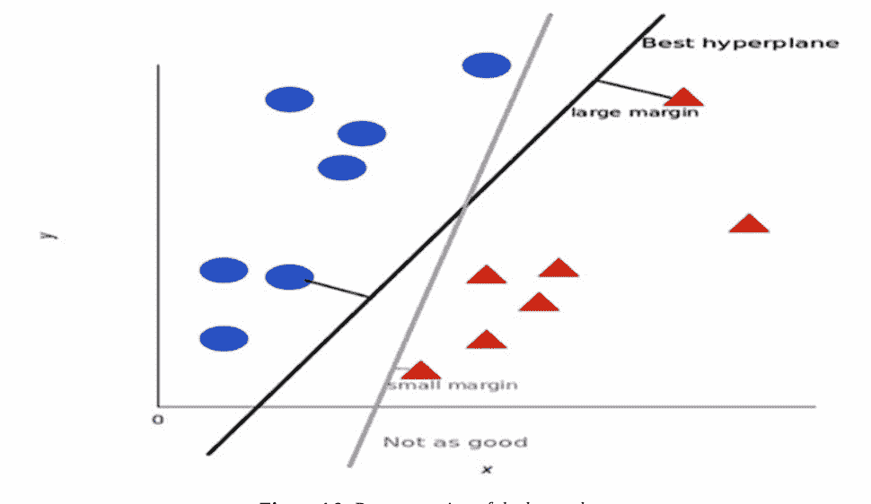

**图4.9：** 超平面的表示

然而，随着数据集变得更加复杂，使用单条线将数据特征分成两个区域变得困难，如[图4.10](#figure-4-10)所示：

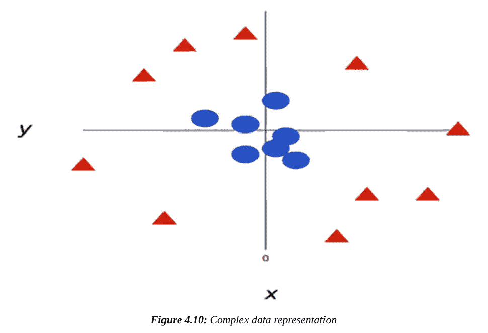

使用SVM，数据越复杂，预测器就会变得越准确。想象一下前面的图在三维空间中，即添加了一个Z轴。这导致该图表示一个圆。这个图可以映射到它的二维表示。这将产生最佳超平面，如[图4.11](#figure-411)所示：

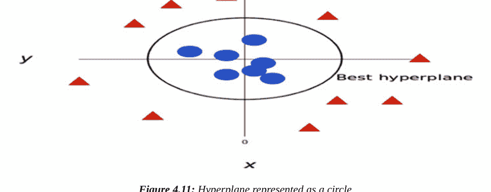

SVM允许更准确的机器学习，因为它是多维的。

##### 深度学习

顾名思义，“深度”代表深入理解，“学习”则指理解。因此，深度学习构成了机器学习的一个子领域，旨在使用“人工神经网络”来确定和理解数据，其方式类似于人脑。深度学习被认为是一种层次化的机器学习表示。它被视为一种多层次学习，允许机器自动将多个人为创建的过程链接在一起。通过允许多个算法逐步使用，深度学习可以像人类一样解决复杂问题。

### 构建情感分析模型

假设系统中已有数据，构建情感分析模型的步骤如下：

- 1. 选择模型
- 2. 选择分类器
- 3. 导入数据
- 4. 训练情感分析分类器
- 5. 测试分类器

### 基于情感分析的产品推荐系统案例研究

对于在线购物，客户的评论和评分会带来更多的流量。然而，当前基于评论的在线产品推荐系统在其评论模式中存在随机性。这种随机性可能是由于一些虚假评论造成的，这会让买家感到困惑。

为了克服这个问题，可以开发一个系统，专注于评论的真实性和可信度，并提高推荐系统的准确性。

#### 产品推荐

推荐系统通常用于各种领域，例如电影、音乐、新闻、书籍、研究文章、搜索查询、社交标签和产品。像eBay、亚马逊、Flipkart和阿里巴巴这样的电子商务网站使用专有的推荐算法，以便更好地为客户提供他们拥有的产品。产品推荐系统根据喜好、最近的搜索和产品评论来预测并显示用户可能想要购买的物品。评论的有用性有助于降低用户在在线购物中面临的风险和不确定性。随着互联网上信息量的不断增长和用户数量的显著增加，公司需要根据用户的偏好和品味进行搜索、映射，并为他们提供相关的信息块，这一点变得非常重要。因此，需要一个系统来过滤掉不需要的评论。这些评论可能来自不同的在线网站，或者来自意见挖掘和情感分析。它们还可以基于诸如买家资料、先前的购买、星级评分、评论是否在购买后给出等因素进行工作。基于所有列出的因素以及评论者的可信度，可以推荐用户应该从哪个网站购买产品。

### 问题定义

需要设计一个系统来推荐买家应该从哪个电子商务网站购买特定产品。重点需要放在诸如用户可信度、频繁访问、先前的购买、先前的评论和可信评论分析等因素上。根据用户的可信度，可以对可信评论进行情感分析，以生成正面和负面结果的数量。

### 系统开发

为了开发正确的产品购买网站，需要在购买前考虑许多因素并执行多个步骤。此推荐系统开发可以遵循系统开发的瀑布模型。该模型用于以线性和顺序方法创建系统。它被称为瀑布，是因为该模型以向下的方式从一个阶段系统地发展到另一个阶段。它也被称为线性顺序生命周期模型。它被认为易于使用和理解。在瀑布模型中，每个阶段必须在下一阶段开始之前完成，并且各阶段不能以任何方式重叠。

瀑布模型对于确保开发适当的系统并在可行性和实施方面满足要求至关重要。这种方法包括通过多个阶段开发系统，如[图4.12](https://example.com/figure4.12)所示：

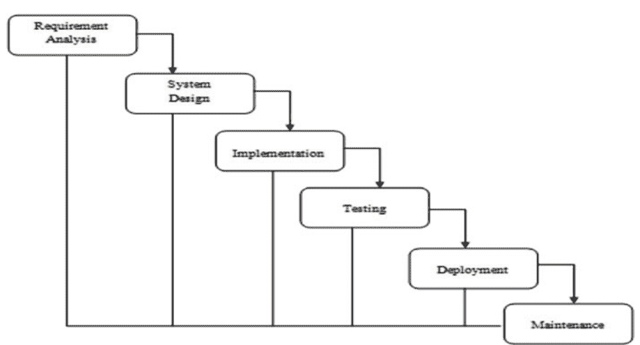

代表瀑布模型的阶段包括以下内容：

- **需求收集和分析：** 在此阶段捕获所有数据需求。
- **系统设计：** 研究第一阶段指定的需求，并准备系统设计。
- **实现：** 然后开发称为单元的小程序并测试其功能。这些单元以集成的方式移至下一阶段。
- **集成和测试：** 所有开发的单元在测试后集成到一个系统中。集成后，对整个系统进行测试，以查找任何故障和错误。
- **系统部署：** 然后将产品部署到客户环境中或发布到市场。
- **维护：** 在客户环境中对系统或开发的产品进行维护。

**系统设计：** 系统可以从用户搜索特定产品开始，到向用户推荐网站结束，如[图4.13](#)所示：

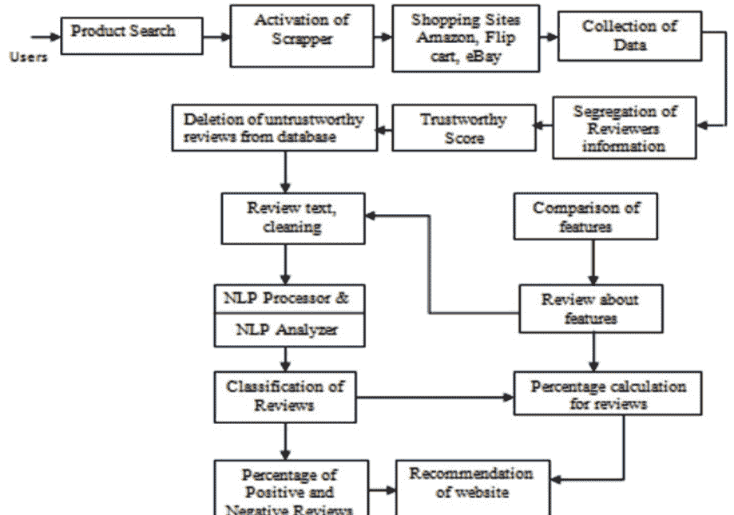

当用户在网页上搜索产品时，可以从电子商务网站抓取评论。收集的数据可以包括评论者详情、评论、可信因素等。不可信的评论或虚假评论可以从数据库中删除。此外，可以使用NLP对清理后的数据进行情感分析，以推荐用户应该从哪个网站购买产品。

#### 案例研究的注意事项

开发此系统需要遵循的步骤如图4.14所示：

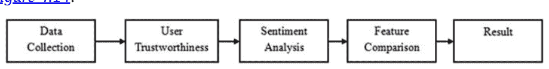

##### 1. 数据收集和抓取

当用户输入产品时，数据从各种电子商务网站（如亚马逊和Flipkart）收集。这些数据包括每个网站的产品图片、产品功能、产品ID、星级评分和评论。所有这些数据都是通过抓取器获得的，不同网站的抓取器不同。

##### 2. 用户可信度

此模块将根据用户的各种因素（如先前的评论、先前的购买、访问等）确定特定用户给出的评论是否可信。

##### 3. 情感分析

基于可信评论，在此模块中进行情感分析，如[图4.15](https://example.com)所示。对于此操作，可以使用Python库和NLTK。此分析将评论分类为正面或负面，并可以使用逻辑回归模型实现以产生结果。参考以下[图4.15](https://example.com)：

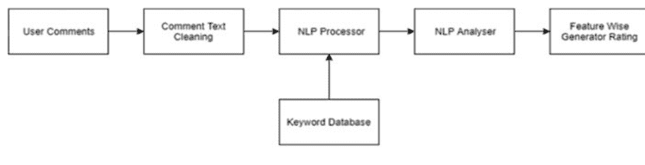

##### 4. 功能比较

在此模块中比较抓取过程中记录的功能。这些功能经过情感分析，产生更好的结果。

##### 5. 结果

此模块最终根据先前的分析推荐用户应该从哪个网站购买产品。

##### 6. 可采用的算法

可以应用各种算法/编程语言：

- a. **抓取器的实现：** 网页抓取器是一种旨在准确快速地从网页中提取数据的工具。这些数据至关重要，成为亚马逊和Flipkart等不同网站上相同产品的区分因素。为了分析和访问实时评论，需要抓取。网页抓取是以高效和敏捷的方式自动获取所需数据的过程。这也称为网页提取或收割。抓取器分两个阶段实现：
    - i. **初始链接的抓取器** 可以用JavaScript实现。此元素可以自动化该过程，并搜索所需的产品、名称、照片、价格等以提取相关链接。
    - ii. **电子商务网站的抓取器** 可以使用Scrapy实现，Scrapy是Python中的一个抓取框架。它有助于快速抓取大量数据，具有各种功能，如通过IP跳转进行无缝提取。这些抓取器专注于抓取基本信息以外的数据，例如评论者姓名、评论标题、评论文本、评论日期、星级评分以及两个网站上该产品的购买是否经过验证。
- 7. **情感分析模型的实现：** 情感分析模型可以使用Python和各种机器学习库（如NumPy、Pandas、Matplotlib、Sklearn和NLTK）实现。NLTK是情感分析的基础库，包含用于基本操作（如分词、词形还原和过滤）的文本处理库。可用于情感分析的算法是逻辑回归。该模型使用亚马逊开源产品评论数据集进行训练，然后可用于实时数据。
- 8. **数据库管理：** 从网页抓取的非结构化数据需要存储以供分析。获取的数据可以以CSV格式存储在数据库中。对于数据库管理，可以使用Firebase和MongoDB：
    - i. **Firebase：** 可以在初始链接抓取器中使用，以存储产品的链接及其相应功能，例如产品尺寸、电池功率、连接性、重量、显示屏、摄像头和颜色。
    - ii. **MongoDB：** MongoDB是一个非结构化数据库，可用于存储评论的所有内容。当搜索相同产品时，这些内容可以稍后使用，从而节省计算时间。
- 9. **可信度过滤器：** 以下是可信度过滤器：
    - i. 根据用户和其他属性，确定评论的可信度。此确定的输出表明情感是否应包含在分析中。

对于亚马逊平台，仅考虑并抓取评论者经验证的购买评论。那些获得超过10次“有帮助”投票的评论会被纳入考量。对于Flipkart平台，则考虑带有“认证买家”徽章的评论。评论的重要性可根据点赞（赞成票）和点踩（反对票）来分配。

##### ii. **用户界面设计：**
以下资源可用于设计用户界面：
i. 用户界面可使用React.js框架设计，并采用Express.js作为后端。
ii. Flask（一个Python框架）可用于将用户界面与其他元素连接起来。

##### 10. **评估指标：**
为了评估推荐系统的有效性，可以进行三种不同类型的评估：
a. **用户研究：** 这类研究规模较小。向几十或几百名用户展示不同推荐方法给出的推荐结果，然后由用户判断哪些推荐最佳。
b. **在线评估（A/B测试）：** 在A/B测试中，向超过一千名用户展示真实产品的推荐。基于推荐器建议的输出，推荐系统随机选择至少两种不同的推荐方案。这些方案进一步用于生成最合适的推荐。其有效性通过转化率或点击率等隐式效果指标来衡量。
c. **离线评估：** 使用历史数据来比较不同算法的表现。

### 观点挖掘

情感分析和观点挖掘几乎是同一回事。然而，观点挖掘是提取和分析人们对某个实体的看法，而情感分析则是在文本分析中搜索情感词汇/表达，然后将其分类为正面或负面评论。更详细的特征、喜好和厌恶则不会被揭示。要获得此类细节，必须采用基于特征的观点挖掘方法。该方法通常包含两个步骤：

1.  根据评论者的观点，从每个句子中识别并提取对象、主题或事件的特征。
2.  确定所有用户对这些特征的看法。

无论是正面还是负面的观点，都是基于所考虑的特征来确定的。这可以进一步为用户提供与特定主题观点相关的深刻见解。

## 图像处理

这是一种以图像形式向系统提供输入的方法。然后对这些图像进行处理，以获得增强的图像或从中提取一些有用信息。它是将图像转换为数字形式并执行某些操作以从中获取有用信息的过程。对图像的每个像素执行固定的操作序列。图像处理器逐像素地对图像执行第一组操作。完成后，再执行第二组操作。可以在图像的任何像素处计算输出值。因此，图像处理是一种旨在增强图像或从中收集警示性见解的方法。这些见解可以进一步输入到算法中，以对图像进行分类、预测或聚类。图像处理系统将所有图像视为二维信号，并应用预定的信号处理方法。

每个人在日常生活中都使用智能手机。随着技术的发展，更好的摄像头和视觉效果是购买新智能手机时的主要考虑因素。根据视角和光照条件，人脑可以识别许多物体、类别和场景。这得益于最重要的感觉器官：视觉。任何视觉任务从根本上都依赖于识别物体的能力。因此，物体识别本身构成了识别图像、对其进行转换然后执行信息检索的一部分。因此，图像在图像处理中扮演着非常重要的角色。图像处理中的挑战性问题包括对图像中的物体进行分类和识别。数字图像处理技术有助于通过计算机操作这些数字图像。因此，图像处理构成了计算机视觉的核心部分，并在机器人技术、自动驾驶汽车和物体检测等许多现实世界应用中发挥着至关重要的作用。

### 图像处理的重要性

以下是解释图像处理重要性的要点：

**图像：** 根据像素数量，图像由其尺寸（高度和宽度）表示。例如，如果图像的尺寸为600 x 400（宽 x 高），则图像中的总像素数为240000。
像素构成图像上的一个点，具有特定的色调、不透明度或颜色，表示如下：

- **灰度：** 像素表示为一个介于0到255之间的整数，其中0表示纯黑色，255表示纯白色。
- **RGB：** 在此模式下，像素由3个介于0到255之间的整数组成。每个整数分别代表红色、绿色和蓝色的强度。
- **RGBA：** 与RGB类似，这种图像表示是RGB的扩展，增加了一个alpha字段，用于表示图像的不透明度。

### 图像处理的目的

根据目的，图像处理分为五类：

- **可视化：** 其目的是观察和发现图像中不可见的对象。
- **图像识别：** 它区分图像或检测图像中的对象。
- **图像锐化和恢复：** 其目的是从原始图像创建增强的图像。
- **模式识别：** 它涉及测量图像中对象周围的各种模式。
- **图像检索：** 它专注于浏览和搜索感兴趣的图像。

### 基本图像处理系统

一个图像处理系统包含多个步骤，如*图4.16*所示：

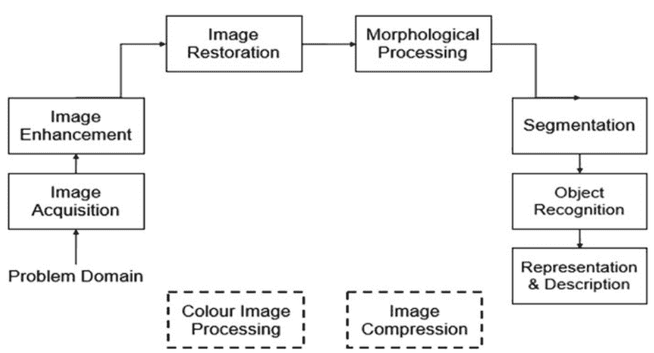

1.  **图像获取：** 这是数字图像处理的第一步或过程。它被定义为从某个源检索图像的操作。如此获取的图像是完整的原始或未处理图像。因此，需要对它们执行缩放等预处理操作。

2.  **图像增强：** 这是一个调整数字图像的过程，使结果适合显示或进一步的图像分析。重点在于修改图像，使其在视觉上更令人愉悦。顾名思义，图像增强技术旨在突出被模糊的细节或强调图像中某些感兴趣的特征。此步骤包括图像锐化、调整亮度和对比度、去除噪声等。由于特征因人而异，此步骤本质上是主观的。

3.  **图像恢复：** 图像的外观可以通过图像恢复机制得到改善。然而，与图像增强步骤相比，图像恢复本质上是客观的。因此，它是一个恢复因某些已知的退化函数以及噪声添加而退化图像的过程。这些恢复技术基于图像退化的数学或概率模型。

4.  **彩色图像处理：** 彩色图像处理包括处理彩色图像，无论是RGB图像还是索引图像。

5.  **图像压缩：** 其主要目的是减少保存图像所需的存储空间或传输图像所需的带宽。

6.  **形态学处理：** 形态学处理在图像形状的表示和描述中很有用。在此步骤中执行基本的形态学操作，如膨胀和腐蚀。

7.  **分割：** 分割过程将图像划分为多个段或对象，是图像处理中最困难的部分。

8.  **表示和描述：** 此步骤分为两部分：表示步骤和描述步骤：
    a. **表示：** 它将数据转换为适合计算机处理的形式，具体涉及以下方面：
        i. **边界表示：** 它主要关注图像的外部特征，例如角点。
        ii. **区域表示：** 这部分关注图像的内部特征，例如图像的纹理。
    b. **描述：** 它涉及提取能产生某些感兴趣的定量信息并区分一个对象与另一个对象的属性。
        i. **对象识别：** 基于其描述符，可以通过对象识别过程为对象分配标签。
        ii. **知识库：** 关于问题域的知识以知识数据库的形式编码到图像处理中。这个知识库可以是简单的，也可以是复杂的，例如，在材料检测问题中关于主要可能缺陷的相互关联列表的信息。

### 使用流行ML算法的图像处理

在图像处理中，算法用于识别和检测图像的各种关键组件或所需部分和特征。可以训练模型通过计算机视觉识别某些模式。这些数据可以进一步存储到它们的人工记忆中。之后可以对这些存储的数据值进行结果预测。

这里列出了一些利用ML图像处理技术的常见用例：

### 使用机器学习进行图像处理的实时案例研究

让我们来看一个图像处理的案例研究，该案例属于医疗保健领域。

**血液透析中高血压和静脉功能的分析与预测：**
肾衰竭是全球最令人畏惧的疾病之一。肾衰竭的解决方案是透析，主要在肾功能低于特定阈值时进行。为了进行透析，会构建自体动静脉瘘以增加浅静脉的血流量。持续透析的一个主要缺点是患者可能出现高血压和静脉功能减退。这可能导致瘘管塌陷。因此，检查瘘管的状态非常重要，可以通过超声多普勒测试来完成。然而，这些测试费用昂贵，且多次重复测试并不可行。需要一个系统，该系统能接收透析机实时提供的所有因素作为输入，并利用它们来预测瘘管的状态。

**高血压预测：** 肾衰竭，也称为肾功能衰竭或肾功能不全，是一种肾脏无法从血液中过滤废物的医疗状况。这些衰竭大致分为以下几类：

- **急性肾损伤：** 通过充分治疗是可逆的。
- **慢性肾病：** 通常不可逆，导致患者需要进行透析。随着时间的推移，在进行透析的过程中，一些患者可能会出现高血压和静脉功能减退，导致瘘管失效。重新构建另一个瘘管需要时间，并且需要持续进行超声多普勒扫描来检查瘘管的健康状况。

### 问题定义

目前，透析机输出的大量数据仅用于透析过程；这些数据并未被存储。因此，没有进行预测，大多数程序遵循“行动-反应”方法，即在旧瘘管发生灾难性失效后才创建新的瘘管，因此高血压没有得到主动治疗。
需要一个系统来帮助肾病专家治疗患者，防止他们进入高血压状态，并让他们了解瘘管的状态。这可以改善患者在透析期间的生活质量。

### 案例研究的目标

本研究的主要目标如下：

- 给定来自透析机的连续数据流，需要预测患者是否可能因透析而患上高血压。
- 检查静脉功能，并预测为透析创建的瘘管的使用寿命。

### 案例研究的考虑因素

预测需要考虑的参数包括心率、收缩压、舒张压、静脉压、动脉压和累积血容量斜率。这些参数进一步细分为记录最大值、最小值、平均值和标准差的子参数。

### 系统开发

为方便起见，可以使用总体框图、模块图和数据流图来开发系统。请参考以下*图 4.17*：

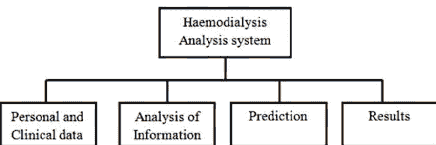

*图 4.17* 突出了需要构建的不同子系统：

- **个人和临床数据接口**
  这作为数据收集接口，技术人员和医生可以将单次或多次透析会话的数据文件上传到系统中。
- **信息分析**
  可以根据各自的条件和设定范围，对临床、个人和杂项因素进行初步分割。
- **预测模型**
  可以在此处开发用于预测高血压可能性和瘘管寿命的模型算法。
- **结果**
  可以评估预测结果，并与患者的实际数据进行比较。在此开发模块中可以生成各种报告，如准确性报告、分析报告、效率报告和预测报告。

### 可采用的算法

可以应用的各种算法包括：

- **支持向量机：** SVM 或支持向量机是一种监督学习方法，允许我们对数据集执行分类和回归分析。它有助于捕捉数据点之间更复杂的关系，而无需执行任何复杂的变换。核函数接收数据并对其进行变换。该算法会运行直到达到所需的容差，因为对需要执行的迭代次数没有设定限制。
- **随机森林分类器：** 随机森林是一种监督集成分类算法，其中集成分类器是随机创建的决策树。这些树充当分类器，目标预测基于多数投票法。它们可用于从训练数据集中识别最重要的特征。该分类器使用平均法来提高准确性并控制过拟合。
- **多层感知机：** MLP 或多层感知机是一种监督学习算法，是一种至少具有三层节点的前馈人工神经网络形式。在处理较大数据集时表现更佳。具有足够大小隐藏层的 MLP 可以以任何所需的精度逼近任何连续函数，对输入变量不施加任何限制，并且能够更好地建模异方差性，即具有高波动性和非常数方差的数据，这得益于其学习数据中隐藏关系的能力。

这些算法可以被利用，因为它们能够以高精度处理较小的数据集。

##### 工具使用

- **Scikit Learn：** 这个用于机器学习的开源软件库可用于构建和训练神经网络，以检测和破译模式和相关性。
- **混合应用框架：** 这些应用框架有助于快速开发软件，用户只需最少的额外操作。
- **Django、Javascript、CSS、HTML 5：** 上述技术构成了一个全栈。前端使用 HTML5、CSS3 和 JavaScript，后端可以使用 Python (Django) 和 SQL。
- **OpenCV：** 开源计算机视觉库用于为各种图像处理应用程序提供通用基础设施。

##### 开发系统时的约束/限制

- 应用算法时的主要问题是数据需要直接从透析机获取。
- 此外，并非所有透析机都能提供完全相同的数据点。
- 系统的性能受限于数据量的庞大。因此，如果涉及的数据量巨大，预处理数据将需要大量时间。

### 评估指标

然后可以在前面提到的机器学习算法上运行提供的数据集。可以进一步评估这些算法在良好瘘管和不良瘘管数据之间的不平衡情况。数据集可以按 80-20 的比例分割为训练集和测试集，以保持盲测。评估这些算法对于评估所获得输出的有效性非常重要。常用的评估指标可以包括准确性和精确度。接下来可以确定假阳性、假阴性的准确性以及每个算法的总体准确性。这有助于我们深入了解要使用的算法。

## 预测分析

它被定义为一种统计技术，利用机器学习和数据挖掘技术来预测和预测可能的未来结果。分析历史和现有数据，并生成一个模型来预测可能的结果。例如，为了确定软件公司产生的收入金额，需要创建一个模型。该模型可以基于多个地区的历史销售数据和营销支出形成。这使他们能够确定营销支出的影响。
顾名思义，**预测分析**源自两个术语：**预测**，涉及进行预测；**分析**，对数据执行分析。
因此，它被认为是高级分析的一个分支，用于对未知的未来事件进行预测。

### 预测分析的重要性

为了分析当前数据并预测未来的结果和表现，它使用了从数据挖掘和统计到建模、机器学习和人工智能的各种技术。这些技术侧重于根据提供的过去或历史数据识别可能结果的可能性。因此，预测分析的目标是提供对未来将发生什么的最佳评估。

### 预测分析的必要性

如前所述，预测分析提供了一种评估。各种公司正在利用它来提高生产力并获得竞争优势。
考虑这种技术的原因如下：

- 全球范围内有海量数据可用。
- 可以从各种形式的可用数据中生成有价值的见解。
- 用于执行预测分析的软件成本友好。
- 各种见解有助于提供具有竞争力的差异化产品。

预测分析的主要特点如下：

-   部分预测模型本质上较为复杂
-   大多数预测模型运行速度快
-   预测分析实时执行计算
-   预测模型会定期修订，以纳入其基础数据的变化

### 机器学习与预测建模

表4.3展示了机器学习与预测建模的对比：

| 特点 | 机器学习 (ML) | 预测建模 (PM) |
| :--- | :--- | :--- |
| **定义** | 在输入端提供数据，无需应用任何预设的规则和条例 | 提供当前和历史数据集，以在预测建模算法中发现模式和行为 |
| **操作** | 机器学习算法经过训练，从过去的错误中学习以改进未来性能 | 仅基于历史数据对未来事件做出有根据的预测 |
| **原理** | 机器学习构成了执行预测建模的核心算法集 | 预测建模可以说是机器学习的一个子集和应用 |
| **工作方式** | 每当有新数据集添加到ML系统时，它们可以自动适应并从中学习，无需直接编程 | 它包括一系列统计技术，并使用统计方法在给定输入数据集的情况下估计或预测未来结果 |
| **使用的技术** | ML算法大致分为监督学习和无监督学习算法 | 预测建模通过描述性分析、诊断性分析、预测性分析和规范性分析进一步区分 |
| **方法与模型** | 机器学习中考虑的各种方法包括决策树学习、关联规则学习、人工神经网络、深度学习、归纳逻辑编程、支持向量机、聚类、贝叶斯网络、强化学习、遗传算法和基于规则的学习 | 预测建模中的数据使用朴素贝叶斯、K近邻、支持向量机、提升树、随机森林、**分类与回归树 (CART)**、神经网络、普通最小二乘法、逻辑回归和稳健回归算法进行处理 |
| **应用** | 利用机器学习算法的应用包括生物信息学、脑机接口、计算机视觉、物体识别、信用卡欺诈检测、语言学、市场营销、机器感知、医学诊断、经济学、保险和在线广告 | 这些包括提升建模、考古学、客户关系管理、汽车保险、医疗保健、营销活动优化、欺诈检测、风险降低、客户保留、销售漏斗洞察、危机管理、灾难管理、金融建模、市场趋势分析以及信用评分 |
| **更新处理** | ML算法中的更新是自动执行的 | 这些模型需要多次手动运行更新 |
| **技术利用** | ML建模是数据驱动的模型 | PM技术是用例驱动的系统 |
| **缺点** | 1. 需要大量数据来训练系统<br>2. 需要选择正确的ML算法<br>3. 只有正确的算法才能给出优化的解决方案 | 1. 需要大量可用于预测分析的数据<br>2. 为获得准确的结果，需要应用恰当的方法 |

*表4.3：机器学习与预测建模*

### 构建预测模型

在构建预测模型之前，我们需要确定历史数据和需要预测的结果。这是因为模型可以从历史数据中推断结果，但无法预测它从未见过的数据。以下是构建预测分析模型的步骤：

1.  **确保输入数据的正确性：** 数据输入的正确性，无论是数量还是广度，对于确定准确的预测都至关重要。
2.  **清理数据：** 需要确定各种方法来清理、转换和组合原始数据，以获得更好的预测。获得的数据需要被适当地转换为最适合给定模型的数据特征。
3.  **移除无关数据：** 需要移除与模型无关的数据，因为额外的数据可能会拖慢模型速度或导致模型准确性降低。
4.  **确定要使用的预测建模方法：** 需要选择参数化和非参数化等方法来执行预测建模和分析。
5.  **将数据预处理成适合所选建模算法的形式：** 如步骤2所示的清理和转换后的数据，需要根据步骤4决定的方法进行进一步处理和准备。
6.  **确定用于训练模型的数据：** 必须确定用于训练模型的数据。
7.  **从训练数据集训练或估计模型参数：** 实际的模型构建从这里开始，通过确定和估计待开发模型的训练和模型参数。
8.  **确定模型性能并检查模型的充分性：** 根据步骤4考虑的模型，验证其性能并验证其准确性。
9.  **在测试数据上应用模型并确定其准确性：** 基于考虑的可接受性能和准确性水平，在测试数据上测试模型。
10. **利用模型进行进一步预测：** 一旦模型的性能满足准确性水平并被接受，就可以用于其他预测集。

### 预测算法类型

预测算法使用机器学习或深度学习来执行预测，其中机器学习处理结构化数据，而深度学习处理视频、音频和文本等非结构化数据。让我们看看预测分析中常用的算法。

#### 决策树

-   它们是最简单的模型之一，被认为易于理解。
-   这些技术有助于快速做出决策。
-   它们代表具有分支和叶子的树状结构，其中分支代表可用的选择，叶子表示特定的决策。
-   树的数据根据某些特征或变量被放置到不同的部分中。

#### 随机森林

-   决策树的组合构成了随机森林算法。
-   组合的树是不同的，彼此之间没有关联。
-   它们可以使用分类和回归来对大量数据进行分类。

#### 回归

-   如前一章所述，在回归模型中，数据集中所有输入之间的关系通过一个公式表示。
-   当输入之间存在线性关系时，该模型使用统计分析来确定大型数据集中的模式。

#### 神经网络

-   通过这些处理复杂的数据关系。
-   这些模型利用人工智能和模式识别来确定关系。
-   主要用于手头数据过多，且没有公式足以找到所提供数据集中输入和输出之间关系的情况。

#### 用于两个值的广义线性模型 (GLM)

在此算法中，变量数量被减少，以找到所考虑数据变量的“最佳拟合”。

#### 梯度提升模型

-   它使用多个相互关联的组合决策树。
-   它一次构建一棵树。
-   构建下一个相关的树是为了纠正前一棵树的缺陷。
-   它用于开发排名。

#### K均值

-   它被认为是一种快速算法。
-   它将相似的数据点分组在一起。
-   K均值算法通常用于聚类模型。

#### Prophet

-   这些算法通常用于容量规划、库存需求、销售配额和资源分配。
-   它们具有高度的灵活性。

### 预测分析模型的类型

基于前述技术，预测分析模型大致可分为以下几类：

**分类模型：** 这被认为是最简单的模型，它对数据进行分类，以处理简单直接的查询响应。一个示例用例是回答“这是一个虚假账户吗？”这类问题。

**聚类模型：** 顾名思义，该模型根据共同属性对数据进行分组。这种分组可以通过将具有共同特征或行为的事物或人聚集在一起来实现。例如，根据过去处于相同或相似情况下的人的操作，可以向某人批准贷款。

**预测模型：** 该模型基于从历史数据中学习，处理数值数据。例如，在呼叫中心，通过查看历史数据来确定呼叫中心坐席每天或每周应能处理的呼叫数量。

**异常值模型：** 该模型通过分析异常或超出指定范围的数据点来工作。例如，银行可以使用此模型来确定客户的交易是否超出了其正常的购买习惯。这将帮助他们识别欺诈情况。

**时间序列模型：** 该模型的评估基于时间作为参数，应用于一系列数据点。例如，根据一段时间内（数周）医院收治的患者数量，可以预测医院在未来数月或年内可能预期的患者数量。

### 预测建模与预测分析的比较

预测建模与预测分析之间的差异列于*表 4.4*：

| 特征 | 预测建模 | 预测分析 |
| :--- | :--- | :--- |
| 操作步骤 | 1. 数据收集与清洗<br>2. 数据分析/转换<br>3. 构建预测模型<br>4. 推断/评估 | 业务流程包括：<br>1. 定义项目<br>2. 数据收集<br>3. 数据分析<br>4. 统计<br>5. 建模<br>6. 部署<br>7. 模型监控 |
| 流程 | 这是一个迭代过程 | 它分析历史和交易数据 |
| 应用技术 | 在可重用的数据集上运行一个或多个算法 | 应用统计学、数据挖掘、机器学习和人工智能技术来预测结果 |
| 分类 | 分为参数模型和非参数模型 | 包括预测、描述和决策相关模型 |
| 应用领域 | 用于车辆保险、医疗保健等 | 用于项目风险管理、欺诈检测 |
| 执行的模型/分析类型 | 模型类别包括预测、描述和决策模型 | 执行的分析类型是回归和机器学习技术 |

表 4.4：预测建模与预测分析

### 预测建模与数据分析

预测建模与数据分析之间的差异在表 4.5 中详细阐述：

| 特征 | 预测建模 | 数据分析 |
|---|---|---|
| 定义 | 它被定义为一种预测未来行为的统计技术。 | 它被定义为分析原始数据以得出关于该信息的结论的科学。 |
| 别称 | 它被称为预测分析。 | 它也被称为数据分析。 |
| 术语使用 | 在学术应用中称为预测建模，在商业应用中称为预测分析。 | 根据不同基础称为：1. 基于数据分析的规范性分析 2. 基于预测业务事件未来可能性的预测性分析 3. 基于从数据中提取描述的描述性分析 4. 基于确定业务流程故障原因的诊断性分析或诊断 |
| 依赖于 | 它依赖于访问足够数量的准确、干净和相关的数据。 | 它取决于所使用的数据和分析的目标。 |
| 流程 | 它遵循迭代过程，因此能自动创建关于未来的准确预测模型。 | 它用于研究即将被预测的已创建模型的行为。 |
| 使用的算法 | 决策树、K-均值聚类和神经网络 | 线性回归和逻辑回归、聚类、K-近邻、PCA、时间序列和序列分析 |
| 用途 | 它广泛应用于分析型客户关系管理和数据挖掘，以生成客户级模型。 | 它用于发现隐藏模式、未识别的关联、客户偏好和市场趋势。 |
| 解决方案 | 预测建模解决方案是数据挖掘技术的一种形式，通过分析历史和当前数据并生成模型来帮助预测未来结果。 | 商业智能和分析服务为洞察和分析提供基础，以做出更有见地的商业决策并快速执行。 |

表 4.5：预测建模与数据分析的比较

### 预测分析与数据分析的比较

表 4.6 比较了预测分析和数据分析：

| 特征 | 预测分析 | 数据分析 |
| --- | --- | --- |
| 定义 | 它基于当前和过去的数据趋势进行操作。 | 它涉及数据的提炼。 |
| 前提条件 | 需要技术和统计知识。 | 执行数据分析操作需要强大的统计知识。 |
| 重点 | 重点在于推断出可以进行预测的模式。 | 它侧重于从数据集中得出结论。 |
| 目标 | 它是分析的一种专门形式，其主要目的是评估风险并预测未来结果。 | 它是分析的一种通用形式，其目的是做出数据驱动的决策。 |
| 构建模型的步骤 | 对数据建模，训练模型，然后预测和预测结果。 | 收集、检查、清理和转换数据以得出结论。 |
| 方法 | 预测和预测使用先进的计算模型和算法。 | 为了构建对数据的深入洞察，使用传统算法。 |
| 流程 | 使用干净的数据来构建预测模型。 | 收集、清理和转换原始数据以执行数据分析。 |
| 结果 | 作为预测分析的结果，生成可靠的预测模型。 | 作为数据分析的结果，可以获得预测性或非预测性模型。 |
| 用途 | 它有助于回答诸如“如果……会发生什么”之类的问题，例如，“如果产品的需求下降10%会发生什么？” | 它可用于发现隐藏模式、未识别的关联、客户偏好，这些可以帮助企业做出更明智的决策。 |
| 应用领域 | 销售预测、危机管理、分析型客户关系管理、临床决策支持系统 | 欺诈和风险检测、配送物流、客户互动、数字广告等 |

表 4.6：预测分析与数据分析的比较

### 预测分析的用途或应用

预测分析被各种组织利用，帮助他们解决难题、发现新机会，并作为决策工具提供帮助。预测分析应用于各行各业，并且可以与许多领域相关并应用，例如银行和金融服务、零售、制药、医疗保健、保险、石油天然气和公用事业、政府公共部门以及航空航天。这些分析可用于多个领域：

**预测：** 预测分析在制造业中发挥着重要作用。由于制造单元基于供应链管理原则运作，它需要向系统输入正确数量的数据。这确保了制造系统的平稳运行并保持时间线。因此，为了确保资源的最优利用，需要在输入端预测正确数量的资源（数据），并保持制造产品所需原材料的适当库存。预测建模通过提供干净、高质量且数量正确的数据作为输入，能够实现这种准确的预测。

**降低风险：** 根据消费者的行为和信用历史，确定其信用评级。这有助于将消费者分类为优质客户、普通客户、违约客户、企业间谍或网络攻击。因此，预测分析有助于确定申请人或消费者的信用评级。根据申请人的信用历史，确定消费者是否能够偿还所延长的信贷。因此，预测分析用于预测申请人可能无法履行任何信贷义务的风险。

**承保：** 保险公司需要确定他们是否必须为申请人提出的各种原因索赔支付费用，这需要逐案评估。这将确保公司能够相应地管理其财务组合。公司采用的方法是分析申请人的历史记录以及类似保单持有人提出的索赔。这些预测可以通过应用多种预测分析模型来执行。

**优化营销活动：** 各类公司都在研究其产品将如何被消费者接受。人们会如何反应、推出产品的合适时机、预测未来价格走势、促进交叉销售机会、留住客户并确保利润等，都会被分析。手动执行这项分析会非常繁琐，因此公司倾向于通过预测分析模型来完成，以确定消费者对整体经济的反应，并据此规划产品发布。这进而可用于挖掘新的客户洞察并预测其行为。这使组织能够量身定制营销策略并留住其有价值的客户。

**欺诈检测：** 通过应用预测分析方法，如模式检测和模式识别，可以确定犯罪行为，并检测网络欺诈、网络盗窃和其他网络安全问题等异常情况。

**客户服务：** 预测分析技术可用于确定客户行为，并针对常规客户和潜在客户。

预测分析的其他应用包括交易分析、预测性搜索广告、推荐引擎、影响追加销售的决策工具、销售和收入预测、制造优化、天气预报、创建视频游戏、将语音转换为文本用于手机消息传递、客户服务以及投资组合开发。

### 预测分析的好处

使用预测分析的各种好处包括：

- **改进决策：** 如果有大量相关且可用的数据，就可以进行更好的数据分析。更好的数据分析结果会带来更明智的决策，识别趋势和模式。这使组织能够更深入地了解其系统，以实现顺畅运作。
- **提高运营效率：** 任何组织的重点都是增加利润并最小化损失。通过使用预测分析，组织能够预测其库存并管理其资源。这种分析进一步帮助组织改进生产流程、优化绩效、增加收入，从而使其运营更加高效。
- **减少时间、精力和成本：** 预测分析减少了预测业务结果（如需求预测、流失分析、竞争分析和财务风险）的时间、精力和成本。
- **提高利润率：** 为了最大化销售额，它被用于预测库存、制定定价策略和预测客户数量。

### 预测建模的挑战

以下是预测建模的挑战：

- 过多的数据可用性可能导致无意义或错误的结果。
- 大量数据在预测建模中被暴露。
- 维护安全和隐私也是一个需要处理的挑战。
- **数据准备：** 获取可用于执行预测建模的正确且适量的数据是一个挑战。大约80%的开发时间都花在获取正确的数据上。
- 数据收集是为获得期望输出结果而面临的另一个挑战。只有在数据被清理和妥善管理的情况下，这才能实现。
- **信息过拟合：** 需要避免数据过拟合。如果对训练数据的测试过度，可能会导致一个看起来非常准确的模型。然而，这个模型仅适用于单一用例，因此无法泛化模型。
- **技术和文化障碍：** 组织倾向于避免共享其数据，因为数据被视为其资产。因此，存储有用数据的系统没有直接连接到集中的信息池。所以，即使预测建模被认为是一个数学问题，获取用于建模的正确、大量数据也可能是用户面临的挑战。
- **选择正确的业务案例：** 开发算法和洞察业务问题不一定能解决重大的业务挑战。经过调查，可能会观察到结果与所面临问题之间建立的相关性实际上并未提供业务可用的洞察。因此，可以说预测建模计划需要有坚实的业务相关性基础。
- **时间因素：** 时间在预测建模系统如何为业务工作方面起着重要作用。虽然一个模型在某个时间点可能成功，但客户行为会随时间变化，因此模型必须更新。

### 预测建模的局限性

以下是预测建模的局限性：

- **数据标签错误：** 这些可以通过应用强化学习或**生成对抗网络（GANs）**来处理。
- **大规模数据集的短缺：** 机器可以应用的选项之一是使用少量数据集进行训练，而不是使用大量数据集。
- **透明度：** 机器在不提供解释的情况下给出输出，这与人类不同。此外，通过机器学习算法应用的计算是复杂的。因此，需要一个能够修复错误、透明、局部可解释、安全可靠的模型。
- **泛化能力：** 机器学习算法是逐案工作的。很难将所学应用于新的环境。学习和将所学应用于通用系统的泛化能力是当务之急。因此，为了应用预测建模，可以采用迁移学习的概念，提供泛化学习，使系统可重用，并应用于多个用例。
- **数据和算法中的偏差：** 面临的另一个主要挑战是偏差的使用。偏差通过历史数据自然引入系统，过去的结果反映了现有的偏差。这些偏差往往使结果产生偏差，并且难以发现和解决。
- **预测建模工具：** 增强了人工智能的预测分析工具，使数据科学家和业务用户更容易使用。行业中使用的各种工具包括：
    - **Sisense：** 它是一款商业智能软件，提供一系列商业分析功能，对IT背景要求最低。
    - **Oracle Crystal Ball：** 它是一个基于电子表格的应用程序，可用于预测建模、预测、模拟和优化相关应用。
    - **IBM SPSS Predictive Analytics Enterprise：** 它是一个商业智能平台，支持开源集成，并具有描述性、预测性分析和数据准备功能。
    - **SAS Advanced Analytics：** 它提供识别未来结果可能性的算法。这可以进一步用于数据挖掘和预测。

## 案例研究

其中一个案例研究涉及社交媒体及其分析。让我们来看看。

### 社交媒体分析

考虑到口号“*信息太多，理解太少*”在今天仍然具有现实意义，因为大量数据从四面八方涌入。除此之外，来自Twitter和Facebook等社交媒体应用程序以及影响我们日常生活的多种互联网技术的数据也大量涌现。与其关闭社交媒体，不如设计新的信息处理过滤器。

**引言：** 社交媒体如今正流行。从娱乐角度来看，几乎每个人都有一个账户，在Facebook、LinkedIn、YouTube和Twitter等社交媒体平台上互动并发布他们的活动。从企业（商业）角度来看，使用社交媒体被视为收集有关客户（用户）及其互动、购买、点击等信息的转折点。因此，公司正在将资金投入社交媒体，主要关注以下方面：

- 将劳动密集型市场研究转变为情报数据收集和捕获。
- 通过各种社交媒体渠道，将品牌建设的营销努力转向客户；通过提供适当的调整，应用智能过滤，可以向客户营销各种产品。

**挑战：** 社交媒体面临的挑战包括：

- 通过分析社交媒体数据，创建智能信息很困难。
- 社交媒体信息量大，噪声程度高。
- 语言规则被摒弃，因为推文、状态更新很短，通常使用缩写词书写。
- 高数据速率要求对可捕获和总结的信息进行更多在线处理。
- 数据清理和准备阶段在计算上非常耗时。
- 确定正确的理解和正确的分析很困难。例如，确定一条社交媒体推文是仅仅是一个信息还是待执行的行动即为需要完成的决策任务。

有效呈现非结构化情报是一项真正的挑战。当我们实时发现围绕某个查询在多个社交媒体流中出现的一系列随时间变化的讨论主题时，要以有意义的方式呈现它们同样需要创新。

**问题定义：** 将文本标记为表达整体积极、消极或中立观点的分类任务。将文本标记为积极、消极或中立观点是一项分类任务。

**方法：** 社交网络站点的数据可通过为其开发的接口提供。这些数据可以是多媒体元素的形式。在建立连接之前，需要对交互进行授权。系统的流程如[图 4.18](#)所示：

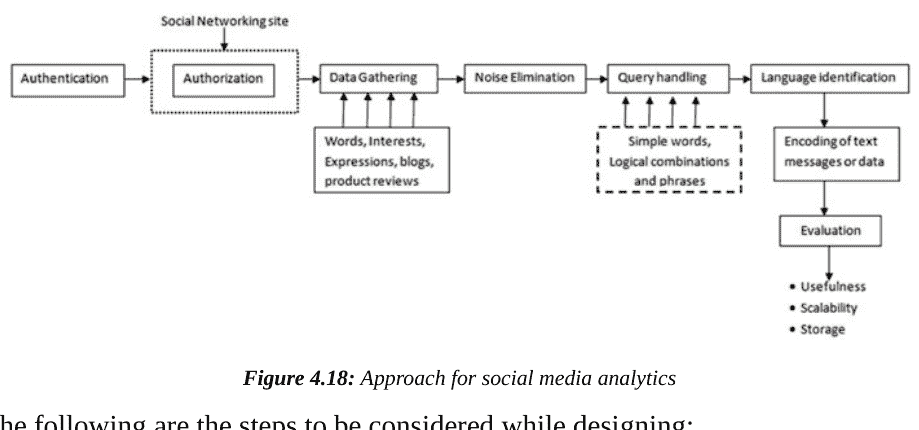

设计时需要考虑以下步骤：

1.  **授权：** 首先需要对系统与用户之间的连接进行身份验证和授权。前述要点通过构建授权软件来处理。
2.  **数据收集：** 一旦获得社交网络站点的授权，就可以通过 API 调用收集用户的非隐私数据，包括对话中人员的地理位置、社交和人口统计资料。然而，在开发系统时可能会面临各种挑战：
    a. 需要维护一个能够流式传输实时对话的长时连接。
    b. 社交网络站点中长时连接的可靠性无法保证。
    c. 当消息简短且包含大量缩写时，有效识别垃圾信息也是一项挑战。
3.  **实现：** 尽管社交媒体本质上是嘈杂的，过滤有意义的信息需要剔除不良和重复内容，但仍需关注以下方面：
    a. 包含一种机制，以关注长期运行的查询并确保不会遗漏任何对话。
    b. 通过关注提出的查询、产生的回复以及以词语表达的兴趣，可以通过实时对话收集数据；查询可以是词语和短语的简单逻辑组合。
    c. 可以从其他社交网络站点、博客和产品评论站点捕获信息。
    d. 一旦捕获这些数据，就需要识别语言并能够对文本消息和收集的数据进行编码。这可以通过语言识别技术来完成。
    e. 然后需要创建数学模型来确定消息中每个单词的概率。然后可以使用另一个公式来选择其总和概率能表明其有用性的消息。
    f. 完成此操作后，可以将单词、消息和概率存储起来，以提供服务繁重的读/写工作负载。这可以通过具有高效存储的容错系统来实现。
4.  **解决方案：** 构建不同的指标集并执行比较分析可用于执行各种分析。这包括以下内容：
    a. **每日数据：** 基于社交媒体站点上的每日点击量，可以收集并分类每日信息。这种分类可以根据感兴趣的查询，在地理位置、人口统计指标等参数上执行。
    b. **声量份额：** 可以根据某些聚类标准将人们提出的观点聚类在一起。收集到的这些聚类数据可以进一步以数量和图表的形式呈现，每个类别的数量也可以以适当的方式呈现。
    c. **作者分配的标签**：作者通常通过标签和博客为自己的媒体分配标签。然后可以根据地区或兴趣领域比较这些标签，并从中形成观点。
    d. **关键词和短语的重复出现**：当许多单词、关键词或短语重复出现时，它们提供了关于客户随时间推移如何看待品牌的宝贵见解。然后可以捕获这些信息以构建趋势历史。因此，这种定性分析提供了对客户感知随时间如何变化的理解，提供了随时间推移的信息细粒度感知。

#### Instagram 案例研究

**简介**：Instagram 被认为是企业进行社交媒体营销的工具，也是品牌与其关注者之间培养个人关系的一种方式。内容和互联网通信的数字化使得社交媒体的利用成为信息和影响力的来源。因此，有必要在社交媒体平台上拥有一定的存在感。缺乏这些渠道被认为是不可接受的。因此，企业需要将社交媒体整合到其战略中，以吸引客户并与之互动。随着社交媒体的使用及其模式和频率不断变化，为正确的社交媒体平台分配正确的战略成为一项挑战。

**案例研究目的**：探索 Instagram 作为企业和消费者应用程序的使用情况

**目标**：根据消费者和品牌偏好评估和比较主要社交渠道

- 分析通过 Instagram 改进业务的方法。
- 确定可以收集哪些数据来检查 Instagram。

企业需要整合社交媒体和数字营销战略，以发展其业务并通过社交媒体平台与客户互动。

**关于 Instagram**：它是一款应用程序，使用户能够分享想法、与周围的人建立联系、增强知识，并将拍摄的照片转换为视觉上吸引人的图像。然后，这些图像可以通过任何社交媒体或任何其他网络共享。

不同类型的社交媒体包括社交网络、博客、商业网络、协作项目、企业社交网络、论坛、微博客、照片共享、产品/服务评论、社交书签、社交游戏、视频共享和虚拟世界。

以下是使用社交媒体的优势：

- 社交网络构成了使企业脱颖而出的工具。
- 它为商业组织提供了更多的曝光机会。
- 它们提高了产品品牌价值的认知度。
- 它帮助用户查看购买者的评论。
- 客户比企业赞助的产品信息消息更信任社交媒体。
- 公司可以通过创建在线社区来赢得客户忠诚度。
- 社交媒体允许企业与客户建立牢固的关系。
- 企业获得反馈并获得新客户。
- 通过社交媒体平台，公司可以增加利润。
- 通过社交媒体对客户偏好的洞察，企业获得了创建新产品以及关于广告和服务客户最佳方式的明智决策的线索。
- 在 Instagram 上拥有存在感可以与全球数百万用户进行直接沟通。

**方法：** 社交媒体平台被广泛用于通信和信息交换。它们被称为促进用户生成内容的创建、讨论、修改和交换的 Web 应用程序。

本案例研究的重点是采用定性内容分析来评估 Instagram 的社交媒体战略。开发 Instagram 的基本目的是将可用的照片与通过社交媒体和位置服务与人们建立联系的便利性相结合。

Instagram 采用的方法是识别人们沟通方式的相似性，并实现市场的各个方面。Instagram 采用的战略是波特战略的镜像，该战略专注于在有限市场中创建专业服务。

**评估：** 为了评估 Instagram，考虑了一种结构化的方法来组织和理解 Instagram 的复杂趋势、发展、战略、结构和组织文化。除此之外，还考虑了各种因素，例如竞争环境、关键障碍和影响组织战略的关键假设。其详细内容如下：

-   全面的战略分析包括以下内容：
    -   组织当前的竞争环境
    -   所采取行动对系统产生的正面和负面影响
    -   基于战略分析所考虑的各种建议方案

-   竞争对手分析包括以下内容：

Instagram需要收集关于其竞争对手的信息，以及其真实和感知的优势与劣势。由于需要进行比较，因此通过比较竞争对手的SWOT进行了**优势、劣势、机会和威胁（SWOT）**分析。该分析帮助Instagram确定了其未来最佳且最成功的战略。因此，作为竞争对手的Snapchat和Pinterest被进行了比较，如表4.7和4.8所示：

| 关键要素 | Instagram | Snapchat | Pinterest |
| :--- | :--- | :--- | :--- |
| 独特卖点 | 它是一款即时照片分享/视频应用程序。 | 它被认为是一款视频/图片分享消息应用程序。 | 它据说是一款网络和移动共享应用程序。 |
| 对潜在客户的价值 | 客户可以查看他人的活动、购物并查看最新趋势。 | 客户可以通过此应用程序即时发送图片、视频消息并转账。 | 客户可以搜索网络并在特定范围内使用图像。 |
| 核心能力 | Instagram专精于广告和图片分享。 | 它专精于视频/图片分享。 | 它允许用户发现和分享创意想法。 |
| 市场整体印象 | 它被认为是社交媒体行业的领导者。 | 它专注于通过图片分享进行消息传递。 | 它据说在网络搜索方面是先驱。 |

*表4.7：各社交媒体平台之间的比较*

以下是竞争对手之间的SWOT比较：

| 特征 | Instagram | Snapchat | Pinterest |
| :--- | :--- | :--- | :--- |
| **优势** | 多种滤镜可增强和自定义图片。 | 图片会持续刷新。 | 开发了虚拟公告板，并且用户友好。 |
| **劣势** | 所有交互都在在线进行。 | 缺乏私密性，且图片仅在短时间内可用。 | 容易受到垃圾图片的影响，并且基于用户上传。 |
| **机会** | 广告和技术发展机会 | 广告和产品改进机会 | 通过社交媒体网络进行广告宣传和发展业务 |
| **威胁** | 与照片版权相关的问题 | 出现了很多负面宣传 | 书签功能正被其他网站复制 |

*表4.8：竞争对手之间的SWOT比较*

**市场分析：** 它是分析Instagram、Pinterest和Snapdeal的重要工具。

**得出的推论：** 基于与竞争对手Snapdeal和Pinterest的分析，Instagram做出的关键改进包括：

-   Instagram允许人们根据自己的喜好调整照片。
-   与Snapchat类似，Instagram增加了分享“故事”的功能，并添加了24小时后消失的面部滤镜。
-   Instagram通过直接消息功能进一步增强了其功能，这是Facebook的一项功能，通过其私有/公共功能可以轻松解决隐私问题。
-   尽管最初是一款移动照片分享应用程序，Instagram还是进入了社交媒体领域所有公司的广告市场。
-   一个被识别出的主要问题是照片版权，因为人们会窃取照片/创意并声称是自己的。
-   多设备可操作性是一个挑战：在多个设备上运行该应用程序被确定为其局限性。

### 客户流失分析案例研究

流失表示离开组织或公司并购买其他公司产品的客户数量。换句话说，它有助于确定客户流失的趋势。

#### 分析目标

-   **流失分析**
    流失分析提供以下方面的洞察：
    -   客户流失的原因，即客户不满意的各项参数
    -   预计在未来几个月内流失的客户
    -   需要采用的各种减少流失的方法

流失率用于进一步确定流失的趋势或模式，其计算公式为：

$$流失率 = \frac{在一段时间内流失的客户数量\ X\ 100}{该时间段开始时的客户总数}$$

所有这些分析都可以通过应用描述性、诊断性和预测性分析来实现。这些分析有助于确定为**客户保留**所做的努力。

-   **识别流失原因**
    通过跟踪客户的动向、行为和行动，可以识别出他们不满意以及取消订阅或使用产品的原因。该分析可以通过大量的反馈电话、后续调查和问卷来进行。一旦获得适当的反馈，就可以采取必要的行动来保留最大数量的客户并改进系统。
-   **流失分析的必要性**
    流失分析之所以重要，是因为可以通过识别流失原因、哪些客户正在流失以及哪些客户预计接下来会流失来确定某些流程。这些流程可以进一步通过以下方式提供帮助：
    -   保留有助于增加利润的客户
    -   提供客户忠诚度
    -   降低成本，因为获取新客户据说比保留现有客户更昂贵
    -   根据客户的人口统计和行为制定目标营销活动并减少客户流失
    -   建立品牌以获得回头客和推荐，发现客户的痛点并改善客户体验

##### B2B组织中客户流失的原因

客户流失的主要原因如下：

-   整体客户体验不足
-   客户没有从产品中获得他们期望的价值
-   缺少帮助用户开始使用产品的入门流程
-   与竞争对手的产品相比，产品价格昂贵
-   UI/UX不具有交互性和沉浸感
-   存在许多错误和故障
-   网站处理时间较长且速度慢

### 电信公司案例研究

众所周知，电信行业一直存在大量流失。每100人加入成为客户，就有30-35%在一年内选择退出。因此，电信公司需要获取新客户并防止合同终止。这种终止也被称为流失或损耗。被确定为流失原因的包括更好的价格优惠、更有吸引力的套餐以及糟糕的服务体验。

因此，公司需要识别可能选择退出的客户，并制定策略或预测模型来防止他们这样做。流失分析能够预测客户流失并识别流失的根本原因。流失指标可用于确定在给定时间段内取消产品或服务的客户百分比。

#### 业务挑战

电信公司正面临极端的客户流失，并且需要大量资金来获取新客户。一旦客户离开公司，来自该客户的未来收入以及为获取该客户所投入的资源都会损失。因此，需要在整个组织范围内防止这种情况发生。为此，公司需要做以下工作：

-   识别可能流失的客户并部署干预措施以防止流失
-   制定计划并开发客户保留策略
-   满足客户需求并提高利润

#### 方法

基于客户行为、人口统计和网络行为，可以应用多种分类和混合模型来以不断提高的准确率预测流失。需要设计诸如折扣和特别优惠等机制来保留客户。为了进行此预测，关键数据需要识别影响客户流失的参数。可以考虑的各种数据参数包括以下内容：

- **满意度数据：** 这些数据可能包含关于沟通、故障、安装机制等方面的信息。它有助于确定不同满意度数据水平对整体流失的影响，从而进行探索性分析。
- **服务水平数据：** 基于服务水平数据，如计费、交付、保障、客户满意度数据和投诉，可以构建预测性流失模型，如图4.19所示。

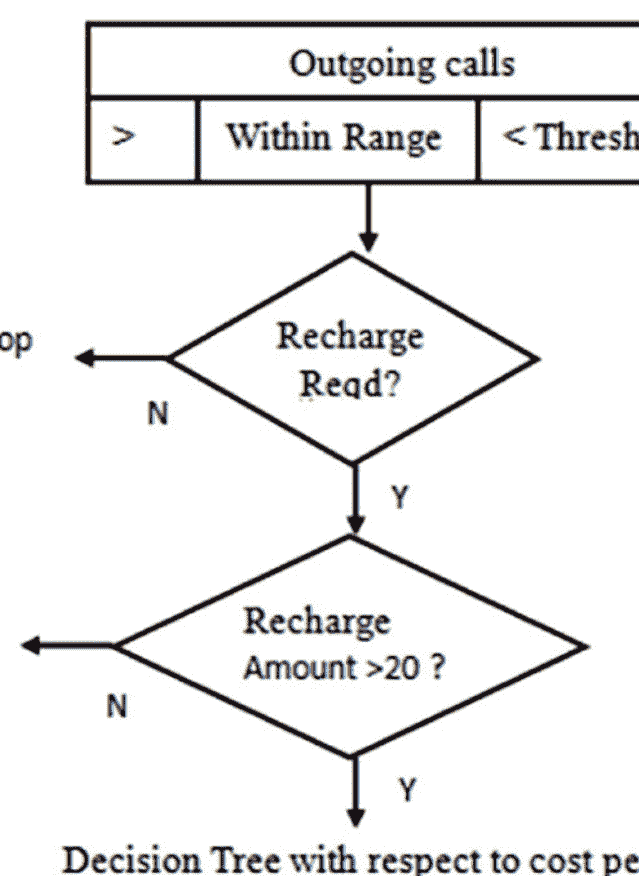

**图4.19：** *决策树流失预测模型*

此分析有助于确定影响客户流失的因素。

一旦确定了关键数据参数，就可以构建一个基本的机器学习流程，并确定其性能。然后，通过比较不同的模型类型，可以确定最适合特定电信公司的模型。让我们看看可以采用的方法。

##### 步骤1：问题定义

基于关键挑战，我们确定需要预测客户是否会流失。为此，需要训练机器学习模型。模型的训练可以在80%的可用数据上进行，而剩余的20%可用于测试训练好的模型。这个80:20的比例可以根据应用需求动态调整为70:30。此外，测试可用于评估关于流失或不流失的预测。

##### 步骤2：数据收集

如前所述，需要形成不同类型的数据及其相应的数据集。需要进一步开发使用Panda和NumPy进行数据处理和处理的用例流程。此外，需要使用Matplotlib进行可视化，如第2章“机器学习的Python基础”和第3章“机器学习算法概述”中详细解释的那样。

##### 步骤3：探索性数据分析（EDA）

为了进一步探索数据，需要理解数据结构背后的概念和领域知识，必须执行数据的初步预处理和清理，并且必须理解调查主题。此外，需要使用标准的Panda函数确定数据中的各种模式和不一致性，例如偏度、异常值和缺失值。这可能导致构建和验证假设。此外，在此步骤中需要理解每个特征的唯一值。

特征也可以通过分类标签聚类到不同的类别中，例如以下内容：

###### 流失标签

- **流失、电话服务、多条线路**：确定关于客户是否流失、是否有电话等方面的各项分析。此分类标签的答案将以“是”或“否”的格式呈现。
- 预订的客户服务
- **电话服务**：这表明客户是否有电话服务（是，否）
- **互联网服务提供商类型和备份设施**：它表明为个人客户提供的服务，例如DSL、光纤或无。它还表明客户是否选择了在线备份，导致是、否或无服务提供商。
- **流媒体服务**：这表明客户是否有流媒体电视、电影和其他相关操作的设施。这再次导致是、否或无互联网服务。

###### 客户账户信息

它涉及客户与公司保持的合同期限、计费、付款方式和向客户收取的费用。这提供了定量信息，如月数、年数、信用卡支付、银行转账等。

###### 客户人口统计信息

此信息提供客户的个人详细信息，如客户ID、性别以及是否有受抚养人。

###### 构建假设

然后可以针对以下内容制定假设：

- 如果合同期限较长，客户流失的可能性较小。合同期限越长，客户流失的可能性越小。这是因为他们面临终止或延长决定的频率较低。
- 客户愿意比复杂的产品捆绑更快、更频繁地取消关联产品组件较少的简单合同。
- 为了保持服务为家人运行，客户可能会减少流失。

流失的主要驱动因素是任期、合同期限条款和附加服务数量。

###### 特征提取

根据数据类型及其值，可以对特征进行分类。这可以通过标签编码为分类数据来完成，例如性别、电话服务、无纸化账单等。这些值的输出是“是”或“否”值。这些可以转换为二进制整数以进行进一步分析。对于取值超过两个的变量，例如在线安全、在线备份等、付款方式，可以实现独热编码。这里，对于每个值，可以创建一个新变量，其二进制整数表示该值是否在数据条目中先前出现过（1或0）。数值特征的值通过最小-最大缩放方法在0到1的范围内重新缩放。

关于前面的客户流失示例，可以说流失的客户的任期较低，约为10个月，但月度费用较高。流失在老年人和月度合同客户中最为严重。

##### 步骤4：特征工程

在此步骤中，从现有特征生成新特征，并执行相关性分析。可以观察到，与拥有更多服务的客户相比，拥有一项附加服务的客户可能具有更高的流失率。

##### 步骤5：训练/测试拆分

现在可以将收集到的数据集分为训练数据和测试数据。然后可以将其应用于进行模型训练和测试。根据确定的阈值，信息可以按80:20或70:30拆分，即训练数据和测试数据之间的拆分。Y轴，即因变量类别，可以代表流失，而其他特征可以被视为自变量，即X轴。

##### 步骤6：模型评估指标

可以使用各种指标来评估所选模型的性能：

- **特征权重：** 此指标可以指示模型用于生成预测的顶级特征。
- **混淆矩阵：** 它可以指示与实际值相比的真实和错误预测的网格。
- **准确率分数：** 这可以代表模型的整体准确性。
- **ROC曲线：** 这可以指定不同类别预测阈值的**真正例率（TPR）**以及**假正例率（FPR）**。这反过来将有助于确定流失预测。
- **精确率-召回率曲线：** 这可以比较不同类别预测阈值的**假正例率（FPR）**和**假负例率（FNR）**。

##### 步骤7：模型的选择、训练、预测和评估

可以测试K近邻、逻辑回归、随机森林和支持向量机等机器学习模型。可以进一步测量它们的性能，然后可以通过调整其超参数来优化模型。可以观察到，与逻辑回归（一种基于线性的模型）相比，K近邻可能更快、更简单且基于实例。随机森林可以被识别为较慢但准确的基于集成的模型。支持向量机可用于非线性操作。可以部署各种机器学习模型来预测流失。这些可能包括以下内容：

- **分类模型或监督学习：** 它有助于识别客户是否会流失。
- **回归分析：** 可以使用回归分析等技术构建单独的模型和预测仪表板，以预测客户从企业流失。

应用这些机器学习模型可能导致制定有针对性的营销策略并降低获客成本。

##### 步骤8：超参数调整/模型改进

在超参数调整期间使用交叉验证的概念，以解决在训练-测试拆分部分由于数据拆分而产生的偏差。超参数调整可以通过网格搜索和随机搜索来实现。

下图4.20表示开发系统的过程。它指示了构建和部署模型以确定最高和最低客户流失信息的方式。如下图中的图A所示，构建模型包括通过识别重要变量并开发模型来执行历史数据分析。图4.20表示部署机制，该机制包括捕获历史数据的实时馈送并开发倾向模型。这可用于生成分数，以区分客户流失的高可能性和低可能性。

#### 影响分析

1.  客户流失分析可能表明，导致流失的原因是配送延迟的可能性。
2.  增值服务对客户流失的影响可能是导致流失的主要原因之一。

### 教育系统中的学习分析案例研究

随着教育数据的飞速增长，需要改进数据存储、提升计算资源、算法和分析工具。这些进步对于理解学习环境、进行预测、优化学习流程、在组织内做出明智且更优的教育决策是必要的。这可以通过学习分析的概念来实现。因此，学习分析用于评估和分析关于学习者及学习环境的信息。

为了将学习分析系统整合到教育机构中，需要开发可操作的框架和采纳模型。然而，这些模型可能因国家和组织的不同而有所差异。主要的利益相关者包括那些通过安全开放的沟通渠道来传达、遵循和推广学习分析的人员。

#### 学习分析带来的组织效益

利用学习分析的各种益处包括：

-   识别有风险的学生以及可能在学习中取得成功的学生。
-   监控和提升组织能力。
-   制定教育政策和跨学校的资源分配。这样做是为了增强和优化教育流程、降低辍学率、提高留存率和成功率，并预测学校表现。

-   **数据收集**
    收集的数据可用于确定数据的用途或目的。这些数据可大致分为以下几类：
    -   **总结性与描述性：** 在学习阶段（也称为学习期）结束后提供详细见解。
    -   **形成性与（近）实时性：** 这种学习从持续进行的信息中捕获数据，以通过直接干预来改进流程。
    -   **预测性与规范性：** 这预测结果的可能性，以便为未来的干预、策略和行动制定计划。

#### 面临的挑战

让我们来看看面临的挑战。

#### 采纳

-   采纳学习分析面临的挑战之一是确定是完全采纳还是分阶段逐步扩大采纳学习分析机制。
-   由于组织内不同层级涉及多个利益相关者，应用学习分析导致流程开发变得复杂。
-   开发对功能、干预策略和隐私感知的偏好需要开发工具。因此，需要成立治理委员会，专注于采纳学习分析，并成立一个小组专注于教育数据的隐私和伦理使用。

#### 教师诊断支持系统

为了提供诊断支持，需要收集有关学生的信息：

-   **学生的个人特征：** 这可能包括特定领域的知识、能力和情感动机特征。
-   **教学特征描述：** 这可能表明学习内容及其特征。
-   还可以收集有关学生对该学科的兴趣及其对该主题知识的信息。

#### 方法

开发的重点可以分阶段进行：课程开始前、课程进行中以及课程结束后，如[图 4.21](Figure 4.21)所示。开发也可以采用客户端-服务器模型或移动应用程序开发。

表 4.9 列出了信息及其来源：

| 序号 | 关注领域 | 信息描述 | 信息来源 |
| :--- | :--- | :--- | :--- |
| 1. | 学生 | 学生的个人特征 | 学生 |
| | | 学生的评估 | |
| 2. | 教师 | 教学特征 | 教师 |

学习分析也可用于考试。根据收集的证据，我们可以确定成功率、识别有不及格风险的学生、注册学生人数、辍学人数、平均风险可能性、学生平均年龄、性别分布等。可以采用的流程如[图 4.22](#)所示。

根据所遵循的流程，可以确定有关学生获得的学分、教职员工留存率、学生进步和学生满意度等方面的见解。在应用机器学习算法时，可以考虑各种测试用例场景，例如：

-   **在宏观层面：** 学习分析见解有助于确定教职员工的目标留存计划。
-   **在中观层面：** 可以整合机器学习算法来改进教学实践。
-   **在微观层面：** 可以确定专注于学生进步、识别处于不及格区域学生的算法。还可以开发针对个别学生执行纠正措施的算法。

利用各种模型、标准、可视化指标和设计指南将使学习分析更加有效。此外，实施各种机器学习算法、学习管理系统（LMS）和学生信息系统（SIS）有助于为更好的教育学习系统开发见解。因此，学习分析的采纳可用于以下方面：

-   开发与就业市场需求相适应的学术课程
-   为学生的职业生涯做准备
-   通过自适应和按需学习方法提供灵活的学习机会
-   支持学生需求并为学生改善学习环境
-   以最经济的方式实现灵活的教学和学习方法

### 其他案例研究

**Netflix 对预测分析的利用：** 对于像 Netflix 这样的公司来说，数据收集至关重要。根据用户的行为和过去的观看模式，Netflix 收集客户信息，并利用这些信息根据客户偏好进行预测。

## 结论

本章重点介绍了机器学习适用性的各种案例研究。这些案例包括缓解信息过载问题并为用户提供系统中不易获得的产品和服务访问权限的推荐系统。接着是将机器学习算法应用于多媒体系统的文本和图像元素。进一步探讨了利用机器学习算法的各种案例研究。下一章详细阐述了机器学习算法中的优化，并阐明了如何使用各种启发式优化算法来为机器学习算法确定正确的参数值。

## 加入我们的书籍 Discord 空间

加入书籍的 Discord 工作区，获取最新更新、优惠、全球科技动态、新书发布以及与作者的交流会：

https://discord.bpbonline.com

# 第 5 章

## 机器学习算法中的优化

## 引言

机器学习项目离不开改进，尤其是在算法训练方面。研究人员一直在努力降低算法训练所涉及的成本。这就是优化发挥作用的地方。在第 4 章“机器学习案例研究与项目”中，我们已经看到了各个领域的项目。这些项目通过使用各种混合算法和优化技术还有改进的空间。当涉及金钱和时间时，优化非常重要。优化的目标是找到最佳元素、路径或技术，通过减少训练时间来提高算法的效率。本章介绍了优化的概念，并解释了其在基于机器学习的项目中的重要性。本章从基本的优化技术开始，接着讨论元启发式方法。本章还介绍了可用于优化的 Python 库。

## 结构

-   优化：机器学习项目的需求
    -   优化技术的类型
-   基本优化技术
-   优化的元启发式方法
    -   元启发式算法的类型
-   通过优化学习参数改进机器学习算法
    -   案例研究 1：医疗保健中的元启发式优化技术
    -   案例研究 2：批量生产中的遗传算法（GA）
-   使用 Python 进行优化

## 目标

在本章中，您将了解优化的重要性并学习基本的优化技术。您将被介绍各种类别的优化

## 优化——机器学习项目的必需

优化是从一组可用备选方案中，根据某些准则选择最佳元素的过程。优化的目标是提供近乎完美、有效且尽可能多的备选方案。最大化或最小化与应用或其特性相关的某个函数，就是优化的过程。例如，在典型的机器学习算法中，优化的目标就是最小化代价函数或均方误差。

当涉及金钱和时间时，优化就显得尤为重要。机器学习经常使用优化算法来提升算法的学习性能。降低代价函数是机器学习中任何优化技术的主要目标。优化可以包括权重、激活节点、网络架构和学习参数的优化。训练优化能够提升任何模型的泛化能力。在复杂模型中，调整超参数或为超参数找到最合适的值，就是机器学习中优化的目标。

## 优化技术的类型

广义上，优化技术可分为两种方法：

### 传统方法

传统的优化方法，如梯度下降和反向传播，非常流行且被广泛使用。它们可以归类为一阶或二阶优化技术。使用传统方法的主要优势在于它们易于使用和实现。这些是直接方法，不使用目标函数的任何导数信息。这里，仅使用目标函数值来指导过程。

这些技术的变体也被用于提升机器学习算法的性能，例如基于动量的梯度下降和随机梯度下降，具体取决于这些机器学习算法的应用场景。

### 元启发式方法

元启发式算法是为寻找或生成优化问题的良好解决方案而发展起来的。当计算能力有限且信息不完整时，元启发式方法就能发挥作用。元启发式算法的优势在于两种技术：**利用**和**探索**。**利用**就是在搜索空间中，针对当前找到的良好解决方案，搜索未知的新区域。**探索**则是利用已经发现的解决方案。元启发式是一种将这两种技术结合起来以找到良好解决方案的程序。

元启发式算法的整体性能取决于对这两种技术的最优利用。其效率也取决于这两种技术的平衡程度。元启发式算法在局部和全局层面工作以寻找解决方案。因此，不平衡的探索和利用会导致问题。探索不足而利用过多，会在寻找局部和全局最优解时遇到困难。同样，探索过多而利用不足，则会在收敛方面产生问题。因此，系统会变慢，妨碍其整体性能。元启发式算法的精髓就在于如何实现这两种技术之间的平衡。

现有的元启发式算法种类繁多，因此可能无法对它们进行清晰的区分。从广义上讲，这些算法可分为两组：

- **基于单解的算法**
  基于单解的算法专注于改进单个解决方案。模拟退火和禁忌搜索是基于单解的算法的例子。这些算法通过利用局部搜索空间，专注于局部搜索。
- **基于种群的算法**
  顾名思义，基于种群的算法处理多个解决方案，并专注于使用启发式方法从中找到最佳方案。这些算法在全局搜索方面表现强劲。
  这些算法可进一步分为以下几类：
  - **进化算法：** 遗传算法是最流行的进化算法。除此之外，遗传编程、进化规划和差分进化也是一些流行的进化算法。进化算法使用进化框架和遗传算子来生成新的解决方案。遗传算子包括变异、交叉、选择等。这些算子被反复使用，以进化出新的和最优的解决方案。
    这些算法可以应用于不同的非线性问题。进化算法中的停止标准由适应度函数指示，而适应度函数又决定了解决方案的质量。定义一个合适的适应度函数是进化算法的关键。
  - **群体智能：** 粒子群优化、人工蜂群算法、灰狼优化和鸟群聚集是一些广泛使用的群体智能算法的例子。这些算法受到各种去中心化但自组织系统行为的启发。简而言之，这些是受自然启发的算法。例如，在粒子群优化中，观察了一群鸟获取食物的行为。通过观察这种行为来生成启发式规则。
    在这些算法中，食物代表问题的解决方案，而这些鸟类获取食物的方法被实时模拟，以创建全局搜索。在蚁群优化中，观察了蚂蚁寻找食物的行为。蚂蚁在其自然栖息地使用最短路径来获取食物样本。它们之间建立良好的沟通以找到这些最短路径，并以一种分散的方式穿越路径。这种行为在蚁群优化算法中被模拟。有许多算法受到各种动物和鸟类的自然习性和行为的启发。
  - **混合算法**
    传统算法擅长局部搜索，而元启发式算法擅长全局搜索。混合算法通过将传统算法与元启发式算法相结合，充分利用了这两种优势。

下图5.1展示了优化算法的简要分类，以便于理解：

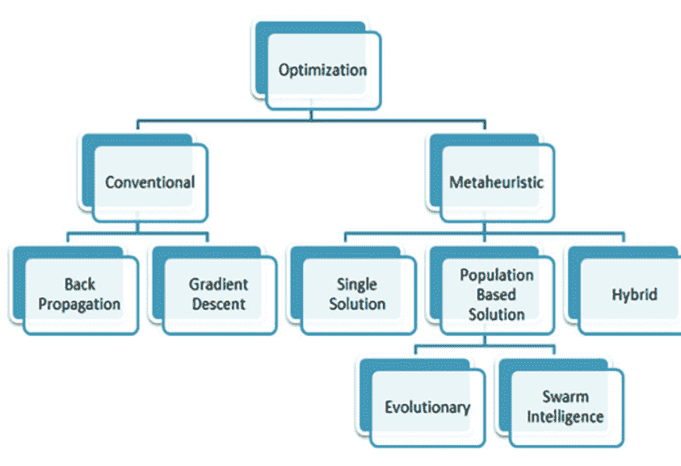

*图5.1：优化分类法*

例如，遗传算法与反向传播结合用于训练人工神经网络，提供了一种更好的学习方法。混合算法擅长搜索且收敛速度快。这些算法也被称为模因算法。在混合模型下，也使用两种不同的元启发式算法来获得优化的解决方案。

优化分类法的图示表示如图5.1所示。

## 基本优化技术

如前一节所述，有两种基本的优化技术：反向传播和梯度下降。

### 反向传播优化

反向传播算法用于具有监督训练的前馈神经网络。来自输入层的输入通过隐藏层中存在的激活函数传递。在传递过程中，输入被分配权重。现在，隐藏层的输出成为下一层的输入，依此类推。最终输出通过输出层获得。将这个结果输出与初始输入进行比较，并计算误差。这个误差用于微调该层的权重。这个过程从输出层递归地进行到输入层。因此，权重被修改和调整；这个过程持续进行，直到达到最小误差并计算出最终输出。

在整个过程中，权重会被调整。阈值的调整首先在输出层获得。两个参数，即输出层的计算误差和用于后续特定层权重调整计算的学习率参数，相乘得到阈值的调整值。因此，反向传播算法从训练数据中学习正确的分类。然后，在测试数据上进行测试，以了解网络对测试数据的分类效果如何。因此，应用反向传播学习时，一个重要的考虑因素是网络的泛化能力如何。

话虽如此，反向传播学习存在许多问题：

- **局部极小值：** 反向传播总是致力于调整网络权重以减少误差。但在实现这一目标的过程中，误差可能开始增加。因此，该算法存在自相矛盾。
- **网络瘫痪：** 网络瘫痪是指单元被迫在极端值下运行的现象。这些极端值形成了一个激活函数导数非常小的区域。训练过程中权重值过大导致单元在极端值下工作。
- **收敛缓慢：** 多层神经网络可能需要多次调整才能获得权重的最优值。此外，如果网络陷入局部极小值，收敛速度仍然会减慢。

### 梯度下降优化

梯度下降是另一种优化方法，用于找到使代价函数最小化的函数参数值。这里，梯度衡量的是当输入发生微小变化时函数输出的变化。梯度下降是所有机器学习项目中使用的基本优化方法。梯度下降有几种变体：基于动量的梯度下降、随机梯度下降、Nesterov加速梯度下降等。但同样，它也有一些缺点：

- **处理缓慢：** 梯度下降的过程非常缓慢，因为它需要基于多个参数计算代价函数。
- **缩放问题：** 使代价函数最小化所需的迭代次数取决于问题的规模，因为方向没有明确定义。
- **局部极小值：** 梯度下降操作依赖于学习参数或步长。步长过小可能增加收敛时间，步长过大可能跳过局部极小值。微调学习参数具有挑战性。

传统方法使用基于平方的误差作为优化的代价函数，这可能并不适用于每个分类问题。在大多数分类问题中，准确率和误分类率被用作代价函数来判断分类器的好坏。

## 元启发式优化方法

有人可能会问启发式技术和元启发式技术有什么区别？启发式技术是基于问题的，针对特定问题，而基于元启发式的技术独立于任何特定问题，可以应用于广泛的通用问题领域。当解的数量非常大时，元启发式算法表现良好。由于这些是通用算法，它们适用于各种应用。这些算法旨在解决复杂问题。非线性和不可微问题也可以通过这些算法非常有效地处理。

元启发式算法遵循逐步程序来生成解。这些步骤如下：

1. **初始化：** 使用随机值作为种群的种子，并在搜索域中初始化种群。
2. **评估：** 评估种群中每个个体的适应度。
3. **生成：** 使用每个算法中建议的进化操作生成新的种群。
4. **重复：** 重复步骤2和3，直到满足停止条件。

元启发式优化使用一个目标函数，该函数为空间中的每个解分配一个值。参数集用于获得目标函数的全局最大值或最小值。初始解是通过某种启发式方法得出的，然后使用元启发式方法通过迭代过程改进该解。当满足停止条件时，迭代过程终止。停止条件可以是用户定义的任何内容，例如迭代次数、已完成时间等。元启发式算法在现有解空间中找到一个好的解，但不保证找到最佳解。

使用元启发式方法相对于传统方法的主要优势在于其全局最优搜索能力更好。这一特性使其可用于各种问题以改进解。元启发式算法更具适应性且本质上是智能的，因为它们在运行过程中学习。相反，启发式算法应用试错机制，这使得搜索依赖于计算能力。

元启发式优化算法有其自身的优势：

- 易于理解
- 易于实现
- 应用领域广泛：由于这些算法本质上是生成性的，因此在各个领域都有应用
- 可以与其他方法结合，使其广泛可用
- 可以更快地解决具有大量解的复杂问题

这些算法的缺点可能如下：

- 没有数学基础
- 收敛速度很多时候非常慢
- 不提供最佳解决方案
- 其性能依赖于参数的微调
- 最初获得的解可能无法在相同条件下重复
- 很难决定哪种算法最适合哪种应用以及在什么情况下。因此，对于任何应用，大多都是试错。

这些优化算法使用探索和利用方法来设计新的最优解。术语“探索”表示搜索大区域以找到良好、可行解的过程。搜索大型或宽搜索空间所需的时间会降低算法的性能；这就是利用发挥作用的地方。利用将搜索限制在较小的区域，以便可以细化解。探索在早期阶段引入，利用在后期阶段引入。

探索和利用是任何优化算法中的两个重要步骤。探索始终确保搜索空间的适当和有希望的区域被侵入，而利用始终确保在给定区域内找到最优解。为了达到最优解，仔细微调这些组件非常重要。这些组件之间总是存在权衡，因此需要适当的平衡，这很难实现。大多数组件值取决于所考虑的应用。

算法的元启发式性质有助于实现这种平衡。每个优化算法都有自己的探索和利用策略，这使其在各个方面都是独特的。元启发式算法对于现实世界的工程问题非常有效，但要记住的一点是，由于它们的性质，它们不能适用于所有类型的应用。它们可能为一个应用提供最佳结果，但对另一个应用表现不佳。一个优化器解决一组问题的性能并不能保证解决所有具有不同性质的优化问题。

### 元启发式算法的类型

如前所述，元启发式算法大致分为基于单解、基于种群和混合模型。尽管有大量优化算法，但本章重点介绍几种有前途且广泛使用的算法。

#### 基于单解的算法

这些算法基于对单个解应用启发式并找到更好的解。它们致力于改进解，并大量使用利用方法。有许多流行的算法可用；让我们简要看看其中几个：

- 模拟退火
- 禁忌搜索
- 变邻域搜索

##### 模拟退火

这种方法的灵感来源于金属的缓慢冷却。金属的冷却通过减少原子运动来实现，这反过来又减少了晶格缺陷的密度，直到达到最低能量状态，金属获得所需的结构。在算法中，在每个退火温度下，为当前问题提供一个新的解。这里，温度是获得优化解的最重要参数。

算法的步骤如下：

1. 从初始解 S₀ 开始，并将初始温度设置为 t₀。
2. 需要设置一个温度降低函数，通常称为 alpha，它可以基于线性减少规则、几何减少规则或缓慢减少规则。每个减少规则将以不同的速率降低温度。
3. 这里，循环开始，并重复下一步，直到满足终止条件。终止条件基于具有满意性能的低温值。
4. 从生成的解中，选择一个解并计算旧解和新解之间的成本差异。解是通过改变参数值生成的。
5. 如果新解的成本更好，则接受该解。经过一定次数的循环后，性能稳定，并获得最终解。

模拟退火是一种非常有效且易于实现的优化算法，用于解决许多经典问题，如旅行商问题和调度问题。主要优点是它能避免陷入局部极小值。

##### 禁忌搜索

禁忌搜索是一种随机优化方法，其有效性源于局部搜索方法，通常用于数学优化。禁忌搜索的优势在于它能有效利用内存来存储和追踪先前的解。这使得局部搜索非常有效。禁忌搜索探索优质解，以便能够采用智能搜索机制来探索新的潜在区域。它使用自适应记忆，这有助于创建灵活且有效的搜索策略。

算法步骤如下：

1.  从一个初始解 S₀ 开始，它可以是任何可行解。
2.  寻找下一个邻域解，并开始填充禁忌列表，该列表是存储算法生成的移动到解或完整解的记忆。禁忌列表中的解满足期望准则。期望准则是可选的，并决定解的质量。如果当前解更好，它会被存储在禁忌列表中，并在一个称为禁忌期限的期限内保留。期望准则确保不会产生停滞的解。
3.  将新解与先前解进行比较，如果发现更好，则将其包含在列表中。
4.  重复该过程，直到满足终止条件。通过给潜在的不良解也提供机会，确保了解空间的多样性。制定多样化策略是为了探索新的区域，并探索不属于禁忌列表的移动并给予机会。

禁忌搜索应用于离散和连续的数学优化问题，也用于解决化学和机械领域的问题。

##### 变邻域搜索

变邻域搜索用于解决组合优化问题和全局优化问题。邻域搜索中的探索非常强大，只有在观察到当前解有所改善时才会移动到新解。它在邻域中使用有效的局部搜索方法来获取新解，直到达到局部最优。

变邻域搜索算法认为局部最小值提供了关于全局最小值的一些信息。因此，采用考虑局部最优的有组织搜索，并且只需要调整很少的参数。

#### 基于种群的算法

基于种群的算法更受欢迎，因为它们基于多个解进行工作。这些算法的灵感来源于自然、自然活动、行为、生物学、物理学，甚至人类活动如教学和学习。这些算法大量使用探索方法或全局搜索方法。广义上，它们可以分类如下：

##### 进化技术

进化技术因其在训练机器学习模型方面的应用而广受欢迎。进化技术使用自然选择、进化和变异的生物学概念。这些技术已被证明能有效解决许多现实生活中的优化问题。这些技术易于实现，并且只需要很少的参数来训练模型。一些流行的进化技术如下：

-   遗传算法
-   差分进化
-   进化规划

**遗传算法：** 遗传算法是由 Holland 提出的一种流行的优化算法。它们基于遗传、变异和选择机制。通用算法可以解释如下：

1.  生成初始随机种群。
2.  计算生成种群的适应度，并仅选择最适应的个体。
3.  从这个初始适应种群中选择父代。
4.  选择遗传算子，交叉算子或变异算子，来生成子代。
5.  重复步骤 2 到 5，直到满足停止条件。

停止条件通常基于获得最优解所需的迭代次数。遗传算法中的主要参数是适应度函数和遗传算子。新解是使用遗传算子（交叉或变异）生成的。交叉可以是单点交叉、两点交叉、多点交叉或均匀交叉。基本变异选择一个或多个基因进行随机改变，而入侵算子随机选择两个基因点来反转基因。变异算子的选择取决于所使用的编码，可以是二进制编码、自然数、实数等。选择算子在生成新解中也起着重要作用，可以使用各种选择算子，例如轮盘赌选择、随机通用采样、局部选择和锦标赛选择。

遗传算法是最容易实现的，并且是一种有效的优化算法，应用于工程问题的各个领域。

###### 差分进化

非线性和不可微的连续空间函数优化可以使用差分进化有效解决。

差分进化算法从一组候选解的初始种群开始，通过向种群引入变异然后交叉函数进行迭代改进。然后保留产生较低目标函数值的最适应的候选解。差分进化的主要优点是控制参数少，并且可以处理非线性和不可微的多维目标函数。遗传算法和差分进化的区别在于，只有当新解优于旧解时才会更新解。

算法步骤如下：

1.  生成初始随机种群。
2.  计算生成种群的适应度，并仅选择最适应的个体。
3.  执行变异操作和交叉操作，然后使用选择操作选择子代。
4.  将优化后的解添加到种群中。
5.  重复步骤 2 到 5，直到达到停止条件。

这里的适应度函数控制种群大小，并仅保留最适应的值。

###### 进化规划

进化规划是一种随机优化策略，有助于解决数值和组合优化问题。进化规划的收敛速度很少慢，这里的主要变异算子是变异。

进化规划的基本步骤如下：

1.  生成初始随机种群。优化的速度取决于种群数量，因此在种群中生成一定数量的解很重要。
2.  对生成的种群进行适应度测试，仅保留适应的解。通常，随机锦标赛决定保留在种群中的解。
3.  使用变异生成新的子代或后代。后代根据变异类型的分布进行变异，该分布范围从轻微到极端。变异给父代带来功能性变化，并根据此变化进行判断。
4.  重复步骤 2 和 3，直到满足停止标准。

这里需要注意的一点是，进化规划不使用遗传或交叉算子来生成后代。

##### 群体智能

群体智能于 1989 年引入，它利用集体群体的知识来达到优化解的概念。基本概念是，一组对象（人、动物、昆虫等）被赋予相同的问题来解决。它们利用所有资源来寻找问题的最佳解决方案。因此，算法不是使用单个对象的智能，而是使用群体的智能来寻找最优解。需要记住的一点是，所有对象都独立行动，并试图找到最优或最佳解。群体智能因其对大量问题领域有益而广受欢迎。这些算法也是受自然启发的算法。已经引入了无数算法，有些仍在被发现。让我们看看一些使用群体智能的流行算法：

-   粒子群优化
-   蚁群优化
-   布谷鸟搜索优化

**粒子群优化：** 这是 1995 年引入的最受欢迎的优化技术之一。它也是一种随机优化技术，模拟动物或昆虫的行为来寻找最优解。例如，鸟类成群结队地寻找或捕食。粒子群优化是一种强大且高效的技术，可用于解决各种优化问题。

在这里，单个粒子是解空间的一部分，并始终将其位置传达给相邻粒子。目标是在搜索空间中找到最佳位置。每个粒子的位置根据速度以及当前位置、粒子本身找到的最佳位置和邻居找到的最佳位置之间的差异进行调整。迭代确保群体的焦点更多地放在包含高质量解的搜索空间上。

据观察，粒子群优化在各种现实世界优化问题中表现最佳。

大致步骤如下：

1.  随机生成初始群体粒子。
2.  重复步骤 3 到 5，直到满足终止条件。
3.  对于每个粒子，在粒子的当前位置和粒子找到的最佳位置之间进行选择。设此为 $p_i$。
4.  找到由群体（即相邻粒子）确定的粒子的最佳位置。设此为 $p_g$。
5.  根据 $p_i$ 和 $p_g$ 的值更新粒子的速度和位置，如下方程所示：

    $v_i = v_i + c_1 * rand_1 * (p_i - x_i) + c_2 * rand_2 * (p_g - x_i)$

$x_i = x_i + v_i$

此处，$v$ 代表速度，$p$ 代表位置。下标 $i$ 代表当前粒子，$g$ 代表群体最优值。

6. 输出优化结果。

已观察到速度值多次发生爆炸，因此可以确定并使用速度裁剪值来防止速度爆炸。

粒子群优化已应用于许多优化问题，包括旅行商问题和任务分配问题。它也应用于许多需要多目标优化和动态优化的问题。它被有效地用于训练多层感知器，并因其快速收敛而有效。这有助于节省计算时间。

###### 蚁群优化

顾名思义，该算法的灵感来源于蚂蚁的行为。蚂蚁以系统化、有纪律的方式寻找食物。它们通过一种名为信息素的有机化合物在地面上相互交流。当蚂蚁去寻找食物时，它们会散布信息素，其他蚂蚁会根据信息素的强度跟随该路径。不同的蚂蚁选择不同的路径，但最短路径是首选。

例如，假设三只蚂蚁创建了三条路径。第四只蚂蚁将从这三条路径中选择一条。第四只蚂蚁将选择第一条蚂蚁较早到达的那条路径。现在，当蚂蚁在这些路径上移动时，它们会不断散布信息素，突出显示最短路径。反复使用同一条路径到达食物会在路径上标记更多信息素。因此，利用群体智能，找到了到达食物并返回的最短路径。

蚁群优化的一般步骤如下：

- 1. 最初，所有蚂蚁生成路径/解。
- 2. 比较每只蚂蚁找到的路径。
- 3. 根据找到的最佳解/路径，更新信息素值并找到最佳解。使用信息素模型构建最佳解，实际上就是在解空间上构建参数化概率分布。
- 4. 重复这些步骤，直到满足停止标准或达到所需的迭代次数。

蚁群优化算法应用于广泛的优化问题，由于其实现简单和收敛速度快，是最受欢迎的优化算法之一。该算法有多种变体，应用于各种应用领域。该算法广泛应用于生物识别和生物医学系统。

#### 布谷鸟搜索优化

基本算法解释如下：

- 每只布谷鸟任意选择一个巢穴并在其中产卵。
- 在卵质量提高的巢穴中，最好的巢穴被考虑用于下一代。
- 对于指定数量的巢穴，宿主鸟以 [0, 1] 的概率发现一个外来卵。在这种情况下，宿主鸟可能会遗弃巢穴或扔掉卵，然后在其他地方建造一个新巢。

最终条件可以通过用新的宿主巢穴替换一部分 $n$ 个宿主巢穴来近似。解的适应度或质量 $B_i$ 等于目标函数的值。从执行角度来看，所遵循的演示是：巢穴中的每个卵代表一个解，每只布谷鸟只能产一个卵，即一个解。此外，卵、布谷鸟或巢穴之间不能进行比较。

目标是利用新颖且有能力的布谷鸟卵（解）来替换巢穴中最差的解。CS 方法对于一般优化问题非常有效，因为它在全局随机游走和局部随机游走之间保持平衡。全局和局部随机游走之间的平衡通过切换约束 $Pr \in [0,1]$ 进行调整。全局和局部随机游走分别由公式 (1) 和公式 (2) 表示。

因此，在公式 (1) 中，$Y_j^t$ 和 $Y_k^t$ 表示通过任意排列选择的当前位置，$\beta$ 表示正步长缩放因子，$Y_i^{t+1}$ 表示后续位置，$s$ 表示步长，$\otimes$ 表示两个向量的乘积，$F$ 表示海维赛德函数，$Pr$ 表示用于在全局和随机游走之间切换的变量，$\varepsilon$ 表示来自均匀分布的任意变量。

在公式 (2) 中，$M(s, \tau)$ 表示用于描述随机游走步长的 Levy 分布。Levy 飞行在随机步长从 Levy 分布中获得时提供随机游走，如公式 (3) 所示。它包含无限方差和无限均值。在公式 (3) 中，$t$ 表示迭代次数，$\lambda = 0, 1, 2, 3$。

$$Y_i^{t+1} = Y_i^t + \beta s \otimes F(Pr - \varepsilon) \otimes (Y_j^t - Y_k^t) \quad (1)$$
$$Y_i^{t+1} = Y_i^t + \beta M(s, \tau) \quad (2)$$
$$Levy \approx u = \varepsilon^{-\lambda} \quad (3)$$

Yang 和 Deb 提出的 CS 算法基于三个基本条件：

- 布谷鸟一次只产一个卵。然后这个卵被丢弃在一个随机选择的巢穴中。
- 高质量的优秀卵被传递到下一代。
- 提供的宿主巢穴数量是固定的。

以下是 CS 的已证明特性：

- 满足全局收敛要求。
- 已证明 CS 具有收敛到真实全局最优的能力。与那些要么收敛到局部最优要么收敛不快的其他基于种群的算法相比，CS 能以最佳方式收敛到全局最优。
- 支持全局搜索和局部搜索能力。CS 有两个主要部分：局部和全局。局部组件通过定向随机游走来改进最佳解。全局组件旨在提供多样化的种群。CS 参数的调整方式使得搜索空间被有效探索，并保持种群的多样性。
- 通过 Levy 飞行增强全局搜索：图 5.2 显示了 CS 算法的 Levy 飞行。此处，$R_i$ 表示 CS 半径。该半径表示布谷鸟一次可以更新的最大步长。如果布谷鸟在此半径内，它不会直接飞到目标巢穴；相反，它将采取 Levy 步到达巢穴。此处，随机游走步长使用 Levy 分布决定，如公式 (3) 所示。

CS 使用 Levy 飞行而不是使用高斯过程的标准随机游走。这允许在幅度和方向上发生更大的变化。Levy 飞行具有无限均值和方差，使得这些更大的变化成为可能。

##### 混合算法

我们有各种类别中的各种元启发式算法。这些算法基于基本原理工作，并根据所受启发进行变化。尽管这些基本算法在各个领域相当成功，但研究人员尝试将这些算法组合起来，以进一步改进优化过程。此类算法称为混合算法。

其中一些算法列举如下：

- 模因算法
- GA 和 BP 的组合
- PSO 和 GA 的组合

## 通过优化学习参数改进 ML 算法

本次调查的观察结果之一是训练深度网络。有效训练网络很困难。分类准确性随着训练的改进而提高。因此，可以使用优化技术来改进深度学习算法的训练。有许多优化技术，但最近的技术表明使用元启发式算法进行训练优化。元启发式技术很受欢迎，因为它们可以应用于任何通用问题领域。然而，关于使用元启发式算法优化深度学习模型的研究很少。

优化算法可以分为随机或确定性。对于确定性算法，每次在相同环境条件下运行程序时，输出都是不同的。另一方面，随机算法包含一些随机性，并在相同环境条件下给出不同的解决方案。但在许多应用中，这种随机性是有益的，并提供最优解。

以下是两个主要案例研究，说明这些优化如何应用以及它们如何帮助解决现实生活中的问题。

## 案例研究 1：医疗保健中的元启发式优化技术

元启发式算法用于解决当前计算世界中的多个问题。它们的一个应用可以在医疗保健领域找到。元启发式算法可用于以更高准确性进行诊断。

- **主题**
  技术进步以及使用最先进的工具，使医学界能够进行不同类型的身体检查、准确诊断和几乎 100% 成功的手术。这种诊断疾病的辅助可能是由于使用正确的设备和计算机辅助自动化过程、使用正确的组合、学习和测试计算工具。
- **问题定义**
  在不同医疗保健中心提取、生成和存储的数据量巨大，并且持续增长。因此，需要以数据被捕获的速度访问这些大量数据。这将有助于更好、更快地诊断和治疗疾病。这一需求需要致力于开发自动化智能过程和系统，使用多种机器学习算法来诊断、预测和治疗各种疾病。关键挑战之一是从可用于诊断疾病的众多算法中确定哪些算法可以被认为是有影响力的。
- **案例研究的目标**

元启发式算法在当今计算领域中能够提供实用的解决方案。这些元启发式算法可用于医疗保健领域，以实际方式诊断疾病并取得更好的结果。本研究的主要目标是：

- 提取用于诊断的信息和模式
- 确定哪些技术与元启发式算法结合，能在疾病诊断中产生显著影响
- 确定可用于决策支持系统的元启发式技术及其相应算法，以选择和优化特征，用于诊断心脏病、阿尔茨海默病和糖尿病等疾病
- 开发执行元启发式技术以诊断疾病的框架
- 评估各种疾病诊断算法的准确性、精确度、F1分数、错误率、灵敏度、特异性、曲线下面积等指标
- 确定元启发式技术可应用的领域

### 案例研究的考虑因素

收集数据需要不同的传感器组以及用于分析、识别、解码和预测信息的复杂技术。
在医疗保健领域，元启发式算法可用于改进分类和检测系统，从而提高各种疾病的早期检测和治疗率，减少并发症等。
元启发式技术大致可分为以下几类：

- **基于单解的算法：** 在此方法中，从所有随机生成的解中确定一个最优解。
- **基于种群解的算法：** 在此方法中，所有随机生成的解的值会迭代更新，然后才生成最佳解。

### 系统开发

系统开发可以专注于基于调查的方法，随后采用瀑布模型，这在前一章中已有解释。对医疗保健领域的元启发式算法进行广泛研究，然后确定其结构、执行分析并研究其实现，可以带来更好的系统。

- **需求收集和分析阶段：** 为了检测疾病，需要确定其症状和体征。为此，需要对患者进行各种诊断测试。此外，对于无症状的病例，需要进行多项测试。
- **系统设计：** 这包括获取大量医学图像（不同疾病的图像）。这些图像需要被带到一个共同的平台上。因此，需要进行预处理。

一旦输入数据准备就绪，就需要提取、选择和缩减特征集。特征集的缩减可以通过优化所选特征来完成。所有这些过程都可以通过应用所需的元启发式算法来执行。然后，可以根据分裂标准对特征进行分类，从而获得不同的疾病类别。图5.2展示了使用元启发式算法进行疾病检测的框架：

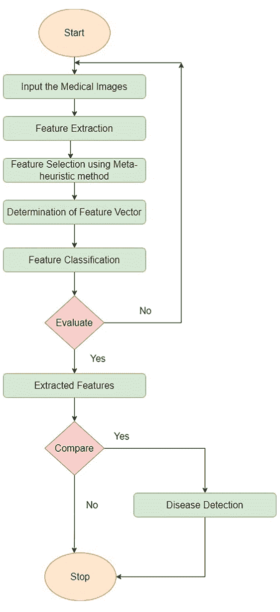

### 可采用的算法

不同的元启发式算法可用于检测和分类各种与健康相关的疾病。这些算法可以包括**蜘蛛猴优化（SMO）**、**布谷鸟搜索优化（CSO）**、**鲸鱼优化算法（WOA）**和**蜻蜓算法（DA）**，用于诊断各种疾病，如癌症、COVID、糖尿病、心脏病、遗传病和阿尔茨海默病。然而，为了便于理解，以下将详细阐述SMO和CSO：

#### 蜘蛛猴优化

在这种技术中，蜘蛛猴的社会行为（也称为融合-裂变）被用来寻找最优解。这些猴子根据食物的可用性改变其行为。当食物充足时，集群较大；当食物稀缺时，集群会分裂成更多集群。该算法的目标是通过优化具有疾病症状的数据集来诊断疾病。因此，该算法的开发包括以下步骤：

- **参数初始化：** 种群的初始化可以使用随机分布过程完成。
    $$SM_{ij} = SM_{\min j} + R(0,1) \times (SM_{\max j} - SM_{\min j})$$
    其中SMi表示第$i^{th}$只蜘蛛猴；SM min j和SMmax j分别指最小和最大范围。
    R (0,1)指在0和1之间随机生成的数字。
- **确定适应度函数值：** 该值使用概率函数确定。它给出了蜘蛛猴位置的值，如下式所示：
    $$P_i = 0.9 \times \frac{fitness_i}{\max fitness} + 0.1$$
    其中max fitness给出种群的最大适应度值，fitness i给出第i只蜘蛛的适应度值。下图显示了疾病诊断所遵循的步骤：

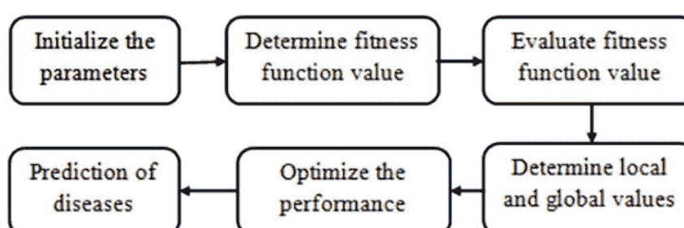

- **确定局部和全局值**
  基于适应度函数，这些值可用于找到最佳解。此外，最终确定的值有助于确定显著特征。这些值还可用于优化性能值。
- **疾病预测**
  基于步骤3中确定的所选特征，可以预测疾病。整个过程如图5.2所示。

#### 布谷鸟搜索优化

这种方法模拟了“布谷鸟”的行为，因此得名。众所周知，布谷鸟会将蛋产在其他鸟的巢中。为此，它首先旨在识别产蛋的最佳和最安全的巢。然而，宿主鸟可能会意识到这些蛋不属于它们。因此，它们可能会将蛋扔出或选择一个新的巢穴。这个最佳地点可以通过检查宿主鸟蛋之间的相似性以及食物的可用性来确定。

基于相同的逻辑，可以开发一种技术来检查COVID-19患者肺部的状况。开发的算法可以如下：

- 输入肺部图像：图像可以是X光图像。
- 从图像中识别对诊断有用的重要特征。
- 然后可以选择、提取和分割特征。图像的提取和分割可以通过Gabor滤波器组和**模糊C均值（FCM）**执行，或使用粗糙集。
- 可以将朴素贝叶斯、K均值或神经模糊分类器等分类器模型与布谷鸟搜索优化一起应用于这些图像。
- 然后可以使用布谷鸟优化方法来训练神经网络（如果使用）并确定阈值的最佳值。可以确定准确性和均方根误差。
- 系统的准确性可以通过选择几何、纹理和统计方面的适当特征来确定。

### 工具利用

对于蜘蛛猴优化，可以使用基于卷积长短期记忆的Jaya蜘蛛猴优化分类器。时间序列数据可用于进一步预测确诊病例、死亡病例和康复病例。

蜘蛛猴分类算法可用于对各种类型的糖尿病和登革热进行分类。为诊断开发的系统可以使用概率神经网络进行训练。

布谷鸟搜索优化可用于通过支持向量机、粒子群和**主成分分析（PCA）**优化来确定初始参数，以实现心脏病的早期诊断。PCA可以丢弃不相关特征并加速收敛。

### 开发元启发式系统时的约束/限制

本研究的重点是根据已识别的症状进行疾病诊断：

- 可以考虑其他参数，如与年龄相关的疾病、人口密度和可用的医疗设施水平。
- 使用有限的计算资源可能导致更多的时间消耗，因此还需要关注利用最先进的计算资源。
- 正在开发的系统应纳入临床环境。
- 可以使用更多的数据集和深度学习技术来优化正在开发的系统的诊断和性能。
- 优化过程可能很复杂。此外，缺乏个人信息可能导致错误的诊断。
- 医生缺乏经验可能导致不准确的治疗。

### 评估指标

各种元启发式算法，如蜘蛛猴优化、灰狼优化和洗牌蛙跳算法，可以在其平均准确性、平均灵敏度、平均值、标准差、平均梯度、特异性、精确度、召回率、F度量、检测总时间、均方根误差、均方误差、康复病例数、死亡病例数等方面进行比较。

## 案例研究 2：批量生产中的遗传算法（GA）

这是一个关于批量生产中作业工艺规划与调度的案例研究。

### 主题
遗传算法使我们能够以迭代方式确定当前作业的可能调度方案。本案例研究详细阐述了如何运用遗传算法（GA）方法，将作业工艺规划与调度应用于车削零件的生产，以实现最优计划。

任何组织，例如任何制造公司，都有其开发、实施和解决工作流程问题的计划。术语 JPPS 通常用于指代作业工艺规划与调度问题。该计划代表了在各台机器上可用的操作序列。这些操作旨在生产所考虑的产品，并确保在预期时间内快速、可靠地交付产品。

生产可分为单件生产和批量生产。就批量生产而言，以下标准成立：

- 生产遵循特定的订单格式。
- 可用的资源有限，并用于生产。
- 同时生产多种产品。然而，单个产品在单个地点生产，这会导致调度问题：
  - 如果在调度完成后收到订单，则不同的任务会被赋予更高的优先级。
  - 如果订单被取消或设备发生故障，则需要重新安排整个生产。
  - 如果批量生产响应过慢，可能会发生不可预测的事件。
  - 另一个值得关注的问题是工艺规划与计划实际开始之间的时间延迟。延迟越长，计划就越容易变得不可行。此外，固定计划可能会进一步导致瓶颈情况，因为动态制造环境往往会修改至少 20% 到 30% 的所有计划。
  - 另一个问题是，生产计划的制定没有考虑生产的各个方面。这会导致交货延迟、成本增加和机器利用率低下。

因此，应将规划和调度目标整合起来，以创建更现实的计划和调度方案。这可以带来对客户需求更快、更好的响应。

### 问题定义
本案例研究讨论了以下问题：
- 确定一种以最优化方式分配订单的方法。
- 基于规划和实时自动数据捕获，需要创建一个动态规划模型。

### 案例研究的目标
本案例研究提到了以下目标：
- 调度模型
- 使用 GA 解决技术难题
- 使用 GA 确定批量的最优规模
- 将改进的调度算法集成到现有信息系统中
- 在考虑替代操作顺序的同时，确定所有产品的**最短生产时间（SPT）**

### 案例研究的考虑因素
以下是本案例研究的考虑因素：
- 为了建立动态规划和调度模型，可以整合物流操作过程的集成 IT 支持。
- 可以考虑用于生产规划的动态模型，同时兼顾实时数据和采集方法。
- 一台机器一次只能生产一种产品。
- 每种产品可以独立于其他产品进行加工。
- 每种产品可以有一到三个替代计划。
- 在替代计划中，需要为每种产品预定义操作顺序。
- 批量的规模需要划分为相等的较小单元。
- 自动化、计算机辅助规划可以实现工艺规划和调度的集成。

### 系统开发
车削零件生产中的产品规划和调度被认为是复杂问题之一。可以使用的工艺规划和调度模型如[图 5.3](Figure 5.3)所示。

该模型可分为三个步骤。第一步和第二步可称为静态或预规划阶段。基于可用资源、生产数量和材料需求，可以在这些阶段制定各种计划。

步骤 1：**新零件的工艺规划**
在此步骤中，涉及客户和供应商。可以在此步骤中规划资源检查（机器）、估算新零件数量、新零件工艺计划和估算数量、资源优化以及调度算法。可以向产品设计师提供反馈，并向客户寻求正式的零件批准。

步骤 2：**工艺规划**
在此步骤中，可以将替代计划设置到 ERP 系统中。基于产能的粗略计算，可以定期比较客户订单预测和资源，如前图所示。每年可以进行一次资源的战略优化，以更好地利用资源。

步骤 3：**操作调度阶段**
在此步骤中，涉及实际条件和目标函数。比较可用资源和所需资源。如果存在差异，可以在过程中加入额外的计划。然后可以确定制造计划的详细生产调度，以确保供应商及时交付材料和工具。

一旦调度完成，它就形成了一个工作框架。最优调度是指无需进行任何修改的调度。下图展示了规划和调度模型：

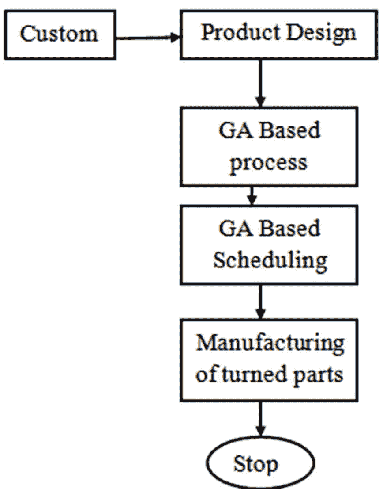

图 5.4：集成工艺规划和调度模型

### 可采用的算法
制造信息系统是规划和管理生产的支柱。这可以进一步集成 ERP 系统和 GA 调度软件。该算法可包含以下步骤：
- 可以将存储在 ERP 信息系统中的数据输入到系统中。
- 为了计算最优计划和调度，可以连同数据一起使用 GA 进行计划优化。
- 完成后，可以将收集到的数据返回到信息系统。

*图 5.5* 展示了数据管理系统和集成的工艺规划与调度。

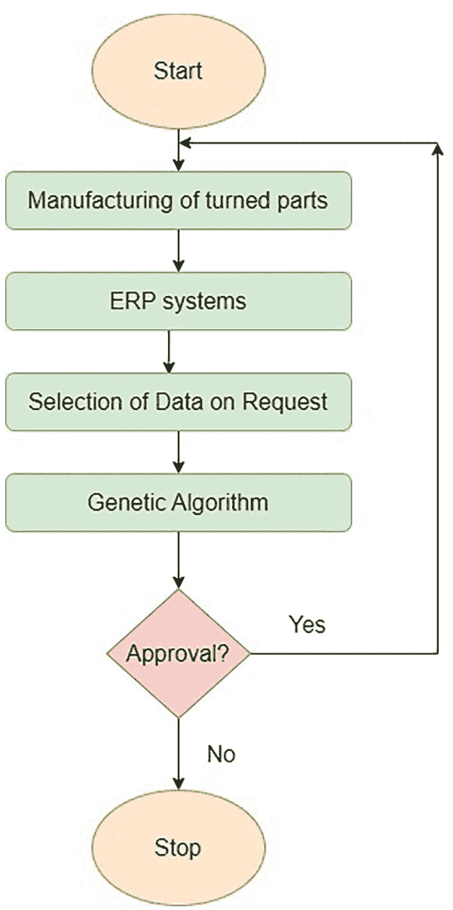

图 5.5：调度数据流程图

### 可使用的软件
可以通过 ERP 系统的 ODBC 和 SQL 接口选择数据。工艺规划和调度查询可以通过关系数据库（如 MS SQL）和 Visual Basic (VB) 接口来处理。可以使用 GA 来优化该过程。

### 可使用的工具
基于仿真的 GA 可用于最小化**作业车间调度问题（JSS）**中的平均延迟时间和完工时间，并使用可变传输成本作为目标函数，在柔性加工系统中安排机器。GA 还可用于研究机器故障和不可用情况下的作业车间调度。**高级重叠生产计划模型（AOPP）**和具有前向-后向改进的随机密钥 GA 可用于**制造供应链环境（MSCE）**中的调度问题。混合 GA 可用于增强搜索能力并改善 GA 的收敛性。自引导算法、并行 GA 和嵌入式 GA 可用于最小化完工时间。

### 评估参数
需要确定产品吞吐时间、接近最优的制造调度、制造一个单位的时间、订单量、机器使用时间、准备时间和精加工时间。此外，可以计算订单执行成本，包括折旧成本和人工成本。因此，GA 可应用于从生产到调度的复杂问题，为车削零件形成一套规则集。

## 使用 Python 进行优化

Python 为机器学习中的优化算法提供了良好的支持，并且有可用的库来处理这些元启发式算法。本节将介绍一些可用于优化的库/包。

**SwarmPackagePy 库** ([https://pypi.org/project/SwarmPackagePy/](https://pypi.org/project/SwarmPackagePy/))
这是一个 Python 库，提供了 14 种优化算法的实现，包括人工蜂群算法、布谷鸟搜索算法、萤火虫算法和粒子群算法。

您可以使用以下命令安装该库：

```
pip install SwarmPackagePy
```

该库与 Python 3.5 及更高版本兼容良好。代码可在 GitHub 上免费获取，以便理解和修改。该包包含许多流行的算法，这些算法经常用于机器学习中的各种优化应用。

例如，布谷鸟搜索算法可以如下调用：

### SwarmPackagePy.cso(n, function, lb, ub, dimension, iteration, pa=0.25, nest=100)

此处使用的参数如下：

- **n**：智能体数量
- **function**：测试函数
- **lb**：绘图轴的下限
- **ub**：绘图轴的上限
- **dimension**：空间维度
- **iteration**：迭代次数

以下是展示如何使用此包执行粒子群优化并查看动画的示例代码：

### 示例 1：

```python
import SwarmPackagePy
from SwarmPackagePy import testFunctions as tf
from SwarmPackagePy import animation, animation3D
alh = SwarmPackagePy.pso(50, tf.easom_function, -10, 10, 2, 20, w=0.5, c1=1, c2=1)
animation(alh.get_agents(), tf.easom_function, -10, 10)
animation3D(alh.get_agents(), tf.easom_function, -10, 10)
```

### Scikit-opt 库 ([https://pypi.org/project/scikit-opt/](https://pypi.org/project/scikit-opt/))

这是另一个元启发式优化库，包含各种流行的优化算法。该库包括遗传算法、蚁群优化、粒子群优化和模拟退火等算法。

可以使用以下命令安装此库：

```
pip install scikit-opt
```

安装后，可以有效地导入和使用库函数。以下是另一个示例，展示如何使用库函数。

### 示例 2：

```python
#### 1. 导入库
import numpy as np
from sko.GA import GA, GA_TSP
from sko.operators import ranking, selection, crossover, mutation
#### 2. 创建演示函数
demo_func = lambda x: x[0] ** 2 + (x[1] - 0.05) ** 2 + (x[2] - 0.5) ** 2
#### 3. 设置遗传算法环境
ga = GA(func=demo_func, n_dim=3, size_pop=100, max_iter=500, prob_mut=0.001,
        lb=[-1, -10, -5], ub=[2, 10, 2], precision=[1e-7, 1e-7, 1])
ga.register(operator_name='selection', operator=selection_tournament, tourn_size=3)
ga.register(operator_name='ranking', operator=ranking.ranking). \
    register(operator_name='crossover', operator=crossover.crossover_2point). \
    register(operator_name='mutation', operator=mutation.mutation)
#### 4. 调用遗传算法函数
best_x, best_y = ga.run()
#### 5. 打印最优解
print('best_x:', best_x, '\n', 'best_y:', best_y)
```

在前面的代码中，调用遗传算法来求解创建的优化函数。前三行导入必要的库，第4行设置需要求解的函数，第5行根据需要设置遗传算法的参数和超参数。接下来的两行说明在遗传算法中使用哪种选择和变异算子来生成种群。一旦参数和环境设置完毕，就调用 `ga.run()` 执行算法。当满足停止条件时，将显示优化结果。借助此库，可以有效地使用多种优化算法。

### MealPy 库 (https://pypi.org/project/mealpy/)

这是最有用且有趣的优化算法库之一。该库实现了基于各种原理（如群体智能、人类启发和物理启发）的近100种不同的元启发式算法。

可以按照以下方式安装此库：

```
pip install mealpy==2.1.0
pip install --upgrade mealpy
```

这是一个庞大的库，因此应使用 Anaconda 发行版进行安装。该库使用许多基础 Python 库，如 matplotlib 和 NumPy，因此需要正确版本的这些库才能有效安装和运行此库。

以下示例代码说明了如何有效地使用此库，通过鲸鱼优化算法解决旅行商问题。步骤以注释形式编写，以便更好地理解代码。这里构建了 N 个城市的旅行商问题，然后使用鲸鱼优化算法确定可行解。该库对优化算法有简单有效的实现，使其适用于任何类型的优化问题。

### 示例 3：

```python
#### 1. 导入库
import numpy as np
from mealpy.swarm_based import WOA
from models.tsp_model import TravellingSalesmanProblem
from models.tsp_solution import generate_stable_solution, generate_unstable_solution
#### 2. 定义数据
np.random.seed(10)
N_CITIES = 15
CITY_POSITIONS = np.random.rand(N_CITIES, 2)
TSP = TravellingSalesmanProblem(n_cities=N_CITIES, city_positions=CITY_POSITIONS)
TSP.plot_cities(pathsave="./results/WOA-TSP", filename="cities_map")
#### 3. 设计问题字典
##### 让我们采用可以生成稳定解的函数
LB = [0, ] * TSP.n_cities
UB = [(TSP.n_cities - 0.01), ] * TSP.n_cities
problem = {
    "fit_func": TSP.fitness_function,
    "lb": LB,
    "ub": UB,
    "minmax": "min",        # 尝试找到最小距离
    "log_to": "console",
    "amend_position": generate_stable_solution
}
solution = np.array([1, 5, 9, 7, 8, 0, 2, 4, 6, 3])
fit_value = TSP.fitness_function(solution)
optimal_solution = np.array([6, 4, 0, 10, 2, 8, 12, 13, 14, 7, 9, 5, 1, 11, 3])
optimal_dist = TSP.fitness_function(optimal_solution)
#### 4. 调用模型
model = WOA.BaseWOA(problem, epoch=10, pop_size=50)
#### 5. 训练模型
best_position, best_fitness = model.solve()
#### 6. 显示结果
print(f"Best solution: {best_position}, Obj = Total Distance: {best_fitness}")
```

这里讨论了一些示例和流行的 Python 库，但还有许多其他由不同程序员创建的优化算法实现。根据手头的应用，可以选择使用哪种实现或库来获得结果。在使用这些库及其函数时，应始终谨慎决策。

## 结论

优化是任何机器学习项目的关键方面之一，因为它节省了大量计算时间，从而降低了成本。大量研究致力于为各种应用领域确定合适的优化技术。这些技术要么是传统的，要么是元启发式的。目前，元启发式技术最受欢迎，因为它们有助于更快地找到优化解，并且需要训练的参数较少。本章重点介绍了一些重要且广泛使用的优化技术。讨论了示例案例研究，以帮助您理解优化算法如何在不同领域的实际问题中使用。Python 中有许多包和实现可以有效地使用这些技术。

## 问题

1. 机器学习中的优化是什么，为什么它在这个领域很重要？

答：优化是一种通过减少预测输出的方差来使机器学习模型更稳健并提高其准确性的技术。

优化通过损失或成本函数来衡量，这通常是定义预测值与数据实际值之间差异的一种方式。机器学习模型旨在最小化此损失函数或降低预测与输出数据现实之间的差距。迭代优化意味着机器学习模型在预测结果或分类数据方面变得更加准确。

机器学习模型通常在本地或离线数据集上进行训练，这些数据集通常是静态的。优化提高了预测和分类的准确性，并最小化了误差。没有优化，就不会有算法的学习和发展。因此，机器学习的前提依赖于函数优化。

优化超参数的过程对于实现准确模型至关重要。选择正确的模型配置直接影响模型的准确性及其完成特定任务的能力。然而，超参数优化可能是一项艰巨的任务。获得正确的模型很重要，因为过度优化和优化不足的模型都存在失败的风险。

错误的超参数可能导致机器学习模型出现欠拟合或过拟合。过拟合是指模型训练得过于贴近训练数据，这意味着它不灵活且对新数据不准确。机器学习模型旨在实现一定程度的泛化，以便在具有新数据集的动态环境中发挥作用。过拟合是这一目标的障碍，并使机器学习模型变得不灵活。

2. 元启发式优化技术的主要特征是什么？

答：元启发式方法有助于解决优化问题。优化问题在日常生活的许多方面都可以找到。元启发式方法的种类多种多样：**蚁群优化 (ACO)**、**遗传算法 (GA)** 和 **粒子群优化 (PSO)**。

使用元启发式算法进行优化有几个优点：

- **广泛的适用性：** 它们可以应用于任何可以表述为函数优化问题的问题。
- **混合化：** 它们可以与传统优化技术相结合。

任何元启发式算法的两个主要组成部分是强化和多样化，或利用和探索（Blum 和 Roli，2003）。多样化意味着生成多样化的解决方案，以便在全局范围内探索搜索空间，而强化意味着将搜索集中在局部区域，因为已知当前的良好解决方案位于该区域。在选择最佳解决方案时，应找到强化和多样化之间的良好平衡，以提高算法的收敛速度。选择最佳解决方案确保了解决方案收敛到最优解，而

### 3. 比较反向传播与梯度下降优化方法。

**答.** 随机梯度下降是一种优化算法，用于最小化预测模型相对于训练数据集的损失。

反向传播是一种自动微分算法，用于计算神经网络图结构中权重的梯度。

**梯度下降**是一种优化算法，它寻找目标函数的一组输入变量，使得目标函数取得最小值，该最小值称为函数的极小值。

顾名思义，梯度下降涉及计算目标函数的梯度。

你可能从微积分中回忆起，函数的一阶导数计算函数在给定点的斜率或曲率。从左向右看，正导数表明目标函数向上倾斜，负导数表明目标函数向下倾斜。

- **导数：** 目标函数相对于其特定输入值的斜率或曲率。

如果目标函数接受多个输入变量，它们可以作为一个变量向量一起处理。处理向量和矩阵称为线性代数，而使用线性代数结构进行微积分运算称为矩阵微积分或向量微积分。在向量微积分中，一阶导数（偏导数）的向量通常称为目标函数的梯度。

- **梯度：** 目标函数相对于输入变量的偏导数向量。

梯度下降算法需要计算目标函数相对于输入变量特定值的梯度。梯度指向上升方向，因此，沿着每个输入变量梯度的负方向下降，可以得到一组新的变量值，使得目标函数的评估值更低。

使用步长来缩放梯度，并控制每个输入变量相对于梯度的变化量。

- **步长：** 学习率或 alpha，一个超参数，用于控制每个输入变量相对于梯度的变化量。

此过程重复进行，直到找到目标函数的最小值、评估了最大数量的候选解，或满足其他停止条件。

- **反向传播**：计算损失函数相对于模型变量的梯度的算法。

你可能从微积分中回忆起，函数对于输入变量特定值的一阶导数是该函数相对于该输入的变化率或曲率。当函数有多个输入变量时，它们形成一个向量，而一阶导数（偏导数）的向量称为梯度，即向量微积分。

- **梯度：** 特定输入值相对于目标函数的偏导数向量。

反向传播在训练神经网络模型时使用，用于计算网络模型中每个权重的梯度。然后，优化算法使用该梯度来更新模型权重。

该算法是专门为计算图结构中变量的梯度而开发的。它从图的输出向图的输入反向工作，传播预测输出中的误差。该输出用于计算每个变量的梯度。

### 4. 什么是群体智能？确定一个有效使用群体智能的案例研究。

**答.** 群体智能指的是集体智能。生物学家和自然科学家一直在研究社会性昆虫的行为，因为它们在解决复杂问题方面效率很高，例如找到巢穴和食物源之间的最短路径以及组织巢穴。

**群体智能（SI）**算法已被证明是通过模拟生物群体的涌现行为来解决复杂优化问题的综合方法。如今，数据科学越来越受到关注，它需要快速管理和分析海量数据。大多数传统方法只能应用于连续且可微的函数。作为一组基于种群的方法，最近的研究证明，SI算法在该领域的相关任务中具有巨大潜力。

传统的基于模型的方法需要问题能够写成连续且可微的函数形式。然而，面对大量数据和复杂任务，这通常很难实现。

基于种群的元启发式算法擅长解决传统方法无法处理或难以解决的问题。群体智能作为一种元启发式算法，正受到越来越多的关注，并已被证明足以处理数据分析中的大规模、动态和多目标问题。

### 5. 使用提到的任何库编写Python代码，实现粒子群优化来解决旅行商问题。

**答.** ### 1. 导入库

```
import numpy as np
from mealpy.swarm_based import WOA
from models.tsp_model import TravellingSalesmanProblem
from models.tsp_solution import generate_stable_solution,
generate_unstable_solution
```

#### 2. 定义数据

```
np.random.seed(10)
N_CITIES = 15
CITY_POSITIONS = np.random.rand(N_CITIES, 2)
TSP = TravellingSalesmanProblem(n_cities=N_CITIES,
city_positions=CITY_POSITIONS)
TSP.plot_cities(pathsave="./results/WOA-TSP", filename="cities_map")
```

#### 3. 设计问题字典

```
##### 让我们使用能生成稳定解的函数
LB = [0, ] * TSP.n_cities
UB = [(TSP.n_cities - 0.01), ] * TSP.n_cities
problem = {
    "fit_func": TSP.fitness_function,
    "lb": LB,
    "ub": UB,
    "minmax": "min",        # 尝试找到最小距离
    "log_to": "console",
    "amend_position": generate_stable_solution
}
solution = np.array([1, 5, 9, 7, 8, 0, 2, 4, 6, 3])
fit_value = TSP.fitness_function(solution)
optimal_solution = np.array([6, 4, 0, 10, 2, 8, 12, 13, 14, 7, 9, 5, 1,
11, 3])
optimal_dist = TSP.fitness_function(optimal_solution)
```

#### 4. 调用模型

```
model = WOA.BaseWOA(problem, epoch=10, pop_size=50)
```

#### 5. 训练模型

```
best_position, best_fitness = model.solve()
```

#### 6. 显示结果

```
print(f"Best solution: {best_position}, Obj = Total Distance:
{best_fitness}")
```

### 6. 解释禁忌搜索优化算法。

**答.** 禁忌搜索是一种元启发式过程，用于解决优化问题，旨在引导其他方法逃离局部极小值的陷阱。它用于为从调度到电信、字符识别和神经网络等广泛的经典和实际问题寻找最优和近似最优解。为了避免陷入局部极小值，它使用记忆功能，以便记住已经探索过的移动和解决方案。此外，它还使用记忆功能来允许在搜索空间中实施诸如强化和多样化之类的搜索策略。

禁忌搜索可用于指导其他使用一组移动将一个解决方案转换为另一个解决方案的过程，并为衡量这些移动的吸引力提供指导。移动的示例包括交换两个任务、改变变量的值（增加或减少）。

禁忌搜索基于三个主要概念：

- 使用灵活的、基于属性的记忆结构，允许比刚性记忆结构或无记忆系统更彻底地利用评估标准和历史搜索信息。灵活的、基于属性的记忆结构允许以更好的方式利用评估标准和历史搜索信息。
- 一种基于禁忌搜索中特定标准评估移动的机制。
- 使用不同时间跨度的记忆功能，从短期到长期，以实施强化策略——专注于特定区域，以及多样化策略——将搜索驱动到新的区域。

### 7. 进化算法的主要特征是什么？

**答.** 进化算法是一种基于启发式的方法，用于解决那些无法在多项式时间内轻松解决的问题，例如经典的NP难问题，以及其他任何需要极长时间才能穷举处理的问题。当单独使用时，它们通常应用于组合问题；然而，遗传算法经常与其他方法结合使用，作为一种快速找到相对最优起点的方式，供另一个算法在此基础上工作。

**进化算法**（以下简称EA）的前提非常简单，前提是你熟悉自然选择的过程。EA涉及四个步骤：初始化、选择、遗传算子和终止。这些步骤大致对应于自然选择的特定方面，并为实现此类算法类别提供了模块化的简便方法。简而言之，在EA中，更适应的个体将存活下来，增殖，而不适应的成员将会消亡，不会对后代的基因库做出贡献，这与自然选择非常相似。

**初始化**：为了开始我们的算法，我们必须首先创建一个初始解种群。该种群将包含任意数量的可能解，通常称为成员。它通常是随机创建的（在问题约束范围内），或者如果对任务有一些先验知识，则大致围绕被认为是理想的解。重要的是，种群应涵盖广泛的解，因为它代表了一个基因库；因此，如果我们希望在算法过程中探索许多不同的可能性，我们应该目标是拥有许多不同的基因。

**选择**：一旦创建了种群，就必须根据适应度函数对种群成员进行评估。适应度函数是一个函数，它接收一个成员的特征，并输出一个数值表示，说明该解的可行性如何。创建适应度函数通常非常困难，找到一个能准确表示数据的好函数非常重要；它非常依赖于具体问题。现在，我们计算所有成员的适应度，并选择一部分得分最高的成员。

**遗传算子**：此步骤包括两个子步骤：交叉和变异。在选择了顶级成员（通常是前两个，但这个数字可以变化）之后，这些成员被用于在算法中创建下一代。使用所选父代的特征，创建新的子代，这些子代是父代特征的混合体。这样做通常很困难，取决于数据类型，但通常在组合问题中，可以混合组合并从这些输入中输出有效的组合。现在，我们必须向这一代引入新的遗传物质。如果我们不执行这个关键步骤，我们将很快陷入局部极值，无法获得最优结果。这一步是变异，我们非常简单地通过改变子代的一小部分来实现，使它们不再完全镜像父代基因的子集。变异通常以概率方式发生，即子代发生变异的可能性以及变异的严重程度由概率分布控制。

**终止**：最终，算法必须结束。通常有两种情况会发生：要么算法达到最大运行时间，要么算法达到某个性能阈值。此时，选择一个最终解并返回。

## 加入我们书籍的Discord空间

加入书籍的Discord工作区，获取最新更新、优惠、全球科技动态、新书发布以及与作者的交流会：
[https://discord.bpbonline.com](https://discord.bpbonline.com)


## 索引

### A

- 凝聚层次聚类 111
- 蚁群优化 211
- 应用领域，机器学习
    - 企业应用 10
    - Facebook的新闻推送 10
    - 金融服务 9
    - 政府 9
    - 医疗保健 9
    - 石油和天然气 10
    - 零售 9
    - 自动驾驶汽车 10
    - 交通运输 10
    - 虚拟助手 10
- 架构，神经网络
    - 自编码器 75
    - 玻尔兹曼机 74
    - 卷积神经网络 73
    - 深度信念网络 74
    - 前馈神经网络 73
    - 门控循环单元 (GRU) 74
    - 生成对抗网络 (GANs) 75
    - 霍普菲尔德网络 (HN) 74
    - 长短期记忆 74
    - 感知器 73
    - 循环神经网络 (RNN) 73, 74
    - 递归神经网络 73
- 参数 44
- 人工智能 (AI) 13
- 高斯混合模型 (GMMs) 109

### B

- 反向传播算法 202
- 反向传播学习
    - 局部最小值 202
    - 网络瘫痪 202
    - 收敛缓慢 202
- 条形图 90, 91
- 玻尔兹曼机 74
- break语句 31

### C

- 案例研究，预测分析
    - 方法 [193](https://example.com/193), [194](https://example.com/194), [195](https://example.com/195), [196](https://example.com/196)
    - 挑战 [193](https://example.com/193)
    - 客户流失分析 [184](https://example.com/184)
    - 假设构建 [189](https://example.com/189)
    - Instagram [181](https://example.com/181)
    - 教育系统中的学习分析 [192](https://example.com/192)
    - Netflix [196](https://example.com/196)
    - 社交媒体分析 [178](https://example.com/178)
    - 电信公司 [186](https://example.com/186)
- 类处理 [35](https://example.com/35)
- 分类 [65](https://example.com/65)
- 分类算法
    - 决策树 [67](https://example.com/67)
    - k近邻 [66](https://example.com/66)
    - 线性分类器 [65](https://example.com/65)
    - 逻辑回归 [65](https://example.com/65)
    - 朴素贝叶斯分类器 [65](https://example.com/65), [66](https://example.com/66)
    - 性能指标 [67](https://example.com/67)
    - 支持向量机 [66](https://example.com/66)
    - 术语 [65](https://example.com/65)
- 分类指标
    - 曲线下面积 (AUC) [95](https://example.com/95)
    - 分类准确率 [95](https://example.com/95)
    - 混淆矩阵 [95](https://example.com/95)
    - 假阳性率 [96](https://example.com/96)
    - F度量 [96](https://example.com/96)
    - 对数损失 [95](https://example.com/95)
    - 精确率 [96](https://example.com/96)
    - 召回率 [96](https://example.com/96)
    - 真阳性率 [95](https://example.com/95)
- 分类模型 [64](https://example.com/64)
- 聚类 [67](https://example.com/67)
    - 验证 [70](https://example.com/70)
- 聚类算法 [68](https://example.com/68)
    - 层次聚类 [69](https://example.com/69)
    - k均值聚类 [68](https://example.com/68)
    - 均值漂移聚类 [68](https://example.com/68), [69](https://example.com/69)
- 冷启动问题 [140](https://example.com/140)
- 协同过滤 [129](https://example.com/129)
    - 基于内存的 [130](https://example.com/130)
    - 基于模型的 [130](https://example.com/130)
- 基于内容的过滤 [129](https://example.com/129)
- continue语句 [31](https://example.com/31)
- 传统优化方法 [199](https://example.com/199)
- 卷积神经网络 (CNNs) [139](https://example.com/139)
- 布谷鸟搜索优化 [212](https://example.com/212)
    - 特征 [213](https://example.com/213)
- 客户流失分析案例研究
    - 目标 184, 185
    - 必要性 185
    - 原因 185
- 客户关系管理 (CRM) 系统 10
- 客户保留 185

### D

- 数据收集 56
- 数据挖掘 11, 144, 146
- 数据预处理 56, 57
    - 必要性 57, 58
    - 已准备数据 57
    - 原始数据 57
- 数据科学 11, 12
- 数据结构，Python
    - 示例 28, 29
    - 逻辑语句 29
    - 非基本数据结构 27
    - 基本数据结构 27
- DBSCAN 68
- 决策支持准确度指标 133
- 决策树 15, 16
    - 神经网络 67
    - 随机森林 67
- 深度信念网络 74
- 深度学习 11
- Deeplearning4j 139
- 字典 42
- 差分进化算法 208
- 降维算法 18, 19

### E

- 弹性网络回归 64
- 电子学习系统领域案例研究，推荐系统 133
    - 使用的算法 137-139
    - 考虑因素 135
    - 约束/限制 139-141
    - 目标 134
    - 问题定义 134
    - 推荐系统 (RS) 134
    - 需求收集与分析阶段 136
    - 系统设计 136, 137
    - 系统开发 135
- elif关键字 43
- else关键字 43
- 嵌入空间 126
- 分布估计算法 (EDAs) 138
- 评估，机器学习系统
    - 数据集，测试 [93](93)
    - 数据集，训练 [93](93)
    - 模型评估技术 [94](94)
    - 性能度量 [94](94)
- 进化算法 (EA) [138](138), [200](200)
    - 差分进化 (DE) [138](138)
    - 进化策略 (ESs) [138](138)
    - 遗传算法 (GAs) [138](138)
- 进化编程 [209](209)
- 异常处理 [36](36), [47](47)
- 期望最大化 (EM) [68](68), [109](109)
- 探索性数据分析 (EDA) [98](98)

### F

- 特征 [3](3)
- 特征创建 [3](3)
- 特征选择 [143](143)
- 文件处理 [36-38](36-38)
- for语句 [31](31)
- 函数 [32](32)
    - 示例 [33](33)

### G

- 生成对抗网络 (GANs) [75](75)
- 遗传算法 (GA)
    - 批量生产案例研究 [220-225](220-225)
- 梯度下降 (GD) 或最速下降算法 [137](137)
- 梯度下降优化 [202](202), [203](203)
- 图形处理单元 (GPUs) [41](41)

### H

- 医疗保健领域案例研究，图像处理 [161](161)
    - 使用的算法 [163](163), [164](164)
    - 考虑因素 [162](162)
    - 约束/限制 [164](164)
    - 评估指标 [164](164)
    - 目标 [162](162)
    - 问题定义 [162](162)
    - 系统开发 [162](162), [163](163)
    - 使用的工具 [164](164)
- 层次凝聚聚类 [69](69), [70](70)
- 层次聚类算法
    - 自底向上算法 [69](69)
    - 自顶向下算法 [69](69)
- 直方图 [91](91), [92](92)
- 霍普菲尔德网络 (HN) [74](74)

### I

IDE 139
if else 语句 29, 30
图像处理 157
    算法，使用 160, 161
    重要性 158
    目的 158
    实时案例研究 161
图像处理系统 159
    彩色图像处理 159
    描述 160
    图像采集 159
    图像压缩 160
    图像增强 159
    图像恢复 159
    形态学处理 160
    表示 160
    分割 160
import 语句 45
信息检索 (IR) 145
    自然语言处理 (NLP) 145, 146
Instagram 案例研究 181, 182
    方法 182
    评估 182
    改进 184
    市场分析 184
    目标 181
    目的 181

### J

Jupyter Notebook 26, 27

### K

K-means 17, 18
K-means 聚类 68
kNN (k-近邻算法) 17

### L

- 标签 3
- lambda 函数 47
- Lasso 回归 64
- 学习分析案例研究 192
    - 组织效益 192
- 线性分类器 65
- 线性回归 13, 14, 63
- 折线图 87-89
- 列表 42
- 逻辑语句 29, 30
- 逻辑回归 14, 63, 64
- 循环语句 31
    - break 语句 31
    - continue 语句 31, 32
    - for 语句 31
    - while 语句 31

### M

- 机器学习算法 12
    - 预处理 58
    - 类型 5
    - 工作原理 6, 20
- 机器学习库，Python 77
    - Numpy 77-81
    - Pandas 81
- 机器学习 (ML) 1, 2
    - 应用领域 9
    - 局限性 8
    - 对比，深度学习 11, 12
    - 对比，预测建模 166, 167
- 机器学习模型 55, 56
    - 流程 56, 57
    - 强化机器学习模型 4
    - 半监督机器学习模型 4
    - 监督机器学习模型 3
    - 无监督机器学习模型 3, 4
- 机器学习项目
    - 挑战 7, 8
- 间隔 76
- matplotlib 87
    - 条形图 90, 91
    - 直方图 91, 92
    - 折线图 87-89
    - 饼图 92, 93
    - 散点图 89, 90
- MealPy 库 228
- 平均绝对误差 (MAE) 133
- 均方误差 (MSE) 72
- 元启发式算法 199-203
    - 优点 204
    - 蚁群优化 211
    - 布谷鸟搜索优化 212
    - 缺点 204, 205
    - 进化算法 200
    - 混合算法 213
    - 基于种群的算法 200, 207-213
    - 基于单解的算法 205-207
    - 基于单解的算法 200
    - 群体智能算法 200
- 元启发式优化技术
    - 医疗保健案例研究 214-220
- 混合成员 111
- ML 算法
    - 通过优化学习参数进行改进 214
- 模型评估指标 94
    - 分类指标 95
    - 回归指标 96
- 模型评估技术
    - 交叉验证 94
    - 留出法 94
- 模块 33
    - 示例 33, 34

### N

朴素贝叶斯分类器 65, 66
命名实体识别 (NER) 146
自然语言处理 (NLP)
    - 词性 (PoS) 标注 146
    - 情感分析 146
    - 摘要 145
    - 文本分类或文本归类 146
神经网络 71
    - 架构 73
    - 神经元 71
    - 神经元，组合 72
    - 训练 72
Numpy 77
    - 数组，创建 78-81
    - 预定义数组 78, 79

### O

open() 函数 49
观点挖掘 157
优化 198
    - 执行，使用 Python 225-228
优化技术 199
    - 反向传播算法 202
    - 传统优化方法 199
    - 梯度下降优化 202, 203
    - 元启发式算法 199-201

### P

Pandas 81
    - 基本描述性统计 85
    - 数据，在 dataframe 中访问 83, 84
    - 数据，使用 dataframe 显示 83
    - dataframe 82
    - dataframe，填充 82, 83
    - 数据预处理 86
    - 数据转换 86
    - 缺失值，处理 86
    - 面板 82
    - 序列 82
词性 (POS) 标注 144
性能指标
    - 用于分类问题 67
饼图 92, 93
多项式回归 60
基于种群的算法 200, 207
    - 差分进化算法 208, 209
    - 进化编程 209
    - 进化技术 207
    - 遗传算法 208
    - 粒子群优化 210
    - 群体智能 209, 210
精确率-召回率曲线 (PRC) 133
预测算法
    - 决策树 168
    - 广义线性模型 (GLM) 169
    - 梯度提升模型 169
    - K-Means 169
    - 神经网络 169
    - Prophet 170
    - 随机森林算法 169
    - 回归模型 169
预测分析 165
    - 应用 174, 175
    - 优势 175, 176
    - 案例研究 178
    - 特征 165
    - 目的 165
    - 重要性 165
    - 对比，数据分析 173, 174
预测分析模型
    - 构建 167, 168
    - 分类模型 170
    - 聚类模型 170
    - 预测模型 170
    - 异常值模型 170
    - 时间序列模型 170
- 预测建模
    - 挑战 176
    - 局限性 177
    - 对比，数据分析 172
    - 对比，机器学习 (ML) 166, 167
    - 对比，预测分析 171
- 预处理，ML
    - 超参数调优 62
    - 指标，用于评估 62
    - 模型，评估 61
    - 模型，选择 58, 59, 60
    - 模型，测试 60, 61
    - 模型训练 60
    - 预测 62
概率模型构建遗传算法 (PMBGAs) 138
- 产品推荐系统案例研究，情感分析
    - 考虑因素 154, 155, 156
    - 问题定义 151
    - 产品推荐 151
    - 系统设计 153
    - 系统开发 152
Prophet 170
- Python 23, 138
    - 类处理 35
    - 数据结构 27
    - 异常处理 36
    - 文件处理 36-38
    - 函数和模块 32
    - 循环语句 31
    - 机器学习库 77
    - 字符串函数 38-40

### R

随机森林算法 169
read() 方法 49
受试者工作特征曲线 (ROC) 133
- 推荐算法
    - 准确性 132
    - 评估指标 132
    - 统计准确性指标 133
- 推荐生成
    - 信息收集阶段 131, 132
    - 学习阶段 132
    - 预测/推荐阶段 132
推荐 127
    - 首页推荐 128
    - 相关项目推荐 128
推荐系统
    - 架构 130
    - 候选生成 130, 131
    - 电子学习系统领域案例研究 133
    - 嵌入 128
    - 项目/文档 128
    - 关键术语 128
    - 查询/上下文 128
    - 重要性 127, 128
    - 技术，用于构建 128-130
推荐系统 (RS) 134
回归算法 62
    - ElasticNet 回归 64
    - Lasso 回归 64
    - 线性回归 63
    - 逻辑回归 63, 64
    - 多项式回归 64
    - 岭回归 64
    - 逐步回归 64
    - 类型 62
回归指标
    - 平均绝对误差 (MAE) 96
    - 均方根误差 (RMSE) 97
强化机器学习模型 4
    - 动作 4
    - 智能体 4
    - 环境 4
岭回归 64

### S

散点图 89, 90
scikit-learn 139
Scikit-opt 库 226, 227
半监督机器学习模型 4
情感分析 21, 146, 147
    - 深度学习 150
    - 线性回归 148
    - 朴素贝叶斯算法 147
    - 产品推荐系统案例研究 151
    - 支持向量机 148-150
集合 42
轮廓系数 (SC) 70
模拟退火 205, 206
基于单解的算法 205
    - 模拟退火 205, 206
    - 禁忌搜索 206, 207
    - 变邻域搜索 207
社交媒体分析案例研究 178
    - 方法 179
    - 挑战 178, 179
    - 考虑因素 179, 180
    - 问题定义 179
split() 方法 50
Spyder IDE 24
    - 代码编辑器 25
    - IPython 控制台 26
    - 项目浏览器 25
    - 变量浏览器 25
逐步回归 64
字符串函数 38-40, 50
监督机器学习模型
    - 通过训练 3
支持向量机 (SVM) 75, 76
    - 对比，神经网络 76, 77
群体智能 209
群体智能算法 200
SwarmPackagePy 库 225, 226
SWOT 分析 183
系统开发生命周期 (SDLC) 方法 135

### T

禁忌搜索 206
技术，用于推荐系统
    - 协同过滤 129, 130
    - 基于内容的过滤 129
    - 混合过滤 130
电信公司案例研究 186
    - 方法 186
    - 业务挑战 186
    - 流失标签 188
    - 客户账户信息 188
    - 客户人口统计信息 189
    - 数据收集 188
    - 探索性数据分析 (EDA) 188
    - 问题定义 187
TensorFlow 139
测试数据 3
文本分析 141
文本挖掘 141
    - 数据类型 142
    - 流程 142-144
    - 重要性 141
    - 非结构化文本文档，准备 144, 145
文本挖掘技术

信息检索 (IR) 145
文本预处理 143
文本转换 143
训练数据 3
try-except 语句 48
元组 42

### U
无监督机器学习模型 3, 4

### V
可变邻域搜索 207
变量选择 143

### W
瀑布模型 152, 153
while 语句 31

### X
XGBoost 19