# Python 机器学习

学习和提升机器学习 Python 编程的综合指南

BILL RUIZ

Smashwords 版

版权所有 © 2021 Bill Ruiz。Smashwords 版，保留所有权利。

未经出版商明确书面许可，不得以任何方式复制或使用本书或其任何部分，书评中简短引用除外。

## 目录

- [引言：](#)
- [第 1 章：Python 安装](#)
- [第 2 章：用于机器学习的 Python](#)
- [第 3 章：数据清洗](#)
- [第 4 章：数据挖掘类别](#)
- [第 5 章：机器学习与人工智能的区别](#)
- [第 7 章：使用 Python 进行线性回归](#)
- [第 8 章：特征工程](#)
- [第 9 章：卷积神经网络如何工作？](#)
- [第 10 章：顶级 AI 框架和机器学习库 Tensorflow](#)
- [第 11 章：机器学习的未来](#)
- [结论：](#)

## 引言：

机器学习的概念源于人工智能，是一个完整的研究领域。它专注于开发自动化程序，从数据中获取知识，以进行诊断或预测。机器学习基于这样的理念：机器可以学习、识别趋势，并在最少的人工干预下提供决策。这些机器通过经验不断改进，并构建支配学习过程的原理。

机器学习的应用非常广泛，例如市场营销、语音和图像识别、智能机器人、网络搜索等。机器学习需要大型数据集来训练模型并获得准确的预测。存在不同类型的机器学习，通常可以分为两个独立的类别：监督学习和无监督学习。其他算法可以标记为半监督学习或强化机器学习。

监督学习主要用于从已分类或标记的数据集中学习，然后应用于预测未知数据集的标签。相比之下，无监督学习用于训练数据集既未分类也未标记的情况，旨在研究如何从数据集中描述隐藏模式的函数。半监督学习结合使用已分类和未分类的数据集。强化学习是一种依赖试错过程的方法，旨在识别环境中最准确的行为以提高其性能。

本章将详细介绍每种机器学习类型，并深入解释每种学习类型之间的差异及其优缺点。让我们从监督学习开始，这是机器学习中常用且最简单的学习范式。在深入探讨机器学习的细节之前，我们先思考一下：机器学习何时是解决问题的最佳方法？

至关重要的是要理解，机器学习并非解决任何手头问题的首选方法。有些问题可以通过不依赖机器学习的稳健方法来解决。对于数据量少且目标值可以通过确定性方法轻松定义的问题，如果能够轻松确定并编程一个规则来驱动目标值，那么机器学习就不是最佳选择。

当无法开发和编码规则来定义目标值时，机器学习是最佳选择。例如，图像和语音识别是机器学习最佳应用的完美例子。以图像为例，它具有许多特征和像素，对于人类来说，执行简单的识别任务非常困难。人类可以直观地识别图像并对其进行分类。但是，开发一个基于规则的算法和方法来识别图像既费力又效率低下。因此，在这种情况下，构建一个图像数据集，为每张图像标记其特定内容（例如，动物、花卉、物体等），并使用机器学习算法来检测每类图像是非常高效的。简而言之，当有多个因素影响目标值且相关性较小时，机器学习非常方便。

机器学习也是自动化处理大型数据集任务的最佳方法。例如，手动检测垃圾邮件或欺诈交易很容易。然而，对数亿封电子邮件或交易执行相同的任务非常耗时且繁琐。机器学习在处理大型数据集和大规模问题时，既经济又高效。

机器学习在人类专业知识非常有限的情况下也是最佳选择。这类问题的一个例子是无法标记或分类数据的情况。在这种情况下，机器学习用于从数据集中学习，并为我们试图解决的问题提供答案。

总的来说，机器学习在以下情况下最适合解决问题：
1) 人类拥有解决问题的专业知识，但几乎不可能轻松开发程序来模拟人类任务，
2) 人类没有专业知识或对目标值一无所知（即，没有标记或分类数据），
3) 人类拥有专业知识并了解可能的目标值，但实施这种方法成本高且耗时。

通常，机器学习最适合解决复杂的数据驱动问题，例如客户行为学习与定位或获取、欺诈分析、大型系统异常检测、疾病诊断、股票/图像和语音识别等。对于数据量少且人类专业知识可以轻松编程为基于规则方法的问题，最好使用确定性的基于规则方法来解决。大型数据集应可供机器学习使用，以使其高效且有效，否则可能会引发泛化性和过拟合问题。泛化性是指模型应用于与构建模型时所用场景相似的场景的能力。当机器学习模型基于小型数据集构建时，当应用于它们未曾接触过的新数据集时，效率会变得非常低。因此，它们的适用性变得非常有限。例如，构建一个识别图像为猫或狗图像的模型，然后将其应用于其他动物的新图像数据。该模型将对其他动物（如狗或猫图像）的新数据集给出不准确的分类。过拟合是指模型在应用于训练数据时显示出高精度，但当应用于与训练数据相似的测试数据时，其精度急剧下降。在开发机器学习模型时应考虑的另一个问题是输入与多个输出之间的相似性。在这种情况下，应用分类机器学习模型变得非常困难，因为相似的输入会产生不同的输出。因此，数据的质量和数量在机器学习中非常重要。应该记住，不仅数据的数量，而且数据的质量也会影响任何机器学习方法的准确性和适用性。如果没有正确的数据，收集正确的数据至关重要，这是采用机器学习方法的第一步。现在，你已经了解了何时采用机器学习方法是有用的，何时应该避免机器学习，以及何时简单的基于规则的确定性方法是解决问题的简单方法。接下来，你将学习不同类型的机器学习，每种类型何时应用，所需的数据，广泛使用的算法，以及使用机器学习解决问题的步骤。

在监督学习中，我们通常有一个带有相应标签的训练数据集。从关联训练集和标签的关系中，我们尝试标记新的未知数据集。为此，学习算法被提供训练集和相应的正确标签。然后，它学习训练集和标签之间的关系。然后，算法将该关系应用于标记未知数据集。形式上，我们希望构建一个模型，该模型估计一个函数，将数据集 x（即输入）与标签 y（即输出）相关联：y=f(x)。数学关系 f 称为映射函数。

假设我们有一组图像，并尝试将其标记为猫图像或非猫图像。我们首先将图像 (x) 和这些图像的标签（猫或非猫）作为输入提供给学习算法。然后，我们近似关系 f，以尽可能准确地根据 x 估计 y：y=f(x)+ε，ε 是一个均值为零的随机误差。请注意，我们正在近似数据集和标签之间的关系，并且我们希望误差 ε 尽可能接近 0。当 ε恰好为0，意味着模型是完美的，准确率达到100%，但构建这样的模型非常罕见。

通常，会使用可用标记数据的一个子集（通常是80%）作为训练集，来估计构建此类模型的映射任务。剩余的20%标记数据用于评估模型的效率和精度。在此步骤中，将这20%的数据输入模型，并将预测输出与实际标签进行比较，以计算模型性能。

监督学习主要有两个功能，即分类或回归。当输出y是质量或类别数据（即离散变量）时使用分类，而当输出y是数量数据（即连续数值）时使用回归。分类旨在预测标签或将数据分配到它们最相似的类别中。输出y是一个二元变量（即0或1）。上面给出的例子，将图像标记为猫或非猫就是分类的一个例子。模型也可以是多类分类，即模型预测不同的类别。例如，Outlook将邮件分类到多个类别中，如“重点”、“其他”、“垃圾邮件”。可以使用多种算法，如逻辑回归、决策树、随机森林、多层感知机。当我们想要预测一个值，如房屋价格、人的身高或体重时，使用回归。线性回归是解决此类问题最简单的模型。

监督学习的缺点在于它们无法处理新信息，当有新信息可用时，需要重新考虑训练。例如，我们有一组狗和猫的训练图像，模型被训练来将图像标记为狗图像或猫图像。换句话说，我们开发了一个包含狗和猫两个类别的模型。当这个模型接收到其他动物的新图像时，例如老虎，它会错误地将老虎图像标记为狗或猫图像。模型无法识别老虎图像，但它会将图像分类到一个类别中。因此，每当有新信息可用时，都应该对模型进行训练。

## 第1章：Python安装

Python是由Guido van Rossum在1989年末开发的一种强大的编程语言。该语言目前广泛应用于许多领域，如Web开发、软件开发、教育和数据分析。
其广泛使用的原因包括：
- Python易于学习和理解。
- Python的语法简单。
- Python有其管理与对象相关内存的方式。
- Python不是专有软件。
- 它兼容所有平台（即Windows、Linux和Mac）。
- 可以与其他编程语言进行接口交互。
- 许多Python库和包可用于数据科学和机器学习相关应用。

### Anaconda Python安装

步骤1：从 https://www.anaconda.com/distribution/ 下载最新的Anaconda发行版文件。

有适用于32位和64位操作系统的下载选项（图1.1）。

步骤2：单击可执行安装文件。将出现一个欢迎屏幕（图1.2）。

步骤3：单击“下一步”，阅读并接受许可协议，方法是单击“我同意”按钮（图1.3）。

步骤4：选择安装类型（即单用户或所有用户）（图1.4）。

步骤5：选择安装Anaconda Python发行版的位置（图1.5）。

步骤6：在“高级安装选项”屏幕中选择所有选项，并忽略所有警告（图1.6），然后单击“安装”按钮。

步骤7：等待安装完成（图1.7），然后单击“下一步”按钮。

步骤8：现在Anaconda Python发行版已成功安装，单击“完成”按钮（图1.8）。

步骤9：要检查Anaconda是否已成功安装，在命令提示符下键入python，您应该会看到如图1.9所示的Python shell。

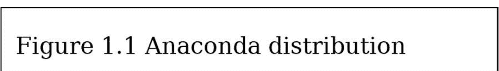

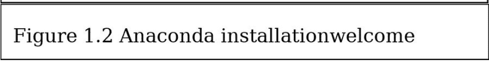

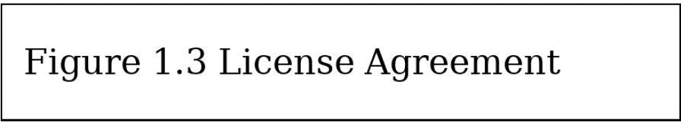

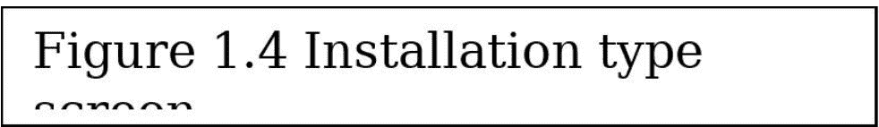

图1.8 安装完成屏幕

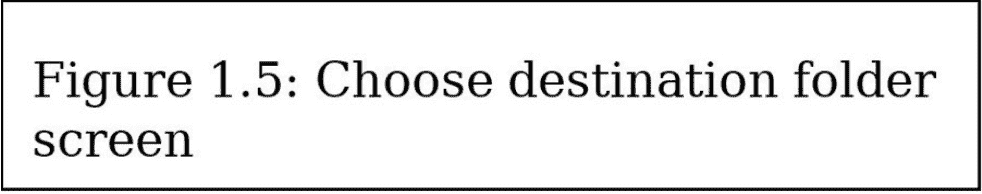

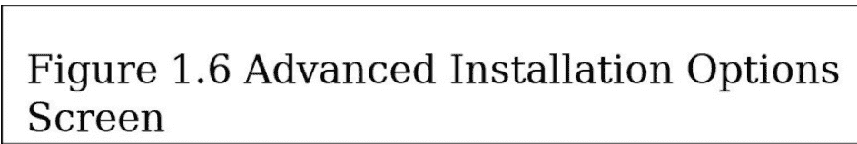

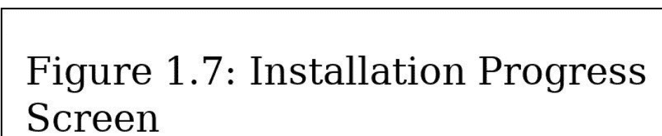

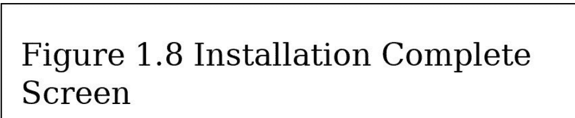

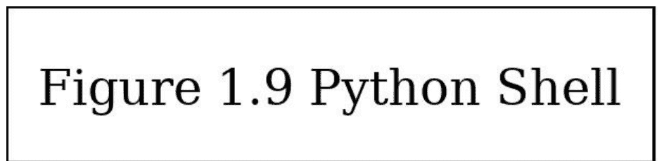

### Jupyter Notebook

编写Python程序和使用科学库最方便的工具之一是Jupyter Notebook。Jupyter Notebook是一个开源的基于Web的应用程序。用户可以编写和执行Python代码。此外，用户可以选择、创建和共享文档。它还提供格式化的输出，可以包含表格、图形和数学表达式。要使用Jupyter Notebook，请遵循以下步骤：

步骤1：Jupyter Notebook随Anaconda Python发行版一起安装。安装Anaconda后，转到开始菜单，运行Jupyter Notebook（图1.10）。

步骤2：打开Jupyter Notebook后，将出现一个“Jupyter Notebook” shell屏幕（图1.11）。

步骤3：几秒钟后，“Jupyter Notebook”仪表板将在默认浏览器中打开（图1.12）。

步骤4：现在，用户可以通过单击“新建”下拉列表并选择“Python 3”来初始化一个新的Python编辑器（图1.13）。

步骤5：将打开一个Jupyter Notebook Python编辑器（图1.14）。

步骤6：现在用户可以编写和执行Python代码。在图1.15中，编写并执行了一个著名的“hello world”代码。

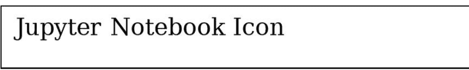

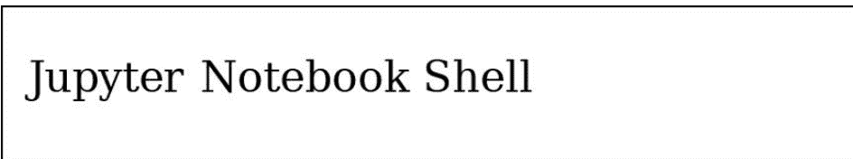

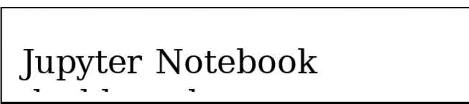

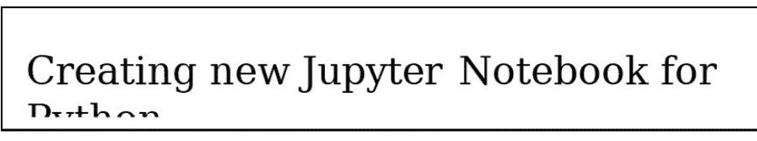

#### Jupyter Notebook Python编辑器

#### 在Jupyter Notebook中编写和执行Python代码

### Python编程基础

在学习了如何安装Python之后，本节将介绍编写基本Python程序所需学习的Python编程基础知识。

#### 数据类型

在Python中，数据类型分为以下几类：

#### 数据结构

数据结构或数据类型是编程语言用于组织数据以便最有效利用的特定方法。Python具有四种这样的数据类型。让我们逐一介绍。

##### 列表

Python列表可以通过使用方括号来识别。其思想是将项目按顺序排列，每个项目用逗号分隔。项目可以包含不同的数据类型，甚至其他列表（从而形成嵌套列表）。创建后，您可以通过添加或删除项目来修改列表。也可以搜索列表。您可以通过引用索引号来访问列表的内容。

示例

##### 元组

元组使用圆括号来包含项目。除此之外，元组的结构与列表相同，您仍然可以通过引用括号中的索引号来访问它们。主要区别在于，一旦创建元组，就无法更改其值。

示例

##### 集合

当您使用花括号包围一组元素时，您正在创建一个集合。与列表（您自然地从上到下遍历）不同，集合是无序的，这意味着没有可以引用的索引。但是，您可以使用“for循环”来遍历集合，或使用关键字检查某个值是否可以在该集合中找到。集合允许您添加新项目，但不能更改它们。

示例

##### 字典

字典或dicts依赖于与集合相同的花括号，并具有相同的无序属性。但是，dicts通过键名进行索引，因此您必须通过用冒号分隔键名和值来定义每个条目。您也可以通过引用相应的键名来更改dict中的值。

示例：

#### 变量名或标识符

在Python中，变量名或标识符（即赋予变量、函数、模块等的名称）可以包含小写或大写字母、数字、括号和下划线。但是，Python名称和标识符不能以数字开头。

示例：在图1.16给出的第一个示例中，一个名为“test”的变量被赋值为2。在第二个示例中，定义了一个名为“1test”的变量并赋值为2。然而，如上所述，Python不接受以数字开头的变量名，因此这里会给出一个错误。一些预定义的关键字被Python保留，不能用作变量名和标识符。这些关键字的列表在表1.1中给出。

#### 在Python中定义变量

```python
In [1]: test = 2
In [2]: 1test = 2
File "<ipython-input-2-f8b048e1ff71>", line 1
    1test = 2
    ^
SyntaxError: invalid syntax
```

#### Python中的算术运算

与其他编程语言类似，Python可以执行包括加法、减法、除法、乘法和幂运算在内的基本算术运算。算术运算符及其对应符号总结在表1.2中。

##### Python中的算术运算符

| 运算符 | 符号 |
| :--- | :--- |
| 加法 | + |
| 减法 | - |
| 乘法 | * |
| 除法 | / |
| 幂运算 | ** |

示例：下面给出了Python中算术运算的示例：

#### 赋值运算符

赋值运算符用于在计算右侧操作数的值后进行赋值。这些赋值操作从右向左进行。最简单的赋值运算符是等号，它用于将右侧的值简单地赋给左侧的操作数。所有赋值运算符总结在表1.3中。

##### Python中的赋值运算符

| 运算符 | 符号 | 描述 |
| :--- | :--- | :--- |
| 赋值 | = | 将右侧的值赋给左侧 |
| 加后赋值 | += | 将右侧操作数加到左侧操作数，并将结果赋给左侧操作数 |
| 减后赋值 | -= | 从左侧操作数中减去右侧操作数，并将结果赋给左侧操作数 |
| 乘后赋值 | *= | 将左侧操作数乘以右侧操作数，并将结果赋给左侧操作数 |
| 除后赋值 | /= | 将左侧操作数除以右侧操作数，并将结果赋给左侧操作数 |
| 取模后赋值 | %= | 对左侧操作数和右侧操作数进行取模运算，并将结果赋给左侧操作数 |
| 幂运算后赋值 | **= | 对左侧操作数和右侧操作数进行幂运算，并将结果赋给左侧操作数 |
| 整除后赋值 | //= | 对左侧操作数和右侧操作数进行整除运算，并将结果赋给左侧操作数 |

##### 示例：以下给出了 Python 中赋值操作的示例：

##### 比较运算符

比较运算符用于比较操作数的值。这些运算符返回布尔（逻辑）值，即真或假。操作数的值可以是数字、字符串或布尔值。字符串根据其字母顺序进行比较。例如，“a”小于“c”。所有比较运算符如表 1.4 所示。

##### 比较运算符

| 运算符 | 运算符 | 运算符 | 运算符 | 运算符 |
| --- | --- | --- | --- | --- |
| 运算符 | 运算符 | 运算符 | 运算符 | 运算符 |
| 运算符 | 运算符 | 运算符 | 运算符 | 运算符 |
| 运算符 | 运算符 | 运算符 | 运算符 | 运算符 |
| 运算符 | 运算符 | 运算符 | 运算符 | 运算符 |
| 运算符 | 运算符 | 运算符 | 运算符 | 运算符 |
| 运算符 | 运算符 | 运算符 | 运算符 | 运算符 |
| 运算符 | 运算符 | 运算符 | 运算符 | 运算符 |
| 运算符 | 运算符 | 运算符 | 运算符 | 运算符 |
| 运算符 | 运算符 | 运算符 | 运算符 | 运算符 |
| 运算符 | 运算符 | 运算符 | 运算符 | 运算符 |
| 运算符 | 运算符 | 运算符 | 运算符 | 运算符 |
| 运算符 | 运算符 | 运算符 | 运算符 | 运算符 |
| 运算符 | 运算符 | 运算符 | 运算符 | 运算符 |
| 运算符 | 运算符 | 运算符 | 运算符 | 运算符 |
| 运算符 | 运算符 | 运算符 | 运算符 | 运算符 |
| 运算符 | 运算符 | 运算符 | 运算符 | 运算符 |
| 运算符 | 运算符 | 运算符 | 运算符 | 运算符 |
| 运算符 | 运算符 | 运算符 | 运算符 | 运算符 |
| 运算符 | 运算符 | 运算符 | 运算符 | 运算符 |
| 运算符 | 运算符 | 运算符 | 运算符 | 运算符 |
| 运算符 | 运算符 | 运算符 | 运算符 | 运算符 |
| 运算符 | 运算符 | 运算符 | 运算符 | 运算符 |
| 运算符 | 运算符 | 运算符 | 运算符 | 运算符 |
| 运算符 | 运算符 | 运算符 | 运算符 | 运算符 |
| 运算符 | 运算符 | 运算符 | 运算符 | 运算符 |
| 运算符 | 运算符 | 运算符 | 运算符 | 运算符 |
| 运算符 | 运算符 | 运算符 | 运算符 | 运算符 |
| 运算符 | 运算符 | 运算符 | 运算符 | 运算符 |
| 运算符 | 运算符 | 运算符 | 运算符 | 运算符 |
| 运算符 | 运算符 | 运算符 | 运算符 | 运算符 |
| 运算符 | 运算符 | 运算符 | 运算符 | 运算符 |
| 运算符 | 运算符 | 运算符 | 运算符 | 运算符 |
| 运算符 | 运算符 | 运算符 | 运算符 | 运算符 |
| 运算符 | 运算符 | 运算符 | 运算符 | 运算符 |
| 运算符 | 运算符 | 运算符 | 运算符 | 运算符 |
| 运算符 | 运算符 | 运算符 | 运算符 | 运算符 |
| 运算符 | 运算符 | 运算符 | 运算符 | 运算符 |
| 运算符 | 运算符 | 运算符 | 运算符 | 运算符 |
| 运算符 | 运算符 | 运算符 | 运算符 | 运算符 |
| 运算符 | 运算符 | 运算符 | 运算符 | 运算符 |
| 运算符 | 运算符 | 运算符 | 运算符 | 运算符 |
| 运算符 | 运算符 | 运算符 | 运算符 | 运算符 |
| 运算符 | 运算符 | 运算符 | 运算符 | 运算符 |
| 运算符 | 运算符 | 运算符 | 运算符 | 运算符 |
| 运算符 | 运算符 | 运算符 | 运算符 | 运算符 |
| 运算符 | 运算符 | 运算符 | 运算符 | 运算符 |
| 运算符 | 运算符 | 运算符 | 运算符 | 运算符 |
| 运算符 | 运算符 | 运算符 | 运算符 | 运算符 |
| 运算符 | 运算符 | 运算符 | 运算符 | 运算符 |
| 运算符 | 运算符 | 运算符 | 运算符 | 运算符 |
| 运算符 | 运算符 | 运算符 | 运算符 | 运算符 |
| 运算符 | 运算符 | 运算符 | 运算符 | 运算符 |
| 运算符 | 运算符 | 运算符 | 运算符 | 运算符 |
| 运算符 | 运算符 | 运算符 | 运算符 | 运算符 |
| 运算符 | 运算符 | 运算符 | 运算符 | 运算符 |
| 运算符 | 运算符 | 运算符 | 运算符 | 运算符 |
| 运算符 | 运算符 | 运算符 | 运算符 | 运算符 |
| 运算符 | 运算符 | 运算符 | 运算符 | 运算符 |
| 运算符 | 运算符 | 运算符 | 运算符 | 运算符 |
| 运算符 | 运算符 | 运算符 | 运算符 | 运算符 |
| 运算符 | 运算符 | 运算符 | 运算符 | 运算符 |
| 运算符 | 运算符 | 运算符 | 运算符 | 运算符 |
| 运算符 | 运算符 | 运算符 | 运算符 | 运算符 |
| 运算符 | 运算符 | 运算符 | 运算符 | 运算符 |
| 运算符 | 运算符 | 运算符 | 运算符 | 运算符 |
| 运算符 | 运算符 | 运算符 | 运算符 | 运算符 |
| 运算符 | 运算符 | 运算符 | 运算符 | 运算符 |
| 运算符 | 运算符 | 运算符 | 运算符 | 运算符 |
| 运算符 | 运算符 | 运算符 | 运算符 | 运算符 |
| 运算符 | 运算符 | 运算符 | 运算符 | 运算符 |
| 运算符 | 运算符 | 运算符 | 运算符 | 运算符 |
| 运算符 | 运算符 | 运算符 | 运算符 | 运算符 |
| 运算符 | 运算符 | 运算符 | 运算符 | 运算符 |
| 运算符 | 运算符 | 运算符 | 运算符 | 运算符 |
| 运算符 | 运算符 | 运算符 | 运算符 | 运算符 |
| 运算符 | 运算符 | 运算符 | 运算符 | 运算符 |
| 运算符 | 运算符 | 运算符 | 运算符 | 运算符 |
| 运算符 | 运算符 | 运算符 | 运算符 | 运算符 |
| 运算符 | 运算符 | 运算符 | 运算符 | 运算符 |
| 运算符 | 运算符 | 运算符 | 运算符 | 运算符 |
| 运算符 | 运算符 | 运算符 | 运算符 | 运算符 |
| 运算符 | 运算符 | 运算符 | 运算符 | 运算符 |
| 运算符 | 运算符 | 运算符 | 运算符 | 运算符 |
| 运算符 | 运算符 | 运算符 | 运算符 | 运算符 |
| 运算符 | 运算符 | 运算符 | 运算符 | 运算符 |
| 运算符 | 运算符 | 运算符 | 运算符 | 运算符 |
| 运算符 | 运算符 | 运算符 | 运算符 | 运算符 |
| 运算符 | 运算符 | 运算符 | 运算符 | 运算符 |
| 运算符 | 运算符 | 运算符 | 运算符 | 运算符 |
| 运算符 | 运算符 | 运算符 | 运算符 | 运算符 |
| 运算符 | 运算符 | 运算符 | 运算符 | 运算符 |
| 运算符 | 运算符 | 运算符 | 运算符 | 运算符 |
| 运算符 | 运算符 | 运算符 | 运算符 | 运算符 |
| 运算符 | 运算符 | 运算符 | 运算符 | 运算符 |
| 运算符 | 运算符 | 运算符 | 运算符 | 运算符 |
| 运算符 | 运算符 | 运算符 | 运算符 | 运算符 |
| 运算符 | 运算符 | 运算符 | 运算符 | 运算符 |
| 运算符 | 运算符 | 运算符 | 运算符 | 运算符 |
| 运算符 | 运算符 | 运算符 | 运算符 | 运算符 |
| 运算符 | 运算符 | 运算符 | 运算符 | 运算符 |
| 运算符 | 运算符 | 运算符 | 运算符 | 运算符 |
| 运算符 | 运算符 | 运算符 | 运算符 | 运算符 |
| 运算符 | 运算符 | 运算符 | 运算符 | 运算符 |
| 运算符 | 运算符 | 运算符 | 运算符 | 运算符 |
| 运算符 | 运算符 | 运算符 | 运算符 | 运算符 |
| 运算符 | 运算符 | 运算符 | 运算符 | 运算符 |
| 运算符 | 运算符 | 运算符 | 运算符 | 运算符 |
| 运算符 | 运算符 | 运算符 | 运算符 | 运算符 |
| 运算符 | 运算符 | 运算符 | 运算符 | 运算符 |
| 运算符 | 运算符 | 运算符 | 运算符 | 运算符 |
| 运算符 | 运算符 | 运算符 | 运算符 | 运算符 |
| 运算符 | 运算符 | 运算符 | 运算符 | 运算符 |
| 运算符 | 运算符 | 运算符 | 运算符 | 运算符 |
| 运算符 | 运算符 | 运算符 | 运算符 | 运算符 |
| 运算符 | 运算符 | 运算符 | 运算符 | 运算符 |
| 运算符 | 运算符 | 运算符 | 运算符 | 运算符 |
| 运算符 | 运算符 | 运算符 | 运算符 | 运算符 |
| 运算符 | 运算符 | 运算符 | 运算符 | 运算符 |
| 运算符 | 运算符 | 运算符 | 运算符 | 运算符 |
| 运算符 | 运算符 | 运算符 | 运算符 | 运算符 |
| 运算符 | 运算符 | 运算符 | 运算符 | 运算符 |
| 运算符 | 运算符 | 运算符 | 运算符 | 运算符 |
| 运算符 | 运算符 | 运算符 | 运算符 | 运算符 |
| 运算符 | 运算符 | 运算符 | 运算符 | 运算符 |
| 运算符 | 运算符 | 运算符 | 运算符 | 运算符 |
| 运算符 | 运算符 | 运算符 | 运算符 | 运算符 |
| 运算符 | 运算符 | 运算符 | 运算符 | 运算符 |
| 运算符 | 运算符 | 运算符 | 运算符 | 运算符 |
| 运算符 | 运算符 | 运算符 | 运算符 | 运算符 |
| 运算符 | 运算符 | 运算符 | 运算符 | 运算符 |
| 运算符 | 运算符 | 运算符 | 运算符 | 运算符 |
| 运算符 | 运算符 | 运算符 | 运算符 | 运算符 |
| 运算符 | 运算符 | 运算符 | 运算符 | 运算符 |
| 运算符 | 运算符 | 运算符 | 运算符 | 运算符 |
| 运算符 | 运算符 | 运算符 | 运算符 | 运算符 |
| 运算符 | 运算符 | 运算符 | 运算符 | 运算符 |
| 运算符 | 运算符 | 运算符 | 运算符 | 运算符 |
| 运算符 | 运算符 | 运算符 | 运算符 | 运算符 |
| 运算符 | 运算符 | 运算符 | 运算符 | 运算符 |
| 运算符 | 运算符 | 运算符 | 运算符 | 运算符 |
| 运算符 | 运算符 | 运算符 | 运算符 | 运算符 |
| 运算符 | 运算符 | 运算符 | 运算符 | 运算符 |
| 运算符 | 运算符 | 运算符 | 运算符 | 运算符 |
| 运算符 | 运算符 | 运算符 | 运算符 | 运算符 |
| 运算符 | 运算符 | 运算符 | 运算符 | 运算符 |
| 运算符 | 运算符 | 运算符 | 运算符 | 运算符 |
| 运算符 | 运算符 | 运算符 | 运算符 | 运算符 |
| 运算符 | 运算符 | 运算符 | 运算符 | 运算符 |
| 运算符 | 运算符 | 运算符 | 运算符 | 运算符 |
| 运算符 | 运算符 | 运算符 | 运算符 | 运算符 |
| 运算符 | 运算符 | 运算符 | 运算符 | 运算符 |
| 运算符 | 运算符 | 运算符 | 运算符 | 运算符 |
| 运算符 | 运算符 | 运算符 | 运算符 | 运算符 |
| 运算符 | 运算符 | 运算符 | 运算符 | 运算符 |
| 运算符 | 运算符 | 运算符 | 运算符 | 运算符 |
| 运算符 | 运算符 | 运算符 | 运算符 | 运算符 |
| 运算符 | 运算符 | 运算符 | 运算符 | 运算符 |
| 运算符 | 运算符 | 运算符 | 运算符 | 运算符 |
| 运算符 | 运算符 | 运算符 | 运算符 | 运算符 |
| 运算符 | 运算符 | 运算符 | 运算符 | 运算符 |
| 运算符 | 运算符 | 运算符 | 运算符 | 运算符 |
| 运算符 | 运算符 | 运算符 | 运算符 | 运算符 |
| 运算符 | 运算符 | 运算符 | 运算符 | 运算符 |
| 运算符 | 运算符 | 运算符 | 运算符 | 运算符 |
| 运算符 | 运算符 | 运算符 | 运算符 | 运算符 |
| 运算符 | 运算符 | 运算符 | 运算符 | 运算符 |
| 运算符 | 运算符 | 运算符 | 运算符 | 运算符 |
| 运算符 | 运算符 | 运算符 | 运算符 | 运算符 |
| 运算符 | 运算符 | 运算符 | 运算符 | 运算符 |
| 运算符 | 运算符 | 运算符 | 运算符 | 运算符 |
| 运算符 | 运算符 | 运算符 | 运算符 | 运算符 |
| 运算符 | 运算符 | 运算符 | 运算符 | 运算符 |
| 运算符 | 运算符 | 运算符 | 运算符 | 运算符 |
| 运算符 | 运算符 | 运算符 | 运算符 | 运算符 |
| 运算符 | 运算符 | 运算符 | 运算符 | 运算符 |
| 运算符 | 运算符 | 运算符 | 运算符 | 运算符 |
| 运算符 | 运算符 | 运算符 | 运算符 | 运算符 |
| 运算符 | 运算符 | 运算符 | 运算符 | 运算符 |
| 运算符 | 运算符 | 运算符 | 运算符 | 运算符 |
| 运算符 | 运算符 | 运算符 | 运算符 | 运算符 |
| 运算符 | 运算符 | 运算符 | 运算符 | 运算符 |
| 运算符 | 运算符 | 运算符 | 运算符 | 运算符 |
| 运算符 | 运算符 | 运算符 | 运算符 | 运算符 |
| 运算符 | 运算符 | 运算符 | 运算符 | 运算符 |
| 运算符 | 运算符 | 运算符 | 运算符 | 运算符 |
| 运算符 | 运算符 | 运算符 | 运算符 | 运算符 |
| 运算符 | 运算符 | 运算符 | 运算符 | 运算符 |
| 运算符 | 运算符 | 运算符 | 运算符 | 运算符 |
| 运算符 | 运算符 | 运算符 | 运算符 | 运算符 |
| 运算符 | 运算符 | 运算符 | 运算符 | 运算符 |
| 运算符 | 运算符 | 运算符 | 运算符 | 运算符 |
| 运算符 | 运算符 | 运算符 | 运算符 | 运算符 |
| 运算符 | 运算符 | 运算符 | 运算符 | 运算符 |
| 运算符 | 运算符 | 运算符 | 运算符 | 运算符 |
| 运算符 | 运算符 | 运算符 | 运算符 | 运算符 |
| 运算符 | 运算符 | 运算符 | 运算符 | 运算符 |
| 运算符 | 运算符 | 运算符 | 运算符 | 运算符 |
| 运算符 | 运算符 | 运算符 | 运算符 | 运算符 |
| 运算符 | 运算符 | 运算符 | 运算符 | 运算符 |
| 运算符 | 运算符 | 运算符 | 运算符 | 运算符 |
| 运算符 | 运算符 | 运算符 | 运算符 | 运算符 |
| 运算符 | 运算符 | 运算符 | 运算符 | 运算符 |
| 运算符 | 运算符 | 运算符 | 运算符 | 运算符 |
| 运算符 | 运算符 | 运算符 | 运算符 | 运算符 |
| 运算符 | 运算符 | 运算符 | 运算符 | 运算符 |
| 运算符 | 运算符 | 运算符 | 运算符 | 运算符 |
| 运算符 | 运算符 | 运算符 | 运算符 | 运算符 |
| 运算符 | 运算符 | 运算符 | 运算符 | 运算符 |
| 运算符 | 运算符 | 运算符 | 运算符 | 运算符 |
| 运算符 | 运算符 | 运算符 | 运算符 | 运算符 |
| 运算符 | 运算符 | 运算符 | 运算符 | 运算符 |
| 运算符 | 运算符 | 运算符 | 运算符 | 运算符 |
| 运算符 | 运算符 | 运算符 | 运算符 | 运算符 |
| 运算符 | 运算符 | 运算符 | 运算符 | 运算符 |
| 运算符 | 运算符 | 运算符 | 运算符 | 运算符 |
| 运算符 | 运算符 | 运算符 | 运算符 | 运算符 |
| 运算符 | 运算符 | 运算符 | 运算符 | 运算符 |
| 运算符 | 运算符 | 运算符 | 运算符 | 运算符 |
| 运算符 | 运算符 | 运算符 | 运算符 | 运算符 |
| 运算符 | 运算符 | 运算符 | 运算符 | 运算符 |
| 运算符 | 运算符 | 运算符 | 运算符 | 运算符 |
| 运算符 | 运算符 | 运算符 | 运算符 | 运算符 |
| 运算符 | 运算符 | 运算符 | 运算符 | 运算符 |
| 运算符 | 运算符 | 运算符 | 运算符 | 运算符 |
| 运算符 | 运算符 | 运算符 | 运算符 | 运算符 |
| 运算符 | 运算符 | 运算符 | 运算符 | 运算符 |
| 运算符 | 运算符 | 运算符 | 运算符 | 运算符 |
| 运算符 | 运算符 | 运算符 | 运算符 | 运算符 |
| 运算符 | 运算符 | 运算符 | 运算符 | 运算符 |
| 运算符 | 运算符 | 运算符 | 运算符 | 运算符 |
| 运算符 | 运算符 | 运算符 | 运算符 | 运算符 |
| 运算符 | 运算符 | 运算符 | 运算符 | 运算符 |
| 运算符 | 运算符 | 运算符 | 运算符 | 运算符 |
| 运算符 | 运算符 | 运算符 | 运算符 | 运算符 |
| 运算符 | 运算符 | 运算符 | 运算符 | 运算符 |
| 运算符 | 运算符 | 运算符 | 运算符 | 运算符 |
| 运算符 | 运算符 | 运算符 | 运算符 | 运算符 |
| 运算符 | 运算符 | 运算符 | 运算符 | 运算符 |
| 运算符 | 运算符 | 运算符 | 运算符 | 运算符 |
| 运算符 | 运算符 | 运算符 | 运算符 | 运算符 |
| 运算符 | 运算符 | 运算符 | 运算符 | 运算符 |
| 运算符 | 运算符 | 运算符 | 运算符 | 运算符 |
| 运算符 | 运算符 | 运算符 | 运算符 | 运算符 |
| 运算符 | 运算符 | 运算符 | 运算符 | 运算符 |
| 运算符 | 运算符 | 运算符 | 运算符 | 运算符 |
| 运算符 | 运算符 | 运算符 | 运算符 | 运算符 |
| 运算符 | 运算符 | 运算符 | 运算符 | 运算符 |
| 运算符 | 运算符 | 运算符 | 运算符 | 运算符 |
| 运算符 | 运算符 | 运算符 | 运算符 | 运算符 |
| 运算符 | 运算符 | 运算符 | 运算符 | 运算符 |
| 运算符 | 运算符 | 运算符 | 运算符 | 运算符 |
| 运算符 | 运算符 | 运算符 | 运算符 | 运算符 |
| 运算符 | 运算符 | 运算符 | 运算符 | 运算符 |
| 运算符 | 运算符 | 运算符 | 运算符 | 运算符 |
| 运算符 | 运算符 | 运算符 | 运算符 | 运算符 |
| 运算符 | 运算符 | 运算符 | 运算符 | 运算符 |
| 运算符 | 运算符 | 运算符 | 运算符 | 运算符 |
| 运算符 | 运算符 | 运算符 | 运算符 | 运算符 |
| 运算符 | 运算符 | 运算符 | 运算符 | 运算符 |
| 运算符 | 运算符 | 运算符 | 运算符 | 运算符 |
| 运算符 | 运算符 | 运算符 | 运算符 | 运算符 |
| 运算符 | 运算符 | 运算符 | 运算符 | 运算符 |
| 运算符 | 运算符 | 运算符 | 运算符 | 运算符 |
| 运算符 | 运算符 | 运算符 | 运算符 | 运算符 |
| 运算符 | 运算符 | 运算符 | 运算符 | 运算符 |
| 运算符 | 运算符 | 运算符 | 运算符 | 运算符 |
| 运算符 | 运算符 | 运算符 | 运算符 | 运算符 |
| 运算符 | 运算符 | 运算符 | 运算符 | 运算符 |
| 运算符 | 运算符 | 运算符 | 运算符 | 运算符 |
| 运算符 | 运算符 | 运算符 | 运算符 | 运算符 |
| 运算符 | 运算符 | 运算符 | 运算符 | 运算符 |
| 运算符 | 运算符 | 运算符 | 运算符 | 运算符 |
| 运算符 | 运算符 | 运算符 | 运算符 | 运算符 |
| 运算符 | 运算符 | 运算符 | 运算符 | 运算符 |
| 运算符 | 运算符 | 运算符 | 运算符 | 运算符 |
| 运算符 | 运算符 | 运算符 | 运算符 | 运算符 |
| 运算符 | 运算符 | 运算符 | 运算符 | 运算符 |
| 运算符 | 运算符 | 运算符 | 运算符 | 运算符 |
| 运算符 | 运算符 | 运算符 | 运算符 | 运算符 |
| 运算符 | 运算符 | 运算符 | 运算符 | 运算符 |
| 运算符 | 运算符 | 运算符 | 运算符 | 运算符 |
| 运算符 | 运算符 | 运算符 | 运算符 | 运算符 |
| 运算符 | 运算符 | 运算符 | 运算符 | 运算符 |
| 运算符 | 运算符 | 运算符 | 运算符 | 运算符 |
| 运算符 | 运算符 | 运算符 | 运算符 | 运算符 |
| 运算符 | 运算符 | 运算符 | 运算符 | 运算符 |
| 运算符 | 运算符 | 运算符 | 运算符 | 运算符 |
| 运算符 | 运算符 | 运算符 | 运算符 | 运算符 |
| 运算符 | 运算符 | 运算符 | 运算符 | 运算符 |
| 运算符 | 运算符 | 运算符 | 运算符 | 运算符 |
| 运算符 | 运算符 | 运算符 | 运算符 | 运算符 |
| 运算符 | 运算符 | 运算符 | 运算符 | 运算符 |
| 运算符 | 运算符 | 运算符 | 运算符 | 运算符 |
| 运算符 | 运算符 | 运算符 | 运算符 | 运算符 |
| 运算符 | 运算符 | 运算符 | 运算符 | 运算符 |
| 运算符 | 运算符 | 运算符 | 运算符 | 运算符 |
| 运算符 | 运算符 | 运算符 | 运算符 | 运算符 |
| 运算符 | 运算符 | 运算符 | 运算符 | 运算符 |
| 运算符 | 运算符 | 运算符 | 运算符 | 运算符 |
| 运算符 | 运算符 | 运算符 | 运算符 | 运算符 |
| 运算符 | 运算符 | 运算符 | 运算符 | 运算符 |
| 运算符 | 运算符 | 运算符 | 运算符 | 运算符 |
| 运算符 | 运算符 | 运算符 | 运算符 | 运算符 |
| 运算符 | 运算符 | 运算符 | 运算符 | 运算符 |
| 运算符 | 运算符 | 运算符 | 运算符 | 运算符 |
| 运算符 | 运算符 | 运算符 | 运算符 | 运算符 |
| 运算符 | 运算符 | 运算符 | 运算符 | 运算符 |
| 运算符 | 运算符 | 运算符 | 运算符 | 运算符 |
| 运算符 | 运算符 | 运算符 | 运算符 | 运算符 |
| 运算符 | 运算符 | 运算符 | 运算符 | 运算符 |
| 运算符 | 运算符 | 运算符 | 运算符 | 运算符 |
| 运算符 | 运算符 | 运算符 | 运算符 | 运算符 |
| 运算符 | 运算符 | 运算符 | 运算符 | 运算符 |
| 运算符 | 运算符 | 运算符 | 运算符 | 运算符 |
| 运算符 | 运算符 | 运算符 | 运算符 | 运算符 |
| 运算符 | 运算符 | 运算符 | 运算符 | 运算符 |
| 运算符 | 运算符 | 运算符 | 运算符 | 运算符 |
| 运算符 | 运算符 | 运算符 | 运算符 | 运算符 |
| 运算符 | 运算符 | 运算符 | 运算符 | 运算符 |
| 运算符 | 运算符 | 运算符 | 运算符 | 运算符 |
| 运算符 | 运算符 | 运算符 | 运算符 | 运算符 |
| 运算符 | 运算符 | 运算符 | 运算符 | 运算符 |
| 运算符 | 运算符 | 运算符 | 运算符 | 运算符 |
| 运算符 | 运算符 | 运算符 | 运算符 | 运算符 |
| 运算符 | 运算符 | 运算符 | 运算符 | 运算符 |
| 运算符 | 运算符 | 运算符 | 运算符 | 运算符 |
| 运算符 | 运算符 | 运算符 | 运算符 | 运算符 |
| 运算符 | 运算符 | 运算符 | 运算符 | 运算符 |
| 运算符 | 运算符 | 运算符 | 运算符 | 运算符 |
| 运算符 | 运算符 | 运算符 | 运算符 | 运算符 |
| 运算符 | 运算符 | 运算符 | 运算符 | 运算符 |
| 运算符 | 运算符 | 运算符 | 运算符 | 运算符 |
| 运算符 | 运算符 | 运算符 | 运算符 | 运算符 |
| 运算符 | 运算符 | 运算符 | 运算符 | 运算符 |
| 运算符 | 运算符 | 运算符 | 运算符 | 运算符 |
| 运算符 | 运算符 | 运算符 | 运算符 | 运算符 |
| 运算符 | 运算符 | 运算符 | 运算符 | 运算符 |
| 运算符 | 运算符 | 运算符 | 运算符 | 运算符 |
| 运算符 | 运算符 | 运算符 | 运算符 | 运算符 |
| 运算符 | 运算符 | 运算符 | 运算符 | 运算符 |
| 运算符 | 运算符 | 运算符 | 运算符 | 运算符 |
| 运算符 | 运算符 | 运算符 | 运算符 | 运算符 |
| 运算符 | 运算符 | 运算符 | 运算符 | 运算符 |
| 运算符 | 运算符 | 运算符 | 运算符 | 运算符 |
| 运算符 | 运算符 | 运算符 | 运算符 | 运算符 |
| 运算符 | 运算符 | 运算符 | 运算符 | 运算符 |
| 运算符 | 运算符 | 运算符 | 运算符 | 运算符 |
| 运算符 | 运算符 | 运算符 | 运算符 | 运算符 |
| 运算符 | 运算符 | 运算符 | 运算符 | 运算符 |
| 运算符 | 运算符 | 运算符 | 运算符 | 运算符 |
| 运算符 | 运算符 | 运算符 | 运算符 | 运算符 |
| 运算符 | 运算符 | 运算符 | 运算符 | 运算符 |
| 运算符 | 运算符 | 运算符 | 运算符 | 运算符 |
| 运算符 | 运算符 | 运算符 | 运算符 | 运算符 |
| 运算符 | 运算符 | 运算符 | 运算符 | 运算符 |
| 运算符 | 运算符 | 运算符 | 运算符 | 运算符 |
| 运算符 | 运算符 | 运算符 | 运算符 | 运算符 |
| 运算符 | 运算符 | 运算符 | 运算符 | 运算符 |
| 运算符 | 运算符 | 运算符 | 运算符 | 运算符 |
| 运算符 | 运算符 | 运算符 | 运算符 | 运算符 |
| 运算符 | 运算符 | 运算符 | 运算符 | 运算符 |
| 运算符 | 运算符 | 运算符 | 运算符 | 运算符 |
| 运算符 | 运算符 | 运算符 | 运算符 | 运算符 |
| 运算符 | 运算符 | 运算符 | 运算符 | 运算符 |
| 运算符 | 运算符 | 运算符 | 运算符 | 运算符 |
| 运算符 | 运算符 | 运算符 | 运算符 | 运算符 |
| 运算符 | 运算符 | 运算符 | 运算符 | 运算符 |
| 运算符 | 运算符 | 运算符 | 运算符 | 运算符 |
| 运算符 | 运算符 | 运算符 | 运算符 | 运算符 |
| 运算符 | 运算符 | 运算符 | 运算符 | 运算符 |
| 运算符 | 运算符 | 运算符 | 运算符 | 运算符 |
| 运算符 | 运算符 | 运算符 | 运算符 | 运算符 |
| 运算符 | 运算符 | 运算符 | 运算符 | 运算符 |
| 运算符 | 运算符 | 运算符 | 运算符 | 运算符 |
| 运算符 | 运算符 | 运算符 | 运算符 | 运算符 |
| 运算符 | 运算符 | 运算符 | 运算符 | 运算符 |
| 运算符 | 运算符 | 运算符 | 运算符 | 运算符 |
| 运算符 | 运算符 | 运算符 | 运算符 | 运算符 |
| 运算符 | 运算符 | 运算符 | 运算符 | 运算符 |
| 运算符 | 运算符 | 运算符 | 运算符 | 运算符 |
| 运算符 | 运算符 | 运算符 | 运算符 | 运算符 |
| 运算符 | 运算符 | 运算符 | 运算符 | 运算符 |
| 运算符 | 运算符 | 运算符 | 运算符 | 运算符 |
| 运算符 | 运算符 | 运算符 | 运算符 | 运算符 |
| 运算符 | 运算符 | 运算符 | 运算符 | 运算符 |
| 运算符 | 运算符 | 运算符 | 运算符 | 运算符 |
| 运算符 | 运算符 | 运算符 | 运算符 | 运算符 |
| 运算符 | 运算符 | 运算符 | 运算符 | 运算符 |
| 运算符 | 运算符 | 运算符 | 运算符 | 运算符 |
| 运算符 | 运算符 | 运算符 | 运算符 | 运算符 |
| 运算符 | 运算符 | 运算符 | 运算符 | 运算符 |
| 运算符 | 运算符 | 运算符 | 运算符 | 运算符 |
| 运算符 | 运算符 | 运算符 | 运算符 | 运算符 |
| 运算符 | 运算符 | 运算符 | 运算符 | 运算符 |
| 运算符 | 运算符 | 运算符 | 运算符 | 运算符 |
| 运算符 | 运算符 | 运算符 | 运算符 | 运算符 |
| 运算符 | 运算符 | 运算符 | 运算符 | 运算符 |
| 运算符 | 运算符 | 运算符 | 运算符 | 运算符 |
| 运算符 | 运算符 | 运算符 | 运算符 | 运算符 |
| 运算符 | 运算符 | 运算符 | 运算符 | 运算符 |
| 运算符 | 运算符 | 运算符 | 运算符 | 运算符 |
| 运算符 | 运算符 | 运算符 | 运算符 | 运算符 |
| 运算符 | 运算符 | 运算符 | 运算符 | 运算符 |
| 运算符 | 运算符 | 运算符 | 运算符 | 运算符 |
| 运算符 | 运算符 | 运算符 | 运算符 | 运算符 |
| 运算符 | 运算符 | 运算符 | 运算符 | 运算符 |
| 运算符 | 运算符 | 运算符 | 运算符 | 运算符 |
| 运算符 | 运算符 | 运算符 | 运算符 | 运算符 |
| 运算符 | 运算符 | 运算符 | 运算符 | 运算符 |
| 运算符 | 运算符 | 运算符 | 运算符 | 运算符 |
| 运算符 | 运算符 | 运算符 | 运算符 | 运算符 |
| 运算符 | 运算符 | 运算符 | 运算符 | 运算符 |
| 运算符 | 运算符 | 运算符 | 运算符 | 运算符 |
| 运算符 | 运算符 | 运算符 | 运算符 | 运算符 |
| 运算符 | 运算符 | 运算符 | 运算符 | 运算符 |
| 运算符 | 运算符 | 运算符 | 运算符 | 运算符 |
| 运算符 | 运算符 | 运算符 | 运算符 | 运算符 |
| 运算符 | 运算符 | 运算符 | 运算符 | 运算符 |
| 运算符 | 运算符 | 运算符 | 运算符 | 运算符 |
| 运算符 | 运算符 | 运算符 | 运算符 | 运算符 |
| 运算符 | 运算符 | 运算符 | 运算符 | 运算符 |
| 运算符 | 运算符 | 运算符 | 运算符 | 运算符 |
| 运算符 | 运算符 | 运算符 | 运算符 | 运算符 |
| 运算符 | 运算符 | 运算符 | 运算符 | 运算符 |
| 运算符 | 运算符 | 运算符 | 运算符 | 运算符 |
| 运算符 | 运算符 | 运算符 | 运算符 | 运算符 |
| 运算符 | 运算符 | 运算符 | 运算符 | 运算符 |
| 运算符 | 运算符 | 运算符 | 运算符 | 运算符 |
| 运算符 | 运算符 | 运算符 | 运算符 | 运算符 |
| 运算符 | 运算符 | 运算符 | 运算符 | 运算符 |
| 运算符 | 运算符 | 运算符 | 运算符 | 运算符 |
| 运算符 | 运算符 | 运算符 | 运算符 | 运算符 |
| 运算符 | 运算符 | 运算符 | 运算符 | 运算符 |
| 运算符 | 运算符 | 运算符 | 运算符 | 运算符 |
| 运算符 | 运算符 | 运算符 | 运算符 | 运算符 |
| 运算符 | 运算符 | 运算符 | 运算符 | 运算符 |
| 运算符 | 运算符 | 运算符 | 运算符 | 运算符 |
| 运算符 | 运算符 | 运算符 | 运算符 | 运算符 |
| 运算符 | 运算符 | 运算符 | 运算符 | 运算符 |
| 运算符 | 运算符 | 运算符 | 运算符 | 运算符 |
| 运算符 | 运算符 | 运算符 | 运算符 | 运算符 |
| 运算符 | 运算符 | 运算符 | 运算符 | 运算符 |
| 运算符 | 运算符 | 运算符 | 运算符 | 运算符 |
| 运算符 | 运算符 | 运算符 | 运算符 | 运算符 |
| 运算符 | 运算符 | 运算符 | 运算符 | 运算符 |
| 运算符 | 运算符 | 运算符 | 运算符 | 运算符 |
| 运算符 | 运算符 | 运算符 | 运算符 | 运算符 |
| 运算符 | 运算符 | 运算符 | 运算符 | 运算符 |
| 运算符 | 运算符 | 运算符 | 运算符 | 运算符 |
| 运算符 | 运算符 | 运算符 | 运算符 | 运算符 |
| 运算符 | 运算符 | 运算符 | 运算符 | 运算符 |
| 运算符 | 运算符 | 运算符 | 运算符 | 运算符 |
| 运算符 | 运算符 | 运算符 | 运算符 | 运算符 |
| 运算符 | 运算符 | 运算符 | 运算符 | 运算符 |
| 运算符 | 运算符 | 运算符 | 运算符 | 运算符 |
| 运算符 | 运算符 | 运算符 | 运算符 | 运算符 |
| 运算符 | 运算符 | 运算符 | 运算符 | 运算符 |
| 运算符 | 运算符 | 运算符 | 运算符 | 运算符 |
| 运算符 | 运算符 | 运算符 | 运算符 | 运算符 |
| 运算符 | 运算符 | 运算符 | 运算符 | 运算符 |
| 运算符 | 运算符 | 运算符 | 运算符 | 运算符 |
| 运算符 | 运算符 | 运算符 | 运算符 | 运算符 |
| 运算符 | 运算符 | 运算符 | 运算符 | 运算符 |
| 运算符 | 运算符 | 运算符 | 运算符 | 运算符 |
| 运算符 | 运算符 | 运算符 | 运算符 | 运算符 |
| 运算符 | 运算符 | 运算符 | 运算符 | 运算符 |
| 运算符 | 运算符 | 运算符 | 运算符 | 运算符 |
| 运算符 | 运算符 | 运算符 | 运算符 | 运算符 |
| 运算符 | 运算符 | 运算符 | 运算符 | 运算符 |
| 运算符 | 运算符 | 运算符 | 运算符 | 运算符 |
| 运算符 | 运算符 | 运算符 | 运算符 | 运算符 |
| 运算符 | 运算符 | 运算符 | 运算符 | 运算符 |
| 运算符 | 运算符 | 运算符 | 运算符 | 运算符 |
| 运算符 | 运算符 | 运算符 | 运算符 | 运算符 |
| 运算符 | 运算符 | 运算符 | 运算符 | 运算符 |
| 运算符 | 运算符 | 运算符 | 运算符 | 运算符 |
| 运算符 | 运算符 | 运算符 | 运算符 | 运算符 |
| 运算符 | 运算符 | 运算符 | 运算符 | 运算符 |
| 运算符 | 运算符 | 运算符 | 运算符 | 运算符 |
| 运算符 | 运算符 | 运算符 | 运算符 | 运算符 |
| 运算符 | 运算符 | 运算符 | 运算符 | 运算符 |
| 运算符 | 运算符 | 运算符 | 运算符 | 运算符 |
| 运算符 | 运算符 | 运算符 | 运算符 | 运算符 |
| 运算符 | 运算符 | 运算符 | 运算符 | 运算符 |
| 运算符 | 运算符 | 运算符 | 运算符 | 运算符 |
| 运算符 | 运算符 | 运算符 | 运算符 | 运算符 |
| 运算符 | 运算符 | 运算符 | 运算符 | 运算符 |
| 运算符 | 运算符 | 运算符 | 运算符 | 运算符 |
| 运算符 | 运算符 | 运算符 | 运算符 | 运算符 |
| 运算符 | 运算符 | 运算符 | 运算符 | 运算符 |
| 运算符 | 运算符 | 运算符 | 运算符 | 运算符 |
| 运算符 | 运算符 | 运算符 | 运算符 | 运算符 |
| 运算符 | 运算符 | 运算符 | 运算符 | 运算符 |
| 运算符 | 运算符 | 运算符 | 运算符 | 运算符 |
| 运算符 | 运算符 | 运算符 | 运算符 | 运算符 |
| 运算符 | 运算符 | 运算符 | 运算符 | 运算符 |
| 运算符 | 运算符 | 运算符 | 运算符 | 运算符 |
| 运算符 | 运算符 | 运算符 | 运算符 | 运算符 |
| 运算符 | 运算符 | 运算符 | 运算符 | 运算符 |
| 运算符 | 运算符 | 运算符 | 运算符 | 运算符 |
| 运算符 | 运算符 | 运算符 | 运算符 | 运算符 |
| 运算符 | 运算符 | 运算符 | 运算符 | 运算符 |
| 运算符 | 运算符 | 运算符 | 运算符 | 运算符 |
| 运算符 | 运算符 | 运算符 | 运算符 | 运算符 |
| 运算符 | 运算符 | 运算符 | 运算符 | 运算符 |
| 运算符 | 运算符 | 运算符 | 运算符 | 运算符 |
| 运算符 | 运算符 | 运算符 | 运算符 | 运算符 |
| 运算符 | 运算符 | 运算符 | 运算符 | 运算符 |
| 运算符 | 运算符 | 运算符 | 运算符 | 运算符 |
| 运算符 | 运算符 | 运算符 | 运算符 | 运算符 |
| 运算符 | 运算符 | 运算符 | 运算符 | 运算符 |
| 运算符 | 运算符 | 运算符 | 运算符 | 运算符 |
| 运算符 | 运算符 | 运算符 | 运算符 | 运算符 |
| 运算符 | 运算符 | 运算符 | 运算符 | 运算符 |
| 运算符 | 运算符 | 运算符 | 运算符 | 运算符 |
| 运算符 | 运算符 | 运算符 | 运算符 | 运算符 |
| 运算符 | 运算符 | 运算符 | 运算符 | 运算符 |
| 运算符 | 运算符 | 运算符 | 运算符 | 运算符 |
| 运算符 | 运算符 | 运算符 | 运算符 | 运算符 |
| 运算符 | 运算符 | 运算符 | 运算符 | 运算符 |
| 运算符 | 运算符 | 运算符 | 运算符 | 运算符 |
| 运算符 | 运算符 | 运算符 | 运算符 | 运算符 |
| 运算符 | 运算符 | 运算符 | 运算符 | 运算符 |
| 运算符 | 运算符 | 运算符 | 运算符 | 运算符 |
| 运算符 | 运算符 | 运算符 | 运算符 | 运算符 |
| 运算符 | 运算符 | 运算符 | 运算符 | 运算符 |
| 运算符 | 运算符 | 运算符 | 运算符 | 运算符 |
| 运算符 | 运算符 | 运算符 | 运算符 | 运算符 |
| 运算符 | 运算符 | 运算符 | 运算符 | 运算符 |
| 运算符 | 运算符 | 运算符 | 运算符 | 运算符 |
| 运算符 | 运算符 | 运算符 | 运算符 | 运算符 |
| 运算符 | 运算符 | 运算符 | 运算符 | 运算符 |
| 运算符 | 运算符 | 运算符 | 运算符 | 运算符 |
| 运算符 | 运算符 | 运算符 | 运算符 | 运算符 |
| 运算符 | 运算符 | 运算符 | 运算符 | 运算符 |
| 运算符 | 运算符 | 运算符 | 运算符 | 运算符 |
| 运算符 | 运算符 | 运算符 | 运算符 | 运算符 |
| 运算符 | 运算符 | 运算符 | 运算符 | 运算符 |
| 运算符 | 运算符 | 运算符 | 运算符 | 运算符 |
| 运算符 | 运算符 | 运算符 | 运算符 | 运算符 |
| 运算符 | 运算符 | 运算符 | 运算符 | 运算符 |
| 运算符 | 运算符 | 运算符 | 运算符 | 运算符 |
| 运算符 | 运算符 | 运算符 | 运算符 | 运算符 |
| 运算符 | 运算符 | 运算符 | 运算符 | 运算符 |
| 运算符 | 运算符 | 运算符 | 运算符 | 运算符 |
| 运算符 | 运算符 | 运算符 | 运算符 | 运算符 |
| 运算符 | 运算符 | 运算符 | 运算符 | 运算符 |
| 运算符 | 运算符 | 运算符 | 运算符 | 运算符 |
| 运算符 | 运算符 | 运算符 | 运算符 | 运算符 |
| 运算符 | 运算符 | 运算符 | 运算符 | 运算符 |
| 运算符 | 运算符 | 运算符 | 运算符 | 运算符 |
| 运算符 | 运算符 | 运算符 | 运算符 | 运算符 |
| 运算符 | 运算符 | 运算符 | 运算符 | 运算符 |
| 运算符 | 运算符 | 运算符 | 运算符 | 运算符 |
| 运算符 | 运算符 | 运算符 | 运算符 | 运算符 |
| 运算符 | 运算符 | 运算符 | 运算符 | 运算符 |
| 运算符 | 运算符 | 运算符 | 运算符 | 运算符 |
| 运算符 | 运算符 | 运算符 | 运算符 | 运算符 |
| 运算符 | 运算符 | 运算符 | 运算符 | 运算符 |
| 运算符 | 运算符 | 运算符 | 运算符 | 运算符 |
| 运算符 | 运算符 | 运算符 | 运算符 | 运算符 |
| 运算符 | 运算符 | 运算符 | 运算符 | 运算符 |
| 运算符 | 运算符 | 运算符 | 运算符 | 运算符 |
| 运算符 | 运算符 | 运算符 | 运算符 | 运算符 |
| 运算符 | 运算符 | 运算符 | 运算符 | 运算符 |
| 运算符 | 运算符 | 运算符 | 运算符 | 运算符 |
| 运算符 | 运算符 | 运算符 | 运算符 | 运算符 |
| 运算符 | 运算符 | 运算符 | 运算符 | 运算符 |
| 运算符 | 运算符 | 运算符 | 运算符 | 运算符 |
| 运算符 | 运算符 | 运算符 | 运算符 | 运算符 |
| 运算符 | 运算符 | 运算符 | 运算符 | 运算符 |
| 运算符 | 运算符 | 运算符 | 运算符 | 运算符 |
| 运算符 | 运算符 | 运算符 | 运算符 | 运算符 |
| 运算符 | 运算符 | 运算符 | 运算符 | 运算符 |
| 运算符 | 运算符 | 运算符 | 运算符 | 运算符 |
| 运算符 | 运算符 | 运算符 | 运算符 | 运算符 |
| 运算符 | 运算符 | 运算符 | 运算符 | 运算符 |
| 运算符 | 运算符 | 运算符 | 运算符 | 运算符 |
| 运算符 | 运算符 | 运算符 | 运算符 | 运算符 |
| 运算符 | 运算符 | 运算符 | 运算符 | 运算符 |
| 运算符 | 运算符 | 运算符 | 运算符 | 运算符 |
| 运算符 | 运算符 | 运算符 | 运算符 | 运算符 |
| 运算符 | 运算符 | 运算符 | 运算符 | 运算符 |
| 运算符 | 运算符 | 运算符 | 运算符 | 运算符 |
| 运算符 | 运算符 | 运算符 | 运算符 | 运算符 |
| 运算符 | 运算符 | 运算符 | 运算符 | 运算符 |
| 运算符 | 运算符 | 运算符 | 运算符 | 运算符 |
| 运算符 | 运算符 | 运算符 | 运算符 | 运算符 |
| 运算符 | 运算符 | 运算符 | 运算符 | 运算符 |
| 运算符 | 运算符 | 运算符 | 运算符 | 运算符 |
| 运算符 | 运算符 | 运算符 | 运算符 | 运算符 |
| 运算符 | 运算符 | 运算符 | 运算符 | 运算符 |
| 运算符 | 运算符 | 运算符 | 运算符 | 运算符 |
| 运算符 | 运算符 | 运算符 | 运算符 | 运算符 |
| 运算符 | 运算符 | 运算符 | 运算符 | 运算符 |
| 运算符 | 运算符 | 运算符 | 运算符 | 运算符 |
| 运算符 | 运算符 | 运算符 | 运算符 | 运算符 |
| 运算符 | 运算符 | 运算符 | 运算符 | 运算符 |
| 运算符 | 运算符 | 运算符 | 运算符 | 运算符 |
| 运算符 | 运算符 | 运算符 | 运算符 | 运算符 |
| 运算符 | 运算符 | 运算符 | 运算符 | 运算符 |
| 运算符 | 运算符 | 运算符 | 运算符 | 运算符 |
| 运算符 | 运算符 | 运算符 | 运算符 | 运算符 |
| 运算符 | 运算符 | 运算符 | 运算符 | 运算符 |
| 运算符 | 运算符 | 运算符 | 运算符 | 运算符 |
| 运算符 | 运算符 | 运算符 | 运算符 | 运算符 |
| 运算符 | 运算符 | 运算符 | 运算符 | 运算符 |
| 运算符 | 运算符 | 运算符 | 运算符 | 运算符 |
| 运算符 | 运算符 | 运算符 | 运算符 | 运算符 |
| 运算符 | 运算符 | 运算符 | 运算符 | 运算符 |
| 运算符 | 运算符 | 运算符 | 运算符 | 运算符 |
| 运算符 | 运算符 | 运算符 | 运算符 | 运算符 |
| 运算符 | 运算符 | 运算符 | 运算符 | 运算符 |
| 运算符 | 运算符 | 运算符 | 运算符 | 运算符 |
| 运算符 | 运算符 | 运算符 | 运算符 | 运算符 |
| 运算符 | 运算符 | 运算符 | 运算符 | 运算符 |
| 运算符 | 运算符 | 运算符 | 运算符 | 运算符 |
| 运算符 | 运算符 | 运算符 | 运算符 | 运算符 |
| 运算符 | 运算符 | 运算符 | 运算符 | 运算符 |
| 运算符 | 运算符 | 运算符 | 运算符 | 运算符 |
| 运算符 | 运算符 | 运算符 | 运算符 | 运算符 |
| 运算符 | 运算符 | 运算符 | 运算符 | 运算符 |
| 运算符 | 运算符 | 运算符 | 运算符 | 运算符 |
| 运算符 | 运算符 | 运算符 | 运算符 | 运算符 |
| 运算符 | 运算符 | 运算符 | 运算符 | 运算符 |
| 运算符 | 运算符 | 运算符 | 运算符 | 运算符 |
| 运算符 | 运算符 | 运算符 | 运算符 | 运算符 |
| 运算符 | 运算符 | 运算符 | 运算符 | 运算符 |
| 运算符 | 运算符 | 运算符 | 运算符 | 运算符 |
| 运算符 | 运算符 | 运算符 | 运算符 | 运算符 |
| 运算符 | 运算符 | 运算符 | 运算符 | 运算符 |
| 运算符 | 运算符 | 运算符 | 运算符 | 运算符 |
| 运算符 | 运算符 | 运算符 | 运算符 | 运算符 |
| 运算符 | 运算符 | 运算符 | 运算符 | 运算符 |
| 运算符 | 运算符 | 运算符 | 运算符 | 运算符 |
| 运算符 | 运算符 | 运算符 | 运算符 | 运算符 |
| 运算符 | 运算符 | 运算符 | 运算符 | 运算符 |
| 运算符 | 运算符 | 运算符 | 运算符 | 运算符 |
| 运算符 | 运算符 | 运算符 | 运算符 | 运算符 |
| 运算符 | 运算符 | 运算符 | 运算符 | 运算符 |
| 运算符 | 运算符 | 运算符 | 运算符 | 运算符 |
| 运算符 | 运算符 | 运算符 | 运算符 | 运算符 |
| 运算符 | 运算符 | 运算符 | 运算符 | 运算符 |
| 运算符 | 运算符 | 运算符 | 运算符 | 运算符 |
| 运算符 | 运算符 | 运算符 | 运算符 | 运算符 |
| 运算符 | 运算符 | 运算符 | 运算符 | 运算符 |
| 运算符 | 运算符 | 运算符 | 运算符 | 运算符 |
| 运算符 | 运算符 | 运算符 | 运算符 | 运算符 |
| 运算符 | 运算符 | 运算符 | 运算符 | 运算符 |
| 运算符 | 运算符 | 运算符 | 运算符 | 运算符 |
| 运算符 | 运算符 | 运算符 | 运算符 | 运算符 |
| 运算符 | 运算符 | 运算符 | 运算符 | 运算符 |
| 运算符 | 运算符 | 运算符 | 运算符 | 运算符 |
| 运算符 | 运算符 | 运算符 | 运算符 | 运算符 |
| 运算符 | 运算符 | 运算符 | 运算符 | 运算符 |
| 运算符 | 运算符 | 运算符 | 运算符 | 运算符 |
| 运算符 | 运算符 | 运算符 | 运算符 | 运算符 |
| 运算符 | 运算符 | 运算符 | 运算符 | 运算符 |
| 运算符 | 运算符 | 运算符 | 运算符 | 运算符 |
| 运算符 | 运算符 | 运算符 | 运算符 | 运算符 |
| 运算符 | 运算符 | 运算符 | 运算符 | 运算符 |
| 运算符 | 运算符 | 运算符 | 运算符 | 运算符 |
| 运算符 | 运算符 | 运算符 | 运算符 | 运算符 |
| 运算符 | 运算符 | 运算符 | 运算符 | 运算符 |
| 运算符 | 运算符 | 运算符 | 运算符 | 运算符 |
| 运算符 | 运算符 | 运算符 | 运算符 | 运算符 |
| 运算符 | 运算符 | 运算符 | 运算符 | 运算符 |
| 运算符 | 运算符 | 运算符 | 运算符 | 运算符 |
| 运算符 | 运算符 | 运算符 | 运算符 | 运算符 |
| 运算符 | 运算符 | 运算符 | 运算符 | 运算符 |
| 运算符 | 运算符 | 运算符 | 运算符 | 运算符 |
| 运算符 | 运算符 | 运算符 | 运算符 | 运算符 |
| 运算符 | 运算符 | 运算符 | 运算符 | 运算符 |
| 运算符 | 运算符 | 运算符 | 运算符 | 运算符 |
| 运算符 | 运算符 | 运算符 | 运算符 | 运算符 |
| 运算符 | 运算符 | 运算符 | 运算符 | 运算符 |
| 运算符 | 运算符 | 运算符 | 运算符 | 运算符 |
| 运算符 | 运算符 | 运算符 | 运算符 | 运算符 |
| 运算符 | 运算符 | 运算符 | 运算符 | 运算符 |
| 运算符 | 运算符 | 运算符 | 运算符 | 运算符 |
| 运算符 | 运算符 | 运算符 | 运算符 | 运算符 |
| 运算符 | 运算符 | 运算符 | 运算符 | 运算符 |
| 运算符 | 运算符 | 运算符 | 运算符 | 运算符 |
| 运算符 | 运算符 | 运算符 | 运算符 | 运算符 |
| 运算符 | 运算符 | 运算符 | 运算符 | 运算符 |
| 运算符 | 运算符 | 运算符 | 运算符 | 运算符 |
| 运算符 | 运算符 | 运算符 | 运算符 | 运算符 |
| 运算符 | 运算符 | 运算符 | 运算符 | 运算符 |
| 运算符 | 运算符 | 运算符 | 运算符 | 运算符 |
| 运算符 | 运算符 | 运算符 | 运算符 | 运算符 |
| 运算符 | 运算符 | 运算符 | 运算符 | 运算符 |
| 运算符 | 运算符 | 运算符 | 运算符 | 运算符 |
| 运算符 | 运算符 | 运算符 | 运算符 | 运算符 |
| 运算符 | 运算符 | 运算符 | 运算符 | 运算符 |
| 运算符 | 运算符 | 运算符 | 运算符 | 运算符 |
| 运算符 | 运算符 | 运算符 | 运算符 | 运算符 |
| 运算符 | 运算符 | 运算符 | 运算符 | 运算符 |
| 运算符 | 运算符 | 运算符 | 运算符 | 运算符 |
| 运算符 | 运算符 | 运算符 | 运算符 | 运算符 |
| 运算符 | 运算符 | 运算符 | 运算符 | 运算符 |
| 运算符 | 运算符 | 运算符 | 运算符 | 运算符 |
| 运算符 | 运算符 | 运算符 | 运算符 | 运算符 |
| 运算符 | 运算符 | 运算符 | 运算符 | 运算符 |
| 运算符 | 运算符 | 运算符 | 运算符 | 运算符 |
| 运算符 | 运算符 | 运算符 | 运算符 | 运算符 |
| 运算符 | 运算符 | 运算符 | 运算符 | 运算符 |
| 运算符 | 运算符 | 运算符 | 运算符 | 运算符 |
| 运算符 | 运算符 | 运算符 | 运算符 | 运算符 |
| 运算符 | 运算符 | 运算符 | 运算符 | 运算符 |
| 运算符 | 运算符 | 运算符 | 运算符 | 运算符 |
| 运算符 | 运算符 | 运算符 | 运算符 | 运算符 |
| 运算符 | 运算符 | 运算符 | 运算符 | 运算符 |
| 运算符 | 运算符 | 运算符 | 运算符 | 运算符 |
| 运算符 | 运算符 | 运算符 | 运算符 | 运算符 |
| 运算符 | 运算符 | 运算符 | 运算符 | 运算符 |
| 运算符 | 运算符 | 运算符 | 运算符 | 运算符 |
| 运算符 | 运算符 | 运算符 | 运算符 | 运算符 |
| 运算符 | 运算符 | 运算符 | 运算符 | 运算符 |
| 运算符 | 运算符 | 运算符 | 运算符 | 运算符 |
| 运算符 | 运算符 | 运算符 | 运算符 | 运算符 |
| 运算符 | 运算符 | 运算符 | 运算符 | 运算符 |
| 运算符 | 运算符 | 运算符 | 运算符 | 运算符 |
| 运算符 | 运算符 | 运算符 | 运算符 | 运算符 |
| 运算符 | 运算符 | 运算符 | 运算符 | 运算符 |
| 运算符 | 运算符 | 运算符 | 运算符 | 运算符 |
| 运算符 | 运算符 | 运算符 | 运算符 | 运算符 |
| 运算符 | 运算符 | 运算符 | 运算符 | 运算符 |
| 运算符 | 运算符 | 运算符 | 运算符 | 运算符 |
| 运算符 | 运算符 | 运算符 | 运算符 | 运算符 |
| 运算符 | 运算符 | 运算符 | 运算符 | 运算符 |
| 运算符 | 运算符 | 运算符 | 运算符 | 运算符 |
| 运算符 | 运算符 | 运算符 | 运算符 | 运算符 |
| 运算符 | 运算符 | 运算符 | 运算符 | 运算符 |
| 运算符 | 运算符 | 运算符 | 运算符 | 运算符 |
| 运算符 | 运算符 | 运算符 | 运算符 | 运算符 |
| 运算符 | 运算符 | 运算符 | 运算符 | 运算符 |
| 运算符 | 运算符 | 运算符 | 运算符 | 运算符 |
| 运算符 | 运算符 | 运算符 | 运算符 | 运算符 |
| 运算符 | 运算符 | 运算符 | 运算符 | 运算符 |
| 运算符 | 运算符 | 运算符 | 运算符 | 运算符 |
| 运算符 | 运算符 | 运算符 | 运算符 | 运算符 |
| 运算符 | 运算符 | 运算符 | 运算符 | 运算符 |
| 运算符 | 运算符 | 运算符 | 运算符 | 运算符 |
| 运算符 | 运算符 | 运算符 | 运算符 | 运算符 |
| 运算符 | 运算符 | 运算符 | 运算符 | 运算符 |
| 运算符 | 运算符 | 运算符 | 运算符 | 运算符 |
| 运算符 | 运算符 | 运算符 | 运算符 | 运算符 |
| 运算符 | 运算符 | 运算符 | 运算符 | 运算符 |
| 运算符 | 运算符 | 运算符 | 运算符 | 运算符 |
| 运算符 | 运算符 | 运算符 | 运算符 | 运算符 |
| 运算符 | 运算符 | 运算符 | 运算符 | 运算符 |
| 运算符 | 运算符 | 运算符 | 运算符 | 运算符 |
| 运算符 | 运算符 | 运算符 | 运算符 | 运算符 |
| 运算符 | 运算符 | 运算符 | 运算符 | 运算符 |
| 运算符 | 运算符 | 运算符 | 运算符 | 运算符 |
| 运算符 | 运算符 | 运算符 | 运算符 | 运算符 |
| 运算符 | 运算符 | 运算符 | 运算符 | 运算符 |
| 运算符 | 运算符 | 运算符 | 运算符 | 运算符 |
| 运算符 | 运算符 | 运算符 | 运算符 | 运算符 |
| 运算符 | 运算符 | 运算符 | 运算符 | 运算符 |
| 运算符 | 运算符 | 运算符 | 运算符 | 运算符 |
| 运算符 | 运算符 | 运算符 | 运算符 | 运算符 |
| 运算符 | 运算符 | 运算符 | 运算符 | 运算符 |
| 运算符 | 运算符 | 运算符 | 运算符 | 运算符 |
| 运算符 | 运算符 | 运算符 | 运算符 | 运算符 |
| 运算符 | 运算符 | 运算符 | 运算符 | 运算符 |
| 运算符 | 运算符 | 运算符 | 运算符 | 运算符 |
| 运算符 | 运算符 | 运算符 | 运算符 | 运算符 |
| 运算符 | 运算符 | 运算符 | 运算符 | 运算符 |
| 运算符 | 运算符 | 运算符 | 运算符 | 运算符 |
| 运算符 | 运算符 | 运算符 | 运算符 | 运算符 |
| 运算符 | 运算符 | 运算符 | 运算符 | 运算符 |
| 运算符 | 运算符 | 运算符 | 运算符 | 运算符 |
| 运算符 | 运算符 | 运算符 | 运算符 | 运算符 |
| 运算符 | 运算符 | 运算符 | 运算符 | 运算符 |
| 运算符 | 运算符 | 运算符 | 运算符 | 运算符 |
| 运算符 | 运算符 | 运算符 | 运算符 | 运算符 |
| 运算符 | 运算符 | 运算符 | 运算符 | 运算符 |
| 运算符 | 运算符 | 运算符 | 运算符 | 运算符 |
| 运算符 | 运算符 | 运算符 | 运算符 | 运算符 |
| 运算符 | 运算符 | 运算符 | 运算符 | 运算符 |
| 运算符 | 运算符 | 运算符 | 运算符 | 运算符 |
| 运算符 | 运算符 | 运算符 | 运算符 | 运算符 |
| 运算符 | 运算符 | 运算符 | 运算符 | 运算符 |
| 运算符 | 运算符 | 运算符 | 运算符 | 运算符 |
| 运算符 | 运算符 | 运算符 | 运算符 | 运算符 |
| 运算符 | 运算符 | 运算符 | 运算符 | 运算符 |
| 运算符 | 运算符 | 运算符 | 运算符 | 运算符 |
| 运算符 | 运算符 | 运算符 | 运算符 | 运算符 |
| 运算符 | 运算符 | 运算符 | 运算符 | 运算符 |
| 运算符 | 运算符 | 运算符 | 运算符 | 运算符 |
| 运算符 | 运算符 | 运算符 | 运算符 | 运算符 |
| 运算符 | 运算符 | 运算符 | 运算符 | 运算符 |
| 运算符 | 运算符 | 运算符 | 运算符 | 运算符 |
| 运算符 | 运算符 | 运算符 | 运算符 | 运算符 |
| 运算符 | 运算符 | 运算符 | 运算符 | 运算符 |
| 运算符 | 运算符 | 运算符 | 运算符 | 运算符 |
| 运算符 | 运算符 | 运算符 | 运算符 | 运算符 |
| 运算符 | 运算符 | 运算符 | 运算符 | 运算符 |
| 运算符 | 运算符 | 运算符 | 运算符 | 运算符 |
| 运算符 | 运算符 | 运算符 | 运算符 | 运算符 |
| 运算符 | 运算符 | 运算符 | 运算符 | 运算符 |
| 运算符 | 运算符 | 运算符 | 运算符 | 运算符 |
| 运算符 | 运算符 | 运算符 | 运算符 | 运算符 |
| 运算符 | 运算符 | 运算符 | 运算符 | 运算符 |
| 运算符 | 运算符 | 运算符 | 运算符 | 运算符 |
| 运算符 | 运算符 | 运算符 | 运算符 | 运算符 |
| 运算符 | 运算符 | 运算符 | 运算符 | 运算符 |
| 运算符 | 运算符 | 运算符 | 运算符 | 运算符 |
| 运算符 | 运算符 | 运算符 | 运算符 | 运算符 |
| 运算符 | 运算符 | 运算符 | 运算符 | 运算符 |
| 运算符 | 运算符 | 运算符 | 运算符 | 运算符 |
| 运算符 | 运算符 | 运算符 | 运算符 | 运算符 |
| 运算符 | 运算符 | 运算符 | 运算符 | 运算符 |
| 运算符 | 运算符 | 运算符 | 运算符 | 运算符 |
| 运算符 | 运算符 | 运算符 | 运算符 | 运算符 |
| 运算符 | 运算符 | 运算符 | 运算符 | 运算符 |
| 运算符 | 运算符 | 运算符 | 运算符 | 运算符 |
| 运算符 | 运算符 | 运算符 | 运算符 | 运算符 |
| 运算符 | 运算符 | 运算符 | 运算符 | 运算符 |
| 运算符 | 运算符 | 运算符 | 运算符 | 运算符 |
| 运算符 | 运算符 | 运算符 | 运算符 | 运算符 |
| 运算符 | 运算符 | 运算符 | 运算符 | 运算符 |
| 运算符 | 运算符 | 运算符 | 运算符 | 运算符 |
| 运算符 | 运算符 | 运算符 | 运算符 | 运算符 |
| 运算符 | 运算符 | 运算符 | 运算符 | 运算符 |
| 运算符 | 运算符 | 运算符 | 运算符 | 运算符 |
| 运算符 | 运算符 | 运算符 | 运算符 | 运算符 |
| 运算符 | 运算符 | 运算符 | 运算符 | 运算符 |
| 运算符 | 运算符 | 运算符 | 运算符 | 运算符 |
| 运算符 | 运算符 | 运算符 | 运算符 | 运算符 |
| 运算符 | 运算符 | 运算符 | 运算符 | 运算符 |
| 运算符 | 运算符 | 运算符 | 运算符 | 运算符 |
| 运算符 | 运算符 | 运算符 | 运算符 | 运算符 |
| 运算符 | 运算符 | 运算符 | 运算符 | 运算符 |
| 运算符 | 运算符 | 运算符 | 运算符 | 运算符 |
| 运算符 | 运算符 | 运算符 | 运算符 | 运算符 |
| 运算符 | 运算符 | 运算符 | 运算符 | 运算符 |
| 运算符 | 运算符 | 运算符 | 运算符 | 运算符 |
| 运算符 | 运算符 | 运算符 | 运算符 | 运算符 |
| 运算符 | 运算符 | 运算符 | 运算符 | 运算符 |
| 运算符 | 运算符 | 运算符 | 运算符 | 运算符 |
| 运算符 | 运算符 | 运算符 | 运算符 | 运算符 |
| 运算符 | 运算符 | 运算符 | 运算符 | 运算符 |
| 运算符 | 运算符 | 运算符 | 运算符 | 运算符 |
| 运算符 | 运算符 | 运算符 | 运算符 | 运算符 |
| 运算符 | 运算符 | 运算符 | 运算符 | 运算符 |
| 运算符 | 运算符 | 运算符 | 运算符 | 运算符 |
| 运算符 | 运算符 | 运算符 | 运算符 | 运算符 |
| 运算符 | 运算符 | 运算符 | 运算符 | 运算符 |
| 运算符 | 运算符 | 运算符 | 运算符 | 运算符 |
| 运算符 | 运算符 | 运算符 | 运算符 | 运算符 |
| 运算符 | 运算符 | 运算符 | 运算符 | 运算符 |
| 运算符 | 运算符 | 运算符 | 运算符 | 运算符 |
| 运算符 | 运算符 | 运算符 | 运算符 | 运算符 |
| 运算符 | 运算符 | 运算符 | 运算符 | 运算符 |
| 运算符 | 运算符 | 运算符 | 运算符 | 运算符 |
| 运算符 | 运算符 | 运算符 | 运算符 | 运算符 |
| 运算符 | 运算符 | 运算符 | 运算符 | 运算符 |
| 运算符 | 运算符 | 运算符 | 运算符 | 运算符 |
| 运算符 | 运算符 | 运算符 | 运算符 | 运算符 |
| 运算符 | 运算符 | 运算符 | 运算符 | 运算符 |
| 运算符 | 运算符 | 运算符 | 运算符 | 运算符 |
| 运算符 | 运算符 | 运算符 | 运算符 | 运算符 |
| 运算符 | 运算符 | 运算符 | 运算符 | 运算符 |
| 运算符 | 运算符 | 运算符 | 运算符 | 运算符 |
| 运算符 | 运算符 | 运算符 | 运算符 | 运算符 |
| 运算符 | 运算符 | 运算符 | 运算符 | 运算符 |
| 运算符 | 运算符 | 运算符 | 运算符 | 运算符 |
| 运算符 | 运算符 | 运算符 | 运算符 | 运算符 |
| 运算符 | 运算符 | 运算符 | 运算符 | 运算符 |
| 运算符 | 运算符 | 运算符 | 运算符 | 运算符 |
| 运算符 | 运算符 | 运算符 | 运算符 | 运算符 |
| 运算符 | 运算符 | 运算符 | 运算符 | 运算符 |
| 运算符 | 运算符 | 运算符 | 运算符 | 运算符 |
| 运算符 | 运算符 | 运算符 | 运算符 | 运算符 |
| 运算符 | 运算符 | 运算符 | 运算符 | 运算符 |
| 运算符 | 运算符 | 运算符 | 运算符 | 运算符 |
| 运算符 | 运算符 | 运算符 | 运算符 | 运算符 |
| 运算符 | 运算符 | 运算符 | 运算符 | 运算符 |
| 运算符 | 运算符 | 运算符 | 运算符 | 运算符 |
| 运算符 | 运算符 | 运算符 | 运算符 | 运算符 |
| 运算符 | 运算符 | 运算符 | 运算符 | 运算符 |
| 运算符 | 运算符 | 运算符 | 运算符 | 运算符 |
| 运算符 | 运算符 | 运算符 | 运算符 | 运算符 |
| 运算符 | 运算符 | 运算符 | 运算符 | 运算符 |
| 运算符 | 运算符 | 运算符 | 运算符 | 运算符 |
| 运算符 | 运算符 | 运算符 | 运算符 | 运算符 |
| 运算符 | 运算符 | 运算符 | 运算符 | 运算符 |
| 运算符 | 运算符 | 运算符 | 运算符 | 运算符 |
| 运算符 | 运算符 | 运算符 | 运算符 | 运算符 |
| 运算符 | 运算符 | 运算符 | 运算符 | 运算符 |
| 运算符 | 运算符 | 运算符 | 运算符 | 运算符 |
| 运算符 | 运算符 | 运算符 | 运算符 | 运算符 |
| 运算符 | 运算符 | 运算符 | 运算符 | 运算符 |
| 运算符 | 运算符 | 运算符 | 运算符 | 运算符 |
| 运算符 | 运算符 | 运算符 | 运算符 | 运算符 |
| 运算符 | 运算符 | 运算符 | 运算符 | 运算符 |
| 运算符 | 运算符 | 运算符 | 运算符 | 运算符 |
| 运算符 | 运算符 | 运算符 | 运算符 | 运算符 |
| 运算符 | 运算符 | 运算符 | 运算符 | 运算符 |
| 运算符 | 运算符 | 运算符 | 运算符 | 运算符 |
| 运算符 | 运算符 | 运算符 | 运算符 | 运算符 |
| 运算符 | 运算符 | 运算符 | 运算符 | 运算符 |
| 运算符 | 运算符 | 运算符 | 运算符 | 运算符 |
| 运算符 | 运算符 | 运算符 | 运算符 | 运算符 |
| 运算符 | 运算符 | 运算符 | 运算符 | 运算符 |
| 运算符 | 运算符 | 运算符 | 运算符 | 运算符 |
| 运算符 | 运算符 | 运算符 | 运算符 | 运算符 |
| 运算符 | 运算符 | 运算符 | 运算符 | 运算符 |
| 运算符 | 运算符 | 运算符 | 运算符 | 运算符 |
| 运算符 | 运算符 | 运算符 | 运算符 | 运算符 |
| 运算符 | 运算符 | 运算符 | 运算符 | 运算符 |
| 运算符 | 运算符 | 运算符 | 运算符 | 运算符 |
| 运算符 | 运算符 | 运算符 | 运算符 | 运算符 |
| 运算符 | 运算符 | 运算符 | 运算符 | 运算符 |
| 运算符 | 运算符 | 运算符 | 运算符 | 运算符 |
| 运算符 | 运算符 | 运算符 | 运算符 | 运算符 |
| 运算符 | 运算符 | 运算符 | 运算符 | 运算符 |
| 运算符 | 运算符 | 运算符 | 运算符 | 运算符 |
| 运算符 | 运算符 | 运算符 | 运算符 | 运算符 |
| 运算符 | 运算符 | 运算符 | 运算符 | 运算符 |
| 运算符 | 运算符 | 运算符 | 运算符 | 运算符 |
| 运算符 | 运算符 | 运算符 | 运算符 | 运算符 |
| 运算符 | 运算符 | 运算符 | 运算符 | 运算符 |
| 运算符 | 运算符 | 运算符 | 运算符 | 运算符 |
| 运算符 | 运算符 | 运算符 | 运算符 | 运算符 |
| 运算符 | 运算符 | 运算符 | 运算符 | 运算符 |
| 运算符 | 运算符 | 运算符 | 运算符 | 运算符 |
| 运算符 | 运算符 | 运算符 | 运算符 | 运算符 |
| 运算符 | 运算符 | 运算符 | 运算符 | 运算符 |
| 运算符 | 运算符 | 运算符 | 运算符 | 运算符 |
| 运算符 | 运算符 | 运算符 | 运算符 | 运算符 |
| 运算符 | 运算符 | 运算符 | 运算符 | 运算符 |
| 运算符 | 运算符 | 运算符 | 运算符 | 运算符 |
| 运算符 | 运算符 | 运算符 | 运算符 | 运算符 |
| 运算符 | 运算符 | 运算符 | 运算符 | 运算符 |
| 运算符 | 运算符 | 运算符 | 运算符 | 运算符 |
| 运算符 | 运算符 | 运算符 | 运算符 | 运算符 |
| 运算符 | 运算符 | 运算符 | 运算符 | 运算符 |
| 运算符 | 运算符 | 运算符 | 运算符 | 运算符 |
| 运算符 | 运算符 | 运算符 | 运算符 | 运算符 |
| 运算符 | 运算符 | 运算符 | 运算符 | 运算符 |
| 运算符 | 运算符 | 运算符 | 运算符 | 运算符 |
| 运算符 | 运算符 | 运算符 | 运算符 | 运算符 |
| 运算符 | 运算符 | 运算符 | 运算符 | 运算符 |
| 运算符 | 运算符 | 运算符 | 运算符 | 运算符 |
| 运算符 | 运算符 | 运算符 | 运算符 | 运算符 |
| 运算符 | 运算符 | 运算符 | 运算符 | 运算符 |
| 运算符 | 运算符 | 运算符 | 运算符 | 运算符 |
| 运算符 | 运算符 | 运算符 | 运算符 | 运算符 |
| 运算符 | 运算符 | 运算符 | 运算符 | 运算符 |
| 运算符 | 运算符 | 运算符 | 运算符 | 运算符 |
| 运算符 | 运算符 | 运算符 | 运算符 | 运算符 |
| 运算符 | 运算符 | 运算符 | 运算符 | 运算符 |
| 运算符 | 运算符 | 运算符 | 运算符 | 运算符 |
| 运算符 | 运算符 | 运算符 | 运算符 | 运算符 |
| 运算符 | 运算符 | 运算符 | 运算符 | 运算符 |
| 运算符 | 运算符 | 运算符 | 运算符 | 运算符 |
| 运算符 | 运算符 | 运算符 | 运算符 | 运算符 |
| 运算符 | 运算符 | 运算符 | 运算符 | 运算符 |
| 运算符 | 运算符 | 运算符 | 运算符 | 运算符 |
| 运算符 | 运算符 | 运算符 | 运算符 | 运算符 |
| 运算符 | 运算符 | 运算符 | 运算符 | 运算符 |
| 运算符 | 运算符 | 运算符 | 运算符 | 运算符 |
| 运算符 | 运算符 | 运算符 | 运算符 | 运算符 |
| 运算符 | 运算符 | 运算符 | 运算符 | 运算符 |
| 运算符 | 运算符 | 运算符 | 运算符 | 运算符 |
| 运算符 | 运算符 | 运算符 | 运算符 | 运算符 |
| 运算符 | 运算符 | 运算符 | 运算符 | 运算符 |
| 运算符 | 运算符 | 运算符 | 运算符 | 运算符 |
| 运算符 | 运算符 | 运算符 | 运算符 | 运算符 |
| 运算符 | 运算符 | 运算符 | 运算符 | 运算符 |
| 运算符 | 运算符 | 运算符 | 运算符 | 运算符 |
| 运算符 | 运算符 | 运算符 | 运算符 | 运算符 |
| 运算符 | 运算符 | 运算符 | 运算符 | 运算符 |
| 运算符 | 运算符 | 运算符 | 运算符 | 运算符 |
| 运算符 | 运算符 | 运算符 | 运算符 | 运算符 |
| 运算符 | 运算符 | 运算符 | 运算符 | 运算符 |
| 运算符 | 运算符 | 运算符 | 运算符 | 运算符 |
| 运算符 | 运算符 | 运算符 | 运算符 | 运算符 |
| 运算符 | 运算符 | 运算符 | 运算符 | 运算符 |
| 运算符 | 运算符 | 运算符 | 运算符 | 运算符 |
| 运算符 | 运算符 | 运算符 | 运算符 | 运算符 |
| 运算符 | 运算符 | 运算符 | 运算符 | 运算符 |
| 运算符 | 运算符 | 运算符 | 运算符 | 运算符 |
| 运算符 | 运算符 | 运算符 | 运算符 | 运算符 |
| 运算符 | 运算符 | 运算符 | 运算符 | 运算符 |
| 运算符 | 运算符 | 运算符 | 运算符 | 运算符 |
| 运算符 | 运算符 | 运算符 | 运算符 | 运算符 |
| 运算符 | 运算符 | 运算符 | 运算符 | 运算符 |
| 运算符 | 运算符 | 运算符 | 运算符 | 运算符 |
| 运算符 | 运算符 | 运算符 | 运算符 | 运算符 |
| 运算符 | 运算符 | 运算符 | 运算符 | 运算符 |
| 运算符 | 运算符 | 运算符 | 运算符 | 运算符 |
| 运算符 | 运算符 | 运算符 | 运算符 | 运算符 |
| 运算符 | 运算符 | 运算符 | 运算符 | 运算符 |
| 运算符 | 运算符 | 运算符 | 运算符 | 运算符 |
| 运算符 | 运算符 | 运算符 | 运算符 | 运算符 |
| 运算符 | 运算符 | 运算符 | 运算符 | 运算符 |
| 运算符 | 运算符 | 运算符 | 运算符 | 运算符 |
| 运算符 | 运算符 | 运算符 | 运算符 | 运算符 |
| 运算符 | 运算符 | 运算符 | 运算符 | 运算符 |
| 运算符 | 运算符 | 运算符 | 运算符 | 运算符 |
| 运算符 | 运算符 | 运算符 | 运算符 | 运算符 |
| 运算符 | 运算符 | 运算符 | 运算符 | 运算符 |
| 运算符 | 运算符 | 运算符 | 运算符 | 运算符 |
| 运算符 | 运算符 | 运算符 | 运算符 | 运算符 |
| 运算符 | 运算符 | 运算符 | 运算符 | 运算符 |
| 运算符 | 运算符 | 运算符 | 运算符 | 运算符 |
| 运算符 | 运算符 | 运算符 | 运算符 | 运算符 |
| 运算符 | 运算符 | 运算符 | 运算符 | 运算符 |
| 运算符 | 运算符 | 运算符 | 运算符 | 运算符 |
| 运算符 | 运算符 | 运算符 | 运算符 | 运算符 |
| 运算符 | 运算符 | 运算符 | 运算符 | 运算符 |
| 运算符 | 运算符 | 运算符 | 运算符 | 运算符 |
| 运算符 | 运算符 | 运算符 | 运算符 | 运算符 |
| 运算符 | 运算符 | 运算符 | 运算符 | 运算符 |
| 运算符 | 运算符 | 运算符 | 运算符 | 运算符 |
| 运算符 | 运算符 | 运算符 | 运算符 | 运算符 |
| 运算符 | 运算符 | 运算符 | 运算符 | 运算符 |
| 运算符 | 运算符 | 运算符 | 运算符 | 运算符 |
| 运算符 | 运算符 | 运算符 | 运算符 | 运算符 |
| 运算符 | 运算符 | 运算符 | 运算符 | 运算符 |
| 运算符 | 运算符 | 运算符 | 运算符 | 运算符 |
| 运算符 | 运算符 | 运算符 | 运算符 | 运算符 |
| 运算符 | 运算符 | 运算符 | 运算符 | 运算符 |
| 运算符 | 运算符 | 运算符 | 运算符 | 运算符 |
| 运算符 | 运算符 | 运算符 | 运算符 | 运算符 |
| 运算符 | 运算符 | 运算符 | 运算符 | 运算符 |
| 运算符 | 运算符 | 运算符 | 运算符 | 运算符 |
| 运算符 | 运算符 | 运算符 | 运算符 | 运算符 |
| 运算符 | 运算符 | 运算符 | 运算符 | 运算符 |
| 运算符 | 运算符 | 运算符 | 运算符 | 运算符 |
| 运算符 | 运算符 | 运算符 | 运算符 | 运算符 |
| 运算符 | 运算符 | 运算符 | 运算符 | 运算符 |
| 运算符 | 运算符 | 运算符 | 运算符 | 运算符 |
| 运算符 | 运算符 | 运算符 | 运算符 | 运算符 |
| 运算符 | 运算符 | 运算符 | 运算符 | 运算符 |
| 运算符 | 运算符 | 运算符 | 运算符 | 运算符 |
| 运算符 | 运算符 | 运算符 | 运算符 | 运算符 |
| 运算符 | 运算符 | 运算符 | 运算符 | 运算符 |
| 运算符 | 运算符 | 运算符 | 运算符 | 运算符 |
| 运算符 | 运算符 | 运算符 | 运算符 | 运算符 |
| 运算符 | 运算符 | 运算符 | 运算符 | 运算符 |
| 运算符 | 运算符 | 运算符 | 运算符 | 运算符 |
| 运算符 | 运算符 | 运算符 | 运算符 | 运算符 |
| 运算符 | 运算符 | 运算符 | 运算符 | 运算符 |
| 运算符 | 运算符 | 运算符 | 运算符 | 运算符 |
| 运算符 | 运算符 | 运算符 | 运算符 | 运算符 |
| 运算符 | 运算符 | 运算符 | 运算符 | 运算符 |
| 运算符 | 运算符 | 运算符 | 运算符 | 运算符 |
| 运算符 | 运算符 | 运算符 | 运算符 | 运算符 |
| 运算符 | 运算符 | 运算符 | 运算符 | 运算符 |
| 运算符 | 运算符 | 运算符 | 运算符 | 运算符 |
| 运算符 | 运算符 | 运算符 | 运算符 | 运算符 |
| 运算符 | 运算符 | 运算符 | 运算符 | 运算符 |
| 运算符 | 运算符 | 运算符 | 运算符 | 运算符 |
| 运算符 | 运算符 | 运算符 | 运算符 | 运算符 |
| 运算符 | 运算符 | 运算符 | 运算符 | 运算符 |
| 运算符 | 运算符 | 运算符 | 运算符 | 运算符 |
| 运算符 | 运算符 | 运算符 | 运算符 | 运算符 |
| 运算符 | 运算符 | 运算符 | 运算符 | 运算符 |
| 运算符 | 运算符 | 运算符 | 运算符 | 运算符 |
| 运算符 | 运算符 | 运算符 | 运算符 | 运算符 |
| 运算符 | 运算符 | 运算符 | 运算符 | 运算符 |
| 运算符 | 运算符 | 运算符 | 运算符 | 运算符 |
| 运算符 | 运算符 | 运算符 | 运算符 | 运算符 |
| 运算符 | 运算符 | 运算符 | 运算符 | 运算符 |
| 运算符 | 运算符 | 运算符 | 运算符 | 运算符 |
| 运算符 | 运算符 | 运算符 | 运算符 | 运算符 |
| 运算符 | 运算符 | 运算符 | 运算符 | 运算符 |
| 运算符 | 运算符 | 运算符 | 运算符 | 运算符 |
| 运算符 | 运算符 | 运算符 | 运算符 | 运算符 |
| 运算符 | 运算符 | 运算符 | 运算符 | 运算符 |
| 运算符 | 运算符 | 运算符 | 运算符 | 运算符 |
| 运算符 | 运算符 | 运算符 | 运算符 | 运算符 |
| 运算符 | 运算符 | 运算符 | 运算符 | 运算符 |
| 运算符 | 运算符 | 运算符 | 运算符 | 运算符 |
| 运算符 | 运算符 | 运算符 | 运算符 | 运算符 |
| 运算符 | 运算符 | 运算符 | 运算符 | 运算符 |
| 运算符 | 运算符 | 运算符 | 运算符 | 运算符 |
| 运算符 | 运算符 | 运算符 | 运算符 | 运算符 |
| 运算符 | 运算符 | 运算符 | 运算符 | 运算符 |
| 运算符 | 运算符 | 运算符 | 运算符 | 运算符 |
| 运算符 | 运算符 | 运算符 | 运算符 | 运算符 |
| 运算符 | 运算符 | 运算符 | 运算符 | 运算符 |
| 运算符 | 运算符 | 运算符 | 运算符 | 运算符 |
| 运算符 | 运算符 | 运算符 | 运算符 | 运算符 |
| 运算符 | 运算符 | 运算符 | 运算符 | 运算符 |
| 运算符 | 运算符 | 运算符 | 运算符 | 运算符 |
| 运算符 | 运算符 | 运算符 | 运算符 | 运算符 |
| 运算符 | 运算符 | 运算符 | 运算符 | 运算符 |
| 运算符 | 运算符 | 运算符 | 运算符 | 运算符 |
| 运算符 | 运算符 | 运算符 | 运算符 | 运算符 |
| 运算符 | 运算符 | 运算符 | 运算符 | 运算符 |
| 运算符 | 运算符 | 运算符 | 运算符 | 运算符 |
| 运算符 | 运算符 | 运算符 | 运算符 | 运算符 |
| 运算符 | 运算符 | 运算符 | 运算符 | 运算符 |
| 运算符 | 运算符 | 运算符 | 运算符 | 运算符 |
| 运算符 | 运算符 | 运算符 | 运算符 | 运算符 |
| 运算符 | 运算符 | 运算符 | 运算符 | 运算符 |
| 运算符 | 运算符 | 运算符 | 运算符 | 运算符 |
| 运算符 | 运算符 | 运算符 | 运算符 | 运算符 |
| 运算符 | 运算符 | 运算符 | 运算符 | 运算符 |
| 运算符 | 运算符 | 运算符 | 运算符 | 运算符 |
| 运算符 | 运算符 | 运算符 | 运算符 | 运算符 |
| 运算符 | 运算符 | 运算符 | 运算符 | 运算符 |
| 运算符 | 运算符 | 运算符 | 运算符 | 运算符 |
| 运算符 | 运算符 | 运算符 | 运算符 | 运算符 |
| 运算符 | 运算符 | 运算符 | 运算符 | 运算符 |
| 运算符 | 运算符 | 运算符 | 运算符 | 运算符 |
| 运算符 | 运算符 | 运算符 | 运算符 | 运算符 |
| 运算符 | 运算符 | 运算符 | 运算符 | 运算符 |
| 运算符 | 运算符 | 运算符 | 运算符 | 运算符 |
| 运算符 | 运算符 | 运算符 | 运算符 | 运算符 |
| 运算符 | 运算符 | 运算符 | 运算符 | 运算符 |
| 运算符 | 运算符 | 运算符 | 运算符 | 运算符 |
| 运算符 | 运算符 | 运算符 | 运算符 | 运算符 |
| 运算符 | 运算符 | 运算符 | 运算符 | 运算符 |
| 运算符 | 运算符 | 运算符 | 运算符 | 运算符 |
| 运算符 | 运算符 | 运算符 | 运算符 | 运算符 |
| 运算符 | 运算符 | 运算符 | 运算符 | 运算符 |
| 运算符 | 运算符 | 运算符 | 运算符 | 运算符 |
| 运算符 | 运算符 | 运算符 | 运算符 | 运算符 |
| 运算符 | 运算符 | 运算符 | 运算符 | 运算符 |
| 运算符 | 运算符 | 运算符 | 运算符 | 运算符 |
| 运算符 | 运算符 | 运算符 | 运算符 | 运算符 |
| 运算符 | 运算符 | 运算符 | 运算符 | 运算符 |
| 运算符 | 运算符 | 运算符 | 运算符 | 运算符 |
| 运算符 | 运算符 | 运算符 | 运算符 | 运算符 |
| 运算符 | 运算符 | 运算符 | 运算符 | 运算符 |
| 运算符 | 运算符 | 运算符 | 运算符 | 运算符 |
| 运算符 | 运算符 | 运算符 | 运算符 | 运算符 |
| 运算符 | 运算符 | 运算符 | 运算符 | 运算符 |
| 运算符 | 运算符 | 运算符 | 运算符 | 运算符 |
| 运算符 | 运算符 | 运算符 | 运算符 | 运算符 |
| 运算符 | 运算符 | 运算符 | 运算符 | 运算符 |
| 运算符 | 运算符 | 运算符 | 运算符 | 运算符 |
| 运算符 | 运算符 | 运算符 | 运算符 | 运算符 |
| 运算符 | 运算符 | 运算符 | 运算符 | 运算符 |
| 运算符 | 运算符 | 运算符 | 运算符 | 运算符 |
| 运算符 | 运算符 | 运算符 | 运算符 | 运算符 |
| 运算符 | 运算符 | 运算符 | 运算符 | 运算符 |
| 运算符 | 运算符 | 运算符 | 运算符 | 运算符 |
| 运算符 | 运算符 | 运算符 | 运算符 | 运算符 |
| 运算符 | 运算符 | 运算符 | 运算符 | 运算符 |
| 运算符 | 运算符 | 运算符 | 运算符 | 运算符 |
| 运算符 | 运算符 | 运算符 | 运算符 | 运算符 |
| 运算符 | 运算符 | 运算符 | 运算符 | 运算符 |
| 运算符 | 运算符 | 运算符 | 运算符 | 运算符 |
| 运算符 | 运算符 | 运算符 | 运算符 | 运算符 |
| 运算符 | 运算符 | 运算符 | 运算符 | 运算符 |
| 运算符 | 运算符 | 运算符 | 运算符 | 运算符 |
| 运算符 | 运算符 | 运算符 | 运算符 | 运算符 |
| 运算符 | 运算符 | 运算符 | 运算符 | 运算符 |
| 运算符 | 运算符 | 运算符 | 运算符 | 运算符 |
| 运算符 | 运算符 | 运算符 | 运算符 | 运算符 |
| 运算符 | 运算符 | 运算符 | 运算符 | 运算符 |
| 运算符 | 运算符 | 运算符 | 运算符 | 运算符 |
| 运算符 | 运算符 | 运算符 | 运算符 | 运算符 |
| 运算符 | 运算符 | 运算符 | 运算符 | 运算符 |
| 运算符 | 运算符 | 运算符 | 运算符 | 运算符 |
| 运算符 | 运算符 | 运算符 | 运算符 | 运算符 |
| 运算符 | 运算符 | 运算符 | 运算符 | 运算符 |
| 运算符 | 运算符 | 运算符 | 运算符 | 运算符 |
| 运算符 | 运算符 | 运算符 | 运算符 | 运算符 |
| 运算符 | 运算符 | 运算符 | 运算符 | 运算符 |
| 运算符 | 运算符 | 运算符 | 运算符 | 运算符 |
| 运算符 | 运算符 | 运算符 | 运算符 | 运算符 |
| 运算符 | 运算符 | 运算符 | 运算符 | 运算符 |
| 运算符 | 运算符 | 运算符 | 运算符 | 运算符 |
| 运算符 | 运算符 | 运算符 | 运算符 | 运算符 |
| 运算符 | 运算符 | 运算符 | 运算符 | 运算符 |
| 运算符 | 运算符 | 运算符 | 运算符 | 运算符 |
| 运算符 | 运算符 | 运算符 | 运算符 | 运算符 |
| 运算符 | 运算符 | 运算符 | 运算符 | 运算符 |
| 运算符 | 运算符 | 运算符 | 运算符 | 运算符 |
| 运算符 | 运算符 | 运算符 | 运算符 | 运算符 |
| 运算符 | 运算符 | 运算符 | 运算符 | 运算符 |
| 运算符 | 运算符 | 运算符 | 运算符 | 运算符 |
| 运算符 | 运算符 | 运算符 | 运算符 | 运算符 |
| 运算符 | 运算符 | 运算符 | 运算符 | 运算符 |
| 运算符 | 运算符 | 运算符 | 运算符 | 运算符 |
| 运算符 | 运算符 | 运算符 | 运算符 | 运算符 |
| 运算符 | 运算符 | 运算符 | 运算符 | 运算符 |
| 运算符 | 运算符 | 运算符 | 运算符 | 运算符 |
| 运算符 | 运算符 | 运算符 | 运算符 | 运算符 |
| 运算符 | 运算符 | 运算符 | 运算符 | 运算符 |
| 运算符 | 运算符 | 运算符 | 运算符 | 运算符 |
| 运算符 | 运算符 | 运算符 | 运算符 | 运算符 |
| 运算符 | 运算符 | 运算符 | 运算符 | 运算符 |
| 运算符 | 运算符 | 运算符 | 运算符 | 运算符 |
| 运算符 | 运算符 | 运算符 | 运算符 | 运算符 |
| 运算符 | 运算符 | 运算符 | 运算符 | 运算符 |
| 运算符 | 运算符 | 运算符 | 运算符 | 运算符 |
| 运算符 | 运算符 | 运算符 | 运算符 | 运算符 |
| 运算符 | 运算符 | 运算符 | 运算符 | 运算符 |
| 运算符 | 运算符 | 运算符 | 运算符 | 运算符 |
| 运算符 | 运算符 | 运算符 | 运算符 | 运算符 |
| 运算符 | 运算符 | 运算符 | 运算符 | 运算符 |
| 运算符 | 运算符 | 运算符 | 运算符 | 运算符 |
| 运算符 | 运算符 | 运算符 | 运算符 | 运算符 |
| 运算符 | 运算符 | 运算符 | 运算符 | 运算符 |
| 运算符 | 运算符 | 运算符 | 运算符 | 运算符 |
| 运算符 | 运算符 | 运算符 | 运算符 | 运算符 |
| 运算符 | 运算符 | 运算符 | 运算符 | 运算符 |
| 运算符 | 运算符 | 运算符 | 运算符 | 运算符 |
| 运算符 | 运算符 | 运算符 | 运算符 | 运算符 |
| 运算符 | 运算符 | 运算符 | 运算符 | 运算符 |
| 运算符 | 运算符 | 运算符 | 运算符 | 运算符 |
| 运算符 | 运算符 | 运算符 | 运算符 | 运算符 |
| 运算符 | 运算符 | 运算符 | 运算符 | 运算符 |
| 运算符 | 运算符 | 运算符 | 运算符 | 运算符 |
| 运算符 | 运算符 | 运算符 | 运算符 | 运算符 |
| 运算符 | 运算符 | 运算符 | 运算符 | 运算符 |
| 运算符 | 运算符 | 运算符 | 运算符 | 运算符 |
| 运算符 | 运算符 | 运算符 | 运算符 | 运算符 |
| 运算符 | 运算符 | 运算符 | 运算符 | 运算符 |
| 运算符 | 运算符 | 运算符 | 运算符 | 运算符 |
| 运算符 | 运算符 | 运算符 | 运算符 | 运算符 |
| 运算符 | 运算符 | 运算符 | 运算符 | 运算符 |
| 运算符 | 运算符 | 运算符 | 运算符 | 运算符 |
| 运算符 | 运算符 | 运算符 | 运算符 | 运算符 |
| 运算符 | 运算符 | 运算符 | 运算符 | 运算符 |
| 运算符 | 运算符 | 运算符 | 运算符 | 运算符 |
| 运算符 | 运算符 | 运算符 | 运算符 | 运算符 |
| 运算符 | 运算符 | 运算符 | 运算符 | 运算符 |
| 运算符 | 运算符 | 运算符 | 运算符 | 运算符 |
| 运算符 | 运算符 | 运算符 | 运算符 | 运算符 |
| 运算符 | 运算符 | 运算符 | 运算符 | 运算符 |
| 运算符 | 运算符 | 运算符 | 运算符 | 运算符 |
| 运算符 | 运算符 | 运算符 | 运算符 | 运算符 |
| 运算符 | 运算符 | 运算符 | 运算符 | 运算符 |
| 运算符 | 运算符 | 运算符 | 运算符 | 运算符 |
| 运算符 | 运算符 | 运算符 | 运算符 | 运算符 |
| 运算符 | 运算符 | 运算符 | 运算符 | 运算符 |
| 运算符 | 运算符 | 运算符 | 运算符 | 运算符 |
| 运算符 | 运算符 | 运算符 | 运算符 | 运算符 |
| 运算符 | 运算符 | 运算符 | 运算符 | 运算符 |
| 运算符 | 运算符 | 运算符 | 运算符 | 运算符 |
| 运算符 | 运算符 | 运算符 | 运算符 | 运算符 |
| 运算符 | 运算符 | 运算符 | 运算符 | 运算符 |
| 运算符 | 运算符 | 运算符 | 运算符 | 运算符 |
| 运算符 | 运算符 | 运算符 | 运算符 | 运算符 |
| 运算符 | 运算符 | 运算符 | 运算符 | 运算符 |
| 运算符 | 运算符 | 运算符 | 运算符 | 运算符 |
| 运算符 | 运算符 | 运算符 | 运算符 | 运算符 |
| 运算符 | 运算符 | 运算符 | 运算符 | 运算符 |
| 运算符 | 运算符 | 运算符 | 运算符 | 运算符 |
| 运算符 | 运算符 | 运算符 | 运算符 | 运算符 |
| 运算符 | 运算符 | 运算符 | 运算符 | 运算符 |
| 运算符 | 运算符 | 运算符 | 运算符 | 运算符 |
| 运算符 | 运算符 | 运算符 | 运算符 | 运算符 |
| 运算符 | 运算符 | 运算符 | 运算符 | 运算符 |
| 运算符 | 运算符 | 运算符 | 运算符 | 运算符 |
| 运算符 | 运算符 | 运算符 | 运算符 | 运算符 |
| 运算符 | 运算符 | 运算符 | 运算符 | 运算符 |
| 运算符 | 运算符 | 运算符 | 运算符 | 运算符 |
| 运算符 | 运算符 | 运算符 | 运算符 | 运算符 |
| 运算符 | 运算符 | 运算符 | 运算符 | 运算符 |
| 运算符 | 运算符 | 运算符 | 运算符 | 运算符 |
| 运算符 | 运算符 | 运算符 | 运算符 | 运算符 |
| 运算符 | 运算符 | 运算符 | 运算符 | 运算符 |
| 运算符 | 运算符 | 运算符 | 运算符 | 运算符 |
| 运算符 | 运算符 | 运算符 | 运算符 | 运算符 |
| 运算符 | 运算符 | 运算符 | 运算符 | 运算符 |
| 运算符 | 运算符 | 运算符 | 运算符 | 运算符 |
| 运算符 | 运算符 | 运算符 | 运算符 | 运算符 |
| 运算符 | 运算符 | 运算符 | 运算符 | 运算符 |
| 运算符 | 运算符 | 运算符 | 运算符 | 运算符 |
| 运算符 | 运算符 | 运算符 | 运算符 | 运算符 |
| 运算符 | 运算符 | 运算符 | 运算符 | 运算符 |
| 运算符 | 运算符 | 运算符 | 运算符 | 运算符 |
| 运算符 | 运算符 | 运算符 | 运算符 | 运算符 |
| 运算符 | 运算符 | 运算符 | 运算符 | 运算符 |
| 运算符 | 运算符 | 运算符 | 运算符 | 运算符 |
| 运算符 | 运算符 | 运算符 | 运算符 | 运算符 |
| 运算符 | 运算符 | 运算符 | 运算符 | 运算符 |
| 运算符 | 运算符 | 运算符 | 运算符 | 运算符 |
| 运算符 | 运算符 | 运算符 | 运算符 | 运算符 |
| 运算符 | 运算符 | 运算符 | 运算符 | 运算符 |
| 运算符 | 运算符 | 运算符 | 运算符 | 运算符 |
| 运算符 | 运算符 | 运算符 | 运算符 | 运算符 |
| 运算符 | 运算符 | 运算符 | 运算符 | 运算符 |
| 运算符 | 运算符 | 运算符 | 运算符 | 运算符 |
| 运算符 | 运算符 | 运算符 | 运算符 | 运算符 |
| 运算符 | 运算符 | 运算符 | 运算符 | 运算符 |
| 运算符 | 运算符 | 运算符 | 运算符 | 运算符 |
| 运算符 | 运算符 | 运算符 | 运算符 | 运算符 |
| 运算符 | 运算符 | 运算符 | 运算符 | 运算符 |
| 运算符 | 运算符 | 运算符 | 运算符 | 运算符 |
| 运算符 | 运算符 | 运算符 | 运算符 | 运算符 |
| 运算符 | 运算符 | 运算符 | 运算符 | 运算符 |
| 运算符 | 运算符 | 运算符 | 运算符 | 运算符 |
| 运算符 | 运算符 | 运算符 | 运算符 | 运算符 |
| 运算符 | 运算符 | 运算符 | 运算符 | 运算符 |
| 运算符 | 运算符 | 运算符 | 运算符 | 运算符 |
| 运算符 | 运算符 | 运算符 | 运算符 | 运算符 |
| 运算符 | 运算符 | 运算符 | 运算符 | 运算符 |
| 运算符 | 运算符 | 运算符 | 运算符 | 运算符 |
| 运算符 | 运算符 | 运算符 | 运算符 | 运算符 |
| 运算符 | 运算符 | 运算符 | 运算符 | 运算符 |
| 运算符 | 运算符 | 运算符 | 运算符 | 运算符 |
| 运算符 | 运算符 | 运算符 | 运算符 | 运算符 |
| 运算符 | 运算符 | 运算符 | 运算符 | 运算符 |
| 运算符 | 运算符 | 运算符 | 运算符 | 运算符 |
| 运算符 | 运算符 | 运算符 | 运算符 | 运算符 |
| 运算符 | 运算符 | 运算符 | 运算符 | 运算符 |
| 运算符 | 运算符 | 运算符 | 运算符 | 运算符 |
| 运算符 | 运算符 | 运算符 | 运算符 | 运算符 |
| 运算符 | 运算符 | 运算符 | 运算符 | 运算符 |
| 运算符 | 运算符 | 运算符 | 运算符 | 运算符 |
| 运算符 | 运算符 | 运算符 | 运算符 | 运算符 |
| 运算符 | 运算符 | 运算符 | 运算符 | 运算符 |
| 运算符 | 运算符 | 运算符 | 运算符 | 运算符 |
| 运算符 | 运算符 | 运算符 | 运算符 | 运算符 |
| 运算符 | 运算符 | 运算符 | 运算符 | 运算符 |
| 运算符 | 运算符 | 运算符 | 运算符 | 运算符 |
| 运算符 | 运算符 | 运算符 | 运算符 | 运算符 |
| 运算符 | 运算符 | 运算符 | 运算符 | 运算符 |
| 运算符 | 运算符 | 运算符 | 运算符 | 运算符 |
| 运算符 | 运算符 | 运算符 | 运算符 | 运算符 |
| 运算符 | 运算符 | 运算符 | 运算符 | 运算符 |
| 运算符 | 运算符 | 运算符 | 运算符 | 运算符 |
| 运算符 | 运算符 | 运算符 | 运算符 | 运算符 |
| 运算符 | 运算符 | 运算符 | 运算符 | 运算符 |
| 运算符 | 运算符 | 运算符 | 运算符 | 运算符 |
| 运算符 | 运算符 | 运算符 | 运算符 | 运算符 |
| 运算符 | 运算符 | 运算符 | 运算符 | 运算符 |
| 运算符 | 运算符 | 运算符 | 运算符 | 运算符 |
| 运算符 | 运算符 | 运算符 | 运算符 | 运算符 |
| 运算符 | 运算符 | 运算符 | 运算符 | 运算符 |
| 运算符 | 运算符 | 运算符 | 运算符 | 运算符 |
| 运算符 | 运算符 | 运算符 | 运算符 | 运算符 |
| 运算符 | 运算符 | 运算符 | 运算符 | 运算符 |
| 运算符 | 运算符 | 运算符 | 运算符 | 运算符 |
| 运算符 | 运算符 | 运算符 | 运算符 | 运算符 |
| 运算符 | 运算符 | 运算符 | 运算符 | 运算符 |
| 运算符 | 运算符 | 运算符 | 运算符 | 运算符 |
| 运算符 | 运算符 | 运算符 | 运算符 | �

其他列表或字典。列表和字典是索引化的，可以遍历。列表和字典的主要区别在于项目的存储方式以及如何获取它们。列表中的项目是有序的，可以通过位置获取，而字典中的项目是通过键来存储和获取的。元组与列表类似，是按位置排序的对象集合。最后，Python还允许将文件创建和读取为对象。Python提供了所有工具和数学函数来处理这些对象。在本书中，我们将重点介绍数字变量以及如何处理它们，因为对于基础机器学习，我们不需要其他变量。

Python不需要变量声明，也不需要大小或类型声明。变量在赋值时即被创建。例如：

```
>>> x=5
>>> print(x)
5
>>> x='hello world!'
'hello world!'
```

在上面的例子中，x先被赋值为一个数字，然后被赋值为一个字符串。实际上，Python允许在变量声明后更改其类型。我们可以使用`type()`函数来验证任何Python对象的类型。

```
>>> x, y, z=10, 'banana', 2.4
>>> print(type(x))
'int'>
>>> print(type(y))
'str'>
>>> print(type(z))
'float'>
```

要声明字符串变量，可以使用单引号或双引号。

要命名一个Python变量，只能使用字母数字字符和下划线（例如，a_9）。注意，变量名区分大小写，且不应以数字开头。例如，price、Price和PRICE是三个不同的变量。可以在一行中声明多个变量，如上例所示。

#### 数字变量

Python允许三种数字类型：int（整数）、float（浮点数）和complex（复数）。整数是正数或负数，没有小数部分，长度不受限制。浮点数是带有小数部分的正数或负数。复数用'j'表示虚部，如下所示：

```
>>> x=2+5j
>>> print(type(x))
'complex'>
```

我们可以使用`int()`、`float()`和`complex()`函数在不同的数字类型之间进行转换。注意，不能将复数转换为其他类型。

Python内置了数学运算符，可以进行加法、乘法和减法等基本操作。它还有幂函数。不，如果我们想处理一组值，我们希望将它们存储在一个单独的对象中，比如列表。要定义一个列表，我们在方括号内输入用逗号分隔的值集合：

```
>>> a=[10, 20, 30, 40, 50]
```

我们可以通过在方括号内输入元素索引来选择一个元素：

```
>>> print(a[1])
20
```

我们还可以使用切片表示法来选择多个元素。例如，显示第2到第4个元素：

```
>>> print(a[1:4])
[20, 30, 40]
```

注意，Python中的索引从0开始，第一个元素的索引是0。使用切片表示法时，第二个索引处的元素不包含在内，如上例所示。a[4]的值是50，不包含在输出中。要验证数组的维度，可以使用`len()`函数。

使用列表存储一组变量的缺点是Python不允许对列表进行数学运算。假设我们想向创建的列表x添加一个常量变量。我们必须遍历所有列表元素并添加常量变量。然而，有一个numpy库允许我们创建相同类型的数组并进行基本的数学运算。numpy数组与Python的基本列表数组不同，因为numpy数组只允许存储相同类型的变量。numpy库在机器学习中很有用，用于创建输入、输出变量并执行必要的计算。

为了能够利用numpy库的内置函数，我们必须通过输入以下命令将库导入工作区：

```
>>> import numpy as np
```

如果系统尚未安装此工具箱，请使用命令`pip install "numpy"`进行安装。

要创建一个数组，我们输入：

```
>>> a=np.array([10, 20, 30, 40])
```

现在，我们可以使用简单的数学运算符对数组x进行加法、乘法或减法：

```
>>> x=np.array([1, 2, 3, 4]) # 创建一个向量
>>> print(x)
[1 2 3 4]
>>> x=x+5 # 向所有元素添加5
>>> print(x)
[6 7 8 9]
>>> x=x*10 # 将所有元素乘以10
>>> print(x)
[60 70 80 90]
>>> x=x-10 # 从所有元素中减去10
>>> print(x)
[50 60 70 80]
>>> x=x**2 # 所有元素的平方
>>> print(x)
[2500 3600 4900 6400]
```

## 第3章：数据清洗

类似于瑞士或日本手表的设计，一个好的机器学习模型应该运行顺畅，不包含多余的部件。这意味着要避免语法或其他错误，这些错误会阻止代码执行，并移除可能堵塞模型决策路径的冗余变量。

这种对简洁性的追求也适用于开发第一个模型的初学者。例如，在使用新算法时，尝试创建一个最小可行模型，稍后再向代码添加复杂性。如果你发现自己陷入困境，请查看有问题的元素并问自己：“我需要它吗？”如果模型无法处理缺失值或多种变量类型，最快的解决方法是移除有问题的元素。这应该有助于受影响的模型恢复正常运行。一旦模型开始工作，你可以回头向代码添加复杂性。

### 什么是数据清洗？

数据清洗是为分析准备数据而进行的数据操作的总称。例如，某些算法无法识别某些数据类型，或者在遇到缺失值或非数字输入时返回错误消息。变量也可能需要调整大小或转换为更兼容的数据类型。例如，线性回归分析连续变量，而梯度提升要求离散（分类）和连续变量都以整数或浮点数的形式数值化表示。

重复信息、冗余变量和数据中的错误也可能共同破坏模型提供有价值见解的能力。

处理数据时，特别是私有数据时，另一个潜在的考虑因素是移除可能违反相关数据隐私法规或损害客户、用户和其他利益相关者信任的个人标识符。对于公开可用的数据集，这问题不大，但在处理私有数据时需要注意。

### 移除变量

为数据进一步处理做准备通常从移除与所选算法不兼容的变量或被认为与目标输出相关性较低的变量开始。确定从数据集中移除哪些变量通常由探索性数据分析和领域知识决定。

关于探索性数据分析，检查变量的数据类型（即字符串、布尔值、整数等）以及变量之间的相关性是一种有用的措施，可以消除领域知识，同时，对于识别重复变量（如国家和国家代码）以及移除相关性较低的变量（如纬度和经度）很有用。

在Python中，可以使用`del`命令以及数据框的变量名和要移除的列标题来从数据框中移除变量。列标题应嵌套在引号和括号内，如下所示。

```
del df['latitude']
del df['longitude']
```

请注意，此代码示例以及在笔记本中进行的其他更改不会影响或更改源数据。你甚至可以通过删除相关代码行来恢复从开发环境中移除的变量。在使用不同的变量组合重新测试模型时，通常会撤销特征的移除。

### 独热编码

数据科学中常见的障碍之一是变量的数据类型与算法不匹配。虽然变量的内容可能相关，但算法可能无法以其默认形式读取数据。例如，基于文本的分类值无法使用通用的聚类和回归算法进行解析和数学建模。

一种快速的补救方法是将分类变量重新表示为数字分类器。这可以使用一种称为独热编码的常见技术来完成，该技术将分类变量转换为二进制形式，表示为“1”或“0”——“真”或“假”。

```
import pandas as pd
df = pd.read_csv('~/downloads/listings.csv')
```

#### 一、独热编码

```python
df = pd.get_dummies(df, columns=['neighbourhood_group', 'neighbourhood'])
df.head()
```

在Jupyter Notebook中运行代码。

```python
import pandas as pd
df = pd.read_csv('~/Downloads/listings.csv')
df = pd.get_dummies(df, columns=['neighbourhood_group', 'neighbourhood'])
df.head()
```

| neighbourhood_West 3 | neighbourhood_West 4 | neighbourhood_West 5 | neighbourhood_Westend | neighbourhood_Wiesbadener Straße |
|---|---|---|---|---|
| 0 | 0 | 0 | 0 | 0 |
| 0 | 0 | 0 | 0 | 0 |
| 0 | 0 | 0 | 0 | 0 |
| 0 | 0 | 0 | 0 | 0 |
| 0 | 0 | 0 | 0 | 0 |

图18：独热编码示例

| | gender_male | gender_female | city_london | city_mumbai | city_tokyo |
|---|---|---|---|---|---|
| Sam | 1 | 0 | 1 | 0 | 0 |
| Rahul | 1 | 0 | 0 | 1 | 0 |
| Mariko | 0 | 1 | 0 | 0 | 1 |

独热编码通过添加新列来水平扩展数据框。虽然扩展数据集本身不是大问题，但你可以使用一个参数来移除多余的列，从而简化数据框并享受更快的处理速度。利用演绎逻辑，该参数为每个原始变量减少一列。为了说明这个概念，请看以下示例：

表3：原始数据框

| | gender_male | city_london | city_mumbai |
|---|---|---|---|
| **Sam** | 1 | 1 | 0 |
| **Rahul** | 1 | 0 | 1 |
| **Mariko** | 0 | 0 | 0 |

表4：移除列后的简化数据框

虽然看起来第二个数据框中信息已被移除，但Python解释器可以在不参考多余（已移除）列的情况下推断出每个变量的真实值。以Mariko为例，Python解释器可以根据其他两个变量的假值推断出该对象来自东京。在统计学中，这个概念被称为多重共线性，描述了基于其他变量的值来预测一个变量的能力。

要在Python中移除多余的列，我们可以添加参数`drop_first=True`，它会移除每个变量的第一列。

```python
df = pd.get_dummies(df, columns=['neighbourhood_group', 'neighbourhood'], drop_first=True)
```

#### 二、删除缺失值

另一个常见但更复杂的数据清洗任务是决定如何处理缺失数据。

缺失数据可以分为三大类：完全随机缺失（MCAR）、随机缺失（MAR）和不可忽略缺失。虽然较少见，但MCAR发生在缺失数据点与其他数据集中的值之间没有关系时。

随机缺失意味着缺失值与其自身值无关，而是与分析中其他变量的值有关，即跳过一个扩展回答问题是因为相关信息已在调查的先前问题中输入，或由于受访者在调查其他地方所述的语言熟练程度低而未能完成人口普查（即关于受访者英语流利程度的问题）。换句话说，值缺失的原因是由另一个因素引起的，而不是直接由值本身引起的。MAR在数据分析中最为常见。

不可忽略缺失数据构成由于其自身值或重要性而直接缺失的数据。与MAR不同，值缺失是由于问题或字段的重要性。逃税的公民或有犯罪记录的受访者可能由于对该问题的敏感性而拒绝提供某些问题的信息。

这三类的讽刺之处在于，由于数据缺失，很难对缺失数据进行分类。然而，解决问题的技能和对这些类别的认识有时有助于诊断和纠正缺失值的根本原因。这可能包括为第二语言使用者重新措辞调查并添加问题的翻译，以解决随机缺失的数据，或通过重新设计数据收集方法，例如观察敏感信息而不是直接向参与者询问此信息，以找到不可忽略的缺失值。

对某些数据缺失原因的粗略理解也可以帮助影响你如何管理和处理缺失值。例如，如果男性参与者比女性更愿意提供体重信息，这将避免使用现有数据（主要是男性受访者）的样本平均值来填充女性的缺失值。

管理MCAR相对简单，因为收集的数据值可以被视为随机样本，更容易聚合或估计。我们将在本章讨论一些填充缺失值的方法，但首先，让我们回顾一下Python中检查缺失数据的代码。

```python
df.isnull().sum()
```

```python
import pandas as pd

df = pd.read_csv('~/Downloads/listings.csv')

df.isnull().sum()
```

```
id                              0
name                           59
host_id                         0
host_name                      26
neighbourhood_group             0
neighbourhood                   0
latitude                        0
longitude                       0
room_type                       0
price                           0
minimum_nights                  0
number_of_reviews               0
last_review                  3908
reviews_per_month            3914
calculated_host_listings_count  0
availability_365                0
dtype: int64
```

图19：使用`isnull().sum()`检查缺失值

使用此方法，我们可以获得每个特征缺失值的总体概览。从这里我们可以看到，四个变量包含缺失值，其中`last_review`（3908）和`reviews_per_month`（3914）的情况较高。虽然这并非对所有算法都必要，但有几个选项可以考虑来修补这些缺失值。第一种方法是使用`fillna`方法，用该变量的平均值填充缺失值。

```python
df['reviews_per_month'].fillna(df['reviews_per_month'].mean(), inplace=True)
```

这行代码将变量`reviews_per_month`的缺失值替换为该变量的平均值，对于这个变量，该值为1.135525。我们也可以使用`fillna`方法，用众数（数据集中该变量类型最常见的值）来近似缺失值。众数代表数据集中可用的单个最常见的变量值。

```python
df['reviews_per_month'].fillna(df['reviews_per_month'].mode(), inplace=True)
```

在我们的数据集中，该变量的众数值是‘nan’（非数字），我们没有一个可靠的众数值可以使用。当变量值表示为浮点数而不是整数（整数）时，这种情况很常见。

此外，平均值方法不适用于非数字数据，如字符串——因为这些值无法聚合为平均值。独热编码变量和表示为0或1的布尔变量也不应使用平均值方法填充。对于表示为0或1的变量，将这些值聚合为0.5或0.75是不合适的，因为这些值会改变变量类型的含义。

要用自定义值（如‘0’）填充缺失值，我们可以在括号内指定该目标值。

```python
df['reviews_per_month'].fillna(0)
```

一个更极端的措施是从分析中删除具有大量缺失数据的行（案例）或列（变量）。当平均值和众数不可靠且找到一个人工值不适用时，删除缺失值变得必要。当缺失值仅限于小比例的案例或变量本身对你的分析不重要时，这些操作是可行的。[12]

删除缺失值有两种主要方法。第一种是使用`del`方法手动删除受缺失值影响的列，如前所示。第二种方法是`dropna`方法，它自动删除包含缺失值的列或行。

```python
df.dropna(axis=0, how='any', thresh=None, subset=None, inplace=True)
```

由于数据集通常行多于列，最好删除行而不是列，因为这有助于保留更多原始数据。

| 参数 | 参数值 | 说明 | 默认值 |
| :--- | :--- | :--- | :--- |
| axis | 0 | 删除包含缺失值的行 | ✓ |
| | 1 | 删除包含缺失值的列 | |
| how | any | 删除任何包含缺失值的行或列 | ✓ |
| | all | 删除所有值均缺失的行或列 | |
| thresh | 整数 | 设置一个整数阈值以触发列/行删除，例如“4”表示删除缺失值达到或超过4个的行或列。 | |
| | None | 如果不希望设置阈值，请选择“None”。 | |
| subset | 变量 | 定义要搜索缺失值的列，例如‘genre’ | |
| | None | 如果不希望设置子集，请选择“None”。 | |
| inplace | True | 如果为True，则就地执行操作（更新而非替换） | |
| | False | | ✓ |

此技术的参数说明见表5。

表5：dropna参数

总而言之，处理缺失值并非总有简单的解决方案，你的应对方法通常取决于数据类型和缺失值的频率。以柏林Airbnb数据集为例，变量`last_review`和`reviews_per_month`存在大量缺失值，这可能意味着需要移除这些变量。或者，我们可以使用均值来填充`reviews_per_month`，因为这些值以数值形式表示，易于聚合。而另一个变量`last_review`则无法聚合，因为它以时间戳而非整数或浮点数形式表示。

其他包含缺失值的变量`name`和`host_name`也存在问题，无法用人工值填充。鉴于这两个变量是离散变量，无法基于集中趋势度量（均值和众数）进行估算，并且由于这两个变量的缺失值比例较低，或许应该按行将其移除。

## 第4章：数据挖掘类别

商业分析的复杂性差异很大。最简单、最常见的报告形式是预定义的结构化报告。它们易于制作，甚至可以自动生成，最类似于演示文稿。它们不需要用户具备大量的IT知识。其最大的缺点是不灵活。

临时报告在一定程度上消除了这种局限性，它们代表了更复杂和交互式的查询。这些报告需要更熟练的用户。

下一级别的分析是在线分析处理（OLAP）分析。在所列的三种技术中，这种技术最具交互性和探索性。它需要熟练的用户和大量的专业知识。

数据挖掘是我们所知的在分析方面最主动和最具探索性的分析技术。它需要训练有素的用户。

OLAP和DM定义了预测分析的边界，预测分析目前是软件开发领域最热门的领域之一。公司正试图构建介于OLAP和DM之间的工具。

数据挖掘在短时间内发展成为一个独立的科学领域，可应用于多个领域。我们生活所有领域的数字化和计算机化意味着其应用范围只增不减。

在制造过程中，我们经常遇到嵌入生产过程中的众多测量设备产生的数据洪流。数据挖掘用于检测生产过程参数与期望产品特性（如钢质量）之间的关系。

在医学领域，数据挖掘用于预测疾病发展和诊断。

数字图像捕捉的兴起导致存储在计算机和万维网上的照片泛滥。数据挖掘技术用于图像的搜索、分类、识别和分组。

新活性物质的改进和发现是制药行业的主要研究活动。数据挖掘用于根据化学结构预测活性物质的特性，从而加快并降低研究过程的成本。

非平凡的计算机游戏制造商，如国际象棋、围棋等，依赖数据挖掘技术来平衡甚至有时超越人类玩家的能力。1997年，一台名为“深蓝”的计算机在国际象棋比赛中击败了国际象棋大师卡斯帕罗夫。

以下是企业中数据的七个最典型用途：

-   寻找有利可图的客户 - DM允许企业识别对其有利可图的客户，并发现其原因。
-   理解客户/员工需求 - DM用于理解表现出任何行为的每个实体。这可能意味着检查网站访问者如何“浏览”网站，以及找出他们为何从不打开页面中原本有趣的部分。
-   客户流失管理 - 这是DM的一个非常具体的应用。它试图识别即将更换服务提供商的用户，并当然，随后阻止这种变更。在当今饱和的发达市场中，几乎没有新的移动用户，发现此类用户非常重要。他们是唯一更换运营商的人。
-   销售和库存预测 - 销售和库存预测是预测分析最古老的应用之一。这里我们试图预测销售多少以及销售什么，仓库是否有足够的空间，我的收入将是多少。
-   创建有效的营销活动 - 可能，没有任何组织有足够的资源将其营销活动针对所有人。使用预测分析的最终目标是响应行动，因为有很多人。
-   欺诈检测和预防是数据挖掘要求最高的领域之一。它使我们能够检测非法交易或可能导致犯罪活动的交易。该领域仍处于起步阶段，尚未发挥所有可能性。然而，最终目标是能够实时监控交易的适当性。
-   ETL数据修正 - ETL是数据仓库中使用的提取、转换和加载命令的缩写。当我们从不同系统流式传输数据并填充数据仓库时，经常会出现缺少属性的记录，例如性别。DM技术允许我们实时预测缺失的属性并将其写入。

数据挖掘分为两大类：

-   预测任务。这里的目标是根据其他已知值的属性来预测所选属性的值。后者通常称为自变量。而因变量则是我们正在寻找的属性。
-   描述任务。这一类别的数据挖掘主要旨在描述或发现数据集中的模式。通常，描述性技术用于探索数据，并经常与其他技术结合以解释结果。一个很好的例子是聚类，它通常用作数据探索的第一步。如果我们的任务是探索一个大型数据库，可以通过分组将其划分为同质组，然后可以更容易地进行分析。

在这两个主要类别中，数据挖掘有四个主要任务，概述如下。

### 预测建模

预测建模是指创建一个模型，该模型将预测变量的值作为自变量的函数进行预测。预测建模有两种类型。

分类是寻找模型函数的过程，该函数可以区分数据类别，以便对没有类别的对象进行排序。生成的模型是分析包含已知类别对象的训练数据集的结果。

生成的模型可以以多种形式呈现，例如：分类规则（if-then）、决策树、数学公式、朴素贝叶斯分类、支持向量机（从现在起称为SVM）。

最近邻分类通常用于预测离散变量。一个例子是预测网络用户是否会进行在线购买。在这种情况下，预测变量只能处于两种状态（0或1），因此它属于分类问题。分类是数据挖掘中最常见、最受欢迎的技术之一。乍看之下，它对人类来说几乎是必不可少的，因为我们越来越多地面临分类、归类和评估的问题。分类的主要任务是研究对象（问题）的特征，并将其分配到预定义的类别中。在这种技术中，有几种不同的方法，我们称之为分类器。属性是独立的连续或离散变量，我们用它们来描述对象（问题）。然而，因变量是一个类别，它由自变量的值决定。分类最常见的用途是欺诈检测、生产应用、定向营销中的内容选择以及医疗诊断。分类技术被视为监督学习。

预测（预测、评估）可以在股票价值预测的案例中体现，其中预测变量是连续的。用于预测的技术包括：
- 线性回归
- 非线性回归
- 神经网络

评估技术处理对结果的连续评估。数据输入是未知的；该方法根据特定领域中先前的条目对这些未知数据进行分类。用记录中其他字段的相同功能填充它。该方法本身基于对单个记录的排序，根据评分将其排序到特定位置。评估任务的例子包括估计一个家庭中的孩子数量、家庭总收入以及生命价值。

预测技术与评级技术和分类非常相似。它的不同之处在于数据排序方式不同，基于预测的未来行为或估计的未来价值。历史数据用于构建一个模型，该模型解释了当前观察到的、主要重复出现的模式。我们可以从样本观察中进行预测。预测的例子包括预测客户在未来六个月内将去哪里购物，或预测资产负债表的规模。

这两种预测建模的目标都是产生一个具有最小预测误差的模型，即预测值与实际值之间的差异最小。预测建模可用于多种用途，例如预测客户是否会响应营销活动、预测地球生态系统的破坏，或根据检查结果判断患者的疾病。

### 关联分析

关联分析用于识别和描述数据中强烈的关联或联系。检测到的数据之间的联系通常以隐式规则的形式给出。由于所考虑的数据之间可能存在许多联系，我们只对那些具有最高支持度的联系感兴趣。使用关联的例子包括发现具有相似效果的基因、发现相关网站，或理解地球生态系统不同元素之间的联系。使用关联最著名的例子是市场篮子分析，其目的是将一起购买的不同产品联系起来。

### 群组分析

与预测建模相比，聚类分析将对象分组，而没有预测类别或其数量。它是无向数据挖掘的一个例子。分组基于这样的规则：组内元素应尽可能同质，组间元素应尽可能异质。

群组分析技术已应用于广泛的研究问题。通常，当我们有一堆数据并希望将其分解为更小的有意义的单元时，群组分析是一种非常有用的技术。

### 异常检测

检测与大多数记录属性显著不同的记录称为异常检测。在寻找异常时，我们必须尽力避免将正常记录识别为异常。一个好的异常搜索系统应该具有高检测率和低误报率。当这样的系统用于防止信用卡欺诈时，这一点尤其重要。未能检测到滥用系统会造成巨大损害，但如果它将合法交易检测为欺诈，则会给用户带来很多麻烦。

## 第五章：机器学习与人工智能的区别

在我们继续之前，我们需要花一些时间来研究和理解人工智能和机器学习之间的区别。当我们审视数据科学领域时，机器学习将执行许多不同的任务，同时它也属于人工智能的范畴。但我们必须理解，数据科学是一个相当广泛的术语，许多概念都将包含在内。其中一个属于数据科学范畴的概念是机器学习，但我们也会看到其他术语，包括大数据、数据挖掘和人工智能。数据科学是一个较新的领域，随着人们发现计算机的更多用途并更频繁地使用它们，它正在不断发展。

当你提到数据科学时，你可以关注的另一件事是统计学领域，它通常与机器学习结合在一起。你可以专注于经典统计学，即使在更高层次上，这样数据集在整个过程中将始终保持一致。当然，你用来实现这一点的不同方法将取决于输入的数据类型以及你所使用的信息的复杂程度。

这就引出了关于机器学习和人工智能之间差异的问题，以及为什么它们不是同一回事。这两个选项有很多相似之处，但主要的区别在于它们的不同之处，任何想要从事机器学习的程序员都必须理解其中的一些差异。让我们花一些时间来探索人工智能和机器学习的不同部分，以便我们了解它们的相同点和不同点。

### 什么是人工智能？

我们要看的第一件事是人工智能或AI。这个术语最早是由一位名叫约翰·麦卡锡的计算机科学家在20世纪50年代提出的。人工智能最初被描述为一种用于制造设备学习如何模仿人类在心智任务方面能力的方法。

然而，这个术语在现代已经有所改变，但你会发现基本思想是相同的。当你实现人工智能时，你是在使机器（如计算机）能够像人脑一样运作和思考。这是一个优势，意味着这些人工智能设备在完成某些任务时将比人脑更高效。

乍一看，这似乎意味着人工智能与机器学习相同，但它们并不相同。一些不理解这两个术语如何运作的人可能会认为它们是相同的，但你在编程中使用它们的方式会产生很大的不同。

### 机器学习有何不同？

既然我们对人工智能有了大致的了解，现在是时候看看机器学习了，它与人工智能有何相同之处，又有何不同。当我们审视机器学习时，我们会发现它比数据科学中的其他一些选项更新一些，因为它只有大约20年的历史。尽管它已经存在了几十年，但只是在过去的几年里，我们的技术和我们拥有的机器才最终能够跟上，机器学习正被更广泛地使用。

机器学习的独特之处在于，它是数据科学的一部分，可以专注于让程序从输入以及用户提供的数据中学习。这很有用，因为算法将能够获取这些信息并做出一些好的预测。让我们看一个使用搜索引擎的例子。要使其工作，你只需在搜索查询中输入一个术语，然后搜索引擎就能够浏览那里的信息，查看哪些内容与之匹配并返回一些结果。

你进行这些搜索查询的前几次，结果可能包含一些你感兴趣的内容，但你可能需要向下滚动页面才能找到你想要的信息。但随着你不断这样做，计算机将获取这些信息并从中学习，以便在未来为你提供更好的选择。第一次，你可能会点击第六个结果，但随着时间的推移，你可能会点击第一个或第二个结果，因为计算机已经学会了你认为有价值的内容。

在传统编程中，这不是你的计算机可以自己完成的事情。每个人都会进行搜索。

方式各异，且有数百万页需要筛选。此外，每个在线搜索的人都有自己偏好的显示内容。传统编程在处理这类任务时会遇到问题，因为变量实在太多。不过，机器学习有能力实现这一目标。

当然，这只是使用机器学习的一个例子。机器学习可以帮助你解决一些希望计算机解决的复杂问题。有时，你可以用人类大脑解决这些问题，但你常常会发现，机器学习比人类大脑更高效、更快捷。

当然，也可以让人手动为你完成这项工作，但你可以想象，这将耗费太多时间，并且是一项巨大的工程。信息量太大，他们可能甚至不知道从何开始筛选，信息会让他们感到困惑，等到他们全部处理完时，时间已经过去太久，信息以及由此产生的预测对公司来说已经完全不相关了。

机器学习改变了游戏规则，因为它能跟上节奏。你可以使用的算法能够处理所有工作，同时几乎实时地返回你需要的结果。这是企业发现它是最佳选择之一的重要原因，它能帮助他们做出良好而明智的决策，帮助他们预测未来，并且是他们商业模式中一个受欢迎的补充。

## 第六章：K-均值聚类

聚类属于无监督机器学习算法的范畴。它通常应用于数据未被标记的情况。该算法的目标是识别数据中的簇或组。

簇背后的思想是，一个簇中包含的对象彼此之间比其他簇中的对象更相关。相似性是反映两个数据对象之间关系强度的度量。聚类在探索性数据挖掘中应用广泛。它在模式识别、机器学习、信息检索、图像分析、数据压缩、生物信息学和计算机图形学等多个领域都有许多用途。

该算法根据数据值之间的相似性形成数据簇。

你需要指定K的值，即你期望算法从数据中生成的簇的数量。算法首先为每个簇选择一个质心值。之后，它迭代执行三个步骤：

1.  计算每个数据实例的坐标与质心之间的距离。
2.  将每个数据点分配给最近的质心所在的簇。
3.  重新计算质心值，作为分配给该簇的所有数据点的平均值。

在scikit-learn上实现该算法之前，让我们手动演示一下它的工作原理：

假设我们有以下二维数据实例，命名为D：

D = {(5,3), (10,15), (15,12), (24,10), (30,45), (85,70), (71,80), (60,78), (55,52), (80,91)}

我们的目标是根据数据点之间的相似性，将数据分成两个簇，即c1和c2。

我们应该首先初始化两个簇的质心值，这应该随机完成。质心将分别命名为c1和c2，对应簇c1和c2，我们将用前两个数据点的值，即(5,3)和(10,15)来初始化它们。之后，你应该开始迭代。

每次计算欧几里得距离时，数据点应被分配给欧几里得距离最短的簇。让我们以数据点(5,3)为例：

到簇质心c1 = (5,3)的欧几里得距离 = 0
到簇质心c2 = (10,15)的欧几里得距离 = 13

该数据点到质心c1的欧几里得距离比到质心c2的距离短。这意味着该数据点将被分配给簇c1。

让我们再取一个数据点(15,12)：

到簇质心c1 = (5,3)的欧几里得距离是13.45
到簇质心c2 = (10,15)的欧几里得距离是5.83

该数据点到质心c2的距离更短；因此它将被分配给簇c2。

现在数据点已被分配到正确的簇，下一步应该涉及计算新的质心值。这些值应通过确定属于某个簇的数据点的坐标的平均值来计算。

例如，如果我们为c1分配了以下两个数据点到该簇：

(5, 3) 和 (24, 10)。

新的x坐标值将是两者的平均值：x = (5 + 24) / 2
X = 14.5

新的y坐标值将是：y = (3 + 10) / 2
Y = 13/2
Y = 6.5

c1的新质心值将是(14.5, 6.5)。

这应该对c2也进行，并且整个过程应重复进行。迭代应重复进行，直到质心值不再更新为止。这意味着，例如，如果你进行了三次迭代，你可能会发现第四次迭代中质心c1和c2的更新值与第三次迭代中的值相等。这意味着你的数据无法再进一步聚类。

你现在熟悉了k-means算法的工作原理。让我们讨论如何在scikit-learn库中实现它。

让我们首先导入我们需要使用的所有库：

```python
import matplotlib.pyplot as plt
import numpy as np
from sklearn.cluster import KMeans
```

### 数据准备

我们现在应该准备要使用的数据。我们将创建一个包含10行2列的numpy数组。那么，为什么我们选择使用numpy数组呢？这是因为scikit-learn库可以处理numpy数组数据输入，而无需预处理。让我们创建它：

```python
X = np.array([[5,3], [10,15], [15,12], [24,10], [30,45], [85,70], [71,80], [60,78], [55,52], [80,91]])
```

### 数据可视化

现在我们有了数据，可以创建一个图来查看数据点的分布情况。然后我们就能判断目前是否存在任何簇：

```python
plt.scatter(X[:,0], X[:,1], label='true position')
plt.show()
```

代码生成以下图表：

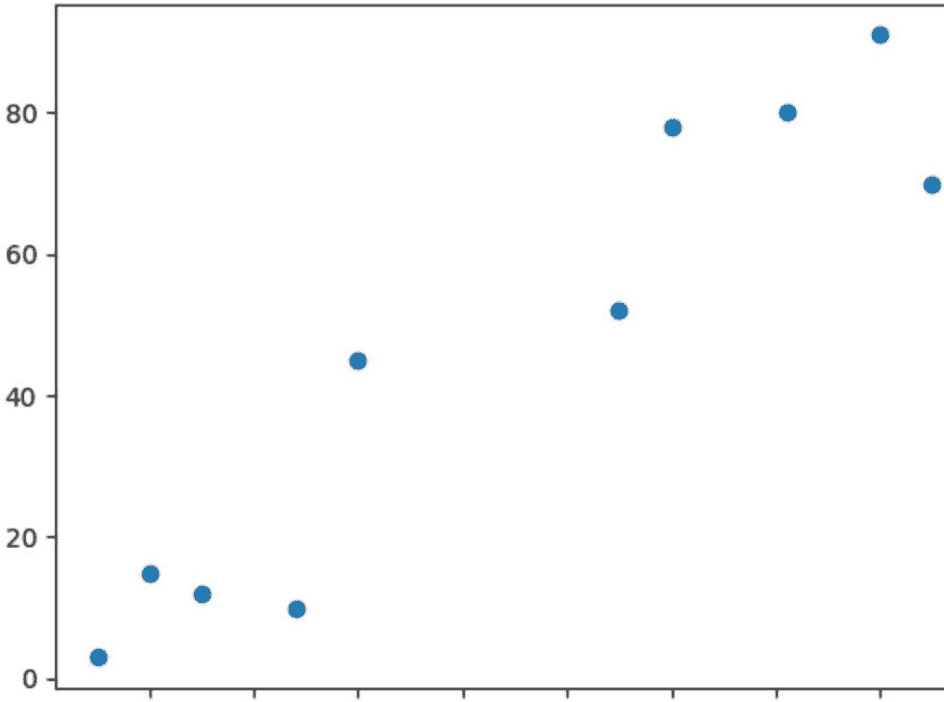

如果我们用肉眼观察，我们可能会从上述数据中形成两个簇，一个在底部有五个点，另一个在顶部有五个点。我们现在需要研究k-means聚类算法是否也会这样做。

### 创建簇

我们已经看到，我们可以从数据点形成两个簇，因此k的值现在是2。可以通过运行以下代码创建这两个簇：

```python
kmeans_clusters = KMeans(n_clusters=2)
kmeans_clusters.fit(X)
```

我们创建了一个名为kmeans_clusters的对象，并将2用作参数n_clusters的值。然后我们在这个对象上调用了fit()方法，并将我们numpy数组中的数据作为参数传递给该方法。

我们现在可以查看算法为最终簇创建的质心值：

```python
print(kmeans_clusters.cluster_centers_)
```

这返回以下内容：

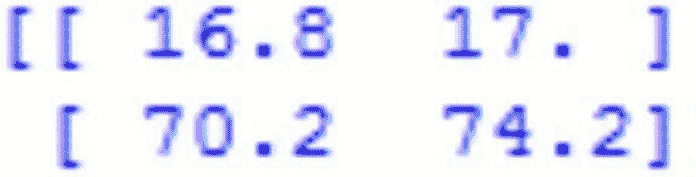

上面第一行给出了第一个质心的坐标，即(16.8, 17)。第二行给出了第二个质心的坐标，即(70.2, 74.2)。如果你遵循了手动计算这些值的过程，它们应该相同。这将表明k-means算法运行良好。

以下脚本将帮助我们查看数据点标签：

```python
print(kmeans_clusters.labels_)
```

这返回以下内容：

```
[0 0 0 0 0 1 1 1 1 1]
```

上述输出显示了一个包含10个元素的一维数组，对应于分配给10个数据点的簇。你会看到我们首先有一串零，这表明前5个点被聚在一起，而最后五个点也被聚在一起。注意，0和1没有数学意义，它们只是用来表示簇ID。如果我们有三个簇，那么最后一个将用2来表示。

我们现在可以绘制数据点，看看它们是如何被聚类的。我们需要绘制数据点及其分配的标签，以便区分簇。只需执行下面的脚本：

```python
plt.scatter(X[:,0], X[:,1], c=kmeans_clusters.labels_, cmap='rainbow')
plt.show()
```

该脚本返回以下图表：

我们只是将名为x的数组的第一列与第二列进行了绘图。同时，我们将`kmeans_labels_`作为参数c的值传递，该参数对应于标签。注意参数`cmap='rainbow'`的使用。这个参数帮助我们为不同的数据点选择颜色类型。

正如你所预期的，前五个点被聚集在左下角，并被分配了相似的颜色。剩下的五个点被聚集在右上角，并被分配了一种独特的颜色。

我们可以选择将每个簇的质心坐标与点一起绘制，以查看质心的定位如何影响聚类。让我们使用三个簇来看看它们如何影响质心。以下脚本将帮助你创建绘图：

```
plt.scatter(x[:, 0], x[:, 1], c=kmeans_clusters.labels_, cmap='rainbow')

plt.scatter(kmeans_clusters.cluster_centers_[:, 0], kmeans_clusters.cluster_centers_[:, 1], color='black')

plt.show()
```

该脚本返回以下绘图：

我们选择将质心点绘制为黑色。

## 第7章：使用Python进行线性回归

我们将要关注的线性回归的第一部分是当我们只有一个变量的时候。这将使事情更容易处理，并确保我们能够在尝试一些更难的事情之前掌握一些基础知识。我们将专注于只有一个自变量和一个因变量的问题。

为了帮助我们开始，我们将使用car_price.csv的数据集，以便我们可以了解汽车的价格。我们将汽车的价格作为因变量，然后汽车的年份将作为自变量。你可以在我们之前讨论过的数据集文件夹中找到这些信息。为了帮助我们对汽车价格做出良好的预测，我们将需要使用Python的scikit learn库来帮助我们获得正确的线性回归算法。当我们完成所有这些设置后，我们需要使用以下步骤来帮助完成。

### 导入正确的库

首先，我们需要确保我们拥有正确的库来启动这个。你需要获取本节库的代码包括：

```
import pandas as pd
import numpy as np
import matplotlib.pyplot as plt
```

```
%matplotlib inline
```

你可以将此脚本实现到jupyter notebook中，最后一行需要在那里，如果你使用的是jupyter notebook，但如果你使用的是spyder，你可以删除最后一行，因为它会自动完成这部分而无需你的帮助。

### 导入库

一旦使用你之前的代码导入了库，下一步将是导入你想要用于此训练算法的数据集。我们将使用"car_price.csv"数据集。你可以执行以下脚本来帮助你将数据集放在正确的位置：

```
car_data = pd.read_csv('d:\datasets\car_price.csv')
```

### 分析数据

在你使用数据进行训练之前，最好先练习并分析数据，查看是否有任何缩放或缺失值。首先，我们需要查看数据。head函数将返回你想要调出的数据集的前五行。你可以使用以下脚本来帮助完成这个：

```
car_data.head()
```

此外，可以使用describe函数来返回数据集的所有统计详细信息。

```
car_data.describe()
```

最后，让我们看看线性回归算法是否适合这种任务。我们将获取数据点并将它们绘制在图表上。这将帮助我们查看年份和价格之间是否存在关系。要查看这是否有效，请使用以下脚本：

```
plt.scatter(car_data['year'], car_data['price'])
plt.title("year vs price")
plt.xlabel("year")
plt.ylabel("price")
plt.show()
```

当我们使用上面的脚本时，我们试图使用一个散点图，然后可以在matplotlib库中找到它。这将很有用，因为这个散点图的x轴是年份，y轴是价格。从输出的图形中，我们可以看到，当年份增加时，汽车的价格也会上升。这向我们展示了年份和价格之间存在的线性关系。这是查看如何使用这种算法来解决这个问题的好方法。

### 回到数据预处理

记得在上一章中，我们看了一些你需要遵循的步骤来进行一些数据预处理。这样做是为了帮助我们划分数据并标记它，以获得我们需要的测试集和训练集。现在我们需要使用这些信息，并让这两个任务为我们出现。要将数据划分为特征和标签，你需要使用下面的脚本来开始：

```
features = car_data.iloc[:, 0:1].values

labels = car_data.iloc[:, 1].values
```

由于我们这里只有两列，第0列将包含特征集，然后第1列将包含标签。然后我们将能够划分数据，使20%用于测试集，80%用于训练集。使用以下脚本来帮助你完成这个：

```
from sklearn.model_selection import train_test_split

train_features, test_features, train_labels, test_labels = train_test_split(features, labels, test_size=0.2, random_state=0)
```

从这部分，我们可以回过头来再次查看数据集。当我们这样做时，很容易看出年份的值和价格的值之间不会有太大的差异。两者最终都将是数千。这意味着你不需要做任何缩放，因为你可以直接使用你这里的数据。从长远来看，这为你节省了一些时间和精力。

### 如何训练算法并使其进行一些预测

现在是时候对算法进行一些训练，并确保它能为你做出正确的预测。这就是线性回归类将派上用场的地方，因为它包含了你需要输入和训练模型的所有标签和其他训练特征。这很简单，你只需要使用下面的脚本来帮助你开始：

```
from sklearn.linear_model import LinearRegression
lin_reg = LinearRegression()
lin_reg.fit(train_features, train_labels)
```

使用之前汽车价格和年份的相同例子，我们将查看仅自变量的系数是多少。我们需要使用以下脚本来帮助我们做到这一点：

```
print(lin_reg.coef_)
```

这个过程的结果将是204.815。这表明，年份每变化一个单位，汽车价格将增加204.815（至少在这个例子中是这样）。

一旦你花时间训练了这个模型，最后一步是使用它来预测你将要处理的新实例。预测方法将与此类一起使用，以帮助实现这一点。该方法将获取你选择的测试特征并将其作为输入添加，然后它可以预测与之最匹配的输出。你可以使用以下脚本来实现这一点：

```
predictions = lin_reg.predict(test_features)
```

当你使用这个脚本时，你会发现它将为我们提供对未来情况的良好预测。根据我们现在拥有的信息，我们可以猜测未来一辆汽车将值多少钱。未来可能会有一些事情发生变化，而且根据汽车附带的特征，它似乎确实很重要。但这是查看汽车并获取它们每年平均成本以及未来成本的好方法。

那么，让我们看看这将如何工作。我们现在想看看这个线性回归，并弄清楚2025年一辆汽车将花费我们多少钱。也许你想为一辆车存钱，你想估计到你存够钱时它将花费你多少钱。你将能够使用我们拥有的信息，并添加你想要基于的新年份，然后计算出那一年新车的平均价值。

当然，请记住这不会是100%准确的。通货膨胀可能会改变价格，制造商可能会改变一些事情，等等。有时价格会更低，有时更高。但它至少为你提供了一种预测车辆价格的好方法，以及它未来将花费你多少钱。

本章花了一些时间探讨了一个示例，展示了当仅使用一个因变量和一个自变量时，线性回归算法将如何工作。你可以将此方法扩展，通过运用本章讨论的相同思路，加入更多变量。

## 第8章：特征工程

毫无疑问，特征工程是机器学习中至关重要的一部分。在本章中，我们将处理从实际应用中收集的不同类型的数据，即分类数据。这类数据极其常见。你肯定处理过受益于它的某种应用。例如，这种数据类型通常用于从任何类型的传感器或游戏机中捕获信息。即使是最复杂的数据，比如通过复杂地质调查收集的数据，也使用分类数据。无论应用如何，我们都需要应用完全相同的技术。本章的重点是学习如何检查数据并消除所有质量问题，或者至少减少它们对数据的影响。

话虽如此，让我们首先从探索一些通用思路开始。创建特征集有多种方法，了解特征工程的局限性至关重要。

你需要知道如何处理大量技术来提高初始数据集的质量。测试单个特征以及它们的任何组合也是一个重要的步骤，因为你应该只保留相关的部分。

现在，让我们学习如何创建特征集！

### 创建特征集

你可能已经知道，决定我们机器学习算法成功与否的最重要因素是数据的质量。即使我们拥有按规范准备的数据，一个缺乏信息性数据的不准确数据集也不会带来成功的结果。然而，当你拥有适当的技能和数据知识时，你就可以创建强大的特征集。了解如何构建特征是必要的，因为你需要执行审计来评估数据集。如果不评估情况，你可能会错过机会，创建一个缺乏性能和准确性的特征集。

我们将开始探索一些最强大的技术，这些技术可以解释已有的特征，帮助我们实现可以改进模型的新参数。我们还将关注特征工程方法的局限性。

### 缩放技术

我们在机器学习模型中遇到的最大问题之一是，如果我们直接引入未经准备的数据，算法相对于变量可能变得过于不稳定。例如，你可能会遇到一个具有不同参数的数据集。在这种情况下，我们的算法有可能处理那些具有较大方差的变量，仿佛存在一个更强烈变化的迹象。同时，具有较小方差和值的算法将被视为不那么重要。

为了解决上述场景中的问题，我们需要实施一个称为缩放的过程。在这个过程中，我们根据保持每个参数内值的初始顺序（这个方面被称为单调转换）来校正参数值的大小。请记住，如果我们能在执行训练过程之前对输入数据进行缩放，梯度下降算法会强大得多。如果每个参数都是不同的尺度，我们将遇到一个极其复杂的参数空间，这个空间在训练阶段也可能发生扭曲。这个空间越复杂，在其中训练模型就越困难。让我们尝试用比喻来说明，以激发想象力。想象我们的梯度下降模型就像沿着斜坡滚动的球。这些球可能会遇到障碍物而卡住，或者斜坡的几何形状可能发生改变。然而，如果我们使用缩放后的数据，我们就减少了几何形状扭曲的可能性。如果我们的训练表面形状均匀，训练过程就会变得极其有效。

缩放的最基本例子是线性缩放，范围在零和一之间。这意味着我们最大的参数将具有缩放值一，而最小的参数将具有缩放值零。还会有中间参数落在两个值之间的某个位置。让我们以一个向量为例。当对 [0, 10, 25, 20, 18] 执行此转换时，值变为 [0, 0.4, 1, 0.8, 0.72]。这说明了这种转换的一个优势，因为我们的原始数据极其多样化；然而，如果我们对其进行缩放，最终会得到一个均匀的范围。这对我们意味着，我们的训练算法将在更有意义的数据集上表现得更好。

虽然这种缩放技术被认为是经典的，但也有其他替代方案。在不同的情况下，我们可以应用非线性缩放方法。一些最常见的方法是平方缩放、对数缩放和平方根缩放。对数缩放方法通常应用于物理学和受指数增长影响的数据集。对数缩放的工作方式与线性缩放不同，因为它侧重于调整案例之间的空间。这使得对数缩放在处理异常案例时成为一个强大的选择。

### 创建派生变量

大多数机器学习应用，特别是神经网络的预处理阶段，都涉及使用缩放。然而，除了这一步骤之外，我们还有其他数据准备方法，旨在通过战术性的参数缩减来提升模型性能。这种技术的一个例子是派生度量，它使用多个现有数据点，并将它们表示在一个单一的度量中。

这些派生度量非常常见，因为所有派生分数或度量实际上都是由多个元素组合而成的分数。例如，加速度是两个时间点的速度值的函数。另一个例子是身体质量指数，它可以被视为身高、体重和年龄的简单函数。

请记住，如果我们拥有包含熟悉信息的数据集，这些分数或度量中的任何一个都将是已知的。然而，即使在这种情况下，通过运用我们的知识与现有信息相结合来寻找新的转换，也能对我们的性能产生积极影响。以下是当你思考派生度量时应该了解的一些概念：

-   组合两个变量：这个概念涉及将一个n参数作为m参数的函数进行除法、乘法或归一化。
-   随时间变化：一个常见的例子是在更复杂背景下的加速度。例如，我们不必直接处理当前值和过去值，而是可以处理底层时间序列函数的斜率。
-   基线减法：这个概念涉及使用一个基本期望来修改相对于该基线的参数。这种方法可以是观察同一变量的改进方式，因为它更具信息性。例如，如果我们有一个基线流失率（衡量在一定时间内移出某个群体的对象数量），我们可以创建一个参数，用偏离期望的程度来描述流失。另一个简单的例子是观察股票交易。考虑到这个概念，收盘价可以被视为开盘价。
-   归一化：这个概念是关于基于另一个参数的值对参数值进行归一化。一个完美的例子是交易失败率。

所有这些元素都提供了改进的结果。请记住，你也可以将它们组合起来以最大化效果。例如，想象我们有一个参数，它表示客户参与度的下降或上升斜率需要被训练，以表达某个客户是参与度低还是参与度高。为什么？仅仅是因为背景的多样性，参与度的轻微下降可能根据每种情况暗示许多事情。

由此，我们可以得出结论，数据科学家的职责之一就是在创建所述特征时考虑这些细节。每个领域都有其微妙之处，这些细微之处在结果上可能产生差异。目前，我们主要关注数值数据的例子，然而，大多数时候，涉及分类参数，如代码，我们需要正确的技术来处理它们。

接下来，我们将专注于非数值特征的解释，并学习将这些特征转换为可用参数的正确技术。

### 非数值特征

你经常会遇到解释非数值特征的问题。这通常是一个具有挑战性的问题，因为宝贵的数据可以编码在非数值中。例如，如果我们观察股票交易，买卖双方的身份信息也很有价值。让我们进一步探讨。这可能看起来是细微的信息，甚至可能毫无价值，然而，想象一下，某个股票买家可能会以特定方式与某个卖家进行交易。即使在公司层面，我们也能发现依赖于特定情境的差异。处理此类场景有时颇具挑战性。不过，我们可以实施一系列聚合操作来统计出现次数，并有机会开发扩展度量。

请记住，如果我们创建汇总统计数据，并减少数据集的行数，就可能减少模型用于学习的信息量。这一点也增加了过拟合的风险。这意味着减少输入数据并引入大量聚合并不总是好主意，尤其是在使用深度学习算法时。

聚合有一个替代方案。我们可以使用编码将字符串值转换为数值数据。一种常见的编码方法称为“独热编码”。此过程涉及将一组分类答案（如年龄组）转换为二进制值集合。这种方法为我们提供了一个优势。我们可以在某些数据集中获取有价值的标签数据，而在这些数据集中，聚合会带来信息丢失的风险。此外，独热编码使我们能够拆分某些响应代码，并将其分割为独立特征，这些特征可用于识别某个变量的相关和不太重要的代码。这使我们能够只保留对目标重要的值。

另一种替代技术主要用于文本代码。这通常被称为“哈希技巧”。你可能会问，什么是哈希？在这种情况下，哈希是一种用于将文本数据转换为数字版本的函数。哈希通常用于构建大量数据的摘要，或编码各种被认为敏感的参数。

## 第9章：卷积神经网络如何工作？

在本章中，我将解释与卷积神经网络相关的理论，这是机器学习中用于赋予计算机“视觉”能力的算法。自1998年以来，我们已经能够教授自动驾驶汽车驾驶技能，并进行图像分类和肿瘤检测，以及其他应用。

这个主题相当复杂，我将尽力清晰地解释。在此，我假设你对前馈多层人工神经网络（全连接）的工作原理有基本了解。

CNN是一种ANN或人工神经网络，它使用监督学习来处理其中的层。它模仿人眼和大脑识别特征和特性以识别特定对象的方式。通常，CNN有多个隐藏层，所有层都处于特定的层次结构中。第一层可以检测曲线、线条和其他基本形状。更深层可以识别轮廓、面孔和其他更复杂的形状。

我们将需要：

请记住，神经网络必须自己学习识别图像中的各种对象，为此，我们需要大量的图像——超过10,000张猫的图像，另外10,000张狗的图像，以便网络能够捕捉每个对象的独特特征——并进而能够泛化——这样它才能识别黑猫、白猫、正面猫、侧面猫、跳跃猫等。

### 像素与神经元

首先，网络将图像的像素作为输入。如果我们有一张仅28×28像素高和宽的图像，这相当于784个神经元。这还只是在只有一种颜色（灰度）的情况下。如果是彩色图像，我们需要三个通道（红、绿、蓝），那么我们将使用28x28x3 = 2352个输入神经元。这就是我们的输入层。为了继续这个例子，我们将假设我们只使用单色图像。

### 预处理

在输入网络之前，请记住，作为输入，我们应该对值进行归一化。像素颜色的值范围从0到255，我们将转换每个像素：“值/255”，这样我们始终会得到一个介于0和1之间的值。

### 卷积

现在开始CNN的“特征处理”。我们将进行所谓的“卷积”，这意味着从输入图像中取出相邻像素组，并与内核（一个小矩阵）进行数学运算。

内核，例如3×3像素，从左到右、从上到下遍历输入神经元，生成另一个输出矩阵，这将成为下一个隐藏神经元层。

注意：如果图像是彩色的，内核实际上是3x3x3：一个包含3个3×3内核的滤波器；然后这三个滤波器相加（并添加一个偏置单元），将形成1个输出（就像只有一个通道一样）。

内核最初将采用随机值(1)，并通过反向传播进行调整。(1) 一个改进是使其遵循对称的正态分布，但其值是随机的。

### 滤波器：内核集

一个细节：实际上，我们不会只应用一个内核，而是会有许多内核（其集合称为滤波器）。例如，在这第一次卷积中，我们可能有32个滤波器，这样我们实际上会得到32个输出矩阵（这个集合被称为“特征图”），每个矩阵为28x28x1，总共为我们的第一个隐藏神经元层提供25,088个神经元。想象一下，如果我们取一个224x224x3的输入图像（这仍然被认为是小尺寸），神经元数量会更多。

这里我们看到内核与输入图像进行矩阵乘积，并从左到右、从上到下移动1个像素，生成一个新矩阵，构成特征图。

随着内核的移动，我们得到一个由内核过滤的“新图像”。在这第一次卷积中，按照前面的例子，就好像我们得到了32个“新的过滤图像”。这些新图像“绘制”的是原始图像的某些特征。这将有助于将来区分一个对象与另一个对象（例如，猫或狗）。

图像与内核执行卷积，并应用激活函数，在这种情况下是ReLU。

### 激活函数

这种神经网络最常用的激活函数称为ReLU（修正线性单元），由f(x) = max(0, x)组成。

### 子采样

现在进入一个步骤，我们将在进行新的卷积之前减少神经元数量。为什么？正如我们所看到的，从我们的28x28像素黑白图像开始，我们有一个784个神经元的第一输入层，经过第一次卷积后，我们得到一个25,088个神经元的隐藏层——这实际上是我们32个28×28的特征图。

如果我们从这一层进行新的卷积，下一层的神经元数量将急剧增加（这意味着更多的处理）！为了减少下一层神经元的大小，我们将进行子采样过程，在此过程中我们将减小滤波器的大小。有几种可用的子采样方法，我们将看到“最常用的”：最大池化。

### 使用最大池化的子采样

让我们尝试用一个例子来解释：假设我们将进行2×2大小的最大池化。这意味着我们将遍历之前从28x28像素获得的32个特征图像中的每一个，从左到右、从上到下，但不是取1个像素，而是取“2×2”（2高×2宽=4个像素），并保留这4个像素中的“最高”值（因此是“最大”）。在这种情况下，使用2×2，结果图像“减半”为14×14像素。经过这个子采样过程，我们将有32个14×14的图像，从拥有25,088个神经元减少到6272个，它们少得多，并且——理论上——它们继续存储检测所需特征的最重要信息。

### 现在，更多卷积！

因为那是第一次卷积：它包括输入、一组滤波器，我们生成一个特征图，我们进行子采样。在仅有一种颜色的图像示例中，我们将得到：

```
have: have:
have: have:
have: have:
have:
```

```
have:
```

第一层卷积可以检测到诸如线条或曲线等基本特征。随着我们构建更多卷积层，特征图将能够识别更复杂的形态，而所有卷积层的总和将能够“看见”。

现在，我们需要进行第二次卷积，结果将是：

```
be: be: be: be: be: be: be: be:
```

第三次卷积将从7×7像素的大小开始，经过最大池化后，它将保持在3×3，这样我们只能再进行一次卷积。在这个例子中，我们从一个28x28像素的图像开始，进行了三次卷积。如果初始图像更大（224x224像素），我们仍然可以继续进行卷积。

我们到达最后一层卷积，并得到了结果。

### 与“传统”神经网络连接

最后，我们将取最后一个经过子采样的隐藏层，它通过取其形状——在我们的例子中是3x3x128（高度、宽度、特征图）——而被称为“三维”，然后进行“展平”，即它不再是三维的，而是变成了一层我们已知的“传统”神经元。例如，我们可以将其展平（并连接）到一个新的包含100个前馈神经元的隐藏层。

然后，对于这个新的“传统”隐藏层，我们应用一个名为softmax的函数，该函数连接到最终的输出层，该层将具有与我们正在分类的类别数量相对应的神经元。如果是狗和猫，将有两个神经元；但对于数字mnist数据集，它将是十个；如果我们分类汽车、飞机或船只，它将是3个，以此类推。

训练时的输出将采用称为“独热编码”的格式，其中对于狗和猫，它将是：[1,0] 和 [0,1]；对于汽车、飞机或船只，它将是 [1,0,0]；[0,1,0]；[0,0,1]。

而softmax函数负责将概率（在0和1之间）传递给输出神经元。例如，一个输出 [0.2 0.8] 表示有20%的概率是狗，80%的概率是猫。

### CNN是如何学会“看见”的？反向传播

这个过程类似于传统网络，我们有一个预期的输入和输出（这就是为什么是监督学习），通过反向传播，我们改进神经元层之间互连的权重值，随着我们迭代，这些权重会调整直到最优。

在CNN的情况下，我们必须调整不同卷积核的权重值。这在学习时是一个巨大的优势，因为正如我们所看到的，每个卷积核都很小，在我们的例子中，第一次卷积是3×3，即只有九个参数需要调整，在32个滤波器中总共是288个参数，相比之下，“传统”神经元两层之间的权重：一层是748，另一层是6272，它们全部相互连接，这相当于需要训练和调整超过450万个值（我重复：仅针对一层）。

## 第10章：顶级AI框架和机器学习库

### Tensorflow

> “一个面向所有人的开源机器学习框架”

Tensorflow是谷歌的开源AI框架，用于机器学习和高性能数值计算。

Tensorflow是一个Python库，它调用C++来构建和执行数据流图。它支持许多分类和回归算法，更广泛地说，支持深度学习和神经网络。

作为更受欢迎的AI库之一，Tensorflow服务于像Airbnb、eBay、Dropbox和可口可乐这样的客户。

此外，有谷歌的支持也有其优势。Tensorflow可以在Colaboratory上学习和使用，这是一个在云端运行的Jupyter Notebook环境，无需设置，旨在普及机器学习教育和研究。

Tensorflow的一些最大优势是其简化和抽象，这使得代码精简，开发高效。

Tensorflow是一个旨在帮助所有人进行机器学习的AI框架。

### Scikit-learn

Scikit-learn是一个开源、可商业使用的AI库。另一个Python库，scikit-learn支持监督和无监督机器学习。具体来说，它支持分类、回归和聚类算法，以及降维、模型选择和预处理。

它建立在numpy、matplotlib和scipy库之上，事实上，“scikit-learn”这个名字是“scipy toolkit”的一个文字游戏。

Scikit-learn将自己定位为“用于数据挖掘和数据分析的简单高效工具”，并且“对所有人开放，可在各种场景中重用”。

为了支持这些说法，scikit-learn提供了广泛的用户指南，以便数据科学家可以快速获取从多类和多标签算法到协方差估计等任何主题的资源。

### AI作为数据分析师

AI，特别是机器学习，已经发展到可以执行大多数商业人士所需的日常分析的程度。这是否意味着数据科学家和分析师应该担心他们的工作？

我们不这么认为。通过自助分析，机器学习算法可以处理报告的基础工作，这样分析师和数据科学家就可以将时间集中在利用他们的学位和技能的高级任务上。此外，商业人士也不需要等待他们需要的答案。

### Theano

> “一个允许你高效定义、优化和评估涉及多维数组的数学表达式的Python库”

Theano是一个Python库和优化编译器，旨在操作和评估表达式。特别是，Theano评估矩阵值表达式。

速度是Theano最强的优势之一。它可以与涉及大量数据的手工C语言实现的速度相媲美。通过利用最新的GPU，Theano也能够在CPU上显著超越C语言。

通过将计算机代数系统（CAS）的元素与优化编译器的元素配对，Theano为需要重复、快速评估复杂数学表达式的任务提供了理想的环境。它可以最小化不必要的编译和分析，同时提供重要的符号特性。

尽管Theano的新开发已经停止，但它仍然是一个强大而高效的深度学习平台。

Theano是一个机器学习库，可以帮助你轻松定义和优化数学表达式。

### Caffe

Caffe是一个开源的深度学习框架，由伯克利AI研究实验室与社区贡献者合作开发，它为深度学习提供了模型和实践示例。

Caffe在其框架中优先考虑表达性、速度和模块化。事实上，它的架构支持配置定义的模型和无需硬编码的优化，以及在CPU和GPU之间切换的能力。

此外，Caffe对研究实验和行业部署具有高度适应性，因为它可以使用单个NVIDIA K40 GPU每天处理超过6000万张图像——根据Caffe的说法，这是可用的最快的卷积网络实现之一。

Caffe的语言是C++和CUDA，具有命令行、Python和Matlab接口。Caffe的伯克利视觉与学习中心模型被许可为无限制使用，其模型动物园提供了一个开放的深度模型集合，旨在分享创新和研究。

Caffe是一个由伯克利开发的开源深度学习框架和AI库。

### Keras

Keras是一个高级神经网络API，可以在Tensorflow、Microsoft认知工具包或Theano之上运行。这个Python深度学习库促进了快速实验，并声称“能够以尽可能少的延迟从想法到结果是进行良好研究的关键”。

Keras不是一个端到端的机器学习框架，而是一个用户友好、易于扩展的接口，支持模块化和完全表达性。独立模块——如神经层、成本函数等——可以几乎没有限制地组合在一起，并且新模块易于添加。

通过一致且简单的API，用户操作在常见用例中被最小化。它也可以在CPU和GPU上运行。

Keras是一个Python深度学习库，可以在其他著名的机器学习库之上运行。

### Microsoft认知工具包

> “一个免费、易于使用、开源、商业级的工具包，它训练深度学习算法像人脑一样学习。”

### 微软认知工具包

微软认知工具包，前身为微软CNTK，是一个开源深度学习库，旨在支持健壮的、商业级的数据集和算法。

凭借Skype、Cortana和Bing等知名客户，微软认知工具包提供了从单个CPU到GPU再到多台机器的高效可扩展性——同时不牺牲高速度和高精度。

微软认知工具包支持C++、Python、C#和BrainScript。它提供了用于训练的预构建算法，所有这些算法都可以定制，当然你也可以始终使用自己的算法。定制机会扩展到参数、算法和网络。

微软认知工具包是一个免费的开源AI库，旨在像人脑一样训练深度学习算法。

### PyTorch

> “一个开源深度学习平台，提供了从研究原型设计到生产部署的无缝路径。”

PyTorch是一个用于Python的开源机器学习库，主要由Facebook的人工智能研究小组开发。

PyTorch支持CPU和GPU计算，并在研究和生产中提供可扩展的分布式训练和性能优化。其两个高级特性包括：具有GPU加速的张量计算（类似于NumPy），以及基于自动微分系统的深度神经网络。

凭借广泛的工具和库，PyTorch提供了大量资源来支持开发，包括：

- AllenNLP，一个开源研究库，旨在评估用于自然语言处理的深度学习模型。
- ELF，一个游戏研究平台，允许开发者在不同的游戏环境中训练和测试算法。
- Glow，一个机器学习编译器，可增强深度学习框架在各种硬件平台上的性能。

PyTorch是一个用于研究原型设计和生产部署的深度学习平台和AI库。

### Torch

与PyTorch类似，Torch是一个类似于NumPy的张量库，也支持GPU（事实上，Torch宣称他们将GPU放在“首位”）。与PyTorch不同，Torch封装在LuaJIT中，底层是C/CUDA实现。

作为一个科学计算框架，Torch在构建算法时优先考虑速度、灵活性和简洁性。凭借流行的神经网络和优化库，Torch为用户提供了易于使用的库，同时能够灵活实现复杂的神经网络拓扑结构。Torch是一个使用LuaJIT进行计算的AI框架。

## 第11章：机器学习的未来

在当今经济中，所有业务都在向数据业务转变。Forrester Consulting进行的一项研究显示，98%的组织表示分析对于推动业务优先事项很重要，但只有不到40%的工作负载利用了高级分析或人工智能。机器学习提供了一种方式，让公司能够从数据中提取更大价值，以增加收入、获得竞争优势并削减成本。

机器学习是一种预测分析形式，它推动组织沿着商业智能成熟度曲线向上发展，从完全依赖专注于过去的描述性分析，转向包括前瞻性的、自主的决策支持。这项技术已经存在了几十年，但围绕新方法和新产品的兴奋感正促使许多公司重新审视它。

基于机器学习的分析解决方案通常实时运行，为商业智能增添了新的维度。虽然旧模型将继续为高级决策者提供关键报告和分析，但实时分析将信息带给“一线”员工，以逐小时地提高绩效。

在机器学习——人工智能的一个分支中，系统被“训练”使用专门的算法来研究、学习，并从海量数据宝库中做出预测和推荐。暴露于新数据的预测模型可以无需人工干预地进行适应，从之前的迭代中学习，从而产生更可靠、更可重复的决策和结果。

随着时间的推移，这种迭代使系统变得“更智能”，越来越能够揭示隐藏的见解、历史关系和趋势，并在从购物者偏好到供应链优化再到石油勘探等所有领域揭示新的机会。最重要的是，机器学习使公司能够利用大数据做更多事情，并整合物联网分析等新能力。

机器学习是一项强大的分析技术，现在就可以使用。许多新的商业和开源机器学习解决方案已经可用，同时还有丰富的开发者生态系统。你的组织很可能已经在某个地方使用了这种方法，例如用于垃圾邮件过滤。更广泛地应用机器学习和分析，可以让你更快地响应动态情况，并从快速增长的数据宝库中获取更大价值。

### 预测分析无处不在

基于机器学习的高级分析日益普及的一个重要原因是，它几乎可以在每个行业带来商业利益。无论何处，只要有大量数据和需要定期调整的预测模型，机器学习就很有意义。

为书籍、电影、服装和其他数十个类别提供推荐是机器学习实际应用的一个常见例子。但还有更多。

在零售业，机器学习和RFID标签可以极大地改进库存管理。仅仅跟踪物品的位置就是一个巨大的挑战，将实物库存与账面库存相匹配也是如此。通过机器学习，用于解决这些问题的数据也可以改善产品布局并影响客户行为。例如，系统可以扫描实体店中错放的库存以便重新定位，或者识别出畅销商品并将其移动到店内更显眼的位置。

当机器学习与语言规则相结合时，公司可以扫描社交媒体，以确定客户对其品牌和产品的看法。它甚至可以发现隐藏的、潜在的模式，这些模式可能表明客户对特定产品的兴奋或沮丧。

这项技术已经在涉及传感器的应用中发挥着关键作用。机器学习对于自动驾驶汽车也至关重要，因为必须实时协调来自多个传感器的数据，以确保做出安全的决策。

机器学习可以帮助分析地理数据，以揭示能够更准确预测特定地点是否适合发电（风能或太阳能）的模式。这些只是机器学习实际应用的众多例子中的一小部分。这是一项经过验证的技术，现在就在提供有价值的结果。

### 独特的竞争优势

机器学习可以通过比传统分析更快、更轻松地解决问题和揭示见解，为公司提供竞争优势。它尤其擅长在三种情况下提供价值。

问题的解决方案随时间而变化：通过社交媒体跟踪品牌声誉就是一个很好的例子。各个平台的人口统计数据在变化；新平台不断出现。这些变化给使用基于规则的分析来向正确目标传递正确信息的营销人员带来了混乱，并迫使他们不断修订策略。相比之下，机器学习模型易于适应，随着时间的推移提供可靠的结果，并释放资源来解决其他问题。

解决方案因情况而异：例如在医学领域。患者的个人或家族病史、年龄、性别、生活方式、对某些药物的过敏以及许多其他因素使得每个病例都不同。机器学习可以考虑所有这些因素，提供个性化的诊断和治疗，同时优化医疗资源。

该解决方案超越了人类的能力：人们能够识别许多事物，比如声音、朋友的面孔、特定物体等，但可能无法解释原因。问题是什么？变量太多。通过筛选和分类大量示例，机器学习可以客观地学习识别和确定特定的外部变量，例如，这些变量赋予了声音其特征（音高、音量、谐波泛音等）。

竞争优势来自于开发不依赖人类感知、描述、干预或交互来解决一类新决策的机器。这一能力在许多领域开辟了新的机遇，包括医学（癌症筛查）、制造业（缺陷评估）和交通运输（将声音作为驾驶安全的额外提示）。

### 更快且成本更低

与其他分析方法相比，机器学习为数据科学家、各业务线团队及其组织提供了多项优势。

机器学习对新数据灵活敏捷。基于规则的系统在静态环境中表现良好，但当数据不断变化或增加时，机器学习则表现出色。这是因为机器学习消除了不断调整系统或添加规则以获得所需结果的需要。这节省了开发时间，并大大减少了进行重大更改的需求。

从长远来看，机器学习的人员成本通常低于传统分析。当然，公司最初必须聘请在概率、统计、机器学习算法、AI训练方法等方面具有高技能的专家。但一旦机器学习启动并运行，预测模型可以自我调整，这意味着需要更少的人力来调整以确保准确性和可靠性。

另一个优势是可扩展性。机器学习算法在设计时就考虑了并行性，因此扩展性更好，这最终意味着能更快地解决业务问题。依赖人类交互的系统扩展性也不佳。机器学习最大限度地减少了不断寻求人类决策的需求。

最后，机器学习应用程序的运行成本可能低于其他类型的高级分析。许多机器学习技术可以轻松扩展到多台机器，而不是单一昂贵的高端平台。

### 机器学习入门

成功迈向机器学习的第一步是确定一个业务问题，该技术可以对其产生清晰、可衡量的影响。一旦确定了合适的项目，组织必须部署专家并选择适当的技术来教系统如何思考和行动。这些技术包括：

- 监督学习：系统被给予示例输入和输出，然后被赋予形成通用行为规则的任务。示例：大多数主要品牌的推荐系统使用监督学习来提高建议的相关性并增加销售额。
- 半监督学习：系统通常被给予少量带标签的数据（带有“正确答案”）和大量未标记的数据。这种模式与监督学习具有相同的用例，但由于数据成本较低，成本也更低。当输入数据预计会随时间变化时，例如商品交易、社交媒体或与天气相关的情况，它通常是最佳选择。
- 无监督学习：在这里，系统只是检查数据以寻找结构和模式。这种模式可用于发现原本不会被发现的模式，例如店内购买行为，这可以推动产品摆放的改变以增加销售额。
- 强化学习：在这种方法中，系统被置于一个交互式、变化的环境中，被赋予一项任务，并以“惩罚”和“奖励”的形式提供反馈。这项技术已被成功用于训练工厂机器人识别物体。

无论您的项目是什么，组织在分析中有效利用机器学习的进步都取决于掌握这些基础实践。

### 强大的处理器只是开始

英特尔帮助公司在需要高速性能的实际应用中运用机器学习。它通过一种系统方法来实现这一点，该方法包括处理器、优化的软件以及对开发者和庞大的行业合作伙伴生态系统的支持。

机器学习需要高计算能力。英特尔®至强®处理器提供了可扩展的基准，而英特尔®至强融核™处理器专为机器学习典型的高并行工作负载以及机器学习的内存和互连（网络）需求而设计。在英特尔的一项测试中，该处理器将系统训练时间减少了50倍。硬件技术还包括可编程和固定加速器、内存、存储和网络功能。

此外，英特尔提供软件支持，使IT组织能够有效且高效地从业务问题转向解决方案。这种支持包括：

- 在英特尔至强处理器上优化的构建块库和语言。这些包括英特尔®数学核心库（Intel® MKL）和英特尔®数据分析加速库（Intel® DAAL），以及英特尔Python发行版。
- 优化的框架以简化开发，包括Apache Spark*、Caffe*、Torch*和TensorFlow*。英特尔支持开源和商业软件，使公司能够在最新的处理器和系统功能商用后立即利用它们。
- 软件开发工具包（SDK），包括英特尔®Nervana™技术和英特尔®深度学习SDK。这提供了一组应用程序接口，使开发者可以立即利用最佳的机器学习算法。

在优化方面，英特尔采取多种方法，包括指导客户和供应商合作伙伴如何使其机器学习代码在英特尔硬件上运行得更快，以及在硅片中实现一些学习功能，这总是更快的。

### 结论

既然我们已经到了本书的结尾，希望您已经对机器学习是什么以及如何在Python中构建机器学习模型有了基本的了解。开始构建机器学习模型的最佳方法之一是练习书中的代码，并尝试编写类似的代码来解决其他问题。重要的是要记住，练习得越多，您就会变得越好。最好的方法是从处理简单的问题陈述开始，并使用不同的算法来解决它们。您也可以尝试通过识别新的解决问题的方法来解决这些问题。一旦您掌握了基本问题，就可以尝试使用一些高级方法来解决这些问题。

感谢您读到最后！

Python机器学习可能是您在所有这些需求以及更多方面正在寻找的答案。这是一个简单的过程，可以教您的机器如何自主学习，类似于人类思维所能做的，但速度更快、效率更高。它在许多行业都改变了游戏规则，本指南试图向您展示您可以采取的确切步骤来实现这一点。

当涉及到在编码中使用机器学习时，程序员可以做的事情太多了，当您将其与Python编码语言结合使用时，即使作为初学者，您也可以更进一步。

下一步是开始将我们在这本指南中讨论的一些知识付诸实践。在机器学习方面，您可以做很多很棒的事情，当我们可以将其与Python语言结合时，在训练我们的机器或计算机方面，没有什么是我们做不到的。

本指南花了一些时间探讨了在Python机器学习方面您可以做的许多不同的事情。我们研究了机器学习的全部内容、如何使用它，甚至是一门使用Python语言的速成课程。完成后，我们立即进入将这两者结合起来，使用各种Python库来完成工作。

您应该始终致力于探索Python中的不同功能和特性，并尝试了解更多关于您将用于构建不同模型的不同库，如SciPy、NumPy、PyRobotics和图形用户界面包。

Python是一种高级语言，既是基于解释器的，也是面向对象的。这使得任何人都可以轻松理解该语言的工作原理。您还可以将您在Python中构建的程序扩展到其他平台。Python中的大多数内置库提供了各种功能，使得处理大型数据集变得更加容易。

你现在应该已经明白，机器学习是一个复杂但易于理解的概念。它并非一个充满难懂术语、晦涩图表或艰深概念的黑箱。机器学习其实很容易理解，我希望本书能帮助你掌握机器学习的基础知识。现在，你可以开始用Python进行编程和构建模型了。请务必勤加练习，因为这是提升编程技能的唯一途径。

如果你曾想学习如何使用Python编程语言，或者想了解机器学习能为你带来什么，那么这本指南正是你需要的终极工具！不妨花时间通读一遍，亲身感受Python机器学习的强大之处。