# Python 机器学习

使用 Scikit-Learn 和 TensorFlow 逐步学习 Python 机器学习的终极初学者指南

马克·里德

# Python 机器学习

使用 Scikit-Learn 和 TensorFlow 逐步学习 Python 机器学习的终极初学者指南

马克·里德

© 版权所有 2020 - 保留所有权利。

未经作者或出版商直接书面许可，不得复制、转载或传播本书所含内容。

在任何情况下，出版商或作者均不对因本书所含信息直接或间接造成的任何损害、赔偿或金钱损失承担任何责任或法律责任。

**法律声明：**

本书受版权保护。仅供个人使用。未经作者或出版商同意，不得修改、分发、销售、使用、引用或转述本书任何部分或内容。

**免责声明：**

请注意，本文档所含信息仅供教育和娱乐目的。已尽一切努力提供准确、最新、可靠、完整的信息。不声明或暗示任何类型的保证。读者承认作者不提供法律、财务、医疗或专业建议。本书内容源自多种来源。在尝试本书概述的任何技术之前，请咨询持证专业人士。

阅读本文档即表示读者同意，在任何情况下，作者均不对因使用本文档所含信息而造成的任何直接或间接损失负责，包括但不限于错误、遗漏或不准确之处。

# 目录

- 引言
- 什么是机器学习？
    - 机器学习（ML）与人工智能（AI）的区别
    - 学习 ML 时需了解的一些缩写词：
- 机器学习算法分类
- 什么是 Scikit Learn？
- 什么是 Tensorflow？
- 第 1 章：机器学习的历史
- 第 2 章：机器学习方法
    - 机器学习术语
    - 机器语言过程
- 第 3 章：机器学习环境设置
    - 设置 Python 和 Anaconda
        - 安装 Python
        - 设置 Python 环境
        - 安装 Anaconda
        - 设置 Anaconda 环境
    - 安装 Scikit-Learn
    - 安装 TensorFlow
- 第 4 章：使用 Scikit-Learn
    - 学习问题
    - 加载数据集
    - 回归
- 第 5 章：K-近邻（KNN）算法
    - 如何确定“k”参数
        - 如何选择 k 值？
        - 何时使用 KNN 模型？
        - KNN 算法的工作原理
    - KNN 算法的运作方式
    - 实现 KNN 算法
- 第 6 章：使用 TensorFlow
    - TensorFlow 入门
        - 使用 TensorFlow 变量、常量、字符串、更新、会话、占位符和数组
        - 使用 TensorFlow 数据流图和编程结构
- 第 7 章：机器学习与神经网络
    - 神经网络
- 第 8 章：机器学习与大数据
    - 大数据的 5 个 V
    - 大数据的用途
- 第 9 章：机器学习分类与回归
- 第 10 章：机器学习与云计算
    - 基于云的机器学习的优势
- 第 11 章：机器学习与物联网（IoT）
    - 物联网的用途
    - 物联网安全问题
- 第 12 章：机器学习与机器人技术
    - 机器人学习
    - 工业机器人与机器学习示例
    - 使用 Scikit-learn 的神经网络
- 第 13 章：机器学习模型
- 第 14 章：机器学习与群体智能
- 第 15 章：机器学习的应用
    - 机器学习的问题与局限性
    - 对机器学习的哲学反对与局限性
- 第 16 章：机器学习与未来
- 结论
- 参考文献
- 图片

# 引言

如果你曾用其他语言做过程序员，你将很快能够掌握 Python 的概念。与任何新知识一样，它会有一个学习曲线。然而，Python 并不是一门难学的语言，学习曲线也不陡峭。这使得 Python 成为初学程序员的理想语言。

它也是开源软件，这意味着它是免费的，任何人都可以轻松下载。在过去的几年里，Python 在编程社区中变得非常流行。它拥有庞大且不断增长的库和开源包列表，可随时从互联网下载。

Python 也是机器学习（ML）的首选编程语言之一，并且正在迅速成为教授 ML 的顶级编程语言之一。它是一种强大的面向对象、交互式和解释型编程语言，使用简洁、清晰且易于学习和遵循的语法。Python 具有许多异常处理、高级动态数据类型、动态类型、模块和类。它还可以轻松地与其他编程语言（包括 C++、C 和 Java）进行接口交互。

Python 几乎比 C++、C 和 JavaScript 等语言快十到十五倍。由于 Python 编程的面向对象特性，翻译过程变得顺畅而直接。它还可以用作扩展语言，为其他编程语言创建简单的自动化接口和脚本。

当涉及到机器学习时，Python 被认为是首选语言之一，因为它：

- 使用清晰简洁的语法
- 拥有大量代码库
- 可以与几乎所有可用的平台和语言进行接口交互
- 是开源的，可随时从互联网下载

# 什么是机器学习？

在当今技术驱动的世界中，出现了许多不同的学科，很容易让人感到困惑。例如，许多人倾向于认为机器学习（ML）和人工智能（AI）是同一回事。虽然 ML 确实与 AI 一起使用，但它们并非同一回事。然而，ML 是 AI 的一个子集。

# 机器学习（ML）与人工智能（AI）的区别

人工智能和机器学习有时很难区分，尤其是现在越来越多的系统将 ML 与 AI 系统集成在一起。

## 人工智能（AI）

任何被设计成智能的系统，如手机、机器人、汽车、冰箱或计算机程序，都是 AI。一些 AI 系统的例子包括：

- Siri
- Alexa
- 电子游戏
- 智能手机
- 智能汽车
- 智能家居设备

## 机器学习（ML）

机器学习系统是那些从基本知识开始，但随着时间的推移变得越来越智能的系统。这些机器被设计成可以自主学习，并且可以在没有人类干预的情况下获得知识以变得更智能。现在越来越多的 AI 系统集成了 ML。它们这样做是为了创建更智能的 AI 系统，这些系统可以自主学习，而无需不断进行物理更新。

一些 ML 系统的例子包括：

- 语音识别系统
- 临床诊断系统
- 金融和银行服务
- 虚拟个人助理
- 在线客户支持应用
- 谷歌和其他搜索引擎
- 在线欺诈检测系统
- 社交媒体服务
- 自动化产品推荐系统。

## 学习 ML 时需了解的一些缩写词：

在学习 ML 时，你会遇到许多与各种应用程序相关的缩写词。这些缩写词包括：

### 人工神经网络（ANN）

尽管自 1940 年代以来就有这种类型的网络模型，但它们并不是非常高效的模型。这类网络在处理海量数据集方面表现良好，近年来已发展成为极其强大和有用的工具。ANN 模型的灵感来源于大脑的生物神经系统及其处理信息的方式。它们最常用于的系统包括：

- 分类系统
- 自动驾驶汽车
- 股票市场预测系统
- 字符识别系统

### 自动语音识别（ASR）

ASR 是集成到各种硬件系统中的程序，旨在识别语音或语音模式。它可以识别和处理人类的声音。这使得人类能够通过与系统对话来与之交互。ASR 的局限性在于它不允许开放式对话。相反，ASR 提供一个菜单选项，供人们选择以回答特定问题。它们最常用于的系统包括：

- GPS 软件
- 电话应答消息服务
- 自动电话银行
- 客户服务界面

### 深度学习（DL）

深度学习系统通过从数据集中收集信息来学习。这些是不断增长的大型数据集。DL 是 ML 的一部分，但处理的是更大的数据集或数据源。与 ML 系统一样，DL 系统在学习和成长过程中会变得更智能。一些使用 DL 的系统示例包括：

- 语音激活助手
- 自动驾驶汽车
- 语音激活搜索引擎或设施
- 语言翻译服务，如法语到英语
- 自动文本生成器
- 预测软件
- 统计软件
- 调查软件
- 垃圾邮件过滤器
- 广告建议软件
- 抄袭检查器

### 自然语言处理（NLP）

NLP 是 ASR 的更高级版本。NLP 允许人与设备之间的交互。ASR 有一个单词或选项菜单，人们必须从中选择才能获得响应或被引导。NLP 使用开放式聊天格式，接近于与机器进行实时对话。

你可能熟悉的一些使用 NLP 的系统包括：

- Siri
- Alexa

# 机器学习算法的分类

算法用于在计算机程序中解决问题并生成解决方案。它是一系列提供给系统的指令，使其按照程序员设计的方式运行。例如，登录系统这样简单的操作，也会在程序内部触发一系列指令的执行。基于各种指令、规则和参数，计算机算法被设计用来相应地处理和组织这些指令。

机器学习是关于创建新规则集的计算机算法。这意味着，程序员无需通过编写一行又一行更新的指令来手动教导系统，而是让计算机拥有一套指令，使其能够从数据输入中学习并成长，从而允许系统执行以前无法通过手动编程完成的任务。这些任务包括系统识别和处理语音等。利用基础数据集，为需要预测性或建议性结果的系统进行学习和成长，这就是机器学习的基础。

机器学习可以分为三种通用方法或技术：

## 强化学习

强化学习是一种基于奖励的学习系统。系统因其执行的任务而受到惩罚或奖励。程序员可能会为系统设定基本规则和奖励策略，但不会给系统任何关于如何执行或解决任务的提示。

例如，一辆自动驾驶汽车必须弄清楚如何在不伤害行人的情况下，将乘客从A点送到B点，同时保持汽车在道路上行驶并避开其他车辆。汽车可能被输入了一系列地图、通用道路规则以及沿途可能遇到的物体信息。汽车必须找出执行任务的最佳方式并遵守规则，才能成功完成给定的任务。汽车可以利用其搜索不断增长的并行场景数据库的能力，来确定如何完成任务。

## 监督学习

当教导孩子时，我们会给他们需要学习内容的示例。通过这些示例，孩子学会做出选择并基于这些选择得出结果。例如，你可以给孩子看一个圆球并告诉他们这是足球。然后你可以给他们看一个椭圆形的橄榄球并告诉他们这是橄榄球。当被要求识别或找出橄榄球时，孩子会拿起他们被告知并看到是橄榄球的那个球。这就是所谓的监督学习。它是一个系统使用一组已知数据和结果来生成对新数据输入的合理预测结果的过程。

例如，假设你想确定某个社区房屋的平均价格。你会输入该街区一套2卧室、2浴室房屋最近的售价。你还会输入该街区一套3卧室、2浴室房屋最近的售价。利用这些信息，你可以估算出该街区一套4卧室、2浴室房屋的预计售价。

在监督学习中，对于数值标签，模型被称为“分类”。对于类别标签，模型被称为“回归”。监督学习算法包括：

- 对于回归问题，使用线性/逻辑回归
- 对于分类问题，使用支持向量机
- 随机森林可用于回归和分类问题

## 无监督学习

无监督学习是指系统有输入数据但没有示例结果。机器被给予基础数据，必须进一步学习数据以建立结果。

例如，自动推荐系统是无监督学习系统的一个典型例子。这类系统使用个人过去的观看或搜索历史，根据其过去的选择提出建议。随着个人搜索更多主题或观看更多视频，系统会相应地调整建议。

无监督学习不使用标签，算法被留待自行发现和学习。无监督算法可以分为两组：

- 关联，即算法基于相似问题得出结果。例如，购买牙膏的顾客很可能也会想要牙刷。
- 聚类，即将顾客分组为牙膏购买者。

## 什么是 Scikit Learn？

Scikit Learn 是一个 Python 库，包含用于统计建模和机器学习的工具，如回归、聚类、降维和分类。Scikit Learn 工具用于构建 ML 模型，而 Pandas 和 NumPy 则用于数据汇总、读取和操作。

Scikit learn 和 Python 一样，是一个可以免费下载和使用的库。其功能包括：

- K-近邻算法
- 随机森林
- 支持向量机

## 什么是 Tensorflow？

Tensorflow 是一个开源库，可以免费下载和使用，由 Google 创建。它用于开发深度学习（DL）模型，并允许在多个平台上快速轻松地进行复杂数值运算。程序员将其用于更大规模且通常具有多层的神经网络。其主要用途是在 ML 模型中进行发现、创建和预测，以及分类、理解和感知。

Python 被用作 Tensorflow 的前端应用程序编程接口（API）。Tensorflow 用于为以下系统构建、运行和训练深度神经网络：

- 词嵌入
- 自然语言处理（NLP）
- 手写数字分类
- 图像识别
- 循环神经网络。

# 第一章：机器学习的历史

机器学习的历史植根于计算历史以及人类对人工模拟大脑的好奇心。大多数计算功能都由一系列复杂的算法组成。因此，计算机诞生于数学，特别是布尔逻辑，这并不奇怪。

早在公元前300年，在现今的伊拉克巴比伦，就使用了称为算盘的计数工具。算盘是一个重要的计算参考，因为它是历史上最早的计数机器之一。它也是1623年威廉·席卡德开发的第一台齿轮驱动计算钟的前奏。那是一台可以进行六位数加减运算的计算机器。

计算机工作原理的动力学机制是由数学家们在数百年间逐步弄清楚的。正是通过这些伟大数学家过去所发展的各种理论和原型的扩展，计算才发展到了今天的地步。

## 计算历史时间线

**1652年**，18岁的年轻人布莱兹·帕斯卡成为法国最受尊敬的数学家之一，并被誉为神童。帕斯卡发明了第一台数字计算器，以帮助他的父亲计算税款。它被称为算术器或帕斯卡计算器。它是一台可以进行加、减、乘、除运算的算术机器。

**1671年**，戈特弗里德·威廉·莱布尼茨设计了步进计算器。这是一台更新了帕斯卡想法并为机器增加了乘法新维度的计算机器。该机器于1673年制造。尽管莱布尼茨是二进制系统的坚定倡导者，但他的机器使用的是十进制系统。

**1689年**，戈特弗里德·威廉·莱布尼茨创造了至今仍在计算中使用的二进制数系统。他仅使用1和0开发了二进制数系统，将逻辑语言陈述转换为数学陈述。1703年，他撰写了一篇关于零和一如何能轻松表示数字的文章（Gonzalez, 2018）。

**1801年**，法国人约瑟夫·玛丽·雅卡尔制造的一台织布机，根据插入机器的木制穿孔卡片自动编织织物图案。第一台计算机的设计与此织布机非常相似。

**1822年**，英国发明家查尔斯·巴贝奇获得英国政府资助，设计一台蒸汽驱动的计算机器。该机器本应能够计算数字表，但项目失败了。这台机器被称为差分机。然而，巴贝奇确实找到了尝试使计算器成为更可行项目的方法，到**1833年**，他开始开发一台更好的机器——分析机。它是第一台“完全程序控制、自动机械数字计算机”（“Analytical Engine”，n.d.）。该机器有四个组成部分：读取器、磨坊、存储器和打印机。巴贝奇在完成分析机之前去世，但这台机器值得被称为第一台计算机。

**1842年**，被誉为世界上第一位计算机程序员的阿达·洛芙莱斯，编写了有史以来第一个机器算法。该算法是为巴贝奇的分析机编写的，当时该机器仅存在于纸面上。

**1847年**，乔治·布尔创立了布尔代数，最初称为逻辑代数。布尔逻辑是电话交换等系统所基于的逻辑。它也是计算机运行和设计所基于的逻辑。

**1936年**，艾伦·图灵提出了“通用机器”的概念，该机器能够分析并执行给定的一组任务。1930年，一位亲近之人的去世使他开始痴迷于大脑和心智，因为他相信他朋友的心智并非随他一同消亡。图灵于1936年发表的论文被称为“计算机科学的基础”（“Alan Turing”，n.d.）。**1946年**，图灵设计了自动计算引擎（ACE）。

**1943年**，神经生理学家沃伦·麦卡洛克与数学家沃尔特·皮茨合作，共同撰写了一篇论文，理论化了人类大脑中的神经元可能如何运作。然后，他们通过使用电路构建一个简单的神经网络来建模他们的理论。他们的论文提供了一个使用电路的简化神经网络模型，这对人工神经网络产生了重要影响。

**1949年**，唐纳德·赫布基于脑细胞相互作用创建了一个模型，并将其发表在一本书中。这本书《行为的组织》讨论了赫布关于神经元之间通信和兴奋的理论。赫布在书中描述的模型揭示了一种改变两个人工神经元之间关系的方法。

**1950年**，艾伦·图灵在他的一篇哲学论文中提出了“学习机器”。他的想法是比较人类的输出与机器的输出。这篇论文将成为他被铭记的论文，也是图灵测试改编的来源。图灵测试至今仍用于确定机器的智能行为。为了使人工智能被判定为智能，它必须能够思考。像人脑一样，并且足够令人信服，能够通过图灵测试。

1951年，第一个名为SNARC（随机神经模拟强化计算器）的人工神经网络由马文·明斯基和迪恩·埃德蒙兹创建。

1952年，IBM的波基普西实验室是阿瑟·塞缪尔开始研究首批机器学习程序的地方。作为人工智能和计算机游戏领域的先驱，塞缪尔开发了一个能够玩跳棋的系统。该程序是独一无二的，也是最早能够通过学习来提升自身游戏水平的程序之一。1959年，阿瑟·塞缪尔提出了“机器学习”这一术语，用于描述那些能够在极少或无需人类干预的情况下学习和改进自身的系统。

1958年，弗兰克·罗森布拉特设计了“感知器”，这是第一个主要功能为识别形状和模式的人工神经网络。

1959年，伯纳德·威德罗和马西安·霍夫创建了ADELINE，一个能够识别二进制模式并预测比特流中下一个比特的神经网络。MADELINE是继ADELINE之后的下一代神经网络。这两个模型都是在斯坦福大学开发的。尽管MADELINE的技术被证明非常有用，因为它能够检测并消除电话线路回声，但它直到20世纪70年代才开始流行。这是由于更受欢迎的冯·诺依曼架构被证明比复杂的神经网络简单得多，更易于使用和理解。自20世纪70年代末开始流行以来，MADELINE神经网络技术一直沿用至今。

1982年，当日本开始关注先进的神经网络时，神经网络再次引起了世界的关注。美国为了不落后，也为先进神经网络的研究提供了资金。同年，约翰·霍普菲尔德提出了他的建议，即创建一个尽可能模拟神经元工作方式的网络。该网络将像神经元一样，通过双向线路进行工作。

1986年，斯坦福大学的研究人员在威德罗和霍夫的神经网络模型基础上进行了扩展。研究人员扩展了威德罗和霍夫使用的算法，通过允许神经网络使用多层来创建“慢学习者”。这些“慢学习者”将使系统能够在未来很长一段时间内持续学习。

1997年，在机器学习领域近十年没有太多进展之后，一台名为“深蓝”的计算机击败了当时的国际象棋世界冠军。深蓝是IBM的一台计算机，最初名为ChipTest。ChipTest是由许峰雄和他的同学默里·坎贝尔发明的。在1989年被IBM聘用后，这两位学生继续在ChipTest上工作，但将其更名为深蓝。1997年与卫冕冠军加里·卡斯帕罗夫的国际象棋比赛持续了7天，共进行了六局。这场比赛吸引了人们对新计算机系统和机器学习的广泛关注。

21世纪见证了机器学习的许多进步，因为企业开始认识到这一概念所能带来的优势。随着大数据的出现，需要能够快速准确处理数据的机器。有许多大型的机器学习项目在世纪之交启动，这些项目包括：

- 1. AlexNet
- 2. Amazon Machine Learning Platform
- 3. DeepFace
- 4. DeepMind
- 5. GoogleBrain
- 6. OpenAI

# 第2章：机器学习方法

尽管机器学习已经存在了几十年，但它直到二十世纪才真正兴起。尽管在此之前取得了一些进展，但在二十一世纪，机器学习已成为世界上最具影响力的技术之一。人工智能领域的进步取得了巨大的飞跃，而且似乎远未达到其潜力的冰山一角。

如果我们看看像第一部*《星际迷航》*这样的电影，明星们与他们的计算机互动。计算机是智能的，可以为船员运行预测。更新的科幻电影甚至拥有更先进的AI系统。这些“虚构的系统”让观众感到惊奇和着迷，他们大多认为这些系统只是作家的想象。

大多数人，即使没有意识到或没有花太多时间思考，每天都在与AI和ML互动。每次你向Siri或Alexa提问时，你都是在与具有ML能力的AI互动。即使在Google上进行搜索，你也是在与ML互动。

受人类认知启发以模仿人脑系统的机器必须经历一个学习过程。这个学习过程是机器必须找出一组规则，然后通过尝试各种场景来构建这些规则。机器通过尝试不同规则时的表现来学习，以便成功完成场景。机器不太关心它如何被交互，而是关心从交互中产生了什么有意义的结果。

## 机器学习术语

在真正深入了解ML之前，了解一些术语可能会很有用。以下术语是一些最重要的需要了解的术语。

## 机器学习数据集

数据集是机器学习结构的重要组成部分。数据集包含机器需要学习以解决问题的数据示例。

## 特征

示例数据将包含机器需要用于学习的特征和功能。这些特征是提供给ML系统算法的信息片段，用于帮助机器理解和学习。

## 机器学习模型

机器学习模型是机器学习系统从其训练中学习到的结果。例如，自动驾驶汽车模型将被训练以推断出它应该采取的最佳和最安全的路线。

## 机器语言过程

创建机器语言算法是一个循序渐进的过程。以下步骤构成了机器语言创建过程：

- 1. **数据收集**
这是创建ML算法的第一阶段，因为它是算法的基础。这是ML需要学习以提供所需结果的所有数据。

- 2. **数据准备**
第二阶段是对数据进行排序，以找到ML为了达到最佳性能所需的特征。

- 3. **机器学习训练**
在这个阶段，ML算法将被输入精心挑选的、充满特征的数据集合。正是在这个阶段，ML将开始从它被输入的数据中学习。它学习如何解决复杂问题并产生解决方案。例如，搜索引擎在启动时会被输入某些信息。使用搜索引擎的人越多，它就越能根据每个人搜索的页面来预测他们的偏好。

- 4. **评估机器学习模型**
评估ML模型是ML算法接受测试以确定其成功程度的阶段。

- 5. **性能增强**
这是一个人将持续微调和保持ML算法更新的阶段。

# 第3章：机器学习环境设置

为了能够学习和实践机器学习，你首先需要设置好你的Python/Anaconda、Scikit-Learn和TensorFlow环境。下一章将带你了解如何设置你的环境。正确设置环境后，你将能够遵循本书中的示例。

## 设置Python和Anaconda

Scikit-learn和TensorFlow可以与Python 2.7及更高版本一起使用。它们也可以与Anaconda 2.7及更高版本一起使用。安装Python和Anaconda后，需要安装一些库，这些库是安装Scikit-Learn或TensorFlow的先决条件。这些将在本章的相应部分进行介绍。

**注意：**

- 本书假设你使用的是**Windows** 7或更高版本的操作系统来下载和安装Python、Anaconda、Scikit-Learn和TensorFlow。虽然MAC和Linux的下载和安装过程不同，但练习仍然可以在这些操作系统上使用。
- 如果你的系统上已经有Python，你可以跳过**“安装Python”**部分，如果你想使用Anaconda，可以转到**“安装Anaconda”**部分。
- 如果你的机器上已经安装了Python，你可能需要检查是否安装了以下库：
    - NumPy v 1.18.4
    - SciPy v 1.4.1
    - Pip
- 如果你已经安装了上述库，或者安装了与你的机器上Python版本相关的库，请跳转到**“安装Anaconda”**部分。
- 如果你不安装Anaconda或者系统上已经安装了它，你可以跳转到**“安装Scikit-Learn”**或**“安装TensorFlow”**部分，如果你已经安装了其中一个或另一个。
- 如果你已经设置好了Python、Scikit-Learn和TensorFlow环境，你可以完全跳过本章，直接进入下一章**“使用Scikit-Learn”**。但是，检查甚至升级你当前的系统环境以适应Scikit-Learn和TensorFlow对你没有坏处。

### 安装Python

Python的最新版本是3.8.3，可以从Python.org网站获取。为了本书的目的，将使用3.8.3版本，以使本书在出版时保持最新。由于它是开源软件，可以免费下载和使用。

如果你的机器上已经安装了Python，只要它是2.7或更高版本，你就可以使用它来跟随操作。值得注意的是，早期版本和当前版本之间可能存在差异。有关版本之间差异的更多详细信息，请查看Python.org网站。

#### 下载Python

在Python.Org网站上，转到**“下载”**屏幕。

在页面的“**Active Python Releases**”部分，您可以选择下载早期版本。

在本练习中，您将使用 **Python 3.8.3**。
请从“**Active Python Releases**”中选择版本，或点击“**Download the latest version for Windows**”部分下方的“**Download Python 3.8.3**”按钮。请确保选择64位版本，因为当前版本的TensorFlow在64位系统上运行效果最佳。

文件将下载到您计算机的“Downloads”文件夹中。

下载完成后，请检查文件是否已存在。

#### 在Windows上安装Python

在“Downloads”文件夹中，双击“python-3.8.3”可执行文件。
在随后出现的“Open File - Security Warning”对话框中，点击“Run”按钮。
请务必在“Install Python 3.8.3 (xx-bit)”屏幕底部勾选“Add Python 3.9 to Path”。除非您是高级用户并希望将软件安装在其他位置，否则请保持默认安装目录。为简化流程，本培训练习未更改默认目录。
在“Install Python 3.8.3 (xx-bit)”屏幕上，点击“Install Now”选项。

如果出现“Access Control”警告屏幕，请点击“Yes”以允许应用程序在系统上安装。
“**Setup Progress**”屏幕将出现，显示Python的安装进度。

Python安装完成后，“**Setup was successful**”屏幕将出现。Python现已安装在您的系统上。

### 设置Python环境

您需要检查Python是否在系统上运行。如果您未勾选“Add Python to Path”框，则需要将其添加到**系统环境变量**路径中。要检查是否已将其放入**系统环境变量**路径，请转到“**Control Panel - System and Security - System Properties**”。

点击“**Advanced**”选项卡。

点击“**Environment Variables**”按钮。

在“System variables”下点击“**Path**”，然后点击“**Edit**”按钮。

对于早于Windows 10的系统，您需要将光标置于“**Variable value**”路径末尾，以检查是否出现以下行（或类似行，具体取决于Python的安装位置）。对于Windows 10，您将向变量列表中添加一个新路径。

以下变量路径应出现在“**Variable value**”框中：

```
;C:\Python\Python 38-32
```

如果没有对Python.exe文件的引用，请找到Python可执行文件的路径，并按照上述示例在此处输入。**注意：** 对于早于Windows 10的Windows操作系统，请不要忘记用“;”分隔每个系统路径变量条目，否则会导致问题并无法识别应用程序。检查完系统路径变量后，点击“**OK**”直到退出**系统变量**屏幕。您也可以在继续测试Python安装之前关闭“**Control Panel**”。

从开始菜单，在搜索框中输入**cmd**并按回车键。这将加载命令行屏幕，以测试Python安装是否正确且可访问。将出现以下屏幕（或类似屏幕）：

要测试Python安装，请在命令行中输入以下内容：

```
python --version
```

屏幕上应出现以下或类似内容：

最近安装在机器上的Python版本应显示在您输入的命令下方。如果未显示，您需要检查**系统变量路径**。

有几种方法可以加载Python命令行：

- 创建桌面快捷方式
- 从“**Start**”菜单的“**Programs**”选项中访问Idle或Python命令行
- 通过**DOS**命令行，使用“**Start**”菜单的**run/search**功能中的**cmd**访问Python。

为便于本练习，将使用**cmd**选项。

在cmd命令行提示符下输入：

```
python
```

如果您打算使用Python，则需要使用**pip**（首选安装程序）。**Pip**是Python的包安装程序，如果您使用的是Python 2.7或更高版本，它应该已随Python一起安装。要检查**pip**是否已安装，请在Python命令行中输入以下内容：

```
pip --version
```

它应返回pip的版本。如果版本早于20.1.1（撰写本书时的新版本是20.1.1），则需要升级**pip**。为了能够从命令行运行**pip**，您可以像添加Python可执行文件一样，将**pip**程序路径添加到系统环境变量路径中。**pip**可执行文件通常位于以下Python目录中：

```
<Python installation path>\Python\Python38-32\Scripts
```

要升级**pip**，请在命令行提示符下输入以下内容：

```
python -m pip install --upgrade pip
```

**pip**升级完成后，输入：

```
pip --version
```

版本应为20.1.1

Python **pip**实用程序现在应为最新版本。

## 使用Pip安装NumPy

现在您需要检查是否已安装NumPy库。NumPy用于支持矩阵、高级数学函数和大型多维数组。您可以通过在Python命令行上使用以下测试来检查NumPy是否随Python预装：

```
import numpy
```

如果命令行返回错误“**No module named ‘numpy’**”，则需要获取该库。在命令行提示符下输入以下内容：

```
pip install numpy
```

如果您已正确加载**pip**并在系统变量路径中引用，**pip**将按照下图所示下载并安装NumPy库。

## 使用Pip安装SciPy

现在您需要检查是否已安装SciPy库。您可以通过在Python命令行上使用以下测试来检查SciPy是否随Python预装：

```
import scipy
```

如果命令行返回错误“**No module named ‘scipy’**”，则需要获取该库。在命令行提示符下输入以下内容：

```
pip install scipy
```

如果您已正确加载**pip**并在系统变量路径中引用，**pip**将按照下图所示下载并安装SciPy库。

## 安装Anaconda

Anaconda的最新版本是3.7，可以从Anaconda.com网站获取。为便于本书，将使用3.7 64位版本，以确保本书在出版时保持最新。建议使用64位版本，因为TensorFlow在64位系统上运行效果最佳。由于TensorFlow是开源软件，可以免费下载和使用。
如果您已在机器上安装Anaconda，只要版本是2.7或更高，就可以使用它来跟随操作。请注意，早期版本和当前版本之间可能存在差异。有关版本差异的更多详细信息，请查看Anaconda.com网站。

### 下载Anaconda

在Anaconda.com网站上，向下滚动页面，直到找到“**Downloads**”按钮。

在页面的“**Anaconda Installers**”部分，您可以选择下载早期版本。

在本练习中，您将使用与您的机器相对应的**Python 3.7**版本（即32位或64位）。从“**Anaconda Installers**”屏幕中选择版本，它将开始将安装程序文件下载到机器的“**Downloads**”文件夹中。

下载完成后，请检查文件是否已存在。

### 在Windows上安装Anaconda

在“**Downloads**”文件夹中，双击“**Anaconda3.2020.02-Windows-xx**”可执行文件。在随后出现的“**Open File - Security Warning**”对话框中，点击“**Run**”按钮。

在“欢迎使用 Anaconda3 2020.02 (xx-bit) 安装程序”屏幕底部，点击“下一步”。


在“ANACONDA 许可协议”屏幕上，点击“我同意”按钮。

在“选择安装类型”屏幕上，根据您的偏好选择“仅为我安装（推荐）”或“所有用户（需要管理员权限）”。

在“选择安装位置”屏幕上，建议保留默认安装目录或设置为您选择的目录。本书将使用以下目录：

```
C:\anaconda3
```

准备好继续安装后，点击“下一步”按钮。

在“高级安装选项”屏幕上，请确保“将 Anaconda3 添加到我的 PATH 环境变量”选项**未被勾选**。此项将在安装完成后添加。您可以保持“将 Anaconda3 注册为我的默认 Python 3.7”选项**已勾选**。


点击屏幕底部的“**安装**”按钮以继续安装过程。安装将继续进行，并显示进度条指示安装进度。
当 Anaconda 安装完成后，“**安装完成**”屏幕将会出现。Anaconda 现在已安装在您的系统上。


点击“**下一步**”按钮，将进入一个信息屏幕。
点击“**下一步**”按钮，进入“**正在完成 Anaconda3 2020.02 (xx-bit) 安装程序**”屏幕。取消勾选“**Anaconda 个人教程**”和“**了解更多关于 Anaconda 的信息**”，然后点击“**完成**”按钮。

### 设置 Anaconda 环境

有几种方式可以加载 Anaconda 命令行：

- 创建桌面快捷方式
- 从“**开始**”菜单的“**程序**”选项访问 Anaconda 命令行
- 通过“**开始**”菜单的 **运行/搜索** 功能，使用 **cmd** 从 **DOS** 命令行访问 Anaconda。

为了本练习的目的，将使用“**开始**”菜单的“**程序**”选项。
前往“**开始**”菜单的“**程序**”，找到“**Anaconda3 (xx-bit)**”并打开该文件夹。
选择“**Anaconda Prompt (anaconda3)**”。

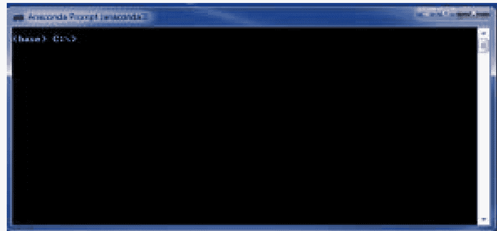

在命令行提示符处输入：
python
Anaconda Python 命令行 shell 将加载，其界面与下图类似。

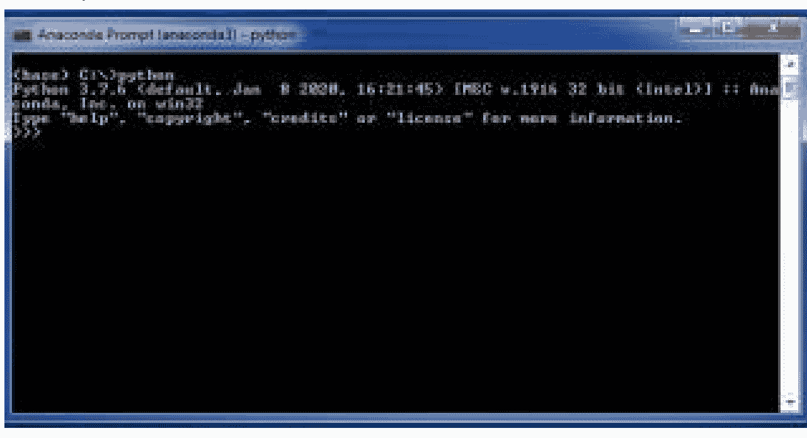

如果您想测试 Anaconda 安装，请在命令行中输入以下内容，导入 Tim Peter 的“The Zen of Python”文件：
import this
检查 Anaconda 中是否安装了“**conda**”，因为它是 Anaconda 的包安装程序。
如果您已打开 **Anaconda Prompt** 并加载了 **Python**，请首先通过输入以下内容退出 Python 命令行：
exit()
这将使您返回到 **Anaconda Prompt**，然后您可以输入以下内容：
conda --version
这应该会显示 conda 的版本。在本书出版时，最新版本是 4.8.3。**Conda.exe** 应该随较新版本的 Anaconda 预装。但是，它们并不总是 **conda** 的最新版本，可能需要升级。如果当前安装的 conda 版本早于 4.8.3，则应升级到最新版本。

要升级 **conda**，请在 **Anaconda Prompt** 命令行中输入以下内容：

`conda update conda`

当 **conda** 升级完成后，输入：

`conda --version`

**conda** 版本应为 4.8.3

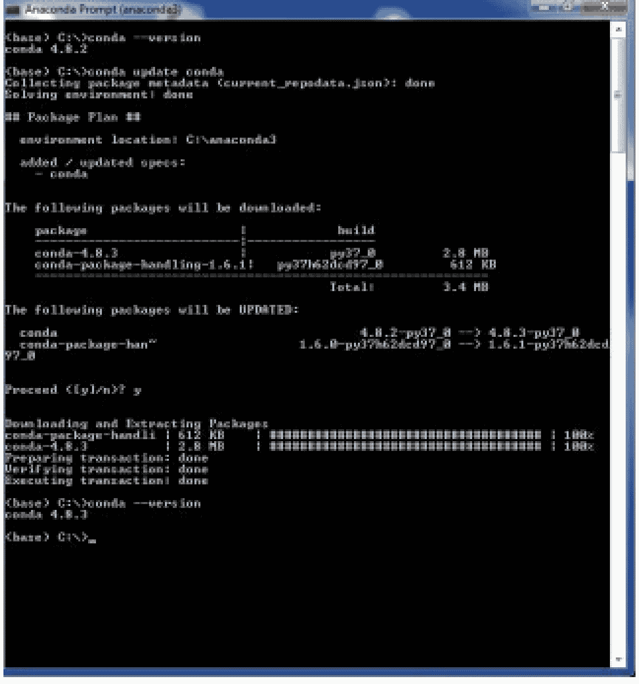

Anaconda **conda** 实用程序现在应为最新版本。

### 使用 Conda 安装 NumPy 和 SciPy

要检查 NumPy 和 SciPy 是否已加载，请输入以下命令以获取已加载模块的完整列表：

`conda list`

滚动列表以确保 Numpy 和 SciPy 已加载。如果它们未加载，您需要在 **Anaconda Prompt** 中输入以下内容进行安装：

- **下载 NumPy**
  `conda install numpy`
- **下载 SciPy**
  `conda install scipy`

## 安装 Scikit-Learn

可以使用 Python **pip** 或 Anaconda **conda** 来安装 Scikit-learn。

### 在没有虚拟环境的情况下使用 Python Pip 安装 Scikit-Learn

要使用 Python 安装 Scikit-Learn 并确保它是与您的 Python 安装兼容的最新版本，请打开 **cmd** 屏幕并输入以下内容：

```
pip install -U scikit-learn
```

安装 Scikit-Learn 时将出现以下屏幕。

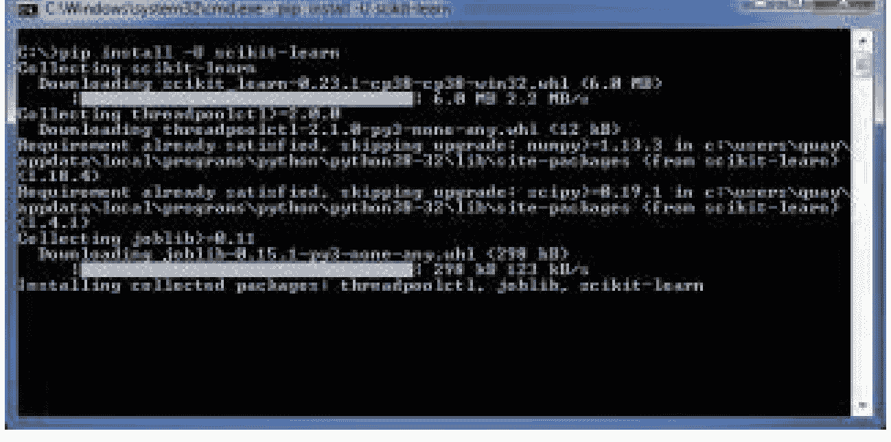

允许安装运行至完成，这可能需要几分钟时间。

### 在虚拟环境中使用 Python Pip 安装 Scikit-Learn

如果您有 Anaconda 安装，最好创建一个不同的虚拟环境来运行 Scikit-Learn for Python。要从命令行提示符运行此操作，请按照以下说明操作：

安装 Python 的虚拟环境：

```
pip install virtualenv
```

为 Scikit-Learn 创建虚拟环境：

```
python -m venv sklearn-venv
```

环境设置完成后，在命令行提示符中输入以下内容以激活 sklearn-venv 环境：

```
sklearn-venv\Scripts\activate
```

该脚本运行后，您可以使用与上面相同的命令安装 Scikit-learn：

```
pip install -U scikit-learn
```

允许包安装程序成功安装该库。

### 检查 Python Pip Scikit-Learn 安装

要检查 Scikit-Learn **pip** 安装，请在安装成功完成后，在命令行中输入以下内容：

```
python -m pip show scikit-learn
```

这将显示 Scikit-Learn 的版本（在撰写本书时版本为 0.23.1）以及库的安装位置。

### 在没有虚拟环境的情况下使用 Anaconda Conda 安装 Scikit-Learn

要使用 Anaconda 安装 Scikit-Learn 并确保它是与您的 Anaconda 安装兼容的最新版本，请运行 **Anaconda Prompt** 并输入以下内容：

```
conda install scikit-learn
```

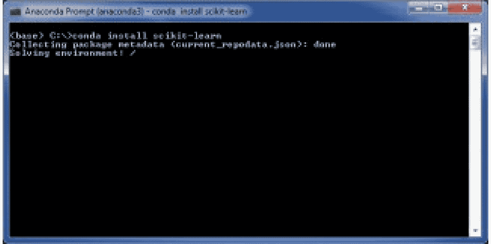

允许安装完成。这可能需要几分钟时间。

### 在虚拟环境中使用 Anaconda Conda 安装 Scikit-Learn

如果您有一个 Python 环境，那么最好创建一个环境来安装和运行 Scikit-Learn for Anaconda，这样就不会干扰您的 Python 安装。

要从 **Anaconda Prompt** 创建一个 SciKit Learn 环境，请执行以下操作：

```
conda create -n sklearn-env
```

下一步是通过在 **Anaconda Prompt** 中输入以下内容来激活环境：

```
activate sklearn-env
```

接下来，将 Scikit-Learn 安装到 Anaconda 虚拟环境中。在 **Anaconda Prompt** 中，输入以下内容：

```
conda install scikit-learn
```

允许安装运行至完成。

### 检查 Anaconda Conda Scikit-Learn 安装

要检查 Scikit-Learn **conda** 安装，请在安装成功完成后，在命令行中输入以下内容：

```
conda list scikit-learn
```

这将显示 Scikit-Learn 的版本（在撰写本书时版本为 0.21.1）以及库的安装位置。

## 安装 TensorFlow

TensorFlow 是深度学习所需的框架。它具有多种功能，允许系统执行深度学习功能。TensorFlow 还有 API，允许与几乎所有最流行的编程语言进行交互。这些编程语言包括 Rust、Haskell、Java、C++ 和 Go。

与大多数 Python 或 Python 兼容库一样，TensorFlow 是开源软件，可以从互联网免费下载和使用。TensorFlow 可以使用 Python **pip** 或 Anaconda **conda** 包安装程序进行安装。为了本书的目的，将安装仅限 CPU 版本的 TensorFlow。

### 在没有虚拟环境的情况下使用 Python Pip 安装 TensorFlow

要使用 Python 安装 TensorFlow 并确保它是与您的 Python 安装兼容的最新版本，请打开 **cmd** 屏幕并输入以下内容：

```
pip install -U tensorflow
```

上述命令将帮助您安装仅限 **CPU** 版本的 TensorFlow。TensorFlow 的 **CPU** 版本更快，并且对于初学者来说是一个更容易使用的系统。对于较简单的机器学习模型，也推荐使用它。当您刚开始使用机器学习模型时，**CPU** 在设计和训练此类模型方面要容易得多。

如果你需要安装 **GPU** 版本的 TensorFlow，请在 **cmd** 命令行中输入以下命令：

```
pip install -U tensorflow-gpu
```

这将为你的 Windows 系统安装 TensorFlow **GPU** 版本。**GPU** 是 TensorFlow 更高级的建模系统，用于处理海量数据和图形/图像。它也用于处理比 **CPU** 更复杂的任务，但速度可能比 **CPU** 慢得多。

### 使用 Python Pip 和虚拟环境安装 TensorFlow

如果你在安装 Scikit-Learn 时创建了 sklearn-venv 环境，那么你应该将 TensorFlow 安装到该环境中。你可以通过在 **cmd** 提示符下输入以下命令来激活该环境：

```
sklearn-venv\Scripts\activate
```

请遵循与安装 Scikit-Learn 时相同的安装流程，就像在没有虚拟环境中安装一样。

### 使用 Anaconda Conda 且不使用虚拟环境安装 TensorFlow

要使用 Anaconda 安装 TensorFlow 并确保它是与你的 Anaconda 安装兼容的最新版本，请打开 **Anaconda Prompt** 界面并输入以下内容：

```
conda install tensorflow
```

上述命令将帮助你安装仅支持 **CPU** 的 TensorFlow 版本。

如果你需要安装 **GPU** 版本的 TensorFlow，请在 **Anaconda Prompt** 命令行中输入以下命令：

```
conda install tensorflow-gpu
```

这将为你的 Windows 系统安装 TensorFlow **GPU** 版本。

### 使用 Anaconda Conda 和虚拟环境安装 TensorFlow

如果你已经为 Scikit-Learn 创建了 conda 虚拟环境，那么请使用相同的环境。如果没有，请按照“**在 Anaconda 中使用虚拟环境安装 Scikit-Learn**”中所示的相同步骤创建一个 Anaconda 环境。一旦你有了 Anaconda 虚拟环境，请使用以下命令激活它：

```
activate sklearn-env
```

通过输入以下内容安装 TensorFlow：

```
conda install tensorflow
```

这将为你的 Windows 系统安装 TensorFlow CPU 版本。

# 第 4 章：使用 Scikit-Learn

要开始使用 Scikit-Learn，你首先需要进入 Python 或 Anaconda 来导入该库以供使用。要导入 Scikit-learn，请在 **cmd** 或 **Anaconda Prompt** 的命令行提示符下输入以下内容：

```
For Python:
import sklearn

For Anaconda:
Python
Import sklearn
```

允许命令完成。如果模块导入成功，它将返回到一个新的提示行，你就会知道。如果没有正确导入，将会出现错误消息。

你可以开始使用 Scikit-learn 创建机器学习模型，并使用该包中包含的库。

## 学习问题

机器学习基于训练集和测试集。训练集用于从数据集中学习各种属性。测试集用于测试在训练集中学到的内容。

机器语言中的学习问题有两类，正如前面章节所讨论的。学习问题需要考虑包含 n 个样本的各种数据集。它使用这些样本来尝试预测未知的数据属性。

这两类问题被归类为：

- **监督学习**，当机器算法的数据具有更多需要预测结果的属性时。例如，对于人类来说，当一个孩子被展示红色并被告知它是红色时。然后他们被展示其他几种颜色，并被告知它们不是红色。这将问题分类为红色或非红色。监督学习问题用于解决：
    - **分类问题**，已知具有离散输出值的问题。例如，它是红色或不是红色；没有其他可能性或灰色地带。分类数据将包含以下元素：
        - **一个预测器**或多个预测器。例如，根据年龄组预测有多少人喜欢香草冰淇淋。在这种情况下，年龄将是输出的预测器。
        - **一个标签**，即输出，对于分类，它由一个整数表示，可以是 1、2、-2 或 0。当你想到标签时，把它想象成一个是或否的标签，因为标签不能用于执行数学运算。想想把“是，他们喜欢冰淇淋”和“不，他们不喜欢冰淇淋”加在一起。这样做没有意义，因为它们只是标签。
    - **回归**，当机器学习算法需要比较一个或多个连续变量以预测结果时。例如，想想一个身高 5 英尺 3 英寸的人的平均体重。它可以更进一步，根据一个人的身高和体型来预测其体重。回归将有一个或多个自变量和一个因变量。对于上面的例子，体重将是因变量，它根据人的身高和体型进行预测。
- **无监督学习**，当机器学习算法被给予一个仅包含函数和特征的数据集时。没有示例结果（标签）的目标数据集。例如，机器只被给予输入数据，而没有可以基于其进行预测的内容。因此，机器必须学习数据的基本结构。一些无监督学习结构包括：
    - **聚类**，当一组相似的对象被分组到一个簇中时。聚类在统计数据分析和数据挖掘等应用中很有用。
    - **密度估计**，当根据观测数据形成估计时。直方图、Parzen 窗和向量量化是密度估计的技术示例。

## 加载数据集

为了给 ML 算法提供可处理的内容，需要加载数据集。要演示如何操作，请按照以下命令加载一个名为 iris 的演示数据集。要加载 Scikit-learn 数据集，请在 **cmd**（用于 Python）或 **Anaconda Prompt** 的命令行提示符下输入以下内容：

**对于 Python：**

```
from sklearn import datasets
digits = datasets.load_digits()
```

**对于 Anaconda：**

```
Python

from sklearn import datasets
digits = datasets.load_digits()
```

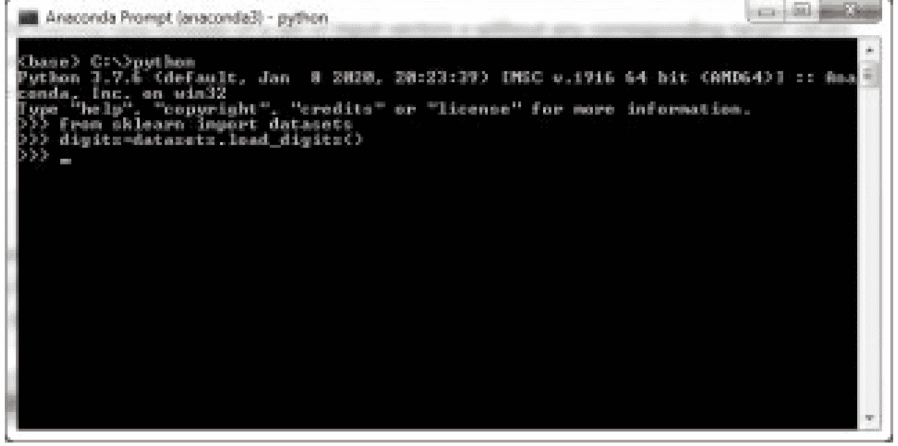

数据集的数据通常存储在数据集的 .data 成员中。此数据集将包含在 **n_features** 和 **n_samples** 数组中的信息，这些数组显示了数据是什么以及数据具有的特征。**.target** 成员是变量的一些解决方案可以找到的地方。

例如，如果我们有一个包含字母表的数组，所有字母都将存储在 **.data** 成员中，从 a 到 z，而最常用单词的组合可以存储在 **.target** 成员中。这将是单词或单词组合的变体。

iris 数据集包含一个数字数组。要查看数据集中有什么，请在 **cmd**（用于 Python）或 **Anaconda Prompt** 的命令行提示符下输入以下内容：

**对于 Python：**

```
print(digits.data)
```

**对于 Anaconda：**

```
Python

print(digits.data)
```

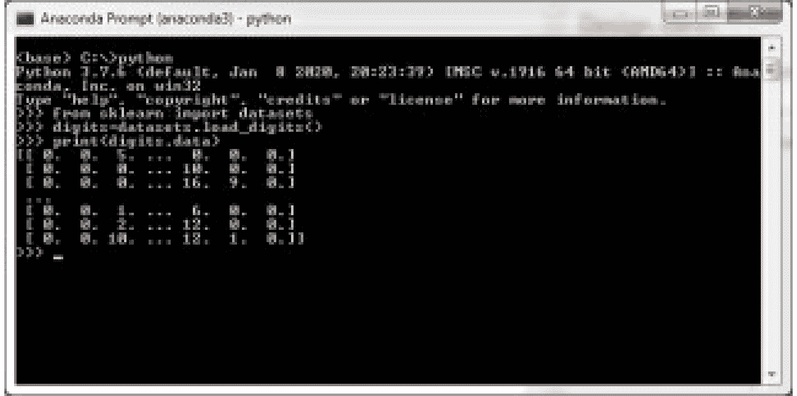

要查看 iris 中数字数组的一些预测结果，你可以在 **cmd**（用于 Python）或 **Anaconda Prompt** 的命令行提示符下输入：

**对于 Python：**

```
digits.target
```

**对于 Anaconda：**

```
Python

digits.target
```

这将返回一个二维数组，其中包含与 **n_features** 数组对应的 **n_samples** 数组。

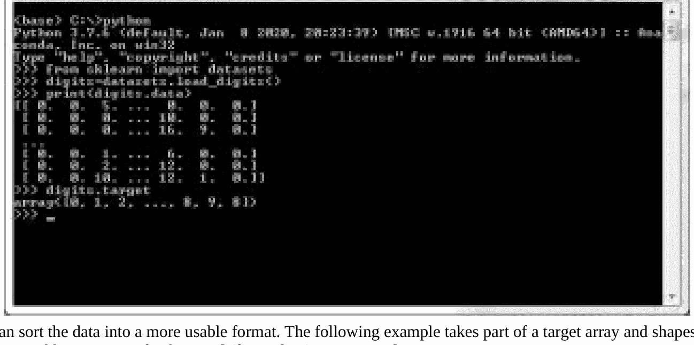

你可以将数据整理成更可用的格式。以下示例获取目标数组的一部分并对其进行整形。在 **cmd**（用于 Python）或 **Anaconda Prompt** 的命令行提示符下输入：

**对于 Python：**

```
digits.images[2]
```

**对于 Anaconda：**

```
Python

digits.images[2]
```

## 回归

机器学习回归模型用于根据一个或多个预测变量来预测连续变量。例如，根据一个人的身高和体型来预测其体重。

## 线性回归

这是最流行的预测分析类型。线性回归涉及以下两个问题：

- 预测变量能否准确预测结果变量的结果？
- 哪些特定变量是最终变量的关键预测因子，它以何种标准影响结果变量？

### 变量命名

回归的因变量有许多不同的名称。一些名称包括结果变量、标准变量等。自变量可以称为外生变量或抑制变量。

### 回归分析的功能包括：

- 趋势预测
- 确定预测因子的强度
- 预测影响

### 回归分解

线性回归和多元回归是回归的两种基本形式。线性回归包含一个自变量，以便能够预测因变量的结果。为了在预测结果时辅助多元回归，有相当多的自变量可以提供帮助。

回归是金融和投资机构中有用的工具。这是因为可以基于先前的销售额和GDP增长等众多因素，用于预测特定产品或公司的销售额。金融领域常用的回归模型是资本定价模型。

以下示例描述了线性回归和多元回归中使用的公式。

```
线性回归：Y = a + bX + u
多元回归：Y = a + b1X1 + b2X2 + ... + u
```

### 此示例分解如下：

Y = 因变量，即需要预测的内容
X = 自变量，使用Y变量作为预测结果的基础
a = 截距值
b = 斜率值
u = 回归残差值

### 选择最佳回归模型

选择正确的线性回归模型可能非常困难且令人困惑。尝试用样本数据建模并不会让事情变得更容易。本节回顾了一些最流行的统计方法，可用于选择模型以及可能遇到的挑战。它还列出了一些实用的建议，用于选择正确的回归模型。

这总是始于一位希望扩展响应变量和预测因子之间关系的研究人员。被赋予执行调查责任的研究团队本质上测量了许多变量，但模型中只有少数几个。分析师将努力减少不同的变量，并应用那些具有准确关系的变量。随着时间的推移，分析师会继续添加更多模型。

### 用于寻找最佳回归模型的统计方法

如果你想在回归中获得一个很好的模型，那么考虑你想要测试的变量类型以及其他可能影响响应的变量非常重要。

### 修正R平方和预测R平方

你的模型应该具有更高的修正和预测R平方值。下面显示的统计量有助于消除围绕R平方的关键问题。

- 调整后的R平方在新项改进模型时会增加。
- 预测R平方属于交叉验证，有助于定义你的模型泛化其余数据集的方式。

### 预测因子的P值

在回归中，低P值表示统计上显著的项。“简化模型”一词指的是考虑模型中所有候选预测因子的过程。

### 逐步回归

这是一种自动化技术，可以在创建模型的探索阶段选择重要的预测因子。

### 现实世界的挑战

选择最佳模型有不同的统计方法。然而，仍然存在复杂性。

- 当变量由研究测量时，会出现最佳模型。
- 由于数据收集方法的类型，样本数据可能不寻常。在处理样本时，会发生假阳性和假阴性过程。
- 如果你处理足够多的模型，你会得到一些仅偶然相关的显著变量。
- P值可能因模型中的特定项而异。
- 研究发现，最佳子集回归和逐步回归无法选择正确的模型。

### 寻找正确的回归模型

- **理论**
  研究其他专家完成的研究，并在你的模型中引用。重要的是，在开始回归分析之前，你应该对最重要的变量形成想法。基于他人的结果进行开发可以简化数据收集过程。
- **复杂性**
  你可能认为复杂的问题需要复杂的模型。嗯，事实并非如此，因为研究表明，即使是一个简单的模型也可以提供准确的预测。一旦存在具有相同解释潜力的模型，最简单的模型可能是一个完美的选择。你只需要从一个简单的模型开始，然后慢慢增加模型的复杂性。

### 如何计算预测模型的准确性

有多种方法可以计算模型的准确性。其中一些方法如下所列：

- 你将数据集分为测试和训练数据集。接下来，基于训练集构建模型，并将测试集作为保留样本，用测试数据来衡量你训练好的模型。
- 另一种方法是计算“混淆矩阵”以计算假阳性率和假阴性率。这些指标将允许一个人选择是否接受该模型。如果你考虑错误的成本，这将成为你拒绝或接受模型决策的关键阶段。
- 计算受试者工作特征曲线（ROCC）、提升图或曲线下面积（AUC）是你可以用来决定是否拒绝或接受模型的其他方法。

# 第5章：K-近邻（KNN）算法

为了构建更复杂的分类器，KNN算法是最流行的。在超越了许多强大的分类器之后，它仍然是最简单的算法之一。KNN算法的简单性是它被用于数据压缩、经济预测和遗传学等众多应用的原因。该算法可用于解决回归和分类问题。它是一种监督学习算法。

KNN算法是学习机器语言的最佳起点，因为它是一个容易掌握的概念，并且是许多机器学习概念的基础。

机器学习模型使用过去示例的可用数据进行学习，然后根据某些输入标准做出预测结果。例如，当你教一个孩子学习时，你教他们如何根据特征区分两个相似的物体。一个例子是教孩子区分鸡和鸭。你会给他们看一张图片，然后为每个添加一些特征。这些特征可能包括：

- 鸡有羽毛、爪子和喙。
- 鸭有羽毛、喙和蹼足。
- 鸡咯咯叫。
- 鸭嘎嘎叫。

如果你给孩子看一张鸭子的图片，他们就能利用这些特征来确定图片是鸭子。

与教孩子如何区分和识别物体类似，KNN模型数据集由训练观测值（x， y）组成。使用已输入或可用于机器学习模型的信息，KNN模型必须确定x和y之间的关系以预测结果。例如，如果给x一个值，算法需要预测y的相应值应该是什么。如果你输入值“嘎嘎叫”（x），KNN算法会使用其数据集中可用的特征列表来确定它应该查看鸭子（y）的数据。

KNN模型将得出“嘎嘎叫”是鸭子的预测结果，因为该模型基于特征相似性。它将根据相似性对特征进行分组，这就是为什么KNN分类器可用于特征分类。例如，鸭子和鸡都有羽毛。所以，它们可以被归类为鸟类。然而，鸟类有不同的物种和亚种。虽然大多数鸟类有羽毛，但少数物种有蹼足，大多数水鸟都有蹼足。但是，只有鸭子会嘎嘎叫，有蹼足和羽毛。因此，基于**特征相似性**，预测结果将是鸭子。

KNN模型最常用于对数据点进行分类。它是基于其最近邻的分类来完成的。例如，它是鸡还是不是？KNN模型通过分类来构建其当前数据集

## 如何确定“k”参数

**参数调优**是指确定KNN模型中“k”正确值的过程。由于KNN是一种基于特征相似性的算法，为“k”设置正确的参数对于确保预测输出尽可能准确至关重要。

下面的KNN模型用于判断一个水果是苹果还是橙子。

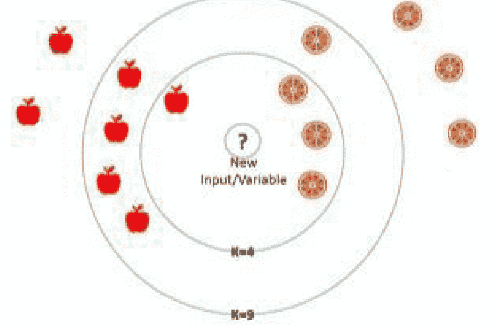

选择正确“k”因子的难点在于试图消除过多的偏差。例如，在上图中，如果你确定k=4，那么根据4个最近邻居的投票，新变量将被判定为橙子。然而，如果你确定k=9，那么新变量将被判定为苹果。确定“k”因子的诀窍在于尽可能限制偏差。

### 如何选择k值？

如果“k”因子太低，信息量将不足；如果太高，则会有太多数据需要处理。

选择“k”值最简单的方法：

- 使用“n”的平方根，其中n = 数据点的总数。
- 如果平方根是偶数，则将该值减去或加上1，以确保“k”值为奇数。如果“k”值为偶数，则总是存在失败的风险。例如，苹果和橙子的图表最终可能产生一个未确定的新值。新值的最近4个邻居可能是2个苹果和2个橙子，而不是2个苹果和3个橙子。
- 将“k”值四舍五入到最接近的整数。
- 对于上面的苹果和橙子图表，“k”值将是：
    - k = 平方根{14}
    - k = 3.74
    - k = 4
    - k = 4 + 1
    - **k = 5**

### 何时使用KNN模型？

当满足以下条件时，你可以使用KNN算法：

- 所有数据都有标签——苹果、橙子、葡萄等。
- 数据集较小且不太复杂——KNN不会从模型的训练集中学习判别函数。它被称为惰性学习器，用于不超过约1GB的数据集。
- 无噪声或干净的数据集——这意味着数据必须定义清晰，没有太多变量。例如，它是一只狗或一只猫，而不是一只小狗，或一只长毛小狗，或一只无毛的猫等。

## KNN算法如何工作

一个判断一个人是**超重**还是**正常体重**的数据集将有两个主要变量：

- 身高
- 体重

考虑下面的体重图表作为数据集，通过绘制身高变量和体重变量来判断一个人是超重还是正常体重。

| 身高（英尺和英寸） | 体重（磅） | 组别/类别 |
|---|---|---|
| 4'9" | 63 lb. | 正常体重 |
| 4'10" | 110 lb. | 超重 |
| 4'11" | 115 lb. | 超重 |
| 5'0" | 110 lb. | 正常体重 |
| 5'1" | 116 lb. | 正常体重 |
| 5'2" | 121 lb. | 正常体重 |
| 5'3" | 127 lb. | 正常体重 |
| 5'4" | 160 lb. | 超重 |

使用上表中的数据以及KNN算法，你必须使用身高和体重作为标准来判断一个人是超重还是正常体重。


例如，假设玛丽体重110磅，身高5'1"。你如何判断她是超重还是正常体重？

KNN算法假设相似的事物彼此更接近。因此，为了使算法成立，相似的数据点应该彼此靠近。例如，上面示例中使用的绿色和红色葡萄的分类。

基于相似数据点紧密相关的假设，要找到最近的邻居，你需要计算欧几里得距离，或者你在数学中学过的计算两点之间距离的方法。

### 两点之间的距离/欧几里得距离计算

当你在学校时，你学过计算两点之间的距离。简而言之，这个计算假设当你知道两点的垂直和水平位置时，你可以计算这两点之间的直线距离。

对于需要快速回顾两点之间距离计算的人：

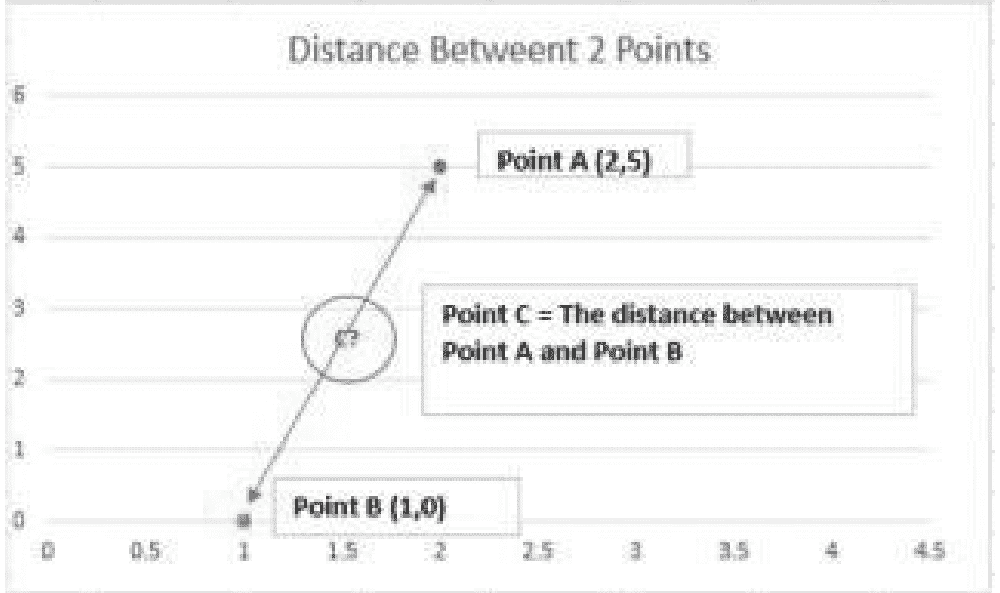

- 以上图为例，你知道图上**点A**和**点B**的位置。
    - **点A：** X = 2，Y = 5 (2,5)
    - **点B：** X = 1，Y = 0 (1,0)
- 需要计算的是**点C**，即**点A**和**点B**之间的**距离**。
- 计算将如下公式所示：


### 两点之间的距离

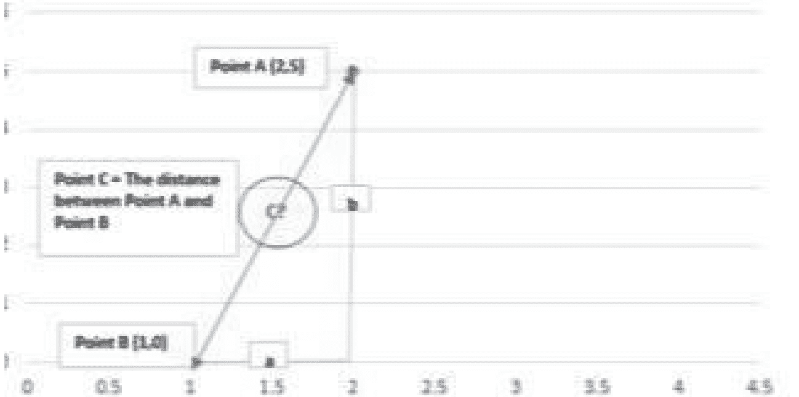

- 要解决点C，你需要从点A (b) 向x轴画一条虚线，并从点B (a) 连接到点A的虚线。
- 这些虚线从图上的已知点形成一个直角三角形。
- 当我们形成一个直角三角形时，**勾股定理**指出：
  三角形最大的边（斜边）等于另外两边的平方和（“勾股定理”，2009）。

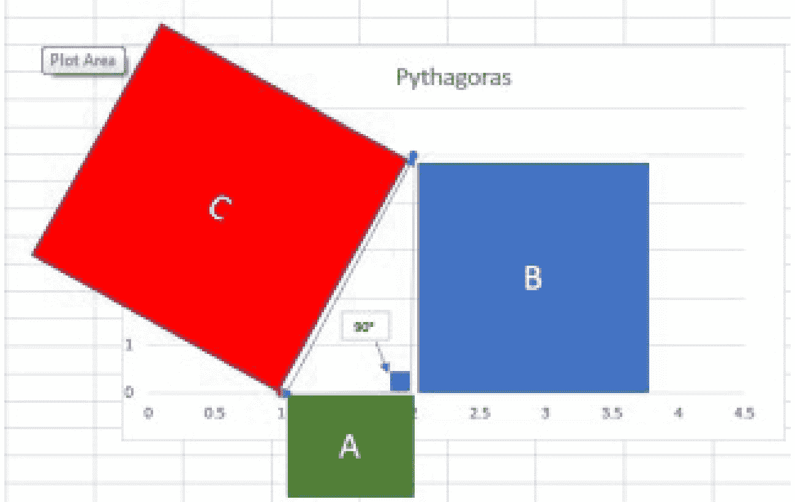

- 勾股公式是：
  - a²+b²=c²
- 要计算C：

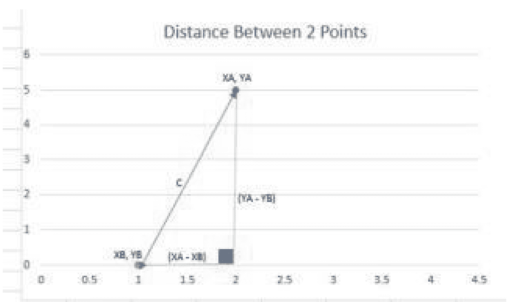

- a = (XA - XB) —水平距离
- b = (YA - YB) —垂直距离
- 将公式组合起来计算C：
  - c² = a² + b²
  - c² = (XA - XB)² + (YA - YB)²
  - c = 平方根{(XA - XB)² + (YA - YB)²}
- 将数值代入公式计算C：
  - c = 平方根{(2 - 1)² + (5 - 0)²}
  - c = 平方根{(1² + 5²)}
  - c = 平方根{1 + 25}
  - c = 平方根{26}
  - c = 5.099

### KNN两点之间的距离/欧几里得距离计算

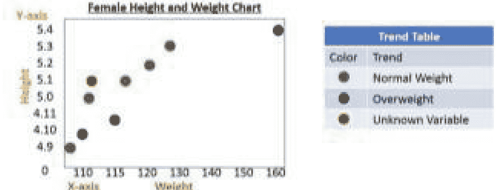

要理解如何为KNN算法计算欧几里得距离，请看上面的图表。使用之前身高体重图表中的测量值，你可以清楚地看到哪些体重是正常的，哪些是超重的。

为了判断玛丽是超重还是正常体重，KNN算法将计算现有数据集中每个已知数据点与未知数据点之间的距离。

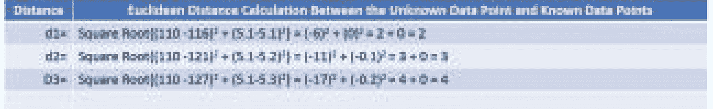

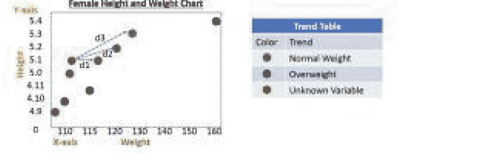

一旦KNN算法计算出数据集中已知数据点之间的距离，它就会根据k=3，通过其最近的邻居投票来决定如何分类未知数据点，这使得未知变量为正常体重。因此，根据她的身高和当前体重，玛丽是正常体重。

### KNN算法的工作原理

KNN算法按照以下流程工作：

- 数据被加载到算法中
- 然后将K初始化为所需的邻居数（k=n）
- 输入算法的每个数据点查询将：
    - 计算示例数据与查询之间的距离
    - 根据索引和距离数据创建一个有序集合
- 按距离从小到大对数据进行排序
- K个条目将被分配标签
    - 回归模型将返回平均标签
    - 分类模型将返回众数标签

## 实现KNN算法

为了演示如何实现KNN算法，你将使用一个样本数据集来预测糖尿病。

该练习的目标是预测一个人是否有患糖尿病的风险。

该数据集包含768人的列表。该列表是已确诊和未确诊糖尿病的人的混合。

此数据集的CSV文件包含9列数据，所有这些数据都与帮助KNN算法预测一个人是否有患糖尿病风险的信息有关。

首先，打开**Python IDE**或**Anaconda的Jupyter Notebook**。本书将使用Jupyter Notebook。要访问Jupyter Notebook，你需要启动Anaconda Navigator。

### 设置笔记本页面

启动 Jupyter Notebook，并允许其在默认浏览器中打开一个浏览器窗口。本书中默认浏览器为 Chrome。

当 Jupyter Notebook 在默认浏览器中加载完成后：

将笔记本的名称更改为“Sample_KNN1”

在笔记本的第一行输入标题：

- KNN - 预测一个人是否有患糖尿病的风险
- 将单元格从代码单元格更改为 Markdown 语言单元格
- 运行代码

### 导入工具并设置 KNN 环境

创建一个新单元格，你将在此加载或导入本练习所需的所有库。

在新单元格中输入以下内容（不要输入 # 以及 # 前面的信息，因为这是用来解释命令用途的）：

```
import pandas as pd
import numpy as np
from sklearn.model_selection import train_test_split
from sklearn.preprocessing import StandardScaler
from sklearn.neighbors import KNeighborsClassifier
from sklearn.metrics import confusion_matrix
from sklearn.metrics import f1_score
from sklearn.metrics import accuracy_score
```

#### 上述代码解释：

```
import pandas as pd #这将导入 Pandas 数据框
import numpy as np #这将导入 Numpy 数字数组
#此空格分隔了运行模型所需的工具和模型的设置。
from sklearn.model_selection import train_test_split #用于将模型拆分为训练数据，然后测试数据
from sklearn.preprocessing import StandardScaler #这有助于缩放可能增长或变得过大的数据，从而避免 KNN 数字偏差等问题。
from sklearn.neighbors import KNeighborsClassifier #这是你将使用的 K 邻居分类器工具
from sklearn.metrics import confusion_matrix #用于测试模型
from sklearn.metrics import f1_score #用于测试模型
from sklearn.metrics import accuracy_score #用于测试模型
```

### 运行代码

输入命令后，你需要运行代码。

### 加载数据库

Diabetes.csv 信息可从以下网站获取：
https://github.com/susanli2016/Machine-Learning-with-Python/blob/master/diabetes.csv
将 diabetes.csv 文件复制到 \Anaconda3\Scripts 目录
在 Jupyter Notebook 的新单元格中输入以下内容：

```
dataset = pd.read_csv('C:\Anaconda3\Scripts\diabetes.csv')
print( len(dataset) )
print( dataset.head() )
```

运行脚本，它将打印出糖尿病数据集的前几行。

### 定义特定标准

在下一步中，你将定义某些标准，例如不能有零血糖水平。如你所见，从上一次打印的 csv 文件中列出的列在本节中更容易处理。

你将在本节中做的第一件事是定义哪些列不能接受零值。在定义了哪些列可以接受零值之后，你必须定义模型将如何替换任何零值。零值必须替换为 numpy.NaN，这意味着没有数据。然后你将设置平均数据，该数据会从数据集中移除任何非数据以进行计算。

要设置此标准，在新单元格中输入以下内容：

```
zero_not_accepted = ['Glucose', 'BloodPressure', 'SkinThickness', 'BMI', 'Insulin']
for column in zero_not_accepted:
    dataset[column] = dataset[column].replace(0, np.NaN)
    mean = int(dataset[column].mean(skipna=True))
    dataset[column] = dataset[column].replace(np.NaN, mean)
```

运行脚本。如果脚本中没有错误，它应该会返回到一个空白单元格。

### 将数据集拆分为训练集和测试集

要拆分数据集，你需要告诉模型数据集中的哪些列是训练数据，哪些是结果或答案的一部分。对于糖尿病数据集，有 9 列，对于模型来说是从 0:8（: 表示到，如果单独使用 : 则表示全部）。

在以下命令中，你将看到第一行是 x = dataset.iloc[:, 0:8]，这是**训练数据**。这意味着：

- : — 表示包含所有行
- 0:8 — 表示所有列，直到但不包括第 9 列。模型从零开始计数。

下一行将是结果或答案数据的一部分。它将写为 y = dataset.iloc[:, 8]。这意味着：

- : — 表示包含所有行
- 8 — 告诉模型在哪里找到结果

代码的最后一行只是设置 train_test_split。
在 Jupyter Notebook 的空白单元格中输入以下内容：

```
X = dataset.iloc[:, 0:8]
y = dataset.iloc[:, 8]
X_train, X_test, y_train, y_test = train_test_split(X, y, random_state=0, test_size=0.2)
```

运行脚本，如果代码中没有错误，它将返回到一个空白单元格。

### 缩放特征

当你在设置运行糖尿病示例数据集的环境时加载 sklearn 特征时，你加载了缩放器。它的作用是保持数据集在比例范围内。例如，不是让每列的数据具有不同的值，而是将比例设置在 -1 和 1 之间。这消除了某一列的数据从 7 到 288，而下一列的数据从 1 到 5 的情况。

要缩放数据，你只需将其拟合到训练数据，但要确保测试数据仍然有意义并正确处理数据。

在 Jupyter Notebook 的空白单元格中，输入以下内容：

```
sc_X = StandardScaler()
X_train = sc_X.fit_transform(X_train)
X_test = sc_X.transform(X_test)
```

运行脚本。一旦脚本无错误运行，它将返回到一个空白单元格。

### 构建和训练糖尿病测试模型

现在你已经设置了所有数据，是时候构建并训练模型了。要将训练数据拟合到模型中，你需要使用 **KNeighborsClassifier** 来定义模型。

第一步是定义模型并初始化 **KNN 分类器**。在设置分类器变量时，有几件事需要注意：

- n_neighbors=n — 这是“k”初始化器，用于确定要使用的最近邻数量。要获得此数字，请在 Jupyter Notebook 的空白单元格中输入以下内容：

```
len(y)
```

- 你应该得到 768，这是糖尿病数据集中的数据行数

```
import math
math.sqrt(len(y_test))
```

- 你应该得到一个数字 12.409673645990857
- 这是你将用作“k”最近邻数量的数字。
- 如果你将该数字四舍五入为整数，你会得到 12。正如你现在应该知道的，使用偶数作为投票者并不理想。
- 我们减去 1，以便使用 11 这个值，以确保预测更准确。

- p=n — 这是“幂参数”，用于确定将要使用的度量标准。例如，你想知道一个人是否有患糖尿病的风险。这是一个**是**或**否**的场景。
- metric=’Euclidean’ — 这定义了你将使用的度量标准。有几种度量标准可以使用，但欧几里得是最常用的。

运行代码，如果没有错误，你应该会返回到一个空白单元格。

你需要将训练数据拟合到模型中。为此，在 Jupyter Notebook 的空白单元格中输入以下内容：

```
classifier.fit(X_train, y_train)
```

运行代码，如果没有错误，你的屏幕现在应该看起来类似于下面的示例。

# 第六章：使用TensorFlow

要使用TensorFlow，你必须理解深度学习的概念，本书开头已简要提及。深度学习是机器学习的一部分，它模拟人脑的功能。

通过使用复杂的算法，深度学习模型从非结构化数据中学习，以训练神经网络。神经网络通常由一个输入层和一个输出层组成，中间包含多个隐藏层。深度学习是人工智能的起点。任何拥有超过3个隐藏层的神经网络都被称为深度神经网络。

## 神经网络的层及其功能

- **输入层** — 输入层接受各种输入，例如大量数据或图像的像素层。它将输入传递给神经网络的隐藏层。
- **隐藏层** — 隐藏层接收输入数据，并通过执行复杂的算法、操作和特征提取来处理它。隐藏层具有权重和偏置，这些参数在训练过程中会不断更新。存在不同的神经元，每个神经元都有多个权重和一个偏置（变量）。
- **输出层** — 输出层输出预测结果。

## 深度学习库

有许多深度学习库可用于机器学习模型。本书使用TensorFlow，它提供了许多可用于与TensorFlow交互的API。

在本书开头，你已经了解了TensorFlow是什么。它是由Google创建的一个开源库，既可用于传统的网格学习，也可用于深度学习。TensorFlow最初开发时主要用于运行数值计算，尤其是大规模计算。

很快人们就发现TensorFlow也非常适合深度学习。数据以多维数组的形式输入。这些数组被称为张量，它们在处理海量数据方面表现极其出色。

TensorFlow可以与CPU和GPU协同工作，因为它基于数据流图运行。这些图由边和节点组成。这使得在网络中使用压缩数据变得更加容易。

## 张量

在TensorFlow中，数据以张量的形式输入网络，张量是不同数据的数组，例如秩或维度，它们成为神经网络的输入。张量以一种便于在计算过程中处理数据的方式存储数据。

数据存储在张量中，然后被馈送到隐藏层进行处理，以形成所需的输出。

张量分为：

- **维度** — 张量的维度是指张量包含多少个元素。你可以得到：
    - 单维张量，可以是5行1列（5 x 1）
    - 你可以得到一个5行4列的张量（5 x 4）
    - 多维张量是3 x 3 x 3。
- **秩** — 张量的秩是根据张量的维度进行排序的维度，例如：
    - 仅包含一个元素的张量秩为0，被称为标量或 s= [200]
    - 包含一行或一列数据的单维张量秩为1。它是一个向量或 v=[10,11,12]
    - 包含多行或多列数据的二维张量秩为2，被称为矩阵或 m=[2,4,5],[6,7,8]
    - 三维张量秩为3，t = [2,4,5],[6,7,8],[9,10,11]

根据张量的维度，可能存在秩4、5或更高的张量。

## 数据流图

一旦存储在张量中的数据被传递到下一层，就会运行一个计算过程。这个计算过程是通过数据流图完成的。TensorFlow模型是通过准备图和节点来创建的，这些节点在会话期间执行，所使用的数据取自存储在张量中的数据。

第一步是创建图。在此步骤中，实际上没有数据被执行或使用。这与传统的编码不同，因为图是在会话期间执行的。
为每个TensorFlow对象创建一个数据流图来表示该对象。
数据流图中的数学计算被称为“**节点**”。
数据流图中的“**边**”代表多维数组。

**TensorFlow程序的工作方式：**

- 构建数据流图 — 这是你编写代码以创建计算图的地方。
- 创建会话 — 这是你执行代码的会话。
- 执行数据流图 — 图在会话期间执行。

**TensorFlow编程元素**
编写TensorFlow模型的方式与人们在Python或其他编程语言中编码的常规方式不同。它有些不同，因此，你需要了解一些基本的编程元素。
这些元素包括：

- **常量** — 常量类似于变量，但常量的参数值不会改变。常量使用以下方式定义：
    - tf.constant()
    - 示例：a=tf.constant(3.0)
- **变量** — 变量是图的可训练参数。变量可以改变，因为它们的值是可变的。变量使用以下方式定义：
    - tf.variable()
    - 示例：a=tf.Variable([.3])
- **占位符** — 占位符允许从外部源（如文件）将数据馈送到张量中。占位符必须使用feed_dict参数进行馈送。
    - tf.placeholder()
    - 示例：
        - a = tf.placeholder(tf.float32)
        - b = a*2
        - with tf.Session() as sess:
        - result = sess.run(b.feed_dict={a:3.0})
- **会话** — 一旦数据被吸收并且数据流图被创建，就需要一个会话来评估节点，这被称为**TensorFlow运行时**。

每次你创建一个常量、变量或占位符时，你都在执行一个操作或创建一个节点。这些操作构成了所谓的节点，当你创建会话时，每个节点都会运行。

## TensorFlow入门

你可以使用Python或Anaconda进行以下TensorFlow练习。为了本书的方便，使用了Anaconda Jupyter Notebook。
打开Anaconda Navigator。

一旦Navigator在你的默认浏览器中打开，启动Jupyter Notebook。根据你的系统和默认浏览器，加载Navigator可能需要几分钟到几分钟的时间。

打开一个“New”，“Python 3”笔记本。

将笔记本命名为TensorFlow 1

第一步是加载或导入TensorFlow库和模块。为此，在空白的笔记本单元格中输入以下内容：

```python
import tensorflow as tf
```

运行代码，如果没有错误，你应该会返回到一个空白单元格。

## 使用TensorFlow变量、常量、字符串、更新、会话、占位符和数组

在空白的笔记本单元格中输入以下内容，创建你的第一个TensorFlow **变量**：

```python
first=tf.Variable(0)
```

运行代码，如果没有错误，你将返回到一个空白单元格。

在空白的笔记本单元格中输入以下内容，创建你的第一个TensorFlow **常量**：

```python
second=tf.Variable(1)
```

运行代码，如果没有错误，你将返回到一个空白单元格。

通过将变量和常量相加来创建一个新变量。你可以在空白的笔记本单元格中输入以下内容来完成此操作：

```python
new_value=tf.add(first,second)
```

运行代码，如果没有错误，你将返回到一个空白单元格。

通过将new_value赋值给第一个变量来更新它。你可以使用“update”参数来完成此操作。在空白的笔记本单元格中输入以下内容：

```python
update=tf.assign(first,new_value)
```

运行代码，如果没有错误，你将返回到一个空白单元格。

在图数据中，如果你有**变量**，在启动会话之前需要**初始化**它们，否则会话将因错误而终止。要初始化图中的变量，在空白的笔记本单元格中输入以下内容：

```python
init_vbs=tf.global_variables_initializer()
```

运行代码，如果没有错误，你将返回到一个空白单元格。

为图数据流创建你的第一个**会话**。在空白的笔记本单元格中输入以下内容：

```python
sess=tf.Session()
sess.run(init_vbs)
print(sess.run(first))
```

下一步是设置y_pred。为此，在空白的Jupyter笔记本单元格中输入以下内容：

```python
y_pred = classifier.predict(X_test)
y_pred
```

运行代码，如果没有错误，你的屏幕应该看起来类似于下面的示例。

要评估模型，你将使用**混淆矩阵**。在空白的Jupyter笔记本单元格中输入以下内容：

```python
classifier = KNeighborsClassifier(n_neighbors=11,p=2,metric='euclidean')
print (cm)
```

运行代码，如果没有错误，你的屏幕应该看起来像下面的示例。

混淆列表矩阵分解如下：

- 94和32是正确的预测
- 13和15是错误的预测

接下来，你将打印出f1_score，它衡量模型测试的准确性。要在Jupyter笔记本的空白单元格中打印f1_score，请输入以下代码：

```python
print(f1_score(y_test, y_pred))
```

运行代码，如果没有错误，它将返回以下内容：

```
0.6956521739130436
```

这是测试运行的f1分数的比例，即0.69。

在空白的Jupyter笔记本单元格中输入以下代码以获取测试的准确率分数：

```python
print(accuracy_score(y_test,y_pred))
```

运行代码，如果没有错误，它将返回以下内容：

```
0.8181818181818182
```

测试的准确率为0.82

在数据科学中，f1分数衡量的是假阳性的数量。准确率分数是模型实际正确的比例。

### 工作中的 TensorFlow 数据流图与编程结构

在 Jupyter Notebook 中打开一个“新建”的“Python 3”笔记本页面。
将新页面命名为“TensorFlow 2”。
在一个空白的笔记本单元格中输入以下内容：

```python
import tensorflow as tf
```

运行代码，如果没有错误，它将返回到一个空白的笔记本单元格。

#### 创建默认图

TensorFlow 程序从定义默认图开始。为此，在一个空白的笔记本单元格中输入以下内容：

```python
graph=tf.get_default_graph()
```

运行代码，如果没有错误，它将返回到一个空白的笔记本单元格。
由于你还没有编写任何操作，因此图中暂时没有任何操作。要查明当前默认图是否执行了任何操作，你可以在一个空白的笔记本单元格中输入以下内容：

```python
graph.get_operations()
```

运行代码，如果没有错误，它将返回一个“[]”，然后返回到一个空白的笔记本单元格。

要了解 `graph.get_operations()` 的工作原理，在一个空白的笔记本单元格中输入以下内容：

```python
d1=tf.constant(5,name='d1')
operations=graph.get_operations()
operations
```

运行代码，如果没有错误，在返回到空白单元格之前，它将列出以下内容：

```
[<tf.Operation 'd1' type=Const>]
```

以上是在本练习的默认图中执行的操作或节点。每次你在当前图中创建一个操作时，当你运行 `.get_operations`，它都会列出你在当前图中创建的所有当前操作。

在执行会话之前，再创建两个操作，在一个空白的笔记本单元格中输入以下内容：

```python
d2=tf.constant(15,name='d2')
d3=tf.add(d1,d2,name='d3')
d4=tf.multiply(d2,d3,name='d4')
```

运行代码，如果没有错误，它将返回到一个空白的笔记本单元格。

当你为当前图创建了所有要运行的操作后，你需要创建并运行一个会话来执行图。为此，在一个空白的笔记本单元格中输入以下内容：

通过输入以下内容并运行代码来检查图操作：

```python
operations=graph.get_operations()
operations
```

这应该能顺利运行，并返回你创建的所有操作，应该是 4 个（d1, d2, d3, d4）。

在一个空白的笔记本单元格中输入以下内容，以创建执行当前默认图的会话：

```python
sess=tf.Session
for op in graph.get_operations(): print(op.name)
```

运行代码，如果没有错误，它将顺利运行并返回到一个空白的笔记本单元格。

通过输入以下内容来结束当前会话：

```python
sess.close()
```

运行代码，如果没有错误，代码将返回一个“0”，然后返回到一个空白单元格。当你创建一个会话时，它将保持打开状态，直到你运行“sess close”来关闭当前会话。
要**打印**出“**update**”变量的值，在一个空白的笔记本单元格中输入以下内容以创建会话：

```python
for _ in range(5):
    sess.run(update)
    print(sess.run(first))
```

运行代码，如果没有错误，代码将返回一个从 1 到 5 的数字列表，然后返回到一个空白单元格。这个 update 操作将运行“for”操作五次，从零变量开始，将其加一五次。

在 TensorFlow 中处理**字符串**与处理常量和变量非常相似。如果你想将单词“tooth”和“paste”连接成单词“toothpaste”，你可以通过在一个空白的笔记本单元格中输入以下内容来实现。

```python
init_vbs=tf.global_variables_initializer()
```

运行代码，如果没有错误，你将返回到一个空白单元格。

如果你以前没有使用过**占位符**，处理它们可能会有点令人困惑。为了本示例的目的，你将分配一个名为“a”的变量，它将没有值。如果变量没有值，就像 Excel 中有一个空单元格，稍后会使用，但仍然会影响电子表格中其他地方的计算。因此，变量“a”需要被分配一个“**占位符**”。这些占位符通常被定义为“**浮点数**”。你将为本练习创建的下一个变量是“b”，你希望它的值是“a”的两倍，无论“a”是多少。然后你将“**feed**”占位符“a”一些数据，最后运行会话以查看最终结果。
在一个空白的笔记本单元格中输入以下内容：

```python
a=tf.placeholder(tf.float32)
b=a*2
result=sess.run(b,feed_dict={a:3})
print(result)
```

运行代码，如果没有错误，它将返回数字“**6.0**”，然后返回到一个空白单元格。

要向字典（feed_dict）中填充一个秩向量，在一个空白的笔记本单元格中输入以下内容：

```python
a=tf.placeholder(tf.float32)
b=a*2
result=sess.run(b,feed_dict={a:[3,5,7]})
print(result)
```

运行代码，如果没有错误，它将返回数字“**[6. 10. 14.]**”，然后返回到一个空白单元格。这是 TensorFlow 中一维数组的一个例子。

要向字典（feed_dict）中填充一个多维 3 x 3 x 3 数组，在一个空白的笔记本单元格中输入以下内容：

```python
mda={a:[[[2,4,6],[8,10,12],[14,16,18]],[[1,3,5],[7,9,11],[13,15,17]],[[18,19,20],[21,22,23],[24,25,26]]]}
b=a*2
result=sess.run(b,feed_dict=mda)
print(result)
```

运行代码，如果没有错误，它将返回一个由 3 个数字块组成的数组，每个块有 3 列和 3 行（3 x 3 x 3 数组），然后返回到一个空白单元格。这是 TensorFlow 中多维数组的一个例子。

要在 TensorFlow 中关闭一个会话，在一个空白的笔记本单元格中输入以下内容：

```python
sess.close()
```

运行代码，如果没有错误，它将返回到一个空白的笔记本单元格。

# 第 7 章：机器学习与神经网络

TensorFlow 用于深度学习神经网络模型。神经网络最早开发于 20 世纪 50 年代末。它们是基于对人类大脑工作方式的理解而建模的。神经网络是机器学习和人工智能的一个子集。它们被设计用来模拟人类神经元的某些方面。神经网络通过互连的节点传递数据。数据被分析、分类，然后传递到下一个节点，进行进一步的分类和归类。大多数神经网络通常包含两到三个隐藏层，这使它们成为深度学习神经网络。有些深度学习神经网络包含数百层。

## 神经网络

神经网络有许多类型，包括以下几种：

### 前馈神经网络

前馈神经网络是神经网络最简单的形式。它们的工作方式是数据通过前馈网络从输入流经包含神经元的节点层，并通过输出层退出。数据单向流动，与更现代的神经网络不同，前馈网络不会循环或迭代数据。它们对输入数据执行单个操作，并在输出流中提供解决方案。

#### 单层感知器

单层感知器是前馈神经网络的一种形式，只有一层节点。它是最简单的前馈神经网络形式。输入在加权后发送到每个节点。神经元根据输入、权重和一组最小阈值决定是否激活。根据是否满足标准，该值被设置为激活或停用。

#### 多层感知器

多层感知器由两层或更多层组成，上层的输出成为下层的输入。由于存在许多层，这种形式的神经网络通常利用反向传播，其中产生的输出与预期输出进行比较。误差程度通过网络反馈，以调整相应节点上的权重，所有这些都是为了产生更接近所需输出状态的输出。正是这些具有反向传播的多层算法网络，已经成为一些最成功和最强大的机器学习模型。

### 循环神经网络

循环神经网络双向传播数据。数据像前馈网络一样向前流动，但也从后期处理阶段向早期处理阶段向后流动。循环神经网络的主要优势在于记住先前状态的能力。在循环神经网络出现之前，神经网络一旦开始新任务，就会忘记之前的任务。循环神经网络允许信息持续存在。这意味着它们可以从后续事件中获取输入，并“记住”它们在先前事件中的经验。循环神经网络是一系列输入和输出网络，第一个的输出成为第二个的输入。因此，第二个系列的输出成为第三个的输入，依此类推。这种循环使得循环神经网络能够发展出越来越接近所需输出的近似值。

# 第八章：机器学习与大数据

大数据是处理海量数据的实践。尽管计算机科学家处理大数据已有数十年，但“大数据”一词源自20世纪90年代。大数据与标准数据集的区别在于其收集、处理、学习的数据量巨大，且呈指数级持续增长。

如今，“大数据”一词带来了一系列假设和实践，使其成为一个独立的领域。大数据是指包含更多多样性、以更快速度增长且数量不断增加的数据。

## 大数据的5V特征

### 体量（Volume）

“大数据”一词在21世纪初被提出，当时可供分析的数据量过于庞大，传统系统难以处理。体量指的是当今产生的数据总量巨大，且没有放缓的迹象。大多数系统分析师和基础设施管理者将其系统建立在数据每两年翻一番的增长预期之上。

### 速度（Velocity）

随着数据量的增加，其产生速度也在加快。智能手机、RFID芯片和实时人脸识别等技术产生了海量的实时数据。实时数据是指必须在产生后立即处理的数据。这种数据产生速度的加快，对系统带宽、处理能力和存储空间造成了巨大压力。

### 多样性（Variety）

数据并非以单一格式产生。它以数字形式存储在详细数据库中，以无结构文本和电子邮件文档形式产生，或以数字流媒体音频和视频形式存储。还有股市数据、金融交易数据等等，所有这些都具有独特的结构。因此，不仅要快速处理大量数据，而且数据以多种格式产生，每种类型都需要不同的处理方法。

### 价值（Value）

如果数据能够以结构化、有用的方式被提取和使用，它就可以成为有价值的商品。数据集的结构越少，需要的处理就越多，才能产生有用的结果。传统的数据处理工具无法处理极其大量的数据，而这正是大数据的价值所在。

### 真实性（Veracity）

并非所有捕获的数据都有价值或可用，尤其是在处理从大型数据集中解析出的假设和预测时。在处理大型数据集时，了解所使用数据的真实性对生成的输出起着重要作用。数据真实性可能受到数据偏差、软件错误引入的错误、数据集遗漏、可疑数据源和人为错误等因素的限制。通过尽可能使用机器学习和人工智能来减少人为交互，可以减少因错误按键、未正确读取数据等造成的错误。

## 大数据的用途

处理所有这些数据的目的是从所有噪声中识别出有用细节。数据中的噪声是指被认为是重复或不必要的数据。有价值的数据使企业能够找到降低成本、提高速度和效率、设计新产品和品牌以及做出更好、更明智决策的方法。

大数据当前用途的一些示例包括：

### 产品开发

大数据可用于预测客户需求。利用当前和过去的产品和服务来分类关键属性，然后可以对这些属性之间的关系及其市场成功进行建模。

### 预测性维护

结构化数据中隐藏着可以预测机器部件和系统机械故障的指标。制造年份、品牌和型号等提供了预测未来故障的方法。这些数据经过正确分析，可以在问题发生前预测问题，从而可以提前部署维护，降低成本和系统停机时间。

### 客户体验

利用大数据，企业可以通过检查社交媒体、网站访问指标、通话记录以及任何其他记录的客户互动，更清晰地了解客户体验，从而修改和改善客户体验。大数据使企业能够提取大量详细数据，从而改善客户关系。通过使用大数据识别问题，企业可以快速有效地处理它们，从而降低负面客户体验或负面报道的风险。

### 欺诈与合规

大数据有助于识别表明欺诈或篡改的数据模式。这些大型数据集的聚合使监管报告速度大大加快。

### 运营效率

大数据目前在运营效率领域提供了最大的价值和回报。大数据帮助公司分析和评估生产系统，检查客户反馈和产品退货，以及其他许多有用的业务因素。这反过来可以帮助公司减少停机、浪费，并帮助他们预测未来的需求和趋势。大数据也可用于评估当前的决策过程及其在满足需求方面的运作效果。

### 创新

大数据的优势在于在有意义的标签之间建立更好的联系。对于大型企业来说，这可能意味着帮助企业、个人、机构和其他实体预测市场趋势。能够理解客户使公司在市场上具有优势，能够引领创新。了解一个产品是否有价值，但根据客户反馈进行某些修改后可能更有价值，可以帮助组织领先于竞争对手。由大数据驱动的创新实际上只受限于管理它的人员的独创性和创造力。

# 第九章：机器学习分类与回归

回归和分类是两种可以产生的机器学习输出类型。这被称为预测建模，即设计一个模型基于历史数据进行新的数据预测。

## 分类问题

分类问题涉及需要以标签或类别形式输出的输入。另一方面，回归问题涉及需要以数量形式输出值的输入。

分类问题预期产生标签或类别的输出。例如，通过检查输入数据创建一个函数，产生离散输出。分类问题的一个常见例子是给定的电子邮件是垃圾邮件还是非垃圾邮件。

分类可以涉及概率，提供概率估计及其分类。例如，0.7的垃圾邮件概率表示现有邮件有70%的可能性是垃圾邮件。如果此百分比达到或超过垃圾邮件标签的可接受水平，则该邮件被分类为垃圾邮件，因此需要放入垃圾邮件文件夹。否则，它被分类为非垃圾邮件并会投递到收件箱。

确定分类问题算法准确率概率的一种常见方法是将预测模型的结果与其检查的数据集的实际分类进行比较。例如，在一个包含5封电子邮件的数据集中，如果算法成功分类了其中4封，则可以说该算法的准确率为80%。

## 回归问题

在回归问题中，预期输出是无限数值范围的形式。二手车的价格就是一个很好的例子。输入可能是年份、颜色、里程、状况等，预期输出是一个美元价值，例如4,500美元 - 6,500美元。回归算法的技能集可以使用各种数学技术来确定。回归算法的一个常见技能集度量是计算均方根误差（RMSE）。

虽然可以修改上述每种方法以产生另一种方法的结果，例如将分类算法转换为回归算法，反之亦然，但两种算法的输出要求相当清晰地定义了每种算法：

- 分类算法产生离散的类别结果，可以评估其准确性，而回归算法则不能。
- 回归算法产生范围结果，可以使用均方根误差进行评估，而分类算法则不能。

虽然机器学习在解决问题时同时使用这两种方法（分类和回归），但针对任何特定问题采用哪种方法取决于问题的性质以及解决方案需要如何呈现。

# 第十章：机器学习与云计算

云计算是一项复杂且有时成本高昂的工程。它涉及将数百甚至数千台计算机服务器集成到大型数据中心中，这些数据中心可以位于世界任何地方。云计算系统的一个例子是亚马逊网络服务（AWS），其数据中心可容纳多达80,000台服务器。这些“裸机”构成了云服务的支柱。服务器运行着称为虚拟机管理程序（hypervisor）的虚拟机管理器。虚拟机管理程序可以是软件或硬件。

云计算的优势在于订阅云计算服务的消费者。像亚马逊这样提供云计算服务的公司吸收了这些大型数据中心的成本，因此其客户无需承担这些费用。消费者可以受益于一个虚拟网络环境，他们可以从世界任何地方访问该环境，而不仅限于办公室。

云计算在机器学习中发挥着宝贵的作用，因为它可以削减设备的高昂成本。机器学习过程本身就是一个昂贵的过程，考虑到运行它所需的设备，成本会更高。即使是年营业额达数十亿美元的大型公司，也难以跟上机器学习对其系统提出的需求。对于学院或大学等机构来说，这可能更加令人生畏。云计算及其对系统资源的动态管理可以大幅降低机器学习的成本。

使用云计算来实施机器学习的公司也不需要一个能够创建和管理AI基础设施的IT部门。这些都由提供云服务的公司负责处理。

正如基于云的服务提供SaaS（软件即服务）解决方案一样，机器学习云服务也提供SDK（软件开发工具包）和API（应用程序编程接口），以便将机器学习功能嵌入到应用程序中。这些连接支持大多数编程语言。这使得开发者能够直接在其应用程序中利用机器学习过程的力量，而这正是价值所在。

## 基于云的机器学习的优势

基于云的机器学习项目使公司或组织在模型的实验和训练阶段能够轻松使用有限水平的资源。它提供动态的系统扩展，可以根据需要增加或减少处理能力或存储容量。尽管许多机器学习编程资源是开源的，但处理和存储的规模在成本方面可能成为限制因素。基于云的机器学习系统使系统资源对企业和个人都更易获得且更具成本效益。

亚马逊AWS、谷歌云平台和微软Azure提供许多机器学习服务，这些服务不需要了解人工智能、机器学习理论，甚至不需要数据科学团队。每个平台都有其各自的优势，选择哪一个完全取决于你的机器学习需求。

# 第十一章：机器学习与物联网（IoT）

20世纪80年代初，卡内基梅隆大学的一台可乐机是物联网的早期示例之一。通过互联网访问这台可乐机，可以确定机器中是否有存货以及饮料的温度。

自20世纪80年代初以来，物联网（IoT）已经发生了巨大演变，现在包括智能手机、用于安全设备的无线传感器、GPS系统等设备。物联网是一个适用于任何连接到互联网或通过互联网连接的设备的术语。这些设备可以是从小型喷气发动机到工厂中的机械臂或恒温器中的传感器。

## 物联网的用途

物联网可以被归类为任何具有开关且通过互联网工作或可以与互联网协同工作的设备。在当今快节奏且不断发展的高科技世界中，物联网在任何拥有互联网或连接到互联网的人的生活中都扮演着重要角色。

物联网的用途包括：

### 消费者应用

为消费者使用而创建的物联网设备范围从智能手机到联网车辆、健康监测设备和机器订购设备。其中许多设备的软件起源于编程方法，例如在Python中设计的方法。

### 智能家居

家庭自动化是指你的智能房屋为居住者管理房屋资源。这些资源包括照明、冰箱、空调、安防、媒体等。在许多家庭中，某些电器（如冰箱）可以组织部分购物清单，安防系统可以在周边发生入侵时向业主的智能手机发出警报，并可以记录工作人员进出房产的情况。

### 老年人和残疾人护理

智能家居能够照顾老年人或残疾人，使监测他们变得更容易。它也为需要护理的人提供了一点独立性，以及全天候的帮助和监测。

### 医疗保健行业

智能医疗保健是一个快速兴起的趋势，计算机、互联网和人工智能正在融合以提高我们的生活质量。健康物联网（IoHT）是物联网的一个特定分支。IoHT专为健康和医疗相关目的而设计，是推动医疗保健系统数字化的动力。医疗保健系统的数字化提供了配备适当的医疗服务与医疗资源之间的连接。IoHT还允许远程监测，在某些情况下甚至可以操作医疗保健系统和通知系统。

结合机器学习，医疗保健IoHT生态系统可以提高个人的生活质量，防止用药错误，促进健康和福祉，并响应甚至预测急救人员的反应。

### 交通运输行业

物联网协助各种交通系统整合控制、通信和信息处理。它可以应用于整个交通系统——驾驶员、用户、车辆和基础设施。这种整合允许车辆之间甚至车辆内部的通信、物流和车队管理、车辆控制、智能交通控制、电子收费系统、智能停车以及安全和道路援助。通过使用各种智能传感器，应用于交通的物联网可以帮助运营车队的公司通过评估驾驶员和车辆的各种异常情况来避免道路事故。

### 建筑和家庭自动化

物联网设备可用于任何能够监测和控制建筑物内电气、机械和电子系统的建筑。建筑和家庭自动化有助于更好、更高效地管理能源、空气控制和防火。

### 制造业

制造设备可以安装物联网设备，用于：

-   感知
-   识别
-   通信
-   执行监控
-   处理
-   网络

制造业中的物联网允许制造和控制系统之间的无缝集成。它改变了制造业的面貌，使公司现在能够：

-   更快地制造新产品
-   减少人为错误
-   提高生产力
-   减少浪费

物联网可以应用于采用数字控制系统来自动化过程控制，管理服务信息系统以优化工厂的安全和安保，以及维护和控制操作工具。

机器学习集成到这些网络系统中后，可以通过采用预测性维护和统计评估，使资产管理和监控最大化可靠性。机器学习允许物联网通过使用预测性维护、统计评估和测量进行资产管理来最大化可靠性。

制造业有自己的物联网版本，即工业物联网（IIoT）。自诞生以来，它改变了制造业的面貌，并对制造业的利润产生了巨大的积极影响。

### 农业

物联网在农业行业也被证明是有用的，允许农民收集有关湿度、风速和风向、温度、土壤成分和害虫侵扰的有用数据。收集这些数据并与机器学习算法相结合，使农民能够自动化农场技术。这些技术包括提高作物质量和数量、最小化风险、减少作物维护以及最小化浪费。农民可以监测土壤温度和湿度，然后利用这些数据确定更准确的灌溉或施肥时间。

### 能源管理

当今世界没有多少电气设备不能连接到互联网。智能家居已经具有能源管理功能，但不久之后，大多数连接到互联网的电气设备将能够与电源进行通信。这将允许电源和设备平衡能源。

通过负载使用情况进行发电，并优化其能耗。物联网允许对内部照明、暖通空调、烤箱等系统进行远程控制和调度。

为了成功实施这种规模的能源管理，系统需要机器学习的力量来提供预测模型。在能源管理中，ML对于预测和平衡负载是必要的，这得益于遍布电网的物联网设备持续不断的信息流。用于能源管理的物联网监控系统还能向能源供应公司提供服务级别、使用情况、高峰时段和其他有价值的信息。提供给能源供应公司的信息也使得人工智能系统能够跟踪和识别组件何时达到使用寿命终点并需要维修或更换。这对于帮助消除意外停电至关重要。

## 环境监测与管理

物联网可用于环境监测，以实现急需的环境保护和改善。借助部署在战略位置的传感器和ML的力量，可以收集空气质量、水质、土壤和大气状况、野生动物及其栖息地、地震异常等信息。在广阔地理区域实施的物联网，可以为海啸、地震、风暴和龙卷风等自然灾害提供预警系统。这些预警系统对于协助紧急疏散和向公众发出警报至关重要。它们对于帮助应急响应服务能够做出响应并提供更本地化、更有效的援助也至关重要。机器学习与物联网结合时，具有巨大的地理可扩展性。

## 智慧城市

物联网可用于城市和农村基础设施的控制和监测。物联网可以监测和控制桥梁、铁路以及陆上和海上风电场。它可以用于监测可能威胁安全或增加公众风险的结构状况变化和事件。

## 物联网安全问题

安全是传统互联网用户的主要关切之一，物联网的安全性也是一个备受讨论的话题。许多人担心行业发展过快，而没有对这些设备及其网络涉及的安全问题进行适当的讨论。物联网除了互联网上常见的标准安全问题外，还面临着独特的挑战。这些挑战包括工业领域的安全控制、物联网业务流程、混合系统和终端节点，以及隐私侵犯问题，因为数据可以被轻松追踪、收集和存储，用于各种目的。

安全可能是采用物联网技术的主要顾虑。随着物联网采用规模的扩大，针对该行业组件的网络攻击可能会增加。网络威胁演变为物理威胁（而不仅仅是虚拟威胁）是真实存在的可能性。

当前的物联网系统存在许多安全漏洞，包括设备间缺乏加密通信、身份验证薄弱（尤其是在某些设备被允许在生产环境中使用默认凭据运行的情况下）。软件更新缺乏验证或加密，甚至SQL注入，都为恶意行为者提供了轻易窃取用户凭据、拦截数据和收集可用于恶意目的的个人身份信息的能力。这也是黑客将恶意软件注入更新固件的最简单途径。

有很多阴谋论者一直在谈论“老大哥监视世界”。问题是，一些联网设备确实在监视人们自己的家中，这些设备包括厨房电器、恒温器、安防和电脑摄像头以及电视。现代汽车的许多组件都容易受到操纵，如果恶意行为者获得了对车辆车载系统的访问权限。恶意行为者可以操纵汽车的组件，包括仪表盘显示屏、喇叭、加热或冷却系统、引擎盖和后备箱释放装置、发动机、车门锁，甚至制动系统。具有无线连接功能的车辆容易受到无线远程攻击，这意味着它们可以在驾驶员使用车辆时被篡改。

针对联网设备的演示攻击已经针对许多设备进行，包括医疗设备，如胰岛素泵、植入式心脏复律除颤器和起搏器。由于其中一些设备在尺寸和处理能力方面存在严重限制，它们通常无法使用标准安全措施。由于其性质，这些设备无法使用强大的加密方法进行通信，甚至无法使用防火墙。

对物联网的隐私担忧主要有两个方面：

### 合法用途

政府和大型公司可能会建立大规模的物联网服务，这些服务本质上会收集海量数据。对于私营实体来说，这些数据可以通过多种方式变现，而那些生活和活动被卷入数据收集的人几乎没有或完全没有追索权。

对于政府来说，从物联网网络收集的海量数据提供了提供服务和基础设施、节约资源和减少排放等所需的数据。与此同时，这些系统将收集公民的大量数据，包括他们的位置、活动、购物习惯、旅行等。

对一些人来说，这是真正监控国家的实现。如果没有法律框架来防止政府随意收集无尽的数据并随心所欲地使用，就很难反驳这种论点。

### 非法用途

物联网网络的非法用途包括从DDOS（分布式拒绝服务）攻击到针对网络上一个或多个物联网设备的恶意软件攻击等所有内容。

物联网网络上即使只有一个设备的安全漏洞，由于设备完整的物联网通信能力，也可能意味着受感染的设备不仅可能向其非法主机提供它所提供的数据，还可能提供网络中其他设备的元数据，包括存储所有信息和处理过程的主系统。

2016年，一次由受恶意软件感染的物联网设备发起的DDOS攻击导致超过30万台设备被感染，并导致一家DNS提供商和几个主要网站瘫痪。这个名为Mirai的僵尸网络能够专门针对主要由IP摄像头、DVR、打印机和路由器组成的设备进行攻击。

尽管有几项举措正在努力提高物联网市场的安全性，但政府监管和政府间合作的障碍仍需在全球范围内明确定义和理解，以确保公共安全和隐私。

# 第12章：机器学习与机器人技术

机器人可以被定义为机器，通常由计算机编程，能够在没有干预的情况下执行一系列复杂的动作。机器人的控制系统可以是嵌入式的，也可以由外部设备控制。与流行的电影刻板印象不同，机器人看起来不像人类。相反，它们通常被设计来执行某项任务，而该任务决定了它们的外观。

乔治·德沃尔于1954年发明了第一台数字操作和可编程的机器人，名为Unimate（Unimate，无日期）。Unimate于1961年被通用汽车公司收购，用于搬运热金属压铸件，它成为了第一台批量生产的机器人。和计算机一样，机器人也改变了我们的社会。它们的力量、敏捷性以及能够完美地持续执行相同重复任务的能力，对工业和社会都带来了巨大的好处。虽然它们确实对制造业造成了一些严重的干扰，使许多人失业，但它们在我们社会中的崛起所提供的就业机会远多于它们所夺走的。

机器人有几个类别，包括：

## 工业或服务机器人

工业或服务机器人可能是最流行或最熟悉的机器人类型。它们出现在大多数自动化工厂和工业中。它们通常由一个带有一个或多个关节的“手臂”组成，末端是抓手或操纵装置。它们最早出现在通用汽车（Unimate）等汽车工厂。它们固定在一个位置，无法四处移动。工业机器人更常见于制造和工业场所。服务机器人在设计上与工业机器人基本相同，但出现在制造业之外。服务机器人可以在购物中心、银行、娱乐中心或需要客户互动的地方找到。

## 教育机器人

教育机器人用作教学辅助工具或用于教育目的。早在20世纪80年代，机器人就通过乐高控制的乌龟机器人被介绍给儿童。当与乐高结合时，教育机器人超越了机器人乌龟，发展成为被称为乐高头脑风暴的机器人套件。这些套件在世界各地的课堂上用于小学和中学学生。学生甚至可以参加乐高联赛，在那里他们可以设计、搭建和编程乐高机器人。这些乐高机器人需要能够执行某些功能以完成各种挑战。

机器人技术在二十一世纪及以后的儿童教育中扮演着至关重要的角色。无法与周围世界交流的孩子们能够通过机器人做到这一点。随着世界越来越依赖技术，机器人技术是确保孩子们能够理解他们所生活的世界的一种方式。

## 模块化机器人

模块化机器人由多个独立单元协同工作组成。它们可以是完全相同的，也可以在设计上存在一种或多种差异。模块化机器人能够相互连接，形成能够执行任务的形状。模块化机器人系统的编程比单一机器人更为复杂，但许多大学和企业环境中的持续研究证明，对于许多类型的应用，这种设计方法优于单个大型机器人。当与群体智能（SI）结合时，模块化机器人在创造性问题解决方面表现出色。

## 协作机器人

协作机器人旨在与人类协同工作。它们大多是工业机器人，包含安全特性，以确保在执行指定任务时不会伤害任何人。这类协作机器人的一个优秀例子是Baxter（Baxter, n.d.）。Baxter于2012年推出，是一款工业机器人，设计用于编程完成简单任务，但能够感知与人类接触并停止移动。

## 机器人学习

当机器人与机器学习相结合时，研究人员使用“机器人学习”这一术语。该领域至少在四个重要方面具有当代影响：

### 视觉

机器学习使机器人能够通过视觉感知环境，并理解所看到的内容。无需预先编程让机器人识别环境，就能理解和分类新物品。

### 抓取

结合视觉，机器学习使机器人能够操纵环境中的物品。这包括系统之前可能不知道的新物品。工业或服务机器人需要重新编程才能与新物品交互或识别。随着机器学习的引入，机器人具备了自动导航新物品形状和尺寸的能力，无需编程。

### 运动控制

借助机器学习，机器人能够在环境中移动并避开障碍物，以继续执行指定任务。

### 数据

机器人现在能够理解数据中的模式，无论是物理数据还是物流数据，并据此采取行动。

## 工业机器人与机器学习示例

将机器学习应用于机器人的一个好处示例是，一个工业机器人在传送带上接收冷冻食品箱。由于是冷冻的，这些箱子经常有霜，有时霜很多。这实际上随机改变了箱子的形状。因此，传统训练的机器人对这些形状变化的容忍度很低，无法正确抓取箱子。通过机器学习算法，机器人现在能够适应不同的形状，无论多么随机，并实时成功抓取箱子。

另一个工业示例包括一个拥有超过90,000种不同零件的工厂。不可能教会机器人如何操纵这么多物品。通过机器学习，机器人能够接收将要处理的新零件的图像，并自行确定操纵它们的方法。

随着越来越多的机器人与机器学习算法结合，工业对它们的依赖性增强。全球每天有数百万机器人在社会的几乎每个部门使用。

## 使用Scikit-learn的神经网络

神经网络是一种机器学习框架，试图模仿自然生物神经网络的运作方式。人类有能力以非常高的准确度识别模式。每次你看到一头牛，你都能立即认出它是一头牛。当你看到一只山羊时也是如此。原因是你已经学习了一段时间，知道牛或山羊的样子以及两者的区别。

人工神经网络指的是试图模仿人类学习能力的计算系统。这是通过类似于人类神经系统的复杂架构实现的。

# 第13章：机器学习模型

机器学习有许多模型。这些理论模型描述了用于实现理想的启发式方法，使机器能够自主学习。

## 决策树

决策树技术是最常用的机器学习技术之一。无论是正式还是非正式地，我们都会根据以往的经验，从许多可能性中决定一个行动方案。这些可能性看起来像分支，我们选择其中一个并拒绝其他。

决策树模型因其决策过程图形化绘制时形成的形状而得名。决策树在可以接收的输入值方面提供了极大的灵活性。树的输出可以是类别、二进制或数值数据。决策树的优势在于，可以通过考虑不同输入变量的决策节点层级来确定其影响程度。

决策树的一个主要弱点是每个决策边界都是强制性的二元分割。没有细微差别。每个决策要么是是，要么是否，要么是1，要么是0。此外，决策标准一次只能考虑一个变量。不能组合多个输入变量。

决策树不能增量更新，这意味着训练好的训练集不能用于新数据。相反，必须创建一个新的训练集来处理新的训练数据。

集成方法解决了许多树的局限性。本质上，集成方法使用多棵树来提高输出准确性。主要有两种集成方法——装袋和提升。

装袋集成方法，也称为自助聚合，旨在减少决策树的方差。训练数据被随机分成子集，每个子集用于训练一棵决策树。所有树的结果被平均，提供比任何单棵树更稳健的预测准确性。

提升集成方法类似于多级火箭。火箭的主助推器为飞行器提供大量惯性。当燃料耗尽时，它脱离，第二级将其加速度与已经传递给火箭的惯性相结合，依此类推。

对于决策树，第一棵树在训练数据上运行并产生输出。下一棵树使用前一棵树的输出作为其输入。当输入有误时，赋予它的权重使得下一棵树更有可能识别并至少部分减轻此错误。运行的最终结果是从一系列较弱的学习者中产生一个强学习者。

## 线性回归

线性回归方法的前提是假设输出（一个数值）可以表示为输入变量集（也将是数值）的组合。

一个简单的例子可能如下所示：
x = a1y1, a2y2, a3y3
其中x是输出，a1、a2、a3等是赋予每个输入的权重。
Y的值将是输入。

线性回归模型的一个弱点是它假设输入特征是线性的，但情况可能并非如此。必须通过数学测试输入的线性。

## K-均值聚类算法

K-均值是一种用于聚类分析的无监督机器学习算法。它是一种迭代的、非确定性的方法。该算法使用预定义的聚类对数据集进行操作。聚类类似于类别；例如，如果你使用搜索词“Nike”搜索鞋子，搜索将返回所有包含Nike鞋子的页面。但“Nike”一词有多种分类，因为它也涉及服装和其他以该商标命名的商品。K-均值聚类算法用于将具有相似概念的结果分组。因此，该算法将所有与Nike鞋子相关的结果分组到一个聚类中，所有与Nike衬衫相关的结果分组到另一个聚类中，依此类推。

### K-均值聚类应用

大多数网络搜索引擎使用K-均值聚类算法按相似性对网页进行聚类，并识别搜索结果的相关性。K-均值聚类是任何需要将非结构化数据划分为有意义类别的应用程序中的宝贵工具。

## 神经网络

正如本书已阐述的，神经网络的优势在于其能够学习输入与输出之间的非线性关系。

## 贝叶斯网络

贝叶斯网络揭示了输出与输入之间的概率关系。这类网络要求所有数据均为二元数据。贝叶斯网络的优势包括高可扩展性和对增量学习的支持。贝叶斯机器学习模型尤其擅长分类任务，例如检测电子邮件是否为垃圾邮件。

## 支持向量机

支持向量机算法是一种监督式机器学习算法，可用于分类和回归分析。它最常用于分类问题，算法通过使用超平面（一个平坦的三维平面）来划分不同类别。它将数据按类别分割到不同的维度，并持续增加维度，直至数据不再重叠。

这是一种极其强大的数据分类方法，但也并非没有问题。其中一个问题是，一旦数据被映射到更高维度，就无法再直观地查看。分割得越多，数据变得混乱的可能性就越大。支持向量机的过程并不适合那些更复杂、需要更长训练时间的大型数据集。支持向量机更适合较小、不太复杂且训练时间不长的数据集。

## 机器学习与群体智能

群体智能被定义为去中心化、自组织系统的协作行为，无论是自然的还是人工的。蚁群或实验室中一群自主微型无人机都属于群体智能的范畴。

在人工智能中，群体通常指一组相互作用并与环境互动的智能体。群体智能的灵感源于自然，例如蜜蜂的协作、鸟群的聚集、群居动物的集会，或任何没有中央决策过程而是通过协作运作的生物群体。这些生物似乎表现出智能行为，即使其中没有任何个体表现出非凡的智慧。

### 群体行为

从群体研究中得出的核心原则之一是涌现行为的概念。当许多个体被赋予用于复杂行为的简单规则时，某些行为似乎会自发产生，尽管没有相应的规则或指令来创造它们。

1986年，克雷格·雷诺兹创建了一个名为“Boids”的人工生命程序，模拟鸟群聚集。在这个程序中，每只鸟都被赋予一套简单的规则来遵循。当他释放这些鸟时，实验中的鸟群表现得像真正的鸟群。他很快发现，可以通过添加更多规则来实现更复杂的群体行为，例如目标寻找或障碍物规避。

### 群体智能的应用

群体智能可应用于许多领域。军事应用包括对无人车辆控制技术的研究。对于美国国家航空航天局，群体技术已被考虑用于行星测绘。在1992年的一篇论文中，乔治·贝基和M·安东尼·刘易斯讨论了将群体智能用于注入人体以攻击和摧毁癌细胞肿瘤的纳米机器人。

#### 基于蚁群的路由

在电信行业，研究人员一直在探索使用群体智能，通过一个路由表，其中被称为“蚂蚁”的小型控制数据包在成功穿越一条路径后会获得奖励。这项研究的变体包括前向、后向和双向奖励。由于此类系统行为具有随机性，因此不可重复，迄今为止其商业应用一直难以实现。

群体智能一个有前景的应用是无线通信网络。在这种情况下，网络依赖于有限数量的地点，这些地点预计能为用户提供足够的覆盖。随机扩散搜索模型旨在解决各种基于蚁群的群体智能在应用领域中的问题，并在某些情况下取得了巨大成功。

航空公司也尝试了基于蚁群的群体智能。美国西南航空公司使用采用群体理论的软件来管理其地面航班。每位飞行员就像群体中的一只“蚂蚁”，通过经验发现自己最适合的登机口。这种行为最终对航空公司也是最有利的。飞行员群体利用各自熟悉的登机口，创造出更高效的到达和出发时间。这还带来了额外的好处，即数据反馈，确保登机口拥堵情况有限甚至没有，从而减少延误。

#### 人群模拟

电影行业正在使用群体智能模拟来描绘动物和人群，而不是试图重现真实场景。在《蝙蝠侠归来》中，群体智能被用于在蝙蝠群场景中创建逼真的蝙蝠模拟。在《指环王》系列电影中，群体智能模拟被用于描绘大规模的战斗场景。

#### 人类群体

当与中介软件结合时，一个分布式人员网络可以通过实施闭环实时控制系统被组织成群体。这些系统实时运作，允许人类参与者以统一的方式行动，形成一种像单一思维一样运作的集体智能，进行预测或回答问题。学术环境中的测试表明，这些人类群体在各种现实世界情境中的表现可以优于个体。

群体智能和机器智能都是人工智能的形式。关于群体智能是否是机器智能的一个子集存在很多争论，因为它实现智能机器目标的方法不同。群体智能模拟特定种类动物或动物群体的行为，以达到预期结果。因此，即使群体智能和机器智能不被归类为彼此的子集，它们也可以相互补充。在试图从潜文本中识别情感时，群体智能方法将与单一方法不同。群体方法不是使用一个机器学习算法来检测文本中的情感，而是创建许多简单的机器学习算法，每个算法专门设计用于检测一种情感。这些启发式方法可以分层排列，以避免任何情感检测器干扰最终结果。

例如，考虑一个旨在检测书面文本情感的机器学习群体，分析这个句子：“今天早上我掀开床单时，一只巨大的蜘蛛从我腿上爬过，我立刻尖叫着跑出了卧室。”

这是一个复杂的句子，因此自然语言机器学习算法很难解析其中的情感。然而，一群专门检测一种情感的简单机器学习算法，可能会让“恐惧”算法得分很高，而“乐趣”和“快乐”得分很低。

另一个更难的例子是下面这个句子：

> “我昨天观看了比赛，看到我们在第一节大获全胜，但到了第三节，我非常担心我们会输。”

人类理解夸张手法。作者并非“恐惧”，而是担心球队会输掉比赛。我们的群体机器智能算法可能会让“恐惧”或“惊恐”算法得分很高，但这并不准确。因为群体模型可以是分层的，一个模型的输出可以作为另一个模型的输入。在这种情况下，一个检测情感的主模型可以过滤每个单独情感算法的输出，注意到“大获全胜”触发了“兴奋”，解析出句子的主题是体育运动，并确定“焦虑”比“恐惧”更合适。

如果考虑到以上因素，那么将群体智能定义为一种应用范围极其狭窄的机器学习应用，似乎是公平的。

# 第14章：机器学习的应用

当今世界，大多数人在日常生活中都在使用机器学习的现实应用。其中一些应用很容易被识别，而另一些则隐藏在后台运行，使人们的生活更轻松、更便捷或更安全。尽管你可能没有意识到，但你家中有许多技术进步都是通过编程和训练实现的，使其更易于使用。这些设备具备学习能力，并为现代技术奠定了基础，而人类在当今时代非常依赖这些技术。

机器学习在现代日常生活中的应用包括：

## 虚拟个人助手

虚拟个人助手（VPA）的应用包括谷歌助手、苹果的Siri、亚马逊的Alexa和微软的Cortana。但这些只是人们几乎每天都在互动的、更广泛使用和知名的虚拟助手中的一部分。它们也是现代世界中应用机器学习系统最流行和最著名的例子。

然而，大多数个人助手依赖不止一种机器学习技术才能充分发挥其潜力。大多数VPA要么是语音、动作，要么需要输入文本才能激活。因此，一个人需要首先使用通用书写脚本或其选择的语言中的语音与VPA建立沟通。这建立了与机器的连接或融洽关系，机器将以相同的语言进行回应。语音识别是这些助手用来理解你的机器学习技能之一。一旦VPA识别并理解了命令，它将启动另一种机器学习技术来搜索所请求的期望答案。该过程的最后一步是用这些答案进行回应，然后跟踪响应，VPA会将此响应与之前的响应进行比较。这些答案被存储并用于整合更准确的答案，以便在任何未来的请求中更精确和高效。

## 计算预测

任何使用过谷歌地图或苹果地图的人都使用过一种机器学习形式来帮助他们到达指定目的地。这些应用程序反过来将位置、方向和速度存储在中心位置，以引导你到达目的地，在你实际到达转弯点之前提供转弯详情等。同时，它们正在聚合附近所有使用其服务的用户的数据，以对道路出行信息做出更准确的预测。这些信息包括跟踪交通拥堵情况，以便实时提供修改后的路线以避免行程延误。当在任何给定时间没有足够的人使用该应用程序时，系统依赖于从之前前往同一地点的行程中积累的先前交通数据进行预测性机器学习。这样，即使无法实时收集数据，机器学习也能预测交通状况。

优步（Uber）和来福车（Lyft）等网约车公司是利用机器学习应用的典型例子。这些应用用于根据用户当前位置和目的地，结合各种趋势、先前客户以及关于路线收集的数据来确定乘车费用。如果没有机器学习处理海量的历史和实时数据，这些服务在技术上将变得不可能实现。

## 在线欺诈检测

保护网络空间是机器学习的众多目标之一。跟踪在线欺诈是实现这一目标的重要工具。PayPal在其防止洗钱的努力中采用了机器学习。他们的软件可以跟踪发生的数百万笔交易，并区分买卖双方之间进行的合法与非法交易。

## 数据安全

网络空间的另一种安全形式是打击恶意软件。这是一个持续升级并变得越来越复杂的大问题。机器学习能够快速搜索并发现指向恶意软件的异常情况，以便在问题发生之前进行应对。机器学习可以高精度地检测恶意软件，大多数新的恶意软件变种几乎可以像它们被创建时一样快地被发现，并且同样高效地处理。

机器学习也非常擅长监控数据访问并发现异常，这可能预示着潜在的安全漏洞。

## 人身安全

每个登上飞机或进入大型活动的人都要经过筛查，以确保航班或活动的安全。机器学习开始辅助人工检查人员，发现人工筛查可能遗漏的异常情况，并帮助防止误报。这种帮助有望显著加快安全筛查速度，同时通过机器学习提供的更强大的筛查流程确保活动更安全。

在现实生活中的意义在于消除机场、大型活动等场所漫长而缓慢的排队现象。

## 视频监控

视频监控的问题在于，要真正实现24小时、365天不间断，就必须持续监控。人类容易分心，需要上厕所、喝咖啡和休息。当他们感到无聊时也会打瞌睡，或者如果事情变得太单调，他们可能会错过一些事情。

好处在于，机器学习永远不会感到疲倦，不需要休息，也不会注意力分散，因此不会错过任何事情。机器学习可以专注于异常行为，比如长时间站立不动、在长椅上睡觉或蹒跚而行，这意味着人类可以腾出手来做他们更擅长的事情：根据需要处理这些人。

## 社交媒体服务

社交媒体平台利用多种形式的机器学习。例如，Facebook等平台不断提供“你可能认识的人”的朋友建议。这是一个通过经验学习的简单概念。Facebook的技术会观察你的朋友是谁，以及这些朋友的朋友。它还会记录你访问了哪些个人资料、访问频率、你关注了哪些文章以及你访问了哪些页面。通过聚合这些信息，机器学习能够预测你更可能喜欢与之互动的人，因此将他们作为朋友建议推荐给你。

当你上传一张自己和一些朋友的照片到Facebook时，也会使用类似的过程。Facebook使用机器学习通过将照片中的人与你朋友上传的自己的图像进行比较来识别他们。这些照片会被扫描以查看人们摆出的姿势，以及背景中的任何独特特征，并尽可能对图像进行地理定位。

## 在线客户支持

许多网站在你浏览其页面时提供与客服进行文字聊天的服务。虽然有些公司确实雇佣了实时聊天支持人员，但也有一些公司使用聊天机器人代替，或者两者混合使用。许多公司无法负担雇佣人员提供这项服务，因此聊天机器人将依靠网站上的详细信息来回答问题。机器学习意味着这些聊天机器人会随着时间的推移而变得更好，学习如何以及如何不回答问题，并在互动中显得更人性化。

## 搜索引擎结果优化

搜索引擎提供商依靠机器学习来优化其对搜索词的响应。他们在你查看一些结果后监控你的活动。你是点击第一个链接并在该页面停留很长时间？还是导航到第2页、第3页或更靠后的结果页面，点击一些链接后立即返回？这意味着返回的结果没有尽可能满足你的查询。机器学习利用这种反馈来改进所使用的搜索算法。

## 产品推荐和市场个性化

在线浏览产品是机器学习了解个人在线习惯的另一种方式。你可能已经注意到，一旦你浏览了某个产品，网站上的谷歌广告可能会变成类似的产品，或者当你在浏览应用程序时，Facebook会突然插入关于该产品的随机页面。

随着搜索引擎机器学习存储你浏览的产品，你会发现类似的产品出现在Twitter上，甚至作为垃圾邮件或促销出现在你的电子邮件中。利用从购物或浏览习惯中收集的信息，机器学习被用于定制从针对你个人的特定电子邮件活动到类似产品广告的所有内容。它将开始提供各种优惠券或你正在查看的产品的零售商提供的交易。随着这些机器学习算法的数据量增长，人们可以预期这种个性化的广告方式将变得更加专注和准确。

## 金融交易

能够“预测市场”在金融界堪称某种圣杯。事实是，人类在这方面从未比随机猜测好多少。然而，机器学习正在使市场营销预测的圣杯更接近现实。利用强大的超级计算机处理海量数据，拥有专有预测系统的大型金融公司进行大量高速交易。

凭借高速度和足够的交易量，即使是低概率的交易最终也能为这些公司带来巨额利润。

## 医疗保健

机器学习正在彻底改变医疗保健系统。凭借其处理海量数据的能力，利用这一点来识别人类无法察觉的模式，机器学习能够在人类诊断之前长达一年的时间诊断出某些疾病。同时，通过处理大量人群数据集，机器学习能够识别出因糖尿病等疾病更可能需要住院治疗的群体或个人。机器学习的预测能力可能是医疗保健领域最富有成效的途径，因为对抗疾病很大程度上依赖于早期诊断。

机器学习进入医疗保健领域的另一个途径是手术室中的机器人助手。虽然许多这类机器人只是医生使用的工具，但有些是半自主的，能够辅助手术本身。在不远的将来，机器学习将使机器人外科医生能够完全自主地进行手术。这将解放外科医生，让他们能够进行更复杂和实验性的手术，而这些是机器学习尚未准备好执行的。在VR和AR应用于外科和医疗程序方面，已经取得了巨大进步。

## 自然语言处理

能够理解人类自然语言长期以来一直备受期待。随着机器学习的发展，能够与机器人或AI对话已成为现实，使人们能够与他们的AI和智能手机设备交谈。甚至还有具备语音识别能力的“客户支持”机器人，当用所选语言提出问题时，它们可以帮助解决问题或满足请求。其中一些，如果不是大多数的话，这类自然学习ML算法具备理解并能够破译不止一种语言的能力。自然语言处理甚至能够将复杂的法律合同语言翻译成通俗易懂的语言，让非法人士也能理解。

## 智能汽车

自动驾驶汽车已经在为食品配送服务等公司进行测试。这些智能汽车将与其他汽车和其他支持互联网的设备互联，并且能够了解其车主和乘客，以便让驾驶者更加舒适。这些车辆学习这些模式的能力将帮助它们进行必要的调整，如温度控制、音频控制、座椅设置，并能够预测最快、最安全的路线等。因为自动驾驶汽车在道路上变得越来越多时会相互通信，它们将变得更安全。当人们不再手握方向盘时，事故将降至几乎为零。这正是机器学习真正展现其力量的时刻，也只是ML即将改变人类未来的众多方式之一。

# 第15章：机器学习的局限性

机器学习存在许多问题和局限性。关于机器学习局限性的担忧可以用一个简单的短语来概括，它概述了对机器学习的主要反对意见。它认为机器学习是贪婪的、脆弱的、不透明的和浅薄的。

## 机器学习的问题性局限性

如果你详细审视这些术语中的每一个，它清楚地表明，尽管机器学习自诞生以来已经取得了突飞猛进的发展，但它远非完美。但在学习ML时意识到这些局限性，可能有助于应对这些局限性，并弥合从卓越到杰出性能之间的差距。

### 贪婪

通过称其为贪婪，机器学习的批评者指出，需要海量的训练数据才能成功地将机器学习系统训练到可接受的误差水平。因为机器学习系统是训练出来的，而不是编程出来的，它们的效用将与用于训练它们的数据集的数量和质量成正比。

与所需训练数据规模相关的是，对于监督和半监督机器学习训练，所使用的原始数据必须首先被标记。在这些类型的ML系统中，数据需要被标记，以便软件能够有意义地使用它进行训练。

本质上，标记训练数据的任务意味着清理原始内容并为软件摄取做好准备。但标记数据本身可能是一项非常复杂的任务，而且通常是一项费力且乏味的工作。将标记不当的数据输入监督式机器学习系统将不会产生任何有价值的东西。这只会浪费时间。

### 脆弱

说机器学习是脆弱的，突出了人工智能中一个非常真实且困难的问题。机器学习系统经过训练，能够根据其训练所依据的数据提供极其准确和有价值的预测。然而，问题出现在要求该训练系统检查一个与其训练类型略有不同的数据集时。这通常会导致系统完全无法产生任何预测价值。因此，机器学习系统无法将其所学内容置于上下文中，并将其应用于与其训练环境极其相似的情况。同时，尝试用不同的数据集训练一个已经训练过的机器学习算法，会导致系统“忘记”其先前的学习。这意味着所有先前的训练、数据评估和收集都浪费了时间。

机器学习系统中的偏见是机器学习系统可能脆弱的另一个例子。有几种不同类型的偏见威胁着人工智能，包括：

- **数据偏见** — 至少在可预见的未来，机器学习受制于用于训练它的数据。如果这些数据以任何方式存在偏见，无论是故意的还是偶然的，隐藏在其中的偏见可能会传递到机器学习系统本身。如果在训练阶段没有发现，这种偏见可能会在系统投入现实世界执行其设计任务时污染其工作。
- **习得偏见** — 在与现实世界中的人们互动时，机器学习系统可能会习得它们所接触的人的偏见。一个现实世界的例子是微软的Tay，一个设计用于在Twitter上使用自然语言与人互动的聊天机器人。在24小时内，微软被迫关闭了这个具有攻击性的聊天机器人，它在其短暂的24小时生命周期内变成了一个种族主义聊天机器人。Tay真正令人不安的地方在于，ML实际上开始就争议话题生成自己的评论，这让机器学习的批评者和怀疑论者在面对像微软这样拥有巨大技术实力的公司都无法正确训练或控制其聊天机器人时，变得更加批判和怀疑。
- **涌现偏见** — 回音室是一群或一群持有相同信念的人。这可能是在地下室举行的政治会议，也可能是互联网上的聊天室。回音室不容忍外部思想，尤其是那些不同意或试图反驳该群体核心信念的思想。在许多方面，Facebook已经成为地球上最杰出的回音室制造者。但虽然回音室一词意在描述一群有相似想法的人，Facebook的人工智能将这一概念更进一步。它已成为一个单一的回音室。这在Facebook等社交媒体平台上的作用是，只让你接触到与你收集的信息一致的内容，而可能与你意见相左的信息则被丢弃或不被传递。你可能已经注意到，当你刚开始使用社交媒体平台时，你会收到各种各样的新闻推送。随着你浏览互联网、打开页面并阅读各种文章，你的信息流中出现的内容越来越与这些搜索、文章和观点相关。涌现偏见就像有一群人通过转移坏消息、不良影响等来保护你免受外部世界的干扰。涌现偏见不允许一个人挑战他们的信念。我们如何知道我们对某个特定问题是正确的，是通过将我们的信念与那些持不同信念的人进行检验。我们的论点经得起他们的批评吗？或者我们可能是错的？在Facebook的回音室中，这种学习和成长变得越来越不可能。一些研究表明，与同意你的人在一起往往会使群体两极分化，使他们之间的分歧更加严重。机器学习，除非经过特殊训练，往往会因为不允许对立的理想而形成狭隘的视野。
- **目标冲突偏见** — 机器学习通常会支持和强化现实世界中存在的偏见，因为这样做会增加其奖励系统。对于ML系统来说，当它实现目标时就会得到奖励。例如，假设你经营一所大学，并希望增加招生人数。你与广告公司的合同是，你将为每次点击支付一定费用，这意味着有人看到了你的大学广告，并且感兴趣到至少点击了链接。在这种情况下，像“上大学吧！”这样简单通用的广告效果不会很好，尤其是在当今竞争如此激烈的情况下。为了吸引所需的注意力，你必须同时运行多个广告活动，突出大学的课程、优势和利益。广告商的最大利益是让尽可能多的人点击大学的着陆页。为此，广告商使用机器学习算法来跟踪谁点击了哪个广告。反过来，ML开始针对这些群体投放特定广告以获得更多点击。虽然这最初看起来像是大学和广告商的双赢局面，但ML正在发展一种目标冲突偏见。针对特定人群与画像非常相似，因为它可能倾向于男性学习工程，女性学习护理等等，这意味着最终只有女性会看到护理课程的广告，而男性则看到工程课程的广告。这与西方文化中仍然存在的不幸文化刻板印象一致，你的大学可能被视为在无意中延续了这种刻板印象。在渴望获得奖励的过程中，被分配来最大化你广告活动点击率的机器学习发现了一种现有的社会偏见，并利用它来增加其所有者的收入。这两个目标——增加你的招生人数和减少就业中的性别偏见——发生了冲突，机器学习牺牲了一个来实现另一个。

### 不透明

机器学习，特别是神经网络的主要批评之一是，它们无法向其创造者解释它们为何做出这样的决策。

这之所以是个问题，有两个原因：

- 越来越多的国家正在采用包含解释权的互联网法律。其中最具影响力的是GDPR（欧盟通用数据保护条例）。该法律保障欧盟公民有权要求解释为何处理其生活重要部分的算法做出了给定的决定。例如，一个被机器学习算法拒绝贷款的欧盟公民有权要求知道为什么会发生这种情况。因为一些人工智能工具，如神经网络，通常无法为其决策提供任何解释，而且这一决策隐藏在人类无法轻易检查的数学层中，这样的解释可能无法实现。事实上，这已经减缓了人工智能在某些领域的采用。
- 人工智能能够向其创造者解释其决策的重要性在于验证底层过程实际上是否在现实世界中满足预期。对于机器学习来说，决策过程是数学和概率性的。在现实世界中，决策通常需要通过实现它们的推理来确认。以一辆卷入事故的自动驾驶汽车为例。假设汽车的硬件没有完全损坏，专家们会想知道汽车为何采取了这些行动。也许有一场诉讼，责任的决定取决于汽车如何以及为何采取这些行动。如果软件的决策过程不透明，法庭上的正义可能无法得到伸张，软件工程师可能无法发现和纠正缺陷，更多的人可能会因为运行在不同汽车上的相同软件而面临危险。

## 对机器学习的哲学反对和局限性

除了机器学习的现实世界问题，还有哲学上的问题。人们不喜欢

# 第十六章：机器学习与未来

尽管存在负面报道和质疑，机器学习和人工智能的未来既真实存在，也并非如人们想象的那般糟糕。这个领域蕴含着巨大的潜力。未来将出现让人类生活更美好、更安全、更舒适的系统。

这些未来的机器学习系统包括：

## 安全

人脸识别和异常行为检测是当今机器学习已提供的工具包。未来它们将无处不在，保护公众免受犯罪行为侵害，并为陷入困境的人们提供所需帮助。

在网络世界，机器学习将不断发展并增强其在识别网络攻击、恶意软件代码和异常通信尝试方面的影响力。与此同时，黑帽软件破解者也在开发机器学习工具，以协助他们入侵网络、访问私人数据并造成服务中断。网络世界的未来将是白帽与黑帽机器学习工具之间持续不断的战争，这与世界任何地方的正邪之争并无二致。

安全领域的另一项重大变革将是受机器学习算法控制的自主无人机。无人机可以以极低的成本对整个城市进行持续的空中监视。随着图像识别、运动捕捉、视频识别和自然语言处理技术的进步，它们将能够与街上的人们交流，应对自然灾害和交通事故。它们还能在传统服务车辆无法进入的紧急情况下运送所需药物。它们能够通过引导迷路的徒步旅行者到达安全地点、运送所需物资并通知当局其GPS位置来找到并营救他们。

## 市场

机器学习的兴起将催生全新的基于人工智能的产品和服务。将创建全新的产业来服务这种新软件，同时也会有新产品被添加到物联网中。这可能包括一整代全新的机器人，它们配备学习算法，并具备看、听以及使用自然语言交流的能力。

## 零售

在零售领域，服务型机器学习能创造更个性化、更全面的优质客户服务。机器没有情绪，也不像人类那样容易受环境影响。如果它们能够学习，就可以通过几个简短的问题快速调整并适应客户的需求。机器学习将不仅仅向人们展示他们想要的东西，而是致力于向他们展示他们需要的东西。

例如，一个关注个人健康的智能算法，不会向高风险消费者投放越来越多的快餐广告。相反，关于健康的提醒、健身房会员优惠券或他们喜爱的沙拉食谱，可能会成为人工智能通知工具包的一部分。机器学习将通过利用关于一般健康状况甚至个人医疗记录的知识，在许多方面帮助平衡人们的生活，不仅提供他们想要的信息，也提供他们可能需要的信息。

## 医疗保健

机器学习将通过互联网记录和就诊记录了解一个人的几乎所有信息。这些记录不仅对患者有益，对医生或医疗服务提供者也同样有益。例如，一个未佩戴医疗警报徽章的人，其医疗记录也可能挽救他的生命。

在诊断方面，机器学习将从事它最擅长的繁忙工作：检查我们的X光片、血液检查、乳房X光片等，寻找人类无法察觉的模式。这将为医生提供预防性的诊断信息，使他们能够在早期阶段阻止严重疾病的发生或完全预防它们。

许多（即使不是大多数）手术将由支持人工智能的机器人执行，它们要么协助人类外科医生，要么在人类监督下工作，甚至最终可能完全自主操作。

机器学习将能够更有效地监测手术过程中的血气、心率和其他健康指标。一旦出现异常，它们能在毫秒内做出反应。医源性疾病将急剧减少，甚至可能完全消失。

## 环境与可持续性

机器学习将能够研究城市中人们的活动、他们的使用与不使用习惯及其模式。

---

变革，尤其是可能以工作被取代或任何形式被替代的形式夺走人们一部分世界的变革，如果你不仅考虑技术行业的发展速度，还考虑其发展方向，就会成为一个真正的问题。

从计算器的发明到计算机的出现，人类一直被关于机器有朝一日接管世界的电影所“喂养”。看过第一部*《星际迷航》*电影的人会看到当时令人敬畏的技术，而如今这些技术不仅已成为现实，而且正迅速过时。也许不是宇宙飞船，而是会说话的计算机和平板电脑之类的东西。

汽车工业中第一个机器人的发明引起了巨大轰动，因为机器人不仅能更精确地执行功能，而且不需要停机时间。这意味着产量可以增加，对人类操作员的需求减少。因此，当人们想到机器学习和人工智能时，*《终结者》*这样的电影就会浮现在脑海中。

如果你停下来想想机器开始如何渗透到人们的日常生活中，你就会意识到，也许人类确实有理由至少保持谨慎，如果不是怀疑的话。如今新一代人如此依赖他们的设备，以至于出现了专门治疗“网络”和“技术”成瘾的诊所。你上次看到一个年轻人真正阅读纸质书是什么时候？或者在走路或乘坐公共交通工具时抬头看路？

尽管机器学习和人工智能是旨在提高人类生活质量的惊人概念，但事实是它们仍然引发了伦理和哲学问题以及一些强烈的反对意见。

其中一些反对意见包括：

## 工作

围绕人工智能的主要担忧之一是这些系统正在侵占人类就业。自动化并非新问题，制造业和其他类似行业已经有大量工作岗位被机器人和自动化系统取代。

因此，有人认为，担心机器和人工智能会接管如此多的工作岗位以至于经济不复存在的担忧，并非真正的威胁。过去已经发生过几次这样的接管。事实证明经济能够转型、适应，人们找到了其他工作。有些人甚至可以争辩说，自自动化导致大量工作岗位流失以来，净就业人数实际上增加了。

那么，因自动化导致的工作岗位流失，真正的问题是什么？

问题出现在下一轮由人工智能导致的、前所未有的工作岗位流失中。人工智能不仅将取代单调乏味和危险的工作。它将继续前进。目前大约有350万个人工智能存在，但随着人工智能变得更加先进，这个数字增加十倍，然后再增加十倍，需要多长时间？想想卡车运输业。所有卡车运输都由运行自动驾驶卡车的机器学习系统处理，这需要多久？那么像Uber和Lyft这样的共享出行服务呢？曾经提供这些服务的人类因素会怎样？

要问的问题不是哪些工作将被取代，而是哪些工作无法被取代。在机器学习导致的就业颠覆中，白领工作与蓝领工作同样岌岌可危。那么会计、财务顾问、文案撰稿人和广告商呢？

支持人工智能的阵营认为，这种颠覆将开辟新的工作类型，一些我们甚至无法想象的工作。过去每一次重大的经济颠覆，用自动化取代了许多形式的就业，往往导致了在颠覆之前无法预见的新就业的产生。人工智能的不同之处在于，没有理由相信这些新的就业形式不会很快也被机器学习系统接管。

而以上所有假设都基于当前非常特定类型的机器学习。如果研究人员能够实现人工智能的泛化学习会怎样？如果这些系统能够将其所学进行概括，并在新的、不同的环境中应用它们所知会怎样？这样一个泛化的人工智能系统可以非常快速地学会做几乎任何事情。这就引出了一个问题：对于人类来说，*《终结者》*式的未来究竟有多真实？如果所有工作都变成人工智能，人类将何去何从？

## 邪恶系统

恶意行为者使用机器学习的威胁非常真实。我们如何控制谁获得这项强大技术的访问权？精灵已经出瓶。它无法被放回。那么，我们如何防止它落入错误的人手中？我们只需记住一个简单的聊天机器人在不到24小时内变成种族主义恶魔的例子，就知道这是一个真实的问题。

## 接管世界

所以像*《终结者》*那样的情节可能有些牵强，但如果你仔细想想，就能理解为什么这会引起人类极大的担忧。如今大多数人通过网络约会，公司正在开发各种机器人玩偶作为伴侣，新一代人宁愿给坐在旁边的人发短信，也不愿真正交谈。

人类正变得越来越依赖他们的技术，因此人们想知道这一切何时会结束是很正常的，尤其是当世界上一些顶尖的思想家，如埃隆·马斯克和史蒂芬·霍金，就这个话题发表他们强烈意见的时候。即使是万维网之父也对他的创造物被使用的方式表示怀疑。不难理解为什么阴谋论者、反技术人士和人权抗议者可能会反对像机器学习和人工智能这样的创造物。

的使用情况、出行方式和目的地。通过对这些数据进行深度学习，城市规划者将能够运用机器学习算法来设计和建造更高效、更宜居的城市。这将允许在不牺牲生活质量的前提下大幅提高城市密度。这些效率提升将减少甚至可能消除城市的净碳排放。

## 增强现实

未来，当佩戴谷歌、微软、苹果或脸书的眼镜时，这些设备上嵌入的处理器、视频捕捉、音频捕捉和麦克风将不仅仅是指路导航。机器学习将能够看到我们所见，并在我们的一天中提供解释和预测性指导。想象一下，你的日程被“绘制”在室内的墙壁和门上，以及室外的建筑物和标识上，引导你完成日程安排，并在你需要时提供所需信息。

## 信息技术

机器学习将成为人们和企业可以像SaaS一样按需应用的工具。这种MLaaS将使软件能够感知周围环境，看到人，听到人，并用自然语言与人交流。连接到互联网后，每个设备都将变得智能，并围绕人们形成一个生态系统，关注他们的需求和关切，甚至常常在他们意识到之前。这些“认知服务”将提供API和SDK，从而快速开发和部署“智能”软件。

专用硬件将提高机器学习训练的速度，以及其为公众服务的速度。专用AI芯片将带来人工智能速度和普及性的巨大变革。

微型计算机将配备机器学习功能，以便即使是最小的设备也能理解其周围环境。在没有便捷电源的地方，这些设备将使用硬币大小的电池运行，可持续服务数月或数年才需要更换。

## 信任障碍

自然语音意味着我们将能够与设备交谈并被它们理解。随着机器学习证明其可靠性和有效性，一些人、商业部门和政府之间当前的信任障碍将逐渐消除。改进的无监督学习将减少开发符合所需规格的新机器学习软件所需的时间。

## 结论

机器学习对我们世界的影响已经无处不在。我们的汽车、手机、房屋等等，已经通过初级的机器学习系统进行控制和维护。但在未来，机器学习将彻底改变世界。其中一些变化很容易预测。在未来一二十年内，人们将不再驾驶汽车。相反，自动驾驶汽车将载人出行。但在许多其他方面，机器学习对我们世界的影响难以预测。

ML和AI引发了许多问题，例如：

- 机器学习算法是否会取代如此多的工作，从卡车运输到会计再到许多其他领域？
- 如果是这样，人类还能做什么？
- 100年后，还会有人有工作吗？

尽管我们在这些主题上取得了所有进步，但事实是我们不知道这些问题的答案。到目前为止，只要有时间、数据和使用它来完成特定任务的意愿，机器学习所能完成的事情就没有限制。如果机器确实如预期那样发展到这些极限，事情仍然会被完成，例如食物仍然会被种植、采摘和运送。区别将在于食物是如何被种植、采摘和运送的。

关于人工智能和机器学习唯一真正确定的是，其部署速度和影响领域都在不断增加。它承诺带来许多好处和我们社会的许多根本性变革。为了不落后，学习和与ML和AI共同成长，无疑能给人带来更大的优势和未来的立足点。

## 机器学习回顾

总之，机器学习是人工智能的一个分支，涉及设计和开发能够根据先前经验表现出性能改进的系统。这意味着，在应对相同情况时，机器应能随时间推移表现出改进。

通过机器学习，软件系统能够准确预测，而无需被显式编程。

机器学习的目标是构建能够接收输入数据，然后使用统计分析以在可接受范围内预测输出值的算法。

机器学习起源于模式识别和计算机无需编程即可学习执行任务的理论。人工智能领域的研究人员希望确定计算机是否能够从数据中学习。机器学习是一种迭代方法，这就是为什么模型能够在接触新数据时进行适应。模型从其先前的计算中学习，以提供可重复、可靠的结果和决策。

## 参考文献

- Alan Turing: Creator of modern computing. (n.d.). BBC Teach. https://www.bbc.co.uk/teach/alan-turing-creator-of-modern-computing/zhwp7nb
- Analytical Engine. (n.d.). Encyclopedia Britannica. https://www.britannica.com/technology/Analytical-Engine
- Baxter. (n.d.). Robots. https://robots.ieee.org/robots/baxter/
- Blaise Pascal (1623~1666). (n.d.). Educalc. https://www.educalc.net/196488.page
- Boids. (n.d.). Wikipedia. https://en.wikipedia.org/wiki/Boids#:~:text=Boids%20is%20an%20artificial%20life,the%20flocking%20
- Brownlee, J. (2019, May 22). Difference Between Classification and Regression in Machine Learning. Machine Learning Mastery. https://machinelearningmastery.com/classification-versus-regression-in-machine-learning/#:~:text=Fundamentally%2C%20classification%20is%20about%20predicting,is%20about%20p
- Cillania, M. (2015, October 13). Ada Lovelace: The First Computer Programmer. Mental Floss. https://www.mentalfloss.com/article/53131/ada-lovelace-first-computer-programmer
- Dacombe, J. (2017, October 23). An introduction to Artificial Neural Networks (with example). Medium. https://medium.com/@jamesdacombe/an-introduction-to-artificial-neural-networks-with-example-ad459bb6941b
- Deep Blue. (n.d.). IBM. https://www.ibm.com/ibm/history/ibm100/us/en/icons/deepblue/
- Foote, K. (2016, August 16). A Brief History of the Internet of Things. Dataversity. https://www.dataversity.net/brief-history-internet-things/#:~:text=One%20of%20the%20first%20examples,at%20the%20Carnegie%20Melon%20Universit
- George Boole. (n.d.). Encyclopedia Britannica. https://www.britannica.com/biography/George-Boole
- Gonzalez, O. (2018, January 07). GOTTFRIED WILHELM LEIBNIZ: HOW HIS BINARY SYSTEMS SHAPED THE DIGITAL AGE. Inverse. https://www.inverse.com/article/46587-gottfried-wilhelm-leibniz-binary-system
- History of Computing. (n.d.). Meeting Tomorrow. https://meetingtomorrow.com/blog/history-of-computers-and-computing/
- History of Machine Learning. (n.d.). Imperial College London. https://www.doc.ic.ac.uk/~jce317/history-machine-learning.html
- IFR forecast: 1.7 million new robots to transform the world’s factories by 2020. (n.d.). IFR. https://ifr.org/news/ifr-forecast-1.7-million-new-robots-to-transform-the-worlds-factories-by-20/
- Internet of things. (n.d.). Wikipedia. https://en.wikipedia.org/wiki/Internet_of_things
- Jain, K. (2015, January 05). Scikit-learn(sklearn) in Python – the most important Machine Learning tool I learnt last year! Analytics Vidhya. https://www.analyticsvidhya.com/blog/2015/01/scikit-learn-python-machine-learning-tool/
- Lewis, M., & Bekey, G. (1992). The Behavioral Self-Organization of Nanorobots Using Local Rules. ResearchGate. https://www.researchgate.net/publication/3690783_The_Behavioral_Self-organization_Of_Nanorobots_Using_Local_Rules
- Loiseau, J. (2019, March 11). Rosenblatt’s perceptron, the first modern neural network. Medium. https://towardsdatascience.com/rosenblatts-perceptron-the-very-first-neural-network-37a3ec09038a
- Marsalli, M. (n.d.). McCulloch-Pitts Neurons. The Mind Project. http://www.mind.ilstu.edu/curriculum/modOverview.php?modGUI=212
- Mittal, V. (2017, October 03). Top 15 Deep Learning applications that will rule the world in 2018 and beyond. Medium. https://medium.com/breathe-publication/top-15-deep-learning-applications-that-will-rule-the-world-in-2018-and-beyond-7c6130c43b01

Schwartz, O. (2019, November 25). *2016年，微软的种族主义聊天机器人揭示了在线对话的危险*。IEEE Spectrum。[https://spectrum.ieee.org/tech-talk/artificial-intelligence/machine-learning/in-2016-microsfts-racist-chatbot-revealed-the-dangers-of-online-conversation](https://spectrum.ieee.org/tech-talk/artificial-intelligence/machine-learning/in-2016-microsfts-racist-chatbot-revealed-the-dangers-of-online-conversation)

*研究：针对KrebsOnSecurity的攻击导致物联网设备所有者损失32.3万美元*。(2018, March 07)。KrebsonSecurity。[https://krebsonsecurity.com/2018/05/study-attack-on-krebsonsecurity-cost-iot-device-owners-323k/](https://krebsonsecurity.com/2018/05/study-attack-on-krebsonsecurity-cost-iot-device-owners-323k/)

*这位鲜为人知的先驱教育家将编程带入课堂*。(2016, August 25)。The Conversation。[https://theconversation.com/this-little-known-pioneering-educator-put-coding-in-the-classroom-63971](https://theconversation.com/this-little-known-pioneering-educator-put-coding-in-the-classroom-63971)

*Tensorflow的五大用例：深度学习*。(2017, February 03)。Exastax。[https://www.exastax.com/deep-learning/top-five-use-cases-of-tensorflow/](https://www.exastax.com/deep-learning/top-five-use-cases-of-tensorflow/)

*Unimate*。(n.d.)。Robotics。[https://www.robotics.org/joseph-engelberger/unimate.cfm](https://www.robotics.org/joseph-engelberger/unimate.cfm)

Vaseekaran, G. (2018, September 28)。*机器学习：监督学习与无监督学习*。Medium。[https://medium.com/@gowthamy/machine-learning-supervised-learning-vs-unsupervised-learning-f1658e12a780](https://medium.com/@gowthamy/machine-learning-supervised-learning-vs-unsupervised-learning-f1658e12a780)

*人工智能（AI）、机器学习（ML）和自然语言处理（NLP）之间有什么区别？* (n.d.)。Sonix。[https://sonix.ai/articles/difference-between-artificial-intelligence-machine-learning-and-natural-language-processing](https://sonix.ai/articles/difference-between-artificial-intelligence-machine-learning-and-natural-language-processing)

*威廉·席卡德发明了计算器*。(n.d.)。Centre for Computing History。[http://www.computinghistory.org.uk/det/5921/Wilhelm-Schickard-invented-a-calculating-machine/](http://www.computinghistory.org.uk/det/5921/Wilhelm-Schickard-invented-a-calculating-machine/)

*为什么Python是机器学习的首选语言？* (2017, August 21)。Ivy Professional School。[http://ivyproschool.com/blog/2017/08/21/why-python-is-the-preferred-language-for-machine-learning/](http://ivyproschool.com/blog/2017/08/21/why-python-is-the-preferred-language-for-machine-learning/)

Zajechowski, M. (n.d.)。*自动语音识别（ASR）软件简介*。UsabilityGeek。[https://usabilitygeek.com/automatic-speech-recognition-asr-software-an-introduction/](https://usabilitygeek.com/automatic-speech-recognition-asr-software-an-introduction/)

## 图片

Anaitit. (n.d.)。*Kytkin PC Tieto Kone（开关PC信息机）* [照片]。Pixabay。[https://pixabay.com/fi/photos/kytkin-pc-tietokone-piiri-5015530/](https://pixabay.com/fi/photos/kytkin-pc-tietokone-piiri-5015530/)

CCO Dominio Pubblico. (n.d.)。*纸板机器人* [照片]。PXHere。[https://pxhere.com/it/photo/1559681](https://pxhere.com/it/photo/1559681)

Creative Commons Zero - CC0. (n.d.)。黑红相间的笔记本电脑 [照片]。PeakPX。[https://www.peakpx.com/513079/black-and-red-laptop](https://www.peakpx.com/513079/black-and-red-laptop)

Creative Commons - CC0. (n.d.)。*男士白色右臂假肢* [照片]。PeakPX。[https://www.peakpx.com/549666/men-s-white-prosthetic-right-arm](https://www.peakpx.com/549666/men-s-white-prosthetic-right-arm)

Turner, R. (2020, May 28)。所有技术截图 [截图]。

Turner, R. (2020, May 28)。所有脚本截图 [截图]。

Turner, R. (2020, May 28)。所有分析截图 [截图]。