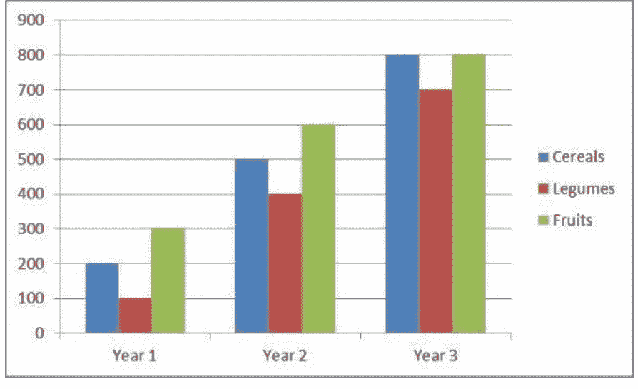
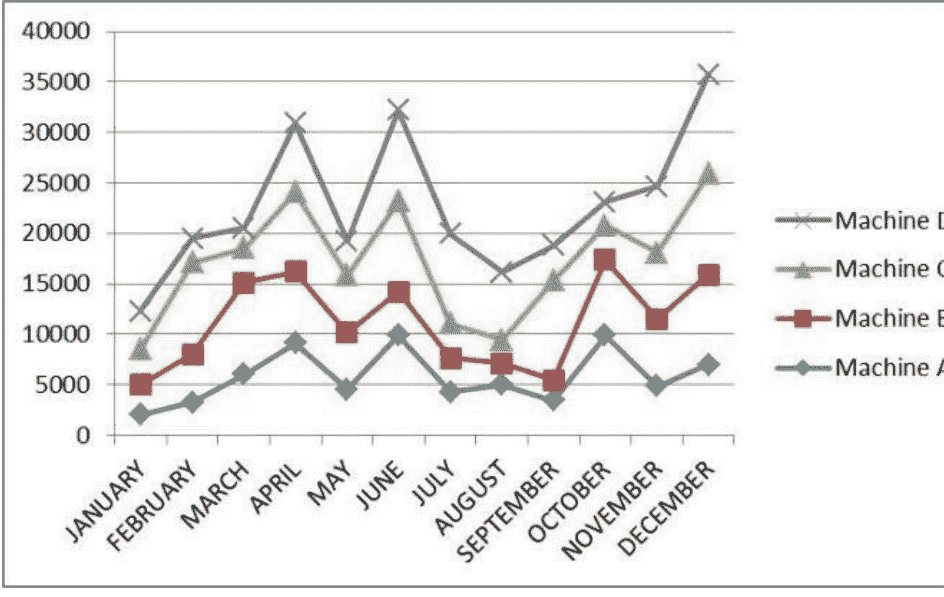
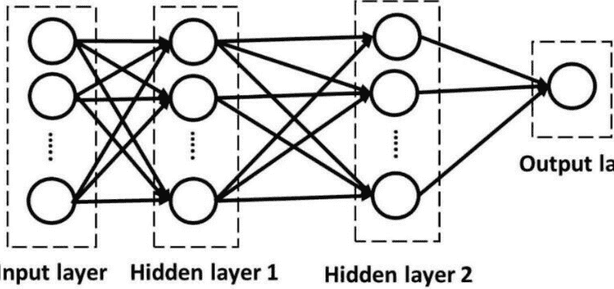

# 罗伯塔·鲍曼

# Python 机器学习

首次出版：罗伯塔·鲍曼，2023年

版权所有 © 2023 罗伯塔·鲍曼

保留所有权利。未经出版商书面许可，不得以任何形式或任何方式（电子、机械、影印、录音、扫描或其他方式）复制、存储或传播本出版物的任何部分。未经许可复制本书、将其发布到网站或以任何其他方式分发均属非法。

第一版

本书由 Reedsy 专业排版
了解更多请访问 [reedsy.com](https://reedsy.com)

# 目录

- [引言](#)
- [第1章：什么是机器学习？](#)
- [第2章：机器学习中的术语与概念](#)
- [第3章：Python机器学习必备库](#)
- [第4章：机器学习训练模型](#)
- [第5章：使用Python进行线性回归](#)
- [第6章：神经网络](#)
- [第7章：卷积神经网络](#)
- [结语](#)

# 引言


尽管机器学习最近发展迅猛，但事实是，我们距离实现其全部潜力还有很长的路要走。目前，IT行业最热门的课题之一就是机器学习。特别是大数据领域，你应该集中全部精力于此，因为其潜力巨大。在不远的将来，人类生存的基础将是我们与机器的连接。

本书将向你展示如何使用Python构建机器学习方法，从最简单到最复杂。在本系列的前几卷（《Python入门》和《Python数据分析》）中，我们介绍了一些专门为机器学习设计的Python包。在本卷中，我们将深入探讨，以提供全面的理解。

即使在高级阶段，记住需要关注的关键机器学习主题总是一个好主意。我们所做一切的基础都是算法。因此，我们增加了一个部分，将简要介绍最关键的算法以及其他有用的机器学习组件。

编程是机器学习的关键组成部分，与概率和统计学并列。我们有时在机器学习中使用各种统计技术来设计最优解决方案。因此，为了理解每种情况下的潜在结果，对概率和统计学有基本的了解至关重要。

在探索这个主题时，机器学习涉及不确定性这一概念经常出现。这是编程和机器学习之间的关键区别之一。当你编程时，你创建的代码必须完全按照编写的方式执行。代码将根据提供的输入产生预设的输出。然而，在机器学习中，我们并没有这种奢侈。

为了有效地开发机器学习模型，必须考虑学习、测试和部署这三个阶段。由于模型通常是为与人交互而创建的，我们可以预期交互类型会有所不同。例如，可能需要验证某些输入，在这种情况下，就需要构建合适的交互。

我们还需要将机器学习作为一个研究领域来考察其数学部分。作为高级研究，我们在本系列的早期书籍中没有过多涉及它。为了使模型提供我们所需的输出，机器学习涉及许多数学计算。因此，我们必须学习如何根据精确的指令以特定的方式处理数据。

在处理各种数据集时，我们总是有可能遇到大型数据集。这是很常见的，因为我们的机器学习模型在与他人互动时会持续学习并扩展其专业知识。使用大型数据集可能很困难，因为你需要学习如何将数据分成系统可以轻松处理的可管理块。这也将防止你的学习模型过载。

面对海量数据，大多数简单的计算机都会失败。但一旦你知道如何分割数据集并在其上进行计算，这就不应该是个问题。

我们在本书开头就说过，我们将提供在实际应用中使用机器学习的实用方法。鉴于此，我们研究了一些实用的机器学习技术，包括创建垃圾邮件过滤器和研究电影库。

为了确保你能够边学边做，我们已仔细地将每个步骤分解为其组成部分。更重要的是，我们试图解释每个步骤，以便你更好地理解你所做的操作及其原因。

创建机器学习模型的最终目标是将其集成到消费者使用的一些日常应用中。鉴于此，你需要学习如何为这个问题创建一个简单的解决方案。

我们提供了简单的解释以确保你理解这一点，并且随着你继续处理不同的机器学习模型，我们希望你能够通过创建越来越复杂的、根据你的需求定制的模型来学习。

随着时间的推移，你将学习或遇到各种机器学习原理。只要你的模型与数据交互，你就必须记住学习是一个持续的过程。最终，你会遇到比你习惯处理的更大的数据集。学习如何处理它们将使你能够更快、更轻松地完成任务。


# 第1章：什么是机器学习？

技术已经如此深入地融入我们的日常生活，以至于无法与之分离。事实上，考虑到当今技术发展的速度，人工智能计算机现在负责各种活动，如预测、识别、诊断等。

数据代表了必须提供给机器以使其“学习”的输入。因此，它们被称为“训练数据”，因为它们被用来教导机器。

一旦收集了数据，你就可以分析它以寻找任何模式，然后根据这些模式采取行动。有许多学习方法可以评估数据并选择最佳行动方案。这些方法可以分为监督学习和无监督学习两类。

机器学习之所以重要，有许多原因。如前所述，所有的机器学习研究都是有益的，因为它使我们能够理解人类学习的许多方面。此外，机器学习很重要，因为它提高了机器的准确性、效力和效率。

这里有一个现实世界的例子，以帮助你更好地理解这个概念。

假设我们可以访问两个不相关的用户A和B的音乐偏好，他们都喜欢听音乐。一家音乐厂牌可以使用机器学习来确定这两个人各自喜欢的歌曲类型，然后考虑向他们营销的最佳方式。

例如，你可以在分析之前检查几个歌曲特征，如节奏、频率或歌手性别，甚至可能以图形或视觉方式进行。随着收集到更多的数据，随着时间的推移，情况会变得更加清晰，例如，A倾向于喜欢节奏快、男歌手的音乐，而B喜欢听节奏舒缓、女歌手的歌曲，或者任何其他趋势。

类似的思考过程。公司的市场和广告部门将能够根据这些发现做出更明智的战略决策。

我们目前可以免费访问自技术发展以来收集的大量数据。我们现在可以存储和处理其中的大量数据，而且它们是开源的。如果你看看我们目前管理这些事情的方式，技术无疑已经进步了。今天的技术如此先进，它使我们能够快速访问越来越多的数据。

以下是支持机器学习的其他几个论点。尽管取得了所有进展，但总会有一些工作无法直接指定，只能借助示例来完成。目标是通过首先用数据训练机器，使其学会处理数据，从而使输出独立于输入。通过这样做，机器将学会如何处理未来的类似输入，并适当地处理它们以获得所需的结果。

此外，在处理极其复杂的操作时，预先编码所有细节可能相当具有挑战性。在这种情况下，更好的做法是让机器在事后从过程本身的输出数据中进行学习。

数据挖掘和机器学习是相关领域。数据挖掘是筛选海量数据以识别模式或关联的过程。这是机器学习的另一个优势，因为它使计算机能够定位任何可能具有极其重要价值的数据。

## 机器学习应用

机器学习正在显著改变企业的运营方式。它有助于管理大量易于获取的数据，并使用户能够根据可用数据做出有用的预测。

当涉及大量数据时，一些手动操作无法快速完成。这些问题的解决方案就是机器学习。我们目前正被数据和信息所淹没，使得手动处理这些数据的想法变得不可能。

因此，对自动化方法的需求很大，而机器学习正有助于满足这一需求。

当分析操作完全自动化时，获取有价值的信息就变得更容易了。这有助于完全自动化所有后续流程。大数据、商业分析和数据科学的概念都离不开机器学习。预测分析和商业智能现在对小公司和企业都可用，而不再仅仅适用于高端公司。这使得小公司能够参与到成功的信息收集和使用过程中。让我们来审视一些技术性的机器学习应用，并看看它们如何与实际问题相关联。

### 个人数字助手

Alexa、Siri 和 Google Now 是当前可用的虚拟助手的三个常见示例。顾名思义，它们通过语音命令帮助用户查找所需信息。只需将其打开并提出您想要的问题，例如“我今天的日程安排是什么？”。或者任何您喜欢的其他问题，例如“伦敦和德国有哪些航班可用？”

您的个人助手会研究该事项，回想您提出的问题，然后给您答复。此外，它还可以用于为特定任务设置提醒。机器学习在这一过程中至关重要，因为它使得系统能够根据您之前与它的任何交互来编译和完善您所需的信息。

### 推荐系统

基于概率模型的机器学习算法可用于根据用户的购买历史为其推荐相关产品。

想想像 Netflix 或亚马逊这样的流媒体服务。凭借大量的历史购买记录，他们肯定对客户有深入的了解。因此，他们能够准确地推荐下一个要购买的物品或要观看的电影。

### 潜在因素

潜在变量模型用于发现观测变量之间的任何关联。当您不确定变量之间的关系时，这很有帮助。

为了更好地理解数据，寻找潜在变量更为简便，尤其是在处理海量数据时。

### 降维

我们经常处理具有多个变量和维度的数据。例如，对于一组住院患者，可以考虑体重、身高、年龄和血压（在这种情况下，是四个变量或维度）。对于两个或三个维度，数据可以表示为二维或三维图，连接不同的数值数据。人类思维无法可视化超过三个维度的数据。

针对这些情况，有专门的方法通过减少现有变量的数量来处理较少的变量。这个概念很简单：在应用任何模型之前，我们分析的是变量的特定线性组合，而不是将它们全部一起分析。

## 机器学习的优缺点

### 缺点

使用小数据集验证机器学习模型是创建模型的一种方法。目标是根据小数据集来预测新数据的输出。

这种操作方式的问题在于，很难确定所生成的模型是否已经失真。例如，模型可能过度依赖最初用于模型验证的较小数据集。这可能导致未来的结论不准确。

在社会科学领域，机器学习有多种应用。鉴于上述情况，必须记住，有时可能需要改进所使用的模型，以防止得出错误的结论。

### 一些优点

人类无法处理海量数据，更不用说分析了。正在生成大量的实时数据，如果没有一个自主系统来理解和评估这些数据，我们就无法得出任何结论。

机器学习正在不断进步。随着深度学习算法的引入，数据工程和预处理的成本正在降低。


# 第二章：机器学习中的术语与概念

通过向系统提供相关的训练数据集来实现机器学习。普通系统，或缺乏人工智能的系统，总是能够根据接收到的输入产生输出。然而，具有人工智能的系统可以自我学习、预测事件并改进其产生的结果。

让我们看一个简单的例子，说明孩子们如何发现物品是什么，或者他们如何将一个词与一个物体联系起来。假设桌子上有一盘苹果和橙子。作为成年人或父母，你会将那个圆形的、红色的东西描述为苹果，而将另一个物体描述为橙子。在这个例子中，属性是形状和颜色，标签是“苹果”和“橙子”这两个词。一组标签和属性也可以用来训练计算机。机器将根据输入的属性来学习如何识别物体。

监督式机器学习模型是使用带标签的训练数据集构建的。孩子们在学校时，会从老师和教授那里获得关于他们进步的反馈。类似地，监督式机器学习模型使工程师能够向机器提供一些反馈。

以输入 [红色，圆形] 为例。在这里，孩子和计算机都会理解任何球形的、红色的东西都是苹果。现在让我们在机器或孩子面前放一个板球。您可以通过给正确回答打1分，给错误回答打0分来向机器提供反馈。如果需要更多属性，您可以随时添加。机器只能通过这种方式学习。此外，正因为如此，如果您使用一个大规模、高质量的数据集并投入更多精力进行训练，您将从设备获得更好、更准确的结果。

在我们继续之前，您必须理解机器学习、人工智能和深度学习之间的区别。尽管大多数人混淆这些概念，但理解它们是不同的至关重要。

人工智能是一系列用于使机器模仿任何人类行为的方法和技术。其目标是确保任何人类活动都能被机器准确有效地模仿。深蓝国际象棋和 IBM 的 Watson 是基于人工智能技术的两个实例。

根据上述定义，机器学习是使用数学和统计模型来教机器如何模仿人类行为。这是利用过去的数据来完成的。

作为机器学习的一个子集，深度学习指的是工程师用来帮助计算机自我学习的工具和技术。设备可以学习选择适当的行动方案来生成输出。深度学习生态系统包括自然语言处理和神经网络。

## 机器学习的目标

### 确定类别。

在分析输入数据后，机器学习模型会预测输出将属于哪个类别。在这些情况下，预测通常是一个“是”或“否”的二元响应。可以回答的问题示例包括“今天会下雨吗？”、“这是水果吗？”以及“这封电子邮件是垃圾邮件吗？”等等。这是通过利用一组数据（训练数据集）来实现的，该数据集根据特定关键词确定某封电子邮件是否属于垃圾邮件。这种方法被称为分类。

### 确定数量。

在这种情况下，该技术通常用于根据各种天气变量（如温度、湿度百分比、气压等）来预测一个值，例如降雨强度。这种类型的预测被称为回归。回归方法有许多子类别，包括线性回归、多元回归等。

### 异常检测系统

模型在异常检测中的任务是找出可用数据中的任何异常值。在银行和电子商务系统中，这些应用被用于标记任何异常交易。所有这些都有助于检测虚假交易。

### 聚类

这些技术仍处于起步阶段，但它们具有广泛的应用潜力，有可能从根本上改变业务的开展方式。

例如，可以根据不同的行为特征（如年龄组、居住地区，甚至喜欢观看的节目类型）将人们组织成不同的群体。因此，企业现在能够根据用户所属的群体来推荐不同的节目或节目。

## 机器学习系统类别

对于传统机器，程序员会向机器提供特定的命令以及一组指令和输入参数，机器将利用这些进行计算并生成输出。然而，对于机器学习系统，系统永远不会受到程序员给出的任何指令的限制。机器将选择它可以用来准确处理数据集并确定结果的算法。这是通过使用包含先前数据和输出的训练数据集来完成的。

因此，在传统世界中，我们会为机器提供一套如何处理数据的指令，但在机器学习设置中，我们永远不会给系统指令。为了产生输出，计算机必须与数据集交互，利用历史数据创建算法，像人类一样做出决策，并分析数据。与人类相比，计算机可以快速处理大量数据集并产生高度准确的结果。

机器学习算法有多种形式，它们根据其预期用途进行分类。机器学习系统分为三类：

- 监督学习
- 无监督学习
- 强化学习

### 监督学习

这些模型将标记数据输入计算机。这样做是为了预测特定数据集（或新数据）的结果将是什么。这类算法也被称为预测算法。

以以下表格为例：

| 货币（标签） | 尺寸（特征） |
|---|---|
| 1美元 | 10克 |
| 1欧元 | 5克 |
| 1印度卢比 | 3克 |
| 1俄罗斯卢布 | 7克 |

在上表中，每种货币都有一个重量属性。在这种情况下，重量是属性或特征，而货币是标签。

以这个训练数据集作为第一个输入，监督机器学习系统随后将预测任何包含3克的输入是1印度卢比的硬币。10克的硬币也属于同一类别。

分类和回归分析算法属于监督机器学习的范畴。分类算法确定数据应属于哪个类别，而回归技术用于预测比赛结果或房屋价格。

在本书的后续章节中，我们还将教你如何使用Python构建或实现这些算法，我们将更详细地介绍其中的一些算法。

### 无监督学习

这些模型具有更复杂的系统，因为它们可以学习在未标记的数据中发现模式并生成输出。这种方法用于从大型数据集中提取任何重要的推论。由于它使用数据并对其进行总结以创建给定数据集的描述（或概述），因此该模型也被称为描述性模型。需要大量非结构化输入数据的数据挖掘应用程序经常使用此技术。

例如，如果输入数据是姓名、得分和三柱门数（后两者是数字类型），你可以将数值数据显示在二维图上，并可能发现聚类。在我们的场景中，将有两个聚类，一个用于投球手，一个用于击球手。此外，还可以将特定名称与图上的每个点关联起来。当有新的输入可用时（由姓名、得分和三柱门提供），可以将其链接到两个聚类之一，以确定新输入（球员）是投球手还是击球手。

比赛的样本数据集在表1中。这使得聚类模型可以将球员分类为投球手或击球手。

在无监督机器学习中，使用流行的算法，包括密度估计、聚类、数据缩减和压缩。

聚类方法以不同的方式总结和呈现数据。这种方法应用于数据挖掘软件中。当目标是显示任何大型数据集并生成有见地的摘要时，会执行密度估计。这不可避免地会引出维度和数据缩减的概念。这些概念阐明了分析或输出必须始终提供数据集的简明摘要，而不会丢失任何重要细节。简单地说，如果得出的结果有价值，数据的复杂性就可以降低。

下表概述并总结了监督学习和无监督学习之间的区别。此外，它还将包括当今广泛使用的算法。

我们将快速了解每种算法，并学习如何使用Python来实现它们。

### 监督学习

- 处理标记数据
- 接受直接反馈
- 根据输入数据预测输出。因此也称为“预测算法”

一些常见的监督算法类别包括：

- 逻辑回归
- 线性回归（数值预测）
- 多项式回归
- 回归树（数值预测）
- 梯度下降
- 随机森林
- 决策树（分类）
- K近邻算法（分类）
- 朴素贝叶斯
- 支持向量机

### 无监督学习

- 处理未标记数据
- 无反馈循环
- 从输入数据中发现隐藏的结构/模式。有时称为“描述性模型”

一些常见的无监督算法类别包括：

- 聚类、压缩、密度估计和数据缩减
- K均值聚类（聚类）
- 关联规则（模式检测）
- 奇异值分解
- 模糊均值
- 偏最小二乘法
- 层次聚类
- 主成分分析

### 强化学习

这种学习形式与人类的学习方式有相似之处，即系统将学习如何在特定环境中表现并根据该环境采取行动。例如，人类避免触摸火，因为他们知道这会受伤，并且被告知这会伤害他们。我们有时可能会出于好奇将手指伸入火中，结果发现它会烧伤。这表明，今后我们会对火保持谨慎。

现在让我们看看一些机器学习的实际应用。明智的做法是了解你正在处理的是哪种类型的机器。

## 构建机器学习系统：步骤

无论使用何种模型，创建机器学习系统通常都涉及以下典型流程。

### 描述目标

如同生活中的任何事情一样，第一步是明确你的目标。了解你希望通过系统实现什么至关重要。你希望系统进行的预测类型将决定你使用的数据类型、算法以及其他变量。

### 1. 收集信息

这可能是机器学习系统开发中最耗时的一步。为了准备算法以供使用，你必须收集所有相关数据。

### 2. 准备数据

这是一个经常被忽略的关键步骤。忽略这一步最终可能会让你付出代价。你使用的数据越干净、越相关，输出结果就越准确。

### 3. 选择方法

你可以从多种算法中进行选择，包括结构化向量机（SVM）、k-均值、朴素贝叶斯、Apriori等。你选择的算法主要取决于你希望模型帮助你实现的目标。

### 4. 开发模型

一旦所有数据准备就绪，就必须将它们输入机器，以便训练算法进行预测。

### 5. 检验模型

经过训练后，你的模型现在已准备好开始读取输入并产生所需的输出。

### 6. 预测

算法将经历多次迭代，你也可以向其提供输入，以帮助其随着时间的推移做出更好的预测。

### 7. 部署

当你测试模型并对其性能感到满意时，模型将被净化并准备好集成到任何应用程序中。这意味着它已准备好部署。

根据应用程序和你所使用的算法类型（监督式或无监督式），所有这些阶段可能会有所变化。然而，它们都参与了创建机器学习系统的每一步。在每个阶段，你都可以使用多种语言和技术。本书将教我们如何使用Python创建机器学习系统。让我们来看一下前面章节中的示例：

### 场景一

Facebook在相册中标记的照片中检测到朋友的图像。

这是监督学习的一个例子。在这个例子中，Facebook使用标记的图像来识别人物。图像的标签将从标记的图像中创建。监督学习是计算机从任何类型的标记数据中学习的过程。

### 场景二

根据听众历史记录推荐新歌曲。

这是监督学习的一个例子。音乐流派是模型训练所依据的现有或分类标签之一。Netflix、Pandora和Spotify所做的正是如此：它们汇编你喜欢的音乐和电影，根据你的偏好评估其特征，然后基于相似的特征推荐歌曲和电影。

### 场景三

通过分析银行数据来识别任何可疑或欺诈性交易。

这是无监督学习的一个例子。在这个例子中，没有像“欺诈”或“非欺诈”这样的明确分类，因为可疑交易无法被完全定义。模型将寻找异常交易，以试图发现任何异常值。

### 场景四

Uber乘车费用，根据你使用服务的时间段而波动。

解释：Uber的动态定价功能结合了多种机器学习模型，例如高峰时段预测、特定区域的交通状况以及出租车的可用性。它使用聚类来识别城市不同地区人们的使用模式。

# 第三章：Python机器学习必备库

如今，开发者经常选择Python来分析数据。Python不仅对数据分析有用；它也可用于开发统计技术。所有处理数据的人都更喜欢使用Python进行数据集成。Web应用程序和其他基于环境的创建就是这样集成的。

Python的特性使研究人员能够将其用于机器学习。它的优势包括语法一致、灵活，甚至开发时间更短。此外，它还包含可能有助于预测的引擎以及创建复杂模型的能力。

因此，Python声称拥有大量或一系列非常全面的库。请记住，库是用各种语言编写的过程和不同类型函数的集合。因此，拥有一个强大的库可以帮助你处理更具挑战性的任务。不过，这可以在不必重复多行代码的情况下完成。重要的是要记住，机器学习严重依赖于数学。具体来说，是数学优化以及统计和概率方面的知识。因此，Python对于快速完成复杂任务非常有帮助。

以下列出的是一些比较知名的库。

## Scikit-Learn

Scikit-Learn是顶级且最受欢迎的机器学习库之一。它能够辅助学习算法，特别是监督式算法。它用于多种算法，包括以下几种：

- k-均值
- 决策树
- 逻辑回归和线性回归
- 聚类

这类库的主要部分来自SciPy和NumPy。除了执行与数据挖掘相关的任务外，Scikit-learn还提供了添加对机器学习有用的算法集的能力。它有助于分类、聚类，甚至回归分析，仅此而已。此外，这个库还可以有效地完成其他任务。集成方法、特征选择、数据转换等都是很好的例子。重要的是要认识到，算法的高级和复杂部分可以由专家轻松实现。

## TensorFlow

为了快速进行计算，Google开发了TensorFlow库，它在深度学习领域被广泛使用。它允许在CPU或GPU上进行计算。也就是说，一旦你用Python编写了代码，你的计算机就能够执行它。因此，分析可以相对快速地进行。

TensorFlow使用节点，允许处理大量数据，在系统内执行各种活动。这个库是许多搜索引擎（如Google）的先决条件。语音识别和物体识别是几个关键应用。

## Theano

另一个重要的Python库是Theano。它的主要职责是协助处理任何涉及数值计算的事情。它也类似于NumPy。它还执行其他任务，例如：

- 数学术语的解释
- 数学计算优化
- 评估与数值分析相关的表达式。

Theano的主要目标是产生高效的结果。由于它能够将涉及大量数据的计算速度提高100倍，因此它是一个更快的Python包。所以需要知道，Theano在GPU上的性能优于计算机的CPU。人们在不同行业使用Theano进行深度学习。此外，他们使用它来计算复杂和困难的任务。它的处理速度使这一切成为可能。随着对数据计算技术需求高的公司不断扩张，许多人使用这个库的最新版本。请记住，最新版本最初是在几年前受到关注的。Theano的最新版本包含了许多改进、界面调整和新功能。

## Pandas

一个非常受欢迎的库叫做Pandas，它有助于提供高级、高质量的数据结构。这些是简单、用户友好的统计工具。在这种情况下也很有意义。它由各种复杂的内部技术组成，使其能够执行分组和时间分析等操作。它还有助于数据的合并和提供过滤选项，这是另一个功能。Pandas 可以从其他来源收集信息，包括 SQL 数据库、Excel 和 CSV 文件。为了在行业内执行其操作任务，它还可以修改已获取的数据。Pandas 由两个结构组成，使其能够正确执行其功能。这些是二维的数据帧和一维的序列。随着时间的推移，Pandas 库被认为是最可靠和强大的 Python 库。其主要目的是促进数据操作。此外，它还包括导入和导出各种数据的能力。它在包括数据科学在内的多个行业中都有应用。

Pandas 在以下领域表现出色：

-   数据划分
-   合并两种或多种类型的数据
-   数据聚合
-   选择或调整数据
-   数据重塑

你可以快速向数据帧添加新文本或快速删除特定列。它将支持你进行数据转换。

你可以放心，Pandas 会找到任何丢失或缺失的数据。

它具有强大的能力，尤其是在将其他程序组织成功能组方面。

## Matplotlib

另一个强大且实用的库，特别适用于数据可视化。它的创建旨在为多个行业提供实用和可视化的见解。例如，一家公司的业务成就如果无法传达给不同的利益相关者，就意义不大。对于任何从事数据可视化工作的人来说，Matplotlib 是一个至关重要的 Python 包，具有广泛的可能性。这个库非常适合图形和图像。它适应性强，只需几次按键，就可以创建你想要的任何类型的图表，包括直方图、散点图、非笛卡尔图表等。

值得注意的是，这个库可以导出图形并将其转换为 PDF、GIF 和其他格式。总之，以下任务非常容易完成。它们包括：

-   折线图的开发
-   散点图的绘制
-   创建出色的条形图和构建直方图
-   行业中使用大量的饼图。
-   支持数据分析和计算方案
-   监控等高线图的能力
-   使用频谱图
-   创建箭头图

使用图表进行说明



上图显示了一个组织在三年期间的产量。它特别展示了 Matplotlib 如何用于数据分析。从图中可以看出，产量高于前两年。同样，该公司在水果生产方面持续表现出色，就像在第 1 年和第 2 年一样，在第 3 年持平。从图中可以看出，使用这个库使你的演示、表示甚至分析工作变得更加轻松。在 Python 包的帮助下，你很快就能创建高质量的图形、正确的统计数据等等。你将能够记录产量高的年份，从而继续高产时期。

这是另一个例子：



上图清晰地展示了公司使用的多台计算机的性能。通过使用上图，你最终可以确定并得出结论，公司可以继续使用哪些机器来实现最大产量。通常，你可以使用这种评估方法和 Seaborn 库来预测各种输入的精确能力。同样，如果你决定购买更多计算机，这些信息对未来的研究可能有用。Seaborn 库还提供了衡量公司内其他可变输入效率的能力。例如，可以轻松确定公司内部的员工数量及其相关的工作效率。

## Seaborn

Seaborn 是最受欢迎的 Python 库之一。在这种情况下，它的主要目标是帮助可视化。重要的是要记住，Matplotlib 是这个库的基础。由于其更高级别，它能够生成各种图表，包括时间序列图和热图，以及处理小提琴图。

## NumPy

这个 Python 库非常流行。凭借其功能，它可以处理多维数组。此外，它还支持矩阵处理。然而，这些只能借助广泛的数学函数来实现。值得一提的是，科学领域中最重大的计算可以使用这个 Python 模块很好地解决。同样，NumPy 在包括傅里叶变换、线性代数以及用于各种行业的随机数功能开发等领域都有应用。其他高级 Python 库，如 TensorFlow，使用 NumPy 来操作张量。简而言之，NumPy 的主要用途是计算和数据存储。Python 也可以用于导出或加载数据，因为它提供了执行这些任务所需的功能。同样重要的是要注意，这个 Python 包也被称为数值 Python。

## SciPy

SciPy 以其可用于数据分析优化的各种模块而自豪。此外，它在积分、线性代数和其他数学统计领域也至关重要。

它经常在图像处理中扮演关键角色。图像处理是日常活动中经常使用的一种技术。SciPy 使用 Photoshop 和许多其他应用程序的案例。同样，许多公司喜欢 SciPy 进行图像修改，尤其是在演示文稿的图像方面。例如，一个野生动物俱乐部可能会创建一只猫的描述，然后用不同的颜色进行修改以适应其目的。你可以通过下面的例子更简单地理解这一点。图像已被修改：

野生动物协会拍摄了一张猫的照片作为原始贡献。在操作和调整图像大小以满足我们的需求后，我们获得了一张彩色的猫图像。

## Keras

这是 Python 库的一个基本组成部分，特别是在机器学习方面。它是高级神经网络类的一员。重要的是要记住，Keras 可以在其他库上运行，包括 TensorFlow 甚至 Theano。它也可以连续运行而不会出现任何机械问题。此外，它在 CPU 和 GPU 上似乎表现更好。对于大多数 Python 编程新手来说，Keras 提供了一条安全的路径来完全理解。他们将能够从头开始创建网络。它被认为是初学者最好的 Python 库，因为它允许更快、更高效的原型设计。

## PyTorch

这是另一个开源、用户友好的 Python 库。由于其名称，它声称提供广泛的工具选项。它也适用于计算机视觉可用的领域。视觉显示和计算机视觉是许多不同类型研究的关键组成部分。它再次协助处理自然语言。此外，PyTorch 能够执行多个开发人员特定的技术任务。这涉及大量的数学和数据分析。它可以帮助生成图表，这些图表主要用于计算目的。由于它是一个开源 Python 库，它可以在其他库（如张量）上运行。当与张量 GPU 结合使用时，其加速将提高。

## Scrapy

另一个用于爬虫程序的库叫做 Scrapy。它包括蜘蛛机器人等等。蜘蛛机器人的使用经常用于数据检索和创建互联网上使用的 URL。它的最初目的是帮助进行数据抓取。然而，这已经历了许多变化，扩大了其广泛用途。因此，Scrapy 库在现代的主要功能是作为通用爬虫。该库鼓励广泛使用和使用全球代码等。

## Statsmodels

一个名为 Statsmodels 的库旨在使用各种统计计算和断言技术来探索数据。它包含许多功能，包括区分属性和结果数据。它可以使用多种模型来执行此功能，包括线性回归、多个估计器、时间序列分析，甚至更多线性模型。其他模型，包括离散选择，也适用。

在本章中，我们将深入探讨 TensorFlow 库。这是另一个 Python 选项，对于更快地执行特定的机器学习操作非常有益。然后，学习如何将此选项与我们讨论的使用 Scikit-Learn 包的方法结合使用，绝对是值得花费的时间。

TensorFlow 为程序员提供了多种功能和工具，帮助他们更快地完成项目。当尝试处理与深度学习相关的各种模型时，你会发现 TensorFlow 自带的框架来自 Google，并且非常实用。对于数值计算，TensorFlow 将依赖于数据流图，它可以确保你使用机器学习所能完成的各种任务比以前更简单。

我们将从多个方面受益于 TensorFlow。首先，它可以帮助我们收集数据、训练我们试图使用的机器学习模型、进行预测，甚至修改一些未来的结果，使其更有效地运作。随着这些过程在实施某些机器学习时变得至关重要，我们可以看到 TensorFlow 如何融入我们的项目，并确保我们更好地实现期望的完成度。

让我们首先了解一下 TensorFlow 以及这个 Python 包附带的一些背景信息。TensorFlow 最初是由 Google Brain 团队创建的，用于大规模机器学习选项。它旨在结合各种深度学习和机器学习技术，并通过使用“通用隐喻”来提高这些算法的实用性。我们之前讨论过的 Python 编程语言与 TensorFlow 兼容。此外，它还将为用户提供一个前端 API，用户在构建各种应用程序时可以轻松使用。

但它不止于此。即使你可以使用 TensorFlow 并且它与 Python 编程语言兼容，当你编写和创建算法时，它将有能力修改这些算法。C++ 编程语言将用于运行你使用 TensorFlow 的每个应用程序，为它们提供比以前更高水平的性能。

TensorFlow 可用于成功机器学习项目所需的广泛任务。运行、训练和开发深度神经网络、执行图像识别、处理循环神经网络、数字分类、自然语言处理，甚至词嵌入，都是你可以使用这个库完成的事情。这些只是程序员在将 TensorFlow 与机器学习结合使用时可以做的一小部分事情。

## TensorFlow 安装

鉴于此，在使用这个库之前，我们必须花一些时间学习如何在计算机上设置 TensorFlow。就像我们使用 Scikit-Learn 一样，我们必须完成并设置环境和其他一切，以便这个库能够运行。你会欣赏这种库，因为它已经设置了一些编程 API，例如 Rust、Go、C++ 和 Java 等（我们稍后将更详细地介绍这些）。本文将重点介绍 Windows 操作系统上的 TensorFlow 库，但将此库添加到其他操作系统所需的步骤在很大程度上是相同的。

现在，当你准备在 Windows 机器上安装和下载 TensorFlow 库时，有两个选项可供选择。pip 也可以很好地工作，或者你可以选择使用 Anaconda 程序来完成任务。原生 pip 很有用，因为它通过收集所有相关组件来确保 TensorFlow 库安装在你的系统上。此外，系统会为你执行此任务，而无需设置虚拟环境。

虽然这可能是最佳选择，但过程中可能会出现问题。使用 pip 安装 TensorFlow 库可能更快，并且不需要虚拟环境，但可能会与其他 Python 任务发生冲突。根据你打算使用 Python 实现的目标，这可能是一个问题，因此在开始之前请考虑这一点。

好消息是，如果你决定使用 pip 并且它似乎不会过多干扰你正在做的事情，你可以通过一条命令让整个 TensorFlow 库运行。一旦你运行完这个命令，整个库及其所有组件将通过计算机上的单个命令设置并可供使用。此外，pip 使你更容易选择存储 TensorFlow 库的位置以加快访问速度。

除了 pip，你还可以使用 Anaconda 程序来帮助下载和安装 TensorFlow 库。这个程序需要更多的命令来启动，但它确实可以防止任何 Python 程序干扰，并允许你创建一个虚拟环境，你可以在其中工作和测试，而不会遇到很多干扰或计算机上的其他问题。

尽管使用 Anaconda 程序而不是 pip 有一些优点，但通常建议你将此软件与 pip 一起安装，而不是单独使用 conda install。鉴于此，如果你选择单独使用 conda install，我们仍将引导你完成一些必要的步骤。

在继续之前，还有一件事需要考虑：确保 Python 版本可用。为了使其对你有效，你的 Python 版本必须是 3.5 或更高。Python 3 使用的 pip 3 工具是与 TensorFlow 安装交互时最佳且最兼容的工具。使用此库的早期版本时，你的机器学习代码可能无法顺利运行，并可能出现其他问题。

根据你最熟悉的库版本，你可以使用 CPU 或 GPU。第一个代码代表 CPU 版本，第二个代码代表 GPU 版本。

- 安装 pip 3 并升级 TensorFlow
- 安装 pip 3 并升级 tensorflow-gpu

这两个操作是有益的，因为它们将确保 TensorFlow 库安装在你的 Windows PC 上。然而，你也可以选择 Anaconda 包本身。上述技术仍然有效。

尽管 pip 安装存在一些缺点，但我们已经讨论过了。

当你在机器上安装 Python 时，Pip 是已经预装的程序。但你可能很快就会发现 Anaconda 并非如此。这意味着如果你想确保 TensorFlow 可以通过它安装，你必须首先安装 Anaconda 程序。只需访问 Anaconda 网站，然后按照屏幕上的说明完成此操作。

一旦你有机会安装 Anaconda 程序，你会看到文件中有一个名为 conda 的包。现在稍微研究一下这个包是有用的，因为它将帮助你管理安装包，并在管理虚拟环境时派上用场。你可以简单地设置 Anaconda 来帮助你使用这个包获取所需的访问权限。

当 Anaconda 运行时，转到 Windows 开始屏幕，单击“开始”按钮，然后选择“所有程序”。要查看 Anaconda 中的文件，你必须浏览并展开项目。然后你可以通过单击 Anaconda 提示符在屏幕上打开它。如果愿意，你可以打开命令行并输入“conda info”来查看此包的详细信息。这使你可以查看有关包和所需包管理的一些附加信息。

我们与 Anaconda 软件讨论的虚拟环境将非常易于使用，本质上只是 Python 的独立版本。它将配备管理所有文件所需的所有工具，以及相关的目录和路径。这是有利的，因为它使你能够在 Python 应用程序内完成所有编码，并且如果你愿意，可以添加其他与 Python 相关的库。

这些虚拟环境可能需要一些时间来适应，但它们对于机器学习工作非常有用，因为它们让你一次专注于一个项目，并允许你在不担心依赖关系或版本要求的情况下编码。你在虚拟环境中所做的一切都将独立运行，因此你不会干扰代码的其他部分，从而允许你进行实验并观察哪些有效，哪些无效。

下一步是使用 Anaconda 程序设置所需的虚拟环境，这将使 TensorFlow 包能够按预期运行。为此，将再次使用 conda 命令。我们需要将其命名为 tensorenviron，因为我们现在将通过建立全新环境所需的步骤。剩余的语法将帮助我们创建这个新环境，其内容如下：

```
Tensor Environment: conda construct -n
```

当你将此代码输入编译器时，应用程序将暂停并提示你选择是希望构建新环境，还是希望停止当前操作。我们将在此处输入“y”键，按下回车键，环境就会建立。由于编译器正在为你设置环境，安装过程可能需要一些时间。

新环境构建完成后，你必须完成激活过程。没有此激活，你将无法设置环境。首先，你只需执行“activate”命令，后跟你想要使用的任何环境名称列表。由于我们已经使用了“tensorenviron”这个名称，你应该在代码中使用它。以下是此操作的示例：

```
Turn on tensorenviron
```

成功激活 TensorFlow 环境后，现在需要确保 TensorFlow 包也将被部署。可以使用以下命令完成此操作：

```
install tensorflow with conda
```

当你到达此阶段时，所有可安装的包列表将显示给你，以防你想在 TensorFlow 之外添加一些额外的包。之后，你可以选择安装其中一个或多个这些包，或者暂时继续使用 TensorFlow。一旦你同意执行此操作，请确保继续完成该过程。

此库的安装将立即开始工作。然而，这将是一个漫长的过程，因此请让它继续，不要尝试退格或重新开始。你的互联网速度将在决定这是否需要很长时间方面发挥重要作用。

但是，一旦此库的安装完成，你可以检查一切是否顺利，或者是否有任何问题需要修复。好消息是，由于可以使用 Python 的 import 语句来设置检查步骤，因此使用它将很简单。

然后，我们将使用标准的 Python 终端来执行我们正在编写的语句。如果你仍然在 Anaconda 的提示符下工作，输入单词 Python 后你将能够按回车键。通过这样做，你可以确保你处于开始所需的 Python 终端中。一旦你处于正确的终端，输入以下代码以帮助我们并确保 TensorFlow 已导入并准备就绪：

```
tf import tensorflow
```

现在该程序应该已安装并准备好在你的计算机上使用，因此我们可以继续手册的其余部分，并查看一些你可以使用此库完成的很酷的事情。TensorFlow 包最终可能没有正确处理。如果这是你的情况，编译器将发出错误通知供你查看，你必须返回并仔细检查代码是否在每一步都以正确的格式编写。

好消息是，如果你完成上述代码行并且完全没有收到错误消息，这表明你已正确配置了 TensorFlow 包并可以使用！现在我们知道如何使用 TensorFlow 库，让我们研究一些程序员可以用来学习它们如何与你想要使用的各种机器学习项目交互的其他选项和算法。

# 第 4 章：机器学习训练模型

机器学习中的模型是实际过程的逻辑或数字表示。开发人员必须向算法提供正确的训练数据，才能创建强大的机器学习（ML）模型。另一方面，算法是在使用真实世界数据开始训练之前采取的一组假设。

例如，线性回归算法是一组定义特征或属性的函数，这些特征或属性与线性回归指定的特征或属性相似。开发人员从一组或一组函数中选择最适合大多数训练数据的函数。向算法提供训练数据是机器学习训练过程中的必要步骤。

任何机器学习模型的创建都应基于一个基本意图，即向其暴露大量输入和任何相关输出，以便它可以分析并利用它来理解它与结果的关系。例如，一个人需要考虑天气条件（在这种情况下是训练数据），才能根据天气决定是否带伞。

专业的数据科学家将更多的时间和精力投入到以下过程之前的程序中：

- 数据调查
- 数据清理
- 开发新功能

## Python 简单机器学习训练模型

对于机器学习来说，拥有合适的数据比能够创建复杂算法更为重要。有效的建模将最小化过拟合并最大化性能。数据在机器学习中是有限的资源，开发人员应该使用它们来：

- 训练他们的模型或向他们的算法提供数据
- 验证他们的模型。

然而，他们不能使用相同的数据同时执行这两项任务。如果他们这样做，他们可能会在不知不觉中过拟合他们的模型。因为模型的效率取决于其预测先前未观察到或新数据的能力，所以拥有不同的训练和测试数据集至关重要。使用训练集的主要目的是拟合和优化模型。另一方面，测试集是用于评估模型的新数据集。

为了获得模型性能的最准确估计，首先必须分离数据。在准备好选择最终模型之前，完成此操作后应避免接触测试集。比较训练和测试性能的能力使开发人员能够防止过拟合。当模型在训练数据上表现良好但在测试数据上表现不佳时，这表明模型存在性能问题。

过拟合是机器学习领域最关键的问题之一。它解释了提供的训练数据与目标函数近似的相关程度。当训练数据中存在高信噪比时，就会发生这种情况，这将产生不准确的预测。

本质上，如果 ML 模型在拟合训练数据方面表现非常好，但在泛化新数据方面表现很差，那么它就是过拟合的。为了解决这个问题，开发人员向模型的参数添加惩罚，这限制了模型的自由度。

专业人士在讨论微调机器学习模型时通常指的是修改超参数。模型参数和超参数是机器学习中参数的两个主要类别。决策树位置和回归系数是第一类的例子，它定义了特定模型，并且是一种学习属性。

然而，第二类指定了机器学习算法的更高级参数，例如回归算法应用的惩罚大小或随机森林方法中的树数量。

向算法提供训练数据是训练机器学习模型的第一步。ML 训练过程产生的模型工件被称为机器学习模型。此数据应包含所需的属性或正确的响应。算法搜索表明其想要预测的结果的数据模式，并构建包含这些不同模式的模型。

在对新数据进行预测时，开发人员可能应用机器学习模型，即使他们不知道目标特征。例如，如果开发人员想要训练一个模型来确定电子邮件是真实的还是垃圾邮件，他或她将向其提供包含电子邮件的训练数据，这些电子邮件带有标签，表明电子邮件是否真实。该模型将尝试通过使用这些数据进行训练来预测新电子邮件是真实的还是垃圾邮件。

线性回归用于简单的 Python 机器学习模型。

初学者需要下载并安装 sci-kit-learn，这是一个开源 Python 库，具有广泛的可视化、交叉验证、预处理和使用统一用户界面的机器学习算法，以便在 Python 中开发基本的 ML 模型。它提供了简单易用的功能，可以节省大量时间和精力。此外，开发人员的计算机必须安装 Python 版本 3。

以下是 sci-kit-learn 的一些关键特性：

- 高效且用户友好的数据分析和数据挖掘工具
- BSD 许可证 2。
- 高度可用且易于访问，并且可以在多种场景中重复使用
- 建立在 SciPy、NumPy 和 Matplotlib 的基础上
- 伴随作业功能
- 出色的文档
- 在调整设置时使用适当的默认值
- 支持不同 ML 模型的用户界面

用户在安装此库之前，必须先安装SciPy和NumPy。如果已有现成的数据集，他们必须将其划分为训练集、测试集和验证集。不过在本例中，他们将构建自己的训练集，该集合需包含他们打算用于训练模型的数据集的输入值和期望输出值。他们可以使用Panda包来加载外部数据集，该包能简化数据集的加载和修改操作。

例如，设a = N = b。他们的输入数据将由随机整数值组成，这些值将生成一个随机整数N。因此，他们将开发一个函数来确定输出值。请记住，函数根据输入值返回输出值。在创建训练集后，他们将把每一行划分为输入训练数据。

从训练集及其关联的输出训练集中，将生成两个列表：一个包含所有输入，另一个包含其对应的输出。

划分数据集具有以下优势：

-   增强模型在非训练数据类型上进行训练和测试的能力
-   检查模型的精度，这比检查样本外训练的精度更可取
-   能够使用测试数据集的响应值来评估预测结果

接下来，他们将使用Python的sci-kit-learn模块中的线性回归方法来构建和训练模型，该模型将尝试复现他们为机器学习训练数据集开发的函数。现在，他们必须判断模型能否复现预期函数并产生正确的响应或精确的预测。

在此案例中，机器学习（ML）模型会检查训练数据，并利用它来确定应用于输入的系数或权重，以产生期望的输出。如果给定正确的测试数据，模型将产生准确的结果。

# 第5章：使用Python进行线性回归

## 一元线性回归

我们将首先关注线性回归中只有一个变量的情况。这将使问题处理起来稍微简单一些，并确保我们在尝试更具挑战性的任务之前掌握一些基础知识。我们将专注于仅有一个自变量和一个因变量的问题。

我们将使用car_price.csv数据集来开始这项工作，以便确定汽车的价格。汽车的成本将作为我们的因变量，而汽车的年份将作为我们的自变量。这些文件位于我们之前讨论过的Data sets目录中。我们需要使用Python的Scikit Learn包来帮助我们找到正确的线性回归技术，以便对汽车成本做出准确的预测。一切设置就绪后，我们需要采用接下来的几个步骤来辅助。

### 引入正确的库

首先，我们必须确认手头有合适的库。获取本节所需的库需要以下代码：

```
import pandas as pd
```

```
import numpy as np
```

```
import matplotlib.pyplot as plt
```

```
%matplotlib inline
```

此脚本可在Jupyter Notebook中使用。如果你使用的是Jupyter Notebook，最后一行必须存在；但如果你使用的是Spyder，可以省略最后一行，因为Spyder会自行处理并完成此步骤。

### 导入数据集

在使用你已有的代码导入库之后，下一步将是导入你希望用于此训练方法的数据集。我们将使用数据集“car_price.csv”来完成我们的任务。你可以运行以下脚本来帮助你正确放置数据集：

```
car_data = pd.read_csv("D:/Datasets/car_price.csv")
```

### 研究数据

在使用数据辅助训练之前，最好先练习并检查数据是否存在缩放或缺失值问题。我们必须首先查看信息。head方法将返回你想要显示的数据集的前五行。要使此方法生效，你可以使用以下脚本：

```
car_data.head()
```

此外，你可以通过describe函数获取数据集的所有统计信息。

```
car_data.describe()
```

让我们最后再看一下线性回归过程，以确定它是否适用于此类任务。数据点将被提取并绘制在图表上。这将使我们能够确定价格和年份是否相关。使用以下脚本测试这是否可行：

```
plt.scatter(car_data['Year'], car_data['Price'])
plt.title("Year vs. Price")
plt.xlabel("Year")
plt.ylabel("Price")
plt.show()
```

当我们使用上述脚本时，我们试图处理一个散点图，该图稍后可以在Matplotlib包中找到。这将很有帮助，因为年份将位于散点图的x轴上，而价格将位于y轴上。从输出图中我们可以看到，汽车的价格将随着年份的增加而上升。这证明了价格和年份之间存在线性关系。这是一个有用的例子，说明了如何应用此类方法来解决手头的问题。

### 与数据准备相关

现在我们有了这些知识，我们需要用它来完成这两项任务。你必须使用以下脚本开始将数据划分为特征和标签：

```
characteristics = car_data.iloc[:,0:1].values
```

```
labels = car_data.iloc[:,1].values
```

由于这里只有两列，特征集将在第0列，标签将在第一列。然后，数据可以分成两半，20%用于训练集，其余用于测试集。使用下面列出的脚本来帮助你完成此操作：

```
from sklearn.model_selection import train_test_split
train_features, test_features, train_labels, test_labels = train_test_split(characteristics, labels, test_size = 0.2, random_state = 0)
```

在此部分之后，我们可以回头查看数据集。当我们这样做时，很容易看出价格和年份的值之间不会有显著差异。这两者最终每项都会花费数百美元。这意味着你可以直接使用当前的数据，而无需进行任何缩放。从长远来看，这为你节省了一些时间和精力。

### 如何编程算法以预测特定事件

是时候训练一下算法，以便它能为你提供准确的预测了。在这种情况下，LinearRegression类将非常有用，因为它包含了你输入和训练模型所需的所有标签和其他训练特征。

你只需按照下面的脚本操作即可开始，这很容易做到：

```
from sklearn.linear_model import LinearRegression
lin_reg = LinearRegression()
lin_reg.fit(train_features, train_labels)
```

我们将使用汽车价格和之前年份的相同示例来检查自变量的系数。为此，我们必须使用以下脚本：

```
print(lin_reg.coef_)
```

此技术将产生数字204.815作为结果。这表明，汽车价格将随着年份单位的每次变化而上涨204.815（至少在此示例中如此）。

在花费时间训练此模型之后，最后一步是预测你将处理的新实例。为了实现这一点，将对此类应用predict方法。该方法将使用你选择的测试特征作为输入，然后预测最接近该输入的输出。你可以使用以下脚本来完成此操作：

```
predictions = lin_reg.predict(test_features)
```

当你使用此脚本时，你会发现它将准确地预测未来会怎样。根据我们现在掌握的信息，我们可以做出有根据的判断，即一辆汽车在未来根据其制造年份将值多少钱。未来的变化可能会影响一些事情，而且根据汽车附带的特性来看，它确实似乎会产生影响。然而，这是一种有用的方法，可以查看汽车并大致了解它们目前的成本以及未来的成本。

那么，让我们看看这是如何运作的。既然我们已经研究了这个线性回归，我们想确定一辆汽车在2025年将花费我们多少钱。也许你正计划存钱买车，并想知道一旦你有了那笔钱，它将花费你多少钱。你可以利用我们提供的信息。

根据你想要的新年基础，将其加入，然后计算该年份新车的典型价格。

当然，请记住这并非完全准确。价格可能因通货膨胀而变化，制造商也可能进行调整。价格时高时低。然而，这至少为你提供了一种可靠的方法来估算你现有汽车的成本以及未来它将花费你多少钱。

# 第六章：神经网络

本章涵盖了人工神经网络和卷积神经网络的基本特征。它还讨论了它们的组成部分，特别是激活函数、人工神经网络的训练方式，以及使用它们的各种优势。

## 人工神经网络定义

人工神经网络的部署是机器学习中的一种常见策略。它从人类大脑中汲取灵感。神经网络旨在模仿人类大脑的学习方式。神经网络系统由输入层、输出层和一个隐藏层组成，隐藏层将来自输入层的数据转换为对输出层有用的信息。通常，一个人工神经网络具有多个隐藏层。下图展示了一个具有两个隐藏层的神经网络系统示例：



人工神经网络示例

在进一步解释神经网络如何工作之前，让我们先定义什么是神经元。神经元本质上是一个数学方程，表示为加权输入的总和。让我们考虑

$$X = \{x_1, x_2, ..., x_M\}$$

一个包含 M 个输入的向量，神经元是所有输入的线性组合，定义如下：

$$F(X = \{x_1, x_2, ..., x_M\}) = w_1x_1 + w_2x_2 + ... + w_Mx_M$$

其中 $w_1, w_2, ..., w_M$ 是分配给每个输入的权重。函数 F 也可以表示为：

$$F(X) = WX$$

其中 W 是权重矩阵，X 是数据向量。在编程神经网络模型时，第二种表述非常方便。权重是在训练过程中确定的。训练一个人工神经网络意味着找到能提供最准确输出的最优权重 W。

对每个神经元，都会应用一个激活函数到输入 X 的加权和结果上。激活函数的作用是根据模型的预测来决定神经元是否应该被激活。这个过程应用于网络的每一层。在接下来的小节中，我们将详细讨论激活函数的作用和类型，以及不同类型的神经网络。

神经网络模型中激活函数的目的是什么？

激活函数是用数学函数来表述的。人工神经网络模型必须具备这些特征。每个神经元都连接一个激活函数。激活函数决定是否激活该神经元。例如，看看神经元产生什么，即：

$$Y = \sum \text{weight} \times \text{input} + \text{bias}$$

输出 Y 可以是任何值。神经元不知道 Y 可能具有的合理值范围。为了实现这一点，激活函数已被纳入神经网络中，以评估 Y 值并确定神经连接是否应将此神经元视为已激活。

不同的激活函数有各种形式。阶跃函数是最自然的函数。如果超过特定阈值，此函数决定是否激活神经元。换句话说，如果 Y 超过某个阈值，此函数返回 1；否则，返回 0。激活函数正式定义为：

$$F = \begin{cases} 1, & \text{if } Y > \text{threshold} \\ 0, & \text{otherwise} \end{cases}$$

其中 1 表示激活，0 表示未激活。

对于输出应为是或否（即 1 或 0）的分类问题，可以使用此激活函数。但它有几个缺点。让我们以一组可能的输入类别（例如 class1, class2,... 等）为例。如果使用此激活函数，当多个神经元被激活时，所有神经元的输出都将为 1。因为在这种情况下所有神经元的输出都是 1，所以很难区分这些类别并确定输入属于哪个类别。换句话说，阶跃函数不允许分为多个类别或多个输出值。

与阶跃函数相比，线性激活函数提供了多种激活值。输出被计算为与输入成比例。形式上：

**F(X) = WX**

其中 X 是输入。

此函数不仅支持 1 或 0，还接受多个输出。由于它是线性的，此函数不允许通过反向传播进行模型训练。反向传播是一种通过使用函数导数或梯度来更新参数（特别是权重）的方法。线性激活函数的导数或梯度具有固定的值 W，不受输入 X 变化的影响。因此，它无法揭示应用于输入的哪些权重可以产生可靠的预测。

此外，当应用线性函数时，所有层都可以简化为单层。由于所有层都使用线性函数，最后一层是第一层的线性函数。因此，在神经网络中使用多层没有意义，因为它们都等同于第一层。线性回归模型无法支持输入数据的复杂性，而具有多个由线性激活函数连接的层的神经网络正是如此。

由于在实际应用中，输出与输入特征之间的关系通常是非线性的，因此大多数神经网络采用非线性激活函数。神经网络的功能使其能够映射输入和输出之间的复杂模式。此外，它们使神经网络能够学习控制复杂或高维输入（包括图像和音频等）的复杂过程。使用非线性函数可以克服阶跃函数和线性函数的局限性。它们允许多层堆叠（即非线性函数的组合是非线性的）和反向传播（即导数不是常数，取决于输入的变化）。神经网络可以使用多种非线性函数。本书将介绍机器学习应用中最流行的非线性激活函数。

### Sigmoid 运算

Sigmoid 函数是人工神经网络中最流行的激活函数之一。形式上，sigmoid 函数等于输入的指数与一的倒数之积：

$$F(X) = \frac{1}{1 + \exp(-X)}$$

Sigmoid 函数的输出范围在 0 到 1 之间。更具体地说，输出取 0 到 1 之间的任何值，并提供精确的预测。实际上，当 X 大于 2 或小于 -2 时，Y 的值接近曲线的边缘（即更接近 0 或 1）。

如上图所示，此激活函数的缺点是对于输入值（最大为 4）的输出变化很小。当梯度在曲线的水平极值处非常小时，会出现“梯度消失”问题。因此，sigmoid 神经网络在接近边缘时学习相对较慢，并且计算成本高昂。

### tanh 过程

另一种使用的激活函数是 tanh 函数，它与 sigmoid 函数类似。此函数的数学描述如下：

$$F(X) = \tanh(X) = \frac{2}{1 + \exp(-2X)} - 1$$

此函数描述了缩放后的 sigmoid 函数。因此，它具有 sigmoid 函数的特性。此函数的梯度比 sigmoid 函数的梯度更显著，尽管其输出范围从 -1 到 1。与 sigmoid 函数不同，tanh 函数是零中心的，这使其非常适合具有负值、中性值和正值的输入。与 sigmoid 函数类似，此函数存在梯度消失的问题，并且计算成本高昂。

### ReLu 特性

另一种流行且有效的激活函数是修正线性单元函数，也称为 ReLu 函数。与 sigmoid 和 tanh 函数相比，此函数有效并使神经网络能够快速收敛。这是因为它使用简单的数学公式。如果 X 为正，ReLu 输出 X；否则，返回 0。此激活函数的正式描述为：

$$F(X) = \max(0, X)$$

此激活函数接受 0 到 +inf 之间的值，并且是无界的。尽管 ReLu 函数看起来像线性函数在形状上（即，该函数对正值等于零）。ReLU 的缺陷在于，当输入为负时，导数（即梯度）为 0。这表明无法对线性函数进行反向传播。

并且，如果没有大于 0 的输入，神经网络就无法学习。死亡 ReLU 问题指的是当输入为负时，ReLU 特征的梯度等于 0。

可以使用两种 ReLU 变体，即 Leaky ReLU 函数和 Parametric ReLU 函数，来避免死亡 ReLU 问题。Leaky ReLU 函数的输出是 X 和 0.1X 中的最大值。换句话说，当 X 大于 0 时，Leaky ReLU 等于恒等函数；当 X 小于 0 时，它等于 0.1 与 X 的乘积。其表达式如下：

F(X) = max(0.1X, X)

该函数支持对负值进行反向传播，因为当 X 包含负值时，它具有一个微小的正梯度（0.1）。然而，它可能无法为这些负值提供可靠的预测。

Leaky ReLU 函数与 Parametric ReLU 函数类似，后者使用梯度作为神经网络的一个参数来定义当 X 为负时的输出。该函数的数学描述如下：

F(X) = max(aX, X)

指数线性 ReLU 函数是 ReLU 函数的几种版本之一。该函数对负值的 X 使用对数曲线，而不是 Leaky ReLU 和 Parametric ReLU 函数中使用的线性曲线。该函数的缺点是，对于非常大的负值 X，它会饱和。还有更多变体共享一个基本思想，即当 X 为负值时，将梯度定义为大于零。

### Softmax 组件

Softmax 函数是一种与上述不同的激活函数。当需要将输入划分为多个类别时，该函数通常仅应用于输出层。实际上，Softmax 函数提供了输入属于多个类别的可能性，并支持其属于某个特定组。为了计算可能性，它首先将每个类别的输出归一化到 0 和 1 之间，然后将它们除以这些输出的总和。

这些激活函数各有优缺点，应该将哪一种应用于神经网络？答案是，特别是如果事先知道被逼近函数的特性，仅仅更好地理解手头的问题将有助于指导选择某种激活函数。对于分类问题，sigmoid 函数是一个很好的选择。如果被逼近函数的类型不确定，强烈建议从 ReLU 函数开始，而不是尝试其他激活函数。总的来说，ReLU 特征在各种应用中都有益处。你可以使用你的激活函数参与正在进行的研究。

激活的稀疏性是选择激活函数时的一个关键考虑因素。在稀疏群体中，并非所有神经元都被激活。这是神经网络中的一个有益特征，因为它可以加速学习并降低过拟合的风险。想象一个拥有许多神经元的庞大神经网络，如果所有神经元都被触发，那么所有神经元都会被处理以描述输出。因此，处理神经网络需要大量的计算。由于 sigmoid 和 tanh 激活函数几乎激活所有神经元，因此它们在计算上不如 ReLU 函数及其变体有效，后者会使一些负值失活。因此，建议首先使用 ReLU 函数来逼近具有已知特性的函数。

## 有哪些不同种类的人工神经网络？

人工神经网络有多种类型，每种都有独特的特性和复杂程度。感知器是有史以来最早、最基本的神经网络。感知器将输入相加并应用激活函数后，将结果传递给输出层。

前馈神经网络是另一种过时且简单的方法。这种特定的人工神经网络类型只有一层。它是一个完全连接到下一层的类别，其中每个节点都连接到其他每个节点。它通过隐藏层以单向方式将信息从输入传播到输出。这种现象的技术术语是前向传播波，通常使用激活函数。该激活函数处理每一层节点的数据。该神经网络输出使用隐藏层激活函数计算的输入的加权和。反向传播方法和逻辑函数通常分别用于前馈神经网络的训练和激活。

这种网络是其他几种神经网络的派生类型。例如，径向基函数神经网络。在这种前馈神经网络中，逻辑函数被径向基函数取代。这种神经网络包含两层，其内层将径向基函数与特征相结合。径向函数计算每个点到相对中心的距离。该神经网络有助于计算连续变量到目标值的距离。

相比之下，逻辑函数用于映射任何二进制值，例如是或否（0 或 1）。多层前馈神经网络是一种深度前馈网络。由于它们产生更好的结果，它们已成为机器学习中最常用的神经网络类型。从这些神经网络的变体中，发展出了一种名为深度学习的全新学习范式。

另一类使用不同节点类型的是循环神经网络。每个隐藏层处理下一层的信息，就像前馈神经网络一样。然而，隐藏层的输出会被保存并处理回顶层。输入层的第一层被处理为加权特征相加的乘积。在不可见层中使用循环过程。在每个步骤中，每个节点将保存前一阶段的数据。在计算进行时，会使用内存。为了增强预测，循环神经网络使用前向传播和反向传播从先前的时间步进行自我学习。与前馈神经网络不同，信息在这里以两种方式处理。

具有三层或更多层的神经网络称为多层感知器或多层神经网络。这组网络中的每个节点都连接到下层中的每个其他节点，因此它们是完全连接的。

卷积神经网络通常对分类或识别图像很有帮助。这种特定的人工神经网络的处理旨在处理像素数据。卷积作为神经元激活的过滤器，是多层卷积神经网络的基础。当相同的过滤器应用于神经元时，会激活相同的特征，从而创建所谓的特征图。特征图反映了输入数据中特征的强度和重要性。

多个连接的神经网络组合在一起构建模块化神经网络。这些网络依赖于“分而治之”的策略。它们对于解决极其复杂的问题非常有用，因为它们允许结合不同类型的神经网络。因此，它们能够结合多种神经网络的优势来解决每个神经网络都能处理特定任务的复杂问题。

## 人工神经网络的训练过程

如本章开头所述，神经网络在每一层计算输入的加权总和并应用激活函数。然后将最终结果传递给输出层。这个过程通常被称为前向传播。在训练这些人工神经网络时，必须调整权重以产生最准确的输出。训练人工神经网络涉及以下步骤：

-   将权重设置为零
-   使用前向传播过程
-   评估神经网络的有效性
-   使用反向传播技术
-   刷新权重
-   继续执行步骤 2 到 6，直到达到最大迭代次数或神经网络性能不再提高。

我们需要一个性能指标来定义神经网络的准确度，正如我们从之前描述的人工神经网络训练过程中所看到的。这个函数被称为损失函数或代价函数。我们在前一章讨论的代价函数可能与此函数相同：

$$J = \frac{1}{N} \sum (y_{\text{predicted}} - y_{\text{target}})^2$$

其中 $y_{\text{predicted}}$ 是输出，N 是输出数量，$y_{\text{target}}$ 是输出的实际值。这个函数提供了神经网络的误差。J 值越小，表明神经网络的准确度越高。

到目前为止，我们已经描述了损失函数和神经网络的一般运作方式。现在让我们更深入地讨论训练过程的每个阶段。

让我们考虑一组 X 个输入和 Y 个输出。我们从 W（权重）和 B（偏置）的空矩阵开始。应用前向传播，这涉及将每一层的数据与人工神经网络的偏置和输入权重相加后馈送。假设有两个层。第一隐藏层的输出可以使用以下公式计算：

$$Z_1 = W_1X + b_1$$

其中 W1 和 b1 分别是神经网络第一层的权重和偏置参数。

然后应用激活函数 F1，它可以是本章之前讨论过的任何激活函数。

$$A_1 = F_1(Z_1)$$

第一层的输出是最终结果，然后馈送到第二层，如下所示：

$$Z_2 = W_2A_1 + b_2$$

W2 和 b2 分别表示第二层的权重和偏置。

然后我们对此结果使用激活函数 F2：

$$A_2 = F_2(Z_2)$$

现在，人工神经网络的输出应该是 A2。根据数据集和期望结果，激活函数 F1 和 F2 可以是相同的激活函数，也可以是不同的激活函数。

前向传播之后，我们使用损失函数将神经网络输出与期望输出进行比较。此时，估计输出与实际数据之间的差异很可能很大。因此，我们必须使用反向传播方法来修改权重。针对偏置和权重，我们计算每个激活函数的梯度。在评估输入层的导数之前，我们首先评估前一层的导数。然后，根据激活函数的梯度或导数更新权重。将这些方法应用于我们的两层神经网络示例，得到以下结果：

$$W_2 = W_2 - \alpha \frac{d}{dW} F_2(W,b)$$

$$b_2 = b_2 - \alpha \frac{d}{db} F_2(W,b)$$

$$W_1 = W_1 - \alpha \frac{d}{dW} F_2(W,b)$$

$$b_1 = b_1 - \alpha \frac{d}{db} F_2(W,b)$$

学习率参数就是这个参数。它决定了权重的更新频率。我们刚刚描述的这个过程被称为梯度下降算法。该过程会重复进行，直到达到预定的最大迭代次数。在第 4 章中，我们将使用 Python 构建一个示例来演示感知器和多层神经网络。我们将创建一个基于人工神经网络的分类器。现在让我们看看将人工神经网络应用于机器学习应用的优势。

## 人工神经网络的应用：优势与劣势

如今，人工神经网络几乎无处不在。由于该领域的激烈研究活动，涌现出了众多人工神经网络，以充分利用这种人工智能方法。人工神经网络具有多项优势。

人工神经网络可以映射结构，并且能够更快地从数据中学习。此外，正如许多实际应用中的情况一样，它们能够映射连接输出数据集与输入数据集的复杂关系和结构。一个人工神经网络在创建和训练之后可以被泛化。换句话说，它可以用于预测新数据集的结果，或者映射它未曾接触过的数据之间的关联。此外，人工神经网络不对输入数据的分布或结构做任何假设。与传统的统计方法不同，它不对数据施加限制，也不对数据之间的关系做假设。人工神经网络是一个有用的工具，因为它们可以处理大量数据。人工神经网络是一种非参数方法，它使得模型开发能够减少由参数估计引起的误差。人工神经网络具有某些吸引人的特性，但它们也有一些缺点。

人工神经网络的缺点在于它们经常在“黑箱”中运行。因此，我们无法正确理解输入与输出之间的关系，也无法理解特定输入变量与输出之间的相互依赖性。换句话说，我们无法量化每个输入变量对结果的影响。在计算上，训练过程可能效率低下。通过采用并行计算并有效利用计算机的计算能力，我们可以解决这个问题。


# 第 7 章：卷积神经网络

卷积神经网络（CNN）是深度神经网络的主要类型之一，在广泛的计算机科学领域（包括物体识别、物体分类和计算机视觉）中表现出色。多年来，卷积神经网络一直被用于区分不同的人脸、识别物体，以及为机器人和自动驾驶汽车的视觉系统提供支持。

卷积神经网络可以快速识别众多图像序列并提供相关的标题建议。卷积神经网络还可以识别常见的物品、动物或人物。最近，卷积神经网络已成功应用于自然语言处理问题，如句子分类。

因此，卷积神经网络是深度学习和机器学习应用中最关键的工具之一。LeNet 是第一个被引入的卷积神经网络，它极大地推动了整个深度学习领域的发展。Yann LeCun 于 1988 年首次提出了这种卷积神经网络。它主要用于解决字符识别问题，如读取代码和数字。

这个早在 1988 年提出的第一个卷积神经网络，与当今常用于众多计算机科学任务的卷积神经网络非常相似。

LeNet 被用于各种字符识别应用，就像现代卷积神经网络一样。与 LeNet 类似，常用的卷积神经网络有四个基本操作：全连接层的分类、子采样或池化、ReLU 非线性激活函数和卷积。

每个卷积神经网络都是以这些操作为基石构建的。为了继续在 Python 中使用卷积神经网络，并更好地理解卷积神经网络背后的逻辑，我们必须深入探讨这四个基本功能。

众所周知，每张图像都可以简单地表示为一个具有不同值的矩阵。当指代图像的特定方面时，我们将使用常用术语“通道”。通常，传统相机生成的图像有三个通道：蓝色、红色和绿色。这些图像可以看作是三个堆叠的二维矩阵。此外，这些矩阵中的每一个都有指定的像素值，范围在 0 到 255 之间。

然而，由于灰度图像中只有黑白像素，因此只有一个通道可用。由于在这种情况下，我们只考虑灰度图像，因此我们正在研究的样本只是一个表示灰度图像的单个二维矩阵。矩阵中的每个像素值必须在 0 到 255 之间。在这个例子中，0 表示黑色，而 255 表示白色。

## 卷积神经网络：其工作原理

对于许多深度学习问题，通常采用卷积神经网络结构。正如之前所述，卷积神经网络因其结构特点，被用于目标识别、目标分割、检测和计算机视觉。由于卷积神经网络直接从图像输入中学习，因此它们不需要传统深度神经网络通常需要的手动特征提取。

卷积神经网络的使用日益普及，主要有三个关键原因。首先是卷积神经网络的结构，它消除了手动数据提取的需求，因为所有数据特征都由卷积神经网络直接学习。第二个原因是卷积神经网络在目标识别方面能提供出色的、最先进的结果。最后一个理由是，卷积神经网络可以方便地保留下来，用于创建其他深度神经网络，以应对各种新的目标检测任务。

一个卷积神经网络可能有数百层，每一层都自动学习识别视觉输入中的各种特征。由于滤波器通常以不同分辨率应用于每张训练图像，因此每次卷积图像的输出都作为下一个卷积层的输入。

随着卷积层的推进，滤波器也可以从相对简单的图像属性（如边缘和亮度）开始，然后逐渐增强这些定义对象的图像属性的复杂性。

由于每次卷积图像的输出都作为后续卷积层的输入，因此滤波器通常以不同分辨率应用于每张训练图像。

卷积神经网络可以使用数百万、数万甚至仅几百张照片进行训练。

在进行此操作时，请使用能够处理海量图像数据和复杂网络架构的GPU。

这可以大大减少训练神经网络模型时处理数据所需的时间。

一旦你的卷积神经网络模型训练完成，你就可以将其用于各种实时任务，包括高级驾驶辅助系统（ADAS）中的目标识别和行人检测。

在标准的深度神经网络中，输出层是最后一个全连接层，它在每个分类设置中代表总体类别得分。

这些特性使得标准的深度神经网络无法扩展到完整图像。例如，CIFAR-10中的所有图像大小都是32x32x3。这意味着所有CIFAR-10图像都有三个颜色通道，宽度和高度均为32英寸。在第一个传统神经网络中，这意味着一个全连接神经网络将有32x32x3或3071个权重。考虑到这些全连接结构无法扩展到更大的图像，这个数量并非易于管理。

为了快速增加额外参数，你可能还希望拥有更多类似的神经元。然而，在计算机视觉和类似问题的情况下，使用全连接神经元效率低下，因为你的参数会很快导致模型过拟合。卷积神经网络用于解决这类深度学习挑战，其优势在于输入是图像。

由于其结构，卷积神经网络以更合乎逻辑的方式限制了图像的架构。与典型深度神经网络中的层不同，卷积神经网络层由排列在三维空间中的神经元组成，包括深度、高度和宽度。例如，深度神经网络中所有层的输入体积都包含CIFAR-10输入图像，该体积的大小为32x32x3。

这些层中的神经元并非全部连接，它们只能连接到前一层的一小部分。

它们的连接方式与典型的深度神经网络不同。对于CIFAR-10，最终层的输出也将具有1x1x10的维度，因为卷积神经网络的设计在完成时已将整个图像简化为一个类别得分向量，仅沿深度维度排列。

总之，与传统的三层深度神经网络相比，卷积网络将其所有神经元仅组装在三个维度中。

卷积神经网络中的每一层还将3D输入体积转换为包含不同神经元激活的3D输出体积。

卷积神经网络产生一个具有3D可微函数的输出体积和具有简单API的层，这些层可能包含也可能不包含神经网络参数。

卷积层，有时后接全连接层或密集层，是卷积神经网络的基本构建块。如你所知，卷积神经网络的输入是一个尺寸为n x n x r的图像，其中n代表输入图像的高度和宽度，r代表通道总数。此外，卷积神经网络中可能存在k个称为内核的滤波器。当存在内核时，其q值（可能等于通道数）被确定。

每个卷积神经网络映射都使用最大或平均池化方法在连续区域的p x p上进行子采样，其中p通常根据图像大小在2到5之间变化。在子采样层之后或之前，每个特征图都被赋予一个S形非线性函数和加性偏置。在这些卷积神经层之后可能存在多个全连接层，这些全连接层的结构与传统的多层神经网络相同。

### 填充与步幅

其次，除了深度之外，你还必须提供滤波器滑动的步幅。当步幅为1时，你一次只能移动一个像素。当步幅为2时，你可以一次移动两个像素，但这会导致空间输出体积变小。步幅值默认为1。但是，如果你想减少感受野之间的重叠，可以使用更大的步幅。然而，如前所述，这将导致特征图变小，因为你跳过了图像点。

当使用较大步幅但仍希望保持相同数量的维度时，你必须使用填充，它用零包围你的输入。你有两种填充选项：零填充或边缘值填充。当你的特征图维度与输入匹配时，你可以继续添加池化层，池化层在卷积神经网络中广泛用于保持特征图的大小。

如果你不使用填充，随着添加更多层，你的特征图会变小。当你希望用零填充输入体积的整个边界时，添加零填充可能非常有用。

这个超参数的名称是零填充。你可以通过使用零填充来控制输出体积的大小。

你可以利用输入体积的大小、卷积层的感受野、你应用的步幅以及在卷积神经网络边界中使用的零填充量来简单计算输出体积的空间大小。

例如，如果你应用一个3x3的滤波器，步幅为1，填充为0，那么如果你的输入是7x7，你将获得一个5x5的输出。公式如下，其中W代表输入体积的大小，F代表卷积神经层的感受野大小，S代表应用的步幅，P代表你使用的零填充量。如果你的步幅是2，你将得到一个3x3的输出体积，依此类推。

(W - F + 2P) / S + 1

你可以使用这个公式快速确定有多少神经元适合你的卷积神经网络。尽可能考虑使用零填充。例如，如果你的输入和输出维度相等，你可以使用一个零填充来获得三个感受野，即五个。

在这种情况下，如果你不使用零填充，你的输出体积将具有3的空间维度，因为有三个神经元可以适合你的原始输入。

相互约束是空间排列超参数的一个典型特征。例如，如果你的输入大小是10，你不使用零填充，并且你的滤波器大小是3，那么就无法应用步幅。为了使你的超参数集有效，你的卷积神经网络库要么抛出异常，要么完全零填充剩余的值。

幸运的是，通过正确缩放卷积层，使所有包含的维度都使用零填充，可以简化任何任务。

### 参数共享

通过在卷积层中使用参数共享策略，你可以完全控制所使用参数的数量。如果你将深度的单个二维切片指定为深度切片，就可以强制每个深度切片中的神经元使用相同的偏置和权重。每个深度切片将通过参数共享程序获得，并且你还将获得一组独特的权重。因此，你可以大幅减少卷积神经网络第一层中的参数数量。完成此步骤后，你的卷积神经网络中每个深度切片的神经元将使用相同的设置。

换句话说，在反向传播过程中，体积中的每个神经元将自主计算其每个权重的梯度。

由于这些计算出的梯度将在所有深度切片中累积，因此你只需要为每个深度切片更新一组权重。通过这样做，深度切片中每个神经元的权重向量将是相同的。因此，卷积层的前向传播被计算为输入体积与每个深度切片中所有神经元的权重的卷积。因此，我们获得的这组权重——与你的输入进行卷积——被称为卷积核或滤波器。

然而，在某些情况下，参数共享的假设是荒谬的。当卷积层具有特定的中心结构，并且有大量输入图像时，通常会出现这种情况；在这种情况下，你必须根据图像的位置学习不同的特征。

例如，当你输入多张居中的人脸图像时，你会预期获得不同的头发或眼睛特定特征。这些特征可以很容易地在多个空间位置学习。在这种情况下，放宽这种参数共享技术并使用局部连接层是相当常见的。

### 矩阵乘法

局部输入区域与滤波器之间的这些点积通常通过卷积过程执行。在这种情况下，卷积层实现的一种典型方法是充分利用这一特性，并将主卷积层的前向传播表述为单个大规模矩阵乘法。

在称为 im2col 的过程中，当输入图像的局部区域被完全扩展成不同的列时，就实现了矩阵乘法。例如，如果你的输入是 227x227x3，你的滤波器是 11x11x3，步幅为 4，你必须从输入中提取 11x11x3 的像素块，并将每个块扩展成一个宽度为 363 像素的列向量。

然而，如果你对步幅为 4 的输入重复此过程，你将有 55 个位置（包括宽度和高度），这将导致输出矩阵有 x 列，每列都有一个最大扩展的感受野，总共有 3025 个感受野。

你的输入体积中的数字可以在多个单独的列中重复。另外，请记住，卷积层权重同样被扩展成某些行。例如，如果你有 95 个滤波器，每个滤波器是 11x11x3，你将获得一个具有 w 行和 96x363 维度的矩阵。

就矩阵乘法而言，你在每个位置对每个滤波器进行点积的输出，将与执行一次大规模矩阵乘法（该乘法评估每个感受野与每个滤波器之间的点积）的结果相同。当你得到所需的结果时，你必须重新格式化它以适应所需的输出维度，在本例中为 55x55x96。

尽管这个策略很好，但它有一个缺点。由于输入体积中的值被多次复制，最大的缺点是它消耗大量内存。然而，多矩阵乘法实现的主要优点可以增强你的模型。此外，当你执行池化操作时，这个 im2col 可以重复使用。

## 结论

感谢你继续阅读。

对于所有这些需求以及更多需求，Python 机器学习可能是你正在寻找的解决方案。你可以通过一个简单的程序教会你的计算机自主学习，比人脑更快、更有效。本手册试图概述你可以遵循的确切步骤来实现这一点，因为它已经在许多行业改变了游戏规则。

当谈到在代码中使用机器学习时，程序员可以完成很多事情，当你将其与 Python 编程语言结合使用时，即使作为新手，你也可以更进一步。

下一步是开始使用我们在本手册中涵盖的一些知识。在机器学习方面，你可以做很多很棒的事情，当我们将其与 Python 编程语言结合使用时，在训练我们的机器或计算机方面，没有什么是我们无法完成的。

本手册花时间研究了 Python 机器学习提供的各种可能性。我们研究了机器学习的基础知识、如何使用它，甚至获得了使用 Python 编程语言的速成课程。完成后，我们立即开始将两者结合起来，使用多个 Python 库来完成任务。

如果你曾经想学习如何使用 Python 编程语言或探索机器学习能为你做什么，本手册是你需要的终极工具。考虑阅读它，以了解更多关于 Python 机器学习对你的潜力。

