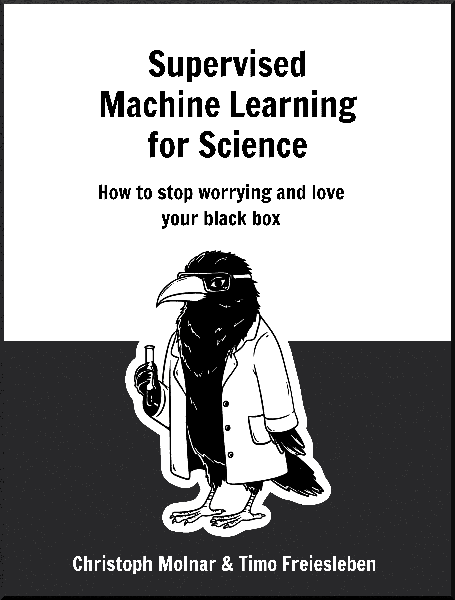

# 《科学中的监督式机器学习》

> 原文：[`ml-science-book.com/index.html`](https://ml-science-book.com/index.html)

如何停止担忧并爱上你的黑盒

作者

Christoph Molnar & Timo Freiesleben

# 摘要

机器学习已经彻底改变了科学，从折叠蛋白质、预测龙卷风到研究人性。虽然科学一直与预测有着密切的关系，但机器学习放大了这种关注。但这种对预测的过度关注是否合理？机器学习模型能否成为科学模型的一部分？或者我们是否走错了方向？

在这本书中，我们探讨并论证了在科学中使用监督式机器学习的合理性。然而，单纯应用监督式学习并不能让你走得很远，因为原始形式的机器学习不适合科学。毕竟，它缺乏可解释性、因果关系、不确定性量化以及许多其他期望的特性。然而，我们已经拥有了所有改善机器学习的拼图碎片，从融入领域知识到创建稳健、可解释和因果的模型。问题是解决方案散布在各个地方。

在这本书中，我们汇集了哲学上的论证和解决方案，使监督式机器学习成为科学的有力工具。

本书分为两部分：

+   第一部分论证了在科学中使用机器学习的合理性。

+   第二部分讨论了如何将机器学习融入科学。

[《科学中的监督式机器学习》](https://ml-science-book.com/) 由 Christoph Molnar 和 Timo Freiesleben 著作，许可协议为 [CC BY-NC-SA 4.0](http://creativecommons.org/licenses/by-nc-sa/4.0/?ref=chooser-v1)    
