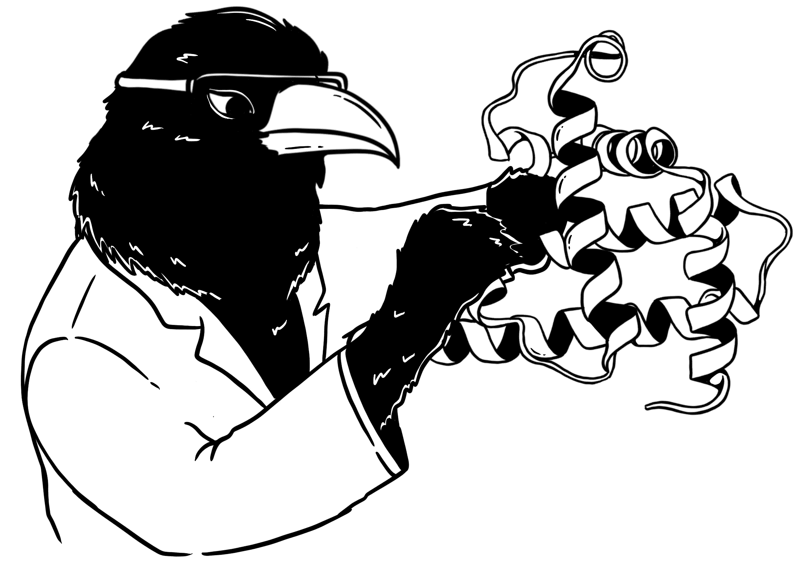
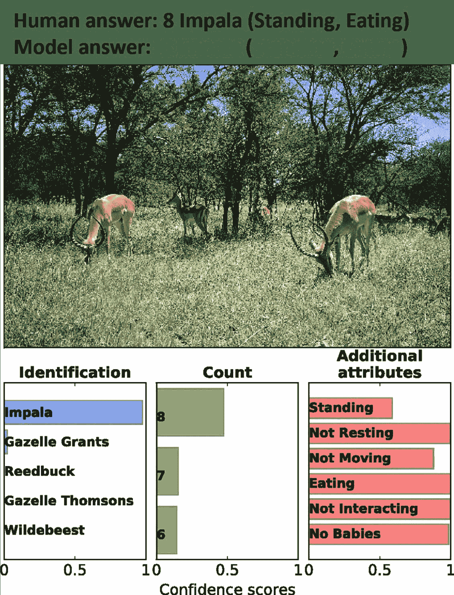
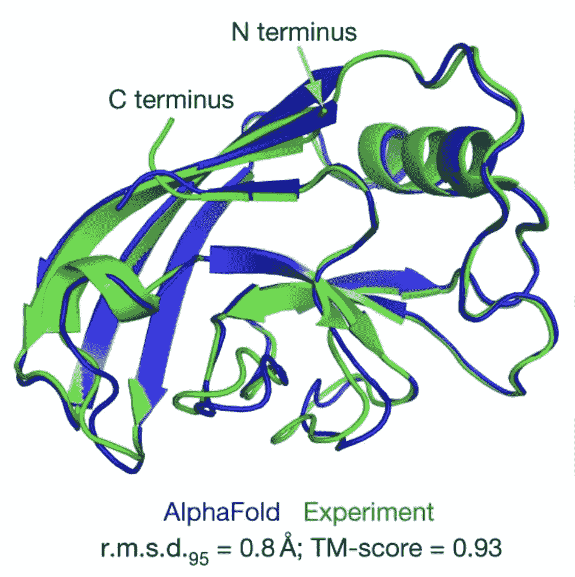

# 1. 引言

> 原文：[`ml-science-book.com/introduction.html`](https://ml-science-book.com/introduction.html)

研究人员在位于日内瓦附近法国-瑞士边境深处的欧洲大型强子对撞机（LHC）中，每秒让数百万个质子相撞，以了解我们的宇宙最终由什么组成。每一次碰撞都会产生亚原子粒子，这些粒子通常很快就会衰变，从而产生更多的粒子。传感器围绕着碰撞区域，记录这些粒子的通过，将每一次碰撞事件转化为数据——大量的数据。欧洲核子研究组织 CERN 是世界上最大的粒子物理实验室。CERN 的数据中心每天处理高达一拍字节的数据。那是一百万吉字节。这些数据量远远超出了人类能够处理的能力。

将这种数据分析称为“具有挑战性”是一种完全的夸张：重建碰撞非常困难，因为同时发生多次碰撞；传感器数据生成速度比写入磁盘的速度快；有些粒子在不到万亿分之一秒的时间内就会衰变。为了使数据处理和分析变得可管理，CERN 的研究人员依赖机器学习。机器学习系统扫描传入的事件数据，并决定哪些写入磁盘，哪些忽略。机器学习模型还估计信号的能量和时间。其他机器学习模型帮助重建事件并去除噪声。今天，没有机器学习就无法想象 CERN 的粒子科学。

但这不仅仅是粒子科学。如果你仔细观察，你会发现机器学习几乎在每一个领域（至少，我们找不到任何一个没有它的领域）。有些领域大家都期待机器学习应用，如地球科学、材料科学或神经科学 [[1]](references.html#ref-reichstein2019deep), [[2]](references.html#ref-schmidt2019recent), [[3]](references.html#ref-kell2018task)。但你可能会惊讶地看到机器学习在其他领域的应用，如人类学、历史或理论物理 [[4]](references.html#ref-pedersen2023editorial), [[5]](references.html#ref-kim2014ancient), [[6]](references.html#ref-he2017machine)。

让我们看看几个应用实例，以更好地了解科学家如何使用机器学习。在每个例子中，机器学习都扮演着不同的科学角色。

雷文科学陷入了困境。乌鸦们被复杂的数据淹没，不知道如何将其压缩成科学模型。一群独特的神经统计计算机乌鸦最近开发了一种新的建模方法，称为监督机器学习，它可以直接从数据中学习预测模型。但这种建模仍然是科学，还是炼金术？

## 1.1 在塞伦盖提标记野生动物

野生动物生态学家希望理解和控制自然生态系统的复杂性。他们提出的问题包括：生态系统中有哪些动物？每种动物有多少？动物们都在做什么？

很长时间以来，由于没有数据，很难对这些问题的定量分析。但今天，运动传感器相机，通常被称为*相机陷阱*，提供了大量数据。相机陷阱将相机与运动传感器结合在一起。一旦有物体在相机前移动，它就会拍照。塞伦盖提，斑马、水牛和狮子的家园，是生态学家放置各种相机陷阱的生态系统之一。但要将这些图像转化为洞察力，人们必须对它们进行标记：他们必须决定图像中是否有动物，它属于哪个物种，并描述它在做什么。这是一项繁琐的任务！

因此，Norouzzadeh 等人[[7]](references.html#ref-norouzzadeh2018automatically)使用已经标记的数据来训练一个自动执行此任务的卷积神经网络。图 1.1 显示了此标记任务的输出。该模型在 Snapshot Serengeti 数据集上实现了 94.9%的预测准确率——与通常标记数据的志愿者团队的表现相同。

图 1.1：该图像由塞伦盖提的运动传感器相机拍摄，显示了野生动物。Norouzzadeh 等人[[7]](references.html#ref-norouzzadeh2018automatically)的机器学习模型正确识别、计数并描述了图像中的动物。经[[7]](references.html#ref-norouzzadeh2018automatically)许可使用。

论文的主要目标是提供一种可靠的标记工具供研究人员使用。数据的标签应该足够准确，以便得出科学结论。因此，Noroyzzadeh 等人[[7]](references.html#ref-norouzzadeh2018automatically)关注模型在变化自然条件下的预测准确性和与预测相关的不确定性。

## 1.2 预测龙卷风以指导行动

在像龙卷风这样的严重天气事件中，每一分钟都很宝贵。你需要迅速为自己和亲人找到避难所。但龙卷风很难预测。它们迅速形成，而形成龙卷风的精确条件尚未完全理解。

Lagerquist 等人[[8]](references.html#ref-lagerquist2020deep)因此使用机器学习来预测未来一小时内龙卷风的发生。他们在来自两个不同来源的数据上训练了一个卷积神经网络：风暴中心的雷达图像和短程探测。他们的模型实现了与已投入使用的先进机器学习系统 ProbSevere 相似的预测性能，后者用于严重天气预测。

该工作的目标是提供一个系统，可以在部署中使用，以帮助警告公众关于龙卷风的信息。因此，论文集中在方法论和模型在相关部署设置中的预测性能评估。特别是，他们分析了模型在预测不同类型龙卷风时，哪些地区的表现最好和最差。用例与塞伦盖提动物分类器不同，那里的目标是标记，而不是逐个案例的决策（尽管塞伦盖提的总结数据可能最终用于决策）。

## 1.3 通过预测杏仁产量来获得见解

加利福尼亚是世界杏仁生产者：它生产了地球上 80%的所有杏仁，可能在整个宇宙中也是如此。氮肥在坚果生长中起着关键作用。¹ 肥料使用受到监管，意味着其使用有一个上限。在你可以制定一个好的肥料策略之前，你必须首先量化其效果。张等人 [[9]](references.html#ref-zhang2019california) 使用机器学习来预测果园田地的杏仁产量，基于天气、果园特征（使用遥感技术，即卫星）和当然，肥料使用。作者不仅检查了模型的预测准确性，还检查了单个特征如何影响预测以及它们对模型性能的重要性。

该研究的目标是双重的：预测和洞察，因此它不仅仅是一个决策。该模型可能有助于杏仁种植者做出更好的肥料使用决策，同时也为科学知识库做出贡献。一般来说，生态学和农业科学领域在适应机器学习 [[10]](references.html#ref-lucas2020translucent)，[[11]](references.html#ref-perry2022outlook) 方面处于前沿。

## 1.4 推断蛋白质结构以获得科学假设

生物信息学中的一个重要目标是要了解蛋白质结构是如何由它们的氨基酸序列决定的。蛋白质在身体中承担着许多重任，从建造肌肉和修复身体到分解食物和传递信息。蛋白质的结构在很大程度上由其氨基酸序列决定，这是蛋白质的构建块。然而，蛋白质的结构最终决定了其功能。问题是：如果你只有氨基酸序列，很难预测蛋白质的结构。如果科学家能够可靠地做到这一点，将有助于他们在药物发现、理解疾病机制和设计新蛋白质方面的工作。认识 AlphaFold [[12]](references.html#ref-jumper2021highly)，这是一个能够从氨基酸序列中合理预测蛋白质结构的深度神经网络。参见图 1.2 中的一个示例。

图 1.2：蛋白质结构，蓝色为预测，绿色为实验确定。图由 [[12]](references.html#ref-jumper2021highly)，CC-BY (https://creativecommons.org/licenses/by/4.0/)

AlphaFold 是在包含 10 万个蛋白质序列的数据集上训练的。除了纯粹的预测之外，该算法还帮助进行分子替换 [[13]](references.html#ref-pereira2021high) 和解释使用特殊显微镜拍摄的蛋白质图像 [[14]](references.html#ref-gupta2021cryoem)。现在甚至有一个名为 AlphaFold DB 的完整数据库，用于存储预测的蛋白质结构。在其网站上 [[15]](references.html#ref-alphafolddb2023) 它表示：

> “AlphaFold DB 提供了超过 2 亿个蛋白质结构预测的开放访问，以加速科学研究。”

不仅预测模型 AlphaFold 已成为科学的一部分，而且其预测结果也成为了进一步研究的基础。为了证明机器学习这一敏感角色的合理性，该模型需要接受双重审查。

## 1.5 机器学习在科学中扮演什么角色？

你可能会看看这些例子，并认为机器学习只是科学过程中的许多工具之一，就像 Excel 或 Python 一样，或者认为科学目标只是评估模型的性能。

如果是这样的话，机器学习在科学中的价值将非常有限——机器学习可以创建“模型”，但这些与代表现象的科学模型相差甚远。科学中最重要的方法论步骤——如创建科学模型或理论、测试它们以及发现有趣的新研究问题——将不会受到机器学习的影响。

事实上，人们之所以对科学中的机器学习持谨慎态度，是有充分的理由的——在原始形式下，机器学习将每个科学问题都简化为预测问题。这种限制被关于机器学习的流行批评声音所强调。

以因果推理的倡导者 Judea Pearl 为例，他说：

> “我认为机器学习是一个从数据到概率的工具。但然后我们仍然需要额外走两步才能从概率到真正的理解——两大步。第一步是预测行动的效果，第二步是反事实想象。” [[16]](references.html#ref-pearl2019limitations)

Pearl 在这里指的是他区分三个等级的因果层次：1. 关联，2. 干预，和 3. 反事实推理 [[17]](references.html#ref-pearl2018book)。他强调机器学习仍然处于这个层次的第一位，并且仅适用于静态预测。

Gary Marcus，当前深度学习最著名的批评者之一声称：

> “在我看来，如果我们不改变方向，我们不太可能解决我们对人工智能的任何最大担忧。当前的范式——数据丰富，但知识、推理和认知模型不足——并不能让我们达到可以信赖的人工智能。” [[18]](references.html#ref-marcus2020next)

在论文中，马库斯（Marcus）批评了当前机器学习方法的脆弱性、对背景知识的无知以及透明度不足。

现代语言学之父之一，诺姆·乔姆斯基（Noam Chomsky）曾争辩道：

> “奇怪的是，一些机器学习爱好者似乎为自己的创造能够生成正确的‘科学’预测（例如，关于物体运动的预测）而感到自豪，而这些预测并没有使用解释（例如，牛顿的运动定律和万有引力定律）。但这种预测，即使成功，也属于伪科学。正如哲学家卡尔·波普尔（Karl Popper）所指出的，科学家们当然寻求具有高度经验支持的定理，但我们寻求的不是高度可能的理论，而是解释；也就是说，强大且高度不可能的理论。” [[19]](references.html#ref-chomsky2023noam)

乔姆斯基批评机器学习过于专注于预测，而不是发展理论和解释。在文章中，他特别怀疑当前的大型语言模型能否对人类语言提供深刻的洞察。

## 1.6 机器学习可以不仅仅是工具

我们在上述关键观点上存在一定程度的共识。机器学习算法存在一些问题，比如它们是缺乏因果关系的愚蠢曲线拟合器。纯粹的预测模型可能成为不良的解释模型。而且，机器学习并不产生我们习惯的科学研究理论。

尽管如此，我们有理由乐观地认为这些问题可以得到解决，机器学习可以在科学中发挥重要作用。我们看到机器学习扮演的角色在最初的例子中已经显现：

+   **指导行动**：龙卷风预报不仅仅是智力预测练习，对于采取正确措施防止损害至关重要。

+   **获得洞察**：在杏仁产量预测的案例中，目标不仅仅是建立一个预测机器，研究人员还从模型中提取了洞察。

+   **探索**：AlphaFold 不仅仅是一个概念验证。例如，蛋白质结构预测被研究人员用于探索和测试新药。

然而，机器学习在其原始形式下无法履行这些角色。它必须配备“升级”如（因果）领域知识、可解释性、不确定性等，以成为指导人们行动、从数据中提取洞察或生成新假设的新方法。我们相信，完全升级的监督机器学习模型有可能成为完整的科学方法论，帮助科学家更好地理解现象。

我们需要的升级都是现成的。每年都会有新的子领域出现。如果我们不是孤立地看待机器学习，而是将其与这些升级相结合，机器学习就能提供巨大的科学价值。就像一个谜题，我们必须把它所有的部分拼凑在一起，从为什么将机器学习方法集中在预测上是一个好的研究核心思想开始进行论证。

但在我们能够证明机器学习或开始解决这个谜题之前，让我们先看看原始形式的监督式机器学习！

* * *

1.  从技术上来说，它们是豆科植物，但我们不是生物学家，所以我们把它们当作坚果来吃。↩︎
