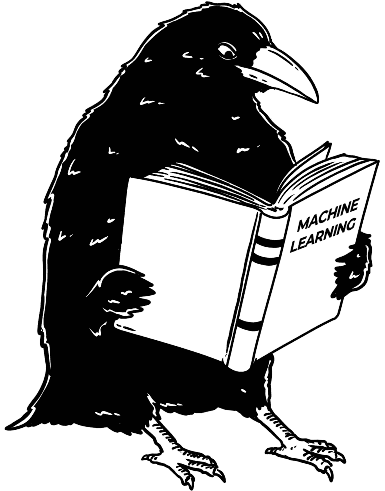

# 2  纯粹监督式机器学习

> 原文：[`ml-science-book.com/supervised-ml.html`](https://ml-science-book.com/supervised-ml.html)

本章探讨了监督式机器学习，将其简化到最基本的形式。为什么是监督式机器学习？当然，无监督学习和强化学习在科学中的应用同样有趣。然而，在观察了许多科学应用之后，我们意识到主要目标通常是解决一个监督学习问题。无监督学习和强化学习技术通常被用来支持这个目标，例如，通过提供强大的表示或微调模型。

监督式机器学习是关于什么的？回想一下引言中的龙卷风预测示例。

监督式机器学习产生提供 *输出预测* 的模型，例如，关于下一个小时内龙卷风发生的预测。为了获得这些预测，模型必须用所谓的 *输入特征值* 进行喂养，例如风暴中心的雷达图像和短程探测。*模型的搜索* 通过 *学习算法* 和 *标记数据集* 进行，该数据集由 *输入-输出对* 组成，也称为训练数据。

一只年轻的乌鸦名叫 Rattle 是第一个采用监督式机器学习的。起初，其他乌鸦科学家们持怀疑态度。太新了。未经证实。有风险。这不是乌鸦科学的方法。然而，Rattle 开始向第一批感兴趣的乌鸦解释机器学习是什么。

## 2.1 描述预测任务

要使用监督式机器学习，你首先必须将你的问题翻译成一个具有以下成分的预测任务：

+   **选择一个目标变量 $ Y $ 进行预测。** 例如，在 1 小时时间窗口内龙卷风的产生，编码为 0（无龙卷风）和 1（龙卷风）。

+   **定义任务。** 任务与目标相关，可以包括分类、回归、生存分析和推荐等。根据你如何构建龙卷风预测问题，你最终会得到不同类型的任务：

    +   下一个小时内会发生龙卷风吗？ $ \Rightarrow $ 分类（龙卷风 Y/N）

    +   今年会有多少龙卷风？ $ \Rightarrow $ 回归（0，1，2，…）

    +   下一个龙卷风发生需要多长时间？ $ \Rightarrow $ 生存分析（例如，2 小时）

+   **确定评估指标。** 此指标定义了什么算作好的或坏的预测。为了在 1 小时窗口内对龙卷风进行分类，可以使用 F1 分数¹或准确率。

+   **从预测目标中选择特征 $ X $。** 特征可以是来自雷达站的每小时测量值，如风速和降水量。

一旦定义了任务，就需要数据。

## 2.2 获取数据

机器学习需要数据。数据点表示为特征值和目标值的对 $ (x^{(i)}, y^{(i)})_{i=1, \ldots, n} $。在龙卷风案例中，$ x^{(145)} $ 可能是 2021 年 5 月 25 日上午 10 点到 11 点在美国一个特定的 3 公里乘 3 公里的区域内雷达测量值。因此，$ y^{(145)} $ 将表明在这个时间和地点是否发生了龙卷风。

在清理和预处理数据后，通常将其随机分为三个子集用于机器学习：

+   用于训练模型的训练数据集，$ D_{train} $。

+   用于验证建模选择和选择的验证数据集，$ D_{val} $。

+   用于最终性能评估的测试数据集，$ D_{test} $。

最简单的方法是将您的数据集随机分为这三个桶。在现实中，您必须根据数据和任务调整拆分机制。例如，时间序列和聚类数据需要尊重数据结构的拆分方案。对于不平衡数据的分类，您可能希望使用确保少数类在每个拆分中经常出现的机制。无论如何，在一个完全随机的三路拆分中，我们的数据点 $ (x^{(145)}, y^{(145)}) $ 将落入这些桶中的任何一个。

## 2.3 训练模型

训练机器学习模型意味着运行一个算法，该算法接受训练数据作为输入并输出模型。该模型描述了一个基于输入特征输出预测的函数。

训练需要做出一些选择：

1.  选择模型类别 $ F $。例如，决策树或神经网络。通常，您必须进一步指定此类，例如通过选择树的最大深度或神经网络的特定架构。雷达读数可能在空间级别上，因此您可能选择卷积神经网络，如 ResNet，用于龙卷风预测任务。

1.  选择训练算法 $ I $。训练算法接受训练数据并生成预测模型 $ \hat{f} $。例如，神经网络通常使用随机梯度下降和反向传播作为训练算法。但您也可以使用遗传算法来训练神经网络。

1.  设置超参数。超参数控制训练算法 $ I $ 并影响训练产生的模型。一些超参数与模型类别相关，例如您神经网络中的层数或 k-最近邻算法中的邻居数量。其他与训练算法相关，例如随机梯度下降中的学习率或批量大小。

例如，当您训练卷积神经网络来预测龙卷风时，您使用随机梯度下降 ($ I $) 和训练数据 $ D_{train} $。为此，您必须设置超参数。在训练过程之后，您从 CNN 模型类别中得到一个训练好的 CNN $ \hat{f} $。

训练过程旨在生成一个模型 $ \hat{f} $，在训练数据上产生最小的误差：

$$\epsilon_{train}(\hat{f}):= \frac{1}{|D_{train}|} \sum_{x,y \,\in D_{train}} L(\hat{f}(x), y),$$

其中 $ L $ 是模型优化的损失函数。一些训练算法可以直接优化任意（好吧，有些约束仍然存在）的损失函数，例如使用梯度下降的神经网络，而其他训练算法具有内置的，有时不那么明确的损失函数，它们优化的损失函数，例如 CART 决策树中的贪婪分割 [[1]](references.html#ref-breiman2017classification)。

## 2.4 验证建模选择

训练并不能保证它将产生表现最佳的模型。例如，您可能没有选择最佳模型类别，因为您使用了线性回归，但该任务的最佳模型可能是一个树集成。即使您选择了最佳模型类别，您可能也没有最优地设置超参数。您需要一个程序来选择模型类别和超参数。一个简单的方法是计算训练数据的评估指标，但这不是一个好主意，因为某些模型可能会过度拟合训练数据。

*过拟合* 当一个模型在训练数据上表现良好，但在同一分布的新未见数据上表现不佳时，我们称其为“过拟合”。一个过拟合的模型擅长重现训练数据中的随机误差，但无法捕捉到一般模式。* 通常，您使用一个单独的验证数据集 $ D_{val} $ 来计算评估指标。由于模型没有使用验证数据进行训练，因此您可以得到对其性能的公平评估。使用验证数据，您可以比较多个模型和超参数配置，并选择表现最佳的一个。这允许您检测欠拟合和过拟合，并通过适当正则化和调整模型来防止这些问题。*  *## 2.5 在测试数据上评估模型

您的最终模型表现如何？不幸的是，您不能使用从训练和验证数据中计算出的评估指标。两者都将过于乐观，因为您已经使用了训练数据来训练模型，并使用验证数据来做出建模选择。相反，您必须在测试数据 $ D_{test} $ 上评估模型性能。这为您提供了模型性能的现实估计。

## 2.6 重复：重采样数据的作用

只将数据分割为训练、验证和测试集并不非常高效。通常，数据会被分割多次。一种常见的技术是交叉验证，它将数据分割成 k 个不同的部分。比如说，您使用 $ k=10 $。九个部分中的十个可能用于训练和验证，而第十个用于测试数据。您通过循环遍历这些部分，以确保每个部分都作为测试数据使用一次。这样，您总是使用“新鲜”的数据来评估模型。还可以使用其他采样方法，如自助抽样和子抽样。但即使有多个部分，也可能不会给出稳定的结果——如果您再次生成分割部分，您可能会得到不同的估计。因此，另一种已建立的方法是重复采样。

您还有另一个选择，那就是如何将训练数据和验证数据分成九份。您可以选择进行单次分割，或者再次进行交叉验证。就像电影《盗梦空间》，讲述的是梦中的梦，您再深入一层，在交叉验证中进行交叉验证，这种过程被称为嵌套交叉验证 [[2]](references.html#ref-bates2023cross)。(嵌套)交叉验证的优势是更好地估计模型性能，并且由于您更有效地使用数据，因此可以得到更好的模型。

## 2.7 纯粹的机器学习可以自动化

一旦您定义了预测任务和您的数据，整个训练过程就可以完全自动化。机器学习的一个子领域，称为 AutoML，旨在完全自动化机器学习训练过程，使机器学习工程师变得多余 [[3]](references.html#ref-hutter2019automated)。上传您的数据，选择一个列作为您的目标列，并选择一个评估指标。点击一个按钮。然后机器为您做所有的事情。数据分割、超参数调整、模型选择、模型评估。我们称这种可自动化的机器学习实践为“纯粹机器学习”。最大的问题是：这种以优化为重点的方法如何与像科学这样的复杂实践相结合？

[1]L. Breiman, *分类与回归树*. 纽约：Routledge，2017\. doi: [10.1201/9781315139470](https://doi.org/10.1201/9781315139470).[2]S. Bates, T. Hastie, 和 R. Tibshirani, “交叉验证：它评估了什么以及它做得如何？” *美国统计学会杂志*, 第 1-12 页，2023，doi: [10.1080/01621459.2023.2197686](https://doi.org/10.1080/01621459.2023.2197686).[3]F. Hutter, L. Kotthoff, 和 J. Vanschoren, *自动化机器学习：方法、系统、挑战*. Springer Nature，2019\. doi: [10.1007/978-3-030-05318-5](https://doi.org/10.1007/978-3-030-05318-5).

* * *

1.  F1 分数是一个平衡精确度和召回率的指标，特别适用于评估不平衡数据集上的性能。↩︎*
