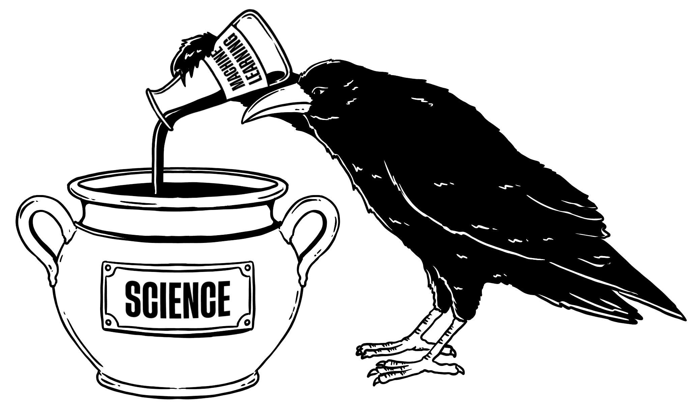

# 为科学辩护机器学习

> 原文：[`ml-science-book.com/part-one.html`](https://ml-science-book.com/part-one.html)

在本书的第一部分，我们从哲学的角度来探讨机器学习。机器学习如何帮助推动科学发展？毕竟，机器学习不只是一个用于做出更好预测的工具吗？

在这部分，我们一方面讨论了预测在科学中的重要性，并基于其预测能力为机器学习进行辩护。另一方面，我们强调其他科学目标的重要性，如实现控制、解释和推理，并描述它们如何与当前机器学习对预测的过度关注发生冲突。我们通过强调纯粹机器学习的几个具体局限性来结束这一部分。要了解如何应对这些局限性，你应该查看本书的第二部分。

具体来说，第一部分包括以下章节：

+   3  预测在科学中的作用 : 预测在科学中扮演着核心角色。

+   4  使用机器学习的合理性 : 机器学习增强了科学家的预测能力。

+   5  机器学习与其他科学目标：冲突 : 科学除了预测之外还有控制、解释和推理等目标。

+   6  纯粹的机器学习是不够的 : 纯粹的监督式机器学习存在具体的局限性。

