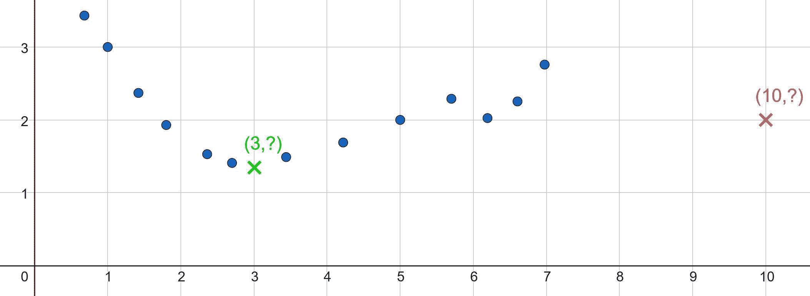

# 3  科学中预测的作用

> 原文：[`ml-science-book.com/prediction.html`](https://ml-science-book.com/prediction.html)

1.  为科学证明机器学习

1.  3  科学中预测的作用

监督机器学习是产生高性能预测模型的学科。虽然预测与科学之间的复杂舞蹈由来已久，但监督机器学习相对较新。让我们来看看这种从数据中学习的算法方法如何融入科学。

*预测* *预测是基于当前信息对未知结果的理性猜测，例如预测明天的天气或从氨基酸序列预测蛋白质的 3D 结构。Rattle 和一群机器学习倡导者向 Raven 科学委员会的长老理事会提交了一份请愿书。请愿书中包含了一系列预测问题，所有这些问题都可以通过机器学习来解决，例如预测龙卷风或区分有毒浆果和健康浆果。理事会开始了一场艰难的哲学辩论：预测在 Raven 科学中应扮演什么角色？

## 3.1 科学理论产生预测

由于这本书的标题中有“科学”二字，我们不得不提及爱因斯坦和他的广义相对论，这是科学史上最伟大的成功故事之一。受到相对性原理、马赫原理和等效原理等理论及哲学反思的启发¹，爱因斯坦描述了一个理论，根据这个理论，引力是时空的几何属性。当爱因斯坦在 1907 年至 1915 年之间发展他的理论时，它与他的狭义相对论理论不同，并不是基于旧理论无法解释的新经验观察。相反，爱因斯坦是由直觉驱使，渴望推广，以及数学之美所推动。然而，爱因斯坦的理论提供了使其超越纯粹哲学推测的东西：它做出了预测。

爱因斯坦的广义相对论预测了以下内容：

+   黑洞存在。

+   在巨大物体附近，时间会变慢。

+   引力弯曲光线，产生波动，并影响光的红移。

+   巨大的旋转物体可以带着时空一起移动，也称为莱恩斯-瑟林进动。

所有这些预测都得到了经验上的证实。一些预测在爱因斯坦提出理论后不久就得到了证实，例如引力弯曲光线，这在 1919 年日食期间由爱丁顿和戴森观察到。其他预测，如引力波的存在，直到 2015 年才得到证实，因为它们需要复杂的新的测量技术。爱因斯坦的理论至今仍持续存在，其预测的正确性令人惊讶——广义相对论是科学中经过最严格检验的理论之一。

*科学理论* *科学理论是对具有强烈和多样证据支持的现象的抽象和普遍解释。² 它们经过严格的测试，并与其他理论相一致。因此，理论在其领域内被广泛接受。此外，理论不一定是定量的。一些最重要的科学理论是定性的，例如疾病的细菌理论、达尔文的进化论和细胞理论。*## 3.2 预测可以是科学的目标

与爱因斯坦的故事相比，莱维斯·弗赖·理查森的故事不太为人所知，他是第一个使用数值方法预测天气的人。除了气象学，理查森是一个有趣且多才多艺的人物：他在泰坦尼克号悲剧之后开发了声纳，他发现了测量海岸线长度的不一致性，这后来启发了曼德尔布罗特发展分形理论，并且他是一位坚定的和平主义者，将定量方法应用于研究国家间的和平与冲突。

当理查森开始研究气象学时，天气预报主要基于类似天气条件下的经验。他并不是第一个提出在天气预报中使用物理理论的人，但他是最先在实践中测试他的数值模型的人。他开发了一个旨在预测天气的数学模型：

+   他将天气图划分为边长为 200 公里的正方形。

+   他根据各自的相对高度将每个广场细分为层。

+   他列出他认为重要的所有物理方程，以模拟动力学。

+   他解出了各自的非线性偏微分方程，以预测两个广场的气压、风速和温度。

*科学模型* 科学模型通常是现象方面的数学表示，使科学家能够预测、解释或推理这些现象。模型可以基于理论，甚至可以是理论在特定情境中的应用。例如，理查德森利用物理学的理论来构建他的天气预报模型。然而，模型不必与理论紧密相连。它们也可以依赖于数据或常识。与理论相反，模型通常更具体，范围更小，更实用。与模型不相符的证据仅限制了模型的范围，但一个在其他方面有用的模型可能仍然存在。即使它们存在冲突，现实相似方面的不同模型也可以在某个领域共存。不幸的是，他的第一次尝试失败了。他花了**六周**时间来预测**六小时**时间段的天气预报。更糟糕的是，他的预测相当不准确！尽管如此，从方法论上来说，他是正确的；尽管他的书“数值过程天气预报”在 1922 年出版后最初被忽视，但现在它是气象学的一部现代经典。直到今天，科学家们使用数值方法、物理测量和物理理论来预测天气 [[2]](references.html#ref-pu2019numerical)。幸运的是，自从理查德森第一次尝试以来，数值天气预报已经大大改进。大气数据的可用性，例如通过飞机或气象站，更重要的是，能够实时高效求解微分方程的电子计算机的访问，使得预测天气（至少在 24 小时内）变得可靠。天气预报已经变得如此可靠，以至于当你问一个朋友现在的天气时，她可能会检查她的天气应用而不是看外面…*  *## 3.3 预测与科学不可分割

预测对爱因斯坦的广义相对论和理查德森的天气预报都至关重要。如果广义相对论的预测是错误的，无论它多么美丽，这个理论都会被扔进科学的垃圾堆。同样，如果数值天气预报不起作用，它将被忽视；事实上，这正是理查德森在提出他的理论时最初发生的情况。

预测在这两种情况下都扮演了不同的角色：在爱因斯坦的例子中，预测指导了新的实验，如寻找黑洞的实验，证实了理论，最初几乎没有实际影响。³ 在气象科学中，另一方面，准确的预测最终是目标；也因为控制天气至少到目前为止还遥不可及。天气预报是有用的：它们帮助人们决定何时出门，何时收割植物，如何安排航班，何时预期灾难性天气事件，并告诉你的信任的冰店何时开门。预测不是气象科学的副产品——它是目标。

人们普遍认为，预测是科学的核心目标之一 [[3]](references.html#ref-douglas2009reintroducing)。预测将科学模型和理论与世界中的事件联系起来。没有成功预测的科学发展将类似于希腊神话。指出宙斯非常愤怒可能听起来是对你家院子里龙卷风的一个不错的*解释*，但没有预测如何能证实它是否为真？更重要的是，你的保险会覆盖愤怒的神明还是只有愤怒的鸟儿……

*科学预测* *科学预测是基于经验或知识对数据、过去事件或未来的陈述⁴。这意味着预测不仅仅是像预测明天的天气一样预测未来。预测也可以涉及过去。例如，天文学家约翰内斯·开普勒在 1614 年预测，伯利恒之星是公元前 7 年出现的一个行星合相。术语“预测”还包括你已经知道正确预测的情况。例如，如果一个医疗诊断工具正确预测了过去的病例，它与观察到的数据是一致的。尽管如此，验证科学模型和理论的黄金标准是准确预测未知（未来）事件或未见数据。*  *## 3.4 预测服务于许多目的

从科学的全局视角来看，你会发现预测无处不在，并服务于许多目的 [[4]](references.html#ref-shmueli2010explain)：

+   **验证和证伪假设**：预测使证伪成为可能。与实验数据不相符的预测允许你拒绝假设，或削弱科学理论或科学模型。相反，与实验数据和未来观察结果相符的预测增强了理论和模型的确证。

+   **提供一个比较的标准**：模型的预测准确性为比较基于现实且独立于模型工作方式的科学模型提供了一个标准。

+   **验证可预测性：** 如果你可以根据一组信息持续预测一个现象，这意味着这组信息包含了确定现象状态的相关信息。然而，如果你不能，那可能是因为可用的信息不足。了解从某些信息中可以推断出什么以及不能推断出什么在科学中极其重要 [[5]](references.html#ref-taleb2005black)。

+   **指导实验：** 预测可以告诉你应该关注现象的哪个方面，并对其进行实验。如果模型或理论对边缘情况做出有趣或非凡的预测，你可以通过实验来验证它们。

+   **促进科学的应用：** 科学必须始终被视为嵌入在一个更大的经济和社会过程中的。预测可用于规划、提高流程效率并实现自动化。预测是科学回报社会投资的一种方式。

*科学假设* 科学假设是对世界的陈述，这些陈述可以通过实验进行测试并可能被证伪。这些陈述可以涉及预测或现象的解释。经过严格测试的普遍假设可以成为科学理论。疾病起源于病毒这一假设在经过严格测试后变成了理论。在某些情况下，整个模型被称为假设，这意味着该模型是给定模型类别中现象的真实或最佳描述。*## 3.5 科学模型可以进行内插和外推

天气预报和爱因斯坦的相对论理论是两种不同预测模式的绝佳例子：

+   **内插** 描述的是对模型构建或与模型高度相似的数据的已知数据的预测。⁵ 在给定合理的相似性概念下，内插通过一个简单的原则工作——相似的数据以相似的方式处理。已知真实状态的数据构成了预测未知状态相似数据的依据。例如，在天气预报中，你可能有一系列过去云层形成及其相应降水量的记录。内插意味着仅基于相似过去云层的降水量来预测新云层的降水量。

+   **外推** 是内插的补充。它涉及预测没有相似数据可用的情况。外推需要不仅仅是相似数据相似处理。对于外推，必须利用特定领域的背景知识。非常重的恒星可能坍缩成黑洞的预测是爱因斯坦相对论理论的一个后果，最初是由卡尔·施瓦茨希尔德提出的。“黑洞”的“观察”在爱因斯坦发展他的理论时并不存在。相反，这个预测完全是由理论驱动的，而不是参考过去类似事件。

图 3.1：对于$ x=3 $（绿色），$ y $是未知的，但$ x $位于数据范围内（蓝色）。您需要进行插值。对于$ x=10 $（红色），$ y $也是未知的，但$ x $位于数据范围之外。您需要进行外推。图见[[6]](references.html#ref-freiesleben2023beyond)，CC-BY (https://creativecommons.org/licenses/by/4.0/)

插值和外推在科学预测中扮演着核心但不同的角色。成功的插值通常被视为理所当然，因为它表明模型与给定数据一致。另一方面，外推，正如波普尔[[7]](references.html#ref-popper2005logic)所说的“大胆的假设”，则扮演着更突出的角色：

+   成功的外推可以增强您对背景知识的信心，这些知识是您为模型配备归纳偏差所依据的。

+   它可以激发人们对预测模型捕捉了现实相关方面的信念[[8]](references.html#ref-sep-scientific-realism)。

+   此外，外推可以指导实验过程，尝试验证令人惊讶的预测。

## 3.6 机器学习是终极插值工具

监督机器学习的主要优势是预测类型的插值。监督机器学习是强数据驱动的，而不是依赖于背景知识来预测未知案例。因此，外推不被认为是复杂机器学习模型（如深度神经网络）[[9]](references.html#ref-haley1992extrapolation), [[10]](references.html#ref-barnard1992extrapolation), [[11]](references.html#ref-hasson2020direct)的优势。有些人认为当前对抗样本⁶的兴起是这种外推失败[[12]](references.html#ref-szegedy2013intriguing)的直接后果。但事情并不那么简单，原因如下：

1.  在机器学习中，可以使用背景知识来改进外推，正如我们在第八章中讨论的那样。

1.  插值和外推不能像图 3.1 所暗示的那样干净地分开。这种分离取决于可用数据和新的数据的相似性，并且不存在一个神奇的截止值，预测会从插值切换到外推。插值的常见形式定义是数据的凸包，然而，这会将高维空间中的几乎所有预测都视为外推[[13]](references.html#ref-balestriero2021learning)。根据这个定义，插值在低维和线性预测问题之外将是一个无用的概念。

1.  在正确的相似性概念下，每个外推都可以表述为插值。学习合理的相似性概念可能是机器学习的首要目标。

[1]R. Frigg 和 S. Hartmann, “科学中的模型,” 在 *斯坦福哲学百科全书*, 春季 2020 年., E. N. Zalta 编，[`plato.stanford.edu/archives/spr2020/entries/models-science/`](https://plato.stanford.edu/archives/spr2020/entries/models-science/); 斯坦福大学形而上学研究实验室，2020。[2]Z. Pu 和 E. Kalnay, “数值天气预报基础：模型、数值方法和数据同化,” *水文学气象学集合预报手册*, 第 67-97 页，2019。[3]H. E. Douglas, “重新引入预测到解释中,” *科学哲学*, 第 76 卷，第 4 期，第 444-463 页，2009，doi: [10.1086/648111](https://doi.org/10.1086/648111)。[4]G. Shmueli, “解释还是预测？,” *统计科学*, 第 25 卷，第 3 期，第 289-310 页，2010，doi: [10.1214/10-STS330](https://doi.org/10.1214/10-STS330)。[5]N. Taleb, “黑天鹅：为什么我们学不会我们不会学习,” *纽约：兰登书屋*, 第 1145 卷，2005。[6]T. Freiesleben 和 T. Grote, “超越泛化：机器学习中鲁棒性的理论,” *综合*, 第 202 卷，第 4 期，第 109 页，2023，doi: [10.1007/s11229-023-04334-9](https://doi.org/10.1007/s11229-023-04334-9)。[7]K. Popper, *科学发现的逻辑*. Routledge, 2005。[8]A. Chakravartty, “科学实在论,” 在 *斯坦福哲学百科全书*, 夏季 2017 年., E. N. Zalta 编，[`plato.stanford.edu/archives/sum2017/entries/scientific-realism/`](https://plato.stanford.edu/archives/sum2017/entries/scientific-realism/); 斯坦福大学形而上学研究实验室，2017。[9]P. J. Haley 和 D. Soloway, “多层前馈神经网络的外推限制,” 在 *[1992 年 IJCNN 国际神经网络联合会议] (Proceedings 1992) 中*, IEEE, 1992, 第 25-30 页\. doi: [10.1109/IJCNN.1992.227294](https://doi.org/10.1109/IJCNN.1992.227294)。[10]E. Barnard 和 L. Wessels, “神经网络分类器中的外推和内插,” *IEEE 控制系统杂志*, 第 12 卷，第 5 期，第 50-53 页，1992，doi: [10.1109/37.158898](https://doi.org/10.1109/37.158898)。[11]U. Hasson, S. A. Nastase 和 A. Goldstein, “直接拟合自然：从进化的角度对生物和人工神经网络的看法,” *神经元*, 第 105 卷，第 3 期，第 416-434 页，2020，doi: [10.1016/j.neuron.2019.12.002](https://doi.org/10.1016/j.neuron.2019.12.002)。[12]C. Szegedy *et al.*, “神经网络的有趣特性,” *arXiv 预印本 arXiv:1312.6199*, 2013，doi: [10.48550/arXiv.1312.6199](https://doi.org/10.48550/arXiv.1312.6199)。[13]R. Balestriero, J. Pesenti 和 Y. LeCun, “高维学习总是等同于外推,” *arXiv 预印本 arXiv:2110.09485*, 2021。

* * *

1.  相对性原理表明，物理定律对所有观察者都是相同的。马赫原理指出，物体相对于彼此运动，而不是在绝对空间中。等效原理表明，引力质量和惯性质量是相等的。↩︎

1.  在哲学领域，正如往常一样，关于术语理论、模型和假设的含义存在巨大的争论。由于这并非关于该主题的百科全书文章（请参阅[[1]](references.html#ref-sep-models-science))，我们无法公正地处理这些辩论的复杂性。↩︎

1.  今天，广义相对论具有强大的实际意义，因为它导致了 GPS 的精确性和核能的可行性。↩︎

1.  我们将科学预测的定义限制在基于经验或背景知识的陈述上，以采取经验主义视角。既不基于经验也不基于知识的预测属于占卜领域。另一方面，通过预测比较不同的占卜者，又是一个科学问题。↩︎

1.  在经典的数学教科书中，*插值*通常仅描述已知数据的预测。我们将使用更宽泛的插值概念来表示对高度相似数据的预测，正如它在统计学或社会科学研究中经常被使用。↩︎

1.  对抗性示例是略微修改后的输入数据，这些数据被机器学习模型错误地预测。↩︎*****
