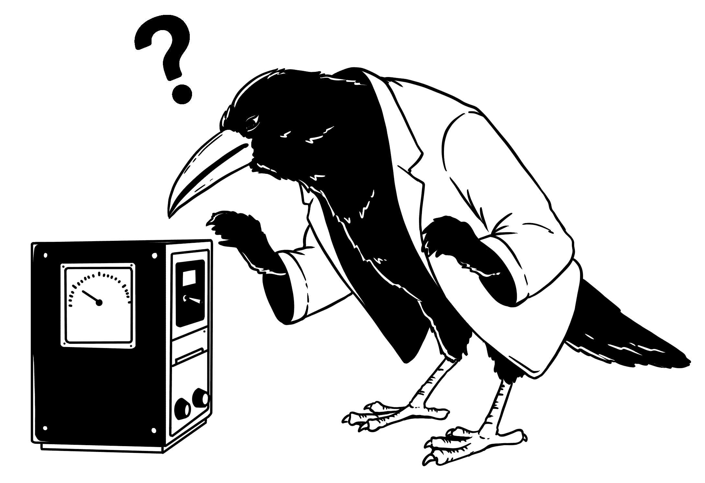

# 6  纯粹的机器学习是不够的

> 原文：[`ml-science-book.com/insufficient.html`](https://ml-science-book.com/insufficient.html)

1.  为科学证明机器学习的合理性

1.  6  纯粹的机器学习是不够的

尽管机器学习在预测方面具有很大的优点，但它与其他科学目标（如控制、解释和推理）相冲突。本章更具体、更实际地强调了纯粹机器学习作为科学方法的不足。

老牌科学家对机器学习的担忧并非没有道理。随着时间的推移，龙卷风系统开始出现问题。假阳性和假阴性变得更加常见。Kراه咨询了 Rattle，但即使是她也感到困惑。Rattle 得出结论，这些问题并非特定于龙卷风预测，而是机器学习系统性的问题。他们必须得到解决。

## 6.1 低测试误差不足

正如我们在第四章中强调的，机器学习有一个明确的关于什么是一个好模型的概念：一个好的模型在未见过的测试集上有低误差，因此具有低泛化误差。然而，如果没有一个潜在的一般化理论，这个概念就是空洞的。你如何仅从知道测试集上的误差来推断模型性能的泛化？是否有保证某些学习算法必须产生具有低期望误差的模型？

在第七章中，我们介绍了统计学习理论作为机器学习一般化理论的主要竞争者。

然而，标准的一般化概念只反映了模型在相同分布的数据上的预测能力。将外推到完全新的场景或不同分布的数据并不包含在标准的一般化概念中。因此，它在科学中具有有限的适用性，因为科学的目标是从模型到对现象的洞察的泛化。

在第七章中，我们因此也讨论了更广泛的一般化概念。第十一章关于鲁棒性，此外，展示了如何在分布变化下定义一般化。

## 6.2 领域知识被忽视

科学建立在先验知识的基础上来产生知识。纯粹的机器学习破坏了这一知识流的两个端点：你期望模型从数据中找出关系，并输出一个不透明的预测模型。焦点从认识论转向了效用，从科学转向了工程。你调整模型以提高一个指标。如果完全接受其纯粹形式的机器学习，那么很多领域知识就被浪费了，而且几乎没有新的知识可以获取。

然而，与背景知识的协调使科学模型更有价值。纳入额外信息¹是明智的。将其与统计建模或微分方程比较：这些建模方法鼓励甚至要求用分布假设和方程来表述先验知识。你得到可解释的估计，这有助于你更好地理解你研究的现象。

在第八章中，我们论证了你也可以用机器学习采取领域知识驱动的途径。更好的是：由于对预测性能的关注，你可以用预测性能来评估你的领域知识。

## 6.3 预测难以解释和解释

可解释性使你能够证明模型并推理现象。但机器学习模型通常不是固有的可解释的，因为它们可能具有复杂的功能形式，这种形式是根据数据调整的——它们是黑盒。这使得很难理解模型的行为以及它依赖于什么：

+   最有影响力的特征是什么？

+   模型学习了哪些特征？

+   为什么模型做出了这样的预测？

我们在第第九章中展示了如何使用可解释性技术来改进模型并从中获得洞察。

## 6.4 预测性能与因果关系相矛盾

我们生活和行动的世界是一个巨大的因果关系机制。然而，基础机器学习模型却忽略了事物的因果关系维度。它们所关心的只是做出更好的预测，并且依赖于任何统计依赖性来实现这一目标。你想知道你的 COVID 风险吗？好吧，机器学习模型需要你的鞋码、薪水和你当地俱乐部的足球排名。

但科学家们想要区分原因、效果或偶然相关的特征。医生们想知道为什么有些人患有 COVID 而其他人没有。他们希望开发药物并开具治疗处方，使人们恢复健康。为了回答这些问题，必须考虑因果关系。

我们将在第十章中展示因果推理与机器学习的结合如何帮助你找到因果关系，学习因果模型，并估计因果关系。

## 6.5 模型在部署中缺乏鲁棒性

基础机器学习提供预测模型，但仅适用于静态环境。这意味着如果：

+   它们被应用于与训练数据相似的数据，并且

+   数据结构在部署过程中保持完整。

在野外，现象是复杂的。数据不断变化，外部因素介入，测量设备产生误差，时间流逝，观察目标转移。如果你想在你的科学流程中使用机器学习模型，你必须使它们在现实世界条件下成为鲁棒的工具。

我们在第十一章（robustness.html）中展示了你可能感兴趣的稳健性类型，并讨论了如数据增强等帮助你使模型稳健化的策略。

## 6.6 预测结果缺乏不确定性量化

在现实世界中做出高风险决策时，适当的确定性量化至关重要。然而，简单的机器学习模型只提供点预测。一些模型，如贝叶斯模型，自带不确定性量化，但将模型类别限制在这些模型可能会导致预测性能的损失。也许表现最好的模型是随机森林。如果你选择表现最好的模型，你可能会得到一个没有内置不确定性量化的模型。即使模型输出看起来像概率，因为它们在零和一之间（是的，我们在和你说话，softmaxers），当模型没有良好校准时，它们通常不能被解释为“真实”的概率。

我们在第十二章（uncertainty.html）中讨论了机器学习中不确定性的哲学、校准以及用于不确定性量化的模型无关方法。

## 6.7 对于可重现性的标准没有共识

对于如何为他人记录代码、数据和模型以便重现结果，存在许多标准。可重现性对于以下方面至关重要：

+   透明地说明你做了什么以实现高性能，

+   允许他人测试你的工作并对其建立信任，

+   可靠地建立在你结果的基础上，

+   使你的代码可用于潜在的应用。

不幸的是，许多在科学研究中使用机器学习的论文不允许重现性 [[1]](references.html#ref-mcdermott2021reproducibility)。通常，重要的信息缺失，例如权重初始化、训练轮次、超参数或随机种子。此外，预处理步骤可能没有列出，代码的文档或实现可能很差。

我们在第十三章（reproducibility.html）中讨论了科学中机器学习可重现性的标准。

## 6.8 报告标准的缺失

在科学领域，清晰地说明为什么一个科学模型是合适的以及它解释了哪些数据，这一点至关重要。在机器学习中，研究人员仍然需要确定哪些信息是科学相关的。测试集上的预测性能确实很重要。但特征的重要性呢？或者关于数据收集或模型选择的信息呢？

我们在第十四章（reporting.html）中讨论了报告模型结果的不同标准。我们提供了一个如何将这些标准分组的高级视图以及一些出版最佳实践。

[1]M. B. McDermott, S. Wang, N. Marinsek, R. Ranganath, L. Foschini, and M. Ghassemi, “Reproducibility in machine learning for health research: Still a ways to go,” *Science Translational Medicine*, vol. 13, no. 586, p. eabb1655, 2021, doi: [10.1126/scitranslmed.abb1655](https://doi.org/10.1126/scitranslmed.abb1655).

* * *

1.  通常，科学理论都受到大量历史数据的启发；因此，以某种方式融入背景知识可以增加数据支持。↩︎
