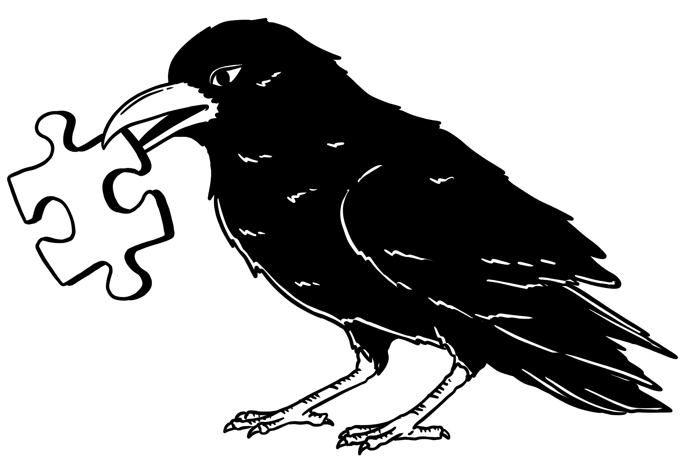

# 将机器学习融入科学

> [`ml-science-book.com/part-two.html`](https://ml-science-book.com/part-two.html)

在第一部分，我们论证了机器学习和科学可以是一个绝佳的搭配。然而，当涉及到结合领域知识、获得因果洞察和建模预测的不确定性时，裸骨机器学习是一种不完整的科学方法论。

第二部分关注这些缺失的拼图碎片，并将它们组合在一起。章节侧重于形式化和具体化问题。例如，我们引入因果模型来制定因果问题或基本概率理论来讨论不确定性。我们还讨论了像使用双重机器学习来估计因果效应或使用罗生门集合来量化不确定性这样的通用解决方案。虽然每个解决方案都是独立呈现的，但我们指出了不同主题之间的相互作用。第二部分包括以下章节：

+   7  泛化：将泛化理论连接到机器学习实践。

+   8  领域知识：使用合适的归纳偏差整合领域知识。

+   9  可解释性：解释机器学习模型以获得科学洞察。

+   10  因果性：整合因果假设以得出因果推断。

+   11  健壮性：分析分布偏移并增强机器学习模型的健壮性。

+   12  不确定性：理解误差来源和量化不确定性。

+   13  可重复性：避免阻碍可重复性的常见陷阱。

+   14  报告：提供模型报告的最佳实践。

