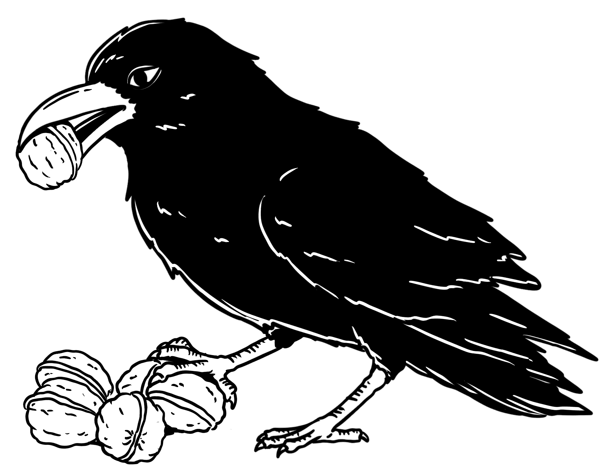
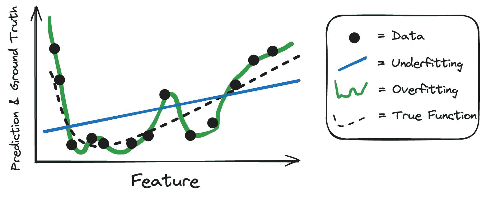
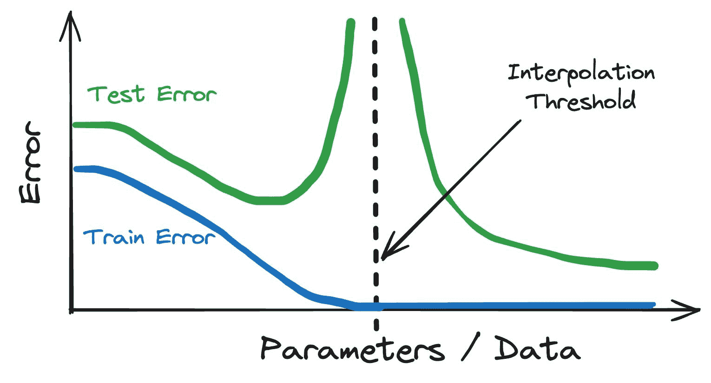
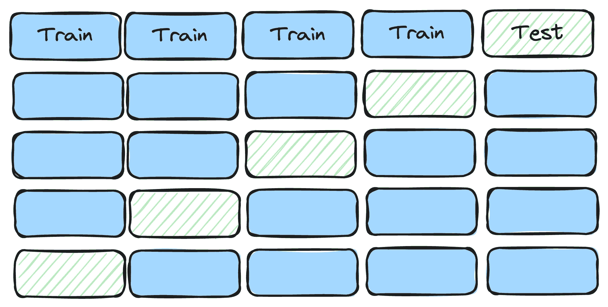

# 7 通用化

> 原文：[`ml-science-book.com/generalization.html`](https://ml-science-book.com/generalization.html)

1.  将机器学习融入科学

1.  7 通用化

王小二并不知道他的胸部 X 光片是肺炎分类器的一个数据点。他在急诊室出现了发烧和严重的咳嗽，但“只是”重感冒。没有肺炎。排除肺炎的胸部 X 光片被标记为“健康”，后来被用来训练机器学习模型。肺炎分类器并不是针对我们想象的王小二，因为这次急诊室访问是几年前的事，案件已经结案。虽然机器学习专家们并不关心王小二的图像，但他们关心的是像王小二这样的病例：出现肺部感染症状来到急诊室的患者。

这就是机器学习中通用化的承诺：从具体数据中学习通用规则，并将其应用于新数据。从具体到普遍。没有通用化，机器学习就只能是一个低效的数据库。但有了通用化，机器学习模型就变成了有用的预测机器。

在科学中，从具体观察中归纳出一般原则是一个基本目标。科学家通常不关心具体的实验、调查、模拟或研究，但他们使用它们来学习我们世界的规则。

本章讨论机器学习中的通用化，并分为三个部分，每个部分都描述了不同范围的通用化。

+   **理论上的通用化以预测：** 这是在机器学习中通常理解的通用化理论。它涉及统计学习理论中的关键主题，如经验风险、独立同分布假设，以及关于双下降现象及其与欠拟合和过拟合关系的讨论。

+   **实践中的通用化：** 这一部分描述了更实际的通用化概念。很少训练设置与应用场景完全匹配。要将模型推广到应用场景，需要关注数据生成过程、非独立同分布场景和分布偏移等问题。

+   **通用化以理解现象：** 这种类型的通用化通常是科学家们隐含的目标。它连接了机器学习理论与科学应用之间的差距，并讨论了数据代表性以及数据生成过程。

坚果美味但难以开裂。因此，乌鸦们着手建立一个坚果质量预测器。每第十户家庭必须向 Rattle 提供一个坚果样本，以便她能够训练一个机器学习模型。该模型在训练数据上表现良好，但在未见过的数据上表现糟糕。Rattle 开始思考如何确保机器学习模型能够推广。

## 7.1 理论上的通用化以预测

您希望我们的模型在手头的数据集上表现良好，同时也适用于类似的数据。相似性的一种语言是统计分布。您可以将分布想象成一个包含无限多个数据点的巨大桶。从这个桶中，您可以抽取数据并记录它。想想包含 X 射线及其对应标签的桶。我们用统计分布 $ \mathbb{P}(X, Y) $ 表示这个桶，其中 $ X $ 描述 X 射线图像的像素，$ Y $ 描述标签。

配备了分布，我们可以更优雅地描述我们的模型应该优化的内容。机器学习模型应该在期望上犯尽可能少的错误。更技术地说，它们应该有最小的 *预期损失* $ R(\hat{f}) $（有时也称为 *预期风险*）：

$$R(\hat{f}) = \mathbb{E}_{X,Y}[L(Y, \hat{f}(X))] $$

这个公式描述了模型在从分布桶 $ \mathbb{P}(X,Y) $ 中抽取的实例上预期的错误。单个数据点的“错误”由损失函数 L 描述，它量化了预测 $ \hat{f}(x) $（例如，肺炎）和实际结果 $ y $（例如，健康）之间的误差。问题是您不知道这个桶——即分布——看起来像什么。您只有有限的数据量，这些数据是您记录的。当您有数据时，您会查看模型在这些数据上犯的错误，并对其平均。

您可以使用训练数据来估计预期损失，但使用训练数据作为 $ R(\hat{f}) $ 的估计器并不好。估计的损失会过于乐观，意味着太小。如果一个模型过度拟合训练数据（“记忆”它），训练误差可能很低，即使该模型对新数据的表现不佳。这就像通过提前给出问题和答案来为学生准备考试。这意味着他们可以简单地记住答案，而您无法得到学生对该科目技能的真实评估。X 射线分类器可能对胡安和其他训练数据对象工作得很好，但对新病人则不行。但这个问题有一个简单的解决方案：使用新数据估计预期风险。

$$\hat{R}(\hat{f}) = \sum_{i=1}^{n_{test}} L(y^{(i)}, \hat{f}(x^{(i)}))$$

这个公式也被称为测试误差、样本外误差、泛化误差或经验风险（在测试集上）。

慢慢但稳定地，我们正在拼凑一种语言来讨论泛化。当 $ \hat{R}(\hat{f}) $ 低且所谓的泛化差距小的时候，模型泛化得好，泛化差距定义为以下差异 [[1]](references.html#ref-hardtrecht2022patterns)：

$$\delta_{gen}(\hat{f}) = R(\hat{f}) - \hat{R}(\hat{f})$$

如果泛化差距小，模型在训练数据和未见数据上的表现将相似。 ¹ 让我们探索泛化误差在不同场景下的行为。

### 欠拟合和过拟合

机器学习可能更像是一门艺术而不是一门科学，但有一个整个领域致力于将所有深度学习的魔法和神秘的随机森林建立在科学基础上：统计学习理论，它从统计的角度提供了机器学习的视角。我们通过探索统计学习理论来阐明泛化。

研究良好的概念是过拟合及其对立面欠拟合。欠拟合是指模型复杂度不足以模拟输入和输出之间的关系，因此模型将具有高训练误差和高测试误差，但可能存在小的泛化差距。坦白说，欠拟合模型是糟糕的！过拟合是指模型函数有太多的自由度：它未能捕捉可泛化的规则，而是“记忆”了训练数据。这就是为什么过拟合的特点是低训练误差和高测试误差，因此存在大的泛化差距。欠拟合和过拟合都是不希望的，因为它们都意味着泛化能力差（以低样本外误差来衡量）。

回到胸部 X 光检查的例子：想象一下，分类算法可能是一个基于图像部分平均灰度值的简单逻辑回归分类器。它可能比随机猜测更有效，但不会产生有用的模型。这是一个欠拟合的例子。在这个相同的情况下，过拟合可能看起来像这样：假设你为胸部 X 光使用一个允许完全生长到深度的决策树。输入是单个像素，并且所有典型限制都被取消，比如每个叶子节点中必须有最小数量的数据。树可以长得非常深，将所有训练数据分开，意味着每个数据点都得到一个叶子节点。因此，模型在训练数据上会表现得非常完美。但是当用于新数据时，决策树会失败。图 7.1 展示了简单一维情况下的欠拟合和过拟合。

图 7.1：数据（点）是由真实函数（虚线）加上一些噪声产生的。一个训练良好的模型会很好地逼近真实函数。线性模型（蓝色线）欠拟合了真实曲线，而过于灵活的模型（绿色曲线）过拟合了数据。

一个模型是否会欠拟合或过拟合取决于负责的机器学习算法及其能产生的函数复杂性。通过选择某些类型的模型类别并设置它们的超参数，你可以调整模型的灵活性，从而平衡欠拟合和过拟合。在机器学习中，典型的做法是使用相当灵活的模型，然后对其进行正则化。

这种灵活模型的例子包括神经网络和决策树。定理表明，神经网络[[2]](references.html#ref-cybenko1989approximation)、[[3]](references.html#ref-hornik1991approximation)和决策树可以逼近任意连续函数[[4]](references.html#ref-halmos2013measure)。这些灵活模型可以通过在建模中指定某些超参数（如学习率、架构、损失函数或启用 dropout [[5]](references.html#ref-goodfellow2016deep)）来进行正则化。

欠拟合和过拟合并不能告诉我们模型犯了什么类型的错误。这将在关于不确定性的第十二章中讨论。

### 双重下降或为什么深度学习有效

我们已经描绘了一个完美平衡的模型的样子——模型应该足够灵活，不会欠拟合，并且足够正则化，不会过拟合。但现在随着深度学习的发展，欠拟合和过拟合的推理似乎不再适用。深度神经网络拥有数百万或更多的参数，可以以无数种方式完美地拟合训练数据，因此你可能会预期强烈的过拟合。但事实上——它们具有泛化能力。这就像在社会中：为平均的约翰·多伊模型开发出的欠拟合和过拟合定律并不适用于参数丰富的复杂模型。这种深度神经网络中的令人惊讶的学习行为被称为*双重下降[[6]](references.html#ref-belkin2019reconciling)。双重下降描述了在增加参数与数据之间的比率时，样本外误差的行为。这种行为可以分为两个部分：

1.  **典型的欠拟合和过拟合：** 数据集保持不变，你从一个简单的神经网络开始。如果你增加我们模型中的参数数量并将其拟合到数据上，你会观察到典型的欠拟合和过拟合。这种情况一直持续到你拥有的参数数量与数据点数量相等，即所谓的*插值阈值*。当达到插值阈值时，测试误差会爆炸。

1.  **双重下降：** 但与传统意义上的欠拟合和过拟合不同，如果你在插值阈值之上增加参数数量，测试误差会降低。继续增加网络大小，测试误差甚至可能低于欠拟合/过拟合世界中的“理想”模型的测试误差（见图 7.2）。

图 7.2：双重下降。图像灵感来源于[[7]](references.html#ref-rocks2022memorizing)

双重下降不仅限于深度神经网络，也发生在简单的线性模型 [[8]](references.html#ref-schaeffer2023double)、随机森林和决策树中，如 [[6]](references.html#ref-belkin2019reconciling) 所建议的，可能是因为存在共同的归纳偏差 [[9]](references.html#ref-curth2024u)。双重下降颠覆了欠拟合与过拟合的理论。但欠拟合和过拟合仍然是有用的概念。这就像牛顿的引力理论在爱因斯坦的相对论出现时一样：欠拟合和过拟合提供了对插值阈值以下事物的准确描述，但超过这个阈值，经典图景就不再有效。

双重下降描述了“是什么”，但没有解释“为什么”。我们仍然没有确切的答案来解释为什么过参数化工作得如此之好，但有一些理论：

+   彩票假设 [[10]](references.html#ref-frankle2019lottery) 指出，在某些训练好的神经网络中存在子网络，其性能与整体网络相似。训练大型网络就像拥有多个彩票（即子网络）一样，其中之一会中奖。

+   良性过拟合 [[11]](references.html#ref-bartlett2020benign)：在参数空间中需要许多低方差方向才能实现高性能模型。这是通过过参数化实现的，形成了“良性过拟合”。

+   隐式正则化 [[12]](references.html#ref-smith2020origin)：优化算法，如随机梯度下降，隐式地正则化模型。已经证明，随机梯度下降实际上不仅优化了损失，还有效地优化了损失加上一个隐式最小化器。

我们只是触及了统计学习理论的一角，还有许多更多的话题需要探索：

+   量化模型的复杂性（如 VC 维度）。

+   核方法（如支持向量机）的学习保证。

+   研究学习者的一致性和收敛速度。

+   为经验风险提供界限。

## 7.2 在实践中推广以进行预测

到目前为止，我们都是从理论角度讨论泛化，这在实践中过于狭隘。因为在实践中，你只能接触到数据，但无法接触到底层分布。数据是杂乱的、有噪声的，不能完全信赖。

### 通过分割数据实现泛化

你如何获得既能泛化又能高效利用数据的模型？答案是：数据拆分！让我们用一个例子来探讨这个问题：Rajpurkar 等人[[13]](references.html#ref-rajpurkar2017chexnet)构建了一个胸部 X 光图像分类器来检测肺炎。为了确保分类器能够泛化到新的数据，他们将数据分为训练数据（93.6%的数据）、验证数据（6%）以控制学习率，以及测试数据（0.4%）以评估最终模型。如果他们使用了 100%的数据来训练模型，他们可能会遇到两个问题：1) 模型可能表现不佳，因为不清楚要训练多少个 epoch，2) 模型开发者对模型的性能一无所知，除了对训练数据的过于乐观的估计。

但如果你拆分数据，在一个部分上训练一个模型，并在剩余的部分上评估模型，你就可以得到一个真实的样本外误差估计。太好了，问题解决了？！小心，虽然他们的方法使他们得到了测试误差的无偏估计，但这种估计可能有很大的方差。在测试集中只有 420 张图像的情况下，10 个偶然进入测试集的困难案例可能会破坏你的性能估计。降低方差的一个策略是更频繁地拆分数据。例如，使用交叉验证：将数据分为 5 部分，例如，将 4 部分用于训练（和验证），剩余的 1 部分用于测试。重复这个设置 5 次，这样每个部分都至少被用作测试数据。平均 5 个样本外误差估计， voila，你就有了一个更稳定的估计（如图 7.3 所示）。

图 7.3：5 折交叉验证

但还有一个问题。在每次 CV 循环中，你将数据拆分一次为训练和验证数据。在[[13]](references.html#ref-rajpurkar2017chexnet)中的验证数据被用于调整学习率，但你也可以用它来进行超参数调整和模型选择。单一的拆分可能导致与之前类似的问题：性能估计的方差太大。所以你可能想在外部交叉验证中再进行一次交叉验证。这种所谓的嵌套交叉验证会迅速增加你需要训练的模型数量，但它是对数据更有效的利用。这很快就从将数据分为两部分（训练和测试）变成了将数据拆分 100 次（10 折交叉验证在 10 折交叉验证内）。数据拆分是泛化的核心。

### 难以捉摸的 IID 假设

统计理论和数据拆分实践基于一个关键假设：数据是 IID，即“独立同分布”，这意味着每个数据点都是一个随机样本。

+   独立同分布：所有数据点都来自同一分布，并且随时间不发生变化。如果你有一组来自儿童医院的 X 光数据用于模型训练，但模型应用在成人医院，它们就不是独立同分布的。

+   独立：一个数据点不会揭示另一个数据点的真实情况。如果一个患者出现多次，X 光数据就不再是独立的。采样一个患者的 X 光片会揭示关于该患者其他 X 光片的信息。

独立同分布是统计学习理论中的一个典型假设，当你随机分割数据以进行泛化时，你隐式地做出了这个假设。独立同分布是限制性的，而现实世界的数据经常违反它。以下是一些例子：

+   随时间推移的店铺销售额不是独立同分布的。

+   患者的就诊记录，每位患者可能有多次就诊，不是独立同分布的。

+   邻近地区的卫星图像不是独立同分布的。

Rajpurkar 等人早期的论文版本 [[13]](references.html#ref-rajpurkar2017chexnet) 遇到了这个非独立同分布的问题：他们随机分割数据，但对于一些患者，数据中存在多个 X 光片。这导致了数据泄露：模型的工作变得更容易，因为模型能够过度拟合患者特征（例如 X 光片中的疤痕），这有助于分类“未见”的数据。小时候，我们的想象中的胡安从树上摔下来，摔断了肋骨。过去的伤害在胸部 X 光片中仍然可见，并独特地识别了胡安。如果胡安多次前往急诊室，他的图像可能会同时出现在训练和测试数据中，模型可能会过度拟合扫描数据。

Rajpurkar 等人 [[13]](references.html#ref-rajpurkar2017chexnet) 通过确保患者数据只能用于训练或测试，但不能同时用于两者来解决这个问题。如果违反了独立同分布，泛化可能会在某些部分失效——除非我们考虑到这一点。独立同分布的假设还有助于我们估计测试误差：如果数据是独立同分布的，我们可以利用大数定律以无偏的方式估计泛化误差。

### 现实世界是混乱的。

当 COVID 来袭时，许多机器学习研究实验室放弃了他们的项目，转而研究 COVID 检测器，其中许多来自 X 光片。部分可以理解，但事后看来，这是徒劳的努力。听起来很严厉，但 Wynants 等人 [[14]](references.html#ref-wynants2020prediction) 对 232 个 COVID 预测模型进行了系统回顾，发现其中只有 2 个 (!) 有希望。其余 230 个存在各种问题，如控制患者选择不具有代表性、排除无事件的患者、过度拟合的风险、报告不清晰以及缺乏对目标人群和护理环境的描述。

如果你想要一个功能性的 COVID-19 X 射线分类器，你应该尽可能接近潜在应用的数据生成过程。例如，直接从急诊室获取数据，那里放射科医生会对图像进行诊断标注。这将生成一个反映典型病例分布的数据集。然而，许多机器学习实验室使用的数据却相当不同。如此不同，以至于研究模型和结果都无法使用。随着大流行的进展，越来越多的 COVID 感染者肺部 X 光片被发布在存储库中。通常没有元数据，比如缺少患者的流行病学信息，没有任何验证过程，几乎没有文档。但这还不是 COVID 分类器的最糟糕部分。对于分类任务，你还需要负例，例如健康肺部的图像或患有肺炎等疾病的患者的图像。这些负例图像是从许多大流行前的数据集中拼凑起来的。一个红旗：负例和正例 X 射线数据来自非常不同的数据生成过程。如果深度学习模型发现任何识别数据源的线索或捷径，那么它甚至不需要检测 COVID。但还不是最糟糕的。最糟糕的是非 COVID 数据集是如何组装的。Roberts 等人[[15]](references.html#ref-roberts2021common)更深入地研究了最常用的数据集，并发现了以下问题：

+   X 射线图像数据集是从多个其他图像数据集中拼凑起来的。

+   其中一个数据集来自儿童（只有非 COVID）。

+   一些数据集被重复包含，导致重复的图像，引入了非-IID 问题和数据泄露。

+   对于一些数据集，它们的收集方式不透明

+   其他数据集是通过向其他研究人员发出“开放呼吁”来收集的，让他们提交数据而不进行进一步验证。

所有这些都应该引起红旗。这就像弗兰肯斯坦被雇佣来创建数据集。一个与任何我们可以想到的应用都强烈偏离的数据生成过程。在弗兰肯斯坦的数据上训练的模型可以学习所有捷径，但没有一个可以推广到有意义的应用：

+   识别儿童肺部：如果模型可以识别图像来自儿童，它可以安全地预测“非 COVID”。

+   识别年份：如果模型可以通过显式或隐式标记（如机器类型）识别年份，它可以安全地将旧图像标记为“非 COVID”。

+   识别数据集：可以使用来自同一数据集的图像共享的任何特征来简化预测任务。如果数据集被不同地处理（例如，灰度化）或来自不同的 X 射线机，这就足够了。

+   重复：一些图像可能同时出现在训练数据和测试数据中，使得模型看起来比实际表现更好。

即使你找到一个完美预测相同分布数据的模型，这些模型也无法使用。没有哪种应用的数据分布与这种混乱完全相同。

通常，为了从训练泛化到应用，你希望训练中考虑到的数据生成过程尽可能类似于部署期间的过程。这是困难的。世界甚至比我们描述的还要混乱，而且在实践中有许多更多关于泛化的挑战：

+   **分布偏移**：想象一下在 COVID-19 之前有人构建肺炎分类器。COVID 引入了新的肺炎类型，由于封锁和社会距离，其他类型的肺炎发生的频率较低。大规模的分布偏移可能会降低现有模型的表现。分布偏移在 第十一章 中讨论。

+   **非因果模型**：模型越依赖于关联而不是原因，其泛化能力可能越差。参见 第十章。

+   **使用不合适的评估指标**：虽然这可能在低测试误差中不明显，但选择一个不能很好地反映应用任务的指标将导致模型在现实世界设置中表现不佳。

## 7.3 将泛化应用于理解现象

将泛化应用于预测其他数据是一回事，但特别是在科学领域，你通常希望将模型中的洞察力泛化到你正在研究的现象。在更统计学的术语中，这是从数据样本泛化到更大群体的过程。

洞察力的泛化甚至可能以我们立即没有意识到的方式出现。例如，Rajpurkar 等人 [[13]](references.html#ref-rajpurkar2017chexnet) 声称，他们的 X 射线分类器在性能上与放射科医生相当，甚至在某些指标上超过了他们。我们可以说他们只提到了测试数据，就到此为止。然而，没有人对测试数据感兴趣，而是对它们所代表的群体感兴趣。就像通常在急诊室拍摄的 X 射线样本一样。不幸的是，论文没有定义这个群体，这在机器学习论文中很典型。

当研究人员使用机器学习和可解释性来研究一个现象，例如肥料对杏仁产量的影响（如 [[16]](references.html#ref-zhang2019california)），他们也在进行泛化。他们明确或隐含地从他们的模型和数据泛化到一个更大的背景。引用 [[16]](references.html#ref-zhang2019california) 的摘要：

> 我们还根据建模结果确定了几个影响产量的关键因素。一般来说，杏仁产量在果园年龄达到约 7 岁时显著增加，而在 4 月至 6 月期间较高的长期平均最高温度增强了南部果园的产量，而 3 月份的降水量增加则降低了产量，尤其是在北部果园。

更大的背景取决于数据*代表*什么。在肥料研究的案例中，这可能是加利福尼亚州所有的 6,000 个 [[17]](references.html#ref-california) 果园。或者也许只是中央谷地的那些？这取决于数据集的代表性。代表性这个词，尤其是代表性数据，被过度使用，人们在机器学习和科学 [[18]](references.html#ref-clemmensen2023data) 中有不同的使用方式。在最广泛的意义上，“代表性涉及一个事物代表另一个事物的能力——样本代表人群，实例代表类别” [[19]](references.html#ref-chasalow2021representativeness)。在机器学习中，有些人未经论证就声称具有代表性，有些人因为选择偏差而声称不具有代表性，有些人意味着样本是从分布中随机抽取的，有些人声称覆盖了所有相关群体（尽管可能不是以与目标人群相同的频率），有些人将其称为原型和典范。但科学，尤其是为了推断的目的——对现实世界进行推断——你需要数据代表目标人群，即训练数据是从人群中随机抽取的。

在一个理想的世界里，你从你的研究问题开始，定义你的目标人群。然后你抽取一个完全具有代表性的样本，因为你可以从人群中随机抽取，就像在德国买新鲜面包一样简单。但现实往往远非如此。

另一种方法是先从一个数据集开始，争论它代表了哪个群体，并将洞察力扩展到这个群体。有时它可能是自下而上和自上而下方法的混合。例如，张等人 [[16]](references.html#ref-zhang2019california) 描述了他们从加利福尼亚中央谷地的 8 个主要种植者那里收集数据，这些种植者共拥有 185 个果园。一些位于北部，一些位于中部，一些位于南部地区。然而，他们并没有讨论他们的果园样本是否具有代表性，因此结果如何尚不清楚。

证明你的数据具有代表性是困难的，甚至是不可能的。如果你知道人群的统计数据，你至少可以比较训练集和人群之间的汇总统计数据。正如往常一样，反驳某事更容易：找到一个反例就足够了。对于代表性，反例被称为“选择偏差”。选择偏差就像你在收集过程中的力量，要么排除某些群体，至少是抽样不足，要么过分强调其他群体。选择偏差是观察收集过程的一个好角度。如果你已经识别出选择偏差，你可以讨论其严重性，甚至可以通过加权你的样本来反驳它。选择偏差的一些例子包括：

+   存活者偏差：样本只包括“存活者”或那些其对象/主题通过了选择过程的人。

+   无应答偏差：人类受访者可能以有意义的方式与非受访者不同。

+   排除偏差：某些排除机制（例如，由于缺失数据）会偏样本。

## 7.4 泛化中的免费午餐

我们将本章结构化为三种泛化类型：理论预测、实践预测和理解现象。最著名的理论结果之一——所谓的“免费午餐定理”——告诉我们，泛化从来都不是免费的[[20]](references.html#ref-wolpert1996lack)。所有定理版本都强调了以下内容：你永远不会有一个终极学习算法，它总是输出最佳可能的预测模型[[21]](references.html#ref-shalev2014understanding)。你必须进行*归纳跳跃*，从数据样本泛化到其本身之外的内容。就像做出特定情境的假设（例如平滑性或独立同分布）[[22]](references.html#ref-sterkenburg2021no)。如果你想要吃不同的饭菜，你需要不同的烹饪食谱，免费午餐是不存在的。

不幸的是，免费甜点也没有。即使你有一个泛化到相同分布数据的模型，你也必须“支付”任何进一步的泛化成本。当从训练到应用或从样本到总体进行泛化时，你需要做出更多的假设并付出额外的努力。有时你可能最终无法实现它们。泛化从来都不是免费的。

泛化的成本在其他章节也有所提及：

+   当解释模型以理解感兴趣的现象为目标时，你会做出关于代表性等方面的假设，例如（参见第九章）

+   对于因果推断，你对世界中的因果关系结构做出假设（第十章）

+   健壮性是关于保护你的模型免受分布变化的影响（第十一章）

[1]M. Hardt 和 B. Recht, 《模式、预测和行动：机器学习基础*》。普林斯顿大学出版社，2022 年。[2]G. Cybenko, “通过 Sigmoid 函数的叠加近似,” *控制、信号与系统数学*, 第 2 卷，第 4 期，第 303–314 页，1989 年，doi: [10.1007/BF02551274](https://doi.org/10.1007/BF02551274)。[3]K. Hornik, “多层前馈网络的逼近能力,” *神经网络*, 第 4 卷，第 2 期，第 251–257 页，1991 年，doi: [10.1016/0893-6080(91)90009-T](https://doi.org/10.1016/0893-6080(91)90009-T)。[4]P. R. Halmos, 《测度论*》。第 18 卷。Springer，2013 年。doi: [10.1007/978-1-4684-9440-2](https://doi.org/10.1007/978-1-4684-9440-2)。[5]I. Goodfellow, Y. Bengio, 和 A. Courville, 《深度学习*》。麻省理工学院出版社，2016 年。[6]M. Belkin, D. Hsu, S. Ma, 和 S. Mandal, “调和现代机器学习实践与经典偏差-方差权衡,” *美国国家科学院院刊*, 第 116 卷，第 32 期，第 15849–15854 页，2019 年 8 月，doi: [10.1073/pnas.1903070116](https://doi.org/10.1073/pnas.1903070116)。[7]J. W. Rocks 和 P. Mehta, “无过拟合的记忆：过参数化模型中的偏差、方差和插值,” *物理评论研究*, 第 4 卷，第 1 期，第 013201 号，2022 年，doi: [10.1103/PhysRevResearch.4.013201](https://doi.org/10.1103/PhysRevResearch.4.013201)。[8]R. Schaeffer 等人， “双下降之谜揭秘：识别、解释和消除深度学习难题的来源。” arXiv，2023 年 3 月。doi: [10.48550/arXiv.2303.14151](https://doi.org/10.48550/arXiv.2303.14151)。[9]A. Curth, A. Jeffares, 和 M. van der Schaar, “对双下降的反思：重新思考统计学习中的参数计数,” *神经信息处理系统进展*, 第 36 卷，2024 年。[10]J. Frankle 和 M. Carbin, “彩票假设：寻找稀疏、可训练的神经网络。” arXiv，2019 年 3 月。doi: [10.48550/arXiv.1803.03635](https://doi.org/10.48550/arXiv.1803.03635)。[11]P. L. Bartlett, P. M. Long, G. Lugosi, 和 A. Tsigler, “线性回归中的良性过拟合,” *美国国家科学院院刊*, 第 117 卷，第 48 期，第 30063–30070 页，2020 年 12 月，doi: [10.1073/pnas.1907378117](https://doi.org/10.1073/pnas.1907378117)。[12]S. L. Smith, B. Dherin, D. G. Barrett, 和 S. De, “关于随机梯度下降中隐式正则化的起源,” *arXiv 预印本 arXiv:2101.12176*, 2021 年，doi: [10.48550/arXiv.2101.12176](https://doi.org/10.48550/arXiv.2101.12176)。[13]P. Rajpurkar 等人， “CheXNet：使用深度学习在胸部 X 光片上进行放射科水平的肺炎检测。” arXiv，2017 年 12 月。doi: [10.48550/arXiv.1711.05225](https://doi.org/10.48550/arXiv.1711.05225)。[14]L. Wynants 等人， “用于诊断和预后 COVID-19 的预测模型：系统评价和批判性评估,” *BMJ (临床研究版)*, 第 369 卷，第 m1328 号，2020 年 4 月，doi: [10.1136/bmj.m1328](https://doi.org/10.1136/bmj.m1328)。[15]M. Roberts 等人， “使用胸部 X 光片和 CT 扫描检测和预测 COVID-19 的常见陷阱和建议,” *自然机器智能*, 第 3 卷，第 3 期，第 199–217 页，2021 年，doi: [10.1038/s42256-021-00307-0](https://doi.org/10.1038/s42256-021-00307-0)。[16]Z. Zhang, Y. Jin, B. Chen, 和 P. Brown, “使用机器学习方法在果园水平上预测加利福尼亚杏仁产量,” *植物科学前沿*, 第 10 卷，第 809 页，2019 年，doi: [10.3389/fpls.2019.00809/full](https://doi.org/10.3389/fpls.2019.00809/full)。[17]“加利福尼亚杏仁。” 访问日期：2024 年 2 月 16 日。[在线]。可获得：[`www.waterfordnut.com/almond.html`](https://www.waterfordnut.com/almond.html)[18]L. H. Clemmensen 和 R. D. Kjærsgaard, “机器学习和人工智能系统的数据代表性。” arXiv，2023 年 2 月。访问日期：2024 年 2 月 7 日。[在线]。可获得：[`arxiv.org/abs/2203.04706`](http://arxiv.org/abs/2203.04706)[19]K. Chasalow 和 K. Levy, “统计学、政治和机器学习中的代表性，” 在 *2021 年 ACM 公平性、问责制和透明度会议论文集* 中，FAccT '21。纽约，NY，USA：计算机协会，2021 年 3 月，第 77–89 页。doi: [10.1145/3442188.3445872](https://doi.org/10.1145/3442188.3445872)。[20]D. H. Wolpert, “学习算法之间缺乏先验区分，” *神经计算*, 第 8 卷，第 7 期，第 1341–1390 页，1996 年，doi: [10.1162/neco.1996.8.7.1341](https://doi.org/10.1162/neco.1996.8.7.1341)。[21]S. Shalev-Shwartz 和 S. Ben-David, 《理解机器学习：从理论到算法*》。剑桥大学出版社，2014 年。doi: [10.1017/CBO9781107298019](https://doi.org/10.1017/CBO9781107298019)。[22]T. F. Sterkenburg 和 P. D. Grünwald, “监督学习的无免费午餐定理，” *综合*, 第 199 卷，第 3 期，第 9979–10015 页，2021 年，doi: [10.1007/s11229-021-03233-1](https://doi.org/10.1007/s11229-021-03233-1)。

* * *

1.  令人困惑的是，泛化差距有时也被称为泛化误差。↩︎
