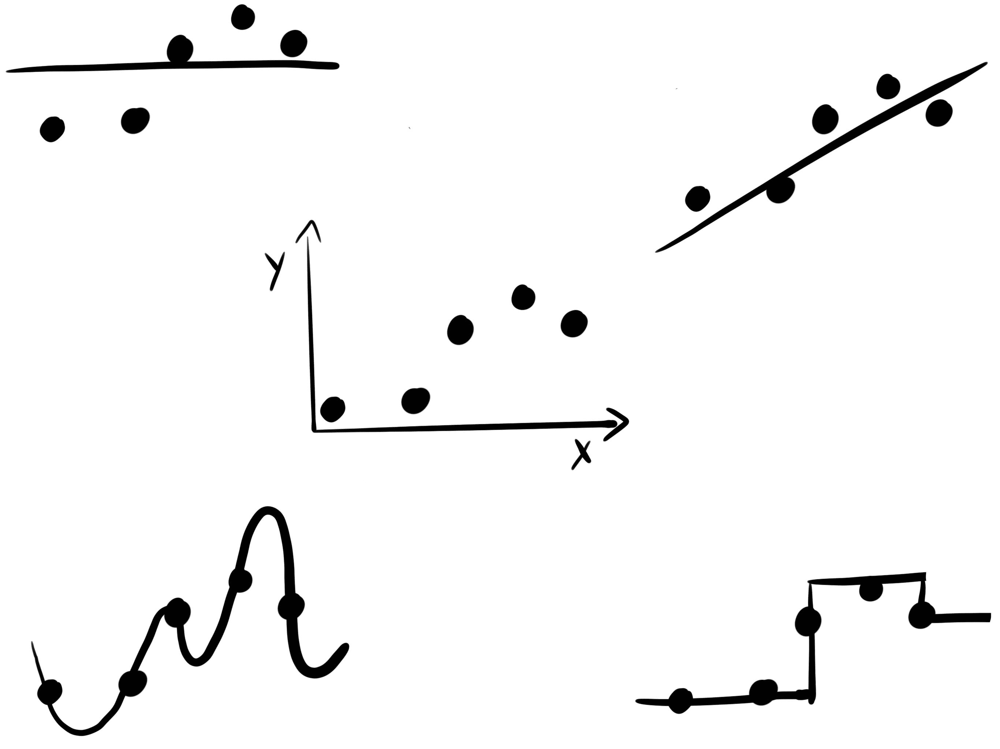

# 8 领域知识

> 原文：[`ml-science-book.com/domain.html`](https://ml-science-book.com/domain.html)

1.  将机器学习融入科学

1.  8 领域知识

机器学习算法从数据中学习模型，而不需要太多的输入。至少与其他建模方法相比是这样。但关于你已有的所有领域知识怎么办呢？让模型从数据中学习似乎与使用领域知识相反——你让一个算法识别相关模式并区分信号和噪声。

*领域知识* 领域知识指的是在某个领域中已经确立的事实。*你能使用领域知识来指导模型吗？这一章节展示了你可以的，从将问题转化为预测任务的标准步骤到更富有创造性的方法，例如设计定制的评估指标。章节重点介绍了将领域知识直接注入模型的方法。不太为人所知的是，你还可以从模型中提取领域知识：领域知识限制了模型并影响其性能，这为我们提供了关于领域知识对于这一预测任务价值的信息。这使得机器学习成为领域知识和预测性能之间的双向通道。

Krarah 和 Rattle 就龙卷风预测系统的问题进行了头脑风暴。Rattle 有隧道视野，只在她的一般化理论中寻找原因。Krarah 愤怒地喊道：“你甚至没有使用我们几个世纪以来积累的关于龙卷风的知识。难怪它不起作用！”这个来自现实世界的呼吁对 Rattle 来说非常迫切。但她如何将领域知识整合到机器学习中呢？

## 8.1 将问题转化为预测任务

红雀的观点是错误的。机器学习模型通常已经融入了大量的领域知识，即使一开始看起来可能并非如此。大多数领域知识来自于“翻译”科学问题为预测任务。从雷达数据预测龙卷风而不是从报告膝盖疼痛的人数中预测，这似乎是常识。但一旦你深入到设计预测任务的细节中，你通常需要更深入的领域知识。设计预测任务可能并不总是感觉像是在注入领域知识，尤其是当预测任务已经长期确立，如天气预报。但对于那些通常不设定为预测任务的科学问题，翻译过程允许有很大的创造性，这应该由领域知识来引导。

翻译的大部分工作在于创建特征和目标。无论你是从父母的收入预测智力还是预测巧克力消费 [[1]](references.html#ref-maurage2013does)，都会形成非常不同的模型。但如果你是这本书的典型读者，你已经知道这些事情。现在是时候深入了解那些有趣且经常被忽视的将领域知识融入学习过程的方法了。

## 8.2 约束模型

机器学习因其能够学习任何函数的灵活性而受到赞誉，但有时你可能想要相反，并约束模型。模型约束是直接将领域知识融入学习过程的一种方式。以下是一些可以施加在特征与预测之间关系上的约束示例：

+   **单调性:** 模型的预测必须随着所讨论的特征值的增加而单调增加或减少。例如：确保信用风险评分随着收入的增加而单调减少。

+   **线性:** 限制模型学习预测与特征（们）之间的线性关系。例如：预测租金，其中价格与房屋大小呈线性相关。

+   **稀疏性:** 限制用于预测的特征数量。例如：在基因组研究中，识别出负责特定疾病的小部分基因。

+   **平滑性:** 限制预测在输入变化时平滑变化。例如：预测温度作为海拔的函数，其中不期望有突然的变化。

+   **周期性:** 一种平滑性约束，确保特征的低值和高值预测“相遇”。例如：根据一天中的时间预测电力需求，考虑到一天的周期性，包括从 23:59 到 00:00 的平滑过渡。

+   **范围约束:** 限制预测的域。例如，溶液的 pH 值只能在 0 到 14 之间。

你如何将这些约束应用到你的模型中？你如何迫使支持向量机对某个特征进行线性建模，而对其他所有特征则不进行？你如何确保随机森林变得稀疏？有时你可以使用模型无关的方法，例如特征预处理：

+   要获得稀疏模型，使用特征选择步骤作为预处理，然后是你的常规机器学习流程。

+   要周期性地建模一个特征，将特征转换为具有正弦和余弦变换的两个特征 [[2]](references.html#ref-ianlondonEncodingCyclicalContinuous2016)。

然而，对于其他约束，有必要限制模型类别，使其能够处理约束。例如，如果你想对某些特征施加单调性约束，你应该只使用如下模型类别：

+   线性回归模型。

+   XGBoost，一个梯度提升算法的库，允许设置单调性约束。

+   具有单调性约束的神经网络 [[3]](references.html#ref-nguyenMonoNetInterpretableModels2019)。

您添加的约束越多，合格的模型类别池就越小。约束越具体，您就越偏离了常见的路径，您可能会发现自己正在使用来自不为人知的机器学习出版物中的未经测试的代码，而不是 scikit-learn 和其他经过良好建立的机器学习库。

如果您发现自己想要许多无法以模型无关的方式强制执行的模型约束（例如特征工程），您可能需要查看那些对约束友好的框架和模型家族，同时它们也是经过良好建立的：

+   **基于模型的提升** [[4]](references.html#ref-hofner2014model)**：一种基于梯度提升的方法，允许您为每个特征选择约束条件。

+   **深度神经网络**：您可以通过选择神经网络架构、损失函数以及网络训练方式来设计许多约束条件。

无论您是通过特征工程添加约束还是限制模型类别，都确保也拟合一个无约束模型。正如开头所述，领域知识不仅流向模型，模型性能也可能告诉你关于该领域知识预测性的某些信息。通过比较有约束和无约束模型的性能，您可以评估约束。添加约束时预测性能的下降可能表明背后的领域知识不如最初想象的那么稳健（除非您能提出相反的论据）。

## 8.3 设计您的性能指标

有一种诱惑是使用现成的指标来衡量模型性能，例如均方误差或 F1 指标。现成的指标可能很好，但您可能设计一个定制的指标会更好。性能指标是结合领域知识的优秀方式，但常常被忽视。

模型选择不当、缺乏超参数调整或特征不佳会导致预测性能低下。这意味着性能评估充当了一个警告系统。但如果你已经建立了一个不合适的警告系统，就没有“元警告系统”会提醒你。除了现实之外，因为最终你会意识到模型没有达到其预期目的。缺乏反馈使得选择或设计正确的评估指标变得重要。每个指标都会对某些预测误差的严重性做出判断。例如，均方误差 $ \frac{1}{n}\sum_{i=1}^{n}(y^{(i)} - \hat{f}(x^{(i)}))² $ 包含以下判断：

+   **对称性**：结果偏差为-1 与偏差为+1 一样有问题。

+   **等价性**：每个数据点的预测同等重要。

+   **非线性**：偏差为 2 比偏差为 1 糟糕四倍。

设计这些“判断”是利用领域知识的机会。您可能会对某些错误赋予更高的权重，对数据子集赋予更高的权重，或者预测分布的变化。

让我们用一个例子来说明这一点。Goschenhofer 等人 [[5]](references.html#ref-goschenhofer2020wearable) 开发了一种基于可穿戴设备的帕金森病严重程度监测器，该监测器可以从严重动作缓慢（-4）预测疾病严重程度 ($ y $) 到正常（0）再到严重过度动作（+4）。与医学医生合作，作者确定了性能指标的三项要求：非线性、非对称性和缺乏平移不变性。该指标应更严重地惩罚较大的误差。特别是，符号改变的误差应该更有代价。如果实际结果是 -1，预测为 +1 比预测为 -3 更糟糕，因为方向错误对患者的危害比高估更大。此外，对于症状严重的患者的诊断错误应该比症状轻微的患者的错误有更大的权重。这就是新的性能指标的样子：

$$\mathbb{P}(Y,X,\hat{f}) = \frac{1}{n}\sum_{i=1}^n\left[\frac{y^{(i)}}{4}\alpha + sign\left(y^{(i)} - \hat{f}(x^{(i)})\right)\right] \left(\hat{f}(x^{(i)}) - y^{(i)}\right)²$$

在其核心，它是模型预测与真实标签之间的平方损失，但乘以一个控制高估和低估的因子，由参数 $ \alpha \in [-1,1] $ 和符号错误惩罚控制。这控制了对称性（负 $ \alpha $ 惩罚低估，正 $ \alpha $ 惩罚高估，0 表示对称损失）。根据医学专家的反馈，作者选择了 $ \alpha=0.25 $。通过将 $ \alpha $ 与真实标签相乘，真实标签控制了非对称惩罚的方向。例如，将真实标签 y=-1 分类为 -3 “代价”为 4，但如果你将其分类为 +1，这也相距 2 个单位，代价为 +5。这就是指标的自定义“符号错误”惩罚。图 8.1 可视化了损失函数。

图 8.1：自定义损失函数

## 8.4 对齐损失和评估指标

理想情况下，你选择的指标可以用作损失函数，这是在训练过程中直接优化的函数。然而，这并不总是可能的：

+   性能指标可能不可微分，但例如，训练神经网络需要一个具有梯度的损失函数。

+   一些模型类有“内置”的损失函数，例如默认优化平方损失的线性回归模型，或者优化 Gini 指标的决策树。

+   性能指标可能难以优化，因为它可能不是凸的或者难以计算。

+   性能指标可能只适用于您数据的聚合（例如 F1 分数），但模型需要一个实例级可计算的损失函数。

这里有一些关于与损失函数和性能指标一起工作的实用技巧：

+   如果可能的话，设计性能指标使其是凸的并且具有梯度。这样，你可以直接将其用作损失函数，至少对于一些模型类，如神经网络。

+   如果你不能开发出完美的损失函数，至少使损失函数与性能指标保持一致：它们至少有相同的最佳值吗？它们是否模拟了相同的（不）相似性？它们是否都具有相同的缩放？考虑线性与平方的关系。

+   确保超参数调整和模型选择基于性能指标，而不是损失函数。

+   如果你有不同的损失函数选项，你可以将损失视为一个超参数。

+   即使某些模型类优化的损失函数看起来不匹配，也要训练模型，并让模型选择过程来决定。在损失与性能指标之间有巨大差异的情况下，它应该在性能评估中体现出来。

## 8.5 使其物理化

损失函数也是建模物理的一种手段。许多物理过程都受偏微分方程（PDEs）的指导。这些方程在预测天气、模拟气候、理解飞机如何飞行和理解流体动力学方面都很有用。然而，基于 PDE 的系统模拟可能计算成本高且速度慢。使用机器学习不是更好吗？

初看起来，这些方程似乎与机器学习的含义相反：它们代表显式的物理定律，而神经网络通常被视为矩阵乘法的混乱。然而，在物理信息神经网络（PINNs） [[6]](references.html#ref-raissi2017physics）中，你可以使神经网络学习物理定律/PDEs，使神经网络成为物理过程的模拟器。这利用了神经网络作为通用函数逼近器的特性 [[7]](references.html#ref-hornik1991approximation)。技巧在于使用一个最小化两部分 MSE 的损失函数：

$$MSE = MSE_u + MSE_{\hat{f}},$$

其中 $ MSE_u $ 对应于系统的初始条件和边界条件，而 $ MSE_{\hat{f}} $ 是基于配置点的模型输出与原始微分方程输出的平方误差，这些配置点是强加偏微分方程的域中的点。物理信息神经网络不仅可以通过模拟过程，还可以从系统的噪声测量中发现偏微分方程的参数化 [[8]](references.html#ref-raissi2017physicsa)。

或者，你可以在训练期间不通过损失函数编码偏微分方程，而是直接将物理约束编码到神经网络中，从而产生一些人称之为物理编码神经网络（PeNNs）。

## 8.6 考虑各种评估指标

监督机器学习有一个缺点：评估通常只基于一个维度，即性能指标。但生活永远没有那么简单！你可能关心多个指标。幸运的是，可以训练优化不同指标的模型，但这并不像只有一个指标那么简单。

想象一下，你想要预测未来一小时的龙卷风。我们可以用准确率或 F1 分数作为一个指标，但生活不仅仅是总是正确。你可能还想考虑模型的复杂性，比如它有多稀疏，甚至预测平均所需时间（因为没有人喜欢等待，尤其是当龙卷风即将来临的时候）。

有两种方法可以实现这一点：

+   将这两个指标合并为一个。这只有在你可以量化两个指标之间所需的权衡时才有效。

+   使用多目标优化进行超参数调整和模型选择。

这里有一些你可以优化的指标，部分基于 [[9]](references.html#ref-pfisterer2019multi):

+   **预测性能**：可以使用 F1 分数、AUC 或平均绝对误差等指标来量化。

+   **可解释性** [[10]](references.html#ref-molnar2020quantifying)：如稀疏性、交互强度和主要效应的复杂性等指标。

+   **公平性**：通过差异影响、均衡机会或校准来衡量。

+   **鲁棒性**：通过扰动下的性能、对抗样本的存在以及分布偏移来衡量。

+   **与基于物理模型的契合度** [[11]](references.html#ref-letzgus2023explainable)

+   **推理时间**

+   **内存需求**

假设你想要使用基因表达数据来预测疾病结果。从领域知识来看，你知道只有少数基因可能相关。但如果只优化预测性能，模型可能会选择比必要的更多基因，只要它不会损害性能底线。通过在这个例子中也优化稀疏性，你可以找到一个既满足性能又满足稀疏性的模型¹。我们已经在前面章节讨论了约束，但多目标优化提供了一种稍微不同的约束方法。优化多个目标会产生多个“最优”模型。每个模型都是针对不同目标之间的权衡而最优的，也称为“帕累托有效”模型。拥有多个模型既可以是一个缺陷，也可以是一个特性。它是一个缺陷，因为你通常只想有一个模型。它是一个特性，因为帕累托有效模型的集合允许你根据领域知识选择有意义的指标之间的权衡。而且这比事先决定如何平衡两个性能指标要容易得多。

再次，我们可以观察到这种双向的道路：无论你是将目标归纳为一个函数，还是接受不同权衡的模型多样性——多目标优化将使你能够探索不同的权衡，从而评估领域知识。

## 8.7 使用正确的归纳偏差并从中学习

*归纳偏差* *机器学习算法对模型施加的先验假设，以帮助推广到未见数据。* *想象一个机器学习算法，它产生的“模型”只记住训练数据。为了“预测”，这个模型必须检查新数据点是否在训练数据中。如果是，模型可以返回训练数据点的结果。如果不是，它就不能做出预测。但如果一个训练数据点几乎与新数据点相同呢？你能直接使用相同的预测吗？那么模型就可以返回最近数据点的预测。或者，为了使其更稳健，可以返回训练数据中多个接近数据点的平均预测。这就是 K-最近邻背后的想法。*

但你也可以有一个对如何推广到新数据有不同的假设的模型，见图 8.2。如果你得到一个新的数据点，其中一个特征与训练数据点中的一个特征略有不同，你可以对这个新数据点之间的邻近数据点进行线性插值。如果你对所有特征和训练数据点都这样做，那么你最终会得到一个线性回归模型。

图 8.2：相同的数据，不同的归纳偏差。

或者，你也可以采用另一种策略：将你的数据划分为由特征中的二进制决策定义的分区。这些分区被选择，使得训练数据点具有相似的结果。这带来了一种美丽的推广策略：对于每个新的数据点，你只需根据特征值检查它属于哪个数据分区，然后取所有训练数据点的平均结果作为预测。这就是决策树使用的策略。

所有这些例子都表明，每个模型类别，如树、k-最近邻和线性模型，都带有不同的归纳偏差。归纳偏差是关于如何将输入和输出之间的关系推广到未见数据的一条指令。

尝试具有不同归纳偏差的模型。如果某个归纳偏差似乎突出，研究它如何与研究的现象相关。你能了解你手头的问题吗？

要更好地理解归纳偏差，可以使用可解释机器学习工具（见第九章）。可解释机器学习还可以用于从模型中提取见解。领域知识通常以因果知识的形式出现（见第十章）。

1.  多目标优化并非是唯一将稀疏性引入模型的方法。通常，会采用正则化方法，这意味着只有具有固有稀疏性的模型，例如 LASSO（一个稀疏线性模型），才会被考虑。↩︎**
