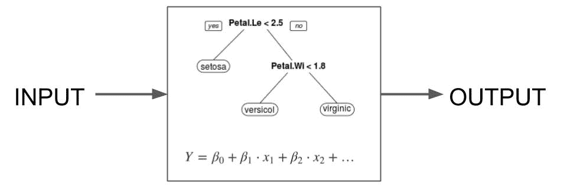
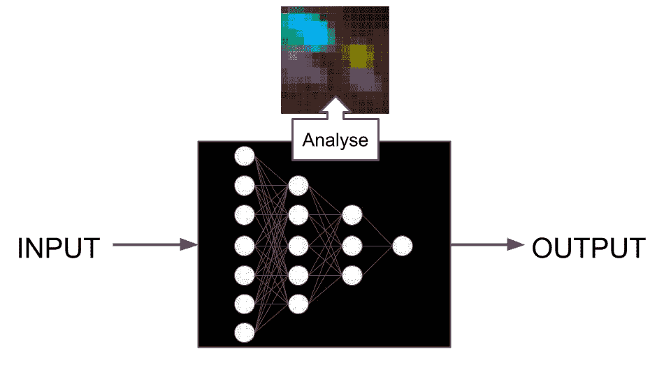
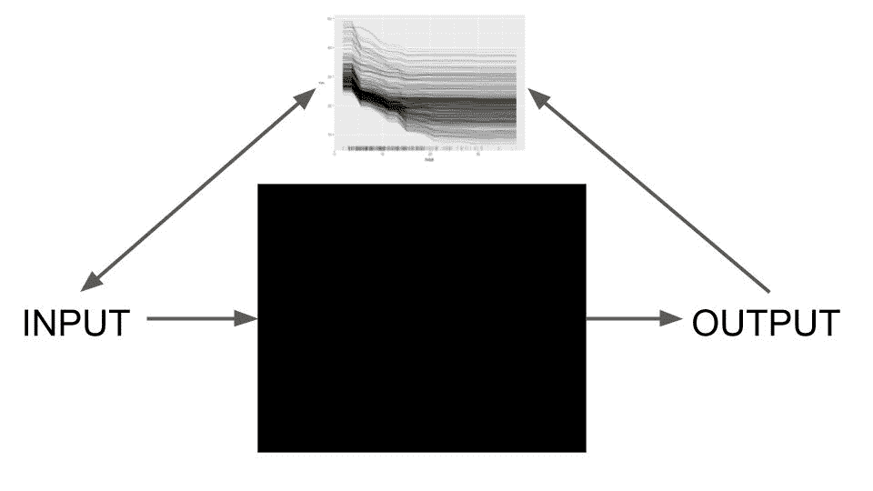
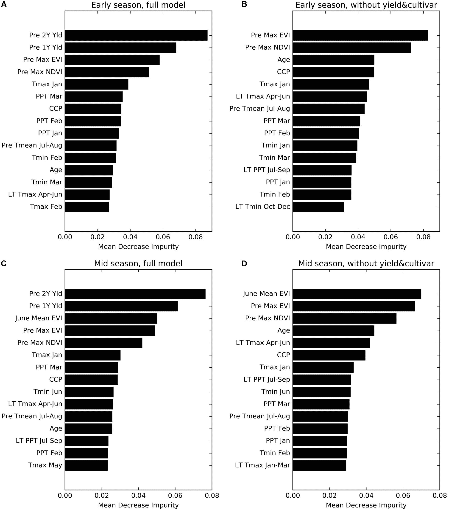
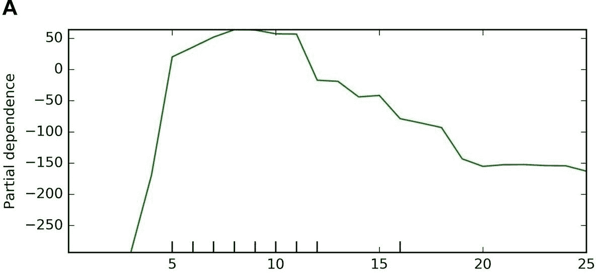

# 9 可解释性

> 原文：[`ml-science-book.com/interpretability.html`](https://ml-science-book.com/interpretability.html)

1.  将机器学习融入科学

1.  9 可解释性

你对使用机器学习进行科学研究的最大担忧是什么？一项调查 [[1]](references.html#ref-vannoordenAIScienceWhat2023) 向 1600 名科学家提出了这个问题。“导致对模式识别的过度依赖而缺乏理解”是最大的担忧，这是有充分理由的：监督机器学习首先关注预测，而不是理解（参见第二章）。

为了解决这个问题，可解释机器学习被发明了。可解释机器学习（或可解释人工智能¹）提供了一系列解决方案来解决理解不足的问题。在最广泛的意义上，可解释性是关于使模型对人类可理解 [[4]](references.html#ref-miller2019explanation)。为此任务有许多工具，从使用决策规则到应用博弈论（Shapley 值）和分析神经网络中的神经元。但在我们谈论解决方案之前，让我们先谈谈问题。可解释性本身不是一个目标。可解释性是一个帮助你实现实际目标的工具。仅关注预测的方法无法满足的目标。

领域知识的整合消除了许多机器学习的童年疾病。乌鸦开始构建更大和更大的模型来研究越来越复杂的现象。Kراه向 Rattle 提出了一个问题：“模型必须已经学到了许多有趣的关系，有没有什么方法可以提取这些知识？”Rattle 点头并向 Kراه眨了眨眼。最近，Raven Krähstof 写了一本关于可解释机器学习的书。

## 9.1 解释的目标

想象一下你正在建模杏仁园的产量。预测模型基于降水量、肥料使用、先前产量等因素，预测特定年份的杏仁产量。你对预测性能感到满意，但总有这种感觉，即不完整性无法通过任何基准来填补。当你发现仅凭性能无法解决某个任务时，你可能需要可解释性 [[5]](references.html#ref-doshi-velezRigorousScienceInterpretable2017)。例如，你可能对肥料对杏仁产量的影响感兴趣。

我们大致区分了三个可解释性目标（受[[6]](references.html#ref-adadiPeekingBlackBoxSurvey2018)的启发）：

+   **发现**：模型可能已经对研究现象有了有趣的了解。在科学中，我们可以进一步区分确认性（又称推理）和探索性类型的发现。在杏仁产量的情况下，目标可能是研究肥料的影响。

+   **改进**：模型的可解释性可以帮助调试和改进模型。这可能导致更好的性能和更高的鲁棒性（参见第十一章）。研究特征重要性时，你可能会发现先前的产量变量可疑地重要，并检测到引入数据泄露的编码错误。

+   **证明**：解释有助于证明预测，或者模型本身。证明的范围从为最终用户证明预测涉及伦理和公平，到更正式的模型审计，但也可以通过例如展示与物理学的连贯性来建立信任。例如，你试图说服一个机构采用你的模型，但首先，你必须说服他们你的模型与常见的农业知识相一致。

目标在机器学习项目的生命周期中相互作用。例如，为了发现知识，你的模型应该表现出良好的性能。然而，构建一个表现良好的模型是一个迭代过程，其中可解释性可以通过监控特征的重要性来极大地帮助。

但如何实现复杂机器学习模型的可解释性呢？为了简化，可解释机器学习领域知道两条路径：设计可解释性和事后可解释性。设计可解释性是关于只使用可解释的，即简单的模型。事后解释是在模型训练后尝试解释可能复杂的模型。

## 9.2 设计可解释性

设计上的可解释性在许多研究领域是现状。例如，定量医学研究通常依赖于经典统计模型，逻辑回归是常用的模型。这些统计模型被认为是内在可解释的，因为它们通常以某种方式通过线性加权求和将特征与结果联系起来。统计模型在社会科学和许多其他领域也很流行。使用线性回归模型预测杏仁产量并不罕见 [[7]](references.html#ref-bassoSeasonalCropYield2019)。然而，具有不同动机的模型也可以通过设计实现可解释性，例如物理学、气象学和生态学等领域中的微分方程和基于物理的模拟。

如果你重视可解释性，你可能会决定只使用产生可解释模型的机器学习算法。你仍然会以典型的性能优先的方式处理建模任务，但将我们的解决方案限制为只有你认为可解释的模型。这仍然关于优化，但你强烈限制了假设空间，即被认为是可学习的模型池。

一些模型（据称）是设计上可解释的。

可解释的机器学习模型可能包括：

+   任何具有线性性的东西。本质上，整个频率派模型体系。线性回归、逻辑回归、广义线性模型（GLMs）和广义加性模型（GAMs）等框架……

+   决策树。以典型但未必是二叉树的形式呈现预测，这些树通过特征进行分割。

+   决策规则列表

+   线性模型和决策规则的组合，例如 RuleFit [[8]](references.html#ref-friedman2008predictive) 和基于模型的树 [[9]](references.html#ref-zeileis2008modelbased)

+   基于案例的推理

研究人员继续发明新的机器学习方法，这些方法产生的模型在设计上是可解释的 [[10]](references.html#ref-rudin2022interpretable)，但关于什么构成一个可解释模型也存在争议 [[11]](references.html#ref-liptonMythosModelInterpretability2017)。可以说，即使你有许多特征，线性回归模型也可能不可解释。其他人认为，一个特定模型是否可解释取决于受众和上下文。但无论你如何定义解释：通过限制模型的函数形式，它变得在功能上更容易控制。即使你可以争论线性回归不容易解释，但仍然是真的，该模型不包含交互（至少在模型的输入空间上）。而且，设计上可解释的模型，或者至少结构上更简单，有助于实现发现、改进和证明等目标。

+   **发现**：逻辑回归模型可以揭示哪些特征会增加例如糖尿病的概率。

+   **改进**：回归系数方向错误可能表明某个特征被错误编码。

+   **证明**：领域专家可以手动检查决策规则。

设计上的可解释性有代价：限制假设可能会排除许多好的模型，最终可能导致性能更差的模型。机器学习竞赛的赢家通常是用于表格数据的复杂梯度提升树（例如 LightGBM、catboost、xgboost）和用于图像和文本数据的神经网络（CNN、transformer）。真正从中获利的是那些设计上可解释的模型。

除了性能较低之外，在设计上追求可解释性在发现（推理）方面也存在概念问题。为了将模型的解释扩展到现实世界，你必须在你模型和世界之间建立联系。例如，在经典统计建模中，你会对数据生成过程做出许多假设。目标变量的分布是什么？缺失值的处理过程是什么？你需要解释哪些相关结构？其他如基于物理的模拟等方法也建立了模型与世界的联系：假设模拟的某些部分代表了世界的某些部分。对于设计上的可解释性，没有这样的联系。例如，没有理由说杏仁产量是由类似决策树的进程产生的。

另一个问题在于性能：当你发现某些模型的预测性能优于你的可解释模型时，你会怎么做？一个能够很好地代表世界的模型也应该能够很好地预测它。你将不得不论证为什么你的可解释模型能更好地代表世界，即使它的预测性能并不那么好。你可能只是为了方便而过度简化了世界。这削弱了将模型与现实联系起来的任何主张。一个更糟糕的概念问题是“罗生门效应”[[12]](references.html#ref-breiman2001random)。

*“罗生门”名称的由来* “罗生门”是一部 1950 年的日本电影。它讲述了四位不同视角下一名被谋杀的武士的故事：一个强盗、武士的妻子、通过灵媒与武士的灵魂沟通的精神病患者，以及一个观察事件的普通人。虽然每个视角本身都是连贯的，但它们与其他三个故事不相容。这种所谓的“罗生门效应”已经成为法律、哲学，以及正如你所看到的，统计学和机器学习中的一个确立概念。*“罗生门效应”描述了多个模型可能具有大致相同的性能，但结构上却不同。一个令人挠头的解释问题：如果优化导致了一组具有相同性能但内部结构不同的模型，那么你不能仅仅基于性能的论点来选择其中一个。一个例子：决策树本质上是可解释的（至少如果树较短的话），但也是本质不稳定的——数据中的微小变化可能导致非常不同的树，即使性能可能不会受到太大影响。如果你使用决策树进行发现，那么“罗生门效应”会使你难以论证这就是你应该解释的确切树。

结论：固有可解释的模型比其更复杂的对应物更容易证明其合理性。然而，使用它们进行洞察（推理）存在概念问题。幸运的是，还有一类后验解释方法，我们有一个理论，说明它们的解释如何扩展到建模现象。**  **## 9.3 模型特定后验可解释性

你不仅可以反对模型复杂性，还可以接受它，并尝试从复杂的模型中提取洞察。这些可解释性方法被称为后验，这翻译为“事件之后”，事件是模型训练。后验方法可以是模型特定的或模型无关的：模型特定解释方法与模型的架构一起工作，而模型无关方法将模型视为黑盒，并且只处理输入-输出数据对。模型特定方法与特定模型类型相关联，需要检查模型，例如：

+   吉尼重要性利用决策树中的分割标准来为特征分配重要性值

+   变换器，一种流行的神经网络架构，有一个注意力层，它决定预测时应该关注（处理过的）输入的哪个部分。注意力可视化是一种针对变换器的模型特定后验解释方法。

+   激活最大化方法为单个神经元和层赋予语义意义：每个神经元最大激活的是哪个概念？

+   基于梯度的解释方法，如 Grad-CAM 或层相关传播（LRP），利用神经网络梯度来突出影响预测强烈的相关输入

模型特定方法在可解释性空间中占据一个奇特的位置。底层模型通常比按设计可解释的模型更复杂，而解释只能针对模型的部分子集。对于大多数解释目标，模型特定的后验解释不如按设计可解释。

模型特定后验解释分析模型的部分。

当涉及到推理时，模型特定方法与按设计可解释性共享相同的概念问题：如果你想用模型代替现实世界进行解释，你需要一个理论来连接你的模型与世界，并允许解释的转移。模型特定方法，正如其名，依赖于他们正在构建的特定模型，而模型与现实的这种联系将需要做出关于为什么这个模型的结构代表世界的假设，这些假设可能是无效的 [[13]](references.html#ref-freiesleben2023artificial)。然而，它们仍然可能在指出关联以形成因果假设时有用（参见第十章[causality.html]）。

设计可解释性和特定模型事后解释之间的界限变得模糊。你可能认为线性回归模型天生就是可解释的，因为系数可以直接解释为特征效应。但如果你对目标进行对数变换呢？那么你也必须对系数进行变换以进行解释。你可以争辩说这仍然是设计可解释的，但你可以添加许多修改，使模型越来越远离可解释性天堂。而对于解释，你越来越依赖于事后计算，如变换系数、可视化样条等。

既然我们已经谈完了针对特定模型的解释方法，让我们谈谈我们最喜欢的方法：模型无关的解释技术。是的，我们并不隐瞒这一点，但我们确实是模型无关解释的粉丝。

## 9.4 模型无关事后解释方法

你被要求编写一本关于世界上最奇怪的自动售货机的手册。没有人知道它是如何工作的。你试图打开它，但出于担心损坏机器而放弃了检查。但你有了一个编写手册的想法。你开始按一些按钮和杠杆，直到最后，机器掉落了一个物品：一包带有“凤尾鱼”风味的薯片。幸运的是，它们已经过了保质期。你扔掉它们时没有感到后悔。另一个好消息是你迈出了编写手册的第一步。秘诀：只是有系统地尝试，找出会发生什么。

虚拟杏仁产量模型就像自动售货机。通过干预输入特征，输出（即预测）会发生变化，你可以收集关于模型行为的更多信息。方法就是采样数据，干预数据，预测，并汇总结果 [[14]](references.html#ref-scholbeck2020sampling)。这就是为什么模型无关的解释方法是事后分析——它们不需要你访问模型内部或改变模型训练过程。模型无关的解释方法具有许多优点：

+   你可以使用相同的模型无关解释方法对不同模型进行比较结果。

+   你可以在解释中自由地包含预处理和后处理步骤。例如，当模型使用主成分作为输入（降维）时，你仍然可以根据原始特征生成解释。

+   你也可以将模型无关方法应用于本质上可解释的模型，例如在决策树中使用特征重要性。

模型无关的解释忽略了模型的内部运作，研究输入-输出对。

其中一个最简单的模型无关解释方法是排列特征重要性：想象一下，杏仁产量研究人员想知道哪些特征对预测最重要。首先，他们测量模型的性能。然后他们取一个特征，比如说使用的肥料量，并将其打乱，这破坏了肥料特征与实际产量结果之间的关系。如果模型依赖于肥料特征，那么对于这个被操纵的数据集的预测将会改变。对于这些预测，研究人员再次测量性能。通常，打乱会使性能变差。性能下降得越多，特征就越重要。图 9.1 展示了来自杏仁产量论文 [[15]](references.html#ref-zhang2019california) 的排列特征重要性的一个示例。

图 9.1：杏仁产量的特征重要性。图由 Zhang, Jin, Chen 和 Brown (2019) [[15]](references.html#ref-zhang2019california) 提供，CC-BY (https://creativecommons.org/licenses/by/4.0)。

PFI 是众多模型无关解释方法之一。本章不会介绍所有这些方法，因为那已经是一本名为 [可解释机器学习](https://christophm.github.io/interpretable-ml-book/) [[16]](references.html#ref-molnar2022) 的书，你可以免费阅读！但仍然，我们将提供一个关于模型无关方法可解释性景观的简要概述。最大的区别是本地方法与全局方法：

+   本地方法解释个别预测

+   全局方法解释平均模型行为。

### 9.4.1 本地：解释个别预测

杏仁研究人员可能想要解释特定地块和年份的产量预测。为什么模型做出了这个特定的预测？解释个别预测是可解释性领域的一个圣杯。有大量的方法可用。预测的解释，以某种方式或另一种方式，将预测归因于个别特征。

这里有一些本地模型无关解释方法的例子：

+   本地代理模型（LIME） [[17]](references.html#ref-ribeiroWhyShouldTrust2016) 通过在局部使用基于邻域的可解释模型来近似复杂模型，从而解释预测。

+   范围规则（锚点） [[18]](references.html#ref-ribeiroAnchorsHighPrecisionModelAgnostic2018) 描述哪些特征值“锚定”预测，意味着在这个范围内，预测不能超过选择的阈值。

+   反事实解释 [[19]](references.html#ref-wachterCounterfactualExplanationsOpening2017) 通过检查哪些特征需要改变以实现期望的反事实预测来解释预测。

+   Shapley 值 [[20]](references.html#ref-strumbeljExplainingPredictionModels2014) 和 SHAP [[21]](references.html#ref-lundbergUnifiedApproachInterpreting2017) 是基于博弈论将预测分配给单个特征的归因方法。

+   单个条件期望曲线 [[22]](references.html#ref-goldsteinPeekingBlackBox2015) 描述了改变单个特征如何改变预测。

### 9.4.2 全局：解释平均模型行为

当地解释是关于数据点的，而全局解释是关于数据集的：它们描述了模型在给定数据集上的平均行为，以及由此扩展的数据集代表的分布。

我们可以进一步区分全局可解释性：

+   **特征重要性方法** [[23]](references.html#ref-fisher2019all) 通过特征对预测的影响程度来排名。例如：

    +   重新排列特征重要性按特征重新排列的程度来排名，即特征重新排列破坏信息量的程度。

    +   SAGE [[24]](references.html#ref-covert2020understanding) 根据模型重新训练时的预测性能对特征进行排名。

    +   SHAP 重要性 [[21]](references.html#ref-lundbergUnifiedApproachInterpreting2017) 根据平均绝对 SHAP 值对特征进行排名。

+   **特征效应方法**描述特征如何影响预测。我们可以进一步将特征效应方法分为主要效应和交互效应：主要特征效应描述了孤立特征如何改变预测，如图图 9.2 所示。交互效应描述了特征如何相互作用以影响预测。例如：

    +   部分依赖性图 [[25]](references.html#ref-friedman2001greedy)

    +   累积局部效应图 [[26]](references.html#ref-apley2020visualizingeffects)

    +   SHAP 依赖性图 [[21]](references.html#ref-lundbergUnifiedApproachInterpreting2017)

图 9.2：使用 PDPs 对“果园年龄”对杏仁产量的特征影响。图由张、金、陈和布朗（2019）绘制 [[15]](references.html#ref-zhang2019california)，CC-BY (https://creativecommons.org/licenses/by/4.0)。

我们认为全局解释方法是核心的，尤其是在发现方面。

### 9.4.3 科学发现的解释

模型无关的解释对科学洞察力有多有用？让我们从两个观察开始：

+   解释首先和最重要的是关于模型。

+   如果你想将模型解释扩展到现实世界，你需要一个理论联系。

假设你用线性回归模型来模拟杏仁产量。线性方程的系数告诉你特征如何线性影响产量。在没有进一步假设的情况下，这种解释只涉及模型。在经典统计建模中，统计学家可能会假设给定特征的产量条件分布是高斯分布，误差是同方差性的，数据是代表性的，等等，然后才谨慎地对现实世界做出陈述。这样的结果反过来可能对现实世界产生实际影响，例如决定肥料的使用。

在机器学习中，你不会对数据生成过程做出这些假设，而是让预测性能指导建模决策。但我们可以建立模型解释与世界的理论联系吗？也许是以不同的方式？我们已经讨论过，当涉及到特定模型的解释时，建立这种联系并不容易：

+   你必须证明特定的模型结构是否代表了你所研究的现象。对于大多数模型类别来说，这是不合理的：你有什么理由相信世界中的现象是以决策规则列表或转换器模型的结构组织的？

+   柏拉图效应给你带来了一个无法解决的冲突：如果不同的模型具有相似的预测性能，你怎么能证明一个模型的结构代表了世界，而其他模型则没有？

但是，有一种方法可以通过模型无关的解释将模型与现实联系起来。使用模型无关的解释，你不需要将模型组件与现实的变量相联系。相反，你解释模型的行为，并将这些解释与现象联系起来 [[27]](references.html#ref-freiesleben2022scientific)。当然，这也不是免费的。

+   你必须假设存在一个真实的函数 $ f $，它描述了底层特征与预测目标之间的关系（参见第 12.5.2 节中关于这个真实函数的理论背景）。

+   模型需要是函数 $ f $ 的良好表示，或者至少你应该能够量化不确定性。

让我们使其更具体：杏仁研究人员已经可视化了一个部分依赖图，显示了肥料使用如何影响预测产量。现在他们希望将这种效应曲线的解释扩展到现实世界。首先，他们假设存在某种真实的 $ f $，他们的模型 $ \hat{f} $ 尝试逼近它，这是统计学习理论中的一个标准假设 [[28]](references.html#ref-vapnik1999overview)。

部分依赖图定义为：

$$PDP(x) = \mathbb{E}[\hat{f}(x_j, X_{-j})]$$

并用以下方式估计：

$$\frac{1}{n} \sum_{i=1}^n \hat{f}(x_j, x_{-j}^{(i)})$$

指数表示感兴趣的特征，而 $ -j $ 表示所有其他特征。由于 $ f $ 是未知的，因此你不能估计真实的 PDP，但你可以通过用真实函数 $ f $ 替换模型 $ \hat{f} $ 来定义一个理论上的部分依赖图：$ PDP_{true}(x) = \mathbb{E}[f(x_j, X_{-j})] $。

这至少在理论和模拟中允许你比较真实的 PDP 与估计的 PDP，如图图 9.3 所示。

图 9.3：假设：存在数据生成过程的“真实”PDP。

这就是我们[[29]](references.html#ref-molnar2023relating)所做的工作，并在[[27]](references.html#ref-freiesleben2022scientific)中进行了更哲学性的讨论。² 我们在这里将简要概述我们的想法。真实 PDP 与模型 PDP 之间的误差由 3 部分组成：

+   *模型偏差*描述了你的学习算法的偏差。

+   *模型方差*描述了算法在来自同一分布的数据集上的方差。

+   *估计误差*描述了从经验上估计 PDP 时产生的方差。

理想情况下，你可以减少或消除每个不确定性来源，或者至少量化它们。模型偏差是最困难的部分：你很难量化它，因为这需要你了解真实的函数 $ f $。减少偏差的一种方法是将模型训练和调整得很好，然后假设模型的偏差可以忽略不计，这当然是一个强烈的假设。特别是考虑到许多机器学习算法依赖于正则化，这可能会引入偏差以减少方差。模型偏差的一个例子是：如果你使用线性模型来模拟非线性数据，那么 PDP 将会偏差，因为它只能模拟线性关系。

模型方差是不确定性来源，源于模型本身是一个随机变量，因为模型是训练数据的函数，而训练数据仅仅是分布的一个样本。如果你从同一分布中采样不同的数据集，那么训练的模型可能会有所不同。如果你用不同的数据（但来自同一分布）多次重新训练模型，你就可以得到模型方差的一个概念。这使得模型方差至少是可量化的。

第三种不确定性来源是估计误差：PDP（部分依赖图），就像其他解释方法一样，是用数据估计的，因此它受到方差的影响。估计误差是最容易量化的，因为给定位置 $ x $ 的 PDP 是一个平均值，你知道其方差。

在我们的论文中，我们展示了置换特征重要性在比较模型 PFI 与“真实”PFI 时也有这 3 种不确定性来源。我们将这种方法概念性地推广到任意解释方法，如[[27]](references.html#ref-freiesleben2022scientific)。虽然我们尚未在实践中对所有解释方法进行测试，但我们的直觉告诉我们，它应该与 PDP 和 PFI 相似。这一研究方向相当新颖，我们得看看它将引向何方。为了证明使用机器学习+事后解释作为对现实世界的推理，这本身可能过于薄弱。但另一方面，许多研究人员已经使用机器学习进行洞察力研究，所以有一些理论上的依据是非常好的。

对于解释性来说，有一个挑战会让我们做噩梦，特别是对于洞察力的目标：相关特征。

## 9.5 相关性可能破坏可解释性

当特征相互关联时，模型无关的解释可能会遇到问题。为了理解为什么，让我们回顾一下大多数模型无关方法的工作方式：采样数据，干预数据，获取模型预测，并汇总结果。在干预步骤中，会创建新的数据点，通常将特征视为独立的。

例如，为了计算“绝对湿度”特征对于杏仁产量模型的置换重要性，该特征独立于其他特征（如温度）进行打乱（置换）。这可能导致不切实际的高湿度但低温度的数据点。这些不切实际的新数据点被输入到模型中，并使用预测来解释模型。这可能会导致误导性的解释：

+   该模型被数据点探测，这些数据点来自模型表现不佳的特征空间区域（因为它从未用该区域的数据进行过训练）或甚至做出极端预测。

+   不切实际的数据点不应用于解释，因为它们不代表所研究现实。

+   在现实世界中，特征不会独立改变。

鉴于这些问题，为什么许多人仍然使用所谓的“边际”方法进行解释，将这些特征视为独立的？两个原因：1) 与以保留相关性的方式打乱特征相比，例如独立地打乱特征在技术上要容易得多。2) 在理想的世界里，你希望有一个解耦的解释，这样你可以单独研究每个特征。

在实践中，你可以通过以下方法避免或至少减少相关特征的问题：

+   研究特征之间的相关性。如果它们很低，你可以继续使用解释方法的常规边际版本。

+   解释特征组而不是单个特征。对于大多数解释方法，你也可以计算整个特征组的综合重要性或效应。例如，你可以通过将它们一起打乱来计算湿度和降水的综合 PFI。

+   使用解释方法的条件版本。例如，条件特征重要性 [[30]](references.html#ref-watson2021testing)，条件 SHAP [[31]](references.html#ref-aas2021explaining)，M-Plot 和 ALE [[26]](references.html#ref-apley2020visualizingeffects)以及按子组划分的 PDP 和 PFI [[32]](references.html#ref-molnar2023modelagnostic)，留一协变量法（LOCO） [[33]](references.html#ref-lei2018distributionfree)。

第三种选择，条件解释，不仅仅是技术上的修复。

假设你想要打乱湿度特征以获取其与杏仁产量的重要性。它与温度相关，因此你必须确保新的数据点尊重相关性结构。而不是独立地打乱湿度，你根据温度的值来采样它。第一个数据点具有高绝对湿度，你根据这个高湿度抽取温度特征。这导致“排列”的湿度特征尊重与降水的相关性，同时打破与产量目标的联系。

条件干预会改变解释。例如，对于排列特征重要性，解释变为：鉴于模型可以访问温度，知道湿度是否很重要？特征之间的依赖结构越复杂，(条件)解释就越复杂。要使用条件解释，你必须理解与边缘版本相比解释是如何变化的。但另一方面，我们认为条件解释是可行的途径，尤其是对于洞察力的目标。这不仅因为它解决了外推问题，而且因为对于你感兴趣的洞察力，你关心的是特征与目标之间的关系，而不考虑模型。

## 9.6 可解释性只是其中一部分

单独的模型可解释性可能无法解决你的问题。相反，它与本书中涵盖的其他主题紧密相连。

+   科学洞察力的可解释性与泛化（见第七章[generalization.html]）紧密相连。如果你不清楚数据是如何收集的以及数据集代表的是哪个群体，那么从模型解释中得出的结论将不清楚如何处理。

+   当你向你的老板、同事或同行证明模型时，是通过展示模型与领域知识一致（见第八章[domain.html]）。

+   理解因果关系（见第十章[causality.html]）对于解释至关重要。例如，如果模型中缺少混杂因素，特征效应可能相当误导。

* * *

1.  解释性和可解释性究竟是什么意思？即使是这个领域的学者也无法就定义达成一致 [[2]](references.html#ref-flora2022comparing)。从应用导向的角度来看，将这些术语互换使用最为有用。在这些关键词下，你可以找到允许你从模型中提取关于其预测方式的信息的方法。我们采用了 [[3]](references.html#ref-roscherExplainableMachineLearning2020) 中的定义：解释性是指将模型中的抽象概念映射到可理解的形式。可解释性是一个更强的术语，它要求具有解释性以及额外的上下文。↩︎

1.  我们关于扩展解释以获取洞察力的工作激励了我们撰写你现在阅读的这本书。↩︎*
