# 10  因果关系

> 原文：[`ml-science-book.com/causality.html`](https://ml-science-book.com/causality.html)

1.  将机器学习融入科学

1.  因果关系

机器学习利用所有可用信息进行预测——有无数种预测事物的方法。一个很好的例子是评估一个人的 COVID 风险。你可以从以下特征中预测它：

+   戴口罩

+   像干咳这样的症状

+   维生素 D 水平

从因果角度来看，这些特征与 COVID 风险的关系不同。这种差异在下图的所谓*因果图*中得到说明，这是一种用于思考因果依赖关系的图形工具。

+   **原因：** 戴口罩是 COVID 风险的因果因素。为什么它是原因？好吧，那些戴口罩的人可以因此降低他们的 COVID 风险 [[1]](references.html#ref-howard2021evidence)。口罩对 COVID 风险的因果作用通过从口罩节点到 COVID 节点的出向箭头得到强调。

+   **效果：** 干咳是 COVID 的一种效果 [[2]](references.html#ref-alimohamadi2020determine)。那些原本健康然后感染 COVID 的人可能会出现干咳作为症状。重要的是，它不是 COVID 的原因——如果人们服用止咳药水，这可能有助于缓解他们的咳嗽，但不会改变他们的 COVID 风险。干咳是 COVID 效果的强调通过从 COVID 节点到咳嗽节点的入向箭头。

+   **关联性：** 维生素 D 水平与 COVID 风险相关 [[3]](references.html#ref-d2022vitamin)。例如，在总体人群中，维生素 D 水平较高的人比维生素 D 水平较低的人更少感染 COVID。然而，尚不清楚较高的维生素 D 水平是否会导致较低的 COVID 风险，或者这种关联是否由完全不同的原因引起。维生素 D 水平与 COVID 之间的未解释关联通过一个无向的虚线箭头得到强调。¹

最初，在 Raven 医学中关于机器学习的炒作很多。有些人甚至宣称昂贵医疗实验的终结。但热情很快消退：机器学习在如何治疗 Ravens 以使其健康方面提供了很少的见解。红色药丸或蓝色药丸哪个更有效？古老的谚语“相关性不等于因果性”对机器学习爱好者产生了强烈的影响。

## 10.1 预测不需要因果理解

我们刚刚列出的所有特征都可以在预测 COVID 风险时通过机器学习同等有帮助。你可以选择只依赖原因或只依赖效果：

+   **从原因预测效果：** 一个例子是开头讨论的蛋白质折叠问题，其中氨基酸序列因果决定了蛋白质结构 [[5]](references.html#ref-scholkopf2012causal)。

+   **从效果预测原因：**一个例子是从黑洞对其周围天体的引力效应预测黑洞的存在。

+   **混合预测：**这可能是最常见的情况。一个例子是医学诊断。为了诊断疟疾，医生会考虑高烧等症状，同时也会考虑原因，比如来自南美洲的蚊子叮咬。

最后，作为模型构建者，你决定在预测模型中包含什么，无论是原因、效果、效果的起因，甚至是虚假的关联。对于机器学习模型能够成功预测，重要的是特征中包含有关目标变量的信息。

## 10.2 费用高昂的实验区分原因和效果

控制实验是区分原因和效果的最佳方法。假设你有两个变量，维生素 D 和 COVID。为了确定更高的维生素 D 水平是否能降低 COVID 风险，你可以进行一个*随机对照试验（RCT）*。你有 10,000 名测试对象：5,000 名*随机*选择的受试者属于治疗组（他们获得维生素 D 补充剂）；其余 5,000 名属于对照组（他们获得安慰剂）。如果在一定时间后，治疗组的 COVID 感染率显著低于对照组，你可以得出结论，维生素 D 是 COVID 风险的因果因素。简单，对吧?!

不幸的是，在现实世界中进行控制实验是繁琐的。它需要大量的时间、金钱和资源。有些实验在伦理或法律上可能存在问题，例如向人类施用有害药物。其他实验超出了人类的范围——比如调查将木星推出其太阳轨道的影响——你需要像埼玉一样强大 ² 才能完成这项任务...

社会科学家，尤其是，经常处理*观察数据*。观察数据是在没有控制条件下测量的数据。比如询问街上随机的人他们的维生素 D 水平以及他们是否患有 COVID。观察数据是我们一直在收集的——你口袋里的小测量设备正在积累大量的数据。

## 10.3 机器学习可以生成因果洞察

观察数据很可能是你提供给机器学习算法的。不幸的是，仅凭观察数据本身并不提供因果洞察 [[6]](references.html#ref-pearl2018book)。

*洞察* *仅凭观察数据无法区分原因和效果 [[6]](references.html#ref-pearl2018book)。* *如果你连仅凭观察数据都无法区分原因和效果，那么机器学习如何帮助因果推断呢？事实证明，机器学习可以帮助进行因果推断（借助数据回答因果问题），但通常并非免费：你必须对因果结构做出假设。

这些是机器学习可以帮助解决的因果关系问题：

+   **研究关联以形成因果关系假设**：机器学习有助于调查数据中的关联，例如 COVID 与维生素 D 水平之间的关联，这可以是因果关系假设的起点。

+   **估计因果关系**：机器学习可以用来估计因果关系，例如量化维生素 D 对 COVID 风险的影响。

+   **学习因果关系模型**：您可以使用机器学习来学习因果关系模型。因果关系模型是推理现实世界干预和反事实情景的正式工具。

+   **学习因果关系图**：因果关系图编码了因果关系的方向，机器学习可以帮助直接从数据中学习它们。

+   **学习因果关系表示**：机器学习可以学习因果关系变量，这些是低级输入（例如像素）的高级表示（例如对象）。

这五个任务构成了本章的其余部分结构。*  *## 10.4 通过研究关联形成因果关系假设

你可能听说过机器学习模型正在捕捉数据中的复杂关联。但什么是关联？通过它们的对立面，即统计独立性，最容易理解关联。如果知道一个事件对另一个事件没有信息，则两个事件是独立的，例如，知道你的 COVID 风险并不能告诉你金星上的天气。更正式地说，如果两个特征 $ A $ 和 $ B $ 是 *统计独立的*，则 $ \mathbb{P}(A\mid B)=\mathbb{P}(A) $。当两个特征不是统计独立时，我们称它们为 *关联的*。例如，COVID 风险与财富相关。统计上，你的财富越高，你的 COVID 风险越低 [[7]](references.html#ref-gong2022wealth)。但请注意，关联是复杂的生物。例如，较富裕的卖家可能比贫穷的卖家有更高的 COVID 风险，因为他们与更多客户有接触。这被称为 *交互效应*。

与经典统计技术一样，机器学习结合可解释性方法（见第九章[interpretability.html]）使您能够读取数据的复杂属性。例如，您可以研究：

+   **特征效应与交互作用**：目标是如何与某些输入特征相关联的？

+   **特征重要性**：某些特征对目标预测的贡献有多大？

+   **注意**：当预测目标时，我们的模型在听哪些特征？

### 10.4.1 使用赖因哈特原理形成因果关系假设

假设你在你的数据中发现了维生素 D 与 COVID 风险之间的关联。那么，**赖因哈特原理**可以指导你形成因果关系假设。该原理指出三种可能的关联来源 [[8]](references.html#ref-sep-physics-Rpcc)：

1.  维生素 D 可能是 COVID 的原因。

1.  COVID 可以是维生素 D 的**原因**。

1.  或者，维生素 D 和 COVID 都有共同的**原因** $ Z $。

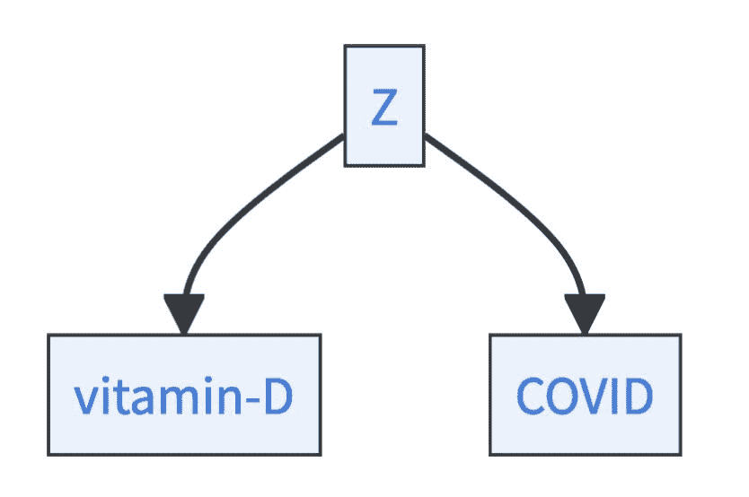

并非针对 Reichenbach，但在现实中，还有两个解释可以解释这种关联：

+   首先，这种关联可能是**虚假的**。它仅仅是因为数据有限而存在。如果你继续收集数据，这种关联将会消失。图 10.1 显示了全球非商业太空发射次数与授予的社会学博士学位数量之间几乎完美的关联 [[9]](references.html#ref-vigen2015spurious)。但这是否是因果关系？也许 Elon Musk 可以通过在社会学领域授予几个博士奖学金来提升他的业务…

+   其次，这种关联可能源于数据收集过程中的*选择偏差*。如果数据样本不能代表总体人群，就会发生这种情况。例如，虽然善良和英俊在总体人群中可能是统计上独立的特征，但如果你只看那些你可能会与之约会的人 [[10]](references.html#ref-ellenberg2014not)，它们可能会变得相关。

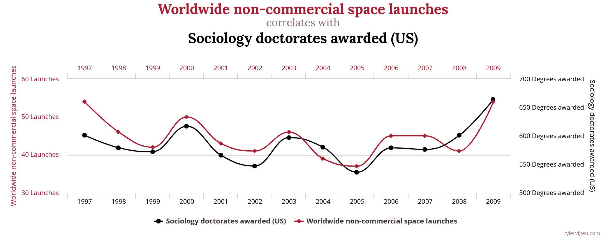

图 10.1：全球非商业太空发射次数与授予的社会学博士学位数量之间几乎存在完美的关联。图表由 Tyler Vigen 制作，CC-BY（https://creativecommons.org/licenses/by/4.0/）

但如何确定 COVID 和维生素 D 之间关联的正确解释呢？因为有很多数据（并非虚假数据）并且这种关联在总体人群中被发现（没有选择偏差），你可以推断 Reichenbach 的三个案例之一适用。Gibbons 等人 [[11]](references.html#ref-gibbons2022association)比较了一组接受不同维生素 D 补充剂的老兵与一组未接受治疗的人。他们发现维生素 D 治疗显著降低了感染 COVID 的风险，因此建议广泛补充。尽管这项研究不是随机对照试验，但它强烈表明维生素 D 水平和 COVID 风险之间存在因果关系。

科学故事可能在那一点继续：维生素 D 和 COVID 风险可能存在未知的共同原因。此外，因果联系并不能解释维生素 D 在身体上如何作用于 COVID 风险。这就是科学工作的方式，新的问题不断涌现…

### 10.4.2 选择具有特征重要性的解释变量

特征的*重要性*主要允许你评估哪些特征对预测目标最有信息量。例如，它们可能会告诉你维生素 D 水平是否包含关于你的 COVID 风险的信息，这些信息超出了口罩和咳嗽特征中已经包含的信息。但重要性本身并不提供因果洞察。它仍然可以用于因果分析：重要性允许你了解哪些信息是冗余的、嘈杂的或是不必要的。这可能在选择用于因果分析的稀疏和鲁棒特征时有所帮助[[12]](references.html#ref-yu2020causality)。

假设你了解一个人的年龄、国籍、性别、最喜欢的颜色和最喜欢的乐队。你想再次预测她的 COVID 风险。通过研究特征重要性，你可能会发现：

+   在所有情况下，最喜欢的颜色的重要性都很小。它甚至可能具有负重要性，因为它引入了噪声。

+   最喜欢的乐队具有极高的信息量。即使去掉所有其他特征，也不会对预测性能造成重大损失。

+   如果你了解一个人的年龄、国籍和性别，知道她的最喜欢的乐队并不会增加多少。

根据你的目标，这可能会非常有见地。通常情况下，你可以去掉最喜欢的颜色这一特征，因为它不具有预测性，也不会为因果分析提供洞察。如果你想推理降低 COVID 风险的政策干预措施，你可以从因果分析中排除最喜欢的乐队。另一方面，如果你是一位想要研究音乐品味与健康之间关系的 sociologist，你可能希望保留所有特征。

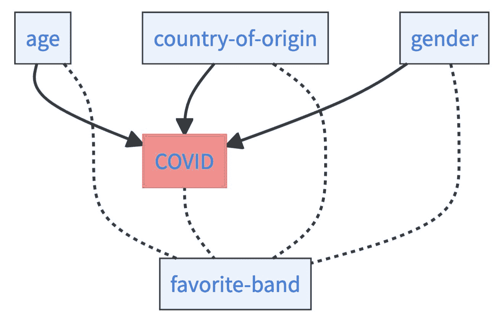

### 10.4.3 使用注意力寻找高级变量

在可解释性研究中，模型在其决策中关注什么的问题非常突出，尤其是在图像分类[[13]](references.html#ref-adebayo2018sanity)中。尽管科学家可能更关注数据中的关系而不是模型，但如果输入特征只有整体上有意义，而不是单独有意义，模型注意力仍然可能相关。想想构成图像的像素、构成句子的字母或构成声音的频率。注意力可以指向与目标相关的有意义的结构或子部分，并允许你形成关于它们的因果假设。

例如，虽然从 CT 扫描中预测 COVID 听起来像是用大锤砸核桃，但这可以是一种了解疾病如何影响人体有趣的方法。尽管输入特征本身是像素，但它们共同构成了可以由基于显著性的可解释技术突出的更高层次的概念。例如，这种方法被[[14]](references.html#ref-hu2020weakly)用于检测 COVID 患者的肺部病变，如图 10.2 所示。

图 10.2：使用集成梯度检测到的肺部 CT 扫描中的病变，小的用绿色表示，混合的用黄色表示，大的用红色表示。图源[[14]](references.html#ref-hu2020weakly)，CC-BY (https://creativecommons.org/licenses/by/4.0/)

## 10.5 使用机器学习估计因果效应

到目前为止，我们假设研究人员在黑暗中寻找，他们使用机器学习来寻找有趣的关联以形成和测试因果假设。然而，研究人员通常对特征之间的关系有因果知识或直觉。他们的目标是因果推断，或者更准确地说，是估计因果效应，这比仅仅探索关联是一个更明确的问题。

因果图显示了因果关系，例如，如果你戴上口罩，它将因果地影响你的 COVID 风险。但这引发了一个问题：**如何**影响你的风险。戴口罩是否会降低你的 COVID 风险，如果是的话，降低多少？这个问题要求一个*因果关系*。在疫情期间，关于因果效应的问题无处不在：

+   疫苗接种如何影响老年人的 COVID 风险？

+   与没有限制接触相比，平均 COVID 风险如何随着接触限制而变化？

+   维生素 D 药片的治疗如何降低非洲裔美国人的 COVID 风险[[11]](references.html#ref-gibbons2022association)？

因果效应总是具有相同的形式。你比较一个感兴趣的变量，例如 COVID 风险*与治疗*（例如，口罩），与那些*未接受治疗*（不戴口罩）的人。这给我们带来了所谓的*平均治疗效应*（ATE）。在口罩作为治疗的情况下，我们可以正式描述对 COVID 风险的影响：

$$\text{ATE}=\mathbb{E}[\text{COVID}\mid do(\text{mask}=1)] - \mathbb{E}[\text{COVID}\mid do(\text{mask}=0)]$$

让我们来分解这个公式。ATE 中的*do*表示 do 运算符，这意味着你干预一个变量并将其设置为某个特定值。因此，第一个术语描述了强制人们戴口罩时的预期 COVID 风险。第二个术语描述了强制人们不戴口罩时的预期 COVID 风险。这两个术语之间的差异描述了口罩对 COVID 风险的因果效应。

在许多情况下，你不会要求 ATE，而是要求具有某些特定特征的人群的特定子组的治疗效应。例如，在疫情期间，研究人员可能会询问 10 岁以下儿童的口罩的因果效应。这就是所谓的*条件平均治疗效应*（CATE）：

$$\begin{align*} \text{CATE} &= \mathbb{E}[\text{COVID} \mid do(\text{mask}=1), \text{age}<10] \\ &\quad - \mathbb{E}[\text{COVID} \mid do(\text{mask}=0), \text{age}<10] \end{align*}$$

两个公式中的*do()*项给人一种印象，即你必须运行受控实验来估计因果效应。进行实验将是最可靠的方式——如果你能做，你应该！不幸的是，有时实验是不可行的。在某些情况下，你很幸运，因为你可以仅从观察数据中估计 ATE 和 CATE。如果是这种情况，因果效应是*可识别的*。

### 10.5.1 使用后门准则识别因果关系

识别因果效应的经典方式是通过所谓的*后门准则*。这个想法很简单。假设你想知道口罩对 COVID 风险的 ATE。你只有观察数据。但你的数据允许你读出：1. 戴口罩的人数感染了多少，2. 不戴口罩的人数感染了多少。只是从后者减去前者就结束了，对吗？不！问题是，你想要获得的信息可能被其他因素模糊化。例如：

+   **遵守规则：** 遵守规则的人更有可能戴口罩，并遵循其他规则，如接触限制。因此，他们平均而言的 COVID 风险也较低。

+   **接触次数：** 有很多接触的人（例如邮递员、销售人员或医生）戴口罩以降低自己的风险以及他人的 COVID 风险。但很多接触也会增加他们的 COVID 风险。

+   **年龄：** 年轻人不太可能戴口罩，因为他们认为口罩看起来不酷，或者因为 COVID 对年轻人来说不那么危险。同时，年轻人对感染 COVID 的抵抗力更强 [[15]](references.html#ref-fischer2020resistance)。

这些因素被称为*混杂因素*。它们既是治疗的原因，也是感兴趣变量的原因。想象一下，如果你知道所有这些混杂因素并考虑了它们，那么你就可以隔离出仅由口罩本身引起的关联。这正是后门准则所做的事情。如果你知道所有混杂因素 $ W $，ATE 可以通过以下方式估计：

$$\begin{align*} \text{ATE} &= \mathbb{E}_W[\mathbb{E}_{\text{COVID}\mid W}[\text{COVID} \mid \text{mask}=1, W]] \\ &\quad - \mathbb{E}_W[\mathbb{E}_{\text{COVID} \mid W}[\text{COVID} \mid \text{mask}=0, W]] \end{align*}$$

一个巨大的成功，没有剩余的 do-terms。但请注意，对所有混杂因素的了解是一个超级强烈的要求，在现实中很少能够满足。而且不知道一个混杂因素可能会显著地偏差你的估计。如果你错误地将一个变量误认为是由于治疗和感兴趣变量共同引起的混杂因素（这被称为*碰撞偏差*），也会发生同样的事情。所以基于更多特征的条件并不总是更好的。

后门准则并不是识别因果效应的唯一选择。例如，还有其友好的兄弟，**前门准则**。前门和后门准则都是 do-calculus 的特殊情况。每当可能识别因果效应时，都可以使用 do-calculus 来识别。如果你喜欢数学并想深入了解，可以查看[[16]](references.html#ref-pearl2009causality)。酷的是，你不必 necessarily 知道所有这些才能进行因果分析。给定一个因果图，识别步骤可以完全自动化，例如，使用 Python 包 *DoWhy* [[17]](references.html#ref-dowhy)。

让我们看看两种基于机器学习的方法，这些方法允许估计因果效应：T-Learner 和双重机器学习³。两者都设计用于后门准则设置。这意味着，在两种情况下，你假设你已经观察到了所有混杂因素 $ W $，你的因果图如下所示

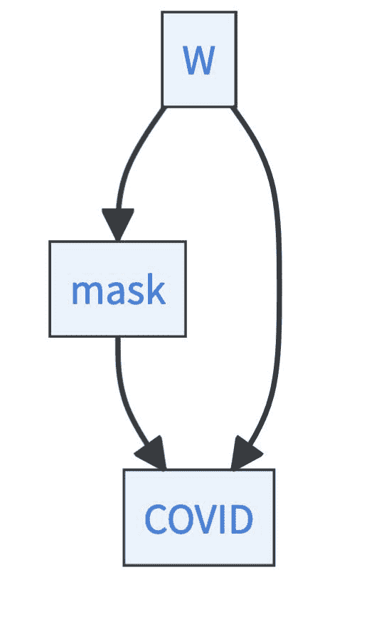

### 10.5.2 如何使用 T-Learner 估计因果效应

T-Learner 可能是从观察数据中估计 ATE（或经过轻微修改的 CATE）的最简单方法。T-Learner 这个名字来源于使用**两个**不同的学习器来估计 ATE。T-Learner 使用来自后门准则的公式：

$$\begin{align*} \text{ATE} &= \mathbb{E}_W[\underbrace{\mathbb{E}_{\text{COVID}\mid W}[\text{COVID} \mid \text{mask}=1, W]}_{\phi_1}] \\ &\quad - \mathbb{E}_W[\underbrace{\mathbb{E}_{\text{COVID}\mid W}[\text{COVID} \mid \text{mask}=0, W]}_{\phi_0}] \end{align*}$$

T-Learner 拟合了两个机器学习模型，$ \hat{\phi_0}: \mathcal{W}\rightarrow \mathcal{Y} $ 和 $ \hat{\phi_1}: \mathcal{W}\rightarrow \mathcal{Y} $，其中 $ \hat{\phi_0} $ 仅使用 $ \text{mask}=0 $ 的数据估计，而 $ \hat{\phi_1} $ 使用 $ \text{mask}=1 $ 的数据估计。然后可以通过对 $ W $ 的不同值进行平均来计算 ATE：

$$\text{ATE}\approx \frac{1}{n}\sum\limits_{i=1}^n \left(\hat{\phi_1}(w_i)-\hat{\phi}_0(w_i)\right).$$

### 10.5.3 如何使用双重机器学习估计因果效应

双重机器学习是 T-Learner 的改进。不仅名字听起来更酷，而且 ATE 的估计更加复杂[[22]](references.html#ref-chernozhukov2018double)。估计既无偏又数据高效。估计过程如下：

1.  **从对照组预测结果与处理：**拟合一个机器学习模型来预测从混淆因子$ W $的 COVID。这给出了预测$ \widehat{\text{COVID}} $。接下来，拟合一个机器学习模型来预测人们是否戴口罩，从混淆因子$ W $。这给出了预测$ \widehat{\text{mask}} $。你需要将你的数据分为训练数据和估计数据，机器学习模型应该只从训练数据中学习。

1.  **从处理残差估计结果残差：**拟合一个线性回归模型来预测$ \text{COVID}-\widehat{\text{COVID}} $从$ \text{mask}-\widehat{\text{mask}} $。然后，你感兴趣的估计量是系数$ \beta_1 $。为什么？好吧，令人惊讶的是，这个系数描述了处理效应。但你需要相当多的数学来证明这一点，如果你想了解更多，可以搜索 Frisch-Waugh-Lovell 定理。线性回归必须在估计数据上拟合，而不是在步骤 1 中的模型训练数据上。

1.  **交叉拟合：**再次运行步骤 1 和 2，但这次将步骤 1 中用于拟合机器学习模型的训练数据与步骤 2 中用于线性回归的估计数据交换。将你的两个估计值$ \hat{\beta_1}¹ $和$ \hat{\beta_1}² $平均，以获得最终估计值$ \hat{\beta_1}=(\hat{\beta_1}¹+\hat{\beta_1}²)/2 $。

为什么这个奇怪的过程有意义？如果你想了解细节，请查看[[22]](references.html#ref-chernozhukov2018double)。关键思想是：

+   你想要消除来自你的机器学习模型正则化中产生的估计偏差。这在一、二步中完成，利用所谓的 Neyman 正交条件。

+   你想要消除来自你对现有数据进行过度拟合的估计偏差，同时保持数据效率。如果你会在你估计线性系数的相同数据上训练我们的机器学习模型，你会引入一个过度拟合偏差。将数据分为训练数据和估计数据可以避免这个陷阱。然而，只分割一次数据会降低数据效率。因此，你在第三步中交换训练数据和估计数据的角色，并计算平均值。

如果你想在你的研究中使用双重机器学习，请查看 R 中的`DoubleML`包[[23]](references.html#ref-DoubleML2021R)和 Python 中的[[24]](references.html#ref-DoubleML2022Python)。通常，现在有更多方法可以用机器学习来估计因果效应，查看[[25]](references.html#ref-dandl2023causality)、[[20]](references.html#ref-Knaus2022)或[[21]](references.html#ref-kunzel2019metalearners)以获得概述。

## 10.6 如果我们知道因果图，学习因果模型

因果图包含简单的对象：

+   **节点：**描述对你来说有趣的特征，例如 COVID 风险、你是否戴口罩、你是否干咳，或者你的维生素 D 水平。

+   **箭头**：描述特征之间的因果联系。例如，COVID 风险和干咳之间的因果箭头。

通常，你在因果图上提出两个额外的假设——它们应该是有向的和无环的。有向意味着每个箭头都有一个起始节点和结束节点，这与开始时维生素 D 的情况中的虚线箭头不同，它将两个节点视为相同。无环意味着不应该可能从一个节点开始并返回到它，而只需沿着有向箭头行走。如果图是有向和无环的，我们谈论 DAG——有向无环图。

因此，因果图是推理因果关系的工具。但不是很好有一个*因果模型*？一旦构建了模型，就可以思考一系列问题，而无需总是运行整个治疗效果估计过程？

口罩对 COVID 风险的影响是什么？如果同时考虑口罩和接触限制呢？如果只关注老年人呢？想象一下所有这些问题都可以用一个模型来回答。

### 10.6.1 贝叶斯因果网络允许进行干预推理

在因果图中，我们讨论了图中的节点，如口罩节点、COVID 节点或咳嗽节点。但如何具体解释这些节点呢？因果贝叶斯网络（CBNs）的视角是将这些节点视为随机变量。如果因果图是图和因果性的结合，CBNs 则增加了概率理论。

CBNs 允许你提出经典概率问题，例如，如果人们咳嗽，他们戴口罩的概率是多少 $ \mathbb{P}(\text{mask}\mid \text{cough}=1) $。但 CBNs 最终设计的目的在于回答关于干预的因果问题。例如，如果每个人都必须戴口罩，平均 COVID 风险是多少 $ \mathbb{P}(\text{COVID}\mid do(\text{mask}=1)) $？

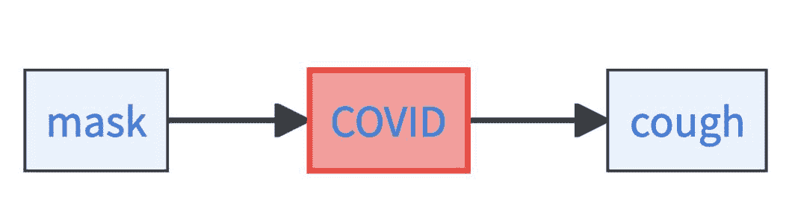

让我们检查这个只有三个变量的简化因果图：口罩、COVID 风险和咳嗽。口罩是 COVID 风险的因果因素，COVID 是咳嗽的因果因素。在这个简单的情况下，你必须指定以下三个事项来获得一个 CBN：

1.  戴口罩的边际概率，即 $ \mathbb{P}(\text{mask}) $。

1.  无论是戴口罩还是不戴口罩的人的 COVID 风险，这意味着 $ \mathbb{P}(\text{COVID}\mid \text{mask}=0) $ 和 $ \mathbb{P}(\text{COVID}\mid \text{mask}=1) $。

1.  如果 COVID 风险低或高时咳嗽的概率，这意味着 $ \mathbb{P}(\text{cough}\mid \text{COVID}=1) $ 和 $ \mathbb{P}(\text{cough}\mid \text{COVID}=0) $。

让我们看看一个玩具示例。假设 50%的人戴口罩。假设如果人们戴口罩，COVID 风险是 80%低/20%高，如果不戴口罩则相反。此外，如果人们有高 COVID 风险，他们咳嗽的概率是 90%，反之，如果他们有低 COVID 风险，咳嗽的概率是 10%。

然后，你可以提出以下问题并正式解决它：

+   **观察问题**：戴口罩、有高 COVID 风险且不咳嗽的概率是多少？这可以通过以下方式计算：

$$\begin{align*} &\mathbb{P}(\text{mask}=1, \text{COVID}=1, \text{cough}=0) \\ &=\mathbb{P}(\text{mask}=1) \times \mathbb{P}(\text{COVID}=1 \mid \text{mask}=1) \\ & \quad \times \mathbb{P}(\text{cough}=0 \mid \text{COVID}=1) \\ &= 0.5 \times 0.2 \times 0.1 = 0.01 \end{align*}$$

所以这是一个相当不可能的组合。你也可以问一个因果问题，比如：

+   **干预问题**：如果政策制定者强制戴口罩，那么患有高 COVID 风险和咳嗽的概率是多少？这可以通过以下方式计算：

$$\begin{align*} &\mathbb{P}(\text{COVID}=1, \text{cough}=1 \mid do(\text{mask}=1)) \\ &= \mathbb{P}(\text{COVID}=1 \mid \text{mask}=1) \times \mathbb{P}(\text{cough}=1 \mid \text{COVID}=1) \\ &= 0.2 \times 0.9 = 0.18 \end{align*}$$

让我们推广这个例子中的思想。你需要什么来构建一个 BCN？

+   因果图中所有没有入箭头的节点的边缘分布 $ \mathbb{P}(X_r) $。这些节点被称为根节点。

+   对于所有非根节点，你需要它们的条件分布 $ \mathbb{P}(X_j\mid pa_j) $，给定它们直接的原因。一个节点的直接原因被称为父节点。

如果你指定了这两个成分，你就有了 BCN。它允许你计算观察和干预概率：

**观察概率**：

$$\mathbb{P}(X)=\prod\limits_{i=1}^p \mathbb{P}(X_i | pa_i)$$

**干预概率**：

$$\mathbb{P}(X_{-j}\mid do(X_j=z))=\prod\limits_{\substack{i\neq j, \\j\not\in pa_i}}\mathbb{P}(X_i\mid pa_i) \prod\limits_{j\in pa_i}\mathbb{P}(X_i\mid pa_i,X_j=z)$$

要计算干预概率，你需要在公式中设置干预变量为所需值，并相应地将变量的概率设置为 $ 1 $。

所有这些都是很好的理论和玩具模型。但在现实世界中，你并没有神奇地拥有 BCN（贝叶斯网络）。实际上，如果你知道因果图，你可以学习 BCN。BCN 和因果图之间的区别只是边缘和条件概率。如果你有数据，这正是机器学习可以发挥作用的地方——估计条件概率。我们通常建议使用非参数机器学习模型，如神经网络或随机森林来估计条件概率，然而，对于小数据量，经典参数方法如最大似然估计或期望最大化可能更可取 [[26]](references.html#ref-rothfuss2019conditional)。

### 10.6.2 结构因果模型允许你推理反事实

如果我们想要采取行动，干预性问题通常很重要。但如果你想要解释“为什么”某事发生了呢？比如说，*你*感染了 COVID，想知道为什么。是不是因为没有戴口罩？或者，是不是上周的那个派对？或者是不是你在地铁上从那个正在剧烈打喷嚏的人那里感染了它？

回答“为什么”的问题总是最困难的，但通常也是最有趣的。要回答这样的问题需要什么？你必须思考反事实场景。你知道你参加了派对，你也知道你感染了 COVID。要回答“为什么”的问题，你需要找出你是如何被感染的。如果你没有参加派对，你会感染 COVID 吗？如果你没有在派对上和那个迷人的但正在咳嗽的邻居交谈，你会感染 COVID 吗？

BCNs 在推理反事实场景方面表达力不足。为什么？首先，BCNs 在具有某些特征的个体群体层面上以概率形式描述因果关系。比如，如果所有人都被强迫参加派对，那么感染 COVID 的概率。因果关系是从参加派对的人和没有参加派对的人的数据中学习得到的。而“为什么”这个问题更为具体。它询问的是你个人为什么感染了 COVID。你是不是因为参加了派对才感染 COVID 的？⁴ 其次，你感染 COVID 的事实对你个人是有信息的，它可能揭示了关于你的属性的信息，而这些属性上没有数据。比如关于你的免疫系统及其对 COVID 的抵抗力的信息。这些信息不应被忽视。

要回答“为什么”的问题，你需要模拟不同的场景，即进行反事实推理。结构因果模型（SCM）是一种旨在模拟这些不同场景的模型。与描述数据中的概率关系不同，SCM 明确地模拟了生成数据的机制。

让我们看看一个非常简单的 SCM，它只包含两个因素：你是否参加派对以及你是否感染了 COVID。这些你具有明确信息的因素被称为内生变量。

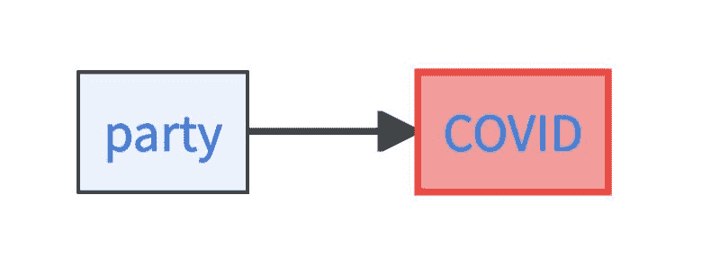

此外，该模型还包含两个*外生*变量。外生变量描述了背景因素，你对这些因素没有数据，但它们在确定内生变量方面发挥作用。例如，你是否参加派对可能取决于你是否想参加派对。同样，你是否感染 COVID 可能受你当前免疫系统的功能状态的影响。在外生变量中，SCMs 非常强大。这些因素完全决定了内生变量。

因此，SCM 由以下内容指定：

+   两个噪声项：$ U_{\text{mood}}=Ber(0.5) $ 描述了你是否想参加派对，概率是五五开。$ U_{\text{immune}}=Ber(0.8) $ 描述了你的免疫系统是否正常，概率相当高（80%）你的免疫系统工作良好。

+   一个关于内生派对变量的结构方程，即 $ \text{party}:= U_{\text{mood}} $。你是否去派对完全由你是否想参加派对决定。

+   一个关于内生 COVID 变量的结构方程，即 $ \text{COVID}:=max(0,\text{party}-U_{\text{immune}}) $。这意味着，只有当你参加派对并且你的免疫系统下降时，你才会感染 COVID。

这个 SCM 允许你回答反事实问题：你去了派对并且感染了 COVID，如果你没有去派对，你会感染 COVID 吗？这样的反事实问题通过三个步骤来计算：

+   **推理：** 你感染了 COVID 的事实告诉你关于噪声变量的什么信息？嗯，如果你的免疫系统正常，你就不会感染 COVID。因此，你可以推断 $ U_{\text{immune}}=0 $。同样，你知道你当时想参加派对，否则你不会去，即 $ U_{\text{mood}}=1 $。

+   **行动：** 假设你没有去派对，这意味着你进行干预，将派对变量从一变为零，即 $ do(\text{party}=0) $。

+   **预测：** 如果你将派对变量切换为零，COVID 变量会发生什么？根据 COVID 的结构方程，只有当你去派对并且你的免疫系统下降时，你才会感染 COVID。因此，你不会感染 COVID。

因此，如果你没有去派对，你就不会感染 COVID。所以，你感染 COVID **是因为**你去了派对。

如果反事实不是真的呢？派对还是原因吗？嗯，那么事情就变得更复杂了。例如，你可能本想去运动而不是去派对，并在那里感染了 COVID。但派对仍然是你感染 COVID 的实际原因。搜索*实际因果关系*了解更多关于这个主题的信息。

让我们推广示例中的思想。对于一个结构因果模型（SCM），你需要：

+   一组外生变量 $ U $，它们由模型外的因素决定，并且彼此独立。

+   一组内生变量 $ X $，它们完全由模型内的因素决定。

+   一组结构方程 $ F $，它描述了对于每个内生变量 $ X_j $，它是如何由其父变量和其外生变量 $ X_j=f(pa_j, U_j) $ 决定的。

在现实生活中获得 SCMs 很困难。如果你知道变量之间的因果依赖关系，你可以使用机器学习来学习结构方程。然而，即使是那样，你也需要相当多的数据，并且做出参数假设可能是可取的。

就像反事实本身一样，SCMs（结构因果模型）是非常具有推测性的对象。没有简单的方法可以验证给定的 SCM 是否正确，它总是依赖于反事实假设。尽管如此，由于人类总是以反事实的方式进行推理，并且对“为什么”这类问题深感兴趣，因此拥有一种可以捕捉反事实推理的形式化方法是非常有用的。

## 10.7 从数据中学习因果图

机器学习重新唤起了一个古老的想法——有了足够的数据，我们可能能够完全自动化科学。在本章的第一部分和第二部分中，你总是需要一个在幕后的人类科学家。有人提出有趣的假设，进行实验，或者为我们提供因果图。这部分将是最具雄心的，它提出了以下问题：

> 你能否仅从数据中获取因果图，而不需要进入领域知识？这个问题通常被称为*因果结构学习*或*因果发现*。

我们在开始时没有告诉你，仅凭观察数据是不够的吗？正确！但是，看到你可以走多远是非常有趣的，尤其是如果你添加了一些额外的假设。为真正迷人的研究领域做好准备！

想象一下，你手中有一个包含 5,000 条记录的数据集。每条记录包含有关一个人 BMI、COVID 疫苗接种状态、流感疫苗接种状态、COVID 风险、疲劳、发烧、食欲以及该人居住区域人口密度的信息（示例基于[[28]](references.html#ref-jehi2020individualizing)和[[29]](references.html#ref-konig2023improvement))。任务是构建这些特征的一个因果图——即因果发现问题。假设你想要学习的真实图示如下：

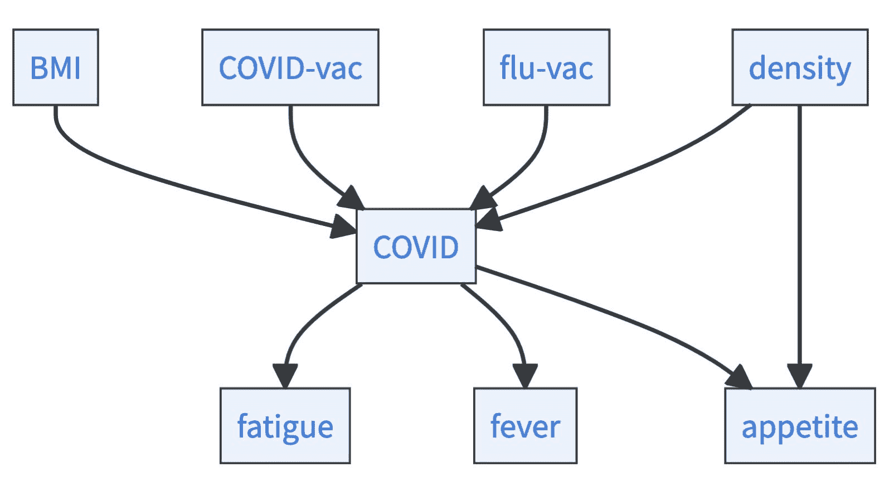

在你能够接近这个问题之前，你必须了解一些关于因果机制、关联和数据如何相互关联的更多背景知识。因果机制生成数据。在这些数据中，特征相互关联。这意味着因果依赖性产生了统计（非）依赖性。特别是，如果你有一个因果图，那么所谓的因果马尔可夫条件适用：

*因果马尔可夫条件*：*在因果图中的父节点给定的情况下，一个变量与其所有非后继变量在统计上独立。或者正式地说，令 $ G $ 为一个因果图，$ X_i $ 为网络中的任何变量，那么对于所有其非后继变量 $ nd_i $，都有 $ X_i\perp \!\!\! \perp nd_i\mid pa_i $。给定变量 $ X_i $ 的后继变量是所有可以通过沿着箭头方向从 $ X_i $ 到达的变量。* 为了对因果马尔可夫条件有一个直观的理解，请看下面的图。以食欲变量为例。其父节点是 COVID 和密度。其非后继变量是 BMI、COVID-vac、flu-vac、fever 和 fatigue。⁵ 因果马尔可夫条件允许你例如在知道 COVID 和密度的情况下说食欲与 fever 在统计上独立。正式的写法是 $ \;\text{appetite} \perp \!\!\! \perp \text{fever}\mid \text{COVID}, \text{density} $，其中 $ \perp \!\!\! \perp $ 是独立性的符号。

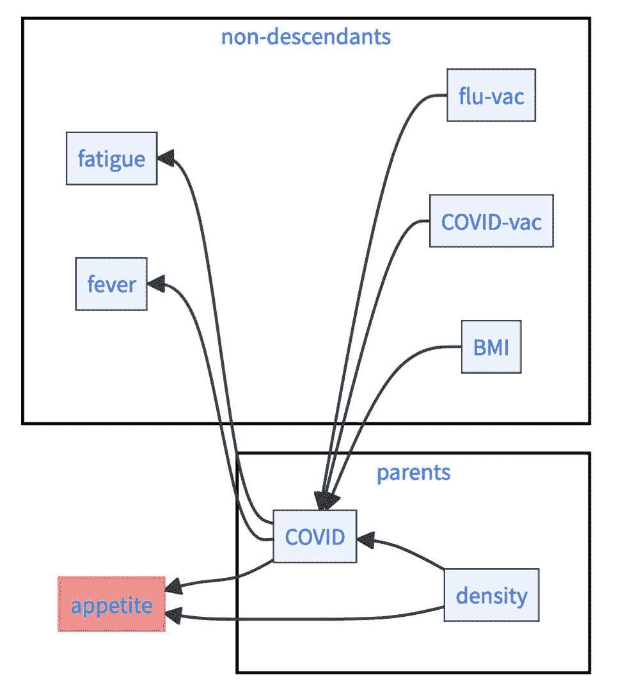

很酷，因果图可以诱导出统计独立性，但我们应该如何利用这一点呢？好吧，你有一个数据集，所以你可以测试统计独立性。

测试此类（条件）独立性的方法有很多种，它们在所提出的参数假设方面有所不同。有些测试统计依赖性是否为高斯或线性（例如，部分相关），或者针对分类数据如卡方检验[[30]](references.html#ref-peters2017elements)。其他方法允许有更多样化的依赖性，例如基于希尔伯特-施密特独立性准则（HSIC）[[31]](references.html#ref-fukumizu2007kernel)的测试。当前趋势甚至更偏向于基于机器学习的条件独立性测试的非参数方法。独立性问题被转化为分类问题，其中可以利用强大的机器学习模型（例如，神经网络或随机森林）[[32]](references.html#ref-sen2017model)，[[33]](references.html#ref-watson2021testing)。然而，你提出的参数假设越少，可能的统计依赖性就越多。因此，非参数测试通常具有非常差的统计功效，这意味着你需要大量的数据来识别独立性[[34]](references.html#ref-shah2020hardness)。当考虑更多变量时，这个问题会变得更糟——条件可以被视为减少了你可以测试的数据。错误的条件依赖可能导致错误的因果结论。

假设你发现了一组统计独立性，这如何帮助你学习因果图呢？好吧，数据中的统计独立性仅与某些类型的因果结构相兼容。数据缩小了有意义的因果故事。所以问题是，有多少*忠实*的因果图（见框：“因果性的核心假设”）与数据相兼容？

例如，假设你只有三个变量：疲劳、COVID 和发热。通过运行统计测试，你会发现

+   在 COVID 的情况下，疲劳与发热是独立的（形式上，$ \text{fatigue}\perp \!\!\! \perp \text{fever}\mid \text{COVID} $）

+   这三个变量中没有一个是无条件独立于其他变量的。

然后，三个因果故事（因果链）可以解释这些数据。

+   故事 1：$ \text{fatigue}\rightarrow \text{COVID}\rightarrow \text{fever} $.

+   故事 2：$ \text{fatigue}\leftarrow \text{COVID}\leftarrow \text{fever} $.

+   故事 3：$ \text{fatigue}\leftarrow \text{COVID}\rightarrow \text{fever} $ （称为叉结构）

所有这些故事（或因果图）都是忠实的，并且与给定的统计（非）依赖性兼容。还可以证明没有其他因果图满足这一点。

*因果要素：链、叉和道德败坏* *假设你拥有变量 $ X, Y $ 和 $ Z $。在因果图中，区分了三种基本的路径结构，用于因果发现：

+   *因果链*，其中 $ Y $ 被称为 *中介者*：

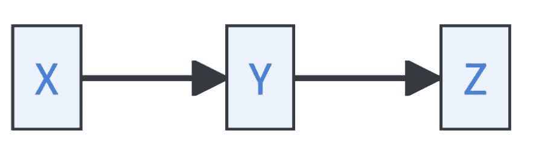

+   *Forks*，其中 $ Y $ 被称为 *共同原因*：

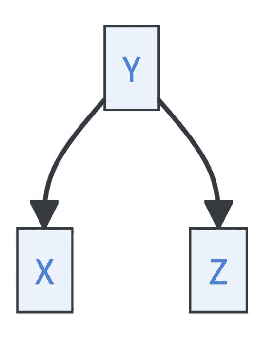

+   *道德败坏*，其中 $ Y $ 被称为 *碰撞器*：

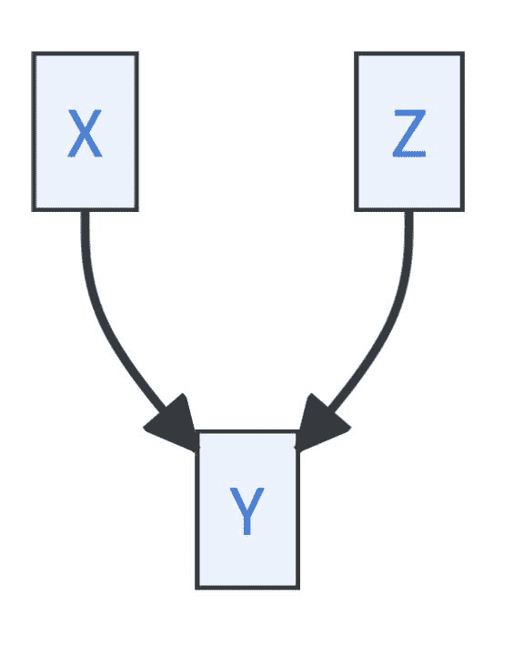

因果链和叉意味着相同的条件依赖性：

1.  $ X \perp \!\!\! \perp Z \mid Y $ （在 Y 的条件下，X 和 Z 是独立的）

1.  X 和 Y 是相互依赖的

1.  X 和 Z 是相互依赖的

1.  Y 和 Z 是相互依赖的

然而，道德败坏表现出一种独特的模式：

1.  $ X \perp \!\!\! \perp Z $ （X 和 Z 在边缘上是独立的）

1.  X 和 Z 在 Y 的条件下是相互依赖的

1.  X 和 Y 是相互依赖的

1.  Y 和 Z 是相互依赖的*  *我们将满足相同一组统计（非）依赖关系的忠实因果模型集合称为 *马尔可夫等价类*。如果你只有数据集，你如何找到马尔可夫等价类？我们在这里提供许多答案之一，所谓的 PC 算法。⁶

**彼得-克拉克 (PC) 算法**：寻找与数据集中发现的统计（非）依赖性兼容的因果模型马尔可夫等价类的最知名算法方法 [[36]](references.html#ref-spirtes2000causation)。它要求满足因果充分性和忠实性条件。它执行以下步骤：

1.  **识别骨骼结构**：我们从具有无向箭头的完全连接网络开始。然后，逐步检查所有特征之间的无条件独立性和条件独立性。我们从无条件独立性开始，继续检查一个变量的独立性，然后是两个，依此类推。如果两个特征（条件上）是独立的，我们就删除它们之间的箭头。最后，我们得到所谓的无向箭头的骨骼图。

    +   *无条件独立性：* 通过运行统计测试，我们了解到 BMI、COVID-vac、flu-vac 和密度都是成对独立的。这允许我们擦除这些变量之间的箭头。

    +   *基于一个变量的条件独立性：* 在 COVID 上条件化使疲劳、发烧和食欲成对独立。此外，BMI、COVID-vac、flu-vac 和密度与疲劳和发烧独立。我们可以擦除这些变量之间的所有箭头。

    +   *基于两个变量的条件独立性：* 如果我们在 COVID 和密度上条件化，BMI、COVID-vac 和 flu-vac 就会与食欲独立。因此，我们可以擦除食欲与这些变量之间的所有箭头。

    +   我们没有发现更多的独立性。因此，这就是我们的结果骨架！

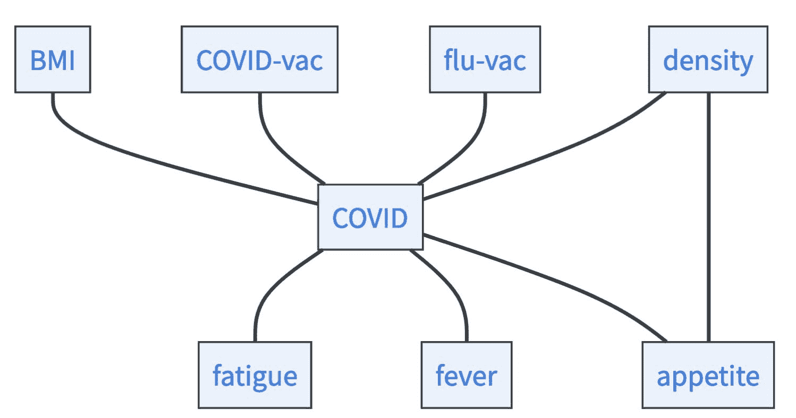

1.  **识别不道德行为：** 不道德行为是形式为 $ X\rightarrow Y\leftarrow Z $ 的路径，导致唯一的（不）独立性，即 $ X\perp \!\!\! \perp Z $ 和 $ X,Z $ 在 $ Y $ 条件下是相关的。我们可以利用这种唯一性来调整一些箭头的方向。检查所有无条件独立性 $ X\perp \!\!\! \perp Z $，其中节点通过一个中间变量 $ Y $ 连接，检查是否在 $ Y $ 上条件化会使它们变得相关。如果是，你找到了一个不道德行为，可以调整箭头的方向。

    +   如您所见，在我们的骨架图中，所有箭头都是无向的。我们现在检查所有无条件独立的变量，如果我们在一个变量上条件化，它们就会变得相关。这种情况适用于 BMI、COVID-vac、flu-vac 和密度。它们是无条件独立的，但如果我们对 COVID 变量进行条件化，它们就会变得相关。因此，我们可以在我们的图中调整一些箭头的方向。

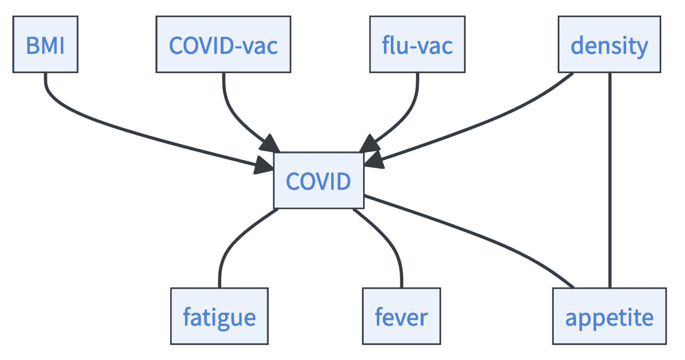

1.  **应用逻辑：** 现在你已经识别了所有的不道德行为。因此，如果你发现三个变量以这种方式连接 $ X\rightarrow Y-Z $，其中 $ Y $ 和 $ Z $ 之间的箭头是无向的，你可以推断出 $ X \rightarrow Y \rightarrow Z $，因为否则会有另一个你必须发现的不道德行为。此外，我们寻找一个无环图。所以如果只有一种避免形成循环的方法，那就是你调整箭头的方法。

    +   哪些箭头会导致新的不道德行为？如果疲劳、发烧和食欲有指向 COVID 的箭头，就会产生新的不道德行为，这些行为会在统计测试中被发现。因此，它们必须有来自 COVID 变量的箭头。现在只剩下一个无向箭头，即密度和食欲之间的箭头。如果这个箭头指向食欲，就会形成一个循环：$ \text{COVID}\rightarrow \text{appetite}\rightarrow \text{density}\rightarrow \text{COVID} $。因此，箭头必须指向食欲。

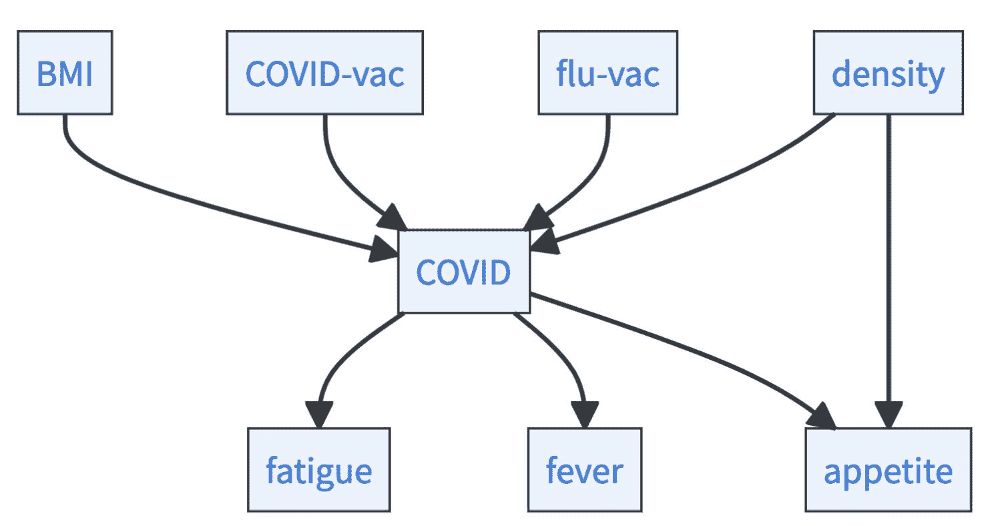

很酷，我们仅从（不）依赖关系就能识别出完整的因果图！但我们很幸运。如果我们观察一个更复杂的图，PC 算法就会输出一个箭头方向未定的图。所有剩余箭头方向的可能排列定义了马尔可夫等价类。但你能否更进一步？有没有一种方法可以在马尔可夫等价类中识别出正确的因果模型？你需要额外的信息来做这件事：

+   **进行现实世界的实验：** 你可以简单地运行实验。已经证明了确定正确因果图所需进行的实验数量的界限。例如，如果允许多节点干预，则$ log_2[n]+1 $次干预就足以识别因果图，其中$ n $是节点的数量[[37]](references.html#ref-eberhardt2005)。

+   **提出更多假设：** 对于因果图的识别性而言，最突出的假设之一是结构方程中关系的线性以及非高斯噪声项。或者，你也可以假设非线性以及噪声的加性。查看[[30]](references.html#ref-peters2017elements)了解更多信息。大多数方法都依赖于这样一个观点，即噪声变量在一个因果方向上是独立的，而在另一个因果方向上则不是。

*因果性的核心假设* 你可以将因果模型视为解释数据的工具。但何时解释才是正确的？只有当满足某些假设时，解释才是正确的。因此，因果性是一个深度假设驱动的领域。其中最重要的假设如下：

+   **因果充分性：** 这是该领域的一个关键假设。有时也被称为**无未观察到的混杂因素**的假设。这意味着在你的模型中，你没有遗漏一个因果相关的变量，该变量将是模型中两个或更多变量的原因。这个假设是不可检验的，没有它，能得出的结论就少得多[[38]](references.html#ref-manski2003partial)。

+   **机制独立性：** 意味着因果模型是模块化的。对一个结构方程的干预不会影响其他结构方程。或者从概率的角度来看，改变一个变量的边缘分布不会影响该变量作为因果父变量时的条件分布。这个假设对于机制建模似乎是定义性的，并暗示了外生噪声项的独立性[[30]](references.html#ref-peters2017elements)。

+   **忠实性：** 与如何概率性地解释因果图有关。忠实性意味着图中每个因果依赖都导致统计依赖。请注意，在有限数据体系中很难证明忠实性[[39]](references.html#ref-uhler2013geometry)。

+   **正性原则：**对于人口中的每一个群体，你都有接受过治疗的子组和未接受治疗的子组。在*治疗效果估计*时这一点至关重要。如果违反了正性原则，你可能会错误地推断某些子组的（非）治疗效果，这可能会非常糟糕。

这个列表远未完整，还有很多，例如一致性、可交换性和无干扰 [[16]](references.html#ref-pearl2009causality), [[40]](references.html#ref-neal2020introduction)。你对数据使用因果模型或可能从数据部分推导出的因果模型的解释的正确性，对这些假设极为敏感。如果可能的话，检查它们是否适用！***  ***

只有当特征是有意义的表示，并且你可以有意义地讨论它们的因果关系时，因果发现才有意义。这在高度结构化、经过人类大脑大量预处理的数据中是成立的。但通常你拥有的数据，尤其是你想用机器学习分析的数据，看起来并不是这样，它由以下组成：

+   由像素组成的图像

+   由字母组成的文本

+   由频率组成的声波

例如，构建一个变量为单个像素的因果模型是没有意义的。然而，讨论图像中对象之间的因果关系可能是有意义的。你如何从像素过渡到这些对象？你如何从低阶特征中获得有意义的更高阶表示？⁷

机器学习是一个关注学习高阶表示的领域。因此，因果表示学习描述了许多机器学习研究者共同的一个梦想——将符号方法如因果模型与现代机器学习融合的梦想。这将结合两个世界的优点：从数据中学习复杂而有意义的表现，并在透明和逻辑的方式中进行符号推理。

实际上，这样做极其困难，这个领域的研究仍处于起步阶段。机器学习模型学习复杂的表现来执行它们的预测，然而，这些表现是否在某种程度上与人类形成的表现相似，或者是否对我们来说完全可理解，这是一个悬而未决的问题。给表现添加标签并修改损失函数以使用这些表现可能是一种方法 [[42]](references.html#ref-koh2020concept)。但这需要大量数据！有没有一种方法可以确保机器学习模型学习到有意义的表示，这些表示可以用来构建因果模型？你甚至可以构建基于你对因果性的理解的约束来学习这样的表示吗？我们将给你一些这方面的启示…

*变分自编码器（VAEs）* *自编码器由两部分组成。编码器将输入映射到更高阶的表示，解码器将更高阶的表示映射回原始输入空间。变分自编码器中唯一的区别是输入被编码成一个概率分布的参数集，而解码器从这个分布中抽取一个样本并将其映射回原始输入空间。VAEs（与本书的其余部分不同）是一种无监督学习技术。它们允许，例如，以几乎不损失信息的方式将高维信息压缩到低维特征中。

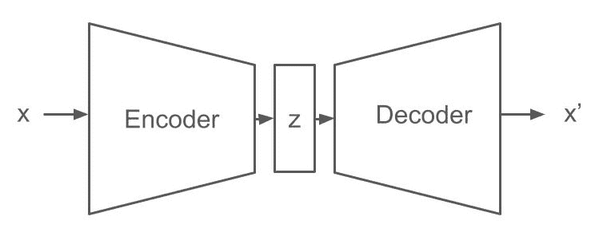

*变分自编码器中的因果约束：* 您可以将 VAE 中间部分的概率分布视为数据所居住的低级特征的抽象。因此，VAEs 经常在一般表示学习背景下进行讨论，并且有多种方法可以通过架构和损失函数来融入关于这些表示的知识 [[43]](references.html#ref-bengio2013representation)。您不必先学习表示然后再看如何将它们融入因果模型，而是可以反过来，问：什么使表示成为因果模型的良好候选者，以及如何将此类知识融入 VAE 框架？由于该主题的研究仍处于起步阶段，我们只提供一些受[[44]](references.html#ref-scholkopf2021toward)启发的想法列表：

+   **稀疏性：** 因果性中的一个关键思想是，一些强大的表示足以解释各种复杂现象。例如，可以通过中间 VAE 层的尺寸来强制执行这一点。

+   **跨领域的通用性：** 强大的表示在多个任务中都是有用的。使它们有用的原因是它们捕捉了自然界中的稳健模式。例如，您可以通过训练 VAEs 使用相同的表示来执行不同的解码任务来实现这一点。

+   **独立性：** 首先，如果两个表示包含相同的信息，其中一个就是冗余的。但您希望拥有简单的模型来高效地关于世界进行沟通。其次，因果性的核心思想是您有独立的变异来源，并且您可以解开这些来源及其相互作用。在变分自编码器（VAEs）中实现这一点的 一种方法是通过修改损失函数来确保中间层的表示在统计上是独立的。

+   **人类干预：**一个变量适合进行因果建模的原因是你可以对它进行干预。因此，从一张桌子中随机选取的 42%的原子并不能构成一个好的代表，因为你无法单独使用或干预这 42%。这种以人为中心的因果偏差可以通过视频数据输入到 VAEs 中，例如，在视频中，物体不断移动和干预，但仍然保持持久。

+   **简单关系：**因果模型很少是高度连接的。相反，一些高级变量之间的因果关系引起了你在世界中观察到的关联。这种简单性的归纳偏差可以通过解码器架构或损失函数来强制执行。

完成这一章后，你可能会有点不知所措。在这一章中，介绍了许多理论概念，同时，实际建议却很少，例如，与领域知识章节（见第八章）相比。我们有一种印象，即当前研究中因果理论与科学家实际问题的联系不够发达。例如，只有少数例子表明因果发现算法已被用于从实践中获得洞察。

尽管如此，我们相信每位研究人员都应该熟悉上述概念，例如里肯巴赫原理、治疗效果估计和因果建模。因果性是你们在想要控制、解释和推理现象时最终寻求的东西。虽然因果性作为一个领域通常不提供现成的实际解决方案，但它为你提供了一种语言来表述你的问题和描述可能的解决方案。

本书中的许多章节都与因果性密切相关：

+   你想要编码的一些领域知识（见第八章）可能是因果性的。

+   许多通过模型解释（见第九章）解决的问题，例如算法回溯，最终都是因果问题 [[29]](references.html#ref-konig2023improvement)。

+   因果性是提高鲁棒性的主要方法之一（见第十一章） [[45]](references.html#ref-scholkopf2022causality)。

+   目前正在将更好的不确定性量化方法，如一致性预测（见第十二章）整合到因果推理中 [[46]](references.html#ref-lei2021conformal)。

* * *

1.  COVID 风险与 FIFA 足球排名之间也存在关联 [[4]](references.html#ref-ayoub2021football)。在这里，因果故事是莫名的梅西…↩︎

1.  埼玉是动漫系列“一拳超人”的主角，他只需一拳就能击败对手。在一集中，他意外地损坏了老好的木星。↩︎

1.  使用机器学习估计治疗效果有两种一般方法，即模型无关和模型特定技术。模型特定技术基于某一类机器学习模型，例如用于神经网络的 GANITE [[18]](references.html#ref-yoon2018ganite) 或用于随机森林的因果森林 [[19]](references.html#ref-athey2019generalized)。模型特定技术通常具有有效置信区间的优势。其他技术是模型无关的，这意味着您可以将任何机器学习模型简单地插入到估计中。我们在这里提出的 T-Learner 和双机器学习就是这类模型无关方法的例子。今天，有大量使用机器学习估计因果效应的方法，您可以查看 [[20]](references.html#ref-Knaus2022) 或 [[21]](references.html#ref-kunzel2019metalearners) 以了解更多信息。↩︎

1.  在文献中，反事实和实际原因被区分开来 [[27]](references.html#ref-beckers2018principled)。↩︎

1.  父母实际上也是非后裔。然而，从因果马尔可夫条件中可以推导出的条件独立性，在已知 $ C $ 的情况下对 $ E $ 的 $ C $，对于任意变量来说都是显而易见的，因为 $ \mathbb{P}(E,C\mid C)=\mathbb{P}(E,C,C)/\mathbb{P}(C)=\mathbb{P}(E\mid C)=\mathbb{P}(E\mid C)\mathbb{P}(C\mid C) $。↩︎

1.  PC 算法已经相当古老，但非常适合理解因果发现的总体概念。市场上有很多 PC 的扩展、泛化和替代方案。我们为您提供了 [[30]](references.html#ref-peters2017elements) 的概述，以及 [[35]](references.html#ref-kalisch2012causal) 的 R 包，该包实现了标准的因果发现算法。↩︎

1.  因果抽象是一个用于思考低级和高级因果表示之间关系的酷框架 [[41]](references.html#ref-beckers2019abstracting)。科学就是关于不同描述层次上的因果模型，想想物理模型、化学模型和生物模型之间的关系。↩︎*****
