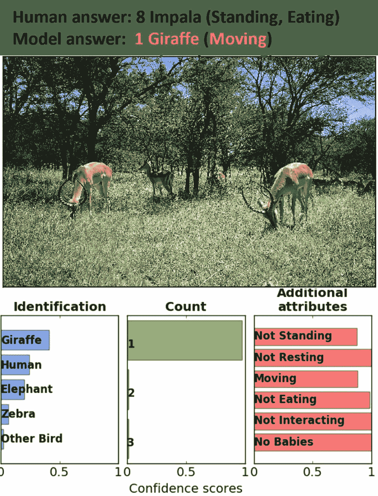
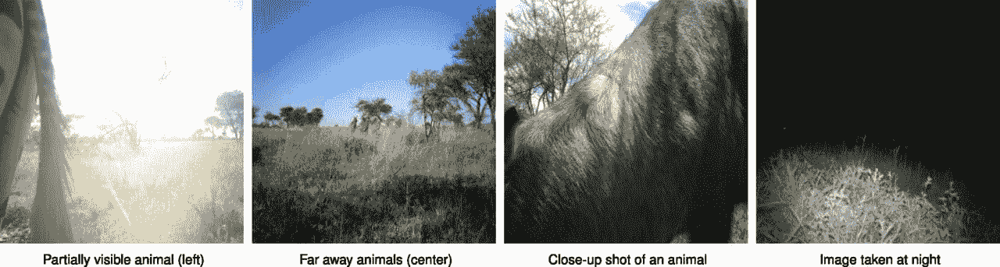
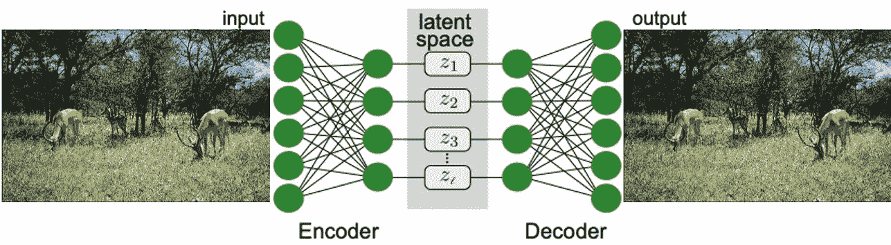
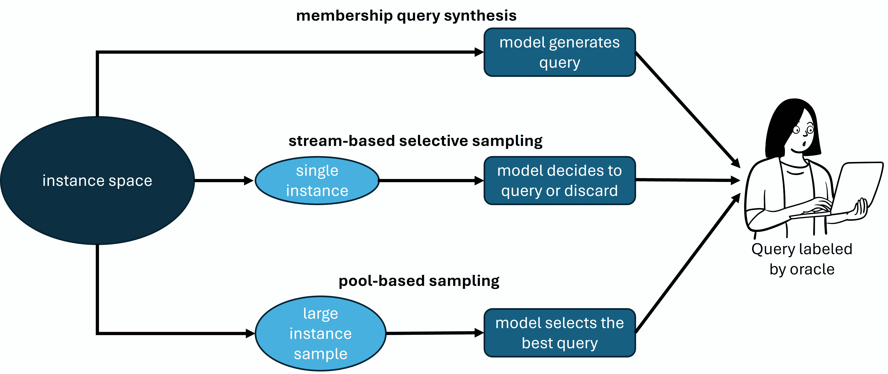
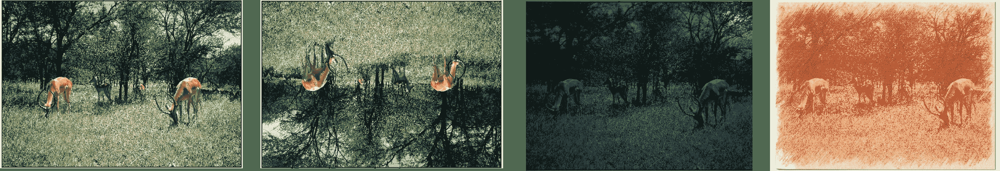
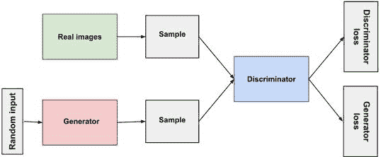

# 11  鲁棒性

> 原文：[`ml-science-book.com/robustness.html`](https://ml-science-book.com/robustness.html)

1.  将机器学习融入科学

1.  11  鲁棒性

机器学习系统不仅应该在实验室条件下工作——它们应该在野外工作！而且，我们确实是在这个单词的真正意义上说的。

想象你是一位研究塞伦盖提地区物种多样性和保护的动物生态学家。你知道机器学习系统可以让你仅通过图像识别、计数，甚至描述动物，如图 11.1 所示。Figure 11.1。塞伦盖提地区遍布着大量的运动传感器摄像头。结合 Norouzzadeh 等人[1]的机器学习模型的预测，你将很快拥有一个令人惊叹的数据集来应对你的研究问题。

Figure 11.1: 这张图片是由塞伦盖提地区的运动传感器摄像头拍摄的，展示了野生动物。Norouzzadeh 等人[1]的机器学习模型正确地识别、计数和描述了图片中的动物。经 1 许可使用。

Norouzzadeh 等人[1]确实在他们机器学习模型上做了令人印象深刻的工作：他们的训练好的卷积神经网络（CNN）在 Snapshot Serengeti 数据集 2 上达到了 94.9%的准确率——这与人标签者的表现相当。听起来这是一个可靠的工具，可以用来构建你的研究，对吧？

Figure 11.2: 这张图片看起来与 Figure 11.1 相同，但现在模型在所有方面都是完全错误的。图经 1 许可修改。

对人类眼睛来说，Figure 11.2 看起来与 Figure 11.1 相同，但对模型来说却不是。现在模型完全错误：物种、计数，甚至描述。发生了什么？这张图片是一个所谓的*对抗样本*。所有当前的机器学习模型，尤其是图像分类器，都容易受到这种对人类眼睛不可察觉但会导致预测模型误入歧途的精心设计的输入变化的影响。但 Norouzzadeh 等人[1]并没有做错什么。恰恰相反！这篇论文是科学中机器学习的典范：

+   他们详细解释了如何处理数据中的类别不平衡和目标泄露（参见第七章 Chapter 7），这可能是由于摄像头传感器连续拍摄三张照片造成的。

+   他们考虑了标签噪声并执行置信度阈值（参见第十二章）。

+   他们报告了整体性能和类别性能（参见第十四章），并提供了可用的开源代码（参见第十三章）。

然而，我们应该如何看待机器学习模型对对抗样本不鲁棒的事实？

对抗样本引发了机器学习中的鲁棒性辩论 [[3]](references.html#ref-szegedy2013intriguing)，我们将在本章末尾详细探讨其发生情况 第 11.7 节。但并非任何图像都能欺骗动物分类器，该模型在野外拍摄的实时图像上的表现相当不错。

我们相信科学家不应该因为欺骗性地使用从未在现实中出现的人工输入数据而失眠。在科学中，通常没有对手会欺骗你的模型——除非可能是审稿人 2。正如你将在本章中看到的，机器学习中还有许多更深刻的鲁棒性问题应该让你担忧！

机器学习不仅进入了科学领域，其产品还成为了全球畅销书。克拉哈的前博士生们想要分得一杯羹，将龙卷风预测的想法变成一家初创公司。但有一个问题。虽然原始模型在他们家乡地区表现完美，但在其他国家却毫无用处。他们向拉特尔请求一个研讨会，学习关于鲁棒机器学习的知识。

## 11.1 鲁棒性是什么意思？

在日常用语中，鲁棒性是一个单一实体的属性。洗衣机可以很鲁棒，如果它能多年无故障地工作。一个人可以很鲁棒，如果她能胜任许多情况。然而，这并没有真正说明鲁棒性究竟是什么，除了在一般情况下能正常工作。

为了检测鲁棒性问题并系统地解决它们，你需要一种允许你将 *鲁棒性* 操作化的语言 [[4]](references.html#ref-freiesleben2023beyond)：

+   **鲁棒性目标**是应该具有鲁棒性的东西。例如，你可能对动物分类器的性能鲁棒性感兴趣。

+   **鲁棒性修饰符**是相对于鲁棒性目标应该具有鲁棒性的东西。例如，这可能是在你应用动物分类器的图像。

+   **修饰符域**指定了目标应该对其鲁棒的相关变化。例如，这可能是在图像背景光照变化。

+   **目标容忍度**指定了如果修饰符在其域内发生变化，目标允许变化的程度。例如，如果模型性能因背景较暗的图像略有下降，只要性能没有大幅下降，你可能就无所谓。

那么，鲁棒性究竟意味着什么？

> **定义**：如果域内对修改者的相关干预没有导致比目标容差指定的更大变化，则鲁棒性目标对修改者是鲁棒的。

我们现在可以更细致地讨论鲁棒性。例如，野生动物图像分类器的性能（鲁棒性目标）在拍摄图像时对光照条件的变化相对鲁棒（相关干预）。然而，它对输入像素上的针对性修改（无关干预）的鲁棒性较低。最终，要判断你的模型是否适合特定应用，你必须检查它是否对修改者的相关干预具有鲁棒性。这迫使你思考在部署中预期会发生的变化！

## 11.2 审计和鲁棒化策略

从广义上讲，鲁棒性研究人员必须采用两种不同的视角：

+   **审计**：你的模型性能对相关修改者的变化是否鲁棒？例如，你可以检查当测试数据的背景变暗时，动物分类器的表现如何。

+   **鲁棒化策略**：你可以在数据收集和模型选择中做出哪些改变，以使你的模型对相关修改者的变化更加鲁棒？例如，如果你用更多在夜间拍摄的图像来训练你的模型，你的模型在这个环境中通常表现会更好。

这两个方面是相互作用的。你可能审计模型并检测潜在的鲁棒性弱点。为了减轻这些弱点，你应用鲁棒化策略。但你应该审计什么？

## 11.3 理解数据分布变化

在实践中，最重要的修改者是数据。你的训练数据可能来自一个来源，但当你现在部署你的模型时，数据可能看起来完全不同。数据分布变化有不同的*来源*：

+   **自然变化**是由于自然条件的变化而发生的。如果你考虑动物分类器，你必须处理：

    +   变化的天气或光照条件，

    +   随时间变化的动植物，或

    +   新的相机传感器放置在新的位置。

+   **表现性变化**是由模型本身及其对数据的影响引起的。想象一个根据人的行为预测他们将患哪种疾病的模型。提供这些预测后，这个人可能会改变她的行为，从而使预测无效。

+   **对抗性变化**是由于攻击者修改数据而发生的。一个例子在图 11.2 中给出。

对于自然科学家来说，最重要的分布变化是自然分布变化，而社会科学家必须同样关注表现性变化。对抗性变化在商业或工业应用中是一个问题，但在科学中则不那么严重。

图 11.3：示例展示了模型预期在不同自然条件下表现良好的情况，例如从远处、近距离或夜间拍摄的照片。经 1 许可使用。

你还可以区分不同类型的**数据分布变化**。在监督机器学习中，数据被描述为从潜在分布 $ \mathbb{P}(X,Y) $ 中采样的 $ (x^{(i)}, y^{(i)})_{i=1, \ldots, n} $ 对，其中 $ X:=(X_1,\dots,X_p) $ 描述了输入特征，$ Y $ 是目标变量。我们可以通过 $ X $ 和 $ Y $ 的分布直接表达不同类型的数据分布变化：

+   **协变量偏移**描述了一种情况，即分布 $ \mathbb{P}(X) $ 发生了变化。在上面的例子中，如果摄像头之前在开阔的阳光下，但现在在植物的阴影下，就可能发生协变量偏移。

+   **标签偏移**描述了一种情况，即分布 $ \mathbb{P}(Y) $ 发生了变化。例如，在塞伦盖蒂之前被忽视的河流森林中安装新的摄像头，将导致观察到的河马数量显著增加。

+   **概念偏移**描述了一种情况，即条件分布 $ \mathbb{P}(Y\mid X) $ 发生了变化。在野生动物的例子中，这可能会发生在物种有新的分类时；之前只有羚羊类别，但之后它被细分为格兰特羚羊、汤姆森羚羊等等。

再次强调，理解你所面临的分布变化类型对于增强你的模型鲁棒性至关重要。但在我们讨论增强策略之前，让我们首先探讨鲁棒性审计。

## 11.4 审计鲁棒性的策略

分布变化已经发生？还是你只是在预期分布变化？这决定了你可以进行哪种审计：

+   **后验审计**：分布变化已经发生。你在变化发生后收集了新的数据，可以评估你的模型在这份数据上的质量。在野生动物的例子中，你可能只使用旱季的数据来训练你的模型，而现在，在雨季的中期，你想要评估模型的表现。

+   **预期审计**：分布变化尚未发生。因此，你没有任何关于预期变化的数据。例如，如果你处于旱季，想要预测你的模型在雨季将如何表现。

### 11.4.1 后验审计

后验审计相对简单——只需分析你的模型在数据上的性能。例如，你可能想要比较旱季（变化前）和雨季数据（变化后）之间的模型性能。¹

**了解数据是否以及如何不同**

但你如何甚至识别出分布已经发生了变化呢？你需要持续监控你的数据并检查数据属性。对于表格数据，有各种汇总统计，如平均值、标准差、范围或相关系数。对于文本，情况类似，你拥有词频、词长、词嵌入的相似性、余弦相似度或文本情感。当这些统计开始变化时，你的分布变化警报应该响起。对于图像数据，我们缺乏好的汇总统计。相反，通过考虑领域知识，通过时间观察数据样本可能更有效。

此外，还有不依赖于模态的自动化策略来检测数据分布变化——称为*分布外检测（OOD）* [[5]](references.html#ref-yang2021generalized)。我们将在 11.5.2 节中讨论它们。

**分析不同错误**

与理解分布变化本身一样重要的是理解它如何影响模型性能。比较分布变化前后的性能只是适当审计的冰山一角。假阳性或假阴性率也可能不同，你可能有上下文偏好，要么限制假阳性，要么限制假阴性。同样，我们建议按输出类别分组并比较错误。

**解释方法可以指向错误的来源**

解释方法（见第九章）能让你了解模型所依赖的特征以及这些特征如何影响模型性能。例如，特征归因技术允许你分析图像分类器对特定预测的注意力。如果模型通过查看背景而不是动物来分类格兰特羚羊，你应该引起警觉 [[6]](references.html#ref-ribeiroWhyShouldTrust2016)。如果你处理的是表格数据，你可以比较分布变化前后基于数据的全局特征重要性。

### 11.4.2 预先审计

预先稳健性审计比事后审计要求更高。变化尚未发生——所以你没有变化后的数据。你需要根据上述来源和类型的变化来定性指定变化。为了量化预期变化对模型性能的影响，你还需要生成反映变化的人工数据。

**定性指定变化**

你期望什么样的偏移，是自然的还是表现性的偏移？是协变量、标签甚至概念的偏移吗？务必正确指定偏移。例如，在一个非对抗性环境中审计你的模型以检查对抗性鲁棒性是没有意义的。咨询你的领域知识！你期望你的领域的哪些方面会变化，它们属于上述哪种类型的偏移？回想一下我们的野生动物例子：研究人员知道塞伦盖提环境和其野生居民存在相关的季节性影响。

**生成（半）合成数据并系统地测试你的模型**

要进行定量审计，你需要反映分布偏移的数据。但由于你没有观察到而是预测了偏移，你必须生成数据。你必须将你对偏移的定性知识转化为生成数据的方式。我们将在第 11.5.3 节中讨论各种生成数据的策略，例如，图像过滤器允许你将白天数据转换为夜间数据（参见图 11.4)。

假设你已经创建了一个合成数据集，这是否意味着你最终达到了在事后审计中开始的地方？是的，但也不是，还有两个主要区别：1. 你已经对数据有了深刻的理解，因为你创造了它。2. 你的合成数据提供的见解取决于你对偏移的假设。

**解释方法允许你预测偏移**

解释方法允许你在不指定预期的分布偏移或合成数据的情况下进行审计。相反，你只需以更探索性的方式分析你的预分布偏移数据，例如，如果特征归因方法表明模型依赖于背景特征，如树木来分类动物，这可能意味着模型在变化的背景条件下表现较差。这会提醒你潜在的分布偏移（背景变化）以及你的模型失败的原因（对背景的依赖）。同样，如果一个虚假特征具有很大的特征重要性，你的模型可能在特征变化的环境中失败；在慕尼黑训练的 COVID 风险预测器，如果依赖于街道名称，在巴黎可能会失败。最后，特征效应方法，如个体条件效应曲线（ICE）和反事实解释，描述了模型在相关反事实场景中的行为。

*在鲁棒性审计中，上下文很重要* *您需要审计模型的内容，很大程度上取决于应用上下文。作为标注工具的野生动物模型，其审计范围不如基于机器学习的医疗诊断广泛。所需的审计取决于错误的风险、环境的稳定性以及其他领域特征。对于高风险应用，如医学，通常还有额外的法律要求，例如欧洲人工智能法规和医疗器械法规中规定的那些。*  *## 11.5 使模型鲁棒化的策略

假设您的审计表明您的模型对相关分布变化不鲁棒。您如何使其鲁棒化？这是一个按其在机器学习管道中的位置排序的常见鲁棒化策略列表。以下将更详细地讨论每个策略：

1.  **控制来源**：一些变化在模型权威机构控制之下。例如，购买新的相机传感器品牌可能比坚持旧品牌导致更大的分布变化。

1.  **过滤分布外数据**：您可以训练第二个模型来过滤与训练数据显著不同的数据。例如，机器学习模型不应为训练集中未包含的动物提供预测，将这些情况留给人工标注者。

1.  **收集代表变化的代表性数据**：您可以收集额外的（真实或合成的）数据来解释变化。例如，可以使用图像过滤器使用干燥季节数据增强湿润季节数据。

1.  **仔细选择和构建特征**：您的模型缺乏鲁棒性可能是因为它依赖于错误特征或不正确的特征编码。例如，通过去除图像背景，背景的变化将不再影响模型的表现。

1.  **明智地选择归纳偏差**：一些变化可以通过调整建模假设来解释（参见第八章）。例如，在计数动物时，您可以选择一个可以推广到高动物计数（如序列子分类[[7]](references.html#ref-chattopadhyay2017counting)）的架构。

1.  **通过迁移学习获得鲁棒表示**：通常，您的模型对分布变化敏感，因为其学习到的表示过度拟合了训练数据。在这种情况下，*迁移学习*——即重用其他模型在相同数据模态上训练学习到的表示——可以帮助。Norouzzadeh 等人[[1]](references.html#ref-norouzzadeh2018automatically)证明，从常见的图像分类器中迁移表示可以提高野生动物分类器的数据效率。

你应该根据审计结果选择策略来增强你的模型。如果你自己导致了分布偏移，你可能能够控制这种偏移。当你的模型只在罕见异常情况下表现不佳时，过滤掉这些情况可能是最好的方法。如果分布偏移不可避免且导致性能显著下降，最常见的方法是增加数据并重新训练模型。如果分布偏移不可避免但数据增强困难，你可能需要设计特征、调整建模假设或使用迁移学习。

### 11.5.1 控制数据源

分布偏移通常不会发生，而你对此无能为力。你通常扮演着积极的角色——通过你的行动导致了分布偏移。你安装了一个不同品牌的相机传感器，结果性能突然下降？你在相机旁边放置食物以捕捉更多动物，结果动物计数达到极限？在某些情况下，与其调整数据或模型，不如直接解决偏移的根源。你必须实施控制以确保环境稳定，例如，只使用同一品牌的相机。

但并非所有分布偏移都在你的控制范围内。你无法让塞伦盖提地区全年都处于雨季。你可以控制其他数据源，但不可避免地会有一些不希望出现的副作用：你可以在相机周围创造稳定的照明条件，但这可能会吸引或排斥某些动物。

### 11.5.2 过滤分布外数据

总会有一些数据对你的模型构成挑战。特别是与训练数据非常不同的数据。分布外（OOD）检测器使你能够过滤掉模型表现会显著变差的数据。然后，这些数据可以单独处理，例如，由人工标注者处理。因此，OOD 检测增强了部署中的整体性能。然而，OOD 检测器仅作为过滤器；它们不能帮助解决重大的分布偏移。

如何确定一个数据点是否为 OOD？使用 OOD 检测器！有时人们进一步区分旨在检测*异常*（来自不同分布的罕见数据）、*新颖性*（来自移动分布的数据）或*离群值*（训练分布内的罕见数据）的方法 [[5]](references.html#ref-yang2021generalized), [[8]](references.html#ref-ruff2021unifying)。在这里，我们更广泛地关注 OOD 检测。有四种不同的方法 [[5]](references.html#ref-yang2021generalized)：

+   **基于分类的方法**将 OOD 检测表述为一个分类问题。一些基于分类的方法需要将数据标记为分布内和分布外。其他方法利用不确定性感知分类器，并将具有高分类不确定性的数据标记为 OOD。

+   **基于密度的方法**显式地建模训练数据的概率密度。密度低于某个阈值的 数据被标记为 OOD。

+   **基于距离的方法**计算给定数据点到数据集中心点或原型之间的差异。距离超过某个阈值的 数据被标记为 OOD。

+   **基于重建的方法**使用自编码器方法来检测 OOD 数据。重建误差较高的数据被标记为 OOD。

要了解所有不同类型的 OOD 检测器的概述，请参阅 [[8]](references.html#ref-ruff2021unifying)、[[5]](references.html#ref-yang2021generalized) 和 [[9]](references.html#ref-chalapathy2019deep) 的综述论文。

基于重建的技术比其他方法具有优势：与基于分类的方法不同，你不需要将数据标记为（非）OOD；与基于密度的方法不同，你不需要指定概率密度的模型；与基于距离的方法不同，你不需要构建复杂的参考点，如中心点或原型。因此，让我们更深入地了解基于重建的 OOD 检测器。

*自编码器* 自编码器描述了一种基于神经网络的将高维输入投影到低维特征空间（通常称为*潜在空间*）的方法，信息损失最小。这是通过两阶段架构实现的：

1.  **编码器**：将高维输入投影到预指定的低维潜在空间。

1.  **解码器**：将潜在空间中的投影输入映射回原始空间。

编码器和解码器映射被优化以最小化训练数据的重建误差。给定输入的重建误差描述了该输入与通过顺序编码和解码输入后获得的输出之间的差异（根据某些度量）。在我们的例子中，这意味着计算初始 Impala 图像与其通过编码器和解码器网络重建的版本之间的均方误差。

自编码器的结构。图是通过结合 [[10]](references.html#ref-neupert2021introduction) 和 [[1]](references.html#ref-norouzzadeh2018automatically) 的元素创建的（经许可使用）。版权所有。*  **使用自编码器进行分布外检测**

假设 $ x $ 是你想要分类为训练分布内或外的数据点。那么编码器网络可以描述为从高维特征空间 $ \mathbb{R}^h $ 到低维潜在空间 $ \mathbb{R}^l $ 的映射 $ E:\mathbb{R}^h\rightarrow \mathbb{R}^l $。同样，解码器网络是映射 $ D:\mathbb{R}^l\rightarrow \mathbb{R}^h $，而 $ L $ 是输入空间 $ \mathbb{R}^h $ 上的距离函数（例如均方误差）。然后，$ x $ 的**重建误差**定义为：$$\text{RE}(x):=L(x,E(D(x))).$$ 这允许我们定义一个简单的 OOD 检测器：$$\text{OOD}(x):=\begin{cases} \text{OOD}\quad\quad \text{if RE}(x)>\tau \\ \text{not OOD}\quad \text{else} \end{cases}$$ 直观地说，任何重建误差超过某个阈值 $ \tau $ 的数据都被视为 OOD。这种原始方法面临着明显的局限性：

+   此外，OOD 数据也可能具有低重建误差。通过在潜在空间上扩展重建误差与马氏距离，这个问题可以得到解决 [[11]](references.html#ref-denouden2018improving)。

+   训练自动编码器很困难，你必须根据领域知识（例如，CNN 用于图像）做出架构选择，定义一个适当的潜在空间（即正好可以捕捉训练分布而不损失信息的大小），并选择一个适当的损失函数 [[8]](references.html#ref-ruff2021unifying)。

+   训练自动编码器需要代表性的训练数据 [[9]](references.html#ref-chalapathy2019deep)，但在实践中，数据往往是不平衡的.*  *### 11.5.3 收集代表偏移的数据

为什么分布偏移对机器学习模型来说是个问题？在协变量偏移（即 $ \mathbb{P}(X) $ 的偏移）或标签偏移（即 $ \mathbb{P}(Y) $ 的偏移）的情况下，你的模型会失败，因为它从未见过这种类型的数据，无法进行外推。在概念偏移（即 $ \mathbb{P}(Y\mid X) $ 的偏移）的情况下，你的模型可能面临过类似的输入，但学到的依赖关系变得不可靠。

在任何情况下，研究文献中如何使模型对这种偏移鲁棒的突出解决方案都是相同的——收集更多反映分布偏移的数据！有两种策略可以获得这种数据：

+   **通过主动学习收集真实标注数据**：你可能需要真实标注数据。主动学习关注的是系统地寻找值得标注的数据。

+   **增强你的数据**：收集真实数据成本高昂，而且你对获取哪种类型的数据有限制。数据增强关注的是使用领域知识生成合成实例。

**主动学习**

你应该标注哪些数据来使你的模型更鲁棒？标注所有数据通常成本高昂且耗时。文献根据标注者如何接收数据区分了三种主动学习设置 [[12]](references.html#ref-settles.tr09)：

1.  在*成员查询合成*中，输入空间中的任何输入都是潜在的标注候选，即使是完全不切实际的输入。

1.  在*基于流的采样*中，你按顺序接收数据，并需要决定是否要标注这些数据。

1.  在*基于池的采样*中，你收到一个大数据样本，并需要选择一个你想要标注的子样本。

三种主要的主动学习设置。基于[[12]](references.html#ref-settles.tr09)中提出的概念。CC-BY(https://creativecommons.org/licenses/by/4.0/)

主动学习主要关注标注选择过程的自动化 [[12]](references.html#ref-settles.tr09)，[[13]](references.html#ref-ren2021survey)。数据选择过程可以基于高预测不确定性、接近决策边界、随机性、预期模型误差、预期训练效果或数据代表性。在示例中，Norouzzadeh 等人 [[1]](references.html#ref-norouzzadeh2018automatically)建议标注那些预测不确定性最高的野生动物图像。请注意，所有这些不同的主动学习策略在最近的 Python 包中如 modAL [[14]](references.html#ref-danka2018modal)和 ALiPy [[15]](references.html#ref-tang2019alipy)中都是现成的。

你也可能对要跟踪和标注的数据有所直觉。结合此类知识 [[16]](references.html#ref-ciravegna2023knowledge)并通过可解释性技术与模型交互 [[17]](references.html#ref-ghai2021explainable)可以显著提高主动学习策略。

**数据增强**

数据增强是关于创建合成数据。等等，你不也需要主动学习来标注这些数据吗？在某些情况下是的，即如果你想找到一个任意输入的标签。然而，当我们谈论数据增强时，我们通常是为那些我们知道标签的数据创建数据。数据增强在计算机视觉领域尤其受到关注 [[18]](references.html#ref-mumuni2022data)，[[19]](references.html#ref-shorten2019survey)，但最近关于自然语言处理领域的数据增强文献也在不断增加 [[20]](references.html#ref-feng2021survey)。

有两种一般策略可以增强你的数据 [[18]](references.html#ref-mumuni2022data)：

+   **数据转换**：应用于标注数据且已知不会改变标签的转换。选择正确的转换是结合领域知识的绝佳方式。关注你预期在实际中可能发生的转换。

+   **数据合成**：创建具有已知标签的全新数据。数据合成可能基于生成模型或计算机辅助设计（CAD）模型。目标是生成与你的训练数据共享重要属性但相关方面有所不同的合成数据。

在计算机视觉中，有几何变换（改变图像的角度、位置、方向或大小）和光度变换（改变属性如色彩、饱和度、对比度或相机伪影）。一些变换涉及整个图像，而另一些只涉及一个区域。变换可能删除、替换、交换或重新组合图像的区域。

图 11.4：Impala 图像（左）应用了不同的相关变换：简单的旋转、从白天到夜晚的背景变换，以及艺术滤镜。简单的旋转可以通过手工实现，而复杂的滤镜通常依赖于生成模型。图经许可修改自[[1]](references.html#ref-norouzzadeh2018automatically)。

在自然语言任务中，通常会在句子中随机插入、删除或交换单词，或者在句子中将单词替换为其同义词。如果您有一个训练好的语言模型，还可以执行更复杂的变换，例如：回译，即句子在两种语言之间来回翻译；文本释义，即在不改变意义的情况下重新表述相同的内容；以及风格变换，即以不同的风格（例如，更正式的语言与不太正式的语言）描述相同的内容。

数据合成更具挑战性。计算机辅助设计（CAD）允许您通过手工建模物理对象，并以物理合理的方式执行各种几何和光度变换。神经渲染通过从二维图像中学习 3D 场景表示，从而避免了手工制作的 CAD 建模。在计算机视觉中，数据合成的最常见方法是用生成模型，如生成对抗网络（GANs）或变分自编码器（VAEs）。这些模型生成逼真的图像，可以根据期望的目标类别进行条件采样。在自然语言处理中，最好的生成模型是大型语言模型，如 ChatGPT 或 LLaMA，它们可以被提示生成具有特定内容的数据。

*生成对抗网络（GAN）* *GAN 是一种生成模型，它允许生成高度逼真的数据[[21]](references.html#ref-goodfellow2014generative)。它使用两个子模型进行训练：

+   **生成器**：这个神经网络模型被设计用来生成数据。它从（高斯）分布中获取随机噪声作为输入，并理想地将噪声转换为真实数据。

+   **判别器**：这个网络被设计用来区分真实数据和人工数据。它接收输入并决定它们是真实数据还是合成数据。

这两个子模型在零和游戏中迭代训练。生成器旨在生成判别器误认为是真实数据的假数据。判别器旨在完美地区分真实数据和合成数据。在训练过程中，两个模型在各自的任务上都变得越来越擅长，这最终导致了一个性能良好的生成器模型。

GAN 的结构。图来自 [Google](https://developers.google.com/machine-learning/gan/gan_structure?hl=de)，CC-BY (https://creativecommons.org/licenses/by/4.0/)*  *数据转换和合成之间的界限比我们上面提到的要复杂。相关的转换往往不仅仅是简单的几何或光度变换。想想看，改变整个背景或向塞伦盖提图像中添加其他动物。复杂的转换通常需要数据合成方法。例如，数据增强 GANs [[22]](references.html#ref-antoniou2017data) 和条件 GANs [[23]](references.html#ref-isola2017image) 允许在给定数据实例的条件下生成新的实例。

在 Python 中执行数据增强的常见包有用于计算机视觉的 Augmentor 包 [[24]](references.html#ref-bloice2017augmentor)，Keras 中的 ImageDataGenerator，以及用于自然语言处理的自然语言工具包 (NLTK) [[25]](references.html#ref-bird2006nltk)。

**你获得数据后会发生什么？**

假设你已经收集了所需的数据。你该怎么做？你可以 *重新训练* 整个模型：将新收集的数据与你的训练数据合并，并再次运行你的机器学习算法。另一种策略是在你收集的新数据上训练现有的机器学习模型，以 *微调* 它。实际上，微调听起来比重新训练工作量小，但它往往根据微调的具体情况引入偏差，要么偏向训练数据，要么偏向新数据。而不是重新训练和微调，你可能会决定仅在新收集的数据上训练一个新的 *独立模型*。

如果你面临协变量或标签偏移，重新训练和微调都是合理的策略。旧数据和新技术可以在一个模型中合并，因为两者之间的预测模式保持不变。如果你通过主动学习获得了一些高质量的数据，并且你希望在训练中强调这些数据，那么微调特别建议。另一方面，在概念变化的情况下，旧数据和新技术之间的预测模式不同——训练一个独立的模型是唯一的选择。

**数据增强真的能提高鲁棒性吗？**

这个问题通常很难评估，因为它取决于领域和数据增强方法。在机器学习中，有一个格言：更多的数据总是更好的。但如果数据是合成的呢？在许多情况下，数据增强确实有效地提高了鲁棒性 [[18]](references.html#ref-mumuni2022data), [[26]](references.html#ref-hendrycks2021many)。然而，在某些情况下，（对抗性）鲁棒性与原始数据集上的预测性能相冲突 [[27]](references.html#ref-tsipras2018robustness)。这并不令人惊讶：鲁棒性意味着对某些特征的不敏感，而对预测特征的不敏感会导致性能下降。你是否必须权衡（对抗性）鲁棒性和性能取决于数据增强方法 [[28]](references.html#ref-rebuffi2021data)。有趣的是，仅用合成数据训练你的模型可能会让你的模型变得疯狂 [[29]](references.html#ref-alemohammad2023self).*  *### 11.5.4 仔细选择和构建特征

正如我们在第二章（supervised-ml.html）中讨论的，输入特征和目标特征是每个模型构建者面临的关键建模选择。使用不可靠的特征实现鲁棒模型可能是不可能的。想象一下，你只能根据动物被看到的背景来预测动物的物种。最轻微的分布变化都会降低模型性能。同样，如果你被迫预测一个特定的物种，但 75%的数据中没有任何动物 [[1]](references.html#ref-norouzzadeh2018automatically)，那么你的模型从一开始就注定要失败！

选择合理的输入和目标特征具有挑战性，需要（因果）领域知识（参见第八章和第十章）。存在各种方法来获得更好的输入特征以使你的模型鲁棒：

+   **特征选择**描述了从特征集中选择最优特征子集的方法 [[30]](references.html#ref-chandrashekar2014survey)。该子集是根据诸如输入和目标之间的（条件）互信息或训练分类器在输入特征子集上的性能等标准选择的（例如，参见第九章中的条件特征重要性）。特征选择降低了数据的维度，并过滤掉不可靠或噪声特征，从而提高了鲁棒性。特征选择算法通常针对表格数据，但对于图像、文本或语音数据则不太有用。

+   **特征工程**描述了将输入特征进行转换的方法。一个选项是应用手工制作的转换，这些转换：

    +   描述统计特性，例如交互项，

    +   编码领域知识，例如图神经网络中的图结构，

    +   具有物理意义，例如边缘检测器，

    +   降低维度，例如使用 L1 损失的线性回归，

    +   提供有用的编码，例如分桶或独热编码，或

    +   强调特别重要的特征，例如时间。或者，可以学习导致具有所需特性的转换，例如平滑性、稀疏性或任务泛化性。这些所谓的 *表示学习* 方法通常会导致在分布变化下鲁棒性的提高 [[31]](references.html#ref-bengio2013representation)。

此外，目标编码可以进一步改进。例如，Norouzzadeh 等人 [[1]](references.html#ref-norouzzadeh2018automatically) 将他们的预测目标分为两部分：在任务 1 中，模型区分包含和不包含动物的输入；在任务 2 中，第二个模型将包含动物的图像分类为不同的物种。这种在两个任务中的分解显著提高了分类器的鲁棒性。同样，目标特征通常以层次形式出现 [[32]](references.html#ref-vens2008decision)：汤普森瞪羚和格兰特瞪羚是瞪羚的不同亚种。这种额外的结构可以编码到层次多标签编码中，如决策树，从而提高分类器的鲁棒性。

### 11.5.5 聪明地选择归纳偏差

模型选择与预测性能之间的关系已经在 第七章 和 第八章 中进行了广泛讨论。关键见解是——归纳偏差（例如模型类别、架构、超参数、损失等）越适合，你将更快地学习到一个高性能模型。数据分布变化不过是学习环境。因此，模型选择提供了一种另一种增强鲁棒性的策略。例如：

+   CNNs 是平移不变的。图像中动物的位置不会影响模型性能。

+   Dropout 通过在训练中关闭某些神经元来提高对对抗攻击的鲁棒性 [[33]](references.html#ref-wang2018defensive)。原因是 dropout 强制在潜在空间中产生更平滑的表示。

使用数据增强和归纳建模偏差来提高对分布变化的鲁棒性是同一枚硬币的两面。前者将关于（预期）分布变化的知识转化为数据实例；后者将关于（预期）分布变化的知识转化为建模假设。CNNs 只是这种并行性明显的一个例子，许多类似的架构解决方案编码了旋转和缩放不变性 [[34]](references.html#ref-mumuni2021cnn)。同样，图神经网络允许将所有形式的领域知识编码到图结构和节点/边属性中 [[35]](references.html#ref-corso2024graph), [[36]](references.html#ref-wu2020comprehensive), [[37]](references.html#ref-battaglia2018relational)。

是应用数据转换还是将不变性编码到归纳建模假设中更好？一方面，某些数据转换难以编码为模型中的归纳偏差。想想干旱季节和湿润季节的数据，没有简单的方法来编码对季节变化的不变性。另一方面，如果可能将不变性编码为归纳偏差，你应该这样做。你的模型将保证遵守这些不变性，而数据增强只是使模型更有可能学习到不变性。此外，还存在计算权衡：更多的数据需要更多的计算资源，而更好的归纳偏差通常可以提高计算效率。

### 11.5.6 转移学习以获得鲁棒表示

转移学习是指将知识从一个任务转移到另一个任务。因此，学习一个任务不必从头开始，而是可以建立在现有知识的基础上。虽然任务往往存在很大差异，但它们共享某些方面。例如，对宠物和野生动物进行分类都需要学习高阶表示，使我们能够区分动物，尽管动物、它们的行动和图像背景可能不同。通过归纳更多领域通用知识，转移学习使模型对常见的分布偏移更加鲁棒。我们根据它们转移的知识区分不同的转移学习类型：

+   **特征提取**建立在单个任务中学习到的表示之上，以便在另一个任务中重用。例如，假设你有一个通用的图像分类器，如 ResNet 或 Inception V3，它已经在像 ImageNET 这样的大型数据集上进行了训练。那么，在神经网络的权重、激活和节点中存储了表示，这些可以重用来使野生动物分类器对常见的图像排列具有鲁棒性。常用的特征提取方法集中在最终预测之前的倒数第二层。特征提取是最受欢迎的转移学习技术，Norouzzadeh 等人[[1]](references.html#ref-norouzzadeh2018automatically)也使用了这种方法，从而提高了数据效率。

+   **微调**使用为单个任务训练的模型学习到的特定细节作为另一个任务的起点。例如，可以取训练好的 ResNet 分类器，替换输出层，并在野生动物图像上训练模型。与特征提取不同，模型可以调整 ResNet 在 ImageNet 上学习到的表示，并针对野生动物案例进行定制。这同样由[[1]](references.html#ref-norouzzadeh2018automatically)完成，然而，并没有显著提高整体性能。

+   **多任务学习**涉及训练一个用于同时执行多个相关任务的单个核心模型。想法是强制核心模型学习适用于不同任务的表示，从而提高表示并增强对常见变化的鲁棒性。例如，可以使用同一个核心模型来分类树木、野生动物，并预测白天。通过优化这样一个多样化的任务集，核心模型必须学习适用于所有这些任务的表示。

+   **自监督学习**可以看作是学习一个适用于各种任务的核心模型的一种特定方法。它掩盖数据的一部分，并试图从其余数据中推断它们。因此，自监督学习学习了一般化模式。例如，可以掩盖动物的头来学习动物头部和身体之间的相互依赖性。

如果特定任务的数据稀缺但相关任务的数据广泛可用，迁移学习可以成为关键。越来越多地，存在适用于所有数据模态的核心模型，例如 ChatGPT 用于文本数据或 ResNet 用于图像数据。基于大量数据，这些核心模型已经学会了如此强大的表示，使得它们对广泛的分布变化具有鲁棒性。我们相信，在未来科学应用中，从核心模型中进行迁移学习可能发挥关键作用。进入这些模型的数据和知识不应被浪费。**  **## 11.6 一般化和因果性与鲁棒性相关

记得我们在第七章中讨论的三种不同类型的一般化吗？理论上的预测一般化、实践中的预测一般化以及现象的一般化。理论上的预测一般化涉及对静态数据分布的预测，这确实是机器学习模型的一个自然要求。鲁棒性通常更进一步：机器学习模型应该在所有实际相关的场景中表现良好。这意味着模型在预期的数据分布变化下应该具有鲁棒性。实践中的预测一般化和鲁棒性因此通常意味着同一件事——模型应该在自然条件下工作。

因果性关乎对当前现象的一般化。你希望有一个准确的数据生成过程表示。这构成了鲁棒性与因果性之间的联系。为什么？如果你有一个现象的准确表示，那么你可以模拟所有各种替代场景，并在所有各种分布变化下提供预测：

+   **你知道是什么导致了分布偏移吗？** 那么你可以使用你的因果模型来模拟这种偏移，并仍然使用你的因果模型提供最优预测 [[38]](references.html#ref-arjovsky2019invariant), [[39]](references.html#ref-kamath2021does)。甚至你的初始机器学习预测模型在特定偏移下也可能表现稳健 [[40]](references.html#ref-konig2023improvement)。

+   **你不知道是什么导致了分布偏移吗？** 假设你只收到了指示偏移的数据。那么，因果模型允许生成各种可能的偏移数据，并将它们与观察到的数据进行比较 [[41]](references.html#ref-cranmer2020frontier)。

即使在这些情况之外，因果模型具有一个使其对机器学习鲁棒性研究具有吸引力的基本属性——因果模型是模块化的。比如说，你训练一个机器学习模型来学习两个变量 $ A $ 和 $ B $ 的联合分布，即 $ \mathbb{P}(A,B) $。那么，一旦 $ A $ 或 $ B $ 的分布发生变化，你就必须学习一个全新的模型。

相反，假设你知道 $ A $ 导致 $ B $。那么你可以将你的学习任务分为两个部分，即 $ \mathbb{P}(B\mid A) $ 和 $ \mathbb{P}(A) $。这再次为你提供了联合分布，因为 $$\mathbb{P}(A,B)=\mathbb{P}(A)\mathbb{P}(B\mid A).$$ 但现在如果 $ \mathbb{P}(A) $ 发生偏移，你只需要更新你的 $ \mathbb{P}(A) $ 模型，而 $ \mathbb{P}(B\mid A) $ 必须保持稳定，因为它是一个因果机制关系（参见 第十章）。这种模块化使得因果关系值得学习！

## 11.7 对抗样本的谜题

为什么一个像 [[1]](references.html#ref-norouzzadeh2018automatically) 那么好的模型会在 图 11.2 中犯错误？这个问题背后隐藏着对抗样本的谜题。对抗样本是通过一种方式修改的输入，使其在人类看来与原始输入无法区分，但完全改变了模型的预测，导致错误分类。这种行为的理由仍然只有部分被理解。

第一个假设是，对抗样本描述了在原始训练数据中未得到良好表示的不太可能出现的实例[[3]](references.html#ref-szegedy2013intriguing)。然而，如果这是真的，向训练数据中添加对抗样本应该会消除这个问题——但事实并非如此[[42]](references.html#ref-zhang2019limitations)。即使你在广泛的对抗样本上训练你的模型，仍然会在直接附近出现新的对抗样本。著名的是，Goodfellow 等人[[43]](references.html#ref-goodfellow2014explaining)提出了一个新的建议。他们认为，对抗样本出现在机器学习模型中是因为模型过于线性。大多数机器学习模型仍然基于相对线性的激活函数，如 ReLU（修正线性单元）。因此，输入的变化达到一定范数会导致（由于线性）预测的显著变化。这一洞察导致了一种新的高效算法来计算对抗样本，即快速梯度符号法[[43]](references.html#ref-goodfellow2014explaining)。线性激活函数最终既不是对抗样本的必要条件也不是充分条件[[44]](references.html#ref-tanay2016boundary)。新的对抗样本不仅出现在基于 ReLU 的神经网络模型中，还出现在所有类型的机器学习模型中[[45]](references.html#ref-han2023interpreting)。此外，这些样本在不同模型之间转移——你可以为 ResNet 模型生成一个对抗样本，并将其成功应用于具有完全不同架构的另一个模型[[46]](references.html#ref-papernot2016transferability)。线性无法解释这种奇怪的行为。

**对抗样本不是错误，而是特性**

Ilyas 等人[[47]](references.html#ref-ilyas2019adversarial)对对抗样本给出了新的解释——对抗样本的出现是因为人类感知和机器学习感知运作方式不同。机器学习模型学习的是在整个数据集上稳定的模式，包括人类不依赖的模式。例如，根据大象皮肤的纹理而不是其形状或其鼻子来分类大象。大象皮肤上的微小变化不会改变人类的分类，但会改变机器的分类。

Ilyas 等人 [[47]](references.html#ref-ilyas2019adversarial) 得出这一结论是基于以下实验：假设你有一个训练好的模型，然后为这个模型生成一组对抗样本。现在，从头开始仅使用这些对抗数据（带有错误标签）训练一个新的模型。令人惊讶的是，这个模型在原始数据上表现良好，标签正确。这种行为唯一合理的解释是，对抗样本在某种意义上是奇怪的，对抗样本在特征上的差异使得可以分类普通数据点。这也解释了为什么对抗样本可以在基于相同数据的不同模型之间迁移，因为它们与真实数据在通常指示不同类别的方面存在差异。不幸的是，这种对抗样本的解释（看似合理）并没有带来简单的解决方案。它意味着对抗样本只能通过依赖与人类相同的特征来规避。然而，这样做会限制可能的解决方案空间，从而降低预测性能。在科学研究中，你最终可能追求的是人类尚未发现的新的预测模式。

另一个导致对抗样本的因素是机器学习模型无法区分原因和效果，或者虚假的相关性。因此，改变与不同目标类别相关联的特征可以翻转预测结果，而不会改变潜在的目标 [[48]](references.html#ref-freiesleben2022intriguing)。就像改变大象的皮肤纹理使其类似于河马的，而不触及它们形状或象鼻等因果特征。因此，添加因果假设可能有助于防止某些对抗样本 [[49]](references.html#ref-scholkopf2022causality)。但再次强调，这并不是一个容易在实际中使用的解决方案。对抗样本仍然是一种你必须接受的现象，而且不清楚消除这种现象是否总是可取的。在科学研究中，你甚至可能追求人类无法察觉的奇怪预测特征。

## 11.8 鲁棒性是一个持续的挑战

机器学习中的鲁棒性不是你可以实现的东西。鲁棒性就像西西弗斯² 不断推到山顶上的巨石，只为了看到它再次滚下来。但如果你想有一个可靠的机器学习模型，唯一的方法就是继续推动！你的环境会改变，最终导致你的模型性能下降。保持警惕并不断适应是非常重要的。

这一章节应该清楚地说明，使模型稳健化是多方面的。你流水线中的每一步都可以做出贡献，每一步都应该保持动态，以便能够快速应对变化。本书的每一章都是你永无止境的机器学习稳健性旅程的盟友，你需要具有泛化能力的模型（第七章），你必须结合领域知识（第八章），你必须使用可解释性技术对你的模型进行审计（第九章），你应该意识到预测的不确定性（第十二章），最终你应该结合因果关系（第十章）。

在稳健性研究中，许多问题仍然具有挑战性：

+   将缺乏稳健性转化为稳健化策略是困难的。数据增强可以提供一个初步的启发式解决方案，但没有任何保证。此外，不同的偏移需要不同的稳健化策略。

+   对抗样本仍然相对神秘。它们可以避免吗？如果是的话，应该避免吗？

+   合成数据通常是使你的模型稳健化的最低成本方法。但是，如果数据不类似于真实数据的特点，在它上面训练你的模型将是徒劳的。

成为机器学习稳健性工程师就像成为一名科学家——这是一场与自然的持续斗争。然而，套用加缪的话³，我们必须想象机器学习稳健性工程师是快乐的人。

* * *

1.  为了评估您的新数据上的模型性能，它必须被标记。我们在第 11.5.3 节中讨论了如何使用主动学习系统地标记数据。↑

1.  西西弗斯是希腊神话中的一个人物，以其狡猾和欺诈的本性而闻名。他是科林斯的国王，因他的诡计而臭名昭著，这些诡计常常使他与神明发生冲突。与西西弗斯有关的最著名的故事之一是他死后在冥界的惩罚。根据希腊神话，在他死后，西西弗斯被神明判罚永远推一块巨石上山，每次他接近山顶时，巨石都会滚下来。这项永无止境且毫无意义的任务被称为“西西弗斯式的”，常被用作比喻那些永无止境且最终感觉毫无意义的任务。↑

1.  阿尔贝·加缪是一位法国哲学家、作家和记者，以他的存在主义作品最为人所知。在他的哲学论文《西西弗斯的神话》（1942 年）中，加缪探讨了荒谬的哲学概念——人类渴望在生活中找到意义与宇宙对人类关切的无动于衷之间的固有冲突。加缪认为，尽管西西弗斯的任务看似毫无意义，但他仍然可以通过拥抱生活的荒谬，并在反抗它的行为中找到满足，从而在他的存在中找到幸福和意义。因此，他著名地宣称“我们必须想象西西弗斯是快乐的”。确实，将这些深刻的思考与机器学习的鲁棒性联系起来有些牵强附会…↑***
