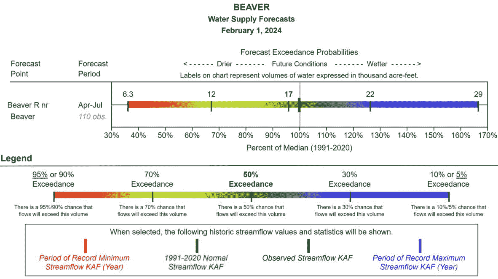
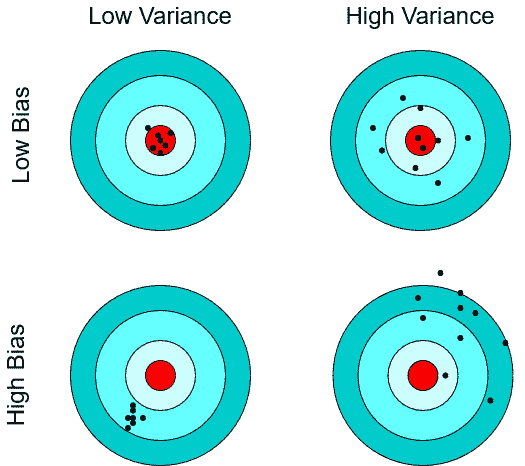
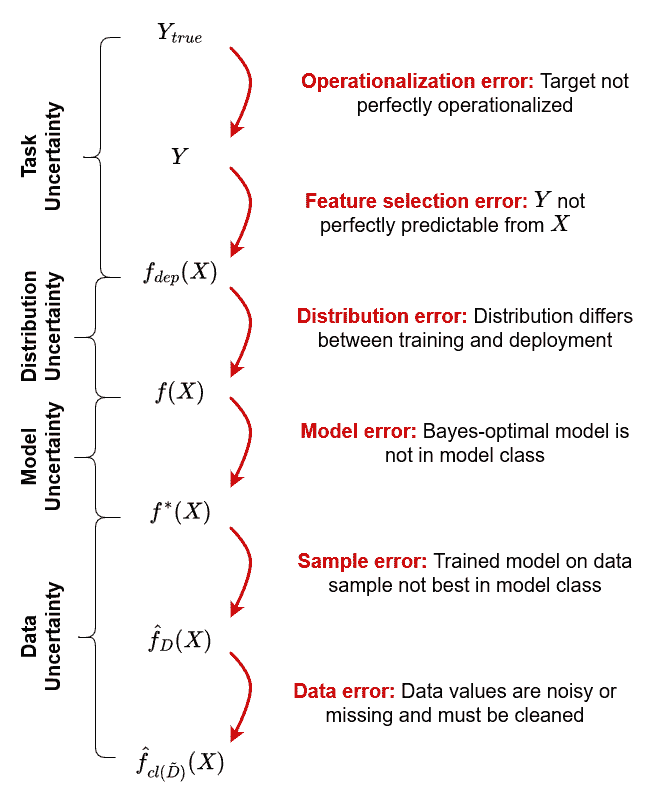
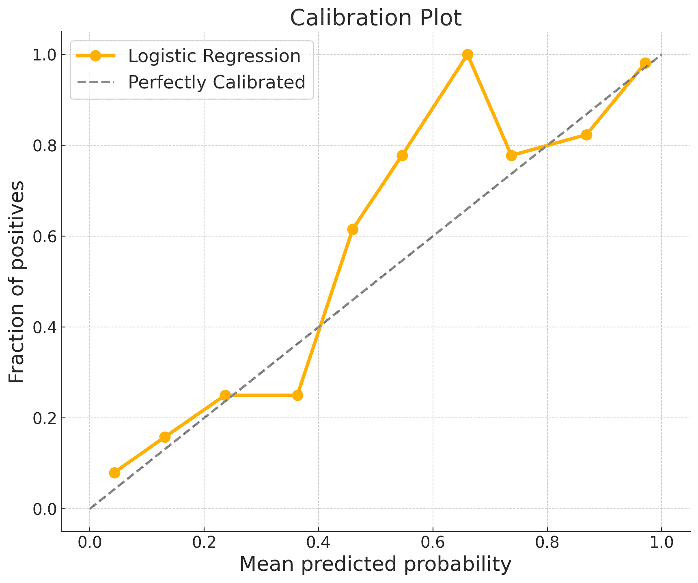

# 12 不确定性

> 原文：[`ml-science-book.com/uncertainty.html`](https://ml-science-book.com/uncertainty.html)

1.  将机器学习融入科学

1.  12 不确定性

西部美国有一个问题——他们没有足够的水。他们甚至称之为*干旱的西部*，如果你曾经去过犹他州，你就知道为什么了。正因为如此，水管理是为了那些需要规划的事情，比如水储存和农业。除了其他机构外，水利重整局还关注每年预测在河流和水库进水口测量的水量（从 4 月到 7 月）的情况。由于河流的主要供水来自山脉的融雪和降水，这些是在预测中使用的最重要的特征。在过去，水文学家依赖于传统的统计模型，但最近他们开始涉足机器学习。

没有饮用水或失去农作物都不是一个选择。这就是为什么决策者不仅需要一个预测，他们还需要知道这个预测有多确定。例如，水文学家经常使用分位数预测来传达不确定性（参见图 12.1）：一个（正确）的 90%分位数预测意味着实际流量有 90%的可能性低于预测值，有 10%的可能性超过预测值。预测 10%、30%、50%（中位数）、70%和 90%的分位数是常见的。

图 12.1：不同“超过”情况的比佛河供水预测，这些是逆分位数（例如，90%超过 = 10%分位数）。2024 年 2 月的报告由美国农业部自然资源保护服务提供，CC-BY（https://creativecommons.org/licenses/by/4.0/）。

事实上，在一个完美预测的世界里，所有分位数都会“坍缩”到同一点，但自然界不允许你那么容易地窥视她的牌。你必须处理不可预见的天气变化、山脉中的测量误差以及空间覆盖不足。本章将向您展示如何将这些因素整合到您的机器学习流程中，并使用不确定性估计来验证您的预测。

若要深入了解机器学习不确定性量化，我们推荐 1、2、3 和 4，这些文献部分启发了我们的章节。

所有浆果都美味，但有些是有毒的。因此，浆果研究一直是资金最充足的科学之一。所以让 Rattle 自动化浆果分类似乎是自然而然的一步。确实，两周后，Rattle 交付了世界上最好的浆果分类器。唯一的问题是没有人相信结果：这个分类器可能在平均意义上是正确的，但它对这个浆果也是正确的吗？

## 12.1 频率解释与贝叶斯解释的不确定性

假设一位水文学家告诉你，有 10%的概率表明比弗河 4 月份的流量将低于 6.3 千英亩英尺。你如何解释这个陈述？可能的答案描述了统计学中最古老的讨论之一：什么是概率？

**频率解释**

想象一下，你在相似条件下（无限次）检查水资源，那么 10%的时候，你会观察到水资源低于 6.3 千英亩英尺。频率主义者将关于不确定性的陈述视为在相似条件下长期事件相对频率的陈述。

频率解释的不确定性有两个核心概念问题：1) 在相似的观测条件下，你无法观察到无限重复的事件，而且它们相对频率的定义是否明确也不清楚。2) 你面临所谓的*参考类问题*——什么定义了相关的相似条件？

**贝叶斯解释**

水文学家有 10%的信心认为水资源将少于 6.3 千英亩英尺。这种信念可以通过她愿意做出的赌注来表示。例如，水文学家愿意赌上最多 10 美分，如果水资源实际上低于 6.3 千英亩英尺，她将获得 1 美元，如果高于这个数值则什么也得不到。对于贝叶斯来说，不确定性描述的是主观信念的程度。实际上，这种主观信念会随着新数据的观察而不断更新，使用贝叶斯公式¹。

虽然贝叶斯方法似乎解决了频率方法的局限性，但它也面临着自己的问题：1) 如果你没有看到任何关于这个问题的证据，你该相信什么？这就是所谓的*先验信念*问题。2) 如果不确定性是对世界的客观陈述，概率是否可以正确？3) 贝叶斯概率依赖于使用贝叶斯公式计算后验概率，这通常在计算上是不可行的。

> “概率是现代科学中最重要的概念，特别是没有人有丝毫的概念它意味着什么。”（据说是伯特兰·罗素在 1929 年所说）

还有其他一些不太成熟的关于不确定性的解释，例如倾向性、可能性论、客观贝叶斯主义以及许多其他理论。但无论你选择哪种对不确定性的理解，你都必须接受其局限性。

**拉普拉斯恶魔：决定性世界中的不确定性**

对于频率主义或贝叶斯主义的不确定性解释来说，世界是否是决定性的是否重要？ 

想象一个拥有无限计算资源、知道世界上每个粒子的位置和动量的假设存在生物。如果知道自然法则，它能否完美地确定世界的过去和未来状态？如果是这样，世界将是决定性的，对于那个生物来说将没有不确定性。这个拥有无限知识和无限计算资源的生物的思想实验被称为**拉普拉斯恶魔**。它将能够精确计算出四月份的水资源供应。

如果存在这样的拉普拉斯恶魔，这会对不确定性的解释产生影响吗？实际上并没有！对于频率主义者来说，不确定性总是相对于在特定语言中指定的类似条件参考类来定义的。只要这些类似条件不决定事件，不确定性就保持良好定义。同样，对于贝叶斯主义者来说，不确定性源于**人类**的计算限制、系统的语言不完整、对法则的不充分了解或对世界状态的缺乏信息。因此，无论在拉普拉斯假设的恶魔的较低层次是否存在不确定性，贝叶斯主义者和频率主义者都可以在较高层次上合理地谈论不确定性。本章处理的是由于预测任务限制在特定特征、不明确的参考类或简单的人类能力有限而产生的不确定性。我们缺乏在量子世界中关于潜在不可还原不确定性的复杂推测的专业知识。

## 12.2 不确定性的共同语言

虽然人们对不确定性的含义存在很大争议，但对于描述不确定性的语言，相对而言有较广泛的共识。

**概率空间**

描述不确定性的最核心概念是标准概率理论，它包括：

+   一个**样本空间** $ \Omega $，它描述了所有可能的结果。在我们的例子中，一个结果可能包含各种信息，例如美国降雪量、全球风力和水资源供应。

+   一个**事件空间** $ \mathcal{F} $，它描述了相关可能结果集合。这样一个集合可能包括所有水资源供应恰好为 6.3 千英亩英尺的结果。

+   一个 *概率测度* $ \mathbb{P} $，它将非负实值分配给事件空间中的每个元素。例如，供水低于 6.3 千英亩英尺的事件可以分配一个概率为 0.1（10%）。$ \mathbb{P} $ 应满足柯尔莫哥洛夫公理。

*柯尔莫哥洛夫公理* *柯尔莫哥洛夫公理由三个部分组成：1) 每个事件 $ E $ 被分配一个大于或等于零的概率，即 $ \mathbb{P}(E)\geq 0 $。2) $ \Omega $ 在事件空间中，其概率为 1，即 $ \mathbb{P}(\Omega)=1 $。这意味着 $ \Omega $ 中的某个结果一定会发生。3) 如果将可数无限序列的事件 $ (E_1, E_2,\dots) $ 合并，那么这些事件的并集的概率与单个事件的概率之和相同，即 $ \mathbb{P}\left(\bigcup_{i=1}^{\infty} E_i\right) = \sum_{i=1}^{\infty} \mathbb{P}(E_i) $。例如，供水低于 6.3 千英亩英尺（概率为 0.1）的事件和供水严格高于 6.3 千英亩英尺（概率为 0.9）的事件没有共同的结果，因此它们的联合概率是各自概率之和（=1）。*  *这三个部分共同构成了一个概率空间 $ (\Omega,\mathcal{F},\mathbb{P}) $。

**随机变量**

*随机变量* 描述基于事件空间 $ \mathcal{F} $ 中的随机事件的数量。比如说，你对供水感兴趣。随机变量允许你定义一个函数 $ Y $，它将每个可能的结果映射到其对应的水供应，即 $ Y: \Omega\rightarrow \mathbb{R} $ with $ \omega\mapsto \text{water supply in } \omega $。这为你描述与供水相关的事件提供了一个有效的方法，例如，$ Y=6.3 $ 描述了供水为 6.3 千英亩英尺的事件。在这本书的整个过程中，我们使用了随机变量来描述特征和目标变量。

**置信区间与可信区间**

*置信区间* 和 *可信区间* 以紧凑的方式量化不确定性。比如说，你对一个点预测不满意，而希望得到可能覆盖真实标签的区间预测。这样的区间确实可以计算出来。频率主义者会给你提供置信区间，而贝叶斯主义者会给你提供可信区间。但请注意，它们有不同的解释：

+   频率主义者的 95%置信区间表示，在 95%的相对频率下，真实标签包含在为不同数据样本计算出的无限序列的置信区间中。因此，频率主义者认为真实标签是固定的，而区间是随机变量。

+   贝叶斯主义者的 95%可信区间表示，有 95%的确定性认为结果落在给定的区间内。因此，贝叶斯主义者认为区间是固定的，而真实标签是随机变量。

**分位数**

*q 分位数*是将随机变量的概率分布划分为 q 个等大小区间的截断点。在实践中，分位数相对容易估计：

1.  沿着感兴趣的变量排列你的数据。

1.  将 $ \frac{100}{q} $ 的数据中变量值最低的数据放入第一个分箱，依此类推，直到所有数据都位于一个分箱中。

1.  计算第 k 个分箱中最高变量值和第 k+1 个分箱中最低值的平均值。这个平均值就是你对第 k 个 q 分位数的估计。

例如，第一个 10% 分位数描述了 10% 的观测值低于的水供应量。这可以给你关于数据分布超过平均值的信息。

**不精确概率**

标准概率论将事件空间 $ \mathcal{F} $ 中的每个事件分配一个介于 0 和 1 之间的值。这有时可能很困难：想想一个被要求给出其供水量将超过 12 千亩英尺的确定性的水文学家。她可能不会给出 70% 确定的点概率，而是说她有 65-75% 的确定性。注意，即使平均值相同，这种信息与 50-90% 的确定性判断的信息是不同的。

这样的场景正是 *不精确概率* 理论设计的目的。它们允许你表达对具体事件概率的不确定性：

+   例如，*可信集*描述的是概率分布的集合，而不是单个分布。

+   *上界和下界概率*描述了分配给某个事件的概率集合的上界和下界。

+   *区间概率*将每个事件分配一个区间 $ [a,b] $，其中 $ a,b\in[0,1] $ 且 $ a<b $。

关于不确定性量化有很多书籍，而这小章节无法提供同样的深度。我们不是提供描述不确定性的所有概念和语言的详尽列表，而是专注于最常见的一些。*## 12.3 预测、性能和属性中的不确定性

在你估计事物时，不确定性很重要。科学家特别关注预测、性能和属性估计中的不确定性。

**预测**

在水文示例中，我们关注的是估计预期供水。在这种情况下，我们关心的是 *预测* 中的不确定性。水供应量少于 6.3 千亩英尺的概率是多少？哪些预测值以 95% 的确定性覆盖了真实标签？从表现相似的模型中预测的方差是多少？预测不确定性是使用机器学习的学者最常见的问题。每当预测是行动的基础时，调查预测不确定性是一个关键要求。

**性能**

水文学家可能希望将她自己的模型与竞争对手的模型或最先进的模型进行比较。这可以通过评估历史/未来数据上的误差来完成，这些数据并未用于训练模型（即保留集）。然而，这只能提供一个关于其他未见数据的预期误差的单个估计。因此，通常需要反复估计测试误差并定义置信区间。每当科学家想要公平地比较他们的模型与其他模型的性能时，他们应该对性能不确定性保持透明。

**特性**

在经典的统计建模背景下，水文学家对模型参数的不确定性感兴趣，假设它们反映了感兴趣的通用特性，如（因果）特征效应大小。在机器学习中，神经网络中的权重等参数通常不适用于这种直观的解释。通常既没有唯一最优的参数设置，也没有鲁棒的参数设置。为了分析感兴趣的特性，如特征效应和重要性，可以将参数的概念推广到数据分布的感兴趣的一般特性。这些特性和它们的不确定性可以有效地估计，例如，使用针对性学习 [[6]](references.html#ref-van2011targeted)。或者，可以使用事后可解释性技术 [[7]](references.html#ref-freiesleben2022scientific)来估计相同的特性和不确定性。这允许水文学家回答关于水资源供应最有效或最重要的特征的问题。

## 12.4 不确定性量化预期误差

当我们谈论不确定性时，我们隐含地谈论误差。预测的水资源供应与真实未来水资源供应有多接近？你的测试误差与真实泛化误差有多接近？估计的降水对水供应的影响与真实影响相匹配吗？

从一般意义上讲，你总是有一个感兴趣的目标量 $ T $（例如，真实水资源供应），以及你的估计 $ \hat{T} $（例如，预测水资源供应），并且你想要知道误差有多大，误差是通过某个距离函数 $ L $ 来衡量的：$$ \epsilon:=L(T,\hat{T}) $$

不幸的是，你无法访问 $ T $。如果你能，你就不需要估计任何东西了。因此，你通常查看估计中的预期误差，例如在估计中使用的数据集的期望。

预期误差可以被量化的原因在于所谓的偏差-方差分解，它适用于许多已知的距离函数，例如均方误差或 0-1 损失 [[8]](references.html#ref-domingos2000unified)：

$$ \underbrace{\mathbb{E}[L(T,\hat{T})]}_{\text{预期误差}} = \underbrace{L(\mathbb{E}[\hat{T}],T)}_{\text{偏差}} + \underbrace{\mathbb{E}[(L(\hat{T},\mathbb{E}[\hat{T}])]}_{\text{方差}} $$

+   **偏差**描述了预期估计值与真实目标值 $ T $ 的差异。在频率主义解释中，其思想是如果你反复估计你的目标，你将平均上是正确的。有偏估计量系统地低估或高估目标量。

+   **方差**描述了估计值的变化情况，例如，对于不同的数据样本。如果估计值对所接收的数据集高度敏感，则估计量具有高方差。

图 [12.2]：在飞镖盘上直观地解释偏差和方差，CC-BY (https://creativecommons.org/licenses/by/4.0/)

但偏差-方差分解如何帮助呢？对于许多估计量，你可以证明无偏性，这意味着偏差项消失。因此，预期误差可以完全由估计值的方差来确定。方差可以经验或理论地估计。

## 12.5 不确定性的来源

预测、性能和属性是我们整个机器学习流程中得到的香甜柠檬汁。柠檬汁是否美味取决于水、柠檬、挤压技巧和冰块。这些中的任何一项质量不足都会直接影响柠檬汁的质量。同样，预测、性能和属性中的预期误差是由于我们的任务、建模设置和数据中的误差。

机器学习建模可以描述为一系列步骤。这些步骤中的每一个都可能引入错误，从而传播我们估计中的不确定性。图 12.3 中显示的示例和错误主要集中在*预测不确定性*上，但性能和属性不确定性也可以以相同的方式捕捉。

图 [12.3]：从不确定性的角度看待机器学习流程。每一步描述了对真实目标值的近似，CC-BY (https://creativecommons.org/licenses/by/4.0/)

### 12.5.1 任务不确定性

指定机器学习任务意味着指定三件事：1. 预测目标 $ Y $；2. 损失的概念 $ L $；3. 输入特征 $ X=(X_1,\dots,X_p) $。在机器学习理论中，这三个对象通常被认为是固定的。然而，在大多数实际设置中，它们必须被仔细选择。

**预测目标**

通常，你想要预测的东西是模糊的，这使得操作化变得困难。你如何定义河流的流量？一个测量是否足够？传感器应该放在哪里？或者应该放置多个传感器并对多个测量值进行平均？模糊的目标变量在社会科学中尤为常见。社会科学家通常对无法直接测量的潜在变量感兴趣。想想像智力、幸福或动机这样的概念。对于实证研究，这些变量需要通过某些可测量的代理变量进行操作化。例如，使用成绩作为智力的代理变量，金钱作为效用的代理变量，或花费的时间作为动机的代理变量。潜在变量的操作化至少是有争议的。

*操作化误差* 描述了根据某些距离函数 $ d $ 真实预测目标 $ Y_{true} $ 与其操作化 $ Y $ 之间的差异：$$ \epsilon_{operationalize}:=d(Y_{true},Y) $$

操作化误差是测量理论中的一个重要话题 [[9]](references.html#ref-diamantopoulos2008advancing)，但它仍然需要更好地与科学实践相衔接 [[10]](references.html#ref-carpentras2024we)。

**损失**

目标变量的不确定性会导致损失函数选择的不确定性。损失函数定义在 $ Y $ 的陪域上，如果 $ Y $ 发生变化，那么损失 $ L $ 大多数情况下也会随之变化。货币域 $ [-∞,∞] $ 上的适当损失与个人幸福评价域 $ (1,2,\dots,10) $ 不同。即使对 $ Y $ 没有不确定性，在特定情境中关于适当损失概念的不确定性仍然可能存在。是用水供应的绝对距离来定义预测误差更好，还是应该使用均方误差对特别差的预测进行更多惩罚？

**输入特征**

你可以使用许多不同的特征来预测某个目标变量，并且每个特征组合都会产生不同的预测。例如，雪站可以放置在不同的位置。但哪个是最佳预测？这很复杂！当你有多个模型基于不同的特征进行预测时，并不一定有一个预测模型在所有情况下都是优越的。每个模型在不同的情境下可能都有其优点。将预测任务限制在输入特征子集 $ X $ 中可能会导致特征选择误差。

*特征选择误差*描述了在部署分布中根据 $ L $ 的操作化目标 $ Y $ 与贝叶斯最优预测 $ f_{dep}(X) $ 之间的差异（参见下文第 12.5.2 节中我们对贝叶斯最优预测器的解释）：$$ \epsilon_{feature}:=L(Y,f_{dep}(X)). $$ 添加具有预测价值的特征往往会减少误差。因此，人们可能对基于特征集 $ X $（例如，某些地标处的雪水当量）和基于 $ X $ 加 $ Z $（天气预报）的最优预测之间的差异感兴趣。相对于 $ X $ 的*遗漏特征误差*描述了基于 $ X $ 的最优预测与基于 $ X $ 和 $ Z $ 的最优预测之间的差异：

$$ \epsilon_{omitted}:= L(f_{dep}(X,Z),f_{dep}(X)). $$

### 12.5.2 间奏：贝叶斯最优预测器、认知不确定性和随机不确定性

给定一个任务 $ (Y,L,X) $，我们可以定义一个关于不确定性的核心概念——贝叶斯最优预测器。它描述了一个预测函数，该函数接受输入特征 $ X $（例如，雪水当量、天气预报等）并始终输出 $ Y $（即，供水）的最佳预测。这并不意味着贝叶斯最优预测器总是预测正确的供水量。它只是基于 $ X $ 给出的最佳猜测。正如我们上面讨论的，我们能够访问的特征，如雪水当量和天气预报，即使完全准确，通常也不会完全决定供水。其他因素，如河流下面的岩石层、河床的形状或与河流相连的湖泊，也会影响供水。贝叶斯最优预测器犯的错误是我们上面定义的特征选择误差 $ \epsilon_{feature} $。

让我们更正式地定义贝叶斯最优预测器。它描述了函数 $ f: \mathcal{X}\rightarrow \mathcal{Y} $，该函数最小化泛化误差（参见第七章或[[11]](references.html#ref-hastie2009elements)），并且对于 $ x\in\mathcal{X} $ 在点 wise 上定义为 ²：

$$f(x)=\underset{c}{\mathrm{argmin}}\;\;\mathbb{E}_{Y|X}[L(Y,c)\mid X=x].$$

对于许多损失函数，理论上可以推导出贝叶斯最优预测器。例如，如果你面对一个回归任务，并且用均方误差来衡量损失，最优预测器是 $ X $ 给定 $ Y $ 的条件期望，即 $ f=\mathbb{E}_{Y\mid X}[Y \mid X] $。或者，如果你面对一个分类任务，并使用 $ 0-1 $ 损失，最优预测器预测具有最高条件概率的类别，即 $ \mathrm{argmax}_{y\in\mathcal{Y}}\;\;\mathbb{P}(y \mid X) $。

**随机不确定性、认知不确定性以及我们为什么不喜欢不可减少的不确定性概念**

在不确定性的讨论中，一个常见的分类法是区分随机不确定性和认知不确定性 [[4]](references.html#ref-hullermeier2021aleatoric)。随机不确定性被认为是不可减少的。即使有关于过去雪水当量、天气和供水的无限数据，以及出色的建模技能，你可能仍然无法完美预测供水 – 剩余的错误属于随机不确定性。通常，随机不确定性与特征选择误差 $ \epsilon_{feature} $ 相关联。认知不确定性被视为可减少的，并源于你对数据的有限访问、建模技能或计算。例如，如果你只有一个月关于雪水当量、天气和供水的历史数据，那么你就有很高的认知不确定性 – 收集更多数据可以减少这种不确定性。

虽然我们同意特征选择误差 $ \epsilon_{feature} $ 是有意义的，但我们不同意将其称为不可减少的。如上所述，包括更多特征可以在实践中减少错误。不确定性必须始终相对于被认为是固定的假设来考虑，例如特征、模型或数据。是否存在真正的不可减少的不确定性，应由物理学家来决定，而不是统计学家。

### 12.5.3 分布不确定性

下一个不确定性的来源是部署环境。你根本不知道你将做出预测的环境是否会与你观察到的环境完全一样。在过去 100 年里，气候变化已经显著改变了与水流重要性的模式：1940 年在给定环境中的最佳水流预测可能与 2024 年的最佳预测不同。关于未来几年贝弗河的环境条件仍然存在不确定性：蒂帕诺格斯冰川是否仍然存在？这个地区可以预期多少降水？会有多少极端天气事件，如干旱或洪水发生？

*分布误差*描述了在给定输入 $ x $ 的情况下，贝叶斯最优预测器 $ f $（相对于训练分布 $ (X_{train},Y_{train}) $）和贝叶斯最优预测器 $ f_{dep}(x) $（相对于部署分布 $ (X_{dep},Y_{dep}) $）之间的预测差异：

$$ \epsilon_{distribution}:= L(f_{dep}(x),f(x)) $$

我们使用 $ X $、$ Y $ 和 $ f $ 而不是 $ X_{train} $、$ Y_{train} $ 和 $ f_{train} $，以保持符号易于阅读。

### 12.5.4 模型不确定性

贝叶斯最优预测器是一个理论构造。要获得它，你最好的办法是用机器学习模型来近似它。为此，你需要指定 $ X $（例如，雪水当量）和你的目标 $ Y $（例如，供水）之间可能存在的关系。你对模型施加的约束可能会导致模型设定错误。

**模型设定错误**

对于一个问题的正确**模型类别**选择被视为至关重要，但正确的类别是什么？你期望雪水当量与供水之间存在什么样的关系？雪水当量如何与天气预报特征相互作用？这是困难的！理想情况下，你希望选择一个包含接近或甚至包含贝叶斯最优预测器的模型的模型类别。由于你通常不知道贝叶斯最优预测器是什么样子，这促使你选择一个允许你表达许多可能函数的大模型类别。同时，在一个大模型类别中找到最佳拟合模型比在小模型类别中更难。

深度神经网络和基于树的集成描述了高度表达力的模型类别。它们可以很好地逼近任意函数 [[12]](references.html#ref-cybenko1989approximation), [[13]](references.html#ref-hornik1991approximation), [[14]](references.html#ref-halmos2013measure)，包括贝叶斯最优预测器。像线性模型或 k 近邻这样的简单模型在建模能力上更加受限。

偏差-方差分解提供了对模型误指定可能产生的不确定性的良好视角。选择一个表达力强的模型类别将减少你对贝叶斯最优预测器估计中的偏差。然而，它将增加估计过程中的方差。相反，选择一个低表达力的模型类别通常会导致更高的偏差但更低的方差。

**超参数选择中的随机性**

在模型类别内寻找最优模型时，你施加的一个约束是**超参数**。在随机梯度下降中的学习率、正则化器如 dropout，或者在随机森林中允许的分割数，都限制了可以**有效**学习的模型。虽然在某些情况下可以使用 AutoML 方法 [[15]](references.html#ref-hutter2019automated) 自动化地寻找合适的超参数，但仍然存在随机元素，因为尝试所有选项在计算上总是不可行的。

**随机种子和实现错误**

大多数复杂的学习算法都包含随机元素，例如随机森林中的自助法和深度学习中的批量梯度下降。这种随机性可以通过种子使其可重现。使用不同的种子运行相同的非确定性算法两次将产生不同的预测。而且，通常没有理论依据来证明选择一个种子比另一个种子更好。此外，机器学习管道中的实现错误可能会影响学习到的模型。

**模型类别、超参数和种子限制了可学习模型的集合**

一起，模型类别、超参数和随机种子的选择限制了有效模型类——即在这些选择下可以学习的模型类。我们称与贝叶斯最优预测器最接近的可学习模型为*类别最优预测器*，并用 $ f^* $ 表示。

**模型误差**描述了在训练分布 $ (X,Y) $ 内的贝叶斯最优预测器 $ f $ 与类别最优预测器 $ f^* $ 之间的差异：

$$ \epsilon_{model}:= L(f(X),f^*(X)). $$

### 12.5.5 数据不确定性

最后，让我们看看不确定性的最终来源——数据。你过去已经进行了测量，并获得了描述雪水当量、天气条件和相应供水的数据。可能出现几个问题：

**抽样**

你获得的数据只是潜在总体中很小的一部分样本。如果样本不同或数据更多，你对标签、性能或真正感兴趣的属性的估计可能会有很大的不同。

来自数据样本的不确定性可能对你的估计有重大影响：

+   **随机性**：你可能运气不好，抽取了一个包含许多异常值的样本。例如，你随机选择了一些日子进行测量，但恰好是雨天。

+   **数据量**：你的数据样本可能太小，无法代表潜在的概率分布。例如，每月一次的测量对于你的模型学习相关依赖关系来说是不够的。

+   **选择偏差**：你的样本可能存在偏差，导致样本不具有代表性。例如，你可能只选择在干燥的日子里进行测量，以避免弄湿。

**样本误差**描述了基于完整数据集 $ D $ 的类别最优模型 $ f^* $ 的预测与学习模型 $ \hat{f}_D $ 之间的差异：$$ \epsilon_{sample}:= L(f^*(X),\hat{f}_D(X)) $$

在文献中，这种误差有时被称为*近似误差* [[4]](references.html#ref-hullermeier2021aleatoric), [[16]](references.html#ref-jalaian2019uncertain)，但我们发现术语*样本误差*更能说明这种误差的本质。

**测量误差**

所有数据都是通过测量得到的，或者至少这样考虑是有用的。你的水流传感器进行测量。追踪雪量也是一种测量。甚至只是拍摄那场雪也是一种测量。测量误差是测量结果与（未知的）真正属性之间的偏差。做出测量误差是不可避免的。

+   **目标测量误差**引入了偏差。想想人类在流水数据转录中的错误。³ 这种偏差有两个方向：它可能高于或低于真正感兴趣的属性。你可能很幸运，平均来看偏差会相互抵消，但这不太可能，尤其是如果误差是系统性的。

+   **特征中的测量误差**可能或可能不会在预测中引入偏差。如果雪水当量的测量中存在随机误差，它可以在训练过程中被消除。输入特征中的系统测量误差可能后果更严重：如果雪水当量测量包含大误差，模型可能会依赖于前一个月的流量等代理特征。

**缺失数据**

在一个理想的数据库中，没有单元格是空的。科学现实往往不那么整洁。你行中的某些值看起来会很奇怪：3 月 22 日的水流量是*无限的*？当前的积雪水当量是*不是一个数字 (NaN)*？人为输入的记录日期是*2102 年 11 月 32 日*？如果某些值缺失或未定义，我们应该怎么办？⁴

数据可能缺失有几个原因：

+   **完全随机缺失 (MCAR)：** 缺失值机制与 $ X $ 和 $ Y $ 无关。例如，跟踪雪水当量的公司服务器出现问题，因此值缺失。

+   **随机缺失 (MAR)：** 缺失的概率取决于观察到的数据。例如，如果那个人在星期四发送给你雪水当量时有时会错过，因为那是他的约会之夜。

+   **非随机缺失 (MNAR)：** 缺失的概率取决于缺失的信息。例如，如果你在暴风雪期间没有收到雪水当量测量值，因为工作人员无法到达传感器。

**测量误差和缺失值导致另一个估计误差**

测量误差和缺失值使得你在实践中处理的数据集与你在理论上考虑的具有无偏值的完整数据集 $ D $ 看起来不同。*数据误差*描述了基于完整和准确数据集 $ D $ 学习得到的模型 $ \hat{f}_D $ 与在包含测量误差和缺失值的数据集 $ \tilde{D} $ 上学习得到的模型 $ \hat{f}_{cl(\tilde{D})} $ 之间的差异，这些缺失值需要通过操作 $ cl $ 进行清理：

$$ \epsilon_{data}:= L(\hat{f}_D(X),\hat{f}_{cl(\tilde{D})}(X)). $$

## 12.6 量化不确定性

现在我们为所有各种不确定性的来源和它们所代表的误差取了花哨的名字。但我们如何量化这些不确定性呢？

*在实践中，不确定性很难区分* *以上我们试图区分各种不确定性：真实目标与其操作化的区别是什么？贝叶斯最优预测器与类最优模型的区别是什么？类最优模型与在不完美数据集上学习的模型的区别是什么？然而，在实践中，你无法访问真实目标、贝叶斯最优预测器或类最优模型。你总是必须运行整个过程。不同的误差在理论上定义良好且对思考最小化不确定性是有用的，但在实践中，不确定性是混合在一起的。*  *### 12.6.1 经验主义与贝叶斯不确定性量化

经验主义者和贝叶斯主义者对不确定性量化有不同的方法。

经验主义者有一个简单的默认方法——他们喜欢重复。比如说，你想量化你的估计中的不确定性：

1.  假设，或者更好的是*证明*你的估计是无偏的，即期望上它将测量正确的目标量。

1.  在不同的可能条件下（例如任务概念化、建模设置或数据）多次运行目标量的估计过程（即预测、性能或属性）。

1.  由于偏差-方差分解和第一步的无偏性，不确定性完全来自估计的方差。

这种方法有其局限性。例如，你不能证明你的任务概念化是无偏的。而且，提出多个可能的估计条件可能很困难。对于经验主义的不确定性量化，你需要对你的领域知识有信心。但然后它是一种可行的方法，可以事后应用于各种任务、模型和数据设置。然而，请注意，某些方法，如置信区间，需要额外的假设，即误差是独立同分布的（即在不同数据实例中保持相同），或高斯分布的。

和经验主义者一样，贝叶斯主义者有一个标准的食谱——他们非常喜欢他们的后验。比如说，你想量化你的估计中的不确定性：

1.  明确地用随机变量和该变量的先验分布来建模不确定性的来源（例如分布、模型或数据）。

1.  检查不确定性是如何从源头传播到目标量（即预测、性能或属性）的。

1.  根据新的证据（例如数据）使用贝叶斯公式更新不确定性的来源，以及因此目标中的不确定性。

在不确定性量化策略方面，我们主要关注频率主义方法。贝叶斯不确定性通常需要从一开始就嵌入，包括优化问题的细化，而频率主义不确定性通常是一个容易添加的附加项。但说实话，另一个原因是我们更熟悉频率主义方法。要详细了解机器学习中贝叶斯不确定性量化策略的概述，请参阅[[17]](references.html#ref-gal2016uncertainty)或[[18]](references.html#ref-kendall2017uncertainties)。

### 12.6.2 直接优化不确定性

不确定性量化的最简单方法是对不确定性进行预测，而不是标签。这在分类任务中经常这样做。不是简单地预测输出值最高的模型类别，而是使用 softmax 函数转换输出值。softmax 函数将任意正负值转换为看起来像概率的值；它们是非负的，并且总和为 1。在预测概率时，你还需要不同的损失函数——这里的默认选择是交叉熵和 Kullbach-Leibler 散度。

对于回归任务，直接优化不确定性不太直接。通常，任何单个目标值的概率为零。然而，你可以直接估计密度函数。这通常使用贝叶斯方法，如贝叶斯回归、高斯过程和变分推理[[17]](references.html#ref-gal2016uncertainty)来完成。在这里，你明确地通过函数或参数上的高斯分布来建模关于最优模型的不确定性，并根据新数据更新模型。

更技术地说，这意味着你定义一个先验分布 $ p(\hat{f}) $ 在模型集合 $ \hat{f}\in F $ 上。基于此，你可以计算给定你的数据 $ p(\hat{f}\mid D)=p(D\mid \hat{f})p(\hat{f})/p(D) $ 的模型后验分布。最后，这使我们能够通过 $$ p(y\mid x, D)=\int_{\hat{f}} p(y\mid \hat{f}) p(\hat{f}\mid x,D)\;d\hat{f}. $$ 来以贝叶斯方式估计目标。这个积分需要再次数值求解[[17]](references.html#ref-gal2016uncertainty)。

虽然你从直接估计中得到的数据看起来像概率，但它们往往很难被解释为概率。特别是，因为它们没有校准——也就是说，它们不匹配真实结果中的概率。我们将在第 12.8 节中讨论如何校准概率。

### 12.6.3 任务不确定性难以量化

作为提醒，操作化误差描述的是真实目标（例如，智力）与其操作化（例如，智商测试）之间的差异。量化这个差异是困难的。有几个挑战：首先，真实目标有时不能直接测量。其次，即使你能够访问真实目标和操作化，它们也不会在同一个尺度上，这使得定义距离函数变得困难。

然而，可以做到的是查看不同操作化之间的连贯性或相关性 [[2]](references.html#ref-hoffmann2021multiplicity)。例如，在智力研究中，不同智力操作化之间的相关性导致了所谓的 *G 因子*，这成为了研究人员想要通过智力测试来衡量的真正目标 [[19]](references.html#ref-gottfredson1998general)。通过多个具体操作化和测试来操作 G 因子允许研究人员量化特定智力测试的操作化误差。

记住，特征选择误差描述的是操作化的目标 $ Y $（如供水）和给定特征集 $ X $（例如，积雪水量）的贝叶斯最优预测器之间的差异。量化这个差异比量化操作化误差更具体，但仍很困难。预期整体特征选择误差的最佳代理是训练良好的模型的测试性能。例如，如果你将高度工程化的供水预测模型压缩到一定的测试误差，剩余的误差可能就是特征选择误差。如果你已经从可用特征中挤压出了所有的预测价值，交叉验证等技术允许你额外估计这个误差的方差。

对单个实例 $ x $（例如，给定一天的积雪水量和天气预报）的预期特征选择误差进行量化甚至更加困难。即使预测模型整体上接近贝叶斯最优预测器，它对于单个实例 $ x $ 可能仍然相差甚远。要了解如何仍然可能量化误差，请参阅我们下面关于罗生门集的讨论。

可以使用如 *留一协变量法（LOCO）* [[20]](references.html#ref-lei2018distributionfree) 或 *条件特征重要性* [[21]](references.html#ref-strobl2008conditional) 这样的可解释性技术来量化遗漏特征误差。这些技术也允许量化不确定性，但始终需要 $ (X,Z) $ 的标记数据。

### 12.6.4 无部署数据无分布不确定性

为了估计分布的不确定性，我们需要知道训练分布与部署分布之间的差异，或者至少从这两个分布中获取一些数据。如果我们能够访问数据，我们可以直接计算相应的误差。比如说，一位研究者只能访问 1970 年到 1980 年之间的比弗河数据，而另一位研究者则有 2014 年 7 月到 2024 年 7 月的数据。他们都使用机器学习算法来获取最佳模型。然后，他们可以比较在最新数据上的预测、性能或属性，以评估预期的分布误差。

通常，我们感兴趣的是部署不确定性，但我们没有部署分布数据。物理模型可以用来模拟不同潜在分布变化的数据。关于数据模拟和增强的更详细讨论可以在第十一章找到。

### 12.6.5 罗生门集——多个模型胜过单一模型

想象一下与十个供水预测专家会面。每个人都了解历史数据，并对积雪水当量和天气预报有见解。但他们来自不同的建模学派，有物理学家、统计学家、机器学习者等等。他们每个人都给出了自己对比弗河 6 月份供水量的诚实估计——但他们的预测不同。虽然差异不大，但足以产生影响。你应该怎么办？没有充分的理由认为这十个专家中的任何一个会脱颖而出。直观的策略是预测平均值（如果有异常值，则为中位数）并分析专家意见的方差，以评估你预测的不确定性。

为什么不将这种推理应用于机器学习呢？这十个专家可以被视为不同的学习算法，将过去的数据转换为模型，将当前的数据转换为预测。假设你从不同的模型类别中训练了十个模型，使用了不同的超参数和随机种子，它们的表现都相当好。那么，这个模型集就被称为*罗生门集*。

假设存在一个训练良好的模型 $ \hat{f}_{ref} $ 作为参考点，并且你设定了一个允许的误差 $ \delta $。那么，$ S:=\lbrace \hat{f}_1,\dots,\hat{f}_k\rbrace $ 是 $ \hat{f}_{ref} $ 的一个罗生门集，如果对于所有 $ i\in\lbrace 1,\dots,k\rbrace $ 都成立，即 $ \hat{f}_i $ 的性能不差于 $ \delta $，即

$$\mathbb{E}[L(\hat{f}_i(X),Y)] - \mathbb{E}[L(\hat{f}_{ref}(X),Y)] \leq \delta$$.

如果你假设罗生门集中的模型集合来自对最优模型的无偏估计过程，你可以通过罗生门集中预测的方差来估计预期的模型误差，即

$$\widehat{\mathbb{V}}_{f^*}[f^*(x)]=\frac{1}{k-1}\sum_{\hat{f}_i\in S}L(\overline{\hat{f}}(x),\hat{f}_i(x)).$$

假设 Rashomon 集中存在一定的误差分布（例如，t 分布）和独立同分布的误差，你可以使用方差来定义置信区间。例如，预测的$ \alpha $置信区间会是：

$$ CI_{\hat{Y}}=[\hat{f}_{ref}(x)\pm t_{1-\alpha/2}\sqrt{\widehat{\mathbb{V}}_{f^*}[f^*(x)]}] $$

与这里提出的所有策略一样，Rashomon 集可以用来量化预测的不确定性，以及估计的性能和属性的不确定性。例如，Rashomon 集已被用来量化估计特征重要性的不确定性 [[22]](references.html#ref-fisher2019all) 和特征效应 [[23]](references.html#ref-molnar2023relating)。同样，即使预测已经是概率，这在分类模型中很常见，Rashomon 集也可以用来量化更高阶的不确定性。例如，你可以通过取 Rashomon 集中最高和最低预测概率作为区间界限，以区间形式获得不精确的概率。

有趣的是，以一种非常类似《罗生门》风格的方式，集成方法如随机森林隐式地提供了模型误差的不确定性量化 [[24]](references.html#ref-mentch2016quantifying)。森林中的每一棵决策树都可以看作是一个预测模型。同样，神经网络中的 dropout 可以描述为一种具有隐式不确定性量化的集成方法 [[25]](references.html#ref-gal2016dropout)。

### 12.6.6 数据不确定性的关键：采样、重采样、重复插补

我们在数据不确定性的背景下提到的第一个误差是样本误差。在理想世界中，它很容易量化：1. 从同一分布中取出许多独立、无偏的、不同大小的样本。2. 量化结果估计中的方差（即预测、性能或属性）。这在理论上是美好的，或者在模拟研究中是如此。但在现实生活中，数据通常既宝贵又稀缺。你希望使用所有可用的数据来尽可能准确地做出估计，而不仅仅是浪费 90%在不确定性量化上。

**重采样可以量化样本不确定性，但它可能会系统地低估它**

因此，统计学家们开发了智能策略来避免在*重采样*的框架下浪费数据。其思路：基于整个数据集做出最佳估计。为了量化该估计的采样不确定性，你研究在重复对全数据集的不同子集重新估计感兴趣的数量时的方差。

有几种重采样的方法：

+   *Bootstrapping* 涉及重复地有放回地抽取样本。

+   在*子采样*中，你反复抽取样本而不进行替换。

+   使用**交叉验证**，你将数据分成 k-junks（k 个大小相等的部分）。交叉验证在需要为训练和估计分别划分数据时特别有用，例如在性能估计中（见第七章[generalization.html]）。

但要小心，使用重采样方法，你可能会低估方差和真正的不确定性。原因是抽取的样本实际上并不独立。它们来自同一个总体数据集，并且共享许多实例。有几种策略可以处理低估，例如像**偏差校正和加速重抽样**（26）这样的方差校正策略。对于性能估计，Nadeau 和 Bengio [27]建议几个校正因子来应对低估。

**处理噪声或缺失数据的策略**

测量误差和缺失数据在外观上可能不同，但当你仔细考虑时，它们是相似的。一个非常嘈杂的特征值可以被视为缺失。同样，被填补的缺失值也可以被视为噪声。这种相似性反映在处理它们的共享数据清理策略中：

+   **删除特征：** 如果一个特征通常非常嘈杂且经常缺失，我们建议删除它。这样，你可以忽略数据错误，但可能会有更高的特征选择错误。因此，如果特征对目标非常具有信息量，删除特征可能不是一个好主意。例如，从你的预测模型中删除雪水当量将降低预测性能。

+   **删除单个数据点：** 如果一个特征的值在只有少数情况下完全随机缺失，删除受影响的数据点可能没问题。这样，不会引入数据不确定性。请注意，删除数据会减少你的数据量，从而增加抽样误差。此外，如果缺失或噪声不是随机的，你可能会将选择偏差引入你的数据集中。

+   **填补缺失值：** 如果缺失是随机的（MNAR），我们建议使用数据填补策略。理想情况下，填补过程应考虑你的领域知识和数据依赖性。请注意，基于领域知识填补缺失值本身只是一个猜测。填补有时可能是不正确的。

+   **显式地建模不确定性：** 如果一个特征的值适度嘈杂，并且你对噪声的分布有一个猜测，我们建议你显式地建模噪声。这样，可以通过将噪声传播到目标估计中来量化不确定性。

+   **改进测量：** 如果缺失不是随机的（MNAR），唯一的良好策略是消除缺失的原因并收集新的数据。

太好了，现在你已经确定了不确定性并找到了量化它们的方法——但如何最小化它们呢？在大多数情况下，你希望减少不确定性：例如，当水资源模型告诉你贝弗河可能会发生干旱或洪水时，不确定性很高，你应该如何采取预防措施？

原则上，大多数，如果不是所有的不确定性都可以最小化。有些比其他一些更难最小化。虽然目标是减少总的不确定性，但实现这一目标的唯一策略是减少来自不同来源的个别不确定性：

+   **任务不确定性**

    +   为了最小化预期的操作化误差，投入相当大的努力进行适当的操作化。例如，如果河流中的水流变化，只在河流中放置一个传感器可能不是一个好主意。

    +   为了最小化预期的特征选择误差，选择高度预测性和噪声含量小的特征。省略那些不会为你的模型增加新信息的特征。

+   **分布不确定性**

    +   为了最小化预期的分布误差，收集或模拟代表部署分布的训练数据。例如，仅使用 1970 年代的数据来训练模型，考虑到极端天气事件分布的变化，可能不是一个好主意。

+   **模型不确定性**

    +   为了最小化模型误差，在建模时选择合适的归纳偏差。严格限制模型类别并测试几个超参数会导致高偏差。选择过于宽泛的模型类别和不加约束的超参数搜索会导致高方差。为了最小化不确定性，使用你的领域知识将模型搜索限制在最小但足够表达性的模型类别，以捕捉数据中的依赖关系和合理的超参数设置 [[28]](references.html#ref-semenova2024path)。在水资源预测中，建议包括物理约束，因为它们限制了适当的模型类别，从而减少了模型不确定性 [[29]](references.html#ref-fleming2021augmenting)。

    +   为了找到一个合适的模型类别和超参数，有两种策略可能会有帮助：要么从简单的模型开始，逐渐增加复杂性，直到没有性能提升，要么从复杂的模型开始，逐次降低复杂性，直到性能下降。

+   **数据不确定性**

    +   为了最小化预期的样本误差，最佳策略是收集更多的数据。主动学习可以帮助你选择最能减少不确定性的数据（参见第十一章中的主动学习[robustness.html]）。然而，在像水资源预测这样的领域，由于对数据生成机制的控制有限，主动学习是不可能的。

    +   为了最小化面对标签噪声时的预期数据误差，为实例收集多个标签。如果有特征噪声，可以通过改进测量来减少噪声，或者用同样具有预测性但噪声更小的特征来替换该特征。例如，将一个雪传感器从有很多滑雪者的山区移至一个更安静的区域。

    +   如果问题是缺失数据，调查缺失的原因：在许多情况下，可以通过仔细的测量来对抗缺失，例如更换一个不可靠的传感器。如果缺失无法对抗，考虑删除该特征。

## 12.8 校准不确定性度量

假设你已经研究了不确定性的来源，量化了它们，甚至可能最小化了它们。当然，你希望将你的不确定性估计中的值解释为真实概率。但“概率”通常存在问题。你的不确定性估计有 90%的置信度并不意味着实际概率是 90%。概率可能被校准不当——估计的概率与真实结果概率不匹配。

在更正式的术语中，校准意味着什么？假设你处于回归设置中，例如供水预测问题。我们用 $ \hat{Y} $ 表示预测，用置信度 $ c $ 表示 $ \hat{Y} $ 的不确定性估计，记为 $ u_c(\hat{Y}) $。我们说不确定性完全校准，如果对于所有 $ c\in[0,1] $ 都成立：

$$ \mathbb{P}(Y\in u_c(\hat{Y}))=c. $$

例如，如果实际供水在比弗河中只有 10%的时间少于 6.3 千英亩英尺，那么水文学家对比弗河水供应将少于 6.3 千英亩英尺的 10%的确定性就是校准的。对于分类任务，校准可以类似地定义。

*校准图* 允许你评估分类器的概率是否校准。你将预测和量化的不确定性与经验频率进行比较。为此，你选择一个结果类别，并将数据点按输出分数进行分箱，例如 0-10%，10-20%，…，90-100%。在 x 轴上，你绘制置信度分箱，在 y 轴上绘制匹配所选类别的经验频率。图 12.4 展示了一个校准图的示例，其中我们比较了平均概率与实际概率。如果图表显示一个无聊的线性曲线，斜率为 1，恭喜你，你的模型已经完全校准。使用相对频率评估校准显示了校准与频率主义概率解释之间的密切关系。

图 12.4：校准图的示例：逻辑回归模型并未完全校准，尤其是在预测概率在 0.5 到 0.7 之间时。但它本可以更糟。

校准错误不仅仅是一个偶尔的问题。任何不确定性估计都是校准错误的合理默认假设：

+   **预测区间太短：** 对于水流预测的例子，我们感兴趣的是覆盖 80%输出的预测区间。该区间是通过预测 10%和 90%分位数创建的。区间宽度表示不确定性：区间越大，水流的不确定性就越大。然而，分位数回归有一个问题，即分位数往往趋向于中位数 [[30]](references.html#ref-takeuchi2006nonparametric)，当期望的分位数水平接近 0%和 100%时，这种效应会变得更强烈。因此，基于分位数回归的区间往往太短，低估了不确定性。

+   **自举也低估了：** 记住，在自举过程中，你反复从训练数据中用放回抽样方式获取数据。由于自举数据集高度相关，除非你纠正这种偏差，否则它们会低估真实的不确定性。

+   **贝叶斯模型依赖于假设：** 理论上，贝叶斯模型完美地传播不确定性。你可以查看预测后验分布，例如，输出可信区间。但它们只有在你的似然、先验等假设正确时才会校准（在频率主义意义上）。提示：它们很可能是不正确的。

对于每种校准错误的不确定性量化方法，都有几种修复建议。例如，为了修复校准错误的概率输出，你可以使用后处理方法，如 Platt 的逻辑模型 [[31]](references.html#ref-platt1999probabilistic) 和等调校准。处理所有这些问题的更通用框架是正规化预测，它可以使任何不确定性度量“正规化” – 带有覆盖保证。

**正规化预测，一种基于集合的不确定性方法**

标准不确定性量化将模型和预测视为固定，并返回不确定性。正规化预测采取相反的方法：模型师必须指定所需的置信水平（与不确定性相关），然后正规化预测过程会改变模型输出以符合置信水平。考虑水资源预测：通常，你只会预测一个标量值，并以某种形式提供量化的不确定性估计。使用正规化预测，你首先设置置信水平，然后修改你的置信区间以覆盖期望的真实值。因此，正规化预测带有*覆盖保证* – 至少对于可交换的数据，预测集对应于期望的置信水平。但请注意，覆盖保证通常是边际的，即它仅适用于数据的平均值。

正规化预测不仅仅是简单的算法，而是一个完整的框架，允许将不同的不确定性分数正规化：

+   将分位数区间转换为一致性分位数区间 [[32]](references.html#ref-romano2019conformalized)).

+   将类别概率向量转换为类别集合 [[33]](references.html#ref-romano2020classification)。

+   将概率分数转换为概率范围（Venn-ABERS 预测器） [[34]](references.html#ref-vovk2003self)。

一致性预测有一个简单的配方——*训练*、*校准*和*预测*。

1.  **训练：**

    +   您将训练数据分为训练数据和校准数据。

    +   使用训练数据训练模型。

1.  **校准：**

    +   为校准数据计算不确定性分数（也称为非一致性分数）。

    +   按照从确定到不确定（低到高）的顺序排列分数。

    +   确定置信水平。

    +   找到使 $ 1-\alpha $ 的非一致性分数较小的分位数。

1.  **预测：**

    +   为新数据计算非一致性分数。

    +   选择所有产生分数低于 $ \hat{q} $ 的预测。

    +   这些预测形成预测集/区间。

任何东西都不是免费的，一致性预测也不例外。“代价”是您需要的额外校准数据，这可能会使训练过程复杂化。小的校准集会导致大的预测集，可能到它们不再有用的程度。此外，校准数据必须与训练数据可互换，例如，对于时间序列数据可能会出现问题。然而，也存在适用于时间序列的一致性程序，这些程序基于更多的假设。否则，一致性预测是一个非常灵活的方法。

*《一致性预测入门》* **

想了解更多关于一致性预测的信息，请参阅书籍[《Python 一致性预测入门》](https://christophmolnar.com/books/conformal-prediction/).*  *## 12.9 理解不确定性以获得知识

在本章中，您了解了机器学习管道中许多不同的错误来源以及它们如何将不确定性引入您的估计。虽然理论上可以分解不确定性，但在实践中很难分解——您通常只能量化整体不确定性。尽管如此，从概念上分离不确定性是有帮助的，尤其是如果您正在寻找最小化不确定性的策略。

不确定性不应被视为附加的。不确定性量化是必不可少的，尤其是如果您想通过机器学习获得新知识或对机器学习预测采取行动。为了获得真实不确定性的现实图景，应考虑所有不确定性来源

当涉及到量化不确定性时，我们建议科学家们采取实用主义的态度。如果您有领域知识，允许您设置合理的先验，则可以使用贝叶斯技术。否则，在适度假设下，频率主义的不确定性量化方法可以为您提供（校准的）不确定性。

不确定性与此书中的许多章节密切相关：

+   从理论上讲，不确定性量化的根源在于我们从第七章中推广的通用理论。例如，泛化误差、交叉验证或有偏抽样等概念可以在这两章中找到。

+   许多最小化不确定性的方法依赖于领域知识（参见第八章）。可靠的领域知识可以显著减少任务、分布、模型和数据的不确定性。

+   这里提出的不确定性框架相当通用。它可以应用于可解释性技术（参见第九章），甚至可以应用于因果效应估计（参见第十章）。

+   不确定性紧密关联到第十一章中的鲁棒性，尤其是在分布不确定性和减少数据不确定性的策略（如主动学习）方面。从概念上讲，这种联系是鲁棒性为最坏情况下的误差提供保证，而不确定性在期望中提供保证 [[35]](references.html#ref-freiesleben2023beyond)。

我们希望这一章能最大限度地减少你对不确定性的不确定性…

[1]C. Gruber, P. O. Schenk, M. Schierholz, F. Kreuter, 和 G. Kauermann, “机器学习中不确定性的来源 – 统计学家的观点.” arXiv, 五月 2023\. doi: [10.48550/arXiv.2305.16703](https://doi.org/10.48550/arXiv.2305.16703).[2]S. Hoffmann, F. Schönbrodt, R. Elsas, R. Wilson, U. Strasser, 和 A.-L. Boulesteix, “分析策略的多样性威胁了可重复性：跨学科的经验教训,” *皇家学会开放科学*, 第 8 卷，第 4 期，p. 201925，2021，doi: [10.1098/rsos.201925](https://doi.org/10.1098/rsos.201925).[3]E. Begoli, T. Bhattacharya, 和 D. Kusnezov, “在机器辅助医疗决策中量化不确定性的必要性,” *自然机器智能*, 第 1 卷，第 1 期，pp. 20–23，2019，doi: [10.1038/s42256-018-0004-1](https://doi.org/10.1038/s42256-018-0004-1).[4]E. Hüllermeier 和 W. Waegeman, “机器学习中的随机性和认知不确定性：概念和方法简介,” *机器学习*, 第 110 卷，第 3 期，pp. 457–506，2021 年 3 月，doi: [10.1007/s10994-021-05946-3](https://doi.org/10.1007/s10994-021-05946-3).[5]C. List, “层次：描述性、解释性和本体论,” *诺斯*, 第 53 卷，第 4 期，pp. 852–883，2019。[6]M. J. Van der Laan 和 S. Rose, *目标学习*, 第 1 卷\. Springer, 2011\. doi: [10.1007/978-1-4419-9782-1](https://doi.org/10.1007/978-1-4419-9782-1).[7]T. Freiesleben, G. König, C. Molnar, 和 Á. Tejero-Cantero, “可解释机器学习中的科学推理：分析模型以了解现实世界现象,” *思维与机器*, 第 34 卷，第 3 期，p. 32，2024，doi: [10.1007/s11023-024-09691-z](https://doi.org/10.1007/s11023-024-09691-z).[8]P. Domingos, “统一的偏差-方差分解,” 在 *第 17 届国际机器学习会议论文集*，Morgan Kaufmann Stanford, 2000，pp. 231–238.[9]A. Diamantopoulos, P. Riefler, 和 K. P. Roth, “推进形成性测量模型,” *商业研究杂志*, 第 61 卷，第 12 期，pp. 1203–1218，2008，doi: [10.1016/j.jbusres.2008.01.009](https://doi.org/10.1016/j.jbusres.2008.01.009).[10]D. Carpentras, “我们迫切需要心理学研究中多操作化的文化，” *沟通心理学*, 第 2 卷，第 1 期，p. 32，2024。[11]T. Hastie, R. Tibshirani, J. H. Friedman, 和 J. H. Friedman, *统计学习的要素：数据挖掘、推理和预测*, 第 2 卷\. Springer, 2009。[12]G. Cybenko, “通过 sigmoid 函数的叠加进行逼近,” *控制、信号和系统数学*, 第 2 卷，第 4 期，pp. 303–314，1989，doi: [10.1007/BF02551274](https://doi.org/10.1007/BF02551274).[13]K. Hornik, “多层前馈网络的逼近能力,” *神经网络*, 第 4 卷，第 2 期，pp. 251–257，1991，doi: [10.1016/0893-6080(91)90009-T](https://doi.org/10.1016/0893-6080(91)90009-T).[14]P. R. Halmos, *测度论*, 第 18 卷\. Springer, 2013\. doi: [10.1007/978-1-4684-9440-2](https://doi.org/10.1007/978-1-4684-9440-2).[15]F. Hutter, L. Kotthoff, 和 J. Vanschoren, *自动机器学习：方法、系统、挑战*. Springer Nature, 2019\. doi: [10.1007/978-3-030-05318-5](https://doi.org/10.1007/978-3-030-05318-5).[16]B. Jalaian, M. Lee, 和 S. Russell, “不确定的上下文：机器学习中的不确定性量化,” *人工智能杂志*, 第 40 卷，第 4 期，pp. 40–49，2019，doi: [10.1609/aimag.v40i4.4812](https://doi.org/10.1609/aimag.v40i4.4812) .[17]Y. Gal, “深度学习中的不确定性，” 2016。[18]A. Kendall 和 Y. Gal, “在计算机视觉的贝叶斯深度学习中我们需要哪些不确定性？” *神经信息处理系统进展*, 第 30 卷，2017。[19]L. S. Gottfredson, “一般智力因素.” 科学美国人公司，1998。[20]J. Lei, M. G’Sell, A. Rinaldo, R. J. Tibshirani, 和 L. Wasserman, “回归的无分布预测推断，” *美国统计学会杂志*, 第 113 卷，第 523 期，pp. 1094–1111，2018 年 7 月，doi: [10.1080/01621459.2017.1307116](https://doi.org/10.1080/01621459.2017.1307116).[21]C. Strobl, A.-L. Boulesteix, T. Kneib, T. Augustin, 和 A. Zeileis, “随机森林的条件变量重要性，” *生物信息学杂志*, 第 9 卷，pp. 1–11，2008。[22]A. Fisher, C. Rudin, 和 F. Dominici, “所有模型都是错误的，但许多是有用的：通过同时研究整个预测模型类别来学习变量的重要性，” *机器学习研究杂志: JMLR*, 第 20 卷，p. 177，2019，访问日期：2024 年 1 月 16 日\. [在线]. 可用: [`www.ncbi.nlm.nih.gov/pmc/articles/PMC8323609/`](https://www.ncbi.nlm.nih.gov/pmc/articles/PMC8323609/)[23]C. Molnar 等人， “部分依赖图和置换特征重要性与数据生成过程的关系，” 在 *可解释人工智能*，L. Longo 编，在计算机与信息科学通信中. Cham: Springer Nature Switzerland, 2023，pp. 456–479\. doi: [10.1007/978-3-031-44064-9_24](https://doi.org/10.1007/978-3-031-44064-9_24).[24]L. Mentch 和 G. Hooker， “通过置信区间和假设检验量化随机森林的不确定性，” *机器学习研究杂志*, 第 17 卷，第 26 期，pp. 1–41，2016。[25]Y. Gal 和 Z. Ghahramani， “Dropout 作为贝叶斯近似：在深度学习中表示模型不确定性，” 在 *国际机器学习会议*，PMLR，2016，pp. 1050–1059。[26]T. J. Diciccio 和 J. P. Romano， “自举置信区间的回顾，” *皇家统计学会系列 B：统计方法论*, 第 50 卷，第 3 期，pp. 338–354，1988。[27]C. Nadeau 和 Y. Bengio， “对泛化错误的推断，” *神经信息处理系统进展*, 第 12 卷，1999。[28]L. Semenova, H. Chen, R. Parr, 和 C. Rudin， “从噪声开始简化模型的道路，” *神经信息处理系统进展*, 第 36 卷，2024。[29]S. W. Fleming, V. V. Vesselinov, 和 A. G. Goodbody， “使用混合机器学习方法增强美国西部河流数据驱动操作供水预测建模的地球物理解释，” *水文杂志*, 第 597 卷，p. 126327，2021。[30]I. Takeuchi, Q. V. Le, T. D. Sears, A. J. Smola, 和 C. Williams， “非参数分位数估计.” *机器学习研究杂志*, 第 7 卷，第 7 期，2006。[31]J. Platt 等人， “支持向量机的概率输出及其与正则化似然方法的比较，” *大间隔分类器进展*, 第 10 卷，第 3 期，pp. 61–74，1999。[32]Y. Romano, E. Patterson, 和 E. Candes， “正则化分位数回归，” *神经信息处理系统进展*, 第 32 卷，2019。[33]Y. Romano, M. Sesia, 和 E. Candes， “具有有效和自适应覆盖的分类，” *神经信息处理系统进展*, 第 33 卷，pp. 3581–3591，2020。[34]V. Vovk, G. Shafer, 和 I. Nouretdinov， “自我校准的概率预测，” *神经信息处理系统进展*, 第 16 卷，2003。[35]T. Freiesleben 和 T. Grote， “超越泛化：机器学习中的鲁棒性理论，” *综合*, 第 202 卷，第 4 期，p. 109，2023，doi: [10.1007/s11229-023-04334-9](https://doi.org/10.1007/s11229-023-04334-9).

* * *

1.  贝叶斯公式描述了如何根据新的证据更新你的先验信念。具体来说，如果 $ \hat{f} $ 是你的假设，$ D $ 是你的证据，你应该用以下方式更新你的信念：$ \mathbb{P}(\hat{f}\mid D)=\frac{\mathbb{P}(D\mid \hat{f})\mathbb{P}(\hat{f})}{\mathbb{P}(D)}. $↩︎

1.  技术细节：对于 $ X=x $ 的概率为零，右侧的项是未定义的。因此，贝叶斯最优预测器并不描述一个独特的函数，而是一系列在 $ x $ 处具有正密度的函数等价类。↩︎

1.  许多这些来自仪表和雪站的测量都是完全自动化的。但为了说明，让我们假设它们是由人类记录的。↩︎

1.  我们在这里不讨论整个条目缺失的情况，因为这通常会导致代表性问题，并在第七章中有所涉及。↩︎***
