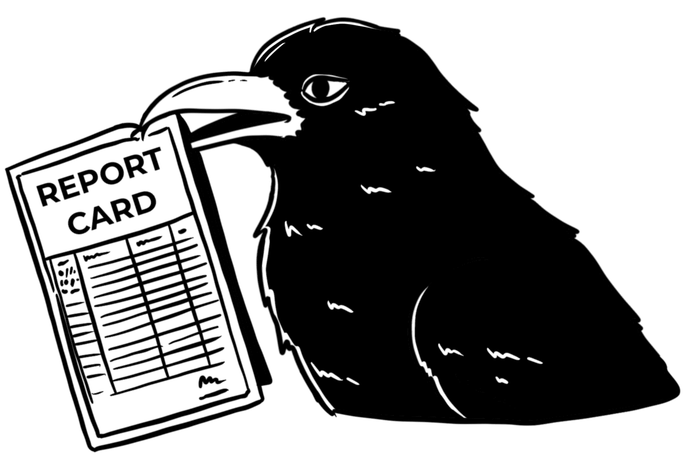

# 14  报告

> 原文：[`ml-science-book.com/reporting.html`](https://ml-science-book.com/reporting.html)

1.  将机器学习融入科学

1.  14  报告

如果你没有发布你的实验结果，它还能被视为科学吗？如果你不分享你的结果，其他人就无法验证或基于你的工作进行构建。这就是为什么在科学中发表是如此重要的原因。当你将机器学习应用于你的研究时，还有额外的报告需求。你可能已经发表了一篇论文，但也可能报告你创建的模型或数据集。为了使报告更容易，你可以使用清单。而不是仅仅在这里复制这些清单——这会使得阅读变得非常糟糕——这一章节会指引你找到最好的清单，它们的范围以及背后的理念。

几年后，其他鸟类开始对 Rattle 和 Krarah 的龙卷风预测模型感兴趣。鸽子、喜鹊，当然还有鹦鹉，都想要重复乌鸦的成功。但他们提出了很多问题，比如训练中使用了哪些数据？Krarah 的弟子们厌倦了反复回答同样的问题。他们决定将有关模型的所有信息整理成一份文档并公开发布。

## 14.1 论文清单

如果你将机器学习应用于你的研究项目，你的论文中应该包含哪些细节？你可能想要使用的一个清单是 REFORMS，代表“基于机器学习的科学报告标准” [[1]](references.html#ref-kapoor2024reforms)。作者们基于文献综述和来自不同领域的 19 位研究者的共识开发了 REFORMS。REFORMS 还包括完成清单和识别建模方法中潜在问题的指南。REFORMS 是*领域无关的*——这意味着清单项目具有广泛的适用性，但根据你的需求，某些项目可能缺失。

REFORMS 清单由 8 个模块（类别）和总共 32 个项目组成：

+   **学习目标。** 例如：*使用机器学习方法进行研究的动机*

+   **计算可重复性。** 例如：*包含使用提供的 dataset 和 code 生成结果的说明的 README 文件*

+   **数据质量。** 例如：*样本大小和结果频率*

+   **数据预处理。** 例如：*确定是否有任何样本被排除，并说明排除的原因*

+   **建模。** 例如：*选择论文中报告的模型的方法*

+   **数据泄露。** 例如：*每个用于模型中的特征或输入都是针对当前任务合法的，并且不会导致泄露的证明*

+   **指标和不确定性。** 例如：*选择统计测试（如果使用）的合理性以及检查统计测试的假设*

+   **泛化能力和局限性。** 例如：*外部有效性的证据*

进一步资源：

+   [REFORMS 网站](https://reforms.cs.princeton.edu/)

+   [REFORMS 清单（Word 文档）](https://reforms.cs.princeton.edu/checklist.docx)

+   [REFORMS 指南（Word 文档）](https://reforms.cs.princeton.edu/guidelines.docx)

+   [REFORMS 论文](https://www.science.org/doi/epdf/10.1126/sciadv.adk3452)

一些论文，尤其是在医学领域，可能需要额外的关注：

+   TRIPOD+AI [[2]](references.html#ref-Collinse078378) 是临床预测模型的出版方法。它附带一个[清单](https://www.tripod-statement.org/wp-content/uploads/2019/12/TRIPODAI_checklist.pdf)。

+   [AI 声明](https://pubs.rsna.org/page/ai/claim) 提供了关于医学影像 AI 论文的清单 [[3]](references.html#ref-tejani2024checklist)。

## 14.2 模型卡

除了发表论文外，您可能还想分享模型。您只需将模型上传到某个地方（如 Github）即可。问题是：其他研究人员和感兴趣方将难以与您的模型合作。标准的 README 文件可能不足以描述模型，而研究论文可能太长且格式不正确。解决方案：创建一个包含您的模型的特殊文档，例如模型卡。“模型卡”由谷歌研究团队[[4]](references.html#ref-mitchell2019model)提出，既指代方法也指代生成的文档。模型卡是一种由许多机构使用的清单方法，包括[HuggingFace](https://huggingface.co)这个大型模型库和机器学习社区。

原始模型卡论文介绍了 10 个类别，每个类别都有多个细节提示：

+   **模型详情**。例如：*模型日期*

+   **预期用途**。例如：*主要预期用途*

+   **因素**。例如：*评估因素*

+   **指标**。例如：*决策阈值*

+   **评估数据**。例如：*数据集*

+   **训练数据**

+   **定量分析**

+   **伦理考量**

+   **注意事项和建议**

模型卡方法不断演变。例如，模型卡指南手册[[5]](references.html#ref-ozoani2022model)和模板（见下文）包含新的和重命名的类别。模型卡是模型文档的一个很好的起点，但您应该始终根据您的需求进行定制。

进一步资源：

+   [模型卡论文](https://arxiv.org/abs/1810.03993) [[4]](references.html#ref-mitchell2019model)

+   [模型卡模板](https://github.com/huggingface/huggingface_hub/blob/main/src/huggingface_hub/templates/modelcard_template.md)

+   [模型卡指南手册](https://huggingface.co/docs/hub/en/model-card-guidebook)

再次强调，您可能有更具体的文档要求。例如，使用机器学习的医疗设备有特殊的报告要求，请参阅[此指南](https://github.com/johner-institut/ai-guideline/blob/master/Guideline-AI-Medical-Devices_EN.md)（重点关注德国）。

## 14.3 数据集数据表

仔细构建和整理的数据集是机器学习的核心。收集和清理数据可能需要大量的时间和精力，有时甚至需要数年。为了最大化投资回报，你可能需要发布数据集，以便他人可以使用并引用你的工作。但就像模型一样，如果数据集没有附带正确的信息，它也会引发许多问题。在文档方面，明智的做法不是重新发明轮子，而是站在巨人的肩膀上。在这种情况下，“数据集的数据表”（“Datasheets for Datasets”）[[6]](references.html#ref-gebru2021datasheets) 是一种流行的方法，旨在“促进数据集创建者和消费者之间的沟通。”

数据集的数据表列出了 7 个类别中的 57 个问题：

+   **动机。** 例如：*数据集是为了什么目的创建的？*

+   **组成。** 例如：*每个实例由哪些数据组成？*

+   **收集过程。** 例如：*每个实例关联的数据是如何获得的？*

+   **预处理/清理/标记。** 例如：*用于预处理/清理/标记数据的软件是否可用？*

+   **用途。** 例如：*数据集是否已经用于任何任务？*

+   **分发。** 例如：*数据集将如何分发（例如，网站上的 tarball，API，GitHub）？*

+   **维护。** 例如：*如何联系数据集的所有者/策展人/管理者（例如，电子邮件地址）？*

资源：

+   [数据表论文（PDF）](https://dl.acm.org/doi/pdf/10.1145/3458723) [[6]](references.html#ref-gebru2021datasheets)

+   [数据表模板（Markdown）](https://github.com/fau-masters-collected-works-cgarbin/datasheet-for-dataset-template/tree/master)

+   [数据表模板（Latex/Overleaf）](https://www.overleaf.com/latex/templates/datasheet-for-dataset-template/jgqyyzyprxth)

## 14.4 报告依赖于良好实践

如果你想要很好地记录你的研究项目，你需要遵循良好的研究实践，这些实践与其他本书中的主题密切相关：

+   记录研究项目、模型和数据集迫使你思考用例和限制，这与你的模型在不同环境中泛化的好坏密切相关（第七章）。

+   发布你的模型结果可能需要模型见解，这可能需要可解释性（第九章）。

+   分享模型和数据也是可重复性的一个重要组成部分（第十三章）。
