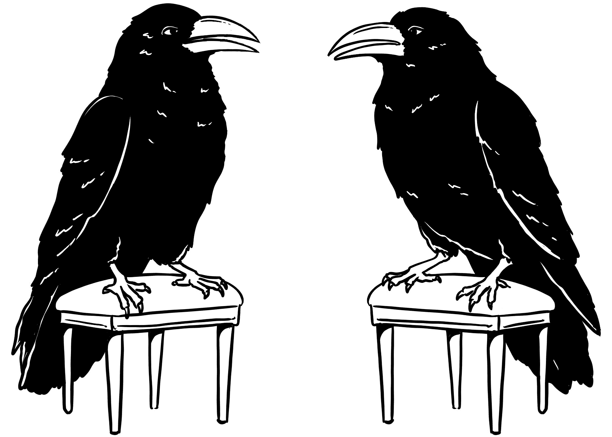

# 15  机器学习时代科学的未来

> 原文：[`ml-science-book.com/outlook.html`](https://ml-science-book.com/outlook.html)

我们的小旅程已经结束。还记得我们是如何从科学家使用机器学习获得洞察力的例子开始的吗？从那里，我们从预测、控制、解释和理解等不同的科学目标的角度评估了机器学习。我们论证说，机器学习有巨大的潜力成为科学问题解决的主要手段。然而，裸骨监督机器学习并不能解决问题——我们需要添加诸如可解释性、不确定性量化以及因果知识的整合等附加功能，所有这些我们都系统地在本章中介绍。我们逐一解决了如何“修复”机器学习在科学中的不足：泛化、领域知识、可解释性、因果性、鲁棒性、不确定性、可重复性和报告。

在最后一章中，我们推测了机器学习时代科学的未来。科学家将如何将机器学习整合到他们的研究中？一些科学是否会不受机器学习的影响？面对机器学习自动化，未来科学家将扮演什么角色？

是时候进行一些推测了。

许多年后，一位年迈但快乐的 Rattle 邀请面无表情的 Kراه进入她巨大的巢穴，谈论往事。从那时起，许多科学问题得到了解决，其中许多是在机器学习的帮助下完成的。那么，这一切都是好的吗？它们的智能羽毛开始振动。Rattle 收到了一个来自激进政治运动的定向广告，而 Kراه则收到了一场即将到来的风暴的预警。Kراه向 Rattle 眨了眨眼：“不！不是全部，但肯定有一部分。”

## 15.1 没有机器学习的科学

2023 年初，我们开始头脑风暴和构思这本书。到那时，机器学习模型在科学中的应用越来越多，甚至在我们认为不会找到机器学习的领域，如人类学和理论物理学。大约在同一时间，确切地说是在 2022 年 11 月，ChatGPT 发布了。这是许多可以用作聊天机器人和许多自然语言任务的大型语言模型之一。今天，这些模型甚至可以整合其他输入，如图像。这些所谓的*基础模型*有很大的潜力，我们已经在科学上看到了它们的影响：

+   与医生做出判断的方式相似，多模态基础模型允许整合来自多个来源的医疗数据 [[1]](references.html#ref-moor2023foundation)。

+   聊天机器人正在开启大规模个性化教育的门，提供高质量的反馈 [[2]](references.html#ref-kasneci2023chatgpt)。

+   大型语言模型甚至正在改变科学家写作的方式 [[3]](references.html#ref-kobak2024delving)。

基础模型为机器学习在科学领域的应用开辟了新的问题类型。我们相信，在未来，所有科学——不仅仅是自然科学和社会科学，还包括人文学科——都将将机器学习整合到其研究中。机器学习甚至将被用于那些一直无法进行定量处理的学科，如文学科学、历史和哲学。我们并不声称这种发展总是朝着更好的方向发展。

但特别是考虑到像 ChatGPT 这样的大型语言模型，科学中人类的作用还剩下什么呢？

## 15.2 没有人的科学是不可能的

几十年来，我们听到了无理论科学的故事或科学自动化的梦想 [[4]](references.html#ref-anderson2008end)。确实，科学家花费大部分时间的一些任务已经发生了变化：

+   科学家不再需要手动解决数值方程。

+   传感器自动收集和传输数据，科学家需要亲自收集数据的情况越来越少。

+   数据绘图可以数字化完成，不需要笔和纸。

许多其他任务现在正随着机器学习而改变。

+   标记野生动物图像可能不再是未来动物生态学家的问题 [[5]](references.html#ref-norouzzadeh2018automatically)。

+   机器学习模型可以帮助物理学家设计量子实验 [[6]](references.html#ref-krenn2016automated)。

+   设计具有所需功能的蛋白质将不再需要生物学家的直觉，而是可以依赖 AlphaFold 等大数据模型的力量 [[7]](references.html#ref-jumper2021highly)。

但像 ChatGPT 这样的基础模型在某个时刻是否会建议我们应进行的所有实验并引导科学的方向呢？

确实，越来越多的任务，过去是由科学家完成的，现在可以自动化。但这并不意味着我们正在走向没有科学家的科学。如果你看看历史，科学家的工作性质一直在变化。在亚里士多德时代，科学家通常是知识的收集者，写作和阅读是基本技能。像哥白尼或伽利略这样的科学家必须用大脑而不是 CPU 进行精确计算，用一张纸而不是计算机内存。爱因斯坦时代的物理学家如果没有在纯数学方面的强大训练，就无法进入该领域。在许多现代科学的领域，没有编程和数据分析基本技能的科学家会遇到困难。同样，未来科学家的轮廓将需要基本的机器学习建模技能。

自动化一项任务可以释放出时间用于其他任务。潜在地，它可以释放出时间让科学家研究新的现象，这需要一套不同的技能。也就是说，如果撰写拨款申请、审阅和提交论文不会耗尽所有额外的时间——但这又是另一个故事。科学家们不断重新定义自己的角色——发现新事物似乎是他们唯一不会过时的工作描述。最终，科学是科学家们感兴趣的东西，而对于某件事物来说，要有趣，就必须有一个有目标和欲望的存在认为它有趣。事实上，我们现在就可以开始讨论通用人工智能和机器意识，但我们宁愿不……

## 15.3 从预测工具到科学方法

要成为科学工具箱的一部分——就像编程和数据分析今天已经做到的那样——机器学习技能必须超越构建一个强大的预测模型。将机器学习视为一个纯粹关联、预测工具的看法反映了其成长阶段。正如我们在本书中所示，许多其他技能也必须成为科学家机器学习工具箱的一部分，以服务于科学：

+   没有人会直接给你一个预测任务，你需要领域知识来识别一个有意义的问题。

+   数据不是现成的，它是构建的。理解你的数据对于构建稳健和泛化模型是必要的。

+   预测的不确定性和因果依赖性不是一项副任务，而是至关重要的，尤其是在机器学习预测指导现实世界行动时。

+   完全的黑盒模型、不可复现且报告不佳的模型在实践应用中不会被使用。

机器学习方法需要成熟，并考虑科学的所有方面：我们需要规范科学问题的最佳实践；数据获取、清洗和工程框架；学习算法理论，解释为什么某些学习算法是成功的；最后，评估部署模型的规范。

我们对未来的机器学习持乐观态度，否则我们不会写这本书。我们的乐观态度得到了其他科学方法遵循相似路径的事实的支持。例如，早期的统计学主要是用于总结人口数据或提出可疑主张的工具，就像在颅相学中一样，在它变成今天的多面和广泛接受的科学研究方法之前。

## 15.4 长期有效的机器学习知识

机器学习是一个快速发展的领域。每年都会有新的趋势和炒作，这使得跟踪那些会持续存在的主题变得困难。像随机森林、支持向量机、卷积神经网络、生成对抗网络、图神经网络或转换器模型这样的特定算法总是有一个半衰期。它们可能在两到五年内是前沿技术，直到下一个竞争者出现。

在这样一个快节奏的环境中如何取得成功？当然，有时你不得不学习一个新的工具。但理想情况下，你也应该学习那些始终存在的原则。学习编程涉及学习像函数这样的通用概念以及编程语言的特定语法。这些概念往往可以持续很长时间：30 年前学习过函数的人至今仍然觉得这些知识相关，但他们可能不再用 Delphi 或 Pascal 编写应用程序。

在科学中保持相关性的不是解决问题的具体方法，而是问题本身以及解决它们的一般策略。这正是我们在这本书中试图传达的内容。我们介绍了将问题描述为机器学习问题的思想和形式化方法，并提供了解决方案的分类。

在机器学习的时代，科学的未来不是取代科学家，而是增强他们探索未知的能力。虽然工具可能会改变，但推动科学发现的好奇心和动力将永远不变。毕竟，这就是科学的本质：不断提问、探索和理解。

[1]M. Moor 等人，“通用医学人工智能的基础模型”，《自然》，第 616 卷，第 7956 期，第 259–265 页，2023。[2]E. Kasneci 等人，“ChatGPT 用于善行？关于大型语言模型在教育中的机遇和挑战”，《学习和个体差异》，第 103 卷，第 102274 页，2023。[3]D. Kobak，R. G. Márquez，E.-Á. Horvát 和 J. Lause，“通过过度词汇深入研究 ChatGPT 在学术写作中的应用”，*arXiv 预印本 arXiv:2406.07016*，2024。[4]C. Anderson，“理论的终结：数据洪流使科学方法过时”，《连线》杂志，第 16 卷，第 7 期，第 16–07 页，2008。[5]M. S. Norouzzadeh 等人，“使用深度学习自动识别、计数和描述相机陷阱图像中的野生动物”，《美国国家科学院院刊》，第 115 卷，第 25 期，第 E5716–E5725 页，2018，doi: [10.1073/pnas.1719367115](https://doi.org/10.1073/pnas.1719367115)。[6]M. Krenn，M. Malik，R. Fickler，R. Lapkiewicz 和 A. Zeilinger，“自动搜索新的量子实验”，《物理评论快报》，第 116 卷，第 9 期，第 090405 号，2016。[7]J. Jumper 等人，“使用 AlphaFold 进行高度精确的蛋白质结构预测”，《自然》，第 596 卷，第 7873 期，第 583–589 页，2021，doi: [10.1038/s41586-021-03819-2](https://doi.org/10.1038/s41586-021-03819-2)。
