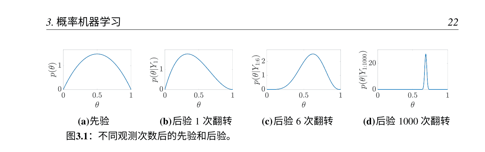
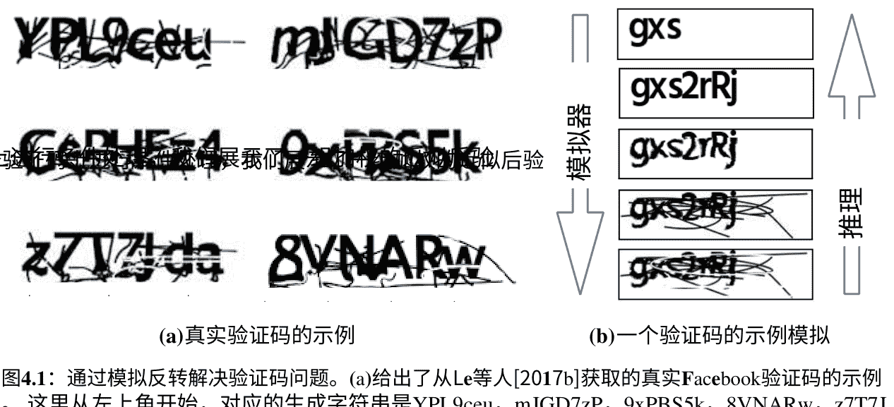
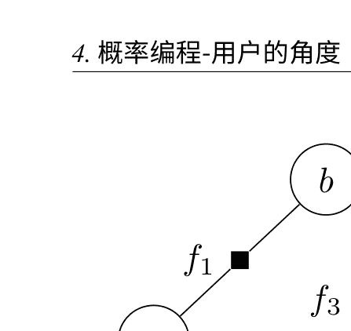
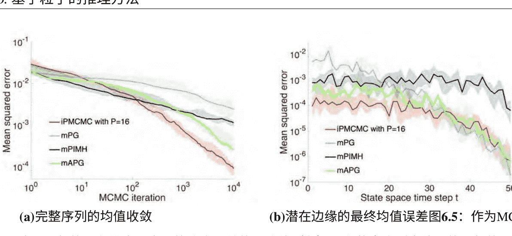
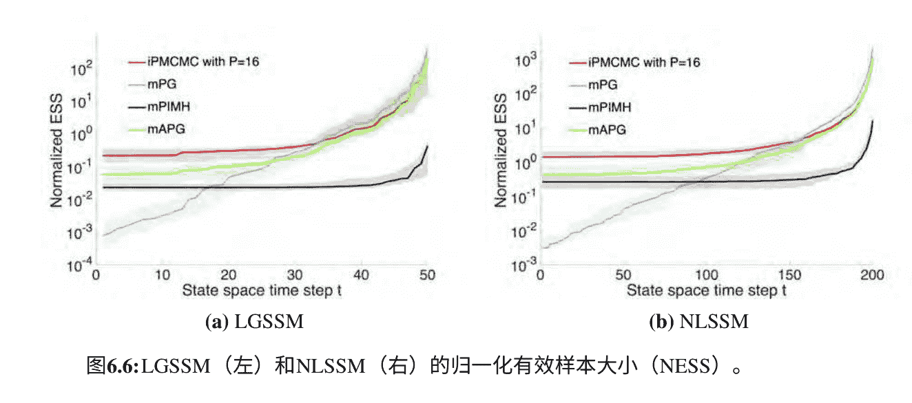
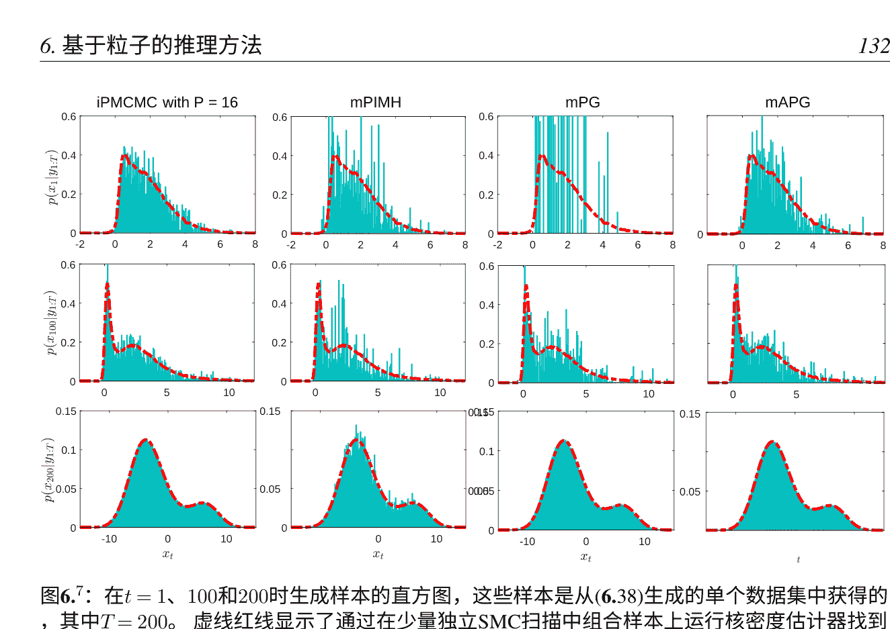
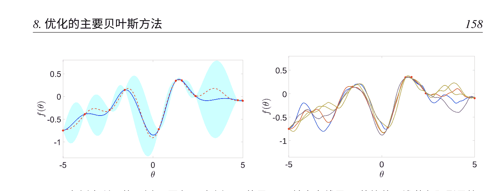
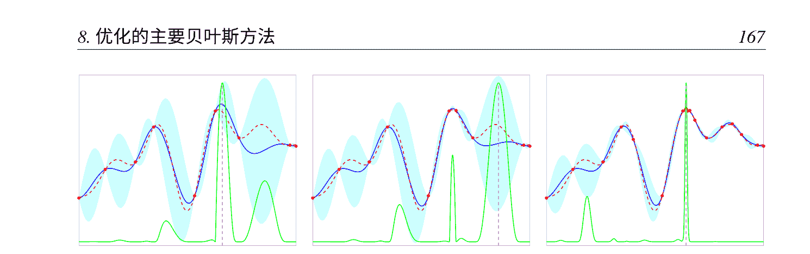

# 使用概率编程自动化推断学习和设计


汤姆·雷恩福斯
牛津大学沃尔夫森学院

博士学位论文剑桥大学2017年

## 摘要

想象一个世界，在这个世界中，计算模拟可以像运行它们一样容易地被反演，数据可以被用来自动优化模型，而进行强大的统计分析所需要的唯一专业知识就是基本的科学编码能力。
创建这样一个世界是概率编程的雄心勃勃的长期目标。

改进定量科学中使用的概率模型或模拟器的瓶颈通常不是在概念上设计更好的模型的能力，而是缺乏实现这些创新的专业知识、时间或资源。概率编程系统（PPS）通过提供一个表达力强、易于使用的建模框架，并自动化所需的计算来从模型中进行推理，例如找到可能导致某个输出的模型参数。通过解耦模型规范和推理，PPS简化了开发和从新模型中进行推理的过程，同时将强大的统计方法开放给非专家。许多系统还提供了编写新的、令人兴奋的模型的灵活性，这在传统的统计框架中很难甚至不可能实现。

本论文的中心目标是改进和扩展PPS。特别是，我们将改进底层推理引擎，并增加可以解决的问题范围。例如，我们将扩展PPS到混合推理优化框架，从而实现模型学习和工程设计的自动化任务。同时，我们在构建自动化自适应顺序设计问题的系统方面取得了进展，为科学领域提供了潜在的应用。此外，这项工作的贡献远远超出了概率编程，因为实现我们的目标将需要我们在许多相关领域取得进展，如粒子马尔可夫链蒙特卡洛方法、贝叶斯优化和蒙特卡洛基础知识。

## 致谢

首先，我要感谢我的伴侣Sophie在整个过程中对我的支持和理解，以及她为我所做的一切牺牲。 我同样要感谢我的家人对我的坚定支持，使我成为今天的我。 我要感谢Frank Wood、Jan-Willem van de Meent和Brooks Paige对我的指导和支持，无论是学术上还是个人上。 我对他们所有人，特别是Frank和Jan-Willem，都怀有深深的感激之情，因为他们教会了我大部分的知识，将我从一个问着像Metropolis是什么的傲慢愚蠢的人，培养成一个认为自己什么都知道的更加傲慢的愚蠢的人。 to an even more arrogant fool who thinks he knows everything.

如果没有他们，这项工作将会是一个可怕的失败。 我想感谢我的朋友和同事Atulim Güneş Baydin、Rob Cornish、Piotr Czaban、Neil Dhir、Jack Fitzsimons、Adam Goliński、Bradley Gram-Hansen、Max Igl、David Janz、Tom Jin、Tuan Anh Le、Mario Lezcano、Aravindh Mahendran、David Martínez Rubio、Siddharth N、Nantas Nardelli、Michael Osborne、Nick Palmius、Yura Perov、David Tolpin、Andrea Vedaldi、Andrew Warrington、Stefan Webb、Hongseok Yang、Yuan Zhou和Rob Zinkov，感谢他们让我在牛津度过了一段最幸福的时光。 我想感谢我的以前未提及的合著者Arnaud Doucet、Fredrik Lindsten、Christian A. Naesseth和Benjamin Vincent，与他们合作是一种绝对的快乐。

这篇论文中的许多新材料都是与合著者共同完成的，如果声称这些都是我自己的成果，那将是虚构的。 特别是，很多工作都是基于概率编程系统Anglican，对此必须归功于Frank Wood、Jan-Willem vande Meent和David Tolpin。 此外，对于本工作所基于的原始合著论文，都有引用，对此必须归功于我所有的合著者。

## 目录

- 1 引言 …………………………………………………………………………………… 1
- 1.1 论文目标和布局 …………………………………………………………………… 4
- 2 概率论简介 …………………………………………………………………………… 6
- 2.1 随机变量、结果和事件 …………………………………………………………… 6
- 2.2 概率 ……………………………………………………………………………… 6
- 2.3 条件和独立性 ……………………………………………………………………… 7
- 2.4 概率定律 …………………………………………………………………………… 8
- 2.5 概率密度 …………………………………………………………………………… 9
- 2.6 测度 ……………………………………………………………………………… 10
- 2.7 期望和方差 ………………………………………………………………………… 13
- 3 概率机器学习 ……………………………………………………………………… 15
- 3.1 判别式与生成式机器学习 …………………………………………………………… 15
- 3.2 从数据中学习 - 贝叶斯范式 ……………………………………………………… 19
- 3.3 图形模型 ………………………………………………………………………… 24
- 3.4 贝叶斯主义与频率主义 ……………………………………………………………… 28
- 3.5 贝叶斯建模的挑战 ………………………………………………………………… 37
- 4 概率编程 - 用户的视角 …………………………………………………………… 38
- 4.1 反演模拟器 ………………………………………………………………………… 39
- 4.2 不同的方法 ………………………………………………………………………… 43
- 4.3 贝叶斯模型作为程序代码 ………………………………………………………… 47
- 4.4 Anglican概率编程语言 …………………………………………………………… 59
- 5 贝叶斯推理简介 …………………………………………………………………… 67
- 5.1 贝叶斯推理的挑战 ………………………………………………………………… 67
- 5.2 蒙特卡洛 ………………………………………………………………………… 70
- 5.3 基础蒙特卡洛推理方法 …………………………………………………………… 78
- 5.4 蒙特卡洛推理的替代方法 ………………………………………………………… 101
- 6 基于粒子的推理方法 ……………………………………………………………… 102
- 6.1 顺序蒙特卡洛 …………………………………………………………………… 102
- 6.2 粒子马尔可夫链蒙特卡洛方法 …………………………………………………… 113
- 6.3 交互式粒子马尔可夫链蒙特卡洛 ………………………………………………… 121
- 7 通用目的的概率程序推理
- 7.1 通用目的推理的高级介绍
- 7.2 编译查询
- 7.3 在Anglican中编写推理算法
- 7.4 推理策略
- 8 优化的主要贝叶斯方法
- 8.1 概率机器学习中的优化
- 8.2 高斯过程
- 8.3 贝叶斯优化
- 9 自动化学习 - 概率程序的贝叶斯优化
- 9.1 动机
- 9.2 相关工作
- 9.3 问题形式化
- 9.4 贝叶斯程序优化
- 9.5 实验
- 9.6 讨论
- 10 嵌套估计
- 10.1 背景
- 10.2 问题形式化
- 10.3 特殊情况
- 10.4 嵌套蒙特卡洛的收敛性
- 10.5 嵌套估计的不可避免偏差
- 10.6 实证验证
- 10.7 对嵌套概率程序的影响
- 11 自动自适应设计
- 11.1 贝叶斯实验设计
- 11.2 用于离散问题的改进估计器
- 11.3 自动化顺序设计问题
- 11.4 DARC工具箱
- 12 讨论、结论和未来方向
- 12.1 我们难道不应该只使用深度学习吗？
- 12.2 我们需要随机数吗？
- 12.3 分摊推理
- 12.4 通用实验设计语言
- 参考文献

## 1 引言

为什么狗能够在空中接住飞盘？ 为什么击球手能够本能地预测飞速移动的板球，速度超过100公里/小时，准确且迅速地击中球，甚至没有时间有意识地进行预测？ 显然，这两者都不能基于对物理定律的深入明确的知识或某种硬编码的物体运动模型；我们甚至没有生来就知道不受支撑的物体会掉下来[Baillargeon, 2002]。 对于这些能力唯一合理的解释是击球手和狗都是通过经验学习的。 我们从出生开始并没有所有所需的知识来生存，但我们天生具备学习和适应的能力，观察周围的世界并利用这些观察来完善我们对从物理定律到社交互动的一切的认知模型。 传统上，科学方法依赖于人类对世界的解释，以制定明确的模型来解释我们的内在直觉，然后通过实验来测试这些模型。 然而，即使作为一个整体的科学社会，我们的模型在许多涉及社交互动的任务中通常远远不及动物和儿童的潜意识模型。 这使人们不禁要问，这种手工建模方法是否存在根本性的问题？ 是否存在另一种更好地模仿人类学习方式的方法？

机器学习是一种吸引人的替代方法，通常是补充性的，它专注于构建能够从数据中自适应或学习以进行预测的算法和系统，而这些预测并没有明确地编程。 这不仅令人兴奋，因为它可以自动化和改进各种计算任务，而且还可以让我们设计能够超越人类理解边界的系统，对我们自己无法直接解决的任务进行推理和预测。 作为一个领域，机器学习的范围非常广泛，涵盖了计算机科学、统计学、工程学等等。 它可能与计算统计学领域最为密切相关，主要区别在于它更强调预测而不是理解。 尽管目前对这个领域存在很大的炒作，但大部分核心思想已经存在了一段时间，通常以模式识别、人工智能或计算统计学的形式存在。 尽管如此，这个领域的发展仍然是爆炸性的

近年来，数据的可用性和计算处理能力的增加导致学术界和工业界对机器学习的兴趣激增，尤其是在其应用于实际问题的领域。 仅仅这种兴趣就足以原谅炒作，因为它不仅推动着机器学习社区本身的发展，还有助于发现大量现有技术可以产生巨大效果的应用。 从自动驾驶车辆[Lefèvre et al., 2014]，到语音识别[Jurafsky and Martin, 2014]，再到设计新药物[Burbidge et al., 2001]，机器学习正迅速成为许多技术和科学进步中的关键组成部分。

在许多机器学习应用中，使用基于原则的概率方法[Ghahramani, 2015]是至关重要的，特别是在数据稀缺的情况下，它可以包含不确定性并利用所有现有信息。 贝叶斯范式为此提供了一个很好的基础：领域专家构建了一个用于数据生成的概率模型，将其条件化为实际接收到的观测值，并使用贝叶斯规则得到一个包含这些信息的更新模型。 这样可以以统计严谨的方式将现有专业知识和数据信息相结合。 因此，它使我们能够使用机器学习来补充传统的科学方法，而不是直接替代它：我们可以以类似的方式构建模型，然后使用数据进行改进和优化。

不幸的是，通常有两个关键障碍使得这种理想化的贝叶斯机器学习方法在实践中难以实现。 首先，需要进行一种称为贝叶斯推理的过程来解决指定的问题。 这通常是一项具有挑战性的任务，与积分密切相关，通常需要大量的计算资源来解决。

此外，它通常需要显著的统计专业知识来有效地实施，从而形成了一个重要的进入障碍。 其次，很难指定符合用户希望的假设和先验信息的模型。 再次，需要统计专业知识来将应用特定知识抽象为有效的统计模型。

此外，为了推理的可行性，通常会做出假设，而不是模型的准确性。 也许正因为这些缺点，即使这些模型在任务上有些不合适，人们还是经常依赖现成的解决方案。

概率编程系统（PPS）[Goodman et al., 2008b] 是试图克服贝叶斯理想与常见实践之间的二分法。 它们的核心理念是将模型规范和推理解耦，前者对应于用户指定的程序代码，包括生成模型和用于数据条件的语句，后者对应于能够处理任意程序的推理引擎。 这种抽象屏障

使具有领域专业知识的用户能够自然地编写模型，就像编写模拟器一样，而不必担心推理，这成为开发者的工作。
非正式地说，可以将PPS视为逆概率引擎，输出由生成模型和观测数据所隐含的条件概率分布。消除了用户担心所需推理的需要，显著减轻了开发新模型的负担，并使非专家能够使用有效的统计方法。从开发者的角度来看，这种抽象还可以帮助设计和测试新的推理算法。此外，目标源代码的可用性以及已知的语义为否则不可能的新方法提供了许多机会。

这篇论文的基本主题是改进和扩展概率编程。
然而，这样做将涉及在不同的研究领域中取得一些显著进展，例如粒子马尔可夫链蒙特卡洛方法[Andrieu et al., 2010]、贝叶斯优化[Shahriari et al., 2016b]和蒙特卡洛基础知识[O wen, 2013]。除了这些进展的直接优点外，从概率编程的角度来看，我们的总体目标可以分为两个主题：改进PPS的基础推理引擎和扩大它们可以解决的问题范围。

改进PPS推理引擎既是为了提高其效率，更重要的是，系统能够处理的模型复杂性限制主要取决于其推理引擎的效果。尽管现有的PPS在简单模型或具有易于利用结构的模型中提供了有效的推理手段，但它们仍然离定制推理方法所能实现的目标有一定距离。它们离实现我们为科学界使用的各种随机模拟器提供自动推理的宏伟目标还有很长的路要走。因此，改进推理引擎对于使PPS实用化并适用于更广泛的模型是至关重要的。我们对这一长期目标的主要贡献是引入相互作用粒子马尔可夫链蒙特卡洛算法[Rainforth et al., 2016c]，它代表了适用于PPS的最先进的推理方法，可以说是PPS Anglican [Wood et al., 2014]的首选算法。

我们的第二个目标是扩大PPS可以解决的问题范围，超越标准的贝叶斯推理设置。尽管贝叶斯范式非常强大，但它远非机器学习工具中唯一的工具，而且还有许多问题超出了它的框架。例如，通过使用BOPP [Rainforth et al., 2016b]将PPS扩展到更一般的混合推理-优化框架，我们打开了大门。

### 1.1 论文目标和布局

这篇论文包含了教学材料、文献综述和前沿研究的混合内容。尽管难免会有一些空白，但目标是让读者从概率和机器学习的基础知识一直深入到设计概率编程语言的自动混合推理优化引擎等高级主题。除了尽可能地使工作自包含，我们决定从基础知识开始有三个关键理由。首先，我们的目标是尽可能地使工作易于理解，并希望为那些新手提供有用的指南。概率编程，以及机器学习更一般地吸引了来自非常多样化背景的研究人员，对于统计学界来说是基础的概念对于编程语言界来说常常令人困惑，反之亦然。其次，因为概率编程，特别是本论文的更高级内容超越了传统的贝叶斯建模概念，对核心概念的深入理解是必不可少的。第三，由于机器学习发展迅速，或者仅仅因为研究本身的性质，很容易将注意力集中在一个小的研究领域而失去整体视野。对于良好的研究来说，重要的不仅是质疑自己对特定子领域的贡献，还要质疑其合理性。

对于该子领域本身来说。 随着当前围绕机器学习和尤其是深度学习的炒作，重返这些基本原理和核心概念比以往任何时候都更加重要，这样我们才能确定正确的方法来解决特定问题，并理解我们可以真实地希望通过机器学习实现什么。

更准确地说，这篇论文可以分解如下。 第2、3和5章都是明确的教学内容，涵盖了任何研究或应用贝叶斯建模以及机器学习的人都应该深入理解的基础知识。 进一步细分，第2章简要介绍了概率论，为所有概率机器学习的基础奠定了基础，希望能够提供一个简明但易懂的入门指南。

第3章介绍了贝叶斯方法，这是本工作大部分基于的机器学习方法，为该框架提供了动机，同时也批评了其中的一些弱点。 第5章介绍了贝叶斯推理的问题，这是解决所有贝叶斯建模问题所必需的，重点介绍了蒙特卡洛方法，特别详细地介绍了一些基础方法。

第4章从编写模型的角度提供了概率编程的介绍。 尽管它的前几节仍然主要是教学性的，但论文的核心符号在后面的几节中得到了阐述，其中一些与传统文献中通常使用的符号有所不同。 第6章考虑了一类更高级的贝叶斯推理方法，即顺序蒙特卡洛方法[Doucet和Johansen，2009]和粒子马尔可夫链蒙特卡洛方法[Andrieu等，2010]，并逐步介绍了我们在文献中的最新贡献[Rainforth等，2016c]。 第7章虽然不是明确的新研究，特别是对Tolpin等人的工作[2016]的致敬，但仍然构成了一个概率编程系统后端复杂工作的相对高级和前沿材料。 第8章是对贝叶斯优化的介绍，稍微回到了更具教学性的材料。

第9、10和11章都概述了文献中的新贡献，包括我们最近的出版物[Rainforth et al., 2016b, 2017a; Rainforth, 2018; Vincent and Rainforth, 2017]以及本论文中引入的新材料。 第9章介绍了一种混合推理优化框架，该框架使用贝叶斯优化、代码转换和现有推理引擎的混合方法来处理概率编程语言。 第10章考虑了嵌套蒙特卡洛估计器的统计影响，并将这些结果应用于概率编程的嵌套。 第11章概述了一种自动化适应性实验方法，适用于某类心理试验，并朝着设计通用的概率编程语言迈出了一步。

## 2 概率论简介

在进入论文的主要内容之前，我们首先对概率论进行了简要介绍，提供了一些基本背景，并概述了我们将在整个论文中使用的约定。熟悉概率和概率密度之间的差异以及随机变量和结果之间的差异的读者可能希望跳过本章，在需要时参考以澄清任何约定。其他人希望这将是对后续论文理解所需的关键概念的温和介绍。我们选择的符号是为了提高可访问性，并尽可能避免使用测度论。然而，对于更严格的理解，测度论方法对于概率是必不可少的，我们建议感兴趣的读者参考Durrett [2010]。

### 2.1 随机变量、结果和事件

随机变量是一个当前未知实现的变量，可以有多个不同的值或结果。一个或多个结果的集合被称为事件。
例如，如果我们掷一个公平的六面骰子，掷骰的结果是一个随机变量，而掷出4既是一个可能的结果，也是一个可能的事件。而掷出大于或等于5的数字，则是一个可能的事件，但不是一个可能的结果：它是两个单独结果的集合，即掷出5和掷出6。结果是互斥的，也就是说，在一个特定的试验中不可能发生两个不同的结果，例如我们不能一次掷出2和4。事件则不是互斥的。例如，同时发生掷出偶数和掷出大于3的事件是可能的。

### 2.2 概率

概率是事件发生的机会。例如，如果我们将掷骰子的结果表示为X，则可以说P(X=4)=1/6，或者P(X≤3)=0.5。这里，X=4和X≤3是随机变量X的事件，其概率分别为1/6和0.5。概率为0表示事件不可能发生，例如

在更正式的测度论框架中，结果是样本空间中的点，而随机变量是从结果到可测空间的可测函数。

掷出特定点数的概率为1，而掷出正面的概率为1。所有概率必须介于0和1之间（包括在内）。随机变量的分布提供了每个可能结果发生的概率。

尽管如此，我们经常使用简写$P(x)$来表示事件的概率$P(X = x)$。我们再次强调随机变量$X$和结果$x$之间的重要区别：前者具有未知值（例如，掷骰子的结果），而后者是随机变量的一个固定可能实现（例如，掷出4）。尽管如此，有时我们会故意不加区分地使用随机变量和结果，除非明确需要区分。

令人惊讶的是，有两种竞争（有时不兼容）的概率解释。频率学派对概率的解释是，如果试验无限重复，事件发生的平均比例是多少。贝叶斯解释概率是指在信息不完全的过程中，事件发生的主观信念。这两种观点都有优点和缺点，我们将避免卷入科学界最大的争论之一，只注意到这两种哲学观点通常与机器学习或统计方法的实际差异完全无关（参见第3.4节），尽管这些哲学观点的差异经常被用来争论结果算法的优越性[Gelman et al., 2011; Steinhardt, 2012]。

### 2.3 条件和独立性

条件概率是在另一个事件发生的情况下，某个事件发生的概率。例如，掷骰子得到4的条件概率，在掷出3或更高点数的情况下是$P(X=4|X\geq3)=0.25$。更常见的是，我们会在与我们关心的事件分开但相关的事件上进行条件概率计算。例如，吸烟会增加患肺癌的概率。使用另一个事件的信息来更新概率的过程被称为对该事件进行条件概率计算。例如，可以根据前几场比赛的结果来计算一个足球队赢得联赛的概率。

如果一个事件的发生不会影响另一个事件发生的概率，那么它们是独立的。同样，如果一个随机变量的结果不会影响另一个随机变量的分布，它们是独立的。随机变量的独立性意味着每个变量的概率与给定另一个变量的条件概率相同。变量，即如果$X$和$Y$是独立的，对于所有可能的$y$，$P(X=x) = P(X=x|Y=y)$。注意，独立性在添加或删除条件时不一定保持不变：如果$X$和$Y$是独立的，这并不意味着$P(X=x|A) = P(X=x|A, Y=y)$对于某个事件$A$成立。例如，下一个经过速度摄像头的驾驶员超速并且速度摄像头发生故障的概率可以合理地假设是独立的。然而，在速度摄像头被触发的事件条件下，这两者显然不是独立的，因为如果摄像头工作，这将表明驾驶员超速。

如果$P(X=x|A) = P(X=x|A, Y=y)$成立，则$X$和$Y$在给定$A$的条件下被称为有条件独立的。与独立性不意味着条件独立类似，条件独立也不意味着非条件独立。

### 2.4 概率定律

虽然不是严格的公理，但概率的数学规律可以总结为乘法规则和加法规则。令人惊讶的是，几乎所有的概率都源自这两个简单的规则。乘法规则指出，两个事件发生的概率是其中一个事件发生的概率乘以另一个事件在第一个事件发生的条件下发生的条件概率，即
$$P(A, B) := P(A \cap B) = P(A|B)P(B) = P(B|A)P(A)$$
其中我们引入了 $P(A, B)$ 作为同时发生事件 $A$和$B$的概率的简写。乘法规则的一个直接推论是贝叶斯规则，
$$P(A|B) = \frac{P(B|A)P(A)}{P(B)}$$
我们将在第3.2节详细讨论。另一个推论是对于独立随机变量，联合分布是各个概率的乘积：$P(A, B) = P(A)P(B)$。加法规则有多种不同的表示形式，其中最一般的是要求要么发生 $A$要么发生 $B$的概率，$P(A \cup B)$，由以下给出：
$$P(A \cup B) = P(A) + P(B) - P(A, B)$$
总和规则的直觉可能最容易通过考虑以下情况来理解
$$P(B) - P(A, B) = P(B)(1 - P(A|B)) = P(B, \neg A)$$
是$B$发生而不是$A$的概率。现在，只有在$A$发生或者$B$发生而不是$A$的情况下，$A\cup B$才能发生。由于这两个事件不可能同时发生，任一事件的概率必须是每个单独事件的概率之和，得到（2.3）。总和规则有一些直接的结果。例如，如果A和B是互斥的，则由于结果是互斥的，根据总和规则和概率公理，每个可能结果的概率之和等于1。

我们还可以利用这一点来定义边缘化随机变量Y的概念。将随机变量Y排除在外的概念可以使用这个来定义
$$P(X = x) = \sum_{i} P(X = x, Y = y_i) \tag{2.4}$$
其中求和是在所有可能的结果 Y上进行的。这里 $P(X = x)$被称为 X的边际概率，而 $P( X =x, Y = y)$被称为 X和 Y的联合概率。条件概率与无条件概率遵循相同的关键结果，但需要注意的是它们不会对条件项定义概率分布。例如，$P(A|B)$是 A上的概率分布，具有所有相应的要求，但不是 B上的分布。因此，例如，可以有 $\sum_{i} P(A|B = b_i) > 1.$

我们将 $P(A|B)$称为事件 B发生时 A的似然。

### 2.5 概率密度

到目前为止，我们假设随机变量是离散的，即存在一些固定的可能结果。如果我们的变量是连续的，情况会变得更加复杂。例如，考虑一个跑步者完成马拉松需要 $\pi$（即 3.14159265...）小时的概率 $P(X = \pi)$。显然，这个特定事件的概率为零，$P(X=\pi) = 0$，这是选手完成比赛的任何其他确切时间的概率：我们有无限多个可能的结果，每个结果的概率都是零（假设选手完成比赛）。幸运的是，我们之前介绍的事件的概念能够帮助我们。例如，选手在3到4小时之间完成比赛的事件具有非零概率：$P(3 \le X \le 4) > 0$。在这里，我们的事件包括无限多个可能的结果，即使每个单独的结果的概率为零，无限多个这样的结果的组合也不一定具有零概率。为了更有用地描述这种情况下的概率，我们可以定义一个概率密度函数，它反映了结果空间中各个区域的相对概率。我们可以通过考虑空间中某个小区域的概率来非正式地定义这个概率，该区域的大小为$\delta x$。假设概率密度函数$p_X(x)$在我们的小区域内大致是恒定的，我们可以说 $p_X(x)\delta x \approx P(x \leq X < x + \delta x)$，因此给出了非正式的定义 $p_X(x) = \lim_{\delta \to 0} \frac{P(x \leq X < x + \delta x)}{\delta x}$。更准确地说，我们可以定义概率密度满足
$$P(X \in \mathcal{A}) = \int_{x \in \mathcal{A}} p_X(x)dx \tag{2.5}$$
其中 $X \in \mathcal{A}$ 表示 $X$ 在 $\mathcal{A}$ 中的事件。我们可以类似地定义累积分布函数 $P(X \leq x)$，它是 $X$ 小于等于结果 $x$ 的概率。
$$P(X \leq x) = \int_{-\infty}^{x} p_X(u)du, \tag{2.6}$$
其中 $u$ 是一个虚拟变量。上一节讨论的概率基本定律同样适用于概率密度，只需将求和替换为积分，根据需要进行替换。

在论文的其余部分中，我们将省略符号 $p_X(x)$，只使用 $p(x)$。这样做的主要原因是我们经常使用实际上并不从中采样的概率密度函数。例如，在重要性采样中，我们会从一个分布中采样，但在另一个分布下评估其密度。在这些情况下，可能无法将一个随机变量与每个密度相关联。相反，我们将明确指出一个随机变量是从哪个分布中抽取的，使用符号 $X \sim p(x)$。然而，在上下文中不需要区分随机变量和结果时，我们经常使用宽松的符号，如 $x \sim p(x)$。

### 2.6 测度

现在考虑一下，如果有一种可能性，即选手无法完成比赛，我们将其表示为结果 $X = \infty$。从我们迄今为止介绍的情况来看，概率的概念和概率密度似乎都不适用于这种情况：除了 $X = \infty$ 之外的每个结果都具有零概率，但 $X = \infty$ 似乎具有无限概率密度。为了解决这个难题，我们不得不暂时放弃避免测度论的承诺。测度可以被看作是为一组对象分配大小的东西。概率测度分配概率给事件，记住事件代表结果的集合，因此用于定义我们之前讨论过的更正式的概率概念。分配给包括所有可能结果的事件的测度为 1，而分配给空集的测度为 0。

我们可以通过将概率密度的概念推广到任意随机变量来形式化地定义它，与适当的参考测度相关。有点令人困惑的是，这个参考测度通常不是一个概率测度。考虑在第 2.5 节中研究的连续密度的情况。在这里，我们隐含地使用了勒贝格测度作为参考测度，它对应于标准的欧几里得大小概念，在 1、2 和 3 维分别对应于长度、面积和体积的概念。因此，在(2.5)中，dx表示对勒贝格测度的积分，其中∫表示对x∈A的积分，它等于A的超体积（例如，在二维中为A的面积）。

我们的参考测度显然不是一个概率测度，而我们的概率测度可以非正式地看作是p(x)dx，因此∫_{x∈A} p(x)dx = P(X∈A)。在离散情况下，我们可以通过使用计数测度的概念来定义概率密度p(x) = P(X = x)来参考，计数测度简单地计算导致特定事件发生的结果数量。

请注意，我们不能随意选择任意给定随机变量的任意测度。我们不能将计数测度作为连续随机变量的参考，也不能将勒贝格测度作为离散随机变量的参考，因为例如，勒贝格测度会将后者的所有可能事件分配为零测度。尽管如此，我们使用的参考测度也不一定是唯一的。例如，我们可以应用一个常数c来缩放参考测度，然后通过1/c来缩放密度。为了方便起见，在论文的其他地方，我们将把dx（或等效的）称为我们的参考测度。

对于可能无法完成的示例，我们可以使用混合度量。也许最简单的思考方式是将选手的时间X视为两个随机变量的确定性函数：第一个是离散随机变量Y∈{0,1}，它决定选手是否完成比赛（Y=1）或者没有完成（Y=0）；第二个是连续随机变量Z∈ℝ+，它指定了在选手完成比赛的情况下的跑步时间分布（Z始终存在，但只有在选手完成比赛时才等于X）。现在X是Y和Z的函数，我们可以如下定义事件X∈A的概率
$$ P(X \in \mathcal{A}) = \sum_{y \in \{0,1\}} \int_{z \in \mathbb{R}} P(Y = y)p(z)\mathbb{I}(X(y, z) \in \mathcal{A})dz = P(Y = 0)\mathbb{I}(\infty \in \mathcal{A}) + P(Y = 1) \int_{z \in \mathcal{A} \setminus \infty} p(z)dz $$
其中$\mathbb{I}(\cdot)$是指示函数，如果其输入为真则评估为1，否则为0，并且我们使用了$Y$和$Z$之间的独立性。根据概率密度的定义，我们还有$P(X \in \mathcal{A}) = \int_{x \in \mathcal{A}} p(x) d\mu(x)$。

对于密度函数p(x)相对于测度dμ(x)的记号，我们从dx切换到dμ(x)，以表达测度现在明确依赖于x的值，即我们的测度在x上是非平稳的。当x不是无穷时，dμ(x)自然对应于勒贝格测度，注意$\int_{x \in \mathbb{R} \setminus \infty} p(x)d\mu(x) = 1 - P(X = \infty)$。

更正式地说，密度函数是从概率测度和参考测度导出的，而不是相反：它是概率测度相对于参考测度的Radon-Nikodym导数。当x趋于无穷时，dμ(x)自然对应于计数测度的某种缩放。对于离散分布，使用计数测度是很自然的（即将缩放设置为1），但在这里，这可能会导致稍微误导人的密度函数，因为X=∞比任何其他X更有可能。例如，这可能意味着arg max_x p(x) = ∞，这可能很快导致混淆。更具说明性的选择可能是使用计数测度乘以一个任意小的值（使得密度函数乘以一个大的值），尽管严格来说，这个缩放值不应该是0。

对于大多数应用程序，选择有效的参考度量将是无关紧要的（只要我们在考虑多个密度时保持一致），因为它不会影响随机变量本身的分布或影响期望值（参见第2.7节）。我们希望传达的关键点是，无论变量类型如何，我们总是可以（隐式地）定义概率密度函数。这个概念的推广还允许我们对既不是离散型也不是连续型的变量进行概率分布。例如，我们可能希望在字符串空间上放置一个分布。由于这个概念的推广，我们在本论文中主要使用概率密度来讨论，即使变量通常是离散型的（此时密度将表示概率）。

我们通过考虑彼此之间是确定性函数的随机变量之间的关系来结束本节。这个重要的情况被称为变量的变换。假设随机变量Y是另一个随机变量X的确定性函数，Y=g(X)。给定X的概率密度函数，我们可以定义Y的概率密度函数
$$p(y)dy = p(x)dx = p(g^{-1}(y))dg^{-1}(y) \quad (2.7)$$
其中p(y)和p(x)分别是Y和X的概率密度，其测度为dx和dy，后者被称为推前测度。重新排列后，对于一维问题，我们可以看到
$$p(y) = \left| \frac{dg^{-1}(y)}{dy} \right| p(g^{-1}(y)). \quad (2.8)$$
对于多维情况，导数被雅可比行列式替代，用于反向映射。注意，根据(2.5)，改变变量不会改变实际概率或异常值的值(参见第2.7节)。然而，(2.7)仍然具有重要的结论，即概率分布的最优值取决于参数化。4这个规则有一个重要的例外。5嗯，几乎总是如此。但我们不打算探讨这个问题，参见Durrett [2010]。例如，使用 X 或 log X 对同一模型进行参数化将导致参数 x* 的不同最可能值，即一般而言，
$$x* = \arg max_x p(x) = g^{-1} (\arg max_{g(x)} p(g(x))).$$

### 2.7 期望和方差

随机变量 X 的期望值 E[X]，或者平均值，是变量在无限次独立抽取的情况下取得的平均值。使用概率密度表示，其定义如下
$$E[X] = \int x p(x) dx.$$
在离散情况下，这导致 $E[X] = \sum_i x_i p(x_i)$。由于期望是由随机变量（而不是密度）定义的，它们对所有包含的随机性进行平均，例如 $E[f(X, Y)] = \iint f(x, y)p(x, y) dx dy$。然而，如果我们只希望对系统中的一部分随机性进行平均，我们可以使用条件期望，例如
$$E[f(X, Y)|Y = y] = \int f(x, y)p(x|y) dx,$$
有时我们有时会使用简写 $E[f(X, Y) | Y]$。有时候隐式定义随机变量和条件期望会更方便，我们使用稍微宽松的符号表示。
$$E_{p(x|y)}[f(x, y, z)] = \int f(x, y, z)p(x|y) dx,$$
在这里，我们隐式定义了随机变量 $Y\sim p(y)$ 和 $X\sim p(x|Y=y)$，我们计算的是 $E[f(X, Y, z) | Y=y]$，这个结果期望是 $z$ 的函数（被视为确定性变量）。可以非正式地将其视为对 $f(x, y, z)$ 关于 $p(x|y)dx$ 的期望：我们的期望只涉及从 $p(x|y)$ 中抽取的随机性。

将随机变量 X 的均值表示为 $\mu = E[X]$，则 X 的方差可以用以下任一等价形式定义
$$Var(X) = E[(X - \mu)^2] = \int (x - \mu)^2 p(x) dx = E[X^2] - \mu^2.$$
换句话说，它是变量与其均值之间的平均平方距离。它的平方根，标准差，非正式地形成了变量与其均值之间平均变化量的估计，并且具有与数据相同的单位。在定义方差时，我们将使用与期望相同的符号约定。

方差是两个随机变量X和Y之间协方差更一般概念的特例。定义$\mu_X = E[X]$和$\mu_Y = E[Y]$，则协方差可以用以下任一等价形式定义
$$Cov(X, Y) = E[(X - \mu_X)(Y - \mu_Y)] = \iint (x - \mu_X)(y - \mu_Y) p(x, y) dx dy = E[XY] - E[X]E[Y]. \quad (2.14)$$
两个变量之间的协方差测量了两个随机变量的联合变异性。通过相关性的定义（或更具体地说，皮尔逊相关系数），可以最容易地解释协方差，它是通过每个变量的标准差进行缩放的相关性。
$$\text{Corr}(X, Y) = \frac{\text{Cov}(X, Y)}{\sqrt{\text{Var}(X)\text{Var}(Y)}}. \quad (2.15)$$
两个变量之间的相关性始终在[-1, 1]范围内。正相关表示当一个变量相对较大时，另一个变量也倾向于较大。相关性越高，这种关系就越强：如果相关性为1，则一个变量是线性依赖于另一个变量的。负相关也是如此，只是当一个变量增加时，另一个变量倾向于减少。独立变量的相关性（因此协方差）为零，尽管反之不一定成立：相关性为零的变量不一定是独立的。请注意，相关性不等于因果关系。

## 2. 概率论简介

### 3.1 判别式与生成式机器学习

在一些机器学习应用中，有大量的数据可用，远远超过了人类专业知识所能提供的信息。在这种情况下，主要的挑战在于从数据中处理和提取所有所需的信息，以形成一个有用的描述，通常是一个在以前未见过的输入上提供准确预测的工具。

这类问题通常适合于判别式机器学习方法[Breiman等，2001; Vapnik，1998]，如神经网络[Rumelhart等，1986; Bishop，1995]，支持向量机[Cortes和Vapnik，1995; Schölkopf和Smola，2002]和决策树集成[Breiman，2001; Räinsforth和Wood，2015]。判别式机器学习方法专注于直接学习预测模型：给定训练数据$D = \{(x_n, y_n)\}_{n=1}^N$，它们学习一个参数化映射$f_{\theta}$从输入$x \in \mathcal{X}$到输出$y \in \mathcal{Y}$，可以可以直接用于对新输入进行预测 $x \notin \{x_n\}_{n=1}^N$。训练使用数据 $\mathcal{D}$ 来估计参数的最优值 $\theta^*$。在新输入 $\tilde{x}$ 上进行预测涉及应用具有最优参数的映射，给出输出的估计值 $\tilde{y} = f_{\theta^*}(\tilde{x})$。也许最简单的例子是线性回归：找到最能代表数据的超平面，然后使用这个超平面对以前未见过的点进行插值或外推。

作为一个更高级的例子，在神经网络中，人们使用训练来学习网络的权重，之后可以通过向前运行网络来进行预测。

有很多直观的原因可以采用判别式机器学习方法。也许最有说服力的是这样一个想法：如果我们的目标是预测，那么简单的方法就是直接解决这个问题，而不是尝试解决一些更一般的问题，比如学习一个潜在的生成过程[Vapnik, 1998; Breiman et al., 2001]。此外，如果提供足够的数据，判别式方法在预测性能方面可以取得令人瞩目的成功。判别式方法通常非常灵活，可以捕捉到数据中复杂的结构，这在手动建立时可能很难甚至不可能实现。许多方法也可以在用户几乎没有输入的情况下运行，使用默认参数即可提供最先进的性能[Rainforth and Wood, 2015]。

然而，这种黑盒性质通常也是它们的弱点。判别方法通常对潜在过程做出如此弱的假设，以至于很难传授先验知识或领域专业知识。如果可用的数据不足，这可能会导致灾难性后果，因为仅凭数据本身很难获得所需的信息以进行充分的预测。

即使有大量的数据可用，也可能存在需要利用的重要先验信息，以实现有效的性能。例如，在时间序列建模中，数据的顺序性质是至关重要的信息[Liu and Chen, 1998]，而在视觉任务中，场景由对象生成的知识可能是无价的[Kulkarni et al., 2015]。随着数据的增加，许多问题的复杂性也会增加——“大数据”问题通常实际上是许多小问题的集合，或者有时是层次结构，因此所需参数化的复杂性随着数据的增加而增加。例如，考虑在社交网络中建模互动。将新用户添加到模型中会增加数据量，但也需要模型增长并适应新用户[Ravasz and Barabási, 2003]。在这种情况下，使用一种尊重已知结构的方法至关重要，而每个个体用户可用的数据通常相当少，因此使用先验信息通过从一些用户那里转移获得的见解将是至关重要的。

## 3. 概率机器学习

给其他人。因此，即使对于这样的大规模问题，许多判别方法的不灵活性也会导致无法将目标问题的已知特征纳入其中，这可能会带来问题。

许多判别方法的黑盒特性不仅限制了系统所能接受的人类输入的程度，而且在训练完成后，往往限制了从系统中提取洞察力和信息的数量。大多数判别算法中的参数没有物理意义，用户无法查询，这使得它们的操作难以解释，并阻碍了通过手动修订算法来改进系统的过程。此外，这通常使它们不适用于更加统计导向的任务，因为参数本身才是感兴趣的，而不是系统本身的预测能力。例如，这些参数可能具有现实世界的物理解释，我们希望了解这些解释。

大多数判别方法在提供现实的不确定性估计方面也表现不佳。因为它们通常是通过优化参数以最小化某些损失准则（例如预测误差）进行训练的，所以它们通常不会在其参数或后续预测中编码任何不确定性。虽然许多方法可以通过副产品或后处理步骤产生不确定性估计，但这些方法通常是基于启发式的，而不是从统计原则估计目标不确定性分布而自然产生的。这种缺乏可靠的不确定性估计可能导致过度自信，并且在许多情况下使判别方法不适用，例如任何存在安全问题的应用。当仅提供一个点估计时，它还会降低判别方法在更大系统中的组合性能，因为信息会丢失。不表示参数的不确定性也会限制结果模型的能力，与可以对不同可能的参数值进行平均的方法相比。

这些缺点意味着许多任务更适合使用生成式机器学习方法[Ng和Jordan，2002；Bishop，2006]。与直接学习预测器不同，生成式方法试图使用概率模型解释观察到的数据。而判别方法仅旨在进行预测，生成式方法则模拟数据的实际生成方式：它们模拟输入 X 和输出 Y的联合概率 p(X, Y)。相比之下，我们可以将判别方法视为仅对给定输入X的输出进行建模 Y|X。

这种差异的一个关键结果是生成方法通常对问题进行更强的建模假设。尽管当模型假设错误时可能会有问题，并且在大数据极限情况下通常是不必要的，但将先验信息与数据相结合是构建利用特定应用的系统的关键。

专业知识。乔治·博克斯永恒的名言：“所有模型都是错误的，但有些是有用的”[Box, 1979; Box et al., 1979]。从某种意义上说，这是一个自我实现的陈述：任何真实现象的模型都是近似的，因此永远不会完全正确，无论多么强大。

然而，这仍然是一个重要的观点，往往被学者们遗忘，尤其是试图说服世界只有他们的方法是正确的。只有在人工情境中我们才能构建精确的模型，因此我们必须记住，在生成式机器学习中，第一个也是最大的错误在于我们对问题的原始数学抽象。另一方面，真实情况下只能获得有限且通常受限的数据，因此仅仅因为在大数据极限情况下具有更好的渐近行为，或者如果我们的方法不起作用，解决方案总是获取更多数据，这种观点同样荒谬。因此，将领域专业知识纳入生成方法中往往对于实现真实世界任务的有效性至关重要。

为了突出判别式和生成式机器学习之间的区别，我们考虑逻辑回归（一种判别式分类器）和朴素贝叶斯（一种生成式分类器）之间的差异。为了简单起见，我们将考虑二分类情况。逻辑回归是一种线性分类方法，其中类标签 $y \in \{-1, +1\}$是根据输入特征 $x \in \mathbb{R}^D$进行预测的。

$p_{a,b}(y|x) = \frac{1}{1 + \exp(-y(a + b^T x))}$ (3.1)其中 $a \in \mathbb{R}^D$和 $b \in \mathbb{R}^D$是模型的参数。该模型通过在训练数据上最小化损失函数来找到 $a$和 $b$的值。例如，一种常见的方法是通过最小化交叉熵损失函数来找到最可能的参数 $a^*$和 $b^*$。

$\{a^*, b^*\} = \arg \min_{a\in\mathbb{R}^D,b\in\mathbb{R}^D} -\log \left( \prod_{n=1}^N p_{a,b}(y_n|x_n) \right)$ (3.2)一旦找到，$a^*$和 $b^*$可以与(3.1)一起用于在任何可能的 $x$上进行预测。逻辑回归是一种判别方法，因为我们直接计算了预测分布的特征，而不是构建输入和输出的联合分布。

而朴素贝叶斯分类器则构建了数据的生成模型。
换句话说，它假设每个数据点是通过从类标签 $y_n \sim p_{\psi}(y)$和中进行采样生成的。

当然，应该注意到数据的可用性通常是机器学习中最大的瓶颈。
有时候，感觉机器学习社区应该记住，机器学习方法之间的性能差异通常主要取决于问题本身的困难程度的变化，而不是方法之间的差异。

然后根据类别标签进行特征抽样 $x_n \sim p_{\phi}(x|y_n)$。在这里，所谓的朴素贝叶斯假设是，给定类别标签，不同的数据点是独立生成的，即

$$p_{\psi,\phi}(y_{1:N}|x_{1:N}) \propto p_{\psi}(y_{1:N}) \prod_{n=1}^{N} p_{\phi}(x_n|y_n).$$

我们可以自由选择 $p_{\psi}(x|y)$ 和 $p_{\phi}(y)$ 的形式，并且我们将使用数据来学习它们的参数 $\psi$ 和 $\phi$。例如，我们可以采用最大似然方法来计算

$$\{\psi^*,\phi^*\} = \arg\max_{\psi,\phi} p_{\psi,\phi}(y_{1:N}|x_{1:N}) = \arg\max_{\psi,\phi} p_{\psi}(y_{1:N}) \prod_{n=1}^{N} p_{\phi}(x_n|y_n)$$

然后在测试时使用这些参数来进行预测 $\tilde{y}$ at a given input $\tilde{x}$ 如下所示

$$p_{\psi^*,\phi^*}(\tilde{y}|\tilde{x}) \propto p_{\psi^*}(\tilde{y})p_{\phi^*}(\tilde{x}|\tilde{y}).$$

的形式既是这种生成方法的福音，也是一种诅咒：它允许我们在模型中融入自己对问题的了解，但我们可能被迫在可行性、方便性、错误或者仅仅因为规定一个足够通用的模型以涵盖所有可能情况而做出假设，而无法得到充分的理由。此外，在定义 $p_{\phi}(x|y)$ 和 $p_{\psi}(y)$ 的形式之后，仍然需要做出决策：我们是采用贝叶斯方法还是频率主义方法来进行预测？ 计算所需的信息以进行预测的最佳方法是什么？ 我们将在第3.4节中更深入地讨论这些问题。正如我们所示，生成方法在本质上是概率的。 当计算不确定性估计或从我们训练的模型中获得洞察时，这是非常方便的。 它们通常比判别方法更直观，因为它们本质上是数据生成的解释。 因此，参数倾向于在生成过程中具有物理解释，因此不仅提供预测，还提供洞察力。 生成方法并不总是首选，特别是当有大量数据可用时，但它们提供了一个非常强大的框架，在许多场景中是必不可少的。 也许它们最大的优势在于允许使用所谓的贝叶斯方法，现在我们来介绍一下。

### 3.2 从数据中学习 - 贝叶斯范式

在其核心，贝叶斯范式是简单、直观和有说服力的：对于任何涉及从数据中学习的任务，我们从一些先验知识开始，然后更新该知识以融入来自数据的信息。 这个过程被称为贝叶斯推理。 为了给出一个直观的例子，考虑在视觉场景中识别对象的问题。 在这里

相对而言，构建一个生成图像的模型相对简单，只需构建一个采样器来确定场景中的物体及其位置。这样的图形生成器在电脑游戏中经常使用。在这里，我们的参数是物体，数据是图像。贝叶斯推理现在可以被看作是反转我们的生成器的过程：给定物体，我们已经知道如何生成图像，但我们想要做的是从图像中识别物体。我们将在第四章中回顾这些想法，展示如何使用概率编程，将所有随机模拟器视为定义贝叶斯模型和推理过程视为反转这些模拟器。

更准确地说，想象我们正在尝试推理一些变量或参数 θ. 我们可以将我们的初始信念编码为不同可能实例的概率 θ，这被称为先验概率(θ). 给定观测数据 𝒟，我们可以使用似然函数(𝒟| θ)来描述不同θ值产生该数据的可能性. 然后可以使用贝叶斯定理将它们结合起来，得到表示我们更新后的信念的后验概率(θ|𝒟).

一旦从数据中获得信息，就可以将其合并到θ中

$$p(θ|𝒟) = \frac{p(𝒟|θ)p(θ)}{\int p(𝒟|θ)p(θ)dθ} = \frac{p(𝒟|θ)p(θ)}{p(𝒟)}$$ . (3.6)在这里，分母(𝒟)是一个称为边际似然的归一化常数，用于确保(θ|𝒟)是一个有效的概率分布（对于连续问题是概率密度）. 因此，可以将贝叶斯定理简化为后验概率与先验概率乘以似然函数成比例. 对于这样一个基本定理，贝叶斯定理有一个非常简单的推导，直接遵循概率的乘法规则，如第2章所示.

贝叶斯定理的一个关键特点是，当模型使用更多数据进行更新时，可以以自相似的方式使用后验作为先验。

$$p(θ|𝒟_1, 𝒟_2) = \frac{p(𝒟_2|θ, 𝒟_1)p(θ|𝒟_1)}{p(𝒟_2|𝒟_1)} = \frac{p(𝒟_2|θ, 𝒟_1)p(𝒟_1|θ)p(θ)}{p(𝒟_2|𝒟_1)p(𝒟_1)}$$. 作为一个结果，贝叶斯范式中有一些与人类本质相关的东西：我们通过观察后更新信念来从经验中学习。我们对世界的模型在时间上不断演变，并且是一生经历的累积。如果我们观察到与先前经验相悖的情况，我们不会突然对基本信念进行剧变，但如果我们看到多个相互印证的观察，我们的观点会改变。此外，一旦我们对某事物形成了强烈的先验信念，即使这种先验信念是不合逻辑的，我们也需要充分的说服才能改变我们的观点。

这并不总是完全正确的-由于概率是可乘的，因此一个特别意外的观察仍然可以极大地改变我们的分布。

即使先前的信念是不合逻辑的，也可能需要很大的说服力才能改变我们的想法。也许这就是为什么人类似乎有发展根深蒂固偏见的倾向。

科学过程本身也有明显的贝叶斯特征。 在科学中，我们构建模型来解释观察到的现象，然后进行实验来验证我们的模型与真实观测的匹配程度。 然后，我们根据实际情况更新和改进我们的模型，以增加对周围世界的理解。我们永远无法真正理解宇宙的运作方式 - 毕竟，它至少在实际目的上是基本随机的 - 因此我们只能希望构建越来越准确和相关的模型。

为了更具体地说明贝叶斯建模，考虑估计一个加权硬币出现正面的概率。 让我们将这个加权值称为 $\theta \in [0, 1]$，当抛掷硬币时出现正面（$H$）的概率为 $p(y = H|\theta) = \theta$，其中 $y$是抛掷结果。 这将是我们的似然函数，对应于一个伯努利分布，注意到出现反面（$T$）的概率为 $p(y = T|\theta) = 1 - \theta$。 在看到抛掷硬币之前，我们对其加权有一些先验信念。因此，我们可以定义一个先验概率 $p(\theta)$，我们将采用贝塔分布。

> $$p(\theta) = \text{BETA}(\theta; \alpha, \beta) = \frac{\Gamma(\alpha+\beta)}{\Gamma(\alpha)\Gamma(\beta)} \theta^{\alpha-1} (1-\theta)^{\beta-1} \qquad (3.8)$$ 其中 $\Gamma(\cdot)$ 是伽玛函数，我们将设置 $\alpha = \beta= 2$。

我们在图3.1a中展示了这个先验的图形，在我们的先验下，$\theta$接近0.5的概率更大而不是极端值0和 1.

现在我们抛硬币，得到了反面 ($T$)。我们可以使用贝叶斯定理计算后验概率

> $$p(\theta|y_1 = T) = \frac{p(\theta)p(y_1 = T|\theta)}{\int p(\theta)p(y_1 = T|\theta) d\theta} = \frac{\theta(1-\theta)^2}{\int \theta(1-\theta)^2 d\theta} = \text{BETA}(\theta; 2, 3). \qquad (3.9)$$

在这里，我们使用了Beta先验是伯努利似然的共轭先验的事实，从而得到了一个解析解。 共轭性意味着先验-似然组合给出的后验分布与先验分布具有相同的形式。 更一般地，对于先验分布$\text{BETA}(\theta; \alpha, \beta)$，如果我们观察到正面，则后验分布将为$\text{BETA}(\theta; \alpha+1, \beta)$，如果我们观察到反面，则后验分布将为$\text{BETA}(\theta; \alpha, \beta+1)$。

图3.1b显示了我们的后验概率结合了先验信息和观测数据。 例如，我们的观测结果意味着$\theta < 0.5$的概率更大。后验概率还反映了我们对 $\theta$的值仍然不确定，它不仅仅是我们观测的经验平均值，这将得到 $\theta= 0$.

## 3. 概率机器学习



## 图3.1：不同观测次数后的先验和后验。

如果我们再次翻转硬币，我们之前的后验分布(3.9)将成为我们的先验分布，并且我们可以以相同的方式整合新的观测结果。根据之前的共轭性结果，如果我们观测到$n$个正面和$n$个反面，且我们的先验分布为$\text{BE}_{T}\text{A}(\theta; \alpha, \beta)$，那么我们的后验分布为$\text{BE}_{T}\text{A}(\theta; \alpha + n_H, \beta + n_T)$。因此，如果我们的新观测序列为$HT HHH$，则我们的新后验分布为

> $p(\theta|y_1,\ldots,y_6) = \frac{p(y_2,\ldots,y_6|\theta)p(\theta|y_1)}{\int p(y_2,\ldots,y_6|\theta)p(\theta|y_1)d\theta}$

我们之前看到，由于观测次数的增加，我们对正面朝上的概率的信念已经提高，不确定性也减少了。

在图3.1d中显示的总共观测了1000次后，我们发现后验概率主要集中在一个小范围的$\theta$上。

计算了后验概率后，我们现在可以使用后验预测分布进行预测，该分布对参数进行边际化处理。对于硬币翻转的情况，我们有

> $p(y_{N+1} = H|y_{1:N}) = \int p(y_{N+1} = H, \theta|y_{1:N}) d\theta = \int p(y_{N+1} = H|\theta)p(\theta|y_{1:N}) d\theta = \int \theta \text{BETA}(\theta; \alpha + n_H, \beta + n_T) d\theta = \frac{\alpha + n_H}{\alpha + n_H + \beta + n_T}$

这里我们使用了Beta分布均值的已知结果。参数 $\alpha$ 和 $\beta$ 在我们的先验中的作用现在变得明显起来-它们扮演了伪观测的角色。我们的预测与观测到的 $\alpha + n_H$ 个正面和 $\beta + n_T$ 个反面的经验平均值一致。较大的 $\alpha + \beta$ 意味着我们的先验比观测更强，而通过改变 $\alpha$ 和 $\beta$ 的相对值，我们可以偏向于正面或反面更可能出现。

更一般地，后验预测分布将取决于查询的输入点。

为了证明这一点，考虑一个从输入$x \in \mathbb{R}^D$到输出$y \in \mathbb{R}^D$的贝叶斯线性回归的例子。假设我们有$N$个观测值$\mathcal{D} = \{x_n, y_n\}_{n=1}^N$，并且令$\mathbf{x} = [x_1, ..., x_N]^T$和$\mathbf{y} = [y_1, ..., y_N]^T$分别是一个$N \times D$的矩阵和一个列向量，其行对应于不同的数据点。我们的回归模型形式为$y_n = x_n^T \mathbf{w} + b + \varepsilon_n$，其中$\mathbf{w} \in \mathbb{R}^D$，$b \in \mathbb{R}$，每个$\varepsilon_n$独立同分布于$N(0, \sigma^2)$。这意味着似然函数为

> $p(\mathbf{y}|\mathbf{x}, \mathbf{w}, b, \sigma) = \prod_{n=1}^N p(y_n|x_n, \mathbf{w}, b, \sigma) = \prod_{n=1}^N \mathcal{N}(y_n; x_n^T\mathbf{w}+b, \sigma^2)$为了简化，我们假设σ和b是已知的固定参数，但我们会对w进行先验设定，即p(w) = N(w; 0, C)，其中C是一个固定的协方差矩阵，以进行推理。为了进行预测，我们首先计算后验概率

$$ p(w|D, b, σ) = N(w; 0, C) \prod_{n=1}^{N} N(y_n; x_n^T w + b, σ^2) = N (w; m, S) \quad (3.13) $$

其中 m = S^{-1} * x^T * (y - b) / σ^2，而 S = ( C^{-1} + \frac{x^Tx}{σ^2} )^{-1}。

我们省略了必要的线性代数（参见Bishop [2006] 第2.3.3节和第3.3节），但请注意正态分布与自身之间的共轭性。现在的预测使用后验预测，以与抛硬币的例子相同的方式对参数进行边际化处理。然而，在这里，我们对于特定的输入点 $\tilde{x}$，我们对输出 $\tilde{y}$感兴趣，对此我们有

$$ p(\tilde{y}|\tilde{x}, D, b, σ) = \int p(\tilde{y}|\tilde{x}, w) p(w|D, b, σ) dw = \int N(\tilde{y}; \tilde{x}^T w + b, σ^2) N(w; m, S) dw = N \left( \tilde{y} ; \tilde{x}^T m + b, \tilde{x}^T S^{-1} \tilde{x} + \frac{1}{σ^2} \right) \quad (3.14) $$

这又是由于高斯分布的标准结果。

因此，我们在任何可能的输入点都有一个分析预测分布。尽管这个线性回归的例子对于实际目的来说可能过于简单，但我们将在第8.2节中看到，更高级的模型，如高斯过程，可以被视为在输入 $\phi(x)$ 和输出 $y$ 之间的线性回归。

到目前为止，我们介绍的模型都是贝叶斯建模的具体例子，显然只适用于特定的场景。贝叶斯建模在本质上是一种生成方法，其真正的力量将在我们设计一个丰富和表达力强的生成模型时体现出来，这个模型反映了我们应用特定的知识。换句话说，我们可以通过仔细构建一个描述参数和数据如何生成的随机过程来定义我们的模型。对于本节开头的目标识别示例，这将对应于一个用于采样场景的图形生成器。更一般地说，该模型对应于参数和数据的联合分布 $p(\theta, D)$。然后，我们可以将观察到的真实数据视为通过条件概率来改进我们的模型，从而提供了参数的更新分布。

$p(\theta|D)$ 和随后的预测将包含来自数据的信息。我们使生成模型更加灵活，就能更好地表示我们的数据。我们使生成模型越不灵活，就越重视我们的先验假设。

最后，我们要注意贝叶斯方法在大数据极限下的行为。假设我们的似然模型 $p(\mathcal{D}|\theta)$ 是正确的，即数据 $\mathcal{D} = y_{1:N}$ 是根据 $p(y_{1:N}|\theta^{*})$ 生成的，其中 $\theta^{*}$ 是（有限的）真实参数集合，先验 $p(\theta)$ 满足 $p(\theta^{*}) > 0$。非正式地说，伯恩斯坦-冯·米塞斯定理指出，在大 $N$ 的极限下，后验分布 $p(\theta|y_{1:N})$ 收敛到一个均值为真实参数 $\theta^{*}$ 和方差为 $O(1/N)$（即以速率 $1/N$ 减小）的正态分布 [Doob, 1949; Freedman, 1963]。这是贝叶斯统计学中非常重要的结果，它表明当我们的模型假设正确时，我们会收敛到真实参数，并且后验概率在提供足够数据时与先验无关。进一步发现，当不存在这样的 $\theta^{*}$ 时（即我们的模型规范错误），收敛结果是最小化与真实数据生成分布 $p^{*}(y_{1:N})$ 的Kullback-Leibler（KL）散度$^{3}$的参数 $\hat{\theta}$，即

$$ \hat{\theta} = \arg \min_{\theta} \text{KL} (p^{*}(y_{1:N}) \| p(y_{1:N} | \theta)) = \arg \min_{\theta} \int p^{*}(y_{1:N}) \log \left( \frac{p^{*}(y_{1:N})}{p(y_{1:N} | \theta)} \right) dy_{1:N}. \quad (3.15) $$

例如，参考[Kleijn et al., 2012]和其中的参考文献以获取更多详细信息。

### 3.3 图形模型

生成模型通常具有许多变量和复杂的依赖结构。换句话说，许多变量在给定其他变量的值的情况下是条件独立的。图模型是一种广泛使用的表示和推理生成模型的方法，特别关注依赖结构。在高层次上，它们捕捉了联合概率分布如何分解为不同因子的乘积，每个因子定义在变量的子集上。它们由许多连接的节点组成，其中每个节点表示模型中的一个随机变量（或随机变量的集合）。节点之间的链接表示依赖关系：任何两个连接的节点都有明确的依赖关系，尽管未连接的节点仍然可能是相关的。

从图模型中可以推导出各种独立性假设，尽管这些推导的具体性质取决于图模型的类型 - 没有直接链接的节点通常仍然是相关的。

图模型可以分为两个不同的类别：有向图模型和无向图模型。无向图模型，也称为马尔可夫随机场，对其因子化没有顺序要求，仅用于表示条件独立性。

3KL散度可以非正式地被视为两个分布之间的差异度量。尽管它在输入上不对称，但它始终是非负的，当且仅当两个分布相同时为零。

变量之间的关系。它们在难以以生成方式指定目标分布的场景中使用，例如Boltzmann机器[Ackley et al., 1985]。为了给出一个更具体的例子，如果建模的是不同位置是否会下雨，那么附近位置之间存在明显的依赖关系，但是关于下雨的联合概率分布没有自然的排序。在无向图模型中，通过全局马尔可夫性质可以推导出独立性，该性质指出任何两个不相交的变量子集A和B在给定第三个分离子集C的情况下是条件独立的，如果A和B之间没有通过C的路径。这意味着，例如，每个变量在给定其邻居的情况下都是条件独立的。

尽管如此，我们的主要关注点将放在有向图模型上，特别是有向无环图模型（DAGs），即不包含循环或回路的有向图模型，人们可以沿着路径走到起始位置。DAGs，也被称为贝叶斯网络，在贝叶斯建模的背景下特别有用，因为它们可以用来表示因果关系。因此，它们可以被用作从分布中生成样本的逐段解释。这为描述和设计模型提供了一种自然的方法，因为我们可以仔细地对分解进行排序，将分布因子化为我们所知道的项。

例如，在线性回归模型中，我们不知道（至少在模型首次定义时）$p(\mathcal{D})$，但我们知道 $p(\mathbf{w})$ 和 $p(\mathcal{D}|\mathbf{w})$。因此，即使我们可以将联合分布 $p(\mathcal{D},\mathbf{w})$ 因子化为 $p(\mathbf{w}|\mathcal{D})p(\mathcal{D})$ 并构建一个DAG，但以 $p(\mathcal{D}|\mathbf{w})p(\mathbf{w})$ 的方式因子化和构建DAG更加方便。通常情况下，我们无法以解析形式获得所有可能的因子化，否则就不需要进行推理了。作为一个经验法则，当我们使用DAG定义模型时，我们需要能够定义每个变量在给定其父节点的情况下的概率，即所有带箭头的节点，表示指向该节点的链接及其方向。

为了更明确地演示这种因子分解，并给出一个具体的有向无环图（DAG）的例子，想象一个医学诊断问题，我们希望预测一个患者是否患有肺癌。让 $a$ 表示患者的生活方式和遗传因素，例如他们是否吸烟或是否有（潜在未知的）既往病史。这些因素通常要么是已知的，要么可以通过其他方式合理估计，例如使用测试或考虑在人群中的流行率，从而可以定义关于 $a$ 和 $p(a)$ 的先验边际分布。在给定这些因素的情况下，我们可以建立一个模型来预测患者患肺癌的概率，我们可以用 $p(b|a)$ 来表示，其中 $b=1$ 表示癌症存在。在了解生活方式和遗传因素以及是否患有肺癌的情况下，我们可以预测出什么症状。

$c$，可能会被观察到，例如持续咳嗽，使用 $p(c|a, b)$ 来编码。因此，我们对联合分布进行了以下拆分

$$ p(a, b, c) = p(a)p(b|a)p(c|a, b). \tag{3.16} $$

可以使用图3.2中显示的DAG来表示。在这里，我们用 $c$ 进行了阴影处理，以表示这是被观察到的。图形模型表示了我们的依赖结构，因为我们有每个节点在给定其父节点的情况下的概率。如(3.16)所示，所有这些因子的乘积等于我们的联合分布。因此，DAG形成了一种方便的表示我们生成模型的方式。

过程。我们对这个问题的目标是找到给定观察到的症状的情况下癌症存在的概率，即 $p(b|c)$，这将需要贝叶斯推理。在我们之前的简单例子中，后验概率具有解析形式。然而，一般情况下不会这样，我们需要开发策略来进行推理，如第5章所解释的那样。对于这些情况，了解模型的依赖结构，特别是独立关系，通常会非常有帮助，而有向无环图可以非常有用。

一个自然的问题是如何从DAG中推导出独立关系？这可以通过引入d-分离的概念来实现[Pearl, 2014]。考虑一个DAG的任意三个不相交的子集 $A$, $B$ 和 $C$。如果从 $A$ 到 $B$（或者从 $B$ 到 $A$）没有未阻塞的路径，那么在给定 $C$ 的条件下， $A$ 和 $B$ 是条件独立的。路径不需要遵循DAG定义的方向，但如果满足以下条件，则被阻塞：

- 1. 连续的箭头都指向不在 $C$中且没有后代的节点，即从该节点沿箭头无法到达 $C$中的任何节点。
- 2. 连续的箭头在 $C$中的一个节点相遇，并且其中一个箭头指向远离该节点。

请注意，只有第一个规则对于建立节点之间的边际独立性是必要的，因为当 $C$为空时，仍然可以使用该规则。图3.3展示了被阻塞的路径的示例，图3.4展示了未被阻塞的路径的示例，其解释在标题中给出。关于在DAG中建立独立性的更全面介绍，请参考[Bishop, 2006, 第8.2节]。

在图3.2的简单示例中，没有独立关系，因此与仅使用联合概率分布相比，我们从DAG中获得的收益很小。更多

在图3.5中展示了一个高级示例，其中存在可以利用的大量独立关系。该模型被称为隐马尔可夫模型（HMM），具有潜在变量 $x_{1:T}$ 和观测变量 $y_{1:T}$。联合分布如下

$$ p(x_{1:T}, y_{1:T}) = p(x_1)p(y_1|x_1) \prod_{t=2}^{T} p(x_t|x_{t-1})p(y_t|x_t), \qquad\qquad (3.17) $$

其中每个 $x_t$ 都独立于 $x_{1:t-2}$ 和 $y_{1:t-1}$，给定 $x_{t-1}$ 和 $x_{t+2:T}$ 以及 $y_{t+1:T}$。$x_{t+1}$。这被称为马尔可夫性质，意味着每个潜在变量只依赖于

在其他变量和观测值上通过其直接相邻状态进行推理。本质上，模型没有记忆，信息只通过前一个（或下一个）潜在状态的值向前（或向后）传递。许多随机过程和动态系统遵循马尔可夫性质，HMM及其扩展广泛用于涉及顺序数据的许多任务，例如DNA测序[Durbin et al., 1998]和动物追踪[Dhir et al., 2016, 2017]等。

HMM的吸引力的一个关键部分是可以利用DAG的结构来为结果的贝叶斯推理提供解析解，只要每个 $p(y_t|x_t)$ 和 $p(x_t|x_{t-1})$ 都不是分类或高斯分布。即使这不成立，依赖结构的许多特征仍然可以使推理变得更容易。

正如我们将在第5章中展示的那样，贝叶斯推理通常是一个具有挑战性的问题，往往是禁止的。因此，对于HMMs的（快速）解析推理非常方便。然而，这可能意味着HMMs可能被过度使用。更一般地说，贝叶斯从业者通常会通过简化近似或不合理的假设来实现可行性，例如使用具有已知解析解的HMM这样的现成模型。尽管经常是必要的，但这必须非常小心，并且必须仔细考虑近似的影响。不幸的是，量化近似的影响可能非常困难，因为它们通常是为了可行性而进行的。

### 3.4 贝叶斯主义与频率主义

我们刚刚介绍了生成建模的贝叶斯方法，但这远非唯一的可能方法。在本节中，我们将简要介绍并比较另一种频率主义方法。作为一个社区，我们已经从Feller [1950]的绝对主义中走了很长的路，大多数研究人员都认识到贝叶斯和频率主义方法都是一般统计方法的必要组成部分。尽管如此，在统计学和机器学习社区内，至少在哲学层面上，支持使用贝叶斯或频率主义方法的人与不支持的人之间的分歧有时候令人惊讶地大。许多

研究人员对这个问题有着强烈的观点，很容易，特别是对于研究生来说，陷入足够孤立的状态，从而对整体情况产生一种有些扭曲的看法。这些方法之间的实际统计差异与我们在第2.2节中提到的众所周知的哲学差异有些不同，尽管后者经常被怀疑地用于对特定方法的实际应用进行证明。这些统计差异在研究初期没有统计学背景的人中可能不太为人所知。我们在本节的目标不是倡导一种方法胜过另一种方法，而是（希望客观地）强调这些统计差异，并证明两种方法都有优点和缺点，因此无论采取哪种“头脑沙滩”态度都可能非常有害，有效的建模通常需要我们同时运用两种方法。我们注意到，贝叶斯方法至少在理论上始终是生成的[Gelman et al., 2014, 第14.1节]，而频率方法可以是生成的或判别的。由于我们已经在第3.1节中讨论了生成模型和判别模型之间的差异，我们在后续讨论中将大多数情况下忽略这种差异。

在根本上，贝叶斯方法和频率主义方法之间的统计差异⁵源于不同的基本假设：频率主义建模假设固定参数，贝叶斯建模假设固定数据[Jordan, 2009]。在许多方面，这两种假设都有些可疑。为什么要假设固定参数，当我们没有足够的数据信息来确定正确的值呢？为什么要忽视其他数据可能由相同的潜在真实参数生成的事实呢？然而，做出这样的假设有时是不可避免的，以进行特定的分析。

为了进一步阐明不同的假设，并开始研究为什么要做出这些假设，我们现在将进入一个决策理论框架。让我们假设宇宙给我们一些数据 $X$ 和一些真实参数 $\theta$，前者我们可以访问，但后者是未知的。我们也可以从 $X$ 是我们实际接收到的一些信息，$\theta$ 是我们可以进行最优预测的一些潜在真相或神谕来思考，注意到 $\theta$ 不需要是一些明确的有限参数化。任何机器学习方法都将数据作为输入，并返回一些工件或决策，例如对以前未见过的输入的预测。让我们将这个过程称为决策规则 $d$，假设对于给定的数据集，它是确定性的，产生

决策 $d(X)$。假设我们的分析不是轻率的，那么将会有一些损失函数 $L(d(X), \theta)$ 与我们采取的行动和真实参数 $\theta$ 相关联，即使这个损失函数是主观的或未知的。在高层次上，我们的目标始终是最小化这个损失，但是在贝叶斯和频率主义的设置中，我们对最小化损失的理解是不同的。

在频率主义的设置中，$X$ 是一个随机变量，但 $\theta$ 不是。因此，我们对可能生成的数据进行期望，得到频率主义风险[Vapnik, 1998]。

$$ R(\theta, d) = \mathbb{E}[L(d(X), \theta) | \theta] \quad (3.18) $$

这是关于 $\theta$ 和我们的决策规则的函数。因此，频率主义的重点在于重复性，即将方法推广到可能生成的不同数据集上。选择参数 $\theta$ 是基于对所有可能数据集的最佳平均性能进行优化。

在贝叶斯设置中，$\theta$ 是一个随机变量，但 $X$ 是固定的：贝叶斯方法的重点是对参数的可能值进行泛化，并利用所有可用的信息。因此，我们对 $\theta$ 进行期望，以在给定 $X$ 的条件下进行预测，得到后验期望损失[Robert, 2007]。

$$ \varrho(\pi, d(X)|X) = \mathbb{E}_{\pi(\theta|X)}[L(d(X), \theta)|X], \quad (3.19) $$

其中 $\pi(\theta|X)$ 是我们对 $\theta$ 的后验分布。尽管 $\varrho(\pi, d(X)|X)$ 是数据的函数，但贝叶斯方法将数据视为给定的（毕竟我们有一个特定的数据集），因此对于给定的先验和决策规则，后验期望损失是一个固定值，并且不需要进一步的假设来计算最优决策规则 $d^*$。为了看清楚这一点，我们可以考虑计算贝叶斯风险[Robert, 2007]，也称为综合风险，它对数据和参数进行了平均。

$$ r(\pi, d) = \mathbb{E}[\varrho(\pi, d(X)|X)] = \mathbb{E}_{\pi(\theta|X)} [R(\theta, d)]. \quad (3.20) $$

在这里，我们注意到我们可以等价地对后验概率进行频率风险的期望，因此，尽管名字上是贝叶斯风险，但它既不完全是贝叶斯的，也不完全是频率主义的。现在很容易证明（参见[Robert, 2007]），最小化决策函数 $r(\pi, d)$ 的决策函数是通过对每个可能的数据集 $X \in \mathcal{X}$ 进行选择，选择最小化后验期望损失的决策，即 $d^*(X) = \arg \min_{d(X)} \varrho(\pi, d(X)|X)$。

相比之下，由于频率风险仍然是参数的函数，还需要进一步的工作

需要定义最优决策规则，例如采用极小化极大方法[Vapnik, 1998]。

我们现在看到贝叶斯方法可能相对乐观，因为它被限制选择优化期望损失的决策，而频率主义方法允许，例如，d可以以优化最坏情况 θ 的方式选择。

我们现在介绍一些由于采用每种方法而产生的缺陷。我们强调我们只是浅尝辄止地涉及统计学中最激烈争论的问题之一，甚至无法完全涵盖这个话题。我们的目标不是提供两种方法相对优劣的全面解释，而是让读者意识到与使用贝叶斯方法或频率主义方法相关的一系列复杂且有时具有争议的问题，其中大多数没有简单的客观结论。

#### 3.4.1 频率主义方法的缺点

频率学派方法的一个关键批评是预测取决于实验过程，并且可能违反似然原则。似然原则指出，对于给定的模型，数据传达给参数 θ 的唯一相关信息是通过似然函数编码的[Robert, 2007]。换句话说，相同的数据和相同的模型应该始终导致关于 θ 的相同推断。尽管这听起来直观明显，但在频率学派方法中，通过对 X 的期望值进行推断实际上违反了这一原则，因为这引入了来自实验过程的依赖关系。

作为一个经典的例子，想象一下我们从抛硬币的数据是 3个正面和 9个反面。在频率学派的设置中，我们对硬币是否有偏差的推断是不同的，这取决于我们的数据是来自抛硬币 12次并计算正面的数量，还是我们抛硬币直到得到 3个正面。例如，在 5%的显著性水平下，我们可以拒绝在后一种情况下硬币是无偏的零假设，但不能拒绝在前一种情况下。这显然有些问题，但可以用来支持和反对频率学派方法。用它来反对频率学派方法，特别是显著性检验，是非常直接的：我们实验中的主观差异不应影响我们关于硬币是否公平的结论。我们还可以进一步让结果因荒谬的原因而改变。例如，想象一下我们的实验者本打算抛硬币直到得到 3个正面，但在第十二次抛硬币时被一只熊袭击并杀死，以至于无论结果如何都无法进行进一步的抛硬币。在频率学派的设置中，这再次改变了我们对硬币是否有偏差的结论。显然，荒谬的是，在实验中发生或没有发生熊袭击应该改变我们的推理，但这对于频率主义方法来说是需要知道的信息。

正如我们之前提到的，人们也可以使用这个例子来支持频率主义方法，因为人们可以认为这实际上暗示了似然原则是不正确的。 尽管显著性检验是一个被严重滥用的工具，其误用对许多应用领域产生了严重的负面影响[Goodman, 1999; Ioannidis, 2005]，但如果正确解释，它们并不是错误的，而且非常有用。 如果我们非常仔细地考虑一个p值的定义，即在重复实验的情况下观察到给定事件或更极端事件的概率，我们会发现我们的熊袭击实际上确实影响了结果。 换句话说，从重复实验“抛硬币直到出现3次正面”的角度来看，得到相同或更极端数据的机会与从重复实验“抛硬币直到出现3次正面或进行12次抛硬币（在这一点上，你会被熊杀死）”得到相同或更极端结果的机会是不同的。因此，人们可以认为表面上荒谬的结论变化源于对结果的错误解读，实际上，这些变化实际上证明了似然原则是有缺陷的，因为在没有实验程序的概念的情况下，我们没有重复性的概念。 想象一下更实际的情况，一个嫌疑研究人员因为看起来结果可能支持他们的假设，所以提前停止了实验，他们不想冒险，如果他们按照原计划继续运行实验，那么结果可能不再那么好。 在这种情况下，研究人员明显地偏向了他们的结果，这表面上违反了似然原则。

无论你持什么观点，有两件事是相对无可争议的。 首先，一些频率学派的概念，如p值，与似然原则不兼容。 其次，频率学派的方法并不总是一致的，可能会得出不一致的答案，例如概率不总和为一。

频率学派方法的另一个主要批评是它对θ进行点估计，而不是对不同可能参数进行平均。 在有限数据情况下，这可能有些低效，因为它限制了从学习过程中获得的信息，仅仅由对θ的计算点估计所编码，这在进行预测时是浪费的。 这样做的部分原因是为了积极避免对参数进行先验分布的设定，无论是因为这个先验分布可能是“错误的”还是因为在更深层次上，根据频率学派对概率的定义，它们不是随机变量。 因此，有些人反对这种做法。

在基本层面上对它们进行分布放置（我们将在下一节中看到贝叶斯人对数据的相同反对意见）。 对于贝叶斯观点（以及我们在本文中积极辩论的观点），这本身也是频率主义方法的一个弱点，因为合并先验信息通常对于有效建模至关重要。

#### 3.4.2 贝叶斯方法的缺点

不幸的是，贝叶斯方法也不是没有缺点。 我们已经在上一节中讨论了一个关键批评，即贝叶斯方法依赖于可能不正确的似然原则，或者至少对某些统计建模问题不合适。 更一般地说，不考虑可能生成的其他可能数据集可能是愚蠢的。 采取非常严格的立场，那么甚至在测试数据上检查贝叶斯方法的性能本质上是频率主义的，因为我们正在评估我们的模型对其他数据的泛化能力。 纯贝叶斯主义通常不会在实践中进行，因为实证主义根据定义是基于重复试验的概念，而如果数据保持不变，则不可能进行重复试验。 通常给出这个理由是，我们应该利用数据中可用的所有信息，并通过计算频率风险来抛弃其中的一部分。 例如，交叉验证方法在训练模型时只使用数据的子集。 然而，统计学的一个常见目标是泛化和可重复性。 纯贝叶斯方法不考虑校准，这意味着即使我们的似然模型是正确的，也没有理由认为任何概率或置信区间也是正确的。 这与频率主义方法相矛盾，对于频率主义方法，我们通常可以得出绝对保证。

一个相关的问题是，贝叶斯方法在数据集之间表面上不重要的变化时往往会得出截然不同的结论。 ⁸至少在贝叶斯分析中做出独立同分布数据的标准假设时，似然项是乘法的，因此当添加更多数据时，两个参数的相对概率很快就会发散。 这种发散对于贝叶斯方法以正确的地面真实参数收敛到完全符合模型的数据是必要的，但它也意味着似然模型中的任何轻微错误规范都会迅速被强调。 因此，贝叶斯方法在大数据集中往往会低估参数的不确定性，特别是因为它们没有考虑到未知的未知因素。 这意味着似然模型中表面上不重要的特征可能会导致对不同参数的相对概率产生巨大的影响，可能会导致截然不同的结论。

⁸虽然这可能更多地是与生成方法相关，而不仅仅是贝叶斯方法的问题。

## 3. 概率机器学习

就后验期望损失而言，这通常不是一个大问题，因为对于预测来说，假设可能是类似的不重要的。 然而，如果我们的目标实际上是学习参数本身，那么这是相当令人担忧的。 至少这表明我们应该对后验概率持有严重的怀疑态度（特别是对于它们的不确定性估计），而不是将它们视为地面真实。

尽管诸如交叉验证等技术可以减少对模型错误规范化的敏感性，但生成式频率方法在错误规范化的模型上通常并不比贝叶斯方法更好（毕竟它们对θ没有产生不确定性估计）。 另一方面，判别式方法没有明确的模型需要规定，因此不容易出现相同的问题。因此，尽管对贝叶斯建模的批评很多，但模型（即似然）错误规范化的问题通常更为严重，并且主要与生成式频率方法共享[Gelman和Robert， 2013]。 因此，判别式与生成式机器学习的问题往往是最关键的[Breiman等， 2001]。

贝叶斯方法最大的担忧之一是其使用先验知识，这是与生成式频率方法最大的区别之一。 先验通常是一把双刃剑。 一方面，它是以原则性方式结合现有知识和数据信息的必要条件，另一方面，先验本质上是主观的，因此所有产生的后验概率同样是主观的。 对于同一个问题，不同的从业者会使用不同的先验，并得出可能不同的结论。 在贝叶斯框架中，对于给定的似然函数，不存在所谓的正确后验概率（假设有限数据）。因此，对于使用贝叶斯方法进行重复实验，“一切皆有可能”，因为我们无法量化后验预测与真实生成分布之间的差异。 这意味着它们在重复使用的任务中可能不太适用，例如为医学试验提供可靠的置信区间，尽管许多贝叶斯方法保留了良好的频率主义性质。 这些情况都需要考虑到可能发生的许多可能数据集，并且理想情况下，采用客观方法使结论独立于分析师的主观意愿。

特别是，没有（客观的）贝叶斯替代频率主义的伪证方法，如上述的显著性检验。⁹ 贝叶斯方法和频率主义方法都需要假设，而且两者都无法真正证明某个特定模型或预测是正确的，但是频率主义方法确实可以无可争议地推翻某些置信区间内的假设。 这就是为什么显著性检验在科学领域被广泛使用的原因，尽管它们不能用来证明一个模型是正确的（尽管人们可能尝试），但它们确实可以用来显示特定的假设或模型是错误的。

⁹这并不意味着不能在贝叶斯建模的过程中进行伪证，事实上避免这样做是荒谬的，但是为这种伪证提供客观的统计保证需要使用频率主义方法。 例如，即使是非正式地拒绝和改进模型的基本研究过程也会破坏

在贝叶斯建模中使用先验分布也可能存在问题，因为很容易出现“两次使用数据”的情况[Gelman等，2008年]。 贝叶斯范式要求先验分布与数据独立，这意味着不应该有任何人为的依赖关系。 换句话说，用户在观察到他们所依赖的数据之前必须设置先验分布，否则数据既会影响他们选择先验分布，也会通过似然函数被纳入计算中。 这不是贝叶斯方法本身的问题，但在应用中常见的不足之一。

贝叶斯方法的另一个实际问题是在训练和测试时的计算复杂性。 首先，使用贝叶斯方法需要进行推理，正如我们在第5章中解释的那样，这通常是一个具有挑战性和计算成本高昂的过程，往往是难以承受的。一些频率派方法在训练时也可能非常昂贵，但其他方法可能更便宜，特别是判别式方法。

此外，贝叶斯方法在使用后验预测本身作为积分时也往往比较昂贵。而频率主义方法则倾向于使用对θ的点估计进行预测，因此通常更便宜。

#### 3.4.3 实际应用

尽管贝叶斯主义和频率主义都是精确的框架，但它们在实际问题的应用上并非如此。 这两个框架都有各自的优势和劣势，所以也许关键问题不是哪个框架是正确的，而是我们应该在什么时候使用每个框架。 特别是在处理小数据集但具有大量先验专业知识时，贝叶斯方法通常是必不可少的。 另一方面，频率主义方法对于提供保证和确保可重复性至关重要。 贝叶斯方法和频率主义方法并不是互斥的，有效的建模通常需要同时使用两者的元素。

例如，可以对交叉验证测试的结果进行贝叶斯分析，或者寻找贝叶斯一致性[Gelman等，2011年]。 另一方面，同行评审的过程有效地使频率校准失效，因为一些研究从未公开计算贝叶斯模型的频率保证。 从本质上讲，贝叶斯分析和频率分析有不同的目标 - 贝叶斯主义是关于更新主观信念，而频率主义是关于创建长期或重复应用的保证。 我们通常关心两者。

值得注意的是，许多贝叶斯方法表现出良好的频率特性，参见McAllester [2013]和其中的参考文献。

我们最后指出贝叶斯和生成频率方法都做出了一个关键的假设 - 即存在一些真实的参数值。 因为所有模型都是对现实世界的近似，所以这通常是一个错误和有害的假设。 这个假设在频率设置中是明确的，但对于贝叶斯方法来说有些微妙。 贝叶斯方法允许多个假设或参数值，但这源于我们对哪个参数或假设是正确的不确定性，因此仍然隐含地假设其中之一是正确的。 也就是说，正如我们用Bernstein-Von Mises定理所示，在大数据的极限情况下，具有有限参数数量的贝叶斯方法将收敛到一个点估计，对应于“真实的参数值”（假设模型是正确的）。 因此，贝叶斯方法并不根本上通过对参数进行平均来丰富模型空间 - 仍然需要确切地有一个参数集导致数据，但我们不确定哪一个[Minka, 2000]。

以贝叶斯建模决策树为例[Chipman et al., 1998; Laksh-minarayanan et al., 2013]， 与（判别式）基于集成的方法[Breiman,2001; Rainforth and Wood, 2015]相比。 贝叶斯方法明确假设我们的数据由一个单一的决策树生成，在大数据极限下，后验中不同树的相对概率会发散并收敛到一个单一的树。 ¹⁰ 另一方面，集成方法在大数据极限下保持了一个完整的树集。

事实上，它们是一种更为普遍的模型类别，因为它们不要求数据是由单一树生成的。在这里，对树的平均丰富了模型类别本身，而不仅仅是表示对集成中哪个树是正确的的不确定性[Domingos, 1997]，通常导致在大数据集上性能更好的算法比贝叶斯方法。

¹⁰从技术上讲，如果我们限制树的深度以确保有限的参数化，我们只能得到一棵树。尽管如此，从实际角度来看，即使树是无限的，这个论点仍然成立。

### 3.5 贝叶斯建模的挑战

贝叶斯建模的挑战非常容易识别。由于所有的信息都通过先验和似然编码，所以“唯一”的挑战在于指定这些信息，然后进行所需的贝叶斯推断以估计后验。

换句话说，我们需要能够指定好的模型，并且需要能够解决它们。尽管很容易量化，但实际上克服这两个挑战可能非常困难。贝叶斯推断的问题，在第5、6和7章中我们讨论，至少是明确定义的，当进行贝叶斯建模时，我们通常对我们的努力是否有效有一个合理的想法，即使我们的努力是徒劳的，我们通常知道我们失败了。

指定好的模型问题有一定的主观性。设计一个覆盖所有潜在情况的模型是不可避免的，无论是从实际编写这样一个模型的角度来看，还是从进行推理的实际机会来看。

这样的模型很可能也具有有限的预测能力。然而，对于实际问题，我们几乎总是可以通过增加模型的进一步细化来提高模型的计算成本。例如，我们可以详细说明我们的似然模型，甚至使用不同可能模型的组合，以提供更多生成数据的潜在方法，从而得到一个更灵活的模型，不太可能受到错误规定问题的影响。我们还可以通过超先验来增强我们的先验，以表达对先验参数本身的不确定性，例如，对于我们的抛硬币示例，我们可以在这些参数上放置一个分布，而不是使用固定参数的Beta分布先验。然而，在某个点上，增加似然和先验的复杂性不可避免地必须停止，在这一点上，我们要么必须为某些参数固定值，通过优化这些参数值进行模型学习，如第8章和第9章所讨论的，要么尝试定义一个非信息先验[Robert, 2007]。

概率编程，正如下一章所介绍的，是为了解决模型的规范和求解的挑战而进行的尝试。首先，通过提供一个高度灵活和表达能力强的模型框架，它们为编写符合用户所希望的假设的模型提供了平台。其次，它们使贝叶斯推理过程民主化，通过提供可以在用户编写的任何模型上运行的自动推理引擎，从而简化了贝叶斯建模过程，并降低了非统计背景用户的门槛。

## 概率编程-用户的视角

概率编程系统（PPS）允许以生成模型和用于条件数据的语句的形式表示概率模型[Gordon et al., 2014; Goodman et al., 2008b]。非正式地说，可以将生成模型视为先验的定义，条件语句视为似然的定义，程序的输出视为来自后验分布的样本。它们的核心理念是将模型规范和推理解耦，前者对应于用户指定的程序代码，隐式地定义了随机变量的分布，后者对应于能够处理任意程序的推理引擎。消除了用户编写推理算法的需求，显著减轻了开发新模型的负担，并使非专家能够使用有效的统计方法。推理/模型抽象屏障进一步意味着一些系统允许定义使用传统框架（如图形模型）难以甚至不可能传达的模型。

PPS面临的两个关键挑战是提供语法和语义，以便轻松定义模型，并设计求解器，即推理引擎，为这些模型提供有效的推理。在本章中，我们将重点介绍概率编程的用户视角。我们将概述如何使用它来扩展传统的贝叶斯建模，并以更贝叶斯的思维方式重新解释许多通常与贝叶斯建模无关的计算模拟技术。

我们将主要忽略如何为PPS构建推理引擎这个相当重要的问题，并在第7章中回顾这个问题。相反，我们将重点关注通用PPS的目标，即提供定义广泛且潜在模糊的模型的灵活性，提供与传统科学模拟更符合的模型定义框架的表达能力，以及通过解耦模型规范和推理来运行用户可能编写的任何问题的自动化。这些特性共同构成了一个框架，使得在其他领域专业知识的研究人员能够为其应用特定任务进行强大的统计分析。该框架还有助于两者的发展通过消除机器学习和统计学社区中的许多复杂性，为其提供推理算法和模型，同时开发其他模型。

我们注意到，在本章中有时需要简要提到一些贝叶斯推理算法，这些算法直到第5章和第6章才会被正确介绍。我们将本章放在前面部分地是为了强调一个观点，即使用PPS不需要复杂的推理方法知识。虽然在完全省略推理方法的情况下引入PPS是困难的，但对于不熟悉这些方法的读者来说，他们可以安全地忽略首次阅读时所提到的方法，只需要注意不同的推理算法有不同的要求和问题集，因此PPS的设计通常与使用的推理方法密切相关。

### 4.1 反演模拟器

尽管贝叶斯建模在科学和工程中的应用非常广泛，但与一般的模拟器相比仍然相形见绌。一些模拟是固有的概率性的，例如在统计物理学中使用的许多模拟[Landa和Binder，2014]，金融建模[Jäckel，2002]和天气预测[Evensen，1994]。其他模拟是对真正随机世界的确定性近似，例如一级方程式赛车的圈速模拟[Perantoni和Limebeer，2014]和流体动力学的有限元模拟[Versteeg和Malalasekera，2007]。在许多这些场景中，也可以获得真实数据，但数量不足以完全摒弃精心构建的模拟，并用纯数据驱动的方法替代。想象一下，如果我们能够找到通用方法将真实数据纳入这些模拟器中以改进它们，而不必放弃现有的精心构建的模型，那将会有多大的用处。如果我们甚至能够找到自动反演这些模拟器的方法，那该多好。给定一个目标圈速时间，我们可以返回最佳的车辆设置；给定对人类行为的观察和模拟器，我们可以了解潜在的认知过程；给定一个气候变化模型和测量数据，我们可以推断出驱动因素是什么。

概率编程的一个雄心勃勃的长期目标是解决这些问题，并以自动化的方式进行，以便用户几乎不需要统计专业知识，从而实现在许多领域的简单广泛使用。关键的认识是，随机模拟器隐含地定义了概率分布。因此，它们代表生成模型，并且使用概率编程，我们可以明确地推理和处理这些生成模型。通常，人们以贝叶斯建模的方式思考先验和后验，但也可以从定义一个联合分布的角度来思考，该联合分布涵盖了参数和数据，然后将后者固定为实际观测值，从而得到从该联合分布中得到的条件分布。模拟器隐式地定义了这样的联合分布，其中模拟器的输出对应于数据，而输入和内部变量对应于参数。

概率编程允许我们改变这种思路，使用与原始模拟器相同的代码，但将观测数据作为输入，然后通过推理来反转模拟器，从而了解可能的输入参数和程序执行过程中抽样的其他变量。除了允许这种反转的明显直接用途外，这个过程还允许我们使用真实数据来改进我们的模拟器，通过计算后验预测分布，将原始模型和数据信息结合起来。

为了更准确地解释我们所说的反演模拟器，我们现在将考虑推断验证码的例子[Mansinghka et al., 2013]。即使名字不 familiar，每个人都应该在以前的网站上见过验证码，当网站向我们展示一张图片时，比如图4.1a中的图片，并要求我们输入图片中的字符以证明我们不是机器人。现在我们提出一个问题：我们如何编写一个算法，通过直接从图片中预测这些字符来破解这个验证码？换句话说，我们能否构建一个机器人，模仿人类在一个专门设计用于区分两者的任务上的表现？如果我们可以获得大量的训练样本，即字符-图像对，我们当然可以使用现成的判别算法：神经网络已经被用来尝试以这种方式解决这个问题，并取得了相当大的成功[Von Ahn et al., 2008]。然而，如果没有大量的数据，这将是一个相当具有挑战性的任务，我们将需要利用我们对问题的先验知识。

相反，以反向方式进行此过程，即模拟验证码，是一个相对简单的过程。真正的验证码实际上是由模拟器生成的，因此我们可以尝试模仿这个原始的模拟过程。例如，如图4.1b所示，我们可以首先对一些字符进行抽样，然后为每个字符选择一个符号，应用旋转和扭曲等操作，模拟一些遮挡线或其他噪声，最后将我们模拟的组件渲染成图像。尽管承认构建一个与生成的图像非常匹配的高保真度模拟器可能需要一些时间和努力，但除了可能的最终渲染之外，进行这项工作的技术要求很少，因此大多数具有一定科学编程经验的人都可以完成。

能够编写这样一个模拟器的人数肯定要远远超过具有足够贝叶斯建模经验的人数。

## 4. 概率编程-用户的视角



等价的图模型或直接的数学公式。 具有这种专业知识的人数更少。
为问题编写适当的推理方案的人数更少。
在PPS中，只需要编写这个模拟器并提供数据。
PPS将自动执行所需的推理以反转模拟器，推断出图像中的字符。 更一般地说，我们正在估计输入和内部变量我们的模拟器，给定输出的目标值。

实现反转模拟器目标的两个关键因素。 首先，我们需要提供一种语言，使用户能够轻松编写模拟器，并具有语义允许编译器提取适当的联合分布表示。 换句话说，我们需要我们的语言足够通用且易于使用，不会给用户带来负担同时具有语法和语义，以确保相应的联合分布是良定义的，并且可以转换为我们可以运行推理的形式。这将需要引入对数据进行条件化的手段和特别定义的随机原语其行为可以在运行时进行控制，而不仅仅是始终进行采样从与普通编程语言中的相同预定义分布中进行采样后者可以被认为是在先验中定义术语，而前者可以被认为是在似然中定义术语在某些情况下，我们可以将条件化视为对程序应用约束例如，我们可以将概率视为对程序应用约束

经验性基石评估了近似推理的影基石响将程序定义为模拟器和一组必须满足的约束条件；这正是PPS Church [Goodman et al., 2008b]的设计方式。这里的一个重要区别在于硬条件和软条件。硬条件是按照传统解释来看的约束条件 - 我们根据事件确切发生的事实进行条件约束。而软条件则根据事件发生的概率（或概率密度）为程序分配权重。尽管硬条件是软条件的一个特例（其中权重为1或0），但至少在语义上可以使用它来指定一个软条件，例如通过从 Y ~ p(y|X = x)进行采样，然后施加约束 Y = y。然而，在PPS中仅支持硬条件在实际使用中有一定的限制，因为对连续数据进行条件约束的概率为零。

第二个关键因素是我们的语言需要一个通用的推理引擎，能够处理用户编写的任何程序。贝叶斯模型完全由它们的联合分布和数据定义。因此，一旦用户编写了他们的模拟器并提供了数据，这就唯一地定义了一个后验概率，唯一的问题是解决由此产生的贝叶斯推理。如果我们现在能够构建能够处理任意代码的推理引擎，我们就可以自动化对用户定义的任何模拟器或模型进行推理，从而在模型定义和从模型中进行推理之间创建一个抽象屏障。我们将在第7章详细讨论如何实现这一点。

如果我们能够构建一个能够成功完成这些任务的系统，它所能提供的巨大潜力应该是明显的。我们将拥有一个系统，用户在编写特定应用模型并自动解决它们时不需要推理或传统贝叶斯建模方面的专业知识。相反，他们只需要具备编写所需模型的随机模拟器的能力，这是大多数科学界人士以及许多非科学界人士所具备的技能。在一个假设的未来中，科学家们用非常强大的概率编程语言编写所有的模拟器，像当前的编译器将高级编程语言转换为机器代码一样，反转这些模拟器和通过融入真实数据来改进模拟器的任务将被自动化。然而，这种能力并非完全是假设性的-许多这样的问题已经可以通过现有系统处理。

挑战在于改进和扩展这些系统，以便以可行的方式有效处理更困难和更广泛的模型。这些系统需要以自动化的方式处理各种可能的问题，这使得这个问题非常困难；毕竟，我们有点是挑战无免费午餐定理。然而，有一个关键组件这给我们希望，可能是可行的：我们可以访问模拟器本身的目标源代码，而不需要像近似贝叶斯计算（ABC）方法那样将其视为黑盒子。因此，也许我们可以通过使用源代码本身来指导我们的算法，使它们以问题特定的方式行为。我们将在第7章和第9章详细讨论如何实现这一点。

### 4.2 不同的方法

概率编程不是一个明确定义的方法，而是一个涵盖了不同方法的伞头术语，从推理工具箱到允许编写任意概率代码的通用概率编程语言（PPLs）都有。通常在效率和表达能力之间存在权衡：语言限制得越多，这些限制就越能被利用来提高推理的效率。这导致了开发系统时存在两种不同的哲学。首先，可以从特定的推理算法开始，然后设计一个系统，使其尽可能容易地为适用于该推理算法的模型编写代码。其次，可以从一个通用的编程语言开始，允许编写尽可能多的模型，然后尝试构建能够在这个通用框架中工作的推理引擎。

这两种方法都有其优点和缺点，区别通常取决于预期的使用方式。现在我们将更详细地阐述每种方法。

#### 4.2.1 推理驱动系统

尽管有大量为特定模型设计的定制推理算法，但其中绝大多数都基于一小部分基础方法，如重要性采样、顺序蒙特卡洛、Metropolis-Hastings、吉布斯采样、消息传递和变分推理（见第5章）。在贝叶斯统计和机器学习中广泛使用这些核心推理方法意味着编写自动化包以自动化推理并使用户能够定义适当的图模型是有意义的。这既提高了模型构建的效率，又降低了用户的门槛和所需的专业知识。一些成功的概率编程系统和推理工具箱（它们之间的区别可能有些模糊）都采取了这种以推理为先的理念，其中我们简要概述了其中的一小部分。

BUGS（贝叶斯推理使用吉布斯采样）[Spiegelhalter等，1996]及其扩展[Lunn等，2000; Plummer等，2003; Todeschini等，2014]允许使用声明性代码或图形用户界面来指定有限的有向无环图（DAGs）。这些可以通过声明性代码或图形界面以图形方式指定。这些被转换为适合推理的形式，其具体性质取决于实现方式，原始工作基于吉布斯采样。

Infer.Net [Minka等，2010]是一种建模语言，用于定义和自动化近似推理，可以用于DAGs和马尔可夫随机场，主要使用消息传递算法。分布通常限制为指数族，但不一定是唯一的。分支（即 if）是允许的，但需要在运行时枚举所有可能的路径。

LibBi [Murray, 2013] 是一个用于进行状态空间模型的贝叶斯推理的软件包，使用基于粒子的推理方法（参见第6章）。它专注于可扩展计算，提供对多核架构和图形处理单元的支持。

PyMC3 [Salvatier et al., 2016] 是一个用于进行MCMC和变分推理的Python框架，使用 Theano [Bergstra et al., 2010] 计算一些推理方法所需的梯度。

Stan [Carpenter et al., 2015] 是一个具有多种语言接口的概率编程系统，重点是进行Hamiltonian Monte Carlo推理 [Duane et al., 1987; Hoffman and Gelman, 2014]，但也提供其他推理方法，如变分推理 [Kucukelbir et al., 2015]。与PyMC3一样，使用自动微分 [Baydin et al., 2015] 来计算所需的梯度。需要求导的需求意味着对离散变量或分支的支持有限。

Edward [Tran et al., 2016] 是基于Tensorflow [Abadi et al., 2016] 的PPS，支持有向图模型、神经网络和两者的组合。它支持蒙特卡洛和变分推理方法（再次使用自动微分），并且非常注重模型评估。

这些系统不允许用户编写在没有PPS的情况下难以编码的模型（至少对于专家来说是如此）-总的来说，它们都可以被认为是定义了一个图模型或者有时是一个因子图-但是它们通过简化模型表达和自动化推理提供了实质性的效用。

#### 4.2.2 通用概率编程

尽管这些推理驱动的系统非常有用，但它们与我们在第4.1节中介绍的反演模拟器的概念并不非常契合。它们仍然与图模型密切相关，并且更多地是用于简化贝叶斯建模过程的工具箱，而不是一种通过传统方式定义问题的模型的手段。实现我们的长期目标雄心勃勃的目标是为任意模拟器进行推理的通用系统，需要我们采取一种有所不同的方法，即从通用语言开始，然后尝试设计能够在任意模型和代码上工作的推理算法。这样的系统需要支持动态类型的模型，使得可以编写在执行过程中随机变量集合（以及可能的随机变量数量）不同的程序。为了避免阻碍用户或限制可以定义的模型，允许分支、递归、高阶函数、变量的条件存在以及任意确定性函数等是非常重要的。理想情况下，我们希望除了消除不定义有效概率分布的程序（例如具有永不终止的非零概率的程序）之外，不对用户可以编写的代码施加任何限制。实际上，捕捉此类无效情况可能很困难甚至不可能，因此许多系统实际上采用不施加任何限制的理念，这样就可以定义无效模型。

通用目的的PPS实际上引发了关于什么构成有效概率模型的新理论问题[Heunen等，2017]，而可定义模型的集合是许多系统中可定义的图形模型的严格超集[Goodman，2013]。

在本论文的其余部分中，我们主要关注这些通用PPLs [Goodman等，2008a; Staton等，2016]，因为它们基于可以指定任何可计算分布的图灵完备语言[Goodman，2013]。对于我们的目的，我们进一步细化这个定义，使系统也能够对任何可计算的条件进行规定。

我们将定期使用通用PPL Anglican [Wood等，2014]作为参考，在第4.4节中提供了一个介绍。在这里，我们将简要讨论一些其他突出的高阶PPLs。

Church是基于Scheme的PPL [Goodman et al., 2008a]。原始的开创性论文和相关系统构成了许多重要现有系统的基础，通过演示高阶概率程序在无限递归存在的情况下定义有效的概率模型。然而，Church主要只允许硬条件，即Church中的模型由一个生成采样器和一个单独的谓词过程组成，如果满足所需条件，则返回true。除了硬条件的上述问题之外，生成过程和条件之间的完全分离也可能导致浪费，无法利用模型的结构（见第6章和第7章）。因此，后来的系统大多允许软条件语句通过生成过程中交错（类似于似然项），增加了可以编码和潜在有效的（可解决的）模型的范围和推理算法的潜在效率。在Church（及其直接派生物）中，推理通常使用拒绝采样或MCMC进行。Church特别强调进行嵌套推理的能力，我们将在第10章深入研究。

Venture [Mansinghka等，2014]是一个概率编程平台，提供了一个灵活的系统，用于模型和推理方法的规范。它非常注重可扩展性，并允许托管外部应用程序。例如，它允许用户为推理引擎提供建议或完全重新编程推理策略。Venture主要通过VentureScript PPL [Mansinghka等，2014]使用。

WebPPL [Goodman和Stuhlmüller，2014]是一个使用纯函数子集构建的PPL，方便嵌入网页中。它结合了使用采样语句编写生成过程的能力，并通过类似于我们将在第4.3.1节介绍的observe原语的factor原语添加似然项。在其后端，WebPPL提供了许多不同的推理算法，如SMC和MCMC方法。

Pyro [Bingham et al., 2017] 和 ProbTorch [Siddharth et al., 2017] 是两个早期的基于 PyTorch [Paszke et al. [2017] 的概率编程语言，它们共享许多设计特性。与 Edward 类似，它们允许建模神经网络，但不同之处在于它们可以动态构建梯度，从而实现随机控制和递归等功能。

这些通用系统的表达能力的代价是对推理引擎的额外负担，我们将在第7章中讨论。一般来说，针对这种系统的推理方法必须以这样的方式来制定，即在模型的密度函数不可计算且只能在程序的向前模拟过程中进行评估的情况下也能适用。例如，除非运行程序，否则可能无法确定变量是连续还是离散的，而某些变量只存在于其他变量的条件下。这种推理引擎的普适性要求自然会导致性能下降，与定制的推理代码相比，但对于普适性和自动化来说，这往往是一个值得付出的代价，特别是考虑到使用传统框架表达甚至进行推理都很具有挑战性的模型。

### 4.3 贝叶斯模型作为程序代码

在第4.1节中，我们展示了如何将PPS视为反演模拟器，预测输出给定内部变量。 在本节中，我们将采用不同的视角，展示如何将贝叶斯建模转化为程序代码的框架。 在第3章中，我们展示了贝叶斯模型由参数先验和给定数据的参数似然函数定义。 这种观点在概率编程环境中主要通过将先验和采样语句以及似然和条件语句等同起来来进行转化 。 然而，在第4.3.2节中，我们将解释为什么这并不总是正确的，并提出一个与文献中常用的不同的公式，用于正确表示查询所隐含的密度。

在本节中需要注意的一个关键点是，概率程序定义了模型而不是过程。 我们将这些模型称为查询[Goodman et al., 2008b]，类似于普通语言中的函数。 在标准编程语言中，函数接受输入，然后按顺序执行一系列命令，直到终止。 ²同样，类似于 rand, randn等的随机抽样语句，每次出现在执行跟踪中时，都从相同的分布中进行一次独立抽样。 概率程序查询不是这种情况。 相反，查询定义了一个模型，该模型被编译成可以由推理引擎解释的形式，然后输出一些后验特征，例如一系列样本。 也许最容易理解概率程序语言的工作方式的方法（尽管并不是所有系统都是这样），是将查询运行多次，而这个运行的确切行为由推理引擎控制。

#### 4.3.1 一个简化的概率编程设置

我们首先考虑构建一个受限示例PPL的情况。我们强调这绝不是唯一可以使用的设置，设计选择是为了说明的利益。我们假设我们的PPL没有分支（即没有if语句或等效语句），递归或记忆化（即在调用时总是重新评估函数）；是一阶的（即变量不能是函数）；并且不允许对内部采样变量进行任何条件约束。 我们将给予我们的语言两个特殊结构，sample和observe，在这两者之间定义了查询的分布。 非正式地说，sample将会用于指定先验项和观察似然项的术语。更准确地说，样本将用于进行随机抽样 xt ∼ ft(xt|Ξt)，其中 Ξt是在抽样点上范围内的变量的子集，并且观察将用于根据数据 gs(ys|Λs)进行条件约束，其中 Λs以与 Ξt相同的方式定义。对于我们的推理，有必要控制抽样因此，我们定义了 sample的语法，以将一个distribution object作为其唯一输入，并且对于 observe，它将采用一个分布对象和一个观察作为输入。我们进一步将每个distribution object定义为包含一个抽样过程和一个可以精确评估的密度函数。我们的语言将提供一些常见抽样分布的分布类，例如正态分布和泊松分布，但也提供用户定义自己的分布类的能力。当提供所需参数时，这些类允许构建一个分布对象，以便在传递给 sample或 observe之前完全定义分布。我们通过定义 sample和 observe的语法来完成我们的句法定义，分别定义它们返回一个样本和 nil。我们在这里和整个过程中假设，除了 sample和 observe的影响之外，我们的PPL中的函数是 pure的，即当使用相同的输入调用时，它们总是提供相同的输出。这个限制自然意味着查询除了由 sample和 observe指定的随机器件外，还不应该有任何随机器件，但也建议它们应该没有副作用，例如修改全局变量。

对于我们简化的设置，我们区分了两种类型的查询输入：外部参数 φ 和数据 y 1: S。外部参数被定义为在任何时候都不被“观察到”但可以通过 Ξt 和 Λs影响条件。我们假设数据项被定义为我们观察到的输入，既不出现在 Ξt 中也不出现在 Λs中。现在，从概率模型的角度来定义采样和观察，即向联合分布中添加一个因子，因此给出的联合分布为

p(x1:T, y1:S|φ) = ∏_{t=1}^T ft(xt|Ξt) ∏_{s=1}^S gs(ys|Λs). (4.1)

两者的区别在于它们是定义一个新的随机变量（采样）还是影响给定其他随机变量实例的执行概率（观察）。我们对这个简化设置的假设是 Ξt 和 Λs 中没有出现任何 y s 项，并且我们不对内部采样变量进行条件约束，这意味着采样的乘积项与我们的先验完全对应，即Π_{t=1}^{T} f_t(x_t | Ξ_t) =: p(x_{1:T} | φ)，并且观测项的乘积与我们的似然完全对应，即Π_{s=1}^{S} g_s(y_s | Λ_s) =: p(y_{1:S} | x_{1:T}, φ)。因此，对于我们简化的设置，每个查询定义了一个有限的有向无环图（参见第3.3节），其中条件关系通过 f_t 和 g_s 的定义来确定。这种将先验和似然分解并与图模型等价的情况在我们稍后考虑的更一般情况下不成立。我们的目标是进行推理，以提供对p(x_{1:T}|y_{1:S}, φ) （或者对于某些确定性映射的后验概率 x_{1:T}），通常以（近似）样本的形式呈现。图4.2显示了两个示例查询以及相应的图形模型和它们定义的联合分布。

```
输入：学生-t自由度ν，误差尺度σ，数据y1:S={u_s, v_s}_{s=1}^S
1: m ← sample(normal(0,1))
2: c ← sample(normal(0,1))
3: obs-dist ← student-t(ν)
4: for s = 1,..., S do
5:     d ← (v_s - m u_s - c)/σ
6:     observe(obs-dist, d)
7: end for
8: return m, c
```

(a) 具有学生-T似然的贝叶斯线性回归模型，即 v_s = m u_s + c + σ ε_s where ε_s ~ 学生-T(ν). 我们假设误差σ的缩放和自由度的数量ν是固定的输入参数（即 φ = {ν, σ}），我们的固定数据是 y_{1:S} = {u_s, v_s}_{s=1}^S，并且我们正在尝试推断斜率m和截距c（因此在我们的一般符号中，x = [m, c]），两者都被分配为先验的单位高斯分布。我们的查询首先对m和c进行采样（注意，normal(0,1)生成一个单位高斯分布对象），并构建一个学生-T分布对象obs-dist。然后它循环遍历每个数据点，并使用obs-dist观察(v_s - m u_s - c)/σ，最后返回m和c作为输出。请注意，如果我们希望直接预测一些未经测试的输入点u_{S+1:S+n}，那么我们可以在查询中的任何位置进行这些预测（在m和c被定义之后），并将它们作为输出与m和c一起返回，或者替代它们。

```
输入：过渡标准差σ，输出形状α，输出速率β，数据 y_{1:T}
1: x0←0
2: tr-dist ← normal(0, σ)
3: obs-dist ← gamma(α, β)
4: 对于 t = 1, ..., T 执行
5:     x_t ← x_{t-1} + sample(tr-dist)
6:     observe(obs-dist, y_t - x_t)
7:     z_t ← I(x_t > 4)
8: 结束循环
9: 返回 z_{1:T}
```

(b)具有高斯转移和伽马发射分布的状态空间模型。这是一个形式为（3.17）的HMM模型，其中 p(x1) = N(x1; 0, σ^2), p(x_t | x_{t-1}) = N(x_t - x_{t-1}; 0, σ^2), and p(y_t | x_t) = GAMMA(y_t - x_t; α, β) with shape parameter α and scale parameter β. 我们假设输入参数 φ = {σ, α, β}是固定的，我们想要从给定数据y_{1:T}中采样 p(z_{1:T} | y_{1:T}, φ)，其中每个z_t是一个指示符，表示x_t是否超过阈值4。我们的查询利用了p(x1)和p(x_t | x_{t-1})之间的等价关系，首先初始化x0=0，并为转移分布tr-dist和发射分布obs-dist创建分布对象。然后，它循环遍历时间步长，对每个x_t给出x_{t-1}，对给定的x_t观察y_t，并确定性地计算z_t。最后，z_{1:T}作为所需的输出返回。

图4.2: 我们简化的概率编程设置的示例伪查询，包括相应的图模型和联合分布。

除了 `sample` 和 `observe` 语句之外，我们的查询的其余部分都是完全确定性的。因此，尽管它可能包含除 x_{1:T} 之外的随机变量，但这些随机变量是 x_{1:T} 和输入 φ 和 y_{1:S} 的“原始”随机抽样的确定性函数。因此，我们可以将查询的输出定义为 Ω := h(x_{1:T}, y_{1:S}, φ)，其中 h 是某个确定性函数。正如我们在第2.6节中解释的那样，这种变量变换意味着在 Ω 上的密度函数 p(Ω|y_{1:S}, φ) 可能与我们的查询隐含的后验概率具有不同的形式。尽管这在优化的上下文中是一个严重的复杂性（我们通常无法找到 arg max_Ω p(Ω|y_{1:S}, φ) 甚至无法精确评估 p(Ω|y_{1:S}, φ)），但在计算期望的上下文中是完全可接受的。

∫ f(Ω)p(Ω|y_{1:S}, φ)dΩ = ∫ f(h(x_{1:T}, y_{1:S}, φ))p(x_{1:T}|y_{1:S}, φ)dx_{1:T} (4.2)

) 对于隐含定义的参考度量 d、Ω 和 dx_{1:T}。这样做的一个结果是，我们可以将查询计算的任何期望表达为对 p(x_{1:T}|y_{1:S}, φ) 的期望，该期望完全由联合分布(4.1)定义。另一个结果是，只要我们不担心进行优化，我们就不需要明确担心查询定义隐含度量的影响，除非对推理方案和假设适当的度量存在潜在影响[Staton et al., 2016]。特别地，如果我们的目标是从 p(Ω|y_{1:S}, φ) 生成样本，那么我们可以简单地从 p(x_{1:T}|y_{1:S}, φ) 生成样本，并确定性地将每个样本转换到Ω的空间。换句话说，如果我们的预期输出只是一个样本序列，那么我们的推理引擎不需要担心变量变换的后果。

一个重要的观点要注意的是，(4.1)表明我们所有的 `sample` 和 `observe` 语句是可交换的，也就是说它们的顺序可以改变，但仍然定义了相同的联合分布，只是对所有所需变量的存在和范围有一些限制。

例如，如果所有变量仍然在范围内且未重新定义，通常可以将所有的 `observe` 语句移到查询的末尾而不改变联合分布。因此，如果在进行任何观测之前，将图4.2b中的查询定义的模型中的所有 $x_t$ 进行抽样，将得到相同的模型。然而，`observe` 语句的位置对推理引擎的性能来说通常很重要。这个可交换性结果也适用于非简化情况。

#### 4.3.2 一般的概率编程设置

令人惊讶的是，我们不需要对我们的语言做任何修改，就可以将其扩展为一个通用的PPL，只需要放宽一些为我们简化情况下所做的限制。即，我们将允许分支、高阶函数、（潜在的）递归、随机记忆化[Goodman et al., 2008b]、对内部抽样变量进行条件约束，并在生成模型的定义中使用“数据”输入 $y_{1:T}$（而不仅仅是允许观测它们）。我们将在这里和本论文的其余部分做一个假设，即我们的程序以概率 1终止，断言不满足这个假设的任何程序都不定义一个有效的模型。我们将保持简化设置的语法，以及函数除了 `sample` 和`observe` 的效果之外是纯的这个假设。然而，一个重要的观点要注意的是，为什么这样的语言是通用的，是因为可以通过一系列均匀分布的[0, 1]抽样，然后进行任意确定性映射来定义具有可数参数的任意分布——毕竟，这实际上是从测度论的角度来定义所有概率分布的方式。⁴尽管它们表面上看起来很简单，但这些泛化将对我们的通用PPL与贝叶斯框架的关系、我们可以定义的模型范围以及进行通用推理的难度产生重大影响。例如，由于 $y_{t}$ 可以出现在 $\Xi_{t}$ 中，可能存在这样的情况：$p(x_{1:T}|\phi) = \prod_{t=1}^T f(x_t|\Xi_t)$，这样后者就不再明确对应于传统先验的定义。一些变量可能会改变类型（例如，连续和离散之间）甚至可能不存在，这取决于其他变量的值。变量的数量可能会在每次执行时发生变化，甚至可能是潜在变量的数量是无界的，只要任何可能的执行都具有概率 1的有限变量数，例如某些贝叶斯非参数模型，如狄利克雷过程[Ferguson, 1973; Teh, 2011; Bloem-Reddy等人，2017]。请注意，我们查询中的sample、observe语句在词法上被定义为有限的，但是递归或循环可能意味着它们被评估无限次。在查询中，一个变量本身可能编码无限数量的参数，例如，可以在查询中包含一个高斯过程（参见第8.2节）。这些复杂性使得在通用PPS中对由查询定义的联合分布进行数学推理变得困难，更不用说对其分解为先验和似然，或者使用图模型表示查询（这实际上甚至可能是不可能的）。

克服这些困难的一种概念上的方法是根据执行路径进行推理。即使我们事先不知道哪个sample和observe语句会被调用，如果我们按顺序执行查询，到目前为止，在execution trace中进行的sample语句的抽样将唯一确定下一个将被调用的sample语句及其值。换句话说，给定第一个t评估的sample语句的结果，第(t+1)个将被评估的sample语句是唯一确定的，并且查询到该sample语句的部分是完全确定的，包括每个if语句的路径选择、变量的定义和值，以及observe条件语句引起的概率。因此，尽管查询的分布不一定是静态可确定的，但通过执行，我们仍然可以对其进行评估，因为每个sample语句都提供了我们所需的信息，以及来自前面sample语句的信息，以确定性地评估到下一个sample语句。因此，我们可以在运行时评估任何特定的路径的概率，尽管评估预定义变量配置的概率可能具有挑战性。

使用执行路径的这个思想，我们可以定义一个条件概率的表达式，尽管以一种复杂和抽象的方式，只有在我们的计算评估思维中才保留着意义，通过定义特定轨迹的概率。首先，让λ表示查询的所有输入值（包括参数和数据，因为我们现在没有明确的区分）。进一步让n_x和n_y分别表示由轨迹调用的样本和观察语句的数量，注意n_x和n_y本身可能是随机变量，并且可能是无界的（例如，n_x可能遵循泊松分布）。现在，我们可以为任何给定的执行定义 $x_{1:n_x} = x_1, ..., x_{n_x}$ 和 $y_{1:n_y} = y_1, ..., y_{n_y}$ 分别作为我们的样本语句和观测语句的输出。为了避免变量重新赋值的复杂性，我们不将x_j视为程序中的变量，这样调用 `a ← sample (dist)` 实际上创建了一个内部受保护的变量 $x_j$ (其值永远不能重新赋值) ，然后立即将 $x_j$的值赋给 a。在 $x_j$ 之前生成的所有变量都是 $x_{1: j-1}$ 和 λ 的确定性函数。因此，即使我们程序中的所有变量都是随机的，包括观测 $y_k$，都可以根据 $x_{1: n_x}$ 和 λ 进行确定性计算。而 $n_x$ 本身也是样本语句的输出的确定性函数，因为 $\{ x_{1: j}, \lambda\}$ 确定是否会遇到进一步的样本语句。因此，我们只需要关注 $x_{1: n_x}$ 就可以了。

为了推理我们简化情况下程序输出的分布，我们可以通过考虑程序中所有变量的分布（对于给定的λ）来推理。在我们的一般情况中。因此，我们可以将我们的追踪定义为 $x_1$ 到 $x_{n_x}$ 之间的值。

我们继续定义 $f_1, ..., f_{n_s}$ 以及 $g_1, ..., g_{n_o}$ 分别表示与程序中的sample和observe语句相关联的密度（相对于隐含定义的参考度量），注意 $n_s$ 和 $n_o$ 不是随机变量。为了表示这些密度，我们使用符号 $f_i(x_j|\eta_j)$ 表示在提供分布对象 $\eta_j$ 时，返回输出 $x_j$ 的sample语句的密度，这通常是一个随机变量本身。类似地，我们使用符号 $g_i(y_k|\psi_k)$ 来表示使用lexical observe $g_i$ 观察输出 $y_k$ 的密度，其中(随机)分布对象 $\psi_k$ 被定义为。

$a_j \in \{1, ..., n_s\}, \forall j \in \{1, ..., n_x\}$ 和 $b_k \in \{1, ..., n_o\}, \forall k \in \{1, ..., n_y\}$ 分别用于索引与第 $j$ 个和第 $k$ 个执行跟踪样本和观察语句对应的随机变量。

为了封装一个有效的跟踪的概念，即一个由程序生成的，并且所有密度项都是良定义的跟踪，我们引入了确定性布尔函数 $\mathcal{B}(x_{1:n_x}, \lambda)$。该程序可以生成的布尔函数，并且所有密度项都是明确定义的，我们引入了确定性布尔函数 $\mathcal{B}(x_{1:n_x}, \lambda)$，如果跟踪有效则返回 1，否则返回 0。如果我们采用基于评估的推理方法，只依赖于从生成模型中提出的方法，那么我们就不需要担心这个问题，但如果我们尝试在预定的外部点上评估密度，确保密度是良定义的就是必要的。例如，$\mathcal{B}(x_{1:n_x}, \lambda)$ 是必要的，以确保 $x_{1:n_x}$ 是一个“完整”的轨迹：可能某个 $x_{1:n_x}$ 意味着还需要调用更多的样本语句，在第 $n_x$ 个 $x$ 之后，这种轨迹是无效的，因为这些额外的输出是未定义的。例如，如果程序定义了分布 $\mathcal{N}(x_1; 0, 1)\mathcal{N}(x_2; 0, 1)\mathcal{N}(4; x_2, x_1)$，那么轨迹 $x_1=3.2$ 是不完整的。同样，我们可以使用 $\mathcal{B}(x_{1:n_x}, \lambda)$ 来编码我们的例子中 $P(n_x>2) = 0$。同时，$\mathcal{B}(x_{1:n_x}, \lambda)$ 还确保了跟踪概率中的所有项都是良定义的。例如，一个无效的跟踪可能会向分布对象之一提供错误类型的参数，这意味着该分布对象的密度是未定义的。

我们现在终于可以定义由我们的查询隐含的跟踪 $T$ 的条件分布为 $p(T = x_{1:n_x}|\lambda) \propto \gamma(x_{1:n_x}, \lambda)$ 其中

> $$\gamma(x_{1:n_x}, \lambda) = \begin{cases} \prod_{j=1}^{n_x} f_{a_j}(x_j|\eta_j) \prod_{k=1}^{n_y} g_{b_k}(y_k|\psi_k) & \text{if } \mathcal{B}(x_{1:n_x}, \lambda) = 1 \\ 0 & \text{否则} \end{cases}, (4.3)$$

请记住，尽管 $a_j$，$\eta_j$ 等是随机变量，但它们都可以从 $x_{1:n_x}$ 确定性地计算出来对于给定的查询和 $\lambda$。因此，我们的程序暗示了一个良定义的、归一化的条件分布，或者称为“后验”，对生成的跟踪（假设归一化常数是有限且非零的）。请注意，这个定义明确地针对跟踪的结果，因此一般情况下，$p(T = x_{1:j} | \lambda) = \int p(T = x_{1:n_x}|\lambda)dx_{j+1:n_x}$。事实上，因为 $x_j$ 的确定性决定了是否存在 $x_{j+1}$，所以不可能同时存在 $\mathcal{B}(x_{1:n_x}, \lambda) = \mathcal{B}(x_{1:j}, \lambda) = 1$，即我们不能同时拥有 $x_{1:j}$ 和 $\{x_{1:j}, x_{j+1:n_x}\}$ 是完整的轨迹。因此，至少需要一个 $p(T = x_{1:j}|\lambda)$ 和 $p(T = x_{1:n_x}|\lambda)$ 等于零。请注意，我们仍然可以定义一个程序，对于例如输出 $[2.3, 3.5]$ 和 $[2.3, 3.5, 1.2]$，赋予非零权重，记住 $x_{1:n_x}$ 与样本语句中的原始抽样相关。

图4.3展示了通过执行轨迹计算程序概率的示例。这对应于一个无法使用我们简化的PPL或图模型来表达的问题，但在我们的通用框架中很容易编写。

想象一下，我们想要计算未归一化的轨迹概率 $\gamma(x_{1:n_x} = [0.2, 0.07], \lambda = 4)$。我们可以通过遍历程序并累积项来完成这个计算（参考图4.3a中的青色路径）。在路径上，我们首先遇到 $f_1(x_1|\eta_1) = \text{UNIFORM}(0.2; 0,1) = 1$，我们固定 $u \leftarrow x_1$ 并且 $p \leftarrow 1 \cdot u$，并测试 $p=0.2 \leq \exp(-4) \approx 0.0183$。这是错误的，所以我们不会跳出while循环，而是遇到 $g_2(y_1|\psi_1) = \text{BERNOULLI}(1; 0.2) = 0.2$，所以我们对 $\gamma(x_{1:n_x})$ 的运行值更新为 $1 \times 0.2 = 0.2$。我们更新 $k \leftarrow 1$ 并返回 while 循环的开始时，我们遇到 $f_1(x_2|\eta_2) = \text{UNIFORM}(0.07; 0,1) = 1$，所以我们的运行得分是 $1 \times 0.2 \times 1 = 0.2$。重新分配 $\mu$ 和 $p$，我们可以看到 $p = 0.014 \leq \exp(-4)$ 现在成立，所以我们采取与之前相反的分支进入 `if` 语句，从而打破 `while` 循环。为了完成程序，我们通过 $g_1(y_2|\psi_2) = \text{BERNOULLI}(k > 3; 0.99) = 0.01$，得到最终的非标准化密度 $\gamma(x_{1:n_x})$。

$\gamma(x = [0.2, 0.07], \lambda = 4) = 0.01 \times 0.2 = 0.002$，并且输出为 $k = 1$。我们通过检查我们的追踪是否有效来完成，我们可以很容易地看到这是正确的，因为没有任何项未定义，并且我们生成了正确数量的样本输出（即 $n_x = 2$，如所需）。

```
输入： 事件率 λ
1: L ← exp(-λ), k ← 0, p ← 1
2: 当 p > L 时
3:     u ← sample (uniform (0,1))
4:     p ← p * u
5:     如果 p ≤ L 则; 跳出循环; 结束条件
6:     observe (bernoulli (0.2), 1)
7:     k ← k + 1
8: 结束循环
9: observe (bernoulli (0.99), \mathbb{1}(k>3))
10: 返回 k
```

图4.3: 使用扭曲泊松采样器演示随机执行轨迹，改编自[Paige, 2016, 图3.3]。如果没有 observe 语句，查询在 (b)中定义的将按照泊松分布输出 k，其事件率为 λ。如 (c)所示，这些 observe 语句扭曲了分布，使其尾部更轻，同时不鼓励 k ≤ 3。在这里， $n_x \in \mathbb{N}^+$ 和 $n_y \in \mathbb{N}^+$ 取决于轨迹并且是无界的。我们首先看到的 observe 也是随机的，而一些轨迹将是无效的，例如 $x_{1: n_x} = [1, 0.5]$ 表示只会遇到一个样本。尽管如此，我们可以通过跟随路径来计算轨迹的概率，同时累积样本和观察因子。

## 4. 概率编程-用户的角度

需要注意的一个重要点是，一般情况下，$\gamma(x_{1:n_x})$ 不是一个归一化的联合分布。首先，最明显的是，$\lambda$ 可能包含之前被解释为 $\mu$ 的项，这些项没有被观察到，因此没有隐含的密度。其次，更为关键的是，即使 $\mu=0$, $x_{1:n_x}, \lambda$ 也不一定正确归一化，因为可以观察到采样变量并将其采样语句解释为观察结果。作为一个简单的例子，我们的模型可能包含一个 `x1 ~ sample(normal(0,1))` 项，后面跟着一个 `observe(normal(-1,2,x1))` 项。这并没有直接定义任何特定变量的正确归一化联合分布（注意：`x1~N(0,1)`, `y~N(x,2)` 是一个未归一化的分布，只有变量 `x1`）。因此，在我们的通用 PPL 设置中，没有办法以闭式形式写出一个一般查询的归一化联合分布。我们实际上可能需要谨慎地估计归一化常数或评估联合分布。这实际上超出了传统的贝叶斯建模框架，并引发了一些有趣的理论问题。然而，从实际的角度来看，我们可以注意到，只要隐式定义的归一化常数是有限的，查询也隐式定义了一个正确归一化的条件分布（注意：$\gamma(x_{1:n_x}, \lambda) \ge 0)$。这类似于在贝叶斯推理中知道联合概率而不知道后验概率，尽管并不完全等价，因为归一化常数不再是边际似然。

为了说明能够定义未归一化联合分布的模型的重要性，考虑一个简单的例子，其中$a$和$b$分别从离散分布中采样，我们想要条件为$a$和$b$的值相等（参见下一节中的图4.7）。在这种情况下，样本语句的组合和两者相等的观察显然不能得到一个正确归一化的联合分布（我们甚至没有传统意义上的似然概率），但它明确地定义了一个未归一化的条件分布。

$$P(a, b|\mathbb{I}(a = b)) = \frac{P(a)P(b|a)\mathbb{I}(a = b)}{\sum_a \sum_b P(a)P(b|a)\mathbb{I}(a = b)}$$

在我们的观察是一个硬约束条件的情况下，我们可以将查询定义的归一化常数视为约束条件满足的概率。 对于更一般的离散变量查询，我们可能会有，例如，

$$P(x|\lambda) \propto f(x|\lambda)g(y = \kappa(x, \lambda)|x, \lambda)$$

对于一些确定性函数 $\kappa$。 在这里，我们可以将边缘化视为在联合概率分布 $P(x, y) = f(x |\lambda)g( y|x, \lambda)$ 下事件 $y = \kappa(x, \lambda)$ 的概率。 对于我们之前的例子，我们有 $x := a, y := b, \kappa(a, \lambda) := a, f(a) := p(a)$, 和 $g(b = a) := p(b = a|a)$。 相同的直觉适用于连续情况，其中我们现在有事件 $y =\kappa(x, \lambda)$ 的密度。 我们还可以将 $f(x|\lambda)g(\kappa(x, \lambda)|x, \lambda)$ 看作是定义在 $x$ 上的未归一化分布，其归一化常数为 $\int f(x|\lambda)g(\kappa(x, \lambda)|x, \lambda)dx$。 一般来说，我们的归一化常数将是传统边缘似然项和这些“双重定义”项的贡献的组合。 我们将这个归一化常数称为分区函数$^6$，并指出它由以下给出

$$
Z(\lambda) = \mathbb{E} \left[ \prod_{k=1}^{n_y} g_{b_k}(y_k|\psi_k) \bigg| \lambda \right] = \int \gamma(x_{1:n_x}, \lambda) dx_{1:n_x}
$$

$$
= \int_{x_{1:n_x} \in \{X: \mathcal{B}(X,\lambda)=1\}} \prod_{j=1}^{n_x} f_{a_j}(x_j|\eta_j) \prod_{k=1}^{n_y} g_{b_k}(y_k|\psi_k) dx_{1:n_x} \quad (4.4)
$$

其中期望是在向前运行查询的情况下（即通过从所有观察语句中删除模拟等效查询所暗示的分布），并且积分中的所有项对于给定的查询 $\lambda$ 和 $x_{1:n_x}$ 是确定可计算的。

为了表示一个良定义的条件分布，有必要满足 $0 < Z(\lambda) < \infty$。

虽然 $Z(\lambda)$ 不完全对应于边际似然，但我们仍然可以将其视为以相同方式表示模型证据，只是可能没有正确归一化的密度，就像边际似然一样。

现在我们看到，我们可以直接类比贝叶斯框架，其中样本项的乘积类比于先验，观察项的乘积类比于似然，而分区函数类比于边际似然。如果观察变量在查询中没有被采样或在其他地方使用（例如，在后续用于采样的分布对象中用作参数），那么这个类比就变得准确。

$^6$ 请注意，这不是概率编程文献中通常使用的术语，通常只被称为边际似然。 类似地，文献中通常将查询称为定义了一个“归一化联合”密度 $p_{\phi}(x_{1:n_x}, y_{1:n_y}) = \prod_{j=1}^{n_x} f_{a_j}(x_j|\eta_j) \prod_{k=1}^{n_y} g_{b_k}(y_k|\psi_k)$。我们偏离了这两个观点，因为我们的例子证明，这个观点实际上是一个近似。 对于由PPS定义的分布的更严格的处理，我们将读者引用到Staton等人的文章[2016]。

根据我们简化的设置。然而，正如我们已经解释过的，通常希望超越这个框架来指定一些模型。当我们这样做时，我们仍然有一个隐含的贝叶斯模型，以与贝叶斯规则相同的方式，意味着先验和似然隐含地定义了后验，但我们可能实际上无法访问我们隐含定义的先验和似然。

鉴于我们的查询现在被定义为指定一个非标准化的条件分布，而不是一个标准化的联合分布，自然而然地会问，每个观测项是否需要对其输出进行正确归一化的密度，而不仅仅限制为表示任意软约束的半正定函数。答案是否定的。事实上，从理论角度来看，也许更容易不将查询定义的密度视为抽样和条件项的组合，而是视为正确归一化的生成模型密度和一个半正定的评分函数的乘积，该评分函数对生成模型可能产生的任何样本应用非标准化的加权。

这正是[Staton et al., 2016]和[Goodman and Stuhlmlüller, 2014]采取的方法，他们明确使用这样的评分函数，分别称之为评分和因子。我们还可以通过定义一个特殊的分布类factor，在我们的设置中允许这种功能。该类只能与observe一起使用，不带任何参数，并且将一个因子添加到迹概率中，该因子等于观测值的指数。因此，例如，我们可以使用observe(factor, log(g(ψ)))来通过函数g(ψ)的输出对迹概率进行因子分解。将因子分解为观测值的指数而不是观测值本身的理由首先是确保因子是正的，其次是因为在系统的后端使用对数概率将有助于避免数值下溢问题。

类似地，在实践中，我们将使用它们的对数密度来指定分布对象。

#### 4.3.3 表示无向模型

我们通用设置的一个重要区别是能够表示无向和循环模型。这源于在同一变量上包含多个概率因子的能力。

例如，图中的任意循环都可以通过添加对已经采样变量的观测来表示。相反，编码无向模型可能最容易的方法是考虑编写一个重要性采样器（参见5.3.2节），其中一个示例显示在图4.4中。因为程序中的样本语句集必须形成一个有向无环模型，所以我们在这里使用一个提议，在使用观测语句将轨迹密度校正为所需的密度之前生成所有所需的变量。



```
输入：提议参数 μ, Σ
1: q ← mvn(μ, Σ)
2: [a, b, c] ← sample(q)
3: observe(factor, -log(q(a, b, c)))
4: observe(factor, log(f₁(a, b)))
5: observe(factor, log(f₂(b, c)))
6: observe(factor, log(f₃(a, c)))
7: return [a, b, c]
```

(a)因子图 (b)查询代码 图4.4：编码无向模型的示例。这里我们有一个无向因子图模型（参见Bishop[2006]），我们可以通过编写一个重要性采样器来对其进行编码，该采样器首先从某个提议q中对变量进行采样，然后通过添加一个与密度的倒数相等的因子来纠正这对概率跟踪的不良影响。只要q是一个有效的提议（参见第5.3.2节），查询定义与因子图相同的分布。

尽管它在理论上不限制可以编码的模型，但这种方法有时会显得有些繁琐，用于编码无向模型。例如，它强制用户选择一个合适的提议，这在某种程度上违背了自动化推理的理念。此外，虽然不限制使用重要性采样进行推理，但性能可能仍然不如专门设计用于因子图的方法。因此，对于那些由传统因子图明确表示的模型，使用Infer.Net [Minka et al., 2010]和Factorie [McCallum et al., 2009]等PPL通常更可取，因为它们明确地提供了对它们的有效支持。

### 4.4 Anglican概率编程语言

为了更精确地考虑与设计和使用通用PPS相关的问题，我们现在引入了特定的语言Anglican[Wood et al., 2014; Tolpinet al., 2016]，我们将在论文的其余部分中使用它作为参考。

Anglican是一个通用的PPL，集成到Clojure[Hickey, 2008]中，Clojure是一种动态类型的通用函数式编程语言（具体是Lisp的一种方言），运行在Java虚拟机上，并使用即时编译。Anglican继承了Clojure的大部分语法，但通过关键的特殊形式sample和observe[ Tolpin et al., 2015b, 2016]进行了扩展，以与我们在前一节中设置的示例语言相同的方式定义，还有一些其他有助于定义查询的形式，如mem、store和retrieve。尽管主要使用相同的语法，但Anglican在概率语义上与Clojure不同，即代码的编写方式相同，但解释方式不同。

Anglican是第一个引入基于粒子的推理方案（如SMC和粒子MCMC）的PPL，这是通用PPS的一个重要进展，因为它允许利用查询的结构，通常提供比以前的方法更高效的推理。尽管这些方法仍然是Anglican推理的核心，但自原始工作以来已经引入了许多进展和替代推理方法[Paige et al., 2014; Tolpin and Wood, 2015; Tolpin et al., 2015a; van de Me ent et al., 2015; Rainforth et al., 2016b,c; Le et al., 2017a]。Anglican的另一个显著特点是它对贝叶斯非参数建模的支持，提供了一般过程的构造以及特定模型（如狄利克雷过程）的基本操作。不可避免地，我们在这里只能提供有限的介绍，因此我们还建议感兴趣的读者参考Tolpin et al. [2016]和Anglican网站http://www.robots.ox.ac.uk/~fwood/anglican/获取更多信息。

#### 4.4.1 Clojure

在深入了解Anglican的细节之前，我们首先对Clojure进行了非常简要的介绍[Hickey, 2008]，因为它的语法对于没有Lisp基础或函数式编程经验的读者可能会很陌生。有两个关键要点需要理解Clojure（以及Lisp语言更一般地）的阅读和使用：几乎所有东西都是一个函数，括号会对函数进行求值。例如，在Clojure中编写`(+ a b)`来表示 a + b，其中+是一个接受两个参数（这里是 a和 b）的函数，括号会使函数进行求值。更一般地，Clojure使用前缀表示法，即括号中的第一个项始终是一个函数，其他项是参数。

因此，`((+ a b))`是无效的语法，因为`(+ a b)`的结果不是一个函数，所以无法进行求值。表达式以树结构嵌套，所以要编写 2(a+ b)/c，可以写成`(/ (* 2 (+ a b)) c)`。因此，可以考虑按照执行顺序向外进行思考-一个函数在自身之前先评估其参数。Clojure中的函数是一等公民（即它们可以是变量），可以使用`(fn [args] body)`匿名声明，例如`(fn [a b] (/ a b))`，也可以使用宏`defn`在命名空间中声明一个命名函数，例如`(defn divide [a b] (/ a b))`。Clojure中的局部绑定使用`let`块来定义，它表示一系列用于绑定变量的名称-值对，后面跟着一系列要执行的评估。它们的返回值是这些评估中最后一个的输出。因此，例如`(let [a 2 b 3] (print a) (+ a b))`表示让 a 等于 2，b 等于 3，打印 a，然后计算 a + b，返回 5。注意 a 和 b 在这个 let 块之外保持未定义。

Clojure 允许各种类型的复合字面量，如向量、列表、哈希映射和集合。一般来说，这些复合字面量中的元素在类型上没有限制，因此可以写例如 [1 (fn [x] (inc x)) "2"] 来构造一个组成项类型不同的向量。

Clojure 通常不使用 for 循环，而是依赖于 map 和 reduce 构造，或者 loop-recur 结构。在这里，map 对列表或向量中的每个值应用一个函数，所以例如 (map (fn [a] (* a 2)) [2.1 3]) 会将输入向量中的每个值加倍，返回一个列表 (4.2 6)，其中输出中的括号现在只表示一个列表而不是函数求值，这可能会让人感到困惑。与此同时，reduce 递归地应用一个函数，所以例如 (reduce + 0 [1.2 3.4 2]) 对元素向量求和，返回 6.6。loop-recur 结构是通过尾递归进行循环的一种语法糖。本质上，loop 定义一个函数并为输入参数提供初始绑定。在 loop 函数块内部，recur 用新的绑定递归调用由 loop 定义的函数。一般来说，recur 函数只应在条件成立时调用，以防止无限递归。举个具体的例子，

```
(loop [x 1]
  (if (> x 10)
    nil
    (do (print x) (recur (+ x 1)))))
```

在返回 nil 之前，将打印出 1 到 10。这里 if 的语法是 (if test then else) 所以当 x > 10 时返回 nil。否则，它调用 do 语句，按顺序评估每个参数，在这种情况下，在重新调用 loop 块的主体时打印出 x，并将 x 重置为 (+ x 1)。Clojure 的一个重要特性，特别是对于 Anglican，是其对（无限）惰性序列的支持。惰性序列是只在需要时才计算的项的序列。因此，它们可以是无限长的（通常通过递归定义），但在实践中只计算出有限数量的值。例如，可以定义函数

```
(defn ints [n] (lazy-seq (cons n (ints (inc n)))))
```

然后调用 (ints 1) 生成一个由所有正整数组成的惰性序列。我们可以通过显式请求序列中的项来评估序列。例如，我们可以使用 (take 5 (ints 1)) 返回我们的惰性序列的前 5 个元素，因此

#### 4.4.2 在Anglican中编写模型

Anglican查询使用宏defquery来编写。这允许用户以混合使用sample、observe语句和确定性代码的方式定义模型，就像第4.3节中解释的那样，并将该模型绑定到一个变量上。与以前一样，Anglican使用分布对象来提供sample和observe的输入，对应于常见的基本随机过程，如gamma、normal和beta等，提供了许多常见的构造函数。通过调用所需参数的类构造函数来生成分布对象，例如(normal 0 1)表示单位高斯分布。Anglican还允许使用defdist宏定义自定义分布类，用户需要提供从该分布类中进行采样和计算给定输出的对数密度的参数化代码。

图4.5显示了一个简单的Anglican查询示例，对应于我们试图从一些数据中推断高斯分布的均值和标准差的模型。

```clojure
(defquery my-query [数据]
  (let [mu (sample (normal 0 1))
        sig (sample (gamma 2 2))
        lik (normal mu sig)]
    (map (fn [观测值]
           (observe lik 观测值))
         data)
    [mu sig]))
```

defquery 的语法是 (defquery 名称 [参数] 体)，所以在图4.5中，我们的查询被命名为 my-query 并且接受参数数据。查询开始通过对 mu ~ N(0,1) 和 sig ~ GAMMA(2,2) 进行采样，并构建一个用于观测的分布对象 lik。然后，它对每个数据点进行映射，并在分布 lik 下进行观测，记住 fn 定义了一个函数，map 将函数应用于列表或向量的每个元素。请注意，observe 只返回 nil，因此我们对这些输出不感兴趣 - 它们影响程序执行轨迹的概率，但不影响轨迹本身的计算。观测完成后，mu 和 sig 从 let 块返回，然后通过代理返回查询本身。由于数据项仅用作观测值，我们不观测任何内部随机变量，所以这个简单的查询完全对应于一个贝叶斯模型，其中 sample 项形成先验分布，而观察项形成似然，如我们在第4.3.2节中解释的。因此，查询定义了一个正确归一化的联合分布，由以下给出

```
$p(μ, σ, y_{1:S}) = \mathcal{N}(μ; 0, 1) \text{GAMMA}(σ; 2, 2) \prod_{s=1}^{S} \mathcal{N}(y_s; μ, σ)$
```

在这里，我们定义了 $μ:=\text{mu}, σ:=\text{sig}$，以及 $y_{1:S}:=\text{data}$。其他更复杂的Anglican模型见图4.6和4.7。


```clojure
(defquery lin-reg [xs ys]
  (let [m (sample (normal 0 10))
        c (sample (normal 0 3))
        s (sample (gamma 1 1))
        f (fn [x] (+ (* m x) c))]
    (map (fn [x y]
           (observe
             (normal (f x) s) y))
         xs ys)
    [m c s]))
```

```clojure
(defquery discrete-hmm
  [ys x0 trans obs]
  (loop [xs x0 t 0]
    (let
      [x (sample (nth trans (last xs)))]
      (observe (nth obs x)
            (nth ys t))
      (if (equals (inc t) (count ys))
        (conj xs x)
        (recur (conj xs x) (inc t))))))
```

(a) 具有未知斜率、截距和观测方差的线性回归模型。这里的xs和ys是回归的输入和相应的输出数据。查询返回斜率m、截距c和观测标准差（即噪声）s的估计值。

(b) 具有离散状态的隐藏马尔可夫模型。这里 ys 是数据，x0是起始状态（没有关联的观测），trans是每个K可能状态的转移分布对象的集合（由xt的值索引），obs是匹配的发射分布。查询返回潜在状态xs的估计值。

图4.6：简单模型的Anglican示例查询。这里defquery将查询绑定到一个变量，可以使用 (execute inf-alg model inputs & options)来运行推理。

Anglican程序的编译由宏query执行。调用query会从Anglican查询到一个继续传递风格（CPS）的Clojure函数进行源代码编译，然后可以使用特定的推理算法执行。我们将深入讨论这对第7章的意义，只注意到与Anglican相关的推理算法是用纯Clojure编写的（除了一些Java代码），编译的目标是生成一个模型工件，可以由该推理代码解释。当调用defquery时，Anglican内部调用query并将输出分配给defquery的第一个参数提供的符号。因此，在我们的例子中，my-query是一个Clojure函数，可以被Anglican推理引擎读取，以产生条件分布的近似样本。请注意，这个Clojure函数的调用结构与原始的Anglican查询不同，而是一个编译产物，其调用语法符合Anglican推理引擎的要求。

模型推理使用宏doquery执行，它生成一个惰性无限序列的近似样本，来自条件分布和，适用于

```clojure
(defdist strike [volatility] []
  (sample* [this]
    (if (sample* (flip volatility))
      :war :peace))
  (observe* [this value]
    (observe* (flip volatility)
      (= value :war))))

(declare A B)

(with-primitive-procedures [strike]
  (defm A [depth]
    (let [B-strike (B (dec depth))
          A-strike (strike 0.1)]
      (observe A-strike B-strike)
      B-strike)))

(defm B [depth]
  (let [B-strike (strike 0.2)]
    (if (> depth 0)
      (let [A-strike (A depth)]
        (observe B-strike A-strike)
        A-strike)
      (sample B-strike))))

(defquery war [depth]
  (or (= (A depth) :war)
      (= (B depth) :war)))
```

图4.7：一个示例的Schelling协调游戏的Anglican代码[Schelling, 1980; Stuhlmüller and Goodman, 2014]，模拟两个不稳定国家（我们称之为A和B）之间是否会保持和平。此示例改编自由Brooks Paige和Frank Wood开发的在线Anglican示例，可以在http://www.robots.ox.ac.uk/~fwood/anglican/examples/找到，提供了更详细的考虑以及其他示例。我们的代码首先定义了一个名为strike的自定义分布，用于模拟一个国家是否会攻击另一个国家，如果不考虑另一个国家的行动。然后，它使用defm为每个国家构建了一个Anglican函数。

每个国家都有自己的波动性，并能够推理出他们是否认为对方国家会对他们发动攻击。我们假设他们可以获得对方国家的精确模型。A的目标是匹配它认为B会采取的行动-它更希望没有战争，但如果有战争，它希望先发制人。它的模型首先通过从B的模型中模拟采样来获得B的行动，并在自己对是否发动攻击的分布下观察这个行动；这相当于在隔离和约束它们相同的情况下同时进行采样。然而，B也可以推理A，而A知道这一点。因此，它使用B的模型的模拟来进行元推理深度。如果这个深度为零，B将在隔离状态下做出决策，只需从B-strike中进行采样。然而，如果深度大于零，它将使用与A相同的方法，从A的模型中模拟（具有降低的元推理深度），然后在B-strike下观察这个结果。这样就形成了一种相互递归的推理循环。

作为观察者，我们对两者中的一个会发生的概率感兴趣，因此我们定义了一个查询，输出两者是否相同。从这个查询的输出期望对应于战争的概率。使用推理 (doquery :smc war [depth])我们可以看到，在深度为0时，发生战争的概率大约为0.222，而深度为1、2和10时，分别给出了大约为0.052、0.0021和3 × 10^{-6}的概率。因此，战争的可能性会随着每个国家思考对方的推理而降低。有趣的是，如果波动性设定为相同的值，那么临界转折点，即事情向战争方向升级的临界点，大约为0.38。模型中涉及的相互递归以及变量既被采样又被观察的事实意味着使用图形模型对其进行编码将是困难的。甚至不清楚如何为模型编写一个明确定义的联合分布，而不必经过经验计算归一化常数。

近似推理算法的一个估计值，分区函数的语法是doquery `(doquery inf-alg model inputs & options)`，其中 `inf-alg` 指定了一个推理算法，模型是我们的查询，输入是查询的输入向量，`&`表示可能会有多个额外的输入，并且 `options` 是一系列选项-值对，用于推理引擎。例如，要从我们的 `my-query` 模型中使用数据生成100个样本[2.1, 5.2, 1.1] 使用LMH推理算法且没有其他选项，我们可以写 (取 100 (执行查询 :lmh my-query [2.1, 5.2, 1.1]))。

尽管Anglican大部分继承了Clojure语法，但在编译为CPS风格的Clojure函数时会出现一些复杂情况。因此，在Anglican中不能简单地使用所有Clojure函数，而不提供适当的信息给编译器执行所需的转换。许多核心Clojure函数的转换已经手动编码，使它们成为Anglican语法的一部分，可以直接使用。Anglican还允许用户在 defquery 之外编写函数，使用宏 defm，也可以从查询内部调用其他确定性Clojure函数，但必须提供适当的包装以帮助编译器。

幸运的是，这是自动完成的（除非函数本身是高阶的），使用宏with-primitive-procedures作为输入的Clojure函数，并创建一个环境，在这个环境中，这些函数已经转换为它们适当的CPS形式。

Anglican的一个重要特性是它能够在一个查询中嵌套另一个查询。这在某种程度上是实验性的，并伴随着一些健康警告，因为正如我们将在第10章中解释的那样，它允许用户编写所谓的嵌套估计问题，这些问题超出了标准蒙特卡洛估计方案的收敛性证明的范围。尽管如此，有些问题无法在没有这种能力的情况下进行编码，正如我们将在第10.7节中讨论的那样。虽然在defquery块内部不能直接使用 doquery，但可以通过将 doquery 用于一个Clojure函数中，然后将该函数传递给另一个查询，使用with-primitive-procedures，在一个自定义分布中使用 doquery，或者使用特殊形式conditional，该形式接受一个查询并返回与该查询对应的分布对象构造函数，其中查询的输入成为参数。我们将在第10.7节中详细讨论这一点的统计学含义。

#### 4.4.3 观察的正式解释

我们通过讨论比现有文档中采用的观察特殊形式的更正式解释来结束对 Anglican 的介绍。简而言之，观察语句在形式上是应用于未归一化轨迹密度的因子（类似于[Staton et al., 2016]中“得分”函数的使用），而不是似然项。这是因为分布对象没有显式关联的度量。

具有显式关联度量的分布密度只通过样本语句隐式定义。因此，观察在内部评估观察的密度，并直接将轨迹密度与结果数值的因子相乘，而不考虑该数值是否对应于概率或概率密度（即分布对象的参考度量是计数还是勒贝格）。这个影响可能通过以下示例最好理解。

```
(defquery q1 [y]
  (let [x (sample (normal 0 1))]
    (if (< x 0)
      (observe (normal 0 1) y)
      (observe (poisson 1) y))
    x))
```

```
(defquery q2 [y]
  (let [x (sample (normal 0 1))
        z (if (< x 0)
            (sample (normal 0 1))
            (sample (poisson 1)))]
    (observe (flip 1) (= y z))
    x))
```

直觉上，人们会期望这些查询在输出上产生相同的分布：而不是直接观察 y，q2是在采样一个新变量 z（与 q1中对 y的条件相同的分布）然后以概率1条件于事件 y=z发生。我们可以看到，例如，如果 y= 2，那么 q2只会输出正值给 x，因为如果我们选择第二个分支，生成 y为 2的概率无限大，而不是第一个分支。然而，Anglican实际上对 q1的解释与此有很大不同：它将每个分支的观察视为相同度量的定义，通过对取第一个分支的轨迹的密度进行加权。

$\frac{1}{\sqrt{2\pi}} \exp(-y^2/2)$和取第二个分支的轨迹，通过$e^{-1}/y$。因此，q1仍然会生成x的负值。

虽然从数学上讲这种方法没有问题，并且不限制可以编码的模型类，但我们认为这是误导性的，应该进行更改。这样做的自然方式是将参考度量与分布对象关联起来，这样就可以断言某些轨迹是由于调用observe语句的参考度量的差异而被其他轨迹所支配，例如，在q1中，采取前一个分支的轨迹被采取后一个分支的轨迹所支配。如果一个轨迹被支配，它的密度就被设为零。虽然建立支配轨迹可能可以通过静态代码分析来实现（至少对于一类受限的程序），但更简单的方法是在运行时通过将输出样本与参考度量关联起来，并在明显受到支配时修剪样本（例如，将样本权重设为零）来建立支配关系。我们将将这种方法的具体实现留给未来的工作。

## 5. 贝叶斯推理简介

在第3章中，我们介绍了贝叶斯建模的概念，并展示了如何使用贝叶斯规则（即 (3.6)）将先验信息$p(\theta)$和似然模型$p(\mathcal{D}|\theta)$结合起来，得到描述先验信息和数据信息的后验概率$p(\theta|\mathcal{D})$。现在我们考虑如何计算（或更常见的是近似计算）这个后验概率，这个过程被称为贝叶斯推理。起初，这似乎是一个简单的问题：根据贝叶斯规则，我们知道$p(\theta|\mathcal{D}) \propto p(\mathcal{D}|\theta)p(\theta)$，因此我们已经知道了一个$\theta$值相对于另一个$\theta$值的相对概率。实际上，事实与此相去甚远。事实上，对于一般的图模型，贝叶斯推理是一个NP难问题[Cooper, 1990; Dagum and Luby, 1993]。在本章中，我们将概述这些挑战，并介绍克服这些挑战的推理算法。

我们将重点关注蒙特卡洛推理方法，我们将介绍一些关键的基础结果，然后介绍一些构建更高级策略的基础方法，例如第6章中讨论的方法。我们还将在第7章中使用这些方法来开发用于PPS的自动推理引擎。

### 5.1 贝叶斯推理的挑战

我们可以将贝叶斯推理分解为两个关键挑战：计算归一化常数 $p(\mathcal{D}) = \int p(\mathcal{D}|\theta)p(\theta)d\theta$ 并提供有用的后验特征描述，例如，我们可以从中抽取样本的对象。许多推理方案，例如马尔可夫链蒙特卡洛（MCMC）方法[Hastings, 1970]，不会直接解决这些挑战，而是直接从后验中生成样本。然而，这种分解仍然对说明贝叶斯推理所面临的困难具有用处。

#### 5.1.1 归一化常数

在贝叶斯推理中计算归一化常数本质上是一个积分问题。我们的目标，$p(\mathcal{D})$，是先验下似然的期望，因此被称为边际似然。当$p(\mathcal{D})$已知时，后验可以在任何可能的输入点上精确评估。

可以直接使用(3.6)计算输入点。当未知时，我们在评估任何点时缺乏一个缩放因子，因此无法确定该点相对于整个分布的相对重要性。例如，对于离散问题，如果我们知道归一化常数，我们可以通过仅评估该点来计算任何特定 $\theta$ 的精确概率。

如果我们不知道归一化常数，我们就不知道是否存在其他更有可能发生的事件，这可能意味着查询点的发生几乎没有机会。

为了给出一个更明确的例子，考虑一个模型，其中$\theta \in \{1,2,3\}$，对应的先验概率为$P(\theta) = 1/3$。现在假设由于某种原因，我们只能在$\theta=1$和$\theta=2$处评估似然函数，分别得到$p(\mathcal{D}|\theta=1) = 1$和$p(\mathcal{D}|\theta=2) = 10$。根据边际似然函数$p(\mathcal{D})$，后验概率$P(\theta=2|\mathcal{D})$会有很大的变化。例如，当$p(\mathcal{D}) = 4$时，$P(\theta=2|\mathcal{D}) = 5/6$，而当$p(\mathcal{D}) = 1000$时，

$P(\theta = 2 | \mathcal{D}) = 1/100$。尽管这个例子可能看起来牵强，但在实际模型中，对边际似然的缺乏了解几乎总是存在的，至少对于那些具有非平凡解的模型来说。通常情况下，无法枚举出所有可能的$\theta$值。在合理的时间范围内，我们无法确定还剩下多少未观察到的概率质量。如果$\theta$是连续的，问题甚至更加严重，因为无法评估所有可能的$\theta$值。仅仅知道后验分布的归一化常数是欺骗性的，我们永远不知道我们错过了多少概率质量，因此我们观察到的概率（或概率密度）与我们尚未探索的其他主导区域相比可能微不足道。从本质上讲，贝叶斯推理的问题是如何集中有限的计算资源，以便有效地描述后验分布。如果已知$p(\mathcal{D})$，我们立即知道我们是否正在寻找正确的地方，或者是否还有我们尚未发现的地方。这就引出了我们的第二个挑战 - 通常仅仅知道后验分布的闭合形式是不够的。

#### 5.1.2 表征后验分布

一旦我们获得了归一化常数，似乎我们就完成了；毕竟，我们现在使用贝叶斯规则得到了后验的精确形式。不幸的是，在连续情况下，这通常是不够的，至少在$\theta$是连续的情况下，这是不够的，我们可能无法完成大多数我们想要使用后验进行的任务。有许多不同的、常常重叠的原因，我们想要计算后验，包括

- 计算一个或多个特定变量的后验概率或概率密度。
- 计算某个函数的期望值，$\mu_f = \mathbb{E}_{p(\theta|\mathcal{D})}[f(\theta)]$。例如，我们可能想要计算变量本身的期望值，$\mu_\theta = \mathbb{E}_{p(\theta|\mathcal{D})}[\theta]$。
- 根据第3.2节介绍的后验预测分布进行预测。
- 找到最可能的变量值 $\theta^* = \arg \max_\theta p(\theta|\mathcal{D})$。这被称为最大后验估计，将在第8章和第9章讨论。
- 生成有用的后验表示，例如一组样本，以便传递给计算流程的另一部分或直接由用户观察。
- 估计或从一些特定变量的边缘分布中采样，这些变量是特别感兴趣的。例如，如果 $\theta = \{u, v\}$，那么我们可能对边缘分布 $p(u|\mathcal{D})$感兴趣。

如果 $\theta$是连续的，或者 $\theta$的某些元素是连续的，那么只有第一个可以直接使用贝叶斯规则提供的后验形式进行。因此，我们可以看到，仅仅知道归一化常数是不足以完全解决贝叶斯推理问题的。特别是，仅仅知道归一化常数通常不足以能够从后验中进行采样。正如我们将在后面看到的，采样能力是后验的大多数实际用途的核心，因为它允许使用蒙特卡洛方法[Metropolis and Ulam, 1949; Robert, 2004; Rubinstein and Kroese, 2016]，这些方法可以用来执行许多概述的任务。

为了进一步证明为什么对于大多数贝叶斯推理任务，知道归一化常数是不够的，我们考虑以下简单的例子

$$p(\theta) = \text{GAMMA} (\theta; 3, 1) = \frac{\theta^2 \exp(-\theta)}{2}, \quad \theta \in (0, \infty), \quad \quad (5.1a)$$

$$p(y = 5|\theta) = \text{STUDENT-T}(5 - \theta; 2) = \frac{\Gamma(1.5)}{\sqrt{2\pi}} \left( 1 + \frac{(y - \theta)^2}{2} \right)^{-3/2}, \quad \quad (5.1b)$$

$$p(\theta|y = 5) \approx 5.348556 \, \theta^2 \exp(-\theta) \left( 2 + (5 - \theta)^2 \right)^{-3/2}. \quad \quad (5.1c)$$

在这里，我们假设$\theta$的先验分布符合形状参数为3和速率参数为1的伽马分布。似然函数是关于$\theta$和输出$y = 5$之间差异的学生-t分布。通过对$\theta$进行数值积分，可以高精度计算归一化常数，从而得到后验的闭式方程式(5.1c)。图5.1显示了这个后验分布，以及先验分布和似然函数。

在这里，知道边际似然意味着我们对后验有一个闭合形式的方程。想象一下，我们希望从中进行抽样。由于它不对应于标准分布，实际上没有办法直接从中进行抽样，除非进行进一步的计算。例如，如果我们还知道后验的累积密度函数的反函数

$$P(\Theta \leq \theta | y = 5) = \int_{\Theta=0}^{\Theta=\theta} p(\theta = \Theta | y = 5) d\Theta, \quad (5.2)$$

那么我们可以通过首先抽样u~U(0,1)，然后取我们的精确样本θ^=P^{-1}(u)，其中u^=P(Θ≤u)。

θ|y=5)。然而，累积分布函数及其反函数通常无法通过解析计算得到。尽管在这个简单的一维问题中，它们可以很容易地通过数值估计得到，但对于具有多个维度的大多数问题来说，这将变得非常困难。同样，如果我们希望对这个后验分布进行期望估计，对于这个简单的问题，我们可以相对容易地通过数值方法（例如辛普森法则）来实现，但在更高维度的情况下，这将是不切实际的。

我们可以使用一些间接方法来从后验分布中进行采样，例如拒绝采样、重要性采样和MCMC。然而，正如我们将在第5.3节中展示的那样，这些方法只需要我们能够评估目标分布的非标准化版本，从而避免了计算边际似然的需要。尽管如此，对边际似然的了解仍然在许多场景中非常有帮助（例如在调整我们的推理算法时），原因在第5.1.1节中已经概述。

### 5.2 蒙特卡洛

蒙特卡洛[Metropolis和Ulam，1949]是通过随机抽样对概率分布进行表征。它是大量数值积分、优化和科学模拟方法的基础；它是所有随机计算的基本原理。蒙特卡洛为我们提供了一种以统计原则处理复杂模型和问题的方法。如果没有它，当目标问题过于复杂无法进行解析解时，我们将不得不求助于确定性近似方法。正如我们将要展示的，它是一个高度可组合的框架，可以直接将一个系统的输出作为另一个系统的输入。例如，蒙特卡洛样本

从联合分布中抽样也会具有正确的边缘分布，而从边缘分布中抽样，然后从给定这些样本的条件分布中抽样，将得到符合联合分布的样本。由于蒙特卡洛将是我们考虑的大多数贝叶斯推理方法的关键，我们在本节中花时间介绍蒙特卡洛的基础知识。

在这项工作中，蒙特卡洛的最常见用法是蒙特卡洛估计期望值，有时也称为蒙特卡洛积分。蒙特卡洛估计的关键重要性源于5.1.2中提出的大多数示例目标任务可以被表述为期望值。即使我们的意图仅仅是从目标分布中生成样本，我们通常可以将其视为对一个尚未知的目标函数的隐式期望。在这里，我们隐含的目标是最小化样本最终使用的任何过程的偏差和方差，即使该过程仅仅是视觉检查。

考虑计算某个函数 f(θ)在分布 θ ∼ π(θ)（对于贝叶斯推理情况下，我们将其表示为 I := E_π(θ) [f(θ)] =

∫ f(θ)π(θ)dθ. (5.3)

这可以使用蒙特卡洛估计器来近似 I_N，其中

I ≈ I_N := \frac{1}{N} \sum_{n=1}^{N} f(\hat{θ}_n) 和 \hat{θ}_n ∼ π(θ). (5.4)

我们首先注意到的结果是，(5.4)是一个无偏估计器 I，即我们有

E [I_N] = E \left[ \frac{1}{N} \sum_{n=1}^{N} f(\hat{θ}_n) \right] = \frac{1}{N} \sum_{n=1}^{N} E [f(\hat{θ}_n)] = \frac{1}{N} \sum_{n=1}^{N} E [f(\hat{θ}_1)] = I (5.5)

我们首先使用线性性质将求和移到期望值外面，然后利用每个 \hat{θ}_n都是相同分布的事实来注意到每个 E [f(\hat{θ}_n)] = E [f(\hat{θ}_1)]，最后 E [f(\hat{θ}_1)] = I根据 I的定义和 \hat{θ}_1的分布。这是一个重要的结果，因为它意味着蒙特卡洛方法不会引入任何系统误差，即偏差，到近似值中：在期望值中，它不会过高或过低地估计目标。这并不意味着它同样有可能高估或低估，例如，它可能通常低估一小部分，然后很少高估一大部分。

相反，这意味着如果我们重复估计无限次并平均结果，我们将得到真实的 I值。这现在暗示了另一个重要的问题 - 我们是否

> 请注意，这假设 N与样本是独立的。通常情况下是这样，但在某些情况下需要注意，即当基于样本值自适应选择采样数量时，例如在自适应分层抽样中[Etoré and Jourdain, 2010]。

当我们进行一个无限大的估计时，也可以恢复出真实的$I$值，即如果我们取$N\to\infty$吗？这被称为统计估计量的一致性，我们将在下面考虑。

在继续之前，我们要重要地指出，许多常见的蒙特卡洛推理方法，例如MCMC，实际上是有偏的。这是因为通常不可能像我们在(5.4)中假设的那样完全独立地采样$\theta_n\sim\pi(\theta)$，这种偏差是由近似引起的。这些方法的收敛性依赖于偏差趋于

当 $N\to\infty$ 时，它们保持无偏。

#### 5.2.1 大数定律

许多蒙特卡洛方法收敛的一个关键数学思想是大数定律（LLN）。非正式地说，LLN表示独立同分布（i.i.d.）随机变量的经验平均值在样本数量增加时收敛于底层过程的真实期望值。因此，我们可以使用它来证明蒙特卡洛估计器的一致性，其中样本是独立从同一分布中抽取的，例如拒绝抽样和重要性抽样。LLN 的高级思想可以通过考虑蒙特卡洛估计器的均方误差来展示，如下所示

𝔼[(I_N - I)^2] = 𝔼\left[\left(\frac{1}{N} \sum_{n=1}^N f(\hat{\theta}_n) - I\right)^2\right] = \frac{1}{N^2} 𝔼\left[\left(\sum_{n=1}^N (f(\hat{\theta}_n) - I)\right)^2\right] \\
= \frac{1}{N^2} \sum_{n=1}^N 𝔼\left[(f(\hat{\theta}_n) - I)^2\right] + \frac{1}{N^2} \sum_{n=1}^N \sum_{m=1, m\neq n}^N 𝔼\left[(f(\hat{\theta}_n) - I)(f(\hat{\theta}_m) - I)\right] \\
= \frac{1}{N^2} \sum_{n=1}^N 𝔼\left[(f(\hat{\theta}_1) - I)^2\right] + \frac{1}{N^2} \sum_{n=1}^N \sum_{m=1, m\neq n}^N \left(𝔼\left[(f(\hat{\theta}_1) - I)\right]\right)^2 \\
= \frac{\sigma_\theta^2}{N} \text{其中 } \sigma_\theta^2 := 𝔼[f(\theta)], \quad \left[(f(\hat{\theta}_1) - I)^2\right] = \operatorname{Var}[f(\theta)].

是通过展开平方并使用线性性质将求和移到期望值外部得到的，与无偏性推导中的方法相同。第三行中的第一项与第二行中的等价项相同，再次注意到每个

θ̂_n具有相同的分布。第三行中的第二项是基于样本独立抽取的假设。

𝔼[(f(θ̂_n) - I)(f(θ̂_m) - I)] = 𝔼[(f(θ̂_n) - I)] 𝔼[(f(θ̂_m) - I)] = 0.

由于估计量的无偏性。最后一行简单地指出 𝔼\left[(f(\hat{\theta}_1) - I)^2\right] 是一个常数，即 $f(\theta)$的方差。我们的最终结果具有简单而直观的形式 - 均方误差## 5.2.2 随机变量的收敛性

我们的估计器误差使用 $N$ 个样本是均方误差的 $1/N$ 倍，而只使用单个样本的估计器的均方误差本身等于 $f(\theta)$ 的方差。当 $N \rightarrow \infty$ 时，我们的期望误差趋近于 $0$。

这个结果的一个关键结论是，我们的经验估计值和真实值之间的差异（即 $I_N - I$）应该是 $O(1/\sqrt{N})$ 的量级。在某种程度上，这相当慢：确定性数值积分方案通常具有更快的理论收敛速度。例如，辛普森规则在一维函数中的收敛速度为 $O(1/N^4)$[Owen, 2013, 第7章]。因此，在低维平滑函数的积分估计中，蒙特卡罗通常是一种较差的方法。然而，这些确定性数值积分方案对 $f$ 的平滑性假设要求较高，并且它们的收敛速度随着维度的增加而迅速减小（通常是指级数的）。相比之下，维度只通过改变常数因子 $\sigma_{\theta}$ 影响蒙特卡罗的收敛速度，尽管这通常会随着维度的增加而增加，但这种缩放通常比确定性数值方法更为优雅。

为了更准确地介绍 $LLN$ 的概念，我们现在考虑一些更正式的随机变量收敛的符号表示。在某些情况下（例如第10章），数学严谨性要求我们区分不同的收敛符号。然而，对于那些对理论细节不太感兴趣的人，可以在第一次阅读时跳过5.2.2.2、5.2.2.3和5.2.2.4节，因为 $L^p$ 收敛的概念足以在大多数实际情况下保证估计器在提供足够样本时返回正确答案。

##### 5.2.2.1 $L^p$收敛

我们首先介绍 $L^p$ 收敛的概念，也称为期望收敛，因为这是我们在 $LLN$ 的非正式证明中提到的收敛类型。在高层次上，$L^p$ 收敛意味着相关误差度量的期望值在 $N \rightarrow \infty$ 时趋于零。更准确地说，我们首先定义随机变量 $X$ 的 $L^p$ 范数为

> $$ \|X\|_p = \left( \mathbb{E}[|X|^p] \right)^{\frac{1}{p}} \qquad (5.7) $$
> 其中 $|\cdot|$ 表示绝对值。例如，我们可以将(5.6)中使用的均方误差写成平方 $L^2$-范数：$\mathbb{E}[(I_N - I)^2] = \|I_N - I\|_2^2$。我们进一步定义 $L^p$-空间的概念为随机变量的空间，其中 $\|X\|_p < \infty$。现在我们可以正式定义 $L^p$-收敛如下。

##### 5.2.2.2 概率收敛

从高层次上讲，两个随机变量（或者一个随机变量和一个常数）之间的概率收敛意味着它们彼此之间变得任意接近。更正式地说，我们有以下定义。

**定义5.1 ($L^p$-收敛)。** 如果 $X_N$ 的序列在其 $L^p$-范数中收敛于 $X$ (其中 $p \geq 1$)，则每个 $X_N \in L^p$，并且

$$\lim_{N \to \infty} \|X_N - X\|_p = 0.$$

需要注意的一个关键点是 $\|X_N - X\|_p \geq 0  \forall X_N$，根据 $L^p$范数的定义，因此，与其说这只是一个渐近无偏性的陈述，不如说 $L^p$收敛意味着期望的误差的大小在 $N \to \infty$时趋于零。不同的 $p$值对应于误差的不同度量标准，较大的 $p$值表示更强的收敛保证，因此 $L^{p_2}$收敛意味着 $L^{p_1}$收敛，只要 $p_2 > p_1$。同样，如果一个随机变量满足 $X \in L^{p_2}$，则 $X \in L^{p_1}$。

**定义5.2 (概率收敛).** 如果对于每个$\varepsilon > 0$，随机变量序列 $X_N$在概率上收敛于 $X$，则

$$\lim_{N \to \infty} P(|X_N - X| \geq \varepsilon) = 0.$$

由于 $\varepsilon$可以任意小，这确保了 $X_N$在大 $N$的极限下趋近于 $X$。如果估计量在概率上收敛，则它们是一致的。

在 (5.6)中，我们证明了蒙特卡洛估计量的 $L^2$收敛性，因为我们有

$$\lim_{N \to \infty} \|I_N - I\|_2 = \lim_{N \to \infty} \frac{\sigma_\theta}{\sqrt{N}} = 0.$$

概率收敛一般来说比 $L^p$收敛更弱，因为 $L^p$收敛意味着概率收敛[Williams, 1991]。因此，蒙特卡洛估计量也在概率上收敛于其期望。这被称为大数定律的弱形式，我们还可以以更明确地证明如下

**定理5.1 (大数定律).** 如果根据 (5.3) 和 (5.4) 定义$I$和$I_N$，分别有$I \in L^1$，每个$I_N \in L^1$，并且每个$\hat{\theta_n}$在 (5.4) 中是独立抽取的，那么$I_N$以概率收敛于$I$：

$$\lim_{N \to \infty} P(|I_N - I| \geq \varepsilon) = 0 \quad \forall \varepsilon > 0.$$

证明. 为了阐述方便，我们在更强的假设下证明结果，即$I\in L^2$并且每个$I_N \in L^2$成立。实际上，这并不需要，因为该定理可以通过其他方法证明，例如参考[Durrett, 2010, 定理2.2.7]。根据(5.5)，我们有$\mathbb{E}[I_N]=I$，根据(5.6)，我们有$\|I_N-I\|_2^2=\frac{\sigma^2_\theta}{N}$其中$\sigma^2_\theta$是一个未知的，但有限的常数，根据假设$I \in L^2$。切比雪夫不等式表明，如果$\mathbb{E}[I_N]=I$，那么对于任何$\varepsilon > 0$

$$P(|I_N-I| \geq \varepsilon) \leq \frac{\text{Var}(I_N)}{\varepsilon^2}.$$

进一步注意到，由于$I_N$是无偏的，我们有$\text{Var}(I_N)=\|I_N-I\|_2^2$，因此

$$\lim_{N\to\infty} P(|I_N-I| \geq \varepsilon) \leq \lim_{N\to\infty} \frac{\sigma^2_\theta}{\varepsilon^2 N} = 0 \quad \forall \varepsilon > 0.$$

$\square$

##### 5.2.2.3 几乎必然收敛

几乎必然收敛，也称为强收敛，是一种比概率收敛更强的收敛形式。从高层次上看，概率收敛和几乎必然收敛之间的区别在于尾部行为的不同：概率收敛意味着事件发生的速率趋于零；几乎必然收敛意味着在某个时间点之后，事件再也不会发生。更正式地说，我们有以下定义

**定义5.3（几乎必然收敛）。** 如果一系列随机变量$X_N$几乎必然收敛于$X$

$$P\left(\lim_{N\to\infty} X_N = X\right) = 1. \tag{5.10}$$

几乎必然收敛意味着概率收敛，但反之不成立 - 事件发生的速率可能趋近于零，但从未再次发生。它既不意味着，也不被$L^p$收敛所暗示。大数定律是大数定律的对偶，如下所示。

**定理5.2（大数定律）。** 假设定理5.1的设置，则$I_N$几乎必然收敛于$I$

$$P\left(\lim_{N\to\infty} I_N = I\right) = 1. \tag{5.11}$$

证明比弱大数定律更复杂，因此此处不提供，但可以在[Durrett, 2010, 定理2.4.1]中找到。

##### 5.2.2.4 分布收敛

从高层次上讲，分布收敛，也被称为弱收敛，指的是一系列变量逐渐趋近于目标分布。然而，我们之前的收敛概念确保我们的随机变量序列收敛到一个特定的值，而分布收敛只意味着我们的随机变量序列趋向于具有特定的分布。例如，一个变量可能在分布上收敛到具有单位正态分布，而另一个变量可能在概率上收敛到零。更正式地说，我们可以如下定义分布收敛。

**定义5.4 (分布收敛)**

如果对于每个连续的 $x$，$P(X_N \leq x)$ 和 $P(X \leq x)$ 是连续的，则随机变量序列 $X_N$ 在分布上收敛于 $X$。

$$\lim_{N \to \infty} P(X_N \leq x) = P(X \leq x) \tag{5.12}$$

其中 $P(X_N \leq x)$ 和 $P(X \leq x)$ 分别是 $X_N$ 和 $X$ 的累积分布函数。

因为它只要求变量具有特定的分布，而不是精确的值，所以分布收敛是比之前讨论的其他形式的收敛更弱的形式，并且被其他形式的收敛所隐含。

#### 5.2.3 中心极限定理

中心极限定理（CLT）是蒙特卡洛方法研究中的核心结果。在其最简单的形式中，它表明N个独立同分布的随机变量的经验均值在N→∞时趋向于高斯分布。虽然LLN证明了独立同分布随机变量的平均值收敛于真实均值，但CLT通过利用其渐近正态性提供了构建一致置信区间的方法来估计I_N。此外，它还有一些不要求变量独立同分布的变体，这意味着我们可以在样本相关的情况下使用它来证明收敛性，例如在进行MCMC推理时（见第5.3.4节）。在独立同分布的情况下，CLT如下所示。

**定理5.3 (中心极限定理)**

假设 $X_1, ..., X_N$ 是一系列独立同分布的随机变量，满足 $\mathbb{E}[X_i] = I$ 和 $\mathbb{E}[X_i^2] = \sigma^2 < \infty$ 对于所有 $i \in \{1, ..., N\}$。令 $I_N := \frac{1}{N} \sum_{n=1}^N X_n$ 是这个序列的样本平均值。然后 $\sqrt{N}(I_N - I)/\sigma$ 在分布上收敛到单位正态分布：

$$\lim_{N \to \infty} P\left(\frac{\sqrt{N}(I_N - I)}{\sigma} \leq z\right) = \Phi(z) = \int_{-\infty}^z \frac{1}{\sqrt{2\pi}} \exp\left(-\frac{\zeta^2}{2}\right) d\zeta \quad \forall z \in \mathbb{R} \tag{5.13}$$

其中 $\Phi(z)$ 是单位正态分布的累积分布函数。此外，如果 $\sigma_N^2 = \frac{1}{N-1} \sum_{n=1}^N (X_n - I_N)^2$ 是 $X_n$（包括贝塞尔修正）方差的经验估计，则 $\sqrt{N} (I_N - I) / \sigma_N$ 也在分布上收敛到单位正态分布。

> 证明。例如，参见[Durrett, 2010年，第3章]。

这里的第二个结果尤其重要，因为它将使我们能够在不需要知道 $\sigma$ 的情况下计算一致的置信区间，而是可以使用我们的经验估计。

$$\sigma_N^2 = \frac{1}{N-1} \sum_{n=1}^N (X_n - I_N)^2 \quad \text{其中} \quad I_N = \frac{1}{N} \sum_{n=1}^N X_n. \tag{5.14}$$

(5.14)的形式一开始可能看起来有点奇怪 - 为什么归一化项是 $1/(N -1)$ 而不是 $1/N$? 尽管用 $1/(N -1)$ 替换 $1/N$ 仍然会得到一个一致的估计量，但这个估计量实际上是有偏差的，而(5.14)实际上是无偏的。

偏差校正 $N/(N - 1)$ 被称为贝塞尔校正，而(5.14)是无偏的证明则来自于简单的代数运算。 需要注意的是，标准差的估计量 $\sigma_N$ 仍然受到詹森不等式的偏差影响。 由于无偏性，$\sigma_N^2$ 几乎处处收敛于 $\sigma^2$，这是由于强大数定律，从而根据斯拉茨基定理，第5.3定理的第二个结果可以由第一个结果推导出来。

想象一下，我们想要在我们的估计上构建一个置信区间，使得有一个概率 $0 < \alpha < 1$，使得 $I$ 在范围 $[I_N - \varepsilon, I_N + \varepsilon]$ 内。 使用中心极限定理，我们可以这样做

$$\begin{aligned}
\alpha &:= P(I_N - \varepsilon \leq I \leq I_N + \varepsilon) = P(-\varepsilon \leq I_N - I \leq \varepsilon) \\
&= P\left( -\frac{\sqrt{N}\varepsilon}{\sigma_N} \leq \frac{\sqrt{N}(I_N - I)}{\sigma_N} \leq \frac{\sqrt{N}\varepsilon}{\sigma_N} \right) \\
&\approx \Phi\left( \frac{\sqrt{N}\varepsilon}{\sigma_N} \right) - \Phi\left( -\frac{\sqrt{N}\varepsilon}{\sigma_N} \right) = 2\Phi\left( \frac{\sqrt{N}\varepsilon}{\sigma_N} \right) - 1. \tag{5.15}
\end{aligned}$$

重新排列得到，$\varepsilon = (\sigma_N/\sqrt{N}) \Phi^{-1}\left( \frac{\alpha+1}{2} \right)$ 因此置信区间为

$$P\left( I_N - \frac{\sigma_N \Phi^{-1}\left( \frac{\alpha+1}{2} \right)}{\sqrt{N}} \leq I \leq I_N + \frac{\sigma_N \Phi^{-1}\left( \frac{\alpha+1}{2} \right)}{\sqrt{N}} \right) = \alpha. \tag{5.16}$$

例如，如果我们设置 $\alpha = 0.99$，那么 $\Phi^{-1}\left( \frac{\alpha+1}{2} \right) \approx 2.576$，我们的置信区间为99%的置信区间为 $I_N \pm 2.576 \sigma_N / \sqrt{N}$。 我们再次强调，这些置信区间在极限 $N\to\infty$ 时是精确的，但对于有限的N来说是近似的。 由于经常远离渐近区域，因此在解释它们时通常需要谨慎。 尽管如此，对于足够大的N来说，估计现实的不确定性是一个非常强大的结果。

在本节的大部分内容中，我们假设我们的随机变量是独立同分布的。事实上，中心极限定理成立并不需要独立同分布的假设。可以使用强混合的概念，即序列中相隔较远的变量是独立的，来推广超过独立同分布的设置[Jones et al., 2004]。这对于许多蒙特卡洛推理方案非常重要，例如MCMC方法，它们不产生独立样本，而是依赖样本在分布上收敛到目标分布。在大多数MCMC设置中，可以使用马尔可夫链的可逆性证明中心极限定理[Kipnis and Varadhan, 1986]。本论文的范围不包括对中心极限定理的这些更一般形式进行深入讨论，因此我们只是指出它们的重要性，并将读者引用到Durrett [2010]的全面介绍中。

### 5.3 基础蒙特卡洛推理方法

在本节中，我们介绍了构成大多数蒙特卡洛推理方案基础的关键方法。所有蒙特卡洛推理方法的核心思想是使用某种易于从中采样的提议分布，然后进行适当的调整，以获得（通常是近似的）来自后验分布的样本。大多数方法只需要一个非标准化分布

$$\gamma(\theta) = \pi(\theta)Z \tag{5.17}$$

作为目标，其中 $Z = \int \gamma(\theta)d\theta$。因此，它们适用于任何需要从非标准化（或在某些情况下标准化）分布中采样的情况，其中贝叶斯推理设置是一个特殊情况，其中 $\gamma(\theta) = p(\mathcal{D}|\theta)p(\theta)$ 和 $Z = p(\mathcal{D})$。尽管如此，知道 $Z$ 在许多情况下是有用的，例如允许无偏重要性采样估计器。这些方法通常只在样本提议和随后的调整上有所不同。然而，这将导致大量不同的方法，它们在动机、理论证明、算法细节和适用的情景上有很大的差异。

#### 5.3.1 拒绝抽样

拒绝抽样是最简单的蒙特卡洛推理方法之一，也是唯一能够从目标中产生精确样本的方法之一。在介绍方法本身之前，我们首先考虑一个示例来演示其基本 intuition。想象一下，我们想要在任意的二维形状上生成均匀分布的样本。一种简单的方法是从包围该形状的盒子中均匀采样，然后只选择落在形状内的样本。

在形状内部。图5.2展示了这种拒绝抽样的示例。由于盒子内的所有样本都是均匀分布的，它们在空间的任何子集上也是均匀分布的。因此，如果我们从盒子中采样，然后只选择落在所需形状内的样本，我们将在该形状上均匀生成样本。我们还可以使用这种方法来估计形状的面积，通过利用一个事实，即任意一个样本落在形状内的概率等于形状面积与边界盒子面积的比值，即

$$\text{Area}_{\text{shape}} = \text{Area}_{\text{box}} \cdot P(\theta \in \text{shape})$$
$$\approx \text{Area}_{\text{box}} \cdot \frac{1}{N} \sum_{n=1}^{N} \mathbb{I}(\hat{\theta}_n \in \text{shape}) \quad \text{其中} \quad \hat{\theta}_n \sim \text{Uniform}(\text{box})$$

我们使用蒙特卡洛估计器来估计 $P(\theta \in \text{shape})$。请注意，$P(\theta \in \text{shape})$ 将决定我们估计的效率，因为它代表了我们样本的接受率。

换句话说，我们需要在目标区域中为每个样本创建的平均 $1/P(\theta \in \text{shape})$ 个提案样本。正如我们将在第5.3.3节中展示的那样，$P(\theta \in \text{shape})$ 通常在 $\theta$ 变为高维时变得非常小，因此这种方法通常只在低维度中有效。

将这种方法推广到拒绝抽样更一般的思想是，我们可以通过从其非标准化概率密度函数下的超体积均匀抽样来从任何分布中抽样。虽然根据勒贝格测度的定义，这在概率密度函数的定义上是自明的，但我们可以通过考虑将目标分布与一个新变量 $u$ 相结合来对此进行非测度论的直观理解，其中 $p(u|\theta) = \text{Uniform}(0, \gamma(\theta))$。抽样 $\hat{\theta} \sim \pi(\theta)$ 然后 $\hat{u} \sim p(u|\theta)$ 对应于从概率密度函数下的超体积均匀抽样，而我们清楚地知道 $\theta$ 的边缘分布是 $\pi(\theta)$。

使用这个想法，我们可以从任何非标准化分布中采样，方法是从适当的边界（如图5.2所示）中采样，然后只接受落在概率密度函数的超体积内的样本。更具体地说，我们定义了一个提议分布 $q(\theta)$，它完全包围了非标准化目标分布 $C\gamma(\theta)$ 的一个缩放版本。

图5.3：拒绝采样在问题(5.1)中的演示。我们首先从蓝色所示的分布中采样 $\hat{\theta} \sim q(\theta)$，然后从黑线上均匀采样点 $\hat{u} \sim \text{UNIFORM}(0, q(\theta))$，对应于两个示例值 $\hat{\theta}$。如果 $\hat{u} \leq C p(\theta|y=5)$（即在黄色曲线下方），则接受该点，其中我们取 $C=0.39$ 以确保对于所有 $\theta$，$C p(\theta|y=5) \leq q(\theta)$。这里的示例样本对 $\{\hat{\theta}_1, \hat{u}_1\}$ 被接受，而 $\{\hat{\theta}_2, \hat{u}_2\}$ 被拒绝。最终接受的样本对将在黄色曲线下的非标准化目标分布区域中均匀采样，因此接受的 $\hat{\theta}$ 将对应于目标分布的精确样本。

对于某个固定的 $C$，使得 $q(\theta) \geq C \gamma(\theta)$ 对于所有 $\theta$ 的值成立。然后我们通过首先对 $\hat{\theta} \sim q(\theta)$ 进行采样，然后对 $\hat{u} \sim \text{UNIFORM}(0, q(\theta))$ 进行采样，得到一对 $\{\hat{\theta}, \hat{u}\}$。如果样本被接受，则满足以下条件
$$ \hat{u} \leq C \gamma(\hat{\theta}) \tag{5.18} $$
这发生的概率为 $C Z$（注意 $q(\theta) \geq C \gamma(\theta) \forall \theta$ 确保 $C \leq 1/Z$）。这可以用于估计标准化常数 $Z$，对应于贝叶斯模型的边际似然，通过计算接受率的经验估计并除以 $C$。图5.3展示了拒绝采样过程的图形演示。在低维情况下，拒绝采样可以是一种高效的采样或推理方法。

特别是，它能够从目标分布中生成精确样本，这非常有用。这种非常罕见的特性被用于构建许多常见分布的高效取样器，例如用于生成高斯随机变量的 ziggurat 算法 [Marsaglia et al., 2000]。更一般地说，每当需要构建一个非标准低维分布的取样器时，例如在声明一个 Anglican `defdist` 时，拒绝取样是明显的选择，因为它能够生成精确样本，并且通常可以设计一个非常高效的取样器。然而，拒绝取样的效率严重依赖于 $C$ 的值，因为 $C$ 与接受率成正比。间接地，它也严重依赖于提议 $q(\theta)$，因为这决定了 $C$ 的最小可能值，即 $C_{\text{min}} = \min_{\theta} q(\theta) Z / \pi(\theta)$。正如我们在第5.3.3节中讨论的维度诅咒一样，意味着在高维问题中无法保持性能。

#### 5.3.2 重要性采样

重要性采样是另一种常见的采样方法，它是许多更高级推理方案的关键构建模块。它与拒绝采样密切相关，它使用一个提议，即 $\hat{\theta} \sim q(\theta)$，但不像拒绝采样那样经过接受/拒绝步骤，而是为每个样本分配一个重要性权重。这些重要性权重起到校正因子的作用，以考虑我们是从 $q(\theta)$ 中采样而不是从目标 $\pi(\theta)$ 中采样。

为了演示关键思想，考虑根据 (5.3) 计算期望的问题。如果我们无法从 $\pi(\theta)$ 中精确采样，那么我们无法直接应用 (5.4)。然而，我们可以重新排列期望的形式，生成一个不同的蒙特卡洛估计器，我们可以直接评估如下
> $$ I := \mathbb{E}_{\pi(\theta)}[f(\theta)] = \int f(\theta)\pi(\theta)d\theta = \int f(\theta)\frac{\pi(\theta)}{q(\theta)}q(\theta)d\theta \approx \frac{1}{N} \sum_{n=1}^{N} \frac{\pi(\hat{\theta}_n)}{q(\hat{\theta}_n)} f(\hat{\theta}_n) \quad \text{其中} \quad \hat{\theta}_n \sim q(\theta) \tag{5.19} $$
其中 $\pi(\hat{\theta}_n)/q(\hat{\theta}_n) =: w_n$ 被称为重要权重。我们应用的关键技巧是将积分被 $q(\theta)$ 乘以 $1/q(\theta)$，在 $q(\theta)=0$ 的所有点上等于 1。因此，如果对于所有 $\theta$ 使得 $\pi(\theta)=0$（为了避免无限重要权重），$q(\theta)=0$，这对期望没有影响。

然而，我们可以非正式地将新的表述视为 $f(\theta) \pi(\theta)/q(\theta)$ 的期望。在 $q(\theta)$ 分布下，我们可以将其视为期望。现在，我们可以选择从中采样的分布 $q(\theta)$ 来构建这个新表述的蒙特卡洛估计器。在更一般的情况下，我们无法访问 $\pi(\theta)$ 确切地说，但只是一个未归一化的版本 $\gamma(\theta) = \pi(\theta)$。正如我们将在第5.3.2.1节中详细介绍的那样，我们仍然可以通过自标准化权重在这种情况下使用重要性采样。重要性抽样的图形演示见图5.4。

作为一种推理方法，重要性采样具有许多理想的特性。特别地，它既是无偏的又是一致的。前者可以轻松地证明如下
> $$ \mathbb{E} \left[ \frac{1}{N} \sum_{n=1}^{N} \frac{\pi(\hat{\theta}_n)}{q(\hat{\theta}_n)} f(\hat{\theta}_n) \right] = \frac{1}{N} \sum_{n=1}^{N} \mathbb{E}_{q(\theta_n)} \left[ \frac{\pi(\hat{\theta}_n)}{q(\hat{\theta}_n)} f(\hat{\theta}_n) \right] = \mathbb{E}_{q(\theta_1)} \left[ \frac{\pi(\hat{\theta}_1)}{q(\hat{\theta}_1)} f(\hat{\theta}_1) \right] = \mathbb{E}_{\pi(\theta)}[f(\theta)] \tag{5.20} $$

图5.4: 在 (5.1) 中显示的问题的重要性采样演示。我们试图估计 $\mathbb{E}_{\pi}[ f(\theta) ]$：函数 $f(\theta) := \theta^2/50$ 在后验 $\pi(\theta) := p(\theta|y=5)$ 下的期望，根据 (5.1c) 定义。我们假设只知道 $\pi(\theta)$ 的归一化常数（见第5.3.2.1节），即我们只能访问 $\gamma(\theta) := p(\theta)p(y=5|\theta)$ 如黄色所示。我们的过程是独立地抽取样本 $\theta_n \sim q(\theta)$ 然后评估它们的权重 $w_n = \gamma(\theta_n)/q(\theta_n)$。这产生一组加权样本，然后可以使用 (5.26) 来估计期望（如果使用归一化的 $\pi(\theta)$ 而不是 $\gamma(\theta)$，也可以使用 (5.19)）。

我们已经通过 (5.19) 有效地向后迈进。鉴于这个无偏结果，可以用与 (5.6) 相同的方式展示收敛性和概率收敛性，只需将每个 $f(\hat{\theta}_n)$ 替换为 $\pi(\hat{\theta}_n)$ 导致相同的结果，只是 $\sigma_\theta$ 现在是
$$ \sigma_\theta^2 = \mathbb{E}_{q(\theta)} \left[ \left( \frac{\pi(\hat{\theta}_1)}{q(\hat{\theta}_1)} f(\hat{\theta}_1) - I \right)^2 \right] = \text{Var}_{q(\theta)} \left[ \frac{\pi(\theta)}{q(\theta)} f(\theta) \right]. \tag{5.21} $$
几乎必然收敛的重要性采样可以通过强大的 LLN 类似地展示。(5.21) 的形式为如何设置提议提供了重要的见解：我们已经证明了重要性采样器的均方误差与 $\text{Var}_{q(\theta)}[f(\theta)\pi(\theta)/q(\theta)]$ 成正比，因此这个项越小，估计器的性能就越好。一个明显的问题是什么是最优的提议 $q^*(\theta)$？结果表明
$$ q^*(\theta) = \frac{\pi(\theta)|f(\theta)|}{\int \pi(\theta)|f(\theta)| d\theta} \quad [\text{Kahn and Marshall, 1953; Owen, 2013}], $$
可以如下所示，在这里我们将使用 Jensen 不等式并与任意提议 $q(\theta)$ 进行比较
$$ \text{Var}_{q^*(\theta)} \left[ \frac{\pi(\theta)}{q^*(\theta)} f(\theta) \right] = \mathbb{E}_{q^*(\theta)} \left[ \left( \frac{\pi(\theta)}{q^*(\theta)} f(\theta) \right)^2 \right] - \left( \mathbb{E}_{q^*(\theta)} \left[ \frac{\pi(\theta)}{q^*(\theta)} f(\theta) \right] \right)^2 \n = \int \frac{\pi(\theta)^2 f(\theta)^2}{q^*(\theta)} d\theta - I^2 = \left( \int \pi(\theta) |f(\theta)| d\theta \right)^2 - I^2 \tag{5.22} $$
$$ \leq \int \left( \frac{\pi(\theta) f(\theta)}{q(\theta)} \right)^2 q(\theta) d\theta - I^2 = \text{Var}_{q(\theta)} \left[ \frac{\pi(\theta)}{q(\theta)} f(\theta) \right]. \tag{5.23} $$
在这里，我们已经证明了 $q^*(\theta)$ 的方差小于或等于使用任意 $q(\theta)$ 的方差。因此，它必须是最佳提议。值得注意的另一点是，如果 $f(\theta) \geq 0$ $\forall\theta$ (或 $f(\theta) \leq 0$ $\forall\theta$)，那么 (5.22) 将等于零，从而得到一个零方差估计器：每个重要性权重将等于 $I/f(\theta)$，因此 $I$ 可以通过评估一个点来计算。

尽管在实践中通常不可能找到 $\theta$ 的最佳值，但它仍然提供了一个指导，即什么样的提议是好的 - 我们希望 $\pi(\theta)|f(\theta)|/q(\theta)$ 尽可能接近常数。特别是，我们需要小心避免出现这样的情况 $\frac{\pi(\theta)|f(\theta)|}{\int \pi(\theta)|f(\theta)| d\theta}$ 这会导致比率爆炸，从而导致方差很高。这样做的一个结果是，我们希望 $q(\theta)$ 与 $\pi(\theta)|f(\theta)|$ 相比，具有轻尾巴，以确保比率不会随着 $\theta$ 远离 $q(\theta)$ 的模式而系统性增加。除了明显的实际问题之外，如果这个要求不成立，那么很容易出现 $\sigma_{\theta}=\infty$，从而估计器具有无限方差的情况。例如，考虑 $\pi(\theta) = \mathcal{N}(\theta; 0, 1)$，$f(\theta) = \theta$ 和 $q(\theta) = \mathcal{N}(\theta; 0, s^2)$ (来自 [Owen, 2013, example 9.1] 的示例9.1)。注意到均值 $I$ 是对称的，定义 $\nu = \frac{1}{2s^2} - 1$，我们有
$$ \sigma_{\theta}^2 = \int_{-\infty}^{\infty} \theta^2 \frac{ (\exp(-\theta^2/2)/\sqrt{2\pi})^2 }{ \exp(-\theta^2/(2s^2))/\sqrt{2\pi s^2} } d\theta - I^2 = \frac{s}{\sqrt{2\pi}} \int_{-\infty}^{\infty} \theta^2 \exp(\theta^2 \nu) d\theta. $$
现在这个积分显然只在 $\nu < 0$ 时有限（否则被积函数在 $\theta=\pm\infty$ 为 $+\infty$，在其他地方有限）。因此，当 $s^2 > 1/2$ 时，$\sigma_{\theta}$ 才有限。换句话说，在这种情况下，只有当建议方差至少是目标分布的一半时，我们才能得到一个有限的估计。$\pi(\theta)$ 这突显了在建议中具有不够重尾的风险。克服这些问题通常需要根据具体情况精心设置建议，例如选择一个已知具有比 $\pi(\theta)$ 更重尾的分布类型作为建议。

##### 5.3.2.1 自归一化重要性采样

在前一节中，我们假设我们可以访问目标的归一化版本 $\pi(\theta)$。通常情况下，这并不是真实情况，我们只能访问未归一化的目标 $\gamma(\theta) = \pi(\theta)Z$ 根据 (5.17)，例如只能访问联合概率而不是后验概率在贝叶斯推理设置中。在一个不太常见但仍然可能的情况下，可能只能对提议进行归一化常数的评估。我们现在展示如何在这些情况下使用重要性采样，通过对重要性权重进行自归一化。

自归一化重要性采样（SNIS）的关键思想是权重提供了边际似然的无偏和一致估计
$$ Z_N = \frac{1}{N} \sum_{n=1}^{N} w_n, $$
$$ \mathbb{E}[Z_N] = \frac{1}{N} \sum_{n=1}^{N} \mathbb{E}[w_n] = \mathbb{E}_{q(\hat{\theta}_1)}[\gamma(\hat{\theta}_1)/q(\hat{\theta}_1)] = Z. $$
现在作为 $\mathbb{E}_{q(\theta)}[\frac{\gamma(\theta)}{q(\theta)}f(\theta)] = \mathbb{E}_{q(\theta)}[\frac{\pi(\theta)}{q(\theta)}Zf(\theta)] = Z \mathbb{E}_{\pi(\theta)}[f(\theta)]$，我们可以使用我们的样本来构建 $Z$ 和 $Z \mathbb{E}_{\pi(\theta)}[f(\theta)]$ 的蒙特卡洛估计，并使用我们估计的比率来得到 $\mathbb{E}_{\pi(\theta)}[f(\theta)]$ 的估计值
$$ \mathbb{E}_{\pi(\theta)}[f(\theta)] \approx \frac{\sum_{n=1}^{N} w_n f(\hat{\theta}_n)}{\sum_{n=1}^{N} w_n} \quad \text{其中} \quad \hat{\theta}_n \sim q(\theta), \quad w_n = \frac{\gamma(\hat{\theta}_n)}{q(\hat{\theta}_n)}. \tag{5.26} $$
这可以用 $\mathbb{E}_{\pi(\theta)}[f(\theta)] \approx \sum_{n=1}^{N} \bar{w}_n f(\hat{\theta}_n)$ 来表示，其中 $\bar{w}_n = \frac{w_n}{\sum_{n} w_n}$ 是归一化的重要性权重，使得 $\sum_{n=1}^{N} \bar{w}_n = 1$。

由 Slutsky 定理从分子和分母的个体一致性可得到 (5.26) 的一致性，分别为 $\mathbb{E}_{\pi(\theta)}[f(\theta)]$ 和 $Z$。然而，与 (5.19) 不同，(5.26) 是有偏估计器对于有限 $N$。这是因为分子和分母是相关的，并且尽管 $Z_N$ 是 $Z$ 的无偏估计器，但 $1 / Z_N$ 不是 $1 / Z$ 的无偏估计器。后者直接由 Jensen 不等式得出，注意反演是严格正输入的凸函数。
$$ \mathbb{E}\left[\frac{1}{\frac{1}{N} \sum_{n=1}^{N} w_n}\right] \geq \frac{1}{\mathbb{E}\left[\frac{1}{N} \sum_{n=1}^{N} w_n\right]} = \frac{1}{Z}, $$
当且仅当 $Z_N$ 是零方差估计器 $Z$ 时，等式成立。然而，可以证明偏差以 $O(1/N)$ 的速率减小（参见 Doucet 和 Johansen [2009]），而估计的标准差以 $O(1/\sqrt{N})$ 的速率减小。因此，当 $N \rightarrow \infty$ 时，偏差变得主导。

奇怪的是，即使已知归一化常数，自归一化重要性采样器的方差仍然较低 [Owen, 2013]。因此，当偏差变得主导时，实际上使用 SNIS 可能更可取，即使已知归一化目标。还要注意，在 SNIS 情况下，最优提议与本节中稍有不同 $q^*(\theta)$，而是 [Hesterberg, 1988]：
$$ q_{\text{SNIS}}^*(\theta) = \frac{\pi(\theta) |f(\theta) - I|}{\int \pi(\theta) |f(\theta) - I| \, d\theta}. \tag{5.28} $$
因此，SNIS 估计器存在最小方差，与预归一化情况不同，预归一化情况下，如果 $f(\theta) \geq 0 \forall \theta$，则 $q^*(\theta)$ 是零方差估计器。

##### 5.3.2.2 未知 f

到目前为止，我们假设我们使用重要性采样来计算已知函数的期望。在实践中，会有许多情况，特别是在贝叶斯推理设置中，$f(\theta)$ 事先是未知的，而我们希望为将来的未知用途生成样本。例如，在第6.1节中，我们将介绍顺序蒙特卡洛的概念，在此之前，通常会有多个重要性采样步骤，然后才会评估任何目标函数本身。当没有指定 $f(\theta)$ 时，我们可以以相同的方式进行重要性采样，从 $q(\theta)$ 中采样并返回一组加权样本 $\{\hat{\theta}_n, w_n\}_{n=1:N}$，其中权重与之前一样等于 $\gamma(\hat{\theta}_n)/q(\hat{\theta}_n)$。在这里，我们可以将重要性采样视为用一系列的 δ 函数来近似后验概率，即
> $$ \pi(\theta) \approx \hat{\pi}(\theta) := \sum_{n=1}^{N} \bar{w}_n \delta_{\hat{\theta}_n}(\theta) \tag{5.29} $$
在哪里 $\delta_{\hat{\theta}_n}(\theta)$ 是以 $\hat{\theta}_n$ 为中心的 δ 函数。

在进行条件抽样时，重要权重是乘法的：如果我们抽样 $\hat{\theta}_n \sim q_1(\theta)$，那么 $\hat{\phi}_n|\hat{\theta}_n \sim q_2(\phi|\hat{\theta}_n)$，当目标是 $\gamma_1(\theta)$ 和 $\gamma_2(\phi|\theta)$ 时，重要权重为
> $$ \frac{\gamma_1(\hat{\theta}_n)\gamma_2(\hat{\phi}_n|\hat{\theta}_n)}{q_1(\hat{\theta}_n)q_2(\hat{\phi}_n|\hat{\theta}_n)} = \frac{\gamma_1(\hat{\theta}_n)}{q_1(\hat{\theta}_n)} \times \frac{\gamma_2(\hat{\phi}_n|\hat{\theta}_n)}{q_2(\hat{\phi}_n|\hat{\theta}_n)} = w_{n,1} \times w_{n,2}. \tag{5.30} $$
这被称为顺序重要抽样，意味着我们可以通过计算系统传播重要加权样本，并保持具有标准属性的有效重要采样器，如无偏性（假设权重未自归一化）和一致性。

在这种“未知 f”设置中，一个自然的问题是什么是最优的提议 $q^*(\theta)$？这是一个比起当 f 被认为是最优时更具挑战性和主观性的问题，最终的最优性将取决于样本的最终用途。特别是，即使我们不精确地知道 f，可能存在一些 f 比其他 f 更有可能的情况，或者我们可能知道 f 存在于一些可能函数的空间内，例如具有可数个不连续点的函数。

一个简单但有洞察力的方法是考虑最小化最大误差的提议，即对于该提议而言，如果 f 是最具对抗性的可能函数，则具有最小误差。假设我们有 N 个加权样本 $\{\hat{\theta}_n, w_n\}_{n=1}^N$，其中 N 个样本对应的评估我们使用这些来计算目标 I 的估计 $I_N$。现在假设每个 $w_n \geq 0$，$\sum_{n=1}^N w_n = 1$，and $\sum_{n=1}^N |f_n - I| = \frac{N}{}$ to preclude the ability to provide an improvedsolution simply by scaling the problem. 估计器的误差由以下公式给出
$$|I_N - I| = \sum_{n=1}^{N} w_n f_n - I = \sum_{n=1}^{N} w_n (f_n - I). \quad (5.31)$$
任何给定的权重集合，最具对抗性的函数评估集合是将所有的误差集中在最大的权重上，即 $| f_n^* - I | = N a_n$ 和 $| f_n - I | = 0, n = n^*$, 其中 $n^*$ 是最大权重的索引。对于这组对抗性的 $f_n$，当每个权重都相等时，可以实现最低的误差。因此，根据我们的假设，最小最大提议是 $q(\theta) = \pi(\theta)$。这个结果或许并不令人惊讶，因为它实际上表明对于未知的未来使用，最好的样本表示是直接从分布中进行采样。

正如下一节所示，该提案还将在假设 $f_n$ 独立的情况下最小化估计量的方差。

然而，在文献中对这种观点并不乏批评[O'Hagan, 1987; Ghahramani and Rasmussen, 2003; Briol et al., 2015b]。大部分批评都围绕一个合理的观点展开，即在实践中，$f(\theta)$ 的值确实传递了关于 $f(\theta+\varepsilon)$ 的信息，因此在进行估计时应考虑样本之间的相关性。

尽管这个论点的重点主要是针对蒙特卡洛方法的改变，特别是重要性采样，但同样的论点也表明使用比目标更分散的提案可能有益，从而减少生成样本之间的相关性。

##### 5.3.2.3 有效样本大小

在本节中，我们考虑了一种重要的诊断方法，用于评估重要性采样方案的性能，即有效样本大小（ESS）。在5.2.3节中，我们展示了如何推导出蒙特卡洛估计器的不确定性估计。然而，当 $f$ 未知时，这种方法无法使用，即使 $f$ 已知，它也不能提供关于我们的提议相对于可能的提议有多有效的信息。ESS提供了一个估计的度量，用于衡量我们加权样本集中存储的信息量。样本中存储的信息越多，我们对后验的近似就越好，而且从高层次上看，权重越平衡，它们所编码的信息就越多。

因此，ESS是一个度量，用于衡量需要多少个非加权样本才能传达与加权样本集相同的后验信息。

根据我们在（5.6）中展示的，$N$ 个独立评估 $\{f_n\}$ 的加权平均值，每个评估具有独立的方差 $\sigma^2$，其方差为 $\sigma^2/N_\text{eff}$。因此，我们可以通过比较加权估计的方差和一个使用一组未加权评估进行估计的方差来定义ESS。更具体地说，ESS将是与我们加权估计具有等效方差的未加权评估数量 $N_{e}$，其中我们将利用 $f_{n}$ 独立的假设，如下所示，其中我们将利用 $f_{n}$ 独立的假设。
$$
\frac{\sigma^{2}}{N_{e}}=\text{方差}\left[\frac{\sum_{n=1}^{N} w_{n} f_{n}}{\sum_{n=1}^{N} w_{n}} \mid\left\{w_{n}\right\}_{n=1}^{N}\right]=\sum_{n=1}^{N}\left(\frac{w_{n}}{\sum_{n=1}^{N} w_{n}}\right)^{2} \operatorname{Var}\left[f_{n}\right]=\frac{\sigma^{2} \sum_{n=1}^{N} w_{n}^{2}}{\left(\sum_{n=1}^{N} w_{n}\right)^{2}}. \quad (5.32)
$$
现在重新排列得到 $N_{e}$
$$
N_{e}=\frac{\left(\sum_{n=1}^{N} w_{n}\right)^{2}}{\sum_{n=1}^{N} w_{n}^{2}}=\frac{1}{\sum_{n=1}^{N} \bar{w}_{n}^{2}}. \quad (5.33)
$$
这完成了我们对有效样本量的定义。³它发现 $N_{e}$ 与 $f$ 无关，因此当 $f$ 未知时，我们仍然可以使用ESS作为诊断工具。

使用Jensen不等式很容易证明，我们有 $N_{e} \leq N$，当且仅当所有权重相等时等号成立。另一方面，如果除了一个权重外，所有权重都为零，则 $N_{e}=1$。这两个极端情况分别发生在建议等于目标，$q(\theta)=\pi(\theta)$，以及建议对目标提供非常差的表示时。

因此，ESS通常用于建议适应，因为ESS的较大值通常表示更好的建议。然而，ESS远非是一个完美的样本质量度量。例如，如果建议与目标的一个模式完全匹配，但完全错过了另一个更大的模式，那么ESS通常会非常高，即使样本对目标的表示非常差。

在实践中，随着添加更多样本，ESS的急剧下降并不罕见，这是由于添加了一个新的主导样本，通常表示之前被忽视的一个具有显著目标概率质量的区域。尽管如此，ESS仍然是一个非常有用的性能指标，通常是我们重要性抽样是否困难的可靠指标。特别是，虽然可能会错过模式，这意味着即使后验的近似值很差，ESS也可能很高，但如果ESS很低，则后验的近似值总是很差，任何后续估计值通常会具有高方差。

##### 5.3.2.4 重采样

SNIS的一个有用特性是，它可以通过按照样本权重的比例从生成的样本集中有放回地进行抽样，产生无权重的样本。这个过程通常被称为重采样，因为我们从原始样本的经验分布中重新采样样本。重采样允许我们生成无权重的样本，使用重要性采样生成的样本近似地按照 $\pi(\theta)$分布，当 $N \rightarrow \infty$ 时，这个近似变得精确。仅仅进行重采样总是导致比直接使用（5.26）更高的方差估计。然而，除了在需要无权重样本时是必需的之外，它还将成为第6章中讨论的基于粒子的推理方法的关键组成部分。

从数学上讲，我们可以将重采样表示为产生一组无权重的重采样样本 $\{\tilde{\theta}_n\}_{n=1}^N$ 使用
$$\tilde{\theta}_n = \hat{\theta}_{a_n} \quad \text{其中} \quad a_n \sim \mathrm{DISCRETE}\left(\{\bar{w}_n\}_{n=1}^N\right).$$
这里的 $\{a_n\}_{n=1}^N$ 被称为祖先索引，因为它们指示每个无权重样本来自原始样本集中的哪个祖先。请注意，$a_n$ 不必独立抽取，通常也不是；相反，(5.34) 表示了每个 $a_n$ 的所需边际分布。考虑到重要性采样给出的后验近似 (5.29)，我们可以将重采样视为产生近似值
$$\tilde{\pi}(\theta) := \sum_{n=1}^N \frac{k_n}{N} \delta_{\tilde{\theta}_n}(\theta)$$
其中 $k_n$ 是样本 $\hat{\theta}_n$ 在重采样样本集中出现的次数 $\{\tilde{\theta}_n\}_{n=1}^N$。只要 $\mathbb{E}[k_n|\{w_n\}_{n=1}^N] = N \bar{w}_n$，那么 $\tilde{\pi}(\theta)$ 就是 $\hat{\pi}(\theta)$ 的无偏估计。因此，$S^N\text{IS}$ 与重采样的 $L^2$ 收敛性和一致性直接来自 $S^N\text{IS}$ 的 $L^2$ 收敛性。

有许多不同的方法可以用于重采样[ Douc和Cappé，2005 ]。它们都共享上述要求，但在变量之间的相关性上有所不同，即 $a_n$。最简单的方法，多项式重采样，只是独立地对每个 $a_n$ 进行采样，使得 $k_n$ 服从多项式分布。尽管简单，与使用随机化准蒙特卡罗[ L'Ecuyer和Lemieux，2005 ]的方法（如系统重采样[ Carpenter等，1999；Whitley，1994 ]，⁴或其他方差减少技术，如分层重采样[ Kitagawa，1996 ]和残差重采样[ Whitley，1994 ]）相比，这种方法通常不可取，因为它会给重采样增加不必要的变化。尽管残差重采样稍微复杂一些（参见 Douc和Cappé [2005]），分层和系统重采样可以看作是对多项式重采样中所做的基础随机数抽取的小改变。从具有 $N$ 次试验的多项式分布中抽取的典型方法

### 算法5.1 重采样

输入：加权样本$\{\hat{w}_n, \hat{\theta}_n\}^{N}_{n=1}$，方法$\mathcal{M}$
输出：无权样本$\{\tilde{\theta}_n\}^{N}_{n=1}$

1. 根据$\mathcal{M}$进行切换
    - 情况：多项式
        - $u_n \sim \mathrm{U} (0, 1)$, $\forall n \in 1, \ldots, N$
    - 情况：分层
        - $u_n \sim \mathrm{U}\left(\frac{n-1}{N}, \frac{n}{N}\right)$, $\forall n \in 1, \ldots, N$
    - 情况：系统
        - $u_1 \sim \mathrm{U}\left(0, \frac{1}{N}\right)$
        - $u_n \leftarrow u_1 + \frac{n-1}{N}$, $\forall n \in 2, \ldots, N$
2. 归一化权重$\bar{w}_n \leftarrow \hat{w}_n / \left(\sum_{\ell=1}^{N} \hat{w}_{\ell}\right)$, $\forall n \in 1, \ldots, N$
3. $P_n \leftarrow \sum_{\ell=1}^{n} \bar{w}_{\ell}$, $\forall n \in 1, \ldots, N$ $\quad$ ($P_0 = 0$)
4. $a_n = \{\ell \in \{1, \ldots, N\}: P_{\ell-1} \leq u_n < P_{\ell}\}$, $\forall n \in \{1, \ldots, N\}$
5. $\tilde{\theta}_n = \hat{\theta}_{a_n}$, $\forall n \in \{1, \ldots, N\}$
6. 返回 $\{\tilde{\theta}_n\}^{N}_{n=1}$

和概率 $p_1, \ldots, p_K$ 是为了从单位均匀分布中进行 $N$独立抽样，$u_n \overset{i.i.d.}{\sim} \mathrm{UNIFORM}(0, 1)\ \forall n \in 1, \ldots, N$，然后将其分成累积概率之间的区间 $P_0=0$, $P_j = \sum_{\ell=1}^{j} p_{\ell}$, $\forall j \in 1, \ldots, K$. 因此每次试验的结果 $a_n$ 对应于各个 $u_n$ 所属的箱子：
$$a_n = \{j \in \{1, \ldots, K\}: P_{j-1} \leq u_n < P_j\}, \quad \forall n \in \{1, \ldots, N\}. \qquad (5.36)$$
并且每个事件的计数 $k_j$ 是满足 $P_{j-1} \leq u_n < P_j$ 的 $u_n$ 的数量。在多项式重采样的背景下，$K = N$，$a_n$ 和 $k_j$ 分别按照(5.34)和(5.35)定义，注意到它们的分布的相应要求是显然满足的。分层重采样和系统重采样只在于 $u_n$ 的抽取方式。对于分层重采样，每个 $u_n$ 都是从完整的 $[0, 1]$ 空间的不同分层中独立抽取的，满足 $u_n \sim \mathrm{UNIFORM}(\frac{n-1}{N}, \frac{n}{N})$，这强制要求 $u_1 \leq u_2 \leq \cdots \leq u_N$。对于系统重采样，只进行一次抽取 $u_1 \sim \mathrm{UNIFORM}(0, \frac{1}{N})$，其他所有 $u_n$ 从这一点开始确定性地设置使用 $u_n = u_1 + \frac{n-1}{N}$, $\forall n \in 2, \ldots, N$。在应用 (5.36) 之前，还要随机排列 $\{u_n\}^{N}_{n=1}$，每个排列后的 $u_n$ 在 $[0, 1]$上仍然均匀分布，对于两种方法，(5.34) 仍然成立，对于 $\mathbb{E}[k_n|\{w_n\}^{N}_{n=1}] = N \bar{w}_n$ [Douc and Cappé, 2005]的要求也成立。在实践中，样本的排序通常是任意的，因此排列不是必要的。这三种方法的总结在算法5.1中给出。系统、分层和残差重采样比多项式采样具有更低的方差，其中系统重采样是最常用的，因为它实现简单且通常表现最好[Doucet and Johansen, 2009]。然而，需要注意的是，系统重采样可能存在理论上的复杂性，而分层和残差重采样可以被证明优于多项式重采样[Douc and Cappé, 2005]。

为了了解这些方法如何降低最终估计的方差，考虑一个所有权重相等的情况。由于多项式重采样独立地抽取祖先变量，许多原始样本将不会出现在重采样集中。更准确地说，任何特定样本存在的概率由以下公式给出
$$P(\hat{\theta}_n \in \{\tilde{\theta}\}_{n=1}^N) = 1 - \left(\frac{N-1}{N}\right)^N \xrightarrow{N\to\infty} 1 - \frac{1}{e} \approx 0.6321.$$
因此，在重采样中会丢失大量信息。另一方面，如果我们使用任何一种方差缩减技术，原始样本中的每个样本都将在重采样集中出现一次，因此在这种情况下不会丢失任何信息。在另一个极端情况下，当所有权重都集中在一个样本上时，所有的重采样方案都会表现相同（只返回具有非零权重的样本）。在大多数实际情况下，我们将处于这两个极端之间，但是高层次的直觉，即多项式重采样比其他方法丢失更多信息，将保持不变。

图5.5显示了这些方法的经验评估结果。它显示了均匀性函数作为重采样前后的相对有效样本量（ESS）的函数。为了计算重采样后的ESS，我们将相同的重复粒子合并为一个样本，并将其权重与其他样本的权重相加。这相当于在（5.33）中给出的ESS计算中用 $k_n/N$ 替换 $\bar{w}_n$。图5.5显示，在这个特定问题中，系统重采样明显优于其他方法，至少在重采样后的ESS方面，这种改进在不同样本量集中保持一致。如果将幸存重采样样本的比例作为性能指标，也会发现类似的相对性能改进。如预期的那样，多项式重采样比其他方法更差，特别是当权重更均匀时。结果还表明，残差重采样优于分层重采样，尽管这可能导致实现更复杂且运行速度较慢。

#### 5.3.3 维度诅咒

在本节中，我们离开了介绍具体推理方法本身的范畴，来讨论大多数推理方法面临的一个常见问题，即维度诅咒[Bellman, 1961]。从高层次来看，维度诅咒是建模和数值过程在维度增加时变得极其困难的一种倾向，通常以指数速度增加。如果不正确地管理，它会削弱推理方法的性能，这也是迄今为止讨论的两种方法，拒绝抽样和重要性抽样，只用于非常低维问题的主要原因。从本质上讲，它源于问题的规模（以非正式的方式）随着维度的增加而增加。对于离散问题来说，这是最容易理解的。想象一下，我们正在计算一个维度为 $D$ 的离散分布的期望值，其中每个维度有 $K$ 个可能的值。枚举所有可能的组合的成本随着 $D$ 的增加按 $K^D$ 的比例增加，因此即使对于适度的 $K$ 和 $D$ 值，这个成本也会变得非常大。

然而，维度诅咒远不止于枚举问题。几乎所有推理和建模方法都会在不同程度上受到其影响，但对于那些试图明确建模目标空间的方法，其影响将最为显著。作为几何演示，考虑维度对拒绝采样方法的影响，该方法在5.3.1节开始时介绍。为简单起见，我们假设目标形状是一个超球体，而边界形状是包围该超立方体的最小超立方体。我们的接受率，因此算法的效率，将等于两个超体积的比率。

对于偶数维度，具有半径为 $r$ 的 $D$ 维超球体的超体积为 $V_s = \pi^{D/2}r^D$，而包围超立方体的超体积为 $V_c = (2r)^D$，从而得到一个比率 $V_s/V_c$：
$$\frac{V_s}{V_c}=\frac{\pi^{D/2}}{(D/2)!2^D}=\left(\frac{\sqrt{\pi}}{2}\right)^D\frac{1}{(D/2)!}.$$
这些项中的第一个项随 $D$ 指数级减少，第二个项随 $D$ 超指数级减少（注意到 $(D/2)! > (D/6)^{(D/2)}$）。例如，$D=10$、20和100分别给出的比率大约为 $2.5 \times 10^{-3}$、$2.5 \times 10^{-8}$ 和 $1.9 \times 10^{-70}$。因此，我们的接受率将随着维度的增加而超指数级减少，我们的方法在更高维度上很快变得不可行。

对这个分析的一个即时可能的批评是，我们的边界形状对目标形状的近似越来越差，随着维度的增加，我们应该选择一个更好的近似。虽然这是正确的，但关键的认识是，在高维度中实现良好的近似是越来越困难的，通常是指数量级的。为了证明这一点，想象一下，我们改用极坐标下定义的任意边界形状，使得在任意给定点上，半径的比例差最多为 $\varepsilon$（即我们的边界形状的半径在所有点上都在 $r$ 和 $(1+\varepsilon)r$ 之间）。我们的近似可能存在的超体积，对于偶数维度，可以表示为
$$V_\varepsilon = \frac{\pi^{D/2}r^D(1+\varepsilon)^D}{(D/2)!} - \frac{\pi^{D/2}r^D}{(D/2)!} = V_s\left((1+\varepsilon)^D - 1\right). \qquad (5.37)$$
因此，我们有比率 $V_\varepsilon / V_s$ 随着 $D$ 的增加呈指数增长，并且对于足够大的 $D$ 和固定的 $\varepsilon$，我们容忍区域内的空间量将变得比目标超体积大得多，从而导致接受率非常低。

反过来，我们可以问一个问题，即 $\varepsilon$ 需要如何变化才能确保 $V_\varepsilon/V_s$ 保持恒定？快速计算表明 $\varepsilon = \left(\left(\frac{V_\varepsilon}{V_s} + 1\right)^{1/D} - 1\right)$。因此，$\frac{\log\left(\frac{V_\varepsilon}{V_s}+1\right)}{D} \geq \log(1+\varepsilon) \approx \varepsilon$ 对于小的 $\varepsilon$ 值。因此，我们只需要按比例减小 $\varepsilon$，大约减小 $1/D$ 以实现固定的比率。最初，这看起来并不那么糟糕。例如，如果 $D=1000$，我们大约需要 $\varepsilon \leq 6.9 \times 10^{-4}$ 以使 $V_\varepsilon/V_s \leq 1$。然而，这忽略了(5.37)引起的关键困难：$D$ 越高，准确建模目标形状并保持 $\varepsilon$ 较小就越困难。根据(5.37)，随着 $D$ 的增加，球体的超体积越集中在表面上。这适用于非球形目标，并意味着在高维空间中准确建模目标表面至关重要。不幸的是，随着维度的增加，这个任务变得越来越困难。

例如，通过使用分布在目标表面上的多个诱导点来回归目标的表面。随着维度的增加，这些点之间变得越来越远，因此我们需要更多的点来准确地建模表面。例如，球面上均匀分布的两个点在某个目标距离内的概率随着球面的维度呈指数级下降。这可以通过注意到两个点之间的必要条件是每个维度的差异小于d来看出。换句话说，如果我们将整体距离表示为δ，每个维度的距离表示为δ_i，则有

$$P(\delta \leq d) \leq P(\delta_1 \leq d)P(\delta_2 \leq d)\ldots P(\delta_D \leq d)$$

因此，P(δ≤d)必须随着D的增加呈指数级下降。如果点之间的相关性与它们的欧氏距离成比例，那么我们将需要指数级增加的点数来以给定的精度建模表面。因此，我们看到随着维度的增加，我们不仅对我们的近似和目标之间的差异越来越受罚，而且很快就变得更难避免这些差异。

我们可以非正式地将我们引入的提议看作是对目标分布的近似，尽管尾部行为的复杂性可能会导致问题，但通常情况下，提议越接近目标，推理的性能就越好。这通常会导致在高维空间中重要性采样和拒绝采样的性能严重下降，因为这种近似方法会失效，原因如上所述。举个简单的例子，假设我们的目标是一个各向同性的单位高斯分布，我们使用每个维度上独立的自由度为2的学生-t分布作为提议。权重如下所示

$$w(\theta) = \frac{\pi(\theta)}{q(\theta)} = \prod_{i=1}^{D} \frac{\exp(-\theta_d^2/2)/\sqrt{2\pi}}{\frac{\Gamma(1.5)}{\sqrt{2\pi}}(1+\theta_d^2/2)^{-3/2}} = \prod_{i=1}^{D} \frac{\exp(-\theta_d^2/2)(1+\theta_d^2/2)^{3/2}}{\sqrt{\pi}}. \quad (5.38)$$

由此可见，在提议下，权重的方差随着D的增加呈指数增长

$$\begin{align*} \mathrm{Var}_{q(\theta)}[w(\theta)] &= \int w^2(\theta)q(\theta)d\theta - \left( \int w(\theta)q(\theta)d\theta \right)^2 = -1 + \prod_{i=1}^{D} \int_{-\infty}^{\infty} w^2(\theta_d)q(\theta_d)d\theta_d \\ &= -1 + \prod_{i=1}^{D} \int_{-\infty}^{\infty} \frac{\sqrt{2}\exp(-\theta_d^2)(1+\theta_d^2/2)^{(3/2)}}{\pi} d\theta_d \approx 1.1455^D - 1 \quad (5.39) \end{align*}$$

我们使用了积分具有闭合形式解的事实。因此，我们可以看到我们的有效样本量会随着D的增加呈指数级下降，如果维度过高，我们的推理将会失效。

现在自然而然地问，我们是否能够克服维度灾难。幸运的是，在许多情况下，我们是可以的。在许多高维情况下，我们的目标分布通常只在总面积的一小部分区域内具有显著的质量，通常集中在较大空间的低维流形上。这意味着，如果我们使用某种方式利用目标分布的结构并且只搜索具有显著质量的小空间子集，那么仍然可以进行有效的推理。当情况不是这样时，在高维情况下实际推理通常是徒劳的，因此许多推理算法都是针对利用特定类型的结构。正如我们将在下一节中展示的那样，MCMC方法的有效性主要基于通过进行局部移动来利用目标中的单一模态，使算法在模态之外具有爬坡行为，然后在找到模态后保持接近模态。另一方面，顺序蒙特卡罗方法依赖于更明确地使用目标的结构，通过使用一系列的步进石分布并自适应地分配资源（见第6章）。变分和消息传递方法对模型的结构进行假设或近似，将推理问题分解为一些小问题，然后将其组合成一个整体估计。

可以说，所有高级推理方法的关键在于它们能够如何充分利用高维空间中的结构，而不同方法的相对性能往往取决于目标是否适合它们特定的结构利用形式。

#### 5.3.4 马尔可夫链蒙特卡洛

马尔可夫链蒙特卡洛（MCMC）方法[Metropolis et al., 1953; Hastings, 1970; Gilks et al., 1995]是克服维度灾难的关键方法之一，也是贝叶斯推理中最广泛使用的算法类别，尽管它们也广泛应用于贝叶斯推理以外的领域。关键思想是构建一个具有目标分布作为平衡分布的有效马尔可夫链。它们适用于贝叶斯推理，因为即使目标分布只知道到一个归一化常数，仍然可以进行推理。

它们通常能够克服或至少减轻维度灾难的原因是，它们不是在每次迭代中独立地从目标分布中采样，而是从当前位置进行局部移动。与拒绝采样和重要性采样一样，它们使用一个提议分布，但与这些替代方法不同的是，提议分布是条件于当前位置定义的，即它们根据当前位置提出。

##### 5.3.4.1 马尔可夫链

我们在第3.3节中首次介绍了马尔可夫性的概念，在隐藏马尔可夫模型的概念中，我们解释了在马尔可夫系统中，每个状态都独立于前面的所有状态，只要给定最后一个状态，即 $p(\Theta_n = \theta_n|\Theta_1 = \theta_1, \ldots, \Theta_{n-1} = \theta_{n-1}) = p(\Theta_n = \theta_n|\Theta_{n-1} = \theta_{n-1}).$ 换句话说，系统的转换仅基于其当前状态。这里的系列 $\Theta_1, \ldots, \Theta_n, \ldots$ 被称为马尔可夫链。我们可以看到，马尔可夫链的概率完全由其初始状态的概率 $p(\Theta_1 = \theta_1)$ 和转移的概率 $p(\Theta_n=\theta_n|\Theta_{n-1}=\theta_{n-1})$ 定义。如果每个转移都具有相同的分布，即

> 由于这些缺点，在多模态问题上使用MCMC是危险的，除非可以找到适当的模式转换机制。

$p(\Theta_{n+1} = \theta'|\Theta_n = \theta) = p(\Theta_n = \theta'|\Theta_{n-1} = \theta),$ 那么马尔可夫链被称为齐次的。大多数MCMC方法都基于齐次马尔可夫链（例外是自适应MCMC方法，请参见第5.3.5节），因此我们将假设(5.41)从现在开始成立。在这种情况下， $p(\Theta_{n+1} = \theta_{n+1}|\Theta_n = \theta_n)$ 通常被称为转移核 $T(\theta_{n+1} \leftarrow \theta_n)$。

为了使马尔可夫链收敛到目标分布 $\pi(\theta)$，我们需要 $\lim_{n\to\infty} p(\Theta_n = \theta) = \pi(\theta)$ 对于任何可能的起始位置 $\theta_1$ 成立，即链对于所有可能的起始位置都在分布上收敛到目标。为了实现这一点，我们需要两个条件：$\pi(\theta)$ 必须是马尔可夫链的稳态分布，即如果 $p(\Theta_n = \theta) = \pi(\theta)$，则

$p(\Theta_{n+1} = \theta) = \pi(\theta)$, 并且所有可能的起始点$\theta_1$必须收敛到这个分布。

如果前者得到满足

$$\pi(\theta') = \int T(\theta' \leftarrow \theta)\pi(\theta)d\theta \tag{5.42}$$

在这里我们可以看到目标分布在转移核的应用下是不变的。因此，如果$p(\theta_n) = \pi(\theta)$对于某个$n$成立，所有后续的点都会具有所需的分布。

所有起始点都收敛到所需的目标分布的要求被称为遍历性，它保证了平稳分布的唯一性以及所有点都收敛到这个分布。遍历性要求马尔可夫链是不可约的，即所有具有非零概率的点可以在有限步数内到达，并且是非周期的，即没有状态只能在特定时间段内到达。我们不会深入讨论遍历性的具体细节，但需要注意的是，在非常弱的条件下，满足(5.42)的齐次马尔可夫链可以被证明是遍历的，参见Neal [1993]; Tierney [1994]。

##### 5.3.4.2 详细平衡

构建有效的马尔可夫链的一个常见充分条件（但不是必要条件）是确保链满足详细平衡条件。满足详细平衡的链被称为可逆链。对于目标$\pi(\theta)$，详细平衡定义为

$$\pi(\theta)T(\theta' \leftarrow \theta) = \pi(\theta')T(\theta \leftarrow \theta'). \tag{5.43}$$

很容易看出满足详细平衡的马尔可夫链通过注意到$\pi(\theta)$作为一个稳定分布来接受。

$$\int T(\theta' \leftarrow \theta)\pi(\theta)d\theta = \int T(\theta \leftarrow \theta')\pi(\theta')d\theta = \pi(\theta'). \tag{5.44}$$

因此，我们构建的任何符合(5.43)的遍历马尔可夫链都会收敛到目标分布。从推理的角度来看，这意味着我们可以通过选择任意起始点$\Theta_1$，并反复从转移核$T(\Theta_n \leftarrow \Theta_{n-1})$中采样，最终按照我们期望的目标生成样本。

$^5$当前研究的一个有趣领域是非可逆MCMC算法的研究[Bouchard-Côté等，2015; Bierkens等，2016]。这些算法有益处，因为传统的可逆过程只能随着时间的推移漂移 - 通常至少一半的提议样本（通常更多）会与这种漂移方向相悖。因此，强制在特定方向上进行多个连续步骤可以帮助链条更快地混合。

##### 5.3.4.3 Metropolis Hastings

最简单且广泛使用的MCMC方法之一是Metropolis Hastings (MH) [Hastings, 1970]。给定一个非标准化的目标 $\gamma(\theta)$，在MH算法的每次迭代中，根据当前点 $\theta_n$，从提议分布 $q( \theta'|\theta_n)$ 中采样一个新点 $\theta'$，并以概率接受新样本。

$$P(\text{接受}) = \min \left(1, \frac{\gamma(\theta')q(\theta_n|\theta')}{\gamma(\theta_n)q(\theta'|\theta_n)} \right). \quad (5.45)$$

在迭代 $n$ 之后，如果样本被接受，则设置 $\theta_{n+1} \leftarrow \theta'$，否则设置 $\theta_{n+1} \leftarrow \theta_n$。

关键是，这个过程不需要访问标准化目标 $\pi(\theta)$。很容易证明

(5.45) 满足细致平衡条件，因此产生一个有效的马尔可夫链，如下所示

$$\begin{aligned}
\pi(\theta_n)T(\theta_{n+1} \leftarrow \theta_n) &= \min \left(1, \frac{\gamma(\theta_{n+1})q(\theta_n|\theta_{n+1})}{\gamma(\theta_n)q(\theta_{n+1}|\theta_n)} \right) \pi(\theta_n)q(\theta_{n+1}|\theta_n) \\
&= \min (\gamma(\theta_n)q(\theta_{n+1}|\theta_n), \gamma(\theta_{n+1})q(\theta_n|\theta_{n+1})) / Z \\
&= \min \left(\frac{\gamma(\theta_n)q(\theta_{n+1}|\theta_n)}{\gamma(\theta_{n+1})q(\theta_n|\theta_{n+1})}, 1 \right) \pi(\theta_{n+1})q(\theta_n|\theta_{n+1}) \\
&= \pi(\theta_{n+1})T(\theta_n \leftarrow \theta_{n+1}).
\end{aligned}$$

虽然 MH 对于任何合理的建议分布选择都是有效的[Tierney, 1994]，但实际性能将严重依赖于这个选择。例如，如果 $q(\theta'|\theta)$ 独立于 $\theta$，则从一个迭代到下一个不传递任何信息，得到的算法比重要性采样严格更差，因为样本以相同的方式独立生成，但在接受-拒绝步骤中丢失了信息。相反，通常希望提议接近当前点的点，以便利用局部移动的优势，即我们之前讨论过的爬山行为。然而，这个过程有一些复杂性，如下一节所述，选择具有正确特性的建议仍然相当具有挑战性。例如，假设我们使用各向同性高斯建议。如果我们的建议方差太大，那么我们很少提议好的点，因此接受率将变得非常低，给出很少的不同样本。如果方差太小，马尔可夫链将移动得非常缓慢，因为它只能迈出小步。这将增加所有样本之间的相关性，并降低估计的准确性。快速覆盖整个概率空间的链被称为快速混合。

##### 5.3.4.4 直觉、复杂性和实际考虑

尽管MCMC方法可能非常有效，但它们并不是没有缺点的。

这些缺点大多源于生成的样本之间的相关性，导致

## 5. 贝叶斯推理简介

例如，偏倚估计。相关性减少了每个样本传达的不同信息的数量，这将降低估计器的准确性。然而，它也引起了更多的基本问题。到目前为止，我们所提出的大多数收敛结果都依赖于以i.i.d.方式生成的样本，而在MCMC设置中，这显然不是这种情况。

因此，MCMC方法需要它们自己独特的收敛证明，通常基于遍历理论（参见例如[Durrett, 2010, 第6章]）。此外，虽然重要性采样和拒绝采样可以产生边缘似然的无偏估计，但MCMC不会产生自然估计，而为MCMC产生边缘似然估计的方法通常极其有偏[Chib and Jeliazkov, 2001]。

前述的收敛结果意味着使用MCMC样本进行估计的偏差在迭代次数趋于无穷时趋于零，但对于有限次迭代来说，估计偏差的大小通常非常困难。而重要性抽样和拒绝抽样对推理性能有合理的诊断，例如有效样本量和接受率，从MCMC采样器中估计偏差通常非常困难，而且通常会导致MCMC采样器看起来表现良好（例如接受率），实际上却是灾难性的。其中最常见的表现形式之一是采样器陷入目标函数的某个特定模式中。使用局部建议会使在不同模式之间移动变得非常困难。尽管有效的MCMC采样器最终必须无限次访问每个模式，但即使只是访问每个模式一次，可能需要任意长的时间。更糟糕的是，得到正确的估计依赖于在每个模式中花费正确的相对时间比例，这通常需要比仅仅让采样器至少访问每个重要模式一次更多的时间来获得合理的估计。多模式相关的问题说明了估计MCMC采样器偏差的困难之处：我们通常不知道是否错过了其他模式，或者我们的采样器是否在每个模式中花费了适当的时间。

人们还倾向于丢弃马尔可夫链中的一些早期样本，以使链进行燃烧，记住样本只在渐近情况下按照目标分布。因此，早期样本的边际分布与感兴趣的分布相差很远，可能对结果的估计产生重大偏差。幸运的是，实际上有很多模型符合这些限制，特别是在高维情况下或者如果感谢这些限制，实际上有很多模型符合这些限制，特别是在高维情况下或者如果

我们可以找到模型的适当参数化。回想一下第2.6节，改变模型的参数化会以一种非平凡的方式改变其概率密度函数，MCMC方法的性能往往严重依赖于其参数化。改变参数化将改变参数值彼此接近的概念。在理想的世界中，我们会在原始样本空间中进行移动，其中所有点的概率都是相等的。通常情况下这是不切实际的，但通常情况下，某些参数化倾向于更单峰，并且在参数空间中所有感兴趣的点都彼此靠近。请注意，在好的提议和将空间变形为一个各向异性提议将有效的情况下，这里通常存在等价性。实现良好参数化的一种可能方法是使用辅助变量[Higdon, 1998; Andrieu et al., 2010]，这可以通过在提议中增加自由度来改善混合，减少陷入特定模式的机会。有些令人费解的是，投影到更高维空间实际上可以大大改善MCMC采样器的混合效果。

作为一个具体的例子，哈密顿蒙特卡洛（HMC）[Duane et al., 1987; Neal, 2011]使用密度函数的导数和辅助变量来进行有效的长距离提议。考虑到MCMC的行为很大程度上基于爬坡效应，或许可以直观地认为这些梯度被用来加快爬坡行为或尝试在模式之间移动。实际上，意图恰恰相反。在高维空间中，模式的大部分质量不在其峰值处，而是在一个被称为典型集的峰值周围的薄带中[Betancourt, 2017]。经典的随机游走MH方法很少提议朝正确的方向采样，从而导致接受率低，并且在级别集中移动非常缓慢，因为提议的可逆性意味着只能通过漂移缓慢地进行。通过垂直于梯度的移动，HMC提出的提议更有可能保持在典型集内，同时还允许在单个步骤中进行大幅移动。综合这些意味着它可以比随机游走MH策略更快地探索特定的模式。请参阅Betancourt [2017]的优秀介绍。

##### 5.3.4.5 Gibbs采样

Gibbs采样是Metropolis-Hastings的一个重要特例，它在每次迭代中只更新联合分布中的一些子集变量。想象一下，我们有一个分布目标分布 π(θ)其中 θ = {θ1, θ2, ..., θ D}。Gibbs采样在每次迭代中根据其他变量的值逐步更新一个或多个变量 θd。因此，它使用

形式的提议$\theta_d' \sim \pi(\theta_d' | \theta \setminus \theta_d)$，其中$\theta \setminus \theta_d$保持不变从一个迭代到下一个。有两个原因想要这样做。首先，只改变一个变量是一种局部提议的形式，如果随机游走提案不合适，这是一种有益的更新方式。其次，如果我们确切地访问$\pi(\theta_d | \theta \setminus \theta_d)$，那么我们实际上会接受每个样本，注意到$\theta' \setminus \theta_d' = \theta \setminus \theta_d$

$\frac{\pi(\theta)\pi(\theta_d' | \theta \setminus \theta_d)}{\pi(\theta')\pi(\theta_d | \theta' \setminus \theta_d')} = \frac{\pi(\theta_d | \theta \setminus \theta_d)\pi(\theta \setminus \theta_d)\pi(\theta_d' | \theta \setminus \theta_d)}{\pi(\theta_d' | \theta' \setminus \theta_d')\pi(\theta' \setminus \theta_d')\pi(\theta_d | \theta' \setminus \theta_d)} = \frac{\pi(\theta_d | \theta \setminus \theta_d)\pi(\theta \setminus \theta_d)\pi(\theta_d' | \theta \setminus \theta_d)}{\pi(\theta_d | \theta \setminus \theta_d)\pi(\theta \setminus \theta_d)\pi(\theta_d' | \theta \setminus \theta_d)} = 1$

这样接受概率始终为1。在许多模型中，可以精确地从$\theta_d' \sim \pi(\theta_d' | \theta \setminus \theta_d)$采样（例如，当所有内容都是高斯分布时），从而可以精确地进行吉布斯采样步骤。我们可以按随机顺序或按顺序循环遍历每个$\theta_d$，并应用适当的更新。这种方法的有效性将取决于不同变量之间的相关性水平。每个变量之间的相关性越大，每个变量在其他变量的条件下的更新就越小，链的混合速度就越慢。在极端情况下，这对于吉布斯采样器的收敛性施加了比MH [Roberts and Smith, 1994]更严格的条件。例如，考虑一个排他性或问题，其中$\pi(\theta_1, \theta_2)=1$如果$0 \leq \theta_1 \leq 1$且$0 \leq \theta_2 \leq 1$或$-1 \leq \theta_1 < 0$且$-1 \leq \theta_2 < 0$，否则$\pi(\theta_1, \theta_2)=0$。在这种情况下，只更新一个变量是无法从$[0,1]^2$正方形移动到$[-1,0]^2$正方形的。因此，吉布斯采样器将会陷入正方形的正面或负面。

如果无法从条件分布中精确采样，或者只能对某些变量进行采样，我们可以使用Metropolis-within-Gibbs方法，也称为逐分量Metropolis-Hastings方法，其中我们用适当的提议来近似一个或多个$\pi(\theta_d' | \theta \setminus \theta_d)$。自然地，这意味着接受比率不再总是1，因此需要进行接受-拒绝步骤。尽管这种方法的收敛性已经由Jones等人[2014]证明，但与标准的Gibbs或MH情况相比，需要额外的假设。

#### 5.3.5 提议适应

考虑到提议对我们所讨论的所有方法的重要性，自然而然地会问是否可以使用先前的样本自适应地学习提议。尽管这确实是可能的，参见例如[Gilks and Wild, 1992; Cappé et al., 2004, 2008; Andrieu and Thoms, 2008]，提议适应是一条充满理论和实践风险的道路。尽管本研究无法充分涵盖这一复杂的研究领域，我们提醒一些可能的陷阱，作为对提议适应需要极度谨慎的警告。首先，适应打破独立同分布的假设：样本是从不同分布自然生成的，并且进一步依赖于先前的样本，因为先前的样本被用来引导未来的提议样本。虽然这本身并不一定阻止收敛，但这意味着各种结果不再成立，例如重要性采样的边际似然估计变得有偏和弱大数定律不能再用来证明收敛。其次，一个人在不经意间可能会将提议调整到无效的范围内，例如，在重要性采样情况下过度减小其方差以提供无限方差的估计。同样的情况也可能是任何固定的提议都是有效的，但是适应永远不会停止，这样随着推理的进行，提议变得越来越糟糕，估计永远不会收敛。最后，如果提议是状态相关的，这很容易破坏马尔可夫链的遍历性或导致其具有不正确的不变分布，例如参见[Andrieu and Thoms, 2008, Section 2]。

### 5.4 蒙特卡洛推理的替代方法

尽管我们在本章中主要关注了蒙特卡洛推理方法，但我们要注意这些方法远非唯一可行的方法。蒙特卡洛方法的两个关键优势是它们的普遍性，即几乎总是可以应用，以及大多数常用的蒙特卡洛方法在渐近意义下是精确的，也就是说，给定足够的时间，我们总是可以达到所需的精度。然而，在某些情况下，蒙特卡洛方法可能收敛速度慢，并且可以选择使用替代的、渐近近似的方法，例如变分推理[Blei et al., 2016]和消息传递方法[Lauritzen and Spiegelhalter, 1988]。其中，变分推理已经成为一种越来越流行的方法。它的关键思想是将推理问题重新表述为优化问题，通过学习后验的参数来近似求解。通常，这涉及到在后验近似可以存在的一些分布族中进行定义，例如指数分布族，然后通过优化证据下界(ELBO)来调整这个近似的参数。这样做隐式地最小化了近似分布与目标之间的Kullback-Leibler散度。变分推理通常是计算后验近似的一种高效方法，但除了使用特定分布族的明显偏差外，它通常还需要对后验形式做出强结构性假设。即大多数方法都做出所谓的均值场假设，即假设后验在所有潜在变量上是分解的。因此，它的有效性在很大程度上取决于这些假设的合理性。

## 基于粒子的推理方法

基于粒子的推理方法（PBIM），如顺序蒙特卡洛（SMC）[Gordon et al., 1993; Doucet et al., 2001a]和粒子马尔可夫链蒙特卡洛（PMCMC）方法[Andrieu and Roberts, 2009; Rainforth et al., 2016c]，是一类基于传播样本群体（称为粒子）的强大推理算法。通过同时处理样本群体（也称为粒子系统）而不是逐个样本处理，它们允许信息在群体之间共享，并且可以自适应地重新分配计算资源到需要的地方。PBIM的一个共同特点是它们利用推理过程中的中间信息，并利用问题的结构。例如，SMC使用一系列中间目标分布作为到达完整后验的阶梯。通过使用从这些中间解中收集到的信息，它们可以更好地为下一个目标分配计算资源，并克服维度灾难。因此，PBIM对于具有丰富可利用结构的问题（例如时间序列模型）非常有效，但对于不适合一系列中间目标的问题通常不太有效。对于我们的目的，基于粒子的方法的一个特别重要的特点是它们可以用于并且通常非常有效地在概率编程中进行推理[Wood et al., 2014]，我们将在下一章中解释。

### 6.1 顺序蒙特卡洛

#### 6.1.1 非马尔可夫状态空间模型

尽管SMC可以用于任意一系列的目标，正如我们将在第6.1.4节中解释的那样，但我们主要是在非马尔可夫状态空间模型（NMSSMs）的背景下介绍它。NMSSMs是一组潜在变量 $x_t \in \mathcal{X}_t$ 的概率模型，其中 $\forall t=1:T$ 和观测变量 $y_t \in \mathcal{Y}_t$，其中 $\forall t=1:T$。它们与第3.3节介绍的HMM类似，但不同之处在于不做马尔可夫假设。这导致了图6.1中显示的图形模型。它们完全由初始密度 $\mu(x_1)$ 和一系列过渡密度 $f_t(x_t|x_{1:t-1})$ 定义。并且一系列发射密度 $g_t(y_t|x_{1:t})$ 如下

$$x_1 \sim \mu(x_1), \quad (6.1a)$$
$$x_t|x_{1:t-1} \sim f_t(x_t|x_{1:t-1}), \quad (6.1b)$$
$$y_t|x_{1:t} \sim g_t(y_t|x_{1:t}). \quad (6.1c)$$

这给出了一个联合密度

$$p(x_{1:T}, y_{1:T}) = \mu(x_1) \prod_{t=2}^{T} f_t(x_t|x_{1:t-1}) \prod_{t=1}^{T} g_t(y_t|x_{1:t}) \quad (6.2)$$

以及这与后验概率成比例的标准关系 $p(x_{1:T}|y_{1:T})$。请注意，第一个观测给定的第一个潜变量的中间后验具有关键的自相似关系。

$$p(x_{1:t}|y_{1:t}) \propto \mu(x_1) \prod_{\tau=2}^{t} f_\tau(x_\tau|x_{1:\tau-1}) \prod_{\tau=1}^{t} g_\tau(y_\tau|x_{1:\tau}).$$

令人惊讶的是，如果允许$x$和$y$采用任意形式，这个框架几乎可以完全通用。例如，如果我们设置$T=1$，那么$x_1=\theta$是我们的变量，$y_1=\mathcal{D}$是我们的数据，$\mu(x_1)=p(\theta)$是我们的先验，而$g_1(y_1|x_1)=p(\mathcal{D}|\theta)$是我们的似然。更一般地说，初始密度和转移密度构成先验的项，而发射密度构成似然的项；所有这些都可以采用任意形式。通常情况下，每个“潜变量”实际上是一组不同的变量，每个“观测变量”实际上是一组观测。NSMSSM公式允许我们表达问题中存在的已知结构：我们越早能够放置我们的观测，从而表达它们与更多潜变量的条件独立性，我们就能够更好地利用这个结构。

对于NMSSMs，有两个常见的任务需要完成：过滤和平滑。平滑对应于标准的贝叶斯推理任务，我们希望在过滤中，我们关心给定到目前为止的观测的后验概率，即 $p(x_{1:t}|y_{1:t})$，以推断关于潜在变量的信息。过滤通常用于跟踪和信号处理等任务，其中推理是在线进行的，主要任务是前向预测。换句话说，我们不知道所有的 $y_{1:T}$，但有一系列推理问题，我们希望根据到目前为止的观测来预测 $y_{t+1}, y_{t+2}, \ldots$。

我们的重点将放在平滑上，但我们注意到这等同于最后一步的滤波分布，因此大部分思想可以直接转移。

如果模型实际上是具有高斯或离散转移分布和高斯发射分布的马尔可夫模型，那么可以使用Rauch-Tung-Striebel平滑器[Rauch et al., 1965]和前向-后向算法[Rabiner and Juang, 1986]分别对后验进行解析计算。前者对应于卡尔曼滤波器[Kalman et al., 1960]和卡尔曼平滑器[Rauch et al., 1965]算法的类别。SMC将允许我们在类似的模型中进行推理，而无需做出这样的假设。当然，这将以无法获得闭式解的代价为代价。

#### 6.1.2 顺序重要性采样

在第5.3.2.2节中，我们展示了重要性采样权重是乘法的，因此要从联合分布中采样，可以先从边缘分布中进行重要性采样，然后再从相应的条件分布中进行重要性采样，样本权重对应于两个个体权重的乘积。更一般地，可以进行顺序重要性采样（SIS）来对一系列目标分布 $(\pi(x_{1:t}))_{t=1}^T$ 进行推理，其中空间逐渐增加，$X_1, \ldots, X_t$，其中每个 $X_t = X_1 \times \cdots \times X_t$，$x_t \in X_t$，通过首先对$\pi(x_1)$进行重要性采样近似，然后依次更新我们的近似值从$\pi_t(x_{1:t})$到$\pi_{t+1}(x_{1:t+1})$，通过进行重要性采样更新并取权重的乘积。在NMSSM情况下，使用一系列目标最容易看到 $p(x_{1:t}|y_{1:t})$，我们可以通过先近似计算 $p(x_1|y_1)$，然后对每个样本进行重要性采样来实现。注意到 $x_t$ 在给定 $x_{1:t-1}$ 的条件下与 $y_{1:t-1}$ 是独立的。假设一组提议 $q_1(x_1)$，$q_t(x_t|x_{1:t-1})$，我们将按照以下方式计算重要性权重

$$w_1(x_1) = \frac{\mu(x_1) g_1(y_1|x_1)}{q_1(x_1)} \quad (6.3a)$$

$$w_t(x_{1:t}) = w_{t-1}(x_{1:t-1}) \frac{g_t(y_t|x_{1:t}) f_t(x_t|x_{1:t-1})}{q_t(x_t|x_{1:t-1})} \quad (6.3b)$$

| 算法6.1 顺序重要性采样 |
| :--- |
| **输入**：模型 $p(x_{1:T}, y_{1:T})$，数据 $y_{1:T}$，提议 $q_1, ..., q_T$，样本数量 $N$ |
| **输出**：加权样本 $\{ x_{1:T}^i, w_T^i \}_{i=1}^N$ |
| 1: 对于 $i = 1, ..., N$ 执行 |
| 2: &nbsp;&nbsp;&nbsp;&nbsp;$x_1^i \sim q_1(x_1)$ |
| 3: &nbsp;&nbsp;&nbsp;&nbsp;$w_1^i = \frac{g_1(y_1|x_1^i)\mu(x_1^i)}{q_1(x_1^i)}$ |
| 4: &nbsp;&nbsp;&nbsp;&nbsp;对于 $t = 2$ 到 $T$ 执行 |
| 5: &nbsp;&nbsp;&nbsp;&nbsp;&nbsp;&nbsp;&nbsp;&nbsp;$x_t^i \sim q_t(x_t\|x_{1:t-1}^i)$ |
| 6: &nbsp;&nbsp;&nbsp;&nbsp;&nbsp;&nbsp;&nbsp;&nbsp;设置 $x_{1:t}^i = (x_{1:t-1}^i, x_t^i)$ |
| 7: &nbsp;&nbsp;&nbsp;&nbsp;&nbsp;&nbsp;&nbsp;&nbsp;$w_t^i = w_{t-1}^i \frac{g_t(y_t\|x_{1:t}^i)f_t(x_t^i\|x_{1:t-1}^i)}{q_t(x_t^i\|x_{1:t-1}^i)}$ |
| 8: &nbsp;&nbsp;&nbsp;&nbsp;结束执行 |
| 9: 结束执行 |

一旦完成，这将产生一组加权样本 $\{\hat{x}_{1:T}, w_T(\hat{x}_{1:T})\}$ 用于计算 $p(x_{1:T}|y_{1:T})$。算法6.1给出了SIS过程的摘要。

因为SIS产生了一个纯粹的重要性采样估计，它将共享在第5.3.2节中介绍的重要性的所有优点，包括使用自归一化的能力。实际上，它只是重要性采样的一个特例，因为我们可以通过从 $q_1(x_1)\prod_{t=2}^T q_t(x_t|x_{1:t-1})$ 进行采样并一次性计算相应的重要性权重 $w_T(x_{1:T})$ 来产生相同的样本和权重。因此，SIS本身并不是非常有用。当它与重采样结合使用时，它的效用才能得以实现，我们将在下面描述。

#### 6.1.3 非马尔可夫状态空间模型的SMC

顺序蒙特卡洛 (SMC) [Gordon et al., 1993; Doucet et al., 2001b; Doucet and Johansen, 2009]，或者有时被称为粒子滤波，是一种强大且通用的推理算法，已成功应用于诸多领域，如信号处理[Candy, 2016]、计量经济学[Creal, 2012]和概率编程[Wood et al., 2014]。SMC通过将采样和重采样步骤交错进行来构建，后者在第5.3.2.4节中引入。关键思想是通过将整体推理问题分解为一系列逐渐接近感兴趣分布的目标分布来利用模型的结构。从一个中间分布过渡到下一个通常形成一个比直接逼近原始目标更简单的推理问题。与SIS的关键区别在于利用逼近这些中间分布获得的信息，通过重新分配资源到可能具有高概率的区域。

通过重采样在最终目标分布中得到后验质量。最简单但最常见的 SMC 形式是简单地交替传播样本从一个目标到下一个，并对粒子系统进行重采样，有时被称为顺序重要性重采样，并且将是我们的主要关注点。图6.2展示了该方法的特征。要理解为什么重采样提供所需的资源重新分配的直觉，请考虑如果将不同粒子的相对权重同时传播到 SIS 算法中，那么它们在群体中的相对权重会发生什么。很容易看出这些权重会迅速发散，通常是指数量级快速（参见第5.3.3节），我们的有效样本大小（参见第5.3.2.3节）会迅速减小。现在继续传播具有可忽略权重的样本已经没有意义了，因为它们最终具有显著权重的机会非常低。因此，我们需要一种有原则的方法来“消除”这些低权重的样本。权重粒子并用更高权重的粒子替换它们。正如我们在第5.3.2.4节中所示，重采样为我们提供了一种从加权样本群体中生成非加权样本的方法。尽管重采样本身只是复制现有粒子，而不是产生新的粒子，但如果在下一次迭代中独立地扩展重复的样本，这将产生不同的样本（尽管它们之间存在很强的相关性）。换句话说，如果我们有两个样本$x^{1:1}_t$和$x^{2:1}_t$，使得$w^2 / w^1 \approx 0$，则在下一阶段使用$x^{1:1}_{t+1} \sim p(x_{t+1} | x^{1:1}_t, y^{1:1}_t)$生成两个样本比使用$x^{2:1}_t$来采样$x^2_{t+1}$更有益。这不会改善我们对$x^{1:1}_t$的表示，但通常会更好地表示$x_{t+1}$的边缘分布，从而更好地表示联合分布$x^{1:t+1}$。

为了更正式地介绍SMC方法，我们考虑以与SIS相同的方式逼近一系列目标分布：在我们的NMSSM案例中，$p(x^{1:t}|y^{1:t}) = p(y^{1:t})^{-1}p(x^{1:t}, y^{1:t})$, $t=1, ..., T$。在每个时间步$t$，我们生成一个粒子系统$\{x^{1:t}_{ti}, w_{ti}\}_{i=1}^{N}$，它提供了对$p(x^{1:t}|y^{1:t})$的加权近似。给定这样一个加权粒子系统，我们通过在第5.3.2.4节中解释的重新采样方法将其转换为无权粒子系统。可以使用任何引入的重新采样方案[Andrieu et al., 2010, Section 4.1]，但通常应使用系统性重新采样。当我们稍后介绍PMCMC方法时，将以通过绘制祖先变量$a_{ti}^{t-1}$（根据（5.34））来传播每个粒子，并使用此变量来提议该粒子的新变量，即$x_{ti} \sim q_t(x_t|x^{a^{it-1}_{1:t-1}})$。然后对粒子系统进行重新加权。

$$w^i_t = \frac{g_t(y_t|x^i_{1:t})f_t(x^i_t|x^{a^i_{t-1}}_{1:t-1})}{q_t(x^i_t|x^{a^i_{t-1}}_{1:t-1})}$$

请注意，在重采样之后，所有粒子的权重都相同，因此与SIS不同，上一步的权重不会影响当前时间步的权重。这导致了一个新的粒子系统$\{x_{t}^{i}, w_{t}^{i}\}^{N}_{i=1}$，它近似于$p(x_{t}^{1:t}|y_{t}^{1:t})$，算法以自相似的方式继续，直到时间$T$。整个过程在算法6.2中详细说明。运行后，我们可以使用最终的自归一化粒子集$\{x_{T}^{i}, \bar{w}_{T}^{i}\}^{N}_{i=1}$作为蒙特卡洛估计器，方式与自归一化重要性采样相同：

$$\mathbb{E}_{\pi(x_{1:T})}[f(x_{1:T})] \approx \frac{1}{N} \sum_{i=1}^{N} \bar{w}^i_T f(x^i_{1:T}) \quad (6.5)$$

许多重要性采样的直觉可以转移到SMC。例如，我们可以以相同的方式构建后验估计并计算期望，同时我们还可以使用有效样本大小作为性能指标（记住合并相同的样本）。SMC最重要的特点之一是它产生了边际似然的无偏估计 $p(y_{1:T})$

$$\hat{Z} = \prod_{t=1}^T \frac{1}{N}\sum_{i=1}^N w_t^i \quad (6.6)$$

尽管Del Moral [2004]的原始证明需要高级技术，我们在这里不会涉及，但我们将在后面展示，这个结果也可以作为粒子独立Metropolis-Hastings方法在第6.2.1节中给出的正确性证明的结果。请注意，虽然边际似然估计是无偏的，但由(6.5)给出的一般期望的估计器与自标准化重要性采样估计器(5.26)的偏差方式相同。尽管如此，产生边际似然的无偏估计具有许多重要的优势。

首先，这意味着可以将不同SMC运行的结果结合起来，仍然可以得到目标的一致估计器和边际似然的无偏一致估计。这一点特别重要，因为粒子的数量N通常受到内存的限制，而我们通常希望运行多个SMC扫描(即单次运行的SMC)。要结合我们的估计，只需将每个样本的边际似然乘以其扫描的本地自标准化权重 $\bar{w}_T^i$ 加权即可得到估计器。

$$\mathbb{E}_{\pi(x_{1:T})}[f(x_{1:T})] \approx \frac{1}{RN}\sum_{r=1}^R \sum_{i=1}^N \hat{Z}[r]\bar{w}_T^i[r]f(x_{1:T}^i[r]) \quad (6.7)$$

其中符号$[r]$用于表示从扫描$r$中取样。能够做到这一点被称为适当加权[Naesseth et al., 2015]，我们可以通过使用首先从完整的粒子集中取样的提议来证明它，给出重要性权重$\hat{Z}$，然后

| 算法6.2 顺序蒙特卡洛 |
| :--- |
| **输入**：数据 $y_{1:T}$，粒子数量 $N$，提议 $q_t$ |
| **过程** (对于全部 $i = 1, . . . , N$) |
| 1. $x_1^i \sim q_1(x_1)$ |
| 2. $w_1^i = \frac{g_1(y_1\|x_1^i)\mu(x_1^i)}{q_1(x_1^i)}$ |
| 3. 对于 $t=2$ 到 $T$ 执行 |
| 4. &nbsp;&nbsp;&nbsp;&nbsp;$a_{t-1}^i \sim \text{DISCRETE}\left( \left\{ \bar{w}_{t-1}^\ell \right\}_{\ell=1}^N \right)$ |
| 5. &nbsp;&nbsp;&nbsp;&nbsp;$x_t^i \sim q_t(x_t\|x_{1:t-1}^{a_{t-1}^i})$ |
| 6. &nbsp;&nbsp;&nbsp;&nbsp;设置 $x_{1:t}^i = (x_{1:t-1}^{a_{t-1}^i}, x_t^i)$ |
| 7. &nbsp;&nbsp;&nbsp;&nbsp;$w_t^i = \frac{g_t(y_t\|x_{1:t}^i)f_t(x_t^i\|x_{1:t-1}^{a_{t-1}^i})}{q_t(x_t^i\|x_{1:t-1}^{a_{t-1}^i})}$ |
| 8. 结束循环 |从这个集合中取样一个粒子，给出重要性权重 \(\bar{w}_T^{i}\)。这些单独权重的乘积因此给出了每个样本的权重。

其次，无偏边际似然估计意味着我们可以将SMC嵌套在其他方法中作为无偏似然估计。利用这种无偏似然估计的方法被称为伪边际方法[Andrieu and Roberts, 2009]，将在第10章中讨论。我们在第6.2节介绍的一些PMCMC方法（即PIMH和PMMH）也可以解释为伪边际方法。

#### 6.1.4 顺序蒙特卡洛方法用于任意一系列目标

在其最一般的形式中，我们可以使用SMC来针对一系列未归一化的目标分布\(\{\gamma_{(t)}(x_{1:t})\}_{t=1:T}\)， \(\gamma_{(t)}(x_{1:t}) = Z_t \pi_t(x_{1:t})\)，每个分布在一个严格递增维度为\(^2 \dim(\mathbb{X}_{t-1}) < \dim(\mathbb{X}_t)\)的空间\(\mathbb{X}_t\)上定义。这里\(Z_t := \int \gamma_{(t)}(x_{1:t}) dx_{1:t}\)是归一化常数，\(\pi_t(x_{1:t})\)是相应的归一化目标。与NMSSM情况唯一需要做出的不同是权重的计算方式，现在给出的权重为

$$ w_1^k = \frac{\gamma_1(x_1^k)}{q_1(x_1^k)} \tag{6.8a} $$
$$ w_t^k = \frac{\gamma_t(x_{1:t}^k)}{\gamma_{t-1}(x_{1:t-1}^{a_{t-1}^k}) q_t(x_t^k|x_{1:t-1}^{a_{t-1}^k})} \tag{6.8b} $$

很容易看出，NMSSM权重是这个问题的一个特例，通过插入 \(\gamma_t(x_{1:t}) = p(x_{1:t}, y_{1:t})\)到上述表达式中。

对于推理，我们的后验概率是最后一个目标，\(\pi_T(x_{1:T})\)，对应的边际似然 \(Z_T\)。使用这个更一般的SMC公式，我们可以看到任何一系列的目标只要最终目标是所需的后验概率，并且我们的中间目标在相应的边际分布下没有零概率质量将导致有效的推理。

$$ \tilde{\pi}_t(x_{1:t}) = \int \pi_T(x_{1:T}) dx_{t+1:T}. \tag{6.9} $$

事实上，为NMSSM情况给出的目标系列实际上是次优的，并且之所以使用它们是因为 \(p(x_{1:t}, y_{1:t})\)通常可以精确计算。这是一个众所周知的结果（参见Le等人的附录[2017c]），最优的提议系列（与可计算性和提议的复杂性无关）实际上是边际 \(\tilde{\pi}_t(x_{1:t}) = p(x_{1:t}|y_{1:T})\)对于NMSSM情况。要理解这一点，请注意在第 \(t\)步，我们正在生成 \(x_t\)的样本，因此如果每个目标都是最终分布 \(p(x_{1:t}|y_{1:T})\)的边际分布，那么边际概率已经采样的变量在每一步之间不会改变。相反，如果使用不同的目标序列，例如\(p(x_{1:t}|y_{1:t})\)，则已经采样变量的边际概率会在迭代之间发生变化，降低推理的效率。

为了举例说明，考虑这样一个情况：在推理中，已经采样的变量的边际概率从一次迭代到下一次迭代会发生变化，降低了推理的效率。例如，\(x_1\)包括影响每个发射分布的全局参数，例如可能包含似然项的方差。在我们的NMSSM案例中，我们无法在第一步之后重新生成\(x_1\)的样本，因此在第一步中，以目标\(p(x_1|y_{1:T})\)而不是\(p(x_1|y_1)\)为好，即在所有数据上进行条件约束，而不仅仅是第一个数据点。不幸的是，计算\(p(x_1|y_{1:T})\)本身通常需要一个与原始推理本身一样困难甚至更困难的边缘化过程。因此，我们在NMSSM公式中引入的一系列目标是通常在实践中使用的目标。然而，我们注意到有一些创新的方法可以部分缓解这个问题，例如块采样[Doucet et al., 2006]方法，它们使用前瞻和辅助加权方案[Cappé et al., 2007]的组合。具体而言，它们使用调整后的权重进行重采样，以传达样本在几个时间步骤后的好坏程度。这将引入的偏差通过为重采样的粒子分配非均匀权重来进行校正。

使用概率编程的另一个好处是可以使用任意一系列目标，这样我们可以在不允许传统目标分布的情况下使用SMC，在我们关心的目标上提供引导分布。一个可能的情况是，当我们的先验分布是一个可以在生成过程的任何时刻对目标数据集进行评估的生成模型时。例如，在Janz等人[2016]的研究中，我们考虑对GP核的结构进行推理。在这里，我们可以定义一个生成模型，产生越来越复杂的核，这样在生成过程中的所有中间核都是有效的核，因此可以进行评估。在这里，我们可以将SMC推理的每个时间步骤看作是扩展我们的核，并将我们的目标视为GP核结构的后验，受到核复杂性逐渐放宽的限制。另一个例子是Lakshminarayanan等人[2013]使用SMC进行贝叶斯决策树的学习。在这里，他们利用树的自相似性，从基本的树桩开始，然后在每个时间步骤添加一个新的分割。对于这两个问题，SMC已被用来利用整体问题可以分解为一系列越来越困难的问题，以指导寻找最终问题的良好解决方案。

- 3从技术上讲，这项工作实际上使用了基于一系列静态目标的种群蒙特卡洛方法[Cappé et al., 2004]。然而，直觉上，SMC更适合，并且可以使用。

#### 6.1.5 实际考虑因素

##### 6.1.5.1 尽可能使用更多粒子

对于SMC来说，最重要的实际考虑因素是尽可能使用更多粒子。尽管如我们在6.1.1中所示，可以使用每个具有N个粒子的多个（例如R个）SMC扫描，然后使用它们的边际似然估计进行组合，但这几乎总是比使用RN个粒子进行单个SMC扫描的方差更高（且更倾斜）的估计器，通常相差几个数量级。很容易理解为什么单次扫描更可取，因为不同边际似然估计对有效样本量的影响。粒子数量如此关键的原因是，如果太小，边际似然估计的方差会爆炸，有效样本量会暴跌，而且一个扫描结果会主导估计。虽然边际似然估计是无偏的，但是当使用不足的粒子时，它具有巨大的正偏斜，这意味着扫描给出的边际似然估计大于真实边际似然的概率可以任意小；毕竟，极限 \(N=1\) 对应于重要性采样。因此，如果我们使用不足的粒子并且只是反复运行SMC扫描，我们可能需要等待任意长时间才能获得有用的样本。一种尝试解决这个问题的方法（假设无法增加 \(N\)）是将SMC扫描分组成多个岛屿，然后在岛屿内以正常方式组合估计，但以无权重的方式组合岛屿（例如参见Lakshminarayanan et al. [2013]）。虽然通常在实践中有用，但这显然只是以偏差换取方差，因此更多是缓解而不是解决问题的手段。克服这个问题的更有原则的方法是由PMCMC方法提出的，如第6.2节和第6.3节所讨论的。

##### 6.1.5.2 自适应重采样

另一个重要的实际考虑是，并不总是有益于重采样。重新采样显然会丢失信息（通过减少不同粒子的数量），因此不应该随意进行。由于进行重采样的原因是消除具有可忽略权重的粒子，所以通常最好在大多数粒子具有显著权重时避免重采样步骤。这导致了所谓的自适应重采样方案的发展，只有在满足某些标准时才执行重采样步骤[Liu and Chen, 1995; Del Moral et al., 2012]，例如，只有在有效样本量低于某个阈值时才进行重采样，其中 \(N/2\)是一个常见选择[Doucet and Johansen, 2009]。当省略重采样时，粒子保持加权，在下一次迭代中具有它们的权重。使用概率编程更新(6.3)，根据SIS的要求，除了应该使用自标准化权重 \(\bar{w}_t^i\) 以便以相同的方式进行边际似然估计。可以通过将其视为顺序重要性采样步骤，并注意到与标准重要性采样的等价性，然后将该过程视为简单地跳过一些中间目标，记住我们只关心最终目标，从而看出这仍然非正式地形成了一个有效的SMC算法进行后验推理。然而，自适应重采样从理论角度引起了一些复杂性[Del Moral et al., 2012]。

##### 6.1.5.3 提议

SMC的实际性能可能严重依赖于提议的选择，因此我们通过考虑什么构成一个好的提议来结束我们的介绍，首先考虑理论上最优提议是什么问题。不幸的是，在有限 \(N\) 情况下，通常无法确定最终估计方差的最优提议，但我们可以通过最小化下一次迭代中个体权重的方差（以及代理边际似然估计）来计算所谓的一步最优提议。

一步最优提议由给出

$$ q^*_t(x_t|x_{1:t-1}) \propto \frac{\gamma_t(x_{1:t})}{\gamma_{t-1}(x_{1:t-1})} \quad (6.10) $$

对于NMSSM公式，这等于 \(f_t(x_t|x_{1:t-1})g_t(y_t|x_{1:t})\)。为了看到为什么这是最优的，我们注意到通过将(6.10)代入(6.8)（注意提议需要正确归一化），然后权重只是(6.10)的归一化常数，即

$$ w_t(x_{1:t}) = \int \frac{\gamma_t(x_{1:t})}{\gamma_{t-1}(x_{1:t-1})} dx_t = \frac{\int \gamma_t(x_{1:t}) dx_t}{\gamma_{t-1}(x_{1:t-1})} \quad (6.11) $$

对于NMSSM公式。因此，在这种情况下，权重不再是采样值的函数，因此边际似然和有效样本大小是在提议之前的粒子系统的确定性函数，即 \(\{ x^i_{1:t-1}, a^i_{t-1} \}^{N}_{i=1}\)。

这也意味着我们可以在使用概率编程时切换采样的顺序，并在使用 \(q^*_t(x_t|x_{1:t-1})\) 进行重采样时，这是可取的，因为它增加了最终样本集的多样性。请注意，在使用一步最优提议时，权重并不都相同，因为当我们合并新观测（或者等效地移动到新目标）时，粒子的边际概率将发生变化。然而，鉴于每个权重的期望值是固定的，即 \(\mathbb{E}[w_t(x_{1:t})] = \frac{\int \gamma_t(x_{1:t}) dx_t}{\gamma_{t-1}(x_{1:t-1})}\) 无论使用哪种提议，除了最优的一步提议之外，使用任何其他提议只会增加下一步估计的方差。特别是，通常不利于使用包含某些提议的前瞻形式（例如，近似代替 \(p(x_t|x_{1:t-1}, y_{1:T})\) 为 \(p(x_t|x_{1:t-1}, y_{1:t})\)），因为重新采样步骤会纠正回到当前目标，并且很可能消除我们生成的“好”样本，从而给我们带来比使用一步最优提议更少的不同样本。无论是使用最优目标序列(6.9)的情况还是大N的情况，对于给定的目标序列，一步最优提议在整个SMC扫描中更普遍地是最优的。然而，由于通常无法对 \(q^*(x_t|x_{1:t-1})\) 进行解析计算所需的归一化，因此通常是不可行的。尽管如此，它为设计或调整有效的提议分布提供了很好的指导。

另一个值得注意的提案，至少对于状态空间模型的情况，是所谓的自助提案，它对应于从转移分布中抽样 \(f_t(x_t|x_{1:t-1})\)。这个提案的重要性在于它意味着在(6.4)中给出的权重计算会被取消，即

$$ w_t^i = g_t(y_t | x_{1:t}^i). \quad (6.12) $$

因此，如果我们使用自助提案，我们不需要能够在特定点评估转移分布，只需要从中抽样。显然，这对于计算原因可能有帮助（尽管很少有情况下这种效果超过使用更好的提案，如果已知的话），但它也很重要，因为可能只能访问转移的采样器，而无法在任意点评估转移概率。在没有其他信息的情况下，自助提案也可以是一个合理的选择，因为它几乎总是比一步后验更分散。它的效率通常取决于发射分布的相对峰值和 \(x_t\) 的维度 - 毕竟，SMC中的每一步都是孤立的重要性采样。通常可以有益地使用下一个观测值 \(y_t\) 来帮助引导提案，但以通用方式做到这一点可能是具有挑战性的[Gu et al., 2015]。

### 6.2 粒子马尔可夫链蒙特卡洛方法

粒子马尔可夫链蒙特卡洛（PMCMC）方法，由Andrieu等人[2010]引入，利用顺序蒙特卡洛（SMC）算法[Gordon等人，1993; Doucet等人，2001b]构建MCMC采样器的高效提议。这使它们能够同时利用SMC利用目标问题结构的能力和MCMC方法的爬坡行为。与运行独立的SMC扫描的关键区别在于，信息可以从一个扫描传递到下一个扫描。当然，这也会带来一些缺点，例如在第5.3.4节中讨论的MCMC采样器，例如无偏边际似然估计的损失。然而，优点通常会超过这些缺点。PMCMC方法还允许我们以不同于潜在状态的方式明确处理系统的全局参数，从而可以大大提高模型的性能。尽管PMCMC方法可以像SMC一样应用于具有任意目标序列的模型，但为了符号简单起见，我们将在本节和下一节中仅讨论NMSSM案例。

#### 6.2.1 粒子独立Metropolis Hastings

```
算法6.3 粒子独立Metropolis Hastings
输入: MCMC迭代次数 R，初始输出粒子 x'[0] 和边际似然 Z'[0] (通常都是从SMC扫描生成的)
输出: MCMC样本 {x'[r]}_{r=1}^R，其中每个 x'[r] ∈ X_T
1: for r = 1 : R do
2:     运行算法6.2 (SMC)，给出候选 X_{1:T} = {x_{1:T}^i, w_T^i}_{i=1}^{N} 和 \hat{Z}
3:     if u ≤ min(1, \hat{Z}/Z'[r-1]) 其中 u ~ 均匀分布(0,1) then
4:         根据权重按比例抽样输出粒子索引 b (参见 (6.13) )
5:         x'[r] ← x_{1:T}^b    Z'[r] ← \hat{Z}    # 新的迭代被接受
6:     else
7:         x'[r] ← x'[r-1],    Z'[r] ← Z'[r-1]    # 新的迭代被拒绝
8:     end if
9: end for
```

粒子独立Metropolis Hastings (PIMH) 是最简单的PMCMC算法。虽然在单独运行时它并不特别有用 (因为它严格来说比运行独立的SMC扫描并将它们组合起来更差)，^{5}但它是更高级方法的重要理论基础。从实际角度来看，这个想法非常简单: 将SMC扫描作为一个独立的提议用于针对 \(\pi(x_{1:T}) = p(x_{1:T}|y_{1:T})\) 的MCMC算法。从理论角度来看，这种方法更加深刻，因为它可以被看作是在一个扩展空间上的采样器，其返回的粒子的边际是目标。

PIMH算法在算法6.3中进行了描述。我们可以看到PIMH是一种MCMC算法，其中我们的提议涉及运行一个独立的SMC扫描，然后根据粒子的权重比例从这个集合中采样一个粒子。然后，使用MH接受-拒绝步骤接受或拒绝此样本，该步骤利用扫描的边际似然。

更准确地说，令 \(\xi := \{x_t^i\}_{t=1:T}^{i=1:N} \cup \{a_t^i\}_{t=1:T-1}^{i=1:N}\) 表示所有生成的粒子和祖先变量，令相关的边际似然估计表示为 \(\hat{Z}\)，计算方式如(6.6)所示。令 \(\mathbf{x}_{1:T}^{\mathbf{b}}\) 表示其中一个最终粒子，令我们采样的最终粒子的索引表示为 \(b\)，根据采样方式如下

$$
b \sim \text{DISCRETE} \left( \left\{ \bar{w}_T^{\ell} \right\}_{\ell=1}^{N} \right). \quad (6.13)
$$

也表示一个祖先路径，我们将其表示为 \(\mathbf{b} = (\beta_{-1}, ..., \beta_{-T})\)，其中 \(\beta_{-T} = b\)，\(\beta_{-t} = a_{\beta_{-t+1}}^{t}\)。运行SMC扫描并采样 \(\mathbf{b}\) 的结果提议了一个 \(\{\mathbf{x}^{\mathbf{b}}, \hat{Z}\}\)，尽管在PIMH的上下文中，我们只关心粒子 \(\mathbf{x}^{\mathbf{b}}\)。在给定这个提议的情况下，PIMH使用的接受比率由当前点的边际似然估计和用于提议候选粒子的SMC的边际似然估计之比给出。如果我们将迭代 \(r\) 的MCMC粒子样本表示为 \(\mathbf{x}'^{[r]}\)，相关的边际似然表示为 \(\hat{Z}'^{[r]}\)，那么我们提议的样本 \(\{\mathbf{x}^{\mathbf{b}}, \hat{Z}\}\) 将以以下概率被接受

$$
P(\text{接受}) = \min \left(1, \frac{\hat{Z}}{\hat{Z}'[r-1]} \right) \quad (6.14)
$$

形成一个MH采样器。给定我们的MCMC样本，得到的蒙特卡罗估计器按照正常方式定义为

$$
\mathbb{E}_{\pi(\mathbf{x}_{1:T})} [f(\mathbf{x}_{1:T})] \approx \frac{1}{R} \sum_{r=1}^{R} f(\mathbf{x}'^{[r]}). \quad (6.15)
$$

因为我们的提议与当前点无关，所以这比仅仅运行独立的SMC扫描（也可以看作是将废物回收[Frenkel，2006]应用于PIMH）更糟糕。只使用每个扫描中的一个粒子可能看起来特别浪费，但我们将能够通过Rao-Blackwellization来证明在每个步骤中返回所有粒子的合理性，我们将在第6.2.5节中解释。

证明PIMH算法的正确性的关键组成部分在于证明它是一个在扩展目标分布上的有效MH采样器，其在 \(\mathbf{x}^{\mathbf{b}}\) 的边缘分布是我们感兴趣的分布 \(\pi(\mathbf{x})\)。运行SMC扫描产生的分布的密度为

$$
q_{\text{SMC}}(\xi) = \prod_{i=1}^{N} q_1(\mathbf{x}_1^{i}) \cdot \prod_{t=2}^{T} \prod_{i=1}^{N} \left[ \bar{w}_{t-1}^{a_{t-1}^{i}} q_t(\mathbf{x}_t^{i} | \mathbf{x}_{1:t-1}^{a_{t-1}^{i}}) \right] \quad \text{其中} \quad \bar{w}_t^{i} = \frac{w_t^{i}}{\sum_{\ell=1}^{N} w_t^{\ell}} \quad (6.16)
$$

通过运行SMC扫描并选择粒子 \(b\) 来产生的分布

$$
q_{\text{PIMH}}(\xi, b) = \bar{w}_T^{b} q_{\text{SMC}}(\xi) \quad (6.17)
$$

在扩展空间上，我们可以定义目标分布 \(\pi(\xi, b)\)，使得其在 \(\mathbf{x}^{\mathbf{b}}\) 的边际分布是 \(\pi(\mathbf{x})\)，并且我们可以验证PIMH的接受比率满足详细平衡。实际上，PIMH采样器可以被看作是以下过程的精确模拟：从目标中精确地抽取一个粒子 \(\mathbf{x}^{b} \sim \pi(\mathbf{x})\)。

#### 6.2.2 粒子吉布斯

一种特别广泛使用的粒子吉布斯（PG）算法是粒子吉布斯。PG算法修改了PMCMC算法中的SMC步骤，以在现有粒子轨迹的条件下对潜变量进行采样，从而产生所谓的条件顺序蒙特卡洛（CSMC）步骤。PG方法最初作为具有静态参数的潜变量模型的高效吉布斯采样器引入[Andrieu等, 2010]。从那时起，PG算法和Lindsten等人的扩展[2014]在贝叶斯非参数[Valera等, 2015; Tripuraneni等, 2015]、概率编程[Wood等, 2014; van de Meent等, 2015]和图模型[Everitt, 2012; Naesseth等, 2014, 2015]等方面找到了许多应用。与PIMH使用独立提议相反，PG通过使用保留的粒子将信息从一次MCMC迭代传递到下一次。因此，它引入了通常可取的爬坡行为，通常导致与运行独立的SMC扫描相比，特别是对于状态序列中的后续状态，性能得到改善。

PG算法的目标是与PIMH算法定义的相同的扩展目标$\pi^{\sim}(\xi, b)$，但它不是为这个目标构建一个具有独立提议的MH采样器，而是构建一个Gibbs采样器。这是通过迭代运行CSMC扫描来实现的。如算法6.4所述，CSMC扫描类似于标准的无条件SMC扫描，但它以一个已知的条件轨迹$x'_{1:T}$作为PG上下文中的保留粒子的起点，并在此条件轨迹存在于最终样本集中的情况下运行扫描。可以将其视为在预定义粒子在每个重采样步骤中存活的条件下运行SMC扫描。换句话说，其他粒子可以将保留粒子作为祖先进行采样，但反之则不行，保留粒子的值和祖先路径是预先确定的。

请注意，运行算法6.4相当于使用固定的索引变量选择$b = (N, ..., N)$。虽然这些索引用于证明所提出方法的有效性，但在实际应用中它们没有实际意义（所有路径在对称性下都是边际等价的），因此可以将它们设置为任意值，就像算法6.4中所做的那样。

与SMC扫描不同，CSMC扫描可以通过使用从前一次扫描中按比例采样的保留粒子来链接每次扫描使用最终粒子权重 $\bar{w}_T^i$ 进行条件化。因此，一旦初始化，可以使用标准的SMC扫描进行初始化。

## 6. 基于粒子的推理方法

### 算法6.4 条件顺序蒙特卡罗

- 输入：数据 $y_{1:T}$，粒子数量 $N$，提议 $q_t$，条件轨迹 $x'_{1:T}$

1: $x^i_1 \sim q_1(x_1), i = 1, \ldots, N-1$ 并设置 $x^N_1 = x'_1$

2: $w^i_1 = \frac{g_1(y_1|x^i_1)\mu(x^i_1)}{q_1(x^i_1)}, i = 1, \ldots, N$

3: **对于** $t=2$ **到** $T$ **执行**

4: $a^i_{t-1} \sim \text{DISCRETE}\left(\left\{\tilde{w}^{\ell}_{t-1}\right\}_{\ell=1}^{N}\right), i=1, \ldots, N-1$

5: $x^i_t \sim q_t(x_t|x^{a^i_{t-1}}_{1:t-1}), i = 1, \ldots, N-1$

6: **设定** $a^{N_t}_{-1} = N$ **和** $x^{N_t}_t = x'_t$

7: **设定** $x^i_{1:t} = (x^{a^{i}_{t-1}}_{1:t-1}, x^i_t), i=1, \ldots, N$

8: $w^i_t = \frac{g_t(y_t|x^i_{1:t})f_t(x^i_t|x^{a^i_{t-1}}_{1:t-1})}{q_t(x^i_t|x^{a^i_{t-1}}_{1:t-1})}, i = 1, \ldots, N$

9: **结束循环**

可以在保留的粒子中进行采样，方法与祖先索引的采样方式相同，并在此保留的粒子上运行条件CSMC扫描。这被称为迭代CSMC（ICSMC），除了全局参数的考虑（见第6.2.4节）外，构成了PG算法。请注意，对于CSMC扫描，必须始终执行重采样步骤（即不能使用第6.1.5.2节介绍的技术），因为与SMC扫描不同，CSMC扫描的重采样不会保持目标分布。另一个重要的区别是，与SMC不同，CSMC扫描不能为边际似然提供无偏估计（除非 $N \rightarrow \infty$）。

PG算法的理论证明可以以类似的方式展示，就像PIMH算法一样。采样的索引$b$现在对应于保留粒子的索引，我们可以将这种方法视为在$b$和$\xi$上交替进行Gibbs更新。换句话说，我们在采样和更新之间交替进行。

$$b \sim \tilde{\pi}(b|\xi) = \frac{\tilde{\pi}(\xi, b)}{\int \tilde{\pi}(\xi, b) db} \tag{6.22a}$$

$$\xi \setminus \{\mathbf{x}^b, \mathbf{b}\} \sim \tilde{\pi}(\xi \setminus \{\mathbf{x}^b, \mathbf{b}\} | \mathbf{x}^b, \mathbf{b}) = \frac{\tilde{\pi}(\xi, b)}{\int \tilde{\pi}(\xi, b) d\xi \setminus \{\mathbf{x}^b, \mathbf{b}\}} \tag{6.22b}$$

看到PG算法从这些分布中采样的关键步骤是注意到(6.18)对应于通过保留粒子$\{\mathbf{x}_{-}^{b, b}\}$运行CSMC扫描引发的分布。

因此，根据构造，$\tilde{\pi}(\xi|\mathbf{x}_{-}^{b, b}) = q_{\text{CSMC}}(\xi|\mathbf{x}_{-}^{b, b})$，因此每个CSMC扫描精确地从(6.22b)中采样。为了完成推导，我们需要展示$\tilde{\pi}(b|\xi) = \bar{w}_T^b$，这样选择保留粒子就完全对应于从(6.22a)中采样。

可以通过注意到来完成

$$\int \tilde{\pi}(\xi, b)db = \int q_{\text{PIMH}}(\xi, b)\frac{\hat{Z}}{Z}db = \int \bar{w}_T^b q_{\text{SMC}}(\xi)\frac{\hat{Z}}{Z}db = q_{\text{SMC}}(\xi)\frac{\hat{Z}}{Z} \int \bar{w}_T^b db = q_{\text{SMC}}(\xi)\frac{\hat{Z}}{Z}$$

因此

$$\tilde{\pi}(b|\xi) = \frac{\tilde{\pi}(\xi, b)}{q_{\text{SMC}}(\xi)\frac{\hat{Z}}{Z}} = \frac{q_{\text{PIMH}}(\xi, b)\frac{\hat{Z}}{Z}}{q_{\text{SMC}}(\xi)\frac{\hat{Z}}{Z}} = \bar{w}_T^b$$

如所需。因此，我们得出结论，(6.22a)和(6.22b)都是对我们扩展目标 $\tilde{\pi}(\xi, b)$ 的有效Gibbs更新。现在，将(6.22a)和(6.22b)各应用一次可以改变目标中的所有变量，因为它可以改变保留的粒子、索引 $b$ 和所有其他粒子。因此，这两个更新的组合形成了目标 $\tilde{\pi}(\xi, b)$ 的有效Gibbs采样器。

因为 $\pi^{-}(\xi, b)$ 在返回的样本 $\pi(\mathbf{x}^b)$ 上有一个边际分布，它等于所需的目标，我们因此证明了使用PG算法和按照(6.15)中定义的方式计算估计值会导致一致的估计量。

#### 6.2.3 路径退化

基于粒子的方法，尤其是PG算法，存在路径退化的缺点，在(C)SMC扫描中可能受到不利影响。路径退化是随着祖先向后追溯，独特样本数量减少的趋势。换句话说，由于重采样，最终粒子集合 $\{x_{1:T}^i, w_{Ti}^{-}\}_{i=1}^T$ 中通常会有比 $x_{t-1}$ 的独特实例更少（而不会更多），因此在扫描结束时，较早步骤的样本通常很少。对于小的 $t$，祖先路径收缩回单个样本并不罕见，例如在图6.2右下角的示例中， $t \leq 6$ 时路径收缩为单个轨迹。当后续观测明显影响早期潜变量的后验分布时，退化可能特别有害，例如当一些早期潜变量对应全局参数时，这会在中间目标之间产生显著不匹配。因此，在采用基于粒子的推理方法时，应尽早进行观测，例如在概率编程查询中尽早放置observe语句。

对于独立运行SMC扫描的方法，例如SMC本身和PIMH，路径退化的不利影响通常通过边际似然估计的高方差来观察，导致有效样本量低和混合速率慢。对于PG，路径退化可能会更加灾难性。在现有轨迹上进行条件约束意味着，每当轨迹的重采样导致共同祖先时，该祖先必须对应于该轨迹。对于PG采样器，任何共同祖先都是通过构造保留粒子来保证的，因此如果粒子集合已经合并为单个祖先，则保留粒子的轨迹的早期部分在迭代之间不会发生变化。这导致样本之间的高相关性和马尔可夫链的混合不良。缓解这种退化的方法包括重新采样移动方法[Chopin et al., 2013]，通过将重采样与MCMC更新完整轨迹交错进行，以及针对PG的祖先采样[Lindsten et al., 2014]方法，在运行CSMC扫描时为保留的粒子采样新的祖先。尽管非常有效，但对于许多模型来说，这些方法会导致计算成本随状态空间长度的平方增加，这意味着它们在实践中往往是难以承受的。在第6.3节中，我们介绍了一种在交互式PMCMC算法[Rainforth et al., 2016 c]中克服退化问题的替代方法，这通常也是一种互补的方法。

#### 6.2.4 全局参数

我们迄今为止忽略的PMCMC方法的一个重要特点是，它们允许对全局参数进行不同的处理。想象一下，我们有兴趣从 $p(\theta, x_{1:T} | y_{1:T})$ 中进行采样，其中 $\theta$ 是一些全局参数，因为它们直接影响所有其他变量，例如，它们影响每个转换和发射分布。正如我们在第6.2.3节中解释的那样，SMC / PMCMC方法在采样较早的参数时可能表现相对较差，特别是如果这些参数具有长程依赖性。因此，人们经常希望为全局参数使用不同的采样方案，在PMCMC方法中可以使用Gibbs采样或Metropolis-within-Gibbs采样来更新 $\theta$，而不是将它们包含在SMC扫描中。

也许最简单的方法是使用粒子边缘Metropolis-Hastings（PMMH）采样器。这通过使用标准的MH更新提议来扩展PIMH采样器。在每次SMC扫描之前，使用 $q(\theta^{\wedge} | \theta = \theta[\tau-1])$ 来进行更新，以便整体提案

$$ q_{\text{PMMH}}(\xi, \theta^{\wedge} | \theta[\tau-1]) = q(\theta^{\wedge} | \theta[\tau-1]) q_{\text{PIMH}}(\xi | \theta^{\wedge}) $$

和样本现在被接受的概率为

$$ P(\text{接受}) = \min\left(1, \frac{\hat{Z} q(\theta[r-1] | \hat{\theta})}{\hat{Z}[r-1] q(\hat{\theta} | \theta[r-1])}\right) $$

通常更有效的方法是，在PG算法中对$\theta$进行手动更新，通过交替运行CSMC扫描、采样保留粒子的索引和更新。给定保留粒子的$\theta$（注意与PMMH不同，$\theta$是独立更新的，而不是$x^{\prime}[\tau]$的函数）。在这种情况下，要么依赖于能够从$p(\theta|x_{1:T}=x^{\prime}[\tau], y_{1:T})$中采样，这种情况偶尔可能发生，要么使用MH步骤来更新$\theta$，以$p(\theta|x_{1:T}=x^{\prime}[\tau], y_{1:T})$为目标进行Metropolis-with-Gibbs更新。在后一种情况下，通常最好在每个CSMC扫描之间进行多次参数更新步骤，以确保快速混合，注意后者通常至少比$N$更昂贵。

#### 6.2.5 Rao-Blackwell化

在每个MCMC迭代中，我们生成$N$个完整的粒子轨迹。只使用其中一个（如(6.15)）可能有点浪费。然而，我们可以利用所有粒子来估计迄今为止介绍的所有PMCMC方法的感兴趣的期望，通过在每次迭代中分析地对可能的$b$的值进行平均。我们可以这样做，注意到

$$\mathbb{E} \left[ \frac{1}{R} \sum_{r=1}^{R} f(\mathbf{x}^{\prime}[r]) \right] = \frac{1}{R} \sum_{r=1}^{R} \mathbb{E} \left[ \mathbb{E} [f(\mathbf{x}^{\prime}[r]) | \xi] \right]$$

然后在(6.5)中可以用可以通过分析计算的值替换$\mathbb{E} [f(\mathbf{x}^{\prime}[r]) | \xi]$

$$\mathbb{E} [f(\mathbf{x}^{\prime}[r]) | \xi] = \mathbb{E} \left[ f(\mathbf{x}_{1:T}^{b} \Big| \xi) \right] = \sum_{i=1}^{N} \bar{w}_{T, m}^{i} f(\mathbf{x}_{m}^{i}), \qquad (6.25)$$

其中期望是对$b$的采样，第二个等式是根据离散分布的期望定义得出的，记住$b \sim \text{DISCRETE} (\{ \bar{w}_{T}^{i} \}_{i=1}^{N})$. 这个过程被称为Rao-Blackwellization的统计估计方法，从方差的角度来看，从不会有负面影响[Casella and Robert, 1996]。 在高层次上，我们对系统的一部分随机性进行了解析期望，即对$b$的采样。

### 6.3 交互式粒子马尔可夫链蒙特卡洛

在本节中，我们介绍了基于标准和条件顺序蒙特卡洛采样器的相互作用粒子马尔可夫链蒙特卡洛方法(iPMCMC)[Rainforth et al., 2016c]。 与其他PMCMC方法一样，iPMCMC是在扩展空间上的马尔可夫链蒙特卡洛采样器。在iPMCMC中，我们将CSMC和无条件SMC算法作为并行进程运行，我们将其称为节点。在每次运行这个节点池之后，我们对CSMC节点的索引应用连续的Gibbs更新，使得CSMC节点的索引发生变化。因此，从一个MCMC迭代到下一个迭代，被采样的保留粒子的节点可能会发生变化，相对于PG，这降低了对路径退化的敏感性，通过权衡探索(SMC)和开发(CSMC)。

## 6. 基于粒子的推理方法

为了实现马尔可夫链的更好混合，关键是池子提供了许多在每次Gibbs更新中的候选索引，使得完全新的保留粒子“切换进入”的概率明显更高，而非交互式替代方案中的概率更高。iPMCMC的高级特征描述如图6.3所示。

我们证明了iPMCMC是一个在扩展空间上的部分折叠吉布斯采样器，该空间包含了所有节点的粒子集。在特殊情况下，当iPMCMC仅使用一个CSMC节点时，实际上可以看作是Huggins和Roy [2015]引入的α-SMC-based [Whiteley et al., 2016] PMCMC方法的一个非平凡且已研究的实例。然而，通过iPMCMC，我们进一步扩展了这一点，允许任意数量的CSMC和标准SMC算法进行交互。

节点之间的交互仅需要最小的通信；每个节点必须报告边际似然的估计，并接收下一次迭代的新角色（SMC或CSMC）。这意味着iPMCMC可以在多台计算机上以分布式方式运行。然而，iPMCMC的优势远远超出了简单的并行化：我们的实验评估表明，iPMCMC的性能优于等效的非交互式PMCMC采样器，以及运行时间更长以提供相同计算预算的单个PG采样器。iPMCMC的实现在概率编程系统Anglican 7 [Wood et al., 2014]中提供，我们在第7.4章中进行了讨论。还提供了一个用于在MATLAB中进行iPMCMC和其他SMC/PMCMC推理的通用工具包，该工具包是由自定义的概率MATLAB软件包提供的。

7http://www.robots.ox.ac.uk/~fwood/anglican
8http://github.com/twgr/probabilistic_matlab

## 算法6.5 iPMCMC采样器
```
输入：节点数量 M，条件节点 P 和MCMC步骤 R，初始值 x'_{1:P}[0]
1: 对于 r = 1 到 R 执行
2:    工作者 1 : M\c_{1:P} 运行算法6.2 (SMC)
3:    工作者 c_{1:P}运行算法6.4 (CSMC)，条件为 x'_{1: P}[r - 1]分别.
4:    对于 j = 1 到 P 执行
5:        通过按照 (6.26) 模拟 c_j选择一个新的条件节点.
6:        设置新的MCMC样本 x'_j[r] = x^{b_j}_{c_j} 通过按照 (6.28) 模拟 b_j
7:    结束循环
8: 结束循环
```

#### 6.3.1 方法

iPMCMC的主要目标是提高PMCMC的效率，特别是PG。正如我们在第6.2.3节中解释的那样，PG特别容易受到SMC采样器的路径退化效应的影响，因为状态序列中的早期时间步骤如果祖先路径在CSMC扫描中通常合并为一个样本，则可能长时间停留在相同的位置，而这个样本是通过构造保证保留的粒子。这导致样本之间的高相关性，以及马尔可夫链的混合效果差。为了对抗这个问题，我们可能需要非常多的粒子才能获得所有潜在变量的良好混合效果 $x_{1:T}$，这可能因为可用内存有限而不可行。iPMCMC可以通过不时地将一个CSMC粒子系统与一个完全独立的SMC粒子系统进行交换来缓解这个问题，从而改善混合效果。

iPMCMC，在算法6.5中总结，由相互作用的独立CSMC和SMC算法组成，在每次迭代中仅交换非常有限的信息来绘制新的MCMC样本。我们将这些内部CSMC和SMC算法称为节点，并分配一个索引 m = 1, ..., M。在每次迭代中，我们有P个运行本地CSMC算法的节点，剩下的M-P个节点运行独立的SMC。CSMC节点被赋予一个标识符 c_j ∈ {1, ..., M}，j = 1, ..., P，其中P个节点具有 c_j = c_k, k = j，并且我们写成 c_{1: P} = {c_1, ..., c_P}。

让 x_{mi} = x^i_{1:T,m} 成为节点_m的内部粒子轨迹。假设我们可以访问P个轨迹 x'_1 到 x^P 对应于初始保留的粒子，其中索引[.]表示MCMC迭代。在每次迭代r中，节点c_1到c_P运行CSMC算法（算法6.4），以前一次MCMC样本 x'_j [r-1]作为保留粒子。剩余的M-P个节点运行标准（无条件）SMC，即算法6.2。每个节点m返回内部边际似然Z_m的估计值。

粒子系统的边际似然估计值由公式（6.6）计算。请注意，对于SMC扫描，这是边际似然的无偏估计，而对于CSMC扫描，这是一个有偏估计，专门为我们的目的而定义的。

然后使用单个循环设置新的条件节点，其中j = 1: P的Gibbs更新的概率，采样新的索引c_j
$$\mathbb{P}(c_j = m|c_{1:P\setminus j}) = \hat{\zeta}_m^j \quad (6.26)$$
$$\text{和} \hat{\zeta}_{mj} = \frac{\hat{Z}_m \mathbb{1}_{m \notin c_{1:P\setminus j}}}{\sum_{n=1}^M \hat{Z}_n \mathbb{1}_{n \notin c_{1:P\setminus j}}}, \quad (6.27)$$
定义$c_{1:P\setminus j}=\{c_1, \ldots, c_{j-1}, c_{j+1}, \ldots, c_P\}$。因此，我们通过条件节点索引循环一次，并根据它们的边际似然估计从当前节点索引和无条件节点索引的并集中重新采样它们。这是让我们完全切换绘制保留粒子的节点的关键步骤。

通过以与PG算法中采样b相同的方式，从相应的条件节点的内部粒子系统中模拟，设置新的样本$\mathbf{x}_{1:P}'[r]$来结束一次MCMC迭代r。
$$\mathbb{P}(b_j = i|c_j) = \bar{w}_{T, c_j}^i, \quad \mathbf{x}_j'[r] = \mathbf{x}_{c_j}^{b_j}. \quad (6.28)$$
从更新节点$c_j$中选择的潜力，在运行独立的SMC算法后减少了相关性并改善了MCMC采样器的混合。此外，由于每个Gibbs更新对应于维护相同条件索引的一对多比较，所以切换的概率比类似的非交互系统要高得多。

iPMCMC的理论证明与初始轨迹 $\mathbf{x}_{1:P}'[0]$的生成方式无关。一种简单有效的方法（我们在实验中使用）是在第一次迭代时对“条件”节点运行标准SMC扫描。

iPMCMC样本 $\mathbf{x}_{1:P}'[r]$可以用来在标准蒙特卡洛意义上估计测试函数 $f: \mathsf{X}^T \rightarrow \mathbb{R}$的期望，其中
$$\mathbb{E}[f(\mathbf{x})] \approx \frac{1}{RP} \sum_{r=1}^{R} \sum_{j=1}^{P} f(\mathbf{x}_j'[r]). \quad (6.29)$$
然而，如果我们可以访问算法生成的所有粒子，我们可以通过Rao-Blackwellization来改进这一点，请参见第6.3.3节。

我们注意到iPMCMC适用于分布式和多核架构。在实践中，如果节点在下一次迭代中是条件节点，则应提前对要保留的粒子进行采样，并在未使用时丢弃。因此，在每次迭代中，只需要在节点之间传递一个粒子轨迹和归一化常数估计，而计算$c_{1:P}$的更新所需的时间可以忽略不计。此外，在算法6.5中，假设随机执行时间与$\mathbf{x}_j'[r-1]$无关，iPMCMC应该适应异步自适应。我们将这个异步变体留给未来的工作。

#### 6.3.2 理论证明

在本节中，我们将给出一些关键结果来证明所提出的iPMCMC采样器的合理性。我们首先定义一些额外的符号，其中很多是从PIMH引入的。令$\xi := \{x^{i\wedge}_t\}_{t=1:T}^{i=1:N} \cup \{a^i_t\}_{t=1:T-1}^{i=1:N}$表示所有生成的粒子和祖先变量的(C)SMC采样器。当引用节点$m$的采样器局部变量时，我们写作$\xi_{\setminus m}$。令节点$c_j$的条件粒子轨迹和相应的祖先变量分别表示为$\{\mathbf{x}^{c_j}_{c_j}, \mathbf{b}_{c_j}\}$，其中$\mathbf{b}_{c_j} = (\beta_{1,c_j}, \ldots, \beta_{T,c_j})$，$\beta_{T,c_j} = b_{c_j}$和$\beta_{t,c_j} = a^{t+1,c_j}_{t,c_j}$。将潜变量的后验分布表示为$\pi(\mathbf{x}) := p(\mathbf{x}_{1:T}|y_{1:T})$与归一化常数$Z := p(y_{1:T})$。最后，我们注意到SMC和CSMC算法分别产生了由过程生成的随机变量的相应分布，分别为(6.16)和(6.18)。

现在我们准备陈述主要的理论结果。

> 定理6.1. 算法6.5的相互作用粒子马尔可夫链蒙特卡罗采样器是目标分布的部分折叠吉布斯采样器[Van Dyk and Park, 2008]。
$$
\tilde{\pi}(\xi_{1:M}, c_{1:P}, b_{1:P}) = 
\frac{1}{N^{PT} \binom{M}{P}} \prod_{\substack{m=1 \\ m \notin c_{1:P}}}^{M} q_{SMC}(\xi_m) \cdot \prod_{j=1}^{P} \left[ \pi\left(\mathbf{x}_{c_j}^{b_j}\right) \mathbb{1}_{c_j \notin c_{1:j-1}} q_{CSMC} \left( \xi_{c_j} \setminus \{\mathbf{x}_{c_j}^{b_j}, \mathbf{b}_{c_j}\} \mid \mathbf{x}_{c_j}^{b_j}, \mathbf{b}_{c_j} \right) \right]. \quad (6.30)
$$

证明。证明的思路与我们对PIMH和PG采样器的推导类似，因此与Andrieu等人[2010]引入的思路类似。我们证明相互作用粒子马尔可夫链蒙特卡罗采样器实际上是一个标准的部分折叠吉布斯采样器[Van Dyk and Park, 2008]在扩展空间上的采样器。
$$
\Upsilon := X^{\otimes M T N} \times [N]^{\otimes M(T-1)N} \times [M]^{\otimes P} \times [N]^{\otimes P}.
$$

根据(6.30)，使用 $\tilde{\pi}(\cdot)$，我们将展示在 $\Upsilon$ 上跟随吉布斯采样器。
$$\xi_{1:M} \setminus \{ \mathbf{x}^{b_{1:P}}_{c_{1:P}}, \mathbf{b}_{c_{1:P}}\} \sim \tilde{\pi}(\, \cdot \mid \mathbf{x}^{b_{1:P}}_{c_{1:P}}, \mathbf{b}_{c_{1:P}}, c_{1:P}, b_{1:P}), \quad \text{(6.31a)}$$
$$c_j \sim \tilde{\pi}(\, \cdot \mid \xi_{1:M}, c_{1:P \setminus j}), \quad j = 1, \ldots, P, \quad \text{(6.31b)}$$
$$b_j \sim \tilde{\pi}(\, \cdot \mid \xi_{1:M}, c_{1:P}), \quad j = 1, \ldots, P, \quad \text{(6.31c)}$$
等价于算法6.5中的iPMCMC方法。

首先，初始步骤(6.31a)对应于从中采样
$$\tilde{\pi}(\xi_{1:M} \setminus \{ \mathbf{x}^{b_{1:P}}_{c_{1:P}}, \mathbf{b}_{c_{1:P}}\} \mid \mathbf{x}^{b_{1:P}}_{c_{1:P}}, \mathbf{b}_{c_{1:P}}, c_{1:P}, b_{1:P}) =$$
$$\prod_{m=1, m \notin c_{1:P}}^{M} q_{\text{SMC}}(\xi_m) \prod_{j=1}^{P} q_{\text{CSMC}} \left( \xi_{c_j} \setminus \{ \mathbf{x}_{c_j}^{b_j}, \mathbf{b}_{c_j} \} \mid \mathbf{x}_{c_j}^{b_j}, \mathbf{b}_{c_j}, c_j, b_j \right).$$
给定条件轨迹，这只是算法6.5中步骤3-4的对应，即运行独立地运行PCSMC和 $M$-PSMC算法。我们继续对（6.30）进行重新表述，这对于证明其他两个步骤的正确性很有用。在这里，我们首先注意到
$$\tilde{\pi}(\xi_{1:M}, c_{1:P}, b_{1:P}) = \frac{1}{\binom{M}{P}} \prod_{m=1}^{M} q_{\text{SMC}}(\xi_m)$$
$$\cdot \prod_{j=1}^{P} \left[ \mathbb{1}_{c_j \notin c_{1:j-1}} \bar{w}_{T, c_j}^{b_j} \frac{\pi\left( \mathbf{x}_{c_j}^{b_j} \right) q_{\text{CSMC}}\left( \xi_{c_j} \setminus \{ \mathbf{x}_{c_j}^{b_j}, \mathbf{b}_{c_j} \} \mid \mathbf{x}_{c_j}^{b_j}, \mathbf{b}_{c_j}, c_j, b_j \right)}{N^{T} \bar{w}_{T, c_j}^{b_j} q_{\text{SMC}}\left( \xi_{c_j} \right)} \right]. \quad \text{(6.32)}$$
现在通过自相似性计算PIMH推导中的重要性权重（6.20）
$$\frac{\pi\left( \mathbf{x}_{c_j}^{b_j} \right) q_{\text{CSMC}}\left( \xi_{c_j} \setminus \{ \mathbf{x}_{c_j}^{b_j}, \mathbf{b}_{c_j} \} \mid \mathbf{x}_{c_j}^{b_j}, \mathbf{b}_{c_j}, c_j, b_j \right)}{N^{T} \bar{w}_{T, c_j}^{b_j} q_{\text{SMC}}\left( \xi_{c_j} \right)} = \frac{\hat{Z}_{c_j}}{Z}. \quad \text{(6.33)}$$
因此
$$\tilde{\pi}(\xi_{1:M}, c_{1:P}, b_{1:P}) = \frac{1}{\binom{M}{P}} \prod_{m=1}^{M} q_{\text{SMC}}(\xi_m) \cdot \prod_{j=1}^{P} \frac{\hat{Z}_{c_j}}{Z} \mathbb{1}_{c_j \notin c_{1:j-1}} \bar{w}_{T, c_j}^{b_j}. \quad \text{(6.34)}$$
通过对 $b_{1:P}$ 的这种重新表述进行边际化，我们得到
$$\tilde{\pi}(\xi_{1:M}, c_{1:P}) = \frac{1}{\binom{M}{P}} \prod_{m=1}^{M} q_{\text{SMC}}(\xi_m) \prod_{j=1}^{P} \frac{\hat{Z}_{c_j}}{Z} \mathbb{1}_{c_j \notin c_{1:j-1}}.$$
从这个可以很容易地看出 $\tilde{\pi}(c_j \mid \xi_{1:M}, c_{1:P \setminus j}) = \hat{\zeta}_{c_j}$，这对应于采样条件节点索引，即算法6.5中的步骤6。最后，从（6.34）我们可以看出，模拟 $b_{1:P}$ 可以独立地进行如下操作
$$\tilde{\pi}(b_{1:P} \mid \xi_{1:M}, c_{1:P}) = \frac{\tilde{\pi}(b_{1:P}, \xi_{1:M}, c_{1:P})}{\tilde{\pi}(\xi_{1:M}, c_{1:P})} = \prod_{j=1}^{P} \bar{w}_{T, c_j}^{b_j}.$$
这对应于算法6.5中的第7步。我们现在有了由(6.31)定义的过程，它是一个部分折叠的吉布斯采样器，由(6.30)推导而来，并且我们已经证明它完全相等于算法6.5中描述的iPMCMC采样器。

备注1。边缘分布为 $\left(\mathbf{x}_{c_{1:P}}^{b_{1:P}}\right), c_{1:P}, b_{1:P}$，其中 $\mathbf{x}_{c_{1:P}}^{b_{1:P}} = \left(\mathbf{x}_{c_1}^{b_1}, \ldots, \mathbf{x}_{c_P}^{b_P}\right)$，在 (6.30)的条件下，通过构造给出
$$\tilde{\pi}\left(\mathbf{x}_{c_{1:P}}^{b_{1:P}}, c_{1:P}, b_{1:P}\right) = \frac{\prod_{j=1}^P \pi\left(\mathbf{x}_{c_j}^{b_j}\right) \mathbf{1}_{c_j \notin c_{1:j-1}}}{N^{PT}\binom{M}{P}} \qquad (6.35)$$
因为我们的扩展目标被定义为从 (6.35)中精确采样的过程，然后运行 PCSMC扫描和 $M - P$ SMC扫描。这意味着每个轨迹$\mathbf{x}_{c_j}^{b_j}$在边缘上都按照感兴趣的后验分布 $\pi$进行分布。实际上，iPMCMC的保留轨迹在极限 $R \rightarrow \infty$时将是从 $\pi$独立抽取的样本。类似地，注意到 (6.29)是一个一致估计量 (当 $R \rightarrow \infty$时)。

请注意，在采样条件轨迹时，添加后向或祖先模拟步骤可能会大大增加混合[Lindsten and Schön, 2013]。在iPMCMC采样器中，我们可以通过后向模拟步骤替换第7行上的最终权重的模拟。对于CSMC节点，另一个选择是用内部祖先抽样[Lindsten et al., 2014]步骤替换此步骤，并像正常情况下一样从最终权重中模拟。

#### 6.3.3 使用所有粒子

正如我们在第6.2.5节中讨论的PIMH和PG情况一样，抛弃大部分生成的样本可能是浪费的。幸运的是，我们可以再次对iPMCMC进行Rao-Blackwell化，以利用所有粒子来估计感兴趣的期望。为了做到这一点，我们在每个Gibbs更新$_j$时，对条件节点索引$c_{-j}$和相应的粒子索引$b_{-j}$的可能新值进行平均。我们可以通过替换$^1$来实现这一点
$$\frac{1}{P}\sum_{j=1}^{P} f(\mathbf{x}'_j[r]) \text{ in (6.29) by}$$
$$\frac{1}{P}\sum_{j=1}^{P}\mathbb{E}\left[f(\mathbf{x}'_j[r])|\xi_{1:M}, c_{1:P \setminus j}\right] = \frac{1}{P}\sum_{m=1}^{M}\left[\left(\sum_{j=1}^{P}\hat{\zeta}_m^j\right) \cdot \left(\sum_{i=1}^{N}\bar{w}_{T,m}^i f(\mathbf{x}_m^i)\right)\right]$$
其中期望是关于$b_{\cdot, j}$和$c_{\cdot, j}$的。我们强调，每个$\hat{\zeta}_{mj}$（如式 (6.27) 中定义的）都取决于在索引重新分配循环中先前采样的索引。

为了推导这个，我们首先注意到对于迭代$r$，我们计算$\frac{1}{P}\sum_{j=1}^{P} f(\mathbf{x}'_j[r]) = \frac{1}{P}\sum_{j=1}^{P} f(\mathbf{x}_{c_j}^{b_j})$在这里，我们可以Rao-Blackwellize选择保留的粒子以及每个个体的Gibbs更新，并以以下方式替换$f \left(\mathbf{x}_{c_j}^{b_j}\right)$的期望值关于$c_j$和$b_j$如下
$$\frac{1}{P}\sum_{j=1}^{P}\mathbb{E}\left[f(\mathbf{x}_{c_j}^{b_j})|\xi_{1:M}, c_{1:P \setminus j}\right] = \frac{1}{P}\sum_{j=1}^{P}\mathbb{E}\left[\sum_{i=1}^{N}\bar{w}_{T,c_j}^{i}f(\mathbf{x}_{c_j}^{i})\left|\xi_{1:M}, c_{1:P \setminus j}\right.\right]$$
$$= \frac{1}{P}\sum_{j=1}^{P}\sum_{i=1}^{N}\sum_{m=1}^{M}\hat{\zeta}_m^{j}\bar{w}_{T,m}^{i}f(\mathbf{x}_m^{i}) = \frac{1}{P}\sum_{m=1}^{M}\left[\left(\sum_{j=1}^{P}\hat{\zeta}_m^{j}\right) \cdot \left(\sum_{i=1}^{N}\bar{w}_{T,m}^{i}f(\mathbf{x}_m^{i})\right)\right].$$

#### 6.3.4 选择P

在深入研究我们的实验细节之前，我们快速考虑选择P。直观上，我们可以认为独立的SMC在作为下一个条件节点时特别有用。事件至少有一个条件节点与一个无条件节点交换的概率由以下给出

$$\mathbb{P}(\{\mathrm{switch}\})=1-\mathbb{E}\left[\prod_{j=1}^{P}\frac{\hat{Z}_{c_{j}}}{\hat{Z}_{c_{j}}+\sum_{m\notin c_{1:P}}^{M}\hat{Z}_{m}}\right].\tag{6.36}$$

存在理论和实验结果[Pitt et al., 2012; Bérard et al., 2014; Doucet et al., 2015]表明归一化常数的分布可以很好地近似为其对数正态极限分布。其中$\sigma^{2}(\propto \frac{1}{N})$是(C)SMC估计的方差，我们有$\log\left(Z^{-1}\hat{Z}_{c_{j}}\right)\sim\mathrm{N}\left(\frac{\sigma^{2}}{2},\sigma^{2}\right)$和$\log\left(Z^{-1}\hat{Z}_{m}\right)\sim\mathrm{N}\left(-\frac{\sigma^{2}}{2},\sigma^{2}\right), m\notin c_{1:P}$在稳态下，其中$Z$是真实的归一化常数。在这个假设下，我们可以准确地估计不同选择的概率(6.36)，其中一个示例在图6.4a中显示，并在Rainforth et al. [2016c]的补充材料中给出了额外的分析。这些结果提供了强有力的经验证据，表明在$P=M/2$时，切换概率最大。实际上，我们还观察到当$P$大约占节点数量的一半时，可以获得最佳结果，参见图6.4b中对引入的状态空间模型(6.37)的性能。还要注意的是，准确性似乎对于$P$的选择相当稳健。基于这些结果，我们将$P$的值设置为$M/2$，用于我们余下的实验。

#### 6.3.5 实验

为了展示iPMCMC的实证性能，我们报告了两个状态空间模型的实验。尽管考虑的模型都是马尔可夫的，但我们强调iPMCMC远远超出了这个范围，可以应用于任意图模型甚至概率模型。


根据第7.4.2.3节中所解释的程序，我们将重点比较简单分布的替代方案，即并行运行M个独立的PMCMC采样器，其中包括粒子独立Metropolis-Hastings（PIMH）[Andrieu et al., 2010]和交替移动PG采样器（APG）[Holenstein, 2009]。与其他替代方案的比较，包括独立的SMC、PG和PIMH的串行实现，以及运行独立PG和PIMH采样器的混合方法，详见Rainforth等人的补充材料[2016c]。

除了使用增加的粒子数量运行串行PG实现（需要显著的额外内存O(MN)）之外，没有任何方法能够超越这里考虑的方法（相比之下，O(M+N)）。

APG在PG步骤和PIMH步骤之间交替进行，以克服PG中的路径退化问题。我们将这些算法的平凡分布版本分别称为多起点PG、PIMH和APG（mPG、mPIMH和mAPG）。我们使用Rao-Blackwellization（如6.3.3所述）对所有方法生成的粒子进行平均，对mPG、mPIMH和mAPG的独立马尔可夫链进行等权重加权。我们注意到mPG是iPMCMC的一个特殊情况，其中P=M。由于我们的兴趣在于减轻退化现象，我们在实验中使用了自助提议和多项式重采样。除非另有说明，否则使用10个节点和100个粒子。

除非另有说明，否则使用10个节点和100个粒子。使用标准SMC扫描对iPMCMC和mPG的保留粒子进行初始化。

10然而，我们建议使用系统重采样，因为这是提供的实现的默认设置。

## 6. 基于粒子的推理方法



MC迭代函数的所有维度和步骤的均方误差的平均值（左）和在状态序列中位置的函数的10^4次迭代后的均方误差的平均值（右）对于具有50个时间序列的（6.37）。实线显示了在10个测试的合成数据集中的中位误差，而阴影显示了上下四分位数。使用Rauch-Tung-Striebel平滑器Rauch et al.[1965]计算了基本事实。

##### 6.3.5.1 线性高斯状态空间模型

我们首先考虑一个具有3维潜在状态的线性高斯状态空间模型（LGSSM）$x_{1:T}$，20维观测值 $y_{1:T}$和给定的动力学

$$
x_1 \sim \mathcal{N}(\mu, V) \tag{6.37a}
$$

$$
x_t = \alpha x_{t-1} + \delta_{t-1}, \quad \delta_{t-1} \sim \mathcal{N}(0, \Omega) \tag{6.37b}
$$

$$
y_t = \beta x_t + \varepsilon_t, \quad \varepsilon_t \sim \mathcal{N}(0, \Sigma). \tag{6.37c}
$$

我们设置 $\mu= [0, 1, 1]^T$，$V = 0.1\ \mathbf{I}$，$\Omega = \mathbf{I}$ 和 $\Sigma = 0.1\ \mathbf{I}$ 其中 $\mathbf{I}$ 表示单位矩阵。常数转移矩阵 $\alpha$ 对应于依次应用绕 $\frac{7\pi}{10}$，$\frac{3\pi}{10}$ 和 $\frac{\pi}{20}$ 绕 $x_{t-1}$的第一、第二和第三维度进行旋转，然后进行缩放 0.99以确保动力学保持稳定。通过从(6.37a)-(6.37c)模拟生成，每个都有不同的发射矩阵 $\beta$，通过对称狄利克雷分布中独立采样每一列，集中参数为0.2，生成了总共10个长度为 $T= 50$的合成数据集。

图6.5a显示了在MCMC迭代中对潜变量均值的估计与基准算法的地面真实解的收敛情况。它表明iPMCMC从大约200次迭代开始就明显优于其他选择，只有iPMCMC和mAPG表现出与蒙特卡洛收敛速率一致的行为，这表明mPG和mPIMH仍远未达到遍历状态。图6.5b显示了在10^4次MCMC迭代后，作为状态序列位置的函数的相同误差。它证明了iPMCMC在状态序列的早期阶段优于所有其他算法，对于



图6.6:LGSSM（左）和NLSSM（右）的归一化有效样本大小（NESS）。

其中mPG表现特别差。在状态序列的末尾，iPMCMC、mPG和mAPG的性能相似，而mPIMH的性能明显较差。

##### 6.3.5.2 非线性状态空间模型

接下来，我们考虑一维非线性状态空间模型（NLSSM），由Gordon等人[1993]和Andrieu等人[2010]考虑

$$
\begin{aligned}
x_1 &\sim \mathcal{N} \left( \mu, v^2 \right) & (6.38a) \\
x_t &= \frac{x_{t-1}}{2} + 25 \frac{x_{t-1}}{1 + x_{t-1}^2} + 8 \cos (1.2t) + \delta_{t-1} & (6.38b) \\
y_t &= \frac{x_t^2}{20} + \varepsilon_t & (6.38c)
\end{aligned}
$$

其中 $\delta_{t-1} \sim \mathcal{N} (0, \omega^2)$ 且 $\varepsilon_t \sim \mathcal{N} (0, \sigma^2)$。我们将参数设置为 $\mu = 0, v = \sqrt{5}, \omega = \sqrt{10}$ 且 $\sigma = \sqrt{10}$。与LGSSM不同，该模型没有解析解，因此必须采用近似推理方法。此外，潜在空间的多模态性使得对于长状态序列的完整后验推理具有挑战性。

为了检查iPMCMC的相对混合程度，我们根据第5.3.2.3节中的描述，计算状态序列中不同步骤的有效样本大小（ESS），并注意压缩相同的样本。准确地说，让

$$u_t^k \in \{ x_{t,m}^i [r] \}_{\substack{i=1:N, r=1:R \\ m=1:M}}, \quad \forall k \in 1 \ldots K, t \in 1 \ldots T$$

表示由特定算法的所有节点和扫描生成的所有样本 $x_t$ 的唯一样本，经过 $R$ 次迭代，其中 $K$ 是生成的唯一样本的总数。分配给这些唯一样本的权重，$v_t^k$，由所有粒子的组合权重给出



其中$x$取值为$u^k_t$：

$$ v^k_t = \sum_{r=1}^R \sum_{m=1}^M \sum_{i=1}^N \bar{w}^{i,r}_{t,m} \eta^r_m \delta_{x^i_{t,m}[r]}(u^k_t) \quad (6.39) $$

其中$\delta_{x^i_{t,m}[r]}(u^k_t)$是Kronecker delta函数，$\eta_{mr}$是节点权重。对于iPMCMC，节点权重根据第6.3.3节中描述的Rao-Blackwellized估计器给出。对于$_m$PG和$_m$PIMH，$\eta_{mr}$简单地是$\frac{1}{RM}$在没有交互的情况下，来自不同节点的样本被等权重加权。

最后，我们将有效样本大小定义为$\text{ESS}_t = \left( \sum_{k=1}^K \left( v^k_t \right)^2 \right)^{-1}$。

图6.6显示了LGSSM和NLSSM的ESS随状态序列位置的变化情况。为此，我们省略了初始化步骤生成的样本，因为这个SMC扫描对所有测试算法都是共同的。我们进一步通过MCMC迭代次数进行归一化，以便了解生成唯一样本的速率。这些结果表明，在空间序列的后期阶段，iPMCMC、mPG和mAPG的ESS相似，但在早期阶段，iPMCMC的性能优于其他所有方法。mPG的ESS在早期迭代中特别差。PIMH的表现始终较差，反映出平均接受率非常低，约为7.3%。

需要注意的是，ESS不是这些模型性能的直接衡量标准。例如，节点的等权重可能会使得mPG、mPIMH的ESS人为地偏高。

与在每次迭代中为节点分配权重的iPMCMC等方法相比，mAPG的ESS也会人为地偏高。为了承认这一点，我们还绘制了一些不同位置在状态序列中的边缘分布的直方图，如图6.7所示。这些直方图证实了iPMCMC和mPG在后续状态序列步骤上具有类似的性能，而iPMCMC在早期阶段优于mPG，因为mPG几乎没有产生比初始化扫描中的样本更多的新样本，这是由于退化现象造成的。在整个状态序列中，PIMH的性能始终比iPMCMC差，即使在最后一步也存在明显的噪音。

#### 6.3.6 讨论

iPMCMC采样器通过允许从SMC节点中新采样的粒子替换CSMC节点中保留的粒子来克服PG中的退化问题。我们的实验结果表明，在考虑的模型中，这种切换速率远高于PG生成完全独立样本的速率。此外，图6.4b中的结果表明，与具有相同总节点数的mPG采样器相比，改进程度随节点池中的总节点数增加而增加。mAPG采样器执行接受-拒绝步骤，将单个CSMC扫描的边际似然估计与单个SMC扫描的边际似然估计进行比较。在iPMCMC采样器中，将CSMC对边际似然的估计与SMC估计的群体样本进行比较，从而更有可能使至少一个SMC节点成为CSMC节点。自从原始的PMCMC论文[Andrieu and Roberts, 2009]以来，已经有几篇论文研究和改进了基本的PG算法[Chopin and Singh, 2015; Lindsten et al., 2015; Whiteley et al., 2010; Lindsten and Schön, 2013; Lindsten et al., 2014]，其中许多也可以用来进一步改进iPMCMC方法。

## # 概率程序的通用推理

在第4章中，我们展示了概率编程系统（PPS）为指定概率模型提供了一个表达性强的框架。现在我们考虑PPS的另一个主要组成部分：自动化推理适用于用户可以使用通用推理引擎指定的任何模型。对于大多数PPS，这需要两个东西-推理引擎本身和控制概率语义的解释器或将查询转换为适合输入推理引擎的适当形式的编译器。我们的重点将放在编译的情况下。

对于第4.2.1节讨论的推理驱动PPS，推理引擎通常由用于图模型的标准贝叶斯推理方法组成，例如第3章和第6章中讨论的那些。以能够稳健地解决各种问题为目标开发这些方法通常需要仔细的工程和算法创新-例如，因为许多推理方法需要提案的定义，其性能可能会受到关键影响-但通常不需要开发与概率编程环境外使用的方法不同的方法。在这些系统中，推理算法通常首先选择，然后围绕它构建语言及其限制。因此，设计系统的挑战通常根源于推广和增加所使用的特定推理方法的鲁棒性。同样，语言本身和相关的编译器通常是围绕提供与目标模型类最容易工作的表示而构建的，而大多数这类系统不支持高阶函数的事实通常大大简化了编译过程。

由于这些系统的设计非常受特定的推理算法驱动，因此在本论文的范围之外，无法对相关文献进行充分的介绍。我们的重点将主要放在对通用概率编程系统进行推理，尽管我们介绍的内容有些也适用于其他系统。不幸的是，我们将发现很少有（已知的）推理方法能够处理我们在第4.3.2节中介绍的最一般的模型，所有这些方法都在维度灾难方面表现特别糟糕。因此，为了在非玩具模型上取得合理的性能，有必要做出某些（大多数非常小的）广义上的让步。

在非玩具模型上的性能。 我们将重点讨论在Anglican中进行推理[Wood et al., 2014; Tolpin et al., 2016]，以便给我们提供解释的基础，但我们讨论的大部分内容仍然与其他通用系统相关，特别是那些也建立在样本-观察语法周围的系统，如VentureScript [Mansinghka et al., 2014], WebPPL [Goodman and Stuhlmüller, 2014]和Probabilistic C [Paige and Wood, 2014]。

### 7.1 通用目的推理的高级介绍

在深入设计通用编程语言（PPL）的编译器和推理引擎之前，我们首先从高层次考虑如何在这样的系统中进行推理。 我们可以做的最简单的事情是使用由 sample 语句指定的生成模型作为提议进行自归一化重要性采样（SNIS）。 这种策略有时在概率编程文献中被称为似然加权，并且直接从前向模型中进行采样，并在顺序重要性采样方式下累积 observe 条件语句中的权重（参见第6.1.2节）。 在第4.3.2节中，我们使用（4.3）指定了程序的非归一化条件分布，使用执行跟踪。 如果我们从生成模型中进行采样，那么很明显所有样本都将构成有效的跟踪，即它们将满足 B（x_{1:n} x, λ）=1

$$p(x_{1:n_x}|λ) ≈ \hat{p}(x_{1:n_x}|λ) := \sum_{n=1}^N \bar{w}_n \delta_{\hat{x}^n_{1:n_x}} (x_{1:n}|x) \text{ where } (7.1)$$
$$\hat{x}^n_{1:n_x} \sim \prod_{j=1}^{n_x} f_{a_j}(x_j|η_j); \bar{w}_n = \frac{w_n}{\sum_{n=1}^N w_n}; w_n = \prod_{k=1}^{\hat{n}_y} g_{\hat{b}^n_k}(\hat{y}^n_k|\hat{ψ}^n_k); (7.2)$$
$$\delta_{\hat{x}^n_{1:n_x}} (·)是以 \hat{x}^n 为中心的delta函数 ; η_j 和 a_j 是 \hat{x}^n 的确定性函数和λ; 和 \hat{y}^n_k, \hat{b}^n_k, \hat{ψ}^n_k 是 \hat{x}^n 的确定性函数的随机变量和 λ。$$

在这里，我们正在对 \hat{x}^n_{1:n_x} 进行采样从程序定义的生成模型中，我们可以得到推理、学习和设计的自动化结果。 这相当于运行前向程序，忽略所有的观测语句。 我们的非标准化似然权重 w_n 对应于从观测项中累积的所有概率的乘积。 我们提醒读者，每个 x_j 对应于样本语句的直接输出，而不是程序中的显式变量，程序变量和输出是 x_{-1} 到 x_{-n} 的确定性函数。

(见第4.4.2节)。除了提供一个

通过 $p\hat{}(x_{1:n} | \lambda)$ 来描述条件分布的特征，我们还可以使用我们的样本 $x$ 从程序的输出中构建一致的估计，记住这些是 deterministic function of $x_{1:n_x}$。因此，对于 $\Omega$ 的期望可以表示为对 $x$ 的期望 $x$。这种收敛性遵循 SNIS 的标准方式，前提是我们的程序以概率 1 终止。

在实践中，我们的重要性采样推理引擎不会一次性采样完整的 $x^{\hat{n}}_x$。在计算权重之前，它将使用顺序重要性采样策略，即在遇到任何样本语句时直接从中采样，并在遇到观察语句时累积权重（参见第 4.3.2 节的图 4.3）。另一种观点是，我们将重复运行查询，就像它是一个普通程序一样，只是在产生样本时返回一个副作用的权重。这种猜测和检查的策略在非常低的维度下显然是无效的。然而，它既是解决最极端问题的常用策略，这些问题不满足更高级方法的任何要求，也是更复杂推理策略的基础。例如，正如我们将在第 7.4 节中展示的，我们可以通过并行运行多个独立的执行并在每个观察语句处进行重采样，将其转换为 SMC 策略，前提是 $n$ 和 $y$ 是固定的。另外，我们可以通过对单个 $x_j$ 提出变化并重新评估权重来开发逐分量的 MCMC 策略。

然而，这样做将需要我们的推理策略比仅仅前向采样整个程序更具控制力。更具体地说，我们将需要编译器（或解释器）和推理接口，这将是接下来两个部分的重点。

### 7.2 编译查询

非概率语言可以是编译的，即高级源代码在评估之前转换为低级语言（例如字节码），也可以是解释的，即解释器读取程序并根据语言语义直接评估它。对于 PPLs 也是如此，编译通常包括将查询转换为模型工件，该模型工件是用推理算法本身编写的宿主语言。尽管其最初的实现是解释的，但目前的 Anglican 版本是编译的，我们的重点将放在这种编译方法上。编译不仅仅是一个技术障碍，它还经常是概率编程系统能够进行有效推理的重要工具，除了提供潜在的速度改进外，它还经常用于建立模型中有用的显著特征，如依赖结构、变量类型、特征等。

模型可以指导哪种推理算法可能最成功，甚至可以计算模型的元素。 Hakaru [Narayanan et al., 2016; Zinkov and Shan, 2016] 是概率编程中通过编译单独实现的一个很好的例子，例如，它使用计算机代数系统Maple在可能的情况下自动简化模型。 一旦为PPL编写了编译器，它提供的抽象通常通过提供模型的共同表示并允许从现有算法继承，大大简化了编写新推理算法的过程。

#### 7.2.1 通过编译我们想要实现什么？

那么我们的PPL编译器的目标是什么？ 首先，我们需要对程序进行源到源的转换，以在推理引擎所使用的传统编程语言中生成某种表示形式，从而可以执行程序并进行推理。以一个Anglican程序作为简单例子，我们只希望使用生成模型作为提议来运行重要性采样（即将所有的观测语句删除）。 在这种情况下，我们只需要生成一个Clojure程序，直接从生成模型中进行采样，并将观测项的权重作为副作用累积起来。 然后我们可以任意多次重新运行这个程序，每次返回一个采样输出和相应的权重，从而产生一系列重要性样本，然后可以用于进行一致的蒙特卡洛估计。 然而，这样的策略是天真的，因为我们只能将我们的Clojure程序用于特定提议的重要性采样，几乎不能用于其他用途。显然，我们希望编译成更通用的表示形式，以允许更广泛的推理算法和提议，并且理想情况下允许利用模型的依赖结构等特征。

我们编译的表示形式的一个理想特性是能够进行部分程序evaluations。 这将使我们能够以Metropolis within Gibbs的方式重新评估程序的元素，并且它将使我们能够中断程序的执行，使我们能够添加诸如SMC中的重新采样步骤。支持部分评估还可以避免对已知结果的程序元素进行不必要的重新执行，通过使用数据库存储和检索先前执行的效果。

另一个理想的特性是避免仅限于直接从采样语句中采样。 我们可能希望从不同的分布中进行采样作为建议，或者评估采样语句产生特定输出的概率密度，例如作为MCMC方案的接受比率计算的一部分。 这两者的关键要求是了解与采样语句相关的密度函数，而不仅仅是访问一个黑盒采样方案。

这就是为什么我们定义了 sample语法，它以编码密度函数和从该密度中采样的方法作为输入的分布对象。 这就是为什么我们定义了 sample语法，它以编码密度函数和从该密度中采样的方法作为输入的分布对象的动机。

对于我们的编译器来说，将代码中的概率和确定性元素区分开来通常也会很有帮助。 除了可能通过避免重复计算来提高效率之外，我们知道我们代码中的任何确定性部分，即在连续的sample和observe语句之间的代码，都可以安全地运行，而不需要担心对推理的影响（记住，我们假设我们的程序除了由sample和observe引起的副作用之外没有其他副作用）。 因此，程序中这些部分的独立执行可以按照编译到的语言的语义进行，而不需要担心概率的影响。 另一方面，我们通常希望在程序中标识出进行sample或observe语句的检查点，以便将这些点的程序行为交给推理引擎处理。

我们的编译器的理想特性列表示例远非详尽无遗。 特别是，对于某些系统，将需要许多推理特定的特性，例如需要有推导的表示，进行哈密尔顿蒙特卡洛推理[Carpenter等，2015]或常见的变分推理方法[Kucukelbir等，2015]。 这通常是通过自动微分来完成[Baydin等，2015]。 正如我们之前所说，我们通常还希望我们的编译器在可能的情况下挑选出模型的显著特征，进行简化，甚至自动确定最适合特定问题的推理算法。 编译器（或等效的解释器）是任何PPL的一个重要组成部分，并且没有一种适用于所有情况的最佳方法。 不同PPL之间的一个关键区别特性是它们如何处理这个编译问题，不同的设计选择必然导致面向不同模型或推理算法的系统。

#### 7.2.2 Anglican查询的编译

由于以一般方式详细说明PPL编译器的内部工作是不可行的，我们现在提供了对Anglican使用的编译的更深入介绍。我们的介绍不可避免地不是详尽无遗的，更注重直觉而不是实现细节的准确性。 我们将读者引用到[Tolpin et al., 2016]以获得更完整的介绍。

重点强调以下内容是对他们出色工作的阐述，而不是我们自己的新贡献。

正如我们在第4.4.2节中解释的那样，Anglican程序或查询使用宏`query`进行编译，该宏提供了一个Clojure函数，可以传递给提供的推理算法之一。在提供了上一节讨论的理想属性的编译中，Anglican将查询编译为续延传递风格（CPS）[Appel and Jim, 1989]的Clojure函数。从高层次上看，续延是表示程序剩余部分的函数。CPS是一种使用一系列续延来通过一系列嵌套的函数调用来表示程序的函数式编程风格，其中程序通过评估每个函数然后将输出传递给续延来运行剩余的程序。通过示例可能最容易理解这一点。考虑简单的函数 `+`，在Clojure中的语法为 `( + a b)`。我们将CPS转换版本的`+`称为 `+&`，它需要一个额外的续延 `P`作为输入，并在评估后调用它，使得我们有 `(defn +& [a b P] (P ( + a b)))`。更一般地，对于任何匿名函数 `f`，它的CPS转换是 `(defn f& [args P] (P(f args)))`。我们将使用在表达式名称后添加 `&`的符号来表示其CPS转换。为了给出一个更详细的例子，程序 `(max 6 (* 4 ( + 2 3)))`的CPS转换将是

```
(fn [P] (+& 2 3 (fn [x] (*& 4 x (fn [y] (max& 6 y P))))))
```

其中 `*&` 和 `max&` 类似于 `+&` 之前的定义。在这里我们分别有

```
(fn [x] (*& 4 x (fn [y] (max& 6 y P))))
```

和

```
(fn [y] (max& 6 y P))
```

是我们的第一个和第二个延续。请注意，CPS转换后的代码本身是一个函数，因为它接受一个延续。

对于既不是字面值也不是简单的一阶函数的一般表达式，情况会稍微复杂一些，例如像 `let`这样的绑定形式，像 `sample`这样的Anglican特殊形式，以及像 `if`这样的分支语句。对于这些表达式，高层次的思想是相同的，但是CPS转换是特定于表达式的，不幸的是，通常必须逐个案例实施。例如，可以通过将 `let`进行CPS转换，从 `(let [x (foo1 4) y (foo2 8)] (foo3 x y))` 变为

```
(fn [P] (foo1& 4 (fn [x] (foo2& 8 (fn [y] (foo3& x y P))))))
```

注意，在 (fn [x].) 闭包中，x绑定到函数的输入，给出与原始 let块同义的行为。另一个特殊情况是 loop-recur块。这些可以通过显式重新定义它们为自递归函数来进行CPS转换，然后按照正常方式进行转换。例如，

```
clojure
(loop [x 10] (if (> x 1) (recur (- x 2)) x))
```

变成

```
clojure
(fn [P] ((fn foo [x] (if (> x 1) (foo (- x 2)) (P x))) 10))
```

在这里，我们利用了 fn允许函数被命名（在这种情况下为 foo），以便它可以调用自身的事实。

在CPS风格的代码中，函数不会返回（直到最后的尾调用），每个函数都需要一个额外的输入，对应于继续执行。这对于直接编写程序来说可能有些笨拙的方法，因为整个程序必须写成一个嵌套函数。然而，它可以作为编译的非常有用的形式，因为程序的执行变得异常简单，只涉及函数的评估和将输出传递给下一个继续执行。对于我们的目的来说，以继续执行的形式访问表示程序其余部分的函数将特别有用，因为它将允许进行部分程序评估。这也将方便在程序的特定点（即在 sample和 observe调用处）添加检查点，控制权将转交给推理算法。

通过 query宏触发的Anglican查询的编译是以自顶向下的方式递归完成的。在这个过程中，名为cps-of-expression的关键函数通过匹配表达式的类型或者必要时直接通过名称来调度到各个CPS转换。然后，各个CPS转换递归调用cps-of-expression，直到完整的查询被转换。这些个别的Anglican CPS转换比我们迄今为止所介绍的框架稍微复杂一些。这是因为不仅需要运行程序，还需要从概率的角度跟踪其状态，存储诸如样本权重和其他概率副作用等内容。为了处理这个问题，转换后的Anglican继续执行需要输入一个内部状态 S，除了计算得到的值之外。因此，例如，一个通用函数 f的转换变为

```
clojure
(defn f& [args P S] (P (f args) S)).
```

更一般地说，我们将简单地传递 S不变，除了可以使用和操作内部状态的英国特殊形式。S本身被定义为一个哈希映射，初始化如下

```
clojure
(def initial-state {:log-weight 0.0 :result nil ...})
```

## 7. 通用概率编程的一般推理

其中 ...包括一些我们暂时不直接考虑的字段，其中一些是算法特定的。 在这里，字段`:log-weight`允许程序被分配一个权重，例如通过 `observe`语句累积或从不同的分布中采样时。 我们推理中每个样本的返回值实际上是 $S$，因此包括了 `:result`字段，该字段设置为查询在尾调用处的输出。

Anglican编译的一个关键组成部分是应用于特殊形式的转换，特别是概率形式的`sample`和`observe`。 它们分别转换为Clojure记录构造函数`->sample`和`->observe`，其调用语法为`(->sample id dist P S)`和`(->observe id dist value P S)`，其中`id`是编译时设置的唯一检查点标识符（例如我们在4.3.2中使用的`{1,...,n}_s`和`{1,...,n}_o`标识符），`dist`和`value`是`sample`和`observe`语句的原始输入。 程序的最终返回值同样转换为记录构造函数`(->result S)`。 从高层次来看，可以将Clojure记录视为定义了一个新的类类型（这里分别是`trap.sample`、`trap.observe`和`trap.result`），具有给定的字段（这里是`:id`、`:dist`等）。 因此，我们的构造函数可以创建一个具有适当设置字段的给定类型的对象。 这的重要性在于它允许定义一个多方法，我们称之为`checkpoint`，以提供运行时多态性（暴露单一接口），以便根据检查点类型和推理算法进行分派。 换句话说，我们将有一个函数`checkpoint`，其行为可以根据不同的检查点类型和推理算法进行重新定义。 这有许多后果。 首先，我们的编译器不需要特定于推理算法，因为我们可以使用`checkpoint`在运行时将行为分发给所需的推理算法。

其次，它为编写推理算法创建了一个抽象屏障 - 现在实现推理算法只需要我们实现一个顶级函数`infer`，我们稍后将讨论，描述`checkpoint`在`sample`、`observe`和`result`检查点的行为的新方法。 此外，这些方法可以从其他推理算法继承，例如，粒子Gibbs的`observe`检查点是从Anglican的SMC实现中继承的。

将Anglican特殊形式编译为具有显式输出类型的构造函数的一个稍微微妙的结果是，我们可以使用它来捕获这些检查点本身。 一旦编译完成，Anglican推理引擎中的程序的各个实例将使用一个名为`exec`的函数运行。 `exec`的作用是运行程序，直达到需要将控制转移到特定方法的顶级推理函数（即`infer`函数）的检查点，例如当特定的跟踪完成运行或在不同样本之间需要交互时，例如SMC中的重采样步骤。 在Anglican中，这是通过trampolining实现的。

在函数式编程语言中，trampolining是一个循环执行的过程，如果循环的一次迭代返回一个函数，则立即评估该函数，而不传递任何参数，这个过程继续进行，直到返回一个非函数输出为止。函数式语言中trampolining的主要用途通常是为了通过构建一个thunk（即不需要输入参数的函数）的嵌套调用结构来管理堆栈大小，当trampolining函数（在Clojure中称为trampoline）调用这些函数时，会调用完整的嵌套调用集合，而不需要构建或存储堆栈，这对于普通的嵌套函数结构是必要的。在我们的CPS转换的上下文中，我们可以通过简单地用一个匿名函数包装每个调用来实现这一点，即将 `(foo args P S)` 转换为 `(fn [] (foo args P S))`，延迟执行直到trampolined，这将对除检查点之外的所有延续进行。尽管在Anglican中这样做的动机很大程度上是为了保持堆栈大小，但它对于使用检查点触发控制转移到infer函数也非常有用。准确地说，exec函数定义为 To be precise, the exec function is defined as

```
clojure
(defn exec [algorithm prog value S]
  (loop [step (trampoline prog value S)]
    (let [next (checkpoint algorithm step)]
      (if (fn? next) (recur (trampoline next)) next))))
```

其中 `algorithm` 指定推理算法；`prog` 是要调用的程序（始终是完整程序或继续程序）；`value` 是 `prog` 所需的输入，包括原始程序输入或传递给继续程序的值；`S` 是程序状态，与之前一样。在这里，我们看到 `exec` 首先通过进行跳板调用 `prog` 来创建变量 `step`。由于所有继续程序现在都由没有输入的匿名函数表示，除了我们的检查点，这将一直运行，直到遇到其中一个检查点，返回相应的构造检查点对象。换句话说，这会导致程序运行，直到达到 `sample` 或 `observe` 语句，或者达到程序的末尾。这是一种非常理想的行为，因为它意味着我们程序的确定性元素可以使用单个函数调用正常运行。一旦返回，我们的多方法 `checkpoint` 使用 `algorithm` 和 `step` 进行调用，根据 `algorithm` 的值和 `step` 的类型（例如，如果是 `trap.sample` 类型，则调用算法的 `sample checkpoint` 方法）。调用适当的检查点方法将导致推理算法的特定行为，例如在S中更新权重，并提供一个返回值 next。如果 next是一个函数，则循环将递归进行，stepnow将被替换为调用next的尾递归输出。如果 next不是一个函数，则 exec函数终止，返回 next。循环的原因是它允许不同的推理算法以算法特定的方式指定何时将控制传递回到infer函数，通过定义在检查点方法中返回检查点对象（exec调用将终止）或封装在thunk中的继续（执行将继续）。例如，在运行SMC时，只需要在observe语句的检查点处执行与正向运行程序不同的操作。由于不同的轨迹在观察之间可能有不同数量的样本语句，因此有一个函数在样本检查点处不终止，只有在达到observe或程序结束时才返回。另一方面，对于MCMC采样器，我们将需要外部控制采样行为，因此可能需要在每个样本语句处返回控制。

我们现在已经演示了如何编译一个Anglican查询，其中提供了一个总结性的示例，如图7.1所示。我们还通过代理为在Anglican中编写推理算法奠定了一个框架：我们需要实现 checkpoint multimethod和一个顶层推理函数 infer。在本章的其余部分，我们将解释这种抽象如何使我们能够编写适用于任意程序的推理算法。

### 7.3 在Anglican中编写推理算法

回顾一下，我们的编译给我们提供了什么访问权限，我们又没有什么访问权限？我们编译的关键结果是，在执行过程中，我们可以在任何时候访问表示程序其余部分的继续，并且推理后端与查询代码之间的交互仅通过 sample和 observe语句以及每次执行的最终返回 Sof发生。因此，我们有运行程序的方法在每个样本和观察语句中前进并控制行为。我们可以在任何一个检查点停止或重新启动程序，并选择是否自适应地这样做，例如通过终止某些评估或复制其他评估。一旦程序运行，我们可以以 MCMC 的方式测试改变一个或多个抽样变量的效果，尽管静态确定一个适当的全局提议可能是困难的，因为我们只能通过评估来确定目标的结构。虽然我们可能能够通过其他代码分析来做到这一点，但我们没有直接访问任何关于独立关系甚至在什么条件下某个变量将存在的信息。理论上，我们可以查询未归一化的密度 γ (x₁:ₙ, λ) 对于任何固定的参数值 x₁:ₙ，给定固定的输入 λ，通过有效地使 sample 操作作为一个 observe 语句。然而，找到 x₁:ₙ 的值可能是困难的，甚至是不可能的，除非它们是通过向前运行程序生成的，否则它们可能没有非零概率。特别地，找到满足 B(x₁:ₙ，λ) = 1 的轨迹可能是任意困难的，而不是从程序中向前采样。

这些可用性和限制表明，Anglican 和通用 PPS 更适合基于评估的推理方法。从高层次上看，我们可以将这些方法看作是像控制器一样包裹在标准程序执行周围的。当程序达到一个检查点时，控制权被转移到推理引擎，通过 S 提供有关当前状态的信息，并提供有关当前检查点命令的信息（即检查点类型、分布对象等）。然后，推理引擎决定如何执行检查点命令（例如如何为 sample 语句采样新变量），适当地更新 S，并决定执行是否继续以及如何继续。一旦执行完成（即达到返回检查点），推理控制器决定下一步运行什么，例如完全新的独立执行或对当前执行的 MCMC 更新。推理控制器不会改变程序的确定性元素（我们可以将其视为从一个检查点到下一个的单一确定性函数），也不会对程序源代码本身进行进一步分析。

一般来说，定义一个 Anglican 推理算法需要四个函数：一个顶层 infer 函数和三个类型 trap.sample、trap.observe 和 trap.return 的检查点实现。infer 实现必须总是重新编写，但是 checkpoint 实现可以从另一个推理算法的默认行为继承。除了一些顶层的书籍管理外，用户推理命令。`doquery` 直接调用指定推理算法的 `infer` 函数，提供CPS转换后的查询、固定查询输入和推理算法特定选项作为输入。然后，`infer` 函数需要返回一个惰性无限序列的样本，每个样本都以状态的形式。为了进行推理，`infer` 使用之前介绍的 `exec` 函数来运行程序的（部分）执行，直到它们遇到一个返回非thunk值的检查点为止（见下文）。

所有的检查点实现都以相关的Clojure记录实例作为唯一的输入，即 `trap.sample`、`trap.observe` 或 `trap.result`。在这里，`trap.sample` 具有字段 `:id`，它是相应词法样本语句的唯一标识符，`:dist` 是输入的分布对象，`:cont` 是继续函数，`:state` 是当前的状态实例。与此同时，`trap.observe` 具有相同的字段，另外还有一个 `:value` 字段给出观察值，而 `trap.result` 只有一个 `:state` 字段。每个检查点方法应该返回一个thunk，这样 `exec` 函数将继续运行，或者返回相关的Clojure记录的实例，这样 `exec` 函数将终止并将控制权返回给 `infer` 函数（或 `infer` 函数使用的某个中间函数）。例如，在SMC方法中，我们将希望在 `observe` 点返回控制权以进行重采样，而所有方法都会在 `return` 检查点返回控制权。除非被特定的推理算法覆盖，否则每个检查点都提供了默认行为来决定它们的行为。`sample` 的默认行为是从分布对象中采样并返回一个thunk，该thunk使用此样本和状态作为输入参数调用继续函数。`observe` 的默认行为是更新状态中的 `:log-weight` 字段与当前观察项，然后返回一个thunk，该thunk使用 `nil` 和状态作为输入调用继续函数。`return` 的默认行为只是返回 `trap.result` 对象。

### 7.4 推理策略

正如我们之前提到的，我们可以进行的最简单的推理策略是重要性采样。事实上，在我们当前的框架中，这是如此简单，以至于它使用了所有检查点的默认行为，而 `infer` 函数仅涉及构造完整程序上独立调用 `exec` 的输出的惰性无限序列。保持 `sample` 的默认行为意味着我们的推理将使用自举提议（即，生成模型被视为提议）。虽然从技术上讲这不是必需的，但这仍然是一个非常方便的提议选择，因为这样可以确保我们始终可以从提议中抽样，并且提议在尾部行为方面是有效的（假设条件概率有界）。

#### 7.4.1 MCMC策略

我们已经解释了为什么构建我们程序的全局MH提案可能很困难，这是由于维度变化和未知变量支持的困难。解决这个问题的一个方法是尝试使用编译来建立这种支持，以便可以指定一个有效的提案。然而，以一种通用的方式做到这一点是有些具有挑战性的，并且仍然是该领域中的一个未解决问题。另一种更直接可行的方法是使用一个提案，以组件化的MH方式更新轨迹中的特定$x_j$（参见第5.3.4.5节），如果需要的话，可能在该选择之后重新运行程序的其余部分。在PPS的上下文中，这些方法通常被称为单点MH、随机数据库抽样或轻量级MH（LMH），最初由[Wingate et al., 2011]提出。这些方法可行的两个关键因素是：首先，如果我们更新轨迹中的一个项$x_j$，那么在采样$x_j$之前出现的轨迹概率中的任何因子都不需要更新，而且通过建立条件独立性，我们可能也能够避免评估之后的许多因子。其次，给定$x_{1:j-1}$，特定$x_j$的支持通常是已知的（因为我们可以访问适当的分布对象），因此通常可以为单个$x_j$指定一个适当的提案。即使这不可能实现，仅仅使用先验作为提案通常也是合理的，因为单个$x_j$项通常是低维的。然而，这种方法的一个关键缺点是更改特定的$x_j$可能导致无效的轨迹，并且检查这一点可能需要重新评估整个剩余的轨迹，使其成为一个$O(n_x + n_y)$操作。更为严重的是，如果$n_x$不是固定的，那么除非我们对算法进行调整，否则该方法将无法产生有效的马尔可夫链。同样，正如我们在第5.3.4.5节中所示，有些模型的组件化MH方法会导致可约的马尔可夫链，不再满足正确的目标。通用PPS中对分支的进一步强调意味着落入这类无效模型的机会相对较高。正如[Kiselyov, 2016]所指出的，这是一个相当严重的问题，被[Wingate et al., 2011]和其他后续实现所忽视（或至少没有被承认）。另请参阅[Hur et al., 2015]在其他实现中提出的问题。然而，并非所有实现都存在这个问题，其中包括英格兰LMH方法。更一般地说，有一些方法作为我们稍后将讨论的一个简单的说明性方法，它有可能克服LMH的可约性和计算问题，但它们仍然代表着明显的实际和理论障碍。

考虑一个MH采样器，它的提议仅仅从$\{1, . . . , n_x\}$中均匀随机选择一个样本语句 $m$ ，并使用一个局部可逆的MH核函数 $\kappa( x'_m | x_m )$ （如果需要，总是可以从 $f_m(x_m|\eta_m)$ 独立采样）来提出一个新的 $x'_m$，并从该点重新运行整个程序[Wood et al., 2014]。 这相当于使用提议$^3$

$$
q(x'_{1:n'_x}|x_{1:n_x}) = q(m|x_{1:n_x})q(x'_m|x_m, m)q(x'_{m+1:n_x}|x_{1:m-1}, m, x'_m)\mathbb{I}(x'_{1:m-1} = x_{1:m-1}) \\
= \frac{1}{n_x} \kappa(x'_m|x_m)\mathbb{I}(x'_{1:m-1} = x_{1:m-1}) \prod_{j=m+1}^{n'_x} f_{a'_j}(x'_j|\eta'_j) \tag{7.3}
$$

这反过来给出了一个接受概率

$$
P(\text{接受}) = \min \left( 1, \frac{\gamma(x'_{1:n'_x}, \lambda)q(x_{1:n_x}|x'_{1:n'_x})}{\gamma(x_{1:n_x}, \lambda)q(x'_{1:n'_x}|x_{1:n_x})} \right) \\
= \min \left( 1, \frac{\kappa(x_m|x'_m)f_{a_m}(x'_m|\eta_m)}{\kappa(x'_m|x_m)f_{a_m}(x_m|\eta_m)} \frac{n_x}{n'_x} \frac{\prod_{k=k_0(x_{1:m})+1}^{n'_y} g_{b'_k}(y'_k|\psi'_k)}{\prod_{k=k_0(x_{1:m})+1}^{n_y} g_{b_k}(y_k|\psi_k)} \right) \tag{7.4}
$$

其中 $k_0(x_{1:m})$等于部分轨迹遇到的观察语句的数量 $x_{1:m}$。在这里，我们使用了一个事实，即在 $x_m$之前的轨迹概率因子完全抵消，而在目标和提议之间的 $m+ 1$以后的采样项抵消。我们可以通过首先注意到(7.4)中的第一个项比率来直观地分解(7.4)中的项，$\frac{\kappa(x_m|x'_m)f_{a_m}(x'_m|\eta_m)}{\kappa(x'_m|x_m)f_{a_m}(x_m|\eta_m)}$，这是我们从进行MH定位 $f_a$得到的结果。下一个项比率， $n_x/n'_x$反映了一个事实，即如果我们的新轨迹更长，那么我们选择重新采样点$m$的可能性较小，反之亦然。最后一个项比率反映了新生成的轨迹部分的似然权重与现有轨迹部分的比率。

这种方法避免了可约性问题，因为它包括从生成模型中生成一个全新的轨迹作为可能的步骤。然而，从实际性能来看，它显然会受到严重限制，因为每次迭代实际上都在使用重要性采样在 $n_x - m$维度中，一旦采样器烧毁，其接受率通常会随着维度的增加而急剧下降。每次迭代的时间复杂度也是 $O(n_x + n_y)$，因为每次都需要提出完全新的轨迹。为了解决这些问题，我们希望能够判断是否可以更新 $x_m$而不会使轨迹无效。这有时可以通过代码分析或编译来确定 $x_m$的马尔可夫毯子[Yang et al., 2014; Mansinghka et al., 2014; Ritchie et al., 2016b]，从而提供受更新影响的项的表示。然而，需要小心，不要重新引入可约性问题，而且通常情况下，LMH方案的正确性远非易事，可能需要在文献中进一步考虑

> 我们省略了轨迹有效性项，因为从生成模型中采样时它总是成立的。

## 7. 通用概率编程的一般推理

从而提供了哪些项不会受到更新影响的表示。然而，需要小心，不要重新引入可约性问题，而且通常情况下，LMH方案的正确性远非易事，可能需要在文献中进一步考虑。

即使我们没有方便的方法来提取马尔可夫毯，通常仍然希望重用 $x_{m+1:n_x}$ 如果它产生一个有效的轨迹，即如果 $\mathcal{B} ([x_{1:m-1}, x'_m, x_{m+1:n_x}], \lambda) = 1$，并且可以防止可约性问题，以避免接受率在(7.4)中随 $n_x - m$ 的可怕缩放。一种方法是以相同的方式提出一个新的 $x'_m$，然后以旧的 $x_{m+1:n_x}$ 评估轨迹是否有效，注意如果是有效的，任何扩展或缩小轨迹的情况，即增加或减少 $n_x$，都是无效的，因为程序在给定 $x_{1:n_x}$ 的情况下是确定性的。如果 $x_m$ 到 $x'_m$ 的转换给出一个有效的轨迹，那么 $\gamma ([x_{1:m-1}, x'_m, x_{m+1:n_x}], \lambda)$ 将被定义良好（尽管不一定非零），我们可以使用更新作为一个提议，而无需重新生成 $x_{m+1:n_x}$。需要注意的是，由于 $m$ 之后的 $a_j, b_k, \eta_j$ 和 $\psi_k$ 项可能会改变，新轨迹的概率仍然需要重新计算。在这种情况下，我们的接受比率变为

$$P(\text{接受}) = \min \left(1, \frac{\gamma(x'_{1:n_x}, \lambda) \kappa(x_m|x'_m)}{\gamma(x_{1:n_x}, \lambda) \kappa(x'_m|x_m)} \right)$$ (7.5)

其中 $\gamma(x'_{1:n_x}, \lambda)$（即采样和观察）需要对 $j \ge m$进行评估，$\gamma(x_{1:n_x}, \lambda)$ 如果这些还不知道的话也需要进行评估。

另一方面，如果我们的追踪在任何时候变得无效（注意我们可以在重新运行它们时评估子追踪的有效性），我们可以从所需点重新对追踪进行重新采样。请注意，我们可以在通过追踪的同一次前向传递中进行此有效性评估和再生，并且对于给定的 $\{x_m, x'_m\}$对（因此不会通过对称性影响MH接受比率），我们是否进行再生是确定性的。如果我们从 **sample** $m$ onwards重新生成，那么我们现在有

$$P(\text{接受}) = \min \left(1, \frac{\gamma(x'_{1:n_x}, \lambda) \kappa(x_m|x'_m) n_x \prod_{j=\ell}^{n_x} f_{a_j}(x_j|\eta_j)}{\gamma(x_{1:n_x}, \lambda) \kappa(x'_m|x_m) n'_x \prod_{j=\ell}^{n'_x} f_{a'_j}(x'_j|\eta'_j)} \right)$$ (7.6)

我们可以通过在我们意识到追踪无效时强制进行新的追踪生成，以及当我们在追踪中找到一个概率为零的项时，进一步解决这种方案的可约性问题。一旦发生这种情况，即使它产生一个有效的路径，完整的追踪概率也必须为零。我们可以立即拒绝追踪，但我们无法解决可约性问题。相反，在这种情况下重新生成剩余的追踪，在每次迭代中我们可以提出任何非零边际质量下的$x_1$的值，其中$\gamma(x_{1:n_x})$为非零。无论我们当前的状态如何，我们都可以提出$\lambda$的任何值，所以我们在$x_1$上明显有混合。对于给定的$x_1$的值，我们可以类似地提出在边际条件分布下具有非零密度的$x_2$的任何值。由于我们在$x_1$上有混合，这意味着我们在$x_{1:2}$上也有混合。通过归纳，我们的方法现在导致在$x_{1:n_x}$上的混合。这与细致平衡相结合，提供了该方法一致性的非正式证明。

我们可以通过使用数据库的概念进一步完善这个过程。为此，我们在跟踪中为每个样本语句标记一个唯一的标识符，该标识符对于在相同点评估相同样本语句的所有跟踪都是相同的，即跟踪中的样本编号$j$和词法样本标识符$a_j$都相同。我们的数据库可以用于存储先前的样本，并在重新访问具有相同标识符的样本语句时确定性地返回它们，如果旧值仍然构成具有非零概率的有效样本，则重新生成它们。如果我们使用$\mathbb{D}(j) = 0$表示来自数据库的项，并使用$\mathbb{D}(j) = 1$表示重新绘制的项，则我们的接受率现在变为

$$P(\text{接受}) = \min \left(1, \frac{\gamma(x'_{1:n_x}, \lambda) \kappa(x_m|x'_m)n_x \prod_{j=m+1}^{n_x} \left( f_{a_j}(x_j|\eta_j) \right)^{\mathbb{D}(j)}}{\gamma(x_{1:n_x}, \lambda) \kappa(x'_m|x_m)n'_x \prod_{j=m+1}^{n'_x} \left( f_{a'_j}(x'_j|\eta'_j) \right)^{\mathbb{D}(j)}} \right).$$ (7.7)

请注意，数据库中的点由$j$和$a_j$共同定义的重要性 - 如果我们在程序中的不同位置命中相同的词汇样本语句，我们总是需要重新绘制它。在每次迭代中，需要注意确保从数据库中删除多余的术语 - 它应该只包含当前跟踪中的术语。

然而，请注意，我们用于数据库中点的识别方案，即$j$和$a_j$都相同的点在数据库中具有相同的点，可能比必要的更强大，可能存在更有用的寻址方案。回想一下第4.3.2节，每个样本和观察语句在所需的输入范围内是可交换的。现在考虑更新$x'_m \leftarrow x_m$触发一个无关紧要的额外样本在点$j$和$j+1$之间被调用的情况，其他一切保持不变。在我们当前的系统下，之后的所有点都需要重新采样。然而，如果这个多余的采样语句出现在程序的末尾，我们的方法将会定义相同的分布，这意味着 $x_{j+1:n_x}$ 不再需要更新。从更实际的角度来看，我们可以考虑使用更有用的命名策略来利用这种可交换性，例如，$x'_{j+2}$可以继承自$x_{j+1}$[Wingate et al., 2011]。

我们通过简要讨论提案中的一些选择来结束本节。对于$\kappa(x'_m|x_m)$，最简单的选择就是从先验中重新抽取一个新值。在这种情况下，所有的 $\frac{\kappa(x_m|x'_m)f_{a_m}(x'_m|\eta_m)}{\kappa(x'_m|x_m)f_{a_m}(x_m|\eta_m)}$ 在我们的接受比率中，这些项将会抵消，并给出一个显然有效的提议，除了前面提到的可约性问题。在论文的其余部分，我们将简称为LMH策略。对于具有显著先验-后验不匹配的模型，这种方法可能会慢慢混合，因为它不允许移动中的任何局部性（即$\kappa(x'|x_m)$与$x_m$无关）。正如Le [2015]所建议的，有时候可以通过使用与$x_m$相关的分布对象的类型来自动构建一个有效的随机游走提议，从而实现改进的爬山行为。在论文的其他地方，我们将这种方法称为RMH。到目前为止，我们假设每次迭代时选择要更新的样本语句是均匀选择的。实际上，这并不是一个必要的假设，Tolpin等人[2015a]证明可以构建一个自适应的LMH（ALMH），该方法自适应地更新提议概率以更新迹中的哪个项。

#### 7.4.2 基于粒子的推理策略

##### 7.4.2.1 顺序蒙特卡洛

从重要性采样到SMC在我们的框架中非常简单，从实现的角度来看 [Wood et al., 2014; Paige and Wood, 2014]。采样和结果检查点的行为保持默认。重新定义观察检查点执行相同的操作，但返回记录而不是thunk，将控制返回给infer函数。这意味着调用SMC检查点设置的exec将运行程序直到下一个observe语句（包括observe语句）。因此，如果我们同时运行多个线程的exec，每个线程对应一个单独的粒子，当SMC需要下一个重采样点时，所有线程都会停止。因此，infer函数在SMC中所需做的除了一些簿记工作外，就是在所有粒子上交替映射exec调用并执行重采样步骤（记得将轨迹的内部权重重置为相同）。边缘似然估计也可以按照标准方式计算，因此可以通过运行独立的SMC扫描并将权重设置为扫描边缘似然和局部样本权重的乘积来产生所需的惰性无限输出样本序列。

## 7. 通用概率编程的一般推理

从理论角度来看，在Anglican中运行SMC需要我们做一个小的模型假设-观测数量是固定的。在实践中，通常满足这个假设，特别是如果没有内部采样变量的观测。违规将在运行时捕获。给定一个固定的$n_x$和$n_y$，我们可以定义SMC的目标系列为运行程序直到第$t$个observe语句时引发的分布。

$$
\gamma_t(x_{1:n_x}, \lambda) = \begin{cases} \prod_{j=1}^{k_x} f_{a_j}(x_j|\eta_j) \prod_{k=1}^{l_t} g_{b_k}(y_k|\psi_k) & \text{if } \mathcal{B}_t(x_{1:n_x}, \lambda) = 1 \\ 0 & \text{否则} \end{cases} \tag{7.8}
$$

$\mathcal{B}_t(x_{1:n_x}, \lambda)$是一个函数，用于确定部分程序轨迹的有效性。更正式地，我们可以定义$\mathcal{B}_t(x_{1:n_x}, \lambda)$作为一个函数，表示原始程序在进行观测之后终止的转换的轨迹的有效性。在任何特定点，可能存在与不同粒子对应的执行未经历相同的样本和观测语句，但从理论角度来看，这不是一个问题，只要$n_x$和$n_y$是固定的，(7.8)仍然定义了一系列适用于SMC推理的目标。

尽管在我们的程序中改变观测语句的位置不会改变通过运行SMC所针对的最终分布，但我们注意到它可以通过调整在一系列目标中引入样本语句的时间点来改变中间目标分布。因此，改变观测语句的位置可能对推理的实际性能产生重大影响，例如将所有观测语句放在程序返回之前将导致算法简化为基本重要性采样。

程序中越早出现观察语句，或者更准确地说，变量相对于观察语句的采样越晚，推理的效果就越好，因为在重新采样过程中丢失的信息就越少。诸如此类延迟采样变量（只在需要时才调用采样语句）的技巧可以大大提高性能。

##### 7.4.2.2 粒子吉布斯

在我们的框架中，只要不尝试支持粒子吉布斯算法对全局变量的特殊处理（即限制为迭代CSMC情况），将SMC扩展到粒子吉布斯相对简单。从理论角度来看，该算法与概率编程框架外的SMC情况扩展方式相同。从实际角度来看，存在两个不同的挑战。首先，对于CSMC扫描的重新采样不能像SMC那样保持目标分布[Holenstein, 2009]，因此必须小心，确保没有不必要的重新采样或遗漏所需的重新采样步骤（例如，我们不能使用第6.1.5.2节讨论的自适应重新采样）。

首先，这似乎意味着在观察之后不需要重新采样。然而，重新采样并从当前粒子中随机选择保留的粒子，结果与按权重比例采样保留的粒子是相同的，因此这实际上不是一个问题。其次，我们需要一种存储和检索保留粒子状态的方法，以便其他粒子可以从中继承。鉴于我们的推理方法不使用堆栈，这是通过存储原始 $x_{1:n}$ 来实现的。

对于每个粒子，在$S$中采样，然后将其检索出来以供保留的粒子使用。因此，保留的粒子将以确定性方式从存储的$x$和$w$开始重新运行。重新生成程序和继续中的所有变量。通过编辑样本检查点，使其以确定性方式检索保留粒子的$x_{j}$，并对其他粒子正常采样来实现这一目标。对于所有粒子，还存储当前的$x_{j}$，以防此粒子成为下一次扫描中的保留粒子。只要运行的粒子数量足够大，重新运行保留的粒子的额外计算成本可以忽略不计，但需要存储所有的$\hat{x}$和$w$。

$\sum_{n=1}^{N} \hat{x}_n$可以明显增加内存需求。除了这些小的复杂性之外，在概率编程环境中，从SMC到粒子Gibbs的扩展与传统设置中讨论的情况完全相同，如第6.2.2节所述。

##### 7.4.2.3 交互式PMCMC
给定粒子Gibbs和SMC实现，可以通过使用这些实现分别进行CSMC和SMC扫描来相对简单地实现iPMCMC。所有检查点实现都继承自粒子Gibbs，并且该扩展没有任何与概率编程相关的独特挑战。我们注意到，iPMCMC的Anglican实现通过创建线程池来分配不同节点的计算，从而利用了算法的并行能力。因此，该实现在每个样本的性能上改进之外，还比粒子Gibbs具有显著的计算优势，如第6.3节所示。

#### 7.4.3 其他方法
虽然对于通用目的的普适性PPS来说，要公正地涵盖所有可用的方法是不切实际的，但我们简要介绍了一些特别值得注意的其他算法。

粒子级联[Paige et al., 2014]是SMC的一种异步和随时可用的变体，与SMC相比，它可以提供更好的并行化效果，并且是克服SMC中内存限制的PMCMC方法的替代方法。与PMCMC方法相比，它具有维持边际似然的无偏估计的关键优势，但它可以在扫描期间，由于调度策略产生的粒子数量不稳定，会出现不稳定性问题。 它也不允许对全局变量进行任何不同的处理。

祖先采样的粒子吉布斯算法（PGAS）[Lindsten et al., 2014; van de Meent et al., 2015] 通过对保留的粒子进行祖先采样来缓解退化问题。 这可以大大提高早期样本的混合效果，但可能导致非常大的计算开销，有时需要 $O(N n_y^2)$ 的计算量（相比于 $O(N n_y)$）。 可以通过使用数据库技术来避免不必要的重复计算 [van de Meent et al., 2015]，但通常仍然比标准粒子吉布斯算法更加计算密集。

一些黑盒变分方法[Ranganath et al., 2014]已经被开发出来，用于通用目的的PPSs[Kucukelbir et al., 2015]，包括Anglican [van de Meent et al., 2016;Paige, 2016]。 尽管这些方法可能存在寻找有效寻址方案的困难和ELBO梯度的高方差问题，但它们仍然可以成为某些问题的有效近似方法。

选择使用哪个推理算法是一个关键的问题，但又有些主观和问题相关。 我们现在提供一些（不可避免的有偏见的）实际建议，用于在Anglican的当前形式中选择使用哪个推理算法。 这些建议应该被视为一个粗略的起点，而不是明确的真理。

首先，除了非常低维的问题，应该避免使用重要性采样，因为它几乎普遍比SMC差。 类似地，几乎没有理由使用PIMH而不是SMC或其他PMCMC方法，而RMH或ALMH通常比普通LMH更可取。 基于MCMC和基于粒子的（包括PMCMC）方法的相对性能将取决于各自方法在系统中可以利用的结构数量。 当观察语句与采样语句交错出现时，基于粒子的方法通常更可取，因为可以利用中间信息。 然而，如果在进行观察之前需要对所有变量进行采样，或者如果所有变量在给定数据的情况下完全独立于彼此，那么SMC将退化为重要性采样，而MCMC方法仍然可以利用爬山效应。

如果使用基于SMC或PMCMC的方法，则根据第6.1.5.1节，最重要的不是确切的算法，而是确保使用足够的粒子。因为PMCMC在Anglican中的方法不使用全局参数的单独更新，使用足够的粒子在传统设置中可能比在传统设置中更重要。假设你的计算预算是 $M$ 个粒子，你的内存预算是 $N$ 个粒子。我们的建议是，如果 $M < N$，你应该运行一个具有 $M$ 个粒子的单个SMC扫描 - 所有更高级的算法大多都是为了避免通过运行更多的粒子来解决容易解决的问题。对于较大的 $M$ 值，你应该尽可能保持粒子数量高（理想情况下为 $N$）。我们在这里的建议是使用iPMCMC作为首选算法，因为它很少会明显比其他基于粒子的方法差，有时甚至更好，无论是在每个样本的性能还是在支持并行化方面。两个可能的例外是当 $M \gg N$ 时，PGAS和粒子级联有时仍然更好，后者还支持有效的计算并行化。例如，在模型中对可以运行的粒子数量有极限限制的情况下，PGAS可以非常有效，例如由于调用昂贵的外部模拟器。

## 优化的主要贝叶斯方法

从设计工程组件到管理投资组合和调整控制系统，优化在工程和科学中被广泛使用。 而推理处理的是我们希望根据数据计算期望值或近似概率分布的情况，优化则考虑只需要一个单一输出的情况。 例如，在决策问题中只能采取一个单一行动，意味着必须找到一个单一的最优行动。 在机器学习中，当完整推理不可行时，优化通常被用作一种可行的替代方法[Murphy, 2012]。 在下一章中，我们将讨论一种将优化引入概率编程框架的方法。 在此之前，我们将介绍一般优化背景，并详细介绍一种称为贝叶斯优化的特定方法[Jones et al., 1998; Shahriari et al., 2016b]。

### 8.1 概率机器学习中的优化

一般来说，所有优化问题都可以表示为以下形式

$$
\theta^* = \arg\max_{\theta \in \vartheta} f(\theta)
$$
$$
\text{s.t.} \quad g_i(\theta) = c_i \quad \forall i \in \{1,\dots,n_e\} \quad \quad \quad \quad \quad \quad \quad \quad \quad \quad (8.1)
$$
$$
\quad \quad \quad h_i(\theta) \geq d_i \quad \forall i \in \{1,\dots,n_i\}
$$

其中 $f: \vartheta \rightarrow \mathbb{R}$是目标函数，输入变量为 $\theta$， $\vartheta$是可行解空间， $g_i(\theta) = c_i$是等式约束， $h_i(\theta) \geq d_i$是不等式约束， $\theta^*$是 $\theta$的最优值。 我们注意到，仔细定义 $\vartheta$可以消除显式定义约束的需要，这是我们在第9章中利用的事实，而最小化问题可以通过最大化 $-f(\theta)$来处理，而不是 $f(\theta)$。

(8.1) 涵盖了一系列广泛的问题。例如，任意不同的类型$\vartheta$可能对应于从实数集到赛车设置的情况。我们可能对$f$了解的信息也非常广泛 -我们可能可以访问精确的函数及其所有导数，或者只能通过在给定的$\theta$值上进行昂贵的真实世界实验来评估它，而且结果是随机的。自然地，这导致了各种不同的技术，以适应不同的问题，例如动态规划[Bellman，2013]，进化算法[Bäck，1996]，组合优化方法[Papadimitriou和Steiglitz，1982]，基于梯度的方法[Boyd和Vandenberghe，2004]和基于蒙特卡罗的方法[Robert，2004]。这样的优化算法可以分为两个主要类别：局部优化方法和全局优化方法。后者严格旨在解决（8.1）中规定的真实目标，但在实践中往往是不可行的。

相反，前者只试图找到一个在其附近没有更好的点的点。局部优化通常在问题已知或预期为凸问题时使用（即只有一个局部最优解），或者在全局优化不可行且预期仍能得到良好近似解的情况下使用，例如神经网络训练通常就是这种情况。

在概率机器学习的背景下，常见的优化问题包括最大似然（ML）估计、最大后验（MAP）估计、最大边际似然（MML）估计、边际最大后验（MMAP）估计和风险最小化。ML估计旨在找到给定分布的最可能的参数集，即给定数据 Y 他们试图找到

$$\theta^* = \arg\max_{\theta \in \Theta} p(Y|\theta)$$

许多经典的统计和机器学习技术都基于ML估计，因为它直观上是给定数据和模型的最可能的参数集。然而，这可能容易过拟合，因此通常需要某种形式的正则化[Hastie et al., 2001]。

MAP估计对应于最大化后验概率，这相当于将ML估计扩展到还包括一个先验项，注意到 p(Y) 是一个常数

$$\theta^* = \arg\max_{\theta \in \Theta} p(\theta|Y) = \arg\max_{\theta \in \Theta} p(Y|\theta)p(\theta)$$

这相对于ML估计提供了正则化（实际上，许多先验和ML正则化方法是完全等价的[Bishop, 2006]），但与后者可能的完全推理相比仍然有一些缺点。例如，MAP估计的位置取决于问题的参数化（参见第2.6节）。当然，使用MAP估计将比使用完全贝叶斯方法将较少的信息纳入预测分布中。尽管如此，MAP估计仍然是贝叶斯机器学习的重要工具，在需要单个估计或决策时，或者当推理是不可行的。请注意，当 ϑ 被限制时，通过使用均匀先验从 MAP 估计中恢复出 ML 估计。

MML 估计通常被称为许多不同的名称，如期望最大化、类型-II 最大似然估计、超参数优化和经验贝叶斯。尽管有很多名称，但所有这些方法的目标都是相同的：最大化在一些潜在变量 X 上边缘化的模型的似然。

$$ \theta^* = \arg \max_{\theta \in \vartheta} p(Y|\theta) = \arg \max_{\theta \in \vartheta} \mathbb{E} [p(Y, X|\theta)|Y, \theta] $$ (8.4)

其中期望是关于 X|θ 的 p(X|θ)。 MML 问题的常见示例包括参数调整、决策制定、模型学习和策略搜索 [Deisenroth et al., 2013]。

MMAP 估计与 MML 的区别与 MAP 与 ML 的区别相同：目标参数的先验分布的包含。具体而言，它旨在优化

$$ \theta^* = \arg \max_{\theta \in \vartheta} p(\theta|Y) = \arg \max_{\theta \in \vartheta} p(Y, \theta) = \arg \max_{\theta \in \vartheta} \mathbb{E} [p(Y, X|\theta)p(\theta)|Y, \theta] . $$ (8.5)

与 MML 和 MMAP 估计一样，风险最小化问题考虑的是期望的优化。关键区别在于它们是最小化而不是最大化，即它们寻求找到

$$ \theta^* = \arg \min_{\theta \in \vartheta} \mathbb{E} [L(X, Y; \theta)] $$ 对于某些损失函数 L, 其参数化为 θ，并且通常只取正值。(8.6) 根据上下文， Y 可以被视为固定值，或者期望可以同时针对 X 和 Y 进行。(8.6) 后者对应于频率派监督学习中采取的经典风险。(8.6) 起初，从最大化到最小化的变化可能看起来微不足道。然而，概率只能取正值这一事实意味着这两个问题的行为非常不同。(8.6) 例如，想象一下设计一座桥的问题，让 Y = ∅ ， X 是桥在其寿命中所承受的荷载， θ 是设计参数。(8.6) 即使失败的概率通常非常低，但在桥梁倒塌的情况下损失非常大。(8.6) 因此，期望损失主要由罕见的对抗事件主导，希望选择一个“安全”的 θ 值。(8.6) 这样的问题无法有效地编码为最大化概率的 MML 或 MMAP 估计问题，因为这个期望概率无法被罕见的对抗荷载情况所主导。(8.6) 本质上，对概率的期望是“乐观”的，并且通过构造专注于更可能发生的情况。(8.6)

在本章的其余部分中，我们将更深入地考虑一种称为贝叶斯优化（BO）的特定方法来进行这种优化。



图8.1：左侧点所示的示例GP回归。左侧显示的是GP，其中实线是GP的均值，浅蓝色阴影是均值 ±2个标准差。右侧显示的是从具有协方差函数（如 (8.8) 所示）的GP中绘制的4个示例函数。

### 8.2 高斯过程

在直接介绍BO之前，我们首先偏离一下，介绍高斯过程（GPs），因为它们是BO文献的重要前导。正如我们将在下一节中展示的那样，BO依赖于使用代理模型对目标进行建模，然后可以用于估计在未评估点附近的函数值的期望值和不确定性估计。BO文献中最常见的代理模型是GP，也是我们将在第9章后面使用的代理模型，因此它们对于BO方法至关重要。

非正式地，人们可以将GP [Rasmussen和Williams, 2006]视为非参数分布<sup>1</sup> over函数。等价地，人们可以将其视为高斯分布的推广到（不可数）无限维度。实际上，它们是强大的工具，用于回归、分类和特征提取[Kuss和Rasmussen, 2005; Lawrence, 2004]。我们在这里重点关注回归，因为它通常是最简单的用法，也是最相关的。

#### 8.2.1 函数空间视图

GP由均值函数 $\mu: \vartheta \rightarrow \mathbb{R}$ 和协方差函数 $k: \vartheta \times \vartheta \rightarrow \mathbb{R}$ 完全确定，后者必须是有界的（即 $k(\theta, \theta') < \infty$, $\forall \theta, \theta' \in \vartheta$）和再生核（我们将在8.2.3节中深入讨论）。我们可以非正式地描述一个函数 $f$，按照GP分布：

$$ f(\theta) \sim \mathcal{GP} \left( \mu(\theta), k(\theta, \theta') \right) $$

根据定义，这意味着在任意有限数量的样本点上实现的函数评估服从多元高斯分布。请注意，$\mu$和$k$的输入不需要是数值，因此可以在任何可以定义核函数的东西上定义GP。从技术上讲，它们是随机过程，而不是分布。

图8.1显示了具有少量数据点的示例GP回归：{θ_j, v_j}_{j=1:m}。在这里，我们希望从θ到y回归一个函数f。 为此，我们在f上放置了一个GP先验。

$$ f_{\text{先验}}(\theta) \sim \text{GP}(\mu_{\text{先验}}(\theta), k_{\text{prior}}(\theta, \theta')) $$

并且取μ_{\text{先验}}(\theta) = 0 \forall \theta，注意这个选择的普遍性，如果需要不同的μ_{\text{先验}}，可以简单地回归y-μ_{\text{先验}}。 我们进一步采用协方差函数

$$ k_{\text{先验}} (\theta, \theta') =\sigma_{3/2}^2 \left(1 + \sqrt{3} \frac{\theta - \theta'}{\rho_{3/2}}\right) \exp \left(-\sqrt{3} \frac{\theta - \theta'}{\rho_{3/2}}\right) + \sigma_{5/2}^2 \left(1 + \sqrt{5} \frac{\theta - \theta'}{\rho_{5/2}} + \frac{5}{3} \left(\frac{\theta - \theta'}{\rho_{5/2}}\right)^2\right) \exp \left(-\sqrt{5} \frac{\theta - \theta'}{\rho_{5/2}}\right) $$

这对应于一个Matérn-3/2和Matérn-5/2核函数的组合，具有超参数σ_{3/2}, σ_{5/2}, ρ_{3/2},和 ρ_{5/2}。

我们将在后面讨论如何选择核函数和这些参数，后者设置为 σ_{3/2}= 0.04, σ_{5/2}= 0.47, ρ_{3/2} = 1.89,和 ρ_{5/2}= 0.98在图8.1中。 现在，我们只是注意到协方差函数和其参数的选择将极大地影响由GP生成的函数的性质，决定诸如平滑度和变化的特征长度尺度等事物。

我们现在利用高斯过程的一个重要性质，即它与高斯似然函数共轭。 设Θ = {θ_j}_{j=1:m}和V = {v_j}_{j=1:m}分别为观测输入和输出的集合。 我们使用一个可分离的高斯似然函数

$$ p(V|\Theta, f) = \prod_{j=1}^m p(v_j|f(\theta_j)) = \prod_{j=1}^m \frac{1}{\sigma_n \sqrt{2\pi}} \exp \left(-\frac{(v_j - f(\theta_j))^2}{2\sigma_n^2}\right) $$

其中σ_n是观测噪声，在我们的例子中设为0.001。 将这个与我们之前定义的高斯过程先验结合起来，得到高斯过程的后验和预测分布。 为了看清楚这一点，我们可以考虑到目前为止我们考虑过的点与一个新的点集{Θ^*, V^*}之间的联合分布。 引入简写记号k_{prior}(Θ, Θ^*) = 

$$ \begin{bmatrix} k_{prior}(\theta_1, \theta_1^*) & k_{prior}(\theta_1, \theta_2^*) & \cdots \\ k_{prior}(\theta_2, \theta_1^*) & k_{prior}(\theta_2, \theta_2^*) & \cdots \\ \vdots & \vdots & \ddots \end{bmatrix} $$

然后我们通过任何有限实现的点是高斯的事实

$$ \begin{bmatrix} V \\ f^* \end{bmatrix} \sim \mathcal{N}\left(0, \begin{bmatrix} k_{prior}(\Theta, \Theta) + \sigma_n^2 I & k_{prior}(\Theta, \Theta^*) \\ k_{prior}(\Theta^*, \Theta) & k_{prior}(\Theta^*, \Theta^*) \end{bmatrix}\right) $$

*是在 Θ^*处的真实函数值（使得 V^* − f^*∼ N(0, σ_n^2 I)）。 我们现在可以使用高斯分布的标准结果（例如见Petersen）通过 $f^*$给出其他变量的条件分布

$$f^*|\Theta, V, \Theta^* \sim \mathcal{N} (\mu_{\text{post}} (\Theta^*), k_{\text{post}} (\Theta^*, \Theta^*))$$

其中

$$\mu_{\text{post}} (\Theta^*) = k_{\text{prior}} (\Theta^*, \Theta) [k_{\text{prior}} (\Theta, \Theta) + \sigma_n^2 I]^{-1} V \tag{8.11}$$

$$k_{\text{post}} (\Theta^*, \Theta^*) = k_{\text{prior}} (\Theta^*, \Theta^*) - k_{\text{prior}} (\Theta^*, \Theta) [k_{\text{prior}} (\Theta, \Theta) + \sigma_n^2 I]^{-1} k_{\text{prior}} (\Theta, \Theta^*).$$

现在，由于$\Theta$和$\Theta^*$是任意点，这对应于我们的预测分布。此外，由于预测分布仍然是一个高斯过程，我们可以将我们的模型称为具有高斯过程后验的模型。

$$f_{\text{post}}(\theta)|\Theta, V \sim \text{GP}(\mu_{\text{post}}(\theta), k_{\text{post}}(\theta, \theta')).$$

回到图8.1，我们可以看到这个过程的结果。我们的高斯过程回归给出了一个后验均值函数，表示在每个可能的输入点的期望值，以及一个方差，表示我们对该点函数值的主观不确定性。重要的是要注意，在贝叶斯建模中，这些不确定性估计通常是低估的，因为它们没有考虑到“未知的未知”。图8.1还显示，我们可以通过选择一些评估点$\Theta^*$，然后从(8.11)中进行绘制。我们可以看到，在已评估的点之外的函数值变化较大，这是可以预期的。

需要注意的一个重要点是，我们模型的边际似然也是解析的，即

$$\log p(V|\Theta) = -\frac{1}{2}V^T [k_{\text{prior}} (\Theta, \Theta) + \sigma_n^2 I]^{-1} V - \frac{1}{2} \log \left| k_{\text{prior}} (\Theta, \Theta) + \sigma_n^2 I \right| - \frac{m}{2} \log 2\pi \tag{8.12}$$

其中 $m$是 $\Theta$中的点数。这一点很重要，因为这意味着在GP超参数上进行优化或推理将是可行的。

#### 8.2.2 核函数和超参数

正如我们在上一节中所展示的，GPs对函数具有强大而表达丰富的先验。在本节中，我们将展示它们的实际行为在协方差函数（也称为核函数）和超参数的选择上有很大差异。非正式地说，我们可以认为核函数表示函数在两个不同输入点 $\theta$和 $\theta'$处的评估之间的相似性。当 $k(\theta, \theta')$很大时，这些评估是强相关的，因此评估值将具有相似的值。当它很小时，点之间几乎没有相关性，因此它们的评估将大致独立。请注意，可能存在 $k(\theta, \theta') < 0$且 $\theta = \theta'$的情况，但是由于核函数必须是正定函数（如下一节所解释的）， $k (\Theta, \Theta)$始终是正定矩阵。尽管核函数不一定需要是平稳的（即由于它只取决于 $\theta - \theta'$ 而不是绝对值），我们在这里不考虑非平稳情况（详见 Rasmussen 和 Williams [2006] 了解更多信息）。

[Duvenaud, 2014, 图2.1] 展示了一些简单的核函数示例。请注意，我们的符号中的 $x$ 等同于 $\theta$。图表显示，GP的定性行为在核函数发生变化时会发生显著变化。所有这些核函数与我们在上一节中考虑的复合 Matérn 核函数的行为都有很大不同。因此，核函数的选择对于 GPs 的性能至关重要。虽然有一些工作，包括我们自己的一些工作 [Janz 等, 2016]，研究了直接学习核函数的方法 [Duvenaud 等, 2013; Lloyd 等, 2014; Wilson 等, 2014]，但在实践中通常计算量太大而无法进行。因此，必须要么使用关于问题的先验知识，要么使用一个相对通用的核函数，以确保数据的细微差别不会被淹没。

在选择核函数时，一个特别常见的问题是所需的平滑程度。在一个极端情况下，可以使用平方指数核函数。

$$k_{\text{se}} (\theta, \theta') = \sigma_f^2 \exp \left( - \frac{\|\theta - \theta'\|_2^2}{2\rho^2} \right) \tag{8.13}$$

它是无限可微的。这里 $\sigma_f^2$ 是“信号标准差”——一个超参数，它影响 GP 输出的缩放：$\sigma_f$ 越大，函数的平均标准差越高。同时，$\rho$ 是一个超参数，它决定了函数变化的特征长度尺度——$\rho$ 越高，相关性随着距离当前点的增加而减小的速度越慢，因此函数的“摆动”越小。这两个超参数是大多数常用核函数共享的。虽然所提出的核函数是各向同性的，但通过为每个维度设置不同的 $\rho$ 可以轻松放宽这个限制。

### 8.3 贝叶斯优化

在许多实际问题中，平方指数核函数过于平滑。在这些情况下，一个可能的替代方案是Matérn核函数。Matérn-ν核函数的表达式为

$$ k_\nu(\theta, \theta') = \sigma_f \frac{2^{1-\nu}}{\Gamma(\nu)} \left( \frac{\sqrt{2\nu}}{\rho} \|\theta - \theta'\| \right)^\nu K_\nu \left( \frac{\sqrt{2\nu}}{\rho} \|\theta - \theta'\| \right) \tag{8.14} $$

其中 $K_\nu$ 是第二类修正贝塞尔函数的阶数 $\nu$，$\Gamma(\cdot)$是伽玛函数，$\lfloor \nu - 1 \rfloor$是可微的，因此可以使用不同的 $\nu$ 值来表示不同的平滑程度。通常，$\nu$ 被设置为某个整数 $n + 1/2$，对于这个值，它有一个简单的闭式形式[Rasmussen and Williams, 2006]。

尽管核函数的选择对于高斯过程来说至关重要，但是超参数的选择，如缩放和长度尺度，对其行为同样具有重要影响。图8.2展示了改变Matérn-5/2核函数长度尺度的效果。当长度尺度过大时，如橙色所示，回归函数过于平滑，无法捕捉数据的特征。当长度尺度过小时，如绿色所示，允许在数据点之间出现大幅波动，导致点与点之间的不确定性非常高，同时也可能出现过拟合，回归器可以模拟数据中的所有波动，包括那些仅仅来自噪声评估的波动。由于超参数很少能够事先知道，因此通常需要对其进行优化或进行推理以产生混合高斯过程。

#### 8.2.3 权重空间视图和再生核希尔伯特空间

高斯过程的一个关键优势是，即使不需要知道其工作原理的细节，也可以有效地使用它们。我们在上一节和特别是计算高斯过程后验所需的计算中引入的推导非常简单，尽管计算量很大（计算(8.11)需要矩阵求逆，意味着训练对于$m$个训练点的复杂度为$O(m^3)$）。然而，在表面下发生的事情要复杂得多，这也许并不奇怪，因为高斯过程是在无限多个变量上定义的。要真正理解高斯过程的基本原理和假设，并正确理解可能的核函数的限制，有必要从权重空间的视角深入研究高斯过程。因此，在本节中，我们从再生核的视角概述了高斯过程的更正式推导，并展示了它们如何被看作是使用无限数量特征的贝叶斯线性回归。我们从以下定义开始。

**定义8.1.** 内积$_H$是与向量空间$_H$相关联的函数$_H \times _H \rightarrow \mathbb{R}$，它是对称的$\langle u, v \rangle_H = \langle v, u \rangle_H$，线性的$\langle a u_1 + b u_2, v \rangle_H = a \langle u_1, v \rangle_H + b \langle u_2, v \rangle_H$，并且正定的$\langle u, u \rangle_H \geq 0$，$\langle u, u \rangle_H = 0 \Leftrightarrow u = 0$。

**定义8.2.** Hilbert空间$_H$是与内积$\langle \cdot, \cdot \rangle_H$相关联的（可能是可数无穷的）向量空间，该空间对于范数$\|u\|_H$是完备的。$\quad \langle u, u \rangle_H$.

更不正式地说，我们可以将希尔伯特空间看作是欧几里德空间（即向量所在的空间）的一种推广，包括函数在内。使用希尔伯特空间，我们可以将函数看作是一个无穷长的向量，定义了函数在每个可能的输入点上的值。

现在考虑线性（在权重w中）模型

$$f(\theta) = \mathbf{w}^T Z(\theta) + \mu(\theta), \quad \mathbf{w} \sim \mathcal{N}(0, C)$$

其中Z(·)=[ζ_1(·),…,ζ_m(·)]^T, ζ_a: \vartheta \rightarrow \mathbb{R} for a=1,…,m是m维希尔伯特空间H中的一个特征映射。对于任意一组点θ_1,…,θ_t，那么F=[f(θ_1),…,f(θ_t)]^T将服从一个t维高斯分布，其均值为[μ(θ_1),…,μ(θ_t)]^T，协方差为k(θ_i, θ_j) = Z(θ_i)^T C Z(θ_j), ∀i, j ∈ {1,…,t}。注意到Z(θ)^T C Z(θ′) =

$$\sum_{a=1}^{m} \sum_{b=1}^{m} C_{ab} \zeta_a(\theta) \zeta_b(\theta') \geq 0, \quad \forall \theta, \theta' \in \vartheta \tag{8.16}$$

C必须是半正定的，才能定义好w的分布。这也意味着Cholesky分解C^{1/2}存在，我们可以定义Ψ(·)=C^{1/2}Z(·)=[ψ_1(·),…,ψ_m(·)]^T来给出一个协方差函数k: \vartheta \times \vartheta \rightarrow \mathbb{R}的形式

$$k(\theta, \theta') = \langle \Psi(\theta), \Psi(\theta') \rangle_H = \sum_{a=1}^{m} \psi_a(\theta) \psi_a(\theta') \leq \left( \sum_{a=1}^{m} (\psi_a(\theta))^2 \right)^{1/2} \left( \sum_{a=1}^{m} (\psi_a(\theta'))^2 \right)^{1/2} \tag{8.17}$$

不等式通过使用柯西-施瓦茨不等式显然成立。现在考虑m是不可数无穷的情况，其中H表示一个带有内积的函数空间。如果Ψ(·)仍然在L^2空间中，即

$$\sum_{a=1}^{\infty} (\psi_a(\theta))^2 < \infty, \quad \forall \theta \in \vartheta, \tag{8.18}$$

然后k(θ,θ′)<∞，∀θ,θ′∈ϑ使用方程式(8.17)中的不等式，我们的协方差将保持有界，有无限多个基函数。关键的认识是，F的分布仅通过Z和C的内积<Ψ(θ),Ψ(θ′)>_H来决定，因此我们永远不需要计算（可能是无限的）

2 Z(θ_i)^T C Z(θ_j)=0只有在w存在于R^m的低维子空间中时才可能发生

映射Ψ (θ)如果我们能找到一种隐式计算内积的方法，例如如果 k具有再生性质

$$\langle u(\cdot), k(\cdot, \theta) \rangle_H = u(\theta), \quad \forall \theta \in \vartheta, \quad \forall u(\cdot) \in H. \quad\quad (8.19)$$

这被称为核技巧，我们使用表示Ψ (θ) = k(·,θ)来表示，其中任何特征映射都可以被视为通过内积参数化映射H → ℝ。

现在我们可以引入再生核希尔伯特空间（RKHS）的概念[Aronszajn, 1950]。

**定义8.3.** 给定希尔伯特空间 H，如果函数 k: \vartheta \times \vartheta \rightarrow \mathbb{R}是一个再生核，并且对于 \vartheta中的任意θ，都有 k(·,θ)∈ H，并且满足方程 (8.19)中描述的再生性质，则 H是一个再生核希尔伯特空间。

RKHS对于GPs的重要性在于它们的协方差函数对应于再生核，因此GP在RKHS上定义。大多数RKHS不包含所有可能的函数，例如与平方指数核相关联的RKHS仅包含无限可微函数，因此GP核的选择将决定它能够封装的函数范围。请注意，由于 k(θ,θ') = ⟨k(·,θ), k(·,θ')⟩ = k(θ',θ)，所有再生核都是对称的。

回到我们的高斯过程推导，对于有限数量的点的实现k(θ,θ')来说，我们进一步要求它是正定的协方差矩阵，即：

$$\sum_{i=1}^{n}\sum_{j=1}^{n} \beta_i \beta_j k(\theta_i, \theta_j) \geq 0, \quad \forall n \geq 1, \quad \forall\{\beta_1, ..., \beta_n\} \in \mathbb{R}^n, \quad \forall\{\theta_1, ..., \theta_n\} \in \vartheta^n \quad (8.20)$$

可以通过我们对k施加的限制来证明这是成立的

$$\sum_{i=1}^{n}\sum_{j=1}^{n} \beta_i \beta_j k(\theta_i, \theta_j) = \sum_{i=1}^{n} \beta_i \Psi(\theta_i)^T \sum_{j=1}^{n} \beta_j \Psi(\theta_j) = \left\|\sum_{i=1}^{n} \beta_i \Psi(\theta_i)\right\|^2_{H} \geq 0. \quad (8.21)$$

因此，当我们考虑无穷多个基函数时，(8.18)是F的分布为多元高斯分布的充分条件，具有有效且有限的协方差矩阵。此外，我们注意到许多Ψ的选择会导致⟨Ψ(θ), Ψ(θ')⟩_H的闭式解析表达式，而无需明确计算Ψ(θ)。

为了展示一个简单的例子，考虑一维情况，其中θ∈ℝ且基函数的形式为ψ_a = \sigma_w \exp\left( -\frac{(θ - c_a)^2}{2\rho^2} \right)

其中c_a∈[c_{min}, c_{max}]表示基函数的中心，ρ是一个公共长度尺度。进一步指定\sigma_w^2 = \frac{\beta}{(c_{max} - c_{min})}

即

如果假设每单位长度的函数数量与\sigma_w^2成比例，那么我们有k(θ, θ') = \sum_{a=1}^{m} \frac{\beta (c_{\max} - c_{\min})}{m} \exp\left(-\frac{(\theta - c_a)^2}{2\rho^2}\right) \exp\left(-\frac{(\theta' - c_a)^2}{2\rho^2}\right). \quad (8.22) 如果我们假设基函数均匀分布在[c_min, c_max]中，那么在极限m→∞时，我们得到积分 k(\theta, \theta') = \beta \int_{c_{\min}}^{c_{\max}} \exp\left(-\frac{(\theta - c)^2}{2\rho^2}\right) \exp\left(-\frac{(\theta' - c)^2}{2\rho^2}\right) dc. \quad (8.23) 现在如果我们进一步取c_min→−∞和c_max→∞，那么我们有解析解k(\theta, \theta') = \sqrt{\pi}\rho\beta - \exp\left(-\frac{(\theta - \theta')^2}{4\rho^2}\right). \quad (8.24) 这是一维中常见的平方指数核。因此，我们成功地对所有基函数进行了解析边缘化，并得到了一个简单的表达式，可以用来评估任意两个给定点之间的协方差，该表达式隐含地使用了无穷多个基函数。

更一般地，Moore-Aronszajin定理[Aronszajn, 1950]指出

**定理8.1.** 任何对称的、正定的核函数 k: \vartheta \times \vartheta \rightarrow \mathbb{R}都有一个唯一的RKHS，其中 k是一个再生核。

换句话说，如果我们定义一个对称的核函数 k(θ, θ') = k(θ', θ)，并且根据(8.20)定义为正定的，那么至少存在一个相应的特征映射Ψ: \vartheta \rightarrow \mathcal{H}。因此，相应的 Z: \vartheta \rightarrow \mathcal{H}和 C 也必须存在（例如，我们可以简单地将 C取为单位矩阵， Z= Ψ），并且如果我们进一步确保 k是有界的，即 k(θ, θ') < ∞， ∀θ, θ' ∈ \vartheta，则方程(8.15)的有限实现 [f(θ_1), ..., f(θ_t)]^T必须分布到一个有限的多元高斯分布，其均值为 [μ(θ_1), ..., μ(θ_t)]^T，协方差为 k(θ_i, θ_j) ∀i, j ∈ 1, ..., t。

因此，我们可以将高斯过程回归视为使用特征映射到RKHS的贝叶斯线性回归。这展示了高斯过程的强大之处-对于适当选择的核函数，它使用了无穷多个特征-但也突出了它们的假设：权重的共高斯性和目标函数依赖于由协方差函数表示的RKHS。

### 8.3 贝叶斯优化

BO的关键思想是对$f$（通常是高斯过程）进行先验设定，以表达对$f$可能存在的函数空间的信念。当函数被评估时，通过对观测数据进行条件处理，将所得信息纳入后验函数中。这允许估计$f(\theta)$的期望值和不确定性，其中$\theta \in \vartheta$。

从这个中，定义了一个收购函数 $\zeta: \vartheta \rightarrow \mathbb{R}$，它根据在找到最大值时探索和利用之间的权衡，为在特定$\theta$处评估 $f$ 分配了一个预期效用。当直接评估 $f$ 的代价很高时，收购函数构成了一个更便宜的替代品，它被优化为按顺序确定下一个应该评估目标函数的点。通过交错优化收购函数、在建议的点处评估 $f$ 和更新替代模型，BO形成了一个全局优化算法，在所需的函数评估次数上通常非常高效，同时自然地处理输出中的噪声。

图8.3展示了BO被用来最大化以下简单的一维函数

$$f(\theta) = \frac{\theta}{15} - \frac{\theta^2}{50} - \frac{\sin \theta}{\theta}, \quad -5 \leq \theta \leq 5 \qquad (8.25)$$

与有噪声的观测 $v \sim \mathcal{N}(f(\theta), 0.01^2)$。正如我们之前解释的，BO仅使用逐点函数评估，因此优化问题归结为决定

- 1. 在每次迭代中应该评估哪个输入点？
- 2. 根据我们的评估，我们认为最优解在哪里？

这两个问题都是使用已有评估结果回归的高斯过程来解决的，因此形成了每个BO迭代的第一步。如图8.3所示，这给出了函数在每个点的估计值和不确定性，形式为高斯过程的后验均值 $\mu_{\text{post}}(\theta)$和

3然而，如果有可用的导数测量值，通常仍然可以利用它们来改进BO过程。例如，当使用高斯过程代理时，我们可以利用微分的线性性质来更新我们的代理，类似于使用函数评估进行更新。更多细节请参见[Osborne, 2010, 第4.7节]。



## (a)10次迭代     (b)11次迭代     (c)20次迭代 图8.3

使用贝叶斯优化来优化给定的一维问题（8.25）。红点表示函数评估，虚线红线表示真实函数，实线蓝线是高斯过程的均值，阴影区域是高斯过程均值 ±2标准差，绿线是采集函数，虚线紫线是采集函数的最大值位置。请参阅主文进行进一步描述。

边际标准差 $\sigma_{\text{post}}(\theta) = \sqrt{k_{\text{post}}(\theta, \theta)}$，其中 $\mu_{\text{post}}$ 和 $k_{\text{post}}$ 如(8.11)所示。我们在本章的其余部分中将省略 $\text{post}$ 下标以避免混乱。第二个决策 - 决定最优点的位置 - 现在很简单：我们对评估点中最优点的估计就是具有最高均值的点，或者如果我们允许估计为未评估点，我们可以选择均值函数的最大值。

为了解决第一个决策 - 下一个评估点的位置 - 我们指定一个所谓的获取函数 $\zeta : \vartheta \rightarrow \mathbb{R}$，它编码了评估新点的相对效用。这个获取函数的最优值就是下一次迭代中要评估的最优点。从高层次来看，一个点的效用基于探索和利用之间的权衡，即希望评估不确定性较高的点以减少这些区域的不确定性，同时希望评估期望函数值较高的点以在有希望的区域获得良好的函数特征。或者可以考虑希望改进有希望的局部最优解的估计，并在可能包含缺失模式的位置进行采样。我们将在下一节中详细讨论具体的获取函数，现在我们只是注意到最理想的评估点将是既提供探索又提供利用的点。例如，考虑在10次迭代后显示为绿色的期望改进获取函数（参见(8.29)）在图8.3a中的两个不确定性最高的区域。在真正的全局最优解附近，该函数的值最高，同时期望值和不确定性也很高。另一方面，在11次迭代后，该区域的不确定性已经大大降低，具有最高不确定性的点现在具有获取函数的最大值。注意不同迭代的获取函数的刻度不同，并且随着观察到更多点，获取函数通常会减少。

起初，用获取函数优化下一个要评估的点的形式来替换我们原始的优化问题可能看起来很奇怪。这个新的优化问题本身就是一个通常非常多模态函数的全局优化问题，并且我们需要在BO算法的每次迭代中进行。事实上，如果目标函数 $f$ 的评估成本很低，采用这种方法将是相当愚蠢的。关键的区别在于，可以解决代理优化问题而无需评估原始目标函数。因此，如果评估 $f$ 的成本很高，这种额外的计算可以通过将对 $f$ 的要求评估数量最小化来证明其合理性。还有一些其他特点意味着优化获取函数的问题通常比原始目标函数容易得多 - 它可以精确评估，导数通常可用，并且只要使用适当的核函数，它就保证是平滑的。通常不需要确保精确优化获取函数，因为在获取函数下评估次优点只意味着在下一次迭代中评估了一个预计不太有帮助的点。当BO迭代的时间与函数评估相当时，这对于BO所承担的计算工作量可以根据问题进行调整。值得注意的是，优化获取函数的计算复杂度在理论上比GP训练的复杂度小（以BO迭代次数为准），尽管对于通常运行的有限迭代次数的BO来说，这两者通常是可比较的。

回到图8.3，我们可以看到BO通过交替回归GP到评估中，优化获取函数以找到下一个要评估的点，评估该点的目标函数，然后再次更新GP回归。对于我们的简单问题，在20次迭代后，最优点周围的GP回归变得非常准确，而其他地方则不太准确。这突显了BO的样本效率，因为它展示了计算资源如何集中在需要的地方。

尽管我们迄今为止假设使用GP作为替代模型，但这远非唯一的选择，例如，可以使用随机森林[Bergstra et al., 2011; Hutter et al., 2011]或神经网络[Snoek et al., 2015]。有一些特征使得GPs适合作为替代模型。例如，它们是非常强大的回归器，可以通过相对较少的评估准确地表示函数，特别是对于低维平滑函数。它们还自然地产生通常更准确的不确定性估计。

#### 8.3.1 获取函数

正如我们之前解释的那样，高斯过程后验提供了函数期望值和不确定性的方便的解析表示，其中高斯过程后验均值为 $\mu(\theta)$，边际标准差为 $\sigma(\theta)$。我们现在介绍一些常见的获取函数，其中许多函数直接使用这些表示。获取函数的选择对贝叶斯优化的性能至关重要，并且它的选择构成了贝叶斯优化文献中相当大一部分的基础[Shahriari et al., 2016b]。特别地，一些获取函数存在病态，例如改进概率有不充分探索的倾向，这可能严重影响BO的性能。这导致了一些非常强大但计算密集且算法复杂的获取策略的开发（例如Hernández-Lobato等人[2014]），因此在选择时通常存在速度/简单性与每次迭代性能之间的权衡。

##### 8.3.1.1 改进的概率

概念上最简单的获取函数之一是改进的概率（PI，Kushner [1964]），即在某一点的函数值高于当前估计最优值的概率。正如Brochu等人[2010]所示，改进的概率具有简单的解析形式，因为函数评估的边缘分布是高斯分布。具体来说，让

$$\mu^+ = \max_{j \in \{1,...,m\}} \mu(\theta_j)$$

表示具有最高期望值的点，并定义

$$\gamma(\theta) = \frac{\mu(\theta) - \mu^+ - \xi}{\sigma(\theta)}$$

其中 $\xi \geq 0$ 是用户设置的参数。然后，改进的概率被定义为改进目标函数至少 $\xi$ 的概率

$$\text{PI}(\theta) = p\left( f(\theta) \geq \mu^+ + \xi \right) = \Phi(\gamma(\theta))$$

其中 $\Phi(\cdot)$ 是单位正态累积分布函数。注意，$\xi = 0$ 对应于纯粹的利用，$\xi \to \infty$ 对应于纯粹的探索。通常情况下，对于PI，人们会使用一个冷却时间表来调整 $\xi$，以融入先探索后利用的直观思想。然而，正如Jones [2001]所示，PI获取函数的性能对 $\xi$ 的选择非常敏感，因此冷却策略需要仔细调整。以通用方式有效地实现这一点非常具有挑战性，这意味着PI在实践中很少使用。

##### 8.3.1.2 期望改进

一种对调整不敏感的方法是期望改进[Mockus, 1975]。它在概念上类似于PI，但融入了大幅改进对小幅改进更有益的思想。因此，它更好地代表了探索的重要性，并且不容易过度利用。它还可以通过对GP进行解析计算得到（参见Brochu等人[2010]），从而得到以下定义。

$$\begin{aligned} \text{EI}(\theta) &= \int_{\mu^+ + \xi}^{\infty} p(f(\theta) | \mu(\theta), \sigma(\theta)) \left( f(\theta) - \mu^+ - \xi \right) df(\theta) \\ &= \begin{cases} (\mu(\theta) - \mu^+ - \xi) \Phi(\gamma(\theta)) + \sigma(\theta) \phi(\gamma(\theta)), & \sigma(\theta) > 0 \\ 0, & \sigma(\theta) = 0 \end{cases} \end{aligned}$$

其中 $\phi(\cdot)$ 表示单位正态分布的概率密度函数。参数 $\xi$ 在PI中起到类似的作用，但在这种情况下 $\xi = 0$ 不再对应纯粹的利用。Lizotte [2008]建议在 $\xi$ 上使用冷却计划对EI没有帮助，并且 $\xi = 0.01 \mathbb{E}[\sigma(\theta)]$ 其中 $\mathbb{E}[\sigma(\theta)]$ 是信号标准差在几乎所有情况下都很有效。简单地将 $\xi = 0$ 设置为常见选择，但可能会导致不足的探索。Bull [2011]证明了EI的收敛速度。

##### 8.3.1.3 上置信边界

另一种可能的获取策略是最大化函数值的上置信边界（UCB）[Lai and Robbins, 1985; Srinivas et al., 2009]，即

$$UCB(\theta) = \mu(\theta) + \kappa\sigma(\theta)\qquad(8.30)$$

其中 $\kappa \geq 0$ 再次是一个控制探索/利用权衡的参数。这个边界表示函数小于该值的概率为 $\Phi(\kappa)$。

UCB获取函数的一个特别好的特性是，在满足一定条件的情况下，可以选择 $\kappa$ 的方式，使得获取具有有界的累积遗憾概率，这被称为GP-UCB [Srinivas et al., 2009]。然而，需要（通常是自适应地）设置 $\kappa$ 可能是一个明显的缺点。

##### 8.3.1.4 基于信息的策略

在一天结束时，BO的目标是找到最优解的位置。评估新点的真正效用在于提供关于真正最大值 $\theta^*$ 的位置的信息，并在指导未来评估方面提供帮助。尽管后者很难积极地融入，但前者可以通过考虑最大值位置的分布 $p(\theta^*|\Theta, V)$ 以有原则的方式进行定位，其中 $\Theta$ 和 $V$ 是根据第8.2节之前评估的输入和输出点。这可以通过汤普森抽样[Thompson, 1933]来实现，而不是直接优化收集函数，而是从 $p(\theta^*|\Theta, V)$ 中抽样下一个要评估的点[Shahriari et al., 2014; Bijl et al., 2016; Kandasamy et al., 2017]。在GP设置中，这相当于对特定函数实现 $f$ 进行抽样，然后进行取值。$\theta$ 下一个作为这个特定实现的最优解。这可能会证明出乎意料的昂贵，因为在 $M$ 个点上对GP进行联合实现的采样是一个 $O(M^3)$ 操作。

一种更复杂但理论上更强大的方法是尝试直接优化对于预期上最大程度减少关于最大值位置的不确定性的点。这些所谓的熵搜索（ES）方法[Villemonteix et al., 2009; Hennig and Schuler, 2012; Hernández-Lobato et al., 2014]使用期望作为获取函数

$$\zeta(\theta) = H [p(\theta^*|\Theta, V)] - \mathbb{E}_{p(v|\Theta,V,\theta)} [H [p(\theta^*|\Theta, V, \theta, v)]] \qquad (8.31)$$

其中 $H[p(x)] = - \int p(x) \log p(x) \, dx$ 是其参数的微分熵， $p(v|\Theta, V, \theta)$ 是GP的预测分布，使得 $v \sim \mathcal{N} (\mu(\theta), \sigma(\theta)^2 + \sigma_n^2)$ 如在第8.2.1节中所解释的。熵搜索方法与贝叶斯实验设计的思想密切相关，该思想已经被使用了一段时间[Chaloner and Verdinelli, 1995]。我们在第11章详细讨论贝叶斯实验设计。

不幸的是，(8.31)在解析上不可追踪，因此熵搜索方法必须依赖于近似解决(8.31)的方法。这可能特别困难，因为(8.31)代表了一个嵌套估计问题，不能简单地通过蒙特卡洛等方法解决（参见第10章）。在这方面的一个重要进展是Hernández-Lobato等人[2014]开发了一种估计方案，该方案结合了解析近似和蒙特卡洛抽样。尽管存在这些近似，由此产生的预测ES算法在函数评估数量方面提供了出色的实证性能，并且仍然可以说是BO的最先进的获取函数。

##### 8.3.1.5 其他获取函数

我们没有足够的空间来介绍更多的获取策略。然而，一些特别值得注意的其他策略包括

- Contal等人[2014]使用GP均值和选择输入点处函数和嘈杂评估之间的互信息的近似组合，提供了令人印象深刻的理论和实证结果。
- Osborne等人[2009]和González等人[2016b]开发了考虑未来假设评估对当前迭代中评估点相对最优性的影响的非迈普方法。这种前瞻方法可以提高性能，但代价是大幅增加计算成本。
- Wang等人[2016]引入了一种明确估计并使用 $f(\theta^*)$ 值的策略，并建立了他们的方法、UCB和PI之间的联系。
- Swersky等人[2013]; Shah和Ghahramani [2016]; Hernández-Lobato等人[2016a]; Feliot等人[2017]引入了处理多目标问题的获取函数。我们希望同时优化许多函数，例如通过近似所谓的帕累托前沿来构成非支配解的集合。

#### 8.3.2 GP超参数

通常，BO的性能将严重依赖于GP超参数的选择 $\alpha$。与其优化 $\alpha$，当可行时，采取完全贝叶斯观点并对 $\alpha$ 进行边缘化是自然的[Osborne et al., 2009]，从而导致混合GP后验。Snoek等人[2012]证明了这一点，可以大大提高BO的性能。对于简单的采集函数，一种简单的方法是考虑与GP超参数对应的综合采集函数，即采集函数在GP超参数上的期望[Snoek等人, 2012]。

$$ \bar{\zeta} (\theta) = \mathbb{E}_{p(\alpha|\Theta, V)} \left[ \zeta \left( \theta; \alpha \right) \right] = \frac{1}{p(V|\Theta)} \mathbb{E}_{p(\alpha)} \left[ \zeta \left( \theta; \alpha \right) p \left( V|\Theta, \alpha \right) \right] \quad (8.32) $$

其中 $p(\alpha)$ 是超参数的先验，$p(V|\Theta)$ 是可以忽略的常数，因为它不影响最优位置，$p(V|\Theta, \alpha)$ 是根据(8.12)的GP边缘似然。可以使用蒙特卡洛推理来近似期望，其中切片采样[Murray and Adams, 2010]和Hamiltonian Monte Carlo[Hensman等人, 2015]是常见的选择。

#### 8.3.3 并行化

近年来，人们对在并行设置中进行贝叶斯优化的兴趣日益增加[Contal等, 2013; Desautels等, 2014; González等, 2016a; Kathuria等, 2016]。这些方法通常预测一批同时进行评估的评估点。希望这批评估点既包括具有高采集函数值的点，又能够使它们的输出之间的相关性最小。Kandasamy等人最近的工作[2017]还考虑了评估时间可能变化很大的情况，因此最好是异步并行地进行评估，而不是批量进行评估。

#### 8.3.4 约束

贝叶斯优化方法主要假设目标函数受到边界框的约束，即每个输入都是独立受限的。实际上，这个假设很少被满足，但对于技术上无界的问题，用户通常可以指定一个包含真实最优解可能落在其中的区域的框。为了超越这个假设，需要设计能够处理约束和无界问题的策略。在使用高斯过程时处理前者代理可以是特别具有挑战性的，因为简单地设置违反约束条件的点的目标函数评估非常低将严重削弱GP回归。

已知具有简单闭合形式的不等式约束可以很容易地被纳入大多数BO方法中，通过将收购函数调整为在违反约束时任意恶化[Gramacy and Lee, 2010]。换句话说，可以通过将收购函数优化为约束优化问题来纳入约束。如果约束条件不是先验已知且评估昂贵，则通常还需要对约束条件以及目标函数进行建模。Gardner等人[2014]介绍了一种在约束函数与目标函数同时评估的情况下进行BO的方法。他们的方法使用高斯过程类似于目标函数学习约束函数，然后调整EI收购函数以纳入此约束信息。在独立开发的工作中，Gelbart等人[2014]介绍了一种类似但更通用的方法，其中约束可以独立评估且约束评估可能存在噪声。Hernández-Lobato等人[2016b]进一步展示了通过基于ES的收购策略自然处理目标模型和约束模型之间的权衡。

所有这些方法的一个弱点是它们不允许处理相等约束，并且对于未能很好建模的约束函数，它们的性能也会表现不佳。它们也不能保证目标函数仅在满足约束的位置进行评估。这可能效率低下，因为评估被浪费了，并且使得该方法不适用于绝不能违反约束的情况。

在下一章中，我们将展示如何使用概率编程来解决这两个问题，创建一个在每次评估时自动满足问题约束的BO策略，即使这些约束是相等约束。我们的方法还引入了一种处理无约束BO问题的方法。

#### 8.3.5 自动化学习 - 概率编程的贝叶斯优化

到目前为止，在这篇论文中，以及在文献中，重点一直放在自动化推理概率程序上。然而，正如我们在8.1节中解释的那样，优化也是机器学习工具中非常重要的一部分。此外，许多问题需要边际最大后验估计（MMAP）估计、最大边际似然（MML）估计或风险最小化的混合推理优化。在本章中，我们开发了一个概率编程框架，用于自动化解决这些混合推理优化问题。在大部分情况下，我们将重点放在MMAP估计上，必要时强调与MML估计和风险最小化的差异。

MMAP估计具有挑战性，因为它对应于一个难以计算的积分的优化，因此优化目标的评估代价高且结果不稳定。当前的PPS推理引擎通常不适用于这种情况。因此，我们引入了BOPP（概率程序的贝叶斯优化）[Rainforth et al., 2015, 2016b]，它使用一系列代码转换、现有推理算法和一种专门的基于高斯过程（GP）的贝叶斯优化（BO）包，我们称之为Deodorant²，来优化查询的证据，以便于对其内部采样变量的任意子集进行优化。³ BOPP可以从两个不同的角度来看，对概率编程和贝叶斯优化文献都提供了不同的贡献。从概率编程的角度来看，我们可以将BOPP视为将PPS扩展到更一般的混合推理-优化框架。它允许用户以与现有系统相同的方式指定模型，然后选择查询中要优化的一些采样变量，使用现有的推理算法对其余部分进行边缘化。尽管我们引入的确切代码转换不可避免地是特定于语言的，并且已经为Anglican实现了，但我们引入的概念更广泛适用于其他情况。

Deodorant，即BO包本身，不是特定于PPL的，并且作为一个独立的包提供。更一般地说，我们引入的优化查询可以在任何支持返回分区函数估计的PPL中实现和利用。这个框架扩大了可以在PPS中表示的模型范围，并为用户从程序中请求的输出提供了额外的灵活性。

从BO的角度来看，我们可以将BOPP视为直接利用其目标源代码的第一个包。这导致了对BO文献的许多新贡献，例如问题无关的超先验、无界优化和隐式约束满足。能够做到这一点的能力根植于PPL能够操作目标源代码并返回适用于在模型上执行某些任务的工件。例如，我们使用代码转换来为获取函数生成一个问题特定的优化器，以确保查询指定的隐式约束，包括相等约束，自动且准确地满足。因此，即使仅作为传统的BO包使用，BOPP也提供了显著的新功能和性能改进。

### 9.1 动机

为了演示BOPP提供的功能，我们考虑一个工程设计的示例应用。工程设计广泛依赖于模拟，这些模拟通常有两个共同点：用户希望找到一个最佳设计，并且设计的组件将在不确定的环境中使用。即使这些模拟是确定性的，也只是对真正随机世界的近似。通过使用近似贝叶斯计算（ABC）似然函数[Csilléry et al., 2010]来表达特定设计-环境组合的效用，可以将其作为一个MMAP问题来求解，优化设计并边际化环境的不确定性。图9.1说明了BOPP如何应用于工程设计，以优化房屋散热器之间的功率分布，使温度均匀化，同时边际化可能的天气条件并满足总能量预算。图9.2中显示的Anglican程序允许我们对不确定的天气定义一个先验分布，同时使用ABC似然函数在确定性模拟器（这里是Energy2D [Xie, 2012] - 一个用于热传递的有限元软件包）的输出上进行条件约束。现在，BOPP可以自动进行所需的联合推理和优化，并直接返回越来越优化的配置。

图9.1：在不同太阳强度下对散热器功率进行基于模拟的优化。显示的是Energy2D [Xie, 2012]模拟在一个强度下的输出热图，从左到右分别对应将所有散热器功率设置为相同值、从一组随机选择的功率中选择最佳结果以及经过100次BOPP迭代后找到的最佳设置。最右边的图显示了各个模型证据的收敛情况，给出了中位数和25/75%四分位数。

```
clojure
(defopt house-heating [alphas target-temps] [powers]
  (let [solar-intensity (sample weather-prior)
        powers (sample (dirichlet alphas))
        temps (simulate solar-intensity powers)]
    (observe (abc-likelihood temperatures) target-temps)))
```

图9.2：BOPP查询，用于优化房屋散热器的功率分配。这里weather-prior是太阳能强度的分布，而alpha是放置在功率上的均匀狄利克雷先验分布。调用simulate执行Energy2D房屋温度模拟。使用ABC-似然函数将生成的输出效用纳入考虑，该似然函数从target-temperatures中测量差异。在此查询上调用doopt会调用BOPP进行优化。

使用第二个输入的powers指示要优化的变量进行MMAP估计。有关模型和实验的详细信息，请参阅Rainforth等人[2017b]。

BO是MMAP所需优化的一个有吸引力的选择，因为它在目标评估的数量上通常是高效的，在非可微分的目标上操作，并在目标函数评估中引入噪声（参见第8.3节）。然而，将BO应用于概率编程存在一些挑战，例如需要在各种具有不同缩放和潜在无界支持的问题上具有稳健的性能。此外，目标程序可能包含未知的约束条件，由生成模型隐式定义，并且类型未知的变量（即它们可以是连续或离散的）。另一方面，在PPS中提供目标源代码为克服这些问题并超越现有BO软件包的能力提供了机会。BOPP以多种方式利用源代码，例如使用原始生成模型优化获取函数以确保解决方案满足隐式约束，执行自适应域缩放以确保可以根据问题独立的超先验设置GP内核超参数，并定义自适应非平稳均值函数以支持无界BO。

这些创新意味着BOPP可以以完全黑盒的方式运行，从用户的角度来看，只需要确定与目标变量相关的内容当前的语法用于操作任意程序。我们进一步展示了BOPP在常见基准问题上进行直接优化时与现有BO引擎具有竞争力，这些问题不需要边缘化。

### 9.2 相关工作

在解决最大似然和边缘后验（MAP）问题时，PPSs已经考虑到了合理的因素，并且许多系统提供了一些适当的估计方案（参见例如[Goodman and Stuhlmüller, 2014; Carpenter et al., 2015; Salvatier et al., 2016]）。一种简单的方法是在传统的MCMC采样器（如LMH）中对观测密度（用于最大似然估计）或观测和样本密度（用于MAP估计）应用退火（见第7.4.1节）。这将导致一个通用程序的模拟退火算法[Aarts and Korst, 1988]。Tolpin和Wood [2015]引入了一种替代方法，该方法使用蒙特卡洛树搜索的思想构建了一个通用的MAP估计器。然而，所有这些方法都不允许更具挑战性的情况，即目标是优化边缘分布。

因此，它们不适用于联合推理和优化问题。

考虑概率编程的边际概率优化的一种方法是由van de Meent等人[2016]提出的，这可能是与我们自己工作最接近的方法。van de Meent等人[2016]的目标在表面上与我们自己的目标有些不同，他们试图使用概率编程来自动化策略搜索问题[Deisenroth等人，2013]。然而，策略搜索是MML估计的一个特殊实例，因此属于我们的一般问题类别。此外，他们使用随机梯度上升[Robbins和Monro，1951]最大化证据下界[Blei等人，2016]的方法，原则上比策略搜索问题更通用，并构成了一种独立的MML估计方案。然而，该方法有一些限制和假设。对于我们的目的来说，可能最关键的是梯度是使用重要性采样来估计的，因此随着我们希望边际化的干扰变量（即我们希望边际化的变量）的维度增加，梯度通常会变得越来越嘈杂。该方法还需要进行均值场近似，其适用性因问题而异，而且与其他随机梯度上升方法一样，通常需要大量的优化迭代才能达到收敛，这对于某些问题来说可能是禁止的。另一方面，BOPP需要做出很少的假设，并且可以自由使用更高级的推理方法，例如SMC。

估计边际似然。 这样做的一个结果是它可以在干扰变量的更高维度上扩展。 例如，我们在第9.5节的HMM模型对大约 5000维空间进行边际化处理。

另一种有趣的替代方法是在BOPP出版后开发的，它涉及通过SMC扫描来进行导数计算[Le et al., 2017c; Naesseth et al., 2017; Maddison et al., 2017]。 更准确地说，这些方法允许在SMC扫描期间计算边际似然估计的导数（或更常见的是其对数），例如通过对原始估计的计算使用自动微分[Le et al., 2017c]。 这可以用于通过将这些梯度作为输入传递给随机梯度上升方案来估计全局参数的MML或MMAP。 这种方法与van de Meent等人[2016]的方法的一个关键区别在于，使用SMC而不是重要性采样意味着可以实现更低方差的梯度估计。 尽管据我们所知，目前没有在PPS中实现这样的方法，但从理论上讲，在支持自动微分的系统中完全可以实现。在Le et al. [2017c]中，我们还展示了如何将这种方法扩展到同时进行模型学习和提议适应，并进一步扩展到一种分摊推理设置，即我们在运行时学习一个返回提议的推理工具。 这意味着，当感兴趣的模型包含深度神经网络时，该方法可以被视为将所谓的自动编码方法[Kingma and Welling, 2014; Burda et al., 2015]从其有限的重要性采样设置扩展到更强大的SMC框架。

### 9.3 问题形式化

正如我们在第4.3.2节中解释的那样，概率编程查询定义了非标准化分布 γ(x₁:n, λ)在程序跟踪中定义为(4.3)。在高层次上，我们的目标是优化关于一些变量的 x 的 t₁:n 变量，同时对其余部分进行边缘化，就像在第8.1节中介绍的 MMAP估计、MML估计和风险最小化一样。然而，对于“一些变量”我们的定义并不像看起来那么简单，需要专门的语法来指定模型。 为此，我们引入了一个新的查询宏defopt。 defopt的语法与defquery相同，只是它有一个额外的输入来标识要优化的变量。 正如我们将在后面解释的那样，defopt调用一系列代码转换来生成多个不同的Anglican查询，每个查询都使用query编译为CPS风格的Clojure函数，然后由BOPP后端使用。 一个可能的天真策略是预定义一些样本索引 c ⊂ N⁺ 并为 {x_j}_{j∈c} 进行优化。然而，这显然是不合适的

不令人满意，因为通常识别目标变量的方法很笨拙，我们希望优化的变量可能不总是在我们的追踪中采样相同的位置（即我们不希望多余的采样语句影响构成我们目标变量的变量）。不幸的是，更自然的选择是在程序中指定任何变量，包括那些是其他变量的确定性函数，但通常情况下这是不可能的，因为由于变量的改变而产生的复杂性，即非线性确定性映射会以可能无法跟踪的方式改变密度函数。相反，我们仍然会按名称指定我们的目标变量$θ=ϕ_{1:L}$（即使用原始程序代码中let块绑定的变量的词法名称），但我们会在运行时施加一些限制（参见Rainforth等人[2017b]），以确保模型的有效性。首先，每个优化变量$ϕ_{\ell}$必须通过采样语句直接绑定到一个值，以避免变量改变的复杂性。其次，为了使优化定义良好，程序必须以这样的方式编写，以便任何可能的执行轨迹都恰好绑定每个优化变量$ϕ_{\ell}$一次。通过代理，这也确保要优化的变量数$L$保持不变。最后，尽管任何$ϕ_{\ell}$可以在词法上被多次绑定，但它在所有可能的执行轨迹中必须具有相同的参考度量，因为例如，如果$ϕ_{\ell}$的参考度量从勒贝格测度变为计数测度，最优性的概念将不再具有传统的解释。请注意，我们对将被边缘化的潜在变量没有任何限制。

从开发者的角度来看，这些小的限制意味着所有的样本语句要么与特定的目标变量$ϕ$相关联，要么与任何目标变量都不相关。此外，与目标变量相关联的样本语句将不会被评估多次（但如果存在多个可能的样本语句与特定的$ϕ$相关联，则可能永远不会被评估），与目标变量相关联的样本语句的总数始终为$L$。因此，基于第4.3.2节的符号，我们将重新定义$x_{1}$：

作为要被边缘化的变量，所有相关的项也被重新定义（除了$γ$）。我们接下来用$m$个词法采样语句表示与每个$ϕ$相关的$h_{1}, ..., h_{m}$。

其中$ξ$是提供的分布对象的密度函数，$ξ$可以是一个随机变量，但其参考测度必须是确定性的。我们进一步用$c∈\{1, ..., m\}, ∀∈\{1, ..., L\}$表示在特定情况下从哪个词法采样语句$ϕ$中抽取。

## 9. 自动学习-概率编程的贝叶斯优化

执行。现在，我们有了由查询隐含的轨迹T的条件分布 是 $p(\mathcal{T} = \{\phi_{1:L}, x_{1:n_x}\}|\lambda) \propto \gamma(\theta, x_{1:n_x}, \lambda)$ 其中

$$\gamma(\theta, x_{1:n_x}, \lambda) = \begin{cases} \prod_{\ell=1}^L h_{\ell,c_\ell}(\phi_\ell|\xi_\ell) \prod_{j=1}^{n_x} f_{a_j}(x_j|\eta_j) \prod_{k=1}^{n_y} g_{b_k}(y_k|\psi_k) & \text{if } \mathcal{B}(\theta, x_{1:n_x}, \lambda) = 1 \\ 0 & \text{否则} \end{cases} \tag{9.1}$$

并且我们重新定义了迹有效性函数 $\mathcal{B}(\phi_{1:L}, x_{1:n_x}, \lambda)$ 适当地。与以前一样，我们迹概率中的许多项可能是随机变量，但都是确定性函数 $\{\phi_{1:L}, x_{1:n_x}\}$。请注意， $\phi_{1:L}$ 相对顺序对 $x_{1:n_x}$ 没有影响 $x$ 不会影响跟踪或概率的有效性，因为与每个语句相关的样本是互斥的

现在我们可以使用（9.1）来定义由 defopt 查询目标的MMAP估计

$$\theta^*(\lambda) = \arg\max_{\theta \in \vartheta(\lambda)} \mathbb{E}[p(\mathcal{T} = \{\phi_{1:L}, x_{1:n_x}\}|\lambda)|\theta] = \arg\max_{\theta \in \vartheta(\lambda)} \mathbb{E}[\gamma(\theta, x_{1:n_x}, \lambda)|\theta] \tag{9.2}$$
$$= \arg\max_{\theta \in \vartheta(\lambda)} \int_{x_{1:n_x} \in \{X: \mathcal{B}(\theta, X, \lambda)=1\}} \prod_{\ell=1}^L h_{\ell,c_\ell}(\phi_\ell|\xi_\ell) \prod_{j=1}^{n_x} f_{a_j}(x_j|\eta_j) \prod_{k=1}^{n_y} g_{b_k}(y_k|\psi_k) dx_{1:n_x}$$

其中 $\vartheta(\lambda) := \{\theta : \{ \exists x_{1:n_x} : \mathcal{B}(\theta, x_{1:n_x}, \lambda) = 1 \}\}$ 是给定 $\lambda$ 的 $\theta$ 的支持。优化的目标实际上是将“夹紧” $\theta$ 到特定值后得到的程序的分区函数。然而，理论上，我们可以通过定义适当的核函数来对非数值输入进行基于高斯过程的贝叶斯优化，但出于简单起见，我们在这里不考虑这种情况。然而，我们将允许未知类型（即离散或连续）以及未知约束的输入。因此，我们可以将我们的MMAP问题另外表达为以下约束优化问题

$$\theta^*(\lambda) = \arg\max_{\theta \in \mathbb{R}^D} \mathbb{E}[\gamma(\theta, x_{1:n_x}, \lambda)|\theta] \quad \text{s.t.} \quad \mathbb{I}(\exists x_{1:n_x} : \mathcal{B}(\theta, x_{1:n_x}, \lambda) = 1) = 1 \tag{9.3}$$

其中我们应用了至少有一个与 $\theta$ 相关联的有效轨迹的约束。例如，在图9.2中，使用狄利克雷分布会施加约束 $\sum_{\ell=1}^L \phi_\ell = 1$。

对于MML估计， $\prod_{\ell=1}^L h_{\ell,c_\ell}(\phi_\ell|\xi_\ell)$ 项从目标公式中移除，从而从生成模型中移除了关于 $\theta$ 的项，类似于在传统框架中移除先验。在这里，生成模型对 $\theta$ 仍然很重要，指定了 $\theta$ 的约束条件。因此，例如，在图9.2中定义的模型上进行MML估计将保留约束 $\sum_{\ell=1}^L \phi_\ell = 1$。几乎所有的BO问题都有某种约束：如果没有其他的，几乎总是需要为基于GP的BO定义某种边界框，这可以使用BOPP中的均匀分布进行编码。因此，除了提供PPS的第一个MML估计方案外，BOPP还形成了一种非常方便的指定方式。

并自动化解决传统的受限 BO 问题。 特别地，BOPP 是我们所知的第一个支持等式约束的系统。

唯一需要从风险最小化的 MML 定义中改变的是将 arg max 替换为 arg min。 由于我们假设 λ 是固定的，这类似于在给定 X 的期望仅仅是对 Y 进行求解 (8.6)。

为了简化和符号一致性，我们现在省略对 λ 的依赖，并转换为标准的图模型表示，其中 Y 表示数据，X 是被边缘化的变量，θ 是目标变量（例如，我们将 MMAP 问题表示为 θ* = arg max θ∈Θ p(Y, θ)）。 我们注意到，这并不总是完全准确的，如第 4.3.2 节和 (9.2) 所述。

为了执行BOPP所需的推理和优化的交错，我们引入了doopt，类似于 doquery，它接受来自 defopt的编译输出和一个估计类型（即MMAP、MML或风险最小化），并返回一个惰性序列 {θ̂_m*, Ω̂_m*, û_m*}_{m=1,...} 其中 Ω̂_m* ⊆ X是与 θ = θ̂_m* 相关联的程序输出，而每个 û_m* ∈ ℝ⁺是相应对数分区函数 log p(Y, θ̂_m*)（见第9.4.2节）。 该序列的定义是这样的，任何时候，θ̂_m 对应于迄今为止评估的最优点（使用GP代理），并允许在线进行推理和优化。

### 9.4 贝叶斯程序优化

在前一节介绍的语法基础上，BOPP有五个主要组成部分：

- 一个程序转换，将 q 转换为q-marg，允许估计分区函数在固定的 θ 下，p(Y, θ)。
- 一种定制的、基于GP的BO实现，用于主动采样 θ。
- 一个程序转换，将 q 转换为q-prior，用于自动和自适应的域缩放，以便在GP超参数上放置一个问题无关的超先验。
- 一种自适应的非平稳均值函数，用于支持无界优化。
- 一个程序转换，将 q 转换为q-acq，并使用最大似然估计方法在查询所施加的隐式约束下优化获取函数。

通过这些方法，BOPP能够以用户视角为黑盒的方式，在任意程序中进行在线MMAP估计 - 仅需要定义目标程序的方式与现有PPS相同，并确定要优化的变量。

## 9. 自动学习-概率编程的贝叶斯优化

```
(defopt q [y] [θ]
  (let [a (sample (p-a))
        θ (sample (p-θ a))
        b (sample (p-b a θ))]
    (observe (like θ b) y)
    [a b]))
```

```
(defquery q-prior [y]
  (let [a (sample (p-a))
        θ (sample (p-θ a))]
    θ))
```

```
(defquery q-acq [y ζ]
  (let [a (sample (p-a))
        θ (sample (p-θ a))]
    (observe (factor) (ζ θ))
    θ))
```

```
(defquery q-marg [y θ̂]
  (let [a (sample (p-a))
        θ (observe<- (p-θ a) θ̂)
        b (sample (p-b a θ))]
    (observe (like θ b) y)
    [a b]))
```

图9.3：BOPP算法的概述，详细描述见正文。p-a、p-θ、p-b和lik都表示分布对象构造函数。observe<-与observe相同，只是它返回观察结果。factor是一个特殊的分布对象构造函数，在这里通过ζ(θ)将轨迹概率进行因子分解。

BOPP的BO组件既是概率编程又是语言无关的，并且作为一个独立的软件包提供。它只需要目标函数、采样器来建立粗略的输入缩放以及问题特定的优化器来进行获取函数。它只需要目标函数、采样器来建立粗略的输入缩放以及问题特定的优化器来进行获取函数。这就施加了问题的约束。

图9.3提供了调用doopt时算法的高级概述
一个查询q定义了一个分布p(Y, a, θ, b)。我们希望在边际化的同时优化θ
a和b，如q的第二个输入所示。总之，BOPP在5个步骤中进行迭代优化

第1步（蓝色箭头）从先验程序q-prior（顶部中心）生成精确样本

通过删除所有条件构建。

这初始化了θ的域缩放。第2步（红色箭头）在生成的少量θ^上评估边际p(Y, θ)

通过对边际程序q-marg（中间中心）进行推理，返回

分布p(a, b|Y, θ)的样本以及对log p(Y, θ)的估计。

评估点（中间右侧）为输出和起始提供了一个初始域缩放

用于BO替代模型的点## 9.4.1 程序转换生成目标

步骤3（黑色箭头）对缩放后的数据（底部中心）使用一个与问题无关的超先验拟合了一个混合高斯过程后验。实线蓝线和阴影区域分别表示后验均值和±2个标准差。最优估计 $\hat{\theta}^*$ 的新估计是使得均值估计最大的值，其中 $\hat{u}^*$ 等于相应的均值。

步骤4（紫色箭头）使用高斯过程构建一个采集函数 $\zeta:\theta \to \mathbb{R}^+$（左下角），并进行优化，使用模拟退火在一个转换后的程序 $q\text{-}acq$（左中部），其中所有 observe 语句都被移除并替换为一个 observe，将 $\zeta(\theta)$ 因子添加到迹概率中。

第5步（绿色箭头）使用 $q\text{-}marg$ 评估 $\hat{\theta}^*$ 并继续第3步。

考虑图9.3中的 defopt 查询 $q$，其主体定义了联合分布 $p(Y, a, \theta, b)$。使用标准优化方案计算(8.5)（定义 $X=\{a, b\}$）存在两个问题：$\theta$ 是程序中的随机变量，而不是我们控制的内容，它的概率分布仅在给定 $a$ 的条件下定义。

我们同时处理这两个问题，使用类似于 Hakaru [Zinkov 和 Shan, 2016] 中的分解转换的程序转换。我们的边缘转换可以看作生成一个新的查询 $q\text{-}marg$，如图9.3所示，它定义了相同的非标准化联合分布在程序变量和输入上（即 $\gamma(\theta, x_{1:n})$ 保持不变），但现在接受 $\theta$ 的值作为输入（即程序的 $\phi_{1:L}$ 成为 $\lambda$ 中的项，而不是随机变量)。因此，程序的分区函数现在是 $\theta$ 的函数，可以使用外部算法进行优化。变换本身用等价的 observe<- 语句替换了与每个 $\phi_e$ 相关联的所有 sample 语句，将 $\phi_e$ 作为观察值，其中 observe<- 与 observe 相同，只是它返回观察值而不是 nil。由于 sample 和 observe 都操作相同的变量类型——分布对象，因此始终可以进行此变换，而 sample 和 observe<- 的相同返回值确保了转换程序的有效性。用于 MML 和风险最小化的变换是等效的，只是 observe 语句被一个恒等函数（而不是 observe<-）替换，从而有效地删除了原始的 sample 语句。

事实上，BOPP 使用的转换与9.3中所示和上述描述的并不完全相同。这是因为，虽然对于简单的程序，如给定的示例，这些转换可以很容易地表示为静态转换，但对于更复杂的程序，转换可能需要是动态的。

#### 9.4.2 边缘贝叶斯优化

我们 BO 方案的目标函数是 $\log p(Y, \theta)$，注意 $\arg \max f (\theta) = \arg \max \log f (\theta)$ 对于任何 $f : \vartheta \to \mathbb{R}^+$。取对数是因为 GPs 具有无界支持，而 $p(Y, \theta)$ 始终为正，并且我们预计会有多个数量级的变化。基于重要性采样的 PPS 推理引擎，例如 SMC 或粒子级联（见第7.4节），可以给出给定转换程序 $q\text{-}marg$ 的目标的噪声估计。有关我们 BO 方案的详细信息可以在 Rainforth 等人的论文 [2017b] 中找到，下面提供了摘要。

我们的 BO 方案使用 GP 先验和高斯似然。尽管后者的理由主要是计算上的，给出了解析后验，但也有理论结果表明这个选择是合适的（Bérard 等人，2014年）。我们使用默认协方差函数的组合，包括 Matérn-3/2 和 Matérn-5/2 核函数（见第8.2节）。通过使用下一节中描述的自动域缩放，将问题独立的先验放置在 GP 超参数上，例如长度尺度和观测噪声。通过 Hamiltonian Monte Carlo (HMC) [Duane 等人，1987年] 进行超参数推理，得到一个无权重的 GP 混合。混合中的每个项都有一个解析分布完全由其均值函数 $\mu^i_m : \vartheta \to \mathbb{R}$ 和协方差函数 $k_{mi} : \vartheta \times \vartheta \to \mathbb{R}$ 指定，其中 $m$ 索引 BO 迭代和 $i$ 超参数样本。

首先，使用这个后验概率来估计之前评估过的 $\hat{\theta}_j$ 中最优的那个点，通过选择具有最高期望值的点 $\hat{u}^*_m = \max_{j \in 1...m} \sum^{N_i}_{i=1}\mu_{im}(\hat{\theta}_j)$。这样就完成了 `doopt` 宏返回的输出序列的定义。请注意，随着每次新观察的后验更新，先前评估点的相对估计最优性在每次迭代中都会发生变化。其次，它用于定义获得函数 $\zeta$，我们采用蒙特卡洛估计的集成期望改进 Snoek 等人 [2012], 定义 $\sigma_{mi}(\theta) = \sqrt{k_{mi}(\theta,\theta)}$ 和 $\gamma_{mi}(\theta) = \frac{\mu_{m}^i(\theta) - u^*}{\sigma_{m}^i(\theta)}$,

$$\zeta(\theta) = \sum_{i=1}^N \left[ (\mu_{m}^i(\theta) - u^*) \Phi(\gamma_{m}^i(\theta)) + \sigma_{m}^i(\theta) \phi(\gamma_{m}^i(\theta)) \right] \quad (9.4)$$

其中 $\phi$ 和 $\Phi$ 分别表示单位正态分布的概率密度函数和累积分布函数。我们注意到，更强大但更复杂的获取函数，例如 Hernández-Lobato 等人[2014]，也可以使用。

#### 9.4.3 自动和自适应域缩放

通过映射到一个公共空间进行域缩放对于 BOPP 以所需的黑盒方式运行至关重要，因为它允许将一个通用且与问题无关的超先验放置在 GP 超参数上。因此，BOPP 对 GPs 的输入和输出进行了仿射缩放，将其缩放到一个 $[-1, 1]$ 超立方体上。为了初始化输入变量的缩放，我们直接从由程序定义的生成模型中进行采样。这是通过使用第二个转换程序 $q\text{-}prior$ 来实现的，该程序删除了所有的条件语句，即 observe 语句，并返回 $\theta$。该转换还引入了代码，以在查询执行完成后终止执行。

为了避免不必要的计算，$\theta$ 被采样。由于观察语句返回 nil，这个转换在程序的生成模型上是平凡的，但执行的概率会发生变化。具体来说，如果我们将非目标样本语句的数量在所有 $\phi_1$ 到 $L$ 被采样之前的调用次数记为 $n_\theta$，则 $q\text{-}prior$ 更正式地定义了无条件分布 $p_\lambda(T=\{\phi_{1:L}, x_{1:n_\theta}\})$

$$\gamma_{\text{prior}}(\theta, x_{1:n_\theta}) = \begin{cases} \prod_{\ell=1}^L h_{\ell,c_\ell}(\phi_\ell|\xi_\ell) \prod_{i=1}^{n_\theta} f_{a_i}(x_i|\eta_i) & \text{if } B(\theta, x_{1:n_\theta}, \lambda) = 1 \\ 0 & \text{否则} \end{cases} \quad (9.5)$$

以及跟踪有效性函数 $B(\theta, x_{1:n_\theta})$。因为(9.5)是一个无条件分布，可以通过正向运行程序直接从中采样，从 $\theta$ 的相应边际分布中返回精确样本。这是计算上廉价的，因为它不需要推理或调用可能昂贵的似然函数。因此，可以从中廉价地采样多次以初始化输入缩放。

通过在少量这些样本作为参数的情况下进一步运行推理，还可以对输出缩放进行粗略的初始特征化。

如果后续观察到的点超出了初始缩放下的超立方体，则适当更新域缩放，使得高斯过程的目标保持在 $[-1, 1]$ 的超立方体内。一个重要的例外是映射到超立方体底部的输出保持不变，并且任何分区函数估计低于此值的点都不会被纳入缩放中。

#### 9.4.4 通过均值函数自适应实现无界贝叶斯优化

也就是说，输入缩放不会更新以纳入这些点。对于 MMAP 估计，这确保了在无界问题中的稳定性，因为真实的分区函数值在任何给定值上方的输入空间的有限区域必须是有限的。类似地，推理算法可能返回的最大可能估计将在一些弱假设下受到限制（大致上是 $p(Y, X, \theta)$ 本身是有界的）。因此，超立方体的固定基确保了超立方体可以达到的最大尺寸。对于风险最小化（我们的目标是 $-\log p(Y|\theta)$）和 MML 估计（我们的目标是 $\log p(Y|\theta)$）问题，我们无法保证自适应最终会停止。然而，这在某种程度上是无界全局优化问题的固有特性，而不是 BOPP 的特定问题。

与标准的 BO 实现不同，BOPP 没有外部约束，因此我们开发了一种在具有潜在无界支持的目标上操作的方案。对于 MMAP 估计，目标函数是一个非标准化密度，这意味着在实践中必须搜索的区域是有限的。对于 MML 估计和风险最小化，这个假设在实践中仍然是合理的，因为如果它不成立，我们实际上注定会失败。因此，我们利用这个假设来定义一个非平稳的先验均值函数。

这采用了一个在感兴趣区域内保持恒定但在外部迅速衰减的颠簸函数的形式。具体来说，我们在转换空间中定义这个颠簸函数为

$\mu_{\text{prior}}(r; r_e, r_\infty) = \begin{cases} 0 & \text{if } r \leq r_e \\ \log \left( \frac{r - r_e}{r_\infty - r_e} \right) + \frac{r - r_e}{r_\infty - r_e} & \text{否则} \end{cases} \quad (9.6)$

其中 $r$ 是距离原点的半径，$r_e$ 是在初始缩放或后续评估中生成的任意点的最大半径，$r_\infty$ 是默认设置为 $1.5r_e$ 的参数。

因此，获取函数也会衰减，并且新的点永远不会被任意远地建议。缩放的自适应将自动适应更新这个均值函数，学习与真实问题相匹配的感兴趣区域，而不会通过过度扩展这个区域来复杂化优化。我们注意到我们的方法与 Shahriari 等人 [2016a] 独立开发的工作非常相似，但通过自动初始化并随着更多数据的观察而进行适应，克服了他们的方法对用户指定的表示软约束的边界框的敏感性。

这种方法的一个重要结果是，BOPP 并不总是一个完全全局的优化器，因为适应性至少在理论上可以陷入一个单一模式周围。

如果先验和目标之间存在极端不匹配，那么这是一个重要的问题。具体来说，因为“坏”点没有被纳入到上一节中描述的重新缩放中，所以我们可能会有一个“坏”区域阻碍到达另一个模式。在实践中，这种情况应该非常罕见（至少对于 MMAP 估计），因为初始缩放大致设置为生成模型具有显著密度的区域，这样问题就需要同时具有多个模态和极端的先验-目标不匹配才能使 BOPP 陷入困境。从理论上讲，我们可以改进我们的方法以提供对这种情况更好的保证，但考虑到这类问题的固有困难以及 BOPP 和其他基于高斯过程的 BO 方法在 GP 训练成本变得禁止性（通常在数百次迭代之前）的严格限制，这样做似乎更有可能在实践中造成伤害而不是好处。

#### 9.4.5 优化获取函数

正如我们之前提到的，BOPP 存在一个问题，即查询包含了对代理函数未知的隐含约束。正如我们在第8.3.4节中讨论的，约束在 BO 文献中以第二个代理模型或对现有代理的适当调整的方式进行了考虑。除了可能产生显著的费用之外，这种方法对于相等约束或目标变量可能是离散的情况是不合适的。因此，我们采取了一种基于直接使用程序来优化获取函数的替代方法。为了做到这一点，我们考虑了一个转换后的程序 $q\text{-}acq$，它与 $q\text{-}prior$（见第9.4.3节）相同，但添加了一个额外的 observe 语句，该语句给执行分配了一个权重 $\zeta(\theta)$，使得非标准化联合分布现在为

$$\gamma_{\text{acq}}(\theta, x_{1:n_\theta}, \lambda) = \gamma_{\text{prior}}(\theta, x_{1:n_\theta}, \lambda) \zeta(\theta) \quad (9.7)$$

通过将 $\zeta(\theta)$ 设置为获取函数，最大似然解为 $\gamma_{acq}(\theta, x_{1:n_\theta}, \lambda)$ 对应于在隐式程序约束条件下获取函数的最优解。更准确地说，我们最大化 $\zeta(\theta)$，同时满足约束条件

$$\theta \in \vartheta(\lambda) := \{\theta : \{\exists x_{1:n_\theta} : \gamma_{\text{prior}}(\theta, x_{1:n_\theta}, \lambda) > 0\}\}.$$

通过在 $q\text{-}acq$ 上运行一种变体的模拟退火算法（见第9.2节），可以实现这种估计，其中转移核心使用了 RMH（见第7.4.1节）。在这里使用 RMH 而不是 LMH 转移核心很重要，因为通常情况下，转移函数的最优解位于先验质量非常低的位置（例如，图9.4），这样 LMH 可能需要很长时间才能提出适当的参数集。

### 9.5 实验

我们首先展示了 BOPP 在一维问题上进行无界优化的能力。存在显著的先验后验不匹配的问题，如图9.4所示。它展示了 BOPP 适应目标并在存在多个模式的情况下有效地建立一个极大值。

经过20次评估后，采集函数开始探索正确的模式，经过50次评估后，两种模式都被完全揭示出来。

#### 9.5.1 经典优化基准

接下来，我们将 BOPP 与知名的 BO 软件包 SMAC [Hutter et al., 2011]、Spearmint [Snoek等人, 2012] 和 TPE [Bergstra等人, 2011] 在一些经典基准测试中进行了比较，如图9.5所示。这些结果表明，BOPP 在连续和离散优化问题上仅作为优化器使用时，在这些方面具有显著优势。

特别是在连续问题（Branin 和 Hartmann）上，它相对于 SMAC 和 TPE 具有很大优势，因为它使用了更强大的代理，而相对于 Spearmint 则不需要对离散问题进行近似处理。

#### 9.5.2 边缘最大后验估计问题

我们现在演示在一些 MMAP 问题上应用 BOPP 的情况。由于 PPS 的现有替代品很少，因此这里的比较更加困难。特别是，仅仅对原始查询进行推理不能返回对 $p(Y, \theta)$ 的估计。我们考虑使用我们的条件代码转换来设计一个粒子边缘 Metropolis Hastings（PMMH，参见6.2.4节）采样器作为可能的替代方案，其操作方式与 BOPP 类似，只是选择新的 $\theta$ 时使用 LMH 或 RMH 步骤，而不是使用 BO 进行主动采样。对于这些实验，我们只提供摘要，并将读者参考 Rainforth 等人的文章 [2017b] 以获取完整细节和额外示例。

##### 9.5.2.1 扩展卡尔曼滤波器用于 Pickover 混沌吸引子

我们的第一个 MMAP 示例考虑了学习混沌吸引子的动力学参数的情况。具体来说，我们将优化卡尔曼平滑器的参数，其中我们观察到一个噪声信号 $y \in \mathbb{R}^K, t=1, 2, ...$ 在某个 $K$ 维观测空间中，每个观测都有一个较低维度的潜在参数 $x \in \mathbb{R}^D, t=1, 2, ..., T$。除了初始分布 $x_1 \sim \mathcal{N}(\mu_1, \sigma_1 I)$ 之外，我们的模型还由以下方式指定

$x_t = A(x_{t-1}, \theta) + \delta_{t-1}, \quad \delta_{t-1} \sim \mathcal{N}(0, \sigma_q I) \quad (9.8a)$
$y_t = C x_t + \varepsilon_t, \quad \varepsilon_t \sim \mathcal{N}(0, \sigma_y I) \quad (9.8b)$
其中 $I$ 是单位矩阵，$C$ 是已知的 $K \times D$ 矩阵，$\mu_1$，$\sigma_1$，$\sigma_q$ 和 $\sigma_y$ 都是已知的标量。我们的目标是学习给定 $y_{1:T}$ 的动力学参数 $\theta$，对潜在变量 $x_{1:T}$ 进行边缘化。我们对参数 $\theta$ 使用均匀先验，这意味着 MMAP 值与它们的（受限制的）MML 值相符。使用 $T=500$ 和 $K=20$ 生成了一个合成数据集（参见 Rainforth 等人[2017b]）。使用500个粒子进行 SMC 推理的 $q\text{-}marg$。收敛结果显示在图9.6中，表明 BOPP 在性能上明显优于 PMMH 变体，而图9.7显示了由 BOPP 的特定运行的各个迭代输出的动力学参数生成的模拟吸引子。

##### 9.5.2.2 未知状态数的隐马尔可夫模型

最后，我们考虑了一个具有未知离散状态数的隐马尔可夫模型（HMM）。这个例子演示了如何将 BOPP 应用于在概念上具有未知目标变量数量的模型，通过生成可能需要的所有可能变量，但在某些执行轨迹中留下一些未使用的变量。这样可以避免不同参考度量导致 MMAP 问题定义不明确，并提供一个具有固定输入数量的函数，符合 BO 方案的要求。从 BO 的角度来看，对于未使用的变量的变化，目标函数只是简单的常数。

我们的模型对状态数 $K$ 有均匀先验分布 $K \sim \text{DISCRETE}\{1, 2, 3, 4, 5\}$。每个发射分布对应于一个具有未知均值的高斯分布（我们希望学习）。

### 9.6 讨论

我们引入了一种新的方法，用于使用贝叶斯优化对概率程序变量进行 MMAP 估计、MML 估计和风险最小化，代表了概率程序优化和推理的第一个统一框架。通过使用一系列代码转换，我们的方法允许对任意程序相对于其抽样变量的任意定义子集进行优化，同时对其余部分进行边缘化处理。

为了进行所需的优化，我们引入了一个新的基于高斯过程的 BO 包，利用目标源代码的可用性提供了一些新颖的功能，例如自动领域缩放和约束满足。我们介绍的概念直接导致了一些有趣的扩展，包括但不限于推理算法的智能初始化、自适应提议和嵌套优化。

BOPP 的主要缺点主要来自于基于高斯过程的 BO，尤其是在目标变量 $\theta$ 的维度上的性能缩放较差以及在使用的迭代次数上的计算缩放较差（参见第8.3节）。前者可以说是全局优化固有困难的几乎不可避免的结果，尽管对于基于高斯过程的 BO 而言可能更加明显。可以通过做出替代假设来缓解这个问题，例如使用局部优化方法（例如使用随机梯度上升），其适用性将取决于问题本身。后者的缺点可以通过使用更轻量级的代理回归器（例如随机森林 [Hutter et al., 2011]）来大大缓解，但通常会降低每个样本的性能。从实际使用的角度来看，这样的系统作为 BOPP 的替代或补充将具有明显的实用性，例如在经过一定数量的迭代后自动对高斯过程进行近似。

## 10 嵌套估计

蒙特卡洛估计器的收敛性在文献中得到了广泛考虑(见第5章)。 然而，蒙特卡洛估计器的嵌套引发的理论影响，其中积分中的项依赖于独立的、嵌套的蒙特卡洛估计器的结果，一般较为不为人知。 本章研究了这种嵌套蒙特卡洛(NMC)方法的收敛性[Rainforth et al., 2016a, 2017a]。 我们证明了NMC可以在温和条件下提供嵌套期望的一致估计，包括重复嵌套的情况；建立了相应的收敛速度；并提供了实证证据表明这些速度在实践中得到观察。 我们进一步确定了一些可能出现的陷阱，这些陷阱可能由于蒙特卡洛估计器的天真嵌套而产生，并提供了关于如何避免这些陷阱的指导方针。 我们的结果表明，只要外部估计器在内部估计器上非线性依赖，那么内部和外部估计器中使用的样本数量，一般来说，都必须趋于无穷大才能收敛。 换句话说，每个外部估计器中的项都需要使用无限多的样本。

这项工作的一个关键动机是一些概率编程系统允许任意嵌套模型[Mantadelis and Janssens, 2011; Stuhlmüller and Goodman, 2014]（例如使用Anglican中的条件构造），从而很容易定义和运行嵌套推理问题，如[Ouyang et al., 2016; Le et al., 2016]所做的。 这些嵌套推理问题超出了传统蒙特卡洛估计的收敛性证明的范围。

因此，需要额外的工作来证明相应的后端推理引擎的有效性。 然而，NMC的普遍性远远超出了概率编程系统的范围，因此我们将在第10.7节中介绍它的更一般的背景，并评估对概率编程系统的影响。 我们注意到，NMC不应与一些类似命名的方法混淆，如嵌套采样[Skilling, 2004]，嵌套SMC[Naesseth et al., 2015]或多层次蒙特卡洛[Heinrich, 2001]，这些方法都不是针对显式嵌套估计问题的。 其中，只有嵌套SMC根据我们的定义“嵌套”了蒙特卡洛方法，但正如我们后面将展示的，它是基于我们的一个特殊情况，其中问题可以重新排列为单一的非嵌套问题。 估计问题。另一方面，嵌套模拟是NMC的另一个术语，例如在金融统计文献中使用[Gordy and Juneja, 2010]。

### 10.1 背景

涉及嵌套期望的各种问题需要使用嵌套估计方案，例如NMC。例如，贝叶斯实验设计中使用的预期信息增益需要计算边际分布的熵（见第11章），因此包括对期望的对数的期望。扩展到任何一个Kullback-Leibler散度，其中一个术语是边际分布，也涉及到嵌套期望。因此，我们的结果对于在变分推理[Hoffman and Blei, 2015; Naesseth et al., 2017; Maddison et al., 2017]和深度生成模型[Burda et al., 2015; Maaløe et al., 2016; Le et al., 2017c]中放松均值场假设具有重要意义。另一个常见的嵌套估计场景是计算对所谓的双不可约分布的期望[Møller et al., 2006; Murray et al., 2006; Liang, 2010]，其中目标分布仅在参数相关的归一化常数上是已知的。在这里，归一化常数本身代表了整体期望中的一个难以处理的期望。NMC也可能出现在需要使用直接蒙特卡洛模拟的情况下，例如在投资组合风险管理[Gordy and Juneja, 2010]和随机控制[Belomestny et al., 2010]中。特别是对其他代理的决策进行推理或对顺序决策过程进行推理的代理的模拟往往包括嵌套期望。因此，像游戏规划和“心灵理论”类型的元推理等问题往往需要某种形式的嵌套估计[Stuhlmüller and Goodman, 2014; Evans et al., 2017]。

某些嵌套估计问题可以通过所谓的伪边际方法来解决[Beaumont, 2003; Andrieu and Roberts, 2009; Andrieu et al., 2010, 2015; Naesseth et al., 2015]。这些方法考虑了贝叶斯推理中似然函数难以处理的情况，但可以无偏估计。从理论角度来看，它们涉及将问题重新表述为具有辅助变量的扩展空间，这些变量用于表示似然计算中的随机性。这样，问题就可以表示为一个期望。我们的工作超越了这一点，还考虑了将非线性映射应用于内部期望的输出的情况（例如，在实验设计中的对数或一般双难以处理分布中的倒数），因此不再可能将其重新表述为单一期望。

非线性映射的内部期望的NMC在金融统计文献中已经得到了考虑，例如在美式期权定价中[Longstaff and Schwartz, 2001]。 尽管大部分文献都集中在特定应用特定的非线性映射上[Broadie et al., 2011; Gordy and Juneja, 2010]，但是Hong and Juneja [2009]已经证明了更一般类别模型的收敛界限。 我们在这些结果的基础上，概述了在机器学习环境中嵌套蒙特卡洛估计器的机会和陷阱。 我们的证明适用于比现有方法更一般的问题类别。 例如，我们为可能出现在概率编程系统中的多层估计器嵌套的情况提供了首个收敛界限。 我们进一步提出了将某些类别的嵌套期望问题重新表述为单期望的新方法，从而允许使用传统的蒙特卡洛估计方案，其收敛速度优于NMC的朴素使用。其中之一我们在第11章中利用这个方法推导出了改进的离散贝叶斯实验设计问题的估计器。 同时，我们提供了理论结果，表明使用不完美的嵌套估计的任何蒙特卡洛估计器通常是有偏的。

最后，我们提供了数值实验，证实了我们的理论结果。

### 10.2 问题形式化

回顾第5章，蒙特卡洛的关键思想是对于任意函数 $\lambda: \mathcal{Y} \rightarrow \mathcal{F} \subseteq \mathbb{R}$ 在概率分布 $p(y)$ 下，其输入 $y \in \mathcal{Y}$ 的期望可以通过近似计算得到：

$$ I = \mathbb{E}_{p(y)}[\lambda(y)] \approx \frac{1}{N} \sum_{n=1}^{N} \lambda(y_n) \quad \text{其中} \quad (10.1) $$

在本章中，我们考虑$\lambda$本身是棘手的情况，仅通过期望的函数映射来定义。具体而言，$\lambda(y) = f(y, \gamma(y))$，其中我们可以评估对于给定的$y$和$\gamma(y)$，我们可以准确地计算$f: \mathcal{Y} \times \Phi \rightarrow \mathcal{F}$，但$\gamma(y)$ 是另一个变量$z$ 的不可计算期望的输出：

$$ \gamma(y) = \mathbb{E}_{p(z|y)}[\phi(y, z)] \quad (10.2a) $$

$$ \gamma(y) = \mathbb{E}_{p(z)}[\phi(y, z)] \quad (10.2b) \quad \text{根据问题的不同，} $$

使用 $\phi: \mathcal{Y} \times \mathcal{Z} \rightarrow \Phi \subseteq \mathbb{R}^{D_\phi}$。我们的所有结果都适用于这两种情况，但为了清晰起见，我们将重点放在(10.2a)上。估计 $I$ 涉及计算两个积分，一个是关于 $y$ 的，另一个是关于 $z$ 的。我们将这种处理两个积分的方法称为蒙特卡洛方法作为嵌套蒙特卡洛 (NMC):

$$ I \approx I_{N,M} = \frac{1}{N} \sum_{n=1}^{N} f(y_n, (\hat{\gamma}_M)_n) \quad \text{其中 } y_n \text{ 独立同分布 } p(y) \text{ 和} \qquad (10.3a) $$

$$ (\hat{\gamma}_M)_n = \frac{1}{M} \sum_{m=1}^{M} \phi(y_n, z_{n,m}) \quad \text{其中每个 } z_{n,m} \sim p(z|y_n) \text{ 独立地} \qquad (10.3b) $$

在第10.4节中，我们将进一步考虑具有多层嵌套的情况，其中计算 $\phi(y, z)$ 需要计算一个难以处理的（嵌套的）期望。

### 10.3 特殊情况

我们首先讨论一些特殊情况，其中在均方误差（MSE）方面可以实现收敛速率为 $O(1/N)$，如传统的蒙特卡洛估计[Robert, 2004]。确定这些情况很重要，因为它确定了我们可以使用现有结果解决哪些问题，何时可以实现改进的收敛速率以及我们必须采取什么预防措施。第一种情况是我们估计问题中的顶层积分 $f$ 是线性的。第10.3.1节总结了这种情况下的众所周知的结果，这是伪边际、嵌套SMC [Naesseth et al., 2015]和ABC方法的基础。下一个情况是 $y$ 具有有限的可能实现。这种情况的结果在第10.3.2节中给出。尽管直观上很简单，但证明需要非常小心。第10.3.3节中的第三种情况涉及期望的乘积。这个结果适用于许多潜变量模型和一些概率编程示例，例如，当程序轨迹的概率由其他程序的边际似然估计加权时。最后一种情况是积分 $f$ 是一个多项式（第10.3.4节）。它涵盖了诸如矩估计之类的情况，并在使用可处理的近似积分 $f$ 方面开辟了有趣的可能性。

#### 10.3.1 线性函数

假设$f$在第二个参数上是可积的且线性的，即 $f(y, \alpha v + \beta w) = \alpha f(y, v) + \beta f(y, w)$。在这种情况下，我们可以将问题重新排列为一个期望值：$I = \mathbb{E}[f(y, \mathbb{E}[\phi(y, z)|y])] = \mathbb{E}[\mathbb{E}[f(y, \phi(y, z))|y]] = \mathbb{E}[f(y, \phi(y, z))] \approx \frac{1}{N} \sum_{n=1}^{N}$ 其中 $(y_{-n}, z_{-n}) \sim p(y)p(z|y)$ 如果 $\gamma(y)$ 的形式为(10.2a)，且 $y_{-n} \sim p(y)$ 和 $z_{-n} \sim p(z)$ 是独立抽取的，如果 $\gamma(y)$ 的形式为(10.2b)。

#### 10.3.2 有限可能的实现 $y$

如果 $y$ 必须取有限多个值 $y_1, \cdots, y_C$，那么我们可以使用另一种方法来确保与标准蒙特卡洛相同的收敛速度。关键观察是注意到在这种情况下，我们可以将嵌套问题 (10.1) 转化为 $C$ 个独立的非嵌套问题 $I =$

$$ I = \sum_{c=1}^{C} P(y=y_c) f(y_c, \gamma(y_c)) \quad \text{(10.4)} $$

然后可以使用

$$ I_N = \sum_{c=1}^{C} (\hat{P}_N)_c (\hat{f}_N)_c \quad \text{其中} \quad \text{(10.5)} $$

$$ P(y=y_c) \approx (\hat{P}_N)_c = \frac{1}{N} \sum_{n=1}^{N} \mathbf{1}(y_n = y_c) \quad \text{(10.6)} $$

$$ f(y_c, \gamma(y_c)) \approx (\hat{f}_N)_c = f\left( y_c, \frac{1}{N} \sum_{n=1}^{N} \phi(y_c, z_{n,c}) \right), \quad \text{(10.7)} $$

其中 $y_n \stackrel{i.i.d.}{\sim} p(y)$ 且 $z_{n,c} \sim p(z|y_c)$ 或 $z_{n,c} \sim p(z)$ 取决于我们的公式是使用 (10.2a) 还是 (10.2b)。现在我们可以证明以下结果，注意到对于每个 $(\hat{P}_N)_c$，计算 $I_N$ 需要 $N$ 个 $y$ 样本，$CN$ 个 $z$ 样本（每个样本都是独立于 $y$ 的），$CN$ 个 $\phi$ 评估和 $C$ 个 $f$ 评估。

**定理 10.1.** 如果 $f$ 是 Lipschitz 连续的，则 $I_N = \sum_{c=1}^{C}(\hat{P}_N)_c(\hat{f}_N)_c$ 作为 $I = \sum_{c=1}^{C} P(y=y_c) f(y_c, \gamma(y_c))$ 的估计器的均方误差以速度 $O(1/N)$ 收敛。证明见 [Rainforth et al., 2017a]。

#### 10.3.3 期望的乘积

在本节中，我们考虑的情况是 $\gamma(y)$ 等于多个期望的乘积，而不仅仅是单个期望值，如 (10.2a) 所示

$$ I = \mathbb{E}_{p(y)} \left[ f\left( y, \prod_{\ell=1}^{L} \mathbb{E}_{p(z_\ell|y)}[\psi_\ell(y, z_\ell)] \right) \right]. \quad \text{(10.8)} $$

我们现在展示了期望的乘积 $\prod_{\ell=1}^{L} \mathbb{E}_{p(z_\ell|y)}[\psi_\ell(y, z_\ell)]$ 可以重新排列为一个单一的期望值，因此 $I$ 的估计对应于第 10.2 节中所述的公式。考虑随机变量集合 $\{z'_{\ell}\}_{\ell=1:L}$，使得每个 $z'_{\ell}|y \sim p(z_\ell|y)$ 且 $z'_{\ell}$ 彼此独立。例如，可以通过从联合分布 $Z_\ell \stackrel{i.i.d.}{\sim} p(z_{1:L}|y)$ 中取 $L$ 个独立样本，并使用第 $\ell$ 个样本作为 $\ell$ 维度的值 $z'_\ell$，即设置 $z'_\ell = \{Z_\ell\}_{\ell}$。对于每个 $y \in \mathcal{Y}$，我们现在有

$$ \prod_{\ell=1}^{L} \mathbb{E}_{p(z_\ell|y)}[\psi_\ell(y, z_\ell)] = \prod_{\ell=1}^{L} \mathbb{E}_{p(z'_\ell|y)}[\psi_\ell(y, z'_\ell)] = \mathbb{E}_{p(\{z'_\ell\}_{\ell=1:L}|y)} \left[ \prod_{\ell=1}^{L} \psi_\ell(y, z'_\ell) \right] $$

这是对扩展空间上的单一期望，意味着(10.8)适用于NMC公式。此外，我们现在可以证明，如果$f$是线性的，NMC估计器(10.8)的均方误差以标准蒙特卡洛速率$O(1/N)$收敛，前提是内部估计器使用的样本数量保持不变。

**定理10.2.** 考虑NMC估计器

$$ I_N = \frac{1}{N} \sum_{n=1}^{N} f\left( y_n, \prod_{\ell=1}^{L} \frac{1}{M_\ell} \sum_{m=1}^{M_\ell} \psi_\ell(y_n, z_{n,\ell,m}') \right) $$

其中每个$y_n \in \mathcal{Y}$和$z_{n,\ell,m}' \in \mathcal{Z}_\ell$都是独立抽取的，$y_n \sim p(y)$和$z_{n,\ell,m}'|y_n \sim p(z|y)$。分别是$p(z_{\ell}|y)$和$p(z_{\ell}|y)$。如果$f$是线性的，估计器以几乎确定的方式收敛到$I$，对于任何固定的$\{M_\ell\}_{\ell=1:L}$，均方误差的收敛速率为$O(1/N)$。

证明。参见[Rainforth et al., 2017a]。

由于这个结果在$L = 1$的情况下成立，一个重要的结论是，只要内部估计器使用的样本数量保持不变，无论我们是否重新制定问题为单一期望，只要$f$是线性的，都可以实现相同的收敛速度。相反地，正如我们将在第10.4节中展示的，如果$f$是非线性的，为了实现(10.3)的收敛，内部和外部估计器的样本数量$N$和每个$M$都需要增加。

#### 10.3.4 多项式 $f$

也许令人惊讶的是，当$f$的形式为

$$ f(y, \gamma(y)) = \sum_{j=1}^{J} g_j(y) \gamma_j(y)^{\alpha_j} \quad \text{其中} \quad \alpha_j \in \mathbb{Z}_{\geq 0}, \, \forall j \in \{1, \dots, J\} \qquad (10.9) $$

然后，通过借鉴第10.3.3节和Goda [2016]提出的思想，也可以构建一个标准的蒙特卡洛估计器。关键思想是要注意到

$$ (\mathbb{E}[z])^2 = \mathbb{E}[z]\mathbb{E}[z'] = \mathbb{E}[zz'] $$

其中，$z$和$z'$是独立同分布的。因此，假设适当的可积性要求，我们可以构建以下非嵌套的蒙特卡洛估计器：

$$ \mathbb{E}\left[ \sum_{j=1}^{J} g_j(y) \gamma_j(y)^{\alpha_j} \right] = \sum_{j=1}^{J} \mathbb{E}\left[ g_j(y) \mathbb{E}[\phi(y, z_j)|y]^{\alpha_j} \right] = \sum_{j=1}^{J} \mathbb{E}\left[ g_j(y) \mathbb{E}\left[ \prod_{\ell=1}^{\alpha_j} \phi(y, z_{j,\ell}) \bigg| y \right] \right] = \sum_{j=1}^{J} \mathbb{E}\left[ g_j(y) \prod_{\ell=1}^{\alpha_j} \phi(y, z_{j,\ell}) \right] \approx \frac{1}{N} \sum_{n=1}^{N} \sum_{j=1}^{J} g(y_n) \prod_{\ell=1}^{\alpha_j} \phi(y_n, z_{j,\ell,n}). \qquad (10.10) $$

这里，每个$z_{j,\ell,n} \sim p(z_j|y)$是从相应的条件分布中独立抽取的。

### 10.4 嵌套蒙特卡洛的收敛性

由于我们不能总是通过前面章节中的特殊情况之一来解开目标估计，所以我们必须求助于NMC（或另一种嵌套估计方案）来计算$I$。我们的目标是展示至少在$f$良好时，近似计算$I \approx I_{N,M}$在原则上是可能的。特别地，我们建立了$I_{N,M}$的均方误差的收敛速度，并证明了一种几乎必然收敛到$I$的形式。我们进一步将我们的收敛速度推广到适用于多层估计嵌套的情况。

在正式考察NMC的收敛性之前，我们首先提供更多关于如何构建一个收敛的NMC估计器的直觉。考虑图10.1中所示的图表，并假设我们希望我们的误差小于某个任意的$\varepsilon$。假设$f$足够平滑，我们可以选择足够大的$M$使得$|I - \mathbb{E}[f(y_n, (\hat{\gamma}_M)_n)]| < \varepsilon$(我们稍后将对此进行详细说明)。对于这个固定的$M$，我们有一个标准的蒙特卡洛在扩展空间上的估计器，$y, z_1, \ldots, z_M$，使得每个样本都构成红色方框之一。当我们取$N \to \infty$，即将所有样本都取在绿色方框中时，该估计器收敛于$\mathbb{E}[f(y, (\hat{\gamma}_M))]$，当$N \to \infty$时，对于固定的$M$。由于我们可以使$\varepsilon$任意小，因此我们也可以达到任意小的误差。

在金融统计文献中，Hong和Juneja [2009]已经证明了NMC的收敛界限。在假设$\gamma$服从高斯分布（这通常是合理的，由于中心极限定理），且$f$在除有限个点外是三次可微的情况下，他们已经证明了可以达到$O(1/N+1/M^2)$的收敛速度。我们现在证明这些假设可以放宽为只需要$f$是Lipschitz连续的，代价是将这个界限弱化为$O(1/N+1/M)$。

> 定理10.3. 如果$f$是Lipschitz连续的且$f(y_n, \gamma(y_n)), \phi(y_n, z_n, m) \in L^2$，那么$I_{N,M}$的均方误差以$O(1/N+1/M)$的速度收敛到0。

证明。该定理是定理10.5的特例，该定理提供了一个精确的界限形式和一个在$f$连续可微时成立的更紧的界限。另请参阅Rainforth等人[2017a]对这个特定结果的更易理解的证明。

注10.1。这个结果可以推广到f不是Lipschitz连续的有限点的情况，通过将估计器分解为独立的截断函数，如Hong和Juneja [2009]所述。

从上面的收敛速度检查可以看出，给定总样本数T=MN，当N ∝ M时，我们的界限最紧密，对应的速率为O(1/√T)(参见Rainforth等人[2017a])。当Hong和Juneja [2009]的附加假设适用时，这个速率可以通过设置N ∝ M²降低为O(1/T^{2/3})。我们注意到定理10.3的结果最近由Fort等人[2017]在我们自己的工作[Rainforth等人，2016a]之后不久发表的论文中独立推导出来。Fort等人[2017]还表明，在比Hong和Juneja [2009]的假设更弱的情况下，即f连续可微，并且这些结果在y_n由有效的马尔可夫链生成而不是独立同分布时成立，可以实现O(1/N+1/M²)的收敛速度。

接下来我们考虑的问题是，什么是确保收敛的最小要求？对于固定的单个y₁，我们有(\hat{\gamma}_M)_1 = \frac{1}{M}\sum_{m=1}^{M}\phi(y₁,z_{1,m})→γ(y₁)当M→∞时，几乎必然成立，因为左边是蒙特卡洛估计器。如果f在y₁周围连续，这也意味着f(y₁,(\hat{\gamma}_M)_1)→f(y₁,γ(y₁))。我们的候选要求是这在期望中成立，即当我们考虑外部估计器的影响时成立。更准确地说，我们定义(\Delta_M)_n=|f(y_n,(\hat{\gamma}_M)_n)-f(y_n,γ(y_n))|，并要求E[(\Delta_M)_1]→0当M→∞（注意(\Delta_M)_n是独立同分布的，所以E[(\Delta_M)_1]=E[(\Delta_M)_n]，∀n∈ℕ）。非正式地说，这个“期望连续性”要求比一致连续性要弱（并且比利普希茨连续性要弱），因为它允许f中存在（潜在无限多个）不连续点。更正式地说，我们有以下结果。

假设E[(\Delta_M)_1] → 0。用Ω表示我们底层概率空间的样本空间，所以I_{\tau}^{(\delta(M),M)}可以将其视为从Ω到R的映射。那么，对于每个δ>0，存在一个可测集合A_δ ⊆ Ω使得P(A_δ)<δ，并且存在一个函数\tau_\delta: \mathbb{N}→\mathbb{N}，对于所有ω∈A_δ， I_{\tau_\delta(M),M}(ω)→I as M→∞。
证明。参见[Rainforth等，2017a]。

除了提供对现有结果的不同形式的收敛性证明之外，这个结果尤其重要，因为许多函数在极限情况下不是利普希茨连续的，这是由于它们的行为。例如，即使函数f(y,γ(y))=(γ(y))^2也不是利普希茨连续的，因为导数在|γ(y)| → ∞时无界。另一方面，涉及这个函数f的绝大多数问题都满足E[(\Delta_M)_1 \wedge 1] → 0。

接下来我们考虑多层嵌套的情况。为了明确我们所说的任意嵌套，我们首先假设一些固定的积分深度D > 0和实值函数 f_0, ..., f_D。然后我们定义

$$\gamma_D(y^{(0:D-1)}) = \mathbb{E}\left[ f_D(y^{(0:D)}) \mid y^{(0:D-1)} \right] \text{ 和 } \gamma_k(y^{(0:k-1)}) = \mathbb{E}\left[ f_k(y^{(0:k)}, \gamma_{k+1}(y^{(0:k)})) \mid y^{(0:k-1)} \right]$$

, 对于0≤k<D，其中y^{(k)}~p (y^{(k)}|y^{(0:k-1)})。请注意，我们的单层嵌套情况对应于D=1的设置，f_0=f, f_1=\phi, y^{(0)}=y, y^{(1)}=z, \gamma_0=I, \gamma_1=\gamma。我们的目标是估计\gamma_0=E [f_0(y^{(0)}, \gamma_1(y^{(0)}))]。为此，我们将使用以下NMC方案:

$$I_D(y^{(0:D-1)}) = \frac{1}{N_D} \sum_{n=1}^{N_D} f_D(y^{(0:D-1)}, y_n^{(D)}) \text{ 和 } I_k(y^{(0:k-1)}) = \frac{1}{N_k} \sum_{n=1}^{N_k} f_k(y^{(0:k-1)}, y_n^{(k)}, I_{k+1}(y^{(0:k-1)}, y_n^{(k)}))$$

对于0≤k≤D-1，其中每个y_n^{(k)}~p (y^{(k)}|y^{(0:k-1)}) 是独立抽取的。因此请注意，对于每个可能的y^{(0:k-1)}, y_n^{(k)}有多个值，并且I_k (y^{(0:k-1)}) 仍然是给定y^{(0:k-1)}的随机变量。

我们现在准备提供适用于重复嵌套情况的收敛界限的一般结果，提供常数因子（而不仅仅使用大O符号），并展示如果额外假设连续可微性成立，界限如何改进。我们注意到对于单个嵌套而没有连续可微性的特殊情况，界限在意义上是精确的，除了提供所需的常数因子外，没有只在渐近上占主导地位的高阶项。

> 定理10.5. 如果f_0, ..., f_D都是Lipschitz连续的，并且具有相关的Lipschitz常数 $K_k = \sup_{y^{(0:k)}} \left| \frac{\partial f_k(y^{(0:k)}, \gamma_{k+1}(y^{(0:k)}))}{\partial \gamma_{k+1}} \right|, \quad \forall k \in 0, \ldots, D-1$
> 如果 $\varsigma_k^2 = \mathbb{E}\left[ \left( f_k(y^{(0:k)}, \gamma_{k+1}(y^{(0:k)})) - \gamma_k(y^{(0:k-1)}) \right)^2 \right] < \infty \quad \forall k \in 0, \ldots, D$
> 那么均方误差$\mathbb{E} \left[ (I_0 - \gamma_0)^2 \right]$ 以速率0收敛
> $\mathbb{E} \left[ (I_0 - \gamma_0)^2 \right] \leq \frac{\varsigma_0^2}{N_0} + \sum_{k=1}^{D} \left( \prod_{\ell=0}^{k-1} K_{\ell}^2 \right) \frac{\varsigma_k^2}{N_k} + O(\epsilon)$
> 其中 $O(\epsilon)$ 表示随着 $N_0, ..., N_D \rightarrow \infty$ 而被主导的项。
> 如果 $f_0, ..., f_D$ 也是连续可微的，并且具有第一导数界限 $K_0, ..., K_D$ 和第二导数界限 $C_k = \sup_{y^{(0:k)}} \left| \frac{\partial^2 f_k(y^{(0:k)}, \gamma_{k+1}(y^{(0:k)}))}{\partial \gamma_{k+1}^2} \right|, \forall k \in 0, ..., D-1$，
> 那么这个均方误差界限可以被缩小到
> $$\mathbb{E}[(I_0 - \gamma_0)^2] \leq \frac{\varsigma_0^2}{N_0} + \frac{1}{4} \left( \frac{C_0 \varsigma_1^2}{N_1} + \sum_{k=0}^{D-2} \left( \prod_{d=0}^{k} K_d \right) \frac{C_{k+1} \varsigma_{k+2}^2}{N_{k+2}} \right)^2 + O(\epsilon). \quad (10.12)$$
> 在单个嵌套的情况下，我们可以进一步刻画 $O(\epsilon)$ 以给出
> $$\mathbb{E}[(I_0 - \gamma_0)^2] \leq \frac{\varsigma_0^2}{N_0} + \frac{4K_0^2\varsigma_1^2}{N_0N_1} + \frac{2K_0\varsigma_0\varsigma_1}{N_0\sqrt{N_1}} + \frac{K_0^2\varsigma_1^2}{N_1} \quad (10.13)$$
> $$\mathbb{E}[(I_0 - \gamma_0)^2] \leq \frac{\varsigma_0^2}{N_0} + \frac{C_0^2\varsigma_1^4}{4N_1^2} \left(1 + \frac{1}{N_0}\right) + \frac{K_0^2\varsigma_1^2}{N_0N_1} + \frac{2K_0\varsigma_1}{N_0\sqrt{N_1}} \sqrt{\varsigma_0^2 + \frac{C_0^2\varsigma_1^4}{4N_1^2}} + O\left(\frac{1}{N_1^3}\right) \quad (10.14)$$
> 当连续可微性假设不成立和成立时。
> 证明。参见[Rainforth等，2017a]。

从高层次上看，这些结果的关键点是当只有Lipschitz连续性成立时，收敛速度为 $O(\sum_{k=0}^{D} 1/N_k)$，当所有的 $f_k$ 也连续可微时，收敛速度为 $O(1/N_0 + (\sum_{k=1}^{D} 1/N_k)^2)$。由于估计需要抽取 $T = \prod_{k=0}^{D} N_k$ 个样本，随着重复嵌套，收敛速度将迅速减小。更准确地说，正如Rainforth等人[2017a]所示，最优收敛速度为 $O(T^{-\frac{1}{D+1}})$ 和 $O(T^{-\frac{2}{D+2}})$ 对于这两种情况分别为（注意单层嵌套情况为 $D=1$），这两种情况都意味着需要指数级的样本才能达到给定的误差，随着 $D$ 的增加，需要的样本数量会增加。

### 10.5 嵌套估计的不可避免偏差

前一节证实了NMC的能力；在本节中，我们证明了NMC方案必须对某些函数的 $I(f)$ 产生有偏估计的限制 $f$。事实上，我们的结果更普遍适用：我们证明了任何使用不完美估计 $\hat{\zeta}_n$ of $\gamma(y_n)$ 的蒙特卡洛方案都满足这一点，无论是通过嵌套蒙特卡洛过程（例如 $\hat{\zeta}_n = (\hat{\gamma}_M)_n$）还是通过其他一些潜在确定性方法生成这些内部估计，例如变分近似[Blei et al., 2016]或贝叶斯积分 [O'Hagan, 1991]。

定理10.6. 假设随机变量 $\hat{\zeta}_n$ 满足 $\mathbb{P}(\hat{\zeta}_n = \gamma(y_n)) > 0$。那么我们可以选择 $f$，使得如果 $y \sim p(y)$，则 $\mathbb{E}\left[\frac{1}{N}\sum_{n=1}^{N} f(y_n, \hat{\zeta}_n)\right] \neq I(f)$ 对于任意 $N$ （包括 $N \rightarrow \infty$）。

证明. 构造函数 $f(y, \zeta) = |\zeta - \gamma(y)|$。那么$f(y, \gamma(y))=0$，所以$I(f)=0$。另一方面，$f(y_n,\hat{\zeta}_n)\geq0$，因为$f$是非负的。此外，$f(y_n,\hat{\zeta}_n)>0$在事件$\{\hat{\zeta}_n \neq \gamma(y_n)\}$上。由于我们假设事件$\{\hat{\zeta}_n = \gamma(y_n)\}$有非零概率，其补事件$\{\hat{\zeta}_n \neq \gamma(y_n)\}$也有非零概率（除非$\hat{\zeta}_n$几乎必然等于$\gamma(y_n)$，但这里不是这种情况）。因此，$\mathbb{E}\left[f(y_n,\hat{\zeta}_n)\right]>0$，从而 $$\mathbb{E}\left[\frac{1}{N}\sum_{n=1}^{N}f(y_n,\hat{\zeta}_n)\right]=\frac{1}{N}\sum_{n=1}^{N}\mathbb{E}\left[f(y_n,\hat{\zeta}_n)\right]>0=I(f)$$ 这给出了所需的结果。$\square$

根据Jensen不等式，相对容易地可以得出结论（参见Rainforth等人[2017a]），任何严格凸或凹的$f$都会导致一个有偏估计，当$\hat{\zeta}_n$是无偏的但具有非零方差时，例如当$\hat{\zeta}_n$是蒙特卡洛估计时。对于某些非线性$f$，仍然可能使用俄罗斯轮盘采样[Lyne等人，2015]或其他去偏技术开发无偏估计方案。然而，这也引发了自身的复杂性：对于某些问题，所得估计具有无限方差[Lyne等人，2015]，正如Jacob等人[2015]所示，没有通用的“$f$工厂”可以同时产生非负和无偏的非常数正输出函数的估计。然而，这也引发了自身的复杂性：对于某些问题，所得估计具有无限方差[Lyne等人，2015]，正如Jacob等人[2015]所示，没有通用的“$f$工厂”可以同时产生非负和无偏的非常数正输出函数的估计给定输入的无偏估计，$f:\mathbb{R}\rightarrow\mathbb{R}^+$。

### 10.6 实证验证

在第10.4节中证明的收敛速度仅仅是我们可以期望的最坏情况下的上界。我们现在将检查这些收敛速度在实践中是否紧密，研究当我们的指导原则没有遵循时会发生什么，并研究在样本预算下选择$N_k$的不同策略的影响。我们注意到我们的结果的一个主要应用在第11章后面给出，而另一个实际例子在[Rainforth et al., 2017a]中给出。

#### 10.6.1 简单分析模型

我们从以下简单的可计算问题开始分析
$$y \sim \text{Uniform}(-1,1), \quad z\sim\mathcal{N}(0,1),$$
$$\phi(y,z)=\sqrt{2/\pi}\exp\left(-2(y-z)^2\right), \quad f(y,\gamma(y))=\log(\gamma(y))=\log(\mathbb{E}_z[\phi(y,z)]). \tag{10.15}$$
其中$I=\mathbb{E}_{p(y)}\left[f\left(y,\mathbb{E}_{p(z|y)}[\phi(y,z)]\right)\right]=\frac{1}{2}\left(\log(2)-\log(5)-\log(\pi)\right)-\frac{2}{15}$。图10.2a显示了通过直接应用(10.3)到(10.15)得到的相应经验收敛。它表明对于这个问题，从定理10.5得到的理论收敛速度确实实现了。该图还展示了不随$N$增加$M$的危险，表明当 $M$ 保持不变时，NMC 估计器收敛到一个错误的解。图10.2b显示了在不同固定样本预算 $T$ 下，随着 $N$ 和 $M$ 的变化，渐近最优策略在有限预算下可能不是最优的效果。

> 注意连续可微性的假设满足$\gamma(y)=0$或$\infty$对于任何$y\in[-1,1]$.

#### 10.6.2 重复嵌套

接下来，我们将考虑一些具有多层嵌套的简单模型，从以下开始

$$y^{(0)} \sim \text{Uniform}(0, 1), \quad y^{(1)} \sim \mathcal{N}(0, 1), \quad y^{(2)} \sim \mathcal{N}(0, 1), \tag{10.16a}$$
$$f_0 \left( y^{(0)}, \gamma_1 \left( y^{(0)} \right) \right) = \log \gamma_1 \left( y^{(0)} \right) \tag{10.16b}$$
$$f_1 \left( y^{(0:1)}, \gamma_2 \left( y^{(0:1)} \right) \right) = \exp \left( -\frac{1}{2} \left( y^{(0)} - y^{(1)} - \log \gamma_2 \left( y^{(0:1)} \right) \right) \right) \tag{10.16c}$$
$$f_2 \left( y^{(0:2)} \right) = \exp \left( y^{(2)} - \frac{y^{(0)} + y^{(1)}}{2} \right) \tag{10.16d}$$

具有解析解 $I = \mathbb{E} \left[ f_0 \left( y^{(0)}, \mathbb{E} \left[ f_1 \left( y^{(0:1)}, \mathbb{E} \left[ f_2 \left( y^{(0:2)} \right) | y^{(0:1)} \right] \right) | y^{(0)} \right] \right) \right] = -3/32$。

图10.3显示的收敛图表明，在设置不同的 $N_0$、$N_1$ 和 $N_2$ 的方法中观察到了理论上预期的收敛行为。

接下来，我们考虑在有限的固定预算 $T = N_0 N_1 N_2$ 下选择不同策略的实证性能。为此，我们定义 $\alpha_1$ 和 $\alpha_2$，使得 $N_0 = T^{\alpha_1}$，$N_1 = T^{\alpha_2 - \alpha_1}$，$N_2 = T^{1 - \alpha_2}$，其中 $\alpha_1 < \alpha_2$。

严格来说，定理10.3的假设实际上对于这个模型和后来的修改并不满足，因为 $K_1 = C_1 = \infty$。然而，我们观察到了与假设满足时相似的收敛行为。这突出了定理10.4的重要性，因为 $f_1$ 满足这个较弱的假设。

图10.3: 对于逐渐增加的总样本预算 T = N0 N1 N2，NMC的经验收敛性（式10.16）。结果是在1000次独立运行中平均得出的，阴影区域给出了25%-75%分位数。红色表示当 N2=5 和 N1=N2 时的收敛性，我们可以看到它收敛到一个有偏差的解，使得误差随着 T 的增加而保持有界。蓝色表示当 N0=N1=N2 时的收敛性，我们可以看到它以预期的 O(T^{-1/3}) 速率收敛。黑色虚线为该估计器的预期收敛提供了参考。绿色表示当 N0=N1^2=N2 时的收敛性，我们可以看到它再次以理论上的 O(T^{-1/2}) 速率收敛，绿色虚线为参考。

N1 = T^{α2(1-α1)}，且 N2 = T^{(1-α1)(1-α2)}。我们考虑均方误差随 (α1, α2) 的变化。特别是，我们希望在固定预算 T = 10^6 下建立最佳经验设置。为了研究经验上最佳分配对问题的敏感性，我们考虑了模型 (10.16) 的描述以及两个轻微变化。

第一个保持与 (10.16) 相同，除了以下替换

```
y^{(0)} ~ Uniform(-1, 1) \quad (10.17a)
```

```
f2(y^{(0:2)}) = exp\left( \frac{y^{(1)} + y^{(2)} - y^{(0)}}{2} \right) \quad (10.17b)
```

而第二个则将 y^{(0)} 替换为 y^{(0)}/10 在 f1 和 f2 的定义中。这两个分别具有解析解 I = 11/32 和 I = 39/160。

为了尝试找到最优的 (α1, α2) 并更一般地建立 MSE 的变化，我们运行了一个贝叶斯优化算法（具体来说是 Rainforth 等人 [2015] 的“黑盒贝叶斯优化”算法），通过在每次迭代中对 1000 次试验进行平均来优化均方误差。这产生了图 10.4 所示的性能特征，对应于由 200 次贝叶斯优化迭代后生成的代理函数估计的 log10 (E[(I0-γ0)^2]) 的等高线图。它进一步找到了 (α1, α2) 的相应最优值为 (0.53, 0.36), (0.55, 0.69) 和 (0.38, 0.45)，给出了相应的 (N0, N1, N2) 的值为 (1563, 10, 64), (1957, 73, 7) 和 (192, 47, 111)。通过比较，

图10.4：对数10的等高线图（即通过对 1000 个单独的估计进行平均）对样本预算 T=10^6 在问题 (10.16) 和文本中解释的两个修改中进行不同的分配，计算均方误差的对数10 MSE。

根据我们的理论结果，渐近最优的设置建议是 α1 = α2 = 0.5。 N0=977, N1=32, 和 N2=32。这表明，即使对于相对较大的 T 值，有限预算的最优分配也可能与渐近最优解有很大的差异。我们还看到，相对最优性可能会随着对目标问题的更改而发生很大的变化。例如，第二个修改意味着在外部估计器的迭代次数较少时更可取，可能是因为它减少了 f1 和 f2 中的其他变量相对于 f^{(0)} 的相对重要性。然而，还需要进一步的工作来建立具体的经验指导方针，并研究是否可以适应性地分配样本数量的方法是可行的。与此同时，渐近最优的选择（假设连续可微性） N0 ∝ N1^2 ∝ ⋯ ∝ N_D^2 似乎是一个合理的实际选择。

### 10.7 对嵌套概率程序的影响

根据我们的结果，现在自然而然地问：嵌套概率编程查询有什么影响？^4 特别是在什么情况下这样做是有效的，是否有任何预防措施可以避免问题？在我们回答这些问题之前，我们首先需要明确定义什么是嵌套查询。为此，我们区分嵌套调用结构（如图 4.7 中的示例）和不表示单个估计的查询，我们将其称为嵌套查询。我们之所以只定义后者为嵌套查询的原因是，前者的情况总是可以表示为单个查询，因为它们仍然表示单个期望，并且可以准确评估未归一化目标分布（4.3）的模型。因此，尽管这些模型很明显

> 这一部分工作的更更新版本可以在 [Rainforth, 2018] 中找到。

重要的是，它们并不是与标准贝叶斯推理问题类根本不同，因此我们断言现有的蒙特卡罗收敛结果直接适用。然而，确定模型是否需要查询嵌套或仅嵌套调用可能会具有欺骗性和困难。例如，我们在图 4.7 中给出的 Schelling 协调示例明显是一个嵌套调用结构的例子，因为它明确是一个单一查询，而这个问题的原始版本 [Stuhlmüller 和 Goodman, 2014, 图 6] 实际上是一个（等效！）真正的嵌套查询的例子。事实证明，这构成了我们的特殊情况之一，可以重新制定为单个估计（即没有随机变量传递给嵌套查询）。在本节的其余部分，我们将界定可能希望嵌套概率编程程序查询的方式，并断言它们各自的正确性（或缺乏正确性）和所需条件。

换句话说，我们将考虑从另一个查询的条件分布中进行采样，观察另一个查询，并将估计值用作另一个查询中的变量。我们还将确定一些特殊情况，这些情况可以重新排列为单个估计器或者即使作为嵌套查询表达也能提供蒙特卡洛收敛速率的估计器。

#### 10.7.1 嵌套采样

一个最清晰的嵌套查询方式是在另一个查询中从条件分布中进行采样。由于 Church 的“先采样再检查”设置，Stuhlmüller 和 Goodman [2014] 中给出的所有示例都是通过代理进行的这种类型的查询嵌套，使用 Anglican 中的条件谓词也是如此。这类问题属于更一般的嵌套推理框架 Mantadelis 和 Janssens [2011]，或者等价地称为所谓的双重难以处理分布的推理 [Murray et al., 2006]（或者对于重复嵌套的多重难以处理分布 [Stuhlmüller and Goodman, 2014]）。这些问题的关键特征是它们包含具有未知、参数相关的归一化常数的项。对于嵌套概率编程查询，这在查询内部体现为条件归一化。以一个使用嵌套调用结构的模型为例。

```
lisp
(defm inner [y D]
  (let [z (sample (gamma y 1))]
    (observe (normal z y) D)
    z))

(defquery outer [D]
  (let [y (sample (beta 2 3))
        z (inner y D)]
    (* y z)))
```

5尽管这些示例中的嵌套调用是在条件谓词内部进行的，但语言的语义是先对其进行采样，然后检查谓词是否作为硬约束成立。这相当于在程序中进行嵌套采样，然后使用我们的 PPL 符号评估确定性谓词。

6这是因为条件目前仅支持与 sample 语句和不需要评估密度的推理算法一起使用。

与后续的嵌套查询模型相比

```
clojure
(defquery inner [y D]
  (let [z (sample (gamma y 1))]
    (observe (normal z y) D)
    z))
```

```
clojure
(defquery outer [D]
  (let [y (sample (beta 2 3))
        dist (conditional inner)
        z (sample (dist y D))]
    (* y z)))
```

我们已经用查询嵌套替换掉了 defm。第一个模型上的非标准化轨迹分布直接给出

γ₁(z, y, D) = p(y)p(z|y)p(D|y, z) = BETA(y; 2, 3) GAMMA(z; y, 1) N(D; z, y²),

对于这个模型，我们可以明显使用传统的蒙特卡洛推理方案。第二个模型只是微妙地但至关重要地不同，因为在外部查询中使用之前，p(z|y)p(D|y, z) 被条件归一化。

γ₂(z, y, D) = p(y)p(z|y, D) = p(y) \(\frac{p(z|y)p(D|y, z)}{\int p(z|y)p(D|y, z) dz}\) = p(y) \(\frac{p(z|y)p(D|y, z)}{p(D|y)}\) = γ₁(z, y, D).

关键点在于部分归一化常数 p(D|y) 取决于 y，所以

γ₂(z, y, D) 是双重难以处理的，因为我们无法准确评估非标准化的目标分布。通过在外部查询中对 p(z|y)p(D|y, z) 进行归一化，条件已经改变了程序定义的分布。另一种有趣的看待这个问题的方式是，将内部的条件包装起来，保护了 y 免受内部条件的影响。

γ₁(z, y, D) ∝ p(y|D)p(z|y, D) - 这样观察语句只影响了给定 y 的 z 的概率，而不影响 y 的概率。

不幸的是，反函数 f(x) = 1/x 构成了一个非线性映射，因此使用条件定义的嵌套查询的期望通常需要嵌套估计方案，除非我们能够找到一种从 conditional 中精确采样的方法，且计算开销有限。因此，显而易见的问题是，我们需要什么样的条件行为，或者更一般地说，通过采样进行查询嵌套，以确保一致性？

一种可能的方法是尝试使用一个精确的采样方法来从 conditional 中采样。假设我们无法通过解析的方式进行这样的采样 [Cornish et al., 2017]，最明显的方法是使用拒绝采样来生成这样的精确样本（参见第 5.3.1 节），就像在 Church 中所做的那样。然而，即使这样做，也会引发一系列理论和实践问题。

例如，因为内部查询的接受率可能取决于输入变量的值，所以一次生成所有变量然后只有在每个条件都满足的情况下才接受样本可能是无效的。相反，Church 采取的方法是不生成样本。

直到通过本地接受准则才返回。尽管以自动化方式对软条件进行此操作可能是无法克服的问题（因为需要选择一个有效的 C_{in} (5.18)），但它确实打开了一个有趣的前景，即为一组固有嵌套问题提供标准的蒙特卡洛收敛速度。这是因为尽管性能随着嵌套的增加而呈指数级恶化（因为成功返回的概率是预期接受率数量的乘积），但这是计算的常数因子的变化，而不是随着采样数量的增加而缩放。这可能是最容易理解的，因为注意到使用拒绝抽样可以在有限时间内生成分布的单个精确样本（因此仍然收敛于一个固定的 N1, …, ND），而在一般的 NMC 中，我们有 N1, …, ND 需要随着 N0 的增加而增加以实现收敛。如果正确，这个断言将是一个令人惊讶的结果：它表明使用嵌套拒绝抽样进行蒙特卡洛估计在嵌套推理问题（而不是嵌套估计问题更普遍地）上具有根本不同的收敛速度，与嵌套自标准化重要性抽样（SNIS）相比。除其他事项外，这可能会导致与 Møller 等人的工作 [2006] 结合，从而与 Murray 和 Ghahramani [2004] 的合理猜想相矛盾，即对于双重难以处理的分布，没有通用的可处理的 MCMC 方案。超出了本工作的范围来更正式地分析这个假设，或者更一般地分析嵌套精确抽样方法的兔子洞，但我们强调这构成了一个潜在的迷人的研究方向。

如果没有准确的采样方法，很容易看出渐近偏差（即使我们从外部查询中取无限多个样本，也会有偏差）在查询嵌套中是不可避免的，如果每次条件调用只进行有限计算。

这是根据我们的一般 NMC 结果和归一化构成非线性映射的事实得出的。例如，想象一下，我们使用 SNIS 从条件中生成输出，每个输出都有固定数量的内部样本提议。正如我们在第 5.3.2.1 节中所示，对这些样本的期望将是有偏的，我们可以将其视为 NMC 上下文中的偏差，因为无偏边际似然估计的反演引起了偏差。除了可能能够通过上一段讨论中提到的准确采样来解决这个问题之外，还可能可以使用去偏技术来消除生成的特定偏差，参见 Glynn 和 Rhee [2014]；Jacob 等人 [2017]。

一个特殊情况是，即使不进行重新排列，一致性也可以得到保持，这是因为内部查询不接受任何随机变量作为输入，就像 [Stuhlmüller and Goodman, 2014, Figure 6] 中的 Schelling 坐标示例一样。这个条件是我们使用一个

方法，该方法提供了边缘似然的无偏估计（例如重要性采样或 SMC），并且使用边缘似然估计的乘积和返回样本的内部自归一化权重适当地加权追踪。如果保持这个条件，我们可以通过注意到嵌套查询的归一化常数不依赖于参数来证明这种方法的有效性，即 \(p(D|y) = p(D)\)，这里使用了我们之前的示例中的符号表示。因此，它可以分解为外部查询的分布，因为嵌套查询现在定义了与条件查询替换为 defm 相同的分布。因此，我们实际上可以将这类问题上的推理视为采用伪边缘方法，前提是从条件返回的所有样本都经过适当加权 [Naesseth et al., 2015]，如前所述。这种方法的正确性显然是由定理 10.1 和 10.2 的组合得出的。然而，Anglican 当前对条件的使用不满足我们的要求，因为它只返回未加权的样本。因此，为了在这种情况下 Anglican 能够提供一致的估计，我们需要改变条件的概率语义，使其既产生样本，同时使用内部查询返回粒子的非归一化权重对追踪进行加权。换句话说，它需要以类似于以下简化代码的方式运行

```
clojure
(defn conditional-sample [inner-query inputs inf-alg M inf-opts]
  (let [samp (nth M (doquery inf-alg inner-query inputs inf-opts))]
    (observe (factor) (get-log-weight samp))
    (:result samp)))
```

在这里，我们首先使用预算 M 运行推理，产生一个样本，然后使用（非标准化的）样本权重对程序轨迹进行加权，最后返回样本的值。请记住，这只适用于输入不是随机变量且 inf-alg 是产生正确加权样本的推理算法的特殊情况。

另一个特殊情况是问题中传递给内部查询的变量只能取某个有限的值，比如说 C。如第 10.3.1 节所解释的那样，这类问题总是可以重新排列为 C 个单独的估计器，以实现标准蒙特卡洛误差率。对于重复嵌套，可以递归地应用这种重新排列，直到获得一组完整的非嵌套估计器。这种特殊情况需要重新排列或语言后端的专门考虑（如 Stuhlmüller 和 Goodman [2012, 2014]; Cornish 等人 [2017]），否则朴素实现会导致 NMC 收敛速度。这强调了具有连续变量的嵌套问题是根本不同的。

8不幸的是，这意味着，尽管在实践中仍然有潜在的用途，但是 Anglican 目前对于嵌套条件的使用从不提供一致的估计，除非内部查询不包含条件，此时其行为等同于 defm。然而，应该注意的是，从未提出过相反的说法，conditional 仍然是该语言的一个发展特性。

对于只有离散有界变量（或只有底层连续变量）的问题类别，我们必须谨慎地假设离散情况下的结果也适用于连续情况。尽管如此，在离散问题的推理中，通常需要使用蒙特卡洛而不是枚举，因为可能的结果太多而无法枚举，因此从实际角度来看，对于离散问题仍然经常需要使用 NMC。理想情况下，应该以一种方式进行，以识别和利用内部估计器经常以相同的输入多次调用的事实，从而可以合并这些调用的样本（例如，由 Stuhlmüller 和 Goodman [2012] 所做的方式）。

#### 10.7.2 嵌套观测

另一种可能希望嵌套查询的方法是通过嵌套观测，即观测另一个查询的输出而不是从中采样。对于在 Church 中使用的硬约束，这等效于通过采样进行查询嵌套。然而，对于软约束来说，可能会有很大的不同。区别与采样和观测之间的区别相同 - 我们观测程序的输出，而不是从中采样。由于观测不返回输出，观测另一个查询的输出的数学解释是通过内部查询的分区函数估计对外部程序轨迹进行加权。假设我们的分区函数估计是无偏的（如果我们在内部估计器中使用 SMC，则它们将是无偏的），那么这对应于定理 10.2 所涵盖的期望乘积特例的特定实例。因此，立即可以得出结论，如果外部估计器使用重要性采样，则这种方法是一致的。

更一般地说，这种情况对应于伪边际方法，其中从内部估计器中返回的样本从不返回。因此，我们可以使用现有结果来证明该方法在其他外部估计器选择上的一致性。例如，当在外部估计器中使用 SMC 时，一致性直接遵循定理 10.2 和 Naesseth 等人的结果 [2015] 的组合。使用 MCMC 采样器在顶层构建一致方法也是可能的，如 Andrieu 和 Roberts [2009] 所述，但这需要更仔细的考虑。

除了刚才讨论的统计复杂性之外，还有一些与观察另一个查询相关的重要语义复杂性：实际上，我们可能有两种观察嵌套查询的方式。第一种方式是简单地运行未修改的嵌套查询，并将轨迹概率因子化为边际似然估计。这是一个完全合理的做法，例如，我们可以构建一个 PMMH 采样器（见第 6.2.4 节）。

## 10.8 嵌套估计

```
(defm prior [] (normal 0 1))
(defm lik [theta d] (normal theta d))

(defquery inner-q [y d]
  (let [theta (sample (prior))]
    (observe (lik theta d) y)))

(defn inner-E [y d M]
  (->> (doquery :importance
                inner-q [y d])
       (take M)
       log-marginal))

(with-primitive-procedures [inner-E]
  (defquery outer-q [d M]
    (let [theta (sample (prior))
          y (sample (lik theta d))
          log-lik (observe* (lik theta d) y)
          log-marg (inner-E y d M)]
      (- log-lik log-marg))))

(defn outer-E [d M N]
  (->> (doquery :importance
                outer-q [d M])
       (take N)
       (map :result)
       mean))
```

图10.5: 与给定估计器相对应的贝叶斯实验设计的 Anglican 代码（式11.8）。通过更改 prior 和 lik 的定义，此代码可用作任何静态贝叶斯实验设计问题的 NMC 估计器（当 N, M→∞ 时一致）。这里 observe* 是一个返回对数似然的函数（它不影响追踪概率），log-marginal 从一组加权样本中产生一个边际似然估计，->> 连续地应用一系列函数调用，使用一个函数的结果作为下一个函数的最后输入。当调用 outer-E 时，它在 outer-q 上运行重要性采样，除了执行自己的计算外，还调用 inner-E。这反过来又在 inner-q 上运行另一个推理，对于每个 outer-q 的样本构建使用 M 个样本的蒙特卡洛估计。因此，log-marg 本身就是蒙特卡洛估计。最终返回的是 outer-q 输出的（加权）经验均值。

事实上，这正是我们在第 9.5 节中使用一些手动代码转换来构建 BOPP 的 PMMH 基准的方法。然而，这并不是真正观察内部查询的输出，而是用无偏估计替换解析似然项的一种方法。我们可能希望以估计的方式观察查询产生特定输出的可能性。不幸的是，一般情况下，这是不可行的（至少没有代码分析的情况下），因为查询中的确定性计算会影响输出变量的密度（参见第 4.3.1 节中关于程序输出的讨论）。这与我们在 BOPP 中遇到的问题完全相同，我们无法计算任意变量的密度，因此无法针对程序中的任意变量进行优化。这现在提供了一个有趣的可能性 - 我们可以使用与 BOPP 中完全相同的边缘转换，但是在此基础上使用某些变量“固定”来估计分区函数。实际上，我们可以将 BOPP 视为一个嵌套的估计方案，其中外部估计器是一个优化器。因此，我们可以使用与 BOPP 相同的框架，但将 BO 优化器替换为估计方案，即外部查询。事实上，如果需要，我们甚至可以保持在 BOPP 中使用 GP 代理的相同用法，例如使用贝叶斯积分 [Osborne et al., 2012] 或 [Gutmann and Corander, 2016] 提出的方案进行估计。

#### 10.7.3 估计作为变量

我们考虑在概率编程中使用嵌套估计的第三种和最后一种方式是将期望估计作为一类变量使用。 在我们之前的例子中，对期望的非线性使用只通过归一化常数的倒数来体现。 因此，这些方法显然不足以表达更一般的嵌套估计问题，例如实验设计所需的问题。 Anglican在纯Anglican代码内部不明确支持这种行为，但可以通过在defdist声明内部调用doquery或在传递给使用with-primitive-procedures的查询的defn函数中强制执行这种行为。 图10.5显示了一个用于进行贝叶斯实验设计的程序示例（请参见第11章）。“估计作为变量”方法的有效性在本质上等同于NMC的有效性（因为这有效地允许定义任何嵌套估计问题），需要根据我们在本章中提供的一般准则逐案加以考虑。

## 11 自动化自适应设计

从调整显微镜到设计政治调查，所有实验设计问题都可以归结为同一数学抽象：选择最大化实验中获得的期望信息的设计。 贝叶斯实验设计（BED）[Chaloner andVerdinelli, 1995; Sebastiani and Wynn, 2000]为这种抽象提供了一个强大的框架。在BED中，我们构建了一个实验结果的似然模型，然后使用这个模型以及对所希望学习的参数的先验，找到最大化实验获得的期望信息的实验设置。 如果模型正确，这形成了一个从信息论角度来看最优的设计策略[Sebastiani andWynn, 2000]。 其一般性的表述意味着BED可以至少在原则上应用于几乎任何实验设计情况，并且已经成功应用于心理学[Myung et al., 2013; Cavagnaro et al., 2014; Vincent andRainforth, 2017]、贝叶斯优化[Hennig and Schuler, 2012; Hernández-Lobato et al.,2014]和生物信息学[Vanlier et al., 2012]等广泛领域。 BED在顺序设计环境中特别有用，它提供了一种构建自适应策略的方法，利用先前的经验来做出优化顺序学习过程的决策。

不幸的是，正如我们在前一章中提到的，一般来说，BED问题需要计算嵌套估计。 在本章中，我们将简要介绍BED，并展示如何利用上一章的结果推导出一种新的BED方程估计器，该估计器在离散输出问题上具有比常用的朴素估计器更好的收敛速度。 我们还将介绍一种新颖的框架，用于自动化设计连续实验，并展示如何将其有效应用于自动化心理试验[Vincent and Rainforth, 2017]。

### 11.1 贝叶斯实验设计

在本节中，我们将更正式地介绍BED方程。设感兴趣的参数为 $\theta \in \Theta$，我们定义先验分布为 $p(\theta)$。给定参数 $\theta$和设计 $d \in \mathcal{D}$，实现结果 $y \in \mathcal{Y}$的概率由以下方式定义

似然模型 $p(y|\theta, d)$. 在我们的模型下，选择的实验结果给出了一个 $d$的分布

$$p(y|d) = \int_{\Theta} p(y, \theta|d) d\theta = \int_{\Theta} p(y|\theta, d) p(\theta) d\theta.$$ (11.1)

我们使用了 $p(\theta) = p(\theta|d)$的事实，因为 $\theta$与设计无关。 我们的目标是在某个标准下选择最优设计 $d$。 因此，我们定义了一个效用函数,

$U(y, d)$，表示选择设计 $d$并获得响应 $y$的效用。 通常我们的目标是最大化从实验中获得的信息，因此我们将 $U(y, d)$设置为先验和后验之间的香农信息增益

$$U(y, d) = \int_{\Theta} p(\theta|y, d) \log(p(\theta|y, d)) d\theta - \int_{\Theta} p(\theta) \log(p(\theta)) d\theta.$$ (11.2)

然而，我们对结果仍然不确定。 因此，我们使用 $U(y, d)$相对于 $p(y|d)$的期望作为我们的目标：

$$\bar{U}(d) = \int_{\mathcal{Y}} p(y|d) \left( \int_{\Theta} p(\theta|y, d) \log(p(\theta|y, d)) d\theta - \int_{\Theta} p(\theta) \log(p(\theta)) d\theta \right) dy = \int_{\mathcal{Y}} \int_{\Theta} p(y, \theta|d) \log \left( \frac{p(\theta|y, d)}{p(\theta)} \right) d\theta dy$$ (11.3)

)注意到这对应于参数 $\theta$和观测 $y$之间的互信息。 贝叶斯最优设计由以下给出

$$d^* = \arg \max_{d \in \mathcal{D}} \bar{U}(d).$$ (11.4)我们可以直观地解释 $d$

$^*$为在可能的实验结果上平均降低 $\theta$的不确定性的设计。 如果我们的似然模型是正确的，即如果实验结果真正按照给定 $\theta$和 $d$的概率 $(y|\theta, d)$分布，那么从上述定义可以很容易地看出$^*$是真正的最优设计，就信息增益而言，考虑到我们对参数 $(\theta)$的当前信息。 在实践中，我们的似然模型是对真实世界的近似。 尽管如此，BED仍然是一种非常强大和统计原则的方法，通常比其他更启发式的方法优越得多。 例如，我们在第8.3.1.4节讨论的基于熵的贝叶斯优化采集策略是BED的特例。 然而，BED方法的一个主要缺点是它通常难以进行和计算密集。 它不仅代表了一个难以处理的期望的优化，而且这个期望本身是嵌套的，因为被积函数本身是由 $(\theta|y, d)$项导致的。

### 11.2 用于离散问题的改进估计器

正如我们在上一节中解释的那样，估计 $d^*$ 通常是具有挑战性的，因为后验概率 $p(\theta|y, d)$ 很少能以闭式形式知道。心理学文献中的一种流行方法是使用网格搜索方法进行所需推理[Kontsevich and Tyler, 1999; Prins,2013]，随后提供（有偏）的 $p(\theta|y, d)$ 估计。然而，这在许多明显的原因下都是不令人满意的，例如网格搜索在推理中的普遍性能较差，伴随着性能较差的嵌套估计过程，如第10章所示，并且需要仔细选择网格。

为了解决这些问题，我们改为根据例如Myung et al. [2013]的方法推导出嵌套蒙特卡洛估计器，并进一步展示了当 $y$ 只能取有限数量的值时，如何使用第10章的结果推导出大幅改进的非嵌套蒙特卡洛估计器。第一步是使用贝叶斯定理重新排列（11.3）（记住 $p(\theta) = p(\theta|d)$）

```
$$\bar{U}(d) = \int_{\mathcal{Y}} \int_{\Theta} p(y, \theta | d) \log \left( \frac{p(y | \theta, d)}{p(y | d)} \right) d\theta dy = \int_{\mathcal{Y}} \int_{\Theta} p(y, \theta | d) \log(p(y | \theta, d)) d\theta dy - \int_{\mathcal{Y}} p(y | d) \log(p(y | d)) dy.$$
```

前一个术语现在可以使用标准的MC方法进行评估，因为被积函数是解析的，也就是说我们可以使用

```
$$\bar{U}_1(d) = \int_{\mathcal{Y}} \int_{\Theta} p(y, \theta | d) \log(p(y | \theta, d)) d\theta dy \approx \frac{1}{N} \sum_{n=1}^{N} \log(p(y_n | \theta_n, d))$$
```

其中$\theta$、$n$、$p(\theta)$和$y$、$n$、$p(y|\theta=\theta_n, d)$。与之相反，(11.5)的第二项不直接适用于标准的MC估计，因为边缘$p(y|d)$表示一个期望，取其对数表示非线性的功能映射。在这里我们有

```
$$\bar{U}_2(d) = \int_{\mathcal{Y}} p(y|d) \log(p(y|d))dy \approx \frac{1}{N} \sum_{n=1}^{N} \log \left( \frac{1}{M} \sum_{m=1}^{M} p(y_n|\theta_{n,m}, d) \right)$$
```

我们可以首先采样一个未使用的$\theta_0 \sim p(\theta)$，然后采样一个相应的 $y \sim p(y|\theta_{n,0}, d)$来采样后者。

将(11.6)和(11.7)放在一起，并将(11.6)中的$\theta$和$_n$重命名为$\theta$和$_n$，以保持符号一致性，现在我们有了以下完整的估计器，它被隐式地使用

注意，评估(11.6)涉及从$p(y|\theta, d)$中采样并直接逐点评估它。后者无法轻易避免，但在我们无法直接访问$p(y|\theta, d)$的采样器的情况下，我们可以使用标准的重要性采样技巧，改为从$q(y|\theta=\theta_n, d)$中采样$y$，并通过$w= p(y|\theta_n,d)$对(11.6)中的样本进行加权。

$q(y_n|\theta_n,d)$.

Myung等人[2013]等人

$$\bar{U}(d) \approx \frac{1}{N} \sum_{n=1}^{N} \left[ \log(p(y_n|\theta_{n,0}, d)) - \log \left( \frac{1}{M} \sum_{m=1}^{M} p(y_n|\theta_{n,m}) \right) \right]$$

这是天真的NMC估计器，其Anglican代码在图10.5中提供，根据定理10.5给出了一个收敛速率为$O(1/N + 1/M^2)$。

我们现在展示，如果$y$只能取$C$个可能的值$(y_1, ..., y_C)$，我们可以通过使用类似于第10.3.2节中介绍的方法来获得收敛速率的显著改进，从而得到以下非嵌套估计器(11.5)

$$\bar{U}(d) = \int_{\mathcal{Y}} \int_{\Theta} p(y, \theta|d) \log(p(y|\theta, d)) d\theta dy - \int_{\mathcal{Y}} p(y|d) \log(p(y|d)) dy$$
$$= \int_{\Theta} \left[ \sum_{c=1}^{C} p(\theta)p(y_c|\theta, d) \log(p(y_c|\theta, d)) \right] d\theta - \sum_{c=1}^{C} p(y_c|d) \log(p(y_c|d))$$
$$\approx \frac{1}{N} \sum_{n=1}^{N} \sum_{c=1}^{C} p(y_c|\theta_n, d) \log (p(y_c|\theta_n, d)) - \sum_{c=1}^{C} \left[ \left( \frac{1}{N} \sum_{n=1}^{N} p(y_c|\theta_n, d) \right) \log \left( \frac{1}{N} \sum_{n=1}^{N} p(y_c|\theta_n, d) \right) \right]$$
(11.9) 其中 $\theta_n \sim p(\theta)$ $\forall n \in 1, \dots, N$ 和 $y_c$ 是固定常数。 在这里，我们的估计是一些独立的蒙特卡洛估计器的确定性函数。 因为没有项可以简单地抵消，也没有函数连续性的问题，因为 $x \log(x) = 0$，每个

$p(y_c|\theta_n, d) \leq 1$，这个函数应用没有产生任何复杂性，我们的估计器的均方误差将以标准的蒙特卡洛误差率 $O(1/N)$ 收敛。 这需要 $T = O(NC)$ 计算，因此我们可以将每次评估的收敛速率表示为 $O(C/T)$。 这与(11.8)的最优速率 $O(1/T^{2/3})$ 相比较。 尽管相对简单，但据我们所知，这个更优的估计器在我们自己的工作之前没有出现在文献中[Rainforth et al., 2017a; Vincent and Rainforth, 2017]。

### 11.3 自动化顺序设计问题

到目前为止，我们一直假设没有先前的数据（即设计-结果对）。 尽管这种静态实验设计设置本身就有用，但只有在考虑在顺序设置中使用它时，BED的真正潜力才能得到实现。 在存在不确定性的情况下，BED提供了一个框架，以自适应地以在线方式做出一系列最佳决策。 例如，想象一下一个心理学试验，在这个试验中，我们向参与者提出一系列问题，以了解某些行为特征。 如果是人类进行这个实验，他们很可能会根据他们对参与者的了解来调整他们提出的问题，以尽量

最大化收集到的信息。同样，一个侦探在调查中会根据他们从先前答案中获得的信息来调整他们对嫌疑人的提问。

顺序BED提供了一个数学框架，用于推理和优化这样的过程，从而提供了开发有效的机器学习系统来执行这样的任务的手段。它非常普遍，至少在理论上，可以应用于任何我们希望顺序收集信息的情况。例如，在第8.3.1.4节中，我们描述了贝叶斯优化的策略，这些策略明确使用BED方程来顺序地收集有关最优位置的信息。人们可以设想类似地使用该框架来进行推理问题的提案适应。我们可以在视觉任务中使用它来确定在场景中看哪里的优先级。潜在应用的数量是无限的。

从数学角度来看，我们可以通过以标准贝叶斯方式将数据纳入其中，从而将其推广到顺序设计环境中，其中在实验迭代$t$时，我们用$p(\theta|d_{1:t-1}, y_{1:t-1})$替换$p(\theta)$。其中$d_{1:t-1}$和$y_{1:t-1}$分别是先前迭代的设计和结果。另一方面，似然函数$p(y_t|\theta, d_t)$在条件$\theta$和$d$下是不变的（假设它是参数分布），因为当前结果在先前数据的条件下是独立的。将这些放在一起，我们得到顺序情况下的期望信息增益准则。

$$\bar{U}_t(d) = \int_{\mathcal{Y}} \int_{\Theta} p(\theta|d_{1:t-1}, y_{1:t-1}) p(y_t|\theta, d_t) \log(p(y_t|\theta, d_t)) d\theta dy_t - \int_{\mathcal{Y}} p(y_t|y_{1:t-1}, d_{1:t}) \log(p(y_t|y_{1:t-1}, d_{1:t})) dy_t.$$(11.10)

现在我们可以看到，这些术语与非顺序情况下的术语相同，只是期望是相对于$p(\theta|d_{1:t-1}, y_{1:t-1})$而不是$p(\theta)$进行计算。因此，我们可以使用相同的蒙特卡洛估计器（11.8）和（11.9），只是从$p(\theta|d_{1:t-1}, y_{1:t-1})$中抽取$\theta_n$。

在本节的其余部分中，我们将概述一个自动化解决这种顺序自适应设计问题的框架。这在某种程度上具有概率编程的特点，因为目标是开发一个系统，用户只提供模型和设计空间的信息，当提供上一次结果时，下一个选择的设计会自动计算出来。然而，正如我们将在第12.4节讨论的那样，这实际上超出了当前概率编程系统的能力。我们提出的并不是这个问题的完整解决方案，也不代表一个概率编程系统，但它可能是构建这样一个假设系统的重要一步。事实上，该框架已经被应用于提供自动化的顺序BED，适用于一种非常受限的模型类，即DARC工具箱 [Vincent and Rainforth, 2017]，介绍在第11.4节中。

#### 11.3.1 参数推理

与 $p(\theta)$不同，通常无法准确评估或从 $p(\theta|d_{1:t-1}, y_{1:t-1})$中采样-我们需要进行贝叶斯推理来估计它。注意到似然模型的隐含假设是给定参数后，观测值相互独立。

$$p(\theta|d_{1:t-1}, y_{1:t-1}) \propto p(\theta) \prod_{i=1}^{t-1} p(y_i|\theta, d_i)$$

这是一个典型的贝叶斯推理问题，我们可以使用蒙特卡洛推理来生成所需的样本 $\theta_n$。请注意，这个设置非常通用。例如，可能会有一个 $\theta$的术语用于每一轮实验，导致一个非马尔可夫状态空间模型，如第6.1.1节所述。对于所需的推理，有许多合适的候选方法，如第5章和第6章所讨论的方法。这些方法的相对优点将取决于问题的特性，如多模态性、$\theta$的维度和将要提问的总数。对于后面介绍的DARC工具箱，我们将使用群体蒙特卡洛方法(PMC) [Cappé et al., 2004]。然而，我们在这里的贡献与推理算法的选择无关，只要算法能够适当地自动化运行一系列问题，就像PPS的情况一样。但需要注意的一个显著特点是，由于其性质，推理问题需要近似一系列目标，因此能够有效利用先前目标的近似的推理方法（如基于粒子的方法，参见第6章）可能特别有效。

#### 11.3.2 设计优化

我们已经推导出了一个估计器 $\bar{U}_t(d)$，并演示了如何生成所需的样本来评估这个估计器。现在我们将看看如何优化 $d$。我们的问题需要优化一个难以处理的期望，因此与第9章中考虑的问题有很大的相似性。事实上，BOPP可以成为估计的合适方法

在许多问题的每次迭代中，$d^*$都需要计算。然而，BOPP是一种相对复杂的估计算法，可能不适用于相对简单但速度至关重要的问题。我们的方法有许多可能的应用，例如DARC工具箱，需要与人类参与者实时重新运行，因此BOPP不适用。我们相反地构建了一种新方法，利用了(11.9)不需要生成不同的 $\theta_n$来评估不同的设计。我们的新方法结合了赌徒和蒙特卡罗的思想。

然而，如果在BOPP中的替代品被更轻量级的回归器所取代，例如随机森林[Hutter et al., 2011]，那么得到的算法即使在严格的时间压力下也可能成为一个可行的替代方案。

## 算法 11.1 设计优化

```
**输入**：储存池 $\theta_m$, $m=1:M$，似然函数 $p(y|\theta, d)$，候选设计 $\mathcal{D} = \{d_k\}_{k=1:K}$，粒子数量 $N$，步数 $L$，退火调度 $\gamma: \mathbb{Z}^+ \rightarrow \mathbb{R}$，最小选择概率 $\rho$。
**输出**：选择的设计 $d^{*}$。

1: 对于所有的 $k \in \{1, ..., K\}$，初始化 $\hat{U}_k \leftarrow 0$。
2: 对于所有的 $k \in \{1, ..., K\}$，设置 $q_k \leftarrow 1/K$。
3: 为 $\ell = 1: L$ 做
4: $\quad \{n_k\}_{k=1:K} \sim \text{Multinomial}(N, \{q_k\}_{k=1:K})$。
5: $\quad$ 为 $k = 1: K$ 做
6: $\quad\quad \hat{\theta}_j \leftarrow \text{Discrete}(\{\theta_m\}_{m=1:M}) \quad \forall j=1, ..., n_k$。
7: $\quad\quad \hat{U}_k \leftarrow \text{UPDATE}\left(\hat{U}_k, \{\hat{\theta}_j\}_{j=1:n_k}, p(y|\theta, d), d_k\right)$。
8: $\quad$ 结束循环
9: $\quad \tilde{q}_k \leftarrow \hat{U}_k^{\gamma(\ell+1)} \quad \forall k = 1, ..., K$。
10: $\quad Z \leftarrow \sum_{k=1}^K \tilde{q}_k$。
11: $\quad q_k \leftarrow \max\left(\frac{\rho}{N}, \frac{\tilde{q}_k}{Z}\right) \quad \forall k = 1, ..., K$。
12: $\quad q_k \leftarrow \frac{q_k}{\sum_{k=1:K} q_k} \quad \forall k = 1, ..., K$。
13: 结束循环
14: $k^{*} \leftarrow \arg \max_{k \in \{1,...,K\}} \hat{U}_k$。
15: 返回 $d_{k^{*}}$。
```

通过自适应地分配资源到一组候选设计，卡洛文献[Amzal et al., 2006; Neufeld et al., 2014]。我们假设有一些固定数量的候选设计 $\mathcal{D} = \{d_k\}_{k=1:K}$，如果设计空间是连续的，可以事先随机（或准随机）采样。这个假设是因为该算法是针对特定应用而设计的，即DARC工具箱，其中 $K$ 通常不超过几千个。尽管如此，我们注意到可以通过类似于[Amzal et al., 2006]的方式将MCMC转换纳入其中来放宽这个假设。

该方法的基本思想是，我们愿意接受较高的方差来估计较低效用的设计，因为这种误差不太可能导致错误的估计最优解。因此，我们希望对我们估计为具有更高概率成为最优设计的设计进行更多的蒙特卡洛采样，从而获得更准确的估计。从高层次上讲，这与汤普森抽样的思想类似，其中候选项的抽样概率与其成为最佳选项的概率成比例[Thompson, 1933]，这是在赌博机文献中常用的技术[Agrawal and Goyal, 2012]。

我们的方法概述如算法11.1所示。正如图中所示，我们的算法使用一个样本储存池 $\{\theta_m\}_{m=1:M}$，而不是根据需要从后验分布 $p(\theta|d_{1:t-1}, y_{1:t-1})$ 中抽取样本。简而言之，我们从后验分布中提前抽取 $M$ 个样本来创建样本储存池，然后在设计优化过程中，我们不直接从 $p(\theta|d_{1:t-1}, y_{t-1})$ 中进行采样，而是从储存池中抽取一个样本。仔细编码（算法块中未显示）确保储存池中的每个样本在任何特定估计 $\hat{U}_k$ 中只使用一次，而通过使用一个大于任何单个估计所需样本数量的储存池，我们确保储存池本身不会对后验产生任何近似（尽管它可能会导致 $\hat{U}_k$ 之间的相关性）。储存池的使用是我们方法的一个关键创新，它使我们能够将参数推理和设计优化问题模块化：推理算法产生一个储存池作为输出，优化器可以在不必参考推理算法的情况下运行。

我们方法的第二个关键创新是，我们不是一次性计算每个估计值 $\hat{U}_k$，而是利用不完整评估的中间信息来重新分配计算资源，这与SMC、SMC搜索[Amzal等，2006]、退火重要性采样[Neal，2001]、自适应蒙特卡洛通过赌徒分配[Neufeld等，2014]和Hyperband算法[Li等，2016]有相似之处。假设我们考虑 $K$ 个设计 $\mathcal{D}=\{d_k\}_{k=1}^K$，总样本预算为 $N K^-$，并决定使用相同数量的样本 $N^-$ 来计算每个设计的效用估计 $\hat{U}_k$。在我们为每个估计值取 $n$ 个样本（其中 $1 \leq n < N^-$）之后，我们将得到一组中间估计值。对于每个效用，使用 $\hat{U}_{1:K}^n$。现在记住我们的目标是确定哪个设计是最好的（即哪个 $\bar{U}_k$ 最大），我们注意到我们的中间估计传达了有价值的信息-它们显示出一些设计比其他设计更有可能是最优的。因此，坚持我们的原始计划，并使用相同数量的样本，$\bar{N} - n$，来完成我们的最终估计将是低效的，因为一些设计极不可能是最优的，因此在精心改进它们的估计上花费大量的计算预算是没有意义的。从最终优化问题的角度来看，明显更高效的做法是为有希望的设计采样相对更多的样本，这样我们可以更好地区分它们的相对效用，即使这导致低效用设计的估计非常糟糕。这是我们方法的关键思想-根据设计的中间估计可能最终成为最优的概率，自适应地改变用于估计不同设计效用的样本数量。

更具体地说，给定总预算 $NL = N K^-$ 的样本用于所有估计，然后我们将进行 $L$ 轮采样，在每一轮中，我们根据各自设计的相对可行性比例自适应地分配 $N$ 个样本给不同的估计器。为了做到这一点，我们在每一轮中对每个设计采样一定数量的样本，比例与其效用估计的退火版本成比例（算法 11.1 的第 4 行）。换句话说，如果 $q_{k,\ell}$ 是我们预算中每个样本分配给设计 $k$ 的概率，在第 $\ell$ 轮中，$\hat{U}_{k,\ell}$ 是相应的效用估计的运行估计，那么我们有（算法 11.1 的第 9 行）。

$$q_{k,\ell} \propto (\hat{U}_{k,\ell})^{\gamma(\ell)} \qquad\qquad (11.12)$$

其中 $\gamma:\mathbb{Z}^+ \rightarrow \mathbb{R}$ 是一个退火函数（见下一段）。因此，平均而言，我们会添加 $\mathbb{E}[n_{k,\ell}] = q_{k,\ell}N$ 样本对于第 $\ell$ 轮的 $\bar{U}_k$ 的估计（算法11.1的第6和7行）。通过存储适当的运行估计值（例如对于 $p(y|d_k)$），可以使用来自储存池 $\{\hat{\theta}_j\}_{j=1}^n$ 的新样本来更新估计值。在每一轮中。这对应于算法11.1中的UPDATE函数。

退火函数的目的是控制我们的算法在分配计算资源给有前途的设计时的侵略性。在早期轮次，我们对相对效用还不确定，因此希望均匀地分配样本。在后期轮次，我们对估计值更加确定，因此在有前途的设计上更加积极集中我们的努力。因此，$\gamma(\ell)$被设置为随着 $\ell$ 的增加而增加。

我们通过注意到我们方法的一个小但重要的细微之处来完成子段。到目前为止，我们的算法并不能保证收敛。例如，可能是这样的：在第一轮采样后，$\hat{U}_{k^*}^* = 0$，其中 $k_*$表示真正的最优设计和假设此时另一个设计有一个非零估计，从(11.12)中天真地采样将意味着不会再添加额外的样本到$\hat{U}_{k^*}$，即使进行无限次数的循环，也会错过真正的最优解。为了防止这种情况，我们引入一个新的参数 $0 < \rho \leq 1$，算法11.1中的第9到12行确保每个 $q_{k,\ell} > \frac{\rho}{2N}$ (参见Vincent和Rainforth [2017])，这反过来确保 $\mathbb{E} \left[ \sum_{\ell=1}^L n_{k,\ell} \right] > \rho L/2$。因此，对于任何有限的 $\rho$值，每个估计值在期望中都会被分配无限多的样本，当 $L\rightarrow \infty$ 时，无论真实效用和 $\gamma$值如何 ($\ell$)。正如我们在下一节中所展示的，我们可以利用这一点来证明算法的收敛性，从而保证在无限计算预算下找到最优设计。

#### 11.3.3 将所有内容综合起来

在前面的章节中，我们已经展示了如何构建适当的目标来进行设计优化，如何估计给定参数后验样本的目标，如何生成所需的后验样本的近似样本，并如何使用这些样本以找到最优设计。算法11.2展示了这些组件如何结合在一起，形成一个用于自动化在线顺序设计优化的框架。为了清晰起见，省略了算法参数，但我们注意到，通常可以将其设置为默认值（例如，使用PPS采取的通用推理策略）。我们最后给出以下理论结果，表明在大量计算资源的极限情况下，该方法保证每次迭代都返回最优设计。

## 算法 11.2 顺序 BED

```
输入: 先验概率 p(θ), 似然函数 p(y|θ, d), 实验迭代次数 T, 候选设计 D
输出: 设计-结果对 {d_t, y_t}_{t=1:T}, 后验样本 {θ_m}_{m=1:M}
1: θ_m ~ p(θ) ∀ m=1,...,M
2: 对 t=1:T 进行循环
3: d_t ← DESIGN OPTIMIZATION ({θ_m}_{m=1:M}, p(y|θ, d), D)  .找到下一步最优设计
4: y_t ← RUN EXPERIMENT (d_t)  .使用设计 d_t
   D ← D \ d_t  .从候选集中排除新设计 (可选)
6: 更新后验概率
7: 结束循环
8: 返回 {d_t, y_t}_{t=1:T}, {θ_m}_{m=1:M}
```

**定理 11.1**. 假设每个U_t是一个可测函数，并且选择的推理算法的一致性的所有其他要求都得到满足。给定有限数量的候选设计{d_k}_{k=1:K}，固定参数ρ>0和N∈N^+，以及一个函数τ:ℝ→ℝ，使得τ(L)≥N∀L，使用算法11.1和11.2选择设计结果对确保每次迭代的选择设计满足

$$\bar{U}_t(d_t) = \max_{d \in \mathcal{D}} \bar{U}_t(d) \qquad\qquad (11.13)$$

在极限L→∞的情况下，以高概率，其中U_t(d)按照(11.10)定义。

证明。我们首先注意到根据τ(·)的定义，L→∞也预示着M→∞因此，根据假设，我们使用推理算法的输出进行的蒙特卡洛估计在概率上收敛（注意M≥NL还确保了储存池足够大，不需要重复使用样本）。

由于n_{k,ℓ}不是独立的，我们将每个项分解为两个部分n_{k,ℓ} = m_{k,ℓ} + r_{k,ℓ}其中m_{k,ℓ} ∼ BINOMIAL(N, ρ/(2N))和r_{k,ℓ} ∼ BINOMIAL(N, q_{k,ℓ} - ρ/(2N))（这导致了n_{k,ℓ}上的适当分布）。对于任意给定的k，所有的m_{k,ℓ}都是相互独立的，并且P(m_{k,ℓ} ≥ 1) = 1 - (1 - ρ/(2N))^N (→ 1 - exp(-ρ/2) as N → ∞)。因此，对于任何可能的N（包括 $N \to \infty$），我们有 $\sum_{\ell=1}^{\infty} P(m_{k,\ell} \geq 1) = \infty$，因此根据第二个Borel-Cantelli引理，事件 $m_{k,\ell} \geq 1$ 以概率 1 无限次发生。因此，对于每个 $r_{k,\ell} \geq 0$，必须也成立 $P(\lim_{L \to \infty} \sum_{\ell=1}^{L} n_{k,\ell} = \infty) = 1$。

结合这两个结果，我们在每次迭代中都会收敛于每个 $K$ 估计 $\hat{U}_k$，因此在极限 $L \to \infty$ 的情况下，我们必须以高概率选择最佳设计（或者如果存在多个同样好的设计，则选择其中一个）。

> 5如果所选择的推理算法也提供几乎确定的收敛性，那么结果几乎肯定也成立。

## 11. 自动化自适应设计

我们现在通过考虑将我们的方法应用于自动化心理学实验的自适应设计心理学实验工具箱（DARC）来演示我们方法的实用性，该工具箱由Vincent和Rainforth [2017]引入。$^{6}$ 我们在这里只提供一个简短的介绍，并将读者引用到Vincent和Rainforth [2017]以获取更多细节。

DARC工具箱允许用户编码自己的（或使用提供的之一）模型来研究人类的贴现行为，心理学家希望了解延迟和不确定性如何影响人们对（通常是货币）奖励或成本的主观价值。给定一个模型，该工具箱使用前一节中的框架以在线方式自动化地进行模型参数的推理和实验本身的顺序适应，通过选择向参与者提问的问题。因此，它通过使用先前问题的回答来执行推理并更新参与者的内部表示，然后使用这些信息根据BED方程为特定参与者提问最具信息量的问题，从而自动化完整的运行时实验流程。本章前面介绍的技术创新对于允许以足够高效的方式进行此操作以满足与真实参与者的部署所需的实时使用是至关重要的。

对于工具箱的一种常见实验风格包括提出以下形式的问题：“你是想现在拿到$£A$还是在$D$天后拿到$£B$？”我们希望选择问题变量以最具洞察力的问题方式选择 $d = \{A, B, D^b\}$ 一个可能的参与者模型，给出[文森特，$^2016$]，假设参与者具有参数 $\theta = \{\log k, \alpha\}$，其中 $\log k \sim \mathcal{N}(-4.5, 0.5^2)$ 表示对数折扣率，$\alpha \sim \text{GAMMA}(2, 0.5)$ (使用形状-速率参数化)表示变异性，以及以下响应模型

$$y \sim \text{伯努利} \left( 0.01 + 0.98 \, \Phi \left( \frac{1}{\alpha} \left( \frac{B}{1 + k D^b} - A \right) \right) \right) \qquad (11.14)$$

$^{6}$ 代码可在 http://github.com/drben vincent/darc-experiments-matlab 找到。

图11.1: (左) NMC和我们重新制定的BED问题估计器(11.9)的收敛性。使用一次重新制定的估计器计算了一个地面真实估计，样本数为 10^10。结果是在1000次独立运行中平均得出的，阴影区域给出了25%-75%的分位数。我们看到在所有情况下都观察到了理论收敛速度(由虚线表示)，重新制定的估计器的优势尤为显著。(右) 不同设计参数 A∈{1,2,...,100}给定固定的总样本预算 T=10^4的估计的期望效用 U̅(d)。这里的线对应于10次独立运行，显示出(11.8)的方差远高于(11.9)。

其中 y= 1表示选择延迟响应，Φ表示累积正态分布。随着提出更多问题，参数θ的分布会按照标准贝叶斯方法进行更新，因此在特定时间提出的最优问题取决于之前的问题和回答。

在考虑完整的BED流程之前，我们将首先检查我们重新制定的估计器（11.9）与朴素替代方案（11.8）之间的收敛性和经验性能。为简单起见，我们将考虑 B=100 和 D^b=50固定的情况，我们只选择延迟值A。我们首先检查 U̅(d)的估计收敛性，对于 A=70的情况，图11.1a展示了朴素NMC估计器在第10章实验中观察到的类似行为，并且如预期的那样，重新制定的估计器以 O(1/N)的收敛速度得到了显著改进。

接下来，我们考虑设置总样本预算 T=10^4，并观察在不同 A 值下 U(d) 的估计值的变化，如图11.1b所示。这表明MSE的改进导致了U(d)的表征明显改善，这将转化为在寻找最优解时的改进。

最后，我们将DARC工具箱与心理学文献中的其他方法进行比较[Kirby, 2009; Frye et al., 2016]，如图11.2所示。使用与(11.14)相同的似然模型，我们固定α=2，并将k的先验设置为log k ~ N(-4.5, 0.5^2)。我们固定 B=100，然后使用三种不同的方法来顺序选择设计 $d_t = \{A_t, D_t^b\}$，对于具有不同真实参数的两个假设参与者的$k=0.04$和$k=0.0028$。在假定似然模型正确的情况下，通过使用真实参数直接从（11.14）进行采样生成响应。在提问了27个问题后，我们绘制了后验预测的特征。所有方法都能够实时工作，在每次迭代中选择设计大约需要一秒钟或更少的时间在中档笔记本电脑上运行时。虽然这些结果并不是严格的性能评估，但仍然证明了我们方法的潜在效用。Kirby的非自适应方案[2009]无论参与者的回答如何，总是问相同的问题。Frye等人的启发式方法[2016]效果更好，但仍然有些浪费。另一方面，DARC工具箱只需要几个问题就能够合理地表示响应曲面，几乎所有提问的问题都明显相关，最终的后验预测分布的熵远低于其他方法。

## 12 讨论、结论和未来方向

在这篇论文中，我们介绍了一种贝叶斯方法来进行机器学习，并展示了概率编程系统（PPSs）在贝叶斯框架中编码丰富和表达力强的模型，然后自动化从这些模型中进行推理的过程。 我们解释了概率编程的长期目标是自动化从用户编写的任何模拟器中进行推理的过程，从而简化建模过程并打破进行此类分析的障碍。

通过改进PPSs使用的推理引擎并将概率编程框架扩展到传统贝叶斯推理设置之外，例如混合推理优化问题，我们已经朝着这个最终目标迈出了步伐，从而实现了模型学习和工程设计等任务的自动化。

我们强调了在拥有大量先验知识或领域专业知识的情况下采用贝叶斯方法的重要性，但我们注意到在拥有大量数据但几乎没有先验信息的情况下，判别式机器学习方法可能更有效，而且通常更容易实现。 当选择贝叶斯方法时，我们解释了两个关键挑战是编写良好的模型和解决由此产生的贝叶斯推理问题。 PPSs可以帮助解决这两个挑战。 首先，它们提供了一个表达力强的框架，允许用户以更符合传统科学编码的方式编写符合其假设的模型。 其次，它们通过提供通用的推理引擎，将推理的负担从用户身上解放出来，这些引擎能够处理任意模型。 这些意味着PPSs使非专家能够使用有效的统计方法，同时简化了有经验的研究人员编写模型和推理算法的过程。 然而，从开发者的角度来看，为PPSs设计推理引擎是具有挑战性的，因为它们需要适用于任何模型。 对于所谓的通用PPSs来说，这个问题尤为突出，因为它们几乎不对用户可以编写的模型设置任何限制。 因此，通用PPSs很少在任何特定任务上产生最先进的性能，尽管它们可以直接## 12. 讨论、结论和未来方向

即使使用目标源代码，他们仍然经常能够利用模型的许多显著特征，从而为各种任务提供有效的推理。它们的主要用途在于自动化，并允许模型进行编码困难甚至不可能的任务。特别是，它们使我们能够超越传统贝叶斯建模的限制，例如允许在一个问题中嵌套推理问题。

本论文的新贡献有两个核心方向：改进PPS的推理引擎和扩展其适用范围。对于前者，我们引入了交互粒子马尔可夫链蒙特卡洛（iPMCMC）算法[Rainforth et al., 2016c]，这是一种基于粒子的推理方法，可以在给定内存预算的情况下提供更好的每个样本性能，并且还提供了并行化的机会。然后我们展示了iPMCMC在通用PPS中的适用性，并详细介绍了其在PPS Anglican[Tolpin et al., 2016]中的实现。为了增加PPS适用范围，我们首先引入了概率程序的贝叶斯优化（BOPP）[Rainforth et al., 2016b]，为概率程序中的混合推理优化问题提供了第一个框架，使模型学习和原则性工程设计能够像推理一样自动化。BOPP还为贝叶斯优化文献提供了重要贡献，通过利用目标源代码提供了问题无关超先验、无界优化和隐式约束满足的创新，为解决传统优化问题提供了方便和高效的工具包。我们还进行了理论工作，研究了嵌套蒙特卡洛（NMC）[Rainforth et al., 2017a]的收敛性，其中嵌套推理问题是一个特殊例子。我们证明了NMC的收敛性是可能的，但需要满足一些额外的假设，例如每个内部估计所使用的样本数量需要趋近于无穷大。我们的结果超越了以前的结果，并且特别适用于重复嵌套的情况，例如在PPS中可能发生的情况。然后我们仔细考虑了我们的结果对PPS的影响，并提出了如何确保一致性的建议。我们对扩展PPS的最后贡献是将我们从嵌套估计中得出的理论结果应用于考虑贝叶斯实验设计的具体问题，推导出了离散问题的改进估计器，并概述了自适应顺序设计问题的自动化解决框架，例如在心理试验中可能遇到的情况。我们的技术创新应用于自动化与延迟和概率贴现实验相关的一类特定问题。

通过引入DARC工具箱，也许可以首先展示如何构建一个用于自动化自适应设计问题的通用语言。

一个自然的问题是我们接下来要去哪里？除了明显的持续挑战，改进推理和扩大PPS覆盖的问题范围，我们工作的最明确的扩展是直接应用。我们引入了各种框架，虽然离我们的远大目标——可解决用户可能编写的几乎任何问题的目标还有一段距离，但已经在许多现有应用中明显地发挥了作用。更一般地说，PPS的最大潜在影响可能不在于它们为经验丰富的机器学习或统计研究人员提供了什么，而在于将先进的统计方法民主化，使任何具有足够科学编程背景的人都能编写随机模拟器。这方面最好的例子可能是BUGS系统Spiegelhalter等人[1996]，它在许多领域得到了有效的广泛应用。最近，Stan [Carpenter等人, 2015]和PyMC [Salvatier等人, 2016]正在看到特别广泛的使用，超出了机器学习社区的范围。尽管一些通用的PPS已经相对成熟和用户友好，拥有一小批用户，但它们很可能仍然更多地处于概率编程研究框架的阶段，而不是应用社区常用的工具。也许这并不令人惊讶，因为它们的推理引擎不可避免地比更注重推理的软件包效率低。

然而，我们相信随着推理引擎的改进和人们的建模野心增加，这种系统提供的灵活性将变得越来越重要，特别是如果我们想要实现关于任意模拟器的长期目标。已经存在需要这种灵活性的应用程序，例如贝叶斯非参数方法[Dhir et al., 2017]和心理理论建模[Stuhlmüller and Goodman, 2014]。

我们现在简要讨论一些有趣的高层次问题，并概述一些更具体的可能的研究方向。

### 12.1 我们难道不应该只使用深度学习吗？

总之，不是的。尽管深度学习或人工神经网络（ANN）训练[Bishop, 1995]在最近几年取得了成功，但它并不是机器学习的万灵药。相反，它是一种特定的判别式机器学习方法，在某些类型的机器学习任务上取得了巨大成功，特别是那些具有大量、通常是高维、具有丰富底层结构的数据的任务。暗示ANN在判别式机器学习任务中普遍占主导地位是有些不准确的，例如，在低维度、小数据范围、任务上，它们通常，如果不是通常，比高斯过程差，而且在“开箱即用”的情况下，仍然可以说是落后于决策树集成方法，例如通用分类任务[Rainforth和Wood，2015]。

也许更重要的是，许多问题需要生成式方法，而不是判别式方法，特别是当数据稀缺或有重要的先验信息可用时，正如我们在第3.1节中解释的那样。然而，有趣的，这也是ANN的许多成功的来源之一。与随机森林相比，ANN是一个非常灵活和可组合的判别式机器学习框架，也许可以通过其结构间接地施加先验知识。声明性生成方法（例如PPS所采用的方法）的一个主要弱点是，我们几乎总是不得不对模型施加更多的假设，而我们希望的假设往往更少 - 所有模型都不避免地被错误规定。然而，对于ANN来说，当没有大量的训练数据时，人们往往很难施加足够的假设，有时甚至不得不生成合成数据来训练网络[Von Ahn等，2008]。实际上，这样做是一种有点复杂但通常非常有效的在模型上施加先验信息的方法[Le等，2017b]。从这个角度来看，贝叶斯方法，特别是概率编程，对ANN文献也可能具有重要意义[Gal，2017]。特别是，采用基于模型的方法，但没有像传统贝叶斯建模那样严格和容易出错的假设，对于ANN来说可能是一个非常有用的工具[Siddharth等，2017]。

### 12.2 我们需要随机数吗？

最近，概率数值学界提出了一个有趣的问题[Hennig et al., 2015]，即我们是否应该在长期理想的愿景中完全摒弃随机化[Schober, 2017]。从很多方面来看，这相当于将贝叶斯哲学推向了极限，我们摒弃了从概率分布中抽样的概念，将概率仅视为不确定性的度量。考虑到本论文中广泛使用的蒙特卡洛方法，我们对这个想法坚决持反对态度是毫不奇怪的。尽管如此，这仍然是一个值得认真考虑的有见地的问题。我们在这里提出了为什么我们相信随机化在基本层面上是必不可少的的论点。本文的目的是将这个不可避免的主观讨论视为[Schober, 2017]的补充，后者提供了另一方面的论点。

从高层次上看，反对随机化的论点的关键在于，除非我们的目标就是抽样本身，否则我们总是有一定数量的信息可用，并且有一个最终的目标（例如计算期望）。因此，至少在哲学层面上，随机化只会给这个过程增加噪音。类似于似然原则，有人可能会认为，在相同的数据和模型下，我们应该始终进行相同的计算，从而始终得出相同的结论。论点认为，否则的话，无关紧要的信息会影响最终决策，因此必然是次优的。这其中一个令人信服的动机是，在某些情况下，一些确定性方法可以比蒙特卡洛方法更快地收敛[Briol et al., 2015a; Caflisch, 1998]，尽管这些方法通常受到维度灾难的限制，而蒙特卡洛方法则不受此限制。尽管这个论点非常合理，但我们认为它几乎完全忽视了频率主义统计学的全部内容，因此在根本上是有缺陷的。我们的论点可以分为四个主要原因，说明我们为什么需要，并且永远需要，随机数：

- **诚实和可靠性** - 随机性的替代品几乎总是近似，引入的偏差可能无法有效量化。
- **缺乏重复性** - 虽然实验可重复总是很方便，但系统地返回相同的错误答案更加危险。
- **可组合性** - 蒙特卡洛等方法对样本的使用方式不确定，可以创建可扩展的模块化、组合和重用能力。另一方面，不可组合的系统注定在大型框架中失败，因为估计器的重复嵌套会带来问题，我们在第10章中讨论过。
- **速度和简洁性** - 有时，即使有改进计算的信息可用，以原则性的方式揭示或整合这些信息可能需要比不这样做更多的计算能力。

尽管后两个论点是计算性的，但其他论点与以下原则相关：一旦我们将所有可能的信息传达给系统，我们必须将剩下的部分视为真正的随机性或引入偏差。

换句话说，想象一下，我们可以以一种利用所有可用的先验信息的方式构建问题，无论是模型本身还是从该模型中进行推理的最佳方式。任何剩余的不确定性现在，至少在实际应用中，都是问题固有的，因此任何进一步试图从系统中消除随机性的尝试都间接地增加了我们本意要传达的额外先验信息。此外，一旦我们对模型进行近似，我们在估计中失去了校准：我们可以估计通过重复产生的随机性导致方差，但通常无法估计由近似导致的偏差。

正如我们在第3.4节中解释的那样，频率统计学关注的是可重复性，并且侧重于我们收集的任何数据在多世界观点下是随机的：可能生成了多个可能的数据集。我们证明了在许多情况下这种频率统计学方法是绝对必要的。例如，在医学任务中，我们需要确保在重复一个过程时我们的置信区间实际上是正确的-我们需要对其校准有保证。在贝叶斯框架中，这是不可能的，因为根据其本质，它假设数据是固定的，因此不允许重复的概念。一旦我们意识到有时候需要采取频率统计学方法，随机性的需求就变得显而易见，因为在频率统计学框架中，概率仅通过随机变量产生。尽管贝叶斯框架非常强大，但它本质上是乐观和主观的（例如，总是存在未知的未知），因此它永远不能完全揭示全部事实。如果我们试图完全摒弃随机性，那么就不可能客观地选择我们的近似方法，有时候甚至是任意的，因此我们永远无法提供不容易受主观解释影响的正确校准的置信区间。

蒙特卡洛方法的诚实性带来了一个最强大的结果，即估计的可组合性：给定一个边缘样本，可以通过从条件分布中采样来生成联合样本。同样地，如果我们有联合样本，我们也有边缘分布的样本。当将不同的组件组合成一个更大的系统时，这种行为是必不可少的，因为可以确保每个组件都以样本作为输入，并输出相应的样本，供管道中的下一个过程使用。如果我们在每个阶段都进行一些确定性的近似，我们就会暴露出平均值的缺陷，我们的偏见将会聚集在一起，从而得到一个可能与真相大相径庭的结果。如果我们坚持使用无偏的蒙特卡洛估计方法，那么虽然方差可能会爆炸，但这几乎总是可以检查的。如果我们摒弃随机性，我们可能会产生大误差，甚至不知道我们犯了错误。

蒙特卡洛的这种不可重复性实际上是其重要优势。如果系统每次查询时都给出不同的错误答案，尤其是这些答案是无偏的，那么这比始终给出相同的错误答案要好。当我们撰写科学论文时，我们会多次运行实验以展示结果的变异性。总是给出相同答案并返回单个主观不确定性估计的系统（例如高斯过程）通常是不可信的，因为没有真正的校准或判断是否实验者只是在一个不会推广的系统上运气好。此外，这种设置非常容易受到有意或无意的滥用。如果我们事先固定了随机性，然后调整我们的算法直到它正常工作，那么我们很可能只是过度拟合了最适合该随机数种子或近似的情况。为了保持科学的完整性，我们必须报告在设计算法期间未经测试的实验结果，并对任意或主观决策进行多个不同选择的测试，以展示这些结果实际上是稳定和代表性的。如果我们摒弃随机性，我们将失去或至少严重阻碍以客观方式重复实验的能力。

总结一下，我们需要随机性，因为我们不知道一切。在贝叶斯框架中，我们对我们不确定的事物进行分布，以反映我们对此缺乏知识。这个过程的关键部分是承认一旦我们做到这一点，剩下的就是随机的。例如，如果我们有一个将\( u \sim \text{UNIFORM}(0,1) \)的抽样器转换为后验样本的抽样器，那么对应于真实参数的\( u \)在0和1之间的任何值都是等可能的，并且是真正的随机的。是的，我们可能能够在我们目前所知道的问题上提供更多的知识，例如通过使我们的样本去相关，但总会有一个点，在这之后我们已经传授了我们所知道的一切，剩下的就是真正的随机性。

### 12.3 分摊推理

PPS的一个有趣的最新进展是分摊推理过程的想法[Paige和Wood，2016；Ritchie等，2016a；Le等，2017a]。高层次的想法是，我们经常对多个不同的数据集使用相同的模型，因此每次从头开始进行推理可能是浪费的。相反，在实际看到任何数据之前，可以尝试从数据空间中学习一个回归器，例如用于提案，这样当实际观察到任何特定的数据集时，可以使用这个回归器来产生一个辅助推理的工具。为了做到这一点，分摊方法利用了生成方法对数据和参数进行分布的事实。因此，从联合分布中采样参数-数据对，并使用这些对训练从数据到某些变量的回归器，提供后验的表征，从而理论上可以学习到后验的形式作为数据集的函数。实际上，这样做非常具有挑战性 - 学习任何可能数据集的后验比学习特定数据集的后验更困难 - 但在重复使用相同模型的应用中，额外的成本可以很容易地得到证明。当前的方法存在一些弱点，例如受基础回归器的准确性限制，大多数只允许重要性抽样。对于最终的推理来说，它可能比传统的贝叶斯方法更容易受到模型错误规范的影响。尽管如此，它们代表了未来研究的一个非常有趣的方向，并且具有潜在的长期影响。特别是，由于当前方法已经在低维问题的推理上非常有效，如果我们能够开发出将整体推理问题分解为多个可以分别摊销并在运行时有用地组合的较小问题的方法，这些方法的效用可能会大大增加。

### 12.4 通用实验设计语言

我们通过讨论我们工作的一个令人兴奋和直接的可能扩展来结束：将我们在第11章介绍的框架发展成一个用于自动化顺序设计问题的通用工具。这样一个系统的潜在应用范围将非常广泛，从设计临床试验到智能在线调查和经典的自主代理问题。与所有贝叶斯建模问题可以归结为一个共同的推理框架类似，这些问题可以归结为一个共同的贝叶斯实验设计框架。这表明它们非常适合概率编程风格的方法。然而，现有系统之所以不适合这些问题，有很多原因。首先，这些问题需要同时进行推理和优化。我们引入的BOPP可能有助于克服这个问题，但它计算密集的特性意味着它可能不适用于某些场景，例如我们在第11.4节中考虑的心理试验，对于这些场景，我们在第11.3节中概述的方法或其扩展可能更合适。如果使用BOPP，还需要适当调整以解决顺序设计问题。其次，贝叶斯实验设计问题通常需要计算嵌套估计。对于离散输出，我们展示了如何得到一个更优的估计器，因此在任何假设的系统中，利用这一点是很重要的。对于无法重新排列的连续问题，如我们在第10.7节中解释的那样，我们需要小心避免嵌套估计的陷阱，而现有系统似乎需要适当的调整。对于这种情况，开发应用特定的估计方案可能也是有益的，可以利用非线性映射的已知形式来设计偏差减少的方法。最后，为了使这样一个系统用户友好，提供一个方便的方式来编码适当的设计空间是很重要的。例如，可能可以以类似于BOPP中强制执行约束的方式来做到这一点，注意到顺序设计中的每次迭代实际上是一个最大边际似然问题。

## 参考文献

Hildo Bijl, Thomas B Schön, Jan-Willem van Wingerden和Michel Verhaegen. 用于贝叶斯优化的顺序蒙特卡洛方法. arXiv预印本arXiv:1604.00169, 2016年.

Bingham, Jonathan P. Eli, Chen, Martin Jankowiak, Theofanis Karaletsos, Fritz Obermeyer, Neeraj Pradhan, Rohit Singh, Paul Szerlip和Noah Goodman. Pyro, 2017年. 网址https://github.com/uber/pyro.

Christopher M Bishop. 模式识别的神经网络. 牛津大学出版社, 1995年.

Christopher M Bishop. 模式识别和机器学习. springer, 2006年.

David M Blei, Alp Kucukelbir和Jon D McAuliffe. 变分推理: 统计学家的综述. arXiv预印本arXiv:1601.00670, 2016年.

Benjamin Bloem-Reddy, Emile Mathieu, Adam Foster, Tom Rainforth, Hong Ge, María Lomelí, Zoubin Ghahramani和Yee Whye Teh. 在概率编程中对离散随机概率测度进行采样和推理.NIPS近似贝叶斯推理进展研讨会, 2017年.

Alexandre Bouchard-Côté, Sebastian J Vollmer和Arnaud Doucet. 弹性粒子采样器: 一种非可逆无拒绝马尔可夫链蒙特卡罗方法. arXiv预印本 arXiv:1510.02451, 2015年.

George EP Box. 科学模型构建策略中的鲁棒性. 统计学中的鲁棒性, 1: 201–236, 1979年.

George EP Box, William Gordon Hunter和J Stuart Hunter. 实验员的统计学: 设计、数据分析和模型构建的介绍, 卷1. John Wiley and Sons, 1979年.

Stephen Boyd和Lieven Vandenberghe. 凸优化, 2004年.

Leo Breiman. 随机森林. 机器学习, 45(1):5–32, 2001年.

Leo Breiman等人. 统计建模: 两种文化(包括作者的评论和答辩). 统计科学, 16(3):199–231, 2001年.

François-Xavier Briol, Chris Oates, Mark Girolami和Michael A Osborne. Frank-Wolfe贝叶斯积分: 具有理论保证的概率积分. 在NIPS 28, 2015a年.

François-Xavier Briol, Chris J Oates, Mark Girolami, Michael A Osborne和Dino Sejdinovic. 概率集成: 统计学家在数值分析中的作用? arXiv预印本arXiv:1512.00933, 2015b年.

Mark Broadie, Yiping Du和Ciamac C Moallemi. 通过嵌套顺序模拟进行高效风险估计. 管理科学, 2011年.

Eric Brochu, Vlad M Cora和Nando De Freitas. 昂贵成本函数的贝叶斯优化教程, 应用于主动用户建模和分层强化学习. arXiv预印本arXiv:1012.2599, 2010年.

Adam D Bull. 高效全局优化算法的收敛速度. JMLR, 2011年.

Robert Burbidge, Matthew Trotter, B Buxton和S Holden. 机器学习的药物设计: 支持向量机用于制药数据分析. 计算机与化学, 26(1):5–14, 2001年.

Yuri Burda, Roger Grosse和Ruslan Salakhutdinov. 重要性加权自编码器. arXiv预印本arXiv:1509.00519, 2015年.

Russel E Caflisch. 蒙特卡洛和准蒙特卡洛方法. Acta numerica, 7:1–49, 1998年.

Roberto Calandra, André Seyfarth, Jan Peters和Marc Peter Deisenroth. 贝叶斯优化用于在不确定性下学习步态. Annals of Mathematics and Artificial Intelligence, 76(1-2):5–23, 2016年.

James V Candy. 贝叶斯信号处理: 经典、现代和粒子滤波方法, 卷54. John Wiley & Sons, 2016年.

Olivier Cappé, Arnaud Guillin, Jean-Michel Marin和Christian P Robert. 人口蒙特卡洛. 计算和图形统计杂志, 13(4):907–929, 2004年.

Olivier Cappé, Simon J Godsill和Eric Moulines. 现有方法和最新进展的概述在顺序蒙特卡洛中. IEEE会议录, 95(5): 899–924, 2007年.

Olivier Cappé, Randal Douc, Arnaud Guillin, Jean-Michel Marin和Christian P Robert。在一般混合类中的自适应重要性采样。统计与计算，18(4): 447–459, 2008年。

B Carpenter, A Gelman, M Hoffman, D Lee, B Goodrich, M Betancourt, M A Brubaker, J Guo, P Li和A Riddell。Stan：一种概率编程语言。统计软件杂志, 2015年。

James Carpenter, Peter Clifford和Paul Fearnhead。改进的非线性问题粒子滤波器。IEE Proceedings-Radar, Sonar and Navigation, 146(1): 2–7, 1999年。

George Casella和Christian P Robert。采样方案的Rao-Blackwell化。Biometrika, 83(1): 81-94, 1996年。

Daniel R Cavagnaro, G J Aranovich, S M McClure和M A Pitt。关于时间贴现的功能形式：一种优化的自适应测试。2014年。

Kathryn Chaloner和Isabella Verdinelli。贝叶斯实验设计：一项综述。Statistical Science, 页273-304, 1995年。

Siddhartha Chib和Ivan Jeliazkov。来自Metropolis-Hastings输出的边际似然。Journal of the American Statistical Association, 96(453): 270-281, 2001年。

Hugh A Chipman, Edward I George和Robert E McCulloch。贝叶斯CART模型搜索。Journal of the American Statistical Association, 93(443): 935-948, 1998年。

Nicolas Chopin和Sumeetpal S. Singh。关于粒子吉布斯采样。伯努利, 2015年。

Nicolas Chopin, Pierre E Jacob和Omiros Papaspiliopoulos。SMC2：一种高效的顺序分析状态空间模型的算法。《皇家统计学会：B系列（统计方法）》杂志, 75（3）：397-426, 2013年。

Emile Contal, David Buffoni, Alexandre Robicquet和Nicolas Vayatis。带有上限置信界和纯探索的并行高斯过程优化。在欧洲联合会议上机器学习和数据库知识发现, 页码225-240。Springer, 2013年。

Emile Contal, Vianney Perchet和Nicolas Vayatis。具有互信息的高斯过程优化。在ICML, 页码253-261, 2014年。

Gregory F Cooper。使用贝叶斯信念网络进行概率推理的计算复杂性。人工智能, 42(2-3): 393-405, 1990年。

Robert Cornish, Frank Wood和Hongseok Yang。在离散的Anglican程序中进行高效的精确推理。2017.

Corinna Cortes和Vladimir Vapnik。支持向量网络。机器学习, 20(3): 273-297, 1995年。

Radu V Craiu和Xiao-Li Meng。完美近在咫尺：精确的MCMC采样。Markov链蒙特卡洛手册, 第199-226页, 2011年。

Drew Creal。经济学和金融领域的顺序蒙特卡洛方法综述。计量经济学评论, 31(3): 245-296, 2012年。

Katalin Csilléry, Michael GB Blum, Oscar E Gaggiotti和Olivier François。近似贝叶斯计算（ABC）实践。生态学与进化趋势, 25(7): 410-418, 2010年。

Paul Dagum和Michael Luby。在贝叶斯信念网络中近似概率推理是NP难问题。人工智能, 60(1): 141-153, 1993年。

Marc Peter Deisenroth, Gerhard Neumann, Jan Peters等人。关于机器人策略搜索的调查。机器人基础与趋势, 2(1-2): 1-142, 2013年。

P Del Moral。费曼-卡克公式：具有应用的谱系和相互作用粒子系统。概率及其应用, 2004年。

Pierre Del Moral, Arnaud Doucet和Ajay Jasra。顺序蒙特卡洛采样器。皇家统计学会杂志：B系列（统计方法）, 68(3): 411-436, 2006年。

Pierre Del Moral, Arnaud Doucet, Ajay Jasra等人。关于顺序蒙特卡洛方法的自适应重采样策略。伯努利, 18(1): 252-278, 2012年。

Thomas Desautels, Andreas Krause和Joel W Burdick。在高斯过程强化学习中并行化探索-开发权衡 JMLR, 15(1): 3873-3923, 2014年

Neil Dhir, Yura Perov, Matthew Wijers, Frank Wood, Andrew Markham, Paul Trethowan, Byron du Preez, Andrew Loveridge和David Macdonald。使用概率编程跟踪非参数分层模型的非洲狮子在国际贝叶斯分析学会（ISBA）2016年世界会议上的论文集中，2016年

Neil Dhir, Matthijs Vákár, Matthew Wijers, Andrew Markham, Frank Wood, Paul Trethowan, Byron du Preez, Andrew Loveridge和David Macdonald。使用非参数概率编程解释狮子行为。在UAI中，2017年

Pedro M Domingos. 为什么bagging有效？ 一个贝叶斯解释及其影响。 在KDD，页码155–158，1997年。

Joseph L Doob. 马丁格尔理论的应用。Le calcul des probabilites et ses applications，页码23–27，1949年。

Randal Douc and Olivier Cappé. 粒子滤波的重采样方案比较。在图像和信号处理与分析，2005年。ISPA 2005。第4届国际研讨会论文集，页码64–69。IEEE，2005年。

Arnaud Doucet and Adam M Johansen. 粒子滤波和平滑的教程：十五年后。非线性滤波手册，第12卷：656–704页，2009年。

Arnaud Doucet, Nando De Freitas, and Neil Gordon. 顺序蒙特卡洛方法简介。在实践中使用顺序蒙特卡洛方法，第3-14页。Springer，2001a。

Arnaud Doucet, Nando de Freitas和Neil Gordon。在实践中使用顺序蒙特卡洛方法。Springer科学与商业媒体，2001b。

Arnaud Doucet, Mark Briers和Stéphane Sénécal。顺序蒙特卡洛方法的高效块采样策略。计算与图形统计学杂志，15（3）：693-711，2006年。

Arnaud Doucet, Michael Pitt, George Deligiannidis和Robert Kohn。在使用无偏似然估计器时的马尔可夫链蒙特卡洛的高效实现。Biometrika，页码asu075，2015年。

Simon Duane, Anthony D Kennedy, Brian J Pendleton和Duncan Roweth。混合蒙特卡洛。物理学报B，1987年。

Richard Durbin, Sean R Eddy, Anders Krogh, 和 Graeme Mitchison. 生物序列分析：蛋白质和核酸的概率模型.剑桥大学出版社,1998年.

Rick Durrett.概率论和例子.剑桥大学出版社,2010年.

David Duvenaud.使用高斯过程进行自动模型构建.博士论文,剑桥大学,2014年.

David Duvenaud, James Robert Lloyd, Roger Grosse, Joshua B Tenenbaum, 和 Zoubin Ghahramani.通过组合核搜索在非参数回归中进行结构发现。arXiv预印本arXiv:1302.4922,2013年.

Katharina Eggensperger, Matthias Feurer, Frank Hutter, James Bergstra, Jasper Snoek, Holger Hoos,和 Kevin Leyton-Brown.为评估贝叶斯优化超参数提供经验基础。在理论和实践中的贝叶斯优化NIPS研讨会中,2013年.

Pierre Etoré和Benjamin Jourdain。自适应最优分层抽样方法中的分配。应用概率方法和计算，12(3):335–360,2010.

Owain Evans, Andreas Stuhlmüller, John Salvatier和Daniel Filan。用概率编程建模代理。http://agentmodels.org,2017。访问日期：2017年9月21日。

Geir Evensen。使用蒙特卡洛方法进行非线性准地转流模型的顺序数据同化以预测误差统计。地球物理研究杂志：海洋,99,1994.

Richard G. Everitt。贝叶斯参数估计用于潜在马尔可夫随机场和社交网络。计算和图形统计杂志,21(4):940–960,2012.

Paul Feliot, Julien Bect和Emmanuel Vazquez。约束单目标和多目标优化的贝叶斯方法。全球优化杂志,67(1-2):97–133,2017.

William Feller.概率论及其应用导论.卷一.1950年.

Thomas S Ferguson.一些非参数问题的贝叶斯分析.统计学年鉴,页码209-230, 1973.

Gersende Fort, Emmanuel Gobet, 和 Eric Moulines. 基于设计的非参数回归的MCMC方法用于罕见事件. 应用于嵌套风险计算.Monte Carlo方法应用, 2017年.

David A Freedman. 关于离散情况下贝叶斯估计的渐近行为.数理统计学年鉴, 页码1386-1403, 1963年.

D Frenkel. 废物回收蒙特卡洛.凝聚态系统的计算机模拟: 从材料到化学生物学卷一, 页码127-137, 2006年.

Charles C J Frye, Ann Galizio, Jonathan E Friedel, W Brady DeHart, 和 Amy L Odum. 使用调整金额任务测量人类的延迟贴现.Journal of Visualized Experiments, 2016年.

Yarin Gal。深度学习中的不确定性。博士论文，2017年。

Jacob R Gardner, Matt J Kusner, Zhixiang Eddie Xu, Kilian Q Weinberger和John Cunningham。带不等式约束的贝叶斯优化。 在 ICML中， 页码937-945， 2014年。

Roman Garnett, Michael A Osborne和Stephen J Roberts。 用于传感器集选择的贝叶斯优化。在第9届ACM/IEEE国际传感器信息处理会议网络中， 页码209-219。 ACM， 2010年。

Michael A Gelbart, Jasper Snoek和Ryan P Adams。 具有未知约束的贝叶斯优化。arXiv预印本arXiv:1403.5607， 2014年。

Andrew Gelman和Christian P Robert。 “不仅被辩护而且被应用”: 贝叶斯推理的看似荒谬之处。《美国统计学家》， 67(1):1-5， 2013年。

Andrew Gelman， John B Carlin， Hal S Stern， David B Dunson， Aki Vehtari和Donald B Rubin。 贝叶斯数据分析， 卷2。 CRC出版社， 博卡拉顿， 佛罗里达州， 2014年。

Andrew Gelman等人对贝叶斯统计的异议。 贝叶斯分析， 2008年。

Andrew Gelman等人对贝叶斯数据分析中的归纳和演绎。 理性、 市场和道德， 2(67-78):1999, 2011年。

Zoubin Ghahramani。 概率机器学习和人工智能。 自然， 2015年。

Zoubin Ghahramani和Carl E Rasmussen。 贝叶斯蒙特卡洛。 在 NIPS， 页505-512， 2003年。

Walter R Gilks和Pascal Wild。 自适应拒绝采样用于Gibbs采样。 应用统计， 页337-348， 1992年。

Walter R Gilks， Sylvia Richardson和David Spiegelhalter。 马尔可夫链蒙特卡洛在实践中。 CRC出版社， 1995年。

Peter W Glynn和Chang-han Rhee。 马尔可夫链平衡期望的精确估计。 应用概率杂志， 51(A): 377-389， 2014年。

Takashi Goda。 通过非嵌套蒙特卡洛计算条件期望的方差。运筹学通讯， 2016年。

Javier González， Zhenwen Dai， Philipp Hennig和Neil Lawrence。 通过局部惩罚进行批量贝叶斯优化。 在 AISTATS， 第648-657页， 2016年。

Javier González， Michael Osborne和Neil Lawrence。 Glasses: 缓解贝叶斯优化的近视。 在 AISTATS， 第790-799页， 2016年。

N Goodman， V Mansinghka， D M Roy， K Bonawitz和J B Tenenbaum。 Church: 一种用于生成模型的语言。 在 UAI， 第220-229页， 2008年。

Noah D Goodman. 概率编程的原理与实践。 ACM SIGPLAN 通知， 48 (1):399–402， 2013年。

Noah D Goodman 和 Andreas Stuhlmüller。 概率编程语言的设计与实现。2014年。

Noah D Goodman， Vikash K Mansinghka， Daniel Roy， Keith Bonawitz 和 Joshua B Tenenbaum。 Church： 生成模型的语言。 2008b年。

Steven N Goodman. 基于证据的医学统计学。 1: p值谬误。 Annals of internal medicine， 130(12):995–1004， 1999年。

## 参考文献

Andrew D Gordon，Thomas A Henzinger，Aditya V Nori和Sriram K Rajamani。概率编程。在软件工程的未来会议论文集中。ACM，2014年。

Neil J Gordon，David J Salmond和Adrian FM Smith。非线性/非高斯贝叶斯状态估计的新方法。*IEE Proceedings F*（雷达和信号处理），140（2）：107-113，1993年。

Michael B Gordy和Sandeep Juneja。投资组合风险测量中的嵌套模拟。管理科学，2010年。

Robert B Gramacy和Herbert KH Lee。未知约束下的优化。arXiv预印本arXiv:1004.4027，2010年。

Shixiang Gu，Zoubin Ghahramani和Richard E Turner。神经自适应顺序蒙特卡罗。在*NIPS*，页码2629-2637，2015年。

Michael U Gutmann和Jukka Corander。用于基于模拟器的统计模型的无似然推理的贝叶斯优化。*JMLR*，17：1-47，2016年。

Trevor Hastie，Robert Tibshirani和Jerome Friedman。统计学习的要素。Springer统计学系列。Springer New York Inc.，2001年。

W Keith Hastings。使用马尔可夫链的蒙特卡洛采样方法及其应用。*Biometrika*，57(1)：97-109，1970年。

Stefan Heinrich。多层次蒙特卡洛方法。*LSSC*，1：58-67，2001年。

Philipp Hennig和Christian J Schuler。熵搜索用于信息高效全局优化。*JMLR*，13(Jun)：1809-1837，2012年。

Philipp Hennig，Michael A Osborne和Mark Girolami。概率数值和计算中的不确定性。在*Proc. R. Soc. A*，卷471，页20150142。The Royal Society，2015年。

James Hensman，Nicolo Fusi和Neil D Lawrence。高斯过程用于大数据。在*UAI*，第282页。Citeseer，2013年。

James Hensman，Alexander G Matthews，Maurizio Filippone和Zoubin Ghahramani。用于变分稀疏高斯过程的MCMC。在*NIPS*，第1648-1656页，2015年。

Daniel Hernández-Lobato，Jose Hernandez-Lobato，Amar Shah和Ryan Adams。用于多目标贝叶斯优化的预测熵搜索。在*ICML*，第1492-1501页，2016a年。

José Miguel Hernández-Lobato，Matthew W Hoffman和Zoubin Ghahramani。用于黑盒函数的高效全局优化的预测熵搜索。在*NIPS*，第918-926页，2014年。

José Miguel Hernández-Lobato，Michael A Gelbart，Ryan P Adams，Matthew W Hoffman和Zoubin Ghahramani。使用基于信息的搜索的约束贝叶斯优化的通用框架。2016b年。

Timothy Classen Hesterberg.重要性采样的进展 斯坦福大学博士论文，1988年。

Chris Heunen, Ohad Kammar, Sam Staton和Hongseok Yang. 一个方便的高阶概率理论类别。arXiv预印本arXiv:1701.02547，2017年。

Rich Hickey. Clojure编程语言。 在2008年动态语言研讨会论文集，第1页。ACM，2008年。

David M Higdon. 辅助变量方法在马尔可夫链蒙特卡洛中的应用。美国统计协会杂志，93(442):585–595，1998年。

Matthew Hoffman和David Blei. 随机结构化变分推理。在*AISTATS*，2015年。

Matthew D Hoffman和Andrew Gelman. 无U转弯采样器：自适应设置路径长度在Hamiltonian Monte Carlo中。*JMLR*，15(1):1593–1623，2014年。

Thomas Hofmann，Bernhard Schölkopf和Alexander J Smola. 机器学习中的核方法。统计学年鉴，页1171-1220，2008年。

Roman Holenstein。粒子马尔可夫链蒙特卡罗。 博士论文，英属哥伦比亚大学，2009年。

L Jeff Hong和Sandeep Juneja。估计条件期望的非线性函数的均值。在冬季模拟会议上，2009年。

Jonathan H. Huggins和Daniel M. Roy。 基于顺序蒙特卡罗的采样方法的收敛性。 ArXiv电子打印，arXiv:1503.00966v1，2015年3月。

Chung-Kil Hur, Aditya V Nori, Sriram K Rajamani和Selva Samuel。 用于概率编程的可证明正确的采样器。 在LIPICs-Leibniz国际信息学会议论文集中，第45卷。 Schloss Dagstuhl-Leibniz-Zentrum fuer Informatik, 2015年。

Frank Hutter， Holger H Hoos和Kevin Leyton-Brown。 用于一般算法配置的顺序模型优化。 在Lear n. Intell. Optim.中，页码为507-523。 Springer，2011年。

John PA Ioannidis。 为什么大多数发表的研究结果是错误的。 PLoS医学，2(8): e124, 2005年。

Peter Jäckel。 金融中的蒙特卡洛方法。 J. Wiley，2002年。

Pierre E Jacob， Alexandre H Thiery等。 关于非负无偏估计器。 统计学年鉴，43(2): 769-784, 2015年。

Pierre E Jacob， Fredrik Lindsten和Thomas B Schön。 使用条件粒子滤波器的平滑。 arXiv预印本arX iv:1701.02002, 2017年。

David Janz， Brooks Paige， Tom Rainforth， Jan-Willem van de Meent和Frank Wood。 在时间序列数据中的概率结构发现。 NIPS数据科学人工智能研讨会，2016年。

Donald R Jones。 基于响应曲面的全局优化方法分类。 J Global Optim， 21(4): 345-383, 2001年。

Donald R Jones， Matthias Schonlau和William J Welch。 高效全局优化昂贵黑盒函数。 J Global Opt im， 13(4): 455-492, 1998年。

Galin L Jones， Gareth O Roberts和Jeffrey S Rosenthal。 条件Metropolis-Hastings采样器的收敛性。 应用概率进展，46(2): 422-445, 2014年。

Galin L Jones等。 关于马尔可夫链中心极限定理。 概率调查，2004年。

迈克尔·I·乔丹。 你是贝叶斯派还是频率派？2009年。 网址：http://videlectures.net/mlss09u k_jordan_bfway/。

丹·朱拉夫斯基和詹姆斯·H·马丁。 语音和语言处理，第3卷。 Pearson London, 2014年。

赫尔曼·卡恩和安迪·W·马歇尔。 减少蒙特卡洛计算中样本大小的方法。 美国运筹学会杂志，1(5): 263-278, 1953年。

鲁道夫·埃米尔·卡尔曼等。 线性滤波和预测问题的新方法。 基础工程杂志，82(1): 35-45, 1960年。

Kirthevasan Kandasamy， Akshay Krishnamurthy， Jeff Schneider和Barnabas Poczos。 通过汤普森抽样的异步并行贝叶斯优化。 arXiv预印本arXiv:1705.09236，2017年。

Tarun Kathuria， Amit Deshpande和Pushmeet Kohli。 通过确定性点过程进行批处理高斯过程强盗优化。 在NIPS中，第4206-4214页，2016年。

Diederik P Kingma和Max Welling。 自编码变分贝叶斯。 在ICLR中，2014年。

Claude Kipnis和SR Srinivasa Varadhan。 可逆马尔可夫过程的可加函数的中心极限定理及其在简单排除中的应用。 数学物理通讯，104(1): 1-19, 1986年。

Kris N Kirby。 延迟折扣率的一年时间稳定性。 Psychonomic Bulletin & Review， 16(3): 457-462，2009年6月。

Oleg Kiselyov。 概率编程轻量级实现的问题。 在概率编程语义研讨会论文集中，2016年。

北川源四郎。 蒙特卡罗滤波器和平滑器用于非高斯非线性状态空间模型。 计算和图形统计学杂志，5(1):1-25，1996年。

BJK Kleijn， AW Van der Vaart等。 在错误规范下的Bernstein-von-Mises定理。 电子统计学杂志，6:354-381，2012年。

LL Kontsevich和C W Tyler。 贝叶斯自适应估计心理测量斜率和阈值。 视觉研究，39(16):2729-2737，1999年8月。

Alp Kucukelbir， Rajesh Ranganath， Andrew Gelman和David Blei。 在Stan中的自动变分推理。 Stan。在NIPS中，第568-576页，2015年。

Tejas Dattatraya Kulkarni, Pushmeet Kohli, Joshua B Tenenbaum和Vikash Kumar Mansinghka。Picture：一种用于场景感知的概率编程语言。在IEEE计算机视觉和模式识别会议论文集中，第43 90-4399页，2015年。

Harold J Kushner. 在存在噪声的任意多峰曲线上定位最大点的新方法。基础工程杂志，86(1):97–106，1964年。

Malte Kuss和Carl Edward Rasmussen。评估二进制高斯过程分类的近似推理。JMLR，6(Oct):1679–1704，2005年。

Tze Leung Lai和Herbert Robbins。渐近高效的自适应分配规则。应用数学进展，6(1):4–22，1985年。

Balaji Lakshminarayanan, Daniel Roy和Yee Whye Teh。用于贝叶斯决策树的自顶向下粒子滤波。在 ICML，页码280–288，2013年。

David P Landau和Kurt Binder。统计物理学中蒙特卡洛模拟指南。剑桥大学出版社，2014年。

Steffen L Lauritzen和David J Spiegelhalter。在图形结构上使用概率进行本地计算及其在专家系统中的应用。《皇家统计学会杂志》B系列（方法论），页码157-224，1988年。

Neil D Lawrence。高维数据可视化的高斯过程潜变量模型。在 NIPS，页码329-336，2004年。

Tuan Anh Le。用于高阶概率程序的推理。硕士论文，牛津大学，2015年。

Tuan Anh Le, Atilim Gunes Baydin和Frank Wood。用于分层强化学习的嵌套编译推理。在贝叶斯深度学习的NIPS研讨会上，2016年。

Tuan Anh Le, Atilim Gunes Baydin和Frank Wood。推理编译和通用概率编程。在第20届AISTATS，2017a年。

Tuan Anh Le, Atilim Gunes Baydin, Robert Zinkov和Frank Wood。使用合成数据来训练神经网络是基于模型的推理。arXiv预印本arXiv:1703.00868，2017b。

Tuan Anh Le, Maximilian Igl, Tom Jin, Tom Rainforth和Frank Wood。自动编码顺序蒙特卡罗。arXiv预印本arXiv:1705.10306，2017c。

Stéphanie Lefèvre, Dizan Vasquez和Christian Laugier。关于智能车辆的运动预测和风险评估的调查。Robomech Journal，1(1)：1，2014年。

Lisha Li, Kevin Jamieson, Giulia DeSalvo, Afshin Rostamizadeh和Ameet Talwalkar。Hyperband：一种新颖的基于赌博机的超参数优化方法。arXiv预印本arXiv:1603.06560，2016年。

Faming Liang。一种用于具有难以计算的归一化常数的空间模型的双Metropolis-Hastings采样器。统计计算与模拟杂志，80(9):1007–1022，2010年。

Fredrik Lindsten和Thomas B Schön。用于蒙特卡洛统计推断的反向模拟方法。机器学习的基础与趋势，6(1):1–143，2013年。

Fredrik Lindsten, Michael I. Jordan和Thomas B. Schön。具有祖先采样的粒子Gibbs。JMLR，15:2145–2184，2014年6月。

Fredrik Lindsten, Randal Douc和Eric Moulines。粒子Gibbs采样器的均匀遍历性。斯堪的纳维亚统计学杂志，42(3):775–797，2015年。

Jun S Liu和Rong Chen。通过顺序插补进行盲反卷积。美国统计协会杂志，90(430):567–576，1995年。

Jun S Liu和Rong Chen。用于动态系统的顺序蒙特卡洛方法。美国统计协会杂志，93(443):1032–1044，1998年。

Daniel James Lizotte。实用贝叶斯优化。阿尔伯塔大学，2008年。

James Robert Lloyd, David K Duvenaud, Roger B Grosse, Joshua B Tenenbaum和Zoubin Ghahramani。非参数回归模型的自动构建和自然语言描述。在 AAAI，第1242–1250页，2014年。

Francis A Longstaff和Eduardo S Schwartz。 通过模拟估值美式期权：一种简单的最小二乘法。金融研究评论，2001年。

David J Lunn， Andrew Thomas， Nicky Best和David Spiegelhalter。 Winbugs-贝叶斯建模框架：概念、结构和可扩展性。统计与计算，10(4):325–337，2000年。

Anne-Marie Lyne, Mark Girolami, Yves Atchade, Heiko Strathmann, Daniel Simpson等人。关于具有双重难以处理似然的贝叶斯推理的俄罗斯轮盘估计。统计科学，30(4):443–467, 2015年。

Pierre L’Ecuyer和Christiane Lemieux。随机化准蒙特卡洛方法的最新进展。建模不确定性，页码419–474，2005年。

Lars Maaløe, Casper Kaae Sønderby, Søren Kaae Sønderby和Ole Winther。辅助深度生成模型。arXiv预印本arXiv:1602.05473，2016年。

Chris J Maddison, Dieterich Lawson, George Tucker, Nicolas Heess, Mohammad Norouzi, Andriy Mnih, Arnaud Doucet和Yee Whye Teh。过滤变分目标。arXiv预印本arXiv:1705.09279，2017年。

Vikash Mansinghka、 Daniel Selsam和Yura Perov。 Venture: 一个可编程推理的高阶概率编程平台。arXiv预印本 arXiv:1404.0099，2014年。

Vikash K Mansinghka、Tejas D Kulkarni、Yura N Perov和Josh Tenenbaum。使用生成概率图形程序的近似贝叶斯图像解释。 在 NIPS，第1520-1528页，2013年。

Theofrastos Mantadelis和Gerda Janssens。嵌套概率推理。arXiv预印本 arXiv:1112.3785，2011年。

George Marsaglia、Wai Wan Tsang等人。用于生成随机变量的ziggurat方法。统计软件杂志，第5卷第8期：1-7页，2000年。

David McAllester。一个具有辍学界限的pac-Bayesian教程。arXiv预印本arXiv:1307.2118，2013年。

A McCallum， K Schultz和S Singh。Factorie：通过命令式定义的因子图进行概率编程。在NIPS中，第22卷，2009年。

Nicholas Metropolis和Stanislaw Ulam。蒙特卡罗方法。美国统计学会杂志，44(247):335–341，1949年。

Nicholas Metropolis， Arianna W Rosenbluth， Marshall N Rosenbluth， Augusta H Teller和Edward Teller。通过快速计算机进行状态方程计算。化学物理学杂志，21(6):1087–1092，1953年。

T Minka， J Winn， J Guiver和D Knowles。Infer .NET 2.4，微软剑桥研究院，2010年。

Thomas P Minka。贝叶斯模型平均不是模型组合。 可在http://www. stat. cmu. edu/minka/papers/bma .html,2000年电子版。

J Mockus。关于寻找极值的贝叶斯方法。 在Optimization Techniques IFIP Technical Conference, 第400-404页。Springer, 1975年。

Jesper Møller, Anthony N Pettitt, R Reeves, 和 Kasper K Berthelsen。用于具有难以处理的归一化常数的分布的高效马尔可夫链蒙特卡罗方法。Biometrika, 93(2):451–458, 2006年。

Kevin P Murphy.机器学习：概率观点. MIT出版社, 2012年。

Iain Murray 和 Ryan P Adams. 切片采样潜在高斯模型的协方差超参数。在 NIPS, 2010年。

Iain Murray 和 Zoubin Ghahramani. 无向图模型中的贝叶斯学习：近似MCMC算法。在 UAI, 第392-399页。AUAI Press, 2004年。

Iain Murray， Zoubin Ghahramani和David JC MacKay。MCMC用于难以处理的分布。在UAI中，第359-366页。AUAI Press，2006年。

Lawrence M Murray。使用libbi在高性能硬件上进行贝叶斯状态空间建模。arXiv预印本arXiv:1306.3277，2013年。

Jay I Myung， Daniel R Cavagnaro和Mark A Pitt。自适应设计优化教程。数学心理学杂志，57（3）：53-67，2013年。

Christian A. Naesseth, Fredrik Lindsten 和 Thomas B. Schön. 用于图形模型的顺序蒙特卡罗. 在 NIPS 27 中, 第 1862-1870 页. Curran Associates, Inc., 2014 年.

Christian A. Naesseth, Fredrik Lindsten 和 Thomas B. Schön. 嵌套顺序蒙特卡罗方法. 在 ICML, 第 37 卷, 2015 年.

Christian A. Naesseth, Scott W. Linderman, Rajesh Ranganath, 和 David M. Blei. 变分顺序蒙特卡罗. arXiv 预印本 arXiv:1705.11140, 2017 年.

Praveen Narayanan, Jacques Carette, Wren Romano, Chung-chieh Shan, 和 Robert Zinkov. Hakaru 中的概率推理通过程序转换 (系统描述). 在国际功能和逻辑编程研讨会. Springer, 2016 年.

Radford M. Neal. 使用马尔可夫链蒙特卡罗方法的概率推理. 1993 年.

Radford M. Neal. 退火重要性采样. 统计与计算, 11(2): 125–139, 2001 年.

Radford M. Neal. 使用哈密顿动力学的 MCMC. MCMC 手册, 2, 2011 年.

James Neufeld, András György, Dale Schuurmans 和 Csaba Szepesvári. 通过赌徒分配的自适应蒙特卡罗. arXiv 预印本 arXiv:1405.3318, 2014 年.

Andrew Y. Ng 和 Michael I. Jordan. 关于判别式与生成式分类器的比较：逻辑回归和朴素贝叶斯. 在 NIPS, 第 841-848 页, 2002 年.

Anthony O'Hagan. 蒙特卡罗基本上是不可靠的. The Statistician, 第 247-249 页, 1987 年.

Anthony O'Hagan. 贝叶斯-埃尔米特积分. Journal of Statistical Planning and Inference, 1991 年.

Michael Osborne. 贝叶斯高斯过程用于顺序预测、优化和积分. 博士论文, 牛津大学, 2010 年.

Michael Osborne, Roman Garnett, Zoubin Ghahramani, David K. Duvenaud, Stephen J. Roberts 和 Carl E. Rasmussen. 使用贝叶斯积分的模型证据主动学习. 在 NIPS, 2012 年.

Michael A. Osborne, Roman Garnett 和 Stephen J. Roberts. 高斯过程用于全局优化. 在第三届国际学习和智能优化会议 (LION3) 中. Citeseer, 2009 年.

Long Ouyang, Michael Henry Tessler, Daniel Ly 和 Noah Goodman. 使用概率编程进行实际最优实验设计. arXiv 预印本 arXiv:1608.05046, 2016 年.

Art B. Owen. 蒙特卡洛理论、方法和示例. 2013 年.

Brooks Paige. 高阶概率编程的自动推理. 博士论文, 牛津大学, 2016 年.

Brooks Paige 和 Frank Wood. 概率编程语言的编译目标. arXiv 预印本 arXiv:1403.0504, 2014 年.

Brooks Paige 和 Frank Wood. 用于图模型中的顺序蒙特卡洛的推理网络. 在 ICML, 页 3040-3049, 2016 年.

Brooks Paige, Frank Wood, Arnaud Doucet 和 Yee Whye Teh. 异步任意时序蒙特卡洛. 在 NIPS, 第 3410-3418 页, 2014 年.

Christos H. Papadimitriou 和 Kenneth Steiglitz. 组合优化：算法和复杂性. Courier Corporation, 1982 年.

Adam Paszke, Sam Gross, Soumith Chintala, Gregory Chanan, Edward Yang, Zachary DeVito, Zeming Lin, Alban Desmaison, Luca Antiga 和 Adam Lerer. 在 PyTorch 中的自动微分. NIPS AutoDiff 研讨会, 2017 年.

Judea Pearl. 智能系统中的概率推理：合理推断网络. 2014 年.

Giacomo Perantoni 和 David J. N. Limebeer. 具有可变参数的一级方程式赛车的最优控制. 车辆系统动力学, 52(5): 653-678, 2014 年.

Kaare Brandt Petersen, Michael Syskind Pedersen 等人. 矩阵手册. 丹麦技术大学, 7:15, 2008.

Michael K. Pitt, Ralph dos Santos Silva, Paolo Giordani 和 Robert Kohn. 关于基于粒子滤波器的马尔可夫链蒙特卡洛模拟方法的一些性质. 计量经济学杂志, 171(2): 134–151, 2012.

Martyn Plummer 等人. Jags: 使用 Gibbs 采样进行贝叶斯图模型分析的程序. 在第三届国际分布式统计计算研讨会论文集中, 2003.

N Prins. psi-边际自适应方法：如何给予干扰参数应有的关注（不多不少）. 视觉杂志, 13(7): 3-3, 2013 年 6 月.

Lawrence Rabiner 和 B. Juang. 隐马尔可夫模型简介. IEEE ASSP 杂志, 3(1): 4-16, 1986 年.

Tom Rainforth. 嵌套概率程序. arXiv 预印本 arXiv:1803.06328, 2018.

Tom Rainforth 和 Frank Wood. 典型相关森林. arXiv 预印本 arXiv:1507.05444, 2015.

Tom Rainforth, Jan-Willem van de Meent, Michael A. Osborne 和 Frank Wood. 用于概率程序的贝叶斯优化. 第一届 NIPS 黑盒学习和推理研讨会, 2015.

Tom Rainforth, Robert Cornish, Hongseok Yang 和 Frank Wood. 嵌套蒙特卡洛的陷阱. NIPS 近似贝叶斯推理进展研讨会, 2016a.

Tom Rainforth, Tuan Anh Le, Jan-Willem van de Meent, Michael A. Osborne 和 Frank Wood. 用于概率程序的贝叶斯优化. 在 NIPS, 第 280-288 页, 2016b.

Tom Rainforth, Christian A. Naesseth, Fredrik Lindsten, Brooks Paige, Jan-Willem van de Meent, Arnaud Doucet, 和 Frank Wood. 交互粒子马尔可夫链蒙特卡罗方法. ICML, 48, 2016c.

Tom Rainforth, Robert Cornish, Hongseok Yang, Andrew Warrington, 和 Frank Wood. 关于嵌套蒙特卡罗估计器的机会和陷阱. arXiv 预印本 arXiv:1709.06181, 2017a.

Tom Rainforth, Tuan Anh Le, Jan Willem van de Meent, Michael A. Osborne, 和 Frank Wood. 用于概率编程的贝叶斯优化. arXiv 电子打印版, arXiv:1707.04314, 2017b.

Rajesh Ranganath, Sean Gerrish, 和 David M. Blei. 黑盒变分推理. 在 AISTATS, 2014.

Carl Rasmussen 和 Chris Williams. 机器学习的高斯过程. MIT 出版社, 2006 年.

Herbert E. Rauch, C. T. Striebel 和 F. Tung. 线性动态系统的最大似然估计. AIAA 杂志, 3(8): 1445-1450, 1965 年.

Erzsébet Ravasz 和 Albert-László Barabási. 复杂网络中的分层组织. Physical Review E, 67(2): 026112, 2003 年.

Daniel Ritchie, Paul Horsfall 和 Noah D. Goodman. 概率编程的深度摊销推理. arXiv 预印本 arXiv:1610.05735, 2016a 年.

Daniel Ritchie, Andreas Stuhlmüller 和 Noah Goodman. C3: 使用延续和调用站点缓存的轻量级增量式 MCMC 概率编程. 在 AISTATS, 第 28-37 页, 2016b 年.

Herbert Robbins 和 Sutton Monro. 一种随机逼近方法. 数学统计学年鉴, 页码 400-407, 1951 年.

Christian Robert. 贝叶斯选择：从决策理论基础到计算实现. Springer Science & Business Media, 2007 年.

Christian P. Robert. 蒙特卡洛方法. Wiley Online Library, 2004 年.

Gareth O. Roberts 和 Adrian F. M. Smith. Gibbs 采样器和 Metropolis-Hastings 算法收敛的简单条件. 随机过程及其应用, 49(2): 207-216, 1994 年.

Reuven Y. Rubinstein 和 Dirk P. Kroese. 模拟和蒙特卡洛方法, 第 10 卷. 2016 年.

David E. Rumelhart, Geoffrey E. Hinton 和 Ronald J. Williams. 通过反向传播错误学习表示. 自然, 323: 533-536, 1986 年.

John Salvatier, Thomas V. Wiecki 和 Christopher Fonnesbeck. 使用 pymc3 的 Python 概率编程. PeerJ 计算机科学, 2016 年第 2 卷第 55 页.

Thomas C. Schelling. 《冲突的策略》. 哈佛大学出版社, 1980 年.

Michael Schober. 实用的概率常微分方程求解器——理论和应用[待出版]. 博士论文, 图宾根大学, 2017 年.

Bernhard Schölkopf 和 Alexander J. Smola. 使用核函数学习：支持向量机、正则化、优化和更多, 2002 年.

Paola Sebastiani 和 Henry P. Wynn. 最大熵抽样和最优贝叶斯实验设计. 《皇家统计学会：B系列（统计方法学）》杂志, 第 62 卷第 1 期, 2000 年.

Amar Shah 和 Zoubin Ghahramani. 具有昂贵相关目标的帕累托前沿学习. 在 ICML, 2016 年第 1919-1927 页.

Bobak Shahriari, Ziyu Wang, Matthew W. Hoffman, Alexandre Bouchard-Côté 和 Nando de Freitas. 贝叶斯优化的熵搜索组合. arXiv 预印本 arXiv:1406.4625, 2014 年.

Bobak Shahriari, Alexandre Bouchard-Côté 和 Nando de Freitas. 通过正则化实现无界贝叶斯优化. AISTATS, 2016a.

Bobak Shahriari, Kevin Swersky, Ziyu Wang, Ryan P. Adams 和 Nando de Freitas. 摆脱人为干预：贝叶斯优化综述. IEEE 会议录, 104(1): 148-175, 2016b.

N. Siddharth, Brooks Paige, Jan-Willem van de Meent, Alban Desmaison, Frank Wood, Noah D. Goodman, Pushmeet Kohli, Philip H. S. Torr 等人. 使用半监督深度生成模型学习分离表示. arXiv 预印本 arXiv:1706.00400, 2017 年.

约翰·斯基林. 嵌套抽样. 在 AIP 会议论文集, 第 735 卷, 第 395-405 页. AIP, 2004 年.

Edward Snelson 和 Zoubin Ghahramani. 使用伪输入的稀疏高斯过程. 在 NIPS, 2006 年.

Jasper Snoek, Hugo Larochelle 和 Ryan P. Adams. 机器学习算法的实用贝叶斯优化. 在 NIPS, 第 2951-2959 页, 2012 年.

Jasper Snoek, Oren Rippel, Kevin Swersky, Ryan Kiros, Nadathur Satish, Narayanan Sundaram, Mostofa Patwary, Mostofa Ali, Ryan P. Adams 等人. 使用深度神经网络的可扩展贝叶斯优化. 在 ICML, 2015 年.

David Spiegelhalter, Andrew Thomas, Nicky Best 和 Wally Gilks. Bugs 0.5: 使用 Gibbs 抽样的贝叶斯推断手册（版本 ii）. MRC 生物统计学单位, 剑桥, 1996 年.

Niranjan Srinivas, Andreas Krause, Sham M. Kakade 和 Matthias Seeger. 高斯过程优化在强盗设置中：无遗憾和实验设计. arXiv 预印本 arXiv:0912.3995, 2009 年.

Sam Staton, Hongseok Yang, Frank Wood, Chris Heunen 和 Ohad Kammar. 概率编程的语义：高阶函数、连续分布和软约束. 在第 31 届 ACM/IEEE 计算机科学逻辑学年会上, 页码 525-534. ACM, 2016 年.

Jacob Steinhardt. 超越贝叶斯派和频率派. 2012 年.

Andreas Stuhlmüller 和 Noah D. Goodman. 递归概率程序推理的动态规划算法. 在 2012 年第二届统计关系 AI 研讨会 (StaRAI-12) 上, 2012 年.

Andreas Stuhlmüller 和 Noah D. Goodman. 通过嵌套条件建模推理：用概率编程建模心智理论. 认知系统研究, 28: 80-99, 2014 年.

Kevin Swersky, Jasper Snoek 和 Ryan P. Adams. 多任务贝叶斯优化. 在 NIPS, 2013 年.

Yee Whye Teh. 狄利克雷过程. 在机器学习百科全书, 第 280-287 页. Springer, 2011 年.

William R. Thompson. 根据两个样本的证据，一个未知概率超过另一个的可能性. Biometrika, 25(3/4): 285-294, 1933 年.

Luke Tierney. 用于探索后验分布的马尔可夫链. 统计学年鉴, 1994 年.

Adrien Todeschini, François Caron, Marc Fuentes, Pierrick Legrand 和 Pierre Del Moral. Biips: 具有交互粒子系统的贝叶斯推理软件. arXiv 预印本 arXiv:1412.3779, 2014 年.

David Tolpin 和 Frank Wood. 通过在概率编程中搜索进行最大后验估计. 在第八届组合搜索年度研讨会上, 页码 201-205, 2015 年.

David Tolpin, Jan Willem van de Meent, Brooks Paige 和 Frank Wood. 用于概率编程的输出敏感自适应 Metropolis-Hastings. arXiv 预印本 arXiv:1501.05677, 2015 年.

David Tolpin, Jan-Willem van de Meent 和 Frank Wood. Anglican 中的概率编程.

David Tolpin, Jan-Willem van de Meent, Hongseok Yang 和 Frank Wood. Anglican 概率编程语言的设计和实现. 在第 28 届功能编程语言实施和应用研讨会上, 第 6 页. ACM, 2016 年.

Dustin Tran, Alp Kucukelbir, Adji B. Dieng, Maja Rudolph, Dawen Liang 和 David M. Blei. Edward: 一个用于概率建模、推理和评估的库. arXiv 预印本 arXiv:1610.09787, 2016 年.

Nilesh Tripuraneni, Shixiang Gu, Hong Ge 和 Zoubin Ghahramani. 粒子吉布斯用于无限隐马尔可夫模型. 在 NIPS, 第 2386-2394 页. Curran Associates, Inc., 2015 年.

Isabel Valera, Fran Francisco, Lennart Svensson 和 Fernando Perez-Cruz. 无限阶乘动态模型. 在 NIPS, 第 1657-1665 页. Curran Associates, Inc., 2015 年.

Jan-Willem van de Meent, Hongseok Yang, Vikash Mansinghka 和 Frank Wood. 粒子吉布斯与祖先采样用于概率编程. 在 AISTATS, 第 986-994 页, 2015 年.

Jan-Willem van de Meent, Brooks Paige, David Tolpin 和 Frank Wood. 使用概率编程的黑盒策略搜索. 在 AISTATS 中, 2016 年.

David A. Van Dyk 和 Taeyoung Park. 部分折叠吉布斯采样器：理论和方法. 美国统计协会杂志, 103(482): 790-796, 2008 年.

Joep Vanlier, Christian A. Tiemann, Peter A. J. Hilbers 和 Natal A. W. van Riel. 一种贝叶斯方法用于目标实验设计. 生物信息学, 28(8): 1136-1142, 2012 年.

Vladimir Naumovich Vapnik. 统计学习理论, 卷 1. Wiley New York, 1998 年.

Henk Kaarle Versteeg 和 Weeratunge Malalasekera. 计算流体力学导论：有限体积法. Pearson Education, 2007 年.

Julien Villemonteix, Emmanuel Vazquez 和 Eric Walter. 一种信息方法用于全局优化昂贵的评估函数. 全球优化杂志, 44(4): 509-534, 2009 年.

Benjamin T. Vincent. 层次贝叶斯估计和延迟贴现任务的假设检验. 行为研究方法, 48(4): 1608-1620, 2016 年.

Benjamin T. Vincent 和 Tom Rainforth. DARC 工具箱：使用贝叶斯自适应设计自动化、灵活和高效的延迟和风险选择实验. PsyArXiv, 2017 年.

Luis Von Ahn, Benjamin Maurer, Colin McMillen, David Abraham 和 Manuel Blum. 通过网络安全措施进行基于人的字符识别. 科学, 321(5895): 1465-1468, 2008 年.

Zi Wang, Bolei Zhou 和 Stefanie Jegelka. 在赌徒设置中，优化作为高斯过程的估计. 在国际人工和统计学会议 (AISTATS), 2016 年.

Nick Whiteley, Christophe Andrieu 和 Arnaud Doucet. 使用离散粒子马尔可夫链蒙特卡罗方法进行切换状态空间模型的高效贝叶斯推理. ArXiv 电子打印品, arXiv:1011.2437, 2010 年.

Nick Whiteley, Anthony Lee 和 Kari Heine. 关于交互在顺序蒙特卡罗算法中的作用. 伯努利, 22(1): 494-529, 2016 年 2 月.

Darrell Whitley. 遗传算法教程. 统计与计算, 4(2): 65-85, 1994 年.

David Williams. 概率与鞅. 剑桥大学出版社, 1991 年.

Andrew Wilson, Elad Gilboa, John P. Cunningham 和 Arye Nehorai. 用于多维模式外推的快速核学习. 在 NIPS 中, 页码 3626-3634, 2014 年.

David Wingate, Andreas Stuhlmuller 和 Noah D. Goodman. 通过转换编译实现概率编程语言的轻量级实现. 在 AISTATS 中, 2011 年.

Frank Wood, Jan Willem van de Meent 和 Vikash Mansinghka. 一种新的概率编程推理方法. 在 AISTATS 中, 第 2-46 页, 2014 年.

Charles Xie. 互动传热模拟适用于所有人. 物理教师, 2012 年.

Lingfeng Yang, Patrick Hanrahan 和 Noah Goodman. 从概率程序生成高效的 MCMC 核. 在 AISTATS 中, 第 1068-1076 页, 2014 年.

Robert Zinkov 和 Chung-Chieh Shan. 将推理算法组合为程序转换. arXiv 预印本 arXiv:1603.01882, 2016 年.