# 机器人状态估计

Timothy D. Barfoot

版权 ©2018

剑桥大学出版社是官方出版商
这个非官方版本编译于2018年8月13日
将勘误发送至<tim.barfoot@utoronto.ca>

## 修订历史

- 2017年5月13日最佳匹配已出版第一版
- 2017年8月12日方程(4.47a): Σ_x 改为 Σ_xx
- 2017年8月12日第111页, 项目4: Σ_y 改为 Σ_yy
- 2017年8月12日第117页, 项目(ii): 将4(a)改为3
- 2017年8月12日方程(4.87): P^- 改为 P_k
- 2017年8月12日方程(4.89): P_k 改为 P_k
- 2017年8月12日方程 (4.102d): x_op,k,0 改为 x_op,k,i
- 2017年8月12日方程 (7.102): 去掉负号
- 2017年11月22日修正雅可比恒等式的拼写错误 (第218页)
- 2017年12月10日方程 (2.52): Σ_yy^{-1}Σ_yx 改为 Σ_xyΣ_yy^{-1}
- 2017年12月10日上述行 (8.2): r_i^{vi} 改为 r_i^{v_i}
- 2017年12月10日方程 (6.26): 0 改为 0^T
- 2017年12月10日下方行内 (4.132): e(x_op) = Lu(x_op) 改为 e(x_op) = L^{-1}u(x_op)
- 2017年12月10日角加速度: ω_{21}^c 改为 ω_{21}^b
- 2017年12月10日方程 (4.31): 修正了双逗号
- 2017年12月10日方程 (4.92a): 改为 y_{k,j}
- 2018年1月5日第227页, Ad(SE(3))的定义: 删除了最后一个括号前的额外逗号
- 2018年1月5日方程 (9.55): 将 ζ_j* 改为 ζ_j*
- 2018年1月5日方程 (8.47): 在中间步骤中添加了缺失的 V^T
- 2018年1月5日方程 (4.207): 将 * 改为 *
- 2018年1月5日方程 (4.165a): 将下标 ℓ 改为 j
- 2018年1月5日方程 (4.166): 将 G_{kℓ} 改为 G_{jk}
- 2018年2月16日第267-8页: 修正了 J_l^{-1} 和 J_r^{-1} 为 J_ℓ 和 J_r
- 2018年3月25日 第108页: 将“输出的均值为”更正为“输入的均值为”
- 2018年3月25日 方程 (6.129): 将 r_{bb} 更正为 r^{abb}
- 2018年4月13日 方程 (8.105): 将 j - 1 更正为 j = 1
- 2018年4月22日 方程 (2.20): 在 η 的定义中添加遗漏的 -1
- 2018年5月12日方程（7.234）和（7.239）：修复两个负号以修复证明
- 2018年5月12日标识页：修复级数定义上的求和符号 T, T 和它们的逆矩阵从 n=1 开始改为 n=0
- 2018年5月27日开始附录，加入新材料，自第一版以来
- 2018年7月13日方程（7.150）：将 T21 = T1T2^-1 改为 T21 = 在此方程下方的文本中，将 T2T1^-1 移除
- 2018年7月13日方程（3.99a）：移除前面的 HT22 以匹配（3.98）
- 2018年7月13日方程（3.99b）：从两个术语的前面删除 HT32 以匹配（3.98），使第二个术语为负
- 2018年8月13日方程（10.18）：更正 Ju 为 Jv
- 2018年8月13日练习6.6.6：调整措辞，因为对术语“仿射”的使用不当

## 目录

首字母缩略词和缩写 xi
符号 xiii
前言 xv

1 介绍 1

1.1 一点历史 1
1.2 传感器、测量和问题定义 3
1.3 本书的组织方式 4
1.4 与其他书籍的关系 5

## 第一部分 估计机制 7

2 概率论入门 9

2.1 概率密度函数 9
2.1.1 定义 9
2.1.2 贝叶斯规则和推理 10
2.1.3 矩 11
2.1.4 样本均值和协方差 12
2.1.5 统计独立、不相关 12
2.1.6 归一化乘积 13
2.1.7 香农和互信息 14
2.1.8 Cramér-Rao下界和费舍尔信息 14

2.2 高斯概率密度函数 15
2.2.1 定义 15
2.2.2 Isserlis定理 16
2.2.3 联合高斯概率密度函数、它们的因子和推断 18
2.2.4 统计独立、不相关 20
2.2.5 线性变量变换 20
2.2.6 高斯的归一化乘积 22
2.2.7 Sherman-Morrison-Woodbury恒等式 23
2.2.8 通过非线性传递高斯 24
2.2.9 高斯的香农信息 28
2.2.10 联合高斯概率密度函数的互信息 30
2.2.11 Cramér-Rao下界应用于高斯概率密度函数 30

2.3 高斯过程 32
2.4 总结 33
2.5 练习 33

3 线性高斯估计 37

3.1 批量离散时间估计 37
3.1.1 问题设置 37
3.1.2 最大后验 39
3.1.3 贝叶斯推断 44
3.1.4 存在性、唯一性和可观测性 46
3.1.5 最大后验协方差 50

3.2 递归离散时间平滑 51
3.2.1 利用批量解中的稀疏性 52
3.2.2 Cholesky平滑器 53
3.2.3 Rauch-Tung-Striebel平滑器 55

3.3 递归离散时间滤波 58
3.3.1 分解批量解 59
3.3.2 通过最大后验的卡尔曼滤波器 63
3.3.3 通过贝叶斯推断的卡尔曼滤波器 68
3.3.4 通过增益优化的卡尔曼滤波器 69
3.3.5 卡尔曼滤波器讨论 70
3.3.6 误差动力学 71
3.3.7 存在性、唯一性和可观测性 72

3.4 批量连续时间估计 74
3.4.1 高斯过程回归 74
3.4.2 一类精确稀疏的高斯过程先验 77
3.4.3 线性时不变情况 83
3.4.4 与批处理离散时间估计的关系 87

3.5 总结 88
3.6 练习 88

4 非线性非高斯估计 91

4.1 介绍 91
4.1.1 完全贝叶斯估计 92
4.1.2 最大后验估计 94

4.2 递归离散时间估计 96
4.2.1 问题设置 96
4.2.2 贝叶斯滤波器 97
4.2.3 扩展卡尔曼滤波器 100
4.2.4 广义高斯滤波器 103
4.2.5 迭代扩展卡尔曼滤波器 105
4.2.6 IEKF 是一个最大后验估计器 106
4.2.7 通过非线性传递概率密度函数的替代方法 107
4.2.8 粒子滤波器 116
4.2.9 Sigma点卡尔曼滤波器 118
4.2.10 迭代Sigma点卡尔曼滤波器 123
4.2.11 ISPKF 寻求后验均值 126
4.2.12 滤波器分类 127

4.3 批量离散时间估计 127
4.3.1 最大后验概率 128
4.3.2 贝叶斯推断 135
4.3.3 最大似然估计 137
4.3.4 讨论 142

4.4 批量连续时间估计 143
4.4.1 运动模型 143
4.4.2 观测模型 146
4.4.3 贝叶斯推断 146
4.4.4 算法总结 147

4.5 总结 148
4.6 练习 149

5 偏差、对应关系和异常值 151

5.1 处理输入/测量偏差 152
5.1.1 偏差对卡尔曼滤波器的影响 152
5.1.2 未知输入偏差 155
5.1.3 未知测量偏差 157

5.2 数据关联 159
5.2.1 外部数据关联 160
5.2.2 内部数据关联 160

5.3 处理异常值 161
5.3.1 RANSAC 162
5.3.2 M估计 163
5.3.3 协方差估计 166

5.4 总结 168
5.5 练习 168

## 第二部分 三维机械 171

6 三维几何基础知识 173

6.1 向量和参考框架 173
6.1.1 参考框架 174
6.1.2 点积 174
6.1.3 叉积 175

6.2 旋转 176
6.2.1 旋转矩阵 176
6.2.2 主要旋转 177
6.2.3 替代旋转表示 178
6.2.4 旋转运动学 184
6.2.5 扰动旋转 188

6.3 姿态 192
6.3.1 变换矩阵 193
6.3.2 机器人约定 194
6.3.3 弗雷内-塞雷特坐标系 196

6.4 传感器模型 199
6.4.1 透视相机 199
6.4.2 立体相机 206
6.4.3 距离-方位-仰角 208
6.4.4 惯性测量单元 209

6.5 总结 211
6.6 练习 212

7 矩阵李群

7.1 几何

7.1.1 特殊正交和特殊欧几里得群
7.1.2 李代数
7.1.3 指数映射
7.1.4 伴随
7.1.5 Baker-Campbell-Hausdorff
7.1.6 距离，体积，积分
7.1.7 插值
7.1.8 齐次点
7.1.9 微积分和优化
7.1.10 身份

7.2 运动学

7.2.1 旋转
7.2.2 姿态
7.2.3 线性化旋转
7.2.4 线性化姿态

7.3 概率与统计

7.3.1 高斯随机变量和概率密度函数
7.3.2 旋转向量的不确定性
7.3.3 复合姿态
7.3.4 融合姿态
7.3.5 通过非线性相机模型传播不确定性

7.4 总结
7.5 练习

## 第三部分 应用

8 姿态估计问题

8.1 点云对齐

8.1.1 问题设置
8.1.2 单位长度四元数解
8.1.3 旋转矩阵解
8.1.4 变换矩阵解

8.2 点云跟踪

8.2.1 问题设置
8.2.2 运动先验
8.2.3 测量模型
8.2.4 扩展卡尔曼滤波解
8.2.5 批处理最大后验解

8.3 位姿图松弛

8.3.1 问题设置
8.3.2 批处理最大似然解
8.3.3 初始化
8.3.4 利用稀疏性
8.3.5 链式示例

9 位姿和点估计问题 337

9.1 束调整 337
9.1.1 问题设置 338
9.1.2 测量模型 338
9.1.3 最大似然解 342
9.1.4 利用稀疏性 345
9.1.5 插值示例 348

9.2 同时定位与地图构建 352
9.2.1 问题设置 352
9.2.2 批处理最大后验解 353
9.2.3 利用稀疏性 354
9.2.4 示例 355

10 连续时间估计 357

10.1 运动先验 357
10.1.1 一般 357
10.1.2 简化 361

10.2 同时轨迹估计和建图 362
10.2.1 问题设置 363
10.2.2 测量模型 363
10.2.3 批量最大后验解 364
10.2.4 利用稀疏性 365
10.2.5 插值 366
10.2.6 后记 367

- 参考文献 369
- 附录A 补充材料 375

## 首字母缩略词和缩写

| 缩写 | 全称/解释 | 页码 |
| :--- | :--- | :--- |
| BA | 束调整 | 337 |
| BCH | Baker-Campbell-Hausdorff | 231 |
| BLUE | 最佳线性无偏估计 | 70 |
| CRLB | Cramér-Rao下界 | 14 |
| DARCES | 数据对齐刚性约束穷举搜索 | 161 |
| EKF | 扩展卡尔曼滤波器 | 70 |
| GP | 高斯过程 | 32 |
| GPS | 全球定位系统 | 4 |
| ICP | 迭代最近点 | 297 |
| IEKF | 迭代扩展卡尔曼滤波器 | 105 |
| IMU | 惯性测量单元 | 209 |
| IRLS | 迭代加权最小二乘法 | 165 |
| ISPKF | 迭代Sigma点卡尔曼滤波器 | 123 |
| KF | 卡尔曼滤波器 | 37 |
| LDU | 下三角上三角 | 23 |
| LG | 线性高斯 | 38 |
| LTI | 线性时不变 | 83 |
| LTV | 线性时变 | 77 |
| MAP | 最大后验概率 | 4 |
| ML | 最大似然 | 138 |
| NASA | 美国国家航空航天局 | 3 |
| NLNG | 非线性非高斯 | 91 |
| PDF | 概率密度函数 | 9 |
| RAE | 距离-方位-仰角 | 208 |
| RANSAC | 随机抽样一致性 | 162 |
| RTS | Rauch-Tung-Striebel | 55 |
| SDE | 随机微分方程 | 77 |
| SLAM | 同时定位与地图构建 | 158 |
| SMW | Sherman-Morrison-Woodbury | 23 |
| SP | Sigma点 | 110 |
| SPKF | Sigma点卡尔曼滤波器 | 118 |
| STEAM | 同时轨迹估计和建图 | 362 |
| SWF | 滑动窗口滤波器 | 142 |
| UDL | 上对角线下 | 23 |
| UKF | 无迹卡尔曼滤波器（也称为SPKF） | 119 |

## 符号

### 一般符号

- $a$ 这种字体用于实数标量
- $a$ 这种字体用于实数列向量
- $\mathbf{A}$ 这种字体用于实数矩阵
- $\mathbf{A}$ 这种字体用于时不变系统量
- $p(\mathbf{a})$ $\mathbf{a}$的概率密度
- $p(\mathbf{a}|\mathbf{b})$ 在给定$\mathbf{b}$的条件下，$\mathbf{a}$的概率密度
- $\mathcal{N}(\mathbf{a},\mathbf{B})$ 均值为$\mathbf{a}$，协方差为$\mathbf{B}$的高斯概率密度
- $\mathcal{GP}(\mu(t),\mathcal{K}(t,t'))$ 均值函数为$\mu(t)$，协方差函数为$\mathcal{K}(t,t')$的高斯过程
- $\mathcal{O}$ 可观测性矩阵
- $(\cdot)_k$ 在时间步长k的一个量的值
- $(\cdot)_{k_1:k_2}$ 从时间步长$k_1$到时间步长$k_2$的一个量的值的集合，包括两个时间步长
- $-\mathcal{F}_a$ 表示三维参考坐标系的向量
- $\vec{a}$ 表示三维向量的向量量
- $(\cdot)_{\times}$ 叉乘运算符，将一个3×1列向量转换为一个反对称矩阵
- $\mathbf{1}$ 单位矩阵
- $\mathbf{0}$ 零矩阵
- $\mathbb{R}^{M \times N}$ 实数 $M \times N$矩阵的向量空间
- $(\dot{\cdot})$ 一个后验（估计）的量
- $(\hat{\cdot})$ 一个先验的量

### 矩阵李群表示法

- SO(3) 特殊正交群，用于表示旋转的矩阵李群
- so(3) 与SO(3)相关的李代数
- SE(3) 特殊欧几里德群，用于表示姿态的矩阵李群
- se(3) 与SE(3)相关的李代数
- $(\cdot)^\wedge$ 与旋转和姿态的李代数相关的运算符
- Ad(·) 产生旋转和姿态的李群的伴随的运算符
- ad(·) 产生旋转和姿态的李代数的伴随的运算符
- $C_{ba}$ 一个$3\times3$的旋转矩阵（属于$SO(3)$），将在$\mathcal{F}_a$中表示的点转换为在旋转相对于$\mathcal{F}_a$的$\mathcal{F}_b$中表示的点
- $T_{ba}$ 一个$4\times4$的变换矩阵（属于$SE(3)$），将在$\mathcal{F}_a$中表示的点转换为在旋转/平移相对于$\mathcal{F}_a$的$\mathcal{F}_b$中表示的点
- $\mathcal{T}_{ba}$ 一个$6\times6$的转换矩阵的伴随矩阵（Ad(SE(3))的成员）

## 前言

我对状态估计的兴趣源自移动机器人领域，特别是太空探索。在移动机器人领域，出现了被称为概率机器人学的研究热潮。随着计算资源变得非常廉价，以及数字相机和激光测距仪等新型传感技术的出现，机器人技术在状态估计领域开发了许多令人兴奋的新思想。

特别是，这个领域可能是第一个找到实际应用的所谓贝叶斯滤波器的领域，这是一种比著名的卡尔曼滤波器更通用的技术。在过去几年中，移动机器人甚至开始超越贝叶斯滤波器，采用批处理、非线性优化技术，取得了非常有希望的结果。因为我主要关注的领域是室外环境中的机器人导航。

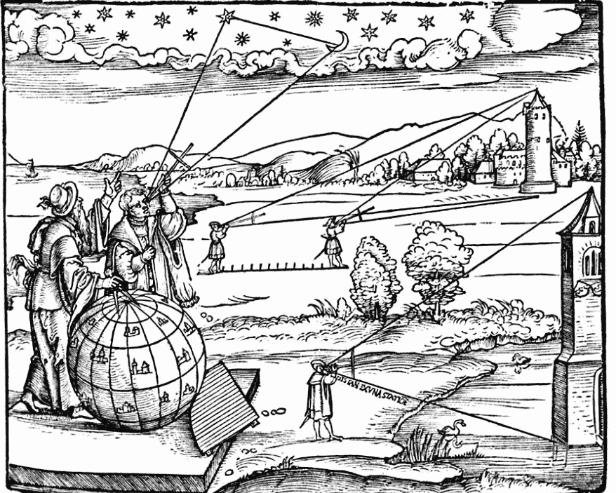

《地理学导论》是由彼得·阿皮安纳斯 (1495-1552年)，一位德国数学家、天文学家和制图师编写的。

三维状态估计的很大一部分与三角测量和/或三边测量有关；我们通过测量一些角度和长度，并通过三角法推断出其他角度和长度。

因此，我经常面对的是在三维空间中运行的车辆。因此，我尝试提供一个详细的方法来处理三维状态估计。特别是，我展示了如何使用矩阵李群以简单实用的方式处理旋转和姿态。读者应该具备本科线性代数和微积分的背景知识，但除此之外，本书相对独立。我希望读者能从这些页面中找到一些有用的东西；我知道在创作它们的过程中我学到了很多。

我在整本书的边缘提供了一些历史注释，主要是以一些研究者的传记形式介绍了一些概念和技术的命名者；我主要使用维基百科作为这些信息的来源。此外，第6章的前半部分（直到替代旋转参数化）介绍了三维几何，这部分内容主要基于多伦多大学航空航天研究所的Chris Damaren原创的笔记。

没有许多优秀的研究生的合作，这本书是不可能完成的。Paul Furgale的博士论文极大地扩展了我对矩阵李群的理解，使我了解了它们在描述姿态方面的应用；这使我们深入研究了变换矩阵的细节以及如何在估计问题中有效地使用它们。Paul的后续工作使我对连续时间估计产生了兴趣。Chi Hay Tong的博士论文向我介绍了在估计理论中使用高斯过程的方法，并在解决连续时间方法的细节方面提供了巨大的帮助；我在与Aalto大学的Simo Särkkä合作时进一步提高了在这个领域的知识，当时我在牛津大学休假。此外，我通过与Sean Anderson、Patrick Carle、Hang Dong、Andrew Lambert、Keith Leung、Colin McManus和Braden Stenning的合作学到了很多；他们每个人的项目都增加了我对状态估计的理解。特别是Colin多次鼓励我将我在研究生课程中的笔记整理成这本书。

我感激Gabriele D’Eleuterio，他让我开始研究动力学中的旋转和参考框架；他向我展示的许多工具毫不费力地转移到状态估计中。他还教会了我清晰、明确的符号表示的重要性。

最后，感谢所有在本书草稿中阅读并指出错误的人，特别是Marc Gallant和Shu-Hua Tsao，他们发现了许多错别字，以及James Forbes，他自愿阅读并提供评论。

## 1 介绍

机器人技术本质上涉及到在世界中移动的事物。我们生活在一个火星车、无人机勘测地球以及即将到来的自动驾驶汽车的时代。尽管具体的机器人有其微妙之处，但在所有应用中我们都必须面对一些共同的问题，特别是状态估计和控制。

机器人的状态是一组量，如位置、方向和速度，如果已知，可以完全描述机器人随时间的运动。在这里，我们完全关注机器人状态估计的问题，暂时不考虑控制的概念。是的，控制是必不可少的，因为我们希望使我们的机器人以某种方式行动。但是，实现这一目标的第一步通常是确定状态的过程。

此外，对于现实世界的问题，状态估计的困难往往被低估，因此将其与控制放在同等地位非常重要。

在本书中，我们介绍了受高斯测量噪声干扰的线性系统的经典估计结果。然后，我们将研究一些非高斯噪声的非线性系统的扩展。与典型的估计文本不同，我们详细介绍了如何将一般的估计结果应用于在三维空间中运行的机器人，并提倡一种特定的处理旋转的方法。

本介绍的其余部分提供了一点估计的历史，讨论了传感器和测量类型，并介绍了状态估计的问题。最后，它详细介绍了本书的内容，并提供了一些其他建议的阅读材料。

### 1.1 一点历史

大约4000年前，早期的航海者面临着一个车辆状态估计问题：如何在海上确定船的位置。早期尝试制作原始图表并观察太阳允许在沿海航行。然而，直到15世纪，随着关键技术和工具的出现，全球海上导航才成为可能。水手罗盘，一种早期的磁罗盘，允许进行方向的粗略测量。结合粗糙的海图，罗盘使得沿着航向线航行成为可能图1.1：在关键目的地之间（即，按照罗盘方位）进行。

象限。用于测量角度的工具。

随后逐渐发明了一系列仪器，使得可以以越来越高的精度测量远距离点之间的角度（即，交叉杆、星盘、象限、六分仪）。这些仪器允许通过天文导航相对容易地在海上确定纬度。例如，在北半球，北极星极化和地平线之间的角度提供了纬度。然而，经度是一个更加困难的问题。早期就已经知道，准确的时间装置是确定经度的缺失环节。关键天体在地球上的不同位置表现出不同的行为因此，知道当天的时间可以推断出经度图1.2。1764年，英国钟表制造商约翰·哈里森建造了第一台

哈里森的H4。第一个能够在海上准确计时的钟，使得确定经度成为可能。

准确的便携式时间计，有效地解决了经度问题；船舶的经度可以确定在大约10海里范围内。

估计理论也源于天文学。最小二乘法是由高斯首创的，他开发了这一技术来最小化预测轨道中的测量误差的影响。最小化测量误差对轨道预测的影响。据报道，高斯在太阳后面经过后，使用最小二乘法预测了矮行星谷神星的位置，准确度在半度以内（大约九个月后它最后一次被观察到）。那年是1801年，高斯23岁。后来，在1809年，他证明了在正态分布误差假设下，最小二乘法是最优的。

今天使用的大多数经典估计技术都可以直接与高斯最小二乘法相关联。

卡尔·弗里德里希·高斯（1777-1855）是一位德国数学家，对统计学和估计学等许多领域做出了重要贡献。

将模型拟合以最小化测量误差的影响的想法一直存在，但直到二十世纪中叶，估计才真正起飞。这可能与计算机时代的开始有关。1960年，卡尔曼发表了两篇具有里程碑意义的论文。

这些论文定义了状态估计领域中许多后续工作的基础。首先，他引入了可观测性的概念（卡尔曼，1960a），它告诉我们在动态系统中可以从一组测量中推断出状态的条件。其次，他引入了在存在测量噪声的情况下估计系统状态的最优框架（卡尔曼，1960b）；这种经典技术适用于线性系统（其测量受到高斯噪声的干扰），被称为卡尔曼滤波器，并且自从其提出以来已经成为估计领域的主力工具，已经有50多年的历史。尽管在许多领域中使用，但它在航空航天应用中得到了广泛采用。

鲁道夫·埃米尔·卡尔曼（1930-2016）是一位匈牙利出生的美国电气工程师、数学家和发明家。

### 1.2 传感器、测量和问题定义

应用。美国国家航空航天局（NASA）的研究人员是第一个在Ranger、Mariner和Apollo计划中使用卡尔曼滤波器来辅助估计航天器轨迹的人。特别是阿波罗11号登月舱上的机载计算机，这是第一艘载人航天器成功着陆月球表面，它使用卡尔曼滤波器根据嘈杂的雷达测量数据估计登月舱在月球表面上方的位置。

自从这些早期里程碑以来，状态估计领域已经进行了许多渐进式的改进。更快、更便宜的计算机使得在实际系统中实现更复杂的计算技术成为可能。然而，直到大约15年前，估计似乎可能正在作为一个活跃的研究领域逐渐减弱。但是，有些事情发生了改变；令人兴奋的新感知技术正在出现（例如，数码相机、激光成像、全球定位系统），这给这个古老领域带来了新的挑战。

### 1.2 传感器、测量和问题定义

要理解状态估计的必要性就要理解传感器的本质。所有传感器都有有限的精度。因此，从真实传感器得出的所有测量都有相关的不确定性。一些传感器在测量特定量时比其他传感器更好，但即使是最好的传感器也有一定程度的不精确。当我们将各种传感器测量组合成状态估计时，重要的是要跟踪所有涉及的不确定性，因此希望知道我们的估计有多可信。

在某种程度上，状态估计是关于尽力利用我们拥有的传感器。然而，这并不妨碍我们同时提高传感器的质量。一个很好的例子是经纬仪-图1.3

经纬仪传感器于1787年开发，用于在英吉利海峡上进行三角测量。它比之前的传感器更精确，并帮助揭示了英格兰大部分地区的地图制作不准确。

将传感器分为两类很有用：内部感知和外部感知。这些实际上是从人体生理学借来的术语，在工程领域中已经有些常见。一些定义如下³：

内部感知 [ˌin-ə -rō-ˈsep-tiv]，形容词：与身体内部产生的刺激有关。

外界刺激引起的感知的·错误·纠正·性 [ek-std -r̄-ō-ˈsep-tiv]，形容词：与生物体从外部接收到的刺激有关的，或者被激活的。

有时候本体感知被用作同义词。
³韦氏词典。

#### 早期估计里程碑

| 年份 | 里程碑 |
|------|--------|
| 1654 | 帕斯卡和费马奠定了概率论的基础 |
| 1764 | 贝叶斯定理 |
| 1801 | 高斯使用最小二乘法来估计小行星谷神星的轨道 |
| 1805 | Legendre发表了“最小二乘法” |
| 1913 | 马尔可夫链 |
| 1933 | (Chapman)-Kolmogorov方程 |
| 1949 | 维纳滤波器 |
| 1960 | 卡尔曼 (Bucy) 滤波器 |
| 1965 | Rauch-Tung-Striebel 平滑器 |
| 1970 | Jazwinski 提出了“贝叶斯滤波器” |

经纬仪。一个更好的测量角度的工具。

典型的内感觉传感器包括加速度计（测量平移加速度）、陀螺仪（测量角速度）和轮式测程仪（测量角速度）。典型的外感觉传感器包括摄像头（测量到地标或地标的距离/方位角）和飞行时间发射器/接收器（例如，激光测距仪、伪卫星、全球定位系统（GPS）发射器/接收器）。粗略地说，我们可以认为外感觉测量是关于车辆的位置和方向，而内感觉测量是关于车辆的速度或加速度。在大多数情况下，最好的状态估计概念同时利用内感觉和外感觉测量。例如，全球定位系统接收器（外感觉）和惯性测量单元（三个线性加速度计和三个角速度陀螺仪；内感觉）的组合是一种常用的估计车辆在地球上位置/速度的方法。而太阳/星传感器（外感觉）和三个角速度陀螺仪（内感觉）的组合通常用于卫星的姿态确定。

现在我们对传感器有了一些了解，我们准备好定义本书中将要研究的问题了：

估计是根据一系列测量结果以及系统的先验模型来重建系统底层状态的问题。

这个问题有很多具体版本，也有很多解决方案。我们的目标是了解哪种方法在哪种情况下效果好，以便选择最佳工具来完成工作。

### 1.3 本书的组织结构

- 本书分为三个主要部分：
  - I: 估计机制
  - II: 三维机制
  - III: 应用

第一部分，估计机制，介绍了经典和最新的估计工具，不涉及三维空间中的事物（因此不涉及平移和旋转）；被估计的状态被假设为一个通用向量。对于不关心在三维空间中工作细节的人来说，这一部分可以独立阅读。它涵盖了递归状态估计技术和批处理方法（在经典估计书籍中较少见）。与今天的机器人学和机器学习常见做法一样，本书采用贝叶斯方法进行估计。我们将（完全）贝叶斯方法与最大后验（MAP）方法进行对比，并试图清楚地说明在面对非线性问题时它们之间的区别。本书还将连续时间估计与高斯过程回归相连接。

来自机器学习领域。最后，它涉及一些实际问题，如鲁棒估计和偏差。

第二部分，三维机械，提供了关于三维几何的基础知识，并详细但易于理解地介绍了矩阵李群。要在三维空间中表示一个物体，我们需要讨论该物体的平移和旋转。旋转部分对于我们的估计工具来说是一个问题，因为旋转在通常意义上不是向量，所以我们不能简单地将第一部分的方法直接应用于涉及旋转的三维机器人问题。因此，第二部分研究了旋转和平移（平移加旋转）的几何、运动学和概率/统计学。

最后，在第三部分，应用程序中，本书的前两部分被结合在一起。我们研究了涉及物体在三维空间中平移和旋转的一些经典三维估计问题。我们展示了如何根据第二部分的知识调整第一部分的方法。结果是一套易于实现的三维状态估计方法。我们希望这些示例的精神也能够被用来创造其他新颖的技术。

### 1.4 与其他书籍的关系

有许多其他关于状态估计和机器人的好书，但很少有同时涵盖这两个主题的书籍。我们简要描述了一些最近涵盖这些主题及其与本书关系的作品。

《概率机器人学》（Thrun et al., 2006）是关于移动机器人的一本很好的介绍书，重点介绍了与地图构建和定位相关的状态估计。它涵盖了在当今许多机器人领域中占主导地位的概率范式。它主要描述了在二维水平平面上运行的机器人。所描述的概率方法不一定局限于二维情况，但没有提供扩展到三维的详细信息。

《移动机器人的计算原理》（Dudek和Jenkin，2010）是一本关于移动机器人的概述书籍，涉及了与定位和地图构建方法相关的状态估计。它没有详细说明如何在三维中进行状态估计。

《移动机器人学：数学、模型和方法》是凯利（2013）的另一本关于移动机器人和状态估计的优秀书籍，广泛涵盖了该领域。本书涵盖了三维情况，特别是与卫星导航和惯性导航相关的内容。由于本书涵盖了机器人的各个方面，因此没有深入探讨如何处理三维状态估计中的旋转变量。

《机器人、视觉和控制》是科克（2011）的另一本涵盖机器人状态估计的优秀综合书籍，包括三维状态估计。与前面提到的书籍类似，科克的书籍的广度使得它不必深入探讨本书中所涉及的具体状态估计方面。

《贝叶斯滤波和平滑》是萨尔卡（2013）关于递归贝叶斯方法的一本优秀书籍。它比本书更深入地介绍了递归方法，但没有涵盖批处理方法，也没有重点介绍在三维中进行估计的细节。

随机模型、信息论和李群：经典结果和几何方法Chirikjian（2009）的两卷著作是与当前书籍内容最接近的。它明确地研究了在矩阵Lie群（因此是旋转变量）上进行状态估计的后果。它在性质上非常理论化，并超越了当前书籍，涵盖了机器人学之外的应用。

非交换谐波分析的工程应用：重点放在旋转和运动群上Chirikjian和Kyatkin（2001）以及最近的更新版，工程师和应用科学家的谐波分析：更新和扩展版（Chirikjian和Kyatkin，2016），也为在Lie群上全局表示概率提供了关键见解。在当前书籍中，我们限制自己使用适用于旋转不确定性不太高的近似方法。

虽然它本身不是一本估计书，但值得一提的是Absil等人（2009）的《矩阵流形上的优化》，该书详细介绍了在优化问题中处理优化量不一定是向量的情况，这对机器人学非常相关，因为旋转不像向量那样行为（它们形成李群）。

这本书在专注于状态估计并详细解决常见的三维机器人问题方面有些独特，以便在许多实际情况下轻松实现。

## 第一部分

## 估计机制

## 概率论入门

在接下来的内容中，我们将使用一些基本的概率和统计概念。本章旨在回顾这些概念。关于概率和随机过程的经典书籍，请参阅Papoulis (1965)。关于概率论历史的轻松阅读，请参阅Devlin (2008)，它提供了一个很好的介绍；这本书还有助于理解频率派和贝叶斯派概率观点之间的区别。在我们的估计方法中，我们主要采用后者，尽管本章中还提到了一些基本的频率统计概念。我们首先讨论一般的概率密度函数（PDF），然后重点介绍高斯PDF的特殊情况。本章最后介绍了高斯过程，即高斯随机变量的连续时间版本。

### 2.1 概率密度函数

#### 2.1.1 定义

我们说一个随机变量, x, 符合特定的概率密度函数 (PDF)。让 p(x) 是随机变量, x, 在区间 [a, b] 上的概率密度函数。这是一个非负函数，满足

```
∫_a^b p(x) dx = 1. (2.1)
```

也就是说，它满足总概率公理.注意这是概率密度，不是概率.

概率由密度函数下的面积给出1。例如，x在 c和 d之间的概率，Pr(c ≤ x ≤ d)，由以下公式给出

```
$$Pr(c \le x \le d) = \int_c^d p(x) dx.$$
```

图2.1描述了一个在有限区间上的一般概率密度函数（PDF），以及在子区间内的概率。我们将使用PDF来表示在区间[a, b]中，根据一些数据证据，x可能处于所有可能状态的概率。

我们还可以引入一个条件变量。让 p(x|y)是一个在 x ∈ [a, b]上，条件为 y ∈ [r, s]的概率密度函数（PDF），使得

```
$$(\forall y) \int_a^b p(x|y) dx = 1.$$
```

在我们的框架中，我们还可以用 p(x)来表示 N维连续变量的联合概率密度函数，其中 x=(x1, ..., xN)，且 xi ∈ [ai, bi]。请注意，我们还可以使用符号

```
$$p(x1, x2, ..., xN)$$
```

4) 代替 p(x)。有时我们甚至混合使用两种符号，写作

```
$$p(x, y)$$
```

5) 表示 x和 y的联合密度。在 N维情况下，总概率公理要求

```
$$\int_{\mathbf{a}}^{\mathbf{b}} p(\mathbf{x}) d\mathbf{x} = \int_{a_N}^{b_N} \cdots \int_{a_2}^{b_2} \int_{a_1}^{b_1} p(x_1, x_2, \ldots, x_N)  dx_1 dx_2 \cdots dx_N = 1$$
```

，(2.6) 其中 a = (a1, a2, ..., aN) 和 b = (b1, b2, ..., bN)。在接下来的内容中，我们有时会简化符号，省略积分限制，a和 b。

#### 2.1.2 贝叶斯规则和推理

我们总是可以将联合概率密度分解为条件概率和非条件概率2：

```
$$p(\mathbf{x}, \mathbf{y}) = p(\mathbf{x}|\mathbf{y})p(\mathbf{y}) = p(\mathbf{y}|\mathbf{x})p(\mathbf{x}).$$
```

重新排列得到 贝叶斯规则：

```
$$p(\mathbf{x}|\mathbf{y}) = \frac{p(\mathbf{y}|\mathbf{x})p(\mathbf{x})}{p(\mathbf{y})}.$$

(2.8)
```

如果我们对状态有一个先验概率分布，$p(\mathbf{x})$，和传感器模型，$p(\mathbf{y}|\mathbf{x})$，我们可以使用这个来推断给定测量的状态的后验概率或似然，$p(\mathbf{x}|\mathbf{y})$。我们通过扩展分母来做到这一点，使其变为

```
$$p(\mathbf{x}|\mathbf{y}) = \frac{p(\mathbf{y}|\mathbf{x})p(\mathbf{x})}{\int p(\mathbf{y}|\mathbf{x})p(\mathbf{x}) d\mathbf{x}}.$$

(2.9)
```

我们通过边缘化计算分母 $p(\mathbf{y})$，如下³:

```
$$p(\mathbf{y}) = p(\mathbf{y}) \int p(\mathbf{x}|\mathbf{y}) d\mathbf{x} = \int p(\mathbf{x}|\mathbf{y})p(\mathbf{y}) d\mathbf{x} \underbrace{\qquad}_{1} \qquad \qquad \qquad = \int p(\mathbf{x}, \mathbf{y}) d\mathbf{x} = \int p(\mathbf{y}|\mathbf{x})p(\mathbf{x}) d\mathbf{x}.$$

(2.10)
```

在一般的非线性情况下，这可能非常昂贵。

请注意，在贝叶斯推断中，$p(\mathbf{x})$被称为先验密度，而$p(\mathbf{x}|\mathbf{y})$被称为后验密度。因此，所有的先验信息都包含在 $p(\mathbf{x})$中，而 $p(\mathbf{x}|\mathbf{y})$包含了后验信息。

#### 2.1.3 矩

在动力学中，当与质量分布（也称为密度函数）一起工作时，我们通常只跟踪一些被称为质量矩的属性（例如质量、质心、惯性矩阵）。对于概率密度函数也是如此。零阶概率矩始终为1，因为这正是总概率公理。第一阶概率矩被称为均值 $\boldsymbol{\mu}$：

```
$$\boldsymbol{\mu} = E[\mathbf{x}] = \int \mathbf{x} p(\mathbf{x}) d\mathbf{x},$$

(2.11)
```

其中 $E[\cdot]$表示期望运算符。对于一般的矩阵函数 $\mathbf{F}(\mathbf{x})$，期望值写作

```
$$E[\mathbf{F}(\mathbf{x})] = \int \mathbf{F}(\mathbf{x}) p(\mathbf{x}) d\mathbf{x},$$

(2.12)
```

但请注意，我们必须将其解释为

```
$$E[\mathbf{F}(\mathbf{x})] = \left[E[f_{ij}(\mathbf{x})]\right] = \left[\int f_{ij}(\mathbf{x}) p(\mathbf{x}) d\mathbf{x}\right].$$

(2.13)
```

> 1 概率论的经典处理从概率分布、科尔莫戈洛夫的三个公理开始，并通过导数是概率分布的推论来推导出概率密度的细节。在机器人领域，我们通常直接使用贝叶斯框架中的概率密度，因此我们将跳过这些形式上的细节，只呈现我们需要的结果。在本书中，我们将小心地使用术语密度而不是分布，因为我们在整本书中都在处理连续变量。

> 2 在 x和 y统计独立的特定情况下，我们可以将联合密度分解为 p(x) p(y)。

托马斯·贝叶斯（1701-1761）是一位英国统计学家、哲学家和长老会牧师，以提出了以他的名字命名的定理的一个特定情况而闻名。贝叶斯从未发表过他最著名的成就；他的笔记在他去世后由理查德·普赖斯（贝叶斯，1764年）编辑并发表。

> 3 在一般的非线性情况下，这可能非常昂贵。

第二个概率矩被称为协方差矩阵，Σ: \[ \boldsymbol{\Sigma} = E\left[(\mathbf{x} - \boldsymbol{\mu})(\mathbf{x} - \boldsymbol{\mu})^{T}\right]. \quad (2.14) \] 接下来的两个矩被称为偏度和峰度，但对于多变量情况，这变得相当复杂并需要张量表示。 我们在这里不需要它们，但应该提到这些概率矩有无限多个。

#### 2.1.4 样本均值和协方差

假设我们有一个随机变量，x，和一个相关的概率密度函数，p(x)。我们可以从这个密度中抽取样本，表示为：\[ \mathbf{x}_{\text{测量}} \leftarrow p(\mathbf{x}) \] (2.15) 样本有时被称为随机变量的实现，我们可以直观地将其视为一次测量。如果我们抽取了 $N$ 个这样的样本，并且想要估计随机变量，x，的均值和协方差，我们可以使用样本均值和样本协方差来实现：

\[ \boldsymbol{\mu}_{\text{测量}} = \frac{1}{N} \sum_{i=1}^{N} \mathbf{x}_{i,\text{测量}}, \quad (2.16a) \]

\[ \boldsymbol{\Sigma}_{\text{测量}} = \frac{1}{N-1} \sum_{i=1}^{N} (\mathbf{x}_{i,\text{测量}} - \boldsymbol{\mu}_{\text{测量}}) (\mathbf{x}_{i,\text{测量}} - \boldsymbol{\mu}_{\text{测量}})^{T}, \quad (2.16b) \]

> 弗里德里希·威廉·贝塞尔（1784-1846）是一位德国天文学家、数学家（贝塞尔函数的系统化者，这些函数是由伯努利发现的）。他是第一个通过视差法确定太阳到另一颗恒星的距离的天文学家。贝塞尔校正在技术上是一个 N/(N-1)的因子，它在协方差的“有偏”公式前面乘以，该公式除以 N 而不是 N-1。

值得注意的是，样本协方差中的归一化使用 N-1 而不是 N 作为分母，这被称为贝塞尔校正。直观上，这是必要的，因为样本协方差使用测量值与样本均值之间的差异，而样本均值本身是从相同的测量值计算得出的，导致轻微的相关性。可以证明样本协方差是真实协方差的无偏估计，并且当 N 用作分母时，它也比 N 大。值得一提的是，当 N 变大时， N-1 ≈ N，因此样本协方差所补偿的偏差效应变得不那么明显。

#### 2.1.5 统计独立、不相关

如果我们有两个随机变量 x 和 y，我们称这些变量在统计上是独立的，如果它们的联合密度因子如下：

\[ p(\mathbf{x}, \mathbf{y}) = p(\mathbf{x}) p(\mathbf{y}). \quad (2.17) \]

如果

\[ E\left[\mathbf{x} \mathbf{y}^{T}\right] = E[\mathbf{x}] E[\mathbf{y}]^{T}. \quad (2.18) \]

#### 2.1.6 归一化乘积

一个有时有用的操作是对相同变量上的两个概率密度函数进行归一化乘积<sup>5</sup>。如果 \(p_1(x)\) 和 \(p_2(x)\) 是两个关于 \(x\) 的概率密度函数，归一化乘积 \(p(x)\) 定义为

$$ p(x) = \eta\, p_1(x)\, p_2(x), $$

其中

$$ \eta = \left(\int p_1(x)\, p_2(x)\, dx \right)^{-1}, $$

是一个归一化常数，以确保 \(p(x)\) 满足总概率公理。

在贝叶斯的背景下，归一化乘积可以用于融合变量的独立估计（表示为概率密度函数），在均匀先验的假设下：

$$ p(x|y_1, y_2) = \eta\, p(x|y_1)\, p(x|y_2), $$

其中 \(\eta\) 再次是一个归一化常数，用于强制执行总概率公理。为了看到这一点，我们从左边使用贝叶斯规则开始写：

$$ p(x|y_1, y_2) = \frac{p(y_1, y_2|x)\, p(x)}{p(y_1, y_2)}. $$

假设 \(y_1\) 和 \(y_2\) 在给定 \(x\) 的情况下统计独立（例如，由统计独立噪声损坏的测量），我们有

$$ p(y_1, y_2|x) = p(y_1|x)\, p(y_2|x) = \frac{p(x|y_1)\, p(y_1)}{p(x)}\, \frac{p(x|y_2)\, p(y_2)}{p(x)}, $$

我们再次使用贝叶斯规则对各个因子进行替换。将其代入式(2.22)，我们得到

$$ p(x|y_1, y_2) = \eta\, p(x|y_1)\, p(x|y_2), $$

其中

$$ \eta = \frac{p(y_1)\, p(y_2)}{p(y_1, y_2)\, p(x)}. $$

如果我们将先验概率，\(p(x)\)，设为在所有 \(x\) 值上均匀分布（即常数），那么 \(\eta\) 也是一个常数，而(2.24)是上述归一化乘积的一个实例。

#### 2.1.7 香农和互信息

通常，我们会估计某个随机变量的概率密度函数，然后想要量化我们对该概率密度函数的均值等的确定程度。一种方法是查看负熵或者香农信息，即

$$H(\mathbf{x}) = -E[\ln p(\mathbf{x})] = -\int p(\mathbf{x}) \ln p(\mathbf{x}) dx$$ (2.26)

我们将在下面将这个表达式具体化为高斯概率密度函数。另一个有用的量是互信息, $I(\mathbf{x},\mathbf{y})$, 在两个随机变量, $\mathbf{x}$ 和 $\mathbf{y}$之间给出

$$I(\mathbf{x},\mathbf{y}) = E\left[\ln\left(\frac{p(\mathbf{x},\mathbf{y})}{p(\mathbf{x})p(\mathbf{y})}\right)\right] = \iint p(\mathbf{x},\mathbf{y}) \ln\left(\frac{p(\mathbf{x},\mathbf{y})}{p(\mathbf{x})p(\mathbf{y})}\right) d\mathbf{x} d\mathbf{y}.$$ (2.27)

互信息度量了一个变量的知识对另一个变量的不确定性的减少程度。当 $\mathbf{x}$ 和 $\mathbf{y}$ 是统计独立的时候，我们有

$$I(\mathbf{x},\mathbf{y}) = \iint p(\mathbf{x}) p(\mathbf{y}) \ln\left(\frac{p(\mathbf{x})p(\mathbf{y})}{p(\mathbf{x})p(\mathbf{y})}\right) d\mathbf{x} d\mathbf{y} = \iint p(\mathbf{x}) p(\mathbf{y}) \ln(1) d\mathbf{x} d\mathbf{y} = 0.$$ (2.28)

当 $\mathbf{x}$ 和 $\mathbf{y}$ 是相关的时候，我们有 $I(\mathbf{x},\mathbf{y}) \geq 0$. 我们还有一个有用的关系

$$I(X,Y) = H(X) + H(Y) - H(X,Y),$$ (2.29)

关于互信息和香农信息的关系。

#### 2.1.8 Cramér-Rao下界和费舍尔信息

假设我们有一个确定性参数，$\theta$，它影响随机变量，$X$，的结果。这可以通过将X的概率密度函数表示为依赖于 $\theta$来捕捉:

$$p(X|\theta).$$ (2.30)

此外，假设我们现在从 $p(X|\theta)$ 中抽取一个样本，$X_{\text{meas}}$:

$$x_{\text{meas}} \leftarrow p(X|\theta).$$ (2.31)

$X_{\text{meas}}$ 有时被称为X的实现；我们可以将其视为一种‘测量’^6。

然后，Cramér-Rao下界（CRLB）表明协方差对于任何无偏估计^7，$\hat{\theta}$（基于测量值，$x_{\text{meas}}$）的

> 克劳德·埃尔伍德香农 (1916-2001) 是一位美国数学家、电子工程师、和密码学家，被誉为“信息论之父”(Shannon, 1948)。

> Harald Cramér (1893-1985) 是一位瑞典数学家、精算师和统计学家，专攻数理统计和概率数论。

> Calyampudi Radhakrishna Rao, (1920至今) 是一位印度美国数学家和统计学家。Cramér和Rao是第一批推导出现在被称为CRLB的内容的人之一。

确定性参数，θ，受到Fisher信息矩阵，I(x|θ)的限制：

$$ \text{cov}(\hat{\theta}|\mathbf{x}_{\text{meas}}) = E[(\hat{\theta} - \theta)(\hat{\theta} - \theta)^T] \geq \mathbf{I}^{-1}(\mathbf{x}|\theta) $$

其中‘无偏’意味着 E[θ̂−θ] = 0 ，‘有界’意味着

$$ \text{cov}(\hat{\theta}|\mathbf{x}_{\text{meas}}) - \mathbf{I}^{-1}(\mathbf{x}|\theta) \geq 0 $$

即正半定。费舍尔信息矩阵由以下给出

$$ \mathbf{I}(\mathbf{x}|\theta) = E\left[ \left( \frac{\partial \ln p(\mathbf{x}|\theta)}{\partial \theta} \right)^T \left( \frac{\partial \ln p(\mathbf{x}|\theta)}{\partial \theta} \right) \right] $$

因此，CRLB对我们对参数估计的确定性设定了一个基本限制，考虑到我们的测量结果。

> 罗纳德·艾尔默·费舍尔（1890-1962）是一位英国统计学家、进化生物学家、遗传学家和优生学家。他在统计学方面的贡献包括方差分析、最大似然法、置信推断以及各种抽样分布的推导。

### 2.2 高斯概率密度函数

#### 2.2.1 定义

在接下来的大部分内容中，我们将使用高斯概率密度函数。在一维情况下，高斯概率密度函数为

$$ p(x|\mu, \sigma^2) = \frac{1}{\sqrt{2\pi\sigma^2}} \exp\left( -\frac{1}{2} \frac{(x - \mu)^2}{\sigma^2} \right) $$

其中μ是均值，σ^2是方差（σ被称为标准差）。图2.2显示了一维高斯概率密度函数。多元高斯概率密度函数，p(x|μ, Σ)，关于随机变量 x ∈ R^N，可以表示为

$$ p(\mathbf{x}|\mu, \Sigma) = \frac{1}{\sqrt{(2\pi)^N \det \Sigma}} \exp\left( -\frac{1}{2} (\mathbf{x} - \mu)^T \Sigma^{-1} (\mathbf{x} - \mu) \right) $$

其中μ ∈ R^N是均值，Σ ∈ R^{N×N}是（对称正定）协方差矩阵。因此，对于高斯分布，我们有

$$ \mu = E[\mathbf{x}] = \int_{-\infty}^{\infty} \mathbf{x} \frac{1}{\sqrt{(2\pi)^N \det \Sigma}} \exp\left( -\frac{1}{2} (\mathbf{x} - \mu)^T \Sigma^{-1} (\mathbf{x} - \mu) \right) d\mathbf{x}, $$

和

$$ \Sigma = E[(\mathbf{x} - \mu)(\mathbf{x} - \mu)^T] = \int_{-\infty}^{\infty} (\mathbf{x} - \mu)(\mathbf{x} - \mu)^T \frac{1}{\sqrt{(2\pi)^N \det \Sigma}} \exp\left( -\frac{1}{2} (\mathbf{x} - \mu)^T \Sigma^{-1} (\mathbf{x} - \mu) \right) d\mathbf{x}. $$

图2.2
一维高斯概率密度函数。高斯分布的一个显著特性是均值和众数（最可能的值x) 都在 μ处。

我们还可以用以下符号表示，x服从正态分布（也称为高斯分布）：
$$\mathbf{x} \sim \mathcal{N}(\boldsymbol{\mu}, \boldsymbol{\Sigma})$$
如果一个随机变量服从标准正态分布，则我们称其为标准正态分布。
$$\mathbf{x} \sim \mathcal{N}(\mathbf{0}, \mathbf{1}),$$
其中 \(\mathbf{1}\) 是一个 \(N \times N\) 的单位矩阵。

#### 2.2.2 Isserlis定理

> (1881-1966) 是一位出生在俄罗斯的英国统计学家以他在样本矩的精确分布上的工作而闻名。

多元高斯概率密度函数的矩计算起来有些复杂，除了常见的均值和协方差之外，还有一些特殊情况值得讨论。我们可以使用Leon Isserlis的定理计算高斯分布的高阶矩。
随机变量，\(\mathbf{x} = (x_1, x_2, \ldots, x_{2M}) \in \mathbb{R}^{2M}\)。一般来说，这个定理表明
$$E[x_1 x_2 x_3 \cdots x_{2M}] = \sum \prod E[x_i x_j], \quad (2.39)$$
这意味着对所有不同的分割方式求和，得到一个 \(M\) 对的乘积。这意味着有 \(\frac{(2M)!}{(2^M M!)}\) 个项在求和中。当有四个变量时，我们有
$$E[x_i x_j x_k x_l] = E[x_i x_j]E[x_k x_l] + E[x_i x_k]E[x_j x_l] + E[x_i x_l]E[x_j x_k]. \quad (2.40)$$
我们可以应用这个定理来计算一些矩阵表达式的有用结果。
假设我们有 \(\mathbf{x} \sim \mathcal{N}(\mathbf{0}, \boldsymbol{\Sigma}) \in \mathbb{R}^N\)。我们将有机会计算以下形式的表达式
$$E\left[\mathbf{x} \left(\mathbf{x}^T \mathbf{x}\right)^p \mathbf{x}^T\right], \quad (2.41)$$
其中 \(p\) 是一个非负整数。显然，当 \(p = 0\) 时，我们简单地有
$E[\mathbf{x x}^{T}]=\boldsymbol{\Sigma}$。当 $p=1$ 时，我们有$^{8}$

$$ \begin{aligned} E\left[\mathbf{x x}^{T} \mathbf{x x}^{T}\right] &=E\left[\left[x_{i} x_{j}\left(\sum_{k=1}^{N} x_{k}^{2}\right)\right]_{i j}\right]=\left[\sum_{k=1}^{N} E\left[x_{i} x_{j} x_{k}^{2}\right]\right]_{i j} \\ &=\left[\sum_{k=1}^{N}\left(E\left[x_{i} x_{j}\right] E\left[x_{k}^{2}\right]+2 E\left[x_{i} x_{k}\right] E\left[x_{k} x_{j}\right]\right)\right]_{i j} \\ &=\left[E\left[x_{i} x_{j}\right]\right]_{i j} \sum_{k=1}^{N} E\left[x_{k}^{2}\right]+2\left[\sum_{k=1}^{N} E\left[x_{i} x_{k}\right] E\left[x_{k} x_{j}\right]\right]_{i j} \\ &=\boldsymbol{\Sigma} \operatorname{tr}(\boldsymbol{\Sigma})+2 \boldsymbol{\Sigma}^{2} \\ &=\boldsymbol{\Sigma}(\operatorname{tr}(\boldsymbol{\Sigma}) \mathbf{1}+2 \boldsymbol{\Sigma}) . \end{aligned} $$ (2.42)

请注意，在标量情况下，我们有 $x\sim\mathcal{N}(0, \sigma^{2})$，因此 $E[x^{4}]=\sigma^{2}\left(\sigma^{2}+2\sigma^{2}\right)=3 \sigma^{4}$，这是一个众所周知的结果。对于 $p>1$ 的情况，我们可以使用类似的方法得到结果，但是目前我们不计算它们。我们还考虑了 $\mathrm{x} 1)=\mathrm{N} 1$ 和 $\operatorname{dim}(\mathrm{x} 2)=\mathrm{N}$

$$ \mathbf{x}=\left[\begin{array}{l} \mathbf{x}_{1} \\ \mathbf{x}_{2} \end{array}\right] \sim \mathcal{N}\left(\mathbf{0},\left[\begin{array}{ll} \boldsymbol{\Sigma}_{11} & \boldsymbol{\Sigma}_{12} \\ \boldsymbol{\Sigma}_{12}^{T} & \boldsymbol{\Sigma}_{22} \end{array}\right]\right), $$ (2.43)

with $\operatorname{dim}\left(\mathbf{x}_{1}\right)=N_{1}$ and $\operatorname{dim}\left(\mathbf{x}_{2}\right)=N_{2}$. 我们需要计算以下形式的表达式

$$ E\left[\mathbf{x}\left(\mathbf{x}_{1}^{T} \mathbf{x}_{1}\right)^{p} \mathbf{x}^{T}\right], $$ (2.44)

其中 $p$ 是一个非负整数。同样，当 $p=0$ 时，我们显然有 $E\left[\mathbf{x x}^{T}\right]=\boldsymbol{\Sigma}$. 当 $p=1$ 时，我们有

$$ \begin{aligned} E\left[\mathbf{x x}_{1}^{T} \mathbf{x}_{1} \mathbf{x}^{T}\right] &=E\left[\left[x_{i} x_{j}\left(\sum_{k=1}^{N_{1}} x_{k}^{2}\right)\right]_{i j}\right]=\left[\sum_{k=1}^{N_{1}} E\left[x_{i} x_{j} x_{k}^{2}\right]\right]_{i j} \\ &=\left[\sum_{k=1}^{N_{1}}\left(E\left[x_{i} x_{j}\right] E\left[x_{k}^{2}\right]+2 E\left[x_{i} x_{k}\right] E\left[x_{k} x_{j}\right]\right)\right]_{i j} \\ &=\left[E\left[x_{i} x_{j}\right]\right]_{i j} \sum_{k=1}^{N_{1}} E\left[x_{k}^{2}\right]+2\left[\sum_{k=1}^{N_{1}} E\left[x_{i} x_{k}\right] E\left[x_{k} x_{j}\right]\right]_{i j} \\ &=\boldsymbol{\Sigma} \operatorname{tr}\left(\boldsymbol{\Sigma}_{11}\right)+2\left[\begin{array}{cc} \boldsymbol{\Sigma}_{11}^{2} & \boldsymbol{\Sigma}_{11} \boldsymbol{\Sigma}_{12} \\ \boldsymbol{\Sigma}_{12}^{T} \boldsymbol{\Sigma}_{11} & \boldsymbol{\Sigma}_{12}^{T} \boldsymbol{\Sigma}_{12} \end{array}\right] \\ &=\boldsymbol{\Sigma}\left(\operatorname{tr}\left(\boldsymbol{\Sigma}_{11}\right) \mathbf{1}+2\left[\begin{array}{cc} \boldsymbol{\Sigma}_{11} & \boldsymbol{\Sigma}_{12} \\ \mathbf{0} & \mathbf{0} \end{array}\right]\right) . \end{aligned} $$ (2.45)

> $^{8}$ 符号 $[\cdot]_{i j}$ 表示用适当的 $_{i j}$th 元素填充矩阵 $\mathrm{A}=\left[a_{i j}\right]$。

$$E \left[\mathbf{xx}_2^T \mathbf{x}_2 \mathbf{x}^T\right] = \boldsymbol{\Sigma} \operatorname{tr}\left(\boldsymbol{\Sigma}_{22}\right) + 2 \left[\begin{array}{cc} \boldsymbol{\Sigma}_{12} \boldsymbol{\Sigma}_{12}^T & \boldsymbol{\Sigma}_{12} \boldsymbol{\Sigma}_{22} \\ \boldsymbol{\Sigma}_{22} \boldsymbol{\Sigma}_{12}^T & \boldsymbol{\Sigma}_{22}^2 \end{array} \right]$$
$$= \boldsymbol{\Sigma} \left( \operatorname{tr}(\boldsymbol{\Sigma}_{22}) \mathbf{1} + 2 \left[ \begin{array}{cc} \mathbf{0} & \mathbf{0} \\ \boldsymbol{\Sigma}_{12}^T & \boldsymbol{\Sigma}_{22} \end{array} \right] \right) , \quad (2.46)$$

$$E \left[\mathbf{xx}^T \mathbf{xx}^T\right] = E \left[\mathbf{x} (\mathbf{x}_1^T \mathbf{x}_1 + \mathbf{x}_2^T \mathbf{x}_2) \mathbf{x}^T\right] = E \left[\mathbf{xx}_1^T \mathbf{x}_1 \mathbf{x}^T\right] + E \left[\mathbf{xx}_2^T \mathbf{x}_2 \mathbf{x}^T\right]. \quad (2.47)$$

$$E \left[\mathbf{xx}^T \mathbf{A} \mathbf{xx}^T\right] = E \left[\left[ x_i x_j \left( \sum_{k=1}^{N} \sum_{\ell=1}^{N} x_k a_{k\ell} x_{\ell} \right) \right]_{ij} \right]$$
$$= \left[ \sum_{k=1}^{N} \sum_{\ell=1}^{N} a_{k\ell} E \left[x_i x_j x_k x_{\ell}\right] \right]_{ij}$$
$$= \left[ \sum_{k=1}^{N} \sum_{\ell=1}^{N} a_{k\ell} \left( E[x_i x_j] E[x_k x_{\ell}] + E[x_i x_k] E[x_j x_{\ell}] + E[x_i x_{\ell}] E[x_j x_k] \right) \right]_{ij}$$
$$= [E[x_i x_j]]_{ij} \left( \sum_{k=1}^{N} \sum_{\ell=1}^{N} a_{k\ell} E[x_k x_{\ell}] \right) + \left[ \sum_{k=1}^{N} \sum_{\ell=1}^{N} E[x_i x_k] a_{k\ell} E[x_{\ell} x_j] \right]_{ij} + \left[ \sum_{k=1}^{N} \sum_{\ell=1}^{N} E[x_i x_{\ell}] a_{k\ell} E[x_k x_j] \right]_{ij}$$
$$= \boldsymbol{\Sigma} \operatorname{tr}(\mathbf{A}\boldsymbol{\Sigma}) + \boldsymbol{\Sigma}\mathbf{A}\boldsymbol{\Sigma} + \boldsymbol{\Sigma}\mathbf{A}^T\boldsymbol{\Sigma}$$
$$= \boldsymbol{\Sigma} \left( \operatorname{tr} (\mathbf{A}\boldsymbol{\Sigma}) \mathbf{1} + \mathbf{A}\boldsymbol{\Sigma} + \mathbf{A}^T \boldsymbol{\Sigma} \right) , \quad (2.48)$$

其中 A是一个兼容的方阵。

#### 2.2.3 联合高斯概率密度函数、它们的因子和推断

我们还可以对一对变量(\mathbf{x}, \mathbf{y})进行联合高斯分布，表示为

$$p(\mathbf{x}, \mathbf{y}) = \mathcal{N}\left( \begin{bmatrix} \boldsymbol{\mu}_x \\ \boldsymbol{\mu}_y \end{bmatrix}, \begin{bmatrix} \boldsymbol{\Sigma}_{xx} & \boldsymbol{\Sigma}_{xy} \\ \boldsymbol{\Sigma}_{yx} & \boldsymbol{\Sigma}_{yy} \end{bmatrix} \right), \quad (2.49)$$

它具有与(2.36)相同的指数形式。注意 $\boldsymbol{\Sigma}_{yx} = \boldsymbol{\Sigma}_{xy}^T$。

我们总是可以将联合密度分解为两个因子的乘积

### 2.2 高斯概率密度函数

，\( p(\mathbf{x}, \mathbf{y}) = p(\mathbf{x} | \mathbf{y}) p(\mathbf{y})\)，我们可以通过使用Schur补<sup>9</sup>来解决联合高斯情况的细节。我们从Issai Schur开始注意到
\[
\begin{bmatrix}
    \Sigma_{xx} & \Sigma_{xy} \\
    \Sigma_{yx} & \Sigma_{yy}
\end{bmatrix}
=
\begin{bmatrix}
    \mathbf{1} & \Sigma_{xy} \Sigma_{yy}^{-1} \\
    \mathbf{0} & \mathbf{1}
\end{bmatrix}
\begin{bmatrix}
    \Sigma_{xx} - \Sigma_{xy} \Sigma_{yy}^{-1} \Sigma_{yx} & \mathbf{0} \\
    \mathbf{0} & \Sigma_{yy}
\end{bmatrix}
\begin{bmatrix}
    \mathbf{1} & \mathbf{0} \\
    \Sigma_{yy}^{-1} \Sigma_{yx} & \mathbf{1}
\end{bmatrix},
\tag{2.50}
\]
其中 \(\mathbf{1}\) 是单位矩阵。然后我们倒置两边以找到
\[
\begin{bmatrix}
    \Sigma_{xx} & \Sigma_{xy} \\
    \Sigma_{yx} & \Sigma_{yy}
\end{bmatrix}^{-1}
=
\begin{bmatrix}
    \mathbf{1} & \mathbf{0} \\
    -\Sigma_{yy}^{-1} \Sigma_{yx} & \mathbf{1}
\end{bmatrix}
\times
\begin{bmatrix}
    \left(\Sigma_{xx} - \Sigma_{xy} \Sigma_{yy}^{-1} \Sigma_{yx}\right)^{-1} & \mathbf{0} \\
    \mathbf{0} & \Sigma_{yy}^{-1}
\end{bmatrix}
\begin{bmatrix}
    \mathbf{1} & -\Sigma_{xy} \Sigma_{yy}^{-1} \\
    \mathbf{0} & \mathbf{1}
\end{bmatrix}.
\tag{2.51}
\]

> (1875-1941)是一位德国数学家，他研究了群表示(他最为人所知的学科)，但也在组合数学和数论以及理论物理方面有所贡献。

仅关注联合概率密度函数中的二次部分 (指数内部)，我们有
\[
\begin{aligned}
&\left(\begin{bmatrix} \mathbf{x} \\ \mathbf{y} \end{bmatrix} - \begin{bmatrix} \boldsymbol{\mu}_x \\ \boldsymbol{\mu}_y \end{bmatrix}\right)^T \begin{bmatrix} \Sigma_{xx} & \Sigma_{xy} \\ \Sigma_{yx} & \Sigma_{yy} \end{bmatrix}^{-1} \left(\begin{bmatrix} \mathbf{x} \\ \mathbf{y} \end{bmatrix} - \begin{bmatrix} \boldsymbol{\mu}_x \\ \boldsymbol{\mu}_y \end{bmatrix}\right) \\
&= \left(\begin{bmatrix} \mathbf{x} \\ \mathbf{y} \end{bmatrix} - \begin{bmatrix} \boldsymbol{\mu}_x \\ \boldsymbol{\mu}_y \end{bmatrix}\right)^T \begin{bmatrix} \mathbf{1} & \mathbf{0} \\ -\Sigma_{yy}^{-1} \Sigma_{yx} & \mathbf{1} \end{bmatrix} \begin{bmatrix} \left(\Sigma_{xx} - \Sigma_{xy} \Sigma_{yy}^{-1} \Sigma_{yx}\right)^{-1} & \mathbf{0} \\ \mathbf{0} & \Sigma_{yy}^{-1} \end{bmatrix} \times \begin{bmatrix} \mathbf{1} & -\Sigma_{xy} \Sigma_{yy}^{-1} \\ \mathbf{0} & \mathbf{1} \end{bmatrix} \left(\begin{bmatrix} \mathbf{x} \\ \mathbf{y} \end{bmatrix} - \begin{bmatrix} \boldsymbol{\mu}_x \\ \boldsymbol{\mu}_y \end{bmatrix}\right) \\
&= \left(\mathbf{x} - \boldsymbol{\mu}_x - \Sigma_{xy} \Sigma_{yy}^{-1} (\mathbf{y} - \boldsymbol{\mu}_y)\right)^T \left(\Sigma_{xx} - \Sigma_{xy} \Sigma_{yy}^{-1} \Sigma_{yx}\right)^{-1} \times \left(\mathbf{x} - \boldsymbol{\mu}_x - \Sigma_{xy} \Sigma_{yy}^{-1} (\mathbf{y} - \boldsymbol{\mu}_y)\right) + \left(\mathbf{y} - \boldsymbol{\mu}_y\right)^T \Sigma_{yy}^{-1} \left(\mathbf{y} - \boldsymbol{\mu}_y\right).
\tag{2.52}
\end{aligned}
\]
这是两个二次项的和。由于和的指数是两个指数的乘积，我们有

\[
\begin{aligned}
p(\mathbf{x}, \mathbf{y}) &= p(\mathbf{x} | \mathbf{y}) p(\mathbf{y}), & \tag{2.53a} \\
p(\mathbf{x} | \mathbf{y}) &= \mathcal{N}\left(\boldsymbol{\mu}_x + \Sigma_{xy} \Sigma_{yy}^{-1} (\mathbf{y} - \boldsymbol{\mu}_y), \Sigma_{xx} - \Sigma_{xy} \Sigma_{yy}^{-1} \Sigma_{yx} \right), & \tag{2.53b} \\
p(\mathbf{y}) &= \mathcal{N}\left(\boldsymbol{\mu}_y, \Sigma_{yy} \right). & \tag{2.53c}
\end{aligned}
\]
需要注意的是，两个因素，\(p(\mathbf{x} | \mathbf{y})\)和 \(p(\mathbf{y})\)，都是高斯分布的概率密度函数。此外，如果我们知道 \(\mathbf{y}\)的值 (即已测量)，我们可以通过计算来确定 \(\mathbf{x}\)在给定 \(\mathbf{y}\)值的情况下的可能性使用(2.53b)计算\(p(\mathbf{x} | \mathbf{y})\)。

这实际上是高斯推断的基石: 我们从对状态的先验分布开始，\(\mathbf{x} \sim \mathcal{N}(\boldsymbol{\mu}_x, \Sigma_{xx})\)，然后根据一些测量结果，\(\mathbf{y}_{\text{meas}}\)，逐渐缩小范围。在(2.53b)中，我们可以看到对均值 \(\boldsymbol{\mu}_x\)和协方差 \(\Sigma_{xx}\)进行了调整 (变小)。

在这种情况下，\(\Sigma_{yy}\)的舒尔补是以下表达式: \(\Sigma_{xx} - \Sigma_{xy} \Sigma_{yy}^{-1} \Sigma_{yx}\).

#### 2.2.4 统计独立、不相关

对于高斯概率密度函数，统计独立的变量也是不相关的（一般情况下成立），而不相关的变量也不一定是统计独立的（对于所有类型的概率密度函数都不成立）。我们可以通过观察（2.53）很容易看出这一点。如果我们假设统计独立，那么 p(x, y) = p(x)p(y)，因此 p(x|y) = p(x) = N(μ_x, Σ_xx)。

从 (2.53b) 可以看出

Σ_xy Σ_yy^{-1}(y - μ_y) = 0, (2.54a)

Σ_xy Σ_yy^{-1} Σ_yx = 0, (2.54b)

这进一步意味着 Σ_xy = 0. 因为

Σ_xy = E[(x - μ_x)(y - μ_y)^T] = E[xy^T] - E[x]E[y]^T, (2.55)

我们有无相关条件:

E[xy^T] = E[x]E[y]^T. (2.56)

我们也可以 通过另一个方向的逻辑来工作，首先假设变量是不相关的，这导致 Σ_xy = 0，最后导致统计独立。由于这些条件是等价的，在高斯概率密度函数的背景下，我们经常使用统计独立和不相关互换使用。

#### 2.2.5 线性变量变换

假设我们有一个高斯随机变量,

x ∈ R^N ~ N(μ_x, Σ_xx),

我们有第二个随机变量， y ∈ R^M，通过线性映射与 x 相关，

y = Gx, (2.57)

我们假设 G ∈ R^{M×N}是一个常数矩阵。 我们想知道 y的统计特性。 一种方法是直接应用期望算子:

μ_y = E[y] = E[Gx] = G E[x] = Gμ_x, (2.58a)

Σ_yy = E[(y - μ_y)(y - μ_y)^T] = G E[(x - μ_x)(x - μ_x)^T] G^T = GΣ_xx G^T, (2.58b)

因此，我们有 y ~ N(μ_y, Σ_yy) = N(Gμ_x, GΣ_xx G^T)。

另一种看待这个问题的方式是变量的改变。 我们假设线性映射是单射的，意味着两个 x值不能映射到一个 y值；事实上，让我们通过假设一个更简化的单射条件来简化问题

G是可逆的（因此 \(M = N\)）。全概率公理让我们可以写成

\[\int_{-\infty}^{\infty} p(\mathbf{x})\, d\mathbf{x} = 1. \tag{2.59}\]

一个小的 \(x\)体积与一个小的 \(y\)体积相关

\[d\mathbf{y} = |\det \mathbf{G}|\, d\mathbf{x}. \tag{2.60}\]

然后我们可以进行变量替换

\[\begin{aligned}
1 &= \int_{-\infty}^{\infty} p(\mathbf{x})\, d\mathbf{x} \\
&= \int_{-\infty}^{\infty} \frac{1}{(2\pi)^N \det \boldsymbol{\Sigma}_{xx}} \exp\left(-\frac{1}{2}(\mathbf{x} - \boldsymbol{\mu}_x)^T \boldsymbol{\Sigma}_{xx}^{-1} (\mathbf{x} - \boldsymbol{\mu}_x)\right) d\mathbf{x} \\
&= \int_{-\infty}^{\infty} \frac{1}{(2\pi)^N \det \boldsymbol{\Sigma}_{xx}} \\
&\quad \times \exp\left(-\frac{1}{2}(\mathbf{G}^{-1}\mathbf{y} - \boldsymbol{\mu}_x)^T \boldsymbol{\Sigma}_{xx}^{-1} (\mathbf{G}^{-1}\mathbf{y} - \boldsymbol{\mu}_x)\right) |\det \mathbf{G}|^{-1} d\mathbf{y} \\
&= \int_{-\infty}^{\infty} \frac{1}{(2\pi)^N \det \mathbf{G} \det \boldsymbol{\Sigma}_{xx} \det \mathbf{G}^T} \\
&\quad \times \exp\left(-\frac{1}{2}(\mathbf{y} - \mathbf{G}\boldsymbol{\mu}_x)^T \mathbf{G}^{-T} \boldsymbol{\Sigma}_{xx}^{-1} \mathbf{G}^{-1} (\mathbf{y} - \mathbf{G}\boldsymbol{\mu}_x)\right) d\mathbf{y} \\
&= \int_{-\infty}^{\infty} \frac{1}{(2\pi)^N \det (\mathbf{G}\boldsymbol{\Sigma}_{xx}\mathbf{G}^T)} \\
&\quad \times \exp\left(-\frac{1}{2}(\mathbf{y} - \mathbf{G}\boldsymbol{\mu}_x)^T (\mathbf{G}\boldsymbol{\Sigma}_{xx}\mathbf{G}^T)^{-1} (\mathbf{y} - \mathbf{G}\boldsymbol{\mu}_x)\right) d\mathbf{y}.
\end{aligned} \tag{2.61}\]

在这种情况下 \(\mu_y = \mathbf{G}\mu_x\) 和 \(\Sigma_{yy} = \mathbf{G}\Sigma_{xx}\mathbf{G}^T\)，与之前一样。如果\(M < N\)，我们的线性映射不再是单射，无法使用变量变换方法将统计量从\(x\)映射到\(y\)。我们还可以考虑从 \(\mathbf{y}\)到 \(\mathbf{x}\)的反向映射，假设\(M < N\)且\(\mathbf{G}\)的秩为 \(M\)。这有点棘手，因为 \(\mathbf{x}\)的结果协方差会变得很大，因为我们将<sup>10</sup>扩大到一个更大的空间。

为了解决这个问题，我们切换到信息形式。让

\[\mathbf{u} = \boldsymbol{\Sigma}_{yy}^{-1}\mathbf{y}, \tag{2.62}\]

我们有

\[\mathbf{u} \sim \mathcal{N}(\boldsymbol{\Sigma}_{yy}^{-1}\boldsymbol{\mu}_y, \boldsymbol{\Sigma}_{yy}^{-1}). \tag{2.63}\]

同样地，让

\[\mathbf{v} = \boldsymbol{\Sigma}_{xx}^{-1}\mathbf{x}, \tag{2.64}\]我们有
$$\mathbf{v} \sim \mathcal{N}(\mathbf{\Sigma}_{xx}^{-1}\boldsymbol{\mu}_x, \mathbf{\Sigma}_{xx}^{-1}). \tag{2.65}$$
由于从 $\mathbf{y}$ 到 $\mathbf{x}$ 的映射不唯一，我们需要指定我们想要做什么。一种选择是让 $\mathbf{v} = \mathbf{G}^T \mathbf{u}$

$$\mathbf{\Sigma}_{xx}^{-1}\mathbf{x} = \mathbf{G}^T \mathbf{\Sigma}_{yy}^{-1}\mathbf{y}. \tag{2.66}$$

然后我们进行期望计算：

$$\mathbf{\Sigma}_{xx}^{-1}\boldsymbol{\mu}_x = E[\mathbf{v}] = E[\mathbf{G}^T\mathbf{u}] = \mathbf{G}^T E[\mathbf{u}] = \mathbf{G}^T \mathbf{\Sigma}_{yy}^{-1}\boldsymbol{\mu}_y, \tag{2.67a}$$
$$\begin{aligned} \mathbf{\Sigma}_{xx}^{-1} &= E[(\mathbf{v} - \mathbf{\Sigma}_{xx}^{-1}\boldsymbol{\mu}_x)(\mathbf{v} - \mathbf{\Sigma}_{xx}^{-1}\boldsymbol{\mu}_x)^T] \ &= \mathbf{G}^T E[(\mathbf{u} - \mathbf{\Sigma}_{yy}^{-1}\boldsymbol{\mu}_y)(\mathbf{u} - \mathbf{\Sigma}_{yy}^{-1}\boldsymbol{\mu}_y)^T]\mathbf{G} = \mathbf{G}^T \mathbf{\Sigma}_{yy}^{-1}\mathbf{G}. \tag{2.67b} \end{aligned}$$

请注意，如果 $\mathbf{\Sigma}_{xx}^{-1}$ 不是满秩的，我们实际上无法恢复 $\mathbf{\Sigma}_{xx}$ 和 $\boldsymbol{\mu}_x$，必须将它们保持在信息形式中。然而，可以将多个这样的估计融合在一起，这是下一节的主题。

#### 2.2.6 高斯的归一化乘积

我们现在讨论高斯概率密度函数的一个有用特性；标准化乘积（见第2.1.6节） $K$ 高斯概率密度函数也是一个高斯概率密度函数：

$$\exp\left(-\frac{1}{2}(\mathbf{x}-\boldsymbol{\mu})^T\mathbf{\Sigma}^{-1}(\mathbf{x}-\boldsymbol{\mu})\right) = \eta \prod_{k=1}^K \exp\left(-\frac{1}{2}(\mathbf{x}-\boldsymbol{\mu}_k)^T\mathbf{\Sigma}_k^{-1}(\mathbf{x}-\boldsymbol{\mu}_k)\right), \tag{2.68}$$

其中

$$\mathbf{\Sigma}^{-1} = \sum_{k=1}^K \mathbf{\Sigma}_k^{-1}, \tag{2.69a}$$
$$\mathbf{\Sigma}^{-1}\boldsymbol{\mu} = \sum_{k=1}^K \mathbf{\Sigma}_k^{-1}\boldsymbol{\mu}_k, \tag{2.69b}$$

而 $\eta$ 是一个标准化常数，用于强制执行总概率公理。当融合多个估计时，高斯函数的标准化乘积会出现。在图2.3中提供了一个一维示例。我们还有

$$\exp\left(-\frac{1}{2}(\mathbf{x}-\boldsymbol{\mu})^T\mathbf{\Sigma}^{-1}(\mathbf{x}-\boldsymbol{\mu})\right) = \eta \prod_{k=1}^K \exp\left(-\frac{1}{2}(\mathbf{G}_k\mathbf{x}-\boldsymbol{\mu}_k)^T\mathbf{\Sigma}_k^{-1}(\mathbf{G}_k\mathbf{x}-\boldsymbol{\mu}_k)\right), \tag{2.70}$$

### 2.2 高斯概率密度函数

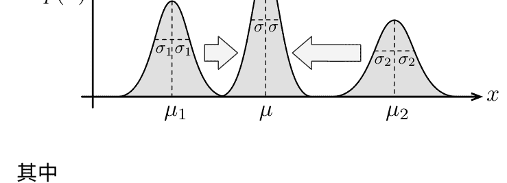

图2.3两个一维高斯概率密度函数的标准化乘积是另一个一维高斯概率密度函数。

其中

$$
\frac{1}{\sigma^2} = \frac{1}{\sigma_1^2} + \frac{1}{\sigma_2^2}
$$

$$
\frac{\mu}{\sigma^2} = \frac{\mu_1}{\sigma_1^2} + \frac{\mu_2}{\sigma_2^2}
$$

$$
\mathbf{\Sigma}^{-1} = \sum_{k=1}^{K} \mathbf{G}_k^{T} \mathbf{\Sigma}_k^{-1} \mathbf{G}_k, \qquad (2.71a)
$$

$$
\mathbf{\Sigma}^{-1} \boldsymbol{\mu} = \sum_{k=1}^{K} \mathbf{G}_k^{T} \mathbf{\Sigma}_k^{-1} \boldsymbol{\mu}_k, \qquad (2.71b)
$$

在矩阵 $\mathbf{G}_k \in \mathbb{R}^{M_k \times N}$ 存在的情况下，其中 $M_k \leq N$。同样，$\eta$ 是一个归一化常数。我们还注意到这个结果是从前一节推广而来的。

#### 2.2.7 Sherman-Morrison-Woodbury恒等式

在接下来的内容中，我们将需要Sherman-Morrison-Woodbury (SMW) (Sherman and Morrison, 1949, 1950; Woodbury, 1950) 矩阵恒等式 (有时也称为矩阵求逆引理)。实际上有SMW公式来自单一推导的四个不同恒等式。

> 以美国统计学家杰克·谢尔曼、Winifred J. Morrison和Max A. Woodbury的名字命名，但是它也独立地由英国数学家W. J. Duncan、美国统计学家L. Guttman和M. S. Bartlett以及其他其他人提出。

我们首先注意到，我们可以将矩阵分解为下三角-对角-上三角 ($LDU$) 或上三角-下三角 ($UDL$) 形式，如下所示：

$$
\begin{bmatrix} \mathbf{A}^{-1} & -\mathbf{B} \\ \mathbf{C} & \mathbf{D} \end{bmatrix}
= \begin{bmatrix} \mathbf{1} & \mathbf{0} \\ \mathbf{CA} & \mathbf{1} \end{bmatrix} \begin{bmatrix} \mathbf{A}^{-1} & \mathbf{0} \\ \mathbf{0} & \mathbf{D} + \mathbf{CAB} \end{bmatrix} \begin{bmatrix} \mathbf{1} & -\mathbf{AB} \\ \mathbf{0} & \mathbf{1} \end{bmatrix} \qquad (\text{LDU})
$$

$$
= \begin{bmatrix} \mathbf{1} & -\mathbf{BD}^{-1} \\ \mathbf{0} & \mathbf{1} \end{bmatrix} \begin{bmatrix} \mathbf{A}^{-1} + \mathbf{BD}^{-1}\mathbf{C} & \mathbf{0} \\ \mathbf{0} & \mathbf{D} \end{bmatrix} \begin{bmatrix} \mathbf{1} & \mathbf{0} \\ \mathbf{D}^{-1}\mathbf{C} & \mathbf{1} \end{bmatrix}. \qquad (\text{UDL}) \qquad (2.72)
$$

然后我们对这些形式进行求逆。对于LDU，我们有

$$
\begin{bmatrix} \mathbf{A}^{-1} & -\mathbf{B} \\ \mathbf{C} & \mathbf{D} \end{bmatrix}^{-1}
= \begin{bmatrix} \mathbf{1} & \mathbf{AB} \\ \mathbf{0} & \mathbf{1} \end{bmatrix} \begin{bmatrix} \mathbf{A} & \mathbf{0} \\ \mathbf{0} & (\mathbf{D} + \mathbf{CAB})^{-1} \end{bmatrix} \begin{bmatrix} \mathbf{1} & \mathbf{0} \\ -\mathbf{CA} & \mathbf{1} \end{bmatrix}
$$

$$
= \begin{bmatrix} \mathbf{A} - \mathbf{AB}(\mathbf{D} + \mathbf{CAB})^{-1}\mathbf{CA} & \mathbf{AB}(\mathbf{D} + \mathbf{CAB})^{-1} \\ -(\mathbf{D} + \mathbf{CAB})^{-1}\mathbf{CA} & (\mathbf{D} + \mathbf{CAB})^{-1} \end{bmatrix}. \qquad (2.73)
$$

$$
\left[\begin{array}{cc} \mathbf{A}^{-1} & -\mathbf{B} \\ \mathbf{C} & \mathbf{D} \end{array}\right]^{-1}
= \left[\begin{array}{cc} \mathbf{1} & \mathbf{0} \\ -\mathbf{D}^{-1} \mathbf{C} & \mathbf{1} \end{array}\right] \left[\begin{array}{cc} (\mathbf{A}^{-1}+\mathbf{B} \mathbf{D}^{-1} \mathbf{C})^{-1} & \mathbf{0} \\ \mathbf{0} & \mathbf{D}^{-1} \end{array}\right] \left[\begin{array}{cc} \mathbf{1} & \mathbf{B} \mathbf{D}^{-1} \\ \mathbf{0} & \mathbf{1} \end{array}\right]
= \left[\begin{array}{cc} (\mathbf{A}^{-1}+\mathbf{B} \mathbf{D}^{-1} \mathbf{C})^{-1} & (\mathbf{A}^{-1}+\mathbf{B} \mathbf{D}^{-1} \mathbf{C})^{-1} \mathbf{B} \mathbf{D}^{-1} \\ -\mathbf{D}^{-1} \mathbf{C}(\mathbf{A}^{-1}+\mathbf{B} \mathbf{D}^{-1} \mathbf{C})^{-1} & \mathbf{D}^{-1}-\mathbf{D}^{-1} \mathbf{C}(\mathbf{A}^{-1}+\mathbf{B} \mathbf{D}^{-1} \mathbf{C})^{-1} \mathbf{B} \mathbf{D}^{-1} \end{array}\right] .\tag{2.74}
$$

比较(2.73)和(2.74)的块，我们有以下等式：

$$(\mathbf{A}^{-1}+\mathbf{B} \mathbf{D}^{-1} \mathbf{C})^{-1} \equiv \mathbf{A}-\mathbf{A} \mathbf{B}(\mathbf{D}+\mathbf{C} \mathbf{A} \mathbf{B})^{-1} \mathbf{C} \mathbf{A}, \tag{2.75a}$$

$$(\mathbf{D}+\mathbf{C} \mathbf{A} \mathbf{B})^{-1} \equiv \mathbf{D}^{-1}-\mathbf{D}^{-1} \mathbf{C}(\mathbf{A}^{-1}+\mathbf{B} \mathbf{D}^{-1} \mathbf{C})^{-1} \mathbf{B} \mathbf{D}^{-1}, \tag{2.75b}$$

$$\mathbf{A} \mathbf{B}(\mathbf{D}+\mathbf{C} \mathbf{A} \mathbf{B})^{-1} \equiv (\mathbf{A}^{-1}+\mathbf{B} \mathbf{D}^{-1} \mathbf{C})^{-1} \mathbf{B} \mathbf{D}^{-1}, \tag{2.75c}$$

$$(\mathbf{D}+\mathbf{C} \mathbf{A} \mathbf{B})^{-1} \mathbf{C} \mathbf{A} \equiv \mathbf{D}^{-1} \mathbf{C}(\mathbf{A}^{-1}+\mathbf{B} \mathbf{D}^{-1} \mathbf{C})^{-1} . \tag{2.75d}$$

在处理涉及高斯概率密度函数的协方差矩阵的表达式时，这些都经常使用。

#### 2.2.8 通过非线性传递高斯

现在我们来研究通过随机非线性性质传递高斯概率密度函数的过程，即计算

$$p(\mathbf{y})=\int_{-\infty}^{\infty} p(\mathbf{y} | \mathbf{x}) p(\mathbf{x}) d \mathbf{x}, \tag{2.76}$$

我们有

$$p(\mathbf{y} | \mathbf{x})=\mathcal{N}(\mathbf{g}(\mathbf{x}), \mathbf{R}), \tag{2.77a}$$
$$p(\mathbf{x})=\mathcal{N}\left(\boldsymbol{\mu}_{x}, \boldsymbol{\Sigma}_{x x}\right), \tag{2.77b}$$

并且 $\mathbf{g}(\cdot)$ 是一个非线性映射， $\mathbf{g}: \mathbf{x} \rightarrow \mathbf{y}$，然后被零均值高斯噪声 $\mathbf{R}$ 破坏。我们将在后面的传感器建模中需要这种类型的随机非线性性质。例如，在进行完全贝叶斯推断时，需要通过这种类型的函数传递高斯函数的分母。

##### 通过变量变换的标量确定性情况

首先，让我们看一个简化版本，其中 $x$ 是标量，非线性函数 $g(\cdot)$ 是确定性的（即 $R=0$）。我们从一个高斯随机变量开始， $x \in \mathbb{R}^{1}$：

$$x \sim \mathcal{N}\left(0, \sigma^{2}\right). \tag{2.78}$$

### 2.2 高斯概率密度函数

对于 $x$ 的概率密度函数，我们有

$p(x) = \frac{1}{\sqrt{2\pi\sigma^2}} \exp\left(-\frac{1}{2}\frac{x^2}{\sigma^2}\right). \qquad (2.79)$

现在考虑非线性映射，$y= \exp(x)$， \qquad (2.80)

-   这是可逆的： \qquad $x = \ln(y)$。 \qquad (2.81)
-   $x$ 和 $y$ 的无穷小积分体积之间有关系 $dy= \exp(x) \mathrm{d}x$， \qquad (2.82)
-   或者 \qquad $\mathrm{d}x = \frac{1}{y} \mathrm{d}y$。 \qquad (2.83)

根据总概率公理，我们有

$$\begin{aligned}
1 &= \int_{-\infty}^{\infty} p(x) \mathrm{d}x \\
&= \int_{-\infty}^{\infty} \frac{1}{\sqrt{2\pi\sigma^2}} \exp\left(-\frac{1}{2}\frac{x^2}{\sigma^2}\right) \mathrm{d}x \\
&= \int_{0}^{\infty} \frac{1}{\sqrt{2\pi\sigma^2}} \exp\left(-\frac{1}{2}\frac{(\ln(y))^2}{\sigma^2}\right) \frac{1}{y} \mathrm{d}y \\
&= \int_{0}^{\infty} p(y) \mathrm{d}y, \qquad (2.84)
\end{aligned}$$

给出了 $p(y)$ 的精确表达式，该曲线在图2.4中以黑色曲线绘制；这条曲线下的面积，从 $y=0$ 到 $\infty$ 为1。灰色直方图是PDF的数值近似

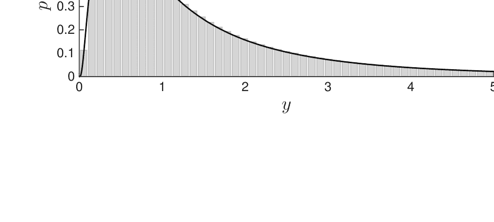

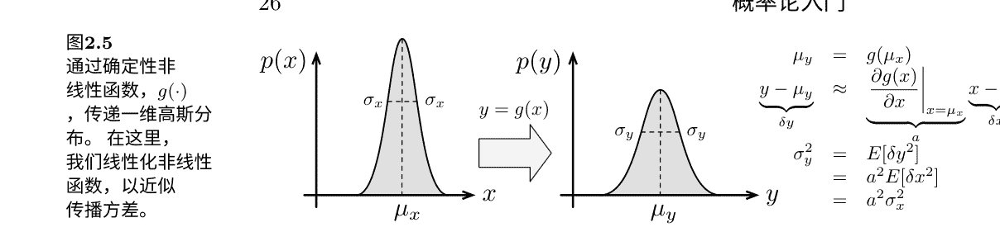

通过对大量采样的结果进行非线性处理，然后进行分组，生成的。这些方法非常吻合，验证了我们改变变量的方法。

请注意，由于非线性变量的改变，$p(y)$不再是高斯分布。我们可以通过数值验证这个函数下的面积确实为1（即，它是一个有效的概率密度函数）。值得注意的是，如果我们在处理变量的改变和包含因子时不注意，我们将无法得到一个有效的概率密度函数。$\frac{1}{y}$ 因子，我们将无法得到一个有效的概率密度函数。

##### 通过线性化的一般情况

不幸的是，(2.76) 无法以闭式形式计算每个 $g(\cdot)$ 并且在多变量情况下比标量情况更加困难。此外，当非线性是随机的（即 $R >0$）时，由于来自噪声的额外输入，我们的映射将永远不可逆，因此我们需要一种不同的方法来转换我们的高斯分布。有几种不同的方法可以做到这一点，在本节中，我们将介绍最常见的一种方法，即线性化。

我们线性化非线性映射，使其满足

$$\mathbf{g}(\mathbf{x}) \approx \boldsymbol{\mu}_y + \mathbf{G}(\mathbf{x} - \boldsymbol{\mu}_x),$$
$$\mathbf{G} = \left. \frac{\partial \mathbf{g}(\mathbf{x})}{\partial \mathbf{x}} \right|_{\mathbf{x}=\boldsymbol{\mu}_x}, \quad (2.85)$$
$$\boldsymbol{\mu}_y = \mathbf{g}(\boldsymbol{\mu}_x),$$

其中 $\mathbf{G}$ 是 $\mathbf{g}(\cdot)$ 关于 $\mathbf{x}$ 的雅可比矩阵。这使我们能够以闭合形式通过线性化函数传递高斯分布；这是一个对于轻度非线性映射效果良好的近似。

图2.5描述了将一维高斯概率密度函数通过已线性化的确定性非线性函数 $g(\cdot)$ 的过程。一般来说，我们将通过随机函数进行推断，这会引入额外的噪声。

### 2.2 高斯概率密度函数

回到(2.76)，我们有

$$
\begin{aligned}
p(\mathbf{y}) &= \int_{-\infty}^{\infty} p(\mathbf{y}|\mathbf{x}) p(\mathbf{x}) d\mathbf{x} \\
&= \eta \int_{-\infty}^{\infty} \exp \left( -\frac{1}{2} \left( \mathbf{y} - (\boldsymbol{\mu}_y + \mathbf{G}(\mathbf{x} - \boldsymbol{\mu}_x)) \right)^T \mathbf{R}^{-1} \left( \mathbf{y} - (\boldsymbol{\mu}_y + \mathbf{G}(\mathbf{x} - \boldsymbol{\mu}_x)) \right) \right) \\
&\quad \times \exp \left( -\frac{1}{2} (\mathbf{x} - \boldsymbol{\mu}_x)^T \boldsymbol{\Sigma}_{xx}^{-1} (\mathbf{x} - \boldsymbol{\mu}_x) \right) d\mathbf{x} \\
&= \eta \exp \left( -\frac{1}{2} (\mathbf{y} - \boldsymbol{\mu}_y)^T \mathbf{R}^{-1} (\mathbf{y} - \boldsymbol{\mu}_y) \right) \\
&\quad \times \int_{-\infty}^{\infty} \exp \left( -\frac{1}{2} (\mathbf{x} - \boldsymbol{\mu}_x)^T \left( \boldsymbol{\Sigma}_{xx}^{-1} + \mathbf{G}^T \mathbf{R}^{-1} \mathbf{G} \right) (\mathbf{x} - \boldsymbol{\mu}_x) \right) \\
&\quad \times \exp \left( (\mathbf{y} - \boldsymbol{\mu}_y)^T \mathbf{R}^{-1} \mathbf{G} (\mathbf{x} - \boldsymbol{\mu}_x) \right) d\mathbf{x}, \tag{2.86}
\end{aligned}
$$

其中 $\eta$ 是一个归一化常数。定义 $\mathbf{F}$ 使得

$$
\mathbf{F}^T \left( \mathbf{G}^T \mathbf{R}^{-1} \mathbf{G} + \boldsymbol{\Sigma}_{xx}^{-1} \right) = \mathbf{R}^{-1} \mathbf{G}, \tag{2.87}
$$

我们可以完成积分内部的平方部分，使其变为

$$
\begin{aligned}
&\exp \left( -\frac{1}{2} (\mathbf{x} - \boldsymbol{\mu}_x)^T \left( \boldsymbol{\Sigma}_{xx}^{-1} + \mathbf{G}^T \mathbf{R}^{-1} \mathbf{G} \right) (\mathbf{x} - \boldsymbol{\mu}_x) \right) \times \exp \left( (\mathbf{y} - \boldsymbol{\mu}_y)^T \mathbf{R}^{-1} \mathbf{G} (\mathbf{x} - \boldsymbol{\mu}_x) \right) \\
&= \exp \left( -\frac{1}{2} \left( (\mathbf{x} - \boldsymbol{\mu}_x) - \mathbf{F} (\mathbf{y} - \boldsymbol{\mu}_y) \right)^T \left( \mathbf{G}^T \mathbf{R}^{-1} \mathbf{G} + \boldsymbol{\Sigma}_{xx}^{-1} \right) \left( (\mathbf{x} - \boldsymbol{\mu}_x) - \mathbf{F} (\mathbf{y} - \boldsymbol{\mu}_y) \right) \right) \\
&\quad \times \exp \left( \frac{1}{2} (\mathbf{y} - \boldsymbol{\mu}_y)^T \mathbf{F}^T \left( \mathbf{G}^T \mathbf{R}^{-1} \mathbf{G} + \boldsymbol{\Sigma}_{xx}^{-1} \right) \mathbf{F} (\mathbf{y} - \boldsymbol{\mu}_y) \right). \tag{2.88}
\end{aligned}
$$

第二个因素与 $\mathbf{x}$ 无关，可以移到积分符号外。剩下的积分（第一个因素）在 $\mathbf{x}$ 上是高斯分布，因此在 $\mathbf{x}$ 上积分得到一个常数，可以吸收到常数 $\eta$ 中。因此，对于 $p(\mathbf{y})$，我们有

$$
\begin{aligned}
p(\mathbf{y}) &= \rho \exp \left(-\frac{1}{2}(\mathbf{y}-\boldsymbol{\mu}_{y})^{T} \right. \\
&\quad\left.\times\left(\mathbf{R}^{-1}-\mathbf{F}^{T}\left(\mathbf{G}^{T} \mathbf{R}^{-1} \mathbf{G}+\boldsymbol{\Sigma}_{x x}^{-1}\right) \mathbf{F}\right)(\mathbf{y}-\boldsymbol{\mu}_{y})\right) \\
&=\rho \exp \left(-\frac{1}{2}(\mathbf{y}-\boldsymbol{\mu}_{y})^{T}\right. \\
&\quad\left.\times\left(\mathbf{R}^{-1}-\mathbf{R}^{-1} \mathbf{G}\left(\mathbf{G}^{T} \mathbf{R}^{-1} \mathbf{G}+\boldsymbol{\Sigma}_{x x}^{-1}\right)^{-1} \mathbf{G}^{T} \mathbf{R}^{-1}\right)(\mathbf{y}-\boldsymbol{\mu}_{y})\right) \\
&=\rho \exp \left(-\frac{1}{2}(\mathbf{y}-\boldsymbol{\mu}_{y})^{T}\left(\mathbf{R}+\mathbf{G} \boldsymbol{\Sigma}_{x x} \mathbf{G}^{T}\right)^{-1}(\mathbf{y}-\boldsymbol{\mu}_{y})\right),
\end{aligned}
\quad(2.89)
$$

其中 $\rho$ 是新的归一化常数。 这是一个关于误差的高斯分布：

$$
\text{误差} \sim \mathcal{N}\left(\text{均值误差}, \mathbf{\Sigma}_{y y}\right)=\mathcal{N}\left(\mathbf{g}(\text{均值状态}), \mathbf{R}+\mathbf{G} \mathbf{\Sigma}_{x x} \mathbf{G}^{T}\right)
\quad(2.90)
$$

正如我们将在后面看到的，方程(2.70)和(2.89)构成了经典离散时间(扩展)卡尔曼滤波器(Kalman, 1960b)的观测和预测步骤。 这两个步骤可以被看作是滤波器中信息的创建和销毁，分别。

#### 2.2.9 高斯的香农信息

对于高斯概率密度函数，香农信息为：

$$
\begin{aligned}
H(\mathbf{x}) &=-\int_{-\infty}^{\infty} p(\mathbf{x}) \ln p(\mathbf{x}) d \mathbf{x} \\
&=-\int_{-\infty}^{\infty} p(\mathbf{x})\left(-\frac{1}{2}(\mathbf{x}-\boldsymbol{\mu})^{T} \mathbf{\Sigma}^{-1}(\mathbf{x}-\boldsymbol{\mu})-\ln \sqrt{(2 \pi)^{N} \det \mathbf{\Sigma}}\right) d \mathbf{x} \\
&=\frac{1}{2} \ln \left((2 \pi)^{N} \det \mathbf{\Sigma}\right)+\int_{-\infty}^{\infty} \frac{1}{2}(\mathbf{x}-\boldsymbol{\mu})^{T} \mathbf{\Sigma}^{-1}(\mathbf{x}-\boldsymbol{\mu}) p(\mathbf{x}) d \mathbf{x} \\
&=\frac{1}{2} \ln \left((2 \pi)^{N} \det \mathbf{\Sigma}\right)+\frac{1}{2} E\left[(\mathbf{x}-\boldsymbol{\mu})^{T} \mathbf{\Sigma}^{-1}(\mathbf{x}-\boldsymbol{\mu})\right],
\end{aligned}
\quad(2.91)
$$

我们使用期望值来表示第二项。 事实上，这个项正好是一个平方的马哈拉诺比斯距离，类似于平方欧几里得距离，但在中间通过逆协方差矩阵进行加权。 这个二次函数在期望值内部有一个很好的性质，允许我们使用线性代数中的（线性）迹算子来重写它：

$$
(\mathbf{x}-\boldsymbol{\mu})^{T} \mathbf{\Sigma}^{-1}(\mathbf{x}-\boldsymbol{\mu})=\operatorname{tr}\left(\mathbf{\Sigma}^{-1}(\mathbf{x}-\boldsymbol{\mu})(\mathbf{x}-\boldsymbol{\mu})^{T}\right).
\quad(2.92)
$$

> 普拉桑塔·钱德拉·马哈拉诺比斯 (1893-1972) 是一位印度科学家和应用统计学家，以这种统计距离（马哈拉诺比斯，1936年）而闻名。

### 2.2 高斯概率密度函数

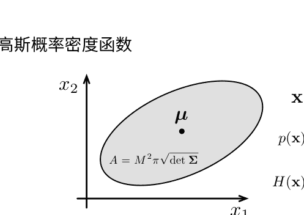

图2.6 二维高斯概率密度函数的不确定性椭圆。椭圆内的几何面积为 $A = M^2\pi \sqrt{\det \Sigma}$。为了比较，提供了香农信息表达式。

由于期望值也是一个线性算子，我们可以交换期望值和迹的顺序，得到

> $$ \begin{aligned} E\left[(\mathbf{x}-\boldsymbol{\mu})^{T}\boldsymbol{\Sigma}^{-1}(\mathbf{x}-\boldsymbol{\mu})\right] &= \mathrm{tr}\left( E\left[ \boldsymbol{\Sigma}^{-1}(\mathbf{x}-\boldsymbol{\mu})(\mathbf{x}-\boldsymbol{\mu})^{T} \right] \right) \\ &= \mathrm{tr}\left( \boldsymbol{\Sigma}^{-1} E\left[ (\mathbf{x}-\boldsymbol{\mu})(\mathbf{x}-\boldsymbol{\mu})^{T} \right] \right) \\ &= \mathrm{tr}\left( \boldsymbol{\Sigma}^{-1} \boldsymbol{\Sigma} \right) \\ &= \mathrm{tr}(\mathbf{1}) \\ &= N, \end{aligned} $$

这只是变量的维度。将其代回到我们的香农信息表达式中，我们有

> $$ \begin{aligned} H(\mathbf{x}) &= \frac{1}{2} \ln \left( (2\pi)^{N} \det \boldsymbol{\Sigma} \right) + \frac{1}{2} E\left[ (\mathbf{x}-\boldsymbol{\mu})^{T} \boldsymbol{\Sigma}^{-1} (\mathbf{x}-\boldsymbol{\mu}) \right] \\ &= \frac{1}{2} \ln \left( (2\pi)^{N} \det \boldsymbol{\Sigma} \right) + \frac{1}{2} N \\ &= \frac{1}{2} \left( \ln \left( (2\pi)^{N} \det \boldsymbol{\Sigma} \right) + N \ln e \right) \\ &= \frac{1}{2} \ln \left( (2\pi e)^{N} \det \boldsymbol{\Sigma} \right), \end{aligned} $$

这实际上纯粹是 $\boldsymbol{\Sigma}$ 的函数，即高斯概率密度函数的协方差矩阵。从几何上讲，我们可以解释 $\sqrt{\det \boldsymbol{\Sigma}}$ 作为高斯概率密度函数形成的不确定性椭球的体积。图2.6显示了二维高斯概率密度函数的不确定性椭圆。请注意，在不确定性椭圆的边界上， $p(\mathbf{x})$ 是常数。为了看到这一点，考虑到沿着这个椭圆的点必须满足

> $$ (\mathbf{x}-\boldsymbol{\mu})^{T}\boldsymbol{\Sigma}^{-1}(\mathbf{x}-\boldsymbol{\mu}) = \frac{1}{M^{2}}, $$

其中 $M$ 是一个应用于缩放标准（$M=1$）协方差的因子。在这种情况下，我们有

> $$ p(\mathbf{x}) = \frac{1}{\left(2\pi\right)^{N/2} e^{1/M^{2}} \det \boldsymbol{\Sigma}}, $$

它与 $\mathbf{x}$ 无关，因此是常数。观察最后一个表达式，我们注意到随着数据维度N的增加，我们需要非常快速地增加M以保持p(x)恒定。

#### 2.2.10 联合高斯概率密度函数的互信息

假设我们有一个给定变量 $\mathbf{x} \in \mathbb{R}^N$ 和 $\mathbf{y} \in \mathbb{R}^M$ 的联合高斯分布

$$
p(\mathbf{x}, \mathbf{y}) = \mathcal{N}(\boldsymbol{\mu}, \boldsymbol{\Sigma}) = \mathcal{N}\left(\begin{bmatrix} \boldsymbol{\mu}_x \\ \boldsymbol{\mu}_y \end{bmatrix}, \begin{bmatrix} \boldsymbol{\Sigma}_{xx} & \boldsymbol{\Sigma}_{xy} \\ \boldsymbol{\Sigma}_{yx} & \boldsymbol{\Sigma}_{yy} \end{bmatrix}\right). \tag{2.97}
$$

通过将(2.94)插入(2.29)，我们可以很容易地看出联合高斯的互信息为

$$
\begin{aligned}
I(\mathbf{X};\mathbf{Y}) &= \frac{1}{2}\ln\left((2\pi e)^N \det \boldsymbol{\Sigma}_{xx}\right) + \frac{1}{2}\ln\left((2\pi e)^M \det \boldsymbol{\Sigma}_{yy}\right) - \frac{1}{2}\ln\left((2\pi e)^{M+N} \det \boldsymbol{\Sigma}\right) \\
&= -\frac{1}{2}\ln\left(\frac{\det \boldsymbol{\Sigma}}{\det \boldsymbol{\Sigma}_{xx} \det \boldsymbol{\Sigma}_{yy}}\right). \tag{2.98}
\end{aligned}
$$

回顾(2.50)，我们还可以注意到

$$
\det \boldsymbol{\Sigma} = \det \boldsymbol{\Sigma}_{xx} \det\left(\boldsymbol{\Sigma}_{yy} - \boldsymbol{\Sigma}_{yx}\boldsymbol{\Sigma}_{xx}^{-1}\boldsymbol{\Sigma}_{xy}\right) = \det \boldsymbol{\Sigma}_{yy} \det\left(\boldsymbol{\Sigma}_{xx} - \boldsymbol{\Sigma}_{xy}\boldsymbol{\Sigma}_{yy}^{-1}\boldsymbol{\Sigma}_{yx}\right). \tag{2.99}
$$

将其插入上述公式，我们有

$$
I(\mathbf{x};\mathbf{y}) = -\frac{1}{2}\ln \det(\mathbf{1} - \boldsymbol{\Sigma}_{xx}^{-1}\boldsymbol{\Sigma}_{xy}\boldsymbol{\Sigma}_{yy}^{-1}\boldsymbol{\Sigma}_{yx}) = -\frac{1}{2}\ln \det(\mathbf{1} - \boldsymbol{\Sigma}_{yy}^{-1}\boldsymbol{\Sigma}_{yx}\boldsymbol{\Sigma}_{xx}^{-1}\boldsymbol{\Sigma}_{xy}). \tag{2.100}
$$

通过西尔维斯特行列式定理，可以看出这两个版本是等价的。

> 詹姆斯·约瑟夫·西尔维斯特 (1814-1897) 是一位英国数学家，对矩阵理论、不变理论、数论、分区理论和组合学做出了基础性贡献。
>
> 这个定理表明，即使A和B不是方阵，也有 $\det(\mathbf{1} - \mathbf{A}\mathbf{B}) = \det(\mathbf{1} - \mathbf{B}\mathbf{A})$。

#### 2.2.11 Cramér-Rao下界应用于高斯概率密度函数

假设有 $K$ 个样本（即测量值）， $\mathbf{x}_{\text{meas},k} \in \mathbb{R}^N$ ，从高斯概率密度函数中抽取。与这些测量相关的 $K$ 个统计独立随机变量因此是

$$
(\forall k)\quad \mathbf{x}_k \sim \mathcal{N}(\boldsymbol{\mu}, \boldsymbol{\Sigma}). \tag{2.101}
$$

统计独立这个术语意味着 $E[(\mathbf{x}_k - \boldsymbol{\mu})(\mathbf{x}_\ell - \boldsymbol{\mu})^T] = \mathbf{0}$ 当 $k \neq \ell$。

现在假设我们的目标是估计这个概率密度函数的均值， $\boldsymbol{\mu}$， 通过测量值, $\mathbf{x}_{\text{meas},1}, \ldots, \mathbf{x}_{\text{meas},K}$。 对于所有随机变量的联合密度函数, $\mathbf{x} = (\mathbf{x}_1, \ldots, \mathbf{x}_K)$, 实际上我们有

$$
\ln p(\mathbf{x}|\boldsymbol{\mu}, \boldsymbol{\Sigma}) = -\frac{1}{2}(\mathbf{x} - \mathbf{A}\boldsymbol{\mu})^T \mathbf{B}^{-1}(\mathbf{x} - \mathbf{A}\boldsymbol{\mu}) - \ln \sqrt{(2\pi)^{N K} \det \mathbf{B}}, \tag{2.102}
$$

其中

$$
\mathbf{A} = \begin{bmatrix} \mathbf{1} & \mathbf{1} & \cdots & \mathbf{1} \end{bmatrix}^T, \quad \mathbf{B} = \operatorname{diag}(\boldsymbol{\Sigma}, \boldsymbol{\Sigma}, \ldots, \boldsymbol{\Sigma}). \tag{2.103}
$$

在这种情况下，我们有

$$
\frac{\partial \ln p(\mathbf{x}|\boldsymbol{\mu}, \boldsymbol{\Sigma})}{\partial \boldsymbol{\mu}} = \mathbf{A}^T \mathbf{B}^{-1}(\mathbf{x} - \mathbf{A}\boldsymbol{\mu}), \tag{2.104}
$$

因此费舍尔信息矩阵为

$$
\begin{aligned}
\mathbf{I}(\boldsymbol{\mu}) &= E\left[\left(\frac{\partial \ln p(\mathbf{x}|\boldsymbol{\mu}, \boldsymbol{\Sigma})}{\partial \boldsymbol{\mu}}\right)^T\left(\frac{\partial \ln p(\mathbf{x}|\boldsymbol{\mu}, \boldsymbol{\Sigma})}{\partial \boldsymbol{\mu}}\right)\right] \\
&= E\left[\mathbf{A}^T \mathbf{B}^{-1}(\mathbf{x} - \mathbf{A}\boldsymbol{\mu})(\mathbf{x} - \mathbf{A}\boldsymbol{\mu})^T \mathbf{B}^{-1}\mathbf{A}\right] \\
&= \mathbf{A}^T \mathbf{B}^{-1} E\left[(\mathbf{x} - \mathbf{A}\boldsymbol{\mu})(\mathbf{x} - \mathbf{A}\boldsymbol{\mu})^T\right] \mathbf{B}^{-1} \mathbf{A} \\
&= \mathbf{A}^T \mathbf{B}^{-1} \mathbf{B} \mathbf{B}^{-1} \mathbf{A} \\
&= \mathbf{A}^T \mathbf{B}^{-1} \mathbf{A} \\
&= K \boldsymbol{\Sigma}^{-1},
\end{aligned}
\tag{2.105}
$$

我们可以看到这只是 $K$ 乘以高斯密度的逆协方差。因此，CRLB表示

$$
\operatorname{cov}(\hat{\boldsymbol{\mu}}|\mathbf{x}_{\text{meas},1}, \ldots, \mathbf{x}_{\text{meas},K}) \geq \frac{1}{K}\boldsymbol{\Sigma}. \tag{2.106}
$$

换句话说，随着我们进行更多的测量，对估计值均值, $\hat{\boldsymbol{\mu}}$ 的不确定性下限变得越来越小（正如我们所期望的）。

请注意，在计算CRLB时，我们实际上不需要指定无偏估计器的形式；CRLB是任何无偏估计器的下界。在这种情况下，找到一个恰好达到CRLB的估计器并不难：

$$
\hat{\boldsymbol{\mu}} = \frac{1}{K} \sum_{k=1}^{K} \mathbf{x}_{\text{meas},k}. \tag{2.107}
$$

对于这个估计器的均值，我们有

$$
E[\hat{\boldsymbol{\mu}}] = E\left[\frac{1}{K} \sum_{k=1}^{K} \mathbf{x}_k\right] = \frac{1}{K} \sum_{k=1}^{K} E[\mathbf{x}_k] = \frac{1}{K} \sum_{k=1}^{K} \boldsymbol{\mu} = \boldsymbol{\mu}, \tag{2.108}
$$

这表明估计器确实是无偏的。对于协方差，我们有
$$\begin{aligned}
\operatorname{cov}(\hat{\mathbf{x}}|\mathbf{x}_{\text{测量}}, \ldots, \mathbf{x}_{\text{测量}}) &= E\left[(\hat{\mathbf{x}} - \boldsymbol{\mu})(\hat{\mathbf{x}} - \boldsymbol{\mu})^T\right] \\
&= E\left[\left(\frac{1}{K}\sum_{k=1}^{K} \mathbf{x}_k - \boldsymbol{\mu}\right)\left(\frac{1}{K}\sum_{k=1}^{K} \mathbf{x}_k - \boldsymbol{\mu}\right)^T\right] \\
&= \frac{1}{K^2} \sum_{k=1}^{K} \sum_{\ell=1}^{K} E\left[(\mathbf{x}_k - \boldsymbol{\mu})(\mathbf{x}_{\ell} - \boldsymbol{\mu})^T\right] \\
&\quad \quad \underbrace{\quad\quad}_{\boldsymbol{\Sigma}\text{当 } k = \ell\text{时, 0否则}} \\
&= \frac{1}{K}\boldsymbol{\Sigma},
\end{aligned}$$
这正好符合CRLB。

### 2.3 高斯过程

我们已经讨论过高斯随机变量及其相关的概率密度函数。我们写作
$$\mathbf{x} \sim \mathcal{N}(\boldsymbol{\mu}, \boldsymbol{\Sigma}), \quad\quad (2.110)$$
表示 $\mathbf{x} \in \mathbb{R}^N$ 服从高斯分布。我们将广泛使用这种类型的随机变量来表示离散时间量。我们还希望讨论随时间连续的状态量 $t$。为此，我们需要引入高斯过程（GPs）(Rasmussen and Williams, 2006)。图2.7描绘了一个由高斯过程表示的轨迹。这里有一个均值函数，$\boldsymbol{\mu}(t)$，和一个协方差函数，$\boldsymbol{\Sigma}(t, t')$。

这个想法是整个轨迹是一个单一的随机变量属于一类函数。函数距离均值越近，越有可能。协方差函数通过描述两个时间之间的相关性来控制函数的平滑程度，$t$ 和 $t'$。我们写作
$$\mathbf{x}(t) \sim \mathcal{GP}(\boldsymbol{\mu}(t), \boldsymbol{\Sigma}(t, t')) \quad\quad (2.111)$$
表示连续时间轨迹是一个高斯过程($GP$)。GP概念不仅适用于一维时间函数，但我们只需要这个特殊情况。

### 2.4 总结

如果我们想考虑一个特定时间的变量感兴趣，τ，则我们可以写成
$$\mathbf{x}(τ) \sim \mathcal{N}(\boldsymbol{\mu}(τ), \boldsymbol{\Sigma}(τ, τ)),$$
其中 $\boldsymbol{\Sigma}(τ, τ)$ 现在只是一个协方差矩阵。我们基本上消除了所有其他时间点，只留下了一个常规的高斯随机变量 $\mathbf{x}(τ)$。

一般来说，高斯过程可以采用许多不同的形式。我们经常使用的一种特殊高斯过程是零均值、白噪声过程。为了使 $\mathbf{w}(t)$ 成为零均值、白噪声，我们写成
$$\mathbf{w}(t) \sim \text{高斯过程} \left(\mathbf{0}, \mathbf{Q} \delta(t - t')\right),$$
其中 $\mathbf{Q}$ 是功率谱密度矩阵，$\delta(\cdot)$ 是狄拉克 $\delta$ 函数。这是一个平稳噪声过程，因为它只依赖于差异，$t - t'$。

当我们想要讨论连续时间中的状态估计时，我们将回到GPs。我们将展示，在这个背景下的估计可以被视为高斯过程回归的应用 (Rasmussen和Williams, 2006)。

保罗·阿德里安·莫里斯·狄拉克 (1902-1984) 是一位英国理论物理学家，对量子力学和量子电动力学的早期发展做出了重要贡献。

### 2.4 总结

本章的主要要点如下：

-   1. 我们将使用概率密度函数 (PDFs) 来表示我们对机器人处于每个可能状态的确定程度，PDFs覆盖了一些连续状态空间。
-   2. 为了简化计算，我们经常限制自己使用高斯PDFs。
-   3. 我们经常使用贝叶斯规则进行所谓的贝叶斯推断，作为一种状态估计的方法；我们从一组可能的状态 (先验) 开始，根据实际测量结果 (后验) 缩小可能性。

下一章将介绍一些经典的线性高斯状态估计方法。

### 2.5 练习

2.5.1 对于任意长度相同的两列，$\mathbf{u}$和$\mathbf{v}$，证明
$$\mathbf{u}^T \mathbf{v} = \text{tr}(\mathbf{v} \mathbf{u}^T).$$

2.5.2 证明如果两个随机变量，$\mathbf{x}$和$\mathbf{y}$，是统计独立的，则联合密度函数的香农信息量为$p(x,y)$的香农信息量等于各个密度函数的香农信息量之和，即 $p(x)$和 $p(y)$之和:
$$H(x,y) = H(x) + H(y)$$

2.5.3 对于一个高斯随机变量， $\mathbf{x} \sim \mathcal{N} (\mu, \Sigma)$，证明
$$E[\mathbf{x}\mathbf{x}^T] = \Sigma + \mu\mu^T$$

2.5.4 对于一个高斯随机变量， $\mathbf{x} \sim \mathcal{N}(\mu, \Sigma)$，直接证明
$$\mu = E[\mathbf{x}] = \int_{-\infty}^{\infty} \mathbf{x} p(\mathbf{x}) d\mathbf{x}$$

2.5.5 对于一个高斯随机变量， $\mathbf{x} \sim \mathcal{N}(\mu, \Sigma)$，直接证明
$$\Sigma = E[(\mathbf{x}-\mu)(\mathbf{x}-\mu)^T] = \int_{-\infty}^{\infty} (\mathbf{x}-\mu)(\mathbf{x}-\mu)^T p(\mathbf{x}) d\mathbf{x}$$

2.5.6 证明 K个统计独立的高斯概率密度函数的直接乘积， $\mathbf{x}_k \sim \mathcal{N}(\mu_k, \Sigma_k)$，也是一个高斯概率密度函数:
$$\exp\left( -\frac{1}{2}(\mathbf{x}-\mu)^T \Sigma^{-1}(\mathbf{x}-\mu) \right) = \eta \prod_{k=1}^K \exp\left( -\frac{1}{2}(\mathbf{x}-\mu_k)^T \Sigma_k^{-1}(\mathbf{x}-\mu_k) \right),$$
其中
$$\Sigma^{-1} = \sum_{k=1}^K \Sigma_k^{-1}, \quad \Sigma^{-1}\mu = \sum_{k=1}^K \Sigma_k^{-1} \mu_k,$$
而 $\eta$ 是一个归一化常数，用于强制满足全概率公理。

2.5.7 证明加权和 K个统计独立的随机变量， $\mathbf{x}_k$，给定为
$$\mathbf{x} = \sum_{k=1}^K w_k \mathbf{x}_k,$$
当$w=1$且$w_k \ge 0$时，具有满足总概率公理的概率密度函数，其均值为
$$\mu = \sum_{k=1}^K w_k \mu_k,$$
其中$\mu_k$是$\mathbf{x}_k$的均值。确定协方差的表达式。请注意，随机变量不被假设为高斯分布。

### 2.5 练习

#### 2.5.8 随机变量

$y = \mathbf{x}^T\mathbf{x}$ 当 $\mathbf{x} \sim \mathcal{N}(\mathbf{0}, \mathbf{1})$ 的长度为 $K$ 时，它是自由度为 $K$ 的卡方分布。证明其均值和方差分别为 $K$ 和 $2K$。

提示：使用Isserlis定理。

## 3 线性高斯估计

本章将介绍一些经典的线性模型和高斯随机变量的估计理论结果，包括卡尔曼滤波器(KF)(Kalman, 1960b)。 我们将从一个离散时间批处理估计问题开始，这将为后续章节中的非线性扩展提供重要的见解。 从批处理方法中，我们将展示如何发展递归方法。 最后，我们将回到处理连续时间运动模型的更一般情况，并将其与离散时间结果以及来自机器学习领域的高斯过程回归相连接。 涵盖线性估计的经典书籍包括Bryson (1975)， Maybeck (1994)和Stengel (1994)。

### 3.1 批量离散时间估计

我们将首先建立我们想要解决的问题，然后讨论解决方法。

#### 3.1.1 问题设置

在本章的大部分内容中，我们将考虑离散时间、线性、时变方程。 我们定义以下运动和观测模型:

运动模型: $$ \mathbf{x}_k = \mathbf{A}_{k-1} \mathbf{x}_{k-1} + \mathbf{v}_k + \mathbf{w}_k, \quad k=1\ldots K $$ (3.1a)

观测模型: $$ \mathbf{y}_k = \mathbf{C}_k \mathbf{x}_k + \mathbf{n}_k, \quad k=0\ldots K $$ (3.1b)

其中 $k$ 是离散时间索引，$K$ 是最大值。 在(3.1)中，变量的含义如下：系统状态: $\mathbf{x}_k$

| 变量 | 描述 | 定义 |
| :--- | :--- | :--- |
| $\mathbf{x}_k$ | 系统状态 | $\in \mathbb{R}^N$ |
| $\mathbf{x}_0$ | 初始状态 | $\in \mathbb{R}^N \sim \mathcal{N}(\hat{\mathbf{x}}_0, \mathbf{P}_0)$ |
| $\mathbf{v}_k$ | 输入 | $\in \mathbb{R}^N$ |
| $\mathbf{w}_k$ | 过程噪声 | $\in \mathbb{R}^N \sim \mathcal{N}(\mathbf{0}, \mathbf{Q}_k)$ |
| $\mathbf{y}_k$ | 测量 | $\in \mathbb{R}^M$ |
| $\mathbf{n}_k$ | 测量噪声 | $\in \mathbb{R}^M \sim \mathcal{N}(\mathbf{0}, \mathbf{R}_k)$ |

这些都是随机变量，除了 $\mathbf{v}_k$ 是确定性的$^1$。噪声变量和初始状态知识都被假设为不相关（在不同时间步骤也是如此）。

矩阵 $\mathbf{A}_k \in \mathbb{R}^{N \times N}$ 被称为过渡矩阵。矩阵 $\mathbf{C}_k \in \mathbb{R}^{M \times N}$ 被称为观测矩阵。

虽然我们想要知道系统的状态（在所有时间点），但我们只能访问以下数量，并且必须基于这些信息来进行估计，$\mathbf{x}_k$：

-   (i) 初始状态知识，$\mathbf{x}_0$，以及相关的协方差矩阵，$\mathbf{P}_0$；有时我们没有这个信息并且必须没有$^2$。
-   (ii) 输入，$\mathbf{v}_k$，通常来自我们的控制器的输出，因此是已知的$^3$；我们还有相关的过程噪声协方差，$\mathbf{Q}_k$。
-   (iii) 测量，$\mathbf{y}_k$，它们是相关随机变量的实现，以及相关的协方差矩阵，$\mathbf{R}_k$。

基于前一节中的模型，我们将状态估计问题定义如下：

状态估计问题是在给定初始状态知识，$\mathbf{x}_0$，一系列测量，$\mathbf{y}_{0:K}$，一系列输入，$\mathbf{v}_{1:K}$，以及对系统运动和观测模型的了解的情况下，在一个或多个时间步骤，给出系统真实状态的估计值，$\hat{\mathbf{x}}_k$。

本章的其余部分将介绍一套技术来解决这个状态估计问题。我们的方法不仅仅是尝试得出一个状态估计值，还要量化这个估计值的不确定性。

为了为后面关于非线性估计的章节做好准备，我们将首先制定一个批量线性高斯（LG）估计问题。批量解法非常有用，因为它一次性使用所有测量值来估计所有状态的状态估计值（因此称为“批量”）。然而，批量方法不能实时使用，因为我们不能使用未来的测量值来估计过去的状态。为此，我们需要递归状态估计器，这将在本章后面介绍。

有时输入被特化为 $\mathbf{v}_k = \mathbf{B}_k \mathbf{u}_k$ 的形式，其中 $\mathbf{u}_k \in \mathbb{R}^U$ 是输入，$\mathbf{B}_k \in \mathbb{R}^{N \times U}$ 被称为控制矩阵。我们将根据需要在我们的开发中使用这种形式。

$^1$ 我们将使用 $\check{\mathbf{x}}_k$ 表示先验估计（不包括测量），使用 $\hat{\mathbf{x}}_k$ 表示后验估计（包括测量）
$^2$ 我们将使用 $\check{\mathbf{x}}_k$ 表示先验估计（不包括测量），使用 $\hat{\mathbf{x}}_k$ 表示后验估计（包括测量）
$^3$ 在机器人领域，这个输入有时会被内感测量替代。这样做有点危险，因为它将两个不确定性源混为一谈：过程噪声和测量噪声。如果这样做，我们必须小心适当地扩大 $\mathbf{Q}$，以反映这两种不确定性。

为了展示各种概念之间的关系，我们将使用两种不同的范式来设置批量LG估计问题：

-   (i) 贝叶斯推断；在这里，我们根据初始状态知识、输入和运动模型更新先验状态密度，通过测量产生后验（高斯）状态密度。
-   (ii) 最大后验概率（MAP）；在这里，我们使用优化方法来找到给定信息（初始状态知识、测量、输入）的最可能后验状态。

虽然这些方法在性质上有所不同，但我们发现对于LG问题，它们得出的答案完全相同。这是因为完整的贝叶斯后验概率正好是高斯分布。因此，优化方法将找到高斯分布的最大值（即模式），这与均值相同。追求这两种方法很重要，因为当我们在后续章节中转向非线性、非高斯系统时，后验的均值和模式将不再相同，两种方法将得出不同的答案。我们将从最大后验概率优化方法开始，因为它比较容易解释。

#### 3.1.2 最大后验

在批量估计中，我们的目标是解决以下最大后验概率问题：
$\hat{\mathbf{x}} = \arg \max_{\mathbf{x}} p(\mathbf{x} | \mathbf{v}, \mathbf{y}), \quad (3.2)$
也就是说，我们希望找到系统状态的最佳单一估计值（在所有时间步长上），即$\hat{\mathbf{x}}$，给定先验信息，$\mathbf{v}$和测量值，$\mathbf{y}$$^4$。请注意，我们有
$\mathbf{x} = \mathbf{x}_{0:K} = (\mathbf{x}_0, \ldots, \mathbf{x}_K)$, $\mathbf{v} = (\check{\mathbf{x}}_0, \mathbf{v}_{1:K}) = (\check{\mathbf{x}}_0, \mathbf{v}_1, \ldots, \mathbf{v}_K)$, $\mathbf{y} = \mathbf{y}_{0:K} = (\mathbf{y}_0, \ldots, \mathbf{y}_K)$,
为了方便起见，时间步长范围可能被省略（当该变量的范围是最大可能时）$^5$。请注意，我们已经将初始状态信息与系统输入一起包含在内；这些共同定义了我们对状态的先验。测量结果有助于改善这些先验信息。

$^4$ 在这里，我们会稍微放松符号的使用，从测量中省略'meas'。
$^5$ 在讨论整个轨迹而不是单个时间步长的变量和方程时，我们有时会提到'抬升形式'。如果数量处于抬升形式，它们将没有时间步长的下标，这一点应该很清楚。

我们首先使用贝叶斯规则重写MAP估计:
$$\hat{\mathbf{x}} = \arg \max_{\mathbf{x}} p(\mathbf{x}|\mathbf{v}, \mathbf{y}) = \arg \max_{\mathbf{x}} \frac{p(\mathbf{y}|\mathbf{x}, \mathbf{v})p(\mathbf{x}|\mathbf{v})}{p(\mathbf{y}|\mathbf{v})} = \arg \max_{\mathbf{x}} p(\mathbf{y}|\mathbf{x})p(\mathbf{x}|\mathbf{v}), \quad (3.3)$$
在这里，我们省略了分母，因为它不依赖于 $\mathbf{x}$。 我们还省略了 $p(\mathbf{y}|\mathbf{x}, \mathbf{v})$ 中的 $\mathbf{v}$，因为如果已知 $\mathbf{x}$（参见观测模型），它不会影响 $\mathbf{y}$ 在我们的系统中。

我们做出的一个重要假设是所有的噪声变量，$\mathbf{w}_k$ 和 $\mathbf{n}_k$，对于 $k = 0..K$，是不相关的。 这使我们能够使用贝叶斯规则以以下方式分解 $p(\mathbf{y}|\mathbf{x})$：
$$p(\mathbf{y}|\mathbf{x}) = \prod_{k=0}^{K} p(\mathbf{y}_k | \mathbf{x}_k). \quad (3.4)$$
此外，贝叶斯规则允许我们将 $p(\mathbf{x}|\mathbf{v})$ 分解为
$$p(\mathbf{x}|\mathbf{v}) = p(\mathbf{x}_0 | \check{\mathbf{x}}_0) \prod_{k=1}^{K} p(\mathbf{x}_k | \mathbf{x}_{k-1}, \mathbf{v}_k). \quad (3.5)$$
在这个线性系统中，组成部分（高斯）密度由以下给出：
$$p(\mathbf{x}_0 | \check{\mathbf{x}}_0) = \frac{1}{\sqrt{(2\pi)^N \det \mathbf{P}_0}} \exp \left( -\frac{1}{2} (\mathbf{x}_0 - \check{\mathbf{x}}_0)^T \mathbf{P}_0^{-1} (\mathbf{x}_0 - \check{\mathbf{x}}_0) \right), \quad (3.6a)$$
$$p(\mathbf{x}_k | \mathbf{x}_{k-1}, \mathbf{v}_k) = \frac{1}{\sqrt{(2\pi)^N \det \mathbf{Q}_k}} \exp \left( -\frac{1}{2} (\mathbf{x}_k - \mathbf{A}_{k-1} \mathbf{x}_{k-1} - \mathbf{v}_k)^T \mathbf{Q}_k^{-1} (\mathbf{x}_k - \mathbf{A}_{k-1} \mathbf{x}_{k-1} - \mathbf{v}_k) \right), \quad (3.6b)$$
$$p(\mathbf{y}_k | \mathbf{x}_k) = \frac{1}{\sqrt{(2\pi)^M \det \mathbf{R}_k}} \exp \left( -\frac{1}{2} (\mathbf{y}_k - \mathbf{C}_k \mathbf{x}_k)^T \mathbf{R}_k^{-1} (\mathbf{y}_k - \mathbf{C}_k \mathbf{x}_k) \right). \quad (3.6c)$$
请注意，我们必须有 $\mathbf{P}_0$, $\mathbf{Q}_k$ 和 $\mathbf{R}_k$ 可逆；根据假设，它们实际上是正定的，因此可逆。为了使## 3.1 批量离散时间估计

为了使优化更容易，我们对两边取对数：

$$
\ln(p(\mathbf{y}|\mathbf{x})p(\mathbf{x}|\mathbf{v})) = \ln p(\mathbf{x}_0|\check{\mathbf{x}}_0) + \sum_{k=1}^{K} \ln p(\mathbf{x}_k|\mathbf{x}_{k-1}, \mathbf{v}_k) + \sum_{k=0}^{K} \ln p(\mathbf{y}_k|\mathbf{x}_k), \qquad (3.7)
$$

其中

$$
\ln p(\mathbf{x}_0|\check{\mathbf{x}}_0) = -\frac{1}{2} (\mathbf{x}_0 - \check{\mathbf{x}}_0)^T \check{\mathbf{P}}_0^{-1} (\mathbf{x}_0 - \check{\mathbf{x}}_0) - \frac{1}{2} \ln \left( (2\pi)^N \det \check{\mathbf{P}}_0 \right), \qquad (3.8a)
$$

$$
\ln p(\mathbf{x}_k|\mathbf{x}_{k-1}, \mathbf{v}_k) = -\frac{1}{2} (\mathbf{x}_k - \mathbf{A}_{k-1} \mathbf{x}_{k-1} - \mathbf{v}_k)^T \mathbf{Q}_k^{-1} (\mathbf{x}_k - \mathbf{A}_{k-1} \mathbf{x}_{k-1} - \mathbf{v}_k) - \frac{1}{2} \ln \left( (2\pi)^N \det \mathbf{Q}_k \right), \qquad (3.8b)
$$

$$
\ln p(\mathbf{y}_k|\mathbf{x}_k) = -\frac{1}{2} (\mathbf{y}_k - \mathbf{C}_k \mathbf{x}_k)^T \mathbf{R}_k^{-1} (\mathbf{y}_k - \mathbf{C}_k \mathbf{x}_k) - \frac{1}{2} \ln \left( (2\pi)^M \det \mathbf{R}_k \right). \qquad (3.8c)
$$

注意到(3.8)中有一些与 $\mathbf{x}$ 无关的项，我们定义如下量：

$$
J_{v,k}(\mathbf{x}) = \begin{cases} \frac{1}{2} (\mathbf{x}_0 - \check{\mathbf{x}}_0)^T \check{\mathbf{P}}_0^{-1} (\mathbf{x}_0 - \check{\mathbf{x}}_0), & k=0 \\ \frac{1}{2} (\mathbf{x}_k - \mathbf{A}_{k-1} \mathbf{x}_{k-1} - \mathbf{v}_k)^T \mathbf{Q}_k^{-1} (\mathbf{x}_k - \mathbf{A}_{k-1} \mathbf{x}_{k-1} - \mathbf{v}_k), & k=1\dots K \end{cases}, \qquad (3.9a)
$$

$$
J_{y,k}(\mathbf{x}) = \frac{1}{2} (\mathbf{y}_k - \mathbf{C}_k \mathbf{x}_k)^T \mathbf{R}_k^{-1} (\mathbf{y}_k - \mathbf{C}_k \mathbf{x}_k), \qquad k=0\dots K, \qquad (3.9b)
$$

这些都是平方马氏距离。然后我们定义一个整体的目标函数 $J(\mathbf{x})$，我们将寻求在设计参数

$$
J(\mathbf{x}) = \sum_{k=0}^{K} (J_{v,k}(\mathbf{x}) + J_{y,k}(\mathbf{x})). \qquad (3.10)
$$

我们将使用 $J(\mathbf{x})$ 作为原样，但请注意，可以在这个表达式中添加各种附加项，这些附加项将影响最佳估计的解决方案（例如，约束条件，惩罚项）。从一个优化的角度来看，我们要解决以下问题：
$$
\hat{\mathbf{x}} = \arg \min_{\mathbf{x}} J(\mathbf{x}) \tag{3.11}
$$
这将导致与（3.2）相同的最佳估计解决方案，\(\hat{\mathbf{x}}\)。换句话说，我们仍然在寻找最佳估计，以最大化给定所有数据的状态的可能性。这是一个无约束的优化问题，我们不需要满足设计变量，\(\mathbf{x}\)的任何约束。

为了进一步简化我们的问题，我们利用方程（3.9）是关于\(\mathbf{x}\)的二次方的事实。为了更清楚地说明这一点，我们将所有已知数据堆叠成一个提升的列向量，\(\mathbf{z}\)，并且回忆起\(\mathbf{x}\)也是一个由所有状态组成的列向量：

$$
\mathbf{z} = \begin{bmatrix} \check{\mathbf{x}}_0 \\ \mathbf{v}_1 \\ \vdots \\ \mathbf{v}_K \\ \hline \mathbf{y}_0 \\ \mathbf{y}_1 \\ \vdots \\ \mathbf{y}_K \end{bmatrix},\quad \mathbf{x} = \begin{bmatrix} \mathbf{x}_0 \\ \vdots \\ \mathbf{x}_K \end{bmatrix}. \tag{3.12}
$$

然后我们定义以下块矩阵量：

$$
\mathbf{H} = \left[\begin{array}{c|c} \begin{matrix} \mathbf{1} & & & \\ -\mathbf{A}_0 & \mathbf{1} & & \\ & \ddots & \ddots & \\ & & -\mathbf{A}_{K-1} & \mathbf{1} \end{matrix} & \\ \hline & \begin{matrix} \mathbf{C}_0 & & & \\ & \mathbf{C}_1 & & \\ & & \ddots & \\ & & & \mathbf{C}_K \end{matrix} \end{array}\right], \tag{3.13a}
$$

$$
\mathbf{W} = \left[\begin{array}{c|c} \begin{matrix} \check{\mathbf{P}}_0 & & & \\ & \mathbf{Q}_1 & & \\ & & \ddots & \\ & & & \mathbf{Q}_K \end{matrix} & \\ \hline & \begin{matrix} \mathbf{R}_0 & & & \\ & \mathbf{R}_1 & & \\ & & \ddots & \\ & & & \mathbf{R}_K \end{matrix} \end{array}\right], \tag{3.13b}
$$

只显示非零块。实线分割线用于显示矩阵中与先验值，\(\mathbf{v}\)，和测量值，\(\mathbf{y}\)，在提升数据向量，\(\mathbf{z}\)，中相关部分的边界。

根据这些定义，我们发现

$$
J(\mathbf{x}) = \frac{1}{2} (\mathbf{z} - \mathbf{H}\mathbf{x})^T \mathbf{W}^{-1} (\mathbf{z} - \mathbf{H}\mathbf{x}), \qquad (3.14)
$$

这在 $\mathbf{x}$中是二次的。 我们注意到我们还有

$$
p(\mathbf{z}|\mathbf{x}) = \eta \exp \left( -\frac{1}{2} (\mathbf{z} - \mathbf{H}\mathbf{x})^T \mathbf{W}^{-1} (\mathbf{z} - \mathbf{H}\mathbf{x}) \right), \qquad (3.15)
$$

其中 $\eta$是一个归一化常数。

由于 $J(\mathbf{x})$恰好是一个抛物面，我们可以通过闭式解找到它的最小值。只需将对设计变量 $\mathbf{x}$的偏导数设为零:
$$
\frac{\partial J(\mathbf{x})}{\partial \mathbf{x}^T} \bigg|_{\hat{\mathbf{x}}} = -\mathbf{H}^T \mathbf{W}^{-1} (\mathbf{z} - \mathbf{H}\hat{\mathbf{x}}) = \mathbf{0}, \qquad (3.16a)
$$
$$
\Rightarrow (\mathbf{H}^T \mathbf{W}^{-1} \mathbf{H}) \hat{\mathbf{x}} = \mathbf{H}^T \mathbf{W}^{-1} \mathbf{z}. \qquad (3.16b)
$$

的解，$\hat{\mathbf{x}}$，是经典的批量最小二乘解，等价于经典估计理论中的固定间隔平滑器$^{7}$。批量最小二乘解使用了伪逆$^{8}$。

在计算上，为了解这个线性方程组，我们从不实际求逆 $\mathbf{H}^T \mathbf{W}^{-1} \mathbf{H}$ (即使它是密集的)。正如我们将在后面看到的，$\mathbf{H}^T \mathbf{W}^{-1} \mathbf{H}$具有特殊的块三对角结构，因此可以使用稀疏方程求解器高效地解决这个系统$^{9}$。

批量线性高斯问题的一个直观解释是，它就像一个质量-弹簧系统，如图3.1所示。目标函数中的每一项代表弹簧中存储的能量，随着质量的位置变化而变化。最优后验解对应于最小能量状态。

图3.1 批量线性高斯问题类似于一个质量-弹簧系统。目标函数中的每一项表示弹簧中存储的能量，随着小车（即质量）的位置变化而变化。最优的后验解对应于最小能量状态。

#### 3.1.3 贝叶斯推断

现在我们已经看到了批处理LG估计的优化方法，我们来看一下计算完整的贝叶斯后验概率， \( p(\mathbf{x}|\mathbf{v}, \mathbf{y}) \)，而不仅仅是最大值。这种方法要求我们从先验状态密度开始，然后根据测量结果进行更新。

在我们的情况下，可以使用初始状态的知识以及系统的输入来建立先验概率: \( p(\mathbf{x}|\mathbf{v}) \)。我们将仅使用运动模型来建立这个先验:

$$
\mathbf{x}_k = \mathbf{A}_{k-1} \mathbf{x}_{k-1} + \mathbf{v}_k + \mathbf{w}_k.
$$

以提升的矩阵形式\(^{10}\)，我们可以写成

$$
\mathbf{x} = \mathbf{A} (\mathbf{v} + \mathbf{w}),
$$

其中 \( \mathbf{w} \)是初始状态和过程噪声的提升形式，以及

$$
\mathbf{A} = \begin{bmatrix} 1 & 0 & \cdots & 0 \\ \mathbf{A}_0 & 1 & \cdots & 0 \\ \mathbf{A}_1 \mathbf{A}_0 & \mathbf{A}_1 & \cdots & 0 \\ \vdots & \vdots & \ddots & \vdots \\ \mathbf{A}_{K-2} \cdots \mathbf{A}_0 & \mathbf{A}_{K-2} \cdots \mathbf{A}_1 & \cdots & 1 \\ \mathbf{A}_{K-1} \cdots \mathbf{A}_0 & \mathbf{A}_{K-1} \cdots \mathbf{A}_1 & \cdots & \mathbf{A}_{K-1} & 1 \end{bmatrix}
$$

是提升的转移矩阵，我们可以看到它是下三角形的。提升均值则为

$$
\breve{\mathbf{x}} = E[\mathbf{x}] = E[\mathbf{A}(\mathbf{v} + \mathbf{w})] = \mathbf{A} \mathbf{v},
$$

提升协方差为

$$
\breve{\mathbf{P}} = E \left[ (\mathbf{x} - E[\mathbf{x}])(\mathbf{x} - E[\mathbf{x}])^T \right] = \mathbf{A} \mathbf{Q} \mathbf{A}^T,
$$

其中 \( \mathbf{Q} = E[\mathbf{w} \mathbf{w}^T] = \text{diag}(\breve{\mathbf{P}}_0, \mathbf{Q}_1, \ldots, \mathbf{Q}_K) \)。我们的先验可以被整洁地表达为

$$
p(\mathbf{x}|\mathbf{v}) = \mathcal{N} \left( \breve{\mathbf{x}}, \breve{\mathbf{P}} \right) = \mathcal{N} \left( \mathbf{A} \mathbf{v}, \mathbf{A} \mathbf{Q} \mathbf{A}^T \right).
$$

接下来我们转向测量。测量模型是

$$
\mathbf{y}_k = \mathbf{C}_k \mathbf{x}_k + \mathbf{n}_k.
$$

这也可以写成抬升形式

$$
\mathbf{y} = \mathbf{C} \mathbf{x} + \mathbf{n},
$$

其中 $\mathbf{n}$是测量噪声的提升形式，以及

$$
\mathbf{C} = \text{diag} (\mathbf{C}_0, \mathbf{C}_1, \ldots, \mathbf{C}_K) \quad (3.25)
$$

是提升观测矩阵。

先前提升状态和测量的联合密度现在可以写成

$$
p(\mathbf{x}, \mathbf{y}|\mathbf{v}) = \mathcal{N} \left( \begin{bmatrix} \hat{\mathbf{x}} \\ \mathbf{C}\hat{\mathbf{x}} \end{bmatrix}, \begin{bmatrix} \check{\mathbf{P}} & \check{\mathbf{P}}\mathbf{C}^T \\ \mathbf{C}\check{\mathbf{P}} & \mathbf{C}\check{\mathbf{P}}\mathbf{C}^T + \mathbf{R} \end{bmatrix} \right), \quad (3.26)
$$

其中 $\mathbf{R} = E[\mathbf{n}\mathbf{n}^T] = \text{diag}(\mathbf{R}_0, \mathbf{R}_1, \ldots, \mathbf{R}_K)$。我们可以根据这个进行因式分解

$$
p(\mathbf{x}, \mathbf{y}|\mathbf{v}) = p(\mathbf{x}|\mathbf{v}, \mathbf{y})p(\mathbf{y}|\mathbf{v}). \quad (3.27)
$$

我们只关心第一个因子，即完整的贝叶斯后验。

这可以通过使用第2.2.3节中概述的方法来写成

$$
p(\mathbf{x}|\mathbf{v}, \mathbf{y}) = \mathcal{N} \left( \hat{\mathbf{x}} + \mathbf{P}\mathbf{C}^T (\mathbf{C}\mathbf{P}\mathbf{C}^T + \mathbf{R})^{-1} (\mathbf{y} - \mathbf{C}\hat{\mathbf{x}}), \mathbf{P} - \mathbf{P}\mathbf{C}^T (\mathbf{C}\mathbf{P}\mathbf{C}^T + \mathbf{R})^{-1}\mathbf{C}\mathbf{P} \right). \quad (3.28)
$$

使用方程 (2.75) 中的SMW恒等式，可以将其转化为以下形式：

$$
p(\mathbf{x}|\mathbf{v}, \mathbf{y}) = \mathcal{N} \left( \underbrace{(\check{\mathbf{P}}^{-1} + \mathbf{C}^T \mathbf{R}^{-1} \mathbf{C})^{-1} (\check{\mathbf{P}}^{-1} \hat{\mathbf{x}} + \mathbf{C}^T \mathbf{R}^{-1} \mathbf{y})}_{\hat{\mathbf{x}}, \text{均值}}, \underbrace{(\check{\mathbf{P}}^{-1} + \mathbf{C}^T \mathbf{R}^{-1} \mathbf{C})^{-1}}_{\hat{\mathbf{P}}, \text{协方差}} \right). \quad (3.29)
$$

实际上，我们可以基于这个方程实现一个批处理估计器，因为它表示了完整的贝叶斯后验，但这可能不高效。

为了看到与之前讨论的优化方法的联系，我们重新排列均值表达式，得到一个关于 $\hat{\mathbf{x}}$ 的线性系统。

$$
\underbrace{(\check{\mathbf{P}}^{-1} + \mathbf{C}^T \mathbf{R}^{-1} \mathbf{C})}_{\hat{\mathbf{P}}^{-1}} \hat{\mathbf{x}} = \check{\mathbf{P}}^{-1} \hat{\mathbf{x}} + \mathbf{C}^T \mathbf{R}^{-1} \mathbf{y}, \quad (3.30)
$$

我们可以看到逆协方差出现在左侧。将 $\hat{\mathbf{x}} = \mathbf{A}\mathbf{v}$ 和 $\check{\mathbf{P}}^{-1} = (\mathbf{A}\mathbf{Q}\mathbf{A}^T)^{-1} = \mathbf{A}^{-T}\mathbf{Q}^{-1}\mathbf{A}^{-1}$ 代入，我们可以将其重写为

$$
\underbrace{(\mathbf{A}^{-T}\mathbf{Q}^{-1}\mathbf{A}^{-1} + \mathbf{C}^T \mathbf{R}^{-1} \mathbf{C})}_{\hat{\mathbf{P}}^{-1}} \hat{\mathbf{x}} = \mathbf{A}^{-T}\mathbf{Q}^{-1}\mathbf{v} + \mathbf{C}^T \mathbf{R}^{-1} \mathbf{y}. \quad (3.31)
$$我们看到这需要计算 $\mathbf{A}^{-1}$。事实证明，这有一个美丽而简单的形式$^{11}$，

$$\mathbf{A}^{-1}=\left[\begin{array}{cccccc} 1 & & & & & \ -\mathbf{A}_{0} & 1 & & & & \ & -\mathbf{A}_{1} & 1 & & & \ & & -\mathbf{A}_{2} & \ddots & & \ & & & \ddots & \ddots & \ & & & & -\mathbf{A}_{K-1} & 1 \end{array}\right], \tag{3.32}$$

这仍然是下三角形，但也非常稀疏（只有主对角线和下方的一个非零元素）。如果我们定义

$$\mathbf{z}=\left[\begin{array}{c} \mathbf{v} \ \mathbf{y} \end{array}\right], \quad \mathbf{H}=\left[\begin{array}{c} \mathbf{A}^{-1} \ \mathbf{C} \end{array}\right], \quad \mathbf{W}=\left[\begin{array}{cc} \mathbf{Q} & \ & \mathbf{R} \end{array}\right], \tag{3.33}$$

我们可以将我们的方程组重写为

$$\left(\mathbf{H}^{T} \mathbf{W}^{-1} \mathbf{H}\right) \hat{\mathbf{x}}=\mathbf{H}^{T} \mathbf{W}^{-1} \mathbf{z}, \tag{3.34}$$

这与之前讨论的优化解决方案完全相同。
再次强调，贝叶斯方法产生与我们的LG估计问题的优化解决方案相同的答案的原因是完全贝叶斯后验概率正好是高斯分布，而高斯分布的均值和模式（即最大值）是相同的。

#### 3.1.4 存在性、唯一性和可观测性

大多数经典的LG估计结果可以看作是(3.34)的一个特殊情况。因此，重要的是要问(3.34)何时有唯一解，这是本节的主题。

从基本线性代数中，我们可以得出结论，如果且仅当 $\mathbf{H}^{T} \mathbf{W}^{-1} \mathbf{H}$ 是可逆的时候， $\hat{\mathbf{x}}$ 将存在且是唯一解，其中-

$$\hat{\mathbf{x}}=\left(\mathbf{H}^{T} \mathbf{W}^{-1} \mathbf{H}\right)^{-1} \mathbf{H}^{T} \mathbf{W}^{-1} \mathbf{z}. \tag{3.35}$$

那么问题是，什么时候 $\mathbf{H}^{T} \mathbf{W}^{-1} \mathbf{H}$ 是可逆的？再次从线性代数中，我们知道可逆性的一个必要且充分条件是

$$\operatorname{rank}\left(\mathbf{H}^{T} \mathbf{W}^{-1} \mathbf{H}\right)=N(K+1), \tag{3.36}$$

因为我们有 $\operatorname{dim} \mathbf{x}=N(K+1)$。由于 $\mathbf{W}^{-1}$ 是实对称正定的$^{12}$，我们知道可以从测试中删除它，这样我们只需要

$$\operatorname{rank} \left( \mathbf{H}^\mathsf{T} \mathbf{H} \right) = \operatorname{rank} \left( \mathbf{H}^\mathsf{T} \right) = N \left( K+1 \right). \tag{3.37}$$

换句话说，我们需要矩阵$\mathbf{H}^\mathsf{T}$中的$N(K+1)$个线性独立的行（或列）。

现在我们有两种情况需要考虑：

- (i) 我们对初始状态有良好的先验知识，$\mathbf{x}_0$。
- (ii) 我们对初始状态没有良好的先验知识。

第一种情况比第二种情况要容易得多。

##### 情况 $(i)$ ：初始状态的知识

写出 $\mathbf{H}^\mathsf{T}$，我们的秩检验变为

$$\begin{aligned}
\operatorname{rank} \mathbf{H}^\mathsf{T} &= \operatorname{rank} 
\begin{bmatrix}
1 & -\mathbf{A}_0^\mathsf{T} & & & \big| & \mathbf{C}_0^\mathsf{T} & & & \n& 1 & -\mathbf{A}_1^\mathsf{T} & & \big| & & \mathbf{C}_1^\mathsf{T} & & \n& & \ddots & \ddots & \big| & & & \ddots & \n& & & -\mathbf{A}_{K-1}^\mathsf{T} & \big| & & & & \mathbf{C}_K^\mathsf{T} \n& & & 1 & \big| & & & &
\end{bmatrix}, \qquad \text{(3.38)}
\end{aligned}$$

我们可以看到，这正好是行阶梯形式。这意味着矩阵是满秩的，$N \left( K+1 \right)$，因为所有的块行都是线性独立的。这意味着对于$\mathbf{x}$总会有唯一的解，只要

$$\mathbf{\check{P}}_0 > 0, \quad \mathbf{Q}_k > 0, \tag{3.39}$$

其中 $>0$表示矩阵是正定的（因此可逆）。这背后的直觉是先验已经提供了一个完整的解决方案。测量只是用来调整答案。请注意，这些是充分但不必要的条件。

##### 情况 $(ii)$ ：没有初始状态的知识

每个块列 $\mathbf{H}^\mathsf{T}$代表我们对系统的一些信息。第一个块列代表我们对初始状态的了解。因此，去除对初始状态的了解后，状态的结果是考虑秩测试

$$\operatorname{rank} \mathbf{H}^\mathsf{T} = \operatorname{rank} \begin{bmatrix} -\mathbf{A}_0^\mathsf{T} & & & & \mathbf{C}_0^\mathsf{T} \\ 1 & -\mathbf{A}_1^\mathsf{T} & & & \mathbf{C}_1^\mathsf{T} \\ & 1 & \ddots & & \mathbf{C}_2^\mathsf{T} \\ & & \ddots & -\mathbf{A}_{K-1}^\mathsf{T} & \vdots \\ & & & 1 & \mathbf{C}_K^\mathsf{T} \end{bmatrix} \quad (3.40)$$

我们注意到它有 $K+1$个块行（每个大小为 $N$）。将顶部块行移到底部不会改变秩：

$$\operatorname{rank} \mathbf{H}^\mathsf{T} = \operatorname{rank} \begin{bmatrix} 1 & -\mathbf{A}_1^\mathsf{T} & & & \mathbf{C}_1^\mathsf{T} \\ & 1 & \ddots & & \mathbf{C}_2^\mathsf{T} \\ & & \ddots & -\mathbf{A}_{K-1}^\mathsf{T} & \vdots \\ & & & 1 & \mathbf{C}_K^\mathsf{T} \\ -\mathbf{A}_0^\mathsf{T} & & & & \mathbf{C}_0^\mathsf{T} \end{bmatrix} \quad (3.41)$$

除了底部块行外，这是行梯形形式。再次不改变秩，我们可以将底部块行加上 $\mathbf{A}_0^\mathsf{T}$乘以第一块行， $\mathbf{A}_0^\mathsf{T} \mathbf{A}_1^\mathsf{T}$乘以第二块行， ... ，以及 $\mathbf{A}_0^\mathsf{T} \cdots \mathbf{A}_{K-1}^\mathsf{T}$ 乘以 $K$ th块行，可以看到

$$\operatorname{rank} \mathbf{H}^\mathsf{T} = \operatorname{rank} \begin{bmatrix} 1 & -\mathbf{A}_1^\mathsf{T} & & & \mathbf{C}_1^\mathsf{T} \\ & 1 & \ddots & & \mathbf{C}_2^\mathsf{T} \\ & & \ddots & -\mathbf{A}_{K-1}^\mathsf{T} & \vdots \\ & & & 1 & \mathbf{C}_K^\mathsf{T} \\ \hline & & & & \mathbf{C}_0^\mathsf{T} + \mathbf{A}_0^\mathsf{T} \mathbf{C}_1^\mathsf{T} + \mathbf{A}_0^\mathsf{T} \mathbf{A}_1^\mathsf{T} \mathbf{C}_2^\mathsf{T} + \cdots + \mathbf{A}_0^\mathsf{T} \cdots \mathbf{A}_{K-1}^\mathsf{T} \mathbf{C}_K^\mathsf{T} \end{bmatrix} \quad (3.42)$$

检查最后一个表达式，我们立即注意到左下角的分区为零。此外，左上角的分区处于行梯形形式，并且实际上具有完全秩， $N K$ ，因为每一行都有一个“主元”。

因此，我们对 $\mathbf{H}^\mathsf{T}$的整体秩条件可以简化为显示右下角分区的秩为 $N$ ：

$$\operatorname{rank} \left[ \mathbf{C}_0^\mathsf{T} \quad \mathbf{A}_0^\mathsf{T} \mathbf{C}_1^\mathsf{T} \quad \mathbf{A}_0^\mathsf{T} \mathbf{A}_1^\mathsf{T} \mathbf{C}_2^\mathsf{T} \quad \cdots \quad \mathbf{A}_0^\mathsf{T} \cdots \mathbf{A}_{K-1}^\mathsf{T} \mathbf{C}_K^\mathsf{T} \right] = N. \quad (3.43)$$

如果我们进一步假设系统是时不变的，对于所有的 $k$，我们有 $\mathbf{A}_k = \mathbf{A}$ 和 $\mathbf{C}_k = \mathbf{C}$（我们使用斜体符号以避免混淆与提升形式），并且我们做出不太严格的假设 $K \gg N$，我们可以进一步简化这个条件。

为了做到这一点，我们使用线性代数中的 *Cayley-Hamilton* 定理。因为 $\mathbf{A}$ 是 $N \times N$ 的，它的特征方程最多有 $N$ 项，因此 $\mathbf{A}$ 的任何大于或等于 $N$ 的幂可以被重写为 $\mathbf{I}$，$\mathbf{A}$，...，$\mathbf{A}^{N-1}$ 的线性组合。扩展到任意 $k \ge N$，我们可以写成

$$\mathbf{A}^{(k-1)^\mathsf{T}} \mathbf{C}^\mathsf{T} = a_0 \mathbf{I}^\mathsf{T} \mathbf{C}^\mathsf{T} + a_1 \mathbf{A}^\mathsf{T} \mathbf{C}^\mathsf{T} + a_2 \mathbf{A}^\mathsf{T} \mathbf{A}^\mathsf{T} \mathbf{C}^\mathsf{T} + ... + a_{N-1} \mathbf{A}^{(N-1)^\mathsf{T}} \mathbf{C}^\mathsf{T}$$

对于一些标量集合，$a_0, a_1, ..., a_{N-1}$，不全为零。由于行秩和列秩对于任意矩阵都是相同的，我们可以得出结论

$$\operatorname{rank} [\mathbf{C}^\mathsf{T} \quad \mathbf{A}^\mathsf{T} \mathbf{C}^\mathsf{T} \quad \mathbf{A}^\mathsf{T} \mathbf{A}^\mathsf{T} \mathbf{C}^\mathsf{T} \quad ... \quad \mathbf{A}^{K^\mathsf{T}} \mathbf{C}^\mathsf{T}] = \operatorname{rank} [\mathbf{C}^\mathsf{T} \quad \mathbf{A}^\mathsf{T} \mathbf{C}^\mathsf{T} \quad ... \quad \mathbf{A}^{(N-1)^\mathsf{T}} \mathbf{C}^\mathsf{T}]$$

将可观测性矩阵 $\mathcal{O}$ 定义为

$$\mathcal{O} = \begin{bmatrix} \mathbf{C} \\ \mathbf{C}\mathbf{A} \\ \vdots \\ \mathbf{C}\mathbf{A}^{N-1} \end{bmatrix}$$

我们的秩条件是

$$\operatorname{rank} \mathcal{O} = N$$

熟悉线性控制理论的读者将会认识到这是可观测性的测试 (Kalman, 1960a)。因此，我们可以看到 $\mathbf{A}$ 系统是可观测性与 $\mathbf{H}^\mathsf{T} \mathbf{W}^{-1} \mathbf{H}$ 的可逆性之间存在直接联系。存在和唯一解的整体条件为 (3.34)

$$\mathbf{Q}_k > 0, \quad \mathbf{R}_k > 0, \quad \operatorname{rank} \mathcal{O} = N$$

其中 $>0$ 表示矩阵是正定的（因此可逆）。这些是充分但不必要的条件。

##### 解释

我们可以回到弹簧质点模型来更好地理解可观测性问题。图 3.2 显示了一些例子。在初始状态和所有输入都已知的情况下（顶部示例），系统始终是可观测的，因为不可能在不改变至少一个弹簧的长度的情况下将任何一组小车向左或向右移动。这意味着存在唯一的最小能量状态。对于中间的例子也是如此，即使没有初始状态的知识。底部的例子是不可观测的，因为整个车链可以一起左右移动而不改变任何弹簧的长度；在一个维度中，只有在没有初始状态和没有测量的情况下才会发生这种情况。这意味着最小能量状态不唯一。

> *Cayley-Hamilton 定理：每个方阵 $\mathbf{A}$，在实数域上，满足它自己的特征方程，$\det(\lambda \mathbf{I} - \mathbf{A}) = 0$。*
> *如果初始状态可以根据在有限时间内收集到的测量数据唯一推断出来，则系统是可观测的。*

#### 3.1.5 最大后验协方差

回顾一下（3.35），$\hat{\mathbf{x}}$表示 $\mathbf{x}$的最可能估计，即真实状态。一个重要的问题是，我们对$\hat{\mathbf{x}}$有多大的信心？

事实证明，我们可以将最小二乘解释为对 $\mathbf{x}$的高斯估计，具体如下：

$$ \underbrace{\left(\mathbf{H}^{T} \mathbf{W}^{-1} \mathbf{H}\right)}_{\text { 逆协方差 }} \hat{\mathbf{x}}=\underbrace{\mathbf{H}^{T} \mathbf{W}^{-1} \mathbf{z}}_{\text { 信息向量 }}. \qquad (3.49) $$

右侧被称为信息向量。为了看清楚这一点，我们使用贝叶斯规则将（3.15）重写为

$$ p(\mathbf{x} | \mathbf{z})=\beta \exp \left(-\frac{1}{2}(\mathbf{H} \mathbf{x}-\mathbf{z})^{T} \mathbf{W}^{-1}(\mathbf{H} \mathbf{x}-\mathbf{z})\right), \qquad (3.50) $$

其中 $\beta$是一个新的归一化常数。然后我们将（3.35）代入，并经过一些操作，发现

$$ p(\mathbf{x} | \hat{\mathbf{x}})=\kappa \exp \left(-\frac{1}{2}(\mathbf{x}-\hat{\mathbf{x}})^{T} \underbrace{\left(\mathbf{H}^{T} \mathbf{W}^{-1} \mathbf{H}\right)}_{\text { 逆协方差 }}(\mathbf{x}-\hat{\mathbf{x}})\right), \qquad (3.51) $$

其中 $\kappa$是另一个归一化常数。从这个中我们可以看出 $\mathcal{N}\left(\hat{\mathbf{x}}, \hat{\mathbf{P}}\right)$ 是 $\mathbf{x}$的高斯估计，其均值是优化解，协方差是$\hat{\mathbf{P}} = \left(\mathbf{H}^{T} \mathbf{W}^{-1} \mathbf{H}\right)^{-1}$。

另一种解释是直接对估计值取期望。我们注意到

$$ \mathbf{x} - \left( \mathbf{H}^T \mathbf{W}^{-1} \mathbf{H} \right)^{-1} \mathbf{H}^T \mathbf{W}^{-1} \mathbf{z} = \left( \mathbf{H}^T \mathbf{W}^{-1} \mathbf{H} \right)^{-1} \mathbf{H}^T \mathbf{W}^{-1} \underbrace{(\mathbf{H}\mathbf{x} - \mathbf{z})}_{\mathbf{s}}. $$

其中

$$ \mathbf{s} = \begin{bmatrix} \text{误差} \end{bmatrix}. $$

在这种情况下，我们有

$$ \begin{aligned} \hat{\mathbf{P}} &= E \left[ (\mathbf{x} - E[\mathbf{x}])(\mathbf{x} - E[\mathbf{x}])^T \right] \\ &= \left( \mathbf{H}^T \mathbf{W}^{-1} \mathbf{H} \right)^{-1} \mathbf{H}^T \mathbf{W}^{-1} \underbrace{E[\mathbf{s} \mathbf{s}^T]}_{\mathbf{W}} \mathbf{W}^{-1} \mathbf{H} \left( \mathbf{H}^T \mathbf{W}^{-1} \mathbf{H} \right)^{-1}, \\ &= \left( \mathbf{H}^T \mathbf{W}^{-1} \mathbf{H} \right)^{-1}. \end{aligned} $$

这与上面的结果相同。

### 3.2 递归离散时间平滑

批处理解决方案具有吸引力，因为从最小二乘的角度来看，它相当容易设置和理解。然而，对于大多数情况，通过暴力求解得到的线性方程组可能不会非常高效。幸运的是，由于左侧的逆协方差矩阵是稀疏的（即，块三对角），我们可以使用它来非常高效地解决方程组。这通常涉及到前向递归和后向递归。当以这种方式解决方程时，该方法通常被称为固定间隔平滑器。将平滑器视为高效地实现完整批处理解决方案而无需近似是很有用的。我们将本节的其余部分用于展示如何实现这一点，首先是通过稀疏的乔列斯基方法，然后是通过代数等价的经典劳赫-通-斯特里贝尔平滑器（Rauch et al., 1965）。S”arkk”a（2013）在平滑和滤波方面提供了一个很好的参考。

#### 3.2.1 利用批量解中的稀疏性

正如前面讨论的那样，(3.34)的左侧，$\mathbf{H}^T\mathbf{W}^{-1}\mathbf{H}$，在我们对时间变量排序的情况下是块三对角的（对于$\mathbf{x}$）：

$$\mathbf{H}^T\mathbf{W}^{-1}\mathbf{H} = \begin{bmatrix} * & * & & \\ * & * & * & \\ & \ddots & \ddots & \ddots \\ & & * & * \end{bmatrix}$$ (3.55)

其中 $*$表示非零块。有一些求解器可以利用这种结构，从而高效地求解$\mathbf{\hat{x}}$。

高效地解决批处理方程的一种方法是进行稀疏的Cholesky分解，然后进行前向和后向传递。

原来我们可以高效地将 $\mathbf{H}^T\mathbf{W}^{-1}\mathbf{H}$因子化为

$$\mathbf{H}^T\mathbf{W}^{-1}\mathbf{H} = \mathbf{L}\mathbf{L}^T$$, (3.56)

其中 $\mathbf{L}$是一个称为Cholesky因子的块下三角矩阵$^{13}$。

由于 $\mathbf{H}^T\mathbf{W}^{-1}\mathbf{H}$的块三对角结构，$\mathbf{L}$的形式为

$$\mathbf{L} = \begin{bmatrix} * & & & \\ * & * & & \\ & \ddots & \ddots & \\ & & * & * \end{bmatrix}$$, (3.57)

并且分解可以在 $O(N(K+1))$时间内计算出来。接下来，我们解决

$$\mathbf{L}\mathbf{d} = \mathbf{H}^T\mathbf{W}^{-1}\mathbf{z}$$, (3.58)

求解 $\mathbf{d}$。由于 $\mathbf{L}$的稀疏下三角形式，这可以在 $O(N(K+1))$时间内通过前向代换完成；这被称为前向传递。最后，我们解决

$$\mathbf{L}^T\mathbf{\hat{x}} = \mathbf{d}$$, (3.59)

求解$\mathbf{\hat{x}}$，这可以通过 $\mathbf{L}^T$的稀疏上三角形式在 $O(N(K+1))$时间内完成；这被称为后向传递。因此，批处理方程可以在与状态大小线性相关的计算时间内解决。下一节将详细介绍这种稀疏Cholesky方法。

> André-Louis Cholesky (1875-1918) 是一位法国军官和数学家。他主要因他在军事制图工作中使用的一种矩阵分解而被人们记住。

> Hermitian正定矩阵$\mathbf{A}$的Cholesky分解是一种形式为 $\mathbf{A} = \mathbf{L}\mathbf{L}^*$的分解，其中 $\mathbf{L}$是一个具有实数和正对角元素的下三角矩阵，$\mathbf{L}^*$表示 $\mathbf{L}$的共轭转置。每个Hermitian正定矩阵（因此也包括每个实值对称正定矩阵）都有唯一的Cholesky分解。

#### 3.2.2 Cholesky平滑器

在本节中，我们详细讨论了稀疏Cholesky解决方案对批量估计问题的细节。结果将是一组前向-后向递归，我们将其称为Cholesky平滑器。

文献中描述了几种类似的平方根信息平滑器，Bierman (1974) 是该主题的经典参考文献。

让我们首先将 L的非零子块定义为

$$ \mathbf{L} = \begin{bmatrix} \mathbf{L}_0 & & & & \\ \mathbf{L}_{10} & \mathbf{L}_1 & & & \\ & \mathbf{L}_{21} & \mathbf{L}_2 & & \\ & & \ddots & \ddots & \\ & & & \mathbf{L}_{K-1,K-2} & \mathbf{L}_{K-1} \\ & & & \mathbf{L}_{K,K-1} & \mathbf{L}_K \end{bmatrix}. \quad (3.60) $$

使用 (3.13) 中的 H 和 W 的定义，当我们展开 $\mathbf{H}^T \mathbf{W}^{-1} \mathbf{H} = \mathbf{L} \mathbf{L}^T$ 并在块级别进行比较时，我们有

$$ \begin{aligned} \mathbf{L}_0 \mathbf{L}_0^T &= \breve{\mathbf{P}}_0^{-1} + \mathbf{C}_0^T \mathbf{R}_0^{-1} \mathbf{C}_0 + \mathbf{A}_0^T \mathbf{Q}_1^{-1} \mathbf{A}_0, \quad &(3.61a) \\ \mathbf{L}_{10} \mathbf{L}_0^T &= -\mathbf{Q}_1^{-1} \mathbf{A}_0, \quad &(3.61b) \\ \mathbf{L}_1 \mathbf{L}_1^T &= -\mathbf{L}_{10} \mathbf{L}_{10}^T + \mathbf{Q}_1^{-1} + \mathbf{C}_1^T \mathbf{R}_1^{-1} \mathbf{C}_1 + \mathbf{A}_1^T \mathbf{Q}_2^{-1} \mathbf{A}_1, \quad &(3.61c) \\ \mathbf{L}_{21} \mathbf{L}_1^T &= -\mathbf{Q}_2^{-1} \mathbf{A}_1, \quad &(3.61d) \\ &\vdots \\ \mathbf{L}_{K-1} \mathbf{L}_{K-1}^T &= -\mathbf{L}_{K-1,K-2} \mathbf{L}_{K-1,K-2}^T + \mathbf{Q}_{K-1}^{-1} + \mathbf{C}_{K-1}^T \mathbf{R}_{K-1}^{-1} \mathbf{C}_{K-1} + \mathbf{A}_{K-1}^T \mathbf{Q}_K^{-1} \mathbf{A}_{K-1}, \quad &(3.61e) \\ \mathbf{L}_{K,K-1} \mathbf{L}_{K-1}^T &= -\mathbf{Q}_K^{-1} \mathbf{A}_{K-1}, \quad &(3.61f) \\ \mathbf{L}_K \mathbf{L}_K^T &= -\mathbf{L}_{K,K-1} \mathbf{L}_{K,K-1}^T + \mathbf{Q}_K^{-1} + \mathbf{C}_K^T \mathbf{R}_K^{-1} \mathbf{C}_K. \quad &(3.61g) \end{aligned} $$

其中下括号允许我们定义 $\mathbf{I}_k$ 数量$^{14}$，其目的将很快揭示。从这些方程中，我们可以首先通过在第一个方程中进行小型（密集）Cholesky分解来解出 $\mathbf{L}_0$，然后将其代入第二个方程中解出 $\mathbf{L}_{10}$，然后将其代入第三个方程中解出 $\mathbf{L}_{1}$，以此类推一直到 $\mathbf{L}_K$。这证实了我们可以在单次前向传递中计算出 $\mathbf{L}$ 的所有块，时间复杂度为 $O(N(K+1))$。

接下来，我们解 $\mathbf{Ld} = \mathbf{H}^T\mathbf{W}^{-1}\mathbf{z}$ 得到 $\mathbf{d}$，其中

$$\mathbf{d} = \begin{bmatrix} \mathbf{d}_0 \\ \mathbf{d}_1 \\ \vdots \\ \mathbf{d}_K \end{bmatrix}$$

将其展开并在块级别进行比较，我们有

$$\mathbf{L}_0 \mathbf{d}_0 = \underbrace{\mathbf{\tilde{P}}_0^{-1} \mathbf{\tilde{x}}_0 + \mathbf{C}_0^T \mathbf{R}_0^{-1} \mathbf{y}_0}_{\mathbf{q}_0} - \mathbf{A}_0^T \mathbf{Q}_1^{-1} \mathbf{v}_1,$$

$$\mathbf{L}_1 \mathbf{d}_1 = -\mathbf{L}_{10} \mathbf{d}_0 + \underbrace{\mathbf{Q}_1^{-1} \mathbf{v}_1 + \mathbf{C}_1^T \mathbf{R}_1^{-1} \mathbf{y}_1}_{\mathbf{q}_1} - \mathbf{A}_1^T \mathbf{Q}_2^{-1} \mathbf{v}_2,$$

$$\mathbf{L}_{K-1} \mathbf{d}_{K-1} = -\mathbf{L}_{K-1,K-2} \mathbf{d}_{K-2} + \underbrace{\mathbf{Q}_{K-1}^{-1} \mathbf{v}_{K-1} + \mathbf{C}_{K-1}^T \mathbf{R}_{K-1}^{-1} \mathbf{y}_{K-1}}_{\mathbf{q}_{K-1}} - \mathbf{A}_{K-1}^T \mathbf{Q}_K^{-1} \mathbf{v}_K,$$

$$\mathbf{L}_K \mathbf{d}_K = -\mathbf{L}_{K,K-1} \mathbf{d}_{K-1} + \underbrace{\mathbf{Q}_K^{-1} \mathbf{v}_K + \mathbf{C}_K^T \mathbf{R}_K^{-1} \mathbf{y}_K}_{\mathbf{q}_K}.$$

再次，下划线允许我们定义 $q_k$ 数量，稍后将用到。从这些方程中，我们可以解出第一个方程中的 $d_0$，然后将其代入第二个方程中解出 $d_1$，以此类推一直到 $d_K$。这证实了我们可以在单次正向传递中计算出所有 $\mathbf{d}$ 块，时间复杂度为 $O(N(K+1))$。

Cholesky方法的最后一步是解 $\mathbf{L}^T\hat{\mathbf{x}} = \mathbf{d}$ 得到 $\hat{\mathbf{x}}$，其中

$$\hat{\mathbf{x}} = \begin{bmatrix} \hat{\mathbf{x}}_0 \\ \hat{\mathbf{x}}_1 \\ \vdots \\ \hat{\mathbf{x}}_K \end{bmatrix}.$$

将其展开并在块级别进行比较，我们有

$$\mathbf{L}_K^T \hat{\mathbf{x}}_K = \mathbf{d}_K,$$

$$\mathbf{L}_{K-1}^T \hat{\mathbf{x}}_{K-1} = -\mathbf{L}_{K,K-1}^T \hat{\mathbf{x}}_K + \mathbf{d}_{K-1},$$

$$\mathbf{L}_1^T \hat{\mathbf{x}}_1 = -\mathbf{L}_{21}^T \hat{\mathbf{x}}_2 + \mathbf{d}_1,$$

$$\mathbf{L}_0^T \hat{\mathbf{x}}_0 = -\mathbf{L}_{10}^T \hat{\mathbf{x}}_1 + \mathbf{d}_0.$$

，我们可以解出 $\hat{\mathbf{x}}_K$ 的第一个方程，然后将其代入第二个方程中解出 $\hat{\mathbf{x}}_{K-1}$，以此类推一直到 $\hat{\mathbf{x}}_0$。这证实了我们可以在单次反向传递中计算出所有的 $\hat{\mathbf{x}}$ 块，时间复杂度为 $O(N(K+1))$。

### 3.2 递归离散时间平滑

通过$I_k$和$\mathbf{q}_k$量，我们可以将两个前向传递（用于解决$\mathbf{L}$和$\mathbf{d}$）结合起来，并将反向传递写成

前向传递:

(k = 1 \dots K) 
 $\mathbf{L}_{k-1}\mathbf{L}_{k-1}^T = \mathbf{I}_{k-1} + \mathbf{A}_{k-1}^T \mathbf{Q}_k^{-1} \mathbf{A}_{k-1},$ 
 $\mathbf{L}_{k-1}\mathbf{d}_{k-1} = \mathbf{q}_{k-1} - \mathbf{A}_{k-1}^T \mathbf{Q}_k^{-1} \mathbf{v}_k,$ 
 $\mathbf{L}_{k,k-1}\mathbf{L}_{k,k-1}^T = -\mathbf{Q}_k^{-1} \mathbf{A}_{k-1},$ 
 $\mathbf{I}_k = -\mathbf{L}_{k,k-1}\mathbf{L}_{k,k-1}^T + \mathbf{Q}_k^{-1} + \mathbf{C}_k^T \mathbf{R}_k^{-1} \mathbf{C}_k,$ 
 $\mathbf{q}_k = -\mathbf{L}_{k,k-1}\mathbf{d}_{k-1} + \mathbf{Q}_k^{-1} \mathbf{v}_k + \mathbf{C}_k^T \mathbf{R}_k^{-1} \mathbf{y}_k,$

后向传递:

(k = K \dots 1) 
 $\mathbf{L}_{k-1}^T \hat{\mathbf{x}}_{k-1} = -\mathbf{L}_{k,k-1}^T \hat{\mathbf{x}}_k + \mathbf{d}_{k-1},$

这些被初始化为

$\mathbf{I}_0 = \check{\mathbf{P}}_0^{-1} + \mathbf{C}_0^T \mathbf{R}_0^{-1} \mathbf{C}_0,$ 
 $\mathbf{q}_0 = \check{\mathbf{P}}_0^{-1} \hat{\mathbf{x}}_0 + \mathbf{C}_0^T \mathbf{R}_0^{-1} \mathbf{y}_0,$ 
 $\hat{\mathbf{x}}_K = \mathbf{L}_K^{-T} \mathbf{d}_K.$

正向传递将$\{ \mathbf{q}_{k-1}, \mathbf{I}_k \}$映射到下一个时间的相同对，$\{ \mathbf{q}_k, \mathbf{I}_k \}$。反向传递将$\hat{\mathbf{x}}_k$映射到上一个时间步的相同数量，$\hat{\mathbf{x}}_{k-1}$。在这个过程中，我们解决了所有的$\mathbf{L}$和$\mathbf{d}$的块。实现这个平滑器所需的唯一线性代数运算是Cholesky分解、乘法、加法和通过前向/后向替换解线性系统。

Herbert E. Rauch (1935-2011) 是控制和估计领域的先驱。Frank F. Tung (1933-2006) 是计算和控制领域的研究科学家。Charlotte T. Striebel (1929-2014) 是统计学家和数学教授。这三位在洛克希德导弹和航天公司工作期间共同开发了Rauch-Tung-Striebel平滑器，用于估计航天器轨迹。

正如我们将在下一节中看到的，这六个递归方程在代数上等价于经典的Rauch-Tung-Striebel平滑器；前向传递的五个方程在代数上等价于著名的Kalman滤波器。

#### 3.2.3 Rauch-Tung-Striebel平滑器

虽然Cholesky平滑器是一种方便的实现方式，并且从批处理解开始理解起来很容易，但它并不代表平滑方程的规范形式。然而，它在代数上等价于规范的Rauch-Tung-Striebel (RTS)平滑器，我们现在来展示这需要多次使用不同的

$\mathbf{L}_{k,k-1} = \mathbf{Q}_k^{-1} \mathbf{A}_{k-1} (\mathbf{L}_{k-1} \mathbf{L}_{k-1}^T)^{-1} = \mathbf{Q}_k^{-1} \mathbf{A}_{k-1} \mathbf{L}_{k-1}^{-T} \mathbf{L}_{k-1}^{-1}$，将其代入(3.66d)，我们得到

$$I_k = Q_k^{-1} - Q_k^{-1} A_{k-1} (I_{k-1} + A_{k-1}^T Q_k^{-1} A_{k-1})^{-1} A_{k-1}^T Q_k^{-1} + C_k^T R_k^{-1} C_k$$

在下划线中的表达式中，我们使用了SMW恒等式的一个版本。通过令$\hat{\mathbf{P}}_{k,f} = \mathbf{I}_k^{-1}$，这可以分为两步写成

$$\begin{aligned} \breve{\mathbf{P}}_{k,f} &= \mathbf{A}_{k-1} \hat{\mathbf{P}}_{k-1,f} \mathbf{A}_{k-1}^T + \mathbf{Q}_k, \\ \hat{\mathbf{P}}_{k,f}^{-1} &= \breve{\mathbf{P}}_{k,f}^{-1} + \mathbf{C}_k^T \mathbf{R}_k^{-1} \mathbf{C}_k, \end{aligned}$$

其中$\breve{\mathbf{P}}_{k,f}$表示‘预测’协方差，而$\hat{\mathbf{P}}_{k,f}$表示‘校正’协方差。我们在下标中添加了 $(\cdot)_f$，以表示这些量来自前向传递（即滤波器）。这些方程中的第二个是以信息（即逆协方差）形式书写的。为了达到规范版本，我们定义了卡尔曼增益矩阵，$\mathbf{K}_k$，如下所示

$$\mathbf{K}_k = \hat{\mathbf{P}}_{k,f} \mathbf{C}_k^T \mathbf{R}_k^{-1}.$$

将 (3.69b) 代入，这也可以写成

$$\mathbf{K}_k = \left( \breve{\mathbf{P}}_{k,f}^{-1} + \mathbf{C}_k^T \mathbf{R}_k^{-1} \mathbf{C}_k \right)^{-1} \mathbf{C}_k^T \mathbf{R}_k^{-1} = \breve{\mathbf{P}}_{k,f} \mathbf{C}_k^T \left( \mathbf{C}_k \breve{\mathbf{P}}_{k,f} \mathbf{C}_k^T + \mathbf{R}_k \right)^{-1},$$

其中最后一个表达式需要使用(2.75)中的SMW恒等式。然后(3.69b)可以重写为

$$\begin{aligned} \breve{\mathbf{P}}_{k,f}^{-1} &= \hat{\mathbf{P}}_{k,f}^{-1} - \mathbf{C}_k^T \mathbf{R}_k^{-1} \mathbf{C}_k = \hat{\mathbf{P}}_{k,f}^{-1} \left( 1 - \hat{\mathbf{P}}_{k,f} \mathbf{C}_k^T \mathbf{R}_k^{-1} \mathbf{C}_k \right) \\ &= \hat{\mathbf{P}}_{k,f}^{-1} (1 - \mathbf{K}_k \mathbf{C}_k), \end{aligned}$$

最后，重新排列得到$\hat{\mathbf{P}}_{k,f}$的表达式

$$\hat{\mathbf{P}}_{k,f} = (1 - \mathbf{K}_k \mathbf{C}_k) \breve{\mathbf{P}}_{k,f},$$

这是协方差校正步骤的规范形式。接下来，在(3.66c)中求解$\mathbf{L}_{k,k-1}$和(3.66b)中的$\mathbf{d}_{k-1}$，我们有

$$\mathbf{L}_{k,k-1} \mathbf{d}_{k-1} = -\mathbf{Q}_k^{-1} \mathbf{A}_{k-1} \left( \mathbf{L}_{k-1} \mathbf{L}_{k-1}^T \right)^{-1} \left( \mathbf{q}_{k-1} - \mathbf{A}_{k-1}^T \mathbf{Q}_k^{-1} \mathbf{v}_k \right).$$

将(3.66a)代入$\mathbf{L}_{k,k-1}\mathbf{d}_{k-1}$然后将其代入(3.66e)，我们有

$$\mathbf{q}_k = \mathbf{Q}_k^{-1}\mathbf{A}_{k-1} \underbrace{\left( \mathbf{I}_{k-1} + \mathbf{A}_{k-1}^T \mathbf{Q}_k^{-1}\mathbf{A}_{k-1} \right)^{-1}}_{(\mathbf{A}_{k-1}\mathbf{I}_{k-1}^{-1}\mathbf{A}_{k-1}^T+\mathbf{Q}_k)^{-1}, \text{根据 } (2.75)} \mathbf{q}_{k-1} \ + \underbrace{\left( \mathbf{Q}_k^{-1} - \mathbf{Q}_k^{-1}\mathbf{A}_{k-1} \left( \mathbf{I}_{k-1} + \mathbf{A}_{k-1}^T \mathbf{Q}_k^{-1}\mathbf{A}_{k-1} \right)^{-1} \mathbf{A}_{k-1}^T \mathbf{Q}_k^{-1} \right)}_{(\mathbf{A}_{k-1}\mathbf{I}_{k-1}^{-1}\mathbf{A}_{k-1}^T+\mathbf{Q}_k)^{-1}, \text{通过 } (2.75)} \mathbf{v}_k \ + \mathbf{C}_k^T \mathbf{R}_k^{-1}\mathbf{y}_k, \quad (3.75)$$

其中我们使用了两个版本的SMW恒等式来得到括号下的表达式。通过令$\hat{\mathbf{P}}_{k,f}^{-1}\hat{\mathbf{x}}_{k,f} = \mathbf{q}_k$，可以分两步写成

$$\check{\mathbf{x}}_{k,f} = \mathbf{A}_{k-1}\hat{\mathbf{x}}_{k-1,f} + \mathbf{v}_k, \quad (3.76a)$$
$$\hat{\mathbf{P}}_{k,f}^{-1}\hat{\mathbf{x}}_{k,f} = \check{\mathbf{P}}_{k,f}^{-1}\check{\mathbf{x}}_{k,f} + \mathbf{C}_k^T \mathbf{R}_k^{-1}\mathbf{y}_k, \quad (3.76b)$$

其中$\check{\mathbf{x}}_{k,f}$表示‘预测’均值，而$\hat{\mathbf{x}}_{k,f}$表示‘修正’均值。同样，后者是以信息（即逆协方差）形式给出的。为了得到规范形式，我们将其重写为

$$\hat{\mathbf{x}}_{k,f} = \underbrace{\hat{\mathbf{P}}_{k,f}\check{\mathbf{P}}_{k,f}^{-1}}_{\mathbf{I}-\mathbf{K}_k\mathbf{C}_k}\check{\mathbf{x}}_{k,f} + \underbrace{\hat{\mathbf{P}}_{k,f}\mathbf{C}_k^T\mathbf{R}_k^{-1}}_{\mathbf{K}_k}\mathbf{y}_k, \quad (3.77)$$

或者

$$\hat{\mathbf{x}}_{k,f} = \check{\mathbf{x}}_{k,f} + \mathbf{K}_k\left( \mathbf{y}_k - \mathbf{C}_k\check{\mathbf{x}}_{k,f} \right), \quad (3.78)$$

这是均值校正步骤的规范形式。最后一步是将反向传递解析为其规范形式。我们首先通过将(3.66f)前乘以$\mathbf{L}_{k-1}$来开始并解出 $\hat{\mathbf{x}}_{k-1}$:

$$\hat{\mathbf{x}}_{k-1} = \left( \mathbf{L}_{k-1}\mathbf{L}_{k-1}^T \right)^{-1}\mathbf{L}_{k-1} \left( -\mathbf{L}_{k,k-1}^T\hat{\mathbf{x}}_k + \mathbf{d}_{k-1} \right). \quad (3.79)$$

将(3.66a)、(3.66b)和(3.66c)代入，我们有

$$\hat{\mathbf{x}}_{k-1} = \underbrace{\left( \mathbf{I}_{k-1} + \mathbf{A}_{k-1}^T \mathbf{Q}_k^{-1}\mathbf{A}_{k-1} \right)^{-1}\mathbf{A}_{k-1}^T\mathbf{Q}_k^{-1}}_{\mathbf{I}_{k-1}^{-1}\mathbf{A}_{k-1}^T\left( \mathbf{A}_{k-1}\mathbf{I}_{k-1}^{-1}\mathbf{A}_{k-1}^T+\mathbf{Q}_k \right)^{-1}, \text{通过 } (2.75)} \left( \hat{\mathbf{x}}_k - \mathbf{v}_k \right) \ + \underbrace{\left( \mathbf{I}_{k-1} + \mathbf{A}_{k-1}^T \mathbf{Q}_k^{-1}\mathbf{A}_{k-1} \right)^{-1}}_{\left( \mathbf{A}_{k-1}\mathbf{I}_{k-1}^{-1}\mathbf{A}_{k-1}^T+\mathbf{Q}_k \right)^{-1}\mathbf{A}_{k-1}\mathbf{I}_{k-1}^{-1}, \text{根据 } (2.75)} \mathbf{q}_{k-1}. \quad (3.80)$$

使用我们上面的符号，这可以写成

$$\hat{\mathbf{x}}_{k-1} = \hat{\mathbf{x}}_{k-1,f} + \hat{\mathbf{P}}_{k-1,f}\mathbf{A}_{k-1}^T\check{\mathbf{P}}_{k,f}^{-1}\left( \hat{\mathbf{x}}_k - \check{\mathbf{x}}_{k,f} \right), \quad (3.81)$$

这是反向平滑方程的规范形式。

方程(3.69a)，(3.71)，(3.73)，(3.76a)，(3.78)和(3.81)构成了Rauch-Tung-Striebel平滑器:

前向传递:

$$
\begin{aligned}
\check{\mathbf{P}}_{k,f} &= \mathbf{A}_{k-1} \hat{\mathbf{P}}_{k-1,f} \mathbf{A}_{k-1}^T + \mathbf{Q}_k, \quad (3.82a) \\
\check{\mathbf{x}}_{k,f} &= \mathbf{A}_{k-1} \hat{\mathbf{x}}_{k-1,f} + \mathbf{v}_k, \quad (3.82b) \\
\mathbf{K}_k &= \check{\mathbf{P}}_{k,f} \mathbf{C}_k^T \left( \mathbf{C}_k \check{\mathbf{P}}_{k,f} \mathbf{C}_k^T + \mathbf{R}_k \right)^{-1}, \quad (3.82c) \\
\hat{\mathbf{P}}_{k,f} &= (\mathbf{I} - \mathbf{K}_k \mathbf{C}_k) \check{\mathbf{P}}_{k,f}, \quad (3.82d) \\
\hat{\mathbf{x}}_{k,f} &= \check{\mathbf{x}}_{k,f} + \mathbf{K}_k (\mathbf{y}_k - \mathbf{C}_k \check{\mathbf{x}}_{k,f}), \quad (3.82e)
\end{aligned}
$$

backward:

$$
\hat{\mathbf{x}}_{k-1} = \hat{\mathbf{x}}_{k-1,f} + \hat{\mathbf{P}}_{k-1,f} \mathbf{A}_{k-1}^T \check{\mathbf{P}}_{k,f}^{-1} (\hat{\mathbf{x}}_k - \check{\mathbf{x}}_{k,f}), \quad (3.82f)
$$

这些被初始化为

$$
\begin{aligned}
\check{\mathbf{P}}_{0,f} &= \check{\mathbf{P}}_0, \quad (3.83a) \\
\check{\mathbf{x}}_{0,f} &= \check{\mathbf{x}}_0, \quad (3.83b) \\
\hat{\mathbf{x}}_K &= \hat{\mathbf{x}}_{K,f}. \quad (3.83c)
\end{aligned}
$$

如下一节将详细讨论，正向传递中的五个方程被称为卡尔曼滤波器。然而，从平滑部分中需要记住的重要信息是，这六个代表RTS平滑器的方程可以用于以非常高效的方式解决我们在原始批处理问题中设定的问题，而不需要近似。这是因为批处理问题左侧的块三对角稀疏模式。

### 3.3 递归离散时间滤波

批处理解决方案（以及相应的平滑器实现）上面概述的是我们能做到的最好的。它利用了每个状态的估计中的所有数据。然而，它有一个主要缺点：它不能在线使用，因为它使用未来的数据来估计过去的状态（即，它不是因果的）。要在线使用，当前状态的估计只能使用当前时间步之前的数据。卡尔曼滤波器是这个问题的经典解决方案。我们已经看到了KF的预览；它是Rauch-Tung-Striebel平滑器的前向传递。然而，还有其他几种推导它的方法，其中一些我们在本节中提供。

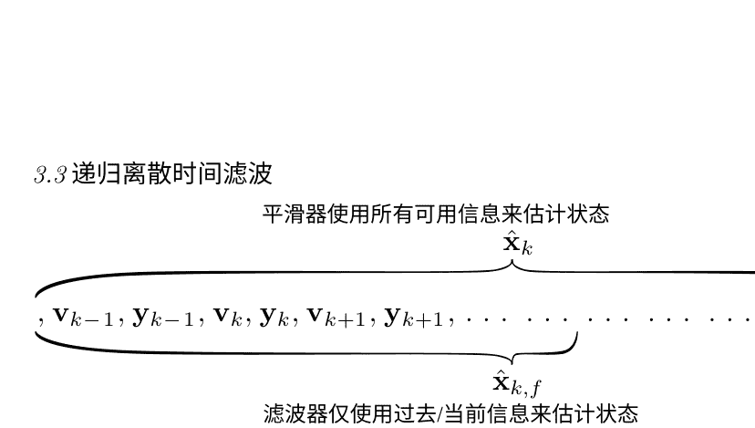

图3.3 批处理LG解决方案是一个平滑器。为了开发一个适用于在线估计的估计器，我们需要一个滤波器。

#### 3.3.1 分解批量解

在我们寻找递归LG估计器时，我们不需要从头开始。事实证明，我们可以重复使用批处理解决方案，并将其精确地分解为两个递归估计器，一个向前运行，另一个向后运行。

向后传递与平滑器部分中呈现的传递有些不同，因为它不是纠正向前传递，而是仅使用未来的测量结果进行估计。

为了为我们的递归解决方案做好准备，我们将重新排序一些批处理解决方案中的变量。我们重新定义 z, H, 和 W 为

$$
z = \begin{bmatrix} \mathbf{x}_0 \\ \mathbf{y}_0 \\ \mathbf{v}_1 \\ \mathbf{y}_1 \\ \mathbf{v}_2 \\ \mathbf{y}_2 \\ \vdots \\ \mathbf{v}_K \\ \mathbf{y}_K \end{bmatrix}, \quad
H = \begin{bmatrix} 
\mathbf{I} & & & \\
\mathbf{C}_0 & & & \\
-\mathbf{A}_0 & \mathbf{I} & & \\
& \mathbf{C}_1 & & \\
& -\mathbf{A}_1 & \mathbf{I} & \\
& & \mathbf{C}_2 & \\
& & \ddots & \ddots \\
& & & -\mathbf{A}_{K-1} & \mathbf{I} \\
& & & & \mathbf{C}_K
\end{bmatrix}
$$

$$
W = \begin{bmatrix} 
\check{\mathbf{P}}_0 & & & & \\
& \mathbf{R}_0 & & & \\
& & \mathbf{Q}_1 & & \\
& & & \mathbf{R}_1 & \\
& & & & \ddots \\
& & & & & \mathbf{Q}_K \\
& & & & & & \mathbf{R}_K
\end{bmatrix}, \quad (3.84)
$$

其中分区线现在显示时间步之间的分割。这种重新排序不会改变 x的顺序，因此 H^T W^{-1} H 仍然是块三对角的。

我们现在考虑概率密度级别的因子分解。

如第3.1.5节所讨论的，我们有一个关于 p(x|v, y) 的表达式。如果我们只想考虑时间 k 的状态，我们可以通过对所有可能值进行积分来边缘化其他状态：

$$p(\mathbf{x}_k | \mathbf{v}, \mathbf{y}) = \int_{\mathbf{x}_{i, \forall i \neq k}} p(\mathbf{x}_0, \dots, \mathbf{x}_K | \mathbf{v}, \mathbf{y}) \, d\mathbf{x}_{i, \forall i \neq k} \tag{3.85}$$

事实证明，我们可以将这个概率密度分解为两部分：

$$p(\mathbf{x}_k | \mathbf{v}, \mathbf{y}) = \eta \, p(\mathbf{x}_k | \check{\mathbf{x}}_0, \mathbf{v}_{1:k}, \mathbf{y}_{0:k}) \, p(\mathbf{x}_k | \mathbf{v}_{k+1:K}, \mathbf{y}_{k+1:K}) \tag{3.86}$$

其中 η 是一个归一化常数，用于强制执行总概率公理。换句话说，我们可以将批处理解决方案分解为两个高斯概率密度函数的归一化乘积，就像在第2.2.6节中讨论的那样。

为了进行这种分解，我们利用了 H 在(3.84)中的稀疏结构。我们首先将 H 分成12个块（其中只有6个非零）：

$$ \mathbf{H} = \left[ \begin{array}{ccc} \mathbf{H}_{11} & & \\ \mathbf{H}_{21} & \mathbf{H}_{22} & \\ & \mathbf{H}_{32} & \mathbf{H}_{33} \\ & & \mathbf{H}_{43} \end{array} \right] \begin{array}{l} \text{信息来自 } 0\dots k-1 \\ \text{信息来自 } k \\ \text{信息来自 } k+1 \\ \text{信息来自 } k+2\dots K \end{array} \quad \begin{array}{c} \uparrow \\ \uparrow \\ \uparrow \\ \end{array} \begin{array}{l} \text{状态来自 } 0\dots k-1 \\ \text{状态来自 } k \\ \text{状态来自 } k+1\dots K \end{array} \tag{3.87}$$

每个块行和块列的大小如上所示。例如，对于 k=2 和 K=4，分区为

$$ \mathbf{H} = \left[ \begin{array}{cccc|c|c} \mathbf{I} & & & & & \\ \mathbf{C}_0 & -\mathbf{A}_0 & \mathbf{I} & & & \\ & & \mathbf{C}_1 & -\mathbf{A}_1 & \mathbf{I} & \\ \hline & & & \mathbf{C}_2 & -\mathbf{A}_2 & \mathbf{I} \\ \hline & & & & \mathbf{C}_3 & -\mathbf{A}_3 \\ & & & & & \mathbf{C}_4 \end{array} \right]. \tag{3.88}$$

我们使用兼容的分区 z 和 W：

$$ \mathbf{z} = \left[ \begin{array}{c} \mathbf{z}_1 \\ \mathbf{z}_2 \\ \mathbf{z}_3 \\ \mathbf{z}_4 \end{array} \right], \quad \mathbf{W} = \left[ \begin{array}{cccc} \mathbf{W}_1 & & & \\ & \mathbf{W}_2 & & \\ & & \mathbf{W}_3 & \\ & & & \mathbf{W}_4 \end{array} \right]. \tag{3.89}$$

### 3.3 递归离散时间滤波

对于 $\mathbf{H}^T \mathbf{W}^{-1} \mathbf{H}$, 我们有

$$
\begin{aligned}
\mathbf{H}^T \mathbf{W}^{-1} \mathbf{H} & = \left[\begin{array}{ccc}
\mathbf{H}_{11}^T \mathbf{W}_1^{-1} \mathbf{H}_{11} + \mathbf{H}_{21}^T \mathbf{W}_2^{-1} \mathbf{H}_{21} & \mathbf{H}_{21}^T \mathbf{W}_2^{-1} \mathbf{H}_{22} & \\
\mathbf{H}_{22}^T \mathbf{W}_2^{-1} \mathbf{H}_{21} & \mathbf{H}_{22}^T \mathbf{W}_2^{-1} \mathbf{H}_{22} + \mathbf{H}_{32}^T \mathbf{W}_3^{-1} \mathbf{H}_{32} & \\
& \mathbf{H}_{33}^T \mathbf{W}_3^{-1} \mathbf{H}_{32} & \\
& & \ddots & \\
& & & \mathbf{H}_{32}^T \mathbf{W}_3^{-1} \mathbf{H}_{33} + \mathbf{H}_{43}^T \mathbf{W}_4^{-1} \mathbf{H}_{43}
\end{array}\right] \\
& = \left[\begin{array}{ccc}
\mathbf{L}_{11} & \mathbf{L}_{12} & \\
\mathbf{L}_{12}^T & \mathbf{L}_{22} & \mathbf{L}_{32}^T \\
& \mathbf{L}_{32} & \mathbf{L}_{33}
\end{array}\right] ,
\end{aligned}
$$

我们将一些有用的中间变量分配给了块，$\mathbf{L}_{ij}$. 对于 $\mathbf{H}^T \mathbf{W}^{-1} \mathbf{z}$, 我们有

$$
\mathbf{H}^T \mathbf{W}^{-1} \mathbf{z} = \left[\begin{array}{c}
\mathbf{H}_{11}^T \mathbf{W}_1^{-1} \mathbf{z}_1 + \mathbf{H}_{21}^T \mathbf{W}_2^{-1} \mathbf{z}_2 \\
\mathbf{H}_{22}^T \mathbf{W}_2^{-1} \mathbf{z}_2 + \mathbf{H}_{32}^T \mathbf{W}_3^{-1} \mathbf{z}_3 \\
\mathbf{H}_{33}^T \mathbf{W}_3^{-1} \mathbf{z}_3 + \mathbf{H}_{43}^T \mathbf{W}_4^{-1} \mathbf{z}_4
\end{array}\right] = \left[\begin{array}{c}
\mathbf{r}_1 \\
\mathbf{r}_2 \\
\mathbf{r}_3
\end{array}\right] ,
$$

在这里，我们将这些块分配给一些有用的中间变量，$\mathbf{r}_i$. 接下来，我们按照以下方式对状态进行分区：

$$
\mathbf{x} = \left[\begin{array}{c}
\mathbf{x}_{0:k-1} \\
\mathbf{x}_k \\
\mathbf{x}_{k+1:K}
\end{array}\right] \begin{array}{l}
\text{从 } 0\dots k-1 \\
\text{从 } k\text{的状态} \\
\text{从 } k+1\dots K
\end{array}
$$

我们的整体批处理方程现在如下所示：

$$
\left[\begin{array}{ccc}
\mathbf{L}_{11} & \mathbf{L}_{12} & \\
\mathbf{L}_{12}^T & \mathbf{L}_{22} & \mathbf{L}_{32}^T \\
& \mathbf{L}_{32} & \mathbf{L}_{33}
\end{array}\right]
\left[\begin{array}{c}
\hat{\mathbf{x}}_{0:k-1} \\
\hat{\mathbf{x}}_k \\
\hat{\mathbf{x}}_{k+1:K}
\end{array}\right]
= \left[\begin{array}{c}
\mathbf{r}_1 \\
\mathbf{r}_2 \\
\mathbf{r}_3
\end{array}\right] ,
$$

在这里，我们添加了$(\hat{ })$以指示这是先前考虑的优化估计问题的解。我们的短期目标是解决$\mathbf{x}_k$的问题，以便在向递归LG估计器迈进时取得进展。

为了隔离$\hat{\mathbf{x}}_k$, 我们通过(3.93)的左乘两边

$$
\left[\begin{array}{ccc}
\mathbf{I} & & \\
-\mathbf{L}_{12}^T \mathbf{L}_{11}^{-1} & \mathbf{I} & -\mathbf{L}_{32}^T \mathbf{L}_{33}^{-1} \\
& & \mathbf{I}
\end{array}\right] ,
$$

可以看作是执行一个初等行变换（因此不会改变(3.93)的解）。得到的系统因此，$\hat{\mathbf{x}}_k$ 的解为

$$
\left(\mathbf{L}_{22} - \mathbf{L}_{12}^T \mathbf{L}_{11}^{-1} \mathbf{L}_{12} - \mathbf{L}_{32}^T \mathbf{L}_{33}^{-1} \mathbf{L}_{32}\right) \hat{\mathbf{x}}_k = \left(\mathbf{r}_2 - \mathbf{L}_{12}^T \mathbf{L}_{11}^{-1} \mathbf{r}_1 - \mathbf{L}_{32}^T \mathbf{L}_{33}^{-1} \mathbf{r}_3\right)
$$

(3.96)我们定义了$\hat{\mathbf{P}}_k$ (通过其逆矩阵) 以及 $\mathbf{q}_k$。我们本质上已经将$\hat{\mathbf{x}}_{0:k-1}$和$\hat{\mathbf{x}}_{k+1:K}$从中消除，就像(3.85)中一样。现在我们可以将 $\mathbf{L}_{ij}$ 块的值代回到 $\hat{\mathbf{P}}_k^{-1}$ 中，以查看

$$
\hat{\mathbf{P}}_k^{-1} = \mathbf{L}_{22} - \mathbf{L}_{12}^T \mathbf{L}_{11}^{-1} \mathbf{L}_{12} - \mathbf{L}_{32}^T \mathbf{L}_{33}^{-1} \mathbf{L}_{32}
= \mathbf{H}_{22}^T \left( \mathbf{W}_2^{-1} - \mathbf{W}_2^{-1} \mathbf{H}_{21} \left( \mathbf{H}_{11}^T \mathbf{W}_1^{-1} \mathbf{H}_{11} + \mathbf{H}_{21}^T \mathbf{W}_2^{-1} \mathbf{H}_{21} \right)^{-1} \mathbf{H}_{21}^T \mathbf{W}_2^{-1} \right) \mathbf{H}_{22}
\\
\underbrace{\hat{\mathbf{P}}_{k,f}^{-1} = \left(\mathbf{W}_2 + \mathbf{H}_{21} \left( \mathbf{H}_{11}^T \mathbf{W}_1^{-1} \mathbf{H}_{11} \right)^{-1} \mathbf{H}_{21}^T \right)^{-1}, \text{通过 (2.75)}}_{}
\\
+ \mathbf{H}_{32}^T \left( \mathbf{W}_3^{-1} - \mathbf{W}_3^{-1} \mathbf{H}_{33} \left( \mathbf{H}_{33}^T \mathbf{W}_3^{-1} \mathbf{H}_{33} + \mathbf{H}_{43}^T \mathbf{W}_4^{-1} \mathbf{H}_{43} \right)^{-1} \mathbf{H}_{43}^T \mathbf{W}_4^{-1} \right) \mathbf{H}_{32}
\\
\underbrace{\hat{\mathbf{P}}_{k,b}^{-1} = \left(\mathbf{W}_3 + \mathbf{H}_{33} \left( \mathbf{H}_{43}^T \mathbf{W}_4^{-1} \mathbf{H}_{43} \right)^{-1} \mathbf{H}_{43}^T \right)^{-1}, \text{通过 (2.75)}}_{}
\\
= \underbrace{\mathbf{H}_{22}^T \hat{\mathbf{P}}_{k,f}^{-1} \mathbf{H}_{22}}_{\text{向前}} + \underbrace{\mathbf{H}_{32}^T \hat{\mathbf{P}}_{k,b}^{-1} \mathbf{H}_{32}}_{\text{向后}}, \quad (3.97)
$$

其中标记为 “向前” 的项仅依赖于 $\mathbf{H}$ 和时间 $k$ 之前的 $\mathbf{W}$ 块，而标记为 “向后” 的项仅依赖于 $\mathbf{H}$ 和 $\mathbf{W}$ 从 $k+1$ 到 $K$ 的块。

现在转向 $\mathbf{q}_k$，我们替换 $\mathbf{L}_{ij}$ 和 $\mathbf{r}_i$ 块的值：

$$
\mathbf{q}_k = \mathbf{r}_2 - \mathbf{L}_{12}^T \mathbf{L}_{11}^{-1} \mathbf{r}_1 - \mathbf{L}_{32}^T \mathbf{L}_{33}^{-1} \mathbf{r}_3
= \underbrace{\mathbf{H}_{22}^T \mathbf{q}_{k,f}}_{\text{向前}} + \underbrace{\mathbf{H}_{32}^T \mathbf{q}_{k,b}}_{\text{向后}} , \quad (3.98)
$$

其中，标记为 “向前” 的项仅依赖于时间 $k$ 之前的量，而标记为 “向后” 的项仅依赖于从时间 $k+1$ 到 $K$ 的量。

### 3.3 递归离散时间滤波

从时间k+1到K。我们使用了以下定义：

$$
\mathbf{q}_{k,f} = -\mathbf{W}_2^{-1}\mathbf{H}_{21} \left( \mathbf{H}_{11}^T \mathbf{W}_1^{-1} \mathbf{H}_{11} + \mathbf{H}_{21}^T \mathbf{W}_2^{-1} \mathbf{H}_{21} \right)^{-1} \mathbf{H}_{11}^T \mathbf{W}_1^{-1} \mathbf{z}_1 + \left( \mathbf{W}_2^{-1} - \mathbf{W}_2^{-1}\mathbf{H}_{21} \left( \mathbf{H}_{11}^T \mathbf{W}_1^{-1} \mathbf{H}_{11} + \mathbf{H}_{21}^T \mathbf{W}_2^{-1} \mathbf{H}_{21} \right)^{-1} \mathbf{H}_{21}^T \mathbf{W}_2^{-1} \right) \mathbf{z}_2,
$$

$$
\mathbf{q}_{k,b} = \left( \mathbf{W}_3^{-1} - \mathbf{W}_3^{-1}\mathbf{H}_{33} \left( \mathbf{H}_{33}^T \mathbf{W}_3^{-1} \mathbf{H}_{33} + \mathbf{H}_{43}^T \mathbf{W}_4^{-1} \mathbf{H}_{43} \right)^{-1} \mathbf{H}_{33}^T \mathbf{W}_3^{-1} \right) \mathbf{z}_3 - \mathbf{W}_3^{-1}\mathbf{H}_{33} \left( \mathbf{H}_{33}^T \mathbf{W}_3^{-1} \mathbf{H}_{33} + \mathbf{H}_{43}^T \mathbf{W}_4^{-1} \mathbf{H}_{43} \right)^{-1} \mathbf{H}_{43}^T \mathbf{W}_4^{-1} \mathbf{z}_4.
$$

现在让我们定义以下两个“向前”和“向后”估计器，分别为$\hat{\mathbf{x}}_{k,f}$和$\hat{\mathbf{x}}_{k,b}$：

$$
\hat{\mathbf{P}}_{k,f}^{-1} \hat{\mathbf{x}}_{k,f} = \mathbf{q}_{k,f},
$$

$$
\hat{\mathbf{P}}_{k,b}^{-1} \hat{\mathbf{x}}_{k,b} = \mathbf{q}_{k,b},
$$

其中$\hat{\mathbf{x}}_{k,f}$仅依赖于时间k之前的量，而$\hat{\mathbf{x}}_{k,b}$仅依赖于时间k+1到K之间的量。在这些定义下，我们有

$$
\hat{\mathbf{P}}_k^{-1} = \mathbf{H}_{22}^T \hat{\mathbf{P}}_{k,f}^{-1} \mathbf{H}_{22} + \mathbf{H}_{32}^T \hat{\mathbf{P}}_{k,b}^{-1} \mathbf{H}_{32},
$$

$$
\hat{\mathbf{x}}_k = \hat{\mathbf{P}}_k \left( \mathbf{H}_{22}^T \hat{\mathbf{P}}_{k,f}^{-1} \hat{\mathbf{x}}_{k,f} + \mathbf{H}_{32}^T \hat{\mathbf{P}}_{k,b}^{-1} \hat{\mathbf{x}}_{k,b} \right),
$$

这正是两个高斯概率密度函数的归一化乘积，如第2.2.6节所讨论的。回顾(3.86)，我们有

$$
p(\mathbf{x}_k | \mathbf{v}, \mathbf{y}) \rightarrow \mathcal{N} \left( \hat{\mathbf{x}}_k, \hat{\mathbf{P}}_k \right),
$$

$$
p(\mathbf{x}_k | \mathbf{x}_0, \mathbf{v}_{1:k}, \mathbf{y}_{0:k}) \rightarrow \mathcal{N} \left( \hat{\mathbf{x}}_{k,f}, \hat{\mathbf{P}}_{k,f} \right),
$$

$$
p(\mathbf{x}_k | \mathbf{v}_{k+1:K}, \mathbf{y}_{k+1:K}) \rightarrow \mathcal{N} \left( \hat{\mathbf{x}}_{k,b}, \hat{\mathbf{P}}_{k,b} \right).
$$

其中$\hat{\mathbf{P}}_k, \hat{\mathbf{P}}_{k,f}$和$\hat{\mathbf{P}}_{k,b}$是与$\hat{\mathbf{x}}_k, \hat{\mathbf{x}}_{k,f}$和$\hat{\mathbf{x}}_{k,b}$相关的协方差。换句话说，我们有具有MAP估计器作为均值的高斯估计器。

在下一节中，我们将讨论如何将前向高斯估计器$\hat{\mathbf{x}}_{k,f}$转化为递归滤波器¹⁶。

#### 3.3.2 通过最大后验的卡尔曼滤波器

在本节中，我们将展示如何使用我们的MAP方法将上一节中的前向估计器转化为递归滤波器，称为卡尔曼滤波器（Kalman，1960b）。为了简化符号，我们将使用$\hat{\mathbf{x}}_k$代替$\hat{\mathbf{x}}_{k,f}$和$\hat{\mathbf{P}}_k$代替$\hat{\mathbf{P}}_{k,f}$，但是这些新符号不应与批处理/平滑估计混淆。

¹⁶ 类似的事情也可以用于向后估计器，但递归是时间上的反向而不是向前的。

之前。让我们假设我们已经有了一个向前的估计和相关的协方差在某个时间 $k-1$: $\left\{\hat{\mathbf{x}}_{k-1}, \hat{\mathbf{P}}_{k-1}\right\}$。请记住，这些估计是基于所有数据，包括时间 $k-1$ 的数据。我们的目标是计算 $\left\{\hat{\mathbf{x}}_{k}, \hat{\mathbf{P}}_{k}\right\}$，使用所有数据，包括时间 $k$ 的数据。事实证明，我们不需要从头开始，而只需将时间 $k$ 的新数据 $\mathbf{v}_{k}$ 和 $\mathbf{y}_{k}$ 合并到时间 $k-1$ 的估计中：$\left\{\hat{\mathbf{x}}_{k-1}, \hat{\mathbf{P}}_{k-1}, \mathbf{v}_{k}, \mathbf{y}_{k}\right\} \rightarrow\left\{\hat{\mathbf{x}}_{k}, \hat{\mathbf{P}}_{k}\right\}$。

为了看清楚这一点，我们定义

$$
\mathbf{z}=\left[\begin{array}{c}
\hat{\mathbf{x}}_{k-1} \\
\mathbf{v}_{k} \\
\mathbf{y}_{k}
\end{array}\right], \quad \mathbf{H}=\left[\begin{array}{cc}
\mathbf{1} & \\
-\mathbf{A}_{k-1} & \mathbf{1} \\
 & \mathbf{C}_{k}
\end{array}\right], \quad \mathbf{W}=\left[\begin{array}{ccc}
\hat{\mathbf{P}}_{k-1} & & \\
 & \mathbf{Q}_{k} & \\
 & & \mathbf{R}_{k}
\end{array}\right],
$$

其中 $\left\{\hat{\mathbf{x}}_{k-1}, \hat{\mathbf{P}}_{k-1}\right\}$ 用于替代时间 $k-1$ 之前的所有数据。

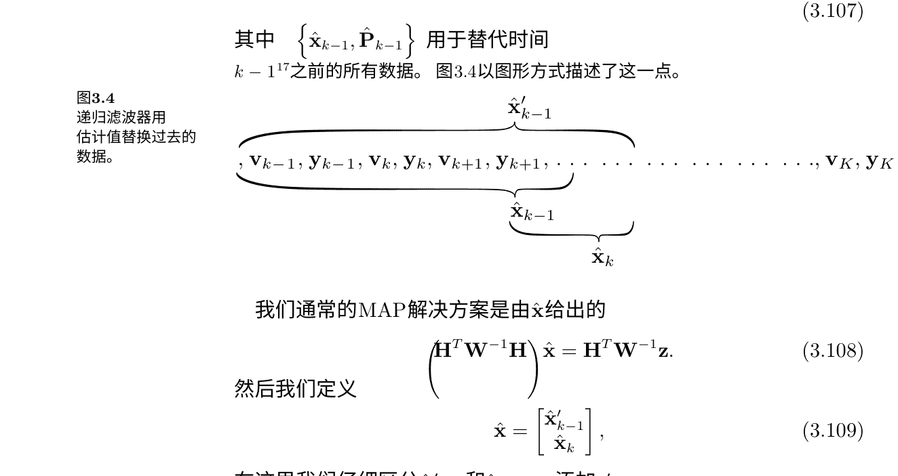

我们通常的MAP解决方案是由$\hat{\mathbf{x}}$给出的

$$
\left(\mathbf{H}^{T} \mathbf{W}^{-1} \mathbf{H}\right) \hat{\mathbf{x}}=\mathbf{H}^{T} \mathbf{W}^{-1} \mathbf{z}.
$$

然后我们定义

$$
\hat{\mathbf{x}}=\left[\begin{array}{c}
\hat{\mathbf{x}}'_{k-1} \\
\hat{\mathbf{x}}_{k}
\end{array}\right],
$$

在这里我们仔细区分$\hat{\mathbf{x}}'_{k-1}$和$\hat{\mathbf{x}}_{k-1}$。添加 ' 表示$\hat{\mathbf{x}}'_{k-1}$是在时间 $k-1$ 时刻根据数据直到时间 $k$ 的估计值，而$\hat{\mathbf{x}}_{k-1}$是在时间 $k-1$ 时刻的估计值。

的数据。将我们从(3.107)到最小二乘解的量代入，我们有

$$
\left[
\begin{array}{cc}
\hat{\mathbf{P}}_{k-1}^{-1} + \mathbf{A}_{k-1}^T \mathbf{Q}_k^{-1} \mathbf{A}_{k-1} & -\mathbf{A}_{k-1}^T \mathbf{Q}_k^{-1} \\
-\mathbf{Q}_k^{-1} \mathbf{A}_{k-1} & \mathbf{Q}_k^{-1} + \mathbf{C}_k^T \mathbf{R}_k^{-1} \mathbf{C}_k
\end{array}
\right]
\left[
\begin{array}{c}
\hat{\mathbf{x}}_{k-1}' \\
\hat{\mathbf{x}}_k
\end{array}
\right]
=
\left[
\begin{array}{c}
\hat{\mathbf{P}}_{k-1}^{-1} \hat{\mathbf{x}}_{k-1} - \mathbf{A}_{k-1}^T \mathbf{Q}_k^{-1} \mathbf{v}_k \\
\mathbf{Q}_k^{-1} \mathbf{v}_k + \mathbf{C}_k^T \mathbf{R}_k^{-1} \mathbf{y}_k
\end{array}
\right]. \quad (3.110)
$$

在这个背景下，我们并不真正关心$\hat{\mathbf{x}}'_{k-1}$是什么，因为我们寻求适用于在线估计的递归估计器，并且这个量包含未来的数据；我们可以通过左乘两边来边缘化它。

$$
\left[
\begin{array}{ccc}
\mathbf{Q}_k^{-1} \mathbf{A}_{k-1} \left( \hat{\mathbf{P}}_{k-1}^{-1} + \mathbf{A}_{k-1}^T \mathbf{Q}_k^{-1} \mathbf{A}_{k-1} \right)^{-1} & 1 & 0 \\
 & & 1
\end{array}
\right], \quad (3.111)
$$

这只是一个基本的行操作，不会改变线性方程组的解$^{18}$。方程（3.110）变为

$$
\left[
\begin{array}{cc}
\hat{\mathbf{P}}_{k-1}^{-1} + \mathbf{A}_{k-1}^T \mathbf{Q}_k^{-1} \mathbf{A}_{k-1} & -\mathbf{A}_{k-1}^T \mathbf{Q}_k^{-1} \\
0 & \mathbf{Q}_k^{-1} - \mathbf{Q}_k^{-1} \mathbf{A}_{k-1} \left( \hat{\mathbf{P}}_{k-1}^{-1} + \mathbf{A}_{k-1}^T \mathbf{Q}_k^{-1} \mathbf{A}_{k-1} \right)^{-1} \times \mathbf{A}_{k-1}^T \mathbf{Q}_k^{-1} + \mathbf{C}_k^T \mathbf{R}_k^{-1} \mathbf{C}_k
\end{array}
\right]
\left[
\begin{array}{c}
\hat{\mathbf{x}}_{k-1}' \\
\hat{\mathbf{x}}_k
\end{array}
\right]
=
\left[
\begin{array}{c}
\hat{\mathbf{P}}_{k-1}^{-1} \hat{\mathbf{x}}_{k-1} - \mathbf{A}_{k-1}^T \mathbf{Q}_k^{-1} \mathbf{v}_k \\
\mathbf{Q}_k^{-1} \mathbf{A}_{k-1} \left( \hat{\mathbf{P}}_{k-1}^{-1} + \mathbf{A}_{k-1}^T \mathbf{Q}_k^{-1} \mathbf{A}_{k-1} \right)^{-1} \left( \hat{\mathbf{P}}_{k-1}^{-1} \hat{\mathbf{x}}_{k-1} - \mathbf{A}_{k-1}^T \mathbf{Q}_k^{-1} \mathbf{v}_k \right) + \mathbf{Q}_k^{-1} \mathbf{v}_k + \mathbf{C}_k^T \mathbf{R}_k^{-1} \mathbf{y}_k
\end{array}
\right]. \quad (3.112)
$$

$\hat{\mathbf{x}}_k$的解为

$$
\begin{aligned}
& \left( \mathbf{Q}_k^{-1} - \mathbf{Q}_k^{-1} \mathbf{A}_{k-1} \left( \hat{\mathbf{P}}_{k-1}^{-1} + \mathbf{A}_{k-1}^T \mathbf{Q}_k^{-1} \mathbf{A}_{k-1} \right)^{-1} \mathbf{A}_{k-1}^T \mathbf{Q}_k^{-1} \right) \hat{\mathbf{x}}_k \\
= & \left( \mathbf{Q}_k^{-1} \mathbf{A}_{k-1} \left( \hat{\mathbf{P}}_{k-1}^{-1} + \mathbf{A}_{k-1}^T \mathbf{Q}_k^{-1} \mathbf{A}_{k-1} \right)^{-1} \times \left( \hat{\mathbf{P}}_{k-1}^{-1} \hat{\mathbf{x}}_{k-1} - \mathbf{A}_{k-1}^T \mathbf{Q}_k^{-1} \mathbf{v}_k \right) + \mathbf{Q}_k^{-1} \mathbf{v}_k + \mathbf{C}_k^T \mathbf{R}_k^{-1} \mathbf{y}_k \right). \quad (3.113)
\end{aligned}
$$

根据 (2.75) 有 $\left( \mathbf{Q}_k + \mathbf{A}_{k-1} \hat{\mathbf{P}}_{k-1} \mathbf{A}_{k-1}^T \right)^{-1}$然后我们定义以下有用的量：

$$
\breve{\mathbf{P}}_k = \mathbf{Q}_k + \mathbf{A}_{k-1}\hat{\mathbf{P}}_{k-1}\mathbf{A}_{k-1}^T, \quad (3.114a)
$$

$$
\hat{\mathbf{P}}_k = \left( \breve{\mathbf{P}}_k^{-1} + \mathbf{C}_k^T \mathbf{R}_k^{-1} \mathbf{C}_k \right)^{-1}, \quad (3.114b)
$$

方程 (3.113) 然后变为

$$
\begin{aligned}
\hat{\mathbf{P}}_k^{-1}\hat{\mathbf{x}}_k &= \mathbf{Q}_k^{-1}\mathbf{A}_{k-1} \left( \hat{\mathbf{P}}_{k-1}^{-1} + \mathbf{A}_{k-1}^T \mathbf{Q}_k^{-1} \mathbf{A}_{k-1} \right)^{-1} \\
&\quad \times \left( \hat{\mathbf{P}}_{k-1}^{-1}\hat{\mathbf{x}}_{k-1} - \mathbf{A}_{k-1}^T \mathbf{Q}_k^{-1} \mathbf{v}_k \right) + \mathbf{Q}_k^{-1} \mathbf{v}_k + \mathbf{C}_k^T \mathbf{R}_k^{-1} \mathbf{y}_k \\
&= \mathbf{Q}_k^{-1}\mathbf{A}_{k-1} \left( \hat{\mathbf{P}}_{k-1}^{-1} + \mathbf{A}_{k-1}^T \mathbf{Q}_k^{-1} \mathbf{A}_{k-1} \right)^{-1} \hat{\mathbf{P}}_{k-1}^{-1} \hat{\mathbf{x}}_{k-1} \\
&\quad + \left( \mathbf{Q}_k^{-1} - \mathbf{Q}_k^{-1} \mathbf{A}_{k-1} \left( \hat{\mathbf{P}}_{k-1}^{-1} + \mathbf{A}_{k-1}^T \mathbf{Q}_k^{-1} \mathbf{A}_{k-1} \right)^{-1} \mathbf{A}_{k-1}^T \mathbf{Q}_k^{-1} \right) \mathbf{v}_k \\
&\quad + \mathbf{C}_k^T \mathbf{R}_k^{-1} \mathbf{y}_k \\
&= \breve{\mathbf{P}}_k^{-1} \left( \mathbf{A}_{k-1} \hat{\mathbf{x}}_{k-1} + \mathbf{v}_k \right) + \mathbf{C}_k^T \mathbf{R}_k^{-1} \mathbf{y}_k, \quad (3.115)
\end{aligned}
$$

我们定义 $\tilde{\mathbf{x}}_k$ 为状态的“预测”值。我们还使用了以下逻辑来简化上述过程：

$$
\begin{aligned}
&\mathbf{Q}_k^{-1}\mathbf{A}_{k-1} \left( \hat{\mathbf{P}}_{k-1}^{-1} + \mathbf{A}_{k-1}^T \mathbf{Q}_k^{-1} \mathbf{A}_{k-1} \right)^{-1} \hat{\mathbf{P}}_{k-1}^{-1} \\
&= \mathbf{Q}_k^{-1}\mathbf{A}_{k-1} \left( \hat{\mathbf{P}}_{k-1} - \hat{\mathbf{P}}_{k-1} \mathbf{A}_{k-1}^T \left( \mathbf{Q}_k + \mathbf{A}_{k-1} \hat{\mathbf{P}}_{k-1} \mathbf{A}_{k-1}^T \right)^{-1} \mathbf{A}_{k-1} \hat{\mathbf{P}}_{k-1} \right) \hat{\mathbf{P}}_{k-1}^{-1} \\
&= \left( \mathbf{Q}_k^{-1} - \mathbf{Q}_k^{-1} \mathbf{A}_{k-1} \hat{\mathbf{P}}_{k-1} \mathbf{A}_{k-1}^T \breve{\mathbf{P}}_k^{-1} \right) \mathbf{A}_{k-1} \\
&= \left( \mathbf{Q}_k^{-1} - \mathbf{Q}_k^{-1} + \breve{\mathbf{P}}_k^{-1} \right) \mathbf{A}_{k-1} \\
&= \hat{\mathbf{P}}_k^{-1} \mathbf{A}_{k-1}, \quad (3.116)
\end{aligned}
$$

将上述所有内容综合起来，我们得到了递归滤波器的更新公式如下：

- 预测器：
  - $\breve{\mathbf{P}}_k = \mathbf{A}_{k-1}\hat{\mathbf{P}}_{k-1}\mathbf{A}_{k-1}^T + \mathbf{Q}_k$, (3.117a)
  - $\breve{\mathbf{x}}_k = \mathbf{A}_{k-1}\hat{\mathbf{x}}_{k-1} + \mathbf{v}_k$, (3.117b)
- 校正器：
  - $\hat{\mathbf{P}}_k^{-1} = \breve{\mathbf{P}}_k^{-1} + \mathbf{C}_k^T \mathbf{R}_k^{-1} \mathbf{C}_k$, (3.117c)
  - $\hat{\mathbf{P}}_k^{-1}\hat{\mathbf{x}}_k = \breve{\mathbf{P}}_k^{-1}\breve{\mathbf{x}}_k + \mathbf{C}_k^T \mathbf{R}_k^{-1}\mathbf{y}_k$, (3.117d)

### 3.3 递归离散时间滤波

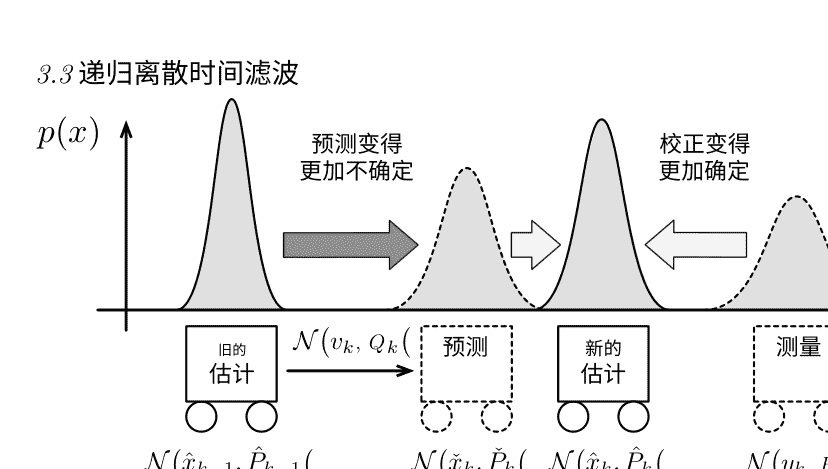

图3.5 卡尔曼滤波器分为两个步骤：预测和校正。预测步骤将旧的估计值，$\hat{x}_{k-1}$，通过使用测量模型和最新的输入，$v_k$，向前推进到预测值，$\check{x}_k$。校正步骤将预测值与最新的测量值，$y_k$，融合在一起得到新的估计值，$\hat{x}_k$；这一步骤使用高斯分布的归一化乘积进行计算（从卡尔曼滤波器的逆协方差版本可以清楚地看出）。

我们将其称为逆协方差或信息形式的卡尔曼滤波器。图3.5以图形方式描述了卡尔曼滤波器的预测-校正形式。

为了达到规范形式，我们稍微调整这些方程。首先定义卡尔曼增益，$\mathbf{K}_k$，如下：

$$
\mathbf{K}_k = \hat{\mathbf{P}}_k \mathbf{C}_k^T \mathbf{R}_k^{-1} \quad (3.118)
$$

然后我们进行如下操作：

$$
\begin{aligned}
1 &= \hat{\mathbf{P}}_k \left( \hat{\mathbf{P}}_k^{-1} + \mathbf{C}_k^T \mathbf{R}_k^{-1} \mathbf{C}_k \right) = \hat{\mathbf{P}}_k \hat{\mathbf{P}}_k^{-1} + \mathbf{K}_k \mathbf{C}_k, \quad (3.119a) \\
\hat{\mathbf{P}}_k &= (1 - \mathbf{K}_k \mathbf{C}_k) \check{\mathbf{P}}_k, \quad (3.119b) \\
\hat{\mathbf{P}}_k \mathbf{C}_k^T \mathbf{R}_k^{-1} &= (1 - \mathbf{K}_k \mathbf{C}_k) \check{\mathbf{P}}_k \mathbf{C}_k^T \mathbf{R}_k^{-1}, \quad (3.119c) \\
\mathbf{K}_k \left( 1 + \mathbf{C}_k \check{\mathbf{P}}_k \mathbf{C}_k^T \mathbf{R}_k^{-1} \right) &= \check{\mathbf{P}}_k \mathbf{C}_k^T \mathbf{R}_k^{-1}. \quad (3.119d)
\end{aligned}
$$

通过求解这个最后一个表达式中的 $\mathbf{K}_k$，我们可以将递归滤波器方程重写为

- **预测器：**
  $$
  \begin{aligned}
  \check{\mathbf{P}}_k &= \mathbf{A}_{k-1} \hat{\mathbf{P}}_{k-1} \mathbf{A}_{k-1}^T + \mathbf{Q}_k, \quad (3.120a) \\
  \check{\mathbf{x}}_k &= \mathbf{A}_{k-1} \hat{\mathbf{x}}_{k-1} + \mathbf{v}_k, \quad (3.120b)
  \end{aligned}
  $$
- **卡尔曼增益：**
  $$
  \mathbf{K}_k = \check{\mathbf{P}}_k \mathbf{C}_k^T \left( \mathbf{C}_k \check{\mathbf{P}}_k \mathbf{C}_k^T + \mathbf{R}_k \right)^{-1}, \quad (3.120c)
  $$
- **校正器：**
  $$
  \begin{aligned}
  \hat{\mathbf{P}}_k &= (1 - \mathbf{K}_k \mathbf{C}_k) \check{\mathbf{P}}_k, \quad (3.120d) \\
  \hat{\mathbf{x}}_k &= \check{\mathbf{x}}_k + \mathbf{K}_k (\mathbf{y}_k - \mathbf{C}_k \check{\mathbf{x}}_k), \quad (3.120e)
  \end{aligned}
  $$

其中创新已经突出显示；它是实际测量值与预期测量值之间的差异。卡尔曼增益的作用是正确权衡创新对估计值的贡献（与预测相比）。以这种形式，这五个方程（以及对非线性系统的扩展）自卡尔曼最初的论文（Kalman, 1960b）以来一直是估计的主要工具。这些是可识别的——与之前讨论的Rauch-Tung-Striebel平滑器的前向传递相对应的计算（省略了 $(.)_f$ 下标）。

#### 3.3.3 通过贝叶斯推断的卡尔曼滤波器

使用我们的贝叶斯推断方法可以得到更清晰、更简单的卡尔曼滤波器推导$^{19}$。我们在 $k-1$ 时刻的高斯先验估计为

$$
p(\mathbf{x}_{k-1}|\mathbf{x}_0, \mathbf{v}_{1:k-1}, \mathbf{y}_{0:k-1}) = \mathcal{N}\left(\hat{\mathbf{x}}_{k-1}, \hat{\mathbf{P}}_{k-1}\right). \qquad (3.121)
$$

首先，在预测步骤中，我们将最新的输入 $\mathbf{v}_k$ 合并进去，得到时刻 $k$ 的‘先验’：

$$
p(\mathbf{x}_{k}|\mathbf{x}_0, \mathbf{v}_{1:k}, \mathbf{y}_{0:k-1}) = \mathcal{N}\left(\breve{\mathbf{x}}_k, \breve{\mathbf{P}}_k\right), \qquad (3.122)
$$

其中

$$
\begin{aligned}
\breve{\mathbf{P}}_k &= \mathbf{A}_{k-1} \hat{\mathbf{P}}_{k-1} \mathbf{A}_{k-1}^T + \mathbf{Q}_k, \qquad & (3.123a) \\
\breve{\mathbf{x}}_k &= \mathbf{A}_{k-1} \hat{\mathbf{x}}_{k-1} + \mathbf{v}_k. \qquad & (3.123b)
\end{aligned}
$$

这些与前一节中的预测方程完全相同。这最后两个表达式可以通过将先前的 $k-1$ 传递给线性运动模型来找到。对于均值，我们有

$$
\begin{aligned}
\breve{\mathbf{x}}_k &= E[\mathbf{x}_k] = E[\mathbf{A}_{k-1} \mathbf{x}_{k-1} + \mathbf{v}_k + \mathbf{w}_k] \\
&= \mathbf{A}_{k-1} E[\mathbf{x}_{k-1}] + \mathbf{v}_k + E[\mathbf{w}_k] = \mathbf{A}_{k-1} \hat{\mathbf{x}}_{k-1} + \mathbf{v}_k, \qquad (3.124)
\end{aligned}
$$

对于协方差，我们有

$$
\begin{aligned}
\breve{\mathbf{P}}_k &= E\left[(\mathbf{x}_k - E[\mathbf{x}_k])(\mathbf{x}_k - E[\mathbf{x}_k])^T\right] \\
&= E\left[(\mathbf{A}_{k-1} \mathbf{x}_{k-1} + \mathbf{v}_k + \mathbf{w}_k - \mathbf{A}_{k-1} \hat{\mathbf{x}}_{k-1} - \mathbf{v}_k) \right. \\
&\qquad\qquad\qquad\qquad\qquad\qquad\qquad\left. \times (\mathbf{A}_{k-1} \mathbf{x}_{k-1} + \mathbf{v}_k + \mathbf{w}_k - \mathbf{A}_{k-1} \hat{\mathbf{x}}_{k-1} - \mathbf{v}_k)^T\right] \\
&= \mathbf{A}_{k-1} E\left[(\mathbf{x}_{k-1} - \hat{\mathbf{x}}_{k-1})(\mathbf{x}_{k-1} - \hat{\mathbf{x}}_{k-1})^T\right] \mathbf{A}_{k-1}^T + E\left[\mathbf{w}_k \mathbf{w}_k^T\right] \\
&= \mathbf{A}_{k-1} \hat{\mathbf{P}}_{k-1} \mathbf{A}_{k-1}^T + \mathbf{Q}_k. \qquad (3.125)
\end{aligned}
$$

接下来，对于校正步骤，我们表达了我们状态的联合密度

$^{19}$ 在下一章中，我们将推广这一部分，介绍能处理非高斯概率分布以及非线性运动和观测模型的贝叶斯滤波器。我们可以将这一部分看作是贝叶斯滤波器的特殊情况，不需要进行任何近似。

并将最新的测量结果，在时间 $k$，表示为一个高斯分布：

$$
\begin{aligned}
p(\mathbf{x}_k, \mathbf{y}_k | \breve{\mathbf{x}}_0, \mathbf{v}_{1:k}, \mathbf{y}_{0:k-1}) &= \mathcal{N}\left( \begin{bmatrix} \boldsymbol{\mu}_x \\ \boldsymbol{\mu}_y \end{bmatrix}, \begin{bmatrix} \boldsymbol{\Sigma}_{xx} & \boldsymbol{\Sigma}_{xy} \\ \boldsymbol{\Sigma}_{yx} & \boldsymbol{\Sigma}_{yy} \end{bmatrix} \right) \\
&= \mathcal{N}\left( \begin{bmatrix} \breve{\mathbf{x}}_k \\ \mathbf{C}_k \breve{\mathbf{x}}_k \end{bmatrix}, \begin{bmatrix} \breve{\mathbf{P}}_k & \breve{\mathbf{P}}_k \mathbf{C}_k^T \\ \mathbf{C}_k \breve{\mathbf{P}}_k & \mathbf{C}_k \breve{\mathbf{P}}_k \mathbf{C}_k^T + \mathbf{R}_k \end{bmatrix} \right).
\end{aligned}
$$ (3.126)

回顾第2.2.3节，我们介绍了贝叶斯推断，然后可以直接写出 $\mathbf{x}_k$（即后验概率）的条件密度函数。

$$
\begin{aligned}
p(\mathbf{x}_k | \breve{\mathbf{x}}_0, \mathbf{v}_{1:k}, \mathbf{y}_{0:k}) &= \mathcal{N}\Big( \underbrace{\boldsymbol{\mu}_x + \boldsymbol{\Sigma}_{xy} \boldsymbol{\Sigma}_{yy}^{-1}(\mathbf{y}_k - \boldsymbol{\mu}_y)}_{\hat{\mathbf{x}}_k}, \underbrace{\boldsymbol{\Sigma}_{xx} - \boldsymbol{\Sigma}_{xy} \boldsymbol{\Sigma}_{yy}^{-1} \boldsymbol{\Sigma}_{yx}}_{\hat{\mathbf{P}}_k} \Big),
\end{aligned}
$$ (3.127)

我们定义 $\hat{\mathbf{x}}_k$ 为均值，$\hat{\mathbf{P}}_k$ 为协方差。将上述的矩代入，我们有

$$
\begin{aligned}
\mathbf{K}_k &= \breve{\mathbf{P}}_k \mathbf{C}_k^T \left( \mathbf{C}_k \breve{\mathbf{P}}_k \mathbf{C}_k^T + \mathbf{R}_k \right)^{-1}, \\
\hat{\mathbf{P}}_k &= (\mathbf{1} - \mathbf{K}_k \mathbf{C}_k) \breve{\mathbf{P}}_k, \\
\hat{\mathbf{x}}_k &= \breve{\mathbf{x}}_k + \mathbf{K}_k (\mathbf{y}_k - \mathbf{C}_k \breve{\mathbf{x}}_k),
\end{aligned}
$$ (3.128a, 3.128b, 3.128c)

这些方程与上一节中的校正方程相同，这是因为运动和测量模型是线性的，噪声和先验是高斯的。在这些条件下，后验密度完全是高斯的。因此，后验的均值和众数是一样的。如果我们转换为非线性的测量模型，这个性质就不成立了，我们将在下一章中讨论。

#### 3.3.4 通过增益优化的卡尔曼滤波器

卡尔曼滤波器通常被称为最优的。我们确实进行了优化，以得出上述MAP推导中的递归关系。还有其他几种看待KF最优性的方法。我们介绍其中一种。

假设我们有一个估计器，其校正步骤采用以下形式

$$ \hat{\mathbf{x}}_k = \breve{\mathbf{x}}_k + \mathbf{K}_k (\mathbf{y}_k - \mathbf{C}_k \breve{\mathbf{x}}_k), $$ (3.129)

但我们还不知道增益矩阵 $\mathbf{K}_k$，用于将校正测量与预测混合。如果我们将状态估计误差定义为

$$ \hat{\mathbf{e}}_k = \hat{\mathbf{x}}_k - \mathbf{x}_k, $$ (3.130)那么我们有20

$$E[\hat{\mathbf{e}}_k\hat{\mathbf{e}}_k^T] = (\mathbf{1} - \mathbf{K}_k \mathbf{C}_k) \check{\mathbf{P}}_k (\mathbf{1} - \mathbf{K}_k \mathbf{C}_k)^T + \mathbf{K}_k \mathbf{R}_k \mathbf{K}_k^T.$$

然后我们定义一个形式为的代价函数

$$J(\mathbf{K}_k) = \frac{1}{2} \operatorname{tr} E[\hat{\mathbf{e}}_k\hat{\mathbf{e}}_k^T] = E\left[\frac{1}{2} \hat{\mathbf{e}}_k^T \hat{\mathbf{e}}_k \right],$$

这在某种程度上量化了 $\hat{\mathbf{e}}_k$ 的协方差的大小。

我们可以直接最小化这个代价关于 $\mathbf{K}_k$ 的值，以生成“最小方差”估计。

我们将利用以下等式

$$\frac{\partial \operatorname{tr} \mathbf{X} \mathbf{Y}}{\partial \mathbf{X}} = \mathbf{Y}^T, \quad \frac{\partial \operatorname{tr} \mathbf{X} \mathbf{Z} \mathbf{X}^T}{\partial \mathbf{X}} = 2 \mathbf{X} \mathbf{Z},$$

其中 $\mathbf{Z}$ 是对称的。然后我们有

$$\frac{\partial J(\mathbf{K}_k)}{\partial \mathbf{K}_k} = -(\mathbf{1} - \mathbf{K}_k \mathbf{C}_k) \check{\mathbf{P}}_k \mathbf{C}_k^T + \mathbf{K}_k \mathbf{R}_k.$$

将其设为零并解出 $\mathbf{K}_k$，我们得到

$$\mathbf{K}_k = \check{\mathbf{P}}_k \mathbf{C}_k^T \left( \mathbf{C}_k \check{\mathbf{P}}_k \mathbf{C}_k^T + \mathbf{R}_k \right)^{-1},$$

这是我们通常用于卡尔曼增益的表达式。

#### 3.3.5 卡尔曼滤波器讨论

有几点值得一提：

- (i) 对于具有高斯噪声的线性系统，卡尔曼滤波器方程是最佳线性无偏估计（BLUE）；这意味着它们在Cramér-Rao下界上表现得很好。
- (ii) 必须提供初始条件，$\{\hat{\mathbf{x}}_0, \check{\mathbf{P}}_0 \}$。
- (iii) 协方差方程可以独立于均值方程进行传播。有时会计算出稳态值 $\mathbf{K}_k$，并在所有时间步骤中用于传播均值；这被称为“稳态卡尔曼滤波器”。
- (iv) 在实现时，我们必须使用从传感器接收到的实际读数 $\mathbf{y}_{k,\text{meas}}$，在滤波器中。
- (v) 可以为向后运行的估计器开发类似的一组方程，该估计器向时间的反方向运行。

值得提醒我们的是，我们通过优化范式和完全贝叶斯范式得到了卡尔曼滤波器方程。当我们考虑非线性情况时，这两者之间的差异将是显著的（以及为什么卡尔曼滤波器的扩展，即扩展卡尔曼滤波器（EKF）在许多情况下表现不佳）。

#### 3.3.6 误差动力学

查看估计状态与实际状态之间的差异很有用。我们定义以下误差：

$$\begin{aligned}\breve{\mathbf{e}}_k &= \breve{\mathbf{x}}_k - \mathbf{x}_k, \quad (3.136a) \\ \hat{\mathbf{e}}_k &= \hat{\mathbf{x}}_k - \mathbf{x}_k. \quad (3.136b)\end{aligned}$$

使用（3.1）和（3.120），我们可以写出“误差动力学”：

$$\begin{aligned}\breve{\mathbf{e}}_k &= \mathbf{A}_{k-1}\breve{\mathbf{e}}_{k-1} - \mathbf{w}_k, \quad (3.137a) \\ \hat{\mathbf{e}}_k &= (\mathbf{1} - \mathbf{K}_k\mathbf{C}_k)\mathbf{e}_k + \mathbf{K}_k\mathbf{n}_k, \quad (3.137b)\end{aligned}$$

我们注意到 $\hat{e}_0 = \hat{x}_0 - x_0$。从这个系统中我们可以看出，只要 $E[\hat{e}_k] = 0$ 对于 $k > 0$，只要 $E[\hat{e}_0] = 0$。这意味着我们的估计器是无偏的。我们可以使用归纳法证明。对于 $k=0$，它是正确的。假设对于 $k-1$，它也是正确的。那么

$$\begin{aligned}E[\breve{\mathbf{e}}_k] &= \mathbf{A}_{k-1}E[\breve{\mathbf{e}}_{k-1}] - E[\mathbf{w}_k] = \mathbf{0}, \quad (3.138a) \\ E[\hat{\mathbf{e}}_k] &= (\mathbf{1} - \mathbf{K}_k\mathbf{C}_k)E[\mathbf{e}_k] + \mathbf{K}_kE[\mathbf{n}_k] = \mathbf{0}. \quad (3.138b)\end{aligned}$$

因此对于所有的 $k$ 都成立。不太明显的是

$$\begin{aligned}E\left[\breve{\mathbf{e}}_k\breve{\mathbf{e}}_k^T\right] &= \tilde{\mathbf{P}}_k, \quad (3.139a) \\ E\left[\hat{\mathbf{e}}_k\hat{\mathbf{e}}_k^T\right] &= \hat{\mathbf{P}}_k, \quad (3.139b)\end{aligned}$$

对于 $k > 0$，只要 $E[\tilde{e}_0 \tilde{e}_0^T] = \tilde{P}_0$，这意味着我们的估计器是一致的。我们再次使用归纳法证明。对于 $k=0$，通过断言是成立的。假设 $E[\tilde{e}_{k-1} \tilde{e}_{k-1}^T] = \tilde{P}_{k-1}$。然后

$$\begin{aligned}E\left[\breve{\mathbf{e}}_k\breve{\mathbf{e}}_k^T\right] &= E\left[(\mathbf{A}_{k-1}\breve{\mathbf{e}}_{k-1} - \mathbf{w}_k)(\mathbf{A}_{k-1}\breve{\mathbf{e}}_{k-1} - \mathbf{w}_k)^T\right] \\&= \mathbf{A}_{k-1}E\left[\breve{\mathbf{e}}_{k-1}\breve{\mathbf{e}}_{k-1}^T\right]\mathbf{A}_{k-1}^T - \mathbf{A}_{k-1}E\left[\breve{\mathbf{e}}_{k-1}\mathbf{w}_k^T\right] \\&\quad - E\left[\mathbf{w}_k\breve{\mathbf{e}}_{k-1}^T\right]\mathbf{A}_{k-1}^T + E\left[\mathbf{w}_k\mathbf{w}_k^T\right] \\&= \tilde{\mathbf{P}}_k, \quad (3.140)\end{aligned}$$

和

$$E \left[ \hat{\mathbf{e}}_k \hat{\mathbf{e}}_k^T \right] = E \left[ \left( (\mathbf{1} - \mathbf{K}_k \mathbf{C}_k) \mathbf{e}_k + \mathbf{K}_k \mathbf{n}_k \right) \left( (\mathbf{1} - \mathbf{K}_k \mathbf{C}_k) \mathbf{e}_k + \mathbf{K}_k \mathbf{n}_k \right)^T \right] \ = (\mathbf{1} - \mathbf{K}_k \mathbf{C}_k) \underbrace{E \left[ \mathbf{e}_k \mathbf{e}_k^T \right]}_{\tilde{\mathbf{P}}_k} (\mathbf{1} - \mathbf{K}_k \mathbf{C}_k)^T \ + (\mathbf{1} - \mathbf{K}_k \mathbf{C}_k) \underbrace{E \left[ \mathbf{e}_k \mathbf{n}_k^T \right]}_{\mathbf{0} \text{由独立性}} \mathbf{K}_k^T \ + \mathbf{K}_k \underbrace{E \left[ \mathbf{n}_k \mathbf{e}_k^T \right]}_{\mathbf{0} \text{由独立性}} (\mathbf{1} - \mathbf{K}_k \mathbf{C}_k)^T + \mathbf{K}_k \underbrace{E \left[ \mathbf{n}_k \mathbf{n}_k^T \right]}_{\mathbf{R}_k} \mathbf{K}_k^T \ = (\mathbf{1} - \mathbf{K}_k \mathbf{C}_k) \tilde{\mathbf{P}}_k (\mathbf{1} - \mathbf{K}_k \mathbf{C}_k)^T + \mathbf{K}_k \mathbf{R}_k \mathbf{K}_k^T \ \underbrace{= \hat{\mathbf{P}}_k}_{\mathbf{0} \text{因为 } \mathbf{K}_k = \tilde{\mathbf{P}}_k \mathbf{C}_k^T \left( \mathbf{C}_k \tilde{\mathbf{P}}_k \mathbf{C}_k^T + \mathbf{R}_k \right)^{-1}}. \quad (3.141)$$

这对于所有 $k$ 都是正确的。 这意味着系统中真正的不确定性（即误差的协方差，$E \left[ \hat{\mathbf{e}}_k \hat{\mathbf{e}}_k^T \right]$）完全由我们对协方差的估计，$\hat{\mathbf{P}}_k$，所建模。从这个意义上说，卡尔曼滤波器是一种最优滤波器。 这就是为什么它有时被称为最佳线性无偏估计（BLUE）的原因。另一种说法是，卡尔曼滤波器的协方差正好位于Cramér-Rao下界；在我们使用的测量不确定性中，我们对估计的确定性不能再更加确定。

最后一个重要的观点是，我们在本节中使用的期望是对随机变量可能的结果进行的。它们不是时间平均值。如果我们运行无限次数的试验并对试验进行平均（即，集合平均），那么我们应该看到零误差的平均性能（即，无偏估计器）。这并不意味着在单次试验（即，实现）中误差将为零或随时间衰减为零。

#### 3.3.7 存在性、唯一性和可观测性

提供了KF稳定性证明的草图（Simon，2006）。我们仅考虑时不变情况，并使用斜体符号以避免与提升形式混淆：$A_k = A$，$C_k = C$，$Q_k = Q$，$R_k = R$。草图的步骤如下：

- +   (i) 在计算均值的方程之前，可以迭代KF的协方差方程收敛。一个重要的问题是协方差是否会收敛到一个稳态值，并且如果是这样，是否会是唯一的。将$\mathbf{P}$表示为$\tilde{\mathbf{P}}_k$的稳态值，通过结合预测和校正协方差方程，我们有以下结果：

在稳态下，必须为真：

$$P = A (1 - KC) P (1 - KC)^T A^T + A K R K^T A^T + Q, \quad (3.142)$$

这是离散代数Riccati方程的一种形式(DARE)。请注意，在上述方程中，K取决于P。如果以下条件成立，DARE有唯一的正半定解P：

- +   - R >0; 请注意，在批处理LG情况下，我们已经假设了这一点，
- - Q ≥0; 在批处理LG情况下，我们实际上假设了 Q >0，此后下一个条件是多余的，
- -(A,V)是可稳定化的，其中 V^T V = Q; 当 Q >0时，此条件是多余的，
- - (A,C)是可检测的；与“可观测性”相同，除了任何不可观测的特征值都是稳定的；我们在批处理LG情况下看到了类似的可观测性条件。

上述陈述的证明超出了本书的范围。

- (ii) 一旦协方差演化到其稳态值 P，卡尔曼增益也会如此。设 K 为 K_k的稳态值。我们有

$$K = P C^T (C P C^T + R)^{-1}, \quad (3.143)$$

对于稳态卡尔曼增益。

- (iii) 滤波器的误差动态是稳定的：

$$E[\tilde{e}_k] = A (1 - KC) E[\tilde{e}_{k-1}], \quad (3.144)$$

特征值的幅值小于1。

我们可以通过注意到对于任何特征向量 v，对应于 (1 - KC)^T A^T的特征值 λ，我们有

$$\begin{aligned}
\mathbf{v}^T P \mathbf{v} &= \mathbf{v}^T A (1 - KC) P (1 - KC)^T A^T \mathbf{v} + \mathbf{v}^T (A K R K^T A^T + Q) \mathbf{v}, \\
(1 - \lambda^2) \mathbf{v}^T P \mathbf{v} &= \mathbf{v}^T (A K R K^T A^T + Q) \mathbf{v},
\end{aligned}$$
\quad (3.145a-b)

这意味着我们必须有 |λ| <1，因此稳态误差动态是稳定的。从技术上讲，右侧可能为零，但经过 N次重复此过程后，我们在右侧建立了可观测性格拉米矩阵的副本，使其可逆（如果系统是可观测的）。

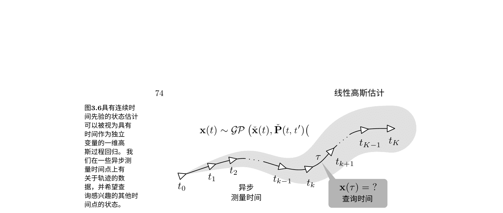

### 3.4 批量连续时间估计

在本节中，我们回顾了比本章前面部分中的离散时间设置更一般的问题。特别地，我们考虑当我们选择使用连续时间运动模型作为先验时会发生什么。我们从高斯过程回归的角度来解决这个问题（Rasmussen和Williams，2006）。我们证明对于线性高斯系统，在某些特殊条件下，离散时间的表述完全实现了连续时间的表述（Tong等，2013；Barfoot等，2014）。

#### 3.4.1 高斯过程回归

我们采用高斯过程回归方法进行状态估计^{21}。这使得我们能够以连续时间表示轨迹（因此可以在任何感兴趣的时间查询解决方案），并且对于我们将在下一章中处理的非线性情况，可以通过迭代整个轨迹来优化我们的解决方案（在递归公式中往往只迭代一个时间步长）。我们将证明，在某种特殊类别的先验运动模型下，高斯过程回归具有稀疏结构，可以实现非常高效的解决方案。

```
x(t) ~ 高斯过程 (ẋ(t), P̃(t, t')), t₀ < t, t'  (3.146)
yₖ = Cₖx(tₖ) + nₖ, t₀ < t₁ < … < tₖ, (3.147)
其中 x(t) 是状态，ẋ(t) 是均值函数，P̃(t, t') 是协方差函数， yₖ是测量值， nₖ ~ N(0, Rₖ) 是高斯测量噪声，而 Cₖ是测量模型系数矩阵。
```

我们考虑在多个时间点查询状态

21 还有其他表示连续时间轨迹的方法，例如时间基函数；详见Furgale等人（2015）的详细评论。

(τ₀ < τ₁ < … < τ_J) 这些时间点可能与测量时间点 (t₀ < t₁ < … < t_K) 相同也可能不同。图3.6描述了我们的问题设置。状态（在查询时间点）和测量值（在测量时间点）之间的联合密度可以表示为

$$ p\left(\begin{bmatrix} \mathbf{x}_\tau \\ \mathbf{y} \end{bmatrix}\right) = \mathcal{N}\left( \begin{bmatrix} \check{\mathbf{x}}_\tau \\ \mathbf{C}\check{\mathbf{x}} \end{bmatrix}, \begin{bmatrix} \check{\mathbf{P}}_{\tau\tau} & \check{\mathbf{P}}_\tau \mathbf{C}^T \\ \mathbf{C}\check{\mathbf{P}}_\tau^T & \mathbf{R} + \mathbf{C}\check{\mathbf{P}}\mathbf{C}^T \end{bmatrix} \right), \quad (3.148) $$

其中

\[ \mathbf{x} = \begin{bmatrix} \mathbf{x}(t_0) \\ \vdots \\ \mathbf{x}(t_K) \end{bmatrix}, \quad \dot{\mathbf{x}} = \begin{bmatrix} \dot{\mathbf{x}}(t_0) \\ \vdots \\ \dot{\mathbf{x}}(t_K) \end{bmatrix}, \quad \mathbf{x}_\tau = \begin{bmatrix} \mathbf{x}(\tau_0) \\ \vdots \\ \mathbf{x}(\tau_J) \end{bmatrix}, \quad \dot{\mathbf{x}}_\tau = \begin{bmatrix} \dot{\mathbf{x}}(\tau_0) \\ \vdots \\ \dot{\mathbf{x}}(\tau_J) \end{bmatrix}, \] \[ \mathbf{y} = \begin{bmatrix} \mathbf{y}_0 \\ \vdots \\ \mathbf{y}_K \end{bmatrix}, \quad \mathbf{C} = \text{diag} (\mathbf{C}_0, \ldots, \mathbf{C}_K), \quad \mathbf{R} = \text{diag} (\mathbf{R}_0, \ldots, \mathbf{R}_K), \] \[ \check{\mathbf{P}} = [\check{\mathbf{P}}(t_i, t_j)]_{ij}, \quad \check{\mathbf{P}}_\tau = [\check{\mathbf{P}}(\tau_i, t_j)]_{ij}, \quad \check{\mathbf{P}}_{\tau\tau} = [\check{\mathbf{P}}(\tau_i, \tau_j)]_{ij}. \]

在GP回归中，矩阵P被称为核矩阵。基于第2.2.3节讨论的因式分解，我们有

$$ p(\mathbf{x}_\tau | \mathbf{y}) = \mathcal{N}\left( \underbrace{ \dot{\mathbf{x}}_\tau + \check{\mathbf{P}}_\tau \mathbf{C}^T ( \mathbf{C} \check{\mathbf{P}} \mathbf{C}^T + \mathbf{R} )^{-1} ( \mathbf{y} - \mathbf{C} \dot{\mathbf{x}} ) }_{\dot{\mathbf{x}}_\tau, \text{均值}}, \underbrace{ \check{\mathbf{P}}_{\tau\tau} - \check{\mathbf{P}}_\tau \mathbf{C}^T ( \mathbf{C} \check{\mathbf{P}} \mathbf{C}^T + \mathbf{R} )^{-1} \mathbf{C} \check{\mathbf{P}}_\tau^T }_{\check{\mathbf{P}}_{\tau\tau}, \text{协方差}} \right), \quad (3.149) $$

对于在查询时间点上的预测状态的密度，给定测量结果。

如果我们将查询时间点取为与测量时间点完全相同（即，τ_k = t_k, K = J），则表达式进一步简化为

$$ \check{\mathbf{P}} = \check{\mathbf{P}}_\tau = \check{\mathbf{P}}_{\tau\tau}, \quad (3.150) $$

然后我们可以写成

$$ p(\mathbf{x} | \mathbf{y}) = \mathcal{N}\left( \underbrace{ \dot{\mathbf{x}} + \check{\mathbf{P}} \mathbf{C}^T ( \mathbf{C} \check{\mathbf{P}} \mathbf{C}^T + \mathbf{R} )^{-1} ( \mathbf{y} - \mathbf{C} \dot{\mathbf{x}} ) }_{\dot{\mathbf{x}}, \text{均值}}, \underbrace{ \check{\mathbf{P}} - \check{\mathbf{P}} \mathbf{C}^T ( \mathbf{C} \check{\mathbf{P}} \mathbf{C}^T + \mathbf{R} )^{-1} \mathbf{C} \check{\mathbf{P}}^T }_{\check{\mathbf{P}}, \text{协方差}} \right). \quad (3.151) $$

或者，在应用SMW恒等式（2.75）之后，我们可以写成这样

$$ p(\mathbf{x}|\mathbf{y}) = \mathcal{N}\left( \left( \check{\mathbf{P}}^{-1} + \mathbf{C}^T \mathbf{R}^{-1} \mathbf{C} \right)^{-1} \left( \check{\mathbf{P}}^{-1} \check{\mathbf{x}} + \mathbf{C}^T \mathbf{R}^{-1} \mathbf{y} \right), \left( \check{\mathbf{P}}^{-1} + \mathbf{C}^T \mathbf{R}^{-1} \mathbf{C} \right)^{-1} \right) $$ (3.152)

重新排列均值表达式，我们得到一个关于$\hat{\mathbf{x}}$的线性系统：

$$ \left( \check{\mathbf{P}}^{-1} + \mathbf{C}^T \mathbf{R}^{-1} \mathbf{C} \right) \hat{\mathbf{x}} = \check{\mathbf{P}}^{-1} \check{\mathbf{x}} + \mathbf{C}^T \mathbf{R}^{-1} \mathbf{y}. $$ (3.153)

这可以看作是以下优化问题的解决方案：

$$ \hat{\mathbf{x}} = \arg \min_{\mathbf{x}} \frac{1}{2} (\check{\mathbf{x}} - \mathbf{x})^T \check{\mathbf{P}}^{-1} (\check{\mathbf{x}} - \mathbf{x}) + \frac{1}{2} (\mathbf{y} - \mathbf{C} \mathbf{x})^T \mathbf{R}^{-1} (\mathbf{y} - \mathbf{C} \mathbf{x}). $$ (3.154)

请注意，在实施时我们必须小心使用 $\mathbf{y}_{\text{meas}}$，即从传感器接收到的实际测量值。

如果在解决测量时间点的估计后，我们后来想要查询其他感兴趣的时间点 ($\tau_0 < \tau_1 < \ldots < \tau_J$)，我们可以使用高斯过程插值方程来实现：

$$ \hat{\mathbf{x}}_\tau = \check{\mathbf{x}}_\tau + \left( \check{\mathbf{P}}_\tau \check{\mathbf{P}}^{-1} \right) (\hat{\mathbf{x}} - \check{\mathbf{x}}), \quad (3.155a) $$
$$ \hat{\mathbf{P}}_{\tau \tau} = \check{\mathbf{P}}_{\tau \tau} + \left( \check{\mathbf{P}}_\tau \check{\mathbf{P}}^{-1} \right) \left( \hat{\mathbf{P}} - \check{\mathbf{P}} \right) \left( \check{\mathbf{P}}_\tau \check{\mathbf{P}}^{-1} \right)^T. \quad (3.155b) $$

这是状态变量的线性插值（但不一定是时间上的插值）。为了得到这些插值方程，我们回到 (3.151) 并重新排列均值和协方差表达式：

$$ \check{\mathbf{P}}^{-1} (\hat{\mathbf{x}} - \check{\mathbf{x}}) = \mathbf{C}^T (\mathbf{C} \check{\mathbf{P}} \mathbf{C}^T + \mathbf{R})^{-1} (\mathbf{y} - \mathbf{C} \check{\mathbf{x}}), \quad (3.156a) $$
$$ \check{\mathbf{P}}^{-1} \left( \hat{\mathbf{P}} - \check{\mathbf{P}} \right) \check{\mathbf{P}}^{-T} = -\mathbf{C}^T (\mathbf{C} \check{\mathbf{P}} \mathbf{C}^T + \mathbf{R})^{-1} \mathbf{C}. \quad (3.156b) $$

然后可以将其代入(3.149)中，

$$ \hat{\mathbf{x}}_\tau = \check{\mathbf{x}}_\tau + \check{\mathbf{P}}_\tau \mathbf{C}^T (\mathbf{C} \check{\mathbf{P}} \mathbf{C}^T + \mathbf{R})^{-1} (\mathbf{y} - \mathbf{C} \check{\mathbf{x}}), \quad (3.157a) $$
$$ \hat{\mathbf{P}}_{\tau \tau} = \check{\mathbf{P}}_{\tau \tau} - \check{\mathbf{P}}_\tau \mathbf{C}^T (\mathbf{C} \check{\mathbf{P}} \mathbf{C}^T + \mathbf{R})^{-1} \mathbf{C} \check{\mathbf{P}}_\tau^T. \quad (3.157b) $$

生成(3.155)。

一般来说，这种高斯过程方法的复杂度为 $O(K^3 + K^2 J)$，因为初始求解的复杂度为 $O(K^3)$，查询的复杂度为 $O(K^2 J)$；这是非常昂贵的，接下来我们将通过利用涉及矩阵的结构来改善成本。

#### 3.4.2 一类精确稀疏的高斯过程先验

接下来，我们将开发一种特殊的高斯过程先验类，以实现非常高效的实现。这些先验基于线性时变的随机微分方程(SDEs):

$$\dot{\mathbf{x}}(t) = \mathbf{A}(t)\mathbf{x}(t) + \mathbf{v}(t) + \mathbf{L}(t)\mathbf{w}(t), \quad\quad\quad (3.158)$$

with

$$\mathbf{w}(t) \sim \text{高斯过程}(\mathbf{0}, \mathbf{Q} \delta(t-t')), \quad\quad\quad (3.159)$$

(stationary) zero-mean GP with (symmetric, positive-definite) power spectral density matrix, $\mathbf{Q}$。在接下来的内容中，我们将采用一种工程方法，避免引入伊藤微积分；我们希望我们的处理方式在形式上缺乏严谨性，但在易于理解性方面弥补了不足。有关估计中随机微分方程的更加正式的处理，请参阅Särkkä (2006)。

这个线性时变常微分方程的一般解是

$$\mathbf{x}(t) = \mathbf{\Phi}(t, t_0)\mathbf{x}(t_0) + \int_{t_0}^{t} \mathbf{\Phi}(t, s) \left( \mathbf{v}(s) + \mathbf{L}(s)\mathbf{w}(s) \right) ds, \quad\quad\quad (3.160)$$

其中 $\mathbf{\Phi}(t, s)$ 被称为过渡函数并具有以下属性:

$$\begin{aligned}
&\mathbf{\Phi}(t, t) = \mathbf{1}, \quad\quad\quad\quad\quad\quad\quad\quad\quad\quad\quad\quad\quad\quad (3.161)\\
&\dot{\mathbf{\Phi}}(t, s) = \mathbf{A}(t)\mathbf{\Phi}(t, s), \quad\quad\quad\quad\quad\quad\quad\quad\quad\quad\quad\quad (3.162)\\
&\mathbf{\Phi}(t, s) = \mathbf{\Phi}(t, r)\mathbf{\Phi}(r, s). \quad\quad\quad\quad\quad\quad\quad\quad\quad\quad\quad\quad\quad (3.163)
\end{aligned}$$

通常情况下，计算系统的过渡函数是直接的，但是没有通用的公式。

##### 均值函数

对于均值函数，我们有

$$E[\mathbf{x}(t)] = \mathbf{\Phi}(t, t_0)E[\mathbf{x}(t_0)] + \int_{t_0}^{t} \mathbf{\Phi}(t, s) \left( \mathbf{v}(s) + \mathbf{L}(s)E[\mathbf{w}(s)] \right) ds, \quad\quad\quad (3.164)$$

其中$\bar{\mathbf{x}}_0$是均值在 $t_0$时刻的初始值。因此，均值函数为

$$\bar{\mathbf{x}}(t) = \mathbf{\Phi}(t, t_0)\bar{\mathbf{x}}_0 + \int_{t_0}^{t} \mathbf{\Phi}(t, s)\mathbf{v}(s) ds. \quad\quad\quad\quad\quad\quad\quad\quad\quad\quad\quad\quad\quad\quad\quad\quad\quad (3.165)$$

如果我们现在有一系列时刻，$t_0 < t_1 < t_2 < \cdots < t_K$，那么我们可以将这些时刻的均值写为

$$\bar{\mathbf{x}}(t_k) = \mathbf{\Phi}(t_k, t_0)\bar{\mathbf{x}}_0 + \sum_{n=1}^{k} \mathbf{\Phi}(t_k, t_n)\mathbf{v}_n, \quad\quad\quad\quad\quad\quad\quad\quad\quad\quad\quad\quad\quad\quad\quad\quad\quad\quad (3.166)$$

Kiyoshi Itō (1915-2008) 是一位日本数学家，他开创了随机积分和随机微分方程的理论，现在被称为伊藤微积分。

其中

$$ \mathbf{v}_k = \int_{t_{k-1}}^{t_k} \Phi(t_k, s) \mathbf{v}(s) \, ds, \quad k = 1 \ldots K. \qquad (3.167) $$

或者我们可以将系统写成 提升形式，

$$ \breve{\mathbf{x}} = \mathbf{A} \mathbf{v}, \qquad (3.168) $$

其中

$$ \breve{\mathbf{x}} = \begin{bmatrix} \breve{\mathbf{x}}(t_0) \\ \breve{\mathbf{x}}(t_1) \\ \vdots \\ \breve{\mathbf{x}}(t_K) \end{bmatrix}, \quad \mathbf{v} = \begin{bmatrix} \breve{\mathbf{x}}_0 \\ \mathbf{v}_1 \\ \vdots \\ \mathbf{v}_K \end{bmatrix}, $$

$$ \mathbf{A} = \begin{bmatrix} 1 & & & & \\ \Phi(t_1, t_0) & 1 & & & \\ \Phi(t_2, t_0) & \Phi(t_2, t_1) & 1 & & \\ \vdots & \vdots & \vdots & \ddots & \\ \Phi(t_{K-1}, t_0) & \Phi(t_{K-1}, t_1) & \Phi(t_{K-1}, t_2) & \cdots & 1 \\ \Phi(t_K, t_0) & \Phi(t_K, t_1) & \Phi(t_K, t_2) & \cdots & \Phi(t_K, t_{K-1}) & 1 \end{bmatrix}. \qquad (3.169) $$

值得注意的是，提升的转移矩阵 A 是下三角形的。

如果我们假设 $ \mathbf{v}(t) = \mathbf{B}(t) \mathbf{u}(t) $，其中 $ \mathbf{u}(t) $ 在测量时间之间保持不变，我们可以进一步简化表达式。设 $ \mathbf{u}_k $ 为 $ t \in (t_{k-1}, t_k] $ 时的常数输入。然后我们可以定义

$$ \mathbf{B} = \operatorname{diag} (1, \mathbf{B}_1, \ldots, \mathbf{B}_K), \quad \mathbf{u} = \begin{bmatrix} \breve{\mathbf{x}}_0 \\ \mathbf{u}_1 \\ \vdots \\ \mathbf{u}_K \end{bmatrix}, \qquad (3.170) $$

和

$$ \mathbf{B}_k = \int_{t_{k-1}}^{t_k} \Phi(t_k, s) \mathbf{B}(s) \, ds, \quad k = 1 \ldots K. \qquad (3.171) $$

这使我们能够写

$$ \breve{\mathbf{x}}(t_k) = \Phi(t_k, t_{k-1}) \breve{\mathbf{x}}(t_{k-1}) + \mathbf{B}_k \mathbf{u}_k, \qquad (3.172) $$

和

$$ \breve{\mathbf{x}} = \mathbf{A} \mathbf{B} \mathbf{u}, \qquad (3.173) $$

对于均值向量.

### 3.4 批量连续时间估计

##### 协方差函数

对于协方差函数，我们有

$$E\left[(\mathbf{x}(t)-E[\mathbf{x}(t)])(\mathbf{x}(t')-E[\mathbf{x}(t')])^T\right]$$
$$= \Phi(t, t_0) E\left[(\mathbf{x}(t_0)-E[\mathbf{x}(t_0)])(\mathbf{x}(t_0)-E[\mathbf{x}(t_0)])^T\right] \Phi(t', t_0)^T$$
$$+ \int_{t_0}^{t} \int_{t_0}^{t'} \Phi(t, s) \mathbf{L}(s) E\left[\mathbf{w}(s) \mathbf{w}(s')^T\right] \mathbf{L}(s')^T \Phi(t', s')^T ds' ds, \quad (3.174)$$

其中 $\tilde{\mathbf{P}}_0$ 是初始协方差，在 $t_0$ 时刻，我们假设 $E[\mathbf{x}(t_0)\mathbf{w}(t)^T] = 0$。将这些放在一起，我们得到协方差的表达式如下：

$$\tilde{\mathbf{P}}(t, t') = \Phi(t, t_0) \tilde{\mathbf{P}}_0 \Phi(t', t_0)^T$$
$$+ \int_{t_0}^{t} \int_{t_0}^{t'} \Phi(t, s) \mathbf{L}(s) \mathbf{Q} \mathbf{L}(s')^T \Phi(t', s')^T \delta(s-s') ds' ds. \quad (3.175)$$

专注于第二项，我们进行一次积分，发现它是

$$\int_{t_0}^{t} \Phi(t, s) \mathbf{L}(s) \mathbf{Q} \mathbf{L}(s)^T \Phi(t', s)^T H(t' - s) ds, \quad (3.176)$$

其中 $H(\cdot)$ 是 Heaviside 阶跃函数。现在有三种情况需要担心：$t < t'$, $t = t'$, 和 $t > t'$. 在第一种情况下，上限终止积分，而在最后一种情况下，Heaviside 阶跃函数完成相同的工作。结果是协方差函数中的第二项可以写成

$$\int_{t_0}^{\min(t,t')} \Phi(t, s) \mathbf{L}(s) \mathbf{Q} \mathbf{L}(s)^T \Phi(t', s)^T ds$$
$$= \begin{cases} \Phi(t, t') \left( \int_{t_0}^{t'} \Phi(t', s) \mathbf{L}(s) \mathbf{Q} \mathbf{L}(s)^T \Phi(t', s)^T ds \right) & t' < t \\ \int_{t_0}^{t} \Phi(t, s) \mathbf{L}(s) \mathbf{Q} \mathbf{L}(s)^T \Phi(t, s)^T ds & t = t' \\ \left( \int_{t_0}^{t} \Phi(t, s) \mathbf{L}(s) \mathbf{Q} \mathbf{L}(s)^T \Phi(t, s)^T ds \right) \Phi(t', t)^T & t < t' \end{cases}. \quad (3.177)$$

如果我们现在有一个时间序列，$t_0 < t_1 < t_2 < \cdots < t_K$，那么我们可以将这些时间之间的协方差写成

$$\tilde{\mathbf{P}}(t_i, t_j) = \begin{cases} \Phi(t_i, t_j) \left( \sum_{n=0}^{j} \Phi(t_j, t_n) \mathbf{Q}_n \Phi(t_j, t_n)^T \right) & t_j < t_i \\ \sum_{n=0}^{i} \Phi(t_i, t_n) \mathbf{Q}_n \Phi(t_i, t_n)^T & t_i = t_j \\ \left( \sum_{n=0}^{i} \Phi(t_i, t_n) \mathbf{Q}_n \Phi(t_i, t_n)^T \right) \Phi(t_j, t_i)^T & t_i < t_j \end{cases} , \quad (3.178)$$其中

$$\mathbf{Q}_k = \int_{t_{k-1}}^{t_k} \Phi(t_k, s) \mathbf{L}(s) \mathbf{Q} \mathbf{L}(s)^T \Phi(t_k, s)^T ds, \quad k = 1 \ldots K, \quad (3.179)$$

我们让 $\mathbf{Q}_0 = \breve{\mathbf{P}}_0$ 以保持 (3.177) 中的符号清晰。

在准备工作完成后，我们现在可以陈述本节的主要结果。设 $t_0 < t_1 < t_2 < \cdots < t_K$ 为一个单调递增的时间值序列。定义核矩阵为

$$\breve{\mathbf{P}} = \begin{bmatrix} \Phi(t_i, t_0) \breve{\mathbf{P}}_0 \Phi(t_j, t_0)^T \\ + \int_{t_0}^{\min(t_i, t_j)} \Phi(t_i, s) \mathbf{L}(s) \mathbf{Q} \mathbf{L}(s)^T \Phi(t_j, s)^T ds \end{bmatrix}_{ij}, \quad (3.180)$$

其中 $\mathbf{Q} > 0$ 是对称的。注意 $\breve{\mathbf{P}}$ 有 $(K+1) \times (K+1)$ 个块。

然后，我们可以根据块下三角上分解对 $\breve{\mathbf{P}}$ 进行因式分解：

$$\breve{\mathbf{P}} = \mathbf{A} \mathbf{Q} \mathbf{A}^T, \quad (3.181)$$

其中 $\mathbf{A}$ 是根据(3.169)给出的下三角矩阵，而

$$\mathbf{Q}_k = \int_{t_{k-1}}^{t_k} \Phi(t_k, s) \mathbf{L}(s) \mathbf{Q} \mathbf{L}(s)^T \Phi(t_k, s)^T ds, \quad k = 1 \ldots K, \quad (3.182)$$

$$\mathbf{Q} = \operatorname{diag} \left( \breve{\mathbf{P}}_0, \mathbf{Q}_1, \mathbf{Q}_2, \ldots, \mathbf{Q}_K \right). \quad (3.183)$$

由此可得，$\breve{\mathbf{P}}^{-1}$ 是块三对角矩阵，给出如下：

$$\breve{\mathbf{P}}^{-1} = (\mathbf{A} \mathbf{Q} \mathbf{A}^T)^{-1} = \mathbf{A}^{-T} \mathbf{Q}^{-1} \mathbf{A}^{-1}, \quad (3.184)$$

其中

$$\mathbf{A}^{-1} = \begin{bmatrix} 1 & & & \\ -\Phi(t_1, t_0) & 1 & & \\ & -\Phi(t_2, t_1) & 1 & \\ & & \ddots & \ddots \\ & & & -\Phi(t_K, t_{K-1}) & 1 \end{bmatrix}. \quad (3.185)$$

由于 $\mathbf{A}^{-1}$ 只有主对角线和下方的一个非零元素，而 $\mathbf{Q}^{-1}$ 是块对角线矩阵，通过乘法可以验证 $\breve{\mathbf{P}}^{-1}$ 的块三对角结构。这正是我们在本章开始时批量离散时间情况下的结构。

##### 先验总结

我们可以将最终的GP写成 $\mathbf{x}(t)$。

$$\mathbf{x}(t) \sim \mathcal{GP}\left( \underbrace{\boldsymbol{\Phi}(t, t_0)\mathbf{x}_0 + \int_{t_0}^t \boldsymbol{\Phi}(t, s)\mathbf{v}(s) \, ds}_{\tilde{\mathbf{x}}(t)}, \underbrace{\boldsymbol{\Phi}(t, t_0)\mathbf{P}_0\boldsymbol{\Phi}(t', t_0)^T + \int_{t_0}^{\min(t,t')} \boldsymbol{\Phi}(t, s)\mathbf{L}(s)\mathbf{Q}\mathbf{L}(s)^T\boldsymbol{\Phi}(t', s)^T \, ds}_{\mathbf{\tilde{P}}(t,t')}\right). \quad (3.186)$$

在测量时间点, $t_0 < t_1 < \cdots < t_K$, 我们也可以写成

$$\mathbf{x} \sim \mathcal{N}(\tilde{\mathbf{x}}, \tilde{\mathbf{P}}) = \mathcal{N} \left( \mathbf{A}\mathbf{v}, \mathbf{A}\mathbf{Q}\mathbf{A}^T \right), \quad (3.187)$$

并且在输入在测量时间点之间是恒定的情况下, 我们可以进一步替换 $\mathbf{v} = \mathbf{B}\mathbf{u}$。

##### 查询高斯过程

如上所述, 如果我们在测量时间点解决轨迹问题, 我们可能还想在其他感兴趣的时间查询它. 这可以通过GP线性插值方程(3.155)来实现. 不失一般性, 我们考虑一个单一的查询时间, $t_k \leq \tau < t_{k+1}$, 在这种情况下我们写成

$$\hat{\mathbf{x}}(\tau) = \tilde{\mathbf{x}}(\tau) + \tilde{\mathbf{P}}(\tau)\tilde{\mathbf{P}}^{-1}(\hat{\mathbf{x}} - \tilde{\mathbf{x}}), \quad (3.188a)$$
$$\hat{\mathbf{P}}(\tau, \tau) = \tilde{\mathbf{P}}(\tau, \tau) + \tilde{\mathbf{P}}(\tau)\tilde{\mathbf{P}}^{-1} \left( \hat{\mathbf{P}} - \tilde{\mathbf{P}} \right) \tilde{\mathbf{P}}^{-T}\tilde{\mathbf{P}}(\tau)^T. \quad (3.188b)$$

对于查询时间的均值函数, 我们只需要

$$\tilde{\mathbf{x}}(\tau) = \boldsymbol{\Phi}(\tau, t_k)\tilde{\mathbf{x}}(t_k) + \int_{t_k}^{\tau} \boldsymbol{\Phi}(\tau, s)\mathbf{v}(s) \, ds, \quad (3.189)$$

其评估的复杂度为 $O(1)$。对于查询时间的协方差函数, 我们有

$$\tilde{\mathbf{P}}(\tau, \tau) = \boldsymbol{\Phi}(\tau, t_k)\tilde{\mathbf{P}}(t_k, t_k)\boldsymbol{\Phi}(\tau, t_k)^T + \int_{t_k}^{\tau} \boldsymbol{\Phi}(\tau, s)\mathbf{L}(s)\mathbf{Q}\mathbf{L}(s)^T\boldsymbol{\Phi}(\tau, s)^T \, ds, \quad (3.190)$$

这也是 $O(1)$ 来评估的。

我们现在来研究在一般的LTV过程模型中, 乘积$\tilde{\mathbf{P}}(\tau)\tilde{\mathbf{P}}^{-1}$的稀疏性。矩阵$\tilde{\mathbf{P}}(\tau)$可以写成

$$\tilde{\mathbf{P}}(\tau) = \left[ \tilde{\mathbf{P}}(\tau, t_0) \quad \tilde{\mathbf{P}}(\tau, t_1) \quad \cdots \quad \tilde{\mathbf{P}}(\tau, t_K) \right]. \quad (3.191)$$

每个单独的块由给出

$$\breve{\mathbf{P}}(\tau, t_j) = 
\begin{cases}
\boldsymbol{\Phi}(\tau, t_k) \boldsymbol{\Phi}(t_k, t_j) \left( \sum_{n=0}^{k} \boldsymbol{\Phi}(t_j, t_n) \mathbf{Q}_n \boldsymbol{\Phi}(t_j, t_n)^T \right) & t_j < t_k \\
\boldsymbol{\Phi}(\tau, t_k) \left( \sum_{n=0}^{k} \boldsymbol{\Phi}(t_k, t_n) \mathbf{Q}_n \boldsymbol{\Phi}(t_k, t_n)^T \right) & t_k = t_j \\
\boldsymbol{\Phi}(\tau, t_k) \left( \sum_{n=0}^{k} \boldsymbol{\Phi}(t_k, t_n) \mathbf{Q}_n \boldsymbol{\Phi}(t_k, t_n)^T \right) \boldsymbol{\Phi}(t_{k+1}, t_k)^T + \mathbf{Q}_\tau \boldsymbol{\Phi}(t_{k+1}, \tau)^T & t_{k+1} = t_j \\
\boldsymbol{\Phi}(\tau, t_k) \left( \sum_{n=0}^{k} \boldsymbol{\Phi}(t_k, t_n) \mathbf{Q}_n \boldsymbol{\Phi}(t_k, t_n)^T \right) \boldsymbol{\Phi}(t_j, t_k)^T + \mathbf{Q}_\tau \boldsymbol{\Phi}(t_{k+1}, \tau)^T \boldsymbol{\Phi}(t_j, t_{k+1})^T & t_{k+1} < t_j
\end{cases}
\quad (3.192)$$

其中

$$\mathbf{Q}_\tau = \int_{t_k}^{\tau} \boldsymbol{\Phi}(\tau, s) \mathbf{L}(s) \mathbf{Q} \mathbf{L}(s)^T \boldsymbol{\Phi}(\tau, s)^T ds. \quad (3.193)$$

虽然这看起来很难处理，我们可以写成

$$\breve{\mathbf{P}}(\tau) = \mathbf{V}(\tau) \mathbf{A}^T, \quad (3.194)$$

其中 $\mathbf{A}$ 之前已经定义过，

$$\mathbf{V}(\tau) = \left[\begin{array}{cccccc}
\boldsymbol{\Phi}(\tau, t_k) \boldsymbol{\Phi}(t_k, t_0) \breve{\mathbf{P}}_0 & \boldsymbol{\Phi}(\tau, t_k) \boldsymbol{\Phi}(t_k, t_1) \mathbf{Q}_1 & \cdots & \boldsymbol{\Phi}(\tau, t_k) \boldsymbol{\Phi}(t_k, t_{k-1}) \mathbf{Q}_{k-1} & \boldsymbol{\Phi}(\tau, t_k) \mathbf{Q}_k & \mathbf{Q}_\tau \boldsymbol{\Phi}(t_{k+1}, \tau)^T \\
\cdots & 0 & \cdots & 0
\end{array}\right]. \quad (3.195)$$

回到期望的产品，我们有

$$\breve{\mathbf{P}}(\tau) \breve{\mathbf{P}}^{-1} = \mathbf{V}(\tau) \underbrace{\mathbf{A}^T \mathbf{A}^{-T}}_{\mathbf{I}} \mathbf{Q}^{-1} \mathbf{A}^{-1} = \mathbf{V}(\tau) \mathbf{Q}^{-1} \mathbf{A}^{-1}. \quad (3.196)$$

由于 $\mathbf{Q}^{-1}$ 是块对角矩阵， $\mathbf{A}^{-1}$ 只有主对角线和下方的非零元素，我们可以非常高效地计算乘积。
计算结果如下

$$\breve{\mathbf{P}}(\tau) \breve{\mathbf{P}}^{-1} = \left[\begin{array}{cccccc}
\mathbf{0} & \cdots & \mathbf{0} & \underbrace{\boldsymbol{\Phi}(\tau, t_k) - \mathbf{Q}_\tau \boldsymbol{\Phi}(t_{k+1}, \tau)^T \mathbf{Q}_{k+1}^{-1} \boldsymbol{\Phi}(t_{k+1}, t_k)}_{\Lambda(\tau), \text{块列}} & \cdots & \underbrace{\mathbf{Q}_\tau \boldsymbol{\Phi}(t_{k+1}, \tau)^T \mathbf{Q}_{k+1}^{-1}}_{\Psi(\tau), \text{块列}} & \mathbf{0} & \cdots & \mathbf{0}
\end{array}\right], \quad (3.197)$$

它恰好有两个非零的块列。 将其插入到(3.188)中，我们有

$$\hat{\mathbf{x}}(\tau) = \breve{\mathbf{x}}(\tau) + \left[\begin{array}{cc}\Lambda(\tau) & \Psi(\tau)\end{array}\right] \left( \begin{bmatrix} \hat{\mathbf{x}}_k \\ \hat{\mathbf{x}}_{k+1} \end{bmatrix} - \begin{bmatrix} \breve{\mathbf{x}}(t_k) \\ \breve{\mathbf{x}}(t_{k+1}) \end{bmatrix} \right), \quad (3.198a)$$

$$\hat{\mathbf{P}}(\tau, \tau) = \breve{\mathbf{P}}(\tau, \tau) + \left[\begin{array}{cc}\Lambda(\tau) & \Psi(\tau)\end{array}\right] \left( \begin{bmatrix} \hat{\mathbf{P}}_{k,k} & \hat{\mathbf{P}}_{k,k+1} \\ \hat{\mathbf{P}}_{k+1,k} & \hat{\mathbf{P}}_{k+1,k+1} \end{bmatrix} - \begin{bmatrix} \breve{\mathbf{P}}(t_k, t_k) & \breve{\mathbf{P}}(t_k, t_{k+1}) \\ \breve{\mathbf{P}}(t_{k+1}, t_k) & \breve{\mathbf{P}}(t_{k+1}, t_{k+1}) \end{bmatrix} \right) \begin{bmatrix} \Lambda(\tau)^T \\ \Psi(\tau)^T \end{bmatrix}, \quad (3.198b)$$

### 3.4 批量连续时间估计

这是一个简单的组合，只包含来自 $t_k$ 和 $t_{k+1}$ 的两个项。因此，查询感兴趣的单个时间点的轨迹的复杂度为 $O(1)$。

例 3.1 作为一个简单的例子，考虑系统

$$\dot{\mathbf{x}}(t) = \mathbf{w}(t)$$

可以写成

$$\dot{\mathbf{x}}(t) = \mathbf{A}(t)\mathbf{x}(t) + \mathbf{v}(t) + \mathbf{L}(t)\mathbf{w}(t)$$

在这种情况下，查询方程变为

$$\hat{\mathbf{x}}_\tau = (1 - \alpha) \hat{\mathbf{x}}_k + \alpha \hat{\mathbf{x}}_{k+1}$$

假设均值函数在任何地方都为零，其中

$$\alpha = \frac{\tau - t_k}{t_{k+1} - t_k} \in [0,1]$$

这是一个熟悉的插值方案，它在 $\tau$ 上是线性的。更复杂的过程模型导致更复杂的插值方程。

#### 3.4.3 线性时不变情况

当然，在线性时不变（LTI）情况下，方程大大简化：

$$\dot{\mathbf{x}}(t) = \mathbf{A}\mathbf{x}(t) + \mathbf{B}\mathbf{u}(t) + \mathbf{L}\mathbf{w}(t)$$

具有 $\mathbf{A}$, $\mathbf{B}$ 和 $\mathbf{L}$ 常数$^{22}$。过渡函数简单地是

$$\Phi(t, s) = \exp(\mathbf{A}(t - s))$$

我们注意到它仅取决于两个时间的差异（即，它是平稳的）。因此，我们可以写成，

$$\Delta t_{k:k-1} = t_k - t_{k-1}, \quad k = 1 \ldots K,$$
$$\Phi(t_k, t_{k-1}) = \exp(\mathbf{A} \Delta t_{k:k-1}), \quad k = 1 \ldots K,$$
$$\Phi(t_k, t_j) = \Phi(t_k, t_{k-1})\Phi(t_{k-1}, t_{k-2}) \cdots \Phi(t_{j+1}, t_j)$$

为了简化问题。

##### 均值函数

对于均值函数，我们有以下简化：

```
v_k = \int_0^{\Delta t_{k:k-1}} \exp\left(A(\Delta t_{k:k-1} - s)\right) B u(s) ds, \quad k=1 \ldots K. \tag{3.208}
```

如果我们假设 \mathbf{u}(t)在每对连续测量时间之间是恒定的，我们可以进一步简化表达式。设 \mathbf{u}_k为 t \in (t_{k-1}, t_k] 时的恒定输入。然后我们可以定义

```
\mathbf{B} = \mathrm{diag}(\mathbf{1}, \mathbf{B}_1, \ldots, \mathbf{B}_M), \quad \mathbf{u} = \begin{bmatrix} \dot{\mathbf{x}}_0 \\ \mathbf{u}_1 \\ \vdots \\ \mathbf{u}_M \end{bmatrix}, \tag{3.209}
```

和

```
\mathbf{B}_k = \int_0^{\Delta t_{k:k-1}} \exp\left(A(\Delta t_{k:k-1} - s)\right) ds \, \mathbf{B} = \Phi(t_k, t_{k-1}) \left( \mathbf{1} - \Phi(t_k, t_{k-1})^{-1} \right) A^{-1} \mathbf{B}, \quad k=1 \ldots K. \tag{3.210}
```

这使我们能够写

```
\dot{\mathbf{x}} = \mathbf{A} \mathbf{B} \mathbf{u} \tag{3.211}
```

对于均值向量。

##### 协方差函数

对于协方差函数，我们有简化

```
\mathbf{Q}_k = \int_0^{\Delta t_{k:k-1}} \exp\left(A(\Delta t_{k:k-1} - s)\right) \mathbf{L} \mathbf{Q} \mathbf{L}^T \exp\left(A(\Delta t_{k:k-1} - s)\right)^T ds \tag{3.212}
```

对于 k=1 \ldots K。这相对容易评估，特别是如果 A 是幂零的。让

```
\mathbf{Q} = \mathrm{diag}(\breve{\mathbf{P}}_0, \mathbf{Q}_1, \mathbf{Q}_2, \ldots, \mathbf{Q}_K), \tag{3.213}
```

然后我们有

```
\breve{\mathbf{P}} = \mathbf{A} \mathbf{Q} \mathbf{A}^T, \tag{3.214}
```

对于协方差矩阵。

##### 查询高斯过程

要查询GP，我们需要以下数量：

```math
\Phi(t_{k+1}, \tau) = \exp (A \Delta t_{k+1:\tau}), \quad \Delta t_{k+1:\tau} = t_{k+1} - \tau \tag{3.215}
```

```math
\Phi(\tau, t_k) = \exp (A \Delta t_{\tau:k}), \quad \Delta t_{\tau:k} = \tau - t_k \tag{3.216}
```

```math
Q_\tau = \int_0^{\Delta t_{\tau:k}} \exp (A(\Delta t_{\tau:k} - s)) L Q L^T \exp \left(A(\Delta t_{\tau:k} - s)^T\right) ds \tag{3.217}
```

我们的插值方程仍然是

```math
\hat{\mathbf{x}}(\tau) = \hat{\mathbf{x}}(\tau) + \left( \Phi(\tau, t_k) - Q_\tau \Phi(t_{k+1}, \tau)^T Q_{k+1}^{-1} \Phi(t_{k+1}, t_k) \right) (\hat{\mathbf{x}}_k - \bar{\mathbf{x}}_k) + Q_\tau \Phi(t_{k+1}, \tau)^T Q_{k+1}^{-1} (\hat{\mathbf{x}}_{k+1} - \bar{\mathbf{x}}_{k+1}) \tag{3.218}
```

这是仅来自 $t_k$ 和 $t_{k+1}$ 的两个项的线性组合。

##### 例子 3.2 考虑这种情况

```math
\ddot{\mathbf{p}}(t) = \mathbf{w}(t) \tag{3.219}
```

其中 $\mathbf{p}(t)$ 对应位置和

```math
\mathbf{w}(t) \sim \text{高斯过程} (\mathbf{0}, Q \delta(t - t')) \tag{3.220}
```

仍然是白噪声。这对应于加速度上的白噪声 (即“恒定速度”模型)。我们可以将其表示为

```math
\dot{\mathbf{x}}(t) = A\mathbf{x}(t) + B\mathbf{u}(t) + L\mathbf{w}(t) \tag{3.221}
```

通过取

```math
\mathbf{x}(t) = \begin{bmatrix} \mathbf{p}(t) \\ \dot{\mathbf{p}}(t) \end{bmatrix}, \quad A = \begin{bmatrix} 0 & 1 \\ 0 & 0 \end{bmatrix}, \quad B = \mathbf{0}, \quad L = \begin{bmatrix} 0 \\ 1 \end{bmatrix}. \tag{3.222}
```

在这种情况下，我们有

```math
\exp (A\Delta t) = 1 + A\Delta t + \frac{1}{2} A^2 \Delta t^2 + \cdots = 1 + \begin{bmatrix} 0 & 1 \\ 0 & 0 \end{bmatrix} \Delta t = \begin{bmatrix} 1 & \Delta t \\ 0 & 1 \end{bmatrix}, \tag{3.223}
```

因为 $A$ 是幂零的。因此，我们有

```math
\Phi(t_k, t_{k-1}) = \begin{bmatrix} 1 & \Delta t_{k:k-1} \\ 0 & 1 \end{bmatrix}. \tag{3.224}
```

对于 $Q_k$ 我们有

```math
Q_k = \int_0^{\Delta t_{k:k-1}} \begin{bmatrix} 1 & (\Delta t_{k:k-1} - s) \\ 0 & 1 \end{bmatrix} \begin{bmatrix} 0 \\ 1 \end{bmatrix} Q \begin{bmatrix} 0 & 1 \end{bmatrix} \begin{bmatrix} 1 & 0 \\ (\Delta t_{k:k-1} - s) & 1 \end{bmatrix} ds \\
= \int_0^{\Delta t_k} \begin{bmatrix} (\Delta t_{k:k-1} - s)^2 Q & (\Delta t_{k:k-1} - s) Q \\ (\Delta t_{k:k-1} - s) Q & Q \end{bmatrix} ds \\
= \begin{bmatrix} \frac{1}{3} \Delta t_{k:k-1}^3 Q & \frac{1}{2} \Delta t_{k:k-1}^2 Q \\ \frac{1}{2} \Delta t_{k:k-1}^2 Q & \Delta t_{k:k-1} Q \end{bmatrix}, \tag{3.225}
```

我们注意到这是正定的，尽管 $LQL^T$ 不是。逆矩阵是

```math
\mathbf{Q}_k^{-1} = \begin{bmatrix} 12 \Delta t_{k:k-1}^{-3} \mathbf{Q}^{-1} & -6 \Delta t_{k:k-1}^{-2} \mathbf{Q}^{-1} \\ -6 \Delta t_{k:k-1}^{-2} \mathbf{Q}^{-1} & 4 \Delta t_{k:k-1}^{-1} \mathbf{Q}^{-1} \end{bmatrix}, \quad (3.226)
```

这是构建 $\breve{P}^{-1}$ 所需的。对于均值函数，我们有

```math
\breve{\mathbf{x}}_k = \Phi(t_k, t_0)\breve{\mathbf{x}}_0, \quad k=1 \ldots K, \quad (3.227)
```

这可以堆叠并写成

```math
\breve{\mathbf{x}} = \mathbf{A} \begin{bmatrix} \breve{\mathbf{x}}_0 \\ \mathbf{0} \\ \vdots \\ \mathbf{0} \end{bmatrix}, \quad (3.228)
```

为了方便起见。对于轨迹查询，我们还需要

```math
\Phi(\tau, t_k) = \begin{bmatrix} 1 & \Delta t_{\tau:k} \\ 0 & 1 \end{bmatrix}, \quad \Phi(t_{k+1}, \tau) = \begin{bmatrix} 1 & \Delta t_{k+1:\tau} \\ 0 & 1 \end{bmatrix}, \\
\breve{\mathbf{x}}_\tau = \Phi(\tau, t_k)\breve{\mathbf{x}}_k, \quad \mathbf{Q}_\tau = \begin{bmatrix} \frac{1}{3} \Delta t_{\tau:k}^3 \mathbf{Q} & \frac{1}{2} \Delta t_{\tau:k}^2 \mathbf{Q} \\ \frac{1}{2} \Delta t_{\tau:k}^2 \mathbf{Q} & \Delta t_{\tau:k} \mathbf{Q} \end{bmatrix}, \quad (3.229)
```

我们可以看到，这将导致一个在 $\tau$ 中不是线性的方案。将其代入插值方程，我们有

```math
\hat{\mathbf{x}}_\tau = \breve{\mathbf{x}}_\tau + \left( \Phi(\tau, t_k) - \mathbf{Q}_\tau \Phi(t_{k+1}, \tau)^T \mathbf{Q}_{k+1}^{-1} \Phi(t_{k+1}, t_k) \right) (\hat{\mathbf{x}}_k - \breve{\mathbf{x}}_k) \\
\quad + \mathbf{Q}_\tau \Phi(t_{k+1}, \tau)^T \mathbf{Q}_{k+1}^{-1} (\hat{\mathbf{x}}_{k+1} - \breve{\mathbf{x}}_{k+1}) \\
= \breve{\mathbf{x}}_\tau + \left[ \begin{array}{c} (1 - 3\alpha^2 + 2\alpha^3)\mathbf{1} \quad T(\alpha - 2\alpha^2 + \alpha^3)\mathbf{1} \\ \frac{1}{T} 6(-\alpha + \alpha^2)\mathbf{1} \quad (1 - 4\alpha + 3\alpha^2)\mathbf{1} \end{array} \right] (\hat{\mathbf{x}}_k - \breve{\mathbf{x}}_k) \\
\quad + \left[ \begin{array}{c} (3\alpha^2 - 2\alpha^3)\mathbf{1} \quad T(-\alpha^2 + \alpha^3)\mathbf{1} \\ \frac{1}{T} 6(\alpha - \alpha^2)\mathbf{1} \quad (-2\alpha + 3\alpha^2)\mathbf{1} \end{array} \right] (\hat{\mathbf{x}}_{k+1} - \breve{\mathbf{x}}_{k+1}), \quad (3.230)
```

其中

```math
\alpha = \frac{\tau - t_k}{t_{k+1} - t_k} \in [0,1], \quad T = \Delta t_{k+1:k} = t_{k+1} - t_k. \quad (3.231)
```

值得注意的是，顶行（对应位置）恰好是一个三次埃尔米特多项式插值：

```math
\hat{\mathbf{p}}_\tau - \breve{\mathbf{p}}_\tau = h_{00}(\alpha)(\hat{\mathbf{p}}_k - \breve{\mathbf{p}}_k) + h_{10}(\alpha)T(\hat{\mathbf{p}}_k - \breve{\mathbf{p}}_k) \\
\quad + h_{01}(\alpha)(\hat{\mathbf{p}}_{k+1} - \breve{\mathbf{p}}_{k+1}) + h_{11}(\alpha)T(\hat{\mathbf{p}}_{k+1} - \breve{\mathbf{p}}_{k+1}), \quad (3.232)
```

其中

```math
h_{00}(\alpha) = 1 - 3\alpha^2 + 2\alpha^3, \quad h_{10}(\alpha) = \alpha - 2\alpha^2 + \alpha^3, \quad (3.233a) \\
h_{01}(\alpha) = 3\alpha^2 - 2\alpha^3, \quad h_{11}(\alpha) = -\alpha^2 + \alpha^3, \quad (3.233b)
```

> 查尔斯·埃尔米特 (1822-1901) 是一位法国数学家，他在各种主题上进行了研究，包括正交多项式。

### 3.4 批量连续时间估计

是Hermite基函数。底行（对应速度）仅在 α 中是二次的，基函数是位置插值的导数。非常重要的是要注意，这个Hermite插值方案是自动从使用GP回归方法和我们选择的先验运动模型中产生的。在实现时，我们可以直接使用一般的矩阵方程，避免解决插值方案的细节。

很容易验证当 α= 0时，我们有

```math
\hat{\mathbf{x}}_{\tau} = \breve{\mathbf{x}}_{\tau} + (\hat{\mathbf{x}}_{k} - \breve{\mathbf{x}}_{k}), \quad (3.234)
```

当 α= 1时，我们有

```math
\hat{\mathbf{x}}_{\tau} = \breve{\mathbf{x}}_{\tau} + (\hat{\mathbf{x}}_{k+1} - \breve{\mathbf{x}}_{k+1}), \quad (3.235)
```

这些似乎是合理的边界条件。

#### 3.4.4 与批处理离散时间估计的关系

现在我们已经看到如何高效地表示先验，我们可以重新审视由(3.154)描述的高斯过程优化问题。将我们的先验项代入，问题变为

```math
\hat{\mathbf{x}} = \arg \min_{\mathbf{x}} \frac{1}{2} \underbrace{(\mathbf{A}\mathbf{v} - \mathbf{x})^T}_{\mathbf{x}} \underbrace{\mathbf{A}^{-T}\mathbf{Q}^{-1}\mathbf{A}^{-1}}_{\mathbf{P}^{-1}} (\mathbf{A}\mathbf{v} - \mathbf{x}) + \frac{1}{2} (\mathbf{y} - \mathbf{C}\mathbf{x})^T \mathbf{R}^{-1} (\mathbf{y} - \mathbf{C}\mathbf{x}). \quad (3.236)
```

重新排列，我们有

```math
\hat{\mathbf{x}} = \arg \min_{\mathbf{x}} \frac{1}{2} (\mathbf{v} - \mathbf{A}^{-1}\mathbf{x})^T \mathbf{Q}^{-1} (\mathbf{v} - \mathbf{A}^{-1}\mathbf{x}) + \frac{1}{2} (\mathbf{y} - \mathbf{C}\mathbf{x})^T \mathbf{R}^{-1} (\mathbf{y} - \mathbf{C}\mathbf{x}). \quad (3.237)
```

这个优化问题的解为

```math
\underbrace{\left(\mathbf{A}^{-T}\mathbf{Q}^{-1}\mathbf{A}^{-1} + \mathbf{C}^T\mathbf{R}^{-1}\mathbf{C}\right)}_{\text{块三对角}} \hat{\mathbf{x}} = \mathbf{A}^{-T}\mathbf{Q}^{-1}\mathbf{v} + \mathbf{C}^T\mathbf{R}^{-1}\mathbf{y}. \quad (3.238)
```

因为左侧是块三对角的，我们可以使用稀疏求解器（例如，稀疏Cholesky分解后跟稀疏前向-后向传递）在 O(K)时间内解决这个方程组。查询 J次轨迹的时间复杂度为 O(J)，因为每次查询的时间复杂度为 O(1)。这意味着我们可以在 O(K + J)时间内解决测量和查询时间的状态。与我们没有利用我们特定类别的GP先验的稀疏结构时的O(K^3 + K^2J)成本相比，这是一个很大的改进。

这与我们之前在离散时间方法中需要解决的方程系统完全相同。因此，离散时间方法可以准确地捕捉连续时间方法（在测量时间点上），两者都可以被视为进行高斯进展回归。

### 3.5 总结

本章的主要要点如下：

1.  当运动和观测模型是线性的，并且测量和过程噪声是零均值高斯时，批处理和递归解决方案对于状态估计是直接的，不需要近似。
2.  线性高斯估计问题的贝叶斯后验分布是完全高斯的。这意味着MAP解与完全贝叶斯解的均值相同，因为高斯的众数和均值是一样的。
3.  批处理、离散时间、线性高斯解决方案可以准确地实现连续时间运动模型的情况（在测量时间点上）；为了实现这一点，必须使用适当的先验项。

下一章将研究当运动和观测模型是非线性时会发生什么。

### 3.6 练习

-   3.6.1 考虑离散时间系统，

```
x_k = x_{k-1} + v_k + w_k,   w_k ~ N(0, Q),
y_k = x_k + n_k,             n_k ~ N(0, R).
```

这可以表示一个沿着 x轴来回移动的小车。初始状态, x̃₀, 是未知的。为批量最小二乘估计方法建立系统方程组：

```
(H^T W^{-1} H) x̂ = H^T W^{-1} z.
```

换句话说，解决这个系统的细节问题，包括 H, W, z, 和 x̂。将最大时间步长设为 K = 5。假设所有的噪声之间都是不相关的。这个问题是否存在唯一的解？

-   3.6.2 使用与第一个问题相同的系统，设置 Q = R = 1，并# 证明

$$\mathbf{H}^T \mathbf{W}^{-1} \mathbf{H} = \begin{bmatrix} 2 & -1 & 0 & 0 & 0 \\ -1 & 3 & -1 & 0 & 0 \\ 0 & -1 & 3 & -1 & 0 \\ 0 & 0 & -1 & 3 & -1 \\ 0 & 0 & 0 & -1 & 2 \end{bmatrix}.$$

Cholesky分解的稀疏模式将是什么，使得 $\mathbf{L}\mathbf{L}^T = \mathbf{H}^T \mathbf{W}^{-1} \mathbf{H}$?

3.6.3 使用与第一个问题相同的系统，修改测量噪声彼此相关的最小二乘解决方案，如下所示：

$$ E[y_k y_\ell] = \begin{cases} R & |k - \ell| = 0 \\ R/2 & |k - \ell| = 1 \\ R/4 & |k - \ell| = 2 \\ 0 & \text{否则} \end{cases}. $$

唯一的最小二乘解决方案是否仍然存在？

3.6.4 使用与第一个问题相同的系统，详细解释卡尔曼滤波器的解决方案。在这种情况下，假设均值和协方差的初始条件分别为 $\hat{x}_0$ 和 $\check{P}_0$。

证明先验和后验协方差的稳态值，即 $\check{P}$ 和 $\hat{P}$，当 $K \rightarrow \infty$ 时，它们是以下二次方程的解：

$$ \check{P}^2 - Q\check{P} - QR = 0, $$
$$ \hat{P}^2 + Q\hat{P} - QR = 0, $$

这是离散代数Riccati方程的两个版本。
解释为什么每个二次方程只有一个根是物理上可能的。

3.6.5 使用3.3.2节的MAP方法，推导出一个逆向递归的卡尔曼滤波器版本，而不是正向递归。

#### 3.6.6 证明

$$\left[\begin{array}{ccccc} 1 & & & & \\ \boldsymbol{A} & 1 & & & \\ \boldsymbol{A}^2 & \boldsymbol{A} & 1 & & \\ \vdots & \vdots & \vdots & \ddots & \\ \boldsymbol{A}^{K-1} & \boldsymbol{A}^{K-2} & \boldsymbol{A}^{K-3} & \cdots & 1 \\ \boldsymbol{A}^{K} & \boldsymbol{A}^{K-1} & \boldsymbol{A}^{K-2} & \cdots & \boldsymbol{A} \end{array}\right]^{-1} = \left[\begin{array}{ccccc} 1 & & & & \\ -\boldsymbol{A} & 1 & & & \\ & -\boldsymbol{A} & 1 & & \\ & & -\boldsymbol{A} & \ddots & \\ & & & \ddots & 1 \\ & & & & -\boldsymbol{A} \end{array}\right].$$

3.6.7 我们已经看到，对于批处理最小二乘解，后验协方差由以下给出

$$\hat{\mathbf{P}} = \left(\mathbf{H}^T \mathbf{W}^{-1} \mathbf{H}\right)^{-1}.$$

我们还看到，执行Cholesky分解的计算成本

$$\mathbf{L} \mathbf{L}^T = \mathbf{H}^T \mathbf{W}^{-1} \mathbf{H},$$

是 $O(N(K+1))$，由于系统的稀疏性。反转，我们有

$$\hat{\mathbf{P}} = \mathbf{L}^{-T} \mathbf{L}^{-1}.$$

对于通过这种方法计算$\hat{\mathbf{P}}$的计算成本进行评论。

## 4 非线性非高斯估计

本章是本书中最重要的章节之一。在这里，我们将研究如何处理现实世界中没有线性高斯系统的事实。应该事先声明，非线性、非高斯（NLNG）估计仍然是一个活跃的研究课题。本章中的思想只提供了处理非线性和/或非高斯系统的一些常见方法。我们首先对比了非线性系统的全贝叶斯和最大后验概率（MAP）估计。然后，我们介绍了递归滤波问题的一般理论框架，称为贝叶斯滤波器。一些更常见的滤波技术被证明是贝叶斯滤波器的近似：扩展卡尔曼滤波器、sigma点卡尔曼滤波器、粒子滤波器。然后，我们回到非线性系统的批处理估计，包括离散和连续时间。一些涉及非线性估计的书籍包括Jazwinski（1970）、Maybeck（1994）和Simon（2006）。

### 4.1 引言

在线性高斯章节中，我们讨论了两种估计的视角：完全贝叶斯和最大后验。我们看到，在由高斯噪声驱动的线性运动和观测模型中，这两种范式得出了相同的答案（即，MAP点是完全贝叶斯方法的均值）；这是因为完全后验是正态分布，因此均值和模式（即最大值）是相同的点。

一旦我们转向非线性模型，这就不再成立，因为完全贝叶斯后验不再是高斯分布。为了对这个主题提供一些直觉，本节考虑了一个简化的、一维的非线性估计问题：从立体相机估计地标的位置。

即使在本章中的大多数方法实际上假设噪声是高斯的。

图4.1 理想化的立体相机模型，将地标的深度$x$与（无噪声的）视差测量$y$相关联。

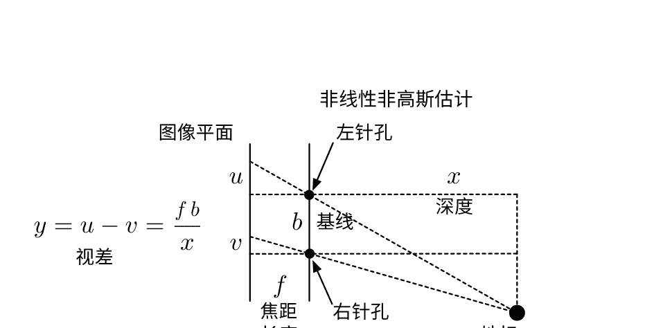

#### 4.1.1 完全贝叶斯估计

为了获得一些直觉，考虑一个简单的估计问题，使用一个非线性相机模型：
$$y = \frac{fb}{x} + n. \tag{4.1}$$

这是立体相机中存在的非线性类型（参见图4.1），其中状态$x$是地标的位置（以米为单位），测量$y$是左右图像中地标的水平坐标之间的视差（以像素为单位），$f$是焦距（以像素为单位），$b$是基线（左右相机之间的水平距离，以米为单位），$n$是测量噪声（以像素为单位）。为了进行贝叶斯推断，

$$p(x|y) = \frac{p(y|x)p(x)}{\int_{-\infty}^{\infty} p(y|x)p(x) dx}, \tag{4.2}$$

我们需要表达式 $p(y|x)$ 和 $p(x)$。我们通过做出两个假设来满足这个要求。首先，我们假设测量噪声是零均值的高斯分布，即$n\sim \mathcal{N}(0, R)$，使得

$$p(y|x) = \mathcal{N}\left(\frac{fb}{x}, R\right) = \frac{1}{\sqrt{2\pi R}} \exp\left(-\frac{1}{2R}\left(y - \frac{fb}{x}\right)^2\right), \tag{4.3}$$

其次，我们假设先验分布是高斯分布，其中

$$p(x) = \mathcal{N}\left(\hat{x}, \check{P}\right) = \frac{1}{\sqrt{2\pi \check{P}}} \exp\left(-\frac{1}{2\check{P}}\left(x - \hat{x}\right)^2\right). \tag{4.4}$$

在我们继续之前，我们注意到贝叶斯框架提供了一个隐含的操作顺序，我们希望明确说明：先分配先验分布→生成真实状态→生成测量值→计算后验分布。

简单来说，我们从先验分布开始。然后从先验分布中生成“真实”状态，并通过相机模型观察真实状态并添加噪声生成测量值。估计器然后根据测量值和先验分布重建后验分布，而不需要

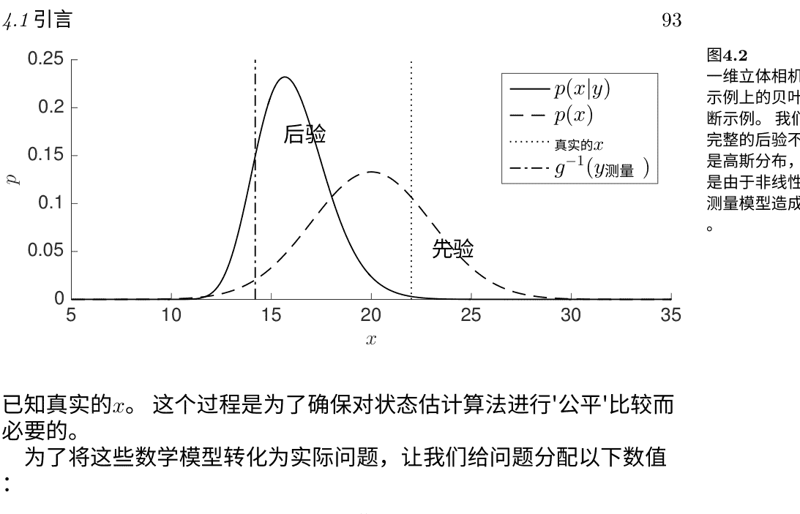

已知真实的 $x$。这个过程是为了确保对状态估计算法进行'公平'比较而必要的。

为了将这些数学模型转化为实际问题，让我们给问题分配以下数值：

$$\check{x} = 20 \, [m], \quad \check{P} = 9 \, [m^2],$$
$$f = 400 \, [pixel], \quad b = 0.1 \, [m], \quad R = 0.09 \, [pixel^2].$$
这对应公式 (4.5)。

如上所述，真实状态 $x$ 和（受噪声干扰的）测量 $y$ 是从 $p(x)$ 和 $p(y|x)$ 中随机抽取的。
每次重复实验时，这些值都会改变。为了绘制单个实验的后验概率，我们使用了特定的值。

$$x_{\text{真实}} = 22 \, [m], \quad y_{\text{测量}} = \frac{f b}{x_{\text{真实}}} + 1 \, [\text{像素}],$$
这些值在噪声特性方面相当典型。

图4.2绘制了这个例子的先验和后验。由于我们考虑的是一维情况，在(4.2)中的分母积分是通过数值计算得到的，因此我们实际上可以完整地看到贝叶斯后验，没有近似。我们可以观察到，即使先验和测量密度都是高斯的，后验也是不对称的；非线性观测模型使其偏向一侧。然而，由于后验仍然是单峰的（一个峰值），我们可能仍然可以将其近似为高斯分布。这个想法在本章后面讨论。我们还可以看到，测量结果的融合使后验对状态更加集中（即更加'确定'）；这是贝叶斯状态估计的主要思想：我们希望将测量结果融入先验中，以对后验状态更加确定。

不幸的是，虽然我们能够在我们简单的立体相机示例中有效地计算出准确的贝叶斯后验概率，但这通常是

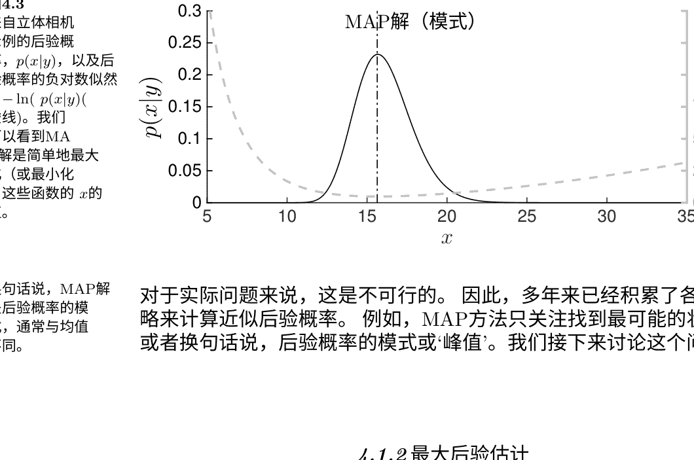

换句话说，MAP解 是后验概率的模 式，通常与均值 不同。

对于实际问题来说，这是不可行的。因此，多年来已经积累了各种策略 来计算近似后验概率。例如，MAP方法只关注找到最可能的状态， 或者换句话说，后验概率的模式或‘峰值’。我们接下来讨论这个问题。

#### 4.1.2 最大后验估计

如上所述，计算完整的贝叶斯后验在一般情况下是困难的。一个非常 常见的方法是仅寻找最大化真实后验的状态值。这被称为最大后验概 率 ($MAP$) 估计，并在图4.3中以图形方式表示。

换句话说，我们想要计算

$$\hat{x}_{\mathrm{map}} = \arg \max_{x} p(x|y). \tag{4.6}$$

等价地，我们可以尝试最小化负对数似然:

$$\hat{x}_{\mathrm{map}} = \arg \min_{x} (-\ln(p(x|y))), \tag{4.7}$$

当涉及的概率密度函数来自指数族时，这可能更容易。由于我们只寻 找最有可能的状态，我们可以使用贝叶斯规则来写成

$$\hat{x}_{\mathrm{map}} = \arg \min_{x} (-\ln(p(y|x)) - \ln(p(x))), \tag{4.8}$$
这里省略了 $p(y)$，因为它不依赖于 $x$。
将这个与之前介绍的立体相机示例联系起来， 我们可以写成

$$\hat{x}_{\mathrm{map}} = \arg \min_{x} J(x), \tag{4.9}$$
使用

$$J(x) = \frac{1}{2R}\left(y-\frac{fb}{x}\right)^2 + \frac{1}{2P}(\check{x}-x)^2, \tag{4.10}$$

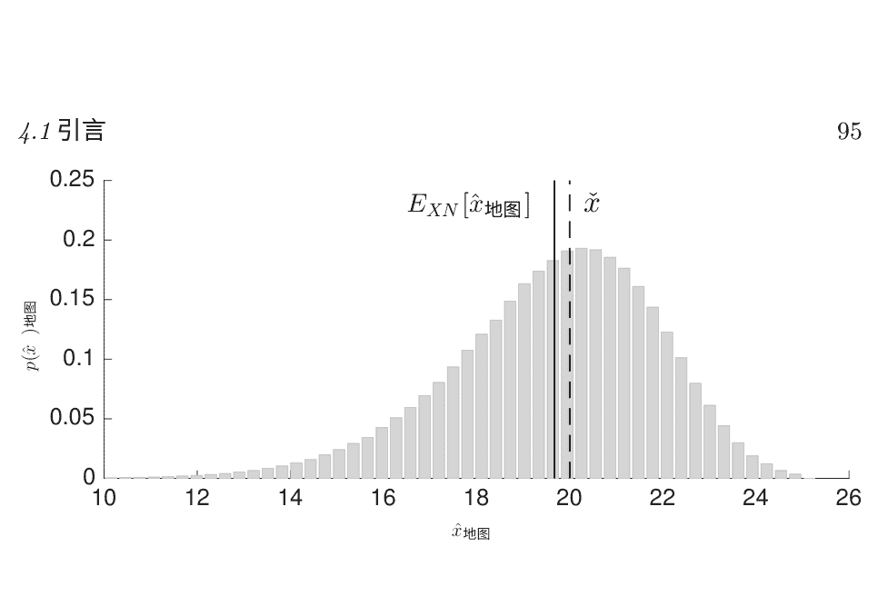

在这里，我们已经忽略了与 $x$ 无关的任何进一步的归一化常数。然后，我们可以使用任意数量的数值优化技术找到$\hat{x}_{map}$。

由于MAP估计器$\hat{x}_{map}$根据数据和先验找到最可能的状态，我们可能会问，这个估计器实际上有多好地捕捉到了真实的 $x$？在机器人学中，我们经常报告我们的估计器$\hat{x}$相对于某个 “真实值” 的平均性能。

换句话说，我们计算

$$e_{mean}(\hat{x}) = E_{XN}[\hat{x} - x_{true}],$$
其中 $E_{XN}[\cdot]$是期望操作符；我们明确地包括下标 $XN$以表示我们在先验的随机抽取的 $x_{true}$和测量噪声的随机抽取的 $n$上进行平均。由于假设 $x_{true}$与 $n$独立，我们有

$$E_{XN}[x_{true}] = E_X[x_{true}] = \check{x}, \text{所以}$$
$$e_{mean}(\hat{x}) = E_{XN}[\hat{x}] - \check{x}.$$

令人惊讶的是，在这个性能度量下，MAP估计是有偏的（即，$e_{mean}(\hat{x}_{map}) \neq 0$）。这可以归因于非线性测量模型$g(\cdot)$的存在，以及后验概率密度函数的模式和均值不相同的事实。正如在上一章中讨论的，当$g(\cdot)$是线性的时候，$e_{mean}(\hat{x}_{map}) = 0$。

然而，由于我们可以将估计值简单地设置为先验值，即$\hat{x}= \check{x}$，从而得到$e_{mean}(\hat{x}) = 0$，我们需要定义一个次要的性能度量。这个度量通常是平均平方误差$e_{sq}$，其中

$$e_{sq}(\hat{x}) = E_{XN}[(\hat{x} - x_{true})^2].$$

换句话说，第一个度量标准， $e_{mean}$，捕捉到估计误差的平均值，而第二个度量标准， $e_{sq}$，捕捉到偏差和方差的综合效应。在机器学习文献中，这两个度量标准的良好表现导致了偏差-方差权衡。

对于实际的状态估计器，两个度量标准的良好表现是必要的。

图4.4显示了立体相机示例的MAP偏差。 我们可以看到，在大量试验中（使用(4.5)中的参数），估计器$\hat{x}_{map}$和地面真实值 $x_{true}= 20\text{ m}$之间的平均差异为 $e_{\text{mean}}\approx -33.0\text{ cm}$，表明存在小的偏差。
平均平方误差为 $e_{\text{sq}} \approx 4.41\text{ 米}^2$。

请注意，在这个实验中，我们从估计器中使用的先验中抽取了真实状态，但我们仍然看到了偏差。 在实际应用中，偏差可能会更严重，因为我们通常并不真正知道真实状态是从哪个先验中抽取的，必须自己创造一个。

在本章的其余部分，我们将讨论非线性、非高斯系统的各种估计方法。 我们必须小心地尝试理解每种方法捕捉到完整贝叶斯后验的哪个方面：均值、模态、还是其他什么？ 我们更喜欢用这些术语来区分，而不是说一种方法比另一种方法更准确。 只有当两种方法都试图得到相同的答案时，才能公平地比较准确性。

### 4.2 递归离散时间估计

#### 4.2.1 问题设置

就像在线性高斯估计的章节中一样，我们需要一组基于运动和观测模型的估计器。 我们将考虑离散时间、时不变的方程，但这次我们允许非线性方程（我们将在本章末回到连续时间）。 我们定义以下运动和观测

图4.5 图形模型表示马尔可夫过程构成NLNG系统由(4.14)描述。

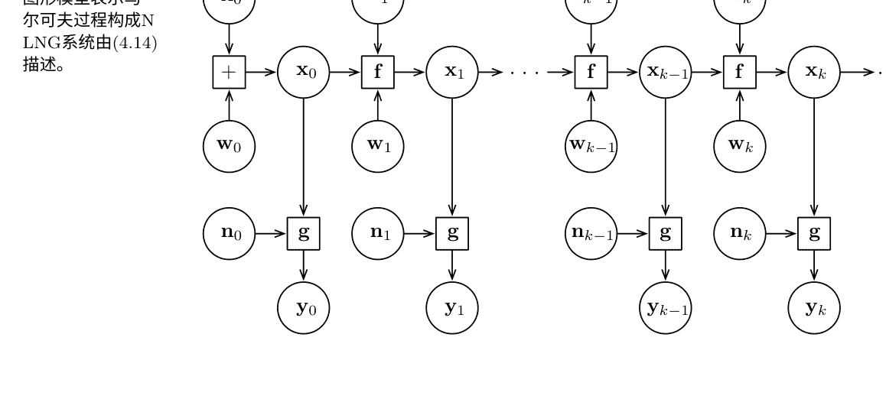

模型：
运动模型：
$x_k = f(x_{k-1}, v_k, w_k), \quad k = 1\ldots K$ (4.14a)

观测模型：
$y_k = g(x_k, n_k), \quad k = 0\ldots K$ (4.14b)

其中 $k$ 再次是离散时间索引，$K$ 是其最大值。函数 $f(\cdot)$ 是非线性运动模型，函数 $g(\cdot)$ 是非线性观测模型。变量的均值与线性高斯章节中相同。目前我们不对任何随机变量做高斯分布的假设。图4.5提供了(4.14)描述的系统的时间演化的图形表示。从这个图中，我们可以观察到系统的一个非常重要的特性，即马尔可夫性质：

从最简单的角度来看，如果随机过程的条件概率密度函数 (PDF) 对于给定的当前状态，仅依赖于当前状态，而不依赖于任何过去状态，则该过程具有马尔可夫性质。这样的过程被称为马尔可夫过程。

我们的系统就是这样一个马尔可夫过程。例如，一旦我们知道 $x_{k-1}$ 的值，我们就不需要知道任何先前状态的值来推进系统的时间演化以计算 $x_k$。这个性质在线性高斯估计部分得到了充分利用。在那里，我们假设我们可以在估计器设计中利用这个性质，这导致了一个优雅的递归估计器，即卡尔曼滤波器。

但是对于非线性非高斯系统呢？我们仍然可以有一个递归解吗？答案是肯定的，但只是近似的。接下来的几节将探讨这个说法。

#### 4.2.2 贝叶斯滤波器

在线性高斯估计的章节中，我们从批量估计技术开始，逐步推导出递归卡尔曼滤波器。
在本节中，我们将首先推导出递归滤波器，即贝叶斯滤波器 (Jazwinski, 1970)，并在本章末尾回顾批量方法。这个顺序反映了估计领域中事件的历史顺序，并且将使我们能够准确指出在哪里进行了限制性假设和近似。

贝叶斯滤波器试图通过仅使用当前时间之前的测量结果来得出一个完整的概率密度函数来表示状态的可能性。使用我们之前的符号表示，我们想要计算

$p(x_k|x_0, v_{1:k}, y_{0:k})$, (4.15)

有时也被称为 $x_k$ 的置信度。请回顾本节中的内容。

在对批处理线性高斯解进行因式分解时

> $ p(\mathbf{x}_k | \mathbf{v}, \mathbf{y}) = \eta \, p(\mathbf{x}_k | \breve{\mathbf{x}}_0, \mathbf{v}_{1:k}, \mathbf{y}_{0:k}) \, p(\mathbf{x}_k | \mathbf{v}_{k+1:K}, \mathbf{y}_{k+1:K}) $ (4.16)

因此，在本节中，我们将重点关注将“前向”概率密度函数转化为递归滤波器（用于非线性非高斯系统）。通过利用所有测量的独立性²，我们可以分解出最新的测量结果

> $ p(\mathbf{x}_k | \breve{\mathbf{x}}_0, \mathbf{v}_{1:k}, \mathbf{y}_{0:k}) = \eta \, p(\mathbf{y}_k | \mathbf{x}_k) \, p(\mathbf{x}_k | \breve{\mathbf{x}}_0, \mathbf{v}_{1:k}, \mathbf{y}_{0:k-1}) $ (4.17)

我们使用贝叶斯规则来逆转依赖关系，并且 η 用于保持总概率公理。将注意力转向第二个因素，我们引入隐藏状态， $x_{k-1}$，并对所有可能的值进行积分：

> $ p(\mathbf{x}_k | \breve{\mathbf{x}}_0, \mathbf{v}_{1:k}, \mathbf{y}_{0:k-1}) = \int p(\mathbf{x}_k, \mathbf{x}_{k-1} | \breve{\mathbf{x}}_0, \mathbf{v}_{1:k}, \mathbf{y}_{0:k-1}) \, d\mathbf{x}_{k-1} $
> $ = \int p(\mathbf{x}_k | \mathbf{x}_{k-1}, \breve{\mathbf{x}}_0, \mathbf{v}_{1:k}, \mathbf{y}_{0:k-1}) \, p(\mathbf{x}_{k-1} | \breve{\mathbf{x}}_0, \mathbf{v}_{1:k}, \mathbf{y}_{0:k-1}) \, d\mathbf{x}_{k-1} $. (4.18)

引入隐藏状态可以看作是边缘化的相反 到目前为止，我们还没有引入任何近似。下一步非常微妙，也是递归估计中许多限制的原因。由于我们的系统具有马尔可夫性质，我们使用该性质（对于估计器）来说明

> $ p(\mathbf{x}_k | \mathbf{x}_{k-1}, \breve{\mathbf{x}}_0, \mathbf{v}_{1:k}, \mathbf{y}_{0:k-1}) = p(\mathbf{x}_k | \mathbf{x}_{k-1}, \mathbf{v}_k) $, (4.19a)
> $ p(\mathbf{x}_{k-1} | \breve{\mathbf{x}}_0, \mathbf{v}_{1:k}, \mathbf{y}_{0:k-1}) = p(\mathbf{x}_{k-1} | \breve{\mathbf{x}}_0, \mathbf{v}_{1:k-1}, \mathbf{y}_{0:k-1}) $, (4.19b)

这在图4.5中的描述看起来完全合理。然而，我们将在本章后面再来讨论(4.19)。 将(4.19)和(4.18)代入(4.17)，我们得到贝叶斯滤波器³：

> $ \underbrace{p(\mathbf{x}_k | \breve{\mathbf{x}}_0, \mathbf{v}_{1:k}, \mathbf{y}_{0:k})}_{\text{后验信念}} $
> $ = \eta \, \underbrace{p(\mathbf{y}_k | \mathbf{x}_k)}_{\text{观测校正使用 } g(\cdot)} \, \int \underbrace{p(\mathbf{x}_k | \mathbf{x}_{k-1}, \mathbf{v}_k)}_{\text{运动预测使用 } f(\cdot)} \, \underbrace{p(\mathbf{x}_{k-1} | \breve{\mathbf{x}}_0, \mathbf{v}_{1:k-1}, \mathbf{y}_{0:k-1})}_{\text{先验信念}} \, d\mathbf{x}_{k-1} $. (4.20)

### 4.2 递归离散时间估计

图4.6 贝叶斯滤波器的图形化描述。这里虚线表示在实践中可以向“校正步骤”传递关于概率质量集中在哪些状态上的提示。

这可以用来减少根据状态 x_k 计算观测 y_k 的完整密度的需求。

我们可以看到(4.20)采用了预测-校正的形式。在预测步骤中，先验信念 p(x_{k-1}|x_0, v_{1:k-1}, y_{0:k-1}) 通过输入 v_k 和运动模型 f(·) 向前推进时间。在校正步骤中，使用测量 y_k 和测量模型 g(·) 来更新预测估计。结果是后验信念 p(x_k|x_0, v_{1:k}, y_{0:k})。图4.6提供了贝叶斯滤波器中信息流的图形描述。从这些图表中可以得出的重要信息是，我们需要通过非线性函数 f(·) 和 g(·) 传递概率密度函数(PDF)。尽管贝叶斯滤波器是精确的，但它实际上只是一个数学工具，除了线性高斯情况外，无法在实践中实现。这主要有两个原因，因此我们需要进行适当的近似：

- (i) 概率密度函数存在于一个无限维空间中（与所有连续函数一样），因此需要无限的内存（即无限数量的参数）来完全表示信念 p(x_k|x_0, v_{1:k}, y_{0:k})。为了克服这个内存问题，信念被近似表示。

一种方法是将这个函数近似为一个高斯分布PDF（即跟踪均值和协方差的前两个矩）。另一种方法是使用有限数量的随机样本来近似PDF。我们将在后面研究这两种方法。

- (ii) 贝叶斯滤波器中的积分计算非常昂贵；要精确评估需要无限的计算资源。为了克服这个计算资源问题，必须近似计算积分。一种方法是线性化运动和观测模型，然后进行评估，以闭合形式计算积分。另一种方法是使用蒙特卡罗积分。我们稍后也会研究这两种方法。

4 为了清楚起见，贝叶斯滤波器仅在一个时间步骤上使用贝叶斯推断。在前一章中讨论的批处理方法一次性对整个轨迹进行推断。我们将在本章后面回到批处理情况。

递归状态估计的许多研究都集中在更好地处理这两个问题的更好近似上。已经取得了相当大的进展，值得更详细地研究。因此，在接下来的几节中，我们将介绍一些经典和现代的方法来近似贝叶斯滤波器。然而，我们必须记住贝叶斯滤波器的假设：马尔可夫性质。我们必须问自己一个问题，当我们开始对贝叶斯滤波器进行这些近似时，马尔可夫性质会发生什么变化？我们稍后会回到这个问题。现在，让我们假设它成立。

#### 4.2.3 扩展卡尔曼滤波器

我们现在展示，如果信念被限制为高斯分布，噪声是高斯分布的，并且我们在线性化运动和观测模型以便在贝叶斯滤波器中进行积分（以及归一化乘积），我们就会得到著名的扩展卡尔曼滤波器（EKF）。EKF仍然是许多领域中估计和数据融合的主要方法，对于轻度非线性、非高斯系统通常也很有效。关于EKF的良好参考，请参阅Maybeck（1994）。

EKF是NASA阿波罗计划中用于估计航天器轨迹的关键工具。在Kalman的原始论文发表不久之后，Stanley F. Schmidt（Kalman，1960b）与Stanley F. Schmidt会面NASA艾姆斯研究中心。Schmidt对Kalman的滤波器印象深刻，他的团队对其进行了修改，以适应他们的航天器导航任务。特别是，他们(i)将其扩展为适用于非线性运动和观测模型，(ii)提出了围绕最佳当前估计进行线性化以减少非线性效应的想法，以及(iii)重新制定了原始滤波器，以实现现在标准的分离预测和校正步骤(McGee和Schmidt，1985)。由于与Schmidt后来提出的另一个类似命名的贡献（用于在保持状态维度较低的同时解决不可观测偏差）混淆，因此这个名字已经不再流行，这些重要贡献有时被称为Schmidt-Kalman滤波器。Schmidt还致力于工作在EKF的平方根形式，以提高数值稳定性(Bierman，1974)。后来，在洛克希德导弹和航天公司，Schmidt对Kalman的工作的推广也激发了Charlotte Striebel开始研究连接KF的工作。

> Stanley F. Schmidt（1926年-）是一位美国航空航天工程师，他早期就将Kalman的滤波器用于估计航天器在阿波罗计划中的轨迹。正是他的工作导致了现在被称为扩展卡尔曼滤波器的方法。

对于其他类型的轨迹估计，最终导致了在前一章中讨论的Rauch-Tung-Striebel平滑器。

为了推导EKF，我们首先将我们对于 $\mathbf{x}_k$ 的信念函数进行了限制，使其为高斯分布：

$$ p(\mathbf{x}_k | \hat{\mathbf{x}}_0, \mathbf{v}_{1:k}, \mathbf{y}_{0:k}) = \mathcal{N} \left( \hat{\mathbf{x}}_k, \hat{\mathbf{P}}_k \right) $$

其中 $\hat{\mathbf{x}}_k$ 是均值， $\hat{\mathbf{P}}_k$ 是协方差。接下来，我们假设噪声变量 $\mathbf{w}_k$ 和 $\mathbf{n}_k$（对于所有的 $k$）也是高斯分布：

$$ \mathbf{w}_k \sim \mathcal{N} \left( \mathbf{0}, \mathbf{Q}_k \right), $$
$$ \mathbf{n}_k \sim \mathcal{N} \left( \mathbf{0}, \mathbf{R}_k \right). $$

请注意，高斯概率密度函数可以通过非线性变换变为非高斯分布。实际上，在本章稍后的部分中，我们将更详细地讨论这个问题。我们假设噪声变量满足这种情况；换句话说，非线性运动和观测模型可能会产生影响。它们不一定是在非线性之后添加的，如同

$$ \mathbf{x}_k = \mathbf{f} \left( \mathbf{x}_{k-1}, \mathbf{v}_k \right) + \mathbf{w}_k, $$
$$ \mathbf{y}_k = \mathbf{g} \left( \mathbf{x}_k \right) + \mathbf{n}_k. $$

但是，它们不是像(4.14)中那样出现在非线性之内。方程(4.23)实际上是(4.14)的一个特例。然而，我们可以通过线性化来恢复加性噪声（近似），接下来我们将展示这一点。

由于 $\mathbf{g}(\cdot)$ 和 $\mathbf{f}(\cdot)$ 是非线性的，我们仍然无法以闭合形式计算贝叶斯滤波器中的积分，因此我们转向线性化。我们围绕当前状态估计均值对运动和观测模型进行线性化：

$$ \mathbf{f} \left( \mathbf{x}_{k-1}, \mathbf{v}_k, \mathbf{w}_k \right) \approx \check{\mathbf{x}}_k + \mathbf{F}_{k-1} \left( \mathbf{x}_{k-1} - \hat{\mathbf{x}}_{k-1} \right) + \mathbf{w}'_k, $$
$$ \mathbf{g} \left( \mathbf{x}_k, \mathbf{n}_k \right) \approx \bar{\mathbf{y}}_k + \mathbf{G}_k \left( \mathbf{x}_k - \check{\mathbf{x}}_k \right) + \mathbf{n}'_k. $$

其中

$$ \check{\mathbf{x}}_k = \mathbf{f} \left( \hat{\mathbf{x}}_{k-1}, \mathbf{v}_k, \mathbf{0} \right), $$
$$ \mathbf{F}_{k-1} = \left. \frac{\partial \mathbf{f} \left( \mathbf{x}_{k-1}, \mathbf{v}_k, \mathbf{w}_k \right)}{\partial \mathbf{x}_{k-1}} \right|_{\hat{\mathbf{x}}_{k-1}, \mathbf{v}_k, \mathbf{0}}, $$
$$ \mathbf{w}'_k = \left. \frac{\partial \mathbf{f} \left( \mathbf{x}_{k-1}, \mathbf{v}_k, \mathbf{w}_k \right)}{\partial \mathbf{w}_k} \right|_{\hat{\mathbf{x}}_{k-1}, \mathbf{v}_k, \mathbf{0}} \mathbf{w}_k. $$

和

$$ \bar{\mathbf{y}}_k = \mathbf{g} \left( \check{\mathbf{x}}_k, \mathbf{0} \right), $$
$$ \mathbf{G}_k = \left. \frac{\partial \mathbf{g} \left( \mathbf{x}_k, \mathbf{n}_k \right)}{\partial \mathbf{x}_k} \right|_{\check{\mathbf{x}}_k, \mathbf{0}}, $$
$$ \mathbf{n}'_k = \left. \frac{\partial \mathbf{g} \left( \mathbf{x}_k, \mathbf{n}_k \right)}{\partial \mathbf{n}_k} \right|_{\check{\mathbf{x}}_k, \mathbf{0}} \mathbf{n}_k. $$

从这里开始，给定旧状态和最新输入，当前状态从这口的统计特性为

$$ \mathbf{x}_k \approx \check{\mathbf{x}}_k + \mathbf{F}_{k-1} (\mathbf{x}_{k-1} - \hat{\mathbf{x}}_{k-1}) + \mathbf{w}'_k, \quad (4.27a) $$

$$ E[\mathbf{x}_k] \approx \check{\mathbf{x}}_k + \mathbf{F}_{k-1} (\mathbf{x}_{k-1} - \hat{\mathbf{x}}_{k-1}) + E[\mathbf{w}'_k], \quad (4.27b) $$

$$ E[(\mathbf{x}_k - E[\mathbf{x}_k])(\mathbf{x}_k - E[\mathbf{x}_k])^T] \approx E[\mathbf{w}'_k \mathbf{w}'_k^T], \quad (4.27c) $$

$$ p(\mathbf{x}_k|\mathbf{x}_{k-1}, \mathbf{v}_k) \approx \mathcal{N}(\check{\mathbf{x}}_k + \mathbf{F}_{k-1}(\mathbf{x}_{k-1} - \hat{\mathbf{x}}_{k-1}), \mathbf{Q}'_k). \quad (4.27d) $$

对于当前测量的统计特性，给定当前状态，我们有

$$ \mathbf{y}_k \approx \check{\mathbf{y}}_k + \mathbf{G}_k (\mathbf{x}_k - \check{\mathbf{x}}_k) + \mathbf{n}'_k, \quad (4.28a) $$

$$ E[\mathbf{y}_k] \approx \check{\mathbf{y}}_k + \mathbf{G}_k (\mathbf{x}_k - \check{\mathbf{x}}_k) + E[\mathbf{n}'_k], \quad (4.28b) $$

$$ E[(\mathbf{y}_k - E[\mathbf{y}_k])(\mathbf{y}_k - E[\mathbf{y}_k])^T] \approx E[\mathbf{n}'_k \mathbf{n}'_k^T], \quad (4.28c) $$

$$ p(\mathbf{y}_k|\mathbf{x}_k) \approx \mathcal{N}(\check{\mathbf{y}}_k + \mathbf{G}_k(\mathbf{x}_k - \check{\mathbf{x}}_k), \mathbf{R}'_k). \quad (4.28d) $$

将这些结果代入贝叶斯滤波器中，得到

$$ p(\mathbf{x}_k|\check{\mathbf{x}}_0, \mathbf{v}_{1:k}, \mathbf{y}_{0:k}) = \eta \cdot p(\mathbf{y}_k|\mathbf{x}_k) \cdot \int p(\mathbf{x}_k|\mathbf{x}_{k-1}, \mathbf{v}_k) p(\mathbf{x}_{k-1}|\check{\mathbf{x}}_0, \mathbf{v}_{1:k-1}, \mathbf{y}_{0:k-1}) d\mathbf{x}_{k-1}. \quad (4.29) $$

使用我们的公式(2.90)来通过一个高斯分布经过一个（随机）非线性函数，我们可以看到积分也是高斯分布:

$$ p(\mathbf{x}_k|\check{\mathbf{x}}_0, \mathbf{v}_{1:k}, \mathbf{y}_{0:k}) = \eta \cdot p(\mathbf{y}_k|\mathbf{x}_k) \cdot \int p(\mathbf{x}_k|\mathbf{x}_{k-1}, \mathbf{v}_k) p(\mathbf{x}_{k-1}|\check{\mathbf{x}}_0, \mathbf{v}_{1:k-1}, \mathbf{y}_{0:k-1}) d\mathbf{x}_{k-1}. \quad (4.30) $$

我们现在得到了两个高斯概率密度函数的归一化乘积，这也是我们在2.2.6节中讨论过的。应用(2.70),

我们发现 $$ p(x_k|\bar{x}_0, v_{1:k}, y_{0:k}) $$ $$ = \eta p(y_k|x_k) \int p(x_k|x_{k-1}, v_k) p(x_{k-1}|\bar{x}_0, v_{1:k-1}, y_{0:k-1}) dx_{k-1} $$ (4.31)

其中 $K_k$ 被称为卡尔曼增益矩阵（如下所示）。到达最后一行需要进行繁琐的代数运算，留给读者完成。将上述后验表达式的左右两边进行比较，我们有

预测器:
$$ \check{P}_k = F_{k-1} \hat{P}_{k-1} F_{k-1}^T + Q_k', \quad\quad (4.32a) $$
$$ \check{x}_k = f(\hat{x}_{k-1}, v_k, 0), \quad\quad\quad\quad\quad\quad (4.32b) $$
卡尔曼增益:
$$ K_k = \check{P}_k G_k^T (G_k \check{P}_k G_k^T + R_k')^{-1}, \quad (4.32c) $$
校正器:
$$ \hat{P}_k = (1 - K_k G_k) \check{P}_k, \quad\quad\quad\quad\quad\quad\quad (4.32d) $$
$$ \hat{x}_k = \check{x}_k + K_k (y_k - g(\check{x}_k, 0)). \quad (4.32e) $$

方程式(4.32)被称为经典递归更新方程用于EKF。更新方程允许我们计算 $\{\hat{x}_k, \hat{P}_k\}$ 从 $\{\hat{x}_{k-1}, \hat{P}_{k-1}\}$。我们立即注意到与(3.120)相似的结构用于线性高斯估计。这里有两个主要的不同之处：(i) 非线性运动和观测模型用于传播我们估计的均值。(ii) 嵌入在 $Q_k'$ 和 $R_k'$ 协方差中的雅可比矩阵用于噪声。这是因为我们允许噪声在(4.14)的非线性中应用。值得注意的是，EKF在一般非线性系统中的性能没有保证。要评估EKF在特定非线性系统上的性能，通常只能尝试。EKF的主要问题是线性化的操作点是我们对状态的估计均值，而不是真实状态。这个看似微小的差异可能导致EKF在某些情况下发散。有时结果不那么戏剧性，估计值会有偏或不一致，或者最常见的是两者都有。

#### 4.2.4 广义高斯滤波器

贝叶斯滤波器非常吸引人，因为它可以准确地写出来。通过对估计的概率密度函数和处理方法进行不同的近似，我们可以得到多种可实现的滤波器。

然后，我们可以通过假设估计的概率密度函数为高斯分布来更清晰地推导出这些滤波器。实际上，在第3.3.3节中，我们已经在实践中看到了这一点，我们使用贝叶斯推断推导出了卡尔曼滤波器。

一般来说，我们从时间 $k-1$ 开始，使用高斯先验分布：

$$ p(\mathbf{x}_{k-1}|\bar{\mathbf{x}}_0, \mathbf{v}_{1:k-1}, \mathbf{y}_{0:k-1}) = \mathcal{N} \left( \hat{\mathbf{x}}_{k-1}, \hat{\mathbf{P}}_{k-1} \right). \quad \quad (4.33) $$

我们通过非线性运动模型将其向前推进到时间 $k$，得到一个高斯先验分布：

$$ p(\mathbf{x}_{k}|\bar{\mathbf{x}}_0, \mathbf{v}_{1:k}, \mathbf{y}_{0:k-1}) = \mathcal{N} \left( \breve{\mathbf{x}}_{k}, \breve{\mathbf{P}}_{k} \right). \quad \quad (4.34) $$

这是预测步骤，并结合了最新的输入 $\mathbf{v}_k$。对于校正步骤，我们采用第2.2.3节中的方法，为状态和最新测量值在时间 $k$ 时编写一个联合高斯分布：

$$ p(\mathbf{x}_k, \mathbf{y}_k|\bar{\mathbf{x}}_0, \mathbf{v}_{1:k}, \mathbf{y}_{0:k-1}) = \mathcal{N} \left( \left[ \begin{array}{c} \boldsymbol{\mu}_{x,k} \\ \boldsymbol{\mu}_{y,k} \end{array} \right], \left[ \begin{array}{cc} \boldsymbol{\Sigma}_{xx,k} & \boldsymbol{\Sigma}_{xy,k} \\ \boldsymbol{\Sigma}_{yx,k} & \boldsymbol{\Sigma}_{yy,k} \end{array} \right] \right). \quad \quad (4.35) $$

然后我们直接将条件高斯密度函数写为 $\mathbf{x}_k$（即后验）

$$ \begin{aligned} p(\mathbf{x}_k|\bar{\mathbf{x}}_0, \mathbf{v}_{1:k}, \mathbf{y}_{0:k}) & = \mathcal{N} \bigg( \underbrace{\boldsymbol{\mu}_{x,k} + \boldsymbol{\Sigma}_{xy,k} \boldsymbol{\Sigma}_{yy,k}^{-1} (\mathbf{y}_k - \boldsymbol{\mu}_{y,k})}_{\hat{\mathbf{x}}_k}, \underbrace{\boldsymbol{\Sigma}_{xx,k} - \boldsymbol{\Sigma}_{xy,k} \boldsymbol{\Sigma}_{yy,k}^{-1} \boldsymbol{\Sigma}_{yx,k}}_{\hat{\mathbf{P}}_k} \bigg), \quad \quad (4.36) \end{aligned} $$

在这里，我们定义 $\hat{\mathbf{x}}_k$ 为均值， $\hat{\mathbf{P}}_k$ 为协方差。非线性观测模型 $g(\cdot)$ 用于计算 $\boldsymbol{\mu}_{y,k}$。从这里，我们可以写出广义高斯校正步骤方程

$$ \begin{aligned} \mathbf{K}_k &= \boldsymbol{\Sigma}_{xy,k} \boldsymbol{\Sigma}_{yy,k}^{-1}, \quad \quad \quad \quad \quad \quad \quad \quad \quad \quad \quad \quad \quad (4.37a) \\ \hat{\mathbf{P}}_k &= \breve{\mathbf{P}}_k - \mathbf{K}_k \boldsymbol{\Sigma}_{xy,k}^T, \quad \quad \quad \quad \quad \quad \quad \quad \quad \quad \quad (4.37b) \\ \hat{\mathbf{x}}_k &= \breve{\mathbf{x}}_k + \mathbf{K}_k \left( \mathbf{y}_k - \boldsymbol{\mu}_{y,k} \right), \quad \quad \quad \quad \quad \quad \quad \quad \quad (4.37c) \end{aligned} $$

在这里，我们将 $\boldsymbol{\mu}_{x,k}=\hat{\mathbf{x}}_k$， $\boldsymbol{\Sigma}_{xx,k}=\breve{\mathbf{P}}_k$，并且 $\mathbf{K}_k$ 仍然被称为卡尔曼增益。不幸的是，除非运动和观测模型是线性的，否则我们无法精确计算所需的所有剩余量： $\boldsymbol{\mu}_{y,k}$， $\boldsymbol{\Sigma}_{yy,k}$ 和 $\boldsymbol{\Sigma}_{xy,k}$。这是因为将高斯概率密度函数输入非线性函数通常会导致非高斯分布的输出。因此，我们需要在这个阶段考虑近似。

下一节将重新审视线性化运动和观测模型，以完成对EKF的更清晰推导。之后，## 4.2.5 迭代扩展卡尔曼滤波器

继续上一节的内容，我们完成了对迭代扩展卡尔曼滤波器（IEKF）的替代推导。预测步骤非常简单，基本上与第4.2.3节相同。因此，我们省略了它，但请注意，在时间$k$时的先验为

$p(\mathbf{x}_{k}|\breve{\mathbf{x}}_{0}, \mathbf{v}_{1:k}, \mathbf{y}_{0:k-1}) = \mathcal{N} \left(\breve{\mathbf{x}}_{k}, \breve{\mathbf{P}}_{k}\right)$, (4.38)

其中包含了$\mathbf{v}_{k}$。

校正步骤是事情变得更有趣的地方。
我们的非线性测量模型如下

$\mathbf{y}_{k} = \mathrm{g}(\mathbf{x}_{k}, \mathbf{n}_{k})$. (4.39)

我们关于任意操作点$\mathbf{x}_{\mathrm{op},k}$进行线性化：

$\mathrm{g}(\mathbf{x}_{k}, \mathbf{n}_{k}) \approx \mathbf{y}_{\mathrm{op},k} + \mathbf{G}_{k}(\mathbf{x}_{k} - \mathbf{x}_{\mathrm{op},k}) + \mathbf{n}_{k}$. (4.40)

其中

$\mathbf{y}_{\mathrm{op},k} = \mathrm{g}(\mathbf{x}_{\mathrm{op},k}, \mathbf{0})$, $\mathbf{G}_{k} = \left.\frac{\partial \square(\square\square,\square\square)}{\partial \square\square}\right|_{\mathbf{x}_{\mathrm{op},k}, \mathbf{0}}$, (4.41a)
$\square^{\prime}\square = \left.\frac{\partial \square(\square\square,\square\square)}{\partial \square\square}\right|_{\mathbf{x}_{\mathrm{op},k}, \mathbf{0}} \square\square$. (4.41b)

注意观测模型和雅可比矩阵是在 $\mathbf{x}_{\mathrm{op},k}$处评估的。
使用这个线性化模型，我们可以将时间 $k$的状态和测量的联合密度近似表示为高斯分布：

$\begin{aligned} p(\mathbf{x}_{k}, \mathbf{y}_{k}|\breve{\mathbf{x}}_{0}, \mathbf{v}_{1:k}, \mathbf{y}_{0:k-1}) &\approx \mathcal{N} \left(\left[\begin{array}{c}\boldsymbol{\mu}_{x,k} \\ \boldsymbol{\mu}_{y,k}\end{array}\right], \left[\begin{array}{cc}\boldsymbol{\Sigma}_{xx,k} & \boldsymbol{\Sigma}_{xy,k} \\ \boldsymbol{\Sigma}_{yx,k} & \boldsymbol{\Sigma}_{yy,k}\end{array}\right]\right) \\ &= \mathcal{N} \left(\left[\begin{array}{c} \breve{\mathbf{x}}_{k} \\ \mathbf{y}_{\mathrm{op},k} + \mathbf{G}_{k}(\breve{\mathbf{x}}_{k} - \mathbf{x}_{\mathrm{op},k}) \end{array}\right], \left[\begin{array}{cc} \breve{\mathbf{P}}_{k} & \breve{\mathbf{P}}_{k} \mathbf{G}_{k}^{T} \\ \mathbf{G}_{k} \breve{\mathbf{P}}_{k} & \mathbf{G}_{k} \breve{\mathbf{P}}_{k} \mathbf{G}_{k}^{T} + \mathbf{R}_{k}^{\prime} \end{array}\right]\right). \end{aligned}$ (4.42)

再次强调，如果测量值 $\mathbf{y}_{k}$已知，我们可以使用(2.53b)来表示 $\mathbf{x}_{k}$的高斯条件密度（即后验）

$\begin{aligned} p(\mathbf{x}_{k}|\breve{\mathbf{x}}_{0}, \mathbf{v}_{1:k}, \mathbf{y}_{0:k}) &= \mathcal{N} \left(\underbrace{\boldsymbol{\mu}_{x,k} + \boldsymbol{\Sigma}_{xy,k} \boldsymbol{\Sigma}_{yy,k}^{-1} (\mathbf{y}_{k} - \boldsymbol{\mu}_{y,k})}_{\hat{\mathbf{x}}_{k}}, \underbrace{\boldsymbol{\Sigma}_{xx,k} - \boldsymbol{\Sigma}_{xy,k} \boldsymbol{\Sigma}_{yy,k}^{-1} \boldsymbol{\Sigma}_{yx,k}}_{\hat{\mathbf{P}}_{k}}\right), \end{aligned}$ (4.43)

再次定义$\hat{\mathbf{x}}_{k}$为均值，$\hat{\mathbf{P}}_{k}$为协方差。

如上一节所示，广义高斯校正步骤方程为

$K_k = \Sigma_{xy,k} \Sigma_{yy,k}^{-1}, \quad (4.44a)$
$\hat{P}_k = \check{P}_k - K_k \Sigma_{xy,k}^T, \quad (4.44b)$
$\hat{x}_k = \check{x}_k + K_k (y_k - \mu_{y,k}). \quad (4.44c)$

将上述时刻 $\mu_{y,k}$, $\Sigma_{yy,k}$ 和 $\Sigma_{xy,k}$ 代入，我们有

$K_k = \check{P}_k G_k^T (G_k \check{P}_k G_k^T + R_k')^{-1}, \quad (4.45a)$
$\hat{P}_k = (I - K_k G_k) \check{P}_k, \quad (4.45b)$
$\hat{x}_k = \check{x}_k + K_k (y_k - y_{op,k} - G_k (\check{x}_k - x_{op,k})). \quad (4.45c)$

这些方程与(4.32)中的卡尔曼增益和校正方程非常相似；唯一的区别是线性化的工作点。 如果我们将线性化的工作点设置为预测先验的均值， $x_{op,k} = \check{x}_k$， 则(4.45)和(4.32)是相同的。

然而，事实证明，如果我们每次迭代重新计算（4.45），将操作点设置为上一次迭代后验均值，我们可以做得更好：

$x_{op,k} \leftarrow \hat{x}_k. \quad (4.46)$

在第一次迭代中，我们取 $x_{op,k} = \check{x}_k$。 这使我们能够线性化越来越好的估计，从而改善我们的近似每次迭代。 当从一次迭代到下一次迭代的 $x_{op,k}$ 的变化足够小时，我们终止该过程。 请注意，协方差方程只需要在其他两个方程收敛后计算一次。

#### 4.2.6 IEKF是一个最大后验估计器

此时一个很好的问题是，$EKF/IEKF$估计与完整的贝叶斯后验之间的关系是什么？ 事实证明，$IEKF$估计对应于完整后验的（局部）最大值；换句话说，它是一个MAP估计。 另一方面，由于$EKF$没有迭代，它可能与完整后验的局部最大值相差很远；实际上，我们对其与完整后验的关系几乎无法说出什么。

这些关系在图4.7中有所说明，在这里我们将IEKF和EKF的校正步骤与第4.1.2节中介绍的立体相机示例的完整贝叶斯后验进行比较。 在这个版本中

### 4.2 递归离散时间估计

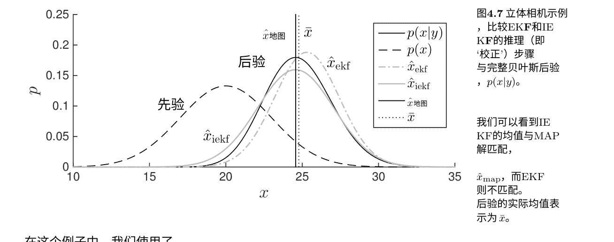

在这个例子中，我们使用了

$$
x_{\text{真实}} \; 26 \; [\text{米}], \quad y_{\text{测量}} = \frac{fb}{\text{真实的} x} - 0.6 \; [\text{像素}],
$$

为了夸大方法之间的差异。如上所述，IEKF的均值对应于MAP（即模式）解，而EKF与完整后验不容易相关联。

为了理解为什么IEKF与MAP估计相同，我们需要一些优化工具，我们将在本章后面介绍。目前，从本节中重要的信息是，我们选择迭代地关于我们的最佳猜测重新线性化，导致了MAP解。因此，我们的IEKF高斯估计器的‘均值’实际上并不与完整贝叶斯后验的均值相匹配；它与模式相匹配。

#### 4.2.7 通过非线性传递概率密度函数的替代方法

在我们推导EKF/IEKF时，我们使用了一种特定的技术将概率密度函数通过非线性传递。具体来说，我们在线性化操作点附近线性化非线性模型，然后通过解析地将我们的高斯概率密度函数通过线性化模型。这当然是一种方法，但还有其他方法。本节将讨论三种常见方法：蒙特卡洛方法（暴力法），线性化（如EKF中），以及 *sigmapoint* or *unscented*^{7} transformation。我们的动机是在我们的贝叶斯滤波器框架内引入一些工具，以推导出EKF/IEKF的替代方法。

> ^{7} 这个名字在文献中一直存在；显然，Simon Julier是根据一种无香味的除臭剂来命名的，以此来说明我们经常在不知道它们起源的情况下对名字视而不见。

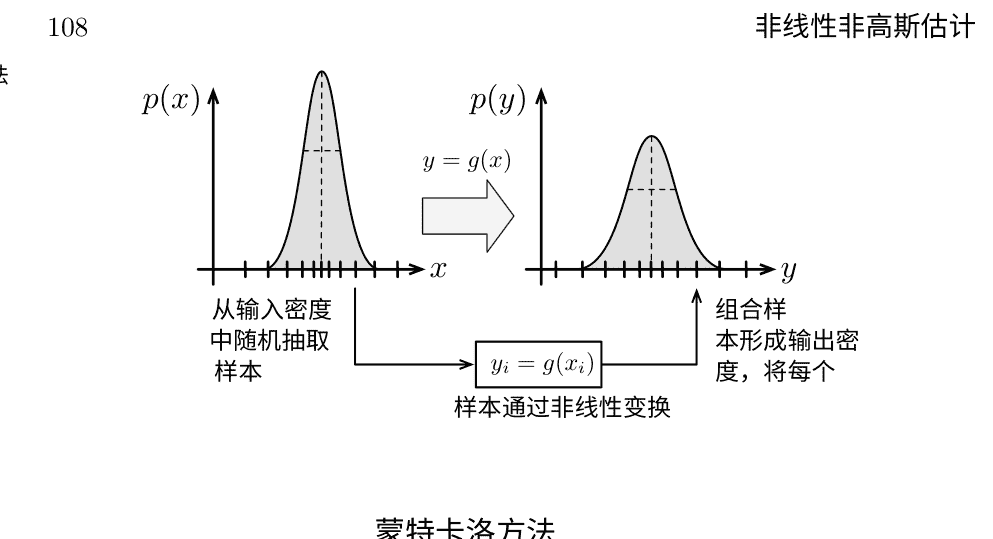

##### 蒙特卡洛方法

蒙特卡洛方法通过非线性变换概率密度函数本质上是一种“蛮力”方法。该过程如图4.8所示。我们从输入密度中抽取大量样本，通过非线性变换精确地转换每个样本，然后从转换后的样本中构建输出密度（例如，通过计算统计矩）。粗略地说，大数定律确保该过程在使用的样本数量趋近无穷时收敛到正确答案。

这种方法的明显问题是，在高维情况下可能非常低效。除了这个明显的缺点外，实际上还有一些优点：

- (i) 它适用于任何概率密度函数（PDF），不仅仅是高斯分布。
- (ii) 它处理任何类型的非线性（不需要可微甚至连续性要求）。
- (iii) 我们不需要知道非线性函数的数学形式 - 实际上非线性可以是任何软件函数。
- (iv) 这是一种“随时可用”的算法 - 我们可以通过适当选择样本来在准确性和速度之间进行权衡。

因为我们可以使这种方法非常准确，所以我们也可以用它来评估其他方法的性能。

在这个阶段值得一提的另一点是，输出密度的均值与通过非线性变换后的输入密度的均值不同。通过一个简单的例子可以看出这一点。考虑输入密度函数为在区间[0,1]上均匀分布，即 p(x) = 1, x ∈ [0,1]。假设非线性变换为 y = x²。输入的均值为 μx = 1/2，通过非线性变换后得到的均值为 μy' = 1/4。然而，输出的实际均值为 μy = ∫ y * p(y) dy（从0到1积分），其值为1/3。类似的事情发生在更高的统计矩上。蒙特卡洛方法能够

### 4.2 递归离散时间估计

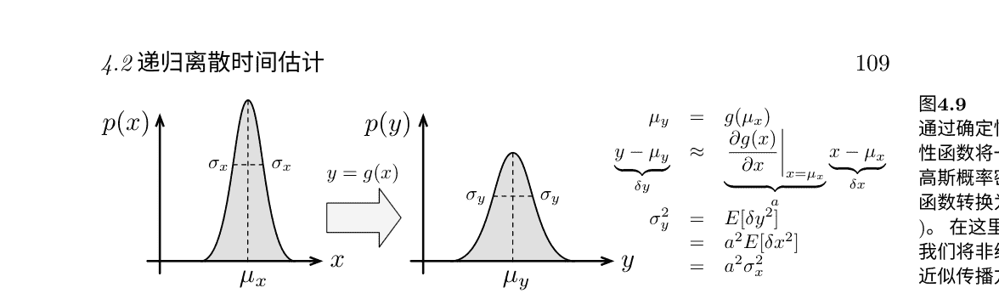

通过大量样本逼近正确答案，但正如我们将看到的，其他一些方法则不能。

##### 线性化

通过线性化将高斯概率密度函数通过非线性函数转换的最流行方法是线性化，我们已经用它来推导EKF/IEKF。从技术上讲，均值实际上是通过非线性函数精确传递的，而协方差则是通过函数的线性化版本近似传递的。通常，线性化过程的操作点是概率密度函数的均值。该过程在图4.9中描述（为方便起见，重复了图2.5）。由于以下原因，这种过程非常不准确：

- (i) 通过非线性函数传递高斯概率密度函数的结果将不再是另一个高斯概率密度函数。通过仅保留后验概率密度函数的均值和协方差，我们在近似后验概率（通过丢弃更高的统计矩）时进行了近似。
- (ii) 我们线性化非线性函数的操作点通常不是先验概率密度函数的真实均值，而是我们对输入概率密度函数均值的估计。这是一种引入误差的近似。
- (iii) 我们通过将先验概率密度函数的均值通过非线性函数来近似真实输出概率密度函数的均值。这并不代表真实输出的真实均值。
- (iv) 线性化的另一个缺点是我们需要能够闭式计算非线性函数的雅可比矩阵，或者通过数值计算来近似计算（这又引入了另一种近似）。

尽管存在所有这些近似和缺点，如果函数只是轻微非线性，并且输入概率密度函数是高斯分布的，线性化方法非常简单易懂且快速实现。一个优点是该过程实际上是可逆的（如果非线性函数在局部可逆）。也就是说，我们可以精确地恢复输入概率密度函数⁸。

⁸ 更准确地说，这更像是一个副产品而不是一个优势，因为它是线性化过程中所做的具体近似的直接结果。

图4.10 一维高斯概率密度函数通过一个确定性非线性函数变换g(·)。这里使用基本的sigma点变换，其中只有两个确定性样本（一个在均值的两侧）近似输入密度。

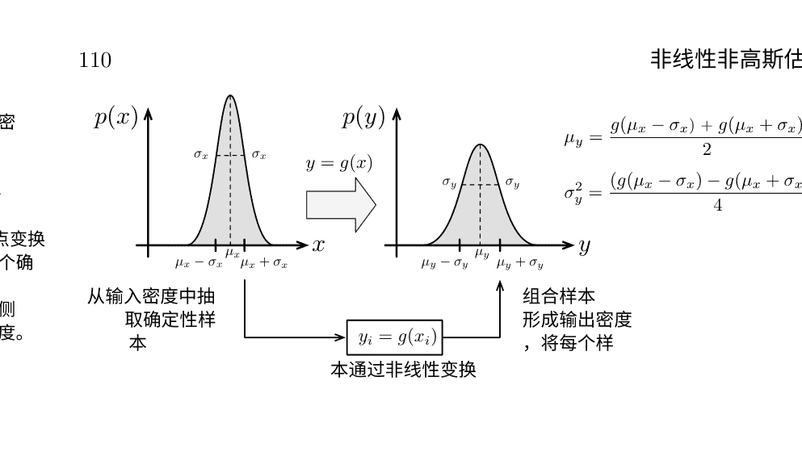

通过将输出PDF通过非线性的逆过程传递（使用相同的线性化过程）来纠正错误。这对于通过非线性传递PDF的所有方法来说并不都是真实的，因为它们并不都像线性化一样进行相同的近似。例如，Sigmapoint变换不能以这种方式进行逆转。

### Sigmapoint变换

从某种意义上说，当输入密度大致为高斯PDF时，Sigmapoint（SP）或无香味变换（Julier和Uhlmann，1996）是蒙特卡罗方法和线性化方法之间的折衷方案。它比线性化更准确，但与线性化的计算成本相当。蒙特卡罗仍然是最准确的方法，但在大多数情况下计算成本是禁止的。

实际上，将‘the’ sigmapoint变换称为‘the’是有点误导性的，因为实际上有整个家族的这种变换。图4.10描述了一维中最简单的版本。通常使用包括一个额外样本在输入密度均值处的SP变换版本。步骤如下：

- 1. 根据输入密度，从中计算出一组2L+ 1个sigma点，即N(μ_x, Σ_xx)

$LL^T = Σ_xx, \quad (Cholesky分解, L为下三角矩阵) (4.47a)$
$x_0 = μ_x, \quad (4.47b)$
$x_i = μ_x + √(L + κ) col_i L, \quad i = 1...L (4.47c)$
$x_{i+L} = μ_x - √(L + κ) col_i L, \quad (4.47d)$

其中 $L = \mathrm{dim}(\boldsymbol{\mu}_{\boldsymbol{x}})$。我们注意到

$$\boldsymbol{\mu}_{\boldsymbol{x}} = \sum_{i=0}^{2L} \alpha_i \mathbf{x}_i, \qquad (4.48a)$$
$$\boldsymbol{\Sigma}_{\boldsymbol{x} \boldsymbol{x}} = \sum_{i=0}^{2L} \alpha_i (\mathbf{x}_i - \boldsymbol{\mu}_{\boldsymbol{x}}) (\mathbf{x}_i - \boldsymbol{\mu}_{\boldsymbol{x}})^T, \qquad (4.48b)$$

其中

$$\alpha_i = \begin{cases} \frac{\kappa}{L+\kappa} & i = 0 \\ \frac{1}{2(L+\kappa)} & \text{否则}, \end{cases} \qquad (4.49)$$

我们注意到总和为1。用户可定义参数 $\kappa$，在下一节中将会解释。

- 2. 每个sigma点都通过非线性函数 $g(\cdot)$进行处理：

$$\mathbf{y}_i = g(\mathbf{x}_i), \quad i=0.\ldots 2L. \qquad (4.50)$$

- 3. 输出密度的均值 $\boldsymbol{\mu}_{\boldsymbol{y}}$，计算如下：

$$\boldsymbol{\mu}_{\boldsymbol{y}} = \sum_{i=0}^{2L} \alpha_i \mathbf{y}_{i}. \qquad (4.51)$$

- 4. 输出密度的协方差 $\boldsymbol{\Sigma}_{\boldsymbol{y} \boldsymbol{y}}$，计算如下：

$$\boldsymbol{\Sigma}_{\boldsymbol{y} \boldsymbol{y}} = \sum_{i=0}^{2L} \alpha_i \left(\mathbf{y}_i - \boldsymbol{\mu}_{\boldsymbol{y}}\right) \left(\mathbf{y}_i - \boldsymbol{\mu}_{\boldsymbol{y}}\right)^T. \qquad (4.52)$$

- 5. 输出密度 $\mathcal{N}\left(\boldsymbol{\mu}_{\boldsymbol{y}}, \boldsymbol{\Sigma}_{\boldsymbol{y} \boldsymbol{y}}\right)$，返回。

通过非线性变换PDF的方法比线性化有很多优点：

- (i) 通过逼近输入密度而不是线性化，我们避免了计算非线性的雅可比矩阵的需要（无论是闭式还是数值计算）。图4.11提供了一个二维高斯分布的示例的sigma点。
- (ii) 我们只使用标准线性代数运算（Cholesky分解、外积、矩阵求和）。
- (iii) 计算成本与线性化相似（使用数值雅可比矩阵时）。
- (iv) 非线性不需要平滑和可微的要求。

下一节还将进一步展示，与线性化相比，无味变换还可以更准确地捕捉后验密度（通过一个例子来说明）。

图4.11 二维（L=2）高斯分布的PDF，其协方差使用1、2和3个标准差的椭圆等概率轮廓显示，并显示了相应的2L+1=5个sigma点，其中κ=2。

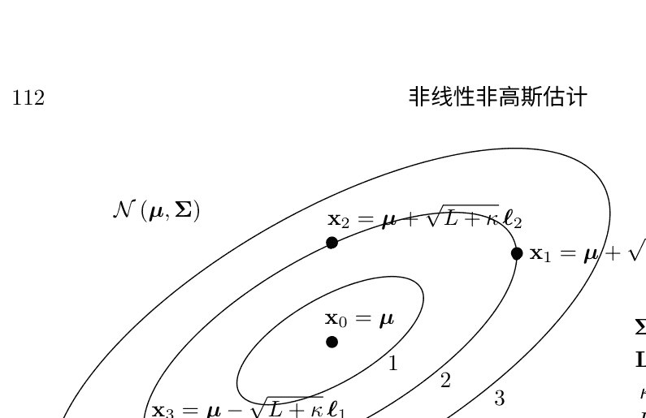

例4.1 我们将使用一个简单的一维非线性函数，f(x)=x²，作为一个例子，并比较各种变换方法。假设先验密度为N(μ_x, σ_x²)。

## 蒙特卡罗方法

实际上，对于这个特定的非线性函数，我们可以基本上使用闭式的蒙特卡罗方法（即，我们实际上不需要绘制任何样本来获得通过非线性函数转换输入密度的精确答案）。输入密度的任意样本（也称为实现）如下：

x_i = μ_x + δx_i， δx_i ← 𝒩(0, σ_x²). 　　(4.53)

通过非线性变换，我们得到

y_i = f(x_i) = f(μ_x + δx_i) = (μ_x + δx_i)² = μ_x² + 2μ_x δx_i + δx_i². 　　(4.54)

对两边取期望，我们得到输出的均值：

μ_y = E[y_i] = μ_x² + 2μ_x \underbrace{E[δx_i]}_{0} + \underbrace{E[δx_i²]}_{σ_x²} = μ_x² + σ_x². 　　(4.55)

### 4.2 递归离散时间估计

我们对输出的方差做类似的处理：

σ_y² = E[(y_i - μ_y)²]
= E[(2μ_x δx_i + δx_i² - σ_x²)²]
= E[δx_i⁴] + 4μ_x E[δx_i³] + (4μ_x² - 2σ_x²) E[δx_i²] - 4μ_x σ_x² E[δx_i] + σ_x⁴
= 4μ_x² σ_x² + 2σ_x⁴

其中 E[δx_i³]=0 和 E[δx_i⁴]=3σ_x⁴ 是高斯概率密度函数的已知三阶和四阶矩。

事实上，得到的输出密度不是高斯分布。我们可以计算输出的更高阶矩（它们不会全部匹配高斯分布）。然而，如果我们只考虑方差以内的矩来近似输出为高斯分布，我们可以这样做。在这种情况下，得到的输出密度为 𝒩(μ_y, σ_y²)。我们有效地使用了蒙特卡罗方法进行了无限数量的样本计算，以闭式形式准确计算了后验的前两个矩。现在让我们看看线性化和sigma点变换的表现如何。

##### 线性化

关于输入密度的均值对非线性进行线性化，我们有

y_i = f(μ_x + δx_i) ≈ f(μ_x) + ∂f/∂x|_{μ_x} δx_i = μ_x² + 2μ_x δx_i

通过期望值，我们得到输出的均值：

μ_y = E[y_i] = μ_x² + 2μ_x E[δx_i] = μ_x²

这只是通过非线性函数传递的输入的均值：μ_y = f(μ_x)。对于输出的方差，我们有

σ_y² = E[(y_i - μ_y)²] = E[(2μ_x δx_i)²] = 4μ_x² σ_x²

将(4.55)与(4.58)进行比较，以及(4.56)与(4.59)进行比较，我们可以看到存在一些差异。实际上，线性化的均值存在偏差，方差过小（即过于自信）。让我们看看通过sigma点变换会发生什么。

##### Sigma点变换

在维度L = 1中有2L + 1 = 3个Sigma点：

x_0 = μ_x,　x_1 = μ_x + √(1 + κ) σ_x,　x_2 = μ_x - √(1 + κ) σ_x, 　　(4.60)

其中 κ 是一个我们将在下面讨论的用户定义参数。 我们通过非线性函数将每个Sigma点传递：y_0 = f(x_0) = μ_x²，

y_1 = f(x_1) = (μ_x + √(1 + κ) σ_x)²
= μ_x² + 2μ_x √(1 + κ) σ_x + (1 + κ)σ_x², 　　(4.61b)
y_2 = f(x_2) = (μ_x - √(1 + κ) σ_x)²
= μ_x² - 2μ_x √(1 + κ) σ_x + (1 + κ)σ_x². 　　(4.61c)

输出的平均值由以下给出

μ_y = (1/(1+κ)) ( κ y_0 + (1/2) Σ_{i=1}^{2} y_i ) 　　(4.62a)
= (1/(1+κ)) ( κ μ_x² + (1/2) ( μ_x² + 2μ_x√(1+κ)σ_x + (1+κ)σ_x² + μ_x² - 2μ_x√(1+κ)σ_x + (1+κ)σ_x² ) ) 　　(4.62b)
= (1/(1+κ)) ( κ μ_x² + μ_x² + (1+κ)σ_x² ) 　　(4.62c)
= μ_x² + σ_x². 　　(4.62d)

这与 κ 无关，与(4.55)完全相同。 对于方差，我们有

σ_y² = (1/(1+κ)) ( κ (y_0 - μ_y)² + (1/2) Σ_{i=1}^{2} (y_i - μ_y)² ) 　　(4.63a)
= (1/(1+κ)) ( κ σ_x⁴ + (1/2) ( (2μ_x√(1+κ)σ_x + κσ_x²)² + (-2μ_x√(1+κ)σ_x + κσ_x²)² ) ) 　　(4.63b)
= (1/(1+κ)) ( κ σ_x⁴ + 4(1+κ)μ_x²σ_x² + κ²σ_x⁴ ) 　　(4.63c)
= 4μ_x²σ_x² + κσ_x⁴. 　　(4.63d)

通过选择用户可定义的参数 κ 为2，可以使其与(4.56)完全相同。 因此，对于这种非线性，无迹变换可以准确捕捉输出的正确均值和方差。

### 4.2 递归离散时间估计

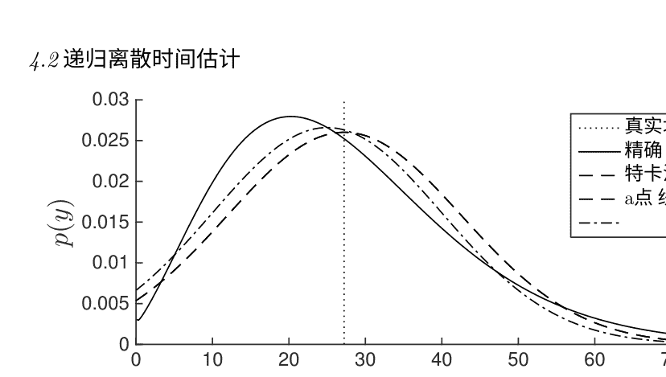

要理解为什么我们应该选择κ=2，我们只需要看输入密度即可。参数κ决定了sigma点离均值的距离。这不会影响sigma点的前三个矩（即μ_x，σ_x²和零偏度）。然而，改变κ会影响sigma点的第四阶矩（峰度）。我们已经使用了高斯概率密度函数的第四阶矩为3σ_x⁴这一事实。我们可以选择κ使得sigma点的第四阶矩与高斯输入密度的真实峰度匹配：

$$3σ_x^4 = \frac{1}{1 + κ} \left( κ (x_0 - μ_x)^4 + \frac{1}{2} \sum_{i=1}^{2} (x_i - μ_x)^4 \right) \quad (4.64a)$$
$$= \frac{1}{2(1 + κ)} \left( \left( \sqrt{1 + κ} σ_x \right)^4 + \left( -\sqrt{1 + κ} σ_x \right)^4 \right) \quad (4.64b)$$
$$= (1 + κ) σ_x^4. \quad (4.64c)$$

比较期望和实际峰度，我们应该选择κ=2，使它们完全匹配。毫不奇怪，这对转换的准确性有积极影响。总之，这个例子表明，如果目标是捕捉输出的真实均值，线性化是一种较差的通过非线性变换PDF的方法。图4.12提供了这个例子的图形描述。在接下来的几节中，我们将回顾贝叶斯滤波器，并利用我们对通过非线性传递PDF的不同方法的新认识，对EKF进行一些有用的改进。我们将从粒子滤波器开始，它使用蒙特卡罗方法。然后，我们将尝试使用SP变换实现高斯滤波器。

#### 4.2.8 粒子滤波器

我们已经看到，绘制大量样本是近似概率密度函数（PDF）的一种方法。我们还看到，我们可以通过非线性传递每个样本，并在另一侧重新组合它们，以获得对PDF变换的近似。在本节中，我们将这个想法扩展到贝叶斯滤波器的近似，称为粒子滤波器（Thrun等，2001年）。

粒子滤波器是唯一能够处理非高斯噪声和非线性观测和运动模型的实用技术之一。

它的实用性在于它非常容易实现；我们甚至不需要对 f(·) 和 g(·) 以及它们的导数有解析表达式。

实际上，粒子滤波器有很多不同的变体；我们将概述一个基本版本，并指出变体通常发生的地方。这里采用的方法基于重要性重采样，所谓的提议概率密度函数是贝叶斯滤波器中的先验概率密度函数，使用运动模型和最新的运动测量向前传播， v_k。这个版本的粒子滤波器有时被称为自举算法、凝聚算法或适者生存算法。

##### PF算法

使用贝叶斯滤波部分的符号表示，粒子滤波的主要步骤如下：

- 1. 从包括先验和运动噪声的联合密度中抽取 M 个样本：
   [ \begin{bmatrix} \hat{\mathbf{x}}_{k-1, m} \\ \mathbf{w}_{k, m} \end{bmatrix} \leftarrow p (\mathbf{x}_{k-1} | \check{\mathbf{x}}_0, \mathbf{v}_{1:k-1}, \mathbf{y}_{1:k-1}) p(\mathbf{w}_k), \quad (4.65) ]
   其中 m 是唯一的粒子索引。实际上，我们可以分别从联合密度的每个因子中抽取样本。
- 2. 通过使用 v_k 生成后验概率密度的预测。这是通过将每个先验粒子/噪声样本通过非线性运动模型进行传递来完成的：
   [ \check{\mathbf{x}}_{k, m} = \mathbf{f} (\hat{\mathbf{x}}_{k-1, m}, \mathbf{v}_k, \mathbf{w}_{k, m}). \quad (4.66) ]
   这些新的“预测粒子”一起近似密度，p(𝐱_k | 𝐱̌_0, 𝐯_{1:k}, 𝐲_{1:k-1})。
- 3. 通过合并 y_k 来修正后验概率密度函数。这是通过两个步骤间接完成的：
   - 首先，根据期望后验概率和每个粒子的预测后验概率之间的差异，为每个预测粒子分配一个标量权重，w_{k,m}：
     [ w_{k,m} = \frac{p(\check{\mathbf{x}}_{k, m} | \check{\mathbf{x}}_0, \mathbf{v}_{1:k}, \mathbf{y}_{1:k})}{p(\check{\mathbf{x}}_{k, m} | \check{\mathbf{x}}_0, \mathbf{v}_{1:k}, \mathbf{y}_{1:k-1})} = η p(\mathbf{y}_k | \check{\mathbf{x}}_{k, m}), \quad (4.67) ]
   - 其中 η 是一个归一化常数。在实践中，通常通过模拟预期的传感器读数 ỹ_{k,m} 来实现，使用非线性观测模型：
     ỹ_{k,m} = g (𝐱̌_{k,m}, 𝐎). 　　(4.68)
     然后我们假设 p (𝐲_k | 𝐱̌_{k,m} ) = p (𝐲_k | ỹ_{k,m} )，其中右边是已知的密度（例如，高斯分布）。
   - 根据分配给每个预测后验粒子的权重新采样后验：
     [ \hat{\mathbf{x}}_{k,m} \stackrel{\text{重新采样}}{\longleftarrow} \left\{\check{\mathbf{x}}_{k,m}, w_{k,m}\right\}. \quad (4.69) ]

这可以通过几种不同的方式来完成。Madow提供了一种简单的系统技术来进行重新采样，我们在下面进行描述。
图4.13以块图的形式捕捉了这些步骤。
此时应该提供一些额外的评论，以帮助在实际情况下使这个基本版本的粒子滤波器工作起来：
- (i) 我们如何知道要使用多少个粒子？ 这在很大程度上取决于具体的估计问题。对于低维问题（例如，𝐱 = (x, y, θ)），通常使用数百个粒子。
- (ii) 我们可以使用启发式方法动态地选择在线粒子数量，例如 Σ_{m} w_{k,m} ≥ w_{thresh}，一个阈值。换句话说，我们不断添加粒子/样本，并重复步骤1到3，直到权重的总和超过实验确定的阈值。
- (iii) 我们不一定需要每次通过算法时重新采样。我们可以延迟重新采样，但是需要将权重传递到算法的下一次迭代中。
- (iv) 为了安全起见，在第一步中添加一小部分从整个状态样本空间均匀抽取的样本是明智的。这可以防止异常传感器测量/车辆移动。
- (v) 对于高维状态估计问题，粒子滤波器可能变得难以计算。如果使用的粒子数量太少，涉及的密度会被欠采样，并且给出高度倾斜的结果。所需样本数量随状态空间的维数呈指数增长。Thrun等人（2001）提供了一些用于解决样本贫化问题的粒子滤波器的替代方法。
- (vi) 粒子滤波器是一种“随时可用”的算法。也就是说，我们可以不断添加粒子，直到时间用尽，然后重新采样并给出答案。使用更多的粒子总是有帮助的，但会带来计算成本。
- (vii) Cramér-Rao下界（CRLB）由我们可用的测量不确定性确定。使用更多样本不能比CRLB更好。请参阅第2.2.11节对CRLB的讨论。

##### 重采样

粒子滤波器的一个关键方面是根据分配给每个当前样本的权重对后验密度进行重采样。一种方法是使用Madow（1949）描述的系统重采样方法。我们假设我们有M个样本，并且每个样本都被分配了一个未归一化的权重w_m ∈ ℝ > 0。根据权重，我们根据边界β_m创建区间。

β_m = (Σ_{n=1}^{m} w_n) / (Σ_{ℓ=1}^{M} w_ℓ) 　　(4.70)

β_m定义了区间[0,1]上M个区间的边界。

0 ≤ β_1 ≤ β_2 ≤ ... ≤ β_{M-1} ≤ 1,

我们注意到我们将有 β_M = 1. 然后我们从(0,1)上均匀分布的随机数中选择一个随机数 ρ。对于M次迭代，我们将包含 ρ的样本添加到新的样本列表中。

在每次迭代中，我们将 ρ向前移动1/M。该算法保证了所有大小大于1/M的箱子在新列表中都有一个样本。

#### 4.2.9 Sigma点卡尔曼滤波器

我们可以尝试改进基本的EKF的另一种方法是完全摒弃线性化的概念，而是使用sigma点变换将概率密度函数通过非线性运动和观测模型传递。结果就是sigma点卡尔曼滤波器（SPKF）也称为

##### 预测步骤

预测步骤是对sigma点变换的一个相当直接的应用，因为我们只是试图通过运动模型将我们的先验向前推进到时间上。我们采用以下步骤从先验信念 {𝐱̂_{k-1}, 𝐏̂_{k-1}} 到预测信念 {𝐱̌_{k}, 𝐏̌_{k}}：

- 1. 先验信念和运动噪声都具有不确定性，因此它们以以下方式堆叠在一起：
   [μ_z = \begin{bmatrix} \hat{\mathbf{x}}_{k-1} \\ \mathbf{0} \end{bmatrix}, \quad \Sigma_{zz} = \begin{bmatrix} \hat{\mathbf{P}}_{k-1} & \mathbf{0} \\ \mathbf{0} & \mathbf{Q}_k \end{bmatrix}, \qquad (4.71)]
   在这里我们可以看到 {μ_z, Σ_{zz}} 仍然是一个高斯表示。我们令 L = dim μ_z。
- 2. 将 {μ_z, Σ_{zz}} 转换为sigma点表示：
   [ \mathbf{L}\mathbf{L}^T = \Sigma_{zz}, \quad (\text{Cholesky分解}, \mathbf{L} \text{为下三角矩阵}) \quad (4.72a) ]
   [ \mathbf{z}_0 = μ_z, \qquad (4.72b) ]
   [ \mathbf{z}_i = μ_z + \sqrt{L + κ} \text{col}_i \mathbf{L}, \quad i = 1\ldots L \qquad (4.72c) ]
   [ \mathbf{z}_{i+L} = μ_z - \sqrt{L + κ} \text{col}_i \mathbf{L}. \qquad (4.72d) ]
- 3. 将每个sigma点分解为状态和运动噪声，
   [ \mathbf{z}_i = \begin{bmatrix} \hat{\mathbf{x}}_{k-1,i} \\ \mathbf{w}_{k,i} \end{bmatrix}, \qquad (4.73) ]
   然后将每个sigma点通过非线性运动模型精确传递：
   [ \breve{\mathbf{x}}_{k,i} = \mathbf{f} \left( \hat{\mathbf{x}}_{k-1,i}, \mathbf{v}_k, \mathbf{w}_{k,i} \right), \quad i=0.\ldots 2L_\circ. \qquad (4.74) ]

注意，最新的输入，𝐯_k,是必需的.

- 4. 从变换后的sigma点重新组合预测均值和协方差：
   [ \breve{\mathbf{x}}_k = \sum_{i=0}^{2L} α_i \breve{\mathbf{x}}_{k,i}, \qquad (4.75a) ]
   [ \breve{\mathbf{P}}_k = \sum_{i=0}^{2L} α_i (\breve{\mathbf{x}}_{k,i} - \breve{\mathbf{x}}_k) (\breve{\mathbf{x}}_{k,i} - \breve{\mathbf{x}}_k)^T, \qquad (4.75b) ]其中

$$\alpha_i = \begin{cases} \frac{\kappa}{L+\kappa} & i=0 \\ \frac{1}{2(L+\kappa)} & \text{否则} \end{cases},$$ (4.76)

接下来，我们将看一下sigmapoint变换的第二个应用，以实现校正步骤。

##### 校正步骤

这一步骤稍微复杂一些。我们回顾一下第4.2.4节，并回忆一下条件高斯密度函数 $\mathbf{x}_k$（即后验）是

$$p(\mathbf{x}_k|\breve{\mathbf{x}}_0, \mathbf{v}_{1:k-1}, \mathbf{y}_{0:k}) = \mathcal{N}\left( \underbrace{\boldsymbol{\mu}_{x,k} + \boldsymbol{\Sigma}_{xy,k} \boldsymbol{\Sigma}_{yy,k}^{-1} (\mathbf{y}_k - \boldsymbol{\mu}_{y,k})}_{\hat{\mathbf{x}}_k}, \underbrace{\boldsymbol{\Sigma}_{xx,k} - \boldsymbol{\Sigma}_{xy,k} \boldsymbol{\Sigma}_{yy,k}^{-1} \boldsymbol{\Sigma}_{yx,k}}_{\hat{\mathbf{P}}_k} \right),$$ (4.77)

在这里，我们定义 $\hat{\mathbf{x}}_k$ 为均值，$\hat{\mathbf{P}}_k$ 为协方差。以这种形式，我们可以将广义高斯校正步骤方程写成

$$\begin{aligned} \mathbf{K}_k &= \boldsymbol{\Sigma}_{xy,k} \boldsymbol{\Sigma}_{yy,k}^{-1}, \\ \hat{\mathbf{P}}_k &= \breve{\mathbf{P}}_k - \mathbf{K}_k \boldsymbol{\Sigma}_{xy,k}^T, \\ \hat{\mathbf{x}}_k &= \breve{\mathbf{x}}_k + \mathbf{K}_k (\mathbf{y}_k - \boldsymbol{\mu}_{y,k}). \end{aligned}$$ (4.78a)-(4.78c)

我们将使用SP变换来得到更好的版本 $\boldsymbol{\mu}_{y,k}$， $\boldsymbol{\Sigma}_{yy,k}$ 和 $\boldsymbol{\Sigma}_{xy,k}$。我们采用以下步骤：

1. 预测的信念和观测噪声都具有不确定性，因此它们以以下方式堆叠在一起：
$$\boldsymbol{\mu}_z = \begin{bmatrix} \breve{\mathbf{x}}_k \\ \mathbf{0} \end{bmatrix}, \quad \boldsymbol{\Sigma}_{zz} = \begin{bmatrix} \breve{\mathbf{P}}_k & \mathbf{0} \\ \mathbf{0} & \mathbf{R}_k \end{bmatrix},$$ (4.79)

2. 将 $\{\boldsymbol{\mu}_z, \boldsymbol{\Sigma}_{zz}\}$ 转换为一个sigma点表示：
$$\mathbf{L}\mathbf{L}^T = \boldsymbol{\Sigma}_{zz}, \text{ (Cholesky分解, } \mathbf{L} \text{ 下三角)}$$ (4.80a)
$$\mathbf{z}_0 = \boldsymbol{\mu}_z,$$ (4.80b)
$$\mathbf{z}_i = \boldsymbol{\mu}_z + \sqrt{L+\kappa} \, \text{col}_i \mathbf{L}, \quad i=1\dots L$$ (4.80c)
$$\mathbf{z}_{i+L} = \boldsymbol{\mu}_z - \sqrt{L+\kappa} \, \text{col}_i \mathbf{L}.$$ (4.80d)

3. 将每个Sigma点分解为状态和观测噪声，
$$\mathbf{z}_i = \begin{bmatrix} \breve{\mathbf{x}}_{k,i} \\ \mathbf{n}_{k,i} \end{bmatrix},$$ (4.81)
然后将每个Sigma点通过非线性观测模型精确传递：
$$\breve{\mathbf{y}}_{k,i}=\mathbf{g}\left(\breve{\mathbf{x}}_{k,i}, \mathbf{n}_{k,i}\right) .$$ (4.82)

4. 将转换后的Sigma点重新组合为所需的矩：
$$\boldsymbol{\mu}_{y,k}=\sum_{i=0}^{2 L} \alpha_{i} \breve{\mathbf{y}}_{k,i},$$ (4.83a)

$$\boldsymbol{\Sigma}_{y y, k}=\sum_{i=0}^{2 L} \alpha_{i}\left(\breve{\mathbf{y}}_{k,i}-\boldsymbol{\mu}_{y,k}\right)\left(\breve{\mathbf{y}}_{k,i}-\boldsymbol{\mu}_{y,k}\right)^{T},$$ (4.83b)

$$\boldsymbol{\Sigma}_{x y, k}=\sum_{i=0}^{2 L} \alpha_{i}\left(\breve{\mathbf{x}}_{k,i}-\breve{\mathbf{x}}_{k}\right)\left(\breve{\mathbf{y}}_{k,i}-\boldsymbol{\mu}_{y,k}\right)^{T},$$ (4.83c)

其中

$$\alpha_{i}=\left\{\begin{array}{ll}\frac{\kappa}{L+\kappa}, & i=0 \\ \frac{1}{2(L+\kappa)}, & \text { 否则 } .\end{array}\right.$$ (4.84)

将这些插入上述广义高斯校正步骤方程中，完成校正步骤。

SPKF的两个优点是：(i) 不需要任何解析导数；(ii) 在实现中只使用基本的线性代数运算。此外，我们甚至不需要非线性运动和观测模型的闭合形式；它们可以只是黑盒软件函数。

##### 与EKF进行比较

我们可以看到，在校正步骤中，矩阵 $\boldsymbol{\Sigma}_{y y, k}$扮演的角色是

在EKF中，我们可以通过线性化观测模型（关于预测状态）来更直接地看到这一点：

$$\breve{\mathbf{y}}_{k,i}=\mathbf{g}\left(\breve{\mathbf{x}}_{k,i}, \mathbf{n}_{k,i}\right) \approx \mathbf{g}\left(\breve{\mathbf{x}}_{k}, \mathbf{0}\right)+\mathbf{G}_{k}\left(\breve{\mathbf{x}}_{k,i}-\breve{\mathbf{x}}_{k}\right)+\mathbf{n}_{i}^{\prime}.$$ (4.85)

将这个近似代入(4.83a)中，我们可以看到

$$\breve{\mathbf{y}}_{k,i}-\boldsymbol{\mu}_{y, k} \approx \mathbf{G}_{k}\left(\breve{\mathbf{x}}_{k,i}-\breve{\mathbf{x}}_{k}\right)+\mathbf{n}_{k, i}^{\prime}.$$ (4.86)

将这个代入(4.83b)中，我们有

$$\begin{aligned} \boldsymbol{\Sigma}_{y y, k} & \approx \mathbf{G}_{k} \underbrace{\sum_{i=0}^{2 L} \alpha_{i}\left(\breve{\mathbf{x}}_{k,i}-\breve{\mathbf{x}}_{k}\right)\left(\breve{\mathbf{x}}_{k,i}-\breve{\mathbf{x}}_{k}\right)^{T}}_{\tilde{\mathbf{P}}_{k}} \mathbf{G}_{k}^{T}+\underbrace{\sum_{i=0}^{2 L} \alpha_{i} \mathbf{n}_{k, i}^{\prime} \mathbf{n}_{k, i}^{\prime T}}_{\mathbf{R}^{\prime}{ }_{\gamma}} \\ & \quad+\mathbf{G}_{k} \underbrace{\sum_{i=0}^{2 L} \alpha_{i}\left(\breve{\mathbf{x}}_{k,i}-\breve{\mathbf{x}}_{k}\right) \mathbf{n}_{k, i}^{\prime T}}_{\mathbf{0}}+\underbrace{\sum_{i=0}^{2 L} \alpha_{i} \mathbf{n}_{k, i}^{\prime}\left(\breve{\mathbf{x}}_{k,i}-\breve{\mathbf{x}}_{k}\right)^{T}}_{\mathbf{0}} \mathbf{G}_{k}^{T} .\end{aligned}$$ (4.87)

由于$\Sigma$的块对角结构，一些项为零。对于$\Sigma_{xy,\mathrm{k}}$，通过将我们的近似代入(4.83c)中，我们有

$$\Sigma_{xy,k} \approx \sum_{i=0}^{2L} \alpha_i \left( \check{\mathbf{x}}_{k,i}-\check{\mathbf{x}}_k \right) \left( \check{\mathbf{x}}_{k,i}-\check{\mathbf{x}}_k \right)^T \mathbf{G}_k^T + \sum_{i=0}^{2L} \alpha_i \left( \check{\mathbf{x}}_{k,i}-\check{\mathbf{x}}_k \right) \mathbf{n}_{k,i}^{\prime T} , \qquad (4.88)$$

，因此这就是我们在EKF中所拥有的。

$$\mathbf{K}_k = \Sigma_{xy,k} \Sigma_{yy,k}^{-1} \approx \check{\mathbf{P}}_k \mathbf{G}_k^T \left( \mathbf{G}_k \check{\mathbf{P}}_k \mathbf{G}_k^T + \mathbf{R}_k^{\prime} \right)^{-1}, \qquad (4.89)$$

##### 特殊情况下对测量噪声的线性依赖

在我们的非线性观测模型具有特殊形式的情况下

$$\mathbf{y}_k = \mathbf{g}(\mathbf{x}_k) + \mathbf{n}_k, \qquad (4.90)$$

SPKF校正步骤可以大大加快。不失一般性，我们可以根据$\Sigma_{zz}$的块对角分区将sigma点分为两类；我们说有$2N+1$个sigma点来自状态的维度，以及$2(L-N)$个额外的sigma点来自测量的维度。为了方便起见，我们将重新按照sigma点的索引进行排序：

$$\check{\mathbf{y}}_{k,j} = \begin{cases} \mathbf{g}(\check{\mathbf{x}}_{k,j}) & j = 0 \ldots 2N \\ \mathbf{g}(\check{\mathbf{x}}_k) + \mathbf{n}_{k,j} & j = 2N+1 \ldots 2L+1 \end{cases} . \qquad (4.91)$$

然后我们可以将$\mu_{y,k}$的表达式写为

$$\begin{aligned} \boldsymbol{\mu}_{y,k} &= \sum_{j=0}^{2N} \alpha_j \check{\mathbf{y}}_{k,j} + \sum_{j=2N+1}^{2L+1} \alpha_j \check{\mathbf{y}}_{k,j} \qquad (4.92a) \\ &= \sum_{j=0}^{2N} \alpha_j \check{\mathbf{y}}_{k,j} + \sum_{j=2N+1}^{2L+1} \alpha_j \left( \mathbf{g}(\check{\mathbf{x}}_k) + \mathbf{n}_{k,j} \right) \qquad (4.92b) \\ &= \sum_{j=0}^{2N} \alpha_j \check{\mathbf{y}}_{k,j} + \mathbf{g}(\check{\mathbf{x}}_k) \sum_{j=2N+1}^{2L+1} \alpha_j \qquad (4.92c) \\ &= \sum_{j=0}^{2N} \beta_j \check{\mathbf{y}}_{k,j} , \qquad (4.92d) \end{aligned}$$

其中

$$
\beta_i = \begin{cases}
\alpha_i + \sum_{j=2N+1}^{2L+1} \alpha_j & i = 0 \\
\alpha_i & \text{否则}
\end{cases}
\qquad (4.93a)
$$
$$
= \begin{cases}
\frac{(\kappa+L-N)}{N+(\kappa+L-N)} & i = 0 \\
\frac{1}{2N+(\kappa+L-N)} & \text{否则}
\end{cases}
\qquad (4.93b)
$$

这与原始权重的形式相同（它们仍然总和为1）。然后我们可以轻松验证

$$
\mathbf{\Sigma}_{yy,k} = \sum_{j=0}^{2N} \beta_j \left( \check{\mathbf{y}}_{k,j} - \boldsymbol{\mu}_{y,k} \right) \left( \check{\mathbf{y}}_{k,j} - \boldsymbol{\mu}_{y,k} \right)^T + \mathbf{R}_k,
\qquad (4.94)
$$

没有近似。这已经很有帮助，因为我们实际上不需要所有$2L+1$个sigma点，只需要其中的$2N+1$个。这意味着在某些情况下，我们不需要多次调用$g(\cdot)$，这可能是昂贵的。

然而，我们仍然有一个问题。仍然需要要求逆 $\mathbf{\Sigma}_{yy,k}$，其大小为$(L-N) \times (L-N)$，以计算卡尔曼增益矩阵。如果测量数量，$L-N$，很大，这可能非常昂贵。如果我们假设逆矩阵$\mathbf{R}_k$可以便宜地计算，我们可以进一步提高效益。例如，如果$\mathbf{R}_k = \sigma^2\mathbf{1}$，那么$\mathbf{R}_k^{-1}=\sigma^{-2}\mathbf{1}$。我们注意到$\mathbf{\Sigma}_{yy,k}$可以方便地写成

$$
\mathbf{\Sigma}_{yy,k} = \mathbf{Z}_k\mathbf{Z}_k^T + \mathbf{R}_k,
\qquad (4.95)
$$

其中

$$
\mathrm{col}_j\mathbf{Z}_k = \sqrt{\beta_j} \left( \check{\mathbf{y}}_{k,j} - \boldsymbol{\mu}_{y,k} \right).
\qquad (4.96)
$$

根据第2.2.7节的SMW恒等式，我们可以证明

$$
\mathbf{\Sigma}_{yy,k}^{-1} = \left( \mathbf{Z}_k\mathbf{Z}_k^T + \mathbf{R}_k \right)^{-1}
\qquad (4.97a)
$$
$$
= \mathbf{R}_k^{-1} - \mathbf{R}_k^{-1}\mathbf{Z}_k \underbrace{\left( \mathbf{Z}_k^T \mathbf{R}_k^{-1}\mathbf{Z}_k + \mathbf{1} \right)^{-1}}_{(2N+1)\times(2N+1)} \mathbf{Z}_k^T \mathbf{R}_k^{-1},
\qquad (4.97b)
$$

现在我们只需要要求逆一个$(2N+1) \times (2N+1)$矩阵（假设$\mathbf{R}_k^{-1}$已知）。

#### 4.2.10 迭代Sigma点卡尔曼滤波器

Sibley等人 (2006) 提出了一种迭代的Sigma点卡尔曼滤波器 (ISPKF)，比一次性版本更好。在这种情况下，我们在每次迭代中计算围绕操作点 $\mathbf{x}_{\mathrm{op},k}$ 的输入Sigma点。在第一次迭代中，我们让 $\mathbf{x}_{\mathrm{op},k}=\hat{\mathbf{x}}_k$，但随后的每次迭代都会改进这个值。我们展示所有的步骤以避免混淆：

1. 预测的信念和观测噪声都有不确定性，因此它们以以下方式堆叠在一起：
$$\boldsymbol{\mu}_z = \begin{bmatrix} \mathbf{x}_{\mathrm{op}, k} \\ \mathbf{0} \end{bmatrix}, \quad \boldsymbol{\Sigma}_{zz} = \begin{bmatrix} \mathbf{P}_k & \mathbf{0} \\ \mathbf{0} & \mathbf{R}_k \end{bmatrix}, \qquad (4.98)$$
在这里我们可以看到 $\{\boldsymbol{\mu}_z, \boldsymbol{\Sigma}_{zz}\}$ 仍然是一个高斯表示。我们令 $L = \dim \boldsymbol{\mu}_z$。

2. 将 $\{\boldsymbol{\mu}_z, \boldsymbol{\Sigma}_{zz}\}$ 转换为一个 sigma 点表示：
$$\mathbf{L}\mathbf{L}^T = \boldsymbol{\Sigma}_{zz}, \text{ (Cholesky分解, $\mathbf{L}$下三角矩阵)} \qquad (4.99a)$$
$$\mathbf{z}_0 = \boldsymbol{\mu}_z, \qquad (4.99b)$$
$$\mathbf{z}_i = \boldsymbol{\mu}_z + \sqrt{L+\kappa} \, \mathrm{col}_i\mathbf{L}, \qquad i=1 \ldots L \qquad (4.99c)$$
$$\mathbf{z}_{i+L} = \boldsymbol{\mu}_z - \sqrt{L+\kappa} \, \mathrm{col}_i\mathbf{L}. \qquad (4.99d)$$

3. 将每个 sigma 点分解为状态和观测噪声，
$$\mathbf{z}_i = \begin{bmatrix} \mathbf{x}_{\mathrm{op}, k, i} \\ \mathbf{n}_{k, i} \end{bmatrix}, \qquad (4.100)$$
然后将每个 sigma 点通过非线性观测模型精确地传递：
$$\mathbf{y}_{\mathrm{op}, k, i} = \mathbf{g}(\mathbf{x}_{\mathrm{op}, k, i}, \mathbf{n}_{k, i}). \qquad (4.101)$$

4. 将转换后的 sigma 点重新组合成所需的矩阵：
$$\boldsymbol{\mu}_{y, k} = \sum_{i=0}^{2L} \alpha_i \, \mathbf{y}_{\mathrm{op}, k, i}, \qquad (4.102a)$$
$$\boldsymbol{\Sigma}_{yy, k} = \sum_{i=0}^{2L} \alpha_i \left( \mathbf{y}_{\mathrm{op}, k, i} - \boldsymbol{\mu}_{y, k} \right) \left( \mathbf{y}_{\mathrm{op}, k, i} - \boldsymbol{\mu}_{y, k} \right)^T, \qquad (4.102b)$$
$$\boldsymbol{\Sigma}_{xy, k} = \sum_{i=0}^{2L} \alpha_i \left( \mathbf{x}_{\mathrm{op}, k, i} - \mathbf{x}_{\mathrm{op}, k} \right) \left( \mathbf{y}_{\mathrm{op}, k, i} - \boldsymbol{\mu}_{y, k} \right)^T. \qquad (4.102c)$$
$$\boldsymbol{\Sigma}_{xx, k} = \sum_{i=0}^{2L} \alpha_i \left( \mathbf{x}_{\mathrm{op}, k, i} - \mathbf{x}_{\mathrm{op}, k} \right) \left( \mathbf{x}_{\mathrm{op}, k, i} - \mathbf{x}_{\mathrm{op}, k} \right)^T, \qquad (4.102d)$$
其中
$$\alpha_i = \begin{cases} \frac{\kappa}{L+\kappa} & i=0 \\ \frac{1}{2(L+\kappa)} & \text{否则} \end{cases}. \qquad (4.103)$$

在这一点上，Sibley 等人使用 SPKF 和 EKF 之间的关系来更新 IEKF 校正方程(4.45)，使用## 4.2 递归离散时间估计

统计而非分析的雅可比矩阵量：

$$\mathbf{K}_k = \breve{\mathbf{P}}_k \mathbf{G}_k^T \left( \mathbf{G}_k \breve{\mathbf{P}}_k \mathbf{G}_k^T + \mathbf{R}_k \right)^{-1}, \tag{4.104a}$$

$$\hat{\mathbf{P}}_k = \left( \mathbf{I} - \mathbf{K}_k \mathbf{G}_k \right) \breve{\mathbf{P}}_k, \tag{4.104b}$$

$$\hat{\mathbf{x}}_k = \breve{\mathbf{x}}_k + \mathbf{K}_k \left( \mathbf{y}_k - \mathbf{g}(\mathbf{x}_{\text{op},k}, \mathbf{0}) - \mathbf{G}_k \left( \breve{\mathbf{x}}_k - \mathbf{x}_{\text{op},k} \right) \right), \tag{4.104c}$$

这导致

$$\mathbf{K}_k = \Sigma_{xy,k} \Sigma_{yy,k}^{-1}, \tag{4.105a}$$

$$\hat{\mathbf{P}}_k = \Sigma_{xx,k} - \mathbf{K}_k \Sigma_{yx,k}, \tag{4.105b}$$

$$\hat{\mathbf{x}}_k = \breve{\mathbf{x}}_k + \mathbf{K}_k \left( \mathbf{y}_k - \mu_{y,k} - \Sigma_{yx,k} \Sigma_{xx,k}^{-1} \left( \breve{\mathbf{x}}_k - \mathbf{x}_{\text{op},k} \right) \right). \tag{4.105c}$$

最初，我们将操作点设置为先验均值：$x_{\text{op},k} = \tilde{x}_k$。在后续迭代中，我们将其设置为迄今为止的最佳估计：

$$x_{\text{op},k} \leftarrow \hat{x}_k. \tag{4.106}$$

当从一次迭代到下一次的变化足够小时，过程终止。

我们已经看到IEKF的第一次迭代结果是EKF方法，对于SPKF/ISPKF也是如此。在(4.105c)中设置$x_{\text{op},k}=\hat{x}_k$会导致

$$\hat{\mathbf{x}}_k = \breve{\mathbf{x}}_k + \mathbf{K}_k \left( \mathbf{y}_k - \mu_{y,k} \right), \tag{4.107}$$

这与(4.78c)中的一次性方法相同。

#### 4.2.11 ISPKF寻求后验均值

现在，我们必须问自己的问题是，如何将sigma点估计与完整的后验相关联？图4.14将sigma点方法与完整的后验和迭代线性化（即MAP）在我们使用的立体相机示例上进行了比较

$x_{\text{真实}} 26 \text{ [米]}, \quad y_{\text{测量}}=\frac{f \cdot b}{\text{真实} x} -0.6 \text{ [像素]}$

再次夸大各种方法之间的差异。我们的sigma点方法的实现使用 $\kappa=2$ ，这对于高斯先验是合适的。与EKF类似，我们看到一次性SPKF方法与完整的后验没有明显的关系。然而，ISPKF方法似乎更接近均值 $\bar{x}$ ，而不是模式（即，MAP）值， $\hat{x}_{\text{map}}$ 。从数值上看，感兴趣的数字是：

$\hat{x}_{\text{map}}=24.5694, \quad \bar{x}=24.7770,$

$\hat{x}_{\text{IEKF}}=24.5694, \quad \hat{x}_{\text{ispkf}}=24.7414.$

我们可以看到IEKF解与MAP解匹配，并且ISPKF解接近（但不完全等于）均值。

现在，我们考虑一个问题，迭代Sigma点方法如何很好地捕捉真实值？再次，我们通过大量试验（使用（4.5）中的参数）计算性能。结果显示在图4.15中。我们可以看到估计器 $\hat{x}_{\text{ispkf}}$ 和地面真实值 $x_{\text{true}}$ 之间的平均差异为-3.84厘米，表明存在小偏差。这比MAP估计器要好得多，后者在同一指标上的偏差为-33.0厘米。平均平方误差大致相同，为 $4.3^2$ 平方米。

虽然很难通过分析来证明，但可以合理地认为迭代Sigma点方法试图收敛到完整后验的均值而不是模态值。如果我们关心的是与基准真值进行匹配，使完整后验分布的均值匹配可能是一个有趣的方向。

#### 4.2.12 滤波器分类

图4.16总结了我们在本节中讨论的非线性递归状态估计方法。 我们可以将每种方法视为更大分类中的一部分，其中贝叶斯滤波器位于顶部位置。 根据所做的近似，我们得到了不同的滤波器。

还值得回顾一下迭代在我们的滤波方法中的作用。

没有迭代，EKF和SPKF都很难与完整的贝叶斯后验相关联。 然而，我们看到IEKF的“均值”收敛到MAP解，而ISPKF的均值接近完整后验的均值。 我们将在下一节中运用这些经验教训进行批量估计，试图一次性估计整个轨迹。

### 4.3 批量离散时间估计

在本节中，我们退后一步，质疑贝叶斯滤波器的有效性，因为我们总是不得不近似实现它，从而违反了它所基于的马尔可夫假设。 我们提出，在推导非线性滤波器（即比贝叶斯滤波器更好的滤波器）时，一个更好的起点是我们在线性高斯估计章节中首次介绍的非线性批量估计器的非线性版本。 将估计问题设置为优化问题提供了一个不同的视角，有助于解释所有EKF变体的缺点。

#### 4.3.1 最大后验概率

在本节中，我们重新审视了我们对线性高斯估计问题和批处理优化的方法，并引入了高斯-牛顿方法来解决我们这个非线性估计问题的版本。这种优化方法可以再次被视为MAP方法。

我们首先建立我们要最小化的目标函数，然后考虑解决它的方法。

##### 目标函数

我们试图构建一个目标函数，我们将在其中最小化

$$ \mathbf{x} = \begin{bmatrix} \mathbf{x}_0 \\ \mathbf{x}_1 \\ \vdots \\ \mathbf{x}_K \end{bmatrix}, \qquad \text{(4.108)} $$

它代表了我们想要估计的整个轨迹。

回想一下，线性高斯目标函数由方程（3.10）和（3.9）给出。它采用了一个马氏距离的平方形式，并且与给定所有数据的状态的负对数似然成比例。对于非线性情况，我们定义相对于先验和测量的误差为

$$ \mathbf{e}_{v,k}(\mathbf{x}) = \begin{cases} \check{\mathbf{x}}_0 - \mathbf{x}_0, & k=0 \\ \mathbf{f}(\mathbf{x}_{k-1}, \mathbf{v}_k, \mathbf{0}) - \mathbf{x}_k, & k=1\ldots K \end{cases}, \qquad \text{(4.109a)} $$

$$ \mathbf{e}_{y,k}(\mathbf{x}) = \mathbf{y}_k - \mathbf{g}(\mathbf{x}_k, \mathbf{0}), \qquad k=0\ldots K, \qquad \text{(4.109b)} $$

以便对目标函数的贡献进行

$$ J_{v,k}(\mathbf{x}) = \frac{1}{2} \mathbf{e}_{v,k}(\mathbf{x})^T \mathbf{W}_{v,k}^{-1} \mathbf{e}_{v,k}(\mathbf{x}), \qquad \text{(4.110a)} $$

$$ J_{y,k}(\mathbf{x}) = \frac{1}{2} \mathbf{e}_{y,k}(\mathbf{x})^T \mathbf{W}_{y,k}^{-1} \mathbf{e}_{y,k}(\mathbf{x}). \qquad \text{(4.110b)} $$

然后，整体目标函数为

$$ J(\mathbf{x}) = \sum_{k=0}^{K} (J_{v,k}(\mathbf{x}) + J_{y,k}(\mathbf{x})). \qquad \text{(4.111)} $$

请注意，我们通常可以将 $\mathbf{W}_{v,k}$ 和 $\mathbf{W}_{y,k}$ 简单地视为对称的正定矩阵权重。通过选择这些与测量噪声的协方差有关的权重，最小化目标函数等价于最大化给定所有数据的状态的联合似然。

我们进一步定义

$$\mathbf{e}(\mathbf{x}) = \begin{bmatrix} \mathbf{e}_v(\mathbf{x}) \\ \mathbf{e}_y(\mathbf{x}) \end{bmatrix}, \quad \mathbf{e}_v(\mathbf{x}) = \begin{bmatrix} \mathbf{e}_{v,0}(\mathbf{x}) \\ \vdots \\ \mathbf{e}_{v,K}(\mathbf{x}) \end{bmatrix}, \quad \mathbf{e}_y(\mathbf{x}) = \begin{bmatrix} \mathbf{e}_{y,0}(\mathbf{x}) \\ \vdots \\ \mathbf{e}_{y,K}(\mathbf{x}) \end{bmatrix}, \tag{4.112a}$$

$$\mathbf{W} = \text{diag}(\mathbf{W}_v, \mathbf{W}_y), \quad \mathbf{W}_v = \text{diag}(\mathbf{W}_{v,0}, \ldots, \mathbf{W}_{v,K}), \tag{4.112b}$$

$$\mathbf{W}_y = \text{diag}(\mathbf{W}_{y,0}, \ldots, \mathbf{W}_{y,K}). \tag{4.112c}$$

因此，目标函数可以写成

$$J(\mathbf{x}) = \frac{1}{2}\mathbf{e}(\mathbf{x})^T \mathbf{W}^{-1} \mathbf{e}(\mathbf{x}). \tag{4.113}$$

我们可以进一步定义修改后的误差项，

$$\mathbf{u}(\mathbf{x}) = \mathbf{L} \mathbf{e}(\mathbf{x}), \tag{4.114}$$

其中 $\mathbf{L}^T \mathbf{L} = \mathbf{W}^{-1}$ (即通过 Cholesky 分解得到 $\mathbf{W}$ 是对称正定的)。利用这些定义，我们可以简单地将目标函数写成

$$J(\mathbf{x}) = \frac{1}{2}\mathbf{u}(\mathbf{x})^T \mathbf{u}(\mathbf{x}). \tag{4.115}$$

这完全是一个二次型，但不是关于设计变量 $\mathbf{x}$ 的。我们的目标是确定最优设计参数，$\hat{\mathbf{x}}$, 使目标函数最小化：

$$\hat{\mathbf{x}} = \arg \min_{\mathbf{x}} J(\mathbf{x}). \tag{4.116}$$

由于其二次特性，我们可以应用许多非线性优化技术来最小化这个表达式。一个常用的技术是高斯-牛顿优化，但还有许多其他可能性。更重要的问题是，我们将其视为一个非线性优化问题。我们将通过牛顿法推导出高斯-牛顿算法。

##### 牛顿法

牛顿法通过迭代逼近（可微分的）目标函数，将其近似为二次函数，然后跳转到（或向最小值移动）。假设我们对设计参数 $\mathbf{x}_{\text{op}}$ 有一个初始猜测或操作点。我们使用三项泰勒级数展开来近似 $J$ 为一个二次函数，

$$J(\mathbf{x}_{\text{op}} + \delta\mathbf{x}) \approx J(\mathbf{x}_{\text{op}}) + \left( \frac{\partial J(\mathbf{x})}{\partial\mathbf{x}} \bigg|_{\mathbf{x}_{\text{op}}} \right) \delta\mathbf{x} + \frac{1}{2}\delta\mathbf{x}^T \left( \frac{\partial^2 J(\mathbf{x})}{\partial\mathbf{x}\partial\mathbf{x}^T} \bigg|_{\mathbf{x}_{\text{op}}} \right) \delta\mathbf{x}, \tag{4.117}$$
(雅可比矩阵) (海森矩阵)

对初始猜测$\mathbf{x}_{\text{op}}$进行‘小’变化 $\delta \mathbf{x}$。需要注意的是，对称的海森矩阵需要是正定的，这样该方法才能工作（否则二次近似没有明确定义的最小值）。

下一步是找到使得这个二次近似最小化的 $\delta\mathbf{x}$ 的值。我们可以通过对 $\delta\mathbf{x}$ 求导并将其设置为零来实现。

$$\frac{\partial J(\mathbf{x}_{\text{op}} + \delta\mathbf{x})}{\partial \delta\mathbf{x}} = \left( \left. \frac{\partial J(\mathbf{x})}{\partial \mathbf{x}} \right|_{\mathbf{x}_{\text{op}}} \right) + \delta\mathbf{x}^{*T} \left( \left. \frac{\partial^2 J(\mathbf{x})}{\partial\mathbf{x}\partial\mathbf{x}^T} \right|_{\mathbf{x}_{\text{op}}} \right) = \mathbf{0}$$

$$\Rightarrow \quad \left( \left. \frac{\partial^2 J(\mathbf{x})}{\partial\mathbf{x}\partial\mathbf{x}^T} \right|_{\mathbf{x}_{\text{op}}} \right) \delta\mathbf{x}^* = -\left( \left. \frac{\partial J(\mathbf{x})}{\partial \mathbf{x}} \right|_{\mathbf{x}_{\text{op}}} \right)^T. \quad (4.118)$$

最后一行只是一个线性方程组，可以在Hessian矩阵可逆的情况下求解（因为在上面的假设中它被假定为正定）。然后，我们可以根据以下方式更新我们的操作点：

$$\mathbf{x}_{\text{op}} \leftarrow \mathbf{x}_{\text{op}} + \delta\mathbf{x}^*. \qquad\qquad (4.119)$$

这个过程迭代直到 $\delta\mathbf{x}^*$ 变得足够小。关于牛顿法的几点说明：

- (i) 它是“局部收敛”的，这意味着当初始猜测已经足够接近解时，连续的近似值保证收敛到一个解。对于复杂的非线性目标函数，这实际上是我们能期望的最好结果（即全局收敛很难实现）。
- (ii) 收敛速度是二次的（即，比简单的梯度下降法收敛速度更快）。
- (iii) 实现起来可能会很困难，因为必须计算Hessian矩阵。

高斯-牛顿方法进一步近似了牛顿法，在目标函数具有特殊形式的情况下。

##### 高斯-牛顿方法

现在让我们回到我们在方程（4.115）中拥有的非线性二次目标函数。在这种情况下，雅可比矩阵和Hessian矩阵是

雅可比矩阵：$$\frac{\partial J(\mathbf{x})}{\partial \mathbf{x}}\bigg|_{\mathbf{x}_{\text{op}}} = \mathbf{u}(\mathbf{x}_{\text{op}})^T \left( \frac{\partial \mathbf{u}(\mathbf{x})}{\partial \mathbf{x}}\bigg|_{\mathbf{x}_{\text{op}}} \right), \quad (4.120a)$$

Hessian矩阵：$$\frac{\partial^2 J(\mathbf{x})}{\partial \mathbf{x}\partial \mathbf{x}^T}\bigg|_{\mathbf{x}_{\text{op}}} = \left( \frac{\partial \mathbf{u}(\mathbf{x})}{\partial \mathbf{x}}\bigg|_{\mathbf{x}_{\text{op}}} \right)^T \left( \frac{\partial \mathbf{u}(\mathbf{x})}{\partial \mathbf{x}}\bigg|_{\mathbf{x}_{\text{op}}} \right) + \sum_{i=1}^M u_i(\mathbf{x}_{\text{op}}) \left( \frac{\partial^2 u_i(\mathbf{x})}{\partial \mathbf{x}\partial \mathbf{x}^T}\bigg|_{\mathbf{x}_{\text{op}}} \right), \quad (4.120b)$$

其中 $\mathbf{u}(\mathbf{x}) = \left( u_1(\mathbf{x}), \ldots, u_i(\mathbf{x}), \ldots, u_M(\mathbf{x}) \right)$。到目前为止，我们还没有做出任何近似。

观察到海森矩阵的表达式，我们断言在接近 $J$ 的最小值时，第二项相对于第一项来说很小。这背后的直觉是，在最优点附近，我们应该有 $u_i(\mathbf{x})$很小（最好是零）。因此，我们根据以下近似来估计海森矩阵

$$\frac{\partial^2 J(\mathbf{x})}{\partial \mathbf{x}\partial \mathbf{x}^T}\bigg|_{\mathbf{x}_{\text{op}}} \approx \left( \frac{\partial \mathbf{u}(\mathbf{x})}{\partial \mathbf{x}}\bigg|_{\mathbf{x}_{\text{op}}} \right)^T \left( \frac{\partial \mathbf{u}(\mathbf{x})}{\partial \mathbf{x}}\bigg|_{\mathbf{x}_{\text{op}}} \right), \quad (4.121)$$

这不涉及任何二阶导数。将(4.120a)和(4.121)代入由(4.118)表示的牛顿更新，我们得到

$$\left( \frac{\partial \mathbf{u}(\mathbf{x})}{\partial \mathbf{x}}\bigg|_{\mathbf{x}_{\text{op}}} \right)^T \left( \frac{\partial \mathbf{u}(\mathbf{x})}{\partial \mathbf{x}}\bigg|_{\mathbf{x}_{\text{op}}} \right) \delta \mathbf{x}^* = - \left( \frac{\partial \mathbf{u}(\mathbf{x})}{\partial \mathbf{x}}\bigg|_{\mathbf{x}_{\text{op}}} \right)^T \mathbf{u}(\mathbf{x}_{\text{op}}), \quad (4.122)$$

这是经典的高斯-牛顿更新方法。再次迭代直到收敛。

##### 高斯-牛顿方法：另一种推导方式

思考高斯-牛顿方法的另一种方式是从 $\mathbf{u}(\mathbf{x})$的泰勒展开开始，而不是从 $J(\mathbf{x})$开始。在这种情况下的近似是

$$\mathbf{u}(\mathbf{x}_{\text{op}} + \delta \mathbf{x}) \approx \mathbf{u}(\mathbf{x}_{\text{op}}) + \left( \frac{\partial \mathbf{u}(\mathbf{x})}{\partial \mathbf{x}}\bigg|_{\mathbf{x}_{\text{op}}} \right) \delta \mathbf{x}. \quad (4.123)$$

将其代入 $J$，我们有

$$J(\mathbf{x}_{\text{op}} + \delta \mathbf{x}) \approx \frac{1}{2} \left( \mathbf{u}(\mathbf{x}_{\text{op}}) + \left( \frac{\partial \mathbf{u}(\mathbf{x})}{\partial \mathbf{x}}\bigg|_{\mathbf{x}_{\text{op}}} \right) \delta \mathbf{x} \right)^T \left( \mathbf{u}(\mathbf{x}_{\text{op}}) + \left( \frac{\partial \mathbf{u}(\mathbf{x})}{\partial \mathbf{x}}\bigg|_{\mathbf{x}_{\text{op}}} \right) \delta \mathbf{x} \right). \quad (4.124)$$对 δx 进行最小化

$$
\frac{\partial J(\mathbf{x}_{\mathrm{op}} + \delta \mathbf{x})}{\partial \delta \mathbf{x}} = \left( \mathbf{u}(\mathbf{x}_{\mathrm{op}}) + \left( \left. \frac{\partial \mathbf{u}(\mathbf{x})}{\partial \mathbf{x}} \right|_{\mathbf{x}_{\mathrm{op}}} \right) \delta \mathbf{x}^{*} \right)^{T} \left( \left. \frac{\partial \mathbf{u}(\mathbf{x})}{\partial \mathbf{x}} \right|_{\mathbf{x}_{\mathrm{op}}} \right) = \mathbf{0} \ \Rightarrow \left( \left. \frac{\partial \mathbf{u}(\mathbf{x})}{\partial \mathbf{x}} \right|_{\mathbf{x}_{\mathrm{op}}} \right)^{T} \left( \left. \frac{\partial \mathbf{u}(\mathbf{x})}{\partial \mathbf{x}} \right|_{\mathbf{x}_{\mathrm{op}}} \right) \delta \mathbf{x}^{*} = - \left( \left. \frac{\partial \mathbf{u}(\mathbf{x})}{\partial \mathbf{x}} \right|_{\mathbf{x}_{\mathrm{op}}} \right)^{T} \mathbf{u}(\mathbf{x}_{\mathrm{op}}), \qquad (4.125)
$$

这与(4.122)中的更新相同。当遇到旋转形式的非线性时，我们将在后面的章节中使用这个快捷方式来应对高斯-牛顿方法。

##### 高斯-牛顿的实际修正

由于高斯-牛顿方法不能保证收敛（由于近似的海森矩阵），我们可以进行两个实际修正来帮助收敛：

(i) 一旦计算出最佳更新 $\delta \mathbf{x}^{*}$，我们根据以下方式进行实际更新

$$
\mathbf{x}_{\mathrm{op}} \leftarrow \mathbf{x}_{\mathrm{op}} + \alpha \delta \mathbf{x}^{*}, \qquad (4.126)
$$

其中 $\alpha \in [0,1]$ 是一个用户可定义的参数。在实践中，对 $\alpha$ 进行线性搜索以找到最佳值效果很好。这样做的原因是 $\delta \mathbf{x}^{*}$ 是一个下降方向；我们只是调整在这个方向上前进的距离，使其更加保守，更加健壮（而不是速度）。

(ii) 我们可以使用 Levenberg-Marquardt 方法对 Gauss-Newton 方法进行修改：

$$
\left( \left( \left. \frac{\partial \mathbf{u}(\mathbf{x})}{\partial \mathbf{x}} \right|_{\mathbf{x}_{\mathrm{op}}} \right)^{T} \left( \left. \frac{\partial \mathbf{u}(\mathbf{x})}{\partial \mathbf{x}} \right|_{\mathbf{x}_{\mathrm{op}}} \right) + \lambda \mathbf{D} \right) \delta \mathbf{x}^{*} \ = - \left( \left. \frac{\partial \mathbf{u}(\mathbf{x})}{\partial \mathbf{x}} \right|_{\mathbf{x}_{\mathrm{op}}} \right)^{T} \mathbf{u}(\mathbf{x}_{\mathrm{op}}), \qquad (4.127)
$$

其中 $\mathbf{D}$ 是一个正对角矩阵。当 $\mathbf{D} = \mathbf{1}$ 时，我们可以看到当 $\lambda \geq 0$ 变得非常大时， Hessian 矩阵相对较小，我们有

$$
\delta \mathbf{x}^{*} \approx -\frac{1}{\lambda} \left( \left. \frac{\partial \mathbf{u}(\mathbf{x})}{\partial \mathbf{x}} \right|_{\mathbf{x}_{\mathrm{op}}} \right)^{T} \mathbf{u}(\mathbf{x}_{\mathrm{op}}), \qquad (4.128)
$$

这对应于在陡峭下降方向上的一个非常小的步长（即负梯度）。当 $\lambda = 0$ 时，我们恢复了通常的 Gauss-Newton 更新。 Levenberg-Marquardt 方法在 Hessian 矩阵近似值较好的情况下可以很好地工作。

3. 贫乏或者是由于缓慢增加 λ 而导致的条件不佳。
我们还可以将这两个补丁结合起来，以便在控制收敛性方面有更多选择。

##### 以误差为基础的高斯牛顿更新

回想一下

$$
u(x) = L e(x), \ (4.129)
$$

在 L 为常数的情况下，我们将其代入高斯牛顿更新公式中，可以看出，以误差 e(x) 为基础，我们有

$$
(H^T W^{-1} H) \delta x^* = H^T W^{-1} e(x_{op}), \ (4.130)
$$

其中

$$
H = - \left. \frac{\partial e(x)}{\partial x} \right|_{x_{op}}, \ (4.131)
$$

并且我们使用了 $L^T L = W^{-1}$。

另一种观点是注意到

$$
J(x_{op} + \delta x) \approx \frac{1}{2} (e(x_{op}) - H \delta x)^T W^{-1} (e(x_{op}) - H \delta x), \ (4.132)
$$

其中 $e(x_{op}) = L^{-1} u(x_{op})$，是关于误差的二次近似。通过最小化这个误差来优化 δx 可以得到高斯-牛顿更新。

##### 批量估计

现在我们回到具体的估计问题，并应用高斯-牛顿优化方法。我们将使用‘快捷’方法，因此首先近似我们的误差表达式：

$$
e_{v,k}(x_{op} + \delta x) \approx \begin{cases} e_{v,0}(x_{op}) - \delta x_0, & k = 0 \\ e_{v,k}(x_{op}) + F_{k-1}\delta x_{k-1} - \delta x_k, & k = 1 \ldots K \end{cases}, \ (4.133)
$$

$$
e_{y,k}(x_{op} + \delta x) \approx e_{y,k}(x_{op}) - G_k \delta x_k, \ k = 0 \ldots K, \ (4.134)
$$

其中

$$
e_{v,k}(x_{op}) \approx \begin{cases} \check{x}_0 - x_{op,0}, & k = 0 \\ f(x_{op,k-1}, v_k, 0) - x_{op,k}, & k = 1 \ldots K \end{cases}, \ (4.135)
$$

$$
e_{y,k}(x_{op}) \approx y_k - g(x_{op,k}, 0), \ k = 0 \ldots K, \ (4.136)
$$

并且我们需要给出非线性运动和观测模型的雅可比矩阵的定义

$$
F_{k-1} = \left. \frac{\partial f(x_{k-1}, v_k, w_k)}{\partial x_{k-1}} \right|_{x_{op,k-1}, v_k, 0}, \ G_k = \left. \frac{\partial g(\mathbf{x}_k, \mathbf{n}_k)}{\partial \mathbf{x}_k} \right|_{x_{op,k}, 0}. \ (4.137)
$$

然后，如果我们让矩阵权重为

$$
\mathbf{W}_{v,k} = \mathbf{Q}_k',\quad \mathbf{W}_{y,k} = \mathbf{R}_k'
$$

我们可以定义

$$
\delta\mathbf{x} = \begin{bmatrix} \delta\mathbf{x}_0 \\ \delta\mathbf{x}_1 \\ \delta\mathbf{x}_2 \\ \vdots \\ \delta\mathbf{x}_K \end{bmatrix},\quad \mathbf{H} = \begin{bmatrix} 1 & -\mathbf{F}_0 & & & & \\ & 1 & -\mathbf{F}_1 & & & \\ & & \ddots & \ddots & & \\ & & & 1 & -\mathbf{F}_{K-1} \\ \hline \mathbf{G}_0 & \mathbf{G}_1 & \mathbf{G}_2 & \cdots & \mathbf{G}_K \end{bmatrix},\quad (4.139a)
$$

$$
\mathbf{e}(\mathbf{x}_{\text{op}}) = \begin{bmatrix} \mathbf{e}_{v,0}(\mathbf{x}_{\text{op}}) \\ \mathbf{e}_{v,1}(\mathbf{x}_{\text{op}}) \\ \vdots \\ \mathbf{e}_{v,K}(\mathbf{x}_{\text{op}}) \\ \hline \mathbf{e}_{y,0}(\mathbf{x}_{\text{op}}) \\ \mathbf{e}_{y,1}(\mathbf{x}_{\text{op}}) \\ \vdots \\ \mathbf{e}_{y,K}(\mathbf{x}_{\text{op}}) \end{bmatrix},\quad (4.139b)
$$

和

$$
\mathbf{W} = \text{diag}\left( \mathbf{P}_0, \mathbf{Q}_1', \dots, \mathbf{Q}_K', \mathbf{R}_0', \mathbf{R}_1', \dots, \mathbf{R}_K' \right),\quad (4.140)
$$

这些矩阵的结构与线性批处理情况下的矩阵相同，总结如(3.3.1)，只是多了一些下标来表示时间依赖性以及运动/观测模型相对于噪声变量的雅可比矩阵。在这些定义下，我们的高斯-牛顿更新如下

$$
\underbrace{\mathbf{H}^T\mathbf{W}^{-1}\mathbf{H}}_{\text{块三对角}} \delta\mathbf{x}^* = \mathbf{H}^T\mathbf{W}^{-1}\mathbf{e}(\mathbf{x}_{\text{op}}),\quad (4.141)
$$

这与线性高斯批处理情况非常相似。要记住的关键区别是，我们实际上是在迭代整个轨迹的解决方案，x。我们可以通过类似于线性高斯情况的逻辑从批处理解决方案中恢复递归EKF。

#### 4.3.2 贝叶斯推断

我们还可以从贝叶斯推理的角度得到相同的批处理更新方程。假设我们从整个轨迹的初始猜测开始，\( \mathbf{x}_{\mathrm{op}} \)。我们可以围绕这个猜测线性化运动模型，并使用所有输入构建整个轨迹的先验。线性化的运动模型是

$$
\mathbf{x}_k \approx \mathbf{f}(\mathbf{x}_{\mathrm{op},k-1}, \mathbf{v}_k, \mathbf{0}) + \mathbf{F}_{k-1} (\mathbf{x}_{k-1} - \mathbf{x}_{\mathrm{op},k-1}) + \mathbf{w}'_k, \quad (4.142)
$$

其中雅可比矩阵 \( \mathbf{F}_{k-1} \) 与前一节相同。经过一些操作，我们可以将其写成提升形式

$$
\mathbf{x} = \mathbf{F} (\boldsymbol{\nu} + \mathbf{w}'), \quad (4.143)
$$

其中

$$
\boldsymbol{\nu} = \begin{bmatrix} \breve{\mathbf{x}}_0 \\ \mathbf{f}(\mathbf{x}_{\mathrm{op},0}, \mathbf{v}_1, \mathbf{0}) - \mathbf{F}_0 \mathbf{x}_{\mathrm{op},0} \\ \mathbf{f}(\mathbf{x}_{\mathrm{op},1}, \mathbf{v}_2, \mathbf{0}) - \mathbf{F}_1 \mathbf{x}_{\mathrm{op},1} \\ \vdots \\ \mathbf{f}(\mathbf{x}_{\mathrm{op},K-1}, \mathbf{v}_K, \mathbf{0}) - \mathbf{F}_{K-1} \mathbf{x}_{\mathrm{op},K-1} \end{bmatrix}, \quad (4.144a)
$$

$$
\mathbf{F} = \begin{bmatrix} \mathbf{1} & & & & \\ \mathbf{F}_0 & \mathbf{1} & & & \\ \mathbf{F}_1 \mathbf{F}_0 & \mathbf{F}_1 & \mathbf{1} & & \\ \vdots & \vdots & \vdots & \ddots & \\ \mathbf{F}_{K-2} \cdots \mathbf{F}_0 & \mathbf{F}_{K-2} \cdots \mathbf{F}_1 & \mathbf{F}_{K-2} \cdots \mathbf{F}_2 & \cdots & \mathbf{1} \\ \mathbf{F}_{K-1} \cdots \mathbf{F}_0 & \mathbf{F}_{K-1} \cdots \mathbf{F}_1 & \mathbf{F}_{K-1} \cdots \mathbf{F}_2 & \cdots & \mathbf{F}_{K-1} & \mathbf{1} \end{bmatrix}, \quad (4.144b)
$$

$$
\mathbf{Q}' = \operatorname{diag}\left( \mathbf{P}_0, \mathbf{Q}'_1, \mathbf{Q}'_2, \ldots, \mathbf{Q}'_K \right), \quad (4.144c)
$$

和 \( \mathbf{w}' \sim \mathcal{N}(\mathbf{0}, \mathbf{Q}') \)。对于先验均值，\( \breve{\mathbf{x}} \)，我们有

$$
\breve{\mathbf{x}} = E[\mathbf{x}] = E[\mathbf{F}(\boldsymbol{\nu} + \mathbf{w}')] = \mathbf{F} \boldsymbol{\nu}. \quad (4.145)
$$

对于先验协方差，\( \breve{\mathbf{P}} \)，我们有

$$
\breve{\mathbf{P}} = E\left[ (\mathbf{x} - E[\mathbf{x}])(\mathbf{x} - E[\mathbf{x}])^T \right] = \mathbf{F} E\left[ \mathbf{w}' \mathbf{w}'^T \right] \mathbf{F}^T = \mathbf{F} \mathbf{Q}' \mathbf{F}^T. \quad (4.146)
$$

因此，先验可以总结为 \( \mathbf{x} \sim \mathcal{N}(\mathbf{F}\boldsymbol{\nu}, \mathbf{F}\mathbf{Q}'\mathbf{F}^T) \)。(·)'表示噪声的雅可比矩阵被纳入到该量中。

线性化观测模型为

$$
\mathbf{y}_k \approx \mathbf{g}(\mathbf{x}_{\mathrm{op},k}, \mathbf{0}) + \mathbf{G}_k (\mathbf{x}_{k} - \mathbf{x}_{\mathrm{op},k}) + \mathbf{n}'_k, \quad (4.147)
$$

可以将其写成提升形式

$$
\mathbf{y} = \mathbf{y}_{\mathrm{op}} + \mathbf{G} (\mathbf{x} - \mathbf{x}_{\mathrm{op}}) + \mathbf{n}', \quad (4.148)
$$

其中

$$
\mathbf{y}_{\text{op}} = \begin{bmatrix} \mathbf{g}(\mathbf{x}_{\text{op},0}, \mathbf{0}) \\ \mathbf{g}(\mathbf{x}_{\text{op},1}, \mathbf{0}) \\ \vdots \\ \mathbf{g}(\mathbf{x}_{\text{op},K}, \mathbf{0}) \end{bmatrix}, \tag{4.149a}
$$

$$
\mathbf{G} = \text{diag}\left(\mathbf{G}_0, \mathbf{G}_1, \mathbf{G}_2, \ldots, \mathbf{G}_K\right), \tag{4.149b}
$$

$$
\mathbf{R}' = \text{diag}\left(\mathbf{R}'_0, \mathbf{R}'_1, \mathbf{R}'_2, \ldots, \mathbf{R}'_K\right), \tag{4.149c}
$$

和 $\mathbf{n}' \sim \mathcal{N}(\mathbf{0}, \mathbf{R}')$。很容易看出

$$
E[\mathbf{y}] = \mathbf{y}_{\text{op}} + \mathbf{G}(\check{\mathbf{x}} - \mathbf{x}_{\text{op}}), \tag{4.150a}
$$

$$
E\left[(\mathbf{y} - E[\mathbf{y}])(\mathbf{y} - E[\mathbf{y}])^T\right] = \mathbf{G}\check{\mathbf{P}}\mathbf{G}^T + \mathbf{R}', \tag{4.150b}
$$

$$
E\left[(\mathbf{y} - E[\mathbf{y}])(\mathbf{x} - E[\mathbf{x}])^T\right] = \mathbf{G}\check{\mathbf{P}}. \tag{4.150c}
$$

再次，$(\cdot)'$ 符号用于表示噪声的雅可比矩阵已经纳入到数量中。

有了这些量，我们可以编写一个联合密度函数，用于描述提升的轨迹和测量值。

$$
p(\mathbf{x}, \mathbf{y}|\mathbf{v}) = \mathcal{N}\left( \begin{bmatrix} \check{\mathbf{x}} \\ \mathbf{y}_{\text{op}} + \mathbf{G}(\check{\mathbf{x}} - \mathbf{x}_{\text{op}}) \end{bmatrix}, \begin{bmatrix} \check{\mathbf{P}} & \check{\mathbf{P}}\mathbf{G}^T \\ \mathbf{G}\check{\mathbf{P}} & \mathbf{G}\check{\mathbf{P}}\mathbf{G}^T + \mathbf{R}' \end{bmatrix} \right), \tag{4.151}
$$

这与(4.42)中IEKF情况下的表达式非常相似，但现在是针对整个轨迹而不仅仅是一个时间步长。使用(2.53b)中的常规关系，我们可以立即写出高斯后验概率。

$$
p(\mathbf{x}|\mathbf{v}, \mathbf{y}) = \mathcal{N}\left(\hat{\mathbf{x}}, \hat{\mathbf{P}}\right), \tag{4.152}
$$

其中

$$
\mathbf{K} = \check{\mathbf{P}}\mathbf{G}^T \left(\mathbf{G}\check{\mathbf{P}}\mathbf{G}^T + \mathbf{R}'\right)^{-1}, \tag{4.153a}
$$

$$
\hat{\mathbf{P}} = (\mathbf{I} - \mathbf{K}\mathbf{G})\check{\mathbf{P}}, \tag{4.153b}
$$

$$
\hat{\mathbf{x}} = \check{\mathbf{x}} + \mathbf{K}\left(\mathbf{y} - \mathbf{y}_{\text{op}} - \mathbf{G}(\check{\mathbf{x}} - \mathbf{x}_{\text{op}})\right). \tag{4.153c}
$$

使用(2.75)中的SMW恒等式，我们可以重新排列方程得到后验均值为

$$
\left(\check{\mathbf{P}}^{-1} + \mathbf{G}^T\mathbf{R}'^{-1}\mathbf{G}\right)\delta\mathbf{x}^* = \check{\mathbf{P}}^{-1}(\check{\mathbf{x}} - \mathbf{x}_{\text{op}}) + \mathbf{G}^T\mathbf{R}'^{-1}(\mathbf{y} - \mathbf{y}_{\text{op}}), \tag{4.154}
$$

将先验的细节插入，得到

$$
\underbrace{\left(\mathbf{F}^{-T}\mathbf{Q}'^{-1}\mathbf{F}^{-1} + \mathbf{G}^T\mathbf{R}'^{-1}\mathbf{G}\right)}_{\text{块三对角}} \delta\mathbf{x}^* = \mathbf{F}^{-T}\mathbf{Q}'^{-1} \begin{pmatrix} \boldsymbol{\nu} - \mathbf{F}^{-1}\mathbf{x}_{\text{op}} \end{pmatrix} + \mathbf{G}^T\mathbf{R}'^{-1}(\mathbf{y} - \mathbf{y}_{\text{op}}). \tag{4.155}
$$然后，在定义下

$$
H = [F^{-1}; G], W = \text{diag}(Q', R'), e(x_{op}) = [\nu - F^{-1}x_{op}; y - y_{op}] \quad (4.156)
$$

我们可以将其重写为

$$
(H^T W^{-1} H) \delta x^* = H^T W^{-1} e(x_{op}), \quad (4.157)
$$

这与上一节中的更新方程相同。通常，我们迭代至收敛。贝叶斯方法和MAP方法之间的区别基本上取决于在SMW恒等式的哪一侧开始；此外，贝叶斯方法明确地产生了协方差，尽管我们已经证明从MAP方法中可以提取出相同的东西。请注意，我们选择了迭代地围绕迄今为止最佳估计的均值重新线性化，这导致贝叶斯方法具有与MAP解决方案相同的“均值”。我们在IEKF部分之前已经看到了这种现象。在批处理情况下，我们还可以想象做出不同的选择（例如，粒子，sigma点）来计算更新方程所需的矩，但我们不会在这里探讨这些可能性。

#### 4.3.3 最大似然估计

在本节中，我们考虑我们批量估计问题的简化版本，其中我们放弃了先验并仅使用测量结果来解决问题。

##### 通过高斯-牛顿进行最大似然估计

我们假设观测模型采用简化形式，其中测量噪声纯粹是加性的（即在非线性之外）：

$$
y_k = g_k(x) + n_k, \quad (4.158)
$$

请注意，在这种情况下，我们允许测量函数随$k$变化，并且它可能依赖于状态的任意部分，$x$。我们不再需要将$k$视为时间索引，而只需将其视为测量索引。

没有先验条件，我们的目标函数的形式为

$$
J(x) = \frac{1}{2} \sum_k (y_k - g_k(x))^T R_k^{-1} (y_k - g_k(x)) = -\log p(y|x) + C, \quad (4.159)
$$

其中$C$是一个常数。在目标函数中没有先验项的情况下，我们将其称为最大似然（ML）问题，因为找到最小化目标函数的解也最大化了测量的可能性:

$$\hat{\mathbf{x}} = \arg \min_{\mathbf{x}} J(\mathbf{x}) = \arg \max_{\mathbf{x}} p(\mathbf{y}|\mathbf{x})$$

我们仍然可以使用高斯-牛顿算法来解决ML问题，就像在MAP情况下一样。我们从一个初始猜测开始解决方案，$\mathbf{x}_{\text{op}}$。然后通过求解来计算一个最优更新，$\delta\mathbf{x}^*$，

$$\left( \sum_k \mathbf{G}_k(\mathbf{x}_{\text{op}})^T \mathbf{R}_k^{-1} \mathbf{G}_k(\mathbf{x}_{\text{op}}) \right) \delta\mathbf{x}^* = \sum_k \mathbf{G}_k(\mathbf{x}_{\text{op}})^T \mathbf{R}_k^{-1} \left( \mathbf{y}_k - \mathbf{g}_k(\mathbf{x}_{\text{op}}) \right)$$

其中

$$\mathbf{G}_k(\mathbf{x}) = \frac{\partial \mathbf{g}_k(\mathbf{x})}{\partial \mathbf{x}}$$

是观测模型相对于状态的雅可比矩阵。

最后，我们将最优更新应用于我们的猜测，

$$\mathbf{x}_{\text{op}} \leftarrow \mathbf{x}_{\text{op}} + \delta\mathbf{x}^*$$

并迭代至收敛。一旦收敛，我们将$\hat{\mathbf{x}} = \mathbf{x}_{\text{op}}$作为我们的估计。在收敛时，我们应该有$\partial J(\mathbf{x})$

$$\left. \frac{\partial J(\mathbf{x})}{\partial \mathbf{x}^T} \right|_{\hat{\mathbf{x}}} = -\sum_k \mathbf{G}_k(\hat{\mathbf{x}})^T \mathbf{R}_k^{-1} \left( \mathbf{y}_k - \mathbf{g}_k(\hat{\mathbf{x}}) \right) = \mathbf{0}$$

达到最小值。

在后面的章节中，我们将回顾这个最大似然问题的设置，称为束调整。

##### 最大似然偏差估计

我们已经在本章开始时的简单示例中看到，MAP方法在平均均方误差方面是有偏差的。事实证明，最大似然方法也是有偏差的（除非测量模型是线性的）。Box（1971）的经典论文推导出了最大似然估计的偏差的近似表达式，我们将在本节中介绍它。我们将看到，我们需要对$\mathbf{g}(\mathbf{x})$进行二阶泰勒展开，而对$\mathbf{G}(\mathbf{x})$只需要一阶展开。因此，我们有以下近似表达式：

$$\mathbf{g}_k(\hat{\mathbf{x}}) = \mathbf{g}_k(\mathbf{x} + \delta\mathbf{x}) \approx \mathbf{g}_k(\mathbf{x}) + \mathbf{G}_k(\mathbf{x}) \delta\mathbf{x} + \frac{1}{2} \sum_j \mathbf{1}_j \delta\mathbf{x}^T \mathcal{G}_{jk}(\mathbf{x}) \delta\mathbf{x}$$

$$\mathbf{G}_k(\hat{\mathbf{x}}) = \mathbf{G}_k(\mathbf{x} + \delta\mathbf{x}) \approx \mathbf{G}_k(\mathbf{x}) + \sum_j \mathbf{1}_j \delta\mathbf{x}^T \mathcal{G}_{jk}(\mathbf{x})$$

其中

$$\mathbf{g}_k(\mathbf{x}) = \left[g_{jk}(\mathbf{x})\right]_j, \quad \mathbf{G}_k(\mathbf{x}) = \frac{\partial \mathbf{g}_k(\mathbf{x})}{\partial \mathbf{x}}, \quad \mathcal{G}_{jk} = \frac{\partial g_{jk}(\mathbf{x})}{\partial \mathbf{x} \partial \mathbf{x}^T}, \quad \quad (4.166)$$

并且 $\mathbf{1}_j$ 是单位矩阵的第 $j$ 列。我们已经指出了每个雅可比矩阵/海森矩阵是在真实状态$\mathbf{x}$还是估计状态$\hat{\mathbf{x}}$处进行评估的。在本节中，量 $\delta \mathbf{x} = \hat{\mathbf{x}} - \mathbf{x}$将是给定试验中我们估计和真实状态之间的差异。每次我们改变测量噪声，我们都会得到一个不同的估计值，因此也会得到一个不同的 $\hat{\mathbf{x}}$。我们将寻求这种差异的期望值的表达式，即所有可能的测量噪声实现的期望值 $E[\delta \mathbf{x}]$；这代表了系统误差或偏差。

如上所述，在高斯-牛顿收敛后，估计值 $\hat{\mathbf{x}}$将满足以下最优性准则：

$$\sum_k \mathbf{G}_k(\hat{\mathbf{x}})^T \mathbf{R}_k^{-1} (\mathbf{y}_k - \mathbf{g}_k(\hat{\mathbf{x}})) = \mathbf{0}, \quad \quad (4.167)$$

或者

$$\sum_k \left( \mathbf{G}_k(\mathbf{x}) + \sum_j \mathbf{1}_j \delta \mathbf{x}^T \mathcal{G}_{jk}(\mathbf{x}) \right)^T \mathbf{R}_k^{-1} \ \times \left( \underbrace{\mathbf{y}_k - \mathbf{g}_k(\mathbf{x})}_{\mathbf{n}_k} - \mathbf{G}_k(\mathbf{x}) \delta \mathbf{x} - \frac{1}{2} \sum_j \mathbf{1}_j \delta \mathbf{x}^T \mathcal{G}_{jk}(\mathbf{x}) \delta \mathbf{x} \right) \approx \mathbf{0}, \quad \quad (4.168)$$

在替换(4.165a)和(4.165b)之后。我们将假设 $\delta \mathbf{x}$对于堆叠的噪声变量 $\sim \mathcal{N}(\mathbf{0}, \mathbf{R})$具有高达二次的依赖性$^{11}$:

$$\delta \mathbf{x} = \mathbf{A}(\mathbf{x}) \mathbf{n} + \mathbf{b}(\mathbf{n}), \quad \quad (4.169)$$

其中 $\mathbf{A}(\mathbf{x})$是一个未知的系数矩阵，$\mathbf{b}(\mathbf{n})$是一个未知的二次函数。我们将使用 $\mathbf{P}_k$，一个投影矩阵，从堆叠版本中提取第 $k$个噪声变量: $\mathbf{n}_k = \mathbf{P}_k \mathbf{n}$。替换(4.169)，我们有

$$\sum_k \left( \mathbf{G}_k(\mathbf{x}) + \sum_j \mathbf{1}_j (\mathbf{A}(\mathbf{x}) \mathbf{n} + \mathbf{b}(\mathbf{n}))^T \mathcal{G}_{jk}(\mathbf{x}) \right)^T \ \times \mathbf{R}_k^{-1} \left( \mathbf{P}_k \mathbf{n} - \mathbf{G}_k(\mathbf{x}) (\mathbf{A}(\mathbf{x}) \mathbf{n} + \mathbf{b}(\mathbf{n})) \right. \ \left. - \frac{1}{2} \sum_j \mathbf{1}_j (\mathbf{A}(\mathbf{x}) \mathbf{n} + \mathbf{b}(\mathbf{n}))^T \mathcal{G}_{jk}(\mathbf{x}) (\mathbf{A}(\mathbf{x}) \mathbf{n} + \mathbf{b}(\mathbf{n})) \right) \approx \mathbf{0}. \quad \quad (4.170)$$

$^{11}$ 实际上，有无限多个项，所以这个表达式是一个大的近似，但对于轻度非线性观测模型可能有效。

展开并保留二次项 $\mathbf{n}$，我们有

$$\sum_k \mathbf{G}_k(\mathbf{x})^T \mathbf{R}_k^{-1} \left(\mathbf{P}_k - \mathbf{G}_k(\mathbf{x}) \mathbf{A}(\mathbf{x})\right) \mathbf{n} + \sum_k \mathbf{G}_k(\mathbf{x})^T \mathbf{R}_k^{-1} \left( -\mathbf{G}_k(\mathbf{x}) \mathbf{b}(\mathbf{n}) - \frac{1}{2} \sum_j \mathbf{1}_j \mathbf{n}^T \mathbf{A}(\mathbf{x})^T \mathcal{G}_{jk}(\mathbf{x}) \mathbf{A}(\mathbf{x}) \mathbf{n} \right) + \sum_{j,k} \mathcal{G}_{jk}(\mathbf{x})^T \mathbf{A}(\mathbf{x}) \mathbf{n} \mathbf{1}_j^T \mathbf{R}_k^{-1} \left(\mathbf{P}_k - \mathbf{G}_k(\mathbf{x}) \mathbf{A}(\mathbf{x})\right) \mathbf{n} \approx \mathbf{0}. \quad \quad (4.171)$$

为了使表达式在二阶近似下等于零，

$$\mathbf{L} \mathbf{n} + \mathbf{q}_1(\mathbf{n}) + \mathbf{q}_2(\mathbf{n}) = \mathbf{0}, \quad \quad (4.172)$$

我们必须有 $\mathbf{L} = \mathbf{0}$。这是通过考虑 $\mathbf{n}$的相反符号的情况得出的，

$$-\mathbf{L} \mathbf{n} + \mathbf{q}_1(-\mathbf{n}) + \mathbf{q}_2(-\mathbf{n}) = \mathbf{0}, \quad \quad (4.173)$$

然后注意到 $\mathbf{q}_1(-\mathbf{n}) = \mathbf{q}_1(\mathbf{n})$和 $\mathbf{q}_2(-\mathbf{n}) = \mathbf{q}_2(\mathbf{n})$由于这些项的二次性质。从第二种情况中减去第一种情况，我们有$2\mathbf{L} \mathbf{n} = \mathbf{0}$，由于 $\mathbf{n}$可以取任何值，因此得出 $\mathbf{L} = \mathbf{0}$，从而

$$\mathbf{A}(\mathbf{x}) = \mathbf{W}(\mathbf{x})^{-1} \sum_k \mathbf{G}_k(\mathbf{x})^T \mathbf{R}_k^{-1} \mathbf{P}_k, \quad \quad (4.174)$$

其中

$$\mathbf{W}(\mathbf{x}) = \sum_k \mathbf{G}_k(\mathbf{x})^T \mathbf{R}_k^{-1} \mathbf{G}_k(\mathbf{x}). \quad \quad (4.175)$$

选择这个值为 $\mathbf{A}(\mathbf{x})$并对所有 $\mathbf{n}$的值进行期望，我们得到

$$E[\mathbf{q}_1(\mathbf{n})] + E[\mathbf{q}_2(\mathbf{n})] = \mathbf{0}. \quad \quad (4.176)$$

幸运的是，结果证明 $E[\mathbf{q}_2(\mathbf{n})] = \mathbf{0}$。为了看到这一点，我们需要两个恒等式：

$$\mathbf{A}(\mathbf{x})\mathbf{R} \mathbf{A}(\mathbf{x})^T \equiv \mathbf{W}(\mathbf{x})^{-1}, \quad \quad (4.177a)$$
$$\mathbf{A}(\mathbf{x})\mathbf{R} \mathbf{P}_k^T \equiv \mathbf{W}(\mathbf{x})^{-1} \mathbf{G}_k(\mathbf{x}). \quad \quad (4.177b)$$

这些的证明留给读者。然后我们有

$$\begin{aligned}
E[\mathbf{q}_2(\mathbf{n})] &= E\left[\sum_{j,k} \mathcal{G}_{jk}(\mathbf{x})^T \mathbf{A}(\mathbf{x}) \mathbf{n} \mathbf{1}_j^T \mathbf{R}_k^{-1} \left(\mathbf{P}_k - \mathbf{G}_k(\mathbf{x}) \mathbf{A}(\mathbf{x})\right) \mathbf{n} \right]\\
&= \sum_{j,k} \mathcal{G}_{jk}(\mathbf{x})^T \mathbf{A}(\mathbf{x}) \, E\!\left[\underbrace{\mathbf{n}\mathbf{n}^T}_{\mathbf{R}}\right] \left(\mathbf{P}_k^T - \mathbf{A}(\mathbf{x})^T \mathbf{G}_k(\mathbf{x})^T\right) \mathbf{R}_k^{-1} \mathbf{1}_j\\
&= \sum_{j,k} \mathcal{G}_{jk}(\mathbf{x})^T \left( \underbrace{\mathbf{A}(\mathbf{x})\mathbf{R}\mathbf{P}_k^T}_{\mathbf{W}(\mathbf{x})^{-1}\mathbf{G}_k(\mathbf{x})} - \underbrace{\mathbf{A}(\mathbf{x})\mathbf{R}\mathbf{A}(\mathbf{x})^T \mathbf{G}_k(\mathbf{x})^T}_{\mathbf{W}(\mathbf{x})^{-1}} \right) \mathbf{R}_k^{-1} \mathbf{1}_j\\
&= \mathbf{0},
\end{aligned}$$
(4.178)

我们使用了上述的等式。因此我们得到

$$E[\mathbf{q}_1(\mathbf{n})] = \mathbf{0},$$
(4.179)

或者

$E[\mathbf{b}(\mathbf{n})]$

$$\begin{aligned}
&= -\frac{1}{2}\mathbf{W}(\mathbf{x})^{-1} \sum_{k} \mathbf{G}_k(\mathbf{x})^T \mathbf{R}_k^{-1} \sum_{j} \mathbf{1}_j \, E\left[\mathbf{n}^T \mathbf{A}(\mathbf{x})^T \mathcal{G}_{jk}(\mathbf{x}) \mathbf{A}(\mathbf{x}) \mathbf{n} \right]\\
&= -\frac{1}{2}\mathbf{W}(\mathbf{x})^{-1} \sum_{k} \mathbf{G}_k(\mathbf{x})^T \mathbf{R}_k^{-1} \sum_{j} \mathbf{1}_j \, E\left[\mathrm{tr}\left(\mathcal{G}_{jk}(\mathbf{x}) \mathbf{A}(\mathbf{x}) \mathbf{n}\mathbf{n}^T \mathbf{A}(\mathbf{x})^T\right)\right]\\
&= -\frac{1}{2}\mathbf{W}(\mathbf{x})^{-1} \sum_{k} \mathbf{G}_k(\mathbf{x})^T \mathbf{R}_k^{-1} \sum_{j} \mathbf{1}_j \, \mathrm{tr}\left(\mathcal{G}_{jk}(\mathbf{x}) \mathbf{A}(\mathbf{x}) \, E\!\left[\underbrace{\mathbf{n}\mathbf{n}^T}_{\mathbf{R}}\right] \mathbf{A}(\mathbf{x})^T\right)\\
&= -\frac{1}{2}\mathbf{W}(\mathbf{x})^{-1} \sum_{k} \mathbf{G}_k(\mathbf{x})^T \mathbf{R}_k^{-1} \sum_{j} \mathbf{1}_j \, \mathrm{tr}\left(\mathcal{G}_{jk}(\mathbf{x}) \mathbf{W}(\mathbf{x})^{-1}\right).
\end{aligned}$$
(4.180)

其中 $\mathrm{tr}(\cdot)$ 表示矩阵的迹。回顾(4.169)，我们看到

$$E[\delta \mathbf{x}] = \mathbf{A}(\mathbf{x}) \, E[\underbrace{\mathbf{n}}_{\mathbf{0}}] + E[\mathbf{b}(\mathbf{n})],$$
(4.181)

因此，我们对偏差的系统部分的最终表达式为

$$E[\delta \mathbf{x}] = -\frac{1}{2}\mathbf{W}(\mathbf{x})^{-1} \sum_{k} \mathbf{G}_k(\mathbf{x})^T \mathbf{R}_k^{-1} \sum_{j} \mathbf{1}_j \, \mathrm{tr}\left(\mathcal{G}_{jk}(\mathbf{x}) \mathbf{W}(\mathbf{x})^{-1}\right).$$
(4.182)

为了在操作中使用这个表达式，我们需要在计算(4.182)时用我们的估计值$\hat{\mathbf{x}}$替换 $\mathbf{x}$。然后我们可以根据以下方式更新我们的估计值

$$\hat{\mathbf{x}} \leftarrow \hat{\mathbf{x}} - E[\delta \mathbf{x}],$$
(4.183)

以消除偏差。请注意，这个表达式只是近似的，在轻度非线性情况下可能效果较好。

#### 4.3.4 讨论

如果我们将EKF视为对我们的估计问题应用完全非线性高斯-牛顿（甚至牛顿）方法的近似，我们可以看到它实际上相当不如，主要是因为它不会迭代到收敛。雅可比矩阵仅在（到目前为止的）最佳估计处评估一次。事实上，EKF可以比高斯-牛顿的一次迭代更好，因为EKF不会一次评估所有雅可比矩阵，但缺乏迭代是它的主要缺点。从优化的角度来看，这是显而易见的；我们需要迭代以收敛。然而，EKF最初是从本章前面的贝叶斯滤波器中推导出来的，该滤波器使用了称为马尔可夫假设的东西来实现其递归形式。马尔可夫假设的问题是，一旦将其建立到估计器中，我们就无法摆脱它。这是一个无法克服的基本约束。

已经有很多尝试修复EKF的方法，包括本章前面描述的迭代EKF。然而，对于非常非线性的系统，这些方法可能帮助不大。IEKF的问题在于它仍然坚持马尔可夫假设。它在单个时间步上进行迭代，而不是一次性地在整个轨迹上进行迭代。高斯-牛顿和IEKF之间的区别可以在图4.17中清楚地看到。通过高斯-牛顿方法进行批量估计有其自身的问题。特别是，它必须离线运行，而且不是一个常数时间算法，而EKF既可以在在线运行，又是一个常数时间方法。

所谓的滑动窗口滤波器（SWFs）（Sibley, 2006）通过迭代一段时间步长的窗口，并将该窗口滑动以实现在在线/常数时间实现，以寻求最佳效果。SWFs仍然是一个活跃的研究领域，但从操作的角度来看，所谓的滑动窗口滤波器（SWFs）（Sibley, 2006）通过迭代一段时间步长的窗口，并将该窗口滑动以实现在在线/常数时间实现，以寻求最佳效果。SWFs仍然是一个活跃的研究领域，但从操作的角度来看，

### 4.4 批量连续时间估计

我们在前一章中看到如何通过高斯过程回归处理连续时间先验。 我们的先验由形式为线性随机微分方程的生成。

```
$\dot{\mathbf{x}}(t) = \mathbf{A}(t)\mathbf{x}(t) + \mathbf{v}(t) + \mathbf{L}(t)\mathbf{w}(t), \quad (4.184)$
```

使用

```
$\mathbf{w}(t) \sim \text{高斯过程} (\mathbf{0}, \mathbf{Q} \delta(t - t')), \quad (4.185)$
```

和 $\mathbf{Q}$通常的功率谱密度矩阵。 在本节中，我们将展示如何将我们的结果扩展到非线性、连续时间的运动模型，形式为

```
$\dot{\mathbf{x}}(t) = \mathbf{f}(\mathbf{x}(t), \mathbf{v}(t), \mathbf{w}(t), t), \quad (4.186)$
```

其中 $\mathbf{f}(\cdot)$是一个非线性函数。 我们仍然会在离散时间接收观测值，

```
$\mathbf{y}_k = \mathbf{g}(\mathbf{x}(t_k), \mathbf{n}_k, t), \quad (4.187)$
```

其中 $\mathbf{g}(\cdot)$是一个非线性函数和

```
$\mathbf{n}_k \sim \mathcal{N}(\mathbf{0}, \mathbf{R}_k). \quad (4.188)$
```

我们将首先线性化两个模型并构建它们的提升形式，然后进行高斯过程回归（贝叶斯推断）。有关本节的应用，请参阅Anderson等人（2015）的论文。

#### 4.4.1 运动模型

我们将围绕一个操作点对运动模型进行线性化， $\mathbf{x}_{\text{op}}(t)$，我们注意到这是一个完整的连续时间轨迹。 然后，我们将在测量时间点上以提升形式构建我们的运动先验（均值和协方差）。

##### 线性化

将我们的运动模型线性化到这条轨迹上，我们有

$$
\dot{\mathbf{x}}(t) = \mathbf{f}(\mathbf{x}(t), \mathbf{v}(t), \mathbf{w}(t), t) \ \approx \mathbf{f}(\mathbf{x}_{\text{op}}(t), \mathbf{v}(t), \mathbf{0}, t) + \left.\frac{\partial \mathbf{f}}{\partial \mathbf{x}}\right|_{\mathbf{x}_{\text{op}}(t),\mathbf{v}(t),\mathbf{0},t} \left(\mathbf{x}(t) - \mathbf{x}_{\text{op}}(t)\right) \ \qquad+ \left.\frac{\partial \mathbf{f}}{\partial \mathbf{w}}\right|_{\mathbf{x}_{\text{op}}(t),\mathbf{v}(t),\mathbf{0},t} \mathbf{w}(t) \ = \mathbf{f}(\mathbf{x}_{\text{op}}(t), \mathbf{v}(t), \mathbf{0}, t) - \left.\frac{\partial \mathbf{f}}{\partial \mathbf{x}}\right|_{\mathbf{x}_{\text{op}}(t),\mathbf{v}(t),\mathbf{0},t} \mathbf{x}_{\text{op}}(t) \ \qquad+ \underbrace{\left.\frac{\partial \mathbf{f}}{\partial \mathbf{x}}\right|_{\mathbf{x}_{\text{op}}(t),\mathbf{v}(t),\mathbf{0},t}}_{\mathbf{F}(t)} \mathbf{x}(t) + \underbrace{\left.\frac{\partial \mathbf{f}}{\partial \mathbf{w}}\right|_{\mathbf{x}_{\text{op}}(t),\mathbf{v}(t),\mathbf{0},t}}_{\mathbf{L}(t)} \mathbf{w}(t). \tag{4.189}
$$

其中 $\nu(t)$、$\mathbf{F}(t)$和 $\mathbf{L}(t)$现在是已知的时间函数（因为 $\mathbf{x}_{\text{op}}(t)$是已知的）。因此，近似地，我们的过程模型的形式为

$$
\dot{\mathbf{x}}(t) \approx \mathbf{F}(t)\mathbf{x}(t) + \boldsymbol{\nu}(t) + \mathbf{L}(t)\mathbf{w}(t). \tag{4.190}
$$

因此，在线性化之后，这就是我们在线性高斯章节中研究过的LTV形式。

##### 均值和协方差函数

由于运动模型的SDE近似上是我们之前研究过的LTV形式，我们可以继续写成

$$
\mathbf{x}(t) \sim \mathcal{GP} \left( \underbrace{\boldsymbol{\Phi}(t, t_0)\breve{\mathbf{x}}_0 + \int_{t_0}^{t} \boldsymbol{\Phi}(t, s)\boldsymbol{\nu}(s)\, ds}_{\breve{\mathbf{x}}(t)}, \right. \ \left. \underbrace{\boldsymbol{\Phi}(t, t_0)\breve{\mathbf{P}}_0\boldsymbol{\Phi}(t', t_0)^T + \int_{t_0}^{\min(t, t')} \boldsymbol{\Phi}(t, s)\mathbf{L}(s)\mathbf{Q}\mathbf{L}(s)^T\boldsymbol{\Phi}(t', s)^T\, ds}_{\breve{\mathbf{P}}(t, t')} \right), \tag{4.191}
$$

其中 $\boldsymbol{\Phi}(t, s)$ 是与 $\mathbf{F}(t)$ 相关的过渡函数。在测量时间点，$t_0 < t_1 < \cdots < t_K$，我们还可以写成

$$
\mathbf{x} \sim \mathcal{N}(\breve{\mathbf{x}}, \breve{\mathbf{P}}) = \mathcal{N} \left( \mathbf{F}\boldsymbol{\nu}, \mathbf{F}\mathbf{Q}\mathbf{F}^T \right), \tag{4.192}
$$

### 4.4 批量连续时间估计

对于先前的典型形式，我们有

$$
\mathbf{F} = \left[ \begin{array}{ccccc}
\mathbf{1} & & & & \\
\boldsymbol{\Phi}(t_1, t_0) & \mathbf{1} & & & \\
\boldsymbol{\Phi}(t_2, t_0) & \boldsymbol{\Phi}(t_2, t_1) & \mathbf{1} & & \\
\vdots & \vdots & \vdots & \ddots & \\
\boldsymbol{\Phi}(t_{K-1}, t_0) & \boldsymbol{\Phi}(t_{K-1}, t_1) & \boldsymbol{\Phi}(t_{K-1}, t_2) & \cdots & \mathbf{1} \\
\boldsymbol{\Phi}(t_K, t_0) & \boldsymbol{\Phi}(t_K, t_1) & \boldsymbol{\Phi}(t_K, t_2) & \cdots & \boldsymbol{\Phi}(t_K, t_{K-1}) & \mathbf{1}
\end{array} \right],
\quad (4.193a)
$$

$$\boldsymbol{\nu} = \left[ \begin{array}{c} \check{\mathbf{x}}_0 \\ \boldsymbol{\nu}_1 \\ \vdots \\ \boldsymbol{\nu}_K \end{array} \right], \quad (4.193b)$$

$$\boldsymbol{\nu}_k = \int_{t_{k-1}}^{t_k} \boldsymbol{\Phi}(t_k, s) \boldsymbol{\nu}(s) \, ds, \quad k = 1 \ldots K, \quad (4.193c)$$

$$\mathbf{Q}' = \mathrm{diag}\left( \mathbf{Q}'_0, \mathbf{Q}'_1, \mathbf{Q}'_2, \ldots, \mathbf{Q}'_K \right), \quad (4.193d)$$

$$\mathbf{Q}'_k = \int_{t_{k-1}}^{t_k} \boldsymbol{\Phi}(t_k, s) \mathbf{L}(s) \mathbf{Q} \mathbf{L}(s)^T \boldsymbol{\Phi}(t_k, s)^T \, ds, \quad k = 1 \ldots K. \quad (4.193e)$$

不幸的是，我们有一个小问题。为了计算 $\check{\mathbf{x}}$ 和 $\check{\mathbf{P}}$，我们需要一个关于 $\mathbf{x}_{\mathrm{op}}(s)$ 的表达式，其中 $s \in [t_0, t_M]$。这是因为 $\boldsymbol{\nu}(s)$，$\mathbf{F}(s)$ (通过 $\boldsymbol{\Phi}(t, s)$ )，和 $\mathbf{L}(s)$ 出现在 $\check{\mathbf{x}}(t)$ 和 $\check{\mathbf{P}}(t, t')$ 的积分中，而这些又依赖于 $\mathbf{x}_{\mathrm{op}}(s)$。如果我们正在执行迭代的高斯过程回归，如前所述，我们只有来自上一次迭代的 $\mathbf{x}_{\mathrm{op}}$，它只在测量时间点进行评估。

幸运的是，GP回归的整个重点在于我们可以在任何感兴趣的时间查询状态。此外，我们之前展示了对于我们特定的过程模型，这可以非常高效地完成 (即 $O(1)$时间)：

$$\mathbf{x}_{\mathrm{op}}(s) = \check{\mathbf{x}}(s) + \check{\mathbf{P}}(s) \check{\mathbf{P}}^{-1} (\mathbf{x}_{\mathrm{op}} - \check{\mathbf{x}}). \quad (4.194)$$

因为我们正在使用这个在一个迭代过程中，我们使用上一次迭代的 $\check{\mathbf{x}}(s)$，$\check{\mathbf{P}}(s)$，$\check{\mathbf{x}}$ 和 $\check{\mathbf{P}}$ 来评估这个表达式。

最大的挑战将是识别 $\boldsymbol{\Phi}(t, s)$，这是问题特定的。由于我们已经在我们的方案中进行数值积分，我们也可以通过一个归一化的基本矩阵（控制理论的）$^{12}$， $\boldsymbol{\Upsilon}(t)$ 来数值计算过渡函数。

换句话说，我们将集成

$$\dot{\boldsymbol{\Upsilon}}(t) = \mathbf{F}(t)\boldsymbol{\Upsilon}(t), \quad \boldsymbol{\Upsilon}(0) = \mathbf{1}, \quad (4.195)$$

确保在我们的高斯过程回归中始终保存 $\Upsilon(t)$ 的所有感兴趣的时间点。然后，过渡函数由

$$
\Phi(t, s) = \Upsilon(t) \Upsilon(s)^{-1}
$$

给出。 (4.196)
对于特定的系统，过渡函数可能有解析表达式。

#### 4.4.2 观测模型

线性化观测模型为

$$
\mathbf{y}_k \approx \mathbf{g}(\mathbf{x}_{\text{op}, k}, \mathbf{0}) + \mathbf{G}_k(\mathbf{x}_{k-1} - \mathbf{x}_{\text{op}, k-1}) + \mathbf{n}'_k,
$$

(4.197)
可以写成提升形式

$$
\mathbf{y} = \mathbf{y}_{\text{op}} + \mathbf{G}(\mathbf{x} - \mathbf{x}_{\text{op}}) + \mathbf{n}',
$$

(4.198)
其中

$$
\mathbf{y}_{\text{op}} = \begin{bmatrix}
\mathbf{g}(\mathbf{x}_{\text{op}, 0}, \mathbf{0}) \\
\mathbf{g}(\mathbf{x}_{\text{op}, 1}, \mathbf{0}) \\
\vdots \\
\mathbf{g}(\mathbf{x}_{\text{op}, K}, \mathbf{0})
\end{bmatrix},
$$

(4.199a)

$$
\mathbf{G} = \text{diag}(\mathbf{G}_0, \mathbf{G}_1, \mathbf{G}_2, \dots, \mathbf{G}_K),
$$

(4.199b)

$$
\mathbf{R} = \text{diag}(\mathbf{R}'_0, \mathbf{R}'_1, \mathbf{R}'_2, \dots, \mathbf{R}'_K),
$$

(4.199c)
和 $\mathbf{n}' \sim \mathcal{N}(\mathbf{0}, \mathbf{R}')$. 很容易看出

$$
E[\mathbf{y}] = \mathbf{y}_{\text{op}} + \mathbf{G}(\check{\mathbf{x}} - \mathbf{x}_{\text{op}}),
$$

(4.200a)

$$
E\left[(\mathbf{y} - E[\mathbf{y}])(\mathbf{y} - E[\mathbf{y}])^T\right] = \mathbf{G}\check{\mathbf{P}}\mathbf{G}^T + \mathbf{R}',
$$

(4.200b)

$$
E\left[(\mathbf{y} - E[\mathbf{y}])(\mathbf{x} - E[\mathbf{x}])^T\right] = \mathbf{G}\check{\mathbf{P}}.
$$

(4.200c)

#### 4.4.3 贝叶斯推断

有了这些量，我们可以写出抬升轨迹和测量的联合密度

$$
p(\mathbf{x}, \mathbf{y}|\mathbf{v}) = \mathcal{N}\left(\begin{bmatrix} \check{\mathbf{x}} \\ \mathbf{y}_{\text{op}} + \mathbf{G}(\check{\mathbf{x}} - \mathbf{x}_{\text{op}}) \end{bmatrix}, \begin{bmatrix} \check{\mathbf{P}} & \check{\mathbf{P}}\mathbf{G}^T \\ \mathbf{G}\check{\mathbf{P}} & \mathbf{G}\check{\mathbf{P}}\mathbf{G}^T + \mathbf{R}' \end{bmatrix}\right),
$$

(4.201) 这与(4.42)中IEKF情况的表达式非常相似，但现在是针对整个轨迹而不仅仅是一个时间步长。使用(2.53b)中的常规关系，我们可以立即写出高斯后验

$$
p(\mathbf{x}|\mathbf{v}, \mathbf{y}) = \mathcal{N}\left(\hat{\mathbf{x}}, \hat{\mathbf{P}}\right),
$$

(4.202)

### 4.4 批量连续时间估计

其中

$$
K = \breve{P}G^{T} (G\breve{P}G^{T} + R')^{-1},            (4.203a)
$$
$$
\hat{P} = (1 - KG) \breve{P},               (4.203b)
$$
$$
\hat{\mathbf{x}} = \breve{\mathbf{x}} + K (\mathbf{y} - \mathbf{y}_{op} - G(\breve{\mathbf{x}} - \mathbf{x}_{op})).        (4.203c)
$$

用(2.75)中的SMW恒等式，我们可以重新排列后验均值的方程

$$
(\breve{P}^{-1} + G^{T}R'^{-1}G) \delta\mathbf{x}^{*} = \breve{P}^{-1}(\breve{\mathbf{x}} - \mathbf{x}_{op}) + G^{T}R'^{-1}(\mathbf{y} - \mathbf{y}_{op}), (4.204)
$$

将先验的细节插入，得到

$$
(\underbrace{F^{-T}Q'^{-1}F^{-1} + G^{T}R'^{-1}G}_{\text{块三对角}}) \delta\mathbf{x}^{*} 
= F^{-T}Q'^{-1}(\nu - F^{-1}\mathbf{x}_{op}) + G^{T}R'^{-1} (4.205)
$$

这个结果在形式上与本章前面讨论的非线性离散时间批处理解相同。唯一的区别是我们从连续时间运动模型开始，并直接积分以评估测量时间的先验。

#### 4.4.4 算法总结

我们总结了使用非线性运动模型和/或测量模型进行GP回归所需的步骤：

1.  从整个轨迹的后验均值开始进行初始猜测，x op (t)。

我们只需要在整个轨迹上初始化这个过程。我们只会在测量时间更新我们的估计值，x op ，然后使用GP插值来填充其他时间。

2.  计算新迭代的 ν, F^{-1}和 这可能是通过数值方法完成的，需要确定 ν (s) , F (s) (通过 Φ (t, s) ) , 和 L (s) , 这又需要从上一次迭代中获取的 x op (s) 和因此需要的 x (s) , P (s) , ˇx , ˇP 进行内插。

3.  计算 y G R'^{-1} 用于新的迭代。

4.  求解以下方程中的 δx*:

$$
(\underbrace{F^{-T}Q'^{-1}F^{-1} + G^{T}R'^{-1}G}_{\text{块三对角}}) \delta\mathbf{x}^{*} 
= F^{-T}Q'^{-1}(\nu - F^{-1}\mathbf{x}_{op}) + G^{T}R'^{-1} (4.206)
$$

在实践中，我们更倾向于只构建出现在该方程中的非零块矩阵的乘积。

### 4.5 总结

本章的主要要点如下：

- 与线性高斯情况不同，当运动和观测模型是非线性的和/或测量和过程噪声是非高斯的时，贝叶斯后验通常不是高斯概率密度函数。
- 要进行非线性估计，需要某种形式的近似。不同的技术在选择上有所不同：(i) 如何近似后验概率（高斯、高斯混合、样本集），以及 (ii) 如何近似进行推理（线性化、蒙特卡洛、sigma点变换）或MAP估计。
- 有各种批处理和递归方法可以将后验概率近似为高斯分布。其中一些方法，特别是迭代解决方案的方法（即批处理MAP、IEKF），会收敛到实际上是贝叶斯后验的最大值的‘均值’（这与贝叶斯后验的真实均值不同）。这可能会导致混淆，因为根据所做的近似，我们可能要求方法找到不同的答案。
- 批处理方法能够遍历整个轨迹，而递归方法只能一次迭代一个时间步，这意味着它们在大多数问题上会收敛到不同的答案。

下一章将简要介绍如何处理估计器偏差、测量异常值和数据对应关系。

### 4.6 练习

4.6.1 考虑离散时间系统，

$$\begin{bmatrix} x_k \\ y_k \\ \theta_k \end{bmatrix} = \begin{bmatrix} x_{k-1} \\ y_{k-1} \\ \theta_{k-1} \end{bmatrix} + T \begin{bmatrix} \cos \theta_{k-1} & 0 \\ \sin \theta_{k-1} & 0 \\ 0 & 1 \end{bmatrix} \left( \begin{bmatrix} v_k \\ \omega_k \end{bmatrix} + \mathbf{w}_k \right),$$

$$\mathbf{w}_k \sim \mathcal{N}(\mathbf{0}, \mathbf{Q}),$$

$$\begin{bmatrix} r_k \\ \phi_k \end{bmatrix} = \begin{bmatrix} \sqrt{x_k^2 + y_k^2} \\ \mathrm{atan2}(-y_k, -x_k) - \theta_k \end{bmatrix} + \mathbf{n}_k, \quad \mathbf{n}_k \sim \mathcal{N}(\mathbf{0}, \mathbf{R}),$$

它可以表示一个在$xy$平面上移动并测量到原点的距离和方位角的移动机器人。建立EKF方程来估计移动机器人的姿态。特别地，计算出雅可比矩阵 $\mathbf{F}_{k-1}$ 和 $\mathbf{G}_k$ 的表达式，以及修改后的协方差 $\mathbf{Q}_k'$ 和 $\mathbf{R}_k'$。

4.6.2 考虑将先验高斯密度 $\mathcal{N}(\mu_x, \sigma_x^2)$，通过非线性变换 $f(x) = x^3$。使用蒙特卡洛、线性化和sigma点方法来确定变换后的均值和协方差，并对结果进行评论。提示：使用Isserlis定理计算高阶高斯矩。

4.6.3 考虑将先验高斯密度，$\mathcal{N}(\mu_x, \sigma_x^2)$，通过非线性变换，$f(x) = x^4$。使用蒙特卡洛、线性化和sigma点方法来确定变换后的均值（和可选的协方差），并对结果进行评论。

提示：使用Isserlis定理计算高阶高斯矩。

4.6.4 从sigma点卡尔曼滤波器部分我们了解到，测量协方差可以写成

$$\boldsymbol{\Sigma}_{yy,k} = \sum_{j=0}^{2N} \beta_j \left( \breve{\mathbf{y}}_{k,j} - \boldsymbol{\mu}_{y,k} \right) \left( \breve{\mathbf{y}}_{k,j} - \boldsymbol{\mu}_{y,k} \right)^T + \mathbf{R}_k,$$

当测量模型对测量噪声具有线性依赖性时。验证这也可以写成

$$\boldsymbol{\Sigma}_{yy,k} = \mathbf{Z}_k \mathbf{Z}_k^T + \mathbf{R}_k,$$

其中

$$\mathrm{col}_j \mathbf{Z}_k = \sqrt{\beta_j} \left( \breve{\mathbf{y}}_{k,j} - \boldsymbol{\mu}_{y,k} \right).$$

4.6.5 证明在最大似然偏差估计部分使用的下面两个恒等式是正确的：

$$\mathbf{A}(\mathbf{x})\mathbf{R}\mathbf{A}(\mathbf{x})^T \equiv \mathbf{W}(\mathbf{x})^{-1},$$
$$\mathbf{A}(\mathbf{x})\mathbf{R}\mathbf{P}_k^T \equiv \mathbf{W}(\mathbf{x})^{-1}\mathbf{G}_k(\mathbf{x}).$$

## 偏差、对应关系和异常值

在上一章中，我们了解到我们的估计机制可能存在偏差，特别是当我们的运动/观测模型是非线性的时候。在我们简单的立体相机示例中，我们看到MAP估计相对于完整后验的均值是有偏的。我们还看到批量ML方法相对于地面真值是有偏的，并推导出一个表达式来量化这种偏差。不幸的是，这些不是唯一的偏差来源。

在我们的估计技术中，我们假设污染输入或测量的噪声是零均值高斯的。实际上，我们的输入和/或测量也可能受到未知偏差的污染。如果我们不考虑这些，我们的估计也会有偏差。这个经典的例子是典型的加速度计，它可能具有随时间变化的温度相关偏差。

在许多估计问题中，确定测量和模型之间的对应关系是一个巨大的问题。例如，如果我们测量到一个地标的距离，我们可能会假设我们知道正在测量哪个地标。这是一个非常大的假设。另一个很好的例子是星敏感器，它可以检测到光点；我们如何知道哪个光点对应于我们星图中的哪颗星星。将测量与模型/地图的一部分配对被称为确定对应关系或数据关联。

最终，尽管我们尽力消除偏差的影响并找到适当的对应关系，但我们的测量结果仍然可能出现一些有害的情况，这样我们就会得到一个根据我们的噪声模型高度不可能的数据；我们称之为异常值测量。如果我们不能正确检测和排除异常值，许多估计技术将会失败，通常是灾难性的。

本章将探讨如何处理不良输入/测量。它将介绍一些经典的策略来处理这些类型的偏差，确定对应关系，并检测/拒绝异常值。提供一些示例作为说明。

### 5.1 处理输入/测量偏差

在本节中，我们将研究偏差对输入和测量的影响。我们将看到输入偏差的情况比测量偏差更容易处理，但两者都可以处理。为了讨论的目的，我们将使用线性、时不变的运动和观测模型，其中包含非零均值的高斯噪声，但许多讨论的概念也可以扩展到非线性系统。

#### 5.1.1 偏差对卡尔曼滤波器的影响

作为输入/测量偏差的一个例子，我们回到第3.3.6节讨论的误差动力学，并看看当我们引入非零均值噪声时，卡尔曼滤波器会发生什么（如果我们不明确考虑偏差）。特别地，我们现在假设

$$x_k = A x_{k-1} + B (u_k + \bar{u}) + w_k, \tag{5.1a}$$
$$y_k = C x_k + \bar{y} + n_k, \tag{5.1b}$$

其中 $\bar{u}$ 是一个输入偏差，$\bar{y}$ 是一个测量偏差。我们将继续假设所有测量都受到均值为零的高斯噪声的干扰，

$$w_k \sim \mathcal{N}(0, Q), \quad n_k \sim \mathcal{N}(0, R), \tag{5.2}$$

这是统计独立的，即

$$E[w_k w_\ell] = 0, \quad E[n_k n_\ell] = 0, \quad E[w_k n_k] = 0, \quad E[w_k n_\ell] = 0, \tag{5.3}$$

对于所有的 $k \neq \ell$，但这可能是滤波器不一致的另一个来源。我们之前定义了估计误差，

$$\tilde{e}_k = \tilde{x}_k - x_k, \tag{5.4a}$$
$$\hat{e}_k = \hat{x}_k - x_k, \tag{5.4b}$$

并构建了‘误差动力学’，在这种情况下是

$$\tilde{e}_k = A \tilde{e}_{k-1} - (B \bar{u} + w_k), \tag{5.5a}$$
$$\hat{e}_k = (1 - K_k C) e_k + K_k (\bar{y} + n_k). \tag{5.5b}$$

其中 $\hat{e}_0 = \hat{x}_0 - x_0$。此外，正如之前讨论的那样，为了使我们的估计器无偏且一致，我们希望对于所有的 $k = 1...K$ 有

$$E[\tilde{e}_k] = 0, \quad E[\hat{e}_k] = 0, \quad E[\tilde{e}_k \tilde{e}_k^T] = \tilde{P}_k, \quad E[\hat{e}_k \hat{e}_k^T] = \hat{P}_k, \tag{5.6}$$

我们已经证明在 $\bar{u} = \bar{y} = 0$ 的情况下这是正确的。让我们看看当这个零偏条件不一定成立时会发生什么。我们仍然假设

$$E[\hat{e}_0] = \mathbf{0}, \quad E[\hat{e}_0\hat{e}_0^T] = \hat{P}_0, \tag{5.7}$$

尽管这个初始条件是另一个可能引入偏差的地方。在 $k=1$ 时，我们有

$$\begin{aligned}
E[\tilde{e}_1] &= A \underbrace{E[\hat{e}_0]}_{\mathbf{0}} - \left(B\bar{u} + \underbrace{E[w_1]}_{\mathbf{0}}\right) = -B\bar{u}, \qquad (5.8a) \\
E[\hat{e}_1] &= (1 - K_1C) \underbrace{E[\tilde{e}_1]}_{-B\bar{u}} + K_1\left(\bar{y} + \underbrace{E[n_1]}_{0}\right) \\
&= -(1 - K_1C)B\bar{u} + K_1\bar{y}, \qquad\qquad (5.8b)
\end{aligned}$$

这些情况下已经存在偏差，即使 $\bar{u} = 0$ 和/或 $\bar{y} = 0$。 对于‘预测误差’的协方差，我们有

$$\begin{aligned}
E[\tilde{e}_1\tilde{e}_1^T] &= E\left[(A\hat{e}_0 - (B\bar{u} + w_1))(A\hat{e}_0 - (B\bar{u} + w_1))^T\right] \\
&= E\left[(A\hat{e}_0 - w_1)(A\hat{e}_0 - w_1)^T\right] + (-B\bar{u})E\left[(A\hat{e}_0 - w_1)^T\right] \\
&\quad + E\left[(A\hat{e}_0 - w_1)](-B\bar{u})^T + (-B\bar{u})(-B\bar{u})^T \\
&= \tilde{P}_1 + (-B\bar{u})(-B\bar{u})^T. \qquad\qquad (5.9a)
\end{aligned}$$

重新排列，我们可以看到

$$\tilde{P}_1 = E[\tilde{e}_1\tilde{e}_1^T] - \underbrace{E[\tilde{e}_1]E[\tilde{e}_1]^T}_{\text{偏差效应}}, \qquad (5.10)$$

因此，卡尔曼滤波器将会‘低估’误差的真实不确定性，并变得不一致。对于‘校正后的协方差’误差’，我们有

$$\begin{aligned}
E\left[\hat{e}_1\hat{e}_1^T\right] &= E\left[((\mathbf{1}-K_1C)e_1 + K_1(\bar{y}+n_1)) \times ((\mathbf{1}-K_1C)e_1 + K_1(\bar{y}+n_1))^T\right] \\
&= E\left[((\mathbf{1}-K_1C)e_1 + K_1n_1)((\mathbf{1}-K_1C)e_1 + K_1n_1)^T\right] \\
&\quad + (K_1\bar{y}) E\left[((\mathbf{1}-K_1C)e_1 + K_1n_1)^T\right] \\
&\quad + E\left[((\mathbf{1}-K_1C)e_1 + K_1n_1)(K_1\bar{y})^T\right] + (K_1\bar{y})(K_1\bar{y})^T \\
&= \hat{P}_1 + (-(\mathbf{1}-K_1C)B\bar{u} + K_1\bar{y}) \times (-(\mathbf{1}-K_1C)B\bar{u} + K_1\bar{y})^T, \qquad (5.11a)
\end{aligned}$$

以及所以

$$\hat{P}_1 = E\left[\hat{e}_1\hat{e}_1^T\right] - \underbrace{E[\hat{e}_1]E[\hat{e}_1]^T}_{\text{偏差效应}}, \qquad (5.12)$$

从这里我们可以看到，卡尔曼滤波器对协方差的估计过于自信，因此不一致。有趣的是，无论偏差的符号如何，卡尔曼滤波器都会变得过于自信。此外，很容易看出，随着$k$的增大，偏差的影响会无限增长。很诱人地修改卡尔曼滤波器为

预测器：
$$\tilde{P}_k = A\hat{P}_{k-1}A^T + Q, \qquad (5.13a)$$
$$\tilde{x}_k = A\hat{x}_{k-1} + Bu_k + \underbrace{B\bar{u}}_{\text{偏差}}, \qquad (5.13b)$$
卡尔曼增益：
$$K_k = \tilde{P}_kC^T(C\tilde{P}_kC^T + R)^{-1}, \qquad (5.13c)$$
校正器：
$$\hat{P}_k = (\mathbf{1} - K_kC)\tilde{P}_k, \qquad (5.13d)$$
$$\hat{x}_k = \tilde{x}_k + K_k\left(y_k - C\tilde{x}_k - \underbrace{\bar{y}}_{\text{偏差}}\right), \qquad (5.13e)$$

因此我们得到一个无偏且一致的估计。问题在于我们必须准确地知道偏差的值，才能有效地抵消其影响。在大多数情况下，我们并不知道偏差的确切值（甚至可能随时间变化）。鉴于我们已经有一个估计问题，将偏差的估计纳入我们的问题是合理的。接下来的几节将研究这种可能性，包括输入和测量。

#### 5.1.2 未知输入偏差

继续上一节的内容，假设我们有 $\bar{y} = 0$ 但不一定有 $\bar{u} = 0$。与其仅估计系统的状态， $x_k$ ，我们将状态扩展为

$$\mathbf{x}'_k = \begin{bmatrix} \mathbf{x}_k \\ \mathbf{\bar{u}}_k \end{bmatrix}, \quad (5.14)$$

我们将偏差现在作为时间的函数，因为我们希望它成为我们状态的一部分。由于偏差现在是时间的函数，我们需要为其定义一个运动模型。一个典型的模型是假设

$$\mathbf{\bar{u}}_k = \mathbf{\bar{u}}_{k-1} + \mathbf{s}_k, \quad (5.15)$$
其中 $\mathbf{s}_k \sim \mathcal{N}(\mathbf{0}, W)$；这对应于偏差的布朗运动（也称为随机游走）。从某种意义上说，我们只是通过积分器将问题推迟，因为现在有零均值的高斯噪声影响内部感知偏差的运动。在实践中，这种技巧可以很有效。也可以假设其他偏差运动模型，但通常我们对它们的时间行为了解不多。在这种偏差运动模型下，我们对扩展状态的运动模型为

$$\mathbf{x}'_k = \begin{bmatrix} A & B \\ 0 & 1 \end{bmatrix} \mathbf{x}'_{k-1} + \begin{bmatrix} B \\ 0 \end{bmatrix} \mathbf{u}_k + \begin{bmatrix} \mathbf{w}_k \\ \mathbf{s}_k \end{bmatrix}, \quad (5.16)$$

在这里，我们为了方便定义了几个新符号。我们注意到

$$\mathbf{w}'_k \sim \mathcal{N}(\mathbf{0}, Q'), \quad Q' = \begin{bmatrix} Q & 0 \\ 0 & W \end{bmatrix}, \quad (5.17)$$

所以我们回到了一个无偏的系统。观测模型很简单

$$\mathbf{y}_k = \begin{bmatrix} C & 0 \end{bmatrix} \mathbf{x}'_k + \mathbf{n}_k, \quad (5.18)$$

用增广状态表示一个关键的问题是这个增广状态滤波器是否会收敛到正确的答案。上述技巧真的会起作用吗？我们之前看到的线性高斯批量估计存在和唯一性的条件（没有关于初始条件的先验）是

$$Q > 0, \quad R > 0, \quad \text{rank } \mathcal{O} = N. \quad (5.19)$$

让我们假设这些条件确实适用于系统。

假设偏差为零，即 $\bar{\mathbf{u}} = \mathbf{0}$。定义
\[
\mathcal{O}' = \begin{bmatrix} C' \\ C'A' \\ \vdots \\ C'A'^{(N+U-1)} \end{bmatrix}, \qquad (5.20)
\]
我们需要证明
\[
Q' > 0, \quad R > 0, \quad \text{rank } \mathcal{O}' = N + U, \qquad (5.21)
\]
为了扩展状态系统的批量估计问题的解的存在性和唯一性，这些条件是必要的。前两个条件根据这些协方差矩阵的定义是正确的。对于最后一个条件，由于扩展状态现在包括偏差，所以秩需要是 $N + U$，其中 $U = \dim \bar{\mathbf{u}}_k$。一般情况下，这个条件是不成立的。下面的两个例子将说明这一点。

##### 例子5.1
将系统矩阵取为
\[
A = \begin{bmatrix} 1 & 1 \\ 0 & 1 \end{bmatrix}, \quad B = \begin{bmatrix} 0 \\ 1 \end{bmatrix}, \quad C = \begin{bmatrix} 1 & 0 \end{bmatrix}, \qquad (5.22)
\]
使得 $N = 2$ 和 $U = 1$。这个例子大致对应于一个简单的一维单位质量小车，其状态是它的位置和速度。输入是加速度，测量是距离原点的距离。偏差在输入上。参见图5.1进行说明。我们有
\[
\mathcal{O} = \begin{bmatrix} C \\ CA \end{bmatrix} = \begin{bmatrix} 1 & 0 \\ 1 & 1 \end{bmatrix} \quad \Rightarrow \quad \text{秩} \quad \mathcal{O} = 2 = N, \qquad (5.23)
\]
因此无偏系统是可观测的<sup>1</sup>。对于扩展状态系统，我们有
\[
\mathcal{O}' = \begin{bmatrix} C' \\ C'A' \\ C'A'^2 \end{bmatrix} = \begin{bmatrix} C & 0 \\ CA & CB \\ CA^2 & CAB + CB \end{bmatrix} = \begin{bmatrix} 1 & 0 & 0 \\ 1 & 1 & 0 \\ 1 & 2 & 1 \end{bmatrix} \quad \Rightarrow \quad \text{秩} \quad \mathcal{O}' = 3 = N + U, \qquad (5.24)
\]
所以它也是可观测的。注意，取 $B = \begin{bmatrix} 1 \\ 0 \end{bmatrix}$ 也是可观测的。

<sup>1</sup> 它也是可控的。

### 5.1 处理输入/测量偏差

##### 例子5.2
将系统矩阵取为
\[
A = \begin{bmatrix} 1 & 1 \\ 0 & 1 \end{bmatrix}, \quad B = \begin{bmatrix} 1 & 0 \\ 0 & 1 \end{bmatrix}, \quad C = \begin{bmatrix} 1 & 0 \end{bmatrix}, \tag{5.25}
\]
使得 $N = 2$ 且 $U = 2$。这是一个奇怪的系统，其中对系统的指令是速度和加速度的函数，而且我们对这两个量都有偏差。参见图5.2进行说明。我们仍然有无偏系统是可观测的，因为 $A$ 和 $C$ 没有改变。对于增广状态系统，我们有
\[
\mathcal{O}' = \begin{bmatrix} C' \\ C'A' \\ C'A'^2 \\ C'A'^3 \end{bmatrix} = \begin{bmatrix} C & 0 \\ CA & CB \\ CA^2 & C(A+I)B \\ CA^3 & C(A^2 + A + I)B \end{bmatrix} = \begin{bmatrix} 1 & 0 & 0 & 0 \\ 1 & 1 & 1 & 0 \\ 1 & 2 & 2 & 1 \\ 1 & 3 & 3 & 3 \end{bmatrix} \\
\Rightarrow \quad \text{rank } \mathcal{O}' = 3 < 4 = N + U, \tag{5.26}
\]
所以它不可观测（因为第2列和第3列是相同的）。

#### 5.1.3 未知测量偏差
现在假设我们有 $\bar{\mathbf{u}} = 0$ 但不一定有 $\bar{\mathbf{y}} = 0$。扩展后的状态是
\[
\mathbf{x}'_k = \begin{bmatrix} \mathbf{x}_k \\ \bar{\mathbf{y}}_k \end{bmatrix}, \tag{5.27}
\]
其中我们再次将偏差作为时间的函数。我们再次假设一个随机行走运动模型
\[
\bar{\mathbf{y}}_k = \bar{\mathbf{y}}_{k-1} + \mathbf{s}_k, \tag{5.28}
\]
其中 $\mathbf{s}_k \sim \mathcal{N}(\mathbf{0}, \mathbf{W})$。在这个偏差运动模型下，我们对于扩展状态的运动模型有
\[
\mathbf{x}'_k = \underbrace{\begin{bmatrix} A & 0 \\ 0 & I \end{bmatrix}}_{A'} \mathbf{x}'_{k-1} + \underbrace{\begin{bmatrix} B \\ 0 \end{bmatrix}}_{B'} \mathbf{u}_k + \underbrace{\begin{bmatrix} \mathbf{w}_k \\ \mathbf{s}_k \end{bmatrix}}_{\mathbf{w}'_k}, \tag{5.29}
\]
在这里，我们为了方便定义了几个新符号。我们注意到
\[
\mathbf{w}'_k \sim \mathcal{N}(0, Q'), \quad Q' = \begin{bmatrix} Q & \mathbf{0} \\ \mathbf{0} & W \end{bmatrix}. \qquad (5.30)
\]
观测模型是
\[
\mathbf{y}_k = \underbrace{\begin{bmatrix} \mathbf{C} & \mathbf{I} \end{bmatrix}}_{\mathbf{C}'} \mathbf{x}'_k + \mathbf{n}_k, \qquad (5.31)
\]
在增广状态的条件下。我们再次在一个例子的背景下检查系统的可观测性。

##### 例子5.3
取系统矩阵为
\[
\mathbf{A} = \begin{bmatrix} 1 & 1 \\ 0 & 1 \end{bmatrix}, \quad \mathbf{B} = \begin{bmatrix} 0 \\ 1 \end{bmatrix}, \quad \mathbf{C} = \begin{bmatrix} 1 & 0 \end{bmatrix}, \qquad (5.32)
\]
使得 $N=2$ 和 $U=1$。这对应于我们的小车测量与一个地标的距离（它不知道地标的位置 - 参见图5.3）。在移动机器人领域，这是一个非常简单的同时定位和地图构建（$SLAM$）的例子，这是一个流行的估计研究领域。'定位'是小车的状态，'地图'是地标的位置（这里是偏差的负值）。

我们有
\[
\mathcal{O} = \begin{bmatrix} \mathbf{C} \\ \mathbf{C}\mathbf{A} \end{bmatrix} = \begin{bmatrix} 1 & 0 \\ 1 & 1 \end{bmatrix} \quad \Rightarrow \quad \text{秩} \quad \mathcal{O} = 2 = N, \qquad (5.33)
\]
所以无偏系统是可观测的。对于增广状态系统我们有
\[
\mathcal{O}' = \begin{bmatrix} \mathbf{C}' \\ \mathbf{C}'\mathbf{A}' \\ \mathbf{C}'\mathbf{A}'^2 \end{bmatrix} = \begin{bmatrix} \mathbf{C} & \mathbf{I} \\ \mathbf{C}\mathbf{A} & \mathbf{I} \\ \mathbf{C}\mathbf{A}^2 & \mathbf{I} \end{bmatrix} = \begin{bmatrix} 1 & 0 & 1 \\ 1 & 1 & 1 \\ 1 & 2 & 1 \end{bmatrix} \\
\Rightarrow \quad \text{rank } \mathcal{O}' = 2 < 3 = N + U, \qquad (5.34)
\]
所以它不可观测（因为列1和3相同）。由于我们的秩降低了1，这意味着 $\text{dim (null } \mathcal{O}') = 1$；可观测性矩阵的零空间对应于那些产生零输出的向量。

这里我们看到产生零输出。
\[
\text{null } \mathcal{O}' = \text{span} \left\{ \begin{bmatrix} 1 \\ 0 \\ -1 \end{bmatrix} \right\}, \quad \quad \quad (5.35)
\]
这意味着我们可以将小车和地标一起移动（向左或向右），测量结果不会改变。这是否意味着我们的估计器会失败？只要我们小心地正确解释解决方案；我们对批量LG估计和KF都这样做：
- (i) 在批量LG估计器中，左侧无法求逆，但回顾基本线性代数，形式为 $Ax = b$ 的每个系统可以有零个、一个或无限多个解。在这种情况下，我们有无限多个解，而不是一个唯一的解。
- (ii) 在卡尔曼滤波中，我们需要从一个初始猜测开始。我们得到的最终答案将取决于所选择的初始条件。换句话说，偏差的值将保持在其初始猜测值上。

在这两种情况下，我们都有一种前进的方式。

### 5.2 数据关联
正如上面所讨论的，数据关联问题与确定测量与模型的哪些部分对应有关。几乎所有真实的估计技术，特别是用于机器人技术的技术，都使用某种形式的模型或地图来确定车辆的状态，特别是其位置/方向。这些模型/地图的一些常见示例如下：
- (i) 使用GPS卫星进行定位。在这种情况下，假设GPS卫星的位置（作为时间的函数）在与地球相连的参考框架中已知（例如，使用它们的轨道元素）。地面上的GPS接收器测量到卫星的距离（例如，使用卫星发送的定时消息的飞行时间），然后进行三边测量以确定位置。在这种情况下，很容易知道哪个距离测量与哪个卫星相关，因为整个系统是经过工程设计的，因此定时消息中嵌入了唯一的代码来指示哪个卫星发送了哪个消息。
- (ii) 利用天体观测进行姿态确定。星图（或图表）用于星敏感器确定传感器指向的方向。在这里，自然界被用作地图（提前测量），因此数据关联或者说知道你正在观察的星星，在这种情况下，数据关联比GPS情况下要困难得多。由于星图可以提前生成，所以这个系统变得实用。

数据关联基本上有两种主要方法：外部和内部。

#### 5.2.1 外部数据关联
在外部数据关联中，使用模型/测量的专业知识进行关联。这种知识对于估计问题来说是‘外部的’。这有时被称为‘已知数据关联’，因为从估计问题的角度来看，工作已经完成。

例如，一堆目标可以被涂上独特的颜色；可以使用立体相机观察目标并使用颜色信息进行数据关联。颜色信息不会在估计问题中使用。其他外部数据关联的例子包括视觉条形码和唯一的传输频率/代码（例如，GPS卫星）。

如果模型可以事先进行合作性修改，外部数据关联可以很好地工作；这使得估计问题变得更容易。然而，尖端的计算机视觉技术也可以用于未经准备的模型上的外部数据关联，尽管结果更容易出现错误关联。

#### 5.2.2 内部数据关联
在内部数据关联中，只使用测量/模型进行数据关联。这有时被称为‘未知数据关联’。通常，关联是基于给定模型下给定测量的可能性。在最简单的版本中，接受最可能的关联，忽略其他可能性。更复杂的技术允许多个数据关联假设进入估计问题。

对于某些类型的模型，例如三维地标或星图，有时会使用地标的“星座”来帮助进行数据关联（参见图5.4）。数据对齐的刚性约束穷举搜索（DARCES）算法（Chen等，1999年）是一种基于星座的数据关联方法的示例。其思想是星座中点对之间的距离可以用作数据关联的一种唯一标识符。

无论采用何种类型的数据关联方法，如果估计技术失败，很有可能是由于错误的数据关联。因此，非常重要的是承认在实践中会发生错误的关联，并因此设计技术使估计问题对这些情况具有鲁棒性。下一节将讨论一些方法来帮助解决这种类型的问题，即异常值检测和排除。

### 5.3 异常值处理
数据错误关联可能导致估计器完全发散。然而，数据关联并不是发散的唯一原因。还有其他因素可能导致特定测量结果非常差/不正确。一个经典的例子是在高楼附近的GPS定时信号的多路径反射。图5.5说明了这一点。

反射信号可能导致一个过长的距离测量。在没有额外信息的情况下，当视线路径被阻塞时，接收器无法知道较长路径是错误的。我们称之为极不可能的测量结果（根据我们的测量模型），离群值。有多不可能是一个选择的问题，但在一维数据中，一个常见的方法是将距离均值超过三个标准差的测量结果视为离群值。

如果我们接受我们的测量结果中的一部分（可能很大）可能是异常值，我们需要设计一种方法来检测和减少/移除异常值对我们的估计器的影响。我们将讨论处理异常值的两种最常见的技术：
- (i) 随机采样一致性（Fischler和Bolles，1981）
- (ii) M-估计（Zhang，1997）

这些可以单独使用或同时使用。我们还将涉及自适应估计（即，协方差估计）及其与M-估计的关系。

#### 5.3.1 RANSAC
随机抽样一致性（RANSAC）是一种迭代方法，用于将参数化模型拟合到包含异常值的一组观测数据中。异常值是不符合模型的测量值，而内点是符合模型的测量值。RANSAC是一种概率算法，它的能力只能以一定概率保证在搜索中花费更多时间后得到合理的答案。

图5.6展示了在存在异常值的情况下的经典线拟合示例。

RANSAC以迭代方式进行。在基本版本中，每次迭代包括以下五个步骤：
1. 选择原始数据的（小）随机子集作为被假设为内点的数据（例如，如果拟合xy数据的直线，则选择两个点）。
2. 将模型拟合到被假设为内点的数据上（例如，将直线拟合到两个点上）。
3. 对剩余的原始数据进行测试，并根据拟合模型进行分类，判断其是否为内点或外点。如果找到的内点数量太少，则将该迭代标记为无效并中止。
4. 使用假设和分类的内点重新拟合模型。
5. 根据所有内点数据的残差误差评估重新拟合的模型。

这个过程会重复进行多次迭代，选择残差误差最低的假设作为最佳结果。

一个关键的问题是需要多少次迭代， $k$，才能确保选择的子集仅由内点组成，概率为$p$？总的来说，这是一个困难的问题。然而，如果我们假设每个测量值是独立选择的，并且每个测量值的概率为$w$成为内点的概率，则以下关系成立：
\[
1-p=(1-w^{n})^{k} \tag{5.36}
\]
其中 $n$是随机子集中的数据点数， $k$是迭代次数。解 $k$的方程为
\[
k=\frac{\ln(1-p)}{\ln(1-w^{n})} \tag{5.37}
\]
实际上，这可以被看作是一个上界，因为数据点通常是按顺序选择的，而不是独立选择的。数据点之间也可能存在约束条件，这会使随机子集的选择变得复杂。

#### 5.3.2 $M$估计
我们之前的许多估计技术都被证明是在最小化平方误差代价函数。平方误差代价函数的问题在于它对异常值非常敏感。一个大的异常值可以对估计结果产生巨大的影响，因为它主导了二次代价。M-估计<sup>3</sup>修改了代价函数的形状，使得异常值不会主导解决方案。

我们之前已经看到，我们的整体非线性MAP目标函数（用于批量估计）可以写成以下形式
\[
J(\mathbf{x})=\frac{1}{2}\sum_{i=1}^{N}\mathbf{e}_{i}(\mathbf{x})^{T}\mathbf{W}_{i}^{-1}\mathbf{e}_{i}(\mathbf{x}), \tag{5.38}
\]
这是二次的。这个目标函数的梯度是
\[
\frac{\partial J(\mathbf{x})}{\partial\mathbf{x}}=\sum_{i=1}^{N}\mathbf{e}_{i}(\mathbf{x})^{T}\mathbf{W}_{i}^{-1}\frac{\partial\mathbf{e}_{i}(\mathbf{x})}{\partial\mathbf{x}}, \tag{5.39}
\]
在最小值处将为零。现在让我们将这个目标函数推广为
\[
J'(\mathbf{x})=\sum_{i=1}^{N}\alpha_{i}\rho(u_{i}(\mathbf{x})), \tag{5.40}
\]
其中$ \alpha_i > 0 $是一个标量权重，$ u_i(\mathbf{x}) = \sqrt{\mathbf{e}_i(\mathbf{x})^T \mathbf{W}_i^{-1} \mathbf{e}_i(\mathbf{x})} $, (5.41)

并且$ \rho(u) $是某个非线性代价函数；假设它有界，在$ u=0 $处有唯一零点，并且随着$ u>0 $单调递增。有许多可能的代价函数，包括 $ \rho(u) = \frac{1}{2}u^2 $（二次），$ \rho(u) = \frac{1}{2}\ln(1+u^2) $（柯西），$ \rho(u) = \frac{u^2}{2(1+u^2)} $（Geman-McClure） (5.42)

我们将那些增长速度比二次函数慢的称为鲁棒代价函数。这意味着大误差不会产生太大的影响，并且对解决方案的梯度影响较小。图5.7描述了这些选项。有关代价函数的更完整列表，请参考Zhang (1997)，并参考MacTavish和Barfoot (2015)进行比较研究。

我们新目标函数的梯度很简单
\[
\frac{\partial J'(\mathbf{x})}{\partial \mathbf{x}} = \sum_{i=1}^N \alpha_i \frac{\partial \rho}{\partial u_i} \frac{\partial u_i}{\partial \mathbf{e}_i} \frac{\partial \mathbf{e}_i}{\partial \mathbf{x}}, \tag{5.43}
\]
使用链式法则。同样，如果我们寻找最小值，我们希望梯度趋近于零。代入 $ \frac{\partial u_i}{\partial \mathbf{e}_i} = \frac{1}{u_i(\mathbf{x})} \mathbf{e}_i(\mathbf{x})^T \mathbf{W}_i^{-1} $, (5.44)

梯度可以写成
\[
\frac{\partial J'(\mathbf{x})}{\partial \mathbf{x}} = \sum_{i=1}^N \mathbf{e}_i(\mathbf{x})^T \mathbf{Y}_i(\mathbf{x})^{-1} \frac{\partial \mathbf{e}_i(\mathbf{x})}{\partial \mathbf{x}}, \tag{5.45}
\]
其中
\[
\mathbf{Y}_i(\mathbf{x})^{-1} = \frac{\alpha_i}{u_i(\mathbf{x})} \left. \frac{\partial \rho}{\partial u_i} \right|_{u_i(\mathbf{x})} \mathbf{W}_i^{-1}, \tag{5.46}
\]

<sup>3</sup> ‘M’代表‘最大似然型’，即最大似然的推广（我们之前看到它等同于最小二乘解）。

### 5.3 异常值处理

(5.46) 是一个新的（逆）协方差矩阵，取决于 \(\mathbf{x}\)；我们可以看到 (5.47) 与 (5.39) 完全相同，只是 \(\mathbf{W}_i\) 被 \(\mathbf{Y}_i(\mathbf{x})\) 取代。由于 \(\mathbf{e}_i(\mathbf{x})\) 对 \(\mathbf{x}\) 的非线性依赖，我们已经在使用迭代优化器，因此在上一次迭代的状态值 \(\mathbf{x}_{op}\) 处评估 \(\mathbf{Y}_i(\mathbf{x})\) 是有意义的。这意味着我们可以简单地处理成本函数

$$J''(\mathbf{x}) = \frac{1}{2} \sum_{i=1}^N \mathbf{e}_i(\mathbf{x})^T \mathbf{Y}_i(\mathbf{x}_{op})^{-1} \mathbf{e}_i(\mathbf{x}), \quad (5.47)$$

其中

$$\mathbf{Y}_i(\mathbf{x}_{op})^{-1} = \frac{\alpha_i}{u_i(\mathbf{x}_{op})} \frac{\partial \rho}{\partial u_i} \bigg|_{u_i(\mathbf{x}_{op})} \mathbf{W}_i^{-1}, \quad (5.48)$$

在每次迭代中，我们解决原始的最小二乘问题，但是使用更新的协方差矩阵，该矩阵随着 \(\mathbf{x}_{op}\) 的更新而更新。这被称为迭代重新加权最小二乘 (IRLS) (Holland and Welsch, 1977)。

为了看到这个迭代方案为什么有效，我们可以检查 \(J''(\mathbf{x})\) 的梯度：

$$\frac{\partial J''(\mathbf{x})}{\partial \mathbf{x}} = \sum_{i=1}^N \mathbf{e}_i(\mathbf{x})^T \mathbf{Y}_i(\mathbf{x}_{op})^{-1} \frac{\partial \mathbf{e}_i(\mathbf{x})}{\partial \mathbf{x}}, \quad (5.49)$$

如果迭代方案收敛，我们将有 \(\hat{\mathbf{x}} = \mathbf{x}_{op}\)，因此

$$\frac{\partial J'(\mathbf{x})}{\partial \mathbf{x}}\bigg|_{\hat{\mathbf{x}}} = \frac{\partial J''(\mathbf{x})}{\partial \mathbf{x}}\bigg|_{\hat{\mathbf{x}}} = 0, \quad (5.50)$$

因此，这两个系统将具有相同的最小值（或最小值）。然而，要明确的是，如果我们最小化 \(J''(\mathbf{x})\) 而不是 \(J'(\mathbf{x})\)，则达到最优解的路径将不同。

以柯西鲁棒代价函数为例，如上所述。目标函数变为

$$J'(\mathbf{x}) = \frac{1}{2} \sum_{i=1}^N \alpha_i \ln \left(1 + \mathbf{e}_i(\mathbf{x})^T \mathbf{W}_i^{-1} \mathbf{e}_i(\mathbf{x})\right), \quad (5.51)$$

我们有

$$\mathbf{Y}_i(\mathbf{x}_{op})^{-1} = \frac{\alpha_i}{u_i(\mathbf{x}_{op})} \frac{\partial \rho}{\partial u_i} \bigg|_{u_i(\mathbf{x}_{op})} \mathbf{W}_i^{-1} = \frac{\alpha_i}{u_i(\mathbf{x}_{op})} \frac{u_i(\mathbf{x}_{op})}{1 + u_i(\mathbf{x}_{op})^2} \mathbf{W}_i^{-1}, \quad (5.52)$$

因此

$$\mathbf{Y}_i(\mathbf{x}_{op}) = \frac{1}{\alpha_i} \left(1 + \mathbf{e}_i(\mathbf{x}_{op})^T \mathbf{W}_i^{-1} \mathbf{e}_i(\mathbf{x}_{op})\right) \mathbf{W}_i, \quad (5.53)$$

我们可以看到，这只是原始（非鲁棒性）协方差矩阵的一个膨胀版本，\(\mathbf{W}_i\)；随着二次误差的增大，它变得更大。当 \(\mathbf{e}_i(\mathbf{x}_{op})^{T}\mathbf{W}_{i}^{-1}\mathbf{e}_{i}(\mathbf{x}_{op})\) 变大时，这是有道理的。这是有道理的，因为对于非常大的成本项（即异常值），我们分配的信任何较少。

#### 5.3.3 协方差估计

到目前为止，我们讨论的 MAP 估计涉及到的成本函数的形式是

\[ J(\mathbf{x}) = \frac{1}{2} \sum_{i=1}^{N} \mathbf{e}_{i}(\mathbf{x})^{T} \mathbf{W}_{i}^{-1} \mathbf{e}_{i}(\mathbf{x}), \quad \text{(5.54)} \]

在这里，我们假设与输入和测量相关的协方差矩阵 \(\mathbf{W}_{i}\) 是已知的。我们可以尝试从一些训练数据中确定这个值，其中我们对状态有真实值，但通常情况下这是不可能的，所以我们只能通过试错来调整。这部分是为什么鲁棒的成本函数，如上一节所讨论的，是必要的原因之一：我们的噪声模型并不那么好。

另一种可能性是尝试估计状态的协方差，有时被称为自适应估计。我们可以修改我们的 MAP 估计问题为

\[ \{\hat{\mathbf{x}}, \hat{\mathbf{M}}\} = \arg \min_{\{\mathbf{x},\mathbf{M}\}} J'(\mathbf{x}, \mathbf{M}), \quad \text{(5.55)} \]

其中 \(\mathbf{M} = \{\mathbf{M}_1, \ldots, \mathbf{M}_N\}\) 是一种方便表示所有未知协方差矩阵的方式。这类似于在本章前面讨论的估计偏差的想法；我们只需将 \(\mathbf{M}_i\) 包括在要估计的变量集合中即可。为了使其工作，我们需要为估计器提供一些先验指导，以指示 \(\mathbf{M}_i\) 可能具有的可能值范围。没有先验，估计器可能会过度拟合数据。

一个可能的先验是假设协方差服从逆-Wishart 分布，该分布定义在实值正定矩阵上。

\[ \mathbf{M}_i \sim \mathcal{W}^{-1}(\mathbf{\Psi}_i, \nu_i), \quad \text{(5.56)} \]

其中 \(\mathbf{\Psi}_i > 0\) 被称为尺度矩阵，\(\nu_i > M_i - 1\) 是自由度参数，而 \(M_i = \dim \mathbf{M}_i\)。逆-Wishart 概率密度函数的形式为

\[ p(\mathbf{M}_i) = \frac{\det(\mathbf{\Psi}_i)^{\frac{\nu_i}{2}}}{2^{\frac{\nu_i M_i}{2}} \Gamma_{M_i}\left(\frac{\nu_i}{2}\right)} \det(\mathbf{M}_i)^{-\frac{\nu_i + M_i + 1}{2}} \exp \left( -\frac{1}{2} \operatorname{tr} \left( \mathbf{\Psi}_i \mathbf{M}_i^{-1} \right) \right), \quad \text{(5.57)} \]

其中 \(\Gamma_{M_i}(\cdot)\) 是多元伽玛函数。

在 MAP 范式下，目标函数为

\[ J'(\mathbf{x}, \mathbf{M}) = -\ln p(\mathbf{x}, \mathbf{M} \mid \mathbf{z}), \quad \text{(5.58)} \]

其中，\(\mathbf{z} = (\mathbf{z}_1, \ldots, \mathbf{z}_N)\) 表示我们的输入和测量数据。将后验因子分解为

$$p(\mathbf{x}, \mathbf{M} | \mathbf{z}) = p(\mathbf{x} | \mathbf{z}, \mathbf{M}) p(\mathbf{M}) = \prod_{i=1}^{N} p(\mathbf{x} | \mathbf{z}_i, \mathbf{M}_i) p(\mathbf{M}_i), \tag{5.59}$$

并插入逆-Wishart 概率密度函数，目标函数变为

$$J'(\mathbf{x}, \mathbf{M}) = \frac{1}{2} \sum_{i=1}^{N} \left( \mathbf{e}_i(\mathbf{x})^T \mathbf{M}_i^{-1} \mathbf{e}_i(\mathbf{x}) - \alpha_i \ln \det\left(\mathbf{M}_i^{-1}\right) + \mathrm{tr}\left(\mathbf{\Psi}_i \mathbf{M}_i^{-1}\right) \right), \tag{5.60}$$

其中，\(\alpha_i = \nu_i + M_i + 2\)。我们省略了与 \(\mathbf{x}\) 或 \(\mathbf{M}\) 无关的项。

我们的策略将是首先找到最优的 \(\mathbf{M}_i\)（以 \(\mathbf{x}\) 为准），以便我们可以完全消除它。我们通过将 \(J'(\mathbf{x}, \mathbf{M})\) 对 \(\mathbf{M}_i^{-1}\) 的导数设为零来实现这一点，因为在表达式中出现的是 \(\mathbf{M}_i^{-1}\)。使用一些相当标准的矩阵恒等式，我们有

$$\frac{\partial J'(\mathbf{x}, \mathbf{M})}{\partial \mathbf{M}_i^{-1}} = \frac{1}{2} \mathbf{e}_i(\mathbf{x}) \mathbf{e}_i(\mathbf{x})^T - \frac{1}{2} \alpha_i \mathbf{M}_i + \frac{1}{2} \mathbf{\Psi}_i. \tag{5.61}$$

将其设为零以获得临界点并解出 \(\mathbf{M}_i\)，我们有

$$\mathbf{M}_i(\mathbf{x}) = \frac{1}{\alpha_i} \mathbf{\Psi}_i + \frac{1}{\alpha_i} \mathbf{e}_i(\mathbf{x}) \mathbf{e}_i(\mathbf{x})^T, \tag{5.62}$$

这是一个非常有趣的表达方式。它表明，无论轨迹估计中的残差误差 \(\mathbf{e}_i(\mathbf{x})\) 有多大，最优协方差 \(\mathbf{M}_i(\mathbf{x})\) 都会从一个常数膨胀。这种膨胀表达式类似于上一节中的 IRLS 协方差 (5.53)，暗示了它们之间的联系。

我们可以通过将最优协方差 \(\mathbf{M}_i(\mathbf{x})\) 的表达式代入 \(J'(\mathbf{x}, \mathbf{M})\) 来加强与 M-estimation 的联系，从而将其从代价函数中消除。结果表达式（去除不依赖于 \(\mathbf{x}\) 的因子）为

$$J'(\mathbf{x}) = \frac{1}{2} \sum_{i=1}^{N} \alpha_i \ln \left(1 + \mathbf{e}_i(\mathbf{x})^T \mathbf{\Psi}_i^{-1} \mathbf{e}_i(\mathbf{x})\right). \tag{5.63}$$

当选择尺度矩阵为我们通常的（非鲁棒）协方差 \(\mathbf{\Psi}_i = \mathbf{W}_i\) 时，这正是最后一节讨论的加权 Cauchy 鲁棒代价函数的形式。因此，原始问题

另一种策略是从一开始就将 \(\mathbf{M}\) 从 \(p(\mathbf{x}, \mathbf{M} | \mathbf{z})\) 中边缘化掉，这将得到与柯西式最终表达式相同的结果（Peretroukhin 等人，2016 年）。

在 (5.55) 中定义的可以实现为使用 IRLS 的 M-估计问题。

并不是来自 (5.62) 的膨胀协方差 \(\mathbf{M}_i(\mathbf{x})\) 与来自 (5.53) 的 \(\mathbf{Y}_i(\mathbf{x})\) 完全相同，尽管它们相似。这是因为 \(\mathbf{M}_i(\mathbf{x})\) 是最小化我们所需目标函数 \(J'(\mathbf{x})\) 所需的精确协方差，而 \(\mathbf{Y}_i(\mathbf{x})\) 是我们迭代方案中用于最小化 \(J''(\mathbf{x})\) 的近似值。在收敛时（即，当 \(\hat{\mathbf{x}} = \mathbf{x}_{op}\)），这两种方法具有相同的梯度，因此具有相同的极小值，尽管它们通过稍微不同的路径到达。

在这种特殊情况下，协方差估计方法导致了一个等效的 M 估计问题，这是非常吸引人的。从 MAP 的角度来看，鲁棒估计方法可以解释，而不仅仅是一个临时修补。可能情况是，这更普遍地适用于所有鲁棒成本函数，这些函数都是通过对协方差矩阵进行特定选择的先验分布得到的。

### 5.4 总结

本章的主要要点如下：

-   总是存在非理想因素（例如，偏差、异常值），使得实际估计问题与本书中讨论的干净数学设置有所不同。有时这些偏差会导致性能降低，成为实践中错误的主要来源。
-   在某些情况下，我们可以将偏差估计纳入我们的估计框架中，而在其他情况下则不能。这归结为可观测性的问题。
-   在大多数实际估计问题中，异常值是现实存在的，因此使用某种形式的预处理（例如，RANSAC）以及一个能够减少异常值影响的鲁棒代价函数是必要的。

本书的下一部分将介绍在一个三维世界中处理状态估计的技术，其中物体可以自由平移和旋转。

### 5.5 练习

#### 5.5.1 考虑离散时间系统

```
x_k = x_{k-1} + v_k + \bar{v}_k,
d_k = x_k,
```

其中 \(\bar{v}_k\) 是一个未知的输入偏差。建立增广状态系统，并确定该系统是否可观测。

#### 5.5.2 考虑离散时间系统

```
x_k = x_{k-1} + v_k,
v_k = v_{k-1} + a_k,
d_{1,k} = x_k,
d_{2,k} = x_k + \bar{d}_k,
```

其中 \(\bar{d}_k\) 是一个未知的输入偏差（仅在两个测量方程中的一个上）。建立增广状态系统并确定该系统是否可观测。

#### 5.5.3 如果每个点有 \(w=0.1\) 的概率成为内点，那么需要多少次 RANSAC 迭代 \(k\) 才能以概率 \(p=0.999\) 选择一个包含 3 个内点的集合？

#### 5.5.4 强健代价函数可能有什么优势？

$$\rho(u) = \begin{cases} \frac{1}{2}u^2 & u^2 \leq 1 \\ \frac{2u^2}{1+u^2} - \frac{1}{2} & u^2 \geq 1 \end{cases}$$

相比 Geman-McClure 代价函数有什么优势？

# 第二部分

## 三维机械

## 6 三维几何入门

本章将介绍三维几何和具体旋转的概念及其表示方法。它特别关注参考坐标系的建立。Sastry (1999) 是关于机器人控制的综合参考书，其中包括三维几何的背景知识。 Hughes (1986) 也提供了很好的基础知识。

### 6.1 向量和参考坐标系

车辆（例如机器人、卫星、飞机）通常可以自由平移和旋转。从数学上讲，它们有六个自由度：三个平移自由度和三个旋转自由度。这种六自由度的几何配置被称为车辆的姿态（位置和方向）。有些车辆可能由多个连接在一起的物体组成；在这种情况下，每个物体都有自己的姿态。在这里，我们只考虑单体情况。

#### 6.1.1 参考框架

车辆上的一个点的位置可以用一个向量来描述，\(\vec{r}_{vi}\)，由三个分量组成。旋转运动通过描述车辆上一个参考框架的方向来描述，\(\mathcal{F}_v\)，相对于另一个框架，\(\mathcal{F}_i\)。图 6.1 显示了单体车辆的典型设置。

我们将一个向量视为具有长度和方向的量 \(\vec{r}\)。这个向量可以在一个参考框架中表示为

\[\vec{r} = r_1 \vec{1}_1 + r_2 \vec{1}_2 + r_3 \vec{1}_3 = [r_1\ r_2\ r_3] \begin{bmatrix} \vec{1}_1 \\ \vec{1}_2 \\ \vec{1}_3 \end{bmatrix} = \mathbf{r}_1^T \mathcal{F}_1\] (6.1)

数量

\[\mathcal{F}_1 = \begin{bmatrix} \vec{1}_1 & \vec{1}_2 & \vec{1}_3 \end{bmatrix}\]

是一个包含形成参考框架的基向量的列 \(\mathcal{F}_1\)；我们将始终使用单位长度、正交排列的基向量，并按右手法则排列。我们将 \(\mathcal{F}_1\) 称为一个向量 (Hughes, 1986)。数量

\[\mathbf{r}_1 = \begin{bmatrix} r_1 \\ r_2 \\ r_3 \end{bmatrix}\]

是一个包含参考框架 \(\mathcal{F}_1\) 的分量或坐标的列矩阵。

该向量也可以写成

\[\vec{r} = [\vec{1}_1\ \vec{1}_2\ \vec{1}_3] \begin{bmatrix} r_1 \\ r_2 \\ r_3 \end{bmatrix} = \mathcal{F}_1^T \mathbf{r}_1\]

#### 6.1.2 点积

考虑两个向量，\(\vec{r}\) 和 \(\vec{s}\)，在相同的参考框架中表示 \(\mathcal{F}_1\)：

\[\vec{r} = [r_1\ r_2\ r_3] \begin{bmatrix} \hat{1}_1 \\ \hat{1}_2 \\ \hat{1}_3 \end{bmatrix},\quad \vec{s} = [\hat{1}_1\ \hat{1}_2\ \hat{1}_3] \begin{bmatrix} s_1 \\ s_2 \\ s_3 \end{bmatrix}.\]

点积（也称为内积）由以下公式给出

$$
\begin{aligned}
\vec{r} \cdot \vec{s} &= [r_1 \quad r_2 \quad r_3] \begin{bmatrix} \hat{1}_1 \\ \hat{1}_2 \\ \hat{1}_3 \end{bmatrix} \cdot [\hat{1}_1 \quad \hat{1}_2 \quad \hat{1}_3] \begin{bmatrix} s_1 \\ s_2 \\ s_3 \end{bmatrix} \\
&= [r_1 \quad r_2 \quad r_3] \begin{bmatrix} \hat{1}_1 \cdot \hat{1}_1 & \hat{1}_1 \cdot \hat{1}_2 & \hat{1}_1 \cdot \hat{1}_3 \\ \hat{1}_2 \cdot \hat{1}_1 & \hat{1}_2 \cdot \hat{1}_2 & \hat{1}_2 \cdot \hat{1}_3 \\ \hat{1}_3 \cdot \hat{1}_1 & \hat{1}_3 \cdot \hat{1}_2 & \hat{1}_3 \cdot \hat{1}_3 \end{bmatrix} \begin{bmatrix} s_1 \\ s_2 \\ s_3 \end{bmatrix} .
\end{aligned}
$$

但是

$$ \hat{1}_1 \cdot \hat{1}_1 = \hat{1}_2 \cdot \hat{1}_2 = \hat{1}_3 \cdot \hat{1}_3 = 1 $$

，并且

$$ \hat{1}_1 \cdot \hat{1}_2 = \hat{1}_2 \cdot \hat{1}_3 = \hat{1}_3 \cdot \hat{1}_1 = 0. $$

因此，

$$ \vec{r} \cdot \vec{s} = \mathbf{r}_1^T \mathbf{I} \mathbf{s}_1 = \mathbf{r}_1 \mathbf{s}_1 = r_1s_1 + r_2s_2 + r_3s_3. $$

记号 \(\mathbf{I}\) 将用于表示单位矩阵。其维度可以从上下文中推断出。

#### 6.1.3 叉积

两个在相同参考系中表示的向量的叉积由以下公式给出

$$
\begin{aligned}
\vec{r} \times \vec{s} &= [r_1 \quad r_2 \quad r_3] \begin{bmatrix} \hat{1}_1 \times \hat{1}_1 & \hat{1}_1 \times \hat{1}_2 & \hat{1}_1 \times \hat{1}_3 \\ \hat{1}_2 \times \hat{1}_1 & \hat{1}_2 \times \hat{1}_2 & \hat{1}_2 \times \hat{1}_3 \\ \hat{1}_3 \times \hat{1}_1 & \hat{1}_3 \times \hat{1}_2 & \hat{1}_3 \times \hat{1}_3 \end{bmatrix} \begin{bmatrix} s_1 \\ s_2 \\ s_3 \end{bmatrix} \\
&= [r_1 \quad r_2 \quad r_3] \begin{bmatrix} 0 & \hat{1}_3 & -\hat{1}_2 \\ -\hat{1}_3 & 0 & \hat{1}_1 \\ \hat{1}_2 & -\hat{1}_1 & 0 \end{bmatrix} \begin{bmatrix} s_1 \\ s_2 \\ s_3 \end{bmatrix} \\
&= \begin{bmatrix} \hat{1}_1 & \hat{1}_2 & \hat{1}_3 \end{bmatrix} \begin{bmatrix} 0 & -r_3 & r_2 \\ r_3 & 0 & -r_1 \\ -r_2 & r_1 & 0 \end{bmatrix} \begin{bmatrix} s_1 \\ s_2 \\ s_3 \end{bmatrix} \\
&= \mathcal{F}_1^T \mathbf{r}_1^\times \mathbf{s}_1,
\end{aligned}
$$

这里利用了基向量正交且按右手定则排列的事实。因此，如果 \(\vec{r}\) 和 \(\vec{s}\) 在相同的参考系中表示，那么 \(3 \times 3\) 矩阵

$$ \mathbf{r}_1^\times = \begin{bmatrix} 0 & -r_3 & r_2 \\ r_3 & 0 & -r_1 \\ -r_2 & r_1 & 0 \end{bmatrix}, \qquad \qquad (6.2) $$可以用来构建叉积的分量。这个矩阵是斜对称的¹；也就是说，

$(r_1^\times)^T = -r_1^\times$

很容易验证

$r_1^\times r_1 = 0,$

其中 0 是一个列矩阵，全是零，而

$r_1^\times s_1 = -s_1^\times r_1.$

### 6.2 旋转

我们能够估计物体在世界中的运动方式的关键是能够参数化这些物体的方向或旋转。我们首先介绍旋转矩阵，然后提供一些替代表示方法。

#### 6.2.1 旋转矩阵

让我们考虑两个具有共同原点的坐标系 $\mathcal{F}_1$ 和 $\mathcal{F}_2$，并在每个坐标系中表示 $\mathbf{r}$：

$\underset{\rightarrow}{r} = \underset{\rightarrow}{\mathcal{F}}_1^T \mathbf{r}_1 = \underset{\rightarrow}{\mathcal{F}}_2^T \mathbf{r}_2.$

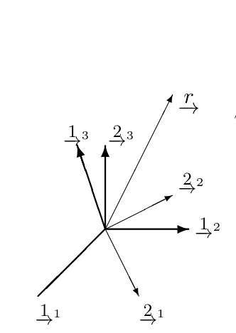

我们试图发现 $\mathcal{F}_1$, $\mathbf{r}_1$, 和 $\mathcal{F}_2$, $\mathbf{r}_2$ 之间的关系。我们按照以下步骤进行：

$\underset{\rightarrow}{\mathcal{F}}_2^T \mathbf{r}_2 = \underset{\rightarrow}{\mathcal{F}}_1^T \mathbf{r}_1,$

$\underset{\rightarrow}{\mathcal{F}}_2 \cdot \underset{\rightarrow}{\mathcal{F}}_2^T \mathbf{r}_2 = \underset{\rightarrow}{\mathcal{F}}_2 \cdot \underset{\rightarrow}{\mathcal{F}}_1^T \mathbf{r}_1,$

$\mathbf{r}_2 = \mathbf{C}_{21} \mathbf{r}_1.$

我们已经定义了

$\mathbf{C}_{21} = \underset{\rightarrow}{\mathcal{F}}_2 \cdot \underset{\rightarrow}{\mathcal{F}}_1^T$

$$\mathbf{C}_{21} = \begin{bmatrix} \underset{\rightarrow}{2}_1 & \underset{\rightarrow}{2}_2 & \underset{\rightarrow}{2}_3 \end{bmatrix} \cdot \begin{bmatrix} \underset{\rightarrow}{1}_1 \\ \underset{\rightarrow}{1}_2 \\ \underset{\rightarrow}{1}_3 \end{bmatrix} = \begin{bmatrix} \underset{\rightarrow}{2}_1 \cdot \underset{\rightarrow}{1}_1 & \underset{\rightarrow}{2}_1 \cdot \underset{\rightarrow}{1}_2 & \underset{\rightarrow}{2}_1 \cdot \underset{\rightarrow}{1}_3 \\ \underset{\rightarrow}{2}_2 \cdot \underset{\rightarrow}{1}_1 & \underset{\rightarrow}{2}_2 \cdot \underset{\rightarrow}{1}_2 & \underset{\rightarrow}{2}_2 \cdot \underset{\rightarrow}{1}_3 \\ \underset{\rightarrow}{2}_3 \cdot \underset{\rightarrow}{1}_1 & \underset{\rightarrow}{2}_3 \cdot \underset{\rightarrow}{1}_2 & \underset{\rightarrow}{2}_3 \cdot \underset{\rightarrow}{1}_3 \end{bmatrix}$$

¹ 在文献中，对于这个反对称定义有很多等价的符号表示： $\mathbf{r}_1^\times = \hat{\mathbf{r}}_1 = \mathbf{r}_1^\wedge = -[\mathbf{r}_1]_\times$。 目前，我们使用第一个符号表示，因为它与叉乘有明显的联系；稍后我们还将使用 $(\cdot)^\wedge$, 因为这在机器人学中很常见。

矩阵 $\mathbf{C}_{21}$ 被称为旋转矩阵。它有时被称为‘方向余弦矩阵’，因为两个单位向量的点积就是它们之间夹角的余弦值。

向量 $\mathcal{F}_2$ 中的单位向量可以与向量 $\mathcal{F}_1$ 相关联：

$\mathcal{F}_1^T = \mathcal{F}_2^T \mathbf{C}_{21} \qquad (6.3)$

旋转矩阵具有一些特殊的性质：

$\mathbf{r}_1 = \mathbf{C}_{21}^{-1} \mathbf{r}_2 = \mathbf{C}_{12} \mathbf{r}_2$

但是，$\mathbf{C}_{21}^T = \mathbf{C}_{12}$。因此，

$\mathbf{C}_{12} = \mathbf{C}_{21}^{-1} = \mathbf{C}_{21}^T. \qquad (6.4)$

我们说 $\mathbf{C}_{21}$ 是一个正交矩阵，因为它的逆等于它的转置。

考虑三个参考坐标系 $\mathcal{F}_1$、$\mathcal{F}_2$ 和 $\mathcal{F}_3$。在这三个坐标系中，一个向量 $\mathbf{r}$ 的分量分别是 $\mathbf{r}_1$，$\mathbf{r}_2$ 和 $\mathbf{r}_3$。现在，

$\mathbf{r}_3 = \mathbf{C}_{32} \mathbf{r}_2 = \mathbf{C}_{32} \mathbf{C}_{21} \mathbf{r}_1.$

但是，$\mathbf{r}_3 = \mathbf{C}_{31} \mathbf{r}_1$，因此

$\mathbf{C}_{31} = \mathbf{C}_{32} \mathbf{C}_{21}.$

#### 6.2.2 基本旋转

在考虑更一般的旋转之前，考虑绕一个基向量的旋转是有用的。图中显示了从 $\mathcal{F}_1$ 通过绕3轴旋转而得到的 $\mathcal{F}_2$ 的情况。

在这种情况下的旋转矩阵是

$\mathbf{C}_3 = \begin{bmatrix} \cos \theta_3 & \sin \theta_3 & 0 \\ -\sin \theta_3 & \cos \theta_3 & 0 \\ 0 & 0 & 1 \end{bmatrix}. \qquad (6.5)$

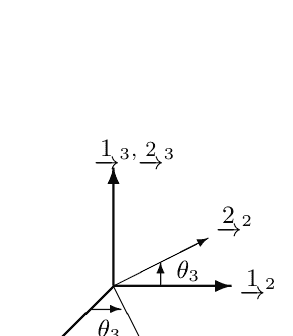

对于绕2轴的旋转，旋转矩阵是

$\mathbf{C}_2 = \begin{bmatrix} \cos \theta_2 & 0 & -\sin \theta_2 \\ 0 & 1 & 0 \\ \sin \theta_2 & 0 & \cos \theta_2 \end{bmatrix}. \qquad (6.6)$

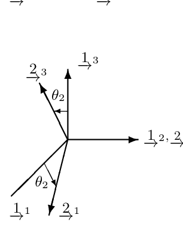

$\mathbf{C}_1 = \begin{bmatrix} 1 & 0 & 0 \\ 0 & \cos \theta_1 & \sin \theta_1 \\ 0 & -\sin \theta_1 & \cos \theta_1 \end{bmatrix}. \qquad (6.7)$

#### 6.2.3 替代旋转表示

我们已经看到了一种讨论一个参考框架相对于另一个参考框架定位的方法：旋转矩阵。旋转矩阵描述了全局和唯一的定位。这需要九个参数（它们不是独立的）。还有其他一些选择。

关于旋转的不同表示的关键是要意识到，始终只有三个基本自由度。具有超过三个参数的表示必须有相关的约束条件，以限制自由度的数量为三个。具有恰好三个参数的表示有相关的奇点。没有完美的表示既是最小的（即只有三个参数），又没有奇点（Stuelpnagel，1964年）。

> 莱昂哈德·欧拉（1707-1783）被认为是18世纪最杰出的数学家之一，也是有史以来最伟大的数学家之一。他在无穷小微积分和图论等领域做出了重要的发现。他还引入了许多现代数学术语和符号，特别是数学分析方面，如数学函数的概念。他还以在力学、流体力学、光学、天文学和音乐理论方面的工作而闻名。

##### 欧拉角

一个参考框架相对于另一个的方向也可以通过三个基本旋转的序列来指定。一个可能的序列如下：

- (i) 绕原始3轴旋转 $\psi$
- (ii) 绕中间1轴旋转 $\gamma$
- (iii) 绕转换后的3轴旋转 $\theta$

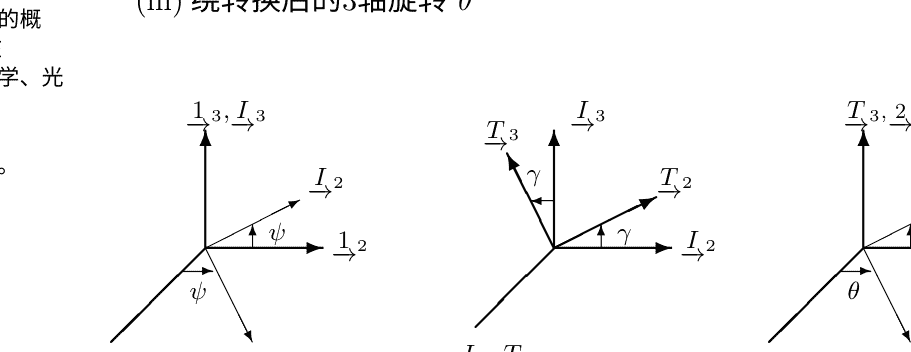

这被称为3-1-3序列，最初由欧拉使用。

在经典力学文献中，这些角度被称为以下名称：

- $\theta$：自旋角度
- $\gamma$：进动角度
- $\psi$：章动角度

从第1个框架到第2个框架的旋转矩阵如下所示：

$$\mathbf{C}_{21}(\theta, \gamma, \psi) = \mathbf{C}_3(\theta) \mathbf{C}_1(\gamma) \mathbf{C}_3(\psi) = \begin{bmatrix}
c_{\theta}c_{\psi} - s_{\theta}c_{\gamma}s_{\psi} & s_{\psi}c_{\theta} + c_{\gamma}s_{\theta}c_{\psi} & s_{\gamma}s_{\theta} \\
-c_{\psi}s_{\theta} - c_{\theta}c_{\gamma}s_{\psi} & -s_{\psi}s_{\theta} + c_{\theta}c_{\gamma}c_{\psi} & s_{\gamma}c_{\theta} \\
s_{\psi}s_{\gamma} & -s_{\gamma}c_{\psi} & c_{\gamma}
\end{bmatrix}. \quad (6.8)$$

我们已经使用了缩写 $s = \sin$, $c = \cos$。

另一个可能使用的序列如下所示：

- (i) 绕原始1轴旋转 $\theta_1$ ('滚动'旋转)
- (ii) 绕中间2轴 ('俯仰'旋转) 旋转 $\theta_2$
- (iii) 绕变换后的3轴 ('偏航'旋转) 旋转 $\theta_3$

这个序列在航空航天应用中非常常见，被称为1-2-3姿态序列或者'横滚-俯仰-偏航'约定。在这种情况下，从第1帧到第2帧的旋转矩阵为

$$\mathbf{C}_{21}(\theta_3, \theta_2, \theta_1) = \mathbf{C}_3(\theta_3) \mathbf{C}_2(\theta_2) \mathbf{C}_1(\theta_1) = \begin{bmatrix}
c_2 c_3 & c_1 s_3 + s_1 s_2 c_3 & s_1 s_3 - c_1 s_2 c_3 \\
-c_2 s_3 & c_1 c_3 - s_1 s_2 s_3 & s_1 c_3 + c_1 s_2 s_3 \\
s_2 & -s_1 c_2 & c_1 c_2
\end{bmatrix}, \quad (6.9)$$

其中 $s_i = \sin \theta_i$, $c_i = \cos \theta_i$。

所有欧拉序列都有奇点。例如，如果 $\gamma= 0$ 对于 3-1-3 序列，那么角度 $\theta$ 和 $\psi$ 将与相同的自由度相关联，无法唯一确定。

$$\mathbf{C}_{21}(\theta_3, \frac{\pi}{2}, \theta_1) = \begin{bmatrix}
0 & \sin(\theta_1 + \theta_3) & -\cos(\theta_1 + \theta_3) \\
0 & \cos(\theta_1 + \theta_3) & \sin(\theta_1 + \theta_3) \\
1 & 0 & 0
\end{bmatrix}.$$

因此，$\theta_1$ 和 $\theta_3$ 与相同的旋转相关联。然而，只有当我们想从旋转矩阵中恢复旋转角度时，这才是一个问题。

##### 无限小旋转

考虑当角度 $\theta_1$, $\theta_2$, $\theta_3$ 很小的时候的1-2-3变换。在这种情况下，我们做近似 $c_i \approx 1$, $s_i \approx \theta_i$ 并忽略小角度的乘积，$\theta_i \theta_j \approx 0$。然后我们有

$\mathbf{C}_{21} \approx \begin{bmatrix} 1 & \theta_3 & -\theta_2 \\ -\theta_3 & 1 & \theta_1 \\ \theta_2 & -\theta_1 & 1 \end{bmatrix} \approx \mathbf{1} - \boldsymbol{\theta}^\times, \quad (6.10)$

其中

$\boldsymbol{\theta} = \begin{bmatrix} \theta_1 \\ \theta_2 \\ \theta_3 \end{bmatrix},$

这被称为旋转向量。

很容易证明，对于无限小旋转的旋转矩阵的形式不依赖于旋转的顺序。例如，我们可以证明对于2-1-3欧拉序列得到相同的结果。

##### 欧拉参数

欧拉的旋转定理说一个刚体以一个固定点为轴的最一般的运动是旋转。

让我们用旋转轴来表示 $\mathbf{a} = [a_1 \ a_2 \ a_3]^T$ 并假设它是一个单位向量:

$\mathbf{a}^T \mathbf{a} = a_1^2 + a_2^2 + a_3^2 = 1. \quad (6.11)$

旋转角度为 $\phi$。我们声明，没有证明，这种情况下的旋转矩阵为

$\mathbf{C}_{21} = \cos \phi \mathbf{1} + (1 - \cos \phi) \mathbf{a} \mathbf{a}^T - \sin \phi \mathbf{a}^\times. \quad (6.12)$

无论在哪个坐标系中表达 $\mathbf{a}$，都没有关系，因为

$\mathbf{C}_{21} \mathbf{a} = \mathbf{a}. \quad (6.13)$

变量的组合，

$\eta = \cos \frac{\phi}{2}, \quad \boldsymbol{\epsilon} = \mathbf{a} \sin \frac{\phi}{2} = \begin{bmatrix} a_1 \sin(\phi/2) \\ a_2 \sin(\phi/2) \\ a_3 \sin(\phi/2) \end{bmatrix} = \begin{bmatrix} \epsilon_1 \\ \epsilon_2 \\ \epsilon_3 \end{bmatrix}, \quad (6.14)$

特别有用。四个参数 $\{\boldsymbol{\epsilon}, \eta\}$ 被称为与旋转²相关的欧拉参数。它们不是独立的，因为它们满足约束条件。

$\eta^2 + \epsilon_1^2 + \epsilon_2^2 + \epsilon_3^2 = 1.$

² 当作 $\mathbf{q}$ 堆叠时，有时也被称为单位长度四元数 = $\begin{bmatrix} \boldsymbol{\epsilon} \\ \eta \end{bmatrix}$。下面将对此进行更详细的讨论。

旋转矩阵可以用欧拉参数表示为

$\mathbf{C}_{21} = (\eta^2 - \varepsilon^T \varepsilon) \mathbf{1} + 2 \varepsilon \varepsilon^T - 2 \eta \varepsilon^\times = \begin{bmatrix} 1 - 2(\varepsilon_2^2 + \varepsilon_3^2) & 2(\varepsilon_1 \varepsilon_2 + \varepsilon_3 \eta) & 2(\varepsilon_1 \varepsilon_3 - \varepsilon_2 \eta) \\ 2(\varepsilon_2 \varepsilon_1 - \varepsilon_3 \eta) & 1 - 2(\varepsilon_3^2 + \varepsilon_1^2) & 2(\varepsilon_2 \varepsilon_3 + \varepsilon_1 \eta) \\ 2(\varepsilon_3 \varepsilon_1 + \varepsilon_2 \eta) & 2(\varepsilon_3 \varepsilon_2 - \varepsilon_1 \eta) & 1 - 2(\varepsilon_1^2 + \varepsilon_2^2) \end{bmatrix}. \quad (6.15)$

欧拉参数在许多航天器应用中很有用。它们没有与之相关的奇点，并且旋转矩阵的计算不涉及三角函数，这是一个重要的数值优势。唯一的缺点是使用了四个参数而不是三个，就像欧拉角一样；这使得在某些估计问题上执行起来具有挑战性，因为必须强制执行约束。

##### 四元数

我们将使用Barfoot等人（2011年）的符号表示法来介绍本节内容。一个四元数将是一个 $4 \times 1$ 的列向量，可以写成

$\mathbf{q} = \begin{bmatrix} \varepsilon \\ \eta \end{bmatrix}, \quad (6.16)$

其中 $\varepsilon$ 是一个 $3 \times 1$ 的向量，$\eta$ 是一个标量。四元数的左手复合运算符，$+$，和右手复合运算符，$\oplus$，将被定义为

$\mathbf{q}^+ = \begin{bmatrix} \eta \mathbf{1} - \varepsilon^\times & \varepsilon \\ -\varepsilon^T & \eta \end{bmatrix}, \quad \mathbf{q}^\oplus = \begin{bmatrix} \eta \mathbf{1} + \varepsilon^\times & \varepsilon \\ -\varepsilon^T & \eta \end{bmatrix}. \quad (6.17)$

逆运算符，$-1$，将被定义为

$\mathbf{q}^{-1} = \begin{bmatrix} -\varepsilon \\ \eta \end{bmatrix}. \quad (6.18)$

设 $\mathbf{u}$, $\mathbf{v}$, 和 $\mathbf{w}$ 是四元数。那么一些有用的恒等式是

$\mathbf{u}^+ \mathbf{v} = \mathbf{v}^\oplus \mathbf{u}, \quad (6.19)$

和

$(\mathbf{u}^+)^T \equiv (\mathbf{u}^+)^{-1} \equiv (\mathbf{u}^{-1})^+, \quad (\mathbf{u}^\oplus)^T \equiv (\mathbf{u}^\oplus)^{-1} \equiv (\mathbf{u}^{-1})^\oplus,$
$(\mathbf{u}^+ \mathbf{v})^{-1} \equiv \mathbf{v}^{-1}{}^+ \mathbf{u}^{-1}, \quad (\mathbf{u}^\oplus \mathbf{v})^{-1} \equiv \mathbf{v}^{-1}{}^\oplus \mathbf{u}^{-1},$
$(\mathbf{u}^+ \mathbf{v})^+ \mathbf{w} \equiv \mathbf{u}^+ (\mathbf{v}^+ \mathbf{w}) \equiv \mathbf{u}^+ \mathbf{v}^+ \mathbf{w}, \quad (\mathbf{u}^\oplus \mathbf{v})^\oplus \mathbf{w} \equiv \mathbf{u}^\oplus (\mathbf{v}^\oplus \mathbf{w}) \equiv \mathbf{u}^\oplus \mathbf{v}^\oplus \mathbf{w},$
$\alpha \mathbf{u}^+ + \beta \mathbf{v}^+ \equiv (\alpha \mathbf{u} + \beta \mathbf{v})^+, \quad \alpha \mathbf{u}^\oplus + \beta \mathbf{v}^\oplus \equiv (\alpha \mathbf{u} + \beta \mathbf{v})^\oplus. \quad (6.20)$

其中 $\alpha$ 和 $\beta$ 是标量。我们还有

$\mathbf{u}^+ \mathbf{v}^\oplus = \mathbf{v}^\oplus \mathbf{u}^+. \quad (6.21)$

证明留给读者。

> 四元数首次由威廉·罗恩·哈密尔顿爵士 (1805-1865) 在1843年描述，并应用于三维空间的力学。哈密尔顿是一位爱尔兰物理学家、天文学家和数学家，对经典力学、光学和代数学做出了重要贡献。他对机械和光学系统的研究使他发现了新的数学概念和技术。他在数学物理学中最著名的贡献是对牛顿力学的重新表述，现在称为哈密尔顿力学。这项工作对于现代经典场理论（如电磁学）的研究以及量子力学的发展至关重要。在纯数学中，他以发明四元数而闻名。

四元数在+和⊕运算下形成一个非交换群³。上述许多恒等式是证明这个事实的先决条件。这个群的单位元素 ℩ = [0 0 0 1]^T，满足

℧^+ = ℩^⊕ = 1, (6.22)

其中 1是4×4的单位矩阵。

旋转可以用这种表示法表示为使用单位长度的四元数 q，使得 q^T q = 1。 (6.23)

它们形成一个子群，可用于表示旋转。

使用旋转q将一个点（以齐次形式）

v = [x, y, z, 1]^T, (6.24)

到另一个坐标系中，我们计算

u = q^+ v^+ q^-1 = q^+ q^-1 ⊕ v = Rv, (6.25)

其中

R = q^+ q^-1⊕ = q^-1⊕ q^+ = q^⊕^T q^+ = [[C, 0], [0^T, 1]], (6.26)

而 C是我们现在熟悉的3×3旋转矩阵。我们已经包含了各种形式的 R 来展示这个变换可能具有的不同结构。

##### 吉布斯向量

我们可以通过吉布斯向量来参数化旋转的另一种方式。根据之前讨论的轴/角参数，

Gibbs向量，g, 给出

g = a tan(ϕ/2), (6.27)

我们注意到这个参数化在 ϕ = π 处有奇点，所以这个参数化不适用于所有角度。旋转矩阵，C, 可以用Gibbs向量表示为

C = ((1 + g^×)^-1) (1 - g^×) = (1 / (1 + g^T g)) ((1 - g^T g)1 + 2gg^T - 2g^×), (6.28)

Josiah Willard Gibbs (1839-1903) 是一位美国科学家，他对物理学、化学和数学做出了重要的理论贡献。

作为一位数学家，他发明了现代向量微积分（与英国科学家奥利弗亥维赛德独立进行了类似的工作）。吉布斯向量有时也被称为

Cayley-Rodrigues 参数.

### 6.2 旋转

将Gibbs向量定义代入右侧表达式，得到

$$\mathbf{C} = \frac{1}{1 + \tan^2 \frac{\phi}{2}} \left( \left( 1 - \tan^2 \frac{\phi}{2} \right) \mathbf{1} + 2 \tan^2 \frac{\phi}{2} \mathbf{a} \mathbf{a}^T - 2 \tan \frac{\phi}{2} \mathbf{a}^\times \right), \quad (6.29)$$

我们使用了 \(\mathbf{a}^T \mathbf{a} = 1\)。利用 \(\left(1 + \tan^2 \frac{\phi}{2}\right)^{-1} = \cos^2 \frac{\phi}{2}\)，我们有

$$\mathbf{C} = \left( \cos^2 \frac{\phi}{2} - \sin^2 \frac{\phi}{2} \right) \mathbf{1} + 2 \sin^2 \frac{\phi}{2} \mathbf{a} \mathbf{a}^T - 2 \sin \frac{\phi}{2} \cos \frac{\phi}{2} \mathbf{a}^\times = \cos \phi \mathbf{1} + (1 - \cos \phi) \mathbf{a} \mathbf{a}^T - \sin \phi \mathbf{a}^\times, \quad (6.30)$$

这是我们通常用轴/角参数表示旋转矩阵的表达式。

为了将(6.28)中给出的 \(\mathbf{C}\) 的两个表达式与 \(\mathbf{g}\) 相关联，我们首先注意到

$$\left( \mathbf{1} + \mathbf{g}^\times \right)^{-1} = \mathbf{1} - \mathbf{g}^\times + \mathbf{g}^\times \mathbf{g}^\times - \mathbf{g}^\times \mathbf{g}^\times \mathbf{g}^\times + \cdots = \sum_{n=0}^{\infty} \left( -\mathbf{g}^\times \right)^n. \quad (6.31)$$

然后我们观察到

$$\mathbf{g}^T \mathbf{g} \left( \mathbf{1} + \mathbf{g}^\times \right)^{-1} = \left( \mathbf{g}^T \mathbf{g} \right) \mathbf{1} - \left( \mathbf{g}^T \mathbf{g} \right) \mathbf{g}^\times + \left( \mathbf{g}^T \mathbf{g} \right) \mathbf{g}^\times \mathbf{g}^\times - \left( \mathbf{g}^T \mathbf{g} \right) \mathbf{g}^\times \mathbf{g}^\times \mathbf{g}^\times + \cdots = \mathbf{1} + \mathbf{g} \mathbf{g}^T - \mathbf{g}^\times - \left( \mathbf{1} + \mathbf{g}^\times \right)^{-1}, \quad (6.32)$$

在这里我们多次使用了以下操作：

$$\left( \mathbf{g}^T \mathbf{g} \right) \mathbf{g}^\times = \left( -\mathbf{g}^\times \mathbf{g}^\times + \mathbf{g} \mathbf{g}^T \right) \mathbf{g}^\times = -\mathbf{g}^\times \mathbf{g}^\times \mathbf{g}^\times + \mathbf{g} \underbrace{\mathbf{g}^T \mathbf{g}^\times}_{0} = -\mathbf{g}^\times \mathbf{g}^\times \mathbf{g}^\times. \quad (6.33)$$

因此我们有

$$\left( 1 + \mathbf{g}^T \mathbf{g} \right) \left( \mathbf{1} + \mathbf{g}^\times \right)^{-1} = \mathbf{1} + \mathbf{g} \mathbf{g}^T - \mathbf{g}^\times. \quad (6.34)$$

因此

$$\left( 1 + \mathbf{g}^T \mathbf{g} \right) \left( \mathbf{1} + \mathbf{g}^\times \right)^{-1} \left( \mathbf{1} - \mathbf{g}^\times \right) = \left( \mathbf{1} + \mathbf{g} \mathbf{g}^T - \mathbf{g}^\times \right) \left( \mathbf{1} - \mathbf{g}^\times \right) = \mathbf{1} + \mathbf{g} \mathbf{g}^T - 2\mathbf{g}^\times - \mathbf{g} \underbrace{\mathbf{g}^T \mathbf{g}^\times}_{0} + \mathbf{g}^\times \mathbf{g}^\times = \left( 1 - \mathbf{g}^T \mathbf{g} \right) \mathbf{1} + 2\mathbf{g} \mathbf{g}^T - 2\mathbf{g}^\times. \quad (6.35)$$

将两边都除以\(\left(1 + \mathbf{g}^T \mathbf{g}\right)\)得到所需的结果。

#### 6.2.4 旋转运动学

在上一节中，我们展示了一个坐标系 $\mathcal{F}_2$ 相对于另一个坐标系 $\mathcal{F}_1$ 的方向可以用不同的方式进行参数化。换句话说，旋转矩阵可以用欧拉角或欧拉参数的函数来表示。然而，在大多数应用中，坐标系的方向会随时间变化，因此我们必须引入车辆运动模型中的车辆运动学。

我们首先介绍角速度的概念，然后介绍旋转坐标系中的加速度。最后，我们将给出将方向参数化的变化率与角速度相关的表达式。

##### 角速度

假设坐标系 $\mathcal{F}_2$ 相对于坐标系 $\mathcal{F}_1$ 旋转。用 $\omega_{21}$ 表示坐标系2相对于坐标系1的角速度。坐标系1相对于坐标系2的角速度为 $\omega_{12} = -\omega_{21}$。

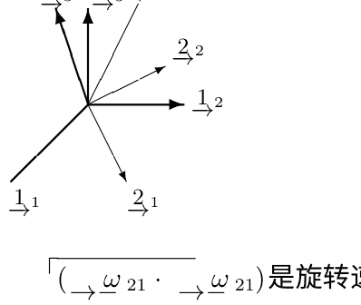

$\omega_{21}$的大小，$|\omega_{21}| = \sqrt{(\omega_{21} \cdot \omega_{21})}$是旋转速率。$\omega_{21}$的方向（即，指向 $\omega_{21}$ 的单位向量 $|\omega_{21}|^{-1}\omega_{21}$）是瞬时旋转轴。由于它们自身的相对运动，观察者在框架 $\mathcal{F}_2$ 和 $\mathcal{F}_1$ 中看到的运动不同。让我们用 $\mathcal{F}_1$ 中看到的矢量时间导数表示为$(\cdot)^\cdot$，用 $\mathcal{F}_2$ 中看到的表示为$(\cdot)^\circ$。因此，

$$\mathcal{F}_1^\cdot = 0, \quad \mathcal{F}_2^\circ = 0.$$

可以证明

$$\mathcal{F}_2^{\cdot} = \omega_{21} \times \mathcal{F}_2, \quad \text{或者等价地}$$

$$[\dot{\mathcal{F}}_2] = \omega_{21} \times [\mathcal{F}_2],$$

或者

$$\mathcal{F}_2^{\cdot T} = \omega_{21} \times \mathcal{F}_2^T. \tag{6.36}$$

我们想要确定一个在两个坐标系中表示的任意向量的时间导数：

$$\vec{r} = \mathcal{F}_1^T \mathbf{r}_1 = \mathcal{F}_2^T \mathbf{r}_2.$$

因此，如在 $\mathcal{F}_1$中所见，时间导数为

$$\vec{r}^{\bullet} = \mathcal{F}_1^{\bullet T} \mathbf{r}_1 + \mathcal{F}_1^T \dot{\mathbf{r}}_1 = \mathcal{F}_1^T \dot{\mathbf{r}}_1. \qquad (6.37)$$

类似地，

$$\vec{r}^{\circ} = \mathcal{F}_2^{\circ T} \mathbf{r}_2 + \mathcal{F}_2^{T} \mathbf{r}_2^{\circ} = \mathcal{F}_2^{T} \mathbf{r}_2^{\circ} = \mathcal{F}_2^{T} \dot{\mathbf{r}}_{2}. \qquad (6.38)$$

(注意对于非向量， $(\cdot) = (\circ)$ ，即，$\dot{\mathbf{r}}_2 = \mathbf{r}_2^{\circ}$。) 或者，时间导数如 $\mathcal{F}_1$所示，但以 $\mathcal{F}_2$ 表示，是

$$\vec{r}^{\bullet} = \mathcal{F}_2^T \dot{\mathbf{r}}_2 + \mathcal{F}_2^T \mathbf{r}_2^{\circ} \\
= \mathcal{F}_2^T \dot{\mathbf{r}}_2 + \vec{\omega}_{21} \times \mathcal{F}_2^T \mathbf{r}_2 \\
= \vec{r}^{\circ} + \vec{\omega}_{21} \times \vec{r}. \qquad (6.39)$$

最重要的应用是当 $\vec{r}$ 表示位置，$\mathcal{F}_{1}$是一个非旋转的惯性参考框架，而$\mathcal{F}_{2}$是一个随着物体、车辆等旋转的框架。在这种情况下，(6.39) 用惯性参考框架中的速度表示了第二个框架中的运动。

现在，将角速度表示为 $\mathcal{F}_{2}$:

$$\vec{\omega}_{21} = \mathcal{F}_2^T \boldsymbol{\omega}_{2}^{21}. \qquad (6.40)$$

因此，

$$\vec{r}^{\bullet} = \mathcal{F}_1^T \dot{\mathbf{r}}_1 = \mathcal{F}_2^T \dot{\mathbf{r}}_2 + \vec{\omega}_{21} \times \vec{r} \\
= \mathcal{F}_2^T \dot{\mathbf{r}}_2 + \mathcal{F}_2^T \boldsymbol{\omega}_{2}^{21\times} \mathbf{r}_2 \\
= \mathcal{F}_2^T(\dot{\mathbf{r}}_2 + \boldsymbol{\omega}_{2}^{21\times} \mathbf{r}_2). \qquad (6.41)$$

如果我们想要表示‘惯性时间导数’ (在 $\mathcal{F}_{1}$中看到) 在 $\mathcal{F}_{2}$中，我们可以使用旋转矩阵 $\mathbf{C}_{12}$:

$$\dot{\mathbf{r}}_1 = \mathbf{C}_{12}(\dot{\mathbf{r}}_2 + \boldsymbol{\omega}_{2}^{21\times} \mathbf{r}_2). \qquad (6.42)$$

##### 加速度

我们用速度表示为

$$\vec{v} = \vec{r}^{\bullet} = \vec{r}^{\circ} + \vec{\omega}_{21} \times \vec{r}$$

可以通过将(6.39)应用于 $\vec{v}$ 来计算加速度：

$$
\begin{aligned}
\vec{r}^{\bullet\bullet} &= \vec{v}^{\bullet} = \vec{v}^{\circ} + \vec{\omega}_{21} \times \vec{v} \\
&= \left( \vec{r}^{\circ\circ} + \vec{\omega}_{21} \times \vec{r}^{\circ} + \dot{\vec{\omega}}_{21} \times \vec{r} \right) \\
&\quad + \left( \vec{\omega}_{21} \times \vec{r}^{\circ} + \vec{\omega}_{21} \times \left( \vec{\omega}_{21} \times \vec{r} \right) \right) \\
&= \vec{r}^{\circ\circ} + 2 \vec{\omega}_{21} \times \vec{r}^{\circ} + \dot{\vec{\omega}}_{21} \times \vec{r} + \vec{\omega}_{21} \times \left( \vec{\omega}_{21} \times \vec{r} \right).
\end{aligned} \quad (6.43)
$$

通过进行以下替换，可以得到分量的矩阵等价形式：

$$\vec{r}^{\bullet\bullet} = \mathcal{F}_1^T \ddot{\vec{r}}_1, \quad \vec{r}^{\circ\circ} = \mathcal{F}_2^T \ddot{\vec{r}}_2, \quad \dot{\vec{\omega}}_{21} = \mathcal{F}_2^T \dot{\boldsymbol{\omega}}_2^{21}.$$

组件的结果是

$$\ddot{\mathbf{r}}_1 = \mathbf{C}_{12} \left[ \ddot{\mathbf{r}}_2 + 2\boldsymbol{\omega}_2^{21\times} \dot{\mathbf{r}}_2 + \dot{\boldsymbol{\omega}}_2^{21\times} \mathbf{r}_2 + \boldsymbol{\omega}_2^{21\times} \boldsymbol{\omega}_2^{21\times} \mathbf{r}_2 \right]. \quad (6.44)$$

表达式中的各项加速度已被赋予特殊名称：

- $\vec{r}^{\circ\circ}$ : 相对于 $\mathcal{F}_2$的加速度
- $2\vec{\omega}_{21} \times \dot{\vec{r}}$ : 科里奥利加速度
- $\dot{\vec{\omega}}_{21} \times \vec{r}$ : 角加速度
- $\vec{\omega}_{21} \times \left( \vec{\omega}_{21} \times \vec{r} \right)$ : 向心加速度

给定旋转矩阵的角速度

从(6.3)开始，通过旋转矩阵将两个参考框架联系起来：

$$\mathcal{F}_1^T = \mathcal{F}_2^T \mathbf{C}_{21}.$$

现在对两边进行时间导数，如 $\mathcal{F}_1$中所示：

$$\vec{0} = \mathcal{F}_2^{\bullet T} \mathbf{C}_{21} + \mathcal{F}_2^T \dot{\mathbf{C}}_{21}.$$

将(6.36)代入 $\mathcal{F}_2^{\bullet T}$：

$$\vec{0} = \vec{\omega}_{21} \times \mathcal{F}_2^T \mathbf{C}_{21} + \mathcal{F}_2^T \dot{\mathbf{C}}_{21}.$$

现在使用(6.40)得到

$$\vec{0} = \boldsymbol{\omega}_2^{21T} \mathcal{F}_2 \times \mathcal{F}_2^T \mathbf{C}_{21} + \mathcal{F}_2^T \dot{\mathbf{C}}_{21} = \mathcal{F}_2^T \left( \boldsymbol{\omega}_2^{21\times} \mathbf{C}_{21} + \dot{\mathbf{C}}_{21} \right).$$

因此，我们得出结论

$$\dot{\mathbf{C}}_{21} = -\boldsymbol{\omega}_2^{21\times} \mathbf{C}_{21}, \quad (6.45)$$

这被称为泊松方程。

西蒙·丹尼斯·泊松(1781-1840)是一位法国数学家、几何学家和物理学家。

### 6.2 旋转

在 \(\mathcal{F}_2\) 坐标系中测量，将 \(\mathcal{F}_1\) 与 \(\mathcal{F}_2\) 相关的旋转矩阵可以通过对上述表达式进行积分来确定^{4}。

我们还可以重新排列以获得 \(\omega_2\) 的显式函数：

$$\omega_2^{21\times} = -\dot{\mathbf{C}}_{21}\mathbf{C}_{21}^{-1} = -\dot{\mathbf{C}}_{21}\mathbf{C}_{21}^T, \quad (6.46)$$

这给出了旋转矩阵已知的情况下，随时间变化的角速度。

##### 欧拉角

考虑1-2-3欧拉角序列及其相关的旋转矩阵。在这种下，(6.46)变为

$$\omega_2^{21\times} = -\mathbf{C}_3\mathbf{C}_2\dot{\mathbf{C}}_1\mathbf{C}_1^T\mathbf{C}_2^T\mathbf{C}_3^T - \mathbf{C}_3\dot{\mathbf{C}}_2\mathbf{C}_2^T\mathbf{C}_3^T - \dot{\mathbf{C}}_3\mathbf{C}_3^T. \quad (6.47)$$

然后，使用

$$-\dot{\mathbf{C}}_i\mathbf{C}_i^T = \mathbf{1}_i^\times \dot{\theta}_i, \quad (6.48)$$

对于每个主轴旋转（其中 \(\mathbf{1}_i\) 是 \(\mathbf{1}\) 的第 \(i\) 列）和恒等式

$$(\mathbf{C}_i\mathbf{r})^\times = \mathbf{C}_i\mathbf{r}^\times\mathbf{C}_i^T, \quad (6.49)$$

我们可以证明

$$\omega_2^{21\times} = \left(\mathbf{C}_3\mathbf{C}_2\mathbf{1}_1\dot{\theta}_1\right)^\times + \left(\mathbf{C}_3\mathbf{1}_2\dot{\theta}_2\right)^\times + \left(\mathbf{1}_3\dot{\theta}_3\right)^\times, \quad (6.50)$$

可以简化为

$$\omega_2^{21} = \underbrace{\left[\mathbf{C}_3(\theta_3)\mathbf{C}_2(\theta_2)\mathbf{1}_1 \quad \mathbf{C}_3(\theta_3)\mathbf{1}_2 \quad \mathbf{1}_3\right]}_{\mathbf{S}(\theta_2, \theta_3)} \begin{bmatrix} \dot{\theta}_1 \\ \dot{\theta}_2 \\ \dot{\theta}_3 \end{bmatrix}_{\dot{\theta}} = \mathbf{S}(\theta_2, \theta_3) \dot{\theta}, \quad (6.51)$$

这给出了以欧拉角和欧拉速率 \(\dot{\theta}\) 为变量的角速度

$$\mathbf{S}(\theta_2, \theta_3) = \begin{bmatrix} \cos \theta_2 \cos \theta_3 & \sin \theta_3 & 0 \\ -\cos \theta_2 \sin \theta_3 & \cos \theta_3 & 0 \\ \sin \theta_2 & 0 & 1 \end{bmatrix}. \quad (6.52)$$

^{4} 这被称为“带动导航”，因为测量 \(\omega_2^{21}\) 的传感器被固定在旋转框架中， \(\mathcal{F}_2\)。

通过反转矩阵 $\mathbf{S}$，我们得到一个微分方程组可以积分得到欧拉角，假设 $\omega_{2}^{21}$ 已知：

\begin{aligned}
\dot{\boldsymbol{\theta}} &= \mathbf{S}^{-1}(\theta_2, \theta_3) \boldsymbol{\omega}_{2}^{21} \\
&= \begin{bmatrix}
\sec \theta_2 \cos \theta_3 & -\sec \theta_2 \sin \theta_3 & 0 \\
\sin \theta_3 & \cos \theta_3 & 0 \\
-\tan \theta_2 \cos \theta_3 & \tan \theta_2 \sin \theta_3 & 1
\end{bmatrix} \boldsymbol{\omega}_{2}^{21}. \quad (6.53)
\end{aligned}

请注意，在 $\theta_2 = \pi/2$ 处不存在 $\mathbf{S}^{-1}$，这正是与1-2-3序列相关的奇异点。

值得注意的是，上述发展在任何欧拉序列中都成立。如果我们选择一个 $\alpha\text{-}\beta\text{-}\gamma$ 集合，

$$\mathbf{C}_{21}(\theta_1, \theta_2, \theta_3) = \mathbf{C}_{\gamma}(\theta_3) \mathbf{C}_{\beta}(\theta_2) \mathbf{C}_{\alpha}(\theta_1), \quad (6.54)$$

那么

$$\mathbf{S}(\theta_2, \theta_3) = \left[ \mathbf{C}_{\gamma}(\theta_3) \mathbf{C}_{\beta}(\theta_2) \mathbf{1}_{\alpha} \quad \mathbf{C}_{\gamma}(\theta_3) \mathbf{1}_{\beta} \quad \mathbf{1}_{\gamma} \right], \quad (6.55)$$

并且在S的奇异点处不存在$\mathbf{S}^{-1}$。

#### 6.2.5 扰动旋转

现在我们已经建立了一些处理三维空间中数量的基本符号，我们将把重点转向一个通常处理不正确或完全忽略的问题。我们在前一节中已经展示了单体车辆的状态包括三个自由度的平移和三个自由度的旋转。问题在于与旋转相关的自由度有些独特，必须小心处理。原因是旋转不属于一个向量空间，而是形成了称为$SO(3)$的非交换群。正如我们在上面看到的，有许多数学表示旋转的方式，包括旋转矩阵、轴角表示、欧拉角和欧拉参数/单位长度四元数。最重要的事实是所有这些表示都有相同的基本旋转，只有三个自由度。一个$3\times3$的旋转矩阵有九个元素，但只有三个是独立的。欧拉参数有四个标量参数，但只有三个是独立的。在所有常见的旋转表示中，欧拉角是唯一具有三个参数的表示方式；问题在于欧拉序列存在奇点，因此对于某些问题，必须选择一个避免奇点的适当序列。

旋转不属于向量空间的事实在在线性化运动和观测模型中是非常基本的。我们对于线性化旋转应该怎么办？

这里我们指的是线性代数中的向量空间。

幸运的是，有一种前进的方法。关键是考虑在一个小的、事实上是无穷小的层面上发生了什么。我们将首先推导出一些关键的恒等式，然后转向线性化由一系列欧拉角构建的旋转矩阵。

##### 一些关键的恒等式

欧拉旋转定理允许我们将旋转矩阵 $\mathbf{C}$ 写成绕轴 $\mathbf{a}$ 旋转角度 $\phi$ 的形式：

$$\mathbf{C} = \cos \phi \mathbf{1} + (1 - \cos \phi) \mathbf{a}\mathbf{a}^T - \sin \phi \mathbf{a}^{\times}.$$

现在我们对旋转角度 $\phi$ 对 $\mathbf{C}$ 进行偏导数。

$$\frac{\partial \mathbf{C}}{\partial \phi} = -\sin \phi \mathbf{1} + \sin \phi \mathbf{a}\mathbf{a}^T - \cos \phi \mathbf{a}^{\times}$$

$$= \sin \phi \left( -\mathbf{1} + \mathbf{a}\mathbf{a}^T \right) - \cos \phi \mathbf{a}^{\times}$$

$$= -\cos \phi \mathbf{a}^{\times} + (1 - \cos \phi) \mathbf{a}^{\times}\mathbf{a}\mathbf{a}^T + \sin \phi \mathbf{a}^{\times}\mathbf{a}^{\times}$$

$$= -\mathbf{a}^{\times} \left( \cos \phi \mathbf{1} + (1 - \cos \phi) \mathbf{a}\mathbf{a}^T - \sin \phi \mathbf{a}^{\times} \right).$$

因此，我们的第一个重要等式是

$$\frac{\partial \mathbf{C}}{\partial \phi} \equiv -\mathbf{a}^{\times} \mathbf{C}.$$

这个的一个直接应用是，对于任何主轴旋转，关于轴 $\alpha$，我们有

$$\frac{\partial \mathbf{C}_{\alpha}(\theta)}{\partial \theta} \equiv -\mathbf{1}_{\alpha}^{\times} \mathbf{C}_{\alpha}(\theta),$$

其中 $\mathbf{1}_{\alpha}$ 是单位矩阵的第 $\alpha$ 列。

现在让我们考虑一个 $\alpha$-$\beta$-$\gamma$ 欧拉序列：

$$\mathbf{C}(\boldsymbol{\theta}) = \mathbf{C}_{\gamma}(\theta_3) \mathbf{C}_{\beta}(\theta_2) \mathbf{C}_{\alpha}(\theta_1),$$

其中 $\boldsymbol{\theta} = ( \theta_1, \theta_2, \theta_3)$。此外，我们选择一个任意的常数向量，$\mathbf{v}$。应用(6.59)，我们有

$$\frac{\partial (\mathbf{C}(\boldsymbol{\theta}) \mathbf{v})}{\partial \theta_3} = -\mathbf{1}_{\gamma}^{\times} \mathbf{C}_{\gamma}(\theta_3) \mathbf{C}_{\beta}(\theta_2) \mathbf{C}_{\alpha}(\theta_1) \mathbf{v} = (\mathbf{C}(\boldsymbol{\theta}) \mathbf{v})^{\times} \mathbf{1}_{\gamma},$$

$$\frac{\partial (\mathbf{C}(\boldsymbol{\theta}) \mathbf{v})}{\partial \theta_2} = -\mathbf{C}_{\gamma}(\theta_3) \mathbf{1}_{\beta}^{\times} \mathbf{C}_{\beta}(\theta_2) \mathbf{C}_{\alpha}(\theta_1) \mathbf{v} = (\mathbf{C}(\boldsymbol{\theta}) \mathbf{v})^{\times} \mathbf{C}_{\gamma}(\theta_3) \mathbf{1}_{\beta},$$

$$\frac{\partial (\mathbf{C}(\boldsymbol{\theta}) \mathbf{v})}{\partial \theta_1} = -\mathbf{C}_{\gamma}(\theta_3) \mathbf{C}_{\beta}(\theta_2) \mathbf{1}_{\alpha}^{\times} \mathbf{C}_{\alpha}(\theta_1) \mathbf{v} = (\mathbf{C}(\boldsymbol{\theta}) \mathbf{v})^{\times} \mathbf{C}_{\gamma}(\theta_3) \mathbf{C}_{\beta}(\theta_2) \mathbf{1}_{\alpha},$$

我们使用了两个常见的恒等式

$$\mathbf{r}^\times \mathbf{s} \equiv -\mathbf{s}^\times \mathbf{r}, \quad (6.62a)$$
$$(\mathbf{R}\mathbf{s})^\times \equiv \mathbf{R}\mathbf{s}^\times\mathbf{R}^T, \quad (6.62b)$$

对于任意向量 $\mathbf{r}$, $\mathbf{s}$和任意旋转矩阵 $\mathbf{R}$。将结果在(6.61)中结合起来，我们有

$$\frac{\partial (\mathbf{C}(\boldsymbol{\theta}) \mathbf{v})}{\partial \boldsymbol{\theta}} = \begin{bmatrix} \frac{\partial (\mathbf{C}(\boldsymbol{\theta}) \mathbf{v})}{\partial \theta_1} & \frac{\partial (\mathbf{C}(\boldsymbol{\theta}) \mathbf{v})}{\partial \theta_2} & \frac{\partial (\mathbf{C}(\boldsymbol{\theta}) \mathbf{v})}{\partial \theta_3} \end{bmatrix} = (\mathbf{C}(\boldsymbol{\theta}) \mathbf{v})^\times \begin{bmatrix} \mathbf{C}_{\gamma}(\theta_3)\mathbf{C}_{\beta}(\theta_2)\mathbf{1}_{\alpha} & \mathbf{C}_{\gamma}(\theta_3)\mathbf{1}_{\beta} & \mathbf{1}_{\gamma} \end{bmatrix}, \quad (6.63)$$

因此，我们可以陈述另一个非常重要的恒等式

$$\frac{\partial (\mathbf{C}(\boldsymbol{\theta}) \mathbf{v})}{\partial \boldsymbol{\theta}} \equiv (\mathbf{C}(\boldsymbol{\theta}) \mathbf{v})^\times \mathbf{S}(\theta_2, \theta_3), \quad (6.64)$$

我们注意到这是无论欧拉角的选择如何都成立的。这在下一节中将非常关键，当我们讨论旋转矩阵的线性化时。

##### 扰动旋转矩阵

让我们回到第一原则，仔细考虑如何线性化一个旋转。如果我们有一个关于某个变量$x$的函数 $f(x)$，那么稍微扰动 $x$的值，从其标称值$\bar{x}$，扰动量为 $\delta x$，将导致函数的变化。我们可以用关于$\bar{x}$的泰勒级数展开来表示这一点：

$$f(\bar{x} + \delta x) = f(\bar{x}) + \left. \frac{\partial f(x)}{\partial x} \right|_{\bar{x}} \delta x + (\text{高阶项}) \quad (6.65)$$

因此，如果 $\delta x$很小，我们可以进行‘一阶’近似

$$f(\bar{x} + \delta x) \approx f(\bar{x}) + \left. \frac{\partial f(x)}{\partial x} \right|_{\bar{x}} \delta x. \quad (6.66)$$

这假设 $\delta x$没有任何约束。使用旋转进行相同过程的问题在于大多数表示都涉及约束，因此不容易扰动（不强制约束）。值得注意的例外是欧拉角集。这些角度包含正好三个参数，因此每个参数都可以独立变化。因此，我们选择在涉及旋转的函数扰动中使用欧拉角。

考虑对欧拉角$\boldsymbol{\theta}$进行微扰 $\mathbf{C}(\boldsymbol{\theta})\mathbf{v}$，其中 $\mathbf{v}$是任意向量。令 $\bar{\boldsymbol{\theta}} = (\bar{\theta}_1,\bar{\theta}_2,\bar{\theta}_3)$ 和 $\delta\boldsymbol{\theta} = (\delta\theta_1, \delta\theta_2, \delta\theta_3)$，然后应用一阶泰勒级数近似，

$$\mathbf{C}(\bar{\boldsymbol{\theta}} + \delta\boldsymbol{\theta})\mathbf{v} \approx \mathbf{C}(\bar{\boldsymbol{\theta}})\mathbf{v} + \left. \frac{\partial (\mathbf{C}(\boldsymbol{\theta})\mathbf{v})}{\partial \boldsymbol{\theta}} \right|_{\bar{\boldsymbol{\theta}}} \delta\boldsymbol{\theta} \\ = \mathbf{C}(\bar{\boldsymbol{\theta}})\mathbf{v} + \left( (\mathbf{C}(\boldsymbol{\theta})\mathbf{v})^\times \mathbf{S}(\theta_2, \theta_3) \right) \bigg|_{\bar{\boldsymbol{\theta}}} \delta\boldsymbol{\theta} \\ = \mathbf{C}(\bar{\boldsymbol{\theta}})\mathbf{v} + \left( \mathbf{C}(\bar{\boldsymbol{\theta}})\mathbf{v} \right)^\times \mathbf{S}(\bar{\theta}_2, \bar{\theta}_3) \delta\boldsymbol{\theta} \\ = \mathbf{C}(\bar{\boldsymbol{\theta}})\mathbf{v} - \left( \mathbf{S}(\bar{\theta}_2, \bar{\theta}_3) \delta\boldsymbol{\theta} \right)^\times \left( \mathbf{C}(\bar{\boldsymbol{\theta}})\mathbf{v} \right) \\ = \left( \mathbf{1} - \left( \mathbf{S}(\bar{\theta}_2, \bar{\theta}_3) \delta\boldsymbol{\theta} \right)^\times \right) \mathbf{C}(\bar{\boldsymbol{\theta}})\mathbf{v} \\ \text{(6.67)}$$

我们使用(6.64)得到第二行。观察到$\mathbf{v}$是任意的，我们可以从两边去掉它并写成

$$\mathbf{C}(\bar{\boldsymbol{\theta}} + \delta\boldsymbol{\theta}) \approx \left( \mathbf{1} - \left( \mathbf{S}(\bar{\theta}_2, \bar{\theta}_3) \delta\boldsymbol{\theta} \right)^\times \right) \mathbf{C}(\bar{\boldsymbol{\theta}}), \\ \text{(6.68)}$$

我们可以看到，这是一个无限小旋转矩阵和未扰动旋转矩阵$\mathbf{C}(\bar{\boldsymbol{\theta}})$的乘积（而不是和）。符号上，写成

$$\mathbf{C}(\bar{\boldsymbol{\theta}} + \delta\boldsymbol{\theta}) \approx \left( \mathbf{1} - \delta\boldsymbol{\phi}^\times \right) \mathbf{C}(\bar{\boldsymbol{\theta}}), \\ \text{(6.69)}$$

方程 (6.68) 非常重要。它告诉我们如何在任何函数中对旋转矩阵进行微扰（以其欧拉角的微扰为单位）。

**例子6.1** 下面的例子展示了如何在任意表达式中应用我们的线性化旋转表达式。假设我们有一个标量函数 $J$，给定为

$$J(\boldsymbol{\theta}) = \mathbf{u}^T \mathbf{C}(\boldsymbol{\theta})\mathbf{v}, \\ \text{(6.70)}$$

其中 $\mathbf{u}$和 $\mathbf{v}$是任意向量。将我们的方法应用于线性化旋转，我们有

$$J(\bar{\boldsymbol{\theta}} + \delta\boldsymbol{\theta}) \approx \mathbf{u}^T \left( \mathbf{1} - \delta\boldsymbol{\phi}^\times \right) \mathbf{C}(\bar{\boldsymbol{\theta}})\mathbf{v} = \underbrace{\mathbf{u}^T \mathbf{C}(\bar{\boldsymbol{\theta}})\mathbf{v}}_{J(\bar{\boldsymbol{\theta}})} + \underbrace{\mathbf{u}^T \left( \mathbf{C}(\bar{\boldsymbol{\theta}})\mathbf{v} \right)^\times \delta\boldsymbol{\phi}}_{\delta J(\delta\boldsymbol{\theta})}, \\ \text{(6.71)}$$

使得线性化函数为

$$\delta J(\delta\boldsymbol{\theta}) = \left( \mathbf{u}^T \left( \mathbf{C}(\bar{\boldsymbol{\theta}})\mathbf{v} \right)^\times \mathbf{S}(\bar{\theta}_2, \bar{\theta}_3) \right) \delta\boldsymbol{\theta}, \\ \text{(6.72)}$$

我们可以看到，在 $\delta\boldsymbol{\theta}$ 前面的因子确实是常数；事实上，它是 $\left. \frac{\partial J}{\partial \boldsymbol{\theta}} \right|_{\bar{\boldsymbol{\theta}}}$，即 $J$对 $\boldsymbol{\theta}$的雅可比矩阵。

### 6.3 姿态

我们花了很多精力讨论了一个运动体的旋转方面。现在我们引入平移的符号。平移和旋转的组合被称为姿态。姿态估计问题通常涉及将一个点 P 在一个移动（平移和旋转）的车辆坐标系和一个固定坐标系之间进行转换，如图6.2所示。我们可以通过以下方式将图6.2中的向量联系起来：

```
$$\boldsymbol{r}^{pi} = \boldsymbol{r}^{pv} + \boldsymbol{r}^{vi} \quad (6.73)$$
```

在这里，我们还没有选择任何特定的参考坐标系来表示这种关系。将关系写成静止坐标系中的形式，$\mathcal{F}_i$，我们有

```
$$\boldsymbol{r}_i^{\pi} = \boldsymbol{r}_i^{pv} + \boldsymbol{r}_i^{vi} \quad (6.74)$$
```

如果点P附着在车辆上，我们通常知道它在 $\mathcal{F}_v$ 中的坐标，该坐标系相对于 $\mathcal{F}_i$ 旋转。让$\mathbf{C}_{iv}$表示这个旋转，我们可以将关系重写为

```
$$\boldsymbol{r}_i^{\pi} = \mathbf{C}_{iv}\boldsymbol{r}_v^{pv} + \boldsymbol{r}_i^{vi} \quad (6.75)$$
```

这告诉我们如何将点P在 $\mathcal{F}_v$ 中的坐标转换为 $\mathcal{F}_i$ 中的坐标，只要我们知道平移$\boldsymbol{r}_{vi}$和旋转$\mathbf{C}_{iv}$的信息。两个帧之间。我们将称之为

```
$$\{\boldsymbol{r}_i^{vi}, \mathbf{C}_{iv}\} \quad (6.76)$$
```

作为车辆的 poseof。

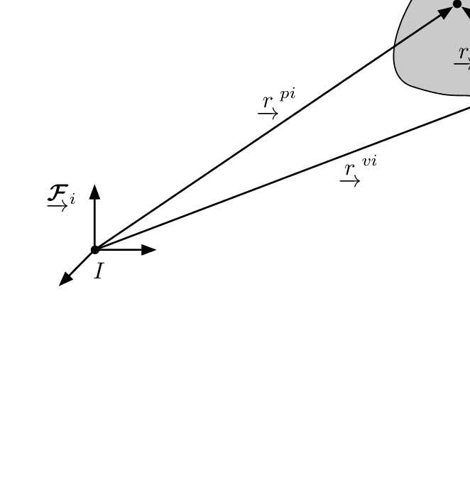

图6.2 姿态估计问题通常关注于在一个移动的车辆坐标系和一个固定的坐标系之间转换一个点P的坐标。

#### 6.3.1 变换矩阵

我们还可以用(6.75)中的关系式写成另一种方便的形式：

```
$$\begin{bmatrix} p_i \\ 1 \end{bmatrix} = \begin{bmatrix} C_{iv} & r_i^{vi} \\ 0^T & 1 \end{bmatrix} \begin{bmatrix} p_v \\ 1 \end{bmatrix}, \quad (6.77)$$
```

其中 $T_{iv}$ 被称为 $4 \times 4$ 变换矩阵。

为了使用变换矩阵，我们必须用1来增加一个点的坐标，

```
$$\begin{bmatrix} x \\ y \\ z \\ 1 \end{bmatrix}, \quad (6.78)$$
```

这被称为齐次点表示。齐次点表示的一个有趣属性是，每个元素都可以乘以一个比例因子，$s$：

```
$$\begin{bmatrix} sx \\ sy \\ sz \\ s \end{bmatrix}. \quad (6.79)$$
```

要恢复原始的 $(x, y, z)$ 坐标，只需将前三个元素除以第四个元素。通过这种方式，当比例因子趋近于0时，我们可以表示距离原点任意远的点。Hartley和Zisserman（2000）详细讨论了在计算机视觉应用中使用齐次坐标。

要将坐标转换回原来的方式，我们需要一个变换矩阵的逆矩阵：

```
$$\begin{bmatrix} p_v \\ 1 \end{bmatrix} = T_{iv}^{-1} \begin{bmatrix} p_i \\ 1 \end{bmatrix}, \quad (6.80)$$
```

其中

```
$$T_{iv}^{-1} = \begin{bmatrix} C_{iv} & r_i^{vi} \\ 0^T & 1 \end{bmatrix}^{-1} = \begin{bmatrix} C_{iv}^T & -C_{iv}^T r_i^{vi} \\ 0^T & 1 \end{bmatrix} = \begin{bmatrix} C_{vi} & -r_v^{iv} \\ 0^T & 1 \end{bmatrix} = \begin{bmatrix} C_{vi} & r_v^{iv} \\ 0^T & 1 \end{bmatrix} = T_{vi}, \quad (6.81)$$
```

我们使用了 $r^{ivv} = -r_v^{iv}$，这只是简单地翻转了向量的方向。

我们还可以合并变换矩阵：

```
$$T_{iv} = T_{ia} T_{ab} T_{bv}, \quad (6.82)$$
```

这使得链式组合任意数量的姿态变化变得容易：

```
$\overrightarrow{F_i} \stackrel{T_{iv}}{\rightleftharpoons} \overrightarrow{F_v} = \overrightarrow{F_i} \stackrel{T_{ia}}{\rightleftharpoons} \overrightarrow{F_a} \stackrel{T_{ab}}{\rightleftharpoons} \overrightarrow{F_b} \stackrel{T_{bv}}{\rightleftharpoons} \overrightarrow{F_v}$ (6.83)
```

如，每个帧可以表示移动车辆在不同时间点的姿态，这个关系告诉我们如何将相对运动组合成全局运动。

变换矩阵非常吸引人，因为它们告诉我们先应用平移，然后再应用旋转。这在处理姿态时经常会引起歧义，因为下标和上标通常在实践中被省略，这样就很难知道每个量的确切含义。

在1827年出版的他的著作 Der Barycentrische Calcul中，Möbius引入了齐次坐标。Möbius在平面上参数化了一个点，$(x, y)$ ，考虑质量，m1, m2, 和m3，必须放在一个固定三角形的顶点上，使得该点成为三角形的质心。坐标$(m1, m2, m3)$ 不唯一，因为等比例缩放三个质量不会改变点的位置。当一个曲线的方程在这个坐标系中写成时，它变成了齐次的$(m1, m2, m3)$ 。例如，以 (a, b) 为中心，半径为r的圆是： $(x-a)^2$ 用齐次坐标写成 x = m1/m3 和 y = m2/m3, 方程变为 2^-m3a) ^ 2 + (m1 - m3b) ^2 + (m2 - m3b)^2 = m3^2 r^2, 其中每个项现在都是齐次坐标的二次项（Furgale, 2011）。

#### 6.3.2 机器人约定

在机器人领域的标准实践中，必须提到一个重要的细微之处。我们可以通过一个简单的例子来理解这一点。想象一个在 $xy$ 平面上行驶的车辆，如图6.3所示。

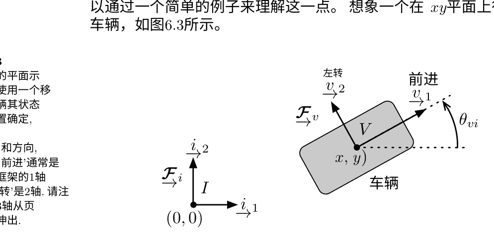

车辆的位置可以简单地表示为

```
$\mathbf{r}_i^{vi} = \begin{bmatrix} x \\ y \\ 0 \end{bmatrix}$ (6.84)
```

这个平面示例中，z坐标为零。

相对于 $\overrightarrow{F_i}$ 的旋转是绕3轴的主轴旋转，角度为 $\theta_{vi}$（我们添加下标以示区别）。按照我们之前的约定，角度的旋转是正的（根据右手定则）。因此，我们有

```
$\mathbf{C}_{vi} = \mathbf{C}_3(\theta_{vi}) = \begin{bmatrix} \cos\theta_{vi} & \sin\theta_{vi} & 0 \\ -\sin\theta_{vi} & \cos\theta_{vi} & 0 \\ 0 & 0 & 1 \end{bmatrix}$ (6.85)
```

使用 $\theta_{vi}$ 来描述方向是有意义的；它自然地描述了车辆的头部方向，因为它是相对于 $\mathcal{F}_i$ 移动的 $\mathcal{F}_v$。然而，正如上一节讨论的那样，在构建姿态时我们真正关心的旋转矩阵是 $\mathbf{C}_{iv} = \mathbf{C}_{vi}^T = \mathbf{C}_3(-\theta_{vi}) =$ 重要的是，我们注意到 $\theta_{iv} = -\theta_{vi}$。我们不想使用 $\theta_{iv}$ 作为航向，因为那会很困惑。坚持使用 $\theta_{vi}$，车辆的姿态可以用变换矩阵形式表示为

```
$$ \mathbf{T}_{iv} = \begin{bmatrix} \mathbf{C}_{iv} & \mathbf{r}_i^{vi} \\ \mathbf{0}^T & 1 \end{bmatrix} = \begin{bmatrix} \cos\theta_{vi} & -\sin\theta_{vi} & 0 & x \\ \sin\theta_{vi} & \cos\theta_{vi} & 0 & y \\ 0 & 0 & 1 & 0 \\ 0 & 0 & 0 & 1 \end{bmatrix}, \quad (6.86) $$
```

这是完全可以的。一般来说，即使旋转轴不是 $\mathbf{i}_3$，我们也可以自由地写

```
$$ \mathbf{C}_{iv} = \mathbf{C}_{vi}^T = \left( \cos\theta_{vi} \mathbf{1} + (1 - \cos\theta_{vi}) \mathbf{a}\mathbf{a}^T - \sin\theta_{vi} \mathbf{a}^\times \right)^T = \cos\theta_{vi} \mathbf{1} + (1 - \cos\theta_{vi}) \mathbf{a}\mathbf{a}^T + \sin\theta_{vi} \mathbf{a}^\times, \quad (6.87) $$
```

我们注意到第三项由于反对称性质而改变符号，$\mathbf{a}^{\times T}$ 换句话说，我们可以自由地使用 $\theta_{vi}$ 而不是 $\theta_{iv}$ 来构建 $\mathbf{C}_{iv}$。然而，当所有下标都被省略时，会产生混淆 我们只是写

```
$$ \mathbf{C} = \cos\theta \mathbf{1} + (1 - \cos\theta) \mathbf{a}\mathbf{a}^T + \sin\theta \mathbf{a}^\times, \quad (6.88) $$
```

这在机器人技术中非常常见。这个表达式没有任何问题；我们只需要意识到当以这种方式写出时，旋转与我们之前的推导方向相反$^6$。

在机器人技术中还有另一个常见的符号变化。通常，$(\cdot)^\times$ 符号被 $(\cdot)^\wedge$ 符号取代(Murray et al., 1994)，特别是在处理变换矩阵时。旋转矩阵的表达式可以写成

```
$$ \mathbf{C} = \cos\theta \mathbf{1} + (1 - \cos\theta) \mathbf{a}\mathbf{a}^T + \sin\theta \mathbf{a}^\wedge. \quad (6.89) $$
```

对于角速度，我们需要非常小心，因为它应该以某种方式与我们用于旋转角度的约定相匹配。

最后，姿态被写成

```
T = \begin{bmatrix} C & r \\ 0^T & 1 \end{bmatrix} \tag{6.90}
```

去掉所有下标。在实践中使用这些量时，我们只需要小心记住它们的实际含义即可。

为了与机器人相关，我们将在本书中继续采用(6.89)中的约定。然而，我们相信从第一原理开始更好地理解与姿态相关的所有量是值得的。

> 6 我们在本节中的目标是使事情清晰，而不是为了支持一种约定而争论。然而，值得注意的是，这种约定中，(6.88)中的第三项为正，符合左手旋转而不是右手旋转。

#### 6.3.3 弗勒内-塞雷坐标系

值得注意的是，我们的姿态变量（表示为变换矩阵）与经典的Frenet-Serret运动坐标系之间存在联系。图6.4描述了一个点V在空间中平滑移动。Frenet-Serret坐标系与该点的第一个运动方向上的轴（曲线切线），指向弧长导数方向的第二个轴（曲线法线），以及完成框架的第三个轴（曲线副法线）。

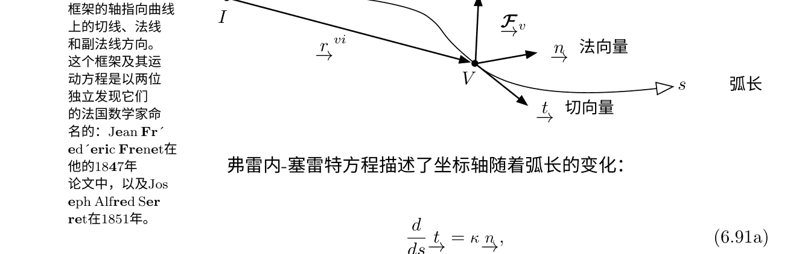

弗勒内-塞雷方程描述了坐标轴随着弧长的变化：

```
\begin{aligned}
\frac{d}{ds} t &= \kappa n, \tag{6.91a} \\
\frac{d}{ds} n &= -\kappa t + \tau b, \tag{6.91b} \\
\frac{d}{ds} b &= -\tau n, \tag{6.91c}
\end{aligned}
```

其中 κ被称为路径的曲率， τ被称为挠率路径。 将坐标轴堆叠成一个坐标系，$\overrightarrow{\mathcal{F}}_v$，

```
$$\mathcal{F}_v = \begin{bmatrix} \overrightarrow{t} \ \overrightarrow{n} \ \overrightarrow{b} \end{bmatrix}, \qquad (6.92)$$
```

我们可以将弗勒内-塞雷方程写成

```
$$\frac{d}{ds} \mathcal{F}_v = \begin{bmatrix} 0 & \kappa & 0 \ -\kappa & 0 & \tau \ 0 & -\tau & 0 \end{bmatrix} \mathcal{F}_v. \qquad (6.93)$$
```

将两边乘以路径上的速度，$v = ds/dt$，并且右乘以$\overrightarrow{\mathcal{F}}^T_i$，我们有

```
$$\frac{d}{dt} \underbrace{\left( \mathcal{F}_v \cdot \mathcal{F}_i^T \right)}_{C_{vi}} = \underbrace{\begin{bmatrix} 0 & v\kappa & 0 \ -v\kappa & 0 & v\tau \ 0 & -v\tau & 0 \end{bmatrix}}_{-\omega_v^{vi\wedge}} \underbrace{\left( \mathcal{F}_v \cdot \mathcal{F}_i^T \right)}_{C_{vi}}, \qquad (6.94)$$
```

我们应用了链式法则。 我们看到这恢复了旋转运动学的泊松方程，如之前给出的(6.45)中所示；角速度在移动坐标系中表示，

```
$$\omega_v^{vi} = \begin{bmatrix} v\tau \ 0 \ v\kappa \end{bmatrix}, \qquad (6.95)$$
```

由于中间项为零，它只受到两个自由度的约束。 我们还有平移运动学，

```
$$\dot{\mathbf{r}}_i^{vi} = \mathbf{C}_{vi}^T \boldsymbol{\nu}_v^{vi}, \quad \boldsymbol{\nu}_v^{vi} = \begin{bmatrix} v \ 0 \ 0 \end{bmatrix}. \qquad (6.96)$$
```

为了在机体坐标系中表示这一点，我们注意到

```
$$\dot{\mathbf{r}}_v^{iv} = \frac{d}{dt} \left( -\mathbf{C}_{vi} \mathbf{r}_i^{vi} \right) = -\dot{\mathbf{C}}_{vi} \mathbf{r}_i^{vi} - \mathbf{C}_{vi} \dot{\mathbf{r}}_i^{vi} = \omega_v^{vi\wedge} \mathbf{C}_{vi} \mathbf{r}_i^{vi} - \mathbf{C}_{vi} \mathbf{C}_{vi}^T \boldsymbol{\nu}_v^{vi} = -\omega_v^{vi\wedge} \mathbf{r}_v^{iv} - \boldsymbol{\nu}_v^{vi}. \qquad (6.97)$$
```

然后，我们可以将平移和旋转运动学结合成如下的变换矩阵形式：

```
$$\dot{\mathbf{T}}_{vi} = \frac{d}{dt} \begin{bmatrix} \mathbf{C}_{vi} & \mathbf{r}_v^{iv} \ \mathbf{0}^T & 1 \end{bmatrix} = \begin{bmatrix} \dot{\mathbf{C}}_{vi} & \dot{\mathbf{r}}_v^{iv} \ \mathbf{0}^T & 0 \end{bmatrix} = \begin{bmatrix} -\omega_v^{vi\wedge} \mathbf{C}_{vi} & -\omega_v^{vi\wedge} \mathbf{r}_v^{iv} - \boldsymbol{\nu}_v^{vi} \ \mathbf{0}^T & 0 \end{bmatrix} = \begin{bmatrix} -\omega_v^{vi\wedge} & -\boldsymbol{\nu}_v^{vi} \ \mathbf{0}^T & 0 \end{bmatrix} \begin{bmatrix} \mathbf{C}_{vi} & \mathbf{r}_v^{iv} \ \mathbf{0}^T & 1 \end{bmatrix} = \begin{bmatrix} 0 & v\kappa & 0 & -v \ -v\kappa & 0 & v\tau & 0 \ 0 & -v\tau & 0 & 0 \ 0 & 0 & 0 & 0 \end{bmatrix} \mathbf{T}_{vi}. \qquad (6.98)$$
```

将其向前积分，可以得到移动坐标系的平移和旋转。在这种情况下，我们可以将$(v, \kappa, \tau)$看作是三个输入，因为它们决定了所追踪曲线的形状。我们将在下一章中看到，这些运动学方程可以推广为以下形式

$\dot{\mathbf{T}} = \begin{bmatrix} \omega^\wedge & -\boldsymbol{\nu} \\ \boldsymbol{0}^T & 0 \end{bmatrix} \mathbf{T}, \quad (6.99)$

其中

$\boldsymbol{\varpi} = \begin{bmatrix} \boldsymbol{\nu} \\ \boldsymbol{\omega} \end{bmatrix} \quad (6.100)$

是一个广义的六自由度速度向量（在移动坐标系中表示），它允许追踪$\mathbf{T}$的所有可能曲线。弗雷内-塞雷方程可以看作是这个普遍运动学公式的特殊情况。

如果我们想要使用 $\mathbf{T}_{iv}$（出于上一节中描述的原因）而不是 $\mathbf{T}_{vi}$，我们可以先积分上述方程，然后输出 $\mathbf{T}_{iv} = \mathbf{T}_{vi}^{-1}$，或者我们可以集成

$\dot{\mathbf{T}}_{iv} = \mathbf{T}_{iv} \begin{bmatrix} 0 & -v\kappa & 0 & v \\ v\kappa & 0 & -v\tau & 0 \\ 0 & v\tau & 0 & 0 \\ 0 & 0 & 0 & 0 \end{bmatrix}, \quad (6.101)$

这将得到相同的结果（证明留作练习）。如果我们将运动限制在$xy$平面上，可以通过设置初始条件为

$\mathbf{T}_{iv}(0) = \begin{bmatrix} \cos\theta_{vi}(0) & -\sin\theta_{vi}(0) & 0 & x(0) \\ \sin\theta_{vi}(0) & \cos\theta_{vi}(0) & 0 & y(0) \\ 0 & 0 & 1 & 0 \\ 0 & 0 & 0 & 1 \end{bmatrix}, \quad (6.102)$

然后强制 $\tau=0$，所有时间的运动学简化为

$\dot{x} = v\cos\theta, \quad (6.103a)$

$\dot{y} = v\sin\theta, \quad (6.103b)$

$\dot{\theta} = \omega, \quad (6.103c)$

其中 $\omega = v\kappa$，理解为 $\theta = \theta_{vi}$。这个最后的模型有时被称为差动驱动移动机器人的“单车模型”。输入是纵向速度，$v$，和旋转速度，$\omega$。由于其轮子的非完整约束，机器人无法侧向移动；它只能前进和转向。

### 6.4 传感器模型

现在我们有了一些三维工具，我们将介绍一些可以在我们的状态估计算法中使用的三维传感器模型。一般来说，我们对机器人上的传感器感兴趣。这种情况如图6.5所示。

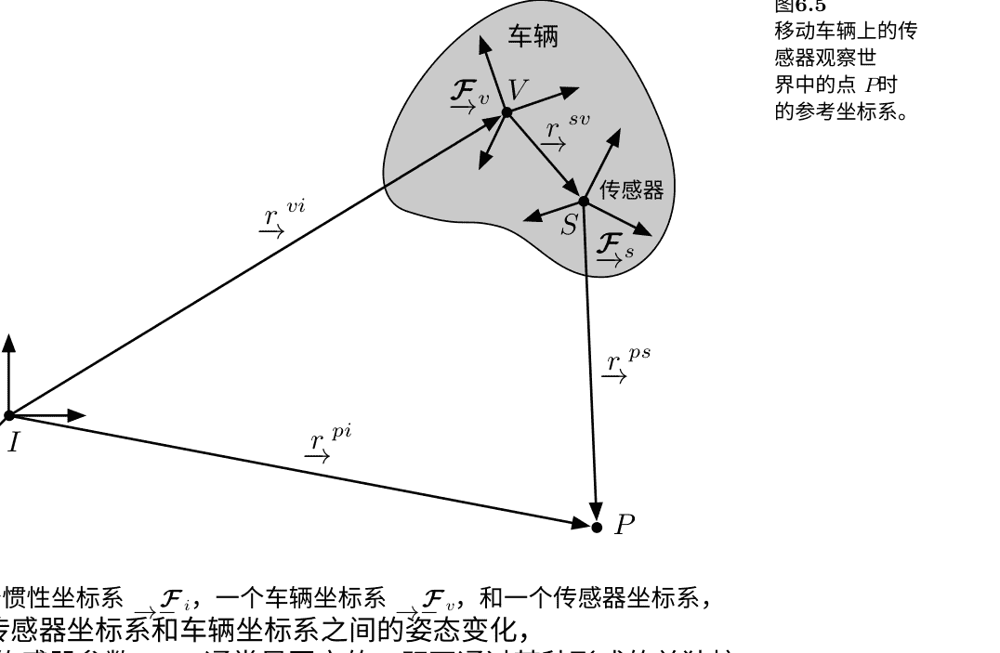

我们有一个惯性坐标系 $\mathcal{F}_i$，一个车辆坐标系 $\mathcal{F}_v$，和一个传感器坐标系， $\mathcal{F}_s$。传感器坐标系和车辆坐标系之间的姿态变化，称为外部传感器参数 $\mathbf{T}_{sv}$，通常是固定的，既不通过某种形式的单独校准方法确定，也不直接纳入状态估计过程中。在接下来的传感器模型开发中，我们将仅关注传感器附着在 $\mathcal{F}_s$ 上观察点 $P$ 的方式。

#### 6.4.1 透视相机

最重要的传感器之一是透视相机，因为它便宜且可以用来推断车辆的运动以及世界的形状。

##### 归一化图像坐标

图6.6描述了一个理想透视相机中点 $P$ 的观测 $O$。实际上，图像平面在针孔后面，但是将其显示在前面可以避免处理翻转图像的心理努力。这被称为前投影模型。光学轴 $\mathbf{f}$ 的 $\rightarrow\mathbf{s}_3$ 轴与图像平面和距离正交。

图6.6
相机的前投影模型
显示了图像平面上
的观测 O 和点
P。实际上，图像
平面在针孔后面，
但是前投影模型
避免了翻转图像。

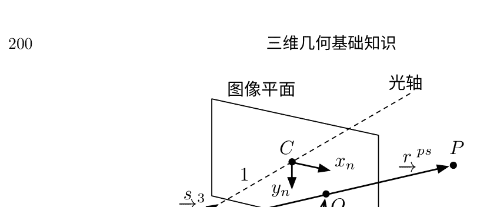

针孔 S 和图像平面中心 C 之间的距离，称为理想相机模型的焦距，为 1。

如果 $P$ 在 $\mathcal{F}_s$ 坐标系中的坐标为

$$\boldsymbol{\rho} = \mathbf{r}_s^{ps} = \begin{bmatrix} x \\ y \\ z \end{bmatrix}$$ (6.104)

如果 $\underline{s}_3$ 轴与图像平面正交，则图像平面上 $O$ 的坐标为

$$x_n = x / z,$$ (6.105a)
$$y_n = y / z.$$ (6.105b)

这些被称为（二维）归一化图像坐标，有时以齐次形式给出，如

$$\mathbf{p} = \begin{bmatrix} x_n \\ y_n \\ 1 \end{bmatrix}.$$ (6.106)

图6.7同一点 P 的两个相机观测。


## 本质矩阵

如果一个点 $P$ 被相机观察到，相机移动，然后再次观察到同一个点，对应于这两次观察的归一化图像坐标 $\mathbf{p}_a$ 和 $\mathbf{p}_b$ 之间存在以下约束关系:

$\mathbf{p}_a^T \mathbf{E}_{ab} \mathbf{p}_b = 0,$ (6.107)

其中 $\mathbf{E}_{ab}$ 被称为 本质矩阵 (计算机视觉中的)

$\mathbf{E}_{ab} = \mathbf{C}_{ba}^T \mathbf{r}_b^{ab\wedge}$ (6.108)

并且与相机的姿态变化相关,

$\mathbf{T}_{ba} = \begin{bmatrix} \mathbf{C}_{ba} & \mathbf{r}_b^{ab} \\ \mathbf{0}^T & 1 \end{bmatrix}.$ (6.109)

为了验证约束是否成立，我们假设

$\mathbf{p}_j = \frac{1}{z_j} \boldsymbol{\rho}_j, \quad \boldsymbol{\rho}_j = \begin{bmatrix} x_j \\ y_j \\ z_j \end{bmatrix}$ (6.110)

对于 $j = a, b$. 我们还有

$\boldsymbol{\rho}_a = \mathbf{C}_{ba}^T (\boldsymbol{\rho}_b - \mathbf{r}_b^{ab})$ (6.111)

由于相机移动导致的 $P$ 坐标变化。 然后，回到约束条件，我们可以看到

$\mathbf{p}_a^T \mathbf{E}_{ab} \mathbf{p}_b = \frac{1}{z_a z_b} \boldsymbol{\rho}_a^T \mathbf{E}_{ab} \boldsymbol{\rho}_b = \frac{1}{z_a z_b} (\boldsymbol{\rho}_b - \mathbf{r}_b^{ab})^T \mathbf{C}_{ba} \mathbf{C}_{ba}^T \mathbf{r}_b^{ab\wedge} \boldsymbol{\rho}_b$
$= \frac{1}{z_a z_b} (-\boldsymbol{\rho}_b^T \mathbf{r}_b^{ab\wedge} \mathbf{r}_b^{ab} - \mathbf{r}_b^{ab^T} \mathbf{r}_b^{ab\wedge} \boldsymbol{\rho}_b) = 0.$ (6.112)

在一些姿态估计问题中，本质矩阵可以很有用，包括相机标定。

##### 镜头畸变

一般来说，镜头效应会使相机图像产生畸变，使得归一化图像坐标方程只是近似成立。 有各种各样的分析模型可以描述这种畸变，并且可以用来校正原始图像，使得结果图像看起来像是来自一个理想的针孔相机，从而使得归一化图像坐标方程成立。 我们将假设这个去畸变过程已经应用到图像上，并且避免详细说明畸变模型。

图6.8 相机模型 显示内部 参数：f是 焦距， (cu, cv)是 光轴 交点.

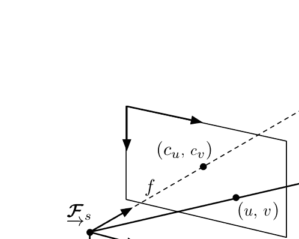

##### 内部参数

归一化图像坐标实际上与具有单位焦距和光轴交点处的假设相机相关联。我们可以将归一化图像坐标，(xn, yn), 映射到实际像素坐标, (u, v), 通过以下关系：

$$\begin{bmatrix} u \\ v \\ 1 \end{bmatrix} = \begin{bmatrix} f_u & 0 & c_u \\ 0 & f_v & c_v \\ 0 & 0 & 1 \end{bmatrix} \begin{bmatrix} x_n \\ y_n \\ 1 \end{bmatrix}, \quad (6.113)$$

其中 K被称为内部参数矩阵，包含以水平像素表示的实际相机焦距，f_u和垂直像素， f_v，以及图像原点与光轴交点的实际偏移，(cu, cv)，也以水平、垂直像素表示。这些内部参数通常在用于消除镜头效果的校准过程中确定，因此我们可以假设 K是已知的。

## 基础矩阵

类似于本质矩阵约束，存在一个约束条件，可以在两个不同相机视角(可能是不同相机)下，通过齐次像素坐标来表示一个点的两个观测之间。

$$\mathbf{q}_i = \mathbf{K}_i \mathbf{p}_i, \quad (6.114)$$

其中 i =a, b表示具有不同内参矩阵的两个相机观测的像素坐标。那么下面的约束成立：

$$\mathbf{q}_a^T \mathbf{F}_{ab} \mathbf{q}_b = 0, \quad (6.115)$$

其中

$$\mathbf{F}_{ab} = \mathbf{K}_a^{-T} \mathbf{E}_{ab} \mathbf{K}_b^{-1} \quad (6.116)$$

被称为计算机视觉的基础矩阵。通过代入可以很容易地看出约束条件成立：

$$\mathbf{q}_a^T \mathbf{F}_{ab} \mathbf{q}_b = \mathbf{p}_b^T \mathbf{K}_a^T \mathbf{K}_a^{-T} \mathbf{E}_{ab} \mathbf{K}_b^{-1} \mathbf{K}_b \mathbf{p}_b = 0 \quad (6.117)$$

在最后一步中，我们使用了基本矩阵约束。 与基本矩阵相关的约束有时也被称为极线约束，并在图6.9中以几何方式表示。如果在一个相机中观察到一个点，$\mathbf{q}_a$，并且第一个相机和第二个相机之间的基本矩阵已知，则约束描述了一条线，称为极线，沿着这条线，点在第二个相机中的观察必须位于。这个属性可以用来限制匹配点的搜索范围只在极线上。 这是可能的，因为相机模型是一个仿射变换，意味着欧几里得空间中的直线投影到图像空间中的直线。 基本矩阵在开发确定内参矩阵的方法中也很有用，例如。

##### 完整模型

除了镜头效果之外，透视相机模型可以写成

$$\begin{bmatrix} u \\ v \end{bmatrix} = s(\boldsymbol{\rho}) = \mathbf{P} \mathbf{K} \frac{1}{z} \boldsymbol{\rho} \quad (6.118)$$

其中

$$\mathbf{P} = \begin{bmatrix} 1 & 0 & 0 \\ 0 & 1 & 0 \end{bmatrix}, \quad \mathbf{K} = \begin{bmatrix} f_u & 0 & c_u \\ 0 & f_v & c_v \\ 0 & 0 & 1 \end{bmatrix}, \quad \boldsymbol{\rho} = \begin{bmatrix} x \\ y \\ z \end{bmatrix}. \quad (6.119)$$

$\mathbf{P}$只是一个投影矩阵，用于从齐次点表示中去除底部行。这种模型形式清楚地表明，使用单个相机会丢失信息，因为我们

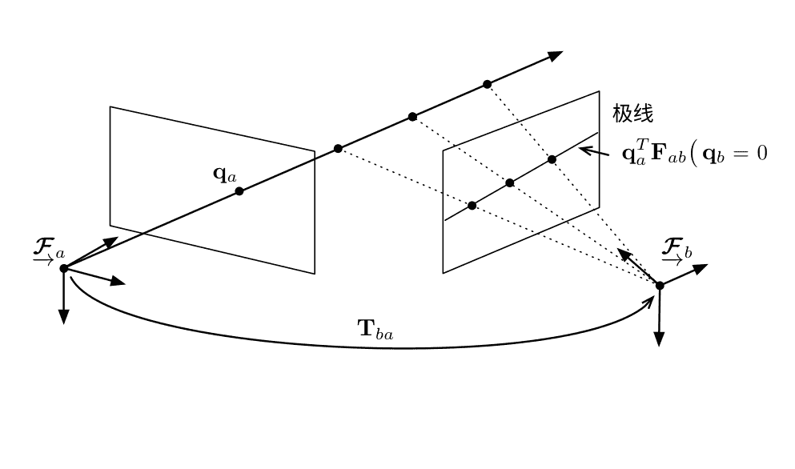

图6.9 如果一个在一个图像中观察到一个点，$\mathbf{q}_a$，并且已知基础矩阵，$\mathbf{F}_{ab}$，这可以用来定义第二个图像中的一条线，沿着这条线进行第二次观察，$\mathbf{q}_b$，必须位于其中。

从 $\boldsymbol{\rho}$ 中的三个参数到 $(u, v)$ 中的两个参数的转变；我们无法仅通过一个相机确定深度。

## 单应性

虽然我们无法仅通过一个相机确定深度，但如果我们假设相机观察的点位于已知几何形状的平面上，我们可以计算出深度，然后再计算出该点在另一个相机中的外观。这种情况的几何形状如图6.10所示。

两个相机的齐次观测可以写成

$$\mathbf{q}_i = \mathbf{K}_i \frac{1}{z_i} \boldsymbol{\rho}_i, \quad \boldsymbol{\rho}_i = \begin{bmatrix} x_i \\ y_i \\ z_i \end{bmatrix}, \quad (6.120)$$

其中 $\boldsymbol{\rho}_i$ 是每个相机框架中 $P$ 的坐标，$i = a, b$。让我们假设我们知道包含 $P$ 的平面方程，在两个相机框架中都可以表示为参数化形式

$$\{\mathbf{n}_i, d_i\}, \quad (6.121)$$

其中 $d_i$ 是相机_i 到平面的距离， $\mathbf{n}_i$ 是框架 i 中平面法线的坐标。这意味着

$$\mathbf{n}_i^T \boldsymbol{\rho}_i + d_i = 0, \quad (6.122)$$

因为 $P$ 在平面上。通过求解(6.120)中的 $\boldsymbol{\rho}_i$ 并将其代入平面方程，我们得到

$$z_i \mathbf{n}_i^T \mathbf{K}_i^{-1} \mathbf{q}_i + d_i = 0, \quad (6.123)$$

或者

$$z_i = -\frac{d_i}{\mathbf{n}_i^T \mathbf{K}_i^{-1} \mathbf{q}_i} \quad (6.124)$$


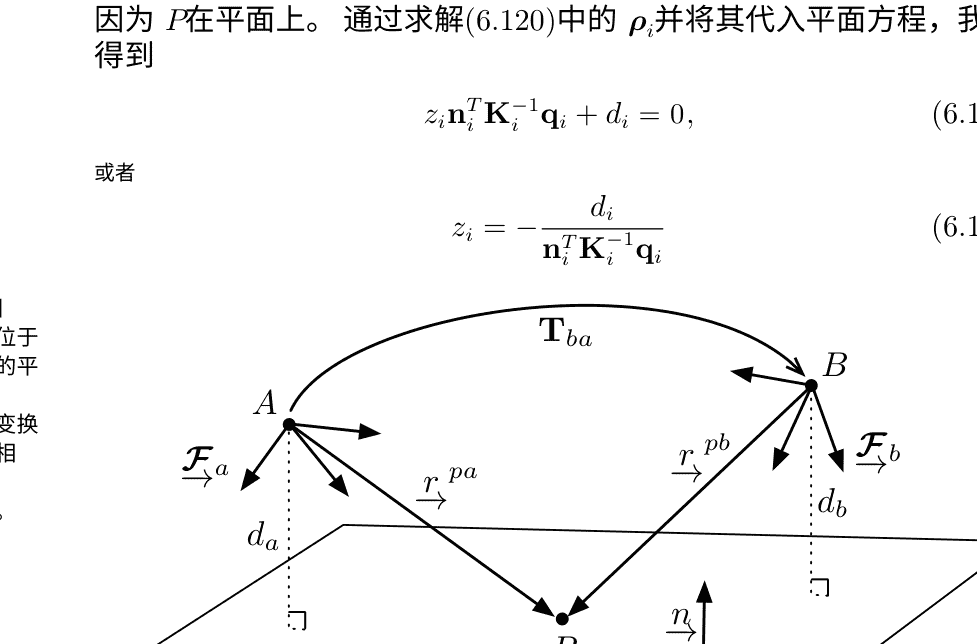

### 6.4 传感器模型

对于每个相机中点 $P$ 的深度，我们可以写成 $i = a,b$ 的坐标。 这进一步意味着我们可以写出 $P$ 的坐标，分别在每个相机坐标系中表示为

$$ \boldsymbol{\rho}_i = -\frac{d_i}{\mathbf{n}_i^T \mathbf{K}_i^{-1} \mathbf{q}_i} \mathbf{K}_i^{-1} \mathbf{q}_i. \tag{6.125} $$

这表明平面参数的知识， $\{ \mathbf{n}_i, d_i \}$, 即使单个摄像头无法确定深度，也能够恢复 $\boldsymbol{\rho}$ 的坐标。

让我们还假设我们知道姿态变化， $\mathbf{T}_{ba}$, 从 $\mathcal{F}_a$ 到 $\mathcal{F}_b$ 所以

$$ \begin{bmatrix} \boldsymbol{\rho}_b \\ 1 \end{bmatrix} = \underbrace{\begin{bmatrix} \mathbf{C}_{ba} & \mathbf{r}_b^{ab} \\ \mathbf{0}^T & 1 \end{bmatrix}}_{\mathbf{T}_{ba}} \begin{bmatrix} \boldsymbol{\rho}_a \\ 1 \end{bmatrix}, \tag{6.126} $$

或者

$$ \boldsymbol{\rho}_b = \mathbf{C}_{ba} \boldsymbol{\rho}_a + \mathbf{r}_b^{ab}. \tag{6.127} $$

插入(6.120)，我们有

$$ z_b \mathbf{K}_b^{-1} \mathbf{q}_b = z_a \mathbf{C}_{ba} \mathbf{K}_a^{-1} \mathbf{q}_a + \mathbf{r}_b^{ab}. \tag{6.128} $$

然后我们可以用 $\mathbf{q}_a$ 来隔离 $\mathbf{q}_b$:

$$ \mathbf{q}_b = \frac{z_a}{z_b} \mathbf{K}_b \mathbf{C}_{ba} \mathbf{K}_a^{-1} \mathbf{q}_a + \frac{1}{z_b} \mathbf{K}_b \mathbf{r}_b^{ab}. \tag{6.129} $$

然后，从(6.124)中替换 $z_b$，我们得到

$$ \mathbf{q}_b = \frac{z_a}{z_b} \mathbf{K}_b \mathbf{C}_{ba} \left( \mathbf{I} + \frac{1}{d_a} \mathbf{r}_a^{ba} \mathbf{n}_a^T \right) \mathbf{K}_a^{-1} \mathbf{q}_a, \tag{6.130} $$

在这里我们使用了 $z_a/z_b = -\mathbf{C}_{ba} \mathbf{r}^{baa}$ 的事实。最后，我们可以写成

$$ \mathbf{q}_b = \mathbf{K}_b \mathbf{H}_{ba} \mathbf{K}_a^{-1} \mathbf{q}_a, \tag{6.131} $$

其中

$$ \mathbf{H}_{ba} = \frac{z_a}{z_b} \mathbf{C}_{ba} \left( \mathbf{I} + \frac{1}{d_a} \mathbf{r}_a^{ba} \mathbf{n}_a^T \right) \tag{6.132} $$

被称为单应矩阵。由于因子 $z_a/z_b$ 只是缩放 $\mathbf{q}_b$，在实践中可以忽略不计，因为 $\mathbf{q}_b$ 是齐次坐标，真实的像素坐标可以通过将前两个条目除以第三个条目来恢复；这样做意味着 $\mathbf{H}_{ba}$ 只是姿态变化和平面参数的函数。

值得注意的是，在纯旋转的情况下， $\mathbf{r}^{baa} = \mathbf{0}$，因此

单应矩阵简化为

$$ \mathbf{H}_{ba} = \mathbf{C}_{ba} \tag{6.133} $$

当 $z_a/z_b$ 因子被忽略时。单应矩阵可逆，其逆矩阵为
$$
\mathbf{H}_{ba}^{-1} = \mathbf{H}_{ab} = \frac{z_b}{z_a} \mathbf{C}_{ab} \left( \mathbf{1} + \frac{1}{d_b} \mathbf{r}^{ab}_b \mathbf{n}_b^T \right).
$$
这使我们能够在另一个方向上转换观测结果。

#### 6.4.2 立体相机

另一个常见的三维传感器是立体相机，它由两个透视相机刚性连接在一起，并且它们之间有一个已知的变换关系。图6.11描述了最常见的立体配置之一，其中两个相机沿着 $x$ 轴分开，间距为 $b$ 的立体基线。与单个相机不同，可以通过立体观测来确定点的深度。

##### 中点模型

如果我们将点的坐标 $P$ 表示为 $_{\rightarrow}\mathcal{F}_s$，则
$$
\boldsymbol{\rho} = \mathbf{r}_s^{ps} = \begin{bmatrix} x \\ y \\ z \end{bmatrix},
$$

左相机的模型为
$$
\begin{bmatrix} u_\ell \\ v_\ell \end{bmatrix} = \mathbf{P} \mathbf{K} \frac{1}{z} \begin{bmatrix} x + \frac{b}{2} \\ y \\ z \end{bmatrix},
$$

右相机的模型为
$$
\begin{bmatrix} u_r \\ v_r \end{bmatrix} = \mathbf{P} \mathbf{K} \frac{1}{z} \begin{bmatrix} x - \frac{b}{2} \\ y \\ z \end{bmatrix},
$$

图6.11
立体相机装置。两个相机指向同一方向但具有已知的分离距离 $b$ 沿着 $x$ 轴。我们选择传感器框架位于两个相机之间的中点位置。

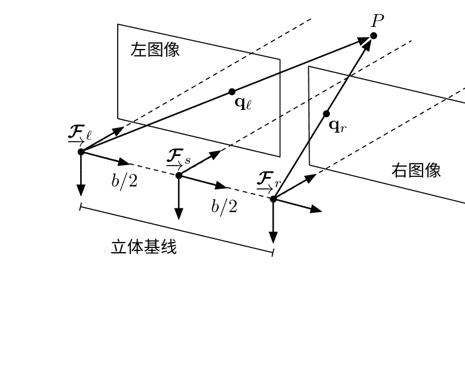

### 6.4 传感器模型

我们假设两个相机具有相同的内部参数矩阵。将两个观测结果堆叠在一起，我们可以将立体相机模型写成
$$
\begin{bmatrix}
u_{\ell} \\ v_{\ell} \\ u_{r} \\ v_{r}
\end{bmatrix}
=
\mathbf{s}(\boldsymbol{\rho})
=
\underbrace{
\begin{bmatrix}
f_{u} & 0 & c_{u} & f_{u}\frac{b}{2} \\
0 & f_{v} & c_{v} & 0 \\
f_{u} & 0 & c_{u} & -f_{u}\frac{b}{2} \\
0 & f_{v} & c_{v} & 0
\end{bmatrix}
}_{\mathbf{M}}
\frac{1}{z}
\begin{bmatrix}
x \\
y \\
z \\
1
\end{bmatrix},
\quad
(6.138)
$$
其中 \(\mathbf{M}\) 现在是一个合并的立体摄像机参数矩阵。值得注意的是 \(\mathbf{M}\) 不可逆，因为它的两行相同。实际上，由于立体设置，两个观测的垂直坐标将始终相同；这对应于在此配置中，极线是水平的，因此如果在一个图像中观察到一个点，则可以沿着具有相同垂直像素坐标的线搜索在另一个图像中找到观察结果。我们可以使用基本矩阵约束来看到这一点；对于这个立体设置，我们有 \(\mathbf{C}_{r \ell} = \mathbf{I}\) 和 \(\mathbf{r}^{\ell r r} = \begin{bmatrix} -b & 0 & 0 \end{bmatrix}\) 因此约束是
$$
\begin{bmatrix} u_{\ell} & v_{\ell} & 1 \end{bmatrix}
\underbrace{
\begin{bmatrix}
f_{u} & 0 & 0 \\
0 & f_{v} & 0 \\
c_{u} & c_{v} & 1
\end{bmatrix}
^{T}
}_{\mathbf{K}_{\ell}^{T}}
\underbrace{
\begin{bmatrix}
0 & 0 & 0 \\
0 & 0 & b \\
0 & -b & 0
\end{bmatrix}
}_{\mathbf{E}_{\ell r}}
\underbrace{
\begin{bmatrix}
f_{u} & 0 & c_{u} \\
0 & f_{v} & c_{v} \\
0 & 0 & 1
\end{bmatrix}
}_{\mathbf{K}_{r}}
\begin{bmatrix} u_{r} \\ v_{r} \\ 1 \end{bmatrix}
= 0.
\quad
(6.139)
$$
将其乘以，我们可以看到它简化为 \(v_{r} = v_{\ell}\)。

##### 左模型

我们也可以选择将传感器框架放置在左侧相机上，而不是两个相机之间的中点。在这种情况下，

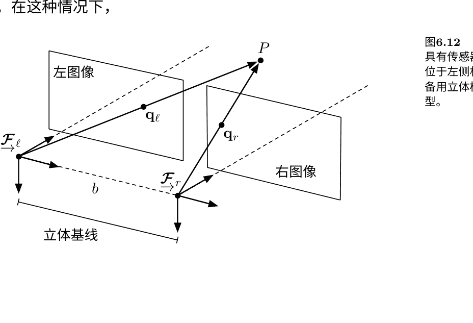

图6.12 具有传感器框架位于左侧相机的备用立体模型。

相机模型变为
$$
\begin{bmatrix} u_l \\ v_l \\ u_r \\ v_r \end{bmatrix} = \begin{bmatrix} f_u & 0 & c_u & 0 \\ 0 & f_v & c_v & 0 \\ f_u & 0 & c_u - f_u b & 0 \\ 0 & f_v & c_v & 0 \end{bmatrix} \frac{1}{z} \begin{bmatrix} x \\ y \\ z \\ 1 \end{bmatrix}. \quad (6.140)
$$
通常情况下，这种形式中的 $u_r$ 方程被省略，而 $v_r$ 方程则被替换为给出的视差$^8$, $d$, 如下所示
$$
d = u_l - u_r = \frac{1}{z} f_u b, \quad (6.141)
$$
这样我们可以写
$$
\begin{bmatrix} u_l \\ v_l \\ d \end{bmatrix} = s(\boldsymbol{\rho}) = \begin{bmatrix} f_u & 0 & c_u & 0 \\ 0 & f_v & c_v & 0 \\ 0 & 0 & 0 & f_u b \end{bmatrix} \frac{1}{z} \begin{bmatrix} x \\ y \\ z \\ 1 \end{bmatrix}, \quad (6.142)
$$
用于立体模型。这种形式具有吸引人的特性，我们从三个点参数 ($x$, $y$, $z$) 转换为三个观测值，类似的模型可以用于右侧相机。

## 6.4.3距离-方位-仰角

一些传感器，如激光雷达（光探测和测距），可以被建模为距离-方位-俯仰（$RAE$）观测，它基本上观测到一个点，$P$，在球坐标系中。对于可以通过将激光脉冲反射到场景上来测量距离的激光雷达，方位角和俯仰角是用于控制激光束的镜子的角度，而距离是通过飞行时间确定的报告距离。该传感器类型的几何形状如图6.13所示。点 $P$在传感器坐标系$\mathcal{F}_s$中的坐标为
$$
\boldsymbol{\rho} = \mathbf{r}_{s}^{ps} = \begin{bmatrix} x \\ y \\ z \end{bmatrix}. \quad (6.143)
$$


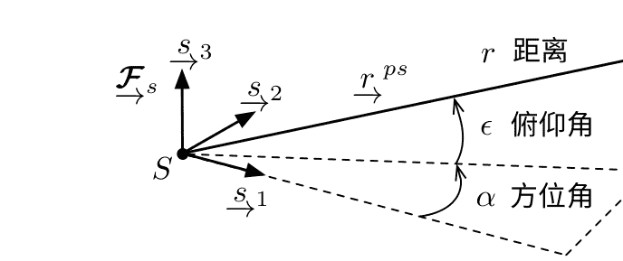

$^8$ 视差方程可以用作一维立体相机模型，正如我们在早期的非线性估计章节中已经看到的那样。

### 6.4 传感器模型

这些也可以写成
$$
\boldsymbol{\rho} = \mathbf{C}_3^T(\alpha) \mathbf{C}_2^T(-\epsilon) \begin{bmatrix} r \\ 0 \\ 0 \end{bmatrix}
$$
其中α是方位角，ε是俯仰角，r是距离，Ci是绕轴i的主要旋转。根据右手定则，图6.13中的俯仰旋转是负的。插入主轴旋转公式并展开，我们发现
$$
\begin{bmatrix} x \\ y \\ z \end{bmatrix} = \begin{bmatrix} r \cos \alpha \cos \epsilon \\ r \sin \alpha \cos \epsilon \\ r \sin \epsilon \end{bmatrix}
$$
这些是常见的球坐标表达式。不幸的是，这是我们所期望的传感器模型的反函数。我们可以倒转这个表达式，得到RAE传感器模型。
$$
\begin{bmatrix} r \\ \alpha \\ \epsilon \end{bmatrix} = \mathbf{s}(\boldsymbol{\rho}) = \begin{bmatrix} \sqrt{x^2 + y^2 + z^2} \\ \tan^{-1}(y/x) \\ \sin^{-1}(z/\sqrt{x^2 + y^2 + z^2}) \end{bmatrix}
$$
在点P位于xy平面的情况下，我们有z=0和因此ε=0，因此RAE模型简化为距离-方位角模型：
$$
\begin{bmatrix} r \\ \alpha \end{bmatrix} = \mathbf{s}(\boldsymbol{\rho}) = \begin{bmatrix} \sqrt{x^2 + y^2} \\ \tan^{-1}(y/x) \end{bmatrix}
$$
这在移动机器人中常用。

#### 6.4.4 惯性测量单元

在三维空间中运作的另一个常见传感器是惯性测量单元(IMU)。理想的IMU包括三个正交线性加速度计和三个正交陀螺仪。所有量都是在传感器坐标系F_s中测量的，通常不是在车辆坐标系F_v中，如图6.14所示。为了建模IMU，我们假设车辆的状态可以由以下量来捕捉
$$
\begin{aligned}
\mathbf{r}^v, \mathbf{C}_{vi} \quad &\text{姿态} \\
\boldsymbol{\omega}^{vi}_v \quad &\text{角速度} \\
\dot{\boldsymbol{\omega}}^{vi}_v \quad &\text{角加速度}
\end{aligned}
$$
我们知道车辆和传感器之间的固定姿态变化，由r^svv和C_sv给出，通常通过校准确定。

图6.14 惯性测量单元具有三个线性加速度计和三个陀螺仪，测量传感器坐标系中的物理量，通常与车辆坐标系不重合。

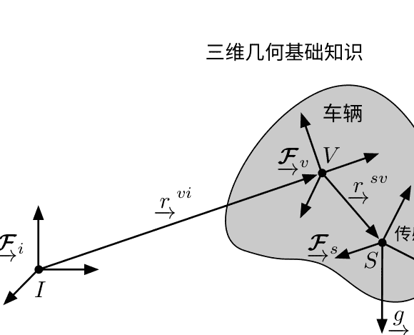

陀螺仪传感器模型比加速度计简单，因此我们将首先讨论这个。实质上，测量的角速率，$\omega$，是车辆的体速率在传感器坐标系中的表示：
$$\omega = \mathbf{C}_{sv} \omega_{v}^{vi} . \qquad (6.149)$$
这利用了传感器框架相对于车辆框架固定的事实，使得 $\dot{\mathbf{C}}_{sv} = \mathbf{0}$。

由于加速度计通常使用试验质量作为测量原理的一部分，得到的观测值， $\mathbf{a}$, 可以写成
$$\mathbf{a} = \mathbf{C}_{si} \left( \ddot{\mathbf{r}}_{i}^{si} - \mathbf{g}_{i} \right) . \qquad (6.150)$$
其中 $\ddot{\mathbf{r}}_{i}^{si}$ 是传感器点 $S$ 的惯性加速度，和 $\mathbf{g}_{i}$ 是重力。值得注意的是，在自由落体中，加速度计将测量 $\mathbf{a} = \mathbf{0}$，而在静止时，它们将仅测量重力（在传感器框架中）。

不幸的是，这个加速度计模型不是基于我们上面确定的车辆状态量，必须修改以考虑传感器和车辆框架之间的偏移。为此，我们注意到
$$\mathbf{r}_{i}^{si} = \mathbf{r}_{i}^{vi} + \mathbf{C}_{vi}^{T} \mathbf{r}_{v}^{sv} . \qquad (6.151)$$
两次微分（使用 (6.45) 中的泊松方程和 $\dot{\mathbf{r}}_{v}^{sv} = \mathbf{0}$）提供
$$\ddot{\mathbf{r}}_{i}^{si} = \ddot{\mathbf{r}}_{i}^{vi} + \mathbf{C}_{vi}^{T} \dot{\omega}_{v}^{vi\wedge} \mathbf{r}_{v}^{sv} + \mathbf{C}_{vi}^{T} \omega_{v}^{vi\wedge} \omega_{v}^{vi\wedge} \mathbf{r}_{v}^{sv} . \qquad (6.152)$$
其中右侧现在是以我们的状态量 $^{10}$ 和已知校准参数表示的。将其插入 (6.150) 中得到我们的最终加速度计模型：
$$\mathbf{a} = \mathbf{C}_{sv} \left( \mathbf{C}_{vi} \left( \ddot{\mathbf{r}}_{i}^{vi} - \mathbf{g}_{i} \right) + \dot{\omega}_{v}^{vi\wedge} \mathbf{r}_{v}^{sv} + \omega_{v}^{vi\wedge} \omega_{v}^{vi\wedge} \mathbf{r}_{v}^{sv} \right) . \qquad (6.153)$$
自然地，如果传感器和车辆坐标系之间的偏移量， $\mathbf{r}^{svv}$，足够小，我们可以选择忽略最后两项。

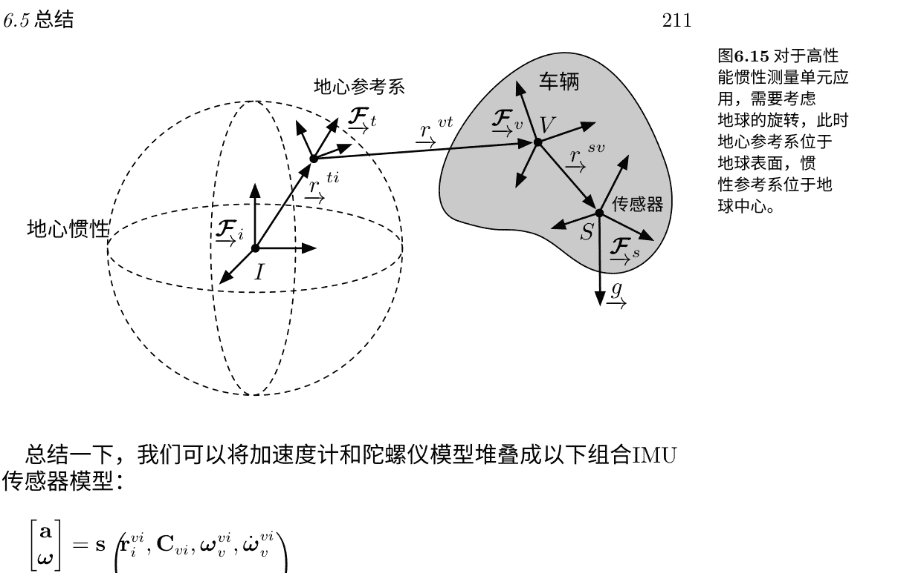

总结一下，我们可以将加速度计和陀螺仪模型堆叠成以下组合IMU传感器模型：
$$
\begin{bmatrix} \mathbf{a} \\ \boldsymbol{\omega} \end{bmatrix} = \mathbf{s} \left( \mathbf{r}_{i}^{vi}, \mathbf{C}_{vi}, \boldsymbol{\omega}_{v}^{vi}, \dot{\boldsymbol{\omega}}_{v}^{vi} \right) \\
= \begin{bmatrix} \mathbf{C}_{sv} \left( \mathbf{C}_{vi} \left( \ddot{\mathbf{r}}_{i}^{vi} - \mathbf{g}_{i} \right) + \dot{\boldsymbol{\omega}}_{v}^{vi\wedge} \mathbf{r}_{v}^{sv} + \boldsymbol{\omega}_{v}^{vi\wedge} \boldsymbol{\omega}_{v}^{vi\wedge} \mathbf{r}_{v}^{sv} \right) \\ \mathbf{C}_{sv} \boldsymbol{\omega}_{v}^{vi} \end{bmatrix}, \quad (6.154)
$$
其中 $\mathbf{C}_{sv}$ 和 $\mathbf{r}^{svv}$ 是车辆和传感器坐标系之间的已知姿态变化，$\mathbf{g}_{i}$ 是惯性坐标系中的重力。

对于一些高性能惯性测量单元应用，上述模型是不足够的，因为它假设一个惯性参考坐标系可以方便地位于地球表面上。然而，高端IMU装置足够敏感，可以检测到地球的旋转，因此需要一个更复杂的传感器模型。典型的设置如图6.15所示，惯性坐标系位于地球的质心（但不旋转），然后一个方便的（非惯性）参考坐标系（用于跟踪车辆运动）位于地球表面。这需要将传感器模型推广以适应这种更复杂的设置（未显示）。

### 6.5 总结

本章的主要要点如下：

- 1. 能够在三维空间中旋转的物体在本书的第一部分中对我们的状态估计技术构成了一个问题。 这是因为我们通常不能使用向量空间来描述物体的三维方向。

### 6.6 练习题

6.6.1 证明对于任意两个 \(3 \times 1\) 列向量 \(\mathbf{u}\) 和 \(\mathbf{v}\)，有 \(\mathbf{u}^\wedge \mathbf{v} = - \mathbf{v}^\wedge \mathbf{u}\)。

6.6.2 证明 \(\mathbf{C}^{-1} = \mathbf{C}^T\)，从 \(\mathbf{C} = \cos \theta \mathbf{1} + (1 - \cos \theta)\mathbf{a} \mathbf{a}^T + \sin \theta \mathbf{a}^\wedge\)。

6.6.3 证明对于任意 \(3 \times 1\) 列向量 \(\mathbf{v}\) 和旋转矩阵 \(\mathbf{C}\)，有 \((\mathbf{C} \mathbf{v})^\wedge \equiv \mathbf{C} \mathbf{v}^\wedge \mathbf{C}^T\)。

6.6.5 证明如果我们将运动限制在 \(xy\) 平面上，弗雷内-塞雷方程简化为
$$
\begin{aligned}
\dot{x} &= v \cos \theta, \\
\dot{y} &= v \sin \theta, \\
\dot{\theta} &= \omega,
\end{aligned}
$$
其中 \(\omega = v \kappa\)。

6.6.6 证明对于单摄像头模型，欧几里得空间中的直线投影到图像空间中是直线。

6.6.7 直接证明单应性矩阵的逆矩阵
$$
\mathbf{H}_{ba} = \frac{z_a}{z_b} \mathbf{C}_{ba} \left(\mathbf{1} + \frac{1}{d_a} \mathbf{r}_a^{ba} \mathbf{n}_a^T\right),
$$
是
$$
\mathbf{H}_{ba}^{-1} = \frac{z_b}{z_a} \mathbf{C}_{ab} \left(\mathbf{1} + \frac{1}{d_b} \mathbf{r}_b^{ab} \mathbf{n}_b^T\right).
$$## 矩阵李群

我们在前一章关于三维几何的介绍中已经引入了旋转和姿态。在本章中，我们更深入地研究了这些量的性质。事实证明，旋转与我们熟悉的常规向量量不同。

旋转的集合在线性代数的意义上不是一个向量空间。然而，旋转形成了另一个数学对象，称为非交换群，它具有一些但不是全部的常规向量空间属性。

在本章中，我们将重点关注两个被称为矩阵李群的集合。Stillwell (2008)提供了关于李群的易于理解的介绍。Marius Sophus Lie theory, and Chirikjian (2009)是从机器人学的角度来看的一个很好的参考资料。

> Marius Sophus Lie (1842-1899) 是一位挪威数学家。他在很大程度上创造了连续对称性的理论，并将其应用于几何学和微分方程的研究。

### 7.1 几何学

在本章中，我们将使用两个特定的矩阵李群：特殊正交群 $SO(3)$，可以表示旋转，和特殊欧几里德群 $SE(3)$，可以表示姿态。

#### 7.1.1 特殊正交和特殊欧几里得群

表示旋转的特殊正交群，简单地是有效旋转矩阵的集合：

$$SO(3) = \left\{ \mathbf{C} \in \mathbb{R}^{3 \times 3} \mid \mathbf{C}\mathbf{C}^{T} = \mathbf{1}, \det \mathbf{C} = 1 \right\}.$$ (7.1)

需要 $\mathbf{C}\mathbf{C}^{T} = \mathbf{1}$ 正交性条件来对九参数旋转矩阵施加六个约束，从而将自由度减少到三个。注意到

$$(\det \mathbf{C})^2 = \det \left( \mathbf{C}\mathbf{C}^{T} \right) = \det \mathbf{1} = 1,$$ (7.2)

我们有

$$\det \mathbf{C} = \pm 1,$$ (7.3)

允许两种可能性。选择 det C = 1 确保我们有一个正确的旋转¹。

尽管所有矩阵的集合可以证明是一个向量空间，SO(3)不是一个有效的子空间²。例如，SO(3)不封闭于加法，因此将两个旋转矩阵相加不会得到一个有效的旋转矩阵：

```
C₁, C₂ ∈ SO(3) ⇒ C₁ + C₂ ∉ SO(3). (7.4)
```

零矩阵不是一个有效的旋转矩阵：0 ∉ SO(3)。没有这些属性（和其他一些属性），SO(3)不能成为向量空间（至少不是 ℝ³ˣ³ 的子空间）。

特殊欧几里德群，表示姿态（即平移和旋转），只是有效变换矩阵的集合：

```
SE(3) = { T = [C r; 0ᵀ 1] ∈ ℝ⁴ˣ⁴ | C ∈ SO(3), r ∈ ℝ³ }. (7.5)
```

通过类似的论证，我们可以证明 SE(3)不是一个向量空间（至少不是 ℝ⁴ˣ⁴ 的子空间）。

虽然 SO(3)和 SE(3)不是向量空间，但可以证明它们是矩阵李群³。接下来我们将展示这意味着什么。在数学中，一个群是由一组元素和一个将任意两个元素组合成第三个元素的运算组成的集合，同时满足四个称为群公理的条件，即封闭性、结合性、单位元和可逆性。一个李群是一个同时也是微分流形的群，具有群运算光滑的性质⁴。一个矩阵李群进一步指定了群的元素是矩阵，组合运算是矩阵乘法，逆运算是矩阵求逆。

对于我们的两个候选矩阵李群，四个群属性如表7.1所示。对于 SO(3)来说，封闭性实际上可以直接从欧拉旋转定理推导出来，该定理表明旋转的复合可以用单个旋转替代。或者，我们可以注意到

```
(C₁ C₂) (C₁ C₂)ᵀ = C₁ C₂ C₂ᵀ C₁ᵀ = C₁ C₁ᵀ = 1, det (C₁ C₂) = det (C₁) det (C₂) = 1, (7.6)
```

1 还有另一种情况是 det C = -1, 有时被称为不合适的旋转或旋转反射，但我们在这里不关心它。
2 向量空间的子空间也是向量空间。
3 它们实际上是非阿贝尔（或非交换）群，因为元素的组合顺序很重要。
4 平滑性意味着我们可以在流形上使用微分计算；或者粗略地说，如果我们稍微改变任何群操作的输入，输出只会稍微改变。

表7.1 矩阵李群SO(3)（旋转）和SE(3)（姿态）的属性。

| 属性 | SO(3) | SE(3) |
|------|-------|-------|
| 闭包 | $C_1, C_2 \in SO(3) \Rightarrow C_1 C_2 \in SO(3)$ | $T_1, T_2 \in SE(3) \Rightarrow T_1 T_2 \in SE(3)$ |
| 结合性 | $C_1 (C_2 C_3) = (C_1 C_2) C_3 = C_1 C_2 C_3$ | $T_1 (T_2 T_3) = (T_1 T_2) T_3 = T_1 T_2 T_3$ |
| 单位元 | $C, 1 \in SO(3) \Rightarrow C1 = 1C = C$ | $T, 1 \in SE(3) \Rightarrow T1 = 1T = T$ |
| 可逆性 | $C \in SO(3) \Rightarrow C^{-1} \in SO(3)$ | $T \in SE(3) \Rightarrow T^{-1} \in SE(3)$ |

如果 $C_1, C_2 \in SO(3)$，则 $C_1 C_2 \in SO(3)$。通过简单地相乘可以看出 $SE(3)$ 的闭包性

$$T_1 T_2 = \begin{bmatrix} C_1 & r_1 \\ 0^T & 1 \end{bmatrix} \begin{bmatrix} C_2 & r_2 \\ 0^T & 1 \end{bmatrix} = \begin{bmatrix} C_1 C_2 & C_1 r_2 + r_1 \\ 0^T & 1 \end{bmatrix} \in SE(3), \quad (7.7)$$

通过矩阵乘法的性质，两个群体的结合性都可以得到。单位矩阵是两个群体的单位元，这也是通过矩阵乘法的性质得到的。最后，由于 $C^{-1} = C^T$，这是由 $CC^T = 1$ 得到的，我们知道 $SO(3)$ 的元素的逆仍然在 $SO(3)$ 中。这可以通过以下方式看出

$$(C^{-1})(C^{-1})^T = (C^T)(C^T)^T = C^T C = 1,$$ $$\det \left( C^{-1} \right) = \det \left( C^T \right) = \det C = 1. \quad (7.8)$$

一个 $SE(3)$ 元素的逆是

$$T^{-1} = \begin{bmatrix} C & r \\ 0^T & 1 \end{bmatrix}^{-1} = \begin{bmatrix} C^T & -C^T r \\ 0^T & 1 \end{bmatrix} \in SE(3); \quad (7.9)$$

由于 $C^T \in SO(3)$，$-C^T r \in \mathbb{R}^3$，所以这也成立。除了平滑性准则外，这也将 $SO(3)$ 和 $SE(3)$ 视为矩阵李群。

#### 7.1.2 李代数

每个矩阵李群都与一个李代数相关联，该代数由某个域上的向量空间和一个二元运算 $[\cdot, \cdot]$（称为李括号）组成，满足四个性质：

- 闭包： $[ \mathbf{X}, \mathbf{Y} ] \in \mathbb{V}$,
- 双线性性： $[ a\mathbf{X} + b\mathbf{Y}, \mathbf{Z} ] = a[\mathbf{X}, \mathbf{Z}] + b[\mathbf{Y}, \mathbf{Z}]$, $[\mathbf{Z}, a\mathbf{X} + b\mathbf{Y}] = a[\mathbf{Z}, \mathbf{X}] + b[\mathbf{Z}, \mathbf{Y}]$,
- 交替性： $[ \mathbf{X}, \mathbf{X} ] = \mathbf{0}$,
- 雅可比恒等式： $[ \mathbf{X}, [\mathbf{Y}, \mathbf{Z}] ] + [\mathbf{Y}, [\mathbf{Z}, \mathbf{X}] ] + [\mathbf{Z}, [\mathbf{X}, \mathbf{Y}] ] = \mathbf{0}$,

李代数的向量空间是李群在群的单位元处的切空间，完全捕捉了群的局部结构。

##### 旋转

与 $SO(3)$ 相关联的李代数为

- 向量空间： $\mathfrak{so}(3) = \left\{ \Phi = \phi^\wedge \in \mathbb{R}^{3 \times 3} \mid \phi \in \mathbb{R}^3 \right\}$,
- 域： $\mathbb{R}$,
- 李括号： $[ \Phi_1, \Phi_2 ] = \Phi_1 \Phi_2 - \Phi_2 \Phi_1$,

其中
$\phi^\wedge = \begin{bmatrix} \phi_1 \\ \phi_2 \\ \phi_3 \end{bmatrix}^\wedge = \begin{bmatrix} 0 & -\phi_3 & \phi_2 \\ \phi_3 & 0 & -\phi_1 \\ -\phi_2 & \phi_1 & 0 \end{bmatrix} \in \mathbb{R}^{3 \times 3}, \quad \phi \in \mathbb{R}^3.$ (7.10)

我们在之前的章节中已经看到了这个线性的、斜对称的算子，在讨论叉积和旋转时。稍后，我们还将使用这个算子的逆，表示为$(\cdot)^\vee$，以此来进行纠正。

$\Phi = \phi^\wedge \implies \phi = \Phi^\vee.$ (7.11)

我们将省略证明 $\mathfrak{so}(3)$ 是一个向量空间，但会简要展示四个李括号性质成立。然后，对于封闭性质，我们有

$[\Phi_1, \Phi_2] = \Phi_1 \Phi_2 - \Phi_2 \Phi_1 = \phi_1^\wedge \phi_2^\wedge - \phi_2^\wedge \phi_1^\wedge = \left( \phi_1 \times \phi_2 \right)^\wedge \in \mathfrak{so}(3).$ (7.12)

> 卡尔·古斯塔夫·雅可比（1804-1851）是一位德国数学家，对椭圆函数、动力学、微分方程和数论做出了基础性贡献。

双线性性质直接来自于 $(\cdot)^\wedge$ 是一个线性算子的事实。
交替性质可以很容易地通过以下方式看出

$[\Phi, \Phi] = \Phi \Phi - \Phi \Phi = \mathbf{0} \in \mathfrak{so}(3).$ (7.13)

最后，通过替换和应用，可以验证雅可比恒等式李括号的定义。非正式地，我们将把 $\mathfrak{so}(3)$ 称为李代数，尽管从技术上讲，这只是相关向量空间。

##### 姿态

与 $SE(3)$ 相关联的李代数为

- 向量空间： $\text{se}(3) = \{\Xi = \xi^\wedge \in \mathbb{R}^{4 \times 4} \mid \xi \in \mathbb{R}^6 \}$,
- 域： $\mathbb{R}$,
- 李括号： $[\Xi_1, \Xi_2] = \Xi_1\Xi_2 - \Xi_2\Xi_1$

其中

$$ \xi^\wedge = \begin{bmatrix} \rho \\ \phi \end{bmatrix}^\wedge = \begin{bmatrix} \phi^\wedge & \rho \\ \mathbf{0}^T & 0 \end{bmatrix} \in \mathbb{R}^{4 \times 4}, \quad \rho, \phi \in \mathbb{R}^3. \quad \text{(7.14)} $$

这是对 $(\cdot)^\wedge$ 运算符 (Murray et al., 1994) 进行的过载，从以前的 $\mathbb{R}^6$ 元素转换为 $\mathbb{R}^{4 \times 4}$ 元素；它仍然是线性的。我们还将使用该运算符的逆运算，表示为 $(\cdot)^\vee$，以便

$$ \Xi = \xi^\wedge \Rightarrow \xi = \Xi^\vee. \quad \text{(7.15)} $$

同样，我们将省略证明 $\text{se}(3)$ 是一个向量空间，但会简要地展示四个李括号性质成立。令 $\Xi, \Xi_1 = \xi_1^\wedge, \Xi_2 = \xi_2^\wedge \in \text{se}(3)$。然后，对于封闭性质，我们有

$$ [\Xi_1, \Xi_2] = \Xi_1\Xi_2 - \Xi_2\Xi_1 = \xi_1^\wedge \xi_2^\wedge - \xi_2^\wedge \xi_1^\wedge = \left(\xi_1 \xi_2^\wedge \right)^\wedge \in \text{se}(3), \quad \text{(7.16)} $$

其中

$$ \xi^\wedge = \begin{bmatrix} \rho \\ \phi \end{bmatrix}^\wedge = \begin{bmatrix} \phi^\wedge & \rho^\wedge \\ \mathbf{0} & \phi^\wedge \end{bmatrix} \in \mathbb{R}^{6 \times 6}, \quad \rho, \phi \in \mathbb{R}^3. \quad \text{(7.17)} $$

双线性性质直接来自于 $(\cdot)^\wedge$ 是一个线性算子的事实。通过

$$ [\Xi, \Xi] = \Xi\Xi - \Xi\Xi = 0 \in \text{se}(3), $$

可以很容易地看出交替性质。最后，通过替换和应用李括号的定义，可以验证雅可比恒等式。再次，我们将 $\text{se}(3)$ 称为李代数，尽管从技术上讲，这只是相关向量空间。

在下一节中，我们将明确阐述我们的矩阵李群与它们相关的李代数之间的关系：$SO(3) \leftrightarrow so(3)$, $SE(3) \leftrightarrow \text{se}(3)$。

为此，我们需要指数映射。

#### 7.1.3 指数映射

事实证明，指数映射是将矩阵李群与其关联的李代数相关联的关键。矩阵指数由以下公式给出：

$$ \exp(\mathbf{A}) = \mathbf{1} + \mathbf{A} + \frac{1}{2!}\mathbf{A}^2 + \frac{1}{3!}\mathbf{A}^3 + \cdots = \sum_{n=0}^{\infty} \frac{1}{n!}\mathbf{A}^n, \quad \text{(7.19)} $$

其中 $\mathbf{A} \in \mathbb{R}^{M \times M}$ 是一个方阵。还有一个矩阵对数：

$$\ln (\mathbf{A}) = \sum_{n=1}^{\infty} \frac{(-1)^{n-1}}{n} (\mathbf{A} - \mathbf{1})^{n}. \qquad (7.20)$$

##### 旋转

对于旋转，我们可以通过指数映射将 $SO(3)$ 的元素与 $\mathfrak{so}(3)$ 的元素相关联：

$$\mathbf{C} = \exp \left( \phi^{\wedge} \right) = \sum_{n=0}^{\infty} \frac{1}{n!} \left( \phi^{\wedge} \right)^{n}, \qquad (7.21)$$

其中 $\mathbf{C} \in SO(3)$， $\phi \in \mathbb{R}^3$（因此 $\phi^{\wedge} \in \mathfrak{so}(3)$）。我们也可以使用以下方法（但不唯一）进行相反的转换：

$$\phi = \ln \left( \mathbf{C} \right)^{\vee}. \qquad (7.22)$$

从数学上讲，从 $\mathfrak{so}(3)$ 到 $SO(3)$ 的指数映射是满射的——只有满射/到上的和非单射/多对一的。这意味着我们可以从 $\mathfrak{so}(3)$ 的多个元素生成 $SO(3)$ 的每个元素[^8]。

深入研究满射性质是很有用的。

我们首先通过计算从 $\phi \in \mathbb{R}^3$ 到 $\mathbf{C} \in SO(3)$ 的正向（指数）映射的闭合形式来开始。设 $\phi = \phi \mathbf{a}$，其中 $\phi = |\phi|$ 是旋转角度， $\mathbf{a} = \phi / \phi$ 是旋转轴的单位长度。

对于矩阵指数，我们有

$$\begin{aligned}
\exp\left(\phi^{\wedge}\right) &= \exp\left(\phi \mathbf{a}^{\wedge}\right) \\
&= \underbrace{\mathbf{1}}_{\mathbf{a}\mathbf{a}^T - \mathbf{a}^{\wedge}\mathbf{a}^{\wedge}} + \phi \mathbf{a}^{\wedge} + \frac{1}{2!}\phi^2 \mathbf{a}^{\wedge}\mathbf{a}^{\wedge} + \frac{1}{3!}\phi^3 \underbrace{\mathbf{a}^{\wedge}\mathbf{a}^{\wedge}\mathbf{a}^{\wedge}}_{-\mathbf{a}^{\wedge}} \\
&\quad + \frac{1}{4!}\phi^4 \underbrace{\mathbf{a}^{\wedge}\mathbf{a}^{\wedge}\mathbf{a}^{\wedge}\mathbf{a}^{\wedge}}_{-\mathbf{a}^{\wedge}\mathbf{a}^{\wedge}} - \cdots \\
&= \mathbf{a}\mathbf{a}^T + \left( \phi - \frac{1}{3!}\phi^3 + \frac{1}{5!}\phi^5 - \cdots \right) \mathbf{a}^{\wedge} \\
&\quad - \left( 1 - \frac{1}{2!}\phi^2 + \frac{1}{4!}\phi^4 - \cdots \right) \underbrace{\mathbf{a}^{\wedge}\mathbf{a}^{\wedge}}_{-\mathbf{1}+\mathbf{a}\mathbf{a}^T} \\
&= \cos\phi\, \mathbf{1} + (1 - \cos\phi)\mathbf{a}\mathbf{a}^T + \sin\phi\, \mathbf{a}^{\wedge}, \qquad (7.23)
\end{aligned}$$

> [^8]: 多对一映射属性与旋转参数化中的奇异点（或非唯一性）概念相关。我们知道，旋转的每个三参数表示不能同时全局和唯一地表示方向。

非唯一性意味着给定一个 $\mathbf{C}$，我们无法唯一地找到一个单一的 $\phi \in \mathbb{R}^3$ 生成它；有无限多个。

### 7.1 几何学

我们看到的是早先介绍的旋转矩阵的规范轴角形式。我们使用了有用的恒等式（对于单位长度的a）

$$\mathbf{a}^\wedge\mathbf{a}^\wedge \equiv -\mathbf{1} + \mathbf{a}\mathbf{a}^T, \qquad\qquad\qquad\quad (7.24\text{a})$$
$$\mathbf{a}^\wedge\mathbf{a}^\wedge\mathbf{a}^\wedge \equiv -\mathbf{a}^\wedge, \qquad\qquad (7.24\text{b})$$

这些证明留给读者。

这表明每个 $\phi \in \mathbb{R}^3$ 都会生成一个有效的 $\mathbf{C} \in SO(3)$。它还表明，如果我们在旋转角度上加上 $2\pi$ 的倍数，我们将生成相同的 $\mathbf{C}$。具体来说，我们有

$$\mathbf{C} = \exp((\phi + 2\pi m)\mathbf{a}^\wedge), \qquad\qquad\qquad\qquad\qquad\qquad (7.25)$$

其中 $m$ 是任意正整数，因为 $\cos(\phi + 2\pi m) = \cos \phi$ 和 $\sin(\phi + 2\pi m) = \sin \phi$。如果我们限制旋转角度，$|\phi| < \pi$，那么每个 $\mathbf{C}$ 只能由一个 $\phi$ 生成。

此外，我们想要证明每个 $\mathbf{C} \in SO(3)$ 都可以由某个 $\phi \in \mathbb{R}^3$ 生成，为此我们需要逆（对数-微分）映射：$\phi = \ln(\mathbf{C})^\vee$。我们还可以通过闭式解来解决这个问题。由于旋转矩阵应用于自身的轴不会改变轴，$\mathbf{C}\mathbf{a} = \mathbf{a}$， (7.26)

这意味着 $\mathbf{a}$ 是 $\mathbf{C}$ 对应于1的特征向量（单位长度）。因此，通过解决与 $\mathbf{C}$ 相关的特征值问题，我们可以找到 $\mathbf{a}$⁹。可以通过利用旋转矩阵的迹（对角线元素之和）来找到角度：

$$\begin{align*}
\text{tr}(\mathbf{C}) &= \text{tr}\left(\cos\phi\, \mathbf{1} + (1 - \cos\phi)\mathbf{a}\mathbf{a}^T + \sin\phi\, \mathbf{a}^\wedge\right) \\
&= \cos\phi\, \underbrace{\text{tr}(\mathbf{1})}_{3} + (1 - \cos\phi)\, \underbrace{\text{tr}(\mathbf{a}\mathbf{a}^T)}_{\mathbf{a}^T\mathbf{a}=1} + \sin\phi\, \underbrace{\text{tr}(\mathbf{a}^\wedge)}_{0} = 2\cos\phi + 1.
\end{align*}$$

(7.27)

求解，我们有

$$\phi = \cos^{-1}\left(\frac{\text{tr}(\mathbf{C}) - 1}{2}\right) + 2\pi m, \qquad\qquad\qquad\qquad\qquad\qquad (7.28)$$

这表明 $\phi$ 有很多解。按照惯例，我们选择 $|\phi| < \pi$ 的解。为了完成过程，我们根据 $\phi = \phi\, \mathbf{a}$ 组合 $\mathbf{a}$ 和 $\phi$。值得注意的是，$\phi$ 的符号存在歧义，因为 $\cos \phi$ 是一个偶函数；我们可以通过反向计算来测试正确的解，看看 $\phi$ 是否产生正确的 $\mathbf{C}$，如果不是，则反转 $\phi$ 的符号。这表明每个 $\mathbf{C} \in SO(3)$ 都可以由至少一个 $\phi \in \mathbb{R}^3$ 构建。

图7.1提供了关系的一个简单示例。

⁹当存在多个特征值等于1时，会出现一些微妙之处。例如，$\mathbf{C}=\mathbf{1}$，此时 $\mathbf{a}$ 不唯一，可以是任意单位向量。

旋转受限于平面时的Lie群和Lie代数。我们看到，在接近零旋转点的邻域内，$\theta_v=0$，Lie代数向量空间只是切线与旋转圆的一条直线。我们看到，在接近零旋转时，Lie代数捕捉到了Lie群的局部结构。值得指出的是，这个例子受限于平面（即，只有一个旋转自由度），但一般情况下，Lie代数向量空间的维度是三。换句话说，图中的直线是三维Lie代数向量空间的一维子空间。

将旋转矩阵与指数映射相连接，可以很容易地证明通过使用雅可比公式，对于一个一般的复方阵 $A$，有 $\det(\exp(A)) = \exp(\text{tr}(A))$，从而可以得到C的行列式等于1。 (7.29)

在旋转的情况下，我们有
$\det(\mathbf{C}) = \det(\exp(\boldsymbol{\phi}^\wedge)) = \exp(\text{tr}(\boldsymbol{\phi}^\wedge)) = \exp(0) = 1,$ (7.30)
因为 $\boldsymbol{\phi}^\wedge$ 是反对称的，因此其对角线上有零，使其迹为零。

##### 姿态

对于姿态，我们可以通过指数映射将 $SE(3)$ 的元素与 $se(3)$ 的元素联系起来：
$\mathbf{T} = \exp(\boldsymbol{\xi}^\wedge) = \sum_{n=0}^\infty \frac{1}{n!} (\boldsymbol{\xi}^\wedge)^n,$ (7.31)
其中 $\mathbf{T} \in SE(3)$, $\boldsymbol{\xi} \in \mathbb{R}^6$ (因此 $\boldsymbol{\xi}^\wedge \in se(3)$)。我们也可以通过另一种方式¹⁰进行反向操作
$\boldsymbol{\xi} = \ln(\mathbf{T})^\vee.$ (7.32)

¹⁰ 再次，不唯一。

从 $se(3)$ 到 $SE(3)$ 的指数映射也是满射的：每个 $\mathbf{T} \in SE(3)$ 都可以由许多 $\boldsymbol{\xi} \in \mathbb{R}^6$ 生成。

为了展示指数映射的满射性质，我们首先考虑正向方向。从 $\boldsymbol{\xi} = \begin{bmatrix} \boldsymbol{\rho} \\ \boldsymbol{\phi} \end{bmatrix} \in \mathbb{R}^6$ 开始，我们有

$$
\exp\left(\boldsymbol{\xi}^{\wedge}\right)=\sum_{n=0}^{\infty} \frac{1}{n!}\left(\boldsymbol{\xi}^{\wedge}\right)^{n} = \sum_{n=0}^{\infty} \frac{1}{n!}\left(\begin{bmatrix} \boldsymbol{\rho} \\ \boldsymbol{\phi} \end{bmatrix}^{\wedge}\right)^{n} = \sum_{n=0}^{\infty} \frac{1}{n!}\left[\begin{array}{cc} \boldsymbol{\phi}^{\wedge} & \boldsymbol{\rho} \\ \mathbf{0}^{T} & 0 \end{array}\right]^{n} = \left[\begin{array}{cc} \sum_{n=0}^{\infty} \frac{1}{n!}\left(\boldsymbol{\phi}^{\wedge}\right)^{n} & \left(\sum_{n=0}^{\infty} \frac{1}{(n+1)!}\left(\boldsymbol{\phi}^{\wedge}\right)^{n}\right) \boldsymbol{\rho} \\ \mathbf{0}^{T} & 1 \end{array}\right] = \underbrace{\left[\begin{array}{cc} \mathbf{C} & \mathbf{r} \\ \mathbf{0}^{T} & 1 \end{array}\right]}_{\mathbf{T}} \in S E(3), \qquad (7.33)
$$

其中

$$
\mathbf{r}=\mathbf{J} \boldsymbol{\rho} \in \mathbb{R}^{3}, \quad \mathbf{J}=\sum_{n=0}^{\infty} \frac{1}{(n+1)!}\left(\boldsymbol{\phi}^{\wedge}\right)^{n} . \qquad (7.34)
$$

这表明每个 $\boldsymbol{\xi} \in \mathbb{R}^6$ 都会生成一个有效的 $\mathbf{T} \in SE(3)$。我们将在下面更详细地讨论矩阵 $\mathbf{J}$。

图7.2提供了这是$\boldsymbol{\xi}$的六个分量如何变化以改变矩形棱柱姿态的可视化。通过组合这些基本平移和旋转，可以实现任意姿态变化。

接下来，我们想要进行逆向操作。从$\mathbf{T} = \begin{bmatrix} \mathbf{C} & \mathbf{r} \\ \mathbf{0}^T & 1 \end{bmatrix}$开始，我们需要反向映射，$\boldsymbol{\xi} = \ln(\mathbf{T})^\vee$。我们已经在上一节中看到了如何从$\mathbf{C} \in SO(3)$转换为$\boldsymbol{\phi} \in \mathbb{R}^3$。接下来，我们可以计算

$$
\boldsymbol{\rho} = \mathbf{J}^{-1}\mathbf{r}, \qquad (7.35)
$$

其中$\mathbf{J}$是由$\boldsymbol{\phi}$(已计算)构建的。最后，我们从$\boldsymbol{\rho}, \boldsymbol{\phi} \in \mathbb{R}^3$组装$\boldsymbol{\xi} \in \mathbb{R}^6$。这表明每个$\mathbf{T} \in SE(3)$都可以由至少一个$\boldsymbol{\xi} \in \mathbb{R}^6$生成。

##### 雅可比矩阵

刚才描述的矩阵$\mathbf{J}$在将$se(3)$中的姿态的平移分量转换为$SE(3)$中的姿态的平移分量时起着重要作用，通过$\mathbf{J}\boldsymbol{\rho} = \mathbf{r}$。当处理我们的矩阵李群时，这个量在其他情况下也会出现，我们将在本章后面学到，这被称为（左）$SO(3)$的Jacobian。在本节中，我们将推导出一些有时有用的这个矩阵的其他形式。

我们定义$\mathbf{J}$为

$$
\mathbf{J} = \sum_{n=0}^\infty \frac{1}{(n+1)!} (\boldsymbol{\phi}^\wedge)^n, \qquad (7.36)
$$

通过展开这个级数并进行操作，我们可以得到以下的闭式表达式来表示$\mathbf{J}$及其逆矩阵:

$$
\mathbf{J} = \frac{\sin\phi}{\phi} \mathbf{1} + \left(1 - \frac{\sin\phi}{\phi}\right)\mathbf{a}\mathbf{a}^T + \frac{1 - \cos\phi}{\phi} \mathbf{a}^\wedge, \qquad (7.37\text{a})
$$

$$
\mathbf{J}^{-1} = \frac{\phi}{2}\cot\frac{\phi}{2} \mathbf{1} + \left(1 - \frac{\phi}{2}\cot\frac{\phi}{2}\right)\mathbf{a}\mathbf{a}^T - \frac{\phi}{2} \mathbf{a}^\wedge, \qquad (7.37\text{b})
$$

其中$\phi = |\boldsymbol{\phi}|$是旋转角度，$\mathbf{a} = \boldsymbol{\phi}/\phi$是单位长度的旋转轴。由于$\cot(\phi/2)$函数的特性，在$\mathbf{J}$中存在奇点（即逆矩阵不存在）当$\phi = 2\pi m$且$m$为非零整数时。

偶尔，我们会遇到矩阵$\mathbf{J}\mathbf{J}^T$及其逆矩阵。从(7.37a)开始，我们可以进行操作以显示

$$
\mathbf{J}\mathbf{J}^T = \gamma \mathbf{1} + (1 - \gamma)\mathbf{a}\mathbf{a}^T, \qquad (\mathbf{J}\mathbf{J}^T)^{-1} = \frac{1}{\gamma} \mathbf{1} + \left(1 - \frac{1}{\gamma}\right)\mathbf{a}\mathbf{a}^T, \qquad \gamma = \frac{2(1 - \cos\phi)}{\phi^2}, \qquad (7.38)
$$

事实证明 $\mathbf{J}\mathbf{J}^T$ 是正定的。有两种情况要考虑，$\phi=0$和$\phi\neq0$。对于$\phi=0$，我们有 $\mathbf{J}\mathbf{J}^T=\mathbf{1}$，这是正定的。

对于$\phi\neq0$，我们有对于$\mathbf{x}\neq\mathbf{0}$

$$
\begin{aligned}
\mathbf{x}^T \mathbf{JJ}^T \mathbf{x} &= \mathbf{x}^T \left( \gamma \mathbf{1} + (1-\gamma)\mathbf{a}\mathbf{a}^T \right)\mathbf{x} = \mathbf{x}^T \left( \mathbf{a}\mathbf{a}^T - \gamma \hat{\mathbf{a}}\hat{\mathbf{a}} \right)\mathbf{x} \\
&= \mathbf{x}^T \mathbf{a}\mathbf{a}^T \mathbf{x} + \gamma (\hat{\mathbf{a}}\mathbf{x})^T(\hat{\mathbf{a}}\mathbf{x}) \\
&= (\mathbf{a}^T\mathbf{x})^T(\mathbf{a}^T\mathbf{x}) + 2 \frac{1 - \cos\phi}{\phi^2} \|\hat{\mathbf{a}}\mathbf{x}\|^2 > 0, \quad (7.39)
\end{aligned}
$$

因为第一项只有在$\mathbf{x}$和$\mathbf{a}$垂直时为零，而第二项只有在$\mathbf{x}$和$\mathbf{a}$平行时为零（这两种情况不能同时发生）。这表明 $\mathbf{J}\mathbf{J}^T$ 是正定的。事实证明，我们还可以用旋转矩阵 $\mathbf{J}$ 来表示，与$\boldsymbol{\phi}$相关的矩阵$\mathbf{C}$的关系如下：

$$
\mathbf{J} = \int_0^1 \mathbf{C}^\alpha \, d\alpha, \quad (7.40)
$$

这可以通过以下一系列操作来看出：

$$
\begin{aligned}
\int_0^1 \mathbf{C}^\alpha \, d\alpha &= \int_0^1 \exp(\boldsymbol{\phi}^\wedge)^\alpha \, d\alpha = \int_0^1 \exp(\alpha \boldsymbol{\phi}^\wedge) \, d\alpha \\
&= \int_0^1 \left( \sum_{n=0}^\infty \frac{1}{n!} \alpha^n (\boldsymbol{\phi}^\wedge)^n \right) d\alpha = \sum_{n=0}^\infty \frac{1}{n!} \left( \int_0^1 \alpha^n \, d\alpha \right) (\boldsymbol{\phi}^\wedge)^n \\
&= \sum_{n=0}^\infty \frac{1}{n!} \left( \frac{1}{n+1} \right) (\boldsymbol{\phi}^\wedge)^n = \sum_{n=0}^\infty \frac{1}{(n+1)!} (\boldsymbol{\phi}^\wedge)^n, \quad (7.41)
\end{aligned}
$$

这是上面定义的原始级数形式。最后，我们还可以通过以下方式将 $\mathbf{J}$ 和 $\mathbf{C}$ 联系起来

$$
\mathbf{C} = \mathbf{1} + \boldsymbol{\phi}^\wedge \mathbf{J}, \quad (7.42)
$$

但是在这个表达式中无法解出 $\mathbf{J}$，因为 $\boldsymbol{\phi}^\wedge$ 不可逆。

##### 直接级数表达式

我们还可以通过使用有用的恒等式从指数映射中开发出 $\mathbf{T}$ 的直接级数表达式

$$
(\boldsymbol{\xi}^\wedge)^4 + \phi^2 (\boldsymbol{\xi}^\wedge)^2 \equiv 0, \quad (7.43)
$$

其中 $\boldsymbol{\xi} = \begin{bmatrix} \boldsymbol{\rho} \\ \boldsymbol{\phi} \end{bmatrix}$。展开级数并使用恒等式将所有四次及更高次的项重写为低阶项，我们有

$$
\begin{aligned}
\mathbf{T} = \exp(\boldsymbol{\xi}^\wedge) &= \sum_{n=0}^\infty \frac{1}{n!} (\boldsymbol{\xi}^\wedge)^n \\
&= \mathbf{1} + \boldsymbol{\xi}^\wedge + \frac{1}{2!} (\boldsymbol{\xi}^\wedge)^2 + \frac{1}{3!} (\boldsymbol{\xi}^\wedge)^3 + \frac{1}{4!} (\boldsymbol{\xi}^\wedge)^4 + \frac{1}{5!} (\boldsymbol{\xi}^\wedge)^5 + \dots \\
&= \mathbf{1} + \boldsymbol{\xi}^\wedge + \left( \frac{1}{2!} - \frac{1}{4!} \phi^2 + \frac{1}{6!} \phi^4 - \frac{1}{8!} \phi^6 + \dots \right)(\boldsymbol{\xi}^\wedge)^2 \\
&\quad + \left( \frac{1}{3!} - \frac{1}{5!} \phi^2 + \frac{1}{7!} \phi^4 - \frac{1}{9!} \phi^6 + \dots \right)(\boldsymbol{\xi}^\wedge)^3 \\
&= \mathbf{1} + \boldsymbol{\xi}^\wedge + \left( \frac{1 - \cos\phi}{\phi^2} \right)(\boldsymbol{\xi}^\wedge)^2 + \left( \frac{\phi - \sin\phi}{\phi^3} \right)(\boldsymbol{\xi}^\wedge)^3. \quad (7.44)
\end{aligned}
$$

使用这种方法计算 $\mathbf{T}$ 可以避免处理其组成块的需要。

#### 7.1.4 伴随

可以直接从4×4的变换矩阵的分量构造一个6×6的变换矩阵 $\mathcal{T}$。我们称之为 $SE(3)$ 的伴随：

$$
\mathcal{T} = \text{Ad}(\mathbf{T}) = \text{Ad} \left( \begin{bmatrix} \mathbf{C} & \mathbf{r} \\ \mathbf{0}^T & 1 \end{bmatrix} \right) = \begin{bmatrix} \mathbf{C} & \mathbf{r}^\wedge \mathbf{C} \\ \mathbf{0} & \mathbf{C} \end{bmatrix}. \quad (7.45)
$$

我们稍微滥用符号，说 $SE(3)$ 的所有元素的伴随集合表示为

$$
\text{Ad}(SE(3)) = \{ \mathcal{T} = \text{Ad}(\mathbf{T}) \mid \mathbf{T} \in SE(3) \}. \quad (7.46)
$$

事实证明，$\text{Ad}(SE(3))$ 也是一个矩阵李群，我们接下来会展示。

##### 李群

为了闭合性，我们令 $\mathcal{T}_1 = \text{Ad}(\mathbf{T}_1)$, $\mathcal{T}_2 = \text{Ad}(\mathbf{T}_2) \in \text{Ad}(SE(3))$，然后

$$
\begin{aligned}
\mathcal{T}_1 \mathcal{T}_2 &= \text{Ad}(\mathbf{T}_1) \text{Ad}(\mathbf{T}_2) = \text{Ad} \left( \begin{bmatrix} \mathbf{C}_1 & \mathbf{r}_1 \\ \mathbf{0}^T & 1 \end{bmatrix} \right) \text{Ad} \left( \begin{bmatrix} \mathbf{C}_2 & \mathbf{r}_2 \\ \mathbf{0}^T & 1 \end{bmatrix} \right) \\
&= \begin{bmatrix} \mathbf{C}_1 & \mathbf{r}_1^\wedge \mathbf{C}_1 \\ \mathbf{0} & \mathbf{C}_1 \end{bmatrix} \begin{bmatrix} \mathbf{C}_2 & \mathbf{r}_2^\wedge \mathbf{C}_2 \\ \mathbf{0} & \mathbf{C}_2 \end{bmatrix} = \begin{bmatrix} \mathbf{C}_1 \mathbf{C}_2 & \mathbf{C}_1 \mathbf{r}_2^\wedge \mathbf{C}_2 + \mathbf{r}_1^\wedge \mathbf{C}_1 \mathbf{C}_2 \\ \mathbf{0} & \mathbf{C}_1 \mathbf{C}_2 \end{bmatrix} \\
&= \begin{bmatrix} \mathbf{C}_1 \mathbf{C}_2 & (\mathbf{C}_1 \mathbf{r}_2 + \mathbf{r}_1)^\wedge \mathbf{C}_1 \mathbf{C}_2 \\ \mathbf{0} & \mathbf{C}_1 \mathbf{C}_2 \end{bmatrix} \\
&= \text{Ad} \left( \begin{bmatrix} \mathbf{C}_1 \mathbf{C}_2 & \mathbf{C}_1 \mathbf{r}_2 + \mathbf{r}_1 \\ \mathbf{0}^T & 1 \end{bmatrix} \right) \in \text{Ad}(SE(3)),
\end{aligned}
\qquad (7.47)
$$

其中我们使用了一个很好的性质

$$ \mathbf{C} \mathbf{v}^\wedge \mathbf{C}^T = (\mathbf{C} \mathbf{v})^\wedge, \qquad (7.48) $$
对于任意 $\mathbf{C} \in SO(3)$ 和 $\mathbf{v} \in \mathbb{R}^3$。结合性来自于矩阵乘法的基本性质，群的单位元是 $6 \times 6$ 的单位矩阵。为了可逆性，我们令 $\mathcal{T} = \text{Ad}(\mathbf{T}) \in \text{Ad}(SE(3))$，然后我们有

$$
\begin{aligned}
\mathcal{T}^{-1} &= \text{Ad}(\mathbf{T})^{-1} = \text{Ad} \left( \begin{bmatrix} \mathbf{C} & \mathbf{r} \\ \mathbf{0}^T & 1 \end{bmatrix} \right)^{-1} = \begin{bmatrix} \mathbf{C} & \mathbf{r}^\wedge \mathbf{C} \\ \mathbf{0} & \mathbf{C} \end{bmatrix}^{-1} \\
&= \begin{bmatrix} \mathbf{C}^T & -\mathbf{C}^T \mathbf{r}^\wedge \\ \mathbf{0} & \mathbf{C}^T \end{bmatrix} = \begin{bmatrix} \mathbf{C}^T & (-\mathbf{C}^T \mathbf{r})^\wedge \mathbf{C}^T \\ \mathbf{0} & \mathbf{C}^T \end{bmatrix} \\
&= \text{Ad} \left( \begin{bmatrix} \mathbf{C}^T & -\mathbf{C}^T \mathbf{r} \\ \mathbf{0}^T & 1 \end{bmatrix} \right) = \text{Ad} \left( \mathbf{T}^{-1} \right) \in \text{Ad}(SE(3)).
\end{aligned}
\qquad (7.49)
$$

除了平滑性外，这四个属性表明 $\text{Ad}(SE(3))$ 是一个矩阵李群。

##### 李代数

我们还可以讨论 $se(3)$ 中一个元素的伴随。设 $\boldsymbol{\Xi} = \boldsymbol{\xi}^\wedge \in se(3)$，那么这个元素的伴随是

$$ \text{ad}(\boldsymbol{\Xi}) = \text{ad} \left( \boldsymbol{\xi}^\wedge \right) = \boldsymbol{\Xi}, \qquad (7.50) $$

其中

$$ \boldsymbol{\xi}^\wedge = \begin{bmatrix} \boldsymbol{\rho} \\ \boldsymbol{\phi} \end{bmatrix}^\wedge = \begin{bmatrix} \boldsymbol{\phi}^\wedge & \boldsymbol{\rho}^\wedge \\ \mathbf{0} & \boldsymbol{\phi}^\wedge \end{bmatrix} \in \mathbb{R}^{6 \times 6}, \qquad \boldsymbol{\rho}, \boldsymbol{\phi} \in \mathbb{R}^3. \qquad (7.51) $$

请注意，我们使用大写字母 $\text{Ad}(\cdot)$ 表示 $SE(3)$ 的伴随，使用小写字母 $\text{ad}(\cdot)$ 表示 $se(3)$ 的伴随。

与 $\text{Ad}(SE(3))$ 相关的李代数由以下向量空间给出: $\text{ad}(se(3)) = \{ \boldsymbol{\Psi} = \text{ad}(\boldsymbol{\Xi}) \in \mathbb{R}^{6 \times 6} \mid \boldsymbol{\Xi} \in se(3) \}$，域：$\mathbb{R}$，
李括号：$[\boldsymbol{\Psi}_1, \boldsymbol{\Psi}_2] = \boldsymbol{\Psi}_1 \boldsymbol{\Psi}_2 - \boldsymbol{\Psi}_2 \boldsymbol{\Psi}_1$.

再次，我们将省略 ad(𝔰𝔢(3)) 是一个向量空间的证明，但会简要展示四个李括号性质成立。设 Ψ，Ψ₁ = ξ 那么，对于封闭性质，我们有

$$ [\Psi_1, \Psi_2] = \Psi_1 \Psi_2 - \Psi_2 \Psi_1 = \xi_1^{\wedge} \xi_2^{\wedge} - \xi_2^{\wedge} \xi_1^{\wedge} = (\xi_1 \times \xi_2)^{\wedge} \in \text{ad}(\mathfrak{se}(3)). $$ (7.52)

双线性性直接来自于 (·)^ 是一个线性算子的事实。通过

$$ [\Psi, \Psi] = \Psi\Psi - \Psi\Psi = 0 \in \text{ad}(\mathfrak{se}(3)), $$ (7.53)

可以很容易地看出交替性质。最后，通过替换和应用 Lie 括号的定义，可以验证 Jacobi 恒等式。再次，我们将 ad(𝔰𝔢(3)) 称为 Lie 代数，尽管从技术上讲，这只是相关向量空间。

##### 指数映射

另一个要讨论的问题是 Ad(SE(3)) 和 ad(𝔰𝔢(3)) 之间通过指数映射的关系。毫不奇怪，我们有

$$ \mathcal{T} = \exp(\xi^{\wedge}) = \sum_{n=0}^{\infty} \frac{1}{n!} (\xi^{\wedge})^n, $$ (7.54)

其中 𝒯 ∈ Ad(SE(3))，ξ ∈ ℝ⁶ (因此 ξ^∧ ∈ ad(𝔰𝔢(3)))。我们可以通过以下方式进行反向操作

$$ \xi = \ln(\mathcal{T})^\vee, $$ (7.55)

其中 ∨ 撤销了 ∧ 操作。指数映射再次是满射，我们将在下面讨论。

然而，首先我们注意到与姿态相关的各种李群和李代数之间存在一个很好的可交换关系：

| 李代数 | 李群 |
| :--- | :--- |
| 4×4 ξ^∧ ∈ 𝔰𝔢(3) --指数--> T ∈ SE(3) | (7.56) |
| \|ad ↓ | \|Ad ↓ |
| 6×6 ξ^∧ ∈ ad(𝔰𝔢(3)) --指数--> 𝒯 ∈ Ad(SE(3)) |  |

我们可以利用这个可交换关系来声称从 ad(𝔰𝔢(3)) 到 Ad(SE(3)) 的指数映射具有满射性质，通过绕着循环走一段很长的路，因为我们已经证明了这条路径的存在。然而，也有可能直接展示它，相当于展示

$$\text{Ad}\left(\exp\left(\xi^{\wedge}\right)\right) = \exp\left(\text{ad}\left(\xi^{\wedge}\right)\right),$$ (7.57)

因为这意味着我们可以从 ξ ∈ ℝ⁶ 到 𝒯 ∈ Ad(SE(3))，然后返回。

为了看到这一点，让 ξ = \begin{bmatrix} \rho \\ \phi \end{bmatrix}，然后从右边开始，我们有

$$\exp\left(\text{ad}\left(\xi^{\wedge}\right)\right) = \exp\left(\xi^{\wedge}\right) = \sum_{n=0}^{\infty} \frac{1}{n!} \left(\xi^{\wedge}\right)^{n} = \sum_{n=0}^{\infty} \frac{1}{n!} \begin{bmatrix} \phi^{\wedge} & \rho^{\wedge} \\ \mathbf{0} & \phi^{\wedge} \end{bmatrix}^{n} = \begin{bmatrix} \mathbf{C} & \mathbf{K} \\ \mathbf{0} & \mathbf{C} \end{bmatrix},$$ (7.58)

其中 𝐂 是常见的旋转矩阵表达式，用 φ 表示，

$$\mathbf{K} = \sum_{n=0}^{\infty} \sum_{m=0}^{\infty} \frac{1}{(n+m+1)!} \left(\phi^{\wedge}\right)^{n} \rho^{\wedge} \left(\phi^{\wedge}\right)^{m},$$

通过仔细的操作可以找到。从左边开始，我们有

$$\text{Ad}\left(\exp\left(\xi^{\wedge}\right)\right) = \text{Ad}\left(\begin{bmatrix} \mathbf{C} & \mathbf{J}\rho \\ \mathbf{0}^{T} & 1 \end{bmatrix}\right) = \begin{bmatrix} \mathbf{C} & (\mathbf{J}\rho)^{\wedge} \mathbf{C} \\ \mathbf{0} & \mathbf{C} \end{bmatrix},$$ (7.59)

其中 𝐉 在 (7.36) 中给出。比较 (7.58) 和 (7.59)，剩下的要证明的是右上角的等价性：𝐊 = (𝐉ρ)^∧ 𝐂。为了看到这一点，我们使用以下一系列的操作：

$$(\mathbf{J}\rho)^{\wedge} \mathbf{C} = \left(\int_{0}^{1} \mathbf{C}^{\alpha} \, d\alpha \, \rho\right)^{\wedge} \mathbf{C} = \int_{0}^{1} (\mathbf{C}^{\alpha} \rho)^{\wedge} \mathbf{C} \, d\alpha$$
$$= \int_{0}^{1} \mathbf{C}^{\alpha} \rho^{\wedge} \mathbf{C}^{1-\alpha} \, d\alpha = \int_{0}^{1} \exp\left(\alpha \phi^{\wedge}\right) \rho^{\wedge} \exp\left((1-\alpha)\phi^{\wedge}\right) \, d\alpha$$
$$= \int_{0}^{1} \left(\sum_{n=0}^{\infty} \frac{1}{n!} \left(\alpha \phi^{\wedge}\right)^{n}\right) \rho^{\wedge} \left(\sum_{m=0}^{\infty} \frac{1}{m!} \left((1-\alpha)\phi^{\wedge}\right)^{m}\right) \, d\alpha$$
$$= \sum_{n=0}^{\infty} \sum_{m=0}^{\infty} \frac{1}{n! m!} \left(\int_{0}^{1} \alpha^{n} (1-\alpha)^{m} \, d\alpha\right) \left(\phi^{\wedge}\right)^{n} \rho^{\wedge} \left(\phi^{\wedge}\right)^{m},$$ (7.60)

其中我们使用了 ∧ 是线性的以及 (𝐂𝐯)^∧ = 𝐂𝐯^∧ 𝐂^𝑇。经过多次分部积分，我们可以证明

$$\int_{0}^{1} \alpha^{n} (1-\alpha)^{m} \, d\alpha = \frac{n! \, m!}{(n+m+1)!},$$ (7.61)

因此，𝐊 = (𝐉ρ)^∧ 𝐂，这是所期望的结果。

### 7.1 几何学

类似于对 𝐓 的直接级数表达式，我们也可以使用恒等式来计算 𝐓 = Ad(𝒯)

$$ \left(\xi^{\wedge}\right)^5 + 2\phi^2 \left(\xi^{\wedge}\right)^3 + \phi^4 \xi^{\wedge} \equiv \mathbf{0}, \qquad\qquad (7.62) $$

其中 ξ = \begin{bmatrix} \rho \\ \phi \end{bmatrix}^T。展开级数并使用恒等式将所有五次及更高次的项重写为低阶项，我们有

$$ \begin{aligned}
\mathcal{T} &= \exp\left(\xi^{\wedge}\right) \\
&= \sum_{n=0}^{\infty} \frac{1}{n!} \left(\xi^{\wedge}\right)^n \\
&= \mathbf{1} + \xi^{\wedge} + \frac{1}{2!}(\xi^{\wedge})^2 + \frac{1}{3!}(\xi^{\wedge})^3 + \frac{1}{4!}(\xi^{\wedge})^4 + \frac{1}{5!}(\xi^{\wedge})^5 + \cdots \\
&= \mathbf{1} + \left(1 - \frac{1}{5!}\phi^4 + \frac{2}{7!}\phi^6 - \frac{3}{9!}\phi^8 + \frac{4}{11!}\phi^{10} - \cdots \right) \xi^{\wedge} \\
&\quad + \left(\frac{1}{2!} - \frac{1}{6!}\phi^4 + \frac{2}{8!}\phi^6 - \frac{3}{10!}\phi^8 + \frac{4}{12!}\phi^{10} - \cdots \right) \left(\xi^{\wedge}\right)^2 \\
&\quad + \left(\frac{1}{3!} - \frac{2}{5!}\phi^2 + \frac{3}{7!}\phi^4 - \frac{4}{9!}\phi^6 + \frac{5}{11!}\phi^8 - \cdots \right) \left(\xi^{\wedge}\right)^3 \\
&\quad + \left(\frac{1}{4!} - \frac{2}{6!}\phi^2 + \frac{3}{8!}\phi^4 - \frac{4}{10!}\phi^6 + \frac{5}{12!}\phi^8 - \cdots \right) \left(\xi^{\wedge}\right)^4 \\
&= \mathbf{1} + \left(\frac{3\sin\phi - \phi\cos\phi}{2\phi}\right) \xi^{\wedge} + \left(\frac{4 - \phi\sin\phi - 4\cos\phi}{2\phi^2}\right) \left(\xi^{\wedge}\right)^2 \\
&\quad + \left(\frac{\sin\phi - \phi\cos\phi}{2\phi^3}\right) \left(\xi^{\wedge}\right)^3 + \left(\frac{2 - \phi\sin\phi - 2\cos\phi}{2\phi^4}\right) \left(\xi^{\wedge}\right)^4.
\end{aligned}
\qquad\qquad (7.63) $$

就像在 4×4 的情况下一样，这个最后的表达式使我们能够在不使用其组成块的情况下评估 𝒯。

#### 7.1.5 Baker-Campbell-Hausdorff

我们可以将两个标量指数函数组合如下：

$$ \exp(a) \exp(b) = \exp(a+b), \qquad\qquad (7.64) $$

其中 a, b ∈ ℝ。不幸的是，对于矩阵情况来说并不那么容易。要合成两个矩阵指数，我们使用 Baker-Campbell-Hausdorff (BCH) 公式：

$$\ln (\exp(\mathbf{A}) \exp(\mathbf{B})) = \sum_{n=1}^{\infty} \frac{(-1)^{n-1}}{n} \sum_{\substack{r_i + s_i > 0, \\ 1 \le i \le n}} \frac{(\sum_{i=1}^n (r_i + s_i))^{-1}}{\prod_{i=1}^n r_i! s_i!} [\mathbf{A}^{r_1} \mathbf{B}^{s_1} \mathbf{A}^{r_2} \mathbf{B}^{s_2} \dots \mathbf{A}^{r_n} \mathbf{B}^{s_n}], \quad (7.65)$$

其中

$$[\mathbf{A}^{r_1} \mathbf{B}^{s_1} \mathbf{A}^{r_2} \mathbf{B}^{s_2} \dots \mathbf{A}^{r_n} \mathbf{B}^{s_n}] = \underbrace{[\mathbf{A}, \dots, [\mathbf{A},}_{r_1} \underbrace{\mathbf{B}, \dots, [\mathbf{B},}_{s_1} \dots \underbrace{[\mathbf{A}, \dots, [\mathbf{A},}_{r_n} \underbrace{[\mathbf{B}, \dots, [\mathbf{B}, \mathbf{B}] \dots]}_{s_n}]], \quad (7.66)$$

如果 sₙ > 1 或者 sₙ = 0 且 rₙ > 1, 则结果为零。李括号是常见的

$$[\mathbf{A}, \mathbf{B}] = \mathbf{A} \mathbf{B} - \mathbf{B} \mathbf{A}. \quad (7.67)$$

请注意，BCH 公式是一个无限级数。如果 [𝐀, 𝐁] = 0，则 BCH 公式简化为

$$\ln (\exp(\mathbf{A}) \exp(\mathbf{B})) = \mathbf{A} + \mathbf{B}, \quad (7.68)$$

但这种情况对我们来说并不特别有用，除非作为近似。一般 BCH 公式的前几项为

$$\begin{aligned} \ln (\exp(\mathbf{A}) \exp(\mathbf{B})) &= \mathbf{A} + \mathbf{B} + \frac{1}{2} [\mathbf{A}, \mathbf{B}] \\ &\quad + \frac{1}{12} [\mathbf{A}, [\mathbf{A}, \mathbf{B}]] - \frac{1}{12} [\mathbf{B}, [\mathbf{A}, \mathbf{B}]] - \frac{1}{24} [\mathbf{B}, [\mathbf{A}, [\mathbf{A}, \mathbf{B}]]] \\ &\quad - \frac{1}{720} ([[[[\mathbf{A}, \mathbf{B}], \mathbf{B}], \mathbf{B}], \mathbf{B}] + [[[[\mathbf{B}, \mathbf{A}], \mathbf{A}], \mathbf{A}], \mathbf{A}]) \\ &\quad + \frac{1}{360} ([[[[\mathbf{A}, \mathbf{B}], \mathbf{B}], \mathbf{B}], \mathbf{A}] + [[[[\mathbf{B}, \mathbf{A}], \mathbf{A}], \mathbf{A}], \mathbf{B}]) \\ &\quad + \frac{1}{120} ([[[[\mathbf{A}, \mathbf{B}], \mathbf{A}], \mathbf{B}], \mathbf{A}] + [[[[\mathbf{B}, \mathbf{A}], \mathbf{B}], \mathbf{A}], \mathbf{B}]) + \cdots . \quad (7.69) \end{aligned}$$

如果我们只保留 𝐀 的线性项，一般的 BCH 公式变为 (Klarsfeld 和 Oteo, 1989)

$$\ln (\exp(\mathbf{A}) \exp(\mathbf{B})) \approx \mathbf{B} + \sum_{n=0}^{\infty} \frac{B_n}{n!} [\mathbf{B}, [\mathbf{B}, \dots [\mathbf{B}, \mathbf{A}] \dots]]. \quad (7.70)$$

> Henry Frederick Baker (1866-1956) 是一位英国数学家，主要从事代数几何研究，但也因为对偏微分方程和李群的贡献而被人们铭记。John Edward Campbell (1862-1924) 是一位英国数学家，以他对 BCH 公式的贡献和 1903 年的一本书而闻名，该书普及了 Sophus Lie 的思想。Felix Hausdorff (1868-1942) 是一位德国数学家，被认为是现代拓扑学的创始人之一，他对集合论、描述集合论、测度论、函数论和泛函分析做出了重要贡献。

> 亨利·庞加莱 (1854-1912) 据说也参与了 BCH 公式的推导。

> 伯努利数是在同一时期由瑞士数学家雅各布·伯努利（1655-1705）和日本数学家关孝和（1642-1708）独立发现的。关孝和的发现他在他的著作《墮算法》（1712年）中以遗稿形式发表；伯努利的发现也是在他的著作《猜想的艺术》（Ars Conjectandi）中以遗稿形式发表。

如果我们只保留 B 的线性项，一般的 BCH 公式变为

$$\ln (\exp(\mathbf{A}) \exp(\mathbf{B})) \approx \mathbf{A} + \sum_{n=0}^{\infty} (-1)^n \frac{B_n}{n!} [\mathbf{A}, [\mathbf{A}, \ldots [\mathbf{A}, \mathbf{B}] \ldots ]]. \quad (7.71)$$

这些 Bₙ 是伯努利数¹¹,

$$B_0 = 1, B_1 = -\frac{1}{2}, B_2 = \frac{1}{6}, B_3 = 0, B_4 = -\frac{1}{30}, B_5 = 0, B_6 = \frac{1}{42},$$
$$B_7 = 0, B_8 = -\frac{1}{30}, B_9 = 0, B_{10} = \frac{5}{66}, B_{11} = 0, B_{12} = -\frac{691}{2730},$$
$$B_{13} = 0, B_{14} = \frac{7}{6}, B_{15} = 0, \ldots. \quad (7.72)$$

这些在数论中经常出现。值得注意的是，对于所有奇数 n > 1，Bₙ=0，这减少了需要在一些无限级数的近似中实现的项数。

##### Lie 乘积公式

$$\exp (\mathbf{A} + \mathbf{B}) = \lim_{\alpha \to \infty} (\exp (\mathbf{A}/\alpha) \exp (\mathbf{B}/\alpha))^{\alpha}. \quad (7.73)$$

提供了另一种观察复合矩阵指数的方式；复合实际上是将每个矩阵指数切成无限多的无限薄片，然后交错排列这些薄片。

接下来我们讨论将一般的 BCH 公式应用于旋转和姿态的具体情况。

##### 旋转

在 SO(3) 的特殊情况下，我们可以证明

$$\ln (\mathbf{C}_1 \mathbf{C}_2)^\vee = \ln \left( \exp(\phi_1^{\wedge}) \exp(\phi_2^{\wedge}) \right)^\vee = \phi_1 + \phi_2 + \frac{1}{2} \phi_1^{\wedge} \phi_2 + \frac{1}{12} \phi_1^{\wedge} \phi_1^{\wedge} \phi_2 + \frac{1}{12} \phi_2^{\wedge} \phi_2^{\wedge} \phi_1 + \cdots. \quad (7.74)$$

其中 𝐂₁ = exp(φ₁^∧)，𝐂₂ = exp(φ₂^∧) ∈ SO(3)。或者，如果我们假设 φ₁ 或 φ₂ 很小，那么使用近似的 BCH 公式，我们可以证明

$$\ln (\mathbf{C}_1 \mathbf{C}_2)^\vee = \ln \left( \exp(\phi_1^{\wedge}) \exp(\phi_2^{\wedge}) \right)^\vee \approx \begin{cases} \mathbf{J}_\ell(\phi_2)^{-1} \phi_1 + \phi_2 & \text{if } \phi_1 \text{ small} \\ \phi_1 + \mathbf{J}_r(\phi_1)^{-1} \phi_2 & \text{if } \phi_2 \text{ small} \end{cases}. \quad (7.75)$$

¹¹ 从技术上讲，所示的序列是第一个伯努利序列。还有第二个序列，其中 B₁ = 1/2，但我们这里不需要它。

> 1713 年的艾达·洛夫莱斯 1842 年的分析引擎笔记中描述了使用巴贝奇的机器生成伯努利数的算法。因此，伯努利数成为了第一个计算机程序的研究对象。

其中

$$\mathbf{J}_r(\phi)^{-1} = \sum_{n=0}^{\infty} \frac{B_n}{n!} (-\phi^\wedge)^n = \frac{\phi}{2} \cot \frac{\phi}{2} \mathbf{1} + \left(1 - \frac{\phi}{2} \cot \frac{\phi}{2}\right) \mathbf{a}\mathbf{a}^T + \frac{\phi}{2} \mathbf{a}^\wedge, \tag{7.76a}$$
$$\mathbf{J}_\ell(\phi)^{-1} = \sum_{n=0}^{\infty} \frac{B_n}{n!} (\phi^\wedge)^n = \frac{\phi}{2} \cot \frac{\phi}{2} \mathbf{1} + \left(1 - \frac{\phi}{2} \cot \frac{\phi}{2}\right) \mathbf{a}\mathbf{a}^T - \frac{\phi}{2} \mathbf{a}^\wedge. \tag{7.76b}$$

(7.76b)在李群理论中，$\mathbf{J}_r$ 和 $\mathbf{J}_\ell$ 分别被称为$SO(3)$的右雅可比矩阵和左雅可比矩阵。正如前面提到的，由于$\cot(\phi/2)$函数的性质，与$\mathbf{J}_r$、$\mathbf{J}_\ell$相关的奇点出现在$\phi=2\pi m$，其中$m$是非零整数。反演后，我们得到以下雅可比矩阵的表达式：

$$\mathbf{J}_r(\phi) = \sum_{n=0}^{\infty} \frac{1}{(n+1)!} (-\phi^\wedge)^n = \int_0^1 \mathbf{C}^{-\alpha} d\alpha = \frac{\sin \phi}{\phi} \mathbf{1} + \left(1 - \frac{\sin \phi}{\phi}\right) \mathbf{a}\mathbf{a}^T - \frac{1 - \cos \phi}{\phi} \mathbf{a}^\wedge, \tag{7.77a}$$
$$\mathbf{J}_\ell(\phi) = \sum_{n=0}^{\infty} \frac{1}{(n+1)!} (\phi^\wedge)^n = \int_0^1 \mathbf{C}^{\alpha} d\alpha = \frac{\sin \phi}{\phi} \mathbf{1} + \left(1 - \frac{\sin \phi}{\phi}\right) \mathbf{a}\mathbf{a}^T + \frac{1 - \cos \phi}{\phi} \mathbf{a}^\wedge, \tag{7.77b}$$

我们注意到这个事实

$$\mathbf{J}_\ell(\phi) = \mathbf{C} \mathbf{J}_r(\phi), \tag{7.78}$$

这使我们能够将一个雅可比矩阵与另一个相关联。要证明这一点是相当直接的，使用定义：

$$\mathbf{C} \mathbf{J}_r(\phi) = \mathbf{C} \int_0^1 \mathbf{C}^{-\alpha} d\alpha = \int_0^1 \mathbf{C}^{1-\alpha} d\alpha = -\int_1^0 \mathbf{C}^\beta d\beta = \int_0^1 \mathbf{C}^\beta d\beta = \mathbf{J}_\ell(\phi), \tag{7.79}$$

左右雅可比矩阵之间的另一个关系是：

$$\mathbf{J}_\ell(-\phi) = \mathbf{J}_r(\phi), \tag{7.80}$$

这也很容易看出:

$$\mathbf{J}_r(\phi) = \int_0^1 \mathbf{C}(\phi)^{-\alpha} d\alpha = \int_0^1 \left(\mathbf{C}(\phi)^{-1}\right)^\alpha d\alpha = \int_0^1 \left(\mathbf{C}(-\phi)\right)^\alpha d\alpha = \mathbf{J}_\ell(-\phi). \tag{7.81}$$

接下来我们看一下 SE(3)。

##### 姿态

在 SE(3)和Ad(SE(3))的特殊情况下，我们可以证明

$$\ln (\mathbf{T}_1 \mathbf{T}_2)^\vee = \ln \left( \exp(\xi_1^\wedge) \exp(\xi_2^\wedge) \right)^\vee = \xi_1 + \xi_2 + \frac{1}{2} \xi_1^\wedge \xi_2 + \frac{1}{12} \xi_1^\wedge \xi_1^\wedge \xi_2 + \frac{1}{12} \xi_2^\wedge \xi_2^\wedge \xi_1 + \cdots, \quad (7.82a)$$
$$\ln (\mathcal{T}_1 \mathcal{T}_2)^\vee = \ln \left( \exp(\xi_1^\wedge) \exp(\xi_2^\wedge) \right)^\vee = \xi_1 + \xi_2 + \frac{1}{2} \xi_1^\wedge \xi_2 + \frac{1}{12} \xi_1^\wedge \xi_1^\wedge \xi_2 + \frac{1}{12} \xi_2^\wedge \xi_2^\wedge \xi_1 + \cdots, \quad (7.82b)$$

其中 $\mathbf{T}_1 = \exp(\xi_1^\wedge), \mathbf{T}_2 = \exp(\xi_2^\wedge) \in SE(3)$，而 $\mathcal{T}_1 = \exp(\xi_1^\wedge), \mathcal{T}_2 = \exp(\xi_2^\wedge) \in \mathrm{Ad}(SE(3))$。或者，如果我们假设 $\xi_1$ 或 $\xi_2$ 很小，那么使用近似的BCH公式，我们可以证明

$$\ln (\mathbf{T}_1 \mathbf{T}_2)^\vee = \ln \left( \exp(\xi_1^\wedge) \exp(\xi_2^\wedge) \right)^\vee \approx \begin{cases} \mathcal{J}_\ell(\xi_2)^{-1} \xi_1 + \xi_2 & \text{if } \xi_1 \text{ 小} \\ \xi_1 + \mathcal{J}_r(\xi_1)^{-1} \xi_2 & \text{if } \xi_2 \text{ 小} \end{cases}, \quad (7.83a)$$
$$\ln (\mathcal{T}_1 \mathcal{T}_2)^\vee = \ln \left( \exp(\xi_1^\wedge) \exp(\xi_2^\wedge) \right)^\vee \approx \begin{cases} \mathcal{J}_\ell(\xi_2)^{-1} \xi_1 + \xi_2 & \text{if } \xi_1 \text{ 小} \\ \xi_1 + \mathcal{J}_r(\xi_1)^{-1} \xi_2 & \text{if } \xi_2 \text{ 小} \end{cases}, \quad (7.83b)$$

其中

$$\mathcal{J}_r(\xi)^{-1} = \sum_{n=0}^\infty \frac{B_n}{n!} \left( -\xi^\wedge \right)^n, \quad (7.84a)$$
$$\mathcal{J}_\ell(\xi)^{-1} = \sum_{n=0}^\infty \frac{B_n}{n!} \left( \xi^\wedge \right)^n. \quad (7.84b)$$

在李群理论中，$\mathcal{J}_r$ 和 $\mathcal{J}_\ell$ 分别被称为SE(3)的右和左雅可比矩阵。反转后，我们得到以下雅可比矩阵的表达式：

$$\mathcal{J}_r(\xi) = \sum_{n=0}^\infty \frac{1}{(n+1)!} \left( -\xi^\wedge \right)^n = \int_0^1 \mathcal{T}^{-\alpha} d\alpha = \begin{bmatrix} \mathbf{J}_r & \mathbf{Q}_r \\ \mathbf{0} & \mathbf{J}_r \end{bmatrix}, \quad (7.85a)$$
$$\mathcal{J}_\ell(\xi) = \sum_{n=0}^\infty \frac{1}{(n+1)!} \left( \xi^\wedge \right)^n = \int_0^1 \mathcal{T}^\alpha d\alpha = \begin{bmatrix} \mathbf{J}_\ell & \mathbf{Q}_\ell \\ \mathbf{0} & \mathbf{J}_\ell \end{bmatrix}, \quad (7.85b)$$

其中

$$ Q_\ell(\xi) = \sum_{n=0}^\infty \sum_{m=0}^\infty \frac{1}{(n+m+2)!} \left( \phi^\wedge \right)^n \rho^\wedge \left( \phi^\wedge \right)^m = \frac{1}{2} \rho^\wedge + \left( \frac{\phi - \sin \phi}{\phi^3} \right) \left( \phi^\wedge \rho^\wedge + \rho^\wedge \phi^\wedge + \phi^\wedge \rho^\wedge \phi^\wedge \right) + \left( \frac{\phi^2 + 2 \cos \phi - 2}{2\phi^4} \right) \left( \phi^\wedge \phi^\wedge \rho^\wedge + \rho^\wedge \phi^\wedge \phi^\wedge - 3 \phi^\wedge \rho^\wedge \phi^\wedge \phi^\wedge \right) + \left( \frac{2\phi - 3 \sin \phi + \phi \cos \phi}{2\phi^5} \right) \left( \phi^\wedge \rho^\wedge \phi^\wedge \phi^\wedge + \phi^\wedge \phi^\wedge \rho^\wedge \phi^\wedge \right), \quad \text{(7.86a)} $$

$$ Q_r(\xi) = Q_\ell(-\xi) = \mathbf{C} Q_\ell(\xi) + (\mathbf{J}_\ell \rho)^\wedge \mathbf{C} \mathbf{J}_\ell, \quad \text{(7.86c)} $$

和 $ \mathcal{T} = \exp(\xi^\wedge) $, $ \mathbf{T} = \exp(\phi^\wedge) $, $ \mathbf{C} = \exp(\phi^\wedge) $, $ \xi = \begin{bmatrix} \rho \\ \phi \end{bmatrix} $. 对于 $ Q_\ell $ 的表达式来自于展开级数并将项分组为三角函数的级数形式$^{12}$. 对于 $ Q_r $ 的关系来自于左右雅可比矩阵之间的关系: $ \mathcal{J}_\ell(\xi) = \mathcal{T} \mathcal{J}_r(\xi) $,

$$ \mathcal{J}_\ell(-\xi) = \mathcal{J}_r(\xi). \quad \text{(7.87)} $$

第一个可以从中看出是真的

$$ \mathcal{T} \mathcal{J}_r(\xi) = \mathcal{T} \int_0^1 \mathcal{T}^{-\alpha} d\alpha = \int_0^1 \mathcal{T}^{1-\alpha} d\alpha = - \int_1^0 \mathcal{T}^\beta d\beta = \int_0^1 \mathcal{T}^\beta d\beta = \mathcal{J}_\ell(\xi), \quad \text{(7.88)} $$

第二个可以从中看出是真的

$$ \mathcal{J}_r(\xi) = \int_0^1 \mathcal{T}(\xi)^{-\alpha} d\alpha = \int_0^1 \left( \mathcal{T}(\xi)^{-1} \right)^\alpha d\alpha, \quad \text{(7.89)} $$

我们还可以通过直接级数表达式计算 $ \mathcal{J}_\ell $, 使用第7.1.4节的结果。从级数表达式的形式，我们有

$$ \mathcal{T} = 1 + \xi^\wedge \mathcal{J}_\ell. \quad \text{(7.90)} $$

展开雅可比矩阵的表达式，我们可以看到

$$ \mathcal{J}_\ell = \sum_{n=0}^\infty \frac{1}{(n+1)!} (\xi^\wedge)^n = 1 + \alpha_1 \xi^\wedge + \alpha_2 (\xi^\wedge)^2 + \alpha_3 (\xi^\wedge)^3 + \alpha_4 (\xi^\wedge)^4, \quad \text{(7.91)} $$

其中 $ \alpha_1, \alpha_2, \alpha_3 $ 和 $ \alpha_4 $ 是未知系数。我们知道

> 12 这是一个非常冗长的推导，但结果是精确的。

通过使用(7.62)中的恒等式，我们可以将级数表示为仅包含四次项。将其插入到(7.90)中，我们有

$$\mathcal{T} = \mathbf{1} + \xi^{\wedge} + \alpha_1 (\xi^{\wedge})^2 + \alpha_2 (\xi^{\wedge})^3 + \alpha_3 (\xi^{\wedge})^4 + \alpha_4 (\xi^{\wedge})^5. \quad (7.92)$$

使用(7.62)来使用低阶项重写五次项，我们有

$$\mathcal{T} = \mathbf{1} + \left(1 - \phi^4 \alpha_4\right) \xi^{\wedge} + \alpha_1 (\xi^{\wedge})^2 + \left(\alpha_2 - 2\phi^2 \alpha_4\right) (\xi^{\wedge})^3 + \alpha_3 (\xi^{\wedge})^4. \quad (7.93)$$

将系数与(7.63)中的系数进行比较，我们可以解出 $\alpha_1$, $\alpha_2$, $\alpha_3$, 和 $\alpha_4$ 使得

$$\mathcal{J}_{\ell} = \mathbf{1} + \left( \frac{4 - \phi \sin \phi - 4 \cos \phi}{2\phi^2} \right) \xi^{\wedge} + \left( \frac{4\phi - 5 \sin \phi + \phi \cos \phi}{2\phi^3} \right) (\xi^{\wedge})^2 + \left( \frac{2 - \phi \sin \phi - 2 \cos \phi}{2\phi^4} \right) (\xi^{\wedge})^3 + \left( \frac{2\phi - 3 \sin \phi + \phi \cos \phi}{2\phi^5} \right) (\xi^{\wedge})^4. \quad (7.94)$$

这样可以避免单独计算 $\mathbf{J}_\ell$ 和 $\mathbf{Q}_\ell$，然后再将它们组合成 $\mathcal{J}_\ell$。

逆矩阵的替代表达式为

$$\mathcal{J}_r^{-1} = \begin{bmatrix} \mathbf{J}_r^{-1} & -\mathbf{J}_r^{-1} \mathbf{Q}_r \mathbf{J}_r^{-1} \\ \mathbf{0} & \mathbf{J}_r^{-1} \end{bmatrix}, \quad (7.95a)$$
$$\mathcal{J}_{\ell}^{-1} = \begin{bmatrix} \mathbf{J}_{\ell}^{-1} & -\mathbf{J}_{\ell}^{-1} \mathbf{Q}_{\ell} \mathbf{J}_{\ell}^{-1} \\ \mathbf{0} & \mathbf{J}_{\ell}^{-1} \end{bmatrix}. \quad (7.95b)$$

我们可以看到 $\mathcal{J}_r$ 和 $\mathcal{J}_\ell$ 的奇异点完全相同，因为 $\det(\mathcal{J}_r) = (\det(\mathbf{J}_r))^2$, $\det(\mathcal{J}_\ell) = (\det(\mathbf{J}_\ell))^2$,

$$ \det(\mathcal{J}_r) = (\det(\mathbf{J}_r))^2. \quad \text{(7.96)} $$

并且具有非零行列式是可逆性的必要和充分条件（因此没有奇异性）。

我们还有

$$\mathbf{T} = \begin{bmatrix} \mathbf{C} & \mathbf{J}_{\ell} \boldsymbol{\rho} \\ \mathbf{0}^T & 1 \end{bmatrix} = \begin{bmatrix} \mathbf{C} & \mathbf{C} \mathbf{J}_r \boldsymbol{\rho} \\ \mathbf{0}^T & 1 \end{bmatrix}, \quad (7.97a)$$
$$\mathcal{T} = \begin{bmatrix} \mathbf{C} & (\mathbf{J}_{\ell} \boldsymbol{\rho})^{\wedge} \mathbf{C} \\ \mathbf{0} & \mathbf{C} \end{bmatrix} = \begin{bmatrix} \mathbf{C} & \mathbf{C} (\mathbf{J}_r \boldsymbol{\rho})^{\wedge} \\ \mathbf{0} & \mathbf{C} \end{bmatrix}, \quad (7.97b)$$

这告诉我们如何将 $\rho$变量与平移分量 $\mathbf{T}$ 或 $\mathcal{T}$相关联。

值得注意的是，对于左或右雅可比矩阵， $\mathcal{J} \mathcal{J}^T >0$ (正定)。我们可以通过以下分解来看到这一点：

$$\mathcal{J} \mathcal{J}^T = \begin{bmatrix} \mathbf{1} & \mathbf{Q} \mathbf{J}^{-1} \\ \mathbf{0} & \mathbf{1} \end{bmatrix} \begin{bmatrix} \mathbf{J} \mathbf{J}^T & \mathbf{0} \\ \mathbf{0} & \mathbf{J} \mathbf{J}^T \end{bmatrix} \begin{bmatrix} \mathbf{1} & \mathbf{0} \\ \mathbf{J}^{-T} \mathbf{Q}^T & \mathbf{1} \end{bmatrix} > 0, \quad (7.98)$$

### 7.1 几何学

在这里我们使用了 $\mathbf{J} \mathbf{J}^T > 0$，这是之前证明的。

##### 选择左边

在后面的章节中，我们将（任意地）使用左侧雅可比矩阵，并且写出 BCH近似公式 (7.75) 和 (7.83) 时只使用左侧雅可比矩阵会很有用。对于 $SO(3)$，我们有 $\ln \left(\mathbf{C}_{1} \mathbf{C}_{2}\right)^{\vee}=\ln$

$$\left(\exp \left(\boldsymbol{\phi}_{1}^{\wedge}\right) \exp \left(\boldsymbol{\phi}_{2}^{\wedge}\right)\right)^{\vee} \approx\left\{\begin{array}{l}\mathbf{J}\left(\boldsymbol{\phi}_{2}\right)^{-1} \boldsymbol{\phi}_{1}+\boldsymbol{\phi}_{2} \quad \text { 如果 } \boldsymbol{\phi}_{1} \text { 很小 } \\ \boldsymbol{\phi}_{1}+\mathbf{J}\left(-\boldsymbol{\phi}_{1}\right)^{-1} \boldsymbol{\phi}_{2} \quad \text { 如果 } \boldsymbol{\phi}_{2} \text { 很小 }\end{array}\right., \quad(7.99)$$

现在暗示 $\mathbf{J}=\mathbf{J}_{\ell}$，按照惯例$^{13}$。

类似地，对于 $SE(3)$，我们

$$\text { 有 } \ln \left(\mathbf{T}_{1} \mathbf{T}_{2}\right)^{\vee}=\ln \left(\exp \left(\boldsymbol{\xi}_{1}^{\wedge}\right) \exp \left(\boldsymbol{\xi}_{2}^{\wedge}\right)\right)^{\vee} \approx\left\{\begin{array}{l}\mathcal{J}\left(\boldsymbol{\xi}_{2}\right)^{-1} \boldsymbol{\xi}_{1}+\boldsymbol{\xi}_{2} \quad \text { 如果 } \boldsymbol{\xi}_{1} \text { 很小 } \\ \boldsymbol{\xi}_{1}+\mathcal{J}\left(-\boldsymbol{\xi}_{1}\right)^{-1} \boldsymbol{\xi}_{2} \quad \text { 如果 } \boldsymbol{\xi}_{2} \text { 很小 }\end{array}\right., \quad(7.100 \mathrm{~a})$$

$$\ln \left(\mathcal{T}_{1} \mathcal{T}_{2}\right)^{\Upsilon}=\ln \left(\exp \left(\boldsymbol{\xi}_{1}^{\wedge}\right) \exp \left(\boldsymbol{\xi}_{2}^{\wedge}\right)\right)^{\Upsilon} \approx\left\{\begin{array}{l}\mathcal{J}\left(\boldsymbol{\xi}_{2}\right)^{-1} \boldsymbol{\xi}_{1}+\boldsymbol{\xi}_{2} \quad \text { 如果 } \boldsymbol{\xi}_{1} \text { 很小 } \\ \boldsymbol{\xi}_{1}+\mathcal{J}\left(-\boldsymbol{\xi}_{1}\right)^{-1} \boldsymbol{\xi}_{2} \quad \text { 如果 } \boldsymbol{\xi}_{2} \text { 很小 }\end{array}\right., \quad(7.100 \mathrm{~b})$$

现在默认 $\mathcal{J}=\mathcal{J}_{\ell}$，通过约定。

$^{13}$ 我们将在本书中使用这个约定，并且只在特定的点上显示雅可比矩阵的下标。

#### 7.1.6 距离，体积，积分

我们需要以不同于向量空间的方式思考李群的距离、体积和积分概念。本节快速介绍了旋转和姿态的这些主题。

##### 旋转

有两种常见的定义两个旋转之间差异的方法:

$$\begin{aligned} & \phi_{12}=\text { 自然对数 }\left(\mathbf{C}_{1}^{T} \mathbf{C}_{2}\right)^{\vee}, \quad(7.101 \mathrm{a}) \\ & \phi_{21}=\text { 自然对数 }\left(\mathbf{C}_{2} \mathbf{C}_{1}^{T}\right)^{\vee}, \quad(7.101 \mathrm{~b}) \end{aligned}$$

其中 $\mathbf{C}_{1}, \mathbf{C}_{2} \in SO(3)$. 一个可以被认为是右差分另一个是左差分。我们可以将 $so(3)$ 的内积定义为

$$\left\langle\phi_{1}^{\wedge}, \phi_{2}^{\wedge}\right\rangle=\frac{1}{2} \operatorname{tr}\left(\phi_{1}^{\wedge} \phi_{2}^{\wedge T}\right)=\phi_{1}^{T} \phi_{2}. \quad(7.102)$$

两个旋转之间的度量距离可以从两个方面来考虑: (i) 差分的内积的平方根本身或 (ii) 差分的欧几里得范数:

$$\phi_{12} = \sqrt{\langle \ln \left(\mathbf{C}_1^T \mathbf{C}_2\right), \ln \left(\mathbf{C}_1^T \mathbf{C}_2\right)\rangle} = \sqrt{\langle \phi_{12}^\wedge, \phi_{12}^\wedge\rangle} = \sqrt{\phi_{12}^T \phi_{12}} = |\phi_{12}|, \quad(7.103a)$$

$$\phi_{21} = \sqrt{\langle \ln \left(\mathbf{C}_2 \mathbf{C}_1^T\right), \ln \left(\mathbf{C}_2 \mathbf{C}_1^T\right)\rangle} = \sqrt{\langle \phi_{21}^\wedge, \phi_{21}^\wedge\rangle} = \sqrt{\phi_{21}^T \phi_{21}} = |\phi_{21}|. \quad(7.103b)$$

这也可以看作是旋转角度的大小差异。

为了考虑旋转函数的积分，我们将 $\mathbf{C}$ 参数化为 $\exp \left(\phi^{\wedge}\right) \in S O(3)$。稍微扰动 $\phi$ 会导致新的旋转矩阵 $\mathbf{C}^{\prime}=\exp \left((\phi+\delta \phi)^{\wedge}\right) \in S O(3)$。我们有相对于 $\mathbf{C}$ 的右和左差异为 $\ln \left(\delta \mathbf{C}_r\right)^\vee=\ln \left(\mathbf{C}^T \mathbf{C}^{\prime}\right)^\vee$

$$\begin{aligned} \ln \left(\delta \mathbf{C}_r\right)^\vee & =\ln \left(\mathbf{C}^T \exp \left((\phi+\delta \phi)^{\wedge}\right)\right)^\vee \\ & \approx \ln \left(\mathbf{C}^T \mathbf{C} \exp \left(\mathbf{J}_r \delta \phi\right)^{\wedge}\right)^\vee=\mathbf{J}_r \delta \phi, \quad(7.104\mathrm{a}) \end{aligned}$$

$$\begin{aligned} \ln \left(\delta \mathbf{C}_\ell\right)^\vee & =\ln \left(\mathbf{C}^{\prime} \mathbf{C}^T\right)^\vee=\ln \left(\exp \left((\phi+\delta \phi)^{\wedge}\right) \mathbf{C}^T\right)^\vee \\ & \approx \ln \left(\exp \left(\mathbf{J}_\ell \delta \phi\right)^{\wedge} \mathbf{C} \mathbf{C}^T\right)^\vee=\mathbf{J}_\ell \delta \phi, \quad(7.104\mathrm{b}) \end{aligned}$$

其中 $\mathbf{J}_r$ 和 $\mathbf{J}_\ell$ 在 $\phi$ 处求值。为了计算无穷小体积元素，我们想要找到由 $\mathbf{J}_r$ 或 $\mathbf{J}_\ell$ 的列形成的平行六面体的体积，这只是相应的行列式$^{14}$:

$$\begin{aligned} d \mathbf{C}_r & =\left|\mathbf{J}_r\right| \quad d\phi, \quad(7.105\mathrm{a}) \\ d \mathbf{C}_\ell & =\left|\mathbf{J}_\ell\right| \quad d\phi. \quad(7.105\mathrm{b}) \end{aligned}$$

我们注意到

$$\operatorname{det}\left(\mathbf{J}_\ell\right)=\operatorname{det}\left(\mathbf{C} \mathbf{J}_r\right)=\operatorname{det}(\mathbf{C}) \operatorname{det}\left(\mathbf{J}_r\right)=\operatorname{det}\left(\mathbf{J}_r\right), \quad(7.106)$$

这意味着无论我们使用哪种距离度量，右侧还是左侧，无穷小体积元素都是相同的。这对于所有的单模群，例如 $S O(3)$ 都是成立的。因此，我们可以写成

$$d \mathbf{C}=|\mathbf{J}| \quad d\phi, \quad(7.107)$$

用于计算无穷小体积元素。事实证明其中 $\phi = |\phi|$。对于大多数实际情况，我们可以安全地只使用这个表达式的前两个甚至一个项。

然后可以像这样进行旋转函数的积分：

$$\int_{SO(3)} f(\mathbf{C}) \, d\mathbf{C} \to \int_{|\phi|<\pi} f(\phi) |\det(\mathbf{J})| \, d\phi, \quad(7.109)$$

在这里，我们要小心确保 $|\phi| < \pi$，以便只扫过 $SO(3)$ 一次（由于指数映射的满射性质）。

##### 姿态

我们简要总结一下 $SE(3)$ 和 $\mathrm{Ad}(SE(3))$ 的结果，因为它们与 $SO(3)$ 非常相似。我们可以定义右距离度量和左距离度量：

$$\begin{aligned} \xi_{12} &= \text{自然对数} \left( \mathbf{T}_1^{-1} \mathbf{T}_2 \right)^\vee = \text{自然对数} \left( \mathcal{T}_1^{-1} \mathcal{T}_2 \right)^\vee, \\ \xi_{21} &= \text{自然对数} \left( \mathbf{T}_2 \mathbf{T}_1^{-1} \right)^\vee = \text{自然对数} \left( \mathcal{T}_2 \mathcal{T}_1^{-1} \right)^\vee. \end{aligned} \quad(7.110\mathrm{a}, 7.110\mathrm{b})$$

$4 \times 4$ 和 $6 \times 6$ 内积为

$$\begin{aligned} \langle \xi_1^\wedge, \xi_2^\wedge \rangle &= -\text{tr} \left( \xi_1^\wedge \begin{bmatrix} \frac{1}{2}\mathbf{I} & \mathbf{0} \\ \mathbf{0}^T & 1 \end{bmatrix} \xi_2^{\wedge T} \right) = \xi_1^T \xi_2, \\ \langle \xi_1^\wedge, \xi_2^\wedge \rangle &= -\text{tr} \left( \xi_1^\wedge \begin{bmatrix} \frac{1}{4}\mathbf{I} & \mathbf{0} \\ \mathbf{0}^T & \frac{1}{2}\mathbf{I} \end{bmatrix} \xi_2^{\wedge T} \right) = \xi_1^T \xi_2. \end{aligned} \quad(7.111\mathrm{a}, 7.111\mathrm{b})$$

请注意，如果需要，我们可以调整中间的加权矩阵以对旋转和平移进行不同的加权。右侧和左侧的距离为

$$\begin{aligned} |\xi_{12}| &= \sqrt{ \langle \xi_{12}^\wedge, \xi_{12}^\wedge \rangle } = \sqrt{ \xi_{12}^T \xi_{12} }, \\ |\xi_{21}| &= \sqrt{ \langle \xi_{21}^\wedge, \xi_{21}^\wedge \rangle } = \sqrt{ \xi_{21}^T \xi_{21} }. \end{aligned} \quad(7.112\mathrm{a}, 7.112\mathrm{b})$$

使用参数化

$$\mathbf{T} = \exp \left( \xi^\wedge \right) \quad(7.113)$$

和扰动

$$\mathbf{T}' = \exp \left( (\xi + \delta \xi)^\wedge \right), \quad(7.114)$$

相对于 $\mathbf{T}$ 的差异为

$$\begin{aligned} \ln \left( \delta \mathbf{T}_r \right)^\vee &= \ln \left( \mathbf{T}^{-1} \mathbf{T}' \right)^\vee \approx \mathcal{J}_r \delta \xi, \\ \ln \left( \delta \mathbf{T}_\ell \right)^\vee &= \ln \left( \mathbf{T}' \mathbf{T}^{-1} \right)^\vee \approx \mathcal{J}_\ell \delta \xi. \end{aligned} \quad(7.115\mathrm{a}, 7.115\mathrm{b})$$

右和左的无穷小体积元素为

$$\begin{aligned} d\mathbf{T}_r &= |\det(\mathcal{J}_r)| \, d\xi, \\ d\mathbf{T}_\ell &= |\det(\mathcal{J}_\ell)| \, d\xi. \end{aligned} \quad(7.116\mathrm{a}, 7.116\mathrm{b})$$

我们有 $\det(\mathcal{J}_\ell) = \det(\mathbf{T}\mathcal{J}_r) = \det(\mathbf{T}) \det(\mathcal{J}_r) = \det(\mathcal{J}_r)$， (7.117) 因为 $\det(\mathbf{T}) = (\det(\mathbf{C}))^2 = 1$。所以我们可以写成 $d\mathbf{T} = |\det(\mathcal{J})| \, d\xi$ (7.118) 对于我们的积分体积。最后，我们有

$$|\det(\mathcal{J})| = |\det(\mathbf{J})|^2 = \left( \frac{1 - \cos \phi}{\phi^2} \right)^2 = 1 - \phi^2 + \frac{23}{90}\phi^4 - \frac{57}{20160}\phi^6 + \cdots, \quad(7.119)$$

而且我们可能永远不需要超过两个项的这个表达式。

为了在 $SE(3)$上进行函数积分，我们现在可以在计算中使用我们的无穷小体积：

$$\int_{SE(3)} f(\mathbf{T}) \, d\mathbf{T} = \int_{\mathbb{R}^3, |\phi|<\pi} f(\xi) |\det (\mathcal{J})| \, d\xi, \quad(7.120)$$

在这里，我们将 $\phi$限制在半径为 $\pi$的球体内（由于指数映射的满射性质），但是让 $\rho \in \mathbb{R}^3$。

#### 7.1.7 插值

我们以后会有机会在矩阵李群的两个元素之间进行插值。不幸的是，典型的线性插值方案，

$$x = (1 - \alpha) x_1 + \alpha x_2, \quad \alpha \in [0,1], \quad(7.121)$$

不起作用，因为这种插值方案不满足闭合性（即，结果不再在群中）。 换句话说，$(1-\alpha) \mathbf{C}_1 + \alpha \mathbf{C}_2 \notin SO(3)$, (7.122a) $(1-\alpha) \mathbf{T}_1 + \alpha \mathbf{T}_2 \notin SE(3)$ (7.122b) 对于某些 $\alpha \in [0,1]$ 和 $\mathbf{C}_1, \mathbf{C}_2$。我们必须重新思考李群插值的含义。

##### 旋转

我们可以定义许多可能的插值方案。其中一个内容：

$$\mathbf{C} = (\mathbf{C}_2\mathbf{C}_1^T)^\alpha \mathbf{C}_1, \quad \alpha \in [0,1], \quad(7.123)$$

其中 $\mathbf{C}, \mathbf{C}_1, \mathbf{C}_2 \in SO(3)$。 我们可以看到当 $\alpha= 0$ 时，我们有 $\mathbf{C} = \mathbf{C}_1$, 当 $\alpha= 1$ 时，我们有 $\mathbf{C}_2$。 这个方案的好处是## 7.1 几何学

我们保证闭合性，即 $C \in SO(3)$ 对于所有 $\alpha \in [0,1]$。这是因为我们知道 $C_{21}= \exp(\phi_{21}^\wedge) = C_2 C_1^T$ 仍然是一个旋转矩阵，由于李群的闭合性。通过插值变量进行指数化可以保持结果在 $SO(3)$ 中。

$$C_{21}^\alpha = \exp\left(\phi_{21}^\wedge\right)^\alpha = \exp\left(\alpha\phi_{21}^\wedge\right) \in SO(3), \qquad (7.124)$$

最后，与 $C$ 复合 $C_{21}^\alpha = C_2^\alpha (C_1^T)^\alpha$ 得到 $SO(3)$ 中的一个成员，再次由于群的闭合性。我们还可以看到，实质上我们只是按 $\alpha$ 缩放了 $C_{21}$ 的旋转角度，这在直观上是有吸引力的。

如果我们稍微重新排列一下，我们的方案在 (7.123) 实际上与 (7.125) 相似：

$$x = \alpha(x_2 - x_1) + x_1. \qquad (7.125)$$

5) 或者，让 $x=\ln(y)$， $x_1=\ln(y_1)$， $x_2=\ln(y_2)$，我们可以将其重写为

$$y = (y_2 y_1^{-1})^\alpha y_1, \qquad (7.126)$$

6) 这与我们提出的方案非常相似。鉴于我们对 $so(3)$ 和 $SO(3)$ 之间关系的理解（即通过指数映射），因此理解 (7.123) 在李代数中定义了类似线性插值的过程并不困难，我们可以将元素视为向量。

为了进一步研究这一点，我们让 $C = \exp(\phi^\wedge)$, $C_1 = \exp(\phi_1^\wedge)$, $C_2 = \exp(\phi_2^\wedge) \in SO(3)$ with $\phi, \phi_1, \phi_2 \in \mathbb{R}^3$。如果我们能够做出假设，即 $\phi_{21}$ 很小（从前一节的距离意义上来说），那么我们就有

$$\begin{aligned}
\phi &= \ln (C)^\vee = \ln \left( (C_2 C_1^T)^\alpha C_1 \right)^\vee \\
&= \ln \left( \exp(\alpha\phi_{21}^\wedge) \exp(\phi_1^\wedge) \right)^\vee \approx \alpha \mathbf{J}(\phi_1)^{-1} \phi_{21} + \phi_1, \quad (7.127)
\end{aligned}$$

这与(7.125)相似，是一种线性插值形式。

另一个值得注意的情况是 $C_1 = \mathbf{1}$，在这种情况下

$$C = C_2^\alpha, \quad \phi = \alpha \phi_2, \qquad (7.128)$$

没有近似。

解释我们的插值方案的另一种方式是，它强制实施恒定的角速度， $\boldsymbol{\omega}$。如果我们将我们的旋转矩阵视为时间的函数， $\mathbf{C}(t)$，那么该方案是

$$\mathbf{C}(t) = \left( \mathbf{C}(t_2) \mathbf{C}(t_1)^T \right)^\alpha \mathbf{C}(t_1), \quad \alpha = \frac{t - t_1}{t_2 - t_1}. \qquad (7.129)$$

将恒定的角速度定义为

$$\boldsymbol{\omega} = \frac{1}{t_2 - t_1} \phi_{21}, \qquad (7.130)$$

该方案变为

$$ C(t) = \exp((t - t_1) \omega^\wedge) C(t_1) $$

这正是泊松方程 (6.45) 的解。

$$ \dot{C}(t) = \omega^\wedge C(t), $$

具有恒定角速度的情况下。因此，虽然其他插值方案是可能的，但这个方案与物理有着强烈的联系。

##### 扰动旋转

另一个非常有用的调查对象是，如果我们扰动 $C_1$ 和/或 $C_2$ 会发生什么。现在假设 $C', C_1', C_2' \in SO(3)$ 是扰动的旋转矩阵（左乘）差分给出为

$$ \delta \phi = \ln \left( C' C^T \right)^\vee, \quad \delta \phi_1 = \ln \left( C_1' C_1^T \right)^\vee, \quad \delta \phi_2 = \ln \left( C_2' C_2^T \right)^\vee. $$

插值方案必须适用于扰动的旋转矩阵：

$$ C' = \left( C_2' C_1'^T \right)^\alpha C_1', \quad \alpha \in [0, 1]. $$

我们对 $\delta \phi$ 和 $\delta \phi_1$, $\delta \phi_2$ 之间的关系感兴趣。将我们的扰动代入，我们有

$$ \exp\left(\delta \phi^\wedge\right) C = \left( \exp\left(\delta \phi_2^\wedge\right) C_2 C_1^T \exp\left(-\delta \phi_1^\wedge\right) \right)^\alpha \exp\left(\delta \phi_1^\wedge\right) C_1, $$

在括号内我们假设扰动很小，以使近似成立。将插值变量带入指数函数，我们有

$$ \begin{aligned} \exp\left(\delta \phi^\wedge\right) C &\approx \exp\left( \alpha \phi_{21} + \alpha J(\phi_{21})^{-1} \left( \delta \phi_2 - C_{21} \delta \phi_1 \right)^\wedge \right) \exp\left(\delta \phi_1^\wedge\right) C_1 \\
&\approx \exp\left( \alpha J(\alpha \phi_{21}) J(\phi_{21})^{-1} \left( \delta \phi_2 - C_{21} \delta \phi_1 \right)^\wedge \right) \times \exp\left( C_{21}^\alpha \delta \phi_1^\wedge \right) C_{21}^\alpha C_1. \end{aligned} $$

去掉 $C$ 两边，展开矩阵指数，分配乘法，然后只保留扰动量的一阶项，我们有

$$\delta\phi = \alpha\mathbf{J}(\alpha\phi_{21})\mathbf{J}(\phi_{21})^{-1}(\delta\phi_{2} - \mathbf{C}_{21}\delta\phi_{1}) + \mathbf{C}^{\alpha}_{21}\delta\phi_{1}. \quad (7.137)$$

进一步操作（使用涉及雅可比的多个恒等式），我们可以证明这简化为

$$\delta\phi = (\mathbf{1} - \mathbf{A}(\alpha, \phi_{21}))\delta\phi_{1} + \mathbf{A}(\alpha, \phi_{21})\delta\phi_{2}, \quad (7.138)$$

其中

$$\mathbf{A}(\alpha, \phi) = \alpha\mathbf{J}(\alpha\phi)\mathbf{J}(\phi)^{-1}. \quad (7.139)$$

我们可以看到，这个形式非常好，与通常的线性插值方案相似。值得注意的是，当 $\phi$ 很小时， $\mathbf{A}(\alpha, \phi) \approx \alpha \mathbf{1}$。

虽然我们可以通过闭式计算（通过 $\mathbf{J}(\cdot)$）来计算 $\mathbf{A}(\alpha, \phi)$，但我们也可以得到一个级数表达式。根据我们对 $\mathbf{J}(\cdot)$ 及其逆的级数表达式，我们有

$$\mathbf{A}(\alpha, \phi) = \alpha \left(\sum_{k=0}^{\infty} \frac{1}{(k+1)!} \alpha^{k} \left(\phi^{\wedge}\right)^{k}\right) \underbrace{\left(\sum_{\ell=0}^{\infty} \frac{B_{\ell}}{\ell!} \left(\phi^{\wedge}\right)^{\ell}\right)}_{\mathbf{J}(\phi)^{-1}}. \quad (7.140)$$

我们可以使用离散卷积，或柯西乘积（两个序列的乘积）重写为

$$\mathbf{A}(\alpha, \phi) = \sum_{n=0}^{\infty} \frac{F_{n}(\alpha)}{n!} \left(\phi^{\wedge}\right)^{n}, \quad (7.141)$$

其中

$$F_{n}(\alpha) = \frac{1}{n+1}\sum_{m=0}^{n} \binom{n+1}{m} B_{m} \alpha^{n+1-m} = \sum_{\beta=0}^{\alpha-1} \beta^{n}, \quad (7.142)$$

是 *Faulhaber* 公式的一个版本。前几个 *Faulhaber* 系数（我们将称之为）是

$$F_{0}(\alpha) = \alpha, \quad F_{1}(\alpha) = \frac{\alpha(\alpha-1)}{2}, \quad F_{2}(\alpha) = \frac{\alpha(\alpha-1)(2\alpha-1)}{6},$$
$$\quad F_{3}(\alpha) = \frac{\alpha^{2}(\alpha-1)^{2}}{4}, \ldots \quad (7.143)$$

将它们放回 $\mathbf{A} (\alpha, \ \phi)$ 中，我们有

$$\mathbf{A}(\alpha, \phi) = \alpha \mathbf{1} + \frac{\alpha(\alpha-1)}{2} \phi^{\wedge} + \frac{\alpha(\alpha-1)(2\alpha-1)}{12} \phi^{\wedge} \phi^{\wedge} + \frac{\alpha^{2}(\alpha-1)^{2}}{24} \phi^{\wedge} \phi^{\wedge} \phi^{\wedge} + \cdots , \quad (7.144)$$

如果 $\phi$ 很小，我们可能不需要太多项。

巴伦奥古斯丁-路易斯·柯西（1789-1857）是一位法国数学家，他开创了以无穷小为基础的连续性研究，几乎独自创立了复分析并开创了置换群的研究，在抽象代数中。

约翰·福尔哈伯（1580-1635）是一位德国数学家，他的主要贡献是计算整数的幂的和。雅各布·伯努利在他的著作 *Ars Conjectandi* 中提到了福尔哈伯。

##### 扰动旋转的另一种解释

严格来说，（7.142）最右边的最后一项在 $\alpha \in [0,1]$ 时没有太大意义，但我们也可以通过另一种方式得到这个结果。暂时假设 $\alpha$ 实际上是一个正整数。然后，我们可以根据插值公式展开指数部分，得到

$$\left(\exp\left(\delta\phi^{\wedge}\right)\mathbf{C}\right)^{\alpha}=\underbrace{\exp\left(\delta\phi^{\wedge}\right)\mathbf{C} \cdots \exp\left(\delta\phi^{\wedge}\right)\mathbf{C},}_{\alpha}\tag{7.145}$$

其中 $\mathbf{C}=\exp\left(\phi^{\wedge}\right)$。然后，我们可以将所有的 $\delta\phi$ 项移到最左边，以便

$$\left(\exp\left(\delta\phi^{\wedge}\right)\mathbf{C}\right)^{\alpha}=\exp\left(\delta\phi^{\wedge}\right)\exp\left(\left(\mathbf{C}\delta\phi\right)^{\wedge}\right)\cdots\exp\left(\left(\mathbf{C}^{\alpha-1}\delta\phi\right)^{\wedge}\right)\mathbf{C}^{\alpha},\tag{7.146}$$

在这里，我们还没有做任何近似。展开每个指数，展开乘法，并保留只有一阶 $\delta\phi$ 的项，我们得到

$$\begin{aligned}
\left(\exp\left(\delta\phi^{\wedge}\right)\mathbf{C}\right)^{\alpha} &\approx\left(\mathbf{1}+\left(\left(\sum_{\beta=0}^{\alpha-1}\mathbf{C}^{\beta}\right)\delta\phi\right)^{\wedge}\right)\mathbf{C}^{\alpha}\\
&=\left(\mathbf{1}+\left(\mathbf{A}(\alpha,\phi)\delta\phi\right)^{\wedge}\right)\mathbf{C}^{\alpha},
\end{aligned}\tag{7.147}$$

其中

$$\begin{aligned}
\mathbf{A}(\alpha, \phi) &=\sum_{\beta=0}^{\alpha-1} \mathbf{C}^{\beta}=\sum_{\beta=0}^{\alpha-1} \exp \left(\beta \phi^{\wedge}\right)=\sum_{\beta=0}^{\alpha-1} \sum_{n=0}^{\infty} \frac{1}{n!} \beta^{n}\left(\phi^{\wedge}\right)^{n} \\
&=\sum_{n=0}^{\infty} \frac{1}{n!}\left(\underbrace{\sum_{\beta=0}^{\alpha-1} \beta^{n}}_{F_{n}(\alpha)}\right)\left(\phi^{\wedge}\right)^{n}=\sum_{n=0}^{\infty} \frac{F_{n}(\alpha)}{n!}\left(\phi^{\wedge}\right)^{n},
\end{aligned}\tag{7.148}$$

这与(7.141)相同。Faulhaber系数的一些例子如下：

- $F_{0}(\alpha)=0^{0}+1^{0}+2^{0}+\cdots+(\alpha-1)^{0}=\alpha,\tag{7.149a}$
- $F_{1}(\alpha)=0^{1}+1^{1}+2^{1}+\cdots+(\alpha-1)^{1}=\frac{\alpha(\alpha-1)}{2},\tag{7.149b}$
- $F_{2}(\alpha)=0^{2}+1^{2}+2^{2}+\cdots+(\alpha-1)^{2}=\frac{\alpha(\alpha-1)(2\alpha-1)}{6},\tag{7.149c}$
- $F_{3}(\alpha)=0^{3}+1^{3}+2^{3}+\cdots+(\alpha-1)^{3}=\frac{\alpha^{2}(\alpha-1)^{2}}{4}.\tag{7.149d}$

这些与之前的相同。有趣的是，即使 $\alpha \in[0,1]$，这些表达式也适用。

##### 姿态

对于 SE(3) 的元素，插值与 SO(3) 的情况类似。我们将插值方案定义如下：

$$T = (T_2 T_1^{-1})^\alpha T_1, \quad \alpha \in [0, 1]. \quad (7.150)$$

再次，只要 $T = \exp(\hat{\xi}) \in SE(3)$，$T_1 = \exp(\hat{\xi}_1), T_2 = \exp(\hat{\xi}_2) \in SE(3)$。令 $T_{21} = T_2 T_1^{-1} = \exp(\hat{\xi}_{21})$。所以

$$\xi = \ln(\mathbf{T})^\vee = \ln\left( (T_2 T_1^{-1})^\alpha T_1 \right)^\vee = \ln\left( \exp(\alpha \hat{\xi}_{21}) \exp(\hat{\xi}_1) \right)^\vee \approx \left( \alpha \mathcal{J}(\xi_1)^{-1} \xi_{21} + \xi_1 \right). \quad (7.151)$$

其中右侧的近似成立当 $\xi_{21}$ 很小。当 $T_1 = 1$时，该方案变为

$$T = T_2^\alpha, \quad \xi = \alpha \xi_2, \quad (7.152)$$

没有近似。

##### 扰动姿态

与 SO(3) 情况类似，我们将研究如果我们稍微扰动 $T_1$ 和/或 $T_2$ 会发生什么。假设现在 $\mathbf{T}', T_1', T_2' \in SE(3)$ 是扰动的变换矩阵，其（左）差异如下

$$\delta \xi = \ln\left( \mathbf{T}' \mathbf{T}^{-1} \right)^\vee, \quad \delta \xi_1 = \ln\left( T_1' T_1^{-1} \right)^\vee, \quad \delta \xi_2 = \ln\left( T_2' T_2^{-1} \right)^\vee. \quad (7.153)$$

插值方案必须适用于扰动变换矩阵：

$$\mathbf{T}' = \left( T_2' T_1'^{-1} \right)^\alpha T_1', \quad \alpha \in [0, 1]. \quad (7.154)$$

我们有兴趣找到 $\delta \xi$ 和 $\delta \xi_1, \delta \xi_2$ 之间的关系。推导过程与 SO(3)非常相似，因此我们只需陈述结果：

$$\delta \xi = (1 - \mathcal{A}(\alpha, \xi_{21})) \delta \xi_1 + \mathcal{A}(\alpha, \xi_{21}) \delta \xi_2, \quad (7.155)$$

其中

$$\mathcal{A}(\alpha, \xi) = \alpha \mathcal{J}(\alpha\xi) \mathcal{J}(\xi)^{-1}, \quad (7.156)$$

我们注意到这是一个6×6的矩阵。再次，我们可以看到这具有非常好的形式，与通常的线性插值方案相似。特别地，当 $\xi$ 很小时，$\mathcal{A}(\alpha, \xi) \approx \alpha \mathbf{1}$。以级数形式，我们有

$$\mathcal{A}(\alpha, \xi) = \sum_{n=0}^{\infty} \frac{F_n(\alpha)}{n!} \left( \hat{\xi} \right)^n, \quad (7.157)$$

其中 $F_n(\alpha)$ 是之前讨论过的Faulhaber系数。

#### 7.1.8 齐次点

如在第6.3.1节中讨论的，$\mathbb{R}^3$中的点可以使用$4 \times 1$的齐次坐标 (Hartley and Zisserman, 2000) 表示，如下所示：

$$\mathbf{p} = \begin{bmatrix} sx \\ sy \\ sz \\ s \end{bmatrix} = \begin{bmatrix} \epsilon \\ \eta \end{bmatrix}$$

其中$s$是一个实数，非零标量，$\epsilon \in \mathbb{R}^3$，而$\eta$是标量。当$s$为零时，无法转换回$\mathbb{R}^3$，因为这种情况表示的是无限远的点。因此，齐次坐标可以用来描述近距离和远距离的地标，没有奇点或缩放问题 (Triggs 等, 2000年)。它们也是一种自然表示，因为点可以很容易地通过变换矩阵从一个坐标系转换到另一个坐标系（例如，$\mathbf{p}_2 = \mathbf{T}_{21} \mathbf{p}_1$）。

我们稍后将使用以下两个运算符 $^{17}$ 来操作 $4 \times 1$ 列：

$$\begin{bmatrix} \epsilon \\ \eta \end{bmatrix} = \begin{bmatrix} \eta \mathbf{1} & -\epsilon^\wedge \\ \mathbf{0}^T & \mathbf{0}^T \end{bmatrix}, \quad \begin{bmatrix} \epsilon \\ \eta \end{bmatrix}^\circ = \begin{bmatrix} \mathbf{0} & \epsilon \\ -\epsilon^\wedge & \mathbf{0} \end{bmatrix}, \qquad (7.158)$$

分别得到一个 $4 \times 6$ 和 $6 \times 4$ 的结果。有了这些定义，我们有以下有用的等式：

$$\xi^\wedge \mathbf{p} \equiv \mathbf{p} \, \xi, \qquad \mathbf{p}^T \xi^\wedge \equiv \xi^T \mathbf{p}^\circ, \qquad (7.159)$$

其中 $\xi \in \mathbb{R}^6$ 且 $\mathbf{p} \in \mathbb{R}^4$ ，这在处理涉及点和姿态的表达式时非常有用。我们还有一个恒等式，

$$(\mathbf{T} \mathbf{p})^\wedge \equiv \mathbf{T} \mathbf{p} \, \mathcal{T}^{-1}, \qquad (7.160)$$

这与我们已经见过的一些恒等式类似。

#### 7.1.9 微积分和优化

现在我们引入了齐次点，我们制定了一些微积分规则，使我们能够优化旋转和/或姿态的函数，有时与三维点结合使用。像往常一样，我们首先研究旋转，然后是姿态。Absil等人 (2009) 对如何在矩阵流形上进行一阶、二阶和信任域方法的优化提供了更详细的介绍。

### 7.1 几何学

##### 旋转

我们已经在第6.2.5节中预览了通过欧拉角扰动表达式的情况。我们首先考虑直接采用李代数向量表示旋转的旋转点的雅可比矩阵：

\[\frac{\partial(\mathbf{Cv})}{\partial\boldsymbol{\phi}} \quad (7.161)\]

其中 $\mathbf{C} = \exp(\boldsymbol{\phi}^\wedge) \in SO(3)$, $\mathbf{v} \in \mathbb{R}^3$ 是任意的三维点。

为了做到这一点，我们可以从对 $\boldsymbol{\phi} = (\phi_1, \phi_2, \phi_3)$ 的一个元素进行导数开始。应用导数的定义沿 $\mathbf{1}_i$ 方向，我们有

\[\frac{\partial(\mathbf{Cv})}{\partial \phi_i} = \lim_{h \rightarrow 0} \frac{\exp\left((\boldsymbol{\phi} + h\mathbf{1}_i)^\wedge\right) \mathbf{v} - \exp\left(\boldsymbol{\phi}^\wedge\right) \mathbf{v}}{h} \quad (7.162)\]

我们将其称为方向导数。由于我们对 $h$ 趋近于无穷小感兴趣，我们可以使用近似的BCH公式来写成

\[\begin{aligned}
\exp\left((\boldsymbol{\phi} + h\mathbf{1}_i)^\wedge\right) &\approx \exp\left((\mathbf{J}h\mathbf{1}_i)^\wedge\right) \exp\left(\boldsymbol{\phi}^\wedge\right) \\
&\approx \left(\mathbf{1} + h(\mathbf{J}\mathbf{1}_i)^\wedge\right) \exp\left(\boldsymbol{\phi}^\wedge\right),
\end{aligned} \quad (7.163)\]

其中 $\mathbf{J}$ 是在 $\boldsymbol{\phi}$ 处计算的 $SO(3)$ 的（左）雅可比矩阵。将其代入 (A.1) 中，我们发现

\[\frac{\partial(\mathbf{Cv})}{\partial \phi_i} = (\mathbf{J}\mathbf{1}_i)^\wedge \mathbf{Cv} = -(\mathbf{Cv})^\wedge \mathbf{J}\mathbf{1}_i. \quad (7.164)\]

将三个方向导数并排放在一起，得到所需的雅可比矩阵：

\[\frac{\partial(\mathbf{Cv})}{\partial\boldsymbol{\phi}} = -(\mathbf{Cv})^\wedge \mathbf{J}. \quad (7.165)\]

此外，如果 $\mathbf{Cv}$ 出现在另一个标量函数内，$u(\mathbf{x})$, 其中 $\mathbf{x} = \mathbf{Cv}$，则我们有

\[\frac{\partial u}{\partial \boldsymbol{\phi}} = \frac{\partial u}{\partial \mathbf{x}} \frac{\partial \mathbf{x}}{\partial \boldsymbol{\phi}} = -\frac{\partial u}{\partial \mathbf{x}} (\mathbf{Cv})^\wedge \mathbf{J}, \quad (7.166)\]

通过链式法则进行微分。结果是关于 $\boldsymbol{\phi}$ 的梯度的转置。

如果我们想要对函数进行简单的梯度下降，我们可以朝着负梯度的方向迈出一步，该负梯度在我们的线性化点处进行评估， $\mathbf{C}_{\mathrm{op}} = \exp\left(\boldsymbol{\phi}_{\mathrm{op}}^\wedge\right)$:

\[\phi = \phi_{\mathrm{op}} - \alpha \mathbf{J}^T (\mathbf{C}_{\mathrm{op}}\mathbf{v})^\wedge \left.\frac{\partial u}{\partial \mathbf{x}}\right|^T_{\mathbf{x}=\mathbf{C}_{\mathrm{op}}\mathbf{v}}, \quad (7.167)\]

其中 $\alpha > 0$ 定义了步长。我们可以很容易地看到，朝这个方向迈出一小步（by a small amount）会减小函数值：

$$ u \left( \exp \left( \phi^{\wedge} \right) \mathbf{v} \right) - u \left( \exp \left( \phi_{\text{op}}^{\wedge} \right) \mathbf{v} \right) \approx -\alpha \boldsymbol{\delta}^T \left( \mathbf{J} \mathbf{J}^T \right) \boldsymbol{\delta} \quad (7.168) $$

然而，这不是我们优化 $u$ 关于 $\mathbf{C}$ 的最简化方式，因为它要求我们将旋转存储为一个旋转向量 $\boldsymbol{\phi}$，它与奇异性相关联。此外，我们还需要计算雅可比矩阵 $\mathbf{J}$。

进行优化的更简洁的方法是找到一个更新步骤，用于 $\mathbf{C}$ 的形式是在左边进行小的旋转rather than directly on the Lie algebra rotation vector representing $\mathbf{C}$:

$$ \mathbf{C} = \exp \left( \boldsymbol{\psi}^{\wedge} \right) \mathbf{C}_{\text{op}}. \quad (7.169) $$

通过再次使用近似的BCH公式，可以将先前的更新表示为以下形式：

$$ \mathbf{C} = \exp \left( \boldsymbol{\phi}^{\wedge} \right) = \exp \left( \left( \boldsymbol{\phi}_{\text{op}} - \alpha \mathbf{J}^T \boldsymbol{\delta} \right)^{\wedge} \right) \\ \approx \exp \left( -\alpha \left( \mathbf{J} \mathbf{J}^T \boldsymbol{\delta} \right)^{\wedge} \right) \mathbf{C}_{\text{op}}, \quad (7.170) $$

换句话说，我们可以让 $\boldsymbol{\psi} = -\alpha \mathbf{J} \mathbf{J}^T \boldsymbol{\delta}$ 来完成相同的事情，但这仍然需要计算 $\mathbf{J}$。相反，我们可以从更新中简单地删除 $\mathbf{J} \mathbf{J}^T >0$，并使用 $\boldsymbol{\psi} = -\alpha \boldsymbol{\delta}$。

$$ \boldsymbol{\psi} = -\alpha \boldsymbol{\delta}. \quad (7.171) $$

这仍然减小了函数，

$$ u (\mathbf{C} \mathbf{v}) - u (\mathbf{C}_{\text{op}} \mathbf{v}) \approx -\alpha \boldsymbol{\delta}^T \boldsymbol{\delta}, \quad (7.172) $$

但采取了稍微不同的方法来实现。另一种看待这个问题的方式是，我们计算相对于 $\boldsymbol{\psi}$ 的雅可比矩阵，其中扰动应用在左侧$^{19}$。沿着 $\psi_i$ 方向，我们有

$$ \frac{\partial (\mathbf{C} \mathbf{v})}{\partial \psi_i} = \lim_{h \to 0} \frac{\exp \left( h \mathbf{1}_i^{\wedge} \right) \mathbf{C} \mathbf{v} - \mathbf{C} \mathbf{v}}{h} \\ \approx \lim_{h \to 0} \frac{\left( \mathbf{1} + h \mathbf{1}_i^{\wedge} \right) \mathbf{C} \mathbf{v} - \mathbf{C} \mathbf{v}}{h} = - (\mathbf{C} \mathbf{v})^{\wedge} \mathbf{1}_i. \quad (7.173) $$

将这三个方向导数堆叠在一起，我们有

$$ \frac{\partial (\mathbf{C} \mathbf{v})}{\partial \boldsymbol{\psi}} = - (\mathbf{C} \mathbf{v})^{\wedge}, \quad (7.174) $$

$^{18}$ 也可以使用右手版本。

$^{19}$ 有时被称为（左）Lie导数。

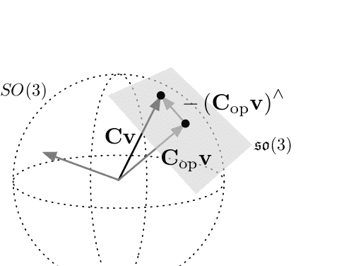

在优化过程中，我们将我们的标准旋转 C_op 保持在李群中，并考虑在李代数中发生的扰动 ψ，它在局部上是群的切空间。

$$Cv = exp(\psi^{\wedge}) C_{op} v \approx C_{op} v - (C_{op} v)^{\wedge} \psi$$

这与我们之前的表达式相同，但没有 J。思考优化的更简单方法是跳过导数，而是考虑扰动。选择一个扰动方案，

$$C = exp\left(\psi^{\wedge}\right) C_{op}, \qquad (7.175)$$

其中 ψ 是对初始猜测 C_{op} 应用的小扰动。当我们将旋转和一个点 v 相乘时，我们可以近似表示如下：

$$Cv = exp\left(\psi^{\wedge}\right) C_{op} v \approx C_{op} v - (C_{op} v)^{\wedge} \psi. \qquad (7.176)$$

这在图7.3中以图形方式表示。将此扰动方案插入要优化的函数中，我们有

$$\begin{align*}
u\left(Cv\right) &= u\left(exp\left(\psi^{\wedge}\right) C_{op} v\right) \approx u\left(\left(1 + \psi^{\wedge}\right) C_{op} v\right) \\
&\approx u(C_{op} v) + \left. \frac{\partial u}{\partial \mathbf{x}} \right|_{\mathbf{x}=C_{op} v} (C_{op} v)^{\wedge} \psi = u(C_{op} v) + \delta^T \psi. \qquad (7.177)
\end{align*}$$

然后选择一个扰动来减小函数。例如，梯度下降建议我们想要选择

$$\psi = -\alpha \mathbf{D} \delta, \qquad (7.178)$$

其中 $\alpha > 0$ 是一个小步长， $D > 0$ 是任意正定矩阵。然后在方案中应用扰动来更新旋转，

$$C_{op} \leftarrow exp\left(-\alpha \mathbf{D} \delta^{\wedge}\right) C_{op}, \qquad (7.179)$$

并迭代至收敛。我们的方案保证每次迭代时 $C_{op} \in SO(3)$。

扰动思想推广到比基本梯度下降更有趣的优化方案，基本梯度下降可能相当慢。考虑高斯-牛顿优化方法的替代推导来自第4.3.1节。假设我们有一个一般的非线性二次代价函数，形式为

$$J(\mathbf{C}) = \frac{1}{2} \sum_m \left( u_m(\mathbf{C}\mathbf{v}_m) \right)^2, \quad\quad (7.180)$$

其中 $u_m(\cdot)$是标量非线性函数，$\mathbf{v}_m \in \mathbb{R}^3$是三维点。我们从最优旋转的初始猜测开始，$\mathbf{C}_{\mathrm{op}} \in SO(3)$，然后根据左侧的扰动进行扰动

$$\mathbf{C} = \exp\left(\psi^\wedge\right)\mathbf{C}_{\mathrm{op}}, \quad\quad (7.181)$$

其中 $\psi$是扰动。然后我们在每个 $u_m(\cdot)$中应用我们的扰动方案，使得

$$u_m (\mathbf{C}\mathbf{v}_m) = u_m \left( \exp(\psi^\wedge)\mathbf{C}_{\mathrm{op}}\mathbf{v}_m \right) \approx u_m \left( (1 + \psi^\wedge)\mathbf{C}_{\mathrm{op}}\mathbf{v}_m \right)$$
$$ \approx \underbrace{u_m(\mathbf{C}_{\mathrm{op}}\mathbf{v}_m)}_{\beta_m} + \underbrace{\left. \frac{\partial u_m}{\partial \mathbf{x}} \right|_{\mathbf{x}=\mathbf{C}_{\mathrm{op}}\mathbf{v}_m} \left(\mathbf{C}_{\mathrm{op}}\mathbf{v}_m\right)^\wedge \psi}_{\delta_m^T \psi}, \quad (7.182)$$

是我们扰动 $\psi$的线性化版本 $u_m(\cdot)$。将其插入我们的代价函数中，我们有

$$J(\mathbf{C}) \approx \frac{1}{2} \sum_m \left( \delta_m^T \psi + \beta_m \right)^2, \quad\quad (7.183)$$

这在 $\psi$中是完全二次的。对 $J$关于 $\psi$的导数，我们有

$$\frac{\partial J}{\partial \psi^T} = \sum_m \delta_m \left( \delta_m^T \psi + \beta_m \right). \quad\quad (7.184)$$

我们可以将导数设为零，找到最优扰动 $\psi^\star$，使 $J$最小化：

$$\left( \sum_m \delta_m \delta_m^T \right) \psi^\star = - \sum_m \beta_m \delta_m. \quad\quad (7.185)$$

这是一个线性方程组，我们可以求解 $\psi^\star$。然后，根据我们的扰动方案，将这个最优扰动应用于我们的初始猜测：

$$\mathbf{C}_{\mathrm{op}} \leftarrow \exp\left( {\psi^\star}^\wedge \right) \mathbf{C}_{\mathrm{op}}, \quad\quad (7.186)$$

这确保在每次迭代中，我们有 $\mathbf{C}_{\mathrm{op}} \in SO(3)$。我们迭代直到收敛，然后输出 $\mathbf{C}^\star = \mathbf{C}_{\mathrm{op}}$在最后一次迭代中作为我们优化的旋转。这正是高斯-牛顿算法，但通过利用指数映射的满射性质来定义一个适当的扰动方案，使其适应于矩阵李群 $SO(3)$。

##### 姿态

相同的原理也可以应用于姿态。 对于表示变换的李代数向量，一个变换点相对于该向量的雅可比矩阵是

$$\frac{\partial(\mathbf{T p})}{\partial \boldsymbol{\xi}} = (\mathbf{T p}) \ \mathcal{J}, \qquad (7.187)$$

其中 $\mathbf{T} = \exp(\boldsymbol{\xi}^{\wedge}) \in SE(3)$，而 $\mathbf{p} \in \mathbb{R}^4$ 是一些任意的三维点，用齐次坐标表示。

然而，如果我们在左边扰动变换矩阵，

$$\mathbf{T} \leftarrow \exp \left(\boldsymbol{\epsilon}^{\wedge}\right) \mathbf{T}, \qquad (7.188)$$

那么对于这个扰动（即左李导数）的雅可比矩阵就是简单的

$$\frac{\partial(\mathbf{T p})}{\partial \boldsymbol{\epsilon}} = (\mathbf{T p}) \ , \qquad (7.189)$$

这样就不需要计算 $\mathcal{J}$ 矩阵了。

最后，对于优化，假设我们有一个形式为

$$J(\mathbf{T}) = \frac{1}{2} \sum_{m}\left(u_{m}\left(\mathbf{T p}_{m}\right)\right)^{2}, \qquad (7.190)$$

其中 $u_{m}(\cdot)$ 是非线性函数， $\mathbf{p}_{m} \in \mathbb{R}^{4}$ 是用齐次坐标表示的三维点。 我们首先对最优变换进行初始猜测， $\mathbf{T}_{\mathrm{op}} \in SE(3)$，然后根据左侧进行扰动。

$$\mathbf{T} = \exp \left(\boldsymbol{\epsilon}^{\wedge}\right) \mathbf{T}_{\mathrm{op}}, \qquad (7.191)$$

其中 $\boldsymbol{\epsilon}$ 是扰动。 然后我们在每个 $u_{m}(\cdot)$ 内应用我们的扰动方案，使得

$$\begin{aligned}
u_{m} \left(\mathbf{T p}_{m}\right) &= u_{m} \left(\exp(\boldsymbol{\epsilon}^{\wedge}) \mathbf{T}_{\mathrm{op}} \mathbf{p}_{m}\right) \approx u_{m} \left(\left(\mathbf{1}+\boldsymbol{\epsilon}^{\wedge}\right) \mathbf{T}_{\mathrm{op}} \mathbf{p}_{m}\right) \ &\approx \underbrace{u_{m}\left(\mathbf{T}_{\mathrm{op}} \mathbf{p}_{m}\right)}_{\beta_{m}} + \underbrace{\left.\frac{\partial u_{m}}{\partial \mathbf{x}}\right|_{\mathbf{x}=\mathbf{T}_{\mathrm{op}} \mathbf{p}_{m}}\left(\mathbf{T}_{\mathrm{op}} \mathbf{p}_{m}\right)^{\wedge}}_{\boldsymbol{\delta}_{m}^{T}} \boldsymbol{\epsilon} \quad (7.192)\end{aligned}$$

是我们扰动的线性化版本 $u_{m}(\cdot)$ 的表达式 $\boldsymbol{\epsilon}$。 将其插入到我们的代价函数中，我们得到

$$J(\mathbf{T}) = \frac{1}{2} \sum_{m}\left(\boldsymbol{\delta}_{m}^{T} \boldsymbol{\epsilon} + \beta_{m}\right)^{2}, \qquad (7.193)$$

这在 $\boldsymbol{\epsilon}$ 方面是完全二次的。 对 $J$ 关于 $\boldsymbol{\epsilon}$ 的导数为

$$\frac{\partial J}{\partial \boldsymbol{\epsilon}^{T}} = \sum_{m} \boldsymbol{\delta}_{m}\left(\boldsymbol{\delta}_{m}^{T} \boldsymbol{\epsilon} + \beta_{m}\right). \qquad (7.194)$$

##### SO(3)恒等式和近似

```
$$
\begin{aligned}
\mathbf{u}^\wedge &= 
\begin{bmatrix}
u_1 \\
u_2 \\
u_3
\end{bmatrix}^\wedge
=
\begin{bmatrix}
0 & -u_3 & u_2 \\
u_3 & 0 & -u_1 \\
-u_2 & u_1 & 0
\end{bmatrix} \\
(\alpha \mathbf{u} + \beta \mathbf{v})^\wedge &\equiv \alpha \mathbf{u}^\wedge + \beta \mathbf{v}^\wedge \\
\mathbf{u}^\wedge_\mathbf{v} &= -\mathbf{v}^\wedge \\
\mathbf{u}^\wedge_\mathbf{u} &\equiv \mathbf{0} \\
(\mathbf{W} \mathbf{u})^\wedge &\equiv \mathbf{u}^\wedge (\text{tr}(\mathbf{W}) \mathbf{1} - \mathbf{W}) - \mathbf{W}^\mathsf{T} \mathbf{u}^\wedge \\
\mathbf{u}^\wedge_\mathbf{v} &\equiv -(\mathbf{u}^\mathsf{T} \mathbf{v}) \mathbf{1} + \mathbf{v} \mathbf{u}^\mathsf{T} \\
\mathbf{u}^\wedge_\mathbf{W} &\equiv -(-\text{tr}(\mathbf{v} \mathbf{u}^\mathsf{T}) \mathbf{1} + \mathbf{v} \mathbf{u}^\mathsf{T}) \times (-\text{tr}(\mathbf{W}) \mathbf{1} - \mathbf{W}^\mathsf{T}) \\
\mathbf{u}^\wedge_\mathbf{v} \mathbf{u}^\wedge &\equiv \mathbf{u}^\wedge \mathbf{u}^\wedge + \mathbf{v}^\wedge \mathbf{u}^\wedge + (\mathbf{u}^\mathsf{T} \mathbf{u}) \mathbf{v}^\wedge \\
\mathbf{u}^\wedge_\mathbf{u}^\wedge \mathbf{u}^\wedge &\equiv \mathbf{0} \\
[\mathbf{u}^\wedge, \mathbf{v}^\wedge] &\equiv \mathbf{u}^\wedge \mathbf{v}^\wedge - \mathbf{v}^\wedge \mathbf{u}^\wedge \equiv (\mathbf{u} \times \mathbf{v})^\wedge \\
[\mathbf{u}, \mathbf{u}^\wedge, \dots, \mathbf{u}^\wedge] &= \dots [\mathbf{u}, \mathbf{u}^\wedge]^n
\end{aligned}
$$
```

```
$$
\begin{aligned}
\mathbf{C} &= \exp(\boldsymbol{\phi}^\wedge) \\
&= \cos\phi \mathbf{1} + (1 - \cos\phi) \mathbf{a} \mathbf{a}^\mathsf{T} + \sin\phi \mathbf{a}^\wedge \\
&\equiv \cos\phi \mathbf{1} + (1 - \cos\phi) \mathbf{a} \mathbf{a}^\mathsf{T} + \sin\phi \mathbf{a}^\wedge \\
\mathbf{C}^\mathsf{T} \mathbf{C} &= \mathbf{1} \equiv \mathbf{C} \mathbf{C}^\mathsf{T} \\
\text{tr}(\mathbf{C}) &= 2 \cos\phi + 1 \\
\det(\mathbf{C}) &= 1 \\
\mathbf{C} \mathbf{a} &\equiv \mathbf{a} \\
\mathbf{C} \boldsymbol{\phi}^\wedge &\equiv \mathbf{a}^\wedge \mathbf{C} \\
\mathbf{C} \boldsymbol{\phi}^\wedge_\phi &\equiv \boldsymbol{\phi}^\wedge \mathbf{C} \\
(\mathbf{C} \mathbf{u})^\wedge &\equiv \mathbf{C} \mathbf{u}^\wedge \mathbf{C}^\mathsf{T} \\
\exp((\mathbf{C} \mathbf{u})^\wedge) &\equiv \mathbf{C} \exp(\mathbf{u}^\wedge) \mathbf{C}^\mathsf{T} \\
\mathbf{C}^{-1} &= \mathbf{C}^\mathsf{T} \equiv \sum_{n=0}^\infty \frac{1}{n!} (-\boldsymbol{\phi}^\wedge)^n \\
\boldsymbol{\phi}^\wedge &\equiv \phi \mathbf{a}^\wedge
\end{aligned}
$$
```

```
$$
\begin{aligned}
\mathbf{J} &= \int_0^1 \mathbf{C}^\alpha d\alpha \equiv \sum_{n=0}^\infty \frac{1}{(n+1)!} (\boldsymbol{\phi}^\wedge)^n \\
&= \frac{\sin\phi}{\phi} \mathbf{1} + \left(1 - \frac{\sin\phi}{\phi}\right) \mathbf{a} \mathbf{a}^\mathsf{T} - \frac{\phi}{2} \mathbf{a}^\wedge \\
&\approx \mathbf{1} + \frac{\boldsymbol{\phi}^\wedge}{2} + \frac{\boldsymbol{\phi}^\wedge^2}{6} + \dots \\
\mathbf{J}^{-1} &= \frac{\phi}{2} \cot\left(\frac{\phi}{2}\right) \mathbf{1} + \left(1 - \frac{\phi}{2} \cot\left(\frac{\phi}{2}\right)\right) \mathbf{a} \mathbf{a}^\mathsf{T} - \frac{\phi}{2} \mathbf{a}^\wedge \\
&\equiv \mathbf{1} - \frac{\boldsymbol{\phi}^\wedge}{2} + \frac{\boldsymbol{\phi}^\wedge^2}{12} - \dots \\
\exp(\boldsymbol{\phi}^\wedge + \delta\boldsymbol{\phi}^\wedge) &\equiv \exp((\mathbf{J} \delta\boldsymbol{\phi})^\wedge) \exp(\boldsymbol{\phi}^\wedge) \\
\mathbf{C}^\alpha &\equiv \mathbf{1} + \phi \mathbf{J}^\wedge \\
\mathbf{J}(\phi) &\equiv \mathbf{C} \mathbf{J}(-\phi) \\
\mathbf{A}(\alpha, \phi) \mathbf{C}^\alpha &\equiv (1 + \mathbf{A}(\alpha, \phi) \delta\boldsymbol{\phi})^\wedge \mathbf{C}^\alpha \\
\mathbf{A}(\alpha, \phi) &\equiv \alpha \mathbf{J}(\phi) \mathbf{J}(\phi)^{-1} = \sum_{n=0}^\infty \frac{E_n(\alpha)}{n!} (\boldsymbol{\phi}^\wedge)^n
\end{aligned}
$$
```

α,β∈ℝ, u,v,φ,δφ∈ℝ³, W,A,J∈ℝ³ˣ³, C∈SO(3)

##### 李代数

$$\boldsymbol{\xi}^{\wedge}=\begin{bmatrix}\boldsymbol{u}\ \boldsymbol{v}\end{bmatrix}^{\wedge}=\begin{bmatrix}\boldsymbol{v}^{\wedge}&0\ \boldsymbol{u}&0\end{bmatrix}$$

$$\boldsymbol{x}^{\wedge}=\begin{bmatrix}\boldsymbol{u}\ \boldsymbol{v}\end{bmatrix}^{\wedge}=\begin{bmatrix}\boldsymbol{v}^{\wedge}&0\ \boldsymbol{u}&0\end{bmatrix}$$

$$(\alpha\boldsymbol{x}+\beta\boldsymbol{y})^{\wedge}=\alpha\boldsymbol{x}^{\wedge}+\beta\boldsymbol{y}^{\wedge}$$
$$(\alpha\boldsymbol{x}+\beta\boldsymbol{y})^{\wedge}=\alpha\boldsymbol{x}^{\wedge}+\beta\boldsymbol{y}^{\wedge}$$

$$\boldsymbol{x}^{\wedge}\boldsymbol{y}=-\boldsymbol{y}^{\wedge}\boldsymbol{x}$$
$$\boldsymbol{x}^{\wedge}\boldsymbol{x}=\boldsymbol{0}$$

$$(\boldsymbol{x}^{\wedge})^4+2(\boldsymbol{v}^{T}\boldsymbol{v})(\boldsymbol{x}^{\wedge})^3+(\boldsymbol{v}^{T}\boldsymbol{v})^2(\boldsymbol{x}^{\wedge})^2=\boldsymbol{0}$$

$$[\boldsymbol{x}^{\wedge},\boldsymbol{y}^{\wedge}]=\boldsymbol{x}^{\wedge}\boldsymbol{y}^{\wedge}-\boldsymbol{y}^{\wedge}\boldsymbol{x}^{\wedge}=\left(\boldsymbol{x}\times\boldsymbol{y}\right)^{\wedge}$$
$$[\boldsymbol{x}^{\wedge},\boldsymbol{y}^{\wedge}]=\boldsymbol{x}^{\wedge}\boldsymbol{y}^{\wedge}-\boldsymbol{y}^{\wedge}\boldsymbol{x}^{\wedge}=\left(\boldsymbol{x}\times\boldsymbol{y}\right)^{\wedge}$$

$$\left[\boldsymbol{x}^{\wedge},\left[\boldsymbol{x}^{\wedge},\boldsymbol{y}^{\wedge}\right]\right]=\left(\left(\boldsymbol{x}^{\wedge}\boldsymbol{y}\right)^{\wedge}\right)^{\wedge}$$
$$\left[\boldsymbol{x}^{\wedge},\boldsymbol{x}^{\wedge},\ldots\left[\boldsymbol{x}^{\wedge},\boldsymbol{y}^{\wedge}\right]\right]=\left(\left(\boldsymbol{x}^{\wedge}\right)^{n}\boldsymbol{y}\right)^{\wedge}$$

$$\boldsymbol{p}=\begin{bmatrix}\boldsymbol{\varepsilon}\ \boldsymbol{\eta}\end{bmatrix}=\begin{bmatrix}\boldsymbol{1}&0\ \boldsymbol{0}^{T}&-\boldsymbol{\varepsilon}^{\wedge}\end{bmatrix}$$

$$\boldsymbol{p}^{\circ}=\begin{bmatrix}\boldsymbol{\varepsilon}\ \boldsymbol{\eta}\end{bmatrix}=\begin{bmatrix}\boldsymbol{0}&-\boldsymbol{\varepsilon}^{\wedge}\ \boldsymbol{\varepsilon}^{T}&0\end{bmatrix}$$

$$\boldsymbol{x}^{\wedge}\boldsymbol{p}=\boldsymbol{p}\times\boldsymbol{x}$$
$$\boldsymbol{p}^{T}\boldsymbol{x}^{\wedge}=\boldsymbol{x}^{T}\boldsymbol{p}^{\circ}$$

$$\alpha,\beta\in\mathbb{R},\boldsymbol{u},\boldsymbol{v},\boldsymbol{\phi},\delta\boldsymbol{\phi}\in\mathbb{R}^3,\boldsymbol{p}\in\mathbb{R}^4,\boldsymbol{X},\boldsymbol{Y},\boldsymbol{\xi},\delta\boldsymbol{\xi}\in\mathbb{R}^6,\boldsymbol{J},\boldsymbol{Q}\in\mathbb{R}^{3\times3},\boldsymbol{C}\in SO(3),\boldsymbol{T},\boldsymbol{T}_1,\boldsymbol{T}_2\in SE(3),\boldsymbol{\mathcal{T}}\in\text{Ad}(SE(3)),\boldsymbol{\mathcal{J}},\boldsymbol{A}\in\mathbb{R}^{6\times6}$$

##### SE(3)等式和近似

##### 李群

$$\boldsymbol{\xi}=\begin{bmatrix}\boldsymbol{\rho}\ \boldsymbol{\phi}\end{bmatrix}$$
$$\boldsymbol{T}=\text{exp}\left(\boldsymbol{\xi}^{\wedge}\right)=\sum_{n=0}^{\infty}\frac{1}{n!}\left(\boldsymbol{\xi}^{\wedge}\right)^n=\mathbf{1}+\boldsymbol{\xi}^{\wedge}+\left(\frac{1-\cos\phi}{\phi^2}\right)\left(\boldsymbol{\xi}^{\wedge}\right)^2+\left(\frac{\phi-\sin\phi}{\phi^3}\right)\left(\boldsymbol{\xi}^{\wedge}\right)^3$$
$$\approx \mathbf{1}+\boldsymbol{\xi}^{\wedge}+\frac{1}{2}\boldsymbol{\xi}^{\wedge 2}$$

$$\boldsymbol{T}=\begin{bmatrix}\boldsymbol{C}&\boldsymbol{J}\boldsymbol{\rho}\ \boldsymbol{0}^{T}&1\end{bmatrix}$$

$$\boldsymbol{\xi}^{\wedge}\equiv\text{ad}\boldsymbol{\xi}$$
$$\boldsymbol{\tau}=\text{exp}\left(\boldsymbol{\xi}^{\wedge}\right)=\sum_{n=0}^{\infty}\frac{1}{n!}\left(\boldsymbol{\xi}^{\wedge}\right)^n=\mathbf{1}+\left(\frac{3\sin\phi-\phi\cos\phi}{2\phi}\right)\boldsymbol{\xi}^{\wedge}+\left(\frac{2-\phi\sin\phi-2\cos\phi}{2\phi^2}\right)\boldsymbol{\xi}^{\wedge 2}+\left(\frac{\sin\phi-\phi\cos\phi}{2\phi^3}\right)\boldsymbol{\xi}^{\wedge 3}+\left(\frac{2-\phi\sin\phi-2\cos\phi}{2\phi^4}\right)\boldsymbol{\xi}^{\wedge 4}$$
$$\approx \mathbf{1}+\frac{1}{2}\boldsymbol{\xi}^{\wedge}+\frac{1}{6}\boldsymbol{\xi}^{\wedge 2}+\frac{1}{24}\boldsymbol{\xi}^{\wedge 3}+\frac{1}{120}\boldsymbol{\xi}^{\wedge 4}$$

$$\boldsymbol{T}=\text{Ad}(\boldsymbol{T})=\begin{bmatrix}\boldsymbol{C}&\boldsymbol{J}\boldsymbol{\rho}^{\wedge}\ \boldsymbol{0}&\boldsymbol{C}\end{bmatrix}$$

$$\text{tr}(\boldsymbol{T})\equiv2\cos\phi+2,\quad\det(\boldsymbol{T})\equiv1$$

$$\text{Ad}(\boldsymbol{T}_1\boldsymbol{T}_2)=\text{Ad}(\boldsymbol{T}_1)\text{Ad}(\boldsymbol{T}_2)$$

$$\boldsymbol{T}^{-1}\equiv\text{exp}\left(-\boldsymbol{\xi}^{\wedge}\right)=\sum_{n=0}^{\infty}\frac{1}{n!}\left(-\boldsymbol{\xi}^{\wedge}\right)^n=\begin{bmatrix}\boldsymbol{C}^{T}&-\boldsymbol{C}^{T}\boldsymbol{\rho}\ \boldsymbol{0}^{T}&1\end{bmatrix}$$

$$\boldsymbol{\mathcal{T}}^{-1}\equiv\text{exp}\left(-\boldsymbol{\xi}^{\wedge}\right)=\sum_{n=0}^{\infty}\frac{1}{n!}\left(-\boldsymbol{\xi}^{\wedge}\right)^n=\begin{bmatrix}\boldsymbol{C}^{T}&-\boldsymbol{C}^{T}(\boldsymbol{J}\boldsymbol{\rho})^{\wedge}\ \boldsymbol{0}&\boldsymbol{C}^{T}\end{bmatrix}$$

$$\boldsymbol{\mathcal{T}}\boldsymbol{\xi}^{\wedge}=\boldsymbol{\xi}^{\wedge}\boldsymbol{\mathcal{T}},\quad\boldsymbol{\mathcal{T}}\boldsymbol{\xi}^{\wedge}\equiv\boldsymbol{\xi}^{\wedge}\boldsymbol{\mathcal{T}}$$

$$\left(\boldsymbol{T}\boldsymbol{x}\right)^{\wedge}=\boldsymbol{T}\boldsymbol{x}^{\wedge}\boldsymbol{T}^{-1},\quad\left(\boldsymbol{T}\boldsymbol{x}^{\wedge}\right)=\boldsymbol{T}\boldsymbol{x}^{\wedge}\boldsymbol{T}^{-1}$$

$$\text{exp}\left(\boldsymbol{T}\boldsymbol{x}\right)^{\wedge}=\boldsymbol{T}\text{exp}\left(\boldsymbol{x}\right)^{\wedge}\boldsymbol{T}^{-1}$$
$$\text{exp}\left(\boldsymbol{T}\boldsymbol{x}^{\wedge}\right)=\boldsymbol{T}\text{exp}\left(\boldsymbol{x}^{\wedge}\right)\boldsymbol{T}^{-1}$$

$$\left(\boldsymbol{T}\boldsymbol{p}\right)$$
$$\left(\boldsymbol{T}\boldsymbol{p}\right)\equiv\boldsymbol{T}\boldsymbol{p}$$
$$\equiv\boldsymbol{T}^{-T}\boldsymbol{p}\quad\boldsymbol{T}^{T}\boldsymbol{p}\quad\boldsymbol{T}^{-1}$$

##### （左）雅可比矩阵

$$\boldsymbol{\mathcal{J}}=\int_{0}^{1}\boldsymbol{T}^{\alpha}\,d\alpha\equiv\sum_{n=0}^{\infty}\frac{1}{(n+1)!}\left(\boldsymbol{\xi}^{\wedge}\right)^{n}$$

$$=\mathbf{1}+\left(\frac{4-\phi\sin\phi-4\cos\phi}{2\phi^2}\right)\boldsymbol{\xi}^{\wedge}+\left(\frac{4\phi-5\sin\phi+\phi\cos\phi}{2\phi^3}\right)\boldsymbol{\xi}^{\wedge 2}+\left(\frac{2-\phi\sin\phi-2\cos\phi}{2\phi^4}\right)\boldsymbol{\xi}^{\wedge 3}+\left(\frac{2\phi-3\sin\phi+\phi\cos\phi}{2\phi^5}\right)\boldsymbol{\xi}^{\wedge 4}$$

$$\boldsymbol{\mathcal{J}}\equiv\begin{bmatrix}\boldsymbol{J}&\boldsymbol{Q}\ \boldsymbol{0}&1\end{bmatrix}$$

$$\boldsymbol{\mathcal{J}}^{-1}\equiv\begin{bmatrix}\boldsymbol{J}^{-1}&-\frac{1}{2}\boldsymbol{\xi}^{\wedge}\ \boldsymbol{0}&1\end{bmatrix}$$

$$\boldsymbol{\mathcal{J}}^{-1}=\sum_{n=0}^{\infty}\frac{B_{n}}{n!}\left(\boldsymbol{\xi}^{\wedge}\right)^{n}\approx\begin{bmatrix}\boldsymbol{J}^{-1}&-\frac{1}{2}\boldsymbol{\xi}^{\wedge}\ \boldsymbol{0}&1\end{bmatrix}$$

$$\boldsymbol{Q}=\sum_{n=0}^{\infty}\frac{1}{(n+m+2)!}\left(\boldsymbol{\phi}^{\wedge}\right)^{n}\boldsymbol{\rho}^{\wedge}\left(\boldsymbol{\phi}^{\wedge}\right)^{m}$$
$$\equiv\frac{1}{2}\boldsymbol{\rho}^{\wedge}+\left(\frac{\phi^{2}+2\cos\phi-2}{2\phi^4}\right)\left(\boldsymbol{\phi}\wedge\boldsymbol{\phi}\wedge\boldsymbol{\rho}^{\wedge}+\boldsymbol{\rho}\wedge\boldsymbol{\phi}\wedge\boldsymbol{\phi}\wedge\right)+\left(\frac{2\phi-3\sin\phi+\phi\cos\phi}{2\phi^5}\right)\left(\boldsymbol{\phi}\wedge\boldsymbol{\phi}\wedge\boldsymbol{\phi}\wedge\boldsymbol{\rho}\wedge-\boldsymbol{\rho}\wedge\boldsymbol{\phi}\wedge\boldsymbol{\phi}\wedge\boldsymbol{\phi}\wedge\right)$$

$$\text{exp}\left(\boldsymbol{\xi}+\delta\boldsymbol{\xi}\right)^{\wedge}\approx\text{exp}\left(\left(\boldsymbol{\mathcal{J}}\delta\boldsymbol{\xi}\right)^{\wedge}\right)\text{exp}\left(\boldsymbol{\xi}^{\wedge}\right)$$
$$\text{exp}\left(\boldsymbol{\xi}+\delta\boldsymbol{\xi}\right)^{\wedge}\approx\text{exp}\left(\left(\boldsymbol{\mathcal{J}}\delta\boldsymbol{\xi}\right)^{\wedge}\right)\text{exp}\left(\boldsymbol{\xi}^{\wedge}\right)$$

$$\boldsymbol{\mathcal{T}}\equiv\mathbf{1}+\boldsymbol{\xi}^{\wedge}\boldsymbol{\mathcal{J}}$$
$$\boldsymbol{\mathcal{J}}\boldsymbol{\xi}^{\wedge}\equiv\boldsymbol{\xi}^{\wedge}\boldsymbol{\mathcal{J}}$$

$$\boldsymbol{\mathcal{J}}(\boldsymbol{\xi})\equiv\boldsymbol{T}\boldsymbol{\mathcal{J}}(-\boldsymbol{\xi})$$

$$\text{exp}\left(\delta\boldsymbol{\xi}^{\wedge}\right)\boldsymbol{T}^{\alpha}=\alpha\boldsymbol{\mathcal{J}}(\alpha\boldsymbol{\xi})\delta\boldsymbol{\xi}\wedge\boldsymbol{T}^{\alpha}$$
$$\boldsymbol{A}(\alpha,\boldsymbol{\xi})\equiv\left(\mathbf{1}+\left(\boldsymbol{A}(\alpha,\boldsymbol{\xi})\delta\boldsymbol{\xi}\right)\wedge\right)\boldsymbol{T}^{\alpha}=\sum_{n=0}^{\infty}\frac{F_{n}(\alpha)}{n!}\left(\boldsymbol{\xi}^{\wedge}\right)^{n}$$

我们可以将导数设为零，以找到最优扰动，$\epsilon^*$，以最小化 $J$：

$$\left(\sum_{m}\delta_{m}\delta_{m}^{T}\right) \epsilon^{*}=-\sum_{m} \beta_{m} \delta_{m}.$$
(7.195)

这是一个线性方程组，我们可以求解 $\epsilon^*$。然后，根据我们的扰动方案，将这个最优扰动应用于我们的初始猜测，

$$\mathbf{T}_{\mathrm{op}} \leftarrow \exp \left(\epsilon^{* \wedge}\right) \mathbf{T}_{\mathrm{op}},$$
(7.196)

这确保在每次迭代中，我们有 $\mathbf{T}_{\mathrm{op}} \in SE(3)$。我们迭代直到收敛，然后输出 $\mathbf{T}^{*} = \mathbf{T}_{\mathrm{op}}$ 作为最终迭代的最优位姿。这正是高斯-牛顿算法，但通过利用指数映射的满射性质来定义一个适当的扰动方案，使其适用于矩阵李群 $SE(3)$。

##### 高斯-牛顿讨论

这种高斯-牛顿优化方法针对我们的矩阵李群，我们使用了一种定制的扰动方案，具有三个关键特性：

-   (i) 我们将旋转或姿态存储在无奇异性的格式中，
- (ii) 在每次迭代中，我们执行无约束优化，
- (iii) 我们的操作在矩阵级别上进行，因此我们不需要担心对一堆标量三角函数求导，这很容易导致错误。

这使得实现非常简单。我们还可以轻松地将高斯-牛顿的两个实用修补程序（线搜索和Levenberg-Marquardt）以及5.3.2节中描述的鲁棒估计思想结合起来。

#### 7.1.10 身份

在本节中，我们看到了许多与我们的矩阵李群 $SO(3)$ 和 $SE(3)$ 相关的身份和表达式。前两页总结了这些。第一页提供了 $SO(3)$ 的身份，第二页提供了 $SE(3)$ 的身份。

### 7.2 运动学

我们已经看到了李群的几何性质。下一步是允许几何性质随时间变化。我们将研究与我们的两个李群 $SO(3)$ 和 $SE(3)$ 相关的运动学。

#### 7.2.1 旋转

我们已经在之前的章节中看到了旋转的运动学，但那是在我们介绍李群之前。

##### 李群

我们知道旋转矩阵可以写成

$$\mathbf{C} = \exp\left(\phi^{\wedge}\right)$$

其中 $\mathbf{C} \in SO(3)$ 且 $\phi = \phi \mathbf{a} \in \mathbb{R}$。与旋转相关的旋转运动学方程（即泊松方程）将角速度 $\omega$ 与旋转关联起来，表示为$^{20}$

$$\dot{\mathbf{C}} = \omega^{\wedge} \mathbf{C} \quad \text{或者} \quad \omega^{\wedge} = \dot{\mathbf{C}} \mathbf{C}^{T}$$

我们将其称为李群的运动学；这些方程是无奇点的，因为它们是关于 $\mathbf{C}$ 的，但有一个约束条件 $\mathbf{C} \mathbf{C}^{T} = \mathbf{1}$。由于从 $so(3)$ 到 $SO(3)$ 的指数映射具有满射性质，我们也可以用李代数的形式来研究运动学。

##### 李代数

为了看到在李代数方面的等效运动学，我们需要对C进行微分：

$$\dot{\mathbf{C}} = \frac{d}{dt} \exp\left(\phi^{\wedge}\right) = \int_{0}^{1} \exp\left(\alpha \phi^{\wedge}\right) \dot{\phi}^{\wedge} \exp\left((1 - \alpha) \phi^{\wedge}\right) d\alpha$$

最后一个关系来自于矩阵指数的一般表达式的时间导数：

$$\frac{d}{dt} \exp\left( \mathbf{A}(t) \right) = \int_{0}^{1} \exp\left( \alpha \mathbf{A}(t) \right) \frac{d\mathbf{A}(t)}{dt} \exp\left( (1 - \alpha) \mathbf{A}(t) \right) d\alpha$$

与我们之前的推导中的(6.45)相比，这个 $\omega$ 的符号相反。这是因为我们采用了第6.3.2节中描述的机器人约定的旋转角度，这导致了(7.197)中的形式；这反过来意味着我们必须使用与该角度相关的角速度，而这个角速度的符号与我们之前讨论的相反。

从 (7.199) 我们可以重新排列得到

$$\dot{\mathbf{C}}\mathbf{C}^T = \int_0^1 \mathbf{C}^\alpha \dot{\boldsymbol{\phi}}^\wedge \mathbf{C}^{-\alpha} d\alpha = \int_0^1 \left( \mathbf{C}^\alpha \dot{\boldsymbol{\phi}} \right)^\wedge d\alpha = \left( \int_0^1 \mathbf{C}^\alpha d\alpha \dot{\boldsymbol{\phi}} \right)^\wedge = \left( \mathbf{J} \dot{\boldsymbol{\phi}} \right)^\wedge, \quad (7.201)$$

其中 $\mathbf{J} = \int_0^1 \mathbf{C}^\alpha d\alpha$ 是我们之前看到的 $SO(3)$ 的 (左) 雅可比矩阵。将 (7.198) 和 (7.201) 进行比较，我们得到了令人愉悦的结果

$$\boldsymbol{\omega} = \mathbf{J} \dot{\boldsymbol{\phi}}, \quad (7.202)$$

或者

$$\dot{\boldsymbol{\phi}} = \mathbf{J}^{-1} \boldsymbol{\omega}, \quad (7.203)$$

这是运动学的等价表达式，但是使用了李代数。请注意，在 $|\boldsymbol{\phi}| = 2\pi m$，其中 $m$ 是非零整数时，$\mathbf{J}^{-1}$ 不存在，这是由于旋转的 $3 \times 1$ 表示的奇点；好消息是我们不再需要担心约束问题。

##### 数值积分

因为 $\boldsymbol{\phi}$ 没有约束，我们可以使用任何数值方法来积分 (7.203)。但如果我们想直接积分 (7.198)，情况就不同了，因为我们必须强制执行约束 $\mathbf{C}\mathbf{C}^T = \mathbf{1}$。我们可以使用一些简单的策略来实现这一点。

一种方法是假设 $\boldsymbol{\omega}$ 是分段常数。假设 $\boldsymbol{\omega}$ 在两个时间点 $t_1$ 和 $t_2$ 之间是常数。在这种情况下，(7.198) 是一个线性、时不变的常微分方程，我们知道解的形式将是

$$\mathbf{C}(t_2) = \underbrace{\exp \left( (t_2 - t_1) \boldsymbol{\omega}^\wedge \right)}_{\mathbf{C}_{21} \in SO(3)} \mathbf{C}(t_1), \quad (7.204)$$

我们注意到 $\mathbf{C}_{21}$ 实际上是正确形式的旋转矩阵。设旋转向量为

$$\boldsymbol{\phi} = \phi \mathbf{a} = (t_2 - t_1) \boldsymbol{\omega}, \quad (7.205)$$

带有角度的，$\phi = |\boldsymbol{\phi}|$，和轴，$\mathbf{a} = \boldsymbol{\phi} / \phi$。然后通过我们通常的闭式表达式构建旋转矩阵：

$$\mathbf{C}_{21} = \cos \phi \mathbf{1} + (1 - \cos \phi) \mathbf{a} \mathbf{a}^T + \sin \phi \mathbf{a}^\wedge. \quad (7.206)$$

然后更新继续进行

$$\mathbf{C}(t_2) = \mathbf{C}_{21} \mathbf{C}(t_1), \quad (7.207)$$

数学上保证 $\mathbf{C}(t_2)$ 将在 $SO(3)$ 中。重复这个过程多次，对许多小时间隔进行数值积分。

然而，即使我们遵循一个积分方法（如上面的方法），声称保持计算得到的旋转在 $SO(3)$ 中，小的数值误差最终可能导致结果通过违反正交性约束而偏离 $SO(3)$。一个常见的解决方案是周期性地将计算得到的旋转矩阵 $\mathbf{C} \notin SO(3)$ 回投影到 $SO(3)$ 上。换句话说，我们可以尝试找到与 $\mathbf{C}$ 在某种意义上最接近的旋转矩阵 $\mathbf{R} \in SO(3)$。我们通过求解以下优化问题（Green, 1952）来实现这一点：

$$\underset{\mathbf{R}}{\arg \max } J(\mathbf{R}), \quad J(\mathbf{R})=\operatorname{tr}\left(\mathbf{C} \mathbf{R}^{T}\right)-\frac{1}{2} \sum_{i=1}^{3} \sum_{j=1}^{3} \lambda_{ij} \left(\mathbf{r}_{i}^{T} \mathbf{r}_{j}-\delta_{ij}\right), \quad (7.208)$$

其中拉格朗日乘数项是必要的，以强制执行 $\mathbf{R} \mathbf{R}^{T}=\mathbf{1}$ 约束。注意 $\delta_{ij}$ 是Kronecker delta和

$$\mathbf{R}^{T}=\left[\begin{array}{lll}\mathbf{R}_{1} & \mathbf{R}_{2} & \mathbf{R}_{3}\end{array}\right], \quad \mathbf{C}^{T}=\left[\begin{array}{lll}\mathbf{C}_{1} & \mathbf{C}_{2} & \mathbf{C}_{3}\end{array}\right]. \quad (7.209)$$

我们还注意到

$$\operatorname{tr}\left(\mathbf{C} \mathbf{R}^{T}\right)=\mathbf{R}_{1}^{T} \mathbf{C}_{1}+\mathbf{R}_{2}^{T} \mathbf{C}_{2}+\mathbf{R}_{3}^{T} \mathbf{C}_{3}. \quad (7.210)$$

然后我们对 $J$ 关于 $\mathbf{R}$ 的三行进行导数，揭示出

$$\frac{\partial J}{\partial \mathbf{R}^{T_{i}}}=\mathbf{C}_{i}-\sum_{j=1}^{3} \lambda_{i j} \mathbf{R}_{j}, \quad \forall i=1 \ldots 3. \quad (7.211)$$

将其设为零， $\forall i=1 \ldots 3$，我们有

$$\left[\begin{array}{lll}\mathbf{R}_{1} & \mathbf{R}_{2} & \mathbf{R}_{3}\end{array}\right] \left[\begin{array}{ccc}\lambda_{11} & \lambda_{12} & \lambda_{13} \\ \lambda_{21} & \lambda_{22} & \lambda_{23} \\ \lambda_{31} & \lambda_{32} & \lambda_{33}\end{array}\right]=\left[\begin{array}{lll}\mathbf{C}_{1} & \mathbf{C}_{2} & \mathbf{C}_{3}\end{array}\right]. \quad (7.212)$$

然而，请注意 $\boldsymbol{\Lambda}$ 可以假设为对称的，因为Lagrange乘数项是对称的。因此，到目前为止我们知道 $\boldsymbol{\Lambda} \mathbf{R}=\mathbf{C}$。

$$\boldsymbol{\Lambda}=\boldsymbol{\Lambda}^{T}, \quad \mathbf{R}^{T} \mathbf{R}=\mathbf{R} \mathbf{R}^{T}=\mathbf{1}.$$

我们可以通过注意来解决 $\boldsymbol{\Lambda}$

$$\boldsymbol{\Lambda}^{2}=\boldsymbol{\Lambda} \boldsymbol{\Lambda}^{T}=\boldsymbol{\Lambda} \mathbf{R} \mathbf{R}^{T} \boldsymbol{\Lambda}^{T}=\mathbf{C} \mathbf{C}^{T} \quad \Rightarrow \quad \boldsymbol{\Lambda}=\left(\mathbf{C} \mathbf{C}^{T}\right)^{\frac{1}{2}},$$

用 $(\cdot)^{\frac{1}{2}}$ 表示矩阵平方根。最后，

$$\mathbf{R}=\left(\mathbf{C} \mathbf{C}^{T}\right)^{-\frac{1}{2}} \mathbf{C},$$

看起来就像我们正在‘归一化’ C。每当正交性约束不满足（在某个阈值内）时，计算投影并覆盖集成值，确保我们不会偏离 $SO(3)^{21}$ 太远。

$$\mathbf{C} \leftarrow \mathbf{R},$$

#### 7.2.2 姿态

对于 $SE(3)$ 的运动学也有类似的方法，我们将在下面进行开发。

##### 李群

我们已经看到，一个变换矩阵可以写成

$$\mathbf{T} = \begin{bmatrix} \mathbf{C} & \mathbf{r} \\ \mathbf{0}^T & 1 \end{bmatrix} = \begin{bmatrix} \mathbf{C} & \mathbf{J}\boldsymbol{\rho} \\ \mathbf{0}^T & 1 \end{bmatrix} = \exp \left( \begin{pmatrix} \boldsymbol{\xi} \\ \end{pmatrix} \right),$$

其中

$$\boldsymbol{\xi} = \begin{bmatrix} \boldsymbol{\rho} \\ \boldsymbol{\phi} \end{bmatrix}.$$

假设运动学以分离的平移和旋转形式给出

$$\dot{\mathbf{r}} = \boldsymbol{\omega}^\wedge \mathbf{r} + \boldsymbol{\nu},$$

$$\dot{\mathbf{C}} = \boldsymbol{\omega}^\wedge \mathbf{C},$$

其中 $\boldsymbol{\nu}$ 和 $\boldsymbol{\omega}$ 分别是平移和旋转速度。使用变换矩阵，这可以等价地写成

$$\dot{\mathbf{T}} = \boldsymbol{\varpi}^\wedge \mathbf{T} \quad \text{或者} \quad \boldsymbol{\varpi}^\wedge = \dot{\mathbf{T}}\mathbf{T}^{-1},$$

其中

$$\boldsymbol{\varpi} = \begin{bmatrix} \boldsymbol{\nu} \\ \boldsymbol{\omega} \end{bmatrix},$$

是广义速度$^{22}$。同样，这些方程是无奇点的，但仍然有约束条件 $\mathbf{C}\mathbf{C}^T = \mathbf{1}$。

##### 李代数

同样地，我们可以用李代数的等效运动学方程组来表示。与旋转情况类似，我们有

$$\dot{\mathbf{T}} = \frac{d}{dt} \exp\left( \xi^{\wedge} \right) = \int_0^1 \exp\left( \alpha \xi^{\wedge} \right) \dot{\xi}^{\wedge} \exp\left( (1 - \alpha) \xi^{\wedge} \right) d\alpha, \quad (7.217)$$

或者等价地说，

$$\dot{\mathbf{T}}\mathbf{T}^{-1} = \int_0^1 \mathbf{T}^{\alpha} \dot{\xi}^{\wedge} \mathbf{T}^{-\alpha} d\alpha = \int_0^1 \left( \mathcal{T}^{\alpha} \dot{\xi} \right)^{\wedge} d\alpha = \left( \left( \int_0^1 \mathcal{T}^{\alpha} d\alpha \right) \dot{\xi} \right)^{\wedge} = \left( \mathcal{J} \dot{\xi} \right)^{\wedge}, \quad (7.218)$$

其中 $\mathcal{J} = \int_0^1 \mathcal{T}^{\alpha} d\alpha$ 是 $SE(3)$ 的（左）雅可比矩阵。将 (7.216) 和 (7.218) 进行比较，我们有 $\varpi = \mathcal{J} \dot{\xi}, \quad (7.219)$

或

$$\dot{\xi} = \mathcal{J}^{-1} \varpi, \quad (7.220)$$

对于我们的李代数等效运动学。再次，这些方程现在不再受约束。

##### 混合

然而，还有另一种通过注意到 $\dot{\mathbf{r}}$ 的方程实际上是速度的线性传播运动学的方法。通过结合 $\dot{\mathbf{r}}$ 和 $\dot{\phi}$ 的方程，我们有

$$\begin{bmatrix} \dot{\mathbf{r}} \\ \dot{\phi} \end{bmatrix} = \begin{bmatrix} \mathbf{1} & -\mathbf{r}^{\wedge} \\ \mathbf{0} & \mathbf{J}^{-1} \end{bmatrix} \begin{bmatrix} \nu \\ \omega \end{bmatrix}, \quad (7.221)$$

这仍然在 $\mathbf{J}^{-1}$ 的奇异点处具有奇异性，但不再需要我们评估 $\mathbf{Q}$ 并避免了在积分后进行转换 $\mathbf{r} = \mathbf{J} \rho$。这种方法也不受约束。我们可以将其称为混合方法，因为平移保持在常规空间中，旋转保持在李代数中。

##### 数值积分

与 $SO(3)$ 方法类似，我们可以在不担心约束的情况下积分 (7.220)，但积分 (7.216) 需要更加小心。

就像 $SO(3)$ 方法一样，我们可以假设 $\varpi$ 是分段常数。假设 $\varpi$ 在两个时间点 $t_1$ 和 $t_2$ 之间是常数。在这种情况下情况下，(7.216)是一个线性、时不变的常微分方程，我们知道解的形式将是

$$\mathbf{T}(t_2) = \underbrace{\exp \left(\left(t_2 - t_1\right) \varpi^{\wedge}\right)}_{\mathbf{T}_{21} \in S E(3)} \mathbf{T}(t_1), \quad (7.222)$$

我们注意到 $\mathbf{T}_{21}$ 实际上是正确的转换矩阵形式。让

$$\xi = \begin{bmatrix} \rho \ \phi \end{bmatrix} = (t_2 - t_1) \begin{bmatrix} \nu \ \omega \end{bmatrix} = (t_2 - t_1) \varpi, \quad (7.223)$$

带有角度 $\phi = |\boldsymbol{\phi}|$ 和轴 $\mathbf{a} = \boldsymbol{\phi}/\phi$。然后通过我们通常的闭式表达式构建旋转矩阵：

$$\mathbf{C} = \cos \phi \mathbf{1} + (1 - \cos \phi) \mathbf{a} \mathbf{a}^T + \sin \phi \mathbf{a}^{\wedge}. \quad (7.224)$$

构建 $\mathbf{J}$ 并计算 $\mathbf{r} = \mathbf{J} \boldsymbol{\rho}$，将 $\mathbf{C}$ 和 $\mathbf{r}$ 组合起来

$$\mathbf{T}_{21} = \begin{bmatrix} \mathbf{C} & \mathbf{r} \ \mathbf{0}^T & 1 \end{bmatrix}. \quad (7.225)$$

然后进行更新

$$\mathbf{T}(t_2) = \mathbf{T}_{21} \mathbf{T}(t_1), \quad (7.226)$$

这在数学上保证了 $\mathbf{T}(t_2)$ 将在 $S E(3)$ 中。在许多小时间间隔内重复这个过程，可以数值地积分方程。我们还可以周期性地将 $\mathbf{T}$ 的左上角旋转矩阵部分投影回 $S O(3)$ ，将左下角块重置为 $\mathbf{0}^T$ ，并将右下角块重置为 $1$ ，以确保 $\mathbf{T}$ 不会偏离 $S E(3)$ 太远。

##### 带有动力学

我们可以通过一个方程来增强我们的姿态的运动学方程，该方程描述了平移/旋转动力学（即牛顿第二定律）如下（D'Eleuterio, 1985）：运动学： $\dot{\mathbf{T}} = \varpi^{\wedge} \mathbf{T}$ ，

$$\dot{\varpi} = \mathcal{M}^{-1} \varpi^{\wedge} \mathcal{M} \varpi + \mathbf{a}, \quad (7.227a)$$
$$\text{动力学：} \quad \dot{\varpi} = \mathcal{M}^{-1} \varpi^{\wedge} \mathcal{M} \varpi + \mathbf{a}, \quad (7.227b)$$

其中 $\mathbf{T} \in S E(3)$ 是姿态， $\varpi \in \mathbb{R}^6$ 是广义速度（在机体坐标系中）， $\mathbf{a} \in \mathbb{R}^6$ 是广义施加力（每单位质量，在机体坐标系中），而 $\mathcal{M} \in \mathbb{R}^{6 \times 6}$ 是一个形式为的广义质量矩阵

$$\mathcal{M} = \begin{bmatrix} m \mathbf{1} & -m \mathbf{c}^{\wedge} \ m \mathbf{c}^{\wedge} & \mathbf{I} \end{bmatrix}, \quad (7.228)$$

其中， $m$ 是质量， $\mathbf{c} \in \mathbb{R}^3$ 是质心， $\mathbf{I} \in \mathbb{R}^{3 \times 3}$ 是惯性矩阵，都是在机体坐标系下。

#### 7.2.3 线性化旋转

##### 李群

我们还可以对我们的运动学进行一些名义运动学的扰动（即线性化），无论是在李群还是李代数中。我们从李群开始。考虑以下扰动旋转矩阵，C'∈SO(3):

$$ C' = \exp\left( \delta \phi^{\wedge} \right) C \approx \left( 1 + \delta \phi^{\wedge} \right) C, \quad (7.229) $$

其中C∈SO(3)是名义旋转矩阵，δϕ∈ℝ³是一个旋转向量的扰动。扰动后的运动学方程，C˙'=ω'^C'，变为

$$ \frac{d}{dt} \left( \left( 1 + \delta \phi^{\wedge} \right) C \right) \approx \left( \omega + \delta \omega \right)^{\wedge} \left( 1 + \delta \phi^{\wedge} \right) C, \quad (7.230) $$

在插入我们的扰动方案之后。通过去掉小项的乘积，我们可以将其操纵成一对方程，

$$ \text{标称运动学：} \quad \dot{C} = \omega^{\wedge} C, \quad (7.231a) $$

$$ \text{扰动运动学：} \quad \delta \dot{\phi} = \omega^{\wedge} \delta \phi + \delta \omega, \quad (7.231b) $$

这两个方程可以分别积分并组合以提供完整的解（近似解）。

##### 李代数

在李代数中扰动运动学更加困难，但是等价。就李代数中的量而言，我们有

$$ \phi' = \phi + \mathbf{J}(\phi)^{-1} \delta \phi, \quad (7.232) $$

其中ϕ'=ln(C')^∨是扰动的旋转向量，ϕ=ln(C)^∨是标称的旋转向量，δϕ是与李群情况中相同的扰动。

我们从扰动的运动学开始，\( \dot{\phi}' = \mathbf{J}(\phi')^{-1} \omega' \)，然后插入我们的扰动方案，我们有

$$ \frac{d}{dt} \left( \phi + \mathbf{J}(\phi)^{-1} \delta \phi \right) \approx \left( \mathbf{J}(\phi) + \delta \mathbf{J} \right)^{-1} \left( \omega + \delta \omega \right). \quad (7.233) $$

我们通过直接扰动J(φ')来获得 δ J:

$$ J(\phi') = \int_0^1 C'^\alpha d\alpha = \int_0^1 \exp\left( \delta \phi^\wedge \right) C^\alpha d\alpha \approx \int_0^1 \left( 1 + (\mathbf{A}(\alpha, \phi) \delta \phi)^\wedge \right) C^\alpha d\alpha = \int_0^1 C^\alpha d\alpha + \int_0^1 \alpha \left( \mathbf{J}(\alpha\phi) \mathbf{J}(\phi)^{-1} \delta \phi \right)^\wedge C^\alpha d\alpha, \quad (7.234) $$

我们使用了来自第7.1.7节的扰动插值公式。通过操作扰动运动学方程, 我们得到

$$ \dot{\phi} - \mathbf{J}(\phi)^{-1} \dot{\mathbf{J}}(\phi) \mathbf{J}(\phi)^{-1} \delta \phi + \mathbf{J}(\phi)^{-1} \delta \dot{\phi} \approx \left( \mathbf{J}(\phi)^{-1} - \mathbf{J}(\phi)^{-1} \delta \mathbf{J} \mathbf{J}(\phi)^{-1} \right) (\omega + \delta \omega). \quad (7.235) $$

展开乘积, 去掉名义解, $\dot{\phi} = \mathbf{J}(\phi)^{-1} \omega$, 以及小项的乘积, 我们得到

$$ \delta \dot{\phi} = \dot{\mathbf{J}}(\phi) \mathbf{J}(\phi)^{-1} \delta \phi - \delta \mathbf{J} \dot{\phi} + \delta \omega. \quad (7.236) $$

代入恒等式$^{24}$

$$ \dot{\mathbf{J}}(\phi) - \omega^\wedge \mathbf{J}(\phi) = \frac{\partial \omega}{\partial \phi}, \quad (7.237) $$

我们有

$$ \delta \dot{\phi} = \omega^\wedge \delta \phi + \delta \omega + \frac{\partial \omega}{\partial \phi} \mathbf{J}(\phi)^{-1} \delta \phi - \delta \mathbf{J} \dot{\phi}, \quad (7.238) \underbrace{\qquad}_{\text{额外项}} $$

这与李群中对扰动运动学的结果相同, 但多了一个额外项; 事实证明这个额外项为零:

$$ \frac{\partial \omega}{\partial \phi} \mathbf{J}(\phi)^{-1} \delta \phi = \left( \frac{\partial}{\partial \phi} \left( \mathbf{J}(\phi) \dot{\phi} \right) \right) \mathbf{J}(\phi)^{-1} \delta \phi = \left( \frac{\partial}{\partial \phi} \int_0^1 C^\alpha \dot{\phi} d\alpha \right) \mathbf{J}(\phi)^{-1} \delta \phi = \int_0^1 \frac{\partial}{\partial \phi} \left( C^\alpha \dot{\phi} \right) d\alpha \mathbf{J}(\phi)^{-1} \delta \phi = - \int_0^1 \alpha \left( C^\alpha \dot{\phi} \right)^\wedge \mathbf{J}(\alpha\phi) d\alpha \mathbf{J}(\phi)^{-1} \delta \phi = \int_0^1 \alpha \left( \mathbf{J}(\alpha\phi) \mathbf{J}(\phi)^{-1} \delta \phi \right)^\wedge C^\alpha d\alpha \dot{\phi} = \delta \mathbf{J} \dot{\phi}, \quad (7.239) $$

我们在第6.2.5节中推导出的一个恒等式

三个参数表示。因此，我们的一对方程是

标称运动学: $\dot{\phi} = \mathbf{J}(\phi)^{-1} \omega, \quad (7.240a)$
扰动运动学: $\delta \dot{\phi} = \omega^{\wedge} \delta \phi + \delta \omega, \quad (7.240b)$

可以单独集成并组合以提供完整解决方案（近似）。

##### 解决方案可交换

值得问的是，集成完整解决方案是否（近似）等同于分别集成名义和摄动方程，然后将它们组合起来。我们展示了这一点对于李群运动学。扰动解将被给出：

$$ \mathbf{C}'(t) = \mathbf{C}'(0) + \int_0^t \omega'(s)^{\wedge} \mathbf{C}'(s) \, ds. \quad (7.241) $$

将其分解为名义和摄动部分，我们有

$$ \begin{aligned} \mathbf{C}'(t) &\approx (\mathbf{1} + \delta\phi(0)^{\wedge}) \mathbf{C}(0) + \int_0^t (\omega + \delta\omega)^{\wedge} (\mathbf{1} + \delta\phi(s)^{\wedge}) \mathbf{C}(s) \, ds \\ &\approx \mathbf{C}(0) + \int_0^t \omega(s)^{\wedge} \mathbf{C}(s) \, ds \\ &\quad + \delta\phi(0)^{\wedge} \mathbf{C}(0) + \int_0^t (\omega(s)^{\wedge} \delta\phi(s)^{\wedge} \mathbf{C}(s) + \delta\omega(s)^{\wedge} \mathbf{C}(s)) \, ds \\ &\approx (\mathbf{1} + \delta\phi(t)^{\wedge}) \mathbf{C}(t), \quad (7.242) \end{aligned} $$

这是期望的结果。第二行最右边的积分可以通过注意到计算

$$ \begin{aligned} \frac{d}{dt} \left( \delta\phi^{\wedge} \mathbf{C} \right) &= \delta\dot{\phi}^{\wedge} \mathbf{C} + \delta\phi^{\wedge} \dot{\mathbf{C}} = \underbrace{\left( \omega^{\wedge} \delta\phi + \delta\omega \right)^{\wedge} \mathbf{C}}_{\text{扰动}} + \delta\phi^{\wedge} \underbrace{\left( \omega^{\wedge} \mathbf{C} \right)}_{\text{nom.}} \\ &= \omega^{\wedge} \delta\phi^{\wedge} \mathbf{C} - \delta\phi^{\wedge} \omega^{\wedge} \mathbf{C} + \delta\omega^{\wedge} \mathbf{C} + \delta\phi^{\wedge} \omega^{\wedge} \mathbf{C} \\ &= \omega^{\wedge} \delta\phi^{\wedge} \mathbf{C} + \delta\omega^{\wedge} \mathbf{C}, \quad (7.243) \end{aligned} $$

其中我们使用了名义和扰动运动学。

##### 积分解

在本节中，我们对名义和扰动运动学的积分进行了一些观察。名义方程是非线性的

可以通过数值积分（使用李群或李代数方程）进行积分。扰动运动学

$$ \delta \dot{\phi}(t) = \omega(t)^\wedge \delta \phi(t) + \delta \omega(t), \quad (7.244) $$

是一个形式为LTV方程

$$ \dot{\mathbf{x}}(t) = \mathbf{A}(t) \mathbf{x}(t) + \mathbf{B}(t) \mathbf{u}(t). \quad (7.245) $$

初始值问题的一般解为

$$ \mathbf{x}(t) = \mathbf{\Phi}(t, 0) \mathbf{x}(0) + \int_0^t \mathbf{\Phi}(t, s) \mathbf{B}(s) \mathbf{u}(s) ds, \quad (7.246) $$

其中 $\mathbf{\Phi}(t, s)$被称为状态转移矩阵，并满足

$$ \dot{\mathbf{\Phi}}(t, s) = \mathbf{A}(t) \mathbf{\Phi}(t, s), \quad \mathbf{\Phi}(t, t) = \mathbf{1}. $$

状态转移矩阵总是存在且唯一，但不能总是通过解析方法找到。幸运的是，对于我们特定的扰动方程，我们可以解析地表示3×3状态转移矩阵^{25}:

$$ \mathbf{\Phi}(t, s) = \mathbf{C}(t) \mathbf{C}(s)^T. \quad (7.247) $$

因此解为

$$ \delta \phi(t) = \mathbf{C}(t) \mathbf{C}(0)^T \delta \phi(0) + \mathbf{C}(t) \int_0^t \mathbf{C}(s)^T \delta \omega(s) ds. \quad (7.248) $$

我们需要解决标准方程 $\mathbf{C}(t)$，但这是容易得到的。为了验证这确实是正确的解，我们可以进行微分：

$$ \begin{aligned} \delta \dot{\phi}(t) &= \dot{\mathbf{C}}(t) \mathbf{C}(0)^T \delta \phi(0) + \dot{\mathbf{C}}(t) \int_0^t \mathbf{C}(s)^T \delta \omega(s) ds + \mathbf{C}(t) \mathbf{C}(t)^T \delta \omega(t) \\ &= \omega(t)^\wedge \left( \mathbf{C}(t) \mathbf{C}(0)^T \delta \phi(0) + \mathbf{C}(t) \int_0^t \mathbf{C}(s)^T \delta \omega(s) ds \right) + \delta \omega(t) \\ &= \omega(t)^\wedge \delta \phi(t) + \delta \omega(t), \quad (7.249) \end{aligned} $$

这是 $\delta \phi(t)$的原始微分方程。我们还看到我们的状态转移矩阵满足所需条件：

$$ \begin{aligned} \frac{d}{dt} \left( \mathbf{C}(t) \mathbf{C}(s)^T \right) &= \dot{\mathbf{C}}(t) \mathbf{C}(s)^T = \omega(t)^\wedge \mathbf{C}(t) \mathbf{C}(s)^T, \quad (7.250a) \\ \mathbf{C}(t) \mathbf{C}(t)^T &= \mathbf{1}. \quad (7.250b) \end{aligned} $$

### 7.2 运动学

因此，只要我们也能集成名义运动学，我们就有了集成扰动运动学所需的一切。

#### 7.2.4 线性化姿态

我们将简要总结 $SE(3)$ 的扰动运动学，因为它们与 $SO(3)$ 的情况非常相似。

##### 李群

我们将使用扰动项，

$$ \mathbf{T}' = \exp\left( \delta\xi^{\wedge} \right) \mathbf{T} \approx \left( \mathbf{1} + \delta\xi^{\wedge} \right) \mathbf{T}, \quad \quad (7.251) $$

其中 $\mathbf{T}', \mathbf{T} \in SE(3)$，$\delta\xi \in \mathbb{R}^6$。扰动运动学，

$$ \dot{\mathbf{T}}' = \varpi'^{\wedge} \mathbf{T}', \quad \quad (7.252) $$

然后可以将其分解为名义和扰动运动学：

名义运动学：$$ \dot{\mathbf{T}} = \varpi^{\wedge} \mathbf{T}, \quad \quad (7.253a) $$

扰动运动学：$$ \delta\dot{\xi} = \varpi^{\wedge} \delta\xi + \delta\varpi, \quad \quad (7.253b) $$

其中 $\varpi' = \varpi + \delta\varpi$。这些可以分别积分并组合起来提供完整的解决方案（近似）。

##### 积分解

扰动方程的 $6 \times 6$ 过渡矩阵为

$$ \Phi(t, s) = \mathcal{T}(t) \mathcal{T}(s)^{-1}, \quad \quad (7.254) $$

其中 $\mathcal{T} = \text{Ad}(\mathbf{T})$。对于 $\delta\xi(t)$ 的解为

$$ \delta\xi(t) = \mathcal{T}(t) \mathcal{T}(0)^{-1} \delta\xi(0) + \mathcal{T}(t) \int_0^t \mathcal{T}(s)^{-1} \delta\varpi(s) \, ds. \quad \quad (7.255) $$

微分恢复了扰动运动学，我们在推导中需要标称运动学的 $6 \times 6$ 版本：

$$ \dot{\mathcal{T}}(t) = \varpi(t)^{\wedge} \mathcal{T}(t), \quad \quad (7.256) $$

这相当于 $4 \times 4$ 版本。

##### 带有动力学

我们还可以围绕某些操作点扰动关节运动学/动力学方程 (7.227) 中的所有量，如下所示：

$$ \mathbf{T}' = \exp\left( \delta\xi^{\wedge} \right) \mathbf{T}, \quad \varpi' = \varpi + \delta\varpi, \quad \mathbf{a}' = \mathbf{a} + \delta\mathbf{a}, \quad \quad (7.257) $$

以便进行运动学/动力学

$$\dot{\mathbf{T}}' = \boldsymbol{\varpi}'^\wedge \mathbf{T}', \quad \quad \text{(7.258a)}$$

$$\dot{\boldsymbol{\varpi}}' = \mathcal{M}^{-1} \boldsymbol{\varpi}'^\wedge \mathcal{M} \boldsymbol{\varpi}' + \mathbf{a}'. \quad \quad \text{(7.258b)}$$

我们将 \(\delta \mathbf{a}\) 看作是一个未知的噪声输入，那么我们想知道这如何通过动力学和运动学链路转化为姿态和速度变量的不确定性。将扰动代入运动模型，我们可以分离出一个（非线性的）名义运动模型，

名义运动学：$$\dot{\mathbf{T}} = \boldsymbol{\varpi}^\wedge \mathbf{T}, \quad \quad \text{(7.259a)}$$

名义动力学：$$\dot{\boldsymbol{\varpi}} = \mathcal{M}^{-1} \boldsymbol{\varpi}^\wedge \mathcal{M} \boldsymbol{\varpi} + \mathbf{a}, \quad \quad \text{(7.259b)}$$

以及（线性的）扰动运动模型，

扰动运动学：$$\delta \dot{\boldsymbol{\xi}} = \boldsymbol{\varpi}^\wedge \delta \boldsymbol{\xi} + \delta \boldsymbol{\varpi}, \quad \quad \text{(7.260a)}$$

扰动动力学：$$\delta \dot{\boldsymbol{\varpi}} = \mathcal{M}^{-1} \left( \boldsymbol{\varpi}^\wedge \mathcal{M} - (\mathcal{M} \boldsymbol{\varpi})^\wedge \right) \delta \boldsymbol{\varpi} + \delta \mathbf{a}, \quad \quad \text{(7.260b)}$$

我们可以将其写成组合矩阵形式：

$$\begin{bmatrix} \delta \dot{\boldsymbol{\xi}} \\ \delta \dot{\boldsymbol{\varpi}} \end{bmatrix} = \begin{bmatrix} \boldsymbol{\varpi}^\wedge & \mathbf{1} \\ \mathbf{0} & \mathcal{M}^{-1} \left( \boldsymbol{\varpi}^\wedge \mathcal{M} - (\mathcal{M} \boldsymbol{\varpi})^\wedge \right) \end{bmatrix} \begin{bmatrix} \delta \boldsymbol{\xi} \\ \delta \boldsymbol{\varpi} \end{bmatrix} + \begin{bmatrix} \mathbf{0} \\ \delta \mathbf{a} \end{bmatrix}. \quad \quad \text{(7.261)}$$

找到这个LTV SDE的过渡矩阵可能很困难，但可以通过数值积分来解决。

### 7.3 概率与统计

我们在本章中看到，矩阵李群的元素不满足一些我们通常认为理所当然的基本运算。在处理随机变量时，这个主题仍然存在。

例如，我们经常使用高斯随机变量，其通常具有以下形式，

$$\mathbf{x} \sim \mathcal{N}(\boldsymbol{\mu}, \mathbf{\Sigma}), \quad \quad \text{(7.262)}$$

其中 \(\mathbf{x} \in \mathbb{R}^N\) （即， \(\mathbf{x}\) 属于一个向量空间）。另一种等价的观点是， \(\mathbf{x}\) 由一个‘大’的、无噪声的分量 \(\boldsymbol{\mu}\) 和一个‘小’的、有噪声的分量 \(\boldsymbol{\epsilon}\) 组成，该分量的均值为零：

$$\mathbf{x} = \boldsymbol{\mu} + \boldsymbol{\epsilon}, \quad \boldsymbol{\epsilon} \sim \mathcal{N}(\mathbf{0}, \mathbf{\Sigma}). \quad \quad \text{(7.263)}$$

这种安排之所以有效，是因为涉及的所有量都是向量，而向量空间在+运算下是封闭的。不幸的是，我们的矩阵李群在这种类型的加法下不是封闭的，因此我们需要考虑一种不同的定义随机变量的方式。

本节将介绍我们对旋转和姿态的随机变量和概率密度函数（\(PDF\)）的定义，然后提供四个使用我们新的概率和统计的例子。我们遵循Barfoot和Furgale (2014) 提出的方法，这是一种在旋转不确定性不会变得太大时的实用方法。这种方法受到Su和Lee (1991, 1992) ；Chirikjian和Kyatkin (2001) ；Smith等人 (2003) ；Wang和Chirikjian (2006, 2008) ；Chirikjian (2009) ；Wolfe等人 (2011) ；Long等人 (2012) ；Chirikjian和Kyatkin (2016) 的启发和借鉴。必须注意的是，Chirikjian和Kyatkin (2001) (以及 (Chirikjian和Kyatkin, 2016) 中的修订) 解释了如何在不确定性变大时表示和传播群上的PDF，而这里的讨论仅在不确定性相对较小时相关。

#### 7.3.1 高斯随机变量和概率密度函数

我们将简要讨论一般随机变量和概率密度函数，然后专注于高斯分布。我们将主要讨论旋转，并在此之后给出姿态的结果。

##### 旋转

我们已经多次看到旋转/姿态的双重性质，即它们可以用李群或李代数来描述，每种描述都有优点和缺点。李群很好，因为它们没有奇点，但有约束；这也是通常在现实世界中旋转/变换某物所需的形式。李代数很好，因为我们可以将它们视为向量空间（对于这些空间有许多有用的数学工具<sup>26</sup>），并且它们没有约束，但我们需要担心奇点。

利用李代数的向量空间特性来定义旋转和姿态的随机变量似乎是合乎逻辑的。通过这种方式，我们可以利用概率和统计学中的所有常用工具，而不是从头开始。在做出这个决定并以 (7.263) 为灵感的基础上，有三种不同的扰动选项来定义 $SO(3)$的随机变量。

| | $SO(3)$ | $so(3)$ |
|---|---|---|
| 左扰动 | $\mathbf{C} = \exp\left(\boldsymbol{\epsilon}_{\ell}^{\wedge}\right) \bar{\mathbf{C}}$ | $\boldsymbol{\phi} \approx \boldsymbol{\mu} + \mathbf{J}_{\ell}^{-1}(\boldsymbol{\mu}) \boldsymbol{\epsilon}_{\ell}$ |
| 中间 | $\mathbf{C} = \exp\left((\boldsymbol{\mu} + \boldsymbol{\epsilon}_{m})^{\wedge}\right)$ | $\boldsymbol{\phi} = \boldsymbol{\mu} + \boldsymbol{\epsilon}_{m}$ |
| 右扰动 | $\mathbf{C} = \bar{\mathbf{C}}\exp\left(\boldsymbol{\epsilon}_{r}^{\wedge}\right)$ | $\boldsymbol{\phi} \approx \boldsymbol{\mu} + \mathbf{J}_{r}^{-1}(\boldsymbol{\mu}) \boldsymbol{\epsilon}_{r}$ |

其中 $\boldsymbol{\epsilon}_{\ell}, \boldsymbol{\epsilon}_{m}, \boldsymbol{\epsilon}_{r} \in \mathbb{R}^3$ 是通常意义下的随机变量 (向量空间)，$\boldsymbol{\mu} \in \mathbb{R}^3$ 是常数，$\mathbf{C} = \exp(\boldsymbol{\phi}^{\wedge}), \bar{\mathbf{C}} = \exp(\boldsymbol{\mu}^{\wedge}) \in SO(3)$。

在这三种情况中，我们通过指数映射的满射性质和李群的闭包性质知道，我们将确保 $\mathbf{C}= \exp \left( \phi^{\wedge} \right) \in SO(3)$。通过指数映射将随机变量映射到李群的这个想法有时被非正式地称为“注入”噪声到群中，但这是误导的$^{27}$。

通过观察扰动的李代数版本，我们可以看到左、中、右之间的通常关系： $\epsilon_m \approx \mathbf{J}_{\ell}^{-1}(\boldsymbol{\mu}) \epsilon_{\ell} \approx \mathbf{J}_{r}^{-1}(\boldsymbol{\mu}) \epsilon_{r}$。基于此，我们可能会得出结论，所有选项都同样好。然而，在中间选项中，我们必须同时保留李代数中的名义分量和扰动，这意味着我们将不得不处理相关的奇异点。

另一方面，左右扰动方法都允许我们保持李群中变量的名义分量。

按照惯例，我们将选择左扰动方法，但也可以轻松选择右扰动方法。

这种定义旋转/姿态的随机变量的方法在某种程度上兼具了两者的优点。我们可以通过将大的名义部分保持在李群中来避免奇异性，但我们可以利用李代数的无约束向量空间特性来处理小的噪声部分。由于噪声部分被假设为很小，它将远离与旋转向量参数化相关的奇异性。

因此，对于 $SO(3)$来说，一个随机变量 $\mathbf{C}$ 的形式将是$^{29}$

$$\mathbf{C} = \exp \left( \boldsymbol{\epsilon}^{\wedge} \right) \bar{\mathbf{C}}, \quad \quad \text{(7.264)}$$

其中$\bar{\mathbf{C}} \in SO(3)$是一个“大”的、无噪声的名义旋转， $\boldsymbol{\epsilon} \in \mathbb{R}^3$是一个“小”的、有噪声的分量（即，它只是一个来自向量空间的常规随机变量）。这意味着我们可以简单地为其定义一个概率密度函数。 $\boldsymbol{\epsilon}$，这将导致 $SO(3)$上的概率密度函数：

$$p(\boldsymbol{\epsilon}) \rightarrow p(\mathbf{C}). \quad \quad \text{(7.265)}$$

我们的估计主要关注高斯概率密度函数问题，而在这种情况下，我们让

$$p(\boldsymbol{\epsilon}) = \frac{1}{\sqrt{(2\pi)^3 \det(\boldsymbol{\Sigma})}} \exp\left(-\frac{1}{2} \boldsymbol{\epsilon}^T \boldsymbol{\Sigma}^{-1} \boldsymbol{\epsilon}\right)$$

请注意，我们现在可以将 $\bar{\mathbf{C}}$ 视为“平均”旋转，并将 $\boldsymbol{\Sigma}$ 视为相关的协方差。根据定义，$p(\boldsymbol{\epsilon})$ 是一个有效的概率密度函数，因此

$$\int p(\boldsymbol{\epsilon}) \, d\boldsymbol{\epsilon} = 1.$$

我们故意避免明确给出积分限制，因为我们定义 $\boldsymbol{\epsilon}$ 为高斯分布，这意味着它在所有方向上都有无限的概率质量。然而，我们假设大部分概率质量都包含在 $|\boldsymbol{\epsilon}| < \pi$ 中，这样才有意义。回顾第7.1.6节，我们知道可以将李代数中的一个无穷小体积元素与李群中的一个无穷小体积元素相关联，关系如下：

$$d\mathbf{C} = |\det(\mathbf{J}(\boldsymbol{\epsilon}))| \, d\boldsymbol{\epsilon}$$

，由于我们选择使用左扰动，雅可比矩阵 $\mathbf{J}$ 在 $\boldsymbol{\epsilon}$ 处进行评估（希望很小），而不是在 $\boldsymbol{\phi}$ 处进行评估（可能很大）；这将使 $\mathbf{J}$ 保持非常接近 $\mathbf{1}$。现在我们可以利用这一点来计算在 $\mathbf{C}$ 上引起的概率密度函数。我们有：

$$\begin{align*}
1 &= \int p(\boldsymbol{\epsilon}) \, d\boldsymbol{\epsilon} \\
&= \int \frac{1}{\sqrt{(2\pi)^3 \det(\boldsymbol{\Sigma})}} \exp\left(-\frac{1}{2} \boldsymbol{\epsilon}^T \boldsymbol{\Sigma}^{-1} \boldsymbol{\epsilon}\right) \, d\boldsymbol{\epsilon} \\
&= \int \frac{1}{\sqrt{(2\pi)^3 \det(\boldsymbol{\Sigma})}} \exp\left(-\frac{1}{2} \ln\left(\mathbf{C} \bar{\mathbf{C}}^T\right)^{\vee^T} \boldsymbol{\Sigma}^{-1} \ln\left(\mathbf{C} \bar{\mathbf{C}}^T\right)^{\vee}\right) \frac{1}{|\det(\mathbf{J})|} \, d\mathbf{C}.
\end{align*}$$

我们指示引起的 $p(\mathbf{C})$。重要的是要意识到 $p(\mathbf{C})$ 之所以看起来像这样，是因为我们选择直接定义 $p(\boldsymbol{\epsilon})$。定义平均旋转, $\mathbf{M} \in SO(3)$ 的常见方法是方程的唯一解

$$\int \ln\left(\mathbf{C} \mathbf{M}^T\right)^{\vee} \, p(\mathbf{C}) \, d\mathbf{C} = \mathbf{0}.$$

从 $\mathbf{C}$ 切换变量到 $\boldsymbol{\epsilon}$，这等价于

$$\int \ln\left(\exp\left(\boldsymbol{\epsilon}^{\wedge}\right) \bar{\mathbf{M}}^T\right)^{\vee} \, p(\boldsymbol{\epsilon}) \, d\boldsymbol{\epsilon} = \mathbf{0}.$$

<sup>30</sup> 也可以通过首先定义 $p(\mathbf{C})$ (Chirikjian, 2009) 来进行反向工作。

取 $M = \bar{C}$，我们可以看到
\[ \int \ln \left( \exp \left( \epsilon^{\wedge} \right) \bar{C} M^{T} \right)^{\vee} p(\epsilon) \, d\epsilon = \int \ln \left( \exp \left( \epsilon^{\wedge} \right) \bar{C} \bar{C}^{T} \right)^{\vee} p(\epsilon) \, d\epsilon \]
\[ = \int \epsilon p(\epsilon) \, d\epsilon = E[\epsilon] = \mathbf{0}, \quad (7.274) \]

这证实了我们之前在引用 $\bar{C}$ 作为均值时的逻辑。
关于 $M$ 计算得到的相应协方差, $\Sigma$，可以定义为
\[ \Sigma = \int \ln \left( \exp \left( \epsilon^{\wedge} \right) \bar{C} M^{T} \right)^{\vee} \ln \left( \exp \left( \epsilon^{\wedge} \right) \bar{C} M^{T} \right)^{\vee^{T}} p(\epsilon) \, d\epsilon \]
\[ = \int \ln \left( \exp \left( \epsilon^{\wedge} \right) \bar{C} \bar{C}^{T} \right)^{\vee} \ln \left( \exp \left( \epsilon^{\wedge} \right) \bar{C} \bar{C}^{T} \right)^{\vee^{T}} p(\epsilon) \, d\epsilon \]
\[ = \int \epsilon \epsilon^{T} p(\epsilon) \, d\epsilon = E[\epsilon \epsilon^{T}], \quad (7.275) \]

这意味着选择 $\epsilon \sim \mathcal{N}(\mathbf{0}, \Sigma)$ 是一个合理的选择，并且与噪声注入过程很好地匹配。事实上，以类似的方式定义的所有高阶统计量都会产生与 $\epsilon$ 相关的统计量。

作为表示旋转随机变量的另一个优势，考虑一下在纯（确定性）旋转映射下我们的旋转随机变量会发生什么。设 $\mathbf{R} \in SO(3)$ 是一个常数旋转矩阵，我们将其应用于 $\mathbf{C}$ 以创建一个新的随机变量 $\mathbf{C}^{\prime}=\mathbf{R} \mathbf{C}$。在没有近似的情况下，我们有
\[ \mathbf{C}^{\prime}=\mathbf{R} \mathbf{C}=\mathbf{R} \exp \left(\epsilon^{\wedge}\right) \bar{\mathbf{C}}=\exp \left((\mathbf{R} \epsilon)^{\wedge}\right) \mathbf{R} \bar{\mathbf{C}}=\exp \left(\epsilon^{\prime \wedge}\right) \bar{\mathbf{C}}^{\prime}, \quad (7.276) \]
其中
\[ \bar{\mathbf{C}}^{\prime}=\mathbf{R} \bar{\mathbf{C}}, \quad \epsilon^{\prime}=\mathbf{R} \epsilon \sim \mathcal{N}\left(\mathbf{0}, \mathbf{R} \Sigma \mathbf{R}^{T}\right). \quad (7.277) \]
这非常吸引人，因为它允许我们精确地进行这个常见的操作。

##### 姿态

与旋转情况类似，我们选择为姿态定义一个高斯随机变量
\[ \mathbf{T}=\exp \left(\epsilon^{\wedge}\right) \overline{\mathbf{T}}, \quad (7.278) \]
其中 $\overline{\mathbf{T}} \in SE(3)$ 是一个“大”的平均变换，$\epsilon \in \mathbb{R}^{6} \sim \mathcal{N}(\mathbf{0}, \Sigma)$ 是一个“小”的高斯随机变量（即在向量空间中）。均值变换, $\mathbf{M} \in SE(3)$, 是方程的唯一解,
\[ \int \ln \left(\exp \left(\epsilon^{\wedge}\right) \overline{\mathbf{T}} \mathbf{M}^{-1}\right)^{\vee} p(\epsilon) \, d\epsilon = \mathbf{0}. \quad (7.279) \]

取 $M = \bar{T}$，我们可以看到
$$\int \ln \left(\exp \left(\epsilon^{\wedge}\right) \bar{T} M^{-1}\right)^{\vee} p(\epsilon) d \epsilon=\int \ln \left(\exp \left(\epsilon^{\wedge}\right) \bar{T} \bar{T}^{-1}\right)^{\vee} p(\epsilon) d \epsilon=\int \epsilon p(\epsilon) d \epsilon=E[\epsilon]=0, \quad (7.280)$$
这证实了我们将 $\bar{T}$ 称为均值的逻辑。
对应的协方差，$\Sigma$，计算关于 $M$ 的，可以定义为
$$\begin{aligned} \Sigma &= \int \ln \left(\exp \left(\epsilon^{\wedge}\right) \bar{T} M^{-1}\right)^{\vee} \ln \left(\exp \left(\epsilon^{\wedge}\right) \bar{T} M^{-1}\right)^{\vee^{T}} p(\epsilon) d \epsilon \\ &= \int \ln \left(\exp \left(\epsilon^{\wedge}\right) \bar{T} \bar{T}^{-1}\right)^{\vee} \ln \left(\exp \left(\epsilon^{\wedge}\right) \bar{T} \bar{T}^{-1}\right)^{\vee^{T}} p(\epsilon) d \epsilon \\ &= \int \epsilon \epsilon^{T} p(\epsilon) d \epsilon=E\left[\epsilon \epsilon^{T}\right], \quad (7.281) \end{aligned}$$
这意味着选择 $\epsilon \sim \mathcal{N}(0, \Sigma)$ 是一个合理的选择，并且与噪声注入过程很好地匹配。事实上，以类似的方式定义的所有高阶统计量都会产生与 $\epsilon$ 相关的统计量。

再次考虑在纯（确定性）变换映射下我们的变换随机变量会发生什么。设 $R \in SE(3)$ 是一个常数变换矩阵，我们将其应用于 $T$ 以创建一个新的随机变量，$T^{\prime}=R T$。在没有近似的情况下，我们有
$$T^{\prime}=R T=R \exp \left(\epsilon^{\wedge}\right) \bar{T}=\exp \left(\left(\mathcal{R} \epsilon\right)^{\wedge}\right) R \bar{T}=\exp \left(\epsilon^{\prime \wedge}\right) \bar{T}^{\prime}, \quad (7.282)$$
其中
$$\bar{T}^{\prime}=R \bar{T}, \quad \epsilon^{\prime}=\mathcal{R} \epsilon \sim \mathcal{N}\left(0, \mathcal{R} \Sigma \mathcal{R}^{T}\right), \quad (7.283)$$
并且 $\mathcal{R}=\operatorname{Ad}(R)$。

#### 7.3.2 旋转向量的不确定性

考虑旋转到位置的简单映射，给定为
$$\mathbf{y}=C \mathbf{x}, \quad (7.284)$$
其中 $\mathbf{x} \in \mathbb{R}^{3}$ 是一个常数，且
$$C=\exp \left(\epsilon^{\wedge}\right) \bar{C}, \quad \epsilon \sim \mathcal{N}(0, \Sigma). \quad (7.285)$$

图7.4展示了对于一些特定的 $\bar{C}$ 和 $\Sigma$ 的结果密度分布在 $\mathbf{y}$ 上的样子。我们可以看到，正如预期的那样，样本分布在一个半径为 $|\mathbf{x}|$ 的球体上，因为旋转保持长度。

我们可能对计算 $E[\mathbf{y}]$ 在向量空间 $\mathbb{R}^{3}$（即不利用特殊知识，$y$ 必须具有长度 $|x|$）感兴趣。我们可以想象三种做法：

- (i) 绘制大量随机样本，然后取平均值。
- (ii) 使用sigma点变换。
- (iii) 一种解析近似。

对于（iii），我们考虑将 $C$ 展开为 $\epsilon$ 的级数形式，使得
$$ y = Cx = \left( 1 + \epsilon^{\wedge} + \frac{1}{2} \epsilon^{\wedge} \epsilon^{\wedge} + \frac{1}{6} \epsilon^{\wedge} \epsilon^{\wedge} \epsilon^{\wedge} + \frac{1}{24} \epsilon^{\wedge} \epsilon^{\wedge} \epsilon^{\wedge} \epsilon^{\wedge} + \cdots \right) c_x. $$
(7.286)

由于 $\epsilon$ 是高斯分布，奇数项的平均值为零，因此
$$E[\mathbf{y}] = \left( \mathbf{1} + \frac{1}{2} E[\hat{\epsilon} \hat{\epsilon}] + \frac{1}{24} E[\hat{\epsilon} \hat{\epsilon} \hat{\epsilon} \hat{\epsilon}] + \cdots \right) \mathbf{c}_x. \quad (7.287)$$
逐项计算，我们有
$$E[\hat{\epsilon} \hat{\epsilon}] = E\left[ - (\epsilon^T \epsilon) \mathbf{1} + \epsilon \epsilon^T \right] = -\operatorname{tr} \left( E[\epsilon \epsilon^T] \right) \mathbf{1} + E[\epsilon \epsilon^T] = -\operatorname{tr}(\mathbf{\Sigma}) \mathbf{1} + \mathbf{\Sigma}, \quad (7.288)$$
以及
$$\begin{aligned} E[\hat{\epsilon} \hat{\epsilon} \hat{\epsilon} \hat{\epsilon}] &= E\left[ - (\epsilon^T \epsilon) \hat{\epsilon} \hat{\epsilon} \right] \\ &= E\left[ - (\epsilon^T \epsilon) \left( - (\epsilon^T \epsilon) \mathbf{1} + \epsilon \epsilon^T \right) \right] \\ &= \operatorname{tr} \left( E\left[ (\epsilon^T \epsilon) \epsilon \epsilon^T \right] \right) \mathbf{1} - E\left[ (\epsilon^T \epsilon) \epsilon \epsilon^T \right] \\ &= \operatorname{tr} \left( \mathbf{\Sigma} (\operatorname{tr}(\mathbf{\Sigma}) \mathbf{1} + 2\mathbf{\Sigma}) \right) \mathbf{1} - \mathbf{\Sigma} (\operatorname{tr}(\mathbf{\Sigma}) \mathbf{1} + 2\mathbf{\Sigma}) \\ &= \left( (\operatorname{tr}(\mathbf{\Sigma}))^2 + 2 \operatorname{tr}(\mathbf{\Sigma}^2) \right) \mathbf{1} - \mathbf{\Sigma} (\operatorname{tr}(\mathbf{\Sigma}) \mathbf{1} + 2\mathbf{\Sigma}), \quad (7.289) \end{aligned}$$
我们使用了Isserlis定理的多元版本。高阶项也是可能的，但在 $\epsilon$ 的四阶情况下，我们有
$$\begin{aligned} E[\mathbf{y}] &\approx \left( \mathbf{1} + \frac{1}{2} \left( -\operatorname{tr}(\mathbf{\Sigma}) \mathbf{1} + \mathbf{\Sigma} \right) \right. \\ &\quad + \frac{1}{24} \left( \left( (\operatorname{tr}(\mathbf{\Sigma}))^2 + 2 \operatorname{tr}(\mathbf{\Sigma}^2) \right) \mathbf{1} - \mathbf{\Sigma} (\operatorname{tr}(\mathbf{\Sigma}) \mathbf{1} + 2\mathbf{\Sigma}) \right) \Bigg) \bar{\mathbf{C}} \mathbf{x}. \quad (7.290) \end{aligned}$$
在图7.4中，我们将保留到二阶的方法称为“二阶”，保留到四阶的方法称为“四阶”。四阶方法与sigma点方法和随机抽样非常相似。

#### 7.3.3 复合姿态

在本节中，我们研究了合成两个姿态的问题，每个姿态都有相关的不确定性，如图7.5所示。

##### 理论

考虑两个带噪声的姿态，$T_1$ 和 $T_2$；我们跟踪它们的名义值和相关的不确定性：
$$\{ \mathbf{T}_1, \mathbf{\Sigma}_1 \}, \quad \{ \mathbf{T}_2, \mathbf{\Sigma}_2 \}. \quad (7.291)$$
现在假设我们让
$$\mathbf{T} = \mathbf{T}_1 \mathbf{T}_2, \qquad (7.292)$$
如图7.5所示。$\{\bar{\mathbf{T}}, \Sigma\}$ 是什么？根据我们的扰动方案，我们有：
$$\exp (\epsilon^\wedge) \bar{\mathbf{T}} = \exp (\epsilon_1^\wedge) \bar{\mathbf{T}}_1 \exp (\epsilon_2^\wedge) \bar{\mathbf{T}}_2. \qquad (7.293)$$
将所有不确定因素移到左边，我们得到
$$\exp (\epsilon^\wedge) \bar{\mathbf{T}} = \exp (\epsilon_1^\wedge) \exp \left( \bar{\mathbf{T}}_1 \epsilon_2^\wedge \right) \bar{\mathbf{T}}_1 \bar{\mathbf{T}}_2, \qquad (7.294)$$
其中 $\bar{\mathbf{T}}_1 = \operatorname{Ad} (\mathbf{T}_1)$。如果我们让
$$\bar{\mathbf{T}} = \bar{\mathbf{T}}_1 \bar{\mathbf{T}}_2, \qquad (7.295)$$
我们剩下的是
$$\exp (\epsilon^\wedge) = \exp (\epsilon_1^\wedge) \exp \left( \bar{\mathbf{T}}_1 \epsilon_2^\wedge \right). \qquad (7.296)$$
令 $\epsilon'_2 = \bar{\mathbf{T}}_1 \epsilon_2$, 我们可以应用BCH公式来找到
$$\epsilon = \epsilon_1 + \epsilon'_2 + \frac{1}{2} \epsilon_1^\wedge \epsilon'_2 + \frac{1}{12} \epsilon_1^\wedge \epsilon_1^\wedge \epsilon'_2 + \frac{1}{12} \epsilon'_2^\wedge \epsilon'_2^\wedge \epsilon_1 - \frac{1}{24} \epsilon'_2^\wedge \epsilon_1^\wedge \epsilon_1^\wedge \epsilon'_2 + \cdots. \qquad (7.297)$$
为了使我们的方法成立，我们要求 $E[\epsilon] = 0$。假设 $\epsilon_1 \sim \mathcal{N}(0, \Sigma_1)$ 和 $\epsilon'_2 \sim \mathcal{N}(0, \Sigma'_2)$ 彼此不相关, 我们有
$$E[\epsilon] = -\frac{1}{24} E[\epsilon_2^\wedge \epsilon_1^\wedge \epsilon_1^\wedge \epsilon'_2] + O(\epsilon^6), \qquad (7.298)$$
因为除了四阶项以外的所有项都有零均值。因此，到三阶，我们可以安全地假设 $E[\epsilon] = 0$, 因此(7.295)似乎是一种合理的均值变换的方法。
下一个任务是计算 $\Sigma = E[\epsilon \epsilon^T]$。展开到四阶## Sigmapoint方法

接着，我们有

$$
E[\epsilon\epsilon^T] \approx E\left[ \epsilon_1\epsilon_1^T + \epsilon_2'\epsilon_2'^T + \frac{1}{4}\epsilon_1^\wedge\left(\epsilon_2'\epsilon_2'^T\right)\epsilon_1^{\wedge T} + \frac{1}{12}\left( (\epsilon_1^\wedge\epsilon_1^\wedge) (\epsilon_2'\epsilon_2'^T) + (\epsilon_2'\epsilon_2'^T) (\epsilon_1^\wedge\epsilon_1^\wedge)^T + (\epsilon_2'\epsilon_2^\wedge) (\epsilon_1'\epsilon_1^T) + (\epsilon_2^\wedge\epsilon_2^\wedge) (\epsilon_1'\epsilon_1^T) \right) \right] \quad (7.299)
$$

我们省略了任何具有奇次幂的项，因为这些项的期望值为零。这个表达式看起来很吓人，但我们可以逐项处理。为了节省空间，我们定义并使用以下两个线性算子：

$$
\langle\langle A \rangle\rangle = -\text{tr} (A)_1 + A, \quad (7.300a)
$$

$$
\langle\langle A,B \rangle\rangle = \langle\langle A \rangle\rangle \langle\langle B \rangle\rangle + \langle\langle BA \rangle\rangle, \quad (7.300b)
$$

其中 $A, B \in \mathbb{R}^{n \times n}$。这些提供了有用的等式，

$$
-\mathbf{u}^\wedge\mathbf{A}\mathbf{v}^\wedge = \langle\langle \mathbf{v}\mathbf{u}^T, \mathbf{A}^T \rangle\rangle, \quad (7.301)
$$

其中 $\mathbf{u}, \mathbf{v} \in \mathbb{R}^3$ 且 $\mathbf{A} \in \mathbb{R}^{3 \times 3}$。利用这个等式的重复，我们可以得到到四阶的结果，

$$
E \left[ \epsilon_1 \epsilon_1^T \right] = \Sigma_1 = \begin{bmatrix} \Sigma_{1,\rho\rho} & \Sigma_{1,\rho\phi} \\ \Sigma_{1,\phi\rho} & \Sigma_{1,\phi\phi} \end{bmatrix}, \quad (7.302a)
$$

$$
E \left[ \epsilon_2' \epsilon_2'^T \right] = \Sigma_2' = \begin{bmatrix} \Sigma_{2,\rho\rho}' & \Sigma_{2,\rho\phi}' \\ \Sigma_{2,\phi\rho}' & \Sigma_{2,\phi\phi}' \end{bmatrix} = \mathcal{T}_1 \Sigma_2 \mathcal{T}_1^T, \quad (7.302b)
$$

$$
E \left[ \epsilon_1^\wedge \epsilon_1^{\wedge T} \right] = \mathcal{A}_1 = \begin{bmatrix} \langle\langle \Sigma_{1,\phi\phi} \rangle\rangle & \langle\langle \Sigma_{1,\rho\phi} + \Sigma_{1,\phi\rho}^T \rangle\rangle \\ 0 & \langle\langle \Sigma_{1,\phi\phi} \rangle\rangle \end{bmatrix}, \quad (7.302c)
$$

$$
E \left[ \epsilon_2'^\wedge \epsilon_2^{\wedge T} \right] = \mathcal{A}_2' = \begin{bmatrix} \langle\langle \Sigma_{2,\phi\phi}' \rangle\rangle & \langle\langle \Sigma_{2,\rho\phi}' + \Sigma_{2,\phi\rho}'^T \rangle\rangle \\ 0 & \langle\langle \Sigma_{2,\phi\phi}' \rangle\rangle \end{bmatrix}, \quad (7.302d)
$$

$$
E \left[ \epsilon_1^\wedge \left( \epsilon_2' \epsilon_2'^T \right) \epsilon_1^{\wedge T} \right] = \mathcal{B} = \begin{bmatrix} \mathbf{B}_{\rho\rho} & \mathbf{B}_{\rho\phi} \\ \mathbf{B}_{\phi\rho}^T & \mathbf{B}_{\phi\phi} \end{bmatrix}, \quad (7.302e)
$$

其中

$$
\mathbf{B}_{\rho\rho} = \langle\langle \Sigma_{1,\phi\phi}, \Sigma_{2,\rho\rho}' \rangle\rangle + \langle\langle \Sigma_{1,\rho\rho}, \Sigma_{2,\phi\phi}' \rangle\rangle + \langle\langle \Sigma_{1,\rho\phi}, \Sigma_{2,\rho\phi}'^T \rangle\rangle + \langle\langle \Sigma_{1,\phi\rho}, \Sigma_{2,\phi\rho}' \rangle\rangle, \quad (7.303a)
$$

$$
\mathbf{B}_{\rho\phi} = \langle\langle \Sigma_{1,\phi\phi}, \Sigma_{2,\rho\phi}' \rangle\rangle + \langle\langle \Sigma_{1,\rho\rho}, \Sigma_{2,\phi\rho}' \rangle\rangle, \quad (7.303b)
$$

$$
\mathbf{B}_{\phi\phi} = \langle\langle \Sigma_{1,\phi\phi}, \Sigma_{2,\phi\phi}' \rangle\rangle. \quad (7.303c)
$$

然后得到的协方差为

$$
\boldsymbol{\Sigma}_{\text{第四个}} \approx \underset{\text{第二个}}{\boldsymbol{\Sigma}_{1}+\boldsymbol{\Sigma}_{1}^{\prime}}-\frac{1}{4} \boldsymbol{\mathscr{B}}+\frac{1}{12}\left(\boldsymbol{\mathscr{A}}_{1} \boldsymbol{\Sigma}_{2}^{\prime}+\boldsymbol{\Sigma}_{2}^{\prime} \boldsymbol{\mathscr{A}}_{1}^{T}+\boldsymbol{\mathscr{A}}_{2}^{\prime} \boldsymbol{\Sigma}_{1}+\boldsymbol{\Sigma}_{1} \boldsymbol{\mathscr{A}}_{2}^{\prime T}\right), \quad \text{额外的四阶项} \quad (7.304)
$$

四阶修正32。这个结果与Wang和Chirikjian (2008)的结果基本相同，但是我们使用稍微不同的PDF进行了计算；需要注意的是，虽然我们的方法在扰动变量中是四阶的，但在协方差中只有二阶（与Wang和Chirikjian (2008)相同）。Chirikjian和Kyatkin (2016)对这些结果之间的关系提供了有益的见解。总结起来，要合并两个姿态，我们使用(7.295)传播均值和使用(7.304)传播协方差。

##### Sigmapoint方法

我们还可以利用Sigmapoint变换（Julier和Uhlmann，1996）通过复合姿态变化传递不确定性。在本节中，我们将其调整为我们特定类型的 $SE(3)$ 扰动。我们处理Sigmapoint的方法与Hertzberg等人（2013）和Brookshire和Teller（2012）非常相似。在我们的情况下，我们通过使用有限数量的样本来近似联合输入高斯分布，$\{\mathbf{T}_{1, \ell}, \mathbf{T}_{2, \ell}\}$:

$$
\begin{aligned}
\mathbf{L}\mathbf{L}^{T} &= \operatorname{diag}\left(\boldsymbol{\Sigma}_{1}, \boldsymbol{\Sigma}_{2}\right), \quad & (\text{Cholesky分解；} \quad \mathbf{L} \text{ 下三角}) \\
\boldsymbol{\psi}_{\ell} &= \sqrt{\lambda} \operatorname{col}_{\ell} \mathbf{L}, \quad & \ell=1 \ldots L, \\
\boldsymbol{\psi}_{\ell+L} &= -\sqrt{\lambda} \operatorname{col}_{\ell} \mathbf{L}, \quad & \ell=1 \ldots L, \\
\begin{bmatrix} \boldsymbol{\epsilon}_{1, \ell} \\ \boldsymbol{\epsilon}_{2, \ell} \end{bmatrix} &= \boldsymbol{\psi}_{\ell}, \quad & \ell=1 \ldots 2 L, \\
\mathbf{T}_{1, \ell} &= \exp \left(\boldsymbol{\epsilon}_{1, \ell}^{\wedge}\right) \overline{\mathbf{T}}_{1}, \quad & \ell=1 \ldots 2 L, \\
\mathbf{T}_{2, \ell} &= \exp \left(\boldsymbol{\epsilon}_{2, \ell}^{\wedge}\right) \overline{\mathbf{T}}_{2}, \quad & \ell=1 \ldots 2 L,
\end{aligned}
$$

其中 $\lambda$ 是用户可定义的缩放常数33和 $L= 12$。然后我们通过复合姿态变化将每个样本传递，并计算与均值的差异：

$$
\boldsymbol{\epsilon}_{\ell}=\ln \left(\mathbf{T}_{1, \ell} \mathbf{T}_{2, \ell} \overline{\mathbf{T}}^{-1}\right)^{\vee}, \quad \ell=1 \ldots 2 L. \quad\quad (7.305)
$$

这些被组合起来根据以下方式创建输出协方差

$$
\boldsymbol{\Sigma}_{\mathrm{sp}}=\frac{1}{2 \lambda} \sum_{\ell=1}^{2 L} \boldsymbol{\epsilon}_{\ell} \boldsymbol{\epsilon}_{\ell}^{T} . \quad\quad (7.306)
$$

注意，在这个公式中，我们假设输出的sigma点样本的均值为零，以保持与我们的均值传播一致。有趣的是，对于这个特定的非线性，这实际上等价于第二阶方法（来自上一节），因为假设 $\mathbf{T}_1$ 和 $\mathbf{T}_2$ 上的噪声源是不相关的。

##### 简单复合例子

在本节中，我们提供了一个简单的定性例子来说明姿态复合，并在第7.3.3节中对不同的设置进行了更多的定量研究。为了看到第二阶和第四阶方法之间的定性差异，让我们考虑连续多次复合变换的情况：

$$
\exp \left(\boldsymbol{\epsilon}_K^{\wedge}\right) \bar{\mathbf{T}}_K=\left(\prod_{k=1}^K \exp \left(\boldsymbol{\epsilon}^{\wedge}\right) \bar{\mathbf{T}}\right) \exp \left(\boldsymbol{\epsilon}_0^{\wedge}\right) \bar{\mathbf{T}}_0. \quad (7.307)
$$

正如前面讨论的那样，这可以看作是离散时间积分的 $SE(3)$ 运动学方程，如式(7.222)所示。为了保持简单，我们做出以下假设：

$$
\bar{\mathbf{T}}_0=\mathbf{1}, \quad \boldsymbol{\epsilon}_0 \sim \mathcal{N}(\mathbf{0}, \mathbf{0}), \quad\quad\quad (7.308a)
$$

$$
\bar{\mathbf{T}}=\left[\begin{array}{cc} \bar{\mathbf{C}} & \bar{\mathbf{r}} \\ \mathbf{0}^T & 1 \end{array}\right], \quad \boldsymbol{\epsilon} \sim \mathcal{N}(\mathbf{0}, \boldsymbol{\Sigma}), \quad\quad\quad (7.308b)
$$

$$
\bar{\mathbf{C}}=\mathbf{1}, \quad \bar{\mathbf{r}}=\left[\begin{array}{l} r \\ 0 \\ 0 \end{array}\right], \quad \boldsymbol{\Sigma}=\operatorname{diag}\left(0,0,0,0,0, \sigma^2\right). \quad\quad\quad (7.308c)
$$

尽管这个例子使用了我们的三维工具，但它仅限于平面，以便进行说明和绘图的便利；它对应于刚体沿着 $x$ 轴移动，但只有关于 $z$ 轴的旋转速度存在一些不确定性。这可以模拟一个在平面上以恒定平移速度和稍微不确定的旋转速度（以零为中心）行驶的单轮车型机器人。我们对协方差矩阵随时间的填充情况感兴趣。

根据二阶方案，我们有

$$
\bar{\mathbf{T}}_K=\left[\begin{array}{cccc} 1 & 0 & 0 & K r \\ 0 & 1 & 0 & 0 \\ 0 & 0 & 1 & 0 \\ 0 & 0 & 0 & 1 \end{array}\right], \quad\quad\quad (7.309a)
$$

$$
\boldsymbol{\Sigma}_K=\left[\begin{array}{cccccc} 0 & 0 & 0 & 0 & 0 & 0 \\ 0 & \frac{K(K-1)(2 K-1)}{6} r^2 \sigma^2 & 0 & 0 & 0 & -\frac{K(K-1)}{2} r \sigma^2 \\ 0 & 0 & 0 & 0 & 0 & 0 \\ 0 & 0 & 0 & 0 & 0 & 0 \\ 0 & 0 & 0 & 0 & 0 & 0 \\ 0 & -\frac{K(K-1)}{2} r \sigma^2 & 0 & 0 & 0 & K \sigma^2 \end{array}\right], \quad\quad\quad (7.309b)
$$

图7.6 复合示例K=100 不确定变换(第7.3.3节)。浅灰色线和灰色点显示从(0,0)开始并以恒定的平移速度向右移动的1000条个别采样轨迹，但在旋转速度上有一定的不确定性。灰色1-sigma协方差椭圆只是简单地适配到样本上，以展示相对于起点保持xy-协方差的效果。

黑色虚线（二阶）和虚点线（四阶）是主要的1-sigma协方差椭球的大圆，由Σ_K给出，映射到xy平面上。

从中我们可以看到 Σ_K的左上角元素，对应于x方向的不确定性，没有不确定性的增长。然而，在四阶方案中，填充模式使得左上角元素非零。这是由于几个原因造成的，但主要是通过 B_{ρρ}子矩阵。这种不确定性的泄漏进入额外的自由度，无法通过保留二阶项来捕捉。图7.6提供了一个数值例子来说明这种效应。它显示二阶和四阶方案都很好地表示了姿态上的‘香蕉’状密度，如Long等人（2012）所讨论的。然而，四阶方案在直行方向上存在一些有限的不确定性（采样轨迹也是如此），而二阶方案则没有。

观察区域（95，0），对应于直行方向，四阶方案存在一些非零不确定性（样本也是如此），而二阶方案则没有。我们使用r=1和σ=0.03。

##### 复合实验

为了定量评估姿态复合技术，我们进行了第二个数值实验，其中复合了两个姿态，包括它们的相关协方差矩阵：

$$
\begin{aligned}
\mathbf{T}_{1} &= \exp \left(\widehat{\boldsymbol{\xi}_{1}}\right), \quad \boldsymbol{\xi}_{1}=\left[\begin{array}{llllll}0 & 2 & 0 & \pi / 6 & 0 & 0\end{array}\right]^{T}, \\
\boldsymbol{\Sigma}_{1} &= \alpha \times \operatorname{diag}\left\{10,5,5, \frac{1}{2}, 1, \frac{1}{2}\right\}, \quad \text { (7.310a) } \\
\mathbf{T}_{2} &= \exp \left(\widehat{\boldsymbol{\xi}_{2}}\right), \quad \boldsymbol{\xi}_{2}=\left[\begin{array}{llllll}0 & 0 & 1 & 0 & \pi / 4 & 0\end{array}\right]^{T}, \\
\boldsymbol{\Sigma}_{2} &= \alpha \times \operatorname{diag}\left\{5,10,5, \frac{1}{2}, \frac{1}{2}, 1\right\}, \quad \text { (7.310b) }
\end{aligned}
$$

其中 $\alpha \in [0,1]$ 是一个缩放参数，可以参数化地增加输入协方差的幅度。

我们根据(7.293)复合了这两个姿态，结果是均值为$\bar{\mathbf{T}}=\mathbf{T}_{1} \mathbf{T}_{2}$。协方差$\Sigma$，使用了四种方法计算：

- (i) 蒙特卡洛方法: 我们抽取了大量的随机样本，$M=1,000,000$，并从输入协方差矩阵中计算出结果的变换，并计算出协方差为$\Sigma_{\mathrm{mc}}$。我们从输入协方差矩阵中抽取了大量的随机样本($\boldsymbol{\xi}_{m}$)，并计算出结果的变换，并计算出协方差为 $\boldsymbol{\Sigma}_{\mathrm{mc}}=\frac{1}{M} \sum_{m=1}^{M} \boldsymbol{\epsilon}_{m} \boldsymbol{\epsilon}_{m}^{T}$ with $\boldsymbol{\epsilon}_{m}=\ln \left(\mathbf{T}_{m} \bar{\mathbf{T}}^{-1}\right)^{\vee}$ and $\mathbf{T}_{m}=\exp \left(\widehat{\boldsymbol{\epsilon}_{m_{1}}}\right) \bar{\mathbf{T}}_{1} \exp \left(\widehat{\boldsymbol{\epsilon}_{m_{2}}}\right) \bar{\mathbf{T}}_{2}$。这种慢但准确的方法作为我们的基准，用于与其他三种更快的方法进行比较。
- (ii) 二阶方法: 我们使用上述的二阶方法计算$\boldsymbol{\Sigma}_{2 n d}$。
- (iii) 四阶方法: 我们使用上述的四阶方法计算$\boldsymbol{\Sigma}_{4 t h}$。
- (iv) $Sigma$点: 我们使用上述描述的$Sigma$点变换来计算 $\boldsymbol{\Sigma}_{\mathrm{sp}}$。

我们使用Frobenius范数将最后三个协方差矩阵与蒙特卡洛矩阵进行比较：

$$
\varepsilon = \sqrt{\operatorname{tr}\left((\boldsymbol{\Sigma}-\boldsymbol{\Sigma}_{\mathrm{mc}})^{T}(\boldsymbol{\Sigma}-\boldsymbol{\Sigma}_{\mathrm{mc}})\right)}.
$$

图7.7显示，对于小的输入协方差矩阵（即，$\alpha$小），各种方法之间几乎没有什么差异，误差都很低，与我们的基准相比。然而，随着输入协方差的幅度增加，所有方法的性能都变差，基于我们的误差度量，四阶方法的性能最好，大约是其他方法的七倍。请注意，由于$\alpha$缩放协方差，应用的噪声呈二次增加。

二阶方法和Sigma点方法的性能几乎无法区分，因为它们在代数上是等价的。四阶方法超越了这两种方法，考虑了更高阶的因素。

图7.7 复合实验结果：计算两个姿态的协方差时的误差，ε，使用三种方法与蒙特卡洛相比。对于这个问题，sigma点和二阶方法在代数上是等价的，因此在图上看起来是一样的。通过参数 α 逐渐放大输入协方差，突出了四阶方法的改进性能。

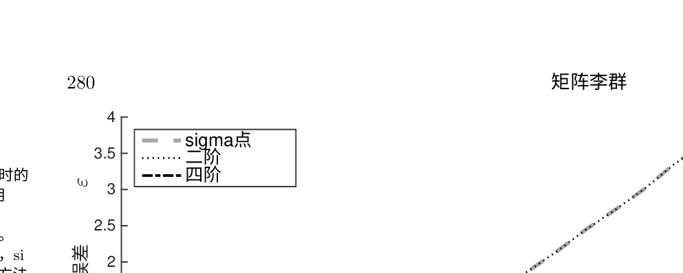

输入协方差矩阵中的项。我们没有比较各种方法的计算成本，因为它们与蒙特卡洛相比都非常高效。

值得注意的是，随着不确定性的增加，我们正确跟踪 SE(3) 的能力会减弱。这可以直接从图7.7中看出，随着不确定性的增加，误差也会增加。这表明只使用相对姿态变量来保持不确定性较小可能是明智的。

#### 7.3.4 融合姿态

本节将研究一种不同类型的非线性，即将多个姿态估计融合在一起，如图7.8所示。我们将把这个问题看作是一个估计问题，其中涉及到来自矩阵李群的量。我们将使用在第7.1.9节中介绍的优化思想。

图7.8 将 K个姿态估计组合成一个融合估计。

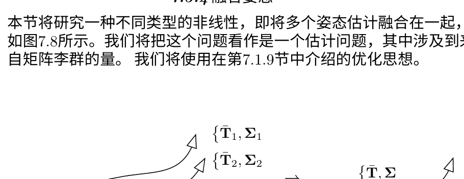

##### 理论

假设我们有 K个姿态和相关的不确定性：

$$ \left\{ \bar{T}_1, \Sigma_1 \right\}, \left\{ \bar{T}_2, \Sigma_2 \right\}, \ldots, \left\{ \bar{T}_K, \Sigma_K \right\}. \quad (7.311) $$

如果我们将其视为真实姿态的不确定（伪）测量，那么我们如何最优地将它们组合成一个估计值呢？

正如我们在本书的第一部分中所看到的，向量空间解决方案对于融合是直接的，可以在闭合形式中准确找到：

$$
\overline{\mathbf{x}} = \boldsymbol{\Sigma} \sum_{k=1}^K \boldsymbol{\Sigma}_k^{-1} \overline{\mathbf{x}}_k, \quad \boldsymbol{\Sigma} = \left( \sum_{k=1}^K \boldsymbol{\Sigma}_k^{-1} \right)^{-1}. \quad (7.312)
$$

当处理 SE(3) 时，情况会变得更加复杂，我们将采用迭代方案。

我们定义误差（我们将寻求最小化）为测量值与最优估计之间的误差，T，所以

$$
\mathbf{e}_k(\mathbf{T}) = \ln \left( \overline{\mathbf{T}}_k \mathbf{T}^{-1} \right)^\vee. \quad (7.313)
$$

我们使用我们之前概述的姿态优化方法[34]，其中我们从一个初始猜测开始，$\mathbf{T}_{\text{op}}$，并通过一个小量扰动（在左边）来改变它，$\boldsymbol{\epsilon}$，这样

$$
\mathbf{T} = \exp (\boldsymbol{\epsilon}^\wedge) \mathbf{T}_{\text{op}}. \quad (7.314)
$$

将其插入到误差表达式中，我们有

$$
\begin{aligned}
\mathbf{e}_k(\mathbf{T}) &= \ln \left( \overline{\mathbf{T}}_k \mathbf{T}^{-1} \right)^\vee = \ln \left( \overline{\mathbf{T}}_k \underbrace{\mathbf{T}_{\text{op}}^{-1} \exp (-\boldsymbol{\epsilon}^\wedge)}_{\text{小}} \right)^\vee \\
&= \ln \left( \exp (\mathbf{e}_k(\mathbf{T}_{\text{op}})^\wedge) \exp (-\boldsymbol{\epsilon}^\wedge) \right)^\vee = \mathbf{e}_k(\mathbf{T}_{\text{op}}) - \mathbf{G}_k \boldsymbol{\epsilon},
\end{aligned} \quad (7.315)
$$

其中 $\mathbf{e}_k(\mathbf{T}_{\text{op}}) = \ln \left( \overline{\mathbf{T}}_k \mathbf{T}_{\text{op}}^{-1} \right)^\vee$ 和 $\mathbf{G}_k = \mathcal{J}(-\mathbf{e}_k(\mathbf{T}_{\text{op}}))^{-1}$。我们使用了近似的BCH公式从(7.100)得到最终表达式。由于 $\mathbf{e}_k(\mathbf{T}_{\text{op}})$相当小，这个级数会迅速收敛，我们只需要保留几项即可。在我们的迭代方案中，$\boldsymbol{\epsilon}$（希望）会收敛到零，因此我们只保留了线性项。

我们定义要最小化的成本函数为

$$
\begin{aligned}
J(\mathbf{T}) &= \frac{1}{2} \sum_{k=1}^K \mathbf{e}_k(\mathbf{T})^T \boldsymbol{\Sigma}_k^{-1} \mathbf{e}_k(\mathbf{T}) \\
&\approx \frac{1}{2} \sum_{k=1}^K (\mathbf{e}_k(\mathbf{T}_{\text{op}}) - \mathbf{G}_k \boldsymbol{\epsilon})^T \boldsymbol{\Sigma}_k^{-1} (\mathbf{e}_k(\mathbf{T}_{\text{op}}) - \mathbf{G}_k \boldsymbol{\epsilon}),
\end{aligned} \quad (7.316)
$$

这已经是（近似）二次的 $\boldsymbol{\epsilon}$。实际上，它是一个平方的马氏距离（Mahalanobis, 1936）因为我们选择了逆协方差矩阵作为加权矩阵；因此，相对于 ϵ 的最小化等价于最大化个体估计的联合似然。值得注意的是，由于我们使用了约束敏感的扰动方案，在优化过程中不需要担心对状态变量施加任何约束。对 ϵ 求导并置零会得到以下线性方程组，用于求得 ϵ 的最优值：

> $$\left(\sum_{k=1}^{K} \mathbf{G}_{k}^{T} \mathbf{\Sigma}_{k}^{-1} \mathbf{G}_{k}\right) \epsilon^{*} = \sum_{k=1}^{K} \mathbf{G}_{k}^{T} \mathbf{\Sigma}_{k}^{-1} \mathbf{e}_{k}\left(\mathbf{T}_{\mathrm{op}}\right). \quad (7.317)$$

虽然与（7.312）相比可能看起来很奇怪，但是雅可比项出现是因为我们选择的误差定义实际上是非线性的，这是由于矩阵指数的存在。然后我们将这个最优扰动应用于我们当前的猜测，

> $$\mathbf{T}_{\mathrm{op}} \leftarrow \exp \left(\epsilon^{* \wedge}\right) \mathbf{T}_{\mathrm{op}}, \quad (7.318)$$

这确保 Top 保持在 SE(3) 中，并迭代至收敛。在最后一次迭代中，我们将 T = Top 作为我们融合估计的均值和

> $$\mathbf{\Sigma} = \left(\sum_{k=1}^{K} \mathbf{G}_{k}^{T} \mathbf{\Sigma}_{k}^{-1} \mathbf{G}_{k}\right)^{-1}. \quad (7.319)$$

协方差矩阵。这种方法的形式类似于第7.1.9节中讨论的高斯-牛顿方法。这个融合问题类似于Smith等人研究的问题（2003年），但他们只讨论了 K = 2 的情况。我们的方法更接近于Long等人的方法（2012年），他们讨论了 N = 2 的情况，并推导出了对于任意数量的个体测量的融合均值和协方差的闭式表达式，K；但是，他们没有迭代他们的解决方案，并且他们跟踪的PDF略有不同。Wolfe等人（2011年）也详细讨论了融合问题，尽管使用了一个与我们略有不同的PDF。他们讨论了任意 K 的非迭代融合方法，并展示了 K = 2 的数值结果。我们相信我们的方法推广了所有这些先前的工作，通过（i）允许个体估计的数量，K，是任意的，（ii）在逆雅可比的近似中保留任意数量的项，N，和（iii）通过高斯-牛顿风格的优化方法迭代至收敛。我们的方法可能比一些先前的方法更容易实现。

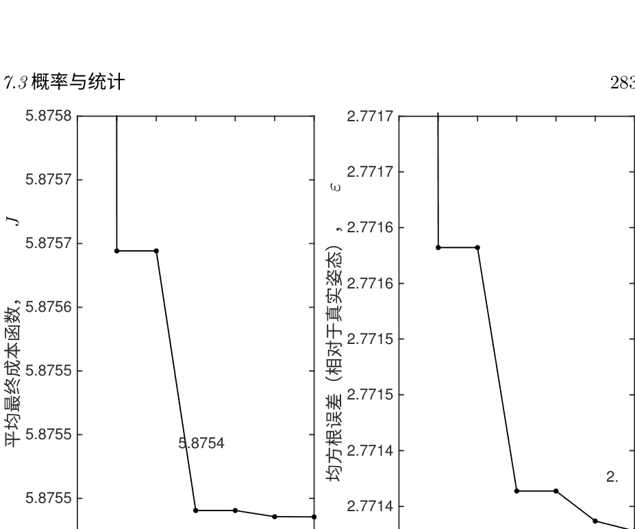

图7.9 融合实验结果：（左）平均最终成本函数J与保留的项数N的关系；（右）相对于真实姿态的均方根姿态误差。两个图表都显示保留多于一个项在J^{-1}中是有益的。数据点'∞'使用解析表达式保留所有展开项。

##### 融合实验

为了验证前一小节中的姿态融合方法，我们使用了一个给定的真实姿态
$$\mathbf{T}_{\text{true}} = \exp \left( \xi_{\text{true}}^{\wedge} \right), \quad \xi_{\text{true}} = \begin{bmatrix} 1 & 0 & 0 & 0 & 0 & \pi/6 \end{bmatrix}^{T}, \qquad (7.320)$$

然后生成了三个随机姿态测量,
$$\bar{\mathbf{T}}_{1} = \exp \left( \mathbf{\epsilon}_{1}^{\wedge} \right) \mathbf{T}_{\text{true}} , \quad \bar{\mathbf{T}}_{2} = \exp \left( \mathbf{\epsilon}_{2}^{\wedge} \right) \mathbf{T}_{\text{true}} , \quad \bar{\mathbf{T}}_{3} = \exp \left( \mathbf{\epsilon}_{3}^{\wedge} \right) \mathbf{T}_{\text{true}} , \qquad (7.321)$$

其中

$$\begin{aligned}
\mathbf{\epsilon}_{1} &\sim \mathcal{N} \left( \mathbf{0}, \text{diag} \left\{ 10, 5, 5, \frac{1}{2}, 1, \frac{1}{2} \right\} \right), \\
\mathbf{\epsilon}_{2} &\sim \mathcal{N} \left( \mathbf{0}, \text{diag} \left\{ 5, 15, 5, \frac{1}{2}, \frac{1}{2}, 1 \right\} \right), \\
\mathbf{\epsilon}_{3} &\sim \mathcal{N} \left( \mathbf{0}, \text{diag} \left\{ 5, 5, 25, 1, \frac{1}{2}, \frac{1}{2} \right\} \right).
\end{aligned} \qquad (7.322)$$

然后我们使用高斯-牛顿技术解决了姿态问题（直到收敛），使用初始条件，$\mathbf{T}_{\text{op}} = \mathbf{1}$。我们对 $N=1 \ldots 6$ 进行了重复，这是在 $\mathbf{G}_{k} = \mathcal{J} (-\mathbf{e}_{k} (\mathbf{T}_{\text{op}}))^{-1}$ 中保留的项数。我们还使用闭式表达式来计算 $\mathcal{J}$ 解析地（然后数值求逆），这由 $N = \infty$ 表示。

图7.10 融合实验结果：（左）成本函数J随着高斯-牛顿迭代的连续收敛；这只是生成图7.9的M次试验之一；（右）与左图相同，但放大显示N=2，4，∞解逐渐收敛到更低的成本。

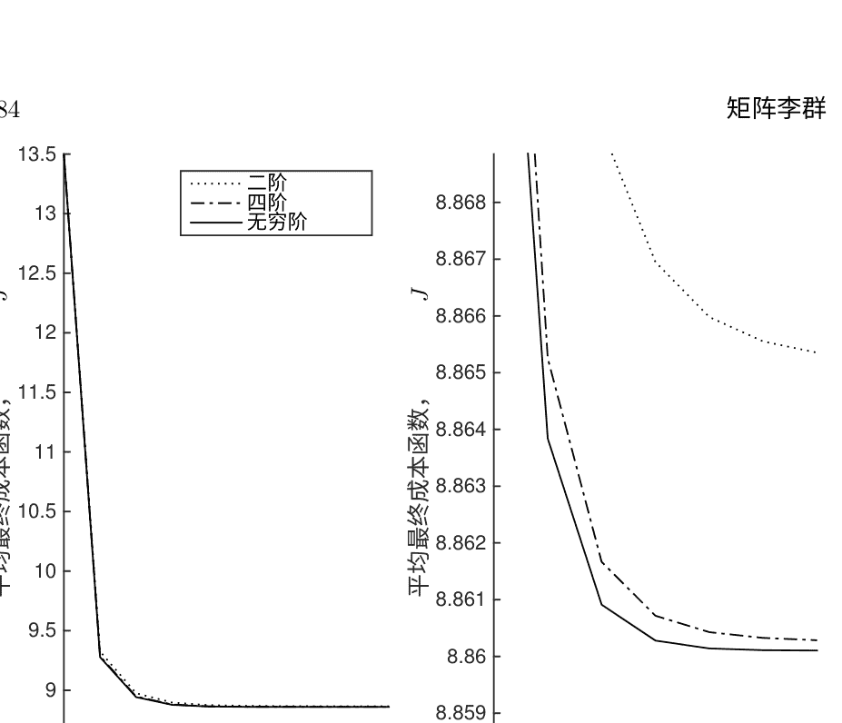

图7.9绘制了两个性能指标。首先，它绘制了成本函数 $J_m$ 的最终收敛值，平均值为 $M = 1000$次随机试验，$J = \frac{1}{M} \sum_{m=1}^M \epsilon_m^T \epsilon_m$，其次，它绘制了我们估计的姿态误差的均方根（相对于真实姿态），再次平均值为相同的 $M$随机试验：

$$\varepsilon = \sqrt{\frac{1}{M} \sum_{m=1}^M \epsilon_m^T \epsilon_m}, \quad \epsilon_m = \ln\left(\mathbf{T}_{\text{true}} \mathbf{T}_m^{-1}\right)^\vee.$$

这些图表显示，随着 $N$的增加，误差的两个度量都呈单调减少的趋势。此外，我们可以看到对于这个例子，几乎所有的收益都是在只有四个项（或者可能是两个项）的情况下获得的。当 $N=2,3$时，结果是相同的，当 $N=4,5$时也是如此。这是因为在伯努利数列中，$B_3 = 0$, $B_5 = 0$, 所以这些项对 $\mathcal{J}^{-1}$ 没有额外的贡献。值得一提的是，如果我们将（7.322）中的旋转部分的协方差变得更大，那么我们会得到很多样本的旋转角度超过 $\pi$，这对于我们使用的性能指标可能会有问题。图7.10显示了成本收敛历史，$J$, 对于单个随机试验。左侧显示了迭代解决方案的巨大好处，而右侧显示了通过在 $\mathcal{J}^{-1}$ 的近似中保留更多项来使成本收敛到较低值的好处（情况

#### 7.3.5 通过非线性相机模型传播不确定性

在估计问题中，我们经常面临将不确定的量通过非线性测量模型传递以产生预期测量的情况。通常，这是通过线性化来实现的（Matthies andShafer, 1987）。Sibley (2007)展示了如何对立体相机模型进行二阶传播，考虑到地标的不确定性，但不考虑姿态的不确定性。在这里，我们推导出均值（和协方差）的完整二阶表达式，并将其与蒙特卡洛、sigmapoint变换和线性化进行比较。我们首先讨论点的表示，然后介绍测量（相机）模型的泰勒-级数展开，最后进行一个实验。

##### 扰动齐次点

正如我们在第7.1.8节中所看到的，点在 ℝ³ 可以用以下方式表示：

$$ \mathbf{p} = \begin{bmatrix} sx \\ sy \\ sz \\ s \end{bmatrix}, \quad (7.323) $$
其中 s 是某个实数，非负标量。

为了扰动齐次坐标中的点，我们将直接通过以下方式对 xyz 分量进行操作：

$$ \mathbf{p} = \bar{\mathbf{p}} + \mathbf{D} \zeta, \quad (7.324) $$
其中 ζ ∈ ℝ³ 是扰动， D 是一个由以下矩阵给出的缩放矩阵：

$$ \mathbf{D} = \begin{bmatrix} 1 & 0 & 0 \\ 0 & 1 & 0 \\ 0 & 0 & 1 \\ 0 & 0 & 0 \end{bmatrix}. \quad (7.325) $$
因此，我们有

$$ E[\mathbf{p}] = \bar{\mathbf{p}} \quad \text{和} \quad E[(\mathbf{p} - \bar{\mathbf{p}})(\mathbf{p} - \bar{\mathbf{p}})^T] = \mathbf{D} E[\zeta \zeta^T] \mathbf{D}^T, \quad (7.326) $$
没有近似。

##### 相机模型的泰勒级数展开

通常会线性化非线性观测模型以用于姿态估计。在本节中，我们将展示如何对这样的模型进行更一般的泰勒级数展开，并详细讨论二阶情况。我们的相机模型将是：

$$ \mathbf{y} = g(\mathbf{T}, \mathbf{p}), \quad (7.327) $$
其中 $\mathbf{T}$ 是相机的姿态， $\mathbf{p}$ 是地标的位置（作为一个齐次点）。我们的任务是通过相机模型将姿态和地标的高斯表示，给定为 $\{\mathbf{T}, \bar{\mathbf{p}}, \mathbf{\Xi}\}$，其中 $\mathbf{\Xi}$ 是两个量的 $9 \times 9$ 协方差，传递到测量$^{35}$的均值和协方差， $\{\mathbf{y}, \mathbf{R}\}$。

我们可以将其看作是两个非线性的组合，一个用于将地标转换为相机坐标系， $\mathbf{z}(\mathbf{T}, \mathbf{p}) = \mathbf{T} \mathbf{p}$，一个用于从相机坐标系中产生观测值。$\mathbf{y} = s(\mathbf{z})$。因此我们有

$$ g(\mathbf{T}, \mathbf{p}) = s(\mathbf{z}(\mathbf{T}, \mathbf{p})). \quad (7.328) $$
我们将依次处理每一个。如果我们稍微改变相机的姿态和/或地标的位置，我们就有

$$ \mathbf{z} = \mathbf{T} \mathbf{p} = \exp (\epsilon^{\wedge}) \bar{\mathbf{T}} (\bar{\mathbf{p}} + \mathbf{D} \zeta) \approx \left( \mathbf{1} + \epsilon^{\wedge} + \frac{1}{2} \epsilon^{\wedge} \epsilon^{\wedge} \right) \bar{\mathbf{T}} (\bar{\mathbf{p}} + \mathbf{D} \zeta), \quad (7.329) $$
在姿态扰动的泰勒级数中，我们保留了前两项。如果我们展开并继续保留只有二阶或更低阶的那些项我们就有

$$ \mathbf{z} \approx \bar{\mathbf{z}} + \mathbf{Z} \theta + \frac{1}{2} \sum_{i=1}^{4} \theta^{T} \mathcal{Z}_{i} \theta \, \mathbf{1}_{i}, \quad (7.330) $$
其中 $\mathbf{1}_{i}$ 是 $4 \times 4$ 单位矩阵的第 $i$ 列，而

$$ \bar{\mathbf{z}} = \bar{\mathbf{T}} \bar{\mathbf{p}}, \quad (7.331a) $$
$$ \mathbf{Z} = \left[ \begin{array}{c} \bar{\mathbf{T}} \bar{\mathbf{p}} \\ \bar{\mathbf{T}} \mathbf{D} \end{array} \right], \quad (7.331b) $$
$$ \mathcal{Z}_{i} = \left[ \begin{array}{cc} \mathbf{1}_{i}^{\odot} (\bar{\mathbf{T}} \bar{\mathbf{p}}) & \mathbf{1}_{i}^{\odot} \bar{\mathbf{T}} \mathbf{D} \\ (\mathbf{1}_{i}^{\odot} (\bar{\mathbf{T}} \mathbf{D}))^{T} & 0 \end{array} \right], \quad (7.331c) $$
$$ \theta = \left[ \begin{array}{c} \epsilon \\ \zeta \end{array} \right]. \quad (7.331d) $$
得出这些表达式需要反复应用第7.1.8节中的恒等式。

> 35 在这个例子中，不确定性的唯一来源来自姿态和点，我们忽略了固有的测量噪声，但如果需要，可以将其作为加性高斯噪声纳入考虑。

然后，为了应用非线性相机模型，我们使用链式法则（对于一阶和二阶导数），即

$$
g(T, p) \approx \bar{g} + G \theta + \frac{1}{2} \sum_j \theta^T G_j \theta 1_j, \quad (7.332)
$$

在 θ的二阶修正中进行校正，其中

$$
\begin{aligned}
\bar{g} &= s(\bar{z}), \quad (7.333a) \\
G &= S Z, \quad S = \frac{\partial s}{\partial z}\bigg|_{\bar{z}}, \quad (7.333b) \\
G_j &= Z^T S_j Z + \sum_{i=1}^4 1_j^T S 1_i Z_i, \quad (7.333c) \\
S_j &= \frac{\partial^2 s_j}{\partial z \partial z^T}\bigg|_{\bar{z}}, \quad (7.333d)
\end{aligned}
$$

j是对 s(·)的行进行索引，1_j是单位矩阵的第 j列。s(·)的雅可比矩阵是 S，j行的海森矩阵是 S_j。

如果我们只关心一阶扰动，我们可以简单地将

$$
g(T, p) = \bar{g} + G \theta, \quad (7.334)
$$

其中 \bar{g}和 G与上述相同。

这些扰动测量方程可以在任何我们喜欢的估计方案中使用；在下一小节中，我们将使用这些带有立体相机模型的方程来展示二阶项的好处。

##### 通过相机传播高斯不确定性

假设输入的不确定性，由 θ表示，是零均值的高斯分布。

$$
\theta \sim \mathcal{N}(0, \Xi), \quad (7.335)
$$

需要注意的是，一般情况下姿态 T和地标 p之间可能存在相关性。

那么，一阶近似下我们的测量结果为

$$
y_{\text{1st}} = \bar{g} + G \theta, \quad (7.336)
$$

而且 \bar{y}_{\text{1st}} = E[y_{\text{1st}}] = \bar{g}, 因为根据假设 E[θ] = 0。一阶相机模型关联的（二阶）协方差矩阵为

$$
R_{\text{2nd}} = E\left[(y_{\text{1st}} - \bar{y}_{\text{1st}})(y_{\text{1st}} - \bar{y}_{\text{1st}})^T\right] = G \Xi G^T, \quad (7.337)
$$

对于二阶相机模型，我们有

$$
y_{2nd} = \bar{g} + \mathbf{G} \theta + \frac{1}{2} \sum_j \theta^T \mathcal{G}_j \theta \mathbf{1}_j, \quad (7.338)
$$

因此，

$$
\bar{y}_{2nd} = E[\mathbf{y}_{2nd}] = \bar{g} + \frac{1}{2} \sum_j \mathrm{tr} (\mathcal{G}_j \Xi) \mathbf{1}_j, \quad (7.339)
$$

与一阶相机模型相比，这个式子多了一个非零项。输入协方差 \Xi 越大，这个项就可能变得越大，取决于非线性程度。对于线性相机模型， \mathcal{G}_j = 0，二阶和一阶相机模型的均值是相同的。

我们还将计算一个（四阶）协方差，但仅考虑相机模型扩展中的二阶项。为了正确地进行这个过程，我们应该将相机模型扩展到三阶，因为存在一个涉及第一阶和第三阶相机模型项乘积的附加四阶协方差项；然而，这将涉及到使用相机模型的三阶导数的复杂表达式。

因此，我们将使用的近似四阶协方差为

$$
\begin{aligned}
R_{4th} &\approx E \left[ (\mathbf{y}_{2nd} - \bar{\mathbf{y}}_{2nd}) (\mathbf{y}_{2nd} - \bar{\mathbf{y}}_{2nd})^T \right] \\
&= \mathbf{G} \Xi \mathbf{G}^T - \frac{1}{4} \left( \sum_{i=1}^J \mathrm{tr} (\mathcal{G}_i \Xi) \mathbf{1}_i \right) \left( \sum_{j=1}^J \mathrm{tr} (\mathcal{G}_j \Xi) \mathbf{1}_j \right)^T \\
&\quad + \frac{1}{4} \sum_{i,j=1}^J \sum_{k,\ell,m,n=1}^9 \mathcal{G}_{ik\ell} \mathcal{G}_{jmn} \left( \Xi_{k\ell} \Xi_{mn} + \Xi_{km} \Xi_{\ell n} + \Xi_{kn} \Xi_{\ell m} \right), \quad (7.340)
\end{aligned}
$$

其中 \mathcal{G}_{ikl} 是 \mathcal{G}_i 的第_{kl} 个元素， \Xi_{k\ell} 是 \Xi 的第_{k\ell} 个元素。由于高斯密度的对称性，协方差展开中的一阶和三阶项都为零。上述最后一项利用了高斯变量的 Isserlis 定理。

##### Sigmapoint方法

最后，我们还可以利用 sigma 点变换通过非线性相机模型传递不确定性。与姿态复合问题一样，我们将其调整为我们特定类型的 SE(3) 扰动。我们首先使用有限数量的样本 {T`,p`} 来近似输入的高斯分布：

$$
\begin{aligned}
L L^T &= \Xi, \quad (\text{Cholesky分解; L下三角矩阵}) \quad (7.341a) \\
\theta_0 &= 0, \quad (7.341b) \\
\theta_\ell &= \sqrt{L + \kappa} \, \text{col}_\ell L, \quad \ell = 1 \ldots L, \quad (7.341c) \\
\theta_{\ell+L} &= -\sqrt{L + \kappa} \, \text{col}_\ell L, \quad \ell = 1 \ldots L, \quad (7.341d) \\
\begin{bmatrix} \epsilon_\ell \\ \zeta_\ell \end{bmatrix} &= \theta_\ell, \quad (7.341e) \\
T_\ell &= \exp(\epsilon_\ell^\wedge) \bar{T}, \quad (7.341f) \\
p_\ell &= \bar{p} + D \zeta_\ell, \quad (7.341g)
\end{aligned}
$$

其中 $\kappa$是用户定义的常数36和 $L=9$. 然后我们将每个样本通过非线性相机模型传递:

$$
y_\ell = s (T_\ell p_\ell), \quad \ell = 0 \ldots 2L. \quad (7.342)
$$

根据这些数据计算得到输出的均值和协方差

$$
\begin{aligned}
\bar{y}_{\text{sp}} &= \frac{1}{L + \kappa} \left( \kappa y_0 + \frac{1}{2} \sum_{\ell=1}^{2L} y_\ell \right), \quad (7.343a) \\
R_{\text{sp}} &= \frac{1}{L + \kappa} \left( \kappa (y_0 - \bar{y}_{\text{sp}})(y_0 - \bar{y}_{\text{sp}})^T + \frac{1}{2} \sum_{\ell=1}^{2L} (y_\ell - \bar{y}_{\text{sp}})(y_\ell - \bar{y}_{\text{sp}})^T \right). \quad (7.343b)
\end{aligned}
$$

下一节将详细介绍一个具体的非线性相机模型，表示为立体相机。

##### 立体相机模型

为了演示不确定性在非线性测量模型中的传播，我们将使用中点立体相机模型，如下所示

$$
\mathbf{s}(\mathbf{z}) = \mathbf{M} \frac{1}{z_3} \mathbf{z}, \quad (7.344)
$$

其中

$$
\mathbf{s} = \begin{bmatrix} s_1 \\ s_2 \\ s_3 \\ s_4 \end{bmatrix}, \quad \mathbf{z} = \begin{bmatrix} \rho \\ 1 \end{bmatrix} = \begin{bmatrix} z_1 \\ z_2 \\ z_3 \\ z_4 \end{bmatrix}, \quad \mathbf{M} = \begin{bmatrix} f_u & 0 & c_u & f_u \frac{b}{2} \\ 0 & f_v & c_v & 0 \\ f_u & 0 & c_u & -f_u \frac{b}{2} \\ 0 & f_v & c_v & 0 \end{bmatrix}, \quad (7.345)
$$

和 $f_u, f_v$是水平和垂直焦距（以像素为单位），$(c_u, c_v)$是图像的光学中心（以像素为单位），而 $b$是两个相机之间的距离（以米为单位）。相机的光轴沿着 $z_3$方向。

这个测量模型的雅可比矩阵由以下给出

$$
\frac{\partial \mathbf{s}}{\partial \mathbf{z}} = \mathbf{M} \frac{1}{z_3} \begin{bmatrix} 1 & 0 & -\frac{z_1}{z_3} & 0 \\ 0 & 1 & -\frac{z_2}{z_3} & 0 \\ 0 & 0 & 0 & 0 \\ 0 & 0 & -\frac{z_4}{z_3} & 1 \end{bmatrix}, \quad (7.346)
$$

而海森矩阵由以下给出

$$
\frac{\partial^2 s_1}{\partial \mathbf{z} \partial \mathbf{z}^T} = \frac{f_u}{z_3^2} \begin{bmatrix} 0 & 0 & -1 & 0 \\ 0 & 0 & 0 & 0 \\ -1 & 0 & \frac{2z_1 + bz_4}{z_3} & -\frac{b}{2} \\ 0 & 0 & -\frac{b}{2} & 0 \end{bmatrix},
$$

$$
\frac{\partial^2 s_2}{\partial \mathbf{z} \partial \mathbf{z}^T} = \frac{\partial^2 s_4}{\partial \mathbf{z} \partial \mathbf{z}^T} = \frac{f_v}{z_3^2} \begin{bmatrix} 0 & 0 & 0 & 0 \\ 0 & 0 & -1 & 0 \\ 0 & -1 & \frac{2z_2}{z_3} & 0 \\ 0 & 0 & 0 & 0 \end{bmatrix},
$$

$$
\frac{\partial^2 s_3}{\partial \mathbf{z} \partial \mathbf{z}^T} = \frac{f_u}{z_3^2} \begin{bmatrix} 0 & 0 & -1 & 0 \\ 0 & 0 & 0 & 0 \\ -1 & 0 & \frac{2z_1 - bz_4}{z_3} & \frac{b}{2} \\ 0 & 0 & \frac{b}{2} & 0 \end{bmatrix}, \quad (7.347)
$$

我们已经分别展示了每个组件。

##### 相机实验

我们使用以下方法通过非线性立体相机模型传递高斯不确定性的相机姿态和地标位置：

- (i) 蒙特卡洛方法：我们从输入密度中随机抽取大量样本， $M = 1,000,000$，通过相机模型传递这些样本，然后计算均值 $\mathbf{y}_\text{mc}$和协方差 $\mathbf{R}_\text{mc}$。这种慢但准确的方法作为我们的基准，用于与其他三种更快的方法进行比较。
- (ii) 一阶/二阶：我们使用了一阶相机模型来计算 $\bar{\mathbf{y}}_\text{1st}$和 $\mathbf{R}_\text{2nd}$，如上所述。
- (iii) 二阶/四阶：我们使用了二阶相机模型来计算 $\bar{\mathbf{y}}_\text{2nd}$和 $\mathbf{R}_\text{4th}$，如上所述。
- (iv) Sigma点：我们使用了上述描述的 Sigma点方法来计算 $\bar{\mathbf{y}}_\text{sp}$和 $\mathbf{R}_\text{sp}$。

相机参数为

$b = 0.25 \mathrm{~m}$， $f_u = f_v = 200$像素， $c_u = c_v = 0$像素。

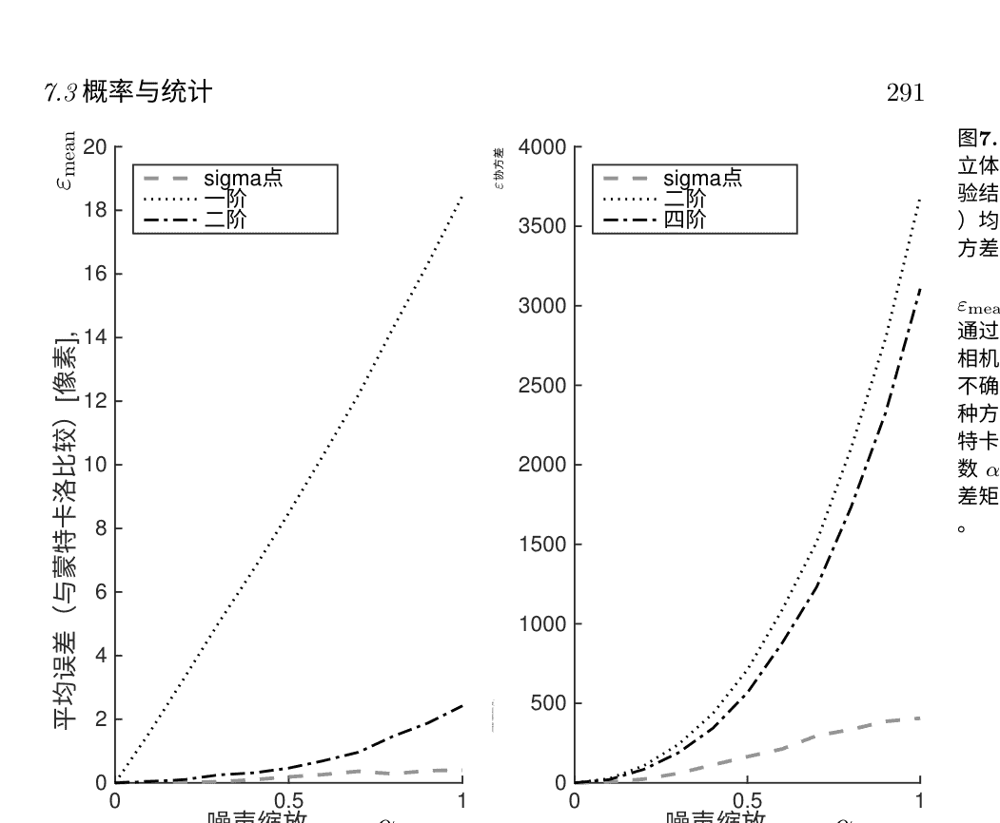

我们使用相机姿态 $\mathbf{T}=\mathbf{I}$ 并让地标位于 $\mathbf{p}=\begin{bmatrix} 10 & 10 & 10 & 1 \end{bmatrix}^T$。对于组合的姿态/地标不确定性，我们使用输入协方差

$$
\Xi = \alpha \times \mathrm{diag}\left\{\frac{1}{10}, \frac{1}{10}, \frac{1}{10}, \frac{1}{100}, \frac{1}{100}, \frac{1}{100}, 1, 1, 1\right\} ,
$$

其中 $\alpha \in [0,1]$ 是一个缩放参数，允许我们以参数化的方式增加不确定性的幅度。

为了评估性能，我们通过将结果与蒙特卡洛模拟的结果进行比较，评估了每种方法的均值和协方差，具体指标如下：

$$
\begin{aligned}
\varepsilon_{\text{均值}} &= \sqrt{(\bar{\mathbf{y}} - \bar{\mathbf{y}}_{\text{mc}})^T(\bar{\mathbf{y}} - \bar{\mathbf{y}}_{\text{mc}})}, \\
\varepsilon_{\text{协方差}} &= \sqrt{\operatorname{tr} \left((\mathbf{R} - \mathbf{R}_{\text{mc}})^T(\mathbf{R} - \mathbf{R}_{\text{mc}})\right)},
\end{aligned}
$$

其中后者是 *Frobenius* 范数。

图7.11 显示了三种技术在广泛的噪声尺度 $\alpha$ 下的两个性能指标， $\varepsilon_{\text{均值}}$ 和 $\varepsilon_{\text{协方差}}$ 。我们可以看到，Sigma点技术在均值和协方差上表现最好。二阶技术在均值上表现得相当好，但相应的四阶技术表现不佳。

图7.12显示了立体相机左图像的部分快照，显示了所有技术的均值和一标准差的协方差椭圆。我们可以看到，Sigma点技术在均值和协方差上表现出色，而其他技术则表现不佳。

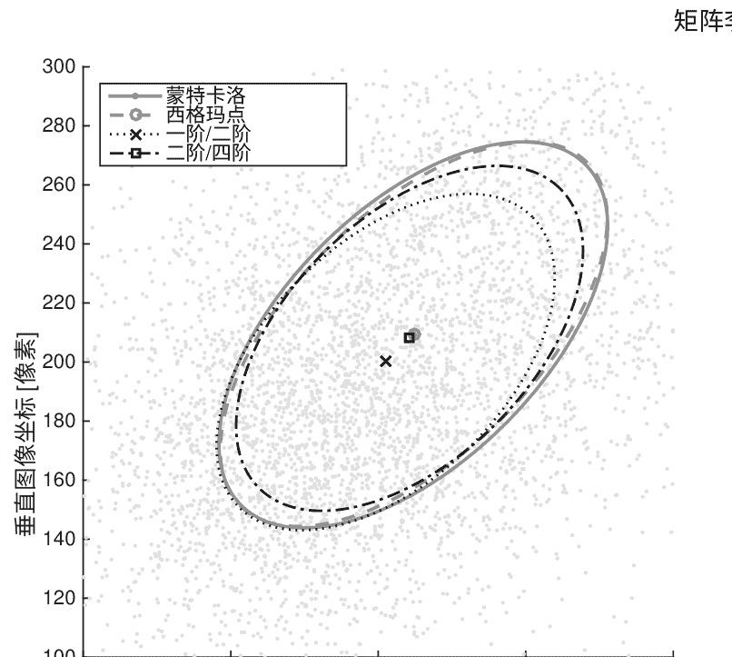

### 7.4 总结

本章的主要要点如下：

1.  虽然旋转和姿态不能用向量空间来描述，但我们可以使用矩阵李群 $SO(3)$ 和 $SE(3)$ 来描述它们。
2.  我们可以通过使用指数映射方便地扰动旋转和姿态，该映射 (仅满射) 将 $\mathbb{R}^3$ 和 $\mathbb{R}^6$ 映射到 $SO(3)$ 和 $SE(3)$。我们可以在状态估计中使用这种映射来实现两个不同的目的：
    (i) 在最优估计过程中微调旋转或位姿的点估计 (即均值或MAP)。
    (ii) 通过指数映射将高斯噪声映射到 $SO(3)$ 和 $SE(3)$ 上，定义类似高斯分布的旋转和位姿的概率密度函数。
3.  本章中使用的方法仅能对旋转和位姿的不确定性进行有限表示。我们无法使用类似高斯分布的概率密度函数在 $SO(3)$ 和 $SE(3)$ 上全局表示不确定性；有关此问题，请参考Chirikjian和Kyatkin（2016）。然而，这些方法足以使我们能够修改本书第一部分中的估计技术，以用于旋转和位姿。本书的最后一部分将把这些矩阵李群工具与本书第一部分的估计技术结合起来，以进行实际机器人问题的状态估计。

### 7.5 练习

7.5.1 证明 $(\mathbf{C}\mathbf{v})^{\wedge} = \mathbf{C}\mathbf{v}^{\wedge}\mathbf{C}^T$。

7.5.2 证明 $(\mathbf{C}\mathbf{U}\mathbf{C}^T)^{\wedge} = (2 \cos \phi + 1)\mathbf{U}^{\wedge} - \mathbf{U}^{\wedge}\mathbf{C} - \mathbf{C}^T \mathbf{U}^{\wedge}$。

7.5.3 证明 $\exp\left((\mathbf{C}\mathbf{U}\mathbf{C}^T)^{\wedge}\right) = \mathbf{C} \exp\left(\mathbf{U}^{\wedge}\right) \mathbf{C}^T$。

7.5.4 证明 $(\mathcal{T} \mathbf{x})^{\wedge} = \mathbf{T} \mathbf{x}^{\wedge} \mathbf{T}^{-1}$。

7.5.5 证明 $\exp\left((\mathcal{T} \mathbf{x})^{\wedge}\right) = \mathbf{T} \exp\left(\mathbf{x}^{\wedge}\right) \mathbf{T}^{-1}$。

7.5.6 计算 $\mathbf{Q}_\ell(\boldsymbol{\xi})$ 在 (7.86b) 中的表达式。

7.5.7 证明 $\mathbf{x}^{\wedge}\mathbf{p} = \mathbf{p} \times \mathbf{x}$。

7.5.8 证明 $\mathbf{p}^T \mathbf{x}^{\wedge} = \mathbf{x}^T \mathbf{p}^{\circledast}$。

7.5.9 证明 $\int_0^1 \alpha^n (1 - \alpha)^m d\alpha = \frac{n! m!}{(n + m + 1)!}$。提示：使用分部积分。

7.5.10 证明恒等式 $\mathbf{\dot{J}}(\phi) - \boldsymbol{\omega}^{\wedge}\mathbf{J}(\phi) = \frac{\partial \boldsymbol{\omega}}{\partial \phi}$，其中 $\boldsymbol{\omega} = \mathbf{J}(\phi) \dot{\phi}$。

这些是在 SO(3) 中表示的旋转运动学。提示：可以通过将每个量写成级数的形式逐项展开来证明。

#### 7.5.11 证明

```
(Tp) \equiv Tp \mathcal{T}^{-1}.
```

#### 7.5.12 证明

```
(Tp)^T (Tp) \equiv \mathcal{T}^{-T} p^T p \mathcal{T}^{-1}.
```

## 7.5.13 从 SE(3) 运动学开始,

```
\dot{\mathbf{T}} = \boldsymbol{\varpi}^\wedge \mathbf{T},
```

证明运动学也可以使用伴随数量来表示:

```
\dot{\mathcal{T}} = \boldsymbol{\varpi}^\wedge \mathcal{T}.
```

## 7.5.14 证明在使用伴随数量时，可以使用修改后的齐次点表示:

```
\mathrm{Ad}(\mathbf{Tp}) = \mathrm{Ad}(\mathbf{T}) \mathrm{Ad}(\mathbf{p}),
```

在这里我们滥用符号，并将齐次点的伴随算子定义为

```
\mathrm{Ad}\left(\begin{bmatrix} \mathbf{c} \\ 1 \end{bmatrix}\right) = \begin{bmatrix} \mathbf{c}^\wedge \\ 1 \end{bmatrix}, \\ \mathrm{Ad}^{-1}\left(\begin{bmatrix} \mathbf{A} \\ \mathbf{B} \end{bmatrix}\right) = \begin{bmatrix} (\mathbf{A} \mathbf{B}^{-1})^\vee \\ 1 \end{bmatrix},
```

其中 c 是一个 3 × 1 的向量， A, B 都是 3 × 3 的矩阵.

## 第三部分

### 应用

## 8 姿态估计问题

在本书的最后一部分，我们将解决一些关键的三维估计问题，这些问题与机器人技术有关。 我们将结合第一部分关于经典状态估计的思想和第二部分关于三维机器人技术的知识。

本章将从一个关键问题开始，即使用最小二乘原理对两个点云（即点的集合）进行对齐。 然后，我们将回顾EKF和批处理状态估计器，并将其调整为在旋转和姿态变量的背景下解决特定姿态估计问题。 我们的重点将放在当世界的几何形状已知时，车辆的定位上。 下一章将讨论未知世界几何形状的更困难的情况。

### 8.1 点云对齐

在本节中，我们将研究姿态估计中的一个经典结果。 具体而言，我们提出了对齐两组三维点或点云的解决方案，同时最小化最小二乘代价函数。 需要注意的是，代价函数中每个项的权重必须是标量，而不是矩阵；这可以称为一般最小二乘法。

这个结果通常在流行的迭代最近点（ICP）（Besl和McKay，1992）算法中被使用，用于将三维点对齐到三维模型。 它还被用于异常值拒绝方案中，例如RANSAC（Fischler和Bolles，1981）（见第5.3.1节），用于使用最小点集进行快速姿态确定。 我们将使用三种不同的参数化方法来呈现解决方案：单位长度四元数、旋转矩阵和变换矩阵。（非迭代）四元数方法归结为解决特征值问题，而（非迭代）旋转矩阵方法则变成奇异值分解。 最后，迭代变换矩阵方法只涉及解线性方程组。

这个问题的起源可以追溯到航天器姿态确定，著名的瓦巴问题（Wahba，1965）

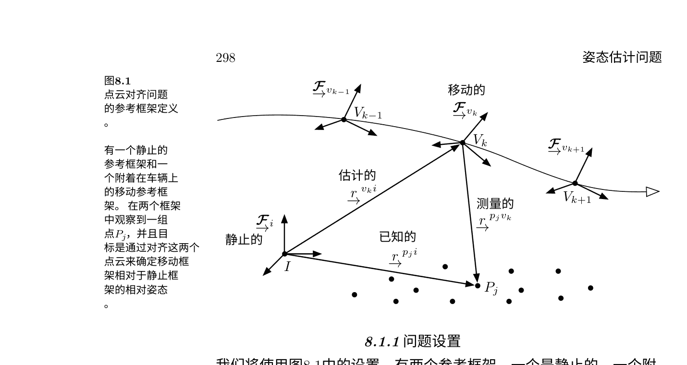

#### 8.1.1 问题设置

我们将使用图8.1中的设置。有两个参考框架，一个是静止的，一个附着在移动车辆上。
特别是，我们有 $M$ 个测量值，$\mathbf{r}^{p_j v_k}$，其中 $j=1 \ldots M$ 个点从车辆上采集（以移动坐标系表示 $\rightarrow \mathcal{F}_{v_{k}}$)。我们假设这些测量值可能受到噪声的影响。

让我们假设我们知道每个点的位置 $\mathbf{r}^{p_j i}$，以及在非移动坐标系中的表示 $\mathcal{F}_{i}$。例如，在ICP算法中，这些点是通过找到模型上每个观测点最近的点来确定的。因此，我们希望对两个不同参考坐标系中表示的 $M$ 个点进行对齐。换句话说，我们希望找到最佳的平移和旋转来对齐这两个点云$^2$。请注意，在这第一个问题中，我们只在一个时间点 $k$ 上进行对齐。我们将在本章后面考虑一个点云跟踪问题。

$^2$ 两个点云之间的未知比例有时也会纳入问题中；我们假设两个点云具有相同的比例。

#### 8.1.2 单位长度四元数解

我们将首先介绍一种用于对齐点云的单位长度四元数方法$^3$。这个解决方案首先由达文波特（1965年）在航空航天领域进行了研究，后来由霍恩（1987b年）在机器人领域进行了研究。我们将在6.2.3节中使用我们之前定义的四元数符号。四元数方法相对于旋转矩阵方法（将在下一节中描述）具有优势，因为生成有效旋转所需的约束更容易满足。

$^3$ 本书的重点是旋转矩阵的使用，但这是一个使用单位长度四元数使事情变得更容易的例子，因此我们包含了推导过程。

为了使用四元数，我们定义了以下4×1的齐次版本的点：

```
y_j = \begin{bmatrix} p_j v_k \ v_k \ 1 \end{bmatrix}, \quad p_j = \begin{bmatrix} r_i^{p_j i} \ 1 \end{bmatrix} \tag{8.1}
```

我们已经省略了下标和上标，除了 j，点索引。
我们希望找到最佳的平移 _{→}\mathcal{F}_{v} 和旋转→-F^{i}之间的相对姿态。
_{→}\mathcal{F}_{i}。我们注意到平移→-F_{v}和旋转→-F^{i}的四元数版本与我们通常的3×1平移^{v}_{i}{}^{i}和3×3旋转矩阵 C_{v}{}_{ki}的关系由以下公式定义

```
\begin{bmatrix} p_j v_k \ v_k \ 1 \end{bmatrix} = \begin{bmatrix} C_{v_k i} & \mathbf{0} \ \mathbf{0}^T & 1 \end{bmatrix} \left( \begin{bmatrix} r_i^{p_j i} \ 1 \end{bmatrix} - \begin{bmatrix} r_i^{v_k i} \ 0 \end{bmatrix} \right) \tag{8.2}
```

这只是在没有任何测量误差的情况下，问题几何性质的表达。使用公式(6.19)的恒等式，我们可以将其重写为

```
y_j = \mathbf{q}^{-1+} (p_j - \mathbf{r})^{+} \mathbf{q}, \tag{8.3}
```

这是在没有任何噪音的情况下。
参考(8.3)，我们可以为点 P_j形成一个误差四元数

```
\mathbf{e}_j = y_j - \mathbf{q}^{-1+} (p_j - \mathbf{r})^{+} \mathbf{q}, \tag{8.4}
```

但是我们可以通过操作上述方程来生成一个在 q中呈线性的误差

```
\mathbf{e}'_j = \mathbf{q}^{+} \mathbf{e}_j = \left( y_j^{\oplus} - (p_j - \mathbf{r})^{+} \right) \mathbf{q}. \tag{8.5}
```

我们将定义总目标函数（要最小化） J为

```
J(\mathbf{q}, \mathbf{r}, \lambda) = \frac{1}{2} \sum_{j=1}^{M} w_j \mathbf{e}'^{T}_{j} \mathbf{e}'_{j} - \frac{1}{2} \lambda \left( \mathbf{q}^{T} \mathbf{q} - 1 \right), \tag{8.6}
```

其中 w_j是分配给每个点对的唯一标量权重。我们在右侧加入了拉格朗日乘子项，以确保旋转四元数的单位长度约束。值得注意的是，选择 \mathbf{e}'_j over \mathbf{e}_jh对我们的目标函数没有影响，因为

```
\mathbf{e}'^{T}_j \mathbf{e}'_j = \left( \mathbf{q}^{+} \mathbf{e}_j \right)^{T} \left( \mathbf{q}^{+} \mathbf{e}_j \right) = \mathbf{e}_j^{T} \mathbf{q}^{+T} \mathbf{q}^{+} \mathbf{e}_j = \mathbf{e}_j^{T} \left( \mathbf{q}^{-1+} \mathbf{q} \right)^{+} \mathbf{e}_j = \mathbf{e}_j^{T} \mathbf{e}_j. \tag{8.7}
```

将 e'_j 的表达式插入目标函数中，我们可以看到

$$ J(\mathbf{q}, \mathbf{r}, \lambda) = \frac{1}{2} \sum_{j=1}^{M} w_j \mathbf{q}^T \left( \mathbf{y}_j^{\oplus} - (\mathbf{p}_j - \mathbf{r})^{+} \right)^{T} \left( \mathbf{y}_j^{\oplus} - (\mathbf{p}_j - \mathbf{r})^{+} \right) \mathbf{q} - \frac{1}{2} \lambda \left( \mathbf{q}^{T} \mathbf{q} - 1 \right). \quad (8.8) $$

对目标函数分别关于 \mathbf{q}, \mathbf{r}, 和 \lambda 求导，我们得到

$$ \frac{\partial J}{\partial \mathbf{q}^T} = \sum_{j=1}^{M} w_j \left( \mathbf{y}_j^{\oplus} - (\mathbf{p}_j - \mathbf{r})^{+} \right)^{T} \left( \mathbf{y}_j^{\oplus} - (\mathbf{p}_j - \mathbf{r})^{+} \right) \mathbf{q} - \lambda \mathbf{q}, \quad (8.9a) $$

$$ \frac{\partial J}{\partial \mathbf{r}^T} = \mathbf{q}^{-1 \oplus} \sum_{j=1}^{M} w_j \left( \mathbf{y}_j^{\oplus} - (\mathbf{p}_j - \mathbf{r})^{+} \right) \mathbf{q}, \quad (8.9b) $$

$$ \frac{\partial J}{\partial \lambda} = -\frac{1}{2} \left( \mathbf{q}^{T} \mathbf{q} - 1 \right). \quad (8.9c) $$

将第二个设为零，我们得到

$$ \mathbf{r} = \mathbf{p} - \mathbf{q}^{+} \mathbf{y}^{+} \mathbf{q}^{-1}, \quad (8.10) $$

其中 \mathbf{p} 和 \mathbf{y} 的定义如下。因此，最佳的平移是两个点云质心之间的差异，在静止坐标系中。

将 \mathbf{r} 代入第一个方程并设为零，我们可以证明

$$ \mathbf{W} \mathbf{q} = \lambda \mathbf{q}, \quad (8.11) $$

其中

$$ \mathbf{W} = \frac{1}{w} \sum_{j=1}^{M} w_j \left( (\mathbf{y}_j - \mathbf{y})^{\oplus} - (\mathbf{p}_j - \mathbf{p})^{+} \right)^{T} \left( (\mathbf{y}_j - \mathbf{y})^{\oplus} - (\mathbf{p}_j - \mathbf{p})^{+} \right), \quad (8.12a) $$

$$ \mathbf{y} = \frac{1}{w} \sum_{j=1}^{M} w_j \mathbf{y}_j, \quad \mathbf{p} = \frac{1}{w} \sum_{j=1}^{M} w_j \mathbf{p}_j, \quad w = \sum_{j=1}^{M} w_j. \quad (8.12b) $$

我们可以看到这只是一个特征问题⁴。如果特征值是正的，并且最小特征值是不同的（即不重复的），那么找到最小特征值和相应的唯一特征向量将会得到 \mathbf{q}，乘以一个乘法常数，而我们的约束条件 \mathbf{q}^{T} \mathbf{q} = 1 使得解唯一。

⁴ 与 \( N \times N \) 矩阵 \( \mathbf{A} \) 相关的特征问题由方程定义 \( \mathbf{A} \mathbf{x} = \lambda \mathbf{x} \)。找到（不一定不同的）特征值 \( \lambda_i \) 的方法是通过求解行列式方程 \( \det (\mathbf{A} - \lambda \mathbf{I}) = 0 \)，然后对于每个特征值，通过将特征值代入原方程并进行适当的运算找到相应的特征向量 \( \mathbf{x}_i \)（乘以一个乘法常数）。非不同特征值的情况比较棘手，需要高级线性代数知识。

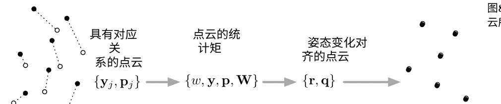

为了看到我们想要的最小特征值，我们首先注意到 $\mathbf{W}$ 既是对称的又是半正定的。半正定性意味着 $\mathbf{W}$ 的所有特征值都是非负的。接下来，我们可以将(8.9a)设为零，从而得到 $\mathbf{W}$ 的等价表达式

```
$$\mathbf{W} = \sum_{j=1}^{M} w_j \left( \mathbf{y}_j^{\oplus} - \left(\mathbf{p}_j - \mathbf{r}\right)^{+} \right)^{T} \left( \mathbf{y}_j^{\oplus} - \left(\mathbf{p}_j - \mathbf{r}\right)^{+} \right). \qquad (8.13)$$
```

将其代入(8.8)中的目标函数，我们立即看到

```
$$J(\mathbf{q}, \mathbf{r}, \lambda) = \frac{1}{2} \mathbf{q}^{T} \mathbf{W} \mathbf{q} - \frac{1}{2} \lambda \left( \mathbf{q}^{T} \mathbf{q} - 1 \right) = \frac{1}{2} \lambda. \qquad (8.14)$$
```

因此，选择 $\lambda$ 的最小可能值将最小化目标函数。

然而，如果$\mathbf{W}$是奇异的或者最小特征值不是独特的，就会出现一些复杂情况。那么对应于最小特征值的特征向量可能有多个选择，因此解可能不唯一。对于四元数方法，我们将放弃进一步讨论，因为这将需要高级线性代数技巧（例如，Jordan标准型），而是在下一节中回到这个问题。

请注意，我们的技术中没有进行任何近似或线性化，但这在很大程度上取决于权重是标量而不是矩阵。图8.2显示了对齐两个点云的过程。一旦我们有了$\mathbf{r}$和$\mathbf{q}$，我们可以构建旋转矩阵$\mathbf{C}$的最终估计值

$\kappa i$，以及平移向量的估计值$\mathbf{r}$

```
$$\left[ \begin{array}{c} \hat{\mathbf{C}}_{v_k i} \quad \mathbf{0} \ \mathbf{0}^{T} \quad 1 \end{array} \right] = \mathbf{q}^{\wedge -1 \oplus} \mathbf{q}, \quad \left[ \begin{array}{c} \hat{\mathbf{r}}_{i}^{v_k i} \ 0 \end{array} \right] = \mathbf{r}, \qquad (8.15)$$
```

然后我们可以根据情况构建一个估计的转换矩阵

```
$$\hat{\mathbf{T}}_{v_k i} = \left[ \begin{array}{c} \hat{\mathbf{C}}_{v_k i} \quad -\hat{\mathbf{C}}_{v_k i} \hat{\mathbf{r}}_{i}^{v_k i} \ \mathbf{0}^{T} \qquad \quad 1 \end{array} \right], \qquad (8.16)$$
```

将我们的旋转和平移结合成一个单一的答案

以获得点云的最佳对齐。回顾第6.3.2节，我们可能对$\hat{T}_{i_k}^v$感兴趣，可以使用以下方法恢复

$$\hat{T}_{i_k}^v = \hat{T}_{v_i^k}^{-1} = \begin{bmatrix} \hat{C}_{i_k}^v & \hat{r}_i^{v_k} \\ 0^T & 1 \end{bmatrix}$$

根据解决方案的使用方式，变换矩阵的这两种形式都很有用。

#### 8.1.3 旋转矩阵解

旋转矩阵的情况最初由Green (1952)和Wahba (1965)在机器人学之外进行了研究，后来由Horn (1987a)和Arun等人(1987)在机器人学中进行了研究，并由Umeyama (1991)考虑了det C=1的约束条件。我们遵循de Ruiter和Forbes (2013)的方法，该方法可以唯一确定C的所有情况。当没有单一全局解时，我们还确定了C可能存在多少个全局和局部解。

与前一节一样，我们将使用一些简化的符号来避免重复使用上下标：

$$\mathbf{y}_j = \mathbf{r}_v^{\mathbf{p}_j v_k}, \quad \mathbf{p}_j = \mathbf{r}_i^{\mathbf{p}_j}, \quad \mathbf{r} = \mathbf{r}_i^{v_k}, \quad \mathbf{C} = \mathbf{C}_{v_k^i}$$

此外，我们定义

$$\mathbf{y} = \frac{1}{w}\sum_{j=1}^M w_j \mathbf{y}_j, \quad \mathbf{p} = \frac{1}{w}\sum_{j=1}^M w_j \mathbf{p}_j, \quad w = \sum_{j=1}^M w_j,$$

其中$w_j$是每个点的标量权重。请注意，与上一节相比，一些符号现在是3×1而不是4×1。我们为每个点定义一个误差项：

$$\mathbf{e}_j = \mathbf{y}_j - \mathbf{C}(\mathbf{p}_j - \mathbf{r})$$

我们的估计问题是全局最小化成本函数，

$$J(\mathbf{C}, \mathbf{r}) = \frac{1}{2}\sum_{j=1}^M w_j \mathbf{e}_j^T \mathbf{e}_j = \frac{1}{2}\sum_{j=1}^M w_j (\mathbf{y}_j - \mathbf{C}(\mathbf{p}_j - \mathbf{r}))^T (\mathbf{y}_j - \mathbf{C}(\mathbf{p}_j - \mathbf{r})),$$

subject to $\mathbf{C} \in SO(3)$ (i.e., $\mathbf{C}\mathbf{C}^T = \mathbf{1}$ and det $\mathbf{C} = 1$).

在进行优化之前，我们将对平移参数进行变量转换。定义$\mathbf{d} = \mathbf{r} + \mathbf{C}^T \mathbf{y} - \mathbf{p}$,

$$\mathbf{d} = \mathbf{r} + \mathbf{C}^T \mathbf{y} - \mathbf{p}$$

如果所有其他量都已知，那么很容易将其隔离出来得到$\mathbf{r}$。

### 8.1 点云对齐

在这种情况下，我们可以将成本函数重写为

\[
J(\mathbf{C}, \mathbf{d}) = \frac{1}{2} \sum_{j=1}^{M} w_j ((\mathbf{y}_j - \mathbf{y}) - \mathbf{C}(\mathbf{p}_j - \mathbf{p}))^T ((\mathbf{y}_j - \mathbf{y}) - \mathbf{C}(\mathbf{p}_j - \mathbf{p})) \\
\underbrace{\hspace{6cm}}_{\text{仅取决于 }\mathbf{C}} \\
+ \frac{1}{2} \mathbf{d}^T \mathbf{d}, \quad (8.23) \\
\underbrace{\hspace{2cm}}_{\text{仅取决于 }\mathbf{d}}
\]

这是两个半正定项的和，第一个仅取决于 \(\mathbf{C}\)，第二个仅取决于 \(\mathbf{d}\)。我们可以通过取 \(\mathbf{d} = 0\) 来轻松最小化第二项，这进而意味着

\[
\mathbf{r} = \mathbf{p} - \mathbf{C}^T \mathbf{y}. \quad (8.24)
\]

与四元数情况一样，这只是在静止坐标系中表示的两个点云的质心之差。

剩下的是对 \(\mathbf{C}\) 最小化第一项。我们注意到，如果我们展开第一项中的每个较小项，只有一部分实际上取决于 \(\mathbf{C}\):

\[
((\mathbf{y}_j - \mathbf{y}) - \mathbf{C}(\mathbf{p}_j - \mathbf{p}))^T ((\mathbf{y}_j - \mathbf{y}) - \mathbf{C}(\mathbf{p}_j - \mathbf{p})) \\
= (\mathbf{y}_j - \mathbf{y})^T(\mathbf{y}_j - \mathbf{y}) - 2 \left( \underbrace{(\mathbf{y}_j - \mathbf{y})^T \mathbf{C}(\mathbf{p}_j - \mathbf{p})}_{\operatorname{tr}(\mathbf{C}(\mathbf{p}_j - \mathbf{p})(\mathbf{y}_j - \mathbf{y})^T)} \right) + \underbrace{(\mathbf{p}_j - \mathbf{p})^T(\mathbf{p}_j - \mathbf{p})}_{\text{独立于 }\mathbf{C}}, \quad (8.25)
\]

将这个中间项对所有（加权）点求和，我们有

\[
\frac{1}{w} \sum_{j=1}^{M} w_j \left( (\mathbf{y}_j - \mathbf{y})^T \mathbf{C}(\mathbf{p}_j - \mathbf{p}) \right) = \frac{1}{w} \sum_{j=1}^{M} w_j \operatorname{tr} \left( \mathbf{C}(\mathbf{p}_j - \mathbf{p})(\mathbf{y}_j - \mathbf{y})^T \right) \\
= \operatorname{tr} \left( \mathbf{C} \frac{1}{w} \sum_{j=1}^{M} w_j (\mathbf{p}_j - \mathbf{p})(\mathbf{y}_j - \mathbf{y})^T \right) = \operatorname{tr} \left( \mathbf{C} \mathbf{W}^T \right), \quad (8.26)
\]

其中

\[
\mathbf{W} = \frac{1}{w} \sum_{j=1}^{M} w_j (\mathbf{y}_j - \mathbf{y})(\mathbf{p}_j - \mathbf{p})^T. \quad (8.27)
\]

这个 \(\mathbf{W}\) 矩阵在四元数部分起到了类似的作用，通过捕捉点的分布（类似于动力学中的惯性矩阵），但并不完全相同。因此，我们可以定义一个新的成本函数，我们希望在 \(\mathbf{C}\) 方面最小化

\[
J(\mathbf{C}, \mathbf{\Lambda}, \gamma) = -\operatorname{tr}(\mathbf{C} \mathbf{W}^T) + \operatorname{tr} \left( \mathbf{\Lambda} (\mathbf{C} \mathbf{C}^T - \mathbf{1}) \right) + \gamma (\det \mathbf{C} - 1), \quad (8.28)
\]

其中 \(\mathbf{\Lambda}\) 和 \(\gamma\) 是与两个项相关的拉格朗日乘子在右边；这些用于确保结果 \(\mathbf{C} \in SO(3)\)。请注意，当 \(\mathbf{C}\mathbf{C}^{T} = \mathbf{1}\) 和 \(\det \mathbf{C} = 1\) 时，这些项对结果的成本没有影响。值得注意的是 \(\mathbf{\Lambda}\) 是对称的，因为我们只需要强制执行六个正交约束。这个新的成本函数将由与我们原来的成本函数相同的 \(\mathbf{C}\) 最小化。对 \(\mathbf{C}\), \(\mathbf{\Lambda}\), 和 \(\gamma\) 求导，我们得到\(^5\)

\[
\begin{aligned}
\frac{\partial J}{\partial \mathbf{C}} &= -\mathbf{W} + 2\mathbf{\Lambda}\mathbf{C} + \gamma \det \mathbf{C} \; \underbrace{\mathbf{C}^{-T}}_{\mathbf{C}} = -\mathbf{W} + \mathbf{L}\mathbf{C}, \quad &(8.29\text{a}) \\
\frac{\partial J}{\partial \mathbf{\Lambda}} &= \mathbf{C}\mathbf{C}^{T} - \mathbf{1}, \quad &(8.29\text{b}) \\
\frac{\partial J}{\partial \gamma} &= \det \mathbf{C} - 1. \quad &(8.29\text{c})
\end{aligned}
\]

我们将拉格朗日乘数合并为 \(\mathbf{L} = 2\mathbf{\Lambda} + \gamma \mathbf{1}\)。将第一个方程设为零，我们发现

\[
\mathbf{L}\mathbf{C} = \mathbf{W}. \quad (8.30)
\]

这一点上，我们的解释可以根据我们想要捕捉的精度水平进行简化或详细说明。

在继续之前，我们展示了在没有使用拉格朗日乘数的情况下，使用我们的李群工具可以得到 (8.30)。我们考虑一个形式为的旋转矩阵的扰动

\[
\mathbf{C}' = \exp\left(\phi^{\wedge}\right) \mathbf{C}, \quad (8.31)
\]

然后对目标函数关于 \(\phi\) 的导数取零，得到一个临界点。对于关于 \(\phi\) 的导数，我们有

\[
\begin{aligned}
\frac{\partial J}{\partial \phi_i} &= \lim_{h \to 0} \frac{J(\mathbf{C}') - J(\mathbf{C})}{h} \\
&= \lim_{h \to 0} \frac{-\operatorname{tr}(\mathbf{C}'\mathbf{W}^{T}) + \operatorname{tr}(\mathbf{C}\mathbf{W}^{T})}{h} \\
&= \lim_{h \to 0} \frac{-\operatorname{tr}(\exp(h\mathbf{1}_i^{\wedge})\mathbf{C}\mathbf{W}^{T}) + \operatorname{tr}(\mathbf{C}\mathbf{W}^{T})}{h} \\
&\approx \lim_{h \to 0} \frac{-\operatorname{tr}((\mathbf{1} + h\mathbf{1}_i^{\wedge})\mathbf{C}\mathbf{W}^{T}) + \operatorname{tr}(\mathbf{C}\mathbf{W}^{T})}{h} \\
&= \lim_{h \to 0} \frac{-\operatorname{tr}(h\mathbf{1}_i^{\wedge}\mathbf{C}\mathbf{W}^{T})}{h} \\
&= -\operatorname{tr}(\mathbf{1}_i^{\wedge}\mathbf{C}\mathbf{W}^{T}). \quad &(8.32)
\end{aligned}
\]

> \(^{5}\) 我们需要这些有用的事实来进行导数计算：
> \( \frac{\partial}{\partial \mathbf{A}} \det \mathbf{A} = \det(\mathbf{A}) \mathbf{A}^{-T} \),
> \( \frac{\partial}{\partial \mathbf{A}} \operatorname{tr}(\mathbf{A}\mathbf{B}^{T}) = \mathbf{B} \),
> \( \frac{\partial}{\partial \mathbf{A}} \operatorname{tr}(\mathbf{B}\mathbf{A}\mathbf{A}^{T}) = (\mathbf{B} + \mathbf{B}^{T})\mathbf{A} \).

将其设为零，我们需要
\( \forall i, \quad \operatorname{tr}(\mathbf{1}_i^{\wedge}\mathbf{C}\mathbf{W}^{T}) = 0 \).

由于 \(\wedge\) 运算符的反对称性质，这意味着对于临界点， \(\mathbf{L} = \mathbf{C}\mathbf{W}^{T}\) 是一个对称矩阵。 将其转置并右乘 \(\mathbf{C}\)，我们回到 (8.30)。 现在我们继续主要推导。

##### 简化解释

如果我们以某种方式知道 \(\mathbf{W}\) 的行列式大于 0，则我们可以按如下方式进行。

首先，我们将 (8.30) 与其自身的转置相乘，得到
\(\mathbf{L}\mathbf{C}\mathbf{C}^T\mathbf{L}^T = \mathbf{W}\mathbf{W}^T\).

由于 \(\mathbf{L}\) 是对称的，我们有
\(\mathbf{L} = (\mathbf{W}\mathbf{W}^T)^{1/2}\),

我们可以看到这涉及到一个矩阵的平方根。 将其代回到 (8.30) 中，最优旋转是
\(\mathbf{C} = (\mathbf{W}\mathbf{W}^T)^{-1/2} \mathbf{W}. \quad (8.36)\)
这与第 7.2.1 节中讨论的投影到 \(SO(3)\) 的形式相同。

不幸的是，这种方法并不能完全解决问题，因为它对 \(\mathbf{W}\) 做了一些假设，因此无法捕捉到问题的所有细微之处。 对于很多非共面的点，这种方法通常效果很好。 然而，对于一些困难的情况，我们需要进行更详细的分析。 在之前讨论的 RANSAC 算法中，当仅使用三对噪声点进行对齐时，经常会出现这个问题。

下一节将对解决这些困难情况进行更全面的分析。

##### 详细解释

详细解释始于首先对（方形、实数）矩阵 \(\mathbf{W}\) 进行奇异值分解（SVD）\(^6\)，使得
\(\mathbf{W} = \mathbf{U} \mathbf{D} \mathbf{V}^T,\)

其中 \(\mathbf{U}\) 和 \(\mathbf{V}\) 是方形的正交矩阵， \(\mathbf{D} = \operatorname{diag}(d_1, d_2, d_3)\) 是一个奇异值的对角矩阵， \(d_1 \geq d_2 \geq d_3 \geq 0\)。

> \(^6\) 实数 \(M \times N\) 矩阵 \(\mathbf{A}\) 的奇异值分解是一个形如 \(\mathbf{A} = \mathbf{U} \mathbf{D} \mathbf{V}^T\) 的分解，其中 \(\mathbf{U}\) 是一个 \(M \times M\) 实数正交矩阵（即 \(\mathbf{U}^T \mathbf{U} = \mathbf{I}\)），\(\mathbf{D}\) 是一个 \(M \times N\) 实数矩阵，其主对角线上的元素 \(d_i \geq 0\)（其他元素为零），\(\mathbf{V}\) 是一个 \(N \times N\) 实数正交矩阵（即 \(\mathbf{V}^T \mathbf{V} = \mathbf{I}\)）。 这些 \(d_i\) 被称为奇异值，并且通常按照对角线上从大到小的顺序排列在 \(\mathbf{D}\) 上。 请注意，奇异值分解不是唯一的。

回到 (8.30)，我们可以将 \(\mathbf{W}\) 的 SVD 代入，以便
\[
\mathbf{L}^2 = \mathbf{L}\mathbf{L}^T = \mathbf{L}\mathbf{C}\mathbf{C}^T \mathbf{L}^T = \mathbf{W}\mathbf{W}^T = \mathbf{U} \mathbf{D} \underbrace{\mathbf{V}^T \mathbf{V}}_{\mathbf{1}} \mathbf{D}^T \mathbf{U}^T = \mathbf{U} \mathbf{D}^2 \mathbf{U}^T. \quad (8.38)
\]

取矩阵的平方根，我们可以写成
\[
\mathbf{L} = \mathbf{U} \mathbf{M} \mathbf{U}^T, \quad (8.39)
\]
其中 \(\mathbf{M}\) 是 \(\mathbf{D}^2\) 的对称矩阵平方根。换句话说，
\[
\mathbf{M}^2 = \mathbf{D}^2. \quad (8.40)
\]

可以证明 (de Ruiter 和 Forbes, 2013) 满足这个条件的每个实数对称矩阵 \(\mathbf{M}\) 都可以写成以下形式
\[
\mathbf{M} = \mathbf{Y} \mathbf{D} \mathbf{S} \mathbf{Y}^T \quad (8.41)
\]
其中 \(\mathbf{S} = \operatorname{diag}(s_1, s_2, s_3)\) 是一个对角矩阵， \(s_i = \pm 1\)， \(\mathbf{Y}\) 是一个正交矩阵 (即， \(\mathbf{Y}^T \mathbf{Y} = \mathbf{Y}\mathbf{Y}^T = \mathbf{1}\))。一个明显的例子是 \(\mathbf{Y} = \mathbf{1}\)， \(s_i = \pm 1\)， \(d_i\) 可以是任意值；当 \(d_1 = d_2\) 时，一个不太明显的例子是

\[
\mathbf{M} = \begin{bmatrix} d_1 \cos \theta & d_1 \sin \theta & 0 \\ d_1 \sin \theta & -d_1 \cos \theta & 0 \\ 0 & 0 & d_3 \end{bmatrix} \\
= \underbrace{ \begin{bmatrix} \cos \frac{\theta}{2} & -\sin \frac{\theta}{2} & 0 \\ \sin \frac{\theta}{2} & \cos \frac{\theta}{2} & 0 \\ 0 & 0 & 1 \end{bmatrix} }_{\mathbf{Y}} \begin{bmatrix} d_1 & 0 & 0 \\ 0 & -d_1 & 0 \\ 0 & 0 & d_3 \end{bmatrix} \underbrace{ \begin{bmatrix} \cos \frac{\theta}{2} & -\sin \frac{\theta}{2} & 0 \\ \sin \frac{\theta}{2} & \cos \frac{\theta}{2} & 0 \\ 0 & 0 & 1 \end{bmatrix}^T }_{\mathbf{Y}^T}, \quad (8.42)
\]

对于任意自由参数值 \(\theta\)。这说明了一个重要的问题，即 \(\mathbf{Y}\) 的结构可以随着重复的奇异值变得更加复杂 (即，我们不能随意选择 \(\mathbf{Y}\))。与此相关的是，我们总是有 \(\mathbf{D} = \mathbf{Y} \mathbf{D} \mathbf{Y}^T\)， \quad (8.43)
由于 \(\mathbf{Y}\) 的块结构与 \(\mathbf{D}\) 中奇异值的多重性之间的关系。

现在，我们可以按照以下方式操纵我们想要最小化的目标函数：

\[
\begin{aligned}
J &= -\operatorname{tr}(\mathbf{C}\mathbf{W}^T) = -\operatorname{tr}(\mathbf{W}\mathbf{C}^T) = -\operatorname{tr}(\mathbf{L}) = -\operatorname{tr}(\mathbf{U} \mathbf{Y} \mathbf{D} \mathbf{S} \mathbf{Y}^T \mathbf{U}^T) \\
&= -\operatorname{tr}(\underbrace{\mathbf{Y}^T\mathbf{U}^T\mathbf{U}\mathbf{Y}}_{\mathbf{1}}\mathbf{D}\mathbf{S}) = -\operatorname{tr}(\mathbf{D}\mathbf{S}) = -(d_1s_1 + d_2s_2 + d_3s_3). \quad (8.44)
\end{aligned}
\]

### 8.1 点云对齐

现在有几种情况需要考虑。

**情况 (i)：** \(\det \mathbf{W} \neq 0\)

首先，我们考虑 \(\det \mathbf{W} \neq 0\) 的情况。从 (8.30) 和 (8.39)，我们有

\[
\det \mathbf{W} = \det \mathbf{L} \det \mathbf{C} = \det \mathbf{L} = \det(\mathbf{U}\mathbf{Y}\mathbf{D}\mathbf{S}\mathbf{Y}^T\mathbf{U}^T) \\
= \det(\mathbf{Y}^T\mathbf{U}^T\mathbf{U}\mathbf{Y}) \det \mathbf{D} \det \mathbf{S} = \det \mathbf{D} \det \mathbf{S}. \quad (8.45)
\]

由于奇异值是正的，我们有 \(\det \mathbf{D} > 0\)。换句话说，\(\mathbf{S}\) 和 \(\mathbf{W}\) 的行列式的符号必须相同，这意味着

\[
\det \mathbf{S} = \operatorname{sgn} (\det \mathbf{S}) = \operatorname{sgn} (\det \mathbf{W}) = \operatorname{sgn} (\det(\mathbf{U}\mathbf{D}\mathbf{V}^T)) \\
= \operatorname{sgn} (\det \mathbf{U} \det \mathbf{D} \det \mathbf{V}) = (\det \mathbf{U} \det \mathbf{V}) = \pm 1. \quad (8.46)
\]

请注意，由于 \((\det \mathbf{U})^2 = \det (\mathbf{U}^T\mathbf{U}) = \det \mathbf{1} = 1\)，我们有 \(\det \mathbf{U} = \pm 1\)。对于 \(\mathbf{V}\) 也是一样。现在有四种情况需要考虑：

**子情况 (i-a)：** \(\det \mathbf{W} > 0\)

由于假设 \(\det \mathbf{W} > 0\)，我们必须有 \(\det \mathbf{S}= 1\)，因此为了在 (8.44) 中唯一地最小化 \(J\)，我们必须选择 \(s_1 = s_2 = s_3 = 1\)，因为所有的 \(d_i\) 都是正数，因此我们必须有 \(\mathbf{Y}\) 对角线。因此，根据 (8.30) 我们有

\[
\begin{aligned}
\mathbf{C} = \mathbf{L}^{-1}\mathbf{W} &= (\mathbf{U}\mathbf{Y}\mathbf{D}\mathbf{S}\mathbf{Y}^T\mathbf{U}^T)^{-1} \mathbf{U}\mathbf{D}\mathbf{V}^T \\
&= \mathbf{U}\mathbf{Y} \mathbf{S}^{-1} \mathbf{D}^{-1} \mathbf{Y}^T \mathbf{U}^T \mathbf{U}\mathbf{D}\mathbf{V}^T = \mathbf{U}\mathbf{Y}\mathbf{S}\mathbf{D}^{-1} \mathbf{Y}^T \mathbf{D} \mathbf{V}^T \\
&= \mathbf{U}\mathbf{Y}\mathbf{S}\mathbf{Y}^T\mathbf{V}^T = \mathbf{U}\mathbf{S}\mathbf{V}^T, \quad (8.47)
\end{aligned}
\]

其中 \(\mathbf{S}= \operatorname{diag}(1, 1, 1) = \mathbf{1}\)，这等同于我们在上一节的 “简化解释” 中提供的解决方案。

**子情况 (i-b)：** \(\det \mathbf{W} < 0, \quad d_1 \ge d_2 > d_3 > 0\)

根据假设，由于 \(\det \mathbf{W} < 0\)，我们有 \(\det \mathbf{S} = -1\)，这意味着 \(s_i\) 中恰好有一个是负数。在这种情况下，我们可以唯一地最小化 (8.44) 中的 \(J\)，因为最小奇异值 \(d_3\) 是不同的，因此我们必须选择 \(s_1 = s_2 = 1\) 和 \(s_3 = -1\) 进行最小化。由于 \(s_1 = s_2 = 1\)，我们必须有 \(\mathbf{Y}\) 对角线，因此根据 (8.30) 我们有

\[
\mathbf{C} = \mathbf{U}\mathbf{S}\mathbf{V}^T, \quad (8.48)
\]

其中 \(\mathbf{S} = \operatorname{diag}(1, 1, -1)\)。

### 8.1 点云对齐

子情况 (i-c): $\det \mathbf{W} < 0$, $d_1 > d_2 = d_3 > 0$
与上一个子情况一样，我们有 $\det \mathbf{S} = -1$，这意味着恰好有一个 $s_i$ 必须为负数。根据 (8.44)，由于 $d_2 = d_3$，我们可以选择 $s_2 = -1$ 或 $s_3 = -1$，得到相同的 $J$ 值。使用这些 $s_i$ 值，我们可以选择以下任意一个 $\mathbf{Y}$ 值：

$$\mathbf{Y} = \text{diag}(\pm 1, \pm 1, \pm 1), \quad \mathbf{Y} = \begin{bmatrix} \pm 1 & 0 & 0 \\ 0 & \pm \cos\frac{\theta}{2} & \mp \sin\frac{\theta}{2} \\ 0 & \pm \sin\frac{\theta}{2} & \pm \cos\frac{\theta}{2} \end{bmatrix}, \quad (8.49)$$

其中 $\theta$是一个自由参数。我们可以将这些任意的 $\mathbf{Y}$代入 (8.30) 中，以找到最小化 $\mathbf{C}$的解：

$$\mathbf{C} = \mathbf{U}\mathbf{Y}\mathbf{S}\mathbf{Y}^T\mathbf{V}^T, \quad (8.50)$$

其中 $\mathbf{S}= \text{diag}(1, 1, -1)$ 或 $\mathbf{S}= \text{diag}(1, -1, 1)$。由于 $\theta$可以是任意值，这意味着存在无限多个最小化目标函数的解。

子情况 (i-d): $\det \mathbf{W} < 0$，且 $d_1 = d_2 = d_3 > 0$
与上一个子情况一样，我们有 $\det \mathbf{S} = -1$，这意味着只有一个 $s_i$可以为负。观察 (8.44)，由于 $d_1 = d_2 = d_3$，我们可以选择 $s_1 = -1$ 或 $s_2 = -1$ 或 $s_3 = -1$，得到相同的 $J$值，这意味着存在无限多个最小化解。

情况 (ii) ：行列式 $\mathbf{W}= 0$
这次有三种子情况需要考虑，取决于有多少奇异值为零。

子情况 (ii-a) ：秩 $\mathbf{W}= 2$
在这种情况下，我们有 $d_1 \geq d_2 > d_3 = 0$。回顾 (8.44) ，我们可以通过选择 $s_1 = s_2 = 1$来唯一地最小化 $J$，并且由于 $d_3 = 0$， $s_3$的值不影响 $J$，因此它是一个自由参数。

再次看 (8.30) ，我们有

$$(\mathbf{U}\mathbf{Y}\mathbf{D}\mathbf{S}\mathbf{Y}^T\mathbf{U}^T) \mathbf{C} = \mathbf{U}\mathbf{D}\mathbf{V}^T. \quad (8.51)$$

左乘 $\mathbf{U}^T$，右乘 $\mathbf{V}$，我们有

$$\mathbf{D} \underset{\mathbf{Q}}{\underbrace{\mathbf{U}^T \mathbf{C} \mathbf{V}}} = \mathbf{D}. \quad (8.52)$$

由于 $\mathbf{DS} = \mathbf{D}$ due to $d_3 = 0$ and then $\mathbf{Y}\mathbf{D}\mathbf{Y}^T = \mathbf{D}$ from (8.43). 矩阵, $\mathbf{Q}$, 上面将是正交的，因为 $\mathbf{U}$, $\mathbf{C}$, 和 $\mathbf{V}$都是正交的。由于 $\mathbf{DQ} = \mathbf{D}$, $\mathbf{D}= \text{diag}(d_1, d_2, 0)$，并且 $\mathbf{Q}\mathbf{Q}^T = \mathbf{1}$，我们知道 $\mathbf{Q}= \text{diag}(1, 1, q_3)$，其中 $q_3 = \pm 1$。我们还有

$$q_3 = \det \mathbf{Q} = \det \mathbf{U} \det \mathbf{C} \det \mathbf{V} = \det \mathbf{U} \det \mathbf{V} = \pm 1, \quad (8.53)$$

因此重新排列(并将 Q重命名为 S)，我们有

$$\mathbf{C} = \mathbf{U}\mathbf{S}\mathbf{V}^T, \quad (8.54)$$

其中 $\mathbf{S}= \text{diag}(1, 1, \det \mathbf{U} \det \mathbf{V})$。

子情况 (ii-b): 秩 $\mathbf{W} = 1$

在这种情况下，我们有 $d_1> d_2 = d_3= 0$. 我们令 $s_1= 1$ 以最小化 $J$。现在 $s_2$和 $s_3$不影响 $J$并且是自由参数。类似于上一个子情况，我们得到一个形式为$\mathbf{DQ} = \mathbf{D}$的方程,
$$\quad (8.55)$$
这个方程连同 $\mathbf{D}= \text{diag}(d_1, 0, 0)$ 和 $\mathbf{Q}\mathbf{Q}^T = \mathbf{1}$，意味着 $\mathbf{Q}$将会有以下形式之一:

$$\mathbf{Q} = \begin{bmatrix} 1 & 0 & 0 \\ 0 & \cos\theta & -\sin\theta \\ 0 & \sin\theta & \cos\theta \end{bmatrix} \quad \text{或者} \quad \mathbf{Q} = \begin{bmatrix} 1 & 0 & 0 \\ 0 & \cos\theta & \sin\theta \\ 0 & \sin\theta & -\cos\theta \end{bmatrix}, \quad (8.56)$$
$$\det \mathbf{Q}=1, \quad \det \mathbf{Q}=-1$$

其中 $\theta \in \mathbb{R}$是一个自由参数。这意味着存在无限多个最小化解。由于$\det \mathbf{Q}= \det \mathbf{U} \det \mathbf{V}$, $\det \mathbf{V} = \det \mathbf{U} \det \mathbf{V} = \pm 1$, $\quad (8.57)$
我们将($\mathbf{Q}$重命名为 $\mathbf{S}$),

$$\mathbf{C} = \mathbf{U}\mathbf{S}\mathbf{V}^T, \quad (8.58)$$

与

$$\mathbf{S} = \begin{cases} \begin{bmatrix} 1 & 0 & 0 \\ 0 & \cos\theta & -\sin\theta \\ 0 & \sin\theta & \cos\theta \end{bmatrix} & \text{if } \det \mathbf{U} \det \mathbf{V} = 1; \\ \begin{bmatrix} 1 & 0 & 0 \\ 0 & \cos\theta & \sin\theta \\ 0 & \sin\theta & -\cos\theta \end{bmatrix} & \text{if } \det \mathbf{U} \det \mathbf{V} = -1 \end{cases} \quad (8.59)$$

从物理上讲，这种情况对应于所有点都共线（至少在一个坐标系中），因此绕由这些点形成的轴旋转任意角度 $\theta$ 不会改变目标函数 $J$.

子情况 (ii-c) : $\mathbf{W}$的秩为0

这种情况对应于没有点或所有点重合，因此任何 $\mathbf{C} \in SO(3)$都会产生相同的目标函数值， $J$.

## 总结：

我们已经提供了我们点对齐问题中 $\mathbf{C}$的所有解决方案；根据 $\mathbf{W}$ 的属性，可能存在一个或无限多个全局解。回顾所有情况和子情况，我们可以看到如果 $\mathbf{C}$ 有唯一的全局解，它总是具有以下形式

$$\mathbf{C} = \mathbf{U}\mathbf{S}\mathbf{V}^{T},\qquad (8.60)$$
其中 $\mathbf{S} = \text{diag}(1, 1, \det \mathbf{U} \det \mathbf{V})$ 和 $\mathbf{W} = \mathbf{U}\mathbf{D}\mathbf{V}^{T}$ 是 $\mathbf{W}$ 的奇异值分解。这个唯一全局解存在的必要和充分条件是：
(i) $\det \mathbf{W} >0$，或
- (ii) $\det \mathbf{W} <0$ 并且最小奇异值不同：$d_1 \ge d_2 > d_3 >0$，或
- (iii) $\text{rank} \mathbf{W} = 2$。

如果这些条件都不成立，则 $\mathbf{C}$ 会有无限多个解。然而，这些情况非常特殊，在实际情况中并不经常发生。

一旦我们求解出最优旋转矩阵，我们将其作为估计的旋转矩阵 $\hat{\mathbf{C}}_{v_k i} =$。 我们将估计的平移构建为

$$\hat{\mathbf{r}}_{i}^{v_k i} = \mathbf{p} - \hat{\mathbf{C}}_{v_k i}^{T} \mathbf{y} \qquad (8.61)$$

如果需要，可以将平移和旋转合并为估计的变换矩阵。

$$\hat{\mathbf{T}}_{v_k i} = \begin{bmatrix} \hat{\mathbf{C}}_{v_k i} & -\hat{\mathbf{C}}_{v_k i}\hat{\mathbf{r}}_{i}^{v_k i} \\ \mathbf{0}^{T} & 1 \end{bmatrix}, \qquad (8.62)$$

它提供了两个点云的最佳对齐方式，以单一数量表示。 再次，如第6.3.2节所提到的，我们可能对 $\hat{\mathbf{T}}_{iv_k}$ 感兴趣，可以使用以下方法恢复

$$\hat{\mathbf{T}}_{iv_k} = \hat{\mathbf{T}}_{v_k i}^{-1} = \begin{bmatrix} \hat{\mathbf{C}}_{iv_k} & \hat{\mathbf{r}}_{i}^{v_k i} \\ \mathbf{0}^{T} & 1 \end{bmatrix}. \qquad (8.63)$$

根据解决方案的使用方式，变换矩阵的这两种形式都很有用。

##### 例8.1

我们提供了一个子情况(i-b)的例子，以便更加具体。 考虑以下两个我们希望对齐的点云，每个点云由六个点组成：

$$\mathbf{p}_1 = 3 \times \mathbf{1}_1, \quad \mathbf{p}_2 = 2 \times \mathbf{1}_2, \quad \mathbf{p}_3 = \mathbf{1}_3, \quad \mathbf{p}_4 = -3 \times \mathbf{1}_1,$$
$$\mathbf{p}_5 = -2 \times \mathbf{1}_2, \quad \mathbf{p}_6 = -\mathbf{1}_3,$$
$$\mathbf{y}_1 = -3 \times \mathbf{1}_1, \quad \mathbf{y}_2 = -2 \times \mathbf{1}_2, \quad \mathbf{y}_3 = -\mathbf{1}_3, \quad \mathbf{y}_4 = 3 \times \mathbf{1}_1,$$
$$\mathbf{y}_5 = 2 \times \mathbf{1}_2, \quad \mathbf{y}_6 = \mathbf{1}_3,$$

其中 $\mathbf{1}_i$ 是 $3 \times 3$ 单位矩阵的第 $i$ 列。第一个点云中的点是一个长方体面的中心，每个点与第二个点云中的另一个长方体面上的一个点相关联（恰好位于相同位置）。

使用这些点，我们有以下结果：

\[ \mathbf{p} = \mathbf{0}, \quad \mathbf{y} = \mathbf{0}, \quad \mathbf{W} = \operatorname{diag}(-18, -8, -2), \qquad (8.64) \]

这意味着质心已经重合，所以我们只需要旋转来对齐点云。

使用'简化方法'，我们有

\[ \mathbf{C} = (\mathbf{W}\mathbf{W}^T)^{-\frac{1}{2}} \mathbf{W} = \operatorname{diag}(-1, -1, -1). \qquad (8.65) \]

不幸的是，我们可以很容易地看到 $\det \mathbf{C} = -1$，所以 $\mathbf{C} \notin SO(3)$，这表明这种方法失败了。

对于更严格的方法，进行奇异值分解 $\mathbf{W}$ 是

\[ \mathbf{W} = \mathbf{U}\mathbf{D}\mathbf{V}^T, \quad \mathbf{U} = \operatorname{diag}(1, 1, 1), \quad \mathbf{D} = \operatorname{diag}(18, 8, 2), \]
\[ \mathbf{V} = \operatorname{diag}(-1, -1, -1). \qquad (8.66) \]

$\det \mathbf{W} = -288 < 0$，并且看到有一个唯一的最小奇异值，所以我们需要使用子情况 (i-c) 的解。因此，最小解的形式为 $\mathbf{C} = \mathbf{U}\mathbf{S}\mathbf{V}^T$，其中 $\mathbf{S} = \operatorname{diag}(1, 1, -1)$。将其代入，我们得到

\[ \mathbf{C} = \operatorname{diag}(-1, -1, 1), \qquad (8.67) \]

1. 这是绕 $\mathbf{1}_3$ 轴旋转一个角度 $\pi$，将四个点的误差归零，而两个点的误差保持非零。这将目标函数降至最小值 $J = 8$。

##### 测试局部极小值

在前一节中，我们搜索了点对齐问题的全局极小值，并发现可能存在一个或无限多个极小值。

然而，我们并没有确定局部极小值是否存在，现在我们来研究一下。回顾(8.30)，这是我们优化问题中的临界点条件，因此满足这个条件的任何解都可能是目标函数 $J$ 的最小值、最大值或鞍点。

如果我们有一个满足(8.30)的解 $\mathbf{C} \in SO(3)$，并且我们想要对其进行表征，我们可以稍微扰动解并观察无论目标函数是上升还是下降（或者两者都有）。考虑一个形式的扰动

$$\mathbf{C}' = \exp(\phi^\wedge) \mathbf{C}, \quad (8.68)$$

其中 $\phi \in \mathbb{R}^3$ 是一个任意方向的扰动，但受限于保持 $\mathbf{C}' \in SO(3)$。应用扰动后目标函数的变化 $\delta J$ 为

$$\delta J = J(\mathbf{C}') - J(\mathbf{C}) = -\operatorname{tr}(\mathbf{C}' \mathbf{W}^T) + \operatorname{tr}(\mathbf{C} \mathbf{W}^T) = -\operatorname{tr}((\mathbf{C}' - \mathbf{C}) \mathbf{W}^T), \quad (8.69)$$

在假设扰动保持 $\mathbf{C}' \in SO(3)$ 的情况下，我们忽略了Lagrange乘子项。

现在，我们将扰动近似到二阶，因为这将告诉我们关于临界点性质的信息，我们有

$$\delta J \approx -\operatorname{tr}\left(\left(\left(1 + \phi^\wedge + \frac{1}{2} \phi^\wedge \phi^\wedge\right) \mathbf{C} - \mathbf{C}\right) \mathbf{W}^T\right) = -\operatorname{tr}\left(\phi^\wedge \mathbf{C} \mathbf{W}^T\right) - \frac{1}{2} \operatorname{tr}\left(\phi^\wedge \phi^\wedge \mathbf{C} \mathbf{W}^T\right), \quad (8.70)$$

然后，根据(8.30)中的临界点条件进行代入，我们有

$$\delta J = -\operatorname{tr}\left(\phi^\wedge \mathbf{U} \mathbf{Y} \mathbf{D} \mathbf{S} \mathbf{Y}^T \mathbf{U}^T\right) - \frac{1}{2} \operatorname{tr}\left(\phi^\wedge \phi^\wedge \mathbf{U} \mathbf{Y} \mathbf{D} \mathbf{S} \mathbf{Y}^T \mathbf{U}^T\right), \quad (8.71)$$

事实证明第一项为零（因为它是一个临界点），我们可以从以下看出

$$\operatorname{tr}\left(\phi^\wedge \mathbf{U} \mathbf{Y} \mathbf{D} \mathbf{S} \mathbf{Y}^T \mathbf{U}^T\right) = \operatorname{tr}\left(\mathbf{Y}^T \mathbf{U}^T \phi^\wedge \mathbf{U} \mathbf{Y} \mathbf{D} \mathbf{S}\right) = \operatorname{tr}\left(\mathbf{Y}^T \mathbf{U}^T \phi^\wedge \mathbf{D} \mathbf{S}\right) = \operatorname{tr}\left(\phi^\wedge \mathbf{D} \mathbf{S}\right) = 0, \quad (8.72)$$

其中

$$\varphi = \begin{bmatrix} \varphi_1 \\ \varphi_2 \\ \varphi_3 \end{bmatrix} = \mathbf{Y}^T \mathbf{U}^T \phi, \quad (8.73)$$

由于一个反对称矩阵的性质（对角线上为零）。对于第二项，我们使用恒等式 $\mathbf{u}^\wedge \mathbf{u}^\wedge = -\mathbf{u}^T \mathbf{u} \mathbf{1} + \mathbf{u} \mathbf{u}^T$ 来写

$$\delta J = -\frac{1}{2} \operatorname{tr}\left(\phi^\wedge \phi^\wedge \mathbf{U} \mathbf{Y} \mathbf{D} \mathbf{S} \mathbf{Y}^T \mathbf{U}^T\right) = -\frac{1}{2} \operatorname{tr}\left(\mathbf{Y}^T \mathbf{U}^T \left(-\phi^T \phi \mathbf{1} + \phi \phi^T\right) \mathbf{U} \mathbf{Y} \mathbf{D} \mathbf{S}\right) = -\frac{1}{2} \operatorname{tr}\left(\left(-\varphi^2 \mathbf{1} + \varphi \varphi^T\right) \mathbf{D} \mathbf{S}\right), \quad (8.74)$$

其中 $\varphi^2 = \varphi^T \varphi = \varphi_1^2 + \varphi_2^2 + \varphi_3^2$.

### 8.1 点云对齐

进一步操作，我们有

$$\delta J = \frac{1}{2}\varphi^2 \text{tr}(\mathbf{DS}) - \frac{1}{2}\varphi^T \mathbf{DS} \varphi = \frac{1}{2}\left( \varphi_1^2 (d_2 s_2 + d_3 s_3) + \varphi_2^2 (d_1 s_1 + d_3 s_3) + \varphi_3^2 (d_1 s_1 + d_2 s_2) \right), \quad (8.75)$$

其符号完全取决于 $\mathbf{DS}$ 的性质。我们可以通过前一节中确定的唯一全局最小值来验证该表达式对于测试最小值的能力。对于子情况(i-a)，其中 $d_1 \geq d_2 \geq d_3$ 且 $s_1 = s_2 = s_3$，我们有

$$\delta J = \frac{1}{2}\left( \varphi_1^2 (d_2 + d_3) + \varphi_2^2 (d_1 + d_3) + \varphi_3^2 (d_1 + d_2) \right) > 0 \quad (8.76)$$

对于所有 $\varphi \neq \mathbf{0}$，确认最小值。对于子情况(i-b)其中 $d_1 \geq d_2 > d_3 > 0$ 和 $s_1 = s_2 = 1, s_3 = -1$，我们有

$$\delta J = \frac{1}{2}\left( \varphi_1^2 (d_2 - d_3) + \varphi_2^2 (d_1 - d_3) + \varphi_3^2 (d_1 + d_2) \right) > 0, \quad (8.77)$$

对于所有 $\varphi \neq \mathbf{0}$，再次确认最小值。最后，对于子情况(ii-a)其中 $d_1 \geq d_2 > d_3 = 0$ 和 $s_1 = s_2 = 1, s_3 = \pm 1$，我们有

$$\delta J = \frac{1}{2}\left( \varphi_1^2 d_2 + \varphi_2^2 d_1 + \varphi_3^2 (d_1 + d_2) \right) > 0, \quad (8.78)$$

对于所有 $\varphi \neq \mathbf{0}$，再次确认最小值。

更有趣的问题是是否还有其他局部极小值需要担心。当我们使用迭代方法优化旋转和姿态变量时，这将变得重要。例如，让我们进一步考虑子情况(i-a)在情况 $d_1 > d_2 > d_3 > 0$。还有其他满足 (8.30) 并生成临界点的方法。例如，我们可以选择 $s_1 = s_2 = -1$ 和 $s_3 = 1$ 以便 $\det \mathbf{S} = 1$。在这种情况下，我们有 $\delta J =$

$$\frac{1}{2}\left( \varphi_1^2 (d_3 - d_2) + \varphi_2^2 (d_3 - d_1) + \varphi_3^2 (-d_1 - d_2) \right) < 0, \quad (8.79)$$

这对应于一个最大值，因为任何 $\varphi = \mathbf{0}$ 都会减小目标函数。另外两种情况，$\mathbf{S} = \text{diag}(-1, 1, -1)$ 和 $\mathbf{S} = \text{diag}(1, -1, -1)$，结果是鞍点，因为根据扰动的方向，目标函数可以上升或下降。

由于没有其他临界点，我们可以得出结论，除了全局最小值外，没有其他局部最小值。

类似地，对于子情况(i-b)，我们需要 $\det \mathbf{S} = -1$，并且可以证明 $\mathbf{S} = \text{diag}(-1, -1, -1)$ 是一个最大值，而 $\mathbf{S} = \text{diag}(-1, 1, 1)$ 和 $\mathbf{S} = \text{diag}(1, -1, 1)$ 是鞍点。同样，由于没有其他临界点，我们可以得出结论，除了全局最小值外，没有其他局部最小值。

此外，在子情况 (ii-a) 中，我们通常有

$$\delta J = \frac{1}{2} \left( \varphi_1^2 d_2 s_2 + \varphi_2^2 d_1 s_1 + \varphi_3^2 (d_1 s_1 + d_2 s_2) \right), \qquad (8.80)$$

因此，创建局部最小值的唯一方法是选择 $s_1 = s_2 = 1$，这是我们之前讨论过的全局最小值。因此，再次没有额外的局部最小值。

##### 迭代方法

我们还可以考虑使用迭代方法来求解最优的旋转矩阵，$\mathbf{C}$。我们将使用我们的 $SO(3)$-敏感方案来实现这一点。重要的是，我们进行的优化是无约束的，从而避免了前两种方法的困难${}^8$。从技术上讲，结果在全局范围内无效，只在局部范围内有效，因为我们需要一个从一次迭代到下一次迭代进行改进的初始猜测；通常只需要几次迭代。然而，根据我们在上一节关于局部最小值的讨论，我们知道在所有重要的情况下，存在唯一的全局最小值，没有额外的局部最小值需要担心。

从成本函数开始，其中的平移已经被消除，

$$J(\mathbf{C}) = \frac{1}{2} \sum_{j=1}^{M} w_j \left( (\mathbf{y}_j - \mathbf{y}) - \mathbf{C} (\mathbf{p}_j - \mathbf{p}) \right)^T \left( (\mathbf{y}_j - \mathbf{y}) - \mathbf{C} (\mathbf{p}_j - \mathbf{p}) \right), \qquad (8.81)$$

我们可以插入 $SO(3)$敏感扰动，

$$\mathbf{C} = \exp\left( \psi^{\wedge} \right) \mathbf{C}_{\mathrm{op}} \approx \left( 1 + \psi^{\wedge} \right) \mathbf{C}_{\mathrm{op}}, \qquad (8.82)$$

其中 $\mathbf{C}_{\mathrm{op}}$ 是当前的猜测，$\psi$ 是扰动。我们将寻找一个最优值来更新猜测（然后迭代）。将近似扰动方案插入成本函数中，将其转化为关于 $\psi$ 的二次函数，最小化值为 $\psi^*$ ，由解决方案给出

$$\mathbf{C}_{\mathrm{op}} \left( \underbrace{ - \frac{1}{w} \sum_{j=1}^{M} w_j (\mathbf{p}_j - \mathbf{p})^{\wedge} (\mathbf{p}_j - \mathbf{p})^{\wedge} }_{\text{常数}} \right) \mathbf{C}_{\mathrm{op}}^T \psi^* = - \frac{1}{w} \sum_{j=1}^{M} w_j (\mathbf{y}_j - \mathbf{y})^{\wedge} \mathbf{C}_{\mathrm{op}} (\mathbf{p}_j - \mathbf{p}). \qquad (8.83)$$

乍一看，右侧似乎需要重新计算。值得庆幸的是，我们可以将其转化为更有用的形式。右侧是一个3 × 1的列向量，其第i行为

$$
\mathbf{1}_i^T \left( -\frac{1}{w} \sum_{j=1}^M w_j (\mathbf{y}_j - \mathbf{y})^{\wedge} \mathbf{C}_{\mathrm{op}} (\mathbf{p}_j - \mathbf{p}) \right) = \frac{1}{w} \sum_{j=1}^M w_j (\mathbf{y}_j - \mathbf{y})^T \mathbf{1}_i^{\wedge} \mathbf{C}_{\mathrm{op}} (\mathbf{p}_j - \mathbf{p}) = \frac{1}{w} \sum_{j=1}^M w_j \mathrm{tr} \left( \mathbf{1}_i^{\wedge} \mathbf{C}_{\mathrm{op}} (\mathbf{p}_j - \mathbf{p}) (\mathbf{y}_j - \mathbf{y})^T \right) = \mathrm{tr} \left( \mathbf{1}_i^{\wedge} \mathbf{C}_{\mathrm{op}} \mathbf{W}^T \right), \quad (8.84)
$$

其中

$$
\mathbf{W} = \frac{1}{w} \sum_{j=1}^M w_j (\mathbf{y}_j - \mathbf{y}) (\mathbf{p}_j - \mathbf{p})^T, \quad (8.85)
$$

我们已经在非迭代解中看到了。让

$$
\mathbf{I} = -\frac{1}{w} \sum_{j=1}^M w_j (\mathbf{p}_j - \mathbf{p})^{\wedge} (\mathbf{p}_j - \mathbf{p})^{\wedge}, \quad (8.86a)
$$

$$
\mathbf{b} = \left[ \mathrm{tr} \left( \mathbf{1}_i^{\wedge} \mathbf{C}_{\mathrm{op}} \mathbf{W}^T \right) \right]_i, \quad (8.86b)
$$

最优更新可以写成闭式形式

$$
\psi^{\star} = \mathbf{C}_{\mathrm{op}} \mathbf{I}^{-1} \mathbf{C}_{\mathrm{op}}^T \mathbf{b}. \quad (8.87)
$$

我们将其应用于初始猜测，

$$
\mathbf{C}_{\mathrm{op}} \leftarrow \exp \left( {\psi^{\star}}^{\wedge} \right) \mathbf{C}_{\mathrm{op}}, \quad (8.88)
$$

并迭代至收敛，取 $\hat{\mathbf{C}}_{v^k i} = \mathbf{C}_{\mathrm{op}}$ 作为我们的旋转估计。收敛后，平移如下给出非迭代方案中的：

$$
\hat{\mathbf{r}}_i^{v^k i} = \mathbf{p} - \hat{\mathbf{C}}_{v^k i}^T \mathbf{y}. \quad (8.89)
$$

值得注意的是，$\mathbf{I}$ 和 $\mathbf{W}$ 都可以提前计算，因此在迭代方案的执行过程中不需要原始点。

需要三个非共线点

显然，要唯一解出 $\psi$？上面，我们需要$\mathbf{I}$的行列式等于0。一个充分条件是$\mathbf{I}$正定，这意味着对于任意的 $\mathbf{x} \neq \mathbf{0}$，我们必须有

$$
\mathbf{x}^T \mathbf{I} \, \mathbf{x} > 0. \quad (8.90)
$$

然后我们注意到

$$
\mathbf{x}^T \mathbf{I} \mathbf{x} = \mathbf{x}^T \left( -\frac{1}{w} \sum_{j=1}^{M} w_j (\mathbf{p}_j - \mathbf{p})^\wedge (\mathbf{p}_j - \mathbf{p})^\wedge \right) \mathbf{x} = \frac{1}{w} \sum_{j=1}^{M} w_j \underbrace{ ((\mathbf{p}_j - \mathbf{p})^\wedge \mathbf{x})^T ((\mathbf{p}_j - \mathbf{p})^\wedge \mathbf{x}) }_{\geq 0} \geq 0. \quad (8.91)
$$

由于和式中的每一项都是非负的，总和必须是非负的。总和为零的唯一方式是每一项都为零，或者

$$
(\forall j) (\mathbf{p}_j - \mathbf{p})^\wedge \mathbf{x} = \mathbf{0}. \quad (8.92)
$$

换句话说，我们必须有 $\mathbf{x} = \mathbf{0}$（根据假设不成立）， $\mathbf{p}_j = \mathbf{p}$，或者 $\mathbf{x} \parallel \mathbf{p}_j - \mathbf{p}$。只要至少有三个点且它们不共线，最后两个条件永远不成立。

请注意，只有三个非共线点才能提供 \psi 的唯一解的充分条件吗？在每次迭代中，并不能告诉我们在一般情况下最小化目标函数的可能全局解的数量。这在之前的章节中已经详细讨论过，我们了解到可能存在一个或无限多个全局解。此外，如果存在唯一的全局最小值，就不需要担心局部最小值。

#### 8.1.4 变换矩阵解

最后，为了完整起见，我们还可以使用变换矩阵及其与指数映射^9的关系来提供一种迭代方法来解决姿态变化的问题。与前两节一样，我们将使用一些简化的符号来避免重复使用下标和上标：

$$
\mathbf{y}_j = \begin{bmatrix} \mathbf{y}_j \\ 1 \end{bmatrix} = \begin{bmatrix} \text{制表符} & \mathbf{p}_j & v_k \\ & v_k & 1 \end{bmatrix}, \quad \mathbf{p}_j = \begin{bmatrix} \mathbf{p}_j \\ 1 \end{bmatrix} = \begin{bmatrix} \mathbf{r}_i^{p_j i} \\ 1 \end{bmatrix}, \mathbf{T} = \mathbf{T}_{v_k i} = \begin{bmatrix} \mathbf{C}_{v_k i} & -\mathbf{C}_{v_k i} \mathbf{r}_i^{v_k i} \\ \mathbf{0}^T & 1 \end{bmatrix}. \quad (8.93)
$$

我们对点的齐次表示使用了不同的字体；我们将与前一节关于旋转矩阵的内容建立联系，因此我们也保留了非齐次点表示以方便使用。

我们为每个点定义误差项

$$
\mathbf{e}_j = \mathbf{y}_j - \mathbf{T} \mathbf{p}_j. \quad (8.94)
$$

以及我们的目标函数

$$
J(\mathbf{T}) = \frac{1}{2} \sum_{j=1}^{M} w_{j} \mathbf{e}_{j}^{T} \mathbf{e}_{j} = \frac{1}{2} \sum_{j=1}^{M} w_{j} \left( \mathbf{y}_{j} - \mathbf{T} \mathbf{p}_{j} \right)^{T} \left( \mathbf{y}_{j} - \mathbf{T} \mathbf{p}_{j} \right), \quad (8.95)
$$

其中 $w_{j}>0$是通常的标量权重。我们寻求最小化关于 $\mathbf{T} \in SE(3)$ 的 $J$ 。值得注意的是，这个目标函数与单位四元数和旋转矩阵参数化的目标函数等价，因此极小值应该是相同的。

为了做到这一点，我们使用我们的 $SE(3)$敏感扰动方案，

$$
\mathbf{T} = \exp \left( \boldsymbol{\epsilon}^{\wedge} \right) \mathbf{T}_{\mathrm{op}} \approx \left( 1 + \boldsymbol{\epsilon}^{\wedge} \right) \mathbf{T}_{\mathrm{op}}, \quad (8.96)
$$

其中 $\mathbf{T}_{\mathrm{op}}$是一些初始猜测（即我们线性化的操作点），而 $\boldsymbol{\epsilon}$是对该猜测的小扰动。将其插入到目标函数中，我们有

$$
J(\mathbf{T}) \approx \frac{1}{2} \sum_{j=1}^{M} w_{j} \left( \left( \mathbf{y}_{j} - \mathbf{z}_{j} \right) - \mathbf{z}_{j} \boldsymbol{\epsilon} \right)^{T} \left( \left( \mathbf{y}_{j} - \mathbf{z}_{j} \right) - \mathbf{z}_{j} \boldsymbol{\epsilon} \right), \quad (8.97)
$$

其中 $\mathbf{z}_{j} = \mathbf{T}_{\mathrm{op}} \mathbf{p}_{j}$ ，我们使用了

$$
\boldsymbol{\epsilon}^{\wedge} \mathbf{z}_{j} = \mathbf{z}_{j} \boldsymbol{\epsilon}, \quad (8.98)
$$

这在第7.1.8节中有解释。

我们的目标函数现在完全是二次的，因此我们可以对 $\boldsymbol{\epsilon}$进行简单的、无约束的优化。对其进行导数，我们得到

$$
\frac{\partial J}{\partial \boldsymbol{\epsilon}^{T}} = - \sum_{j=1}^{M} w_{j} \mathbf{z}_{j}^{\;T} \left( \left( \mathbf{y}_{j} - \mathbf{z}_{j} \right) - \mathbf{z}_{j} \boldsymbol{\epsilon} \right). \quad (8.99)
$$

将其设置为零，我们得到以下最优系统方程 :

$$
\left( \frac{1}{w} \sum_{j=1}^{M} w_{j} \mathbf{z}_{j}^{\;T} \mathbf{z}_{j} \right) \boldsymbol{\epsilon}^{\star} = \frac{1}{w} \sum_{j=1}^{M} w_{j} \mathbf{z}_{j}^{\;T} \left( \mathbf{y}_{j} - \mathbf{z}_{j} \right). \quad (8.100)
$$

虽然我们可以使用这个来计算最优更新，但是左右两边都需要在每次迭代时从原始点构建。与之前关于使用旋转矩阵的迭代解决方案的部分一样，事实证明我们可以将两边都转化为不需要原始点的形式。

首先看左边，我们可以证明

$$
\frac{1}{w} \sum_{j=1}^{M} w_{j} \mathbf{z}_{j}^{\;T} \mathbf{z}_{j} = \mathcal{T}_{\mathrm{op}}^{-T} \left( \frac{1}{w} \sum_{j=1}^{M} w_{j} \mathbf{p}_{j}^{\;T} \mathbf{p}_{j} \right) \mathcal{T}_{\mathrm{op}}^{-1}, \quad (8.101)
$$其中

$$\mathcal{T}_{\text{op}} = \text{Ad}(\mathbf{T}_{\text{op}}), \quad \mathcal{M} = \begin{bmatrix} \mathbf{1} & \mathbf{0} \\ -\mathbf{p}^{\wedge} & \mathbf{1} \end{bmatrix} \begin{bmatrix} \mathbf{1} & \mathbf{0} \\ \mathbf{0} & \mathbf{I} \end{bmatrix} \begin{bmatrix} \mathbf{1} & \mathbf{p}^{\wedge} \\ \mathbf{0} & \mathbf{1} \end{bmatrix},$$

$$w = \sum_{j=1}^{M} w_j, \quad \mathbf{p} = \frac{1}{w} \sum_{j=1}^{M} w_j \mathbf{p}_j, \quad \mathbf{I} = -\frac{1}{w} \sum_{j=1}^{M} w_j (\mathbf{p}_j - \mathbf{p})^{\wedge} (\mathbf{p}_j - \mathbf{p})^{\wedge}.$$

(8.102) $6 \times 6$ 矩阵 $\mathcal{M}$ 的形式类似于广义质量矩阵 (Murray et al., 1994)，其中权重代表质量。值得注意的是，它仅仅是与静止坐标系中的点有关，因此是一个常数。

从右侧来看，我们还可以证明

$$\mathbf{a} = \frac{1}{w} \sum_{j=1}^{M} w_j \mathbf{z}_j^{\ T} (\mathbf{y}_j - \mathbf{z}_j) = \begin{bmatrix} \mathbf{y} - \mathbf{C}_{\text{op}} (\mathbf{p} - \mathbf{r}_{\text{op}}) \\ \mathbf{b} - \mathbf{y}^{\wedge} \mathbf{C}_{\text{op}} (\mathbf{p} - \mathbf{r}_{\text{op}}) \end{bmatrix}, \quad \text{(8.103)}$$

其中

$$\mathbf{b} = [\text{tr} (\mathbf{1}_i^{\wedge} \mathbf{C}_{\text{op}} \mathbf{W}^{T})]_i, \quad \mathbf{T}_{\text{op}} = \begin{bmatrix} \mathbf{C}_{\text{op}} & -\mathbf{C}_{\text{op}} \mathbf{r}_{\text{op}} \\ \mathbf{0}^{T} & 1 \end{bmatrix}, \quad \text{(8.104)}$$

$$\mathbf{W} = \frac{1}{w} \sum_{j=1}^{M} w_j (\mathbf{y}_j - \mathbf{y})(\mathbf{p}_j - \mathbf{p})^{T}, \quad \mathbf{y} = \frac{1}{w} \sum_{j=1}^{M} w_j \mathbf{y}_j. \quad \text{(8.105)}$$

我们之前都见过并且可以提前计算出来，从这些点开始，在每次迭代中使用。

再次，我们可以用闭式形式写出最优更新的解：

$$\boldsymbol{\epsilon}^{\star} = \mathcal{T}_{\text{op}} \mathcal{M}^{-1} \mathcal{T}_{\text{op}}^{T} \mathbf{a}. \quad \text{(8.106)}$$

一旦计算出来，我们只需更新我们的操作点，

$$\mathbf{T}_{\text{op}} \leftarrow \exp \left( \boldsymbol{\epsilon}^{\star \wedge} \right) \mathbf{T}_{\text{op}}, \quad \text{(8.107)}$$

并迭代该过程直到收敛。估计的变换结果为 $\hat{\mathbf{T}}_{\text{vi}} = \mathbf{T}_{\text{op}}$ 在最后一次迭代中。或者， $\hat{\mathbf{T}}_{\text{iv}} = \hat{\mathbf{T}}_{\text{vi}}^{-1}$ 可能是我们感兴趣的输出。

注意，通过指数映射应用最优扰动，确保 $\mathbf{T}_{\text{op}}$ 在每次迭代中保持在 $SE(3)$ 中。此外，回顾第4.3.1节，我们可以看到我们对 $\mathbf{T}$ 的迭代优化正好是高斯-牛顿估计器的形式，但适应了 $SE(3)$ 的工作。

##### 需要三个非共线点

当 (8.100) 有唯一解时，这是一个有趣的考虑。从 (8.101) 立即得出， $\det \mathcal{M} = \det \mathbf{I}_{\circ}$。

(8.108)

因此，为了唯一解决 $\xi$ 以上，我们需要 $\det I = 0$。一个充分条件是要求 $I$ 正定，这在前一节关于旋转矩阵中我们已经看到是成立的，只要至少有三个点且它们不共线。

### 8.2 点云跟踪

在本节中，我们研究与点云对齐非常相关的问题，即点云跟踪。在对齐问题中，我们只是想要将两个点云对齐以确定车辆在某个特定时间的姿态。在跟踪问题中，我们希望通过测量和先验（带有输入）的组合来估计物体随时间的姿态。因此，我们将建立运动和观测模型，然后展示如何在递归（即EKF）和批处理（即Gauss-Newton）解决方案中使用这些模型。

#### 8.2.1 问题设置

我们将继续使用图8.1中描述的情况。车辆的状态包括

- $r_i^{vk}$：从 $I$ 到 $V_k$ 的平移向量，表示为 $\rightarrow F_i$
- $C_{vk i}$：从 $\rightarrow F_i$ 到 $\rightarrow F_v$ 的旋转矩阵

或者，

$$T_k = T_{vk i} = \begin{bmatrix} C_{vk i} & -C_{vk i} r_i^{vk} \\ 0^T & 1 \end{bmatrix}, \quad (8.109)$$

作为一个单独的变换矩阵。我们使用简写

$$x = \{ T_0, T_1, \ldots, T_K \}, \quad (8.110)$$

表示整个姿态轨迹。我们对这个问题的运动先验/输入和测量如下：

- (i) 运动先验/输入：
  - 我们可以假设已知的输入是初始姿态（带有不确定性），
    $\check{T}_0, \quad (8.111)$
  - 以及车辆的平移速度，$v^{iv}_k$ 和角速度，$\omega^{iv}_k$ ，我们将它们组合为
    $\varpi_k = \begin{bmatrix} v_k^{iv_k} \\ \omega_k^{iv_k} \end{bmatrix}, \quad k = 1 \ldots K, \quad (8.112)$
  - 在许多离散时间点上（我们将假设输入在时间上是分段常数）。总体上，输入可以用简写表示为，
    $\varpi = \{ \check{T}_0, \varpi_1, \varpi_2, \ldots, \varpi_K \} \quad (8.113)$

- (ii) 测量：我们假设我们能够测量车辆坐标系中某个固定点的位置，$P^j_k$，在静止坐标系中，该点的位置是已知的，$P^j_i$. 请注意，也可以测量多个点，因此有下标 $j$. 我们将写
    $y_{jk} = r^{p_j v_k}_{v_k} \quad (8.114)$
    表示在离散时间 $k$ 时观测到点 $P_j$ 的观测值。总体上，测量可以用简写表示为，
    $y = \{ y_{11}, \ldots, y_{M1}, \ldots, y_{1K}, \ldots, y_{M K} \}. \quad (8.115)$

这个位姿估计问题相当通用，可以用来描述各种情况。

#### 8.2.2 运动先验

我们将推导出一个通用的离散时间、运动学运动先验，可以在多种不同的估计算法中使用。我们将从连续时间开始，然后转移到离散时间。

##### 连续时间

我们将从 $SE(3)$ 运动学$^{10}$开始

$$\dot{T} = \omega^{\wedge} T \quad (8.116)$$

其中所涉及的量会根据过程噪声发生扰动

$$\begin{aligned}
T &= \exp(\delta \xi^{\wedge}) \bar{T} \quad (8.117a) \\
\omega &= \bar{\omega} + \delta \omega \quad (8.117b)
\end{aligned}$$

我们可以将其分为名义和扰动运动学，如(7.253)中所示：

$$\begin{aligned}
\text{标称运动学: } & \dot{\bar{T}} = \bar{\omega}^{\wedge} \bar{T} \quad (8.118a) \\
\text{扰动运动学: } & \delta \dot{\xi} = \bar{\omega}^{\wedge} \delta \xi + \delta \omega \quad (8.118b)
\end{aligned}$$

在这里，我们将 $\delta \omega (t)$ 视为污染标称运动学的过程噪声。因此，积分扰动运动学方程允许我们追踪系统姿态的不确定性。虽然我们可以在连续时间中进行，但我们接下来将转向离散时间，以准备在EKF和批处理离散时间MAP估计器中使用这个运动学模型。

> $^{10}$ 为了明确起见，$T = T_{vi}$ 在这个方程中，$\omega$ 是以广义速度表示的 $F_v$。

##### 离散时间

如果我们假设量在离散时间之间保持不变，那么我们可以使用第7.2.2节的思想来编写标称运动学：

$$\begin{aligned}
\text{标称运动学: } & \bar{T}_k = \exp(\Delta t_k \bar{\omega}_k^{\wedge}) \bar{T}_{k-1}, \quad (8.119a) \\
\text{扰动运动学: } & \delta\xi_k = \exp(\Delta t_k \bar{\omega}_k^{\wedge}) \text{Ad}(\Xi_k) \delta\xi_{k-1} + w_k, \quad (8.119b)
\end{aligned}$$

对于离散时间中的名义和扰动运动学，有 $\Delta t_k = t_k - t_{k-1}$。现在，过程噪声为 $w_k \sim \mathcal{N}(0, Q_k)$。

#### 8.2.3 测量模型

接下来，我们将开发一个测量模型，然后对其进行线性化。

##### 非线性

我们的 $3 \times 1$ 测量模型可以简洁地表示为

$$y_{jk} = D^T T_k p_j + n_{jk}, \quad (8.120)$$

其中，移动车辆上已知点的位置用 $4 \times 1$ 齐次坐标表示（底行等于 1）

$$p_j = [r_{i}^{pj}; 1], \quad (8.121)$$

和

$$D^T = \begin{bmatrix} 1 & 0 & 0 & 0 \\ 0 & 1 & 0 & 0 \\ 0 & 0 & 1 & 0 \end{bmatrix}, \quad (8.122)$$

是一个投影矩阵，用于确保测量确实是 $3 \times 1$ 通过去除底行上的 1。我们现在还包括了，$n_{jk} \sim \mathcal{N}(0, R_{jk})$，这是高斯测量噪声。

##### 线性化

我们通过使用扰动方式，以与运动模型相似的方式线性化(8.120)：

$$\begin{aligned}
T_k &= \exp(\delta\xi_k^{\wedge}) \bar{T}_k, \quad (8.123a) \\
y_{jk} &= \bar{y}_{jk} + \delta y_{jk}. \quad (8.123b)
\end{aligned}$$

将这些代入测量模型，我们有

$\bar{\mathbf{y}}_{jk} + \delta \mathbf{y}_{jk} = \mathbf{D}^T \exp\left(\delta \xi_k^{\wedge}\right) \bar{\mathbf{T}}_k \mathbf{p}_j + \mathbf{n}_{jk}$

从标称解中减去（即我们的线性化中的工作点），

$\bar{\mathbf{y}}_{jk} = \mathbf{D}^T \bar{\mathbf{T}}_k \mathbf{p}_j$

我们剩下

$\delta \mathbf{y}_{jk} \approx \mathbf{D}^T \left( \bar{\mathbf{T}}_k \mathbf{p}_j \right)^{\wedge} \delta \xi_k + \mathbf{n}_{jk}$

一阶修正。这个扰动测量模型以 $SE(3)$ 约束敏感的方式将输入的小变化与测量模型的小变化联系起来。

##### 术语

为了与我们非线性估计的推导中使用的符号相匹配，我们定义以下符号：

- $\hat{\mathbf{T}}_k$: $4 \times 4$ 时间点 $k$ 的修正姿态估计
- $\hat{\mathbf{P}}_k$: $6 \times 6$ 时间点 $k$ 的修正估计的协方差（包括平移和旋转）
- $\bar{\mathbf{T}}_k$: $4 \times 4$ 时刻预测的姿态估计
- $\bar{\mathbf{P}}_k$: $6 \times 6$ 时刻预测估计的协方差（对于平移和旋转）
- $\check{\mathbf{T}}_0$: $4 \times 4$ 时刻之前的输入作为0时刻的姿态
- $\varpi_k$: $6 \times 1$ 时刻之前的输入作为广义速度
- $\mathbf{Q}_k$: $6 \times 6$ 时刻的过程噪声的协方差（对于平移和旋转）
- $\mathbf{y}_{jk}$: $3 \times 1$ 时刻从车辆测量的点 $j$
- $\mathbf{R}_{jk}$: $3 \times 3$ 时刻测量 $j$ 的协方差

我们将在两种不同的估计器中使用这些，即EKF和批处理离散时间MAP估计。

#### 8.2.4 扩展卡尔曼滤波解

在本节中，我们将使用经典的EKF来估计车辆的姿态，但要小心处理涉及旋转的情况。

##### 预测步骤

在EKF的情况下，向前预测均值并不困难；我们只需通过先前的估计和最新的输入传递(8.119) 中的标称运动学模型:

$\check{T}_k = \exp \left( \Delta t_k \varpi_k^{\wedge} \right) \hat{T}_{k-1}. \tag{8.127}$

为了预测估计的协方差,

$\check{P}_k = E \left[ \delta \xi_k \delta \xi_k^T \right], \tag{8.128}$

我们需要 (8.119) 中的微扰运动学模型,

$\delta \xi_k = \exp \left( \Delta t_k \varpi_k^{\wedge} \right) \delta \xi_{k-1} + w_k. \tag{8.129}$

因此, 在这种情况下, 线性化运动模型的系数矩阵为

$F_{k-1} = \exp \left( \Delta t_k \varpi_k^{\wedge} \right), \tag{8.130}$

这取决于输入而不是状态, 因为我们通过指数映射来表示不确定性。协方差预测按照常规的EKF方式进行。

$\check{P}_k = F_{k-1} \hat{P}_{k-1} F_{k-1}^T + Q_k. \tag{8.131}$

纠正步骤是我们必须特别注意姿态变量的地方。

##### 校正步骤

回顾(8.126)中的扰动测量模型,

$\delta y_{jk} = D^T \left( \Gamma_k p_j \right)^{\wedge} \delta \xi_k + n_{jk}, \tag{8.132}$

我们可以看到线性化测量模型的系数矩阵是

$G_{jk} = D^T \left( \Gamma_k p_j \right)^{\wedge}, \tag{8.133}$

这在预测的平均姿态 $\check{T}_k$ 处进行评估。为了处理车辆上有 $M$ 个点的观测情况, 我们可以按以下方式堆叠数量:

$y_k = \begin{bmatrix} y_{1k} \\ \vdots \\ y_{Mk} \end{bmatrix}, G_k = \begin{bmatrix} G_{1k} \\ \vdots \\ G_{Mk} \end{bmatrix}, R_k = \operatorname{diag} (R_{1k}, \ldots, R_{Mk}). \tag{8.134}$

然后, 卡尔曼增益和协方差更新方程与通用情况下保持不变:

$$\begin{aligned}
K_k &= \check{P}_k G_k^T \left( G_k \check{P}_k G_k^T + R_k \right)^{-1}, \tag{8.135a} \\
\hat{P}_k &= (I - K_k G_k) \check{P}_k. \tag{8.135b}
\end{aligned}$$

请注意，我们必须小心地解释EKF校正方程，因为

$\hat{\mathbf{P}}_k = E\left[\delta\hat{\boldsymbol{\xi}}_k \delta\hat{\boldsymbol{\xi}}_k^T\right]. \tag{8.136}$

特别是对于均值更新，我们将方程重新排列如下:

$\epsilon_k = \ln\left(\hat{\mathbf{T}}_k \breve{\mathbf{T}}_k^{-1}\right)^\vee = \mathbf{K}_k \left(\mathbf{y}_k - \breve{\mathbf{y}}_k\right), \tag{8.137}$

其中 $\epsilon_k = \ln\left(\hat{\mathbf{T}}_k \breve{\mathbf{T}}_k^{-1}\right)^\vee$ 是修正和预测均值之间的差异，而 $\breve{\mathbf{y}}_k$ 是在预测均值处评估的非线性名义测量模型:

$\breve{\mathbf{y}}_k = \begin{bmatrix} \breve{\mathbf{y}}_{1k} \\ \vdots \\ \breve{\mathbf{y}}_{Mk} \end{bmatrix}, \quad \breve{\mathbf{y}}_{jk} = \mathbf{D}^T \breve{\mathbf{T}}_k \mathbf{p}_j, \tag{8.138}$

在这里我们再次考虑到车辆上可能有 $M$ 个点的观测。一旦我们计算出均值修正量 $\epsilon_k$，我们根据以下方式应用它

$\hat{\mathbf{T}}_k = \exp\left(\epsilon_k^\wedge\right) \breve{\mathbf{T}}_k, \tag{8.139}$

这确保均值保持在 $SE(3)$ 内。

##### 总结

将最后两节的内容结合起来，我们得到了该系统的五个EKF方程:

$$\begin{aligned}
\text{预测器:} \quad & \check{\mathbf{P}}_k = \mathbf{F}_{k-1} \hat{\mathbf{P}}_{k-1} \mathbf{F}_{k-1}^T + \mathbf{Q}_k, \tag{8.140a} \\
& \breve{\mathbf{T}}_k = \boldsymbol{\Xi}_k \hat{\mathbf{T}}_{k-1}, \tag{8.140b} \\
\text{卡尔曼增益:} \quad & \mathbf{K}_k = \check{\mathbf{P}}_k \mathbf{G}_k^T \left( \mathbf{G}_k \check{\mathbf{P}}_k \mathbf{G}_k^T + \mathbf{R}_k \right)^{-1}, \tag{8.140c} \\
\text{校正器:} \quad & \hat{\mathbf{P}}_k = \left( \mathbf{I} - \mathbf{K}_k \mathbf{G}_k \right) \check{\mathbf{P}}_k, \tag{8.140d} \\
& \hat{\mathbf{T}}_k = \exp\left( \left( \mathbf{K}_k \left( \mathbf{y}_k - \breve{\mathbf{y}}_k \right) \right)^\wedge \right) \breve{\mathbf{T}}_k. \tag{8.140e}
\end{aligned}$$

我们基本上修改了EKF，使得所有的均值计算发生在 $SE(3)$ 中，即李群，而所有的协方差计算发生在 $\mathfrak{se}(3)$ 中，即李代数。和往常一样，我们必须使用 $\mathbf{T}_0$ 在第一个时间步初始化滤波器。虽然我们没有展示，但我们可以很容易地将其转化为迭代的EKF，通过关于最新估计进行重新线性化，并在校正步骤上进行迭代。最后，该算法输出 $\hat{\mathbf{T}}_{v_{k i}} = \hat{\mathbf{T}}_{k}$，所以我们可以计算 $\hat{\mathbf{T}}_{i v_{k}} = \hat{\mathbf{T}}_{k}^{-1}$ 如果需要的话。

#### 8.2.5 批处理最大后验解

在本节中，我们回到离散时间批处理估计方法，看看它如何在我们的姿态跟踪问题上工作。

##### 误差项和目标函数

对于批处理MAP问题，我们通常从为每个输入和测量定义一个误差项开始。对于输入，$\mathbf{T}_0$ 和 $\boldsymbol{\omega}_k$，我们有

$$
\mathbf{e}_{v,k}(\mathbf{x}) = \begin{cases}
\ln \left(\mathbf{T}_0 \mathbf{T}_0^{-1}\right)^\vee & k = 0 \\
\ln \left(\boldsymbol{\Xi}_k \mathbf{T}_{k-1} \mathbf{T}_k^{-1}\right)^\vee & k = 1 \ldots K
\end{cases}, \qquad (8.141)
$$

其中 $\boldsymbol{\Xi}_k = \exp \left(\Delta t_k \boldsymbol{\omega}_k^{\wedge}\right)$ 并且我们使用了方便的简写。对于测量值，$\mathbf{y}_{jk}$，我们有

$$
\mathbf{e}_{y,jk}(\mathbf{x}) = \mathbf{y}_{jk} - \mathbf{D}^T \mathbf{T}_k \mathbf{p}_j. \qquad (8.142)
$$

接下来我们将检查这些误差的噪声特性。从贝叶斯观点出发，我们认为真实的姿态变量是从先验分布中抽取的（见第4.1.1节）。

$$
\mathbf{T}_k = \exp \left(\delta \boldsymbol{\xi}_k^{\wedge}\right) \tilde{\mathbf{T}}_k, \qquad (8.143)
$$

其中 $\delta \boldsymbol{\xi}_k \sim \mathcal{N}\left(\mathbf{0}, \mathbf{\check{P}}_k\right)$。对于第一个输入误差，我们有

$$
\mathbf{e}_{v,0}(\mathbf{x}) = \ln \left(\mathbf{T}_0 \mathbf{T}_0^{-1}\right)^\vee = \ln \left(\tilde{\mathbf{T}}_0 \mathbf{T}_0^{-1} \exp \left(-\delta \boldsymbol{\xi}_0^{\wedge}\right)\right)^\vee = -\delta \boldsymbol{\xi}_0, \qquad (8.144)
$$

因此

$$
\mathbf{e}_{v,0}(\mathbf{x}) \sim \mathcal{N}\left(\mathbf{0}, \mathbf{\check{P}}_0\right). \qquad (8.145)
$$

对于后续的输入错误，我们有

$$
\begin{aligned}
\mathbf{e}_{v,k}(\mathbf{x}) &= \ln \left(\boldsymbol{\Xi}_k \mathbf{T}_{k-1} \mathbf{T}_k^{-1}\right)^\vee \\
&= \ln \left(\boldsymbol{\Xi}_k \exp \left(\delta \boldsymbol{\xi}_{k-1}^{\wedge}\right) \tilde{\mathbf{T}}_{k-1} \mathbf{T}_k^{-1} \exp \left(-\delta \boldsymbol{\xi}_k^{\wedge}\right)\right)^\vee \\
&= \ln \left(\boldsymbol{\Xi}_k \tilde{\mathbf{T}}_{k-1} \mathbf{T}_k^{-1} \exp \left(\left(\operatorname{Ad}\left(\boldsymbol{\Xi}_k\right) \delta \boldsymbol{\xi}_{k-1}\right)^{\wedge}\right) \exp \left(-\delta \boldsymbol{\xi}_k^{\wedge}\right)\right)^\vee \\
&\approx \operatorname{Ad}\left(\boldsymbol{\Xi}_k\right) \delta \boldsymbol{\xi}_{k-1} - \delta \boldsymbol{\xi}_k \\
&= -\mathbf{w}_k, \qquad (8.146)
\end{aligned}
$$

这样

$$
\mathbf{e}_{v,k}(\mathbf{x}) \sim \mathcal{N}\left(\mathbf{0}, \mathbf{Q}_k\right). \qquad (8.147)
$$

对于测量模型，我们考虑测量是通过评估无噪声版本（基于真实姿态变量）然后受到噪声干扰而生成的

$$
\mathbf{e}_{y,jk}(\mathbf{x}) = \mathbf{y}_{jk} - \mathbf{D}^T \mathbf{T}_k \mathbf{p}_j = \mathbf{n}_{jk}, \qquad (8.148)
$$

这样

$$
\mathbf{e}_{y,jk}(\mathbf{x}) \sim \mathcal{N}(\mathbf{0}, \mathbf{R}_{jk}). \qquad (8.149)
$$

这些噪声特性使我们能够构建我们要在批量MAP问题中最小化的目标函数：

$$
J_{v,k}(\mathbf{x}) = \begin{cases}
\frac{1}{2}\mathbf{e}_{v,0}(\mathbf{x})^T \tilde{\mathbf{P}}_0^{-1} \mathbf{e}_{v,0}(\mathbf{x}) & k=0 \\
\frac{1}{2}\mathbf{e}_{v,k}(\mathbf{x})^T \mathbf{Q}_k^{-1} \mathbf{e}_{v,k}(\mathbf{x}) & k=1,\ldots,K
\end{cases}, \qquad (8.150a)
$$

$$
J_{y,k}(\mathbf{x}) = \frac{1}{2}\mathbf{e}_{y,k}(\mathbf{x})^T \mathbf{R}_k^{-1} \mathbf{e}_{y,k}(\mathbf{x}), \qquad (8.150b)
$$

我们将根据M点数量将其堆叠在一起

$$
\mathbf{e}_{y,k}(\mathbf{x}) = \begin{bmatrix} \mathbf{e}_{y,1k}(\mathbf{x}) \\ \vdots \\ \mathbf{e}_{y,Mk}(\mathbf{x}) \end{bmatrix}, \quad \mathbf{R}_k = \operatorname{diag}(\mathbf{R}_{1k},\ldots,\mathbf{R}_{Mk}). \qquad (8.151)
$$

我们将寻求最小化的总目标函数是

$$
J(\mathbf{x}) = \sum_{k=0}^{K} (J_{v,k}(\mathbf{x}) + J_{y,k}(\mathbf{x})). \qquad (8.152)
$$

下一节将讨论线性化误差项以便进行高斯-牛顿优化。

##### 线性化误差项

线性化误差项（以便进行高斯-牛顿优化）与我们之前线性化运动和观测模型相当简单。我们将围绕每个姿态的操作点进行线性化，$\mathbf{T}_{\text{op},k}$，这可以看作是我们当前迭代改进的轨迹猜测。因此，我们将采取

$$
\mathbf{T}_k = \exp(\epsilon_k^{\wedge}) \mathbf{T}_{\text{op},k}, \qquad (8.153)
$$

其中 $\epsilon_k$ 将是我们在每次迭代中寻求优化的当前猜测的扰动。我们将使用简写

$$
\mathbf{x}_{\text{op}} = \{\mathbf{T}_{\text{op},1}, \mathbf{T}_{\text{op},2},\ldots,\mathbf{T}_{\text{op},K}\}, \qquad (8.154)
$$

表示整个轨迹的操作点。

对于第一个输入误差，我们有

$$
\mathbf{e}_{v,0}(\mathbf{x}) = \ln(\tilde{\mathbf{T}}_0 \mathbf{T}_{\text{op},0}^{-1})^{\vee} = \ln\left( \tilde{\mathbf{T}}_0 \mathbf{T}_{\text{op},0}^{-1} \exp(-\epsilon_0^{\wedge}) \right)^{\vee} \approx \mathbf{e}_{v,0}(\mathbf{x}_{\text{op}}) - \epsilon_0, \qquad (8.155)
$$

其中 $\mathbf{e}_{v,0}(\mathbf{x}_{\text{op}}) = \ln(\tilde{\mathbf{T}}_0 \mathbf{T}_{\text{op},0}^{-1})^{\vee}$ 是在操作点评估的误差。请注意，我们使用了BCH公式的一个非常简单的版本来得到右边的近似值（即只有前两项）。但是随着 $\epsilon_0$ 趋近于零，这个近似值会变得更好，这将会发生在高斯-牛顿算法收敛时¹。

对于后续时间的输入误差，我们有

$$
\begin{aligned}
e_{v,k}(x) &= \ln\left(\Xi_k T_{k-1} T_k^{-1}\right)^\vee \\
&= \ln\left(\Xi_k \exp\left(\epsilon_{k-1}^\wedge\right) T_{\text{op},k-1} T_{\text{op},k}^{-1} \exp\left(-\epsilon_k^\wedge\right)\right)^\vee \\
&= \ln\left(\Xi_k T_{\text{op},k-1} T_{\text{op},k}^{-1} \exp\left(\text{Ad}\left(T_{\text{op},k} T_{\text{op},k-1}^{-1}\right) \epsilon_{k-1}\right)^\wedge \exp\left(-\epsilon_k^\wedge\right)\right)^\vee \\
&\approx e_{v,k}(x_{\text{op}}) + \text{Ad}\left(T_{\text{op},k} T_{\text{op},k-1}^{-1}\right) \epsilon_{k-1} - \epsilon_k, \tag{8.156}
\end{aligned}
$$

其中 $e_{v,k}(x_{\text{op}}) = \ln\left(\Xi_k T_{\text{op},k-1} T_{\text{op},k}^{-1}\right)^\vee$ 是在工作点处评估的误差。

对于测量误差，我们有

$$
\begin{aligned}
e_{y,jk}(x) &= y_{jk} - D^T T_k p_j \\
&= y_{jk} - D^T \exp\left(\epsilon_k^\wedge\right) T_{\text{op},k} p_j \\
&\approx y_{jk} - D^T \left(1 + \epsilon_k^\wedge\right) T_{\text{op},k} p_j \\
&= y_{jk} - D^T T_{\text{op},k} p_j - \left(D^T \left(T_{\text{op},k} p_j\right)\right) \epsilon_k, \tag{8.157}
\end{aligned}
$$

我们可以将所有时间 $k$ 的点测量误差堆叠在一起，以便

$$
e_{y,k}(x) \approx e_{y,k}(x_{\text{op}}) - G_k \epsilon_k, \tag{8.158}
$$

其中

$$
\mathbf{e}_{y,k}(x) = \begin{bmatrix} e_{y,1k}(x) \\ \vdots \\ e_{y,Mk}(x) \end{bmatrix}, \quad e_{y,k}(x_{\text{op}}) = \begin{bmatrix} e_{y,1k}(x_{\text{op}}) \\ \vdots \\ e_{y,Mk}(x_{\text{op}}) \end{bmatrix}, \quad G_k = \begin{bmatrix} G_{1k} \\ \vdots \\ G_{Mk} \end{bmatrix}, \tag{8.159}
$$

接下来，我们将这些近似值插入到目标函数中，以完成高斯-牛顿推导。

> ¹ 我们也可以包括 SE(3)雅可比矩阵，在这里做得更好，就像在第7.3.4节中所做的那样，但这是一个合理的起点。

##### 高斯-牛顿更新

为了设置高斯-牛顿更新，我们定义了以下堆叠的数量：

$$
\delta \mathbf{x} = \begin{bmatrix} \epsilon_0 \\ \epsilon_1 \\ \epsilon_2 \\ \vdots \\ \epsilon_K \end{bmatrix}, \quad \mathbf{H} = \left[ \begin{array}{c|c}
1 & \\
-\mathbf{F}_0 & 1 & & \text{sparse} \\
& -\mathbf{F}_1 & \ddots & \\
& & \ddots & 1 \\
\hline
\mathbf{G}_0 & & & -\mathbf{F}_{K-1} & 1 \\
& \mathbf{G}_1 & & & \\
& & \mathbf{G}_2 & & \\
& & & \ddots & \\
& & & & \mathbf{G}_K
\end{array} \right],
$$

$$
\mathbf{e}(\mathbf{x}_{\text{op}}) = \begin{bmatrix} \mathbf{e}_{v,0}(\mathbf{x}_{\text{op}}) \\ \mathbf{e}_{v,1}(\mathbf{x}_{\text{op}}) \\ \vdots \\ \mathbf{e}_{v,K-1}(\mathbf{x}_{\text{op}}) \\ \mathbf{e}_{v,K}(\mathbf{x}_{\text{op}}) \\ \hline \mathbf{e}_{y,0}(\mathbf{x}_{\text{op}}) \\ \mathbf{e}_{y,1}(\mathbf{x}_{\text{op}}) \\ \vdots \\ \mathbf{e}_{y,K-1}(\mathbf{x}_{\text{op}}) \\ \mathbf{e}_{y,K}(\mathbf{x}_{\text{op}}) \end{bmatrix}, \tag{8.160}
$$

和

$$
\mathbf{W} = \text{diag}\left( \mathbf{P}_0, \mathbf{Q}_1, \ldots, \mathbf{Q}_K, \mathbf{R}_0, \mathbf{R}_1, \ldots, \mathbf{R}_K \right), \tag{8.161}
$$

这些矩阵在非线性版本中的结构是相同的。
对于扰动 $\delta \mathbf{x}$，目标函数的二次近似为

$$
J(\mathbf{x}) \approx J(\mathbf{x}_{\text{op}}) - \mathbf{b}^T \delta \mathbf{x} + \frac{1}{2} \delta \mathbf{x}^T \mathbf{A} \delta \mathbf{x}, \tag{8.162}
$$

其中

$$
\mathbf{A} = \underbrace{\mathbf{H}^T \mathbf{W}^{-1} \mathbf{H}}_{\text{块三对角}}, \quad \mathbf{b} = \mathbf{H}^T \mathbf{W}^{-1} \mathbf{e}(\mathbf{x}_{\text{op}}). \tag{8.163}
$$

对 $\delta \mathbf{x}$ 进行最小化，我们得到

$$
\mathbf{A} \delta \mathbf{x}^* = \mathbf{b}, \tag{8.164}
$$

用于最优扰动,

$$
\delta \mathbf{x}^* = \begin{bmatrix} \epsilon_0^* \\ \epsilon_1^* \\ \vdots \\ \epsilon_K^* \end{bmatrix}. \tag{8.165}
$$

一旦我们得到最优扰动，我们通过原始扰动方案更新我们的操作点

$$
\mathbf{T}_{op,k} \leftarrow \exp \left( \mathbf{\epsilon}_k^* \right) \mathbf{T}_{op,k}, \tag{8.166}
$$

这确保 $\mathbf{T}_{op,k}$ 保持在 $SE(3)$ 中。然后我们迭代整个方案直到收敛。作为提醒，我们注意到在最后一次迭代时，我们有 $\hat{\mathbf{T}}_k = \mathbf{T}_{op,k}$ 作为我们的估计，但如果我们愿意，我们可以计算 $\hat{\mathbf{T}}_{ivk} = \hat{\mathbf{T}}_{vk}^{-1}$。

再次，我们用于推导涉及位姿变量的高斯-牛顿优化问题的主要概念是计算在李代数 $se(3)$ 中的更新，但将均值存储在李群 $SE(3)$ 中。

### 8.3 位姿图松弛

在我们的框架中值得研究的另一个经典问题是位姿图松弛。在这里，我们不显式测量静止坐标系中的任何点，而是直接从一组相对位姿“测量”（也称为伪测量）开始，这些测量可能来自某种形式的死推算。该情况在图8.3中描述，其中我们可以将每个白色三角形视为三维空间中的参考坐标系。我们将这个图称为位姿图，因为它只涉及位姿而不涉及点。

重要的是，姿态图可以包含闭环（以及叶节点），但不幸的是，相对姿态测量是不确定的，并且不一定在任何环路中累积为单位。

因此，我们的任务是相对于一个（任意选择的）姿态来'放松'姿态图，称为姿态0。换句话说，我们将确定每个姿态相对于姿态0的最佳估计，给定所有的相对姿态测量。

#### 8.3.1 问题设置

在图8.3中，存在一个隐含的参考坐标系，表示为 $\mathcal{F}_k$，位于姿态 $k$ 处。我们将使用一个变换矩阵来表示从 $\mathcal{F}_0$ 到 $\mathcal{F}_k$ 的姿态变化：

$\mathbf{T}_k$：表示 $\mathcal{F}_k$ 相对于 $\mathcal{F}_0$ 的姿态的变换矩阵。

### 8.3 位姿图松弛

图8.3在位姿图松弛问题中，只提供了相对位姿变化的测量，任务是确定每个位姿相对于一个特权位姿0的位置。由于存在闭环，我们不能简单地将相对变换相叠加，因为相对变换可能不会叠加为单位变换。

我们的任务是估计所有位姿（除了位姿0）的变换。

如上所述，测量结果将是位姿图中节点之间的相对位姿变化的集合。测量结果将被假设为高斯分布（在 SE(3)上），因此具有均值和协方差，分别为

$$\left\{ \overline{\mathbf{T}}_{k\ell}, \boldsymbol{\Sigma}_{k\ell} \right\}.$$  (8.167)

具体来说，从这个高斯密度中随机抽取一个样本 $\mathbf{T}_{k\ell}$，满足

$$\mathbf{T}_{k\ell} = \exp\left(\widehat{\boldsymbol{\xi}_{k\ell}}\right) \overline{\mathbf{T}}_{k\ell},$$  (8.168)

其中

$$\boldsymbol{\xi}_{k\ell} \sim \mathcal{N}\left(\mathbf{0}, \boldsymbol{\Sigma}_{k\ell}\right).$$  (8.169)

这种类型的测量结果可以来自于底层的航位推算方法，如轮式航位推算、视觉航位推算或惯性传感。
并非所有位姿对之间都有相对测量，这使得问题在实践中相当稀疏。

#### 8.3.2 批处理最大似然解

我们将采用与第7.3.4节中描述的位姿融合问题非常相似的批量最大似然方法。通常情况下，对于每个测量，我们将制定一个误差项：

$$\mathbf{e}_{k\ell}(\mathbf{x}) = \ln\left(\overline{\mathbf{T}}_{k\ell} \left(\mathbf{T}_k \mathbf{T}_\ell^{-1}\right)^{-1}\right)^{\vee} = \ln\left(\overline{\mathbf{T}}_{k\ell} \mathbf{T}_\ell \mathbf{T}_k^{-1}\right)^{\vee},$$  (8.170)

在这里，我们使用了简写

$$\mathbf{x} = \{\mathbf{T}_1, \ldots, \mathbf{T}_K\},$$  (8.171)

用于估计的状态。我们将采用通常的 SE(3)-敏感扰动方案，

$$\mathbf{T}_k = \exp (\boldsymbol{\epsilon}_k^\wedge) \mathbf{T}_{\mathrm{op},k}, \quad (8.172)$$

其中 $\mathbf{T}_{\mathrm{op},k}$ 是操作点，$\boldsymbol{\epsilon}_k$ 是小扰动。 将其插入到误差表达式中，我们得到

$$\mathbf{e}_{k\ell}(\mathbf{x}) = \ln \left( \left[ \overline{\mathbf{T}}_{k\ell} \exp (\boldsymbol{\epsilon}_\ell^\wedge) \mathbf{T}_{\mathrm{op},\ell} \mathbf{T}_{\mathrm{op},k}^{-1} \exp (-\boldsymbol{\epsilon}_k^\wedge) \right]^\vee \right). \quad (8.173)$$

我们可以将 $\boldsymbol{\epsilon}_\ell$ 因子移到右边而不进行近似：

$$\mathbf{e}_{k\ell}(\mathbf{x}) = \ln \left( \left[ \mathbf{T}_{k\ell} \mathbf{T}_{\mathrm{op},\ell} \mathbf{T}_{\mathrm{op},k}^{-1} \exp \left( \left( \mathcal{T}_{\mathrm{op},k} \boldsymbol{\epsilon}_\ell \right)^\wedge \right) \exp (-\boldsymbol{\epsilon}_k^\wedge) \right]^\vee \right), \quad (8.174)$$

其中 $\mathcal{T}_{\mathrm{op},k} = \mathrm{Ad}(\mathbf{T}_{\mathrm{op},k})$。由于 $\boldsymbol{\epsilon}_\ell$ 和 $\boldsymbol{\epsilon}_k$ 都将收敛于零，我们可以近似地将它们合并并写成

$$\mathbf{e}_{k\ell}(\mathbf{x}) \approx \ln \left( \exp (\mathbf{e}_{k\ell}(\mathbf{x}_{\mathrm{op}})^\wedge) \exp \left( \left( \mathcal{T}_{\mathrm{op},k} \boldsymbol{\epsilon}_\ell - \boldsymbol{\epsilon}_k \right)^\wedge \right) \right)^\vee, \quad (8.175)$$

我们还定义了

$$\begin{aligned}
\mathbf{e}_{k\ell}(\mathbf{x}_{\mathrm{op}}) &= \ln \left( \left[ \mathbf{T}_{k\ell} \mathbf{T}_{\mathrm{op},\ell} \mathbf{T}_{\mathrm{op},k}^{-1} \right]^\vee \right), \quad (8.176a) \\
\mathbf{x}_{\mathrm{op}} &= \{ \mathbf{T}_{\mathrm{op},1}, \dots, \mathbf{T}_{\mathrm{op},K} \}. \quad (8.176b)
\end{aligned}$$

最后，我们可以使用(7.100)中的BCH近似来表示我们的线性化误差

$$\mathbf{e}_{k\ell}(\mathbf{x}) \approx \mathbf{e}_{k\ell}(\mathbf{x}_{\mathrm{op}}) - \mathbf{G}_{k\ell} \delta\mathbf{x}_{k\ell}, \quad (8.177)$$

其中

$$\begin{aligned}
\mathbf{G}_{k\ell} &= \left[ -\mathcal{J}(-\mathbf{e}_{k\ell}(\mathbf{x}_{\mathrm{op}}))^{-1} \mathcal{T}_{\mathrm{op},k} \mathcal{T}_{\mathrm{op},\ell}^{-1} \quad \mathcal{J}(-\mathbf{e}_{k\ell}(\mathbf{x}_{\mathrm{op}}))^{-1} \right], \quad (8.178a) \\
\delta\mathbf{x}_{k\ell} &= \begin{bmatrix} \boldsymbol{\epsilon}_\ell \\ \boldsymbol{\epsilon}_k \end{bmatrix}. \quad (8.178b)
\end{aligned}$$

为了简化问题，我们可以选择近似 $\mathcal{J} \approx \mathbf{1}$，但是正如我们在第7.3.4节中看到的，保留完整的表达式有一些好处。这是因为即使在收敛后，$\mathbf{e}_{k\ell}(\mathbf{x}_{\mathrm{op}}) = 0$；这些是最小二乘问题的非零残差误差。

有了我们线性化的误差表达式，我们现在可以定义最大似然目标函数为

$$J(\mathbf{x}) = \frac{1}{2} \sum_{k,\ell} \mathbf{e}_{k\ell}(\mathbf{x})^T \boldsymbol{\Sigma}_{k\ell}^{-1} \mathbf{e}_{k\ell}(\mathbf{x}), \quad (8.179)$$

我们注意到每个相对应的求和中将会有一个项在位姿图中进行位姿测量。插入我们的近似误差表达式，我们有

$$J(\mathbf{x}) \approx \frac{1}{2} \sum_{k,\ell} \left(\mathbf{e}_{k\ell}(\mathbf{x}_{\mathrm{op}}) - \mathbf{G}_{k\ell} \mathbf{P}_{k\ell} \delta\mathbf{x}\right)^T \boldsymbol{\Sigma}_{k\ell}^{-1} \left(\mathbf{e}_{k\ell}(\mathbf{x}_{\mathrm{op}}) - \mathbf{G}_{k\ell} \mathbf{P}_{k\ell} \delta\mathbf{x}\right), \quad (8.180)$$

或

$$J(\mathbf{x}) \approx J(\mathbf{x}_{\mathrm{op}}) - \mathbf{b}^T \delta\mathbf{x} + \frac{1}{2} \delta\mathbf{x}^T \mathbf{A} \delta\mathbf{x}, \quad (8.181)$$

其中

$$\begin{aligned}
\mathbf{b} &= \sum_{k,\ell} \mathbf{P}_{k\ell}^T \mathbf{G}_{k\ell}^T \boldsymbol{\Sigma}_{k\ell}^{-1} \mathbf{e}_{k\ell}(\mathbf{x}_{\mathrm{op}}), \quad (8.182a) \\
\mathbf{A} &= \sum_{k,\ell} \mathbf{P}_{k\ell}^T \mathbf{G}_{k\ell}^T \boldsymbol{\Sigma}_{k\ell}^{-1} \mathbf{G}_{k\ell} \mathbf{P}_{k\ell}, \quad (8.182b) \\
\delta\mathbf{x}_{k\ell} &= \mathbf{P}_{k\ell} \delta\mathbf{x}, \quad (8.182c)
\end{aligned}$$

并且 $\mathbf{P}_{k\ell}$ 是从完整扰动状态中选择第 $k\ell$ 个扰动变量的投影矩阵，

$$\delta\mathbf{x} = \begin{bmatrix} \boldsymbol{\epsilon}_1 \\ \vdots \\ \boldsymbol{\epsilon}_K \end{bmatrix}. \quad (8.183)$$

我们的近似目标函数现在完全是二次的，我们通过求导来最小化 $J(\mathbf{x})$ 关于 $\delta\mathbf{x}$ 的值：

$$\frac{\partial J(\mathbf{x})}{\partial \delta\mathbf{x}^T} = -\mathbf{b} + \mathbf{A} \delta\mathbf{x} \quad (8.184)$$

将其设为零，最优扰动为 $\delta\mathbf{x}^{\star}$ 是以下线性系统的解：

$$\mathbf{A} \delta\mathbf{x}^{\star} = \mathbf{b}. \quad (8.185)$$

通常情况下，该过程在最优扰动的解 (8.185) 之间迭代求解。

$$\delta\mathbf{x}^{\star} = \begin{bmatrix} \boldsymbol{\epsilon}_1^{\star} \\ \vdots \\ \boldsymbol{\epsilon}_K^{\star} \end{bmatrix}, \quad (8.186)$$

并根据我们的原始方案，使用最佳扰动更新名义量，

$$\mathbf{T}_{\mathrm{op},k} \leftarrow \exp \left(\boldsymbol{\epsilon}_{k}^{\star \wedge}\right) \mathbf{T}_{\mathrm{op},k}, \quad (8.187)$$

这确保了 $\mathbf{T}_{\mathrm{op},k} \in SE(3)$。我们继续直到满足某个收敛准则。一旦收敛，我们将最后一次迭代中的 $\hat{\mathbf{T}}_{k0} = \mathbf{T}_{\mathrm{op},k}$ 设置为相对于位姿0的车辆位姿的最终估计值。

图8.4 位姿图松弛过程可以通过找到一个生成树（实线）在位姿图中进行初始化。虚线测量被丢弃（仅用于初始化），然后所有的位姿变量都被从位姿0向外复合。

#### 8.3.3 初始化

有几种方法可以初始化操作点，$\mathbf{x}_{\mathrm{op}}$，在高斯-牛顿过程开始时。常见的方法是找到一个生成树，如图8.4所示；位姿变量的初始值可以通过复合（一部分）相对位姿测量从选择的特权节点0向外计算得到。注意，生成树不是唯一的，因此可以计算出不同的初始化。浅生成树比深生成树更好，这样可以尽量减少对任何给定节点的不确定性积累。

#### 8.3.4 利用稀疏性

位姿图中存在固有的稀疏性，可以利用这一点来使位姿图松弛过程更加高效$^{12}$。如图8.5所示，位姿图中的一些节点（表示为开放三角形）具有一个或两个边，形成两种类型的局部链：

-   (i) 约束：链的两端都有一个连接（闭合三角形）节点，因此链的测量对于位姿图的其余部分很重要。
-   (ii) 悬臂：链的只有一端有一个连接（闭合三角形）节点，因此链的测量不会影响位姿图的其余部分。

我们可以使用第7.3.3节中的任何位姿合成方法来组合与约束局部链相关的相对位姿测量，然后将其视为替代其组成部分的新的相对位姿测量。完成这一步骤后，我们可以使用

$^{12}$ 本节中的方法应被视为对前一节中的暴力方法的近似，因为它是一个非线性系统。

图8.5位姿图松弛方法可以通过利用位姿图中的固有稀疏性来加快速度。开放三角形节点只有一到两条边，因此最初不需要对其进行求解。相反，通过开放三角形节点（虚线）传递的相对测量被组合在一起，从而更高效地求解闭合三角形节点。开放三角形节点也可以在之后进行求解。

位姿图松弛方法用于求解仅由交叉点（表示为闭合三角形）节点组成的简化位姿图。之后，我们可以将所有交叉点节点视为固定，并求解局部链（开放三角形）节点。对于悬臂局部链中的节点，我们可以简单地使用第7.3.3节中的位姿合成方法从与该链相关的一个交叉点（闭合三角形）节点向外合成。这种合成过程的成本与局部链的长度成线性关系（不需要迭代）。

对于每个受限的局部链，我们可以运行一个较小的位姿图松弛算法，仅针对该链来解决其节点。在这种情况下，两个边界连接（闭合三角形）节点将被固定。如果我们按照局部链的顺序依次排列变量，那么这个位姿图松弛算法的 $\mathbf{A}$ 矩阵将是块三对角的，因此每次迭代的成本将与链的长度成线性关系（即稀疏的Cholesky分解后跟前向-后向传递）。利用固有稀疏性以获得计算效率的这种两阶段位姿图松弛方法并不是唯一的方法。一个好的稀疏求解器应该能够利用 $\mathbf{A}$ 矩阵中的稀疏性，避免需要识别和记录所有局部链的需求。

#### 8.3.5 链式示例

值得提供一个位姿图松弛的例子，用于图8.6中的短受限链。我们只需要解决位姿1、2、3和4，因为0和5是固定的。这个例子的 $\mathbf{A}$ 矩阵是

$$\mathbf{A} = \begin{bmatrix} \mathbf{A}_{11} & \mathbf{A}_{12} \\ \mathbf{A}_{12}^T & \mathbf{A}_{22} & \mathbf{A}_{23} \\ & \mathbf{A}_{23}^T & \mathbf{A}_{33} & \mathbf{A}_{34} \\ & & \mathbf{A}_{34}^T & \mathbf{A}_{44} \end{bmatrix} = \begin{bmatrix} \Sigma_{10}^{\prime -1} + \mathcal{T}_{21}^T \Sigma_{21}^{\prime -1} \mathcal{T}_{21} & -\mathcal{T}_{21}^T \Sigma_{21}^{\prime -1} \\ -\Sigma_{21}^{\prime -1} \mathcal{T}_{21} & \Sigma_{21}^{\prime -1} + \mathcal{T}_{32}^T \Sigma_{32}^{\prime -1} \mathcal{T}_{32} & -\mathcal{T}_{32}^T \Sigma_{32}^{\prime -1} \\ & -\Sigma_{32}^{\prime -1} \mathcal{T}_{32} & \Sigma_{32}^{\prime -1} + \mathcal{T}_{43}^T \Sigma_{43}^{\prime -1} \mathcal{T}_{43} & -\mathcal{T}_{43}^T \Sigma_{43}^{\prime -1} \\ & & -\Sigma_{43}^{\prime -1} \mathcal{T}_{43} & \Sigma_{43}^{\prime -1} + \mathcal{T}_{54}^T \Sigma_{54}^{\prime -1} \mathcal{T}_{54} \end{bmatrix} \quad (8.188)$$

其中

$$\begin{aligned}
\Sigma_{k\ell}^{\prime -1} &= \mathcal{J}_{k\ell}^{-T} \Sigma_{k\ell}^{-1} \mathcal{J}_{k\ell}^{-1}, \quad (8.189a) \\
\mathcal{T}_{k\ell} &= \mathcal{T}_{\mathrm{op},k} \mathcal{T}_{\mathrm{op},\ell}^{-1}, \quad (8.189b) \\
\mathcal{J}_{k\ell} &= \mathcal{J}(-\mathbf{e}_{k\ell}(\mathbf{x}_{\mathrm{op}})). \quad (8.189c)
\end{aligned}$$

给出了 $\mathbf{b}$ 矩阵

$$\mathbf{b} = \begin{bmatrix} \mathbf{b}_1 \\ \mathbf{b}_2 \\ \mathbf{b}_3 \\ \mathbf{b}_4 \end{bmatrix} = \begin{bmatrix} \mathcal{J}_{10}^{-T} \Sigma_{10}^{-1} \mathbf{e}_{10}(\mathbf{x}_{\mathrm{op}}) - \mathcal{T}_{21}^T \mathcal{J}_{21}^{-T} \Sigma_{21}^{-1} \mathbf{e}_{21}(\mathbf{x}_{\mathrm{op}}) \\ \mathcal{J}_{21}^{-T} \Sigma_{21}^{-1} \mathbf{e}_{21}(\mathbf{x}_{\mathrm{op}}) - \mathcal{T}_{32}^T \mathcal{J}_{32}^{-T} \Sigma_{32}^{-1} \mathbf{e}_{32}(\mathbf{x}_{\mathrm{op}}) \\ \mathcal{J}_{32}^{-T} \Sigma_{32}^{-1} \mathbf{e}_{32}(\mathbf{x}_{\mathrm{op}}) - \mathcal{T}_{43}^T \mathcal{J}_{43}^{-T} \Sigma_{43}^{-1} \mathbf{e}_{43}(\mathbf{x}_{\mathrm{op}}) \\ \mathcal{J}_{43}^{-T} \Sigma_{43}^{-1} \mathbf{e}_{43}(\mathbf{x}_{\mathrm{op}}) - \mathcal{T}_{54}^T \mathcal{J}_{54}^{-T} \Sigma_{54}^{-1} \mathbf{e}_{54}(\mathbf{x}_{\mathrm{op}}) \end{bmatrix} \quad (8.190)$$

我们可以看到，在这个链式例子中，$\mathbf{A}$ 是块三对角矩阵，因此我们可以通过以下方式有效地解决 $\mathbf{A} \delta\mathbf{x}^{\star} = \mathbf{b}$ 这个方程。令

$$\mathbf{A} = \mathbf{U} \mathbf{U}^T, \quad (8.191)$$

其中 $\mathbf{U}$ 是一个上三角矩阵，形式为 $$\mathbf{U} = \begin{bmatrix} \mathbf{U}_{11} & \mathbf{U}_{12} \\ & \mathbf{U}_{22} & \mathbf{U}_{23} \\ & & \mathbf{U}_{33} & \mathbf{U}_{34} \\ & & & \mathbf{U}_{44} \end{bmatrix}. \quad (8.192)$$

The blocks of $\mathbf{U}$ can be solved for as follows:

- $U_{44} U_{44}^T = A_{44}$：使用Cholesky分解求解 $U_{44}$。
- $U_{34} U_{44}^T = A_{34}$：使用线性代数求解器求解 $U_{34}$。
- $U_{33} U_{33}^T + U_{34} U_{34}^T = A_{33}$：使用Cholesky分解求解 $U_{33}$。
- $U_{23} U_{33}^T = A_{23}$：使用线性代数求解器求解 $U_{23}$。
- $U_{22} U_{22}^T + U_{23} U_{23}^T = A_{22}$：使用Cholesky分解求解 $U_{22}$。
- $U_{12} U_{22}^T = A_{12}$：使用线性代数求解器求解 $U_{12}$。
- $U_{11} U_{11}^T + U_{12} U_{12}^T = A_{11}$：使用Cholesky分解求解 $U_{11}$。

然后我们可以首先进行反向传递，然后进行正向传递来求解 $\delta \mathbf{x}^*$：

| 反向传递 | 正向传递 |
| :--- | :--- |
| $\mathbf{U} \mathbf{c} = \mathbf{b}$ | $\mathbf{U}^T \delta \mathbf{x}^* = \mathbf{c}$ |
| $\mathbf{U}_{44} \mathbf{c}_4 = \mathbf{b}_4$ | $\mathbf{U}_{11}^T \mathbf{\epsilon}_1^* = \mathbf{c}_1$ |
| $\mathbf{U}_{33} \mathbf{c}_3 + \mathbf{U}_{34} \mathbf{c}_4 = \mathbf{b}_3$ | $\mathbf{U}_{12}^T \mathbf{\epsilon}_1^* + \mathbf{U}_{22}^T \mathbf{\epsilon}_2^* = \mathbf{c}_2$ |
| $\mathbf{U}_{22} \mathbf{c}_2 + \mathbf{U}_{23} \mathbf{c}_3 = \mathbf{b}_2$ | $\mathbf{U}_{23}^T \mathbf{\epsilon}_2^* + \mathbf{U}_{33}^T \mathbf{\epsilon}_3^* = \mathbf{c}_3$ |
| $\mathbf{U}_{11} \mathbf{c}_1 + \mathbf{U}_{12} \mathbf{c}_2 = \mathbf{b}_1$ | $\mathbf{U}_{34}^T \mathbf{\epsilon}_3^* + \mathbf{U}_{44}^T \mathbf{\epsilon}_4^* = \mathbf{c}_4$ |

首先，我们沿着左列求解 $\mathbf{c}_4$、$\mathbf{c}_3$、$\mathbf{c}_2$ 和 $\mathbf{c}_1$。然后，我们沿着右列求解 $\mathbf{\epsilon}_1^*$、$\mathbf{\epsilon}_2^*$、$\mathbf{\epsilon}_3^*$ 和 $\mathbf{\epsilon}_4^*$。

求解每个 $\mathbf{U}$、$\mathbf{c}$ 以及最后的 $\delta \mathbf{x}^*$ 的成本都与链的长度成正比，是线性的。一旦我们求解了 $\delta \mathbf{x}^*$，我们就更新每个姿态变量的操作点：

$$\mathbf{T}_{op,k} \leftarrow \exp\left(\mathbf{\epsilon}_k^\wedge\right) \mathbf{T}_{op,k}, \quad (8.193)$$

并迭代整个过程直到收敛。

对于这个短链，利用稀疏性可能不值得，但对于非常长的约束链，好处是显而易见的。

## 9 位姿和点估计问题

在本书的这一章中，我们将讨论移动机器人中最基本的问题之一，即估计机器人的轨迹和周围世界的结构（即点地标）。在机器人领域，这被称为同时定位与地图构建（*SLAM*）问题。然而，在计算机视觉中，一个几乎相同的问题通过将航空照片对齐成马赛克而引起了人们的关注；这个问题的经典解决方案被称为束调整（*BA*）。我们将通过我们的*SE(3)*估计技术来研究束调整。

### 9.1 束调整

摄影测量，即航空地图构建的过程，自20世纪20年代以来一直在使用（*Dyce*，2013年）。它涉及沿着航线飞行，拍摄地面下的数百或数千张照片，然后将它们拼接成一个马赛克。在早期，摄影测量是一个非常费力的过程；印刷照片被展开在一个大表面上，并通过手工对齐。从20世纪20年代末到20世纪60年代，被称为多重立体绘图仪的巧妙投影仪被用于更精确地对齐照片，但这仍然是一个费时的、手工的过程。在20世纪60年代，随着计算机的出现和一种名为束调整的算法，照片的自动拼接首次实现。从20世纪70年代开始，航空地图制作逐渐被基于卫星的制图所取代（例如美国*Landsat*计划），但图像拼接的基本算法仍然相同（*Triggs*等，2000年）。值得注意的是，计算机视觉中现代特征检测器的发明（始于*Lowe*，2004年）显著提高了自动摄影测量的鲁棒性。今天，存在着自动化完成摄影测量过程的商业软件包，它们基本上都使用束调整进行对齐。

> 图9.1 捆绑调整问题的参考框架定义。有一个固定的参考框架和一个随动的参考框架，附着在车辆上。通过移动车辆（使用相机）观察到一组点Pj，并且目标是确定移动框架相对于固定框架的相对姿态（在所有感兴趣的时间点）以及所有点在固定框架中的位置。

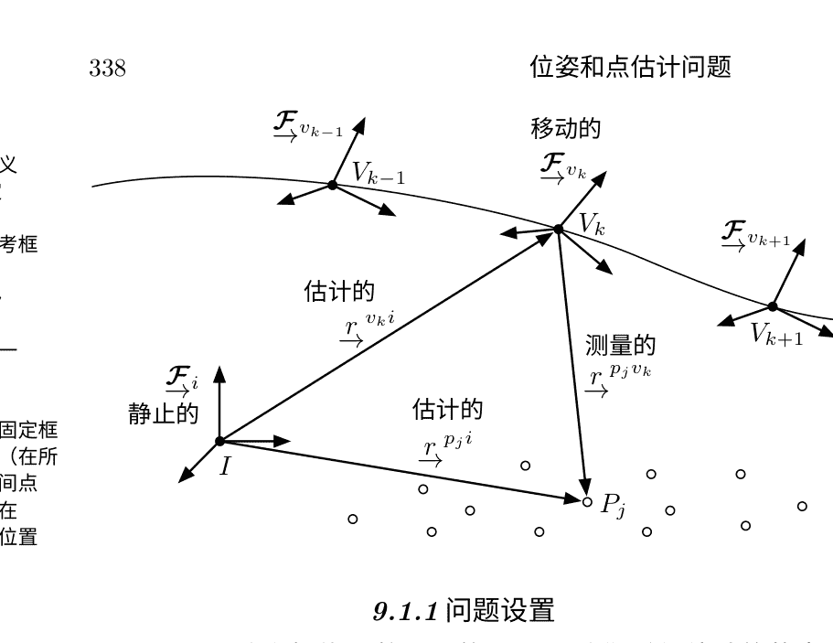

#### 9.1.1 问题设置

图9.1显示了我们捆绑调整问题的设置。我们希望估计的状态是

$$T_k = T_{v_k i} : \text{表示时间k时车辆姿态的变换矩阵}$$

$$p_j = \begin{bmatrix} r_i^{p_j i} \\ 1 \end{bmatrix} : \text{表示地标j位置的齐次点}$$

我们将使用简写形式，以避免在推导过程中写出所有的下标和上标。我们将使用简写形式，

$$x = \{T_1, \ldots, T_K, p_1, \ldots, p_M\}, \quad (9.1)$$

用于表示我们希望估计的整个状态，以及 $x_{jk} = \{T_k, p_j\}$ 用于表示包括第k个姿态和第j个地标的子集。值得注意的是，我们将 $T_0$ 从要估计的状态中排除，因为系统否则是不可观测的；请回顾第5.1.3节中关于未知测量偏差的讨论。

#### 9.1.2 测量模型

这里处理的问题与上一章的问题有两个主要区别。首先，我们现在除了估计姿态外，还要估计点的位置。其次，我们将引入一个非线性传感器模型（例如相机），使得我们的测量比仅仅是在车辆坐标系中表示的点更加复杂。

### 9.1 束调整

##### 非线性模型

测量值 $\mathbf{y}_{jk}$ 将对应于从姿态 $k$ 观察到的点 $j$ 的一些观测（即 $^p\mathbf{r}^{jv_k}$ 的某个函数）。这个问题的测量模型将是以以下形式

$$\mathbf{y}_{jk} = \mathbf{g}(\mathbf{x}_{jk}) + \mathbf{n}_{jk}, \tag{9.2}$$

其中 $\mathbf{g}(\cdot)$ 是非线性模型， $\mathbf{n}_{jk} \sim \mathcal{N}(\mathbf{0}, \mathbf{R}_{jk})$ 是加性高斯噪声。我们可以使用简写

$$\mathbf{y} = \{\mathbf{y}_{10}, \ldots \mathbf{y}_{M0}, \ldots, \mathbf{y}_{1K}, \ldots, \mathbf{y}_{MK}\}, \tag{9.3}$$

以捕捉我们可用的所有测量数据。

如第7.3.5节所讨论的，我们可以将整体观测模型看作是两个非线性的组合：一个将点转换为车辆坐标系，另一个将该点通过相机（或其他传感器）模型转换为实际的传感器测量值。令

$$\mathbf{z}(\mathbf{x}_{jk}) = \mathbf{T}_{k}\mathbf{p}_{j}, \tag{9.4}$$

我们可以写成

$$\mathbf{g}(\mathbf{x}_{jk}) = \mathbf{s}(\mathbf{z}(\mathbf{x}_{jk})), \tag{9.5}$$

其中 $\mathbf{s}(\cdot)$ 是非线性相机模型$^1$。换句话说，我们有 $\mathbf{g} = \mathbf{s} \circ \mathbf{z}$，即函数的组合。

##### 扰动模型

我们将进一步超越简单地线性化我们的模型，并计算出二阶扰动模型。这可以用来估计使用最大似然估计中的偏差，如第4.3.3节所讨论的那样。

我们定义以下对我们的状态变量的扰动：

$$\mathbf{T}_{k} = \exp \left(\boldsymbol{\epsilon}_{k}^{\wedge}\right) \mathbf{T}_{\mathrm{op}, k} \approx \left(\mathbf{1}+\boldsymbol{\epsilon}_{k}^{\wedge}+\frac{1}{2}\boldsymbol{\epsilon}_{k}^{\wedge}\boldsymbol{\epsilon}_{k}^{\wedge}\right) \mathbf{T}_{\mathrm{op}, k}, \tag{9.6a}$$

$$\mathbf{p}_{j} = \mathbf{p}_{\mathrm{op}, j} + \mathbf{D} \boldsymbol{\zeta}_{j}, \tag{9.6b}$$

其中

$$\mathbf{D}=\left[\begin{array}{ccc}1 & 0 & 0 \\ 0 & 1 & 0 \\ 0 & 0 & 1 \\ 0 & 0 & 0\end{array}\right] \tag{9.7}$$

是一个扩张矩阵，使得我们的地标扰动 $\boldsymbol{\zeta}_{j}$ 是 $3 \times 1$。 我们将使用简写 $\mathbf{x}_{\mathrm{op}}=\left\{\mathbf{T}_{\mathrm{op}, 1}, \ldots, \mathbf{T}_{\mathrm{op}, K}, \mathbf{p}_{\mathrm{op}, 1}, \ldots, \mathbf{p}_{\mathrm{op}, M}\right\}$ 来表示整个轨迹的线性化操作点，以及 $\mathbf{x}_{\mathrm{op}, j k}=\left\{\mathbf{T}_{\mathrm{op}, k}, \mathbf{p}_{\mathrm{op}, j}\right\}$ 来表示操作点的子集，包括第 $k$ 个姿态和第 $j$ 个地标。

> $^1$ 参见第6.4节，了解相机（或传感器）模型的几种可能性。

扰动将被表示为

$$ \delta \mathbf{x} = \left[ \begin{array}{c} \epsilon_1 \\ \vdots \\ \epsilon_K \\ \hline \zeta_1 \\ \vdots \\ \zeta_M \end{array} \right], \quad (9.8) $$

其中上面是姿态量，下面是地标量。我们还将使用

$$ \delta \mathbf{x}_{jk} = \left[ \begin{array}{c} \epsilon_k \\ \zeta_j \end{array} \right] \quad (9.9) $$

仅表示与第 $k$ 个姿态和第 $j$ 个地标相关的扰动。使用上述扰动方案，我们有

$$ \begin{aligned} \mathbf{z}(\mathbf{x}_{jk}) &\approx \left( \mathbf{1} + \epsilon_k^{\wedge} + \frac{1}{2} \epsilon_k^{\wedge} \epsilon_k^{\wedge} \right) \mathbf{T}_{\text{op}, k} \left( \mathbf{p}_{\text{op}, j} + \mathbf{D} \zeta_j \right) \\ &\approx \mathbf{T}_{\text{op}, k} \mathbf{p}_{\text{op}, j} + \epsilon_k^{\wedge} \mathbf{T}_{\text{op}, k} \mathbf{p}_{\text{op}, j} + \mathbf{T}_{\text{op}, k} \mathbf{D} \zeta_j \\ &\quad + \frac{1}{2} \epsilon_k^{\wedge} \epsilon_k^{\wedge} \mathbf{T}_{\text{op}, k} \mathbf{p}_{\text{op}, j} + \epsilon_k^{\wedge} \mathbf{T}_{\text{op}, k} \mathbf{D} \zeta_j \\ &= \mathbf{z}(\mathbf{x}_{\text{op}, jk}) + \mathbf{Z}_{jk} \delta \mathbf{x}_{jk} + \frac{1}{2} \sum_{i} \underbrace{\mathbf{1}_{i} \delta \mathbf{x}_{jk}^{T} \mathcal{Z}_{ijk} \delta \mathbf{x}_{jk}}_{\text{标量}}, \quad (9.10) \end{aligned} $$

对于二阶修正，

$$ \begin{aligned} \mathbf{z}(\mathbf{x}_{\text{op}, jk}) &= \mathbf{T}_{\text{op}, k} \mathbf{p}_{\text{op}, j}, \quad (9.11a) \\ \mathbf{Z}_{jk} &= \left[ \begin{array}{cc} \left( \mathbf{T}_{\text{op}, k} \mathbf{p}_{\text{op}, j} \right)^{\odot} & \mathbf{T}_{\text{op}, k} \mathbf{D} \end{array} \right], \quad (9.11b) \\ \mathcal{Z}_{ijk} &= \left[ \begin{array}{cc} \mathbf{1}_{i}^{\odot} \left( \mathbf{T}_{\text{op}, k} \mathbf{p}_{\text{op}, j} \right) & \mathbf{1}_{i}^{\odot} \mathbf{T}_{\text{op}, k} \mathbf{D} \\ \left( \mathbf{1}_{i}^{\odot} \mathbf{T}_{\text{op}, k} \mathbf{D} \right)^{T} & \mathbf{0} \end{array} \right], \quad (9.11c) \end{aligned} $$

并且 $i$ 是对 $\mathbf{z}(\cdot)$ 的行进行索引，$\mathbf{1}_{i}$ 是单位矩阵的第 $i$ 列，$1$。然后，为了应用非线性相机模型，我们使用链式法则（对于一阶和二阶导数），得到

$$\mathbf{g}(\mathbf{x}_{jk}) = \mathbf{s}(\mathbf{z}(\mathbf{x}_{jk}))$$
$$\quad \approx \mathbf{s}\left(\mathbf{z}_{op,jk} + \mathbf{Z}_{jk} \delta\mathbf{x}_{jk} + \frac{1}{2} \sum_m \mathbf{1}_m \delta\mathbf{x}_{jk}^T \mathcal{Z}_{mjk} \delta\mathbf{x}_{jk}\right)$$
$$\quad \approx \mathbf{s}(\mathbf{z}_{op,jk}) + \mathbf{S}_{jk} \delta\mathbf{z}_{jk} + \frac{1}{2} \sum_i \mathbf{1}_i^T \delta\mathbf{z}_{jk}^T \boldsymbol{\mathcal{S}}_{ijk} \delta\mathbf{z}_{jk}$$
$$\quad = \mathbf{s}(\mathbf{z}_{op,jk})$$
$$\qquad + \sum_i \mathbf{1}_i \left(\mathbf{1}_i^T \mathbf{S}_{jk}\right) \left(\mathbf{Z}_{jk} \delta\mathbf{x}_{jk} + \frac{1}{2} \sum_m \mathbf{1}_m \delta\mathbf{x}_{jk}^T \mathcal{Z}_{mjk} \delta\mathbf{x}_{jk}\right)$$
$$\qquad + \frac{1}{2} \sum_i \mathbf{1}_i \left(\mathbf{Z}_{jk} \delta\mathbf{x}_{jk} + \frac{1}{2} \sum_m \mathbf{1}_m \delta\mathbf{x}_{jk}^T \mathcal{Z}_{mjk} \delta\mathbf{x}_{jk}\right)^T$$
$$\qquad \qquad \times \boldsymbol{\mathcal{S}}_{ijk} \left(\mathbf{Z}_{jk} \delta\mathbf{x}_{jk} + \frac{1}{2} \sum_m \mathbf{1}_m \delta\mathbf{x}_{jk}^T \mathcal{Z}_{mjk} \delta\mathbf{x}_{jk}\right)$$
$$\quad \approx \mathbf{g}(\mathbf{x}_{op,jk}) + \mathbf{G}_{jk} \delta\mathbf{x}_{jk} + \frac{1}{2} \sum_i \mathbf{1}_i \delta\mathbf{x}_{jk}^T \mathcal{G}_{ijk} \delta\mathbf{x}_{jk}, \qquad (9.12)$$

对于二阶修正，

$$\mathbf{g}(\mathbf{x}_{op,jk}) = \mathbf{s}(\mathbf{z}(\mathbf{x}_{op,jk})), \qquad (9.13a)$$
$$\mathbf{G}_{jk} = \mathbf{S}_{jk} \mathbf{Z}_{jk}, \qquad (9.13b)$$
$$\mathbf{S}_{jk} = \left. \frac{\partial \mathbf{s}}{\partial \mathbf{z}} \right|_{\mathbf{z}(\mathbf{x}_{op,jk})}, \qquad (9.13c)$$
$$\mathcal{G}_{ijk} = \mathbf{Z}_{jk}^T \boldsymbol{\mathcal{S}}_{ijk} \mathbf{Z}_{jk} + \sum_m \mathbf{1}_i^T \mathbf{S}_{jk} \mathbf{1}_m \mathcal{Z}_{mjk}, \qquad (9.13d)$$
$$\boldsymbol{\mathcal{S}}_{ijk} = \left. \frac{\partial^2 s_i}{\partial \mathbf{z} \partial \mathbf{z}^T} \right|_{\mathbf{z}(\mathbf{x}_{op,jk})}, \qquad (9.13e)$$

并且 $i$ 是对 $\mathbf{s}(\cdot)$ 的行进行索引，$\mathbf{1}_i$ 是单位矩阵的第 $i$ 列。

如果我们只关心线性化（即一阶）模型，那么我们可以简单地使用

$$\mathbf{g}(\mathbf{x}_{jk}) \approx \mathbf{g}(\mathbf{x}_{op,jk}) + \mathbf{G}_{jk} \delta\mathbf{x}_{jk}, \qquad (9.14)$$

作为我们的近似观测模型。

#### 9.1.3 最大似然解

我们将使用第4.3.3节中描述的ML框架来建立束调整问题，这意味着我们不会使用运动先验²。
对于每个从姿态观测到的点，我们定义一个误差项为

$$
\mathbf{e}_{y,jk}(\mathbf{x}) = \mathbf{y}_{jk} - \mathbf{g}(\mathbf{x}_{jk}), \quad\quad (9.15)
$$

其中 $\mathbf{y}_{jk}$是测量的数量， $\mathbf{g}$是我们上面描述的观测模型。我们寻求找到 $\mathbf{x}$的值，以最小化以下目标函数：

$$
J(\mathbf{x}) = \frac{1}{2} \sum_{j,k} \mathbf{e}_{y,jk}(\mathbf{x})^{T} \mathbf{R}_{jk}^{-1} \mathbf{e}_{y,jk}(\mathbf{x}), \quad\quad (9.16)
$$

其中 $\mathbf{x}$是我们希望估计的完整状态（所有姿态和地标）， $\mathbf{R}_{jk}$是与第 $j,k$个测量相关的对称正定协方差矩阵。如果从特定姿态实际上没有观察到特定地标，我们可以从目标函数中简单地删除相应的项。解决这个估计问题的常见方法是应用高斯-牛顿方法。在这里，我们将推导出完整的牛顿方法，然后近似得到高斯-牛顿方法。

##### 牛顿法

近似误差函数，我们有

$$
\mathbf{e}_{y,jk}(\mathbf{x}) \approx \underbrace{\mathbf{y}_{jk} - \mathbf{g}(\mathbf{x}_{\text{op},jk})}_{\mathbf{e}_{y,jk}(\mathbf{x}_{\text{op}})} - \mathbf{G}_{jk} \delta\mathbf{x}_{jk} - \frac{1}{2} \sum_{i} \mathbf{1}_{i} \delta\mathbf{x}_{jk}^{T} \mathcal{G}_{ijk} \delta\mathbf{x}_{jk}, \quad (9.17)
$$

因此，对于扰动的目标函数，我们有

$$
J(\mathbf{x}) \approx J(\mathbf{x}_{\text{op}}) - \mathbf{b}^{T} \delta\mathbf{x} + \frac{1}{2} \delta\mathbf{x}^{T} \mathbf{A} \delta\mathbf{x}, \quad\quad (9.18)
$$

对于二阶修正，

$$
\mathbf{b} = \sum_{j,k} \mathbf{P}_{jk}^{T} \mathbf{G}_{jk}^{T} \mathbf{R}_{jk}^{-1} \mathbf{e}_{y,jk}(\mathbf{x}_{\text{op}}), \quad\quad (9.19a)
$$

$$
\mathbf{A} = \sum_{j,k} \mathbf{P}_{jk}^{T} \left( \mathbf{G}_{jk}^{T} \mathbf{R}_{jk}^{-1} \mathbf{G}_{jk} - \color{red}{\underbrace{\sum_{i} \mathbf{1}_{i}^{T} \mathbf{R}_{jk}^{-1} \mathbf{e}_{y,jk}(\mathbf{x}_{\text{op}}) \mathcal{G}_{ijk}}_{\text{标量}}} \right) \mathbf{P}_{jk}, \quad (9.19b)
$$
$$
\color{red}{\underbrace{\hspace{4.2cm}}_{\text{高斯-牛顿忽略了这一项}}}
$$

$$
\delta\mathbf{x}_{jk} = \mathbf{P}_{jk} \delta\mathbf{x}, \quad\quad (9.19c)
$$

其中 \(\mathbf{P}_{jk}\) 是一个适当的投影矩阵，用于提取整体扰动状态的 \(jk\)th 分量， \(\delta \mathbf{x}^*\)。值得注意的是 \(\mathbf{A}\) 是对称的、正定的。我们可以看到，高斯-牛顿法在 \(J\) 的海森矩阵中通常忽略的项。当 \(\mathbf{e}_{y,jk}(\mathbf{x}_\text{op})\) 很小时，这个新项的影响很小（这通常是忽略它的理由）。然而，在最小值附近，这个项将更加显著，并且可以改善收敛的速度和区域。我们将在下一节中考虑高斯-牛顿近似。

现在，我们通过求导来最小化 \(J(\mathbf{x})\) 关于 \(\delta \mathbf{x}\) 的值：

> \[ \frac{\partial J(\mathbf{x})}{\partial \delta \mathbf{x}^T} = -\mathbf{b} + \mathbf{A} \delta \mathbf{x}. \tag{9.20} \]

将其设为零，最优扰动为 \(\delta \mathbf{x}^*\)? 是以下线性系统的解：

> \[ \mathbf{A} \delta \mathbf{x}^* = \mathbf{b}. \tag{9.21} \]

通常情况下，该过程在解决 (9.21) 以获得最佳扰动后进行迭代，

> \[ \delta \mathbf{x}^* = \begin{bmatrix} \epsilon_1^* \\ \vdots \\ \epsilon_K^* \\ \zeta_1^* \\ \vdots \\ \zeta_M^* \end{bmatrix}, \tag{9.22} \]

并根据我们的原始方案使用最佳扰动更新名义量，

> \[ \begin{aligned} \mathbf{T}_{\text{op},k} &\leftarrow \exp \left( \epsilon_k^* \right) \mathbf{T}_{\text{op},k}, \tag{9.23a} \\ \mathbf{p}_{\text{op},j} &\leftarrow \mathbf{p}_{\text{op},j} + \mathbf{D} \zeta_j^*. \tag{9.23b} \end{aligned} \]

这确保 \(\mathbf{T}_{\text{op},k} \in SE(3)\) 且 \(\mathbf{p}_{\text{op},j}\) 保持其底部（第四个）条目等于1。我们继续直到满足某个收敛准则。一旦收敛，我们将设置 \(\hat{\mathbf{T}}_{v,k} = \mathbf{T}_{\text{op},k}\) 和 \(\hat{\mathbf{p}}_{j}^{i} = \mathbf{p}_{\text{op},j}\) 在最后一次迭代中作为车辆姿态和地标位置的最终估计。

##### 高斯-牛顿方法

通常在实践中，使用高斯-牛顿近似来计算海森矩阵以便在每次迭代中解决线性系统

> \[ \mathbf{A} \delta \mathbf{x}^* = \mathbf{b}, \tag{9.24} \]

使用

$$
 \mathbf{b} = \sum_{j,k} \mathbf{P}_{jk}^{T} \mathbf{G}_{jk}^{T} \mathbf{R}_{jk}^{-1} \mathbf{e}_{y,jk}(\mathbf{x}_{\mathrm{op}}), \tag{9.25a}
$$

$$
 \mathbf{A} = \sum_{j,k} \mathbf{P}_{jk}^{T} \mathbf{G}_{jk}^{T} \mathbf{R}_{jk}^{-1} \mathbf{G}_{jk} \mathbf{P}_{jk}, \tag{9.25b}
$$

$$
 \delta\mathbf{x}_{jk} = \mathbf{P}_{jk} \delta\mathbf{x}. \tag{9.25c}
$$

这样做的优势是不需要计算测量模型的二阶导数。组装线性系统，我们发现它具有以下形式

$$
 \underbrace{\mathbf{G}^{T} \mathbf{R}^{-1} \mathbf{G}}_{\mathbf{A}} \delta\mathbf{x}^{\star} = \underbrace{\mathbf{G}^{T} \mathbf{R}^{-1} \mathbf{e}_{y}(\mathbf{x}_{\mathrm{op}})}_{\mathbf{b}}, \tag{9.26}
$$

使用

$$
 \mathbf{G}_{jk} = \begin{bmatrix} \mathbf{G}_{1,jk} & \mathbf{G}_{2,jk} \end{bmatrix},
$$

$$
 \mathbf{G}_{1,jk} = \mathbf{S}_{jk}(\mathbf{T}_{\mathrm{op},k} \mathbf{p}_{\mathrm{op},j}), \quad \mathbf{G}_{2,jk} = \mathbf{S}_{jk} \mathbf{T}_{\mathrm{op},k} \mathbf{D}, \tag{9.27}
$$

使用之前的定义。在 \( K = 3 \) 个自由姿态（加上固定姿态0）和 \( M = 2 \) 个地标的情况下，矩阵的形式为

$$
 \mathbf{G} = \begin{bmatrix} \mathbf{G}_{1} \mid \mathbf{G}_{2} \end{bmatrix} = \left[ \begin{array}{cc|cc}
\mathbf{G}_{1,11} & & \mathbf{G}_{2,10} & \mathbf{G}_{2,20} \\
\mathbf{G}_{1,21} & & \mathbf{G}_{2,11} & \mathbf{G}_{2,21} \\
& \mathbf{G}_{1,12} & \mathbf{G}_{2,12} & \mathbf{G}_{2,22} \\
& \mathbf{G}_{1,22} & & \\
& & \mathbf{G}_{1,13} & \mathbf{G}_{2,13} \\
& & \mathbf{G}_{1,23} & \mathbf{G}_{2,23}
\end{array} \right],
$$

$$
 \mathbf{e}_{y}(\mathbf{x}_{\mathrm{op}}) = \begin{bmatrix} \mathbf{e}_{y,10}(\mathbf{x}_{\mathrm{op}}) \\ \mathbf{e}_{y,20}(\mathbf{x}_{\mathrm{op}}) \\ \mathbf{e}_{y,11}(\mathbf{x}_{\mathrm{op}}) \\ \mathbf{e}_{y,21}(\mathbf{x}_{\mathrm{op}}) \\ \mathbf{e}_{y,12}(\mathbf{x}_{\mathrm{op}}) \\ \mathbf{e}_{y,22}(\mathbf{x}_{\mathrm{op}}) \\ \mathbf{e}_{y,13}(\mathbf{x}_{\mathrm{op}}) \\ \mathbf{e}_{y,23}(\mathbf{x}_{\mathrm{op}}) \end{bmatrix},
$$

$$
 \mathbf{R} = \text{对角矩阵 } (\mathbf{R}_{10}, \mathbf{R}_{20}, \mathbf{R}_{11}, \mathbf{R}_{21}, \mathbf{R}_{12}, \mathbf{R}_{22}, \mathbf{R}_{13}, \mathbf{R}_{23}), \tag{9.28}
$$

在一种特定的测量顺序下。

一般来说，将左边展开，\( \mathbf{A} = \mathbf{G}^{T} \mathbf{R}^{-1} \mathbf{G} \)，我们可以看到

$$
 \mathbf{A} = \begin{bmatrix} \mathbf{A}_{11} & \mathbf{A}_{12} \\ \mathbf{A}_{12}^{T} & \mathbf{A}_{22} \end{bmatrix}, \tag{9.29}
$$

### 9.1 束调整

其中

$$
\mathbf{A}_{11} = \mathbf{G}_1^T \mathbf{R}^{-1} \mathbf{G}_1 = \text{对角矩阵} (\mathbf{A}_{11,1}, \ldots, \mathbf{A}_{11,K}), \quad (9.30a)
$$

$$
\mathbf{A}_{11,k} = \sum_{j=1}^{M} \mathbf{G}_{1,jk}^T \mathbf{R}_{jk}^{-1} \mathbf{G}_{1,jk}, \quad (9.30b)
$$

$$
\mathbf{A}_{12} = \mathbf{G}_1^T \mathbf{R}^{-1} \mathbf{G}_2 = \begin{bmatrix} \mathbf{A}_{12,11} & \cdots & \mathbf{A}_{12,M1} \\ \vdots & \ddots & \vdots \\ \mathbf{A}_{12,1K} & \cdots & \mathbf{A}_{12,MK} \end{bmatrix}, \quad (9.30c)
$$

$$
\mathbf{A}_{12,jk} = \mathbf{G}_{1,jk}^T \mathbf{R}_{jk}^{-1} \mathbf{G}_{2,jk}, \quad (9.30d)
$$

$$
\mathbf{A}_{22} = \mathbf{G}_2^T \mathbf{R}^{-1} \mathbf{G}_2 = \text{diag} (\mathbf{A}_{22,1}, \ldots, \mathbf{A}_{22,M}), \quad (9.30e)
$$

$$
\mathbf{A}_{22,j} = \sum_{k=0}^{K} \mathbf{G}_{2,jk}^T \mathbf{R}_{jk}^{-1} \mathbf{G}_{2,jk}, \quad (9.30f)
$$

事实上，$\mathbf{A}_{11}$和$\mathbf{A}_{22}$都是块对角矩阵，这意味着该系统具有一种非常特殊的稀疏模式，可以在每次迭代中高效地求解$\delta\mathbf{x}^*$。这将在下一节中详细讨论。

#### 9.1.4 利用稀疏性

无论我们选择使用牛顿法还是高斯-牛顿法，我们都需要在每次迭代中解决以下形式的系统：

$$
\begin{bmatrix} \mathbf{A}_{11} & \mathbf{A}_{12} \\ \mathbf{A}_{12}^T & \mathbf{A}_{22} \end{bmatrix} \begin{bmatrix} \delta \mathbf{x}_1^* \\ \delta \mathbf{x}_2^* \end{bmatrix} = \begin{bmatrix} \mathbf{b}_1 \\ \mathbf{b}_2 \end{bmatrix}, \quad (9.31)
$$

状态，$\delta\mathbf{x}^*$在哪里，已经被分成对应于（1）姿态扰动，$\delta\mathbf{x}^*_1 = \epsilon^*$的部分，和（2）地标扰动，$\delta\mathbf{x}^*_2 = \zeta^*$。

事实证明，目标函数的海森矩阵，$\mathbf{A}$，在图9.2中具有一个非常特殊的稀疏模式；它有时被称为箭头矩阵。这种模式是由于投影矩阵，$\mathbf{P}_{jk}$，在$\mathbf{A}$的每一项中的存在；它们体现了每个测量只涉及一个姿态变量和一个地标的事实。

如图9.2所示，我们可以看到$\mathbf{A}_{11}$和$\mathbf{A}_{22}$都是块对角线的，因为每个测量一次只涉及一个姿态和一个地标。我们可以利用这种稀疏性来高效地解决（9.21）中的$\delta\mathbf{x}^*$；这有时被称为稀疏束调整。有几种不同的方法可以做到这一点；我们将讨论舒尔补和Cholesky技术。

图9.2
$\mathbf{A}$的稀疏模式. 非零条目由*表示。

这种结构通常被称为箭头矩阵，因为$\zeta$部分相对于这种分较大。

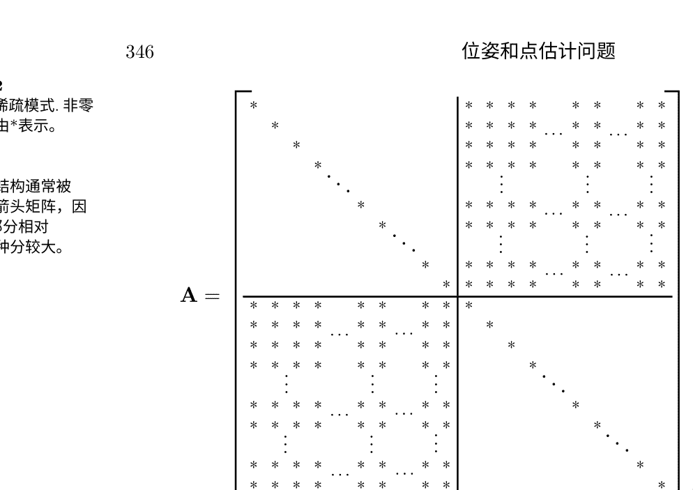

##### 舒尔补

通常，舒尔补用于将(9.31)转化为更高效求解的形式。这可以通过将两边进行前乘来看出

$$
\begin{bmatrix} \mathbf{I} & -\mathbf{A}_{12}\mathbf{A}_{22}^{-1} \\ \mathbf{0} & \mathbf{I} \end{bmatrix},
$$

这样

$$
\begin{bmatrix} \mathbf{A}_{11} - \mathbf{A}_{12}\mathbf{A}_{22}^{-1}\mathbf{A}_{12}^{T} & \mathbf{0} \\ \mathbf{A}_{12}^{T} & \mathbf{A}_{22} \end{bmatrix} \begin{bmatrix} \delta \mathbf{x}_{1}^{*} \\ \delta \mathbf{x}_{2}^{*} \end{bmatrix} = \begin{bmatrix} \mathbf{b}_{1} - \mathbf{A}_{12}\mathbf{A}_{22}^{-1}\mathbf{b}_{2} \\ \mathbf{b}_{2} \end{bmatrix},
$$

它与(9.31)具有相同的解。然后我们可以轻松求解$\delta\mathbf{x}_1^*$并且由于$\mathbf{A}_{22}$是分块对角矩阵，计算$\mathbf{A}_{22}^{-1}$是廉价的。最后，$\delta\mathbf{x}_2^*$ (如果需要) 也可以通过反向替代法高效计算，这也归功于$\mathbf{A}_{22}$的稀疏性。这个过程将每次求解的复杂度从无稀疏性的$\mathcal{O}((K+M)^3)$降低到有稀疏性的$\mathcal{O}(K^3+K^2M)$，这在$K\ll M$时是最有益的。

通过利用$\mathbf{A}_{11}$的稀疏性，可以得到类似的过程，但在机器人问题中，我们可能还有一些额外的测量值扰动这个结构，而且更重要的是，$\delta\mathbf{x}_2^*$通常比束调整中的$\delta\mathbf{x}_1^*$要大得多。虽然舒尔补方法效果很好，但它并没有直接提供计算$\mathbf{A}^{-1}$的方法，即与$\delta\mathbf{x}^*$相关的协方差矩阵，如果我们需要的话。乔列斯基方法更适合这个目的。

##### 乔列斯基分解

每个对称正定矩阵，包括 $\mathbf{A}$，都可以通过乔列斯基分解进行因式分解，如下所示：

$$
\underbrace{\begin{bmatrix} \mathbf{A}_{11} & \mathbf{A}_{12} \\ \mathbf{A}_{12}^{T} & \mathbf{A}_{22} \end{bmatrix}}_{\mathbf{A}} = \underbrace{\begin{bmatrix} \mathbf{U}_{11} & \mathbf{U}_{12} \\ \mathbf{0} & \mathbf{U}_{22} \end{bmatrix}}_{\mathbf{U}} \underbrace{\begin{bmatrix} \mathbf{U}_{11}^{T} & \mathbf{0} \\ \mathbf{U}_{12}^{T} & \mathbf{U}_{22}^{T} \end{bmatrix}}_{\mathbf{U}^{T}}, \quad\quad (9.32)
$$

其中 $\mathbf{U}$ 是一个上三角矩阵。 将其展开后得到

-   $\mathbf{U}_{22}\mathbf{U}_{22}^{T} = \mathbf{A}_{22}$：通过乔列斯基分解可以便宜地计算 $\mathbf{U}_{22}$，因为 $\mathbf{A}_{22}$是块对角矩阵，
- $\mathbf{U}_{12}\mathbf{U}_{22}^{T} = \mathbf{A}_{12}$：通过乔列斯基分解可以便宜地求解 $\mathbf{U}_{12}$，因为 $\mathbf{U}_{22}$是块对角矩阵，
- $\mathbf{U}_{11}\mathbf{U}_{11}^{T} + \mathbf{U}_{12}\mathbf{U}_{12}^{T} = \mathbf{A}_{11}$：由于 $\delta \mathbf{x}_{i}^{\star}$的尺寸较小，通过乔列斯基分解可以便宜地计算 $\mathbf{U}_{11}$，因此我们可以非常高效地计算 $\mathbf{U}$，这是由于 $\mathbf{A}_{22}$的稀疏性。

请注意， $\mathbf{U}_{22}$ 也是块对角矩阵。如果我们只关心高效地求解（9.31），那么在计算乔列斯基分解后，我们可以分两步完成。 首先，求解

$$
\mathbf{U} \mathbf{c} = \mathbf{b}, \quad\quad (9.33)
$$

对于一个临时变量 $\mathbf{c}$。 这可以很快完成，因为 $\mathbf{U}$ 是上三角形的，所以可以从底部向上通过替换和利用额外已知的$\mathbf{U}$的稀疏性来解决。 其次，解决

$$
\mathbf{U}^{T} \delta \mathbf{x}^{\star} = \mathbf{c}, \quad\quad (9.34)
$$

对于 $\delta \mathbf{x}^{\star}$。 同样，由于 $\mathbf{U}^{T}$是下三角形的，我们可以通过替换和利用稀疏性从上到下快速解决。或者，我们可以直接求逆 $\mathbf{U}$，这样

$$
\begin{bmatrix} \mathbf{U}_{11} & \mathbf{U}_{12} \\ \mathbf{0} & \mathbf{U}_{22} \end{bmatrix}^{-1} = \begin{bmatrix} \mathbf{U}_{11}^{-1} & -\mathbf{U}_{11}^{-1}\mathbf{U}_{12}\mathbf{U}_{22}^{-1} \\ \mathbf{0} & \mathbf{U}_{22}^{-1} \end{bmatrix}, \quad\quad (9.35)
$$

由于 $\mathbf{U}_{22}$是块对角线的， $\mathbf{U}_{11}$是小的且处于上三角形形式，因此可以高效地计算。然后我们有

$$
\mathbf{U}^{T} \delta \mathbf{x}^{\star} = \mathbf{U}^{-1}\mathbf{b}, \quad\quad (9.36)
$$

或

$$
\begin{bmatrix} \mathbf{U}_{11}^{T} & \mathbf{0} \\ \mathbf{U}_{12}^{T} & \mathbf{U}_{22}^{T} \end{bmatrix} \begin{bmatrix} \delta \mathbf{x}_{1}^{\star} \\ \delta \mathbf{x}_{2}^{\star} \end{bmatrix} = \begin{bmatrix} \mathbf{U}_{11}^{-1}(\mathbf{b}_1 - \mathbf{U}_{12}\mathbf{U}_{22}^{-1}\mathbf{b}_2) \\ \mathbf{U}_{22}^{-1}\mathbf{b}_2 \end{bmatrix}, \quad\quad (9.37)
$$

这使我们能够计算 $\delta \mathbf{x}_{1}^{\star}$，然后通过回代计算 $\delta \mathbf{x}_{2}^{\star}$，类似于舒尔补方法。

然而，与舒尔补方法不同，\( \mathbf{A}^{-1} \)现在很容易计算：

$$
\mathbf{A}^{-1} = \left( \mathbf{U} \mathbf{U}^T \right)^{-1} = \mathbf{U}^{-T} \mathbf{U}^{-1} = \mathbf{L} \mathbf{L}^T
$$

$$
= \begin{bmatrix} \mathbf{U}_{11}^{-T} & 0 \\ -\mathbf{U}_{22}^{-T} \mathbf{U}_{12}^{T} \mathbf{U}_{11}^{-T} & \mathbf{U}_{22}^{-T} \end{bmatrix} \begin{bmatrix} \mathbf{U}_{11}^{-1} & -\mathbf{U}_{11}^{-1} \mathbf{U}_{12} \mathbf{U}_{22}^{-1} \\ 0 & \mathbf{U}_{22}^{-1} \end{bmatrix} = \begin{bmatrix} \mathbf{U}_{11}^{-T} \mathbf{U}_{11}^{-1} & -\mathbf{U}_{11}^{-T} \mathbf{U}_{11}^{-1} \mathbf{U}_{12} \mathbf{U}_{22}^{-1} \\ -\mathbf{U}_{22}^{-T} \mathbf{U}_{12}^{T} \mathbf{U}_{11}^{-T} \mathbf{U}_{11}^{-1} & \mathbf{U}_{22}^{-T} \left( \mathbf{U}_{12}^{T} \mathbf{U}_{11}^{-T} \mathbf{U}_{11}^{-1} \mathbf{U}_{12} + \mathbf{I} \right) \mathbf{U}_{22}^{-1} \end{bmatrix}, \quad (9.38)
$$

在最终矩阵内部，我们可以看到进一步提高效率的空间。

#### 9.1.5 插值示例

对于图9.3中的小BA问题，详细解释将很有启发性。有三个（非共线）点地标和两个自由姿态（1和2）。我们假设姿态0是固定的，以使问题可观测。我们还假设我们的点地标的测量是三维的；因此传感器可以是立体相机或者是距离-方位-俯仰传感器，例如。不幸的是，现有的信息不足以唯一解决两个自由姿态以及三个地标的位置。

这种情况在滚动快门相机和扫描-移动激光传感器中会出现。

在没有任何额外地标的测量的情况下，我们唯一的选择是对车辆的轨迹做出一些假设。基本上有两种可能性：

+   (i) 惩罚项：我们可以采用最大后验概率（MAP）方法，假设轨迹的先验密度，并通过引入惩罚项来鼓励求解器选择与测量兼容的可能轨迹

### 9.1 束调整

在成本函数中。这本质上是同时定位和地图构建（SLAM）方法，并将在下一节中进行讨论。

+   (ii) 约束：我们可以坚持最大似然（ML）方法，但限制轨迹的形式。在这里，我们假设车辆在姿态0和2之间具有恒定的六自由度速度，以便我们可以对姿态1使用插值。这将减少自由姿态变量的数量从两个减少到一个，并提供唯一的解。

我们首先建立方程，仿佛可以解出1和2的姿态，然后引入姿态插值方案。要估计的状态变量是

$$x = \{T_1, T_2, p_1, p_2, p_3\}。\tag{9.39}$$

我们使用常规的扰动方案，

$$T_k = \exp (\hat{\epsilon}_k) T_{\text{op}, k}, \quad p_j = p_{\text{op}, j} + D \zeta_j, \tag{9.40}$$

并将扰动变量堆叠为

$$\delta x = [\epsilon_1; \epsilon_2; \zeta_1; \zeta_2; \zeta_3]. \tag{9.41}$$

在每次迭代中，最优的扰动变量应该是线性系统的解，

$$A \delta x^* = b, \tag{9.42}$$

该问题的 \(A\) 和 \(b\) 矩阵的形式为

$$A = \begin{bmatrix} A_{11} & A_{13} & A_{14} \\ & A_{22} & A_{24} & A_{25} \\ A_{13}^T & & A_{33} & \\ A_{14}^T & A_{24}^T & & A_{44} \\ & A_{25}^T & & & A_{55} \end{bmatrix}, \quad b = \begin{bmatrix} b_1 \\ b_2 \\ b_3 \\ b_4 \\ b_5 \end{bmatrix}, \tag{9.43}$$

使用

$$A_{11} = \mathbf{G}_{1,11}^{T} \mathbf{R}_{11}^{-1} \mathbf{G}_{1,11} + \mathbf{G}_{1,21}^{T} \mathbf{R}_{21}^{-1} \mathbf{G}_{1,21},$$
$$A_{22} = \mathbf{G}_{1,22}^{T} \mathbf{R}_{22}^{-1} \mathbf{G}_{1,22} + \mathbf{G}_{1,32}^{T} \mathbf{R}_{32}^{-1} \mathbf{G}_{1,32},$$
$$A_{33} = \mathbf{G}_{2,10}^{T} \mathbf{R}_{10}^{-1} \mathbf{G}_{2,10} + \mathbf{G}_{2,11}^{T} \mathbf{R}_{11}^{-1} \mathbf{G}_{2,11},$$
$$A_{44} = \mathbf{G}_{2,21}^{T} \mathbf{R}_{21}^{-1} \mathbf{G}_{2,21} + \mathbf{G}_{2,22}^{T} \mathbf{R}_{22}^{-1} \mathbf{G}_{2,22},$$
$$A_{55} = \mathbf{G}_{2,30}^{T} \mathbf{R}_{30}^{-1} \mathbf{G}_{2,30} + \mathbf{G}_{2,32}^{T} \mathbf{R}_{32}^{-1} \mathbf{G}_{2,32},$$
$$A_{13} = \mathbf{G}_{1,11}^{T} \mathbf{R}_{11}^{-1} \mathbf{G}_{2,11},$$
$$A_{14} = \mathbf{G}_{1,21}^{T} \mathbf{R}_{21}^{-1} \mathbf{G}_{2,21},$$
$$A_{24} = \mathbf{G}_{1,22}^{T} \mathbf{R}_{22}^{-1} \mathbf{G}_{2,22},$$
$$A_{25} = \mathbf{G}_{1,32}^{T} \mathbf{R}_{32}^{-1} \mathbf{G}_{2,32},$$

和

$$b_1 = \mathbf{G}_{1,11}^{T} \mathbf{R}_{11}^{-1} \mathbf{e}_{y,11}(\mathbf{x}_{\text{op}}) + \mathbf{G}_{1,21}^{T} \mathbf{R}_{21}^{-1} \mathbf{e}_{y,21}(\mathbf{x}_{\text{op}}),$$
$$b_2 = \mathbf{G}_{1,22}^{T} \mathbf{R}_{22}^{-1} \mathbf{e}_{y,22}(\mathbf{x}_{\text{op}}) + \mathbf{G}_{1,32}^{T} \mathbf{R}_{32}^{-1} \mathbf{e}_{y,32}(\mathbf{x}_{\text{op}}),$$
$$b_3 = \mathbf{G}_{2,10}^{T} \mathbf{R}_{10}^{-1} \mathbf{e}_{y,10}(\mathbf{x}_{\text{op}}) + \mathbf{G}_{2,11}^{T} \mathbf{R}_{11}^{-1} \mathbf{e}_{y,11}(\mathbf{x}_{\text{op}}),$$
$$b_4 = \mathbf{G}_{2,21}^{T} \mathbf{R}_{21}^{-1} \mathbf{e}_{y,21}(\mathbf{x}_{\text{op}}) + \mathbf{G}_{2,22}^{T} \mathbf{R}_{22}^{-1} \mathbf{e}_{y,22}(\mathbf{x}_{\text{op}}),$$
$$b_5 = \mathbf{G}_{2,30}^{T} \mathbf{R}_{30}^{-1} \mathbf{e}_{y,30}(\mathbf{x}_{\text{op}}) + \mathbf{G}_{2,32}^{T} \mathbf{R}_{32}^{-1} \mathbf{e}_{y,32}(\mathbf{x}_{\text{op}}).$$

不幸的是，在这种情况下，\(A\) 在此处不可逆，这意味着我们无法在任何迭代中解出 \(\delta x\)？

为了解决这个问题，我们假设车辆遵循了一个恒定速度的轨迹，这样我们可以使用第7.1.7节中的姿态插值方案来将 \(T_1\) 表示为 \(T_2\)。为了做到这一点，我们需要每个姿态对应的时间：

$$t_0, t_1, t_2. \quad (9.44)$$

然后我们定义插值变量，

$$\alpha = \frac{t_1 - t_0}{t_2 - t_0}, \quad (9.45)$$

这样我们可以写

$$T_1 = T^{\alpha}, \quad (9.46)$$

其中 \(T = T_2\). 我们通常的扰动方案是

$$\mathbf{T} = \exp (\boldsymbol{\epsilon}^{\wedge}) \mathbf{T}_{\text{op}} \approx (1 + \boldsymbol{\epsilon}^{\wedge}) \mathbf{T}_{\text{op}}, \quad (9.47)$$

对于插值变量，我们有

$$\mathbf{T}^{\alpha} = (\exp (\boldsymbol{\epsilon}^{\wedge}) \mathbf{T}_{\text{op}})^{\alpha} \approx \left(1 + \left(\mathcal{A}(\alpha, \boldsymbol{\xi}_{\text{op}}) \boldsymbol{\epsilon}\right)^{\wedge}\right) \mathbf{T}_{\text{op}}^{\alpha}, \quad (9.48)$$

其中 \(\mathcal{A}\) 是插值雅可比矩阵，\(\boldsymbol{\xi}_{\text{op}} = \ln(\mathbf{T}_{\text{op}})^{\vee}\)。利用这个姿态插值方案，我们可以用新的减少的集合来表示旧的堆叠扰动变量：

$$
\begin{bmatrix}
\epsilon_1 \\
\epsilon_2 \\
\zeta_1 \\
\zeta_2 \\
\zeta_3
\end{bmatrix}
=
\begin{bmatrix}
\mathcal{A}(\alpha, \xi_{\text{op}}) & \mathbf{I} \\
& & \mathbf{I} \\
& & & \mathbf{I} \\
& & & & \mathbf{I}
\end{bmatrix}
\begin{bmatrix}
\epsilon \\
\zeta_1 \\
\zeta_2 \\
\zeta_3
\end{bmatrix},
\quad (9.49)
$$

我们将其称为 \(\mathcal{I}\) 插值矩阵。我们要估计的新状态集合变量是

$$\mathbf{x}’ = \{ \mathbf{T}, \mathbf{p}_1, \mathbf{p}_2, \mathbf{p}_3 \}, \quad (9.50)$$

现在我们已经消除了 \(\mathbf{T}_1\) 作为一个自由变量。回到我们的原始最大似然代价函数，我们现在可以重新写成

$$J(\mathbf{x}’) \approx J(\mathbf{x}’_{\text{op}}) - \mathbf{b}’^T \delta\mathbf{x}’ + \frac{1}{2} \delta\mathbf{x}’^T \mathbf{A}’ \delta\mathbf{x}’, \quad (9.51)$$

其中

$$\mathbf{A}’ = \mathcal{I}^T \mathbf{A} \mathcal{I}, \quad \mathbf{b}’ = \mathcal{I}^T \mathbf{b}. \quad (9.52)$$

最优扰动（最小化成本函数的扰动）\(\delta\mathbf{x}’\) 是多少？现在是解

$$\mathbf{A}’ \delta\mathbf{x}’^* = \mathbf{b}’. \quad (9.53)$$

我们更新所有操作点在

$$\mathbf{x}’_{\text{op}} = \{ \mathbf{T}_{\text{op}}, \mathbf{p}_{\text{op},1}, \mathbf{p}_{\text{op},2}, \mathbf{p}_{\text{op},3} \}, \quad (9.54)$$

使用常规方案，

$$\mathbf{T}_{\text{op}} \leftarrow \exp\left( \hat{\boldsymbol{\epsilon}}^* \right) \mathbf{T}_{\text{op}}, \quad \mathbf{p}_{\text{op},j} \leftarrow \mathbf{p}_{\text{op},j} + \mathbf{D} \boldsymbol{\zeta}_j^*, \quad (9.55)$$

并迭代至收敛。重要的是，在 \(\mathbf{A}\) 的两侧应用插值矩阵创建 \(\mathbf{A}’\) 并不完全破坏稀疏性。事实上，对应于地标的右下方块仍然是块对角矩阵，因此 \(\mathbf{A}’\) 仍然是一个箭头矩阵：

$$\mathbf{A}’ =
\begin{bmatrix}
* & * & * & * \\
* & * &   &   \\
* &   & * &   \\
* &   &   & *
\end{bmatrix},
\quad (9.56)$$

其中 * 表示非零块。这意味着我们仍然可以利用前一节的方法来利用稀疏性，同时进行插值姿态。事实证明，我们也可以将这种插值方案（以及其他方案）用于更复杂的BA问题。我们只需要决定

### 9.2 同时定位与地图构建

SLAM问题本质上与BA相同，只是我们通常还知道车辆的移动方式（即运动模型），因此可以在问题中包括输入变量，\(v\)。从逻辑上讲，我们只需要将BA成本函数增加与输入变量对应的附加项（Sibley, 2006）。Smith等人（1990）是关于SLAM的经典参考文献，Durrant-Whyte和Bailey（2006）；Bailey和Durrant-Whyte（2006）对该领域进行了详细调查。本质上，BA是一个最大似然（ML）问题，而SLAM是一个最大后验概率（MAP）问题。我们的方法是一种批处理SLAM方法（Lu和Milios, 1997），类似于Thrun和Montemerlo（2005）的图SLAM方法，但使用我们的方法处理三维空间中的姿态变量。

#### 9.2.1 问题设置

另一个小的不同之处在于，通过包括输入/先验，我们还可以假设我们对初始状态有一个先验，\(T_0\)，以便它可以包含在估计问题中（不像BA）⁴。因此，我们要估计的状态是

$$x = \{T_0, \dots, T_K, p_1, \dots, p_M\}. \tag{9.57}$$

我们假设与BA问题相同的测量模型，测量结果由以下给出

$$y = \{y_{10}, \dots, y_{M0}, \dots, y_{1K}, \dots, y_{MK}\}. \tag{9.58}$$

我们将采用第8.2节中的运动模型，输入由以下给出

$$v = \{T_0, \varpi_1, \varpi_2, \dots, \varpi_K\}. \tag{9.59}$$

接下来我们将设置批量MAP问题。

⁴我们也可以选择不估计它，只是将其固定，这是非常常见的。

#### 9.2.2 批处理最大后验解

我们定义以下矩阵：

$$\delta \mathbf{x}=\left[\begin{array}{c} \delta \mathbf{x}_{1} \\ \delta \mathbf{x}_{2} \end{array}\right], \quad \mathbf{H}=\left[\begin{array}{cc} \mathbf{F}^{-1} & \mathbf{0} \\ \mathbf{G}_{1} & \mathbf{G}_{2} \end{array}\right], \quad \mathbf{W}=\left[\begin{array}{cc} \mathbf{Q} & \mathbf{0} \\ \mathbf{0} & \mathbf{R} \end{array}\right],$$

$$e\left(\mathbf{x}_{\mathrm{op}}\right)=\left[\begin{array}{c} \mathbf{e}_{v}\left(\mathbf{x}_{\mathrm{op}}\right) \\ \mathbf{e}_{y}\left(\mathbf{x}_{\mathrm{op}}\right) \end{array}\right], \qquad\qquad\qquad\qquad\qquad\qquad\qquad(9.60)$$

其中

$$\delta \mathbf{x}_{1}=\left[\begin{array}{c} \epsilon_{0} \\ \epsilon_{1} \\ \vdots \\ \epsilon_{K} \end{array}\right], \quad \delta \mathbf{x}_{2}=\left[\begin{array}{c} \zeta_{1} \\ \zeta_{2} \\ \vdots \\ \zeta_{M} \end{array}\right],$$

$$\mathbf{e}_{v}\left(\mathbf{x}_{\mathrm{op}}\right)=\left[\begin{array}{c} \mathbf{e}_{v, 0}\left(\mathbf{x}_{\mathrm{op}}\right) \\ \mathbf{e}_{v, 1}\left(\mathbf{x}_{\mathrm{op}}\right) \\ \vdots \\ \mathbf{e}_{v, K}\left(\mathbf{x}_{\mathrm{op}}\right) \end{array}\right], \quad \mathbf{e}_{y}\left(\mathbf{x}_{\mathrm{op}}\right)=\left[\begin{array}{c} \mathbf{e}_{y, 10}\left(\mathbf{x}_{\mathrm{op}}\right) \\ \mathbf{e}_{y, 20}\left(\mathbf{x}_{\mathrm{op}}\right) \\ \vdots \\ \mathbf{e}_{y, M K}\left(\mathbf{x}_{\mathrm{op}}\right) \end{array}\right],$$

$$\mathbf{Q}=\operatorname{diag}\left(\mathbf{P}_{0}, \mathbf{Q}_{1}, \ldots, \mathbf{Q}_{K}\right), \quad \mathbf{R}=\operatorname{diag}\left(\mathbf{R}_{10}, \mathbf{R}_{20}, \ldots, \mathbf{R}_{M K}\right),$$

$$\mathbf{F}^{-1}=\left[\begin{array}{cccccc} \mathbf{I} & & & & & \\ -\mathbf{F}_{0} & \mathbf{I} & & & & \\ & -\mathbf{F}_{1} & \ddots & & & \\ & & \ddots & \ddots & & \\ & & & & \mathbf{I} & \\ & & & & -\mathbf{F}_{K-1} & \mathbf{I} \end{array}\right], \qquad\qquad\qquad\qquad\qquad\qquad(9.61)$$

$$\mathbf{G}_{1}=\left[\begin{array}{ccccc} \mathbf{G}_{1,10} & & & & \\ \vdots & & & & \\ \mathbf{G}_{1, M 0} & & & & \\ & \mathbf{G}_{1,11} & & & \\ & \vdots & & & \\ & \mathbf{G}_{1, M 1} & & & \\ & & \ddots & & \\ & & & \ddots & \\ & & & & \mathbf{G}_{1,1 K} \\ & & & & \vdots \\ & & & & \mathbf{G}_{1, M K} \end{array}\right], \quad \mathbf{G}_{2}=\left[\begin{array}{ccccc} \mathbf{G}_{2,10} & & & & \\ & \ddots & & & \\ & & \mathbf{G}_{2, M 0} & & \\ & & & \mathbf{G}_{2,11} & \\ & & & & \ddots \\ & & & & \vdots \\ & & & & \mathbf{G}_{2, M 1} \\ & & & & \vdots \\ & & & & \mathbf{G}_{2,1 K} \\ & & & & \ddots \\ & & & & \mathbf{G}_{2, M K} \end{array}\right].$$

从第8.2.5节的运动先验和第9.1.3节的测量中，详细的模块是$\mathbf{F}_{k-1} = \text{Ad}$

$$\mathbf{e}_{v,k}(\mathbf{x}_{op}) = \begin{cases} \ln(\mathbf{T}_0 \mathbf{T}_{op,0}^{-1})^{\vee} & k=0 \\ \ln\left( \exp((t_k - t_{k-1})\boldsymbol{\varpi}_k^{\wedge}) \mathbf{T}_{op,k-1} \mathbf{T}_{op,k}^{-1} \right)^{\vee} & k=1 \ldots K, \end{cases}$$

$$\mathbf{G}_{1,jk} = \mathbf{S}_{jk} (\mathbf{T}_{op,k} \mathbf{p}_{op,j}), \quad \mathbf{G}_{2,jk} = \mathbf{S}_{jk} \mathbf{T}_{op,k} \mathbf{D},$$

$$\mathbf{e}_{y,jk}(\mathbf{x}_{op}) = \mathbf{y}_{jk} - s(\mathbf{T}_{op,k} \mathbf{p}_{op,j}). \quad (9.62)$$

最后，目标函数通常可以写成

$$J(\mathbf{x}) \approx J(\mathbf{x}_{op}) - \mathbf{b}^T \delta \mathbf{x} + \frac{1}{2} \delta \mathbf{x}^T \mathbf{A} \delta \mathbf{x}, \quad (9.63)$$

其中

$$\mathbf{A} = \mathbf{H}^T \mathbf{W}^{-1} \mathbf{H}, \quad \mathbf{b} = \mathbf{H}^T \mathbf{W}^{-1} \mathbf{e}(\mathbf{x}_{op}), \quad (9.64)$$

其中最小化的扰动，$\delta \mathbf{x}^*$，是解

$$\mathbf{A} \delta \mathbf{x}^* = \mathbf{b}. \quad (9.65)$$

我们求解$\delta \mathbf{x}^*$，然后根据更新我们的操作点

$$\mathbf{T}_{op,k} \leftarrow \exp\left(\boldsymbol{\epsilon}_k^{\wedge}\right) \mathbf{T}_{op,k}, \quad \mathbf{p}_{op,j} \leftarrow \mathbf{p}_{op,j} + \mathbf{D} \boldsymbol{\zeta}_j^*, \quad (9.66)$$

并迭代至收敛。与BA案例一样，一旦收敛，我们设置$\hat{\mathbf{T}}_{v_i} = \mathbf{T}_{op,k}$和$\hat{\mathbf{p}}_i^{p_j} = \mathbf{p}_{op,j}$在最后一次迭代中作为车辆姿态和地标位置的最终估计值。

#### 9.2.3 利用稀疏性

引入运动先验不会破坏原始BA问题的稀疏性。我们可以通过注意到这一点来看到

$$\mathbf{A} = \begin{bmatrix} \mathbf{A}_{11} & \mathbf{A}_{12} \\ \mathbf{A}_{12}^T & \mathbf{A}_{22} \end{bmatrix} = \mathbf{H}^T \mathbf{W}^{-1} \mathbf{H}$$

$$= \begin{bmatrix} \mathbf{F}^{-T} \mathbf{Q}^{-1} \mathbf{F}^{-1} + \mathbf{G}_1^T \mathbf{R}^{-1} \mathbf{G}_1 & \mathbf{G}_1^T \mathbf{R}^{-1} \mathbf{G}_2 \\ \mathbf{G}_2^T \mathbf{R}^{-1} \mathbf{G}_1 & \mathbf{G}_2^T \mathbf{R}^{-1} \mathbf{G}_2 \end{bmatrix}. \quad (9.67)$$

与BA问题相比，块$\mathbf{A}_{12}$和$\mathbf{A}_{22}$完全没有改变，表明$\mathbf{A}$仍然是一个带有$\mathbf{A}_{22}$块对角的箭头矩阵。因此，我们可以利用这种稀疏性来有效地使用舒尔或乔列斯基方法解决每次迭代中的扰动问题。

虽然块$\mathbf{A}_{11}$现在与BA问题不同，

$$\mathbf{A}_{11} = \underbrace{\mathbf{F}^{-T} \mathbf{Q}^{-1} \mathbf{F}^{-1}}_{\text{先验}} + \underbrace{\mathbf{G}_1^T \mathbf{R}^{-1} \mathbf{G}_1}_{\text{测量}}, \quad (9.68)$$

### 9.2 同时定位与地图构建

我们之前已经看到（例如，第8.2.5节）它是块三对角的。因此，如果姿态数量相对于地标数量很大，我们可以选择利用 $\mathbf{A}_{11}$ 的稀疏性，而不是 $\mathbf{A}_{22}$，例如。在这种情况下，选择Cholesky方法优于Schur方法，因为我们不需要构造 $\mathbf{A}^{-1}_{11}$，它实际上是稠密的。

Kaess等人（2008年，2012年）提供了增量更新批量SLAM解决方案的方法，利用了超出此处讨论的主要块结构的稀疏性。

#### 9.2.4 示例

图9.4显示了一个简单的SLAM问题，其中有三个点地标和三个自由姿态。与图9.3中的BA示例相比，我们现在允许估计 $\mathbf{T}_0$，因为我们对它有一些先验信息，即 $\hat{\mathbf{T}}_0, \hat{\mathbf{P}}_0$，相对于外部参考框架（显示为黑色的固定姿态）。我们以图形方式显示了目标函数的所有项^5，每个测量和输入一个，总共九个项：

> $$J = \underbrace{J_{v,0} + J_{v,1} + J_{v,2}}_{\text{先验项}} + \underbrace{J_{y,10} + J_{y,30} + J_{y,11} + J_{y,21} + J_{y,22} + J_{y,32}}_{\text{测量术语}}(9.69)$$

此外，使用我们已经使用的运动先验， $\mathbf{A}$始终具有良好的条件，并且即使没有任何测量，也能提供轨迹的解决方案。

^5 有时这种类型的图被称为因子图，其中每个状态的后验似然成为目标函数中的一个“项”，实际上只是后验状态的负对数似然。

## 10 连续时间估计

本书的最后一部分中的所有示例都是在离散时间下进行的，这对于许多应用来说已经足够了。然而，值得研究的是，当在SE(3)中处理状态变量时，我们如何利用第3.4节和第4.4节中的连续时间估计工具。为此，我们展示了一种从特定的非线性、随机微分方程开始构建运动先验的方法，以鼓励轨迹的平滑性^1。然后，我们展示了这些运动先验在轨迹估计问题中的应用场景。最后，我们展示了如何使用高斯过程插值在主要解决时间之间的时间点上进行查询姿势的插值。

### 10.1 运动先验

我们将从讨论如何在SE(3)上表示一般运动先验开始。我们将在非线性、随机微分方程的特定上下文中进行。我们还将进一步简化以使分析可行。

#### 10.1.1 一般

理想情况下，我们希望使用以下非线性、随机微分方程系统来构建我们的运动先验^2：

\dot{\mathbf{T}}(t) = \varpi(t)^{\wedge} \mathbf{T}(t), \quad (10.1a) \\
\varpi(t) = \mathbf{w}(t), \quad (10.1b) \\
\mathbf{w}(t) \sim \mathcal{GP} \left( \mathbf{0}, \mathbf{Q} \, \delta(t - t') \right). \quad (10.1c)

为了使用这个来构建我们的运动先验，我们需要估计姿态$\mathbf{T}(t)$，以及在某些感兴趣的时间点上的身体中心广义速度 $\varpi(t)$: $t_0, t_1, \ldots, t_K$。 白噪声 $\mathbf{w}(t)$通过广义角加速度进入系统；在没有噪声的情况下，身体中心广义速度是恒定的。 使用这个的问题

^1 参见Furgale等人（2015）对连续时间方法的调查。
^2 正是这个模型，在前两章中我们将其近似为离散时间系统，以构建离散时间运动先验。

直接在连续时间中建模的问题是它是非线性的，并且状态的形式为 $\{\mathbf{T}(t), \varpi(t)\} \in SE(3) \times \mathbb{R}^3$。即使在第4.4节中的非线性工具也不直接适用于这种情况。

##### 高斯过程用于 SE(3)

受我们处理李群中的高斯随机变量的方式的启发，我们可以定义一个用于姿态的高斯过程，其中均值函数定义在 SE(3) × ℝ³上，协方差函数定义在 𝔰𝔢(3) × ℝ³上：

均值函数：  $\{\check{\mathbf{T}}(t), \boldsymbol{\varrho}\}$,  (10.2a)
协方差函数：$\mathbf{P}(t, t')$,  (10.2b)
组合： $\mathbf{T}(t) = \exp(\boldsymbol{\xi}(t)^{\wedge}) \check{\mathbf{T}}(t)$,  (10.2c)
        $\varpi(t) = \boldsymbol{\varrho} + \boldsymbol{\eta}(t)$,  (10.2d)
        $\begin{bmatrix} \boldsymbol{\xi}(t) \\ \boldsymbol{\eta}(t) \end{bmatrix} \sim \mathcal{GP}(\mathbf{0}, \check{\mathbf{P}}(t, t'))$.  (10.2e)

虽然我们可以直接尝试指定协方差函数，但我们更倾向于通过随机微分方程来定义它。幸运的是，我们可以使用第7.2.4节中的(7.253)来将上述SDE分解为名义（均值）和扰动（噪声）部分：

名义（均值）：  $\dot{\check{\mathbf{T}}}(t) = \boldsymbol{\varrho}^{\wedge} \check{\mathbf{T}}(t)$,  (10.3a)
                $\dot{\boldsymbol{\varrho}} = 0$,  (10.3b)
扰动（协方差）：$\begin{bmatrix} \dot{\boldsymbol{\xi}}(t) \\ \dot{\boldsymbol{\eta}}(t) \end{bmatrix} = \begin{bmatrix} \boldsymbol{\varrho}^{\wedge} & \mathbf{1} \\ \mathbf{0} & \mathbf{0} \end{bmatrix} \begin{bmatrix} \boldsymbol{\xi}(t) \\ \boldsymbol{\eta}(t) \end{bmatrix} + \begin{bmatrix} \mathbf{0} \\ \mathbf{1} \end{bmatrix} \mathbf{w}(t)$, (10.3c)
            $\mathbf{w}(t) \sim \mathcal{GP}(\mathbf{0}, \mathbf{Q} \delta(t - t'))$.  (10.3d)

定义均值函数的（确定性）微分方程是非线性的，可以闭式积分。

$\check{\mathbf{T}}(t) = \exp((t - t_0)\boldsymbol{\varrho}^{\wedge}) \check{\mathbf{T}}_0$, (10.4)

定义协方差函数的SDE是线性的、时不变的，因此我们可以应用第3.4节的工具，特别是3.4.3节，来构建运动先验。重要的是要注意，这个新的方程系统只在本节开始时近似于（理想的）方程系统；当 $\boldsymbol{\xi}(t)$保持较小时，它们将非常相似。Anderson和Barfoot（2015）提供了一种近似所需的非线性SDE的不同方法，该方法使用局部变量。

^3 尽管我们知道先前的广义速度随时间不变，但一般来说，我们可以使用任何随时间变化的函数，如 $\varpi(t)$，但是过渡函数的计算会变得更加复杂。让它在测量时间之间保持分段常数将是一个直接的扩展。

##### 过渡函数

当 $\dot{\varpi}$ 为常数时，扰动系统的过渡函数为

> $$\mathbf{\Phi}(t, s) = \begin{bmatrix} \exp\left( (t-s) \varpi^{\wedge} \right) & (t-s) \mathcal{J}\left( (t-s)\varpi \right) \\ \mathbf{0} & \mathbf{1} \end{bmatrix}, \quad (10.5)$$

没有近似。这可以通过验证 $\mathbf{\Phi}(t, t) = \mathbf{1}$ 和 $\dot{\mathbf{\Phi}}(t, s) = \mathbf{A} \mathbf{\Phi}(t, s)$ 来检查。我们也可以通过直接计算这个LTI系统的过渡函数来看到这一点：

> $$\begin{aligned} \mathbf{\Phi}(t, s) &= \exp\left( \mathbf{A}(t-s) \right) \\ &= \sum_{n=0}^{\infty} \frac{(t-s)^n}{n!} \mathbf{A}^n \\ &= \sum_{n=0}^{\infty} \frac{(t-s)^n}{n!} \left( \begin{bmatrix} \varpi^{\wedge} & \mathbf{1} \\ \mathbf{0} & \mathbf{0} \end{bmatrix} \right)^n \\ &= \begin{bmatrix} \sum_{n=0}^{\infty} \frac{(t-s)^n}{n!} (\varpi^{\wedge})^n & (t-s) \sum_{n=0}^{\infty} \frac{(t-s)^n}{(n+1)!} (\varpi^{\wedge})^n \\ \mathbf{0} & \mathbf{1} \end{bmatrix} \\ &= \begin{bmatrix} \exp\left( (t-s) \varpi^{\wedge} \right) & (t-s) \mathcal{J}\left( (t-s) \varpi \right) \\ \mathbf{0} & \mathbf{1} \end{bmatrix}. \quad (10.6) \end{aligned}$$

值得注意的是，当 $\mathbf{A}$ 不是幂零矩阵时，我们很少能够找到如此整齐的过渡函数。

##### 误差项

有了过渡函数，我们可以定义误差项，用于最大后验估计。第一个时间步的误差项为

> $$\mathbf{e}_{v, 0}(\mathbf{x}) = -\boldsymbol{\gamma}(t_0) = -\begin{bmatrix} \ln\left( \mathbf{T}_0 \check{\mathbf{T}}_0^{-1} \right)^{\vee} \\ \boldsymbol{\varpi}_0 - \boldsymbol{\varrho} \end{bmatrix}, \quad (10.7)$$

其中 $\check{\mathbf{P}}_0$ 是我们的初始状态不确定性。对于以后的时间，$k = 1 \ldots K$，我们定义误差项为

> $$\mathbf{e}_{v, k}(\mathbf{x}) = \mathbf{\Phi}(t_k, t_{k-1})\boldsymbol{\gamma}(t_{k-1}) - \boldsymbol{\gamma}(t_k), \quad (10.8)$$

这需要一点解释。这个想法是为了在$\mathfrak{se}(3) \times \mathbb{R}^3$上制定协方差函数的误差。值得注意的是，$\boldsymbol{\gamma}(t)$的均值函数被定义为零，使得这个误差定义变得直接。我们也可以写成

> $$\mathbf{e}_{v, k}(\mathbf{x}) = \mathbf{\Phi}(t_k, t_{k-1}) \begin{bmatrix} \ln\left( \mathbf{T}_{k-1} \check{\mathbf{T}}_{k-1}^{-1} \right)^{\vee} \\ \boldsymbol{\varpi}_{k-1} - \boldsymbol{\varrho} \end{bmatrix} - \begin{bmatrix} \ln\left( \mathbf{T}_{k} \check{\mathbf{T}}_{k}^{-1} \right)^{\vee} \\ \boldsymbol{\varpi}_{k} - \boldsymbol{\varrho} \end{bmatrix}, \quad (10.9)$$

以要估计的数量为基础: $\mathbf{T}_k$, $\varpi_k$, $\mathbf{T}_{k-1}$, 和 $\varpi_{k-1}$。
与此误差相关的协方差矩阵由以下给出

$$\mathbf{Q}_k = \int_{t_{k-1}}^{t_k} \boldsymbol{\Phi}(t_k, s) \mathbf{L} \mathbf{Q} \mathbf{L}^T \boldsymbol{\Phi}(t_k, s)^T ds, \quad (10.10)$$

更详细地描述在第3.4.3节中; 再次, 我们使用在 $\mathfrak{se}(3) \times \mathbb{R}^3$ 上定义的SDE来计算这个协方差。 尽管有闭合形式的转移矩阵, 但这个积分最好通过数值计算或者进行近似或简化(我们在下一节中进行)来计算。整个运动先验的综合目标函数如下给出

$$J_v(\mathbf{x}) = \frac{1}{2} \mathbf{e}_{v,0}(\mathbf{x})^T \check{\mathbf{P}}_0^{-1} \mathbf{e}_{v,0}(\mathbf{x}) + \frac{1}{2} \sum_{k=1}^K \mathbf{e}_{v,k}(\mathbf{x}) \mathbf{Q}_k^{-1} \mathbf{e}_{v,k}(\mathbf{x}), \quad (10.11)$$

其中不包含任何与测量相关的项。

##### 线性化误差项

为了线性化我们上述定义的误差项, 我们采用 $SE(3)$ 姿态扰动方案和常规的广义速度扰动方案,

$$\begin{aligned}
\mathbf{T}_k &= \exp\left(\boldsymbol{\epsilon}_k^{\wedge}\right) \mathbf{T}_{\text{op},k}, \quad (10.12a) \\
\varpi_k &= \varpi_{\text{op},k} + \boldsymbol{\psi}_k, \quad (10.12b)
\end{aligned}$$

其中 $\{\mathbf{T}_{\text{op},k}, \varpi_{\text{op},k}\}$ 是操作点, $(\boldsymbol{\epsilon}_k, \boldsymbol{\psi}_k)$ 是扰动项。 使用姿态扰动方案, 我们可以看到

$$\boldsymbol{\xi}_k = \ln\left(\mathbf{T}_k \check{\mathbf{T}}_k^{-1}\right)^{\vee} = \ln\left(\exp\left(\boldsymbol{\epsilon}_k^{\wedge}\right) \mathbf{T}_{\text{op},k} \check{\mathbf{T}}_k^{-1}\right)^{\vee} = \ln\left(\exp\left(\boldsymbol{\epsilon}_k^{\wedge}\right) \exp\left(\boldsymbol{\xi}_{\text{op},k}^{\wedge}\right)\right)^{\vee} \approx \boldsymbol{\xi}_{\text{op},k} + \boldsymbol{\epsilon}_k, \quad (10.13)$$

其中 $\boldsymbol{\xi}_{\text{op},k} = \ln\left(\mathbf{T}_{\text{op},k} \check{\mathbf{T}}_k^{-1}\right)^{\vee}$。 我们在这里使用了一个非常近似的BCH公式版本, 只有在 $\boldsymbol{\epsilon}_k$ 和 $\boldsymbol{\xi}_{\text{op},k}$ 都非常小的情况下才有效。 前者是合理的, 因为我们的估计方案收敛时 $\boldsymbol{\epsilon}_k \rightarrow 0$。 如果运动先验具有低不确定性, 后者也将如此; 我们在将SDE分解为名义和扰动部分时已经做出了这个假设。 插入这个线性化结果得到以下线性化误差项:

$$\mathbf{e}_{v,k}(\mathbf{x}) \approx \begin{cases} \mathbf{e}_{v,0}(\mathbf{x}_{\text{op}}) - \boldsymbol{\theta}_0 & k=0 \\ \mathbf{e}_{v,k}(\mathbf{x}_{\text{op}}) + \mathbf{F}_{k-1} \boldsymbol{\theta}_{k-1} - \boldsymbol{\theta}_k & k=1 \dots K \end{cases}, \quad (10.14)$$

其中

$$\boldsymbol{\theta}_k = \begin{bmatrix} \boldsymbol{\epsilon}_k \\ \boldsymbol{\psi}_k \end{bmatrix}, \quad (10.15)$$

### 10.1 运动先验

$\delta \mathbf{x}_1$ 是时间 $k$ 时姿态和广义速度的堆叠扰动。定义：

$$
\mathbf{F}_{k-1} = \boldsymbol{\Phi}\left(t_k, t_{k-1}\right).
$$

$$
\delta \mathbf{x}_{\mathbf{1}} = \begin{bmatrix} \theta_0 \\ \theta_1 \\ \vdots \\ \theta_K \end{bmatrix}, \quad \mathbf{e}_{v}\left(\mathbf{x}_{\text{op}}\right) = \begin{bmatrix} \mathbf{e}_{v,0}\left(\mathbf{x}_{\text{op}}\right) \\ \mathbf{e}_{v,1}\left(\mathbf{x}_{\text{op}}\right) \\ \vdots \\ \mathbf{e}_{v,K}\left(\mathbf{x}_{\text{op}}\right) \end{bmatrix},
$$

$$
\mathbf{F}^{-1} = \begin{bmatrix} \mathbf{1} & & & \\ -\mathbf{F}_0 & \mathbf{1} & & \\ & \ddots & \ddots & \\ & & -\mathbf{F}_{K-1} & \mathbf{1} \end{bmatrix},
$$

$$
\mathbf{Q} = \operatorname{diag}\left(\mathbf{P}_0, \mathbf{Q}_1, \ldots, \mathbf{Q}_K\right),
$$

我们可以将目标函数的近似运动先验部分以块状形式表示为

$$
J_v(\mathbf{x}) \approx \frac{1}{2} \left( \mathbf{e}_v(\mathbf{x}_{\text{op}}) - \mathbf{F}^{-1} \delta \mathbf{x}_{\mathbf{1}} \right)^T \mathbf{Q}^{-1} \left( \mathbf{e}_v(\mathbf{x}_{\text{op}}) - \mathbf{F}^{-1} \delta \mathbf{x}_{\mathbf{1}} \right),
$$

这是关于扰动 $\delta \mathbf{x}_\mathbf{1}$ 的二次方程。

#### 10.1.2 简化

在一般情况下，计算 $\mathbf{Q}_k$ 块可以通过数值方法完成。然而，对于没有旋转运动的特定情况，我们可以很容易地用闭式形式进行评估（仅在先验均值中）。为了做到这一点，我们定义（恒定的）广义速度为

$$
\breve{\boldsymbol{\varpi}} = \begin{bmatrix} \breve{\boldsymbol{\nu}} \\ \mathbf{0} \end{bmatrix}.
$$

均值函数将是一个恒定的线性速度（即没有角度旋转），$\breve{\boldsymbol{\nu}}$。然后我们有

$$
\breve{\boldsymbol{\varpi}}^{\wedge} \breve{\boldsymbol{\varpi}}^{\wedge} = \begin{bmatrix} \mathbf{0} & \breve{\boldsymbol{\nu}}^{\wedge} \\ \mathbf{0} & \mathbf{0} \end{bmatrix} \begin{bmatrix} \mathbf{0} & \breve{\boldsymbol{\nu}}^{\wedge} \\ \mathbf{0} & \mathbf{0} \end{bmatrix} = \mathbf{0},
$$

这样

$$
\exp \left( (t-s)\breve{\boldsymbol{\varpi}}^{\wedge} \right) = \mathbf{1} + (t-s)\breve{\boldsymbol{\varpi}}^{\wedge},
$$

$$
\mathcal{J} \left( (t-s)\breve{\boldsymbol{\varpi}} \right) = \mathbf{1} + \frac{1}{2}(t-s)\breve{\boldsymbol{\varpi}}^{\wedge},
$$

没有近似。因此，过渡函数为

$$
\boldsymbol{\Phi}(t, s)=\left[\begin{array}{cc}\mathbf{1}+(t-s)\breve{\boldsymbol{\varpi}}^{\wedge} & (t-s) \mathbf{1}+\frac{1}{2}(t-s)^{2} \breve{\boldsymbol{\varpi}}^{\wedge} \\ \mathbf{0} & \mathbf{1}\end{array}\right].
$$

现在我们开始计算 $\mathbf{Q}_{k}$ 块，从

$$
\mathbf{Q}_{k}=\int_{t_{k-1}}^{t_{k}} \boldsymbol{\Phi}\left(t_{k}, s\right) \boldsymbol{L} \mathbf{Q} \boldsymbol{L}^{T} \boldsymbol{\Phi}\left(t_{k}, s\right)^{T} ds.
$$

将积分中涉及的量代入，我们有

$$
\mathbf{Q}_{k}=\left[\begin{array}{cc}\mathbf{Q}_{k, 11} & \mathbf{Q}_{k, 12} \\ \mathbf{Q}_{k, 12}^{T} & \mathbf{Q}_{k, 22}\end{array}\right],
$$

$$
\mathbf{Q}_{k, 11}=\int_{0}^{\Delta t_{k: k-1}}\left(\left(\Delta t_{k: k-1}-s\right)^{2} \mathbf{Q}+\frac{1}{2}\left(\Delta t_{k: k-1}-s\right)^{3} \times\left(\breve{\boldsymbol{\varpi}}^{\wedge} \mathbf{Q}+\mathbf{Q} \breve{\boldsymbol{\varpi}}^{\wedge T}\right)+\frac{1}{4}\left(\Delta t_{k: k-1}-s\right)^{4} \breve{\boldsymbol{\varpi}}^{\wedge} \mathbf{Q} \breve{\boldsymbol{\varpi}}^{\wedge T}\right) ds,
$$

$$
\mathbf{Q}_{k, 12}=\int_{0}^{\Delta t_{k: k-1}}\left(\left(\Delta t_{k: k-1}-s\right) \mathbf{Q}+\frac{1}{2}\left(\Delta t_{k: k-1}-s\right)^{2} \breve{\boldsymbol{\varpi}}^{\wedge} \mathbf{Q}\right) ds,
$$

$$
\mathbf{Q}_{k, 22}=\int_{0}^{\Delta t_{k: k-1}} \mathbf{Q} ds,
$$

$$
\Delta t_{k: k-1}=t_{k}-t_{k-1}.
$$

进行积分（简单多项式）我们有

$$
\begin{aligned}
\mathbf{Q}_{k, 11} &=\frac{1}{3} \Delta t_{k: k-1}^{3} \mathbf{Q}+\frac{1}{8} \Delta t_{k: k-1}^{4}\left(\breve{\boldsymbol{\varpi}}^{\wedge} \mathbf{Q}+\mathbf{Q} \breve{\boldsymbol{\varpi}}^{\wedge T}\right)+ \\
& \quad+\frac{1}{20} \Delta t_{k: k-1}^{5} \breve{\boldsymbol{\varpi}}^{\wedge} \mathbf{Q} \breve{\boldsymbol{\varpi}}^{\wedge T}, \\
\mathbf{Q}_{k, 12} &=\frac{1}{2} \Delta t_{k: k-1}^{2} \mathbf{Q}+\frac{1}{6} \Delta t_{k: k-1}^{3} \breve{\boldsymbol{\varpi}}^{\wedge} \mathbf{Q}, \\
\mathbf{Q}_{k, 22} &=\Delta t_{k: k-1} \mathbf{Q}.
\end{aligned}
$$

这些表达式可以用来从已知的量 $\breve{\boldsymbol{\varpi}}$、$\mathbf{Q}$ 和 $\Delta t_{k: k-1}$ 中构建 $\mathbf{Q}_{k}$。

### 10.2 同时轨迹估计和建图

使用前一节中的运动先验来平滑解决方案，我们可以建立一个同时估计轨迹和地图的问题（STEAM）。STEAM实际上只是同时定位与地图构建（SLAM）的一种变体，我们可以在任何感兴趣的时间内查询机器人的连续时间轨迹，而不仅仅是测量时间。我们首先展示如何解决测量时间点的状态。然后，我们展示如何使用高斯过程插值来解决其他查询时间点的状态（和协方差）。

#### 10.2.1 问题设置

我们连续时间运动先验的使用是从第9.2.2节的离散时间方法的一个相当直接的修改。现在要估计的状态是

$$
\mathbf{x} = \{\mathbf{T}_0, \boldsymbol{\varpi}_0, \ldots, \mathbf{T}_K, \boldsymbol{\varpi}_K, \mathbf{p}_1, \ldots, \mathbf{p}_M\}, \quad (10.26)
$$

其中包括姿势、广义速度变量和地标位置。时间，$t_0, t_1, \ldots, t_K$ 对应于测量时间，我们问题中可用的测量是

$$
\mathbf{y} = \{\mathbf{y}_{10}, \ldots, \mathbf{y}_{M0}, \ldots, \mathbf{y}_{1K}, \ldots, \mathbf{y}_{MK}\}, \quad (10.27)
$$

与离散时间SLAM情况相同。

#### 10.2.2 测量模型

我们使用与离散时间SLAM情况相同的测量模型，但稍微修改了一些块矩阵，以考虑到估计的状态现在包括 $\boldsymbol{\varpi}_k$ 数量，这些数量不在测量误差项中需要。我们继续使用通常的地标位置扰动方案：

$$
\mathbf{p}_j = \mathbf{p}_{\text{op},j} + \mathbf{D} \boldsymbol{\zeta}_j, \quad (10.28)
$$

其中 $\mathbf{p}_{\text{op},j}$ 是操作点， $\boldsymbol{\zeta}_j$ 是扰动。

为了构建与测量相关的目标函数部分，我们定义以下矩阵：

$$
\delta\mathbf{x}_2 = \begin{bmatrix} \zeta_1 \\ \zeta_2 \\ \vdots \\ \zeta_M \end{bmatrix}, \quad \mathbf{e}_y(\mathbf{x}_{\text{op}}) = \begin{bmatrix} \mathbf{e}_{y,10}(\mathbf{x}_{\text{op}}) \\ \mathbf{e}_{y,20}(\mathbf{x}_{\text{op}}) \\ \vdots \\ \mathbf{e}_{y,MK}(\mathbf{x}_{\text{op}}) \end{bmatrix},
$$

$$
\mathbf{R} = \text{diag}(\mathbf{R}_{10}, \mathbf{R}_{20}, \ldots, \mathbf{R}_{MK}), \quad (10.29)
$$

和

$$
\mathbf{G}_1 = \begin{bmatrix} \mathbf{G}_{1,10} & & \\ \vdots & & \\ \mathbf{G}_{1,M0} & \mathbf{G}_{1,11} & \\ & \vdots & \\ & \mathbf{G}_{1,M1} & \\ & & \ddots \\ & & \mathbf{G}_{1,1K} \\ & & \vdots \\ & & \mathbf{G}_{1,MK} \end{bmatrix}, \quad \mathbf{G}_2 = \begin{bmatrix} \mathbf{G}_{2,10} & & \\ & \ddots & \\ & & \mathbf{G}_{2,M0} \\ \mathbf{G}_{2,11} & & \\ & \ddots & \\ & & \mathbf{G}_{2,M1} \\ & & \vdots \\ & & \mathbf{G}_{2,1K} \\ & & \ddots \\ & & \mathbf{G}_{2,MK} \end{bmatrix}. \quad (10.30)
$$

详细的模块如下：

$$
\begin{aligned}
&\mathbf{G}_{1,jk} = \begin{bmatrix} \mathbf{S}_{jk}(\mathbf{T}_{\text{op},k} \mathbf{p}_{\text{op},j}) & \mathbf{0} \end{bmatrix}, \quad \mathbf{G}_{2,jk} = \mathbf{S}_{jk} \mathbf{T}_{\text{op},k} \mathbf{D}, \\
&\mathbf{e}_{y,jk}(\mathbf{x}_{\text{op}}) = \mathbf{y}_{jk} - \mathbf{s}(\mathbf{T}_{\text{op},k} \mathbf{p}_{\text{op},j}),
\end{aligned}
$$

从SLAM案例中我们可以看到，与之不同的是 $\mathbf{G}_{1,jk}$ 矩阵在填充 $\mathbf{0}$ 时考虑了 $\boldsymbol{\varpi}_k$ 扰动变量（与 $\boldsymbol{\varpi}_k$ 相关）不参与观测地标 $j$ 从姿态 $k$。与测量相关的目标函数部分近似为

$$
J_y(\mathbf{x}) \approx \frac{1}{2} \left( \mathbf{e}_y(\mathbf{x}_{\text{op}}) - \mathbf{G}_1 \delta \mathbf{x}_1 - \mathbf{G}_2 \delta \mathbf{x}_2 \right)^T \mathbf{R}^{-1} \times \left( \mathbf{e}_y(\mathbf{x}_{\text{op}}) - \mathbf{G}_1 \delta \mathbf{x}_1 - \mathbf{G}_2 \delta \mathbf{x}_2 \right), \quad (10.31)
$$

这在扰动变量 $\delta \mathbf{x}_1$ 和 $\delta \mathbf{x}_2$ 中再次成为二次的。

#### 10.2.3 批量最大后验解

有了运动先验和测量项，我们可以将完整的MAP目标函数写成

$$
J(\mathbf{x}) = J_v(\mathbf{x}) + J_y(\mathbf{x}) \approx J(\mathbf{x}_{\text{op}}) - \mathbf{b}^T \delta \mathbf{x} + \delta \mathbf{x}^T \mathbf{A} \delta \mathbf{x}, \quad (10.32)
$$

使用

$$
\mathbf{A} = \mathbf{H}^T \mathbf{W}^{-1} \mathbf{H}, \quad \mathbf{b} = \mathbf{H}^T \mathbf{W}^{-1} \mathbf{e}(\mathbf{x}_{\text{op}}), \quad (10.33)
$$

和

$$
\delta\mathbf{x} = \begin{bmatrix} \delta\mathbf{x}_1 \\ \delta\mathbf{x}_2 \end{bmatrix}, \quad \mathbf{H} = \begin{bmatrix} \mathbf{F}^{-1} & \mathbf{0} \\ \mathbf{G}_1 & \mathbf{G}_2 \end{bmatrix}, \quad \mathbf{W} = \begin{bmatrix} \mathbf{Q} & \mathbf{0} \\ \mathbf{0} & \mathbf{R} \end{bmatrix},
$$

$$
\mathbf{e}(\mathbf{x}_{\text{op}}) = \begin{bmatrix} \mathbf{e}_v(\mathbf{x}_{\text{op}}) \\ \mathbf{e}_y(\mathbf{x}_{\text{op}}) \end{bmatrix}. \quad (10.34)
$$

最小化的扰动变量 $\delta\mathbf{x}^{\star}$ 是解

$$
\mathbf{A} \delta\mathbf{x}^{\star} = \mathbf{b}. \quad (10.35)
$$

通常情况下，我们解出 $\delta\mathbf{x}^{\star}$，然后使用适当的方案应用最优扰动，

$$
\begin{aligned}
\mathbf{T}_{\text{op},k} &\leftarrow \exp \left( \boldsymbol{\epsilon}_k^{\star \wedge} \right) \mathbf{T}_{\text{op},k}, \quad &(10.36a) \\
\boldsymbol{\varpi}_{\text{op},k} &\leftarrow \boldsymbol{\varpi}_{\text{op},k} + \boldsymbol{\psi}_k^{\star}, \quad &(10.36b) \\
\mathbf{p}_{\text{op},j} &\leftarrow \mathbf{p}_{\text{op},j} + \mathbf{D}\boldsymbol{\zeta}_j^{\star}. \quad &(10.36c)
\end{aligned}
$$

并迭代至收敛。类似于SLAM情况，一旦收敛，我们设置 $\hat{\mathbf{T}}_{v_{k_i}}^{v_i} = \mathbf{T}_{\text{op},k}, \hat{\boldsymbol{\varpi}}_{v_{k_i}}^{v_i} = \boldsymbol{\varpi}_{\text{op},k}, \hat{\mathbf{p}}_{i}^{p_{j_i}} = \mathbf{p}_{\text{op},j}$ 在最后一次迭代时作为车辆姿态、广义速度和感兴趣地标位置的最终估计值。

#### 10.2.4 利用稀疏性

引入连续时间运动先验不会破坏离散时间SLAM问题的稀疏性。我们可以通过注意到

$$
\begin{aligned}
\mathbf{A} &= \begin{bmatrix} \mathbf{A}_{11} & \mathbf{A}_{12} \\ \mathbf{A}_{12}^{T} & \mathbf{A}_{22} \end{bmatrix} = \mathbf{H}^{T}\mathbf{W}^{-1}\mathbf{H} \\
&= \begin{bmatrix} \mathbf{F}^{-T}\mathbf{Q}^{-1}\mathbf{F}^{-1} + \mathbf{G}_{1}^{T}\mathbf{R}^{-1}\mathbf{G}_{1} & \mathbf{G}_{1}^{T}\mathbf{R}^{-1}\mathbf{G}_{2} \\ \mathbf{G}_{2}^{T}\mathbf{R}^{-1}\mathbf{G}_{1} & \mathbf{G}_{2}^{T}\mathbf{R}^{-1}\mathbf{G}_{2} \end{bmatrix}. \quad (10.37)
\end{aligned}
$$

与SLAM问题相比，块 $\mathbf{A}_{12}$ 和 $\mathbf{A}_{22}$ 完全没有改变，表明 $\mathbf{A}$ 仍然是一个带有 $\mathbf{A}_{22}$ 块对角的箭头矩阵。因此，我们可以利用这种稀疏性，使用Schur或Cholesky方法高效地求解每次迭代的扰动。

$\mathbf{A}_{11}$ 块看起来与离散时间SLAM情况非常相似，

$$
\mathbf{A}_{11} = \underbrace{\mathbf{F}^{-T}\mathbf{Q}^{-1}\mathbf{F}^{-1}}_{\text{先验}} + \underbrace{\mathbf{G}_{1}^{T}\mathbf{R}^{-1}\mathbf{G}_{1}}_{\text{测量}}, \quad (10.38)
$$

但请记住，由于我们在每个测量时间估计姿态和广义速度，所以 $\mathbf{G}_{1}$ 矩阵略有不同。尽管如此， $\mathbf{A}_{11}$ 仍然是块三对角矩阵。因此，如果姿态数量比地标数量大很多，我们可以选择利用 $\mathbf{A}_{11}$ 的稀疏性而不是 $\mathbf{A}_{22}$ 。在这种情况下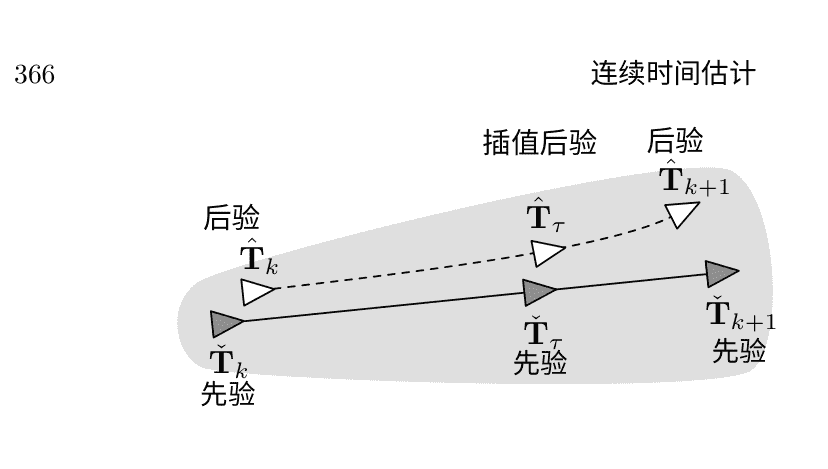

在这种情况下，我们更倾向于使用 Cholesky 方法而不是 Schur 方法，因为我们不需要构建密集矩阵 $\mathbf{A}^{-1}$。Yan 等人（2014）解释了如何在 Kaess 等人（2008, 2012）的增量方法中使用稀疏高斯过程方法。

#### 10.2.5 插值

在测量时间点解决了状态之后，我们现在可以使用高斯过程框架在一个或多个查询时间点进行插值。情况如图 10.1 所示。

我们的目标是在查询时间点 $\tau$ 上进行姿态（和广义速度）的插值。

因为我们故意估计了先验的马尔可夫状态 $\{\mathbf{T}_{k}, \boldsymbol{\varpi}_{k}\}$，所以我们知道在插值时间 $\tau$ 时，我们只需要考虑两个测量时间点的数据。不失一般性，我们假设

$$t_{k} \leq \tau < t_{k+1}. \tag{10.39}$$

后验与先验之间的差异在时刻 $\tau$, $t_{k}$ 和 $t_{k+1}$ 我们写作

$$
\boldsymbol{\gamma}_{\tau} = \begin{bmatrix} \ln \left(\hat{\mathbf{T}}_{\tau} \check{\mathbf{T}}_{\tau}^{-1}\right)^{\vee} \\ \hat{\boldsymbol{\varpi}}_{\tau} - \check{\boldsymbol{\varpi}} \end{bmatrix}, \quad \boldsymbol{\gamma}_{k} = \begin{bmatrix} \ln \left(\hat{\mathbf{T}}_{k} \check{\mathbf{T}}_{k}^{-1}\right)^{\vee} \\ \hat{\boldsymbol{\varpi}}_{k} - \check{\boldsymbol{\varpi}} \end{bmatrix}, \quad \boldsymbol{\gamma}_{k+1} = \begin{bmatrix} \ln \left(\hat{\mathbf{T}}_{k+1} \check{\mathbf{T}}_{k+1}^{-1}\right)^{\vee} \\ \hat{\boldsymbol{\varpi}}_{k+1} - \check{\boldsymbol{\varpi}} \end{bmatrix}, \tag{10.40}
$$

在这里我们注意到两个测量时间点的后验值来自主 MAP 解的最后一次迭代的操作点值：
$$\left\{\hat{\mathbf{T}}_{k}, \hat{\boldsymbol{\varpi}}_{k}\right\}=\left\{\mathbf{T}_{\mathrm{op}, k}, \boldsymbol{\varpi}_{\mathrm{op}, k}\right\}.$$
使用这些定义，我们可以继续使用第 3.4 节的方法对 $\mathfrak{se}(3) \times \mathbb{R}^{3}$ 进行状态插值（均值）：

$$\boldsymbol{\gamma}_{\tau}=\boldsymbol{\Lambda}(\tau) \boldsymbol{\gamma}_{k}+\boldsymbol{\Psi}(\tau) \boldsymbol{\gamma}_{k+1}, \tag{10.41}$$

其中

\begin{align}
\Lambda(\tau) &= \Phi(\tau, t_k) - \mathbf{Q}_\tau \Phi(t_{k+1}, \tau)^T \mathbf{Q}_{k+1}^{-1} \Phi(t_{k+1}, t_k), \quad (10.42a)\\
\Psi(\tau) &= \mathbf{Q}_\tau \Phi(t_{k+1}, \tau)^T \mathbf{Q}_{k+1}^{-1}. \quad (10.42b)
\end{align}

我们已经拥有构建这两个矩阵所需的所有部分，除了 $\mathbf{Q}_\tau$, 它由给定的

$$\mathbf{Q}_\tau = \int_{t_k}^{\tau} \Phi(\tau, s) \boldsymbol{L} \mathbf{Q} \boldsymbol{L}^T \Phi(\tau, s)^T ds. \quad (10.43)$$

我们可以通过数值积分或采用线性运动简化来进行集成，

$$\boldsymbol{\varpi} = \begin{bmatrix} \check{\boldsymbol{\nu}} \\ \mathbf{0} \end{bmatrix}, \quad (10.44)$$

此后

\begin{align}
\mathbf{Q}_\tau &= \begin{bmatrix} \mathbf{Q}_{\tau,11} & \mathbf{Q}_{\tau,12} \\ \mathbf{Q}_{\tau,12}^T & \mathbf{Q}_{\tau,22} \end{bmatrix}, \quad (10.45a)\\
\mathbf{Q}_{\tau,11} &= \frac{1}{3} \Delta t_{\tau:k}^3 \boldsymbol{Q} + \frac{1}{8} \Delta t_{\tau:k}^4 \left( \boldsymbol{\varpi}^{\wedge} \boldsymbol{Q} + \boldsymbol{Q} \boldsymbol{\varpi}^{\wedge T} \right) + \frac{1}{20} \Delta t_{\tau:k}^5 \boldsymbol{\varpi}^{\wedge} \boldsymbol{Q} \boldsymbol{\varpi}^{\wedge T}, \quad (10.45b)\\
\mathbf{Q}_{\tau,12} &= \frac{1}{2} \Delta t_{\tau:k}^2 \boldsymbol{Q} + \frac{1}{6} \Delta t_{\tau:k}^3 \boldsymbol{\varpi}^{\wedge} \boldsymbol{Q}, \quad (10.45c)\\
\mathbf{Q}_{\tau,22} &= \Delta t_{\tau:k} \boldsymbol{Q}, \quad (10.45d)\\
\Delta t_{\tau:k} &= \tau - t_k. \quad (10.45e)
\end{align}

将其代入，我们可以计算

$$\boldsymbol{\gamma}_\tau = \begin{bmatrix} \boldsymbol{\xi}_\tau \\ \boldsymbol{\eta}_\tau \end{bmatrix}, \quad (10.46)$$

然后在 $SE(3) \times \mathbb{R}^3$ 上计算插值后验概率

\begin{align}
\hat{\mathbf{T}}_\tau &= \exp\left(\boldsymbol{\xi}_\tau^{\wedge}\right) \bar{\mathbf{T}}, \quad (10.47a)\\
\hat{\boldsymbol{\varpi}}_\tau &= \boldsymbol{\varpi} + \boldsymbol{\eta}_\tau \quad (10.47b)
\end{align}

这个轨迹查询的成本为 $O(1)$, 因为它只涉及插值方程中的两个测量时间。 我们可以为不同的 $\tau$ 值重复这个过程。 类似的方法可以用于使用第 3.4 节中的方法在查询时间插值协方差。

#### 10.2.6 后记

值得指出的是，尽管我们在本章中的基本方法考虑的是连续的轨迹, 但我们仍然离散化它以便在测量时间进行批量 MAP 解决方案以及在查询时间进行插值。关键是我们有一种有原则的方法来查询任意感兴趣的时间点的轨迹，而不仅仅是测量时间。此外，插值方案是事先选择的，并提供了以下功能：(i)基于物理动机的先验平滑解决方案，(ii)在任意感兴趣的时间点进行插值。

值得注意的是，在本章中采用的高斯过程方法与第 9.1.5 节中采用的插值方法有很大不同。在那里，我们强制测量时间之间的运动具有恒定的身体中心广义速度：这是一种基于约束的插值方法。在这里，我们定义了一整个可能轨迹的分布，并鼓励解决方案找到一个平衡先验和测量的轨迹：这是一种惩罚项方法。这两种方法都有其优点。

最后，值得注意的是，在本章中使用的估计哲学。我们声称我们提出了一种 MAP 方法。然而，在非线性章节中，MAP 方法总是在线性化当前 MAP 估计的运动模型。表面上看，我们在本章中做了一些稍微不同的事情：将期望的非线性 SDE 分解为名义和扰动分量，我们基本上是围绕先验的均值进行线性化。然后，我们为运动先验构建了一个误差项，并在当前 MAP 估计周围进行了线性化。然而，另一种看待它的方式是，我们只是用一个稍微不同但更容易处理的 SDE 替换了期望的 SDE，然后对 SE(3) 应用了 MAP 方法。这不是将高斯过程连续时间方法应用于 SE(3) 估计的唯一方法，但我们希望它提供一个有用的例子；Anderson 和 Barfoot（2015）提供了另一种方法。

## 参考文献

- Absil, P A, Mahony, R, 和 Sepulchre, R. 2009. 矩阵流形上的优化. 普林斯顿大学出版社.
- Anderson, S, 和 Barfoot, T D. 2015 (9月28日-10月2日). 全速前进：SE(3)上的批量连续时间轨迹估计的精确稀疏高斯过程回归. 在: IEEE/RSJ国际智能机器人与系统大会(IROS)会议论文集.
- Anderson, S, Barfoot, T D, Tong, C H, 和 S¨arkk¨a, S. 2015. 批量非线性连续时间轨迹估计作为精确稀疏高斯过程回归. 自主机器人，“机器人科学与系统”专题, 39(3), 221-238.
- Arun, K S, Huang, T S, 和 Blostein, S D. 1987. 两个3D点集的最小二乘拟合. IEEE模式分析与机器智能交易, 9(5), 698-700.
- Bailey, T, 和 Durrant-Whyte, H. 2006. 同时定位与地图构建 (SLAM): 第二部分现状. IEEE机器人与自动化杂志, 13(3), 108-117.
- Barfoot, T D, Forbes, J R, 和 Furgale, P T. 2011. 使用线性化旋转和四元数代数的姿态估计. 宇航学报, 68(1-2), 101-112.
- Barfoot, T D, Tong, C H, 和 S¨arkk¨a, S. 2014 (12-16 July). 批量连续时间轨迹估计作为精确稀疏高斯过程回归. 在: Proceedings of Robotics: Science and Systems (RSS).
- Barfoot, Timothy D, 和 Furgale, Paul T. 2014. 将不确定性与三维姿态关联起来，用于估计问题. IEEE Transactions on Robotics, 30(3), 679-693.
- 贝叶斯, 托马斯. 1764年. 解决机会学说中的问题的论文. 伦敦皇家学会哲学交易.
- 贝斯尔, P J和麦凯, N D. 1992年. 一种用于三维形状注册的方法. IEEE模式分析和机器智能交易, 14(2), 239-256.
- 比尔曼, G J. 1974年. 离散线性系统的顺序平方根滤波和平滑. Automatica, 10(2), 147-158.
- Bishop, Christopher M. 2006年. 模式识别和机器学习. 美国新泽西州塞考克斯: 斯普林格-纽约公司.
- Box, M J. 1971年. 非线性估计中的偏差. 皇家统计学会B系列, 33(2), 171-201.
- 布鲁克希尔, J和特勒, S. 2012年 (7月). 从每个传感器的外部校准自我运动. 在: 机器人: 科学与系统的论文集.
- 布朗, D C. 1958. 多站点分析立体测量的一种解决方案. RCA-MTP数据降低技术报告第43号 (或AFMTC TR 58-8). 佛罗里达州帕特里克空军基地.
- 布莱森, A E. 1975. 应用最优控制: 优化、估计和控制. 泰勒和弗朗西斯出版社.
- 陈，C S, 洪, Y P, 程, J B. 1999年. 基于RANSAC的DARCES：一种新的快速自动配准部分重叠范围图像的方法. IEEE模式分析与机器智能交易，21(11), 1229-1234.
- Chirikjian, G S. 2009年. 随机模型、信息论和李群：经典结果和几何方法. 卷1-2. 纽约: Birkhauser.
- Chirikjian, G S, Kyatkin, A B. 2001年. 非交换谐波分析的工程应用: 重点是旋转和运动群. CRC出版社.
- Chirikjian, G S, 和 Kyatkin, A B. 2016. 工程师和应用科学家的谐波分析: 更新和扩展版. Dover出版社.
- Cork e, P. 2011. 机器人、视觉和控制. 高级机器人学系列丛书73. Springer.
- Davenport, P B. 1965. 一种应用于旋转代数的向量方法. Tech. rept. X-546-65-437. NASA.
- de Ruiter, A H J, 和 Forbes, J R. 2013. 关于Wahba问题在SO(n)上的解决. Astronautical Sciences杂志, 60(1), 1-31.
- D'Eleuterio, G M T. 1985 (六月). 空间站机械手的多体动力学: 拓扑链的递归动力学. Tech. rept. SS-3. Dynacon Enterprises Ltd.
- Devlin, Keith. 2008. 未完成的游戏：帕斯卡，费马和使世界现代化的十七世纪信件. 基础图书.
- Dudek, G, and Jenkin, M. 2010. 移动机器人的计算原理. 剑桥大学出版社.
- Durrant-Whyte, H, and Bailey, T. 2006. 同时定位与地图构建(SLAM): 第一部分基本算法. IEEE机器人与自动化杂志, 11(3), 99-110.
- Dyce, M. 2013. 加拿大在照片和地图之间：航空摄影，地理视觉和国家. 历史地理学杂志, 39, 69-84.
- Fischler, M, and Bolles, R. 1981. 随机样本一致性：模型拟合的范例及其在图像分析和自动制图中的应用. ACM通信, 24(6), 381-395.
- Furgale, P T. 2011. 对行星表面探索的视觉测距管道的扩展. 多项式学位论文, 多伦多大学.
- Furgale, P T, Tong, C H, Barfoot, T D, and Sibley, G. 2015. 使用时间基函数的连续时间批量轨迹估计. 国际机器人研究杂志, 34(14), 1688-1710.
- Green, B F. 1952. 因子分析中斜结构的正交通近. 心理测量学, 17(4), 429-440.
- Hartley, R, and Zisserman, A. 2000. 计算机视觉中的多视角几何. 剑桥大学出版社.
- Hertzberg, C, Wagner, R, Frese, U, and Schr"oder, L. 2013. 通过流形封装将通用传感器融合算法与良好状态表示相结合. 信息融合, 14(1), 57 – 77.
- Holland, P W和Welsch, R E. 1977. 使用迭代加权最小二乘法的鲁棒回归. 统计学通信 - 理论和方法，6(9), 813-827.
- Horn, B K P. 1987a. 使用正交矩阵的绝对定位闭式解. 美国光学学会杂志A, 5(7), 1127-1135.
- Horn, B K P. 1987b. 使用单位四元数的绝对定位闭式解. 美国光学学会杂志A, 4(4), 629-642.
- Hughes, Peter C. 1986. 航天器姿态动力学. 多佛出版社.
- Jazwinski, A H. 1970. 随机过程和滤波理论. 学术出版社，纽约.
- Julier, S, 和 Uhlmann, J. 1996. 一种近似非线性概率分布变换的通用方法. 技术报告. 牛津大学机器人研究小组.
- Kaess, M, Ranganathan, A, 和 Dellaert, R. 2008. iSAM: 增量平滑和建图. IEEE TRO, 24(6), 1365–1378.
- Kaess, M, Johannsson, H, Roberts, R, Ila, V, Leonard, J J, 和 Dellaert, F. 2012. iSAM2: 使用贝叶斯树的增量平滑和建图. IJRR, 31(2), 217–236.
- Kalman, R E. 1960a. 对最优控制理论的贡献. Boletin de la Sociedad Mathematica Mexicana, 5, 102–119.
- 卡尔曼, R E. 1960b. 线性滤波和预测问题的新方法. ASME交易，基础工程杂志, 82, 35–45.
- 凯利, 阿隆佐. 2013年. 移动机器人学：数学、模型和方法. 剑桥大学出版社.
- Klarsfeld, S, 和 Oteo, J A. 1989. Baker-Campbell-Hausdorff公式和 Magnus展开的收敛性. 物理学杂志A: 数学与一般物理, 22, 4565–4572.
- Lee, T, Leok, M, 和 McClamroch, N H. 2008. SO(3)上的全局辛不确定性传播. 第47届IEEE决策与控制会议论文集, 61–66页.
- Long, A W, Wolfe, K C, Mashner, M J, 和 Chrikjian, G S. 2012. 香蕉分布是高斯分布：具有指数坐标的定位研究. 在：机器人学：科学与系统会议论文集.
- Lowe, D G. 2004. 尺度不变关键点的独特图像特征. 国际计算机视觉杂志, 60(2), 91–110.
- Lu, F, and Milios, E. 1997. 全局一致的环境映射范围扫描对齐. 自主机器人, 4(4), 333–349.
- MacTavish, K A, and Barfoot, T D. 2015 (3-5 June). 不惜一切代价：相机对应异常值的鲁棒代价函数比较. 第12届计算机与机器人视觉会议论文集, 第62-69页.
- Madow, William F. 1949. 关于系统抽样理论, 第二部分. 数理统计学年鉴, 30, 333–354.
- Mahalanobis, P. 1936. 关于统计学中的广义距离. 第49-55页：国家科学研究院, 第2卷.
- Matthies, L, and Shafer, S A. 1987. 立体导航中的误差建模. IEEE 机器人与自动化, 3(3), 239–248.
- Maybeck, Peter S. 1994. 随机模型, 估计和控制. Navtech图书和软件商店.
- McGee, L A, and Schmidt, S F. 1985 (November). 作为航空航天和工业实践工具的卡尔曼滤波器的发现. 技术报告. NASA-TM-86847. NASA.
- Murray, R M, Li, Z, and Sastry, S. 1994. 机器人操纵的数学导论. CRC出版社.
- Papoulis, Athanasios. 1965. 概率, 随机变量和随机过程. 纽约: 麦格劳希尔图书公司.
- Peretroukhin, V, Vega-Brown, W, Roy, N, and Kelly, J. 2016 (16-21 May). PROBE-GK: 使用广义核的预测鲁棒估计. 第817-824页: IEEE国际机器人与自动化会议(ICRA)论文集.
- Rasmussen, C E, and Williams, C K I. 2006. 机器学习中的高斯过程. 剑桥, 马萨诸塞州: 麻省理工学院出版社.

## 参考文献

Rauch, H E, Tung, F, and Striebel, C T. 1965. 线性动态系统的最大似然估计。AIAA Journal, 3(8), 1445–1450.

Särkkä, S. 2006. 基于随机微分方程的递归贝叶斯推断. 博士学位论文, 赫尔辛基理工大学。

Särkkä, S. 2013. 贝叶斯滤波和平滑。剑桥大学出版社。

Sastry, S. 1999. 非线性系统：分析、稳定性和控制。纽约: 斯普林格。

Shannon, Claude E. 1948. 通信的数学理论。贝尔系统技术杂志, 27, 379–423, 623–656。

Sherman, J, and Morrison, W J. 1949. 调整原矩阵中给定列或给定行元素变化的逆矩阵。数学与统计学年鉴, 20, 621。

Sherman, J, and Morrison, W J. 1950. 调整给定矩阵中一个元素变化的逆矩阵。数学与统计学年鉴, 21, 124–127。

Sibley, G. 2006. 一种用于SLAM的滑动窗口滤波器. 技术报告, 南加州大学.

Sibley, G., Sukhatme, G., and Matthies, L. 2006. 迭代Sigma点卡尔曼滤波器及其在长距离立体视觉中的应用. 在:机器人:科学与系统会议论文集.

Sibley, Gabe. 2007. 来自移动平台的长距离立体数据融合. 博士学位论文, 南加州大学.

Simon, D. 2006. 最优状态估计：卡尔曼、H无穷和非线性方法. Wiley-Interscience.

Smith, P, Drummond, T, and Roussopoulos, K. 2003. 通过对群组中的概率密度函数进行表示、传播和组合来计算MAP轨迹. 在: IEEE国际计算机视觉会议论文集中. 在机器人技术中估计不确定的空间关系. 在: Cox, Ingemar J., 和Wilfong, Gordon T. (编).自主机器人车辆. 纽约: Springer Verlag.

Stengel, R F. 1994. 最优控制和估计. 多佛出版公司

Stillwell, J. 2008. 天真李群 . Springer.

Stuelpnagel, J. 1964. 关于三维旋转参数化群. SIAM评论, 6(4), 422–430.

Su, S F, and Lee, C S G. 1991. 不确定性操作和传播以及验证装配任务的适用性. 第2471-2476页: IEEE国际机器人与自动化会议论文集, vol. 3.

Su, S F, and Lee, C S G. 1992. 操作和传播不确定性以及验证装配任务的适用性. IEEE交易系统,人和控制, 22(6), 1376–1389.

Thrun, S., 和 Montemerlo, M. 2005. GraphSLAM算法及其在城市结构大规模建图中的应用. 国际机器人研究杂志, 25(5/6), 403–430.

Thrun, Sebastian, Fox, Dieter, Burgard, Wolfram, 和 Dellaert, Frank. 2001. 移动机器人的鲁棒蒙特卡洛定位. 人工智能, 128(1–2), 99–141.

Thrun, Sebastian, Burgard, Wolfram, 和 Fox, Dieter. 2006. 概率机器人学. 麻省理工学院出版社.

Tong, C H, Furgale, P T, 和 Barfoot, T D. 2013. 高斯过程高斯牛顿用于非参数同时定位和建图. 国际机器人研究杂志, 32(5), 507–525.

Triggs, W, McLauchlan, P, Hartley, R, and Fitzgibbon, A. 2000. 捆绑调整：现代综合。第298-375页: Triggs, W, Zisserman, A, and Szeliski, R (eds),视觉算法：理论与实践. LNCS. Springer Verlag.

Umeyama, S. 1991. 最小二乘估计的转换参数 between two point patterns。IEEE模式分析和机器智能，13(4), 376-380.

Wahba, G. 1965. 航天器姿态的最小二乘估计。SIAM评论, 7(3), 409.

Wang, Y, and Chirikjian, G S. 2006. 欧几里得群上的误差传播在机械手运动学中的应用。IEEE机器人学报, 22(4), 591-602.

Wang, Y, and Chirikjian, G S. 2008. 非参数二阶误差传播理论在运动群上的应用。国际机器人研究杂志,27(11), 1258-1273.

Wolfe, K, Mashner, M, and Chirikjian, G. 2011. 李群上的贝叶斯融合。代数统计学杂志, 2(1), 75-97.

Woodbury, M A. 1950. 翻转修改矩阵. Tech. rept. 42. 普林斯顿大学统计研究小组.

Yan, X, Indelman, V, and Boots, B. 2014. 连续时间轨迹估计和建图的增量稀疏高斯过程回归。自主学习机器人研讨会论文集.

Zhang, Zhengyou. 1997. 参数估计技术：一个应用于圆锥拟合的教程。图像与视觉计算, 15(1), 59-76.

## 附录A

### 补充材料

自第一版以来生成的材料。

### A.1 李群工具

#### A.1.1 $SE(3)$ 导数

有时候，我们可能想要对一个 $6 \times 6$ 变换矩阵和一个 $6 \times 1$ 列向量的乘积进行求导，关于 $6 \times 1$ 姿态变量。

为了做到这一点，我们可以从对 $\xi = (\xi_1, \xi_2, \xi_3, \xi_4, \xi_5, \xi_6)$ 的一个元素进行求导开始。应用导数的定义沿着 $1_i$方向，我们有

$$\frac{\partial (\mathcal{T}(\xi) \mathbf{x})}{\partial \xi_i} = \lim_{h \to 0} \frac{\exp((\xi + h \mathbf{1}_i)^\wedge) \mathbf{x} - \exp(\xi^\wedge) \mathbf{x}}{h}, \quad (A.1)$$

我们之前称之为方向导数。由于我们对 $h$ 的极限感兴趣，我们可以使用近似的BCH公式来写成

$$\exp((\xi + h \mathbf{1}_i)^\wedge) \approx \exp((\mathcal{J}(\xi) h \mathbf{1}_i)^\wedge) \exp(\xi^\wedge) \approx (\mathbf{1} + h (\mathcal{J}(\xi) \mathbf{1}_i)^\wedge) \exp(\xi^\wedge), \quad (A.2)$$

其中 $\mathcal{J}(\xi)$ 是 $SE(3)$ 的（左）雅可比矩阵，在 $\xi$ 处求值。将其代回 (A.1)，我们发现

$$\frac{\partial (\mathcal{T}(\xi) \mathbf{x})}{\partial \xi_i} = (\mathcal{J}(\xi) \mathbf{1}_i)^\wedge \mathcal{T}(\xi) \mathbf{x} = - (\mathcal{T}(\xi) \mathbf{x})^\wedge \mathcal{J}(\xi) \mathbf{1}_i. \quad (A.3)$$

将六个方向导数并排放在一起，得到所需的雅可比矩阵：

$$\frac{\partial (\mathcal{T}(\xi) \mathbf{x})}{\partial \xi} = - (\mathcal{T}(\xi) \mathbf{x})^\wedge \mathcal{J}(\xi). \quad (A.4)$$

### A.2 运动学

#### A.2.1 SO(3)雅可比恒等式

在旋转运动学中经常使用的一个重要恒等式是

$$\dot{\mathbf{J}}(\phi) - \boldsymbol{\omega}^\wedge \mathbf{J}(\phi) = \frac{\partial \boldsymbol{\omega}}{\partial \phi},$$

其中角速度和旋转参数导数之间的关系是

$$\boldsymbol{\omega} = \mathbf{J}(\phi)\dot{\phi}.$$

从右边开始，我们有

$$\begin{aligned}\frac{\partial \boldsymbol{\omega}}{\partial \phi} &= \frac{\partial}{\partial \phi} \left( \mathbf{J}(\phi) \dot{\phi} \right) = \frac{\partial}{\partial \phi} \left( \int_0^1 \mathbf{C}(\phi)^{\alpha} d\alpha \; \dot{\phi} \right) \\ &= \int_0^1 \frac{\partial}{\partial \phi} \left( \mathbf{C}(\alpha\phi) \dot{\phi} \right) d\alpha = -\int_0^1 \left( \mathbf{C}(\alpha\phi) \dot{\phi} \right)^\wedge \alpha \mathbf{J}(\alpha\phi) \; d\alpha. \end{aligned}$$

注意到

$$\frac{d}{d\alpha} (\alpha \mathbf{J}(\alpha\phi)) = \mathbf{C}(\alpha\phi), \quad \int \mathbf{C}(\alpha\phi) d\alpha = \alpha \mathbf{J}(\alpha\phi),$$

然后我们可以通过分部积分来看到

$$\begin{aligned}\frac{\partial \boldsymbol{\omega}}{\partial \phi} &= -\left. \left( \alpha \mathbf{J}(\alpha\phi) \dot{\phi} \right)^\wedge \alpha \mathbf{J}(\alpha\phi) \right|_{\alpha=0}^{\alpha=1} + \int_0^1 \left( \alpha \mathbf{J}(\alpha\phi) \dot{\phi} \right)^\wedge \mathbf{C}(\alpha\phi) \; d\alpha \\ &= -\boldsymbol{\omega}^\wedge \mathbf{J}(\phi) + \frac{d}{dt} \int_0^1 \mathbf{C}(\phi)^{\alpha} d\alpha = \dot{\mathbf{J}}(\phi) - \boldsymbol{\omega}^\wedge \mathbf{J}(\phi), \end{aligned}$$

这是期望的结果。

#### A.2.2 SE(3)雅可比恒等式

我们可以推导出类似的姿态运动学恒等式：

$$\dot{\mathcal{J}}(\boldsymbol{\xi}) - \boldsymbol{\varpi}^\wedge \mathcal{J}(\boldsymbol{\xi}) = \frac{\partial \boldsymbol{\varpi}}{\partial \boldsymbol{\xi}},$$

广义速度和姿态参数导数之间的关系是

$$\boldsymbol{\varpi} = \mathcal{J}(\boldsymbol{\xi}) \dot{\boldsymbol{\xi}}.$$

从右边开始，我们有

$$
\begin{aligned}
\frac{\partial \varpi}{\partial \xi} &= \frac{\partial}{\partial \xi} \left( \mathcal{J}(\xi) \dot{\xi} \right) = \frac{\partial}{\partial \xi} \left( \int_0^1 \mathcal{T}(\xi)^\alpha d\alpha \, \dot{\xi} \right) \\ &= \int_0^1 \frac{\partial}{\partial \xi} \left( \mathcal{T}(\alpha \xi) \dot{\xi} \right) d\alpha = -\int_0^1 \left( \mathcal{T}(\alpha \xi) \dot{\xi} \right)^\wedge \alpha \mathcal{J}(\alpha \xi) \, d\alpha.
\end{aligned}
\qquad\text{(A.12)}$$

注意到

$$
\frac{d}{d\alpha} (\alpha \mathcal{J}(\alpha \xi)) = \mathcal{T}(\alpha \xi), \qquad \int \mathcal{T}(\alpha \xi) d\alpha = \alpha \mathcal{J}(\alpha \xi),
\qquad\text{(A.13)}$$

然后我们可以通过分部积分来看到

$$
\begin{aligned}
\frac{\partial \varpi}{\partial \xi} &= - \left. \left( \alpha \mathcal{J}(\alpha \xi) \dot{\xi} \right)^\wedge \alpha \mathcal{J}(\alpha \xi) \right|_{\alpha=0}^{\alpha=1} + \int_0^1 \left( \alpha \mathcal{J}(\alpha \xi) \dot{\xi} \right)^\wedge \mathcal{T}(\alpha \xi) \, d\alpha \\ &= -\varpi^\wedge \mathcal{J}(\xi) + \frac{d}{dt} \int_0^1 \mathcal{T}(\xi)^\alpha d\alpha = \dot{\mathcal{J}}(\xi) - \varpi^\wedge \mathcal{J}(\xi).
\end{aligned}
\qquad\text{(A.14)}$$

这是期望的结果。