# 机器学习基础（FML）中文第二版


# Foundations of Machine Learning
## Second Edition

Mehryar Mohri, Afshin Rostamizadeh, and Ameet Talwalkar

# 自适应计算与机器学习
编辑：Francis Bach

自适应计算与机器学习系列的所有出版书籍清单位于本书的末尾。

## 机器学习基础
### 第二版

- Mehryar Mohri
- Afshin Rostamizadeh
- Ameet Talwalkar

麻省理工学院出版社
马萨诸塞州剑桥市
英国伦敦

© 2018 麻省理工学院

版权所有。未经出版社书面许可，本书任何部分均不得以任何形式通过任何电子或机械手段（包括复印、录音或信息存储和检索）复制。

本书由作者使用LATEX排版。 印刷和装订：美国

## 国会图书馆编目数据

- 作者: Mehryar Mohri, Afshin Rostamizadeh, Ameet Talwalkar
- 标题: 机器学习基础 / Mehryar Mohri, Afshin Rostamizadeh, 和Ameet Talwalkar。
- 描述: 第二版。 |剑桥，马萨诸塞州: 麻省理工学院出版社，[2018] | 系列: 自适应计算和机器学习系列 |包括参考文献和索引。
- 标识符: LCCN 2018022812 |ISBN 9780262039406 (精装纸)
- 主题: LCSH: 机器学习。 |计算机算法。
- 分类: LCC Q325.5 .M64 2018 | DDC 006.3/1--dc23 LC记录可在 [https://lccn.loc.gov/2018022812](https://lccn.loc.gov/2018022812)找到

10 9 8 7 6 5 4 3 2

## 目录

# 前言 xiii

# 1 引言 1
- 1.1 什么是机器学习? 1
- 1.2 机器学习可以解决哪些问题? 2
- 1.3 一些标准学习任务 3
- 1.4 学习阶段 4
- 1.5 学习场景 6
- 1.6 泛化 7

# 2 PAC学习框架 9
- 2.1 PAC学习模型 9
- 2.2 有限假设集的保证 - 一致情况 15
- 2.3 有限假设集的保证 - 不一致情况 19
- 2.4 一般性 21
  - 2.4.1 确定性与随机情景 21
  - 2.4.2 贝叶斯误差和噪声 22
- 2.5 章节注释 23
- 2.6 练习 23

# 3 Rademacher复杂度和VC维度 29
- 3.1 Rademacher复杂度 30
- 3.2 增长函数 34
- 3.3 VC维度 36
- 3.4 下界 43
- 3.5 章节注释 48
- 3.6 练习 50

# 4 模型选择 61
- 4.1 估计和逼近误差 61
- 4.2 经验风险最小化 (ERM) 62
- 4.3 结构风险最小化 (SRM) 64
- 4.4 交叉验证 68
- 4.5 n折交叉验证 71
- 4.6 基于正则化的算法 72
- 4.7 凸代理损失 73
- 4.8 章节注释 77
- 4.9 练习 78

# 5 支持向量机 79
- 5.1 线性分类 79
- 5.2 可分离情况 80
  - 5.2.1 原始优化问题 81
  - 5.2.2 支持向量 83
  - 5.2.3 对偶优化问题 83
  - 5.2.4 留一法分析 85
- 5.3 非可分情况 87
  - 5.3.1 原始优化问题 88
  - 5.3.2 支持向量 89
  - 5.3.3 对偶优化问题 90
- 5.4 边界理论 91
- 5.5 章节注释 100
- 5.6 练习 100

# 6 核方法 105
- 6.1 引言 105
- 6.2 正定对称核函数 108
  - 6.2.1 定义 108
  - 6.2.2 再生核希尔伯特空间 110
  - 6.2.3 性质 112
- 6.3 基于核的算法 116
  - 6.3.1 带有PDS核的支持向量机 116
  - 6.3.2 表示定理 117
  - 6.3.3 学习保证 117
- 6.4 负定对称核函数 119
- 6.5 序列核函数 121
  - 6.5.1 加权转换器 122
  - 6.5.2 有理核函数 126
- 6.6 近似核特征映射 130
- 6.7 章节注释 135
- 6.8 练习 137

# 7 Boosting 145
- 7.1 引言 145
- 7.2 AdaBoost 146
  - 7.2.1 经验误差的界限 149
  - 7.2.2 与坐标下降的关系 150
  - 7.2.3 实际应用 154
- 7.3 理论结果 154
  - 7.3.1 基于VC维的分析 154
  - 7.3.2 L_1-几何边界 155
  - 7.3.3 基于边界的分析 157
  - 7.3.4 边界最大化 161
  - 7.3.5 博弈论解释 162
- 7.4 L_1-正则化 165
- 7.5 讨论 167
- 7.6 章节注释 168
- 7.7 练习 170

# 8 在线学习 177
- 8.1 引言 178
- 8.2 专家建议的预测 178
  - 8.2.1 错误界限和减半算法 179
  - 8.2.2 加权多数算法 181
  - 8.2.3 随机加权多数算法 183
  - 8.2.4 指数加权平均算法 186
- 8.3 线性分类 190
  - 8.3.1 感知器算法 190
  - 8.3.2 Winnow算法 198
- 8.4 在线到批处理转换 201
- 8.5 博弈论连接 204
- 8.6 章节注释 205
- 8.7 练习 206

### 9 多类分类 213
- 9.1 多类分类问题 213
- 9.2 泛化界限 215
- 9.3 未组合的多类算法 221
  - 9.3.1 多类支持向量机 221
  - 9.3.2 多类Boosting算法 222
  - 9.3.3 决策树 224
- 9.4 聚合的多类算法 228
  - 9.4.1 一对多 229
  - 9.4.2 一对一 229
  - 9.4.3 纠错输出码 231
- 9.5 结构化预测算法 233
- 9.6 章节注释 235
- 9.7 练习 237

### 10 排名 239
- 10.1 排名问题 239
- 10.2 排名度量 240
- 10.3 泛化界限 242
- 10.4 RankBoost 244
  - 10.4.1 经验误差界限 246
  - 10.4.2 与坐标下降的关系 248
  - 10.4.3 排名中集成方法的边界界限 250
- 10.5 二分排名 251
  - 10.5.1 二分排名中的Boosting 252
  - 10.5.2 ROC曲线下的面积 255
- 10.6 偏好设置 257
  - 10.6.1 第二阶段排名问题 257
  - 10.6.2 确定性算法 259
  - 10.6.3 随机算法 260
  - 10.6.4 对其他损失函数的扩展 262
- 10.7 其他排名标准 262
- 10.8 章节笔记 263
- 10.9 练习 264

### 11 回归 267
- 11.1 回归问题 267
- 11.2 泛化界限 268
  - 11.2.1 有限假设集 268
  - 11.2.2 Rademacher复杂度界限 269
  - 11.2.3 伪维度界限 271
- 11.3 回归算法 275
  - 11.3.1 线性回归 275
  - 11.3.2 核岭回归 276
  - 11.3.3 支持向量回归 281
  - 11.3.4 Lasso 285
  - 11.3.5 群体规范回归算法 289
  - 11.3.6 在线回归算法 289
- 11.4 章节笔记 290
- 11.5 练习 292

### 12 最大熵模型 295
- 12.1 密度估计问题 295
  - 12.1.1 最大似然（ML）解 296
  - 12.1.2 最大后验（MAP）解 297
- 12.2 带特征的密度估计问题 297
- 12.3 最大熵原理 298
- 12.4 最大熵模型 299
- 12.5 对偶问题 299
- 12.6 泛化界 303
- 12.7 坐标下降算法 304
- 12.8 扩展 306
- 12.9 L2-正则化 308
- 12.10 章节笔记 312
- 12.11 练习题 313

### 13 条件最大熵模型 315
- 13.1 学习问题 315
- 13.2 条件最大熵原理 316
- 13.3 条件最大熵模型 316
- 13.4 对偶问题 317
- 13.5 属性 319
  - 13.5.1 优化问题 320
  - 13.5.2 特征向量 320
  - 13.5.3 预测 321
- 13.6 泛化界 321
- 13.7 逻辑回归 325
  - 13.7.1 优化问题 325
  - 13.7.2 逻辑模型 325
- 13.8 L2-正则化 326
- 13.9 对偶定理的证明 328
- 13.10 章节笔记 330
- 13.11 练习题 331

### 14 算法稳定性 333
- 14.1 定义 333
- 14.2 基于稳定性的泛化保证 334
- 14.3 核正则化算法的稳定性 336
  - 14.3.1 应用于回归算法：SVR和KRR 339
  - 14.3.2 应用于分类算法：支持向量机 341
  - 14.3.3 讨论 342
- 14.4 章节注释 342
- 14.5 练习 343

### 15 降维 347
- 15.1 主成分分析 348
- 15.2 核主成分分析（KPCA） 349
- 15.3 KPCA和流形学习 351
  - 15.3.1 Isomap 351
  - 15.3.2 Laplacian eigenmaps 352
  - 15.3.3 局部线性嵌入（LLE） 353
- 15.4 Johnson-Lindenstrauss引理 354
- 15.5 章节注释 356
- 15.6 练习 356

### 16 学习自动机和语言 359
- 16.1 引言 359
- 16.2 有限自动机 360
- 16.3 高效准确学习 361
  - 16.3.1 被动学习 362
  - 16.3.2 通过查询学习 363
  - 16.3.3 带查询的学习自动机 364
- 16.4 极限识别 369
  - 16.4.1 可逆自动机学习 370
- 16.5 章节笔记 375
- 16.6 练习 376

### 17 强化学习 379
- 17.1 学习场景 379
- 17.2 马尔可夫决策过程模型 380
- 17.3 策略 381
  - 17.3.1 定义 381
  - 17.3.2 策略价值 382
  - 17.3.3 最优策略 382
  - 17.3.4 策略评估 385
- 17.4 规划算法 387
  - 17.4.1 值迭代 387
  - 17.4.2 策略迭代 390
  - 17.4.3 线性规划 392
- 17.5 学习算法 393
  - 17.5.1 随机逼近 394
  - 17.5.2 TD(0)算法 397
  - 17.5.3 Q学习算法 398
  - 17.5.4 SARSA 402
  - 17.5.5 TD(λ)算法 402
  - 17.5.6 大状态空间 403
- 17.6 章节笔记 405

### 结论 407

### A 线性代数复习 409
- A.1 向量和范数 409
  - A.1.1 范数 409
  - A.1.2 双重范数 410
  - A.1.3 范数之间的关系 411
- A.2 矩阵 411
  - A.2.1 矩阵范数 411
  - A.2.2 奇异值分解 412
  - A.2.3 对称正半定 (SPSD) 矩阵 412

### B 凸优化 415
- B.1 微分和无约束优化 415
- B.2 凸性 415
- B.3 约束优化 419
- B.4 Fenchel对偶性 422
  - B.4.1 次梯度 422
  - B.4.2 核心 423
  - B.4.3 共轭函数 423
- B.5 章节注释 426
- B.6 练习 427

### C 概率复习 429
- C.1 概率 429
- C.2 随机变量 429
- C.3 条件概率和独立性 431
- C.4 期望和马尔可夫不等式 431
- C.5 方差和切比雪夫不等式 432
- C.6 矩生成函数 434
- C.7 练习 435

### D 集中不等式 437
- D.1 Hoeffding不等式 437
- D.2 Sanov定理 438
- D.3 乘法切诺夫界 439
- D.4 二项分布尾部：上界 440
- D.5 二项分布尾部：下界 440
- D.6 阿兹马不等式 441
- D.7 麦克迪尔米德不等式 442
- D.8 正态分布尾部：下界 443
- D.9 金钦-卡哈内不等式 443
- D.10 最大不等式 444
- D.11 章节注释 445
- D.12 练习 445

### E 信息论概念 449
- E.1 熵 449
- E.2 相对熵 450
- E.3 互信息 453
- E.4 布雷格曼散度 453
- E.5 章节注释 456
- E.6 练习 457

### F 符号 459

### 参考文献 461

### 索引 475

## 前言

本书是一本关于机器学习的通用介绍，可作为研究人员的参考书，也可作为学生的教材。它涵盖了机器学习中的基本现代主题，同时提供了算法讨论和证明所需的理论基础和概念工具。它还描述了这些算法应用的几个关键方面。

我们的目标是在给出简洁的证明的同时，提供最新颖的理论工具和概念，即使是相对高级的结果。一般来说，只要可能，我们选择简洁性。然而，我们讨论了一些在机器学习中出现的关键复杂主题，并强调了几个开放的研究问题。某些主题经常与其他主题合并或受到不足的关注，在这里我们单独讨论，并更加强调：例如，一个不同的章节专门用于多类分类、排名和回归。

虽然我们涵盖了机器学习中非常广泛的重要主题，但出于简洁性和某些方法目前缺乏坚实理论保证的原因，我们选择省略了一些重要的主题，包括图形模型和神经网络。

本书面向机器学习、统计学和其他相关领域的学生和研究人员。它可以作为机器学习研究生和高年级本科课程的教材，也可以作为研究研讨会的参考文献。本书的前三或四章为后续材料奠定了理论基础。其他章节大多是独立的，除了第6章介绍了一些在后续章节中广泛使用的概念，以及第13章与第12章密切相关。每章都以一系列练习结束，完整的解答单独呈现。

读者被假设已经熟悉线性代数、概率和算法分析的基本概念。然而，为了进一步帮助，我们还包括了一个详尽的附录，介绍了线性代数的简明回顾，凸优化的简介，概率的简要回顾，以及一些集中不等式的集合。不等式在本书的分析和讨论中非常有用，并且对信息论进行了简短的介绍。

我们的目标是提供多个主题和领域的统一介绍，而不是像一些书籍那样采用更专门化的介绍，比如贝叶斯观点或者特定主题，比如核方法。本书的理论基础以及对证明和分析的强调使其与许多其他介绍有很大区别。

在这第二版中，我们更新了整本书。这些变化包括大多数章节中的不同写作风格，新的图表和插图，许多简化，对现有章节的一些补充，特别是第6章和第17章，以及几个新章节。我们在模型选择（第4章）中添加了一个完整的章节，这是一个在之前的版本中只简要讨论过的重要主题。我们还添加了一个关于最大熵模型（第12章）和条件最大熵模型（第13章）的新章节，这两个主题在机器学习中都是必不可少的。我们还对附录进行了重大改变。特别是，我们在凸优化的附录B中添加了一个完整的Fenchel对偶性部分，对处理集中不等式的附录D进行了一些修改和补充，添加了关于信息论的附录E，并更新了大部分内容。此外，我们还包括了一些新的练习题及其解答，适用于现有和新的章节。

这里介绍的大部分材料源自作者在纽约大学Courant数学科学研究所教授的机器学习研究生课程（机器学习基础）在过去十四年中的教学。本书在这些课程的学生以及许多朋友、同事和研究人员的评论和建议下得到了很大的益处，我们深感欠他们的恩情。

我们特别感谢Corinna Cortes和Yishay Mansour对第一版材料设计和组织提出的许多关键建议，他们的详细评论得到了我们的充分考虑，并且极大地改善了本书的呈现方式。我们还要感谢Yishay Mansour使用本书第一版的初步版本进行教学，并向我们报告他的反馈意见。

我们还要感谢以下来自学术界和企业研究实验室的同事和朋友们的讨论、建议和各种贡献：Jacob Abernethy、Cyril Allauzen、Kareem Amin、Stephen Boyd、Aldo Corbisiero、Giulia DeSalvo、Claudio Gentile、Spencer Greenberg、Lisa Hellerstein、Sanjiv Kumar、Vitaly Kuznetsov、Ryan McDonald、Andrés Muñoz Medina、Tyler Neylon、Peter Norvig、Fernando Pereira、Maria Pershina、Borja de Balle Pigem、Ashish Rastogi, Michael Riley, Dmitry Storcheus, Ananda Theertha Suresh, Umar Syed, Csaba Szepesvári, Toshiyuki Tanaka, Eugene Weinstein, Jason Weston, Scott Yang, and Ningshan Zhang.

最后，我们感谢麻省理工学院出版团队在本书的编写过程中提供的帮助和支持。

## 1 引言

本章介绍了机器学习的初步概念，包括一些关键的学习任务和应用、基本定义和术语，以及一些常见的场景讨论。

## 1.1 什么是机器学习？

机器学习可以广义地定义为使用经验来提高性能或进行准确预测的计算方法。在这里，经验指的是学习者可用的过去信息，通常以电子数据的形式收集和提供供分析。这些数据可以是数字化的人工标记训练集，也可以是通过与环境交互获得的其他类型的信息。在所有情况下，数据的质量和规模对学习者所做的预测的成功至关重要。

一个学习问题的例子是如何使用一组有限的随机选择的文档样本，每个样本都标有一个主题，来准确预测未知文档的主题。显然，样本越大，任务越容易。但是，任务的难度还取决于样本中文档的标签质量，因为标签可能不全正确，并且取决于可能的主题数量。

机器学习包括设计高效准确的预测算法。与计算机科学的其他领域一样，这些算法的质量的一些关键指标是它们的时间和空间复杂度。但是，在机器学习中，我们还需要一个概念来评估算法学习一组概念所需的样本大小的概念。更一般地说，算法的理论学习保证取决于所考虑的概念类别的复杂性和训练样本的大小。

由于学习算法的成功取决于使用的数据，机器学习与数据分析和统计学密切相关。更一般地说，学习技术是数据驱动的方法，结合了计算机科学的基本概念和统计学、概率论和优化的思想。

## 1.2 什么样的问题可以使用机器学习解决？

预测文档的标签，也称为文档分类，绝不是唯一的学习任务。机器学习具有非常广泛的实际应用，包括以下内容：

- 文本或文档分类。这包括将主题分配给文本或文档的问题，或者自动确定网页内容是否不适当或过于明确；它还包括垃圾邮件检测。
- 自然语言处理（NLP）。这个领域中的大多数任务，包括词性标注、命名实体识别、无上下文解析或依存解析，都被视为学习问题。在这些问题中，预测具有一定的结构。例如，在词性标注中，对于一个句子的预测是一个标记每个单词的词性标签的序列。在无上下文解析中，预测是一棵树。这些都是被称为结构化预测问题的更丰富的学习问题的实例。
- 语音处理应用。这包括语音识别、语音合成、说话者验证、说话者识别，以及语言建模和声学建模等子问题。
- 计算机视觉应用。这包括目标识别、目标识别、人脸检测、光学字符识别（OCR）、基于内容的图像检索或姿态估计。
- 计算生物学应用。这包括蛋白质功能预测、关键位点识别或基因和蛋白质网络分析。
- 许多其他问题，如信用卡、电话或保险公司的欺诈检测，网络入侵，学习下棋、双陆棋或围棋等游戏，无人驾驶车辆或汽车的无人控制，医学诊断，推荐系统、搜索引擎或信息提取系统的设计，都使用机器学习技术来解决。

这个列表并不全面。实践中遇到的大多数预测问题都可以看作是学习问题，机器学习的实际应用领域不断扩大。本书讨论的算法和技术可以用于解决所有这些问题，尽管我们不会详细讨论这些应用。

## 1.3 一些标准学习任务

以下是一些经过广泛研究的标准机器学习任务：

- 分类：这是将每个项目分配到一个类别的问题。例如，文档分类包括将每个文档分配到一个类别，如政治、商业、体育或天气；而图像分类则包括将每个图像分配到一个类别，如汽车、火车或飞机。在这些任务中，类别的数量通常不超过几百个，但在一些困难的任务中可能会更大，甚至在OCR、文本分类或语音识别中可能是无限的。
- 回归：这是对每个项目预测一个实际值的问题。回归的例子包括预测股票价值或经济变量的变化。在回归中，错误预测的惩罚取决于真实值和预测值之间的差异的大小，与分类问题不同，在分类问题中通常没有各个类别之间的接近概念。
- 排序：这是根据某些标准学习对项目进行排序的问题。网络搜索，例如返回与搜索查询相关的网页，是典型的排序示例。在信息提取或自然语言处理系统设计的背景下，还会出现许多类似的排序问题。
- 聚类：这是将一组项目划分为同质子集的问题。聚类通常用于分析非常大的数据集。例如，在社交网络分析的背景下，聚类算法试图识别大群体中的自然社区。
- 降维或流形学习：这个问题包括将项目的初始表示转换为低维表示，同时保留初始表示的某些属性。一个常见的例子是在计算机视觉任务中预处理数字图像。

机器学习的主要实际目标是为未见项目生成准确的预测，并设计高效且稳健的算法来产生这些预测，即使对于大规模问题也是如此。为此，会出现一些算法和理论问题。一些基本问题包括：哪些概念族实际上可以被学习，并在什么条件下？这些概念在计算上可以学习得有多好？

## 1.4 学习阶段

在这里，我们将使用垃圾邮件检测作为一个运行示例来说明一些基本定义，并描述机器学习算法在实践中的使用和评估，包括它们的不同阶段。

垃圾邮件检测是学习自动分类电子邮件消息为垃圾邮件或非垃圾邮件的问题。以下是机器学习中常用的定义和术语列表：

- 示例：用于学习或评估的数据项或实例。在我们的垃圾邮件问题中，这些示例对应于我们将用于学习和测试的电子邮件消息集合。
- 特征：与示例相关联的属性集，通常表示为向量。在电子邮件消息的情况下，一些相关特征可能包括消息的长度，发件人的姓名，标题的各种特征，消息正文中特定关键词的存在等。
- 标签：为示例分配的值或类别。在分类问题中，示例被分配到特定的类别，例如我们二元分类问题中的垃圾邮件和非垃圾邮件类别。在回归中，物品被分配实值标签。
- 超参数：不由学习算法确定，而是作为学习算法的输入指定的自由参数。
- 训练样本：用于训练学习算法的示例。在我们的垃圾邮件问题中，训练样本由一组电子邮件示例及其相关标签组成。训练样本在不同的学习场景中有所变化，如第1.5节所述。
- 验证样本：在使用标记数据时用于调整学习算法参数的示例。验证样本用于选择学习算法的自由参数（超参数）的适当值。
- 测试样本：用于评估学习算法性能的示例。测试样本与训练和验证数据分开，并且在学习阶段不可用。在垃圾邮件问题中，测试样本由一组电子邮件示例组成，学习算法必须基于特征预测标签。然后将这些预测与测试样本的标签进行比较，以衡量算法的性能。
- 损失函数：衡量预测标签与真实标签之间差异或损失的函数。将所有标签的集合表示为 $\mathcal{Y}$，可能的预测集合表示为 $\mathcal{Y}'$，损失函数 $L$ 是一个映射 $L: \mathcal{Y} \times \mathcal{Y}' \rightarrow \mathbb{R}_+$。在大多数情况下， $\mathcal{Y}' = \mathcal{Y}$，并且损失函数是有界的，但这些条件并不总是成立。常见的损失函数示例包括零一损失（或 0/1 损失），...
误分类损失定义为 $\{-1, +1\} \times \{-1, +1\}$上的损失函数 $L(y, y') = \mathbb{1}_{y' = y}$，并且平方损失定义为 $\mathcal{Y} \times \mathcal{Y}$上的损失函数 $L(y, y') = (y' - y)^2$，其中 $\mathcal{Y} \subseteq \mathbb{R}$通常是一个有界区间。
- 假设集合：将特征（特征向量）映射到标签集合 $\mathcal{Y}$的一组函数。在我们的例子中，这些函数可以将电子邮件特征映射到 $\mathcal{Y} = \{\text{垃圾邮件}, \text{非垃圾邮件}\}$。更一般地，假设可以是将特征映射到不同集合 $\mathcal{Y}'$的函数。它们可以是将电子邮件特征向量映射到实数（解释为分数）的线性函数 ($\mathcal{Y}' = \mathbb{R}$)，其中较高的分数值更能表明是垃圾邮件而不是较低的分数值。

图1.1 展示了典型学习过程的示意图。

我们现在定义我们的垃圾邮件问题的学习阶段（见图1.1）。我们从给定的标记示例集开始。我们首先随机将数据分成训练样本、验证样本和测试样本。每个样本的大小取决于多种不同的考虑因素。例如，为验证保留的数据量取决于算法的超参数数量，这些超参数由向量$\Theta$表示。此外，当标记样本相对较小时，通常选择的训练数据量要大于测试数据量，因为学习性能直接取决于训练样本。

接下来，我们将相关特征与示例关联起来。这是设计机器学习解决方案的关键步骤。有用的特征可以有效地指导学习算法，而糟糕或无信息的特征可能会误导。虽然这是关键的，但在很大程度上，特征的选择留给用户决定。这个选择反映了用户对学习任务的先验知识，实际上可能对性能结果产生重大影响。

现在，我们使用选择的特征来训练我们的学习算法 $\mathcal{A}$通过调整其自由参数$\Theta$（也称为超参数）。对于这些参数的每个值，算法从假设集中选择一个不同的假设。我们选择在验证样本上表现最好的那个假设（$\Theta_0$）。最后，使用该假设，我们预测测试样本中的标签。通过使用与任务相关的损失函数来评估算法的性能，例如我们垃圾邮件检测任务中的零一损失，来比较预测和真实标签。

因此，算法的性能当然是基于其测试误差而不是训练样本上的误差来评估的。

## 1.5 学习场景

接下来，我们简要描述一些常见的机器学习场景。这些场景在学习者可用的训练数据类型、接收训练数据的顺序和方法以及用于评估学习算法的测试数据方面有所不同。

- 监督学习：学习者接收一组带有标签的示例作为训练数据，并对所有未见过的点进行预测。这是与分类、回归和排名问题相关的最常见的情景。前一节讨论的垃圾邮件检测问题是监督学习的一个实例。
- 无监督学习：学习者仅接收无标签的训练数据，并对所有未见过的点进行预测。由于通常在这种情况下没有标记的示例可用，因此很难定量评估学习者的性能。聚类和降维是无监督学习问题的例子。
- 半监督学习：学习者接收由带有标签和无标签数据组成的训练样本，并对所有未见过的点进行预测。在无标签数据容易获取但标签获取成本高昂的情况下，半监督学习很常见。各种类型的问题，包括分类、回归或排名任务，都可以作为半监督学习的实例。希望学习者可以通过访问的无标签数据的分布来实现比监督设置下更好的性能。分析在什么条件下可以实现这一点的研究是现代理论和应用机器学习研究的主题。
- 传导推理：与半监督场景类似，学习器接收到一个带有一组未标记测试点的标记训练样本。然而，传导推理的目标仅是预测这些特定测试点的标签。传导推理似乎是一个更容易的任务，并且与现代应用中遇到的场景相匹配。然而，与半监督设置类似，能够在这种设置下实现更好性能的假设是尚未完全解决的研究问题。
- 在线学习：与之前的场景相反，在线场景涉及多个轮次，其中训练和测试阶段交替进行。在每一轮中，学习器接收到一个未标记的训练点，进行预测，接收到真实标签，并产生损失。在线设置的目标是最小化所有轮次的累积损失或最小化后悔，即累积损失和最佳专家的差异。
与刚才讨论的先前设置不同，在在线学习中不做分布假设。实际上，在这种情况下，实例及其标签可以被对手选择。
- 强化学习：在强化学习中，训练和测试阶段也是交叉进行的。为了收集信息，学习者积极地与环境进行交互，在某些情况下影响环境，并对每个动作获得即时奖励。学习者的目标是在与环境的一系列动作和迭代中最大化他的奖励。然而，环境不提供长期奖励反馈，学习者面临着探索与利用的两难境地，因为他必须在探索未知动作以获得更多信息和利用已收集的信息之间做出选择。
- 主动学习：学习者通过与神谕查询新点的标签来自适应或交互地收集训练样本。主动学习的目标是在使用较少标记示例的情况下实现与标准监督学习场景（或 passive learning 场景）相当的性能。
主动学习通常在标签获取昂贵的应用中使用，例如计算生物学应用。

在实践中，可能会遇到许多其他中间和稍微更复杂的学习场景。

## 1.6 泛化

机器学习基本上是关于泛化的。作为一个例子，标准的监督学习场景包括使用有限的标记示例样本对未见过的示例进行准确预测。问题通常被表述为从假设集中选择一个函数，该假设集是所有函数族的子集。随后选择的函数用于标记所有实例，包括未见过的示例。

应该如何选择假设集？对于一个丰富或复杂的假设集，学习者可以选择一个与训练样本一致的函数或预测器，即在训练样本上不产生错误的函数。对于一个较不复杂的族群，可能无法避免在训练样本上产生一些错误。但是，
图1.2 展示了这两种解决方案：一种是完美的曲线将蓝色和红色点的两个群体分开，并从一个复杂的族群中选择，另一个是从一个简单的族群中选择的平滑线，它只能不完全地区分这两个集合。我们将看到，通常情况下，训练样本上的最佳预测器可能不是最佳的整体预测器。从一个非常复杂的族群中选择的预测器可以基本上记住数据，但泛化与训练标签的记忆是不同的。

我们将看到样本大小和复杂性之间的权衡在泛化中起着关键作用。当样本大小相对较小时，选择过于复杂的模型族可能导致泛化能力差，这也被称为过拟合。另一方面，选择过于简单的模型族可能无法达到足够的准确性，这被称为欠拟合。

在接下来的章节中，我们将更详细地分析泛化问题，并寻求学习的理论保证。这将取决于我们将详细讨论的不同复杂性概念。

## 2 PAC学习框架

在设计和分析从示例中学习的算法时，会出现几个基本问题：什么可以高效地学习？什么是本质上难以学习的？需要多少示例才能成功学习？是否存在一个通用的学习模型？在本章中，我们通过引入“可能近似正确”（PAC）学习框架来形式化和解决这些问题。PAC框架有助于以样本点数量、样本复杂性以及学习算法的时间和空间复杂性来定义可学习概念的类别，这取决于概念的计算表示的成本。

我们首先描述PAC框架并加以说明，然后在该框架中给出一些一般的学习保证，当使用的假设集是有限的时候，无论是一致的情况下还是相反的不一致的情况下。

## 2.1 PAC学习模型

我们首先介绍一些定义和符号，以便介绍PAC模型，这些定义和符号也将在本书的大部分内容中使用。

我们用 X 表示所有可能的示例或实例的集合。X 有时也被称为输入空间。所有可能的标签或目标值的集合被表示为 Y。为了本章的介绍目的，我们将限制在 Y 被简化为两个标签的情况下，Y = {0,1}，这对应于所谓的二分类。后面的章节将扩展这些结果到更一般的设置中。

一个概念 c: X → Y 是从 X到 Y的映射。由于 Y = {0,1}，我们可以将 c 与它取值为1的 X 的子集等同起来。因此，在接下来的内容中，我们可以将要学习的概念等同地称为从 X 到 {0,1} 的映射，或者是 X 的一个子集。举个例子，一个概念可以是三角形内的点的集合或者是这些点的指示函数。在这种情况下，我们简称要学习的概念为三角形。概念类是我们可能希望学习的一组概念，用 $\mathcal{C}$ 表示。例如，这可以是平面上的所有三角形的集合。

我们假设示例是独立同分布（i.i.d.）的，根据某个固定但未知的分布 $\mathcal{D}$。学习问题可以如下形式化。学习者考虑一组可能的概念 $\mathcal{H}$，称为假设集，它可能不一定与 $\mathcal{C}$ 相同。它接收一个由 $\mathcal{D}$ 独立同分布生成的样本 $S= (x_1, \ldots, x_m)$，以及基于特定目标概念 $c \in \mathcal{C}$ 生成的标签 $(c(x_1), \ldots, c(x_m))$。任务是使用标记样本 $S$ 选择一个假设 $h \in \mathcal{H}$，它在概念 $c$ 方面具有较小的泛化误差。假设 $h \in \mathcal{H}$ 的泛化误差，也称为风险或真实误差（或简称误差） $R(h)$，定义如下。$^1$

> **定义2.1（泛化误差）** 给定一个假设 $h \in \mathcal{H}$，一个目标概念 $c \in \mathcal{C}$，和一个潜在分布 $\mathcal{D}$，假设的泛化误差或风险由
> $$
> R(h) = \mathbb{P}_{x\sim\mathcal{D}} [h(x) = c(x)] = \mathbb{E}_{x\sim\mathcal{D}} \left[1_{h(x)=c(x)} \right],
> $$
> 其中 $1_{\omega}$ 是事件 $\omega$ 的指示函数。$^2$

由于分布 $\mathcal{D}$ 和目标概念 $c$ 都是未知的，假设的泛化误差对学习者来说不是直接可访问的。然而，学习者可以测量假设在标记样本 $S$ 上的经验误差。

> **定义2.2（经验误差）** 给定一个假设 $h \in \mathcal{H}$，一个目标概念 $c \in \mathcal{C}$，和一个样本 $S= (x_1, \ldots, x_m)$，假设的经验误差或经验风险由
> $$
> R_S(h) = \frac{1}{m} \sum_{i=1}^{m} 1_{h(x_i)=c(x_i)}.
> $$

因此，$h \in \mathcal{H}$ 的经验误差是样本 $S$ 上的平均误差，而泛化误差是基于分布 $\mathcal{D}$ 的期望误差。在本章和接下来的几章中，我们将看到许多关于这两个数量之间的高概率关系的保证，基于一些一般性假设。我们已经可以注意到，对于固定的 $h \in \mathcal{H}$，基于独立同分布的期望经验误差样本 S等于泛化误差：

$$
\mathbb{E}_{S\sim\mathcal{D}^m}[R_S(h)] = R(h).
$$

事实上，由于期望的线性性质和样本是独立同分布的事实，我们可以写成

$$
\mathbb{E}_{S\sim\mathcal{D}^m}[R_S(h)] = \frac{1}{m}\sum_{i=1}^m \mathbb{E}_{S\sim\mathcal{D}^m}[1_{h(x_i)=c(x_i)}] = \frac{1}{m}\sum_{i=1}^m \mathbb{E}_{S\sim\mathcal{D}^m}[1_{h(x)=c(x)}],
$$

对于任意的样本 S中的 x，因此

$$
\mathbb{E}_{S\sim\mathcal{D}^m}[R_S(h)] = \mathbb{E}_{S\sim\mathcal{D}^m}[1_{h(x)=c(x)}] = \mathbb{E}_{x\sim\mathcal{D}}[1_{h(x)=c(x)}] = R(h).
$$

下面介绍了 Probably Approximately Correct(PAC)学习框架。设 n是一个数字，使得表示任意元素 x ∈ X的计算成本最多为 O(n)，并用size(c)表示 c的计算表示的最大成本。例如，x可以是 R^n中的向量，对于其基于数组的表示成本将为 O(n)。此外，设h_S表示算法 A在接收到标记样本S后返回的假设。为了简化符号，没有明确指示 h_S对 A的依赖关系。

定义2.3（PAC学习）一个概念类 C被称为PAC可学习如果存在一个算法 A和一个多项式函数 poly (., ., ., .) 使得对于任何 ϵ > 0和δ > 0，对于所有分布 D在 X上和任何目标概念 c ∈ C，对于任何样本大小 m ≥ poly (1/ϵ, 1/δ, n, size (c) ) ，以下条件成立：

$$
\mathbb{P}_{S\sim\mathcal{D}^m}[R (h_S) ≤ ϵ] ≥ 1 − δ.
$$

如果 A在 poly (1/ϵ, 1/δ, n, size (c) ) 内运行，则 C被称为高效的PAC-可学习。当存在这样的算法 A时，它被称为 C的PAC学习算法。

因此，如果算法观察了多个点，其返回的假设多项式数量在1/ϵ和1/δ中，就可以近似地正确（误差最多为 ϵ），并且具有高概率（至少为1 − δ），这就解释了PAC术语。参数δ > 0用于定义置信度 1 − δ和ϵ > 0用于定义准确度 1 − ϵ。请注意，如果算法的运行时间多项式数量在1/ϵ和1/δ中，那么如果算法接收到完整的样本，则样本大小 m也必须是多项式的。

PAC定义的几个关键点值得强调。首先，PAC框架是一个无分布模型：不对抽样示例的分布 D做任何特定的假设。其次，用于定义错误的训练样本和测试示例是根据相同的分布 D抽取的。这是泛化的自然且必要的假设。

## 2.1 PAC学习

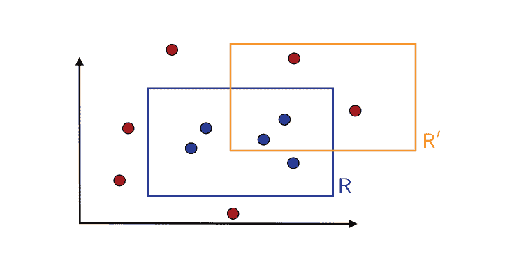

图2.1 目标概念 R 和可能的假设 R'. 圆圈代表训练实例。一个蓝色圆圈是一个标有1的点，因为它位于矩形 R内。其他的是红色的，标有0。

一般情况下，PAC框架是可能的。它可以放宽以包括有利的域适应问题。最后，PAC框架处理学习一个概念类 C 而不是特定概念的可学习性问题。注意，概念类 C 是算法已知，但目标概念 c ∈ C 是未知的。

在许多情况下，特别是当概念的计算表示没有明确讨论或是直接的时候，我们可以忽略多项式对 n 和 size(c) 在PAC定义中的依赖，并只关注样本复杂性。

现在我们用一个具体的学习问题来说明PAC学习。

### 例2.4 (学习轴对齐矩形)

考虑实例集合为平面上的点，X = ℝ², 概念类 C 是所有轴对齐矩形在 ℝ² 中的集合。学习问题是通过标记的训练样本确定一个具有小误差的目标轴对齐矩形。

我们将证明轴对齐矩形的概念类是可PAC学习的。图2.1说明了这个问题。R 代表目标轴对齐矩形而 R' 代表一个假设。从图中可以看出，R' 的错误区域由矩形 R 内部但不在矩形 R' 内部的区域和矩形 R' 内部但不在矩形 R 内部的区域组成。第一个区域对应于假阴性，即被 R' 标记为0或负的点，实际上是正或标记为1的点。第二个区域对应于假阳性，即被 R' 标记为正的点实际上是负标记的点。

为了证明概念类是可PAC学习的，我们描述了一个简单的PAC-学习算法 A。给定一个标记样本 S, 该算法返回包含标记为1的点的最紧密的轴对齐矩形 R' = R_S。

图2.2展示了算法返回的假设。根据定义，R_S 不会产生任何假阳性，因为它的点必须包含在目标概念 R 中。因此，R_S 的错误区域包含在 R 中。

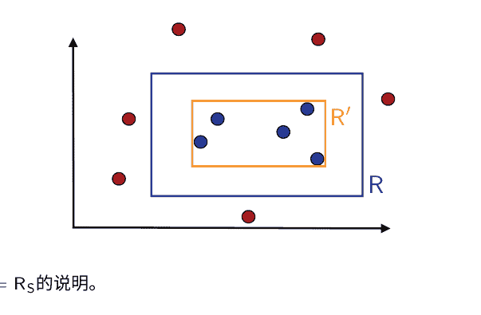

图2.2 算法返回的假设 R′ = R_S 的说明。

设 R ∈ C 为目标概念。固定 ε > 0。设 𝔼[R] 表示由 R 定义的区域的概率质量，即根据 𝔻 随机抽取的点落在 R 内的概率。由于我们的算法产生的错误只能是由落在 R 内的点引起的，我们可以假设 𝔼[R] > ε；否则，R_S 的错误将小于或等于 ε，无论训练样本 S 如何。

现在，由于 𝔼[R] > ε，我们可以定义四个矩形区域 r₁, r₂, r₃ 和 r₄ 沿着 R 的边，每个区域的概率至少为 ε/4。这些区域可以通过从完整的矩形 R 开始，然后在保持至少 ε/4 的分布质量的同时尽可能减小大小来构建。图2.3展示了这些区域的定义。

设 l, r, b 和 t 是定义 R 的四个实数值：R = [l, r] × [b, t]。然后，例如，左边的矩形 r₄ 由 r₄ = [l, s₄] × [b, t] 定义，其中 s₄ = inf{s: 𝔼[[l, s] × [b, t]] ≥ ε/4}。很容易看出，从 r₄ 通过排除最右边的边得到的区域 r₄' = [l, s₄[ × [b, t] 的概率最多为 ε/4。r₁, r₂, r₃ 以类似的方式定义。

观察到，如果 R_S 覆盖了这四个区域中的所有区域 rᵢ, i ∈ [4]，那么因为它是一个矩形，它将在这些区域中的每个区域都有一条边（几何论证）。它的错误区域，即它没有覆盖的 R 的部分，因此包含在这些区域 rᵢ, i ∈ [4] 的并集中，并且不能具有超过 ε 的概率质量。

根据逆否命题，如果 R(R_S) > ε，则 R_S 必须至少错过一个区域 rᵢ, i ∈ [4]。因此，我们可以写成

𝔼_{S∼𝔻^m}[R(R_S) > ε] ≤ 𝔼_{S∼𝔻^m}[∪_{i=1}^4 {R_S ∩ rᵢ = ∅}] (2.5)
≤ ∑_{i=1}^4 𝔼_{S∼𝔻^m}[{R_S ∩ rᵢ = ∅}] (通过并集边界)
≤ 4(1 - ε/4)^m (因为 𝔼[rᵢ] ≥ ε/4)
≤ 4 exp(-mε/4),

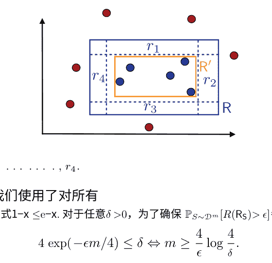

图2.3 区域的示意图 r₁, ..., r₄。

在最后一步中，我们使用了对所有 x ∈ ℝ 成立的一般不等式 1−x ≤ e^{−x}。对于任意 δ > 0, 为了确保 ℙ_{S∼𝒟^m}[R(R_S) > ε] ≤ δ, 我们可以施加

$$4 \exp(-\varepsilon m / 4) \leq \delta \iff m \geq \frac{4}{\varepsilon} \log \frac{4}{\delta}. \tag{2.6}$$

因此，对于任意的 ε > 0 和 δ > 0, 如果样本大小 m 大于 \frac{4}{ε} \log \frac{4}{δ}, 则 ℙ_{S∼𝒟^m}[R(R_S) > ε] ≤ δ。此外，表示点在 ℝ² 和轴对齐矩形的计算成本是常数。它们可以通过它们的四个角来定义。这证明了轴对齐矩形的概念类是可PAC学习的，并且PAC学习轴对齐矩形的样本复杂度在 O(\frac{1}{ε} \log \frac{1}{δ}) 内。

像(2.6)这样呈现样本复杂度结果的等效方式，在本书中我们经常会看到，是给出一个泛化界。一个泛化界表明至少以概率1−δ, R(R_S) 受到某些取决于样本大小 m 和 δ 的上界的限制。为了获得这个结果，只需将 δ 设置为(2.5)中得出的上界，即 δ = 4 exp(−m ε / 4) 并解出 ε。这意味着至少以概率1−δ, 算法的误差受到以下限制:

$$R(R_S) \leq \frac{4}{m} \log \frac{4}{\delta}. \tag{2.7}$$

对于这个例子，还可以考虑其他PAC学习算法。一个替代方案是返回不包含负点的最大轴对齐矩形，例如。刚刚介绍的PAC学习证明对于其他类似算法的分析可以很容易地进行调整。

请注意，在这个例子中，我们考虑的假设集 ℋ 与概念类 𝒞 重合，并且其基数是无限的。尽管如此，这个问题的PAC学习有一个简单的证明。然后我们可以问，类似的证明是否可以轻松地应用于其他类似的概念类。这并不那么直接，因为证明中使用的具体几何论证是关键。将证明扩展到其他概念类，如非同心圆的类，是非平凡的（见练习2.4）。因此，我们需要一种更一般的证明技巧和更一般的结果。接下来的两节为我们提供了有限假设集情况下的工具。

## 2.2 有限假设集的保证 - 一致性情况

在我们研究的轴对齐矩形的例子中，算法返回的假设 h_S 始终是一致的，即在训练样本 S 上没有错误。在本节中，我们提出了一般的样本复杂度界限，或者等价地说，一致假设的泛化界限，对于假设集的基数 |ℋ| 是有限的情况。由于我们考虑的是一致的假设，我们将假设目标概念 c 在 ℋ 中。

> **定理2.5 (学习界限 - 有限 ℋ，一致性情况)**
> 假设 ℋ 是一个从 𝒳 到 𝒴 的函数的有限集。假设 𝒜 是一个算法，对于任何目标概念 c ∈ ℋ 和独立同分布的样本 S，返回一个一致的假设 h_S: R_S(h_S) = 0。那么，对于任何 ε, δ > 0, 不等式 ℙ_{S ∼ 𝒟^m}[R(h_S) ≤ ε] ≥ 1 − δ 成立，如果
> $$m \geq \frac{1}{\epsilon} \left( \log |\mathcal{H}| + \log \frac{1}{\delta} \right). \tag{2.8}$$

这个样本复杂度结果可以作为一个泛化界的等价陈述：对于任意的 ε, δ > 0，至少以概率 1 − δ 成立，
$$R(h_S) \leq \frac{1}{m} \left( \log |\mathcal{H}| + \log \frac{1}{\delta} \right). \tag{2.9}$$

证明：固定 ε > 0。我们不知道算法 𝒜 选择哪个一致的假设 h_S ∈ ℋ。这个假设还依赖于训练样本 S。因此，我们需要给出一个统一收敛界，即对于所有一致的假设集合都成立的界，这个集合显然包括 h_S。因此，我们将限制某个 h ∈ ℋ 的概率，使其一致且错误率大于 ε。一个假设 h 在独立同分布的训练样本 S 上一致且没有错误的概率可以被限制如下：ℙ[R_S(h) = 0] ≤ (1 − ε)^m。

因此，根据联合边界，以下成立：
$$\begin{aligned}
\mathbb{P} \left[ \exists h \in \mathcal{H}_\epsilon : R_S(h) = 0 \right] &= \mathbb{P} \left[ R_S(h_1) = 0 \vee \cdots \vee R_S(h_{|\mathcal{H}_\epsilon|}) = 0 \right] \\
&\leq \sum_{h \in \mathcal{H}_\epsilon} \mathbb{P} \left[ R_S(h) = 0 \right] \quad \text{(联合边界)} \\
&\leq \sum_{h \in \mathcal{H}_\epsilon} (1 - \epsilon)^m \leq |\mathcal{H}| (1 - \epsilon)^m \leq |\mathcal{H}| e^{-m \epsilon}.
\end{aligned}$$

将右边设置为 δ 并解出 ε，证明得出。□

该定理表明，当假设集 ℋ 是有限的时候，一致算法 𝒜 是一个 PAC 学习算法，因为由 (2.8) 给出的样本复杂度是 1/ε 和 1/δ 的多项式支配的。如 (2.9) 所示，一致假设的泛化误差上界由一个随着样本大小 m 减小的项给出。这是一个普遍的事实：正如预期的那样，学习算法受益于更大的标记训练样本。然而，这个定理保证的 O(1/m) 的减小速率特别有利。

提出一致性算法的代价是使用一个更大的假设集合 ℋ，其中包含目标概念。当然，上界 (2.9) 随着 |ℋ| 的增加而增加。然而，这种依赖关系只是对数的。注意，术语 log |ℋ|，或者与之相差一个常数因子的相关术语 log₂ |ℋ|，可以解释为表示 ℋ 所需的位数。因此，定理的泛化保证由这个位数 log₂ |ℋ| 和样本大小 m 的比率控制。

我们现在使用定理 2.5 来分析具有不同概念类的 PAC 学习。

### 例2.6 (布尔文字的合取)

考虑学习最多包含 n 个布尔文字 x₁, …, xₙ 的合取的概念类 𝒞ₙ。布尔文字可以是变量 xᵢ，其中 i ∈ [n]，或者它的否定 \overline{x_i}。对于 n=4，一个例子是合取式：x₁ ∧ x₂ ∧ x₄，其中 \overline{x₂} 表示布尔文字 x₂ 的否定。(1, 0, 0, 1) 是这个概念的正例，而 (1, 0, 0, 0) 是一个负例。

观察到对于 n=4，一个正例子 (1, 0, 1, 0) 意味着目标概念不能包含文字 x₁ 和 x₃，也不能包含文字 \overline{x₂} 和 \overline{x₄}。相比之下，一个负例子没有那么多信息，因为不知道哪些位是错误的。一个简单的算法用于找到一个一致的假设，它基于正例子，并包括以下步骤：对于每个正例子 (b₁, …, bₙ) 和 i ∈ [n]，如果 bᵢ = 1，则 xᵢ 被排除作为可能的文字类别，如果 bᵢ = 0，则 \overline{x_i} 被排除。所有未被排除的文字的合取是与目标一致的假设。图 2.4 展示了一个训练样本的例子，以及对于情况 n=6 的一致假设。

我们有 |ℋ| = |𝒞ₙ| = 3ⁿ，因为每个文字可以被正向包含、否定或不包含。将其代入一致假设的样本复杂度界限，得到任意 ε > 0 和 δ > 0 的样本复杂度界限如下：

$$m \ge \frac{1}{\epsilon} \left( (\log 3)n + \log \frac{1}{\delta} \right). \tag{2.10}$$

因此，至多包含 n 个布尔文字的合取类是可 PAC 学习的。请注意，计算复杂度也是多项式的，因为每个示例的训练成本在 O(n) 内。对于 δ = 0.02，ε = 0.1 和 n = 10，界限变为 m ≥ 149。因此，对于至少 149 个示例的标记样本，该界限保证了至少 98% 的置信度下的 90% 准确率。


图2.4

| 0 | 1 | 1 | 0 | 1 | 1 | + |
|---|---|---|---|---|---|---|
| 0 | 1 | 1 | 1 | 1 | 1 | + |
| 0 | 0 | 1 | 1 | 0 | 1 | - |
| 0 | 1 | 1 | 1 | 1 | 1 | + |
| 1 | 0 | 0 | 1 | 1 | 0 | - |
| 0 | 1 | 0 | 0 | 1 | 1 | + |
| 0 | 1 | ? | ? | 1 | 1 |   |

表的前六行分别表示带有标签的训练示例，标签为 + 或 -，在最后一列中指示。如果对于所有正例，第 i 列中的 ith 条目为 0（分别为 1），则最后一行在列 i ∈ [6] 中包含 0（分别为 1）。如果某个正例中的 ith 条目同时为 0 和 1，则最后一行包含“?”。因此，对于这个训练样本，文本中描述的一致算法返回的假设是 x₁ ∧ x₂ ∧ x₅ ∧ x₆。

### 例2.7 (通用概念类)

考虑由所有布尔向量组成的集合 𝒳 = {0, 1}ⁿ，其中 n 是布尔向量的组件数，让 Uⁿ 是由 𝒳 的所有子集形成的概念类。这个概念类可以 PAC 学习吗？为了保证一致的假设，假设类必须包含概念类，因此 |ℋ| ≥ |Uⁿ| = 2^{2ⁿ}。

定理2.5给出了以下样本复杂度界限：

$$m \geq \frac{1}{\epsilon}\left( (\log 2) \cdot 2^n + \log \frac{1}{\delta} \right) \tag{2.11}$$

在这里，所需的训练样本数量在 n 的指数级增长，这是表示 𝒳 中一个点的成本。因此，该定理不能保证 PAC 学习。事实上，很容易证明这个通用概念类是不能 PAC 学习的。

### 例2.8 (K项 DNF 公式)

一个析取范式（DNF）公式是由几个项的析取组成的公式，每个项都是布尔文字的合取。一个 K 项 DNF 是由最多 N 个布尔文字的合取组成的公式的析取。因此，对于 K=2 和 N=3，一个 K 项 DNF 的例子是 (x₁ ∧ x₂ ∧ x₃) ∨ (x₁ ∧ x₃)。

类 C 的 K 项 DNF 公式是否可以进行 PAC 学习？类的基数是 3^{NK}，因为每个项都是最多 N 个变量的合取，并且有 3^N 个这样的合取，如前所述。假设集合 ℋ 必须包含 C 以进行一致性要求成立，因此 |ℋ| ≥ 3^{NK}。定理2.5给出了以下样本复杂度界限：

$$m \geq \frac{1}{\epsilon}\left((\log 3)nk + \log \frac{1}{\delta}\right), \tag{2.12}$$

这是多项式的。然而，通过从图3-着色问题的约简可以证明，学习 k 项 DNF 的问题，即使对于 k=3，也不是有效的 PAC 可学习的，除非 RP，即问题的复杂性类，允许随机多项式时间决策解决方案，与 NP（RP = NP）重合，这通常被推测不是这种情况。因此，虽然学习 k 项 DNF 公式所需的样本大小仅为多项式，但如果 RP = NP，则无法有效地 PAC 学习这个类。

### 例2.9 (k-CNF公式)

合取范式（CNF）公式是一个合取的析取。一个 k-CNF 公式是形式为 T₁ ∧ … ∧ T_j，其中 j ∈ ℕ 的任意长度，并且每个项 Tᵢ 是至多 k 个布尔属性的析取。

学习 k-CNF 公式的问题可以简化为学习布尔文字的合取，正如之前所见，这是一个可 PAC 学习的概念类。这可以通过引入 (2n)^k 个新变量 Y_{u₁, …, u_k} 来实现，使用以下双射：

$$(u_1, \dots, u_k) \rightarrow Y_{u_1, \dots, u_k} \tag{2.13}$$

其中 u₁, …, u_k 是原始变量 x₁, …, xₙ 的布尔文字值。u₁ ∨ … ∨ u_k 可以用你表示为 Y_{u₁, …, u_k}。使用这个映射，原始训练样本可以转换为一个以新变量定义的样本，原始变量上的任何 k-CNF 公式都可以写成对新变量 Y 的合取。

这种将布尔文字的合取式约简为 PAC 学习的方法可能会影响示例的原始分布，但在 PAC 框架中不做任何关于分布的假设，所以这不是一个问题。因此，使用这种转换，布尔文字的合取式的 PAC 可学习性意味着 k-CNF 公式的 PAC 可学习性。

然而，这是一个令人惊讶的结果，因为任何 k 项的 DNF 公式都可以写成一个 k-CNF 公式。实际上，使用结合律，一个 k 项的 DNF T₁ ∨ … ∨ T_k，其中 T_i = u_{i,1} ∧ … ∧ u_{i,n_i} 对于 i ∈ [k]，可以通过以下方式将其重写为一个 k-CNF 公式：

$$\bigvee_{i=1}^{k} (u_{i,1} \land \dots \land u_{i,n_i}) = \bigwedge_{j_1 \in [n_1], \dots, j_k \in [n_k]} (u_{1,j_1} \lor \dots \lor u_{k,j_k})$$

为了说明这个重写在一个具体的情况下，例如观察到

$$(u_1 \land u_2 \land u_3) \lor (v_1 \land v_2 \land v_3) = \bigwedge_{i,j=1}^{3} (u_i \lor v_j)$$但是，正如我们之前所看到的，如果RP = NP，k项DNF公式不能有效地进行PAC学习！这个明显的矛盾是什么原因呢？问题在于，如果RP = NP，将我们学到的k项CNF公式（等价于k项DNF）转换成一个k项DNF通常是难以处理的。

这个例子揭示了PAC学习的一些关键方面，包括概念表示的成本和假设集的选择。对于一个固定的概念类，学习可能是难以处理的，也可能不是，这取决于表示的选择。

## 2.3 有限假设集的保证 — 不一致情况

在最一般的情况下，可能没有与标记的训练样本一致的假设。事实上，在实践中，这是典型情况，学习问题可能有些困难，或者概念类比学习算法使用的假设集更复杂。然而，对于训练样本上有少量错误的不一致假设可能是有用的，并且正如我们将看到的，它们可以在一些假设下获得有利的保证。本节将准确地介绍了这种不一致情况和有限假设集的学习保证。

为了在这种更一般的情况下得出学习保证，我们将使用Hoeffding不等式（定理D.2）或以下推论，它将单个假设的泛化误差和经验误差联系起来。

推论 2.10 给定 ϵ > 0。那么，对于任意的假设 h: X → {0,1}，以下不等式成立：

> $$\mathbb{P}_{S\sim \mathcal{D}^m} \left[ \widehat{R}_S(h) - R(h) \geq \epsilon \right] \leq \exp(-2m\epsilon^2)$$
$$\mathbb{P}_{S\sim \mathcal{D}^m} \left[ \widehat{R}_S(h) - R(h) \leq -\epsilon \right] \leq \exp(-2m\epsilon^2)$$

根据并集界定，这意味着以下双边不等式：

> $$\mathbb{P}_{S\sim \mathcal{D}^m} \left[ |\widehat{R}_S(h) - R(h)| \geq \epsilon \right] \leq 2 \exp(-2m\epsilon^2)$$

证明 该结果立即由定理D.2得出。

将(2.16)的右侧设为 δ 并解出 ϵ，立即得到单个假设的以下界限。

推论 2.11 （泛化界限-单一假设）固定一个假设 h: X → {0,1}. 那么，对于任意 δ > 0，以下不等式至少以概率 1-δ 成立：

> $$R(h) \leq \widehat{R}_S(h) + \sqrt{\frac{\log \frac{2}{\delta}}{2m}}$$

以下示例说明了这个推论在一个简单情况下的应用。

示例 2.12 （抛硬币）想象一下抛一枚有偏向性的硬币，正面朝上的概率为 $p$，我们的假设是总是猜反面。那么真实错误率为 $R(h) = p$，经验错误率 $\widehat{R}_S(h) = \widehat{p}$，其中 $\widehat{p}$ 是基于独立抽取的训练样本的经验正面概率。因此，推论2.11以概率至少为$1-\delta$保证
$$
\left| \widehat{p} - p \right| \leq \sqrt{\frac{\log \frac{2}{\delta}}{2m}}. \tag{2.18}
$$
因此，如果我们选择 $\delta= 0.02$，并使用样本大小为500，至少有98%的概率，以下近似质量对于 $p$ 是保证的：
$$
\left| \widehat{p} - p \right| \leq \sqrt{\frac{\log(10)}{1000}} \approx 0.048. \tag{2.19}
$$
当在样本 $S$ 上训练时，我们能否直接应用推论2.11来限制学习算法返回的假设 $H_S$ 的泛化误差？不可以，因为 $H_S$ 不是一个固定的假设，而是一个依赖于训练样本 $S$ 的随机变量。还要注意，与固定假设的情况不同，经验误差的期望是泛化误差（方程 (2.3) ） ($R(H_S)$)，而泛化误差 $R(H_S)$ 是一个随机变量，并且通常与期望 $\mathbb{E}[\widehat{R}_S(H_S)]$ 不同，后者是一个常数。

因此，与一致情况的证明类似，我们需要推导出一致收敛界限，即对于所有假设 $h \in \mathcal{H}$，以高概率成立的界限。

**定理 2.13 （学习界限-有限 $\mathcal{H}$，不一致情况）** 设 $\mathcal{H}$ 为有限的假设集。那么，对于任意的 $\delta > 0$，至少以概率 $1 - \delta$，以下不等式成立：
对于每个 $h \in \mathcal{H}$，有 $R(h) \leq \widehat{R}_S(h) + \sqrt{\frac{\log |\mathcal{H}| + \log \frac{2}{\delta}}{2m}}. \tag{2.20}$

证明：设 $h_1, \ldots, h_{|\mathcal{H}|}$ 为 $\mathcal{H}$ 的元素。使用并集界限并对每个假设应用推论2.11得到：
$$
\begin{aligned}
\mathbb{P} \left[ \exists h \in \mathcal{H} \; \big| \widehat{R}_S(h) - R(h) \big| > \epsilon \right] 
&= \mathbb{P} \left[ \big( \big| \widehat{R}_S(h_1) - R(h_1) \big| > \epsilon \big) \vee \ldots \vee \big( \big| \widehat{R}_S(h_{|\mathcal{H}|}) - R(h_{|\mathcal{H}|}) \big| > \epsilon \big) \right] \\
&\leq \sum_{h \in \mathcal{H}} \mathbb{P} \left[ \big| \widehat{R}_S(h) - R(h) \big| > \epsilon \right] \\
&\leq 2|\mathcal{H}| \exp(-2m\epsilon^2).
\end{aligned}
$$
将右侧设置为 $\delta$ 完成证明。 $\square$

因此，对于一个有限的假设集 $\mathcal{H}$，

$$R(h) \leq \widehat{R}_S(h) + O\left(\sqrt{\frac{\log_2 |\mathcal{H}|}{m}}\right).$$

正如已经指出的，$\log_2 |\mathcal{H}|$ 可以解释为表示 $\mathcal{H}$ 所需的位数。关于一致情况下的泛化界限，还可以提出类似的其他观点：更大的样本大小 $m$ 可以保证更好的泛化，而界限随 $|\mathcal{H}|$ 的增加而增加，但仅以对数形式增加。

但是，在这里，界限是 $\sqrt{\frac{\log_2 |\mathcal{H}|}{m}}$ 的一个不太有利的函数——它随这个项的平方根变化。这不是一个小的代价：对于固定的 $|\mathcal{H}|$，为了达到与一致情况下相同的保证，需要一个平方倍大的标记样本。

请注意，该界限建议在减少经验误差与控制假设集大小之间寻求权衡：较大的假设集受到第二项的惩罚，但可以帮助减少经验误差，即第一项。但是，对于类似的经验误差，它建议使用较小的假设集。这可以看作是所谓的奥卡姆剃刀原则的一个例子，该原则以神学家奥卡姆的名字命名：不必要的情况下不应该假设多个，也可以重新表述为，最简单的解释是最好的。在这个背景下，可以表达如下：其他条件相同的情况下，一个更简单（更小）的假设集更好。

## 2.4 概述

在本节中，我们将讨论学习场景的一些一般方面，为简单起见，我们在之前的讨论中没有涉及。

### 2.4.1 确定性与随机性场景

在监督学习的最一般情况下，分布 $\mathcal{D}$ 定义在 $\mathcal{X} \times \mathcal{Y}$ 上，训练数据是根据 $\mathcal{D}$ 独立同分布地抽取的标记样本 $S$:

$$S = ((x_1, y_1), \ldots, (x_m, y_m)).$$

学习问题是找到一个假设 $h \in \mathcal{H}$，使得泛化误差

$$R(h) \text{很小} \quad \mathbb{P}_{(x,y)\sim\mathcal{D}}[h(x)=y] = \mathbb{E}_{(x,y)\sim\mathcal{D}}[\mathbf{1}_{h(x)=y}].$$

这种更一般的情况被称为随机情景。在这个设置中，输出标签是输入的概率函数。随机情景涵盖了许多现实世界中的问题，其中输入点的标签不是唯一的。例如，如果我们根据一个人的身高和体重来预测性别，那么标签通常不是唯一的。

对于大多数配对，男性和女性都是可能的性别。对于每个固定的配对，标签为男性的概率分布会有所不同。
将PAC学习框架自然地扩展到这种情况下被称为不可知的PAC学习。

**定义 2.14 （不可知的PAC学习）** 让 $\mathcal{H}$ 是一个假设集合。如果存在一个多项式函数 $poly(\cdot, \cdot, \cdot, \cdot)$，使得对于任意的 $\varepsilon >0$ 和 $\delta >0$，对于所有的分布 $\mathcal{D}$ over $\mathcal{X} \times \mathcal{Y}$，对于任意的样本大小 $m \geq poly(1/\varepsilon, 1/\delta, n, \text{size}(c))$，以下条件成立：

$$\mathbb{P}_{S \sim \mathcal{D}^m} \left[ R(h_S) - \min_{h \in \mathcal{H}} R(h) \leq \varepsilon \right] \geq 1 - \delta. \tag{2.21}$$

如果 $\mathcal{A}$ 进一步在 $poly(1/\epsilon, 1/\delta, n)$ 中运行，则被认为是一种高效的不可知PAC学习算法。

当一个点的标签可以通过某个可测函数唯一确定时，该场景被称为确定性的。
在这种情况下，只需考虑输入空间上的分布 $\mathcal{D}$。训练样本是通过根据 $\mathcal{D}$ 绘制 $(x_1, ..., x_m)$ 获得的，标签是通过 $f$ 获得的：$y_i = f(x_i)$ 对于所有 $i \in [m]$。许多学习问题可以在这种确定性场景下进行描述。
在前面的章节中，以及本书中的大部分内容中，为了简单起见，我们将我们的介绍限制在确定性场景中。然而，对于所有这些材料，扩展到随机场合对于读者来说应该是直接的。

### 2.4.2 贝叶斯误差和噪声

在确定性情况下，根据定义，存在一个目标函数 $f$ 没有泛化误差：$R(h) =0$。在随机情况下，任何假设都存在一个最小的非零误差。

**定义 2.15 （贝叶斯误差）** 给定一个分布 $\mathcal{D}$ over $\mathcal{X} \times \mathcal{Y}$，贝叶斯误差 $R^\star$ 被定义为可测函数 $h: \mathcal{X} \rightarrow \mathcal{Y}$ 所达到的误差的下确界：

$$R^\star = \inf_{\substack{h \text{ 可测}}} R(h). \tag{2.22}$$

具有 $R( h) = R^\star$ 的假设被称为贝叶斯假设或贝叶斯分类器。
根据定义，在确定性情况下，我们有 $R^\star= 0$，但在随机情况下， $R^\star \neq 0$。显然，贝叶斯分类器 $h_{\text{Bayes}}$ 可以用条件概率来定义：

$$\forall x \in \mathcal{X}, \quad h_{\text{Bayes}}(x) = \underset{y \in \{0,1\}}{\text{argmax}}\ \mathbb{P}[y|x]. \tag{2.23}$$

贝叶斯在 $x \in \mathcal{X}$ 上所做的平均错误是最小的，即 $\min\{\mathbb{P}[0|x], \mathbb{P}[1|x]\}$，这是可能的最小错误。这导致了以下对 $\text{noise}$ 的定义。

## 2.5 章节笔记

PAC学习框架由Valiant [1984]引入。Kearns和Vazirani [1994]的书是一本涵盖PAC-学习和机器学习中几个其他基础问题的优秀参考资料。我们学习轴对齐矩形的例子，也在那个参考文献中讨论过，最初由Blumer等人提出[1989]。

PAC学习框架是一个计算框架，因为它考虑了计算表示的成本和学习算法的时间复杂度。如果我们忽略计算方面，它与Vapnik和Chervonenkis [参见Vapnik，2000 ]早期考虑的学习框架类似。

本章中给出的噪声定义可以推广到任意损失函数（参见练习2.14）。

奥卡姆剃刀原则在各种情境中被引用，例如在语言学中用来证明一组规则或语法的优越性。科尔莫戈洛夫复杂性可以被视为信息论中的相应框架。在本章中介绍的学习保证的背景下，该原则建议选择最简洁的解释（具有最小基数的假设集）。

在接下来的章节中，我们将看到该原则在不同的简单性或复杂性概念中的其他应用。

## 2.6 练习

2.1 PAC模型的两个预言机变体。假设正例和负例现在是从两个不同的分布 $\mathcal{D}_+$ 和 $\mathcal{D}_-$ 中抽取的。对于准确率 $(1 - \epsilon)$，学习算法必须找到一个假设 $h$，使得：

$$\mathbb{P}_{x\sim\mathcal{D}_+} [h(x) = 0] \leq \epsilon \quad \text{和} \quad \mathbb{P}_{x\sim\mathcal{D}_-} [h(x) = 1] \leq \epsilon. \quad (2.25)$$

因此，假设在两个分布上的误差必须很小。假设 $\mathcal{C}$ 是任意概念类，$\mathcal{H}$ 是任意假设空间。假设 $h_0$ 和 $h_1$ 分别表示恒等于0和恒等于1的函数。证明在标准（单个 oracle）PAC模型中，如果 $\mathcal{C}$ 可以使用 $\mathcal{H}$ 高效地PAC学习，则可以使用 $\mathcal{H} \cup \{h_0, h_1\}$ 在这个双oracle PAC模型中高效地PAC学习。

2.2 超矩形的PAC学习。在 $\mathbb{R}^n$ 中，一个轴对齐的超矩形是一个形式为 $[a_1, b_1] \times \dots \times [a_n, b_n]$ 的集合。通过扩展示例2.4中给出的证明，证明轴对齐的超矩形是PAC可学习的，对于情况 $n=2$。

2.3 同心圆。设 $\mathcal{X} = \mathbb{R}^2$，考虑形式为 $c = \{(x, y): x^2 + y^2 \leq r^2\}$ 的概念集合，其中 $r$ 为实数。证明这个类别可以从大小为 $m \geq (1/\epsilon) \log(1/\delta)$ 的训练数据中被 $(\epsilon, \delta)$-PAC学习。

2.4 非同心圆。设 $\mathcal{X} = \mathbb{R}^2$，考虑形式为 $c = \{x \in \mathbb{R}^2: ||x - x_0|| \leq r\}$ 的概念集合，其中 $x_0 \in \mathbb{R}^2$ 为一个点，$r$ 为实数。渴望成为机器学习研究员的Gertrude试图证明这个概念类别可以通过样本复杂度 $m \geq (3/\epsilon) \log(3/\delta)$ 进行 $(\epsilon, \delta)$-PAC学习，但她在证明中遇到了困难。她的想法是学习算法会选择与训练数据一致的最小圆。她在概念 $c$ 的边缘绘制了三个区域 $r_1$，$r_2$，$r_3$，每个区域的概率为 $\epsilon/3$（见图2.5(a)）。她想要证明如果泛化误差大于或等于 $\epsilon$，则训练数据中必定会漏掉其中一个区域，因此这个事件发生的概率最多为 $\delta$。你能告诉Gertrude她的方法是否有效吗？（提示：你可能希望在解决方案中使用图2.5(b)）。

### 2.7 在噪声存在下的学习 - 矩形

在示例2.4中，我们展示了轴对齐矩形的概念类是可PAC学习的。现在考虑学习者接收到的训练点受以下噪声影响的情况：负标记的点不受噪声影响，但正训练点的标签以概率 $\eta \in (0, 1/2)$ 随机翻转为负。噪声率 $\eta$ 的确切值对于学习者来说是未知的，但上界 $\eta'$ 与 $\eta \leq \eta' < 1/2$ 一起提供给他。证明在存在这种噪声的情况下，返回包含正点的最紧密矩形的算法仍然可以PAC学习轴对齐矩形。为此，您可以按照以下步骤进行：

+   (a) 使用与示例2.4中相同的符号，假设 $\mathbb{P}[R] > \epsilon_0$。假设 $R(R') > \epsilon_0$。给出 $R'$ 在 $[4]$ 区域 $r_j, j \in [4]$ 中未命中的概率的上界，以 $\epsilon$ 和 $\eta'$ 为变量？
(b) 利用此结果给出 $\mathbb{P}[R(R') > \epsilon]$ 的上界，以 $\epsilon$ 和 $\eta'$ 为变量，并通过给出样本复杂度上界来得出结论。

### 2.8 在存在噪声的情况下学习 - 一般情况

在这个问题中，我们将寻求比上一个问题更一般的结果。我们考虑一个有限的假设集 $\mathcal{H}$，假设目标概念在 $\mathcal{H}$ 中，并采用以下噪声模型：学习者接收到的训练点的标签是以概率 $\eta$ 随机改变 $\in (0, \frac{1}{2})$。噪声率 $\eta$ 的确切值对学习者来说是未知的，但他会提供一个上界 $\eta'$，其中 $\eta \leq \eta' < 1/2$。

(a) 对于任意的 $h \in \mathcal{H}$，令 $d(h)$ 表示学习者接收到的训练点的标签与 $h$ 给出的标签不一致的概率。令 $h^*$ 为目标假设，证明 $d(h^*) = \eta$。

(b) 更一般地，证明对于任意的 $h \in \mathcal{H}$, $d(h) = \eta + (1-2\eta) R(h)$，其中 $R(h)$ 表示 $h$ 的泛化误差。

(c) 固定 $\epsilon >0$，对于此问题和以下所有问题都成立。利用前面的问题证明如果 $R(h)> \epsilon$，则 $d(h) - d(h^*) \geq \epsilon'$，其中 $\epsilon' = \epsilon(1-2\eta')$。

(d) 对于任意假设 $h \in \mathcal{H}$ 和大小为 $m$ 的样本 $S$，令 $d(h)$ 表示 $S$ 中与 $h$ 给出的标签不一致的点的比例。我们将考虑算法 $L$，它在接收到 $S$ 后返回具有最小不一致数的假设 $h_S$（因此 $d(h_S)$ 是最小的）。为了展示 $L$ 的 PAC 学习，我们将证明对于任意 $h$，如果 $R(h)> \epsilon$，则以高概率有 $d(h) \geq d(h^*)$。首先，证明对于任意 $\delta >0$，至少以概率 $1- \delta/2$，对于 $m \geq$ $\frac{2}{\epsilon'^2} \log \frac{2}{\delta}$，以下条件成立：$d(h^*) - d(h_S) \leq \epsilon'/2$。

(e) 其次，证明对于任意 $\delta >0$，至少以概率 $1- \delta/2$，对于 $m \geq \frac{2}{\epsilon'^2} (\log |\mathcal{H}|+ \log \frac{2}{\delta})$，对于所有 $h \in \mathcal{H}$，以下条件成立：$d(h) - d(h_S) \leq \epsilon'/2$。

(f) 最后，证明对于任意 $\delta >0$，至少以概率 $1- \delta$，对于 $m \geq \frac{2}{\epsilon^2 (1-2\eta')^2} (\log |\mathcal{H}|+ \log \frac{2}{\delta})$，对于所有 $h \in \mathcal{H}$ 且 $R(h)> \epsilon$，以下条件成立：$d(h) - d(h^*) \geq 0$。

> (提示：使用 $d(h)- d(h^*) = [d(h)- d(h_S)] + [d(h_S)- d(h^*)] + [d(h^*) - d(h^*)]$ 并且使用前面的问题来下界这三个项)。

### 2.8 学习区间
给出一个 PAC 学习算法，用于由闭区间 $[a, b]$ 组成的概念类 $\mathcal{C}$，其中 $a, b \in \mathbb{R}$。

### 2.9 学习区间的并集
给出一个 PAC 学习算法，用于由两个闭区间的并集组成的概念类 $\mathcal{C}_2$，即 $[a, b] \cup [c, d]$，其中 $a, b, c, d \in \mathbb{R}$。扩展你的结果，推导出一个 PAC 学习算法，用于由 $p$ 个闭区间的并集组成的概念类 $\mathcal{C}_p$，即 $[a_1, b_1] \cup \cdots \cup [a_p, b_p]$，其中 $a_k, b_k \in \mathbb{R}$，对于 $k \in [p]$。你的算法的时间和样本复杂度是关于 $p$ 的函数是什么？

### 2.10 一致的假设
在本章中，我们展示了一个有限的假设集合 $\mathcal{H}$，一个一致的学习算法 $\mathcal{A}$ 是一个 PAC 学习算法。在这里，我们考虑一个相反的问题。设 $\mathcal{Z}$ 是一个有限的标记点集合 $m$。假设你有一个 PAC 学习算法 $\mathcal{A}$。证明你可以使用 $\mathcal{A}$ 和一个有限的训练样本 $S$ 在多项式时间内找到一个与 $\mathcal{Z}$ 一致的假设 $h \in \mathcal{H}$，并且概率很高。（提示：你可以选择一个适当的分布 $\mathcal{D}$ over $\mathcal{Z}$，并给出一个关于 $R(h)$ 一致性的条件。）

## 2.11 参议院法律
对于重要问题，总统 Mouth 依靠专家建议。他从一个包含 $\mathcal{H}= 2,800$ 个专家的集合中选择一个合适的顾问。

- (a) 假设法律是根据一个未知参议员组成的分布 $\mathcal{D}$ 以随机独立的方式提出的。假设总统 Mouth 可以从 $\mathcal{H}$ 中找到并选择一个在过去的 $m= 200$ 个法律中一直与多数人投票一致的专家参议员。给出这样一个参议员在预测未来法律的全球投票时错误的概率的上界。这个上界的值在 95% 的置信水平下是多少？
- (b) 现在假设总统 Mouth 可以找到并选择一个参议员专家，他在过去的 $m= 200$ 个法律中除了 $m'= 20$ 个之外，一直与多数人一起投票。新界限的价值是多少？

### 2.12 贝叶斯界限
让 $\mathcal{H}$ 是一个将 $\mathcal{X}$ 映射到 $\{0, 1\}$ 的可数假设集合，并且让 $p$ 是 $\mathcal{H}$ 上的概率度量。这个概率度量表示假设类的先验概率，即学习算法选择特定假设的概率。使用 Hoeffding 不等式证明对于任何 $\delta > 0$，至少以概率 $1 - \delta$，以下不等式成立：

> 对于每个 $h \in \mathcal{H}$，有 $R(h) \leq R_S(h) + \frac{\log \frac{1}{p(h)} + \log \frac{1}{\delta}}{2m}$。

将这个结果与有限假设集的不一致情况下给出的界限进行比较（提示：你可以在 Hoeffding 不等式中使用 $\delta' = p(h)\delta$ 作为置信参数）。

### 2.13 学习未知参数
在例子 2.9 中，我们展示了 $k$-CNF 的概念类是可 PAC 学习的。然而，请注意，学习算法是以 $k$ 作为输入的。即使没有提供 $k$，PAC 学习是否仍然可能？更一般地，考虑一个概念类族 $\{\mathcal{C}_s\}$ 其中 $\mathcal{C}_s$ 是 $\mathcal{C}$ 中大小最多为 $s$ 的概念集合。假设我们有一个 PAC 学习算法 $\mathcal{A}$，可以用于学习任何概念类 $\mathcal{C}_s$ 当给定 $s$ 时。

我们能将 $\mathcal{A}$ 转化为一个不需要知道 $s$ 的 PAC 学习算法 $\mathcal{B}$ 吗？这是这个问题的主要目标。

为了做到这一点，我们首先引入了一种具有高概率的假设测试方法 $h$。固定 $\epsilon > 0$， $\delta > 0$，和 $i \geq 1$，并通过定义样本大小 $n_0$

$$n = \frac{32}{\epsilon}[i \log 2 + \log \frac{2}{\delta}].$$

假设我们根据某个未知分布 $\mathcal{D}$ 中抽取大小为 $S$ 的独立同分布样本 $S$。如果一个假设 H 在 S 上最多产生 $3/4 \epsilon$ 个错误，则我们称其为被接受的；否则被拒绝。因此，H 被接受当且仅当 $R(\text{H}) \leq 3/4 \epsilon$。

- (a) 假设 $R(\text{H}) \geq \epsilon$。使用（乘法）切尔诺夫界限来证明在这种情况下， $\mathbb{P}(S \sim \mathcal{D})[\text{H被接受}] \leq \frac{\delta}{2^{i+1}}$。
- (b) 假设 $R(\text{H}) \leq \epsilon/2$。使用（乘法）切尔诺夫界限来证明在这种情况下， $\mathbb{P}(S \sim \mathcal{D})[\text{H被拒绝}] \leq \frac{\delta}{2^{i+1}}$。
- (c) 算法 $\mathcal{B}$ 定义如下：我们从 $i=1$ 开始，在每一轮 $i \geq 1$，我们猜测参数大小为 $\widetilde{s} = \lfloor 2^{(i-1)} / \log \frac{2}{\delta} \rfloor$。我们抽取一个大小为 $n$ 的样本 $S$ （取决于 $i$）来测试算法 $\mathcal{A}$ 在大小为 $S_{\mathcal{A}}(\epsilon/2, 1/2, \widetilde{s})$ 的样本上训练后返回的假设 $h_i$，即 $\mathcal{A}$ 的样本复杂度对于所需精度 $\epsilon/2$，置信度 1/2 和大小为 $\widetilde{s}$ 的样本（我们忽略每个示例的表示大小）。如果假设 $h_i$ 被接受，则算法停止并返回 $h_i$，否则继续下一轮迭代。证明如果在第 $i$ 轮迭代中，估计值 $\widetilde{s}$ 大于或等于 $s$，则 $\mathbb{P}[h_i \text{被接受}] \geq 3/8$。
- (d) 证明当 $j = \lceil \log \frac{2}{\delta} / \log \frac{8}{5} \rceil$ 时， $\mathcal{B}$ 不会停止的概率至多为 $\delta/2$。
- (e) 证明对于 $i \geq \lceil 1 + (\log_2 s) \log \frac{2}{\delta} \rceil$，不等式 $\widetilde{s} \geq s$ 成立。
- (f) 证明在概率至少为 $1 - \delta$ 的情况下，算法 $\mathcal{B}$ 在最多 $j' = \lceil 1 + (\log_2 s) \log \frac{2}{\delta} \rceil + j$ 次迭代后停止，并返回一个误差最多为 $\epsilon$ 的假设。

## 2.14 在这个练习中，我们将噪声的概念推广到任意损失函数 $L: \mathcal{Y} \times \mathcal{Y} \rightarrow \mathbb{R}_+$ 的情况。
- (a) 证明以下关于点 $x \in \mathcal{X}$ 的噪声定义的合理性：
$\text{noise}(x) = \min_{y' \in \mathcal{Y}} \mathbb{E}_y[L(y, y')|x]$。
在确定性场景中， $\text{noise}(x)$ 的值是多少？定义是否与本章中给出的二元分类定义相匹配？
- (b) 证明平均噪声与贝叶斯误差（通过可测函数实现的最小损失）相一致。

# 3 Rademacher复杂度和VC维度

机器学习中通常使用无限的假设集。但是前一章的样本复杂度界限在处理无限假设集时没有提供信息。当假设集 H 是无限的时候，是否可能从有限样本中进行高效学习？我们对轴对齐矩形族（示例 2.4）的分析表明，至少在某些情况下，这是可能的，因为我们证明了该无限概念类是 PAC-可学习的。本章的目标是推广该结果，并为无限假设集提供一般的学习保证。

一种常见的做法是将无限情况简化为有限的假设集分析，然后按照前一章的方法进行。有不同的技术可以实现这种简化，每种技术都依赖于假设族的不同复杂度概念。我们将首先使用的复杂度概念是 Rademacher 复杂度。这将帮助我们使用基于 McDiarmid 不等式的相对简单的证明推导出学习保证，同时获得高质量的界限，包括数据相关的界限，我们将在以后的章节中经常使用。然而，对于某些假设集，经验 Rademacher 复杂度的计算是 NP 困难的。因此，我们随后引入了另外两个纯组合概念，即增长函数和 VC 维度。

我们首先将 Rademacher 复杂度与增长函数相关联，然后用 VC 维度来界定增长函数。VC 维度通常更容易界定或估计。我们将回顾一系列示例，展示如何计算或界定它，然后将增长函数与 VC 维度相关联。这导致基于 VC 维度的泛化界限。最后，我们提出了基于 VC 维度的两种不同设置下的下界：可实现设置，其中假设集中至少有一个假设可以达到零期望误差，以及不可实现设置，其中没有假设可以达到零期望误差。

## 3.1 Rademacher复杂度

我们继续使用 $\mathcal{H}$ 来表示假设集，就像前几章一样。本节的许多结果都是通用的，并适用于任意的损失函数 $L: \mathcal{Y} \times \mathcal{Y} \rightarrow \mathbb{R}$。在接下来的内容中，$\mathfrak{G}$ 通常被解释为与 $\mathcal{H}$ 相关的损失函数族从 $\mathcal{Z} = \mathcal{X} \times \mathcal{Y}$ 到 $\mathbb{R}$ 的映射：
$\mathfrak{G} = \{g: (x, y) \rightarrow L(h(x), y) : h \in \mathcal{H}\}$。

然而，这些定义是针对从任意输入空间 Z 到 R 的函数族 $\mathfrak{G}$ 的一般情况给出的。Rademacher 复杂度通过测量假设集适应随机噪声的程度来捕捉函数族的丰富性。以下是经验和平均 Rademacher 复杂度的正式定义。

**定义 3.1 (经验 Rademacher 复杂度)** 设 $\mathfrak{G}$ 为从 $\mathcal{Z}$ 到 $[a, b]$ 的函数族，$S = (z_1, \ldots, z_m)$ 为固定大小为 $m$ 的样本，样本元素属于 $\mathcal{Z}$。那么，对于样本 $S$，$\mathfrak{G}$ 的经验 Rademacher 复杂度定义如下：
$$\mathfrak{R}_S(\mathfrak{G}) = \mathbb{E}_{\sigma} \left[ \sup_{g \in \mathfrak{G}} \frac{1}{m} \sum_{i=1}^{m} \sigma_i g(z_i) \right] , \quad (3.1)$$
其中 $\sigma = (\sigma_1, \ldots, \sigma_m)^{\top}$，$\sigma_i$ 为独立均匀分布的随机变量，取值为 $\{-1, +1\}$。这些随机变量 $\sigma_i$ 被称为 Rademacher 变量。

设 $g_S$ 表示函数 $g$ 在样本 $S$ 上取得的值的向量：$g_S = (g(z_1), \ldots, g(z_m))^{\top}$。那么，经验 Rademacher 复杂度可以重写为
$$\mathfrak{R}_S(\mathfrak{G}) = \mathbb{E}_{\sigma} \left[ \sup_{g \in \mathfrak{G}} \frac{\sigma \cdot g_S}{m} \right] .$$
内积 $\sigma \cdot g_S$ 衡量了 $g_S$ 与随机噪声向量 $\sigma$ 的相关性。最大值 $\sup_{g \in \mathfrak{G}} \sigma \cdot g_S$ 是函数类 $\mathfrak{G}$ 与样本 $S$ 之间相关性的度量。因此，经验 Rademacher 复杂度平均衡量了函数类 $\mathfrak{G}$ 与随机噪声在 $S$ 上的相关性。这描述了函数族 $\mathfrak{G}$ 的丰富性：更丰富或更复杂的函数族 $\mathfrak{G}$ 可以生成更多的向量 $g_S$，从而平均而言与随机噪声更好地相关。

**定义 3.2 (Rademacher 复杂度)** 让 $\mathcal{D}$ 表示根据样本绘制的分布。对于任意整数 $m \geq 1$，$\mathfrak{G}$ 的 Rademacher 复杂度是根据 $\mathcal{D}$ 绘制的所有大小为 $m$ 的样本的经验 Rademacher 复杂度的期望值：
$$\mathfrak{R}_m(\mathfrak{G}) = \mathbb{E}_{S\sim\mathcal{D}^m}[\mathfrak{R}_S(\mathfrak{G})]. \quad (3.2)$$

我们现在准备根据 Rademacher 复杂度提出我们的第一个泛化界限。

**定理 3.3** 让 $\mathfrak{G}$ 是从 $\mathcal{Z}$ 到 $[0,1]$ 的函数族。那么，对于任意 $\delta > 0$，以至少 $1 − \delta$ 的概率在绘制大小为 $m$ 的 i.i.d. 样本 $S$ 时，以下每个不等式对所有 $g \in \mathfrak{G}$ 成立：
$$\mathbb{E}[g(z)] \leq \frac{1}{m} \sum_{i=1}^m g(z_i) + 2\mathfrak{R}_m(\mathfrak{G}) + \sqrt{\frac{\log(1/\delta)}{2m}} \quad (3.3)$$
和
$$\mathbb{E}[g(z)] \leq \frac{1}{m} \sum_{i=1}^m g(z_i) + 2\mathfrak{R}_S(\mathfrak{G}) + 3 \sqrt{\frac{\log(2/\delta)}{2m}}. \quad (3.4)$$

**证明:** 对于任意样本 $S=(z_1, …, z_m)$ 和任意 $g \in \mathfrak{G}$，我们用 $\mathbb{E}_S[g]$ 表示 $S$ 上 $g$ 的经验平均值：$\mathbb{E}_S[g] = \frac{1}{m} \sum_{i=1}^m g(z_i)$。证明由将 McDiarmid 不等式应用于对于任意样本 $S$ 定义的函数 $\Phi$ 组成，其中
$$\Phi(S) = \sup_{g\in\mathfrak{G}} (\mathbb{E}[g] - \mathbb{E}_S[g]). \quad (3.5)$$

设 $S$ 和 $S'$ 是两个只有一个点不同的样本，假设 $z_m$ 在 $S$ 中而 $z'_m$ 在 $S'$ 中。由于最大值之差不超过差的最大值，我们有
$$\Phi(S') - \Phi(S) \leq \sup_{g\in\mathfrak{G}} (\mathbb{E}_S[g] - \mathbb{E}_{S'}[g]) = \sup_{g\in\mathfrak{G}} \frac{g(z_m) - g(z'_m)}{m} \leq \frac{1}{m}. \quad (3.6)$$
同样地，我们可以得到 $\Phi(S) - \Phi(S') \leq \frac{1}{m}$，因此 $|\Phi(S) - \Phi(S')| \leq \frac{1}{m}$。然后，根据麦克迪尔密特不等式，对于任意 $\delta > 0$，至少以概率 $1 − \delta/2$，有以下结果：
$$\Phi(S) \leq \mathbb{E}[\Phi(S)] + \sqrt{\frac{\log(2/\delta)}{2m}}. \quad (3.7)$$

接下来，我们对右侧的期望进行如下限制：
$$
\begin{aligned}
\mathbb{E}_S[\Phi(S)] &= \mathbb{E}_S\left[\sup_{g \in \mathcal{G}} \left( \mathbb{E}[g] - \mathbb{E}_S(g) \right)\right] \tag{3.8} \\
&= \mathbb{E}_S\left[\sup_{g \in \mathcal{G}} \mathbb{E}_{S'}\left[ \mathbb{E}_{S'}(g) - \mathbb{E}_S(g) \right]\right] \tag{3.8} \\
&\leq \mathbb{E}_{S,S'}\left[\sup_{g \in \mathcal{G}} \left( \mathbb{E}_{S'}(g) - \mathbb{E}_S(g) \right)\right] \tag{3.9} \\
&= \mathbb{E}_{S,S'}\left[\sup_{g \in \mathcal{G}} \frac{1}{m} \sum_{i=1}^m (g(z_i') - g(z_i))\right] \tag{3.10} \\
&= \mathbb{E}_{\sigma,S,S'}\left[\sup_{g \in \mathcal{G}} \frac{1}{m} \sum_{i=1}^m \sigma_i (g(z_i') - g(z_i))\right] \tag{3.11} \\
&\leq \mathbb{E}_{\sigma,S'}\left[\sup_{g \in \mathcal{G}} \frac{1}{m} \sum_{i=1}^m \sigma_i g(z_i')\right] + \mathbb{E}_{\sigma,S}\left[\sup_{g \in \mathcal{G}} \frac{1}{m} \sum_{i=1}^m -\sigma_i g(z_i)\right] \tag{3.12} \\
&= 2 \mathbb{E}_{\sigma,S}\left[\sup_{g \in \mathcal{G}} \frac{1}{m} \sum_{i=1}^m \sigma_i g(z_i)\right] = 2 \mathfrak{R}_m(\mathcal{G}). \tag{3.13}
\end{aligned}
$$
方程（3.8）利用了在 $S'$ 中采样的点是独立同分布的事实，并且因此 $\mathbb{E}[g] = \mathbb{E}_{S'}[\mathbb{E}_S(g)]$，如（2.3）所示。不等式 3.9 成立是由于最大值函数的次可加性。

在方程（3.11）中，我们引入了 Rademacher 变量 $\sigma_i$，它们是均匀分布的独立随机变量，取值为 $\{−1,+1\}$，如定义 3.2 所示。这不会改变（3.10）中出现的期望值：当 $\sigma_i= 1$ 时，相关的求和项保持不变；当 $\sigma_i = −1$ 时，相关的求和项改变符号，相当于在 $S$ 和 $S'$ 之间交换 $z_i$ 和 $z_i'$。由于我们对所有可能的 $S$ 和 $S'$ 进行期望，这种交换不会影响整体期望；我们只是改变了期望中的求和项顺序。

方程（3.12）成立是由于最大值函数的次可加性，即不等式 $\sup(U + V) \leq \sup(U) + \sup(V)$。最后，（3.13）源于 Rademacher 复杂度的定义以及变量 $\sigma_i$ 和 $-\sigma_i$ 具有相同的分布。

方程（3.13）中的期望 $\mathfrak{R}_m(\mathfrak{G})$ 导致了方程（3.3）中的界限，使用 $\delta$ 代替 $\delta/2$。为了得到以 $\mathfrak{R}_S(\mathfrak{G})$ 为界的表达式，我们观察到，根据定义 3.1，改变 $S$ 中的一个点最多会改变 $\mathfrak{R}_S(\mathfrak{G})$ $\frac{1}{m}$。然后，再次使用 McDiarmid 不等式，以概率 $1 − \delta/2$，以下内容成立：
$$\mathfrak{R}_m(\mathcal{G}) \leq \mathfrak{R}_S(\mathcal{G}) + \frac{\sqrt{\log \frac{2}{\delta}}}{2m}. \tag{3.14}$$

最后，我们使用并集边界将不等式3.7和3.14结合起来，得到概率至少为1−δ的结果：

$$\Phi(S) \leq 2\Re_{S}(\mathfrak{A}) + 3\sqrt{\frac{\log \frac{2}{\delta}}{2m}}$$

与（3.4）相匹配。

下面的结果将假设集H的经验Rademacher复杂度与与H相关的损失函数族G在二进制损失（零一损失）情况下联系起来。

> 引理3.4设H是一个取值为{-1,+1}的函数族，G是与H相关的零一损失的损失函数族：G = {(x, y) → 1_{h(x)=y}: h ∈ H}. 对于任意样本S = ((x1, y1), ..., (xm, ym)) 在X × {-1,+1}中的元素，S_X表示其在X上的投影：S_X = (x1, ..., xm)。那么，G和H的经验Rademacher复杂度之间存在以下关系：

$$\Re_{S}(\mathfrak{A}) = \frac{1}{2} \Re_{S_{X}}(H).$$

证明：对于任意样本S = ((x1, y1), ..., (xm, ym))，其中元素属于X × {-1,+1}，根据定义，G的经验Rademacher复杂度可以表示为：

$$\begin{align*} \Re_{S}(\mathfrak{A}) &= \mathbb{E}_{\sigma} \left[ \sup_{h \in H} \frac{1}{m} \sum_{i=1}^{m} \sigma_i 1_{h(x_i)=y_i} \\ &= \mathbb{E}_{\sigma} \left[ \sup_{h \in H} \frac{1}{m} \sum_{i=1}^{m} \sigma_i \frac{1 - y_i h(x_i)}{2} \\ &= \frac{1}{2} \mathbb{E}_{\sigma} \left[ \sup_{h \in H} \frac{1}{m} \sum_{i=1}^{m} -\sigma_i y_i h(x_i) \\ &= \frac{1}{2} \mathbb{E}_{\sigma} \left[ \sup_{h \in H} \frac{1}{m} \sum_{i=1}^{m} \sigma_i h(x_i) \right] = \frac{1}{2} \Re_{S_{X}}(H), \end{align*}$$

在这里我们使用了1_{h(x_i)=y_i} = (1 - y_i h(x_i))/2以及对于固定的y_i ∈ {-1,+1}，σ_i和 -y_i σ_i的分布相同。

请注意，引理暗示，通过期望，对于任意m ≥ 1, ℜ_m(G) = 这些经验和平均Rademacher复杂性之间的联系可以用来推导二元分类的泛化界限，以Rademacher复杂性来表示假设集H。

### 定理3.5 (Rademacher复杂性界限 - 二元分类)

设H是一个函数族取值为{-1,+1}，D是输入空间X上的分布。那么，对于任意δ > 0，以至少1 - δ的概率，根据分布D抽取的大小为m的样本S，对于任何 $h \in \mathcal{H}$，以下每个都成立：

$$R(h) \leq R_S(h) + \mathfrak{R}_m(\mathcal{H}) + \frac{\sqrt{\log \frac{1}{\delta}}}{2m} \tag{3.17}$$

和

$$R(h) \leq R_S(h) + \mathfrak{R}_S(\mathcal{H}) + 3\frac{\sqrt{\log \frac{2}{\delta}}}{2m}. \tag{3.18}$$

证明： 结果立即由定理3.3和引理3.4得出。 $\blacksquare$

该定理基于Rademacher复杂度为二元分类提供了两个泛化界限。 请注意，第二个界限 (3.18) 是数据相关的：经验Rademacher复杂度 $\mathfrak{R}_S(\mathcal{H})$ 是特定样本 $S$ 绘制的函数。 因此，如果我们能够计算 $\mathfrak{R}_S(\mathcal{H})$，这个界限可能特别有信息量。 但是，我们如何计算经验Rademacher复杂度？ 再次利用 $\sigma_i$ 和 $-\sigma_i$ 具有相同分布的事实，我们可以写成

$$\mathfrak{R}_S(\mathcal{H}) = \mathbb{E}_{\sigma} \left[ \sup_{h \in \mathcal{H}} \frac{1}{m} \sum_{i=1}^{m} -\sigma_i h(x_i) \right] = -\mathbb{E}_{\sigma} \left[ \inf_{h \in \mathcal{H}} \frac{1}{m} \sum_{i=1}^{m} \sigma_i h(x_i) \right].$$

现在，对于固定的 $\sigma$ 值，计算 $\inf_{h \in \mathcal{H}} \frac{1}{m} \sum_{i=1}^{m} \sigma_i h(x_i)$ 等价于一个经验风险最小化问题，已知对于某些假设集来说，这是计算上困难的。 因此，在某些情况下，计算 $\mathfrak{R}_S(\mathcal{H})$ 可能是计算上困难的。 在接下来的章节中，我们将把Rademacher复杂度与更容易计算且在许多情境中具有独立兴趣的组合度量相关联。

## 3.2 增长函数

在这里，我们将展示如何用增长函数来界定Rademacher复杂度。

### 定义3.6 (增长函数)

对于一个假设集 $\mathcal{H}$，增长函数 $\Pi_{\mathcal{H}}: \mathbb{N} \rightarrow \mathbb{N}$ 定义如下：

$$\forall m \in \mathbb{N}, \Pi_{\mathcal{H}}(m) = \max_{\{x_1, ..., x_m\} \subseteq \mathcal{X}} \left| \left\{ \left( h(x_1), \ldots, h(x_m) \right) : h \in \mathcal{H} \right\} \right|. \tag{3.19}$$

换句话说，$\Pi_{\mathcal{H}}(m)$ 是使用 $\mathcal{H}$ 中的假设对 $m$ 个点进行分类的最大不同方式的数量。这些不同的分类中的每一个都被称为一个二分法，因此增长函数计算了由假设实现的二分法的数量。 这提供了对假设集 $\mathcal{H}$ 丰富程度的另一种度量。 然而，与Rademacher复杂度不同，这个度量不依赖于分布，它纯粹是组合的。

为了将Rademacher复杂度与增长函数联系起来，我们将使用Massart的引理。

### 定理3.7 (Massart的引理)

设 $\mathcal{A} \subseteq \mathbb{R}^m$ 是一个有限集，其中 $r = \max_{\mathbf{x} \in \mathcal{A}} \|\mathbf{x}\|_2$，则以下成立：

$$\mathbb{E}_{\sigma}\left[ \frac{1}{m} \sup_{\mathbf{x} \in \mathcal{A}} \sum_{i=1}^{m} \sigma_i x_i \right] \leq \frac{r \sqrt{2 \log |\mathcal{A}|}}{m}, \quad (3.20)$$

其中 $\sigma_i$ 是独立的均匀随机变量，取值为 $\{-1, +1\}$，而 $x_1, \ldots, x_m$ 是向量 $\mathbf{x}$ 的分量。

证明： 该结果立即由推论 D.11 给出的最大期望值的界限得出，因为随机变量 $\sigma_i x_i$ 是独立的且每个 $\sigma_i x_i$ 的取值在 $[-|x_i|, |x_i|]$ 范围内 $\sum_{i=1}^m x_i^2 \leq r^2$。

利用这个结果，我们现在可以用增长函数来界定 Rademacher 复杂度。

### 推论 3.8

设 $\mathcal{S}$ 是一个取值为 $\{-1, +1\}$ 的函数族。那么以下结论成立：

$$\Re_{m}(\mathcal{S}) \leq \frac{\sqrt{2 \log \Pi_{\mathcal{S}}(m)}}{m}. \quad (3.21)$$

证明： 对于固定的样本 $S = (x_1, \ldots, x_m)$，我们用 $\mathcal{S}|_S$ 表示函数值向量的集合 $(g(x_1), \ldots, g(x_m))^T$ 其中 $g$ 属于 $\mathcal{S}$。由于 $g \in \mathcal{S}$ 取值在 $\{-1, +1\}$ 之间，这些向量的范数被 $\sqrt{m}$ 所限制。然后我们可以如下应用 Massart 引理：

$$\Re_{m}(\mathcal{S}) = \mathbb{E}_{S}\left[ \mathbb{E}_{\sigma}\left[ \sup_{u \in \mathcal{S}|_S} \frac{1}{m} \sum_{i=1}^{m} \sigma_i u_i \right] \right] \leq \mathbb{E}_{S}\left[ \frac{\sqrt{m} \sqrt{2 \log |\mathcal{S}|_S|}}{m} \right] .$$

根据定义，$|\mathcal{S}|_S|$ 被增长函数所限制，因此，

$$\Re_{m}(\mathcal{S}) \leq \mathbb{E}_{S}\left[ \frac{\sqrt{m} \sqrt{2 \log \Pi_{\mathcal{S}}(m)}}{m} \right] = \frac{\sqrt{2 \log \Pi_{\mathcal{S}}(m)}}{m},$$

这证明了结论。

将定理 3.5 的概括界 (3.17) 与推论 3.8 结合起来，立即得到以下关于增长函数的概括界。

### 推论 3.9 (增长函数概括界)

设 $\mathcal{H}$ 是一个函数族，取值为 $\{-1, +1\}$。那么，对于任意 $\delta > 0$，至少以概率 $1 - \delta$，对于任意 $\mathcal{H}$ 中的 $h$，

$$R(h) \leq R_S(h) + \frac{\sqrt{2 \log \Pi_{\mathcal{H}}(m)}}{m} + \frac{\log \frac{1}{\delta}}{2m}. \quad (3.22)$$

图3.1 实线上区间的VC维。(a) 任意两个点都可以被覆盖。(b) 不能通过三个点的样本来覆盖，因为无法实现(+,–,+)的标记。

增长函数界也可以直接推导出来（不使用Rademacher复杂度界）。得到的界如下所示：

$$P\left[\left|R(h) - R_S(h)\right| > \epsilon \right] \leq 4\Pi_{\mathcal{H}}(2m) \exp\left(-\frac{m\epsilon^2}{8}\right), \tag{3.23}$$

仅仅与(3.22)的常数有所不同。

增长函数的计算可能并不总是方便的，因为根据定义，需要计算所有 $\Pi_{\mathcal{H}}(m)$ 的值 $m \geq 1$。下一节介绍一种基于单个标量的假设集 $\mathcal{H}$ 复杂度的替代度量，实际上与增长函数的行为密切相关。

## 3.3 VC-维度

在这里，我们介绍了VC-维度(Vapnik-Chervonenkis维度)的概念。VC-维度也是一个纯组合概念，但通常比增长函数（或Rademacher复杂度）更容易计算。正如我们将看到的，VC-维度是学习中的一个关键量，与增长函数直接相关。

为了定义假设集 $\mathcal{H}$ 的VC维度，我们首先介绍了破碎的概念。回顾前一节，给定一个假设集 $\mathcal{H}$，一个集合 $S$ 的二分法是使用 $\mathcal{H}$ 中的一个假设对 $S$ 的点进行标记的可能方式之一。当 $\mathcal{H}$ 实现了 $S$ 的所有可能的二分法时，即 $\Pi_{\mathcal{H}}(m) = 2^m$，我们说一个包含 $m \geq 1$ 个点的集合 $S$ 被假设集 $\mathcal{H}$ 破碎了。

### 定义3.10 (VC维度)

假设集 $\mathcal{H}$ 的VC维度是能够被 $\mathcal{H}$ 破碎的最大集合的大小：

$$\text{VCdim}(\mathcal{H}) = \max\{m: \Pi_{\mathcal{H}}(m) = 2^m\}. \tag{3.24}$$

注意，根据定义，如果 $\text{VCdim}(\mathcal{H}) = d$，则存在一个大小为 $d$ 的集合可以被破碎。然而，这并不意味着所有大小不超过 $d$ 的集合都被破碎了，实际上，通常情况下并非如此。

图3.2 在 $R^2$中，使用超平面对四个点进行不可实现的二分。(a) 所有四个点都位于凸包上。(b) 三个点位于凸包上，而剩余的点位于内部。

为了进一步说明这个概念，我们将研究一系列假设集的例子，并确定每种情况下的VC维度。为了计算VC维度，我们通常会展示其值的下界，然后再展示一个匹配的上界。为了给出 $VCdim(\mathcal{H})$ 的下界 $d$，只需证明一个基数为 $d$ 的集合 $S$ 可以被 $\mathcal{H}$ 破碎。为了给出上界，我们需要证明没有一个基数为 $d+1$ 的集合 $S$ 可以被 $\mathcal{H}$ 破碎，这通常更加困难。

### 例子3.11（实数线上的区间）

我们的第一个例子涉及实数线上的区间假设类。很明显，VC维度至少为二，因为所有四个二分 $(+,+)$ $(-,-)$ $(+,-)$ $(-,+)$ 都可以实现，如图3.1(a)所示。相反，根据区间的定义，无法实现三个点的标记 $(+,-,+)$。因此，区间的VC维度为 $VCdim(\text{区间}) = 2$。

### 例子3.12（超平面）

考虑在 $R^2$中的一组超平面。我们首先观察到在 $R^2$中，任意三个非共线点都可以被打破。为了得到前三个二分法，我们选择一个超平面，使得两个点在一侧，第三个点在另一侧。为了得到第四个二分法，我们将三个点都放在超平面的同一侧。剩下的四个二分法可以通过简单地改变符号来实现。接下来，我们通过考虑两种情况来证明四个点无法被打破：(i) 四个点位于由这四个点定义的凸包上，以及(ii) 四个点中有三个点位于凸包上，而剩下的一个点位于内部。在第一种情况下，无法实现对角线对中的一个正标记和另一个负标记，如图3.2(a)所示。在第二种情况下，无法实现对凸包上的点为正标记，内部点为负标记的标记，如图3.2(b)所示。因此，$VCdim$（在 $R^2$中的超平面）$= 3$。

更一般地说，在 $R^d$中，我们通过从一组 $d+1$个点开始，将 $\mathbf{x}_0$设置为原点，并定义 $\mathbf{x}_i$，对于 $i\in \{1, \ldots, d\}$，作为坐标为1且其他坐标为0的点。令 $y_0, y_1, \ldots, y_d \in \{-1, +1\}$ 为对于 $\mathbf{x}_0, \mathbf{x}_1, \dots, \mathbf{x}_d$ 的任意标签集合。令 $\mathbf{w}$ 为向量，其第 $i$ 个坐标为 $y_i$。那么由方程 $\mathbf{w} \cdot \mathbf{x} + \frac{y_0}{2} = 0$ 定义的分类器能够覆盖 $\mathbf{x}_0, \mathbf{x}_1, \dots, \mathbf{x}_d$，因为对于任意 $i \in \{0, 1, \dots, d\}$，有 $\operatorname{sgn}\left(\mathbf{w} \cdot \mathbf{x}_i + \frac{y_0}{2}\right) = \operatorname{sgn}\left(y_i + \frac{y_0}{2}\right) = y_i$。

为了得到一个上界，只需证明没有一个由 $d+2$ 个点组成的集合可以被半空间划分。为了证明这一点，我们将使用以下一般定理。

### 定理3.13 (Radon定理)

在 $\mathbb{R}^d$ 中，任意一个由 $d+2$ 个点组成的集合 $\mathcal{X}$ 可以被划分为两个子集 $\mathcal{X}_1$ 和 $\mathcal{X}_2$，使得 $\mathcal{X}_1$ 和 $\mathcal{X}_2$ 的凸包相交。

证明： 令 $\mathcal{X} = \{\mathbf{x}_1, \dots, \mathbf{x}_{d+2}\} \subset \mathbb{R}^d$。下面是一个由 $\alpha_1, \dots, \alpha_{d+2}$ 组成的 $d+1$ 个线性方程组：

$$\sum_{i=1}^{d+2} \alpha_i \mathbf{x}_i = 0 \quad \text{和} \quad \sum_{i=1}^{d+2} \alpha_i = 0,$$

因为第一个等式导致了 $d$ 个方程，每个分量都有一个。未知数的数量，$d+2$，大于方程的数量，$d+1$，因此该系统存在一个非零解 $\beta_1, \dots, \beta_{d+2}$。由于 $\sum_{i=1}^{d+2} \beta_i = 0$，两者 $J_1 =\{i \in [d+2] : \beta_i > 0\}$ 和 $J_2 = \{i \in [d+2] : \beta_i \le 0\}$ 是非空集合，且 $\mathcal{X}_1 = \{\mathbf{x}_i : i \in J_1\}$ 和 $\mathcal{X}_2 = \{\mathbf{x}_i : i \in J_2\}$ 形成了 $\mathcal{X}$ 的一个分区。根据(3.26)的最后一个方程， $\sum_{i \in J_1} \beta_i = -\sum_{i \in J_2} \beta_i$。假设 $\beta = \sum_{i \in J_1} \beta_i$ 然后，(3.26)的第一部分意味着

$$\sum_{i \in J_1} \frac{\beta_i}{\beta} \mathbf{x}_i = \sum_{i \in J_2} \frac{-\beta_i}{\beta} \mathbf{x}_i,$$

其中 $\sum_{i \in J_1} \frac{\beta_i}{\beta} = \sum_{i \in J_2} \frac{-\beta_i}{\beta} = 1$, 并且 $\beta_i / \beta \geq 0$ 对于 $i \in J_1$ 和 $-\beta_i / \beta \geq 0$ 根据凸包的定义 (B.6)，这意味着 $\sum_{i \in J_1} \frac{\beta_i}{\beta} \mathbf{x}_i$ 同时属于 $\mathcal{X}_1$ 和 $\mathcal{X}_2$ 的凸包。

现在，让 $\mathcal{X}$ 是一个由 $d+2$ 个点组成的集合。根据Radon定理，它可以被分成两个集合 $\mathcal{X}_1$ 和 $\mathcal{X}_2$，使得它们的凸包相交。观察到当两个点集 $\mathcal{X}_1$ 和 $\mathcal{X}_2$ 被一个超平面分开时，它们的凸包也被该超平面分开。因此，$\mathcal{X}_1$ 和 $\mathcal{X}_2$ 不能被超平面分开，$\mathcal{X}$ 没有被粉碎。结合我们的下界和上界，我们证明了 $\text{VCdim}$ ($\mathbb{R}^d$ 中的超平面) $= d+1$。

### 例子3.14 (轴对齐矩形)

我们首先通过考虑一个菱形模式中的四个点来证明VC维至少为四。然后，很明显，所有16个二分法都可以实现，其中一些在图3.3 (a) 中有所说明。相比之下，对于任何一组五个不同的点，如果我们构造包含这些点的最小轴对齐矩形，其中一个五个点在矩形的内部。## 3.3 VC-维度

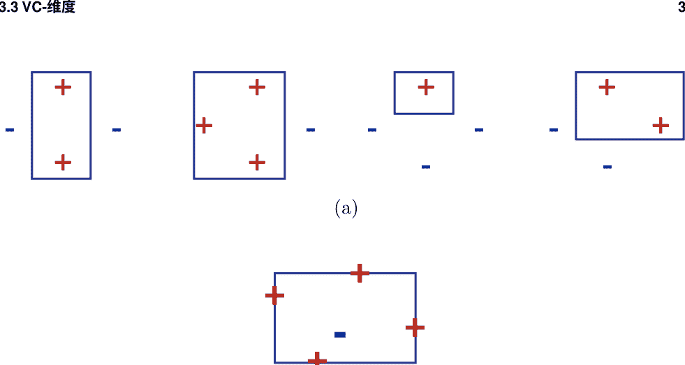

**图3.3** 轴对齐矩形的VC维度。(a) 四个点形成菱形模式的可实现二分法示例。(b) 如果内部点和其余点的标签相反，则无法实现五个点的样本。

这个矩形。假设我们给这个内部点分配一个负标签，并给剩下的四个点中的每一个分配一个正标签，如图3.3(b)所示。没有轴对齐矩形可以实现这种标记。因此，没有一组五个不同的点可以被粉碎，$\text{VCdim}(\text{轴对齐矩形}) = 4$。

### 例3.15 (凸多边形)

我们关注平面上的凸 $d$-边形类。
为了得到一个下界，我们证明任意一组$2d+1$个点都可以被粉碎。为了做到这一点，我们选择在一个圆上的$2d+1$个点，并对于特定的标记，如果负标记多于正标记，则使用带有正标记的点作为多边形的顶点，如图3.4(a)所示。否则，负点的切线作为多边形的边，如图3.4(b)所示。为了得到一个上界，可以证明选择圆上的点最大化了可能的二分法数量，因此$\text{VCdim}(\text{凸 } d\text{-边形}) = 2d + 1$。注意还有 $\text{VCdim}(\text{凸多边形}) = +\infty$。

### 例子 3.16 (正弦函数)

之前的例子可能会暗示 VC-dimension of $\mathcal{H}$ 与定义 $\mathcal{H}$ 的自由参数数量相同。例如，定义超平面的参数数量与它们的 VC-dimension 相匹配。然而，这并不是普遍适用的。本章中的几个练习说明了这一事实。以下提供了一个引人注目的例子。考虑以下正弦函数族：$\{t \rightarrow \sin(\omega t) : \omega \in \mathbb{R}\}$。这个函数类的一个实例在图 3.5 中显示。这些正弦函数可以用于对实数线上的点进行分类：如果一个点在曲线上方，则标记为正；否则标记为负。尽管这个正弦函数族通过一个参数 $\omega$ 来定义，但可以证明 $\text{VCdim}(\text{正弦函数}) = +\infty$ (练习3.20)。

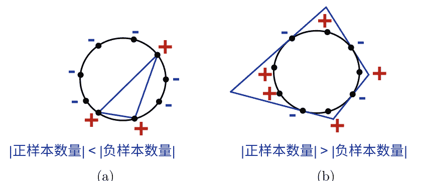

图 3.4 平面上的凸多边形可以打破 $2d+1$ 个点。(a) 当有更多的负标签时，进行 $d$-边形构造。(b) 当有更多的正标签时，进行 $d$-边形构造。

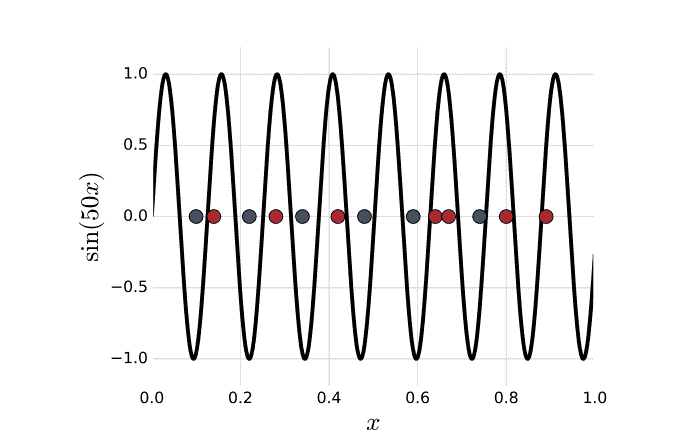

图3.5 一个正弦函数的例子（其中 $\omega = 50$）用于分类。

许多其他假设集的VC维度可以通过类似的方式确定或上界（参见本章的练习）。特别地，对于维度小于 $\infty$ 的任意维度为 $r$ 的向量空间，可以证明其VC维度最多为 $r$ (练习3.19)。下一个结果被称为 Sauer 引理，它阐明了增长函数和VC维度之间的联系。

$$\mathcal{G}_1 = \mathcal{G}_{|S'} \quad \mathcal{G}_2 = \{g' \subseteq S' : (g' \in \mathcal{G}) \land (g' \cup \{x_m\} \in \mathcal{G})\}$$

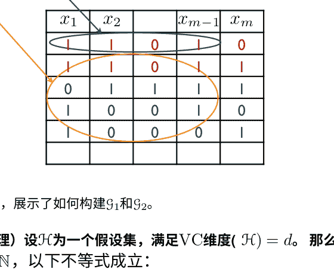

图3.6 在Sauer引理的证明中，展示了如何构建$\mathcal{G}_1$和$\mathcal{G}_2$。

### 定理3.17 (Sauer引理)

设$\mathcal{H}$为一个假设集，满足VC维度$(\mathcal{H}) = d$。那么，对于所有的 $m \in \mathbb{N}$，以下不等式成立：

$$\Pi_{\mathcal{H}}(m) \leq \sum_{i=0}^{d} \binom{m}{i}$$ (3.27)

证明: 证明通过对 $m + d$ 进行归纳。对于 $m=1$ 和 $d=0$ 或 $d=1$，该陈述显然成立。现在，假设对于 $(m-1, d-1)$ 和 $(m-1, d)$ 成立。修复一个集合 $S = \{x_1, \dots, x_m\}$，具有 $\Pi_{\mathcal{H}}(m)$ 二分法，令 $\mathcal{G} = \mathcal{H}_{|S}$ 为通过限制到 $S$ 而诱导出的概念集合 $\mathcal{H}$。

现在考虑以下关于 $S' = \{x_1, \dots, x_{m-1}\}$ 的族。我们定义 $\mathcal{G}_1 = \mathcal{G}_{|S'}$ 为通过限制到 $S'$ 而诱导出的概念集合 $\mathcal{H}$。接下来，通过将每个概念标识为在 $S'$ 或 $S$ 中非零的点集，我们可以定义 $\mathcal{G}_2$ 为 $\mathcal{G}_2 = \{g' \subseteq S' : (g' \in \mathcal{G}) \land (g' \cup \{x_m\} \in \mathcal{G})\}$。

由于 $g' \subseteq S'$， $g' \in \mathcal{G}$ 意味着在不添加 $x_m$ 的情况下，它是 $\mathcal{G}$ 的一个概念。此外，约束 $g' \cup \{x_m\} \in \mathcal{G}$ 意味着将 $x_m$ 添加到 $g'$ 也使其成为 $\mathcal{G}$ 的一个概念。图3.6形象地说明了 $\mathcal{G}_1$ 和 $\mathcal{G}_2$ 的构建过程。根据我们对 $\mathcal{G}_1$ 和 $\mathcal{G}_2$ 的定义，可以观察到 $|\mathcal{G}_1| + |\mathcal{G}_2| = |\mathcal{G}|$。

由于 $\text{VCdim}(\mathcal{G}_1) \leq \text{VCdim}(\mathcal{G}) \leq d$， 根据生长函数的定义和归纳假设，

$$|\mathcal{G}_1| \leq \Pi_{\mathcal{G}_1}(m-1) \leq \sum_{i=0}^{d} \binom{m-1}{i}$$

此外，根据 $\mathcal{G}_2$ 的定义，如果一个集合 $\mathcal{Z} \subseteq S'$ 被 $\mathcal{G}_2$ 破坏了，那么集合 $\mathcal{Z} \cup \{x_m\}$ 也被 $\mathcal{G}$ 破坏了。因此，$\text{VCdim}(\mathcal{G}_2) \leq \text{VCdim}(\mathcal{G}) - 1 = d - 1$。

根据生长函数的定义和归纳假设，

$$|\mathcal{G}_2| \leq \Pi_{\mathcal{G}_2}(m - 1) \leq \sum_{i=0}^{d-1} \binom{m-1}{i}.$$

因此，

$$|\mathcal{G}| = |\mathcal{G}_1| + |\mathcal{G}_2| \leq \sum_{i=0}^{d} \binom{m-1}{i} + \sum_{i=0}^{d-1} \binom{m-1}{i} = \sum_{i=0}^{d} \binom{m-1}{i} + \binom{m-1}{i-1} = \sum_{i=0}^{d} \binom{m}{i}.$$

这完成了归纳证明。

Sauer引理的重要性可以通过推论3.18看出，令人惊讶的是生长函数只展示了两种行为：要么$\text{VCdim}(\mathcal{H}) = d < +\infty$，此时 $\Pi_{\mathcal{H}}(m) = O(m^d)$，要么$\text{VCdim}(\mathcal{H}) = +\infty$，此时$\Pi_{\mathcal{H}}(m) = 2^m$。

### 推论 3.18

设 $\mathcal{H}$ 为具有 VC维度 $(\mathcal{H}) = d$ 的假设集。那么对于所有 $m \geq d$，

$$\Pi_{\mathcal{H}}(m) \leq \left( \frac{e m}{d} \right)^d = O(m^d). \qquad (3.28)$$

证明：证明从使用Sauer引理开始。第一个不等式将每个求和项乘以一个大于或等于一的因子，因为 $m \geq d$，而第二个不等式将非负求和项加到求和中。

$$\begin{aligned}
\Pi_{\mathcal{H}}(m) &\leq \sum_{i=0}^{d} \binom{m}{i} \\
&\leq \sum_{i=0}^{d} \binom{m}{i} \left( \frac{m}{d} \right)^{d-i} \\
&\leq \sum_{i=0}^{m} \binom{m}{i} \left( \frac{m}{d} \right)^{d-i} \\
&= \left( \frac{m}{d} \right)^d \sum_{i=0}^{m} \binom{m}{i} \left( \frac{d}{m} \right)^{i} \\
&= \left( \frac{m}{d} \right)^d \left(1+\frac{d}{m}\right)^m \leq \left( \frac{m}{d} \right)^d e^d.
\end{aligned}$$

通过使用二项式定理简化表达式，最终不等式可以通过一般不等式$(1 - x) \leq e^{-x}$得到。

刚刚得出的VC维度和增长函数之间的明确关系，结合推论3.9，立即导致基于VC维度的以下泛化界限。

### 推论 3.19 (VC-维度泛化界)

设 $\mathcal{H}$ 是一个函数族，取值为 $\{-1, +1\}$，其 VC-维度为 $d$。那么，对于任意 $\delta > 0$，以概率至少为 $1 - \delta$ 的概率，对于所有的 $h \in \mathcal{H}$，以下结论成立：

$$R(h) \leq R_S(h) + \frac{\sqrt{2d \log \frac{em}{d}}}{m} + \frac{\log \frac{1}{\delta}}{2m}.$$

因此，这个泛化界的形式是

$$R(h) \leq R_S(h) + O\left( \frac{\sqrt{\log(m/d)}}{(m/d)} \right),$$

这强调了比率 $m/d$ 对于泛化的重要性。该定理提供了奥卡姆剃刀原理的另一个实例，其中简单性是以较小的VC-维度来衡量的。

可以直接推导出VC-维度界，而不需要使用中间的Rademacher复杂度界限，就像(3.23)那样：将Sauer引理与(3.23)结合起来，可以得到以下高概率界限。

$$R(h) \leq R_S(h) + \frac{\sqrt{8d \log \frac{2em}{d} + 8 \log \frac{4}{\delta}}}{m},$$

它的一般形式为(3.30)。对于这些界限，对数因子只起到次要作用。事实上，可以使用更精细的分析来消除这个因子。

## 3.4 下界

在前一节中，我们提出了关于泛化误差的几个上界。相比之下，本节以使用假设集的VC维度来提供任何学习算法的泛化误差的下界。

通过找到任何算法的“坏”分布来展示这些下界。由于学习算法是任意的，很难指定特定的分布。相反，只需非构造性地证明其存在即可。在高层次上，用于实现这一点的证明技术是Paul Erdős的概率方法。在下面的证明中，首先给出了关于定义分布的参数的预期误差的下界。从那里，可以证明至少存在一组参数，即一个分布，满足下界。

### 定理 3.20 (下界, 可实现情况)

设 $\mathcal{H}$ 为一个假设集合，具有 VC-维度 $d > 1$。那么，对于任意 $m \geq 1$ 和任意学习算法 $\mathcal{A}$，存在一个分布 $\mathcal{D}$ over $\mathcal{X}$ 和一个目标函数 $f \in \mathcal{H}$，使得

$$\mathbb{P}_{S \sim \mathcal{D}^m} \left[ R_{\mathcal{D}}(h_S, f) > \frac{d-1}{32m} \right] \geq 1/100.$$

证明 设 $\mathcal{X}' = \{x_0, x_1, \ldots, x_{d-1}\} \subseteq \mathcal{X}$ 为一个被 $\mathcal{H}$ 打碎的集合。对于任意 $\epsilon > 0$，我们选择 $\mathcal{D}$ 使得其支持集合被减少到 $\mathcal{X}'$，并且一个点 $(x_0)$ 具有很高的概率 $(1-8\epsilon)$，而其余的概率质量均匀分布在其他点上:

$$\mathbb{P}_{\mathcal{D}}[x_0] = 1-8\epsilon \quad \text{且} \quad \forall i \in [d-1], \mathbb{P}_{\mathcal{D}}[x_i] = \frac{8\epsilon}{d-1}. \quad (3.32)$$

根据这个定义，大多数样本将包含 $x_0$，而且由于 $\mathcal{X}'$ 被破碎， $\mathcal{A}$ 在确定一个不在训练集中的点 $x_i$ 的标签时基本上不会比抛硬币更好。

我们假设不失一般性， $\mathcal{A}$ 在 $x_0$ 上没有错误。 对于一个样本 $S$，我们将 $S'$ 记为其元素中属于 $\{x_1, \ldots, x_{d-1}\}$ 的集合，并且将 $\mathcal{S}$ 定义为大小为 $m$ 的样本集合 $S$，使得 $|S'| \le (d-1)/2$。 现在，固定一个样本 $S \in \mathcal{S}$，并考虑所有标记 $f: \mathcal{X}' \to \{0,1\}$ 的均匀分布 $\mathcal{U}$，这些标记都属于 $\mathcal{H}$，因为该集合被破碎。 那么，下面的下界成立:

$$\begin{aligned} \mathbb{E}_{f \sim \mathcal{U}} [R_{\mathcal{D}}(h_S, f)] &= \sum_{f} \sum_{x \in \mathcal{X}'} 1_{h_S(x)=f(x)} \mathbb{P}_{\mathcal{D}}[x] \mathbb{P}_{\mathcal{U}}[f] \\ &\ge \sum_{f} \sum_{x \in S'} 1_{h_S(x)=f(x)} \mathbb{P}_{\mathcal{D}}[x] \mathbb{P}_{\mathcal{U}}[f] \\ &= \sum_{x \in S'} \left( \sum_{f} 1_{h_S(x)=f(x)} \mathbb{P}_{\mathcal{U}}[f] \right) \mathbb{P}_{\mathcal{D}}[x] \\ &= \frac{1}{2} \sum_{x \in S'} \mathbb{P}_{\mathcal{D}}[x] \ge \frac{1}{2} \frac{d-1}{2} \frac{8\epsilon}{d-1} = 2\epsilon. \end{aligned} \quad (3.33)$$

第一个下界成立是因为我们从求和中去除了非负项，当我们只考虑 $x \in S'$ 而不是所有 $x$ in $\mathcal{X}'$ 时。 在重新排列项之后，后续的等式成立，因为我们对 $f \in \mathcal{H}$ 的每个 $f$ 和 $\mathcal{H}$ 都有均匀的权重，并且 $\mathcal{H}$ 能够完全覆盖 $\mathcal{X}'$。 最后一个下界成立是由于 $\mathcal{D}$ 和 $S$ 的定义，后者意味着 $|\mathcal{X}' - S'| \ge (d-1)/2$。

由于 (3.33) 对于所有 $S \in \mathcal{S}$ 都成立，它也在所有 $S \in \mathcal{S}$ 的期望中成立: $\mathbb{E}_{S \in \mathcal{S}} \left[ \mathbb{E}_{f \sim \mathcal{U}} [R_{\mathcal{D}}(h_S, f)] \right] \ge 2\epsilon$。 根据Fubini定理， 期望可以交换位置， 因此，

$$\mathbb{E}_{f \sim \mathcal{U}} \left[ \mathbb{E}_{S \in \mathcal{S}} [R_{\mathcal{D}}(h_S, f)] \right] \ge 2\epsilon. \quad (3.34)$$

这意味着对于至少一个标记 $f_0 \in \mathcal{H}$， 有 $\mathbb{E}_{S \in \mathcal{S}}[R_{\mathcal{D}}(h_S, f_0)] \ge 2\epsilon$。 将这个期望分解为两部分，并使用 $R_{\mathcal{D}}(h_S, f_0) \le \mathbb{P}_{\mathcal{D}}[\mathcal{X}' - \{x_0\}]$， 我们得到:

$$\begin{aligned} \mathbb{E}_{S \in \mathcal{S}} [R_{\mathcal{D}}(h_S, f_0)] &= \sum_{S: R_{\mathcal{D}}(h_S, f_0) \ge \epsilon} R_{\mathcal{D}}(h_S, f_0) \mathbb{P}_{\mathcal{S}}[S] + \sum_{S: R_{\mathcal{D}}(h_S, f_0) < \epsilon} R_{\mathcal{D}}(h_S, f_0) \mathbb{P}_{\mathcal{S}}[S] \\ &\le \mathbb{P}_{\mathcal{D}}[\mathcal{X}' - \{x_0\}] \mathbb{P}_{S \in \mathcal{S}}[R_{\mathcal{D}}(h_S, f_0) \ge \epsilon] + \epsilon \mathbb{P}_{S \in \mathcal{S}}[R_{\mathcal{D}}(h_S, f_0) < \epsilon] \\ &\le 8\epsilon \mathbb{P}_{S \in \mathcal{S}}[R_{\mathcal{D}}(h_S, f_0) \ge \epsilon] + \epsilon \left(1 - \mathbb{P}_{S \in \mathcal{S}}[R_{\mathcal{D}}(h_S, f_0) \ge \epsilon] \right). \end{aligned}$$

将项收集在 $\mathbb{P}_{S\in\mathcal{S}}[R_{\mathcal{D}}(h_S, f_0) \geq \epsilon]$ 中得到
$$ \mathbb{P}_{S\in\mathcal{S}}[R_{\mathcal{D}}(h_S, f_0) \geq \epsilon] \geq \frac{1}{7\epsilon}(2\epsilon - \epsilon) = \frac{1}{7}. \qquad (3.35) $$

因此，对于所有样本 $\mathcal{S}$（不一定在 $\mathcal{S}$ 中），概率可以被下界为
$$ \mathbb{P}_{\mathcal{S}}[R_{\mathcal{D}}(h_{\mathcal{S}}, f_0) \geq \epsilon] \geq \mathbb{P}_{S\in\mathcal{S}}[R_{\mathcal{D}}(h_S, f_0) \geq \epsilon] \mathbb{P}[\mathcal{S}] \geq \frac{1}{7} \mathbb{P}[\mathcal{S}]. \qquad (3.36) $$

这使我们能够找到 $\mathbb{P}[\mathcal{S}]$ 的一个下界。根据乘法切尔诺夫界（定理 D.4），对于任意 $\gamma>0$，当样本大小为 $m$ 时，超过 $(d-1)/2$ 个点被抽取的概率满足：
$$ 1 - \mathbb{P}[\mathcal{S}] = \mathbb{P}[S_m \geq 8\epsilon m(1+\gamma)] \leq e^{-8\epsilon m \frac{\gamma^2}{3}}. \qquad (3.37) $$

因此，对于 $\epsilon = (d-1)/(32m)$ 和 $\gamma = 1$，
$$ \mathbb{P}[S_m \geq \frac{d-1}{2}] \leq e^{-(d-1)/12} \leq e^{-1/12} \leq 1 - 7\delta, \qquad (3.38) $$
对于 $\delta \leq .01$。因此 $\mathbb{P}[\mathcal{S}] \geq 7\delta$ 并且 $\mathbb{P}_{\mathcal{S}}[R_{\mathcal{D}}(h_{\mathcal{S}}, f_0) \geq \epsilon] \geq \delta$。$\square$

该定理表明，对于任何算法 $\mathcal{A}$，存在一个“坏”的分布 $\mathcal{X}$ 和一个目标函数 $f$，使得 $\mathcal{A}$ 返回的假设的错误是一个常数倍的 $\frac{d}{m}$ 以一定的概率。这进一步证明了VC维在学习中所起的关键作用。该结果特别说明了当VC维无限时，可实现情况下的PAC学习是不可能的。

请注意，证明显示的结果比定理的陈述更强：分布 $\mathcal{D}$ 与算法 $\mathcal{A}$ 是独立选择的。我们现在提出一个定理，给出了在不可实现情况下的下界。证明需要以下两个引理。

### 引理3.21
设 $\alpha$ 是一个均匀分布的随机变量，取值在 $\{\alpha_-,\alpha_+\}$ 之间，其中 $\alpha_- = \frac{1}{2} - \frac{\epsilon}{2}$ 且 $\alpha_+ = \frac{1}{2} + \frac{\epsilon}{2}$。$S$ 是一个包含 $m \geq 1$ 个随机变量 $X_1, \ldots, X_m$，取值在 $\{0,1\}$ 之间，并且根据分布 $\mathcal{D}_\alpha$ 定义的 i.i.d. 抽取。$\mathbb{P}_\alpha[X=1] = \alpha$。设 $h$ 是从 $\mathcal{X}^m$ 到 $\{\alpha_-, \alpha_+\}$ 的函数，则以下成立：
$$ \mathbb{E}_{\alpha} \left[ \underset{S\sim\mathcal{D}_\alpha^m}{\mathbb{P}}[h(S) = \alpha] \right] \geq \Phi(2\lceil m/2 \rceil, \epsilon), \qquad (3.39) $$
其中 $\Phi(m, \epsilon) = \frac{1}{4}\left(1 - \sqrt{1 - \exp\left(-\frac{m\epsilon^2}{1-\epsilon^2}\right)}\right)$ 对于所有的 $m$ 和 $\epsilon$ 成立。

证明：这个引理可以解释为一个有两个硬币的实验其中硬币的偏差分别为 $\alpha_-$ 和 $\alpha_+$。这意味着基于样本$S$从 $\mathcal{D}_{\alpha_-}$ 或 $\mathcal{D}_{\alpha_+}$ 的判别规则$h(S)$ 来确定是哪个硬币被投掷，样本大小 $m$ 必须至少为 $\Omega(1/\epsilon^2)$。证明留作练习（练习 D.3）。$\square$

我们将利用以下事实：对于任意固定的 $\epsilon$，函数 $m \rightarrow \Phi(m, x)$ 是凸函数，这是很容易证明的。

### 引理3.22
设 $Z$ 是一个取值范围在 $[0, 1]$ 的随机变量。那么，对于任意 $\gamma \in [0, 1)$,
$$\mathbb{P}[z > \gamma] \geq \frac{\mathbb{E}[Z] - \gamma}{1 - \gamma} > \mathbb{E}[Z] - \gamma. \qquad (3.40)$$

证明：由于 $Z$ 取值范围在 $[0, 1]$，
$$\begin{align*}
\mathbb{E}[Z] &= \sum_{z\leq\gamma} \mathbb{P}[Z = z]z + \sum_{z>\gamma} \mathbb{P}[Z = z]z \\
&\leq \sum_{z\leq\gamma} \mathbb{P}[Z = z]\gamma + \sum_{z>\gamma} \mathbb{P}[Z = z] \\
&= \gamma \mathbb{P}[Z \leq \gamma] + \mathbb{P}[Z > \gamma] \\
&= \gamma(1 - \mathbb{P}[Z > \gamma]) + \mathbb{P}[Z > \gamma] \\
&= (1 - \gamma)\mathbb{P}[Z > \gamma] + \gamma,
\end{align*}$$
这证明了。 $\square$

### 定理3.23 (下界, 不可实现情况)
令 $\mathcal{H}$ 为具有 VC-维度 $d > 1$ 的假设集。那么, 对于任意 $m \geq 1$ 和任意学习算法 $\mathcal{A}$, 存在一个分布 $\mathcal{D}$ over $\mathcal{X} \times \{0, 1\}$, 使得:
$$\mathbb{E}_{S\sim\mathcal{D}^m} \left[ R_{\mathcal{D}}(h_S) - \inf_{h\in\mathcal{H}} R_{\mathcal{D}}(h) > \sqrt{\frac{d}{320m}} \right] \geq 1/64. \qquad (3.41)$$
等价地, 对于任意学习算法, 样本复杂度满足
$$m \geq \frac{d}{320\epsilon^2}. \qquad (3.42)$$

证明：令 $\mathcal{X} = \{x_1, \ldots, x_d\} \subseteq \mathcal{X}$ 为被 $\mathcal{H}$ 打碎的集合。对于任意 $\alpha \in [0, 1]$ 和任意向量 $\sigma = (\sigma_1, \ldots, \sigma_d)^\top \in \{-1, +1\}^d$, 我们定义一个分布 $\mathcal{D}_\sigma$, 其支持为 $\mathcal{X} \times \{0, 1\}$, 如下所示:
$$\forall i \in [d], \quad \mathbb{P}_{\mathcal{D}_\sigma}[(x_i, 1)] = \frac{1}{d} \left( \frac{1}{2} + \frac{\sigma_i \alpha}{2} \right). \qquad (3.43)$$
因此, 每个点 $x_i$ 的标签, $i \in [d]$, 遵循分布 $\mathbb{P}_{\mathcal{D}_\sigma}[\cdot|x_i]$, 即一个偏倚硬币的分布, 其偏倚由 $\sigma_i$ 的符号和 $\alpha$ 的大小决定。为了确定每个点 $x_i$ 的最可能标签, 学习算法因此需要估计 $\mathbb{P}_{\mathcal{D}_\sigma}[1|x_i]$, 并且准确度要优于 $\alpha$。为了使这一问题更加困难, $\alpha$ 和 $\sigma$ 将根据算法进行选择, 就像引理3.21中所述, 需要 $\Omega(1/\alpha^2)$ 个训练样本中的每个点 $x_i$。

## 3.4 下界
显然，贝叶斯分类器 $h^{*}_{\mathscr{D}_{\sigma}}$ 被定义为 $h^{*}_{\mathscr{D}_{\sigma}}(x_i) = \text{argmax}_{y \in \{0,1\}} \mathbb{P}[y|x_i] = 1_{\sigma_i}$对于所有的 $i > 0$。$h^{*}_{\mathscr{D}_{\sigma}}$由于 $\mathscr{X}$被粉碎，所以它在 $\mathscr{H}$中。对于所有的 $h \in \mathscr{H}$,
$$R_{\mathscr{D}_{\sigma}}(h) - R_{\mathscr{D}_{\sigma}}(h^{*}_{\mathscr{D}_{\sigma}}) = \frac{1}{d} \sum_{x \in \mathscr{X}} \left( \frac{\alpha}{2} + \frac{\alpha}{2} \right) 1_{h(x) \neq h^{*}_{\mathscr{D}_{\sigma}}(x)} = \frac{\alpha}{d} \sum_{x \in \mathscr{X}} 1_{h(x) \neq h^{*}_{\mathscr{D}_{\sigma}}(x)}. \quad (3.44)$$

让 $\mathscr{S}$表示学习算法 $\mathcal{A}$在根据 $\mathscr{D}_{\sigma}$绘制的标记样本 $S$后返回的假设 $h_S$。我们将 $|S|_x$表示点 $x$在$S$中出现的次数。让 $\mathscr{U}$表示在 $\{-1, +1\}^{d}$上的均匀分布 $\mathscr{D}$。

那么，根据(3.44)，有以下结论:
$$\begin{aligned}
&\mathbb{E}_{\substack{\sigma \sim \mathscr{U} \\ S \sim \mathscr{D}_{\sigma}^m}} \left[ \frac{1}{\alpha} \left[ R_{\mathscr{D}_{\sigma}}(h_S) - R_{\mathscr{D}_{\sigma}}(h^{*}_{\mathscr{D}_{\sigma}}) \right] \right] \\
&= \frac{1}{d} \sum_{x \in \mathscr{X}} \mathbb{E}_{\substack{\sigma \sim \mathscr{U} \\ S \sim \mathscr{D}_{\sigma}^m}} \left[ 1_{h_S(x) \neq h^{*}_{\mathscr{D}_{\sigma}}(x)} \right] \\
&= \frac{1}{d} \sum_{x \in \mathscr{X}} \mathbb{E}_{\sigma \sim \mathscr{U}} \left[ \mathbb{P}_{S \sim \mathscr{D}_{\sigma}^m} \left[ h_S(x) = h^{*}_{\mathscr{D}_{\sigma}}(x) \right] \right] \\
&= \frac{1}{d} \sum_{x \in \mathscr{X}} \sum_{n=0}^m \mathbb{E}_{\sigma \sim \mathscr{U}} \left[ \mathbb{P}_{S \sim \mathscr{D}_{\sigma}^m} \left[ h_S(x) = h^{*}_{\mathscr{D}_{\sigma}}(x) \mid |S|_x = n \right] \mathbb{P}[|S|_x = n] \right] \\
&\geq \frac{1}{d} \sum_{x \in \mathscr{X}} \sum_{n=0}^m \Phi(n+1, \alpha) \mathbb{P}[|S|_x = n] \quad \quad \quad (\text{引理 3.21}) \\
&\geq \frac{1}{d} \sum_{x \in \mathscr{X}} \Phi(m/d + 1, \alpha) \quad \quad \quad (\Phi(\cdot, \alpha)\text{的凸性和Jensen不等式}) \\
&= \Phi(m/d + 1, \alpha).
\end{aligned}$$

由于对 $\sigma$的期望值至少为$\Phi(m/d+1, \alpha)$，必然存在某个 $\sigma \in \{-1, +1\}^{d}$使得
$$\mathbb{E}_{S \sim \mathscr{D}_{\sigma}^m} \left[ \frac{1}{\alpha} \left[ R_{\mathscr{D}_{\sigma}}(h_S) - R_{\mathscr{D}_{\sigma}}(h^{*}_{\mathscr{D}_{\sigma}}) \right] \right] > \Phi(m/d + 1, \alpha). \quad (3.45)$$

然后，根据引理3.22，对于那个 $\sigma$，对于任意的 $\gamma \in [0, 1]$，
$$\mathbb{P}_{S \sim \mathscr{D}_{\sigma}^m} \left[ \frac{1}{\alpha} \left[ R_{\mathscr{D}_{\sigma}}(h_S) - R_{\mathscr{D}_{\sigma}}(h^{*}_{\mathscr{D}_{\sigma}}) > \gamma u \right] > (1 - \gamma)u, \quad (3.46)$$
其中 $u = \Phi(m/d + 1, \alpha)$。选择 $\delta$ 和 $\epsilon$ such that $\delta \leq (1 - \gamma)u$ and $\epsilon \leq \gamma\alpha u$ gives
$$\mathbb{P}_{S \sim \mathscr{D}_{\sigma}^m} \left[ R_{\mathscr{D}_{\sigma}}(h_S) - R_{\mathscr{D}_{\sigma}}(h^{*}_{\mathscr{D}_{\sigma}}) > \epsilon \right] > \delta. \quad (3.47)$$

为了满足定义 ε 和 δ的不等式，让 γ=1−8δ. 然后，
$$\delta \leq (1-\gamma)u \iff u \geq \frac{1}{8} \qquad (3.48)$$
$$\iff \frac{1}{4}\left(1 - \sqrt{1 - \exp\left(-\frac{(m/d + 1)\alpha^2}{1 - \alpha^2}\right)}\right) \geq \frac{1}{8} \qquad (3.49)$$
$$\iff \frac{(m/d + 1)\alpha^2}{1 - \alpha^2} \leq \log \frac{4}{3} \qquad (3.50)$$
$$\iff \frac{m}{d} \leq \left(\frac{1}{\alpha^2} - 1\right) \log \frac{4}{3} - 1 \qquad (3.51)$$

选择 α=8ε/(1−8δ) 给出 ε=γα/8 和条件
$$\frac{m}{d} \leq \left(\frac{(1 - 8\delta)^2}{64\epsilon^2} - 1\right) \log \frac{4}{3} - 1 \qquad (3.52)$$

让 f(1/ε²) 表示右侧。我们正在寻找一个形式为 $m/d \leq ω/ε²$ 的充分条件。由于 $ε ≤ 1/64$，为了确保 $ω/ε² ≤ f(1/ε²)$，只需施加
$$\frac{ω}{(1/64)^2} = f\left( \frac{1}{(1/64)^2} \right)$$
$$ω = (7/64)^2 \log(4/3) - (1/64)^2 (\log(4/3) + 1) ≈ 0.003127 ≥ 1/320 = 0.003125$$
因此，$ε^2 ≤ \frac{1}{320}$ 每次足以确保这些不等式。

该定理表明，在非可实现的情况下，对于任何算法 $\mathcal{A}$，存在一个‘坏’分布在 $X×\{0,1\}$ 上，使得 $\mathcal{A}$ 返回的假设的错误是一个常数倍数以某个常数概率。在这个一般情况下，VC-维度也是学习中的一个关键量。特别地，对于无限的VC-维度，不可能进行无偏PAC学习。

## 3.5 章节注释
在学习中，首次提出使用Rademacher复杂度来推导泛化界限的是Koltchinskii [2001]、Koltchinskii和Panchenko [2000]以及Bartlett、Boucheron和Lugosi [2002a]，参见[Koltchinskii和Panchenko, 2002, Bartlett和Mendelson, 2002]。Bartlett、Bousquet和Mendelson [2002b]引入了局部Rademacher复杂度的概念，即限制在假设集的子集上的Rademacher复杂度，受到方差上界的限制。这可以用来在一些关于噪声的正则性假设下得到更好的保证。

定理3.7是由Massart [2000]提出的。VC维度的概念是由Vapnik和Chervonenkis [1971]引入的，并且已经被广泛研究[Vapnik, 2006, Vapnik和Chervonenkis, 1974, Blumer等, 1989, Assouad, 1983, Dudley,除了在机器学习中起关键作用外，VC维度还广泛应用于计算机科学和数学的其他领域（例如，参见Shelah [1972]，Chazelle [2000]）。定理3.17在学术界被称为Sauer引理，然而该结果最初由Vapnik和Chervonenkis [1971]（以稍微不同的版本）给出，后来由Sauer [1972]和Shelah [1972]独立证明。

在可实现的情况下，Vapnik和Chervonenkis [1974]以及Haussler等人[1988]给出了以VC维度为基础的期望误差的下界。后来，Blumer等人[1989]给出了类似于定理3.20的错误概率的下界。定理3.20及其证明改进了之前的结果，归功于Ehrenfeucht，Haussler，Kearns和Valiant [1988]。Devroye和Lugosi [1995]对于相同问题给出了稍微更紧密的界限，使用了更复杂的表达式。定理3.23给出了在不可实现情况下的下界，其证明由Anthony和Bartlett [1999]提出。关于概率方法的其他应用示例，展示了其全部威力，请参考Alon和Spencer [1992]的参考书。

在机器学习中，还有几种衡量函数族复杂度的方法，包括覆盖数、包装数以及第11章中讨论的其他复杂度衡量方法。覆盖数 $\mathcal{N}_p(\mathcal{S}, \epsilon)$ 是覆盖一组损失函数 $\mathcal{S}$ 所需的最小半径为 $\epsilon > 0$ 的 $L_p$球的数量。包装数 $\mathcal{M}_p(\mathcal{S}, \epsilon)$ 是在 $\mathcal{S}$ 中以半径为 $\epsilon$ 为中心的最大的数量的不重叠$L_p$球。这两个概念密切相关，特别是可以直接证明对于$\mathcal{S}$和$\epsilon > 0$，有 $\mathcal{M}_p(\mathcal{S}, 2\epsilon) \leq \mathcal{N}_p(\mathcal{S}, \epsilon) \leq \mathcal{M}_p(\mathcal{S}, \epsilon)$。每个复杂度衡量方法自然地将无限假设集归约为有限假设集，从而导致对无限假设集的泛化界限。练习3.31演示了使用覆盖数推导泛化界限的简单证明方法。这些复杂度衡量方法之间也存在密切的关系：例如，根据达德利的定理，经验Rademacher复杂度可以用 $\mathcal{N}_2(\mathcal{S}, \epsilon)$ 来界定[Dudley, 1967, 1987]，而覆盖数和包装数可以用VC维度来界定[Haussler, 1995]。还可以参考[Ledoux和Talagrand, 1991, Alon等, 1997, Anthony和Bartlett, 1999, Cucker和Smale, 2001, Vidyasagar, 1997]，了解覆盖数与其他复杂度衡量方法之间的一些上界。

## 3.6 练习

### 3.1 在 $\mathbb{R}$中的区间增长函数
设 $\mathcal{H}$为 $\mathbb{R}$中的区间集合。区间集合 $\mathcal{H}$的VC维为2。计算其破碎系数 $\Pi_{\mathcal{H}}(m)$, $m \geq 0$。将你的结果与增长函数的一般界限进行比较。

### 3.2 在 $\mathbb{R}$中的阈值增长函数和Rademacher复杂度
设 $\mathcal{H}$为实线上的阈值函数族: $\mathcal{H} = \{x \mapsto 1_{x \leq \theta}: \theta \in \mathbb{R}\} \cup \{x \mapsto 1_{x \geq \theta}: \theta \in \mathbb{R}\}$。给出增长函数 $\Pi_m(\mathcal{H})$的上界。利用这个结果得到 $\mathfrak{N}_m(\mathcal{H})$的上界。

### 3.3 线性组合的增长函数
对于 $\mathbb{R}^d$中的向量集合$\mathcal{X}$，线性可分的标记是将 $\mathcal{X}$分为两个集合 $\mathcal{X}^+$和 $\mathcal{X}^-$，其中 $\mathcal{X}^+ = \{\mathbf{x} \in \mathcal{X}: \mathbf{w} \cdot \mathbf{x} > 0\}$， $\mathcal{X}^- = \{\mathbf{x} \in \mathcal{X}: \mathbf{w} \cdot \mathbf{x} < 0\}$，对于某个 $\mathbf{w} \in \mathbb{R}^d$。

令 $\mathcal{X} = \{\mathbf{x}_1, \ldots, \mathbf{x}_m\}$ 是 $\mathbb{R}^d$的一个子集。

- (a) 令 $\{\mathcal{X}^+, \mathcal{X}^-\}$是 $\mathcal{X}$的一个二分法，且 $\mathbf{x}_{m+1} \in \mathbb{R}^d$。证明当且仅当 $\{\mathcal{X}^+ \cup \{\mathbf{x}_{m+1}\}, \mathcal{X}^-\}$和 $\{\mathcal{X}^+, \mathcal{X}^- \cup \{\mathbf{x}_{m+1}\}\}$可以通过过原点的超平面进行线性分离时，$\{\mathcal{X}^+, \mathcal{X}^-\}$可以通过过原点的超平面进行线性分离，并且包含 $\mathbf{x}_{m+1}$。

- (b) 令 $\mathcal{X} = \{\mathbf{x}_1, \ldots, \mathbf{x}_m\}$是 $\mathbb{R}^d$的一个子集，满足任意 $k$个元素的子集都是线性无关的，其中 $k \leq d$。然后，证明 $\mathcal{X}$的线性可分标记的数量是 $C(m, d) = 2\sum_{k=0}^{d-1}\binom{m-1}{k}$。（提示：用归纳法证明 $C(m+1, d) = C(m, d) + C(m, d-1)$。）

- (c) 让 $f_1, \ldots, f_p$将 $\mathbb{R}^d$映射到 $\mathbb{R}$。将 $\mathcal{F}$定义为基于这些函数线性组合的分类器的集合:
    $$\mathcal{F} = \left\{ x \mapsto \text{sgn} \left( \sum_{k=1}^{p} a_k f_k(x) \right) : a_1, \ldots, a_p \in \mathbb{R} \right\}.$$
    通过 $\Psi$ 定义 $\Psi(x) = (f_1(x), \ldots, f_p(x))$。假设存在 $x_1, \ldots, x_m \in \mathbb{R}^d$使得 $\{\Psi(x_1), \ldots, \Psi(x_m)\}$的每个 $p$子集都是线性无关的。然后，证明
    $$\Pi_{\mathcal{F}}(m) = 2\sum_{i=0}^{p-1}\binom{m-1}{i}.$$

### 3.4 增长函数的下界
证明Sauer引理（定理3.17）是紧密的，即对于任意集合 $\mathcal{X}$ of $m > d$ elements，证明存在一个假设类 $\mathcal{H}$ of VC维度 $d$ such that $\Pi_{\mathcal{H}}(m) = \sum_{i=0}^{d}\binom{m}{i}$。

### 3.5 更精细的Rademacher上界
证明可以用$\mathbb{E}_S[\Pi(\mathcal{H}, S)]$来给出对于家族$\mathcal{H}$的Rademacher复杂度的更精细的上界，其中$\Pi(\mathcal{H}, S)$是对样本$S$中的点进行标记的方法数。

### 3.6 单例假设类
考虑平凡的假设集$\mathcal{H} = \{h_0\}$。

- (a) 证明对于任意$m > 0$，$\mathfrak{R}_m(\mathcal{H}) = 0$。
- (b) 使用类似的构造来证明Massart的引理（定理3.7）是紧致的。

### 3.7 两个函数假设类
令$\mathcal{H}$为一个假设集，缩减为两个函数：$\mathcal{H} = \{h_{-1}, h_{+1}\}$并且令$S = (x_1, \dots, x_m) \subseteq \mathcal{X}$为大小为$m$的样本。

- (a) 假设$h_{-1}$是取值为$-1$的常数函数，$h_{+1}$是取值为$+1$的常数函数。假设$\mathcal{H}$的VC维度是$d$？上界估计经验Rademacher复杂度$\mathfrak{R}_S(\mathcal{H})$（提示：用Rademacher变量的绝对值之和表示$\mathfrak{R}_S(\mathcal{H})$，并应用Jensen不等式），并与你的上界进行比较。
- (b) 假设$h_{-1}$是取值为$-1$的常数函数，$h_{+1}$是除了在$x_1$处取值为$+1$外，其他地方都取值为$-1$的函数。VC维度$d$ of $\mathcal{H}$是什么？计算经验Rademacher复杂度$\mathfrak{R}_S(\mathcal{H})$。

### 3.8 Rademacher恒等式
固定$m \geq 1$。证明对于任意的$\alpha \in \mathbb{R}$和任意的两个假设集$\mathcal{H}$和$\mathcal{H}'$，以下恒等式成立，它们将函数从$\mathcal{X}$映射到$\mathbb{R}$：

- (a) $\mathfrak{R}_m(\alpha\mathcal{H}) = |\alpha|\mathfrak{R}_m(\mathcal{H})$。
- (b) $\mathfrak{R}_m(\mathcal{H} + \mathcal{H}') = \mathfrak{R}_m(\mathcal{H}) + \mathfrak{R}_m(\mathcal{H}')$。
- (c) $\mathfrak{R}_m(\{\max(h, h') : h \in \mathcal{H}, h' \in \mathcal{H}'\}) \leq \mathfrak{R}_m(\mathcal{H}) + \mathfrak{R}_m(\mathcal{H}')$。其中$\max(h, h')$表示函数$x \to \max_{x\in\mathcal{X}}(h(x), h'(x))$（提示：你可以使用等式$\max(a, b) = \frac{1}{2}[a + b + |a - b|]$对所有$a, b \in \mathbb{R}$成立，以及Talagrand的收缩引理（见引理5.7）。

### 3.9 概念交集的Rademacher复杂度
设$\mathcal{H}_1$和$\mathcal{H}_2$是将$\mathcal{X}$映射到$\{0,1\}$的两个函数族，且$\mathcal{H} = \{h_1h_2 : h_1 \in \mathcal{H}_1, h_2 \in \mathcal{H}_2\}$。证明对于任意大小为$m$的样本$S$，$\mathcal{H}$的经验Rademacher复杂度可以被限制如下：$\mathfrak{R}_S(\mathcal{H}) \leq \mathfrak{R}_S(\mathcal{H}_1) + \mathfrak{R}_S(\mathcal{H}_2)$。

提示：使用Lipschitz函数 \( x \rightarrow \max(0, x-1) \) 和Talagrand的收缩引理。

利用这个来限制两个概念 \( c_1 \) 和 \( c_2 \) 的交集 \(\mathcal{U}\)的Rademacher复杂度 \( \mathfrak{R}_m(\mathcal{U}) \)，其中 \( c_1 \in \mathcal{C}_1 \) 和 \( c_2 \in \mathcal{C}_2 \)的Rademacher复杂度。

### 3.10 预测向量的Rademacher复杂度
设 \( S = (x_1, \ldots, x_m) \) 是一个大小为m的样本并固定 \( h: \mathcal{X} \rightarrow \mathbb{R} \)。

- (a) 用 \( \mathbf{u} \) 表示 \( S \) 上 \( h \) 的预测向量：\(\mathbf{u} = \begin{bmatrix} h(x_1) \\ \vdots \\ h(x_m) \end{bmatrix}\)。给出关于 \(\mathcal{H}\) 的经验Rademacher复杂度 \( \mathfrak{R}_S(\mathcal{H}) \) 的上界，其中 \(\mathcal{H} = \{h, -h\}\)，用 \( \|\mathbf{u}\|_2 \) 表示（提示：将 \( \mathfrak{R}_S(\mathcal{H}) \) 表示为绝对值的期望并应用Jensen不等式）。假设对于所有 \( i \in [m] \)，\( h(x_i) \in \{0, -1, +1\} \)。用稀疏度度量 \( = |\{i: h(x_i) = 0\}| \)。来表示Rademacher复杂度的上界。对于稀疏度度量的极端值，这个上界是多少？
- (b) 让 \( \mathcal{F} \) 成为将 \( \mathcal{X} \) 映射到 \( \mathbb{R} \) 的函数族。给出 \( \mathcal{F} + \mathcal{H} = \{f + h : f \in \mathcal{F}\} \) 和 \( \mathcal{F} \pm \mathcal{H} = (\mathcal{F} + \mathcal{H}) \cup (\mathcal{F} - \mathcal{H}) \) 的经验Rademacher复杂度的上界，其中 \( \mathfrak{R}_S(\mathcal{F}) \) 和 \( \|\mathbf{u}\|_2 \)。

### 3.11 正则化神经网络的Rademacher复杂度
让输入空间为 \( \mathcal{X} = \mathbb{R}^{n_1} \)。在这个问题中，我们考虑将 \( \mathcal{X} \) 映射到 \( \mathbb{R} \) 的正则化神经网络函数族：

$$ \mathcal{H} = \left\{ \mathbf{x} \rightarrow \sum_{j=1}^{n_2} w_j \sigma(\mathbf{u}_j \cdot \mathbf{x}) : \|\mathbf{w}\|_1 \leq \Lambda', \|\mathbf{u}_j\|_2 \leq \Lambda, \forall j \in [n_2] \right\}, $$

- (a) 证明 \(\mathfrak{R}_S(\mathcal{H}) = \frac{\Lambda'}{m} \mathbb{E}_\sigma \left[ \sup_{\|\mathbf{u}\|_2 \leq \Lambda} \left| \sum_{i=1}^m \sigma_i \sigma(\mathbf{u} \cdot \mathbf{x}_i) \right| \right].\)
- (b) 使用以下形式的Talagrand引理，对于所有的假设集 \(\mathcal{H}\) 和 \(L\)-Lipschitz函数 \(\Phi\):
    $$ \frac{1}{m} \mathbb{E}_\sigma \left[ \sup_{h \in \mathcal{H}} \left| \sum_{i=1}^m \sigma_i (\Phi \circ h)(x_i) \right| \right] \leq \frac{L}{m} \mathbb{E}_\sigma \left[ \sup_{h \in \mathcal{H}} \left| \sum_{i=1}^m \sigma_i h(x_i) \right| \right], $$
    以经验Rademacher复杂度来上界 $\mathfrak{R}_S(\mathcal{H})$, 其中 $\mathcal{H}'$ 由以下定义
    $$\mathcal{H}' = \{\mathbf{x} \rightarrow s(\mathbf{u} \cdot \mathbf{x}) : \|\mathbf{u}\|_2 \leq \Lambda, s \in \{-1, +1\}\}.$$
- (c) 使用柯西-施瓦茨不等式来证明
    $$\mathfrak{R}_S(\mathcal{H}') = \frac{\Lambda}{m} \mathbb{E}_{\boldsymbol{\sigma}} \left[ \left\| \sum_{i=1}^{m} \sigma_i \mathbf{x}_i \right\|_2 \right].$$
- (d) 使用不等式 $\mathbb{E}_{\mathbf{v}}[\|\mathbf{v}\|_2] \leq \sqrt{\mathbb{E}_{\mathbf{v}}[\|\mathbf{v}\|_2^2]}$, 这是由于Jensen不等式来上界 $\mathfrak{R}_S(\mathcal{H}')$。
- (e) 假设对于所有的 $\mathbf{x} \in S$, $\|\mathbf{x}\|_2 \leq r$, 其中 $r > 0$。使用前面的问题来推导出 $\mathcal{H}$ 的Rademacher复杂度的上界, 以 $r$ 为变量。

### 3.12 Rademacher复杂度
Jesetoo教授声称他找到了一个更好的边界, 用VC维度VCdim($\mathcal{H}$)来衡量任何假设集$\mathcal{H}$的Rademacher复杂度. 他的边界形式为 $\mathfrak{R}_m(\mathcal{H}) \leq O\left( \sqrt{\frac{\mathrm{VCdim}(\mathcal{H})}{m}} \right)$. 你能证明Jesetoo教授的说法是错误的吗? (提示: 考虑一个假设集 $\mathcal{H}$ 只包含两个简单函数.)

### 3.13 联合 $k$ 区间的VC维度
由 $k$ 区间的并集形成的实线子集的VC维度是多少?

### 3.14 有限假设集的VC维度
证明有限假设集 $\mathcal{H}$ 的VC维度最多为 $\log_2 |\mathcal{H}|$。

### 3.15 子集的VC维度
由单个参数 $\alpha$ 参数化的实线子集 $I_\alpha$ 的VC维度是多少? $I_\alpha = [\alpha, \alpha+1] \cup [\alpha+2, +\infty)$

### 3.16 轴对齐的正方形和三角形的VC维度
- (a) 平面上轴对齐的正方形的VC维是多少?
- (b) 考虑平面上与坐标轴平行且直角在左下角的直角三角形. 这个族群的VC维是多少?

3.17 在 $\mathbb{R}^n$ 中闭合球的VC维。证明在 $\mathbb{R}^n$ 中所有闭合球的VC维，即形如 $\{x \in \mathbb{R}^n : \|x - x_0\|^2 \leq r\}$ 的集合，其中 $x_0 \in \mathbb{R}^n$ 且 $r \geq 0$，小于或等于 $n+2$。

3.18 椭圆体的VC维。所有椭圆体在 $\mathbb{R}^n$ 中的VC维是多少？

3.19 实函数向量空间的VC维。设 $F$ 是 $\mathbb{R}^n$ 上的实函数的有限维向量空间，$\dim(F) = r < \infty$。设 $\mathcal{H}$ 是假设的集合：

$\mathcal{H} = \{\{x : f(x) \geq 0\} : f \in F\}$。

证明 $\mathcal{H}$ 的VC维度是有限的，并且 $d \leq r$。（提示：选择一个任意的 $m = r+1$ 个点，并考虑线性映射 $u: F \to \mathbb{R}^m$ 定义为： $u(f) = (f(x_1), \ldots, f(x_m))$。）

3.20 正弦函数的VC维度。考虑正弦函数的假设族（例子3.16）： $\{x \to \sin(\omega x) : \omega \in \mathbb{R}\}$。

(a) 证明对于任意的 $x \in \mathbb{R}$，点 $x$, $2x$, $3x$ 和 $4x$ 不能被这个正弦函数族所破坏。

(b) 证明正弦函数族的VC维度是无穷大。（提示：证明 $\{2^{-i} : i \leq m\}$ 对于任意 $m > 0$ 都可以被打破。）

3.21 联合半空间的VC维度。给出由 $k$ 个半空间联合描述的假设类的VC维度的上界。

3.22 交集半空间的VC维度。考虑由 $k$ 个半空间的凸交集组成的类 $\mathcal{C}_k$。给出 $\text{VCdim}(\mathcal{C}_k)$ 的下界和上界估计。

3.23 交集概念的VC维度。

(a) 设 $\mathcal{C}_1$ 和 $\mathcal{C}_2$ 是两个概念类。证明对于任意的概念类

$\mathcal{C} = \{c_1 \cap c_2 : c_1 \in \mathcal{C}_1, c_2 \in \mathcal{C}_2\}$,

$\Pi_{\mathcal{C}}(m) \leq \Pi_{\mathcal{C}_1}(m) \Pi_{\mathcal{C}_2}(m)$.        (3.53)

(b) 让 $\mathcal{C}$ 是一个具有 VC 维度 $d$ 的概念类，并且让 $\mathcal{C}_s$ 是由 $\mathcal{C}$ 中所有概念与 $s$ 的交集形成的概念类，其中 $s \geq 1$。证明 $\mathcal{C}_s$ 的 VC 维度受到 $2ds \log_2(3s)$ 的限制。（提示：证明对于任意 $x \geq 2$，有 $\log_2(3x) < 9x/(2e)$。）

### 3.24 概念的并集的VC维度。

让 $\mathcal{A}$ 和 $\mathcal{B}$ 是从 $\mathcal{X}$ 到 $\{0,1\}$ 的两个函数集合，并且假设 $\mathcal{A}$ 和 $\mathcal{B}$ 都具有有限的VC维度，其中 $\mathrm{VCdim}(\mathcal{A}) = d_{\mathcal{A}}$ 和 $\mathrm{VCdim}(\mathcal{B}) = d_{\mathcal{B}}$。让 $\mathcal{C} = \mathcal{A} \cup \mathcal{B}$ 是 $\mathcal{A}$ 和 $\mathcal{B}$ 的并集。

- (a) 证明对于所有 $m, \Pi_{\mathcal{C}}(m) \leq \Pi_{\mathcal{A}}(m) + \Pi_{\mathcal{B}}(m)$。

- (b) 使用Sauer引理证明对于 $m \geq d_{\mathcal{A}} + d_{\mathcal{B}} + 2, \Pi_{\mathcal{C}}(m) < 2^m$, 并给出 $\mathcal{C}$ 的VC维度的界限。

### 3.25 对称差集概念的VC维度。

对于两个集合 $\mathcal{A}$ 和 $\mathcal{B}$, 让 $\mathcal{A} \Delta \mathcal{B}$ 表示 $\mathcal{A}$ 和 $\mathcal{B}$ 的对称差集, 即 $\mathcal{A} \Delta \mathcal{B} = (\mathcal{A} \cup \mathcal{B}) - (\mathcal{A} \cap \mathcal{B})$。假设 $\mathcal{H}$ 是一个非空的有限VC维度的子集族。假设 $\mathcal{A}$ 是 $\mathcal{H}$ 的一个元素, 定义 $\mathcal{H} \Delta \mathcal{A} = \{ X \Delta \mathcal{A} : X \in \mathcal{H} \}$。证明 $\mathrm{VCdim}(\mathcal{H} \Delta \mathcal{A}) = \mathrm{VCdim}(\mathcal{H})$。

### 3.26 对称函数。

一个函数 $h: \{0,1\}^n \to \{0,1\}$ 是对称的，如果它的值由输入中的1的数量唯一确定。让 $\mathcal{C}$ 表示所有对称函数的集合。

- (a) 确定 $\mathcal{C}$ 的VC维度。

- (b) 给出 $\mathcal{C}$ 的任何一致PAC学习算法的样本复杂度的下界和上界。

- (c) 注意，任何假设 $h \in \mathcal{C}$ 都可以用一个向量 $(y_0, y_1, \ldots, y_n) \in \{0,1\}^{n+1}$ 来表示，其中 $y_i$ 是 $h$ 在恰好有 $i$ 个 1 的示例上的值。基于这种表示，设计一个一致的学习算法来学习 $\mathcal{C}$。

### 3.27 神经网络的VC维度。

设 $\mathcal{C}$ 是一个在 $\mathbb{R}^r$ 上具有VC维度 $d$ 的概念类。一个具有一个中间层的 $\mathcal{C}$-神经网络是一个在 $\mathbb{R}^n$ 上定义的概念，可以用图3.7中的有向无环图表示，其中输入节点位于底部，每个其他节点都标有一个概念 $c \in \mathcal{C}$。

给定输入向量 $(x_1, \ldots, x_n)$，神经网络的输出如下获得。首先，将每个输入节点标记为相应的值 $x_i \in \mathbb{R}$。接下来，通过将 $c$ 应用于接受输入节点值的节点 $u$ 上的值 $c$ 来获得。

以 $u$ 结尾的边。 请注意，由于 $c$ 取值为 $\{0, 1\}$， 所以在 $u$ 处的值在 $\{0, 1\}$ 之间。通过将相应的概念应用于接受边缘的节点的值，可以类似地获得顶部或输出节点的值。

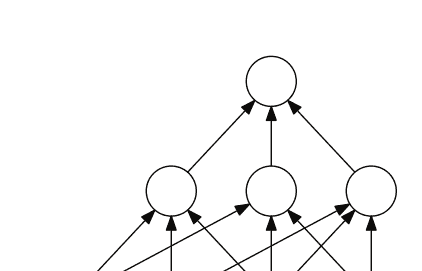

- (a) 让 $\mathcal{H}$ 表示所有具有 $k \ge 2$ 个内部节点的神经网络的集合。 证明生长函数 $\Pi_{\mathcal{H}}(m)$ 可以用中间层中定义的假设集的生长函数的乘积来上界。

(b) 利用这一点来上界 $\mathcal{C}$-神经网络的VC维度（提示：可以使用蕴含 $m = 2x \log_2(xy) \Rightarrow m > x \log_2(ym)$ 对 $m \ge 1$ 和 $x, y > 0$ 且 $xy > 4$ 成立）。

(c) 让 $\mathcal{C}$ 是由阈值函数定义的概念类的家族 $\mathcal{C} = \{\mathrm{sgn}(\sum_{j=1}^r w_j x_j) : \mathbf{w} \in \mathbb{R}^r\}$。给出一个关于 VC-维度的上界 $\mathcal{H}$ 的表达式，其中 $k$ 和 $r$ 是参数。

### 3.28 凸组合的 VC-维度

让 $\mathcal{H}$ 是一个将输入空间 $\mathcal{X}$ 映射到 $\{-1, +1\}$ 的函数家族， $T$ 是一个正整数。 给出函数家族 $\mathcal{F}_T$ 的 VC-维度的上界，该函数家族的定义如下

$$ \mathcal{F} = \left\{ \mathrm{sgn}\left( \sum_{t=1}^T \alpha_t h_t \right) : h_t \in \mathcal{H}, \alpha_t \ge 0, \sum_{t=1}^T \alpha_t \le 1 \right\}. $$

(提示：你可以使用练习 3.27 及其解答).

### 3.29 无限 VC-维度

(a) 证明如果一个概念类 $\mathcal{C}$ 的VC维度是无限的，那么它是不可PAC学习的。

(b) 在标准的PAC学习场景中，学习算法首先接收所有示例，然后计算其假设。在这种情况下，具有无限VC维度的概念类是不可能进行PAC-学习的，正如前面的问题所示。

现在想象一种不同的情景，学习算法可以在抽取更多示例和计算之间交替进行。这个问题的目标是证明对于一些具有无限VC维度的概念类，PAC学习是可能的。

例如，考虑概念类 $\mathcal{C}$ 的特殊情况，即所有自然数的子集。维特雷斯教授对学习算法 LPAC学习 $\mathcal{C}$ 的第一阶段有一个想法。在第一阶段，L抽取足够数量的点 $m$，使得抽取到超过最大值 $M$ 的点的概率很小，并具有高置信度。你能否描述算法的第二阶段，使其能够PAC-学习 $\mathcal{C}$？描述应该附带证明 L 可以进行PAC-学习 $\mathcal{C}$。

### 3.30 VC维度泛化界限 - 可实现情况。

在这个练习中，我们展示了在推论3.19中给出的界限可以改进为 $O( d \log(m/d) / m )$ 在可实现的情况下。假设我们处于可实现的场景中，即目标概念包含在我们的假设类 $\mathcal{H}$ 中。我们将展示，如果一个假设 $h$ 与样本 $S \sim \mathcal{D}^m$ 一致，那么对于任何 $\epsilon > 0$，使得 $m\epsilon \geq 8$

$\mathbb{P}[R(h) > \epsilon] \leq 2\left[ \frac{2e m}{d} \right]^d 2^{-m \epsilon/2}. \quad (3.54)$

(a) 让 $\mathcal{H}_S \subseteq \mathcal{H}$ 是与样本 $S$ 一致的假设子集，让 $R_S(h)$ 表示相对于样本 $S$ 的经验误差，并定义 $S'$ 为从 $\mathcal{D}^m$ 中抽取的另一个独立样本。证明对于任何 $h_0 \in \mathcal{H}_S$，以下不等式成立：

$\mathbb{P}\left[ \sup_{h \in \mathcal{H}_S} |R_S(h) - R_{S'}(h)| > \frac{\epsilon}{2} \right] \geq \mathbb{P}\left[ B(m, \epsilon) > \frac{m \epsilon}{2} \right] \mathbb{P}[R(h_0) > \epsilon],$

其中 $B(m, \epsilon)$ 是具有参数 $(m, \epsilon)$ 的二项随机变量。（提示：证明并使用以下事实 $\mathbb{P}[R_S(h) \geq \epsilon/2] \geq \mathbb{P}[R_S(h) > \epsilon/2 \wedge R(h) > \epsilon]$。）

(b) 证明 $\mathbb{P} \left[ B(m,\epsilon) > \frac{m\epsilon}{2} \right] \geq \frac{1}{2}$。使用这个不等式和(a)的结果来证明对于任意的 $h_0 \in \mathcal{H}_S$ $\[ \mathbb{P} \left[ R(h_0) > \epsilon \right] \leq 2\mathbb{P} \left[ \sup_{h \in \mathcal{H}_S} |R_S(h) - R_{S'}(h)| > \frac{\epsilon}{2} \right]. \]$

(c) 不需要抽两个样本, 我们可以抽一个大小为2的样本 $T$ 然后随机将其分成 $S$ 和 $S'$。部分 (b) 的右边可以重写为: $\[ \mathbb{P} \left[ \sup_{h \in \mathcal{H}_S} |R_S(h)-R_{S'}(h)| > \frac{\epsilon}{2} \right] = \mathbb{P}_{T \sim \mathcal{D}^{2m}_{T \to [S, S']}} \left[ \exists h \in \mathcal{H}: R_S(h)=0 \land R_{S'}(h) > \frac{\epsilon}{2} \right]. \]$ 设 $h_0$ 是一个假设, 使得 $R_T(h_0) > \frac{\epsilon}{2}$ 并且设 $l > \frac{m\epsilon}{2}$ 是 $T$ 上 $h_0$ 产生的错误总数. 证明所有 $l$ 个错误都落在 $S'$ 中的概率上界为 $2^{-l}$。

(d) 根据部分 (b), 对于任意的 $h \in \mathcal{H}$ $\[ \mathbb{P}_{T \sim \mathcal{D}^{2m}_{T \to (S, S')}} \left[ R_S(h)=0 \land R_{S'}(h) > \frac{\epsilon}{2} \mid \neg R_T(h_0) > \frac{\epsilon}{2} \right] \leq 2^{-l}. \]$ 使用这个界限来证明对于任意的 $h \in \mathcal{H}$ $\[ \mathbb{P}_{T \sim \mathcal{D}^{2m}_{T \to (S, S')}} \left[ R_S(h)=0 \land R_{S'}(h) > \frac{\epsilon}{2} \right] \leq 2^{-\frac{\epsilon m}{2}}. \]$

(e) 通过使用并集界限来上界 $\mathbb{P}_{T \sim \mathcal{D}^{2m}_{T \to (S,S')}} \left[ \exists h \in \mathcal{H}: R_S(h)=0 \land R_{S'}(h) > \frac{\epsilon}{2} \right]$。证明 我们 可以 获得 一个 高 概率 的 泛化 界限 , 其 数量 级 为 $O\left( \frac{d \log(m/d)}{m} \right)$。

### 3.31 基于覆盖数的泛化界。

设 $\mathcal{H}$ 是一个将 $\mathcal{X}$ 映射到实数集 $\mathcal{Y} \subseteq \mathbb{R}$ 的函数族。对于任意 $\epsilon >0$, 函数族 $\mathcal{H}$ 的 $L_\infty$ 范数覆盖数 $\mathcal{N}(\mathcal{H}, \epsilon)$ 是满足 $\mathcal{H}$ 可以用 $k$ 个半径为 $\epsilon$ 的球覆盖的最小 $k \in \mathbb{N}$, 即存在 $\{h_1, \dots, h_k\} \subseteq \mathcal{H}$, 使得对于所有的 $\mathcal{H}$ 中的 $h$, 存在 $i \leq k$ 满足 $\|h - h_i\|_\infty = \max_{x \in \mathcal{X}} |h(x) - h_i(x)| \leq \epsilon$。特别地, 当 $\mathcal{H}$ 是一个紧致集时, 可以从一个半径为 $\epsilon$ 的球覆盖中提取出有限个覆盖, 因此 $\mathcal{N}(\mathcal{H}, \epsilon)$ 是有限的。 覆盖数提供了一个函数类的复杂度度量: 覆盖数越大, 函数族越丰富。 这个问题的目标是通过证明平方损失情况下的学习界限来说明这一点。 让 $\mathcal{D}$ 表示一个根据 $\mathcal{X} \times \mathcal{Y}$ 上的分布 $D$ 抽取的分布。

抽取的是带有标签的示例。那么，对于平方损失，$\mathcal{H}$中的$h$的泛化误差由$R(h) = \mathbb{E}_{(x,y)\sim\mathcal{D}}[(h(x)-y)^2]$定义，它的经验误差由标记样本$S=((x_1,y_1),\ldots,(x_m,y_m))$的$R_S(h) = \frac{1}{m}\sum_{i=1}^m(h(x_i)-y_i)^2$。我们将假设$\mathcal{H}$是有界的，即存在$M>0$，使得对于所有的$(x,y) \in \mathcal{X} \times \mathcal{Y}$，都有$|h(x)-y| \leq M$。以下是这个问题中证明的泛化界限：

$$\mathbb{P}_{S \sim \mathcal{D}^m} \left[ \sup_{h \in \mathcal{H}} |R(h) - R_S(h)| \geq \epsilon \right] \leq \mathcal{N} \left( \mathcal{H}, \frac{\epsilon}{8M} \right) 2^{\left( \frac{-m \epsilon^2}{2M^4} \right)}. \quad (3.55)$$

证明基于以下步骤:

- (a) 令 $L_S = R(h) - R_S(h)$，然后证明对于所有的$h_1, h_2 \in \mathcal{H}$和任意标记样本$S$，以下不等式成立：
$|L_S(h_1) - L_S(h_2)| \leq 4M \|h_1 - h_2\|_\infty$.
(b) 假设$\mathcal{H}$可以由$k$个子集$\mathcal{B}_1,\ldots,\mathcal{B}_k$覆盖，即$\mathcal{H} = \mathcal{B}_1 \cup \ldots \cup \mathcal{B}_k$。然后，证明对于任意的$\epsilon > 0$，以下上界成立：
$\mathbb{P}_{S \sim \mathcal{D}^m} \left[ \sup_{h \in \mathcal{H}} |L_S(h)| \geq \epsilon \right] \leq \sum_{i=1}^k \mathbb{P}_{S \sim \mathcal{D}^m} \left[ \sup_{h \in \mathcal{B}_i} |L_S(h)| \geq \epsilon \right]$.
(c) 最后，令$k = \mathcal{N}\left(\mathcal{H}, \frac{\epsilon}{8M}\right)$并且令$\mathcal{B}_1,\ldots,\mathcal{B}_k$为半径为$\epsilon/(8M)$的球，以$h_1,\ldots,h_k$为中心覆盖$\mathcal{H}$。使用部分(a)证明对于所有的$i \in [k]$，
$\mathbb{P}_{S \sim \mathcal{D}^m} \left[ \sup_{h \in \mathcal{B}_i} |L_S(h)| \geq \epsilon \right] \leq \mathbb{P}_{S \sim \mathcal{D}^m} \left[ |L_S(h_i)| \geq \frac{\epsilon}{2} \right]$，并且应用Hoeffding不等式(定理 D.2) 证明(3.55)。

## 4 模型选择

在设计学习算法中，一个关键问题是选择假设集 $\mathcal{H}$。 这被称为模型选择问题。 应该如何选择假设集 $\mathcal{H}$？ 一个丰富或复杂的假设集可能包含理想的贝叶斯分类器。 另一方面，使用这样一个复杂的家族进行学习变得非常困难。 更一般地说，选择 $\mathcal{H}$ 的问题涉及到一个可以通过估计和逼近误差来分析的权衡。

我们的讨论将重点放在二元分类的特定情况上，但讨论的大部分内容可以直接扩展到不同的任务和损失函数。

## 4.1 估计和逼近误差

设 $\mathcal{H}$ 为将 $\mathcal{X}$ 映射到 $\{-1, +1\}$ 的函数族。 从 $\mathcal{H}$ 中选择的假设 $h$ 的过度误差 $R(h)$ 与贝叶斯误差 $R^*$ 之间的差异可以分解如下：

$$R(h) - R^* = \left(\underbrace{R(h) - \inf_{h \in \mathcal{H}} R(h)}_{\text{估计}}\right) + \left(\underbrace{\inf_{h \in \mathcal{H}} R(h) - R^*}_{\text{近似}}\right). \qquad (4.1)$$

第一个术语称为估计误差，第二个术语称为近似误差。 估计误差取决于所选择的假设 $h$。 它衡量了 $h$ 相对于 $\mathcal{H}$ 中假设达到最小误差的误差，或者当达到最小值时，最佳假设 $h^*$ 的误差。 请注意，对于无知PAC学习的定义正是基于估计误差。

近似误差衡量了使用 $\mathcal{H}$ 来近似贝叶斯误差的程度。 这是假设集 $\mathcal{H}$ 的一个特性，也是其丰富性的度量。 对于更复杂或更丰富的假设 $\mathcal{H}$，近似误差往往较小，但估计误差较大。 这在图4.1中有所说明。


图4.1 估计误差（绿色）和逼近误差（橙色）的示意图。在这里，假设存在一个最佳假设，即h*，使得R（h*）= inf h∈H R（h）。

## 4.2 经验风险最小化 (ERM)

一个标准算法，其估计误差可以被限制在经验风险最小化(ERM)中。ERM试图最小化训练样本上的误差：⁴

$$h_S^{\text{ERM}} = \arg\min_{h \in \mathcal{H}} R_S(h).$$

### 命题4.1
对于任意样本 $S$，ERM返回的假设满足以下不等式：

$$\mathbb{P} \left[ R(h_S^{\text{ERM}}) - \inf_{h \in \mathcal{H}} R(h) > \epsilon \right] \leq \mathbb{P} \left[ \sup_{h \in \mathcal{H}} |R(h) - R_S(h)| > \frac{\epsilon}{2} \right].$$

证明：根据 $\inf_{h \in \mathcal{H}} R(h)$ 的定义，对于任意 $\epsilon > 0$，存在 $h_\epsilon$ 使得 $R(h_\epsilon) \leq \inf_{h \in \mathcal{H}} R(h) + \epsilon$。因此，使用 $R_S(h_S^{\text{ERM}}) \leq R(h_\epsilon)$，这是成立的。根据算法的定义，我们可以写成

$$\begin{aligned}
R(h_S^{\text{ERM}}) - \inf_{h\in\mathcal{H}} R(h) &= R(h_S^{\text{ERM}}) - R(h_\epsilon) + R(h_\epsilon) - \inf_{h\in\mathcal{H}} R(h) \\
&\leq R(h_S^{\text{ERM}}) - R(h_\epsilon) + \epsilon \\
&= R(h_S^{\text{ERM}}) - R_S(h_S^{\text{ERM}}) + R_S(h_S^{\text{ERM}}) - R(h_\epsilon) + \epsilon \\
&\leq R(h_S^{\text{ERM}}) - R_S(h_S^{\text{ERM}}) + R_S(h_\epsilon) - R(h_\epsilon) + \epsilon \\
&\leq 2\sup_{h\in\mathcal{H}}|R(h) - R_S(h)| + \epsilon.
\end{aligned}$$

由于不等式对于所有$\epsilon >0$ 都成立，它意味着以下内容：

$$R(h_S^{\text{ERM}}) - \inf_{h\in\mathcal{H}} R(h) \leq 2\sup_{h\in\mathcal{H}}|R(h) - R_S(h)|,$$

这证明了结论。

通过使用前一章节中关于Rademacher复杂度、增长函数或VC维度的泛化界限，可以对(4.3)的右侧进行上界限制。 特别地，它可以被限制为 $2e^{-2m[\epsilon -\mathfrak{R}_m(\mathcal{H})]^2}$。

因此，当 $\mathcal{H}$具有有利的Rademacher复杂度时，例如有限的VC维度，对于足够大的样本，高概率下，估计误差保证很小。 然而，ERM的性能通常非常差。 这是因为该算法忽略了假设集 $\mathcal{H}$的复杂性：在实践中，要么 $\mathcal{H}$不够复杂，这种情况下近似误差可能非常大，要么 $\mathcal{H}$非常丰富，这种情况下估计误差的界限变得非常宽松。 此外，在许多情况下，确定ERM解决方案是计算上难以处理的。例如，寻找在训练样本上具有最小误差的线性假设是NP难的，与空间维度的函数有关。

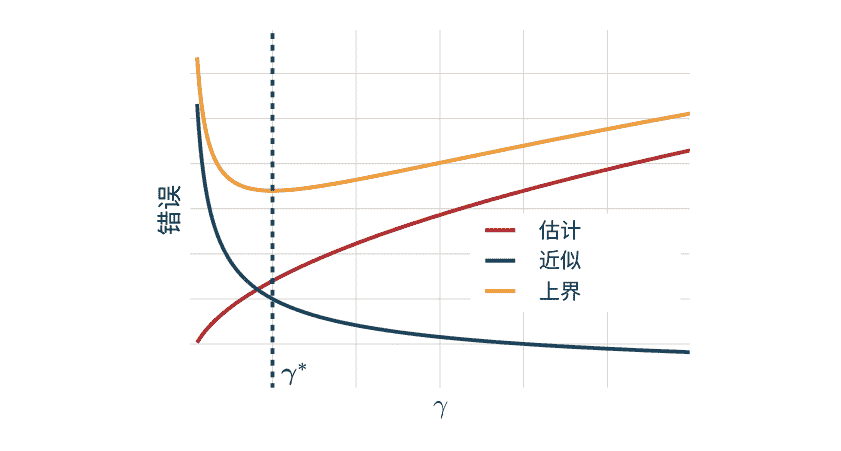

图4.3 选择具有估计误差和逼近误差之间最有利的权衡的γ*。

## 4.3 结构风险最小化（SRM）

在前一节中，我们展示了估计误差有时可以被界定或估计。但是，由于逼近误差无法估计，我们应该如何选择$\mathcal{H}$？一种方法是选择一个非常复杂的$\mathcal{H}$家族，没有逼近误差或者逼近误差非常小。$\mathcal{H}$可能对于泛化界限来说过于丰富，但假设我们可以将$\mathcal{H}$分解为越来越复杂的假设集$H_\gamma$的并集，即 $\mathcal{H} = \bigcup_{\gamma \in \Gamma} H_\gamma$，其中 $H_\gamma$ 的复杂性随着 $\gamma$ 的增加而增加，对于某个集合$\Gamma$。图4.2说明了这种分解。然后，问题就是选择参数 $\gamma^* \in \Gamma$，从而选择具有估计误差和逼近误差之间最有利权衡的假设集 $H_{\gamma^*}$。由于这些数量是未知的，因此，如图4.3所示，可以使用它们的和的均匀上界，即超额误差（也称为超额风险）来代替。

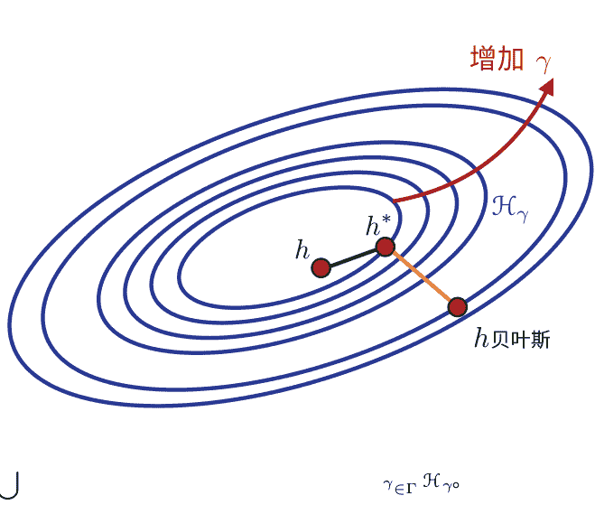

图4.2 富集家族 $\mathcal{H} = \bigcup_{\gamma\in\Gamma}\mathcal{H}_{\gamma o}$

这正是结构风险最小化（SRM）方法的思想。

对于SRM，假设$\mathcal{H}$可以分解为可数集合，因此我们将其分解为$\mathcal{H} = \bigcup_{k \ge 1} \mathcal{H}_k$。此外，假设集合$\mathcal{H}_k$是嵌套的：$\mathcal{H}_k \subset \mathcal{H}_{k+1}$ 对于所有 $k \ge 1$。然而，本节中介绍的许多结果也适用于非嵌套的假设集合。因此，除非明确指定，否则我们不使用该假设。SRM包括选择索引 $k^* \ge 1$ 和ERM假设 $h \in \mathcal{H}_{k^*}$，以最小化对超额误差的上界。

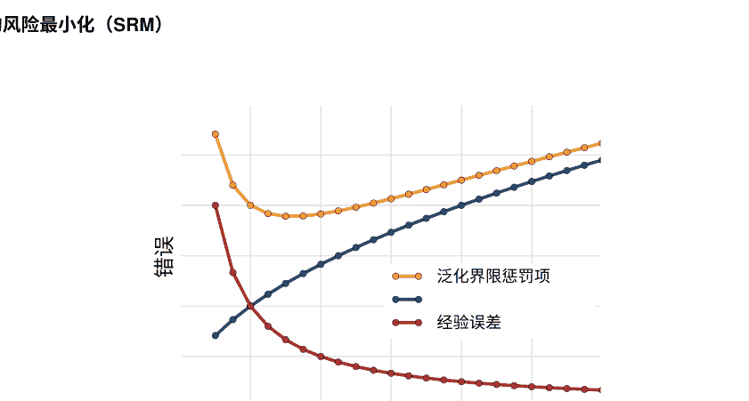

**图4.4** 结构风险最小化的示例。三个错误的图表显示为索引k的函数。显然，随着k或者等价地说假设集合H_k的复杂度的增加，训练误差减小，而惩罚项增加。SRM选择最小化对泛化误差的界限的假设，该界限是经验误差和惩罚项的总和。

正如我们将看到的，以下学习界限适用于所有 H中的 h：对于任意δ > 0，从 D m中抽取大小为m的样本 S，以至少1 - δ的概率，对于所有 H_k和 k ≥ 1，

$$R(h) \leq R_S(h) + \aleph_m(\mathcal{H}_{k(h)}) + \frac{\lceil \log k \rceil}{m} + \frac{\lceil \log \frac{2}{\delta} \rceil}{2m}.$$

因此，为了最小化对超额误差（R(h) - R^*）的结果界限，应选择指数k和假设 h ∈ H_k以最小化以下目标函数：

$$F_k(h) = R_S(h) + \aleph_m(\mathcal{H}_k) + \frac{\lceil \log k \rceil}{m}.$$

这正是SRM解决方案 $h_S^{\text{SRM}}$的定义：

$$h_S^{\text{SRM}} = \underset{k \geq 1, h \in \mathcal{H}_k}{\text{argmin}} F_k(h) = \underset{k \geq 1, h \in \mathcal{H}_k}{\text{argmin}} R_S(h) + R_m(\mathcal{H}_k) + \frac{\lceil \log k \rceil}{m} \quad (4.4)$$

因此，SRM确定了一个最优的指数 k^*和因此假设集 H_{k^*}，并基于该假设集返回ERM解。图4.4进一步说明了通过最小化训练误差和惩罚项 R_m(\mathcal{H} k) +来选择指数 k^*和假设集H_{k^*}的SRM。

以下定理表明SRM解决方案从强学习保证中受益。对于任何 h ∈ \mathcal{H}，我们将 \mathcal{H}_k( h)中最简单的假设集表示为 \mathcal{H}_{k_0} $\lceil \log k/m.$

### 定理4.2 (SRM学习保证)

对于任意 $\delta > 0$, 以至少 $1 - \delta$ 的概率从分布 $\mathcal{D}$ 中抽取大小为 $m$ 的独立同分布样本 $S$, SRM方法返回的假设 $H$ 的泛化误差被限制如下：由$SRM$方法返回的结果如下所示：

$$R(H_S^{\text{SRM}}) \leq \inf_{h \in \mathcal{H}} \left( R(\mathcal{H}) + 2\mathfrak{R}_m(\mathcal{H}_k(\mathcal{H})) + \sqrt{\frac{\log k(\mathcal{H})}{m}} \right) + \sqrt{\frac{2 \log \frac{3}{\delta}}{m}}.$$

证明：首先观察到，根据并集界，以下一般不等式成立：

$$\begin{aligned}
\mathbb{P}\left[\sup_{h \in \mathcal{H}} R(\mathcal{H}) - F_{k(\mathcal{H})}(\mathcal{H}) > \epsilon\right] & = \mathbb{P}\left[\sup_{k \geq 1} \sup_{h \in \mathcal{H}_k} R(\mathcal{H}) - F_k(\mathcal{H}) > \epsilon\right] \\
& \leq \sum_{k=1}^{\infty} \mathbb{P}\left[\sup_{h \in \mathcal{H}_k} R(\mathcal{H}) - F_k(\mathcal{H}) > \epsilon\right] \\
& = \sum_{k=1}^{\infty} \mathbb{P}\left[\sup_{h \in \mathcal{H}_k} R(\mathcal{H}) - R_S(\mathcal{H}) - \mathfrak{R}_m(\mathcal{H}_k) > \epsilon + \sqrt{\frac{\log k}{m}}\right] \\
& \leq \sum_{k=1}^{\infty} \exp\left( -2m\left[\epsilon + \sqrt{\frac{\log k}{m}}\right]^2 \right) \\
& \leq \sum_{k=1}^{\infty} e^{-2m\epsilon^2} e^{-2\log k} \\
& = e^{-2m\epsilon^2} \sum_{k=1}^{\infty} \frac{1}{k^2} = \frac{\pi^2}{6} e^{-2m\epsilon^2} \leq 2 e^{-2m\epsilon^2}.
\end{aligned}$$

接下来，对于任意两个随机变量 $X_1$和 $X_2$，如果 $X_1 + X_2 > \epsilon$，则 $X_1$ 或 $X_2$ 必须大于 $\epsilon/2$。鉴于此，根据并集边界， $\mathbb{P}[X_1 + X_2 > \epsilon] \leq \mathbb{P}\left[X_1 > \frac{\epsilon}{2}\right] + \mathbb{P}\left[X_2 > -\frac{\epsilon}{2}\right]$。利用这个不等式，不等式 (4.5) 和不等式 $F_{k(h_S^{\text{SRM}})}(h_S^{\text{SRM}}) \leq F_{k(h)}(h)$，这对于所有 $h \in \mathcal{H}$都成立，根据 $h_S^{\text{SRM}}$ 的定义，我们

可以写成，对于任意的 \( h \in \mathcal{H} \)，

\[
\mathbb{P} \left[ R(\mathcal{H}_S^{\mathrm{SRM}}) - R(h) - 2 \mathfrak{R}_m(\mathcal{H}_{k(h)}) - \frac{\sqrt{\log k(\mathcal{H})}}{m} > \epsilon \right] \\
\leq \mathbb{P} \left[ R(\mathcal{H}_S^{\mathrm{SRM}}) - F_{k(h_S^{\mathrm{SRM}})}(h_S^{\mathrm{SRM}}) > \frac{\epsilon}{2} \right] \\
+ \mathbb{P} \left[ F_{k(h_S^{\mathrm{SRM}})}(h_S^{\mathrm{SRM}}) - R(h) - 2 \mathfrak{R}_m(\mathcal{H}_{k(h)}) - \frac{\sqrt{\log k(\mathcal{H})}}{m} > \frac{\epsilon}{2} \right] \\
\leq 2 e^{-\frac{m\epsilon^2}{2}} + \mathbb{P} \left[ \underline{F_{k(h)}(h)} - R(h) - 2 \mathfrak{R}_m(\mathcal{H}_{k(h)}) - \frac{\sqrt{\log k(\mathcal{H})}}{m} > \frac{\epsilon}{2} \right] \\
= 2 e^{-\frac{m\epsilon^2}{2}} + \mathbb{P} \left[ R_S(h) - R(h) - \mathfrak{R}_m(\mathcal{H}_{k(h)}) > \frac{\epsilon}{2} \right] \\
= 2 e^{-\frac{m\epsilon^2}{2}} + e^{-\frac{m\epsilon^2}{2}} = 3 e^{-\frac{m\epsilon^2}{2}}.
\]

将右侧设置为 \( \delta \) 完成证明。 \( \square \)

刚刚证明的SRM的学习保证是非凡的。 为了简化讨论，让我们假设存在一个 \( h^* \)，使得 \( R(h^*) = \inf_{h \in \mathcal{H}} R(h) \)，也就是说，存在一个最佳的分类器 \( h^* \in \mathcal{H} \)。 然后，定理特别地暗示，至少以概率 \( 1 - \delta \)，对于所有的 \( h \in \mathcal{H} \)，以下不等式成立：

\[
R(\mathcal{H}_S^{\mathrm{SRM}}) \leq R(h^*) + 2 \mathfrak{R}_m(\mathcal{H}_{k(h^*)}) + \frac{\sqrt{\log k(h^*)}}{m} + \frac{\sqrt{2 \log \frac{3}{\delta}}}{m}. \tag{4.6}
\]

值得注意的是，这个界限与 \( \mathcal{H}_{k(h^*)} \) 的估计误差界限非常相似：它们之间只有一个项的差异。 「因此，忽略该项，SRM的保证与我们获得的最佳分类器假设集的指数 \( k(h^*) \) 的保证一样有利。 此外，观察到当 \( \mathcal{H} \) 足够丰富时，\( R(h^*) \) 接近贝叶斯错误，学习界限(4.6)近似为SRM解决方案的过度错误界限。 请注意，如果对于某个 \( k_0 \)，ERM解决方案的经验误差对于 \( \mathcal{H}_k \) 为零，特别是当 \( \mathcal{H}_{k_0} \) 包含贝叶斯误差，那么，我们有 \( \min_{h \in \mathcal{H}_k} F_{k_0}(h) \leq \min_{h \in \mathcal{H}_k} F_k(h) \) 对于所有 \( k > k_0 \)，只需要考虑有限多个索引在SRM中。 更一般地假设如果 \( \min_{h \in \mathcal{H}_k} F_k(h) \leq \min_{h \in \mathcal{H}_{k+1}} F_{k+1}(h) \) 对于某些 \( k \)，如果存在 \( F_k(h) \)，则不需要检查 \( k+1 \) 之后的索引。 如果经验误差在某个索引 \( k \) 之后无法进一步改善，则可能满足此属性。 在这种情况下，可以通过在区间 \( [1, k_{\max}] \) 中进行二分搜索来确定最小化索引 \( k^* \)，给定某个最大值 \( k_{\max} \)。 可以通过检查 \( \min_{h \in \mathcal{H}} \) 来找到 \( k_{\max} \) 本身。 对于指数增长的索引 \( 2^n \)，\( n \geq 1 \)，可以设置 \( k_{\max} = 2n \) 以满足 \( \min_{h \in \mathcal{H}_{2n}} F_k(h) \leq \min_{h \in \mathcal{H}_{2n+1}} \) 找到 \( k_{\max} \) 所需的ERM计算次数为 \( O(n) = O(\log k_{\max}) \)，类似地，由于二分搜索，ERM计算的次数在 \(O(\log k_{\max})\) 内。因此，如果 \(k^* < 2n\)，那么ERM计算的总次数在 \(O(\log k^*)\) 内。

虽然它有很好的保证，但SRM也有一些缺点。首先，将 \(\mathcal{H}\) 分解为可数个假设集，每个假设集的Rademacher复杂度收敛，这仍然是一个强假设。举个例子，所有可测函数的集合不能写成可数个假设集的并集，且VC维度有限。因此，选择 \(\mathcal{H}\) 或假设集 \(\mathcal{H}_k\) 是SRM的关键组成部分。其次，这也是SRM的主要缺点，该方法通常在计算上是难以处理的：对于大多数假设集，ERM的解决方案是NP难的，并且通常需要对大量的索引 \(k\) 进行解决。

## 4.4 交叉验证

模型选择的另一种方法，交叉验证，包括使用训练样本的一部分作为验证集来选择假设集 \(\mathcal{H}_k\)。这与SRM模型相反，SRM模型依赖于理论学习界限，为每个假设集分配惩罚。在本节中，我们分析交叉验证方法并将其性能与SRM进行比较。与前一节一样，让 \((\mathcal{H}_k)_{k\ge1}\) 是一个递增复杂性的可数假设集序列。

交叉验证 (CV) 解决方案如下。令 \(S\) 为大小为 \(m\) 的独立同分布标记样本。将 \(S\) 分为大小为 \((1-\alpha)m\) 的样本 \(S_1\) 和大小为 \(\alpha m\) 的样本 \(S_2\)，其中 \(\alpha \in (0,1)\) 通常选择相对较小。保留 \(S_1\) 用于训练，保留 \(S_2\) 用于验证。对于任意 \(k \in \mathbb{N}\)，令 \(h_{\text{ERM}}^{S_{1,k}}\) 表示使用假设集 \(\mathcal{H}_k\) 运行的ERM解 \(S_1\)。交叉验证返回的假设 \(h_S^{\text{CV}}\) 是ERM解 \(h_{S_1,k}^{\text{ERM}}\) 在 \(S_2\) 上表现最好：

$$h_{S}^{\text{CV}} = \arg\min_{h \in \{h_{S_1,k}^{\text{ERM}} : k \ge 1\}} R_{S_2}(h).$$

下面的一般结果将帮助我们推导交叉验证的学习保证。

**命题 4.3** 对于任意 \(\alpha > 0\) 和任意样本大小 \(m \ge 1\)，以下一般不等式成立：

$$\mathbb{P}\left[ \sup_{k \ge 1} \left| R(h_{S_1,k}^{\text{ERM}}) - R_{S_2}(h_{S_1,k}^{\text{ERM}}) \right| > \epsilon + \sqrt{\frac{\log k}{\alpha m}} \right] \le 4e^{-2\alpha m \epsilon^2}.$$

证明：通过并集边界，我们可以写成

$$\mathbb{P} \left[ \sup_{k \ge 1} \left| R(h_{S_1, k}^{\text{ERM}}) - R_{S_2}(h_{S_1, k}^{\text{ERM}}) \right| > \epsilon + \left\lceil \frac{\log k}{\alpha m} \right\rceil \right] \ \quad \le \sum_{k=1}^{\infty} \mathbb{P} \left[ \left| R(h_{S_1, k}^{\text{ERM}}) - R_{S_2}(h_{S_1, k}^{\text{ERM}}) \right| > \epsilon + \left\lceil \frac{\log k}{\alpha m} \right\rceil \right] \ \quad = \sum_{k=1}^{\infty} \mathbb{E} \left[ \mathbb{P} \left[ \left| R(h_{S_1, k}^{\text{ERM}}) - R_{S_2}(h_{S_1, k}^{\text{ERM}}) \right| > \epsilon + \left\lceil \frac{\log k}{\alpha m} \right\rceil \middle| S_1 \right] \right].$$

假设 \(h_{S_1, k}^{\text{ERM}}\) 在 \(S_1\) 给定的条件下是固定的。此外，样本 \(S_2\) 与 \(S_1\) 是独立的。因此，根据Hoeffding不等式，我们可以限制条件概率如下：

$$\mathbb{P} \left[ \left| R(h_{S_1, k}^{\text{ERM}}) - R_{S_2}(h_{S_1, k}^{\text{ERM}}) \right| > \epsilon + \left\lceil \frac{\log k}{\alpha m} \right\rceil \middle| S_1 \right] \le 2e^{-2\alpha m \left(\epsilon+\sqrt{\frac{\log k}{\alpha m}}\right)^2} \ \qquad \le 2e^{-2\alpha m\epsilon^2-2\log k} \ \qquad = \frac{2}{k^2} e^{-2\alpha m\epsilon^2}.$$

将此界限的右侧代入(4.8)并对 \(k\) 求和得到

$$\mathbb{P} \left[ \sup_{k \ge 1} \left| R(h_{S_1, k}^{\text{ERM}}) - R_{S_2}(h_{S_1, k}^{\text{ERM}}) \right| > \epsilon + \left\lceil \frac{\log k}{\alpha m} \right\rceil \right] \le \frac{\pi^2}{3} e^{-2\alpha m\epsilon^2} < 4e^{-2\alpha m\epsilon^2},$$

这完成了证明。□

让 \(R(h_{S_1}^{\text{SRM}})\) 是使用大小为 \((1-\alpha)m\) 的样本 \(S_1\) 进行 \(SRM\) 解决方案的泛化误差，而 \(R(h_{S}^{\text{CV}})\) 是使用交叉验证的样本 \(m\) 的泛化误差。然后，使用命题4.3，可以得出以下学习保证，它将 CV 方法的误差与 SRM 的误差进行比较。

**定理 4.4 (交叉验证与 SRM)** 对于任意的 \(\delta > 0\)，至少以概率 \(1-\delta\)，以下条件成立：

$$R(h_{S}^{\text{CV}}) - R(h_{S_1}^{\text{SRM}}) \le 2\sqrt{\frac{\log \max(k(h_{S}^{\text{CV}}), k(h_{S_1}^{\text{SRM}}))}{\alpha m}} + 2\sqrt{\frac{\log \frac{4}{\delta}}{2\alpha m}},$$

其中，对于任意的 \(h\)， \(k(h)\) 表示包含 \(h\) 的假设集的最小索引。

证明：根据命题 4.3 和定理 4.2，利用 \(h_{S}^{\text{CV}}\) 作为最小化器的性质，对于任意的 \(\delta > 0\)，至少以概率 \(1-\delta\)，以下不等式成立保持：

$$R(h_S^{\text{CV}}) \leq R_{S_2}(h_{S_1,k_1^{\text{CV}}}^{\text{ERM}}) + \frac{\log(\text{card}(\{h_{S_1,k}^{\text{ERM}}\}_{k}))}{\alpha m} + \frac{\log\frac{4}{\delta}}{2\alpha m}$$

$$R(h_S^{\text{CV}}) \leq R_{S_1}(h_{S_1,k_1^{\text{SRM}}}^{\text{SRM}}) + \frac{\log(\text{card}(\{h_{S_1,k}^{\text{ERM}}\}_{k}))}{\alpha m} + \frac{\log\frac{4}{\delta}}{2\alpha m}$$

$$R(h_S^{\text{CV}}) \leq R(h_{S_1,k_1^{\text{SRM}}}^{\text{SRM}}) + \frac{\log(\text{card}(\{h_{S_1,k}^{\text{ERM}}\}_{k}))}{\alpha m} + \frac{\log(\text{card}(\{h_{S_1,k}^{\text{SRM}}\}_{k}))}{\alpha m} + 2\frac{\log\frac{4}{\delta}}{2\alpha m}$$

$$R(h_S^{\text{CV}}) \leq R(h_{S_1,k_1^{\text{SRM}}}^{\text{SRM}}) + 2\frac{\log(\max(\text{card}(\{h_{S_1,k}^{\text{ERM}}\}_{k}), k(h_{S_1}^{\text{SRM}})))}{\alpha m} + 2\frac{\log\frac{4}{\delta}}{2\alpha m}$$

这完成了证明。

刚刚证明的学习保证表明，以很高的概率，对于大小为 \(m\) 的样本，CV解决方案的泛化误差接近于大小为 \((1-\alpha)m\) 的SRM解决方案的泛化误差。对于相对较小的 \(\alpha\)，这表明了与SRM类似的保证，正如之前讨论的那样，这是非常有利的。然而，在一些不利的情况下，一个在 \((1-\alpha)m\) 点上训练的算法（这里是SRM）可能比在 \(m\) 个点上训练时性能显著差。避免这种相变问题是实际中使用N折交叉验证方法的主要动机之一，请参见第4.5节。因此，该界限实际上提出了一个权衡：\(\alpha\) 应选择足够小以避免刚刚提到的不利情况，但又足够大以使界限的右侧变小，从而提供信息。

在实践中，计算机视觉的学习界限在某些情况下可以更明确地确定。例如，假设假设集 \(\mathcal{H}_k\) 是嵌套的，并且经验误差的ERM解决方案 \(h_S^{\text{ERM}}\) 在达到零之前是递减的：对于任何 \(k\)，\(R_{S_1}(h_{S_1,k+1}^{\text{ERM}}) < R_{S_1}(h_{S_1,k}^{\text{ERM}})\) 对于所有 \(k\) 使得 \(R_{S_1}(h_{S_1,k}^{\text{ERM}}) > 0\) 且 \(R_{S_1}(h_{S_1,k}^{\text{ERM}}) \leq R_{S_1}(h_{S_1,k+1}^{\text{ERM}})\)。否则，\(R_{S_1}(h_{S_1,k}^{\text{ERM}}) > 0\) 意味着至少有一个错误 \(h_{S_1,k}^{\text{ERM}}\)，因此 \(R_{S_1}(h_{S_1,k}^{\text{ERM}}) > \frac{1}{m}\)。考虑到这一点，我们必须有 \(R_{S_1}(h_{S_1,k}^{\text{ERM}}) = 0\) 对于所有 \(k \geq m+1\)。因此，我们有 \(h_{S_1,k}^{\text{ERM}} = h_{S_1,m+1}^{\text{ERM}}\) 对于所有 \(k \geq m+1\)，我们可以假设 \(k(h_{\text{CV}}) \leq m+1\)。由于 \(\mathcal{H}_k\) 的复杂性随 \(k\) 增加而增加，我们也有 \(k(h_{\text{SRM}}) \leq m+1\)。鉴于此，我们得到了更明确的以下交叉验证学习界限：

$$R(h_{\text{CV}}, S) - R(h_{\text{SRM}}, S_1) \leq 2\frac{\log\frac{4}{\delta}}{2\alpha m} + 2\frac{\log(m+1)}{\alpha m}$$

## 4.5 n折交叉验证

在实践中，可用的标记数据量通常太小，无法留出一个验证样本，因为那样会导致训练数据不足。

相反，一种被广泛采用的方法被称为 n折交叉验证，用于利用标记数据进行模型选择和训练。

让 \(\theta\) 表示算法的自由参数向量。对于固定的 \(\theta\) 值，该方法首先将给定样本 \(S\) 分成 \(n\) 个子样本或折叠。因此，第 \(i\) 个折叠是一个标记样本 \(((x_{i1}, y_{i1}), \dots, (x_{im_i}, y_{im_i}))\)，大小为 \(m_i\)。然后，对于任何 \(i \in [n]\)，学习算法将在除了第 \(i\) 个折叠之外的所有折叠上进行训练，生成一个假设 \(h_i\)，并在第 \(i\) 个折叠上测试其性能，如图4.5a所示。参数值 \(\theta\) 基于假设 \(h_i\) 的平均误差进行评估，该误差称为交叉验证误差。该数量用 \(R_{\text{CV}}(\theta)\) 表示，并由以下方式定义

$$R_{\text{CV}}(\theta) = \frac{1}{n} \sum_{i=1}^{n} \frac{1}{m_i} \sum_{j=1}^{m_i} L(h_i(x_{ij}), y_{ij})$$

*在第i个折叠上的误差*

折叠通常选择具有相等大小的折叠，即 \(m_i = m/n\) 对于所有 \(i \in [n]\)。应该如何选择 \(n\)？适当的选择取决于权衡。对于一个大的 \(n\)，每个用于折叠交叉验证的训练样本的大小为 \(m - m/n = m(1-1/n)\)（在图4.5b中由右侧红色垂直线表示），这接近于 \(m\)，完整样本的大小，并且还意味着所有的训练样本都非常相似。同时，用于测量误差的第 \(i\) 折叠相对较小，因此交叉验证误差倾向于具有小的偏差但较大的方差。

相比之下，较小的值 \(n\) 导致更多样化的训练样本，但它们的大小（在图4.5b中由左侧红色垂直线表示）明显小于 \(m\)。在这种情况下，第 \(i\) 次折叠相对较大，因此交叉验证误差的方差较小，但偏差较大。

在应用中，\(n\) 通常选择为5或10。n折交叉验证在模型选择中的使用方式如下。完整的标记数据首先被分成训练样本和测试样本。然后使用大小为 \(m\) 的训练样本计算 n折交叉验证误差 \(R_{\text{CV}}(\theta)\) 的一些可能值的小数值。接下来，将自由参数 \(\theta\) 设置为使 \(R_{\text{CV}}(\theta)\) 最小的值 \(\theta_0\)，并使用参数设置 \(\theta_0\) 在大小为 \(m\) 的完整训练样本上进行训练。其性能如前一节所述在测试样本上进行评估。

当 \(n = m\) 时，n折交叉验证的特殊情况被称为留一法交叉验证，因为在每次迭代中，训练集中恰好有一个实例被排除在外。

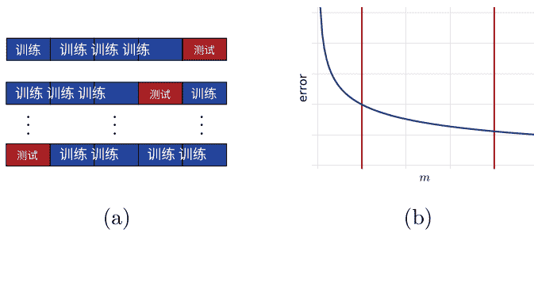

图4.5 n折交叉验证。(a)将训练数据分成5个折叠的示意图。(b)典型的分类器预测误差随训练样本大小m的变化图示：随着训练点数量的增加，误差逐渐减小。左侧的红线标记了n较小的区域，而右侧的红线标记了n较大的区域。

样本。如第5章所示，留一法误差是算法平均误差的近似无偏估计，可以用于推导一些算法的简单保证。一般来说，留一法误差的计算非常耗时，因为它需要在大小为 \(m-1\) 的样本上训练 \(m\) 次，但对于某些算法，它可以进行非常高效的计算（参见练习11.9）。除了模型选择外，n折交叉验证还常用于性能评估。在这种情况下，对于固定的参数设置 \(\theta\)，完整的标记样本被随机分成 \(t \cdot n\) 个折叠，训练样本和测试样本没有区别。报告的性能是在完整样本上进行的 \(t \cdot n\) 折交叉验证误差，以及在每个折叠上测量的误差的标准差。

## 4.6 基于正则化的算法

受SRM方法启发的一类广泛的算法是基于正则化的算法。这包括选择一个非常复杂的假设集合 \(\mathcal{H}\)，它是一个可数的嵌套假设集合 \(\mathcal{H}_\gamma\) 的并集 \(\mathcal{H} = \cup_\gamma \mathcal{H}_\gamma\)。通常选择的 \(\mathcal{H}\) 是在连续函数空间上密集的。例如，\(\mathcal{H}\) 可以选择为某个高维空间中的所有线性函数的集合，\(\mathcal{H}_\gamma\) 是那些范数被 \(\gamma\) 限制的函数的子集：\(\mathcal{H}_\gamma = \{x \mapsto w \cdot \Phi(x) : \|w\| \le \gamma\}\)。对于某些 \(\Phi\) 和高维空间的选择，可以证明 \(\mathcal{H}\) 确实在连续函数空间上是密集的。

给定一个标记样本 \(S\)，将SRM方法扩展到一个不可数的并集上，然后建议基于以下优化问题选择 \(h\)：

$$
\argmin_{\gamma>0, h \in \mathcal{H}_\gamma} R_S(h) + \Re_m(\mathcal{H}_\gamma) + \left\lceil \frac{\log \gamma}{m} \right\rceil,
$$

其中其他惩罚项 \(\text{pen}(\gamma, m)\) 可以选择代替具体选择

$$
\text{pen}(\gamma, m) = \Re_m(\mathcal{H}_\gamma) + \left\lceil \frac{\log \gamma}{m} \right\rceil.
$$

通常，存在一个函数 \(\mathcal{R}: \mathcal{H} \rightarrow \mathbb{R}\)，使得对于任意 \(\gamma > 0\)，约束优化问题 \(\argmin_{h \in \mathcal{H}_\gamma} R_S(h) + \text{pen}(\gamma, m)\) 可以等价地写成无约束优化问题

$$
\argmin_{h \in \mathcal{H}} R_S(h) + \lambda \mathcal{R}(h),
$$

对于一些 \(\lambda > 0\)。\(\mathcal{R}(h)\) 被称为正则化项，\(\lambda > 0\) 被视为超参数，因为其最优值通常未知。对于大多数算法，当 \(\mathcal{H}\) 是希尔伯特空间的子集时，正则化项 \(\mathcal{R}(h)\) 被选择为 \(\|h\|\) 的递增函数。变量 \(\lambda\) 通常被称为正则化参数。较大的 \(\lambda\) 进一步惩罚更复杂的假设，而对于接近或等于零的 \(\lambda\)，正则化项没有影响，算法与ERM重合。在实践中，\(\lambda\) 通常通过交叉验证或使用 \(n\)-折交叉验证来选择。

当正则化项被选择为 \(\|h\|_p\) 的某种范数和 \(p \geq 1\) 时，它是 \(h\) 的凸函数，因为任何范数都是凸的。然而，对于零一损失，目标函数的第一项是非凸的，从而使优化问题在计算上变得困难。在实践中，大多数基于正则化的算法使用零一损失的凸上界，并用该凸替代零一经验项的经验值。由此产生的优化问题是凸的，因此比SRM具有更高效的解决方案。下一节研究这种凸替代损失的性质。

## 4.7 凸代理损失

我们在之前的章节中提出的估计误差的保证，无论是ERM还是SRM，都是以ERM为基础定义的。然而，正如之前提到的，对于许多假设集 \(\mathcal{H}\) 的选择，包括线性函数，解决ERM优化问题主要是因为零一损失函数不是凸函数，所以是NP难的。解决这个问题的一种常见方法是使用一个上界为零一损失函数的凸代理损失函数。本节将分析这种代理损失函数在原始损失函数方面的学习保证。

我们考虑的假设是实值函数 \(h: \mathcal{X} \to \mathbb{R}\)。函数 \(h\) 的符号定义了一个二元分类器 \(f_h: \mathcal{X} \to \{-1, +1\}\)，对于所有的 \(x \in \mathcal{X}\)，有

$$f_h(x) = \begin{cases} \text{如果 } h(x) \geq 0, \text{则为}+1 \\ \text{如果 } h(x) < 0, \text{则为}-1. \end{cases}$$

在点 \((x, y) \in \mathcal{X} \times \{-1, +1\}\) 处的损失或误差被定义为 \(f_h\) 的二元分类错误：

$$1_{f_h(x) \neq y} = 1_{yh(x)<0} + 1_{h(x)=0 \land y=-1} \leq 1_{yh(x)\leq 0}.$$

我们将 \(R(h)\) 表示为 \(R(h) = \mathbb{E}_{(x,y)\sim \mathcal{D}} [1_{f_h(x) \neq y}]\)。对于任意的 \(x \in \mathcal{X}\)，令 \(\eta(x)\) 表示为 \(\eta(x) = \mathbb{P}[y=+1|x]\)，并且让 \(\mathcal{D}_{\mathcal{X}}\) 表示边缘分布在 \(\mathcal{X}\) 上。那么，对于任意的 \(h\)，我们可以写成 \(R(h) = \mathbb{E}\)

$$\begin{aligned} R(h) &= \mathbb{E}_{(x,y)\sim \mathcal{D}} [1_{f_h(x) \neq y}] \\ &= \mathbb{E}_{x\sim \mathcal{D}_{\mathcal{X}}} [\eta(x)1_{h(x)<0} + (1-\eta(x))1_{h(x)>0} + (1-\eta(x))1_{h(x)=0}] \\ &= \mathbb{E}_{x\sim \mathcal{D}_{\mathcal{X}}} [\eta(x)1_{h(x)<0} + (1-\eta(x))1_{h(x)\geq 0}]. \end{aligned}$$

鉴于此，贝叶斯分类器可以被定义为当 \(\eta(x) \geq \frac{1}{2}\) 时，将标签+1分配给x，否则为-1。因此，它可以由函数 \(h^*\) 诱导出，该函数定义为

$$h^*(x) = \eta(x) - \frac{1}{2}. \hfill (4.9)$$

我们将把 \(h^*: \mathcal{X} \to \mathbb{R}\) 称为贝叶斯评分函数，并用 \(R^*\) 表示贝叶斯分类器或贝叶斯评分函数的误差: \(R^* = R(h^*)\)。

**引理 4.5** 任意假设 \(h: \mathcal{X} \to \mathbb{R}\) 的过度误差可以用以下方式表示与 \(\eta\) 和贝叶斯评分函数 \(h^*\) 有关:

$$R(h) - R^* = 2 \mathbb{E}_{x\sim \mathcal{D}_{\mathcal{X}}} [|h^*(x)| 1_{h(x)h^*(x)\leq 0}].$$

证明：对于任意的，我们可以写

$$\begin{aligned} R(h) &= \mathbb{E}_{x\sim \mathcal{D}_{\mathcal{X}}} [\eta(x)1_{h(x)<0} + (1-\eta(x))1_{h(x)\geq 0}] \\ &= \mathbb{E}_{x\sim \mathcal{D}_{\mathcal{X}}} [\eta(x)1_{h(x)<0} + (1-\eta(x))(1 - 1_{h(x)<0})] \\ &= \mathbb{E}_{x\sim \mathcal{D}_{\mathcal{X}}} [(2\eta(x)-1)1_{h(x)<0} + (1-\eta(x))] \\ &= \mathbb{E}_{x\sim \mathcal{D}_{\mathcal{X}}} [2h^*(x)1_{h(x)<0} + (1-\eta(x))], \end{aligned}$$

### 定理 4.7 的证明

在最后一步中，我们使用了方程 (4.9)。鉴于此，对于任意的 $h$，以下成立：

$$R(h) - R(h^*) =$$
$$\begin{aligned}
& \mathbb{E}_{x\sim\mathcal{D}_\mathcal{X}} \left[ 2\eta^*(x)\big(1_{h(x)\leq 0} - 1_{h^*(x)\leq 0}\big) \right] \\
= & \mathbb{E}_{x\sim\mathcal{D}_\mathcal{X}} \left[ 2\eta^*(x)\ \mathrm{sgn}(h^*(x))1_{(h(x)h^*(x)\leq 0)\wedge((h(x),h^*(x))\neq(0,0))} \right] \\
= & 2\ \mathbb{E}_{x\sim\mathcal{D}_\mathcal{X}} \left[ |h^*(x)|\ 1_{h(x)h^*(x)\leq 0} \right],
\end{aligned}$$

这完成了证明，因为 $R(h^*) = R^*$。 $\square$

设 $\Phi : \mathbb{R} \rightarrow \mathbb{R}$ 为一个凸且非递减的函数，使得对于任意 $u \in \mathbb{R}$， $1_{u\leq 0} \leq \Phi(-u)$。 函数 $h : \mathcal{X} \rightarrow \mathbb{R}$ 在点 $(x, y) \in \mathcal{X} \times \{-1, +1\}$ 的 $\Phi$ 损失定义为 $\Phi(-yh(x))$， 其期望损失 为 $\mathcal{L}_\Phi(h) =$

$$\begin{aligned}
& \mathbb{E}_{(x,y)\sim\mathcal{D}} \left[ \Phi(-yh(x)) \right] \\
= & \mathbb{E}_{x\sim\mathcal{D}_\mathcal{X}} \left[ \eta(x)\Phi(-h(x)) + (1-\eta(x))\Phi(h(x)) \right]. \qquad (4.10)
\end{aligned}$$

注意到由于 $1_{yh(x)\leq 0} \leq \Phi(-yh(x))$， 我们有 $R(h)\leq \mathcal{L}_\Phi(h)$。 对于任意 $x \in \mathcal{X}$， 令 $u \mapsto L_\Phi(x, u)$ 为对所有 $u \in \mathbb{R}$ 定义的函数

$$L_\Phi(x, u) = \eta(x)\Phi(-u) + (1-\eta(x))\Phi(u).$$

然后， $\mathcal{L}_\Phi(h) = \mathbb{E}_{x\sim\mathcal{D}} L_\Phi(x, h(x))$。 由于 $\Phi$ 是凸的， $u \mapsto L_\Phi(x, u)$ 作为两个凸函数的和是凸的。 定义 $h^*_\Phi : \mathcal{X} \rightarrow [-\infty, +\infty]$ 作为损失函数 $L_\Phi$ 的贝叶斯解。 也就是说， 对于任意的 $x$ ， $h^*_\Phi(x)$ 是以下凸优化问题的解：

$$\begin{aligned}
h^*_\Phi(x) &= \mathrm{argmin}_{u\in[-\infty,+\infty]} \ L_\Phi(x, u) \\
&= \underset{u\in[-\infty,+\infty]}{\mathrm{argmin}} \ \eta(x)\Phi(-u) + (1-\eta(x))\Phi(u).
\end{aligned}$$

这个优化问题的解通常不唯一。 当 $\eta(x)=0$ 时， $h^*_\Phi(x)$ 是 $u \mapsto \Phi(u)$ 的最小化器， 由于 $\Phi$ 是非减的，我们可以选择 $h^*_\Phi(x) = -\infty$ 在这种情况下。 同样， 当 $\eta(x)=1$ 时 ，我们可以选择 $h^*_\Phi(x) = +\infty$。 当 $\eta(x)=\frac{1}{2}$ 时， $L_\Phi(x, u) = \frac{1}{2}[\Phi(-u)+\Phi(u)]$，- 因此，根据凸性， $L_\Phi(x, u) \geq \Phi(\frac{-u+u}{2}) = \Phi(0)$。 - - 因此，在这种情况下，我们可以选择 $h^*_\Phi(x) = 0$。 对于所有其他的 $\eta(x)$ 值，在非 唯一性的情况下，选择任意的最小化器在这个定义中。 我们将 $\mathcal{L}^*_\Phi$ 表示为 $\Phi$ 的损失函数 数： $\mathcal{L}^*_\Phi = \mathbb{E}_{(x,y)\sim\mathcal{D}} \left[ \Phi(-yh^*_\Phi(x)) \right]$。

**命题 4.6** 假设 $\Phi$ 是一个凸且非递减的函数，在 0 处可微且 $\Phi'(0) > 0$。 那么， $\Phi$ 的 最小化器定义了贝叶斯分类器：对于任意的 $x \in \mathcal{X}$， $h^*_\Phi(x) > 0$ 当且仅当 $h^*(x) > 0$ 且 $h^*(x) = 0$ 当且仅当 $h^*_\Phi(x) = 0$，这意味着 $\mathcal{L}^*_\Phi = R^*$。

证明:固定 $x \in \mathcal{X}$. 如果 $\eta(x) = 0$, 那么 $h^*(x) = -\frac{1}{2}$ 且 $h^*_\Phi(x) = -\infty$, 因此 $h^*(x)$ 和 $h^*_\Phi(x)$ 具有相同的符号。同样地，如果 $\eta(x) = 1$, 那么 $h^*(x) = +\frac{1}{2}$ 和 $h^*_\Phi(x) = +\infty$, 且 $h^*(x)$ 和 $h^*_\Phi(x)$ 具有相同的符号。让 $u^*$ 表示定义 $h^*_\Phi(x)$ 的最小化器。 $u^*$ 是 $u \mapsto L_\Phi(x,u)$ 的最小化器，当且仅当该函数在 $u^*$ 处的次微分包含0，即，由于 $\partial L_\Phi(x, u^*) = -\eta(x)\partial\Phi(-u^*) + (1-\eta(x))\partial\Phi(u^*)$，当存在 $v_1 \in \partial\Phi(-u^*)$ 和 $v_2 \in \partial\Phi(u^*)$ 时，成立。

$$\eta(x)v_1 = (1-\eta(x))v_2. \tag{4.11}$$

如果 $u^* = 0$，根据 $\Phi$ 在0处的可微性，我们有 $v_1 = v_2 = \Phi'(0) > 0$, 因此 $\eta(x) = \frac{1}{2}$，即 $h^*(x) = 0$。反之，如果 $h^*(x) = 0$，即 $\eta(x) = \frac{1}{2}$，那么根据定义，我们有 $h^*_\Phi(x) = 0$。因此， $h^*(x) = 0$ 当且仅当 $h^*_\Phi(x) = 0$ 当且仅当 $\eta(x) = \frac{1}{2}$。

我们现在可以假设 $\eta(x)$ 不在 $\{0,1,\frac{1}{2}\}$ 中。 我们首先证明对于任意的 $u_1, u_2 \in \mathbb{R}$ 且 $u_1 < u_2$，以及在 $u_1$ 和 $u_2$ 处选择的两个次梯度，$v_1 \in \partial\Phi(u_1)$ 且 $v_2 \in \partial\Phi(u_2)$，我们有 $v_1 \le v_2$。 根据次梯度的定义，在 $u_1$ 和 $u_2$ 处，以下不等式成立：

$$\Phi(u_2) - \Phi(u_1) \ge v_1(u_2 - u_1) \quad \text{和} \quad \Phi(u_1) - \Phi(u_2) \ge v_2(u_1 - u_2).$$

将这些不等式相加得到 $v_2(u_2 - u_1) \ge v_1(u_2 - u_1)$，因此 $v_2 \ge v_1$，因为 $u_1 < u_2$。

现在，如果 $u^* > 0$，那么我们有 $-u^* < u^*$。根据上面所示的性质，这意味着 $v_1 \le v_2$。我们不能有 $v_1 = v_2 = 0$，因为这样会导致 (4.11) 暗示 $\eta(x) = 1$。我们也不能有 $v_1 = v_2 = 0$，因为根据上面所示的性质，我们必须有 $\Phi'(0) \le v_2$，因此 $v_2 > 0$。因此，我们必须有 $v_1 < v_2$，其中 $v_2 > 0$，根据 (4.11)，这意味着 $\eta(x) > 1 - \eta(x)$，也就是说 $h^*(x) > 0$。

反之，如果 $h^*(x) > 0$，则 $\eta(x) > 1 - \eta(x)$。我们不能有 $v_1 = v_2 = 0$ 或 $v_1 = v_2 = 0$，如已经证明的。因此，由于 $\eta(x) = 1$，根据 (4.11)，这意味着 $v_1 < v_2$。我们不能有 $u^* < -u^*$，因为根据上面的性质，这将意味着 $v_2 \le v_1$。因此，我们必须有 $-u^* \le u^*$，也就是说 $u^* \ge 0$，更具体地说 $u^* > 0$，因为如上所示， $u^* = 0$ 意味着 $h^*(x) = 0$。

## 定理 4.7 假设 $\Phi$ 是一个凸且非递减的函数。假设存在 $s \ge 1$ 和 $c > 0$ 使得对于所有的 $x \in \mathcal{X}$，以下条件成立：

$$|h^*(x)|^s = |\eta(x) - \frac{1}{2}|^s \le c^s \left[ L_\Phi(x,0) - L_\Phi(x, h^*_\Phi(x)) \right].$$

然后，对于任意的假设 $h$，$h$ 的过度误差有以下界限：

$$R(h) - R^* \le 2c \left[ L_\Phi(h) - L_\Phi^* \right]^{\frac{1}{s}}$$

证明：我们将使用以下由 $\Phi$ 的凸性质得到的不等式：

$$\begin{aligned}
\Phi\left(-2h^{*}(x)h(x)\right) &= \Phi\left((1-2\eta(x))h(x)\right)\\
&= \Phi\left(\eta(x)(-h(x)) + (1-\eta(x))h(x)\right)\\
&\leq \eta(x)\Phi(-h(x)) + (1-\eta(x))\Phi(h(x)) = L_{\Phi}(x, h(x)). \quad (4.12)
\end{aligned}$$

根据引理4.5，Jensen不等式和 $h^{*}(x) = \eta(x) - \frac{1}{2}$，我们可以写成

$$\begin{aligned}
R(h) - R(h^{*})
&= \underset{x\sim\mathcal{D}_\mathcal{X}}{\mathrm{E}} \left[|2\eta(x) - 1| 1_{h(x)h^{*}(x)\leq0}\right]\\
&\leq \underset{x\sim\mathcal{D}_\mathcal{X}}{\mathrm{E}} \left[|2\eta(x) - 1|^{s} 1_{h(x)h^{*}(x)\leq0}\right]^{\frac{1}{s}} \qquad \text{(Jensen不等式)}\\
&\leq 2c \underset{x\sim\mathcal{D}_\mathcal{X}}{\mathrm{E}} \left[\left[\Phi(0) - L_{\Phi}(x, h_{\Phi}^{*}(x))\right] 1_{h(x)h^{*}(x)\leq0}\right]^{\frac{1}{s}} \qquad \text{(假设)}\\
&\leq 2c \underset{x\sim\mathcal{D}_\mathcal{X}}{\mathrm{E}} \left[\left[\Phi\left(-2h^{*}(x)h(x)\right) - L_{\Phi}(x, h_{\Phi}^{*}(x))\right] 1_{h(x)h^{*}(x)\leq0}\right]^{\frac{1}{s}} \qquad \text{($\Phi$ 非减)}\\
&\leq 2c \underset{x\sim\mathcal{D}_\mathcal{X}}{\mathrm{E}} \left[\left[L_{\Phi}(x, h(x)) - L_{\Phi}(x, h_{\Phi}^{*}(x))\right] 1_{h(x)h^{*}(x)\leq0}\right]^{\frac{1}{s}} \qquad \text{(凸性不等式 (4.12))}\\
&\leq 2c \underset{x\sim\mathcal{D}_\mathcal{X}}{\mathrm{E}} \left[L_{\Phi}(x, h(x)) - L_{\Phi}(x, h_{\Phi}^{*}(x))\right]^{\frac{1}{s}},
\end{aligned}$$

这完成了证明，因为 $\mathbb{E}_{x\sim\mathcal{D}_\mathcal{X}}[L_{\Phi}(x, h_{\Phi}^{*}(x))] = L_{\Phi}^{*}$. $\square$

该定理表明，当假设成立时，$h$的过度误差可以用过度 $\Phi$ 损失来上界。该定理的假设特别适用于以下凸损失函数：

- Hinge损失，其中 $\Phi(u) = \max(0,1+u)$，其中 $s=1$ 和 $c=\frac{1}{2}$。
- 指数损失，其中 $\Phi(u) = \exp(u)$，其中 $s=2$ 和 $c=\frac{1}{\sqrt{2}}$。
- 逻辑损失，其中 $\Phi(u) = \log_{2}(1+e^{u})$，其中 $s=2$ 和 $c=\frac{1}{\sqrt{2}}$。
它们也适用于平方损失和平方Hinge损失（参见练习4.2和4.3）。

## 4.8 章节注释

结构风险最小化（SRM）技术归功于Vapnik [1998]。Vapnik [1998]使用的原始惩罚项基于假设集的VC维度。我们在这里介绍的基于Rademacher复杂度的SRM版本提供了更精细的数据相关学习保证。基于其他复杂度量度的惩罚项可以类似地使用，从而导致以相应复杂度量度为基础的学习界限[Bartlett et al., 2002a]。

Cortes、Mohri和Syed [2014]以及其他相关出版物[Kuznetsov et al., 2014, DeSalvo et al., 2015, Cortes et al., 2015]最近发展了一种替代的模型选择理论，称为投票风险最小化（VRM）。

定理4.7是由张[2003a]提出的。这里给出的证明有些不同而且更简单。

## 4.9 练习

- 4.1 对于任意的假设集 $\mathscr{H}$，证明以下不等式成立：
$$E_{S \sim \mathbb{D}^m} \left[ R_S \left( h_S^{\text{ERM}} \right) \right] \leq \inf_{h \in \mathcal{H}} R(h) \leq E_{S \sim \mathbb{D}^m} \left[ R \left( h_S^{\text{ERM}} \right) \right]. \tag{4.13}$$

- 4.2 对于平方损失函数，$\Phi(u) = (1+u)^2$，定理4.7的陈述在 $s = \frac{1}{2}$ 和 $c = \frac{1}{2}$ 的情况下成立，因此超出误差可以被上界如下：
$$R(h) - R^* \leq \left[ \mathcal{L}_\Phi(h) - \mathcal{L}_\Phi^* \right]^{\frac{1}{2}}.$$

- 4.3 对于平方Hinge损失函数，$\Phi(u) = \max(0,1+u)^2$，定理4.7的陈述在 $s=2$ 和 $c=\frac{1}{2}$ 的情况下成立，因此超出误差可以被上界如下：
$$R(h) - R^* \leq \left[ \mathcal{L}_\Phi(h) - \mathcal{L}_\Phi^* \right]^{\frac{1}{2}}.$$

- 4.4 在这个问题中，损失函数 $h: \mathcal{X} \rightarrow \mathbb{R}$ 在点 $(x,y) \in \mathcal{X} \times \{-1,+1\}$ 处的定义为 $1_{yh(x) \leq 0}$。
  - (a) 定义贝叶斯分类器和贝叶斯评分函数 $h^*$（针对这个损失函数）。
  - (b) 用 $h^*$（这个损失函数的对应）来表示 $h$ 的过度误差（与引理 4.5 相对应）。
  - (c) 给出这个损失函数的定理 4.7 的对应结果。

- 4.5 使用损失函数 $h: \mathcal{X} \rightarrow \mathbb{R}$ 在点 $(x, y) \in \mathcal{X} \times \{-1,+1\}$ 处的定义为 $1_{yh(x) < 0}$ 的相同问题（与练习 4.5 相同）。

## 5 支持向量机

本章介绍了现代机器学习中最具理论基础和实际效果最好的分类算法之一：支持向量机（SVM）。我们首先介绍了可分数据集的算法，然后介绍了针对不可分数据集的通用版本，并最终基于间隔的概念为SVM提供了理论基础。我们从线性分类问题的描述开始。

## 5.1 线性分类

考虑一个输入空间 $\mathcal{X}$，它是 $\mathbb{R}^N$ 的子集，其中 $N \ge 1$，输出空间 $\mathcal{Y} = \{-1, +1\}$，令 $f: \mathcal{X} \rightarrow \mathcal{Y}$ 为目标函数。给定一个将 $\mathcal{X}$ 映射到 $\mathcal{Y}$ 的函数假设集合 $\mathcal{H}$，二分类任务可以表述如下。学习器接收一个大小为 $m$ 的训练样本 $S$，根据某个未知分布 $\mathcal{D}$ 从 $\mathcal{X}$ 中独立同分布地抽取，$S = ((x_1, y_1), \ldots, (x_m, y_m)) \in (\mathcal{X} \times \mathcal{Y})^m$，其中对于所有 $i \in [m]$，有 $y_i = f(x_i)$。该问题的目标是确定一个假设 $h \in \mathcal{H}$，一个具有小泛化误差的二分类器：

$$R_{\mathcal{D}}(h) = \mathop{\mathbb{P}}\limits_{x \sim \mathcal{D}} [h(x) = f(x)]. \tag{5.1}$$

可以为这个任务选择不同的假设集合 $\mathcal{H}$。根据第3章中呈现的结果，形式化了奥卡姆剃刀原则，假设集合的复杂度越小，例如，VC维度或Rademacher复杂度越小，提供的学习保证越好，其他条件相同。一个具有相对较小复杂度的自然假设集合是线性分类器或超平面，可以定义如下：

$$\mathcal{H} = \{\mathbf{x} \rightarrow \mathrm{sign}(\mathbf{w} \cdot \mathbf{x} + b) : \mathbf{w} \in \mathbb{R}^N, b \in \mathbb{R}\}. \tag{5.2}$$

然后，学习问题被称为线性分类问题。在 $\mathbb{R}^N$ 中，超平面的一般方程是 $\mathbf{w} \cdot \mathbf{x} + b = 0$，其中 $\mathbf{w} \in \mathbb{R}^N$ 是一个图5.1
两个可能的分离超平面。右侧图显示了最大化间隔的超平面。

非零向量法线到超平面，且 $b \in \mathbb{R}$ 为标量。假设形式为 $\mathbf{x} \to \mathrm{sign}(\mathbf{w} \cdot \mathbf{x} + b)$，因此将所有落在超平面 $\mathbf{w} \cdot \mathbf{x} + b = 0$ 一侧的点标记为正，其他点标记为负。

## 5.2 可分离情况

在本节中，我们假设训练样本 $S$ 可以线性分离，即假设存在一个完美分离训练样本的超平面，将正负标记的点分成两个群体，如图5.1左侧面板所示。这等价于存在一个 $(\mathbf{w}, b) \in (\mathbb{R}^N - \{\mathbf{0}\}) \times \mathbb{R}$，使得

$$\forall i \in [m], \quad y_i (\mathbf{w} \cdot \mathbf{x}_i + b) \geq 0. \tag{5.3}$$

但是，从图5.1可以看出，存在无限多个这样的分离超平面。学习算法应该选择哪个超平面？SVM解的定义基于几何间隔的概念。

> **定义5.1（几何间隔）** 线性分类器 $h: \mathbf{x} \to \mathbf{w} \cdot \mathbf{x} + b$ 在点 $\mathbf{x}$ 的几何间隔 $\rho_h(\mathbf{x})$ 是它到超平面 $\mathbf{w} \cdot \mathbf{x} + b = 0$ 的欧几里德距离：
$$\rho_h(x) = \frac{|\mathbf{w} \cdot \mathbf{x} + b|}{\|\mathbf{w}\|_2}. \tag{5.4}$$
线性分类器的几何边界 $\rho_h$ 对于样本 $S = (\mathbf{x}_1, \dots, \mathbf{x}_m)$ 是样本中点的最小几何边界，$\rho_h = \min_{i \in [m]} \rho_h(x_i)$，即定义超平面 $h$ 到最近样本点的距离。

SVM解是具有最大几何边界的分离超平面，因此被称为最大边界超平面。图5.1的右侧面板展示了SVM返回的最大边界超平面

图5.2 在 $\mathbf{w} \cdot \mathbf{x}>0$ 和 $b>0$ 的情况下，点 $\mathbf{x}$ 的几何边界的示意图

可分离情况下的算法。我们将在本章后面介绍一个理论，为这个解决方案提供了强有力的理由。然而，我们已经可以观察到，SVM解也可以被视为以下情况下的“最安全”选择：当测试点被具有几何边界 $\rho$ 的分离超平面正确分类时，即使它距离具有相同标签的训练样本的距离为 $\rho$；对于SVM解，$\rho$ 是最大几何边界，因此是“最安全”的值。

### 5.2.1 原始优化问题

我们现在推导出定义SVM解的方程和优化问题。根据几何边界的定义（也见图5.2），分离超平面的最大边界 $\rho$ 由以下公式给出

$$ \rho = \max_{\mathbf{w}, b: y_i(\mathbf{w} \cdot \mathbf{x}_i + b) \geq 0} \min_{i \in [m]} \frac{|\mathbf{w} \cdot \mathbf{x}_i + b|}{\|\mathbf{w}\|} = \max_{\mathbf{w}, b} \min_{i \in [m]} \frac{y_i \left( \mathbf{w} \cdot \mathbf{x}_i + b \right)}{\|\mathbf{w}\|} \tag{5.5} $$

第二个等式是因为样本是线性可分的，对于最大化的一对 $(\mathbf{w}, b)$，$y_i \left( \mathbf{w} \cdot \mathbf{x}_i + b \right)$ 对于所有 $i \in [m]$，必须是非负的。现在，观察到最后一个表达式对于 $(\mathbf{w}, b)$ 的正数倍数是不变的。因此，我们可以将自己限制在缩放为 $\min_{i \in [m]} y_i (\mathbf{w} \cdot \mathbf{x}_i + b) = 1$ 的一对 $(\mathbf{w}, b)$ 上：

$$ \rho = \max_{\mathbf{w}, b: \min_{i \in [m]} y_i (\mathbf{w} \cdot \mathbf{x}_i + b) = 1} \frac{1}{\|\mathbf{w}\|} = \max_{\mathbf{w}, b: \forall i \in [m], y_i (\mathbf{w} \cdot \mathbf{x}_i + b) \geq 1} \frac{1}{\|\mathbf{w}\|}. \tag{5.6} $$

第二个等式的结果是因为对于最大化的对 $(\mathbf{w}, b)$，$y_i (\mathbf{w} \cdot \mathbf{x}_i + b)$ 的最小值是1。图5.3展示了最大化(5.6)的解 $(\mathbf{w}, b)$。除了最大间隔超平面，它还展示了边缘超平面。

### 图5.3 最大间隔超平面解(5.6)。边缘超平面在图上用虚线表示。

这些超平面与分离超平面平行，并通过负面或正面的最近点。由于它们与分离超平面平行，它们具有相同的法向量 w。此外，由于对于最近的点，方程 w·x+b = ±1成立，边缘超平面的方程为 w·x+b=±1。

由于最大化1/||w||等价于最小化 1/2 ||w||^2，在(5.6)的视角下，SVM在可分情况下返回的对(w, b)的配对是以下凸优化问题的解：

$$
\min_{w,b} \frac{1}{2} \|w\|^2 \quad \text{(5.7)} \\
\text{受限于：} \quad y_i (w \cdot x_i + b) \geq 1, \quad \forall i \in [m].
$$

目标函数 F: w → 1/2 ||w||^2是无限可微的。它的梯度是∇F(w) = w，它的海森矩阵是单位矩阵 ∇^2 F(w) = I，其特征值是严格正的。因此，∇^2 F(w) > 0 且 F 是严格凸的。所有的约束都由仿射函数 g_i: (w, b) → 1 - y_i (w·x_i + b) 定义，因此是合格的。因此，根据凸优化的已知结果(详见附录B)，(5.7)的优化问题有唯一解，这是一个重要且有利的性质，并不适用于所有的学习算法。

此外，由于目标函数是二次的，约束是仿射的，(5.7)的优化问题实际上是优化中广泛研究的二次规划问题的一个特定实例。有各种商业和开源求解器可用于解决凸二次规划问题。

此外，受到支持向量机（SVM）的经验成功以及其丰富的理论基础的启发，已经开发出专门的方法来更高效地解决这个特定的凸二次规划问题，尤其是块坐标下降算法，块大小为两个坐标。

### 5.2.2 支持向量

回到优化问题(5.7)，我们注意到约束是仿射的，因此是合格的。目标函数以及仿射约束都是凸的且可微的。因此，定理B.30的要求成立，KKT条件适用于最优解。我们将使用这些条件来分析算法并展示其关键性质，并随后在第5.2.3节中推导与SVM相关的对偶优化问题。我们引入拉格朗日变量 $\alpha_i \geq 0$, $i \in [m]$, 与 $m$ 个约束相关，并用 $\boldsymbol{\alpha}$ 表示向量 $(\alpha_1, \dots, \alpha_m)^T$。对于所有 $\mathbf{w} \in \mathbb{R}^N$, $b \in \mathbb{R}$ 和 $\boldsymbol{\alpha} \in \mathbb{R}^m_+$, 可以定义拉格朗日函数如下：

$\mathcal{L}(\mathbf{w}, b, \boldsymbol{\alpha}) = \frac{1}{2}\|\mathbf{w}\|^2 - \sum_{i=1}^m \alpha_i [y_i (\mathbf{w} \cdot \mathbf{x}_i + b) - 1]. \quad\quad (5.8)$

通过将拉格朗日函数对原始变量 $\mathbf{w}$ 和 $b$ 的梯度设置为零，并写出互补条件，可以得到KKT条件：

$\nabla_{\mathbf{w}} \mathcal{L} = \mathbf{w} - \sum_{i=1}^m \alpha_i y_i \mathbf{x}_i = 0 \quad \implies \quad \mathbf{w} = \sum_{i=1}^m \alpha_i y_i \mathbf{x}_i \quad\quad (5.9)$

$\nabla_{b} \mathcal{L} = - \sum_{i=1}^m \alpha_i y_i = 0 \quad \implies \quad \sum_{i=1}^m \alpha_i y_i = 0 \quad\quad (5.10)$

对于所有的$i$, $\alpha_i [y_i (\mathbf{w} \cdot \mathbf{x}_i + b) - 1] = 0 \quad \implies \quad \alpha_i = 0 \text{或者} y_i (\mathbf{w} \cdot \mathbf{x}_i + b) = 1. \quad (5.11)$

根据方程 (5.9) , SVM问题的解中的权重向量 $\mathbf{w}$ 是训练集向量 $\mathbf{x}_1, \dots, \mathbf{x}_m$ 的线性组合。向量 $\mathbf{x}_i$ 在该展开式中出现的条件是 $\alpha_i = 0$。这些向量被称为支持向量。根据互补条件 (5.11) , 如果 $\alpha_i = 0$, 则 $y_i (\mathbf{w} \cdot \mathbf{x}_i + b) = 1$。因此，支持向量位于边际超平面 $\mathbf{w} \cdot \mathbf{x}_i + b = \pm 1$ 上。

支持向量完全定义了最大间隔超平面或SVM解，这解释了算法的名称。根据定义，不位于边际超平面上的向量不会影响这些超平面的定义 - 在它们不存在的情况下，SVM问题的解保持不变。请注意，虽然SVM问题的解 $\mathbf{w}$ 是唯一的，但支持向量不是。在 $N$ 维空间中， $N+1$ 个点足以定义一个超平面。因此，当超过 $N+1$ 个点位于边际超平面上时，可以选择不同的 $N+1$ 个支持向量。

### 5.2.3 双重优化问题

为了推导出约束优化问题 (5.7) 的对偶形式，我们将拉格朗日函数中的 $\mathbf{w}$ 的定义插入其中，该定义以对偶变量的形式表示

(5.9) 并应用约束条件 (5.10) 。这导致

$$
\mathcal{L} = \frac{1}{2} \left\| \sum_{i=1}^{m} \alpha_i y_i \mathbf{x}_i \right\|^2 - \sum_{i,j=1}^{m} \alpha_i \alpha_j y_i y_j (\mathbf{x}_i \cdot \mathbf{x}_j) - \sum_{i=1}^{m} \alpha_i y_i b + \sum_{i=1}^{m} \alpha_i,
$$
$$
- \frac{1}{2} \sum_{i,j=1}^{m} \alpha_i \alpha_j y_i y_j (\mathbf{x}_i \cdot \mathbf{x}_j) \qquad (5.12)
$$

这简化为

$$
\mathcal{L} = \sum_{i=1}^{m} \alpha_i - \frac{1}{2} \sum_{i,j=1}^{m} \alpha_i \alpha_j y_i y_j (\mathbf{x}_i \cdot \mathbf{x}_j)。
$$
$$
\qquad (5.13)
$$

这导致了可分离情况下SVM的以下对偶优化问题：

$$
\max_{\alpha} \sum_{i=1}^{m} \alpha_i - \frac{1}{2} \sum_{i,j=1}^{m} \alpha_i \alpha_j y_i y_j (\mathbf{x}_i \cdot \mathbf{x}_j)
$$
$$
\qquad (5.14)
$$
$$
\text{满足条件：} \quad \alpha_i \geq 0 \land \sum_{i=1}^{m} \alpha_i y_i = 0, \quad \forall i \in [m]。
$$

目标函数 \( G: \boldsymbol{\alpha} \rightarrow \sum_{i=1}^{m} \alpha_i - \frac{1}{2} \sum_{i,j=1}^{m} \alpha_i \alpha_j y_i y_j (\mathbf{x}_i \cdot \mathbf{x}_j) \) 是无限的可微分。 它的海森矩阵为 \( \nabla^2 G = -\mathbf{A} \), 其中 \( \mathbf{A} = (y_i \mathbf{x}_i \cdot y_j \mathbf{x}_j)_{ij} \)。 \( \mathbf{A} \) 是与向量 \( y_1\mathbf{x}_1, \ldots, y_m\mathbf{x}_m \) 相关的格拉姆矩阵，因此是半正定的（见A.2.3节），这表明 \( \nabla^2 G \preceq 0 \) 且 \( G \) 是一个凹函数。 由于约束是仿射且凸的，最大化问题 (5.14) 是一个凸优化问题。 由于 \( G \) 是 \( \boldsymbol{\alpha} \) 的二次函数，这个对偶优化问题也是一个QP问题，就像原始优化问题一样，通用和专用的QP求解器都可以用来获得解决方案（有关SMO算法的详细信息，请参见练习5.4，该算法通常用于在更一般的非可分设置中解决SVM问题的对偶形式）。

此外，由于约束是仿射的，它们是合格的并且具有强对偶性（见附录B）。因此，原始问题和对偶问题是等价的，即对偶问题 (5.14) 的解 \( \boldsymbol{\alpha} \) 可以直接用于确定SVM返回的假设，使用方程 (5.9) ：

$$
h(\mathbf{x}) = \operatorname{sgn}(\mathbf{w} \cdot \mathbf{x} + b) = \operatorname{sgn} \left( \sum_{i=1}^{m} \alpha_i y_i (\mathbf{x}_i \cdot \mathbf{x}) + b \right)。
$$
$$
\qquad (5.15)
$$

由于支持向量位于边际超平面上，对于任何支持向量 \(\mathbf{x}_i\)， \(\mathbf{w} \cdot \mathbf{x}_i + b = y_i\)， 因此 \(b\) 可以通过以下方式获得

\[b = y_i - \sum_{j=1}^{m} \alpha_j y_j (\mathbf{x}_j \cdot \mathbf{x}_i) \circ\]

对偶优化问题 (5.14) 和表达式 (5.15) 和 (5.16) 揭示了SVM的一个重要特性：假设解仅取决于向量之间的内积，而不直接取决于向量本身。 这个观察是关键的，它的重要性将在第6章中介绍核方法时变得清晰。

方程式 (5.16) 现在可以用来推导几何边界 \(\rho\) 的一个简单表达式，其中 \(\alpha\) 是变量。由于 (5.16) 对所有 \(i\) 满足 \(\alpha_i = 0\)，将两边乘以 \(\alpha_i y_i\) 并求和得到 \(\sum\)

\[\alpha_i y_i b = \sum_{i=1}^{m} \alpha_i y_i^2 - \sum_{i,j=1}^{m} \alpha_i \alpha_j y_i y_j (\mathbf{x}_i \cdot \mathbf{x}_j) \circ\]

利用 \(y_i^2 = 1\) 和方程式 (5.9)，可以得到

\[0 = \sum_{i=1}^{m} \alpha_i - \|\mathbf{w}\|^2.\]

注意 \(\alpha_i \geq 0\)，我们可以得到以下关于边界 \(\rho\) 的表达式 使用 \(\alpha\) 的 \(L_1\) 范数：

\[\rho^2 = \frac{1}{\|\mathbf{w}\|^2_2} = \frac{1}{\sum_{i=1}^{m} \alpha_i} = \frac{1}{\|\boldsymbol{\alpha}\|_1}.\]

### 5.2.4 留一法分析

我们现在使用留一出错的概念来推导基于支持向量在训练集中的比例的SVM的第一个学习保证。

定义5.2（留一出错） 让 \(h_S\) 表示学习算法 \(\mathcal{A}\) 在固定样本 $S$ 上训练后返回的假设。然后，留一出错的 \(\mathcal{A}\) 在大小为 $m$ 的样本 $S$ 上定义为

\[R_{\text{LOO}}(\mathcal{A}) = \frac{1}{m} \sum_{i=1}^{m} \mathbf{1}_{h_{S - \{\mathbf{x}_i\}}(\mathbf{x}_i) = y_i}.\]

因此，对于每个 \(i \in [m]\)， \(\mathcal{A}\) 在 $S$ 中除了 \(\mathbf{x}_i\) 之外的所有点上进行训练，即 \(S - \{\mathbf{x}_i\}\)，然后使用 \(\mathbf{x}_i\) 计算其错误。留一出错是这些错误的平均值。我们将使用留一出错的一个重要性质，如下引理所述。

引理5.3 对于样本大小 $m \geq 2$ 的平均留一法错误率是样本大小 $m - 1$ 的平均泛化误差的无偏估计：
```
$$\mathop{\mathbb{E}}_{S\sim\mathcal{D}^m}[R_{\text{LOO}}(\mathcal{A})] = \mathop{\mathbb{E}}_{S'\sim\mathcal{D}^{m-1}}[R(h_{S'})],$$
```
其中 $\mathcal{D}$ 表示根据其绘制样本的分布。

证明 通过期望的线性性质，我们可以写成
```
\begin{aligned}
\mathop{\mathbb{E}}_{S\sim\mathcal{D}^m}[R_{\text{LOO}}(\mathcal{A})] &= \frac{1}{m} \sum_{i=1}^m \mathop{\mathbb{E}}_{S\sim\mathcal{D}^m}[1_{h_{S-\{x_i\}}(x_i)=y_i}] \\
&= \mathop{\mathbb{E}}_{S\sim\mathcal{D}^m}[1_{h_{S-\{x_1\}}(x_1)=y_1}] \\
&= \mathop{\mathbb{E}}_{S'\sim\mathcal{D}^{m-1}, x_1\sim\mathcal{D}}[1_{h_{S'}(x_1)=y_1}] \\
&= \mathop{\mathbb{E}}_{S'\sim\mathcal{D}^{m-1}}[\mathop{\mathbb{E}}_{x_1\sim\mathcal{D}}[1_{h_{S'}(x_1)=y_1}]] \\
&= \mathop{\mathbb{E}}_{S'\sim\mathcal{D}^{m-1}}[R(h_{S'})].
\end{aligned}
```
对于第二个等式，我们使用了这样一个事实，即由于样本 $S$ 是独立同分布地抽取的，期望 $\mathop{\mathbb{E}}_{S\sim\mathcal{D}^m}[1_{h_{S-\{x_i\}}(x_i)=y_i}]$ 不依赖于选择的 $i \in [m]$，因此等于期望 $\mathop{\mathbb{E}}_{S\sim\mathcal{D}^m}[1_{h_{S-\{x_1\}}(x_1)=y_1}]$。

一般来说，计算留一法误差可能很昂贵，因为它需要在大小为 $m-1$ 的样本上训练 $m$ 次。然而，在某些情况下，可以更高效地推导出 $R_{\text{LOO}}(\mathcal{A})$ 的表达式（参见练习 11.9）。

定理 5.4 设 $h_S$ 为 SVM 对样本 $S$ 返回的假设，$N_{\text{SV}}(S)$ 为定义 $h_S$ 的支持向量的数量，则
```
$$\mathop{\mathbb{E}}_{S\sim\mathcal{D}^m}[R(h_S)] \le \mathop{\mathbb{E}}_{S\sim\mathcal{D}^{m+1}}\left[\frac{N_{\text{SV}}(S)}{m+1}\right].$$
```
证明：假设 $S$ 是一个线性可分的样本集，其中包含 $m+1$ 个样本。如果 $\mathbf{x}$ 不是一个支持向量，从 $S$ 中移除它不会改变 SVM 的解。因此，$S-\{\mathbf{x}\} = S$ 且 $S-\{\mathbf{x}\}$ 正确地分类了 $\mathbf{x}$。根据逆否命题，如果 $S-\{\mathbf{x}\}$ 误分类了 $\mathbf{x}$，那么 $\mathbf{x}$ 必定是一个支持向量，这意味着
```
$$R_{\text{LOO}}(\text{SVM}) \le \frac{N_{\text{SV}}(S)}{m+1}.$$
```
对两边取期望并使用引理 5.3 得到结果。

定理 5.4 给出了 SVM 的稀疏性论证：算法的平均错误率上界由支持向量的平均比例给出。人们可以希望在实践中看到的许多分布中，训练点的数量相对较小，位于边界超平面上。因此，解将是稀疏的，即对偶变量 $\alpha_i$ 的一小部分将是非零。然而，请注意，这个界限相对较弱，因为它仅适用于算法在所有大小为 $m$ 的样本上的平均泛化误差。它不提供关于泛化误差的方差的任何信息。在第 5.4 节中，我们使用基于边界概念的不同论证方法提出了更强的高概率界限。

## 5.3 非可分情况

在大多数实际情况下，训练数据不是线性可分的，这意味着对于任何超平面 $\mathbf{w} \cdot \mathbf{x} + b= 0$，存在 $\mathbf{x}_i \in S$ 使得
```
$$ y_i [\mathbf{w} \cdot \mathbf{x}_i + b] \geq 1 . \qquad (5.22) $$
```
因此，在线性可分的情况下讨论的约束条件在 5.2 节中无法同时满足。然而，这些约束条件的放松版本确实可以满足，即对于每个 $i \in [m]$，存在 $\xi_i \geq 0$，使得
```
$$ y_i [\mathbf{w} \cdot \mathbf{x}_i + b] \geq 1 - \xi_i . \qquad (5.23) $$
```
变量 $\xi_i$ 被称为松弛变量，并且在优化中常用于定义约束的放松版本。在这里，松弛变量 $\xi_i$ 衡量向量 $\mathbf{x}_i$ 违反所需不等式 $y_i(\mathbf{w} \cdot \mathbf{x}_i + b) \geq 1$ 的距离。

图 5.4 说明了这种情况。对于超平面 $\mathbf{w} \cdot \mathbf{x} + b= 0$，具有 $\xi_i >0$ 的向量 $\mathbf{x}_i$ 可以被视为异常值。每个 $\mathbf{x}_i$ 必须位于适当边缘超平面的正确一侧，才不会被视为异常值。因此，一个满足 $0< y_i(\mathbf{w} \cdot \mathbf{x}_i + b) <1$ 的向量 $\mathbf{x}_i$ 虽然被超平面 $\mathbf{w} \cdot \mathbf{x} + b= 0$ 正确分类，但仍被视为异常值，是的，$\xi_i > 0$。如果我们忽略异常值，训练数据可以被正确地分离为 $\mathbf{w} \cdot \mathbf{x} + b = 0$，其中边界 $\rho = 1/\|\mathbf{w}\|$ 被称为软边界，与可分离情况下的硬边界相对应。

在不可分离的情况下，我们应该如何选择超平面？一个想法是选择使经验误差最小化的超平面。但是，这个解决方案不会从我们在第 5.4 节中介绍的大边界保证中受益。此外，确定具有最小零一损失的超平面，即最小错误分类数的问题，是关于空间维度 $N$ 的函数的 NP 难问题。

在这里，存在两个相互冲突的目标：一方面，我们希望限制由于异常值而产生的总松弛量，可以通过 $\sum_{i=1}^m \xi_i$ 来衡量，或者更一般地通过 $\sum_{i=1}^m \xi_i^p$ 来衡量，其中 $p \geq 1$；另一方面，我们寻求具有大边界的超平面，尽管较大的边界可能导致更多的异常值和更大的松弛量。

### 5.3.1 原始优化问题

这导致了以下一般优化问题，定义了在非可分情况下的 SVMs，其中参数 $C \geq 0$ 决定了边际最大化（或 $\|\mathbf{w}\|^2$ 的最小化）和松弛惩罚 $\sum_{i=1}^m \xi_i^p$ 之间的权衡：
```
$$\min_{\mathbf{w}, b, \boldsymbol{\xi}} \frac{1}{2}\|\mathbf{w}\|^2 + C\sum_{i=1}^m \xi_i^p \quad \text{(5.24)}$$
满足条件 $y_i(\mathbf{w} \cdot \mathbf{x}_i + b) \geq 1 - \xi_i \wedge \xi_i \geq 0, i \in [m]$。
```
其中 $\boldsymbol{\xi} = (\xi_1, \ldots, \xi_m)^\top$。参数 $C$ 通常通过 $n$ 折交叉验证（见第 4.5 节）确定。

与可分离情况一样，(5.24) 是一个凸优化问题，因为约束是仿射的，因此是凸的，而目标函数对于任意的 $p \geq 1$ 都是凸的。特别地，$\boldsymbol{\xi} \to \sum_{i=1}^m \xi_i^p = \|\boldsymbol{\xi}\|_p^p$ 是凸的，考虑到范数 $\|\cdot\|_p$ 的凸性。

对于 $p$ 有很多可能的选择，可以更或者更少地惩罚松弛项（参见练习 5.1）。选择 $p = 1$ 和 $p = 2$ 会导致最直接的解决方案和分析。与 $p = 1$ 和 $p = 2$ 相关的损失函数分别被称为铰链损失和二次铰链损失。

图 5.5 显示了这些损失函数以及标准的零一损失函数的图形。两个铰链损失都是零一损失的凸上界，因此非常适合优化。接下来，将在铰链损失 ($p = 1$) 的情况下进行分析，这是最广泛使用的 SVM 损失函数。

### 5.3.2 支持向量

与可分离情况一样，约束是仿射的，因此是凸的。目标函数以及仿射约束都是凸的且可微的。因此，定理 B.30 的假设成立，并且 KKT 条件适用于最优解。

我们利用这些条件来分析算法并展示其关键属性，随后在第 5.3.3 节中推导与 SVM 相关的对偶优化问题。

我们引入拉格朗日乘子 $\alpha_i \geq 0, i \in [m]$, 与前 $m$ 个约束相关联，并引入 $\beta_i \geq 0, i \in [m]$, 与松弛变量的非负约束相关联。我们用 $\boldsymbol{\alpha}$ 表示向量 $(\alpha_1, \ldots, \alpha_m)^\top$，并用 $\boldsymbol{\beta}$ 表示向量 $(\beta_1, \ldots, \beta_m)^\top$。对于所有 $\mathbf{w} \in \mathbb{R}^N, b \in \mathbb{R}$ 和 $\boldsymbol{\xi}, \boldsymbol{\alpha}, \boldsymbol{\beta} \in \mathbb{R}_+^m$, 可以定义拉格朗日函数如下：
```
$$\mathcal{L}(\mathbf{w}, b, \boldsymbol{\xi}, \boldsymbol{\alpha}, \boldsymbol{\beta}) = \frac{1}{2} \| \mathbf{w} \|^2 + C \sum_{i=1}^{m} \xi_i - \sum_{i=1}^{m} \alpha_i [y_i (\mathbf{w}\cdot\mathbf{x}_i + b) - 1 + \xi_i] - \sum_{i=1}^{m} \beta_i \xi_i . \quad (5.25)$$
```
通过将拉格朗日函数对原始变量 $\mathbf{w}, b, \xi_i$ 的梯度设为零，并写出互补条件，得到 KKT 条件：

互补条件：
```
$$
\nabla_{\mathbf{w}} \mathcal{L} = \mathbf{w} - \sum_{i=1}^{m} \alpha_i y_i \mathbf{x}_i = 0 \quad \Longrightarrow \quad \mathbf{w} = \sum_{i=1}^{m} \alpha_i y_i \mathbf{x}_i \quad \quad (5.26)
$$

$$
\nabla_{b} \mathcal{L} = -\sum_{i=1}^{m} \alpha_i y_i = 0 \quad \Longrightarrow \quad \sum_{i=1}^{m} \alpha_i y_i = 0 \quad \quad (5.27)
$$

$$
\nabla_{\xi_i} \mathcal{L} = C - \alpha_i - \beta_i = 0 \quad \Longrightarrow \quad \alpha_i + \beta_i = C \quad \quad (5.28)
$$

$$
\forall i, \alpha_i [y_i(\mathbf{w} \cdot \mathbf{x}_i + b) - 1 + \xi_i] = 0 \quad \Longrightarrow \quad \alpha_i = 0 \vee y_i(\mathbf{w} \cdot \mathbf{x}_i + b) = 1 - \xi_i \quad (5.29)
$$

$$
\forall i, \beta_i \xi_i = 0 \quad \Longrightarrow \quad \beta_i = 0 \vee \xi_i = 0. \quad \quad (5.30)
$$
```
根据方程 (5.26)，与可分离情况一样，SVM 问题的解中的权重向量 $\mathbf{w}$ 是训练集向量 $\mathbf{x}_1, \ldots, \mathbf{x}_m$ 的线性组合。向量 $\mathbf{x}_i$ 在该展开式中出现当且仅当 $\alpha_i > 0$。这些向量被称为支持向量。在这里，有两种类型的支持向量。根据互补条件 (5.29)，如果 $\alpha_i > 0$，则 $y_i(\mathbf{w}\cdot\mathbf{x}_i+ b)=1-\xi_i$。如果 $\xi_i=0$，则 $y_i(\mathbf{w}\cdot\mathbf{x}_i+b)=1$ 并且 $\mathbf{x}_i$ 位于边际超平面上，就像可分离情况一样。否则，$\xi_i > 0$ 并且 $\mathbf{x}_i$ 是一个异常值。在这种情况下，(5.30) 意味着 $\beta_i=0$，而 (5.28) 则要求 $\alpha_i = C$。因此，支持向量 $\mathbf{x}_i$ 要么是异常值，此时 $\alpha_i = C$，要么是位于边际超平面上的向量。与可分离情况一样，需要注意的是，虽然权重向量 $\mathbf{w}$ 的解是唯一的，但支持向量不是。

### 5.3.3 对偶问题

为了推导约束优化问题 (5.24) 的对偶形式，我们将 $\mathbf{w}$ 的定义 (5.26) 和约束条件 (5.27) 代入拉格朗日函数中。这导致
```
$$
\begin{aligned}
\mathcal{L} &= \frac{1}{2} \left\| \sum_{i=1}^{m} \alpha_i y_i \mathbf{x}_i \right\|^2 + C \sum_{i=1}^{m} \xi_i - \sum_{i=1}^{m} \alpha_i [y_i (\mathbf{w}\cdot\mathbf{x}_i + b) - 1 + \xi_i] - \sum_{i=1}^{m} \beta_i \xi_i \\
&= \frac{1}{2} \sum_{i,j=1}^{m} \alpha_i \alpha_j y_i y_j (\mathbf{x}_i \cdot \mathbf{x}_j) + C \sum_{i=1}^{m} \xi_i - \sum_{i,j=1}^{m} \alpha_i \alpha_j y_i y_j (\mathbf{x}_i \cdot \mathbf{x}_j) - \sum_{i=1}^{m} \alpha_i y_i b + \sum_{i=1}^{m} \alpha_i - \sum_{i=1}^{m} (\alpha_i + \beta_i) \xi_i \\
&= -\frac{1}{2} \sum_{i,j=1}^{m} \alpha_i \alpha_j y_i y_j (\mathbf{x}_i \cdot \mathbf{x}_j) - \sum_{i=1}^{m} \alpha_i y_i b + \sum_{i=1}^{m} \alpha_i + \sum_{i=1}^{m} (C - \alpha_i - \beta_i) \xi_i.
\end{aligned}
$$
```
根据 (5.28)，$C - \alpha_i - \beta_i = 0$，因此最后一项消失。此外，根据 (5.27)，$\sum_{i=1}^{m} \alpha_i y_i b = b \sum_{i=1}^{m} \alpha_i y_i = 0$。所以我们得到
```
$$
\mathcal{L} = \sum_{i=1}^{m} \alpha_i - \frac{1}{2} \sum_{i,j=1}^{m} \alpha_i \alpha_j y_i y_j (\mathbf{x}_i \cdot \mathbf{x}_j). \quad \quad (5.32)
$$
```
令人惊讶的是，我们发现目标函数与可分离情况下的目标函数没有区别：然而，在这里，除了 $\alpha_i \geq 0$，我们还必须对拉格朗日乘子 $\beta_i \geq 0$ 施加约束。根据 (5.28)，这等价于 $\alpha_i \leq C$。这导致了非可分情况下 SVM 的以下对偶优化问题，与可分离情况 (5.14) 的问题唯一不同的是约束条件 $\alpha_i \leq C$：

与可分离情况 (5.14) 相比，唯一不同的是约束条件 $\alpha_i \leq C$:
```
$$\max_{\alpha} \sum_{i=1}^m \alpha_i - \frac{1}{2} \sum_{i,j=1}^m \alpha_i \alpha_j y_i y_j (\mathbf{x}_i \cdot \mathbf{x}_j)$$
受限于：$0 \leq \alpha_i \leq C \land \sum_{i=1}^m \alpha_i y_i = 0, i \in [m].$
```
因此，我们之前对优化问题 (5.14) 的评论也适用于 (5.33)。特别地，目标函数是凹的且无限可微的，而 (5.33) 等价于一个凸 QP 问题。该问题等价于原始问题 (5.24)。

对偶问题 (5.33) 的解 $\boldsymbol{\alpha}$ 可以直接用于确定 SVM 返回的假设，使用方程 (5.26):
```
$$h(\mathbf{x}) = \text{sgn}(\mathbf{w} \cdot \mathbf{x} + b) = \text{sgn}\left( \sum_{i=1}^m \alpha_i y_i (\mathbf{x}_i \cdot \mathbf{x}) + b \right). \quad (5.34)$$
```
此外，$b$ 可以从任何位于边际超平面上的支持向量 $\mathbf{x}_i$ 获得，即任何满足 $0 < \alpha_i < C$ 的向量 $\mathbf{x}_i$。对于这样的支持向量，$\mathbf{w} \cdot \mathbf{x}_i + b = y_i$，因此
```
$$b = y_i - \sum_{j=1}^m \alpha_j y_j (\mathbf{x}_j \cdot \mathbf{x}_i). \quad (5.35)$$
```
与可分离情况一样，对偶优化问题 (5.33) 和表达式 (5.34) 和 (5.35) 显示了 SVM 的一个重要特性：假设解仅取决于向量之间的内积，而不直接取决于向量本身。这个事实可以用来扩展 SVM 以定义非线性决策边界，我们将在第 6 章中看到。

## 5.4 间隔理论

本节提供了 SVM 算法强大理论基础的泛化界限。

回想一下，超平面或线性假设在 $\mathbb{R}^N$ 中的 VC 维度为 $N+1$。因此，将 VC 维度界限 (3.29) 应用于这个假设集合，得到以下结果：对于任意 $\delta > 0$，至少以概率 $1-\delta$ ，对于任意 $h \in \mathcal{H}$,
```
$$R(h) \leq R_S(h) + \frac{2(N+1) \log \frac{e m}{N+1}}{m} + \frac{\log \frac{1}{\delta}}{2m}. \quad (5.36)$$
```
当特征空间的维度 $N$ 相对于样本大小 $m$ 很大时，这个界限是没有信息的。值得注意的是，本节中提出的学习保证与维度 $N$ 无关，因此无论其取值如何都成立。

我们将要介绍的保证适用于实值函数，例如由 SVM 返回的函数 $\mathbf{x} \rightarrow \mathbf{w} \cdot \mathbf{x} + b$，而不是返回 +1 或 -1 的分类函数，例如 $\mathbf{x} \rightarrow \mathrm{sgn}(\mathbf{w} \cdot \mathbf{x} + b)$。它们基于置信度边界的概念。实值函数 $h$ 在标记为 $y$ 的点 $\mathbf{x}$ 处的置信度边界是数量 $yh(\mathbf{x})$。因此，当 $yh(\mathbf{x}) > 0$ 时，$h$ 正确地对 $\mathbf{x}$ 进行分类，但我们将 $|h(\mathbf{x})|$ 的大小解释为 $h$ 所做预测的置信度。置信度边界的概念与几何边界的概念不同，并且不需要线性可分的假设。但是，在可分的情况下，这两个概念相关如下：对于 $h: \mathbf{x} \rightarrow \mathbf{w} \cdot \mathbf{x} + b$ 和几何边界 $\rho_{\text{geom}}$，训练样本中任意点 $\mathbf{x}$ 的置信度边界与标签 $y$ 至少为 $\rho_{\text{geom}} \|\mathbf{w}\|$，即 $|yh(\mathbf{x})| \geq \rho_{\text{geom}} \|\mathbf{w}\|$。

鉴于置信度边界的定义，对于任意参数 $\rho > 0$，我们将定义一个 $\rho$ 边界损失函数，类似于 0-1 损失，当它错误分类点 $\mathbf{x}$（$yh(\mathbf{x}) \leq 0$）时，将惩罚 $h$ 为 1 的代价，但也会线性地惩罚 $h$ 当它以不大于 $\rho$ 的置信度正确分类 $\mathbf{x}$ 时（$yh(\mathbf{x}) \leq \rho$）。

本节的主要基于边界的泛化界限是以以下形式来呈现的，即以这个损失函数来形式化定义。

**定义 5.5（边界损失函数）** 对于任意 $\rho > 0$，$\rho$ 边界损失是一个函数 $L_\rho: \mathbb{R} \times \mathbb{R} \rightarrow \mathbb{R}_+$，对于所有的 $y, y' \in \mathbb{R}$，定义为 $L_\rho(y, y') = \Phi_\rho(y y')$，其中
$$\Phi_\rho(x) = \min\left(1, \max\left(0, 1 - \frac{x}{\rho}\right)\right) = \begin{cases} 1 & \text{如果 } x \leq 0 \\ 1 - \frac{x}{\rho} & \text{if } 0 \leq x \leq \rho \\ 0 & \text{如果 } \rho \leq x. \end{cases}$$
这个损失函数由图 5.6 说明。参数 $\rho > 0$ 可以被解释为从一个假设 $h$ 要求的置信度边界。经验边界损失同样定义为训练样本上的边界损失。

**定义 5.6（经验边界损失）** 给定一个样本 $S= (\mathbf{x}_1, \ldots, \mathbf{x}_m)$ 和一个假设 $h$，经验边界损失由以下定义
$$R_{S,\rho}(h) = \frac{1}{m} \sum_{i=1}^m \Phi_\rho(y_i h(\mathbf{x}_i)). \tag{5.37}$$
请注意，对于任意 $i \in [m]$，$\Phi_\rho(y_i h(\mathbf{x}_i)) \leq 1$，因此，经验边界损失可以被上界限制如下：
$$R_{S,\rho}(h) \leq \frac{1}{m} \sum_{i=1}^m \mathbf{1}_{y_i h(\mathbf{x}_i) \leq \rho}. \tag{5.38}$$

图5.6 红色表示的边界损失，相对于边界参数 $\rho=0.7$ 来定义。

在接下来的所有结果中，经验边界损失可以被这个上界替代，这个上界有一个简单的解释：它是训练样本 $S$ 中被错误分类或者分类置信度小于 $\rho$ 的点的比例。换句话说，上界就是训练数据中小于 $\rho$ 的点的比例。这对应于图5.6中蓝色虚线所示的损失函数。

使用基于$\Phi_\rho$的损失函数相对于零一损失或者图5.6中蓝色虚线定义的损失的一个关键优势是$\Phi_\rho$是$1/\rho$-Lipschitz的，因为函数的斜率的绝对值最多为$1/\rho$。下面的引理以经验Rademacher复杂度来限制假设集 $\mathcal{H}$ 与这样一个Lipschitz函数的组合之后的经验Rademacher复杂度。它将用于基于边界的泛化证明。

> 引理5.7 (Talagrand引理) 让 $\Phi_1,\ldots,\Phi_m$ 是从 $\mathbb{R}$ 到 $\mathbb{R}$ 的 $l$-Lipschitz函数，$\sigma_1,\ldots,\sigma_m$ 是Rademacher随机变量。那么，对于任何实值函数的假设集 $\mathcal{H}$，以下不等式成立：
> 
> $\frac{1}{m} \mathbb{E}_\sigma \left[ \sup_{h\in\mathcal{H}} \sum_{i=1}^m \sigma_i(\Phi_i \circ h)(x_i) \right] \leq \frac{l}{m} \mathbb{E}_\sigma \left[ \sup_{h\in\mathcal{H}} \sum_{i=1}^m \sigma_i h(x_i) \right] = l \mathfrak{R}_S(\mathcal{H}).$
> 
> 特别是，如果 $\Phi_i = \Phi$ 对于所有 $i \in [m],$ 那么以下成立：
> 
> $\mathfrak{R}_S(\Phi \circ \mathcal{H}) \leq l \mathfrak{R}_S(\mathcal{H}).$

证明 首先我们固定一个样本 $S=(x_1,\ldots,x_m)$, 然后根据定义,

$\frac{1}{m} \mathbb{E}_\sigma \left[ \sup_{h\in\mathcal{H}} \sum_{i=1}^m \sigma_i(\Phi_i \circ h)(x_i) \right] = \frac{1}{m} \mathbb{E}_{\sigma_1,\ldots,\sigma_{m-1}} \left[ \mathbb{E}_{\sigma_m} \left[ \sup_{h\in\mathcal{H}} u_{m-1}(h) + \sigma_m(\Phi_m \circ h)(x_m) \right] \right],$

根据最大值的定义，对于任何 $\epsilon > 0$，存在 $h_1, h_2 \in \mathcal{H}$，使得

$$ u_{m-1}(h_1) + (\Phi_m \circ h_1)(x_m) \geq (1-\epsilon) \left[ \sup_{h \in \mathcal{H}} u_{m-1}(h) + (\Phi_m \circ h)(x_m) \right] $$

和 $$ u_{m-1}(h_2) - (\Phi_m \circ h_2)(x_m) \geq (1-\epsilon) \left[ \sup_{h \in \mathcal{H}} u_{m-1}(h) - (\Phi_m \circ h)(x_m) \right] $$

因此，对于任意 $\epsilon > 0$，根据 $\mathbb{E}_{\sigma_m}$ 的定义，

$$ (1-\epsilon) \mathbb{E}_{\sigma_m} \left[ \sup_{h \in \mathcal{H}} u_{m-1}(h) + \sigma_m (\Phi_m \circ h)(x_m) \right] $$

$$ = (1-\epsilon) \left[ \frac{1}{2} \sup_{h \in \mathcal{H}} \left[ u_{m-1}(h) + (\Phi_m \circ h)(x_m) \right] + \frac{1}{2} \sup_{h \in \mathcal{H}} \left[ u_{m-1}(h) - (\Phi_m \circ h)(x_m) \right] \right] $$

$$ \leq \frac{1}{2} \left[ u_{m-1}(h_1) + (\Phi_m \circ h_1)(x_m) \right] + \frac{1}{2} \left[ u_{m-1}(h_2) - (\Phi_m \circ h_2)(x_m) \right] $$

令 $s = \text{sgn}(h_1(x_m) - h_2(x_m))$。那么，前面的不等式暗示

$$ (1-\epsilon) \mathbb{E}_{\sigma_m} \left[ \sup_{h \in \mathcal{H}} u_{m-1}(h) + \sigma_m (\Phi_m \circ h)(x_m) \right] $$

$$ \leq \frac{1}{2} \left[ u_{m-1}(h_1) + u_{m-1}(h_2) + s l (h_1(x_m) - h_2(x_m)) \right] \qquad \text{(Lipschitz性质)} $$

$$ = \frac{1}{2} \left[ u_{m-1}(h_1) + s l h_1(x_m) \right] + \frac{1}{2} \left[ u_{m-1}(h_2) - s l h_2(x_m) \right] \qquad \text{(重新排列)} $$

$$ \leq \frac{1}{2} \sup_{h \in \mathcal{H}} \left[ u_{m-1}(h) + s l h(x_m) \right] + \frac{1}{2} \sup_{h \in \mathcal{H}} \left[ u_{m-1}(h) - s l h(x_m) \right] \qquad \text{(上确界的定义)} $$

$$ = \mathbb{E}_{\sigma_m} \left[ \sup_{h \in \mathcal{H}} u_{m-1}(h) + \sigma_m l h(x_m) \right] \qquad \text{(期望的定义)} $$

由于不等式对于所有 $\epsilon > 0$ 都成立，我们有

$$ \mathbb{E}_{\sigma_m} \left[ \sup_{h \in \mathcal{H}} u_{m-1}(h) + \sigma_m (\Phi_m \circ h)(x_m) \right] \leq \mathbb{E}_{\sigma_m} \left[ \sup_{h \in \mathcal{H}} u_{m-1}(h) + \sigma_m l h(x_m) \right] $$

对于所有其他的 $\sigma_i$ ($i \neq m$)，以相同的方式进行推导证明引理。

以下是一种基于边界的广义泛化界限，将用于分析多种算法。

### 定理5.8（二元分类的边界界限）

设 $\mathcal{H}$ 为一组实值函数。固定 $\rho > 0$，那么对于任意 $\delta > 0$，至少以概率 $1 - \delta$，以下每个条件对于所有的 $h \in \mathcal{H}$ 成立：

$$ R(h) \leq R_{S,\rho}(h) + \frac{2}{\rho} \mathfrak{R}_m(\mathcal{H}) + \sqrt{\frac{\log \frac{1}{\delta}}{2m}} \qquad (5.39) $$

$$ R(h) \leq R_{S,\rho}(h) + \frac{2}{\rho} \mathfrak{R}_S(\mathcal{H}) + 3 \sqrt{\frac{\log \frac{2}{\delta}}{2m}}. \qquad (5.40) $$

考虑取值范围为$[0,1]$的函数族：

$\widetilde{\mathcal{H}} = \{\Phi_\rho \circ f : f \in \mathcal{H}\}$

根据定理3.3，至少以概率$1-\delta$，对于所有$g\in\widetilde{\mathcal{H}}$，

$\mathbb{E}[g(z)] \leq \frac{1}{m} \sum_{i=1}^{m} g(z_i) + 2\mathfrak{R}_{m}(\widetilde{\mathcal{H}}) + \sqrt{\frac{\log \frac{1}{\delta}}{2m}}$

因此，对于所有 $h \in \mathcal{H}$,

$\mathbb{E}[\Phi_{\rho}(yh(x))] \leq R_{S,\rho}(h) + 2\mathfrak{R}_{m}\left(\Phi_{\rho} \circ \widetilde{\mathcal{H}}\right) + \sqrt{\frac{\log \frac{1}{\delta}}{2m}}$

由于对于所有的 $1_{u \leq 0} \leq \Phi_{\rho}(u)$，我们有 $R(h) = \mathbb{E}[1_{yh(x) \leq 0}] \leq \mathbb{E}[\Phi_{\rho}(yh(x))]$，因此

$R(h) \leq R_{S,\rho}(h) + 2\mathfrak{R}_{m}\left(\Phi_{\rho} \circ \widetilde{\mathcal{H}}\right) + \sqrt{\frac{\log \frac{1}{\delta}}{2m}}$

由于 $\Phi_{\rho}$ 是 $1/\rho$-Lipschitz，根据引理5.7，我们有 $\mathfrak{R}_{m}\left(\Phi_{\rho} \circ \widetilde{\mathcal{H}}\right) \leq \frac{1}{\rho} \mathfrak{R}_{m}(\widetilde{\mathcal{H}})$ 和 $\mathfrak{R}_{m}(\widetilde{\mathcal{H}})$ 可以重写如下：

$\mathfrak{R}_{m}(\widetilde{\mathcal{H}}) = \frac{1}{m} \mathbb{E}_{S,\sigma} \left[ \sup_{h \in \mathcal{H}} \sum_{i=1}^{m} \sigma_i y_i h(x_i) \right] = \frac{1}{m} \mathbb{E}_{S,\sigma} \left[ \sup_{h \in \mathcal{H}} \sum_{i=1}^{m} \sigma_i h(x_i) \right] = \mathfrak{R}_{m}(\mathcal{H}).$

这证明了（5.39）。第二个不等式（5.40）可以通过使用定理3.3的第二个不等式（3.4）而不是（3.3）以相同的方式推导出来。

定理5.8的泛化界限表明存在一种权衡：较大的 $\rho$ 值会减小复杂性项（第二项），但往往会通过要求假设$h$具有更高的置信度边界来增加经验边界损失 $R_{S,\rho}(h)$（第一项）。因此，如果对于相对较大的 $\rho$ 值，$h$的经验边界损失仍然相对较小，则$h$将从其泛化误差的非常有利保证中受益。对于定理5.8，边界参数 $\rho$ 必须事先选择。但是，该定理的界限可以推广为在所有 $\rho \in (0,1]$上均成立，但需要付出适度的额外代价。

$\frac{\log \log \frac{2}{\rho}}{m}$

如下定理所示（可以推导出具有更好常数的定理，请参见练习5.2)。

### 定理5.9

设 $\mathcal{H}$ 为一组实值函数。固定 $r > 0$。那么，对于任意 $\delta > 0$，至少以概率 $1 - \delta$，对于所有的 $h \in \mathcal{H}$ 和 $\rho \in (0, r]$，以下每个都成立：

> $$ R(h) \leq R_{S,\rho}(h) + \frac{4}{\rho} \mathfrak{R}_m(\mathcal{H}) + \frac{\lceil \log\log(2r/\rho) \rceil}{m} + \frac{\lceil \log \frac{2}{\delta} \rceil}{2m} \quad (5.41) $$

> $$ R(h) \leq R_{S,\rho}(h) + \frac{4}{\rho} \mathfrak{R}_S(\mathcal{H}) + \frac{\lceil \log\log(2r/\rho) \rceil}{m} + 3 \frac{\lceil \log \frac{4}{\delta} \rceil}{2m} \quad (5.42) $$

证明：考虑两个序列 $(\rho_k)_{k\geq 1}$ 和 $(\epsilon_k)_{k\geq 1}$，其中 $\epsilon_k \in (0,1]$。根据定理5.8，对于任意固定的 $k \geq 1$，

> $$ \mathbb{P} \left[ \sup_{h \in \mathcal{H}} R(h) - R_{S,\rho_k}(h) > \frac{2}{\rho_k} \mathfrak{R}_m(\mathcal{H}) + \epsilon_k \right] \leq \exp(-2m\epsilon_k^2) \quad (5.43) $$

选择 $\epsilon_k = \epsilon + \lceil\log k/m\rceil$，然后，根据并集边界，以下成立：

> $$ \begin{aligned} &\mathbb{P} \left[ \sup_{\substack{h \in \mathcal{H} \\ k \geq 1}} R(h) - R_{S,\rho_k}(h) - \frac{2}{\rho_k} \mathfrak{R}_m(\mathcal{H}) - \epsilon_k > 0 \right] \\ &\leq \sum_{k \geq 1} \exp(-2m\epsilon_k^2) \\ &= \sum_{k \geq 1} \exp \left[ -2m(\epsilon + \lceil (\log k)/m \rceil)^2 \right] \\ &\leq \sum_{k \geq 1} \exp(-2m\epsilon^2) \exp(-2 \log k) \\ &= \left( \sum_{k \geq 1} 1/k^2 \right) \exp(-2m\epsilon^2) \\ &= \frac{\pi^2}{6} \exp(-2m\epsilon^2) \leq 2 \exp(-2m\epsilon^2). \end{aligned} $$

我们可以选择 $\rho_k = r/2^k$。对于任意的 $\rho \in (0, r]$，存在 $k \geq 1$，使得 $\rho \in (\rho_k, \rho_{k-1}]$，其中 $\rho_0 = r$。对于该 $k$，$\rho \leq \rho_{k-1} = 2\rho_k$，因此 $1/\rho_k \leq 2/\rho$ 和 $\sqrt{\log k} \leq \lceil\log \log_2(r/\rho_k)\rceil \leq \lceil\log \log_2(2r/\rho)\rceil$。此外，对于任意的 $h \in \mathcal{H}$, $R_{S,\rho_k}(h) \leq R_{S,\rho}(h)$。因此，以下不等式成立：

> $$ \mathbb{P} \left[ \sup_{\substack{h \in \mathcal{H} \\ \rho \in (0,r]}} R(h) - R_{S,\rho}(h) - \frac{4}{\rho} \mathfrak{R}_m(\mathcal{H}) - \frac{\lceil \log \log_2(2r/\rho) \rceil}{m} - \epsilon > 0 \right] \leq 2 \exp(-2m\epsilon^2), $$

这证明了第一个陈述。第二个陈述可以用类似的方法证明。

具有有界权重向量的线性假设的Rademacher复杂性可以如下界定。

### 定理5.10

令 $S \subseteq \{\mathbf{x}: \|\mathbf{x}\| \leq r\}$ 为大小为 $m$ 的样本， $\mathcal{H} = \{\mathbf{x} \to \mathbf{w} \cdot \mathbf{x}: \|\mathbf{w}\| \leq \Lambda\}$。 那么， $\mathcal{H}$ 的经验Rademacher复杂性可以如下界定：

$\mathfrak{R}_S(\mathcal{H}) \leq \sqrt{\frac{r^2 \Lambda^2}{m}}.$

证明: 该证明通过一系列不等式得出：

$\mathfrak{R}_S(\mathcal{H}) = \frac{1}{m} \mathop{\mathbb{E}}_\sigma \left[ \sup_{\|\mathbf{w}\|\leq\Lambda} \sum_{i=1}^m \sigma_i \mathbf{w} \cdot \mathbf{x}_i \right] = \frac{1}{m} \mathop{\mathbb{E}}_\sigma \left[ \sup_{\|\mathbf{w}\|\leq\Lambda} \mathbf{w} \cdot \sum_{i=1}^m \sigma_i \mathbf{x}_i \right]$

$\leq \frac{\Lambda}{m} \mathop{\mathbb{E}}_\sigma \left[ \left\| \sum_{i=1}^m \sigma_i \mathbf{x}_i \right\| \right] \leq \frac{\Lambda}{m} \left[ \mathop{\mathbb{E}}_\sigma \left[ \left\| \sum_{i=1}^m \sigma_i \mathbf{x}_i \right\|^2 \right] \right]^{\frac{1}{2}}$

$= \frac{\Lambda}{m} \left[ \mathop{\mathbb{E}}_\sigma \left[ \sum_{i,j=1}^m \sigma_i \sigma_j (\mathbf{x}_i \cdot \mathbf{x}_j) \right] \right]^{\frac{1}{2}} \leq \frac{\Lambda}{m} \left[ \sum_{i=1}^m \|\mathbf{x}_i\|^2 \right]^{\frac{1}{2}} \leq \frac{\Lambda \sqrt{m r^2}}{m} = \sqrt{\frac{r^2 \Lambda^2}{m}},$

第一个不等式利用了柯西-施瓦茨不等式和对 $\|\mathbf{w}\|$ 的界限，第二个不等式通过Jensen不等式得出，第三个不等式通过 $\mathop{\mathbb{E}}[\sigma_i \sigma_j] = \mathop{\mathbb{E}}[\sigma_i] \mathop{\mathbb{E}}[\sigma_j] = 0$（对于 $i \neq j$）和 $\mathop{\mathbb{E}}[\sigma_i^2] = 1$ 得出，最后一个不等式通过 $\|\mathbf{x}_i\| \leq r$ 得出。 $\square$

将定理5.10和定理5.8结合，直接得出线性假设的一般边界限制，即推论5.11。

### 推论 5.11

设 $\mathcal{H} = \{\mathbf{x} \to \mathbf{w} \cdot \mathbf{x}: \|\mathbf{w}\| \leq \Lambda\}$ 并假设 $\mathcal{X} \subseteq \{\mathbf{x}: \|\mathbf{x}\| \leq r\}$。

固定$\rho > 0$，那么对于任意$\delta > 0$，以至少概率 $1 - \delta$ over 选择大小为 $m$ 的样本 $S$， 对于任意 $\mathcal{H}$ 中的 $h$，以下结论成立：

$R(h) \leq R_{S,\rho}(h) + 2\sqrt{\frac{r^2 \Lambda^2 / \rho^2}{m}} + \sqrt{\frac{\log \frac{1}{\delta}}{2m}}. \qquad (5.44)$

与定理 5.8 类似，这个推论的界限可以推广到所有 $\rho \in (0,1]$，但代价是额外的项 $\sqrt{\frac{\lceil \log \log (1/\rho^2) \rceil}{m}}$ 通过结合定理 5.10 和 5.9。

这个线性假设的泛化界限非常显著，因为它不直接依赖于特征空间的维度，而只依赖于边界。

它表明当 $\rho/(r\Lambda)$很大时（第二项较小），可以实现较小的泛化误差，而经验边际损失相对较小（第一项）。

后者发生在少数点被错误分类或正确分类但边际小于 $\rho$ 的情况下。当训练样本是线性可分的时候，对于具有几何边际 $\rho_{\text{geom}}$ 和置信边际选择参数$\rho=\rho_{\text{geom}}$ 的线性假设，经验边际损失项为零。因此，如果 $\rho_{\text{geom}}$ 相对较大，这为相应线性假设的泛化误差提供了强有力的保证。

这个保证不明确地依赖于特征空间的维度，这可能令人惊讶，并且似乎与定理3.20和3.23的VC维下界相矛盾。这些下界表明对于任何学习算法 $\mathcal{A}$，存在一个bad distribution，使得算法返回的假设的错误是$\Omega(\sqrt{d/m})$。然而，推论的界限并不排除这种糟糕的情况：对于这种糟糕的分布，即使对于相对较小的边界 $\rho$，经验边界损失也会很大，因此在这种情况下，推论的界限将是松散的。

因此，在某种意义上，推论的学习保证取决于一个好的边界值 $\rho$ 的希望：如果存在一个相对较大的边界值$\rho>0$，使得经验边界损失很小，那么推论保证了一个小的泛化误差。这种有利的边界情况取决于分布：虽然学习界限与分布无关，但一个好的边界的存在实际上是与分布相关的。在应用中，有利的边界似乎相对较常见。

推论的界限为边界最大化算法（如SVMs）提供了强有力的理论依据。选择$\Lambda = 1$，通过推论5.11的推广，对于任意 $\rho \in (0, r]$，对于任意$\delta>0$，至少以概率$1-\delta$，以下对于所有的 $h \in$

$$\left\{\mathbf{x} \rightarrow \mathbf{w} \cdot \mathbf{x}: \|\mathbf{w}\| \leq 1\right\} \text{ 和 } \rho \in (0, r]:$$

$$R(h) \leq R_{S,\rho}(h) + 4 \frac{\lceil r^2 / \rho^2 \rceil}{m} + \frac{\lceil \log^2 \frac{2r}{\rho} \rceil}{m} + \frac{\lceil \log \frac{2}{\delta} \rceil}{2m}.$$

由于不等式对于大于$r$的$\rho$也显然成立，因为在这种情况下，根据柯西-施瓦茨不等式，对于任何满足$\|\mathbf{w}\| \leq 1$的$\mathbf{w}$，我们有$y_i(\mathbf{w} \cdot \mathbf{x}_i) \leq r \leq \rho$和$R_{S,\rho}(h)$对于所有$h$等于1。

现在，对于任何$\rho > 0$，$\rho$-margin损失函数都被$\rho$-hinge损失上界约束：

$$\text{对于任何} u \in \mathbb{R}, \Phi_\rho(u) = \min \left(1, \max \left(0, 1 - \frac{u}{\rho}\right)\right) \leq \max \left(0, 1 - \frac{u}{\rho}\right). \qquad (5.45)$$

因此，至少以$1-\delta$的概率，对于所有$h \in \left\{\mathbf{x} \rightarrow \mathbf{w} \cdot \mathbf{x}: \|\mathbf{w}\| \leq 1\right\}$ 对于所有$\rho > 0$：

$$R(h) \leq \frac{1}{m} \sum_{i=1}^{m} \max \left(0, 1 - \frac{y_i(\mathbf{w} \cdot \mathbf{x}_i)}{\rho}\right) + 4 \frac{\lceil r^2 / \rho^2 \rceil}{m} + \frac{\lceil \log^2 \frac{2r}{\rho} \rceil}{m} + \frac{\lceil \log \frac{2}{\delta} \rceil}{2m}.$$

因为对于任意的$\rho > 0$, $h/\rho$具有与$h$相同的泛化误差，且概率至少为$1-\delta$, 对于所有的$h \in \{\mathbf{x} \rightarrow \mathbf{w} \cdot \mathbf{x}: \|\mathbf{w}\| \leq 1/\rho\}$对于所有$\rho > 0$:
$$R(h) \leq \frac{1}{m}\sum_{i=1}^m \max\left(0, 1-y_i(\mathbf{w}\cdot \mathbf{x}_i)\right)+4\sqrt{\frac{r^2/\rho^2}{m} + \frac{\log^2 \frac{2r}{\rho}}{m} + \frac{\log \frac{2}{\delta}}{2m}}. \tag{5.46}$$

这个不等式可以用来推导出一个选择$\mathbf{w}$和$\rho > 0$的算法，以使右边的值最小化。关于$\rho$的最小化不会导致凸优化，并且取决于影响第二和第三项的理论常数因素，这可能不是最优的。因此，通常通过交叉验证确定$\rho$作为算法的自由参数。

现在，由于右边的第一项只依赖于$\mathbf{w}$，对于任何$\rho > 0$，该界限建议将$\mathbf{w}$选择为以下优化问题的解决方案：
$$\min_{\|\mathbf{w}\|^2 \leq \frac{1}{\rho^2}} \frac{1}{m}\sum_{i=1}^m \max\left(0, 1-y_i(\mathbf{w}\cdot \mathbf{x}_i)\right). \tag{5.47}$$

引入拉格朗日变量$\lambda \geq 0$, 优化问题可以等价地表示为
$$\min_{\mathbf{w}} \lambda\|\mathbf{w}\|^2 + \frac{1}{m}\sum_{i=1}^m \max\left(0, 1-y_i(\mathbf{w}\cdot \mathbf{x}_i)\right). \tag{5.48}$$

由于在(5.47)的约束条件中对于任何选择的$\rho$都存在一个等价的对偶变量$\lambda$在(5.48)的表述中实现了相同的最优$\mathbf{w}$, $\lambda$可以通过交叉验证自由选择。$^5$得到的算法与SVM完全一致。注意，基于经验边缘损失而不是hinge损失的替代目标函数和算法也是可能的。然而，hinge损失的优势在于它是凸的，而边缘损失则不是。正如已经指出的，刚才讨论的界限并不直接依赖于特征空间的维度，而是在给定一个有利的边缘时保证良好的泛化。因此，它们建议在一个非常高维的空间中寻找大边缘分离超平面。鉴于SVM的对偶优化问题的形式，在确定优化的解决方案并将其用于预测时，都需要在该空间中计算许多内积。对于非常高维的空间，计算这些内积可能变得非常昂贵。下一章提供了一个解决这个问题的方法，进一步将SVM推广到非向量输入空间。

## 5.5 章节注释

在第5.2节中描述的最大间隔或最优超平面解决方案由Vapnik和Chervonenkis [1964]引入。由于在实践中大多数任务中数据不是线性可分的，因此该算法的应用有限。相比之下，在第5.3节中针对一般不可分情况引入的SVM算法，由Cortes和Vapnik [1995]以支持向量网络的名义广泛采用，并在实践中显示出有效性。该算法及其理论对理论和应用机器学习产生了深远影响，并激发了对各种主题的研究。针对解决SVM问题时出现的特定QP，已经提出了几种专门的算法，例如Platt [1999]的SMO算法（参见练习5.4）以及LibLinear软件库中使用的各种分解方法[Hsieh等，2008]和[Allauzen等，2010]，用于解决使用有理核时的问题（参见第6章）。

支持SVM算法的许多理论（[Cortes和Vapnik，1995, Vapnik，1998]），特别是第5.4节中介绍的边界理论，已经被学习理论和统计学界采纳，并应用于各种其他问题。Vapnik [1998]给出了规范超平面的VC维度的边界（练习5.7），证明与Novikoff在可分离情况下感知器算法的更新次数的边界非常相似。我们基于Rademacher复杂度的边界保证的展示遵循了Koltchinskii和Panchenko [2002]的优雅分析（参见Bartlett和Mendelson [2002]，Shawe-Taylor等人[1998]）。我们对Talagrand引理5.7的证明是Ledoux和Talagrand [1991, pp. 112–114]给出的更一般结果的更简单和更简洁的版本。有关在训练样本上找到具有最小错误数量的超平面问题的困难结果，请参见H¨offgen等人[1995]。

## 5.6 练习

- 5.1 软间隔超平面。在软间隔超平面的优化问题中，松弛变量的函数形式为：$\xi \rightarrow \sum_{i=1}^{m} \xi_i$。相反，我们可以使用$\xi \rightarrow \sum_{i=1}^{m} \xi_i^p$，其中$p > 1$。

  - (a) 给出这个一般情况下问题的对偶形式。
  - (b) 这个更一般的形式（$p > 1$）与标准设置（$p=1$）相比如何？在$p=2$的情况下，优化问题仍然是凸的吗？

- 5.2 更紧的Rademacher界。

  推导出以下更紧的定理5.9界的版本：对于任意的$\delta >0$，至少以概率$1-\delta$，对于所有的 $h \in \mathcal{H}$ 和$\rho \in (0,1]$，以下条件成立：

  $$R(h) \leq R_{S,\rho}(h) + \frac{2\gamma}{\rho} \mathfrak{R}_m(\mathcal{H}) + \frac{\lceil \log \log \frac{2\gamma}{\rho} \rceil}{m} + \frac{\lceil \log \frac{2}{\delta} \rceil}{2m} \quad (5.49)$$

  对于任意$\gamma > 1$。

- 5.3 重要性加权支持向量机。

  假设您希望使用支持向量机来解决一个学习问题，其中一些训练数据点比其他点更重要。更正式地说，假设每个训练点由一个三元组 $(x_i, y_i, p_i)$ 组成，其中 $0 \leq p_i \leq 1$ 是第 $i$ 个点的重要性。重新编写原始支持向量机约束优化问题，使得误标记一个点 $x_i$ 的惩罚按优先级 $p_i$ 进行缩放。然后在对偶解的推导中进行这个修改。

- 5.4 顺序最小优化（SMO）。

  SMO算法是一种优化算法，用于加速支持向量机的训练。SMO将一个（可能很大的）二次规划（QP）优化问题转化为一系列仅涉及两个拉格朗日乘子的小优化问题。SMO减少了内存需求，避免了数值QP优化的需要，并且易于实现。在这个问题中，我们将在支持向量机问题的对偶形式的背景下推导出SMO算法的更新规则。

  - (a) 假设我们只想优化方程(5.33)关于 $\alpha_1$ 和 $\alpha_2$ 的部分。证明优化问题可以简化为
    $$\max_{\alpha_1,\alpha_2} \quad \alpha_1 + \alpha_2 - \frac{1}{2} K_{11} \alpha_1^2 - \frac{1}{2} K_{22} \alpha_2^2 - s K_{12} \alpha_1 \alpha_2 - y_1 \alpha_1 v_1 - y_2 \alpha_2 v_2$$
    满足条件：$0 \leq \alpha_1, \alpha_2 \leq C \land \alpha_1 + s \alpha_2 = \gamma$,
    其中 $\gamma = y_1 \sum_{i=3}^m y_i \alpha_i$, $s = y_1 y_2 \in \{-1, +1\}$, $K_{ij} = (\mathbf{x}_i \cdot \mathbf{x}_j)$ and $v_i = \sum_{j=3}^m \alpha_j y_j K_{ij}$ for $i = 1, 2$.
  - (b) 将线性约束 $\alpha_1 = \gamma - s\alpha_2$ 代入 $\Psi_1$ 得到一个只依赖于 $\alpha_2$ 的新目标函数 $\Psi_2$。证明最大化 $\Psi_2$（不考虑约束条件 $0 \leq \alpha_1, \alpha_2 \leq C$）的 $\alpha_2$ 可以表示为
    $$\alpha_2 = \frac{s(K_{11} - K_{12})\gamma + y_2(v_1 - v_2) - s + 1}{\eta},$$
    其中 $\eta = K_{11} + K_{22} - 2K_{12}$。
  - (c) 证明
    $$v_1 - v_2 = f(\mathbf{x}_1) - f(\mathbf{x}_2) + \alpha_2^* y_2 \eta - s y_2 \gamma (K_{11} - K_{12})$$
    其中 $f(\mathbf{x}) = \sum_{i=1}^m \alpha_i^* y_i (\mathbf{x}_i \cdot \mathbf{x}) + b^*$ 和 $\alpha_i^*$ 是拉格朗日乘子在优化之前的值（类似地，$b^*$ 是偏移的先前值）。
  - (d) 证明
    $$\alpha_2 = \alpha_2^* + y_2 \frac{(y_2 - f(\mathbf{x}_2)) - (y_1 - f(\mathbf{x}_1))}{\eta}.$$
  - (e) 对于 $s = +1$，定义 $L = \max\{0, \gamma - C\}$ 和 $H = \min\{C, \gamma\}$ 作为 $\alpha_2$ 的下界和上界。类似地，对于 $s = -1$，定义 $L = \max\{0, -\gamma\}$ 和 $H = \min\{C, C - \gamma\}$。 SMO的更新规则涉及对 $\alpha_2$ 的“裁剪”，即
    $$\alpha_2^{\text{裁剪}} = \begin{cases} \alpha_2 & \text{if } L < \alpha_2 < H \\ L & \text{if } \alpha_2 \le L \\ H & \text{if } \alpha_2 \ge H \end{cases}.$$
    我们随后解出 $\alpha_1$ 以满足等式约束，从而得到 $\alpha_1 = \alpha_1^* + s(\alpha_2^* - \alpha_2^{\text{裁剪}})$ 为什么需要“裁剪”？如何推导出 $L$ 和 $H$ 在 $s = +1$ 的情况下？

- 5.5 支持向量机实践。
  +   (a) 从以下网址下载并安装 libsvm 软件库：
      http://www.csie.ntu.edu.tw/~cjlin/libsvm/.
  +   (b) 从以下网址下载 satimage 数据集：
      http://www.csie.ntu.edu.tw/~cjlin/libsvmtools/datasets/. 将训练集和验证集合并为一个集合。我们将其称为训练集。对训练和测试向量进行归一化处理。
  +   (c) 考虑二元分类，区分类别6和其他数据点。使用支持向量机（SVM）结合多项式核函数（见第6章）来解决这个分类问题。为此，将训练数据随机分成十个大小相等且不相交的集合。对于每个多项式次数值，d = 1,2,3,4，绘制平均交叉验证误差加减一个标准差作为 C 的函数（让多项式核函数中的其他参数 libsvm, γ 和 c 等于它们的默认值1）。
      报告在验证集上测得的最佳权衡常数 $C$ 的值。
  +   (d) 让 $(C^*, d^*)$ 为之前找到的最佳组合。将 $C$ 固定为 $C^*$。绘制作为 $d$ 的函数得到的十折交叉验证训练和测试误差。绘制作为 $d$ 的函数得到的平均支持向量数量。
  +   (e) 有多少支持向量位于边界超平面上？
  +   (f) 在标准的两类分类中，对正负点的错误处理方式相同。然而，假设我们希望将负点的错误（假阳性错误）的错误惩罚 $k$ 倍于正点的错误。给出相应于以这种方式修改的SVM的对偶优化问题。
  +   (g) 假设 $k$ 是一个整数。展示如何在不编写任何额外代码的情况下使用 libsvm 找到刚才描述的修改后SVM的解决方案。
  +   (h) 将修改后的SVM应用于先前检查的分类任务，并与 $k=2,4,8,16$ 的先前SVM结果进行比较。

- ## 5.6 稀疏SVM。

  可以从两个方面为SVM算法提供支持：一个基于支持向量的稀疏性，另一个基于间隔的概念。假设我们选择通过最小化向量 $\alpha$ 的 $L_p$ norm来最大化稀疏性，而不是最大化间隔，其中 $\mathbf{w}$ 的权重向量由 $\alpha$ 定义，其中 $p \geq 1$。首先，考虑 $p=2$ 的情况。

  这给出了以下优化问题：

  | $$ \min_{\alpha, b} \frac{1}{2} \sum_{i=1}^{m} \alpha_i^2 + C \sum_{i=1}^{m} \xi_i \quad (5.50) $$ |
  | :--- |
  | 受限于 |
  | $$ y_i \left( \sum_{j=1}^{m} \alpha_j y_j \mathbf{x}_i \cdot \mathbf{x}_j + b \right) \geq 1 - \xi_i, \quad i \in [m] $$ |
  | $$ \xi_i, \alpha_i \geq 0, \quad i \in [m]. $$ |

  +   (a) 证明在 $\alpha$ 的非负约束下，该问题与SVM的原始优化问题的一个实例相符
  +   (b) 推导出问题(5.50)的对偶优化问题。
  +   (c) 设置 $p=1$ 将导致更稀疏的 $\alpha$。在这种情况下推导出对偶优化问题。

- ## 5.7 规范超平面的VC维度。

  这个问题目标是推导出一个不依赖于规范超平面的V C维度的界限。
  特征空间的维度。 我们将证明集合的VC维度$d$ $\rightarrow$ 的规范超平面 $\{\mathbf{x} \rightarrow \operatorname{sgn}(\mathbf{w} \cdot \mathbf{x}) : \min_{x \in S} |\mathbf{w} \cdot \mathbf{x}| = 1 \wedge \|\mathbf{w}\| \leq \Lambda\}$ 验证 $d \leq r^2 \Lambda^2$ (5.51)

  +   (a) 让 $\{\mathbf{x}_1, \ldots, \mathbf{x}_d\}$ 是一个可以被粉碎的集合。证明对于所有的 $\mathbf{y} = (y_1, \ldots, y_d) \in \{-1, +1\}^d$, $d \leq \Lambda \|\sum_{i=1}^d y_i \mathbf{x}_i\|$。
  +   (b) 使用标签的随机化 $\mathbf{y}$ 和 Jensen 不等式来证明 $d \leq \Lambda \sqrt{\sum_{i=1}^d \|\mathbf{x}_i\|^2}$.
  +   (c) 结论是 $d \leq r^2 \Lambda^2$.

## 6 核方法

核方法在机器学习中被广泛使用。它们是灵活的技术，可以用来扩展算法，如SVM，以定义非线性决策边界，其他仅依赖于样本点之间内积的算法可以类似地扩展，其中许多将在未来的章节中研究。

这些方法背后的主要思想是基于所谓的核函数或核函数，在一些对称性和正定性的技术条件下，隐式地在高维空间中定义了一个内积。用正定核替换输入空间中的原始内积，立即将算法（如SVM）扩展到高维空间中的线性分离，或者等效地在输入空间中进行非线性分离。

在本章中，我们介绍了正定对称核的主要定义和关键性质，包括它们在希尔伯特空间中定义内积的证明，以及它们的闭包性质。然后，我们使用这些核扩展了SVM算法，并提出了几个理论结果，包括基于核的假设集的一般边界保证。我们还介绍了负定对称核，并指出它们与从距离或度量构造正定核的相关性。

最后，我们通过引入一般的序列核，有理核，来说明非向量离散结构的核设计。我们描述了一种高效的计算这些核的算法，并用几个示例进行了说明。

## 6.1 引言

在前一章中，我们介绍了一种线性分类算法SVM，它在应用中非常有效，并且有强大的理论基础。实际上，线性分离通常是不可能的。图6.1a展示了一个例子，其中任何超平面都穿过了两个群体。然而，我们可以使用更复杂的函数可以分开这两个集合，如图6.1b所示。定义这样一个非线性决策边界的一种方法是使用从输入空间 $\mathcal{X}$ 到更高维空间 $\mathcal{H}$ 的非线性映射 $\Phi$，其中线性分离是可能的（参见图6.2）。

实际上，$\mathcal{H}$的维度可能非常大。例如，在文档分类的情况下，人们可能希望使用作为特征的连续三个单词的序列，即 trigrams。因此，仅使用100,000个词汇，特征空间 $\mathcal{H}$ 的维度就达到了 $10^{15}$。从积极的一面来看，第5.4节中给出的边界界限表明，非常有趣的是，大边界分类算法（如SVM）的泛化能力不依赖于特征空间的维度，而只依赖于边界 $\rho$ 和训练样本的数量 $m$。因此，对于有利的边界 $\rho$，这样的算法甚至可以在非常高维的空间中成功。然而，确定超平面解决方案需要在高维空间中进行多次内积计算，这可能非常昂贵。

解决这个问题的一个方法是使用核方法，它们基于核函数。

> 定义6.1（核函数） 一个函数 $K: \mathcal{X} \times \mathcal{X} \to \mathbb{R}$ 被称为 $\mathcal{X}$ 上的核函数。其思想是定义一个核函数 $K$，使得对于任意两个点 $x, x' \in \mathcal{X}$，$K(x, x')$ 等于向量 $\Phi(x)$ 和 $\Phi(x')$ 的内积：
> $$\forall x, x' \in \mathcal{X}, \quad K(x, x') = \langle \Phi(x), \Phi(x') \rangle, \qquad (6.1)$$
> 对于一些映射 $\Phi: \mathcal{X} \to \mathcal{H}$ 到一个称为特征空间 $\mathcal{H}$ 的希尔伯特空间H。由于内积是两个向量相似性的度量，K通常被解释为输入空间 $\mathcal{X}$ 中元素之间的相似性度量。

这样一个核K的一个重要优势是效率：K的计算通常比Φ和ℋ中的内积更高效。我们将看到几个常见的例子，其中 $K(x, x')$ 的计算可以在 $O(N)$ 的时间内完成，而 $\langle \Phi(x), \Phi(x') \rangle$ 通常需要 $O(\text{dim}(\mathcal{H}))$ 的工作，其中 $\text{dim}(\mathcal{H}) \gg N$。此外，在某些情况下，ℋ的维度是无限的。

这样的核函数K的一个更关键的好处可能是灵活性：无需显式定义或计算映射Φ。只要保证Φ的存在，核函数K可以任意选择，即K满足Mercer条件（见定理6.2）。

定理6.2 (Mercer条件) 设 $\mathcal{X} \subset \mathbb{R}^N$ 为紧致集合，$K: \mathcal{X} \times \mathcal{X} \to \mathbb{R}$ 为连续对称函数。那么，K具有如下形式的一致收敛展开式
$$ K(x, x') = \sum_{n=0}^{\infty} a_n \phi_n(x) \phi_n(x'), $$
对于任何平方可积函数 $c$ ($c \in L_2(\mathcal{X})$)，以下条件成立：
$$ \iint_{\mathcal{X} \times \mathcal{X}} c(x) c(x') K(x, x') dx dx' \geq 0. $$
这个条件对于保证优化问题的凸性是很重要的，例如SVM算法，从而确保收敛到全局最小值。在定理的假设下，与Mercer条件等价的条件是核函数K是正定对称的(PDS)。这个性质实际上更加通用，因为它不需要对 $x$ 做任何假设。在下一节中，我们给出这个性质的定义，并介绍几个常用的 PDS 核函数的例子，然后证明 PDS 核函数在 Hilbert 空间中引入了内积，并证明了几个 PDS 核函数的一般闭包性质。

## 6.2 正定对称核函数

### 6.2.1 定义

**定义6.3 (正定对称核)** 一个核 $K: \mathcal{X} \times \mathcal{X} \to \mathbb{R}$ 被称为正定对称 (PDS) 如果对于任意的 $\{x_1, \ldots, x_m\} \subseteq \mathcal{X}$, 矩阵 $\mathbf{K} = [K(x_i, x_j)]_{ij} \in \mathbb{R}^{m \times m}$ 是对称正半定 (SPSD) 的。

- 如果 K 是 SPSD，那么它是对称的，并且满足以下两个等价条件之一：
  - K 的特征值非负；
  - 对于任意的列向量 $\mathbf{c} = (c_1, \ldots, c_m)^\top \in \mathbb{R}^{m \times 1}$, $\mathbf{c}^\top \mathbf{K} \mathbf{c} = \sum_{i,j=1}^m c_i c_j K(x_i, x_j) \geq 0$。 (6.2)

对于一个样本 $S = (x_1, \ldots, x_m)$, $\mathbf{K} = [K(x_i, x_j)]_{ij} \in \mathbb{R}^{m \times m}$ 被称为核矩阵或与样本 $S$ 相关的 Gram 矩阵。让我们坚持术语：与一个 *positive definite kernel* 相关的核矩阵是 *positive semidefinite* 的。这是正确的数学术语。然而，读者应该知道，在机器学习的背景下，一些作者选择使用术语 *positive definite kernel* 来暗示一个 *positive definite kernel matrix* 或使用新术语，如 *positive semidefinite kernel*。

以下是一些常用于应用程序中的 PDS 核的标准示例。

**示例6.4 (多项式核)** 对于任意常数 $c > 0$, 一个多项式核的阶数为 $d \in \mathbb{N}$, 由以下定义的核 $K$ 在 $\mathbb{R}^N$ 上：
$$\forall \mathbf{x}, \mathbf{x}' \in \mathbb{R}^N, \quad K(\mathbf{x}, \mathbf{x}') = (\mathbf{x} \cdot \mathbf{x}' + c)^d. \tag{6.3}$$
$\binom{N+d}{d}$ (见练习6.12)。例如，对于维度为 $N = 2$ 的输入空间，二次多项式 ($d = 2$) 对应于以下内积维度为6：
$$ \forall \mathbf{x}, \mathbf{x}' \in \mathbb{R}^2, \quad K(\mathbf{x}, \mathbf{x}') = (x_1 x'_1 + x_2 x'_2 + c)^2 = \begin{bmatrix} x_1^2 \\ x_2^2 \\ \sqrt{2}x_1 x_2 \\ \sqrt{2c} \, x_1 \\ \sqrt{2c} \, x_2 \\ c \end{bmatrix} \cdot \begin{bmatrix} x'^2_1 \\ x'^2_2 \\ \sqrt{2}x'_1 x'_2 \\ \sqrt{2c} \, x'_1 \\ \sqrt{2c} \, x'_2 \\ c \end{bmatrix} \tag{6.4} $$
因此，与二次多项式对应的特征是原始特征（x_1和x_2），以及这些特征的乘积和常数特征。更一般地，与度为d的多项式核相关联的特征是基于原始特征的最多为d的所有单项式。多项式核的显式表达式作为内积（如式（6.4）所示），直接证明它们是半正定核。

为了说明多项式核的应用，考虑图6.3a中显示的二维简单数据集，该数据集不是线性可分的。这被称为异或问题，因为它可以解释为异或（XOR）函数：如果一个点的坐标中只有一个为1，则该点的标签为蓝色。然而，如果我们将这些点映射到由二次多项式（如式（6.4）所述）定义的六维空间中，那么问题就变得可分，其超平面方程为 x_1x_2 = 0。图6.3b说明了通过在由它们的第三个和第四个坐标定义的二维空间上显示这些点的投影来展示这一点。

**例子 6.5 (高斯核)** 对于任意常数$\sigma>0$，高斯核或径向基函数($RBF$)是由以下定义的核 $K$ 在 $\mathbb{R}^{N}$ 上：
对于所有的$\mathbf{x}, \mathbf{x}^{\prime} \in \mathbb{R}^{N}$,
$$
K\left(\mathbf{x}, \mathbf{x}^{\prime}\right)=\exp \left(-\frac{\left\|\mathbf{x}^{\prime}-\mathbf{x}\right\|^{2}}{2 \sigma^{2}}\right).
$$
(6.5)

高斯核是应用中最常用的核之一。我们将在第 6.2.3 节中证明它们是 PDS 核，并且它们可以通过对核 $K'$ 进行归一化得到：$(\mathbf{x}, \mathbf{x}^{\prime}) \rightarrow \exp \left(\frac{\mathbf{x} \cdot \mathbf{x}^{\prime}}{\sigma^{2}}\right)$。利用指数函数的幂级数展开，我们可以将 $K'$ 的表达式重写为：
对于所有的$\mathbf{x}, \mathbf{x}^{\prime} \in \mathbb{R}^{N}$,
$$
K^{\prime}\left(\mathbf{x}, \mathbf{x}^{\prime}\right)=\sum_{n=0}^{+\infty} \frac{(\mathbf{x} \cdot \mathbf{x}^{\prime})^{n}}{\sigma^{2 n} n !}
$$
这表明核函数 $K'$，以及高斯核函数，是所有次数 $n \geq 0$ 的多项式核函数的正线性组合。

**例子 6.6 (Sigmoid 核函数)** 对于任意实常数 $a, b \geq 0$，Sigmoid 核函数是定义在 $\mathbb{R}^{N}$ 上的核函数 $K$，如下所示：
$$
\forall \mathbf{x}, \mathbf{x}^{\prime} \in \mathbb{R}^{N}, \quad K\left(\mathbf{x}, \mathbf{x}^{\prime}\right)=\tanh \left(a\left(\mathbf{x} \cdot \mathbf{x}^{\prime}\right)+b\right).
$$
(6.6)

使用 SVMs 与 Sigmoid 核函数结合可以得到一个与基于简单神经网络的学习算法密切相关的算法，这些算法通常也是通过 Sigmoid 函数来定义的。当 $a<0$ 或 $b<0$ 时，该核函数不是 PDS，相应的神经网络也无法从凸优化的收敛保证中受益（参见练习 6.18）。

### 6.2.2 再生核希尔伯特空间

在这里，我们证明了 PDS 核的关键性质，即在希尔伯特空间中引入内积。证明将使用以下引理。

引理 6.7 (PDS 核的 Cauchy-Schwarz 不等式) 设 $K$ 为 PDS 核。那么，对于任意的 $x, x' \in \mathcal{X}$，
$$
K\left(x, x^{\prime}\right)^{2} \leq K(x, x) K\left(x^{\prime}, x^{\prime}\right).
$$
(6.7)

证明：考虑矩阵 $\mathbf{K}=\left(\begin{array}{ll}K(x, x) & K\left(x, x^{\prime}\right) \\ K\left(x^{\prime}, x\right) & K\left(x^{\prime}, x^{\prime}\right)\end{array}\right)$。根据定义，如果 $K$ 是 PDS 的，则对于所有的 $x, x^{\prime} \in \mathcal{X}$，$\mathbf{K}$ 是 SPSD 的。特别地，核矩阵 $\mathbf{K}$ 的特征值的乘积，即 $\det(\mathbf{K})$，必须是非负的，因此，使用 $K\left(x^{\prime}, x\right)=K\left(x, x^{\prime}\right)$，我们有 $\det(\mathbf{K})$
$$
=K(x, x) K\left(x^{\prime}, x^{\prime}\right)-K\left(x, x^{\prime}\right)^{2} \geq 0
$$
从而证明得出。

以下是本节的主要结果。

定理 6.8 (再生核希尔伯特空间 (RKHS)) 设 $K: \mathcal{X} \times \mathcal{X} \rightarrow \mathbb{R}$ 为 $PDS$ 核函数。那么，存在一个希尔伯特空间 $\mathbb{H}$（见定义 $A.2$）和一个映射 $\Phi$ 从 $\mathcal{X}$ 到 $\mathcal{H}$ 的映射，满足以下条件：
$$\forall x, x' \in \mathcal{X}, \quad K(x, x') = \langle \Phi(x), \Phi(x') \rangle.$$
此外，$\mathcal{H}$ 具有以下被称为再生性质的性质：
$$\forall h \in \mathcal{H}, \forall x \in \mathcal{X}, \quad h(x) = \langle h, K(x, \cdot) \rangle.$$
$\mathcal{H}$ 被称为再生核希尔伯特空间 ($RKHS$)，与 $K$ 相关联。

证明：对于任意的 $x \in \mathcal{X}$，定义 $\Phi(x): \mathcal{X} \rightarrow \mathbb{R}^\mathcal{X}$ 如下：
$$\forall x' \in \mathcal{X}, \quad \Phi(x)(x') = K(x, x')$$
我们将 $\mathcal{H}_0$ 定义为这样的函数 $\Phi(x)$ 的有限线性组合的集合：
$$\mathcal{H}_0 = \left\{ \sum_{i \in I} a_i \Phi(x_i) : a_i \in \mathbb{R}, x_i \in \mathcal{X}, |I| < \infty \right\}.$$
现在，我们引入了一个操作 $\langle \cdot, \cdot \rangle$ 在 $\mathcal{H}_0 \times \mathcal{H}_0$ 上定义，对于所有的 $f, g \in \mathcal{H}_0$，有 $f = \sum_{i \in I} a_i \Phi(x_i)$ 和 $g = \sum_{j \in J} b_j \Phi(x_j')$ 通过
$$\langle f, g \rangle = \sum_{i \in I, j \in J} a_i b_j K(x_i, x_j') = \sum_{j \in J} b_j f(x_j') = \sum_{i \in I} a_i g(x_i).$$
根据定义，$\langle \cdot, \cdot \rangle$ 是对称的。最后两个方程表明 $\langle f, g \rangle$ 不依赖于 $f$ 和 $g$ 的具体表示，也表明 $\langle \cdot, \cdot \rangle$ 是双线性的。此外，对于任何 $f = \sum_{i \in I} a_i \Phi(x_i) \in \mathcal{H}_0$，由于 $K$ 是 $PDS$，我们有
$$\langle f, f \rangle = \sum_{i, j \in I} a_i a_j K(x_i, x_j) \ge 0.$$
因此，$\langle \cdot, \cdot \rangle$ 是正半定二次型。这个不等式更一般地暗示了 $\langle \cdot, \cdot \rangle$ 的双线性性质，对于任意的 $f_1, \dots, f_m$ 和 $c_1, \dots, c_m \in \mathbb{R}$，
$$\sum_{i, j = 1}^m c_i c_j \langle f_i, f_j \rangle = \left\langle \sum_{i=1}^m c_i f_i, \sum_{j=1}^m c_j f_j \right\rangle \ge 0.$$
因此，$\langle \cdot, \cdot \rangle$ 是 $\mathcal{H}_0$ 上的一个 $PDS$ 核。因此，对于任意的 $f \in \mathcal{H}_0$ 和任意的 $x \in \mathcal{X}$，根据引理 6.7，我们可以写成
$$\langle f, \Phi(x) \rangle^2 \le \langle f, f \rangle \langle \Phi(x), \Phi(x) \rangle.$$
此外，我们观察到 $\langle \cdot, \cdot \rangle$ 的再现性质：对于任意的 $f = \sum_{i \in I} a_i \Phi(x_i) \in \mathcal{H}_0$，根据 $\langle \cdot, \cdot \rangle$ 的定义，对于任意的 $x \in \mathcal{X}$，$f(x) = \sum_{i \in I} a_i K(x_i, x) = \langle f, \Phi(x) \rangle$。
$$\sum_{i \in I} a_i K(x_i, x) = \langle f, \Phi(x) \rangle.$$因此，对于所有的$x \in \mathcal{X}$，有$[f(x)]^2 \leq \langle f, f\rangle K(x, x)$，这表明$\langle \cdot, \cdot \rangle$是确定的。这意味着$\langle \cdot, \cdot \rangle$在$\mathcal{H}_0$上定义了一个内积，从而成为一个预希尔伯特空间。$\mathcal{H}_0$可以完备地形成一个希尔伯特空间$\mathcal{H}$，在其中它是稠密的，遵循标准构造。根据柯西-施瓦茨不等式，对于任意的$x \in \mathcal{X}$，$f \to \langle f, \Phi(x)\rangle$是利普希茨的，因此连续。因此，由于$\mathcal{H}_0$在$\mathcal{H}$中是稠密的，再现性质（6.10）也在$\mathcal{H}$上成立。

在定理的证明中，对于一个PDS核$K$定义的希尔伯特空间$\mathcal{H}$被称为与$K$相关联的再现核希尔伯特空间（RKHS）。任何希尔伯特空间$\mathcal{H}$，使得存在映射$\Phi: \mathcal{X} \to \mathcal{H}$，对于所有的$x, x' \in \mathcal{X}$，有$K(x, x') = \langle \Phi(x), \Phi(x') \rangle$，被称为与$K$相关联的特征空间，$\Phi$被称为特征映射。我们将用$\| \cdot \|_{\mathcal{H}}$表示特征空间$\mathcal{H}$中由内积引起的范数：$\| w \|_{\mathcal{H}} =$

请注意，与$K$相关联的特征空间通常不唯一，并且可能具有不同的维度。在实践中，当提到与$K$相关联的特征空间的维度时，我们要么指的是基于明确描述的特征映射的特征空间的维度，要么指的是与$K$相关联的RKHS的维度。

定理6.8表明，PDS核可以用于隐式定义特征空间或特征向量。正如在前几章中已经强调的那样，特征在学习算法的成功中起着关键作用：如果特征质量差，与目标标签不相关，学习可能变得非常具有挑战性甚至不可能；相反，好的特征可以为算法提供宝贵的线索。因此，在使用PDS核进行学习的背景下，对于固定的输入空间，寻找有用的特征的问题被替换为寻找有用的PDS核的问题。在标准学习问题中，特征代表了用户对任务的先验知识，而在这里，PDS核将扮演这个角色。因此，在实践中，选择适当的PDS核对于一个任务来说至关重要。

### 6.2.3 属性

本节重点介绍了PDS内核的几个重要属性。我们首先展示了PDS内核可以被归一化，并且归一化后的内核也是PDS的。我们还介绍了经验内核映射的定义，并描述了它们的属性和扩展。然后我们证明了PDS内核的几个重要闭包属性，这些属性可以用来从更简单的内核构造复杂的PDS内核。

对于任何内核$K$，我们可以关联一个归一化内核$K'$定义为
对于任意的$x, x' \in \mathcal{X}$， $K'(x, x') = \begin{cases} 0 & \text{如果}(K(x, x) = 0) \lor (K(x', x') = 0) \\ \frac{K(x, x')}{\sqrt{K(x, x) K(x', x')}} & \text{否则}. \end{cases}$
(6.11)

## 6.2 正定对称核函数

根据定义，对于一个归一化的核 $K'$, 对于所有的 $x \in \mathcal{X}$ 使得 $K(x, x) = 0$, 有 $K'(x, x) = 1$。 一个归一化核的例子是具有参数 $\sigma > 0$ 的高斯核，它是与 $K'$ 相关的归一化核: $(\mathbf{x}, \mathbf{x}^\prime) \rightarrow \exp$ $
对于所有的 $\mathbf{x}, \mathbf{x}^\prime \in \mathbb{R}^N$,
$\frac{K'(\mathbf{x}, \mathbf{x}^\prime)}{\sqrt{K'(\mathbf{x}, \mathbf{x}) K'(\mathbf{x}^\prime, \mathbf{x}^\prime)}} = \frac{e^{\frac{\mathbf{x} \cdot \mathbf{x}^\prime}{\sigma^2}}}{e^{\frac{\|\mathbf{x}\|^2}{2\sigma^2}} e^{\frac{\|\mathbf{x}^\prime\|^2}{2\sigma^2}}} = \exp \left( - \frac{\|\mathbf{x}^\prime - \mathbf{x}\|^2}{2\sigma^2} \right). \quad (6.12)$

### 引理 6.9 (归一化的PDS核) 设 $K$ 是一个PDS核。 那么，与 $K$ 相关的归一化核 $K'$ 是PDS的。

证明: 设 $\{x_1, \ldots, x_m\} \subseteq \mathcal{X}$, 且 $\mathbf{c}$ 是 $\mathbb{R}^m$ 中的任意向量。 我们将证明 $\sum_{i,j=1}^m c_i c_j K'(x_i, x_j)$ 是非负的。 根据引理 6.7, 如果 $K(x_i, x_i) = 0$, 则 $K(x_i, x_j) = 0$, 因此对于所有的 $j \in [m]$, 有 $K'(x_i, x_j) = 0$。 因此，我们可以假设对于所有的 $i \in [m]$, 有 $K(x_i, x_i) > 0$。 那么，这个和可以重写为以下形式:
$\sum_{i,j=1}^m \frac{c_i c_j K(x_i, x_j)}{\sqrt{K(x_i, x_i) K(x_j, x_j)}} = \sum_{i,j=1}^m \frac{c_i c_j \langle \Phi(x_i), \Phi(x_j) \rangle}{\|\Phi(x_i)\|_{\mathcal{H}} \|\Phi(x_j)\|_{\mathcal{H}}} = \left\| \sum_{i=1}^m \frac{c_i \Phi(x_i)}{\|\Phi(x_i)\|_{\mathcal{H}}} \right\|_{\mathcal{H}}^2 \geq 0,$
其中 $\Phi$ 是与 $K$ 相关联的特征映射，根据定理6.8存在。
$\square$

正如之前所提到的，PDS核可以被解释为相似度度量，因为它们在某个希尔伯特空间 $\mathcal{H}$ 中引入了内积。 对于一个归一化核 $K$ 来说，这更加明显，因为 $K(x, x')$ 恰好是特征向量 $\Phi(x)$ 和 $\Phi(x')$ 之间的夹角的余弦，前提是它们都不为零: $\Phi(x)$ 和 $\Phi(x')$ 都是单位向量，因为 $\|\Phi(x)\|_{\mathcal{H}} = \|\Phi(x')\|_{\mathcal{H}} = \sqrt{K(x, x)} = 1$。

尽管PDS核的一个优点是隐式定义了一个特征映射，但在某些情况下，根据PDS核定义一个显式特征映射可能是可取的。这可能是为了在原始空间中进行各种优化和计算上的原因，基于显式映射的近似，或者作为理论分析的一部分，其中显式映射更方便。与PDS核 $K$ 相关联的经验核映射 $\Phi$ 可以在这些情况下精确地使用。给定一个包含点 $x_1, \ldots, x_m \in \mathcal{X}$ 的训练样本，对于所有的 $x \in \mathcal{X}$, $\Phi: \mathcal{X} \rightarrow \mathbb{R}^m$ 被定义为
$\Phi(x) = \begin{bmatrix} K(x, x_1) \\ \vdots \\ K(x, x_m) \end{bmatrix}$.
因此，$\Phi(x)$ 是与训练数据中每个点的 $K$-相似度度量向量。 设 $\mathbf{K}$ 为与 $K$ 相关的核矩阵，$\mathbf{e}_i$ 为第 $i$ 个单位向量。
注意，对于任意的 $i \in [m]$, $\Phi(x_i)$ 是 $\mathbf{K}$ 的第 $i$ 列，即 $\Phi(x_i) = \mathbf{K} \mathbf{e}_i$。

特别地，对于所有的 $i, j \in [m]$, $\langle \Phi(x_i), \Phi(x_j) \rangle = (\mathbf{K} e_i)^\top (\mathbf{K} e_j) = e_i^\top \mathbf{K}^2 e_j$。因此，与$\Phi$相关的核矩阵 $\mathbf{K}'$ 是 $\mathbf{K}^2$。在某些情况下，定义一个特征映射，使其核矩阵与 $\mathbf{K}$ 相同可能是有益的。设 $\mathbf{K}^{\dagger \frac{1}{2}}$ 表示其平方为 $\mathbf{K}^\dagger$ 的半正定对称矩阵，$\mathbf{K}$ 的伪逆。可以通过奇异值分解从 $\mathbf{K}^\dagger$ 导出 $\mathbf{K}^{\dagger \frac{1}{2}}$，如果矩阵 $\mathbf{K}$ 可逆，则 $\mathbf{K}^{\dagger \frac{1}{2}}$ 与 $\mathbf{K}^{-\frac{1}{2}}$ 相同（有关伪逆的性质，请参见附录A）。然后，可以使用经验核映射 $\Phi$ 来定义 $\Psi$如下：

对于任意的 $\forall x \in \mathcal{X}$, $\Psi(x) = \mathbf{K}^{\dagger \frac{1}{2}} \Phi(x)$。

使用恒等式 $\mathbf{K} \mathbf{K}^\dagger \mathbf{K} = \mathbf{K}$ 对于任意对称矩阵 $\mathbf{K}$ 成立，对于所有的 $i, j \in [m]$，以下成立：$\langle \Psi(x_i), \Psi(x_j) \rangle = (\mathbf{K}^{\dagger \frac{1}{2}} \mathbf{K} e_i)^\top (\mathbf{K}^{\dagger \frac{1}{2}} \mathbf{K} e_j) = e_i^\top \mathbf{K} \mathbf{K}^\dagger \mathbf{K} e_j = e_i^\top \mathbf{K} e_j$。

因此，与$\Psi$相关的核矩阵是 $\mathbf{K}$。最后，注意对于特征映射 $\Omega: \mathcal{X} \to \mathbb{R}^m$ 的定义为

对于任意的 $\forall x \in \mathcal{X}$, $\Omega(x) = \mathbf{K}^\dagger \Phi(x)$,

对于所有 $i, j \in [m]$，我们有 $\langle \Omega(x_i), \Omega(x_j) \rangle = e_i^\top \mathbf{K} \mathbf{K}^\dagger \mathbf{K}^\dagger \mathbf{K} e_j = e_i^\top \mathbf{K} \mathbf{K}^\dagger e_j$，使用恒等式 $\mathbf{K}^\dagger \mathbf{K}^\dagger \mathbf{K} = \mathbf{K}^\dagger$ 对于任意对称矩阵 $\mathbf{K}$ 成立。因此，与$\Omega$相关的核矩阵是 $\mathbf{K} \mathbf{K}^\dagger$，当 $\mathbf{K}$ 可逆时，它简化为单位矩阵 $\mathbf{I} \in \mathbb{R}^{m \times m}$，因为在这种情况下 $\mathbf{K}^\dagger = \mathbf{K}^{-1}$。

正如前一节所指出的，核函数代表了用户对任务的先验知识。在某些情况下，用户可能会为某些子任务提出适当的相似度度量或PDS核函数 - 例如，用于分类蛋白质或文本文档的不同子类别。但是用户如何将这些PDS核函数组合成整个类别的PDS核函数？组合后的核函数是否保证是PDS的？在接下来的内容中，我们将展示PDS核函数在设计复杂的PDS核函数时可以使用的几个有用操作。这些操作包括核函数的求和和乘积，以及两个核函数 $\mathbf{K}$ 和 $\mathbf{K}'$ 的张量积 $\mathbf{K} \otimes \mathbf{K}'$，表示为$\mathbf{K} \otimes \mathbf{K}'$并定义为

$\forall x_1, x_2, x'_1, x'_2 \in \mathcal{X}, (\mathbf{K} \otimes \mathbf{K}')(x_1, x'_1, x_2, x'_2) = \mathbf{K}(x_1, x_2) \mathbf{K}'(x'_1, x'_2)$.

它们还包括逐点极限：给定一个核函数序列 $(\mathbf{K}_n)_{n \in \mathbb{N}}$，使得对于所有的 $x, x' \in \mathcal{X}$ $(\mathbf{K}_n(x, x'))_{n \in \mathbb{N}}$ 存在一个极限，$(\mathbf{K}_n)_{n \in \mathbb{N}}$ 的逐点极限是由所有的 $x, x' \in \mathcal{X}$ 定义的核函数 $\mathbf{K}(x, x') = \lim_{n \to +\infty} (\mathbf{K}_n)(x, x')$。类似地，如果 $\sum_{n=0}^{\infty} a_n x^n$ 是一个收敛半径为 $\rho>0$ 且取值在 $(-\rho, +\rho)$ 范围内的幂级数，那么 $\sum_{n=0}^{\infty} a_n \mathbf{K}^n$ 是通过组合得到的核函数

与该幂级数的 $K$ 的组合。以下定理为所有这些操作提供了闭包保证。

### 定理 6.10 (PDS核函数 — 闭包性质) PDS核函数在求和、乘积、张量积、逐点极限和与幂级数的组合下是闭合的

$\sum_{n=0}^{\infty} a_n x^n$ 满足 $a_n \ge 0$ 对于所有 $n \in \mathbb{N}$。

证明：我们从两个核矩阵 $K$ 和 $K'$ 开始，这些核矩阵是由PDS核函数 $K$ 和 $K'$ 生成的，对于任意的 $m$ 个点。根据假设，这些核矩阵是SPSD的。观察到对于任意的 $\mathbf{c} \in \mathbb{R}^{m \times 1}$,

$( \mathbf{c}^T \mathbf{K} \mathbf{c} \ge 0 ) \land ( \mathbf{c}^T \mathbf{K}' \mathbf{c} \ge 0 ) \Rightarrow \mathbf{c}^T ( \mathbf{K} + \mathbf{K}' ) \mathbf{c} \ge 0.$

根据(6.2)，这表明 $\mathbf{K} + \mathbf{K}'$ 是SPSD，因此 $K + K'$ 是PDS。为了证明闭包性，我们将使用以下事实：对于任何SPSD矩阵 $\mathbf{K}$，存在矩阵 $\mathbf{M}$ 使得 $\mathbf{K} = \mathbf{M} \mathbf{M}^T$。存在 $\mathbf{M}$ 的保证，例如可以通过 $\mathbf{K}$ 的奇异值分解或者Cholesky分解生成。

与 $KK'$ 相关的核矩阵是 $(K_{ij} K'_{ij})_{ij}$。对于任意 $\mathbf{c} \in \mathbb{R}^{m \times 1}$，用 $\mathbf{M}$ 的条目表示 $K_{ij}$，我们可以写成

$\sum_{i,j=1}^{m} c_i c_j (K_{ij} K'_{ij}) = \sum_{i,j=1}^{m} c_i c_j \left( \left[ \sum_{k=1}^{m} M_{ik} M_{jk} \right] K'_{ij} \right) = \sum_{k=1}^{m} \left[ \sum_{i,j=1}^{m} c_i c_j M_{ik} M_{jk} K'_{ij} \right] = \sum_{k=1}^{m} \mathbf{z}_k^T \mathbf{K}' \mathbf{z}_k \ge 0,$$

with $\mathbf{z}_k = \begin{bmatrix} c_1 M_{1k} \\ \vdots \\ c_m M_{mk} \end{bmatrix}$。这表明PDS核在乘积下是封闭的。

核 $K$ 和 $K'$ 的张量积是PDS的，因为两个PDS核的乘积 $(x_1, x_1', x_2, x_2') \rightarrow K(x_1, x_2)$ 和 $(x_1, x_1', x_2, x_2') \rightarrow K'(x_1', x_2')$。接下来，设 $(K_n)_{n \in \mathbb{N}}$ 是一系列PDS核，其逐点极限为 $K$。设 $\mathbf{K}$ 是与 $K$ 相关的核矩阵，$\mathbf{K}_n$ 是与 $K_n$ 相关的核矩阵，对于任意的 $n \in \mathbb{N}$，观察到

$(\forall n, \mathbf{c}^T \mathbf{K}_n \mathbf{c} \ge 0) \Rightarrow \lim_{n \to \infty} \mathbf{c}^T \mathbf{K}_n \mathbf{c} = \mathbf{c}^T \mathbf{K} \mathbf{c} \ge 0.$

这表明了逐点极限的闭包性。最后，假设 $K$ 是一个PDS核函数，对于所有的 $x, x' \in \mathcal{X}$，有 $K(x, x') < \rho$，并且令 $f: x \rightarrow \sum_{n=0}^{\infty} a_n x^n$，$a_n \ge 0$ 是一个收敛半径为 $\rho$ 的幂级数。那么，对于任意的 $n \in \mathbb{N}$，$K^n$ 和 $a_n K^n$ 都是PDS，因为它们满足闭包性质。对于任意的 $N \in \mathbb{N}$，$\sum_{n=0}^{N} a_n K^n$ 是PDS，因为它满足闭包性质，而 $f \circ K$ 是PDS，因为它满足极限 $\sum_{n=0}^{\infty} a_n K^n$ 随着 $N$ 趋向于无穷大。

该定理特别意味着对于任何PDS核矩阵 $K$，$\exp(K)$是PDS的，因为指数函数的泰勒级数收敛半径是无穷大的。特别地，核函数$K'$：$(\mathbf{x},\mathbf{x}') \to \exp \left( \frac{\mathbf{x} \cdot \mathbf{x}'}{\sigma^2} \right)$是PDS的，因为$(\mathbf{x},\mathbf{x}') \to \frac{\mathbf{x} \cdot \mathbf{x}'}{\sigma^2}$是PDS的。因此，根据引理6.9，这表明高斯核函数，即与$K'$相关的归一化核函数，是PDS的。

## 6.3 基于核的算法

在本节中，我们讨论了如何将支持向量机与核函数结合使用，并分析了核函数对泛化的影响。

### 6.3.1 具有PDS核的支持向量机

在第5章中，我们注意到支持向量机的对偶优化问题以及解的形式并不直接依赖于输入向量，而只依赖于内积。由于PDS核隐式地定义了一个内积（定理6.8），我们可以通过用$K(x,x')$替换每个内积$x \cdot x'$来扩展支持向量机并与任意PDS核$K$结合使用。这导致了具有PDS核的支持向量机优化问题和解的以下一般形式，扩展了（5.33）：
$$ \max_{\alpha} \sum_{i=1}^{m} \alpha_i - \frac{1}{2} \sum_{i,j=1}^{m} \alpha_i \alpha_j y_i y_j K(x_i, x_j) \tag{6.13} $$
受限于：$0 \le \alpha_i \le C \wedge \sum_{i=1}^{m} \alpha_i y_i = 0, i \in [m]$。

根据(5.34)，假设 $h$ 的解可以写成：
$$ h(x) = \text{sgn} \left( \sum_{i=1}^{m} \alpha_i y_i K(x_i, x) + b \right), \tag{6.14} $$

我们可以将优化问题(6.13)用向量形式重新写成，使用与训练样本$(x_1, \ldots, x^m)$相关的核矩阵$K$如下：最大化
$$ \max_{\alpha} 2 \mathbf{1}^\top \alpha - (\alpha \circ \mathbf{y})^\top \mathbf{K} (\alpha \circ \mathbf{y}) \tag{6.15} $$
约束条件：$\mathbf{0} \le \alpha \le \mathbf{C} \wedge \alpha^\top \mathbf{y} = 0$。

在这个公式中，$\alpha \circ \mathbf{y}$是向量 $\alpha$ 和 $\mathbf{y}$ 的Hadamard乘积或逐元素乘积。因此，它是一个 $\mathbb{R}^{m \times 1}$的列向量，其第$i$个分量等于$\alpha_i y_i$。向量形式的解与(6.14)中的解相同，但 $b = y_i - (\alpha \circ \mathbf{y})^\top \mathbf{K} \mathbf{e}_i$对于任何满足$0 < \alpha_i < C$的 $x_i$。

这个版本的SVM与PDS核一起使用是我们将在接下来考虑的SVM的一般形式。
这个扩展很重要，因为它使得输入点隐式地映射到一个寻求大间隔分离的高维空间。
许多其他算法，包括回归、排序、降维或聚类等领域，可以使用PDS核按照相同的方案进行扩展（特别是第9、10、11、15章）。

### 6.3.2 表示定理

观察到除去偏移 \(b\) 之外，SVM的假设解可以写成函数 \(K(x_i, \cdot)\) 的线性组合，其中 \(x_i\) 是一个样本点。下面的定理被称为表示定理，它表明这实际上是一类广泛的优化问题的一般性质，包括没有偏移的SVM问题。

定理 6.11 (表示定理)设 \(K: \mathcal{X} \times \mathcal{X} \rightarrow \mathbb{R}\) 是一个PDS核函数，\(\mathcal{H}\) 是它对应的RKHS。
那么，对于任意非递减函数 \(G: \mathbb{R} \rightarrow \mathbb{R}\) 和任意损失函数 \(L: \mathbb{R}^m \rightarrow \mathbb{R} \cup \{+\infty\}\)，优化问题

$$
\underset{h \in \mathcal{H}}{\text{argmin}} \, F(h) = \underset{h \in \mathcal{H}}{\text{argmin}} \, G(\|h\|_{\mathcal{H}}) + L \left( h(x_1), \dots, h(x_m) \right)
$$

承认解的形式为 \(h^* = \sum_{i=1}^{m} \alpha_i K(x_i, \cdot)\)。如果 \(G\) 进一步假设为递增的，那么任何解都具有这种形式。

任何 \(h \in \mathcal{H}\) 都可以根据 \(\mathcal{H} = \mathcal{H}_1 \oplus \mathcal{H}_1^{\perp}\) 进行分解，其中 \(\oplus\) 是直和。由于 \(G\) 是非递减的，
\(G(\|h_1\|_{\mathcal{H}}) \leq G\left( \sqrt{ \|h_1\|_{\mathcal{H}}^2 + \|h_1^{\perp}\|_{\mathcal{H}}^2 } \right) = G(\|h\|_{\mathcal{H}})\)。根据再生性质，对于所有的 \(i \in [m]\)，
\(h(x_i) = \langle h, K(x_i, \cdot) \rangle_{\mathcal{H}} = \langle h_1, K(x_i, \cdot) \rangle_{\mathcal{H}} = h_1(x_i)\)。因此，
\(L\left( h(x_1), \dots, h(x_m) \right) = L\left( h_1(x_1), \dots, h_1(x_m) \right)\)。这证明了定理的第一部分。如果 \(G\) 进一步增加，那么当 \(\|h_1^{\perp}\|_{\mathcal{H}} > 0\) 时，\(F(h_1) < F(h)\)，并且优化问题的任何解都必须在 \(\mathcal{H}_1\) 中。

### 6.3.3 学习保证

在这里，我们提供了基于PDS核的假设集的一般学习保证，这些保证特别适用于与PDS核结合的SVM。
以下定理给出了具有有界范数的基于核的假设的经验Rademacher复杂度的一般界限，即形式为 \(\mathcal{H}_{\Lambda} = \{ h \in \mathcal{H}: \|h\|_{\mathcal{H}} \leq \Lambda \}\) 的假设集，其中 \(\mathcal{H}\) 是与核 \(K\) 相关联的RKHS。根据再生性质，任何 \(h \in \mathcal{H}_{\Lambda}\) 都具有以下形式 \(x \mapsto \langle h, K(x, \cdot) \rangle_{\mathcal{H}} = \langle \mathbf{w}, \Phi(x) \rangle_{\mathcal{H}}\)，其中 \(\Phi\) 是与 \(K\) 相关联的特征映射，具有以下形式 \(x \mapsto \langle \mathbf{w}, \Phi(x) \rangle_{\mathcal{H}}\)，其中 \(\|\mathbf{w}\|_{\mathcal{H}} \leq \Lambda\)。

**定理 6.12 (基于核的假设的Rademacher复杂度)** 设 $K: \mathcal{X} \times \mathcal{X} \rightarrow \mathbb{R}$ 是一个PDS核函数，设 $\Phi: \mathcal{X} \rightarrow \mathcal{H}$ 是与 $K$ 相关联的特征映射。设 $S \subseteq \{x: K(x, x) \leq r^2\}$ 是大小为 $m$ 的样本集合，设 $\mathcal{H} = \{x \mapsto \langle \mathbf{w}, \Phi(x)\rangle: \|\mathbf{w}\|_{\mathcal{H}} \leq \Lambda\}$ 其中 $\Lambda \geq 0$。那么

$$\mathfrak{R}_S(\mathcal{H}) \leq \frac{\Lambda \lceil \text{Tr}[\mathbf{K}] \rceil}{m} \leq \frac{\lceil r^2 \Lambda^2 \rceil}{m}. \tag{6.16}$$

证明: 证明步骤如下:

$$\begin{aligned}
\mathfrak{R}_S(\mathcal{H}) &= \frac{1}{m} \mathbb{E}_{\sigma} \left[ \sup_{\|\mathbf{w}\| \leq \Lambda} \left\langle \mathbf{w}, \sum_{i=1}^m \sigma_i \Phi(x_i) \right\rangle \right] \\
&= \frac{\Lambda}{m} \mathbb{E}_{\sigma} \left[ \left\| \sum_{i=1}^m \sigma_i \Phi(x_i) \right\|_{\mathcal{H}} \right] \qquad \text{(柯西-施瓦茨不等式, 等号情况)} \\
&\leq \frac{\Lambda}{m} \left[ \mathbb{E}_{\sigma} \left[ \left\| \sum_{i=1}^m \sigma_i \Phi(x_i) \right\|_{\mathcal{H}}^2 \right] \right]^{1/2} \qquad \text{(Jensen不等式)} \\
&= \frac{\Lambda}{m} \left[ \mathbb{E}_{\sigma} \left[ \sum_{i=1}^{m} \| \Phi(x_i) \|_{\mathcal{H}}^2 \right] \right]^{1/2} \qquad \left( \mathbb{E}[\sigma_i \sigma_j] = 0 \text{ for } i \neq j \right) \\
&= \frac{\Lambda}{m} \left[ \mathbb{E}_{\sigma} \left[ \sum_{i=1}^{m} K(x_i, x_i) \right] \right]^{1/2} \\
&= \frac{\Lambda \sqrt{ \text{Tr}[\mathbf{K}] }}{m} \leq \frac{r \Lambda}{\sqrt{m}}.
\end{aligned}$$

初始的等式是由经验Rademacher复杂度的定义 (定义3.1) 得到的。第一个不等式是由于柯西-施瓦茨不等式和$\|\mathbf{w}\|_{\mathcal{H}} \leq \Lambda$。下面的不等式是由Jensen不等式 (定理B.20) 应用于凹函数$\sqrt{\cdot}$得到的。随后的等式是由于对于 $i \neq j$，Rademacher变量$\sigma_i$和$\sigma_j$是独立的，所以$\mathbb{E}[\sigma_i \sigma_j] = \mathbb{E}[\sigma_i] \mathbb{E}[\sigma_j] = 0$。然后通过注意到$\text{Tr}[\mathbf{K}] \leq m r^2$，定理的陈述得到。

该定理表明核矩阵的迹是一个重要的数量，用于控制基于核的假设集的复杂性。观察到根据Khintchine-Kahane不等式 (D.24)，经验Rademacher复杂性$\mathfrak{R}_S(\mathcal{H})$
$= \frac{\Lambda}{m} \mathbb{E}_{\sigma}[\| \sum_{i=1}^m \sigma_i \Phi(x_i) \|_{\mathcal{H}}]$也可以通过下界 $\frac{1}{\sqrt{2}} \frac{\Lambda \sqrt{\text{Tr}[\mathbf{K}]}}{m}$，这与常数找到的上界只有微小差异 $\frac{1}{\sqrt{2}}$。此外，注意如果对于所有 $x \in \mathcal{X}$，有$K(x, x) \leq r^2$，则不等式6.16对于所有样本 $S$成立。定理6.12的界限或不等式6.16可以插入到前几章中呈现的任何Rademacher复杂性泛化界限中。特别地，结合定理5.8，它们直接导致以下与推论5.11类似的边界。

### 推论 6.13 (基于核的假设的边界)设

$K : \mathcal{X} \times \mathcal{X} \to \mathbb{R}$ 是一个 PDS核函数，其中 $r^2 = \sup_{x \in \mathcal{X}} K(x, x)$。设 $\Phi : \mathcal{X} \to \mathcal{H}$ 是与 $K$ 相关联的特征映射，$\mathcal{H} = \{ x \mapsto \mathbf{w} \cdot \Phi(x) : \|\mathbf{w}\|_{\mathcal{H}} \le \Lambda \}$，其中 $\Lambda \ge 0$。固定 $\rho > 0$。那么，对于任意 $\delta > 0$，以下每个陈述在至少 $1-\delta$ 的概率下成立，对于任意 $h \in \mathcal{H}$：

$R(h) \le R_{S,\rho}(h) + 2 \sqrt{\frac{r^2 \Lambda^2 / \rho^2}{m}} + \sqrt{\frac{\log \frac{1}{\delta}}{2m}} \quad (6.17)$

$R(h) \le R_{S,\rho}(h) + 2 \sqrt{\frac{\mathrm{Tr}[\mathbf{K}] \Lambda^2 / \rho^2}{m}} + 3 \sqrt{\frac{\log \frac{2}{\delta}}{2m}}. \quad (6.18)$

## 6.4 负定对称核

在实践中，通常会为所考虑的学习任务提供一种自然的距离或度量。这个度量可以用来定义相似性度量。例如，高斯核函数具有形式 $\exp(-d^2)$，其中 $d$ 是输入向量空间的度量。会出现几个自然的问题，例如：我们可以从Hilbert空间的度量构造哪些其他的PDS核函数？为了保证 $\exp(-d^2)$ 是PDS，$d$ 应满足什么技术条件？一个自然的数学定义可以帮助解决这些问题，即负定对称（NDS）核函数。

### 定义 6.14 (负定对称 (NDS) 核)一个核函数

$K : \mathcal{X} \times \mathcal{X} \to \mathbb{R}$
如果一个核函数对称且对于所有 $\{x_1, \ldots, x_m\} \subseteq \mathcal{X}$ 和 $\mathbf{c} \in \mathbb{R}^{m \times 1}$ 满足 $\mathbf{1}^\top \mathbf{c} = 0$，则称其为负定对称 (NDS):
$\mathbf{c}^\top \mathbf{K} \mathbf{c} \le 0.$

显然，如果 $K$ 是PDS，则 $-K$ 是NDS，但反之不一定成立。下面给出一个标准的NDS核函数示例。

### 例子 6.15 (平方距离 — NDS 核)平方距离

$(x, x') \to \|x' - x\|^2$ 在 $\mathbb{R}^N$ 中定义了一个NDS核函数。事实上，假设 $\mathbf{c} \in \mathbb{R}^{m \times 1}$ 满足 $\sum_{i=1}^{m} c_i = 0$。那么，

对于任意的 $\{x_1, ..., x_m\} \subseteq \mathcal{X}$，我们可以写成

$$
\sum_{i,j=1}^{m} c_{i} c_{j}\left\|\mathbf{x}_{i}-\mathbf{x}_{j}\right\|^{2}
= \sum_{i,j=1}^{m} c_{i} c_{j}\left(\left\|\mathbf{x}_{i}\right\|^{2}+\left\|\mathbf{x}_{j}\right\|^{2}-2 \mathbf{x}_{i} \cdot \mathbf{x}_{j}\right) \\
= \sum_{i,j=1}^{m} c_{i} c_{j}\left(\left\|\mathbf{x}_{i}\right\|^{2}+\left\|\mathbf{x}_{j}\right\|^{2}\right)-2 \sum_{i=1}^{m} c_{i} \mathbf{x}_{i} \cdot \sum_{j=1}^{m} c_{j} \mathbf{x}_{j} \\
= \sum_{i,j=1}^{m} c_{i} c_{j}\left(\left\|\mathbf{x}_{i}\right\|^{2}+\left\|\mathbf{x}_{j}\right\|^{2}\right)-2\left\|\sum_{i=1}^{m} c_{i} \mathbf{x}_{i}\right\|^{2} \\
\leq \sum_{i,j=1}^{m} c_{i} c_{j}\left(\left\|\mathbf{x}_{i}\right\|^{2}+\left\|\mathbf{x}_{j}\right\|^{2}\right) \\
= \left(\sum_{j=1}^{m} c_{j}\right)\left(\sum_{i=1}^{m} c_{i}\left(\left\|\mathbf{x}_{i}\right\|^{2}\right)\right)+\left(\sum_{i=1}^{m} c_{i}\right)\left(\sum_{j=1}^{m} c_{j}\left\|\mathbf{x}_{j}\right\|^{2}\right)=0.
$$

下面的定理展示了NDS和PDS核之间的联系。这些结果为设计PDS核提供了另一系列工具。

### 定理 6.16

对于任意的 $x_0$，定义 $K'$如下
$$ K'(x, x') = K(x, x_0) + K(x', x_0) - K(x, x') - K(x_0, x_0) $$
对于所有的$x, x' \in \mathcal{X}$。那么 $K$是NDS当且仅当 $K'$是PDS。

证明: 假设 $K'$是PDS并定义 $K$ 使得对于任意的 $x_0$我们有 $K(x, x') = K(x, x_0)+K(x_0, x')-K(x_0, x_0)-K'(x, x')$。那么对于任意的 $\mathbf{c} \in \mathbb{R}^m$ 使得 $\mathbf{c}^\top \mathbf{1} = 0$ 和任意的点集 $(x_1, ..., x_m) \in \mathcal{X}^m$ 我们有

$$
\sum_{i,j=1}^{m} c_{i} c_{j} K\left(x_{i}, x_{j}\right)
= \left(\sum_{i=1}^{m} c_{i} K\left(x_{i}, x_{0}\right)\right)\left(\sum_{j=1}^{m} c_{j}\right) + \left(\sum_{i=1}^{m} c_{i}\right)\left(\sum_{j=1}^{m} c_{j} K\left(x_{0}, x_{j}\right)\right) \\
- \left(\sum_{i=1}^{m} c_{i}\right)^{2} K\left(x_{0}, x_{0}\right) - \sum_{i,j=1}^{m} c_{i} c_{j} K'\left(x_{i}, x_{j}\right) = - \sum_{i,j=1}^{m} c_{i} c_{j} K'\left(x_{i}, x_{j}\right) \leq 0.
$$

这证明了 $K$是NDS。

现在，假设 $K$是NDS，并对任意的 $x_0$定义 $K'$如上所述。那么，对于任意的 $\mathbf{c} \in \mathbb{R}^m$，我们可以定义 $c_0 = -\mathbf{c}^\top \mathbf{1}$，并且根据之前定义的 $x_0$ 以及对于任意的点 $(x_1, ..., x_m) \in \mathcal{X}^m$，以下等式成立：$\sum_{i,j=0}^m c_i c_j K( x_i, x_j) \le 0$。这意味着

$$
\left(\sum_{i=0}^{m} c_{i} K\left(x_{i}, x_{0}\right)\right)\left(\sum_{j=0}^{m} c_{j}\right) + \left(\sum_{i=0}^{m} c_{i}\right)\left(\sum_{j=0}^{m} c_{j} K\left(x_{0}, x_{j}\right)\right) \\
- \left(\sum_{i=0}^{m} c_{i}\right)^{2} K\left(x_{0}, x_{0}\right) - \sum_{i,j=0}^{m} c_{i} c_{j} K'\left(x_{i}, x_{j}\right) = - \sum_{i,j=0}^{m} c_{i} c_{j} K'\left(x_{i}, x_{j}\right) \le 0,
$$这意味着 $2 \sum_{i,j=1}^{n} c_i c_j K'(x_i, x_j) \geq -2c_0 \sum_{i=0}^{n} c_i K'(x_i, x_0) + c_0^2 K'(x_0, x_0) = 0.$ 等式成立是因为 $\forall x \in \mathcal{X}, K'(x, x_0) = 0.$

这个定理在展示其他联系时很有用，比如以下定理，留作练习（参见练习题6.17和6.18）。

定理6.17 设 $K : \mathcal{X} \times \mathcal{X} \rightarrow \mathbb{R}$ 为对称核函数。那么，$K$ 是 $NDS$ 当且仅当 $\exp(-tK)$ 是所有 $t > 0$ 的 $PDS$ 核函数。

该定理提供了高斯核是PDS的另一个证明：如前所述（例子6.15），平方距离 $(x, x') \rightarrow \|x - x'\|^2$ in $\mathbb{R}^N$ 是 $NDS$，因此 $(x, x') \rightarrow \exp(-t\|x - x'\|^2)$ 对于所有 $t > 0$ 都是PDS。

定理6.18 设 $K : \mathcal{X} \times \mathcal{X} \rightarrow \mathbb{R}$ 是一个 $NDS$ 核，对于所有的 $x, x' \in \mathcal{X}$，如果 $K(x, x') = 0$ 则 $x = x'$。那么，存在一个希尔伯特空间 $\mathbb{H}$ 和一个映射 $\Phi : \mathcal{X} \rightarrow \mathbb{H}$，对于所有的 $x, x' \in \mathcal{X}$， $K(x, x') = \|\Phi(x) - \Phi(x')\|^2.$

因此，在定理的假设下，$\sqrt{K}$ 定义了一个度量。

这个定理可以用来证明核函数 $(x, x') \rightarrow \exp(-|x - x'|^p)$ 在 $\mathbb{R}$ 中对于 $p > 2$ 不是PDS。否则，对于任意的 $t > 0$， $\{x_1, \ldots, x_m\} \subseteq \mathcal{X}$ 和 $\mathbf{c} \in \mathbb{R}^{m \times 1}$，我们将有：
$$\sum_{i,j=1}^{m} c_i c_j e^{-t|x_i - x_j|^p} = \sum_{i,j=1}^{m} c_i c_j e^{-|t^{1/p} x_i - t^{1/p} x_j|^p} \geq 0.$$
这将意味着 $(x, x') \rightarrow |x - x'|^p$ 对于 $p > 2$ 是NDS的，这可以通过定理6.18证明是无效的。

## 6.5 序列核函数

在前面的章节中给出的示例，包括常用的多项式或高斯核，都是针对向量空间上的PDS核。在实际中，许多学习任务中的输入空间 $\mathcal{X}$ 并不是一个向量空间。实际分类的示例可能是蛋白质序列、图像、图形、解析树、有限自动机或其他离散结构，这些结构可能不是直接给出的向量。PDS核提供了一种将最初设计用于向量空间的算法（如SVM）扩展到对这些对象进行分类的方法。但是，我们如何为这些结构定义PDS核呢？

本节将重点介绍序列核的特定情况，即用于序列或字符串的核。PDS核可以以类似的方式定义为其他离散结构。序列核对于应用于计算生物学或自然语言处理的学习算法尤为重要，这两者都是重要的应用领域。

我们如何定义序列的PDS内核，这是序列的相似度度量？一个想法是当两个序列共享相同的子字符串或子序列时，例如两个文档或两个生物序列，它们被认为是相似的。一个例子可以是两个序列之间的内核，由它们共同子字符串的计数的乘积之和定义。但是在这个定义中应该使用哪些子字符串？很可能，我们需要在匹配子字符串的定义中具有一定的灵活性。例如，对于计算生物学应用，匹配可能是不完美的。因此，我们可能需要考虑一些不匹配的数量，可能的间隔或通配符。更一般地说，我们可能需要允许各种替换，并希望为共同子字符串分配不同的权重，以强调某些匹配子字符串并减弱其他子字符串。

从这个讨论中可以看出，有许多不同的可能性，我们需要一个通用的框架来定义这样的内核。在接下来的内容中，我们将介绍一种用于序列内核的通用框架，称为有理内核，它将包括本讨论中考虑的所有内核。我们还将描述一种通用且高效的计算算法，并用一些示例来说明它们。

这些核函数的定义依赖于加权转换器的定义。因此，我们从这些设备的定义以及一些相关算法开始。

### 6.5.1 加权转换器

序列核函数可以使用加权转换器有效地表示和计算。在下面的定义中，Σ表示有限的输入字母表，Δ表示有限的输出字母表，ϵ表示空字符串或空标签，与任何字符串的连接都不会改变它。

> 定义6.19 加权转换器$T$是一个七元组$T = (\Sigma, \Delta, Q, I, F, E, \rho)$，其中$\Sigma$是有限的输入字母表，$\Delta$是有限的输出字母表，$Q$是有限状态集合，$I$是初始状态集合，$F$是最终状态集合，$E$是$Q \times (\Sigma \cup \{\epsilon\}) \times (\Delta \cup \{\epsilon\}) \times \mathbb{R} \times Q$的有限多重集合，$\rho$是一个将$F$映射到$\mathbb{R}$的最终权重函数。转换器$T$的大小是其状态和转换的数量之和，用$| T |$表示。

因此，加权转换器是有限自动机，其中每个转换都带有输入和输出标签，并带有一些实值权重。图6.4显示了一个加权有限状态转换器的示例。在这个图中，转换的输入和输出标签由冒号分隔，权重在斜杠分隔符后面表示。初始状态由粗圆圈表示，双圆圈表示最终状态。在最终状态$q$处显示的最终权重$\rho[q]$。

路径$\pi$的输入标签是通过连接沿着路径$\pi$的输入标签获得的字符串元素$\Sigma^*$。同样，路径$\pi$的输出标签是通过连接沿着路径$\pi$的输出标签获得的。从初始状态到最终状态的路径是一个接受路径。接受路径的权重是通过将其组成转换的权重和路径的最终状态的权重相乘获得的。

加权转换器定义了从$\Sigma^* \times \Delta^*$到$\mathbb{R}$的映射。加权转换器$T$对于一对字符串$(x, y) \in \Sigma^* \times \Delta^*$的权重被表示为$T(x, y)$，并且是通过对具有输入标签$x$和输出标签$y$的所有接受路径的权重求和获得的。例如，图6.4的转换器将对于一对$(aab, baa)$的权重为$3 \times 1 \times 4 \times 2 + 3 \times 2 \times 3 \times 2$，因为存在一个具有输入标签$aab$和输出标签$baa$以及权重为$3 \times 1 \times 4 \times 2$的路径，还有另一个权重为$3 \times 2 \times 3 \times 2$的路径。

无环转换器的所有接受路径的权重之和，即一个没有循环的转换器$T$，可以在线性时间内计算，即$O(|T|)$，使用通用的最短距离或前向-后向算法。这些是简单的算法，但是详细的描述会偏离本章的主题。

组合对于加权转换器来说，组合是一个重要的操作，可以用来将两个或多个加权转换器组合成更复杂的加权转换器。正如我们将看到的，这个操作对于序列核的创建和计算是有用的。它的定义遵循关系的组合的定义。给定两个加权转换器$T_1 = (\Sigma, \Delta, Q_1, I_1, F_1, E_1, \rho_1)$和$T_2 = (\Delta, \Omega, Q_2, I_2, F_2, E_2, \rho_2)$，$T_1$和$T_2$的组合结果是一个加权转换器由 $T_1 \circ T_2$表示，对于所有的 $x \in \Sigma^*$和 $y \in \Omega^*$定义如下

$$(T_1 \circ T_2)(x, y) = \sum_{z \in \Delta^*} T_1(x, z) \cdot T_2(z, y), \qquad (6.19)$$

其中求和遍历所有的字符串 $z$在字母表$\Delta$上。因此，组合类似于无限矩阵的矩阵乘法。

存在一种通用且高效的算法来计算两个加权转换器的组合。在 $T_1$的输入端或 $T_2$的输出端没有 $\epsilon$时， $T_1 \circ T_2= (\Sigma, \Delta, Q, I, F, E, \rho)$的状态可以与由 $T_1$的状态和 $T_2$的状态组成的对等同， $Q \subseteq Q_1 \times Q_2$。初始状态是由原始转换器的初始状态配对得到的， $I = I_1 \times I_2$，类似地，最终状态由 $F = Q \cap (F_1 \times F_2)$定义。在状态$(q_1, q_2) \in F_1 \times F_2$处的最终权重为 $\rho(q) = \rho_1(q_1)\rho_2(q_2)$，即为$q_1$和$q_2$处的最终权重的乘积。通过将 $T_1$的一个转换与 $T_2$的一个转换进行匹配，可以得到转换：

$$E = \biguplus_{\substack{(q_1, a, b, w_1, q'_1) \in E_1 \\ (q'_2, b, c, w_2, q_2) \in E_2}} \left\{ \left( (q_1, q'_1), a, c, w_1 \otimes w_2, (q_2, q'_2) \right) \right\}.$$

在这里，$\uplus$表示多重集合的标准连接操作，如 $\{1, 2\} \uplus \{1, 3\} = \{1, 1, 2, 3\}$，以保留转换的多重性。

在最坏的情况下，所有离开状态 $q_1$的转换都与离开状态 $q'_1$的转换相匹配，因此组合的空间和时间复杂度是二次的： $O(|T_1| |T_2|)$。实际上，这种情况很少见，组合非常高效。图6.5展示了特定情况下的算法。

如图6.6所示，当 $T_1$具有输出 $\epsilon$标签或 $T_2$具有输入 $\epsilon$标签时，所描述的算法可能会创建冗余的 $\epsilon$路径，从而导致错误的结果。原始转换器的匹配路径的权重将被计算 $p$次，其中 $p$是结果中冗余路径的数量。为了避免这个问题，复合转换器中除了一个 $\epsilon$路径之外都必须被过滤掉。图6.6以粗体显示了一种可能的选择路径，这种情况下是最短路径。值得注意的是，这个过滤机制本身可以被编码为一个有限状态转换器 $F$（图6.6b）。为了应用这个过滤器，我们需要首先用辅助符号扩充 $T_1$和 $T_2$，使得 $\epsilon$的语义变得明确：让 $\tilde{T}_1$（$\tilde{T}_2$）是通过将输出（输入）$\epsilon$标签替换为 $\epsilon_2$（$\epsilon_1$）得到的加权转换器，如图6.6所示。因此，与符号$\epsilon_1$匹配对应于保持在 $T_1$的同一状态并进行 $T_2$的转换输入为 $\epsilon$。$\tilde{T}_2$可以用对称的方式描述。过滤器转换器$F$禁止在 $(\epsilon_1, \epsilon_1)$之后立即匹配 $(\epsilon_2, \epsilon_2)$，因为这是可以做到的而是通过 $(\epsilon_2, \epsilon_1)$ 进行。根据对称性，它也不允许在 $(\epsilon_2, \epsilon_2)$之后立即匹配 $(\epsilon_1, \epsilon_1)$。同样地，由 $(\epsilon_1, \epsilon_1)$ 紧接着 $(\epsilon_2, \epsilon_1)$ 的匹配是不被过滤器 $F$ 允许的，因为存在一条通过匹配 $(\epsilon_2, \epsilon_1)(\epsilon_1, \epsilon_1)$ 的路径。类似地，$(\epsilon_2, \epsilon_2)(\epsilon_2, \epsilon_1)$ 被排除在外。很容易验证过滤器转换器 $F$ 恰好是一个接受补集的有限自动机对

> $$L = \sigma^* \bigl( (\epsilon_1, \epsilon_1)(\epsilon_2, \epsilon_2) + (\epsilon_2, \epsilon_2)(\epsilon_1, \epsilon_1) + (\epsilon_1, \epsilon_1)(\epsilon_2, \epsilon_1) + (\epsilon_2, \epsilon_2)(\epsilon_2, \epsilon_1) \bigr) \sigma^*,$$

因此，过滤器 $F$ 确保每个ε序列的组合中只允许一个ε路径。为了获得正确的组合结果，只需使用已经描述的ε-free组合算法并计算

$$\tilde{T}_1 \circ F \circ \tilde{T}_2. \qquad (6.20)$$

实际上，两个组合在 $\tilde{T}_1 \circ F \circ \tilde{T}_2$ 不再涉及ε。由于过滤器转换器 $F$ 的大小是恒定的，一般组合的复杂度与ε-free组合的复杂度相同，即 $O(|T_1||T_2|)$。在实践中，不会显式构建增强的转换器 $\tilde{T}_1$ 和 $\tilde{T}_2$，而是模拟辅助符号的存在。进一步的过滤器优化有助于限制创建的非可达状态的数量，例如，更仔细地检查只有出站非-ε-转换或只有出站ε-转换的情况。

### 6.5.2 有理核

以下建立了序列核定义的一般框架。

定义6.20（有理核） 一个核函数 $K: \Sigma^* \times \Sigma^* \rightarrow \mathbb{R}$ 被称为是有理的，如果它与某个加权转换器 $U$ 定义的映射相符：$\forall x, y \in \Sigma^*, K(x,y) = U(x,y)$。

请注意，我们本可以采用更一般的定义：不使用加权转换器，而是使用更强大的序列映射，例如代数转换，它们是上下文无关语言的函数对应物，甚至更强大的映射。然而，核函数的一个重要需求是高效计算，而更复杂的定义会导致核函数计算的计算复杂性大大增加。对于有理核函数，存在一种通用且高效的计算算法。

**计算** 我们将假设定义有理核 $K$ 的转换器 $U$ 不包含任何 ε-非零权重的循环，否则对于所有的对，核值都是无穷大。对于任意序列 $x$，让 $T_x$ 表示一个带权重的转换器，它只有一条接受路径，其输入和输出标签都是 $x$，其权重等于一。$T_x$ 可以直接在线性时间 $O(| x |)$ 内构建。然后，对于任意 $x, y \in \Sigma^*$，可以通过以下两个步骤计算 $U(x, y)$：

1.  使用组合算法在时间 $O(|U|| T_x || T_y |)$ 内计算 $V = T_x \circ U \circ T_y$。
2.  使用一般的最短距离算法在时间 $O(| V |)$ 内计算 $V$ 的所有接受路径的权重之和。

根据组合的定义，$V$ 是一个加权转换器，其接受路径恰好是那些具有输入标签 $x$ 和输出标签 $y$ 的 $U$ 的接受路径。第二步计算这些路径的权重之和，即 $U(x, y)$。由于 $U$ 不包含循环，$V$ 是无环的，因此这一步可以在线性时间内完成。计算 $U(x, y)$ 算法的总体复杂度为 $O(|U|| T_x || T_y |)$。对于有理核 $K$ 和 $| T_x |=O(|x|)$ 的任意 $x$，由于 $U$ 是固定的，这表明核值可以在二次时间 $O(|x||y|)$ 内获得。对于某些特定的加权转换器 $U$，计算可能更高效，例如在 $O(|x|+|y|)$ 内（参见练习 6.20）。

**PDS 有理核函数** 对于任意的转换器 $T$，让 $T^{-1}$ 表示 $T$ 的逆，即通过交换每个转换的输入和输出标签得到的转换器。对于所有的 $x, y$，我们有 $T^{-1}(x, y) = T(y, x)$。下面的定理给出了从任意加权转换器构造 PDS 有理核函数的一般方法。

定理6.21 对于任意加权转换器 $T = (\Sigma, \Delta, Q, I, F, E, \rho)$，函数 $K = T \circ T^{-1}$ 是一个 PDS 有理核函数。

证明：根据复合和逆操作的定义，对于所有的 $x, y \in \Sigma^*$,
$$K(x, y) = \sum_{z \in \Delta^{*}} T(x, z) T(y, z).$$

$K$是核序列 $(K_n)_{n\geq 0}$的逐点极限，定义如下：
$$
\forall n \in \mathbb{N}, \forall x, y \in \Sigma^*, \quad K_n(x, y) = \sum_{|z|\leq n} T(x, z)T(y, z),
$$
其中求和运行在长度最多为$n$的$\Sigma^*$序列上。$K_n$ 是PDS因为它对应的核矩阵 $K_n$ 对于任意样本$(x_1, \ldots, x_m)$都是SPSD的。这可以从 $\mathbf{K}_n$ 可以写成 $\mathbf{K}_n = \mathbf{A}\mathbf{A}^\top$ 的事实中看出，其中 $\mathbf{A} = (K_n(x_i, z_j))_{i\in[m], j\in[N]}$，其中 $z_1, \ldots, z_N$ 是$\Sigma^*$中长度最多为$n$的字符串集合的任意枚举。因此，$K$作为PDS的点点极限，是PDS核函数序列$(K_n)_{n\in\mathbb{N}}$的极限。

在计算生物学、自然语言处理、计算机视觉和其他应用中常用的序列核函数都是形如 $T \circ T^{-1}$ 的有理核函数的特殊实例。所有这些核函数都可以使用前一段中介绍的计算有理核函数的通用算法高效地计算。由于定义这种PDS有理核函数的转换器 $U = T \circ T^{-1}$ 具有特定的形式，因此有不同的选项来计算组合 $T_x \circ U \circ T_y$：

-   先计算 $U = T \circ T^{-1}$，然后计算 $V = T_x \circ U \circ T_y$；
-   先计算 $V_1 = T_x \circ T$ 和 $V_2 = T_y \circ T$，然后计算 $V = V_1 \circ V_2^{-1}$；
-   首先计算 $V_1 = T_x \circ T$，然后计算 $V_2 = V_1 \circ T^{-1}$，最后计算 $V = V_2 \circ T_y$，或者类似的操作序列，将 $x$ 和 $y$ 互换。

所有这些方法在计算所有接受路径的权重之和后会得到相同的结果，并且它们的最坏情况复杂度也相同。然而，在实践中，由于中间组合的稀疏性，它们的时间和空间计算成本可能存在较大差异。基于 $n$-路组合的另一种方法可以进一步实现更高效的计算。

## **例子6.22（二元和间隔二元序列核）**

图6.7a展示了一个加权转换器 \(T_{\text{bigram}}\) 定义了一个常见的序列核，即 bigram 序列核，对于字母表缩减为 \(\Sigma = \{a, b\}\) 的特定情况。二元核将任意两个序列 \(x\) 和 \(y\) 关联起来，计算的是 \(x\) 和 \(y\) 中所有二元组的计数乘积之和。对于任意序列 \(x \in \Sigma^*\) 和任意二元组 \(z \in \{aa, ab, ba, bb\}\)，\(T_{\text{bigram}}(x, z)\) 恰好是 \(x\) 中二元组 \(z\) 的出现次数。因此，根据组合和逆操作的定义，\(T_{\text{bigram}} \circ T_{\text{bigram}}^{-1}\) 恰好计算二元核。

图6.7b展示了一个加权转换器 \(T_{\text{gappy bigram}}\) 定义了所谓的 *gappy bigram kernel*。gappy bigram kernel 将任意两个序列 \(x\) 和 \(y\) 中所有 gappy bigram 的计数乘积之和与它们的 gaps 长度进行惩罚相结合。Gappy bigrams 是形如 \(aua\), \(aub\), \(bua\) 或 \(bub\) 的序列，其中 \(u \in \Sigma^*\) 被称为 gap。某个 gappy bigram 的计数乘以 \(\lambda^{|u|}\)，其中 \(\lambda \in (0, 1)\)，以便具有更长 gap 的 gappy bigram 对相似度度量的定义贡献较小。虽然这个定义可能看起来有些复杂，但图6.7显示 \(T_{\text{gappy bigram}}\) 可以直接从 \(T_{\text{bigram}}\) 推导出来。有理核的图形表示有助于理解或修改它们的定义。

计数转换器 大多数序列核的定义基于序列中出现的一些常见模式的计数。在刚刚检查的例子中，这些是二元组或间隔二元组。存在一种简单且通用的方法，可以构建一个加权转换器，用于计算模式的出现次数并使用它们来定义PDS有理核。设 \(\mathcal{X}\) 为表示要计数的模式集合的有限自动机。对于具有 \(\Sigma = \{a, b\}\) 的二元组核的情况，\(\mathcal{X}\) 将是一个接受字符串集合 \(\{aa, ab, ba, bb\}\) 的自动机。然后，图6.8中的加权转换器可以用于计算 \(\mathcal{X}\) 接受的每个模式的出现次数。

## **定理6.23**

对于任何 \(x \in \Sigma^*\) 和任何被 \(\mathcal{X}\) 接受的序列 \(z\)，\(T_{\text{count}}(x, z)\) 是 \(x\) 中 \(z\) 出现的次数。

**证明:** 设 \(x \in \Sigma^*\) 为任意序列，\(z\) 为被 \(\mathcal{X}\) 接受的序列。由于 \(T_{\text{count}}\) 的所有接受路径权重均为一，\(T_{\text{count}}(x, z)\) 等于 \(T_{\text{count}}\) 中具有输入标签 \(x\) 和输出 \(z\) 的接受路径数量。

现在，一个在 \(T_{\text{count}}\) 中具有输入 \(x\) 和输出 \(z\) 的接受路径 \(\pi\) 可以分解为 \(\pi = \pi_0 \pi_{01} \pi_1\)，其中 \(\pi_0\) 是通过状态0的循环路径，其输入标签为某个前缀 \(x_0\) 和输出标签为 \(\epsilon\) 的路径，\(\pi_{01}\) 是从0到1的接受路径，其输入和输出标签均为 \(z\)，\(\pi_1\) 是通过状态1的自循环路径，其输入标签为某个后缀 \(x_1\) 和输出为 \(\epsilon\) 的路径。因此，这样的路径数量正好是

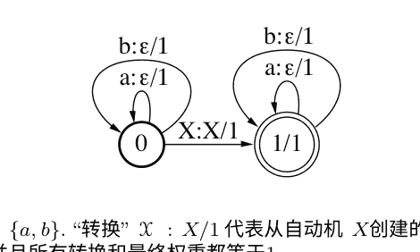

我们可以将序列 \(x\) 写成 \(x = x_0zx_1\) 的不同方式的数量，这正好是 \(x\) 中 \(z\) 的出现次数。

该定理提供了一种非常通用的方法来构建PDS有理核函数 \(T_{\text{计数}} \circ T\) 基于某些可以通过有限自动机或等价的正则表达式定义的模式的计数的计数。图6.8显示了将输入字母表缩减为 \(\Sigma = \{a, b\}\) 的情况下的转换器。一般情况可以通过使用除 \(a\) 和 \(b\) 之外的其他符号为状态0和1添加其他自环来直接获得。在实践中，可以使用惰性求值来避免为所有字母表符号显式创建这些转换，并根据在输入序列 \(x\) 中找到的符号按需创建它们。最后，可以为计数的模式分配不同的权重，以强调或减弱某些模式，例如间隔二元组。这可以通过更改自动机 \(\mathscr{X}\) 中的转换权重或最终权重来简单地完成 \(T_{\text{count}}\) 的定义。

### **6.6 近似核特征映射**

在之前的章节中，我们已经看到了核方法可以通过将学习问题从输入空间 \(\mathcal{X}\) 隐式且高效地映射到一个更丰富的特征空间 \(\mathbb{H}\) 来提供的好处。使用核方法的一个潜在缺点是，核函数需要在训练集中的所有点对上进行评估。如果这个集合包含非常大量的实例，那么在内存中的 \(O(m^2)\) 成本和计算中的 \(O(m^2C_K)\) 成本（其中 \(C_K\) 是单个核函数评估的成本）可能是禁止的。另一个考虑因素是使用训练模型进行预测的成本。评估核化函数 \(h(x) = \sum_{i=1}^{m} \alpha_i K(x_i, x) + b\) 需要 \(O(m)\) 的存储和 \(O(mC_K)\) 的计算成本（存储量和操作次数的确切数量取决于支持向量的数量）。

请注意，如果我们使用显式特征向量 \(\mathbf{x} \in \mathbb{R}^N\)，则可以使用原始形式的SVM问题进行训练。原始形式只产生一个 \(O(Nm)\) 的存储成本，评估只需要 \(O(N)\) 的存储和计算成本。

表6.1 标准化平移不变核函数的示例（定义在 \(\mathbf{x}, \mathbf{x}' \in \mathbb{R}^N\) 上）及其相应的密度（定义在 \(\omega \in \mathbb{R}^N\) 上）。

| 类型 | \(G(\mathbf{x}-\mathbf{x}')\) | \(p(\omega)\) |
| :--- | :--- | :--- |
| 高斯 | \(\exp \left( - \frac{\|\mathbf{x}-\mathbf{x}'\|^2}{2} \right)\) | \((2\pi)^{-\frac{D}{2}} \exp \left( - \frac{\|\omega\|^2}{2} \right)\) |
| 拉普拉斯 | \(\exp \left( - \|\mathbf{x}-\mathbf{x}'\|_1 \right)\) | \(\prod_{i=1}^{N} \frac{1}{\pi(1+\omega_i^2)}\) |
| 柯西 | \(\prod_{i=1}^{N} \frac{2}{1+(x_i-x_i')^2}\) | \(\exp \left( - \|\omega\|_1 \right)\) |

然而，这些观察只有在 \(N < m\) 时才有用，考虑到由核函数引起的显式特征映射 \(\Phi(\mathbf{x})\) 时，这很可能不是情况。例如，给定一个维度为 \(N\) 的输入特征空间，多项式核函数的核特征映射维度为 \(d\) 的 \(O(N^d)\)。在高斯核的情况下，显式特征映射维度是无限的。因此，明显地，一般情况下无法使用显式核特征映射，这再次强调了使用核函数隐式计算内积的重要性。在本节中，我们将展示通过构建近似核特征映射可以达到一种折衷。这些是具有用户指定维度 \(D\) 的特征映射，其中 \(\Psi(\mathbf{x}) \in \mathbb{R}^D\)，当维度 \(D\) 足够大时，保证 \(\Psi(x) \cdot \Psi(x') \approx K(x, x')\)。首先，我们陈述一个来自谐波分析领域的经典结果。

## **定理6.24 （Bochner定理）**

如果一个连续核函数的形式为 \(K(x, x') = G(x - x')\) 在一个局部紧致集合 \(\mathcal{X}\) 上是正定的，那么 \(G\) 是一个非负测度的傅里叶变换。也就是说，

$$G(x) = \int_{\mathcal{X}} p(\omega) e^{i \omega \cdot x} d\omega,$$

其中 \(p\) 是一个非负测度。

形式为 \(K(x, x') = G(x - x')\) 的核函数被称为平移不变核函数。注意如果核函数被缩放使得 \(G(0) = 1\)，那么 \(p\) 实际上是一个概率分布。在表6.1中展示了几个这样的核函数及其对应的分布。下一个命题给出了实值核函数情况下的简化表达式。

## **命题6.25**

假设 \(K\) 是一个连续的实值平移不变核函数，并且假设 \(p\) 表示其对应的非负测度，如定理6.24所述。此外，假设对于所有的 \(x \in \mathcal{X}\)，我们有 \(K(x, x) = 1\)，这样 \(p\) 就是一个概率分布。那么，下面的等式成立：

$$\mathbb{E}_{\omega \sim p} \left[ \left[ \cos(\omega \cdot x), \sin(\omega \cdot x) \right]^\top \left[ \cos(\omega \cdot x'), \sin(\omega \cdot x') \right] \right] = K(x, x').$$

证明：首先，由于 \(K\) 和 \(p\) 都是实值的，只需考虑在引用定理6.24时的实部。因此，使用 \(\mathrm{Re}[e^{ix}]=\mathrm{Re}[\cos(x)+i\sin(x)]=\cos(x)\)，我们有

\(K(x, x') = \mathrm{Re}[K(x, x')] = \int_{\mathcal{X}} p(\omega) \cos(\omega \cdot (x - x')) d\omega\)

接下来，通过标准的三角恒等式 \(\cos(a-b)=\cos(a)\cos(b)+\sin(a)\sin(b)\)，我们有

\(\int_{\mathcal{X}} p(\omega) \cos(\omega \cdot (x - x')) d\omega = \int_{\mathcal{X}} p(\omega) \left( \cos(\omega \cdot x) \cos(\omega \cdot x') + \sin(\omega \cdot x) \sin(\omega \cdot x') \right) d\omega = \mathbb{E}_{\omega \sim p} \left[ \left[ \cos(\omega \cdot x), \sin(\omega \cdot x) \right]^{\top} \left[ \cos(\omega \cdot x'), \sin(\omega \cdot x') \right] \right]\)

这证明了命题的正确性。\(\square\)

这个命题为生成任意 \(D \geq 1\) 的近似核映射 \(\Psi \in \mathbb{R}^{2D}\) 提供了动机，该映射对于所有 \(x \in \mathcal{X}\) 都有定义。

\(\Psi(x) = \left[ \frac{1}{\sqrt{D}}, \cos(\omega_D \cdot x), \sin(\omega_D \cdot x) \right]^{\top}, \quad (6.21)\)

其中 \(\omega_i \in \mathbb{R}^N\), \(i=1,\ldots,D\), 根据与核 \(K\) 相关的测度 \(p\) over \(\mathcal{X}\) 被独立同分布地采样。因此，

\(\Psi(x) \cdot \Psi(x') = \frac{1}{D} \sum_{i=1}^D \left[ \cos(\omega_i \cdot x), \sin(\omega_i \cdot x) \right]^{\top} \left[ \cos(\omega_i \cdot x'), \sin(\omega_i \cdot x') \right]\)

这是命题6.25中计算的期望的经验模拟。下面的定理表明，随着 \(D\) 的增长，这个经验估计在紧致域 \(\mathcal{X}\) 中的所有点上均匀收敛。

**引理 6.26** 假设 \(K\) 是一个连续可微的核函数，满足命题 6.25 的条件，并具有相关的测度 \(p_0\)。此外，假设 \(\mathcal{X}\) 是紧致的，\(N\) 表示其维度，\(R\) 表示包含 \(\mathcal{X}\) 的欧几里得球的半径，\(\sigma_p^2 = \mathbb{E}_{\omega \sim p} [\|\omega\|^2] < \infty\)。那么，对于任意的 \(\Psi \in \mathbb{R}^D\)，如式(6.21)所定义的，对于任意的 \(0 < r \leq 2R\) 和 \(\epsilon > 0\)，以下结论成立：

\(\mathbb{P} \left[ \sup_{x,x' \in \mathcal{X}} |\Psi(x) \cdot \Psi(x') - K(x, x')| \geq \epsilon \right] \leq 2\mathcal{N}(2R, r) \exp \left( -\frac{D\epsilon^2}{8} \right) + \frac{4r\sigma_p}{\epsilon}\)

其中概率是相对于 \(\omega \sim p\) 的抽样，而 \(\mathcal{N}(R, r)\) 表示覆盖半径为 \(r\) 的球所需的最小半径为 \(R\) 的球的最小数量。

证明：定义 \(\mathcal{Z} = \{ z : z = x - x', x,x' \in \mathcal{X} \}\) 并注意 \(\mathcal{Z}\) 包含在半径最多为 \(2R\) 的球中。\(\mathcal{Z}\) 是一个闭集，因为 \(\mathcal{X}\) 是闭集，因此 \(\mathcal{Z}\) 是一个紧集。为了方便起见，定义 \(B = \mathcal{N}(2R, r)\) 表示覆盖 \(\mathcal{Z}\) 所需的半径为 \(r\) 的球的数量。

并且让 \(z_j\), 对于 \(j \in [B]\), 表示覆盖球的中心。因此，对于任意 \(z \in \mathcal{Z}\), 存在一个 \(j\) 使得 \(z = z_j + \delta\) 其中 \(|\delta| < r\)。

接下来，定义 \(S(z) = \Psi(x) \cdot \Psi(x') - K(x, x')\), 其中 \(z = x - x'\)。由于 \(S\) 在紧集合 \(\mathcal{Z}\) 上连续可微分，因此它是 \(L\)-Lipschitz的，其中 \(L = \sup_{z \in \mathcal{Z}} \|\nabla S(z)\|\)。

注意，如果 \(L < \frac{\epsilon}{2r}\)，对于所有的 \(j \in [B]\), 如果 \(|S(z_j)| < \frac{\epsilon}{2}\)，那么对于所有的 \(z = z_j + \delta \in \mathcal{Z}\), 以下不等式成立：

\(|S(z)| = |S(z_j + \delta)| \leq L|z_j - (z_j + \delta)| + |S(z_j)| \leq rL + \frac{\epsilon}{2} < \epsilon. \tag{6.22}\)

这个证明的剩余部分限制了事件 \(L \geq \frac{\epsilon}{2r}\) 的概率。注意，以下所有的概率和期望都是关于随机变量 \(\omega_1, \ldots, \omega_D\) 的。

为了限制第一个事件的概率，我们使用命题6.25和期望的线性性质，这意味着关键事实 \(\mathbb{E}[\nabla(\Psi(x) \cdot \Psi(x'))] = \nabla K(x, x')\)。我们按照以下一系列不等式进行

$$\begin{align*}
\mathbb{E}[L^2] &= \mathbb{E}\left[ \sup_{z \in \mathcal{Z}} \|\nabla S(z)\|^2 \right] \\
&= \mathbb{E}\left[ \sup_{x, x' \in \mathcal{X}} \|\nabla(\Psi(x) \cdot \Psi(x')) - \nabla K(x, x')\|^2 \right] \\
&\leq 2\, \mathbb{E}\left[ \sup_{x, x' \in \mathcal{X}} \|\nabla(\Psi(x) \cdot \Psi(x'))\|^2 \right] + 2 \sup_{x, x' \in \mathcal{X}} \|\nabla K(x, x')\|^2 \\
&= 2\, \mathbb{E}\left[ \sup_{x, x' \in \mathcal{X}} \|\nabla(\Psi(x) \cdot \Psi(x'))\|^2 \right] + 2 \sup_{x, x' \in \mathcal{X}} \|\mathbb{E}[\nabla(\Psi(x) \cdot \Psi(x'))]\|^2 \\
&\leq 4\, \mathbb{E}\left[ \sup_{x, x' \in \mathcal{X}} \|\nabla(\Psi(x) \cdot \Psi(x'))\|^2 \right],
\end{align*}$$

第一个不等式成立是因为不等式 \(\|a + b\|^2 \leq 2\|a\|^2 + 2\|b\|^2\)（这是由于Jensen不等式）和最大值函数的次可加性。第二个不等式也是由Jensen不等式（应用两次）和最大值函数的次可加性得到的。此外，使用和差三角恒等式，并计算关于 \(z = x - x'\) 的梯度，对于任意的 \(x, x' \in \mathcal{X}\), 得到以下结果：

$$\begin{align*}
\nabla(\Psi(x) \cdot \Psi(x')) &= \nabla\left(\frac{1}{D}\sum_{i=1}^D \cos(\omega_i \cdot x) \cos(\omega_i \cdot x') + \sin(\omega_i \cdot x) \sin(\omega_i \cdot x')\right) \\
&= \nabla\left(\frac{1}{D}\sum_{i=1}^D \cos(\omega_i \cdot (x - x'))\right) = \frac{1}{D}\sum_{i=1}^D \omega_i \sin(\omega_i \cdot (x - x')).
\end{align*}$$

将前两个结果结合起来得到
$$
\mathbb{E}[L^2] \leq 4 \mathbb{E} \left[ \sup_{x,x' \in \mathcal{X}} \left\| \frac{1}{D} \sum_{i=1}^{D} \omega_i \sin(\omega_i \cdot (x - x')) \right\|^2 \right] \leq 4 \mathbb{E}_{\omega_1, \ldots, \omega_N} \left[ \left( \frac{1}{D} \sum_{i=1}^{D} \| \omega_i \| \right)^2 \right] \leq 4 \mathbb{E}_{\omega_1, \ldots, \omega_N} \left[ \frac{1}{D} \sum_{i=1}^{D} \| \omega_i \|^2 \right] = 4 \mathbb{E}_{\omega} \left[ \| \omega \|^2 \right] = 4 \sigma_p^2 ,
$$
这是由三角不等式、Jensen不等式以及事实推导出来的，即 $|\sin(\cdot)| \leq 1$，$\omega_i s$是独立同分布的。推导出最终表达式。因此，我们可以通过马尔可夫不等式来限制第一个事件的概率：
$$
\mathbb{P} \left[ L \geq \frac{\epsilon}{2r} \right] \leq \left( \frac{4r\sigma_p}{\epsilon} \right)^2 .
$$
为了限制第二个事件的概率，注意到，根据定义，$S(z)$是一系列 $D$个独立同分布的变量之和，每个变量的绝对值都被 $\frac{2}{D}$限制（因为对于所有的 $x$和 $x'$，我们有 $|K(x, x')| \leq 1$和 $|\Psi(x) \cdot \Psi(x')| \leq 1$），而 $\mathbb{E}[S(z)] = 0$。因此，根据Hoeffding不等式和并集界，我们可以写成：
$$
\mathbb{P} \left[ \exists j \in [B] : |S(z_j)| \geq \frac{\epsilon}{2} \right] \leq \sum_{i=1}^{B} \mathbb{P} \left[ |S(z_i)| \geq \frac{\epsilon}{2} \right] \leq 2B \exp \left( - \frac{D\epsilon^2}{8} \right) .
$$
最后，结合(6.22), (6.23), (6.24)和 $B$的定义，我们有
$$
\mathbb{P} \left[ \sup_{z \in \mathcal{Z}} |S(z)| \geq \epsilon \right] \leq 2\mathcal{N}(2R, r) \exp \left( - \frac{D\epsilon^2}{8} \right) + \left( \frac{4r\sigma_p}{\epsilon} \right)^2 ,
$$
这完成了引理。 $\square$ 引理中界限的一个关键因素是覆盖数 $\mathcal{N}(2R, r)$，它强烈依赖于空间维度 $N$。在下面的引理中，我们明确说明了这种依赖关系，针对一个特别简单的情况，尽管类似的论证也适用于更一般的情况。

**引理 6.27** 设 $\mathcal{X} \subset \mathbb{R}^N$是一个紧致集合，$R$表示最小外接球的半径。那么，下面的不等式成立：
$$
\mathcal{N}(R, r) \leq \left( \frac{3R}{r} \right)^N .
$$
证明：首先，通过使用 $\mathbb{R}^N$中球的体积，我们已经可以看到 $R^N / (r/3)^N = (3R/r)^N$是一个对半径为 $r/3$ 的球进行装填而不相交的球的数量的平凡上界。现在，考虑一个最多装填了 $(3R/r)^N$个半径为 $r/3$ 的球的半径为 $R$ 的球的最大装填。每个半径为 $R$ 的球中的每个点到至少一个装填球的中心的距离最多为 $r$。 如果这不是真的，我们将能够将另一个球放入装填中，从而与它是最大装填的假设相矛盾。 因此，如果我们将最多 $(3R/r)^N$ 个球的半径增加到 $r$，它们将提供一个（不一定是最小的）覆盖半径为 $R$ 的球。

最后，通过结合前两个引理，我们可以给出一个明确的有限样本逼近界限。

### 定理 6.28

设 $K$ 是一个连续可微的核函数，满足命题6.25的条件，并具有相关的测度 $p$。此外，假设 $\sigma_p^2 = \mathbb{E}_{\omega \sim p} [||\omega||^2] < \infty$ 且 $\mathcal{X} \subset \mathbb{R}^N$。设 $R$ 表示包含 $\mathcal{X}$ 的欧几里得球的半径。那么，对于 $\Psi \in \mathbb{R}^D$ 如 (6.21) 中定义的，并且任意 $0 < \epsilon \le 32 R\sigma_p$，有以下结论。
$$
\mathbb{P} \left[ \sup_{x, x' \in \mathcal{X}} |\Psi(x) \cdot \Psi(x') - K(x, x')| \ge \epsilon \right] \le \left( \frac{48 R \sigma_p}{\epsilon} \right)^2 \exp \left( - \frac{D \epsilon^2}{4(N+2)} \right).
$$
证明：我们使用引理6.27和引理6.26，并选择以下的 $r$：
$$
r = \left[ \frac{2 (6R)^N \exp\left(-\frac{D \epsilon^2}{8}\right)}{\left(\frac{4\sigma_p}{\epsilon}\right)^2} \right]^{\frac{2}{N+2}},
$$
这导致以下表达式
$$
\mathbb{P} \left[ \sup_{z \in \mathcal{Z}} |S(z)| \ge \epsilon \right] \le 4 \left( \frac{24 R \sigma_p}{\epsilon} \right)^{\frac{2N}{N+2}} \exp \left( - \frac{D \epsilon^2}{4(N+2)} \right).
$$
由于 $32 R\sigma_p/\epsilon \ge 1$，指数 $\frac{2N}{N+2}$ 可以被2替换，这完成了证明。

前面的定理保证了通过采样有限数量的坐标 $D$，可以高概率找到核函数的良好估计。特别地，对于最多 $\epsilon$ 的绝对误差，采样 $D = O$ 就足够了。
$$
\left( \frac{N}{\epsilon^2} \log \left( \frac{R \sigma_p}{\epsilon} \right) \right)
$$
坐标。

## 6.7 章节注释

在一般情况下，PDS核的数学理论起源于Mercer [1909]的基础工作，他还证明了连续核与PDS性质的一个类似于定理6.2的条件的等价性。PDS和NDS核之间的联系，特别是定理6.18和6.17，归功于Schoenberg [1938]。关于再生核希尔伯特空间理论的系统处理由Aronszajn [1950]在一篇长而优雅的论文中提出。关于这些函数的更多信息，请参阅Berg，Christensen和Ressel [1984]，这也是本章中几个练习的来源。

Boser、Guyon和Vapnik [1992]指出，SVM可以通过使用PDS核进行扩展。核方法的思想自那时以来在机器学习中被广泛采用，并应用于各种不同的任务和环境。以下两本书实际上专门研究核方法：Schölkopf和Smola [2002]以及Shawe-Taylor和Cristianini [2004]。经典的表示定理归功于Kimeldorf和Wahba [1971]。

Wahba [1990]提出了对非二次代价函数的一般化。本章介绍的一般形式由Schölkopf、Herbrich、Smola和Williamson [2000]提出。

有理核是由Cortes、Haffner和Mohri [2004]引入的。Haussler [1999]先前引入了一类通用的卷积核，即卷积核。Haussler [1999]描述的序列的卷积核以及Watkins [1999]描述的配对-HMM字符串核是有理核的特殊实例。有理核可以直接扩展为定义有限自动机甚至加权自动机的核[Cortes et al., 2004]。Cortes、Mohri和Rostamizadeh [2008b]研究了学习基于计数转换器的有理核的问题。

在Pereira和Riley [1997]、Mohri、Pereira和Riley [2005]以及Mohri [2009]中描述了加权转换器和过滤器转换器在存在 $\epsilon$ 路径的情况下的组合。组合可以进一步推广为加权转换器的 $N$ 路组合[Allauzen and Mohri, 2009]。三个或更多转换器的 $N$ 路组合可以大大加快计算速度，特别是对于形式为 $T \circ T^{-1}$ 的PDS有理核。 Mohri [2002]描述了一种通用的最短距离算法，可以与大类半环和任意队列规则一起使用。该算法的一个具体实例可用于计算组合后有理核的所有路径权重之和。有关使用有理核进行线性可分语言的研究，请参阅Cortes、Kontorovich和Mohri [2007a]。

余弦近似核特征映射的使用是由Rahimi和Recht [2007]引入的，相应的均匀收敛界限也是如此，尽管他们的证明不完整。Sriperumbudur和Szab´o [2015]给出了一个改进的近似界限，将对数据的依赖性从 $O(R^2)$ 减少到只有 $O(\log(R))$。Bochner的定理在推导近似映射中起着核心作用，它是谐波分析的一个经典结果（例如，参见Rudin [1990]）。该定理的一般形式归功于Weil [1965]，而Solomon Bochner认识到它对谐波分析的重要性。

## 6.8 练习

**6.1** 假设 $K : \mathcal{X} \times \mathcal{X} \to \mathbb{R}$ 是一个PDS核， $\alpha : \mathcal{X} \to \mathbb{R}$ 是一个正函数。 证明对于所有的 $x, y \in \mathcal{X}$，定义的核 $K'(x, y) = \frac{K(x,y)}{\alpha(x)\alpha(y)}$ 是一个PDS内核。

**6.2** 证明以下内核 $K$ 是PDS的：

(a) $K(x, y) = \cos(x - y)$ 在 $\mathbb{R} \times \mathbb{R}$ 上。

(b) $K(x, y) = \cos(x^2 - y^2)$ 在 $\mathbb{R} \times \mathbb{R}$ 上。

(c) 对于所有整数 $n > 0$, $K(x, y) = \sum_{i=1}^N \cos^n(x_i^2 - y_i^2)$ 在 $\mathbb{R}^N \times \mathbb{R}^N$ 上。

(d) $K(x, y) = (x + y)^{-1}$ over $(0, +\infty) \times (0, +\infty)$。

(e) $K(x, x') = \cos \angle(x, x')$ 在 $\mathbb{R}^n \times \mathbb{R}^n$ 上，其中 $\angle(x, x')$ 是 $x$ 和 $x'$之间的角度。

(f) $\forall \lambda > 0$, $K(x, x') = \exp( -\lambda[\sin(x' - x)]^2 )$ 在 $\mathbb{R} \times \mathbb{R}$ 上。

> (提示: 将 $[\sin(x' - x)]^2$ 重写为两个向量差的范数的平方。)

(g) $\forall \sigma > 0$, $K(x, y) = e^{-\|x-y\|^2 / \sigma^2}$ 在 $\mathbb{R}^N \times \mathbb{R}^N$ 上。

> (提示: 你可以证明 $K$ 是一个核函数 $K'$ 并且使用以下等式证明 $K'$ 是半正定的: $\|x - y\| = \frac{1}{2\Gamma(\frac{1}{2})} \int_{0}^{+\infty} \frac{1-e^{-t\|x-y\|^2}}{t^{\frac{3}{2}}} dt$ 对于所有的 $x, y$ 成立。)

(h) $K(x, y) = \min(x, y) - xy$ over $[0, 1] \times [0, 1]$。

> (提示: 你可以考虑这两个积分 $\int_{0}^{1} 1_{t\in[0,x]}1_{t\in[0,y]}dt$ 和 $\int_{0}^{1} 1_{t\in[x,1]}1_{t\in[y,1]}dt$。)

(i) $K(x, x') = \frac{1}{\sqrt{1 - (x \cdot x')}}$ 对于 $x, x' \in \mathcal{X} = \{x \in \mathbb{R}^N : \|x\|_2 < 1\}$ 成立

> (提示: 一种方法是通过考虑核函数的泰勒展开来找到特征映射$\phi$的显式表达式。)

(j) $\forall \sigma > 0$, $K(x, y) = \frac{1}{1 + \|x-y\|^2 / \sigma^2}$ 在 $\mathbb{R}^N \times \mathbb{R}^N$ 上。

> (提示: 函数 $x \to \int_{0}^{+\infty} e^{-s x} e^{-s} ds$ defined for all $x \ge 0$ could be useful for the proof.)

(k) $\forall \sigma > 0$, $K(x, y) = \exp \left( \sum_{i=1}^N \min(|x_i|, |y_i|) / \sigma^2 \right)$ 在 $\mathbb{R}^N \times \mathbb{R}^N$ 上。

> (提示: 函数 $(x_0, y_0) \to \int_{0}^{+\infty} 1_{t\in[0,|x_0|]}1_{t\in[0,|y_0|]}dt$ defined over $\mathbb{R} \times \mathbb{R}$ could be useful for the proof.)

**6.3** 图核。设 $G= (V, \mathcal{E})$ 是一个无向图，其中顶点集 $V$ 和边集 $\mathcal{E}$。$V$ 可以表示一组文档或生物序列， $E$ 表示它们之间的连接关系。设 $w[e] \in \mathbb{R}$ 表示分配给边 $e \in \mathcal{E}$ 的权重。路径的权重是其组成边的权重的乘积。证明核函数 $K$ over $V \times V$ ，其中 $K(p, q)$ 是从 $p$ 到 $q$ 的所有长度为两个的路径的权重之和是PDS（提示：可以引入矩阵 $W= (W_{pq})$，其中当 $p$ 和 $q$ 之间没有边时， $W_{pq}= 0$，否则等于 $p$ 和 $q$ 之间的边的权重）。

**6.4** 对称差分核。设 $\mathcal{X}$ 是一个有限集合。证明核函数 $K$ 在 $2^{\mathcal{X}}$，即 $\mathcal{X}$ 的子集集合上定义，通过 $\forall A, B \in 2^{\mathcal{X}}$, $K(A, B) = \exp \left( -\frac{1}{2} |A \Delta B| \right)$，其中 $A \Delta B$ 是 $A$ 和 $B$ 的对称差，是PDS（提示：你可以使用 $K$ 是一个核函数 $K'$ 的归一化结果）。

**6.5** 集合核函数。设 $\mathcal{X}$ 是一个有限集合。设 $K_0$ 是 $\mathcal{X}$ 上的PDS核函数，证明 $K'$ 定义如下：对于任意的 $A, B \in 2^{\mathcal{X}}$, 有 $K'(A, B) = \sum_{x \in A, x' \in B} K_0(x, x')$ 是一个PDS核函数。

**6.6** 证明以下核函数 $K$ 是NDS的：

(a) $K(x, y) = [\sin(x - y)]^2$ over $\mathbb{R} \times \mathbb{R}$.
(b) $K(x, y) = \log(x + y)$ 在 $(0, +\infty) \times (0, +\infty)$ 上。

**6.7** 定义差分核函数 $K(x, x') = |x - x'|$ 对于 $x, x' \in \mathbb{R}$。证明这个核函数不是正定对称的（PDS）。

**6.8** 核函数 $K$ 是否在 $\mathbb{R}^n \times \mathbb{R}^n$ 上定义为 $K(\mathbf{x}, \mathbf{y}) = \|\mathbf{x} - \mathbf{y}\|^{3/2}$ PDS？它是NDS吗？

**6.9** 让 $\mathcal{H}$ 是带有相应点积 $\langle \cdot, \cdot \rangle$ 的希尔伯特空间。证明核函数 $K$ 定义在 $\mathcal{H} \times \mathcal{H}$ 上为 $K(x, y) = 1 - \langle x, y \rangle$ 是负定的。

**6.10** 对于任意的 $p > 0$，令 $K_p$ 为定义在 $\mathbb{R}_+ \times \mathbb{R}_+$ 上的核函数，其定义为 $K_p(x, y) = e^{-(x+y)^p}$。证明 $K_p$ 是正定对称（PDS）的充要条件是 $p \leq 1$。（提示：你可以使用这样一个事实，即如果 $K$ 是NDS的，那么对于任意的 $0 < \alpha \leq 1$， $K^\alpha$ 也是NDS的。）

### 6.11 显式映射。
- (a) 记一个数据集为 \( x_1, \ldots, x_m \) 和一个核函数 \( K(x_i, x_j) \) 具有一个格拉姆矩阵 \( \mathbf{K} \)。假设 \( \mathbf{K} \) 是半正定的，那么给出一个映射 \( \Phi(\cdot) \) 使得 \( K(x_i, x_j) = \langle \Phi(x_i), \Phi(x_j) \rangle \)。
- (b) 证明前述陈述的逆否命题，即如果存在一个从输入空间到某个希尔伯特空间的映射 \( \Phi(x) \)，那么相应的矩阵 \( \mathbf{K} \) 是半正定的。

### 6.12 显式多项式核映射。
设 \( K \) 为一个度为 \( d \) 的多项式核，即 \( K: \mathbb{R}^N \times \mathbb{R}^N \rightarrow \mathbb{R} \)， \( K(\mathbf{x}, \mathbf{x}') = (\mathbf{x} \cdot \mathbf{x}' + c)^d \)，其中 \( c > 0 \)，证明与 \( K \) 相关联的特征空间的维度为 \( \binom{N + d}{d} \)。

用核 \( k_i \) 的形式表示 \( K: (\mathbf{x}, \mathbf{x}') \rightarrow (\mathbf{x} \cdot \mathbf{x}')^i \)， \( i \in \{0, \ldots, d\} \)。在该表达式中，每个 \( k_i \) 被赋予的权重是多少？它如何随 \( c \) 的变化而变化？

### 6.13 高维映射。
令 \( \Phi: \mathcal{X} \rightarrow \mathcal{H} \) 为一个特征映射，使得 \( \mathcal{H} \) 的维度 \( N \) 非常大，令 \( K: \mathcal{X} \times \mathcal{X} \rightarrow \mathbb{R} \) 为一个由 PDS 核定义的函数

$$
K(x, x') = \mathop{\mathbb{E}}\limits_{i \sim \mathcal{D}} \left[ [\Phi(x)]_i [\Phi(x')]_i \right],
\tag{6.27}
$$

其中 \( [\Phi(x)]_i \) 是 \( \Phi(x) \) 的第 \( i \) 个分量（\( \Phi(x') \) 的分量同理）， \( \mathcal{D} \) 是一个分布在索引 \( i \) 上的分布。我们假设对于所有的 \( |[\Phi(x)]_i| \leq R \)。
假设计算 \( K(x, x') \) 的唯一方法是直接计算内积 (6.27)，这将需要 \( O(N) \) 的时间。或者，可以基于根据 \( \mathcal{D} \) 随机选择 \( N \) 个分量的子集 \( I \) 来计算近似值，即：

$$
K'(x, x') = \frac{1}{n} \sum_{i \in I} \mathcal{D}(i) [\Phi(x)]_i [\Phi(x')]_i,
\tag{6.28}
$$

其中 \( |I| = n \)。

- (a) 固定 \( x \) 和 \( x' \) 在 \( \mathcal{X} \) 中。证明

$$
\mathop{\mathbb{P}}\limits_{I \sim \mathcal{D}^n} \left[ |K(x, x') - K'(x, x')| > \epsilon \right] \leq 2e^{\frac{-n\epsilon^2}{2v^2}} .
\tag{6.29}
$$

(提示：使用 McDiarmid 不等式)。

- (b) 令 \( K \) 和 \( K' \) 为与 \( K \) 和 \( K' \) 相关的核矩阵。证明对于任意的 \( \delta > 0 \), 当 \( n > \frac{r^2}{\epsilon^2} \log \frac{m(m+1)}{\delta} \) 时，对于所有的 \( i, j \in [m] \), \( |K'_{ij} - K_{ij}| \leq \epsilon \)。

### 6.14 基于分类器的核函数。
设 \( S \) 为大小为 \( m \) 的训练样本。假设 \( S \) 是根据某个概率分布 \( \mathcal{D}(x, y) \) 生成的，其中 \( (x, y) \in \mathcal{X} \times \{-1, +1\} \)。

- (a) 定义贝叶斯分类器 \( h^*: \mathcal{X} \to \{-1, +1\} \)。证明对于任意 \( x, x' \in \mathcal{X} \), 由 \( K^*(x, x') = h^*(x)h^*(x') \) 定义的核函数 \( K^* \) 是正定对称的。与 \( K^* \) 相关联的自然特征空间的维度是多少？
- (b) 给出使用此核函数的 SVM 解的表达式。支持向量的数量是多少？边际的值是多少？所得解的泛化误差是多少？在什么条件下数据是线性可分的？
- (c) 让 \( h: \mathcal{X} \to \mathbb{R} \) 是任意的实值函数。在什么条件下 \( h \) 上的核 \( K \) 定义为 \( K(x, x') = h(x)h(x'), x, x' \in \mathcal{X} \), 是正定对称的？

### 6.15 图像分类核。
对于 \( \alpha \geq 0 \), 核函数

$$
K_\alpha: (x, x') \to \sum_{k=1}^{N} \min(|x_k|^\alpha, |x'_k|^\alpha)  \tag{6.30}
$$

在图像分类中，使用 \( \mathbb{R}^N \times \mathbb{R}^N \) 上的核函数。证明对于所有的 \( \alpha \geq 0 \), \( K_\alpha \) 是半正定的。为此，请按照以下步骤进行。

- (a) 使用 \( (f, g) \to \int_{0}^{+\infty} f(t)g(t) dt \) 是定义在 \( [0, +\infty) \) 上的可测函数集合上的内积，用来证明 \( (x, x') \to \min(x, x') \) 是一个 PDS 核函数。（提示：将一个指示函数关联到 \( x \), 将另一个指示函数关联到 \( x' \)。）
- (b) 利用 (a) 的结果首先证明 \( K_1 \) 是 PDS，类似地，对于其他的 \( \alpha \) 值, \( K_\alpha \) 也是 PDS。

### 6.16 诈骗检测。
为了防止欺诈，一家信用卡公司决定联系维尔班克教授，并向他提供一个包含数千个欺诈和非欺诈事件的随机列表。有许多不同类型的事件，例如各种金额的交易、地址或持卡人的变更信息，或者请求一张新卡。维尔班克教授决定使用适当的核函数来准确预测欺诈事件。
对于这样一个多样化的事件集，维尔班克教授很难定义相关特征。然而，他所在公司的风险部门已经创建了一个复杂的方法来估计任何事件 \( U \) 的概率 \( \mathbb{P}[ U] \)。
因此，维尔班克教授决定利用这些信息，并提出了以下定义在所有事件对 \( (U, V) \) 上的核函数：\( K(U, V) = \mathbb{P}[U \wedge V] - \mathbb{P}[U]\mathbb{P}[V] \). (6.31)

帮助维尔班克教授证明他的核函数是正定对称的。

### 6.17 NDS和PDS核函数之间的关系。
证明定理 6.17 的陈述。(提示：利用如果 \( K \) 是 PDS，则 \( \exp(K) \) 也是 PDS 的事实，以及定理 6.16。)

### 6.18 度量和核函数。
设 \( \mathcal{X} \) 为一个非空集合，\( K: \mathcal{X} \times \mathcal{X} \rightarrow \mathbb{R} \) 为一个负定对称核函数，使得对于所有的 \( x \in \mathcal{X} \)，有 \( K(x, x) = 0 \)。

- (a) 证明存在一个希尔伯特空间 \( \mathbb{H} \) 和一个从 \( \mathcal{X} \) 到 \( \mathbb{H} \) 的映射 \( \Phi(x) \)，使得：
\( K(x, x') = \|\Phi(x) - \Phi(x')\|^2 \)。
假设 \( K(x, x') = 0 \Rightarrow x = x' \)。使用定理 6.16 证明 \( \sqrt{K} \) 在 \( \mathcal{X} \) 上定义了一个度量。
- (b) 使用这个结果证明核函数 \( K(x, x') = \exp(-|x - x'|^p) \)，\( x, x' \in \mathbb{R} \)，对于 \( p > 2 \) 不是正定的。
- (c) 核 \( K(x, x') = \tanh(a(x \cdot x') + b) \) 被证明与 SVMs 结合时等价于一个两层神经网络。证明当 \( a < 0 \) 或 \( b < 0 \) 时， \( K \) 不是正定的。当 \( a < 0 \) 或 \( b < 0 \) 时，你能得出关于相应神经网络的什么结论？

### 6.19 序列核函数。
令 \( \mathcal{X} = \{a, c, g, t\} \)。为了使用 SVMs 对 DNA 序列进行分类，我们希望在 \( \mathcal{X} \) 上定义一个核函数。给定一个有限集合 \( \mathcal{J} \subset \mathcal{X}^* \)，其中包含非编码区域（内含子）。对于 \( x \in \mathcal{X}^* \)，用 \( |x| \) 表示 \( x \) 的长度，用 \( F(x) \) 表示 \( x \) 的因子集合，即 \( x \) 的连续符号子序列的集合。对于任意两个字符串 \( x, y \in \mathcal{X}^* \)，定义 \( K(x, y) \) 为

$$
K(x, y) = \sum_{z \in (F(x) \cap F(y)) \setminus \mathcal{J}} \rho^{|z|}, \tag{6.32}
$$

其中 \( \rho \geq 1 \) 是一个实数。

- (a) 证明 \( K \) 是一个有理核函数，并且它是正定对称的。
- (b) 给出计算 \( K(x, y) \) 的时间和空间复杂度，关于表示 \( \mathcal{X}^* - \mathcal{J} \) 的最小自动机的大小 \( s \)。
- (c) 长度大于或等于 \( n \) 的 \( x \) 和 \( y \) 之间的长公共因子很可能是重要的编码区域（外显子）。修改核函数 \( K \)，当 \( |z| \geq n \) 时，将权重 \( \rho_2^{|z|} \) 分配给 \( z \)，否则分配权重 \( \rho_1^{|z|} \)，其中 \( 1 \leq \rho_1 \ll \rho_2 \)。证明结果核仍然是正定对称的。

### 6.20 n-gram核。
证明对于所有的 \( n \geq 1 \)，以及任意的 n-gram 核 \( K_n \)，\( K_n(x, y) \) 可以在线性时间 \( O(|x| + |y|) \) 内计算，对于所有的 \( x, y \in \Sigma^* \)，假设 \( n \) 和字母表大小是常数。

| 符号 | 描述 |
| :--- | :--- |
| \( \Sigma^* \) | 字母表 \( \Sigma \) 上所有有限字符串的集合。 |
| \( |x| \) | 字符串 \( x \) 的长度。 |

### 6.21 Mercer条件。
设 \( \mathcal{X} \subset \mathbb{R}^N \) 是一个紧致集合，\( K: \mathcal{X} \times \mathcal{X} \to \mathbb{R} \) 是一个连续的核函数。证明如果 \( K \) 满足 Mercer 条件（定理 6.2），那么它是 PDS。（提示：假设 \( K \) 不是 PDS，并考虑一个集合 \( \{x_1, \ldots, x_m\} \subseteq \mathcal{X} \) 和一个列向量 \( c \in \mathbb{R}^{m \times 1} \)，使得 \( \sum_{i,j=1}^m c_i c_j K(x_i, x_j) < 0 \)。）

### 6.22 异常检测。
对于这个问题，考虑一个希尔伯特空间 \( \mathbb{H} \) 与相关的特征映射 \( \Phi: \mathcal{X} \to \mathbb{H} \) 和核 \( K(x, x') = \Phi(x) \cdot \Phi(x') \)。

- (a) 首先，让我们考虑给定样本 \( S = (x_1, \ldots, x_m) \) 的最小包围球。让 \( \mathbf{c} \in \mathbb{H} \) 表示球的中心，让 \( r > 0 \) 为其半径，那么显然以下优化问题搜索最小包围球：

$$
\min_{r>0, \mathbf{c} \in \mathbb{H}} r^2
$$

满足条件： \( \forall i \in [m], \|\Phi(x_i) - \mathbf{c}\|^2 \leq r^2 \)。

展示如何推导等价的对偶优化问题。

$$
\max_{\boldsymbol{\alpha}} \sum_{i=1}^m \alpha_i K(x_i, x_i) - \sum_{i,j=1}^m \alpha_i \alpha_j K(x_i, x_j)
$$

满足条件： \( \boldsymbol{\alpha} \geq \mathbf{0} \land \sum_{i=1}^m \alpha_i = 1, \)

并证明最优解满足 \( \mathbf{c} = \sum_{i=1}^m \alpha_i \Phi(x_i) \)。换句话说，球体的位置仅取决于具有非零系数 \( \alpha_i \) 的点 \( x_i \)。这些点类似于 SVM 的支持向量。

- (b) 考虑假设类

$$
\mathcal{H} = \{ x \to r^2 - \| \Phi(x) - \mathbf{c} \|^2 : \| \mathbf{c} \| \leq \Lambda, 0 < r \leq R \}
$$

假设 \( h \in \mathcal{H} \) 可以用于检测数据中的异常值，其中 \( h(x) \geq 0 \) 表示非异常点， \( h(x) < 0 \) 表示异常。

证明如果 \( \sup_x \| \Phi(x) \| \leq M \)，则问题 (a) 的最优解在假设集 \( \mathcal{H} \) 中找到，其中 \( \Lambda \leq M \) 和 \( R \leq 2M \)。

- (c) 让 \( \mathcal{D} \) 表示非异常点的分布，定义相关的期望损失 \( R(h) = \mathbb{E}_{x \sim \mathcal{D}}[1_{h(x) < 0}] \) 和经验边界损失 \( R_{S, \rho}(h) = \sum_{i=1}^m \frac{1}{m} \Phi_{\rho}(h(x_i)) \)。这些损失度量由 false-positive predictions 引起的错误，即由于错误地标记一个点为异常而引起的错误。
    - i. 证明假设类别 \( \mathcal{H} \) 的经验 Rademacher 复杂度可以如下上界：

$$
\mathfrak{R}_S(\mathcal{H}) \leq \frac{R^2 + \Lambda^2}{\sqrt{m}} + \Lambda \sqrt{\mathrm{Tr}[\mathbf{K}]}
$$

其中 \( \mathbf{K} \) 是用样本构建的核矩阵。
    - ii. 证明对于所有的 \( h \in \mathcal{H} \) 和 \( \rho \in (0,1] \)，至少以概率 \( 1-\delta \) 成立：

$$
R(h) \leq R_{S,\rho}(h) + \frac{4}{\rho} \left( \frac{R^2 + \Lambda^2}{\sqrt{m}} + \Lambda \sqrt{\mathrm{Tr}[\mathbf{K}]} \right) + \sqrt{ \frac{\log \log_2 \frac{2}{\rho}}{m} } + 3 \sqrt{ \frac{\log \frac{4}{\delta}}{2m} }
$$

- (d) 就像软间隔支持向量机一样，我们也可以为最小包围球定义一个软间隔目标，通过调整正则化参数 \( C \) 来调节对训练集中的异常值的敏感性：

$$
\min_{r>0, \mathbf{c} \in \mathbb{H}, \boldsymbol{\xi}} r^2 + C \sum_{i=1}^m \xi_i
$$

满足条件：对于所有的 \( i \in [m] \)， \( \| \Phi(x_i) - \mathbf{c} \|^2 \leq r^2 + \xi_i \land \xi_i \geq 0 \)。

证明这个问题的等价对偶形式是

$$
\max_{\boldsymbol{\alpha}} \sum_{i=1}^m \alpha_i K(x_i, x_i) - \sum_{i,j=1}^m \alpha_i \alpha_j K(x_i, x_j)
$$

满足条件: \( 0 \leq \alpha_i \leq C \land \sum_{i=1}^m \alpha_i = 1, \)

并且在最优解时 \( \mathbf{c} = \sum_{i=1}^m \alpha_i \Phi(x_i) \)。

# 7 Boosting

集成方法是机器学习中将多个预测器组合起来以创建更准确的方法的一般技术。本章研究了一种重要的集成方法家族，称为提升，更具体地说是 AdaBoost 算法。这个算法在实践中已经被证明非常有效，并且基于丰富的理论分析。我们首先介绍 AdaBoost，展示它如何随着提升轮数的增加快速减小经验误差，并指出它与一些已知算法的关系。

接下来，我们基于 AdaBoost 的假设集的 VC 维和边界的概念，对 AdaBoost 的泛化性能进行了理论分析。在这个背景下发展的边界理论可以应用于其他类似的集成算法。对 AdaBoost 的博弈论解释进一步帮助分析其性质，并揭示了弱学习假设与可分离条件之间的等价关系。最后，我们讨论了 AdaBoost 的优点和缺点。

## 7.1 引言
对于一个非平凡的学习任务来说，直接设计一个满足第 2 章强 PAC 学习要求的准确算法通常是困难的。但是，可以更有希望找到仅仅比随机稍微好一点的简单预测器。下面给出了这种弱学习器的正式定义。

与 PAC 学习章节中一样，我们令 \( n \) 为一个数，使得表示任何元素 \( x \in \mathcal{X} \) 的计算成本最多为 \( O(n) \)，并用 \( \mathrm{size}(c) \) 表示计算表示 \( c \in \mathcal{C} \) 的最大成本。

**定义 7.1（弱学习）** 一个概念类 \( \mathcal{C} \) 被称为弱 PAC 可学习的，如果存在一个算法 \( \mathcal{A} \)，\( \gamma > 0 \) 和一个多项式函数 \( \mathrm{poly}(\cdot, \cdot, \cdot) \)，使得对于任意 \( \delta > 0 \)，对于所有分布 \( \mathcal{D} \) 在 \( \mathcal{X} \) 上，对于任何目标概念 \( c \in \mathcal{C} \)，对于任意样本大小 \( m \geq \mathrm{poly}(1/\delta, n, \mathrm{size}(c)) \)，以下条件成立：

$$
\mathop{\mathbb{P}}\limits_{S \sim \mathcal{D}^m} \left[ R(h_S) \leq \frac{1}{2} - \gamma \right] \geq 1 - \delta, \quad\quad (7.1)
$$

其中 \( h_S \) 是算法 \( \mathcal{A} \) 在样本 \( S \) 上训练后返回的假设。当存在这样的算法 \( \mathcal{A} \) 时，它被称为 \( \mathcal{C} \) 的弱学习算法或者弱学习器。弱学习算法返回的假设被称为基分类器。

提升技术背后的关键思想是使用弱学习算法来构建一个强学习器，即一个准确的 PAC 学习算法。为了实现这一目标，提升技术使用集成方法：它们将弱学习器返回的不同基分类器组合起来，创建一个更准确的预测器。但是应该使用哪些基分类器，以及如何组合它们呢？下一节将通过详细描述最常见和成功的提升算法之一，AdaBoost，来回答这些问题。

## 7.2 AdaBoost
我们用 \( \mathcal{H} \) 表示假设集，其中选择基分类器，有时我们将其称为基分类器集合。图 7.1 给出了 AdaBoost 算法的描述。

```
AdaBoost(S = ((x_1, y_1), ..., (x_m, y_m)))
1  for i ← 1 to m
2      D_1(i) ← 1/m
3  for t ← 1 to T
4      h_t ← 在 \mathcal{H} 中选择具有小错误的基分类器  ε_t = P_{i~D_t}[h_t(x_i) \neq y_i]
5      α_t ← 1/2 log((1-ε_t)/ε_t)
6      Z_t ← 2[ε_t(1 - ε_t)]^{1/2}  .归一化因子
7      for i ← 1 to m
8          D_{t+1}(i) ← (D_t(i) \exp(-α_t y_i h_t(x_i))) / Z_t
9  f ← \sum_{t=1}^T α_t h_t
10 return f
```

> 图 7.1 AdaBoost 算法用于基分类器集合 \( \mathcal{H} \subseteq \{-1, +1\}^\mathcal{X} \)。

图7.2
以轴对齐超平面为基分类器的AdaBoost示例。(a) 顶部行显示每次提升的决策边界。底部行显示每轮更新权重的方式，错误（或正确）的点给予增加（或减少）权重。(b) 最终分类器的可视化，构建为基分类器的非负线性组合。

AdaBoost的伪代码，其中基分类器是从 $\mathcal{X}$ 到 $\{-1, +1\}$ 的函数映射，因此 $\mathcal{H} \subseteq \{-1, +1\}^\mathcal{X}$。
该算法以标记的样本作为输入 $S = ((x_1, y_1), \ldots, (x_m, y_m))$，其中 $(x_i, y_i) \in \mathcal{X} \times \{-1, +1\}$ 对于所有 $i \in [m]$，并且维护一个分布在索引上 $\{1, \ldots, m\}$。最初（第1-2行），分布是均匀的 ($\mathcal{D}_1$)。在每一轮提升中，也就是循环3-8的每一次迭代 $t \in [T]$，选择一个新的基分类器 $h_t \in \mathcal{H}$，该分类器通过加权训练样本的错误最小化来选择，权重由分布 $\mathcal{D}_t$ 决定：

$$h_t \in \mathop{\mathrm{argmin}}_{h \in \mathcal{H}} \mathop{\mathbb{P}}_{i \sim \mathcal{D}_t} \left[ h(x_i) \neq y_i \right] = \mathop{\mathrm{argmin}}_{h \in \mathcal{H}} \sum_{i=1}^{m} \mathcal{D}_t(i) \mathbb{1}_{h(x_i) \neq y_i}.$$

$Z_t$只是一个归一化因子，以确保权重 $\mathcal{D}_{t+1}(i)$之和为一。系数 $\alpha_t$的确切定义原因将在稍后变得清晰。暂时观察到，如果 $\epsilon_t$，基分类器的错误小于 $\frac{1}{2}$，则 $\frac{1-\epsilon_t}{\epsilon_t} >1$且 $\alpha_t$为正数（$\alpha_t >0$）。因此，新的分布 $\mathcal{D}_{t+1}$由于错误分类的点 $x_i$的权重大幅增加（$y_i h_t(x_i) <0$），相反地，如果 $x_i$被正确分类，则权重减小。这样做的效果是在下一轮提升中更加关注错误分类的点，而对 $h_t$正确分类的点关注较少。

经过 $T$轮提升，AdaBoost返回的分类器基于函数 $f$的符号，该函数是基本分类器 $h_t$的非负线性组合。在该求和中，$h_t$的权重 $\alpha_t$是精度 $1-\epsilon_t$和误差 $\epsilon_t$的对数函数的比率。因此，在该求和中，准确性更高的基本分类器被分配更大的权重。图7.2说明了AdaBoost算法。

点的大小表示每轮提升时分配给它们的分布权重。

对于任意 $t \in [T]$，我们将 $f_t$表示为经过 $t$轮提升后的基本分类器的线性组合：$f_t = \sum_{s=1}^{t} \alpha_s h_s$。特别地，我们有 $f_T = f$。可以用 $f_t$和归一化因子 $Z_s$，$s \in [t]$，来表示分布 $\mathcal{D}_{t+1}$，如下所示：

$$\forall i \in [m], \quad \mathcal{D}_{t+1}(i) = \frac{e^{-y_i f_t(x_i)}}{m \prod_{s=1}^{t} Z_s} . \quad (7.2)$$

我们将在以下几个部分的证明中多次使用这个恒等式。可以通过反复展开对于点 $x_t$的分布的定义来直接证明。

$$\begin{aligned}
\mathcal{D}_{t+1}(i) &= \frac{\mathcal{D}_t(i) e^{-\alpha_t y_i h_t(x_i)}}{Z_t} \\
&= \frac{\mathcal{D}_{t-1}(i) e^{-\alpha_{t-1} y_i h_{t-1}(x_i)} e^{-\alpha_t y_i h_t(x_i)}}{Z_{t-1} Z_t} \\
&= \frac{e^{-y_i \sum_{s=1}^{t} \alpha_s h_s(x_i)}}{m \prod_{s=1}^{t} Z_s} .
\end{aligned}$$

AdaBoost算法可以有几种泛化方式：

-   不仅仅是具有最小加权误差的假设，$h_t$可以更一般地由在 $\mathcal{D}$上训练的弱学习算法返回的基分类器；
-   基分类器的范围可以是$[-1,+1]$，或者更一般地是 $\mathbb{R}$的有界子集。系数 $\alpha_t$可以是不同的，甚至可能没有闭合形式。一般来说，它们被选择为使经验误差的上界最小化，如下一节所讨论的。当然，在这种一般情况下，假设$h_t$不是二元分类器，但它们的符号可以定义标签，它们的大小可以解释为置信度的度量。

## 7.2 AdaBoost

在本章的其余部分，假设 $\mathcal{H}$ 中基分类器的范围被假定为包含在 $[-1,+1]$ 中。我们现在进一步分析 AdaBoost 的特性，并讨论它在实践中的典型用法。

### 7.2.1 对经验误差的界限

我们首先证明 AdaBoost 的经验误差随着提升轮数的增加呈指数级下降。

> 定理 7.2 AdaBoost 返回的分类器的经验误差满足以下条件：
> $$
> R_S(f) \leq \exp \left[ -2 \sum_{t=1}^{T} \left( \frac{1}{2} - \epsilon_t \right)^2 \right].
> \tag{7.3}
> $$
> 此外，如果对于所有的 $t \in [T]$, $\gamma \leq \left( \frac{1}{2} - \epsilon_t \right)$, 则
> $$
> R_S(f) \leq \exp(-2\gamma^2 T).
> \tag{7.4}
> $$

证明：利用一般不等式 $\mathbb{1}_{u \leq 0} \leq \exp(-u)$ 对所有的 $u \in \mathbb{R}$ 和恒等式 7.2，我们可以写成：

$$R_S(f) = \frac{1}{m} \sum_{i=1}^{m} \mathbb{1}_{y_i f(x_i) \leq 0} \leq \frac{1}{m} \sum_{i=1}^{m} e^{-y_i f(x_i)} = \frac{1}{m} \sum_{i=1}^{m} \left[ m \prod_{t=1}^{T} Z_t \right] \mathcal{D}_{T+1}(i) = \prod_{t=1}^{T} Z_t.$$

由于对于所有的 $t \in [T]$, $Z_t$ 是一个归一化因子，可以用 $\epsilon_t$ 来表示：

$$\begin{aligned}
Z_t &= \sum_{i=1}^{m} \mathcal{D}_t(i) e^{-\alpha_t y_i h_t(x_i)} = \sum_{i: y_i h_t(x_i)=+1} \mathcal{D}_t(i) e^{-\alpha_t} + \sum_{i: y_i h_t(x_i)=-1} \mathcal{D}_t(i) e^{\alpha_t}\\
&= (1 - \epsilon_t) e^{-\alpha_t} + \epsilon_t e^{\alpha_t}\\
&= (1 - \epsilon_t) \sqrt{\frac{\epsilon_t}{1 - \epsilon_t}} + \epsilon_t \sqrt{\frac{1 - \epsilon_t}{\epsilon_t}} = 2 \sqrt{\epsilon_t(1 - \epsilon_t)}.
\end{aligned}$$

因此，归一化因子的乘积可以表示为并上界为：

$$\begin{aligned}
\prod_{t=1}^{T} Z_t &= \prod_{t=1}^{T} 2 \sqrt{\epsilon_t(1 - \epsilon_t)} = \prod_{t=1}^{T} \sqrt{1 - 4\left(\frac{1}{2} - \epsilon_t\right)^2}\\
&\leq \prod_{t=1}^{T} \exp \left[ -2\left(\frac{1}{2} - \epsilon_t\right)^2 \right]\\
&= \exp \left[ -2 \sum_{t=1}^{T} \left( \frac{1}{2} - \epsilon_t \right)^2 \right],
\end{aligned}$$

其中不等式是由不等式 $1 - x \leq e^{-x}$ 对所有 $x \in \mathbb{R}$ 成立推导得到的。□

请注意，算法不需要知道 $\gamma$ 的值，即被称为边缘的值，以及基本分类器的准确性。该算法会根据它们进行调整。准确性并根据这些值定义解决方案。这是AdaBoost的扩展名称的来源：自适应提升。

定理7.2的证明揭示了几个其他重要的性质。首先，观察到 $\alpha_t$ 是函数 $\varphi: \alpha \to (1-\epsilon_t)e^{-\alpha} + \epsilon_t e^{\alpha}$ 的最小化器。事实上，$\varphi$是凸的且可微的，将其导数设为零得到：

$$ \varphi'(\alpha) = -(1-\epsilon_t)e^{-\alpha} + \epsilon_t e^{\alpha} = 0 \Leftrightarrow (1-\epsilon_t)e^{-\alpha} = \epsilon_t e^{\alpha} \Leftrightarrow \alpha = \frac{1}{2} \log \frac{1-\epsilon_t}{\epsilon_t}. (7.5) $$

因此，选择 $\alpha_t$ 来最小化 $Z_t = \varphi(\alpha_t)$，并且根据界限 $R_S(f) \leq \prod_{t=1}^T Z_t$ 在证明中，这些系数被选择为使经验误差的上界最小。事实上，对于基分类器的范围为$[-1, +1]$ 或 $\mathbb{R}$，$\alpha_t$ 可以选择类似的方式来最小化 $Z_t$，这就是AdaBoost扩展到这些更一般情况的方式。

还要注意，等式 $(1-\epsilon_t)e^{-\alpha_t} = \epsilon_t e^{\alpha_t}$ 在(7.5)中的展示表明，在每次迭代中，AdaBoost将正确分类和错误分类的实例分配相等的分布质量，因为 $(1-\epsilon_t)e^{-\alpha_t}$ 是分配给正确分类点的总分布，而 $\epsilon_t e^{\alpha_t}$ 是分配给错误分类点的总分布。这可能看起来与AdaBoost增加错误分类点的权重并减少其他点的权重的事实相矛盾，但实际上并没有矛盾：原因是错误分类点总是较少，因为基分类器的准确性优于随机选择。

### 7.2.2 与坐标下降的关系

AdaBoost最初的设计是为了回答一个理论问题，即是否可以使用一个弱学习算法来得到一个强学习算法。在这里，我们将展示它实际上与一个非常简单的算法相一致，该算法是将一个通用的坐标下降技术应用于一个凸可微的目标函数。

为了简单起见，在本节中，我们假设基分类器集合 $\mathcal{H}$ 是有限的，具有基数 $N$: $\mathcal{H}=\{h_1,\dots,h_N\}$。一个像AdaBoost返回的集成函数 $f$ 可以写成 $f = \sum_{j=1}^{N} \alpha_j h_j$，其中 $\alpha_j \geq 0$。给定一个标记样本 $S=((x_1, y_1), \dots, (x_m, y_m))$，让 $F$ 是对所有的 $\boldsymbol{\alpha}=(\alpha_1, \dots, \alpha_N) \in \mathbb{R}^N$ 定义的目标函数。

$$F(\boldsymbol{\alpha}) = \frac{1}{m} \sum_{i=1}^{m} e^{-y_i f(x_i)} = \frac{1}{m} \sum_{i=1}^{m} e^{-y_i \sum_{j=1}^{N} \alpha_j h_j(x_i)}.$$

由于指数损失 $u \to e^{-u}$ 是零一损失 $u \to 1_{u \leq 0}$ 的上界（见图7.3），$F$ 是经验误差的上界：

$$R_S(f) = \frac{1}{m} \sum_{i=1}^{m} 1_{y_i f(x_i) \leq 0} \leq \frac{1}{m} \sum_{i=1}^{m} e^{-y_i f(x_i)}.$$

$F$ 是 $\boldsymbol{\alpha}$ 的凸函数，因为它是凸函数的和，每个凸函数都是由 $\boldsymbol{\alpha}$ 的仿射函数与（凸）指数函数的组合得到的。$F$ 也是可微的，因为指数函数是可微的。我们将证明 $F$ 是AdaBoost所最小化的目标函数。

不同的凸优化技术可以用来最小化 $F$。在这里，我们将使用坐标下降技术的一种变体。坐标下降应用于 $T$ 轮。令 $\bar{\boldsymbol{\alpha}}_0 = \mathbf{0}$ 并且令 $\bar{\boldsymbol{\alpha}}_t$ 表示迭代结束时的参数向量。在每一轮 $t \in [T]$，选择与 $\boldsymbol{\alpha}$ 在 $\mathbb{R}^N$ 的第 $k$ 个坐标相对应的方向 $\mathbf{e}_k$，以及沿该方向的步长 $\eta$。$\bar{\boldsymbol{\alpha}}_t$ 是根据更新 $\bar{\boldsymbol{\alpha}}_t = \bar{\boldsymbol{\alpha}}_{t-1} + \eta \mathbf{e}_k$ 得到的，其中 $\eta$ 是沿着方向 $\mathbf{e}_k$ 选择的步长。观察到，如果我们用 $\bar{g}_t$ 表示由 $\bar{\boldsymbol{\alpha}}_t$ 定义的集成函数，即 $\bar{g}_t = \sum_{j=1}^{N} \bar{\alpha}_{t,j} h_j$，则坐标下降更新与更新 $\bar{g}_t = \bar{g}_{t-1} + \eta h_k$ 相一致，这也是AdaBoost的更新。因此，由于两个算法都以 $\bar{g}_0=0$ 开始，为了证明AdaBoost与应用于 $F$ 的坐标下降相一致，只需证明在每次迭代 $t$ 中，坐标下降选择相同的基本假设 $h_k$ 和步长 $\eta$。我们将通过归纳假设假设这在迭代 $t-1$ 之前成立，这意味着相等 $\bar{g}_{t-1} = f_{t-1}$，并且然后证明它在迭代 $t$ 时也成立。

我们在这里考虑的坐标下降变体是在每次迭代时选择最大下降方向，即导数的绝对值最大的方向 $\mathbf{e}_k$，以及选择沿该方向的最佳步长，即选择 $\eta$ 以最小化 $F(\bar{\boldsymbol{\alpha}}_{t-1} + \eta \mathbf{e}_k)$。为了给出每次迭代的方向和步长的表达式，我们首先引入类似的数量与提升算法分析中出现的数量相同。 对于任意的$t \in [T]$，我们定义一个分布$\mathcal{D}$在索引$\{1, \ldots, m\}$上如下:

$$\bar{\mathcal{D}}_t(i) = \frac{e^{-y_i \sum_{j=1}^N \bar{\alpha}_{t-1,j} h_j(x_i)}}{\bar{Z}_t} = \frac{e^{-y_i \bar{g}_{t-1}(x_i)}}{\bar{Z}_t},$$

其中, $\bar{Z}_t$是归一化因子, $\bar{Z}_t = \sum_{i=1}^m e^{-y_i \sum_{j=1}^N \bar{\alpha}_{t-1,j} h_j(x_i)}$。 观察到, 由于 $\bar{g}_{t-1} = f_{t-1}$, $\bar{\mathcal{D}}_t$ 与 $\mathcal{D}_t$ 重合。 我们还定义了对于任何基本假设 $h_j$, $j \in [N]$, 其相对于分布$\bar{\mathcal{D}}_t$的期望误差$\bar{\epsilon}_{t,j}$:

$$\bar{\epsilon}_{t,j} = \mathbb{E}_{i \sim \bar{\mathcal{D}}_t} [1_{y_i h_j(x_i) \leq 0}].$$

$F$在$\bar{\boldsymbol{\alpha}}_{t-1}$处沿着$\mathbf{e}_k$的方向导数记作$F'(\bar{\boldsymbol{\alpha}}_{t-1}, \mathbf{e}_k)$, 并且定义为

$$F'(\bar{\boldsymbol{\alpha}}_{t-1}, \mathbf{e}_k) = \lim_{\eta \to 0} \frac{F(\bar{\boldsymbol{\alpha}}_{t-1} + \eta \mathbf{e}_k) - F(\bar{\boldsymbol{\alpha}}_{t-1})}{\eta}.$$

由于$F(\bar{\boldsymbol{\alpha}}_{t-1} + \eta \mathbf{e}_k) = \frac{1}{m} \sum_{i=1}^m e^{-y_i \sum_{j=1}^N \bar{\alpha}_{t-1,j} h_j(x_i) - \eta y_i h_k(x_i)}$, 沿着$\mathbf{e}_k$的方向导数可以表示为:

$$\begin{aligned}
F'(\bar{\boldsymbol{\alpha}}_{t-1}, \mathbf{e}_k) &= -\frac{1}{m} \sum_{i=1}^m y_i h_k(x_i) e^{-y_i \sum_{j=1}^N \bar{\alpha}_{t-1,j} h_j(x_i)} \\
&= -\frac{1}{m} \sum_{i=1}^m y_i h_k(x_i) \bar{\mathcal{D}}_t(i) \bar{Z}_t \\
&= -\left[ \sum_{i=1}^m \bar{\mathcal{D}}_t(i) 1_{y_i h_k(x_i) = +1} - \sum_{i=1}^m \bar{\mathcal{D}}_t(i) 1_{y_i h_k(x_i) = -1} \right] \frac{\bar{Z}_t}{m} \\
&= -[(1 - \bar{\epsilon}_{t,k}) - \bar{\epsilon}_{t,k}] \frac{\bar{Z}_t}{m} = [2\bar{\epsilon}_{t,k} - 1] \frac{\bar{Z}_t}{m}.
\end{aligned}$$

由于 $\bar{Z}_t$ 不依赖于 $k$, 最大下降方向 $k$是使得 $\bar{\epsilon}_{t,k}$ 最小的方向。 因此, 在迭代 $t$时, 由坐标下降法选择的假设 $h_k$是在样本 $S$上具有最小期望误差的假设, 其中期望是相对于$\bar{\mathcal{D}}_t = \mathcal{D}_t$来计算的。 这与AdaBoost在第 $t$ 轮所做的选择完全相符。

选择步长 $\eta$ 以使函数沿着方向 $\mathbf{e}_k$ 最小化: $\arg\min_\eta F(\bar{\boldsymbol{\alpha}}_{t-1} + \eta \mathbf{e}_k)$。 由于 $F(\bar{\boldsymbol{\alpha}}_{t-1} + \eta \mathbf{e}_k)$ 是关于 $\eta$ 的凸函数, 要找到最小值, 只需将其导数设为零: $\frac{d}{d\eta} F(\bar{\boldsymbol{\alpha}}_{t-1} + \eta \mathbf{e}_k) = 0$。

图7.4 几个凸上界的零一损失的示例。

为了找到最小值，只需将其导数设为零：

$$\frac{dF(\mathbf{\alpha}_{t-1} + \eta\mathbf{e}_k)}{d\eta} = 0 \Leftrightarrow -\sum_{i=1}^{m} y_i h_k(x_i) e^{-y_i \sum_{j=1}^{N} \bar{\alpha}_{t-1,j} h_j(x_i)} e^{-\eta y_i h_k(x_i)} = 0$$
$$\Leftrightarrow -\sum_{i=1}^{m} y_i h_k(x_i) \bar{D}_t(i) \bar{Z}_t e^{-\eta y_i h_k(x_i)} = 0$$
$$\Leftrightarrow -\sum_{i=1}^{m} y_i h_k(x_i) \bar{D}_t(i) e^{-\eta y_i h_k(x_i)} = 0$$
$$\Leftrightarrow -\left[(1-\bar{\epsilon}_{t,k})e^{-\eta} - \bar{\epsilon}_{t,k}e^{\eta}\right] = 0$$
$$\Leftrightarrow \eta = \frac{1}{2} \log \frac{1-\bar{\epsilon}_{t,k}}{\bar{\epsilon}_{t,k}}.$$

这证明了坐标下降选择的步长与AdaBoost分配给第$t$轮选择的分类器的权重$\alpha_t$相一致。因此，应用于指数目标的坐标下降与AdaBoost完全一致，$F$可以被视为AdaBoost试图最小化的目标函数。

鉴于这种关系，人们可能希望考虑将坐标下降应用于其他凸函数和可微函数的类似应用，$\alpha$上界零一损失。特别地，logistic损失 $x \to \log_2(1+e^{-x})$ 是凸的和可微的，上界为零一损失。图7.4展示了其他凸损失函数的示例，上界为零一损失。使用logistic损失，而不是AdaBoost使用的指数损失，会导致与logistic回归相一致的目标。

### 7.2.3 实际应用

在这里，我们简要描述了AdaBoost的标准实际应用。算法的一个重要要求是选择基本分类器或弱学习器。在实践中，AdaBoost通常使用的基本分类器族是决策树，它们等价于空间的分层划分（参见第9章第9.3.3节）。在决策树中，深度为一的决策树，也被称为树桩，是最常用的基本分类器。

提升树桩是与单个特征相关的阈值函数。因此，树桩对应于空间的单个轴对齐划分，如图7.2所示。如果数据在 \(\mathbb{R}^N\) 中，我们可以将树桩与每个 \(N\) 分量关联起来。因此，在每轮提升中确定具有最小加权误差的树桩，必须计算出每个分量的最佳分量和最佳阈值。

为了做到这一点，我们可以首先对每个组件进行预排序，时间复杂度为 \(O(m \log m)\)，总计算成本为 \(O(mN \log m)\)。对于给定的组件，只有 \(m+1\) 个可能的不同阈值，因为相同连续组件值之间的两个阈值是等价的。为了在每一轮增强中找到最佳阈值，可以比较所有这些可能的 \(m+1\) 个值，这可以在 \(O(m)\) 的时间内完成。因此，增强算法在 \(T\) 轮增强的总计算复杂度为 \(O(mN \log m + mNT)\)。

然而，请注意，虽然增强树桩在与AdaBoost结合使用时在实践中表现良好，但返回具有最小（加权）经验误差的树桩的算法不是弱学习器（参见定义7.1）！例如，考虑简单的异或示例，其中有四个数据点位于 \(\mathbb{R}^2\)（参见图6.3a），第二和第四象限的点被标记为正，第一和第三象限的点被标记为负。然后，没有任何决策树桩能够达到比 \(\frac{1}{2}\) 更高的准确度。

## 7.3 理论结果

在本节中，我们对AdaBoost的泛化性能进行了理论分析。

### 7.3.1 基于VC维度的分析

我们从基于其假设集的VC维度的AdaBoost分析开始。AdaBoost在经过 \(T\) 轮增强后选择其输出的函数族 \(\mathcal{F}_T\) 的集合是

$$ \mathcal{F}_T = \left\{ \text{sgn} \left( \sum_{t=1}^T \alpha_t h_t \right) : \alpha_t \geq 0, h_t \in \mathcal{H}, t \in [T] \right\}. \quad (7.8) $$

在基本假设族 ℋ的VC维度d的条件下，可以用以下方式限制 ℱ_T 的VC维度（练习7.1）：

$$ \text{VCdim}(\mathcal{F}_T) \leq 2(d+1)(T+1)\log_2((T+1)e). \tag{7.9} $$

上界增长为 O(dT \log T)，因此，该界限表明AdaBoost在 T 的大值时可能过拟合，实际上这可能发生。然而，在许多情况下，经验观察到AdaBoost的泛化误差随着提升轮数 T 的增加而减小，如图7.5所示！这些经验结果如何解释？下面的章节将通过基于边际的分析来支持AdaBoost，并提供对这些经验观察的理论解释。

### 7.3.2 L1-几何边缘

在第5章中，我们介绍了置信度边缘的定义，并基于该概念提出了一系列基于该概念的通用学习界限，特别是为SVM提供了强大的学习保证。在这里，我们将类似地基于置信度边缘的概念为集成方法导出通用学习界限，特别是为AdaBoost导出学习保证。回想一下，实值函数 f 在标记为 y 的点 x 处的置信度边缘是数量 yf(x)。对于SVM，我们还定义了几何边缘的概念，它在可分离的情况下是具有归一化加权向量 w 的线性假设的置信度边缘的下界，‖w‖_2 = 1。在这里，我们还将为具有范数1约束的线性假设（例如AdaBoost返回的集成假设）定义几何边缘的概念，并将该概念与置信度边缘的概念相关联。这也将为我们提供一个机会，指出在SVM的背景下使用的几个概念和术语与在提升的背景下使用的概念和术语之间的联系。

首先注意，一个函数 $f = \sum_{t=1}^{T} \alpha_{t} h_{t}$，它是基本假设 $h_{1}, \ldots$ 的线性组合，$h_{T}$ 可以等价地表示为内积 $f = \boldsymbol{\alpha} \cdot \mathbf{h}$，其中 $\boldsymbol{\alpha} = (\alpha_{1}, \ldots, \alpha_{T})^{\mathrm{T}}$ 和 $\mathbf{h} = [h_{1}, \ldots, h_{T}]^{\mathrm{T}}$。这使得本章考虑的线性假设与第5章和第6章的假设之间的相似性变得明显：基本假设值向量 $\mathbf{h}(x)$ 可以被视为与 $x$ 相关联的特征向量，在之前的章节中被表示为 $\Phi(x)$，而 $\boldsymbol{\alpha}$ 则是被表示为 $\mathbf{w}$ 的权重向量。对于AdaBoost等集成线性组合，此外，权重向量是非负的：$\boldsymbol{\alpha} \geq 0$。

接下来，我们介绍了一种几何边界的概念，用于这种集成函数，它与仅用于SVM的边界概念不同，只是使用了范数1而不是范数2，使用刚刚介绍的符号表示。

定义7.3 ($L_1$-几何边界) 线性函数 $f(x)$ 的 $L_1$-几何边界 $\rho_f(x)$ 是一个线性函数 $f = \sum_{t=1}^{T} \alpha_{t} h_{t}$，其中 $\boldsymbol{\alpha} = 0$ 在点 $x \in \mathcal{X}$ 处定义为

$$\rho_f(x) = \frac{|f(x)|}{\|\boldsymbol{\alpha}\|_1} = \frac{|\sum_{t=1}^{T} \alpha_{t} h_t(x)|}{\|\boldsymbol{\alpha}\|_1} = \frac{|\boldsymbol{\alpha} \cdot \mathbf{h}(x)|}{\|\boldsymbol{\alpha}\|_1}.$$ \quad (7.10)

函数 $f$ 在样本 $S = (x_1, \ldots, x_m)$ 上的 $L_1$-边界是在该样本中的点上的最小边界：

$$\rho_f = \min_{i \in [m]} \rho_f(x_i) = \min_{i \in [m]} \frac{|\boldsymbol{\alpha} \cdot \mathbf{h}(x_i)|}{\|\boldsymbol{\alpha}\|_1}.$$ \quad (7.11)

这个几何间隔的定义与SVM算法中给出的定义5.1只有权重向量所使用的范数不同：这里是 $L_1$ 范数，在定义5.1中是 $L_2$ 范数。为了在接下来的讨论中区分它们，让 $\rho_1(x)$ 表示 $L_1$ 间隔，$\rho_2(x)$ 表示 $L_2$ 间隔（定义5.1）：

$$\rho_1(x) = \frac{|\boldsymbol{\alpha} \cdot \mathbf{h}(x)|}{\|\boldsymbol{\alpha}\|_1} \quad \text{和} \quad \rho_2(x) = \frac{|\boldsymbol{\alpha} \cdot \mathbf{h}(x)|}{\|\boldsymbol{\alpha}\|_2}.$$

$\rho_2(x)$ 然后是向量 $\mathbf{h}(x)$ 到方程 $\boldsymbol{\alpha} \cdot \mathbf{x}=0$ 所代表的超平面的二范数距离在 $\mathbb{R}^T$ 中。同样地，$\rho_1(x)$ 是向量 $\mathbf{h}(x)$ 到那个超平面的无穷范数距离。这个几何差异由图7.6.⁸说明。

我们将用 $$ \bar{f} = \frac{f}{\sum_{t=1}^{T} \alpha_t} = \frac{f}{\|\boldsymbol{\alpha}\|_1} $$ 表示 AdaBoost 返回的函数 $f$ 的归一化版本。

注意，如果一个带有标签 $y$ 的点 $x$ 被 $f$ (或 $\bar{f}$) 正确分类，则 $\bar{f}$ 在 $x$ 处的置信边界与 $f$ 的 $L_1$-几何边界相符： $y \bar{f}(x) = y f(x) / \|\boldsymbol{\alpha}\|_1$ 观察到，由于系数 $\alpha_t$ 是非负的，$\rho_f(x)$ 就是基本假设值 $h_t(x)$ 的凸组合。特别地，如果基本假设 $h_t$ 的取值范围是 $[-1,+1]$，那么 $\rho_f(x)$ 的取值范围是 $[-1,+1]$。

### 7.3.3 基于边缘的分析

为了分析AdaBoost的泛化性能，我们首先研究凸线性集成的Rademacher复杂度。对于任意的假设集合 $\mathcal{H}$ of 实值函数，我们用 $\text{conv}(\mathcal{H})$ 表示其由凸包定义的集合

$$ \text{conv}(\mathcal{H}) = \left\{ \sum_{k=1}^{p} \mu_k h_k : p \geq 1, \forall k \in [p], \mu_k \geq 0, h_k \in \mathcal{H}, \sum_{k=1}^{p} \mu_k \leq 1 \right\}. \quad (7.12) $$

以下引理表明，令人惊讶的是，经验Rademacher复杂性 of $\text{conv}(\mathcal{H})$，通常是一个严格更大的集合，包括 $\mathcal{H}$，与此相等 of $\mathcal{H}$。

引理4 令 $\mathcal{H}$ 为从 $\mathcal{X}$ 到 $\mathbb{R}$ 的函数集合。那么，对于任意样本 $S$，我们有 $$ \mathfrak{R}_S(\text{conv}(\mathcal{H})) = \mathfrak{R}_S(\mathcal{H}). $$

证明：证明可以通过一系列直接的等式得到：

$$
\begin{aligned}
\mathfrak{R}_S\big(\text{conv}(\mathcal{H})\big) &= \frac{1}{m} \mathop{\mathbb{E}}_{\sigma} \left[\sup_{h_1,...,h_p\in\mathcal{H}, \boldsymbol{\mu}\ge0, \|\boldsymbol{\mu}\|_1\le1} \sum_{i=1}^{m} \sigma_i \sum_{k=1}^{p} \mu_k h_k(x_i)\right] \\
&= \frac{1}{m} \mathop{\mathbb{E}}_{\sigma} \left[\sup_{h_1,...,h_p\in\mathcal{H}} \sup_{\boldsymbol{\mu}\ge0, \|\boldsymbol{\mu}\|_1\le1} \sum_{k=1}^{p} \mu_k \sum_{i=1}^{m} \sigma_i h_k(x_i)\right] \\
&= \frac{1}{m} \mathop{\mathbb{E}}_{\sigma} \left[\sup_{h_1,...,h_p\in\mathcal{H}} \max_{k\in[p]} \sum_{i=1}^{m} \sigma_i h_k(x_i)\right] \\
&= \frac{1}{m} \mathop{\mathbb{E}}_{\sigma} \left[\sup_{h\in\mathcal{H}} \sum_{i=1}^{m} \sigma_i h(x_i)\right] = \mathfrak{R}_S(\mathcal{H}),
\end{aligned}
$$

第三个等式是根据对偶范数的定义（见A.1.2节）或者观察到对于凸组合的最大化向量 $\boldsymbol{\mu}$，其将所有的权重放在最大的项上。

这个定理可以直接与定理5.8结合使用，推导出凸组合假设的Rademacher复杂性广义界。回想一下，$R_{S, \rho}(h)$表示具有边际 $\rho$ 的经验边际损失。

**推论 7.5 (集成Rademacher边界)** 让 $\mathcal{H}$ 表示一组实值函数。固定 $\rho > 0$。那么，对于任意 $\delta > 0$，至少以概率 $1 - \delta$，以下每个条件对于所有 $\mathcal{H}$ 的凸包中的 $h$ 都成立：

$$ R(h) \le R_{S, \rho}(h) + \frac{2}{\rho} \mathfrak{R}_m(\mathcal{H}) + \sqrt{\frac{\log \frac{1}{\delta}}{2m}} \tag{7.13} $$

$$ R(h) \le R_{S, \rho}(h) + \frac{2}{\rho} \mathfrak{R}_S(\mathcal{H}) + 3 \sqrt{\frac{\log \frac{2}{\delta}}{2m}}. \tag{7.14} $$

使用推论 3.8 和推论 3.18 来限制基于VC维度的Rademacher复杂度，立即得到凸组合假设的以下VC维度的泛化界限。

**推论 7.6 (集成VC维度边界)** 让 $\mathcal{H}$ 是一个取值为 $\{+1, -1\}$ 的函数族，其VC维度为 $d$。固定 $\rho > 0$。那么，对于任意 $\delta > 0$，至少以概率 $1 - \delta$，以下条件对于所有 $\mathcal{H}$ 的凸包中的 $h$ 都成立：

$$ R(h) \le R_{S, \rho}(h) + \frac{2}{\rho} \sqrt{\frac{2d \log \frac{em}{d}}{m}} + \sqrt{\frac{\log \frac{1}{\delta}}{2m}}. \tag{7.15} $$

这些界限可以推广到对所有的 $\rho \in (0,1]$，但代价是额外的项形式为 $\sqrt{\frac{\log \log_2 \frac{2}{\delta}}{m}}$ 如定理5.9中所述。它们不能直接应用于AdaBoost返回的函数 $f$，因为它不是基本假设的凸组合，但可以应用于其归一化版本，$\bar{f} = \frac{\sum_{t=1}^T \alpha_t h_t}{\|\boldsymbol{\alpha}\|_1} \in \text{conv}(\mathcal{H})$。请注意，从二元分类的角度来看，$f$ 和 $\bar{f}$ 是等价的，因为 $\text{sgn}(f) = \text{sgn} \left( \frac{f}{\|\boldsymbol{\alpha}\|_1} \right)$，因此 $R(f) = R\left( \frac{f}{\|\boldsymbol{\alpha}\|_1} \right)$，但是它们的经验边际损失是不同的。

令 $f = \sum_{t=1}^T \alpha_t h_t$ denote AdaBoost 在样本 $S$上经过 $T$轮增强训练后返回的分类器函数。那么，根据 (7.13) ，对于任意 $\delta > 0$，以下不等式至少以概率 $1-\delta$ 成立：

$$ R(f) \leq R_{S,\rho}(f) + \frac{2}{\rho} \mathfrak{R}_m(\mathcal{H}) + \sqrt{\frac{\log \frac{1}{\delta}}{2m}}. \quad (7.16) $$

类似的界限可以从(7.14)和(7.15)推导出来。值得注意的是，提升的轮数 $T$在泛化界限(7.16)中并不出现。界限只取决于置信边界 $\rho$，样本大小 $m$和基本分类器族的Rademacher复杂度 $\mathcal{H}$。因此，该界限保证了如果边界损失 $R_\rho$是小的话，可以有效地进行泛化。

对于相对较大的 $\rho$，$\bar{f}$ 是很小的。回想一下，边界损失可以通过训练样本中置信边界最大为 $\rho$的点的比例来上界，即 $\frac{y f(x)}{\|\boldsymbol{\alpha}\|_1} \leq \rho$ (见(5.38))。根据我们对 $L_1$-边界的定义，这也可以写成以下形式：

$$ R_{S,\rho}(f) \leq \frac{|\{i \in [m] : y_i \rho_f(x_i) \leq \rho\}|}{m}. \quad (7.17) $$

此外，下面的定理给出了经验边际损失的上界，在稍后讨论的条件下，它随着 $T$的增加而减小。

**定理 7.7**

令 $f = \sum_{t=1}^T \alpha_t h_t$ denote AdaBoost 在 $T$轮增强后返回的函数，并假设对于所有 $t \in [T]$，有 $\epsilon_t < \frac{1}{2}$，这意味着 $\alpha_t > 0$。那么，对于任意 $\rho > 0$，有以下结论：

$$ R_{S,\rho}(\bar{f}) \leq 2^T \prod_{t=1}^T \epsilon_t^{1-\rho} (1 - \epsilon_t)^{1+\rho}. $$

证明: 使用对于所有 $u \in \mathbb{R}$ 成立的一般不等式 $1_{u \leq 0} \leq \exp(-u)$，即恒等式 7.2，即 $D_{t+1}(i) = \frac{e^{-y_i f(x_i)}}{m \prod_{t=1}^T Z_t}$，等式 $Z_t = 2 \sqrt{\epsilon_t (1 - \epsilon_t)}$ 来自证明。

### 7.3.4 间隔最大化

前面的分析和讨论表明，如果AdaBoost存在一个正的边缘 ($\gamma > 0$)，那么对于 $\rho < \gamma$，经验边缘损失 $R_{S,\rho}(\bar{f})$ 在 $T$ 充分大时变为零（它以指数速度下降）。因此，AdaBoost在训练样本上实现了一个 $L_1$-几何边缘为 $\gamma_{\text{over}}$ 的结果。在第7.3.5节中，我们将看到，如果训练样本是可分离的，则边缘 $\gamma$ 是正的。在这种情况下，边缘可以选择为最大 $L_1$-几何边缘 $\rho_{\max}$ 的一半： $\gamma = \frac{\rho_{\max}}{2}$。

因此，对于可分离的数据集，AdaBoost可以渐近地实现至少是最大几何间隔的一半的几何间隔， $\frac{\rho_{\max}}{2}$。

这个分析可以作为经验观察的理论解释，即在某些任务中，即使在训练样本上的错误为零时，泛化误差仍然随着 $T$ 的增加而减小：当训练样本是可分离的时，几何间隔仍然会增加。在 (7.16) 中，对于AdaBoost确定的经过 $T$ 轮的集成函数 $\bar{f}$，随着 $T$ 的增加， $\rho$ 可以选择为一个更大的量，使得右侧的第一项消失 ($R_{S,\rho}(\bar{f}) = 0$)，而第二项变得更有利，因为它随着 $\frac{1}{\rho}$ 的减小而减小。

但是，AdaBoost是否实现了最大的 $L_1$-几何间隔 $\rho_{\max}$？不是。已经证明，对于线性可分样本，AdaBoost可能会收敛到一个明显小于最大间隔的几何间隔（例如， $\frac{1}{3}$ 而不是 $\frac{3}{8}$）。

定理 7.2 的定义和 $\alpha_t = \frac{1}{2} \log(\frac{1-\epsilon_t}{\epsilon_t})$ 在AdaBoost中，我们可以写成：

$$
\frac{1}{m} \sum_{i=1}^{m} 1_{y_i f(x_i) - \rho \|\alpha\|_1 \leq 0} \leq \frac{1}{m} \sum_{i=1}^{m} \exp(-y_i f(x_i) + \rho \|\alpha\|_1) \\ = \frac{1}{m} \sum_{i=1}^{m} e^{\rho \|\alpha\|_1} \left[ m \prod_{t=1}^{T} Z_t \right] \mathcal{D}_{T+1}(i) \\ = e^{\rho \|\alpha\|_1} \prod_{t=1}^{T} Z_t = e^{\rho \sum_{t'} \alpha_{t'}} \prod_{t=1}^{T} Z_t \\ = 2^T \prod_{t=1}^{T} \left[ \frac{1-\epsilon_t}{\epsilon_t} \right]^\rho \sqrt{\epsilon_t(1-\epsilon_t)},
$$

这证明了结论。 $\square$

此外，如果对于所有 $t \in [T]$，我们有 $\gamma \leq (\frac{1}{2} - \epsilon_t)$ 和 $\rho \leq 2\gamma$，则表达式 $4\epsilon_t^{1-\rho}(1-\epsilon_t)^{1+\rho}$ 在 $\epsilon_t = \frac{1}{2} - \gamma$ 时取得最大值。因此，对于经验边界损失的上界可以被限制为

$$
R_{S,\rho}(\bar{f}) \leq \left[ (1-2\gamma)^{1-\rho}(1+2\gamma)^{1+\rho} \right]^{\frac{T}{2}} \quad (7.18)
$$

观察到 $(1-2\gamma)^{1-\rho}(1+2\gamma)^{1+\rho} = (1-4\gamma^2)^{\rho} \left( \frac{1+2\gamma}{1-2\gamma} \right)^{\rho}$。这是一个关于 $\rho$ 的递增函数，因为我们有 $\left( \frac{1+2\gamma}{1-2\gamma} \right) > 1$ 作为 $\gamma > 0$ 的结果。因此，如果 $\rho < \gamma$，它可以严格地上界如下

$$
(1-2\gamma)^{1-\rho}(1+2\gamma)^{1+\rho} < (1-2\gamma)^{1-\gamma}(1+2\gamma)^{1+\gamma}.
$$

函数 $\gamma \to (1-2\gamma)^{1-\gamma}(1+2\gamma)^{1+\gamma}$ 在区间 $(0, 1/2)$ 上严格地上界为 1，因此，如果 $\rho < \gamma$，则 $(1-2\gamma)^{1-\rho}(1+2\gamma)^{1+\rho} < 1$，而 (7.18) 的右边随 $T$ 指数级下降。由于条件 $\rho \gg O(1/\sqrt{m})$ 是收敛给定边界的必要条件，这对边缘值施加了一个条件 $\gamma \gg O(1/\sqrt{m})$。在实践中，基分类器在第 $t$ 轮的错误 $\epsilon_t$ 可能会随着 $t$ 的增加而增加。简单来说，这是因为提升算法迫使弱学习器集中于越来越难分类的实例，即使是最好的基分类器也无法达到比随机更好的错误率。如果 $\epsilon_t$ 作为 $t$ 的函数相对较快地接近 $\frac{1}{2}$，则定理 7.7 的界限变得无关紧要。

> 函数 $f$ 的微分： $\epsilon \to \log[\epsilon^{1-\rho}(1-\epsilon)^{1+\rho}] = (1-\rho) \log \epsilon + (1+\rho) \log(1-\epsilon)$ 在区间 $(0,1)$ 上的表达式为 $f'(\epsilon) = \frac{1-\rho}{\epsilon} - \frac{1+\rho}{1-\epsilon} = 2 \frac{\frac{1}{2} - \epsilon - \rho}{\epsilon(1-\epsilon)}$。因此，$f$ 是一个在区间 $(0, \frac{1}{2} - \rho)$ 上递增的函数，这意味着当 $\gamma \geq \rho$ 时，它在区间 $(0, \frac{1}{2} - \gamma)$ 上是递增的。

鉴于这些结果，已经设计出了几种算法，明确的目标是最大化 $L_1$-几何间隔。这些算法对应于解线性规划（LP）的不同方法。

根据 $L_1$-间隔的定义，线性可分样本 $S= ((x_1, y_1), \ldots, (x_m, y_m))$ 的最大间隔为

$$
\rho = \max_{\alpha} \min_{i \in [m]} \frac{y_i (\alpha \cdot \mathbf{h}(x_i))}{\|\alpha\|_1} \quad (7.19)
$$

根据最大化的定义，优化问题可以写成：

$$
\max_{\alpha} \rho \\
\text{约束条件：} \frac{y_i (\alpha \cdot \mathbf{h}(x_i))}{\|\alpha\|_1} \geq \rho, \forall i \in [m].
$$

由于 $\frac{\alpha \cdot \mathbf{h}(x_i)}{\|\alpha\|_1}$ 对 $\alpha$ 的缩放是不变的，我们可以限制 $\|\alpha\|_1 = 1$。进一步寻找一个非负 $\alpha$，就像AdaBoost的情况一样，得到以下结果

### 优化:

$$
\text{最大化 } \rho \\
\text{受限于: } y_i (\boldsymbol{\alpha} \cdot \mathbf{h}(x_i)) \geq \rho, \forall i \in [m]; \\
\left( \sum_{t=1}^T \alpha_t = 1 \right) \land \left( \alpha_t \geq 0, \forall t \in [T] \right).
$$

这是一个线性规划问题（LP），即具有线性目标函数和线性约束的凸优化问题。在实践中，有几种不同的方法来解决相对较大的LP问题，包括使用单纯形法、内点法或各种专用解决方案。

请注意，该算法的解与可分离情况下定义SVM的几何边界（$L_1$ 与 $L_2$）的定义以及权重向量的非负约束之间的差异。

图7.6展示在一个简单的情况下使用这两个不同边界定义找到的最大边界超平面。左图显示了SVM的解决方案，其中与超平面最近的点的距离是根据范数$\|\cdot\|_2$来测量的。右图显示了$L_1$边界的解决方案，其中与超平面最近的点的距离是根据范数$\|\cdot\|_\infty$来测量的。

根据定义，刚才描述的LP的解决方案具有大于或等于AdaBoost解决方案的$L_1$边界。然而，实证结果并没有显示LP算法的系统性好处。事实上，在许多情况下，AdaBoost的表现优于该算法。所描述的边界理论似乎无法解释这种性能。

### 7.3.5 博弈论解释

在本节中，我们展示了AdaBoost具有自然的博弈论解释。冯·诺伊曼定理的应用帮助我们将最大间隔与最优边缘联系起来，并澄清了AdaBoost的弱学习假设与$L_1$边缘的概念之间的关系。我们首先介绍了特定分布下基分类器边缘的定义。

**定义7.8** 基分类器 $h_t$ 对于训练样本 $S=((x_1, y_1), ..., (x_m, y_m))$ 在分布 $\mathcal{D}$ 上的定义为

$$
\gamma_t(\mathcal{D}) = \frac{1}{2} - \epsilon_t = \frac{1}{2} \sum_{i=1}^m y_i h_t(x_i) \mathcal{D}(i). \quad (7.20)
$$

AdaBoost的弱学习条件可以如下表达：存在 $\gamma >0$，使得对于任意的训练样本分布 $\mathcal{D}$ 和任意的基分类器 $h_t$，以下条件成立：
$$\gamma_t(\mathcal{D}) \geq \gamma. \tag{7.21}$$
这个条件是定理7.2的分析和系数 $\alpha_t$ 的非负性所需要的。 我们将提出提升算法作为一个两人零和博弈。

**定义7.9（零和博弈）** 一个有限的两人零和博弈由一个损失矩阵 $\mathbf{M} \in \mathbb{R}^{m \times n}$组成，其中 $m$是行玩家可能的动作（或纯策略）的数量，而 $n$是列玩家可能的动作的数量。 当行玩家采取动作 $i$，列玩家采取动作 $j$时，条目 $M_{ij}$表示行玩家的损失（或等价地，列玩家的收益）。

一个关于熟悉的“石头-剪刀-布”游戏的损失矩阵示例在表7.1中展示。

**表7.1** 标准石头剪刀布游戏的损失矩阵。

|   | 石头 | 布 | 剪刀 |
|---|---|---|---|
| 石头 | 0 | +1 | -1 |
| 布 | -1 | 0 | +1 |
| 剪刀 | +1 | -1 | 0 |

**定义7.10（混合策略）** 对于行玩家来说，混合策略是对$m$个可能的行动的分布$p$；对于列玩家来说，混合策略是对$n$个可能的列动作的分布$q$。 对于混合策略$p$和$q$，行玩家的期望损失（列玩家的期望收益）是
$$\underset{\substack{i \sim p \\ j \sim q}}{\mathbb{E}}[M_{ij}] = \sum_{i=1}^{m} \sum_{j=1}^{n} p_i M_{ij} q_j = \mathbf{p}^\top \mathbf{M} \mathbf{q}.$$
以下是在第8章中证明的博弈论中的一个基本结果。

**定理7.11（冯·诺依曼的极小极大定理）** 对于由矩阵$\mathbf{M}$定义的任何有限二人零和博弈，以下等式成立：
$$\min_{\mathbf{p}} \max_{\mathbf{q}} \mathbf{p}^\top \mathbf{M} \mathbf{q} = \max_{\mathbf{q}} \min_{\mathbf{p}} \mathbf{p}^\top \mathbf{M} \mathbf{q}. \tag{7.22}$$
(7.22) 中的共同值被称为游戏的值。 定理表明，对于任何两人零和游戏，每个玩家都存在一种混合策略使得一个人的预期损失与另一个人的预期收益相同，两者都等于游戏的值。

请注意，给定行玩家的策略，列玩家可以选择一种纯策略来优化他们的收益。也就是说，列玩家可以选择与向量 $\mathbf{p}^\top \mathbf{M}$ 的最大坐标相对应的单一策略。类似的评论也适用于相反情况。因此，极小极大定理的另一种替代和等价形式是最小值

$$
\max_{\mathbf{p}} \max_{j \in [n]} \mathbf{p}^\top \mathbf{e}_j = \max_{\mathbf{q}} \min_{i \in [m]} \mathbf{e}_i^\top \mathbf{M} \mathbf{q}, \tag{7.23}
$$

其中 $\mathbf{e}_i$ 表示第 $i$ 个单位向量。

现在我们可以将AdaBoost视为一个零和游戏，其中行玩家的动作是选择一个训练实例 $x_i, i \in [m]$，列玩家的动作是选择一个基学习器 $h_t, t \in [T]$。对于行玩家来说，混合策略是一个分布 $\mathcal{D}$ 在训练点的索引 $[m]$ 上。对于列玩家来说，混合策略是一个分布，覆盖了基分类器的索引 $[T]$。这可以从一个非负向量 $\boldsymbol{\alpha} \geq 0$ 来定义：分配给 $t \in [T]$ 的权重是 $\alpha_t / \|\alpha\|_1$。AdaBoost的损失矩阵 $\mathbf{M} \in \{-1, +1\}^{m \times T}$ 的定义如下：对于所有的 $(i, t) \in [m] \times [T]$, $M_{it} = y_i h_t(x_i)$。根据冯·诺伊曼定理（7.23），有以下结论：

$$
\min_{\mathcal{D} \in \Delta} \max_{t \in [T]} \sum_{i=1}^m \mathcal{D}(i) y_i h_t(x_i) = \max_{\boldsymbol{\alpha} \ge 0} \min_{i \in [m]} \sum_{t=1}^T \frac{\alpha_t}{\|\boldsymbol{\alpha}\|_1} y_i h_t(x_i), \tag{7.24}
$$

其中 $\Delta$ 表示训练样本的所有概率分布。让 $\rho_{\boldsymbol{\alpha}}(x)$ 表示分类器 $f = \sum_{t=1}^T \alpha_t h_t$ 对于点 $x$ 的间隔。结果可以用间隔和最小值表示如下：
$$
\max_{\mathcal{D}} \min_{t \in [T]} \gamma_t(\mathcal{D}) = \max_{\boldsymbol{\alpha}} \min_{i \in [m]} \rho_{\boldsymbol{\alpha}}(x_i) = \rho^*, \tag{7.25}
$$
其中 $\rho^*$ 是分类器的最大间隔，$\gamma^*$ 是最佳弱学习间隔。这个结果有几个含义。首先，它表明弱学习条件($\gamma^* > 0$) 意味着 $\rho^* > 0$，从而存在一个具有正间隔的分类器，这激发了对非零间隔的搜索。AdaBoost可以看作是一个寻求非零间隔的算法，尽管如前所述，AdaBoost并不总能实现最优间隔，因此在这方面是次优的。此外，我们可以看到“弱学习”假设，最初似乎是对算法要求最弱的条件（超过随机），实际上是一个强条件：它意味着训练样本是线性可分的，间隔为 $2\gamma^* > 0$。线性可分性在实际数据集中通常不成立。

## 7.4 $L_1$-正则化

在实践中，训练样本可能不是线性可分的，AdaBoost可能不满足正边缘条件，此时弱学习条件不成立。也可能是AdaBoost满足正边缘条件，但 $\gamma$ 非常小。在这种情况下，运行AdaBoost可能导致一些基分类器的总混合权重很大。这可能是因为算法越来越集中在一些难以分类且权重不断增加的示例上。只有少数几个基分类器可能对这些示例实现最佳性能，并且算法会继续选择它们，从而增加它们的总混合权重。

这些具有相对较大总混合权重的基分类器最终在集成 $f$ 中占主导地位，从而完全决定分类决策。由于几个基分类器的性能几乎完全依赖于结果集成的性能，因此得到的集成性能通常很差。

有几种方法可以避免这种情况。其中一种方法是限制提升回合的数量 $T$，也被称为提前停止。另一种方法是控制混合权重的大小。这可以通过在AdaBoost的目标函数中增加基于混合权重向量范数的正则化项来实现。使用 $L_1$ 范数的正则化会导致一个被称为 $L_1$ 正则化 AdaBoost 的算法。给定一个标记的样本 $S = ((x_1, y_1), ..., (x_m, y_m))$，$L_1$ 正则化 AdaBoost 所最小化的目标函数 $G$ 对于所有的 $\boldsymbol{\alpha} = (\alpha_1, ..., \alpha_N) \in \mathbb{R}^N$ 定义如下

$$
G(\boldsymbol{\alpha}) = \frac{1}{m} \sum_{i=1}^{m} e^{-y_i f(x_i)} + \lambda\|\boldsymbol{\alpha}\|_1 = \frac{1}{m} \sum_{i=1}^{m} e^{-y_i \sum_{j=1}^{N} \bar{\alpha}_j h_j(x_i)} + \lambda\|\boldsymbol{\alpha}\|_1, \quad (7.26)
$$

其中，对于 AdaBoost，$f$ 是由 $f = \sum_{j=1}^{N} \bar{\alpha}_j h_j$ 定义的集成函数，其中 $\bar{\alpha}_j \geq 0$。目标函数 $G$ 是关于 $\boldsymbol{\alpha}$ 的凸函数，是 AdaBoost 的凸目标函数和 $\boldsymbol{\alpha}$ 的 $L_1$ 范数的和。$L_1$ 正则化 AdaBoost 包括将坐标下降应用于目标函数 $G$。

我们现在证明该算法可以直接从推论 7.5 或推论 7.6 的基于间隔的集成方法的保证中导出。因此，在这种方式下，$L_1$ 正则化 AdaBoost 比 AdaBoost 获得了更有利和更自然的理论保证。

通过将推论 7.5 普遍化为对于所有的 $\rho$ 的一致收敛界限，对于任意的 $\delta > 0$，以至少 $1 - \delta$ 的概率，对于所有的集成函数 $f = \sum_{j=1}^{N} \bar{\alpha}_j h_j$，其中 $\|\boldsymbol{\alpha}\|_1 \leq 1$ 且所有的 $\rho \in (0, 1]$，以下结论成立：

$$
R(f) \leq \frac{1}{m} \sum_{i=1}^{m} \mathbf{1}_{y_i f(x_i) \leq \rho} + \frac{2}{\rho} \mathfrak{R}_m(\mathcal{H}) + \frac{\sqrt{\log\log_2 \frac{2}{\rho}}}{m} + \frac{\log \frac{2}{\delta}}{2m}. \quad (7.27)
$$当$\rho > 1$时，不等式也显然成立，因为在这种情况下，界限右侧的第一项等于1。实际上，在这种情况下，根据Hölder不等式，对于任意的$x \in \mathcal{X}$，我们有$f(x) = \sum_{j=1}^{N} \bar{\alpha}_{j}h_{j}(x) \leq \|\bar{\alpha}\|_{1} \max_{j \in [N]} |h_{j}(x)| \leq \|\bar{\alpha}\|_{1} \leq 1 < \rho$。

现在，鉴于对于所有$u \in \mathbb{R}$，满足一般上界$1^{u \leq 0} \leq e^{-u}$的概率至少为$1 - \delta$，对于所有$f = \sum_{j=1}^{N} \bar{\alpha}_{j}h_{j}$，满足以下条件$\|\bar{\alpha}\|_{1} \leq 1$和所有$\rho > 0$：
$$R(f) \leq \frac{1}{m} \sum_{i=1}^{m} e^{1-\frac{f(x_i)}{\rho}} + \frac{2}{\rho} \mathfrak{R}_m(\mathcal{H}) + \frac{\sqrt{\log \log_{2} \frac{2}{\rho}}}{m} + \frac{\sqrt{\log \frac{2}{\delta}}}{2m}. \quad (7.28)$$

由于对于任意$\rho > 0$，$f / \rho$具有与$f$相同的泛化误差，概率至少为$1 - \delta$，对于所有$f = \sum_{j=1}^{N} \bar{\alpha}_{j}h_{j}$，满足以下不等式$\|\bar{\alpha}\|_{1} \leq 1/\rho$和所有$\rho > 0$：
$$R(f) \leq \frac{1}{m} \sum_{i=1}^{m} e^{1-f(x_i)} + \frac{2}{\rho} \mathfrak{R}_m(\mathcal{H}) + \frac{\sqrt{\log \log_{2} \frac{2}{\rho}}}{m} + \frac{\sqrt{\log \frac{2}{\delta}}}{2m}. \quad (7.29)$$

这个不等式可以用来推导选择$\alpha$和$\rho > 0$以使右边最小的算法。关于$\rho$的最小化不会导致凸优化，并且取决于影响第二和第三项的理论常数因子，这可能不是最优的。因此，通常通过交叉验证确定$\rho$作为算法的自由参数。

现在，由于右边只有第一项依赖于$\bar{\alpha}$，该界限建议将$\bar{\alpha}$选择为以下优化问题的解：
$$\min_{\|\bar{\alpha}\|_{1} \leq \frac{1}{\rho}} \frac{1}{m} \sum_{i=1}^{m} e^{-f(x_i)} = \frac{1}{m} \sum_{i=1}^{m} e^{-\sum_{j=1}^{N} \bar{\alpha}_{j}h_{j}(x_i)}. \quad (7.30)$$

引入一个拉格朗日变量$\lambda \geq 0$，优化问题可以等价地写为最小化
$$\min_{\|\bar{\alpha}\|_{1} \leq \frac{1}{\rho}} \frac{1}{m} \sum_{i=1}^{m} e^{-\sum_{j=1}^{N} \bar{\alpha}_{j}h_{j}(x_i)} + \lambda \|\bar{\alpha}\|_{1}. \quad (7.31)$$

由于在约束条件 (7.30) 的任意选择下，存在一个等价的对偶变量$\lambda$在公式 (7.31) 中达到相同的最优值$\alpha$，可以通过交叉验证自由选择$\lambda \geq 0$。因此，得到的目标函数与$L_1$-正则化 AdaBoost 完全一致。

## 7.5 讨论

AdaBoost 提供了几个优点：它简单，实现直接，每轮增强的时间复杂度相对于样本大小而言是相当有利的。正如已经讨论的，当使用决策树桩时，每轮增强的时间复杂度为 O(mN)。当然，如果特征空间的维度 N 非常大，那么算法实际上可能会变得相当慢。

AdaBoost还从丰富的理论分析中受益。然而，与该算法相关的理论问题仍然很多。例如，正如我们所看到的，该算法实际上并不最大化边界，然而最大化边界的算法并不总是表现更好。这表明，也许基于与最小边界不同的概念进行更精细的分析可能会更好地揭示算法的特性。

该算法的一个小缺点是需要选择参数 T 和基分类器集合。选择提升轮数 T（停止准则）对算法的性能至关重要。正如VC-维度分析所建议的，较大的 T 值可能导致过拟合。在实践中，通常通过交叉验证确定 T 的值。选择基分类器也是至关重要的。基分类器族的复杂性出现在所有给出的界限中，并且控制它以保证泛化是很重要的。另一方面，假设集合复杂度不足可能导致较低的边界。

AdaBoost最严重的缺点可能是在存在噪声的情况下性能较差，至少在某些任务中。分配给难以分类的示例的分布权重随着增加的提升轮数而显著增加，这是算法的本质。这些示例可能会主导基础分类器的选择，在足够多的轮数下，将对AdaBoost定义的线性组合定义起到不利作用。已经提出了几种解决这些问题的方法。其中一种方法是使用比AdaBoost指数函数更“温和”的目标函数，例如逻辑损失，以减少错误分类的点的惩罚。

另一种解决方案基于正则化，例如在前一节中描述的 L₁ 正则化AdaBoost。

AdaBoost的经验研究表明均匀噪声严重损害其准确性。最近的理论结果也证实，基于凸势的提升算法甚至不能容忍低水平的随机噪声。此外，这些问题在使用 L₁ 正则化或提前停止时仍然存在。然而，这些实验或分析中使用的均匀噪声模型相当不现实，似乎不太可能出现。在实践中，该模型假设标签的损坏以一定的概率均匀地影响所有实例。显然，在存在这种噪声的情况下，任何算法的性能都应该下降。然而，实证结果表明，AdaBoost的性能在这种均匀噪声模型下往往比其他算法的性能下降更多。

最后，请注意，在存在噪声的情况下，AdaBoost的行为实际上可以用作检测异常值的有用特征，即错误标记或难以分类的示例。在一定轮数的增强后，具有较大权重的示例可以被识别为异常值。

## 第7.6章注释

关于弱学习算法是否可以增强 以得到强学习算法的问题最早由Kearns和Valiant [1988, 1994]提出，并且他们还对分布相关的情况给出了否定的证明。在分布无关的情况下，Schapire [1990]首次给出了这一结果的积极证明，后来由Freund [1990]也给出了证明。

这些早期的提升算法，通过过滤[Schapire, 1990]或通过多数投票[Freund, 1990, 1995]的提升不实用。Freund和Schapire [1997]引入的AdaBoost算法解决了这些实际问题中的几个。

Freund和Schapire [1997]进一步详细介绍和分析了该算法，包括其经验误差的界限，VC维度分析以及其在多类分类和回归中的应用。

Drucker, Schapire和Simard [1993]进行了AdaBoost的早期实验，他们基于神经网络提供了OCR中的第一个实现，并且Drucker和Cortes [1995]报告了AdaBoost与决策树（特别是决策树桩）相结合的经验性性能。

后来，Duffy和Helmbold [1999]，Mason等人[1999]以及Friedman [2000]证明了AdaBoost与应用于指数目标函数的坐标下降相一致。Friedman，Hastie和Tibshirani [2000]还提供了一种以加法模型为基础的提升解释。他们还指出了AdaBoost与逻辑回归之间的密切联系，特别是它们的目标函数在接近零时具有类似的行为或者它们的期望具有相同的最小化器，并推导出一种基于逻辑损失的替代提升算法LogitBoost。Lafferty [1999]展示了如何从Breg-man散度中导出一系列增量算法，包括LogitBoost，并设计这些算法以在变化参数时紧密逼近AdaBoost。Kivinen和Warmuth [1999]给出了AdaBoost作为熵投影的等价视角。他们证明了在样本中找到的分布通过Adaboost每一轮的解决方案大致上是找到与上一轮最接近的分布，同时满足与当前基本假设的误差向量正交的约束条件。 在这里，接近程度是通过Bregman散度来衡量的，对于AdaBoost来说，它是未归一化的相对熵。 Collins、Schapire和Singer [2002]后来证明了提升和逻辑回归是基于Bregman散度的一个共同框架的特殊实例，并利用此框架首次证明了AdaBoost的收敛性。Lebanon和Lafferty [2001]还表明，AdaBoost和逻辑回归之间存在直接关系，它们在相同的特征约束条件下最小化相同的扩展相对熵目标函数，只是逻辑回归还有一个额外的归一化约束。

Schapire、Freund、Bartlett和Lee [1997]首次提出了基于边际的AdaBoost分析，其中包括定理7.7，给出了经验边际损失的界限。 我们的介绍基于Koltchinskii和Panchenko [2002]对边际界限的优雅推导，使用了Rademacher复杂性的概念。

Rudin等人[2004]给出了一个例子，表明一般来说，AdaBoost不能最大化 $L_{1}$-间隔。 Rätsch和Warmuth [2002]在一些条件下提供了AdaBoost所达到的间隔的渐近下界。 基于LP的 $L_{1}$-间隔最大化是由Grove和Schuurmans [1998]提出的。

Rätsch，Onoda和Müller [2001]提出了一种使用软间隔的算法修改，并指出了它与SVM的联系。Freund和Schapire [1996, 1999b]指出了提升算法的博弈论解释以及von Neumann的极小极大定理[von Neumann，1928]在该背景下的应用。请参阅Grove和Schuurmans [1998]和Breiman [1999]。

第7.4节介绍了 $L_{1}$-正则化的AdaBoost算法，由Rätsch，Mika和Warmuth [2001]进行了分析。 Cortes，Mohri和Syed [2014]引入了一种新的提升算法， DeepBoost，他们证明了它在使用相对丰富的基分类器集合时具有更好的学习保证，例如非常深的决策树族或其他类似复杂的族群。 在DeepBoost中，每次迭代中决定添加到集合中的分类器和分配给该分类器的权重取决于该分类器所属子族的（数据相关的）复杂性。 Cortes，Mohri和Syed [2014]进一步证明了在实证上，DeepBoost的性能优于AdaBoost，逻辑回归和它们的 $L_{1}$-正则化变体。 AdaBoost和 $L_{1}$-正则化的AdaBoost都可以看作是DeepBoost的特殊实例。

Dietterich [2000]提供了大量的实证证据，证明均匀噪声会严重损害AdaBoost的准确性。这一点已经被其他作者报道过了。自那时以来，许多其他作者也报告了这一点。Long and Servedio [2010]最近进一步展示了基于凸势函数的增强算法对随机噪声的失败，即使使用L1正则化或提前停止。关于增强学习，有几篇优秀的调查和教程[Schapire, 2003, Meir and Rätsch, 2002, Meir and Rätsch, 2003]，包括Schapire和Freund [2012]的最新著作，全面介绍了这个主题，并附有大量参考文献和详细的介绍。

## 7.7 练习

7.1 AdaBoost假设集的VC维度。证明在进行T轮增强后，AdaBoost假设集$F_T$的VC维度的上界，如方程（7.9）所述。

7.2 替代目标函数。这个问题研究了使用与AdaBoost不同的目标函数定义的增强型算法。我们假设训练数据以m个标记示例$(x_1, y_1), ...$的形式给出。我们进一步假设$\Phi$是一个严格递增的凸函数，并且可微函数在R上，满足以下条件：$\forall x \geq 0, \Phi(x) \geq 1$，并且$\forall x < 0, \Phi(x) > 0$。

- (a) 考虑损失函数 $L(\alpha) = \sum_{i=1}^m \Phi(-y_i f(x_i))$，其中$f$是基分类器的线性组合，即$f = \sum_{t=1}^T \alpha_t h_t$(与AdaBoost类似)。推导出使用目标函数$L$的新的增强算法。特别地，如果我们使用坐标下降法，在每一轮增强中如何选择最佳的基分类器$h_t$。
- (b) 考虑以下函数：(1) 零一损失 $\Phi_1(-u) = 1_{u \leq 0}$; (2) 最小二乘损失 $\Phi_2(-u) = (1 - u)^2$; (3) SVM损失 $\Phi_3(-u) = \max\{0, 1 - u\}$; 和(4) 逻辑损失 $\Phi_4(-u) = \log(1 + e^{-u})$。哪些函数满足本问题中对$\Phi$的假设？
- (c) 对于满足这些假设的每个损失函数，推导出相应的提升算法。这个算法与AdaBoost有什么不同？

7.3 更新保证。假设AdaBoost的主要弱学习器假设成立。设$h_t$为第$t$轮选择的基学习器。证明第$t+1$轮选择的基学习器$h_{t+1}$必须与$h_t$不同。

7.4 加权实例。让训练样本为$S = ((x_1, y_1), ..., (x_m, y_m))$。假设我们希望对$x_i$与$x_j$上的错误进行不同的惩罚。为了做到这一点，我们为每个点$x_i$关联一些非负的重要性权重$w_i$，并定义目标函数 $F(\alpha) = \sum_{i=1}^{m} w_i e^{-y_i f(x_i)}$，其中 $f = \sum_{t=1}^{T} \alpha_t h_t$。证明这个函数是凸的且可微的，并用它推导出一种增强型算法。

7.5 将两个向量 $\mathbf{x}$ 和 $\mathbf{x}'$ 的非标准化相关性定义为这两个向量的内积。证明AdaBoost定义的分布向量 $(\mathcal{D}_{t+1}(1), \ldots, \mathcal{D}_{t+1}(m))$ 和组件向量 $y_i h_t(x_i)$ 是不相关的。

7.6 修复 $\epsilon \in (0, 1/2)$。让训练样本在平面上由 $m$ 个点定义：与 $\frac{m}{4}$ 个负点都位于坐标 $(1,1)$，另外 $\frac{m}{4}$ 个负点都位于坐标 $(-1,-1)$，$m(1-\epsilon)$ 正点都位于坐标 $(1,-1)$，以及 $\frac{m(1+\epsilon)}{4}$ 正点都位于坐标 $(-1,+1)$。描述当使用增强树运行AdaBoost算法时，它在这个样本上的行为。在 $T$ 轮后，算法返回什么解？

7.7 噪声容忍的AdaBoost。在存在噪声的情况下，AdaBoost可能会过度拟合，部分原因是对错误分类示例的高惩罚。为了减少这种影响，可以使用以下目标函数代替：
$$F = \sum_{i=1}^{m} G(-y_i f(x_i)), \tag{7.32}$$
其中 $G$ 是定义在 $\mathbb{R}$ 上的函数：
$$G(x) = \begin{cases} e^x & \text{如果 } x \leq 0 \\ x+1, & \text{否则.} \end{cases} \tag{7.33}$$

- (a) 证明函数 $G$ 是凸函数且可微的。
- (b) 使用 $F$ 和贪婪坐标下降算法推导出与AdaBoost类似的算法。
- (c) 比较该算法的经验误差率降低与AdaBoost的降低。

7.8 简化的AdaBoost。假设我们通过将参数 $\alpha_t$ 设置为固定值 $\alpha_t = \alpha > 0$，与提升轮次 $t$ 无关来简化AdaBoost。

- (a) 设 $\gamma$ 满足 $(\frac{1}{2} - \epsilon_t) \geq \gamma > 0$。通过分析经验误差，找到 $\alpha$ 的最佳值作为 $\gamma$ 的函数。
- (b) 对于这个 $\alpha$ 的值，算法在每一轮是否给予正确分类和错误分类的样本相同的概率质量？如果不是，哪个集合被分配了更高的概率质量？
- (c) 使用先前的 $\alpha$ 值，给出一个仅依赖于 $\gamma$ 和提升轮数 $T$ 的算法经验误差的界限。
- (d) 使用先前的界限，证明对于 $T > \frac{\log m}{2\gamma^2}$，得到的假设与大小为 $m$ 的样本一致。
- (e) 假设基学习器的VC维度为 $s$。给出在 $T = \log m \cdot \left\lceil \frac{\log m}{2\gamma^2} \right\rceil + 1$ 轮提升后得到的一致假设的泛化误差的界限。(提示：使用函数族 $\{\mathrm{sgn}(\sum_{t=1}^T \alpha_t h_t) : \alpha_t \in \mathbb{R}\}$的VC维度被$2(s+1)T \log_2(eT)$所限制。) 现在假设 $\gamma$ 随 $m$ 变化。根据推导出的界限，如果 $\gamma(m) = O(\left\lceil \frac{\log m}{m} \right\rceil$?)

7.9 AdaBoost示例。在这个练习中，我们考虑一个具体的例子，它由八个训练点和八个弱分类器组成。

- (a) 定义一个 $m \times n$ 矩阵 $\mathbf{M}$，其中 $M_{ij} = y_i h_j(\mathbf{x}_i)$，即 $M_{ij} = +1$，如果训练示例 $i$ 被弱分类器 $h_j$ 正确分类，否则为 -1。令 $\mathbf{d}_t, \lambda_t \in \mathbb{R}^n$, $\|\mathbf{d}_t\|_1 = 1$，并且 $d_{t,i}$ (分别 $\lambda_{t,i}$) 等于 $\mathbf{d}_t$ (分别 $\lambda_t$) 的第 $i$ 个分量。现在，根据图7.7中的AdaBoost描述，考虑以下情况

| 步骤 | 描述 |
| :--- | :--- |
| 1 | $\lambda_{1,i} \leftarrow 0$  对于  $i=1,\ldots,m$ |
| 2 | 对于  $t$ 从  $1$  到  $t_{\text{max}}$  执行 |
| 3 | $d_{t,i} \leftarrow \frac{\exp(- (\mathbf{M}\lambda_t)_i)}{\sum_{k=1}^m \exp(- (\mathbf{M}\lambda_t)_k)}$   对于  $i=1,\ldots,m$ |
| 4 | $j_t \leftarrow \mathrm{argmax}_j (\mathbf{d}_t^\top \mathbf{M})_j$ |
| 5 | $r_t \leftarrow (\mathbf{d}_t^\top \mathbf{M})_{j_t}$ |
| 6 | $\alpha_t \leftarrow \frac{1}{2} \log \left( \frac{1+r_t}{1-r_t} \right)$ |
| 7 | $\lambda_{t+1} \leftarrow \lambda_t + \alpha_t \mathbf{e}_{j_t}$,  其中  $\mathbf{e}_{j_t}$  在位置  $j_t$  为1, 在其他位置为0。 |
| 8 | 返回  $\frac{\lambda_{t_{\text{max}}}}{\|\lambda_{t_{\text{max}}}\|_1}$ |

图7.7 AdaBoost相对于矩阵 $\mathbf{M}$ 定义，该矩阵编码了每个弱分类器在每个训练点上的准确性。

并使用八个训练点和八个弱分类器定义 M如下。

$$ M = \begin{pmatrix} -1 & 1 & 1 & 1 & 1 & -1 & -1 & 1 \\ -1 & 1 & 1 & -1 & -1 & 1 & 1 & 1 \\ 1 & -1 & 1 & 1 & 1 & -1 & 1 & 1 \\ 1 & -1 & 1 & 1 & -1 & 1 & 1 & 1 \\ 1 & -1 & 1 & -1 & 1 & 1 & 1 & -1 \\ 1 & 1 & -1 & 1 & 1 & 1 & 1 & -1 \\ 1 & 1 & -1 & 1 & 1 & 1 & -1 & 1 \\ 1 & 1 & 1 & 1 & -1 & -1 & 1 & -1 \end{pmatrix} $$

假设我们从以下数据分布开始：

$$ d_1 = \left( \frac{3 - \sqrt{5}}{8}, \frac{3 - \sqrt{5}}{8}, \frac{1}{6}, \frac{1}{6}, \frac{1}{6}, \frac{\sqrt{5} - 1}{8}, \frac{\sqrt{5} - 1}{8}, 0 \right)^\top $$

使用 M, d1 和 tmax=7 计算 AdaBoost 算法的前几步。在每一轮增强中选择了什么弱分类器？你注意到任何模式吗？

- (b) AdaBoost 为这个例子产生了 L1 范数边缘是多少？
- (c) 假设我们使用以下系数组合我们的分类器：[2, 3, 4, 1, 2, 2, 1, 1] × 1/6。在这种情况下边缘是多少？ AdaBoost 是否最大化了边缘？

### 7.10 在未知标签存在的情况下进行增强。

考虑以下分类问题的变体，在正负标签+1和 -1之外，点可能被标记为0。这可以对应于点的真实标签未知的情况，这种情况在实践中经常出现，或者更一般地说，学习算法对于预测 -1或+1不会产生任何损失。

让 X 是输入空间，让 $y = \{-1, 0, +1\}$。与标准的二元分类一样，$f: X \to \mathbb{R}$ 对于一对$(x, y) \in X \times y$的损失定义为$1_{yf(x)<0}$。

考虑一个样本 $S = ((x_1, y_1), \ldots (x_m, y_m)) \in (X \times y)^m$ 和一个假设集 $H$ of 基本函数，取值为 $\{-1, 0, +1\}$。对于一个基本假设 $h_t \in H$ 和一个分布 $D_t$ over 索引 $i \in [m]$, 定义 $\epsilon_t^s$ for $s \in \{-1, 0, +1\}$ by $\epsilon_t^s = \mathbb{E}_{i\sim D_t}[1_{y_i h_t(x_i)=s}]$.

- (a) 根据 ε_t^s，推导出这种情况下的增强式算法，使用与AdaBoost相同的目标函数。你应该仔细说明算法的定义。
- (b) 在这个设置中，什么是弱学习假设？
- (c) 写出算法的完整伪代码。
- (d) 给出算法的训练误差的上界，作为提升轮数和ε_t^s的函数。

### 7.11 HingeBoost

正如本章讨论的那样，AdaBoost可以看作是应用于指数目标函数的坐标下降。在这里，我们考虑一种替代的集成方法算法，HingeBoost，它是基于铰链损失的目标函数应用坐标下降。考虑对于所有$\boldsymbol{\alpha} \in \mathbb{R}^N$定义的函数F。

$$F(\boldsymbol{\alpha}) = \sum_{i=1}^m \max\left(0, 1 - y_i \sum_{j=1}^N \alpha_j h_j(x_i)\right), \quad (7.34)$$

其中 $h_j$ 是属于假设集 $\mathcal{H}$ of 函数的基本分类器，取值为−1或+1。

- (a) 证明F是凸函数，并且在任意方向上都存在右导数和左导数。
- (b) 对于任意的j∈[N]，令$\mathbf{e}_j$表示与基本假设$h_j$对应的方向。令$\boldsymbol{\alpha}_t$表示在进行了t≥0次坐标下降迭代后得到的系数向量$\boldsymbol{\alpha}_t = (\alpha_{t,1}, ..., \alpha_{t,N})$，并且令$f_t = \sum_{j=1}^N \alpha_{t,j} h_j$表示在t次迭代后得到的预测器。给出在t-1次迭代后，右导数$F'_{+}(\boldsymbol{\alpha}_{t-1}, \mathbf{e}_j)$和左导数$F'_{-}(\boldsymbol{\alpha}_{t-1}, \mathbf{e}_j)$的表达式，其中$f_{t-1}$是已知的。
- (c) 对于任意j∈[N]，定义最大方向导数$\delta F(\boldsymbol{\alpha}_{t-1}, \mathbf{e}_j)$如下：
$$\delta F(\boldsymbol{\alpha}_{t-1}, \mathbf{e}_j) = \begin{cases} 
0 & \text{如果 } F'_{-}(\boldsymbol{\alpha}_{t-1}, \mathbf{e}_j) \leq 0 \leq F'_{+}(\boldsymbol{\alpha}_{t-1}, \mathbf{e}_j) \\
F'_{+}(\boldsymbol{\alpha}_{t-1}, \mathbf{e}_j) & \text{如果 } F'_{-}(\boldsymbol{\alpha}_{t-1}, \mathbf{e}_j) \leq F'_{+}(\boldsymbol{\alpha}_{t-1}, \mathbf{e}_j) \leq 0 \\
F'_{-}(\boldsymbol{\alpha}_{t-1}, \mathbf{e}_j) & \text{如果 } 0 \leq F'_{-}(\boldsymbol{\alpha}_{t-1}, \mathbf{e}_j) \leq F'_{+}(\boldsymbol{\alpha}_{t-1}, \mathbf{e}_j).
\end{cases}$$
这里考虑的坐标下降的方向是最大化$|\delta F(\boldsymbol{\alpha}_{t-1}, \mathbf{e}_j)|$。一旦选择了最佳方向j，步长 $\eta$ 可以通过网格搜索来确定，使得 $F(\boldsymbol{\alpha}_{t-1} + \eta \mathbf{e}_j)$ 最小。给出HingeBoost的伪代码。

### 7.12 经验边界损失提升。

正如本章讨论的那样，AdaBoost可以被看作是应用于经验误差上界的坐标下降。在这里，我们考虑一种旨在最小化经验边界损失的算法。对于任意的 $0 \leq \rho < 1$，令 $R_{S, \rho}(f) = \frac{1}{m} \sum_{i=1}^{m} \mathbb{1}_{y_i f(x_i) \leq \rho}$，表示函数 $f = \frac{\sum_{t=1}^{T} \alpha_t h_t}{\sum_{t=1}^{T} \alpha_t}$ 对于一个标记样本 $S = ((\mathbf{x}_1, y_1), \dots, (\mathbf{x}_m, y_m))$ 的经验边界损失。

- (a) 证明 $R_{S, \rho}(f)$ 可以被上界限制如下：
$$R_{S, \rho}(f) \leq \frac{1}{m} \sum_{i=1}^{m} \exp\left(-y_i \sum_{t=1}^{T} \alpha_t h_t(\mathbf{x}_i) + \rho \sum_{t=1}^{T} \alpha_t\right)$$
- (b) 对于任意 $\rho >0$, 定义 $G_{\rho}$ 为对于所有 $\boldsymbol{\alpha} \geq 0$ 的目标函数
$$G_{\rho}(\boldsymbol{\alpha}) = \frac{1}{m} \sum_{i=1}^{m} \exp\left(-y_i \sum_{j=1}^{N} \alpha_j h_j(\mathbf{x}_i) + \rho \sum_{j=1}^{N} \alpha_j\right),$$
其中 $h_j \in \mathcal{H}$ 对于所有 $j \in [N]$，使用课堂上的符号表示法来表示提升讲座中的内容。证明 $G_{\rho}$ 是凸的且可微的。
- (c) 通过将（最大）坐标下降应用于 $G_{\rho}$，推导出一种增强型算法 $\mathcal{A}_{\rho}$。你应该详细说明算法的推导过程，特别是每一轮选择的基分类器和步长的选择。将它们与AdaBoost中的对应物进行比较。
- (d) 对于 $\mathcal{A}_{\rho}$，弱学习假设的等价条件是什么（提示：使用步长值的非负性）？
- (e) 给出算法 $\mathcal{A}_{\rho}$ 的完整伪代码。你对 $\mathcal{A}_0$ 算法有什么看法？
- (f) 给出 $R_{S, \rho}(f)$ 的界限。
    i. 证明上界 $R_{S, \rho}(f) \leq \exp\left(\sum_{t=1}^{T} \alpha_t \rho\right) \prod_{t=1}^{T} Z_t$，其中归一化因子 $Z_t$ 的定义与AdaBoost的情况相同（$\alpha_t$ 是 $\mathcal{A}_{\rho}$ 在第 $t$ 轮选择的步长）。
    ii. 给出 $Z_t$ 的表达式，作为 $\rho$ 和 $\epsilon_t$ 的函数，其中 $\epsilon_t$ 是由 $\mathcal{A}_{\rho}$ 在第 $t$ 轮找到的假设的加权误差（以相同的方式定义，与课堂上的AdaBoost一样）。用此证明以下上界
$$R_{S,\rho}(f) \leq \left(u^{\frac{1+\rho}{2}} + u^{-\frac{1-\rho}{2}}\right)^T \prod_{t=1}^{T} \sqrt{\epsilon_t^{1-\rho}(1-\epsilon_t)^{1+\rho}}$$
其中 $u = \frac{1-\rho}{1+\rho}$。
    iii. 假设对于所有 $t \in [T]$, $\frac{1-\rho}{2} - \epsilon_t > \gamma > 0$. 使用上一个问题的结果来证明
$$R_{S,\rho}(f) \leq \exp\left(-\frac{2\gamma^2 T}{1-\rho^2}\right)$$.
(提示：你可以在没有证明的情况下使用以下恒等式：
$$\left(u^{\frac{1+\rho}{2}} + u^{-\frac{1-\rho}{2}}\right) \sqrt{\epsilon_t^{1-\rho}(1-\epsilon_t)^{1+\rho}} \leq 1 - 2\left(\frac{\frac{1-\rho}{2} - \epsilon_t}{1-\rho^2}\right)^2$$,
对于 $1-\rho$ 有效 $-\epsilon_t >0$.) 证明对于 $T \geq \frac{(\log m)(1-\rho^2)}{2\gamma^2}$ 成立，所有训练数据的边界至少为 $\rho$。

# 8 在线学习

本章介绍了在线学习的概念，这是一个与博弈论和优化有多重联系的重要领域，对机器学习的理论和算法进展产生了越来越大的影响。除了引发了一些有趣的新学习理论问题之外，在线学习算法在现代应用中特别有吸引力，因为它们为大规模问题提供了高效的解决方案。

这些算法每次处理一个样本，每次迭代更新一次，计算成本通常很低且易于实现。因此，在处理现代数据集（包含数百万或数十亿个数据点）时，它们通常比批处理算法更高效，无论是在时间还是空间上都更实用。它们通常也更容易实现。此外，在线算法不需要任何分布假设；它们的分析假设是对抗性场景。这使得它们适用于各种样本点不是独立同分布或不按照固定分布抽取的情况。

我们首先介绍在线学习的一般情景，然后介绍并分析几个关键的在线学习算法，包括用于零一损失的确定性和随机加权多数算法，以及用于凸损失的这些算法的扩展。我们还描述和分析了两种标准的在线线性分类算法，感知器算法和Winnow算法，以及一些扩展。虽然在线学习算法是为对抗性情景设计的，但在某些假设下，它们可以用来推导出分布情景下的准确预测器。我们为这种在线到批处理的转换提供了学习保证。最后，我们简要指出了在线学习与博弈论的联系，通过描述其用于推导冯·诺依曼极小极大定理的简单证明。

## 8.1 引言

在线算法的学习框架与PAC学习或随机模型的讨论形成鲜明对比。首先，与从训练集学习然后在测试集上测试的方式不同，在线学习情景将训练和测试阶段混合在一起。其次，PAC学习遵循一个关键假设，即数据点的分布随时间固定，无论是训练点还是测试点，并且点是独立同分布采样的。在这个假设下，自然的目标是学习一个期望损失或泛化误差较小的假设。相比之下，在线学习没有分布假设，并且没有泛化的概念。相反，在线学习算法的性能是使用错误模型和遗憾的概念来衡量的。为了在这个模型中得到保证，理论分析基于最坏情况或对抗性假设。

一般的在线设置涉及 $T$ 轮。在第 $t$ 轮，算法接收一个实例 $x_t \in \mathcal{X}$ 并进行预测 $\tilde{y}_t \in \mathcal{Y}$。然后它接收真实标签 $y_t \in \mathcal{Y}$ 并产生损失 $L(\tilde{y}_t, y_t)$，其中 $L: \mathcal{Y} \times \mathcal{Y} \to \mathbb{R}_+$ 是一个损失函数。更一般地，算法的预测域可能是 $\mathcal{Y}' = \mathcal{Y}$ 并且损失函数定义在 $\mathcal{Y}' \times \mathcal{Y}$ 上。对于分类问题，我们通常有 $\mathcal{Y} = \{0, 1\}$ 和 $L(y, y') = |y' - y|$，而对于回归问题 $\mathcal{Y} \subseteq \mathbb{R}$ 并且通常 $L(y, y') = (y' - y)^2$。在线设置中的目标是最小化累积损失：$\sum_{t=1}^T L(\tilde{y}_t, y_t)$ 在 $T$ 轮中。

## 8.2 专家建议的预测

我们首先讨论在线学习与专家建议的设置，以及相关的遗憾概念。在这个设置中，在第 $t$ 轮中，除了接收到来自 $N$ 个专家的 $i \in [N]$ 的建议 $y_{t,i} \in \mathcal{Y}$ 之外，算法还会接收到一个输入 $x_t \in \mathcal{X}$。按照在线算法的一般框架，算法会进行预测，接收真实标签，并产生损失。经过 $T$ 轮，算法已经产生了累积损失。在这个设置中，目标是最小化遗憾 $R_T$，也称为外部遗憾，在 $T$ 轮之后将算法的累积损失与最佳专家的累积损失进行比较：

$$R_T = \sum_{t=1}^T L(\tilde{y}_t, y_t) - \min_{i=1}^N \sum_{t=1}^T L(y_{t,i}, y_t). \tag{8.1}$$


图8.1 天气预报：基于专家建议的预测问题示例。

这个问题在各种不同的领域和应用中都会出现。图8.1展示了使用多个预测来源作为专家来预测天气的问题。

### 8.2.1 错误界限和Halving算法

在这里，我们假设损失函数是分类中使用的标准的零一损失函数。为了分析专家建议的设置，我们首先考虑可实现的情况，即至少有一个专家不犯错误的情况。因此，我们讨论了错误界限模型，它提出了一个简单的问题：“在学习一个特定概念之前会犯多少错误？”由于我们处于可实现的情况，在一定的回合数$T$之后，我们将学习到该概念，并且在随后的回合中不再犯错误。对于任意固定的概念$c$，我们定义学习算法$\mathcal{A}$所犯的最大错误数为$M_{\mathcal{A}}(c) = \max_{x_1, \ldots, x_T} |\text{错误}( \mathcal{A}, c)|. \quad (8.2)$

此外，对于概念类$\mathcal{C}$中的任何概念，学习算法所犯的最大错误数是$M_{\mathcal{A}}(\mathcal{C}) = \max_{c \in \mathcal{C}} M_{\mathcal{A}}(c). \quad (8.3)$

在这种情况下，我们的目标是推导出错误界限，即对于Halving算法，我们可以保证令人惊讶的有利错误界限。在每一轮中，Halving算法通过对所有活跃专家的多数投票来进行预测。在任何错误的预测之后，它会停用给出错误建议的所有专家。最初，所有专家都是活跃的，当算法收敛到正确的概念时，活跃集合只包含与目标概念一致的专家。该算法的伪代码如图8.2所示。我们还在定理8.1和8.2中提供了直接的错误界限，其中前者处理有限假设集，后者将错误界限与VC维度相关联。请注意，定理8.1中的假设复杂度项与定理2.5中的$P_{\mathcal{A}}\mathcal{C}$模型界限中的相应复杂度项相同。

```
latex
\textbf{HALVING}(\mathcal{H}) \n1 \quad \mathcal{H}_1 \leftarrow \mathcal{H} \n2 \quad \textbf{for } t \leftarrow 1 \textbf{ to } T \textbf{ do} \n3 \quad\quad \text{RECEIVE}(x_t) \n4 \quad\quad \tilde{y}_t \leftarrow \text{MAJORITYVOTE}(\mathcal{H}_t, x_t) \n5 \quad\quad \text{RECEIVE}(y_t) \n6 \quad\quad \textbf{if } (\tilde{y}_t = y_t) \textbf{ then} \n7 \quad\quad\quad \mathcal{H}_{t+1} \leftarrow \{c \in \mathcal{H}_t : c(x_t) = y_t\} \n8 \quad\quad \textbf{else } \mathcal{H}_{t+1} \leftarrow \mathcal{H}_t \n9 \quad \textbf{return } \mathcal{H}_{T+1}
```

图8.2 Halving算法。

**定理8.1** 设 $\mathcal{H}$ 为有限的假设集。那么
$$M_{\text{HALVING}}(\mathcal{H}) \leq \log_2 |\mathcal{H}|. \qquad (8.4)$$

证明：由于在每一轮中，算法使用活动集进行多数投票预测。在每次错误时，活动集至少减少一半。因此，在经过$\log_2 |\mathcal{H}|$次错误之后，只能保留一个活跃的假设，由于我们处于可实现的情况下，这个假设必须与目标概念相符。$\square$

**定理8.2** 设 $opt(\mathcal{H})$ 为 $\mathcal{H}$ 的最优错误界。那么，
$$\text{VCdim}(\mathcal{H}) \leq opt(\mathcal{H}) \leq M_{\text{HALVING}}(\mathcal{H}) \leq \log_2 |\mathcal{H}|. \qquad (8.5)$$

证明：第二个不等式根据定义是正确的，第三个不等式根据定理8.1成立。为了证明第一个不等式，我们令 $d = \text{VCdim}(\mathcal{H})$。然后，存在一个被破坏的 $d$点集，我们可以构建一个高度为 $d$ 的完全二叉树来表示错误，并且我们可以在每一轮学习中选择标签，以确保产生 $d$ 个错误。需要注意的是，这个对抗性的论证是有效的，因为在线设置对数据没有统计假设。$\square$

### 8.2.2 加权多数算法

在前一节中，我们专注于可实现的情况，在这种情况下，Halving算法在一次错误后简单地丢弃专家。现在我们转向不可实现的情况，并使用一种更一般且不那么极端的算法，加权多数（WM）算法，它根据专家的错误率加权其重要性。WM算法从所有$N$个专家开始具有均匀的权重。在每一轮中，它使用加权多数投票生成预测。在接收到真实标签后，算法通过一个因子 $\beta \in [0,1]$ 来减少每个错误专家的权重。请注意，当 $\beta=0$ 时，该算法退化为Halving算法。WM算法的伪代码如图8.3所示。

- 对于 $i$ 从 1 到 $N$ 进行
    - $w_{1,i} \leftarrow 1$
- 对于 $t$ 从 1 到 $T$ 进行
    - 接收 $(x_t)$
    - 如果 $\sum_{i: y_{t,i}=1} w_{t,i} \geq \sum_{i: y_{t,i}=0} w_{t,i}$ 那么
        - $y_t \leftarrow 1$
    - 否则 $y_t \leftarrow 0$
    - 接收 $(y_t)$
    - 如果 $(y_t = \hat{y}_t)$ 那么
        - 对于 $i$ 从 1 到 $N$ 进行
            - 如果 $(y_{t,i} = y_t)$ 那么
                - $w_{t+1,i} \leftarrow \beta w_{t,i}$
            - 否则 $w_{t+1,i} \leftarrow w_{t,i}$
- 返回 $\mathbf{w}_{T+1}$

**图8.3** 加权多数算法, $y_t, y_{t,i} \in \{0,1\}$.

由于我们不处于可实现的情况下，定理8.1的错误界限不适用。然而，下面的定理给出了WM算法在进行了$T \geq 1$轮在线学习后，根据最佳专家（即专家）所犯的错误数量$m$来计算的错误数量$r$的界限。谁能在序列 $y_1, \ldots, y_T$ 中犯最少的错误. 让我们强调一下, 这是最好的专家事后看来.

**定理8.3** 固定 $\beta \in (0, 1)$. 设 $m_T$ 是算法在 $T \ge 1$ 轮后犯的错误数, $m^*_T$ 是 $N$ 个专家中最好的犯的错误数. 那么, 下面的不等式成立:

$$m_T \le \frac{\log N + m^*_T \log \frac{1}{\beta}}{\log \frac{2}{1+\beta}}.$$

证明: 为了证明这个定理, 我们首先引入一个势函数. 然后我们推导出这个函数的上下界, 并将它们结合起来得到我们的结果. 这个势函数方法是一个我们将在本章中使用的通用证明技巧.

对于任意的 $t \ge 1$, 我们将我们的势函数定义为 $W_t = \sum_{i=1}^{N} w_{t, i}$. 由于预测是通过加权多数投票生成的, 如果算法在第 $t$ 轮犯了一个错误, 这意味着

$$W_{t+1} \le [1/2 + (1/2)\beta] W_t = \left[\frac{1+\beta}{2}\right] W_t.$$

由于 $W_1 = N$ 且 $m_T$ 轮后发生了 $T$ 个错误, 因此我们有以下上界:

$$W_T \le \left[\frac{1+\beta}{2}\right]^{m_T} N.$$

接下来, 由于权重都是非负的, 很明显对于任何专家 $i$, $W_T \ge w_{T, i} = \beta^{m_{T, i}}$, 其中 $m_{T, i}$ 是第 $i$ 个专家在 $T$ 轮后犯的错误数. 将这个下界应用于最好的专家, 并将其与 (8.8) 中的上界结合起来, 我们得到:

$$\beta^{m^*_T} \le W_T \le \left[\frac{1+\beta}{2}\right]^{m_T} N$$
$$\Rightarrow m^*_T \log \beta \le \log N + m_T \log \left[\frac{1+\beta}{2}\right]$$
$$\Rightarrow m_T \log \left[\frac{2}{1+\beta}\right] \le \log N + m^*_T \log \frac{1}{\beta},$$

这证明了结论. $\square$

因此, 该定理保证了算法WM的以下形式的界限:

$$m_T \le O(\log N) + \text{常数} \times |\text{最佳专家的错误数}|.$$

由于第一项只随着 $N$ 的对数变化, 定理保证了错误数大致是最佳专家的错误数的常数倍. 这是一个非常了不起的结果, 尤其是因为它不需要关于生成点和标签序列的假设。特别是，该序列可以被对手选择。在可实现的情况下，其中 $m^*_T = 0$，该界限减少为 $m_T \leq O(\log N)$，与Halving算法相同。

### 8.2.3 随机加权多数算法

尽管刚才讨论的保证，WM算法在零一损失的情况下存在一个缺点：在所有序列上，没有确定性算法能够实现遗憾 $R_T = o(T)$。显然，对于任何确定性算法 $A$ 和任何 $t \in [T]$，我们可以对手选择 $y_t$ 为1，如果算法预测为0，则选择为0。因此，$A$ 在这样一个序列的每个点上都会出错，其累积错误为 $m_T = T$。例如，假设 $N=2$，并且一个专家总是预测为0，另一个专家总是预测为1。

最好的专家在该序列上的误差（实际上在任何长度的序列上）最多为 $m^*_T \leq T/2$。因此，对于该序列，我们有

$R_T = m_T - m^*_T \geq T/2,$

这表明一般情况下无法实现 $R_T = o(T)$。需要注意的是，这并不与前一节中证明的界限相矛盾，因为对于任何 $\beta \in (0,1)$，$\frac{\log \frac{1}{\beta}}{\log \frac{2}{1+\beta}} \geq 2$。正如我们将在下一节中看到的，这个负结果对于任何相对于其参数之一是凸的损失都不成立。但对于零一损失，这使我们考虑随机算法。

在在线学习的随机情景中，我们假设有一组 $A = \{1, \dots, N\}$ 可用的 $N$ 个动作。在每一轮 $t \in [T]$，在线算法 $A$ 选择一个分布 $p_t$ 在动作集合上，接收一个损失向量 $l_t$，其中 $i$-th component $l_{t,i} \in [0,1]$ 是与动作 $i$ 相关联的损失，并承担预期的损失 $L_t = \sum_{i=1}^{N} p_{t,i} l_{t,i}$。算法在 $T$ 轮中承担的总损失是 $\mathcal{L}_T =$ 与动作 $i$ 相关的总损失为 $L_{T,i} = \sum_{t=1}^{T} l_{t,i}$。单个动作的最小损失用 $\mathcal{L}^{\min}_T$ 表示，其中 $\mathcal{L}^{\min}_T = \min_{i \in A} L_{T,i}$。算法在轮之后的遗憾 $R_T$ 通常被定义为算法损失与最佳单个动作损失之间的差异：$^{11}$

$R_T = \mathcal{L}_T - \mathcal{L}^{\min}_T$。

在这里，我们特别考虑零一损失的情况，并假设对于所有 $t \in [T]$ 和 $i \in A$， $l_{t,i} \in \{0,1\}$。

- 对于 $i$ 从 1 到 $N$ 进行
    - $w_{1,i} \leftarrow 1$
    - $p_{1,i} \leftarrow 1/N$
- 对于 $t$ 从 1 到 $T$ 进行
    - 接收 $(l_t)$
    - 对于 $i$ 从 1 到 $N$ 进行
        - 如果 $(l_{t,i} = 1)$ 则
            - $w_{t+1,i} \leftarrow \beta w_{t,i}$
        - 否则 $w_{t+1,i} \leftarrow w_{t,i}$
    - $W_{t+1} \leftarrow \sum_{i=1}^N w_{t+1,i}$
    - 对于 $i$ 从 1 到 $N$ 进行
        - $p_{t+1,i} \leftarrow w_{t+1,i} / W_{t+1}$
- 返回 $w_{T+1}$

**图8.4** 随机加权多数算法。

WM算法有一个直接的随机版本，即随机加权多数（RWM）算法。该算法的伪代码如图8.4所示。该算法通过将专家i的权重$w_{t,i}$乘以$\beta$来更新权重。下面的定理给出了RWM算法的遗憾$R_T$的强保证，表明它是$O(\sqrt{T \log N})$。

定理 8.4 修正 $\beta \in [1/2, 1)$。那么，对于任意 $T \ge 1$，算法 RWM 在任意序列上的损失可以被限制如下：
\[
\mathcal{L}_T \leq \frac{\log N}{1 - \beta} + (2 - \beta)\mathcal{L}_T^{\min}。
\tag{8.9}
\]
特别地，对于 $\beta = \max\{1/2, 1 - \sqrt{(\log N)/T}\}$，损失可以被限制如下：
\[
\mathcal{L}_T \leq \mathcal{L}_T^{\min} + 2 \sqrt{T \log N}。
\tag{8.10}
\]
证明：和定理8.3的证明类似，我们推导出了潜在函数 $W_t = \sum_{i=1}^N w_{t,i}, t \in [T]$ 的上下界，并将这些界限结合起来得到结果。根据算法的定义，对于任意的 $t \in [T]$，$W_{t+1}$可以表示为以下形式的 $W_t$:

$$
\begin{align*}
W_{t+1} &= \sum_{i: l_{t,i}=0} w_{t,i} + \beta \sum_{i: l_{t,i}=1} w_{t,i} \\
&= W_t + (\beta - 1) \sum_{i: l_{t,i}=1} w_{t,i} \\
&= W_t + (\beta - 1)W_t \sum_{i: l_{t,i}=1} p_{t,i} \\
&= W_t + (\beta - 1)W_t L_t \\
&= W_t(1 - (1 - \beta)L_t)
\end{align*}
$$

因此，由于 $W_1 = N$，可得 $W_{T+1} = N \prod_{t=1}^T (1 - (1 - \beta)L_t)$。另一方面，以下下界显然成立：$W_{T+1} \geq \max_{i \in [N]} w_{T+1,i} = \beta^{\mathcal{L}_T^{\min}}$。这导致了以下不等式和推导序列，在取对数并使用不等式$\log(1 - x) \leq -x$对于所有的$x < 1$，以及$-\log(1 - x) \leq x + x^2$对于所有的$x \in [0, 1/2]$之后：

$$
\begin{align*}
\beta^{\mathcal{L}_T^{\min}} &\leq N \prod_{t=1}^T (1 - (1 - \beta)L_t) \\
\implies \mathcal{L}_T^{\min} \log \beta &\leq \log N + \sum_{t=1}^T \log(1 - (1 - \beta)L_t) \\
&\implies \mathcal{L}_T^{\min} \log \beta \leq \log N - (1 - \beta) \sum_{t=1}^T L_t \\
&\implies \mathcal{L}_T^{\min} \log \beta \leq \log N - (1 - \beta)\mathcal{L}_T \\
&\implies \mathcal{L}_T \leq \frac{\log N}{1 - \beta} - \frac{\log \beta}{1 - \beta}\mathcal{L}_T^{\min} \\
&\implies \mathcal{L}_T \leq \frac{\log N}{1 - \beta} + (2 - \beta)\mathcal{L}_T^{\min}
\end{align*}
$$

这表明了第一个陈述。由于 $\mathcal{L}_T^{\min} \leq T$，这也意味着

$$\mathcal{L}_T \leq \frac{\log N}{1 - \beta} + (1 - \beta)T + \mathcal{L}_T^{\min} \qquad (8.11)$$

对 $\beta$ 进行上界的微分并将其设置为零得到 $\frac{\log N}{(1-\beta)^2} - T = 0$，即 $\beta = 1 - \sqrt{(\log N)/T} < 1$。因此，如果 $1 - \sqrt{(\log N)/T} \geq 1/2$，$\beta_0 = 1 - \sqrt{(\log N)/T}$ 是 $\beta$ 的最小化值，否则边界值$\beta_0= 1/2$是最优值。通过在(8.11)中替换 $\beta$ 为 $\beta_0$，得到第二个陈述。

不等式(8.10)假设算法还额外接收一个参数作为回合数 $T$。然而，正如我们将在下一节中看到的，存在一种通用的加倍技巧，可以用来放宽这个要求，但代价是小的常数因子增加。不等式8.10可以直接写成关于后悔R的RWM算法的形式： $R_T \leq 2 \sqrt{T \log N}$. \tag{8.12}

因此，对于 $N$ 恒定，后悔满足 $R_T = O(\sqrt{T})$ 和平均遗憾或每轮遗憾 $R_T/T$ 随着 $O(1/\sqrt{T})$ 减少。这些结果是最优的，如下定理所示。

定理 8.5 令 $N=2$. 存在一系列随机损失，对于任何在线学习算法的遗憾满足 $\mathbb{E}[R_T] \geq \sqrt{T/8}.$

证明：对于任意的 $t \in [T]$, 令损失向量 $\mathbf{l}_t$ 取值 $\mathbf{l}_{01}= (0,1)^T$ 和 $\mathbf{l}_{10}= (1,0)^T$ 的概率相等。那么，任意随机化算法 $\mathcal{A}$ 的期望损失是

\[\mathbb{E}[\mathcal{L}_T] = \mathbb{E}\left[ \sum_{t=1}^T \mathbf{p}_t \cdot \mathbf{l}_t \right] = \sum_{t=1}^T \mathbf{p}_t \cdot \mathbb{E}[\mathbf{l}_t] = \sum_{t=1}^T \left( \frac{1}{2} p_{t,1} + \frac{1}{2}(1 - p_{t,1}) \right) = T/2,\]

其中，$\mathbf{p}_t$ 表示 $\mathcal{A}$ 在第 $t$ 轮选择的分布。根据定义，$\mathcal{L}_T^{\min}$ 可以写成如下形式：

\[\mathcal{L}_T^{\min} = \min\{\mathcal{L}_{T,1}, \mathcal{L}_{T,2}\} = \frac{1}{2}(\mathcal{L}_{T,1} + \mathcal{L}_{T,2} - |\mathcal{L}_{T,1} - \mathcal{L}_{T,2}|) = T/2 - |\mathcal{L}_{T,1} - T/2|,\]

利用 $\mathcal{L}_{T,1} + \mathcal{L}_{T,2} = T$ 的事实。因此，$\mathcal{A}$ 的期望遗憾是

\[\mathbb{E}[R_T] = \mathbb{E}[\mathcal{L}_T] - \mathbb{E}[\mathcal{L}_T^{\min}] = \mathbb{E}[|\mathcal{L}_{T,1} - T/2|].\]

设 $\sigma_t, t \in [T]$, 表示取值为 $\{-1, +1\}$ 的 Rademacher 变量，则 $\mathcal{L}_{T,1}$ 可以重写为 $\mathcal{L}_{T,1} = \sum_{t=1}^T \frac{1+\sigma_t}{2} = T/2 + \frac{1}{2} \sum_{t=1}^T \sigma_t$

因此，引标量 $x_t = 1/2, t \in [T]$, 根据 Khintchine-Kahane 不等式, (D.24) 我们有：

\[\mathbb{E}[R_T] = \mathbb{E}\left[ \left| \sum_{t=1}^T \sigma_t x_t \right| \right] \geq \left| \frac{1}{2} \sum_{t=1}^T x_t^2 \right| = \sqrt{T/8},\]

这证明了结论。

更一般地，对于 $T \geq N$, 可以证明 $R_T$ 的下界为 $\Omega(\sqrt{T \log N})$, 对于任何算法的遗憾。

### 8.2.4 指数加权平均算法

WM算法可以扩展到取值在[0,1]的其他损失函数 $L$ 上。这里介绍的指数加权平均算法可以看作是 $L$ 在第一个参数上是凸的情况的扩展。请注意，这个算法是确定性的，然而，正如我们将看到的，它具有非常有利的遗憾保证。图8.5给出了伪代码。

- 对于 $i$ 从 $1$ 到 $N$ 进行
    - $w_{1,i} \leftarrow 1$
- 对于 $t$ 从 $1$ 到 $T$ 进行
    - 接收 $(x_t)$
    - $y_t \leftarrow \frac{\sum_{i=1}^{N} w_{t,i} y_{t,i}}{\sum_{i=1}^{N} w_{t,i}}$
    - 接收 $(y_t)$
    - 对于 $i$ 从 $1$ 到 $N$ 进行
        - $w_{t+1,i} \leftarrow w_{t,i} e^{-\eta L(y_{t,i}, y_t)}$
- 返回 $\mathbf{w}_{T+1}$

**图8.5** 指数加权平均值，$L(y_{t,i}, y_t) \in [0, 1]$。

在第 $t$ 轮 $\in [T]$，算法的预测是
$$y_t = \frac{\sum_{i=1}^{N} w_{t,i} y_{t,i}}{\sum_{i=1}^{N} w_{t,i}}, \tag{8.13}$$
其中 $y_{t,i}$ 是专家 $i$ 的预测，$w_{t,i}$ 是算法分配给该专家的权重。初始时，所有权重都设置为1。然后算法根据以下规则在第 $t$ 轮结束时更新权重：
$$w_{t+1,i} \leftarrow w_{t,i} e^{-\eta L(y_{t,i}, y_t)} = e^{-\eta L_{t,i}}, \tag{8.14}$$
其中 $L_{t,i}$ 是专家 $i$ 在第 $t$ 轮后所遭受的总损失。请注意，这个算法以及本章中介绍的其他算法都很简单，因为它们不需要跟踪每个专家在之前所有轮次中遭受的损失，只需要跟踪它们的累积表现。此外，这个特性在计算上也有优势。下面的定理给出了这个算法的遗憾界限。

定理 8.6 假设损失函数 $L$ 在第一个参数上是凸的，并且取值范围在 $[0,1]$ 之间。那么，对于任意的 $\eta > 0$ 和任意的序列 $y_1, \ldots, y_T \in \mathcal{Y}$，指数加权平均算法在 $T$ 轮后的遗憾满足
$$R_T \le \frac{\log N}{\eta} + \frac{\eta T}{8}. \tag{8.15}$$特别是，对于 $\eta = \lceil 8 \log N/T \rceil$，遗憾被限制为 $$R_T \leq \lceil (T/2) \log N \rceil.$$ (8.16)

证明: 我们应用与之前证明相同的潜力函数分析，但是使用潜力函数 $\Phi_t = \log \sum_{i=1}^{N_i} w_{t,i}, \quad t \in [T]$。令 $\mathbf{p}_t$ 表示分布在$\{1, \ldots, N\}$上的分布，其中 $p_{t,i} = \frac{w_{t,i}}{\sum_{j=1}^N w_{t,j}}$。为了得到 $\Phi_t$ 的上界，我们首先研究两个连续潜力值的差异:

$$\Phi_{t+1} - \Phi_t = \log \frac{\sum_{i=1}^N w_{t,i} e^{-\eta L(y_{t,i}, y_t)}}{\sum_{i=1}^N w_{t,i}} = \log \left( \mathbb{E}_{\mathbf{p}_t} \left[ e^{\eta X} \right] \right).$$

为了上界右侧的表达式，我们应用Hoeffding引理 (引理D.1) 到中心化的随机变量 $X - \mathbb{E}_{\mathbf{p}_t}[X]$，然后使用Jensen不等式 (定理B.20) 和 $L$ 关于其第一个参数的凸性:

$$\begin{aligned} \Phi_{t+1} - \Phi_t &= \log \left( \mathbb{E}_{\mathbf{p}_t} \left[ e^{\eta (X - \mathbb{E}[X]) + \eta \mathbb{E}[X]} \right] \right) \\ &\leq \frac{\eta^2}{8} + \eta \mathbb{E}_{\mathbf{p}_t}[X] = \frac{\eta^2}{8} - \eta \mathbb{E}_{\mathbf{p}_t}[L(y_{t,i}, y_t)] \quad \text{(Hoeffding引理)} \\ &\leq -\eta L\left( \mathbb{E}_{\mathbf{p}_t}[y_{t,i}], y_t \right) + \frac{\eta^2}{8} \quad \text{($L$ 的凸性的第一个参数)} \\ &= -\eta L(y_t, y_t) + \frac{\eta^2}{8}. \end{aligned}$$

总结这些不等式得到以下上界:

$$\Phi_{T+1} - \Phi_1 \leq -\eta \sum_{t=1}^T L(y_t, y_t) + \frac{\eta^2 T}{8}.$$ (8.17)

我们通过以下方式得到相同数量的下界:

$$\Phi_{T+1} - \Phi_1 = \log \sum_{i=1}^N e^{-\eta L_{T,i}} - \log N \geq \log \max_{i=1}^N e^{-\eta L_{T,i}} - \log N = -\eta \min_{i=1}^N L_{T,i} - \log N.$$

结合上界和下界得到:

$$-\eta \min_{i=1}^N L_{T,i} - \log N \leq -\eta \sum_{t=1}^T L(y_t, y_t) + \frac{\eta^2 T}{8}$$

$$\Rightarrow \sum_{t=1}^T L(y_t, y_t) - \min_{i=1}^N L_{T,i} \leq \frac{\log N}{\eta} + \frac{\eta T}{8},$$

并完成了证明。

在定理8.6中，最优选择的 η需要对时间跨度 T有所了解，这是这个分析的一个明显劣势。然而，我们可以使用标准的倍增技巧来消除这个要求，代价是一个小的常数因子。这将时间划分为长度为2^k的时间段[2^k, 2^{k+1} - 1]，其中 k = 0, ..., n 和 T ≥ 2^n - 1，然后选择 η_k = \frac{\lceil 8 \log N \rceil}{2^k} 在每个周期中。下面的定理给出了使用加倍技巧选择 η时的遗憾界限。更一般的方法是将 η解释为时间的函数，即 η_t = \frac{\lceil (8 \log N) \rceil}{t}，这可以进一步改善定理中的遗憾界限。

### 定理 8.7

假设损失函数 L在其第一个参数上是凸的，并且取值在 [0,1]之间。那么 ，对于任意的 T ≥ 1和任意的序列 y1,...,yT ∈ Y，在 T轮之后指数加权平均算法 的遗憾被限制如下：

$$ R_T \leq \frac{\sqrt{2}}{\sqrt{2} - 1} \lceil (T/2) \log N \rceil + \lceil \log N/2 \rceil. $$ (8.18)

证明：设 T ≥ 1, 令 J_k = [2^k, 2^{k+1} - 1], 对于 k ∈ [0, n], 其中 n = \lfloor \log(T+1) \rfloor。令 L_{J_k} 表示在区间 J_k 中所承担的损失。根据定理 8.6 (8.16)，对于任意的 k ∈ {0, ..., n}，我们有

$$ L_{J_k} - \min_{i=1}^N L_{J_k, i} \leq \lceil 2^k / 2 \log N \rceil. $$ (8.19)

因此，我们可以限制算法在 T轮后所产生的总损失为：

$$ L_T = \sum_{k=0}^n L_{J_k} \leq \sum_{k=0}^n \min_{i=1}^N L_{J_k, i} + \sum_{k=0}^n \lceil 2^k (\log N)/2 \rceil $$ (8.20)

$$ \leq \min_{i=1}^N L_{T,i} + \lceil (\log N)/2 \rceil \cdot \sum_{k=0}^n 2^{k/2}, $$

其中第二个不等式是由于min的超加性，即对于任意序列 (X_i)和 (Y_i)，有 min_i X_i + min_i Y_i ≤ min_i (X_i + Y_i)，这意味着 \sum_{k=0}^n \min_{i=1}^N L_{J_k, i} ≤ \min_{i=1}^N \sum_{k=0}^n L_{J_k, i} 出现在 (8.20)右侧的几何级数可以表示如下：

$$ \sum_{k=0}^n 2^{k/2} = \frac{2^{(n+1)/2} - 1}{\sqrt{2} - 1} \leq \frac{\sqrt{2} \sqrt{T+1} - 1}{\sqrt{2} - 1} \leq \frac{\sqrt{2} (\sqrt{T+1}) - 1}{\sqrt{2} - 1} = \frac{\sqrt{2} \sqrt{T}}{\sqrt{2} - 1} + 1. $$

将其代回(8.20)并重新排列项得到(8.18)。 □

The O(\sqrt{T}) 对于此界限中的 T的依赖性不能改进一般损失函数。

感知机算法：

```
感知机       (w0)
1 w1 ← w0    .通常 w0 = 0
2 for t ← 1 to T do
3     RECEIVE(xt)
4     yt ← sgn(wt · xt)
5     RECEIVE(yt)
6     if (yt = yt) then
7         wt+1 ← wt + yt xt    .更一般地 η yt xt, η > 0.
8     其他 wt+1 ← wt
9 返回 w    T+1
```

图8.6 感知机算法。

## 8.3 线性分类

本节介绍了两种著名的在线学习算法，用于线性分类：感知器算法和Winnow算法。

### 8.3.1 感知器算法

感知器算法是最早的机器学习算法之一。它是一个在线线性分类算法。因此，它通过逐个处理训练点来学习基于超平面的决策函数。图8.6给出了它的伪代码。

该算法维护一个权重向量 $w_t \in \mathbb{R}^N$ 定义了学习到的超平面，从一个任意向量 $w_0$ 开始。在每一轮 $t \in [T]$，它使用当前向量 $w_t$（第4行）预测接收到的点 $x_t \in \mathbb{R}^N$ 的标签。当预测不匹配正确的标签时（第6-7行），它通过添加 $y_t x_t$ 来更新 $w_t$。更一般地，当使用学习率 $\eta > 0$ 时，添加的向量是 $\eta y_t x_t$。这个更新可以通过检查当前权重向量与 $y_t x_t$ 的内积来部分地解释，其符号决定了 $x_t$ 的分类。在更新之前，$x_t$ 被错误分类，因此 $y_t w_t \cdot x_t$ 是负的；之后，$y_t w_{t+1} \cdot x_t = y_t w_t \cdot x_t + \eta \|x_t\|^2$，因此，更新通过增加这个数量来修正权重向量，使内积 $y_t w_t \cdot x_t$ 为正，即通过增加量 $\eta \|x_t\|^2 > 0$。

事实上，感知器算法可以被证明是在基于量$(-y_t \mathbf{w} \cdot \mathbf{x}_t), t \in [T]$的目标函数 $F$ 的最小化权重向量$\mathbf{w}$的情况下寻找。由于当$\mathbf{x}_t$被$\mathbf{w}$误分类时，$(-y_t \mathbf{w} \cdot \mathbf{x}_t)$是正的，因此 $F$对所有$\mathbf{w} \in \mathbb{R}^N$定义为

$$F(\mathbf{w}) = \frac{1}{T} \sum_{t=1}^{T} \max\left(0, -y_t(\mathbf{w} \cdot \mathbf{x}_t)\right) = \mathbb{E}_{\mathbf{x} \sim \mathcal{D}} [\widetilde{F}(\mathbf{w}, \mathbf{x})], \quad (8.21)$$

其中 $\widetilde{F}(\mathbf{w}, \mathbf{x}) = \max\left(0, -f(\mathbf{x})(\mathbf{w} \cdot \mathbf{x})\right)$ 其中 $f(\mathbf{x})$ 表示 $\mathbf{x}$的标签， $\mathcal{D}$是与样本 $(\mathbf{x}_1, \ldots, \mathbf{x}_T)$相关的经验分布。对于任意的$t \in [T]$，$\mathbf{w} \to -y_t(\mathbf{w} \cdot \mathbf{x}_t)$是线性的，因此是凸的。由于最大值运算保持凸性，这表明 $F$是凸的。然而， $F$不可微。然而，感知机算法与将 $stochastic\ subgradient\ descent$技术应用于 $F$是一致的。

随机（或在线）次梯度下降技术一次检查一个点$\mathbf{x}_{t0}$。注意，对于任何 $\mathbf{w}_t$使得$\mathbf{w}_t \cdot \mathbf{x}_t = 0$，函数 $\widetilde{F}(\cdot, \mathbf{x}_t)$都是不可微的。在这种情况下， $\widetilde{F}$的任何次梯度，即凸包中的任何向量 $\mathbf{0}$和 $-y_t\mathbf{x}_t$，都可以用于更新步骤（见 B.4.1）。选择次梯度 $-y_t\mathbf{x}_t$，我们得到每个点 $\mathbf{x}_t$的以下一般更新公式：

$$\mathbf{w}_{t+1} \leftarrow \begin{cases} \mathbf{w}_t - \eta \nabla_{\mathbf{w}} \widetilde{F}(\mathbf{w}_t, \mathbf{x}_t) & \text{如果 } \mathbf{w}_t \cdot \mathbf{x}_t = 0 \\ \mathbf{w}_t + \eta y_t \mathbf{x}_t & \text{否则,} \end{cases} \quad (8.22)$$

其中$\eta >0$是学习率参数。图8.7展示了一个示例路径梯度下降遵循。在我们考虑的具体情况下， $\mathbf{w} \to \widetilde{F}(\mathbf{w}, \mathbf{x}_t)$在任何 $\mathbf{w}$使得 $y_t(\mathbf{w} \cdot \mathbf{x}_t) = 0$且 $\nabla_{\mathbf{w}} \widetilde{F}(\mathbf{w}, \mathbf{x}_t) = -y\mathbf{x}_t$时是可微的，如果 $y_t(\mathbf{w} \cdot \mathbf{x}_t) <0$，则 $\nabla_{\mathbf{w}} \widetilde{F}(\mathbf{w}, \mathbf{x}_t)=0$，如果 $y_t(\mathbf{w} \cdot \mathbf{x}_t) >0$，则$\nabla \mathbf{w} F^{\sim}(\mathbf{w},\mathbf{x}_t) = 0$。因此，随机梯度下降更新变得

$$w_{t+1} \leftarrow \begin{cases} w_t + \eta y_t x_t & \text{if } y_t (w_t \cdot x_t) \leq 0; \\ w_t & \text{if } y_t (w_t \cdot x_t) > 0, \end{cases} \quad (8.23)$$

这与感知器算法的更新完全一致。

下面的定理给出了感知器算法在处理一系列可以通过具有间隔\(\rho > 0\)的超平面进行线性分离的点的时候，错误或更新的上界。

定理8.8 设\(x_1, \dots, x_T \in \mathbb{R}^N\)是一系列\(T\)个点，对于所有的\(t \in [T]\)，有\(\|x_t\| \leq r\)，其中\(r > 0\)。假设存在\(\rho > 0\)和\(v \in \mathbb{R}^N\)，使得对于所有的\(t \in [T]\)，有\(\rho \leq \frac{y_t (v \cdot x_t)}{\|v\|}\)。然后，感知器算法在处理\(x_1, \dots, x_T\)时所做的更新次数被限制在\(r^2/\rho^2\)之内。

证明：令\(J\)为在\(T\)轮中进行更新的子集，令\(M\)为总的更新次数，即\(|J| = M\)。将假设不等式相加得到：

$$\begin{aligned} M\rho &\leq \frac{v \cdot \sum_{t\in J} y_t x_t}{\|v\|} \leq \left\| \sum_{t\in J} y_t x_t \right\| \quad \text{（柯西-施瓦茨不等式）} \\ &= \left\| \sum_{t\in J} (w_{t+1} - w_t) \right\| \quad \text{（更新的定义）} \\ &= \|w_{T+1}\| \quad \text{（望远镜求和，\(w_0 = 0\)）} \\ &= \sqrt{\sum_{t\in J} \|w_{t+1}\|^2 - \|w_t\|^2} \quad \text{（望远镜求和，\(w_0 = 0\)）} \\ &= \sqrt{\sum_{t\in J} \|w_t + \gamma_t \xi_t\|^2 - \|w_t\|^2} \quad \text{（更新的定义）} \\ &= \sqrt{\sum_{t\in J} (2\gamma_t w_t \cdot \xi_t + \|\xi_t\|^2)} \\ &\leq \sqrt{\sum_{t\in J} \|\xi_t\|^2} \leq \sqrt{M r^2}. \end{aligned}$$

比较左边和右边得到 \( \sqrt{M r^2} \geq M\rho \implies M \leq r/\rho, \text{ 即 } M \leq r^2/\rho^2。 \square

根据算法的定义，处理$T$个点后的权重向量$\omega_T$是更新点处向量$x_t$的线性组合：$\omega_T = \sum_{t \in J} \gamma_t \xi_t$。因此，与SVM类似，这些向量可以被称为感知器算法的支持向量。

定理8.8的界限非常引人注目，因为它仅依赖于归一化的间隔$\rho/r$，而不依赖于空间的维度$N$。这个界限可以被证明是紧的，也就是说，在某些情况下，更新的次数可以等于$\rho^2/\rho^2$（参见练习8.3以证明上界是紧的）。

该定理对点序列$x_1, \ldots, x_T$没有任何假设要求。感知器算法的一个标准应用场景是有一个大小为$m < T$的有限样本$S$可用，并且算法对这些$m$个点进行多次遍历。该定理的结果表明，当$S$是线性可分的时候，感知器算法在有限次更新和遍历后会收敛。然而，对于较小的间隔$\rho$，算法的收敛速度可能会很慢。事实上，对于某些样本，无论$S$中的点以何种顺序处理，算法所进行的更新次数都是$\Omega(2^N)$（参见练习8.1）。当然，如果$S$不是线性可分的，感知器算法不会收敛。在实践中，感知器算法会在对$S$进行一定次数的遍历后停止。标准感知器算法有许多变种，这些变种在实践中被使用并且已经得到了理论分析。一个值得注意的例子是投票感知器算法，它根据规则$\text{sgn}$进行预测，其中$c_t$是与$w_t$生存的迭代次数成比例的权重，即在$w_t$和$w_{t+1}$之间的迭代次数$\left(\sum_{t \in J} c_t \mathbf{w}_t\right) \cdot \mathbf{x}$。

对于以下定理，我们考虑感知器算法通过多次迭代直到收敛于一个线性可分的有限样本的情况。根据定理8.8，收敛在有限次更新之后发生。

对于一个线性可分的样本$S$，我们用$r_S$表示包含$S$中所有点的以原点为中心的最小球的半径，并用$\rho_S$表示$S$的分离超平面的最大间隔。我们还用$M(S)$表示算法在$S$上训练后进行的更新次数。

定理8.9 假设数据是线性可分的。设$S$是根据某个分布$\mathcal{D}$绘制的大小为$m$的样本，感知器算法在$S$上训练后返回的假设为$h_S$。那么，$h_S$的期望误差有如下界限：

$$\mathbb{E}_{S \sim \mathcal{D}^m}[R(h_S)] \leq \mathbb{E}_{S \sim \mathcal{D}^{m+1}} \left[ \frac{\min\left(M(S), r_S^2 / \rho_S^2\right)}{m + 1} \right]$$

证明：设$S$是一个大小为$m+1$的线性可分样本，根据独立同分布的原则从$\mathcal{D}$中抽取，并且设$x$是$S$中的一个点。如果$h_{S - \{x\}}$误分类了$x$，那么$x$必定是$h_S$的支持向量。因此，感知机算法在样本上的留一法误差S 的上界是 $\frac{M(S)}{m+1}$。然后，根据引理5.3得到的结果，将留一法误差的期望与真实误差的期望进行比较，再结合定理8.8给出的 $M(S)$ 的上界。

这个结果可以与SVM算法（没有偏移）的类似结果进行比较，以下定理是定理5.4的扩展。当在样本S上训练时，SVMs返回的假设 $h_S$ 由 $N_{SV}(S)$ 个支持向量定义。

定理8.10 假设数据是线性可分的。设 $h_S$ 为在没有偏移量的情况下使用SVMs训练得到的假设，其中S是根据某个分布 $\mathcal{D}$ 抽取的大小为m的样本。那么，S的期望误差有以下上界：
$$\mathbb{E}_{S\sim\mathcal{D}^m}[R(h_S)] \leq \mathbb{E}_{S\sim\mathcal{D}^{m+1}}\left[\min\left(\frac{N_{SV}(S)}{m+1}, \frac{r_S^2/\rho_S^2}{m+1}\right)\right].$$

证明：我们已经通过定理5.4证明了期望误差可以由支持向量的平均比例 $(N_{SV}(S)/(m+1))$ 上界。因此，我们只需证明它也可以由 $(r_S^2/\rho_S^2)/(m+1)$ 的期望值上界。为了证明这一点，我们将通过 $(r_S^2/\rho_S^2)/(m+1)$ 来界定SVM算法对大小为m+1的样本的留一误差。然后，根据引理5.3，将得到的结果与期望误差相关联。

令 $S = (x_1, \ldots, x_{m+1})$ 是一个根据 $\mathcal{D}$ 独立同分布抽取的线性可分样本，$x$ 是S中被 $S_{-\{x\}}$ 误分类的点。我们将分析 $x = x_{m+1}$ 的情况，其他情况的分析类似。我们用 S' 表示样本 $(x_1, \ldots, x_m)$。

对于任意 $q \in \{1, \ldots, m+1\}$，令 $G_q$ 表示定义在 $\mathbb{R}^q$ 上的函数 $G_q: \alpha \rightarrow \sum_{i=1}^q \alpha_i - \frac{1}{2} \sum_{i,j} \alpha_i \alpha_j y_i y_j x_i^T x_j$。那么，$G_{m+1}$ 是与样本 S 相关的SVMs的对偶优化问题的目标函数，$G_m$ 是与样本 S' 相关的对偶优化问题的目标函数。令 $\alpha \in \mathbb{R}^{m+1}$ 表示对偶SVM问题的解 $\max_{\alpha \geq 0} G_{m+1}( \alpha)$ 和 $\alpha' \in \mathbb{R}^{m+1}$ 表示向量 $(\alpha_1', \ldots, \alpha_m', 0)^T \in \mathbb{R}^{m+1}$ 是 $\max_{\alpha \geq 0} G_m(\alpha)$ 的解，且 $\alpha'_{m+1} = 0$。令 $e_{m+1}$ 表示 $\mathbb{R}^{m+1}$ 中的第 $(m+1)$ 个单位向量。根据 $\alpha$ 和 $\alpha'$ 作为最大化者的定义，有 $\max_{\beta \geq 0} G_{m+1}( \alpha' + \beta e_{m+1}) \leq G_{m+1}( \alpha)$ 和 $G_{m+1}( \alpha - \alpha_{m+1} e_{m+1}) \leq G_m(\alpha')$。因此，量 $A = G_{m+1}( \alpha) - G_m(\alpha')$ 有以下下界和上界：
$$\max_{\beta \geq 0} G_{m+1}( \alpha' + \beta e_{m+1}) - G_m(\alpha') \leq A \leq G_{m+1}( \alpha) - G_{m+1}( \alpha - \alpha_{m+1} e_{m+1}).$$

让 $\mathbf{w} = \sum_{i=1}^{m+1} \alpha_i \mathbf{x}_i$ 表示SVM返回的样本权重向量 S。由于 $h_{S'}$ 误分类了 $x_{m+1}$，$x_{m+1}$ 必须是 $h_S$ 的支持向量，因此 $\alpha_{m+1} > 0$。

鉴于此，上界可以重写为：
$$G_{m+1}(\alpha) - G_{m+1}(\alpha - \alpha_{m+1}\mathbf{e}_{m+1}) = \alpha_{m+1} - \sum_{i=1}^{m+1} (y_i \alpha_i \mathbf{x}_i) \cdot (y_{m+1} \alpha_{m+1} \mathbf{x}_{m+1}) + \frac{1}{2} \alpha_{m+1}^{2} \|\mathbf{x}_{m+1}\|^{2} = \alpha_{m+1} (1 - y_{m+1} \mathbf{w} \cdot \mathbf{x}_{m+1}) + \frac{1}{2} \alpha_{m+1}^{2} \|\mathbf{x}_{m+1}\|^{2} = \frac{1}{2} \alpha_{m+1}^{2} \|\mathbf{x}_{m+1}\|^{2}.$$

然后，对于任意 $\beta \geq0$，在下界中最大化的数量可以写成
$$G_{m+1}(\alpha' + \beta\mathbf{e}_{m+1}) - G_{m}(\alpha') = \beta (1 - y_{m+1} (\mathbf{w}' + \beta y_{m+1} \mathbf{x}_{m+1}) \cdot \mathbf{x}_{m+1}) + \frac{1}{2} \beta^{2} \|\mathbf{x}_{m+1}\|^{2} = \beta (1 - y_{m+1} \mathbf{w}' \cdot \mathbf{x}_{m+1}) - \frac{1}{2} \beta^{2} \|\mathbf{x}_{m+1}\|^{2}.$$
右侧在以下 $\beta$ 值时达到最大值： $(1 - y_{m+1}\mathbf{w}' \cdot \mathbf{x}_{m+1}) / \|\mathbf{x}_{m+1}\|^{2}$。

将这个值代入右侧得到 $\frac{1}{2} \frac{(1 - y_{m+1}\mathbf{w}' \cdot \mathbf{x}_{m+1})^{2}}{\|\mathbf{x}_{m+1}\|^{2}}$。

因此， $A \geq \frac{1}{2} \frac{(1 - y_{m+1}\mathbf{w}' \cdot \mathbf{x}_{m+1})^{2}}{\|\mathbf{x}_{m+1}\|^{2}} \geq \frac{1}{2\|\mathbf{x}_{m+1}\|^{2}}$。

利用 $y_{m+1}\mathbf{w}' \cdot \mathbf{x}_{m+1} < 0$这个事实，因为 $\mathbf{x}_{m+1}$ 被 $\mathbf{w}'$ 误分类。将这个对 $A$ 的下界与先前推导出的上界进行比较，得到
$$\frac{1}{2}\alpha_{m+1}^{2}\|\mathbf{x}_{m+1}\|^{2} \geq \frac{1}{2\|\mathbf{x}_{m+1}\|^{2}}, \text{即} \alpha_{m+1} \geq \frac{1}{\|\mathbf{x}_{m+1}\|^{2}} \geq \frac{1}{r_{S}^{2}}.$$

对于任何被 $S_{-\{\mathbf{x}_{i}\}}$ 误分类的 $\mathbf{x}_{i}$，类似地进行分析。

令 $J$ 表示这些索引的集合。然后，我们可以写成：
$$\sum_{i \in J} \alpha_{i} \geq \frac{|J|}{r_{S}^{2}}.$$

根据 (5.19) ，对于间隔，以下简单表达式成立： $\sum_{i=1}^{m+1} \alpha_{i} = 1/\rho_{S}^{2}$。

使用这个等式可以得到
$$|J| \leq r_{S}^{2} \sum_{i \in J} \alpha_{i} \leq r_{S}^{2} \sum_{i=1}^{m+1} \alpha_{i} = \frac{r_{S}^{2}}{\rho_{S}^{2}}.$$
根据定义，$|J|$ 是留一法错误的总数，这证明了结论。

因此，在可分的情况下，定理8.9和定理8.10给出的保证具有类似的形式。这些界限似乎不足以区分SVM和感知机算法的有效性。然而，请注意，虽然两个界限中都出现了相同的间隔量 $\rho_S$，但半径 $r_S$ 可以被一个更精细的量取代，这对于两个算法来说是不同的：在两种情况下，$r_S$ 可以被包含所有样本点的球的半径取代，这可以从定理的证明中直观地看出。因此，在SVM的情况下，支持向量的位置可以提供比感知机算法的支持向量（更新向量）更有利的保证。最后，这些定理给出的保证有些薄弱。这些不是高概率界限，它们仅适用于算法返回的假设的期望错误，并且特别不提供关于其错误的方差的任何信息。

以下两个定理给出了感知器算法在非线性可分样本的更一般情况下，根据任意权重向量 $\mathbf{v}$ 的 $\rho$-Hinge损失，对更新或错误的次数进行了界定。

定理8.11 设 $\mathcal{J}$ 表示处理序列 $\mathbf{x}_1, \ldots, \mathbf{x}_T$ 时感知器算法进行更新的索引 $t \in [T]$ 的集合，其中对于某个 $r > 0$，使得 $\|\mathbf{x}_t\| \leq r$。那么，算法进行的更新次数 $M = |\mathcal{J}|$ 可以被界定如下：
$$M \leq \inf_{\rho>0, \|\mathbf{v}\|_2 \leq 1} \left[ \frac{\frac{r}{\rho} + \sqrt{\frac{r^2}{\rho^2} + 4\|\mathbf{l}_\rho\|_1}}{2} \right]^2 \leq \inf_{\rho>0, \|\mathbf{v}\|_2 \leq 1} \left( \frac{r}{\rho} + \sqrt{\|\mathbf{l}_\rho\|_1} \right)^2,$$
其中 $\mathbf{l}_\rho = (l_t)_{t\in\mathcal{J}}$ 且 $l_t = \max \left\{0, 1 - \frac{y_t(\mathbf{v} \cdot \mathbf{x}_t)}{\rho} \right\}$。

证明: 固定 $\rho > 0$ 和 $\mathbf{v}$ 使得 $\|\mathbf{v}\|_2 = 1$。根据 $l_t$ 的定义，对于任意的 $t$，我们有 $1 - \frac{y_t(\mathbf{v} \cdot \mathbf{x}_t)}{\rho} \leq l_t$。将这些不等式对所有的 $t \in \mathcal{J}$ 求和得到
$$M \leq \sum_{t \in \mathcal{J}} l_t + \sum_{t \in \mathcal{J}} \frac{y_t(\mathbf{v} \cdot \mathbf{x}_t)}{\rho} \tag{8.24}$$
$$= \|\mathbf{l}_\rho\|_1 + \sum_{t \in \mathcal{J}} \frac{y_t(\mathbf{v} \cdot \mathbf{x}_t)}{\rho} \leq \|\mathbf{l}_\rho\|_1 + \frac{\sqrt{M} r^2}{\rho} ,$$
其中最后一个不等式是根据可分离情况的证明中所示的界限得到的：$\frac{\sum_{t \in \mathcal{J}, y_t=\pm 1} y_t \mathbf{x}_t}{\|\mathbf{v}\|} \leq \sqrt{M} r^2$。现在，解决得到的二次不等式 $M \leq \|\mathbf{l}_\rho\|_1 + \frac{\sqrt{M} r^2}{\rho}$ 得到 $\sqrt{M} \leq \frac{1}{2} \left( \frac{r}{\rho} + \sqrt{\frac{r^2}{\rho^2} + 4\|\mathbf{l}_\rho\|_1} \right)$，这证明了第一个不等式。第二个不等式是由于平方根函数的次可加性。

定理8.12 设 $\mathcal{J}$ 表示处理序列 $\mathbf{x}_1, \ldots, \mathbf{x}_T$ 时感知器算法进行更新的索引集合 $t \in [T]$，其中 $\|\mathbf{x}_t\| \leq r$ 对于某个 $r>0$ 成立。那么，算法进行的更新次数 $M=|\mathcal{J}|$ 可以被限制如下：
$$M \leq \inf_{\rho>0, \|\mathbf{v}\|_2 \leq 1} \left( \frac{r}{\rho} + \|\mathbf{l}_\rho\|_2 \right)^2,$$
其中 $\mathbf{l}_\rho = (l_t)_{t \in \mathcal{J}}$ 且 $l_t = \max \left\{ 0, 1 - \frac{y_t (\mathbf{v} \cdot \mathbf{x}_t)}{\rho} \right\}$.

证明: 固定 $\rho >0$ 和 $\mathbf{v}$ 满足 $\|\mathbf{v}\|_2=1$。从定理8.11的第(8.24)行开始并使用 $\|\mathbf{l}_\rho\|_1 \leq \sqrt{M}\|\mathbf{l}_\rho\|_2$，这是由柯西-施瓦茨不等式得出的
$$M \leq \|\mathbf{l}_\rho\|_1 + \frac{\sqrt{M} r^2}{\rho} \leq \sqrt{M}\|\mathbf{l}_\rho\|_2 + \frac{\sqrt{M} r^2}{\rho}.$$
这意味着 $\sqrt{M} \leq \|\mathbf{l}_\rho\|_2 + \frac{r^2}{\rho^2}$ 并证明了该陈述。□

这些界限严格推广了可分离情况下给出的界限（定理 8.8），因为在该情况下，向量 $\mathbf{v}$ 可以选择为任意点上没有 Hinge 损失的最大间隔超平面的向量。两个界限之间的主要区别是定理 8.11 中 Hinge 损失向量的 L1-范数与定理 8.12 中的 L2-范数。请注意，由于 L2-范数界限是由等价于定理 8.11 的第一个不等式上界（8.24）得出的，因此定理 8.11 的第一个 L1-范数界限始终比定理 8.12 的 L2-范数界限更紧。

感知器算法可以推广，就像支持向量机一样，在高维空间中定义一个线性分离。它具有等效的对偶形式，即对偶感知器算法，该算法在图8.8中呈现。对偶感知器算法维护一个分配给每个点 $\mathbf{x}_t$ 的系数向量 $\boldsymbol{\alpha} \in \mathbb{R}^T$，$t \in [T]$。根据规则 $\text{sgn}(\mathbf{w} \cdot \mathbf{x}_t)$，预测点 $\mathbf{x}_t$ 的标签，其中 $\mathbf{w} = \sum_{s=1}^{t-1} \alpha_s y_s \mathbf{x}_s$。当这个预测与正确的标签不匹配时，系数 $\alpha_t$ 增加一。因此，对于点 $\mathbf{x}_t$ 的更新等价于将权重向量 $\mathbf{w}$ 与 $y_t \mathbf{x}_t$ 增加，这表明对偶算法与标准感知器算法完全匹配。对偶感知器算法可以仅用训练实例之间的内积来表示。因此，与SVM一样，在输入空间中的点之间的内积，可以使用任意的PDS核函数，这导致了在图8.9中详细介绍的核感知器算法。核感知器算法及其平均变体，即具有均匀权重 $c_t$ 的投票感知器算法，是各种应用中常用的算法。

| DUALPERCEPTRON(α₀) |  |
| :--- | :--- |
| 1 | $\boldsymbol{\alpha} \leftarrow \boldsymbol{\alpha}_0$ 。通常 $\boldsymbol{\alpha}_0 = \mathbf{0}$ |
| 2 | 对于 $t \leftarrow 1$ 到 $T$ 执行 |
| 3 | &emsp; 接收 $(\mathbf{x}_t)$ |
| 4 | &emsp; $\hat{y}_t \leftarrow \text{sgn}\left(\sum_{s=1}^{T} \alpha_s y_s (\mathbf{x}_s \cdot \mathbf{x}_t)\right)$ |
| 5 | &emsp; 接收 $(y_t)$ |
| 6 | &emsp; 如果 $(\hat{y}_t = y_t)$ 则 |
| 7 | &emsp;&emsp; $\alpha_t \leftarrow \alpha_t + 1$ |
| 8 | &emsp; 否则 $\alpha_t \leftarrow \alpha_t$ |
| 9 | 返回 $\boldsymbol{\alpha}$ |

图8.8 双感知器算法。

### 8.3.2 Winnow算法

本节介绍了一种替代的在线线性分类算法，即 Winnow算法。因此，它通过顺序处理训练点来学习定义分离超平面的权重向量。正如名称所示，该算法特别适用于使用相对较少的维度或专家来定义准确的权重向量的情况。然后，许多其他维度可能是无关的。

Winnow算法与感知器算法类似，但是在感知器情况下，权重向量的更新是加法更新，而Winnow的更新是乘法更新。算法的伪代码如图8.10所示。算法的输入是一个学习参数 $\eta>0$。它维护一个非负的权重向量 $\mathbf{w}_t$，其分量之和为一（$\|\mathbf{w}_t\|_1 = 1$），从均匀权重向量开始（第1行）。在每一轮 $t \in [T]$，如果预测与正确标签不匹配（第6行），则每个分量 $w_{t,i}, i \in [N]$，通过乘以 $\exp(\eta y_t x_{t,i})$ 并除以归一化因子 $Z_t$ 来更新，以确保权重之和为一（第7-9行）。因此，如果标签 $y_t$ 和 $x_{t,i}$ 具有相同的符号，则 $w_{t,i}$ 增加，而在相反的情况下，它会显著减少。

Winnow算法与WM算法密切相关：当 $x_{t,i} \in \{-1, +1\}$ 时，$\text{sgn}(\mathbf{w}_t \cdot \mathbf{x}_t)$ 与多数投票一致，因为将正确或错误专家的权重乘以 $e^\eta$ 或 $e^{-\eta}$ 等效于将权重乘以 $\beta = e^{-2\eta}$ 来纠正错误的个数。Winnow的乘法更新规则当然也与AdaBoost的规则相似。

| KERNELPERCEPTRON(α₀) |  |
| :--- | :--- |
| 1 | $\boldsymbol{\alpha} \leftarrow \boldsymbol{\alpha}_0$ 。通常 $\boldsymbol{\alpha}_0 = \mathbf{0}$ |
| 2 | 对于 $t \leftarrow 1$ 到 $T$ 执行 |
| 3 | &emsp; 接收 $(\mathbf{x}_t)$ |
| 4 | &emsp; $\hat{y}_t \leftarrow \text{sgn}\left(\sum_{s=1}^{T} \alpha_s y_s K(\mathbf{x}_s, \mathbf{x}_t)\right)$ |
| 5 | &emsp; 接收 $(y_t)$ |
| 6 | &emsp; 如果 $(\hat{y}_t = y_t)$ 则 |
| 7 | &emsp;&emsp; $\alpha_t \leftarrow \alpha_t + 1$ |
| 8 | &emsp; 否则 $\alpha_t \leftarrow \alpha_t$ |
| 9 | 返回 $\boldsymbol{\alpha}$ |

图8.9 用于PDS核 $K$ 的核感知机算法。

下面的定理给出了Winnow算法在可分情况下的错误界限，其形式与Perceptron算法的定理8.8的界限类似。

定理8.13 设 $\mathbf{x}_1, \ldots, \mathbf{x}_T \in \mathbb{R}^N$ 是一系列的 $T$ 点，满足 $\|\mathbf{x}_t\|_\infty \leq r_\infty$ 对于所有的 $t \in [T]$，其中 $r_\infty > 0$。假设存在 $\mathbf{v} \in \mathbb{R}^N, \mathbf{v} \geq 0$, 以及 $\rho_\infty > 0$ 使得对于所有的 $t \in [T]$, $\rho_\infty \leq (y_t (\mathbf{v} \cdot \mathbf{x}_t))/\|\mathbf{v}\|_1$。然后，对于 $\eta = \rho_\infty / r_\infty^2$, Winnow算法在处理 $\mathbf{x}_1, \ldots, \mathbf{x}_T$ 时所做的更新次数 $M$ 的上界为 $2 (r_\infty^2 / \rho_\infty^2) \log N$。

证明：令 $\mathcal{J} \subseteq [T]$ 为存在更新的迭代次数集合，令 $M$ 为总更新次数，即 $|\mathcal{J}| = M$。用于此证明的势函数 $\Phi_t, t \in [T]$ 是由归一化权重 $v_i / \|\mathbf{v}\|_1 \geq 0, i \in [N]$ 定义的分布和由权重向量 $\mathbf{w}_{t,i}, i \in [N]$ 的分量定义的分布之间的相对熵：
$$\Phi_t = \sum_{i=1}^N \frac{v_i}{\|\mathbf{v}\|_1} \log \left( \frac{v_i / \|\mathbf{v}\|_1}{w_{t,i}} \right)$$
为了推导出 $\Phi_t$ 的上界，我们分析了两个连续回合之间潜在函数的差异。对于所有的 $t \in \mathcal{J}$，这个差异可以表示为## WINNOW(η)

```
1 w_1 ← 1/N
2 for t ← 1 to T do
3     RECEIVE(x_t)
4     y_t ← sgn(w_t · x_t)
5     RECEIVE(y_t)
6     if (y_t = ŷ_t) then
7         Z_t ← ∑_{i=1}^N w_{t,i} exp(η y_t x_{t,i})
8         对于 i 从 1 到 N 进行
9             w_{t+1,i} ← (w_{t,i} exp(η y_t x_{t,i})) / Z_t
10    其他 w_{t+1} ← w_t
11 返回 w_{T+1}
```

图8.10 Winnow算法，对于所有的$y_t \in \{-1, +1\}$和所有的$t \in [T]$。

有以下界限：

$$
\begin{aligned}
\Phi_{t+1} - \Phi_t &= \sum_{i=1}^N \frac{v_i}{\|\mathbf{v}\|_1} \log \frac{w_{t,i}}{w_{t+1,i}} \\
                &= \sum_{i=1}^N \frac{v_i}{\|\mathbf{v}\|_1} \log \frac{Z_t}{\exp(\eta y_t x_{t,i})} \\
                &= \log Z_t - \eta \sum_{i=1}^N \frac{v_i}{\|\mathbf{v}\|_1} y_t x_{t,i} \\
                &\le \log \left[ \sum_{i=1}^N w_{t,i} \exp(\eta y_t x_{t,i}) \right] - \eta \rho_{\infty} \\
                &= \log \mathop{\mathbb{E}}_{i \sim w_t} \left[ \exp(\eta y_t x_{t,i}) \right] - \eta \rho_{\infty} \\
                &= \log \mathop{\mathbb{E}}_{i \sim w_t} \left[ \exp(\eta y_t x_{t,i} - \eta y_t \mathbf{w}_t \cdot x_t + \eta y_t \mathbf{w}_t \cdot x_t) \right] - \eta \rho_{\infty} \\
                &\le \log \left[ \exp(\eta^2 (2 r_{\infty})^2 / 8) \right] + \underbrace{\eta y_t (\mathbf{w}_t \cdot x_t)}_{\le 0} - \eta \rho_{\infty} \\
                &\le \eta^2 r_{\infty}^2 / 2 - \eta \rho_{\infty}.
\end{aligned}
$$

## 8.4 在线到批处理转换

第一个不等式遵循 $\rho_{\infty}$ 的定义。 后续的等式将求和重新表示为由 $w_t$ 定义的分布的期望。 下一个不等式使用Hoeffding引理（引理D.1），最后一个不等式使用在 $t$ 处进行了更新的事实，这意味着 $y_t (w_t \cdot x_t) \le 0$。 将这些不等式对所有 $t \in \mathcal{J}$ 求和得到：

$$\Phi_{T+1} - \Phi_1 \le M (\eta^2 r_{\infty}^2 / 2 - \eta \rho_{\infty})。$$

接下来，我们通过注意到一个下界来推导：

$$\Phi_1 = \sum_{i=1}^N \frac{v_i}{\|\mathbf{v}\|_1} \log \frac{v_i / \|\mathbf{v}\|_1}{1/N} = \log N + \sum_{i=1}^N \frac{v_i}{\|\mathbf{v}\|_1} \log \frac{v_i}{\|\mathbf{v}\|_1} \le \log N。$$

此外，由于相对熵始终为非负，我们有 $\Phi_{T+1} \ge 0$。这导致了以下的下界：

$$\Phi_{T+1} - \Phi_1 \ge 0 - \log N = - \log N 。$$

结合上界和下界，我们可以看到 $-\log N \le M(\eta^2 r_{\infty}^2 / 2 - \eta \rho_{\infty})$。设置 $\eta = \frac{\rho_{\infty}}{r_{\infty}^2}$ 得出定理的陈述。 $\square$

感知机算法和Winnow算法的基于边界的错误界定具有类似的形式，但它们基于不同的范数。 对于这两个算法，用于输入向量 $x_t, t \in [T]$ 的范数 $\| \cdot \|_p$ 是边界向量 $\mathbf{v}$ 的对偶范数 $\| \cdot \|_q$，即 $p$ 和 $q$ 是共轭的：$1/p + 1/q = 1$：在感知机算法的情况下 $p = q = 2$，而对于Winnow算法 $p = \infty$ 和 $q = 1$。

这些界限意味着不同类型的保证。 当一组稀疏的专家 $i \in [N]$ 能够很好地预测时，Winnow的界限是有利的。 例如，如果 $\mathbf{v} = \mathbf{e}_1$ 其中 $\mathbf{e}_1$ 是沿着 $\mathbb{R}^N$ 中第一个轴的单位向量，如果对于所有 $t$， $\mathbf{x}_t \in \{-1, +1\}^N$，则根据定理8.13，Winnow的错误次数上界仅为 $2 \log N$，而Perceptron算法的上界为 $N$。 对于感知机算法，保证更有利的是在稀疏解不起作用的相反情况下。

## 8.4 在线到批处理转换

前几节介绍了几种在线学习场景下的算法，包括感知机和Winnow算法，并分析了它们在错误模型下的行为，其中不对生成训练序列的方式做任何假设。 这些算法能否用于在标准随机设置中推导出具有小泛化误差的假设？中间如何处理？

这些假设是否可以组合起来形成一个准确的预测器？这些是在本节中讨论的问题。

设 $\mathscr{H}$ 为将 $\mathcal{X}$ 映射到 $\mathcal{Y}$ 的函数假设，设 $L$ 为 $\mathcal{Y}' \times \mathcal{Y} \to \mathbb{R}_+$ 的有界损失函数，即 $L \le M$，其中 $M \geq 0$。我们假设一个标准的有监督学习环境，其中一个带标签的样本 $S= ((x_1, y_1), \ldots, (x_T, y_T)) \in (\mathcal{X} \times \mathcal{Y})^T$ 根据某个固定但未知的分布 $\mathcal{D}$ 独立同分布地抽取。样本由在线学习算法 $\mathscr{A}$ 顺序处理。算法从初始假设 $h_1 \in \mathscr{H}$ 开始，并在处理对 $(x_t, y_t), t \in [m]$ 的对之后生成一个新的假设 $h_{t+1} \in \mathscr{H}$。算法的遗憾定义与之前相同。

$$R_T = \sum_{t=1}^T L(h_t(x_t), y_t) - \min_{h \in \mathscr{H}} \sum_{t=1}^T L(h(x_t), y_t). \quad (8.25)$$

假设 $h \in \mathscr{H}$ 的泛化误差是其期望损失 $R(h) = \mathbb{E}_{(x,y) \sim \mathcal{D}}[L(h(x), y)]$。

下面的引理给出了 $\mathscr{A}$ 生成的假设的泛化误差的平均值的界限，以其平均损失 $\frac{1}{T}$ 为参考 $-\sum_{t=1}^T L(h_t(x_t), y_t)$。

引理 8.14 令 $S= ((x_1, y_1), \ldots, (x_T, y_T)) \in (\mathcal{X} \times \mathcal{Y})^T$ 是根据 $\mathcal{D}$ 独立同分布抽取的标记样本，$L$ 受到 $M$ 的限制，$h_1, \ldots, h^T$ 是由在线算法 $\mathscr{A}$ 顺序处理 $S$ 生成的假设序列。那么，对于任意 $\delta > 0$，至少以概率 $1-\delta$ 成立：

$$\frac{1}{T} \sum_{t=1}^T R(h_t) \leq \frac{1}{T} \sum_{t=1}^T L(h_t(x_t), y_t) + M \sqrt{\frac{2 \log \frac{1}{\delta}}{T}}. \quad (8.26)$$

证明：对于任意的 $t \in [T]$，令 $V_t$ 为随机变量，定义为 $V_t = R(h_t) - L(h_t(x_t), y_t)$。观察到对于任意的 $t \in [T]$， $\mathbb{E}[V_t | x_1, \ldots, x_{t-1}] = R(h_t) - \mathbb{E}[L(h_t(x_t), y_t) | h_t] = R(h_t) - R(h_t) = 0$。由于损失函数被界定为 $M$，$V_t$ 在所有 $t \in [T]$ 的区间 $[-M, +M]$ 内取值。因此，根据 Azuma 不等式（定理 D.7）， $\mathbb{P}[\frac{1}{T} \sum_{t=1}^T V_t \geq \epsilon] \leq \exp(-2T \epsilon^2 / (2M)^2)$。将右侧设置为 $\delta > 0$ 可以得到引理的陈述。

当损失函数相对于其第一个参数是凸的时候，引理可以用来推导出由 $\mathscr{A}, \frac{1}{T}$ 生成的假设的泛化误差的界限

$-\sum_{t=1}^T h_t$，以 $\mathscr{A}$ 在 $S$ 上的平均损失或以 $R_T$ 和 $\mathscr{H}$ 中假设的最小误差为条件，定理 8.15 令 $S= ((x_1, y_1), \ldots, (x_T, y_T)) \in (\mathcal{X} \times \mathcal{Y})^T$ 是根据 $\mathcal{D}$ 独立同分布抽取的标记样本，$L$ 是相对于其第一个参数有界且凸的损失，$h_1, \ldots, h^T$ 是由在线算法 $\mathscr{A}$ 顺序处理 $S$ 生成的假设序列。那么，对于任意 $\delta > 0$，至少以概率

$1 - \delta$，以下每个都成立：

$$R\left(\frac{1}{T}\sum_{t=1}^T h_t\right) \leq \frac{1}{T}\sum_{t=1}^T L(h_t(x_t), y_t) + M\sqrt{\frac{2 \log \frac{2}{\delta}}{T}} \quad (8.27)$$

$$R\left(\frac{1}{T}\sum_{t=1}^T h_t\right) \leq \inf_{h\in\mathcal{H}} R(h) + \frac{R_T}{T} + 2M\sqrt{\frac{2 \log \frac{2}{\delta}}{T}}. \quad (8.28)$$

证明：由于 $L$ 对于其第一个参数的凸性，对于任意 $(x, y) \in \mathcal{X} \times \mathcal{Y}$，我们有 $L(\frac{1}{T}\sum_{t=1}^T h_t(x), y) \leq \frac{1}{T}\sum_{t=1}^T L(h_t(x), y)$。 对期望进行计算得到 $R(\frac{1}{T}\sum_{t=1}^T h_t) \leq \frac{1}{T}\sum_{t=1}^T \mathbb{E}[L(h_t(X_t), Y_t)]$，然后根据引理 8.1.4 得到第一个不等式。因此，根据遗憾的定义 $R_T$，对于任意 $\delta > 0$，以下不等式以概率至少 $1 - \delta/2$ 成立：

$$R\left(\frac{1}{T}\sum_{t=1}^T h_t\right) \leq \frac{1}{T}\sum_{t=1}^T L(h_t(x_t), y_t) + M\sqrt{\frac{2 \log \frac{2}{\delta}}{T}}$$

$$\leq \min_{h\in\mathcal{H}} \frac{1}{T}\sum_{t=1}^T L(h(x_t), y_t) + \frac{R_T}{T} + M\sqrt{\frac{2 \log \frac{2}{\delta}}{T}}.$$

根据定义，对于任意的 $\epsilon > 0$，存在 $h^* \in \mathcal{H}$ 使得 $R(h^*) \leq \inf_{h\in\mathcal{H}} R(h) + \epsilon$。根据 Hoeffding 不等式，对于任意的 $\delta > 0$，至少有概率为 $1 - \delta/2$ 的情况下，$\frac{1}{T}\sum_{t=1}^T L(h^*(x_t), y_t) \leq R(h^*) + M\sqrt{\frac{2 \log \frac{2}{\delta}}{T}}$。因此，对于任意的 $\epsilon > 0$，根据并集界，以下不等式至少有概率为 $1 - \delta$ 成立：

$$R\left(\frac{1}{T}\sum_{t=1}^T h_t\right) \leq \frac{1}{T}\sum_{t=1}^T L(h^*(x_t), y_t) + \frac{R_T}{T} + M\sqrt{\frac{2 \log \frac{2}{\delta}}{T}}$$

$$\leq R(h^*) + M\sqrt{\frac{2 \log \frac{2}{\delta}}{T}} + \frac{R_T}{T} + M\sqrt{\frac{2 \log \frac{2}{\delta}}{T}}$$

$$= R(h^*) + \frac{R_T}{T} + 2M\sqrt{\frac{2 \log \frac{2}{\delta}}{T}}$$

$$\leq \inf_{h\in\mathcal{H}} R(h) + \epsilon + \frac{R_T}{T} + 2M\sqrt{\frac{2 \log \frac{2}{\delta}}{T}}.$$

由于这个不等式对于所有的 $\epsilon > 0$ 都成立，它暗示了定理的第二个陈述。 $\square$

该定理可以应用于各种在线遗憾最小化算法，例如当 $R_T/T = O(1/\sqrt{T})$ 时。特别地，我们可以将该定理应用于指数加权平均算法。假设损失 $L$ 被限制

在 M= 1的范围内，并且回合数 T为算法所知，我们可以使用定理8.6的遗憾界。如果 T事先不知道，可以使用定理8.7中使用的加倍技巧来推导出类似的界限。因此，对于任意的δ>0，至少以概率1-δ，指数加权平均生成的假设的泛化误差满足以下条件：

$$ R\left(\frac{1}{T}\sum_{t=1}^{T} h_t\right) \leq \inf_{h \in \mathcal{H}} R(h) + \frac{\lceil \log N \rceil}{2T} + 2\sqrt{\frac{2 \log \frac{2}{\delta}}{T}} , $$

其中 N是专家的数量，或者是权重向量的维度。

## 8.5 博弈论连接

遗憾最小化算法的存在可以用来给出冯·诺伊曼定理的一个简单证明。对于任意的 m ≥1，我们将Δ_m表示为所有在 {1,...,m}上的分布集合，即Δ_m = { p ∈ ℝ^m : p ≥ 0 ∧ ||p||_1 = 1}。

定理 8.16 (冯·诺伊曼极小极大定理)对于任意的m, n ≥ 1。那么，对于任意的由矩阵 M ∈ ℝ^{m×n}定义的两人零和博弈，

$$ \min_{p \in \Delta_m} \max_{q \in \Delta_n} p^\top M q = \max_{q \in \Delta_n} \min_{p \in \Delta_m} p^\top M q. \quad (8.29) $$

证明：不等式 max_q min_p p^\top M q ≤ min_p max_q p^\top M q是直接的，因为根据 min 的定义，对于所有的 p ∈ Δ_m, q ∈ Δ_n，我们有 min_p p^\top M q ≤ p^\top M q。

对两边取 q的最大值得到：max_q min_p p^\top M q ≤ max_q p^\top M q对于所有的 p，再取 p的最小值证明了这个不等式。12

为了证明反向不等式，考虑一个在线学习的情景，在每一轮 t ∈ [T]，算法 A返回 p_t并且产生损失 Mq_t。我们可以假设 q_t以最优对抗的方式被选择，即 q_t ∈ argmax_{q∈Δ_n} p_t^\top M q,

并且 A是一个遗憾最小化算法，即 R_T/T →0，其中 R_T = ∑_{t=1}^T p_t^\top M q_t - min_{p∈Δ_m} ∑_{t=1}^T p^\top M q_t。然后，以下内容成立：

$$ \min_{p \in \Delta_m} \max_{q \in \Delta_n} p^\top M q \leq \max_{q} \left( \frac{1}{T} \sum_{t=1}^T p_t \right)^\top M q \leq \frac{1}{T} \sum_{t=1}^T \max_{q} p_t^\top M q = \frac{1}{T} \sum_{t=1}^T p_t^\top M q_t. $$

12更一般地，对于任何函数或两个参数和任何约束集，最大最小始终被最小最大上界，证明相同。

根据遗憾的定义，右侧可以表示和限制如下：

$$
\frac{1}{T} \sum_{t=1}^{T} \mathbf{p}_t^{\top} \mathbf{M} \mathbf{q}_t = \min_{\mathbf{p} \in \Delta_m} \frac{1}{T} \sum_{t=1}^{T} \mathbf{p}^{\top} \mathbf{M} \mathbf{q}_t + \frac{R_T}{T} = \min_{\mathbf{p} \in \Delta_m} \mathbf{p}^{\top} \mathbf{M} \left(\frac{1}{T} \sum_{t=1}^{T} \mathbf{q}_t\right) + \frac{R_T}{T}
$$
$$
\leq \max_{\mathbf{q} \in \Delta_n} \min_{\mathbf{p} \in \Delta_m} \mathbf{p}^{\top} \mathbf{M} \mathbf{q} + \frac{R_T}{T}.
$$

这意味着对于所有 \( T \ge 1 \)，以下界限成立：

$$
\min_{\mathbf{p} \in \Delta_m} \max_{\mathbf{q} \in \Delta_n} \mathbf{p}^{\top} \mathbf{M} \mathbf{q} \le \max_{\mathbf{q} \in \Delta_n} \min_{\mathbf{p} \in \Delta_m} \mathbf{p}^{\top} \mathbf{M} \mathbf{q} + \frac{R_T}{T}
$$

由于当 \( \lim_{T \to +\infty} \frac{R_T}{T} = 0 \)，这表明 \( \min_{\mathbf{p}} \max_{\mathbf{q}} \mathbf{p}^{\top} \mathbf{M} \mathbf{q} \le \max_{\mathbf{q}} \min_{\mathbf{p}} \mathbf{p}^{\top} \mathbf{M} \mathbf{q} \). □

## 8.6 章节注释

后悔最小化算法始于Hannan [1957]的开创性工作，他提出了一种后悔减少为 \( O(\sqrt{T}) \) 作为 \( T \) 的函数，但其对 \( N \) 的依赖是线性的。加权多数算法和随机加权多数算法，其后悔仅对数地与 \( N \) 相关，归功于Littlestone和Warmuth [1989]。指数加权平均算法及其分析，可以看作是WM算法对凸非零一损失的扩展，归功于同一作者[Littlestone和Warmuth, 1989, 1994]。我们所提出的分析遵循Cesa-Bianchi [1999]和Cesa-Bianchi和Lugosi [2006]。倍增技巧技术出现在Vovk[1990]和Cesa-Bianchi等人[1997]中。练习8.7的算法和导致后悔的二阶界的分析归功于Cesa-Bianchi等人[2005]。

定理8.5中的下界来自于Blum和Mansour [2007]。

虽然所提出的遗憾界对于专家的数量 \( N \) 是对数级别的，但当 \( N \) 在输入问题的规模上是指数级别时，专家算法的计算复杂度可能是指数级别的。例如，在在线最短路径问题中，\( N \) 是有向图中两个顶点之间路径的数量。然而，通过利用结构，已经提出了几种计算效率高的算法来解决这类问题[Takimoto and Warmuth, 2002, Kalai and Vempala, 2003, Zinkevich, 2003]。本章介绍的遗憾（或外部遗憾）的概念可以推广到内部遗憾或者交换遗憾，通过将算法采取的每个特定动作的损失与最佳专家的损失进行比较，或者通过使用任意映射替换动作来替换动作（交换遗憾）[Foster and Vohra, 1997, Hart and Mas-Colell, 2000, Lehrer, 2003]。已经提出了几种低内部遗憾的算法。

Foster和Vohra [1997, 1998, 1999]、Hart和Mas-Colell [2000]、Cesa-Bianchi和Lugosi [2001]、Stoltz和Lugosi [2003]，包括Blum和Mansour [2005]将低外部遗憾转化为低交换遗憾。

感知器算法由Rosenblatt [1958]引入。该算法引起了许多反应，特别是Minsky和Papert [1969]，他们反对该算法不能用于识别XOR函数。当然，Aizerman等人已经给出了核感知器算法 [1964]，可以直接使用二次多项式核函数来成功实现。

感知器算法的边界界定由Novikoff [1962]证明，是学习理论中的首批结果之一。我们提出了Novikoff结果的两个扩展，适用于更一般的非可分情况：Freund和Schapire [1999a]的定理8.12和Mohri和Rostamizadeh [2013]的定理8.11。我们对定理8.12的证明比Freund和Schapire [1999a]的原始证明要简洁得多，并且表明定理8.11的界限始终比定理8.12的界限更紧。有关非可分情况下感知器算法更新次数的其他更一般的数据相关上界，请参见[Mohri和Rostamizadeh， 2013]。

Vapnik [1998]描述了SVM的留一法分析。Winnow算法由Littlestone [1987]引入。

在线到批处理转换的分析和练习8.10和8.11来自Cesa-Bianchi等人 [2001, 2004]（也参见Littlestone [1989]）。冯·诺伊曼的极小极大定理有许多不同的推广。有关准凹凸函数在每个参数上半连续的推广，请参阅Sion [1958]和其中的参考文献。这里提出的冯·诺伊曼定理的简单证明完全基于与学习相关的技术。Freund和Schapire [1999b]提出了使用乘法更新的更一般版本的证明。

在线学习是机器学习中一个非常广泛且快速发展的研究领域。本章介绍的材料只应视为该主题的介绍，但所呈现的证明和技术应该表明这个领域中大多数结果的特点。要了解更全面的在线学习和相关的博弈论算法和技术，请参考Cesa-Bianchi和Lugosi [2006]的书籍。

## 8.7 练习

- 8.1 感知器下界。设 $S$ 为一个在 $\mathbb{R}^N$ 中有 $m$ 个点的标记样本

$$x_i = ((-1)^i, \ldots, (-1)^i, (-1)^{i+1}, 0, \ldots, 0) \quad \text{和} \quad y_i = (-1)^{i+1}. \quad (8.30)$$

### 在线支持向量机($\mathbf{w}_0$)

```
1  $\mathbf{w}_1 \leftarrow \mathbf{w}_0$      .通常 $\mathbf{w}_0 = \mathbf{0}$对于
2  $t$从 1到 $T$的每个值 $\text{do}$接收($\mathbf{x}_t$
3        , $y_t$)如果 $y_t(\mathbf{w}_t \cdot$
4        $\mathbf{x}_t) < 1$则$\mathbf{w}_{t+1} \leftarrow \mathbf{w}_t -$ 
5            $\eta(\mathbf{w}_t - C y_t\mathbf{x}_t)$否则如果 $y_t($
6        $\mathbf{w}_t \cdot \mathbf{x}_t) > 1$则
7            $\mathbf{w}_{t+1} \leftarrow \mathbf{w}_t - \eta\mathbf{w}_t$
8        否则 $\mathbf{w}_{t+1} \leftarrow \mathbf{w}_t$
9  返回 $\mathbf{w}_{T+1}$
```

> **图8.11**
> 在线支持向量机算法。

证明感知器算法在找到一个分离超平面之前需要进行 $\Omega(2^N)$ 次更新，无论接收点的顺序如何。

- **8.2 广义错误界。** 定理8.8给出了感知器算法在特殊情况 $\eta= 1$ 下的边界界限。

现在考虑一般的感知器更新 $\mathbf{w}_{t+1} \leftarrow \mathbf{w}_t + \eta y_t \mathbf{x}_t$，其中$\eta > 0$。
证明最大错误次数的界限。 $\eta$如何影响界限?

- **8.3 稀疏实例。** 假设每个输入向量 $\mathbf{x}_t$， $t \in [T]$，与 $\mathbb{R}^T$的第 $t$个单位向量相同。感知器算法需要多少次更新才能收敛？证明更新次数与定理8.8的边界界限相匹配。

- **8.4 下界的紧密性。** 定理8.5的下界是否紧密？解释为什么或者展示一个反例。

- **8.5 在线支持向量机算法。** 考虑图8.11中描述的算法。展示该算法对应于应用于SVM问题（5.24）的随机梯度下降技术并且没有偏移（即，固定 $p= 1$ 和 $b= 0$）。

### 边缘感知器算法

```
1  $\mathbf{w}_1 \leftarrow \mathbf{0}$
2  **对于** $t \leftarrow 1$ **到** $T$ **do**
3      接收 ($\mathbf{x}_t$)
4      接收 ($y_t$)
5      **如果** ($\mathbf{w}_t = \mathbf{0}$) **或者** ($\frac{y_t \mathbf{w}_t \cdot \mathbf{x}_t}{\|\mathbf{w}_t\|} < \frac{\rho}{2}$) **那么**
6          $\mathbf{w}_{t+1} \leftarrow \mathbf{w}_t + y_t \mathbf{x}_t$
7      **否则** $\mathbf{w}_{t+1} \leftarrow \mathbf{w}_t$
8  **返回** $\mathbf{w}_{T+1}$
```

> **图8.12**
> 边缘感知器算法。

- 8.6 边缘感知器。给定一个线性可分的训练样本 $S$，其最大边缘为 $\rho > 0$，定理8.8表明，感知器算法在 $S$ 上运行循环后保证在至多 $R^2 / \rho^2$ 次更新后收敛，其中 $R$ 是包含样本点的球的半径。然而，该定理并不保证感知器算法的超平面解达到接近 $\rho$ 的边缘。假设我们修改感知器算法以确保超平面解的边缘至少为 $\rho / 2$。特别地，考虑图8.12中描述的算法。在这个问题中，我们展示该算法在至多 $16R^2 / \rho^2$ 次更新后收敛。让 $\mathcal{J}$ 表示算法进行更新的时间 $t \in [T]$ 的集合，并且令 $M = |\mathcal{J}|$ 为更新的总数。

- (a) 使用类似于感知器算法的分析，证明 that $M \rho \leq \|\mathbf{w}_{T+1}\|$。得出结论，如果 $\|\mathbf{w}_{T+1}\| < \frac{4R^2}{\rho} \rho$，那么 $M < 4R^2 / \rho^2$。
（在这个问题的剩余部分，我们将假设 $\|\mathbf{w}_{T+1}\| \geq \frac{4R^2}{\rho}$。）

- (b) 证明对于任意的 $t \in \mathcal{J}$ （包括 $t=0$），以下条件成立：
$\|\mathbf{w}_{t+1}\|^2 \leq (\|\mathbf{w}_t\| + \rho/2)^2 + R^2$。

- (c) 从 (b) 推断出对于任意的 $t \in \mathcal{J}$ 我们有
$\|\mathbf{w}_{t+1}\| \leq \|\mathbf{w}_t\| + \rho/2 + \frac{R^2}{\|\mathbf{w}_t\| + \|\mathbf{w}_{t+1}\| + \rho/2}$。

- (d) 使用 (c) 中的不等式，证明对于任意 $t \in \mathcal{J}$，只要满足 $\|\mathbf{w}_t\| \geq \frac{4R^2}{\rho}$ 或者 $\|\mathbf{w}_{t+1}\| \geq \frac{4R^2}{\rho}$，我们就有
$$\|\mathbf{w}_{t+1}\| \leq \|\mathbf{w}_t\| + \frac{3}{4}\rho.$$

- (e) 证明 $\|\mathbf{w}_1\| \leq R \leq 4R^2/\rho$。由于假设我们有 $\|\mathbf{w}_{T+1}\| \geq \frac{4R^2}{\rho}$，得出存在一个最大的时间 $t_0 \in \mathcal{J}$ 使得 $\|\mathbf{w}_{t_0}\| \leq \frac{4R^2}{\rho}$ 和 $\|\mathbf{w}_{t_0+1}\| \geq \frac{4R^2}{\rho}$。

- (f) 证明 $\|\mathbf{w}_{T+1}\| \leq \|\mathbf{w}_{t_0}\| + \frac{3}{4} M \rho$。得出 $M \leq 16R^2/\rho^2$。

### 8.7 二阶遗憾界限

考虑与RWM算法仅在权重更新上不同的随机算法，即 $w_{t+1,i} \leftarrow (1-(1-\beta)\ell_{t,i})w_{t,i}, t \in [T]$，应用于所有 $i \in [N]$，其中 $1/2 \leq \beta < 1$。这个算法可以在比RWM更一般的情况下使用，因为损失 $\ell_{t,i}$ 只被假设在$[0,1]$之间。这个问题的目标是证明遗憾的上界可以类似地被证明。

- (a) 使用与RWM算法相同的潜力 $W_t$，并推导出一个简单的上界，用于计算 $\log W_{T+1}$：
$$\log W_{T+1} \leq \log N - (1-\beta)\mathcal{L}_T.$$
（提示：使用不等式 $\log(1-x) \leq -x$，其中 $x \in [0, 1/2]$。）

- (b) 证明对于所有 $i \in [N]$，潜力的下界如下所示：
$$\log W_{T+1} \geq -(1-\beta)\mathcal{L}_{T,i} - (1-\beta)^2 \sum_{t=1}^{T} \ell_{t,i}^2.$$
（提示：使用不等式 $\log(1-x) \geq -x - x^2$，对于所有 $x \in [0, 1/2]$。）

- (c) 使用上下界来推导算法的以下遗憾界限：$R_T \leq 2\sqrt{T \log N}$。

### 8.8 多项式加权算法

这个问题的目标是展示如何定义和研究另一种遗憾最小化算法。设 $L$ 是一个凸函数，其第一个参数取值范围为$[0, M]$。

我们将假设 $N > e^2$，然后对于任意专家 $i \in [N]$，我们用 $r_{t,i}$ 表示该专家在时间 $t \in [T]$ 的瞬时遗憾， $r_{t,i} = L(y_t, y_t) - L(y_{t,i}, y_t)$。
并且用 $R_{t,i}$ 表示它在时间 $t$ 之前的累积遗憾：$R_{t,i} = \sum_{s=1}^t r_{t,i}$。为了方便起见，我们还定义对于所有 $i \in [N]$，$R_{0,i}=0$。对于任意 $x \in \mathbb{R}$，$(x)_+$ 表示 $\max(x, 0)$，即 $x$ 的正部分，对于 $\mathbf{x}=(x_1, \dots, x_N)^{\top} \in \mathbb{R}^N$，$(\mathbf{x})_+ = ((x_1)_+, \dots, (x_N)_+)^{\top}$。

令 $\alpha > 2$，并考虑根据 $t \in [T]$ 预测的算法，根据 $y_t = \frac{\sum_{i=1}^n w_{t,i} y_{t,i}}{\sum_{i=1}^n w_{t,i}}$ 来预测，其中权重 $w_{t,i}$ 基于时间 $(t-1)$ 的遗憾的 $\alpha$ 次方定义：$w_{t,i} = (R_{t-1,i})^{\alpha-1}_+$。我们用基于函数 $\Phi$ 在 $\mathbb{R}^N$ 上定义的潜力函数来分析算法，其中 $\Phi$ 定义为 $\Phi: \mathbf{x} \mapsto \| (\mathbf{x})_+ \|_\alpha^2 = \sum_{i=1}^N (x_i)_+^\alpha$。

- (a) 证明 $\Phi$ 在 $\mathbb{R}^N - B$ 上是二次可微的，其中 $B$ 定义如下：$B = \{\mathbf{u} \in \mathbb{R}^N: (\mathbf{u})_+ = 0\}$。
- (b) 对于任意的 $t \in [T]$，令 $\mathbf{r}_t$ 表示瞬时遗憾向量，$\mathbf{r}_t = (r_{t,1}, \dots, r_{t,N})^{\top}$，类似地 $\mathbf{R}_t = (R_{t,1}, \dots, R_{t,N})^{\top}$。我们将势函数定义为 $\Phi(\mathbf{R}_t) = \| (\mathbf{R}_t)_+ \|_\alpha^2$。计算 $\nabla \Phi(\mathbf{R}_{t-1})$ 对于 $\mathbf{R}_{t-1} \in B$ 并证明 $\nabla \Phi(\mathbf{R}_{t-1}) \cdot \mathbf{r}_t \leq 0$（提示：利用损失函数对于第一个参数的凸性）。
- (c) 证明不等式 $\mathbf{r}^\top [\nabla^2 \Phi(\mathbf{u})] \mathbf{r} \leq 2(\alpha - 1) \|\mathbf{r}\|^2_\alpha$ 对于所有的 $\mathbf{r} \in \mathbb{R}^N$ 和 $\mathbf{u} \in \mathbb{R}^N - B$（提示：将 Hessian 矩阵 $\nabla^2 \Phi(\mathbf{u})$ 写成对角矩阵和一个正半定矩阵的乘积，乘以 $(2 - \alpha)$。同时，使用 Hölder 不等式推广 Cauchy-Schwarz 不等式：对于任意的 $p > 1$ 和 $q > 1$，有 $\frac{1}{p} + \frac{1}{q} = 1$ 和 $\mathbf{u}, \mathbf{v} \in \mathbb{R}^N$， $|\mathbf{u} \cdot \mathbf{v}| \leq \|\mathbf{u}\|_p \|\mathbf{v}\|_q$）。
- (d) 利用前两个问题的答案和 Taylor 公式，证明对于所有的 $t \geq 1$，有 $\Phi(\mathbf{R}_t) - \Phi(\mathbf{R}_{t-1}) \leq (\alpha - 1) \|\mathbf{r}_t\|^2_\alpha$，如果 $\gamma \mathbf{R}_{t-1} + (1-\gamma) \mathbf{R}_t \in B$ 对于所有的 $\gamma \in [0, 1]$。
- (e) 假设存在 $\gamma \in [0, 1]$，使得 $(1 - \gamma) \mathbf{R}_{t-1} + \gamma \mathbf{R}_t \in B$。证明 $\Phi(\mathbf{R}_t) \leq (\alpha - 1) \|\mathbf{r}_t\|^2_\alpha$。
- (f) 利用前两个问题，推导出以 $T$， $N$ 和 $M$ 为变量的 $\Phi(\mathbf{R}_T)$ 的上界。
- (g) 证明 $\Phi(\mathbf{R}_T)$ 的下界是算法的遗憾 $R_T$ 的平方。
- (h) 利用前两个问题给出遗憾 $R_T$ 的上界。对于 $\alpha$ 的哪个值，上界最有利？给出一个适当近似的最优值的遗憾的上界的简单表达式。

### 8.9 一般不等式

在这个练习中，我们通过使用一个更一般的不等式来推广练习8.7的结果：$\log(1-x)\ge -x - \frac{x^2}{\alpha}$ 对于某个 $0< \alpha < 2$。

- (a) 首先证明不等式对于 $x \in [0, 1 - \frac{\alpha}{2}]$ 是成立的。这意味着 $\beta$ 的有效范围是什么？
- (b) 用 $\alpha$ 的泛化版本给出练习8.7中得到的遗憾界的表达式，它显示：$R_T \le \log N \frac{1-\beta}{1-\beta} + \frac{1-\beta}{\alpha}T$。
在这种情况下，$\beta$ 的最优选择和得到的界是什么？
- (c) 解释 $\alpha$ 如何作为正则化参数。$\alpha$ 的最优选择是什么？

### 8.10 在线到批处理·非凸损失

定理8.15的在线到批处理结果在很大程度上依赖于损失函数在提供均匀平均假设的泛化保证时是凸的事实。
对于一般的损失函数，我们将使用一种不同的策略来估计最佳的单一基本假设，并且证明该假设的期望损失是有界的。

让 $m_i$ 表示假设 $h_i$ 在点 $(x_i, \ldots, x_T)$ 上的累积损失，即 $m_i = \sum_{t=i}^{T} L(h_i(x_t), y_t)$。然后我们定义假设 $h_i$ 的惩罚风险估计为

$$\frac{m_i}{T-i+1} + c_{\delta}(T-i+1) \text{其中} \quad c_{\delta}(x) = \sqrt{\frac{1}{2x} \log \frac{T(T+1)}{\delta}}.$$

当测试样本较小时，术语 $c_{\delta}$ 对经验误差进行惩罚。定义 $h = h_{i^*}$ 其中 $i^* = \arg\min_i m_i/(T-i+1) + c_{\delta}(T-i+1)$。然后我们将在定理8.15的相同条件下展示（为简单起见，取 $M=1$），但不需要 $L$ 的凸性，以下不等式至少以概率 $1-\delta$ 成立：

$$R(h) \le \frac{1}{T} \sum_{i=1}^{T} L(h_i(x_i), y_i) + 6 \sqrt{\frac{1}{T} \log \frac{2(T+1)}{\delta}}. \qquad (8.31)$$

- (a) 证明以下不等式：
$$\min_{i \in [T]} (R(h_i) + 2c_{\delta}(T-i+1)) \le \frac{1}{T} \sum_{i=1}^{T} R(h_i) + 4 \sqrt{\frac{1}{T} \log \frac{T+1}{\delta}}.$$

(b) 使用(a)部分来证明至少有$1-\delta$的概率，
$$
\min_{i \in [T]} (R(h_i) + 2c_{\delta}(T - i + 1)) < \sum_{i=1}^{T} L(h_i(x_i), y_i) + \sqrt{\frac{2}{T} \log \frac{1}{\delta}} + 4 \sqrt{\frac{1}{T} \log \frac{T+1}{\delta}}.
$$

(c) 通过设计，$c_{\delta}$的定义确保至少有$1-\delta$的概率
$$
R(h) \leq \min_{i \in [T]} (R(h_i) + 2c_{\delta}(T - i + 1)).
$$
使用这个性质来完成(8.31)的证明。

## 8.11 在线到批处理-核感知机边界。

在这个问题中，我们为核感知机算法给出了一个基于边界的泛化保证。让$h_1, \ldots, h_T$是由核感知机算法生成的假设序列，让$h$如练习8.10中所定义。最后，让$L$表示零一损失。我们现在希望更精确地限制在这种情况下的泛化误差$h$。

(a) 首先，证明
$$
\sum_{i=1}^{T} L(h_i(x_i), y_i) \leq \inf_{h \in \mathbb{H}: \|h\| \leq 1} \sum_{i=1}^{T} \max\left(0, 1-\frac{y_i h(x_i)}{\rho}\right) + \frac{1}{\rho} \sqrt{\sum_{i \in I} K(x_i, x_i)},
$$
其中$I$是核感知机进行更新的索引集合，并且$\delta$和$\rho$如定理8.12中所定义。

(b) 现在，使用练习8.10的结果来推导核感知机的泛化保证，该保证对于任意$0 < \delta \leq 1$，以下不等式至少以概率$1-\delta$成立：
$$
R(h) \leq \inf_{h \in \mathbb{H}: \|h\| \leq 1} R_{S, \rho}(h) + \frac{1}{\rho T} \sqrt{\sum_{i \in I} K(x_i, x_i)} + 6 \sqrt{\frac{1}{T} \log \frac{2(T+1)}{\delta}},
$$
其中 $R_{S, \rho}(h) = \frac{1}{T} \sum_{i=1}^{T} \max\left(0, 1-\frac{y_i h(x_i)}{\rho}\right)$。将此结果与由推论6.13给出的基于核的假设的边界进行比较。

# 9 多类分类

我们在前几章中研究的分类问题都是二元的。然而，在大多数现实世界的分类问题中，类别的数量大于两个。问题可能包括将主题分配给文本文档，将类别分配给语音话语或将函数分配给生物序列。在所有这些任务中，类别的数量可能达到几百个或更多。

在本章中，我们分析多类分类问题。我们首先介绍多类分类学习问题并讨论其多重设置，然后利用Rademacher复杂性的概念为其导出泛化界限。接下来，我们描述和分析一系列解决多类分类问题的算法。我们将区分两类算法：专门设计用于多类设置的非组合算法，如多类支持向量机、决策树或多类Boosting，以及基于将问题归约为二元分类并需要训练多个二元分类器的聚合算法。我们还将简要讨论结构化预测问题，这是一种在各种应用中出现的相关问题。

## 9.1 多类别分类问题

让 $\mathcal{X}$ 表示输入空间， $\mathcal{Y}$ 表示输出空间，让 $\mathcal{D}$ 表示根据其绘制输入点的未知分布。我们将区分两种情况：单标签情况，其中 $\mathcal{Y}$ 是一个有限的类别集合，我们用数字方便地标记为 $\mathcal{Y} = \{1, ..., k\}$；多标签情况，其中 $\mathcal{Y} = \{-1, +1\}^k$。在单标签情况下，每个示例都标有一个类别，而在多标签情况下，它可以被标记为多个类别。后者可以通过文本文档的情况来说明，文本文档可以被标记为几个不同的相关主题，例如体育、商业和社会。向量中的正分量在 $\{-1, +1\}^k$ 中表示与示例相关联的类别。

在任何一种情况下，学习者都会收到一个带标签的样本 $S = \left(x_1, y_1\right), \ldots, \left(x_m, y_m\right) \in (\mathcal{X} \times \mathcal{Y})^m$，其中 $x_1, \ldots, x_m$ 根据 $\mathcal{D}$ 独立同分布地抽取，并且对于所有 $i \in [m]$，$y_i = f(x_i)$，其中 $f: \mathcal{X} \to \mathcal{Y}$ 是目标标记函数。因此，我们考虑一个确定性的情景，正如在第2.4.1节中讨论的那样，它可以直接扩展到一个具有 $\mathcal{X} \times \mathcal{Y}$ 上的分布的随机情景。

给定一个将 $\mathcal{X}$ 映射到 $\mathcal{Y}$ 的函数假设集 $\mathcal{H}$，多类分类问题的目标是使用带标签的样本 $S$ 找到一个假设 $h \in \mathcal{H}$，使得其在目标函数 $f: R(h) = \mathbb{E}$ 的意义下具有小的泛化误差 $R(h)$。

单标签情况：
$$R(h) = \mathbb{E}_{x \sim \mathcal{D}} [1_{h(x)=f(x)}]$$ (9.1)

多标签情况：
$$R(h) = \mathbb{E}_{x \sim \mathcal{D}} \left[ \sum_{l=1}^{k} 1_{[h(x)]_l = [f(x)]_l} \right]$$ (9.2)

汉明距离的概念，即两个向量中不同的对应组件的数量，可以用于给出两种错误的共同表达式：
$$R(h) = \mathbb{E}_{x \sim \mathcal{D}} [d_H(h(x), f(x))]$$ (9.3)

对于 $h \in \mathcal{H}$ 的经验误差，用 $R_S(h)$ 表示，并定义为
$$R_S(h) = \frac{1}{m} \sum_{i=1}^{m} d_H(h(x_i), y_i)$$ (9.4)

在多类别设置中，通常会出现一些计算和学习相关的问题。从计算上来说，处理大量类别可能会有问题。类别数 $k$ 直接影响我们将要介绍的算法的时间复杂度。即使对于相对较小的类别数，如 $k=100$ 或 $k=1,000$，某些技术在实践中可能变得难以使用。

在 $k$ 非常大或甚至无限大的情况下，这种依赖关系变得更加关键，例如某些结构化预测问题。

在多类别设置中常见的与学习相关的问题是存在不平衡的类别。有些类别可能只由少于5%的标记样本表示，而其他类别可能占据数据的很大一部分。当使用单独的二元分类器来定义多类别解决方案时，我们可能需要训练一个分类器来区分训练样本中只有少量表示的两个类别。这意味着在一个小样本上进行训练，性能保证较差。或者，当训练实例的很大一部分属于一个类别时，可能会倾向于提出一个总是返回该类别的假设，因为根据之前定义的泛化误差，其泛化误差可能相对较低。然而，这种平凡的解决方案通常不是一个意图。相反，损失函数可能需要通过为每对类别分配不同的错误分类权重来重新制定。另一个与学习相关的问题是类别之间的关系，这可以是分层的。例如，在文档分类的情况下，将处理世界政治的文档误分类为处理房地产的文档的错误应该自然而然地受到更严厉的惩罚，而将文档标记为体育而不是更具体的标签棒球的错误则应该受到更轻微的惩罚。因此，更复杂且更有用的多类别分类形式应考虑类别之间的层次关系，并根据这种层次关系定义损失函数。更一般地，类别之间可能存在图关系，例如在计算生物学中的基因本体论中。使用类别之间的分层关系会导致更丰富且更复杂的多类别分类问题。

## 9.2 泛化界限

在这一部分中，我们提出了基于边界的多类别分类的一般化界限，在单标签情况下。在二进制设置中，分类器通常基于评分函数的符号来定义。在多类别设置中，假设基于评分函数 $h: \mathcal{X} \times \mathcal{Y} \to \mathbb{R}$ 来定义。与点 $x$ 相关联的标签是产生最大分数 $h(x, y)$ 的标签，这定义了从 $\mathcal{X}$ 到 $\mathcal{Y}$ 的以下映射：

$$ x \to \underset{y\in\mathcal{Y}}{\operatorname{argmax}}\,h(x, y). $$

这自然地导致了对函数 $h$ 在标记示例 $(x, y)$ 处的 margin $\rho_h(x, y)$ 的以下定义：

$$ \rho_h(x, y) = h(x, y) - \max_{y'\neq y} h(x, y'). $$

因此，当且仅当 $\rho_h(x, y) \leq 0$ 时，$h$ 误分类了 $(x, y)$。对于任意 $\rho > 0$，我们可以将多类别分类的假设 $h$ 的经验边界损失定义为

$$ R_{S,\rho}(h) = \frac{1}{m} \sum_{i=1}^{m} \Phi_\rho(\rho_h(x_i, y_i)), $$

其中 $\Phi_\rho$ 是边界损失函数（定义5.5）。因此，多类别分类的经验边界损失上界是由 $h$ 误分类的训练点的比例或者被正确分类但置信度小于或等于 $\rho$ 的训练点的比例决定的。

等于 $\rho$ 时
$$R_{S,\rho}(h) \leq \frac{1}{m}\sum_{i=1}^{m} 1_{\rho_h(x_i, y_i) \leq \rho}.$$ (9.6)

以下引理将用于本节主要结果的证明。
**引理 9.1** 设 $\mathscr{F}_1, \dots, \mathscr{F}_l$ 是 $\mathbb{R}^{\mathcal{X}}$ 中的假设集合，$l \geq 1$，并且 $\mathscr{G} = \{\max\{h_1, \dots, h_l\}: h_i \in \mathscr{F}_i, i \in [l]\}$。那么，对于任意大小为 $m$ 的样本 $S$，$\mathscr{G}$ 的经验 Rademacher 复杂度可以被上界如下：

$$\mathfrak{R}_S(\mathscr{G}) \leq \sum_{j=1}^{l} \mathfrak{R}_S(\mathscr{F}_j).$$ (9.7)

**证明：** 设 $S = (x_1, \dots, x_m)$ 是大小为 $m$ 的样本。我们首先证明 $l=2$ 的情况。根据最大值运算符的定义，对于任意 $h_1 \in \mathscr{F}_1$ 和 $h_2 \in \mathscr{F}_2$，
$$\max\{h_1, h_2\} = \frac{1}{2}[h_1 + h_2 + |h_1 - h_2|].$$

因此，我们可以写成：

$$\begin{aligned}
\mathfrak{R}_S(\mathscr{G}) &= \frac{1}{m} \mathbb{E}_{\sigma}\left[\sup_{\substack{h_1 \in \mathscr{F}_1 \\ h_2 \in \mathscr{F}_2}} \sum_{i=1}^{m} \sigma_i \max\{h_1(x_i), h_2(x_i)\}\right] \\
&= \frac{1}{2m} \mathbb{E}_{\sigma}\left[\sup_{\substack{h_1 \in \mathscr{F}_1 \\ h_2 \in \mathscr{F}_2}} \sum_{i=1}^{m} \sigma_i \big(h_1(x_i) + h_2(x_i) + |(h_1 - h_2)(x_i)|\big)\right] \\
&\leq \frac{1}{2} \mathfrak{R}_S(\mathscr{F}_1) + \frac{1}{2} \mathfrak{R}_S(\mathscr{F}_2) + \frac{1}{2m} \mathbb{E}_{\sigma}\left[\sup_{\substack{h_1 \in \mathscr{F}_1 \\ h_2 \in \mathscr{F}_2}} \sum_{i=1}^{m} \sigma_i |(h_1 - h_2)(x_i)|\right],
\end{aligned}$$ (9.8)

使用上确界的次可加性。由于 $x \rightarrow |x|$ 是 1-Lipschitz 的，根据 Talagrand 的引理（引理 5.7），最后一项可以被限制如下

$$\begin{aligned}
&\frac{1}{2m} \mathbb{E}_{\sigma}\left[\sup_{\substack{h_1 \in \mathscr{F}_1 \\ h_2 \in \mathscr{F}_2}} \sum_{i=1}^{m} \sigma_i |(h_1 - h_2)(x_i)|\right] \leq \frac{1}{2m} \mathbb{E}_{\sigma}\left[\sup_{\substack{h_1 \in \mathscr{F}_1 \\ h_2 \in \mathscr{F}_2}} \sum_{i=1}^{m} \sigma_i (h_1 - h_2)(x_i)\right] \\
&\leq \frac{1}{2} \mathfrak{R}_S(\mathscr{F}_1) + \frac{1}{2m} \mathbb{E}_{\sigma}\left[\sup_{h_2 \in \mathscr{F}_2} \sum_{i=1}^{m} -\sigma_i h_2(x_i)\right] \\
&= \frac{1}{2} \mathfrak{R}_S(\mathscr{F}_1) + \frac{1}{2} \mathfrak{R}_S(\mathscr{F}_2),
\end{aligned}$$ (9.9)

其中我们再次使用 sup 的次可加性来得到第二个不等式，以及对于最后一个等式，$\sigma_i$ 和 $-\sigma_i$ 具有相同的分布，对于任意 $i \in [m]$。结合 (9.8) 和 (9.9) 得到 $\mathfrak{R}_S(\mathscr{G}) \leq \mathfrak{R}_S(\mathscr{F}_1) + \mathfrak{R}_S(\mathscr{F}_2)$。一般情况可以从 $l=2$ 的情况推导出来，使用 $\max\{h_1, \dots, h_l\} = \max\{h_1, \max\{h_2, \dots, h_l\}\}$ 和一个直接的递归。

对于将 $\mathcal{X} \times \mathcal{Y}$ 映射到 $\mathbb{R}$ 的任何假设族，我们定义 $\Pi_1(\mathcal{H})$ 为

$$ \Pi_1(\mathcal{H}) = \{x \to h(x, y) : y \in \mathcal{Y}, h \in \mathcal{H}\} $$

以下定理给出了多类分类的一般边界限制。

**定理9.2（多类分类的边界限制）** 设 $\mathcal{H} \subseteq \mathbb{R}^{\mathcal{X} \times \mathcal{Y}}$ 是一个假设集合，其中$\mathcal{Y}=\{1,\dots,k\}$。固定$\rho>0$。那么，对于任何$\delta > 0$，至少以概率$1-\delta$，对于所有的 $h\in\mathcal{H}$，以下多类分类泛化限制成立：

$$ R(h) \leq R_{S,\rho}(h) + \frac{4k}{\rho} \mathfrak{N}_m(\Pi_1(\mathcal{H})) + \frac{\sqrt{\log \frac{1}{\delta}}}{2m}. \tag{9.10} $$

**证明：** 我们将需要以下定义来证明：

$$ \rho_{\theta,h}(x, y) = \min_{y'} \left( h(x, y) - h(x, y') + \theta \mathbf{1}_{y'=y} \right), $$

其中$\theta >0$ 是任意常数。观察到 $\mathbb{E}[\mathbf{1}_{\rho_{\theta,h}(x,y)\leq0}] \leq \mathbb{E}[\mathbf{1}_{\rho_h(x,y)\leq0}]$ 因为不等式 $\rho_{\theta,h}(x, y) \leq \rho_h(x, y)$ 对于所有 $(x, y) \in \mathcal{X} \times \mathcal{Y}$ 成立：

$$\begin{align*}
\rho_{\theta,h}(x, y) &= \min_{y'} \left( h(x, y) - h(x, y') + \theta \mathbf{1}_{y'=y} \right) \\
&\leq \min_{y'=y} \left( h(x, y) - h(x, y') + \theta \mathbf{1}_{y'=y} \right) \\
&= \min_{y'=y} \left( h(x, y) - h(x, y') \right) = \rho_h(x,y),
\end{align*}$$

其中不等式是通过对较小的集合取最小值得到的。现在，类似于定理5.8的证明，令 $\widetilde{\mathcal{H}} = \{ (x, y) \to \rho_{\theta,h}(x, y) : h \in \mathcal{H} \}$ 和 $\mathcal{H}' = \{ \Phi_\rho \circ \widetilde{h}: \widetilde{h} \in \widetilde{\mathcal{H}} \}$。根据定理3.3，至少以概率$1-\delta$，对于所有 $h\in\mathcal{H}$，

$$ \mathbb{E}\left[\Phi_\rho(\rho_{\theta,h}(x, y))\right] \leq \frac{1}{m} \sum_{i=1}^m \Phi_\rho(\rho_{\theta,h}(x_i, y_i)) + 2\mathfrak{N}_m(\widetilde{\mathcal{H}}) + \frac{\sqrt{\log \frac{1}{\delta}}}{2m}. $$

由于对于所有的$u \in \mathbb{R}$，有$\mathbf{1}_{u\leq0} \leq \Phi_\rho(u)$，泛化误差 $R(h)$是左边的下界，$R(h)=\mathbb{E}[\mathbf{1}_{\rho_h(x,y)\leq0}] \leq \mathbb{E}[\mathbf{1}_{\rho_{\theta,h}(x,y)\leq0}] \leq \mathbb{E}\left[\Phi_\rho(\rho_{\theta,h}(x, y))\right]$，并且我们可以写成：

$$ R(h) \leq \frac{1}{m} \sum_{i=1}^m \Phi_\rho(\rho_{\theta,h}(x_i, y_i)) + 2\mathfrak{N}_m(\widetilde{\mathcal{H}}) + \frac{\sqrt{\log \frac{1}{\delta}}}{2m}. $$

固定 $\theta=2\rho$，我们观察到 $\Phi_\rho(\rho_{\theta,h}(x_i, y_i))=\Phi_\rho(\rho_h(x_i, y_i))$。事实上，要么$\rho_{\theta,h}(x_i, y_i)=\rho_h(x_i, y_i)$或$\rho_{\theta,h}(x_i, y_i)=2\rho \leq \rho_h(x_i, y_i)$，这意味着所需的结果。此外，Talagrand引理（引理5.7）得到 $\mathfrak{N}_m(\widetilde{\mathcal{H}}) \leq \frac{1}{\rho} \mathfrak{N}_m(\mathcal{H})$因为$\Phi_\rho$是一个$\frac{1}{\rho}$-Lipschitz函数。因此，对于任意的$\delta>0$，以概率至少1−δ，对于所有的 h∈H:

$$R(h) \leq R_{S,\rho}(h) + \frac{2}{\rho} \mathfrak{A}_m(\mathcal{H}) + \sqrt{\frac{\log \frac{1}{\delta}}{2m}}.$$

为了完成证明，只需证明 $\mathfrak{A}_m(\widetilde{\mathcal{H}}) \leq 2k \mathfrak{A}_m(\Pi_1(\mathcal{H}))$。

这里 $\mathfrak{A}_m(\widetilde{\mathcal{H}})$ 可以被上界限定如下:

$$\mathfrak{A}_m(\widetilde{\mathcal{H}}) = \frac{1}{m} \mathbb{E}_{S,\sigma} \left[ \sup_{h \in \mathcal{H}} \sum_{i=1}^{m} \sigma_i (h(x_i, y_i) - \max_{y} (h(x_i, y) - 2\rho\mathbb{1}_{y=y_i})) \right]$$
$$\leq \frac{1}{m} \mathbb{E}_{S,\sigma} \left[ \sup_{h \in \mathcal{H}} \sum_{i=1}^{m} \sigma_i h(x_i, y_i) \right] + \frac{1}{m} \mathbb{E}_{S,\sigma} \left[ \sup_{h \in \mathcal{H}} \sum_{i=1}^{m} \sigma_i \max_{y} (h(x_i, y) - 2\rho\mathbb{1}_{y=y_i}) \right].$$

现在我们将上界限定第一项。观察到

$$\frac{1}{m} \mathbb{E}_{\sigma} \left[ \sup_{h \in \mathcal{H}} \sum_{i=1}^{m} \sigma_i h(x_i, y_i) \right] = \frac{1}{m} \mathbb{E}_{\sigma} \left[ \sup_{h \in \mathcal{H}} \sum_{i=1}^{m} \sum_{y \in \mathcal{Y}} \sigma_i h(x_i, y) \mathbb{1}_{y_i=y} \right]$$
$$\leq \frac{1}{m} \sum_{y \in \mathcal{Y}} \mathbb{E}_{\sigma} \left[ \sup_{h \in \mathcal{H}} \sum_{i=1}^{m} \sigma_i h(x_i, y) \mathbb{1}_{y_i=y} \right]$$
$$= \sum_{y \in \mathcal{Y}} \frac{1}{m} \mathbb{E}_{\sigma} \left[ \sup_{h \in \mathcal{H}} \sum_{i=1}^{m} \sigma_i h(x_i, y) \left( \frac{\epsilon_i}{2} + \frac{1}{2} \right) \right],$$

其中 $\epsilon_i = 2 \cdot \mathbb{1}_{y}$。由于 $\epsilon_i \in \{-1, +1\}$，我们有 $\sigma_i$ 和 $\sigma_i\epsilon_i$ 具有相同的分布，并且对于任意的 $y \in \mathcal{Y}$，右侧的每个项都可以被限制如下:

$$\frac{1}{m} \mathbb{E}_{\sigma} \left[ \sup_{h \in \mathcal{H}} \sum_{i=1}^{m} \sigma_i h(x_i, y) \left( \frac{\epsilon_i}{2} + \frac{1}{2} \right) \right]$$
$$\leq \frac{1}{2m} \mathbb{E}_{\sigma} \left[ \sup_{h \in \mathcal{H}} \sum_{i=1}^{m} \sigma_i \epsilon_i h(x_i, y) \right] + \frac{1}{2m} \mathbb{E}_{\sigma} \left[ \sup_{h \in \mathcal{H}} \sum_{i=1}^{m} \sigma_i h(x_i, y) \right]$$
$$\leq \mathfrak{A}_m(\Pi_1(\mathcal{H})).$$

因此，我们可以写成 $\frac{1}{m} \mathbb{E}_{S,\sigma} \left[ \sup_{h \in \mathcal{H}} \sum_{i=1}^{m} \sigma_i h(x_i, y_i) \right]$。为了限制第二项，我们首先应用引理9.1，该引理立即得出

$$\frac{1}{m} \mathbb{E}_{S,\sigma} \left[ \sup_{h \in \mathcal{H}} \sum_{i=1}^{m} \sigma_i \max_{y} (h(x_i, y) - 2\rho\mathbb{1}_{y=y_i}) \right]$$
$$\leq \sum_{y \in \mathcal{Y}} \frac{1}{m} \mathbb{E}_{S,\sigma} \left[ \sup_{h \in \mathcal{H}} \sum_{i=1}^{m} \sigma_i (h(x_i, y) - 2\rho\mathbb{1}_{y=y_i}) \right]$$

由于Rademacher变量的均值为零，我们观察到

$$\mathbb{E}_{S,\sigma}\left[\sup_{h \in \mathcal{H}} \sum_{i=1}^{m} \sigma_{i}\left(h\left(x_{i}, y\right)-2 \rho \mathbf{1}_{y=y_{i}}\right)\right] = \mathbb{E}_{S,\sigma}\left[\sup_{h \in \mathcal{H}}\left(\sum_{i=1}^{m} \sigma_{i} h\left(x_{i}, y\right)\right)-2 \rho \sum_{i=1}^{m} \sigma_{i} \mathbf{1}_{y=y_{i}}\right] = \mathbb{E}_{S,\sigma}\left[\sup_{h \in \mathcal{H}} \sum_{i=1}^{m} \sigma_{i} h\left(x_{i}, y\right)\right] \leq \mathfrak{R}_{m}\left(\Pi_{1}(\mathcal{H})\right)$$

这完成了证明。 $\square$

这些界限可以推广到对所有 $\rho>0$ 一致成立，但代价是额外的项 $\left\lceil\left(\log \log _{2}(2 / \rho)\right) / m\right\rceil$，如定理5.9和练习5.2所示。至于前几节中提出的其他边界，它们显示了两个术语之间的冲突：所需的成对排名边界 $\rho$ 越大，中间项越小，代价是更大的经验多类分类边界损失 $R_{S, \rho}$。然而，请注意，这里还额外依赖于类别数目 $k$。这表明在学习大量类别时要么提供较弱的保证，要么需要更大的边界 $\rho$，以使经验边界损失较小。

对于一些假设集，可以推导出 $\Pi_{1}(\mathcal{H})$ 的Rademacher复杂度的简单上界，从而使定理9.2更加明确。我们将展示这一点对于基于核的假设。设 $K: \mathcal{X} \times \mathcal{X} \rightarrow \mathbb{R}$ 为一个PDS核函数，设 $\Phi: \mathcal{X} \rightarrow \mathbb{H}$ 为与 $K$ 相关联的特征映射。在多类分类中，基于核的假设基于权重向量 $\mathbf{w}_{1}, \ldots, \mathbf{w}_{k} \in \mathbb{H}$。每个权重向量 $\mathbf{w}_{l}, l \in [k]$，定义了一个得分函数 $x \rightarrow \mathbf{w}_{l} \cdot \Phi(x)$，并且与点相关联的类别是

$$x \in \mathcal{X} \text{ 给出的 } \underset{y \in \mathcal{Y}}{\operatorname{argmax}} \mathbf{w}_{y} \cdot \Phi(x).$$

我们用 $\mathbf{W}$ 表示由这些权重向量形成的矩阵：$\mathbf{W} = (\mathbf{w}_1, \ldots, \mathbf{w}_k)^\top$。对于任意的 $p \geq 1$，用 $\|\mathbf{W}\|_{\mathbb{H}, p}$ 表示 $\mathbf{W}$ 的 $L_{\mathbb{H}, p}$ 群范数，其定义为

$$\|\mathbf{W}\|_{\mathbb{H}, p} = \left(\sum_{l=1}^{k}\|\mathbf{w}_{l}\|_{\mathbb{H}}^{p}\right)^{1 / p}.$$

对于任意的 $p \geq 1$，我们将考虑基于核的假设族$^{13}$

$$\mathcal{H}_{K, p}=\left\{(x, y) \in \mathcal{X} \times\{1, \ldots, k\} \mapsto \mathbf{w}_{y} \cdot \Phi(x): \mathbf{W}=\left(\mathbf{w}_{1}, \ldots, \mathbf{w}_{k}\right)^{\top},\|\mathbf{W}\|_{\mathbb{H}, p} \leq \Lambda\right\}.$$

## 命题 9.3 (多类核假设的Rademacher复杂度)

设 $K: \mathcal{X} \times \mathcal{X} \rightarrow \mathbb{R}$ 是一个PDS核函数，$\Phi: \mathcal{X} \rightarrow \mathbb{H}$ 是与之关联的特征映射$^{13}$。

假设存在 $r > 0$，使得 $K(x, x) \leq r^2$ 对于所有的 $x \in \mathcal{X}$。那么，对于任意的 $m \geq 1$，$\Re_m(\Pi_1(\mathcal{H}_{K,p}))$ 可以被限制如下：

$$\Re_m(\Pi_1(\mathcal{H}_{K,p})) \leq \frac{\sqrt{r^2 \Lambda^2}}{m}$$

证明: 令 $S = (x_1, \ldots, x_m)$ 表示大小为 $m$ 的样本。观察到对于所有的 $l \in [k]$，不等式 $\|w_l\|_{\mathcal{H}} \leq \left( \sum_{l=1}^k \|w_l\|_{\mathcal{H}}^p \right)^{1/p} = \|W\|_{\mathcal{H},p}$ 成立。因此，条件 $\|W\|_{\mathcal{H},p} \leq \Lambda$ 意味着对于所有的 $l \in [k]$，$\|w_l\|_{\mathcal{H}} \leq \Lambda$。鉴于此，假设集合 $\Pi_1(\mathcal{H}_{K,p})$ 的 Rademacher 复杂度可以表示和限制如下：

$$\begin{aligned}\Re_m(\Pi_1(\mathcal{H}_{K,p})) &= \frac{1}{m} \mathop{\mathbb{E}}_{S,\sigma} \left[ \sup_{\substack{y \in \mathcal{Y} \\ \|W\| \leq \Lambda}} \left\langle w_y, \sum_{i=1}^m \sigma_i \Phi(x_i) \right\rangle \right] \\&\leq \frac{1}{m} \mathop{\mathbb{E}}_{S,\sigma} \left[ \sup_{\substack{y \in \mathcal{Y} \\ \|W\| \leq \Lambda}} \|w_y\|_{\mathcal{H}} \left\| \sum_{i=1}^m \sigma_i \Phi(x_i) \right\|_{\mathcal{H}} \right] \quad \text{(柯西-施瓦茨不等式)} \\&\leq \frac{\Lambda}{m} \mathop{\mathbb{E}}_{S,\sigma} \left[ \left\| \sum_{i=1}^m \sigma_i \Phi(x_i) \right\|_{\mathcal{H}} \right] \\&\leq \frac{\Lambda}{m} \left[ \mathop{\mathbb{E}}_{S,\sigma} \left[ \left\| \sum_{i=1}^m \sigma_i \Phi(x_i) \right\|_{\mathcal{H}}^2 \right] \right]^{1/2} \quad \text{(詹森不等式)} \\&= \frac{\Lambda}{m} \left[ \mathop{\mathbb{E}}_{S,\sigma} \left[ \sum_{i=1}^\mu \|\Phi(x_i)\|_{\mathcal{H}}^2 \right] \right]^{1/2} \quad (X = j \Rightarrow \mathop{\mathbb{E}}_\sigma[\sigma_i \sigma_j] = 0) \\&= \frac{\Lambda}{m} \left[ \mathop{\mathbb{E}}_{S,\sigma} \left[ \sum_{i=1}^\mu K(x_i, x_i) \right] \right]^{1/2} \\&\leq \frac{\Lambda \sqrt{m r^2}}{m} = \frac{\sqrt{r^2 \Lambda^2}}{m},\end{aligned}$$

这证明了结论。

结合定理9.2和命题9.3可以直接得到以下结果。

## 推论9.4 (基于核函数的多类分类边界)

设 $K: \mathcal{X} \times \mathcal{X} \to \mathbb{R}$ 为一个正定核函数，$\Phi: \mathcal{X} \to \mathcal{H}$ 为与 $K$ 相关联的特征映射。假设存在 $r > 0$，使得对于所有 $x \in \mathcal{X}$，有 $K(x, x) \leq r^2$。固定 $\rho > 0$。那么，对于任意 $\delta > 0$，以至少 $1 - \delta$ 的概率，对于所有的 $h \in \mathcal{H}_{K,p}$，以下多类分类泛化边界成立：

$$R(h) \leq R_{S,\rho}(h) + 4k \sqrt{\frac{r^2 \Lambda^2 / \rho^2}{m}} + \sqrt{\frac{\log \frac{1}{\delta}}{2m}} \quad (9.11)$$

在接下来的两节中，我们将描述属于两个不同类别的多类分类算法：未组合算法，其由一个优化问题定义，以及聚合算法，其通过训练多个二元分类并组合它们的输出得到。

## 9.3 未组合的多类算法

在本节中，我们将描述三种专门用于多类分类的算法。我们首先介绍多类版本的支持向量机，然后描述一种增强型多类算法，并以常用作增强学习基础学习器的决策树作为结尾。

### 9.3.1 多类支持向量机

我们描述了一种可以直接从前一节中提出的理论保证中推导出的算法。按照第5.4节中的分类方法，推论9.4的保证可以表示为：对于任意的δ > 0，至少以概率1 - δ，对于所有的 h ∈ H_K,^2 = {(x, y) → w_y · Φ(x) : W = (w_1, ..., w_k)^T, ∑_{l=1}^k ||w_l||_2 ≤ Λ^2},

$$R(h) \leq \frac{1}{m} \sum_{i=1}^{m} \xi_i + 4k \sqrt{\frac{r^2 \Lambda^2}{m}} + \sqrt{\frac{\log \frac{1}{\delta}}{2m}} \quad (9.12)$$

其中 ξ_i= max{1 - [w_{y_i} · Φ(x_i) - max_{y'≠y_i} w_{y'} · Φ(x_i)], 0} 对于所有 i ∈ [m]。基于这个理论保证的算法包括最小化(9.12)右侧，即最小化一个目标函数，其中包含一个对松弛变量 ξ_i 求和的项，以及另一个最小化 ||W||_{H,2} 或等价地 ∑_{l=1}^k ||w_l||^2 的项。这正是定义多类支持向量机算法的优化问题：

$$\min_{W, \xi} \frac{1}{2} \sum_{l=1}^{k} \|w_l\|^2 + C \sum_{i=1}^{m} \xi_i$$
$$\text{受限于：} \quad \forall i \in [m], \forall l \in Y - \{y_i\},$$
$$w_{y_i} \cdot \Phi(x_i) \geq w_l \cdot \Phi(x_i) + 1 - \xi_i,$$
$$\xi_i \geq 0.$$

学习到的决策函数的形式为 x → argmax_{l∈y} w_l · Φ(x)。与SVM的原始问题一样，这是一个凸优化问题：目标函数是凸的，因为它是凸函数的和，约束是仿射的，因此是合格的。目标函数和约束函数是可微的，并且在最优点处满足KKT条件。定义拉格朗日函数并应用这些条件导致了等价的对偶优化问题，可以仅用核函数 $K$ 来表示：

$$
\max_{\boldsymbol{\alpha} \in \mathbb{R}^{m \times k}} \sum_{i=1}^{m} \boldsymbol{\alpha}_i \cdot \mathbf{e}_{y_i} - \frac{1}{2} \sum_{i=1}^{m} (\boldsymbol{\alpha}_i \cdot \boldsymbol{\alpha}_j) K(\mathbf{x}_i, \mathbf{x}_j)
$$
受限于：$\quad \forall i \in [m], (0 \leq \alpha_{iy_i} \leq C) \land (\forall j \neq y_i, \alpha_{ij} \leq 0) \land (\boldsymbol{\alpha}_i \cdot \mathbf{1} = 0).$

在这里，$\boldsymbol{\alpha} \in \mathbb{R}^{m \times k}$ 是一个矩阵，$\boldsymbol{\alpha}_i$ 表示 $\boldsymbol{\alpha}$ 的第 $i$ 行，而 $\mathbf{e}_l$ 是 $\mathbb{R}^k$ 中的第 $l$ 个单位向量，$l \in [k]$。原始问题和对偶问题都是简单的 QPs，推广了标准SVM算法的问题。然而，对于这两个问题的解的大小和约束的数量都是 $\Omega(mk)$，对于大量的类别 $k$ ，这可能会使求解变得困难。然而，存在针对这个问题的特定优化解决方案，该方案将问题分解为 $m$ 个不相交的约束集合。

## 9.3.2 多类别提升算法

我们描述了一种用于多类别分类的提升算法，称为 $AdaBoost.MH$，实际上与 AdaBoost 的一个特殊实例相符。基于类似提升思想的另一种多类别分类算法 AdaBoost.MR 在习题 9.4 中进行了描述和分析。AdaBoost.MH 适用于多标签设置，其中 $\mathcal{Y} = \{-1, +1\}^k$。与二进制情况类似，它返回从假设集 $\mathcal{H} = \{h_1, \ldots, h_N\}$ 中选择的基本分类器的凸组合。设 $F$ 为以下目标函数，对于所有样本 $S=((x_1, y_1), \ldots, (x_m, y_m)) \in (\mathcal{X} \times \mathcal{Y})^m$ 和 $\bar{\boldsymbol{\alpha}} = (\bar{\alpha}_1, \ldots, \bar{\alpha}_N) \in \mathbb{R}^N, N \geq 1$，定义如下：

$$
F(\bar{\boldsymbol{\alpha}}) = \sum_{i=1}^{m} \sum_{l=1}^{k} e^{-y_i[l] f_N(x_i, l)} = \sum_{i=1}^{m} \sum_{l=1}^{k} e^{-y_i[l] \sum_{j=1}^{N} \bar{\alpha}_j h_j(x_i, l)}, \tag{9.13}
$$
其中 $f_N = \sum_{j=1}^{N} \bar{\alpha}_j h_j$ 且其中 $y_i[l]$ 表示 $y_i$ 的第 $l$ 个坐标，对于任意 $i \in [m]$ 和 $l \in [k]$。$F$ 是多类多标签损失的凸可微上界：

$$
\sum_{i=1}^{m} \sum_{l=1}^{k} \mathbb{1}_{y_i[l] = f_N(x_i, l)} \leq \sum_{i=1}^{m} \sum_{l=1}^{k} e^{-y_i[l] f_N(x_i, l)}, \tag{9.14}
$$
因为对于任意带有标签 $y = f(x)$ 和任意 $l \in [k]$ 的 $x \in \mathcal{X}$，不等式 $\mathbb{1}_{y[l] = f_N(x, l)} \leq e^{-y[l] f_N(x, l)}$ 成立。使用与 7.2.2 节相同的参数，我们可以看到 AdaBoost.MH 与将坐标下降应用于目标函数 $F$ 完全一致。图 9.1 给出了算法的伪代码，在基本分类器是从 $\mathcal{X} \times \mathcal{Y}$ 到 $\{-1, +1\}$ 的函数的情况下。该算法以标记样本 $S=((x_1, y_1), \ldots, (x_m, y_m)) \in (\mathcal{X} \times \mathcal{Y})^m$ 作为输入，并维护一个分布 $\mathcal{D}_t$ over $\{1, \ldots, m\} \times \mathcal{Y}$。其余细节

```
ADABOOST.MH(S = ((x_1, y_1), \dots, (x_m, y_m)))
1 \textbf{for } i \gets 1 \textbf{ to } m \textbf{ do}
2 \quad \textbf{for } l \gets 1 \textbf{ to } k \textbf{ do}
3 \quad\quad \mathcal{D}_1(i, l) \gets \frac{1}{mk}
4 \textbf{for } j \gets 1 \textbf{ to } N \textbf{ do}
5 \quad h_j \gets \text{在} \mathcal{H} \text{中的基本分类器, 具有小错误 } \epsilon_j = \mathbb{P}_{(i,l) \sim \mathcal{D}_j} [h_j(x_i, l) = y_i[l]]
6 \quad \bar{\alpha}_j \gets \frac{1}{2} \log \frac{1-\epsilon_j}{\epsilon_j}
7 \quad Z_t \gets 2[\epsilon_j(1-\epsilon_j)]^{\frac{1}{2}} \quad \text{.归一化因子}
8 \quad \textbf{for } i \gets 1 \textbf{ to } m \textbf{ do}
9 \quad\quad \textbf{for } l \gets 1 \textbf{ to } k \textbf{ do}
10 \quad\quad\quad \mathcal{D}_{j+1}(i, l) \gets \frac{\mathcal{D}_j(i, l) \exp(-\bar{\alpha}_j y_i[l] h_j(x_i, l))}{Z_j}
11 f_N \gets \sum_{j=1}^{N} \bar{\alpha}_j h_j
12 \textbf{return } h = \text{sgn}(f_N)
```

图9.1 AdaBoost.MH算法，对于 $\mathcal{H} \subseteq (\{-1, +1\}^{k})^{\mathcal{X} \times \mathcal{Y}}$。

算法与AdaBoost相似。事实上，AdaBoost.MH与从 $S$ 导出的训练样本应用AdaBoost完全重合，通过将每个标记点 $(x_i, y_i)$ 分割成 $k$ 个标记示例 $((x_i, l), y_i[l])$，每个示例 $(x_i, l)$ 在 $\mathcal{X} \times \mathcal{Y}$ 中，其标签在 $\{-1, +1\}$ 中：

$(x_i, y_i) \rightarrow ((x_i, 1), y_i[1]), \dots, ((x_i, k), y_i[k]), i \in [m]$。

让 $S'$ 表示结果样本，那么 $S' = ((x_1, 1), y_1[1]), \dots, (x_m, k), y_m[k]))$. $S'$ 包含 $mk$ 个示例，目标函数 $F$ 在(9.13)中的表达式与AdaBoost的目标函数完全一致，适用于样本 $S'$。

鉴于这种联系，我们在第7章中提出的理论分析以及其他观察结果也适用于这里。因此，我们将重点关注与多类别场景相关的计算效率和弱学习条件方面。

该算法的复杂度与应用于大小为 $mk$ 的样本的AdaBoost算法相同。对于 $\mathcal{X} \subseteq \mathbb{R}^{d}$，使用提升树作为基分类器，算法的复杂度因此为 $O((mk) \log(mk) + mkdN)$。因此，对于大量的类别 $k$，使用单个处理器可能会变得不切实际。

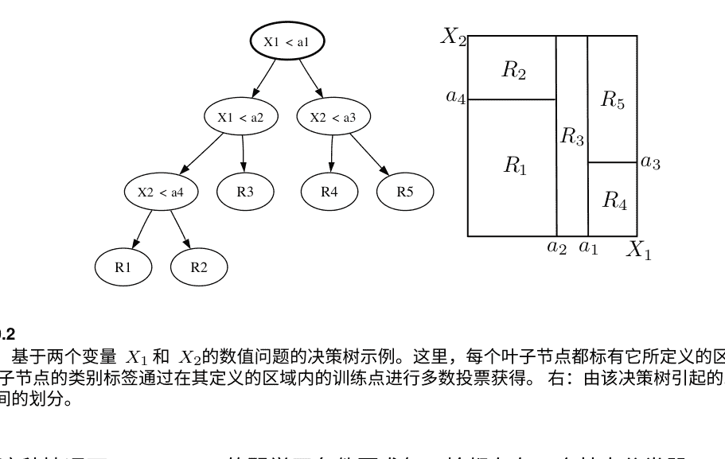

在这种情况下，AdaBoost的弱学习条件要求每一轮都存在一个基本分类器 $h_j: \mathcal{X} \times \mathcal{Y} \to \{-1, +1\}$，使得 $\mathbb{P}_{(i, l)\sim\mathcal{D}_j}[h_j(x_i, l) = y_i[l]] < 1/2$。如果一些类别难以区分，这可能很难实现。在这种情况下，提出“经验法则”$h_j$定义在 $\mathcal{X} \times \mathcal{Y}$ 上也更加困难。

### 9.3.3 决策树

我们介绍并讨论了决策树的一般学习方法，它可以用于多类分类，也可以用于其他学习问题，如回归（第11章）和聚类。尽管决策树的经验性能通常不是最先进的，但决策树可以作为弱学习器与提升算法一起使用，定义出有效的学习算法。决策树通常训练和评估速度较快，并且相对容易解释。

**定义9.5（二叉决策树）** 二叉决策树是特征空间的一个划分的树表示。图9.2展示了一个简单的例子，基于两个特征 $X_1$和 $X_2$的二维空间，以及它所表示的划分。决策树的每个内部节点对应于与特征相关的问题。它可以是一个数值问题，形式为 $X_i \le a$，其中 $X_i$是一个特征变量，$i \in [N]$，而 $a$是某个阈值，如图9.2的例子所示，或者是一个分类问题，例如 $X_i \in \{蓝色, 白色, 红色\}$，当特征 $X_i$取一个分类值，如颜色。每个叶子节点都标有一个标签 $l \in \mathcal{Y}$。

决策树可以使用更复杂的节点问题来定义，从而基于更复杂的决策面进行分区。例如，二进制空间分区（BSP）树用凸多面体区域分割空间，基于形式为 $\sum_{i=1}^n \alpha_i X_i \le a$的问题，以及球树用球体片段分割空间，基于形式为 $||X - a_0|| \le a$的问题，其中 $X$是特征向量，$a_0$是固定向量，$a$是固定正实数。更复杂的树问题导致更丰富的分区，从而导致过拟合，如果没有足够大的训练样本。它们还增加了预测和训练的计算复杂性。决策树也可以推广到大于两个的分支因子，但由于计算成本更低，二叉树最常用。

预测/分区: 要预测任何点 $x \in \mathcal{X}$的标签，我们从决策树的根节点开始，沿着树向下移动，直到找到一个叶子节点，当节点问题的响应为正时，向右子节点移动，否则向左子节点移动。当我们到达叶子节点时，我们将 $x$与该叶子节点的标签相关联。

因此，每个叶子节点定义了一个由相同节点响应和相同树遍历所对应的点集形成的$\mathcal{X}$的区域。根据定义，没有两个区域相交，所有点都属于且只属于一个区域。

因此，叶子区域定义了$\mathcal{X}$的一个划分，如图9.2所示的例子。在多类别分类中，叶子的标签是使用训练样本确定的：在一个叶子区域中的训练点中，具有最多表示的类别定义了该叶子的标签，如果有并列，则任意选择。

学习: 我们将讨论使用标记样本学习决策树的两种不同方法。第一种方法是一种贪婪技术。这是因为找到具有最小错误的决策树的一般问题是NP难的。该方法包括从一个树开始，将其缩减为一个（根）节点，该节点是具有整个样本中占多数的类别的叶子。

贪婪决策树 (S = ((x1, y1), ..., (xm, ym)))
1 树 ← {n0} . 根节点。
2 对于 t ← 1到 T执行
3 (nt, qt) ← argmax(n,q) F(n, q)
4 分割 (树 , nt, qt)
5 返回树

图9.3 从标记样本 S构建决策树的贪婪算法。过程分割(树,nt,qt)通过将节点 nt分割为具有问题 qt和叶子节点 n-(n,q)和 n+(n,q)，每个节点都标记有其定义的区域的主导类别，平局以任意方式打破。

接下来，在每一轮中，根据某个问题q将一个节点n分割。选择对（n，q）进行分割，以便最大程度地减少节点的不纯度，根据某个不纯度度量F。我们用F(n)表示节点n的不纯度。根据问题q对节点n进行分割后的节点不纯度的减少定义如下。设$(n_{+}(n,q))$表示分割后的右子节点，$(n_{-}(n,q))$表示左子节点，$\eta(n,q)$表示由节点n定义的区域中移动到$(n_{-}(n,q))$的点的比例。因此，叶子节点$(n_{-}(n,q))$和$(n_{+}(n,q))$的总不纯度为$\eta(n,q)F(n_{-}(n,q))+(1-\eta(n,q))F(n_{+}(n,q))$。因此，该分割导致的不纯度减少$F(n,q)$由以下公式给出。

$$F(n,q) = F(n) - [\eta(n,q)F(n_{-}(n,q)) + (1 - \eta(n,q))F(n_{+}(n,q))]$$

图9.3展示了基于 $\widetilde{F}$ 的贪婪构建的伪代码。在实践中，当所有节点达到足够纯净的水平时，算法停止；当每个叶子节点上的点数变得太少以至于无法进一步分割，或者基于其他类似的启发式方法停止。

对于任意节点 n和类别 $l \in [k]$，令 $p_l(n)$表示属于类别 $l$的点在 n上的比例。然后，节点不纯度的三个常用度量F定义如下:

$$F(n) = \begin{cases} 1 - \max_{l \in [k]} p_l(n) & \text{误分类;} \\ -\sum_{l=1}^{k} p_l(n) \log_2 p_l(n) & \text{熵 ;} \\ \sum_{l=1}^{k} p_l(n)(1 - p_l(n)) & \text{基尼指数.} \end{cases}$$

图9.4展示了这些定义在两类情况下的特殊情况（$k=2$）。熵和基尼指数的不纯度函数是误分类不纯度函数的上界。这三个函数都是凹函数，这确保了

$$F(n) - [\eta(n,q)F(n_{-}(n,q)) + (1 - \eta(n,q))F(n_{+}(n,q))] \geq 0.$$

然而，误分类函数是分段线性的，所以 $\widetilde{F}(n,q)$如果正样本的比例在分割后仍然小于（或大于）一半，则为零。在某些情况下，使用该准则无法通过任何分割来降低不纯度。相比之下，熵和基尼函数是严格凹的，这保证了不纯度的严格减少。此外，它们是可微分的，这是数值优化的一个有用特性。因此，在实践中通常更喜欢基尼指数和熵准则。

刚才描述的贪婪方法面临一些问题。其中一个问题是与算法的贪婪性质有关：一个看似不好的分割可能会主导后续有用的分割，从而导致整体不纯度较低的树。这可以通过使用一定深度的前瞻来确定分割决策，可以在一定程度上解决这个问题，但这样的前瞻可能会带来计算上的很大开销。另一个问题与生成的树的大小有关。为了达到一定的不纯度水平，可能需要生成相对较大的树。然而，较大的树会定义具有高VC维度（参见习题9.5）的过于复杂的假设，从而可能过拟合。

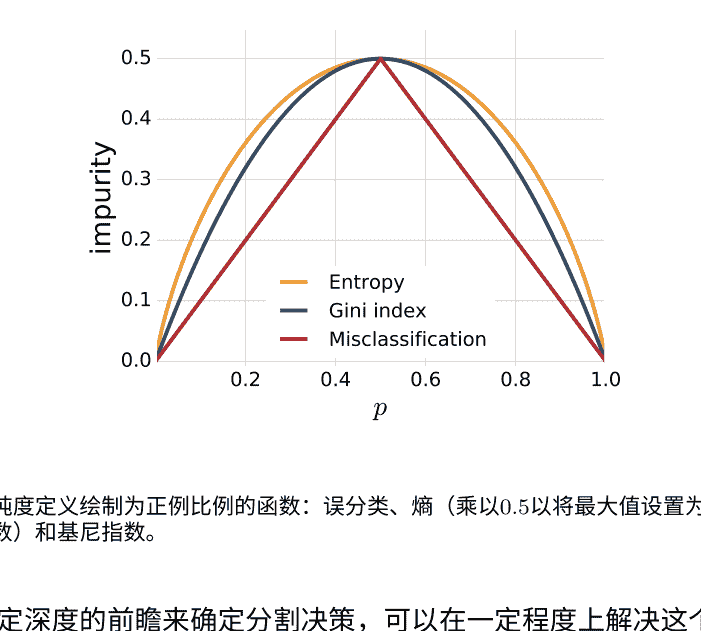

使用标记的训练样本学习决策树的另一种方法是基于所谓的“先生长后修剪”策略。首先，生长一个非常大的树，直到完全适应训练样本，或者每个叶子节点上只剩下非常少的点。然后，将得到的树，表示为 tree，进行修剪以最小化一个基于泛化界限的目标函数，该目标函数是经验误差和复杂度项的和。复杂度可以用 tree 的大小来表示，\( \widetilde{\text{tree}} \) 是 tree 的叶子节点集合。得到的目标函数为

\[ G_\lambda(\text{树}) = \sum_{n \in \text{树}} |n| F(n) + \lambda |\widetilde{\text{树}}|, \quad \text{(9.15)} \]

其中 \( \lambda \ge 0 \) 是一个正则化参数，决定了错误分类或者更一般的不纯度与树复杂度之间的权衡。对于任意树树\( '\)，我们用 \( R(\text{树}') \) 表示总体经验误差 \( \sum \)。我们寻找一个子树树\( _\lambda \) of 树，使得 \( G_\lambda \) 最小，并且具有最小的大小。可以证明树\( _\lambda \) 是唯一的。为了确定树\( _\lambda \)，使用以下剪枝方法，它定义了一个有限序列的嵌套子树树\( ^{(0)} \), ..., 树\( ^{(N)} \)。我们从完整的树树\( ^{(0)}\)=树开始，对于任意 \( i \in \{0, ..., n-1\} \)，通过树\( ^{(i+1)} \) 从树\( ^{(i)} \) 定义。

通过折叠内部节点 n' of tree^(i) 来压缩树，即通过用一个叶子节点替换以 n'为根的子树，或者等效地通过合并所有被 n'支配的叶子节点的区域来实现。 选择 n'使得折叠它导致树^(i)的每个节点增加最小，即最小化由tree^(i)定义的R(tree^(i))的增加，即最小化 r(tree^(i),n')。

$$ r(\text{tree}^{(i)}, n') = \frac{|n'|F(n') - R(\text{tree}')}{|\text{tree}'| - 1}, $$

其中 n'是 tree^(i)的一个内部节点。 如果树 tree^(i)中的多个节点 n'导致相同的每个节点增加最小值 r(tree^(i), n')，则将它们全部剪枝以定义tree^(i+1)从 tree^(i)开始。 该过程一直持续到获得只有一个节点的树 tree^(n)。 子树 tree_λ可以证明是序列 tree^(0), . . . , tree^(n)中的元素之一。 参数 λ通过 n折叠交叉验证确定。决策树似乎相对容易解释，这通常被强调为它们最有用的特点之一。 然而，对这样的解释应该谨慎进行，因为决策树是不稳定的：训练数据中的微小变化可能导致非常不同的分割，从而得到完全不同的树，这是由它们的层次结构性质所导致的结果。 决策树还可以以一种自然的方式处理缺失特征的问题，这在学习应用中经常出现；在实践中，某些特征值可能丢失，因为没有进行适当的测量或者由于某些噪声源导致它们的系统性缺失。在这种情况下，只能使用节点上可用的变量进行预测。最后，决策树可以以类似的方式使用和从数据中学习回归 设置（见第11章）。

## 9.4 聚合多类算法

在本节中，我们讨论一种将多类分类问题转化为多个二元分类任务的不同方法。 然后，为每个任务独立地训练一个二元分类算法，并将多类预测器定义为每个算法返回的假设的组合。 我们首先讨论了两种将多类分类问题转化为二元分类问题的标准技术，然后证明它们都是更一般框架的特殊实例。

## 9.4.1 一对多

令 \( S= ((x_1, y_1), \ldots, (x_m, y_m)) \in (\mathcal{X} \times \mathcal{Y})^m \) 为一个带标签的训练样本。将多类分类简化为二元分类的一种直接方法是基于所谓的一对多（OVA）或一对其余技术。该技术包括学习 \( k \) 个二元分类器 \( h_l: \mathcal{X} \to \{-1, +1\}, l \in \mathcal{Y} \)，每个分类器都试图将一个类别 \( l \in \mathcal{Y} \) 与其他所有类别区分开。对于任何 \( l \in \mathcal{Y} \)，\( h_l \) 是通过在将类别 \( l \) 中的点标记为 \( +1 \)，将其他所有类别中的点标记为 \( -1 \) 后，在完整样本 \( S \) 上训练二元分类算法得到的。对于 \( l \in \mathcal{Y} \)，假设 \( h_l \) 是由评分函数 \( f_l: \mathcal{X} \to \mathbb{R} \) 的符号派生的，即 \( h_l = \mathrm{sgn}(f_l) \)，就像前几章讨论的许多二元分类算法一样。

然后，通过OVA技术定义的多类别假设 \( h: \mathcal{X} \to \mathcal{Y} \) 如下给出：

\[
\forall x \in \mathcal{X}, \quad h(x) = \underset{l \in \mathcal{Y}}{\arg\max} \, f_l(x). \quad (9.16)
\]

这个公式看起来可能与未组合算法的多类别分类假设的定义相似。然而，请注意，对于未组合的算法，函数 \( f_l \) 是一起学习的，而在这里它们是独立学习的。当函数 \( f_l \) 的得分可以被解释为置信度得分时，公式 (9.16) 是有基础的，也就是当 \( f_l(x) \) 被学习为给定类别 \( l \) 条件下 \( x \) 的概率的估计时。然而，一般来说，函数 \( f_l, l \in \mathcal{Y} \) 给出的得分是不可比较的，基于 (9.16) 的 OVA 技术没有明确的理论依据。这有时被称为一个校准问题。显然，这个问题不能通过简单地将每个函数的得分归一化来解决，以使它们的大小一致，或者应用其他类似的启发式方法。当它是合理的时候，OVA技术是简单的，其计算成本是训练二进制分类算法的 \( k \) 倍，这与许多未组合算法的计算成本类似。

## 9.4.2 一对一

另一种技术，被称为一对一（OVO）技术，由使用训练数据独立学习每对不同类别 \( (l, l') \in \mathcal{Y}^2, l \neq l' \) 的二元分类器 \( h_{ll'}: \mathcal{X} \to \{-1, +1\} \) 来区分类别 \( l \) 和 \( l' \)。对于任意的 \( (l, l') \in \mathcal{Y}^2 \)，\( h_{ll'} \) 是通过在仅包含标记为 \( l \) 或 \( l' \) 的子样本上训练二元分类算法获得的，对于类别 \( l' \) 返回值 \( +1 \)，对于类别 \( l \) 返回值 \( -1 \)。这需要训练 \( C(k,2) = k(k-1)/2 \) 个分类器，通过多数投票来定义一个多类分类假设 \( h \)：

\[
\forall x \in \mathcal{X}, \quad h(x) = \underset{l \in \mathcal{Y}}{\arg\max} \, |\{l': h_{ll'}(x) = +1\}|. \quad (9.17)
\]

### 表 9.1 比较 OVA 和 OVO 技术在训练和测试中的时间复杂度

该表假设完整的训练样本大小为 \( m \)，每个类别由 \( m/k \) 个点表示。假设在大小为 \( n \) 的样本上训练二元分类算法的时间复杂度为 \( O(n^\alpha) \)。因此，OVO技术的训练时间为 \( O(k^2(m/k)^\alpha) = O(k^{2-\alpha} m^\alpha) \)。\( c_t \) 表示测试单个分类器的成本。

|        | 训练          | 测试           |
| :----- | :------------ | :------------- |
| **OVA** | \( O(km^\alpha) \) | \( O(kc_t) \)   |
| **OVO** | \( O(k^{2-\alpha}m^\alpha) \) | \( O(k^2c_t) \) |

因此，对于一个固定点 \( x \in \mathcal{X} \)，如果我们将预测值 \( h_{ll'}(x) \) 描述为两个选手 \( l \) 和 \( l' \) 之间比赛的结果，其中 \( h_{ll'}(x)=1 \) 表示 \( l' \) 战胜 \( l \)，那么 \( h \) 所预测的类别可以解释为在那个比赛中获胜次数最多的类别。

设 \( x \in \mathcal{X} \) 是属于类别 \( l' \) 的点。根据OVO技术的定义，如果对于所有 \( l \neq l' \)，都有 \( h_{ll'}(x)=+1 \)，则OVO关联到 \( x \) 的类别是正确的类别 \( l' \)，因为 \( |\{l \neq l': h_{ll'}(x)=+1\}| = k-1 \)，没有其他类别可以达到 \( (k-1) \) 次胜利。根据反证法，如果OVO假设错误地将 \( x \) 分类错误，则至少有一个 \( (k-1) \) 个二元分类器 \( h_{ll'} \)，\( l \neq l' \)，错误地将 \( x \) 分类错误。假设OVO使用的所有二元分类器 \( h_{ll'} \) 的泛化误差都不超过 \( r \)，则根据这个讨论，OVO返回的假设的泛化误差最多为 \( (k-1)r \)。

OVO技术不受OVA技术中指出的校准问题的影响。然而，当包含类 \( l \) 和 \( l' \) 的子样本的大小相对较小时，可能会在没有足够数据或过拟合风险增加的情况下学习 \( h_{ll'} \)。这种技术的另一个常见担忧是训练 \( k(k-1)/2 \) 个二元分类器与OVA技术的计算成本相比。

然而，仔细观察这两种方法的计算要求会发现，实际上它们之间的差异可能并不大，事实上，在某些假设下，OVO的训练时间复杂度可能小于OVA的训练时间复杂度。表9.1比较了这些方法在训练和测试方面的计算复杂度，假设在大小为 \( m \) 的样本上训练一个二元分类器的复杂度为 \( O(m^\alpha) \)，并且每个类在训练集中的表示都是相等的，即 \( m/k \) 个点。在这些假设下，如果 \( \alpha \in [2,3] \)，例如某些解决QP问题的算法（如SVM），那么OVO技术的训练时间复杂度实际上比OVA技术更有利。对于 \( \alpha=1 \)，两者是可比较的，只有在次线性算法的情况下，OVA技术才能从更好的复杂度中受益。在所有情况下，在测试时，OVO需要 \( k(k-1)/2 \) 个分类器评估，即 \( O(k^2c_t) \)。

## 9.4.3 错误纠正输出码

一种更通用的将多类别降维为二分类的方法是基于错误纠正输出码（ECOC）的思想。这种技术包括为每个类别 \( l \in \mathcal{Y} \) 分配一个长度为 \( c \geq 1 \) 的编码词，最简单的情况下是一个二进制向量 \( \mathbf{M}_l \in \{-1, +1\}^c \)。\( \mathbf{M}_l \) 作为类别 \( l \) 的标识，这些向量共同定义了一个矩阵 \( \mathbf{M} \in \{-1, +1\}^{k \times c} \)，其中第 \( l \) 行是 \( \mathbf{M}_l \)，如图9.5所示。接下来，对于每一列 \( j \in [c] \)，使用完整的训练样本 \( S \) 学习一个二进制分类器 \( h_j: \mathcal{X} \to \{-1, +1\} \)，其中所有在列 \( j \) 中表示为 \( +1 \) 的类别的点都被标记为 \( +1 \)，而其他所有点都被标记为 \( -1 \)。对于任意的 \( x \in \mathcal{X} \)，令 \( \mathbf{h}(x) \) 表示向量 \( \mathbf{h}(x) = (h_1(x), \ldots, h_c(x))^\top \)。那么，多类别假设 \( h: \mathcal{X} \to \mathcal{Y} \) 被定义为

\[
\forall x \in \mathcal{X}, \quad h(x) = \underset{l \in \mathcal{Y}}{\arg\min} \, d_H(\mathbf{M}_l, \mathbf{h}(x)) \quad (9.18)
\]

因此，预测的类别是与 \( \mathbf{h}(x) \) 在汉明距离上最接近的类别。图9.5说明了这个定义：在这种情况下，矩阵 \( \mathbf{M} \) 的任何一行都与预测向量 \( \mathbf{h}(x) \) 不匹配，但第三行与 \( \mathbf{h}(x) \) 具有最多的共同组成部分。

ECOC技术的成功取决于类别码字之间的最小汉明距离。让 \( d \) 表示该距离，那么最多 \( r_0 = \lfloor(d-1)/2\rfloor \) 个错误可以通过这种技术被纠正：根据 \( d \) 的定义，即使 \( r \leq r_0 \)，\( h_j \) 错误分类 \( x \in \mathcal{X} \)，\( \mathbf{h}(x) \) 仍然是与 \( x \) 的正确类别的码字最接近的。对于固定的 \( c \)，纠错矩阵 \( \mathbf{M} \) 的设计受到权衡的影响，因为较大的 \( d \) 值可能意味着更多的困难的二元分类任务。在实践中，每一列可能对应于基于领域知识确定的类特征。

刚刚描述的ECOC技术可以通过两种方式扩展。首先，不再仅使用每个分类器预测的标签 \( h_j \)，而是使用定义 \( h_j \) 的分数的大小。因此，如果对于某个函数 \( f_j \)，其值可以解释为置信度分数，则多类假设 \( h: \mathcal{X} \to \mathcal{Y} \) 为

### 图 9.5 多类分类的纠错输出编码示例

左侧：二进制编码矩阵 \( \mathbf{M} \)，每一行表示类 \( l \in [8] \) 的长度为 \( c=6 \) 的编码词。右侧：测试点 \( x \) 的预测向量 \( \mathbf{h}(x) \)。ECOC分类器将标签3分配给 \( x \)，因为第三类的二进制编码与 \( \mathbf{h}(x) \) 的汉明距离最小（距离为1）。

| 类别 | 1 | 2 | 3 | 4 | 5 | 6 |
| :--- | :--- | :--- | :--- | :--- | :--- | :--- |
| 1 | -1 | -1 | -1 | +1 | -1 | -1 |
| 2 | +1 | -1 | -1 | -1 | -1 | -1 |
| 3 | -1 | +1 | +1 | -1 | +1 | -1 |
| 4 | +1 | +1 | -1 | -1 | -1 | -1 |
| 5 | +1 | +1 | -1 | -1 | +1 | -1 |
| 6 | -1 | -1 | +1 | +1 | -1 | +1 |
| 7 | -1 | -1 | +1 | -1 | -1 | -1 |
| 8 | -1 | +1 | -1 | +1 | -1 | -1 |

| \( f_1(x) \) | \( f_2(x) \) | \( f_3(x) \) | \( f_4(x) \) | \( f_5(x) \) | \( f_6(x) \) |
| :---------- | :---------- | :---------- | :---------- | :---------- | :---------- |
| -1 | +1 | +1 | -1 | +1 | +1 |

新的示例 \( x \)

由下式定义：
\[
\forall x \in \mathcal{X}, \quad h(x) = \underset{l \in \mathcal{Y}}{\arg\min} \sum_{j=1}^c L(\mathbf{M}_{lj} f_j(x)), \qquad (9.19)
\]
其中 \( \mathbf{M}_{lj} \) 是 \( \mathbf{M} \) 的元素，而 \( L: \mathbb{R} \to \mathbb{R}_+ \) 是一个损失函数。当 \( L \) 由 \( L(z) = \frac{1-\mathrm{sgn}(z)}{2} \) 定义时——对于所有的 \( x \in \mathcal{X} \) 和 \( f_j = h_j \)，我们可以写成：
\[
\sum_{j=1}^c L(\mathbf{M}_{lj} h_j(x)) = \sum_{j=1}^c \frac{1 - \mathrm{sgn}(\mathbf{M}_{lj} h_j(x))}{2} = d_H(\mathbf{M}_l, \mathbf{h}(x)),
\]
而 (9.19) 与 (9.18) 相符。此外，三进制编码可以与矩阵元素一起使用，矩阵元素在 \( \{-1, 0, +1\} \) 中，这样在为每一列训练二进制分类器时，标记为0的类别示例将被忽略。通过这些扩展，OVA和OVO都成为ECOC技术的特殊实例。OVA的矩阵 \( \mathbf{M} \) 是一个方阵，即 \( c = k \)，所有项都等于 \( -1 \)，除了对角线上的项都等于 \( +1 \)。OVO的矩阵 \( \mathbf{M} \) 有 \( c = k(k-1)/2 \) 列。每一列对应于一对不同的类别 \( (l, l') \)，\( l \neq l' \)，所有的元素都等于0，除了行 \( l \) 的元素为 \( -1 \)，行 \( l' \) 的元素为 \( +1 \)。

由于评分函数的值被假设为置信度分数，\( \mathbf{M}_{lj} f_j(x) \) 可以被解释为分类器 \( j \) 在点 \( x \) 上的边界，而 (9.19) 则基于某种与二元分类器边界相关的损失 \( L \) 定义。

ECOC的进一步扩展包括将离散码扩展为连续码，使矩阵元素可以取任意实数值，并使用训练样本来学习矩阵 \( \mathbf{M} \)。从离散版本的 \( \mathbf{M} \) 开始，\( c \) 个二元分类器首先按照之前描述的方式学习具有评分函数 \( f_j \), \( j \in [c] \) 的分类器。对于任意 \( x \in \mathcal{X} \)，我们将 \( \mathbf{F}(x) \) 向量表示为 \( (f_1(x), \ldots, f_c(x))^\top \)。接下来，将 \( \mathbf{M} \) 的元素放松为实数值，并从训练样本中学习，目标是使与任意点 \( x \in \mathcal{X} \) 对应的 \( \mathbf{M} \) 的行比其他行更接近 \( \mathbf{F}(x) \)。相似性可以使用任何PDS核 \( K \) 来衡量。实际上，使用PDS核 \( K \) 和刚刚讨论的思想学习 \( \mathbf{M} \) 的算法的一个示例是多类支持向量机，在这个上下文中可以如下定义：

\[
\min_{\mathbf{M}, \xi} \|\mathbf{M}\|_F^2 + C \sum_{i=1}^m \xi_i
\]
约束条件: \( \forall (i, l) \in [m] \times \mathcal{Y} \),
\[
K(\mathbf{F}(x_i), \mathbf{M}_{y_i}) \geq K(\mathbf{F}(x_i), \mathbf{M}_l) + 1 - \xi_i.
\]

类似的算法可以使用其他矩阵范数来定义。得到的多类分类决策函数具有以下形式：
\[
h: x \rightarrow \underset{l \in \{1,\ldots,k\}}{\arg\max} \, K(\mathbf{F}(x), \mathbf{M}_l).
\]

## 9.5 结构化预测算法

在本节中，我们简要讨论与多类分类相关的一类重要问题，这些问题经常出现在计算机视觉、计算生物学和自然语言处理中。这些问题包括所有的序列标注问题和复杂问题，如解析、机器翻译和语音识别。

在这些应用中，输出标签具有丰富的内部结构。例如，在词性标注中，问题是将句子的每个单词分配一个词性标签，例如 \( N \)（名词）、\( V \)（动词）或 \( A \)（形容词）。因此，由单词 \( \omega_1 \ldots \omega_n \) 组成的句子的标签是一系列词性标签 \( t_1 \ldots t_n \)。这可以看作是一个多类分类问题，其中每个标签序列都是一个可能的标签。然而，对于这类结构化输出问题，有几个关键方面使它们与标准的多类分类问题不同。

首先，标签集的大小与输出的大小成指数关系。例如，如果 \( \Sigma \) 表示词性标签的字母表，对于长度为 \( n \) 的句子，可能的标签序列有 \( |\Sigma|^n \) 个。其次，标签的子结构之间存在依赖关系，这对于准确预测是重要的。例如，在词性标注中，某些标签序列可能是不合语法或不太可能的。最后，通常使用的损失函数不是零一损失，而是依赖于子结构的损失函数。让 \( L: \mathcal{Y} \times \mathcal{Y} \rightarrow \mathbb{R} \) 表示损失函数 \( L(y', y) \) 衡量预测标签 \( y' \in \mathcal{Y} \) 而不是正确标签 \( y \in \mathcal{Y} \) 的惩罚。在词性标注中，\( L(y', y) \) 可以是例如 \( y' \) 和 \( y \) 之间的汉明距离。

结构化输出问题中的相关特征通常取决于输入和输出。因此，我们将 \( \Phi(x, y) \in \mathbb{R}^N \) 表示与一对 \( (x, y) \in \mathcal{X} \times \mathcal{Y} \) 相关联的特征向量。

为了建模标签结构及其依赖关系，标签集 \( \mathcal{Y} \) 通常被假设具有图模型结构，即给出条件依赖子结构的概率模型的图。还假设与图模型的团簇相对应的输入 \( x \in \mathcal{X} \) 和输出 \( y \in \mathcal{Y} \) 的特征向量 \( \Phi(x, y) \) 和损失 \( L(y', y) \) 按照该图模型的团簇进行因式分解。对这个主题的详细处理需要进一步了解图模型的背景知识，因此超出了本节的范围。

大多数结构化预测算法使用的假设集被定义为函数集合 \( h: \mathcal{X} \rightarrow \mathcal{Y} \) 使得 \( \forall x \in \mathcal{X}, h(x) = \arg\max_{y \in \mathcal{Y}} \, \mathbf{w} \cdot \Phi(x, y), \quad (9.20) \) 对于某个向量 \( \mathbf{w} \in \mathbb{R}^N \)。令 \( S= ((x_1, y_1), \ldots, (x_m, y_m)) \in (\mathcal{X} \times \mathcal{Y})^m \) 为一个独立同分布的标记样本。由于假设集是线性的，我们可以寻求定义一个类似于多类支持向量机的算法。多类支持向量机的优化问题可以等价地重新表述如下：

\[
\min_{\mathbf{w}} \frac{1}{2}\|\mathbf{w}\|^2 + C \sum_{i=1}^{m} \max_{y \neq y_i} \max \left(0, 1 - \mathbf{w} \cdot [\Phi(x_i, y_i) - \Phi(x_i, y)] \right), \quad (9.21)
\]

然而，在这里我们需要考虑损失函数 \( L \)，即对于每个 \( i \in [m] \) 和 \( y \in \mathcal{Y} \)，有多种处理方法。一种可能的方法是让边界违规与 \( L(y, y_i) \) 相加进行惩罚。因此，在这种情况下，边界违规会加上 \( L(y, y_i) \)。另一种自然的方法是通过将边界违规与 \( L(y, y_i) \) 相乘进行惩罚。较大损失的边界违规将受到比较小损失的边界违规更严厉的惩罚。

更一般地，在某些应用中，损失函数也可能依赖于输入。因此，\( L \) 则成为一个将 \( L: \mathcal{X} \times \mathcal{Y} \times \mathcal{Y} \rightarrow \mathbb{R} \) 的函数，其中 \( L(x, y', y) \) 衡量在给定输入 \( x \) 的情况下预测标签 \( y' \) 而不是 \( y \) 的惩罚。

加性惩罚导致以下算法，被称为最大边际马尔可夫网络 \( (M^3N) \)：

\[
\min_{\mathbf{w}} \frac{1}{2}\|\mathbf{w}\|^2 + C\sum_{i=1}^{m} \max_{y \neq y_i} \max\left(0, L(y_i, y) - \mathbf{w} \cdot [\Phi(x_i, y_i) - \Phi(x_i, y)]\right). \quad (9.22)
\]

这个算法的一个优点是，与 SVM 的情况一样，它允许自然地使用 PDS 核函数。正如已经指出的，标签集 \( \mathcal{Y} \) 被假设具有马尔可夫性质的图结构，通常是链或树，并且损失函数被假设以相同的方式可分解。在这些假设下，通过利用标签的图模型结构，可以给出一个多项式时间算法来确定其解。

损失与边际的乘法组合导致以下算法，即 \( SVM_{struct} \)：

\[
\min_{\mathbf{w}} \frac{1}{2}\|\mathbf{w}\|^2 + C\sum_{i=1}^{m} \max_{y \neq y_i} L(y_i, y) \max \left(0, 1 - \mathbf{w} \cdot [\Phi(x_i, y_i) - \Phi(x_i, y)]\right). \quad (9.23)
\]

这个问题可以等价地写成具有无限数量约束的QP问题。在实践中，通过在每一轮中将上一轮的有限约束集合与最具违规约束进行扩充来迭代地解决该问题。实际上，这种方法可以在非常一般的假设和任意损失定义下应用。与 \( M^3N \) 的情况类似，\( SVM_{struct} \) 自然地允许使用PDS核函数，并因此可以扩展到非线性模型的解决方案。

另一个用于结构化预测问题的标准算法是条件随机场 \( (CRFs) \)。我们不会详细描述这个算法，但指出它与刚刚描述的算法 (特别是 \( M^3N \)) 的相似之处。\( CRFs \) 的优化问题可以写成

\[
\min_{\mathbf{w}} \frac{1}{2}\|\mathbf{w}\|^2 - C\sum_{i=1}^{m} \log \sum_{y \in \mathcal{Y}} \exp\left( \mathbf{w} \cdot [\Phi(x_i, y_i) - \Phi(x_i, y)] - L(y_i, y) \right). \quad (9.24)
\]

为了简单起见，假设 \( \mathcal{Y} \) 是有限的，具有基数 \( k \)，并且让 \( f \) 表示函数 \( (x_1, \ldots, x_k) \rightarrow \log(\sum_{j=1}^{k} e^{x_j}) \)。\( f \) 是一个凸函数，被称为 \( soft-max \)，因为它提供了 \( (x_1, \ldots, x_k) \rightarrow \max(x_1, \ldots, x_k) \) 的平滑近似。然后，问题 (9.24) 与 (9.22) 类似，只是用刚刚描述的 \( soft-max \) 函数替换了最大运算符。

## 9.6 章节笔记

多类分类的基于边界的泛化界限在定理 9.2 中由 Kuznetsov、Mohri 和 Syed [2014] 提出。它只接受一个线性-对类别数量的依赖性。这比Koltchinskii和Panchenko [2002]的类似结果有所改进，后者对类别数量有二次依赖性。命题9.3限制了基于多类核心假设的Rademacher复杂性，推论9.4是新的。

将SVM推广到多类分类设置的算法首先由Weston和Watkins [1999]引入。该算法的优化问题基于 \( k(k-1)/2 \) 个松弛变量，用于解决 \( k \) 类问题，因此在类别数量相对较大时可能效率低下。通过将松弛变量的总和 \( \sum_{j=i} \xi_{ij} \) 与点 \( x_i \) 相关，通过其最大值 \( \xi_i = \max_{j=i} \xi_{ij} \)，大大减少了变量的数量，并导致了本章介绍的多类SVM算法[Crammer和Singer, 2001, 2002]。

AdaBoost.MH算法由Schapire和Singer [1999, 2000]提出并讨论。正如我们在本章中所展示的，该算法是AdaBoost的一个特殊实例。Schapire和Singer [1999, 2000]还提出了另一种用于多类分类的增强型算法AdaBoost.MR。那个算法也是第10章中介绍的RankBoost算法的一个特殊实例。详细分析该算法，包括泛化界限，请参见练习10.5。

学习决策树最常用的工具是CART（分类和回归树）[Breiman et al., 1984]和C4.5 [Quinlan, 1986, 1993]。我们在学习决策树时描述的贪婪技术实际上受益于一个有趣的分析：令人惊讶的是，Kearns和Mansour [1999]、Mansour和McAllester [1999]证明，在弱学习者假设下，这种决策树算法产生了一个强假设。grow-then-prune方法来自CART。它已经被多种不同的研究进行了分析，特别是由Kearns和Mansour [1998]以及Mansour和McAllester [2000]，他们针对修剪后的原始树的最佳子树的错误和大小给出了泛化界限。Grigni等人 [2000]证明了固定大小的决策树的ERM的困难性。

ECOC框架用于多类分类的想法归功于Dietterich和Bakiri [1995]。Allwein等人[2000]进一步扩展和分析了这个方法，针对基于边际损失，他们提出了经验误差的界限和在提升的更具体情况下的泛化界限。虽然OVA技术一般存在校准问题，并且没有任何理由，但在实践中非常常用。Rifkin [2002]报告了几种多类分类算法的广泛实验结果，这些结果对OVA技术非常有利，性能往往非常接近甚至更好比一些未组合的算法，与一些作者声称的不同（另请参阅Rifkin和Klautau [2004]）。

CRFs算法由Lafferty，McCallum和Pereira [2001]引入。M³N是由Taskar、Guestrin和Koller [2003]提出的，而StructSVM是由Tsochantaridis、Joachims、Hofmann和Altun [2005]提出的。Cortes、Mohri和Weston [2007c]提出并分析了一种将结构化预测作为回归问题处理的替代技术。

## 9.7 练习

- 9.1多标签情况下的泛化界限。使用与定理9.2证明中使用的类似技术，推导出多标签情况下的基于边界的学习界限。

- 9.2基于核心假设的多类别分类受限于L_p范数。使用推论9.4定义基于核心假设的受限于L_p范数的替代多类别分类算法，其中p=2。对于哪个值的p≥1，命题9.3的界限最紧？推导出基于p=∞定义的多类别分类算法的对偶优化。

- 9.3多类别增强算法的替代方案。考虑任意样本S = ((x1, y1), ..., (xm, ym)) ∈ (X × Y)^m和α = (α1, ..., αn) ∈ R^n, n ≥ 1, 定义的目标函数G。

$$G(α) = \sum_{i=1}^{m} e^{-\frac{1}{k} \sum_{l=1}^{k} y_i[l] f_n(x_i, l)} = \sum_{i=1}^{m} e^{-\frac{1}{k} \sum_{l=1}^{k} y_i[l] \sum_{t=1}^{n} α_t h_t(x_i, l)} \quad (9.25)$$

利用指数函数的凸性来比较G和定义AdaBoost.MH的目标函数F。证明G是一个凸函数，上界是多标签多类别错误。讨论G的性质和通过坐标下降应用于G的算法。给出算法性能的理论保证，并分析在使用增强树桩时的运行时间复杂度。

- 9.4基于RankBoost的多类算法。这个问题需要熟悉本章和第10章中介绍的内容。一种基于排名准则的替代提升型多类分类算法。我们将在单标签设置中定义和研究该算法。

设 H 为将 X × Y 映射到 {−1, +1} 的基本假设族。设 F 为对于所有样本 $S = ((x_1, y_1), \ldots, (x_m, y_m)) \in (\mathcal{X} \times \mathcal{Y})^m$ 和 $\bar{\boldsymbol{\alpha}} = (\bar{\alpha}_1, \ldots, \bar{\alpha}_N) \in \mathbb{R}^N$, $N \geq 1$, 以下是目标函数的定义

$$F(\boldsymbol{\alpha}) = \sum_{i=1}^m \sum_{l=y_i}^m e^{-(f_N(x_i, y_i) - f_N(x_i, l))} = \sum_{i=1}^m \sum_{l=y_i}^m e^{-\sum_{j=1}^N \bar{\alpha}_j (h_j(x_i, y_i) - h_j(x_i, l))}. \quad (9.26)$$

其中 $f_N = \sum_{j=1}^N \bar{\alpha}_j h_j$.

(a) 证明 $F$ 是凸函数且可微分。
(b) 证明 $\frac{1}{m} \sum_{i=1}^m \mathbb{1}_{\rho_{f_N}(x_i, y_i)} \leq \frac{1}{k-1} F(\boldsymbol{\alpha})$, 其中 $f_N = \sum_{j=1}^N \bar{\alpha}_j h_j$。
(c) 给出将坐标下降应用于 $F$ 得到的算法的伪代码。得到的算法被称为AdaBoost.MR。证明AdaBoost.MR与应用于对$(x, y) \in \mathcal{X} \times \mathcal{Y}$的排名问题的RankBoost算法完全一致。准确描述这些对的排名目标。
(d) 使用问题(9.4b)和本章的学习界限来推导该算法的基于边界的泛化界限。
(e) 使用算法与RankBoost的连接以及第10章的学习界限来推导该算法的替代泛化界限。将这些界限与上一个问题的界限进行比较。

- 9.5 决策树。证明具有 $n$个节点的二叉决策树的VC维度在维度 $N$中是 $O(n \log N)$。

- 9.6 给出一个例子，其中每个 $k(k-1)/2$ 个二进制分类器 $h_{ll'}$, $l \neq l'$, 在OVO技术的定义中的泛化误差是 $r$，而OVO假设的泛化误差是$(k-1)r$。

## 10 排名

排序的学习问题在许多现代应用中都存在，包括搜索引擎的设计、信息提取平台和电影推荐系统。在这些应用中，返回的文档或电影的排序是系统的关键方面。在二进制情况下，与分类相比，排序的主要动机是资源的限制：对于非常大的数据集，显示或处理所有被分类器标记为相关的项目可能是不切实际的，甚至是不可能的。标准搜索引擎用户不愿意查看查询结果中返回的所有文档，而只愿意查看前十名左右。同样，信用卡公司的欺诈检测部门的成员无法调查被分类为潜在欺诈的数千笔交易，而只能调查最可疑的几十笔。

在这一章中，我们深入研究了排名学习问题。我们将这个问题分为两个一般性的设置：基于分数的设置和基于偏好的设置。对于基于分数的设置，这是最广泛研究的一种，我们使用Rademacher复杂性的概念提出了基于边界的泛化界限。

然后，我们描述了一种可以从这些界限中推导出来的基于SVM的排名算法，并描述和分析了RankBoost，一种用于排名的提升算法。我们进一步研究了排名问题的二分图设置，就像二元分类一样，每个点属于两个类别之一。我们讨论了在这种设置中RankBoost的高效实现，并指出它与AdaBoost的联系。我们还介绍了ROC曲线和ROC曲线下面积（AUC）的概念，这些概念与二分图排名直接相关。对于基于偏好的设置，我们提出了一系列结果，特别是对于确定性算法和随机算法都提供了基于遗憾的保证，并在确定性情况下给出了一个下界。

## 10.1 排名问题

我们首先介绍机器学习中最常研究的排名问题的情景。我们将这个情景称为基于分数的排名问题的设置。在第10.6节中，我们介绍并分析了另一种设置，即基于偏好的设置。

排名的一般监督学习问题是利用标记信息为所有点定义一个准确的排名预测函数。在这里考虑的情景中，标记信息仅针对点对提供，并且预测器的质量也是根据其平均配对错误排名来衡量的。预测器是一个实值函数，即一个得分函数：该函数分配给输入点的得分决定了它们的排名。

让 $\mathcal{X}$ 表示输入空间。我们用 $\mathcal{D}$ 表示在 $\mathcal{X} \times \mathcal{X}$ 上的一个未知分布，根据该分布抽取点对，并用 $f: \mathcal{X} \times \mathcal{X} \to \{-1, 0, +1\}$ 表示一个目标标记函数或偏好函数。函数 $f$ 分配的三个值的解释如下：如果 $x'$ 优于 $x$ 或排名高于 $x$，则 $f(x, x') = +1$；如果 $x$ 优于 $x'$，则 $f(x, x') = -1$；如果 $x$ 和 $x'$ 具有相同的偏好或排名，或者没有关于它们各自排名的信息，则 $f(x, x') = 0$。这个表述对应于我们为简化而采用的确定性情景。如第2.4.1节所讨论的，它可以直接扩展为具有 $\mathcal{X} \times \mathcal{X} \times \{-1, 0, +1\}$ 的分布的随机情景。

请注意，通常不对由 $f$ 引起的顺序的传递性做出特定假设：我们可能有 $f(x, x') = 1$ 和 $f(x', x'') = 1$，但 $f(x, x'') = -1$ 对于三个点 $x, x'$ 和 $x''$。虽然这可能与直观的偏好概念相矛盾，但实际上在实践中常常遇到这种偏好顺序，特别是当它们基于人类判断时。这有时是因为两个项目之间的偏好是基于不同的特征决定的：例如，一个人可能更喜欢电影 $x'$ 而不是 $x$，因为 $x'$ 是一部动作片而 $x$ 是一部音乐片，而且可能更喜欢 $x''$ 而不是 $x'$，因为 $x''$ 是一部具有更多特殊效果的动作片而 $x'$。然而，他们可能更喜欢 $x$ 而不是 $x''$，因为 $x''$ 的电影票价格显著更高。因此，在这个例子中，涉及到两个特征，即类型和价格，每个特征对不同的配对决策产生影响。实际上，通常不对偏好函数做任何假设，甚至不对引起的顺序的反对称性做假设；因此，我们可能有 $f(x, x') = 1$ 和 $f(x', x) = 1$，但仍然有 $x = x'$。

学习者接收到一个标记样本 $S = \left( (x_1, x'_1, y_1), \ldots, (x_m, x'_m, y_m) \right) \in \mathcal{X} \times \mathcal{X} \times \{-1, 0, +1\}$ with $(x_1, x'_1), \ldots, (x_m, x'_m)$ 按独立同分布的方式从 $\mathcal{D}$ 中抽取，并且对于所有的 $i \in [m]$，有 $y_i = f(x_i, x'_i)$。给定一个将 $\mathcal{X}$ 映射到 $\mathbb{R}$ 的函数假设集 $\mathcal{H}$，排名问题包括选择一个假设 $h \in \mathcal{H}$，使得期望的误差 $R(h)$ 较小。

对于目标函数 f，对假设H中的每个假设h，计算成对错误排序或泛化误差 R(h) = \mathbb{P}_{(x,x')\sim\mathcal{D}}\left[\left(f(x, x') \neq 0\right)\wedge\left(f(x, x')(h(x')-h(x))\leq0\right)\right]

经验配对错位或经验误差 h的表示为 Rs(h)并且被定义为

$$R_S(h) = \frac{1}{m} \sum_{i=1}^{m} 1_{(y_i \neq 0)\wedge(y_i(h(x'_i)-h(x_i))\leq0)}$$

请注意，尽管目标偏好函数 f 通常不是传递的，但由评分函数 h \in \mathcal{H}引起的线性排序是根据定义传递的。这是排名问题中基于分数的设置的一个缺点，因为无论假设集合 \mathcal{H}的复杂性如何，如果偏好函数不是传递的，没有假设 h \in \mathcal{H}能够完美地预测目标的配对排序。

## 10.2 泛化界限

在这一部分中，我们提出了基于边界的排名泛化界限。为了简化演示，我们将假设本节的结果是成对标签在 \{-1, +1\}之间。因此，如果根据 \mathcal{D}抽取了一对 (x, x') )，那么 x要么优于 x'，要么相反。一般情况下的学习界限具有非常相似的形式，但需要更多细节。与分类问题一样，对于任何 \rho >0，我们可以将假设 h的经验边界损失定义为成对排名的经验边界损失。

$$R_{S,\rho}(h) = \frac{1}{m} \sum_{i=1}^{m} \Phi_{\rho}(y_i(h(x'_i) - h(x_i)))$$

其中 \Phi_{\rho}是边界损失函数 (定义5.5)。因此，排名的经验边界损失上界是 (x_i, x'_i)对中 h错误排名或置信度小于 \rho的比例:

$$R_{S,\rho}(h) \leq \frac{1}{m} \sum_{i=1}^{m} 1_{y_i(h(x'_i)-h(x_i))\leq\rho}$$

我们用 \mathcal{D}_1表示从 \mathcal{D}派生的 \mathcal{X} \times \mathcal{X}中对于第一个元素的边缘分布，并用 \mathcal{D}_2表示对于第二个元素的边缘分布。同样地，S_1是从 S派生的样本，只保留每对中的第一个元素： S_1 = ((x_1, y_1), . . . , (x_m, y_m))而 S_2是通过只保留第二个元素获得的： S_2 = ((x'_1, y_1), . . . , (x'_m, y_m))。我们还用 \mathfrak{R}_m^{\mathcal{D}_1}(\mathcal{H})表示对于边缘分布 \mathcal{D}_1的 \mathcal{H}的Rademacher复杂度，即 \mathfrak{R}_m^{\mathcal{D}_1}(\mathcal{H}) = \mathbb{E}[\mathfrak{R}_{S_1}(\mathcal{H})],同样地 \mathfrak{R}_m^{\mathcal{D}_2}(\mathcal{H}) = \mathbb{E}[\mathfrak{R}_{S_2}(\mathcal{H})]。显然，

如果分布 $\mathcal{D}$对称，则边际分布 $\mathcal{D}_1$ 和 $\mathcal{D}_2$重合且 $\mathfrak{R}_m^{\mathcal{D}_1}(\mathcal{H}) = \mathfrak{R}_m^{\mathcal{D}_2}(\mathcal{H})$。

### 定理 10.1 (排名的边界)
设 $\mathcal{H}$为一组实值函数。固定 $\rho > 0$；那么，对于任意 $\delta > 0$，以至少概率 $1 - \delta$ over 选择一个样本 $S$的大小 $m$，对于所有的 $h \in \mathcal{H}$，以下每个都成立：

$$ R(h) \leq R_{S,\rho}(h) + \frac{2}{\rho} \left( \mathfrak{R}_m^{\mathcal{D}_1}(\mathcal{H}) + \mathfrak{R}_m^{\mathcal{D}_2}(\mathcal{H}) \right) + \frac{\left\lceil \log \frac{1}{\delta} \right\rceil}{2m} \quad (10.5) $$

$$ R(h) \leq R_{S,\rho}(h) + \frac{2}{\rho} \left( \mathfrak{R}_{S_1}(\mathcal{H}) + \mathfrak{R}_{S_2}(\mathcal{H}) \right) + 3 \frac{\left\lceil \log \frac{2}{\delta} \right\rceil}{2m} \quad (10.6) $$

证明：证明与定理 5.8 相似。设 $\widetilde{\mathcal{H}}$ 为将 $(\mathcal{X} \times \mathcal{X}) \times \{-1, +1\}$映射到 $\mathbb{R}$的假设族，定义为 $\widetilde{\mathcal{H}} = \{ z = ((x, x'), y) \mapsto y[h(x') - h(x)] : h \in \mathcal{H} \}$。考虑由 $\mathcal{H}$ 派生的函数族 $\mathcal{H}_\rho = \{ \Phi_\rho \circ f : f \in \widetilde{\mathcal{H}} \}$，其取值范围为 $[0, 1]$。根据定理 3.3，对于任意 $\delta > 0$，至少以概率 $1 - \delta$，对于所有的 $h \in \mathcal{H}$，都成立：

$$ \mathbb{E} \left[ \Phi_\rho(y[h(x') - h(x)]) \right] \leq R_{S,\rho}(h) + 2 \mathfrak{R}_m \left( \Phi_\rho \circ \widetilde{\mathcal{H}} \right) + \frac{\left\lceil \log \frac{1}{\delta} \right\rceil}{2m} $$

由于对于所有的 $u \in \mathbb{R}$，有 $1_{u \leq 0} \leq \Phi_\rho(u)$，广义误差 $R(h)$是左侧的下界，$R(h) = \mathbb{E}[1_{y[h(x')-h(x)] \leq 0}] \leq \mathbb{E} \left[ \Phi_\rho(y[h(x') - h(x)]) \right]$，我们可以写成：

$$ R(h) \leq R_{S,\rho}(h) + 2 \mathfrak{R}_m \left( \Phi_\rho \circ \widetilde{\mathcal{H}} \right) + \frac{\left\lceil \log \frac{1}{\delta} \right\rceil}{2m} $$

由于 $\Phi_\rho$ 是一个 $(1/\rho)$-Lipschitz函数，根据Talagrand引理（引理5.7），我们有 $\mathfrak{R}_m \left( \Phi_\rho \circ \widetilde{\mathcal{H}} \right) \leq \frac{1}{\rho} \mathfrak{R}_m(\widetilde{\mathcal{H}})$ 在这里，$\mathfrak{R}_m(\widetilde{\mathcal{H}})$ 可以被上界如下：

$$ \mathfrak{R}_m(\widetilde{\mathcal{H}}) = \frac{1}{m} \mathbb{E}_{S,\sigma} \left[ \sup_{h \in \mathcal{H}} \sum_{i=1}^m \sigma_i y_i (h(x_i') - h(x_i)) \right] $$
$$ = \frac{1}{m} \mathbb{E}_{S,\sigma} \left[ \sup_{h \in \mathcal{H}} \sum_{i=1}^m \sigma_i (h(x_i') - h(x_i)) \right] \quad (y_i \sigma_i \text{ 和 } \sigma_i: \text{相同分布。}) $$
$$ \leq \frac{1}{m} \mathbb{E}_{S,\sigma} \left[ \sup_{h \in \mathcal{H}} \sum_{i=1}^m \sigma_i h(x_i') + \sup_{h \in \mathcal{H}} \sum_{i=1}^m \sigma_i h(x_i) \right] \quad (\text{通过上确界的次可加性}) $$
$$ = \mathbb{E}_S \left[ \mathfrak{R}_{S_2}(\mathcal{H}) + \mathfrak{R}_{S_1}(\mathcal{H}) \right] \quad (\text{定义 } S_1 \text{ 和 } S_2) $$
$$ = \mathfrak{R}_m^{\mathcal{D}_2}(\mathcal{H}) + \mathfrak{R}_m^{\mathcal{D}_1}(\mathcal{H}) $$

这证明了(10.5)。第二个不等式(10.6)可以通过使用定理3.3的第二个不等式(3.4)而不是(3.3)来推导得到。

这些界限可以推广到对所有 $\rho >0$ 一致成立，但代价是额外的项 $\sqrt{(\log\log_2(2/\rho))/m}$。至于前几节中介绍的其他边界，它们显示了两个术语之间的冲突：所需的成对排序边界 $\rho$ 越大，中间项越小。然而，第一项，经验成对排序边界损失 $R_{S,\rho}$，随 $\rho$ 的增加而增加。

已知假设集 $\mathcal{H}$ 的Rademacher复杂度的上界，包括以VC维度为基础的上界，可以直接用于使定理10.1更加明确。特别地，使用定理10.1，我们立即得到了使用基于核的假设进行成对排名的边界。

## **推论10.2 (基于核的假设进行排名的边界)**

设 $K: \mathcal{X} \times \mathcal{X} \rightarrow \mathbb{R}$ 是一个PDS核函数，$r = \sup_{x \in \mathcal{X}} K(x, x)$。设 $\Phi: \mathcal{X} \rightarrow \mathcal{H}$ 是一个与 $K$ 相关的特征映射，$\mathcal{H} = \{x \rightarrow \mathbf{w} \cdot \Phi(x) : \|\mathbf{w}\|_{\mathcal{H}} \le \Lambda\}$，其中 $\Lambda \ge 0$。固定 $\rho > 0$。那么，对于任意 $\delta > 0$，以下成对边界至少以概率 $1 - \delta$ 对于任意的 $h \in \mathcal{H}$ 成立：

$$R(h) \le R_{S,\rho}(h) + 4 \sqrt{\frac{r^2 \Lambda^2 / \rho^2}{m}} + \sqrt{\frac{\log \frac{1}{\delta}}{2m}}. \qquad (10.7)$$

与定理5.8类似，这个推论的界限可以推广到对所有 $\rho >0$ 都成立，但代价是增加了一个额外的项 $\sqrt{(\log\log_2(2/\rho))/m}$。这个基于核的假设的泛化界限非常引人注目，因为它不直接依赖于特征空间的维度，而只依赖于成对排名的边际。这表明当 $\rho/r$ 很大（第二项很小）而经验边际损失相对较小（第一项）时，可以实现较小的泛化误差。后者发生在少数点被错误分类或者被正确分类但边际小于 $\rho$ 的情况下。

## **10.3 使用支持向量机进行排名**

在本节中，我们讨论了一个直接从刚刚提出的理论保证中得出的算法。结果证明，该算法是SVM算法的一个特殊实例。

按照第5.4节中的分类方法，推论10.2的保证可以表示为：对于任意 $\delta >0$，至少以概率 $1 - \delta$，对于所有的 $h \in \mathcal{H} = \{x \rightarrow \mathbf{w} \cdot \Phi(x) : \|\mathbf{w}\| \le \Lambda\}$，

$$R(h) \le \frac{1}{m} \sum_{i=1}^{m} \xi_i + 4 \sqrt{\frac{r^2 \Lambda^2}{m}} + \sqrt{\frac{\log \frac{1}{\delta}}{2m}} , \qquad (10.8)$$

其中 $\xi_i = \max\left(1 - y_i \left[\mathbf{w} \cdot (\Phi(x'_i) - \Phi(x_i))\right], 0\right)$ 对于所有 $i \in [m]$，其中 $\Phi: \mathcal{X} \rightarrow \mathcal{H}$ 是与PDS核 $K$ 相关联的特征映射。基于此的算法理论保证包括最小化(10.8)右侧，即最小化具有与松弛变量 $\xi_i$ 的和项的目标函数，以及最小化 $\|\mathbf{w}\|$ 或等价地最小化 $\|\mathbf{w}\|^2$。因此，它的优化问题可以表述为

$$
\min_{\mathbf{w},\xi} \frac{1}{2}\|\mathbf{w}\|^2 + C\sum_{i=1}^m \xi_i \quad (10.9)
$$
约束条件：
$$
y_i \left[ \mathbf{w} \cdot \left( \Phi(x'_i) - \Phi(x_i) \right) \right] \geq 1 - \xi_i \\
\xi_i \geq 0, \quad \forall i \in [m].
$$

这与SVM的原始优化问题完全一致，其中特征映射 $\Psi: \mathcal{X} \times \mathcal{X} \to \mathcal{H}$ 由 $\Psi(x, x') = \Phi(x') - \Phi(x)$ 定义，对于所有 $(x, x') \in \mathcal{X} \times \mathcal{X}$，以及由形式 $(x, x') \to \mathbf{w} \cdot \Psi(x, x')$ 的函数假设集。因此，显然，所有已经提出的SVM属性在这种情况下都适用。特别是，该算法可以从使用PDS核函数中受益。问题 (10.9) 有一个等价的对偶问题，可以用核矩阵 $\mathbf{K}'$ 来表示，该核矩阵由以下方式定义

$$
\mathbf{K}'_{ij} = \Psi(x_i, x'_i) \cdot \Psi(x_j, x'_j) = K(x_i, x_j) + K(x'_i, x'_j) - K(x'_i, x_j) - K(x_i, x'_j), \quad (10.10)
$$

对于所有的 $i,j \in [m]$。这个算法在实践中可以提供一种有效的成对排名解决方案。该算法还可以用于标签为 $\{-1,0,+1\}$ 的情况，并可以进行扩展。下一节介绍了一种在基于分数的设置中进行排名的替代算法。

## **10.4 RankBoost**

本节介绍了一种用于成对排名的增强算法，RankBoost，类似于用于二元分类的AdaBoost算法。RankBoost基于与分类讨论的类似思想：它由不同的基本排名器组合而成，以创建一个更准确的预测器。基本排名器是由用于排名的弱学习算法返回的假设。与分类一样，这些基本假设必须满足一个最小准确度条件，稍后将详细描述。

让 $\mathcal{H}$ 表示从中选择基本排名器的假设集。当 $\mathcal{H}$ 是从 $\mathcal{X}$ 到 $\{0,1\}$ 的函数集时，算法10.1给出了RankBoost算法的伪代码。对于任何 $s \in \{-1,0,+1\}$，我们通过定义 $\epsilon_t^s$ 来表示

$$
\epsilon_t^s = \sum_{i=1}^m \mathcal{D}_t(i) \mathbb{1}_{y_i(h_t(x'_i) - h_t(x_i)) = s} = \mathop{\mathbb{E}}_{i \sim \mathcal{D}_t} \left[ \mathbb{1}_{y_i(h_t(x'_i) - h_t(x_i)) = s} \right], \quad (10.11)
$$

并将符号 $\epsilon_t^{+1}$ 简化为 $\epsilon_t^+$，类似地，将符号 $\epsilon_t^{-1}$ 简化为 $\epsilon_t^-$。根据这些定义，显然有以下等式成立：$\epsilon_t^0 + \epsilon_t^+ + \epsilon_t^- = 1$。

该算法以标记样本 $S = \left( (x_1, x'_1, y_1), \ldots, (x_m, x'_m, y_m) \right)$ 作为输入，其中元素属于 $\mathcal{X} \times \mathcal{X} \times \{-1, 0, +1\}$，并维护一个分布，该分布覆盖了指标子集 $i \in \{ 1, \ldots, m\}$，其中 $y_i = 0$。为了简化演示，我们将假设对于所有 $i \in \{1, \ldots, m\}$, $y_i = 0$，并考虑在 $\{1, \ldots, m\}$ 上定义的分布。这可以通过首先从样本中删除标记为零的对来保证。

最初 (第1-2行)，分布是均匀的 ($\mathcal{D}_1$)。在每一轮增强中，也就是在循环3-8的每一次迭代 $t \in [T]$，都会选择一个新的基本排名器 $h_t \in \mathcal{H}$，它具有最小的差异 $\epsilon_t^- - \epsilon_t^+$，也就是具有最小的错排错误和最大的正确排名准确性，用于分布 $\mathcal{D}_t$:

$$h_t \in \underset{h \in \mathcal{H}}{\text{argmin}} \left\{ - \mathbb{E}_{i \sim \mathcal{D}_t} \left[ y_i \left( h(x'_i) - h(x_i) \right) \right] \right\}.$$

因此，寻找最小的差异 $\epsilon_t^- - \epsilon_t^+$ 等同于寻找最小的 $2 \epsilon_t^- + \epsilon_t^0$，这本身与寻找最小的 $\epsilon_t^-$ 当 $\epsilon_t^0 = 0$ 时相一致。$Z_t$ 只是一个归一化因子，用于确保权重 $\mathcal{D}_{t+1}(i)$ 之和为一。$RankBoost_t$ 依赖于这个假设。

**算法10.1 RankBoost算法用于 $\mathcal{H} \subseteq \{0,1\}^\mathcal{X}$。**

- RANKBOOST(S = ((x_1, x'_1, y_1), \ldots, (x_m, x'_m, y_m)))
- 1: for $i \leftarrow 1$ to $m$ do
- 2:     $\mathcal{D}_1(i) \leftarrow \frac{1}{m}$
- 3: for $t \leftarrow 1$ to $T$ do
- 4:     $h_t \leftarrow \mathcal{H}$ 中最小的基本排名器 $\epsilon_t^- - \epsilon_t^+ = - \mathbb{E}_{i \sim \mathcal{D}_t} \left[ y_i \left( h_t(x'_i) - h_t(x_i) \right) \right]$
- 5:     $\alpha_t \leftarrow \frac{1}{2} \log \frac{\epsilon_t^+}{\epsilon_t^-}$
- 6:     $Z_t \leftarrow \epsilon_t^0 + 2[\epsilon_t^+ \epsilon_t^-]^{\frac{1}{2}}$ .归一化因子
- 7:     for $i$ 从 1 到 $m$ 执行
- 8:         $\mathcal{D}_{t+1}(i) \leftarrow \frac{\mathcal{D}_t(i) \exp \left[ -\alpha_t y_i \left( h_t(x'_i)-h_t(x_i) \right) / Z_t \right]}{Z_t}$
- 9: $f \leftarrow \sum_{t=1}^T \alpha_t h_t$
- 10: 返回 $f$

在每一轮中，对于找到的假设 $h_t$，不等式 $\epsilon^+_t - \epsilon^-_t > 0$ 成立；因此，正确排名的对的概率质量大于错误排名的对的概率质量。我们用 $\gamma_t$ 表示基本排序器 $h_t$ 的边界： $\gamma_t = \epsilon^+_t - \epsilon^-_t$。

定义系数 $\alpha_t$ （第5行）的确切原因将在后面变得清晰。暂时观察到，如果 $\epsilon^+_t - \epsilon^-_t > 0$，则 $\epsilon^+_t / \epsilon^-_t > 1$ 且 $\alpha_t > 0$。因此，新的分布 $\mathcal{D}_{t+1}$ 是通过增加对 $i$ 的权重来自 $\mathcal{D}_t$ 定义的，如果对 $(x_i, x_i')$ 的排名错误 ($y_i(h_t(x_i') - h_t(x_i)) < 0$)，则减小它如果 $(x_i, x_i')$ 的排名正确 ($y_i(h_t(x_i') - h_t(x_i)) > 0$)。对于 $h_t(x_i') - h_t(x_i) = 0$ 的对，相对权重不变。这个分布更新的效果是在下一轮增强中更加关注错误排名的点。

经过 $T$ 轮增强，RankBoost 返回的假设是 $f$，它是基本分类器的线性组合 $h_{t}$。在那个求和中，$\alpha_t$ 对应于 $h_t$ 的权重是 $\epsilon^+_t$ 和 $\epsilon^-_t$ 的比率的对数函数。因此，在那个求和中，准确度更高的基本排序器被分配更大的权重。

对于任意的 $t \in [T]$，我们将在 $t$ 轮增强后，基本排序器的线性组合表示为 $f_t = \sum_{s=1}^t \alpha_s h_{s}$。特别地，我们有 $f_T = f$。可以用 $f_t$ 和归一化因子 $Z_s, s \in [t]$，来表示分布 $\mathcal{D}_{t+1}$ 如下：

对于所有的 $i \in [m]$, $ \mathcal{D}_{t+1}(i) = \frac{e^{-y_i(f_t(x_i') - f_t(x_i))}}{m \prod_{s=1}^t Z_s}$。

我们将在以下几个部分的证明中多次使用这个恒等式。可以通过反复展开对于点 $x_i$ 的分布的定义来直接证明。

$$
\mathcal{D}_{t+1}(i) = \frac{\mathcal{D}_t(i) e^{-\alpha_t y_i (h_t(x_i') - h_t(x_i))}}{Z_t} = \frac{\mathcal{D}_{t-1}(i) e^{-\alpha_{t-1} y_i (h_{t-1}(x_i') - h_{t-1}(x_i))} e^{-\alpha_t y_i (h_t(x_i') - h_t(x_i))}}{Z_{t-1} Z_t} = \frac{e^{-y_i \sum_{s=1}^t \alpha_s (h_s(x_i') - h_s(x_i))}}{m \prod_{s=1}^t Z_s}.
$$

## **10.4.1 经验误差界限**

我们首先证明，当每个基本排名器的边缘 $\gamma_t$ 大于某个正值 $\gamma > 0$ 时，RankBoost 的经验误差以指数速度下降，即随着提升轮数的增加。

## **定理 10.3** 由 *RankBoost* 返回的假设的经验误差 $h:\mathcal{X}\to\{0,1\}$ 满足:

$$R_S(h) \leq \exp \left[-2\sum_{t=1}^{T} \left(\frac{\epsilon_t^+ - \epsilon_t^-}{2}\right)^2\right]. \tag{10.13}$$

此外，如果存在 $\gamma$ 使得对于所有 $t \in [T]$, $0 < \gamma \leq \frac{\epsilon_t^+ - \epsilon_t^-}{2}$, 则

$$R_S(h) \leq \exp(-2\gamma^2 T). \tag{10.14}$$

证明：使用对于所有 $u \in \mathbb{R}$ 成立的不等式 $1_{u \leq 0} \leq \exp(-u)$，以及恒等式 (10.12)，我们可以写成:

$$
\begin{aligned}
R_S(h) &= \frac{1}{m} \sum_{i=1}^{m} 1_{y_i(f(x_i')-f(x_i)) \leq 0} \leq \frac{1}{m} \sum_{i=1}^{m} e^{-y_i(f(x_i')-f(x_i))} \\
&\leq \frac{1}{m} \sum_{i=1}^{m} \left[ m \prod_{t=1}^{T} Z_t \right] \mathcal{D}_{T+1}(i) = \prod_{t=1}^{T} Z_t.
\end{aligned}
$$

根据归一化因子的定义，对于所有 $t \in [T]$, 我们有 $Z_t = \sum_{i=1}^{m} \mathcal{D}_t(i) e^{-\alpha_t y_i (h_t(x_i')-h_t(x_i))}$。通过将指标 $i$ 分组, 使得 $y_i(h_t(x_i')-h_t(x_i))$ 取值为 $+1$、 $-1$ 或 $0$, $Z_t$ 可以重写为

$$
Z_t = \epsilon_t^+ e^{-\alpha_t} + \epsilon_t^- e^{\alpha_t} + \epsilon_t^0 = \epsilon_t^+ \sqrt{\frac{\epsilon_t^-}{\epsilon_t^+}} + \epsilon_t^- \sqrt{\frac{\epsilon_t^+}{\epsilon_t^-}} + \epsilon_t^0 = 2\sqrt{\epsilon_t^+ \epsilon_t^-} + \epsilon_t^0.
$$

由于 $\epsilon_t^+ = 1 - \epsilon_t^- - \epsilon_t^0$, 我们有

$$
4\epsilon_t^+ \epsilon_t^- = (\epsilon_t^+ + \epsilon_t^-)^2 - (\epsilon_t^+ - \epsilon_t^-)^2 = (1-\epsilon_t^0)^2 - (\epsilon_t^+ - \epsilon_t^-)^2.
$$

因此，假设 $\epsilon_t^0 < 1$, $Z_t$ 可以被上界限定如下:

$$
\begin{aligned}
Z_t &= \sqrt{(1-\epsilon_t^0)^2 - (\epsilon_t^+ - \epsilon_t^-)^2} + \epsilon_t^0 \\
&= (1-\epsilon_t^0) \sqrt{1 - \frac{(\epsilon_t^+ - \epsilon_t^-)^2}{(1-\epsilon_t^0)^2}} + \epsilon_t^0 \\
&\leq (1-\epsilon_t^0) \left(1 - \frac{(\epsilon_t^+ - \epsilon_t^-)^2}{2(1-\epsilon_t^0)^2}\right) + \epsilon_t^0 \\
&= 1 - \frac{(\epsilon_t^+ - \epsilon_t^-)^2}{2(1-\epsilon_t^0)} \\
&\leq \exp \left(-\frac{(\epsilon_t^+ - \epsilon_t^-)^2}{2(1-\epsilon_t^0)}\right) \leq \exp \left(-\frac{(\epsilon_t^+ - \epsilon_t^-)^2}{2}\right) = \exp \left(-2\left[(\epsilon_t^+ - \epsilon_t^-)/2\right]^2\right),
\end{aligned}
$$

其中我们使用了平方根函数的凹性和 $0 < \epsilon_t^0 < 1$ 的事实来得到第一个不等式。对于第二个不等式，我们使用了 $\epsilon_t^0 \leq 1$ 和不等式 $1 - x \leq e^{-x}$ 对于所有 $x \in \mathbb{R}$ 都成立的事实。当 $\epsilon_t^0 = 1$ 时, 这个对 $Z_t$ 的上界也显然成立, 因为在这种情况下 $\epsilon_t^+ = \epsilon_t^- = 0$。这证明了命题。 $\square$

从定理的证明中可以看出，弱排序假设 $\gamma \leq \frac{\epsilon_t^+ - \epsilon_t^-}{2}$ 可以用稍微弱一些的要求 $\gamma \leq \frac{\epsilon_t^+ - \epsilon_t^-}{2\sqrt{1-\epsilon_t^0}}$，其中 $\epsilon_t^0 = 1$，可以重写为 $\gamma \leq -\frac{\epsilon_t^+ - \epsilon_t^-}{\sqrt{\epsilon_t^+ + \epsilon_t^-}}$，其中 $\epsilon_t^+ + \epsilon_t^- = 0$，其中数量 $\frac{\epsilon_t^+ - \epsilon_t^-}{\sqrt{\epsilon_t^+ + \epsilon_t^-}}$ 可以解释为（归一化的）相对差异在 $\epsilon_t^+$ 和 $\epsilon_t^-$ 之间。该定理的证明还表明，系数 $\alpha_t$ 被选择为最小化 $Z_t$。因此，总体而言，这些系数被选择为最小化经验误差的上界 $\prod_{t=1}^T Z_t$，就像AdaBoost一样。RankBoost算法可以有多种一般化的方式：

- 而不是具有最小差异的假设 $\epsilon_t^- - \epsilon_t^+$，h可以更一般地是由在 $D_t$ 上训练的弱排序算法返回的基本排序器 $\epsilon_t^+ > \epsilon_t^-$；
- 基本排名器的范围可以是[0,+1]，或者更一般地是 $\mathbb{R}$。系数 $\alpha_t$ 可以是不同的，甚至可能没有闭式形式。然而，一般来说，它们被选择为使经验误差的上界 $\prod_{t=1}^T Z_t$ 最小化。

## 10.4.2 与坐标下降的关系

RankBoost与坐标下降技术应用于所有样本 $S$ 的凸可微目标函数 $F$ 一致，其中 $(x_1, x_1', y_1), \dots, (x_m, x_m', y_m) \in \mathcal{X} \times \mathcal{X} \times \{-1, 0, +1\}$ 和 $\bar{\alpha} = (\bar{\alpha}_1, \dots, \bar{\alpha}_n) \in \mathbb{R}^N, n \geq 1$。

$$F(\alpha) = \sum_{i=1}^m e^{-y_i [f_N(x_i') - f_N(x_i)]} = \sum_{i=1}^m e^{-y_i \sum_{j=1}^N \bar{\alpha}_j [h_j(x_i') - h_j(x_i)]} \tag{10.15}$$

这个损失函数是零一对损失函数 $\bar{\alpha}$ 的凸上界 $\rightarrow \sum_{i=1}^m 1_{y_i[f_N(x_i') - f_N(x_i)] \leq 0}$，这不是凸的。

让 $e_k$ 表示 $\mathbb{R}^N$ 中第 k 个坐标对应的单位向量，并且让 $\bar{\alpha}_{t-1} = \bar{\alpha}_t + \eta e_k$ 表示迭代 t 后的参数向量（其中 $\bar{\alpha}_0 = 0$）。此外，对于任意的 $t \in [T]$，我们定义函数 $\bar{f}_t = \sum_{j=1}^{N_t} \bar{\alpha}_{t,j} h_j$ 和分布 $\bar{D}_t$ over 索引 $\{1, \dots, m\}$ 如下：

$$\bar{D}_{t+1}(i) = \frac{e^{-y_i [\bar{f}_t(x_i') - \bar{f}_t(x_i)]}}{m \prod_{s=1}^t \bar{Z}_s} \tag{10.16}$$

其中 $\bar{Z}_t$ 是 $Z_t$ 的类比，根据 $\bar{D}_t$ 而不是 $D_t$ 计算。同样地，让 $\bar{\epsilon}_t^+$，$\bar{\epsilon}_t^-$ 和 $\bar{\epsilon}_t$ 表示相对于 $\bar{D}$ 而不是 $D_t$ 定义的 $\bar{\epsilon}_{t+}$，$\bar{\epsilon}_{t-}$ 和 $\bar{\epsilon}_{t}$ 的类比。

按照7.2.2节中非常相似的步骤，我们将使用归纳论证来展示在 $F$ 上的坐标下降和 RankBoost 算法是等价的。

事实上，它们是等价的。显然，如果对于所有的 $t$，我们有 $\bar{\mathcal{D}}_{t+1} = \mathcal{D}_{t+1}$，那么 $\bar{f}_t = f_{t_{\circ}}$。我们可以轻易地得到 $\bar{f}_0 = f_0$，因此我们假设归纳地 $\bar{f}_{t-1} = f_{t-1}$，并展示这意味着 $\bar{f}_t = f_{t_{\circ}}$。

在每次迭代 $t \geq 1$ 时，坐标下降选择的方向 $\mathbf{e}_k$ 是使得方向导数最小的方向，方向导数定义如下：

$$F'(\bar{\boldsymbol{\alpha}}_{t-1}, \mathbf{e}_k) = \lim_{\eta \to 0} \frac{F(\bar{\boldsymbol{\alpha}}_{t-1} + \eta \mathbf{e}_k) - F(\bar{\boldsymbol{\alpha}}_{t-1})}{\eta}$$

由于 $F(\bar{\boldsymbol{\alpha}}_{t-1} + \eta \mathbf{e}_k) = \sum_{i=1}^m e^{-y_i \sum_{j=1}^{t-1} \bar{\alpha}_{t-1,j}(h_j(x'_i) - h_j(x_i)) - \eta y_i(h_k(x'_i) - h_k(x_i))}$，沿着 $\mathbf{e}_k$ 的方向导数可以表示如下：

$$F'(\boldsymbol{\alpha}_{t-1}, \mathbf{e}_k)$$
$$= -\sum_{i=1}^m y_i(h_k(x'_i) - h_k(x_i)) \exp \left[ -y_i \sum_{j=1}^N \bar{\alpha}_{t-1,j}(h_j(x'_i) - h_j(x_i)) \right]$$
$$= -\sum_{i=1}^m y_i(h_k(x'_i) - h_k(x_i)) \bar{\mathcal{D}}_t(i) \left[ m \prod_{s=1}^{t-1} \bar{Z}_s \right]$$
$$= -\left[ \sum_{i=1}^m \bar{\mathcal{D}}_t(i) \mathbf{1}_{y_i(h_t(x'_i)-h_t(x_i))=+1} - \sum_{i=1}^m \bar{\mathcal{D}}_t(i) \mathbf{1}_{y_i(h_t(x'_i)-h_t(x_i))=-1} \right] \left[ m \prod_{s=1}^{t-1} \bar{Z}_s \right]$$
$$= -[\bar{\epsilon}_t^+ - \bar{\epsilon}_t^-] \left[ m \prod_{s=1}^{t-1} \bar{Z}_s \right].$$

第一个等式通过求导并在 $\eta=0$ 处求值得到，第二个等式由(10.12)得到。鉴于最后一个等式，由于 $m \prod_{s=1}^{t-1} \bar{Z}_s$ 是固定的，坐标下降选择的方向是最小化的 $\bar{\epsilon}_{t_{\circ}}$。根据归纳假设，$\bar{\mathcal{D}}_t = \mathcal{D}_t$ 和 $\bar{\epsilon}_t = \epsilon_t$，因此，所选择的基本排名器与 $RankBoost_t$ 选择的基本排名器完全对应。

通过将导数设置为零来确定步长 $\eta$，以便在选择的方向上最小化函数的值 $\mathbf{e}_k$。因此，使用恒等式10.12和定义。

根据归纳假设，我们有 $\overline{\epsilon}_t^+ = \epsilon_t^+$ 和 $\overline{\epsilon}_t^- = \epsilon_t^-$，这证明了坐标下降选择的步长与基本排名器权重 $\alpha_t$ of $RankBoost_t$ 相匹配。因此，通过结合之前的结果，我们有 $\vec{f} = {}_t f$，归纳证明完成。这表明应用于 $F$ 的坐标下降算法与 $RankBoost_t$ 算法完全一致。

与分类情况一样，可以使用其他上界为零-对误排损失的凸损失函数。特别地，可以使用以下基于逻辑损失的目标函数：$\vec{\alpha} \rightarrow \sum_{i=1}^m \log(1 + e^{-y_i[f_N(x'_i)-f_N(x_i)]})$ 来推导一种替代的增强型算法。

## 10.4.3 排名中集成方法的边界界限

为了简化演示，我们将假设在本节的结果中，与第10.2节一样，成对标签为 $\{-1, +1\}$。根据引理7.4，凸包$conv(\mathcal{H})$的经验Rademacher复杂度等于 $\mathcal{H}$ 的复杂度。因此，定理10.1立即推导出对排名中的假设集合的以下保证。

推论10.4 设 $\mathcal{H}$ 为一组实值函数。固定$\rho > 0$；那么，对于任意的$\delta > 0$，以至少 $1 - \delta$ 的概率在选择大小为 $m$ 的样本 $S$ 时，每个以下排名保证对于所有的 $h \in conv(\mathcal{H})$ 都成立：

$$R(h) \leq R_{S,\rho}(h) + \frac{2}{\rho}\left( \mathfrak{N}_m^{\mathcal{D}_1}(\mathcal{H}) + \mathfrak{N}_m^{\mathcal{D}_2}(\mathcal{H}) \right) + \sqrt{\frac{\log\frac{1}{\delta}}{2m}} \tag{10.17}$$

$$R(h) \leq R_{S,\rho}(h) + \frac{2}{\rho}\left( \mathfrak{N}_{S_1}(\mathcal{H}) + \mathfrak{N}_{S_2}(\mathcal{H}) \right) + 3\sqrt{\frac{\log\frac{2}{\delta}}{2m}}. \tag{10.18}$$

对于RankBoost，这些界限适用于$f /||\alpha||_1$，其中 $f$是算法返回的假设。由于 $f$和$f /||\alpha||_1$引导点的顺序相同，对于任何$\delta >0$，以下不等式至少以概率$1 - \delta$成立：

$R(f) \leq R_{S,\rho}(f /||\alpha||_1) + \frac{2}{\rho} \left( \Re_m^{\mathcal{D}_1}(\mathcal{H}) + \Re_m^{\mathcal{D}_2}(\mathcal{H}) \right) + \sqrt{\frac{\log \frac{1}{\delta}}{2m}} \tag{10.19}$

令人惊讶的是，提升的轮数 $T$ 在这个界限中没有出现。这个界限仅取决于边际 $\rho$，样本大小 $m$和基本分类器族 $\mathcal{H}$的Rademacher复杂度。因此，如果对于相对较大的 $\rho$，成对边际损失 $R_{S,\rho}(f /||\alpha||_1)$很小，这个界限可以保证有效的泛化。对于RankBoost的经验成对排名边际损失，可以推导出类似于定理7.7的界限（见练习10.3），并且对该结果的类似评论也适用于这里。

这些结果提供了对集成方法在排名和RankBoost特别是的基于边际的分析支持。然而，与AdaBoost的情况一样，RankBoost通常不能达到最大边际。但是，在实践中，观察到它在成对排名性能方面表现出色。

## 10.5 二分排名

本节讨论了基于得分的设置中的一个重要排名场景，即双分图排名问题。在这种情况下，点集 $\mathcal{X}$被分为两个类别： $\mathcal{X}_+$为正点的类别， $\mathcal{X}_-$为负点的类别。问题是将正点排名高于负点。例如，对于一个固定的搜索引擎查询，任务是将相关（正面）文档排名高于不相关（负面）文档。

双分图问题可以用已经讨论过的方式处理，使用完全相同的理论和算法。然而，通常为这个问题采用的设置是不同的：不是假设学习者接收到一对随机样本，而是从某个分布接收到一组正点样本和从另一个分布接收到一组负点样本。这导致了由第一个样本的正点和第二个样本的负点组成的所有对的集合。

更正式地，学习者接收到一个样本 $S_+ = (x'_1, \ldots, x'_m)$ 从某个分布 $\mathcal{D}_+$中独立同分布地抽取，以及一个样本 $S_- = (x_1, \ldots, x_n)$ 从某个分布 $\mathcal{D}_-$中独立同分布地抽取。$^{17}$ 给定一个假设集 $\mathcal{H}$

$^{17}$ 这种双分布的形式也避免了问题建模中可能出现的依赖性问题：如果按照某个分布 $\mathcal{D}$对 $\mathcal{X}_- \times \mathcal{X}_+$

将 $\mathcal{X}$ 映射到 $\mathbb{R}$ 的函数，学习问题就是选择一个假设 $h \in \mathcal{H}$，使得期望的双分区错误率或泛化误差 $R(h)$ 较小：

$$R(h) = \underset{x \sim \mathcal{D}_-}{\mathbb{P}} [h(x') < h(x)].$$

经验配对错位或经验误差的 $h$ 用 $R_S$ 表示 并由此定义

$$R_{S_+, S_-}(h) = \frac{1}{mn} \sum_{i=1}^m \sum_{j=1}^n 1_{h(x_i') < h(x_j)}.$$

需要注意的是，虽然二分排名问题与二进制分类问题有些相似，特别是存在两个类别，但它们是不同的问题，因为它们的目标和成功度量明显不同。

根据刚刚提出的二分排名的公式的定义，学习算法通常必须处理 $mn$ 对。例如，在这种情况下将SVM应用于排名会导致具有 $mn$ 松弛变量或约束的优化问题。仅仅有一千个正点和一千个负点，就需要考虑一百万对。这可能导致一些学习算法的计算成本过高。下一节将展示在二分场景中RankBoost具有高效的实现。

### 10.5.1 二分排名中的Boosting

本节展示了RankBoost在二分场景中的效率，并讨论了AdaBoost和RankBoost在这个背景下的联系。

RankBoost的关键特性是在二分设置中导致了一个高效的算法，其目标函数基于指数函数。因此，它可以分解为两个函数的乘积，一个仅依赖于正样本，另一个仅依赖于负样本。同样，算法维护的分布$\mathcal{D}$可以分解为两个分布$\mathcal{D}^+$和$\mathcal{D}^-$的乘积。对于均匀分布$\mathcal{D}_1$，在第一轮中很明显，对于任意$i \in [m]$和$j \in [n]$，$\mathcal{D}_1(i, j) = 1/(mn) = \mathcal{D}^{+1}(i)\mathcal{D}^{-1}(j)$，其中$\mathcal{D}^{+1}(i) = 1/m$，$\mathcal{D}^{-1}(j) = 1/n$。由于以下原因，这个特性递归地保持不变，$\mathcal{D}$的分解意味着$\mathcal{D}^{+1}$的分解，对于任意$t \in [T]$。

学习者利用这些信息来增强其训练样本，那么结果样本通常不是独立同分布的。这是因为如果$(x_1, x_1')$和$(x_2, x_2')$在样本中，那么$(x_1, x_2')$和$(x_2, x_1')$也在样本中，因此这些对不是独立的。然而，如果没有样本增强，这些点是独立同分布的，这个问题就不会出现。

对于任意的 $i \in [m]$ 和 $j \in [n]$，根据更新的定义，我们可以写成：

$$\mathcal{D}_{t+1}(i, j) = \frac{\mathcal{D}_t(i, j) e^{-\alpha_t [h_t(x_i') - h_t(x_j)]}}{Z_t} = \frac{\mathcal{D}_t^+(i) e^{-\alpha_t h_t(x_i')}}{Z_{t,+}} \frac{\mathcal{D}_t^-(j) e^{\alpha_t h_t(x_j)}}{Z_{t,-}},$$

由于归一化因子 $Z_t$ 也可以分解为 $Z_t = Z_t^- Z_t^+$，其中 $Z_t^+ = \sum_{i=1}^m \mathcal{D}_t^+(i) e^{-\alpha_t h_t(x_i')}$ 和 $Z_t^- = \sum_{j=1}^n \mathcal{D}_t^-(j) e^{\alpha_t h_t(x_j)}$。此外，基于分布 $\mathcal{D}_t$ 用于确定假设 $h \in \mathcal{H}$ 的两两错位排名也可以计算为两个数量的差异，一个仅依赖于正样本，另一个仅依赖于负样本：

$$\mathbb{E}_{(i,j)\sim\mathcal{D}_t} [h(x_i') - h(x_j)] = \mathbb{E}_{i\sim\mathcal{D}_t^+} \mathbb{E}_{j\sim\mathcal{D}_t^-} [h(x_i') - h(x_j)] = \mathbb{E}_{i\sim\mathcal{D}_t^+} [h(x_i')] - \mathbb{E}_{j\sim\mathcal{D}_t^-} [h(x_j)].$$

因此，RankBoost的时间和空间复杂度仅取决于总点数 $m+n$，而不是配对数 $mn$。具体来说，忽略对弱排序器的调用或确定成本 $h_t$ 的时间和空间复杂度，每轮的复杂度是线性的，即 $O(m + n)$。此外，确定成本 $h_t$ 的成本是 $O(m + n)$ 的函数，而不是 $O(mn)$。图10.2给出了适用于二分场景的算法伪代码。

在二分图的情况下，可以将分类算法AdaBoost和排序算法RankBoost联系起来。特别地，对于任意的 $\boldsymbol{\alpha} = (\alpha_1, \ldots, \alpha_T) \in \mathbb{R}^T, T \geq 1$，RankBoost的目标函数可以表示为以下形式：

$$\begin{aligned} F_{\text{RankBoost}}(\boldsymbol{\alpha}) &= \sum_{j=1}^{m} \sum_{i=1}^{n} \exp(-[f(x_i') - f(x_j)]) \\ &= \left( \sum_{i=1}^{m} e^{-\sum_{t=1}^{T} \alpha_t h_t(x_i')} \right) \left( \sum_{j=1}^{n} e^{+\sum_{t=1}^{T} \alpha_t h_t(x_j)} \right) \\ &= F_{+}(\boldsymbol{\alpha}) F_{-}(\boldsymbol{\alpha}), \end{aligned}$$

其中 $F_{+}$ 表示对正样本求和得到的函数，$F_{-}$ 表示对负样本求和得到的函数。AdaBoost的目标函数可以用这两个函数来定义，如下所示：

$$\begin{aligned} F_{\text{AdaBoost}}(\boldsymbol{\alpha}) &= \sum_{i=1}^{m} \exp(-y_i' f(x_i')) + \sum_{j=1}^{n} \exp(-y_j f(x_j)) \\ &= \sum_{i=1}^{m} e^{-\sum_{t=1}^{T} \alpha_t h_t(x_i')} + \sum_{j=1}^{n} e^{+\sum_{t=1}^{T} \alpha_t h_t(x_j)} \\ &= F_{+}(\boldsymbol{\alpha}) + F_{-}(\boldsymbol{\alpha}). \end{aligned}$$

BIPARTITERANKBOOST(S = (x'_1, ..., x'_m, x_1, ..., x_n))
1 for j ← 1 to m do
2     D^+_1(j) ← 1/m
3 for i ← 1 to n do
4     D^-_1(i) ← 1/n
5 对于 t ← 1 到 T 执行
6     h_t ← H中最小的基本排名器 ε^-_t - ε^+_t = E_{j∼D^-_t}[h(x_j)] - E_{i∼D^+_t}[h(x'_i)]
7     α_t ← 1/2 对数 (ε^+_t / ε^-_t)
8     Z^+_t ← 1 - ε^+_t + √(ε^+_t ε^-_t)
9     对于 i ← 1 到 m 执行
10        D^+_{t+1}(i) ← (D^+_t(i) exp[-α_t h_t(x'_i)]) / Z^+_t
11    Z^-_t ← 1 - ε^-_t + √(ε^+_t ε^-_t)
12    对于 j ← 1 到 n 执行
13        D^-_{t+1}(j) ← (D^-_t(j) exp[+α_t h_t(x_j)]) / Z^-_t
14 f ← Σ_{t=1}^T α_t h_t
15 返回 f

图10.2 在二分图设置中的RankBoost伪代码，其中 H ⊆ {0,1}^X, ε^+_t = E_{i∼D^+_t}[h(x'_i)] 和 ε^-_t = E_{j∼D^-_t}[h(x_j)].

请注意，RankBoost目标函数的梯度可以用AdaBoost表示如下：

∇_α F_RankBoost(α) = F_-(α) ∇_α F_+(α) + F_+(α) ∇_α F_-(α)          (10.22)
                     = F_-(α)(∇_α F_+(α) + ∇_α F_-(α)) + (F_+(α) - F_-(α)) ∇_α F_-(α)
                     = F_-(α) ∇_α F_AdaBoost(α) + (F_+(α) - F_-(α)) ∇_α F_-(α).

如果 α 是 F_AdaBoost 的最小化器，则 ∇_α F_AdaBoost(α) = 0，并且可以证明这个等式 F_+(α) - F_-(α) = 0 也对 α 成立，前提是用于AdaBoost的基本假设族 H 包括常数假设 h_0: x → 1，这在实践中经常是成立的。然后，根据(10.22)，这意味着 ∇_α F_RankBoost(α) = 0，因此 α 也是凸函数的最小化器。

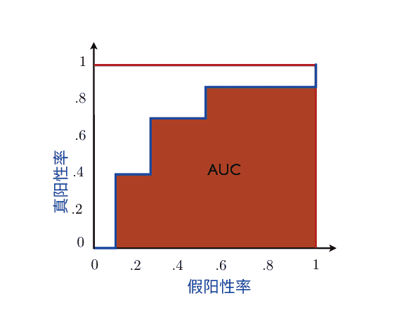

函数 \(F_{\text{RankBoost}}\) 。一般来说， \(F_{\text{AdaBoost}}\) 不具有最小化器。然而，可以证明如果 \(\lim_{k\to\infty} F_{\text{AdaBoost}}(\boldsymbol{\alpha}_k) = \inf_{\boldsymbol{\alpha}} F_{\text{AdaBoost}}(\boldsymbol{\alpha})\) 对于某个序列 \((\boldsymbol{\alpha}_k)_{k\in\mathbb{N}}\) 成立，在使用常数基本假设和非线性可分数据集的相同假设下，有以下结论：

当 \(k\) 趋近于无穷大时， \(F_{\text{RankBoost}}(\boldsymbol{\alpha}_k) = \inf_{\boldsymbol{\alpha}} F_{\text{RankBoost}}(\boldsymbol{\alpha})\) 。

前面提到的AdaBoost和RankBoost之间的联系表明，AdaBoost也可以取得良好的排名性能。这通常是通过经验观察得出的，这个事实为将AdaBoost用作分类器和排名算法提供了有力支持。然而，RankBoost可能比AdaBoost更快地收敛并更快地实现良好的排名。

### 10.5.2 ROC曲线下的面积

一个二分排名算法的性能通常用受试者工作特征曲线（ROC曲线）下的面积或简称为曲线下面积（AUC）来报告。

设 \(U\) 为用于评估 \(h\) （或训练样本）性能的测试样本，其中包含 \(m\) 个正样本 \(z'_1, \dots, z'_m\) 和 \(n\) 个负样本 \(z_1, \dots, z_n\) 。对于 \(\mathcal{H}\) 中的任意 \(h\)， \(R(h, U)\) 表示 \(U\) 上的平均错排对数。那么， \(h\) 在样本 \(U\) 上的AUC恰好是 \(1-R(h, U)\)，即其在 \(U\) 上的平均错排准确率：

\[ \mathrm{AUC}(h, U) = \frac{1}{mn} \sum_{i=1}^{m} \sum_{j=1}^{n} \mathbf{1}_{h(z'_i) \geq h(z_j)} = \mathop{\mathbb{P}}\limits_{\substack{z\sim\mathcal{D}^-_U \ z'\sim\mathcal{D}^+_U}} [h(z') \geq h(z)]. \]

在这里， \(\mathcal{D}^+_U\) 表示正样本对应的经验分布， \(\mathcal{D}^-_U\) 表示负样本对应的经验分布。 \(\mathrm{AUC}(h, U)\) 因此，它是基于样本U的成对排名准确性的经验估计，根据定义它在[0, 1]之间。较高的AUC值对应更好的排名性能。特别地，AUC为一表示使用 h完美地对 U的点进行了排序。可以从包含 m+n个元素 h(z'_i)和 h(z_j)的排序数组中线性时间计算AUC(h, U)，其中 i ∈ [m]且 j ∈ [n]。

假设数组按递增顺序排序（如果它们具有相同的分数，则正分数放在负分数之上），则正确排序的配对总数 r可以如下计算。从 r= 0开始，按索引递增的顺序检查数组，同时在任何时候保持负点数的数量 n，并在找到正点数时将 r的当前值增加 n。在完全检查数组之后，AUC由 r/(mn)给出。因此，假设使用基于比较的排序算法，计算AUC的复杂度为 O((m+n) log(m+n))。

正如其名称所示，AUC与ROC曲线下的面积重合（图10.3）。ROC曲线绘制了真正例率，即正确预测为正的正点数的百分比，作为假正例率的函数，即错误预测为正的负点数的百分比。

图10.4展示了ROC曲线的定义和构建过程。通过改变阈值 θ，在图10.4的右侧面板中，从较高的值到较低的值，沿曲线生成点。阈值用于根据 sgn(h(x) - θ) 确定任意点x（正或负）的标签。

在一个极端情况下，所有点都被预测为负；因此，假正例率为零，但真正例率也为零。这给出了绘图的第一个点 (0,0)。在另一个极端情况下，所有点都被预测为正；因此，真正例率和假正例率都等于一，这给出了点 (1,1)。在理想情况下，正如已经讨论过的，AUC值为一，并且除了 (0,0) 之外，曲线与水平线重合，达到 (1,1)。

## 10.6 偏好设置

本节将讨论学习排序问题的不同设置：基于偏好的设置。在这种设置下，目标是尽可能准确地对任何测试子集 X ⊆ X 进行排序，通常是一个有限集合，我们称之为有限查询子集。这与搜索引擎或信息提取系统的基于查询的情景非常接近，术语来源于 X 可能是需要根据特定查询进行排序的项目集合。与基于分数的设置相比，这种设置的优势在于学习算法不需要返回 X 的所有点的线性排序，这可能根据一般可能是非传递的成对偏好标签无法完美实现。为查询子集提供正确的线性排序更有可能完全实现，或者至少以更好的近似程度实现。

基于偏好的设置包括两个阶段。在第一个阶段，使用一个样本标记对 S，与基于分数的设置完全相同，用于学习一个偏好函数 h : X × X → [0,1]，即一个将较高的值分配给一对 (u, v) 当 u被优先于 v或被排在 v之上时，并在相反情况下分配较小的值。这个偏好函数可以作为一个标准分类算法在 S上训练的输出获得。与基于分数的设置相比，一个关键的区别是，一般来说，偏好函数 h 不需要引导出一个线性排序。它引导出的关系可能是非传递的；因此，我们可能会有，例如，h(u, v) = h(v, w) = h(w, u) = 1 对于三个不同的点 u，v和 w。

在第二阶段，给定一个查询子集 X ⊆ X，偏好函数 h 被用来确定 X 的排序。如何使用 h 生成准确的排序？这将是本节的主要重点。确定排序的算法的计算复杂度也是关键。在这里，我们将以调用 h 的次数来衡量其运行时间复杂度。

当偏好函数作为二元分类算法的输出时，基于偏好的设置可以看作是将排序降低到分类的一种减少：第二阶段指定了如何从分类器的输出中获得排序。

### 10.6.1 第二阶段排名问题

第二阶段的排序问题可以建模如下。我们假设给定一个偏好函数 h。从这个阶段的角度来看，h的确定方式并不重要，它可以被视为一个黑盒子。正如已经讨论过的，h不被假设为传递的。但是，我们将假设它是成对一致的，即 h(u, v) + h(v, u) = 1，对于所有的u, v ∈ X。

设 $\mathcal{D}$ 是一个未知的分布，根据该分布绘制出 $(X, \sigma^*)$ 对其中 $X \subseteq X$ 是一个查询子集，$\sigma^*$ 是一个目标排名或排列 $X$ 的双射函数，即，从 $X$ 到 $\{1, \ldots, |X|\}$ 的双射函数。因此，我们考虑一个随机情景，$\sigma^*$ 是一个随机变量。第二阶段算法的目标是使用偏好函数 $h$ 来返回准确的排名 $\mathcal{A}(X)$ 对于任何查询子集 $X$。该算法可以是确定性的，这种情况下 $\mathcal{A}(X)$ 从 $X$ 唯一确定，也可以是随机的，这种情况下我们用 $s$ 表示它可能依赖于的随机化种子。

L(\sigma, \sigma^*) = \frac{2}{n(n-1)} \sum_{u=v} 1_{\sigma(u)<\sigma(v)} 1_{\sigma^*(v)<\sigma^*(u)},

其中求和遍历所有对 $(u, v)$，其中 $u$ 和 $v$ 是 $X$ 的不同元素。以下所述的所有结果适用于稍后描述的更广泛的损失函数。滥用符号，我们还定义了偏好函数 $h$ 相对于集合 $X$ of $n \ge 1$ 个元素的排名 $\sigma^*$ 的损失为 $L(h, \sigma^*) =$

\frac{2}{n(n-1)} \sum_{u=v} h(u, v) 1_{\sigma^*(v)<\sigma^*(u)}.

对于确定性算法 $\mathcal{A}$ 的期望损失是 $\mathbb{E}_{(X,\sigma^*)\sim\mathcal{D}}[L(\mathcal{A}(X), \sigma^*)]$。算法 $\mathcal{A}$ 的遗憾定义为其损失与最佳固定全局排名的差异。这可以写成如下形式：$\text{Reg}(\mathcal{A}) =$

\mathbb{E}_{(X,\sigma^*)\sim\mathcal{D}}[L(\mathcal{A}(X), \sigma^*)] - \min_{\sigma'} \mathbb{E}_{(X,\sigma^*)\sim\mathcal{D}}[L(\sigma'|_X, \sigma^*)],

其中 $\sigma'|_X$ 表示全局排名 $\sigma'$ 对 $X$ 引起的排名。同样地，我们定义偏好函数的遗憾如下 $\text{Reg}(h) =$

\mathbb{E}_{(X,\sigma^*)\sim\mathcal{D}}[L(h|_X, \sigma^*)] - \min_{h'} \mathbb{E}_{(X,\sigma^*)\sim\mathcal{D}}[L(h'|_X, \sigma^*)],

其中 $h|_X$ 表示 $h$ 在 $X \times X$ 上的限制，$h'$ 类似。本节介绍的遗憾结果假设以下两两独立的无关替代属性：

\mathbb{E}_{\sigma^*|X_1}[1_{\sigma^*(v)<\sigma^*(u)}] = \mathbb{E}_{\sigma^*|X_2}[1_{\sigma^*(v)<\sigma^*(u)}],

对于任意的$u, v \in X$和任意包含$u$和$v$的两个集合$X_1$和$X_2$，其中$\sigma^*|X$表示在$X$条件下的随机变量$\sigma^*$。$^{18}$类似的遗憾定义可以针对随机算法给出，还可以对$s$进行期望。显然，第二阶段算法输出的排名质量与偏好函数$h$的质量密切相关。在接下来的章节中，我们讨论了一种确定性和一种随机的第二阶段算法，其遗憾可以用偏好函数的遗憾来上界。

### 10.6.2 确定性算法

第二阶段的自然确定性算法基于按度数排序的算法. 这包括根据偏好函数$h$对$X$的每个元素进行排名，该函数根据其他元素的数量来确定其偏好顺序. 让$\mathcal{A}$按度数排序的算法表示这个算法. 在二分图设置中，可以证明以下界限适用于该算法及其遗憾的期望损失:

\mathbb{E}_{X,\sigma^*}\left[L(\mathcal{A}_{\text{按度数排序}}(X), \sigma^*)\right] \leq 2 \mathbb{E}_{X,\sigma^*}\left[L(h, \sigma^*)\right] \quad (10.30)

\text{Reg}(\mathcal{A}_{\text{按度数排序}}(X)) \leq 2 \text{Reg}(h). \quad (10.31)

这些结果表明，当偏好函数$h$的损失或遗憾较小时，按度数排序算法可以实现准确的排名。它们还通过分类损失或遗憾来限制算法的排名损失或遗憾，这可以被视为使用按度数排序算法将排名减少到分类的保证。

然而，在某些情况下，由于存在两倍的因素，这些结果给出的保证是薄弱或无信息的。考虑一个错误率仅为25%的二元分类器$h$，在许多应用中这是相当合理的。假设贝叶斯误差在分类问题中接近于零，并且对于排名问题，遗憾和损失近似相等。然后，使用(10.30)中的界限保证了排名算法的最坏情况下的最大错误率不超过50%，这是随机排名的最大错误率。

更一般地说，它们在不使用该假设的情况下成立，使用以下较弱的遗憾概念:

\text{Reg}'(\mathcal{A}) = \mathbb{E}_{(X,\sigma^*)\sim\mathcal{D}}\left[L(\mathcal{A}(X), \sigma^*)\right] - \mathbb{E}_{X}\left[\min_{\sigma'} \mathbb{E}_{\sigma^*|X}\left[L(\sigma', \sigma^*)\right]\right] \quad (10.28)

\text{Reg}'(h) = \mathbb{E}_{(X,\sigma^*)\sim\mathcal{D}}\left[L(h|_{X}, \sigma^*)\right] - \mathbb{E}_{X}\left[\min_{h'} \mathbb{E}_{\sigma^*|X}\left[L(h', \sigma^*)\right]\right], \quad (10.29)

其中 $\sigma'$ 表示 $X$ 的排名，$h'$ 是定义在 $X \times X$ 上的偏好函数。

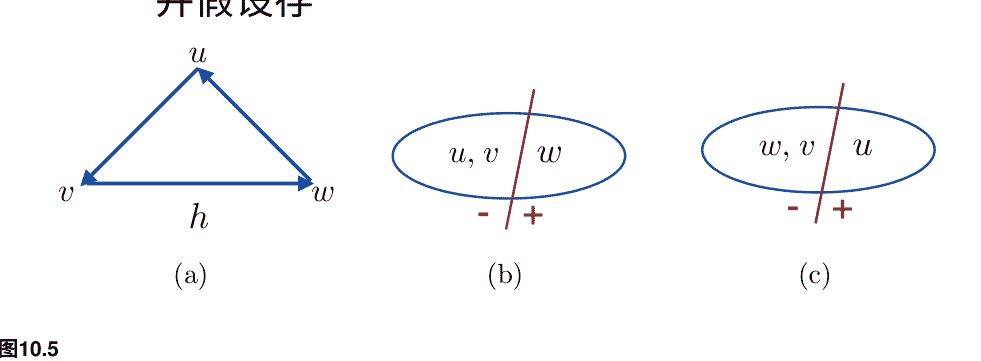

图10.5 定理10.5证明的示意图。

此外，算法的运行时间复杂度是二次的，即在查询集合X中的每对(u, v)都需要调用偏好函数，因此时间复杂度为Ω(| X |^2)。

正如下面的定理所示，没有确定性算法能够改进排序算法中的遗憾保证的两倍因子。

> **定理10.5 (确定性算法的下界)** 对于任何确定性算法 A，存在一个二分图分布，使得

$$
\text{Reg}(\mathcal{A}) \geq 2 \text{Reg}(h).
$$
(10.32)

证明：考虑简单情况，其中 X = {u, v, w}，并且偏好函数引起一个如图10.5a所示的循环。从 u 到 v 的箭头表示根据 h，v 优于 u。该证明基于对目标 σ* 的对抗性选择。

不失一般性，A 要么返回排序 u, v, w (图10.5b)，要么返回排序 w, v, u (图10.5c)。在第一种情况下，让 σ* 由图中所示的标签定义。在这种情况下，我们有 L(h, σ*) = 1/3，因为根据 h，u 优于 w，而 w 被正标记，u 被负标记。算法的损失为 L(A, σ*) = 2/3，因为算法将 u 和 v 都排在正标记的 w 之上。类似地，在第二种情况下，σ* 可以如图10.5c中所示定义，我们再次发现 L(h, σ*) = 1/3，L(A, σ*) = 2/3。证明结束。

该定理表明，为了获得更好的保证，随机化是必要的。在下一节中，我们将介绍一种随机化算法，它既具有更好的保证，又具有更好的时间复杂度。

### 10.6.3 随机算法

本节描述的算法的一般思想是在第二阶段使用随机化的快速排序算法的直接扩展。与标准版本的快速排序不同，在这里比较函数是基于偏好函数的，而偏好函数通常不是传递的。

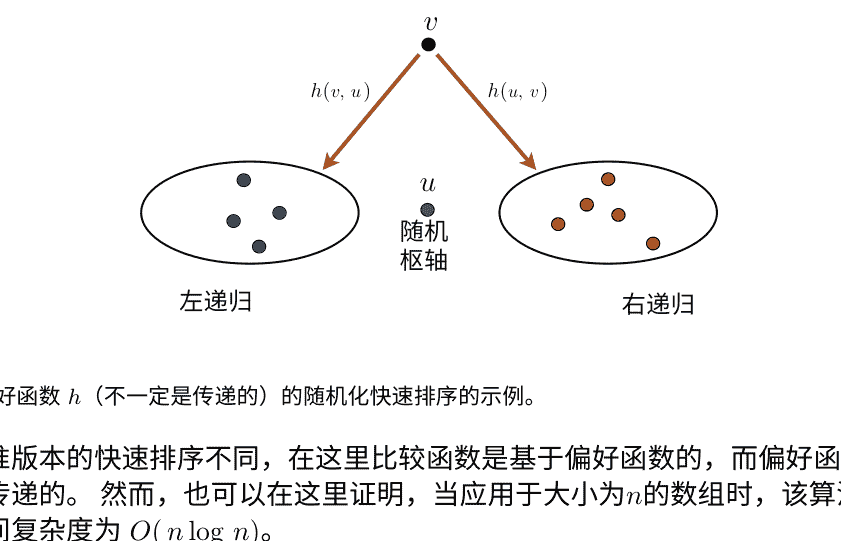

与标准版本的快速排序不同，在这里比较函数是基于偏好函数的，而偏好函数通常不是传递的。然而，也可以在这里证明，当应用于大小为 n 的数组时，该算法的期望时间复杂度为 O(n log n)。

该算法的工作原理如下，如图10.6所示。在每个递归步骤中，从 X 中均匀随机选择一个 u 作为枢轴元素。对于每个 v ≠ u，以概率 h(v, u) 将其放在 u 的左边，以剩余的概率将其放在右边。算法递归地处理位于 u 左侧的数组和位于其右侧的数组，并返回左递归返回的排列、 u 和右递归返回的排列的连接。

让 A_QuickSort 表示这个算法。在二分图设置中，可以证明以下保证：

$$\mathbb{E}_{X, \sigma^*, s}[L(A_{\text{QuickSort}}(X, s), \sigma^*)] = \mathbb{E}_{X, \sigma^*}[L(h, \sigma^*)]$$

$$\text{Reg}(A_{\text{QuickSort}}) \le \text{Reg}(h)$$

因此，在这里，确定性情况下的界限因子已经消失，这是更有利的。此外，损失的保证是一个等式。此外，算法的预期时间复杂度仅为 O(n log n)，如果只需要排名前 k 个项目，如许多应用程序中，时间复杂度降低为 O(n + k log k)。

对于QuickSort算法，在一般排名设置（不一定是二分图设置）的情况下，也可以证明以下保证：

$$\mathbb{E}_{X, \sigma^*, s}[L(A_{\text{快速排序}}(X, s), \sigma^*)] \le 2 \mathbb{E}_{X, \sigma^*}[L(h, \sigma^*)]$$

## 10.6.4 对其他损失函数的扩展

刚刚介绍的所有结果都适用于更广泛的损失函数 $L_{\omega}$，该函数是根据权重函数或强调函数 $\omega$ 定义的。$L_{\omega}$ 类似于 (10.23)，但是它衡量了排名 $\sigma$ 和期望排名 $\sigma^{*}$ 之间的加权不一致性，其中排名是基于元素集合 $X$ 的，该集合包含了至少 $n \ge 1$ 个元素，计算方式如下：

$$ L_{\omega}(\sigma, \sigma^{*}) = \frac{2}{n(n-1)} \sum_{u \neq v} \omega(\sigma^{*}(v), \sigma^{*}(u)) \mathbb{1}_{\sigma(u) < \sigma(v)} \mathbb{1}_{\sigma^{*}(v) < \sigma^{*}(u)}, \tag{10.36} $$

其中求和运行于所有对 $(u, v)$ 上，其中 $u$ 和 $v$ 是 $X$ 的不同元素，并且其中 $\omega$ 是一个具有下述性质的对称函数。因此，损失函数计算了 $\sigma$ 相对于 $\sigma^{*}$ 的错位对数，每个错位都加权重 $\omega$。函数 $\omega$ 被假设满足以下三个自然公理：

-   **对称性**：对于所有的 $i, j$， $\omega(i, j) = \omega(j, i)$；
-   **单调性**：如果 $i < j < k$ 或 $i > j > k$，那么 $\omega(i, j) \le \omega(i, k)$；
-   **三角不等式**：$\omega(i, j) \le \omega(i, k) + \omega(k, j)$。

对于最后一个性质的动机来自于以下观点：如果正确地对位置 $(i, k)$ 和 $(k, j)$ 中的项目进行排序并不重要，那么对于位置 $(i, j)$ 中的项目也应该是如此。

使用不同的函数 $\omega$，函数族 $L_{\omega}$ 可以涵盖几个熟悉且重要的损失。以下是一些例子。设置 $\omega(i, j) = 1$，对于所有 $i \neq j$ 得到无权重的成对错位度量。对于固定的整数 $k \ge 1$，函数 $\omega$ 定义为 $\omega(i, j) = \mathbb{1}_{((i \le k) \lor (j \le k)) \land (i \neq j)}$ 对于所有 $(i, j)$ 可以用来强调前 $k$ 个元素的排序。对于至少有一个元素排在前 $k$ 的成对错位，会受到这个函数的惩罚。这在信息提取或搜索引擎等应用中可能很有意义，其中前 $k$ 个文档的排序更重要。对于这个强调函数，所有排在 $k$ 以下的元素都处于并列状态。任何并列关系都可以使用 $\omega$ 来编码。

最后，在一个二分排名场景中，有 $m^{+}$ 个正分和 $m^{-}$ 个负分且 $m^{+} + m^{-} = n$，选择 $\omega(i, j) = \frac{n(n-1)}{2m^{-}m^{+}}$ 产生标准损失函数与 $1-\text{AUC}$ 相一致。

## 10.7 其他排名标准

在本章讨论的排名问题中，目标函数都基于成对误排。在信息检索中引入了其他排名准则，并用于推导替代排名算法。在这里，我们简要介绍其中几个准则。

-   **精确度，精确度@n，平均精确度，召回率**。所有这些准则都假设点被分为两类（正例和负例），就像在二分排名设置中一样。精确度是正预测点中实际为正的比例。而精确度考虑了所有正预测，精确度@n只考虑前 $n$ 个预测。例如，精确度@5只考虑前5个正预测点。平均精确度涉及计算每个 $n$ 值的精确度@ $n$，并对这些值求平均。每个精度@$n$ 计算可以解释为计算在固定的召回率下的精度，或者是被预测为正的正样本的比例（召回率与真正例率的概念相符）。

-   **DCG，NDCG**。这些准则假设与要排序的点相关联的相关性得分存在，例如，给定一个网络搜索查询，搜索引擎返回的每个网站都有一个相关性得分。此外，这些准则衡量了具有较大相关性得分的点在排序的开始处或附近出现的程度。定义 $(c_i)_{i \in \mathbb{N}}$ 为预定义的非递增和非负的折扣因子序列，例如， $c_i = \log(i)^{-1}$。然后，给定一个排名为 $m$ 的点，并定义 $r_i$ 为该排名中第 $i$ 个点的相关性得分，折扣累积增益 (DCG) 定义为 $\text{DCG} = \sum_{i=1}^{m} c_i r_i$。注意，DCG是 $m$ 的一个递增函数。相比之下，归一化折扣累积增益 (NDCG) 通过将 DCG 除以 IDCG（或者从最优排序中得到的理想 DCG）来对 DCG 在 $m$ 的不同取值上进行归一化。

## 10.8 章节笔记

学习排名问题与纯粹的算法排名问题是不同的，正如 Dwork、Kumar、Naor 和 Sivakumar [2001] 所示，即使对于 $k = 4$ 个排名，它也是 NP 难的。定理 10.1 和推论 6.13 给出了基于 Rademacher 复杂度和基于边界的成对排名的泛化界是新颖的。基于覆盖数的边界也由 Rudin、Cortes、Mohri 和 Schapire [2005] 给出。在排名的基于分数的设置中，包括 VC 维和基于稳定性的学习界限，已经由 Agarwal 和 Niyogi [2005]，Agarwal 等人 [2005] 和 Cortes 等人 [2007b] 给出。

基于 SVM 的排名算法在第 10.3 节中介绍，并被多位研究人员使用和讨论。关于其使用的早期和具体讨论可以在 Joachims [2002] 中找到。该算法仅仅是 SVM 的一个特殊实例，这一事实在文献中似乎没有明确说明。这里对其在排名中使用的理论证明是新颖的。

RankBoost 是由 Freund 等人引入的 [2003]。这里介绍的算法版本是 Rudin 等人的坐标下降 RankBoost [2005]。一般来说，RankBoost 不能达到最大边界，并且可能不会在每次迭代中增加边界。基于 RankBoost 目标函数的修改版本，Rudin 等人提出了一种平滑边界排序算法 [2005]，可以证明它在每次迭代中增加平滑边界，但尚未报道与 RankBoost 的实证性能比较。有关 AdaBoost 的经验排序质量以及 AdaBoost 与 RankBoost 在双分图设置中的联系，请参见 Cortes 和 Mohri [2003] 以及 Rudin 等人 [2005]。

接收器操作特性（ROC）曲线最初是在信号检测理论 [Egan, 1975] 中开发的，与二战期间的无线电信号有关。它们还在心理物理学 [Green 和 Swets, 1966] 中有应用，并且自那时以来在各种其他应用中广泛使用，特别是用于医疗决策。ROC 曲线下的面积（AUC）等同于 Wilcoxon-Mann-Whitney 统计量 [Hanley 和 McNeil, 1982]，与 Gini 指数 [Breiman 等人, 1984] 密切相关（另见第 9 章）。有关 AUC 的统计分析以及与错误率相关的置信区间，请参见 Cortes 和 Mohri [2003, 2005]。本章讨论的基于偏好的确定性算法由 Balcan 等人 [2008] 提出和分析。随机算法以及第 10.6 节中介绍的大部分结果归功于 Ailon 和 Mohri [2008]。

一些作者 [McCullagh, 1980, McCullagh and Nelder, 1983, Herbrich et al., 2000] 研究了与序数回归相关的问题，其中包括预测有限集合中每个项目的正确标签，就像多类分类一样，还假设标签之间存在顺序。然而，这个问题与本章讨论的成对排名问题是不同的。

DCG 排名准则由 Järvelin 和 Kekäläinen [2000] 引入，并在许多后续研究中使用和讨论，特别是 Cossock 和 Zhang [2008] 考虑了一个以 DCG 为基础的子集排名问题，并考虑了一个基于回归的解决方案。

## 10.9 练习

**10.1 排名的统一边界。** 使用定理 10.1 推导出一个基于边界的排名学习边界，对于所有 $\rho>0$ 都成立（参见定理 5.9 和练习 5.2 中类似的二元分类边界）。

**10.2 在线排名。** 给出一个在线版本的基于 SVM 的排名算法，在第 10.3 节中介绍。

**10.3 RankBoost 的经验边际损失。** 推导出 RankBoost 的经验成对排名边际损失的上界，类似于定理 7.7 对于 AdaBoost 的情况。

**10.4 边际最大化和 RankBoost。** 给出一个例子，显示 RankBoost 不能达到最大边际，就像 AdaBoost 的情况一样。

**10.5 RankPerceptron。** 根据线性评分函数，改编感知机算法以推导出一种成对排名算法。假设训练样本对于成对排名是线性可分的。给出算法在排名边际方面所做的更新次数的上界。

**10.6 边际最大化排名。** 给出一个线性规划（LP）算法，根据边际最大化返回成对排名的线性假设。

**10.7 二分排名。** 假设我们在二分设置中使用二元分类器进行排名。证明如果二元分类器的错误率为 $\epsilon$，则其引起的排名错误率也最多为 $\epsilon$。证明反过来并不成立。

**10.8 多部分排序。** 考虑在一个 $k$ 部分设置中的排序场景，其中 $X$ 被划分为 $k$ 个子集 $X_1, \ldots, X_k$，其中 $k \ge 1$。二部分情况（$k=2$）已经在本章中具体讨论过。用 $k$ 分布的术语给出问题的精确表述。在这种情况下，RankBoost 是否允许高效实现？给出算法的伪代码。

**10.9 AUC 的偏边界。** 设 $h$ 是用于对 $X$ 的点进行排序的固定评分函数。使用 Hoeffding 的界限来证明，对于有限样本，$h$ 的 AUC 接近其平均值的概率很高。

**10.10 $k$ 部分权重函数。** 展示如何定义权重函数 $\omega$，使得 $L_\omega$ 编码与 $k$ 部分排序场景相关的自然损失函数。

## 11 回归

本章深入讨论了回归学习问题，该问题包括使用数据尽可能准确地预测点或物品的真实标签。回归是机器学习中常见的任务，具有各种应用，这正好解释了我们专门为其分析保留的特定章节。

前几节介绍的学习保证主要集中在分类问题上。在这里，我们提出了回归问题的泛化界限，包括有限和无限假设集。其中一些学习界限基于熟悉的 Rademacher 复杂性概念，该概念对于表征回归假设集的复杂性也很有用。其他学习界限基于适用于回归的组合复杂性概念，我们将介绍伪维度，它可以看作是将 VC 维度扩展到回归的一种方法。我们描述了一种将回归问题转化为分类问题并基于伪维度概念推导出泛化界限的通用技术。我们介绍和分析了几种回归算法，包括线性回归、核岭回归、支持向量回归、Lasso 以及这些算法的几个在线版本。我们详细讨论了这些算法的特性，包括相应的学习保证。

## 11.1 回归问题

我们首先介绍回归学习问题。设 $\mathcal{X}$ 表示输入空间，$\mathcal{Y}$ 表示 $\mathbb{R}$ 的可测子集。在这里，我们将采用随机场场景，并且将 $\mathcal{D}$ 表示为 $\mathcal{X} \times \mathcal{Y}$ 上的分布。如第 2.4.1 节所讨论的，确定性场景是一个直接的特殊情况，其中输入点接受一个由目标函数 $f: \mathcal{X} \to \mathcal{Y}$ 确定的唯一标签。

与所有监督学习问题一样，学习者接收到一个带标签的样本 $S = ((x_1, y_1), \ldots, (x_m, y_m)) \in (\mathcal{X} \times \mathcal{Y})^m$，根据 $\mathcal{D}$ 独立同分布地绘制。由于标签是实数，希望学习者能够准确预测正确标签是不合理的。相反，我们可以要求其预测接近正确的预测。这是回归和分类之间的关键区别：在回归中，错误的度量基于预测的实值标签与真实或正确标签之间的差异的大小，而不是基于这两个值的相等或不等。我们用 $L: \mathcal{Y} \times \mathcal{Y} \rightarrow \mathbb{R}_+$ 表示用于测量错误大小的损失函数。回归中最常用的损失函数是平方损失 $L_2$，定义为 $L(y, y') = |y' - y|^2$，对于所有的 $y, y' \in \mathcal{Y}$，或者更一般地，一个 $L_p$ 损失，定义为 $L(y, y') = |y' - y|^p$，对于某个 $p \geq 1$ 和所有的 $y, y' \in \mathcal{Y}$。给定一个将 $\mathcal{X}$ 映射到 $\mathcal{Y}$ 的函数假设集 $\mathcal{H}$，回归问题包括使用带标签的样本 $S$ 找到一个假设 $h \in \mathcal{H}$，使得期望损失或泛化误差 $R(h)$ 相对于目标 $f$ 最小。

$$R(h) = \mathbb{E}_{(x,y)\sim\mathcal{D}} \left[ L(h(x), y) \right] \quad (11.1)$$

就像在之前的章节中一样，$h \in \mathcal{H}$ 的经验损失或错误由 $R_S(h)$ 表示，并且由下式给出：

$$R_S(h) = \frac{1}{m} \sum_{i=1}^m L(h(x_i), y_i) \quad (11.2)$$

在常见情况下，当损失函数 $L$ 为平方损失时，这表示样本 $S$ 上的均方误差。

当损失函数 $L$ 被某个 $M > 0$ 所界定时，即对于所有的 $y, y' \in \mathcal{Y}$ 或者更严格地说，对于所有的 $h \in \mathcal{H}$ 和 $(x, y) \in \mathcal{X} \times \mathcal{Y}$，问题被称为有界回归问题。以下章节中的许多理论结果都基于这个假设。无界回归问题的分析在技术上更加复杂，通常需要一些其他类型的假设。

## 11.2 泛化界限

本节介绍有界回归问题的学习保证。我们从有限假设集的简单情况开始。

### 11.2.1 有限假设集

对于有限假设，我们可以通过 Hoeffding 不等式和并集边界的简单应用推导出回归的泛化界。

**定理 11.1** 设 $L$ 为有界损失函数。假设假设集 $\mathcal{H}$ 是有限的。那么，对于任意 $\delta > 0$，至少以概率 $1 - \delta$，以下不等式成立对于所有的 $h \in \mathcal{H}$：

$$R(h) \leq R_S(h) + M \sqrt{\frac{\log |\mathcal{H}| + \log \frac{1}{\delta}}{2m}}.$$

**证明：** 根据 Hoeffding 不等式，由于 $L$ 取值范围在 $[0, M]$ 之间，对于任意的 $h \in \mathcal{H}$，以下成立：

$$\mathbb{P} \left[ R(h) - R_S(h) > \epsilon \right] \leq e^{-\frac{2m\epsilon^2}{M^2}}.$$

因此，通过联合边界，我们可以写成

$$\mathbb{P} \left[ \exists h \in \mathcal{H}: R(h) - R_S(h) > \epsilon \right] \leq \sum_{h \in \mathcal{H}} \mathbb{P} \left[ R(h) - R_S(h) > \epsilon \right] \leq |\mathcal{H}| e^{-\frac{2m\epsilon^2}{M^2}}.$$

将右侧设置为 $\delta$ 等于定理的陈述。 $\square$

在相同的假设和相同的证明下，可以得到双边界：至少以概率 $1 - \delta$，对于所有 $h \in \mathcal{H}$，

$$|R(h) - R_S(h)| \leq M \sqrt{\frac{\log |\mathcal{H}| + \log \frac{2}{\delta}}{2m}}.$$

这些学习界限与分类推导的界限类似。实际上，当 $M= 1$ 时，它们与不一致情况下给出的分类界限相符。因此，在这个背景下所做的所有评论在这里同样适用。特别地，更大的样本大小 $m$ 保证更好的泛化；界限随着 $\log |\mathcal{H}|$ 的函数增加，并建议在相同的经验误差下选择一个较小的假设集。这是回归问题中奥卡姆剃刀原理的一个实例。在接下来的章节中，我们将使用 Rademacher 复杂度和伪维度的概念，为无限假设集的一般情况提供其他实例。

### 11.2.2 Rademacher 复杂度界限

在这里，我们展示了定理 3.3 的 Rademacher 复杂度界限如何用于推导出在 $L_p$ 损失函数族的回归问题的泛化界限。我们首先展示了一个相关函数族的 Rademacher 复杂度的上界。

**命题 11.2 ($\mu$-Lipschitz 损失函数的 Rademacher 复杂度)** 设 $L: \mathcal{Y} \times \mathcal{Y} \rightarrow \mathbb{R}$ 是一个非负的损失函数，上界为 $M > 0$ (对于所有的 $y, y' \in \mathcal{Y}$，有 $L (y, y') \leq M$) 并且对于任意固定的 $y' \in \mathcal{Y}$，$y \rightarrow L(y, y')$ 是 $\mu$-Lipschitz 的，其中 $\mu > 0$。那么，对于任意样本 $S= ((x_1, y_1), \ldots,(x_m, y_m))$，家族 $\mathcal{G} = \{(x, y) \rightarrow L(h(x), y) : h \in \mathcal{H}\}$ 的 Rademacher 复杂度有如下上界：

$$\mathfrak{R}_S(\mathcal{G}) \leq \mu \mathfrak{R}_S(\mathcal{H})。$$

**证明：** 由于对于任意固定的 $y_i$，$y \rightarrow L(y, y_i)$ 是 $\mu$-Lipschitz 的，根据 Talagrand 的收缩引理（引理 5.7），我们可以写成

$$\mathfrak{R}_S(\mathcal{G}) = \frac{1}{m} \mathbb{E}_{\sigma} \left[ \sum_{i=1}^{m} \sigma_i L(h(x_i), y_i) \right] \leq \frac{1}{m} \mathbb{E}_{\sigma} \left[ \sum_{i=1}^{m} \sigma_i \mu h(x_i) \right] = \mu \mathfrak{R}_S(\mathcal{H}),$$

这完成了证明。 $\square$

**定理 11.3 (Rademacher 复杂度回归界)**

设 $L: \mathcal{Y} \times \mathcal{Y} \rightarrow \mathbb{R}$ 为一个非负损失，上界为 $M > 0$ ($L(y, y') \leq M$ 对于所有的 $y, y' \in \mathcal{Y}$) 且满足对于任意固定的 $y' \in \mathcal{Y}$，$y \rightarrow L(y, y')$ 是 $\mu$-Lipschitz 的，其中 $\mu > 0$。

$$\mathbb{E}_{(x,y)\sim\mathcal{D}} \left[ L(h(x), y) \right] \leq \frac{1}{m} \sum_{i=1}^{m} L(h(x_i), y_i) + 2\mu \mathfrak{R}_m(\mathcal{H}) + M \sqrt{\frac{\log \frac{1}{\delta}}{2m}}$$

$$\mathbb{E}_{(x,y)\sim\mathcal{D}} \left[ L(h(x), y) \right] \leq \frac{1}{m} \sum_{i=1}^{m} L(h(x_i), y_i) + 2\mu \mathfrak{R}_S(\mathcal{H}) + 3M \sqrt{\frac{\log \frac{2}{\delta}}{2m}}.$$

**证明：** 由于对于任意固定的 $y_i$，$y \rightarrow L(y, y_i)$ 是 $\mu$-Lipschitz 的，根据 Talagrand 的收缩引理（引理 5.7），我们可以写成

$$\mathfrak{R}_S(\mathcal{G}) = \frac{1}{m} \mathbb{E}_{\sigma} \left[ \sum_{i=1}^{m} \sigma_i L(h(x_i), y_i) \right] \leq \frac{1}{m} \mathbb{E}_{\sigma} \left[ \sum_{i=1}^{m} \sigma_i \mu h(x_i) \right] = \mu \mathfrak{R}_S(\mathcal{H}).$$

将这个不等式与定理 3.3 的一般 Rademacher 复杂性学习界限相结合，完成证明。 $\square$

假设 $p \geq 1$，并且对于所有的 $(x, y) \in \mathcal{X} \times \mathcal{Y}$ 和 $h \in \mathcal{H}$，有 $|h(x) - y| \leq M$。那么，由于对于任意的 $y'$，函数 $y \rightarrow |y - y'|^p$ 是 $p M^{p-1}$-Lipschitz，其中 $(y - y') \in [-M, M]$，该定理适用于任何 $L_p$ 损失。例如，对于任意的 $\delta > 0$，以至少 $1 - \delta$ 的概率，在大小为 $m$ 的样本 $S$ 上，对于所有的 $h \in \mathcal{H}$，以下不等式都成立：

$$\mathbb{E}_{(x,y)\sim\mathcal{D}} \left[ |h(x) - y|^p \right] \leq \frac{1}{m} \sum_{i=1}^{m} |h(x_i) - y_i|^p + 2p M^{p-1} \mathfrak{R}_m(\mathcal{H}) + M^p \sqrt{\frac{\log \frac{1}{\delta}}{2m}}.$$

就像分类的情况一样，这些泛化界限表明了在减少经验误差（可能需要更复杂的假设集）和控制 $\mathcal{H}$ 的 Rademacher 复杂度（可能增加经验误差）之间的权衡。定理的最后一个学习界限的一个重要好处是它是数据相关的。这可以导致更准确的学习保证。对于基于核的假设（定理 6.12），可以直接使用 $\mathfrak{R}_m(\mathcal{H})$ 或 $\mathfrak{R}_S(\mathcal{H})$ 的上界来推导出以核矩阵的迹或最大对角线元素为基础的泛化界限。

## 11.2.3 伪维度界限

正如在分类案例中讨论的那样，有时候估计假设集的经验Rademacher复杂度是计算上困难的。在第3章中，我们引入了其他衡量假设集复杂度的指标，如VC维度，这些指标纯粹是组合的，通常更容易计算或上界。然而，破碎或VC维度的概念在二元分类中引入的并不适用于实值假设类。

我们首先引入了一种适用于实值函数族的新破碎概念。与前几章一样，我们将使用符号 $\mathfrak{G}$ 表示函数族，当我们打算稍后解释它时（至少在某些情况下），它可以被解释为与某个假设集 $H$ 相关联的损失函数族 $\mathfrak{G} = \{z= (x, y) \rightarrow L(h(x), y) : h \in H\}$。

> 定义 11.4 (破碎) 设 $\mathfrak{G}$ 是从集合 $Z$ 到 $\mathbb{R}$ 的函数族。如果存在 $t_1,...,t_m \in \mathbb{R}$ 使得集合 $\{z_1,...,z_m\} \subseteq X$ 被 $\mathfrak{G}$ 破碎，则称该集合被破碎。

$$
\left| \left\{ \left[ \begin{array}{c} \text{sgn} (g(z_1) - t_1) \\ \vdots \\ \text{sgn} (g(z_m) - t_m) \end{array} \right] : g \in \mathfrak{G} \right\} \right| = 2^m .
$$

当存在时，阈值 $t_1,...,t_m$ 被称为见证破碎。因此，对于一些见证 $t_1,...,t_m$，函数族 $\mathfrak{G}$ 足够丰富，可以包含一个函数超过集合 $A$ 的一个子集点集 $J = \{(z_i, t_i) : i \in [m]\}$ 并且低于其他点 ($J - A$)，对于任何选择的子集 $A$。图 11.1 在一个简单的情况下说明了这种破碎。破碎的概念自然地引出了以下定义。

图11.1 用证人 $t_1$ 和 $t_2$ 来说明一个包含两个点 $\{z_1, z_2\}$ 的破碎集合的示意图。

## 定义11.5 (伪维度) 设 $S$ 是从 $X$ 到 $\mathbb{R}$ 的函数族。那么，$S$ 的伪维度，记为 $\text{Pdim}(S)$，是被 $S$ 破碎的最大集合的大小。

根据刚刚介绍的破碎定义，伪维度的概念与相应的阈值函数映射 $X$ 到 $\{0,1\}$ 的 VC 维度相一致：$\text{Pdim}(S) = \text{VCdim}(\{(x, t) \rightarrow 1_{(g(x) - t) > 0} : g \in S\})$。图11.2说明了这个解释。考虑到这个解释，以下两个结果直接遵循 VC 维度的属性。

图11.2 一个函数 $g: z = (x, y) \rightarrow L(h(x), y)$ (蓝色) 被定义为某个固定假设 $h \in H$ 的损失以及它的阈值版本 $(x, y) \rightarrow 1_{L(h(x), y) > t}$ (红色) 相对于阈值 $t$ (黄色)

## 定理11.6 在 $\mathbb{R}^N$ 中超平面的伪维度由以下给出：

$$\mathrm{Pdim}(\{\mathbf{x} \rightarrow \mathbf{w} \cdot \mathbf{x} + b : \mathbf{w} \in \mathbb{R}^N, b \in \mathbb{R}\}) = N + 1.$$

## 定理11.7 伪维度是实值函数向量空间的维度 $H$ 等于向量空间的维度：

$$\mathrm{Pdim}(\mathcal{H}) = \dim(\mathcal{H}).$$

下面的定理给出了有界回归的广义界限，以伪维度为基础的损失函数族 $S = \{z = (x, y) \rightarrow L(h(x), y) : h \in H\}$ 与假设集 $H$ 相关联。推导这些界限的关键技术是通过利用随机变量 $X$ 的期望来将问题归约为分类问题，使用以下一般性恒等式：

$$\mathbb{E}[X] = -\int_{-\infty}^{0} \mathbb{P}[X < t] dt + \int_{0}^{+\infty} \mathbb{P}[X > t] dt. \tag{11.4}$$

这是根据勒贝格积分的定义成立的。特别地，对于任何分布 $\mathcal{D}$ 和任何非负可测函数 $f$，我们可以写成

> $$\mathbb{E}_{z \sim \mathcal{D}} [f(z)] = \int_0^\infty \mathbb{P}_{z \sim \mathcal{D}} [f(z) > t] dt.$$

## 定理 11.8

设 $\mathcal{H}$ 为一组实值函数， $\mathcal{G} = \{(x, y) \to L(h(x), y) : h \in \mathcal{H}\}$ 为与 $\mathcal{H}$ 相关的损失函数组。假设 $\text{Pdim}(\mathcal{G}) = d$ 且损失函数 $L$ 非负且有界，上界为 $M$。那么，对于任意 $\delta > 0$，从 $\mathcal{D}$ 中独立同分布地抽取大小为 $m$ 的样本 $S$，以至少 $1 - \delta$ 的概率，对于所有的 $h \in \mathcal{H}$，以下不等式成立:

> $$R(h) \leq R_S(h) + M \sqrt{\frac{2d \log \frac{em}{d}}{m}} + M \sqrt{\frac{\log \frac{1}{\delta}}{2m}}.$$

证明: 设 $S$ 为大小为 $m$ 的样本，根据 $\mathcal{D}$ 独立同分布地抽取， $\hat{\mathcal{D}}$ 表示由 $S$ 定义的经验分布。对于任意的 $h \in \mathcal{H}$ 和 $t \geq 0$，我们用 $c(h, t)$ 表示由 $c(h, t) : (x, y) \to 1_{L(h(x), y) > t}$ 定义的分类器。分类器 $c(h, t)$ 的错误可以通过以下方式定义: $R(c(h, t)) =$

> $$\mathbb{P}_{(x,y) \sim \mathcal{D}} [c(h, t)(x, y) = 1] = \mathbb{P}_{(x,y) \sim \mathcal{D}} [L(h(x), y) > t],$$

而且，类似地，它的经验误差是 $R_S(c(h, t)) = \mathbb{P}_{(x,y) \sim \hat{\mathcal{D}}}[L(h(x), y)> t]$。

现在，根据恒等式 (11.4) 和损失函数 $L$ 有界 by $M$，我们可以写成:

> $$|R(h) - R_S(h)| = \left| \mathbb{E}_{(x,y) \sim \mathcal{D}} [L(h(x), y)] - \mathbb{E}_{(x,y) \sim \hat{\mathcal{D}}}[L(h(x), y)] \right|$$
$$= \left| \int_0^M \left( \mathbb{P}_{(x,y) \sim \mathcal{D}} [L(h(x), y) > t] - \mathbb{P}_{(x,y) \sim \hat{\mathcal{D}}} [L(h(x), y) > t] \right) dt \right|$$
$$\leq M \sup_{t \in [0, M]} \left| \mathbb{P}_{(x,y) \sim \mathcal{D}} [L(h(x), y) > t] - \mathbb{P}_{(x,y) \sim \hat{\mathcal{D}}} [L(h(x), y) > t] \right|$$
$$= M \sup_{t \in [0, M]} \left| R(c(h, t)) - R_S(c(h, t)) \right|.$$

这意味着以下不等式:

> $$\mathbb{P} \left[ \sup_{h \in \mathcal{H}} |R(h) - R_S(h)| > \epsilon \right] \leq \mathbb{P} \left[ \sup_{\substack{h \in \mathcal{H} \\ t \in [0, M]}} |R(c(h, t)) - R_S(c(h, t))| > \frac{\epsilon}{M} \right].$$

右侧可以用标准分类的泛化界限（推论3.19）来限制，该界限与假设族的VC维度有关。

假设 $\{c(h, t) : h \in H, t \in [0, M]\}$，根据伪维度的定义，精确地说是 $\text{Pdim}(S) = d$。得到的界限与 (11.6) 相符。伪维度的概念适用于回归分析，正如前面的定理所示；然而，它不是一个与尺度相关的概念。存在一种替代的复杂度度量，即 fat-shattering dimension，它是与尺度相关的，并且可以看作是伪维度的自然扩展。

它的定义基于 $\gamma$-shattering 的概念。

**定义11.9 ($\gamma$-shattering)** 设 $S$ 为从 $X$ 到 $\mathbb{R}$ 的函数族，且 $\gamma > 0$。如果存在 $t_1, \ldots, t_m \in \mathbb{R}$，使得对于所有的 $y \in \{-1, +1\}^m$，存在 $g \in S$ 满足以下条件：，则集合 $\{z_1, \ldots, z_m\} \subseteq X$ 被称为 $\gamma$-shattered by $S$。

$$\forall i \in [m], y_i(g(z_i) - t_i) \geq \gamma.$$

因此，$\{z_1, \ldots, z_m\}$ 如果存在一些证人 $t_1, \ldots, t_m$，函数族 $S$ 足够丰富，至少包含一个函数在点集 $A$ 的上方至少 $\gamma$，并且在其他点集 ($I - A$) 的下方至少 $\gamma$，对于任意选择的子集 $A$。

**定义 11.10 ($\gamma$-维度)** $S$ 的 $\gamma$-维度 of $S$，$\text{fat}_\gamma(S)$，是被 $S$ $\gamma$-破碎的最大集合的大小。

通过 $\gamma$-胖维度可以得到比基于伪维度的更好的泛化界限。然而，由此得到的学习界限并不比基于 Rademacher 复杂度的界限更具信息量，后者也是一种尺度敏感的复杂度度量。因此，我们不会详细介绍基于 $\gamma$-胖维度的分析。

## 11.3 回归算法

前面几节的结果表明，对于相同的经验误差，基于Rademacher复杂度或伪维度的复杂度度量较小的假设集会获得更好的泛化保证。具有相对较小复杂度的函数族之一是线性假设。在本节中，我们描述和分析了几种基于该假设集的算法：线性回归、核岭回归（KRR）、支持向量回归（SVR）和Lasso。这些算法，特别是后三种，在实践中被广泛使用，并经常导致最先进的性能结果。

### 11.3.1 线性回归

我们从最简单的回归算法开始，即线性回归。设 $\Phi : \mathcal{X} \rightarrow \mathbb{R}^N$ 为从输入空间 $\mathcal{X}$ 到 $\mathbb{R}^N$ 的特征映射，并考虑线性假设的族

$$ \mathcal{H} = \{ x \rightarrow \mathbf{w} \cdot \Phi(x) + b: \mathbf{w} \in \mathbb{R}^N, b \in \mathbb{R} \}. \tag{11.7} $$

线性回归的目标是在 $\mathcal{H}$ 中寻找具有最小经验均方误差的假设。因此，对于一个样本 $S = \left( (x_1, y_1), \ldots, (x_m, y_m) \right) \in (\mathcal{X} \times \mathcal{Y})^m$, 对应的优化问题如下：

$$ \min_{\mathbf{w}, b} \frac{1}{m} \sum_{i=1}^{m} (\mathbf{w} \cdot \Phi(x_i) + b - y_i)^2. \tag{11.8} $$

图11.3展示了当 $N = 1$ 时的简单情况下的算法。优化问题可以简化为以下形式：

$$ \min_{\mathbf{W}} F(\mathbf{W}) = \frac{1}{m} \| \mathbf{X}^\top \mathbf{W} - \mathbf{Y} \|^2, \tag{11.9} $$

使用符号 $\mathbf{X} = \begin{bmatrix} \Phi(x_1) & \ldots & \Phi(x_m) \\ 1 & \ldots & 1 \end{bmatrix}$, $\mathbf{W} = \begin{bmatrix} w_1 \\ \vdots \\ w_N \\ b \end{bmatrix}$ 和 $\mathbf{Y} = \begin{bmatrix} y_1 \\ \vdots \\ y_m \end{bmatrix}$。目标函数 $F$ 是凸函数，通过凸函数 $\mathbf{u} \rightarrow \| \mathbf{u} \|^2$ 与线性函数 $\mathbf{W} \rightarrow \mathbf{X}^\top \mathbf{W} - \mathbf{Y}$ 的组合，它是可微的。因此，$F$ 在 $\mathbf{W}$ 处存在全局最小值，当且仅当 $\nabla F(\mathbf{W}) = 0$，即当且仅当

$$ 2m \mathbf{X} (\mathbf{X}^\top \mathbf{W} - \mathbf{Y}) = 0 \Leftrightarrow \mathbf{X} \mathbf{X}^\top \mathbf{W} = \mathbf{X} \mathbf{Y}. \tag{11.10} $$

当 $\mathbf{X} \mathbf{X}^\top$ 可逆时，这个方程有唯一解。否则，这个方程有一族解，可以用矩阵 $\mathbf{X} \mathbf{X}^\top$ 的伪逆（见附录A）表示为 $\mathbf{W} = (\mathbf{X} \mathbf{X}^\top)^\dagger \mathbf{X} \mathbf{Y} + (\mathbf{I} - (\mathbf{X} \mathbf{X}^\top)^\dagger (\mathbf{X} \mathbf{X}^\top)) \mathbf{W}_0$, 其中 $\mathbf{W}_0$ 是 $\mathbb{R}^{N \times N}$ 中的任意矩阵。其中，解 $\mathbf{W} = (\mathbf{X}\mathbf{X}^\top)^\dagger \mathbf{X}\mathbf{Y}$ 通常是具有最小范数的解，因此常常被优先选择。因此，我们将解写为

> $$
\mathbf{W} = 
\begin{cases} 
(\mathbf{X}\mathbf{X}^\top)^{-1} \mathbf{X}\mathbf{Y} & \text{if } \mathbf{X}\mathbf{X}^\top \text{ 是可逆的}, \\
(\mathbf{X}\mathbf{X}^\top)^\dagger \mathbf{X}\mathbf{Y} & \text{否则}.
\end{cases}
$$

矩阵 $\mathbf{X}\mathbf{X}^\top$ 可以在 $O(mN^2)$ 时间内计算。其求逆或计算伪逆的成本为 $O(N^3)$。最后，与 $\mathbf{X}$ 和 $\mathbf{Y}$ 的乘法需要 $O(mN^2)$ 时间。因此，计算解 $\mathbf{W}$ 的整体复杂度为 $O(mN^2 + N^3)$。因此，当特征空间的维度 $N$ 不是太大时，可以高效地计算解。

虽然线性回归简单且容易实现，但它没有强大的泛化保证，因为它只能最小化经验误差，而不能控制权重向量的范数或进行其他正则化。在大多数应用中，它的性能通常较差。下一节将介绍具有良好理论保证和实际性能改进的算法。

### 11.3.2 核岭回归

我们首先介绍了在由PDS核定义的特征空间中具有有界线性假设的回归学习保证。这将为本节中介绍的核岭回归算法提供强大的理论支持。本节中的学习界限是针对平方损失给出的。因此，特别地，假设的泛化误差由 $R(h) = \mathbb{E}_{(x,y) \sim \mathcal{D}} (h(x)-y)^2$ 来定义。

定理11.11 设 $K: \mathcal{X} \times \mathcal{X} \rightarrow \mathbb{R}$ 是一个PDS核函数，$\Phi: \mathcal{X} \rightarrow \mathcal{H}$ 是与 $K$ 相关的特征映射，且 $\mathcal{H} = \{ x \rightarrow \mathbf{w} \cdot \Phi(x) : \|\mathbf{w}\|_{\mathcal{H}} \leq \Lambda \}$。假设存在 $r > 0$ 使得 $K(x,x) \leq r^2$ 且 $M > 0$ 使得 $|h(x) - y| < M$ 对于所有 $(x,y) \in \mathcal{X} \times \mathcal{Y}$ 成立。那么，对于任意 $\delta > 0$，至少以概率 $1 - \delta$，以下不等式对于所有 $h \in \mathcal{H}$ 成立：

> $$R(h) \leq R_S(h) + 4M \sqrt{\frac{r^2 \Lambda^2}{m}} + M^2 \sqrt{\frac{\log \frac{1}{\delta}}{2m}}$$
> $$R(h) \leq R_S(h) + \frac{4 M \Lambda \sqrt{\text{Tr}[\mathbf{K}]}}{m} + 3 M^2 \sqrt{\frac{\log \frac{2}{\delta}}{2m}}$$

证明：根据基于核的假设的经验Rademacher复杂性的界限（定理6.12），对于任何大小为$m$的样本$S$，以下内容成立：

$$\Re_S(\mathcal{H}) \leq \frac{\Lambda \sqrt{\text{Tr}[\mathbf{K}]}}{m} \leq \frac{\Lambda r \sqrt{m}}{m},$$

这意味着 $\Re_m(\mathcal{H}) \leq \dots$ 将这些不等式与定理11.3的学习界限结合起来，立即得到所声称的不等式。 $\square$

定理的学习界限建议在经验平方损失（右侧第一项）和权重向量的范数（第二项中出现的范数上界$\Lambda$）之间最小化权衡，或者等价地，最小化范数的平方。核岭回归通过最小化具有这种形式的目标函数来定义，并且因此直接受到刚刚提出的理论分析的启发：

$$\min_{\mathbf{w}} F(\mathbf{w}) = \lambda\|\mathbf{w}\|^2 + \sum_{i=1}^{m} (\mathbf{w} \cdot \Phi(x_i) - y_i)^2. \tag{11.12}$$

在这里，$\lambda$是一个正参数，决定了正则化项 $\|\mathbf{w}\|^2$和经验均方误差之间的权衡。目标函数与线性回归的不同之处在于第一项，它控制了 $\mathbf{w}$的范数。与线性回归的情况一样，该问题可以以更紧凑的形式重写为

$$\min_{\mathbf{W}} F(\mathbf{W}) = \lambda\|\mathbf{W}\|^2 + \|\mathbf{X}^\top \mathbf{W} - \mathbf{Y}\|^2, \tag{11.13}$$

其中 $\mathbf{X} \in \mathbb{R}^{N \times m}$是由特征向量形成的矩阵，$\mathbf{X}=[\Phi(x_1)\ \dots\ \Phi(x_m)]$，$\mathbf{W}=\mathbf{w}$，且 $\mathbf{Y}=(y_1, \dots, y_m)^\top$。同样，由于$\mathbf{w} \mapsto \|\mathbf{w}\|^2$和两个凸函数之和的凸性，$F$是凸的，并且是可微的。因此，如果且仅如果 $F$在$\mathbf{W}$处存在全局最小值

$$\nabla F(\mathbf{W}) = 0 \Leftrightarrow (\mathbf{X}\mathbf{X}^\top + \lambda\mathbf{I})\mathbf{W} = \mathbf{X}\mathbf{Y} \Leftrightarrow \mathbf{W} = (\mathbf{X}\mathbf{X}^\top + \lambda\mathbf{I})^{-1}\mathbf{X}\mathbf{Y}. \tag{11.14}$$

注意矩阵 $\mathbf{X}\mathbf{X}^\top + \lambda\mathbf{I}$始终可逆，因为它的特征值是对称正半定矩阵$\mathbf{X}\mathbf{X}^\top$和$\lambda>0$的非负特征值之和。因此，核岭回归具有闭式解。

核岭回归的优化问题的另一种等价表述是

$$\min_{\mathbf{w}} \sum_{i=1}^{m} (\mathbf{w} \cdot \Phi(x_i) - y_i)^2 \quad \text{受限于：} \quad \|\mathbf{w}\|^2 \leq \Lambda^2.$$

这使得与定理11.11的有界线性假设集的联系更加明显。使用松弛变量$\xi_i$，对于所有$i \in [m]$，问题可以...等价地写作

$$ \min_{\mathbf{w}} \sum_{i=1}^{m} \xi_i^2 \quad \text{受限于:} \; (\|\mathbf{w}\|^2 \leq \Lambda^2) \land (\forall i \in [m], \xi_i = y_i - \mathbf{w} \cdot \mathbf{\Phi}(x_i)). $$

这是一个具有可微目标函数和约束条件的凸优化问题。为了推导出等价的对偶问题，我们引入了拉格朗日函数 $\mathcal{L}$，它对于所有的 $\mathbf{\xi}, \mathbf{w}, \boldsymbol{\alpha}'$ 和 $\lambda \geq 0$ 定义如下：

$$ \mathcal{L}(\mathbf{\xi}, \mathbf{w}, \boldsymbol{\alpha}', \lambda) = \sum_{i=1}^{m} \xi_i^2 + \sum_{i=1}^{m} \alpha_i'(y_i - \xi_i - \mathbf{w} \cdot \mathbf{\Phi}(x_i)) + \lambda(\|\mathbf{w}\|^2 - \Lambda^2). $$

## KKT条件导致以下等式：

$$\begin{align*}
\nabla_{\mathbf{w}} \mathcal{L} &= -\sum_{i=1}^{m} \alpha_i' \mathbf{\Phi}(x_i) + 2\lambda\mathbf{w} = 0 &&\implies \mathbf{w} = \frac{1}{2\lambda} \sum_{i=1}^{m} \alpha_i' \mathbf{\Phi}(x_i) \\
\nabla_{\xi_i} \mathcal{L} &= 2\xi_i - \alpha_i' = 0 &&\implies \xi_i = \alpha_i'/2 \\
\forall i \in [m], \quad \alpha_i'(y_i - \xi_i - \mathbf{w} \cdot \mathbf{\Phi}(x_i)) &= 0 \\
\lambda(\|\mathbf{w}\|^2 - \Lambda^2) &= 0.
\end{align*}$$

将 $\mathbf{w}$ 和 $\xi_i$ 的表达式代入 $\mathcal{L}$ 的表达式中得到

$$\begin{align*}
\mathcal{L} &= \sum_{i=1}^{m} \frac{\alpha_i'^2}{4} + \sum_{i=1}^{m} \alpha_i' y_i - \sum_{i=1}^{m} \frac{\alpha_i'^2}{2} - \frac{1}{2\lambda} \sum_{i,j=1}^{m} \alpha_i' \alpha_j' \mathbf{\Phi}(x_i)^\top \mathbf{\Phi}(x_j) \\
&\quad + \lambda \left( \frac{1}{4\lambda^2} \| \sum_{i=1}^{m} \alpha_i' \mathbf{\Phi}(x_i) \|^2 - \Lambda^2 \right) \\
&= -\frac{1}{4} \sum_{i=1}^{m} \alpha_i'^2 + \sum_{i=1}^{m} \alpha_i' y_i - \frac{1}{4\lambda} \sum_{i,j=1}^{m} \alpha_i' \alpha_j' \mathbf{\Phi}(x_i)^\top \mathbf{\Phi}(x_j) - \lambda \Lambda^2 \\
&= -\lambda \sum_{i=1}^{m} \alpha_i^2 + 2 \sum_{i=1}^{m} \alpha_i y_i - \sum_{i,j=1}^{m} \alpha_i \alpha_j \mathbf{\Phi}(x_i)^\top \mathbf{\Phi}(x_j) - \lambda \Lambda^2,
\end{align*}$$

因此，KRR的等效对偶优化问题可以写成如下形式：最大化

$$ \max_{\boldsymbol{\alpha} \in \mathbb{R}^m} -\lambda \boldsymbol{\alpha}^\top \boldsymbol{\alpha} + 2\boldsymbol{\alpha}^\top \mathbf{Y} - \boldsymbol{\alpha}^\top (\mathbf{X}^\top \mathbf{X}) \boldsymbol{\alpha}, \qquad (11.15) $$

或者，更简洁地表示为

$$ \max_{\boldsymbol{\alpha} \in \mathbb{R}^m} G(\boldsymbol{\alpha}) = -\boldsymbol{\alpha}^\top (\mathbf{K} + \lambda \mathbf{I}) \boldsymbol{\alpha} + 2\boldsymbol{\alpha}^\top \mathbf{Y}, \qquad (11.16) $$

通过对函数进行微分并将其设置为零：

$$
\nabla G(\alpha) = 0 \iff 2(\mathbf{K} + \lambda \mathbf{I})\alpha = 2\mathbf{Y} \iff \alpha = (\mathbf{K} + \lambda \mathbf{I})^{-1}\mathbf{Y}.
$$

注意到 $(\mathbf{K}+\lambda\mathbf{I})$ 是可逆的，因为它的特征值是 SPSD 矩阵 $\mathbf{K}$和$\lambda >0$ 的特征值之和。因此，与原始情况类似，对偶优化问题有一个闭式解。根据第一个 KKT 方程，可以通过 $\alpha$来确定 $\mathbf{w}$。

$$\mathbf{w} = \sum_{i=1}^m \alpha_i \Phi(\mathbf{x}_i) = \mathbf{X}\alpha = \mathbf{X}(\mathbf{K} + \lambda \mathbf{I})^{-1}\mathbf{Y}.$$

假设 $h$的解可以表示为 $\alpha$的函数，如下所示：

$$\text{对于所有的} x \in \mathcal{X}, \quad h(x) = \mathbf{w} \cdot \Phi(x) = \sum_{i=1}^m \alpha_i K(x_i, x).$$

注意到解的形式， $h = \sum_{i=1}^m \alpha_i K(x_i, \cdot)$，可以立即使用 Representer 定理预测，因为 KRR 所最小化的目标函数属于定理 6.11 的一般框架。这也可以说明 $\mathbf{w}$可以写成 $\mathbf{w} = \mathbf{X}\alpha$。这个事实结合以下简单引理，可以直接确定 $\alpha$，而不需要中间推导出对偶问题。

## 引理11.12对于任意矩阵 $\mathbf{X}$，以下等式成立：

$$(\mathbf{X}\mathbf{X}^\top + \lambda \mathbf{I})^{-1}\mathbf{X} = \mathbf{X}(\mathbf{X}^\top \mathbf{X} + \lambda \mathbf{I})^{-1}.$$

证明：观察到 $(\mathbf{X}\mathbf{X}^\top + \lambda \mathbf{I})\mathbf{X} = \mathbf{X}(\mathbf{X}^\top \mathbf{X} + \lambda \mathbf{I})$。将这个等式左乘以 $(\mathbf{X}\mathbf{X}^\top + \lambda \mathbf{I})^{-1}$，右乘以 $(\mathbf{X}^\top \mathbf{X} + \lambda \mathbf{I})^{-1}$，得到引理的陈述。 $\square$

现在，使用这个引理，原始解 $\mathbf{w}$可以重写为：

$$\mathbf{w} = (\mathbf{X}\mathbf{X}^\top + \lambda \mathbf{I})^{-1}\mathbf{X}\mathbf{Y} = \mathbf{X}(\mathbf{X}^\top \mathbf{X} + \lambda \mathbf{I})^{-1}\mathbf{Y} = \mathbf{X}(\mathbf{K} + \lambda \mathbf{I})^{-1}\mathbf{Y}.$$

与 $\mathbf{w} = \mathbf{X}\alpha$比较，立即得到 $\alpha = (\mathbf{K} + \lambda \mathbf{I})^{-1}\mathbf{Y}$。

我们对KRR算法的介绍是针对没有偏移的线性假设的，也就是我们隐含地假设 $b = 0$。通常使用这个表达式，并通过为所有的$x \in \mathcal{X}$增加一个等于1的额外分量来扩展特征向量 $\Phi( x)$，并且将权重向量 $\mathbf{w}$增加一个额外分量 $b \in \mathbb{R}$。对于增广特征向量 $\Phi'(x) \in \mathbb{R}^{N+1}$ 和权重向量 $\mathbf{w}' \in \mathbb{R}^{N+1}$，我们有 $\mathbf{w}' \cdot \Phi'(x) = \mathbf{w} \cdot \Phi(x) + b$。然而，这个表达式与一般的KRR算法不一致，一般的KRR算法寻求的解形式为 $x \rightarrow \mathbf{w} \cdot \Phi(x) + b$。这是因为对于一般的KRR，正则化项为 $\lambda\|\mathbf{w}\|$，而对于刚才描述的扩展，正则化项为 $\lambda\|\mathbf{w}'\|$。

## 表格 11.1

比较 KRR 在原始和对偶情况下计算解或预测值的运行时间复杂度。κ 表示计算核值的时间复杂度；对于多项式和高斯核，\( \kappa = O(N) \)。

| | 解决方案 | 预测 |
| :--- | :--- | :--- |
| 原始 | \( O(mN^2 + N^3) \) | \( O(N) \) |
| 对偶 | \( O(\kappa m^2 + m^3) \) | \( O(\kappa m) \) |

在原始和对偶情况下，KRR具有闭式解。表格 11.1 给出了计算解和确定预测值的算法的时间复杂度。在原始情况下，确定解 \( \mathbf{w} \) 需要计算矩阵 \( \mathbf{XX}^\top \)，其时间复杂度为 \( O(mN^2) \)，矩阵 \( (\mathbf{XX}^\top + \lambda \mathbf{I}) \) 的求逆时间复杂度为 \( O(N^3) \)，与矩阵 \( \mathbf{X} \) 的乘法时间复杂度为 \( O(mN^2) \)。预测需要计算 \( \mathbf{w} \) 与特征向量的内积，其维度相同，时间复杂度为 \( O(N) \)。对偶解首先需要计算核矩阵 \( \mathbf{K} \)。设 \( \kappa \) 为计算所有对 \( (x, x') \in \mathcal{X} \times \mathcal{X} \) 的 \( K(x, x') \) 的最大成本。那么，\( \mathbf{K} \) 可以在 \( O(\kappa m^2) \) 的时间内计算。矩阵 \( \mathbf{K} + \lambda \mathbf{I} \) 的求逆时间复杂度为 \( O(m^3) \)，与矩阵 \( \mathbf{Y} \) 的乘法时间复杂度为 \( O(m^2) \)。预测需要计算向量 \( (K(x_1, x), \dots, K(x_m, x))^\top \) 对于某个 \( x \in \mathcal{X} \)，其时间复杂度为 \( O(\kappa m) \)，与向量 \( \alpha \) 的内积时间复杂度为 \( O(m) \)。

因此，在这两种情况下，计算解的主要步骤是矩阵求逆，在原始问题中需要 \( O(N^3) \) 的时间复杂度，在对偶问题中需要 \( O(m^3) \) 的时间复杂度。当特征空间的维度相对较小时，解决原始问题是有优势的，而对于高维空间和中等大小的训练集，解决对偶问题更为可取。需要注意的是，对于相对较大的矩阵，空间复杂度也可能成为一个问题：相对较大的矩阵的大小可能对内存存储造成限制，并且使用外部存储器可能会显著影响算法的运行时间。

对于稀疏矩阵，存在几种技术可以加快矩阵求逆的计算速度。这在特征相对稀疏的原始问题中非常有用。另一方面，核矩阵 \( \mathbf{K} \) 通常是稠密的；因此，在对偶问题中很难从这些技术中获益。在这种情况下，或者更一般地说，为了处理当 \( m \) 和 \( N \) 较大时出现的时间和空间复杂度问题，可以使用低秩近似的近似方法，如Nyström方法或部分Cholesky分解，这些方法非常有效。

KRR算法具有几个优点：它从有利的理论保证中受益，因为它可以直接从我们的泛化界推导出来。它具有闭式解，这使得许多性质的分析变得方便；它可以与PDS核一起使用，从而扩展了其用于非线性回归解和更一般的特征空间。KRR还具有有利的稳定性质，我们在第14章中讨论。

该算法可以推广到从 x 到 R^p 的映射学习，其中 p > 1。这可以通过将问题表述为 p 个独立的回归问题来实现，每个问题都包括预测 p 个目标分量之一。值得注意的是，这个广义算法的解的计算只需要进行一次矩阵求逆，例如，在对偶情况下为(K + λI)^{-1}，而不管 p 的值如何。KRR算法的一个缺点是，除了计算相对较大矩阵的解决方案的计算问题之外，它返回的解决方案通常不是稀疏的。接下来的两节介绍了两种用于线性回归的稀疏算法。

## 11.3.3 支持向量回归

在这一部分中，我们介绍了支持向量回归（SVR）算法，该算法受到了第5章中用于分类的SVM算法的启发。该算法的主要思想是将一个宽度为 ε>0 的管道拟合到数据上，如图11.4所示。与二元分类类似，这定义了两组点：落在管道内的点，它们与预测函数的距离较近，因此不受惩罚；落在管道外的点，根据它们与预测函数的距离受到惩罚，这与SVM在分类中使用的惩罚方式类似。

使用线性函数假设集 H: H = { x -> w·Φ(x) + b : w ∈ R^N, b ∈ R }，其中 Φ 是与某个PDS核 K 对应的特征映射，SVR的优化问题可以写成如下形式：

$$ \min_{\mathbf{w}, b} \frac{1}{2} \|\mathbf{w}\|^2 + C \sum_{i=1}^{m} |y_i - (\mathbf{w} \cdot \Phi(\mathbf{x}_i) + b)|_\epsilon, \quad\quad (11.20) $$

其中 $|\cdot|_\epsilon$ 表示 $\epsilon$不敏感损失 ：

> $$\forall y, y' \in \mathcal{Y}, \quad |y' - y|_\epsilon = \max(0, |y' - y| - \epsilon).$$

使用这个损失函数可以得到具有相对较少支持向量的稀疏解。 使用松弛变量 $\xi_i \geq 0$ 和 $\xi'_i \geq 0, i \in [m]$, 优化问题可以等价地写成min

> $$\min_{\mathbf{w},b,\boldsymbol{\xi},\boldsymbol{\xi}'} \frac{1}{2} \|\mathbf{w}\|^2 + C \sum_{i=1}^{m} (\xi_i + \xi'_i)$$
> 满足条件 $ (\mathbf{w} \cdot \boldsymbol{\Phi}(x_i) + b) - y_i \leq \epsilon + \xi_i $
> $ y_i - (\mathbf{w} \cdot \boldsymbol{\Phi}(x_i) + b) \leq \epsilon + \xi'_i $
> $ \xi_i \geq 0, \xi'_i \geq 0, \quad \forall i \in [m]. $

这是一个具有仿射约束的凸二次规划问题（QP）。 引入拉格朗日乘子并应用KKT条件，得到以下关于核矩阵 $\mathbf{K}$ 的等价对偶问题： 最大化

> $$\max_{\boldsymbol{\alpha},\boldsymbol{\alpha}'} -\epsilon (\boldsymbol{\alpha}' + \boldsymbol{\alpha})^\top \mathbf{1} + (\boldsymbol{\alpha}' - \boldsymbol{\alpha})^\top \mathbf{y} - \frac{1}{2} (\boldsymbol{\alpha}' - \boldsymbol{\alpha})^\top \mathbf{K} (\boldsymbol{\alpha}' - \boldsymbol{\alpha})$$
> 约束条件： $ (0 \leq \alpha \leq C) \land (0 \leq \alpha' \leq C) \land ((\alpha' - \alpha)^\top \mathbf{1} = 0) $ 。

任何正定对称（PDS）核 $K$ 都可以与SVR一起使用，将算法扩展到非线性回归解决方案。问题 (11.23) 是一个凸QP问题，类似于SVM的对偶问题，并且可以使用类似的优化技术来解决。 SVR返回的假设 $h$ 由解 $\alpha$ 和 $\alpha'$ 定义如下： 对于所有的 $x \in \mathcal{X}$, $h (x) =$

> $$h(x) = \sum_{i=1}^{m} (\alpha'_i - \alpha_i) K(\mathbf{x}_i, \mathbf{x}) + b,$$

其中偏移量 $b$ 可以从点 $x_j$ 通过 $0 < \alpha_j < C$ 获得

> $$b = -\sum_{i=1}^{m} (\alpha'_i - \alpha_i) K(x_i, x_j) + y_j + \epsilon,$$

或者从点 $x_j$ 通过 $0 < \alpha'_j < C$ 获得

> $$b = -\sum_{i=1}^{m} (\alpha'_i - \alpha_i) K(x_i, x_j) + y_j - \epsilon.$$

根据互补条件，对于所有 $i \in [m]$，以下等式成立：

> $$\alpha_i \left( (\mathbf{w} \cdot \boldsymbol{\Phi}(x_i) + b) - y_i - \epsilon - \xi_i \right) = 0$$
> $$\alpha'_i \left( (\mathbf{w} \cdot \boldsymbol{\Phi}(x_i) + b) - y_i + \epsilon + \xi'_i \right) = 0.$$因此，如果 $\alpha_i=0$ 或 $\alpha'_i=0$，即如果 $x_i$ 是支持向量，则要么 $(\mathbf{w} \cdot \Phi(x_i) + b) - y_i - \epsilon = \xi_i$成立，要么 $y_i - (\mathbf{w} \cdot \Phi(x_i) + b) - \epsilon = \xi'_i$。这表明支持向量点位于 $\epsilon$-管外。当然，对于任何点 $x_i$，$\alpha_i$ 或 $\alpha'_i$ 最多只有一个非零值：假设要么高估要么低估真实标签超过 $\epsilon$。对于位于 $\epsilon$-管内的点，我们有 $\alpha_j = \alpha'_j=0$；因此，这些点不对由SVR返回的假设的定义做出贡献。因此，当管内的点数相对较大时，由SVR返回的假设相对稀疏。参数 $\epsilon$ 的选择决定了稀疏性和准确性之间的权衡：较大的 $\epsilon$ 值提供更稀疏的解决方案，因为更多的点可以落在 $\epsilon$-管内，但可能忽略太多关键点以确定准确的解决方案。

以下的泛化界限适用于 $\epsilon$-insensitive损失和基于核的假设，因此也适用于SVR算法。我们用 $\mathcal{D}$ 表示根据其绘制样本点的分布，用 $\hat{\mathcal{D}}$ 表示由大小为 $m$ 的训练样本定义的经验分布。

## 定理11.13

设 $K: \mathcal{X} \times \mathcal{X} \rightarrow \mathbb{R}$ 为PDS核，设 $\Phi: \mathcal{X} \rightarrow \mathcal{H}$ 为与 $K$ 相关联的特征映射，设 $\mathcal{H} = \{\mathbf{x} \rightarrow \mathbf{w} \cdot \Phi(\mathbf{x}) : \|\mathbf{w}\|_{\mathcal{H}} \leq \Lambda\}$。假设存在 $r>0$，使得 $K(x, x) \leq r^2$，且存在 $M>0$，使得 $|h(x)-y| \leq M$ 对于所有 $(x, y) \in \mathcal{X} \times \mathcal{Y}$ 成立。固定 $\epsilon>0$。那么，对于任意 $\delta>0$，至少以概率 $1-\delta$，以下不等式对于所有的 $h \in \mathcal{H}$ 成立：

$$
\mathbb{E}_{(x,y) \sim \mathcal{D}} \left[ |h(x) - y|_{\epsilon} \right] \leq \mathbb{E}_{(x,y) \sim \hat{\mathcal{D}}} \left[ |h(x) - y|_{\epsilon} \right] + 2\sqrt{\frac{r^2\Lambda^2}{m} + M\sqrt{\frac{\log \frac{1}{\delta}}{2m}}}
$$

$$
\mathbb{E}_{(x,y) \sim \mathcal{D}} \left[ |h(x) - y|_{\epsilon} \right] \leq \mathbb{E}_{(x,y) \sim \hat{\mathcal{D}}} \left[ |h(x) - y|_{\epsilon} \right] + \frac{2\Lambda\sqrt{\mathrm{Tr}[\mathbf{K}]}}{m} + 3M\sqrt{\frac{\log \frac{2}{\delta}}{2m}}
$$

证明：由于对于任意的 $y' \in \mathcal{Y}$，函数 $y \rightarrow |y - y'|_\epsilon$ 是1-Lipschitz的，根据定理11.3和 $\mathcal{H}$ 的经验Rademacher复杂度的界限，结果成立。$\square$

这些结果为SVR算法提供了理论保证。注意，然而，该定理并未提供关于平方损失下假设的期望损失的保证。对于 $0 < \epsilon < 1/4$，不等式 $|x|^2 \leq |x|_\epsilon$ 对于所有的 $x$ 在 $[-\eta'_\epsilon, -\eta_\epsilon] \cup [\eta_\epsilon, \eta'_\epsilon]$ 以及 $\eta_\epsilon = \frac{1-\sqrt{1-4\epsilon}}{2}$ 和 $\eta'_\epsilon = \frac{1+\sqrt{1-4\epsilon}}{2}$。对于小的 $\epsilon$ 值，$\eta_\epsilon \approx 0$ 和 $\eta'_\epsilon \approx 1$，因此，如果 $M = 2r\lambda \leq 1$，则平方损失可以被几乎所有 $(h(x)-y)$ 在 $[-1, 1]$ 范围内的 $\epsilon$-insensitive损失上界，并且该定理可以用于推导出平方损失的有用的泛化界限。

引入拉格朗日乘子并应用KKT条件，得到以下等价的二次优化问题，用核矩阵 K表示：最小化

$$
\min_{\alpha, \alpha'} \quad -\epsilon(\alpha' + \alpha)^{\top}\mathbf{1} + (\alpha' - \alpha)^{\top}\mathbf{y} - \frac{1}{2}(\alpha' - \alpha)^{\top} \left(\mathbf{K} + \frac{1}{C}\mathbf{I}\right) (\alpha' - \alpha)
\qquad (11.27)
$$

受限于：$(\alpha \geq 0) \wedge (\alpha' \geq 0) \wedge (\alpha' - \alpha)^{\top}\mathbf{1} = 0)$。

任何正定对称核 $K$都可以与二次SVR一起使用，从而将算法扩展到非线性回归解决方案。问题(11.27)是一个凸二次规划问题，类似于可分离情况下SVM的对偶问题，并可以使用类似的优化技术来解决。解 $\alpha$ 和 $\alpha'$ 定义了SVR返回的假设 $h$ 如下：

$$
h(\mathbf{x}) = \sum_{i=1}^{m} (\alpha'_i - \alpha_i) K(\mathbf{x}_i, \mathbf{x}) + b,
\qquad (11.28)
$$

其中偏移量 $b$ 可以从点 $\mathbf{x}_j$ 获得，其中 $0 < \alpha_j < C$ 或 $0 < \alpha'_j < C$ 就像使用（非二次） $\epsilon$-insensitive损失的SVR的情况一样。请注意，对于 $\epsilon=0$，二次SVR算法与KRR重合，这可以从双重优化问题中看出（由于使用了偏移量 $b$，这里出现了额外的约束条件 $(\alpha' - \alpha)^{\top}\mathbf{1} = 0)$。对于二次SVR，以下泛化界限成立。可以通过类似于定理11.13的证明方法来证明，使用了二次 $\epsilon$-insensitive函数 $x \rightarrow |x|^2_\epsilon$ 在区间 $[-M, +M]$ 上是 $2M$-Lipschitz的事实。

## 定理11.14

设 $K: \mathcal{X} \times \mathcal{X} \rightarrow \mathbb{R}$ 为一个PDS核函数，设 $\Phi: \mathcal{X} \rightarrow \mathcal{H}$ 为与 $K$ 相关联的特征映射，设 $\mathcal{H} = \{ \mathbf{x} \rightarrow \mathbf{w} \cdot \Phi(\mathbf{x}): \|\mathbf{w}\|_{\mathcal{H}} \leq \Lambda \}$。假设存在 $r > 0$，使得 $K(\mathbf{x}, \mathbf{x}) \leq r^2$，且存在 $M > 0$，使得 $|h(\mathbf{x}) - y| \leq M$ 对于所有 $(\mathbf{x}, y) \in \mathcal{X} \times \mathcal{Y}$ 成立。固定 $\epsilon > 0$。那么，对于任意 $\delta > 0$，至少以概率 $1-\delta$，以下不等式对于所有的 $h \in \mathcal{H}$ 成立：

$$
\begin{align*}
\mathop{\mathbb{E}}_{(\mathbf{x},y) \sim \mathcal{D}} \left[ |h(\mathbf{x}) - y|^2_\epsilon \right] &\leq \mathop{\mathbb{E}}_{(\mathbf{x},y) \sim \hat{\mathcal{D}}} \left[ |h(\mathbf{x}) - y|^2_\epsilon \right] + 4M \sqrt{\frac{r^2 \Lambda^2}{m}} + M^2 \sqrt{\frac{\log \frac{1}{\delta}}{2m}} \\
\mathop{\mathbb{E}}_{(\mathbf{x},y) \sim \mathcal{D}} \left[ |h(\mathbf{x}) - y|^2_\epsilon \right] &\leq \mathop{\mathbb{E}}_{(\mathbf{x},y) \sim \hat{\mathcal{D}}} \left[ |h(\mathbf{x}) - y|^2_\epsilon \right] + \frac{4M \Lambda \lceil \text{Tr}[\mathbf{K}] \rceil}{m} + 3M^2 \sqrt{\frac{\log \frac{2}{\delta}}{2m}}.
\end{align*}
$$

该定理为二次SVR算法提供了强有力的理论依据。可以使用替代的凸损失函数来定义回归算法，特别是Huber损失（见图11.5），它对较小的误差进行二次惩罚，对较大的误差进行线性惩罚。

SVR具有几个优点：算法基于坚实的理论保证，返回的解是稀疏的，并且允许自然地使用PDS核函数。

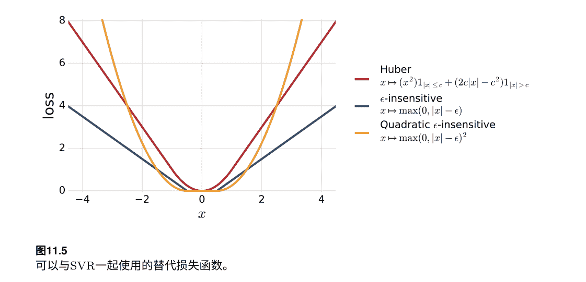

SVR还具有有利的稳定性特性，我们在第14章中讨论。 然而，该算法的一个缺点是需要选择两个参数，C和ε。 这些参数可以通过交叉验证来选择，就像SVM的情况一样，但这需要一个相对较大的验证集。 通常使用一些启发式方法来指导搜索它们的值：在没有偏移（b=0）和归一化核函数的情况下，C在标签的最大值附近搜索，ε选择接近标签平均差异。 如前所述，ε的值决定支持向量的数量和解的稀疏性。 SVR的另一个缺点是，当处理大型训练集时，就像SVM或KRR一样，可能计算成本很高。 在这种情况下，一种有效的解决方案，就像KRR一样，是使用低秩逼近来近似核矩阵，可以使用Nystrom方法或部分Cholesky分解。 在下一节中，我们将讨论一种替代的稀疏回归算法。

### 11.3.4 Lasso

与KRR和SVR算法不同，Lasso（最小绝对收缩和选择算子）算法不支持自然使用PDS核。 因此，在这里，我们假设输入空间 $\mathcal{X}$ 是 $\mathbb{R}^N$ 的子集，并考虑一个线性假设族 $\mathcal{H} = \{\mathbf{x} \rightarrow \mathbf{w} \cdot \mathbf{x} + b: \mathbf{w} \in \mathbb{R}^N, b \in \mathbb{R}\}$。 令 $S = \{(\mathbf{x}_1, y_1), ..., (\mathbf{x}_m, y_m)\} \in (\mathcal{X} \times \mathcal{Y})^m$ 是一个带标签的训练样本。 Lasso基于对 $S$ 上的经验平方误差的最小化，其中正则化项取决于权重向量的范数，与岭回归的情况类似，但使用 $L_1$ 范数而不是 $L_2$ 范数，并且不对平方进行操作。

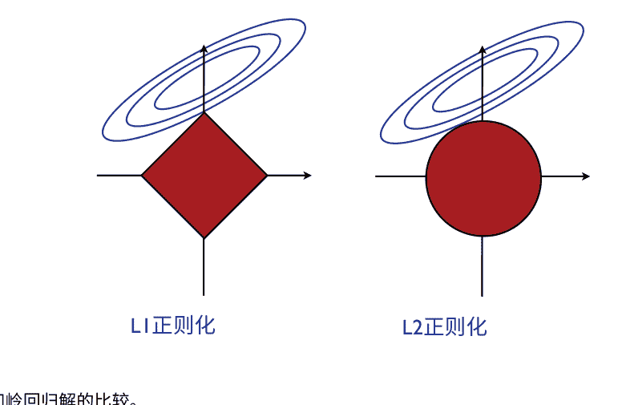

图11.6 Lasso和岭回归解的比较。

$$\min_{\mathbf{w},b} F(\mathbf{w}, b) = \lambda \|\mathbf{w}\|_1 + \sum_{i=1}^m (\mathbf{w} \cdot \mathbf{x}_i + b - y_i)^2$$

这里 $\lambda$表示岭回归的一个正参数。 这是一个凸优化问题，因为 $\|\cdot\|_1$是凸的，就像所有的范数一样，而且由于经验误差项是凸的，就像线性回归已经讨论过的那样。

Lasso的优化问题可以等价地写成

$$\min_{\mathbf{w},b} \sum_{i=1}^m (\mathbf{w} \cdot \mathbf{x}_i + b - y_i)^2 \quad \text{受限于:} \quad \|\mathbf{w}\|_1 \leq \Lambda_1$$

其中$\Lambda_1$是一个正参数。

Lasso的关键特性，就像其他使用 $L_1$范数约束的算法一样，是它导致了一个稀疏解 $\mathbf{w}$，即只有少数非零分量。 图11.6展示了二维情况下 $L_1$和 $L_2$正则化的差异。 公式(11.30)的目标函数是一个二次函数，因此它的轮廓是椭圆，如图中所示（蓝色）。 左右两个面板分别显示了固定半径$\Lambda_1$的 $L_1$和 $L_2$球对应的区域（红色）。 Lasso解是轮廓与 $L_1$球的交点。 从图中可以看出，这通常发生在 $L_1$球的一个角落，其中一些坐标为零。 相比之下，岭回归的解在轮廓和 $L_2$球的交点处，通常没有任何坐标为零。

以下结果显示Lasso也从强大的理论保证中受益。我们首先给出了关于$L_1$范数约束线性假设的经验Rademacher复杂度的一般上界。

## 定理11.15（具有有界$L_1$范数的线性假设的Rademacher复杂度）

$\mathcal{X} \subseteq \mathbb{R}^N$ 并且令 $S = \left(\left(\mathbf{x}_1, y_1\right), \ldots,\left(\mathbf{x}_m, y_m\right)\right) \in (\mathcal{X} \times \mathcal{Y})^m$ 是大小为 $m$ 的样本。假设对于所有的 $i \in [m]$, $\left\|\mathbf{x}_i\right\|_{\infty} \leq r_{\infty}$，其中 $r_{\infty} > 0$，并且令 $\mathcal{H} = \{\mathbf{x} \in \mathcal{X} \rightarrow \mathbf{w} \cdot \mathbf{x} : \|\mathbf{w}\|_1 \leq \Lambda_1\}$。那么，$\mathcal{H}$ 的经验Rademacher复杂度可以被限制如下：
$$\mathfrak{R}_S(\mathcal{H}) \leq \frac{\sqrt{2 r_{\infty}^2 \Lambda_1^2 \log (2 N)}}{m}. \tag{11.31}$$

证明：对于任意的 $i \in [m]$，我们用 $x_{ij}$ 表示 $\mathbf{x}_i$ 的第 $j$ 个分量。
$$\begin{aligned}
\mathfrak{R}_S(\mathcal{H}) & =\frac{1}{m} \mathbb{E}_\sigma\left[\sup _{\|\mathbf{w}\|_1 \leq \Lambda_1} \sum_{i=1}^m \sigma_i \mathbf{w} \cdot \mathbf{x}_i\right] \\
& =\frac{\Lambda_1}{m} \mathbb{E}_\sigma\left[\left\|\sum_{i=1}^m \sigma_i \mathbf{x}_i\right\|_{\infty}\right] \quad\quad\quad\quad\quad\quad\quad\quad\quad\text{(根据对偶范数的定义)} \\
& =\frac{\Lambda_1}{m} \mathbb{E}_\sigma\left[\max _{j \in[N]} \left|\sum_{i=1}^m \sigma_i x_{ij}\right|\right] \quad\quad\quad\quad\quad\quad\quad\text{(根据$\|\cdot\|_{\infty}$的定义)} \\
& =\frac{\Lambda_1}{m} \mathbb{E}_\sigma\left[\max _{j \in[N]} \max _{s \in\{-1,+1\}} s \sum_{i=1}^m \sigma_i x_{ij}\right] \quad\quad\quad\quad\text{(根据$\|\cdot\|_{\infty}$的定义)} \\
& =\frac{\Lambda_1}{m} \mathbb{E}_\sigma\left[\sup _{\mathbf{z} \in A} \sum_{i=1}^m \sigma_i z_i\right],
\end{aligned}$$
其中 $A$ 表示 $N$ 个向量 $\{s(x_{1j}, \ldots, \ldots, \ldots, x_{mj})^{\top} : j \in [N], s \in \{-1, +1\}\}$ 的集合。对于任意的 $\mathbf{z} \in A$，我们有 $\|\mathbf{z}\|_2 \leq \sqrt{r_{\infty}^2 m} = r_{\infty} \sqrt{m}$。因此，根据马萨特引理（定理3.7），由于 $A$ 最多包含 $2N$ 个元素，以下不等式成立：
$$\mathfrak{R}_S(\mathcal{H}) \leq \Lambda_1 r_{\infty} \sqrt{\frac{2 \log (2 N)}{m}} = \frac{r_{\infty} \Lambda_1 \sqrt{2 \log (2 N)}}{\sqrt{m}},$$
这证明了结论。$\square$

请注意，界限对维度 $N$ 的依赖仅为对数级别，这表明使用非常高维的特征空间不会显著影响泛化。

将刚刚证明的Rademacher复杂性界限和定理11.3的一般结果结合起来，可以得到Lasso使用平方损失的假设集的以下泛化界限。

## 定理11.16

令 $\mathcal{X} \subseteq \mathbb{R}^N$ 且 $\mathcal{H} = \{\mathbf{x} \in \mathcal{X} \rightarrow \mathbf{w} \cdot \mathbf{x}: \|\mathbf{w}\|_1 \leq \Lambda_1\}$。假设存在 $r_{\infty} > 0$，对于所有的 $\mathbf{x} \in \mathcal{X}$，$\|\mathbf{x}\|_{\infty} \leq r_{\infty}$ 且 $M > 0$，使得然后，对于任意$\delta > 0$，至少以概率 $1 - \delta$，以下不等式对于所有的 $h \in \mathcal{H}$ 成立：

$$R(h) \leq R_S(h) + 2r_\infty \Lambda_1 M \sqrt{\frac{2 \log(2N)}{m}} + M^2 \sqrt{\frac{\log \frac{1}{\delta}}{2m}} . (11.32)$$

与岭回归的情况类似，我们观察到Lasso所最小化的目标函数与这个泛化界的右侧具有相同的形式。

存在多种不同的方法来解决Lasso的优化问题，包括一种高效的算法（LARS）用于计算所有正则化路径的解，即所有正则化参数$\lambda$的Lasso解，以及其他适用于具有 $L_1$范数约束的优化问题的在线解。

在这里，我们展示了Lasso问题（11.29）或（11.30）与二次规划（QP）等价，因此可以使用任何QP求解器来计算解。观察到任何权重向量 $\mathbf{w}$ 都可以写成 $\mathbf{w} = \mathbf{w}^+ - \mathbf{w}^-$，其中 $\mathbf{w}^+ \geq 0$，$\mathbf{w}^- \geq 0$，并且对于任何 $j \in [N]$，$w_j^+ = 0$ 或 $w_j^- = 0$，这意味着$\|\mathbf{w}\|_1 = \sum_{j=1}^N w_j$ 这可以通过定义 $\mathbf{w}^+$ 的第j个分量为 $w_j$（如果 $w_j \geq 0$），否则为0，类似地，定义 $\mathbf{w}^-$ 的第j个分量为 $-w_j$（如果 $w_j \leq 0$），否则为0，对于任何 $j \in [N]$。通过替换 $\mathbf{w} = \mathbf{w}^+ - \mathbf{w}^-$，其中 $\mathbf{w}^+ \geq 0$，$\mathbf{w}^- \geq 0$，并且 $\|\mathbf{w}\|_1 = \sum_{j=1}^N w_j^+ + w_j^-$，Lasso问题（11.29）变为

$$\min_{\mathbf{w}^+ \geq 0, \mathbf{w}^- \geq 0, b} \lambda \sum_{j=1}^N (w_j^+ + w_j^-) + \sum_{i=1}^m \left( (\mathbf{w}^+ - \mathbf{w}^-) \cdot \mathbf{x}_i + b - y_i \right)^2 . (11.33)$$

相反地，方程 $\mathbf{w} = \mathbf{w}^+ - \mathbf{w}^-$ (11.33) 的解满足条件 $w_j^+ = 0$ 或者 $w_j^- = 0$ 对于任意的 $j \in [N]$，因此当 $w_j \geq 0$ 时 $w_j = w_j^+$，当 $w_j \leq 0$ 时 $w_j = -w_j^-$。这是因为如果对于某个 $j \in [N]$，存在 $\delta_j = \min(w_j^+, w_j^-) > 0$，那么将 $w_j^+$ 替换为 $(w_j^+ - \delta_j)$ 和 $w_j^-$ 替换为 $(w_j^- - \delta_j)$ 不会影响 $w_j^+ - w_j^- = (w_j^+ - \delta) - (w_j^- - \delta)$，但会减少目标函数中的项 $(w_j^+ + w_j^-) 2\delta_j > 0$ 并提供更好的解。根据这个分析，问题（11.29）和（11.33）具有相同的最优解并且是等价的。问题（11.33）是一个二次规划问题，因为目标函数对于 $\mathbf{w}^+$、$\mathbf{w}^-$ 和 $b$ 是二次的，并且约束条件是仿射的。通过这个表述，问题可以直接地展示出一个自然的在线算法解决方案（练习 11.10）。²⁰

因此，Lasso有几个优点：它从强大的理论保证中受益，并返回一个稀疏解，当基于少量特征的准确解存在时，这是有利的。解的稀疏性也是计算上有吸引力的是，权重向量的稀疏特征表示可以用于使与新向量的内积更高效。算法的稀疏性也可以用于特征选择。该算法的主要缺点是它不支持自然使用PDS核和非线性回归的扩展，不像KRR和SVR。一种解决方案是使用经验核映射，如第6章所讨论的。此外，Lasso的解不支持闭式解。这不是从优化的角度来看的关键属性，但它可以使一些数学分析变得非常方便。

## 11.3.5 群体规范回归算法

除了 $L_1$ 或 $L_2$ 范数之外，还可以使用其他类型的正则化来定义回归算法。例如，在某些情况下，特征空间可能自然地被划分为子集，并且可能希望找到一个稀疏解决方案，该解决方案选择或省略整个特征子集。在这种情况下，一种自然的范数是组合范数或混合范数 $L_{2,1}$，它是 $L_1$ 和 $L_2$ 范数的组合。

想象一下，我们将 $\mathbf{w} \in \mathbb{R}^N$ 划分为 $\mathbf{w}_1, \ldots, \mathbf{w}_k$，其中 $\mathbf{w}_j \in \mathbb{R}^{N_j}$ 对于 $1 \leq j \leq k$ 并且 $\sum_j N_j = N$，并定义 $\mathbf{W} = (\mathbf{w}_1^\top, \ldots, \mathbf{w}_k^\top)^\top$。然后， $\mathbf{W}$ 的 $L_{2,1}$ 范数被定义为
$$\|\mathbf{W}\|_{2,1} = \sum_{j=1}^{k} \|\mathbf{w}_j\|.$$
将 $L_2$ 范数与经验均方误差相结合，得到 Group Lasso 公式。更一般地，可以使用 $L_{q,p}$ 群体范数正则化，其中 $q, p \geq 1$（有关群体范数的定义，请参见附录A）。

## 11.3.6 在线回归算法

前几节介绍的回归算法都有自然的在线版本。在这里，我们简要介绍两个算法的示例。这些算法特别适用于应用于非常大的数据集的情况，对于这些情况，批处理解决方案的计算成本可能过高，更一般地适用于第8章讨论的所有在线学习设置。

我们的第一个示例被称为 Widrow-Hoff 算法，并且与将随机梯度下降技术应用于线性回归目标函数相一致。图11.7给出了该算法的伪代码。通过将随机梯度技术应用于岭回归，可以得到类似的算法。在每一轮中，权重向量会增加一个依赖于预测误差（$\mathbf{w}_t \cdot \mathbf{x}_t - y_t$）的量。

我们的第二个例子是SVR算法的在线版本，通过将随机梯度下降应用于SVR的对偶目标函数来获得。图11.8给出了该算法的伪代码，适用于任意的PDS核函数 $K$。

Widrow-Hoff($\mathbf{w}_0$)
1  $\mathbf{w}_1 \leftarrow \mathbf{w}_0$      .通常 $\mathbf{w}_0 = \mathbf{0}$
2  对于 $t \leftarrow 1$ 到 $T$ 执行
3      接收 ($\mathbf{x}_t$)
4      $y_t \leftarrow \mathbf{w}_t \cdot \mathbf{x}_t$
5      接收 ($y_t$)
6      $\mathbf{w}_{t+1} \leftarrow \mathbf{w}_t + 2\eta(\mathbf{w}_t \cdot \mathbf{x}_t - y_t)\mathbf{x}_t$      . 学习率 $\eta > 0$.
7  返回 $\mathbf{w}_{T+1}$

图11.7
Widrow-Hoff算法。

在没有任何偏移量的情况下 $(b=0)$。另一个在线回归算法由练习11.10给出，用于Lasso。

## 11.4 章节笔记

本章介绍的泛化界限适用于有界回归问题。 当 $\{x \rightarrow L(h(x), y): h \in \mathcal{H}\}$时，假设的损失函数族不受限制，一个函数可以以任意大的值和任意小的概率出现。 这是推导无界损失的一致收敛界限的主要问题。 要避免这个问题，可以假设存在一个上界函数，即一个单一的非负函数，其有限期望大于假设集中每个函数的损失的绝对值[Dudley, 1984, Pollard, 1984, Dudley, 1987, Pollard, 1989, Haussler, 1992]，或者假设损失函数的某个矩有界[Vapnik, 1998, 2006]。

Cortes, Greenberg, and Mohri [2013] (参见[Cortes et al., 2010a]) 给出了具有有限二阶矩的无界损失的双边泛化界限。 他们界限的单边版本与Vapnik [1998, 2006]的界限在一个常数因子下是相同的，但是Vapnik在两本书中给出的证明似乎是不完整和不正确的。

伪维度的概念归功于Pollard [1984]。 其等价的VC维度定义是由Vapnik [2000]讨论的。 肥胖破碎的概念是由Kearns和Schapire [1990]引入的。 线性回归算法是统计学中的经典算法，至少可以追溯到十九世纪。岭回归算法归功于Hoerl和Kennard [1970]。其核化版本（KRR）由Saunders， Gammerman和Vovk [1998]引入和讨论。将KRR扩展到输出为 $\mathbb{R}^p$，其中$p>1$，并对回归施加可能的约束，由Cortes， Mohri和Weston [2007c]提出和分析。支持向量回归（SVR）算法在Vapnik [2000]中讨论。 Lasso由Tibshirani [1996]引入。 LARS算法用于解决其优化问题，后来由Efron等人[2004]提出。 Widrow-Hoff在线算法归功于Widrow和Hoff [1988]。双在线SVR算法首先由Vijayakumar和Wu [1999]引入和分析。

练习10.3的核稳定性分析来自Cortes等人[2010b]。
对于规模较大的问题，直接批量优化原始或对偶目标函数是难以处理的，类似于第11.3.6节中介绍的一般迭代随机梯度下降方法，或者类似于有限内存BFGS（Broyden-Fletcher-Goldfarb-Shanno）算法[Nocedal, 1980]的拟牛顿方法在实践中可以作为实际的替代方案。

除了本章介绍的线性回归算法及其基于核的非线性扩展之外，还存在许多其他用于回归的算法，包括回归决策树（参见第9章），回归提升树和人工神经网络。

Online Dual SVR()

1.  $\alpha \leftarrow \mathbf{0}$
2.  $\alpha' \leftarrow \mathbf{0}$
3.  **for** $t \leftarrow 1$ **to** $T$ **do**
4.      $\text{RECEIVE}(x_t)$
5.      $y_t \leftarrow \sum_{s=1}^{t-1} (\alpha'_s - \alpha_s)K(x_s, x_t)$
6.      $\text{RECEIVE}(y_t)$
7.      $\alpha'_{t+1} \leftarrow \alpha'_t + \min\big(\max(\eta(y_t - y_t - \epsilon), -\alpha'_t), C - \alpha'_t\big)$
8.      $\alpha_{t+1} \leftarrow \alpha_t + \min\big(\max(\eta(y_t - y_t - \epsilon), -\alpha_t), C - \alpha_t\big)$
9.  **return** $\sum_{t=1}^{T} (\alpha'_t - \alpha_t)K(x_t, \cdot)$

图11.8
双支持向量回归的在线版本。

## 11.5 练习

- 11.1 伪维度和单调函数。
  假设 𝜙 是一个严格单调的函数，并且令 𝜙 ∘ ℋ 是由 𝜙 ∘ ℋ = \{𝜙(h(\cdot)) : h ∈ ℋ \} 定义的函数族，其中 ℋ 是一些实值函数的集合。证明 Pdim(𝜙 ∘ ℋ) = Pdim(ℋ)。

- 11.2 线性函数的伪维度。
  设 ℋ 为所有维度为 d 的线性函数的集合，即 ℋ(x) = w^T x ，其中 w ∈ ℝ^d。 证明 Pdim(H) = d。

- 11.3 线性回归。
  (a) 在数据 X 上需要满足什么条件才能保证 XX^T 可逆？
  (b) 假设问题是欠定的。那么，我们可以选择一个解 w，使得等式 X^T w = X^T (XX^T)^† X y (可以证明等于 X^† X y) 成立。满足这个等式的一个特定选择是 w* = (XX^T)^† X y。然而，这不是唯一的解。作为 w* 的函数，描述满足 X^T w = X^† X y 的所有 w 的选择（提示：使用 XX^† X = X 的事实）。

- 11.4 扰动核函数。
  假设使用两个不同的核矩阵， K 和 K′，来训练具有相同正则化参数 λ 的两个核岭回归假设。在这个问题中，我们将证明最优对偶变量 α 和 α ′之间的差异受到依赖于 ∥K′ − K∥₂ 的限制。
  (a) 证明 α′ − α = (K′ + λI)^{−1}(K′ − K)(K + λI)^{−1}y。(提示：证明对于任意可逆矩阵 M， M′^{−1} − M^{−1} = −M′^{−1}(M′ − M)M^{−1}。)
  (b) 假设 ∀y ∈ 𝒴， |y| ≤ M，证明 
  \[\|\alpha' - \alpha\| \le \frac{\sqrt{m} \|K' - K\|_2}{\lambda^2}.\]

- 11.5 Huber损失。
  推导用于解决带有Huber损失的SVR问题的原始和对偶优化问题：
  \[L_c(\xi_i) = \begin{cases} \frac{1}{2}\xi_i^2, & \text{如果 } |\xi_i| \le c \\ c\xi_i - \frac{1}{2}c^2, & \text{否则} \end{cases},\]
  其中 ξ_i = w · Φ(x_i) + b − y_i。

- 11.6 SVR和平方损失。
  假设 $2r\Lambda \leq 1$，使用定理11.13推导出平方损失的泛化界。

- 11.7 SVR对偶形式。
  给出SVR算法的对偶形式的详细和仔细的推导，包括 $\square$-insensitive损失和二次 $\square$-insensitive损失。

- 11.8 最优核矩阵。
  假设除了优化对偶变量 $\alpha \in \mathbb{R}^m$，如(11.16)所示，我们还希望优化PDS核矩阵 $\mathbf{K} \in \mathbb{R}^{m \times m}$ 的条目。
  $$\min_{\mathbf{K} \succeq 0} \max_{\alpha} -\lambda\alpha^{\top}\alpha - \alpha^{\top}\mathbf{K}\alpha + 2\alpha^{\top}\mathbf{y}, \quad \text{s.t.} \quad \|\mathbf{K}\|_2 \leq 1$$
  (a) 关于联合优化的最优 $\mathbf{K}$ 的闭式解是什么？
  (b) 通过优化核矩阵的选择，可以得到更好的目标函数值。然而，请解释为什么得到的核矩阵在实践中没有用。

- 11.9 留一法误差。
  一般来说，计算留一法误差可能非常昂贵，因为对于大小为 $m$ 的样本，需要训练算法 $m$ 次。这个问题的目标是展示，令人惊讶的是，在核岭回归的情况下，留一法误差可以通过只训练一次算法来高效计算。
  令 $S= ((x_1, y_1), \ldots, (x_m, y_m))$ 表示大小为 $m$ 的训练样本，并且对于任意 $i \in [m]$，令 $S_i$ 表示从 $S$ 中删除 $(x_i, y_i)$ 后得到的大小为 $m-1$ 的样本：$S_i = S-\{(x_i, y_i)\}$。对于任意样本 $T$，令 $h_T$ 表示通过训练 $T$ 得到的假设。根据定义（见定义5.2），对于平方损失函数，相对于 $S$ 的留一法误差定义为
  $$R_{\text{LOO}}(\text{KRR}) = \frac{1}{m} \sum_{i=1}^{m} (h_{S_i}(x_i) - y_i)^2.$$
  +   (a) 令 $S'_i = ((x_1, y_1), \ldots, (x_i, h_{S_i}(y_i)), \ldots, (x_m, y_m))$。证明 $h_{S_i} = h_{S'_i}$。
  +   (b) 定义 $\mathbf{y}_i = \mathbf{y} - y_i \mathbf{e}_i + h_{S_i}(x_i) \mathbf{e}_i$，即将向量标签的第 $i$ 个分量替换为 $h_{S_i}(x_i)$。证明对于KRR，$h_{S_i}(x_i) = \mathbf{y}_i^{\top} (\mathbf{K} + \lambda \mathbf{I})^{-1} \mathbf{K} \mathbf{e}_i$。
  +   (c) 证明留一法误差可以用以下简单表达式表示 terms of $h_S$：
  $$R_{\text{LOO}}(\text{KRR}) = \frac{1}{m} \sum_{i=1}^{m} \left[ \frac{h_S(x_i) - y_i}{\mathbf{e}_i^{\top} (\mathbf{K} + \lambda \mathbf{I})^{-1} \mathbf{K} \mathbf{e}_i} \right]^2. \quad (11.34)$$
  +   (d) 假设矩阵 $\mathbf{M} = (\mathbf{K} + \lambda \mathbf{I})^{-1} \mathbf{K}$ 的对角元素都相等于 $\gamma$。算法的经验误差 $R_S$ 和留一法误差 $R_{\text{LOO}}$ 之间有什么关系？是否存在某个 $\gamma$ 值使得这两个误差相等？

- 11.10 在线套索。
  使用Lasso优化问题的公式（11.33）和随机梯度下降（见8.3.1节）证明该问题可以使用图11.9的在线算法解决。

- 11.11 在线二次支持向量回归。
  推导出二次支持向量回归的在线算法（提供完整的伪代码）。

Online Lasso($\mathbf{w}_0^+, \mathbf{w}_0^-$)
1 $\mathbf{w}_1^+ \leftarrow \mathbf{w}_0^+$ . $\mathbf{w}_0^+ \geq 0$
2 $\mathbf{w}_1^- \leftarrow \mathbf{w}_0^-$ . $\mathbf{w}_0^- \geq 0$
3 **对于** $t \leftarrow 1$ **到** $T$ **执行**
4     接收 ($\mathbf{x}_t, y_t$)
5     **对于** $j \leftarrow 1$ **到** $N$ **执行**
6         $w_{t+1,j}^+ \leftarrow \max \left(0, w_{tj}^+ - \eta \left[ \lambda - \left[ y_t - (\mathbf{w}_t^+ - \mathbf{w}_t^-) \cdot \mathbf{x}_t \right] \mathbf{x}_{tj} \right] \right)$
7         $w_{t+1,j}^- \leftarrow \max \left(0, w_{tj}^- - \eta \left[ \lambda + \left[ y_t - (\mathbf{w}_t^+ - \mathbf{w}_t^-) \cdot \mathbf{x}_t \right] \mathbf{x}_{tj} \right] \right)$
8 **返回** $\mathbf{w} \quad \mathbf{w}_{T+1}^+ - \mathbf{w}_{T+1}^-$

图11.9
Lasso的在线算法。

## 12 最大熵模型

在本章中，我们介绍和讨论最大熵模型，也称为Maxent模型，这是一种广泛使用的用于密度估计的算法家族，可以利用丰富的特征集。我们首先介绍标准的密度估计问题，并简要描述最大似然和最大后验解决方案。

接下来，我们描述一个更丰富的密度估计问题，其中学习者还可以访问特征。这是Maxent模型所解决的问题。

我们介绍Maxent模型背后的关键原理，并制定它们的原始优化问题。接下来，我们证明了一个对偶定理，证明了Maxent模型与正则化最大似然问题的Gibbs分布解重合。我们为这些模型提供了泛化保证，并提供了一种使用坐标下降技术解决其对偶优化问题的算法。我们进一步将这些模型扩展到使用其他范数的任意Bregman散度的情况，并证明了一个通用的对偶定理，导致了一个具有替代正则化的等价优化问题。我们还对常用的具有$L_2$正则化的Maxent模型进行了具体的理论分析。

## 12.1 密度估计问题

令 $S= (x_1, \ldots, x_m)$ 为从未知分布 $\mathcal{D}$中独立同分布地抽取的大小为 $m$的样本。那么，密度估计问题就是利用该样本从一组可能的分布 $\mathcal{P}$中选择一个与 $\mathcal{D}$接近的分布 p。另一方面，如果只有一个相对较小的样本 $m$可用，由大量参数定义的非常丰富的分布族会使选择分布 p的 任务非常困难。

### 12.1.1 最大似然（ML）解

选择分布$p$的一种常见解决方案是基于最大似然原则。这包括从分布族$\mathcal{P}$中选择一个分布，使其对观察到的样本$S$分配的概率最大。因此，利用样本是独立同分布抽取的事实，最大似然选择的解决方案$p_{\text{ML}}$定义为

$$ p_{\text{ML}} = \underset{p \in \mathcal{P}}{\text{argmax}} \prod_{i=1}^m p(x_i) = \underset{p \in \mathcal{P}}{\text{argmax}} \sum_{i=1}^m \log p(x_i). $$

最大似然原则可以等价地用相对熵来表达。设$\mathcal{D}$表示对应于样本$S$的经验分布。那么，$p_{\text{ML}}$与使得经验分布$\mathcal{D}$相对熵最小的分布$p$相等：$p_{\text{ML}} = \underset{p \in \mathcal{P}}{\text{argmin}} D(\mathcal{D} \parallel p).$

这可以直接从以下内容看出：

$$ \begin{aligned} D(\mathcal{D} \parallel p) &= \sum_{x} \mathcal{D}(x) \log \mathcal{D}(x) - \sum_{x} \mathcal{D}(x) \log p(x) \\ &= -H(\mathcal{D}) - \sum_{x} \sum_{i=1}^m \frac{\mathbf{1}_{x=x_i}}{m} \log p(x) \\ &= -H(\mathcal{D}) - \sum_{i=1}^m \sum_{x} \frac{\mathbf{1}_{x=x_i}}{m} \log p(x) \\ &= -H(\mathcal{D}) - \sum_{i=1}^m \frac{\log p(x_i)}{m}, \end{aligned} $$

因为最后一个表达式的第一项，即经验分布的负熵，不随$p$变化。

作为最大似然原理应用的一个例子，假设我们希望从一个独立同分布的样本$S=(x_1, \dots, x_m)$估计一个硬币的偏差$p_0$，其中$x_i \in \{h, t\}$，其中$h$表示正面，$t$表示反面。$p_0 \in [0,1]$是根据未知分布$\mathcal{D}$的正面概率。让$\mathcal{P}$成为所有分布的集合$p=(p, 1-p)$其中$p \in [0,1]$是一个任意可能的偏差值。让$n_h$ 表示在$S$中正面出现的次数。然后，选择$p=(p_S,1−p_S)=\mathcal{D}$其中

$$ p_{\text{ML}} = \frac{n_h}{m}. $$

### 12.1.2 最大后验（MAP）解

基于所谓的最大后验概率解的另一种解决方案包括选择一个分布 p ∈ P，该分布在给定观察样本 S 和先验分布 P[p] 的情况下最有可能。根据贝叶斯规则，问题可以表述如下：

$$ p_{MAP} = \arg\max_{p \in \mathcal{P}} \mathbb{P}[p|S] = \arg\max_{p \in \mathcal{P}} \frac{\mathbb{P}[S|p] \mathbb{P}[p]}{\mathbb{P}[S]} = \arg\max_{p \in \mathcal{P}} \mathbb{P}[S|p] \mathbb{P}[p] $$ (12.4)

请注意，对于均匀先验分布，P[p]是一个常数，最大后验概率解与最大似然解相同。下面是一个标准示例，说明了最大后验概率解及其与最大似然解的区别。

### 例子 12.1 (最大后验解的应用)

假设我们需要确定一个患者是否患有一种罕见疾病，给定该患者的实验室检测结果。我们考虑一个包含两个简单分布的集合： d(患病的概率为1)和d(不患病的概率为1)，因此 P = {d,d}。实验室检测结果要么是阳性 (pos)，要么是阴性 (neg)，因此 S∈ {pos, neg}。

假设该疾病是罕见的，即 $\mathbb{P}[d] = .005$，并且实验室检测结果相对准确： $\mathbb{P}[\text{pos}| d] = .98$，以及 $\mathbb{P}[\text{neg}|d] = .95$。那么，如果检测结果是阳性，应该做出什么诊断？我们可以计算出(12.4)式的右侧，对于给定的阳性检测结果，以确定最大后验估计值： $\mathbb{P}[\text{pos}|d] \mathbb{P}[d] = .98 \times .005 = .0049$

$$ \mathbb{P}[\text{pos}|\bar{d}] \mathbb{P}[\bar{d}] = (1 - .95) \times (1 - .005) = .04975 > .0049. $$

因此，在这种情况下，MAP预测是没有疾病的：根据MAP解，根据所示的值，一个测试结果为阳性的患者更有可能没有疾病！

我们将不在这里分析最大似然和最大后验解的性质，这取决于样本的大小和选择家族 P 的选择。相反，我们将考虑一个更丰富的密度估计问题在这个问题中，学习者可以访问特征，这是最大熵(Maxent)模型所解决的学习问题。

### 12.2 带特征的密度估计问题

与标准密度估计问题一样，我们考虑一个场景，学习者接收到一个样本 S=(x1, ..., xm) ⊆ X 的大小为 m 的独立同分布抽样，根据某个分布 D。但是，在这里，另外，我们假设学习者可以访问一个从 X 到 R^N 的特征映射 Φ，并且 ||Φ||∞ ≤ r。在最一般的情况下，我们可能有$N = +\infty$。我们将用 $\mathcal{H}$表示一个包含组件特征函数 $\Phi_j$（其中 $j \in [N]$）的实值函数族。在实践中可以考虑不同的特征函数。$\mathcal{H}$可以是阈值函数族，其中 $x \mapsto \mathbf{1}_{x \leq \theta}$，$\mathbf{x} \in \mathbb{R}^n$，$\theta \in \mathbb{R}$，可以像提升树桩一样定义在 $n$个变量上，也可以是由更复杂的决策树或回归树定义的函数族。在实践中经常使用的其他特征是基于输入变量的 $k$次单项式。为了简化演示，在接下来的内容中，我们将假设输入集合 $\mathcal{X}$是有限的。

## 12.3 最大熵原理

最大熵模型是基于一个关键属性的原则推导出来的，即任何特征的经验平均值与其真实平均值非常接近的概率很高。通过Rademacher复杂度界限，对于任意$\delta > 0$，以下不等式成立以至少$1 - \delta$的概率选择样本 $S$的大小 $m$：

$$ \left\| \underset{x \sim \mathcal{D}}{\mathbb{E}} [\Phi(x)] - \underset{x \sim \mathcal{D}'}{\mathbb{E}} [\Phi(x)] \right\|_{\infty} \leq 2 \mathfrak{R}_m(\mathcal{H}) + r \sqrt{\frac{\log \frac{2}{\delta}}{2m}}, \quad (12.5) $$

其中，我们用样本 $S$定义的经验分布表示为 $\mathcal{D}$。这是指导最大熵原则定义的理论保证。设 $p_0$是分布在 $\mathcal{X}$上的分布，对于所有的 $x \in \mathcal{X}$， $p_0(x) > 0$，通常选择为均匀分布。然后，最大熵原则是寻求一个尽可能不偏见的分布 $p$，尽可能接近均匀分布或者更一般地接近先验分布 $p_0$，同时满足类似于(12.5)的不等式：

$$ \left\| \underset{x \sim p}{\mathbb{E}} [\Phi(x)] - \underset{x \sim \mathcal{D}}{\mathbb{E}} [\Phi(x)] \right\|_{\infty} \leq \lambda, \quad (12.6) $$

其中 $\lambda \geq 0$是一个参数。在这里，接近度是用相对熵来衡量的。选择 $\lambda = 0$对应于标准的 $Maxent$或未正则化的 $Maxent$，并且要求特征相对于 $p$的期望与经验平均值完全匹配。正如我们将在后面看到的那样，它的放松，即不等式情况($\lambda > 0$)，对应于正则化。请注意，与最大似然估计不同，$Maxent$原则不需要指定一个概率分布族$\mathcal{P}$供选择。

## 12.4 最大熵模型

设△表示所有分布在 𝒳 上的单纯形，那么，Maxent原则可以被表述为以下优化问题：

> min_{p∈Δ} D(p ∥ p_0) 
>  受限于： || E_{x∼p}[Φ(x)] - E_{x∼D}[Φ(x)] ||_∞ ≤ λ. 
>  (12.7)

这定义了一个凸优化问题，因为相对熵 D对其参数是凸的（附录E），因为约束是仿射的，而且Δ是一个凸集。实际上，解是唯一的，因为相对熵是严格凸的。经验分布显然是一个可行点，因此问题（12.7）是可行的。

对于一个均匀先验 p_0，问题（12.7）可以等价地表示为熵最大化，这解释了这些模型的名称。令 H (p) = -∑_{x∈𝒳} p(x) log p(x) 表示 p 的熵。然后，（12.7）的目标函数可以重写如下：

> D(p ∥ p_0) = ∑_{x∈𝒳} p(x) log \frac{p(x)}{p_0(x)} 
>  = -∑_{x∈𝒳} p(x) log p_0(x) + ∑_{x∈𝒳} p(x) log p(x) 
>  = log |𝒳| - H(p)。

因此，由于 log |𝒳| 是一个常数，最小化相对熵 D（p∥p_0）等价于最大化 H（p）。

Maxent模型是刚才描述的优化问题的解决方案。正如已经讨论过的，它们具有两个重要的好处：它们基于经验和真实特征平均值之间的接近的基本理论保证，并且不需要指定特定的分布族 𝒫。在接下来的几节中，我们将进一步分析Maxent模型的属性。

## 12.5 对偶问题

在这里，我们推导出一个等价的对偶问题，对于(12.7)来说，正如我们将要展示的那样，可以被表述为在 Gibbs分布族上的正则化最大似然问题。

对于任意凸集 K，令 I_K表示由 I_K(x) = 0 if x ∈ K, I_K(x) = +∞ otherwise定义的函数。然后，Maxent优化问题(12.7)可以等价地表示为无约束优化问题 min_p F(p)。对于所有的 $p \in \mathbb{R}^X$，

$F(p) = \widetilde{D}(p \parallel p_0) + I_C(\mathbb{E}_p[\Phi])$， (12.8)

其中 $\widetilde{D}(p \parallel p_0) = D(p \parallel p_0)$ if $p$在单纯形$\Delta$中，$\widetilde{D}(p \parallel p_0) = +\infty$ otherwise，并且 $C \subseteq \mathbb{R}^N$是由 $C = \{u: \|u - \mathbb{E}_{(x,y)\sim D}[\Phi(x,y)]\|_\infty \leq \lambda\}$定义的凸集。

Gibbs分布的一般形式 $p_w$带有先验 $p_0$，参数 $w$和特征向量 $\Phi$是

$p_w[x] = \frac{p_0[x]e^{w \cdot \Phi(x)}}{Z(w)}$， (12.9)

其中 $Z(w) = \sum_{x \in X} p_0[x]e^{w \cdot \Phi(x)}$是一个称为分区函数的归一化因子。设 $G$是定义在所有 $w \in \mathbb{R}^N$上的函数

$G(w) = \frac{1}{m}\sum_{i=1}^m \log\left( \frac{p_w[x_i]}{p_0[x_i]} \right) - \lambda\|w\|_1$， (12.10)

接下来的定理展示了基本问题（12.7）或（12.8）与基于 $G$的对偶问题的等价性。

### 定理12.2（最大熵对偶性）
问题（12.7）或（12.8）与优化问题 $\sup_{\mathbf{w} \in \mathbb{R}^N} G(\mathbf{w})$等价：

$\sup_{\mathbf{w} \in \mathbb{R}^N} G(\mathbf{w}) = \min_{\mathbf{p}} F(\mathbf{p})$. (12.11)

此外，令 $\mathbf{p}^* = \arg\min_{\mathbf{p}} F(\mathbf{p})$和 $d^* = \sup_{\mathbf{w} \in \mathbb{R}^N} G(\mathbf{w})$，那么对于任意的 $\epsilon > 0$ 和任意的 $w$ 使得 $|G(w) - d^*| < \epsilon$，以下不等式成立： $D(p^* \parallel p_w) \leq \epsilon$。

证明：证明的第一部分通过应用Fenchel对偶性定理（定理B.39）到优化问题（12.8）中的函数 $f,g$和 $A$定义为所有的 $p \in \mathbb{R}^X$和 $u \in \mathbb{R}^N$，其中 $f(p) = \widetilde{D}(p \parallel p_0)$, $g(u) = I_C(u)$ and $Ap = \sum_{x \in X} A(x,p)$是有界线性映射，因为对于任意的 $p$，我们有 $\|A p\| \leq \|p\|_1 \sup_x \|\Phi(x)\|_\infty \leq r \|p\|_1$。此外，注意对于所有的 $w \in \mathbb{R}^N$，$A^* w = w \cdot \Phi$。

由于 $p$ 在 $\Delta = \text{dom}(f)$中，$u_0$在 $A(\text{dom}(f))$中。此外，由于 $\lambda>0$，$u_0$在 $\text{int}(C)$中。$g = I_C$在 $\text{int}(C)$上等于零，并且因此在 $\text{int}(C)$上连续，因此 $g$在$u_0$处连续，并且我们有 $u_0 \in A(\text{dom}(f)) \cap \text{cont}(g)$。因此，定理 B.39 的假设成立。

根据引理 B.37，$f$的共轭函数 $f^*: \mathbb{R}^X \to \mathbb{R}$，定义为 $f^*(q) = \log\left( \sum_{x \in X} p_0[x]e^{q[x]} \right)$ 对于所有 $q \in \mathbb{R}^X$。函数 $g = I_C$的共轭函数是对于所有 $\mathbf{w} \in \mathbb{R}^N$，定义函数 $g^*$ 为

$$ g^*(\mathbf{w}) = \sup_{\mathbf{u}} \left( \mathbf{w} \cdot \mathbf{u} - I_{\mathcal{C}}(\mathbf{u}) \right) = \sup_{\mathbf{u} \in \mathcal{C}} (\mathbf{w} \cdot \mathbf{u}) \\ = \sup_{\|\mathbf{u} - \mathbb{E}_{\mathcal{D}}[\mathbf{\Phi}]\|_\infty \le \lambda} (\mathbf{w} \cdot \mathbf{u}) \\ = \mathbf{w} \cdot \mathbb{E}_{\mathcal{D}}[\mathbf{\Phi}] + \sup_{\|\mathbf{u}\|_\infty \le \lambda} (\mathbf{w} \cdot \mathbf{u}) \\ = \mathbb{E}_{\mathcal{D}}[\mathbf{w} \cdot \mathbf{\Phi}] + \lambda \|\mathbf{w}\|_1, $$

其中最后一个等式是由对偶范数的定义得到的。根据这些等式，我们可以写成 $f^* (A^*\omega) - g^*(-\omega) = -\log \left( \sum_{x \in \mathcal{X}} p_0[x] e^{\omega \cdot \Phi(x)} \right) + \mathbb{E}_{\mathcal{D}} [\omega \cdot \Phi] - \lambda \|\omega\|_1 = -\log Z(\omega) + \frac{1}{m} \sum_{i=1}^{m} \omega \cdot \Phi(x_i) - \lambda \|\omega\|_1 = \frac{1}{m} \sum_{i=1}^{m} \log \frac{e^{\omega \cdot \Phi(x_i)}}{Z(\omega)} - \lambda \|\omega\|_1 = \frac{1}{m} \sum_{i=1}^{m} \log \left[ \frac{p_{\mathbf{w}}[x_i]}{p_0[x_i]} \right] - \lambda \|\mathbf{w}\|_1 = G(\mathbf{w}),$

这证明了 $\sup_{\mathbf{w} \in \mathbb{R}^N} G(\mathbf{w}) = \min_{\mathbf{p}} F(\mathbf{p})$。

现在，对于任意的 $\mathbf{w} \in \mathbb{R}^N$，我们可以写成

$$ G(\mathbf{w}) - D(\mathbf{p}^* \| p_0) + D(\mathbf{p}^* \| p_{\mathbf{w}}) \\ = \mathbb{E}_{x \sim \mathcal{D}} \left[ \log \frac{p_{\mathbf{w}}[x]}{p_0[x]} \right] - \lambda \|\mathbf{w}\|_1 - \mathbb{E}_{x \sim \mathbf{p}^*} \left[ \log \frac{\mathbf{p}^*[x]}{p_0[x]} \right] + \mathbb{E}_{x \sim \mathbf{p}^*} \left[ \log \frac{\mathbf{p}^*[x]}{p_{\mathbf{w}}[x]} \right] \\ = -\lambda \|\mathbf{w}\|_1 + \mathbb{E}_{x \sim \mathcal{D}} \left[ \log \frac{p_{\mathbf{w}}[x]}{p_0[x]} \right] - \mathbb{E}_{x \sim \mathbf{p}^*} \left[ \log \frac{p_{\mathbf{w}}(x)}{p_0(x)} \right] \\ = -\lambda \|\mathbf{w}\|_1 + \mathbb{E}_{x \sim \mathcal{D}} \left[ \mathbf{w} \cdot \Phi(x) - \log Z(\mathbf{w}) \right] - \mathbb{E}_{x \sim \mathbf{p}^*} \left[ \omega \cdot \Phi(x) - \log Z(\omega) \right] \\ = -\lambda \|\omega\|_1 + \omega \cdot \left[ \mathbb{E}_{x \sim \mathcal{D}} [\Phi(x)] - \mathbb{E}_{x \sim \mathbf{p}^*} [\Phi(x)] \right]. $$

原始优化的解，$\mathbf{p}^*$，满足约束 $I_{\mathcal{E}}(\mathbb{E}_{\mathbf{p}^*}[\Phi]) = 0$，即 $\|\mathbb{E}_{x \sim \mathcal{D}}[\Phi(x)] - \mathbb{E}_{x \sim \mathbf{p}^*}[\Phi(x)]\|_\infty \le \lambda$。根据Hölder不等式，这意味着以下不等式： $-\lambda \|\omega\|_1 + \omega \cdot \left[ \mathbb{E}_{x \sim \mathcal{D}} [\Phi(x)] - \mathbb{E}_{x \sim \mathbf{p}^*} [\Phi(x)] \right] \le -\lambda \|\omega\|_1 + \lambda \|\omega\|_1 = 0.$因此，我们可以写成，对于任意 $w \in \mathbb{R}^N$,

$$ D(p^* \| p_w) \leq D(p^* \| p_0) - G(w). $$

现在，假设 $w$ 满足 $|G(w) - \sup_{w \in \mathbb{R}^N} G(w)| \leq \epsilon$ 对于某个 $\epsilon > 0$. 这证明了定理。

根据定理，如果 $w$ 是对偶优化问题的一个 $\epsilon$-解，则 $D(p^* \| p_w) \leq \epsilon$，根据Pinsker不等式（命题E.7），这意味着 $p_w$ 是 $\sqrt{2\epsilon}$-接近于 $L_1$-范数到原始问题的最优解: $\|p^* - p_w\|_1 \leq \sqrt{2\epsilon}$。因此，我们的最大熵问题的解可以通过求解对偶问题来确定，该问题可以等价地写成如下形式:

$$ \inf_{w \in \mathbb{R}^N} \lambda \| w \|_1 - \frac{1}{m} \sum_{i=1}^m \log p_w[x_i]. \quad (12.12) $$

请注意，对于任何有限的 $w$，可能无法实现 $\lambda=0$ 的解，这就是为什么需要下确界的原因。这个结果可能看起来令人惊讶，因为它表明最大熵与最大似然（$\lambda=0$）或正则化最大似然（$\lambda>0$）在一个特定的分布族 $\mathcal{P}$ 上重合，即吉布斯分布族，而最大熵原理并没有明确指定任何分布族 $\mathcal{P}$。

那么，什么可以解释最大熵解属于吉布斯分布的特定族群呢？原因在于相对熵作为测量 $p$ 与先验分布 $p_0$接近程度的特定选择。其他测量分布接近程度的方法会导致不同形式的解。因此，从某种意义上说，测量分布接近程度的选择是最大似然中分布族群选择的（对偶）对应物。

吉布斯分布是一个非常丰富的族群。特别地，当 $\mathcal{X}$ 是向量空间的子集，特征函数 $\Phi_j(x)$ 与输入变量 $x_j$相关，即 $x_j x_k$, $x_j$, 或 常数 $a \in \mathbb{R}$ 时， $w \cdot \Phi(x)$ 作为关于变量 $x_j$ 的二次型。因此，吉布斯分布包括由二次型的归一化指数定义的分布族群，其中包括高斯分布和双峰分布以及非正定二次型的归一化指数。使用高阶单项式或更复杂的输入变量函数可以进一步定义更复杂的多模态分布。图12.1展示了吉布斯分布的两个示例，展示了这个族群的丰富性。

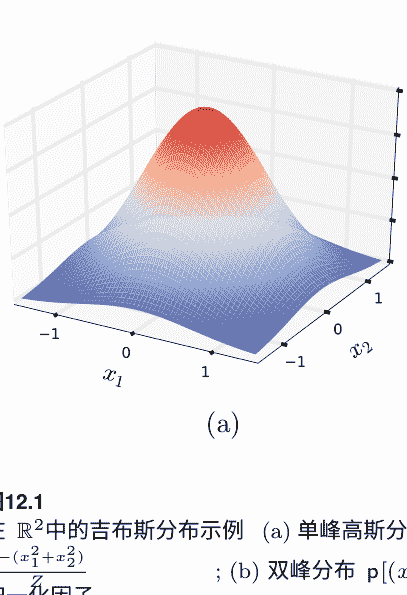

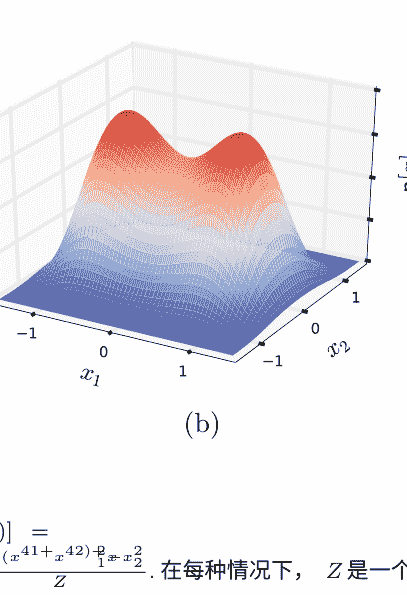

图12.1 在 ℝ² 中的吉布斯分布示例 (a) 单峰高斯分布 p[(x₁, x₂)] = $\frac{e^{-(x_1^2 + x_2^2)}}{Z}$；(b) 双峰分布 p[(x₁, x₂)] = $\frac{e^{-(x_1^4 + x_2^4) - (x_1^2 \cdot x_2^2)}}{Z}$。在每种情况下，Z 是一个归一化因子。

## 12.6 泛化界

设 $\mathcal{L}_\mathcal{D}(\mathbf{w})$ 表示分布 $\mathbf{p}_\mathbf{w}$ 相对于分布 D 的对数损失，$\mathcal{L}_\mathcal{D}(\mathbf{w}) = \mathbb{E}_{x\sim \mathcal{D}}[-\log \mathbf{p}_\mathbf{w}[x]]$，类似地，$\mathcal{L}_S(\mathbf{w})$ 表示相对于由样本 S 定义的经验分布的对数损失。

### 定理 2.3

固定 δ > 0。设 $\mathbf{w}$ 是优化问题 (12.12) 的解，其中 $\lambda = 2\mathfrak{A}_m(\mathcal{H}) + r\left\lceil \frac{\log \frac{2}{\delta}}{m} \right\rceil$。然后，以至少 $1−\delta$ 的概率从分布 $\mathcal{D}$ 中抽取大小为 m 的独立同分布样本 S，以下不等式成立：

$\mathcal{L}_\mathcal{D}(\mathbf{w}) \leq \inf_{\mathbf{w}'} \mathcal{L}_\mathcal{D}(\mathbf{w}') + 2\|\mathbf{w}\|_1 \left[ 2\mathfrak{A}_m(\mathcal{H}) + r \left\lceil \frac{\log \frac{2}{\delta}}{2m} \right\rceil \right]$.

证明：利用 $\mathcal{L}_\mathcal{D}(\mathbf{w})$ 和 $\mathcal{L}_S(\mathbf{w})$ 的定义，Hölder 不等式和不等式 (12.5)，以至少概率为 $1−\delta$，以下成立：

$\mathcal{L}_\mathcal{D}(\mathbf{w}) - \mathcal{L}_S(\mathbf{w}) = \mathbf{w} \cdot \left[ \mathbb{E}_\mathcal{D}[\Phi] - \mathbb{E}_S[\Phi] \right] \leq \|\mathbf{w}\|_1 \left\| \mathbb{E}_\mathcal{D}[\Phi] - \mathbb{E}_S[\Phi] \right\|_\infty \leq \lambda \|\mathbf{w}\|_1$.

$\mathbb{E}_\mathcal{D}[\Phi] - \mathbb{E}_S[\Phi] \leq \|\mathbf{w}\|_1 \left\| \mathbb{E}_\mathcal{D}[\Phi] - \mathbb{E}_S[\Phi] \right\|_\infty \leq \lambda \|\mathbf{w}\|_1$.

因此，由于 $\mathbf{w}$ 是一个最小化器，我们可以写成，对于任意的 $\mathbf{w}'$，

$\mathcal{L}_\mathcal{D}(\mathbf{w}) - \mathcal{L}_\mathcal{D}(\mathbf{w}') = \mathcal{L}_\mathcal{D}(\mathbf{w}) - \mathcal{L}_S(\mathbf{w}) + \mathcal{L}_S(\mathbf{w}) - \mathcal{L}_\mathcal{D}(\mathbf{w}')$

$\leq \lambda \|\mathbf{w}\|_1 + \mathcal{L}_S(\mathbf{w}) - \mathcal{L}_\mathcal{D}(\mathbf{w}')$

$\leq \lambda \|\mathbf{w}\|_1 + \mathcal{L}_S(\mathbf{w}) - \mathcal{L}_\mathcal{D}(\mathbf{w}') \leq 2\lambda \|\mathbf{w}\|_1$,

在最后一个不等式中，我们使用了不等式(12.5)的左不等式对应项。这证明了命题。

$\mathcal{L}_\mathcal{D}(\mathbf{w}) \leq \inf_{\mathbf{w}} \mathcal{L}_\mathcal{D}(\mathbf{w}) + O\left(\frac{\|\mathbf{w}^*\|_1}{\sqrt{m}}\right).$

## 12.7 坐标下降算法

优化问题（12.12）中的对偶目标函数是凸的，因为拉格朗日对偶始终是凹的（附录B）。忽略常数项 – $\frac{1}{m} \sum_{i=1}^m \log p_0[x_i]$，优化问题（12.12）可以重写为 $\inf_{\mathbf{w}} J(\mathbf{w})$ with

$J(\mathbf{w}) = \lambda \|\mathbf{w}\|_1 - \mathbf{w} \cdot \mathbb{E}_\mathcal{D}[\boldsymbol{\Phi}] + \log \left[ \sum_{x \in \mathcal{X}} p_0[x] e^{\mathbf{w} \cdot \boldsymbol{\Phi}(x)} \right].$

特别注意函数 $\mathbf{w} \rightarrow \log \left[ \sum_{x \in \mathcal{X}} p_0[x] e^{\mathbf{w} \cdot \boldsymbol{\Phi}(x)} \right]$ 作为证明定理12.2中定义的函数 $f$ 的共轭函数 $f^*$，它是凸函数。不同的优化技术可以用于解决这个凸优化问题，包括标准的随机梯度下降和几种特殊用途的技术。在本节中，我们将描述一种基于坐标下降的解决方案，在特征数量非常大的情况下尤其有优势。

函数 $J$ 不可微，但由于它是凸函数，它在任意点上都有一个次微分。我们描述的最大熵算法包括将坐标下降应用于目标函数（12.12）。

方向让 $\mathbf{w}_{t-1}$ 表示在第 $(t-1)$ 次迭代后定义的权重向量。在每次迭代 $t \in [T]$，坐标下降法考虑的方向是 $\delta J(\mathbf{w}_{t-1}, \mathbf{e}_j)$。如果 $w_{t-1,j} = 0$，那么 $J$ 沿着 $\mathbf{e}_j$ 的方向导数存在，给定为

$J'(\mathbf{w}_{t-1}, \mathbf{e}_j) = \lambda \text{sgn}(w_{t-1,j}) + \epsilon_{t-1,j}.$

其中 $\epsilon_{t-1,j} = \mathbb{E}_{p_{\mathbf{w}_{t-1}}}[\Phi_j] - \mathbb{E}_{\mathcal{D}}[\Phi_j]$。如果 $w_{t-1,j} = 0$，$J$ 沿着 $\mathbf{e}_j$ 存在右导数和左导数

$J'_+(\mathbf{w}_{t-1}, \mathbf{e}_j) = \lambda + \epsilon_{t-1,j} \quad J'_-(\mathbf{w}_{t-1}, \mathbf{e}_j) = -\lambda + \epsilon_{t-1,j}.$

```
CDMAXENT(S=(x_1, ..., x_m))
1   for t ← 1 to T do
2       for j ← 1 to N do
3           if (w_{t-1,j} = 0) then
4               d_j ← λ sgn(w_{t-1,j}) + ε_{t-1,j}
5           elseif |ε_{t-1,j}| ≤ λ then
6               d_j ← 0
7           else d_j ← -λ sgn(ε_{t-1,j}) + ε_{t-1,j}
8           j ← argmax_{j∈[N]} |d_j|
9           if (| w_{t-1,j} r^2 - ε_{t-1,j}| ≤ λ) then
10              η← -w_{t-1,j}
11          else if (w_{t-1,j} r^2 - ε_{t-1,j} > λ) then
12              η ← \frac{1}{r^2}[-λ - ε_{t-1,j}]
13          else η ← \frac{1}{r^2}[λ - ε_{t-1,j}]
14          w_t ← w_{t-1} + ηe_j
15          p_{w_t} ← \frac{p_{0}[x]e^{w_t·Φ(x)}}{\sum_{x∈\mathcal{X}}p_{0}[x]e^{w_t·Φ(x)}}
16      return p_{w_t}
```

图12.2 坐标下降最大熵算法的伪代码。对于所有 j ∈ [N], $\epsilon_{t-1,j} = \mathbb{E}_{p_{w_{t-1}}}[\Phi_j] - \mathbb{E}_{\mathcal{D}}[\Phi_j]$。

因此，总结起来，对于所有 j ∈ [N],
$$
\delta J(w_{t-1}, e_j) = \begin{cases}
\lambda \text{sgn}(w_{t-1,j}) + \epsilon_{t-1,j} & \text{如果 } (w_{t-1,j}=0)\\
0 & \text{否则如果 } |\epsilon_{t-1,j}| \leq \lambda\\
-\lambda \text{sgn}(\epsilon_{t-1,j}) + \epsilon_{t-1,j} & \text{otherwise}.
\end{cases}
$$
坐标下降算法选择具有最大绝对值的方向 $e_j$ 的 $\delta J(w_{t-1}, e_j)$。

步长 给定方向 $e_j$, 最优步长 $\eta$ 由 $\text{argmin}_\eta J(w_{t-1} + \eta e_j)$ 给出。 $\eta$可以通过线搜索或其他数值方法找到。步长的闭式表达式也可以通过最小化上界 $J(w_{t-1}+ \eta e_j)$ 来推导。注意我们可以写成

对于$J(\mathbf{w}_{t-1} + \eta \mathbf{e}_j)$有一个界限。注意我们可以写成

> $ J(\mathbf{w}_{t-1}+\eta \mathbf{e}_j) - J(\mathbf{w}_{t-1}) = \lambda (|w_j + \eta| - |w_j|) - \eta \mathbb{E}_{S}[\Phi_j] + \log \left[ \mathbb{E}_{\mathbf{pw}_{t-1}}[e^{\eta \Phi_j}] \right] . \quad (12.13) $

鉴于 $\Phi_j \in [-r, +r]$，根据Hoeffding引理，以下不等式成立：

> $ \log \mathbb{E}_{\mathbf{pw}_{t-1}} [e^{\eta \Phi_j}] \leq \eta \mathbb{E}_{\mathbf{pw}_{t-1}} [\Phi_j] + \frac{\eta^2 r^2}{2}. $

将这个不等式与(12.13)结合，并忽略常数项，将导致对 $J(\mathbf{w}_{t-1} + \eta \mathbf{e}_j) - J(\mathbf{w}_{t-1})$的上界进行最小化，等价于对所有$\eta \in \mathbb{R}$定义的 $\varphi(\eta)$进行最小化，其中

> $ \varphi(\eta) = \lambda |w_j + \eta| + \eta \epsilon_{t-1,j} + \frac{\eta^2 r^2}{2}. $

设 $\eta^*$为 $\varphi(\eta)$的最小化器。如果 $w_{t-1,j} + \eta^* = 0$，则在$\eta^*$处， $|w_{t-1,j} + \eta|$的次微分为集合 $\{\nu: \nu \in [-1, +1]\}$。因此，在这种情况下，当且仅当存在 $\nu \in [-1, +1]$使得， $\partial \varphi(\eta^*)$包含0。

> $ \lambda \nu + \epsilon_{t-1,j} + \eta^* r^2 = 0 \Leftrightarrow w_{t-1,j} r^2 - \epsilon_{t-1,j} = \lambda \nu. $

因此条件等价于 $|w_{t-1,j} r^2 - \epsilon_{t-1,j}| \leq \lambda$。如果 $w_{t-1,j} + \eta^* > 0$，那么 $\varphi$在 $\eta^*$处可微分，且 $\varphi'(\eta^*) = 0$，即

> $ \lambda + \epsilon_{t-1,j} + \eta^* r^2 = 0 \Leftrightarrow \eta^* = \frac{1}{r^2}[-\lambda - \epsilon_{t-1,j}]. $

鉴于该表达式，条件 $w_{t-1,j} + \eta^* > 0$等价于 $w_{t-1,j} r^2 -$ 同样，如果 $w_{t-1,j} + \eta^* < 0$， $\varphi$在 $\eta^*$处可微分且 $\varphi'(\eta^*) = 0$，这给出了

> $ \eta^* = \frac{1}{r^2}[\lambda - \epsilon_{t-1,j}]. $

图12.2显示了坐标下降最大熵算法的伪代码使用刚刚介绍的闭式解来计算步长。请注意，在算法的每次迭代（第15行）中，我们不需要更新分布 $\mathbf{p}_{\mathbf{w}_t}$ 我们只需要能够计算 $\mathbb{E}_{\mathbf{p}_{\mathbf{w}_t}}[\Phi_j]$定义了 $\epsilon_{t,j}$。可以使用各种近似策略来高效地实现这一点，包括拒绝抽样技术。

## 12.8 扩展

正如已经指出的那样，Maxent模型的Gibbs分布形式与选择用于测量接近度的散度（相对熵）密切相关。对于分布，相对熵与

非归一化相对熵，即Bregman散度。最大熵模型可以通过使用任意的Bregman散度 $B_\Psi$ 来进行推广（附录E），其中 $\Psi$ 是一个凸函数。此外，其他范数 $\| \cdot \|$ 可以用来限制经验和真实平均特征向量之间的差异。这导致了最大熵模型的以下一般原始优化问题：最小化

$$ \min_{p \in \Delta} B_\Psi (p \| p_0) \qquad (12.14) $$
受限于： $\left\| \mathbb{E}_{x\sim p}[\Phi(x)] - \mathbb{E}_{x\sim\mathcal{D}}[\Phi(x)] \right\| \leq \lambda,$

这是一个凸优化问题，因为 $B_\Psi$ 相对于第一个参数是凸的，如果 $\Psi$ 是严格凸的，则严格凸。下面的一般对偶定理给出了等价于(12.14)的对偶问题的形式，其中使用了共轭函数 $\Psi^*$ 的形式。这里， $\| \cdot \|$ 是任意的范数， $\mathbb{R}^N$ 和 $\| \cdot \|_*$ 是它的共轭。我们在这里假设 $\sup_x \| \Phi(x) \| \leq r$。定理12.4让 $\Psi$ 是定义在 $\mathbb{R}^{\mathcal{X}}$ 上的凸函数。那么，问题(12.14)有以下等价的对偶问题：

$$ \min_{p \in \Delta} B_\Psi(p \| p_0) $$
受限于： $\left\| \mathbb{E}_{x\sim p}[\Phi(x)] - \mathbb{E}_{x\sim\mathcal{D}}[\Phi(x)] \right\| \leq \lambda$$
$$ = \sup_{\mathbf{w} \in \mathbb{R}^N} -\Psi^* \left( \mathbf{w} \cdot \Phi + \nabla \Psi(p_0) \right) + \mathbf{w} \cdot \mathbb{E}_{x\sim\mathcal{D}}[\Phi(x)] - \lambda \| \mathbf{w} \|_* - C(p_0), $$
其中 $C(p_0) = \Psi(p_0) - \langle \nabla \Psi(p_0), p_0 \rangle$。

证明：该证明与定理12.2的证明类似，并通过应用Fenchel对偶定理（定理B.39）到以下优化问题来得到：

$$ \min_{p} f(p) + g(Ap), \qquad (12.15) $$

其中函数 $f$, $g$ 和 $A$ 对于所有的 $p \in \mathbb{R}^{\mathcal{X}}$ 和 $\mathbf{u} \in \mathbb{R}^N$ 定义为 $f(p) = B_\Psi(p \| p_0)$ 鉴于这些问题($12.1$)以及等价于($12.14$)。$A$ 是有界线性映射，因为对于任意的 $p$，我们有 $\| A p \| \leq \| p \|_1 \sup_x \| \Phi(x) \| \leq r \| p \|_1$。另外，注意对于所有的 $\mathbf{w} \in \mathbb{R}^N$， $A^*\mathbf{w} = \mathbf{w} \cdot \Phi$。

由于 $p_0$ 在 $\Delta = \text{dom}(f)$ 中， $\mathbf{u}_0$ 在 $A(\text{dom}(f))$ 中。此外，由于 $\lambda > 0$， $\mathbf{u}_0$ 在 $\text{int}(\mathcal{C})$ 中。 $g = I_{\mathcal{C}}$ 在 $\text{int}(\mathcal{C})$ 上等于零，并且因此在 $\text{int}(\mathcal{C})$ 上连续，因此 $g$ 在 $\mathbf{u}_0$ 处连续，并且我们有 $\mathbf{u}_0 \in A(\text{dom}(f)) \cap \text{cont}(g)$。因此，定理B.39的假设成立。

函数 \(f\) 的共轭函数对于所有的 \(q \in \mathbb{R}^{\mathcal{X}}\) 定义为

\[
f^{*}(q) = \sup_{p} \langle p, q \rangle - B_{\Psi}(p \| p_0) - I_{\Delta}(p)
\]
\[
= \sup_{p \in \Delta} \langle p, q \rangle - B_{\Psi}(p \| p_0)
\]
\[
= \sup_{p \in \Delta} \langle p, q \rangle - \Psi(p) + \Psi(p_0) + \langle \nabla \Psi(p_0), p - p_0 \rangle
\]
\[
= \sup_{p \in \Delta} \langle p, q + \nabla \Psi(p_0) \rangle - \Psi(p) + \Psi(p_0) - \langle \nabla \Psi(p_0), p_0 \rangle
\]
\[
= \Psi^{*}(q + \nabla \Psi(p_0)) + \Psi(p_0) - \langle \nabla \Psi(p_0), p_0 \rangle.
\]

共轭函数 \(g = I_{\mathbb{C}}\) 的定义对于所有 \(w \in \mathbb{R}^{N}\) 为

\[
g^{*}(w) = \sup_{u} \langle w, u \rangle - I_{\mathbb{C}}(u)
\]
\[
= \sup_{u \in \mathbb{C}} \langle w, u \rangle
\]
\[
= \sup_{\|u - \mathbb{E}_{\mathcal{D}}[\Phi] \| \leq \lambda} \langle w, u \rangle
\]
\[
= \langle w, \mathbb{E}_{\mathcal{D}}[\Phi] \rangle + \sup_{\|u\| \leq \lambda} \langle w, u \rangle = \langle w, \mathbb{E}_{\mathcal{D}}[\Phi] \rangle + \lambda \| w \|_{*},
\]

根据对偶范数的定义，最后一个等式成立。根据定理B.39，考虑这些恒等式，我们有最小值

\[
\inf_{p} f(p) + g(Ap) = \sup_{w \in \mathbb{R}^{N}} -f^{*}(A^{*}w) - g^{*}(w)
\]
\[
= \sup_{w \in \mathbb{R}^{N}} -\Psi^{*}(w \cdot \Phi + \nabla \Psi(p_0)) + w \cdot \mathbb{E}_{\mathcal{D}}[\Phi] - \lambda \| w \|_{*}
\]
\[
- \Psi(p_0) + \langle \nabla \Psi(p_0), p_0 \rangle,
\]

这完成了证明。\(\square\)

注意，前面的证明及其对Fenchel对偶性的使用，即使考虑了不是内积范数的范数，更一般地，也考虑了Banach空间（如B.4节中所述）。

在前几节中，对于未归一化的相对熵的分析和理论保证在广泛的Bregman散度家族中都直接推广。

## 12.9 \(L_2\)-正则化

在本节中，我们研究了一种常见的Maxent算法变体，其中使用基于权重向量 \(w\) 的范数-2平方的正则化。注意这不在前一节讨论的一般框架中。

其中正则化基于 \(\mathbf{w}\) 的某个范数。相应的（对偶）优化问题如下：

$$\min_{\mathbf{w} \in \mathbb{R}^N} \lambda \|\mathbf{w}\|_2^2 - \frac{1}{m} \sum_{i=1}^{m} \log p_{\mathbf{w}}[x_i]. \quad \quad (12.16)$$

设 \(\mathcal{L}_\mathcal{D}(\mathbf{w})\) 表示分布 \(p_{\mathbf{w}}\) 相对于分布 \(\mathcal{D}\) 的对数损失， \(\mathcal{L}_\mathcal{D}(\mathbf{w}) = \mathbb{E}_{x\sim\mathcal{D}}[-\log p_{\mathbf{w}}[x]]\)， 类似地， \(\mathcal{L}_S(\mathbf{w})\) 表示相对于由样本 \(S\) 定义的经验分布的对数损失。然后，该算法具有以下保证。

**定理2.5** 设 \(\mathbf{w}\) 是优化问题 (12.16) 的解。那么，对于任意 \(\delta > 0\)，以至少 \(1 - \delta\) 的概率从 \(\mathcal{D}\) 中抽取的大小为 \(m\) 的 i.i.d. 样本 \(S\)，以下不等式成立：

$$\mathcal{L}_\mathcal{D}(\mathbf{w}) \le \inf_{\mathbf{w}} \mathcal{L}_\mathcal{D}(\mathbf{w}) + \lambda\|\mathbf{w}\|_2^2 + \frac{r^2}{\lambda m} \left(1 + \sqrt{\log \frac{1}{\delta}}\right)^2.$$

证明：设 \(D\) 表示由样本 \(S\) 定义的经验分布。那么，优化问题 (12.16) 可以表述如下：最小化

$$\min_{\mathbf{w} \in \mathbb{R}^N} \lambda\|\mathbf{w}\|_2^2 - \mathbb{E}_{x\sim\mathcal{D}}[\log p_{\mathbf{w}}[x]] = \lambda\|\mathbf{w}\|_2^2 - \mathbf{w} \cdot \mathbb{E}_{x\sim\mathcal{D}}[\mathbf{\Phi}(x)] + \log Z(\mathbf{w}),$$

其中 \(Z(\mathbf{w}) = \left( \sum_x \exp(\mathbf{w} \cdot \mathbf{\Phi}(x)) \right)\)。类似地，设 \(\mathbf{w}_\mathcal{D}\) 表示具有分布 \(\mathcal{D}\) 的最小化问题的解：最小化

$$\min_{\mathbf{w} \in \mathbb{R}^N} \lambda\|\mathbf{w}\|_2^2 - \mathbb{E}_{x\sim\mathcal{D}}[\log p_{\mathbf{w}}[x]] = \lambda\|\mathbf{w}\|_2^2 - \mathbf{w} \cdot \mathbb{E}_{x\sim\mathcal{D}}[\mathbf{\Phi}(x)] + \log Z(\mathbf{w}).$$

我们首先给出一个对于所有 \(\mathbf{w} \in \mathbb{R}^N\) 成立的 \(\mathcal{L}_\mathcal{D}(\mathbf{w})\) 的上界，从 \(\mathcal{L}_\mathcal{D}(\mathbf{w})\) 的分解开始，然后使用 \(\mathcal{L}_\mathcal{D}(\mathbf{w}) - \mathcal{L}_S(\mathbf{w})\) 的表达式来表示平均特征值，接下来使用 \(\mathbf{w}\) 的最优性，然后使用 \(\mathcal{L}_S(\mathbf{w}_\mathcal{D}) - \mathcal{L}_\mathcal{D}(\mathbf{w}_\mathcal{D})\) 的表达式来表示平均特征值，最后使用柯西-施瓦茨不等式和 \(\mathbf{w}_\mathcal{D}\) 的最优性：

$$\begin{aligned} \mathcal{L}_\mathcal{D}(\mathbf{w}) & = \mathcal{L}_\mathcal{D}(\mathbf{w}) - \mathcal{L}_S(\mathbf{w}) + \mathcal{L}_S(\mathbf{w}) - \mathcal{L}_\mathcal{D}(\mathbf{w}_\mathcal{D}) + \mathcal{L}_\mathcal{D}(\mathbf{w}_\mathcal{D}) + \lambda\|\mathbf{w}\|_2^2 - \lambda\|\mathbf{w}\|_2^2 \\ & = \mathbf{w} \cdot \left[ \mathbb{E}_{x\sim\mathcal{D}}[\mathbf{\Phi}(x)] - \mathbb{E}_{x\sim\mathcal{S}}[\mathbf{\Phi}(x)] \right] + \mathcal{L}_S(\mathbf{w}) - \mathcal{L}_\mathcal{D}(\mathbf{w}_\mathcal{D}) + \mathcal{L}_\mathcal{D}(\mathbf{w}_\mathcal{D}) + \lambda\|\mathbf{w}\|_2^2 - \lambda\|\mathbf{w}\|_2^2 \\ & \le \mathbf{w} \cdot \left[ \mathbb{E}_{x\sim\mathcal{D}}[\mathbf{\Phi}(x)] - \mathbb{E}_{x\sim\mathcal{S}}[\mathbf{\Phi}(x)] \right] + \mathcal{L}_S(\mathbf{w}_\mathcal{D}) - \mathcal{L}_\mathcal{D}(\mathbf{w}_\mathcal{D}) + \mathcal{L}_\mathcal{D}(\mathbf{w}_\mathcal{D}) + \lambda\|\mathbf{w}\|_2^2 - \lambda\|\mathbf{w}\|_2^2 \\ & \le [\mathbf{w} - \mathbf{w}_\mathcal{D}] \cdot \left[ \mathbb{E}_{x\sim\mathcal{D}}[\mathbf{\Phi}(x)] - \mathbb{E}_{x\sim\mathcal{S}}[\mathbf{\Phi}(x)] \right] + \mathcal{L}_\mathcal{D}(\mathbf{w}_\mathcal{D}) + \lambda\|\mathbf{w}_\mathcal{D}\|_2^2 - \lambda\|\mathbf{w}\|_2^2 \\ & \le \|\mathbf{w} - \mathbf{w}_\mathcal{D}\|_2 \left\| \mathbb{E}_{x\sim\mathcal{D}}[\mathbf{\Phi}(x)] - \mathbb{E}_{x\sim\mathcal{S}}[\mathbf{\Phi}(x)] \right\|_2 + \mathcal{L}_\mathcal{D}(\mathbf{w}) + \lambda\|\mathbf{w}\|_2^2. \end{aligned}$$

接下来，我们使用凸函数和可微分目标函数的最小化解来限制 \(\|w - w_D\|_2\)，其梯度在最小化值处必须为零：\(2\lambda w - \mathbb{E}_{x\sim\mathcal{D}}[\Phi(x)] + \nabla \log Z(w) = 0\) 和 \(2\lambda w_D - \mathbb{E}_{x\sim\mathcal{D}}[\Phi(x)] + \nabla \log Z(w_D) = 0\)，这意味着

$$2\lambda(w - w_D) = \mathbb{E}_{x\sim\mathcal{D}}[\Phi(x)] - \mathbb{E}_{x\sim\mathcal{D}}[\Phi(x)] + \nabla \log Z(w_D) - \nabla \log Z(w).$$

两边乘以 \((w - w_D)\) 得到

$$2\lambda\|w - w_D\|_2^2 = \left[\mathbb{E}_{x\sim\mathcal{D}}[\Phi(x)] - \mathbb{E}_{x\sim\mathcal{D}}[\Phi(x)]\right] \cdot [w - w_D] - [\nabla \log Z(w) - \nabla \log Z(w_D)] \cdot [w - w_D] \le \left[\mathbb{E}_{x\sim\mathcal{D}}[\Phi(x)] - \mathbb{E}_{x\sim\mathcal{D}}[\Phi(x)]\right] \cdot [w - w_D],$$

考虑到 \(w \mapsto \log Z(w)\) 的凸性。使用柯西-施瓦茨不等式并简化，我们得到

$$\|w - w_D\|_2 \le \frac{\|\mathbb{E}_{x\sim\mathcal{D}}[\Phi(x)] - \mathbb{E}_{x\sim\mathcal{D}}[\Phi(x)]\|_2}{2\lambda}.$$

将这个代入先前推导出的上界 \(\mathcal{L}_\mathcal{D}(w)\) 得到

$$\mathcal{L}_\mathcal{D}(w) \le \frac{\|\mathbb{E}_{x\sim\mathcal{D}}[\Phi(x)] - \mathbb{E}_{x\sim\mathcal{D}}[\Phi(x)]\|_2^2}{2\lambda} + \mathcal{L}_\mathcal{D}(w) + \lambda\|w\|_2^2.$$

现在我们使用麦克迪亚米德（McDiarmid）不等式来限制 \(\|\mathbb{E}_{x\sim\mathcal{D}}[\Phi(x)] - \mathbb{E}_{x\sim\mathcal{D}}[\Phi(x)]\|_2\)。让 \(\Psi(S)\) 表示样本 \(S\) 的这个数量。让 \(S'\) 是一个与 \(S\) 不同的样本，只有一个点不同，比如对于 \(S\) 是 \(x_m\)，对于 \(S'\) 是 \(x'_m\)。然后，根据三角不等式，

$$|\Psi(S') - \Psi(S)| = \left|\|\mathbb{E}_{x\sim\mathcal{D'}}[\Phi(x)] - \mathbb{E}_{x\sim\mathcal{D}}[\Phi(x)]\|_2 - \|\mathbb{E}_{x\sim\mathcal{D}}[\Phi(x)] - \mathbb{E}_{x\sim\mathcal{D}}[\Phi(x)]\|_2\right| \le \|\mathbb{E}_{x\sim\mathcal{D'}}[\Phi(x)] - \mathbb{E}_{x\sim\mathcal{D}}[\Phi(x)]\|_2 \le \left\|\frac{\Phi(x'_m) - \Phi(x_m)}{m}\right\|_2 \le \frac{2r}{m}.$$

因此，对于任意 \(\delta > 0\)，至少以概率 \(1 - \delta\)，以下不等式成立

$$\Psi(S) \le \mathbb{E}_{S\sim\mathcal{D}^m}[\Psi(S)] + 2r \sqrt{\frac{\log \frac{1}{\delta}}{2m}}.$$

对于任意 \(i \in [m]\)，令 \(Z_i\) 表示随机变量 \(\mathbb{E}_{x\sim\mathcal{D}}[\Phi(x_i)] - \mathbb{E}_{x\sim\mathcal{D}}[\Phi(x)]\)。然后，根据Jensen不等式， \(\mathbb{E}_{S\sim\mathcal{D}^m}[\Psi(S)]\) 可以被上界如下：

$$\mathbb{E}_{S\sim\mathcal{D}^m}[\Psi(S)] = \mathbb{E}\left[ \left\| \frac{1}{m} \sum_{i=1}^m Z_i \right\|_2 \right] \le \mathbb{E}\left[ \left\| \frac{1}{m} \sum_{i=1}^m Z_i \right\|_2^2 \right].$$

由于随机变量 \(Z_i\) 是独立同分布且中心化的 (\(\mathbb{E}[Z_i] = 0\))，我们有

$$\begin{aligned} \mathbb{E}\left[ \left\| \frac{1}{m} \sum_{i=1}^m Z_i \right\|^2 \right] &= \frac{1}{m^2} \left[ \sum_{i=1}^m \mathbb{E}\left[ \|Z_i\|^2 \right] + \sum_{i \neq j} \mathbb{E}[Z_i] \cdot \mathbb{E}[Z_j] \right] \\ &= \frac{\mathbb{E}\left[ \|Z_1\|^2 \right]}{m} \\ &= \frac{\mathbb{E}\left[ \|Z_1\|^2 + \|Z_2\|^2 \right]}{2m} \\ &= \frac{\mathbb{E}\left[ \|Z_1 - Z_2\|^2 \right]}{2m}. \end{aligned}$$

其中，对于最后一个等式，我们使用了 \(\mathbb{E}[Z_1 \cdot Z_2] = \mathbb{E}[Z_1] \cdot \mathbb{E}[Z_2] = 0\) 这个事实。这表明 \(\mathbb{E}[\Psi(S)] \le \frac{2r}{\sqrt{2m}}\) 并且，至少以概率 \(1 - \delta\)，以下条件成立

$$\Psi(S) \le \frac{2r}{\sqrt{2m}} \left( 1 + \sqrt{ \log \frac{1}{\delta} } \right),$$

因此也

$$\begin{aligned} \mathcal{L}_\mathcal{D}(w) &\le \frac{1}{2\lambda} \frac{2r^2}{m} \left( 1 + \sqrt{ \log \frac{1}{\delta} } \right)^2 + \mathcal{L}_\mathcal{D}(w) + \lambda \|w\|_2^2 \\ &\le \frac{r^2}{\lambda m} \left( 1 + \sqrt{ \log \frac{1}{\delta} } \right)^2 + \mathcal{L}_\mathcal{D}(w) + \lambda \|w\|_2^2, \end{aligned}$$

证明结束。

假设 \(w^*\) 达到损失函数的下界，即 \(\mathcal{L}_\mathcal{D}(w^*) = \inf_w \mathcal{L}_\mathcal{D}(w)\) 并且我们给出了其范数的上界 \(\Lambda_2\)：\(\|w^*\|_2 \le \Lambda_{2}\)。然后，我们可以利用这个上界选择 \(\lambda\) 来最小化包含 \(\lambda\) 的两个项：\(\lambda \Lambda_2^2 = \frac{r^2}{\lambda m}\) 即 \(\lambda = \frac{r}{\Lambda_2 \sqrt{m}}\)。然后，定理将以概率 \(1 - \delta\) 保证以下不等式对于 \(w\) 成立：

$$\mathcal{L}_\mathcal{D}(w) \le \inf_w \mathcal{L}_\mathcal{D}(w) + \frac{r \Lambda_2}{\sqrt{m}} \left[ 1 + \left( 1 + \sqrt{ \log \frac{1}{\delta} } \right)^2 \right].$$

## 12.10 章节笔记

Maxent 原则最早由 Jaynes [1957] 明确提出（参见 Jaynes[1983]），他引用了 Shannon 的熵概念（附录 E）来支持这个原则。正如第 12.5 节所述，标准的 Maxent 模型与统计力学中的原始 Boltzmann 模型相一致。事实上，Jaynes [1957] 认为统计力学可以被视为一种统计推断形式，而不是物理理论，并且热力学的熵概念可以被信息论的熵概念所取代。本章中对 Maxent 原则的证明是基于学习理论的论证。

最大熵模型，通常称为 Maxent 模型，在自然语言处理中用于各种任务 [Berger et al., 1996, Rosenfeld, 1996, Pietra et al., 1997, Malouf, 2002, Manning and Klein, 2003, Ratnaparkhi, 2010] 以及许多其他应用，包括物种栖息地建模 [Phillips et al., 2004, 2006, Dudík et al., 2007, Elith et al., 2011]。Maxent 模型的一个关键优势是它们允许用户选择和增强各种不同的特征。许多任务中使用的特征的丰富性以及样本量较小的特点，促使使用正则化的 Maxent 模型，其中控制定义 Gibbs 分布的参数向量的 \(L_1\) 范数 [Kazama and Tsujii, 2003] 或 \(L_2\) 范数 [Chen and Rosenfeld, 2000, Lebanon and Lafferty, 2001]。这可以等同于在贝叶斯解释中引入参数向量的拉普拉斯或高斯先验 [Williams, 1994, Goodman, 2004]，从而使 Maxent 模型与具体的先验选择下的最大后验解重合。

Dudík、Phillips 和 Schapire [2007] 以及 Altun 和 Smola [2006] 对这些正则化进行了广泛的理论研究，并通过 Fenchel 对偶性（也参见 [Lafferty, Pietra, and Pietra, 1997]）研究了任意 Bregman 散度和范数的扩展（第 12.8 节）。Cortes、Kuznetsov、Mohri 和 Syed [2015] 提供了一种更一般的密度估计模型，即结构化最大熵模型，其特征函数从可能非常复杂的子族的并集中选择，并且他们还给出了对偶定理、强学习保证和算法。这些模型也可以看作是具有更一般类型的正则化的最大熵模型。

最大熵的对偶定理归功于 Pietra、Pietra 和 Lafferty [1997]（也参见 [Dudík et al., 2007] 和 [Altun and Smola, 2006]）。定理 12.2 是对对偶的 \(\epsilon\)-解的保证的轻微扩展，是结构化最大熵模型 [Cortes et al., 2015] 的一个特殊实例的更一般定理。

第 12.6 节和第 12.9 节的泛化界限及其证明是变体。

这是由Dud´ık等人[2007]得出的结果的变体。在定理12.5的证明中使用的稳定性分析等价于第14章中使用Bregman散度描述的分析。

已经提出了各种不同的技术来解决最大熵优化问题，包括标准梯度下降和随机梯度下降。为了解决这个问题，引入了一些特定的算法，包括广义迭代缩放(GIS) [Darroch and Ratcliff, 1972]和改进的迭代缩放(IIS) [Pietra et al., 1997]。Malouf [2002]证明了这些算法在与共轭梯度技术和有限内存BFGS方法（也见[Andrew and Gao, 2007]）相比下，在几个自然语言处理任务中表现不佳。本章介绍的坐标下降解决方案是由Cortes等人[2015]提出的。这是Dud´ık等人[2007]算法的简化版本，它使用了一个更紧的上界 U(w_{t-1} + η e_j)，但受到各种技术条件的限制。这两个算法都受益于类似的渐近收敛速度[Cortes et al., 2015]，并且特别适用于特征数量非常大且更新所有特征权重不可行的情况。张[2003b]的顺序贪婪逼近也被Altun和Smola [2006]作为最大熵问题的一般算法推崇，适用于一般形式的最大熵问题。

### 12.11 练习题

- 12.1 凸性。直接证明函数 w → log Z(w) = log(∑_{x∈X} e^{w·Φ(x)}) 是凸的（提示：计算其Hessian矩阵）。
- 12.2 拉格朗日对偶。推导出Maxent问题的对偶问题，并在分布p: p(x) > 0对于所有 x ∈ X 的严格约束情况下进行合理的解释。
- 12.3 范数平方正则化Maxent的对偶问题。推导出方程（12.16）中所示的范数平方正则化Maxent优化的对偶形式。
- 12.4 推广到Bregman散度。推导出第12.8节讨论的扩展的理论保证。你的学习保证需要Bregman散度具备哪种附加属性？
- 12.5 L_{2}-正则化。设 w 为具有二范数平方正则化的Maxent的解。
    +   (a) 证明以下不等式： $\|\mathbf{w}\|_2 \leq \frac{2r}{\lambda}$（提示：你可以比较目标函数在 $\mathbf{w}$ 和0处的值。）将此结果推广到其他 $\|\cdot\|_p$-正则化，其中 $p > 1$。
    +   (b) 使用前一个问题推导出具有二范数平方正则化的Maxent的显式学习保证（提示：你可以使用第12.9节中给出的最后一个不等式，并推导出 $\Lambda_2$ 的显式表达式。）

## 13 条件最大熵模型

本章介绍了用于估计给定示例的类别条件概率的算法，而不仅仅是预测该示例的类别标签。这是受到几个应用程序的启发，这些应用程序除了类别预测外，还寻求置信度值。所讨论的算法，条件Maxent模型，也被称为多项式逻辑回归算法，是最著名和最广泛使用的多类分类算法之一。在两类的特殊情况下，该算法被称为逻辑回归。

正如它们的名字所暗示的，这些算法可以被视为条件概率的最大熵模型。为了介绍它们，我们将扩展前一章（第12章）中讨论的思想，从最大熵原理的条件情况开始。接下来，我们将证明一个对偶定理，为条件最大熵提供了一个等价的对偶优化问题。我们将具体讨论使用条件最大熵进行多类别分类的不同方面，并保留一个专门的部分来分析逻辑回归。

### 13.1 学习问题

我们考虑一个具有 $c$ 个类别的多类别分类问题， $c \ge 1$。令 $\mathcal{Y}=\{1, \dots ,c\}$ 表示输出空间， $\mathcal{D}$ 表示 $\mathcal{X} \times \mathcal{Y}$ 上的一个分布。学习器接收到一个带标签的训练样本 $S= ((x_1, y_1), \dots, (x_m, y_m)) \in (\mathcal{X} \times \mathcal{Y})^m$ ，其中样本是独立同分布地根据 $\mathcal{D}$ 抽取的。与第12章一样，我们假设学习器还可以访问一个特征映射 $\Phi: \mathcal{X} \times \mathcal{Y} \rightarrow \mathbb{R}^N$ ，其中 $\mathbb{R}^N$ 是一个带有 $\|\Phi\|_{\infty} \le r$ 的范数向量空间。我们将 $\mathcal{H}$ 表示为包含组成特征函数 $\Phi_j$ （其中 $j \in [N]$ ）的实值函数族。请注意，在最一般的情况下，我们可能有 $N=+\infty$ 。问题的目标是使用训练样本 $S$ 来学习准确的条件概率 $p[\cdot |x]$ ，对于任意的 $x \in \mathcal{X}$ 。

### 13.2 条件最大熵原理

对于最大熵模型，可以从一个关键的集中不等式推导出条件最大熵或逻辑回归模型。根据一般的Rademacher复杂度界限（定理3.3），对于任意的δ > 0，以下不等式在选择大小为m的样本时至少以概率1 - δ成立：

$$\left\| \mathop{\mathbb{E}}\limits_{(x,y)\sim\mathcal{D}} [\Phi(x,y)] - \mathop{\mathbb{E}}\limits_{(x,y)\sim\mathcal{D}^1} [\Phi(x,y)] \right\|_\infty \leq 2\mathfrak{R}_m(\mathcal{H}) + \sqrt{\frac{\log \frac{2}{\delta}}{2m}}, \tag{13.1}$$

其中，我们用 $\mathcal{D}$ 表示由样本 $S$ 定义的经验分布。我们还用 $\mathcal{D}^1(x)$ 表示样本 $S$ 中的 $x$ 的经验分布。对于任意的 $x \in \mathcal{X}$，让 $p_0[\cdot|x]$ 表示一个条件概率，通常选择为均匀分布。因此，条件最大熵原则的目标是寻找尽可能不确定的条件概率 $p[\cdot|x]$，即尽可能接近均匀分布，或者更一般地接近先验概率 $p_0[\cdot|x]$，同时满足类似于 (13.1) 的不等式。

$$\left\| \mathop{\mathbb{E}}\limits_{\substack{x\sim\mathcal{D}^1 \\ y\sim p[\cdot|x]}} [\Phi(x, y)] - \mathop{\mathbb{E}}\limits_{(x,y)\sim\mathcal{D}} [\Phi(x, y)] \right\|_\infty \leq \lambda, \tag{13.2}$$

其中 $\lambda \geq 0$ 是一个参数。在这里，接近性是通过基于输入点的经验边际分布 $\mathcal{D}^1$ 的条件相对熵（附录E）来定义的。选择 $\lambda = 0$ 对应于标准的条件最大熵或无正则化的条件最大熵，并要求基于 $\mathcal{D}^1$ 和条件概率 $p[\cdot|x]$ 的特征期望与经验平均值完全匹配。正如我们将在后面看到的，它的放松，即不等式情况（$\lambda > 0$），会转化为一种正则化。请注意，条件最大熵原则不要求指定一个条件概率分布族 $\mathcal{P}$ 来选择。

### 13.3 条件最大熵模型

让 $\Delta$ 表示概率分布在 $\mathcal{Y}$ 上的单纯形，$\mathcal{X}_1 = \text{supp}(\mathcal{D}^1)$ 表示 $\mathcal{D}^1$ 的支撑集，而 $\bar{\text{p}} \in \Delta^{\mathcal{X}_1}$ 表示条件概率的族群，$\bar{\text{p}} = (p[\cdot|x])_{x \in \mathcal{X}}$。然后，条件最大熵原理可以表述为以下优化问题：

最优化问题：

$$\min_{\bar{p} \in \Delta^{\mathcal{X}_1}} \sum_{x \in \mathcal{X}_1} \mathcal{D}^1(x) \text{D}\left(\text{p}[\cdot|x] \parallel \text{p}_0[\cdot|x]\right)$$
$$\text{s.t.} \left\| \underset{y \sim \text{p}[\cdot|x]}{\mathbf{E}} \left[ \boldsymbol{\Phi}(x, y) \right] - \underset{(x,y) \sim \mathcal{D}}{\mathbf{E}} \left[ \boldsymbol{\Phi}(x, y) \right] \right\|_\infty \leq \lambda.$$
$$(13.3)$$

这定义了一个凸优化问题，因为目标函数是相对熵的正和，相对熵对其参数是凸的(附录E)，约束是$\bar{p}$的仿射函数，而$\Delta^{\mathcal{X}_1}$是一个凸集。解是唯一的，因为目标函数是相对熵的正和，每个相对熵都是严格凸的。经验条件概率$\text{D}^1(\cdot|x), x \in \mathcal{X}^1$，显然构成一个可行解，因此问题$_{(12.7)}$是可行的。

对于均匀先验$\text{p}_0[\cdot|x]$，问题$(13.3)$可以等价地表示为条件熵最大化，这解释了这些模型的名称。令$\bar{H}(\bar{p}) = -\underset{x \sim \mathcal{D}^1}{\mathbf{E}} \left[ \sum_{y \in \mathcal{Y}} \text{p}[y|x] \log \text{p}[y|x] \right]$表示相对于边际分布$\mathcal{D}^1$的条件熵。那么，$(12.7)$的目标函数可以重写如下：

$$\text{D}\left(\text{p}[\cdot|x] \parallel \text{p}_0[\cdot|x]\right) = \underset{x \sim \mathcal{D}^1}{\mathbf{E}} \left[ \sum_{y \in \mathcal{Y}} \text{p}[y|x] \log \frac{\text{p}[y|x]}{\text{p}_0[y|x]} \right]$$
$$= \underset{x \sim \mathcal{D}^1}{\mathbf{E}} \left[ - \sum_{y \in \mathcal{Y}} \text{p}[y|x] \log(1/c) + \sum_{y \in \mathcal{Y}} \text{p}[y|x] \log \text{p}[y|x] \right]$$
$$= \log(c) - \bar{H}(\bar{p}).$$

因此，由于$\log(c)$是一个常数，最小化目标函数等价于最大化$\bar{H}(\bar{p})$。

条件最大熵模型是刚刚描述的优化问题的解。与非条件情况类似，它们具有两个重要的优点：它们基于经验特征平均值与真实特征平均值之间的基本理论保证，并且不需要指定特定的分布族$\mathcal{P}$。在接下来的章节中，我们将进一步分析条件最大熵模型的性质。

### 13.4 对偶问题

在这里，我们推导出一个等价的对偶问题，对偶问题可以被表述为在Gibbs分布族上的正则化条件最大似然问题。

最大熵优化问题(13.3)可以等价地表示为无约束优化问题minₚ F(p̄)，其中对于所有的p̄= (p[·|x]) ∈ (ℝ^𝒴)^𝒳₁，

$$F(\bar{p}) = \mathbb{E}_{x \sim \mathcal{D}_1} \left[ \widetilde{D}( p[\cdot|x] \| p_0[\cdot|x] ) \right] + I_{\mathbb{C}} \left( \mathbb{E}_{\substack{x \sim \mathcal{D}_1 \\ y \sim p[\cdot|x]}} [\Phi(x,y)] \right), \quad (13.4)$$

带 $\widetilde{D}(p[\cdot|x] \| p_0[\cdot|x]) = D(p[\cdot|x] \| p_0[\cdot|x])$ 如果 $p[\cdot|x]$在Δ中， $\widetilde{D}(p[\cdot|x] \| p_0[\cdot|x]) = +\infty$ 否则，且 $\mathbb{C} = \{ u \in \mathbb{R}^N : \| u - \mathbb{E}_{(x,y) \sim \mathcal{D}} [\Phi(x,y)] \|_\infty \leq \lambda \}$，这是一个凸集。

让 $G$ 是对所有 $w \in \mathbb{R}^N$ 定义的函数

$$G(w) = \frac{1}{m} \sum_{i=1}^{m} \log \left[ \frac{p_w[y_i|x_i]}{p_0[y_i|x_i]} \right] - \lambda \|w\|_1, \quad (13.5)$$

对于所有的 $x \in \mathcal{X}_1$ 和 $y \in \mathcal{Y}$，

$$p_w[y|x] = \frac{p_0[y|x] e^{w \cdot \Phi(x,y)}}{Z(w, x)} \quad \text{和} \quad Z(w, x) = \sum_{y' \in \mathcal{Y}} p_0[y'|x] e^{w \cdot \Phi(x,y')}. \quad (13.6)$$

然后，以下定理给出了一个类似于非条件下对偶定理的结果（定理12.2，第12.5节）。

> **定理13.1** 问题 (13.3) 等价于对偶优化问题 $\sup_{w \in \mathbb{R}^N} G(w)$：
> $$
> \sup_{w \in \mathbb{R}^N} G(w) = \min_{\bar{p} \in (\mathbb{R}^{\mathcal{Y}})^{\mathcal{X}_1}} F(\bar{p}). \quad (13.7)
> $$
>
> 此外，令 $\bar{p}^* = \text{argmin}_{\bar{p}} F(\bar{p})$。然后，对于任意的 $\epsilon > 0$ 和任意的 $w$ 使得 $|G(w) - \sup_{w \in \mathbb{R}^N} G(w)| < \epsilon$，我们有 $\mathbb{E}_{x \sim \mathcal{D}_1} \left[ \widetilde{D}( \bar{p}^*[\cdot|x] \| p_0[\cdot|x] ) \right] \leq \epsilon$。

证明类似于定理12.2的证明，并在本章末尾给出（因为它稍微长一些（第13.9节）。

根据定理，如果 $w$ 是对偶优化问题的一个 $\epsilon$-解，则 $\mathbb{E}_{x \sim \mathcal{D}_1} \left[ D( p^*[\cdot|x] \| p_0[\cdot|x] ) \right] \leq \epsilon$，根据Jensen不等式和Pinsker不等式（命题E.7），可以推导出

$$\mathbb{E}_{x \sim \mathcal{D}_1} \left[ \| p^*[\cdot|x] - p_w[\cdot|x] \|_1 \right] \leq \sqrt{ \mathbb{E}_{x \sim \mathcal{D}_1} \left[ \| p^*[\cdot|x] - p_w[\cdot|x] \|_1^2 \right] } \leq \sqrt{2\epsilon}.$$

因此， $p_w[\cdot|x]$ 然后是 $\mathbb{E}$ 在 $\mathcal{D}_1$-平均 $L_1$-范数中，与原始问题的最优解 $2\epsilon$-接近，定理表明条件最大熵问题的解可以通过求解对偶问题来确定，对于均匀先验，可以等价地写为：

$$\inf_{w} \lambda \|w\|_1 - \frac{1}{m} \sum_{i=1}^{m} \log \left[ p_w[y_i|x_i] \right]. \quad (13.8)$$

对于非条件最大熵模型的类似评论也适用于这里。特别地，对于λ = 0，可能无法找到任何有限的解，这就是为什么需要下确界的原因。此外，这个结果可能看起来令人惊讶，因为它显示了条件最大熵与条件最大似然（λ = 0）或正则化的条件最大似然（λ > 0）在选择条件概率族P时与Gibbs分布的条件概率族重合，而条件最大熵原则并没有明确指定任何条件概率族P。原因是特定选择条件相对熵作为测量 p[·|x] 与先验条件分布 p₀[·|x] 之间接近程度的度量。

分布之间的其他接近度量会导致不同的解形式。因此，在某种意义上，接近度量的选择是最大似然中条件分布族的（对偶）对应物。

此外，正如在标准的最大熵情况中已经提到的，吉布斯分布形成了一个非常丰富的家族。注意，条件最大熵的原始问题和对偶问题都只涉及条件概率 p[·|x]，其中 x 在训练样本中。因此，它们并不提供关于其他条件概率的任何信息。然而，对偶问题表明，对于 x 在 X₁ 中，解的一般形式是 p_w[·| x]，它只依赖于权重向量 w。鉴于此，我们通过使用相同的一般形式 p_w[·|x] 和相同的向量 w 来扩展最大熵条件概率的定义到所有的 x ∈ X。还要注意，在原始问题或对偶问题的定义中，我们可以使用一些其他分布 Q over X 代替 D₁。很容易验证，在这种情况下，对偶定理仍然成立，使用相同的证明。

实际上，理想情况下，我们会选择 Q 为 D¹。然而，那个优化问题需要我们了解所有 x ∈ supp(D¹) 的特征向量，这当然在有限样本中是无法获取的。使用 D¹ 时找到的加权向量 w 可以看作是使用 D¹ 时获得的近似值。

### ## 13.5 属性

在本节中，我们讨论了条件最大熵模型的几个方面，包括对偶优化问题的形式，使用的特征向量以及使用这些模型进行预测。

### 13.5.1 优化问题

L₁正则化的条件最大熵模型因此是原始问题（13.3）的条件概率模型解，或者等价地，由以下定义的模型

$$p_w[y|x] = \frac{e^{\mathbf{w} \cdot \Phi(x,y)}}{Z(x)} \quad \text{和} \quad Z(x) = \sum_{y \in \mathcal{Y}} e^{\mathbf{w} \cdot \Phi(x,y)} \quad (13.9)$$

其中 w 是对偶问题的解

$$\min_{\mathbf{w} \in \mathbb{R}^N} \lambda \|\mathbf{w}\|_1 - \frac{1}{m} \sum_{i=1}^m \log p_w[y_i|x_i],$$

其中 \lambda \geq 0 是一个参数。利用条件概率的表达式，这个优化问题可以更明确地写成

$$\min_{\mathbf{w} \in \mathbb{R}^N} \lambda \|\mathbf{w}\|_1 + \frac{1}{m} \sum_{i=1}^m \log \left[ \sum_{y \in \mathcal{Y}} e^{\mathbf{w} \cdot \Phi(x_i,y) - \mathbf{w} \cdot \Phi(x_i,y_i)} \right]. \quad (13.10)$$

或者等价地写成

$$\min_{\mathbf{w} \in \mathbb{R}^N} \lambda \|\mathbf{w}\|_1 - \mathbf{w} \cdot \frac{1}{m} \sum_{i=1}^m \Phi(x_i, y_i) + \frac{1}{m} \sum_{i=1}^m \log \left[ \sum_{y \in \mathcal{Y}} e^{\mathbf{w} \cdot \Phi(x_i,y)} \right]. \quad (13.11)$$

根据对偶问题的定义，这是一个无约束的凸优化问题在 w 中。这也可以从对数和函数的事实上看出 \mathbf{w} \rightarrow \log \left[ \sum_{y \in \mathcal{Y}} e^{\mathbf{w} \cdot \Phi(x,y)} \right] 对于任意的 x \in \mathcal{X}，它是凸的。

对于这个问题，有许多优化解决方案可用，包括几个专用算法、一阶和二阶通用解决方案以及专用分布式解决方案。一种常见的方法是简单地使用随机梯度下降（SGD），据报道在应用中比大多数专用方法更高效。当特征向量 \Phi（或特征函数族 \mathcal{H} 的基数）的维度非常大时，这些方法通常效率低下。另一种替代方法是应用坐标下降来解决这个问题。在这种情况下，得到的算法与 L_1-正则化提升的版本相一致，只是在指数函数的地方使用了逻辑函数。

### 13.5.2 特征向量

在应用中，使用依赖于输入 x 和输出 y 的特征向量 \Phi (x, y) 通常很重要。例如，在机器翻译中，使用的特征可以根据输入句子中的某些词和输出序列中的其他词的存在与否来确定。然而，常见的特征向量选择是列向量 \Phi (x, y) 和 w 满足 c 的情况。

相等大小的块，只有与类别 y 对应的块 Φ(x, y) 中的非零元素才等于与类别无关的特征向量 Γ(x):

```
$\Phi(x, y) = \begin{bmatrix} 0 \\ \vdots \\ 0 \\ \Gamma(x) \\ 0 \\ \vdots \\ 0 \end{bmatrix}, \quad \mathbf{w} = \begin{bmatrix} \mathbf{w}_1 \\ \vdots \\ \mathbf{w}_{y-1} \\ \mathbf{w}_y \\ \mathbf{w}_{y+1} \\ \vdots \\ \mathbf{w}_c \end{bmatrix}.$
```

基于此，w 和 Φ(x, y) 的内积可以用特征向量 Γ(x) 表示，该特征向量仅依赖于 x，但具有不同的参数向量 w_y:

```
$\mathbf{w} \cdot \Phi(x, y) = \mathbf{w}_y \cdot \Gamma(x).$
```

条件最大熵的 L1 正则化优化问题可以用向量 w_y 表示如下:

```
$\min_{\mathbf{w} \in \mathbb{R}^N} \lambda \sum_{y \in \mathcal{Y}} \|\mathbf{w}_y\|_1 + \frac{1}{m} \sum_{i=1}^m \log \left[ \sum_{y \in \mathcal{Y}} e^{\mathbf{w}_y \cdot \Gamma(\mathbf{x}_i) - \mathbf{w}_{y_i} \cdot \Gamma(\mathbf{x}_i)} \right]. \tag{13.12}$
```

注意，如果向量 w_y 通过目标函数的第二项（例如，如果将对数和的对数替换为和），则问题将简化为为每个类别学习一个不同的权重向量的单独优化函数，就像多类别分类的一对多设置中一样。

## 13.5.3 预测

最后，注意条件最大熵模型预测的类别 y(x) 由参数 w 给出 y(x) = argmax

```
$p_{\mathbf{W}}[y|x] = \arg\max_{y \in \mathcal{Y}} \mathbf{w} \cdot \Phi(x, y). \tag{13.13}$
```

因此，条件最大熵模型定义了线性分类器。条件最大熵模型有时也被称为对数-线性模型。

## 13.6 泛化界

在本节中，我们将介绍条件最大熵模型在两种不同情况下的学习保证：一种是特征向量 Φ（或特征函数族 H 的基数）的维度是无限大或非常大，此时使用坐标下降或提升算法更合适；另一种是特征向量 Φ 的维度是有限且不太大。

我们先从特征向量 Φ 维度非常大的情况开始。在这种情况下，以下基于边界的保证成立。

### **定理13.2** 对于任意 δ > 0，以至少 1 - δ 的概率在大小为 m 的独立同分布样本 S 的选择中，对于所有 ρ > 0 和 f ∈ F = {(x, y) → w · Φ(x, y) : ||w||_1 ≤ 1}，以下条件成立：

```
$$ R(f) \leq \frac{1}{m} \sum_{i=1}^{m} \log_{u_0} \left( \sum_{y \in \mathcal{Y}} e^{\frac{f(x_i, y) - f(x_i, y_i)}{\rho}} \right) + \frac{8c}{\rho} \mathfrak{R}_m(\Pi_1(\mathcal{H})) + \frac{\left\lceil \log \log_2 \frac{4r}{\rho} \right\rceil}{m} + \frac{\left\lceil \log \frac{2}{\delta} \right\rceil}{2m}, $$
```

其中 u_0 = log(1 + 1/e) 和 Π_1(H) = {x → φ(x, y) : φ ∈ H, y ∈ Y}。

证明 对于任意 f: (x, y) → w · Φ(x, y) 和 i ∈ [m]，让 ρ_f(x_i, y_i) 表示边界在 (x_i, y_i) 处的 f 的边界值：

```
$$ \rho_f(x_i, y_i) = \min_{y=y_i} f(x_i, y_i) - f(x_i, y) = \min_{y=y_i} \mathbf{w} \cdot (\Phi(x_i, y_i) - \Phi(x_i, y)). $$
```

修复 ρ > 0. 然后，根据定理9.2，对于任意 δ > 0，至少以概率 1 - δ，对于所有的 f ∈ H 和 ρ ∈ (0, 2r]，以下不等式成立：

```
$$ R(f) \leq \frac{1}{m} \sum_{i=1}^{m} \mathbf{1}_{\rho_f(x_i, y_i) \leq \rho} + \frac{4c}{\rho} \mathfrak{R}_m(\Pi_1(\mathcal{F})) + \frac{\left\lceil \log \log_2 \frac{4r}{\rho} \right\rceil}{m} + \frac{\left\lceil \log \frac{2}{\delta} \right\rceil}{2m}, $$
```

其中 Π_1(F) = {x → f(x, y) : y ∈ Y, f ∈ H}。对于所有 ρ > 0，不等式显然成立，因为对于 ρ ≥ 2r，根据 Hölder 不等式，我们有 |w · Φ(x, y)| ≤ ||w||_1 ||Φ(x, y)||_∞ ≤ r 对于 ||w||_1 ≤ 1，因此 min_{y=y_i} ... 现在，对于任意 ρ > 0，ρ 边界损失可以被 ρ 逻辑损失上界所限制：∀u ∈ R, 1_u ≤ ρ = 1 u

```
$$ \bar{\rho}^{-1} \leq 0 \leq \log_{u_0} (1 + e^{-\frac{u}{\rho}}). $$
```

因此，f 在 (x_i, y_i) 处的 ρ 边界损失可以被如下上界限制：

```
$$ \begin{aligned} 1_{\rho_f(x_i, y_i) \leq \rho} &\leq \log_{u_0} (1 + e^{-\frac{\rho_f(x_i, y_i)}{\rho}}) \\ &= \log_{u_0} \left(1 + \max_{y=y_i} e^{\frac{f(x_i, y) - f(x_i, y_i)}{\rho}} \right) \\ &\leq \log_{u_0} \left(1 + \sum_{y=y_i} e^{\frac{f(x_i, y) - f(x_i, y_i)}{\rho}} \right) = \log_{u_0} \left( \sum_{y \in \mathcal{Y}} e^{\frac{f(x_i, y) - f(x_i, y_i)}{\rho}} \right). \end{aligned} $$
```

因此，至少以概率 1 - δ，对于所有 f ∈ H 和 ρ > 0，以下不等式成立：

```
$$ R(f) \leq \frac{1}{m} \sum_{i=1}^{m} \log_{u_0} \left( \sum_{y \in \mathcal{Y}} e^{\frac{f(x_i, y) - f(x_i, y_i)}{\rho}} \right) + \frac{4c}{\rho} \mathfrak{R}_m(\Pi_1(\mathcal{F})) + \frac{\left\lceil \log \log_2 \frac{4r}{\rho} \right\rceil}{m} + \frac{\left\lceil \log \frac{2}{\delta} \right\rceil}{2m}. $$
```

对于任意大小为$m$的样本 $S= (x_1, \ldots, x_m)$, $\Pi_1(\mathcal{F})$的经验Rademacher复杂度可以被限制如下:

```
$$\begin{aligned}\mathfrak{R}_S(\Pi_1(\mathcal{F})) &= \frac{1}{m} \mathbb{E}_{\boldsymbol{\sigma}} \left[ \sup_{\|\mathbf{w}\|_1 \leq 1, y \in \mathcal{Y}} \sum_{i=1}^m \sigma_i \sum_{j=1}^N w_j \Phi_j(x_i, y) \right] \\ &= \frac{1}{m} \mathbb{E}_{\boldsymbol{\sigma}} \left[ \sup_{\|\mathbf{w}\|_1 \leq 1, y \in \mathcal{Y}} \sum_{j=1}^N w_j \sum_{i=1}^m \sigma_i \Phi_j(x_i, y) \right] \\ &= \frac{1}{m} \mathbb{E}_{\boldsymbol{\sigma}} \left[ \sup_{j \in [N], y \in \mathcal{Y}} \left| \sum_{i=1}^m \sigma_i \Phi_j(x_i, y) \right| \right] \\ &\leq \frac{1}{m} \mathbb{E}_{\boldsymbol{\sigma}} \left[ \sup_{\Phi \in \mathcal{H}, y \in \mathcal{Y}} \left| \sum_{i=1}^m \sigma_i \Phi(x_i, y) \right| \right] \leq 2 \mathfrak{R}_S(\Pi_1(\mathcal{H})),\end{aligned}$$
```

这完成了证明。

该定理的学习保证非常显著, 因为它不依赖于维度 $N$, 只依赖于特征函数族 $\mathcal{H}$ 的复杂度(或基本假设)。由于对于任意$\rho > 0$, $f / \rho$具有与 $f$相同的泛化误差, 该定理意味着至少以概率 $1 - \delta$, 对于所有 $f \in \{(x, y) \to \mathbf{w} \cdot \Phi(x, y) : \|\mathbf{w}\|_1 \leq \frac{1}{\rho}\}$ 和$\rho > 0$, 以下不等式成立:

```
$$R(f) \leq \frac{1}{m} \sum_{i=1}^m \log_{u_0} \left( \sum_{y \in \mathcal{Y}} e^{f(x_i, y) - f(x_i, y_i)} \right) + \frac{8c}{\rho} \mathfrak{R}_m(\Pi_1(\mathcal{H})) + \frac{\log \log_{\frac{4r}{\rho}}}{m} + \frac{\log \frac{2}{\delta}}{2m}.$$
```

该不等式可用于推导出一种选择 $\mathbf{w}$和$\rho >0$的算法, 以使右侧最小化。关于 $\rho$的最小化不会导致凸优化, 并且取决于影响第二和第三项的理论常数因子。因此, 相反地, $\rho$作为算法的自由参数保留下来, 通常通过交叉验证确定。

现在, 由于右边的第一项只依赖于 $\mathbf{w}$, 对于任意$\rho >0$, 该界限建议将 $\mathbf{w}$选择为以下优化问题的解决方案: $\min$

```
$$\min_{\|\mathbf{w}\|_1 \leq \frac{1}{\rho}} \frac{1}{m} \sum_{i=1}^m \log \left( \sum_{y \in \mathcal{Y}} e^{\mathbf{w} \cdot \Phi(x_i, y) - \mathbf{w} \cdot \Phi(x_i, y_i)} \right). \qquad (13.14)$$
```

引入拉格朗日变量 \( \lambda \geq 0 \)，优化问题可以等价地表示为

```
$$ \min_{\mathbf{w}} \lambda \|\mathbf{w}\|_1 + \frac{1}{m} \sum_{i=1}^{m} \log \left( \sum_{y \in \mathcal{Y}} e^{\mathbf{w} \cdot \Phi(x_i, y) - \mathbf{w} \cdot \Phi(x_i, y_i)} \right). \tag{13.15} $$
```

由于在 (13.14) 的约束条件中对于任意选择的 \( \rho \)，存在一个等价的对偶变量 \( \lambda \) 在 (13.15) 的表述中实现相同的最优 \( \mathbf{w} \)， \( \lambda \) 可以通过交叉验证自由选择。得到的算法与条件最大熵完全一致。

当特征向量 \( \Phi \) 的维度 \( N \) 有限时，以下基于边界的保证成立。

### 定理13.3 对于任意 \( \delta > 0 \)，以至少 \( 1 - \delta \) 的概率在从大小为 \( m \) 的i.i.d.样本 \( S \) 中抽取时，对于所有 \( \rho > 0 \) 和 \( f \in \mathcal{F} = \{(x, y) \to \mathbf{w} \cdot \Phi(x, y) : \|\mathbf{w}\|_1 \leq 1\} \)，以下成立：

$$ R(f) \leq \frac{1}{m} \sum_{i=1}^{m} \log_{u_0} \left( \sum_{y \in \mathcal{Y}} e^{\frac{f(x_i, y) - f(x_i, y_i)}{\rho}} \right) + \frac{4}{\rho} \frac{\lceil 2\log(2cN) \rceil}{m} + \frac{\lceil \log \log_{\rho}^{\frac{4c}{\rho}} \rceil}{m} + \frac{\lceil \log \frac{2}{\delta} \rceil}{2m}, $$

其中 \( u_0 = \log(1 + 1/e) \).

证明：该证明与定理13.2的证明相同，除了对 \( \mathfrak{R}_m(\Pi_1(\mathcal{F})) \) 的上界。对于任意大小为 \( m \) 的样本 \( S= (x_1, \ldots, x_m) \)， \( \Pi_1(\mathcal{F}) \) 的经验Rademacher复杂度可以如下界定：

```
$$ \begin{align*}
\mathfrak{R}_S(\Pi_1(\mathcal{F})) &= \frac{1}{m} \mathbb{E}_{\sigma} \left[ \sup_{\substack{\|\mathbf{w}\|_1 \leq 1 \\ y \in \mathcal{Y}}} \sum_{i=1}^{m} \sigma_i \mathbf{w} \cdot \Phi(x_i, y) \right] \\
&= \frac{1}{m} \mathbb{E}_{\sigma} \left[ \sup_{\|\mathbf{w}\|_1 \leq 1} \mathbf{w} \cdot \sum_{i=1}^{m} \sigma_i \Phi(x_i, y) \right] \\
&= \frac{1}{m} \mathbb{E}_{\sigma} \left[ \sup_{y \in \mathcal{Y}} \left\| \sum_{i=1}^{m} \sigma_i \Phi(x_i, y) \right\|_{\infty} \right] \\
&= \frac{1}{m} \mathbb{E}_{\sigma} \left[ \sup_{\substack{j \in [N] \\ y \in \mathcal{Y}, s \in \{-1, +1\}}} s \sum_{i=1}^{m} \sigma_i \Phi_j(x_i, y) \right] \\
&\leq r \frac{\lceil 2\log(2cN) \rceil}{m},
\end{align*} $$
```

第三个等式是由对偶范数的定义得到的，最后一个不等式是由最大不等式（推论 D.11）得到的，因为最大值是在 \( 2cN \) 个选择中取得的。

该定理的学习保证对于相对高维问题来说非常有利，因为它对维度 $N$ 的依赖仅仅是对数级别的。

## 13.7 逻辑回归

条件最大熵模型的二进制情况 ($c= 2$) 被称为逻辑回归，并且是二分类问题中最著名的算法之一。

### 13.7.1 优化问题

在二进制情况下，出现在条件最大熵模型优化问题中的求和可以简化如下：

```
\sum_{y \in \mathcal{Y}} e^{\mathbf{w} \cdot \Phi(x_i, y) - \mathbf{w} \cdot \Phi(x_i, y_i)} = e^{\mathbf{w} \cdot \Phi(x_i, +1) - \mathbf{w} \cdot \Phi(x_i, y_i)} + e^{\mathbf{w} \cdot \Phi(x_i, -1) - \mathbf{w} \cdot \Phi(x_i, y_i)} \\
= 1 + e^{-y_i \mathbf{w} \cdot [\Phi(x_i, +1) - \Phi(x_i, -1)]} \\
= 1 + e^{-y_i \mathbf{w} \cdot \Psi(x_i)},
```

其中对于所有的 $x \in \mathcal{X}$, $\Psi(x) = \Phi(x, +1) - \Phi(x, -1)$. 这导致了以下的优化问题，它定义了 $L_1$-正则化的逻辑回归：

```
\min_{\mathbf{w} \in \mathbb{R}^N} \lambda \|\mathbf{w}\|_1 + \frac{1}{m} \sum_{i=1}^{m} \log \left[ 1 + e^{-y_i \mathbf{w} \cdot \Psi(x_i)} \right].
```

如在一般情况中所讨论的，这是一个凸优化问题，它有多种不同的解决方案。常见的解决方案是SGD，另一个是坐标下降。当使用坐标下降时，算法与使用逻辑损失而不是指数损失的AdaBoost的替代方案相符 ($\phi(-u) = \log_2(1 + e^{-u}) \geq \mathbf{1}_{u \leq 0}$).

### 13.7.2 逻辑模型

在二进制情况下，由权重向量 $\mathbf{w}$ 定义的条件概率可以表示如下：

```
p_{\mathbf{w}}[y = +1 \mid x] = \frac{e^{\mathbf{w} \cdot \Phi(x, +1)}}{Z(x)},
```

因此，预测基于一个线性决策规则，由log-odds比率的符号定义：$\log \frac{p^{\mathbf{w}}[y= +1 \mid x]}{p_{\mathbf{w}}[y = -1 \mid x]} = \mathbf{w} \cdot \left( \Phi(x, +1) - \Phi(x, -1) \right) = \mathbf{w} \cdot \Psi(x)$.

```
\log \frac{p_{\mathbf{w}}[y = +1 \mid x]}{p_{\mathbf{w}}[y = -1 \mid x]} = \mathbf{w} \cdot \left( \Phi(x, +1) - \Phi(x, -1) \right) = \mathbf{w} \cdot \Psi(x).
```

## 图13.1 逻辑函数的图 f_{logistic}。

这就是为什么逻辑回归也被称为对数-线性模型。还要注意条件概率具有以下逻辑形式：

$$ p_W[y = +1 | x] = \frac{1}{1 + e^{-\mathbf{w} \cdot [\Phi(x, +1) - \Phi(x, -1)]}} = \frac{1}{1 + e^{-\mathbf{w} \cdot \Psi(x)}} = f_{\text{logistic}} (\mathbf{w} \cdot \Psi(x)), $$

其中 $f_{\text{logistic}}$ 是定义在 $\mathbb{R}$ 上的函数 $f_{\text{logistic}} : x \rightarrow \frac{1}{1+e^{-x}}$。图13.1显示了这个函数的图。逻辑函数将线性函数 $x \rightarrow \Psi(x)$ 的图像映射到区间[0,1]，使其可解释为概率。

$L_1$ 正则化的逻辑回归在条件最大熵模型中已经呈现出了强大的学习保证，特别是在两类情况下（$c=2$）。$L_2$ 正则化的逻辑回归的学习保证将类似于下一节中呈现的特殊情况。

## 13.8 $L_{2}$-正则化

条件最大熵模型的常见变体是维度 $N$ 有限且正则化基于权重向量 $\mathbf{w}$ 的二范数平方。因此，优化问题可以表示为

$$ \min_{\mathbf{w} \in \mathbb{R}^N} \lambda \|\mathbf{w}\|_2^2 - \frac{1}{m} \sum_{i=1}^{m} \log p_W[y_i | x_i], $$

对于所有的 $(x, y) \in \mathcal{X} \times \mathcal{Y},$

$$ p_W[y | x] = \frac{\exp(\mathbf{w} \cdot \Phi(x, y))}{Z(x)} \quad \text{和} \quad Z(x) = \sum_{y \in \mathcal{Y}} \exp(\mathbf{w} \cdot \Phi(x, y)). \tag{13.18} $$

至于$L_1$正则化，对于这个问题有许多可用的优化解决方案，包括专用算法、一阶和二阶通用算法。有序解和特殊目的的分布解决方案。在这里，目标也是可微的。一种常见的优化方法是简单的随机梯度下降（SGD）。

与$L_1$正则化条件最大熵模型相比，导致更稀疏的权重向量，$L_2$条件最大熵模型导致非稀疏解，这在某些应用程序中可能更可取并导致更准确的解，如自然语言处理。对于$L_2$正则化条件最大熵，假设特征向量的$L_2$范数有界，以下基于边界的保证成立。

**定理13.4** 对于任意δ>0，以至少1-δ的概率在大小为m的i.i.d.样本S的选择中，对于所有ρ>0和f∈F={(x,y)→w·Φ(x,y):||w||₂≤1}，以下成立：

$$ R(f) \leq \frac{1}{m} \sum_{i=1}^m \log\left(u_0\left(\sum_{y \in \mathcal{Y}} e^{\frac{f(x_i,y_i) - f(x_i,y_i')}{\rho}}\right)\right) + \frac{4c^2}{\sqrt{m}} + \frac{\log\log_2 4p^2}{m} + \frac{\log(2/\delta)}{2m}, $$

其中u₀ = log(1 + 1/e) 且 r₂ = sup_{(x,y)} ||Φ(x,y)||₂.

**证明:** 证明与定理13.3的证明类似，除了观察到这里 |w·Φ(x,y)| ≤ ||w||₂||Φ(x,y)||₂ ≤ r₂和对ℑ_m(Π₁(F))的上界。对于任意大小为m的样本 S=(x₁,…,x m), Π₁(F)的经验Rademacher复杂度可以如下界定:

$$ \mathfrak{R}_S(\Pi_1(\mathcal{F})) = \frac{1}{m} \mathbb{E}_\sigma\left[ \sup_{\|\mathbf{w}\|_2 \leq 1, y \in \mathcal{Y}} \sum_{i=1}^m \sigma_i \mathbf{w} \cdot \Phi(x_i, y) \right] $$

$$ = \frac{1}{m} \mathbb{E}_\sigma\left[ \sup_{\|\mathbf{w}\|_2 \leq 1} \mathbf{w} \cdot \sum_{i=1}^m \sigma_i \Phi(x_i, y) \right] $$

$$ = \frac{1}{m} \mathbb{E}_\sigma\left[ \sup_{\|\mathbf{w}\|_2 \leq 1} \left\| \sum_{i=1}^m \sigma_i \Phi(x_i, y) \right\|_2 \right] $$

$$ \leq \frac{1}{m} \sum_{y \in \mathcal{Y}} \mathbb{E}_\sigma\left[ \left\| \sum_{i=1}^m \sigma_i \Phi(x_i, y) \right\|_2 \right] $$

$$ \leq \frac{1}{m} \sum_{y \in \mathcal{Y}} \sqrt{\mathbb{E}_\sigma\left[ \left\| \sum_{i=1}^m \sigma_i \Phi(x_i, y) \right\|_2^2 \right]} $$

$$ = \frac{1}{m} \sum_{y \in \mathcal{Y}} \sqrt{\sum_{i=1}^m \|\Phi(x_i, y)\|_2^2} \leq \frac{r_2 c}{\sqrt{m}}, $$

第三个等式是由对偶范数的定义得到的，第二个不等式是由于Jensen不等式。

定理对于 $L_2$正则化的条件最大熵模型具有学习保证，其优势在于该界限不依赖于维度。这对于 $r_2$相对较小的情况非常有利。只要非稀疏权重向量可以达到小误差，该算法就可以非常有效。

## 13.9 对偶定理的证明

在本节中，我们给出了定理13.1的完整证明。

**证明：** 该证明与定理12.2的证明类似，并通过应用Fenchel对偶定理（定理B.39）到优化问题（13.4）中的函数 $f$ 和 $g$ 的定义来得到，其中对于所有的 $\mathbf{p} \in (\mathbb{R}^{\mathcal{Y}})^{\mathcal{X}_1}$ 和 $\mathbf{u} \in \mathbb{R}^N$, 有 $f(\mathbf{p}) = \mathbb{E}_{x \sim \mathcal{D}^1}[\widetilde{\mathbf{D}}(\mathbf{p}[\cdot | x] \| \mathbf{p}_0[\cdot | x])], g(\mathbf{u}) = I_{\mathcal{C}}(\mathbf{u})$ and $A\mathbf{p} = \sum_{x \in \mathcal{X}} \sum_{y \in \mathcal{Y}} \mathcal{D}^1(x) \mathbf{p}[y|x] \mathbf{\Phi}(x, y)$。
$A$是有界线性映射，因为对于任意的 $\mathbf{p} \in (\mathbb{R}^{\mathcal{Y}})^{\mathcal{X}_1}$，我们有 $\|A\mathbf{p}\| \leq \|\mathbf{p}\|_1 \sup_{x \in \mathcal{X}_1, y \in \mathcal{Y}} \|\mathbf{\Phi}(x, y)\|_{\infty} \leq r \|\mathbf{p}\|_1$。此外，注意对于所有的 $\mathbf{w} \in \mathbb{R}^N$ 和 $(x, y) \in \mathcal{X}_1 \times \mathcal{Y}$， $A$的共轭给出为 $(A^*\mathbf{w})(x, y) = \mathbf{w}^{\top} (\mathcal{D}^1(x)\mathbf{\Phi}(x, y))$。
考虑 $\mathbf{u}_0 \in \mathbb{R}^N$ 定义为 $\mathbf{u}_0 = \mathbb{E}_{(x,y) \sim \mathcal{D}}[\mathbf{\Phi}(x, y)] = A\mathbf{p}_0$ with $\mathbf{p}_0 = (\mathcal{D}(\cdot | x))_{x \in \mathcal{X}_1}$。
由于 $\mathbf{p}_0$在 $\text{dom}(f) = \Delta^{\mathcal{X}_1}$中， $\mathbf{u}_0$在 $A(\text{dom}(f))$ 中。此外，由于 $\lambda$是正数， $\mathbf{u}_0$包含在 $\text{int}(\mathcal{C})$ 中。 $g = I_{\mathcal{C}}$在 $\text{int}(\mathcal{C})$ 上等于零，因此在 $\text{int}(\mathcal{C})$ 上连续，因此 $g$在 $\mathbf{u}_0$连续，并且我们有 $\mathbf{u}_0 \in A(\text{dom}(f)) \cap \text{cont}( g)$。
因此，定理B.39的假设成立。
函数 $f$的共轭函数对于所有的 $\mathbf{q}= (\mathbf{q}[\cdot | x])_{x \in \mathcal{X}}$都有定义。通过

$$
\begin{aligned}
f^*(\mathbf{q}) &= \sup_{\mathbf{p} \in (\mathbb{R}^{\mathcal{Y}})^{\mathcal{X}_1}} \left\{ \langle \mathbf{p}, \mathbf{q} \rangle - \sum_{x \in \mathcal{X}_1} \mathcal{D}^1(x) \widetilde{\mathbf{D}}(\mathbf{p}[\cdot | x] \| \mathbf{p}_0[\cdot | x]) \right\} \\
&= \sup_{\mathbf{p} \in (\mathbb{R}^{\mathcal{Y}})^{\mathcal{X}_1}} \left\{ \sum_{x \in \mathcal{X}_1} \mathcal{D}^1[x] \sum_{y \in \mathcal{Y}} \frac{\mathbf{p}[y|x]\mathbf{q}[y|x]}{\mathcal{D}^1[x]} - \sum_{x \in \mathcal{X}_1} \mathcal{D}^1[x] \widetilde{\mathbf{D}}(\mathbf{p}[\cdot | x] \| \mathbf{p}_0[\cdot | x]) \right\} \\
&= \sum_{x \in \mathcal{X}_1} \mathcal{D}^1(x) \sup_{\mathbf{p} \in (\mathbb{R}^{\mathcal{Y}})^{\mathcal{X}_1}} \left\{ \sum_{y \in \mathcal{Y}} \mathbf{p}[y|x] \left[ \frac{\mathbf{q}[y|x]}{\mathcal{D}^1(x)} \right] - \widetilde{\mathbf{D}}(\mathbf{p}[\cdot | x] \| \mathbf{p}_0[\cdot | x]) \right\} \\
&= \sum_{x \in \mathcal{X}_1} \mathcal{D}^1(x) f_x^* \left( \frac{\mathbf{q}[y|x]}{\mathcal{D}^1(x)} \right),
\end{aligned}
$$

根据引理 B.37，对于所有的 $\mathbf{q} \in (\mathbb{R}^{\mathcal{Y}})^{\mathcal{X}_1}$， 共轭函数 $f_x^*$ 的定义如下

$$ f_x^* \left( \frac{\mathbf{q}[y|x]}{\mathcal{D}^1(x)} \right) = \log \left( \sum_{y \in \mathcal{Y}} \mathbf{p}_0[y|x] e^{\frac{\mathbf{q}[y|x]}{\mathcal{D}^1(x)}} \right) $$。

因此，对于所有的 $\mathbf{q} \in (\mathbb{R}^{\mathcal{Y}})^{\mathcal{X}_1}$，给出了 $f^*$。

$$ f^*(\mathbf{q}) = \mathbb{E}_{x \sim \mathcal{D}^1} \left[ \log \left( \sum_{y \in \mathcal{Y}} \mathbf{p}_0[y|x] e^{\frac{\mathbf{q}[y|x]}{\mathcal{D}^1(x)}} \right) \right]. $$

就像定理12.2的证明中一样，对于所有的 $w \in \mathbb{R}^N$，给出了 $g = I_{\mathcal{C}}$ 的共轭函数 $g^*(w) = \mathbb{E}_{(x,y)\sim\mathcal{D}}[w \cdot \Phi(x, y)] + \lambda \|w\|_1$。根据这些等式，对于所有的 $w \in \mathbb{R}^N$，我们可以写成$- f^*(A^* w) - g^*(-w) = - \mathbb{E}$

$$
\begin{aligned}
&\left[ \log \left( \sum_{y\in\mathcal{Y}} \mathrm{p}_0[y|x] e^{\mathbf{w} \cdot \Phi(x,y)} \right) \right] + \mathop{\mathbb{E}}_{(x,y)\sim\mathcal{D}} [\mathbf{w} \cdot \Phi(\mathbf{x}, y)] - \lambda \|\mathbf{w}\|_1 \\
&= - \mathop{\mathbb{E}}_{x\sim\mathcal{D}^1} [\log Z(\mathbf{w}, x)] + \frac{1}{m} \sum_{i=1}^m \mathbf{w} \cdot \Phi(\mathbf{x}_i, y_i) - \lambda \|\mathbf{w}\|_1 \\
&= \frac{1}{m} \sum_{i=1}^m \log \frac{e^{\mathbf{w} \cdot \Phi(\mathbf{x}_i,y_i)}}{Z(\mathbf{w}, x_i)} - \lambda \|\mathbf{w}\|_1 \\
&= \frac{1}{m} \sum_{i=1}^m \log \left[ \frac{\mathrm{p}_\mathbf{w}[y_i|x_i]}{\mathrm{p}_0[y_i|x_i]} \right] - \lambda \|\mathbf{w}\|_1 = G(\mathbf{w}),
\end{aligned}
$$

这证明了 $\sup_{\mathbf{w} \in \mathbb{R}^N} G(\mathbf{w}) = \min_{\bar{p} \in (\mathbb{R}^\mathcal{Y})^{\mathcal{X}_1}} F(\bar{p})$。证明的第二部分与定理12.2的证明类似。对于任意的 $\mathbf{w} \in \mathbb{R}^N$，我们可以写成$G( \mathbf{w}) - \mathbb{E}$

$$
\begin{aligned}
&\mathop{\mathbb{E}}_{x\sim\mathcal{D}^1} [D(\mathbf{p}^*[\cdot|x] \| \mathrm{p}_0[\cdot|x])] + \mathop{\mathbb{E}}_{x\sim\mathcal{D}^1} [D(\mathbf{p}^*[\cdot|x] \| \mathbf{p}_\mathbf{w}[\cdot|x])] \\
&= \mathop{\mathbb{E}}_{(x,y)\sim\mathcal{D}} \left[ \log \frac{\mathbf{p}_\mathbf{w}[y|x]}{\mathrm{p}_0[y|x]} \right] - \lambda \|\mathbf{w}\|_1 - \mathop{\mathbb{E}}_{\substack{x\sim\mathcal{D}^1 \\ y\sim\mathbf{p}^*[\cdot|x]}} \left[ \log \frac{\mathbf{p}^*[y|x]}{\mathrm{p}_0[y|x]} \right] + \mathop{\mathbb{E}}_{\substack{x\sim\mathcal{D}^1 \\ y\sim\mathbf{p}^*[\cdot|x]}} \left[ \log \frac{\mathbf{p}^*[y|x]}{\mathbf{p}_\mathbf{w}[y|x]} \right] \\
&= -\lambda \|\mathbf{w}\|_1 + \mathop{\mathbb{E}}_{(x,y)\sim\mathcal{D}} \left[ \log \frac{\mathbf{p}_\mathbf{w}[y|x]}{\mathrm{p}_0[y|x]} \right] - \mathop{\mathbb{E}}_{\substack{x\sim\mathcal{D}^1 \\ y\sim\mathbf{p}^*[\cdot|x]}} \left[ \log \frac{\mathbf{p}_\mathbf{w}[y|x]}{\mathrm{p}_0[y|x]} \right] \\
&= -\lambda \|\mathbf{w}\|_1 + \mathop{\mathbb{E}}_{(x,y)\sim\mathcal{D}} [\mathbf{w} \cdot \Phi(x, y) - \log Z(\mathbf{w}, x)] - \mathop{\mathbb{E}}_{\substack{x\sim\mathcal{D}^1 \\ y\sim\mathbf{p}^*[\cdot|x]}} [\mathbf{w} \cdot \Phi(x, y) - \log Z(\mathbf{w}, x)] \\
&= -\lambda \|\mathbf{w}\|_1 + \mathbf{w} \cdot \left[ \mathop{\mathbb{E}}_{(x,y)\sim\mathcal{D}} [\Phi(x, y)] - \mathop{\mathbb{E}}_{\substack{x\sim\mathcal{D}^1 \\ y\sim\mathbf{p}^*[\cdot|x]}} [\Phi(x, y)] \right].
\end{aligned}
$$

作为原始优化的解，$\mathbf{p}^*$ 满足 $I_{\mathcal{C}}$

$$ \left( \mathop{\mathbb{E}}_{\substack{x\sim\mathcal{D}^1 \\ y\sim\mathbf{p}^*[\cdot|x]}} [\Phi(x, y)] \right) = 0, $$

那是 $\left\| \mathop{\mathbb{E}}_{\substack{x\sim\mathcal{D}^1 \\ y\sim\mathbf{p}^*[\cdot|x]}} [\Phi(x, y)] - \mathop{\mathbb{E}}_{(x,y)\sim\mathcal{D}} [\Phi(x, y)] \right\|_\infty \le \lambda$。根据Hölder不等式，这 意味着以下不等式:

$$ -\|\mathbf{w}\|_1 + \mathbf{w} \cdot \left[ \mathop{\mathbb{E}}_{(x,y)\sim\mathcal{D}} [\mathbf{w} \cdot \Phi(x, y)] - \mathop{\mathbb{E}}_{\substack{x\sim\mathcal{D}^1 \\ y\sim\mathbf{p}^*[\cdot|x]}} [\mathbf{w} \cdot \Phi(x, y)] \right] \le -\|\mathbf{w}\|_1 + \|\mathbf{w}\|_1 = 0. $$

因此，我们可以写成，对于任意 $\mathbf{w} \in \mathbb{R}^N$,
$$\mathbb{E}_{x \sim \mathcal{D}^1} \left[ D(p^*[\cdot|x] \| p_{\mathbf{w}}[\cdot|x]) \right] \leq \mathbb{E}_{x \sim \mathcal{D}^1} \left[ D(P^*[\cdot|X] \| P_0[\cdot|X]) \right] - G(\mathbf{W}).$$
现在，假设 $\mathbf{W}$ 满足 $|G(\mathbf{W}) - \sup_{\mathbf{W} \in \mathbb{R}^N} G(\mathbf{W})| \leq \epsilon$ 对于某个 $\epsilon > 0$。这证明了定理的结论。

## 13.10 章节笔记

逻辑回归模型是统计学中的经典模型。术语逻辑是由比利时数学家Verhulst [1838, 1845]引入的。逻辑回归的早期参考文献是Berkson [1944]的出版物，他提倡使用逻辑函数，而不是标准正态分布的累积分布函数（probit模型）。

自然语言处理中的条件最大熵模型是由Berger等人[1996]引入的，并被广泛应用于各种不同的任务，包括词性标注、解析、机器翻译和文本分类（参见Manning和Klein [2003]的教程）。我们对条件最大熵原理的介绍，包括它们的正则化变体、条件最大熵模型的对偶定理（定理13.1）以及它们的理论证明，都基于[Cortes, Kuznetsov, Mohri和Syed, 2015]。本章提供了这些模型的两种证明方法：一种基于条件最大熵原理，另一种基于标准的泛化界限。

就像最大熵模型用于密度估计的情况一样，条件最大熵模型可以通过使用其他Bregman散度[Lafferty, Pietra, and Pietra, 1997]和其他正则化方法进行扩展。Lafferty [1999]提出了一个基于Bregman散度的增量算法的通用框架，该框架将逻辑回归作为特例，另请参见[Collins et al., 2002]，他们证明了Boosting和逻辑回归是基于Bregman散度的一个共同框架的特殊实例。本章介绍的正则化条件最大熵模型可以类似地使用其他Bregman散度进行扩展。在二分类情况下，当使用坐标下降法来解决正则化条件最大熵模型的优化问题时，该算法与L1正则化的AdaBoost算法在使用逻辑损失而不是指数损失时一致。

Cortes, Kuznetsov, Mohri和Syed [2015]提出了一种更一般的条件概率模型，即条件结构最大熵模型，对于这种模型，他们还提出了一个对偶定理并给出了强大的学习保证。这些最大熵模型是基于从可能的特征函数集合中选择的特征函数构建的。

这些特征函数可以来自非常复杂的子集。当使用逻辑函数作为凸代理损失函数时，所得到的算法与Cortes，Mohri和Syed [2014]的二元分类DeepBoost算法或Kuznetsov，Mohri和Syed [2014]的多类分类DeepBoost算法相一致。

## 13.11 练习题

### 13.1 Bregman散度的扩展

- (a) 展示如何通过使用任意的Bregman散度来扩展条件最大熵模型（而不是非归一化的相对熵）。
- (b) 证明类似于定理13.1的对偶定理对这些扩展成立。
- (c) 推导这些扩展的理论保证。Bregman散度需要什么额外的属性，以便保证你的学习保证成立？

### 13.2 $L_2$正则化条件最大熵的稳定性分析

- (a) 给出$L_2$正则化条件最大熵的稳定性上界，以样本大小和$\lambda$为变量（提示：使用第14章的技术和结果）。
- (b) 利用前面的问题，推导出基于稳定性的算法泛化保证。

### 13.3 最大条件最大熵
除了条件相对熵之外，另一种衡量接近程度的方法是对所有$x \in \mathcal{X}_1$的最大相对熵。

- (a) 写出这个最大条件最大熵公式的原始优化问题。证明它是一个凸优化问题，并讨论其可行性和解的唯一性。
- (b) 证明最大条件最大熵的对偶定理，并写出等价的对偶问题。
- (c) 分析最大条件最大熵的性质，并给出算法的一般化界限。

### 13.4 使用其他边际分布的条件最大熵
讨论和分析使用分布 Q over X 而不是 D¹的条件最大熵模型。证明类似于定理13.1的对偶定理成立。

## 14 算法稳定性

在第2-5章和几个后续章节中，我们介绍了基于学习假设集ℋ的复杂度的不同度量的各种泛化界限，包括Rademacher复杂度、增长函数和VC维度。这些界限忽略了具体的算法，也就是说，它们适用于使用 ℋ作为假设集的任何算法。

人们可能会问，对特定算法的性质进行分析是否可以得到更好的保证。 这种依赖于算法的分析可能会带来更具信息量的保证。 另一方面，它可能不适用于使用相同假设集的其他算法。 或者，正如我们将在本章中看到的那样，学习算法的更一般属性可以用来结合算法特定的属性，同时扩展分析的适用范围，使其适用于具有类似属性的其他学习算法。

本章利用算法稳定性的特性来推导算法相关的学习保证。 我们首先提出了一个适用于任何足够稳定的算法的泛化界限。 然后，我们展示了广泛的基于核的正则化算法享有这一特性，并推导出它们稳定系数的一个普遍上界。 最后，我们将这些结果应用于回归和分类设置中的几个算法的分析，包括核岭回归（KRR）、SVR和SVMs。

## 14.1 定义

我们首先介绍与我们对算法稳定性分析相关的符号和定义。 我们用 z表示一个带标签的示例 (x, y) ∈ 𝒳 × 𝒴。 我们考虑的假设 h 将 𝒳映射到一个有时与 𝒴不同的集合 𝒴′。 特别地，在分类问题中，我们可能有 𝒴 = {−1, +1}，而学习到的假设 h 的取值范围是 ℝ。 我们考虑的损失函数 L 因此在 𝒴′ × 𝒴上定义，大多数情况下𝒴′ = 𝒴。 对于一个损失函数 L： 𝒴′ × 𝒴 → ℝ_+，我们用来表示损失的 一个假设 $h$ 在点 $z$ 通过 $L_z(h) = L(h(x), y)$。我们用 $\mathcal{D}$ 表示样本的分布，用 $\mathcal{H}$ 表示假设集。对于样本 $S = (z_1, \ldots, z_m)$ 上的假设 $h \in \mathcal{H}$ 的经验误差或损失以及其泛化误差分别定义为

$$R_S(h) = \frac{1}{m} \sum_{i=1}^{m} L_{z_i}(h) \quad \text{和} \quad R(h) = \mathbb{E}_{z\sim\mathcal{D}}[L_z(h)]。$$

给定一个算法 $\mathcal{A}$，我们用 $h_S$ 表示算法 $\mathcal{A}$ 在样本 $S$ 上训练得到的假设。如果对于所有的 $h \in \mathcal{H}$ 和 $z \in \mathcal{X} \times \mathcal{Y}$，损失函数 $L$ 被界定为 $M \geq 0$，则我们称损失函数 $L$ 是有界的。对于本章中所呈现的结果，一个较弱的条件就足够了，即对于算法 $\mathcal{A}$ 返回的所有假设 $h_S$，都有 $L_z(h_S) \leq M$。

我们现在能够定义统一稳定性的概念，这是本章分析中使用的算法属性。

### 定义14.1（统一稳定性）

让 $S$ 和 $S'$ 是任意两个只有一个点不同的训练样本。那么，当学习算法 $\mathcal{A}$ 在这样的样本 $S$ 和 $S'$ 上进行训练时，它返回的假设应满足统一 $\beta$-稳定性。

$$对于任意的 $z \in \mathcal{Z}$, $|L_z(h_S) - L_z(h_{S'})| \leq \beta。$$

满足这个不等式的最小 $\beta$ 被称为 $\mathcal{A}$ 的稳定系数。

换句话说，当 $\mathcal{A}$ 在两个相似的训练集上进行训练时，由 $\mathcal{A}$ 返回的相应假设的损失不应超过 $\beta$。

请注意，一个均匀 $\beta$ 稳定的算法通常被称为 $\beta$ 稳定或者仅仅是稳定（对于一些未指定的 $\beta$）。一般来说，系数 $\beta$ 取决于样本大小 $m$。我们将在第14.2节中看到，$\beta = o(1/\sqrt{m})$ 对于本章中所提出的基于稳定性的学习界的收敛是必要的。

在第14.3节中，我们将展示一个更有利的条件成立，即 $\beta = O(1/m)$，适用于广泛的算法家族。

## 14.2 基于稳定性的泛化保证

在本节中，我们将展示稳定学习算法的泛化误差可以得到指数界。主要结果在定理14.2中呈现。

### 定理14.2

假设损失函数 $L$ 被 $M \geq 0$ 界定。设 $\mathcal{A}$ 是一个 $\beta$ 稳定的学习算法，$S$ 是根据 $i.i.d.$ 抽取的 $m$ 个点的样本。分布 $\mathcal{D}$。 然后，以至少 $1 - \delta$ 的概率，在抽样 $S$ 中，以下内容成立：

$$R(h_S) \leq R_S(h_S) + \beta + (2m\beta + M) \sqrt{\frac{\log \frac{1}{\delta}}{2m}}。$$

证明: 该证明基于对所有样本 $S$ 定义的函数 $\Phi$ 应用麦克迪尔密德不等式 (定理 D.8)，其中 $\Phi(S) = R(h_S) - R_S(h_S)$。设 $S'$ 是另一个大小为 $m$ 的样本，其点是独立同分布地根据 $\mathcal{D}$ 抽取的，与 $S$ 仅有一个点不同。我们用 $z_m$ 表示 $S$ 中的那个点，用 $z_m'$ 表示 $S'$ 中的那个点，即

$$S = (z_1, \ldots, z_{m-1}, z_m) \quad \text{和} \quad S' = (z_1, \ldots, z_{m-1}, z_m')。$$

根据 $\Phi$ 的定义，以下不等式成立：

$$|\Phi(S') - \Phi(S)| \leq |R(h_{S'}) - R(h_S)| + |R_{S'}(h_{S'}) - R_S(h_S)|. \tag{14.1}$$

我们分别限制这两个项。根据 $\mathcal{A}$ 的 $\beta$ 稳定性，我们有

$$|R(h_S) - R(h_{S'})| = |\mathbb{E}_z[L_z(h_S)] - \mathbb{E}_z[L_z(h_{S'})]| \leq \mathbb{E}_z[|L_z(h_S) - L_z(h_{S'})|] \leq \beta。$$

利用 $L$ 的有界性以及 $\mathcal{A}$ 的 $\beta$ 稳定性，我们还有

$$|R_S(h_S) - R_{S'}(h_{S'})| = \frac{1}{m} \left| \left( \sum_{i=1}^{m-1} L_{z_i}(h_S) - L_{z_i}(h_{S'}) \right) + L_{z_m}(h_S) - L_{z_m'}(h_{S'}) \right| \leq \frac{1}{m} \left[ \left( \sum_{i=1}^{m-1} |L_{z_i}(h_S) - L_{z_i}(h_{S'})| \right) + |L_{z_m}(h_S) - L_{z_m'}(h_{S'})| \right] \leq \frac{m-1}{m} \beta + \frac{M}{m} \leq \beta + \frac{M}{m}。$$

因此，根据 (14.1)，$\Phi$ 满足条件 $|\Phi(S) - \Phi(S')| \leq 2\beta + \frac{M}{m}$。通过对 $\Phi(S)$ 应用 McDiarmid 不等式，我们可以限制 $\Phi$ 与其均值的偏差为

$$\mathbb{P} \left[ \Phi(S) \geq \epsilon + \mathbb{E}_S[\Phi(S)] \right] \leq \exp \left( \frac{-2m\epsilon^2}{(2m\beta + M)^2} \right)，$$

或者，等价地，以概率 $1 - \delta$，

$$\Phi(S) < \epsilon + \mathbb{E}_S[\Phi(S)], \tag{14.2}$$

其中 $\delta = \exp \left( \frac{-2m\epsilon^2}{(2m\beta + M)^2} \right)$。如果我们解出 $\epsilon$ 在这个表达式中的值 $\delta$，将其代入 (14.2) 并重新排列项，那么，以概率 $1 - \delta$，我们有

$$\Phi(S) \leq \mathbb{E}_{S \sim \mathcal{D}^m}[\Phi(S)] + (2m\beta + M) \sqrt{\frac{\log \frac{1}{\delta}}{2m}}. \tag{14.3}$$

现在我们限制期望项，首先注意到由于期望的线性性质 $\mathbb{E}_S[\Phi(S)] = \mathbb{E}_S[R(h_S)] - \mathbb{E}_S[R_S(h_S)]$。根据泛化误差的定义，

$$\mathbb{E}_{S\sim\mathcal{D}^m}[R(h_S)] = \mathbb{E}_{S\sim\mathcal{D}^m}\left[\mathbb{E}_{z\sim\mathcal{D}}[L_z(h_S)]\right] = \mathbb{E}_{S,z\sim\mathcal{D}^{m+1}}[L_z(h_S)]. \tag{14.4}$$

根据期望的线性性质，

$$\mathbb{E}_{S\sim\mathcal{D}^m}[R_S(h_S)] = \frac{1}{m} \sum_{i=1}^{m} \mathbb{E}_{S\sim\mathcal{D}^m}[L_{z_i}(h_S)] = \mathbb{E}_{S\sim\mathcal{D}^m}[L_{z_1}(h_S)], \tag{14.5}$$

其中第二个等式是由于 $z_i$ 是独立同分布地抽取的，因此期望 $\mathbb{E}_{S\sim\mathcal{D}^m}[L_{z_i}(h_S)], i\in[m]$，都是相等的。式(14.5)中的最后一个表达式是假设在其训练点上的期望损失。我们可以将其重写为 $\mathbb{E}_{S\sim\mathcal{D}^m}[L_{z_1}(h_S)] = \mathbb{E}_{S,z\sim\mathcal{D}^{m+1}}[L_z(h_{S'})]$，其中 $S'$ 是从 $S$ 和 $z$ 形成的 $m+1$ 个点中提取的一个包含 $z$ 的样本。因此，根据(14.4)和 $\mathcal{A}$ 的 $\beta$-稳定性，我们有

$$\begin{aligned}
\left|\mathbb{E}_{S\sim\mathcal{D}^m}[\Phi(S)]\right| &= \left|\mathbb{E}_{S,z\sim\mathcal{D}^{m+1}}[L_z(h_S)] - \mathbb{E}_{S,z\sim\mathcal{D}^{m+1}}[L_z(h_{S'})]\right|\\
&\leq \mathbb{E}_{S,z\sim\mathcal{D}^{m+1}}\left[\left|L_z(h_S) - L_z(h_{S'})\right|\right]\\
&\leq \mathbb{E}_{S,z\sim\mathcal{D}^{m+1}}[\beta] = \beta。
\end{aligned}$$

因此，我们可以用 $\beta$ 来替换 $\mathbb{E}_S[\Phi(S)]$，这完成了证明。$\square$

定理的界限对于 $(m\beta)/\sqrt{m} = o(1)$ 收敛，即 $\beta = \tilde{o}(1/\sqrt{m})$。特别地，当稳定系数 $\beta$ 在 $O(1/m)$ 范围内时，该定理高概率保证了 $R(h_S) - R_S(h_S) = O(1/\sqrt{m})$。在下一节中，我们将展示基于核的正则化算法在一些普遍假设下确实具备这个性质。

## 14.3 核正则化算法的稳定性

设 $K$ 为一个正定对称核函数，$\mathcal{H}$ 为与 $K$ 相关的再生核希尔伯特空间，$\|\cdot\|_{K}$ 为 $\mathcal{H}$ 中由 $K$ 引起的范数。基于核的正则化算法通过对 $\mathcal{H}$ 的目标函数 $F_S$ 进行最小化来定义，该函数基于训练样本 $S=(z_1, \ldots, z_m)$，并对所有 $\mathcal{H}$ 中的 $h$ 进行定义：

$$F_S(h) = R_S(h) + \lambda\|h\|_{K}^2. \tag{14.6}$$

在这个方程中，$R_S(h) = \frac{1}{m} \sum_{i=1}^{m} L_{z_i}(h)$ 是假设 $h$ 相对于损失函数 $L$ 的经验误差，$\lambda \geq 0$ 是平衡经验误差和正则化项 $\|h\|_{K}^2$ 的权衡参数。假设集 $\mathcal{H}$ 是由算法可能返回的假设组成的 $\mathcal{H}$ 的子集。 诸如KRR、SVR和SVM等算法都属于这个通用模型。

我们首先介绍一些定义和工具，用于对基于核正则化算法的稳定性系数的上界进行一般性证明。

我们的分析将假设损失函数 $L$ 是凸函数，并且进一步验证以下类似Lipschitz平滑性条件。

### 定义14.3 (σ-可接受性)
一个损失函数 $L$ 相对于假设类 $\mathcal{H}$ 是 $\sigma$-可接受的，如果存在 $\sigma \in \mathbb{R}_+$，使得对于任意两个假设 $h, h' \in \mathcal{H}$ 和所有 $(x, y) \in \mathcal{X} \times \mathcal{Y}$,

$$|L(h'(x), y) - L(h(x), y)| \leq \sigma|h'(x) - h(x)|. \tag{14.7}$$

这个假设适用于二次损失和大多数其他损失函数，其中假设集和输出标签集都受到某个 $M \in \mathbb{R}_+$ 的限制: $\forall h \in \mathcal{H}, \forall x \in \mathcal{X}, |h(x)| \leq M$ 且 $\forall y \in \mathcal{Y}, |y| \leq M$。

我们将使用Bregman散度，$B_F$ 的概念，它可以对任何凸且可微的函数 $F: \mathcal{H} \to \mathbb{R}$ 进行定义: 对于所有的 $f, g \in \mathcal{H}$,

$$B_F(f||g) = F(f) - F(g) - \langle f - g, \nabla F(g) \rangle.$$

E.4节详细介绍了Bregman散度的性质，还包含了图E.2，展示了Bregman散度的几何解释。 我们通过使用子梯度的概念，将Bregman散度的定义推广到了凸但非可微的损失函数 $F$ 的情况。 对于凸函数 $F: \mathcal{H} \to \mathbb{R}$，我们用 $\partial F(h)$ 来表示 $F$ 在 $h$ 处的次梯度，其定义如下:

$$\partial F(h) = \{g \in \mathcal{H}: \forall h' \in \mathcal{H}, F(h') - F(h) \geq \langle h' - h, g \rangle\}.$$

因此， $\partial F(h)$ 是定义函数 $F$ 在点 $h$ 处支持超平面的向量 $g$ 的集合（见图14.1）。 子微分的元素称为子梯度（见附录B.4.1进行更多讨论）。 注意，在 $\partial F(h)$ 中找到的子梯度与F在点h处可微时的 $\nabla F(h)$ 相符，即 $\partial F(h) = \{\nabla F(h)\}$。 此外，在 $F$ 最小的点 $h$ 处，$0$ 是 $\partial F(h)$ 的一个元素。 子梯度是可加的，即对于两个凸函数 $F_1$ 和 $F_2$， $\partial(F_1 + F_2)(h) = \{g_1 + g_2 : g_1 \in \partial F_1(h), g_2 \in \partial F_2(h)\}$。 对于任意的点 $h \in \mathcal{H}$, 我们将 $\delta F(h)$ 固定为 $\partial F(h)$ 的一个（任意的）元素。 对于任何这样的 $\delta F$ 的选择, 我们可以通过以下方式定义与 $F$ 相关的广义Bregman散度:

$$\forall h', h \in \mathcal{H}, B_F(h' \| h) = F(h') - F(h) - \langle h' - h, \delta F(h) \rangle. \tag{14.8}$$

注意，根据子梯度的定义， $B_F(h' \| h) \geq 0$ 对于所有 $h', h \in \mathcal{H}$ 成立。

从(14.6)开始，我们现在可以定义广义Bregman散度 $F_S$。 让 $\mathcal{N}$ 表示凸函数 $h \to \| h\|_K^2$。 由于 $\mathcal{N}$ 是可微的，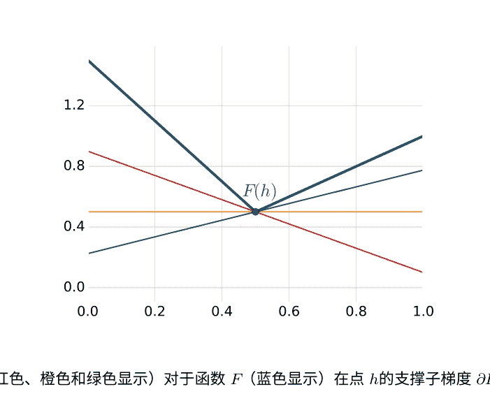

**图14.1** 支持超平面（红色、橙色和绿色显示）对于函数$F$（蓝色显示）在点$h$的支撑子梯度$\partial F(h)$定义。

$\partial N(h)=\nabla N(h)$对于所有$h\in\mathbb{H}$，因此$\partial N$（以及$\mathrm{B}_N$）是唯一定义的。为了使$F_S$和$R_S$的Bregman散度的定义兼容，使得$\mathrm{B}_{F_S} = \mathrm{B}_{R_S} + \lambda \mathrm{B}_N$，我们通过以下方式定义$\partial R_S$：$\partial R_S(h)=\partial F_S(h)-\lambda\nabla N(h)$对于所有$h\in\mathbb{H}$。此外，我们选择$\partial F_S(h)$在$F_S$是最小的点处为0，并且对于所有其他$h\in\mathbb{H}$，让$\partial F_S(h)$成为$\partial F_S(h)$的任意元素。我们以类似的方式进行，以定义$F_{S'}$和$R_{S'}$的Bregman散度，使得$\mathrm{B}_{F_{S'}} = \mathrm{B}_{R_{S'}} + \lambda \mathrm{B}_N$。

我们将使用广义Bregman散度的概念来证明以下基于核正则化算法的稳定性系数的上界。

**命题14.4** 设 $K$ 是一个正定对称核函数，对于所有的 $x \in \mathcal{X}$， $K(x,x) \leq r^2$ 对于某个 $r \in \mathbb{R}_+$ 成立，并且 $L$ 是一个凸且 $\sigma$-可接受的损失函数。那么，由最小化 (14.6) 定义的基于核正则化的算法在 $\beta$ 上是 $\beta$-稳定的，并且有以下上界：

$$\beta \leq \frac{\sigma^2 r^2}{m\lambda}.$$

**证明：** 设 $F_S$ 的最小化器为 $h$， $F_{S'}$ 的最小化器为 $h'$，其中样本 $S$ 和 $S'$ 只有一个点 $z_m$ 在 $S$ 中， $z_m'$ 在 $S'$ 中。由于广义Bregman散度是非负的，并且 $\mathrm{B}_{F_S} = \mathrm{B}_{R_S} + \lambda \mathrm{B}_N$ 和 $\mathrm{B}_{F_{S'}} = \mathrm{B}_{R_{S'}} + \lambda \mathrm{B}_N$，我们可以写成
$$\mathrm{B}_{F_S}(h' \| h) + \mathrm{B}_{F_{S'}}(h \| h') \geq \lambda \left( \mathrm{B}_N(h' \| h) + \mathrm{B}_N(h \| h') \right).$$
观察到 $\mathrm{B}_N(h'||h) + \mathrm{B}_N(h||h') = - \langle h' - h, 2h \rangle - \langle h - h', 2h' \rangle = 2\|h' - h\|_K^2$。让 $\Delta h$ 表示为 $h' - h$，则我们可以写成

$$2\lambda\|\Delta h\|_K^2 \leq \mathrm{B}_{F_S}(h'||h) + \mathrm{B}_{F_{S'}}(h||h')$$
$$= F_S(h') - F_S(h) - \langle h' - h, \partial F_S(h) \rangle + F_{S'}(h) - F_{S'}(h') - \langle h - h', \partial F_{S'}(h') \rangle$$
$$= F_S(h') - F_S(h) + F_{S'}(h) - F_{S'}(h')$$
$$= R_S(h') - R_S(h) + R_{S'}(h) - R_{S'}(h').$$
第二个等式是根据 $h'$ 和 $h$ 的最小化定义以及我们选择的极小点的次梯度，这些共同暗示 $\partial F_{S'}(h') = 0$ 和 $\partial F_S(h) = 0$。最后一个等式是根据 $F_S$ 和 $F_{S'}$ 的定义得出的。

接下来，我们用损失函数 $L$ 来表达得到的不等式，并利用 $S$ 和 $S'$ 只在一个点上不同以及 $L$ 的 $\sigma$-可接受性来得到

$$2\lambda\|\Delta h\|_K^2 \leq \frac{1}{m} [L_{z_m}(h') - L_{z_m}(h) + L_{z'_m}(h) - L_{z'_m}(h')]$$
$$\leq \frac{\sigma}{m} [|\Delta h(x_m)| + |\Delta h(x'_m)|]. \tag{14.9}$$
通过再生核特性和柯西-施瓦茨不等式，对于所有 $x \in \mathcal{X}$,
$$\Delta h(x) = \langle \Delta h, K(x, \cdot) \rangle \leq \|\Delta h\|_K \|K(x, \cdot)\|_K = \sqrt{K(x, x)} \|\Delta h\|_K \leq r \|\Delta h\|_K.$$
根据(14.9)，这意味着 $\|\Delta h\|_K \leq \frac{\sigma r}{\lambda m}$。由于 $L$ 的 $\sigma$-可接受性和再生性质，以下成立：
对于所有 $z \in \mathcal{X} \times \mathcal{Y}$, $|L_z(h') - L_z(h)| \leq \sigma |\Delta h(x)| \leq r\sigma \|\Delta h\|_K,$
这给出了
对于所有 $z \in \mathcal{X} \times \mathcal{Y}$, $|L_z(h') - L_z(h)| \leq \frac{2r^2\sigma}{m\lambda},$
从而完成了证明。 $\square$

因此，在命题的假设下，对于固定的 $\lambda$，基于核的正则化算法的稳定系数在 $O(1/m)$ 内。

## 14.3.1 应用于回归算法: SVR和KRR

在这里，我们更具体地分析了两种广泛使用的回归算法，支持向量回归 (SVR) 和核岭回归 (KRR)，它们都是基于核的正则化算法家族的特殊实例。

SVR基于对所有$(y, y') \in \mathcal{Y} \times \mathcal{Y}$定义的$\epsilon$不敏感损失函数$L_\epsilon$：
$$L_\epsilon(y', y) = \begin{cases} 0 & \text{如果 } |y' - y| \le \epsilon; \\ |y' - y| - \epsilon & \text{否则}. \end{cases} \quad (14.10)$$
现在我们假设$L_\epsilon$对SVR返回的假设是有界的，并为SVR提供了基于稳定性的界限（正如我们稍后在引理14.7中将看到的，当标签集$\mathcal{Y}$有界时，这确实是情况）。

### 推论14.5（基于稳定性的SVR学习界限）

假设$K(x, x) \le r^2$为对于某个$r \ge 0$和$L_\epsilon$被$M \ge 0$界定的$\mathcal{X}$中的所有$x$，都成立。当在一个大小为$m$的独立同分布样本$S$上训练时，$SVR$返回的假设$h$在$S$中。然后，对于任意$\delta > 0$，以下不等式至少以概率$1 - \delta$成立：
$$R(h_S) \le R_S(h_S) + \frac{r^2}{m\lambda} + \left( \frac{2r^2}{\lambda} + M \right) \sqrt{\frac{\log \frac{1}{\delta}}{2m}}.$$

**证明：** 我们首先证明对于任意的$y \in \mathcal{Y}$，$L_\epsilon(\cdot) = L_\epsilon(\cdot, y)$是1-Lipschitz的。对于任意的$y', y'' \in \mathcal{Y}$，我们必须考虑四种情况。第二，如果$|y' - y| > \epsilon$且$|y'' - y| > \epsilon$，则$|L_\epsilon(y'') - L_\epsilon(y')| = ||y'' - y| - |y' - y|| \le |y'' - y'|$，根据三角不等式。第四，如果$|y'' - y| \le \epsilon$且$|y' - y| > \epsilon$，则根据对称性，与前一种情况得到相同的不等式。

因此，在所有情况下，$|L_\epsilon(y'', y) - L_\epsilon(y', y)| \le |y'' - y'|$。这特别意味着对于任何假设集合$\mathcal{H}$，$L_\epsilon$是$\sigma$-可接受的，其中$\sigma = 1$。根据命题14.4，在假设成立的情况下，SVR是$\beta$-稳定的，其中$\beta \le \frac{r^2}{m\lambda}$。将这个表达式代入定理14.2的界限中得到结果。

接下来，我们提出了基于稳定性的KRR的界限，它基于对所有$y', y \in \mathcal{Y}$定义的平方损失$L_2$：$L_2(y', y) = (y' - y)^2$。
(14.11)
在SVR设置中，我们在分析中假设$L_2$对于由KRR返回的假设是有界的（正如我们稍后在引理14.7中再次看到的，当标签集$\mathcal{Y}$有界时，这确实是情况）。

### 推论14.6（基于稳定性的KRR学习界限）

假设$K(x, x) \le r^2$为对于所有的$x \in \mathcal{X}$，存在某个$r \ge 0$使得$L_2$被$M \ge 0$界定。当在大小为$m$的$i.i.d.$样本$S$上训练时，$KRR$返回的假设记为$h$在$S$。那么，对于任意$\delta > 0$，以下不等式至少以概率$1 - \delta$成立：
$$R(h_S) \le R_S(h_S) + \frac{4M r^2}{\lambda m} + \left( \frac{8M r^2}{\lambda} + M \right) \sqrt{\frac{\log \frac{1}{\delta}}{2m}}.$$

**证明：** 对于任意的 $(x, y) \in \mathcal{X} \times \mathcal{Y}$ 和 $h, h' \in \mathcal{H}$,
$|L_2(h'(x), y) - L_2(h(x), y)| = |(h'(x) - y)^2 - (h(x) - y)^2|$
$= |[h'(x) - h(x)][(h'(x) - y) + (h(x) - y)]|$
$\leq (|h'(x) - y| + |h(x) - y|)|h(x) - h'(x)|$
$\leq 2\sqrt{M}|h(x) - h'(x)|,$
我们在这里使用了损失的 $M$ 有界性。因此， $L_2$ 是 $\sigma$ 可接受的，其中 $\sigma = 2 \sqrt{M}$。因此，根据命题14.4，KRR是 $\beta$ 稳定的，其中 $\beta \leq \frac{4r^2 M}{m\lambda}$。将这个表达式代入定理14.2的界限中得到结果。

前两个推论假设损失函数有界。我们现在提出一个引理，特别是当标签集有界时，SVR和KRR使用的损失函数是有界的。

### 引理14.7

假设对于所有的 $x \in \mathcal{X}$, 都有 $K(x, x) \leq r^2$, 其中 $r \geq 0$, 并且对于所有的 $y \in \mathcal{Y}$, 都有 $L(0, y) \leq B$, 其中 $B \geq 0$。那么，基于核的正则化算法在样本 $S$ 上训练得到的假设 $h_S$ 是有界的，如下所示： $\forall x \in \mathcal{X}$, $|h_S(x)| \leq r \sqrt{B/\lambda}$。

**证明：** 根据再生核性质和柯西-施瓦茨不等式，我们可以写成
对于所有的 $x \in \mathcal{X}$, 有 $|h_S(x)| = \langle h_S, K(x, \cdot) \rangle \leq \|h_S\|_K \sqrt{K(x, x)} \leq r \|h_S\|_K.$ (14.12)
(14.6) 式中的最小化是在 $\mathbb{H}$ 中进行的，其中包括0。因此，根据 $F_S$ 和 $h_S$ 的定义，我们有以下不等式成立:
$F_S(h_S) \leq F_S(0) = \frac{1}{m} \sum_{i=1}^m L(0, y_i) \leq B.$
由于损失函数 $L$ 是非负的，我们有 $\lambda \|h_S\|_K^2 \leq F_S(h_S)$, 因此 $\lambda \|h_S\|_K^2 \leq B$。将这个不等式与（14.12）式结合起来得到结果。

## 14.3.2 应用于分类算法：支持向量机

本节介绍了使用标准的合页损失函数对SVM进行泛化界限的情况，其中对于所有的 $y \in \mathcal{Y} = \{-1, +1\}$ 和 $y' \in \mathbb{R}$, 定义了合页损失函数

$L_{\text{hinge}}(y', y) = \begin{cases} 0 & \text{如果 } 1 - yy' \leq 0; \\ 1 - yy' & \text{否则.} \end{cases}$ (14.13)

### 推论 14.8 (基于稳定性的SVM学习界限)

假设 $K(x, x) \leq r^2$ 对于对于某个 $r \geq 0$, 对于所有 $x \in \mathcal{X}$。当SVMs返回假设 $h_S$ 时在大小为 m 的 i.i.d. 样本 S 上进行训练。 那么，对于任意 δ > 0，以下不等式至少以概率 1 - δ成立：
$$R(h_S) \leq R_S(h_S) + \frac{r^2}{m\lambda} + \left( \frac{2r^2}{\lambda} + \frac{r}{\sqrt{\lambda}} + 1 \right) \frac{\sqrt{\log \frac{1}{\delta}}}{\sqrt{2m}}.$$

**证明：** 很容易验证对于任意的 $y \in \mathcal{Y}$，函数 $L_{\text{hinge}}(\cdot, y)$ 是 1-Lipschitz 的，并且因此它是 $\sigma$-可接受的，其中 $\sigma=1$。 因此，根据命题14.4，SVMs 是 $\beta$-稳定的，其中 $\beta \leq \frac{r^2}{m\lambda}$。由于对于任意的 $y \in \mathcal{Y}$，有 $|L_{\text{hinge}}(0, y)| \leq 1$，根据引理14.7，对于任意的 $x \in \mathcal{X}$，有 $|h_S(x)| \leq r / \sqrt{\lambda}$。因此，对于任意的样本 $S$ 和任意的 $x \in \mathcal{X}$ 和 $y \in \mathcal{Y}$，损失函数有以下界限： $L_{\text{hinge}}(h_S(x), y) \leq r / \sqrt{\lambda} + 1$。将 $M$ 的这个值和找到的 $\beta$ 的值代入定理14.2的界限中，得到结果。

## 14.3.3 讨论

请注意，基于核正则化算法的学习界限的形式为 $R(h_S) - R_S(h_S) \leq O(1 / (\lambda\sqrt{m}))$。因此，这些界限只有在 $\lambda \gg 1/\sqrt{m}$ 时才有信息量。 正则化参数 $\lambda$ 是样本大小 $m$ 的函数：对于较大的 $m$ 值，预计它会较小，减少对正则化的强调。 $\lambda$ 的大小影响用于预测的线性假设的范数，较大的 $\lambda$ 值意味着较小的假设范数。 从这个意义上说，$\lambda$ 是假设集合的复杂度的度量，而 $\lambda$ 所要求的条件可以解释为较简单的假设集合能够保证更好的泛化。

还要注意，在本章中对稳定性的分析假设了一个固定的 $\lambda$：正则化参数被假定为对训练样本的一个点的改变是不变的。 虽然这是一个温和的假设，但一般情况下可能不成立。

## 14.4 章节注释

算法稳定性的概念最早由 Devroye、Rogers 和 Wag-ner [Rogers and Wagner, 1978, Devroye and Wagner, 1979a,b] 在 k 最近邻算法和其他 k 局部规则中首次使用。 Kearns 和 Ron [1999] 后来给出了稳定性的正式定义，并用它来分析了留一-out 错误。 本章介绍的大部分内容基于 Bousquet 和 Elisseeff [2002] 的研究。 我们对命题14.4的证明是新颖的，并将 Bousquet 和 Elisseeff [2002] 的结果推广到非可微凸损失的情况。

此外，基于稳定性的泛化界限已经扩展到排名算法 [Agarwal 和 Niyogi, 2005年，Cortes 等，2007b年]，以及非独立同分布的情况。稳态Φ-和 β-混合过程的情景[Mohri和Rostamizadeh，2010年]，以及转导设置[Cortes等，2008a年]也得到了扩展。此外，练习14.5基于Cortes等人的工作[2010b年]，该工作介绍并分析了与核函数或核矩阵选择相关的稳定性。

请注意，正如本章所示，均匀稳定性足以推导出泛化界限，但不是必要条件。一些算法在监督学习场景中可能具有良好的泛化能力，但可能不是均匀稳定的，例如Lasso算法[Xu等，2008年]。Shalev-Shwartz等人[2009年]使用稳定性的概念为与PAC学习相关的技术条件提供了必要和充分条件，即使在只能使用非ERM规则进行学习的一般情况下也是如此。

## 14.5 练习

### 14.1 更紧密的稳定性界限

+   (a) 假设定理14.2的条件成立，即使算法非常稳定，能否保证比 $O(1/\sqrt{m})$ 更好的泛化误差？
+   (b) 如果 $L$被 $C/\sqrt{m}$限制（一个非常强的条件），能否展示 $O(1/m)$ 的泛化保证？如果可以，学习算法需要多稳定？

### 14.2 二次铰链损失的稳定性。

让 $L$表示二次铰链损失函数，对于所有的 $y \in \{+1, -1\}$ 和 $y' \in \mathbb{R}$，定义如下：
$$
L(y', y) = \begin{cases} 0 & \text{如果 } 1 - y'y \leq 0 \\ (1 - y'y)^2 & \text{否则} \end{cases}
$$
假设对于所有的 $h \in \mathcal{H}, x \in \mathcal{X}, \text{和 } y \in \{+1, -1\}$，函数 $L(h(x), y)$被 $M$界定，其中M是有界的，$1 \leq M < \infty$，这也意味着对于所有的 $h \in \mathcal{H} \text{和} x \in \mathcal{X}$，$|h(x)|$ 也有界。

推导出具有二次铰链损失的SVM的稳定性广义界限。

### 14.3 线性回归的稳定性。

+   (a) 当 $\lambda \rightarrow 0$ 时，定理14.6中岭回归（即使用线性核的核岭回归）的稳定性界限如何变化？
+   (b) 你能给出线性回归（即 $\lambda = 0$ 的岭回归）的稳定性界限吗？如果不能，给出一个反例。

## 14.4 内核稳定性
假设使用核矩阵的近似 **K**，表示为 **K′**，来训练假设 $h'$（并且让 $h$ 表示非近似假设）。在测试时，不进行近似，所以如果我们让 $\mathbf{k}_x = [K(x, x_1), \dots, K(x, x_m)]^\top$，我们可以写成 $h(x) = \boldsymbol{\alpha}^\top \mathbf{k}_x$ 和 $h'(x) = \boldsymbol{\alpha}'^\top \mathbf{k}_x$。证明如果 $\forall x, x' \in \mathcal{X}, K(x, x') \leq r$，那么
$$|h'(x) - h(x)| \leq \frac{rmM}{\lambda^2} \|\mathbf{K}' - \mathbf{K}\|_2$$
（提示：使用练习10.3）

## 14.5 相对熵正则化的稳定性
- (a) 考虑一个通过选择分布 $g$ over 一个由 $\theta \in \Theta$ 参数化的假设类的算法。给定一个点 $z=(x,y)$，期望损失被定义为
$$H(g,z) = \int_\Theta L(h_\theta(x), y) g(\theta) \, d\theta,$$
相对于基本损失函数 $L$。假设损失函数 $L$ 被上界 $M$ 限制，证明期望损失 $H$ 是 $M$ 可接受的，即证明
$$|H(g,z) - H(g',z)| \leq M \int_\Theta |g(\theta) - g'(\theta)| \, d\theta.$$

- (b) 考虑一个算法，它最小化了熵正则化目标函数在选择分布 $g$ 上的值：
$$F_S(g) = \frac{1}{m} \sum_{i=1}^m H(g, z_i) + \lambda K(g, f_0) .$$
在这里，$K$ 是两个分布之间的库尔巴克-莱布勒散度（或相对熵），
$$K(g, f_0) = \int_\Theta g(\theta) \log \frac{g(\theta)}{f_0(\theta)} \, d\theta, \quad\quad (14.14)$$
而 $f_0$ 是一些固定的分布。通过执行以下步骤来证明这样的算法是稳定的：
    i. 首先使用事实 $\frac{1}{2} \left( \int_\Theta |g(\theta) - g'(\theta)| \, d\theta \right)^2 \leq K(g, g')$（Pinsker不等式），来展示
    $$\left( \int_\Theta |g_S(\theta) - g_{S'}(\theta)| \, d\theta \right)^2 \leq B_{K(\cdot, f_0)}(g \| g') + B_{K(\cdot, f_0)}(g' \| g).$$
    ii. 接下来，让 $g$ 成为 $F_S$ 的最小化者，$g'$ 成为 $F_{S'}$ 的最小化者，其中 $S$ 和 $S'$ 只在索引 $m$ 处有差异。证明
    $$ B_{K(., f_0)}(g \parallel g') + B_{K(., f_0)}(g' \parallel g) \leq \frac{1}{m\lambda} \left| H(g', z_m) - H(g, z_m) + H(g, z'_m) - H(g', z'_m) \right| \leq \frac{2M}{m\lambda} \int_\Theta |g(\theta) - g'(\theta)| d\theta . $$
    iii. 最后，将上述结果组合起来，证明熵正则化算法是 $\frac{2M}{\lambda}$ 稳定。

# 15 降维
在数据具有大量特征的情况下，通常希望减少其维度，或者找到一个保留一些属性的较低维度表示。降维（或流形学习）技术的关键论点是：
- 计算：将初始数据压缩为预处理步骤，以加快对数据的后续操作。
- 可视化：通过将输入数据映射到二维或三维空间中，对数据进行探索性分析。
- 特征提取：希望生成一个更小、更有效或更有用的特征集。

降维的好处通常通过模拟数据来说明，例如瑞士卷数据集。在这个例子中，输入数据如图15.1a所示，是三维的，但它位于一个二维流形上，在二维空间中展开，如图15.1b所示。然而，需要注意的是，在实践中很少遇到精确的低维流形。因此，这个理想化的例子更适用于说明降维的概念，而不是验证降维算法的有效性。

降维可以形式化如下。考虑一个样本 $S = (x_1, \ldots, x_m)$，一个特征映射 $\Phi: \mathcal{X} \rightarrow \mathbb{R}^N$ 和数据矩阵 $\mathbf{X} \in \mathbb{R}^{N \times m}$ 定义为 $(\Phi(x_1), \ldots, \Phi(x_m))$。第 $i$ 个数据点由 $\mathbf{x}_i = \Phi(x_i)$ 表示，或者是 $\mathbf{X}$ 的第 $i$ 列，它是一个 $N$ 维向量。降维技术广泛地旨在找到一个 $k \ll N$ 维表示的数据 $\mathbf{Y} \in \mathbb{R}^{k \times m}$，它在某种程度上忠实于原始表示 $\mathbf{X}$。在本章中，我们将讨论解决这个问题的各种技术。我们首先介绍最常用的降维技术，称为主成分分析(PCA)。然后我们介绍了核化版本的主成分分析(KPCA)，并展示了KPCA与流形学习之间的联系。

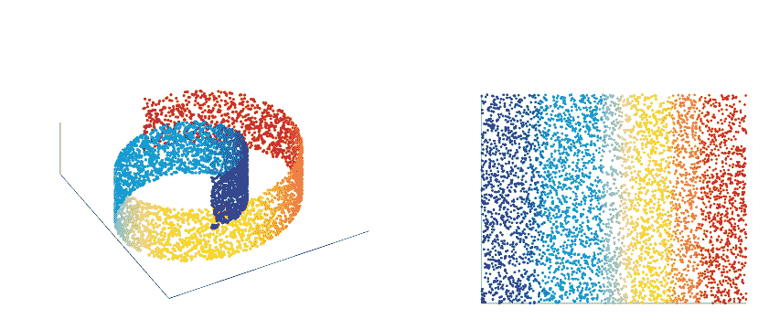
图15.1 “瑞士卷”数据集。(a) 高维表示。(b) 低维表示。

算法。最后，我们介绍了约翰逊-林登斯特劳斯引理的概念，这是一个经典的理论结果，启发了基于随机投影概念的各种降维方法。本章的讨论依赖于附录A中回顾的基本矩阵性质。

## 15.1 主成分分析
固定 $k \in [N]$，令 $\mathbf{X}$ 为一个均值为零的数据矩阵，即 $\sum_{i=1}^{m} \mathbf{x}_i = \mathbf{0}$。定义 $\mathcal{P}_k$ 为 $N$ 维秩为 $k$ 的正交投影矩阵集合。PCA 包括将 $N$ 维输入数据投影到最小化重构误差的 $k$ 维线性子空间上，即原始数据与投影数据之间的平方 $L_2$ 距离之和。因此，PCA算法完全由正交投影矩阵解 $\mathbf{P}^*$ 的以下最小化问题确定。

$$\min_{\mathbf{P} \in \mathcal{P}_k} \|\mathbf{P}\mathbf{X} - \mathbf{X}\|_F^2$$

以下定理表明，主成分分析与将每个数据点投影到样本协方差矩阵的前 $k$ 个奇异向量重合，即 $\mathbf{C} = \frac{1}{m} \mathbf{X}\mathbf{X}^\top$。图15.2说明了主成分分析的基本直觉，展示了具有高度相关特征的二维数据点如何用一个维度的表示更简洁地表示，该表示捕捉了数据中大部分的方差。

定理5.1 设 $\mathbf{P}^* \in \mathcal{P}_k$ 为主成分分析的解，即正交投影矩阵解 (15.1)。则，$\mathbf{P}^* = \mathbf{U}_k \mathbf{U}_k^\top$，其中 $\mathbf{U}_k \in \mathbb{R}^{N \times k}$ 是由 $\mathbf{C}$ 的前 $k$ 个奇异向量形成的矩阵，对应于样本协方差矩阵 $\frac{1}{m}\mathbf{X}\mathbf{X}^\top$。此外，与 $\mathbf{X}$ 相关的 $k$ 维表示由 $\mathbf{Y} = \mathbf{U}_k^T \mathbf{X}$ 给出。

证明：令 $\mathbf{P} = \mathbf{P}^T$ 为正交投影矩阵。根据Frobenius范数的定义，迹算子的线性性质以及 $\mathbf{P}$ 是幂等的事实，即 $\mathbf{P}^2 = \mathbf{P}$，我们观察到
$$\|\mathbf{P}\mathbf{X} - \mathbf{X}\|_F^2 = \operatorname{Tr}[(\mathbf{P}\mathbf{X} - \mathbf{X})^T (\mathbf{P}\mathbf{X} - \mathbf{X})] = \operatorname{Tr}[\mathbf{X}^T \mathbf{P}^2 \mathbf{X} - 2 \mathbf{X}^T \mathbf{P} \mathbf{X} + \mathbf{X}^T \mathbf{X}] = -\operatorname{Tr}[\mathbf{X}^T \mathbf{P} \mathbf{X}] + \operatorname{Tr}[\mathbf{X}^T \mathbf{X}].$$
由于 $\operatorname{Tr}[\mathbf{X}^T \mathbf{X}]$ 是关于 $\mathbf{P}$ 的常数，我们有
$$\arg\min_{\mathbf{P} \in \mathcal{P}_k} \|\mathbf{P}\mathbf{X} - \mathbf{X}\|_F^2 = \arg\max_{\mathbf{P} \in \mathcal{P}_k} \operatorname{Tr}[\mathbf{X}^T \mathbf{P} \mathbf{X}]. \quad (15.2)$$
根据正交投影的定义，在 $\mathcal{P}_k$ 中，$\mathbf{P} = \mathbf{U}\mathbf{U}^T$ 对于某些 $\mathbf{U} \in \mathbb{R}^{N \times k}$ 包含正交列。利用迹算子在循环置换下的不变性和 $\mathbf{U}$ 的列的正交性，我们有
$$\operatorname{Tr}[\mathbf{X}^T \mathbf{P} \mathbf{X}] = \operatorname{Tr}[\mathbf{U}^T \mathbf{X} \mathbf{X}^T \mathbf{U}] = \sum_{i=1}^k \mathbf{u}_i^T \mathbf{X} \mathbf{X}^T \mathbf{u}_i,$$
其中 $\mathbf{u}_i$ 是 $\mathbf{U}$ 的第 $i$ 列。根据瑞利商（A.2.3节），很明显，$\mathbf{X}\mathbf{X}^T$ 的最大 $k$ 奇异向量最大化了上述最右边的和。由于 $\mathbf{X}\mathbf{X}^T$ 和 $\mathbf{C}$ 只有一个缩放因子的差异，它们具有相同的奇异向量，因此 $\mathbf{U}_k$ 最大化了这个和，从而证明了定理的第一个陈述。最后，由于 $\mathbf{P}\mathbf{X} = \mathbf{U}_k \mathbf{U}_k^T \mathbf{X}$，$\mathbf{Y} = \mathbf{U}_k^T \mathbf{X}$ 是 $\mathbf{X}$ 的一个 $k$ 维表示，其中 $\mathbf{U}_k$ 是基向量。$\square$

根据协方差矩阵的定义，$\mathbf{C}$ 的前几个奇异向量是数据中方差最大的方向，相应的奇异值等于这些方差。因此，主成分分析也可以看作是投影到方差最大的子空间。在这种解释下，第一个主成分是通过投影到方差最大的方向得到的，该方向由 $\mathbf{C}$ 的前一个奇异向量给出。类似地，第 $i$ 个主成分（其中 $1 \leq i \leq k$）是通过投影到方差最大的第 $i$ 个方向得到的，同时满足与前 $i-1$ 个方向正交的约束（详见练习 15.1）。

## 15.2 核主成分分析（KPCA）
在前一节中，我们介绍了主成分分析算法，该算法涉及将数据投影到样本协方差矩阵 $\mathbf{C}$ 的奇异向量上。在本节中，我们介绍了PCA的核化版本，称为KPCA。在KPCA设置中，$\Phi$ 是到任意RKHS的特征映射（不一定是到 $\mathbb{R}^N$），我们仅使用与该RKHS中的内积对应的核函数 $K$。因此，KPCA算法可以被定义为在该RKHS中将输入数据投影到顶部主成分的泛化。我们将通过深入研究 $\mathbf{X}$、$\mathbf{C}$ 和 $\mathbf{K}$ 的奇异值分解之间的深层联系来展示PCA和KPCA之间的关系。然后，我们说明了各种流形学习算法如何被解释为KPCA的特殊实例。

设 $K$ 为在 $\mathcal{X} \times \mathcal{X}$ 上定义的PDS核，并定义核矩阵为 $\mathbf{K} = \mathbf{X}^\top \mathbf{X}$。由于 $\mathbf{X}$ 具有以下奇异值分解：$\mathbf{X} = \mathbf{U}\boldsymbol{\Sigma}\mathbf{V}^\top$，$\mathbf{C}$ 和 $\mathbf{K}$ 可以重写如下：
$$\mathbf{C} = \frac{1}{m} \mathbf{U} \boldsymbol{\Lambda} \mathbf{U}^\top, \quad \mathbf{K} = \mathbf{V} \boldsymbol{\Lambda} \mathbf{V}^\top, \tag{15.3}$$
其中 $\boldsymbol{\Lambda} = \boldsymbol{\Sigma}^2$ 是奇异值（或特征值）的对角矩阵，$\mathbf{U}$ 和 $\mathbf{V}$ 是奇异向量（或特征向量）的矩阵。

从 $\mathbf{X}$ 的奇异值分解开始，注意右乘 $\mathbf{V}\boldsymbol{\Sigma}^{-1}$ 并使用 $\boldsymbol{\Lambda}$ 和 $\boldsymbol{\Sigma}$ 之间的关系，得到 $\mathbf{U} = \mathbf{X}\mathbf{V}\boldsymbol{\Lambda}^{-1/2}$。因此，与奇异值 $\lambda$ 相关联的奇异向量 $\mathbf{u}$ 与 $\mathbf{X}\mathbf{v}$ 重合，其中 $\mathbf{v}$ 是与 $\lambda$ 相关联的 $\mathbf{K}$ 的奇异向量。现在固定一个任意的特征向量 $\mathbf{u} = \frac{\sqrt{\lambda}}{\sqrt{\lambda}} \Phi(x)$，对于 $x \in \mathcal{X}$。然后，根据定理15.1中 $\mathbf{Y}$ 的表达式，得到一维通过投影到 $\mathbf{u}$ 得到的 $x$ 的表示被定义为 $x^\top u = x^\top \frac{\mathbf{X}\mathbf{v}}{\sqrt{\lambda}} = \frac{\mathbf{k}_x^\top \mathbf{v}}{\sqrt{\lambda}} \quad (15.4)$
其中 $\mathbf{k}_x=(K(x_1,x),\dots,K(x_m,x))^\top$。如果 $x$ 是数据点之一，即 $x=x_i$ 对于 $1\leq i\leq m$，则 $\mathbf{k}_x$ 是 $\mathbf{K}$ 的第 $i$ 列，(15.4) 可以简化为如下：
$$x^\top u = \frac{\mathbf{k}_x^\top \mathbf{v}}{\sqrt{\lambda}} = \frac{\lambda v_i}{\sqrt{\lambda}} = \sqrt{\lambda} v_i \quad (15.5)$$
其中 $v_i$ 是 $\mathbf{v}$ 的第 $i$ 个分量。更一般地，定理15.1的PCA解可以完全由 $\mathbf{K}$ 的前 $k$ 个奇异向量（或特征向量） $\mathbf{v}_1,\dots,\mathbf{v}_k$ 以及相应的奇异值（或特征值）来定义。通过使用PDS核（详见第6章关于核方法的更多细节），这种基于 $\mathbf{K}$ 的PCA解的替代推导精确定义了KPCA解，提供了PCA的一种推广。

## 15.3 KPCA和流形学习
已经提出了几种流形学习技术作为非线性降维方法。这些算法隐含地假设高维数据位于输入空间中嵌入的低维非线性流形上或附近。它们的目标是通过找到一个保留高维输入数据局部结构的低维空间来学习这个流形结构。例如，Isomap算法旨在保留所有数据点之间的近似测地距离或流形上的距离。其他算法，如拉普拉斯特征映射和局部线性嵌入，仅关注保持高维空间中的局部邻域关系。接下来，我们将描述这些经典流形学习算法，并将它们解释为KPCA的具体实例。

### 15.3.1 Isomap
Isomap旨在提取一个最佳保留输入点之间所有成对距离的低维数据表示，这些距离由它们在底层流形上的测地距离测量。它假设测地距离的 $L_2$ 距离为附近点提供了良好的近似，对于远离的点，它将距离估计为相邻点之间的一系列跳跃。Isomap算法的工作原理如下：
1. 根据 $L_2$ 距离找到每个数据点的最近邻，并构建一个无向邻域图，用 $\mathcal{G}$ 表示，其中点作为节点，邻居之间的连接作为边。
2. 通过计算 $\mathcal{G}$ 中所有节点对之间的全对最短距离（例如使用 Floyd-Warshall 算法），计算近似测地距离，表示为 $\Delta_{ij}$。
3. 通过进行双中心化将平方距离矩阵转换为 $m \times m$ 相似性矩阵，即计算 $\mathbf{K}_{\text{Iso}} = -\frac{1}{2}\mathbf{H}\Delta\mathbf{H}$，其中 $\Delta$ 是平方距离矩阵，$\mathbf{H} = \mathbf{I}_m - \frac{1}{m}\mathbf{1}\mathbf{1}^\top$ 是中心化矩阵，$\mathbf{I}_m$ 是 $m \times m$ 单位矩阵，$\mathbf{1}$ 是全 1 列向量（有关双中心化的更多细节，请参见练习 15.2）。
4. 找到最优 $k$ 维表示，$\mathbf{Y} = \{\mathbf{y}_i\}_{i=1}^{m}$，使得 $\mathbf{Y} = \underset{\mathbf{Y}}{\text{argmin}}\sum_{i,j} (||\mathbf{y}_i - \mathbf{y}_j||_2^2 - \Delta_{ij}^2)$。解决方案如下，
$$\mathbf{Y} = (\boldsymbol{\Sigma}_{\text{Iso}, k})^{1/2} \mathbf{V}_{\text{Iso}, k}^\top \quad (15.6)$$
其中 $\boldsymbol{\Sigma}_{\text{Iso}, k}$ 是 $\mathbf{K}_{\text{Iso}}$ 的前 $k$ 个奇异值构成的对角矩阵，$\mathbf{V}_{\text{Iso}, k}$ 是相应的奇异向量。

$\mathbf{K}_{\text{Iso}}$ 可以自然地看作是一个核矩阵，从而提供了 Isomap 和 KPCA 之间的简单联系。然而，需要注意的是，这种解释仅在 $\mathbf{K}_{\text{Iso}}$ 实际上是半正定的情况下才有效，在光滑流形的连续极限中确实如此。

### 15.3.2 拉普拉斯特征映射
拉普拉斯特征映射算法旨在找到一个低维表示，该表示通过权重矩阵 $\mathbf{W}$ 来最好地保留邻域关系。该算法的工作原理如下：
1. 为每个点找到 $t$ 个最近邻。
2. 构建一个稀疏对称 $m \times m$ 矩阵 $\mathbf{W}$，其中 $\mathbf{W}_{ij} = \text{exp}\left(-||\mathbf{x}_i - \mathbf{x}_j||_2^2 / \sigma^2\right)$ 如果 $(\mathbf{x}_i, \mathbf{x}_j)$ 是邻居，则为 0，否则为 $\sigma$ 是一个缩放参数。
3. 构建对角矩阵 $\mathbf{D}$，使得 $\mathbf{D}_{ii} = \sum_j \mathbf{W}_{ij}$。
4. 通过最小化邻居之间的加权距离来找到 $k$ 维表示，如下所示：$\mathbf{Y} = \underset{\mathbf{Y}'}{\text{argmin}} \sum_{i,j} \mathbf{W}_{ij}||\mathbf{y}_i - \mathbf{y}_j||_2^2$ (15.7)。

这个目标函数惩罚了将附近的输入映射到远离输出的情况，其中“接近性”由权重矩阵 $\mathbf{W}$ 来衡量。在 (15.7) 中，最小化的解是 $\mathbf{Y} = \mathbf{V}_{\mathbf{L}, k}^\top$，其中 $\mathbf{L} = \mathbf{D} - \mathbf{W}$ 是图拉普拉斯矩阵。

## 15.3 KPCA和流形学习

而 $U_{L,k}^\top$ 是 $L$ 的前 $k$ 个奇异向量，不包括对应奇异值为 $0$ 的最后一个奇异向量（假设底层邻域图是连通的）。

(15.7) 的解也可以解释为找到 $L^\dagger$ 的最大奇异向量，其中 $L^\dagger$ 是 $L$ 的伪逆。定义 $KL = L^\dagger$，我们可以将拉普拉斯特征映射视为 KPCA 的一个实例，其中输出维度被归一化为单位方差，这相当于在 (15.5) 中设置 $\lambda=1$。此外，可以证明 $KL$ 是与底层邻域图上的扩散通行时间相关的核矩阵，其中图中节点 $i$ 和 $j$ 之间的通行时间是一个随机游走从节点 $i$ 开始，到达节点 $j$ 然后返回 $i$ 所花费的预期时间。

### 15.3.3 局部线性嵌入（LLE）

局部线性嵌入（LLE）算法也旨在找到一个低维表示，该表示通过权重矩阵 $W$ 来保持邻域关系。该算法的工作原理如下：

1.  为每个点找到 $t$ 个最近邻。

2.  构建一个稀疏对称矩阵 $W$，其 $i$ 行之和为一，并包含最佳重构 $\mathbf{x}_i$ 的线性系数，这些系数来自于其 $t$ 个邻居。更具体地说，如果我们假设 $W$ 的 $i$ 行之和为一，则重构误差为

    $$\left(\mathbf{x}_i - \sum_{j \in N_i} \mathbf{W}_{ij}\mathbf{x}_j\right)^2 = \left(\sum_{j \in N_i} \mathbf{W}_{ij}(\mathbf{x}_i - \mathbf{x}_j)\right)^2 = \sum_{j,k \in N_i} \mathbf{W}_{ij}\mathbf{W}_{ik}\mathbf{C}'_{jk} \tag{15.8}$$

    其中 $N_i$ 是点 $\mathbf{x}_i$ 的邻居索引集合，$\mathbf{C}'_{jk} = (\mathbf{x}_i - \mathbf{x}_j)^\top (\mathbf{x}_i - \mathbf{x}_k)$ 局部协方差矩阵。通过约束条件 $\sum_j \mathbf{W}_{ij}=1$ 得到解

    $$\mathbf{W}_{ij} = \frac{\sum_k (\mathbf{C}'^{-1})_{jk}}{\sum_{s,t} (\mathbf{C}'^{-1})_{st}}. \tag{15.9}$$

    注意，可以通过首先解线性方程组 $\sum_j \mathbf{C}'_{kj}\mathbf{W}_{ij}=1$，对于 $k \in N_i$，然后进行归一化，使权重之和为一。

3.  找到最符合邻域关系的 $k$ 维表示，如 $W$ 所指定的，即

    $$\mathbf{Y} = \arg\min_{\mathbf{Y}'} \sum_i \left(\mathbf{y}'_i - \sum_j \mathbf{W}_{ij}\mathbf{y}'_j\right)^2. \tag{15.10}$$

在(15.10)中，最小化问题的解为 $Y = U_{M,k}^\top$，其中 $M=(I - W^\top)(I - W^\top)$，$U_{M,k}^\top$ 是 M 的底部 k 个奇异向量，不包括对应奇异值为 0 的最后一个奇异向量。

正如在练习15.5中讨论的那样，LLE与使用特定核矩阵 $K_{LLE}$ 的KPCA相一致，其中输出维度被归一化为具有单位方差（与拉普拉斯特征映射的情况相同）。

## 15.4 Johnson-Lindenstrauss引理

约翰逊-林登斯特劳斯引理是降维中的一个基本结果，它指出高维空间中的任意 $m$ 个点可以映射到一个更低的维度，$k \geq O\left(\frac{\log m}{\epsilon^2}\right)$，而不会使任意两点之间的距离失真超过 $(1 \pm \epsilon)$ 的因子。实际上，通过将高维点投影到随机选择的 $k$ 维线性子空间上，可以在随机多项式时间内找到这样的映射。约翰逊-林登斯特劳斯引理在引理15.4中正式呈现。这个引理的证明依赖于引理15.2和引理15.3，并且它是“概率方法”的一个例子，其中概率论的论证导致了一个确定性的陈述。此外，正如我们将看到的，当向一个 $k$ 维随机子空间投影时，随机向量的平方范数在其均值附近高度集中，从而得出约翰逊-林登斯特劳斯引理。

首先，我们证明了 $\chi^2$ 分布的以下性质（见附录中的定义C.7），这将在引理15.3中使用。

引理15.2 设 $Q$ 是一个服从 $k$ 自由度的 $\chi^2$ 分布的随机变量。那么，对于任意 $0 < \epsilon < 1/2$，以下不等式成立：

$$\mathbb{P}[(1 - \epsilon)k \leq Q \leq (1 + \epsilon)k] \geq 1 - 2e^{-(\epsilon^2 - \epsilon^3)k/4} \tag{15.11}$$

证明：根据马尔可夫不等式，我们可以写成

$$\mathbb{P}[Q \geq (1 + \epsilon)k] = \mathbb{P}[\exp(\lambda Q) \geq \exp(\lambda(1 + \epsilon)k)] \leq \frac{\mathbb{E}[\exp(\lambda Q)]}{\exp(\lambda(1 + \epsilon)k)} = (1 - 2\lambda)^{-k/2}\exp(\lambda(1 + \epsilon)k),$$

其中我们使用了一个 $\chi^2$ 分布的矩生成函数的表达式 $\mathbb{E}[\exp(\lambda Q)]$，对于 $\lambda < 1/2$（方程(C.25)）。选择 $\lambda = \frac{2\epsilon}{(1 + \epsilon)} < 1/2$，这最小化了最终等式的右边，并且使用不等式 $1 + \epsilon \leq \exp(\epsilon - (\epsilon^2 - \epsilon^3)/2)$ 得到

$$\mathbb{P}[Q \geq (1 + \epsilon)k] \leq \left( \frac{1 + \epsilon}{\exp(\epsilon)} \right)^{k/2} \leq \left( \frac{\exp\left( \epsilon - \frac{\epsilon^2 - \epsilon^3}{2} \right)}{\exp(\epsilon)} \right)^{k/2} = \exp\left( -\frac{k}{4}(\epsilon^2 - \epsilon^3) \right).$$

引理的陈述通过使用类似的技术来限制 $\mathbb{P}[Q \le (1 - \epsilon)k]$ 并应用并集界来得到。

引理15.3 设 $\mathbf{x} \in \mathbb{R}^N$, 定义 $k < N$ 并假设 $\mathbf{A} \in \mathbb{R}^{k \times N}$ 的条目独立地从标准正态分布中采样，$N(0,1)$。那么，对于任意 $0 < \epsilon < 1/2$,

$$\mathbb{P} \left[ (1 - \epsilon) \| \mathbf{x} \|^2 \leq \frac{1}{k} \| \mathbf{A} \mathbf{x} \|^2 \leq (1 + \epsilon) \| \mathbf{x} \|^2 \right] \geq 1 - 2 e^{-(\epsilon^2 - \epsilon^3)k/4}.$$

证明：令 $\mathbf{x} = \mathbf{A}\mathbf{x}$ 并观察到

$$\mathbb{E}[x_j^2] = \mathbb{E} \left[ \left( \sum_{i=1}^N A_{ji} x_i \right)^2 \right] = \mathbb{E} \left[ \sum_{i=1}^N A_{ji}^2 x_i^2 \right] = \sum_{i=1}^N x_i^2 = \| \mathbf{x} \|^2.$$

第二和第三个等式分别来自于 $A_{ij}$ 的独立性和单位方差。现在，定义 $T_j = x_j / \| \mathbf{x} \|$ 并注意到 $T_j$ 是独立的标准正态随机变量，因为 $A_{ij}$ 是独立同分布的标准正态随机变量，且 $\mathbb{E}[x_j^2] = \| \mathbf{x} \|^2$。因此，由 $Q = \sum_{j=1}^k T_j^2$ 定义的变量 $Q$ 服从自由度为 $k$ 的 $\chi^2$ 分布，并且我们有

$$\begin{aligned} \mathbb{P} \left[ (1 - \epsilon) \| \mathbf{x} \|^2 \leq \frac{\| \mathbf{x} \|^2}{k} \sum_{j=1}^k T_j^2 \leq (1 + \epsilon) \| \mathbf{x} \|^2 \right] &= \mathbb{P} \left[ (1 - \epsilon) k \leq \sum_{j=1}^k T_j^2 \leq (1 + \epsilon) k \right] \\ &= \mathbb{P} \left[ (1 - \epsilon) k \leq Q \leq (1 + \epsilon) k \right] \\ &\geq 1 - 2 e^{-(\epsilon^2 - \epsilon^3)k/4}, \end{aligned}$$

根据引理15.2，最终不等式成立，从而证明了引理的陈述。

引理15.4 (Johnson-Lindenstrauss) 对于任意 $0 < \epsilon < 1/2$ 和任意整数 $m > 4$, 令 $k = \frac{20 \log m}{\epsilon^2}$。对于任意集合 $V$ 中的 $m$ 个点在 $\mathbb{R}^N$ 中，存在一个映射 $f: \mathbb{R}^N \to \mathbb{R}^k$ 使得对于所有的 $\mathbf{u}, \mathbf{v} \in V$,

$$(1 - \epsilon) \| \mathbf{u} - \mathbf{v} \|^2 \leq \| f(\mathbf{u}) - f(\mathbf{v}) \|^2 \leq (1 + \epsilon) \| \mathbf{u} - \mathbf{v} \|^2.$$

证明：令 $f = \frac{1}{\sqrt{k}} \mathbf{A}$ 其中 $k < N$ 且 $\mathbf{A} \in \mathbb{R}^{k \times N}$ 的元素是从标准正态分布 $N(0,1)$ 中独立采样得到的。对于固定的 $\mathbf{u}, \mathbf{v} \in V$, 我们可以应用引理15.3, 取 $\mathbf{x} = \mathbf{u} - \mathbf{v}$, 以使成功概率下界为 $1 - 2 e^{-(\epsilon^2 - \epsilon^3)k/4}$。对 $V$ 中的 $O(m^2)$ 对应用并集界定，设定 $k = \frac{20}{\epsilon^2} \log m$ 和上界 $\epsilon < 1/2$, 我们有

$$\mathbb{P}[\text{成功} ] \geq 1 - 2 m^2 e^{-(\epsilon^2 - \epsilon^3)k/4} = 1 - 2 m^{5\epsilon - 3} > 1 - 2 m^{-1/2} > 0.$$

由于成功概率严格大于零，满足所需条件的映射必定存在，从而证明了引理的陈述。

## 15.5 章节注释

PCA是由Pearson [1901] 在20世纪初引入的。KPCA是在大约一个世纪后引入的，我们对KPCA的介绍是Mika等人[1999]给出结果的更简洁推导。Isomap和LLE是由Tenenbaum等人[2000]，Roweis和Saul [2000]引入的非线性降维的开创性工作。Isomap本身是标准线性降维技术多维缩放的一种推广[Cox和Cox, 2000]。Isomap和LLE导致了几个相关流形学习算法的发展，例如拉普拉斯特征映射和最大方差展开[Belkin和Niyogi, 2001, Weinberger和Saul, 2006]。正如本章所示，经典流形学习算法是KPCA的特殊实例[Ham等人, 2004]。Johnson-Lindenstrauss引理由Johnson和Lindenstrauss [1984]引入，尽管我们对该引理的证明遵循Vempala [2004]。还有其他简化的证明，包括Dasgupta和Gupta [2003]。

## 15.6 练习

-   15.1 主成分分析和最大方差。 设 $\mathbf{X}$ 为一个未居中的数据矩阵，设 $\bar{\mathbf{x}} = \frac{1}{m} \sum_i \mathbf{x}_i$ 为 $\mathbf{X}$ 的列的样本均值。
    (a) 证明数据在任意向量 $\mathbf{u}$ 上的一维投影的方差等于 $\mathbf{u}^\top \mathbf{C} \mathbf{u}$，其中 $\mathbf{C} = \frac{1}{m} \sum_i (\mathbf{x}_i - \bar{\mathbf{x}})(\mathbf{x}_i - \bar{\mathbf{x}})^\top$ 是样本协方差矩阵。
    (b) 证明当 $k=1$ 时，主成分分析将数据投影到方差最大的方向（即 $\mathbf{u}^\top \mathbf{u} = 1$）。

-   15.2 双中心化。 在这个问题中，我们将证明在使用欧氏距离时，Isomap中的双中心化步骤的正确性。定义 $\mathbf{X}$ 和 $\bar{\mathbf{x}}$ 如练习15.1中所述，并定义 $\mathbf{X}^*$ 为 $\mathbf{X}$ 的居中版本，即，令 $\mathbf{x}^*_i = \mathbf{x}_i - \bar{\mathbf{x}}$ 为 $\mathbf{X}^*$ 的列。令 $\mathbf{K} = \mathbf{X}^\top \mathbf{X}$，令 $\mathbf{D}$ 表示欧几里德距离矩阵，即 $D_{ij} = \|\mathbf{x}_i - \mathbf{x}_j\|$。
    (a) 证明 $\mathbf{K}_{ij} = \frac{1}{2}(\mathbf{K}_{ii} + \mathbf{K}_{jj} + D_{ij}^2)$。
    (b) 证明 $\mathbf{K}^* = \mathbf{X}^{*\top} \mathbf{X}^* = \mathbf{K} - \frac{1}{m} \mathbf{K} \mathbf{1} \mathbf{1}^\top - \frac{1}{m} \mathbf{1} \mathbf{1}^\top \mathbf{K} + \frac{1}{m^2} \mathbf{1} \mathbf{1}^\top \mathbf{K} \mathbf{1} \mathbf{1}^\top$。
    (c) 利用(a)和(b)的结果证明 $\mathbf{K}^*_{ij} = -\frac{1}{2}\left[ D_{ij}^2 - \frac{1}{m} \sum_{k=1}^m D_{ik}^2 - \frac{1}{m} \sum_{k=1}^m D_{kj}^2 + \bar{D} \right]$，其中 $\bar{D} = \frac{1}{m^2} \sum_{u} \sum_{v} D_{uv}^2$ 是 $\mathbf{D}$ 中 $m^2$ 个条目的平均值。
    (d) 证明 $\mathbf{K}^* = -\frac{1}{2}\mathbf{H}\mathbf{D}\mathbf{H}$，其中 $\mathbf{H} = \mathbf{I}_m - \frac{1}{m} \mathbf{1}\mathbf{1}^\top$。

-   15.3 拉普拉斯特征映射。 假设 $k=1$，我们寻求一维表示 $\mathbf{y}$。证明 (15.7) 等价于 $\mathbf{y} = \arg\min_{\mathbf{y}'} \mathbf{y}'^\top \mathbf{L} \mathbf{y}'$，其中 $\mathbf{L}$ 是图拉普拉斯矩阵。

-   15.4 Nystrom 方法。 定义一个核矩阵的以下块表示：

    $$ \mathbf{K} = \begin{bmatrix} \mathbf{W} & \mathbf{K}_{21}^\top \\ \mathbf{K}_{21} & \mathbf{K}_{22} \end{bmatrix} \quad \text{和} \quad \mathbf{C} = \begin{bmatrix} \mathbf{W} \\ \mathbf{K}_{21} \end{bmatrix}. $$

    Nystrom 方法使用 $\mathbf{W} \in \mathbb{R}^{l \times l}$ 和 $\mathbf{C} \in \mathbb{R}^{m \times l}$ 生成近似矩阵 $\widetilde{\mathbf{K}} = \mathbf{C} \mathbf{W}^\dagger \mathbf{C}^\top \approx \mathbf{K}$。

    (a) 证明 $\mathbf{W}$ 是 SPSD 矩阵，并且 $\| \mathbf{K} - \widetilde{\mathbf{K}} \|_F = \| \mathbf{K}_{22} - \mathbf{K}_{21} \mathbf{W}^\dagger \mathbf{K}_{21}^\top \|_F$。
    (b) 令 $\mathbf{K} = \mathbf{X}^\top \mathbf{X}$，其中 $\mathbf{X} \in \mathbb{R}^{N \times m}$，并且令 $\mathbf{X}' \in \mathbb{R}^{N \times l}$ 为 $\mathbf{X}$ 的前 $l$ 列。证明 $\widetilde{\mathbf{K}} = \mathbf{X}^\top \mathbf{P}_{U_{\mathbf{X}'}} \mathbf{X}$，其中 $\mathbf{P}_{U_{\mathbf{X}'}}$ 是对 $\mathbf{X}'$ 的左奇异向量的正交投影。
    (c) $\widetilde{\mathbf{K}}$ 是否为 SPSD 矩阵？
    (d) 如果 $\text{rank}(\mathbf{K}) = \text{rank}(\mathbf{W}) = r \ll m$，证明 $\widetilde{\mathbf{K}} = \mathbf{K}$。注意：当 $\text{rank}(\mathbf{K}) = \text{rank}(\mathbf{W})$ 时，该结论成立，但主要适用于低秩情况。
    (e) 如果 $m = 20\text{M}$，$\mathbf{K}$ 是一个密集矩阵，如果每个元素都以 double 类型存储，需要多少空间来存储 $\mathbf{K}$？如果 $l = 10\text{K}$，Nystrom 方法需要多少空间？

-   15.5 表示 $\mathbf{K}_{LLE}$ 的表达式。 通过推导出 $\mathbf{K}_{LLE}$ 的表达式，展示 LLE 和 KPCA 之间的联系。

-   15.6 随机投影，PCA和最近邻。
    (a) 在以下网址下载手写数字的 MNIST 测试集：http://yann.lecun.com/exdb/mnist/t10k-images-idx3-ubyte.gz。从这个数据集的前 $m = 2,000$ 个实例中创建一个数据矩阵 $\mathbf{X} \in \mathbb{R}^{N \times m}$（每个实例的维度应为 $N = 784$）。
    (b) 对于 $\mathbf{X}$ 中的每个点，找到十个最近邻，即计算 $\mathcal{N}_{i,10}$ 对于 $1 \leq i \leq m$，其中 $\mathcal{N}_{i,t}$ 表示第 $t$ 个最近邻的集合。

第 $i$ 个数据点和最近邻是根据 $L_2$ 范数定义的。同时计算 $\mathcal{N}_{i,50}$ 对于所有 $i$。

(c) 生成 $\tilde{\mathbf{X}} = \mathbf{A}\mathbf{X}$, 其中 $\mathbf{A} \in \mathbb{R}^{k \times N}$, $k = 100$, $\mathbf{A}$ 的条目独立地从标准正态分布中抽样。找到每个点在 $\tilde{\mathbf{X}}$ 中的十个最近邻，即计算 $\tilde{\mathcal{N}}_{i,10}$ 对于 $1 \leq i \leq m$。

(d) 通过计算得分$_{10} = \frac{1}{m} \sum_{i=1}^{m} |\mathcal{N}_{i,10} \cap \tilde{\mathcal{N}}_{i,10}|$。同样，计算得分$_{50} = \frac{1}{m} \sum_{i=1}^{m} |\mathcal{N}_{i,50} \cap \tilde{\mathcal{N}}_{i,10}|$。

(e) 生成两个图表，显示得分 10 和得分 50 作为 $k$ 的函数（即，对于 $k = \{1,10,50, 100,250,500\}$ 执行步骤（c）和（d））。对这些图表进行一句或两句的解释。

(f) 使用PCA（使用不同的 $k$ 值）生成类似于（e）中的图表，生成 $\tilde{\mathbf{X}}$ 并计算最近邻。通过PCA生成的最近邻近似比通过随机投影生成的近似更好还是更差？解释原因。

## 16 学习自动机和语言

本章介绍了学习语言的问题。这是一个经典问题，自从形式语言理论和计算机科学的早期以来就得到了探索，并且有大量的文献涉及相关的数学问题。在本章中，我们简要介绍了这个问题，并专注于学习有限自动机的问题，这个问题本身已经被成千上万篇技术论文以多种形式进行了研究。我们将研究学习自动机的两个广泛框架，并为每个框架提供一个算法。特别地，我们描述了一种学习自动机的算法，其中学习者可以访问多种类型的查询，并讨论了一种在极限情况下识别自动机子类的算法。

### 16.1 引言

学习语言是语言学和计算机科学中最早讨论的问题之一。这是由人类学习自然语言的非凡能力所推动的。人类在很小的时候就能够说出形式良好的新句子，尽管只接触到有限数量的句子。此外，即使在很小的时候，他们也能对新句子的语法准确判断。

在计算机科学中，学习语言的问题直接与学习生成语言的计算设备的表示相关。因此，例如，学习正则语言等价于学习有限自动机，或者学习上下文无关语言或上下文无关文法等价于学习下推自动机。

有几个原因特别研究学习有限自动机的问题。自动机在各种不同领域，包括系统、网络、图像处理、文本和语音中提供了自然的建模表示。处理、逻辑和许多其他方面。 自动机也可以作为更复杂设备的简单或高效近似。例如，在自然语言处理中，它们可以用来近似上下文无关语言。 当可能时，学习自动机通常是高效的，尽管，正如我们将看到的，这个问题在许多自然场景中是困难的。 因此，学习更复杂的设备或语言更加困难。

我们考虑两种通用的学习框架：高效精确学习模型和极限识别模型。 对于这些模型中的每一个，我们简要讨论学习自动机的问题并描述一个算法。

我们首先对一些基本的自动机定义和算法进行简要回顾，然后讨论自动机的高效准确学习和极限识别问题。

## 16.2 有限自动机

我们将Σ表示为有限字母表。 对于属于Σ*的字符串x的长度，用|x|表示。 空字符串用空字示，因此|ε|=0。 对于长度为k≥0的字符串x=x_1⋯x_k∈Σ*，我们用x[j]=x_1⋯x_j表示其长度为j≤k的前缀，并将x[0]定义为定义。

有限自动机是带有初始状态和终止状态的标记有向图。以下给出了这些设备的正式定义。

> **定义16.1（有限自动机）** 一个有限自动机是一个5元组 (Σ, Q, I, F, E) 其中Σ是一个有限字母表，Q是一个有限状态集，I是一个初始状态集，F是一个终态集，而 E是一个有限的转移集。

图16.1a展示了一个简单的有限自动机的例子。 状态用圆圈表示。 粗圆圈表示初始状态，双圈表示终态。 每个转移由从起始状态到目标状态的箭头表示，其标签在Σ ∪ {ε}中。

从初始状态到最终状态的路径被称为接受路径。如果自动机的所有状态都可以从初始状态访问，并且存在一条路径到达最终状态，则称其为修剪的。如果字符串 $x \in \Sigma^*$被自动机 $A$接受，则表示它标记了一个接受路径。为了方便起见，当字符串 $x \in \Sigma^*$不被接受时，我们将说它被 $A$拒绝。被 $A$接受的所有字符串的集合定义了被 $A$接受的语言，表示为 $L(A)$。有限自动机接受的语言类与正则语言的家族相同，即可以用正则表达式描述的语言。

任何有限自动机都可以转化为一个没有 $\epsilon$-转换的等价自动机，也就是说，存在一个通用的 $\epsilon$-移除算法，它接受一个自动机作为输入，并返回一个没有 $\epsilon$-转换的等价自动机。

如果一个自动机没有 $\epsilon$-转换，那么它被称为确定性自动机，如果它有一个唯一的初始状态，并且没有两个具有相同标签的转换离开任何给定状态。确定性有限自动机通常被称为 $DFA$的缩写，而任意自动机，也就是非确定性有限自动机，则使用 $NFA$的缩写。任何非确定性有限自动机都可以转化为一个等价的确定性有限自动机：存在一个通用的（指数时间复杂度的）确定化算法，它接受一个没有 $\epsilon$-转换的NFA作为输入，并返回一个等价的DFA。因此，被DFA接受的语言类与被NFA接受的语言类相同，也就是正则语言。

对于任意字符串 $x \in \Sigma^*$和DFA $A$，我们用 $A(x)$表示从其唯一初始状态读取 $x$时到达的状态。如果一个DFA没有等价的确定性自动机且状态数更少，则称其为最小化的。存在一种通用最小化算法，它以确定性自动机作为输入，并返回一个运行时间为 $O(|E|\log |Q|)$的最小化自动机。当输入的DFA是无环的，即它没有形成循环的路径时，可以在线性时间 $O(|Q|+|E|)$内进行最小化。图16.1b显示了与图16.1a中的NFA等价的最小化DFA。

## 16.3 高效准确学习

在高效准确学习框架中，问题是在多项式时间内从一个有限的示例集合中识别出目标概念 $c$，其中多项式时间取决于概念的表示大小和示例的表示大小的上界。与PAC学习框架不同，在这个模型中，没有随机假设，实例不被假设根据某个未知分布绘制。此外，目标是识别目标概念完全，没有任何近似。一个概念类 ℂ 被称为是有效准确可学习的，如果存在一个算法可以有效地准确学习任何 c ∈ ℂ。在有效准确学习的框架内，我们将考虑两种不同的情景：被动学习和主动学习。被动学习情景类似于前几章讨论的标准监督学习情景，但没有任何随机假设：学习算法被动地接收数据实例，就像在PAC模型中一样，并返回一个假设，但这里的实例不被假设为从任何分布中抽取。在主动学习情景中，学习者通过使用各种类型的查询积极参与训练样本的选择。在这两种情况下，我们将更具体地关注学习自动机的问题。

### 16.3.1 被动学习

在这种情况下，学习有限自动机的问题被称为最小一致DFA学习问题。它可以如下形式化：学习者收到一个有限样本 S = ((x1, y1), . . . , (xm, ym))，其中 xi ∈ Σ* 且 yi ∈ {-1, +1} 对于任意 i ∈ [m]。如果 yi = +1，则 xi 是一个被接受的字符串，否则它被拒绝。该问题的目标是使用这个样本来学习与 S 一致的最小DFA，即具有最少状态的自动机，它接受 S 中标记为 +1 的字符串并拒绝标记为 -1 的字符串。注意，寻找与 S 一致的最小DFA可以被视为遵循奥卡姆剃刀原则。

刚刚描述的问题与标准的DFA最小化不同。一个接受正标记的字符串 S 的最小DFA可能不是状态最少的：一般来说，可能存在状态更少的DFA接受这些字符串的超集并拒绝负标记的样本字符串。例如，在简单情况 S = ((a, +1), (b, -1)) 中，一个接受唯一正标记字符串 a 或唯一负标记字符串 b 的最小确定性自动机有两个状态。然而，接受语言 a* 并拒绝 b 的确定性自动机只有一个状态。

有限自动机的被动学习被证明是一个计算上困难的问题。下面的定理给出了这个问题的一些负面结果。

> 定理16.2 找到与一组接受或拒绝的字符串一致的最小确定性自动机的问题是NP完全的。

即使对于多项式逼近，也已知道难度结果，正如下面的定理所述。

> 定理16.3 如果 P = NP，则没有多项式时间算法可以保证找到一个与一组接受或拒绝的字符串大小较小的一致DFA。

即使将字母表缩减为只有两个元素，也需要一个最小一致 $DFA$ 的多项式函数。

在各种密码学假设下，已知有关有限自动机的被动学习的其他强负面结果。

这些对于被动学习的负面结果促使我们考虑有限自动机的替代学习场景。下一节描述了一个导致更积极结果的场景，在这个场景中，学习者可以积极参与数据选择过程，使用各种类型的查询。

### 16.3.2 通过查询学习

具有查询的学习模型对应于（最小的）教师或预言家和积极学习者的模型。在这个模型中，学习者可以提出以下两种类型的查询，预言家会做出回应：

- 成员查询：学习者请求目标标签 $f(x) \in \{-1, +1\}$ of一个实例 $x$，并接收该标签；
- 等价查询：学习者猜测假设 $f$；如果 $f = f$，则接收回答是，否则是一个反例。

当一个概念类 $\mathcal{C}$ 可以通过成员查询和等价查询在这个模型中被高效地准确学习时，我们将称之为高效准确可学习。

这个模型并不现实，因为在实践中通常没有这样的预言机。然而，它提供了一个自然的框架，正如我们将看到的，它会导致积极的结果。还要注意的是，为了使这个模型具有意义，等价性必须是可计算的。对于某些概念类，比如上下文无关文法，这种情况并不成立，因为等价性问题是不可判定的。事实上，等价性必须进一步是高效可测试的，否则学习者无法在合理的时间内得到回答。21在具有查询的学习模型中高效准确学习意味着以下PAC学习的变体：我们将称之为具有成员查询的概念类 $\mathcal{C}$ 是PAC-可学习的，如果它可以通过一个具有多项式数量的成员查询的算法进行PAC学习。

定理 16.4 假设 $\mathcal{C}$ 是一个可以通过成员和等价查询高效准确学习的概念类，则可以使用成员查询来 $PAC$ 学习 $\mathcal{C}$。

证明：假设 $\mathcal{A}$ 是一个可以通过成员和等价查询高效准确学习 $\mathcal{C}$ 的算法。固定 $\epsilon, \delta > 0$。我们在学习的 $\mathcal{A}$ 的执行中进行替换

> 21对于人类oracle，当查询接近类边界时，回答成员查询也可能变得非常困难。这也可能使模型在实践中难以采用。

目标 $c \in \mathcal{C}$，每个等价查询通过对当前假设进行多项式数量的标记示例进行测试。假设 $\mathcal{D}$ 是根据分布绘制点的方式。为了模拟第 $t$ 个等价查询，我们根据 D 独立同分布地绘制 $m_t = \frac{1}{\epsilon}(\log \frac{1}{\delta} + t \log 2)$ 个点，以测试当前假设 $h_t$。如果 $h_t$ 与所有这些点一致，则算法停止并返回 $h_t$。否则，绘制的点之一不属于 $h_t$，这提供了一个反例。

由于 $\mathcal{A}$ 学习 $c$ 准确，它最多进行 $T$ 等价查询，其中 $T$ 是目标概念表示的大小和示例表示大小的上界的多项式。因此，如果模拟没有积极回答等价查询，算法将在进行 $T$ 等价查询后终止并返回正确的概念 $c$。否则，算法将在模拟中首次积极回答等价查询时停止。它返回的假设只有在错误积极回答停止算法的等价查询时才不是 $\epsilon$-近似。根据联合概率界，由于对于任何固定的 $t \in [T]$，$\mathbb{P}[R(h_t) > \epsilon] \leq (1-\epsilon)^{m_t}$，对于某些 $t \in [T]$，$R(h_t) > \epsilon$ 的概率可以被限制如下：

$$\begin{aligned}
\mathbb{P}[\exists t \in [T] : R(h_t) > \epsilon] &\leq \sum_{t=1}^T \mathbb{P}[R(h_t) > \epsilon] \\
&\leq \sum_{t=1}^T (1-\epsilon)^{m_t} \leq \sum_{t=1}^T e^{-m_t \epsilon} \leq \sum_{t=1}^T \frac{\delta}{2^t} \leq \sum_{t=1}^{+\infty} \frac{\delta}{2^t} = \delta.
\end{aligned}$$

### 16.3.3 带查询的学习自动机

在本节中，我们描述了一种用于高效准确学习 DFA 的算法，该算法使用成员查询和等价查询。我们将目标 DFA 表示为 $A$，并将算法的当前假设表示为 $\hat{A}$。在讨论算法时，我们假设 $A$ 是一个最小的 DFA，不失一般性。该算法使用两组字符串，$U$ 和 $V$。$U$ 是一组访问字符串：从 $A$ 的初始状态读取访问字符串 $u \in U$ 将导致状态 $A(u)$。该算法确保状态 $A(u)$，$u \in U$，都是不同的。为了实现这一点，它使用了一组区分字符串 $V$。由于 $A$ 是最小的，对于 $A$ 的两个不同状态 $q$ 和 $q'$，必定存在至少一个字符串，从 $q$ 导致一个终态而不从 $q'$ 导致终态，或者反之亦然。该字符串有助于区分 $q$ 和 $q'$。字符串集合 $V$ 通过检查来确定一个带有a标签的转移对应的最终状态;

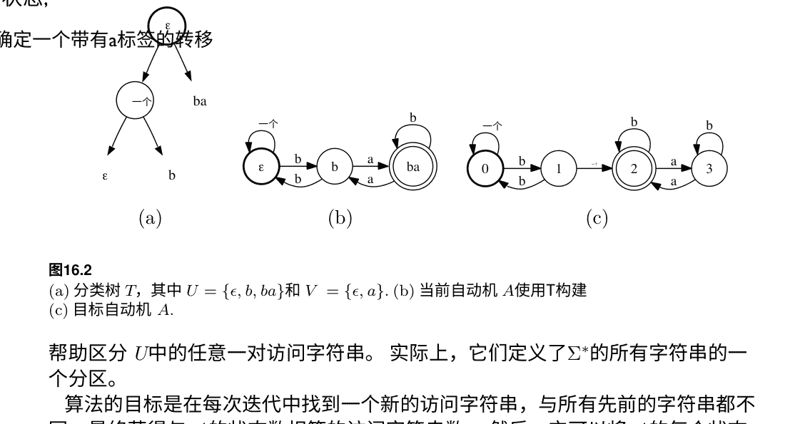

帮助区分 U中的任意一对访问字符串。 实际上，它们定义了Σ*的所有字符串的一个分区。

算法的目标是在每次迭代中找到一个新的访问字符串，与所有先前的字符串都不同，最终获得与 A的状态数相等的访问字符串数。 然后，它可以将 A的每个状态 A(u) 与其访问字符串 u进行匹配。 要找到离开状态 u的标记为 a ∈ Σ的转换的目标状态，只需确定使用由 V引起的分区的访问字符串 u'，该字符串属于与 ua相同的等价类。 可以以类似的方式确定每个状态的终止性。

算法通过一个类似于第9章中介绍的二叉决策树 T来维护 U和 V两个集合。 图16.2a显示了一个例子。 通过区分字符串 V， T定义了由所有字符串引起的分区。 T的叶子节点分别标记有不同的 u ∈ U，其内部节点标记有字符串 v ∈ V。 给定一个字符串 x ∈ Σ*, 由 v ∈ V定义的决策树问题是 xv是否被 A接受，这是通过成员查询确定的。 如果被接受， x被分配给右子树，否则分配给左子树，并且同样的过程递归地应用于子树，直到达到叶子节点。 我们用 T(x) 表示达到的叶子节点的标签。 例如，对于图16.2a中的树 T和图16.2c中的目标自动机A， T(baa) = b，因为 baa 不被 A接受（根节点问题），而 baaa被接受（节点 a的问题）。 在初始化步骤中，算法确保根节点标记为 ε，这对于检查字符串的终止性很方便。

可以从 T构建临时假设DFA A如下。 我们用CONSTRUCTAUTOMATON() 表示相应的函数。 对于每个叶子节点 u ∈ U，创建一个不同的状态 A(u)。 状态 A(u) 的终态是根节点的子树所决定的：如果 u属于 A(u) 的子树，则 A( u) 是终态。

QUERYLEARN AUTOMATA()
1 t ← MEMBERSHIPQUERY(ϵ)
2 T ← T₀
3 A ← A₀
4 当 (EQUIVALENCEQUERY(A) = TRUE)时，执行以下操作
5     x ← COUNTEREXAMPLE()
6     如果 (T = T₀)，则
7         T ← T₁。将NIL替换为 x。
8     否则，令 j ← argmin_k A(x[k]) ≡_T A(x[k])
9         SPLIT(A(x[j - 1]))
10 A ← CONSTRUCTAUTOMATON(T)
11 返回 A

图16.3 用于学习具有成员和等价查询的自动机的算法。A₀是一个带有所有标记为 a ∈ Σ 的自循环的单状态自动机。该状态是初始状态。如果 t = TRUE，则它是最终状态。T₀是一个根节点标记为 ϵ 并且有两个叶子节点的树，一个标记为 ϵ，另一个标记为 NIL。右叶子节点标记为 ϵ 当且仅当 t = TRUE 时标记。T₁是通过将 NIL 替换为 x 而得到的树。

如果 u = ϵu被 A接受，则它是右子树的目标。离开状态 A(u) 的标记为 a ∈ Σ 的转换的目的状态是状态 A(v)，其中 v = T(ua)。图16.2b 显示了从图16.2a 的决策树构建的DFA A。为方便起见，对于任何 x ∈ Σ*，我们用 U(A(x)) 表示标识状态 A(x) 的访问字符串。

图16.3显示了算法的伪代码。第1-3行的初始化步骤构建了一棵带有一个内部节点标记为 ϵ 和一个叶子节点标记为 ϵ 的树 T，另一个叶子节点未确定并标记为 NIL。它们还定义了一个有一个状态和带有字母表中所有元素的自循环的临时DFA A。该单个状态是一个初始状态。只有当它成为最终状态时才会成为最终状态。ϵ被目标DFA A接受，这是通过成员查询在第1行确定的。

在循环的每次迭代中，使用等价查询。如果 A与 A不等价，则会收到一个反例字符串 x（第5行）。如果 T 是初始化步骤中构建的树，则带有 NIL标签的叶子节点被替换为 x（第6-7行）。否则，由于 x 是一个反例，状态 A (x)

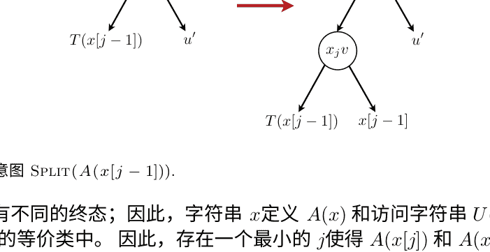

并且 A(x) 有不同的终态；因此，字符串 x 定义 A(x) 和访问字符串 U(A(x)) 被 T 分配到不同的等价类中。因此，存在一个最小的 j 使得 A(x[j]) 和 A(x[j]) 不等价，也就是说，前缀 x[j] 和访问字符串 U(A( x[j])) 被 T 分配到不同的叶子节点中。j 不能为0，因为初始化确保 A(ε) 是一个初始状态，并且与 A 的初始状态(ε) 具有相同的终态。. 通过检查 T(x[ j]) 和 T(U( A(x[j]))) 的相等性来测试 A(x[j]) 和 A(x[j]) 的等价性，这可以通过使用树 T 和成员查询（第8行）来确定。

现在，根据定义， A(x[j-1]) 和 A(x[j-1]) 是等价的，也就是说 T 将 x[j-1] 分配给了标记为 U(A(x[j-1])) 的叶子节点。但是， x[j-1] 和 U(A(x[j-1])) 必须区分开来，因为 A(x[j-1]) 和 A(x[j-1]) 允许带有相同标签的转换 x_j 到两个不同的状态。设 v 为区分字符串 A(x[j]) 和 A(x[j]) 的最小公共祖先。可以通过将标记为 x [j] 和 U(A(x[j])) 的叶子节点的最小公共祖先来获得 v。为了区分 x[j-1] 和 U(A(x[j-1]))，只需将标记为 T(x[j-1]) 的叶子节点分割，创建一个内部节点 x_j v，其中一个叶子节点标记为 x[j-1]，另一个叶子节点标记为 T(x[j-1])（第9行）。图16.4说明了这个构造过程。因此，这提供了一个新的访问字符串 x[j-1]，根据构造方式，它与 U(A(x[j-1])) 和所有其他访问字符串都不同。

因此，访问字符串（或状态 A 的数量）在循环的每次迭代中增加一个。当它达到 A 的状态数时， A 的所有状态都是形如 A（u） 的形式，其中 u ∈ U 是不同的。A 和 A 具有相同数量的状态，实际上 A = A₀。. 实际上，设（A（u），a，A（u'））是 A 中的一个转换，则根据定义，等式 A（ua） = A（u'） 成立。树 T 根据 A 中的区分字符串定义了所有字符串的一个划分。由于在 A 中， ua 和 u' 导致相同的状态，它们被分配给 T 的同一个叶子，即标记为 u' 的叶子。通过 CONSTRUCT AUTOMATON()，可以找到带有标签 a 的从 A（u） 出发的转换的目标，即 T 中分配给 ua 的叶子，即 u'。因此，通过构造，在 A 中创建了相同的转换（A（u），a，A（u'））。

此外，对于 A的状态 q(u)，当且仅当 u被 A接受时，它是最终状态，即 u被 T分配给根节点的右子树，这是确定 A的最终性的标准。因此，自动机 A和 A'是相同的。

以下是算法运行时间复杂度的分析。在每次迭代中，找到一个新的与 A的不同状态相关联的特殊访问字符串，因此最多创建 |A|个状态。对于每个反例 x，最多执行 |x|个树操作。构建 A需要 O(|Σ||A|)个树操作。树操作的成本为 O(|A|)，因为它最多包含 |A|个操作。成员查询。因此，算法的总复杂度为 O(|Σ||A|²+ n|A|)，其中 n是反例的最大长度。请注意，此分析假设等价和成员查询在常数时间内完成。我们的分析得出以下结果。

**定理16.5（使用查询学习DFA）** 所有DFA的类都可以通过成员查询和等价查询进行高效准确学习。

图16.5展示了算法在特定情况下的完整执行过程。在下一节中，我们将研究自动机的不同学习场景。

## 16.4 极限识别

在极限识别框架中，问题是在接收到有限数量的示例之后准确识别目标概念 c。如果存在一种算法，在检查了有限数量的示例并且其假设在此后保持不变之后，能够准确识别该类中的任何语言 L，则称该类语言在极限中是可识别的。

从计算角度来看，这个框架可能不太现实，因为它对实例的数量或算法的效率没有上限要求。尽管如此，一些人认为它与人类学习语言的情景相似。在这个框架中，对于学习确定有限自动机的一般问题，存在负面结果。

**定理16.6** 从正例中无法在极限中识别确定性自动机。

然而，一些有限自动机的子类可以成功地在极限中识别。大多数自动机推理算法基于状态划分范式。它们从一个初始的确定有限自动机开始，通常是一个接受有限样本字符串集合和平凡划分的树：每个块被缩减为树的一个状态。在每次迭代中，它们合并划分块，同时保持一些同余性质。当没有其他合并可能时，迭代结束，最终的划分定义了推断出的自动机。因此，同余的选择完全决定了算法，通过改变选择可以定义各种不同的算法。类似地，可以从接受Σ*的单状态自动机开始定义一种状态分裂范式。在本节中，我们介绍了一种学习可逆自动机的算法，它是刚刚描述的一般状态划分算法范式的特殊实例。

令 A= (Σ, Q, I, F, E) 是一个DFA，令 π是 Q的一个划分。由划分 π定义的DFA 被称为 A和 π的自动机商，记作 A/π, 并定义如下: A/π = (Σ, π, I_{\pi}, F_{\pi}, E_{\pi}), 其中
I_{\pi} = \{B \in \pi : I \cap B \neq \emptyset\}
F_{\pi} = \{B \in \pi : F \cap B \neq \emptyset\}
E_{\pi} = \{(B, a, B') : \exists (q, a, q') \in E \mid q \in B, q' \in B', B \in \pi, B' \in \pi\}.
设 S 为一个有限字符串集合, \operatorname{Pref}(S) 表示 S 的所有前缀字符串集合。 一个接受字符串集合 S 的前缀树自动机是一个特定的DFA, 表示为 PT(S) = (Σ, \operatorname{Pref}(S), \{\epsilon\}, S, E_S), 其中Σ是 S 中使用的字母表符号, E_S 定义如下:
E_S = \{(x, a, xa) : x \in \operatorname{Pref}(S), xa \in \operatorname{Pref}(S)\}.

### 16.4.1 可逆自动机学习

在本节中, 我们将展示可逆自动机或可逆语言的子类可以在极限中被识别。 特别地, 我们将展示在给定一个正面展示的情况下, 该语言可以被识别。

一个语言 L 的正面表示是一个无限序列 (x_n)_{n \in \mathbb{N}} 使得 \{x_n : n \in \mathbb{N}\} = L。 因此, 特别地, 对于任意的 x \in L, 存在 n \in \mathbb{N} 使得 x = x_n。 如果存在 N \in \mathbb{N} 使得对于 n \ge N，算法从正面表示中返回的假设是 L，那么算法可以从一个正面表示中识别 L 的极限。 给定一个DFA A, 我们将其 reverse A^R 定义为从 A 派生的自动机, 方法是将初始状态设为终态, 终态设为初始态, 并反转每个转换的方向。 逆 A 接受的语言正好是 A 接受的字符串的逆 (或镜像)。

> **定义16.7 (可逆自动机)** 一个有限自动机 A 被称为可逆当且仅当 A 和 A^R 都是确定性的。 如果一个语言 L 是某个可逆自动机接受的语言, 则称其为可逆。

这个定义的一些直接结果是, 可逆自动机 A 有一个唯一的最终状态, 并且它的逆 A^R 也是可逆的。 还要注意, 一个修剪的可逆自动机 A 是最小的。 实际上, 如果状态 q 和 q' 在 A 中是等价的, 那么它们都有一个共同的字符串 x, 从 q 和 q' 都可以到达一个最终状态。 但是, 根据 A 的逆确定性, 从最终状态读取 x 的逆必须导致一个唯一的状态, 这意味着 q = q'。

对于任何 u \in \Sigma^* 和任何语言 L \subseteq \Sigma^*, 让 \operatorname{Suff}_L(u) 表示 L 中所有可能的后缀集合, 对于 u:
\operatorname{Suff}_L(u) = \{v \in \Sigma^* : uv \in L\}. \tag{16.1}

Suff_L(u) 也经常用 u^{-1}L 表示。观察到如果 L 是一个可逆语言，那么对于任意两个字符串 u, u' ∈ Σ*, 以下蕴含式成立:

> Suff_L(u) ∩ Suff_L(u') \neq \emptyset \Rightarrow Suff_L(u) = Suff_L(u'). \tag{16.2}

实际上，让 A 是一个接受 L 的可逆自动机。让 q 是从初始状态读取 u 时到达的状态， q' 是从读取 u' 时到达的状态。如果 v ∈ Suff_L(u) ∩ Suff_L(u'), 那么 v 可以从 q 和 q' 都读取到达最终状态。由于 A^R 是确定性的，从最终状态读取 v 的反向必须导致唯一的状态，因此 q = q', 即 Suff_L(u) = Suff_L(u')。

令 A = (Σ, Q, \{i_0\}, \{f_0\}, E) 是一个可逆自动机，它接受一个可逆语言 L。我们定义一组字符串 S_L 如下:

> S_L = \{ d[q] f[q] : q \in Q \} \cup \{ d[q] a f[q'] : q, q' \in Q, a \in \Sigma \},

其中 d[q] 是从 i_0 到 q 的最小长度字符串， f[q] 是从 q 到 f_0 的最小长度字符串。如下命题所示， S_L 表征了语言 L，即任何包含 S_L 的可逆语言必须包含 L。

**命题16.8** 假设 L 是一个可逆语言。那么， L 是包含 S_L 的最小可逆语言。

证明: 假设 L' 是一个包含 S_L 的可逆语言，并且假设字符串 x = x_1 ··· x_n 被 L 接受，其中 x_k ∈ Σ 对于 k ∈ [n] 且 n ≥ 1。为了方便起见，我们也将 x_0 定义为 ε。令 (q_0, x_1, q_1) ··· (q_{n-1}, x_n, q_n) 为在 A 中以 x 标记的接受路径。我们通过递归来证明 Suff_L'(x_0 ··· x_k) = Suff_L'(d[q_k]) 对于所有 k \in \{0, ..., n\} 成立。由于 d[q_0] = d[i_0] = ε, 这显然对于 k=0 成立。现在假设对于某个 k \in \{0, ..., n-1\}, 有 Suff_L'(x_0 ··· x_k) = Suff_L'(d[q_k])。这立即意味着 Suff_L'(x_0 ··· x_k x_{k+1}) = Suff_L'(d[q_k] x_{k+1})。根据定义，S_L 包含 d[q_{k+1}] f[q_{k+1}] 和 d[q_k] x_{k+1} f[q_{k+1}]。由于 L' 包含 S_L，所以对于 L' 也成立。因此，f[q_{k+1}] 属于 Suff_L'(d[q_{k+1}]) ∩ Suff_L'(d[q_k] x_{k+1})。根据 (16.2), 这意味着 Suff_L'(d[q_k] x_{k+1}) = Suff_L'(d[q_{k+1}])。因此，我们有 Suff_L'(x_0 ··· x_k x_{k+1}) = Suff_L'(d[q_{k+1}])。这表明对于所有 k \in \{0, ..., n\}, 特别是对于 k=n, Suff_L'(x_0 ··· x_n) = Suff_L'(d[q_n]) 成立。注意，由于 q_n = f_0, 我们有 f[q_n] = ε, 因此 d[q_n] = d[q_n] f[q_n] 在 S_L ⊆ L' 中，这意味着 Suff_L'(d[q_n]) 包含 ε, 从而 Suff_L'(x_0 ··· x_n) 包含 ε。这等价于 x = x_0 ··· x_n ∈ L'。

图16.6展示了从样本 S 中推断可逆自动机的算法的伪代码。算法首先创建一个前缀树自动机 A 来表示 S (第1行)，然后迭代地定义 A 的状态分割 π, 从一个每个状态一个块的平凡分割 π_0 开始 (第2行)。返回的自动机是 A 和最终分割 π 的商。

```
LEARNREVERSIBLEAUTOMATA(S = (x1, ..., xm))
1  A = (Σ, Q, {i0}, F, E) ← PT(S)
2  π ← π0. 平凡分割。
3  在 F中任意选择一个 f。
4  当 LIST = ∅时
5      移除 (LIST, (q1, q2))
6      如果 B(q1, π) = B(q2, π)则
7          B1 ← B(q1, π)
8          B2 ← B(q2, π)
9          对于所有的 a ∈ Σ执行
10             如果 (成功(B1, a) = ∅) ∧ (成功(B2, a) = ∅)那么
11                 添加(列表, (成功(B1, a), 成功(B2, a)))
12             如果 (前驱(B1, a) = ∅) ∧ (前驱(B2, a) = ∅)那么
13                 添加(列表, (前驱(B1, a), 前驱(B2, a)))
14             更新(成功, 前驱, B1, B2)
15         π ← 合并 (π, B1, B2)
16 返回 A/π
```

图16.6 从一组正字符串中学习可逆自动机的算法 S。

该算法维护一个列表 LIST，其中包含需要合并的对应块的状态对，从所有的终态对 (f, f′) 开始，对于任意选择的终态 f ∈ F (第3行)。我们用 B(q, π) 表示包含 q 的块，基于分割 π。

对于每个块 B 和字母符号 a ∈Σ，该算法还维护一个后继状态 succ(B, a)，即可以通过从 B 的某个状态读取 a 到达的状态；如果不存在这样的状态，则 succ(B, a) = ∅。类似地，它还维护了前驱状态 pred(B, a)，即允许带有 a 标记的转换到达 B 中的状态；如果不存在这样的状态，则 pred(B, a) = ∅。

然后，当列表不为空时，从列表中移除一对并按照以下方式处理。如果对 (q1, q′1) 尚未合并，则将由 B1 = B(q1, π) 和 B2 = B(q2, π) 形成的对的前驱和后继添加到列表中 (第0-13行)。在将块 B₁ 和 B₂ 合并为一个新块 B' 来定义一个新的分区 π (第15行) 之前，新块 B' 的后继和前驱值如下所定义 (第14行)。对于每个符号 a∈Σ，如果 succ(B', a) = ∅ 且 succ(B₁, a) = succ(B₂, a) = ∅，则 succ(B', a) 设置为 succ(B₁, a) 中的一个非空值，否则设置为 succ(B₂, a) 的值 (如果非空)。前驱值以类似的方式定义。图16.7展示了该算法在 m=7 个字符串的样本中的应用。

**命题16.9**

设 S 为一组有限字符串，A = PT(S) 为从 S 定义的前缀树自动机。然后，使用输入 S 的 LearnReversibleAutomata() 定义的最终分区是最精细的分区 π，其中 A/π 是可逆的。

证明: 设 S 的输入样本的算法迭代次数为 T。我们用 π_t 表示算法在循环的 t ≥ 1 次迭代后定义的分区，π_T 为最终分区。

A/π_T 是可逆自动机，因为所有最终状态都保证与初始化步骤的第3行合并到同一块中，对于任何块 B，根据算法的定义，从 B 通过标记为 a 的转换可达的状态包含在同一块中，对于那些允许通过标记为 a 的转换到达 B 的状态也是如此。

设 π' 是状态 A 的一个划分，使得 A/π' 是可逆的。我们通过递归证明 π_T 细化 π'。显然，平凡划分 π₀ 细化 π'。假设对于所有的 s ≤ t， π_s 细化 π'。 π_{t+1} 是通过合并两个块 B(q₁, π_t) 和 B(q₂, π_t) 而得到的。由于 π_t 细化 π'，我们必须有 B(q₁, π_t) ⊆ B(q₁, π')。

为了证明 π_{t+1} 细化 π'，只需证明 B(q₁, π') = B(q₂, π')。

可逆自动机只有一个最终状态，因此，对于分区 π'，A 的所有最终状态必须放在同一个块中。因此，如果在初始化步骤 (第3行) 时，处理在第 (t+1) 次迭代中的一对最终状态 (q_1, q_2) 并且将其放在 LIST 中，则必须有 B(q_1, π') = B(q_2, π')。否则，(q_1, q_2) 将作为两个状态 q_1' 和 q_2' 在先前的迭代中合并时的后继或前驱状态对放入 LIST 中，其中 s \le t。由于 π_s 细化 π_t，q_1' 和 q_2' 在 π_t 的同一个块中，且由于 A/π' 是可逆的，q_1 和 q_2 也必须在相同块中作为相同标签 a ∈ Σ 的后继或前驱状态的块中，因此 B(q_1, π_t) = B(q_2, π_t)。

□

**定理 16.10** 设 S 是一组有限字符串，A 是使用输入 S 时由 LearnReversibleAutomata() 返回的自动机。那么，L(A) 是包含 S 的最小可逆语言。

证明: 设 L 是包含 S 的可逆语言，A' 是一个可逆自动机，L(A') = L。由于 S 中的每个字符串都被 A' 接受，任何 u ∈ \text{Pref}(S) 都可以从 A' 的初始状态读取，达到 A' 的某个状态 q(u)。

考虑从 A' 派生的自动机 A''，只保留形式为 q(u) 的状态和这些状态之间的转换。由于 u ∈ S 时 q(u) 是 A' 的唯一最终状态，且由于 ε 是 S 的字符串前缀，A'' 具有 A' 的初始状态。此外，A'' 直接继承了 A' 是确定性和逆向确定性的属性。因此，A'' 是可逆的。

A 的状态 A'' 定义了 \text{Pref}(S) 的一个划分：如果 u, v ∈ \text{Pref}(S) 且 q(u) = q(v)，则它们属于同一个块。根据前缀树 PT(S) 的定义，它的状态可以与 \text{Pref}(S) 一一对应，A 的状态 A'' 也定义了 PT(S) 的一个划分 π'，因此 A'' = PT(S)/π'。根据命题16.9，算法 LearnReversibleAutomata() 在输入 S 上运行所定义的划分 π 是最精细的，使得 PT(S)/π 是可逆的。因此，我们必须有 L(PT(S)/\pi) \subseteq L(PT(S)/\pi') = L(A'')。由于 A'' 是 A' 的子自动机，L 包含 L(A'')，因此 L(PT(S)/\pi) = L(A)，这证明了命题。

□

**定理16.11 (可逆语言的极限识别)** 设 L 为可逆语言，则算法 LEARNREVERSIBLEAUTOMATA() 可以从正例表示中极限识别 L。

证明: 设 L 为可逆语言。根据命题16.8，L 具有有限特征样本 S_L。设 (x_n)_{n \in \mathbb{N}} 为 L 的正例表示，并且设 χ_n 表示序列的前 n 个元素的并集。由于 S_L 是有限的，存在 N ≥ 1，使得 S_L ⊆ χ_N。根据定理16.10，对于任意 n ≥ N，在有限样本 χ_n 上运行的 LEARNREVERSIBLEAUTOMATA() 返回最小的可逆语言 L' 包含 χ_n，更甚 S_L，根据 S_L 的定义，意味着 L' = L。

实现学习算法所需的主要操作是使用标准的 FIND 和 UNION 来确定一个状态属于哪个块，并将两个块合并为一个。使用不相交集数据结构进行这些操作，算法的时间复杂度可以证明为 O(nα(n))，其中 n 表示输入样本 S 中所有字符串长度的总和，α(n) 表示阿克曼函数的倒数，基本上是常数 (α(n) ≤ 4, 对于 n ≤ 10^80)。

## 16.5 章节笔记

关于有限自动机和一些相关结果的概述，请参阅Hopcroft和Ullman [1979]或Perrin [1990]的最新手册章节，以及M. Lothaire [Lothaire, 1982, 1990, 2005]的一系列书籍和De la Higuera [2010]的最新书籍。

定理16.2表明，寻找最小一致DFA的问题是NP难的，这是由Gold [1978]提出的。这个结果后来被Angluin [1978]扩展了。Pitt和Warmuth [1993]通过展示即使在最小自动机大小的多项式函数的近似情况下，问题仍然是NP难的（定理16.3），进一步加强了这些结果。他们的难度结果也适用于使用NFAs进行预测的情况。Kearns和Valiant [1994]提出了依赖于密码学假设的不同性质的难度结果。他们的结果意味着，如果任何普遍接受的密码学假设成立，那么没有多项式时间算法可以从接受和拒绝的有限样本中以多项式时间学习一致的NFAs，无论最小DFA的大小如何：如果因子分解Blum整数是困难的；或者如果RSA公钥加密系统是安全的；或者如果决定二次剩余性是困难的。最近，Chalermsook等人[2014]改进了Pitt和Warmuth [1993]的非近似保证，得到了一个紧密的界限。

从积极的一面来看，Trakhtenbrot和Barzdin [1973]表明，与输入数据一致的最小有限自动机可以从一个均匀完整的样本中准确地学习，其大小与自动机的大小成指数关系。他们算法的最坏情况复杂度是指数级的，但是在假设拓扑和标记是随机选择的情况下，可以获得更好的平均情况复杂度[Trakhtenbrot和Barzdin，1973]，甚至可以假设拓扑是对抗性选择的情况下[Freund等, 1993]。

Cortes, Kontorovich和Mohri [2007a]研究了一种基于某个适当的高维特征空间中的线性分离的学习自动机问题的方法；另请参阅Kontorovich等人[2006, 2008]。字符串到该特征空间的映射可以通过第6章中介绍的有理核函数来隐式定义，这些核函数本身是通过加权自动机和转换器来定义的。

学习查询模型是由Angluin [1978]引入的，她还证明了有限自动机可以在多项式时间内学习到最小自动机和最长反例的大小。Bergadano和Varricchio [1995]进一步将这个结果扩展到了学习任意域上定义的加权自动机的问题（参见Bisht等人[2006]的最优算法）。

通过最小加权自动机的大小与相应Hankel矩阵的秩之间的关系，可以证明许多其他概念类别的可学习性，例如不相交的DNF [Beimel等人，2000]。

我们对Angluin [1982]算法的高效实现的描述是根据Kearns和Vazirani [1994]进行调整的。

Gold [1967]引入并分析了自动机在极限情况下的识别模型。确定性有限自动机被证明无法从正例中识别出极限情况 [Gold, 1967]。但是，对于一些子类别的极限情况下的识别，例如本章中Angluin [1982]考虑的可逆语言族，给出了积极的结果。对于学习子序列转换器Oncina等人[1993]也有积极的结果。Ron等人[1995]还证明了一些受限制的概率自动机，例如无环概率自动机，可以高效地学习。

有大量的文献涉及到学习自动机的问题。特别是在使用查询和不同学习场景的情况下，已经展示了各种子族的有限自动机的积极结果，并且已经引入和分析了不同类型的学习场景。本章介绍的结果只能被视为对该材料的介绍。

## 16.6 练习

- 1. 16.1 最小DFA。证明最小DFA A在与 A等价的所有其他DFA中也具有最小数量的转换。证明一个语言 L是正则的，当且仅当 Q = {Suff_L(u) : u ∈ Σ*}是有限的。证明具有 L( A) = L的最小DFA A的状态数正好是 Q的基数。
- 2. 16.2 有限自动机的VC维度。
   (a) 所有限自动机的VC维度是多少？这对于有限自动机的PAC学习意味着什么？如果我们限制自己只学习无环自动机（没有循环的自动机），这个结果会改变吗？
   (b) 证明至多具有n个状态的DFA族的VC维度受到O(|Σ| n logn)的限制。

- 16.3 带成员查询的PAC学习。
给出一个概念类C，它可以通过成员查询高效地进行PAC学习，但不能高效地进行精确学习。

- 16.4 使用查询学习单调DNF公式。
证明变量数为n的单调DNF公式的类可以通过成员查询和等价查询进行高效的精确学习。（提示：公式f的t主要蕴含t是一个t文字乘积，使得t蕴含f但没有任何真子项t蕴含f。利用单调DNF的事实，主要蕴含的数量最多等于公式的项数。）

- 16.5 使用不可靠的查询响应进行学习。
考虑一个问题，学习者必须在[n]范围内由oracle选择的整数x。其中n ≥ 1给定。为了做到这一点，学习者可以提出形式为(x ≤ m?)或(x > m?)的问题，其中m ∈ [n]。oracle对这些问题做出回答，但可能对k个问题给出错误的回答。学习者应该提出多少个问题来确定x？（提示：观察到学习者可以重复每个问题2k+1次，并使用多数投票。）

- 16.6 学习可逆语言的算法。
当应用于样本S={ab, aaabb, aabbb, aabbbb}时，学习可逆语言的算法返回的DFA A是什么？假设我们向样本中添加一个新的字符串，比如x = abab。如何更新A以计算算法对S∪{x}的结果？更一般地，描述一种增量更新算法结果的方法。

- 16.7 k-可逆语言。
一个有限自动机A'如果它是k-确定性的，那么它被称为确定性模态下的k：如果两个不同的状态p和q都是初始状态，或者都是从另一个状态r通过读取a ∈Σ到达的，那么没有字符串u的长度为k可以从p和q同时读取。一个有限自动机A如果它是确定性的，并且A^R是k-确定性的，那么它被称为k-可逆的。一个语言L如果它被某个k-可逆自动机接受，那么它是k-可逆的。
   (a) 证明L是k-可逆的，当且仅当对于任意字符串u，u'，v∈Σ*，其中|v|=k，如果Suff_L(uv) ∩ Suff_L(u'v) = ∅ ⇒ Suff_L(uv) = Suff_L(u'v)。
   (b) 证明一个k-可逆语言具有一个特征语言。
   (c) 证明以下定义了一个学习 $k$-可逆自动机的算法。 按照学习可逆自动机的算法进行，但是使用以下合并规则：如果块 $B_1$ 和 $B_2$ 可以通过相同长度为 $k$ 的字符串 $u$ 从其他块到达，并且 $B_1$ 和 $B_2$ 都是终态或者有一个共同的后继状态，则合并这两个块。

## 17 强化学习

本章介绍了强化学习，这是一个与控制理论、优化和认知科学有关的机器学习领域。强化学习是在一个学习者与环境积极交互以实现特定目标的情景中进行规划和学习的研究。这种积极交互使得将学习者称为代理的术语成立。

学习者通常通过从环境中获得的奖励来衡量其目标的实现，并且它寻求最大化这个奖励。

我们首先介绍强化学习的一般情景，然后介绍马尔可夫决策过程（MDPs）的模型，这在这个领域被广泛采用，以及与该模型相关的政策或政策值的基本概念。本章的其余部分介绍了几种用于规划问题的算法，这对应于环境模型为代理所知的情况，然后介绍了一系列用于未知模型的学习算法的更一般情况。

### 17.1 学习场景

图17.1说明了强化学习的一般情景。与前几章考虑的监督学习情景不同，在这里，学习者不是被动地接收一个带有标签的数据集。相反，它通过与环境的交互过程中收集信息。作为对行动的回应，学习者或代理接收到两种类型的信息：它在环境中的当前状态和一个特定于任务及其相应目标的实值奖励。

代理的目标是最大化其奖励，从而确定最佳行动方案或 policy，以实现该目标。然而，他从环境中接收到的信息只是与刚刚采取的行动相关的即时奖励。环境不提供未来或长期的奖励反馈。

强化学习的一个重要方面是考虑延迟奖励或惩罚。代理面临的困境是在探索未知状态和行动以获取有关环境和奖励的更多信息之间，以及利用已收集的信息来优化其奖励之间的权衡。 这被称为强化学习中固有的探索与利用的权衡。

请注意，强化学习的学习场景与大多数先前章节中讨论的监督学习的学习场景之间存在几个差异。 与监督学习不同，在强化学习中没有固定的根据实例绘制的分布；选择策略定义了对观察结果的分布。 实际上，对策略进行轻微更改可能会对收到的奖励产生巨大影响。 此外，一般情况下，环境可能不是固定的，并且可能会因代理选择的行动而变化。 对于某些学习问题来说，这可能是一个更现实的模型，而不是标准的监督学习。 最后，请注意，与监督学习不同，在强化学习中，训练和测试阶段是交叉进行的。

这里可以区分两个主要的设置：一个是环境模型已知于代理，这种情况下，最大化收到的奖励的目标被简化为一个规划问题；另一个是环境模型未知，这种情况下，代理面临一个学习问题。 在后一种设置中，代理必须从收集到的状态和奖励信息中学习来获取关于环境的信息并确定最佳的行动策略。 本章介绍了这两种设置的算法解决方案。

### 17.2 马尔可夫决策过程模型

我们首先介绍马尔可夫决策过程（MDPs）的模型，这是一种在强化学习中广泛采用的环境和与环境的交互模型。 MDP是一个马尔可夫过程，定义如下。

**定义 17.1 (MDPs)** 马尔可夫决策过程（MDP）的定义如下:
- 一组可能是无限的状态 S。
- 一个起始状态或初始状态 $s_0 \in S$。
- 一组可能是无限的动作 $A$。
- 一个转换概率 $\mathbb{P}[s' | s, a]$：目标状态 $s'$ 的分布是 $\delta(s, a)$。
- 一个奖励概率 $\mathbb{P}[r' | s, a]$：返回奖励 $r'$ 的分布是 $r(s, a)$。

该模型是马尔可夫的，因为转换和奖励概率仅依赖于当前状态 $s$，而不依赖于整个状态和采取的动作的历史。这个MDP的定义可以进一步推广到非离散状态和动作集的情况。

在离散时间模型中，动作在一组决策时刻 $\{0, \ldots, T\}$ 被采取，这是我们接下来要采用的模型。这个模型也可以直接推广到连续时间模型，在任意时间点采取动作。

当 $T$ 有限时，MDP被称为具有有限时间界。无论时间界的有限性如何，当 $S$ 和 $A$ 都是有限集时，MDP被称为有限的。在这里，我们考虑的是奖励在状态S和动作A对 $(s, a)$ 时的随机变量。然而，在许多情况下，奖励被假设为状态和动作对 $(s, a)$ 的确定性函数。

图17.2展示了与MDP对应的模型。在时间 $t \in \{0, \ldots, T\}$ 代理观察到的状态是 $s_t$，它采取的动作是 $a_t \in A$。到达的状态是 $s_{t+1}$（以概率 $\mathbb{P}[s_{t+1} | s_t, a_t]$）并且获得的奖励是 $r_{t+1} \in \mathbb{R}$（以概率 $\mathbb{P}[r_{t+1} | s_t, a_t]$）。

许多现实世界的任务可以用MDPs表示。图17.3给出了一个简单的MDP示例，用于描述机器人在网球场上捡球的情况。

### 17.3 策略

在MDP环境中，代理面临的主要问题是确定每个状态下要采取的动作，即一个动作策略。

#### 17.3.1 定义

**定义 17.2 (策略)** 一个策略是一个映射 $\pi: S \rightarrow \Delta(A)$，其中 $\Delta(A)$ 是 $A$ 上的概率分布集合。如果对于任何 $s$，策略 $\pi$ 是确定性的，则存在一个唯一的 $a \in A$，使得 $\pi(s)(a) = 1$。在这种情况下，我们可以将 $\pi$ 视为从 $S$ 到 $A$ 的映射，并使用 $\pi(s)$ 表示该动作。

更准确地说，这是一个固定策略，因为选择行动的分布不依赖于时间。更一般地，我们可以将一个非固定策略定义为一个由t索引的映射序列 π_t: S → Δ(A)。特别地，在有限时间段的情况下，通常需要一个非固定策略来优化奖励。

代理的目标是找到一个最大化其预期（奖励）回报的策略。在特定的状态序列 s_0, ..., s_T 上，遵循确定性策略 π的回报定义如下：
- 对于有限时间段 (T < ∞): $\sum_{t=0}^{T} r(s_t, \pi(s_t))$。
- 对于无限时间 (T = ∞): $\sum_{t=0}^{+\infty} \gamma^t r(s_t, \pi(s_t))$, 其中 $\gamma \in [0,1)$ 是一个小于1的常数，用于折现未来的奖励。

请注意，回报是一个单一的标量，总结了可能是一个无限序列的即时奖励。在折现情况下，早期的奖励被视为比后期的奖励更有价值。

#### 17.3.2 策略价值

这导致了每个状态的策略值的以下定义。

**定义 17.3 (策略值)** 策略π在状态 s ∈ S 的值 $V_{\pi}(s)$被定义为从 s 开始并遵循策略 π时返回的预期奖励：
- 有限时间: $V_{\pi}(s) = \mathbb{E}_{a_t \sim \pi(s_t)} \left[ \sum_{t=0}^{T} r(s_t, a_t) \mid s_0 = s \right]$;
- 无限折扣时间: $V_{\pi}(s) = \mathbb{E}_{a_t \sim \pi(s_t)} \left[ \sum_{t=0}^{+\infty} \gamma^t r(s_t, a_t) \mid s_0 = s \right]$,
其中期望是根据随机选择的动作 a_t的分布 π(s_t)，这是明确指出的，以及随机状态 s_t达到和奖励值 r(s_t, a_t)的期望。基于平均奖励的极限，通常也考虑无限不折扣时间。

#### 17.3.3 最优策略

从状态 s ∈ S 开始，为了最大化奖励，代理自然地寻求一个具有最大值 $V_{\pi}(s)$的策略π。在本节中，我们将展示一个令人惊讶的事实，对于任何有限MDP在无限时间设置中，存在一个对于任何起始状态都是最优的策略，具有以下定义。

**定义 17.4 (最优策略)** 如果其值对于每个状态 s∈S而言都是最大的，则策略π*是最优的，即对于任何策略π和任何状态 s∈S, $V_{\pi^*}(s) \geq V_{\pi}(s)$。

此外，我们将证明对于任何MDP，都存在一个确定性最优策略。为了做到这一点，引入了状态-动作值函数的概念是方便的。

**定义 17.5（状态-动作值函数）** 与策略π相关联的状态-动作值函数Q对于所有的(s, a) ∈ S × A都被定义为在状态 s ∈ S并遵循策略π的情况下，采取动作 a ∈ A的预期回报：

$$Q_{\pi}(s, a) = \mathbb{E}[r(s, a)] + \mathbb{E}_{a_t \sim \pi(s_t)} \left[ \sum_{t=1}^{+\infty} \gamma^t r(s_t, a_t) \mid s_0 = s, a_0 = a \right]$$
$$= \mathbb{E} \left[ r(s, a) + \gamma V_{\pi}(s_1) \mid s_0 = s, a_0 = a \right].$$

观察到 $\mathbb{E}_{a \sim \pi(s)}[Q_{\pi}(s, a)] = V_{\pi}(s)$（见命题17.9）。

**定理 17.6（策略改进定理）** 对于任意两个策略 $\pi$ 和 $\pi'$，以下结论成立：
$$(\forall s \in S, \mathbb{E}_{a \sim \pi'(s)}[Q_{\pi}(s, a)] \geq \mathbb{E}_{a \sim \pi(s)}[Q_{\pi}(s, a)]) \Rightarrow (\forall s \in S, V_{\pi'}(s) \geq V_{\pi}(s)).$$
此外，左侧至少有一个状态 $s$ 的严格不等式意味着右侧至少有一个 $s$ 的严格不等式。

**证明：** 假设 π 和 π'满足左侧。对于任意 s ∈ S，我们有
$$
\begin{aligned}
V_{\pi}(s) &= \mathbb{E}_{a \sim \pi(s)}[Q_{\pi}(s, a)] \\
&\leq \mathbb{E}_{a \sim \pi'(s)}[Q_{\pi}(s, a)] \\
&= \mathbb{E}_{a \sim \pi'(s)}[r(s, a) + \gamma V_{\pi}(s_1) \mid s_0 = s] \\
&= \mathbb{E}_{a \sim \pi'(s)}[r(s, a) + \gamma \mathbb{E}_{a_1 \sim \pi(s_1)}[Q_{\pi}(s_1, a_1)] \mid s_0 = s] \\
&\leq \mathbb{E}_{a \sim \pi'(s)}[r(s, a) + \gamma \mathbb{E}_{a_1 \sim \pi'(s_1)}[Q_{\pi}(s_1, a_1)] \mid s_0 = s] \\
&= \mathbb{E}_{\substack{a \sim \pi'(s) \\ a_1 \sim \pi'(s_1)}}[r(s, a) + \gamma r(s_1, a_1) + \gamma^2 V_{\pi}(s_2) \mid s_0 = s].
\end{aligned}
$$
按照这种方式进行下去，可以证明对于任意的 T ≥ 1:
$ V_{\pi}(s) \leq \mathbb{E}_{a_t \sim \pi'(s_t)} \left[ \sum_{t=0}^{T} \gamma^t \mathbb{E}[r(s_t, a_t)] + \gamma^{T+1} V_{\pi}(s_{T+1}) \mid s_0 = s \right] $。
由于 $V_{\pi}(s_{T+1})$有界，取极限 $T \to +\infty$得到
$ V_{\pi}(s) \leq \mathbb{E}_{a_t \sim \pi'(s_t)} \left[ \sum_{t=0}^{+\infty} \gamma^t \mathbb{E}[r(s_t, a_t)] \mid s_0 = s \right] = V_{\pi'}(s) $。
最后，左侧性质中的任何严格不等式都会导致上述不等式链中的严格不等式。□

**定理 17.7 (贝尔曼最优性条件)** 对于任意一对 (s, a) ∈ S × A 且 $\pi(s)(a) > 0$，如果以下条件成立，则策略π是最优的
$ a \in \arg\max_{a' \in A} Q_{\pi}(s, a') $. (17.2)

**证明：** 根据定理17.6，如果条件(17.2)对于某个(s, a) with $\pi(s)(a) > 0$不成立，则策略π不是最优的。这是因为 π 可以通过定义 π' such that $\pi'(s') = \pi(s)$ for $s' \neq s$ and $\pi'(s)$ concentrated on any element of $\arg\max_{a' \in A} Q_{\pi}(s, a')$ 来改进。π' verifies $\mathbb{E}_{a \sim \pi'(s')} [Q_\pi(s', a)] = \mathbb{E}_{a \sim \pi(s')} [Q_\pi(s', a)]$ for $s' \neq s$ and $\mathbb{E}_{a \sim \pi'(s)} [Q_\pi(s, a)] > \mathbb{E}_{a \sim \pi(s)} [Q_\pi(s, a)]$。因此，根据定理17.6，存在至少一个状态 s 和一个策略 π'，使得 $V_{\pi'}(s) > V_\pi(s)$，且 π 不是最优的。反过来，假设 π 是一个非最优的策略。那么存在一个策略 π' 和至少一个状态 s，使得 $V_{\pi'}(s) > V_\pi(s)$。根据定理17.6，这意味着存在一个状态 $s \in S$，使得 $\mathbb{E}_{a \sim \pi'(s)} [Q_\pi(s, a)] > \mathbb{E}_{a \sim \pi(s)} [Q_\pi(s, a)]$。因此，π 不能满足条件(17.2)。□

## 17.3.4 策略评估

策略在状态 $s$ 的值可以用其在其他状态的值来表示，形成一个线性方程系统。

### 命题17.9（贝尔曼方程）
策略 $\pi$ 在状态 $s \in S$ 的无限时间 $MDP$ 中的值 $V^{\pi}(s)$ 遵循以下线性方程系统：

$$\forall s \in S, V^{\pi}(s) = \underset{a_1 \sim \pi(s)}{\mathbb{E}} [r(s, a_1)] + \gamma \sum_{s'} \mathbb{P}[s'|s, \pi(s)] V^{\pi}(s'). \quad (17.5)$$

证明：我们可以将策略值的表达式分解为第一个项和其余项的和，其中都有 $\gamma$ 作为乘数：

$$ V_{\pi}(s) = \mathbb{E}\left[ \sum_{t=0}^{+\infty} \gamma^t r(s_t, \pi(s_t)) \mid s_0 = s \right] $$

$$ = \mathbb{E}[r(s, \pi(s))] + \gamma \mathbb{E}\left[ \sum_{t=0}^{+\infty} \gamma^t r(s_{t+1}, \pi(s_{t+1})) \mid s_0 = s \right] $$

$$ = \mathbb{E}[r(s, \pi(s))] + \gamma \mathbb{E}\left[ \sum_{t=0}^{+\infty} \gamma^t r(s_{t+1}, \pi(s_{t+1})) \mid s_1 = \delta(s, \pi(s)) \right] $$

$$ = \mathbb{E}[r(s, \pi(s))] + \gamma \mathbb{E}[V_{\pi}(\delta(s, \pi(s)))]. $$

这完成了证明。

这是一个线性方程组，也被称为贝尔曼方程，与非线性方程组 (17.4) 不同。该方程组可以重写为 $\mathbf{V} = \mathbf{R} + \gamma \mathbf{P} \mathbf{V}$， (17.6) 使用以下符号：$\mathbf{P}$ 表示过渡概率矩阵，定义为 $\mathbf{P}[s' \mid s, \pi(s)]$，其中 $s, s' \in S$；$\mathbf{V}$ 是值列矩阵，其第 $s$ 个分量为 $\mathbf{V}_s = V_{\pi}(s)$；$\mathbf{R}$ 是奖励列矩阵，其第 $s$ 个分量为 $\mathbf{R}_s = \mathbb{E}[r(s, \pi(s))]$。$\mathbf{V}$ 通常是贝尔曼方程中的未知变量，并通过求解得到。

下面的定理表明，对于有限MDP，这个线性方程系统有唯一解。

### 定理17.10
对于有限 $MDP$，贝尔曼方程有唯一解，解为

$$ \mathbf{V}_0 = (\mathbf{I} - \gamma \mathbf{P})^{-1} \mathbf{R}. \quad (17.7) $$

证明：贝尔曼方程 (17.6) 可以等价地写成

$$ (\mathbf{I} - \gamma \mathbf{P})\mathbf{V} = \mathbf{R}. $$

因此，为了证明定理，只需证明 $(\mathbf{I} - \gamma \mathbf{P})$ 是可逆的。为了做到这一点，注意到 $\mathbf{P}$ 的无穷范数可以使用其随机性质计算： $\|\mathbf{P}\|_{\infty} = \max_s \sum_{s'} |\mathbf{P}_{ss'}| = \max_s \sum_{s'} \mathbb{P}[s' \mid s, \pi(s)] = 1$。这意味着 $\|\gamma \mathbf{P}\|_{\infty} = \gamma < 1$。因此，对于有限MDP，当转移概率矩阵 $\mathbf{P}$ 和奖励期望 $\mathbf{R}$ 已知时，通过求逆矩阵可以确定所有状态下策略 $\pi$ 的值。

## 17.4 规划算法

在这一部分中，我们假设环境模型是已知的。也就是说，对于所有的 $s, s' \in S$ 和 $a \in A$，转移概率 $\mathbb{P}[s'|s, a]$ 和期望奖励 $\mathbb{E}[r(s, a)]$ 被假设为已知。找到最优策略的问题不需要学习环境模型的参数或估计其他有助于确定最佳行动的数量，它纯粹是一个规划问题。

本节讨论了三种解决这个规划问题的算法：值迭代算法、策略迭代算法和线性规划公式。

### 17.4.1 值迭代

值迭代算法旨在确定每个状态 $s \in S$ 的最优策略值 $V^*( s)$，从而确定最优策略。该算法基于贝尔曼方程 (17.4)。正如已经指出的，这些方程不构成一个线性方程组，需要使用不同的技术来确定解。算法设计的主要思想是使用迭代方法来解决它们：使用贝尔曼方程和当前值来确定 $V(s)$ 的新值。这个过程重复进行，直到满足收敛条件。

对于向量 $\mathbf{V}$ 在 $\mathbb{R}^{|S|}$ 中，我们用 $V(s)$ 表示其在 $S$ 中的第 $s$ 个坐标。设 $\Phi：\mathbb{R}^{|S|} \to \mathbb{R}^{|S|}$ 是基于贝尔曼方程 (17.4) 定义的映射：

对于任意的 $s \in S$， $[\Phi(\mathbf{V})](s) = \max_{a\in A} \left\{\mathbb{E}[r(s, a)] + \gamma \sum_{s'\in S} \mathbb{P}[s'|s, a]V(s')\right\}. \quad (17.8)$

这些方程中的最大化动作 $a \in A$ 定义了在每个状态 $s \in S$ 下要采取的策略 $\pi$。因此，我们可以将这些方程重写为矩阵形式，如下所示：

$$\Phi(\mathbf{V}) = \max_{\pi} \{\mathbf{R}_\pi + \gamma \mathbf{P}_\pi \mathbf{V}\}, \quad (17.9)$$

其中 $\mathbf{P}_\pi$ 是由 $(\mathbf{P}_\pi)_{ss'} = \mathbb{P}[s'|s, \pi(s)]$ 定义的转移概率矩阵，对于所有的 $s, s' \in S$， $\mathbf{R}_\pi$ 是由 $(\mathbf{R}_\pi)_s = \mathbb{E}[r(s, \pi(s))]$ 定义的奖励向量，对于所有的 $s \in S$。

该算法直接基于(17.9)。伪代码如上所示。从任意策略值向量 $\mathbf{V}_0 \in \mathbb{R}^{|S|}$ 开始，算法迭代地应用 $\Phi$ 对当前 $\mathbf{V}$ 进行操作以获得新的策略值向量，直到 $\|\mathbf{V} - \Phi(\mathbf{V})\| \geq ((1-\gamma)\varepsilon)/\gamma$，其中 $\varepsilon > 0$ 是所需的近似值。以下定理证明了该算法收敛到最优策略值。

### 定理17.11
对于任意初始值 $\mathbf{V}_0$，由 $\mathbf{V}_{n+1} = \Phi(\mathbf{V}_n)$ 定义的序列收敛到 $\mathbf{V}^*$。

证明：我们首先证明 $\Phi$ 对于 $\|\cdot\|_\infty$ 是 $\gamma$-Lipschitz的。23 对于任意的 $s \in S$ 和 $\mathbf{V} \in \mathbb{R}^{|S|}$，令 $\Phi(\mathbf{V})(s)$ 在 (17.8) 中定义的最大化动作为 $a^*(s)$。那么，对于任意的 $s \in S$ 和任意的 $\mathbf{U} \in \mathbb{R}^{|S|}$，

$$ \Phi(\mathbf{V})(s) - \Phi(\mathbf{U})(s) \leq \Phi(\mathbf{V})(s) - \left(\mathbb{E}[r(s, a^*(s))] + \gamma \sum_{s'\in S} \mathbb{P}[s' | s, a^*(s)] U(s')\right) \\ = \gamma \sum_{s'\in S} \mathbb{P}[s' | s, a^*(s)] [V(s') - U(s')] \\ \leq \gamma \sum_{s'\in S} \mathbb{P}[s' | s, a^*(s)] \|\mathbf{V} - \mathbf{U}\|_\infty = \gamma\|\mathbf{V} - \mathbf{U}\|_\infty. $$

类似地进行 $\Phi(\mathbf{U})(s) - \Phi(\mathbf{V})(s)$，我们得到 $\Phi(\mathbf{U})(s) - \Phi(\mathbf{V})(s) \leq \gamma\|\mathbf{V} - \mathbf{U}\|_\infty$。因此，$|\Phi(\mathbf{V})(s) - \Phi(\mathbf{U})(s)| \leq \gamma\|\mathbf{V} - \mathbf{U}\|_\infty$ 对于所有的 $s$ 成立，这意味着

$$ \|\Phi(\mathbf{V}) - \Phi(\mathbf{U})\|_\infty \leq \gamma\|\mathbf{V} - \mathbf{U}\|_\infty, $$

这是 $\Phi$ 的 $\gamma$-Lipschitz性质。现在，根据贝尔曼方程（17.4）， $\mathbf{V}^* = \Phi(\mathbf{V}^*)$，因此对于任意的 $n \in \mathbb{N}$，

$$ \|\mathbf{V}^* - \mathbf{V}_{n+1}\|_\infty = \|\Phi(\mathbf{V}^*) - \Phi(\mathbf{V}_n)\|_\infty \leq \gamma \|\mathbf{V}^* - \mathbf{V}_n\|_\infty \leq \gamma^{n+1} \|\mathbf{V}^* - \mathbf{V}_0\|_\infty, $$

这证明了序列收敛到 $\mathbf{V}^*$，因为 $\gamma \in (0,1)$。 □

算法返回的值的 $\varepsilon$-最优性可以如下证明。根据三角不等式和 $\gamma$-Lipschitz性质 $\Phi$，对于任意的 $n \in \mathbb{N}$，

$$ \begin{aligned} \|\mathbf{V}^* - \mathbf{V}_{n+1}\|_\infty &\leq \|\mathbf{V}^* - \Phi(\mathbf{V}_{n+1})\|_\infty + \|\Phi(\mathbf{V}_{n+1}) - \mathbf{V}_{n+1}\|_\infty \\ &= \|\Phi(\mathbf{V}^*) - \Phi(\mathbf{V}_{n+1})\|_\infty + \|\Phi(\mathbf{V}_{n+1}) - \Phi(\mathbf{V}_n)\|_\infty \\ &\leq \gamma \|\mathbf{V}^* - \mathbf{V}_{n+1}\|_\infty + \gamma \|\mathbf{V}_{n+1} - \mathbf{V}_n\|_\infty. \end{aligned} $$

因此，如果 $\mathbf{V}_{n+1}$ 是算法返回的策略值，我们有

$$ \|\mathbf{V}^* - \mathbf{V}_{n+1}\|_\infty \leq \frac{\gamma}{1 - \gamma} \|\mathbf{V}_{n+1} - \mathbf{V}_n\|_\infty \leq \varepsilon. $$

算法的收敛性在 $O(\log \frac{1}{\varepsilon})$ 迭代次数内。实际上，观察到

$$ \|\mathbf{V}_{n+1} - \mathbf{V}_n\|_\infty = \|\Phi(\mathbf{V}_n) - \Phi(\mathbf{V}_{n-1})\|_\infty \leq \gamma \|\mathbf{V}_n - \mathbf{V}_{n-1}\|_\infty \leq \gamma^n \|\Phi(\mathbf{V}_0) - \mathbf{V}_0\|_\infty. $$

因此，如果 $n$ 是最大的整数，使得 $\frac{(1-\gamma)\varepsilon}{\gamma} \leq \|\mathbf{V}_{n+1} - \mathbf{V}_n\|_\infty$，它必须满足 $\frac{(1-\gamma)\varepsilon}{\gamma} \leq \gamma^n \|\Phi(\mathbf{V}_0) - \mathbf{V}_0\|_\infty$，因此 $n \leq O\left(\log \frac{1}{\varepsilon}\right)$。24

### 17.4.2 策略迭代

确定最佳策略的另一种算法是使用策略评估，可以通过矩阵求逆来实现，如定理17.10所示。算法的伪代码称为策略迭代算法，如图17.6所示。从任意行动策略 $\pi_0$ 开始，该算法通过矩阵求逆重复计算当前策略 $\pi$ 的值，并贪婪地选择新策略作为最大化贝尔曼方程 (17.9) 右侧的策略。

以下定理证明了策略迭代算法的收敛性。

### 定理17.12
设 $(\mathbf{V}_n)_{n\in\mathbb{N}}$ 为算法计算的策略值序列，则对于任意 $n \in \mathbb{N}$，以下不等式成立：
$$ \mathbf{V}_n \le \mathbf{V}_{n+1} \le \mathbf{V}^* \tag{17.10} $$

证明：令 $\pi_{n+1}$ 为算法的第 $n$ 次迭代中的策略改进。我们首先证明 $(\mathbf{I} - \gamma \mathbf{P}_{\pi_{n+1}})^{-1}$ 保持顺序，即对于任意的列向量 $\mathbf{X}$ 和 $\mathbf{Y}$ 在 $\mathbb{R}^{|S|}$ 中，如果 $(\mathbf{Y} - \mathbf{X}) \ge 0$，则 $(\mathbf{I} - \gamma \mathbf{P}_{\pi_{n+1}})^{-1}(\mathbf{Y} - \mathbf{X}) \ge 0$。如定理17.10的证明所示，$||\gamma \mathbf{P}_{\pi}||_\infty = \gamma < 1$。由于幂级数 $(1 - x)^{-1}$ 的收敛半径为1，我们可以使用其展开式并写成

$$ (\mathbf{I} - \gamma \mathbf{P}_{\pi_{n+1}})^{-1} = \sum_{k=0}^{\infty} (\gamma \mathbf{P}_{\pi_{n+1}})^k. $$

因此，如果 $\mathbf{Z} = (\mathbf{Y} - \mathbf{X}) \ge 0$，那么 $(\mathbf{I} - \gamma \mathbf{P}_{\pi_{n+1}})^{-1}\mathbf{Z} = \sum_{k=0}^{\infty} (\gamma \mathbf{P}_{\pi_{n+1}})^k \mathbf{Z} \ge 0$，因为矩阵 $\mathbf{P}_{\pi_{n+1}}$ 及其幂都是非负的，以及 $\mathbf{Z}$。

现在，根据 $\pi_{n+1}$ 的定义，我们有
$$ \mathbf{R}_{\pi_{n+1}} + \gamma \mathbf{P}_{\pi_{n+1}} \mathbf{V}_n \ge \mathbf{R}_{\pi_n} + \gamma \mathbf{P}_{\pi_n} \mathbf{V}_n = \mathbf{V}_n, $$

这表明 $\mathbf{R}_{\pi_{n+1}} \ge (\mathbf{I} - \gamma \mathbf{P}_{\pi_{n+1}})\mathbf{V}_n$。由于 $(\mathbf{I} - \gamma \mathbf{P}_{\pi_{n+1}})^{-1}$ 保留或渲染，这意味着 $\mathbf{V}_{n+1} = (\mathbf{I} - \gamma \mathbf{P}_{\pi_{n+1}})^{-1} \mathbf{R}_{\pi_{n+1}} \ge \mathbf{V}_n$，这证明了定理。 □

请注意，两个连续的策略值只能在算法的最后一次迭代时相等。可能的策略总数为 $|A|^{|S|}$，因此这构成了最大迭代次数的直接上界。更好的上界形式为 $O(|A|^{|S|})$ 对于这个算法已经有了解。

对于图17.5所示的简单MDP，让初始策略 $\pi_0$ 定义为 $\pi_0(1) = b$, $\pi_0(2) = c$。然后，用于评估此策略的线性方程组为

$$ \begin{cases} V_{\pi_0}(1) = 1 + \gamma V_{\pi_0}(2) \\ V_{\pi_0}(2) = 2 + \gamma V_{\pi_0}(2) \end{cases} $$

这给出了 $V_{\pi_0}(1) = \frac{1+\gamma}{1-\gamma}$ 和 $V_{\pi_0}(2) = \frac{2}{1-\gamma}$。

### 定理17.13
设 $(\mathbf{U}_n)_{n\in\mathbb{N}}$ 为值迭代算法生成的策略值序列，而 $(\mathbf{V}_n)_{n\in\mathbb{N}}$ 为策略迭代算法生成的序列。如果 $\mathbf{U}_0 = \mathbf{V}_0$，则，对于所有的 $n \in \mathbb{N}$，
$$ \mathbf{U}_n \le \mathbf{V}_n \le \mathbf{V}^* \tag{17.11} $$

证明：我们首先证明之前引入的函数 $\Phi$ 是单调的。设 $\mathbf{U}$ 和 $\mathbf{V}$ 满足 $\mathbf{U} \le \mathbf{V}$，且 $\pi$ 是使得 $\Phi(\mathbf{U}) = \mathbf{R}_\pi + \gamma \mathbf{P}_\pi \mathbf{U}$ 的策略。

那么，
$$
\Phi(U) \leq R_{\pi} + \gamma P_{\pi} V \leq \max_{\pi'}\{R_{\pi'} + \gamma P_{\pi'} V\} = \Phi(V)
$$
证明通过对 $n$ 进行归纳。假设 $U_n \leq V_n$，则由 $\Phi$ 的单调性可知，我们有
$$
U_{n+1} = \Phi(U_n) \leq \Phi(V_n) = \max_{\pi}\{R_{\pi} + \gamma P_{\pi} V_n\}
$$
令 $\pi_{n+1}$ 为最大化策略，即 $\pi_{n+1} = \arg\max_{\pi}\{R_{\pi} + \gamma P_{\pi} V_n\}$。那么，
$$
\Phi(V_n) = R_{\pi_{n+1}} + \gamma P_{\pi_{n+1}} V_n \leq R_{\pi_{n+1}} + \gamma P_{\pi_{n+1}} V_{n+1} = V_{n+1}
$$
因此 $U_{n+1} \leq V_{n+1}$。

该定理表明，由于最优策略，策略迭代算法在较少的迭代次数内收敛于值迭代算法。但是，策略迭代算法的每次迭代都需要计算策略值，即解线性方程组，这比值迭代算法的迭代更昂贵。

## 17.4.3 线性规划

通过线性规划（LP）可以对由贝尔曼方程（17.4）定义的优化问题或定理17.8的证明进行替代形式的表达，即具有线性目标函数和线性约束的优化问题。

LPs 具有（弱）多项式时间的算法解决方案。在实践中，存在各种不同的方法来解决相对较大的 LP 问题，包括单纯形法、内点法或各种特殊目的的解决方案。所有这些方法都可以应用于这个背景。

根据定义，方程（17.4）都是基于最大化的。这些最大化等价于在约束条件下寻求最小化 $\{V(s) : s \in S\}$ 的所有元素，其中 $V(s) \geq \mathbb{E}[r(s, a)] + \gamma \sum$。

因此，这可以写成以下线性规划问题，对于任意一组固定的正权重 $\alpha(s) > 0$，$(s \in S)$：
$$
\text{最小化}_V \sum_{s \in S} \alpha(s) V(s) \\
\text{满足条件 } \forall s \in S, \forall a \in A, V(s) \geq \mathbb{E}[r(s, a)] + \gamma \sum_{s' \in S} \mathbb{P}[s' | s, a] V(s') \\
\quad (17.12)
$$
其中 $\alpha > 0$ 是向量，其第 $s$ 个分量等于 $\alpha(s)$。为了使每个系数 $\alpha(s)$ 可以解释为概率，我们还可以进一步添加约束条件即 $\sum$。

这个线性规划的行数是 $|S||A|$，列数是 $|S|$。解决线性规划问题的复杂度通常在行数方面更有利，而不是列数方面。这激发了基于等价对偶形式的解决方案，可以写成 $\max$
$$
\max \sum_{s \in S, a \in A} \mathbb{E}[r(s, a)] x(s, a) \quad (17.13) \\
\text{对于所有的 } \forall s \in S, \sum_{a \in A} x(s, a) = \alpha(s) + \gamma \sum_{s \in S, a \in A} \mathbb{P}[s|s, a] x(s, a) \\
\text{对于所有的 } \forall s \in S, \forall a \in A, x(s, a) \geq 0,
$$
而行数只有 $|S|$ 和列数 $|S||A|$。这里的 $x(s,a)$ 可以解释为处于状态 $s$ 并采取行动 $a$ 的概率。

## 17.5 学习算法

本节考虑了更一般的情况，即马尔可夫决策过程（MDP）的环境模型未知，即转移和奖励概率未知。这与许多实际的强化学习应用相匹配，例如，将机器人放置在需要探索以达到特定目标的环境中。在这种情况下，代理如何确定最佳策略？由于环境模型未知，代理可能会通过估计转移或奖励概率来学习它们。为了做到这一点，与监督学习的标准情况一样，代理需要一定数量的训练信息。在具有 MDP 的强化学习背景下，训练信息是代理根据其采取的行动所获得的即时奖励序列。

有两种主要的学习方法可以采用。一种被称为无模型方法的方法是直接学习行动策略。另一种被称为模型方法的方法是首先学习环境模型，然后利用该模型学习策略。我们在这个问题中提出的 Q 学习算法被广泛应用于强化学习，并属于无模型方法的一种。

强化学习中采用的估计和算法方法与随机逼近的概念和技术密切相关。因此，我们首先介绍了这个领域的几个有用的结果，这些结果将用于强化学习算法的收敛证明。

### 17.5.1 随机逼近

随机逼近方法是解决优化问题的迭代算法，其目标函数被定义为某个随机变量的期望，或者找到一个只能通过嘈杂观测访问的函数 $H$ 的不动点。这些正是强化学习中所遇到的优化问题类型。例如，对于我们将描述的 Q 学习算法，最优状态-动作值函数 $Q^*$ 是某个函数 $H$ 的不动点，该函数被定义为一个期望，因此不能直接访问。

我们从一个基本结果开始，其证明和相关算法展示了随机逼近中更复杂结果的特点。该定理是一个被称为大数定律的结果的一般化。它表明，在一些系数条件下，一系列估计值 $\mu_m$ 几乎必然（a.s.）收敛到有界随机变量的均值。

> **定理17.14 (均值估计)** 设 $X$ 是一个取值在 $[0, 1]$ 的随机变量，并且 $x_0, \ldots , x_m$ 是 $X$ 的独立同分布的值。定义序列 $(\mu_m)_{m\in\mathbf{N}}$ 定义
> $$
> \mu_{m+1} = (1 - \alpha_m)\mu_m + \alpha_mx_m, \quad\quad (17.14)
> $$
> 其中 $\mu_0 = x_0$, $\alpha_m \in [0, 1]$, $\sum_{m \ge 0} \alpha_m = +\infty$ 并且 $\sum_{m \ge 0} \alpha_m^2 < +\infty$。那么，
> $$
> \mu_m \xrightarrow{a.s.} \mathbb{E}[X]. \quad\quad (17.15)
> $$

证明： 我们给出 $L_2$ 收敛的证明。稍后会对更一般的定理给出 a.s. 收敛的证明。根据独立性假设，对于 $m \ge 0$, $\mathrm{Var}[\mu_{m+1}] = (1 - \alpha_m)^2 \mathrm{Var}[\mu_m] + \alpha_m^2 \mathrm{Var}[x_m] \le (1 - \alpha_m) \mathrm{Var}[\mu_m] + \alpha_m^2$。 (17.16) 设 $\epsilon > 0$，并且假设存在 $N \in \mathbb{N}$，使得对于所有 $m \ge N$, $\mathrm{Var}[\mu_m] \ge \epsilon$。

然后，对于 $m \ge N$，
$$
\mathrm{Var}[\mu_{m+1}] \le \mathrm{Var}[\mu_m] - \alpha_m \mathrm{Var}[\mu_m] + \alpha_m^2 \le \mathrm{Var}[\mu_m] - \alpha_m\epsilon + \alpha_m^2,
$$
这意味着，通过重新应用这个不等式，
$$
\mathrm{Var}[\mu_{m+N}] \le \mathrm{Var}[\mu_N] - \epsilon \underbrace{\sum_{n=N}^{m+N} \alpha_n}_{\rightarrow -\infty \text{ 当 } m\to\infty} + \underbrace{\sum_{n=N}^{m+N} \alpha_n^2}_{\rightarrow \text{有限常数 当 } m\to\infty},
$$
与 $\mathrm{Var}[\mu_{m+N}] \ge 0$ 相矛盾。因此，这与存在这样一个整数 $N$ 相矛盾。因此，对于所有 $N \in \mathbb{N}$，存在 $m_0 \geq N$ 使得 $\mathrm{Var}[\mu_{m_0}] \leq \epsilon$。

选择足够大的 $N$，使得对于所有 $m \geq N$，不等式 $\alpha_m \leq \epsilon$ 成立。这是可能的，因为序列 $(\alpha_m)_{m \in \mathbb{N}}$ 收敛于零。

我们将通过归纳法证明对于任意 $m \geq m_0$，$\mathrm{Var}[\mu_m] \leq \epsilon$ 成立，这证明了定理的陈述。

假设对于某个 $m \geq m_0$，$\mathrm{Var}[\mu_m] \leq \epsilon$ 成立。然后，利用这个假设，不等式 (17.16) 和 $\alpha_m \leq \epsilon$ 的事实，得到以下不等式成立：
$$
\mathrm{Var}[\mu_{m+1}] \leq (1 - \alpha_m)\epsilon + \epsilon \alpha_m = \epsilon.
$$
因此，这证明了 $\lim_{m \to +\infty} \mathrm{Var}[\mu_m] = 0$，即 $\mu_m$ 收敛于 $\mathbb{E}[X]$。

请注意，定理中与序列 $(\alpha_m)_{m \in \mathbb{N}}$ 相关的假设。特别是当 $\alpha_m = \frac{1}{m}$ 时，该定理在选择 $\alpha_m$ 为此特殊情况时与大数定律相符。这个结果与随机优化的一般问题有紧密的联系。

随机优化是寻找方程的解的一般问题
$$
\mathbf{x} = H(\mathbf{x}),
$$
其中 $\mathbf{x} \in \mathbb{R}^N$，当

+   $H(x)$ 无法计算，例如，因为 $H$ 不可访问或者因为计算成本过高；
+   但是可以获得一个 $m$ 个独立同分布的带噪声观测 $H(\mathbf{x}_i) + \mathbf{w}_i$，其中噪声随机变量 $\mathbf{w}$ 的期望为零：$\mathbb{E} [\mathbf{w}] = 0$。

这个问题在各种不同的背景和应用中都会出现。正如我们将要看到的，它与 MDP 的学习问题直接相关。

解决这个问题的一个通用思路是使用迭代方法，并以类似于定理 17.14 所建议的方式定义一个序列 $(\mathbf{x}_t)_{t \in \mathbb{N}}$：
$$
\begin{aligned}
\mathbf{x}_{t+1} &= (1 - \alpha_t)\mathbf{x}_t + \alpha_t[H(\mathbf{x}_t) + \mathbf{w}_t] && \quad (17.17)\\
&= \mathbf{x}_t + \alpha_t[H(\mathbf{x}_t) + \mathbf{w}_t - \mathbf{x}_t], && \quad (17.18)
\end{aligned}
$$
其中 $(\alpha_t)_{t \in \mathbb{N}}$ 满足与定理 17.14 中假设的条件类似。更一般地，我们考虑通过以下方式定义的序列
$$
\mathbf{x}_{t+1} = \mathbf{x}_t + \alpha_t D(\mathbf{x}_t, \mathbf{w}_t), \quad (17.19)
$$
其中 $D$ 是一个将 $\mathbb{R}^N \times \mathbb{R}^N$ 映射到 $\mathbb{R}^N$ 的函数。在各种假设下，有许多不同的定理保证了该序列的收敛性。我们将介绍其中一种最一般形式的定理，该定理依赖于以下结果。

## 定理 17.15 (超鞅收敛)

设 $(X_t)_{t \in \mathbb{N}}$, $(Y_t)_{t \in \mathbb{N}}$, 以及 $(Z_t)_{t \in \mathbb{N}}$ 为非负随机变量序列使得 $\sum_{t=0}^\infty Y_t < +\infty$。令 $\mathcal{F}_t$ 表示所有 $t' \leq t$ 的信息：$\mathcal{F}_t = \{ (X_{t'}, Y_{t'}, Z_{t'})_{t' \leq t} \}$。那么，如果 $\mathbb{E}[ X_{t+1} | \mathcal{F}_t ] \leq X_t + Y_t - Z_t$，则有以下结论：

+   $X_t$ 以概率1收敛到一个极限。
+   $\sum_{t=0}^\infty Z_t < +\infty$。

以下是这类定理中最一般的形式之一。

## 定理17.16

设 $D$ 是一个将 $\mathbb{R}^N \times \mathbb{R}^N$ 映射到 $\mathbb{R}^N$ 的函数，$(\mathbf{w}_t)_{t \in \mathbb{N}}$ 是 $\mathbb{R}^N$ 中的随机变量序列，$(\alpha_t)_{t \in \mathbb{N}}$ 是实数序列，$(\mathbf{x}_t)_{t \in \mathbb{N}}$ 是由 $\mathbf{x}_{t+1} = \mathbf{x}_t + \alpha_t D(\mathbf{x}_t, \mathbf{w}_t)$ 定义的序列，其中 $\mathbf{x}_0 \in \mathbb{R}^N$。令 $\mathcal{F}_t$ 表示截止到 $t$ 的整个历史记录，即：$\mathcal{F}_t = \{ (\mathbf{x}_{t'}, \mathbf{w}_{t'}, \alpha_{t'})_{t' \leq t} \}$。令 $\Psi$ 表示函数 $\mathbf{x} \to (1/2)\|\mathbf{x} - \mathbf{x}^*\|^2$，其中 $\mathbf{x}^* \in \mathbb{R}^N$。假设 $D$ 和 $(\alpha_t)_{t \in \mathbb{N}}$ 满足以下条件：

+   $\exists K_1, K_2 \in \mathbb{R}: \mathbb{E}[ \|D(\mathbf{x}_t, \mathbf{w}_t)\|^2 | \mathcal{F}_t ] \leq K_1 + K_2 \Psi(\mathbf{x}_t)$;
+   $\exists c \geq 0: \nabla\Psi(\mathbf{x}_t)^\top \mathbb{E}[ D(\mathbf{x}_t, \mathbf{w}_t) | \mathcal{F}_t ] \leq -c \Psi(\mathbf{x}_t)$;
+   $\alpha_t > 0$, $\sum_{t=0}^\infty \alpha_t = +\infty$, $\sum_{t=0}^\infty \alpha_t^2 < +\infty$。

那么，序列 $\mathbf{x}_t$ 几乎必定收敛于 $\mathbf{x}^*$：
$$
\mathbf{x}_t \xrightarrow{a.s.} \mathbf{x}^*, \quad (17.20)
$$

证明 由于函数 $\Psi$ 是二次的，泰勒展开给出 $\Psi(\mathbf{x}_{t+1}) = \Psi(\mathbf{x}_t) + \nabla\Psi(\mathbf{x}_t)^\top (\mathbf{x}_{t+1} - \mathbf{x}_t) + (1/2)(\mathbf{x}_{t+1} - \mathbf{x}_t)^\top \nabla^2 \Psi(\mathbf{x}_t) (\mathbf{x}_{t+1} - \mathbf{x}_t)$。因此，
$$
\mathbb{E}[ \Psi(\mathbf{x}_{t+1}) | \mathcal{F}_t ] = \Psi(\mathbf{x}_t) + \alpha_t \nabla\Psi(\mathbf{x}_t)^\top \mathbb{E}[ D(\mathbf{x}_t, \mathbf{w}_t) | \mathcal{F}_t ] + (\alpha_t^2/2) \mathbb{E}[ \|D(\mathbf{x}_t, \mathbf{w}_t)\|^2 | \mathcal{F}_t ] \\
\leq \Psi(\mathbf{x}_t) - \alpha_t c \Psi(\mathbf{x}_t) + (\alpha_t^2/2)(K_1 + K_2 \Psi(\mathbf{x}_t)) \\
= \Psi(\mathbf{x}_t) + (\alpha_t^2 K_1)/2 - (\alpha_t c - (\alpha_t^2 K_2)/2) \Psi(\mathbf{x}_t).
$$
由于假设级数 $\sum_{t=0}^\infty \alpha_t^2$ 收敛，$(\alpha_t^2)_{t}$ 以及 $(\alpha_t)_{t}$ 收敛于零。因此，对于足够大的 $t$，该项 $(\alpha_t c - (\alpha_t^2 K_2)/2) \Psi(\mathbf{x}_t)$ 的符号与 $\alpha_t c \Psi(\mathbf{x}_t)$ 相同，并且非负，因为 $c > 0$，$\Psi(\mathbf{x}_t) \ge 0$，且 $c > 0$。因此，根据超级鞅收敛定理17.15，$\Psi(\mathbf{x}_t)$ 收敛，并且 $\sum_{t=0}^\infty \alpha_t (c - (\alpha_t K_2)/2) \Psi(\mathbf{x}_t) < +\infty$，由于 $\Psi(\mathbf{x}_t)$ 收敛且 $\sum_{t=0}^\infty \alpha_t c = +\infty$。这意味着

$\Psi(\mathbf{x}_t)$ 的极限为零，即 $\lim_{t \to \infty} \|\mathbf{x}_t - \mathbf{x}^*\|_2 \to 0$，这意味着 $\mathbf{x}_t \xrightarrow{a.s.} \mathbf{x}^*$。

下面是另一个相关结果，我们不提供完整的证明。

## 定理17.17

设 $\mathbf{H}$ 是一个将 $\mathbb{R}^N$ 映射到 $\mathbb{R}^N$ 的函数，$(\mathbf{w}_t)_{t \in \mathbb{N}}$ 是 $\mathbb{R}^N$ 中的一系列随机变量，$(\alpha_t)_{t \in \mathbb{N}}$ 是一系列实数，$(\mathbf{x}_t)_{t \in \mathbb{N}}$ 是由以下定义的一系列：对于任意的 $t \in \mathbb{N}$，有 $\mathbf{x}_{t+1}(s) = \mathbf{x}_t(s) + \alpha_t [\mathbf{H}(\mathbf{x}_t)(s) - \mathbf{x}_t(s) + \mathbf{w}_t(s)]$，其中 $\mathbf{x}_0 \in \mathbb{R}^N$。

定义 $\mathcal{F}_t$ 为 $\mathcal{F}_t = \{ (\mathbf{x}_{t'})_{t' \leq t}, (\mathbf{w}_{t'})_{t' \leq t-1}, (\alpha_{t'})_{t' \leq t} \}$，即完整的历史记录直到 $t$，并假设满足以下条件：

+   $\exists K_1, K_2 \in \mathbb{R}: \mathbb{E} \left[ \|\mathbf{w}_t\|^2 | \mathcal{F}_t \right] \leq K_1 + K_2 \|\mathbf{x}_t\|^2$ 对于某个范数 $\| \cdot \|$;
+   $\mathbb{E} \left[ \mathbf{w}_t | \mathcal{F}_t \right] = 0$;
+   对于所有的 $t \in \mathbb{N}$, $\sum_{t=0}^{+\infty} \alpha_t = +\infty$, $\sum_{t=0}^{+\infty} \alpha_t^2 < +\infty$; 和
+   $\mathbf{H}$ 是一个 $\| \cdot \|_{\infty}$-收缩映射，具有固定点 $\mathbf{x}^*$。

那么，序列 $\mathbf{x}_t$ 几乎必定收敛于 $\mathbf{x}^*$：
$$
\mathbf{x}_t \xrightarrow{a.s.} \mathbf{x}^*.
$$

下一节介绍了几种用于具有未知模型的 MDP 的学习算法。

### 17.5.2 TD(0)算法

本节介绍了一种算法，TD(0) 算法，用于评估在环境模型未知的情况下的策略。该算法基于 Bellman 的线性方程，给出了策略 $\pi$ 的值（参见命题17.9）：
$$
V_\pi(s) = \mathbb{E} [r(s, \pi(s)) + \gamma V_\pi(s') | s] \\
= \mathbb{E}_{s'} \left[ r(s, \pi(s)) + \gamma V_\pi(s') \middle| s \right].
$$
然而，这里并不知道定义最后期望的概率分布。相反，TD(0) 算法包括

+   采样一个新的状态 $s'$；并且
+   根据以下内容更新策略值，这解释了算法的名称：
$$
\begin{aligned}
V(s) &\leftarrow (1 - \alpha) V(s) + \alpha [r(s, \pi(s)) + \gamma V(s')] \\
&= V(s) + \alpha \underbrace{[r(s, \pi(s)) + \gamma V(s') - V(s)]}_{\text{时间差分的 } V \text{值}}.
\end{aligned}
$$

在这里，参数 $\alpha$ 是状态 $s$ 的访问次数的函数。

## 17.5.3 Q学习算法

```
TD(0)()
1. 初始化。对于 t 从 0 到 T
2. 的循环 s ← 选择状态() 对于每个时期的每
3.    一步 t 的循环 r' ← 奖励(s, π(s)) s' ←
4.    下一个状态(π, s) V(s) ← (1 - α) V(s) + α[r' + γV(s')] s ← s'
5.
6.
7.
8. 返回 V
```

算法的伪代码如上所示。算法从一个任意的策略值向量 V0 开始。每个时期的开始，SELECTSTATE 返回一个初始状态。在每个时期内，迭代会一直进行，直到找到一个最终状态。在每个迭代中，根据策略 π 从当前状态 s 中采取行动。到达新状态 s' 并观察到奖励 r'。然后根据规则 (17.22) 更新状态 s 的策略值，并将当前状态设置为 s'。

算法的收敛性可以通过定理 17.17 来证明。我们将给出 Q-learning 算法收敛性的完整证明，其中 TD(0) 的收敛性可以看作是一个特例。

本节介绍了一种在未知模型情况下估计最优状态-动作值函数 Q* 的算法。请注意，最优策略或策略值可以直接从 Q* 中推导出来： π*(s) = argmax_{a∈A} Q*(s, a) 和 V*(s) = max_{a∈A} Q*(s, a)。为了简化演示，我们将假设奖励函数是确定性的。

Q-learning 算法基于给出最优状态-动作值函数 Q* (17.1) 的方程：
$$Q^*(s, a) = E[r(s, a)] + γ \sum_{s'∈S} P[s' | s, a] V^*(s') = E_{s'} [r(s, a) + γ \max_{a'} Q^*(s', a')].$$

## Q学习算法

```
Q-learning 算法
1. 初始化，例如，$Q_{0}=0$.
2. 对于 $t \leftarrow 0$ 到 $T$ do
3. $s \leftarrow$ 选择状态 ()
4. 对于每个时期的每一步 $t$ do
5. $a \leftarrow$ 选择动作$(\pi, s)$。策略 $\pi$ 从 $Q$ 派生，例如，$\epsilon$贪婪。
6. $r' \leftarrow$ 奖励(s, a)
7. $s' \leftarrow$ 下一个状态(s, a)
8. $Q(s, a) \leftarrow Q(s, a) + \alpha [r' + \gamma \max_{a'} Q(s', a') - Q(s, a)]$
9. $s \leftarrow s'$
10. **return** $Q$
```

至于前一节中的策略值，分布模型是未知的。
因此，Q学习算法包括以下主要步骤：

-   采样一个新状态 $s'$；并
-   根据以下方式更新策略值：

$$Q(s, a) \leftarrow (1 - \alpha)Q(s, a) + \alpha[r(s, a) + \gamma \max_{a' \in A} Q(s', a')]. \qquad (17.23)$$

其中参数 $\alpha$ 是状态 $s$ 的访问次数的函数。该算法可以被视为前一节中介绍的值迭代算法的随机形式。伪代码如上所示。在每个时期内，根据从当前状态 $s$ 中选择的策略 $\pi$ 选择一个动作从 $Q$ 派生。策略 $\pi$ 的选择是任意的，只要它保证每个对 $(s, a)$ 被无限次访问。然后使用接收到的奖励和观察到的状态 $s'$ 来根据 (17.23) 更新 $Q$。

定理 7.18 考虑一个有限 MDP。假设对于所有的 $s \in S$ 和 $a \in A$，$\sum_{t=0}^{\infty} \alpha_t(s, a) = \infty$ 且 $\sum_{t=0}^{\infty} [\alpha_t(s, a)]^2 < \infty$。那么，Q-learning 算法收敛到最优值 $Q^*$（概率为1）。

请注意，对于 $\alpha_t (s, a)$ 的条件要求每个状态-动作对被无限次访问。

## 证明：

令 $\left(Q_t\left(s, a\right)\right)_{t \geq 0}$ 表示算法生成的状态-动作值函数序列在 $(s, a) \in S \times A$ 处。根据 Q-learning 更新的定义，$Q_{t+1}\left(s_t, a_t\right) = Q_t\left(s_t, a_t\right) + \alpha \left[r(s_t, a_t) + \gamma \max_{a'} Q_t(s_{t+1}, a') - Q_t(s_t, a_t)\right]$。

对于所有的 $s \in S$ 和 $a \in A$，可以将其重写为以下形式：

$$
Q_{t+1}(s, a) = Q_t(s, a) + \alpha_t(s, a) \left[ r(s, a) + \gamma \underset{u \sim \mathbb{P}[\cdot | s, a]}{\mathbf{E}} \left[ \max_{a'} Q_t(u, a') \right] - Q_t(s, a) \right] + \gamma \alpha_t(s, a) \left[ \max_{a'} Q_t(s', a') - \underset{u \sim \mathbb{P}[\cdot | s, a]}{\mathbf{E}} \left[ \max_{a'} Q_t(u, a') \right] \right], \quad (17.24)
$$

如果我们定义 $s' = \text{NEXTSTATE}(s,a)$ 和 $\alpha_t(s, a)$ 为 0，如果 $(s, a) = (s_t, a_t)$，否则。现在，令 $\mathbf{Q}_t$ 表示具有组件 $Q_t(s, a)$ 的向量，$\mathbf{w}_t$ 表示向量，其中 $s'$th 条目为 $w_t(s) = \max_{a'} Q_t(s', a') - \underset{u \sim \mathbb{P}[\cdot | s, a]}{\mathbf{E}} \left[ \max_{a'} Q_t(u, a') \right]$，和 $\mathbf{H}(\mathbf{Q}_t)$ 具有组件 $\mathbf{H}(\mathbf{Q}_t)(s, a)$ 的向量 $\mathbf{H}(\mathbf{Q}_t)(s, a) = r(s, a) + \gamma \underset{u \sim \mathbb{P}[\cdot | s, a]}{\mathbf{E}} \left[ \max_{a'} Q_t(u, a') \right]$。

然后，根据 (17.24)，
对于所有的 $(s, a) \in S \times A$， $Q_{t+1}(s, a) = Q_t(s, a) + \alpha_t(s) \left[ \mathbf{H}(\mathbf{Q}_t)(s, a) - Q_t(s, a) + \gamma \mathbf{w}_t(s) \right]$。

我们现在证明定理 17.17 的假设对于 $\mathbf{Q}_t$ 和 $\mathbf{w}_t$ 成立，这将意味着 $\mathbf{Q}_t$ 收敛到 $\mathbf{Q}^*$。根据假设，$\alpha_t$ 的条件成立。根据 $\mathbf{w}_t$ 的定义，$\mathbf{E}\left[ \mathbf{w}_t \middle| \mathcal{F}_t \right] = 0$。此外，对于任意的 $s' \in S$，$|w_t(s)| \leq \max_{a'} |Q_t(s', a')| + \left| \underset{u \sim \mathbb{P}[\cdot | s, a]}{\mathbf{E}} \left[ \max_{a'} Q_t(u, a') \right] \right| \leq 2 \max_{s'} \max_{a'} |Q_t(s', a')| = 2\|\mathbf{Q}_t\|_\infty$。

因此，$\mathbb{E}[\mathbf{w}^2_t(s) \mid \mathcal{F}_t]$

最后，$\mathbf{H}$ 是 $\gamma$-收缩的 $\| \cdot \|_{\infty}$，因为对于任意的 $\mathbf{Q}_1, \mathbf{Q}_2 \in \mathbb{R}^{|S| \times |A|}$，以及 $(s, a) \in S \times A$，我们可以写成

$$|\mathbf{H}(\mathbf{Q}_2)(x, a) - \mathbf{H}(\mathbf{Q}_1)(x, a)| = \left| \gamma \, \mathop{\mathbb{E}}\limits_{u\sim\mathbb{P}[\cdot|s, a]} \left[ \max_{a'} Q_2(u, a') - \max_{a'} Q_1(u, a') \right] \right|\ \leq \gamma \, \mathop{\mathbb{E}}\limits_{u\sim\mathbb{P}[\cdot|s, a]} \left[ \left| \max_{a'} Q_2(u, a') - \max_{a'} Q_1(u, a') \right| \right]\ \leq \gamma \, \mathop{\mathbb{E}}\limits_{u\sim\mathbb{P}[\cdot|s, a]} \max_{a'} \left[ |Q_2(u, a') - Q_1(u, a')| \right]\ \leq \gamma \max_u \max_{a'} \left[ |Q_2(u, a') - Q_1(u, a')| \right]\ = \gamma \|\mathbf{Q}_2 - \mathbf{Q}_1\|_{\infty}.$$

由于 $\mathbf{H}$ 是一个压缩映射，它存在一个不动点 $\mathbf{Q}^* : \mathbf{H}(\mathbf{Q}^*) = \mathbf{Q}^*$. $\square$

根据算法，选择策略 $\pi$ 以选择动作 $a$（第5行）没有具体说明，正如已经指出的，定理保证了算法对于任意策略的收敛性，只要它确保每个状态动作对 $(s, a)$ 被无限次访问。在实践中，对于 $\pi$ 有几种自然的选择。一种可能的选择是由时间 $t$ 的状态动作值 $Q_t$ 确定的策略 $\pi$。因此，从状态 $s$ 选择的动作是 $\arg\max_{a \in A} Q_t(s, a)$。

但是这种选择通常不能保证所有动作都被执行或者所有状态都被访问。相反，在强化学习中，一种常见的选择是所谓的贪婪策略，即以概率 $(1 - \epsilon)$ 从状态 $s$ 选择贪婪动作，即 $\arg\max_{a \in A} Q_t(s, a)$，以概率 $\epsilon$ 从 $s$ 选择随机动作，其中 $\epsilon \in (0, 1)$。另一种可能的选择是所谓的 Boltzmann 探索，根据当前的状态-动作值 $Q$，时期 $t \in \{0, \dots, T\}$，和当前状态 $s$，选择动作 $a$ 的概率如下：

$$p_t(a \mid s, Q) = \frac{e^{\frac{Q(s,a)}{\tau_t}}}{\sum_{a' \in A} e^{\frac{Q(s,a')}{\tau_t}}},$$

其中 $\tau_t$ 是温度。必须定义 $\tau_t$，使得 $\tau_t \to 0$ 当 $t \to +\infty$，这确保了对于较大的 $t$，基于 $Q$ 的贪婪动作被选择。这是自然的，因为随着 $t$ 的增加，我们可以期望 $Q$ 接近最优函数。另一方面，$\tau_t$ 必须选择得不要太快趋近于0，以确保所有动作无限次地被访问。它可以选择为 $1 / \log(n_t(s))$，其中 $n_t(s)$ 是 $s$ 在 $t$ 之前被访问的次数。强化学习算法包括两个组成部分：学习策略，确定要采取的动作；更新规则，定义最优值函数的新估计。对于一个离策略算法，更新规则不一定依赖于学习策略。Q-learning 是一个离策略算法，因为它的更新规则（伪代码的第8行）基于最大值

操作符和所有可能动作的比较 a′，即贪婪动作，可能与当前策略推荐的动作不一致 π。更一般地，一个离线策略算法在基于另一个策略的基础上评估或改进一个策略。相比之下，下一节介绍的算法 SARSA 是一个在线策略算法。 一个在线策略算法评估和改进当前用于控制的策略。 它根据算法的策略评估回报。

## ### 17.5.4 SARSA

SARSA 也是一种用于估计最优状态-动作值函数的算法在未知模型的情况下。 伪代码如图 17.7 所示。该算法实际上与 Q-learning 非常相似，只是其更新规则（伪代码的第9行）基于学习策略选择的动作 a′。因此，SARSA 是一种在线策略算法，其收敛性关键取决于学习策略。特别是，算法的收敛性要求，除了所有动作被无限次选择外，学习策略在极限情况下变得贪婪。 算法的收敛性证明与 Q-learning 的证明非常接近。

算法的名称源自定义连续指令的序列依次定义为 s, a, r′, s′, 以及 a′，并且函数 Q 的更新取决于五元组(s, a, r′, s′, a)。

## ### 17.5.5 TD(λ)算法

TD(0) 和 Q-learning 算法都只基于即时奖励。 TD(λ) 的思想是使用多步骤预测。因此，对于 n > 1 步骤，我们将进行更新

```
V(s) ← V(s) + α (R_t^n − V(s))
```

其中 R_t^n 的定义为

```
R_t^n = r_t + γ r_{t+1} + ... + γ^{n-1} r_{t+n-1} + γ^n V(s_{t+n}).
```

应该如何选择 n? TD(λ) 不是选择特定的 n，而是基于所有奖励 R_t^n 的几何分布，即使用 R_t^λ = (1-λ) ∑_{n=0}^{+∞} λ^n R_t^n 而不是 R_t^n，其中 λ ∈ [0,1]。因此，主要更新变为

```
V(s) ← V(s) + α (R_t^λ − V(s))
```

算法的伪代码如上所示。 对于 λ=0，该算法与 TD(0) 相同。 λ=1 对应于总未来奖励。

## SARSA(π)

```
SARSA(π)()
1. 初始化，例如，$Q_0=0$ .
2. 对于 $t \leftarrow 0$ 到 $T$，执行以下操作
3. $s \leftarrow$ 选择状态 ()
4. $a \leftarrow$ 选择动作($\pi(Q)$, $s$) . 策略 $\pi$ 由 $Q$ 派生，例如，$\epsilon$-贪婪。
5. 对于每个时期的每个步骤 $t$ do
6. $r' \leftarrow$ 奖励 ($s$, $a$)
7. $s' \leftarrow$ 下一个状态($s$, $a$)
8. $a' \leftarrow$ 选择动作($\pi(Q)$, $s'$) . 策略 $\pi$ 由 $Q$ 派生，例如，$\epsilon$-贪婪。
9. $Q(s, a) \leftarrow Q(s, a) + \alpha_t(s, a)\left[r' + \gamma Q(s', a') - Q(s, a)\right]$
10. $s \leftarrow s'$
11. $a \leftarrow a'$
12. 返回 $Q$
```

图 17.7 SARSA 算法。

在之前的章节中，我们介绍了一个在未知环境中导航的代理学习算法。许多实际应用中面临的情景更具挑战性；通常，代理接收到的关于环境的信息是不确定或不可靠的。这类问题可以建模为部分可观察的马尔可夫决策过程（POMDPs）。POMDPs 通过在动作、达到的状态和观测之间引入一个观测概率分布来定义。关于它们的模型和解决技术的介绍超出了本材料的范围。

## 17.5.6 大状态空间

在实践中，对于环境需要考虑的状态或动作数量可能非常大。例如，据估计，打吹子游戏中的状态数量超过 $10^{20}$。因此，前一节中介绍的算法在这类应用中可能在计算上变得不切实际。更重要的是，泛化变得非常困难。假设我们希望使用使用策略 $\pi$ 获得的经验来估计每个状态 $s$ 的策略值 $V^{\pi}(s)$。为了应对大状态空间的情况，我们

```
TD(λ)()
1. 初始化。e ← 0 对于 t 从
2. 0 到 T 的每一步 t 执行 do s ← 选择
3. 状态() 对于每个时期的每一步 t 执
4. 行 do s' ← 下一个状态(π, s) δ
5. ← r(s, π(s)) + γV(s') - V(s)
6. e(s) ← γλe(s) + 1 对于每
7. 个 u ∈ S 执行 do 如果 u = s 则
8. e(u) ← γλe(u) V(u) ← V
9. (u) + αδe(u) s ← s'
10.
11.
12.
13.
14. 返回 V
```

可以通过映射 Φ: S → ℝ^N 将环境的每个状态映射到 ℝ^N，其中 N 相对较小（例如，对于双陆棋，N ≈200）。可以通过一些向量 w 参数化的函数 f_w(s) 来近似计算 V_π(s)。例如，f_w 可以是一个线性函数，定义为 f_w(s) = w·Φ(s)，其中 s ∈ S，或者是一些更复杂的非线性函数 w 的函数。因此，问题就是用 f_w 来近似计算 V_π，并且可以将其表述为回归问题。然而，请注意，可用的经验数据不是独立同分布的。

假设在每个时间步骤 t 中，代理接收到准确的策略值 V_π(s_t)。然后，如果函数族 f_w 是可微的，可以使用梯度下降方法应用于经验平方损失来顺序更新权重向量 w，即：$w_{t+1} = w_t - α∇_{w_t} \frac{1}{2}[V_π(s_t) - f_{w_t}(s_t)]^2 = w_t + α[V_π(s_t) - f_{w_t}(s_t)]∇_{w_t} f_{w_t}(s_t)$。

值得一提的是，对于大的动作空间，存在简单的情况其中使用的方法不会收敛，而是循环。

## 17.6 章节笔记

强化学习是机器学习的重要领域，有大量的文献。本章仅对该领域进行简要介绍。对于更详细的研究，读者可以参考 Sutton 和 Barto [1998] 的书籍其数学内容很短，或者 Puterman [1994] 和 Bertsekas [1987] 的书籍，这些书籍更深入地讨论了几个方面，以及更近期的书籍 Szepesv´ari [2010]。Singh [1993] 和 Littman [1996] 的博士论文也是很好的参考资料。

关于 MDPs 的一些基础工作和时间差异引入的方法归功于 Sutton [1984]。Watkins [1989] 引入并分析了 Q-learning，尽管它可以被视为 TD 方法的一个特殊实例。

Watkins 和 Dayan [1992] 给出了 Q-learning 收敛的第一个证明。

强化学习中使用的许多技术与随机逼近密切相关，这源于 Robbins 和 Monro [1951] 的工作，随后包括 Dvoretzky [1956]，Schmetterer [1960]，Kiefer 和 Wolfowitz [1952]，以及 Kushner 和 Clark [1978] 的一系列结果。关于随机逼近的最新调查，包括基于 ODE（常微分方程）的强大证明技术的讨论，请参阅 Kushner [2010] 和其中的参考文献。Tsitsiklis [1994] 和 Jaakkola 等人 [1994] 强调了与随机逼近的联系，并给出了 Q-learning 收敛的相关证明。关于 Q-learning 的收敛速度，请参阅 Even-Dar 和 Mansour [2003]。关于策略迭代算法的收敛性的最新结果，请参阅 Ye [2011]，该结果表明该算法对于固定的折扣因子是强多项式的。

强化学习已成功应用于各种问题，包括机器人控制，象棋等棋盘游戏（Tesauro 的 TD-Gammon 达到了强大的水平 [Tesauro, 1995]（另见 Sutton 和 Barto [1998] 的第11章），电梯调度问题 [Crites 和 Barto, 1996]，电信，库存管理，动态无线电信道分配 [Singh 和 Bertsekas, 1997]，以及其他一些问题（见 Puterman [1994] 的第1章）。

## 结论

我们描述了各种机器学习算法和技术，并讨论了它们的理论基础以及它们的使用和应用。虽然这不是一个完全全面的介绍，但它应该能够给读者一些关于这个领域的广度以及它与各种其他领域的多重联系，包括统计学，信息论，优化，博弈论和自动机和形式语言理论的想法。

我们提供的基本概念、算法和证明技巧应该为读者分析其他学习算法提供必要的工具，包括本书中分析的算法的变体。它们也可能对于设计新算法或研究新的学习方案有所帮助。我们强烈鼓励读者同时探索这两个方面，并更广泛地寻求所有理论、算法和应用学习问题的增强解决方案。

每章末尾包含的练习题以及我们单独提供的完整解答应该帮助读者更熟悉所描述的技术和概念。其中一些练习题还可以作为研究工作和探索新问题的起点。

我们介绍的许多算法及其变体可以直接应用于实际学习问题，以得到有效的解决方案。我们对算法的详细描述和讨论应该有助于它们的实现或适应其他学习场景。

机器学习是一个相对较新的领域，但可能是计算机科学中最活跃的领域之一。鉴于数字化数据的广泛可访问性和其许多应用，我们可以预期它在未来几十年内将以非常快的速度增长。由于数据规模的大幅增加，一些学习问题的性质也不同，某些应用程序已经需要处理数十亿条记录，而其他问题则与引入全新的学习框架有关，这可能会带来新的研究挑战并需要新的算法解决方案。在所有情况下，学习理论、算法应用构成了计算机科学和数学中令人兴奋的领域，我们希望本书至少能在一定程度上传达这一点。

## A 线性代数复习

在本附录中，我们介绍了与本书所述材料相关的线性代数的一些基本概念。本附录并不代表详尽的教程，假设读者对该主题有一些先前的知识。

### A.1 向量和范数

我们将 $\mathbb{R}$ 表示为一个可能具有无限维度的向量空间。

#### A.1.1 范数

定义 **A.1** 映射 $\Phi : \mathbb{R} \rightarrow \mathbb{R}_+$ 被称为在 $\mathbb{R}$ 上定义了一个范数，如果它满足以下公理：

- 确定性：对于 $\mathbb{R}$ 中的任意向量 $\mathbf{x}$，$\Phi(\mathbf{x}) = 0 \Leftrightarrow \mathbf{x} = 0$。
- 齐次性：对于 $\mathbb{R}$ 中的任意向量 $\mathbf{x}$ 和任意实数 $\alpha$，$\Phi(\alpha\mathbf{x}) = |\alpha| \Phi(\mathbf{x})$。
- 三角不等式：$\forall \mathbf{x}, \mathbf{y} \in \mathbb{R}, \Phi(\mathbf{x} + \mathbf{y}) \leq \Phi(\mathbf{x}) + \Phi(\mathbf{y})$。

范数通常用 $\|\cdot\|$ 表示。向量范数的例子包括 $\mathbb{R}$ 上的绝对值和欧几里得（或 $L_2$）范数。更一般地，对于任意的 $p \geq 1$，$L_p$ 范数在 $\mathbb{R}^N$ 上定义为
$$\forall \mathbf{x} \in \mathbb{R}^N, \quad \|\mathbf{x}\|_p = \left( \sum_{j=1}^{N} |x_j|^p \right)^{1/p}. \tag{A.1}$$
$L_1$、$L_2$ 和 $L_\infty$ 范数是最常用的范数之一，其中 $\|\mathbf{x}\|_\infty = \max_{j \in [N]} |x_j|$。如果存在 $\alpha, \beta > 0$，使得对于所有的 $\mathbf{x} \in \mathbb{R}$，范数 $\|\cdot\|$ 和 $\|\cdot\|'$ 等价，则称它们是等价的：
$$\alpha \|\mathbf{x}\| \leq \|\mathbf{x}\|' \leq \beta \|\mathbf{x}\|. \tag{A.2}$$

以下一般不等式可以直接证明：
$$\|\mathbf{x}\|_1 \leq \|\mathbf{x}\|_2 \leq \sqrt{N} \|\mathbf{x}\|_1 \tag{A.3}$$
$$\|\mathbf{x}\|_\infty \leq \|\mathbf{x}\|_2 \leq \sqrt{N} \|\mathbf{x}\|_\infty \tag{A.4}$$
$$\|\mathbf{x}\|_\infty \leq \|\mathbf{x}\|_1 \leq N \|\mathbf{x}\|_\infty \tag{A.5}$$
第一行的第二个不等式可以使用后面介绍的柯西-施瓦茨不等式来证明，而其他不等式是显然的。这些不等式表明这三个范数是等价的。更一般地，有限维空间上的所有范数都是等价的。对于 $L_\infty$ 范数，还有以下附加性质成立：对于所有的 $\mathbf{x} \in \mathbb{R}, \forall p \geq 1$，
$$\|\mathbf{x}\|_\infty \leq \|\mathbf{x}\|_p \leq N^{1/p} \|\mathbf{x}\|_\infty \tag{A.6}$$
$$\lim_{p \rightarrow +\infty} \|\mathbf{x}\|_p = \|\mathbf{x}\|_\infty. \tag{A.7}$$
第一行的不等式很直观，并且暗示了第二行的极限性质。

定义 **A.2** (希尔伯特空间) 希尔伯特空间是一个配备了内积 $\langle \cdot, \cdot \rangle$ 并且是完备的 (所有柯西序列都收敛) 的向量空间。内积引出了以下的范数定义：
对于任意的 $x \in \mathbb{R}$, $\|x\|_{\mathbb{R}} = \sqrt{\langle x, x \rangle}$. \tag{A.8}

#### A.1.2 对偶范数

定义 **A.3** 让 $\|\cdot\|$ 是 $\mathbb{R}^N$ 上的一种范数。那么，与 $\|\cdot\|$ 相关的对偶范数 $\|\cdot\|_*$ 是由以下方式定义的范数：
对于任意的 $y \in \mathbb{R}^N$, $\|y\|_* = \sup_{\|x\|=1} |\langle y, x \rangle|.$ \tag{A.9}

对于任意的 $p,q \geq 1$，满足 $\frac{1}{p} + \frac{1}{q} = 1$，$L_p$ 和 $L_q$ 范数是对偶范数。特别地，$L_2$ 的对偶范数是 $L_2$ 范数，$L_1$ 的对偶范数是 $L_\infty$ 范数。

**命题 A.4** (Hölder不等式) 让 $p, q \geq 1$ 是共轭的，即 $\frac{1}{p} + \frac{1}{q} = 1$。那么，对于所有 $x, y \in \mathbb{R}^N$,
$|\langle x, y \rangle| \leq \|x\|_p \|y\|_q$, \tag{A.10}
等式成立当且仅当 $|y_i| = c |x_i|^{p-1}$ 对于所有 $i \in [N]$ 和某个常数 $c$。

**证明:** 对于 $x = 0$ 或 $y = 0$, 命题显然成立; 因此, 我们可以假设 $x \neq 0$ 和 $y \neq 0$。让 $a, b > 0$。根据对数的凹性, 我们可以写成
$$\log \left( \frac{1}{p} a^p + \frac{1}{q} b^q \right) \geq \frac{1}{p} \log(a^p) + \frac{1}{q} \log(b^q) = \log(a) + \log(b) = \log(ab).$$
对左右两边取指数得到
$$\frac{1}{p} a^p + \frac{1}{q} b^q \geq ab,$$
这被称为 Young不等式。使用这个不等式, 对于 $a = |x_j|/\|x\|_p$ 和 $b = |y_j|/\|y\|_q$ 对于 $j \in [N]$ 求和得到
$$\sum_{j=1}^N \frac{|x_j y_j|}{\|x\|_p \|y\|_q} \leq \frac{1}{p} \frac{\|x\|_p^p}{\|x\|_p^p} + \frac{1}{q} \frac{\|y\|_q^q}{\|y\|_q^q} = \frac{1}{p} + \frac{1}{q} = 1.$$
由于 $|\langle x, y \rangle| \leq \sum_{j=1}^N |x_j y_j|$, 不等式成立。等号情况可以直接验证。

取 $p = q = 2$ 立即得到以下结果, 即柯西-施瓦茨不等式。

**推论 A.5** (柯西-施瓦茨不等式) 对于所有的 $x, y \in \mathbb{R}^N$,
$|\langle x, y \rangle| \leq \|x\|_2 \|y\|_2$, \tag{A.11}
当且仅当 $x$ 和 $y$ 共线时, 等式成立。

设 $\mathcal{H}$ 为 $\mathbb{R}^N$ 中的超平面, 其方程为 $w \cdot x + b = 0$, 其中 $w \in \mathbb{R}^N$ 为法向量, $b \in \mathbb{R}$ 为偏移量。记 $d_p(x, \mathcal{H})$ 为 $x$ 到超平面 $\mathcal{H}$ 的距离, 即,
$$d_p(x, \mathcal{H}) = \inf_{x' \in \mathcal{H}} \|x' - x\|_p. \tag{A.12}$$
然后, 对于所有 $p \geq 1$, 以下等式成立:
$$d_p(x, \mathcal{H}) = \frac{|w \cdot x + b|}{\|w\|_q}, \tag{A.13}$$
其中 $q$ 是 $p$ 的共轭: $\frac{1}{p} + \frac{1}{q} = 1$。 (A.13) 可以通过对约束优化问题 (A.12) 应用附录 B 的结果直接证明。

#### A.1.3 范数之间的关系

对于所有 $L_p$ 范数, 方程 (A.3), (A.4) 和 (A.5) 中出现的不等式的一般形式如下命题所示。
**命题 A.6** 让 $1 \leq p \leq q$。然后, 对于所有 $x \in \mathbb{R}^N$, 以下不等式成立：
$\|x\|_q \leq \|x\|_p \leq N^{\frac{1}{p} - \frac{1}{q}}\|x\|_q$。

**证明:** 首先, 假设 $\mathbf{x} \neq 0$, 否则不等式显然成立。然后, 根据 $1 \leq p \leq q$, 第一个不等式成立如下：
$\left[\sum_{i=1}^{N}\left(\frac{x_i}{\|\mathbf{x}\|_q}\right)^p\right]^{\frac{1}{p}} \leq \left[\sum_{i=1}^{N}\left(\frac{x_i}{\|\mathbf{x}\|_q}\right)^q\right]^{\frac{1}{q}} = 1$。
最后, 通过使用 Hölder不等式（命题 A.4）得到第二个不等式
$\|\mathbf{x}\|_p = \left[\sum_{i=1}^{N}|x_i|^p\right]^{\frac{1}{p}} \leq \left[\left(\sum_{i=1}^{N}(|x_i|^p)^{\frac{q}{p}}\right)^{\frac{p}{q}}\left(\sum_{i=1}^{N}(1)^{\frac{q}{q-p}}\right)^{1-\frac{p}{q}}\right]^{\frac{1}{p}} = \|\mathbf{x}\|_q N^{\frac{1}{p} - \frac{1}{q}}$,
这完成了证明。

### A.2 矩阵

对于一个 $m \times n$ 的矩阵 $\mathbf{M} \in \mathbb{R}^{m \times n}$, 我们用 $\mathbf{M}_{ij}$ 表示它的第 $ij$ 个元素, 其中 $i \in [m]$, $j \in [n]$。对于任意 $m \geq 1$, 我们用 $\mathbf{I}_m$ 表示 $m$ 维的单位矩阵, 并且在上下文中清楚时称之为 $\mathbf{I}$。

矩阵 $\mathbf{M}$ 的转置用 $\mathbf{M}^\top$ 表示, 定义为 $(\mathbf{M}^\top)_{ij} = \mathbf{M}_{ji}$ 对于所有的 $(i,j)$。对于任意两个矩阵 $\mathbf{M} \in \mathbb{R}^{m \times n}$ 和 $\mathbf{N} \in \mathbb{R}^{n \times p}$, 有 $(\mathbf{MN})^\top = \mathbf{N}^\top \mathbf{M}^\top$。如果对于所有的 $(i,j)$, 矩阵 $\mathbf{M}$ 满足 $\mathbf{M}_{ij} = \mathbf{M}_{ji}$, 那么 $\mathbf{M}$ 被称为对称矩阵, 即 $\mathbf{M} = \mathbf{M}^\top$。

方阵 $\mathbf{M}$ 的迹用 $\text{Tr}[\mathbf{M}]$ 表示, 定义为 $\text{Tr}[\mathbf{M}] = \sum_{i=1}^{m} \mathbf{M}_{ii}$。对于任意两个矩阵 $\mathbf{M} \in \mathbb{R}^{m \times n}$ 和 $\mathbf{N} \in \mathbb{R}^{n \times m}$, 以下恒等式成立：$\text{Tr}[\mathbf{MN}] = \text{Tr}[\mathbf{NM}]$。更一般地, 对于矩阵 $\mathbf{M}$, $\mathbf{N}$ 和 $\mathbf{P}$, 以下循环性质成立, 其中矩阵的维度适当：
$\text{Tr}[\mathbf{MNP}] = \text{Tr}[\mathbf{PMN}] = \text{Tr}[\mathbf{NPM}]$。

方阵 $\mathbf{M}$ 的逆矩阵存在于 $\mathbf{M}$ 具有满秩时, 用 $\mathbf{M}^{-1}$ 表示, 且满足 $\mathbf{MM}^{-1} = \mathbf{M}^{-1}\mathbf{M} = \mathbf{I}$。

#### A.2.1 矩阵范数

矩阵范数是定义在 $\mathbb{R}^{m \times n}$ 的范数, 其中 $m$ 和 $n$ 是所考虑矩阵的维度。许多矩阵范数, 包括下面讨论的范数, 满足以下子乘性性质：
$\|\mathbf{MN}\| \leq \|\mathbf{M}\|\|\mathbf{N}\|$。

由向量范数 $\|\cdot\|_p$ 诱导的矩阵范数或由该范数诱导的算子范数也用 $\|\cdot\|_p$ 表示, 并定义为 $\|\mathbf{M}\|_p = \sup_{\|\mathbf{x}\|_p \leq 1} \|\mathbf{Mx}\|_p$。

对于 $p=2$ 所引发的范数被称为谱范数, 它等于矩阵 $\mathbf{M}$ 的最大奇异值（见第 A.2.2 节）, 或者是矩阵 $\mathbf{M}^\top\mathbf{M}$ 的最大特征值的平方根:
$\|\mathbf{M}\|_2 = \sigma_1(\mathbf{M}) = \sqrt{\lambda_{\text{max}}(\mathbf{M}^\top\mathbf{M})}$。

并非所有矩阵范数都是由向量范数引发的。弗罗贝尼乌斯范数, 表示为 $\|\cdot\|_F$ 是其中最著名的范数, 它的定义如下：
$\|\mathbf{M}\|_F = \left( \sum_{i=1}^{m} \sum_{j=1}^{n} M_{ij}^2 \right)^{1/2}$。
当将 $\mathbf{M}$ 视为大小为 $mn$ 的向量时, 弗罗贝尼乌斯范数可以解释为该向量的 $L_2$ 范数。它还与由弗罗贝尼乌斯积引发的范数相一致, 该积是对所有 $\mathbf{M}, \mathbf{N} \in \mathbb{R}^{m\times n}$ 定义的内积, 如下所示：
$\langle \mathbf{M}, \mathbf{N} \rangle_F = \text{Tr}[\mathbf{M}^\top \mathbf{N}]. \tag{A.19}$
这将 Frobenius 范数与 $\mathbf{M}$ 的奇异值相关联：
$\|\mathbf{M}\|_F^2 = \text{Tr}[\mathbf{M}^\top \mathbf{M}] = \sum_{i=1}^{r} \sigma_i(\mathbf{M})^2$,
其中 $r = \text{rank}(\mathbf{M})$。第二个等式来自于 SPSD 矩阵的性质（见第 A.2.3 节）。

对于任意的 $j \in [n]$, 令 $\mathbf{M}_j$ 表示 $\mathbf{M}$ 的第 $j$ 列, 即 $\mathbf{M} = [\mathbf{M}_1 \cdots \mathbf{M}_n]$。那么, 对于任意的 $p, r \geq 1$, $\mathbf{M}$ 的 $L_{p,r}$ 群范数定义如下
$\|\mathbf{M}\|_{p,r} = \left( \sum_{j=1}^{n} \|\mathbf{M}_j\|_p^r \right)^{1/r}$。
最常用的群体规范之一是 $L_{2,1}$ 范数定义为
$\|\mathbf{M}\|_{2,1} = \sum_{j=1}^{n} \|\mathbf{M}_j\|_2$。

#### A.2.2 奇异值分解

紧凑的奇异值分解 (SVD) of $\mathbf{M}$, with $r= \text{rank}(\mathbf{M}) \leq \min(m, n)$, 可以写成如下形式：
$\mathbf{M} = \mathbf{U}_M \mathbf{\Sigma}_M \mathbf{V}_M^\top$。
矩阵 $\mathbf{\Sigma}_M = \text{diag}(\sigma_1, \dots, \sigma_r)$ 是对角线矩阵, 包含了 $\mathbf{M}$ 的非零奇异值, 按降序排列, 即 $\sigma_1 \geq \dots \geq \sigma_r > 0$。矩阵 $\mathbf{U}_M \in \mathbb{R}^{m \times r}$ 和 $\mathbf{V}_M \in \mathbb{R}^{n \times r}$ 具有正交列, 包含与排序奇异值对应的 $\mathbf{M}$ 的左奇异向量和右奇异向量。我们用 $\mathbf{U}_k \in \mathbb{R}^{m \times k}$ 表示 $\mathbf{M}$ 的前 $k \leq r$ 个左奇异向量。

正交投影到 $\mathbf{U}_k$ 的子空间可以写成 $\mathbf{P}_{\mathbf{U}_k} = \mathbf{U}_k \mathbf{U}_k^\top$, 其中 $\mathbf{P}_{\mathbf{U}_k}$ 是 SPSD 和幂等的, 即 $\mathbf{P}_{\mathbf{U}_k}^2 = \mathbf{P}_{\mathbf{U}_k}$。此外, 到 $\mathbf{U}_k$ 正交投影的子空间被定义为 $\mathbf{P}_{\mathbf{U}_k, \perp}$。类似的定义, 即 $\mathbf{V}_k, \mathbf{P}_{\mathbf{V}_k}, \mathbf{P}_{\mathbf{V}_k, \perp}$, 适用于右奇异向量。

矩阵 $\mathbf{M}$ 的广义逆矩阵, 或者 Moore-Penrose 伪逆矩阵, 用 $\mathbf{M}^\dagger$ 表示, 定义为
$\mathbf{M}^\dagger = \mathbf{U}_M \mathbf{\Sigma}_M^\dagger \mathbf{V}_M^\top, \tag{A.20}$
其中 $\mathbf{\Sigma}^\dagger_M = \text{diag}(\sigma_1^{-1}, \dots, \sigma_r^{-1})$。对于任意满秩的方阵 $\mathbf{M}$, 即 $r = m$, 伪逆矩阵与矩阵的逆矩阵相等： $\mathbf{M}^\dagger = \mathbf{M}^{-1}$。

#### A.2.3 对称正半定（SPSD）矩阵

定义 **A.7** 对称矩阵 $\mathbf{M} \in \mathbb{R}^{m \times m}$ 被称为半正定的当且仅当
$\mathbf{x}^\top \mathbf{M} \mathbf{x} \geq 0 \tag{A.21}$
对于所有的 $\mathbf{x} \in \mathbb{R}^m$。如果不等式是严格的, 则称矩阵 $\mathbf{M}$ 为正定的。

核矩阵（见第6章）和正交投影矩阵是 SPSD 矩阵的两个例子。很容易证明矩阵 $\mathbf{M}$ 是 SPSD 的当且仅当它的特征值都是非负的。此外, 对于任何 SPSD 矩阵 $\mathbf{M}$, 以下性质成立：## A.2 矩阵

- 矩阵M可以分解为 $M = X^T X$，其中 $X$ 是一个上三角矩阵，而Cholesky分解提供了一种这样的分解。
- 矩阵 $M$ 的左奇异向量和右奇异向量相同，而 $M$ 的奇异值分解也是其特征值分解。
- 任意矩阵 $X$ 的奇异值分解 $= U_X \Sigma_X V_X^T$ 定义了两个相关的半正定矩阵的奇异值分解：左奇异向量 ($U_X$) 是 $XX^T$ 的特征向量，右奇异向量 ($V_X$) 是 $X^T X$ 的特征向量，$X$ 的非零奇异值是 $XX^T$ 和 $X^T X$ 的非零特征值的平方根。
- 矩阵 $M$ 的迹是其奇异值的和，即 $\mathrm{Tr}[M] = \sum_{i=1}^r \sigma_i (M)$，其中 $\mathrm{rank}(M) = r$。
- 矩阵 $M$ 的最大奇异向量 $\mathbf{u}_1$，最大化了Rayleigh商，其定义为
  $$r(\mathbf{x}, M) = \frac{\mathbf{x}^T M \mathbf{x}}{\mathbf{x}^T \mathbf{x}}$$
  换句话说，$\mathbf{u} = \arg\max_{\|\mathbf{x}\|=1} r(\mathbf{x}, M)$ 且 $(\mathbf{u}_i)$ 是 $M$ 的奇异向量。类似地，如果 $M$ 在与 $\mathbf{U}_i$ 正交的空间上，那么 $\mathbf{u}_{i+1} = \arg\max_{\mathbf{x} \perp \mathbf{u}_i} r(\mathbf{x}, M)$，其中 $\mathbf{u}_{i+1}$ 是 $M$ 的第 $(i+1)$ 个奇异向量。

## B 凸优化

在这个附录中，我们介绍了凸优化的主要定义和结果，这些定义和结果对于分析本书中所介绍的学习算法是必需的。

### B.1 微分和无约束优化

我们从一些基本的微分定义开始，以介绍费马定理并描述凸函数的一些性质。

定义 B.1 (梯度)设 $f: \mathcal{X} \subseteq \mathbb{R}^N \to \mathbb{R}$ 为一个可微函数。那么，$f$ 在点 $\mathbf{x} \in \mathcal{X}$ 的梯度是 $\mathbb{R}^N$ 中的向量，用 $\nabla f(\mathbf{x})$ 表示，定义如下
$$
\nabla f(\mathbf{x}) = \begin{bmatrix} \frac{\partial f}{\partial \mathbf{x}_1} (\mathbf{x}) \ \vdots \ \frac{\partial f}{\partial \mathbf{x}_N} (\mathbf{x}) \end{bmatrix}.
$$

定义 B.2 (Hessian矩阵)设 $f: \mathcal{X} \subseteq \mathbb{R}^N \to \mathbb{R}$ 为一个二次可微函数。那么，$f$ 在点 $\mathbf{x} \in \mathcal{X}$ 的 **Hessian** 矩阵是 $\mathbb{R}^{N \times N}$ 中的矩阵，用 $\nabla^2 f(\mathbf{x})$ 表示，定义如下
$$
\nabla^2 f(\mathbf{x}) = \left[ \frac{\partial^2 f}{\partial \mathbf{x}_i, \mathbf{x}_j} (\mathbf{x}) \right]_{1 \le i, j \le N}.
$$

接下来，我们介绍一种用于无约束优化的经典结果。

**定理 B.3 (费马定理)**设 $f: \mathcal{X} \subseteq \mathbb{R}^N \to \mathbb{R}$ 是一个可微函数。如果 $f$ 在 $\mathbf{x}^* \in \mathcal{X}$ 处有一个局部极值点，则 $\nabla f(\mathbf{x}^*) = \mathbf{0}$，即 $\mathbf{x}^*$ 是一个驻点。

### B.2 凸性

本节介绍了凸集和凸函数的概念。凸函数在学习算法的设计和分析中起着重要作用，部分原因是凸函数的局部最小值必然也是全局最小值。因此，通过找到凸优化的局部最小值来学习的假设的性质通常是很好理解的，而对于一些非凸优化问题，可能存在非常多的局部最小值，对于这些局部最小值，无法给出明确的学习假设的特征描述。

定义 B.4 (凸集)一个集合 $\mathcal{X} \subseteq \mathbb{R}^N$ 被称为凸集，如果对于任意两个点 $\mathbf{x}, \mathbf{y} \in \mathcal{X}$ 线段 $[\mathbf{x}, \mathbf{y}]$ 在 $\mathcal{X}$ 内
$$
\{\alpha \mathbf{x} + (1-\alpha)\mathbf{y} : 0 \le \alpha \le 1\} \subseteq \mathcal{X}.
$$

以下引理说明了保持凸性的几种凸集操作。这些对于证明本节的一些后续结果非常有用。

**引理 B.5 (保持凸集性质的操作)**下列对凸集的操作都能保持凸性:

- 设 $\{\mathcal{C}_i\}_{i\in I}$为一组集合，其中对于所有 $i\in I$，集合 $\mathcal{C}_i$都是凸的。那么这些集合的交集 $\bigcap_{i\in I}\mathcal{C}_i$ 也是凸的。
- 设 $\mathcal{C}_1$ 和 $\mathcal{C}_2$ 为凸集，则它们的和集 $\mathcal{C}_1 + \mathcal{C}_2 = \{x_1 + x_2 : x_1 \in \mathcal{C}_1, x_2 \in \mathcal{C}_2\}$，在定义时是凸的。
- 设 $\mathcal{C}_1$和 $\mathcal{C}_2$为凸集，则它们的叉积 $(\mathcal{C}_1 \times \mathcal{C}_2)$也是凸的。
- 凸集 $\mathcal{C}$的任何投影也是凸的。

证明：第一个性质成立，因为对于任意的 $x, y \in \bigcap_{i\in I} \mathcal{C}_i$ 和任意的 $\alpha \in [0,1]$，我们有 $\alpha x + (1 - \alpha) y \in \mathcal{C}_i$对于任意的 $i \in I$，根据 $\mathcal{C}_i$的凸性质。
第二个性质成立，因为对于任意的 $(x_1 + x_2), (y_1 + y_2) \in (\mathcal{C}_1 + \mathcal{C}_2)$，我们有 $\alpha(x_1 + x_2) + (1 - \alpha)(y_1 + y_2) = (\alpha x_1 + (1 - \alpha)y_1) + \alpha x_2 + (1 - \alpha)y_2) \in (\mathcal{C}_1 + \mathcal{C}_2)$，这是因为 $\alpha x_1 + (1 - \alpha)y_1 \in \mathcal{C}_1$且 $\alpha x_2 + (1 - \alpha)y_2 \in \mathcal{C}_2$。
第三个性质成立，因为对于 $(x_1, x_2), (y_1, y_2) \in (\mathcal{C}_1 \times \mathcal{C}_2)$，我们有 $\alpha(x_1, x_2) + (1 - \alpha)(y_1, y_2) = (\alpha x_1 + (1 - \alpha)y_1, \alpha x_2 + (1 - \alpha)y_2) \in (\mathcal{C}_1 \times \mathcal{C}_2)$，其中成员关系是由于假设 $\mathcal{C}_1$和 $\mathcal{C}_2$是凸的。
最后，第四个性质成立是因为对于凸集 $\mathcal{C}$的任何分解为投影 $\mathcal{C}_1$和 $\mathcal{C}_2$，使得 $\mathcal{C}=(\mathcal{C}_1 \times \mathcal{C}_2)$，必须成立 $\mathcal{C}_1$是凸的。如果 $\mathcal{C}_2$为空，则结果显然成立。否则，固定一个元素 $x_2 \in \mathcal{C}_2$，那么对于任何 $x, y \in \mathcal{C}_1$和任何 $\alpha \in [0,1]$，我们有 $\alpha(x, x_2) + (1 - \alpha)(y, x_2) \in \mathcal{C}$，这意味着 $\alpha x + (1 - \alpha)y \in \mathcal{C}_1$。由于 $\mathcal{C}_1$是任意选择的，这个事实对于 $\mathcal{C}$的任何投影都成立。 $\square$

请注意，许多集合操作可能不保持凸性。考虑在 $\mathbb{R}$上的不相交区间的并集：$[a, b] \cup [c, d]$，其中 $a < b < c < d$。显然，$[a, b]$和 $[c, d]$是凸的，但是我们有 $\frac{1}{2}b + (1 - \frac{1}{2}) c \in ([a, b] \cup [c, d])$。

**定义 B.6 (凸包)**点集 $\mathcal{X} \subseteq \mathbb{R}^N$的凸包 $\text{conv}(\mathcal{X})$是包含 $\mathcal{X}$的最小凸集，可以等价地定义如下:
$$
\text{conv}(\mathcal{X}) = \left\{ \sum_{i=1}^m \alpha_i \mathbf{x}_i : m \geq 1, \forall i \in [m], \mathbf{x}_i \in \mathcal{X}, \alpha_i \geq 0, \sum_{i=1}^m \alpha_i = 1 \right\}. \tag{B.1}
$$

令 $\text{Epi} f$denote 函数 $f$的上图，即位于其图形上方的点的集合：$\{(x, y) : x \in \mathcal{X}, y \geq f(x)\}$。

**定义 B.7 (凸函数)** 令 $\mathcal{X}$ 为凸集。函数 $f: \mathcal{X} \to \mathbb{R}$ 被称为凸函数，当且仅当 $\operatorname{Epi} f$ 是凸集，或者等价地，对于所有的 $\mathbf{x}, \mathbf{y} \in \mathcal{X}$ 和 $\alpha \in [0, 1]$，有
$$
f(\alpha \mathbf{x} + (1 - \alpha) \mathbf{y}) \leq \alpha f(\mathbf{x}) + (1 - \alpha) f(\mathbf{y}).
$$
被称为严格凸函数如果不等式 (B.2) 对于所有的 $\mathbf{x}, \mathbf{y} \in \mathcal{X}$ 都是严格的其中 $\mathbf{x} \neq \mathbf{y}$ 和 $\alpha \in (0, 1)$。$f$ 被称为 (严格) 凹函数当 $-f$ 是 (严格) 凸函数时。图 B.1 展示了凸函数和凹函数的简单示例。凸函数也可以通过它们的一阶或二阶微分来表征。

**定理 B.8** 设 $f$ 是一个可微函数，则 $f$ 是凸函数当且仅当 $\operatorname{dom}(f)$ 是凸的并且以下不等式成立：
$$
\forall \mathbf{x}, \mathbf{y} \in \operatorname{dom}(f), \quad f(\mathbf{y}) - f(\mathbf{x}) \geq \nabla f(\mathbf{x}) \cdot (\mathbf{y} - \mathbf{x}). \tag{B.3}
$$
性质 (B.3) 由图 B.2 说明：对于凸函数，切线超平面在 $\mathbf{x}$ 处总是在图形下方。

**定理 B.9** 设 $f$ 是一个二次可微函数，则 $f$ 是凸函数当且仅当 $\operatorname{dom}(f)$ 是凸集且其 $\textit{Hessian}$ 矩阵是半正定的：
$$
\text{对于所有的 } \mathbf{x} \in \operatorname{dom}(f), \quad \nabla^2 f(\mathbf{x}) \succeq 0.
$$
请回忆，对称矩阵的所有特征值非负时，它是半正定的。

此外，注意当 $f$ 是标量时，该定理表明 $f$ 是凸函数当且仅当它的二阶导数始终非负，即对于所有的 $x \in \operatorname{dom}(f)$，$f''(x) \geq 0$。

**例子 B.10 (线性函数)** 任何线性函数 $f$ 都是凸函数和凹函数，因为根据线性的定义，方程式 (B.2) 对于 $f$ 和 $-f$ 都成立。

**例子 B.11 (二次函数)** 函数 $f: x \mapsto x^2$ 在 $\mathbb{R}$ 上是凸函数，因为它是二次可微的，对于所有的 $x \in \mathbb{R}$，$f''(x) = 2 > 0$。

**例子 B.12 (范数)** 任何定义在凸集 $\mathcal{X}$ 上的范数 $\| \cdot \|$ 都是凸函数，因为根据范数的三角不等式和齐次性质，对于所有的 $\alpha \in [0, 1]$，$\mathbf{x}, \mathbf{y} \in \mathcal{X}$，我们可以写成 $\| \alpha \mathbf{x} + (1 - \alpha) \mathbf{y} \| \leq \| \alpha \mathbf{x} \| + \| (1 - \alpha) \mathbf{y} \| = \alpha \| \mathbf{x} \| + (1 - \alpha) \| \mathbf{y} \|$。

**例子 B.13 (最大函数)**

最大函数定义为对于所有的 $\mathbf{x} \in \mathbb{R}^N$, 由 $\mathbf{x} \to \max_{j \in [N]} \mathbf{x}_j$ 是凸的。对于所有的 $\alpha \in [0, 1]$, $\mathbf{x}, \mathbf{y} \in \mathbb{R}^N$, 通过最大值的次可加性，我们可以写成 $\max_j (\alpha \mathbf{x}_j + (1-\alpha)\mathbf{y}_j) \leq \max_j \mathbf{x}_j + \max_j ((1-\alpha)\mathbf{y}_j) = \alpha \max_j \mathbf{x}_j + (1-\alpha) \max_j \mathbf{y}_j$。证明函数凸性或凹性的一个有用方法是利用组合规则。为了简化演示，我们将假设函数具有两次可微性，尽管这些结果也可以在没有这个假设的情况下证明。

**引理 B.14 (凸/凹函数的组合)**假设 $h: \mathbb{R} \to \mathbb{R}$ 和 $g: \mathbb{R}^N \to \mathbb{R}$ 是两次可微函数，对于所有的 $\mathbf{x} \in \mathbb{R}^N$, 定义 $f(\mathbf{x}) = h(g(\mathbf{x}))$。那么以下推论成立：

- 如果 $h$ 是凸且非降的，且 $g$ 是凸的 $\Longrightarrow$ $f$ 是凸的。
- 如果 $h$ 是凸且非增的，且 $g$ 是凹的 $\Longrightarrow$ $f$ 是凸的。
- 如果 $h$ 是凹且非降的，且 $g$ 是凹的 $\Longrightarrow$ $f$ 是凹的。
- 如果 $h$ 是凹且非增的，且 $g$ 是凸的 $\Longrightarrow$ $f$ 是凹的。

证明：我们限制 $N=1$，因为只需证明在所有与定义域相交的任意直线上的凸性（凹性）。现在，考虑 $f$ 的二阶导数： $f''(x) = h''(g(x))g'(x)^2 + h'(g(x))g''(x)$. (B.4)注意，如果 $h$ 是凸函数且非递减，则有 $h'' \geq 0$ 和 $h' \geq 0$。此外，如果 $g$ 是凸函数，则有 $g'' \geq 0$，并且由此可得 $f''(x) \geq 0$，从而证明了第一个陈述。其余的陈述以类似的方式证明。

**例子 B.15 (函数的复合)**前面的引理展示了以下复合函数的凸性或凹性：

- 如果 $f: \mathbb{R}^N \to \mathbb{R}$ 是凸函数，则 $\exp(f)$ 是凸函数。
- 任何平方范数 $\|\cdot\|^2$ 都是凸的。
- 对于所有的 $\mathbf{x} \in \mathbb{R}^N$ 函数 $\mathbf{x} \to \log(\sum_{j=1}^N x_j)$ 是凹的。

以下两个引理给出了保持凸性的其他操作的示例。

**引理 B.16 (凸函数的逐点上确界或最大值)**设 $(f_i)_{i \in \mathcal{J}}$ 是定义在凸集 $\mathcal{C}$ 上的一族凸函数。那么，它们的逐点上确界 $f$ 定义为对于所有的 $x \in \mathcal{C}$ 有 $f(x) = \sup_{i \in \mathcal{J}} f_i(x)$ (如果 $|\mathcal{J}| < +\infty$ 则是逐点最大值) 是一个凸函数。

证明：观察到 $\mathrm{Epi} f = \bigcap_{i \in \mathcal{J}} \mathrm{Epi} f_i$ 因此作为凸集的交集，它也是凸的。

**例子 B.17 (凸函数的点上确界)** 引理特别展示了以下函数的凸性：

- 对于所有的 $x \in \mathbb{R}^N$, 分段线性函数 $f(x) = \max_{i \in [m]} \mathbf{w}_i^\top \mathbf{x} + b_i$ 作为仿射（因此是凸的）函数的逐点最大值是凸的。
- 最大特征值 $\lambda_{\max}(\mathbf{M})$ 是对称矩阵 $\mathbf{M}$ 的凸函数，因为对称矩阵的集合是凸的，且 $\lambda_{\max}(\mathbf{M}) = \sup_{\|\mathbf{x}\|_2 \leq 1} \mathbf{x}^\top \mathbf{M} \mathbf{x}$ 当定义为线性（因此是凸的）函数 $\mathbf{M} \to \mathbf{x}^\top \mathbf{M} \mathbf{x}$ 时是上确界。
- 更一般地，令 $\lambda_1(\mathbf{M}), \ldots, \lambda_k(\mathbf{M})$ 表示对称 $\mathbf{M}$ 的前 $k \leq n$ 个特征值。然后，通过类似的论证，$\mathbf{M} \to \sum_{i=1}^k \lambda_i(\mathbf{M})$ 是凸函数，因为 $\sum_{i=1}^k \lambda_i(\mathbf{M}) = \sup_{\dim(\mathbf{V})=k} \sum_{i=1}^k \mathbf{u}_i^\top \mathbf{M} \mathbf{u}_i$, 其中 $\mathbf{u}_1, \ldots, \mathbf{u}_k$ 是 $\mathbf{V}$ 的正交基。
- 利用前面的性质以及 $\mathrm{Tr}(\mathbf{M})$ 在 $\mathbf{M}$ 中是线性的事实，还可以显示出 $\mathbf{M} \to \sum_{i=k+1}^n \lambda_i(\mathbf{M}) = \mathrm{Tr}(\mathbf{M}) - \sum_{i=1}^k \lambda_i(\mathbf{M})$ 或 $\mathbf{M} \to \sum_{i=n-k+1}^n \lambda_i(\mathbf{M}) = -\sum_{i=1}^k \lambda_i(-\mathbf{M})$ 是凹函数。

## 引理 B.18 (部分下确界)

设 f 是定义在凸集 C ⊆ X × Y 上的凸函数并且 B ⊆ Y 是一个凸集，使得 A = {x ∈ X: ∃y ∈ B | (x, y) ∈ C} 非空。那么， A 是一个凸集，对于所有的 x ∈ A，由 g(x) = \inf_{y \in B} f(x, y)定义的函数 g 是凸的。

证明：首先注意凸集 C 和 (X × B) 的交集是凸的。因此， A 是凸的，因为它是凸集 C ∩ (X × B) 在 X 上的投影。

设 x1 和 x2 在 A 中。根据 g 的定义，对于任意的 ε > 0，存在 B 中的 y1 和 y2，使得 (x1, y1) 和 (x2, y2) 在 C 中，并且 f(x1, y1) ≤ g(x1) + ε 和 f(x2, y2) ≤ g(x2) + ε。那么，对于任意的 α ∈ [0, 1]，

g(αx1 + (1-α)x2) = \inf_{y∈B} f(αx1 + (1-α)x2, y)
≤ f(αx1 + (1-α)x2, αy1 + (1-α)y2)
≤ αf(x1, y1) + (1-α)f(x2, y2)
≤ αg(x1) + (1-α)g(x2) + ε.

由于不等式对于所有 ε > 0 都成立，它意味着

g(αx1 + (1-α)x2) ≤ αg(x1) + (1-α)g(x2),

这完成了证明。

## 例子 B.19

引理特别显示了到凸集 B, d(x, B) = \inf_{y∈B} ||x - y|| 的距离是 x 在任何范数向量空间中的一个凸函数，因为 (x, y) → ||x - y|| 在 x 和 y 的任何范数 ||·|| 上都是联合凸的。

以下是一个应用于各种情境的有用不等式。 事实上，这是凸性定义的一个准直接结果。

## 定理 B.20 (Jensen不等式)

设 X 是一个取值在非空凸集 C ⊆ R^N 上具有有限期望 E[X] 的随机变量， f 是在 C 上定义的可测凸函数。那么， E[X] 在 C 中， E[ f(X) ] 是有限的，并且以下不等式成立： f(E[X]) ≤ E[f(X)]。

证明：我们给出证明的概要，其实质上是根据凸性的定义得出的。

注意，对于任意有限元素集合 x1, . . . , xn in C 和任意正实数 α1, . . . , αn such that ∑_{i=1}^n αi = 1, 我们有

f(∑_{i=1}^n αi xi) ≤ ∑_{i=1}^n αi f(xi).

这个结论可以直接通过凸性的定义进行归纳得出。 由于 αi 可以被解释为概率，这立即证明了对于由 α = (α1, . . . , αn)定义的任何分布的不等式成立： f(E[X]) ≤ E[f(X)]。

f(E[X]) ≤ E[f(X)].

通过 f 的凸性和有限支持分布在所有概率测度族中的弱密度，可以证明将其扩展到任意分布。

## B.3 约束优化

我们现在定义一个一般的约束优化问题和与凸约束优化问题相关的特性。

## 定义 B.21 (约束优化问题)

令 $\mathscr{X} \subseteq \mathbb{R}^{N}$ 和 $f, g_i: \mathscr{X} \rightarrow \mathbb{R}$, 对于所有 $i \in [m]$. 那么, 一个约束优化问题的形式为:

$$
\begin{aligned}
&\underset{\mathbf{x} \in \mathscr{X}}{\text{最小化}} && f(\mathbf{x}) \\
&\text{满足条件: } && g_i(\mathbf{x}) \leq 0, \quad \forall i \in\{1, \ldots, m\}.
\end{aligned}
$$

这个一般的表述没有做出任何凸性的假设, 并且可以加上等式约束. 它被称为原始问题 与之后引入的相关问题进行对比. 我们将用 $p^{*}$ 表示目标的最优值.

对于任意的 $\mathbf{x} \in \mathscr{X}$, 我们将用 $g(\mathbf{x})$ 表示向量 $(g_1(\mathbf{x}), \ldots, g_m(\mathbf{x}))^{\top}$. 因此, 约束可以写成 $g(\mathbf{x}) \leq 0$. 对于任何约束优化问题, 我们可以关联一个在问题分析和与另一个相关优化问题的关系中起重要作用的拉格朗日函数.

## 定义 B.22 (拉格朗日函数)

拉格朗日函数或与一般约束优化问题相关的拉格朗日函数定义如下 (B.21):

对于所有的 $\mathbf{x} \in \mathscr{X}$, 对于所有的 $\boldsymbol{\alpha} \geq 0$, $$\mathcal{L}(\mathbf{x}, \boldsymbol{\alpha}) = f(\mathbf{x}) + \sum_{i=1}^{m} \alpha_i g_i(\mathbf{x}),$$

其中变量 $\alpha_i$ 被称为拉格朗日或对偶变量, $\boldsymbol{\alpha} = (\alpha_1, \ldots, \alpha_m)^{\top}$. 任何形如 $g(\mathbf{x}) = 0$ 的等式约束都可以等价地表示为两个不等式: $-g(\mathbf{x}) \leq 0$ 和 $+g(\mathbf{x}) \leq 0$. 令 $\alpha_{-} \geq 0$ 为与第一个约束相关的拉格朗日变量, $\alpha_{+} \geq 0$ 为与第二个约束相关的拉格朗日变量. 因此, 在拉格朗日函数的定义中, 对应于这些约束的项可以写为 $\alpha g(\mathbf{x})$, 其中 $\alpha = (\alpha_{+} - \alpha_{-})$. 因此, 对于一个等式约束 $g(\mathbf{x}) = 0$, 拉格朗日函数会增加一个项 $\alpha g(\mathbf{x})$, 但 $\alpha \in \mathbb{R}$ 不受非负约束.

请注意, 在凸优化问题的情况下, 等式约束 $g(\mathbf{x})$ 需要是仿射的, 因为 $g(\mathbf{x})$ 和 $-g(\mathbf{x})$ 都需要是凸的.

## 定义 B.23 (对偶函数)

与约束优化问题相关的 (拉格朗日) 对偶函数的定义如下

对于所有的 $\boldsymbol{\alpha} \geq 0$, $F(\boldsymbol{\alpha}) = \inf_{\mathbf{x} \in \mathscr{X}} \mathcal{L}(\mathbf{x}, \boldsymbol{\alpha}) = \inf_{\mathbf{x} \in \mathscr{X}} \left(f(\mathbf{x}) + \sum_{i=1}^{m} \alpha_i g_i(\mathbf{x})\right). \qquad (B.5)$

请注意, $F$ 始终是凹的, 因为拉格朗日函数相对于 $\boldsymbol{\alpha}$ 是线性的, 并且因为下确界保持凹性. 我们进一步观察到对于所有的 $\boldsymbol{\alpha} \geq 0$, $F(\boldsymbol{\alpha}) \leq p^{*}$, 对于任何可行的 $\mathbf{x}$, $f(\mathbf{x}) + \sum_{i=1}^{m} \alpha_i g_i(\mathbf{x}) \leq f(\mathbf{x})$. 对偶函数自然地导致了以下优化问题. $\qquad (B.6)$因为

## 定义 B.24 (对偶问题)

与约束优化问题相关的对偶 (优化) 问题是

$$
\begin{aligned}
&\underset{\boldsymbol{\alpha}}{\text{max}} && F(\boldsymbol{\alpha}) \\
&\text{约束条件: } && \boldsymbol{\alpha} \geq 0.
\end{aligned}
$$

对偶问题始终是一个凸优化问题 (作为一个凹问题的最大化). 让 $d^{*}$ 表示最优值. 根据 (B.6), 以下不等式始终成立: $d^{*} \leq p^{*}$ $\qquad$ (弱对偶性) .

差值 $(p^{*} - d^{*})$ 被称为对偶间隙. 等式情况 $$d^{*} = p^{*} \qquad \qquad \qquad \qquad \qquad (\text{强对偶性} )$$ 一般情况下不成立. 然而, 当凸问题满足约束条件质量时, 强对偶性成立. 我们将用 $\operatorname{int}(\mathscr{X})$ 表示集合 $\mathscr{X}$ 的内部.

## 定义 B.25 (强约束条件质量)

假设 int(X) ≠ ∅。那么，强约束条件质量或斯莱特条件定义为 ∃x ∈ int(X) : g(x) < 0。(B.7)

如果函数 h: X → ℝ 对于所有 x ∈ X 都可以定义为 h(x) = w·x + b, 其中某些 w ∈ ℝ^N 和 b ∈ ℝ。

## 定义 B.26 (弱约束条件)

假设 int(X) ≠ ∅。那么，弱约束条件或者弱Slater条件定义为 ∃x̄ ∈ int(X) : ∀i ∈ [m],

$(g_i(\bar{x}) < 0) \lor (g_i(\bar{x}) = 0 \land g_i \text{ 仿射})$

(B.8)

我们接下来基于Lagrangian的鞍点和Slater条件给出了约束优化问题的充分必要条件。

## 定理 B.27 (鞍点 — 充分条件)

设 P 是一个约束优化问题 over X = ℝ^N. 如果 (x*, α*) 是相关Lagrangian的鞍点, 即

$\forall x \in \mathbb{R}^N, \forall \alpha \geq 0, \quad \mathcal{L}(\mathbf{x}^*, \alpha) \leq \mathcal{L}(\mathbf{x}^*, \alpha^*) \leq \mathcal{L}(\mathbf{x}, \alpha^*)$,

(B.9)

然后 $\mathbf{x}^*$ 是问题 $P$ 的一个解。

证明：根据第一个不等式，以下成立:

对于所有 $\alpha \geq 0$, 有 $\mathcal{L}(\mathbf{x}^*, \alpha) \leq \mathcal{L}(\mathbf{x}^*, \alpha^*)$ $\Rightarrow$ 对于所有 $\alpha \geq 0$, 有 $\alpha \cdot g(\mathbf{x}^*) \leq \alpha^* \cdot g(\mathbf{x}^*)$

$\Rightarrow g(\mathbf{x}^*) \leq 0$ 且 $\alpha^* \cdot g(\mathbf{x}^*) = 0$。

(B.10)

在(B.10)中，由于 $\alpha \to +\infty$, 有 $g(\mathbf{x}^*) \leq 0$, 且由于 $\alpha \to 0$, 有 $\alpha^* \cdot g(\mathbf{x}^*) = 0$。根据(B.10)的观点，在(B.9)中的第二个不等式给出,

$\forall \mathbf{x}, \mathcal{L}(\mathbf{x}^*, \alpha^*) \leq \mathcal{L}(\mathbf{x}, \alpha^*) \Rightarrow \forall \mathbf{x}, f(\mathbf{x}^*) \leq f(\mathbf{x}) + \alpha^* \cdot g(\mathbf{x})$.

因此，对于满足约束条件的所有 $\mathbf{x}$，即 $g(\mathbf{x}) \leq 0$，我们有

$f(\mathbf{x}^*) \leq f(\mathbf{x})$

这完成了证明。

## 定理 B.28 (鞍点-必要条件)

假设 f 和 g_i, i ∈ [m], 是凸函数且满足Slater条件。那么，如果 x 是约束优化问题的解，存在 α ≥ 0 使得 (x, α) 是拉格朗日函数的鞍点。

## 定理 B.29 (鞍点 - 必要条件)

假设 f 和 g_i, i ∈ [m], 是凸可微函数且满足弱 Slater 条件。如果 x 是约束优化问题的解，则存在 α ≥ 0 使得 (x, α) 是拉格朗日函数的鞍点。

我们得出一个定理，当问题是凸的、目标函数可微且约束合格时，提供了必要且充分的最优性条件。

## 定理 B.30 (Karush-Kuhn-Tucker 定理)

假设 f, g_i: X → ℝ, ∀i ∈ [m] 是凸且可微的函数，且约束合格。那么 x 是约束问题的解，当且仅当存在 α ≥ 0 使得，

∇_x L(x, α) = ∇_x f(x) + α·∇_x g(x) = 0 (B.11)

∇_α L(¯x, ¯α) = g(¯x) ≤ 0 (B.12)

¯α · g(¯x) = ∑_{i=1}^{m} ¯α_i g_i(¯x) = 0. (B.13)

条件 B.11-B.13 被称为KKT条件。注意最后两个KKT条件等价于

证明：对于正向推导，由于约束条件是合格的，如果 x 是一个解，那么存在 $\overline{\alpha}$ 使得 $(x, \overline{\alpha})$ 是拉格朗日函数的鞍点，并且满足所有三个条件（第一个条件是根据鞍点的定义得出的，后两个条件是根据(B.10)得出的）。
在相反的方向上，如果满足条件，则对于任何 x 使得 $g(x) \leq 0$，我们可以写成
$$f(x) - f(\overline{x}) \geq \nabla_x f(\overline{x}) \cdot (x - \overline{x}) \quad\quad (f的凸性)$$
$$= -\sum_{i=1}^m \overline{\alpha}_i \nabla_x g_i(\overline{x}) \cdot (x - \overline{x}) \quad\quad (第一个条件)$$
$$\geq -\sum_{i=1}^m \overline{\alpha}_i [g_i(x) - g_i(\overline{x})] \quad\quad (g_i的凸性)$$
$$= -\sum_{i=1}^m \overline{\alpha}_i g_i(x) \geq 0, \quad\quad (第三个条件)$$
这表明 $f(x)$ 是满足约束条件的点集上 $f$ 的最小值。 $\square$

## B.4 芬歇尔对偶性

在本节中，我们提出了一种替代的凸优化或凸分析理论，其中考虑的函数 f 可能是非可微的并且取无穷大值。
在本节中，集合 $\mathcal{X}$ 表示希尔伯特空间，内积表示为 $\langle \cdot, \cdot \rangle$。然而，所呈现的结果可以直接扩展到巴拿赫空间的情况。我们考虑取值为 $[-\infty, +\infty]$ 的函数。函数 f 的定义域为 $\mathcal{X} \rightarrow [-\infty, +\infty]$，定义为集合

$dom(f) = \{ x \in \mathcal{X} : f(x) < +\infty \} \quad\quad (B.15)$

我们扩展了凸性的定义，并说函数 $f : \mathcal{X} \rightarrow [-\infty, +\infty]$ 是凸的，如果它在 $dom(f)$ 上是凸的，即对于所有的 $x, x' \in dom(f)$ 和所有的 $t \in [0, 1]$，$f(tx + (1 - t)x') \leq tu + (1 - t)v$，

$\forall (u, v) \in \mathbb{R}^2 \quad u \geq f(x) \quad \text{且} \quad v \geq f(x')$。一个凸函数被称为 proper 如果它的值在 $(-\infty, +\infty)$ 之间且不是一致等于 $+\infty$。当它的上凸包是闭合的时候，它被称为 closed。 (B.16)

### B.4.1 次梯度

定义 B.31 设 $f : \mathcal{X} \rightarrow (-\infty, +\infty]$ 是一个凸函数。那么，向量 $g \in \mathcal{X}$ 是 f 在点 $x \in dom(f)$ 处的 subgradient of f，如果对于所有的 $z \in \mathcal{X}$，以下不等式成立：

$f(z) \geq f(x) + \langle z - x, g \rangle \quad\quad (B.17)$

在点 x 处的所有次梯度的集合被称为 f 在点 x 处的次微分，用 $\partial f(x)$ 表示，其中 $\partial f(x) = \emptyset$ 对于 $x \notin dom(f)$ 的 x。
因此，g 在点 x 处是一个次梯度，当通过点 $(x, f(x))$ 的法向量为 g 的超平面位于 f 的图形下方时，即当它支撑 f 的图形时。图14.1说明了这些定义。
以下引理表明，如果 f 在 $\in dom(f)$ 的点 x 处可微分，则其次微分在点 x 处可以简化为其梯度。

引理 B.32 如果 f 在 $\in dom(f)$ 的点 x 处可微分，则 $\partial f(x) = \{ \nabla f(x) \}$。

证明：显然，梯度 $\nabla f(x)$ 总是 $x$ 处的次梯度。现在，设 $g$ 属于 $\partial f(x)$。那么，根据次梯度的定义，对于任意 $\epsilon \in \mathbb{R}$，

$$f(x + \epsilon (\nabla f(x) - g)) \geq f(x) + \epsilon \langle \nabla f(x) - g, g \rangle.$$

一阶泰勒展开式给出

$$f(x + \epsilon (\nabla f(x) - g)) - f(x) = \epsilon \langle \nabla f(x), \nabla f(x) - g \rangle + o(\epsilon \|\nabla f(x) - g\|).$$

鉴于此，第一个不等式可以重写为

$$\epsilon \|\nabla f(x) - g\|^2 \leq o(\epsilon \|\nabla f(x) - g\|)$$

，这意味着 $\|\nabla f(x) - g\| = o(1)$ 且 $\nabla f(x) = g$。$\square$

## 命题 B.33

设 $f: \mathcal{X} \to (-\infty, +\infty]$ 是一个适当的函数。那么，$x^*$ 是一个全局最小值当且仅当 $\partial f(x^*)$ 包含 $0$。

证明：由于 $f$ 是适当的，如果 $x^*$ 是一个最小值，$f(x^*)$ 不能是 $+\infty$。因此，$x^*$ 必须在 $\text{dom}(f)$ 中（因此 $\partial f(x)$ 不能是空的）。现在，$x^*$ 是一个全局最小值当且仅当对于所有 $z \in \mathcal{X}$，$f(z) \geq f(x^*)$，即当且仅当 $0$ 是 $f$ 在 $x^*$ 处的次梯度。$\square$

### B.4.2 核心

集合 $\mathfrak{C}$ 的核心被表示为 $\text{core}(\mathfrak{C})$，并且定义如下：

$$\text{core}(\mathfrak{C}) = \{x \in \mathfrak{C}: \forall u \in \mathcal{X}, \exists \epsilon > 0 \mid \forall t \in [0, \epsilon], (x + tu) \in \mathfrak{C}\}.$$

因此，对于 $\text{core}(\mathfrak{C})$ 中的 $x$，对于任意方向 $u$，只要 $t$ 足够小，$(x + tu)$ 就在 $\mathfrak{C}$ 中。根据这个定义，$\text{core}(\mathfrak{C})$ 显然包含了集合 $\mathfrak{C}$ 的内部，$\text{int}(\mathfrak{C})$。

## 命题 B.34

设函数 $h: \mathcal{X} \to [-\infty, +\infty]$ 是一个凸函数。如果存在 $x_0 \in \text{core}(\text{dom}(h))$ 使得 $h(x_0) > -\infty$，则对于所有的 $x \in \mathcal{X}$，$h(x) > -\infty$。

证明：假设 $x$ 在 $\mathcal{X}$ 中。由于 $x_0$ 在 $\text{core}(\text{dom}(h))$ 中，存在 $t>0$，使得 $x'_0 = x_0 + t(x_0 - x)$ 在 $\text{dom}(h)$ 中，即 $h(x'_0) < +\infty$。由于 $x_0 = \frac{1}{1+t}x'_0 + \frac{t}{1+t}x$，根据凸性，有以下关系成立：$h(x_0) \leq$

$$\frac{1}{1+t}h(x'_0) + \frac{t}{1+t}v \iff v \geq \frac{1+t}{t} \left[h(x_0) - \frac{1}{1+t}h(x'_0)\right]$$

对于所有 $v \geq h(x)$ 成立。这意味着 $h(x) \geq \frac{1+t}{t} \left[h(x_0) - \frac{1}{1+t}h(x'_0)\right] > -\infty$，这证明了结论。$\square$

以下结果的证明留作练习（练习B.3）。

## 命题 B.35

设 $h: \mathcal{X} \to (-\infty, +\infty]$ 为一个凸函数。那么，在任意 $x \in \text{core}(\text{dom}(h))$ 处，$h$ 都存在一个次微分。

### B.4.3 共轭函数

## 定义 B.36 (共轭函数)

设 $\mathcal{X}$ 为一个希尔伯特空间。函数 $f$ 的共轭函数或者 Fenchel 共轭函数 $f^*: \mathcal{X} \to [-\infty, +\infty]$ 定义为 $f^*(u) = \sup$

$$f^*(u) = \sup_{x \in \mathcal{X}} \left\{\langle u, x\rangle - f(x)\right\}.$$

注意 $f^*$ 是凸函数，因为它是一组仿射函数的逐点上确界 $u \to \langle x, u\rangle - f(x)$。此外，如果存在 $x$ 使得 $f(x) < +\infty$，则 $f^* > -\infty$。共轭是逆序的：对于任意的 $f$ 和 $g$，如果 $f \leq g$，则 $g^* \leq f^*$。此外，很容易看出，如果 $f$ 是闭的适当凸函数，则 $f^{**} = f$。

图 B.3 说明了共轭函数的定义。如图所示，共轭函数对应于通过支撑超平面及其交点对函数的上图的对偶描述。

## 引理 B.37 (扩展相对熵的共轭)

设 $p_0 \in \Delta$ 是分布空间 $\mathcal{X}$ 上的一个分布，满足对于所有的 $x \in \mathcal{X}$，有 $p_0(x) > 0$。定义函数 $f: \mathbb{R}^{\mathcal{X}} \to \mathbb{R}$ 如下
$$f(p) = \begin{cases} \mathrm{D}(p\|p_0) & \text{if } p \in \Delta, \\ +\infty & \text{否则.} \end{cases}$$
那么，函数 $f$ 的共轭函数 $f^*: \mathbb{R}^{\mathcal{X}} \to \mathbb{R}$ 定义如下：对于任意的 $q \in \mathbb{R}^{\mathcal{X}}$，有
$$f^*(q) = \log \left( \sum_{x \in \mathcal{X}} p_0(x) e^{q(x)} \right).$$

证明：根据 $f$ 的定义，对于任意的 $q \in \mathbb{R}^{\mathcal{X}}$，我们可以写成
$$\sup_{p \in \mathbb{R}^{\mathcal{X}}} \left( \langle p, q \rangle - \mathrm{D}(p\|p_0) \right) = \sup_{p \in \Delta} \left( \langle p, q \rangle - \mathrm{D}(p\|p_0) \right). \tag{B.21}$$
固定 $q \in \mathbb{R}^{\mathcal{X}}$ 并让 $\tilde{q} \in \Delta$ 对于所有的 $x \in \mathcal{X}$ 定义为
$$\tilde{q}(x) = \frac{p_0(x) e^{q(x)}}{\sum_{x \in \mathcal{X}} p_0(x) e^{q(x)}} = \frac{p_0(x) e^{q(x)}}{\mathbb{E}_{p_0}[e^q]}. \tag{B.22}$$
那么，对于所有的 $p \in \Delta$，以下成立：
$$\langle p, q \rangle - \mathrm{D}(p\|p_0) = \mathbb{E}_{p}[\log(e^q)] - \mathbb{E}_{p} \left[ \log \frac{p}{p_0} \right] = \mathbb{E}_{p} \left[ \log \frac{p_0 e^q}{p} \right] = -\mathrm{D}(p\|\tilde{q}) + \log \mathbb{E}_{p_0}[e^q].$$
由于 $\mathrm{D}(p\|\tilde{q}) \geq 0$ 并且 $\mathrm{D}(p\|\tilde{q}) = 0$ 当且仅当 $p = \tilde{q}$，这表明
$$\sup_{p \in \Delta} \left( \langle p, q \rangle - \mathrm{D}(p\|p_0) \right) = \log \left( \mathbb{E}_{p_0}[e^q] \right).$$
从而完成了证明。

表 B.1 给出了一系列其他函数及其共轭的示例。以下是共轭函数定义的直接推论。

## 表 B.1 函数 $g$ 及其共轭 $g^*$ 的示例

| $g(x)$ | $\text{dom}(g)$ | $g^*(y)$ | $\text{dom}(g^*)$ |
| :--- | :--- | :--- | :--- |
| $f(ax)$ ($a \neq 0$) | $\mathcal{X}$ | $f^*(y/a)$ | $\mathcal{X}^*$ |
| $f(x + b)$ | $\mathcal{X}$ | $f^*(y) - \langle b, y \rangle$ | $\mathcal{X}^*$ |
| $a f(x)$ ($a > 0$) | $\mathcal{X}$ | $a f^*(y/a)$ | $\mathcal{X}^*$ |
| $\langle \alpha, x \rangle + \beta$ | $\mathbb{R}$ | $\begin{cases} -\beta & \text{if } y = \alpha, \\ +\infty & \text{otherwise} \end{cases}$ | $\mathbb{R}$ |
| $|x|^p / p$ ($p > 1$) | $\mathbb{R}$ | $|y|^q / q$ ($1/p + 1/q = 1$) | $\mathbb{R}$ |
| $-|x|^p / p$ ($0 < p < 1$) | $\mathbb{R}_+$ | $-|y|^q / q$ ($1/p + 1/q = 1$) | $\mathbb{R}_-$ |
| $\sqrt{1 + x^2}$ | $\mathbb{R}$ | $-\sqrt{1 - y^2}$ | $[-1, 1]$ |
| $-\log(x)$ | $\mathbb{R}_+ \setminus \{0\}$ | $-(1 + \log(-y))$ | $\mathbb{R}_- \setminus \{0\}$ |
| $e^x$ | $\mathbb{R}$ | $\begin{cases} y \log(y) - y, & \text{if } y > 0, \\ 0, & \text{if } y = 0 \end{cases}$ | $\mathbb{R}_+$ |
| $\log(1 + e^x)$ | $\mathbb{R}$ | $\begin{cases} y \log(y) + (1 - y) \log(1 - y), & \text{if } 0 < y < 1, \\ 0, & \text{if } y = 0, 1 \end{cases}$ | $[0, 1]$ |
| $-\log(1 - e^x)$ | $\mathbb{R}$ | $\begin{cases} y \log(y) - (1 + y) \log(1 + y), & \text{if } y > 0, \\ 0, & \text{if } y = 0 \end{cases}$ | $\mathbb{R}_+$ |

## 命题 B.38 (Fenchel不等式)

设 $\mathcal{X}$ 为 Hilbert 空间。对于任意函数 $f : \mathcal{X} \to [-\infty, +\infty]$ 和任意的 $x \in \text{dom}(f)$ 和 $u \in \mathcal{X}$，以下不等式成立：
$$f(x) + f^*(u) \geq \langle u, x \rangle. \tag{B.23}$$
当且仅当 $u$ 是 $f$ 在 $x$ 处的次梯度时，等式成立。

我们将 $A^*$ 表示为有界（或连续）线性映射 $A : \mathcal{X} \to \mathcal{Y}$ 的伴随算子。同时，我们用 $\text{cont}(f)$ 表示函数 $f : \mathcal{X} \to [-\infty, +\infty]$ 在点 $x \in \mathcal{X}$ 处有限且连续的点集。

## 定理 B.39 (Fenchel 对偶定理)

设 $\mathcal{X}$ 和 $\mathcal{Y}$ 为两个希尔伯特空间，$f : \mathcal{X} \to (-\infty, +\infty]$ 和 $g : \mathcal{Y} \to (-\infty, +\infty]$ 为两个凸函数，$A : \mathcal{X} \to \mathcal{Y}$ 为一个有界线性映射。那么，下面的两个优化问题（Fenchel 问题）
$$p^* = \inf_{x \in \mathcal{X}} \{ f(x) + g(Ax) \},$$
$$d^* = \sup_{y \in \mathcal{Y}} \{ -f^*(A^*y) - g^*(-y) \},$$
满足弱对偶性质 $p^* \geq d^*$。 如果进一步满足条件
$$0 \in \text{core} (\text{dom}(g) - A(\text{dom}(f)))$$
或者更强的条件
$$A(\text{dom}(f)) \cap \text{cont}(g) \neq \varnothing,$$
那么强对偶性成立，即 $p^* = d^*$，并且对偶问题中的最大值在 $d^* \in \mathbb{R}$ 时达到。

证明：根据 Fenchel 不等式（命题 B.38）应用于 $f$ 和 $g$，对于任意的 $x \in \mathcal{X}$ 和 $y \in \mathcal{Y}$，以下不等式成立：
$$f(x) + f^*(A^*y) \ge \langle A^*y, x \rangle = \langle y, Ax \rangle = - \langle -y, Ax \rangle \ge -g(Ax) - g^*(-y).$$
比较最左边和最右边的项
$$f(x) + f^*(A^*y) \ge -g(Ax) - g^*(-y) \iff f(x) + g(Ax) \ge -f^*(A^*y) - g^*(-y).$$
对于所有 $x \in \mathcal{X}$ 的左边和对于所有 $y \in \mathcal{Y}$ 的右边的不等式取下确界和上确界，得到 $p^* \ge d^*$。

现在考虑函数 $h: \mathcal{Y} \to [-\infty, +\infty]$，对于所有 $u \in \mathcal{Y}$ 定义为
$$h(u) = \inf_{x \in \mathcal{X}} \{f(x) + g(Ax + u)\}. \tag{B.24}$$
由于 $(x, u) \to f(x) + g(Ax + u)$ 是凸的，$h$ 作为该函数一个参数的下确界也是凸的。当且仅当存在 $x \in \mathcal{X}$ 使得 $f(x) + g(Ax + u) < +\infty$ 时，$u$ 在 $\text{dom}(h)$ 中，即存在 $x \in \mathcal{X}$ 使得 $f(x) < +\infty$ 且 $g(Ax + u) < +\infty$，即存在 $x \in \text{dom}(f)$ 使得 $(Ax + u) \in \text{dom}(g)$。因此，我们有 $\text{dom}(h) = \text{dom}(g) - A\,\text{dom}(f)$。

如果 $p^* = -\infty$，则强对偶性显然成立。否则，$p^* > -\infty$。如果 $0 \in \text{core} (A(\text{dom}(f)) - \text{dom}(g))$，则 $0 \in \text{dom}(h)$ 中且 $p^* < +\infty$。因此，$p^* = h(0)$ 在 $\mathbb{R}$ 中。根据命题 B.34，由于 $h(0) > -\infty$ 且 $0 \in \text{核心}(\text{dom}(h))$，$h$ 取值在 $(-\infty, +\infty]$。因此，根据命题 B.35，$h$ 在 0 处存在一个次梯度 $-y_0$。根据 $y$ 的定义，对于所有 $x \in \mathcal{X}$ 和 $u \in \mathcal{Y}$，
$$h(0) \le h(u) + \langle -y_0, u \rangle \le f(x) + g(Ax + u) + \langle -y_0, u \rangle$$
$$= \{f(x) - \langle A^*y_0, x \rangle\} + \{g(Ax + u) + \langle -y_0, u \rangle + \langle A^*y_0, x \rangle\}$$
$$= \{f(x) - \langle A^*y_0, x \rangle\} + \{g(Ax + u) + \langle -y_0, Ax + u \rangle\}.$$
对 $u$ 取下确界和对 $x$ 取上确界，有
$$h(0) \le -f^*(A^*y_0) - g^*(-y_0) \le d^* \le p^* = h(0),$$
这证明了 $d^* = p^*$ 并且上确界定义的 $d^*$ 在 $y_0$ 处达到。

最后，假设 $A(\text{dom}(f)) \cap \text{cont}(g) \neq \varnothing$ 并且取 $u \in A(\text{dom}(f)) \cap \text{cont}(g)$。然后，$u = Ax$ 其中 $x \in \text{dom}(f)$ 且 $u \in \text{cont}(g) \subset \text{dom}(g)$。因此，我们有 $0 = u - Ax \in \text{dom}(g) - A\,\text{dom}(f)$。由于 $g$ 在 $u$ 处连续且 $g(u)$ 有限，对于任何 $v \in \mathcal{X}$，存在 $\epsilon > 0$ 使得对于所有 $t \in [0, \epsilon]$，$g(u + tv)$ 是有限的，因此 $w_t = (u + tv) \in \text{dom}(g)$。因此，对于任何 $t \in [0, \epsilon]$，$tv = w_t - u = w_t - Ax \in \text{dom}(g) - A\,\text{dom}(f)$，这表明 $0 \in \text{core}(\text{dom}(g) - A(\text{dom}(f)))$。 $\square$

为了说明定理，考虑 $A$ 是单位算子的情况。原始优化问题可以表示为 $\min_x \{f(x) + g(x)\}$。图 B.4 展示了在这种情况下的 Fenchel 对偶定理。原始问题包括寻找点 $x^*$ 使得 $f(x)$ 和 $-g(x)$ 的图像之间的距离最小，因为 $f(x) + g(x) = f(x) - (-g(x))$。如图所示，在定理的条件下，这与寻找使得 $f(x)$ 和 $-g(x)$ 的共轭值之差最大的 $y^*$ 相对应，即差值 $-f^*(y) - g^*(-y)$ 最大。

## B.5 章节笔记

附录中所呈现的结果基于几个关键定理：Fermat（1629）的定理 B.3；Lagrange（1797）的定理 B.27；Karush [1939] 和 Kuhn and Tucker [1951] 的定理 B.30；以及基于共轭函数或 Legendre 变换概念的 Werner Fenchel 的定理 B.39。关于凸优化的更广泛材料，我们强烈推荐 Boyd 和 Vandenberghe [2004]、Bertsekas、Nedic 和 Ozdaglar [2003]、Rockafellar [1997]、Borwein 和 Lewis [2000] 以及 Borwein 和 Zhu [2005] 的书籍，这些书籍构成了附录中部分材料的基础。特别是，我们的共轭函数表格摘自 [Borwein 和 Lewis, 2000]。

图 B.4 分析 Fenchel 对偶性：$\min_x \left\{f(x) + g(x)\right\} = \max_y \left\{-f^*(y) - g^*(-y)\right\}$。

## B.6 练习题

B.1 给出函数 $f(x)=|x|$ 对于所有 $x \in \mathbb{R}$ 的共轭函数 $f^*$。

B.2 证明表 B.1 中每个函数 $g$ 的共轭函数 $g^*$ 的正确性。

B.3 给出命题 B.35 的证明。

## C 概率复习

在本附录中，我们简要回顾了一些概率的基本概念，并定义了贯穿整本教材的符号。

### C.1 概率

概率空间是由三个组成部分组成的元组：样本空间，事件集和概率分布：

- 样本空间 $\Omega$：$\Omega$ 是试验中可能发生的所有基本事件或结果的集合，例如，掷骰子时的六个结果之一 $\{1, \ldots,6\}$。
- 事件集 $\mathcal{F}$：$\mathcal{F}$ 是一个 $\sigma$-代数，即 $\Omega$ 的子集的集合，包含 $\Omega$ 并且在补集和可数并集（因此也可数交集）下封闭。一个事件的例子可能是“骰子落在奇数上”。
- 概率分布：$\mathbb{P}$ 是从所有事件集 $\mathcal{F}$ 到 $[0,1]$ 的映射，使得 $\mathbb{P}[\Omega] = 1$，$\mathbb{P}[\emptyset] = 0$，并且对于所有互斥的事件 $A_1, \ldots, A_n$，$\mathbb{P}[A_1 \cup \ldots \cup A_n] = \sum_{i=1}^{n} \mathbb{P}[A_i]$。与公平骰子相关的离散概率分布可以通过 $\mathbb{P}[A_i] = 1 / 6$ 来定义，其中 $A_i$ 是骰子落在值 $i$ 上的事件。

### C.2 随机变量

**定义 C.1 (随机变量)** 随机变量 $X$ 是一个函数 $X: \Omega \to \mathbb{R}$，它是可测的，也就是说对于任意区间 $I$，样本空间的子集 $\{\omega \in \Omega : X(\omega) \in I\}$ 是一个事件。

离散随机变量 $X$ 的概率质量函数 $\rho$ 被定义为函数 $x \to \mathbb{P}[X = x]$。离散随机变量 $X$ 和 $Y$ 的联合概率质量函数 $\rho$ 被定义为函数 $(x, y) \to \mathbb{P}[X = x \wedge Y = y]$。

当一个概率分布具有绝对连续性时，它被称为绝对连续，当它接受一个概率密度函数时，即与一个实值随机变量 $X$ 相关联的函数 $f$ 满足对于所有 $a, b \in \mathbb{R}$，
$$\mathbb{P}[a \leq X \leq b] = \int_{a}^{b} f(x)dx . \quad (C.1)$$

图 C.1 通过正态分布（蓝色）对二项分布（红色）进行近似。

**定义 C.2 (二项分布)** 随机变量 $X$ 如果满足二项分布 $B(n,p)$，其中 $n \in \mathbb{N}$ 且 $p \in [0,1]$，对于任意的 $k \in \{0, 1, \ldots, n\}$，
$$\mathbb{P}[X = k] = \binom{n}{k} p^k (1-p)^{n-k}.$$

**定义 C.3 (正态分布)** 随机变量 $X$ 被称为服从正态（或高斯）分布 $\mathcal{N}(\mu, \sigma^2)$，其中 $\mu \in \mathbb{R}$ 且 $\sigma > 0$，如果其概率密度函数为
$$f(x) = \frac{1}{\sqrt{2\pi\sigma^2}} \exp \left(- \frac{(x-\mu)^2}{2\sigma^2} \right).$$
标准正态分布 $\mathcal{N}(0,1)$ 是均值为零、方差为一的正态分布。

正态分布经常用来近似二项分布。图 C.1 说明了这个近似。

**定义 C.4 (拉普拉斯分布)** 随机变量 $X$ 被称为服从拉普拉斯分布，具有位置参数 $\mu \in \mathbb{R}$ 和尺度参数 $b > 0$，如果其概率密度函数为
$$f(x) = \frac{1}{2b} \exp \left(- \frac{|x-\mu|}{b} \right).$$

**定义 C.5 (Gibbs 分布)** 给定一个集合 $\mathcal{X}$ 和特征函数 $\Phi : \mathcal{X} \to \mathbb{R}^N$，一个随机变量 $X$ 被称为遵循参数为 $\mathbf{w} \in \mathbb{R}^N$ 的 Gibbs 分布，如果对于任意的 $x \in \mathcal{X}$，
$$\mathbb{P}[X = x] = \frac{\exp(\mathbf{w} \cdot \Phi(x))}{\sum_{x' \in \mathcal{X}} \exp(\mathbf{w} \cdot \Phi(x'))}.$$
分母中的归一化常数 $Z = \sum_{x \in \mathcal{X}} \exp(\mathbf{w} \cdot \Phi(x))$ 也被称为配分函数 (partition function)。

**定义 C.6 (Poisson 分布)** 一个随机变量 $X$ 被称为遵循参数为 $\lambda > 0$ 的 Poisson 分布，如果对于任意的 $k \in \mathbb{N}$，
$$\mathbb{P}[X = k] = \frac{\lambda^k e^{-\lambda}}{k!}.$$

以下分布族的定义使用了下一节中定义的随机变量独立性的概念。

**定义 C.7 ($\chi^2$分布)** $\chi^2$分布（或卡方分布）自由度为 $k$ 的分布是 $k$ 个独立随机变量的平方和的分布，每个随机变量都遵循标准正态分布。

## C.3 条件概率和独立性

### 定义 C.8 (条件概率)
事件 B 发生的条件下事件 A 发生的条件概率定义为
$$P[A \mid B] = \frac{P[A \cap B]}{P[B]} \quad \text{(C.2)}$$
当 $P[B] \neq 0$ 时。

### 定义 C.9 (独立性)
事件 A 和事件 B 被称为独立事件，如果 $P[ A \cap B ] = P[A] P[B]$。

等价地，当 $P[ B ] \neq 0$ 时， $A$ 和 $B$ 是独立的，即 $P[A \mid B] = P[A]$。

当随机变量相互独立且遵循相同分布时，随机变量的序列被称为独立同分布 (i.i.d.)。

以下是与条件概率概念相关的基本概率公式。它们适用于任何事件 $A$, $B$ 和 $A_1, \dots$ 在贝叶斯公式良定义的情况下，需要额外的约束条件 $P[B] \neq 0$：

$$P[A \cup B] = P[A] + P[B] - P[A \cap B] \quad \text{(求和规则) (C.4)}$$

$$P\left[\bigcup_{i=1}^{n} A_i\right] \leq \sum_{i=1}^{n} P[A_i] \quad \text{(并集界) (C.5)}$$

$$P[A \mid B] = \frac{P[B \mid A] P[A]}{P[B]} \quad \text{(贝叶斯公式) (C.6)}$$

$$P\left[\bigcap_{i=1}^{n} A_i\right] = P[A_1] P[A_2 \mid A_1] \cdots P\left[A_n \mid \bigcap_{i=1}^{n-1} A_i\right] \quad \text{(链式法则) (C.7)}$$

并集规则直接由 $A \cup B$ 的分解为不相交的集合 $A$ 和 $(B - A \cap B)$ 得到。并集界是和规则的直接结果。贝叶斯公式直接由条件概率的定义和观察到的事实得到： $P[A|B] P[B] = P[B|A] P[A] = P[A \cap B]$。

同样，链式法则是根据观察到的事实得到的： $P[A_1] P[A_2|A_1] = P[A_1 \cap A_2]$; 使用相同的论证递归地表明右边的前 $k$ 个项的乘积等于 $P\left[\bigcap_{i=1}^{k} A_i\right]$。

最后，假设 $\Omega = A_1 \cup A_2 \cup \dots \cup A_n$ 和 $A_i \cap A_j = \emptyset$ 对于 $i \neq j$，即 $A_i$ 是互不相交的。那么，对于任何事件 $B$，以下公式成立：

$$P[B] = \sum_{i=1}^{n} P[B \mid A_i] P[A_i] \quad \text{(全概率定理) (C.8)}$$

这是因为观察到 $P[ B \mid A_i] P[A_i] = P[B \cap A_i]$, 根据条件概率的定义和事件 $B \cap A_i$ 互不相交的事实。

## C.4 期望和马尔可夫不等式

### 定义 C.10 (期望)
随机变量 $X$ 的期望或均值用 $E[X]$ 表示，并由以下方式定义：

$$E[X] = \sum_{x} x P[X = x]. \quad \text{(C.9)}$$

当 $X$ 遵循概率分布 $\mathcal{D}$ 时，我们也会写作 $E_{x\sim\mathcal{D}}[x]$, 而不是 $E[X]$, 以明确表示分布。期望的一个基本性质是线性的，这是很容易通过其定义进行验证的，即对于任意两个随机变量 $X$ 和 $Y$ 和任意的 $a, b \in \mathbb{R}$，以下等式成立：

$$E[aX + bY] = a E[X] + b E[Y]. \quad \text{(C.10)}$$

此外，当 $X$ 和 $Y$ 是独立的随机变量时，以下恒等式成立：

$$\mathbb{E}[XY] = \mathbb{E}[X] \mathbb{E}[Y].$$

事实上，根据期望和独立性的定义，我们可以写成

$$\mathbb{E}[XY] = \sum_{x,y} xy \mathbb{P}[X = x \wedge Y = y] = \sum_{x,y} xy \mathbb{P}[X = x] \mathbb{P}[Y = y] = \left( \sum_x x \mathbb{P}[X = x] \right) \left( \sum_y y \mathbb{P}[Y = y] \right),$$

在最后一步中，我们使用了Fubini定理。以下提供了一个简单的界限，用期望来表示一个非负随机变量，即所谓的马尔可夫不等式。

### 定理 C.11 (马尔可夫不等式)
设 $X$ 为一个非负随机变量，其期望值 $\mathbb{E}[X] < \infty$。那么对于所有 $t > 0$，

$$\mathbb{P} \left[ X \geq t \mathbb{E}[X] \right] \leq \frac{1}{t},$$

证明：证明步骤如下：

$$\begin{align*}
\mathbb{P}[X \geq t \mathbb{E}[X]] &= \sum_{x \geq t \mathbb{E}[X]} \mathbb{P}[X = x] \quad \text{(根据定义)} \\
&\leq \sum_{x \geq t \mathbb{E}[X]} \mathbb{P}[X = x] \frac{x}{t \mathbb{E}[X]} \quad \left( \text{使用 } \frac{x}{t \mathbb{E}[X]} \geq 1 \right) \\
&\leq \sum_x \mathbb{P}[X = x] \frac{x}{t \mathbb{E}[X]} \quad \text{(扩展非负和)} \\
&= \mathbb{E} \left[ \frac{X}{t \mathbb{E}[X]} \right] = \frac{1}{t} \quad \text{(期望的线性性)}.
\end{align*}$$

这证明了。

## C.5 方差和切比雪夫不等式

### 定义 C.12 (方差 - 标准差)
随机变量 $X$ 的方差用 $\text{Var}[X]$ 表示，定义为

$$\text{Var}[X] = \mathbb{E}[(X - \mathbb{E}[X])^2],$$

随机变量 $X$ 的标准差用 $\sigma_X$ 表示，定义为 $\sigma_X = \sqrt{\text{Var}[X]},$

对于任意随机变量 $X$ 和任意 $a \in \mathbb{R}$，方差具有以下基本性质，可以直接证明：

$$\text{Var}[X] = \mathbb{E}[X^2] - (\mathbb{E}[X])^2,$$

$$\text{Var}[aX] = a^2 \text{Var}[X],$$

此外，当 $X$ 和 $Y$ 是独立的时候，

$$\text{Var}[X + Y] = \text{Var}[X] + \text{Var}[Y],$$

事实上，利用期望的线性性质和 $\mathbb{E}[X]\mathbb{E}[Y] - \mathbb{E}[XY] = 0$ 这个恒等式（由 $X$ 和 $Y$ 的独立性得到），我们可以写成 $\text{Var}[X + Y] = \mathbb{E}[(X + Y)^2] - \mathbb{E}[X + Y]^2$

$$\begin{align*}
&= \mathbb{E}[X^2 + Y^2 + 2XY] - (\mathbb{E}[X]^2 + \mathbb{E}[Y]^2 + 2 \mathbb{E}[XY]) \\
&= (\mathbb{E}[X^2] - \mathbb{E}[X]^2) + (\mathbb{E}[Y^2] - \mathbb{E}[Y]^2) + 2(\mathbb{E}[X]\mathbb{E}[Y] - \mathbb{E}[XY]) \\
&= \text{Var}[X] + \text{Var}[Y].
\end{align*}$$

以下不等式被称为切比雪夫不等式，它以标准差的形式界定了随机变量与其期望值之间的偏差。

### 定理 C.13 (切比雪夫不等式)
设 X 为一个随机变量，满足 Var[X] < +∞。那么，对于所有 t > 0，以下不等式成立：
$$\mathbb{P} [|X - \mathbb{E}[X]| \geq t\sigma_X] \leq \frac{1}{t^2}.$$

证明：观察到：
$$\mathbb{P} [|X - \mathbb{E}[X]| \geq t\sigma_X] = \mathbb{P}[(X - \mathbb{E}[X])^2 \geq t^2 \sigma_X^2].$$
通过对 $(X - \mathbb{E}[X])^2$ 应用马尔可夫不等式，得到结论。

我们将使用切比雪夫不等式证明以下定理。

### 定理 C.14 (大数定律)
设 $(X_n)_{n \in \mathbb{N}}$ 为一系列具有相同均值 $\mu$ 和方差 $\sigma^2 < \infty$ 的独立随机变量。设 $\overline{X}_n = \frac{1}{n} \sum_{i=1}^n X_i$，那么对于任何 $\epsilon > 0$，
$$\lim_{n \to \infty} \mathbb{P}[|\overline{X}_n - \mu| \geq \epsilon] = 0.$$

证明：由于变量是独立的，我们可以写成
$$\text{Var}[\overline{X}_n] = \sum_{i=1}^n \text{Var} \left[\frac{X_i}{n}\right] = \frac{n\sigma^2}{n^2} = \frac{\sigma^2}{n}.$$
因此，根据切比雪夫不等式（取 $t = \epsilon / (\text{Var}[\overline{X}_n])^{1/2}$），有以下结论：
$$\mathbb{P}[|\overline{X}_n - \mu| \geq \epsilon] \leq \frac{\sigma^2}{n\epsilon^2},$$
这意味着 (C.19)。

### 例子 C.15 (应用切比雪夫不等式)
假设我们掷一对公平的骰子 n 次。我们能否对掷骰子的总和给出一个好的估计？如果我们计算均值和方差，我们会发现 $\mu = 7n$ 和 $\sigma^2 = 35/6n$（读者可以验证这些表达式）。因此，应用切比雪夫不等式，我们可以看到最终的总和将在 $7n \pm 10$ 之间，在至少 99% 的实验中，因为 n 在中因此，总和在 1 百万次投掷后将在 6.975M 和 7.025M 之间，胜算超过 99 比 1。

### 定义 C.16 (协方差)
两个随机变量 X 和 Y 的协方差表示为 $\text{Cov}(X, Y)$ 并定义为
$$\text{Cov}(X, Y) = \mathbb{E} [(X - \mathbb{E}[X])(Y - \mathbb{E}[Y])].$$

当 $\text{Cov}(X, Y) = 0$ 时，两个随机变量 X 和 Y 被称为不相关。很容易看出，如果两个随机变量 X 和 Y 是独立的，则它们是不相关的，但反之不一定成立。协方差定义了一个正半定和对称的双线性形式：

- **对称性**: $\text{Cov}(X, Y) = \text{Cov}(Y, X)$ 对于任意两个随机变量 X 和 Y;
- **双线性性**: $\text{Cov}(X + X', Y) = \text{Cov}(X, Y) + \text{Cov}(X', Y)$ 和 $\text{Cov}(aX, Y) = a \text{Cov}(X, Y)$ 对于任意随机变量 X, X', 和 Y 以及 $a \in \mathbb{R}$;
- **半正定性**: $\text{Cov}(X, X) = \text{Var}[X] \geq 0$ 对于任意随机变量 X。

对于具有 $\text{Var}[X] < +\infty$ 和 $\text{Var}[Y] < +\infty$ 的随机变量 X 和 Y，以下柯西-施瓦茨不等式成立：
$$|\text{Cov}(X, Y)| \leq \sqrt{\text{Var}[X] \text{Var}[Y]}.$$

以下定义将协方差的概念扩展到随机变量的向量。

### 定义 C.17
随机变量向量 \(\mathbf{X} = (X_1, \dots, X_N)\) 的协方差矩阵 \(\mathbf{C}(\mathbf{X})\) 是 \(\mathbb{R}^{N \times N}\) 中的矩阵，记作 \(\mathbf{C}(\mathbf{X})\) 并且定义为 \(\mathbf{C}(\mathbf{X}) = \mathbb{E}[(\mathbf{X} - \mathbb{E}[\mathbf{X}])(\mathbf{X} - \mathbb{E}[\mathbf{X}])^{\top}]\). (C.22)

因此，\(\mathbf{C}(\mathbf{X}) = (\mathrm{Cov}(X_i, X_j))_{ij}\)，很容易证明 \(\mathbf{C}(\mathbf{X}) = \mathbb{E}[\mathbf{X}\mathbf{X}^{\top}] - \mathbb{E}[\mathbf{X}]\mathbb{E}[\mathbf{X}]^{\top}\). (C.23)

### 定理 C.18 (中心极限定理)
设 \(X_1, \ldots, X_n\) 是一组独立同分布的随机变量，其均值为 \(\mu\)，标准差为 \(\sigma\)。设 \(\overline{X}_n = \frac{1}{n}\sum_{i=1}^{n} X_i\)，那么，对于任意 \(t \in \mathbb{R}\)，\((\overline{X}_n - \mu)/\overline{\sigma}_n\) 在分布上收敛于 \(\mathcal{N}(0,1)\)，即 \(\lim_{n \to \infty} \mathbb{P}[(\overline{X}_n - \mu)/\overline{\sigma}_n \leq t] = \int_{-\infty}^{t} \frac{1}{\sqrt{2\pi}} e^{-\frac{x^2}{2}} dx\).

## C.6 矩生成函数

期望值 \(\mathbb{E}[X^p]\) 被称为随机变量 \(X\) 的 \(p\) 阶矩。随机变量 \(X\) 的矩生成函数是一个关键函数，通过在零点处求导可以直接计算出其不同的矩。因此，它对于指定 \(X\) 的分布或分析其性质非常重要。

### 定义 C.19 (矩生成函数)
随机变量 \(X\) 的矩生成函数是定义在实数集 \(\mathbb{R}\) 上的函数 \(M_X: t \to \mathbb{E}[e^{tX}]\)，其中期望是有限的。

如果 \(M_X\) 在零点附近可微，那么我们可以直接求导来计算各阶矩。

### 例子 C.20 (标准正态分布)
假设 \(X\) 是一个均值为0，方差为1的正态分布的随机变量。那么，对于所有 \(t \in \mathbb{R}\)，\(M_X\) 都有定义。
\[M_X(t) = \int_{-\infty}^{\infty} \frac{1}{\sqrt{2\pi}} e^{-\frac{x^2}{2}} e^{tx} dx = e^{\frac{t^2}{2}} \int_{-\infty}^{\infty} \frac{1}{\sqrt{2\pi}} e^{-\frac{1}{2}(x-t)^2} dx = e^{\frac{t^2}{2}}, \quad (C.24)\]
通过认识到最后的被积函数是正态分布的概率密度函数，其均值为 \(t\)，方差为1。

### 例子 C.21 (χ²分布)
设 \(X\) 是一个服从 \(k\) 自由度的 \(\chi^2\) 分布的随机变量。我们可以写成 \(X = \sum_{i=1}^{k} X_i^2\)，其中 \(X_i\) 是独立的，并且服从标准正态分布。设 \(t < 1/2\)。根据对变量 \(X_i\) 的独立同分布假设，我们可以写成
\[\mathbb{E}[e^{tX}] = \mathbb{E}\left[\prod_{i=1}^{k} e^{tX_i^2}\right] = \prod_{i=1}^{k} \mathbb{E}\left[e^{tX_i^2}\right] = \left[\mathbb{E}\left[e^{tX_1^2}\right]\right]^{k}.\]
根据标准正态分布的定义，我们有
\[\begin{aligned}
\mathbb{E}[e^{tX_1^2}] &= \frac{1}{\sqrt{2\pi}} \int_{-\infty}^{+\infty} e^{tx^2} e^{-\frac{x^2}{2}} dx = \frac{1}{\sqrt{2\pi}} \int_{-\infty}^{+\infty} e^{(1-2t)\frac{-x^2}{2}} dx \\
&= \frac{1}{\sqrt{2\pi}} \int_{-\infty}^{+\infty} \frac{e^{-\frac{u^2}{2}}}{\sqrt{1-2t}} du = (1-2t)^{-\frac{1}{2}},
\end{aligned}\]
在这里，我们使用了变量变换 \(u = \sqrt{1-2t} x\)。考虑到这一点，\(\chi^2\) 分布的矩生成函数为
\[\text{对于所有 } t < 1/2, \ M_X(t) = \mathbb{E}[e^{tX}] = (1-2t)^{-\frac{k}{2}}. \quad (C.25)\]

## C.1
设 $f: (0, +\infty) \rightarrow \mathbb{R}_+$ 是一个具有逆函数 $f^{-1}$ 的函数， $X$ 是一个随机变量。
证明如果对于任意 $t > 0$，有 $\mathbb{P}[X > t] \leq f(t)$，那么对于任意 $\delta > 0$，至少有概率为 $1 - \delta$，有 $X \leq f^{-1}(\delta)$。

## C.2
设 $X$ 为一个取非负整数值的离散随机变量。证明 $\mathbb{E}[X] = \sum_{n \geq 1} \mathbb{P}[X \geq n]$（提示: 将 $\mathbb{P}[X = n]$ 重写为 $\mathbb{P}[X \geq n] - \mathbb{P}[X \geq n + 1]$）。

# D 集中不等式

在本附录中，我们介绍了本书中所给证明中使用的几个集中不等式。集中不等式给出了随机变量集中在其均值附近的概率界限，或者它偏离其均值或其他值的概率界限。

# D.1 Hoeffding不等式

我们首先介绍Hoeffding不等式，其证明使用了通用的Chernoff边界技术。给定一个随机变量 X 和 ε > 0，这个技术的步骤如下，用于限制 P[X ≥ ε]。对于任意 t > 0，首先使用马尔可夫不等式来限制 P[X ≥ ε]：P[X ≥ ε] = P[e^{tX} ≥ e^{tε}] ≤ e^{-tε} E[e^{tX}]。然后，找到一个上界 g(t) 来限制 E[e^{tX}]，并选择 t 以最小化 e^{-tε}g(t)。对于Hoeffding不等式，以下引理给出了 E[e^{tX}] 的上界。

引理 D.1 (Hoeffding引理) 设 X 是一个随机变量，满足 E[X] = 0 且 a ≤ X ≤ b 其中 b > a。那么，对于任意的 t > 0，以下不等式成立：
E[e^{tX}] ≤ e^{\frac{t^2(b-a)^2}{8}}。

证明：根据凸性质，对于所有的 x ∈ [a, b]，以下不等式成立：
e^{tx} ≤ \frac{b-x}{b-a}e^{ta} + \frac{x-a}{b-a}e^{tb}。

因此，利用 E[X] = 0，
E[e^{tX}] ≤ E[\frac{b-X}{b-a}e^{ta} + \frac{X-a}{b-a}e^{tb}] = \frac{b}{b-a}e^{ta} + \frac{-a}{b-a}e^{tb} = e^{\phi(t)}, 其中，
\phi(t) = \log(\frac{b}{b-a}e^{ta} + \frac{-a}{b-a}e^{tb}) = ta + \log(\frac{b}{b-a} + \frac{-a}{b-a}e^{t(b-a)}).

对于任意的 t > 0，\phi 的一阶和二阶导数如下所示：
\phi'(t) = a - \frac{a e^{t(b-a)}}{\frac{b}{b-a} - \frac{a}{b-a}e^{t(b-a)}} = a - \frac{a}{\frac{b}{b-a}e^{-t(b-a)} - \frac{a}{b-a}},
\phi''(t) = \frac{-a b e^{-t(b-a)}}{[\frac{b}{b-a}e^{-t(b-a)} - \frac{a}{b-a}]^2}
= \frac{\alpha(1-\alpha)e^{-t(b-a)}(b-a)^2}{[(1-\alpha)e^{-t(b-a)} + \alpha]^2}
= \frac{\alpha}{(1-\alpha)e^{-t(b-a)} + \alpha} \frac{(1-\alpha)e^{-t(b-a)}}{(1-\alpha)e^{-t(b-a)} + \alpha} (b-a)^2。

其中 $\alpha$ 表示 $\frac{-a}{b-a}$。注意 $\phi(0) = \phi'(0) = 0$ 且 $\phi''(t) = u(1-u)(b-a)^2$ 其中 $u = \frac{\alpha}{(1-\alpha)e^{-t(b-a)} + \alpha}$。由于 $u$ 在 $[0, 1]$ 范围内，$u(1-u)$ 上界为 $1/4$，且 $\phi''(t) \le \frac{(b-a)^2}{4}$。因此，通过对函数 $\phi$ 进行二阶展开，存在 $\theta \in [0, t]$，使得：
$$\phi(t) = \phi(0) + t\phi'(0) + \frac{t^2}{2}\phi''(\theta) \le t^2 \frac{(b-a)^2}{8}, \tag{D.3}$$
这完成了证明。
这个引理可以用来证明以下被称为Hoeffding不等式的结果。

**定理 D.2 (Hoeffding不等式)** 设 $X_1, \ldots, X_m$ 是独立随机变量，且对于所有 $i \in [m]$，$X_i$ 的取值在 $[a_i, b_i]$ 之间。那么，对于任意的 $\epsilon > 0$，以下不等式对于 $S_m = \sum_{i=1}^m X_i$ 成立：
$$\mathbb{P}[S_m - \mathbb{E}[S_m]] \ge \epsilon] \le e^{-2\epsilon^2 / \sum_{i=1}^m (b_i - a_i)^2} \tag{D.4}$$
$$\mathbb{P}[S_m - \mathbb{E}[S_m]] \le -\epsilon] \le e^{-2\epsilon^2 / \sum_{i=1}^m (b_i - a_i)^2}. \tag{D.5}$$

证明: 使用Chernoff边界技术和引理D.1，我们可以写成：
$$\begin{align*}
\mathbb{P}[S_m - \mathbb{E}[S_m]] \ge \epsilon] &\le e^{-t\epsilon} \mathbb{E}[e^{t(S_m - \mathbb{E}[S_m])}] \\
&= e^{-t\epsilon} \prod_{i=1}^m \mathbb{E}[e^{t(X_i - \mathbb{E}[X_i])}] \quad (\text{自变量 } X_i \text{s的独立性}) \\
&\le e^{-t\epsilon} \prod_{i=1}^m e^{t^2 (b_i - a_i)^2 / 8} \quad (\text{引理 D.1}) \\
&= e^{-t\epsilon} e^{t^2 \sum_{i=1}^m (b_i - a_i)^2 / 8} \\
&\le e^{-2\epsilon^2 / \sum_{i=1}^m (b_i - a_i)^2},
\end{align*}$$
我们选择 $t = 4\epsilon / \sum_{i=1}^m (b_i - a_i)^2$ 以使上界最小化。这证明了定理的第一个陈述，第二个陈述以类似的方式证明。

当每个随机变量 $X_i$ 的方差 $\sigma X_i$ 已知且 $\sigma X_i$ 相对较小时，可以得到更好的集中度界限 (参见 Bennett和Bernstein不等式在练习D.6中证明)。

# D.2 Sanov定理

在这里，我们提出了一个比Hoeffding不等式更好的上界，用二进制相对熵来表示。

**定理D.3 (Sanov定理)** 设 $X_1, \ldots, X_m$ 是独立随机变量，根据某个分布 $\mathbb{D}$ 进行抽样，其均值为 $p$，支持范围包括 $[0, 1]$。那么，对于任意 $q \in [0, 1]$，以下不等式对于 $\bar{p} = \frac{1}{m}\sum_{i=1}^m X_i$ 成立：
$$\mathbb{P}[\bar{p} \ge q] \le e^{-m \text{D}(q\|p)}$$
其中 $\text{D}(q\|p) = q \log \frac{q}{p} + (1-q) \log \frac{1-q}{1-p}$ 是 $p$ 和 $q$ 的二进制相对熵。

证明：对于任意的 \(t > 0\)，根据函数 \(x \rightarrow e^{tx}\) 的凸性，对于所有的 \(x \in [0, 1]\)，以下不等式成立：\(e^{tx} \leq 1 - x + e^t x\)。因此，对于任意的 \(t > 0\)，我们可以写成

$$
\begin{align*}
\mathbb{P}[\bar{p} \geq q] &= \mathbb{P}[e^{tm\bar{p}} \geq e^{tmq}] \\
&\leq e^{-tmq} \mathbb{E}[e^{tm\bar{p}}] \quad \text{(根据马尔可夫不等式)} \\
&= e^{-tmq} \mathbb{E}[e^{t \sum_{i=1}^m X_i}] \\
&= e^{-tmq} \prod_{i=1}^m \mathbb{E}[e^{t X_i}] \\
&\leq e^{-tmq} \prod_{i=1}^m \mathbb{E}[1 - X_i + e^t X_i] \quad (\forall x \in [0, 1], e^{tx} \leq 1 - x + e^t x) \\
&= [e^{-tq}(1 - p + e^t p)]^m.
\end{align*}
$$

现在，函数 \(f : t \rightarrow e^{-tq}(1 - p + e^t p) = (1 - p)e^{-tq} + p e^{t(1-q)}\) 在 \(t = \log \frac{q(1-p)}{p(1-q)}\) 处达到最小值。将\(t\)的这个值代入上述不等式中得到 \(\mathbb{P}[\bar{p} \geq q] \leq e^{-mD(q \| p)}\)。

注意，对于任意的 \(\epsilon > 0\)，\(\epsilon \leq 1 - p\)，选择 \(q = p + \epsilon\)，定理意味着

$$
\mathbb{P}[\bar{p} \geq p + \epsilon] \leq e^{-mD(p+\epsilon \| p)}.
$$

(D.6) 这是一个比Hoeffding不等式（定理D.2）更精细的界限，因为根据Pinsker不等式（命题E.7），\(D(p + \epsilon \| p) \geq \frac{1}{2}(\frac{\epsilon^2}{p(1-p)})\)。同样，我们可以通过将定理应用于随机变量\(Y_i = 1 - X_i\)来推导出对称界限。然后，对于任何\(\epsilon > 0\)，选择\(q = p - \epsilon\)定理意味着

$$
\mathbb{P}[\bar{p} \leq p - \epsilon] \leq e^{-mD(p-\epsilon \| p)}.
$$

(D.7)

# D.3 乘法切诺夫界

Sanov定理可用于证明以下乘法Chernoff界限。

**定理 D.4 (乘法切诺夫界)** 设 \(X_1, \ldots, X_m\) 是独立的随机变量，根据某个分布 \(D\) 进行抽样，其均值为 \(p\)，支持集包含在 \([0, 1]\) 内。那么，对于任意的 \(\gamma \in [0, \frac{1}{p}-1]\)，以下不等式对于 \(\bar{p} = \frac{1}{m} \sum_{i=1}^m X_i\) 成立：

$$
\begin{align*}
\mathbb{P}[\bar{p} \geq (1 + \gamma)p] &\leq e^{-\frac{\gamma^2 m}{3}} \\
\mathbb{P}[\bar{p} \leq (1 - \gamma)p] &\leq e^{-\frac{\gamma^2 m}{2}}.
\end{align*}
$$

证明：证明的过程是通过推导出比平斯克不等式更精细的二进制相对熵的下界。使用不等式 \(\log(1+x) \geq \frac{x}{1+\frac{x}{2}}\) 和 \(\log(1+x) \leq x\)，我们可以写成

$$
\begin{align*}
-D((1 + \gamma)p \| p) &= (1 + \gamma)p \log \frac{p}{(1+\gamma)p} + (1 - (1 + \gamma)p) \log \left[ \frac{1-p}{1-(1+\gamma)p} \right] \\
&= (1 + \gamma)p \log \frac{1}{1+\gamma} + (1 - p - \gamma p) \log \left[ 1 + \frac{\gamma p}{1-p-\gamma p} \right] \\
&\leq (1 + \gamma)p \frac{-\gamma}{1+\frac{\gamma}{2}} + (1 - p - \gamma p) \frac{\gamma p}{1-p-\gamma p} \\
&= \gamma p \left[ 1 - \frac{1+\gamma}{1+\frac{\gamma}{2}} \right] = \frac{-\gamma^2 p}{1+\frac{\gamma}{2}} = \frac{-\gamma^2 p}{2+\gamma} \\
&\leq \frac{-\gamma^2 p}{2+1} = \frac{-\gamma^2 p}{3}.
\end{align*}
$$

同样地，使用不等式 $(1 - x) \log(1 - x) \geq -x + \frac{x^2}{2}$ 对于 $x \in (0, 1)$ 和 $\log(1 - x) < -x$, 我们可以写成

$$
\begin{aligned}
-D((1-\gamma)p \| p) &= (1 - \gamma)p \log \frac{p}{(1 - \gamma)p} + (1 - (1 - \gamma)p) \log \left[ \frac{1 - p}{1 - (1 - \gamma)p} \right] \\
&= (1 - \gamma)p \log \frac{1}{1 - \gamma} + (1 - p + \gamma p) \log \left[ 1 - \frac{\gamma p}{1 - p + \gamma p} \right] \\
&\leq \left( \gamma - \frac{\gamma^2}{2} \right) p + (1 - p + \gamma p) \frac{-\gamma p}{1 - p + \gamma p} = \frac{-\gamma^2 p}{2}.
\end{aligned}
$$
这完成了证明。 $\square$

# ## D.4 二项分布尾部：上界

令 $X_1, \dots, X_m$ 是取值为 $\{0,1\}$ 的独立随机变量，对于 $i = 1, \dots, m$, 有 $\mathbb{P}[X_i = 1] = p \in [0,1]$。 那么 $\sum_{i=1}^m X_i$ 服从二项分布 $B(m, p)$。 我们将 $\bar{X}$ 表示为平均值 $\bar{X} = \frac{1}{m} \sum_{i=1}^m X_i$。 然后，以下等式和不等式成立：

$$
\mathbb{P}[\bar{X} - p > \epsilon] = \sum_{k=\lceil (p+\epsilon)m \rceil}^m \binom{m}{k} p^k (1 - p)^{m-k} \qquad \text{(二项式公式)}
$$

$$
\mathbb{P}[\bar{X} - p > \epsilon] \leq e^{-2m\epsilon^2} \qquad \text{(Hoeffding不等式)}
$$

$$
\mathbb{P}[\bar{X} - p > \epsilon] \leq e^{-\frac{m\epsilon^2}{2\sigma^2 + \frac{2\epsilon}{3}}} \qquad \text{(Bernstein不等式)}
$$

$$
\mathbb{P}[\bar{X} - p > \epsilon] \leq e^{-m\sigma^2 \theta\left(\frac{\epsilon}{\sigma^2}\right)} \qquad \text{(Bennett不等式)}
$$

$$
\mathbb{P}[\bar{X} - p > \epsilon] \leq e^{-m D(p+\epsilon \| p)} \qquad \text{(Sanov不等式)},
$$
其中 $\sigma^2 = p(1 - p) = \mathrm{Var}[X_i]$ 和 $\theta(x) = (1 + x) \log(1 + x) - x$. 最后三个不等式在练习D.6和D.7中展示。 例如，使用Bernstein不等式，我们可以看到对于相对较小的 $\epsilon$, 即 $\epsilon \ll 2\sigma^2$, 上界大致为 $e^{-\frac{m\epsilon^2}{2\sigma^2}}$。因此具有高斯行为。对于 $\epsilon \gg 2\sigma^2$, $e^{-\frac{3m\epsilon}{2}}$, 上界具有泊松行为。
图D.1显示了这些界限在不同方差 $\sigma^2 = p(1 - p)$ 的情况下的比较：小方差 ($p = .05$) ，大方差 ($p = .5$) 。

# ## D.5 二项分布尾部：下界

设 $X$ 是服从二项分布 $B(m, p)$ 的随机变量，设 $k$ 是一个整数满足 $p \leq \frac{1}{2}$ 且 $k \geq mp$ 或 $p \leq \frac{1}{2}$ 且 $mp \leq k \leq m(1 - p)$。 那么，以下不等式被称为Slud不等式成立：

$$
\mathbb{P}[X \geq k] \geq \mathbb{P}\left[ N \geq \frac{k - mp}{\sqrt{mp(1 - p)}} \right], \qquad \text{(D.8)}
$$
其中 $N$ 是标准正态分布随机变量。

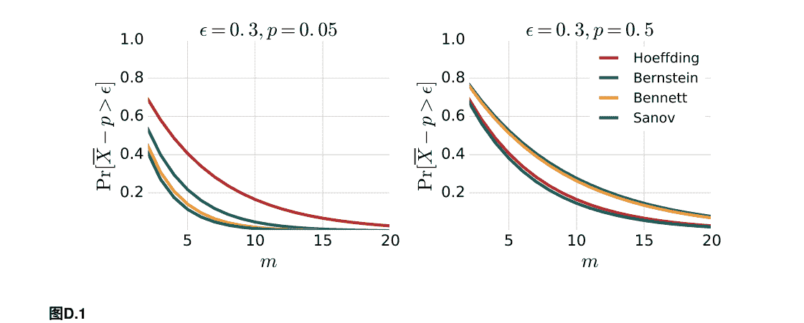

## D.6 Azuma不等式

本节介绍了一种比Hoeffding不等式更一般的集中不等式。其证明利用了Hoeffding不等式的鞅差分。

**定义D.5 (鞅差分)** 一系列随机变量 V₁, V₂, ... 是关于 X₁, X₂, ... 的鞅差分序列。如果对于所有 i > 0，Vᵢ 是 X₁, ..., Xᵢ 的函数。

```
E[V_{i+1} | X_1, ..., X_i] = 0. \tag{D.9}
```

下面的结果类似于Hoeffding的引理。引理D.6 让 V 和 Z 是满足 E[V | Z] = 0 的随机变量，并且对于某个函数 f 和常数 c ≥ 0，不等式成立：

```
f(Z) ≤ V ≤ f(Z) + c. \tag{D.10}
```

那么，对于所有 t > 0，以下上界成立：

```
E[e^{tV} | Z] ≤ e^{t^2 c^2 / 8}. \tag{D.11}
```

证明：证明与引理D.1的步骤相同，只是使用条件期望代替期望：在给定 Z 的条件下，V 在 [a, b] 中取值，其中 a = f(Z) 和 b = f(Z) + c，并且其期望值为零。

引理用于证明以下定理，这是本节的主要结果之一。定理D.7 (Azuma不等式) 设 V₁, V₂, ... 是一个关于随机变量 X₁, X₂, ... 的鞅差序列，并且假设对于所有 i > 0 都存在一个常数 cᵢ ≥ 0 和随机变量 Zᵢ，它是 X₁, ..., X_{i-1} 的函数，满足

```
Z_i ≤ V_i ≤ Z_i + c_i. \tag{D.12}
```

然后，对于所有 ε > 0 和 m，以下不等式成立：

证明： 对于任意的 $k \in [m]$，令 $S_k = \sum_{i=1}^k V_i$。然后，使用Chernoff的边界技术，对于任意的 $t >0$，我们可以写成

$$\begin{aligned}
\mathbb{P}\left[S_m \geq \epsilon\right] &\leq e^{-t\epsilon} \mathbb{E}\left[e^{tS_m}\right] \\
&= e^{-t\epsilon} \mathbb{E}\left[ e^{tS_{m-1}} \mathbb{E}[e^{tV_m} |X_1, \ldots, X_{m-1}]\right] \\
&\leq e^{-t\epsilon} \mathbb{E}[e^{tS_{m-1}}]e^{t^2 c_m^2 /8} && \text{(引理 D.6)}\\
&\leq e^{-t\epsilon} e^{t^2 \sum_{i=1}^m c_i^2 /8} && \text{(迭代前面的论证)}\\
&= e^{-2\epsilon^2 / \sum_{i=1}^m c_i^2}.
\end{aligned}$$

在选择 $t=4\epsilon / \sum_{i=1}^m c_i^2$ 以最小化上界的方式下，我们得到 这证明了定理的第一个陈述，第二个陈述以类似的方式证明。$\square$

## D.7 McDiarmid不等式

以下是本节的主要结果。 它的证明使用了Azuma不等式。

**定理D.8 (McDiarmid不等式)** 设 $X_1, \ldots, X_m \in \mathcal{X}^m$是一组 $m \geq 1$独立随机变量，并且假设存在 $c_1, \ldots, c_m > 0$使得 $f: \mathcal{X}^m \to \mathbb{R}$满足以下条件：

$$\left| f(x_1, \ldots, x_i, \ldots, x_m) - f(x_1, \ldots, x_i', \ldots, x_m) \right| \leq c_i,$$ (D.15)

对于所有 $i \in [m]$和任意点 $x_1, \ldots, x_i, \ldots, x_m, x_i' \in \mathcal{X}$. 设 $f(S)$表示 $f(X_1, \ldots, X_m)$，则对于所有 $\epsilon >0$，以下不等式成立：

$$\mathbb{P}[f(S) - \mathbb{E}[f(S)] \geq \epsilon] \leq \exp\left( \frac{-2\epsilon^2}{\sum_{i=1}^m c_i^2} \right)$$ (D.16)

$$\mathbb{P}[f(S) - \mathbb{E}[f(S)] \leq -\epsilon] \leq \exp\left( \frac{-2\epsilon^2}{\sum_{i=1}^m c_i^2} \right).$$ (D.17)

证明：定义一个随机变量序列 $V_k$, $k \in [m]$, 如下：$V = f(S) - \mathbb{E}[f(S)]$, $V_1 = \mathbb{E}[V|X_1] - \mathbb{E}[V]$, 且对于 $k > 1$,
$$V_k = \mathbb{E}[V|X_1, \ldots, X_k] - \mathbb{E}[V|X_1, \ldots, X_{k-1}].$$

注意 $V = \sum_{k=1}^m V_k$. 此外，随机变量 $\mathbb{E}[ V|X_1, \ldots, X_k]$ 是一个关于 $X_1, \ldots, X_k$的函数。在给定 $X_1, \ldots, X_{k-1}$的条件下，取其期望值为：

$$\mathbb{E}\left[\mathbb{E}[V|X_1, \ldots, X_k] | X_1, \ldots, X_{k-1}\right] = \mathbb{E}[V|X_1, \ldots, X_{k-1}].$$

这意味着 $\mathbb{E}[V_k | X_1, \ldots, X_{k-1}] = 0$. 因此，序列 $(V_k)_{k \in [m]}$是一个鞅差序列。 接下来，观察到，由于 $\mathbb{E}[f(S)]$ 是一个标量， $V_k$可以表示为以下形式：
$$V_k = \mathbb{E}[f(S)|X_1, \ldots, X_k] - \mathbb{E}[f(S)|X_1, \ldots, X_{k-1}].$$

因此，我们可以定义上界 $W_k$和下界 $U_k$来表示 $V_k$：
$$W_k = \sup_{x} \mathbb{E}[f(S)|X_1, \ldots, X_{k-1}, x] - \mathbb{E}[f(S)|X_1, \ldots, X_{k-1}]$$
$$U_k = \inf_{x} \mathbb{E}[f(S)|X_1, \ldots, X_{k-1}, x] - \mathbb{E}[f(S)|X_1, \ldots, X_{k-1}].$$

现在，根据(D.15)，对于任意的 $k \in [m]$，有以下结果：
$$W_k - U_k = \sup_{x, x'} \mathbb{E}[f(S)|X_1, \ldots, X_{k-1}, x] - \mathbb{E}[f(S)|X_1, \ldots, X_{k-1}, x'] \leq c_k,$$ (D.18)

鉴于这些不等式，我们可以应用Azuma的不等式来 $V = \sum_{k=1}^m V_k$，这正好得到(D.16)和(D.17)。 $\square$

McDiarmid的不等式在本书的几个证明中使用。 它可以被理解为稳定性：如果改变它的任何参数只对$f$有有限的影响，那么它与均值的偏差可以指数地被限制。 还要注意Hoeffding的不等式是等式(D.2)是McDiarmid的不等式的一个特殊实例，其中f由f: (x1, . . . , xm) → 1/m \sum_{i=1}^m x_i定义。

## D.8 正态分布尾部：下界

如果 N是一个符合标准正态分布的随机变量，则对于u > 0,

$$P[N \geq u] \geq \frac{1}{2}\left(1 - \sqrt{1 - e^{-u^2}}\right). \quad (D.19)$$

## D.9 Khintchine-Kahane不等式

下面的不等式在各种不同的情境中都很有用，包括在线性假设的经验Rademacher复杂度的下界证明中 (第6章) 。

定理D.9 (Khintchine-Kahane不等式) 设 (H,||·||) 是一个带范数的向量空间，并且让 x1, . . . , xm 是 H中的 m ≥ 1 个元素。令 σ = (σ1, . . . , σm)^T 为 σi 独立均匀分布的随机变量，取值为 {-1, +1} (Rademacher变量)。那么，以下不等式成立:

$$\frac{1}{2} \mathbb{E} \left[ \left\| \sum_{i=1}^m \sigma_i x_i \right\|^2 \right] \leq \left( \mathbb{E} \left[ \left\| \sum_{i=1}^m \sigma_i x_i \right\| \right] \right)^2 \leq \mathbb{E} \left[ \left\| \sum_{i=1}^m \sigma_i x_i \right\|^2 \right]. \quad (D.20)$$

证明: 第二个不等式是凸性的直接结果，由 x → x^2 和Jensen不等式 (定理B.20) 可得。

为了证明左边的不等式，首先注意到对于任意的 β1, . . . , βm ∈ ℝ, 展开product ∏_{i=1}^m (1 + β_i) 就得到了所有单项式 β_1^{δ_1} ... β_m^{δ_m} 的和，其中指数 δ1, . . . , δm in {0,1}. 我们将使用记号 β^δ = β_1^{δ_1} ... β_m^{δ_m} 和 |δ| = ∑_{i=1}^m δ_i 对于任意的 δ = (δ1, . . . , δm) ∈ {0,1}^m. 鉴于此，对于任意的 (α1, . . . , αm) ∈ ℝ^m 和 t > 0, 以下等式成立:

$$t^2 \prod_{i=1}^m (1 + \alpha_i/t) = t^2 \sum_{\delta \in \{0,1\}^m} \alpha^\delta / t^{|\delta|} = \sum_{\delta \in \{0,1\}^m} t^{2-|\delta|} \alpha^\delta.$$

对 t 两边求导并令 t = 1, 得到

$$2 \prod_{i=1}^m (1 + \alpha_i) - \sum_{j=1}^m \alpha_j \prod_{i=j}^m (1 + \alpha_i) = \sum_{\delta \in \{0,1\}^m} (2 - |\delta|) \alpha^\delta. \quad (D.21)$$

对于任意的 σ ∈ {-1, +1}^m, 令 Sσ 定义为 Sσ = ||sσ||, 其中 sσ = ∑_{i=1}^m σ_i x_i. 然后，将(D.21) 两边同时乘以 S_σ S_σ', 并对所有的 σ, σ' ∈ {-1, +1}^m 求和，得到

$$\sum_{\sigma,\sigma' \in \{-1,+1\}^m} \left(2 \prod_{i=1}^m (1 + \sigma_i \sigma_i') - \sum_{j=1}^m \sigma_j \sigma_j' \prod_{i=j}^m (1 + \sigma_i \sigma_i')\right) S_\sigma S_{\sigma'} \\ = \sum_{\sigma,\sigma' \in \{-1,+1\}^m} \sum_{\delta \in \{0,1\}^m} (2 - |\delta|) \sigma^\delta \sigma'^\delta S_\sigma S_{\sigma'} \\ = \sum_{\delta \in \{0,1\}^m} (2 - |\delta|) \sum_{\sigma,\sigma' \in \{-1,+1\}^m} \sigma^\delta \sigma'^\delta S_\sigma S_{\sigma'} \\ = \sum_{\delta \in \{0,1\}^m} (2 - |\delta|) \left[ \sum_{\sigma \in \{-1,+1\}^m} \sigma^\delta S_\sigma \right]^2. \quad (D.22)$$

注意右手求和的项中 |δ| ≥ 2 是非正的。当 |δ| = 1 时，项为零：因为 Sσ = S-σ, 我们有 ∑_{σ ∈ {-1, +1}^m} σ 在这种情况下，δ Sσ = 0。因此，右侧可以由 δ = 0 的项上界，即2 (∑_{σ ∈ {-1, +1}^m} Sσ)^2。方程的左侧(D.22)的一侧可以重写如下：

$$
\sum_{\sigma \in \{-1, +1\}^m} (2^{m+1} - m 2^{m-1}) S_\sigma^2 + 2^{m-1} \sum_{\sigma \in \{-1, +1\}^m} \sum_{\sigma' \in B(\sigma, 1)} S_\sigma S_{\sigma'} = 2^m \sum_{\sigma \in \{-1, +1\}^m} S_\sigma^2 + 2^{m-1} \sum_{\sigma \in \{-1, +1\}^m} S_\sigma \left( \sum_{\sigma' \in B(\sigma, 1)} S_{\sigma'} - (m-2) S_\sigma \right), \quad (D.23)
$$

其中 $B(\sigma,1)$ 表示与 $\sigma$ 在恰好一个坐标 $j \in [m]$ 上不同的 $\sigma'$ 的集合，即与 $\sigma$ 的汉明距离为一的 $\sigma'$ 的集合。注意，对于任何这样的 $\sigma'$， $s_\sigma - s_{\sigma'} = 2\sigma_j x_j$，其中 $j \in [m]$ 是一个坐标，因此，根据这一点并利用三角不等式，我们可以写成 $(m-2) S_\sigma = \| m s \sigma \| - \|2s_\sigma\| = \left\| \sum_{\sigma' \in B(\sigma,1)} s_\sigma \right\| - \left\| \sum_{\sigma' \in B(\sigma,1)} s_\sigma - s_{\sigma'} \right\| \leq \left\| \sum_{\sigma' \in B(\sigma,1)} s_{\sigma'} \right\| \leq \sum_{\sigma' \in B(\sigma,1)} S_{\sigma'}.$

$$
\| s_\sigma \| - \|2s_\sigma\| = \left\| \sum_{\sigma' \in B(\sigma,1)} s_\sigma \right\| - \left\| \sum_{\sigma' \in B(\sigma,1)} s_\sigma - s_{\sigma'} \right\| \leq \left\| \sum_{\sigma' \in B(\sigma,1)} s_{\sigma'} \right\| \leq \sum_{\sigma' \in B(\sigma,1)} S_{\sigma'}.
$$

因此，(D.23)的第二个求和是非负的，并且(D.22)的左边可以通过第一个求和 $2^m$ 来下界 $\sum_{\sigma\in\{-1,+1\}^m} S_\sigma^2$。将这个与(D.22)的上界结合起来，得到

$$
2^m \sum_{\sigma\in\{-1,+1\}^m} S_\sigma^2 \leq 2\left[ \sum_{\sigma\in\{-1,+1\}^m} S_\sigma \right]^2.
$$

两边同时除以 $2^{2m}$，并使用 $\mathbb{P}[\sigma] = 1/2^m$ 得到 $\mathbb{E}_\sigma[ S_\sigma^2 ] \leq 2( \mathbb{E}_\sigma[ S_\sigma ] )^2$ 并完成了证明。

(D.20)中出现的常数1/2是最优的。为了看到这一点，考虑当 $m=2$ 且 $x_1 = x_2 = x$ 为某个非零向量 $x \in \mathcal{H}$ 时的情况。然后，不等式的左边是 $\frac{1}{2} \sum_{i=1}^2 \|x_i\|^2 = \|x\|^2$ 和右边 $\left(\mathbb{E}_\sigma\left[ \|(\sigma_1 + \sigma_2) x\| \right]\right)^2 = \|x\|^2$

$$
\|x\|^2 \left(\mathbb{E}_\sigma\left[ \|\sigma_1 + \sigma_2\| \right]\right)^2 = \|x\|^2
$$

注意，当范数 $\|\cdot\|$ 对应于内积时，例如在希尔伯特空间 $\mathcal{H}$ 的情况下，我们可以写成

$$
\mathbb{E}_\sigma\left[ \left\|\sum_{i=1}^m \sigma_i x_i\right\|^2 \right] = \sum_{i,j=1}^m \mathbb{E}_\sigma\left[ \sigma_i \sigma_j (x_i \cdot x_j) \right] = \sum_{i,j=1}^m \mathbb{E}_\sigma\left[ \sigma_i \sigma_j \right] (x_i \cdot x_j) = \sum_{i=1}^m \|x_i\|^2,
$$

由于随机变量 $\sigma_i$ 的独立性，对于 $i = j$， $\mathbb{E}_\sigma[ \sigma_i \sigma_j ] = \mathbb{E}_\sigma[ \sigma_i ] \mathbb{E}_\sigma[ \sigma_j ] = 0$。

因此，(D.20)可以重写为：

$$
\frac{1}{2} \sum_{i=1}^m \|x_i\|^2 \leq \left( \mathbb{E}_\sigma\left[ \left\|\sum_{i=1}^m \sigma_i x_i\right\| \right] \right)^2 \leq \sum_{i=1}^m \|x_i\|^2. \quad (D.24)
$$

## D.10 最大不等式

以下给出了一个对于有限随机变量集合的最大期望的上界，在几个情境中非常有用。

定理 D.10 (最大不等式) 设 $X_1, \ldots, X_n$ 是 $n \geq 1$ 的实值随机变量，满足对于所有 $j \in [n]$ 和 $t > 0$，有

$$
\mathbb{E}[ e^{t X_j} ] \leq e^{t^2 r^2 / 2} \quad \text{对于某个 } r > 0. \text{ 那么，以下不等式成立：}
$$

$$
\mathbb{E}\left[ \max_{j \in [n]} X_j \right] \leq r \sqrt{2 \log n}.
$$

证明：对于任意的 $t > 0$，根据 $\exp$ 的凸性和 Jensen 不等式，有以下成立：

$$
e^{t \mathbb{E}[ \max_{j \in [n]} X_j ]} \leq \mathbb{E}[ e^{t \max_{j \in [n]} X_j } ] = \mathbb{E}[ \max_{j \in [n]} e^{t X_j } ] \leq \mathbb{E}[ \sum_{j \in [n]} e^{t X_j } ] \leq n e^{t^2 r^2 / 2}.
$$## 推论 D.11 (最大不等式)

设 $X_1\dots X_n$ 是 $n\geq 1$ 个实值随机变量，对于所有 $j\in[n]$，$X_j = \sum_{i=1}^m Y_{i j}$ 其中，对于每个固定的 $j\in[n]$，$Y_{i j}$是独立的零均值随机变量，取值在 $[-r_i,+r_i]$，其中 $r_i > 0$。那么，以下不等式成立：

$$\mathbb{E}\left[\max_{j\in[n]} X_j\right] \leq r\sqrt{2 \log n},$$

with $r = \sqrt{\sum_{i=1}^m r_i^2}$。

证明：由于对于固定的 $j$和Hoeffding引理（引理D.1），以下不等式对于所有的 $j\in[n]$都成立：

$$\mathbb{E}[e^{t X_j}] = \mathbb{E}\left[\prod_{i=1}^m e^{t Y_{i j}}\right] = \prod_{i=1}^m \mathbb{E}[e^{t Y_{i j}}] \leq \prod_{i=1}^m e^{\frac{t^2 r_i^2}{2}} = e^{\frac{t^2 r^2}{2}} \tag{D.26}$$

然后根据定理D.10立即得出结果。 □

对两边取对数得到

$$\mathbb{E}\left[\max_{j\in[n]} X_j\right] \leq \frac{\log n}{t} + \frac{t r^2}{2} \tag{D.25}$$

选择 $t = \frac{\sqrt{2 \log n}}{r}$，这最小化了右边，给出了上界 $r\sqrt{2 \log n}$。注意，在考虑到它们的矩生成函数表达式（方程（C.24））的情况下，对于标准高斯随机变量 $X_j$，定理的假设成立为等式：$\mathbb{E}[e^{t X_j}] = e^{\frac{t^2}{2}}$。

## D.11 章节注释

本章介绍的几种浓度不等式基于Chernoff [1952]的一种边界技术。定理D.3是由Sanov [1957]提出的。对于练习D.7的指数不等式，即Sanov不等式的另一种形式，请参见[Hagerup and R̈ub, 1990]和其中的参考文献。本章介绍的乘法Chernoff界限（定理D.4）由Angluin和Valiant [1979]给出。Hoeffding的不等式和引理（引理 D.1 和定理 D.2) 归功于 Hoeffding [1963]。本章介绍的 Azuma 不等式的改进版本 [Hoeffding, 1963, Azuma, 1967] 归功于 McDiarmid [1989]。改进是通过将指数减少4倍来实现的。这也出现在 McDiarmid 不等式中，该不等式是从有界鞅序列的不等式推导出来的。练习 D.6 中的不等式归功于 Bernstein [1927] 和 Bennett [1962]；该练习来自 Devroye 和 Lugosi [1995]。

第 D.5 节的二项式不等式归功于 Slud [1977]。第 D.8 节的尾部界限归功于 Tate [1953]（参见 Anthony 和 Bartlett [1999]）。Khintchine-Kahane 不等式首次在实值变量的情况下进行研究，由 Khintchine [1923] 提出，后来由 Szarek [1976]、Haagerup [1982] 和 Tomaszewski [1982] 提供了更好的常数和更简单的证明。不等式被Kahane [1964]扩展到了赋范向量空间。这里提供的证明是由Latala和Oleszkiewicz [1994]提出的，并且提供了最佳的常数。

## D.12 练习

D.1 双胞胎悖论。Mamoru教授在一所大学任教，该大学的计算机科学和数学楼有 $F=30$ 层。

- (1) 假设楼层是独立的，并且它们被某人选择的概率相同。有多少人应该乘电梯，才能使得两个人去同一层的概率超过一半？(提示：使用 $e^{-x}$ 的泰勒级数展开 $= 1 - x + ...$ 并给出解的近似通式。)
- (2) Mamoru教授很受欢迎，事实上他的楼层被选择的概率更高。假设其他楼层的概率相等，使用与之前相同的近似方法推导出两个人去同一层的概率的通式。当Mamoru教授的楼层概率为 .25，.35或.5时，有多少人应该乘电梯才能使得两个人去同一层的概率较高？当 $q = .5$ 时，如果楼层数改为 $F = 1,000$，答案会改变吗？
- (3) 在(1)和(2)中假设的概率模型都是朴素的。如果你可以访问电梯警卫收集的数据，你会如何定义一个更准确的模型？

D.2 估计标签偏差

假设 $\mathcal{D}$ 是 $\mathcal{X}$ 上的一个分布，$f: \mathcal{X} \times \{-1, +1\}$ 是一个标签函数。假设我们希望找到分布 $\mathcal{D}$ 的标签偏差的一个好近似，即由以下定义的 $p_+: p_+ = \mathbb{P}_{\mathbf{x} \sim \mathcal{D}}[f(\mathbf{x}) = +1]$。$\qquad$ (D.27) 假设 $\mathcal{S}$ 是一个大小为 $m$ 的有标签样本，根据 $\mathcal{D}$ 独立同分布地抽取。使用 $\mathcal{S}$ 推导出对 $p_+$ 的估计 $\hat{p_+}$。证明对于任意 $\delta > 0$，至少以概率 $1 - \delta$，$| \hat{p_+} - p_+ | \leq \sqrt{\frac{\log(2/\delta)}{2m}}$。

D.3 有偏硬币

蒙特教授口袋里有两枚硬币，硬币 $x_A$ 和硬币 $x_B$。两枚硬币都有轻微的偏差，即 $\mathbb{P}[x_A = 0] = 1/2 - \epsilon/2$ 和 $\mathbb{P}[x_B = 0] = 1/2 + \epsilon/2$，其中 $0 < \epsilon < 1$ 是一个小的正数，0表示正面，1表示反面。他喜欢和学生们玩以下的游戏。他从口袋里均匀随机地选择一枚硬币 $x \in \{x_A, x_B\}$，投掷它 $m$ 次，揭示他得到的0和1的序列，并询问是哪枚硬币被投掷。确定需要多大的 $m$ 才能使学生的硬币预测误差最多为 $\delta > 0$。

- (a) 让 $\mathcal{S}$ 是大小为 $m$ 的样本。蒙特教授最好的学生奥斯卡根据决策规则 $f_o: \{0, 1\}^m \to \{x_A, x_B\}$ 定义为 $f_o(\mathcal{S}) = x_A$ 当且仅当 $N(\mathcal{S}) < m/2$，其中 $N(\mathcal{S})$ 是样本 $\mathcal{S}$ 中0的数量。假设 $m$ 是偶数，那么证明
$$\text{误差} (f_o) \geq \frac{1}{2} \mathbb{P} \left[ N(\mathcal{S}) \geq \frac{m}{2} \middle| x = x_A \right]. \qquad (D.28)$$

- (b) 假设 $m$ 是偶数，证明
$$\text{误差} (f_o) > \frac{1}{4} \left[ 1 - \left[ 1 - e^{-\frac{m \epsilon^2}{1-\epsilon^2}} \right]^{\frac{1}{2}} \right]. \qquad (D.29)$$

- (c) 论证如果 $m$ 是奇数，可以通过在(a)中使用 $m + 1$ 来得到概率的下界，并得出对于奇数和偶数 $m$，
$$\text{误差} (f_o) > \frac{1}{4} \left[ 1 - \left[ 1 - e^{-\frac{2 \lfloor m/2 \rfloor \epsilon^2}{1-\epsilon^2}} \right]^{\frac{1}{2}} \right]. \qquad (D.30)$$

- (d) 使用这个界限，如果奥斯卡的错误最多为 $\delta$，那么 $m$ 必须有多大，其中 $0 < \delta < 1/4$。这个下界的渐近行为是关于 $\epsilon$ 的函数是什么？
- (e) 证明没有决策规则 $f: \{0, 1\}^m \to \{x_A, x_B\}$ 能比奥斯卡的规则 $f_o$ 更好。结论是，前一个问题的下界适用于所有规则。

D.4 集中界限

设 $X$ 是一个非负随机变量，满足对于所有 $t > 0$ 和某个 $c > 0$，有 $\mathbb{P}[X > t] \leq c e^{-2mt^2}$。证明 $\mathbb{E}[X^2] \leq \frac{\log(ce)}{2m}$。（提示：要做到这一点，使用恒等式 $\mathbb{E}[X^2] = \int_0^{+\infty} \mathbb{P}[X^2 > t] dt$，写成 $\int_0^{+\infty} = \int_0^{u} + \int_u^{+\infty}$，通过 $u$ 来限制第一项，并找到使上限最小化的最佳 $u$。

D.5 Hoeffding不等式和Chebyshev不等式的比较。

设 $X_1, \dots, X_m$ 是取值在 $[0,1]$ 之间且具有相同均值 $\mu$ 和方差 $\sigma^2 < \infty$ 的随机变量序列，令 $\overline{X} = \frac{1}{m} \sum_{i=1}^{m} X_i$。

- (a) 对于任意 $\epsilon > 0$，使用 Chebyshev 不等式和 Hoeffding 不等式给出 $\mathbb{P}[|\overline{X}-\mu| > \epsilon]$ 的上界。对于哪些 $\sigma$ 的值，Chebyshev 不等式更紧密？
- (b) 假设随机变量 $X_i$ 取值为 $\{0,1\}$。证明 $\sigma^2 \leq \frac{1}{4}$。使用这个来简化切比雪夫不等式。选择 $\epsilon = 0.05$ 并绘制修改后的切比雪夫不等式和霍夫丁不等式作为 $m$ 的函数（您可以使用您喜欢的程序生成图表）。

D.6 本内特和伯恩斯坦不等式。

这个问题的目标是证明这两个不等式。

- (a) 对于任意 $t > 0$，以及任意随机变量 $X$ 满足 $\mathbb{E}[X] = 0$，$\mathbb{E}[X^2] = \sigma^2$，且 $X \leq c$，
$$\mathbb{E}[e^{tX}] \leq e^{f(\sigma^2/c^2)}, \tag{D.31}$$
其中
$$f(x) = \log \left( \frac{1}{1+x} e^{-ctx} + \frac{x}{1+x} e^{ct} \right).$$

- (b) 证明 $f''(x) \leq 0$ 对于 $x \geq 0$。
- (c) 使用 Chernoff 的边界技术，证明
$$\mathbb{P} \left[ \frac{1}{m} \sum_{i=1}^{m} X_i \geq \epsilon \right] \leq e^{-t m \epsilon + \sum_{i=1}^{m} f(\sigma_{X_i}^2/c^2)},$$
其中 $\sigma_{X_i}^2$ 是 $X_i$ 的方差。

- (d) 证明 $f(x) \leq f(0) + xf'(0) = (e^{ct} - 1 - ct)x$。
- (e) 使用 (4) 中得到的边界，找到最优的 $t$ 值。
- (f) 贝内特不等式。令 $X_1, \dots, X_m$ 是独立的实值随机变量，均值为零，满足对于 $i=1, \dots, m$, $X_i \leq c$。令 $\sigma^2 = \frac{1}{m} \sum_{i=1}^{m} \sigma_{X_i}^2$。证明
$$\mathbb{P} \left[ \frac{1}{m} \sum_{i=1}^{m} X_i > \epsilon \right] \leq \exp \left( -\frac{m\sigma^2}{c^2} \theta \left( \frac{c\epsilon}{\sigma^2} \right) \right), \tag{D.32}$$
其中 $\theta(x) = (1+x) \log(1+x) - x$。

- (g) 伯恩斯坦不等式。在与贝内特不等式相同的条件下证明
$$\mathbb{P} \left[ \frac{1}{m} \sum_{i=1}^{m} X_i > \epsilon \right] \leq \exp \left( -\frac{m\epsilon^2}{2\sigma^2 + 2c\epsilon/3} \right). \tag{D.33}$$
(提示：证明对于所有的 $x \geq 0$, $\theta(x) \geq h(x) = \frac{3}{2} \frac{x^2}{x+3}$。)

- (h) 在相同条件下，写出 Hoeffding 不等式。对于什么值的 $\sigma$, Bernstein 不等式比 Hoeffding 不等式更好？

D.7指数不等式。

设 X是一个服从二项分布 B（m，p）的随机变量。

- (a) 使用Sanov不等式证明以下指数不等式对于任何 ϵ > 0都成立:
$$ \mathbb{P}\left[\frac{X}{m} - p > \epsilon\right] \leq \left[ \left(\frac{p}{p+\epsilon}\right)^{p+\epsilon} \left(\frac{1-p}{1-(p+\epsilon)}\right)^{1-(p+\epsilon)} \right]^m. \quad \text{(D.34)} $$

- (b) 使用这个结果证明以下不等式成立：
$$ \mathbb{P}\left[\frac{X}{m} - p > \epsilon\right] \leq \left(\frac{p}{p+\epsilon}\right)^{m(p+\epsilon)} e^{m\epsilon}. \quad \text{(D.35)} $$

- (c) 证明
$$ \mathbb{P}\left[\frac{X}{m} - p > \epsilon\right] \leq e^{-m p \theta(\epsilon/p)}, \quad \text{(D.36)} $$
其中 θ如练习D.6中所定义。

# E 信息论概念

本章介绍了一些信息论的基本概念，这些概念对于几种学习算法及其性质的展示非常有用。定义和定理是针对离散随机变量或分布给出的，但可以直接扩展到连续情况。

我们从熵的概念开始，它可以看作是随机变量不确定性的度量。

## E.1 熵

定义 E.1 (熵)离散随机变量 $X$ 的熵 用概率质量函数 $p(x) = \mathbb{P}[X = x]$ 表示，记为 $H(X)$，定义为 $H(X) = -\mathbb{E}[\log(p(X))] = -\sum_{x \in \mathcal{X}} p(x) \log(p(x))$。 (E.1)

我们用相同的表达式来定义分布 $p$的熵，并滥用地用$H(p)$来表示。

对数的底在这个定义中并不重要，因为它只会通过一个乘法常数来影响值。因此，除非另有规定，我们将考虑自然对数（底为e）。如果我们使用底为2，那么 $-\log_2(p(x))$ 表示表示 $p(x)$所需的位数。因此，根据定义，随机变量 $X$ 的熵可以看作是描述 $X$ 所需的平均位数（或信息量）。根据相同的性质，熵始终为非负数：

$$H(X) \geq 0.$$ (E.2)

例如，偏倚硬币 $X_p$ 以概率 $p$ 取值1，以概率 $1-p$ 取值0，其熵为

$$H(X_p) = -p \log p - (1-p) \log(1-p).$$ (E.3)

对应的函数 $p$ 通常被称为二进熵函数。图E.1显示了在使用以2为底的对数时的函数图。从图中可以看出，熵是一个凹函数。它在 $p = 1/2$ 时达到最大值，对应于最不确定的情况，而在 $p=0$ 或 $p=1$ 时达到最小值，对应于完全确定的情况。

更一般地，假设输入空间 $\mathcal{X}$ 具有有限的基数 $N \geq 1$。然后，根据Jensen的不等式，考虑到对数的凹性，以下不等式成立：

$$ H(X) = \mathbb{E}\left[\log \frac{1}{p(X)}\right] \leq \log \mathbb{E}\left[\frac{1}{p(X)}\right] = \log \left( \sum_{x \in \mathcal{X}} \frac{p(x)}{p(x)} \right) = \log N $$

因此，更一般地，熵的最大值是log N，即均匀分布的熵。

熵是无损数据压缩的下界，因此在信息理论中是一个关键量需要考虑。它还与热力学和量子物理中的熵概念密切相关。

## E.2 相对熵

在这里，我们介绍了两个分布 p和 q之间的差异度量，即相对熵，与熵的概念相关。以下是其在离散情况下的定义。

定义 E.2 (相对熵)两个分布 p和 q的相对熵（或Kullback-Leibler散度）用 D(p\|q)表示，并定义为

$$ D(p\|q) = \mathbb{E}_p\left[\log \frac{p(X)}{q(X)}\right] = \sum_{x \in \mathcal{X}} p(x) \log \frac{p(x)}{q(x)} $$

根据约定0 log 0 = 0, 0 log 0 0 = 0, 以及 a log a 0 = +∞对于a > 0.

请注意，根据这些约定，每当 q(x) = 0 对于某个 x 在 p(x) >0的支持中时，相对熵是无穷大的： D(p\|q) = ∞.因此，在这种情况下，相对熵不能提供关于p和 q的差异的有用度量。

至于熵，对数的底数在相对熵的定义中并不重要，除非另有规定，我们将使用自然对数。如果我们使用底数为2，相对熵可以解释为编码长度。理想情况下，可以为 p设计一个平均长度为熵 H(p)的最优编码。相对熵是编码 p所需的平均附加位数，当使用一个针对 q而不是 p的最优编码时，可以表示为差值 D(p\|q) = \mathbb{E}_p[\log \frac{q(X)}{p(X)}] - H(p)，正如下面的命题所示，总是非负的。

## 命题 E.3 (相对熵的非负性)

对于任意两个分布 p和 q，以下不等式成立：

$$ D(p\|q) \geq 0 $$

此外，当且仅当p =q时， D( p\| q) = 0。

证明：通过对数的凹性和Jensen不等式，可以得到以下结果：

$$-D(p\|q) = \sum_{x: p(x)>0} p(x) \log \left( \frac{q(x)}{p(x)} \right) \leq \log \left( \sum_{x: p(x)>0} p(x) \frac{q(x)}{p(x)} \right)$$
$$= \log \left( \sum_{x: p(x)>0} q(x) \right) \leq \log(1) = 0.$$

因此，对于所有的分布 $p$ 和 $q$，相对熵始终是非负的。仅当上述不等式都成立时，才有可能出现相对熵等于0的情况。最后一个不等式意味着 $\sum_{x: p(x)>0} q(x)$ 由于对数函数是严格凹的，第一个不等式只有在等号成立时才成立 $q(x)/p(x)$ 是一些常数 $\alpha$ over $\{x: p(x) > 0\}$。由于 $p(x)$ 在该集合上求和为一，我们必须有 $\sum_{x: p(x)>0} p(x) \alpha = \alpha = 1$，因此，这意味着对于所有的 $x \in \{x: p(x) > 0\}$，有 $q(x) = p(x)$，因此对于所有的 $x$。最后，根据定义，对于任何分布$p$，$D(p\|p)=0$，这完成了证明。$\square$

相对熵不是一个距离。它是非对称的：一般来说，$D(p\|q) \neq D(q\|p)$ 对于两个分布 $p$ 和 $q$。此外，一般来说，相对熵不满足三角不等式。

## 推论 E.4 (对数和不等式)
对于任意一组非负实数 $a_1, \ldots, a_n$ 和 $b_1, \ldots, b_n$，以下不等式成立：

$$\sum_{i=1}^n a_i \log \left( \frac{a_i}{b_i} \right) \geq \left( \sum_{i=1}^n a_i \right) \log \left( \frac{\sum_{i=1}^n a_i}{\sum_{i=1}^n b_i} \right), \quad (E.7)$$

根据约定$0 \log 0 = 0, 0 \log \frac{0}{0} = 0$，以及 $-a \log \frac{a}{0} = +\infty$ 对于 $a > 0$。

此外，在(E.7)中等号成立当且仅当 $\frac{a_i}{b_i}$ 是一个常数（不依赖于 $i$）。

证明：根据所采用的约定，很明显，如果 $\sum_{i=1}^n a_i=0$，则等号成立，即对于所有$i \in [n]$，有 $a_i=0$，或者 $\sum_{i=1}^n b_i=0$，则等号成立，即对于所有$i \in [n]$，有 $b_i=0$。因此，我们可以假设 $\sum_{i=1}^n a_i = 0$ and $\sum_{i=1}^n b_i=0$。由于不等式在 $a_i$s 或 $b_i$s 的缩放下保持不变，我们可以将它们乘以正常数，使得 $\sum_{i=1}^n a_i = \sum_{i=1}^n b_i = 1$。然后，不等式与由$a_i$s和$b_i$s定义的分布的相对熵的非负性重合，根据命题E.3，结果成立。$\square$

## 推论 E.5 (相对熵的联合凸性)
相对熵函数 $(p, q) \rightarrow D(p\|q)$ 是凸的。

证明：对于任意的 $\alpha \in [0,1]$ 和任意的四个概率分布 $p_1, p_2, q_1, q_2$，根据对数和不等式（推论 E.4），对于任意固定的 $x$，以下成立：

$(\alpha p_1(x) + (1-\alpha) p_2(x)) \log \left[ \frac{\alpha p_1(x) + (1-\alpha) p_2(x)}{\alpha q_1(x) + (1-\alpha) q_2(x)} \right] $
$\leq \alpha p_1(x) \log \left[ \frac{\alpha p_1(x)}{\alpha q_1(x)} \right] + (1-\alpha) p_2(x) \log \left[ \frac{(1-\alpha) p_1(x)}{(1-\alpha) q_2(x)} \right]. \quad (E.8)$

将这些不等式对所有的 $x$ 求和得到：
$$D\left(\alpha p_1 + (1-\alpha) p_2 \| \alpha q_1 + (1-\alpha) q_2 \right) \leq \alpha D(p_1\|q_1) + (1-\alpha) D(p_2\|q_2), \quad (E.9)$$

这证明了。$\square$

## 推论 E.6 (熵的凹性)
熵函数 $p \rightarrow H(p)$ 是凹的。

证明: 观察到对于任何固定的分布 $p_0$ over $\mathcal{X}$，根据相对熵的定义，我们可以写成

$$D(p\|p_0) = \sum_{x \in \mathcal{X}} p(x) \log(p(x)) - \sum_{x \in \mathcal{X}} p(x) \log(p_0(x)). \quad (E.10)$$

因此， $H(p) = -D(p \| p_{0}) - \sum_{x \in \mathcal{X}} p(x) \log (p_{0}(x))$。 根据推论 E.5， 第一项是 $p$ 的一个凹函数。 第二项是 $p$ 的线性函数，因此也是凹的。因此， $H$ 是两个凹函数的和。

## 命题 E.7 (Pinsker不等式)
对于任意两个分布 $p$ 和 $q$， 以下不等式成立：

$$D(p \| q) \geq \frac{1}{2} \| p - q \|_{1}^{2}.$$
(E.11)

证明： 我们首先证明该不等式对于基数为2的集合 $A = \{a_{0}, a_{1}\}$ 上的分布成立。 令 $p_{0} = p(a_{0})$ 和 $q_{0} = q(a_{0})$。 固定 $p_{0} \in [0, 1]$， 考虑函数 $f : q_{0} \to f(q_{0})$ 定义为

$$f(q_{0}) = p_{0} \log \frac{p_{0}}{q_{0}} + (1 - p_{0}) \log \frac{1 - p_{0}}{1 - q_{0}} - 2(p_{0} - q_{0})^{2}.$$
(E.12)

观察到 $f(p_{0}) = 0$， 并且对于 $q_{0} \in (0, 1)$，

$$f'(q_{0}) = -\frac{p_{0}}{q_{0}} + \frac{1 - p_{0}}{1 - q_{0}} + 4(p_{0} - q_{0}) = (q_{0} - p_{0}) \left[ \frac{1}{(1 - q_{0})q_{0}} - 4 \right].$$
(E.13)

由于 $(1 - q_{0})q_{0} \leq \frac{1}{4}$， $\left[ \frac{1}{(1 - q_{0})q_{0}} - 4 \right]$ 是非负的。因此，对于 $q_{0} \leq p_{0}$，有 $f'(q_{0}) \leq 0$，并且对于 $q_{0} \geq p_{0}$，有 $f'(q_{0}) \geq 0$。因此， $f$ 在 $q_{0} = p_{0}$ 时达到最小值，这意味着对于所有的 $q_{0}$，有 $f(q_{0}) \geq f(p_{0}) = 0$。由于 $f(q_{0})$ 可以表示如下：

$$f(q_{0}) = D(p \| q) - 2(p_{0} - q_{0})^{2}$$
(E.14)
$$= D(p \| q) - \frac{1}{2} \left[ |p_{0} - q_{0}| + |(1 - p_{0}) - (1 - q_{0})| \right]^{2}$$
(E.15)
$$= D(p \| q) - \frac{1}{2} \| p - q \|_{1}^{2} \geq 0,$$
(E.16)

这证明了集合 $A = \{a_{0}, a_{1}\}$ 的不等式。

现在，考虑分布 $p'$ 和 $q'$ 在 $A = \{a_{0}, a_{1}\}$ 上的定义，其中 $p'(a_{0}) = \sum_{x \in a_{0}} p(x)$， 而 $q'(a_{0}) = \sum_{x \in a_{0}} q(x)$ 其中 $a_{0} = \{x \in \mathcal{X} : p(x) \geq q(x)\}$ 和 $a_{1}$ 根据对数和不等式 (推论 E.4)，

$$D(p \| q) = \sum_{x \in a_{0}} p(x) \log \left[ \frac{p(x)}{q(x)} \right] + \sum_{x \in a_{1}} p(x) \log \left[ \frac{p(x)}{q(x)} \right]$$
(E.17)
$$\geq p(a_{0}) \log \left[ \frac{p(a_{0})}{q(a_{0})} \right] + p(a_{1}) \log \left[ \frac{p(a_{1})}{q(a_{1})} \right]$$
(E.18)
$$= D(p' \| q').$$
(E.19)

将这个不等式与观察到的事实相结合

$$\| p' - q' \|_{1} = (p(a_{0}) - q(a_{0})) - (p(a_{1}) - q(a_{1}))$$
(E.20)
$$= \sum_{x \in a_{0}} (p(x) - q(x)) - \sum_{x \in a_{1}} (p(x) - q(x))$$
(E.21)
$$= \sum_{x \in \mathcal{X}} |p(x) - q(x)|$$
(E.22)
$$= \| p - q \|_{1},$$
(E.23)

表明 $D(p \| q) \geq D(p' \| q') \geq \frac{1}{2} \| p - q \|_{1}^{2}$ 并且得出证明的结论。

## 定义 E.8 (条件相对熵)
设 $p$ 和 $q$ 是定义在 $\mathcal{X} \times \mathcal{Y}$ 上的两个概率分布， 而 $r$ 是定义在 $\mathcal{X}$ 上的分布。 那么， 相对于边际分布 $r$， $p$ 和 $q$ 的条件相对熵被定义为相对于 $r$ 的条件熵的期望值， 其中条件熵是 $p(\cdot |X)$ 和 $q(\cdot |X)$ 的相对熵：

$$\mathop{\mathbb{E}}\limits_{X \sim r} \left[ D \left( p(\cdot | X) \| q(\cdot | X) \right) \right] = \sum_{x \in \mathcal{X}} r(x) \sum_{y \in \mathcal{Y}} p(y|x) \log \frac{p(y|x)}{q(y|x)} = D(\tilde{p} \| \tilde{q}),$$
(E.24)

其中 $\tilde{p}(x, y) = r(x)p(y|x)$ 和 $\tilde{q}(x, y) = r(x)q(y|x)$，根据约定 $0 \log 0 = 0$, $0 \log \frac{0}{0} = 0$，以及 $a \log \frac{a}{0} = +\infty$ (对于 $a > 0$)。

## E.3 互信息

## E.3 互信息

**定义 E.9 (互信息)** 设 $X$ 和 $Y$ 是具有联合概率分布函数 $p(\cdot, \cdot)$ 和边缘概率分布函数 $p(x)$ 和 $p(y)$ 的两个随机变量。那么， $X$ 和 $Y$ 的互信息记为 $I(X, Y)$，定义如下: $I(X, Y) = \mathbf{D}(p(x, y)\|p(x)p(y))$

$$ = \mathbb{E}_{p(x,y)} \left[ \log \frac{p(X, Y)}{p(X)p(Y)} \right] = \sum_{x \in \mathcal{X}, y \in \mathcal{Y}} p(x, y) \log \left[ \frac{p(x, y)}{p(x)p(y)} \right] \tag{E.25} \tag{E.26}$$

根据约定 $0 \log 0 = 0$, $0 \log \frac{0}{0} = 0$，以及 $a \log \frac{a}{0} = +\infty$ 对于 $a > 0$。

当随机变量 $X$ 和 $Y$ 相互独立时，它们的联合分布是边际分布 $p(x)$ 和 $p(y)$ 的乘积。因此，互信息是衡量联合分布 $p(x, y)$ 与 $X$ 和 $Y$ 相互独立时的值之间的接近程度的度量，其中接近程度通过相对熵差来衡量。因此，它可以被看作是每个随机变量关于另一个随机变量提供的信息量的度量。请注意，根据命题 E.3，当且仅当对于所有的 $x, y$，有 $I(X, Y) = 0$ 时，等式 $I(X, Y) = 0$ 成立，即 $X$ 和 $Y$ 相互独立时，$p(x, y) = p(x)p(y)$。

## E.4 布雷格曼散度

在这里，我们介绍了所谓的非归一化相对熵 $\tilde{\mathbf{D}}$，它对于所有非负函数 $p, q \in \mathbb{R}^\mathcal{X}$ 来说是定义的。

$$\tilde{\mathbf{D}}(p\|q) = \sum_{x \in \mathcal{X}} p(x) \log \left[ \frac{p(x)}{q(x)} \right] + \left( q(x) - p(x) \right) \tag{E.27}$$

表 E.1
Bregman散度的例子和相应的凸函数。

| | $\mathbf{B}_F(x \| y)$ | $F(x)$ |
| :--- | :--- | :--- |
| 平方 $L_2$-距离 | $\|x - y\|^2$ | $\|x\|^2$ |
| 马氏距离 | $(x-y)^\top Q (x-y)$ | $x^\top Q x$ |
| 非归一化相对熵 | $\bar{\mathrm{D}}(x \| y)$ | $\sum_{i \in I} x(i) \log(x(i)) - x(i)$ |

根据约定， $0\log 0 = 0, 0\log \frac{0}{0} = 0$，且 $a \log \frac{a}{0} = +\infty$ 对于 $a > 0$。当限制在 $\Delta \times \Delta$ 上时，相对熵与非归一化相对熵相等，其中 $\Delta$ 是定义在 $\mathscr{X}$ 上的分布族。相对熵继承了非归一化相对熵的几个性质，特别是 $\bar{\mathrm{D}}(p\|q) \geq 0$。实际上，这些性质中的许多都被更广泛的一类散度所共享，被称为 *Bregman散度*。

## 定义 E.10 (Bregman 散度)

让 $F$ 是定义在凸（开）集 $\mathcal{C}$ 中的可微凸函数 $\mathbb{H}$ 的希尔伯特空间。那么，对于所有的 $x, y \in \mathcal{C}$，与 $F$ 相关的 **Bregman 散度** $B_F$ 定义如下

$$B_F(x \| y) = F(x) - F(y) - \langle \nabla F(y), x - y \rangle. \quad \text{(E.28)}$$

因此，$B_F(x \| y)$ 衡量了 $F(x)$ 和其线性近似之间的差异。图 E.2 说明了这个定义。表 E.1 提供了几个 Bregman 散度的示例以及它们对应的凸函数 $F(x)$。请注意，尽管非标准化的相对熵是一种 Bregman 散度，但相对熵不是一种 Bregman 散度，因为它定义在不是开集且具有空内部的单纯形上。

以下命题介绍了Bregman散度的几个一般性质。

## 命题 E.11

设 $F$ 是定义在凸集 $\mathcal{C}$ 上的凸且可微函数，$\mathbf{C}$ 是Hilbert空间 $\mathbb{H}$ 中的凸集。那么，以下性质成立：

- 1. $\forall x, y \in \mathcal{C}$， $B_F(x \| y) \geq 0$。
- 2. $\forall x, y, z \in \mathcal{C}$， $\langle \nabla F(x) - \nabla F(y), x - z \rangle = B_F(x \| y) + B_F(z \| x) - B_F(z \| y)$。
- 3. $B_F$ 在其第一个参数上是凸的。. 如果另外 $F$ 是严格凸的，那么 $B_F$ 在其第一个参数上也是严格凸的。
- 4. 线性性：设 $G$ 是 $\mathcal{C}$ 上的凸且可微函数，那么对于任意的 $\alpha, \beta \in \mathbb{R}$，有

对于以下属性，我们还将额外假设 $F$ 是严格凸的。

- 5. 投影：对于任何 $y \in \mathcal{C}$ 和任何闭凸集 $\mathcal{K} \subseteq \mathcal{C}$，$y$ 的 $B_F$-投影到 $\mathcal{K}$，$P_{\mathcal{K}}(y) = \mathrm{argmin}_{x \in \mathcal{K}} B_F(x \| y)$，是唯一的。
- 6. 勾股定理：对于 $y \in \mathcal{C}$ 和任何闭凸集 $\mathcal{K} \subseteq \mathcal{C}$，对于所有 $x \in \mathcal{K}$，以下成立：
$$B_F(x \| y) \geq B_F(x \| P_{\mathcal{K}}(y)) + B_F(P_{\mathcal{K}}(y) \| y). \quad \text{(E.29)}$$
- 7. 共轭散度：假设 $F$ 是闭合的、适当的严格凸函数，并且在 $\mathcal{C}$ 的边界附近，其梯度的范数趋于无穷大：$\lim_{x \to \partial \mathcal{C}} \|\nabla F(x)\| = +\infty$。然后，对于 $\mathcal{C}$ 和 $F$ 的一对 $(*, F)$，可以说它是一种勒让德类型的凸函数。然后，$F$ 的共轭函数 $F^*$ 是可微的，并且对于所有的 $x, y \in \mathcal{C}$，以下等式成立：$B_F(x \| y) = B_{F^*}(\nabla F(y) \| \nabla F(x))$. \quad \text{(E.30)}

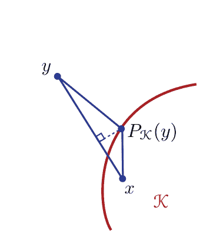

证明：性质（1）由函数 $F$ 的凸性得到证明（$F$ 的图形在其切线上方，参见方程（B.3））。
性质（2）直接由Bregman散度的定义得到：
$$B_F(x \| y) + B_F(z \| x) - B_F(x \| y)$$
$$= -\langle \nabla F(y), x - y \rangle - \langle \nabla F(x), z - x \rangle + \langle \nabla F(y), z - y \rangle$$
$$= \langle \nabla F(x) - \nabla F(y), x - z \rangle.$$
性质（3）成立，因为 $x \to F(x) - F(y) - \langle \nabla F(y), x - y \rangle$ 作为凸函数的和是凸的：函数 $x \to F(x)$ 和仿射函数 $x \to -F(y) - \langle \nabla F(y), x - y \rangle$ 都是凸函数。同样地，$B_F$ 对于其第一个参数是严格凸的，如果 $F$ 是严格凸的，作为严格凸函数和仿射函数的和。
性质（4）可以通过一系列等式得到：
$$B_{\alpha F + \beta G} = \alpha F(x) + \beta G(x) - \alpha F(y) - \beta G(y) - \langle \nabla (\alpha F(y) + \beta G(y)), x - y \rangle$$
$$= \alpha \big( F(x) - F(y) - \langle \nabla F(y), x - y \rangle \big) + \beta \big( G(x) - G(y) - \langle \nabla G(y), x - y \rangle \big)$$
$$= \alpha B_F + \beta B_G,$$
我们使用了梯度和内积都是线性函数的事实。
性质（5）成立，因为根据性质（3），$\min_{x \in \mathcal{K}} B_F(x \| y)$ 是一个凸优化问题，具有严格凸的目标函数。
对于性质（6），固定 $y \in \mathcal{C}$ 并且让 $J$ 是对于所有 $\alpha \in [0,1]$ 定义的函数
$$J(\alpha) = B_F(\alpha x + (1-\alpha)P_{\mathcal{K}}(y) \| y).$$
由于 $\mathcal{C}$ 是凸的，对于任意 $\alpha \in [0,1]$，$\alpha x + (1-\alpha)P_{\mathcal{K}}(y)$ 在 $\mathcal{C}$ 中。由于 $F$ 在 $\mathcal{C}$ 上可微，因此 $J$ 作为 $F$ 与 $\alpha \to \alpha x + (1-\alpha)P_{\mathcal{K}}(y)$ 的复合函数也是可微的。根据 $P_{\mathcal{K}}(y)$ 的定义，对于任意 $\alpha \in (0,1]$，
$$\frac{J(\alpha) - J(0)}{\alpha} = \frac{B_F(\alpha x + (1-\alpha)P_{\mathcal{K}}(y) \| y) - B_F(P_{\mathcal{K}}(y) \| y)}{\alpha} \geq 0. \quad \text{(E.31)}$$
这意味着 $J'(0) \geq 0$。根据 $J(\alpha)$ 的以下表达式：
$$J(\alpha) = F(\alpha x + (1-\alpha)P_{\mathcal{K}}(y)) - F(y) - \langle \nabla F(y), \alpha x + (1-\alpha)P_{\mathcal{K}}(y) - y \rangle, \quad \text{(E.32)}$$
我们可以计算其在0处的导数：
$$J'(0) = \langle x - P_{\mathcal{K}}(y), \nabla F(P_{\mathcal{K}}(y)) \rangle - \langle \nabla F(y), x - P_{\mathcal{K}}(y) \rangle$$
$$= -B_F(x \| P_{\mathcal{K}}(y)) + F(x) - F(P_{\mathcal{K}}(y)) - \langle \nabla F(y), x - P_{\mathcal{K}}(y) \rangle$$
$$= -B_F(x \| P_{\mathcal{K}}(y)) + F(x) - F(P_{\mathcal{K}}(y)) - \langle \nabla F(y), x - y \rangle - \langle \nabla F(y), y - P_{\mathcal{K}}(y) \rangle$$
$$= -B_F(x \| P_{\mathcal{K}}(y)) + B_F(x \| y) + F(y) - F(P_{\mathcal{K}}(y)) - \langle \nabla F(y), y - P_{\mathcal{K}}(y) \rangle$$
$$= -B_F(x \| P_{\mathcal{K}}(y)) + B_F(x \| y) - B_F(P_{\mathcal{K}}(y) \| y) \geq 0,$$
这证明了性质（6）的正确性。

对于属性（7），注意，根据定义，对于任意的 $y$，$F^*$ 由
$$F^*(y) = \sup_{x \in \mathcal{C}} \{ \langle x, y \rangle - F(x) \} \quad (E.33)$$
$F^*$是凸的，并且在任意的 $y$处都存在一个次微分。由于 $F$的严格凸性，函数 $x \to \langle x, y \rangle - F(x)$ 在 $\mathcal{C}$ 上是严格凹的，并且在其梯度的范数，$y-\nabla F(x)$，在 $\mathcal{C}$的边界附近趋于无穷大（根据$F$的相应属性假设）。因此，它的最大值在唯一一点 $x_y \in \mathcal{C}$处达到，其梯度为零，即在 $x_y$处 $\nabla F(x_y) = y$。这意味着对于任意的 $y$，$\partial F^*(y)$，即 $F^*$的次微分，被减少为一个单例集。因此，$F^*$是可微的，其在 $y$处的梯度为 $\nabla F^*(y) = x_y = \nabla^{-1}F(y)$。由于$F^*$是凸的且可微的，其Bregman散度是良定义的。此外，
$$F^*(y) = \langle \nabla F^{-1}(y), y \rangle - F(\nabla F^{-1}(y))$$
因为 $x_y = \nabla^{-1}F(y)$。对于任意的 $x, y \in \mathcal{C}$，使用 $B_{F^*}$ 的定义和 $\nabla F^*(y)$ 和 $F^*(y)$ 的表达式，我们可以写成
$$\begin{aligned}
B_{F^*}(\nabla F(y) \| \nabla F(x)) &= F^*(\nabla F(y)) - F^*(\nabla F(x)) - \langle \nabla^{-1}F(\nabla F(x)), \nabla F(y) - \nabla F(x) \rangle \\
&= F^*(\nabla F(y)) - F^*(\nabla F(x)) - \langle x, \nabla F(y) - \nabla F(x) \rangle \\
&= \langle \nabla^{-1}F(\nabla F(y)), \nabla F(y) \rangle - F(\nabla^{-1}F(\nabla F(y))) \\
&\quad - \langle \nabla^{-1}F(\nabla F(x)), \nabla F(x) \rangle + F(\nabla^{-1}F(\nabla F(x))) - \langle x, \nabla F(y) - \nabla F(x) \rangle \\
&= \langle y, \nabla F(y) \rangle - F(y) - \langle x, \nabla F(x) \rangle + F(x) - \langle x, \nabla F(y) - \nabla F(x) \rangle \\
&= \langle y, \nabla F(y) \rangle - F(y) + F(x) - \langle x, \nabla F(y) \rangle \\
&= F(x) - F(y) - \langle x - y, \nabla F(y) \rangle = B_F(x \| y),
\end{aligned}$$
这完成了证明。 $\square$

请注意，尽管非标准化的相对熵（以及相对熵）是其参数对的凸函数，但这一一般情况下不适用于所有 Bregman散度，只有相对于第一个参数的凸性是有保证的。

Bregman散度的概念可以扩展到非可微函数的情况（见第14.3节）。

## E.5 章节注释

本章介绍的熵的概念归功于Shannon [1948]，他在同一篇文章中更一般地奠定了信息论的基础。更一般的熵定义（$R$enyi熵）和相对熵（$R$enyi散度）是由$R$enyi[1961]引入的。Kullback-Leibler散度是由[Kullback和Leibler, 1951]引入的。

Pinsker不等式是由Pinsker [1964]提出的。关于相对熵和 $L_1$-范数的更精细不等式稍后由Csisz´ar [1967]和Kullback [1967]给出。参见[Reid和Williamson, 2009]，了解将这些不等式推广到 $f$-散度情况的一般化。Bregman散度的概念归功于Bregman [1967]。

对于更广泛的信息论材料，我们强烈推荐Cover和Thomas [2006]的书籍。

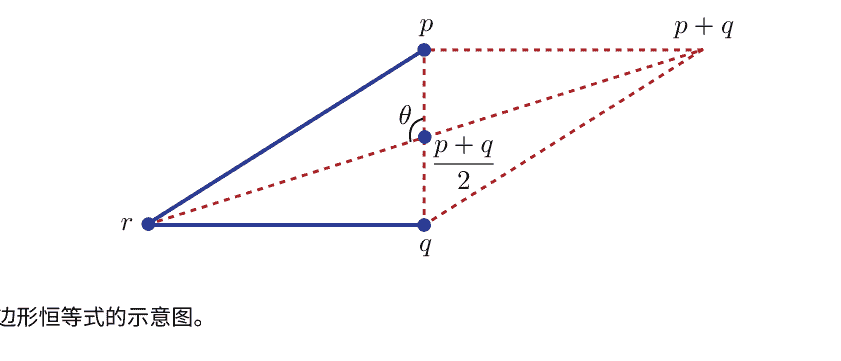

## E.6 练习

E.1 平行四边形恒等式。证明以下任意三个分布 $p$, $q$ 和 $r$ 在 $\mathcal{X}$ 上的平行四边形恒等式：

$$D(p \| r) + D(q \| r) = 2D\left( \frac{p+q}{2} \| r \right) + D\left( p \| \frac{p+q}{2} \right) + D\left( q \| \frac{p+q}{2} \right). \quad (E.34)$$

如果我们用范数-2的平方替换相对熵，等式是否成立？图E.4展示了这个恒等式的一个特定例子。注意，在这个例子中我们有

$$\|p - r\|^2 = \| \left( p - \frac{p+q}{2} \right) + \left( \frac{p+q}{2} - r \right) \|^2 = \| p - \frac{p+q}{2} \|^2 + \| \frac{p+q}{2} - r \|^2 - 2 \cos(\pi - \theta) \| p - \frac{p+q}{2} \| \| \frac{p+q}{2} - r \|$$

和

$$\|q - r\|^2 = \| \left( q - \frac{p+q}{2} \right) + \left( \frac{p+q}{2} - r \right) \|^2 = \| q - \frac{p+q}{2} \|^2 + \| \frac{p+q}{2} - r \|^2 - 2 \cos(\theta) \| q - \frac{p+q}{2} \| \| \frac{p+q}{2} - r \|.$$

将这两个量相加可以证明这个等式对于这个例子成立。

## F 符号

符号的总结。

| 符号 | 含义 |
| :--- | :--- |
| $\mathbb{R}$ | 实数集 |
| $\mathbb{R}_+$ | 非负实数集 |
| $\mathbb{R}^n$ | $n$维实值向量集合 |
| $\mathbb{R}^{n\times m}$ | $n$行$m$列实值矩阵集合 |
| $[a, b]$ | 闭区间 |
| $[a, b)$ | 半开区间 |
| $\{a, b, c\}$ | 包含元素 $a, b$和 $c$的集合 |
| $[n]$ | 集合 $\{1, 2, \ldots, n\}$ |
| $\mathbb{N}$ | 自然数集合，即 $\{0, 1, \ldots\}$ |
| $\log$ | 以底为 $e$的对数 |
| $\log_a$ | 以底为 $a$的对数 |
| $\mathbb{S}$ | 任意集合 |
| $|\mathbb{S}|$ | 集合 $\mathbb{S}$中的元素个数 |
| $s \in \mathbb{S}$ | 集合 $\mathbb{S}$中的一个元素 |
| $\mathcal{X}$ | 输入空间 |
| $\mathcal{Y}$ | 目标空间 |
| $\mathbb{H}$ | 特征空间 |
| $\langle \cdot, \cdot \rangle$ | 特征空间中的内积 |
| $\mathbf{v}$ | 任意向量 |
| $\mathbf{1}$ | 全1向量 |
| $v_i$ | 向量 $\mathbf{v}$的第$i$个分量 |
| $\|\mathbf{v}\|$ | 向量 $\mathbf{v}$的$L_2$范数 |
| $\|\mathbf{v}\|_p$ | 向量 $\mathbf{v}$的$L_p$范数 |
| $\mathbf{u} \circ \mathbf{v}$ | 向量 $\mathbf{u}$和 $\mathbf{v}$的Hadamard乘积或逐元素乘积 |
| $f \circ g$ | 函数 $f$ 和 $g$ 的复合 |
| $T_1 \circ T_2$ | 加权转换器 $T_1$ 和 $T_2$ 的复合 |
| $\mathbf{M}$ | 任意矩阵 |
| $\|\mathbf{M}\|_2$ | 矩阵 $\mathbf{M}$ 的谱范数 $\|\mathbf{M}\|$ |
| $\|\mathbf{M}\|_F$ | 矩阵 $\mathbf{M}$ 的弗罗贝尼乌斯范数 |
| $\mathbf{M}^\top$ | 矩阵 $\mathbf{M}$ 的转置 |
| $\mathrm{Tr}[\mathbf{M}]$ | 矩阵 $\mathbf{M}$ 的迹 |
| $\mathbf{I}$ | 单位矩阵 |
| $K: \mathcal{X} \times \mathcal{X} \to \mathbb{R}$ | 定义在 $\mathcal{X}$ 上的核函数 |
| $\mathbf{K}$ | 核矩阵 |
| $\mathbb{1}_{\mathcal{A}}$ | 指示函数，指示属于子集 $\mathcal{A}$ |
| $h_S$ | 使用样本 $S$ 进行训练时返回的假设函数 |
| $R(\cdot)$ | 广义误差或风险 |
| $R_S(\cdot)$ | 关于样本 $S$ 的经验误差或风险 |
| $R_{S,\rho}(\cdot)$ | 带有边界 $\rho$ 和关于样本 $S$ 的经验边界误差 |
| $\mathfrak{R}_m(\cdot)$ | 所有大小为 $m$ 的样本的 Rademacher 复杂度 |
| $\mathfrak{R}_S(\cdot)$ | 关于样本 $S$ 的经验 Rademacher 复杂度 |
| $N(0,1)$ | 标准正态分布 |
| $\mathbb{E}_{x \sim \mathcal{D}}[\cdot]$ | 对于从分布 $\mathcal{D}$ 中抽取的变量 $x$ 的期望 |
| $\Sigma^*$ | 对于字符集合 $\Sigma$ 的 Kleene 闭包 |

## 参考文献

Shivani Agarwal和Partha Niyogi。稳定性和二分排序算法的泛化。在学习理论会议的第32-47页，2005年。

Shivani Agarwal, Thore Graepel, Ralf Herbrich, Sariel Har-Peled和Dan Roth。ROC曲线下面积的泛化界限。机器学习研究杂志，第6卷：393-425，2005年。

Nir Ailon和Mehryar Mohri。将排序有效地减少为分类。在学习理论会议的第87-98页，2008年。

Mark A. Aizerman, E. M. Braverman和Lev I. Rozono`er。模式识别学习中潜在函数方法的理论基础。自动化与遥控，第25卷：821-837，1964年。

Cyril Allauzen和Mehryar Mohri。加权有限状态转换器的N路组合。国际计算机科学基础期刊，20(4)：613-627，2009年。

Cyril Allauzen, Corinna Cortes和Mehryar Mohri。具有自动机内核的大规模SVM训练。在自动机实现和应用国际会议，第17-27页，2010年。

Erin L. Allwein, Robert E. Schapire和Yoram Singer。将多类分类器减少为二进制：一种统一的方法。机器学习研究杂志，1：113-141，2000年。

Noga Alon和Joel Spencer。概率方法。约翰威利，1992年。

Noga Alon, Shai Ben-David, Nicol`o Cesa-Bianchi和David Haussler。尺度敏感维度，统一收敛性和可学习性。ACM杂志，44：615-631，1997年7月。

Yasemin Altun和Alexander J. Smola。通过凸对偶统一差异最小化和统计推断。在学习理论会议上，页码139-153，2006年。

Galen Andrew和Jianfeng Gao。可扩展的 l₁-正则化对数线性模型训练。在ICML会议的，页码33-40，2007年。

## 参考文献

Kazuoki Azuma. 某些相关随机变量的加权和。 东北数学杂志，19(3): 357–367, 1967年。

Maria-Florina Balcan, Nikhil Bansal, Alina Beygelzimer, Don Coppersmith, John Langford和Gregory B. Sorkin. 从排名到分类的稳健约简。机器学习，72(1-2): 139–153, 2008年。

Peter L. Bartlett和Shahar Mendelson。 Rademacher和Gaussian复杂性：风险界限和结构结果。机器学习研究杂志，3, 2002年。

Peter L. Bartlett, Stéphane Boucheron和Gábor Lugosi。模型选择和误差估计。机器学习，48:85–113, 2002年9月。

Peter L. Bartlett, Olivier Bousquet和Shahar Mendelson。局部Rademacher复杂性。在计算学习理论会议，卷2375，页79–97。Springer-Verlag, 2002年。

Amos Beimel, Francesco Bergadano, Nader H. Bshouty, Eyal Kushilevitz和Stefano Varricchio。学习表示为多重自动机的函数。ACM杂志，47:2000, 2000年。

Mikhail Belkin和Partha Niyogi。 Laplacian eigenmaps和嵌入和聚类的谱技术。在神经信息处理系统，2001年。

George Bennett。独立随机变量和概率不等式。美国统计协会杂志，57:33–45, 1962年。

Christian Berg, Jens P.R. Christensen和Paul Ressel。半群上的谐波分析：正定函数及相关函数的理论，卷100。斯普林格，1984年。

Francesco Bergadano和Stefano Varricchio。从最短反例中学习自动机的行为。在欧洲计算学习理论会议，页码380–391, 1995年。

Adam L. Berger, Stephen Della Pietra和Vincent J. Della Pietra。自然语言处理的最大熵方法。计算语言学，22(1), 1996年。

Joseph Berkson。将逻辑函数应用于生物测定。美国统计协会杂志，39:357–365, 1944年。

Sergei Natanovich Bernstein。关于概率计算极限定理对相关数量之和的扩展。《数学年鉴》,97:1–59, 1927年。

Dimitri P. Bertsekas。动态规划：确定性和随机模型。Prentice-Hall, 1987年。

Dimitri P. Bertsekas, Angelia Nedić和Asuman E. Ozdaglar。凸分析与优化。Athena Scientific, 2003年。

Nader H. Bousquet, Hanneke Mazari。关于多重自动机的最优学习算法。在学习理论会议上，第184-198页，2006年。

Avrim Blum和Yishay Mansour。从外部到内部的遗憾。在学习理论会议上，第621-636页，2005年。

Avrim Blum和Yishay Mansour。学习、遗憾最小化和均衡。在Noam Nisan、Tim Roughgarden、Eva Tardos和Vijay Vazirani的编辑下，算法博弈论，第4章，第4-30页。剑桥大学出版社，2007年。

Anselm Blumer、Andrzej Ehrenfeucht、David Haussler和Manfred K. Warmuth。可学习性和Vapnik-Chervonenkis维度。ACM杂志，36(4): 929-965, 1989年。

Jonathan Borwein和Qiji Zhu。变分分析技术。斯普林格，纽约，2005年。

Jonathan M. Borwein和Adrian S. Lewis。凸分析和非线性优化，理论和例子。斯普林格，2000年。

Bernhard E. Boser、Isabelle M. Guyon和Vladimir N. Vapnik。一种用于最优边界分类器的训练算法。在学习理论会议，第144-152页，1992年。

Olivier Bousquet和André Elisseeff。稳定性和泛化。机器学习杂志研究，2:499-526，2002年。

Stephen P. Boyd和Lieven Vandenberghe。凸优化。剑桥大学出版社，2004年。

Lev M. Bregman。找到凸集的公共点及其应用于凸规划问题的放松方法。苏联计算数学和数学物理，7:200-217，1967年。

Leo Breiman。预测游戏和弧算法。神经计算，11:1493-1517，1999年10月。

Leo Breiman, J. H. Friedman, R. A. Olshen和C. J. Stone。分类和回归树。Wadsworth, 1984年。

Nicolò Cesa-Bianchi。对于在线回归的两种基于梯度的算法的分析。计算机系统科学杂志，59(3):392-411，1999年。

Nicolò Cesa-Bianchi和Gábor Lugosi。基于潜力的在线预测和博弈论算法。在学习理论会议，第48-64页，2001年。

Nicolò Cesa-Bianchi和Gábor Lugosi。预测、学习和游戏。剑桥大学出版社，2006年。

Nicolò Cesa-Bianchi, Yoav Freund, David Haussler, David P. Helmbold, Robert E. Schapire和Manfred K. Warmuth。如何使用专家建议。ACM杂志，44(3):427-485，1997年。

Nicolò Cesa-Bianchi, Alex Conconi和Claudio Gentile。关于在线学习算法的泛化能力。在神经信息处理系统，第359-366页，2001年。

Nicolò Cesa-Bianchi, Alex Conconi, 和 Claudio Gentile. 关于在线学习算法的泛化能力。IEEE信息论交易，50(9):2050-2057, 2004.

Nicolò Cesa-Bianchi, Yishay Mansour, 和 Gilles Stoltz. 改进的二阶界限用于专家建议的预测。在学习理论会议，页码217-232, 2005.

Parinya Chalermsuk, Bundit Laekhanukit, 和Danupon Nanongkai. 预约减少图产品：正确学习DFA s和在有向无环图上近似EDP的困难度。在计算机科学基础研讨会, 页码444-453. IEEE, 2014.

Bernard Chazelle.差异方法：随机性和复杂性.剑桥大学出版社, 纽约, 纽约州, 美国, 2000.

Stanley F. Chen和Ronald Rosenfeld。ME模型平滑技术调查。IEEE语音和音频处理交易，8(1)，2000年。

Herman Chernoff。基于观测总和的假设检验的渐近效率度量。《数学统计学年鉴》，23(4): 493-507，1952年12月。

Michael Collins, Robert E. Schapire和Yoram Singer。逻辑回归，Adaboost和Bregman距离。机器学习，48: 253-285, 2002年9月。

Corinna Cortes和Mehryar Mohri. AUC优化与错误率最小化。在神经信息处理系统，2003年。

Corinna Cortes和Mehryar Mohri. ROC曲线下面积的置信区间。在神经信息处理系统，卷17，加拿大温哥华，2005年。MIT出版社。

Corinna Cortes和Vladimir Vapnik。支持向量网络。机器学习，20(3): 273-297, 1995年。

Corinna Cortes, Patrick Haffner, 和 Mehryar Mohri. 理性核函数：理论和算法。机器学习研究杂志, 5:1035-1062, 2004年。

Corinna Cortes, Leonid Kontorovich, 和 Mehryar Mohri. 用理性核函数学习语言。在学习理论会议, 第4539卷计算机科学讲义,页码349-364。Springer, 德国海德堡, 2007年6月。

Corinna Cortes, Mehryar Mohri, 和 Ashish Rastogi. 搜索引擎的另一种排序问题。 在实验算法研讨会, 页码1–22, 2007年。

Corinna Cortes, Mehryar Mohri, 和 Jason Weston. 用于学习字符串到字符串映射的通用回归框架。在预测结构化数据. MIT出版社, 2007年。

Corinna Cortes, Mehryar Mohri, Dmitry Pechyony, 和 Ashish Rastogi. 传导回归算法的稳定性。 在国际机器学习会议, 芬兰赫尔辛基, 2008年7月。

Corinna Cortes, Mehryar Mohri, 和 Afshin Rostamizadeh. 学习序列核。 在IEEE国际机器学习信号处理研讨会, 墨西哥坎昆, 2008年10月。

Corinna Cortes, Yishay Mansour, 和 Mehryar Mohri. 重要性加权的学习界限。在神经信息处理系统, 加拿大温哥华, 2010年. 麻省理工学院出版社。

Corinna Cortes, Mehryar Mohri, 和 Ameet Talwalkar. 核近似对学习准确性的影响。 在人工智能和统计学会议, 2010年。

Corinna Cortes, Spencer Greenberg, 和 Mehryar Mohri. 相对偏差学习界限和无界损失函数的泛化。 ArXiv 1310.5796, 2013年10月。. URL http://arxiv.org/pdf/1310.5796v4.pdf。

Corinna Cortes, Mehryar Mohri, 和 Umar Syed. 深度增强。 在国际机器学习会议, 2014年, 页码1179–1187。

Corinna Cortes, Vitaly Kuznetsov, Mehryar Mohri, 和 Umar Syed. 结构化最大熵模型。在国际机器学习会议, 2015年, 页码391–399。

David Cossock 和 Tong Zhang. 贝叶斯最优子集排序的统计分析。 IEEE信息论交易, 54(11):5140–5154, 2008年。

Thomas M. Cover和Joy M. Thomas. 信息论要素. Wiley-Interscience, 2006年.

Trevor F. Cox和Michael A. A. Cox. 多维缩放. Chapman & Hall/CRC, 第2版, 2000年.

Koby Crammer和Yoram Singer. 使用连续松弛改进输出编码的分类. 在神经信息处理系统中, 2001年.

Koby Crammer和Yoram Singer. 关于多类别基于核的算法实现向量机.机器学习研究杂志, 2, 2002年.

Robert Crites和Andrew Barto. 使用强化学习改进电梯性能.在神经信息处理系统中, 页码1017–1023. MIT出版社, 1996年.

Imre Csiszár. 概率分布和间接观测的信息型差异度量.Studia Scientiarum Mathematicarum Hungarica, 2:299–318, 1967年.

Felipe Cucker和Steve Smale。 关于学习的数学基础。 美国数学学会公报, 39(1): 1-49, 2001年。

J. N. Darroch和D. Ratcliff. 广义迭代缩放用于对数线性模型。 数理统计学年鉴, 页1470-1480, 1972年.

Sanjoy Dasgupta和Anupam Gupta。Johnson和Lindenstrauss定理的一个初等证明.随机结构和算法, 22(1): 60-65, 2003年.

Colin De la Higuera。 语法推理：学习自动机和文法。 剑桥大学出版社, 2010年.

Giulia DeSalvo, Mehryar Mohri和Umar Syed. 深度级联学习。 在算法学习理论会议, 页254-269, 2015年。

-   Luc Devroye和Gábor Lugosi。模式识别和学习中的下界。模式识别，28(7): 1011–1018, 1995年。
-   Luc Devroye和T. J. Wagner。删除和保留误差的无分布不等式估计。IEEE信息论交易，25(2): 202–207, 1979年。
-   Luc Devroye和T. J. Wagner。潜在函数规则的无分布性能界限。IEEE信息论交易，25(5): 601–604, 1979年。
-   Thomas G. Dietterich。构建决策树集合的三种方法的实验比较：Bagging、Boosting和随机化。机器学习，40(2): 139–157, 2000年。
-   Thomas G. Dietterich和Ghulum Bakiri。通过纠错输出码解决多类学习问题。人工智能研究杂志，2: 263–286, 1995年。
-   Harris Drucker和Corinna Cortes。提升决策树。在神经信息处理系统，第479-485页，1995年。
-   Harris Drucker, Robert E. Schapire和Patrice Simard。提升神经网络性能。国际模式识别和人工智能杂志，第7卷第4期：705-719页，1993年。
-   Miroslav Dudík, Steven J. Phillips和Robert E. Schapire。最大熵密度估计与广义正则化及物种分布建模应用。机器学习研究杂志，第8卷，2007年。
-   Richard M. Dudley。希尔伯特空间紧致子集的大小和高斯过程的连续性。函数分析杂志，第1卷第3期：290-330页，1967年。
-   Richard M. Dudley。关于经验过程的课程。数学讲义，第1097卷：2-142页，1984年。
-   Richard M. Dudley. 通用Donsker类和度量熵。概率年鉴，14(4): 1306–1326, 1987年。
-   Richard M. Dudley.统一中心极限定理。剑桥大学出版社，1999年。
-   Nigel Duffy和David P. Helmbold。潜在的增强剂？在神经信息处理系统，页码258–264，1999年。
-   Aryeh Dvoretzky。关于随机逼近。在第三届伯克利数学统计和概率学研讨会论文集，页码39–55，1956年。
-   Cynthia Dwork, Ravi Kumar, Moni Naor和D. Sivakumar。用于网络的排名聚合方法。在国际万维网会议，页码613–622，2001年。

Yoav Freund。通过多数投票提升弱学习算法。在信息与计算中，页码202-216。Morgan Kaufmann Publishers Inc., 1990年。

Yoav Freund。通过多数投票提升弱学习算法。信息与计算，121: 256-285, 1995年9月。

Yoav Freund和Robert E. Schapire。博弈论，在线预测和提升。在学习理论会议中，页码325-332, 1996年。

Yoav Freund和Robert E. Schapire。在线学习的决策理论推广和应用于提升。计算机系统科学杂志, 55(1): 119-139, 1997年。

Yoav Freund和Robert E. Schapire。使用感知器算法进行大边界分类。机器学习, 37:277–296, 1999a。

Yoav Freund和Robert E. Schapire。使用乘法权重的自适应游戏玩法。游戏和经济行为, 29(1-2):79–103, 1999b年10月。

Yoav Freund, Michael J. Kearns, Dana Ron, Ronitt Rubinfeld, Robert E. Schapire和Linda Sellie。从随机游走中高效学习典型有限自动机。在ACM理论计算研讨会论文集中, 页码315–324, 1993年。

Yoav Freund, Raj D. Iyer, Robert E. Schapire和Yoram Singer。一种用于组合偏好的高效增强算法。机器学习研究杂志, 4, 2003年。

Jerome H. Friedman。贪婪函数逼近: 梯度提升机。统计学年鉴, 29:1189–1232, 2000年。

Jerome H. Friedman, Trevor Hastie和Robert Tibshirani。加法逻辑回归: 提升的统计视角。统计学年鉴, 38(2), 2000年。

E. Mark Gold。极限语言识别。信息与控制, 10(5):447–474, 1967年。

E. Mark Gold。从给定数据中识别自动机的复杂性。信息与控制, 37(3):302–320, 1978年。

Joshua Goodman。最大熵模型的指数先验。在HLT-NAACL会议论文集, 页码305–312, 2004年。

David M. Green和John A Swets。信号检测理论和心理物理学。Wiley, 1966年。

Michelangelo Grigni, Vincent Mirelli, 和 Christos H Papadimitriou。设计好的分类器的困难。SIAM计算杂志, 30(1):318–323, 2000.

Adam J. Grove 和 Dale Schuurmans。极限中的提升: 最大化学习集合的边界。在第十五届全国人工智能会议, 页692–699, 1998.

Uffe Haagerup。Khinchine不等式中的最佳常数。Studia Math, 70(3):231–283, 1982.

Torben Hagerup 和 Christine Rüb。Chernoff界的导览。信息处理Letters, 33(6):305–308, 1990.

Jihun Ham, Daniel D. Lee, Sebastian Mika, 和 Bernhard Schölkopf。流形降维的核视角。在国际机器学习会议, 2004.

James A. Hanley和Barbara J. McNeil。接收器操作特性（ROC）曲线下面积的含义和使用。放射学, 143:29–36, 1982年。

James Hannan。在重复游戏中对贝叶斯风险的近似。对博弈论的贡献, 3:97–139, 1957年。

Sergiu Hart和Andreu M. Mas-Colell。导致相关均衡的简单自适应过程。librium.计量经济学, 68(5):1127–1150, 2000年。

## 参考文献

David Haussler。神经网络和其他学习应用的PAC模型的决策理论推广。信息与计算，100(1):78–150，1992年。

David Haussler。具有有界Vapnik-Chervonenkis维度的布尔n-立方体子集的球装填数。组合论杂志，A系列，69(2):217–232，1995年。

David Haussler。离散结构上的卷积核。UCSC-CRL-99-10技术报告，加利福尼亚大学圣克鲁兹分校，1999年。

David Haussler，Nick Littlestone和Manfred K. Warmuth。在随机选择的点上预测 {0,1}-函数（扩展摘要）。在计算机科学基础研讨会上，1988年，第100-109页。

Ralf Herbrich，Thore Graepel和Klaus Obermayer。用于序数回归的大边界排名边界。在大边界分类器的进展中，第115-132页。MIT出版社，马萨诸塞州剑桥市，2000年。

Wassily Hoeffding。有界随机变量和的概率不等式。美国统计协会杂志，58(301):13-30，1963年。

Arthur E. Hoerl和Robert W. Kennard。岭回归：非正交问题的有偏估计。Technometrics，12(1):55-67，1970年。

Klaus-Uwe Höffgen, Hans-Ulrich Simon, 和 Kevin S. Van Horn。单个神经元的鲁棒可训练性。计算机与系统科学杂志, 50(1):114–125, 1995.

John E. Hopcroft 和 Jeffrey D. Ullman。自动机理论、语言和计算导论。Addison-Wesley, 1979.

Cho-Jui Hsieh, Kai-Wei Chang, Chih-Jen Lin, S. Sathiya Keerthi, 和 S. Sundararajan。用于大规模线性SVM的双坐标下降方法。国际机器学习会议, 页码: 408–415, 2008.

Tommi Jaakkola, Michael I. Jordan, 和 Satinder P. Singh。随机迭代动态规划算法的收敛性。神经计算, 6:1185–1201, 1994.

Kalervo Järvelin和Jaana Kekäläinen。IR检索高度相关文档的评估方法。在ACM信息检索特别兴趣小组中，2000年的第41-48页。

E. T. Jaynes。信息论和统计力学。物理评论，106(4):620-630，1957年。

E. T. Jaynes。概率、统计和统计物理论文。合成图书馆。D. Reidel Pub. Co.，1983年。

Thorsten Joachims。使用点击数据优化搜索引擎。在知识和发现与数据挖掘中，2002年的第133-142页。

William B. Johnson和Joram Lindenstrauss。Lipschitz映射到Hilbert空间的扩展。当代数学，26:189–206，1984年。

Jean-Pierre Kahane。关于向量和 ∑ ±uₙ的求和。巴黎科学院周报，259:2577-2580，1964年。

Adam Kalai和Santosh Vempala。在线决策问题的高效算法。在学习理论会议上，2003年，第26-40页。

William Karush。多变量函数的极小值，带有不等式作为边界约束。芝加哥大学数学系硕士论文，1939年。

Jun’ichi Kazama和Jun’ichi Tsujii。带有不等式约束的最大熵模型的评估和扩展。在EMNLP会议论文集中，2003年，第137-144页。

Michael J. Kearns和Yishay Mansour。一种快速的自底向上决策树剪枝算法，具有近乎最优的泛化能力。在国际机器学习会议上，1998年，第269-277页。

Michael J. Kearns和Yishay Mansour。关于自顶向下决策树学习算法的增强能力。计算机与系统科学杂志，58(1):109-128，1999年。

Michael J. Kearns和Dana Ron。算法稳定性和留一法交叉验证的合理性检查界限。神经计算，11(6)：1427-1453，1999年。

Michael J. Kearns和Robert E. Schapire。高效的无分布学习概率概念（扩展摘要）。在计算机科学基础研讨会上，页码382-391，1990年。

Michael J. Kearns和Leslie G. Valiant。学习布尔公式和有限自动机的密码限制。技术报告14，哈佛大学，1988年。

Michael J. Kearns和Leslie G. Valiant。学习布尔公式和有限自动机的密码限制。ACM杂志，41(1): 67-95，1994年。

Michael J. Kearns和Umesh V. Vazirani。计算学习理论导论。麻省理工学院出版社，1994年。

Aleksandr Khintchine. Über dyadische brüche. Mathematische Zeitschrift, 18(1):109–116, 1923.

Jack Kiefer and Jacob Wolfowitz. Stochastic estimation of the maximum of a regression function. Annals of Mathematical Statistics, 23(1):462–466, 1952.

George Kimeldorf and Grace Wahba. Some results on tchebycheffian spline functions. Journal of Mathematical Analysis and Applications, 33(1):82–95, 1971.

Jyrki Kivinen and Manfred K. Warmuth. Boosting as entropy projection. In Conference On Learning Theory, pages 134–144, 1999.

Vladimir Koltchinskii. Rademacher penalties and structural risk minimization. IEEE Transactions on Information Theory, 47(5):1902–1914, 2001.

Vladimir Koltchinskii和Dmitry Panchenko。Rademacher过程和函数学习的风险界定。在高维概率II, 第443-459页。Birkhäuser，2000年。

Vladimir Koltchinskii和Dmitry Panchenko。经验边界分布和组合分类器的泛化误差界定。统计学年鉴，30, 2002年。

Leonid Kontorovich, Corinna Cortes和Mehryar Mohri。学习线性可分语言。在算法学习理论，第288-303页，2006年。

Leonid Kontorovich, Corinna Cortes和Mehryar Mohri。用于学习语言的核方法。理论计算机科学, 405: 223-236, 2008年。

Harold W. Kuhn和Albert W. Tucker。非线性规划。在第二届伯克利研讨会，第481-492页，伯克利，1951年。加利福尼亚大学出版社。

Solomon Kullback。一个关于变异的判别信息下界。IEEE信息论交易, 13(1): 126–127, 1967年。

Solomon Kullback和Richard A. Leibler。关于信息和充分性。Ann. Math. Statist., 22(1): 79–86, 1951年。

Harold Kushner。随机逼近：一项调查。Wiley Interdisciplinary Reviews Computational Statistics, 2(1): 87–96, 2010年。

Harold J. Kushner和D. S. Clark。约束和非约束系统的随机逼近方法，应用数学科学卷26。Springer-Verlag, 1978年。

Vitaly Kuznetsov, Mehryar Mohri和Umar Syed。多类深度增强。在神经信息处理系统, 2014年。

John Lafferty。加法模型，提升和广义差异的推理。在学习理论会议上，第125-133页，1999年。

John D. Lafferty, Stephen Della Pietra和Vincent J. Della Pietra。基于Bregman距离的统计学习算法。在加拿大信息理论研讨会上，1997年。

John D. Lafferty, Andrew McCallum和Fernando C. N. Pereira。条件随机场：用于分割和标记序列数据的概率模型。在国际机器学习会议上，第282-289页，2001年。

Rafal Latala和Krzysztof Oleszkiewicz。关于Khintchine-Kahane不等式中的最佳常数。Studia Math, 109(1): 101-104, 1994年。

Guy Lebanon和John D. Lafferty。提升和指数模型的最大似然估计。在神经信息处理系统中，第447-454页，2001年。

Michel Ledoux和Michel Talagrand。Banach空间中的概率：等周性和过程。Springer, 纽约, 1991年。

Ehud Lehrer。广泛范围的无悔定理。游戏与经济行为，42（1）：101-115，2003年。

Nick Littlestone。当无关属性丰富时快速学习：一种新的线性阈值算法。机器学习，2（4）：285-318, 1987年。

Nick Littlestone。从在线学习到批量学习。在学习理论会议上，第269-284页，1989年。

Nick Littlestone和Manfred K. Warmuth。加权多数算法。在计算机科学基础研讨会上，第256-261页，1989年。

Nick Littlestone和Manfred K. Warmuth。加权多数算法。信息和计算，108(2): 212-261, 1994年。

Michael L. Littman。顺序决策制定算法。博士论文，布朗大学，1996年。

Philip M. Long和Rocco A. Servedio。随机分类噪声击败所有凸潜力增强器。机器学习，78：287-304，2010年3月。

M. Lothaire。字的组合学。剑桥大学出版社，1982年。

M. Lothaire。Mots. Hermès, 1990年。

M. Lothaire。应用字组合学。剑桥大学出版社，2005年。

Robert Malouf。最大熵参数估计算法的比较。在CoNLL-2002会议论文集，页码49-55，2002年。

Christopher D. Manning和Dan Klein。优化、最大熵模型和条件估计无魔法。在HLT-NAACL会议上, 2003年。

Yishay Mansour和David A. McAllester。决策树中的多路分支提升。在神经信息处理系统会议上，页码300-306，1999年。

Yishay Mansour和David A. McAllester。决策树的泛化界限。在学习理论会议上，页码69-74, 2000年。

Llew Mason、Jonathan Baxter、Peter L. Bartlett和Marcus R. Frean。提升算法作为梯度下降。在神经信息处理系统会议上，页码512-518, 1999年。

Pascal Massart。浓度不等式在统计学中的一些应用。Annales de la Faculté des Sciences de Toulouse，第IX卷：245-303，2000年。

Colin McDiarmid. 有界差分方法。 组合数学调查, 141(1): 148–188, 1989年。

Ron Meir和Gunnar Rätsch。 机器学习高级讲座，机器学习夏季学校，澳大利亚堪培拉。 在机器学习夏季学校，页码118–183，2002年。

Ron Meir和Gunnar Rätsch。 提升和利用导论，页码118–183。 Springer, 2003年。

James Mercer. 正负型函数及其与积分方程理论的关系。伦敦皇家学会哲学交易。A系列, 包含数学或物理性质的论文, 209(441-458):415, 1909年。

Sebastian Mika, Bernhard Schölkopf, Alex J. Smola, Klaus-Robert Müller, Matthias Scholz, 和 Gunnar Rätsch. 在特征空间中的核PCA和去噪。 在神经信息系统, 页码536-542, 1999年。

Marvin Minsky 和 Seymour Papert.感知机: 计算几何的介绍. MIT出版社,1969年。

Mehryar Mohri. 半环框架和最短距离问题的算法。 自动机、语言和组合杂志, 7(3):321-350, 2002年。

Mehryar Mohri. 加权自动机算法。 在Manfred Droste, Werner Kuich, 和 Heiko Vogler编辑的加权自动机手册, 页码213-254. Springer, 2009年。

Mehryar Mohri 和 Afshin Rostamizadeh. 稳定性界限用于平稳 φ-混合和 β-混合过程。机器学习研究杂志, 11:789-814, 2010年。

Mehryar Mohri和Afshin Rostamizadeh。 感知器错误界限。ArXiv 1305.0208, 2013年3月。

Mehryar Mohri, Fernando Pereira和Michael D. Riley。 加权自动机在文本和语音处理中。 欧洲人工智能大会, 语言的扩展有限状态模型研讨会, 2005年。

Jorge Nocedal. 用有限存储更新拟牛顿矩阵。 计算数学, 第35卷(151):773-782, 1980年。

Albert B.J. Novikoff. 关于感知器收敛证明。 在自动机数学理论研讨会论文集, 第12卷, 第615-622页, 1962年。

José Oncina, Pedro García和Enrique Vidal。 学习子序列转换器用于模式识别解释任务。 IEEE模式分析和机器智能交易, 第15卷(5):448-458, 1993年。

Karl Pearson. 关于空间中最接近点系统的线和平面。 Philosophical Magazine, 2(6):559–572, 1901.

Fernando C. N. Pereira 和 Michael D. Riley. 通过加权有限自动机的组合进行语音识别。 在有限状态语言处理, 页码431–453. MIT出版社, 1997.

Dominique Perrin. 有限自动机. 在J. Van Leuwen, 编辑,理论计算机科学手册科学, 卷B: 形式模型和语义, 页码1–57. Elsevier, 1990.

Steven J. Phillips, Miroslav Dudík, 和 Robert E. Schapire. 一种最大熵方法用于物种分布建模。 在ICML会议, 2004.

Steven J. Phillips, Robert P. Anderson, 和 Robert E. Schapire. 物种地理分布的最大熵建模。 生态建模, 190:231–259, 2006.

Stephen Della Pietra, Vincent J. Della Pietra, 和 John D. Lafferty. 引导随机场的特征。 IEEE Trans. Pattern Anal. Mach. Intell., 19(4), 1997.

Mark Semenovich Pinsker.随机变量和过程的信息和信息稳定性.Holden-Day, 1964.

Leonard Pitt 和 Manfred K. Warmuth. 最小一致DFA问题无法在任何多项式内近似。 Journal of the ACM, 40(1):95-142, 1993.

John C. Platt. 使用顺序最小优化快速训练支持向量机。在Advances in Kernel Methods, 页码185-208. MIT Press, 1999.

David Pollard.随机过程的收敛性. Springer, 1984.

David Pollard. 通过经验过程的渐近性。 Statistical Science, 4(4):341 - 366, 1989.

Martin L. Puterman. 马尔可夫决策过程：离散随机动态规划。 John Wiley & Sons, Inc., 1994.

J. Ross Quinlan. 决策树归纳。机器学习, 1(1):81-106, 1986.

J. Ross Quinlan.C4.5: 机器学习程序. Morgan Kaufmann, 1993.

Ali Rahimi 和 Benjamin Recht. 大规模核机器的随机特征。在神经信息处理系统, pages 1177-1184, 2007.

Adwait Ratnaparkhi. 自然语言处理的最大熵模型。在机器学习百科全书, pages 647-651. Springer, 2010.

Gunnar Rätsch 和 Manfred K. Warmuth. 提升算法的最大化边界。在学习理论会议, pages 334-350, 2002.

Gunnar Rätsch, Sebastian Mika, 和 Manfred K. Warmuth. 关于杠杆的收敛性。在NIPS, 页码487-494, 2001年.

Gunnar Rätsch, Takashi Onoda, 和 Klaus-Robert Müller. AdaBoost 的软边界。机器学习, 42:287-320, 2001年3月.

Mark D. Reid 和 Robert C. Williamson. 广义 Pinsker 不等式。在第22届学习理论会议 (COLT 2009), 2009年.

Alfréd Rényi. 关于熵和信息的度量。在第四届伯克利数理统计与概率学会议论文集, 卷 1: 统计学理论的贡献, 页码547-561。加利福尼亚大学出版社, 1961年.

Ryan Rifkin 和 Aldebaro Klautau. 为一对多分类辩护。机器学习研究, 5:101-141, 2004年.

Ryan M. Rifkin. 一切都是新的：对机器学习中历史方法的新视角. 博士论文, 麻省理工学院, 2002年.

H. Robbins 和 S. Monro. 一种随机逼近方法。数理统计学年鉴, 22(3):400-407, 1951年.

R. Tyrrell Rockafellar. 凸分析. 普林斯顿大学出版社, 1997年.

W.H. Rogers 和 T. J. Wagner. 一种有限样本无分布性能界限的局部判别规则。统计学年鉴, 6(3):506-514, 1978年.

Dana Ron, Yoram Singer, 和 Naftali Tishby. 关于非循环概率有限自动机的可学习性和使用。在计算机与系统科学杂志, 页码31-40, 1995年.

Frank Rosenblatt. 感知器：大脑中信息存储和组织的概率模型。心理学评论, 65(6):386, 1958年.

Cynthia Rudin, Corinna Cortes, Mehryar Mohri和Robert E. Schapire. 基于边界的排名与增强相遇。在学习理论会议, 2005年。

Walter Rudin.群上的傅里叶分析。*Interscience*纯粹与应用数学文集中的第12号。*John Wiley & Sons*, 1990年。

I. N. Sanov. 关于随机变量的大偏差概率。*Matematicheskii Sbornik*, 42(84):11–44, 1957年。

Norbert Sauer. 关于集合族的密度。*Journal of Combinatorial Theory, Series A*, 13(1):145–147, 1972年。

Craig Saunders, Alexander Gammerman和Volodya Vovk. 双变量中的岭回归学习算法。在国际机器学习会议, 卷521, 1998年。

Robert E. Schapire. 弱可学习性的强度。机器学习, 5:197–227, 1990年7月。

Robert E. Schapire. 提升机器学习方法: 概述。在非线性估计和分类, 页149–172。Springer, 2003年。

Robert E. Schapire和Yoav Freund. 提升: 基础和算法。MIT出版社, 2012年。

Robert E. Schapire和Yoram Singer. 使用置信度评级的改进提升算法预测。机器学习, 37(3): 297-336, 1999年。

Robert E. Schapire和Yoram Singer. Boostexter: 一种基于提升的文本分类系统。机器学习, 39(2-3): 135-168, 2000年。

Robert E. Schapire, Yoav Freund, Peter Bartlett和Wee Sun Lee. 提升边界: 投票方法有效性的新解释。在国际机器学习会议上, 页码322-330, 1997年。

Leopold Schmetterer. 随机逼近。在第四届伯克利数学统计和概率研讨会上, 页码587-609, 1960年。

Isaac J. Schoenberg。度量空间和正定函数。美国数学学会交易, 44(3): 522-536, 1938年。

Bernhard Schölkopf和Alex Smola。使用核函数进行学习。MIT出版社, 2002年。

Bernhard Schölkopf, Ralf Herbrich, Alex J. Smola和Robert Williamson。广义表示定理。技术报告2000-81, 神经科学, 2000年。

Shai Shalev-Shwartz, Ohad Shamir, Nathan Srebro和Karthik Sridharan。在一般学习环境中的可学习性和稳定性。在学习理论会议中, 2009年。

Claude E. Shannon。通信的数学理论。贝尔系统技术杂志, 27:379–423, 1948年。

John Shawe-Taylor和Nello Cristianini。模式分析的核方法。剑桥大学出版社, 2004年。

John Shawe-Taylor, Peter L. Bartlett, Robert C. Williamson和Martin Anthony。基于数据相关层次的结构风险最小化。*IEEE信息论交易*, 44(5):1926–1940, 1998年。

Saharon Shelah。一个组合问题; 无限语言中模型和理论的稳定性和顺序。太平洋数学杂志, 41(1), 1972年。

Satinder P. Singh. 学习解决马尔可夫决策过程。博士论文, 马萨诸塞大学, 1993年。

Satinder P. Singh和Dimitri Bertsekas。在蜂窝电话系统中的动态信道分配的强化学习。在神经信息处理系统, 第974-980页。麻省理工学院出版社, 1997年。

Maurice Sion. 关于一般极小极大定理。太平洋数学杂志，8(1)：171-176，1958年。

Eric V. Slud. 二项分布的分布不等式。概率学年鉴，5(3)：404-412，1977年。

Bharath Sriperumbudur和Zoltán Szabó。随机傅里叶特征的最优速率。在神经信息处理系统，第1144-1152页，2015年。

Gilles Stoltz和Gábor Lugosi。在线投资组合选择中的内部遗憾。在学习理论会议上，第403-417页，2003年。

Rich Sutton。强化学习中的时间信用分配。博士论文，马萨诸塞大学，1984年。

Richard S. Sutton和Andrew G. Barto。强化学习：一种介绍。麻省理工学院出版社，1998年。

S.J. Szarek。关于Khintchin不等式中的最佳常数。Studia Math，58(2)：197-208，1976年。

Csaba Szepesvári。强化学习算法。关于人工智能和机器学习的综合讲座。Morgan & Claypool，2010年。

Eiji Takimoto和Manfred K. Warmuth。路径核和乘法更新。在学习理论会议上，第74-89页，2002年。

Benjamin Taskar, Carlos Guestrin, 和 Daphne Koller。最大边缘马尔可夫网络。在神经信息处理系统，2003年。

Robert F. Tate。关于正态分布的双重不等式。The Annals of Mathematical Statistics, 1:132–134, 1953年。

Joshua Tenenbaum, Vin de Silva, 和 John C. Langford。用于非线性降维的全局几何框架。Science, 290(5500):2319–2323, 2000年。

Gerald Tesauro。时间差异学习和TD-gammon。ACM通信, 38:58–68, 1995年3月。

Robert Tibshirani。回归收缩和通过套索进行选择。Journal of the Royal Statistical Society. Series B, 58(1):267–288, 1996年。

B. Tomaszewski。关于Khintchine-Kahane不等式的两点备注。在Colloquium Mathematicum, 1982年第46卷。

Boris Trakhtenbrot和Janis M. Barzdin。有限自动机：行为和合成。北 - 荷兰，1973年。

John N. Tsitsiklis。异步随机逼近和q学习。在机器学习，1994年第16卷，185-202页。

Ioannis Tsochantaridis, Thorsten Joachims, Thomas Hofmann和Yasemin Altun。用于结构化和相互依赖输出变量的大边界方法。机器学习杂志研究，2005年第6卷，1453-1484页。

Leslie G. Valiant。可学习性理论。ACM通信，1984年第27卷第11期，1134-1142页。

Vladimir N. Vapnik。统计学习理论。Wiley-Interscience，1998年。

Vladimir N. Vapnik。统计学习理论的本质。Springer-Verlag，2000年。

Vladimir N. Vapnik。基于经验数据的依赖估计。Springer-Verlag，2006年。

Vladimir N. Vapnik和Alexey Chervonenkis。关于一类感知机的注释。自动化和遥控，1964年第25期。

Vladimir N. Vapnik和Alexey Chervonenkis。关于相对频率收敛于概率的一致性。概率论及其应用，第16卷：264页，1971年。

Vladimir N. Vapnik和Alexey Chervonenkis。模式识别理论。Nauka，1974年。

Santosh S. Vempala。随机投影方法。在离散数学和理论计算机科学的DIMACS系列中，卷65。美国数学学会，2004年。

Pierre François Verhulst. 关于人口增长规律的注意事项。Corre-物理和数学通信，10:113—121，1838年。

Pierre François Verhulst. 关于人口增长规律的数学研究。布鲁塞尔皇家科学和美丽文学学院的新记忆，18:1—42，1845年。

Mathukumalli Vidyasagar. 学习和泛化的理论：应用于神经网络和控制系统。斯普林格出版社，1997年。

Sethu Vijayakumar和Si Wu。顺序支持向量分类器和回归。国际软计算会议，1999年。

John von Neumann。关于博弈论的理论。数学年鉴，100(1):295–320，1928年。

Vladimir G. Vovk。聚合策略。在学习理论会议，页码371–386，1990年。

Grace Wahba。观测数据的样条模型，卷59，应用数学的CBMS-NSF区域会议系列。工业和应用数学学会，1990年。

Christopher J. C. H. Watkins。从延迟奖励中学习。博士论文，剑桥大学，1989年。

Christopher J. C. H. Watkins。动态对齐核。技术报告CSD-TR-98-11，伦敦大学皇家霍洛威学院，1999年。

Christopher J. C. H. Watkins和Peter Dayan。 Q-learning。机器学习，8(3-4): 279-292，1992年。

André Weil。 L'intégration dans les groupes topologiques et ses applications，volume 1145。Hermann Paris，1965年。

Kilian Q. Weinberger和Lawrence K. Saul。非线性维度降低的介绍-最大方差展开。在人工智能会议，2006年。

Jason Weston和Chris Watkins。支持向量机用于多类模式识别。欧洲人工神经网络研讨会，4(6)，1999年。

Bernard Widrow和Marcian E. Hoff。自适应开关电路。神经计算：研究基础，1988年。

Peter M. Williams。贝叶斯正则化和使用拉普拉斯先验修剪。神经计算，7: 117-143，1994年。

Huan Xu, Shie Mannor, 和 Constantine Caramanis. 稀疏算法不稳定:一个无免费午餐定理。在通信、控制和计算会议，第1299-1303页,2008年。

Yinyu Ye. 单纯形和策略迭代方法在马尔可夫决策问题中是强多项式的，具有固定折扣率。运筹学数学，36(4):593-603,2011年。

Tong Zhang. 基于凸风险最小化的分类方法的统计行为和一致性。统计学年鉴, 32:56-134, 2003a年。

Tong Zhang. 用于某些凸优化问题的顺序贪婪逼近。 IEEE信息论交易，49(3):682-691，2003b年。

Martin Zinkevich。在线凸规划和广义无穷小梯度上升。在国际机器学习会议，第928-936页，2003年。

# 索引

- L1-几何边界，参见边界
- L1-边界，参见边界
- L1-正则化
    - AdaBoost, 165
    - 逻辑回归, 325
- β-收缩，388
- β-稳定，334, 338, 340-342
    - 均匀地，334
- ϵ-贪婪策略，401
- ϵ-不敏感损失，282
- ϵ-转换，361
- γ-胖维度，274，参见胖破碎维度
- γ-破碎，274，参见胖破碎
- 对数线性模型，321, 326
- ρ-边界损失函数，参见边界
- σ-可接受的，337, 338, 340-342
- σ-代数，429
- k-CNF公式，18, 19
- k-确定性，377
- k-可逆，377
- k-项DNF公式，18
- n-折叠交叉验证，71
- n-路径组合，128, 136
- pth-矩，434
- 绝对连续，429
- 接受，28,361
- 接受路径，123,361
- 访问字符串，364-368
- 准确性，8,11,17,23,46,148-150,154,167,169,172,244,283
- 成对排序，245,255,256
- 动作，7, 163, 164, 183, 205, 240, 379-383, 387-390, 393, 398, 399, 401-404
    - 贪婪，401, 402
    - 策略，参见策略
    - 随机，401
- 主动学习，7,362
- 无环，361
- AdaBoost，145
    - L1-正则化，165
- AdaBoost的弱学习条件，162
- AdaBoost.MH, 222, 223, 236, 237
- AdaBoost.MR, 222, 236, 238
- 自适应增强，150
- 对抗性，177,178,180,204,260
    - 参数，180
    - 假设，178
    - 选择，260
    - 场景，177
- 建议，178
- 仿射，421
- 代理，379
- 聚合算法，213,221
- 代数转导，127
- 算法
    - 依赖，333
    - 确定性，183, 258-260, 264
    - 学习，1, 4-6, 9, 19, 20, 23, 24, 27, 43, 46, 47, 55, 57, 71, 80, 85, 98, 146, 148, 150, 168, 173, 179, 186, 202, 252, 257, 333, 334, 343, 362
    - 离线策略，401, 402
    - 在线策略，402
    - 随机化，186, 209, 239, 259, 260, 264
- 算法稳定性，见稳定性

近似正确, 11

逼近误差, 61-64

曲线下面积, 见 AUC

AUC, 239, 255, 256, 264, 265

# 自动机

- k-可逆, 377
- 确定性, 360, 另见确定有限自动机, 361, 362
- 有限, 125, 129, 130, 360, 361, 370, 375, 377
- 学习, 359
- 前缀树, 370, 371, 373
- 反向确定性, 374
- 可逆, 370, 371, 373, 374

# 平均

- 噪声, 23
- 精度, 263
- 遗憾, 186

阿兹马不等式, 202, 442, 445

# 基本

- 分类器集合, 146
- 分类器, 146
- 排序器, 244

# 贝叶斯

- 分类器, 22, 47, 61, 74, 75, 78, 140
- 错误, 22, 23, 28, 61, 67, 259
- 公式, 431
- 假设, 22
- 评分函数, 74

贝尔曼

- 方程, 385-387, 389, 390, 392

贝内特不等式, 447

伯恩斯坦不等式, 438, 440, 447

偏差, 46, 71, 296, 446, 450

# 二元

- 间隙, 128, 129
- 核, 128, 129

# 二进制

- 分类, 9
- 分类器, 79
- 决策树, 224
- 熵, 450
- 熵函数, 449
- 空间分割 (BSP) 树, 225

二项分布, 430, 440, 448

二分排名, 251

玻尔兹曼探索, 401

提升, 168

提升, 145-149, 152, 154, 155, 159, 160, 163, 165, 167-172, 174, 175, 221-224, 236, 237, 239, 244-246, 251, 291, 298, 320, 330

通过过滤, 168

通过多数, 168

多类别, 213, 另见 AdaBoost.MH, 另见AdaBoost.MR, 237

轮次, 147, 148, 171

树, 291

Bregman散度, 169, 295, 307, 313, 331, 337, 453-456

广义, 337, 338

校准问题, 229, 230

分类问题, 224

柯西-施瓦茨不等式, 53, 97, 98, 112, 118, 197, 309, 310, 339, 341, 409, 410, 433

链式法则, 431

切比雪夫不等式, 433, 447

# Chernoff

- 界, 28, 45
- 界限技术, 437, 438
- 乘法界限, 439, 445

卡方分布, 430

Cholesky分解, 115, 413

部分, 280, 285

# 分类

- 二进制, 4, 33, 34, 61, 74, 79, 102, 159, 173, 213, 228-231, 239, 244, 252, 257, 264, 271, 281, 325, 330, 331
- 文档, 2, 3, 106, 215
- 图像, 3, 140
- 线性, 79, 105, 177, 190, 198
- 多类别, xiii, 168, 213-215, 217, 219-222, 224, 225, 228, 229, 232, 233, 235-237, 264, 315, 321, 331
- 文本, 3
- 分类器, 38, 67, 146-149, 153, 159, 164, 169, 172, 173, 214, 223, 230-232, 239, 255, 273
- 基础, 146-148, 151, 160, 162, 163, 167, 169, 170, 175, 224

-   二进制, 74, 229-232, 259, 265线性, 80团, 234闭合, 422聚类, 3, 117, 224共可访问, 125代码二进制, 232字, 231, 232
-   互补条件, 83, 90, 282, 421
-   完备度量空间, 388组合, 1, 23凹, 84, 91, 118, 226, 278, 304, 416-418, 420, 449, 451, 452, 456函数, 84, 118, 416, 449, 452问题, 420
-   集中不等式, xiv, 437, 445概念, 1, 3, 9-19, 24-27, 29, 36, 41, 54-57, 145, 179, 180, 347, 348, 361-364, 369, 377类, 10-12, 14, 16-19, 24-27, 29, 54, 55, 57, 145, 179, 362, 363, 377类通用, 17条件
-   最大熵模型, 315概率, 431相对熵, 316, 319, 331, 452
-   条件随机场, 参见CRFs
-   置信度, 17, 27, 28, 57, 92, 93, 95, 97, 148, 155, 157, 159, 215, 229, 231, 232, 241, 264, 315边界, 92, 参见边界, 95, 97, 155, 157, 159
-   共轭, 157, 201, 300, 304, 307, 308, 313, 328, 329, 410, 423, 424, 426, 427, 454函数, 300, 304, 307, 308, 328, 329, 423, 424, 427
-   一致, 7-9, 15-17, 19-21, 24, 27, 55, 57, 163, 172, 179, 362-364, 375算法, 16, 17情况, 20, 21DFA, 362, 363, 375假设, 15-17, 172成对, 257约束优化问题, 420
-   约束相等, 102, 420资格, 420资格强, 421资格弱, 421无上下文文法, 363凸, 415, 417组合, 157-159, 222可微函数, 421函数, 73, 151, 152, 165, 235, 237, 255, 275, 307, 337, 415-419, 422, 423, 455
-   Legendre类型函数, 454函数, 415, 421凸包, 37, 38, 157, 191, 250, 416损失, 77, 153, 250, 284优化, xiii, xiv, 75, 82, 84, 88, 99, 110, 151, 162, 166, 221, 278, 286, 299, 304, 307, 317, 320, 323, 325, 331, 415, 420, 422, 426, 455集合, 299, 300, 317, 318, 416-419, 454集合, 415严格, 82, 299, 307, 317, 417, 454, 455凸性, 47, 75, 77, 88, 107, 188, 191, 203, 210, 211, 237, 277, 310, 416, 418-420, 422, 423, 437, 439, 443, 444, 451, 455, 456
-   核心, 423
-   协方差, 348, 349, 353, 356, 433矩阵, 348, 349, 353, 356, 434
-   覆盖, 49, 58, 59, 133, 134, 263数量, 49, 58, 134, 263
-   CRFs, 235, 237
-   交叉验证, 68-73, 99, 102, 103, 166, 167, 285, 323, 324n折叠, 70-73, 88, 228错误, 71, 102
-   数据集合, 102, 109, 139, 161, 255, 347, 348, 357, 379测试, 5, 6训练, 5, 6, 21, 24, 25, 71, 72, 87, 88, 93, 101, 102, 170, 176, 228, 229未知, 8验证, 4

## DCG
-   263, 264
-   归一化, 263

## 决策
-   时期, 381
-   树桩, 154
-   树, 154, 155, 168, 169, 213, 221, 224, 225, 227, 228, 236, 291, 298, 365, 366, 368, 376
    -   二叉树, 238, 365
-   DeepBoost, 169
-   自由度, 430
-   确定性, 22, 361, 381
-   确定化, 361

## DFA
-   361, 362, 364-366, 368-370, 375-377
    -   一致, 362, 363, 375
    -   等价, 361
    -   最小, 361, 362, 364, 376
-   二分法, 34, 36, 37, 50

## 可微
-   函数, 170, 337, 415, 417, 453, 454
-   降维, 3, 6, 117, 347, 348, 351, 354, 356
-   折扣累积增益, 参见DCG
-   区分字符串, 364

## 分布
-   无约束模型, 11
-   二项式, 430, 440, 448
-   卡方, 430
-   高斯, 303
-   吉布斯, 295, 299, 300, 306, 312, 317, 430
-   拉普拉斯, 430
-   正态, 330, 355, 358, 430, 434, 443, 460
-   泊松, 430
-   概率, 22, 131, 140, 397, 403, 429, 431, 453

## 散度
-   Bregman, 169, 295, 307, 313, 331, 337, 453-456
    -   Bregman广义, 337, 338
-   Kullback-Leibler, 344, 450, 456
-   Rényi, 456
-   DNF公式, 17
-   加倍技巧, 185, 189, 204, 205
-   对偶, 420
    -   Langrange函数, 420
-   范数, 158, 287, 301, 308, 324, 327, 410
-   优化, 83-85, 89-91, 99, 103, 116, 142, 194, 222, 237, 278, 279, 284, 292, 295, 302, 315, 318, 319
-   优化问题, 420
-   问题, 84, 91, 278, 279, 282, 284, 299, 300, 302, 307, 313, 317, 318, 320, 331, 420, 425
-   变量, 83, 86, 90, 292, 293

## 对偶性
-   Fenchel, 300, 307, 328, 426
-   间隙, 420
-   强, 84, 420, 425, 426
-   弱, 425
-   提前停止, 165, 167, 170
-   边缘, 149, 246
-   特征值, 411, 413, 418
-   强调函数, 262

## 经验
-   误差, 10
-   核映射, 113, 114
-   核映射, 112
-   Rademacher复杂性, 30
-   风险, 10
-   风险最小化, 参见风险最小化
-   空字符串, 122, 360

## 集成
-   算法, 145
-   假设, 155
-   方法, 145, 155, 165, 250, 251

## 熵
-   168, 169, 199, 201, 226, 227, 295, 296, 298, 299, 302, 306-308, 312, 317, 330, 331, 344, 345, 438, 439, 449-454, 456, 457, 477, 482
-   二进制, 450
-   二进制函数, 449
-   条件相对, 319, 331
-   最大, 295
-   最大条件, 315
-   Rényi, 456
-   正则化, 344
-   相对, 450
-   相对条件, 316, 452
-   非归一化相对, 453
-   包络, 290
-   环境, 1, 7, 379-381, 387, 393, 397, 403, 404
    -   模型, 379, 380, 387, 393, 397
    -   未知, 403
-   引语, 416
-   等价查询, 363
-   等价, 409
-   Erdös, 43
-   ERM, 参见风险最小化

## 错误
-   10
-   经验, 10, 19-21, 57, 59, 65, 67, 88, 145, 148-151, 154, 168, 171, 172, 175, 211, 214, 227, 236, 241, 246-248, 252, 269, 270, 273, 275, 276, 286, 294, 334, 336
-   估计, 61-64, 67, 73
-   过量, 64, 65, 67, 74, 76-78
-   泛化, 10, 11, 16, 19-22, 24, 26, 43, 59, 65, 66, 69, 70, 79, 86, 87, 95, 97-99, 140, 155, 161, 166, 172, 178, 201, 202, 204, 212, 214, 217, 230, 238, 241-243, 252, 268, 276, 323, 334, 336, 342
-   留一法, 72, 85, 86, 193, 194, 293, 294, 342
-   均方, 228, 275, 277, 289
-   重建, 353
-   测试, 6, 155
-   训练, 65, 155, 174
-   真实, 20
-   纠错输出码(ECOC), 231
-   估计误差, 61
-   事件, 140
-   集合, 429
-   示例, 4
-   标记, 5-7, 59, 71, 170, 223, 364
    -   错误分类, 171
    -   负, 23
    -   正, 16, 17, 227, 369, 376
-   过量误差, 61
-   期望, 431
-   线性, 86, 133, 336, 432
-   期望损失, 163
-   经验, 1
-   专家建议, 27, 177-179
-   算法, 205
    -   最佳, 7, 178, 181-183, 205
-   探索与开发, 7
-   指数不等式, 448
-   假
    -   阴性, 12
    -   阳性, 12, 103, 143, 256
    -   阳性率, 256
-   碎脂, 274
-   碎脂, 290
-   维度, 274
-   特征, 4
    -   提取, 347
    -   函数, 430
    -   映射, 112-114, 117-119, 137, 139, 219, 220, 243, 244, 275, 276, 281, 283, 284, 297, 315, 347, 350
    -   缺失, 228
    -   空间, 92, 97-99, 104, 106, 107, 112, 130, 131, 139, 140, 167, 224, 243, 276, 280, 289, 376, 459
    -   向量, 156, 225, 234, 279, 280, 300, 320, 321, 327, 350

## 芬歇尔
-   共轭, 423
-   对偶定理, 300, 307, 328, 426
-   问题, 425
-   费马定理, 415

## 最终
-   状态, 123, 125, 360, 361, 364, 366, 370-372, 374, 398
-   权重, 122-124
-   有限, 381
-   视野, 381
-   查询子集, 257
-   不动点, 230, 388, 394, 397, 401

## Frobenius
-   范数, 412
-   乘积, 412
-   Fubini定理, 44, 432

## 函数
-   仿射, 151, 275, 455
-   可测, 22, 28, 273
-   对称, 107, 262
-   - 游戏
    -   零和, 163, 164, 204
    -   gap惩罚, 128
    -   高斯, 430
        -   分布, 303
        -   核函数, 110
    -   泛化
        -   界限, 14, 15, 21, 35, 43, 58, 59, 93, 94, 97, 159, 217, 220, 235, 236, 243, 268, 272, 273, 280, 283, 284, 287, 288, 293, 331, 333, 341, 343
        -   错误, 10
    -   几何边界
        -   L1-, 157, 161
    -   吉布斯分布, 295, 299, 300, 306, 312, 317, 430
    -   梯度, 415
        -   下降, 191, 192, 207, 289, 291, 294, 304, 313, 320, 327, 404
    -   格拉姆矩阵, 84, 108, 139
    -   图
        -   无环, 55
        -   拉普拉斯矩阵, 352, 357
        -   邻域, 352, 353
        -   结构, 235
    -   图模型, 234
    -   群
        -   套索, 见套索
        -   范数, 412
    -   增长函数, 29, 34-36, 40-42, 50, 56, 63, 333
    -   Hölder不等式, 166, 210, 301, 303, 322, 329, 411
    -   Halving算法, 1, 79, 181, 183
    -   Hamming距离, 214, 231, 232, 234, 444
    -   Hessian矩阵, 82, 84, 210, 313, 415, 417
    -   Hilbert空间, 73, 105, 107, 108, 110, 112, 113, 121, 138, 139, 141, 142, 410, 422, 423, 425, 444, 454
        -   pre-, 112
        -   再生核, 110-112, 117, 336, 350
    -   铰链损失, 88, 89, 99, 174, 207, 341-343
    -   二次, 89, 343
-   - Hoeffding的
    -   不等式, 19, 27, 59, 69, 134, 203, 268, 269, 437-439, 441, 443, 445, 447
    -   引理, 188, 201, 306, 441, 445
    -   地平线有限, 382
    -   无限, 382, 385
    -   Huber损失, 284
    -   超参数, 4, 5
-   超平面
    -   边际, 81, 83, 87, 90, 91
    -   最大间隔, 80, 81, 83, 197
    -   最优, 100
-   假设
    -   基础, 151, 152, 155-157, 173, 174, 211, 255
    -   线性, 64, 97, 98, 155, 265, 277
    -   集合, 5, 7, 10
    -   集合有限, 15, 20, 21, 25, 27, 53, 180, 268
    -   单个, 19
-   独立同分布, 10, 11, 15, 20, 32, 193, 194, 252, 296, 334-336, 404, 431, 480
-   不纯度
    -   基尼指数, 226
    -   错误分类, 226
-   不一致, 9
    -   情况, 19, 27, 269
-   独立同分布
    -   (i.i.d.), 431
-   不等式
    -   Azuma的, 202, 442, 445
    -   Bennett的, 447
    -   Bernstein的, 438, 440, 447
    -   柯西-施瓦茨, 53, 97, 98, 112, 118, 197, 309, 310, 339, 341, 409, 410, 433
    -   切比雪夫, 433, 447
    -   集中, xiv, 437, 445
    -   指数, 448
    -   Hölder的, 166, 210, 301, 303, 322, 329, 411
    -   Hoeffding的, 19, 27, 59, 69, 134, 203, 268, 269, 437-439, 441, 443, 445, 447
    -   Jensen的, 51-53, 77, 97, 104, 118, 133, 134, 188, 311, 318, 327, 443, 444, 450, 451
    -   Khintchine-Kahane, 118, 186, 445
    -   Log-sum, 451, 452
    -   Markov的, 134, 354, 432, 433, 437
    -   maximal, 324
    -   McDiarmid的, 29, 31, 32, 139, 310, 335, 442, 443, 445
    -   Pinsker的, 302, 318, 344, 439, 456
    -   Slud的, 440
    -   Young的, 410
-   信息论, xiv, 23, 407, 449, 450, 456
-   初始状态, 381
-   输入空间, 9, 22, 30, 33, 52, 56, 79, 105–109, 112, 121, 130, 139, 173, 197, 213, 240, 267, 275, 285, 351, 449
-   实例, 9
-   逆\广义, 412
-   Isomap, 351, 352, 356
-   迭代缩放\广义, 313
-   Jensen不等式, 51–53, 77, 97, 104, 118, 133, 134, 188, 311, 318, 327, 443, 444, 450, 451
-   Johnson-Lindenstrauss引理, 348, 354, 356
-   联合概率质量函数, 429
-   - 核函数, 105, 106
    -   近似特征映射, 131
    -   二元组, 128, 129
    -   二元组序列, 129
    -   连续的, 131, 142
    -   卷积, 136
    -   差异, 138
    -   经验映射, 112, 113
    -   函数, 107, 130–132, 135, 137, 138, 222, 343, 350
    -   缺失的二元组, 129
    -   高斯, 110, 113, 116
    -   映射经验, 114
    -   矩阵, 108, 113–116, 118, 128, 143, 244, 270, 278, 280, 282, 284, 285, 293, 343, 344, 350, 352–354, 357
    -   方法, xiv, 85, 105, 106, 130, 136, 351
-   负定对称, 105, 119, 121, 141
-   归一化, 112, 113, 116, 137, 285
-   主成分分析, 347, 349–354, 356, 357
-   多项式, 108, 109, 131, 139
-   正定, 108
-   正定对称, 110–119, 121, 137–140, 197, 199, 219, 220, 233, 243, 276, 281–284, 289, 293, 336, 338, 350
-   半正定, 108
-   有理数, 105, 122, 127, 142
-   岭回归, 267, 275–277, 292, 294, 333, 343
-   序列, 121, 129
-   平移不变, 131
-   Sigmoid函数, 110
-   Khintchine-Kahane不等式, 118, 186, 445
-   KKT条件, 83, 89, 221, 278, 282, 284, 421
-   KPCA, 347, 349–354, 356, 357
-   Kullback-Leibler散度, 344, 450, 456
-   标签, 4, 9
-   拉格朗日, 83, 89, 90, 99, 101, 102, 166, 304, 313, 324, 420
    -   对偶函数, 参见对偶
    -   函数, 420
    -   乘子, 101, 102
    -   变量, 83, 89, 90
-   拉格朗日, 83, 89, 90, 221, 278, 282, 284, 420–422
-   拉普拉斯分布, 430
-   拉普拉斯特征映射, 351, 352, 357
-   Lasso, 267, 275, 285–288, 290, 291, 293, 294, 343
    -   组, 289
    -   在线, 294
-   大数定律, 394
-   - 学习者
    -   强, 146
    -   弱, 145, 146
-   学习
    -   主动, 7, 362
    -   算法, 1, 4–6, 9, 19, 20, 23, 24, 27, 43, 46, 47, 55, 57, 71, 80, 85, 98, 146# 索引

## 算法
- PAC, 12, 16, 26-28, 146
- 弱, 146
- 在线, 7, 177
- 被动, 7
- 策略, 401
- 问题, 380
- 强化, 7, 379
- 带查询, 363

## 留一出交叉验证, 71
## 错误, 85

## 引理
- Hoeffding的, 188, 201, 306, 441, 445
- Johnson-Lindenstrauss, 348, 354, 356
- Massart的, 35, 51, 287
- Sauer的, 40-43, 49, 50, 55
- Talagrand的, 52, 216, 217, 242

## 线性
- -ly可分离标签, 50
- 代数, 409
- 分类问题, 79
- 分类器, 79
- Lipschitz函数, 52, 93
- LLE, 353, 354, 356, 357
- 局部线性嵌入, 见 LLE

## Log-sum不等式, 451, 452
## 逻辑回归, 330
- 形式, 326

## 损失, 153
- 多项式回归, 315
- 回归, 153, 315, 325
- 逻辑回归
- $L_1$-正则化, 325

## 损失
- $\epsilon$不敏感, 282
- 凸函数, 77, 153, 250, 284
- 函数, 268
- 铰链, 88, 89, 99, 174, 207, 341-343
- Huber, 284
- 逻辑回归, 153
- 边际, 92
- 矩阵, 163
- 二次 $\epsilon$不敏感, 283
- 二次铰链, 88, 89, 343
- 平方, 268

## 损失函数, 4
## 流形学习, 3

## 边界
- $L_1$-, 156
- $L_1$-几何, 156
- 置信度, 92
- 几何, 80
- 困难, 88
- 损失函数, 92
- 软, 88

## 马尔可夫决策过程, 见 MDP
## 马尔可夫不等式, 134, 354, 432, 433, 437
## 鞅差分, 441
## Massart引理, 35, 51, 287

## Maxent
- 条件, 316
- 条件模型, 315
- 条件原理, 316
- 条件结构模型, 330
- 模型, 295, 298, 299, 306, 307, 312, 315-317, 319-321, 325-327, 330-332
- 原理, 298, 299, 302, 306, 312, 315, 316, 319, 330
- 结构模型, 312
- 非正则化, 298
- 非正则化条件, 316

## 极大不等式, 324
## 最大后验, 297
## 最大熵模型, 295

## 最大似然
- 原理, 296

## McDiarmid不等式, 29, 31, 32, 139, 310, 335, 442, 443, 445

## MDP, 380, 381, 383, 385, 389-391, 393
- 有限的, 382, 385-387, 399
- 部分可观察的, 403

## 均方误差, 268
## 可测量的, 429
## 成员查询, 363
## Mercer条件, 107, 142
## 最小化, 361
## 错误边界, 179

## 边界模型, 179
## 模型, 178
## 混合
- 策略, 163
- 基于模型的, 393
- -free方法, 393
- 选择, 61, 71
- 模型选择, 61

## 矩生成函数, 354, 434, 445
## 单标签情况, 213
## Moore-Penrose伪逆, 41
## 多类别分类, xiii, 168, 213-215, 217, 219-222, 224, 225, 228, 229, 232, 233, 235-237, 264, 315, 321, 331
## 多标签情况, 213
## 互信息, 453
## NFA, 361
## 节点不纯度, 226
## 噪声, 23
- 不可实现, 29

## 非平稳策略, 382
## 范数, 409
- 对偶, 158, 287, 301, 308, 324, 327, 410
- Frobenius, 412
- 矩阵, 411
- 诱导算子, 411
- 谱, 411

## 正规, 430
- 分布, 330, 355, 358, 430, 434, 443, 460

## 归一化, 110
## 归一化折损累计增益, 见DCG归一化
## 奥卡姆剃刀原理, 23, 43, 79, 269, 362
## 离线学习算法, 401
## 在线学习, 7, 177
## 策略算法, 402
## 一对多, 229-232, 236
## 一对一, 229-232, 238
## 正交投影, 412
## 异常值, 87, 168

## OVA, 参见 one-versus-all
## OVO, 参见 one-versus-one
## PAC, 11
- 不可知学习, 22, 48, 61
- 可学习, 11
- 可通过成员查询学习, 363
- 学习, 12, 14, 16-19, 22, 23, 26-28, 45, 57, 145, 146, 343, 361, 363, 364, 376
- 学习算法, 11, 12, 16, 26-28, 146
- 学习框架, 9
- 弱可学习, 145

## 装箱数, 49
## 成对一致, 257
## 独立性, 258
## 平行四边形恒等式, 4
## 57
## 词性标注, 233
## 分区函数, 300, 430
## 被动, 362
- 学习, 7

## PCA, 347-351, 356-358
## 惩罚风险估计, 211
## 感知机算法, 100, 190–193, 196–199, 201, 206–208, 265
- 双重, 197
- 内核, 197, 206, 212
- 更新, 207
- 投票, 193, 197

## Pinsker不等式, 302, 318, 344, 439, 456
## 枢轴, 261
## 规划, 379, 387

## 逐点
- 最大值, 418
- 上确界, 418

## 泊松分布, 430
## 策略, 379–381, 390, 393
- 迭代算法, 390
- 价值, 379

## POMDP, 见 MDP 部分可观察

## 正的, 12
- 定义, 105, 108, 412
- 对称正定, 107, 108
- 半正定, 108, 412

## 精度, 263

# 偏好
- 基于设置, 240, 257
- 函数, 240, 257

## 前缀树自动机, 370
## 原始问题, 420
## 主成分分析, 见 PCA
## 先验知识, 5
## 概率, 27
- 概率方法, 43
- 概率, 11
- 密度函数, 429
- 分布, 429
- 质量函数, 429
- 空间, 429

## 可能近似正确, 见 PAC
## probit模型, 330
## 适当, 422
## 伪维度, 267, 272
## 纯策略, 163

# Q学习
- 算法, 393, 394, 398, 399

## QP, 82, 84, 100, 101, 230, 235, 282, 288
- 凸, 82, 91, 282–284

# 二次
- ϵ不敏感损失, 283
- 铰链损失, 88
- 编程, 82
- SVR, 283

## 快速排序算法, 261
- 随机化, 260

# Rényi
- divergence, 456
- entropy, 456

## Rademacher复杂度, 29–36, 43, 48, 50–53, 63, 68, 79, 97, 100, 118, 157–159, 169, 213, 219, 220, 236, 239, 241, 243, 251, 263, 267, 269, 270, 274, 275, 287, 298, 316, 333, 460
- bound, 43, 287, 298, 316
- 经验性, 29–31, 33, 34, 49, 51–53, 93, 97, 117, 118, 143, 157, 216, 250, 271, 277, 283, 287, 323, 324, 327, 443
- 泛化界限, 158
- 本地, 48

## Rademacher变量, 30, 32, 51, 118, 186, 219, 443
## 径向基函数, 110
## Radon定理, 38
## 随机变量, 429
## 随机加权多数算法, 184, 186, 209
## RankBoost, 236–239, 244–255, 264, 265
## 排名, 3, 239, 259
## RankPerceptron, 265
## 有理数, 126
## 瑞利商, 349, 413
## RBF, 参见 径向基函数
## 可实现, 29
## 召回, 263
## 重构误差, 348

# 回归, 3, 228, 267
- 核函数, 267, 275, 276
- 线性, 267, 275
- 序数, 264
- 支持向量, 267, 275, 281

# 遗憾, 7, 178, 258
- 外部, 178, 205
- 内部, 205
- 交换, 205

# 正则
- 表达式, 361
- 语言, 361

# 正则化
- 基于算法, 72
- 参数, 73
- 路径, 288
- 术语, 73

## 强化学习, 7, 379

# 风险最小化
- 经验, 34, 62–65, 67, 68, 70, 73, 236
- 结构, 64

## 投票, 78
## RKHS, 参见 希尔伯特空间
## ROC曲线, 239, 参见 AUC, 255, 256, 264
## RWM算法, 参见 随机加权多数算法

## 样本
- 复杂度, 1, 9
- 空间, 429

## Sanov定理, 439
## SARSA算法, 402, 403
## Sauer引理, 40-43, 49, 50, 55
## 评分函数, 240
## 半监督学习, 6
## 破碎, 36, 271

## 最短距离, 123
- 算法, 136

## 奇异值, 412
- 分解, 350, 412, 413

## 奇异向量, 412
## 松弛变量, 87

## Slater条件, 421
- 弱, 421

## Slud不等式, 440
## SMO算法, 84, 100-102
## 社会, 213
## 软最大, 235
## 球树, 225
## SPSD, 参见 对称正半定
## 方差损失, 268
## SRM, 64-70, 72, 73, 77
## 稳定性, 334
- 算法, 333
- 系数, 334

## 标准差, 432
## 起始状态, 381
## 状态, 379, 380

## 状态-动作值函数, 385, 394, 398, 402

## 固定的
- 点, 415
- 策略, 382

## 随机的
- 逼近, 394

## 假设, 361, 362
## 情景, 21
## 次梯度下降, 191

## 结构风险最小化, 参见 风险最小化

## 结构化
- 输出, 233

## 树桩, 154
## 次微分, 337, 422
## 次梯度, 337, 422
## 次乘性性质, 411
## 监督学习, 6
## 支持向量, 83, 90, 193
## 支持向量机, 参见 SVM
## 支持向量网络, 参见 SVM

## SVD, 参见 奇异值分解

## SVM, 79-84, 86, 90, 91, 100, 101, 103, 105, 116, 130, 143, 156, 162, 170, 194, 196, 207, 222, 243, 281
- 多类别, 221, 236

## SVMStruct, 235

## SVR, 275, 281-285, 289, 291-293, 333, 337, 339-341
- 双重, 291
- 在线, 291
- 二次, 284, 294

## 对称, 411
## 正半定, 108, 110, 114, 115, 128, 279, 357, 412, 413

## Talagrand引理, 52, 216, 217, 242
## 张量积, 114
## 测试样本, 4

## 定理
- Fenchel对偶, 300, 307, 328, 426
- 费马, 415
- Fubini, 44, 432
- Radon, 38
- 表示器, 117
- Sanov, 439

## 迹, 411
## 训练样本, 4

## 转换器
- 加权, 122

## 转导推理, 6

## 转换, 360
- 概率, 381

## 转置, 411
## 三元组, 106
## 真阳性率, 256
## 未居中, 356
## 未组合算法, 213, 221
## 不相关, 433
## 均匀收敛界, 15
## 非归一化相对熵, 453
## 不稳定, 228
## 无监督学习, 6
## 更新规则, 401
## 验证样本, 4
## 验证集, 68
## 值, 382
- 迭代算法, 387

## 方差, 432
## VC维数, 29, 36-40, 42, 43, 45, 46, 48-51, 53-57, 63, 68, 77, 79, 91, 98, 100, 103, 104, 145, 154, 155, 158, 167, 168, 170, 172, 179, 238, 243, 263, 267, 271-273, 290, 333, 376, 377
- 泛化界, 57

## 可视化, 347
## 投票风险最小化, 参见 风险最小化

## 重量, 181
- 函数, 262

## 加权多数算法, 181, 183, 184, 186, 198, 205
## Widrow-Hoff算法, 289, 290
- 在线, 291

## Winnow
- 算法, 198, 199, 206
- 更新, 198

## 证人, 271
## WM算法, 参见 加权多数算法
## 杨氏不等式, 410
## 零和游戏, 163

# 自适应计算与机器学习
编辑：Francis Bach

- 生物信息学：机器学习方法，Pierre Baldi和Søren Brunak
- 强化学习：一种介绍，Richard S. Sutton和Andrew G. Barto
- 用于机器学习和数字通信的图形模型，Brendan J. Frey
- 图形模型中的学习，Michael I. Jordan
- 因果关系，预测和搜索，第二版，Peter Spirtes，Clark Glymour和Richard Scheines
- 数据挖掘原理, David Hand, Heikki Mannila, 和 Padhraic Smyth
- 生物信息学：机器学习方法，第二版, Pierre Baldi 和 Soren Brunak
- 学习核分类器：理论和算法, Ralf Herbrich
- 使用核函数学习：支持向量机、正则化、优化和更多， Bernhard Schölkopf 和 Alexander J. Smola
- 机器学习导论, Ethem Alpaydin
- 高斯过程用于机器学习, Carl Edward Rasmussen 和 Christopher K.I. Williams
- 半监督学习, Olivier Chapelle, Bernhard Schölkopf, 和 Alexander Zien, 编辑
- 最小描述长度原则, Peter D. Grünwald
- 统计关系学习导论, Lise Getoor 和 Ben Taskar, 编辑
- 概率图模型：原理和技术, Daphne Koller 和 Nir Friedman
- 机器学习导论, 第二版, Ethem Alpaydin
- 非平稳环境中的机器学习：协变量转移适应引论，杉山正史和川边元明
- 提升：基础和算法，Robert E. Schapire和Yoav Freund
- 机器学习：概率视角，Kevin P. Murphy
- 机器学习基础，Mehryar Mohri，Afshin Rostamizadeh和Ameet Talwalkar
- 机器学习导论，第三版，Ethem Alpaydin
- 深度学习，Ian Goodfellow，Yoshua Bengio和Aaron Courville
- 因果推断要素，Jonas Peters，Dominik Janzing和Bernhard Schölkopf
- 数据流机器学习，MOA实际示例，Albert Bifet，Ricard Gavaldà, Geoffrey Holmes, Bernhard Pfahringer
- 机器学习基础，第二版，Mehryar Mohri，Afshin Rostamizadeh和Ameet Talwalkar