# 机器学习的概率视角（MLAPP）

凯文P.墨菲

麻省理工学院出版社
剑桥，马萨诸塞州
伦敦，英格兰

© 2012 麻省理工学院

版权所有。未经出版社书面许可，任何形式的电子或机械手段（包括复印、录音或信息存储和检索）均不得以任何形式复制。

如需了解特殊数量折扣信息，请发送电子邮件至special_sales@mitpress.mit.edu

本书作者使用ETEX编程语言进行排版。 印刷和装订于美利坚合众国。

## 国会图书馆编目出版信息

- 墨菲， 凯文P.
- 机器学习：一个概率的视角 / Kevin P. Murphy。
- 页码。 — （自适应计算和机器学习系列）
- 包括参考文献和索引。
- ISBN 978-0-262-01802-9 （精装：碱性纸）
- 1. 机器学习。 2. 概率。 I. 标题。
- Q325.5.M87 2012
- 006.3′1—dc23
- 2012004558

10  9  8  7  6  5  4  3  2  1

本书献给Alessandro、Michael和Stefano，以及Gerard Joseph Murphy的记忆。

## 目录

前言 xxvii

## 1 引言 1

### 1.1 机器学习：什么和为什么？ 1

- 1.1.1 机器学习的类型 2

### 1.2 监督学习 3

- 1.2.1 分类 3
- 1.2.2 回归 8

### 1.3 无监督学习 9

- 1.3.1 发现聚类 10
- 1.3.2 发现潜在因素 11
- 1.3.3 发现图结构 13
- 1.3.4 矩阵补全 14

### 1.4 机器学习中的一些基本概念 16

- 1.4.1 参数化与非参数化模型 16
- 1.4.2 一个简单的非参数化分类器：K最近邻算法 16
- 1.4.3 维度灾难 18
- 1.4.4 用于分类和回归的参数化模型 19
- 1.4.5 线性回归 19
- 1.4.6 逻辑回归 21
- 1.4.7 过拟合 22
- 1.4.8 模型选择 22
- 1.4.9 没有免费午餐定理 24

## 2 概率 27

### 2.1 引言 27

### 2.2 概率论简要回顾 28

- 2.2.1 离散随机变量 28
- 2.2.2 基本规则 28
- 2.2.3 贝叶斯规则 29
- 2.2.4 独立性和条件独立性 30
- 2.2.5 连续随机变量 32
- 2.2.6 分位数 33
- 2.2.7 均值和方差 33

### 2.3 一些常见的离散分布 34

- 2.3.1 二项分布和伯努利分布 34
- 2.3.2 多项式和多变量伯努利分布 35
- 2.3.3 泊松分布 37
- 2.3.4 经验分布 37

### 2.4 一些常见的连续分布 38

- 2.4.1 高斯（正态）分布 38
- 2.4.2 退化概率密度函数 39
- 2.4.3 拉普拉斯分布 41
- 2.4.4 伽马分布 41
- 2.4.5 贝塔分布 42
- 2.4.6 帕累托分布 43

### 2.5 联合概率分布 44

- 2.5.1 协方差和相关性 44
- 2.5.2 多元高斯分布 46
- 2.5.3 多元学生 t 分布 46
- 2.5.4 狄利克雷分布 47

### 2.6 随机变量的转换 49

- 2.6.1 线性变换 49
- 2.6.2 一般变换 50
- 2.6.3 中心极限定理 51

### 3.4 狄利克雷多项式模型

#### 3.4.1 似然度

#### 3.4.2 先验

#### 3.4.3 后验

#### 3.4.4 后验预测

### 3.5 朴素贝叶斯分类器

#### 3.5.1 模型拟合

#### 3.5.2 使用模型进行预测

#### 3.5.3 对数-和-指数技巧

#### 3.5.4 使用互信息进行特征选择

#### 3.5.5 使用词袋模型对文档进行分类

## 4 高斯模型

### 4.1 引言

#### 4.1.1 符号

#### 4.1.2 基础知识

#### 4.1.3 多元正态分布的最大似然估计

#### 4.1.4 高斯分布的最大熵推导*

### 4.2 高斯判别分析

#### 4.2.1 二次判别分析（QDA）

#### 4.2.2 线性判别分析（LDA）

#### 4.2.3 两类别LDA

#### 4.2.4 判别分析的最大似然估计

#### 4.2.5 防止过拟合的策略

#### 4.2.6 正则化LDA*

#### 4.2.7 对角LDA

#### 4.2.8 最近收缩质心分类器*

### 4.3 联合高斯分布的推断

#### 4.3.1 结果陈述

#### 4.3.2 示例

#### 4.3.3 信息形式

#### 4.3.4 结果的证明*

### 4.4 线性高斯系统

#### 4.4.1 结果陈述

#### 4.4.2 示例

#### 4.4.3 结果的证明*

### 4.5 插曲: Wishart分布*

#### 4.5.1 逆Wishart分布

#### 4.5.2 可视化Wishart分布*

### 4.6 推断多元正态分布的参数

#### 4.6.1 μ的后验分布

#### 4.6.2 Σ的后验分布*

#### 4.6.3 μ和Σ的后验分布*

#### 4.6.4 未知精度的传感器融合*

## 5 贝叶斯统计 149

### 5.1 引言 149

### 5.2 总结后验分布 149

#### 5.2.1 MAP估计 149

#### 5.2.2 可信区间 152

#### 5.2.3 比例差异的推断 154

### 5.3 贝叶斯模型选择 155

#### 5.3.1 贝叶斯奥卡姆剃刀 156

#### 5.3.2 计算边际似然（证据） 158

#### 5.3.3 贝叶斯因子 163

#### 5.3.4 杰弗里斯-林德利悖论* 164

### 5.4 先验 165

#### 5.4.1 无信息先验 165

#### 5.4.2 杰弗里斯先验* 166

#### 5.4.3 鲁棒先验 168

#### 5.4.4 共轭先验的混合 168

### 5.5 分层贝叶斯 171

#### 5.5.1 示例：建模相关癌症率 171

### 5.6 经验贝叶斯 172

#### 5.6.1 示例：贝塔二项模型 173

#### 5.6.2 示例：高斯-高斯模型 173

### 5.7 贝叶斯决策理论 176

#### 5.7.1 常见损失函数的贝叶斯估计量 177

#### 5.7.2 假阳性与假阴性的权衡 180

#### 5.7.3 其他主题* 184

## 6 频率统计 191

### 6.1 引言 191

### 6.2 估计量的抽样分布 191

#### 6.2.1 自助法 192

#### 6.2.2 MLE的大样本理论* 193

### 6.3 频率决策理论 194

#### 6.3.1 贝叶斯风险 195

#### 6.3.2 最小化风险 196

#### 6.3.3 可接受的估计量 197

### 6.4 估计量的理想特性 200

#### 6.4.1 一致的估计量 200

#### 6.4.2 无偏的估计量 200

#### 6.4.3 最小方差估计量 201

#### 6.4.4 偏差-方差权衡 202

### 6.5 经验风险最小化 204

#### 6.5.1 正则化风险最小化 205

#### 6.5.2 结构风险最小化 206

#### 6.5.3 使用交叉验证估计风险 206

#### 6.5.4 使用统计学习理论上界风险* 209

#### 6.5.5 替代损失函数 210

### 6.6 频率主义统计的病态* 211

#### 6.6.1 置信区间的反直觉行为 212

#### 6.6.2 p值被认为是有害的 213

#### 6.6.3 似然原则 214

#### 6.6.4 为什么不是每个人都是贝叶斯派? 215

## 7 线性回归 217

### 7.1 引言 217

### 7.2 模型规范 217

### 7.3 最大似然估计 (最小二乘法) 217

#### 7.3.1 最大似然估计的推导 219

#### 7.3.2 几何解释 220

#### 7.3.3 凸性 221

### 7.4 鲁棒线性回归* 223

### 7.5 岭回归 225

#### 7.5.1 基本思想 225

#### 7.5.2 数值稳定的计算* 227

#### 7.5.3 与主成分分析的联系* 228

#### 7.5.4 大数据的正则化效果 230

### 7.6 贝叶斯线性回归 231

#### 7.6.1 计算后验概率 232

#### 7.6.2 计算后验预测 233

#### 7.6.3 当 σ²未知时的贝叶斯推断* 234

#### 7.6.4 线性回归的EB (证据程序) 238

## 8 逻辑回归 245

### 8.1 引言 245

### 8.2 模型规范 245

### 8.3 模型拟合 245

#### 8.3.1 MLE 246

#### 8.3.2 最陡下降 247

#### 8.3.3 牛顿法 249

#### 8.3.4 迭代重新加权最小二乘法 (IRLS) 250

#### 8.3.5 拟牛顿 (变量度量) 方法 251

#### 8.3.6 ℓ₂ 正则化 252

#### 8.3.7 多类逻辑回归 252

### 8.4 贝叶斯逻辑回归 254

#### 8.4.1 拉普拉斯近似 255

#### 8.4.2 BIC的推导 255

#### 8.4.3 逻辑回归的高斯近似 256

#### 8.4.4 后验预测的近似 256

#### 8.4.5 残差分析 (异常值检测)* 260

### 8.5 在线学习和随机优化 261

#### 8.5.1 在线学习和遗憾最小化 262

#### 8.5.2 随机优化和风险最小化 262

#### 8.5.3 LMS算法 264

#### 8.5.4 感知机算法 265

#### 8.5.5 贝叶斯观点 266

### 8.6 生成式与判别式分类器 267

#### 8.6.1 每种方法的优缺点 268

#### 8.6.2 处理缺失数据 269

#### 8.6.3 费舍尔线性判别分析（FLDA）* 271

## 9 广义线性模型和指数族 281

### 9.1 引言 281

### 9.2 指数族 281

#### 9.2.1 定义 282

#### 9.2.2 示例 282

#### 9.2.3 对数分区函数 284

#### 9.2.4 指数族的最大似然估计 286

#### 9.2.5 指数族的贝叶斯推断* 287

#### 9.2.6 指数族的最大熵推导* 289

### 9.3 广义线性模型（GLMs） 290

#### 9.3.1 基础知识 290

#### 9.3.2 最大似然估计和最大后验估计 292

#### 9.3.3 贝叶斯推断 293

### 9.4 Probit回归 293

#### 9.4.1 使用基于梯度的优化进行ML/MAP估计 294

#### 9.4.2 潜在变量解释 294

#### 9.4.3 序数概率回归* 295

#### 9.4.4 多项式概率模型* 295

### 9.5 多任务学习 296

#### 9.5.1 多任务学习的分层贝叶斯 296

#### 9.5.2 个性化电子邮件垃圾邮件过滤的应用 296

#### 9.5.3 领域适应的应用 297

#### 9.5.4 其他类型的先验 297

### 9.6 广义线性混合模型* 298

#### 9.6.1 示例：医学数据的半参数广义线性混合模型 298

#### 9.6.2 计算问题 300

### 9.7 学习排序* 300

#### 9.7.1 逐点方法 301

#### 9.7.2 成对方法 301

#### 9.7.3 列表方法 302

#### 9.7.4 排序的损失函数 303

## 10 有向图模型（贝叶斯网络） 307

### 10.1 引言 307

#### 10.1.1 链式法则 307

#### 10.1.2 条件独立性 308

#### 10.1.3 图模型 308

#### 10.1.4 图的术语 309

#### 10.1.5 有向图模型 310

### 10.2 示例 311

#### 10.2.1 朴素贝叶斯分类器 311

#### 10.2.2 马尔可夫和隐马尔可夫模型 312

#### 10.2.3 医学诊断 313

#### 10.2.4 遗传连锁分析* 315

#### 10.2.5 有向高斯图模型* 318

### 10.3 推理 319

### 10.4 学习 320

#### 10.4.1 板符号表示法 320

#### 10.4.2 从完整数据中学习 322

#### 10.4.3 学习缺失和/或潜在变量 323

### 10.5 DGMs的条件独立性属性 324

#### 10.5.1 d-分离和贝叶斯球算法（全局马尔可夫属性） 324

#### 10.5.2 DGMs的其他马尔可夫性质 327

#### 10.5.3 马尔可夫毯和完全条件 327

### 10.6 影响（决策）图* 328

## 11 混合模型和EM算法 337

### 11.1 潜变量模型 337

### 11.2 混合模型 337

#### 11.2.1 高斯混合模型 339

#### 11.2.2 多项式混合模型 340

#### 11.2.3 使用混合模型进行聚类 340

#### 11.2.4 专家混合模型 342

### 11.3 混合模型的参数估计 345

#### 11.3.1 不可识别性 346

#### 11.3.2 计算MAP估计是非凸的 347

### 11.4 EM算法 348

#### 11.4.1 基本思想 349

#### 11.4.2 GMM的EM算法 350

#### 11.4.3 专家混合模型的EM算法 357

#### 11.4.4 带有隐藏变量的DGM的EM算法 358

#### 11.4.5 学生分布的EM算法* 359

#### 11.4.6 probit回归的EM算法* 362

#### 11.4.7 EM的理论基础* 363

#### 11.4.8 在线EM 365

#### 11.4.9 其他EM变种* 367

### 11.5 潜变量模型的模型选择 370

#### 11.5.1 概率模型的模型选择 370

#### 11.5.2 非概率方法的模型选择 370

### 11.6 带有缺失数据的模型拟合 372

## 12 潜在线性模型 381

### 12.1 因子分析 381

#### 12.1.1 因子分析是多元正态分布的低秩参数化 381

#### 12.1.2 推断潜在因子 382

#### 12.1.3 不可识别性 383

#### 12.1.4 混合因子分析器 385

#### 12.1.5 因子分析模型的EM算法 386

#### 12.1.6 使用缺失数据拟合因子分析模型 387

### 12.2 主成分分析 (PCA) 387

#### 12.2.1 经典PCA：定理陈述 387

#### 12.2.2 证明* 389

#### 12.2.3 奇异值分解 (SVD) 392

#### 12.2.4 概率PCA 395

#### 12.2.5 PCA的EM算法 396

### 12.3 选择潜在维度的方法 398

#### 12.3.1 FA/P 398

#### 12.3.2 PCA的模型选择 399

### 12.4 用于分类数据的PCA 402

### 12.5 用于成对和多视图数据的PCA 404

#### 12.5.1 监督PCA (潜在因子回归) 405

#### 12.5.2 偏最小二乘法 406

#### 12.5.3 典型相关分析 407

### 12.6 独立成分分析 (ICA) 407

#### 12.6.1 最大似然估计 410

#### 12.6.2 FastICA算法 411

#### 12.6.3 使用EM算法 414

#### 12.6.4 其他估计原则* 415

## 13 稀疏线性模型 421

### 13.1 引言 421

### 13.2 贝叶斯变量选择 422

#### 13.2.1 尖峰和板模型 424

#### 13.2.2 从伯努利-高斯模型到 ℓ₀正则化 425

#### 13.2.3 算法 426

### 13.3 ℓ₁ 正则化：基础知识 429

#### 13.3.1 为什么 ℓ₁正则化会产生稀疏解? 430

#### 13.3.2 套索的最优性条件 431

#### 13.3.3 最小二乘法、套索、岭回归和子集选择的比较 435

#### 13.3.4 正则化路径 436

#### 13.3.5 模型选择 439

#### 13.3.6 具有拉普拉斯先验的线性模型的贝叶斯推断 440

### 13.4 ℓ₁正则化：算法 441

#### 13.4.1 坐标下降 441

#### 13.4.2 LARS和其他同伦方法 441

#### 13.4.3 近端和梯度投影方法 442

#### 13.4.4 EM用于套索 447

### 13.5 ℓ₁正则化：扩展 449

#### 13.5.1 组套索 449

#### 13.5.2 融合套索 454

#### 13.5.3 弹性网（岭回归和套索的结合） 455

### 13.6 非凸正则化 457

#### 13.6.1 桥回归 458

#### 13.6.2 分层自适应套索 458

#### 13.6.3 其他分层先验 462

### 13.7 自动相关性确定（ARD）/稀疏贝叶斯学习（SBL） 463

#### 13.7.1 ARD用于线性回归 463

#### 13.7.2 稀疏性的来源？ 465

#### 13.7.3 与MAP估计的联系 465

#### 13.7.4 ARD的算法* 466

#### 13.7.5 ARD用于逻辑回归 468

### 13.8 稀疏编码* 468

#### 13.8.1 学习稀疏编码字典 469

#### 13.8.2 从图像块中学习字典的结果 470

#### 13.8.3 压缩感知 472

#### 13.8.4 图像修复和去噪 472

## 14 核函数 479

### 14.1 引言 479

### 14.2 核函数 479

#### 14.2.1 RBF核函数 480

#### 14.2.2 用于比较文档的核函数 480

#### 14.2.3 Mercer（正定）核函数 481

#### 14.2.4 线性核函数 482

#### 14.2.5 Matern核函数 482

#### 14.2.6 字符串核函数 483

#### 14.2.7 金字塔匹配核函数 484

#### 14.2.8 基于概率生成模型的核函数 485

### 14.3 在GLMs中使用核函数 486

#### 14.3.1 核机器 486

#### 14.3.2 LIVMs, RVMs和其他稀疏向量机 487

### 14.4 核技巧 488

#### 14.4.1 核化最近邻分类 489

#### 14.4.2 核化K-medoids聚类 489

#### 14.4.3 核化岭回归 492

#### 14.4.4 核PCA 493

### 14.5 支持向量机（SVMs） 496

#### 14.5.1 用于回归的SVMs 497

#### 14.5.2 用于分类的SVMs 498

#### 14.5.3 选择 C
#### 14.5.4 关键点总结
#### 14.5.5 支持向量机的概率解释
### 14.6 判别式核方法的比较
### 14.7 用于构建生成模型的核函数
#### 14.7.1 平滑核函数
#### 14.7.2 核密度估计 (KDE)
#### 14.7.3 从KDE到KNN
#### 14.7.4 核回归
#### 14.7.5 局部加权回归
## 15 高斯过程
### 15.1 引言
### 15.2 用于回归的GPs
#### 15.2.1 使用无噪声观测进行预测
#### 15.2.2 使用嘈杂观测进行预测
#### 15.2.3 核参数的影响
#### 15.2.4 估计核参数
#### 15.2.5 计算和数值问题 *
#### 15.2.6 半参数高斯过程 *
### 15.3 高斯过程满足广义线性模型
#### 15.3.1 二元分类
#### 15.3.2 多类分类
#### 15.3.3 泊松回归的高斯过程
### 15.4 与其他方法的联系
#### 15.4.1 线性模型与高斯过程的比较
#### 15.4.2 线性平滑器与高斯过程的比较
#### 15.4.3 支持向量机与高斯过程的比较
#### 15.4.4 LIVM和RVM与高斯过程的比较
#### 15.4.5 神经网络与高斯过程的比较
#### 15.4.6 平滑样条与高斯过程的比较 *
#### 15.4.7 RKHS方法与高斯过程的比较 *
### 15.5 高斯过程潜变量模型
### 15.6 大数据集的近似方法
## 16 自适应基函数模型
### 16.1 引言
### 16.2 分类和回归树 (CART)
#### 16.2.1 基础知识
#### 16.2.2 生成一棵树
#### 16.2.3 修剪一棵树
#### 16.2.4 树的优缺点
#### 16.2.5 随机森林
#### 16.2.6 CART与分层混合专家的比较 *
### 16.3 广义加性模型
#### 16.3.1 反向拟合
#### 16.3.2 计算效率
#### 16.3.3 多元自适应回归样条 (MARS)
### 16.4 提升
#### 16.4.1 前向逐步加法建模
#### 16.4.2 L2提升
#### 16.4.3 AdaBoost
#### 16.4.4 LogitBoost
#### 16.4.5 提升作为函数梯度下降
#### 16.4.6 稀疏提升
#### 16.4.7 多元自适应回归树 (MART)
#### 16.4.8 为什么提升效果这么好?
#### 16.4.9 贝叶斯观点
### 16.5 前馈神经网络 (多层感知器)
#### 16.5.1 卷积神经网络
#### 16.5.2 其他类型的神经网络
#### 16.5.3 领域的简要历史
#### 16.5.4 反向传播算法
#### 16.5.5 可识别性
#### 16.5.6 正则化
#### 16.5.7 贝叶斯推断*
### 16.6 集成学习
#### 16.6.1 堆叠
#### 16.6.2 纠错输出码
#### 16.6.3 集成学习不等同于贝叶斯模型平均
### 16.7 实验比较
#### 16.7.1 低维特征
#### 16.7.2 高维特征
### 16.8 解释黑盒模型
## 17 马尔可夫和隐马尔可夫模型
### 17.1 引言
### 17.2 马尔可夫模型
#### 17.2.1 转移矩阵
#### 17.2.2 应用: 语言建模
#### 17.2.3 马尔可夫链的稳态分布*
#### 17.2.4 应用: 谷歌的PageRank算法用于网页排名*
### 17.3 隐马尔可夫模型
#### 17.3.1 HMM的应用
### 17.4 HMM的推断
#### 17.4.1 时间模型的推断问题类型
#### 17.4.2 前向算法
#### 17.4.3 前向-后向算法
#### 17.4.4 维特比算法
#### 17.4.5 前向过滤，后向采样
### 17.5 HMM的学习
#### 17.5.1 使用完全观测数据进行训练
#### 17.5.2 HMM的EM算法（鲍姆-韦尔奇算法）
#### 17.5.3 贝叶斯方法用于“拟合”HMMs *
#### 17.5.4 判别式训练
#### 17.5.5 模型选择
### 17.6 HMM的推广
#### 17.6.1 变长（半马尔可夫）HMMs
#### 17.6.2 分层HMMs
#### 17.6.3 输入-输出HMMs
#### 17.6.4 自回归和深层HMMs
#### 17.6.5 阶乘HMM
#### 17.6.6 耦合HMM和影响模型
#### 17.6.7 动态贝叶斯网络（DBNs）
## 18 状态空间模型
### 18.1 介绍
### 18.2 状态空间模型的应用
#### 18.2.1 用于目标跟踪的状态空间模型
#### 18.2.2 机器人SLAM
#### 18.2.3 使用递归最小二乘法进行在线参数学习
#### 18.2.4 用于时间序列预测的状态空间模型 *
### 18.3 LG-SSM中的推断
#### 18.3.1 卡尔曼滤波算法
#### 18.3.2 卡尔曼平滑算法
### 18.4 LG-SSM的学习
#### 18.4.1 可识别性和数值稳定性
#### 18.4.2 使用完全观测数据进行训练
#### 18.4.3 LG-SSM的EM算法
#### 18.4.4 子空间方法
#### 18.4.5 贝叶斯方法用于“拟合”LG-SSM
### 18.5 非线性、非高斯SSM的近似在线推断
#### 18.5.1 扩展卡尔曼滤波器（EKF）
#### 18.5.2 无迹卡尔曼滤波器（UKF）
#### 18.5.3 假设密度滤波器（ADF）
### 18.6 混合离散/连续SSM
#### 18.6.1 推断
#### 18.6.2 应用：数据关联和多目标跟踪
#### 18.6.3 应用：故障诊断
#### 18.6.4 应用：计量经济预测
## 19 无向图模型（马尔可夫随机场）
### 19.1 引言
### 19.2 UGM的条件独立性属性
#### 19.2.1 关键属性
#### 19.2.2 无向图模型对d-分离的替代方法
#### 19.2.3 比较有向和无向图模型
### 19.3 MRF的参数化
#### 19.3.1 Hammersley-Clifford定理
#### 19.3.2 表示潜在函数
### 19.4 MRF的示例
#### 19.4.1 伊辛模型
#### 19.4.2 Hopfield网络
#### 19.4.3 波茨模型
#### 19.4.4 高斯MRF
#### 19.4.5 马尔可夫逻辑网络*
### 19.5 学习
#### 19.5.1 使用梯度方法训练最大熵模型
#### 19.5.2 训练部分观测的最大熵模型
#### 19.5.3 计算MRF的MLE的近似方法
#### 19.5.4 伪似然
#### 19.5.5 随机最大似然
#### 19.5.6 最大熵模型的特征归纳*
#### 19.5.7 迭代比例拟合（IPF）*
### 19.6 条件随机场（CRFs）
#### 19.6.1 链式CRF，MEMM和标签偏差问题
#### 19.6.2 CRF的应用
#### 19.6.3 CRF训练
### 19.7 结构化SVM
#### 19.7.1 SVMs：一个概率视角
#### 19.7.2 SVMs：一个非概率视角
#### 19.7.3 剪切平面方法用于拟合SVMs
#### 19.7.4 在线算法用于拟合SVMs
#### 19.7.5 潜在结构化SVMs
## 20 图模型的精确推断
### 20.1 引言
### 20.2 树的信念传播
#### 20.2.1 串行协议
#### 20.2.2 并行协议
#### 20.2.3 高斯BP*
#### 20.2.4 其他BP变体*
### 20.3 变量消除算法
#### 20.3.1 广义分配律*
#### 20.3.2 VE的计算复杂度
#### 20.3.3 VE的一个弱点
### 20.4 联合树算法*
#### 20.4.1 创建联合树
#### 20.4.2 联合树上的消息传递
#### 20.4.3 JTA的计算复杂度
#### 20.4.4 JTA的推广*
### 20.5 最坏情况下精确推断的计算难度
#### 20.5.1 近似推断
## 21 变分推断
### 21.1 引言
### 21.2 变分推断
#### 21.2.1 变分目标的替代解释
#### 21.2.2 正向或反向KL?*
### 21.3 均值场方法
#### 21.3.1 均值场更新方程的推导
#### 21.3.2 示例：Ising模型的均值场
### 21.4 结构化均值场*
#### 21.4.1 示例：阶乘HMM
### 21.5 变分贝叶斯
#### 21.5.1 示例：单变量高斯的VB
#### 21.5.2 示例：线性回归的VB
### 21.6 变分贝叶斯EM
#### 21.6.1 示例：高斯混合的VBEM*
### 21.7 变分消息传递和VIBES
### 21.8 本地变分界*
#### 21.8.1 激励应用
#### 21.8.2 Bohning对log-sum-exp函数的二次界限
#### 21.8.3 sigmoid函数的界限
#### 21.8.4 对log-sum-exp函数的其他界限和近似*
#### 21.8.5 基于上界的变分推断
## 22 更多的变分推断
### 22.1 引言
### 22.2 循环置信传播：算法问题
#### 22.2.1 简要历史
#### 22.2.2 对成对模型的LBP
#### 22.2.3 在因子图上的LBP
#### 22.2.4 收敛性
#### 22.2.5 LBP的准确性
#### 22.2.6 LBP的其他加速技巧*
### 22.4 凸信念传播
### 22.5 期望传播
#### 22.5.1 EP作为一种变分推断问题
#### 22.5.2 使用矩匹配优化EP目标
#### 22.5.3 用于杂波问题的EP
#### 22.5.4 LBP是EP的特例
#### 22.5.5 使用TrueSkill进行玩家排名
#### 22.5.6 EP的其他应用
### 22.6 MAP状态估计
#### 22.6.1 线性规划松弛
#### 22.6.2 最大乘积信念传播
#### 22.6.3 图割
#### 22.6.4 图割和BP的实验比较
#### 22.6.5 对偶分解
## 23 蒙特卡洛推断
### 23.1 引言
### 23.2 从标准分布中采样
#### 23.2.1 使用累积分布函数
#### 23.2.2 从高斯分布中采样 (Box-Muller方法)
### 23.3 拒绝采样
#### 23.3.1 基本思想
#### 23.3.2 示例
#### 23.3.3 应用于贝叶斯统计
#### 23.3.4 自适应拒绝采样
#### 23.3.5 高维拒绝采样
### 23.4 重要性采样
#### 23.4.1 基本思想
#### 23.4.2 处理非标准化分布
#### 23.4.3 DGM的重要性采样: 似然加权
#### 23.4.4 采样重要性重采样 (SIR)
### 23.5 粒子滤波
#### 23.5.1 顺序重要性采样
#### 23.5.2 退化问题
#### 23.5.3 重采样步骤
#### 23.5.4 提议分布
#### 23.5.5 应用: 机器人定位
#### 23.5.6 应用: 视觉目标跟踪
#### 23.5.7 应用: 时间序列预测
### 23.6 Rao-Blackwellized粒子滤波 (RBPF)
#### 23.6.1 用于切换LG-SSMs的RBPF
#### 23.6.2 应用: 跟踪机动目标
#### 23.6.3 应用: 快速SLAM
## 24 马尔可夫链蒙特卡洛 (MCMC) 推断
### 24.1 引言
### 24.2 Gibbs采样
#### 24.2.1 基本思想
#### 24.2.2 示例：伊辛模型的吉布斯采样
#### 24.2.3 示例：用于推断GMM参数的吉布斯采样
#### 24.2.4 折叠吉布斯采样 *
#### 24.2.5 用于分层GLMs的吉布斯采样
#### 24.2.6 BUGS和JAGS
#### 24.2.7 填补后验（IP）算法
#### 24.2.8 阻塞吉布斯采样
### 24.3 Metropolis Hastings算法
#### 24.3.1 基本思想
#### 24.3.2 吉布斯采样是MH的特例
#### 24.3.3 提议分布
#### 24.3.4 自适应MCMC
#### 24.3.5 初始化和模式跳跃
#### 24.3.6 为什么MH有效 *
#### 24.3.7 可逆跳跃（跨维度）MCMC *
### 24.4 MCMC的速度和准确性
#### 24.4.1 燃烧阶段
#### 24.4.2 马尔可夫链的混合率 *
#### 24.4.3 实际收敛诊断
#### 24.4.4 MCMC的准确性
#### 24.4.5 多少条链？
### 24.5 辅助变量MCMC *
#### 24.5.1 逻辑回归的辅助变量采样
#### 24.5.2 切片采样
#### 24.5.3 Swendsen Wang
#### 24.5.4 混合/哈密尔顿MCMC *
### 24.6 退火方法
#### 24.6.1 模拟退火
#### 24.6.2 退火重要性采样
#### 24.6.3 并行退火
### 24.7 近似边际似然
#### 24.7.1 候选方法
#### 24.7.2 调和平均估计
#### 24.7.3 退火重要性采样
## 25 聚类
### 25.1 引言
#### 25.1.1 测量（不）相似性
#### 25.1.2 评估聚类方法的输出 *
### 25.2 狄利克雷过程混合模型
#### 25.2.1 从有限到无限混合模型
#### 25.2.2 狄利克雷过程
#### 25.2.3 应用狄利克雷过程进行混合建模
#### 25.2.4 拟合DP混合模型
### 25.3 亲和传播
### 25.4 谱聚类
#### 25.4.1 图拉普拉斯矩阵
#### 25.4.2 归一化图拉普拉斯矩阵
#### 25.4.3 示例
### 25.5 分层聚类
#### 25.5.1 凝聚聚类
#### 25.5.2 分裂聚类
#### 25.5.3 选择聚类数目
#### 25.5.4 贝叶斯分层聚类
### 25.6 聚类数据点和特征
#### 25.6.1 双聚类
#### 25.6.2 多视图聚类
## 26 图模型结构学习
### 26.1 引言
### 26.2 知识发现的结构学习
#### 26.2.1 相关网络
#### 26.2.2 依赖网络
### 26.3 学习树结构
#### 26.3.1 有向还是无向树？
#### 26.3.2 Chow-Liu算法用于寻找最大似然树结构
#### 26.3.3 寻找MAP森林
#### 26.3.4 树的混合
### 26.4 学习DAG结构
#### 26.4.1 马尔可夫等价
#### 26.4.2 精确的结构推断
#### 26.4.3 扩展到更大的图
### 26.5 学习具有潜在变量的DAG结构
#### 26.5.1 在存在缺失数据时近似边际似然
#### 26.5.2 结构EM
#### 26.5.3 发现隐藏变量
#### 26.5.4 案例研究：谷歌的Rephil
#### 26.5.5 结构方程模型*
### 26.6 学习因果DAGs
#### 26.6.1 DAGs的因果解释
#### 26.6.2 使用因果DAGs解决辛普森悖论
#### 26.6.3 学习因果DAG结构
### 26.7 学习无向高斯图模型
#### 26.7.1 GGM的MLE
#### 26.7.2 图形套索
#### 26.7.3 GGM结构的贝叶斯推断*
#### 26.7.4 使用copulas处理非高斯数据*

## 26.8 学习无向离散图模型

-   26.8.1 MRFs/CRFs的图形套索
-   26.8.2 弦接点树

## 27 离散数据的潜在变量模型

-   27.1 介绍
-   27.2 离散数据的分布式状态LVMs
    -   27.2.1 混合模型
    -   27.2.2 指数族PCA
    -   27.2.3 LDA和mPCA
    -   27.2.4 GaP模型和非负矩阵分解
-   27.3 潜在狄利克雷分配（LDA）
    -   27.3.1 基础知识
    -   27.3.2 无监督发现主题
    -   27.3.3 定量评估LDA作为语言模型
    -   27.3.4 使用块状吉布斯采样进行拟合
    -   27.3.5 示例
    -   27.3.6 使用批量变分推断进行拟合
    -   27.3.7 使用在线变分推断进行拟合
    -   27.3.8 确定主题数量
-   27.4 LDA的扩展
    -   27.4.1 相关主题模型
    -   27.4.2 动态主题模型
    -   27.4.3 LDA-HMM
    -   27.4.4 监督LDA
-   27.5 图结构数据的LVMs
    -   27.5.1 随机块模型
    -   27.5.2 混合成员随机块模型
    -   27.5.3 关系主题模型
-   27.6 关系数据的LVMs
    -   27.6.1 无限关系模型
    -   27.6.2 用于协同过滤的概率矩阵分解
-   27.7 受限玻尔兹曼机（RBM）
    -   27.7.1 各种各样的RBM
    -   27.7.2 学习RBM
    -   27.7.3 RBM的应用

## 28 深度学习

-   28.1 引言
-   28.2 深度生成模型
    -   28.2.1 深度有向网络
    -   28.2.2 深度玻尔兹曼机
    -   28.2.3 深度置信网络
    -   28.2.4 逐层贪婪学习DBN
-   28.3 深度神经网络
    -   28.3.1 深度多层感知机
    -   28.3.2 深度自编码器
    -   28.3.3 堆叠去噪自编码器
-   28.4 深度网络的应用
    -   28.4.1 使用DBN进行手写数字分类
    -   28.4.2 使用深度自编码器进行数据可视化和特征发现
    -   28.4.3 使用深度自编码器进行信息检索（语义哈希）
    -   28.4.4 使用一维卷积DBN学习音频特征
    -   28.4.5 使用二维卷积DBN学习图像特征
-   28.5 讨论

符号

参考文献

索引

代码索引

关键词索引

# 前言

## 引言

随着电子数据量的不断增加，对于自动化数据分析方法的需求也在不断增长。机器学习的目标是开发能够自动检测数据中的模式，并利用发现的模式来预测未来数据或其他感兴趣的结果。因此，机器学习与统计学和数据挖掘领域密切相关，但在重点和术语上略有不同。本书详细介绍了这个领域，并包含了从分子生物学、文本处理、计算机视觉和机器人技术等应用领域中提取的实例。

## 目标受众

本书适合高年级本科生和初级研究生，专业可以是计算机科学、统计学、电气工程、计量经济学，或者其他具备适当数学背景的人。具体来说，读者应该已经熟悉基本的多元微积分、概率论、线性代数和计算机编程。事先了解统计学是有帮助的，但不是必需的。

## 一种概率方法

本书采用的观点是，从数据中学习的最佳方式是使用概率论的工具，这已经是统计学和工程学的支柱数个世纪了。概率论可以应用于任何涉及不确定性的问题。在机器学习中，不确定性有很多形式：在给定一些数据的情况下，什么是最佳预测（或决策）？在给定一些数据的情况下，什么是最佳模型？下一步应该进行什么样的测量？等等。将概率推理系统地应用于所有推断问题，包括推断统计模型的参数，有时被称为贝叶斯方法。然而，这个术语往往会引起非常强烈的反应（无论是积极的还是消极的，取决于你问的是谁），所以我们更喜欢更中立的术语“概率方法”。此外，我们经常使用最大似然估计等技术，这些技术不是贝叶斯方法，但肯定属于概率范式。

与其描述不同启发式方法的烹饪书，本书强调基于原则的基于模型的机器学习方法。对于任何给定的模型，可以应用各种算法。相反，任何给定的算法通常可以应用于各种模型。这种模块化的方式，我们将模型与算法区分开来，是良好的教学方法和良好的工程方法。

我们经常使用图形模型的语言来简洁直观地指定我们的模型。除了帮助理解外，图形结构还有助于开发高效的算法，我们将在后面看到。然而，本书的主要内容不是关于图形模型的；它是关于概率建模的一般性内容。

## 实用方法

本书中描述的几乎所有方法都已在名为PMTK的MATLAB软件包中实现，PMTK代表概率建模工具包。这是免费提供的，可以从pmtk3.googlecode.com获取（数字3指的是工具包的第三版，在本书的这个版本中使用）。还有其他人编写的各种支持文件，可以在pmtksupport.googlecode.com上找到。如果按照PMTK网站上的设置说明进行操作，这些文件将会自动下载。

MATLAB是一种高级的、交互式的脚本语言，非常适合数值计算和数据可视化，并且可以从 www.mathworks.com购买。部分代码需要统计工具箱，需要单独购买。还有一个免费的Matlab版本叫做 Octave，可以在 http://www.gnu.org/software/octave/下载，它支持大部分 MATLAB的功能。本书中的一些（但不是全部）代码也可以在Octave中运行。详细信息请参阅PMTK网站。

本书中的许多图表都是使用PMTK生成的，这些图表的源代码可以在PMTK网站上找到，读者可以轻松查看更改数据、算法或参数设置的效果。本书中引用的文件按名称命名，例如naiveBayesFit。为了找到相应的文件，你可以使用两种方法：在Matlab中，你可以输入which naiveBayesFit然后它会返回文件的完整路径；或者，如果你没有Matlab但是还想阅读源代码，你可以使用你喜欢的搜索引擎，它应该从 pmtk3.googlecode.com网站返回相应的文件。关于如何使用PMTK的详细信息可以在网站上找到，该网站将会不断更新。关于这些方法背后的基本理论的详细信息可以在这本书中找到。

## 致谢

这本书显然是一个团队的努力。我特别要感谢以下人员：我的妻子玛格丽特，在过去的六年里，她一直在家中照顾家务，而我在办公室里辛勤工作；马特·邓纳姆，在这本书中创作了许多插图，并编写了大部分PMTK的代码；巴巴克·莫加达姆，在书的早期草稿的每一页上都给出了非常详细的反馈；克里斯·威廉姆斯，也给出了非常详细的反馈；科迪·塞弗林斯基和魏鲁恩·卢，协助制作插图；几代UBC的学生，在早期草稿中给出了有益的评论；达芙妮·科勒、尼尔·弗里德曼和克里斯·曼宁，让我使用他们的latex样式文件；斯坦福大学、谷歌研究和天际线学院在我的学术休假期间为我提供了住所；以及各种加拿大资助机构（NSERC、CRC和CIFAR）在这些年来对我进行了经济支持。

此外，我还要感谢以下人员对本书给予的有益反馈以及对本书的部分内容、图表、代码、练习甚至（在某些情况下）文本的分享：David Blei、Hannes Bretschneider、Greg Corrado、Arnaud Doucet、Mario Figueiredo、Nando de Freitas、Mark Girolami、Gabriel Goh、Tom Griffiths、Katherine Heller、Geoff Hinton、Aapo Hyvarinen、Tommi Jaakkola、Mike Jordan、Charles Kemp、Emtiyaz Khan、Bonnie Kirkpatrick、Daphne Koller、Zico Kolter、Honglak Lee、Julien Mairal、Andrew McPherson、Tom Minka、Ian Nabney、Arthur Pope、Carl Rassmussen、Ryan Rifkin、Ruslan Salakhutdinov、Mark Schmidt、Daniel Selsam、David Sontag、Erik Sudderth、Josh Tenenbaum、Kai Yu、Martin Wainwright、Yair Weiss。

凯文·帕特里克·墨菲
加利福尼亚州帕洛阿尔托
2012年6月

# 1 引言

## 1.1 机器学习：什么和为什么？

我们淹没在信息中，渴望知识。 - 约翰·奈斯比特。

我们正在进入大数据时代。例如，大约有1万亿个网页<sup>1</sup>；每秒钟有1小时的视频上传到YouTube，每天总计相当于10年的内容<sup>2</sup>；各个实验室已经测序了数千人的基因组，每个基因组的长度为 $3.8 \times 10^9$ 碱基对；沃尔玛每小时处理超过100万笔交易，并拥有超过2.5拍字节 ($2.5 \times 10^{15}$) 的信息（Cukier 2010）；等等。

这些海量数据需要自动化的数据分析方法，这就是机器学习所提供的。特别是，我们将机器学习定义为一组能够自动检测数据中的模式，并利用这些发现的模式来预测未来数据或在不确定性下进行其他类型的决策（例如规划如何收集更多数据！）的方法。

这本书采用了使用概率论工具来解决这类问题的观点。概率论可以应用于任何涉及不确定性的问题。在机器学习中，不确定性以多种形式存在：在给定一些过去数据的情况下，对未来的最佳预测是什么？对于解释某些数据，最佳模型是什么？下一步应该进行什么测量？等等。机器学习中的概率方法与统计学领域密切相关，但在强调和术语方面略有不同<sup>3</sup>。

我们将描述各种适用于各种数据和任务的概率模型。我们还将描述各种学习和使用这些模型的算法。目标不是开发一本临时技术的烹饪书，而是通过概率建模和推理的视角呈现该领域的统一观点。虽然我们会关注计算效率，但如何将这些方法扩展到真正大规模的数据集的细节更好地在其他书籍中描述，例如（Rajaraman和Ullman 2011；Bekkerman等人2011年）。

1.  http://googleblog.blogspot.com/2008/07/we-knew-web-was-big.html
2.  来源： http://www.youtube.com/t/press_statistics.
3.  斯坦福大学的统计学家Rob Tibshirani在机器学习和统计学之间进行了有趣的比较，可在http://www-stat.stanford.edu/~tibs/stat315a/glossary.pdf

然而，需要注意的是，即使拥有一个表面上庞大的数据集，对于某些感兴趣的情况，有效的数据点数量可能非常小。事实上，各个领域的数据都表现出一种被称为“长尾”的特性，这意味着一些事物（例如单词）非常常见，但大多数事物都非常罕见（详见第2.4.6节）。例如，每天有20%的Google搜索是从未被看到过的<sup>4</sup>。这意味着我们在本书中讨论的核心统计问题，即从相对较小的样本中进行泛化，即使在大数据时代仍然非常相关。

### 1.1.1 机器学习的类型

机器学习通常分为两种主要类型。在预测性或监督学习方法中，目标是学习从输入 $x$ 到输出 $y$ 的映射，给定一个带标签的输入-输出对集合 $D = \{(x_i, y_i)\}_{i=1}^N$。这里 $D$ 被称为训练集， $N$ 是训练样本的数量。

在最简单的设置中，每个训练输入 $x_i$ 是一个 $D$ 维向量，表示一个人的身高和体重。这些被称为特征、属性或协变量。然而，一般来说， $x_i$ 可以是一个复杂的结构化对象，比如图像、句子、电子邮件、时间序列、分子形状、图等。

类似地，输出或响应变量的形式原则上可以是任何东西，但大多数方法假设 $y_i$ 是来自某个有限集合的分类或名义变量， $y_i \in \{1, ..., C\}$ (比如男性或女性)，或者 $y_i$ 是一个实数值标量(比如收入水平)。当 $y_i$ 是分类的时候，问题被称为分类或模式识别，当 $y_i$ 是实数值的时候，问题被称为回归。另一种变体称为有序回归，其中标签空间 $y$ 具有一些自然的排序，比如A-F等级。机器学习的第二种主要类型是描述性或无监督学习方法。在这种情况下，我们只给出输入 $D = \{x_i\}_{i=1}^N$，目标是在数据中找到“有趣的模式”。这有时被称为知识发现。这是一个定义不太明确的问题，因为我们没有被告知要寻找什么样的模式，并且没有明显的错误度量可以使用(不像监督学习，我们可以将我们对给定 $x$ 的 $y$ 的预测与观察值进行比较)。

有第三种类型的机器学习，被称为强化学习，这种方法不太常用。这对于学习如何在偶尔的奖励或惩罚信号下行动或行为是有用的。（例如，考虑一个婴儿学习走路的过程。）不幸的是，强化学习超出了本书的范围，尽管我们在第5.7节中讨论了决策理论，这是强化学习的基础。有关强化学习的更多信息，请参见（Kaelbling等, 1996年; Sutton和Barto, 1998年; Russell和Norvig, 2010年; Szepesvari, 2010年; Wiering和van Otterlo, 2012年）。

## 1.2 监督学习

我们开始研究机器学习，讨论最广泛应用于实践中的监督学习。

### 1.2.1 分类

在本节中，我们讨论分类。这里的目标是学习从输入 $\mathbf{x}$ 到输出 $y$ 的映射，其中 $y \in \{1, ..., C\}$， $C$ 是类别的数量。如果 $C=2$，这被称为二分类（在这种情况下，我们通常假设 $y \in \{0,1\}$）；如果 $C>2$，这被称为多类分类。如果类别标签不是相互排斥的（例如，某人可能被分类为高和强壮），我们称之为多标签分类，但最好将其视为预测多个相关的二进制类标签（所谓的多输出模型）。当我们使用术语“分类”时，除非另有说明，我们将指多类分类与单个输出。

一种形式化问题的方法是作为函数逼近。我们假设 $y = f(\mathbf{x})$ 对于某个未知函数 $f$，并且学习的目标是根据标记的训练集来估计函数 $f$，然后使用 $\hat{y} = \hat{f}(\mathbf{x})$ 进行预测。（我们使用帽子符号表示估计值。）我们的主要目标是对新的输入进行预测，即我们以前没有见过的输入（这被称为泛化），因为在训练集上预测响应很容易（我们可以查找答案）。

#### 1.2.1.1 示例

作为一个简单的分类玩具示例，考虑图1.1(a)中所示的问题。我们有两类对象，对应于标签0和1。输入是有颜色的形状。这些形状由一组 $D$ 特征或属性描述，存储在图1.1(b)中的设计矩阵 $\mathbf{X}$ 中。输入特征 $\mathbf{x}$ 可以是离散的、连续的或两者的组合。除了输入之外，我们还有一个训练标签向量 $\mathbf{y}$。在图1.1中，测试案例是一个蓝色的新月形、一个黄色的圆形和一个蓝色的箭头。这些都是以前没有见过的。因此，我们需要在训练集之外进行泛化。

合理的猜测是蓝色新月形应该是 y = 1，因为所有蓝色的形状在训练集中都标记为1。黄色的圆形更难分类，因为有些黄色的东西被标记为 y = 1，有些被标记为 y = 0，而有些圆形被标记为 y = 1，有些被标记为 y = 0。因此，在黄色圆形的情况下，正确的标签不明确。同样，对于蓝色箭头的正确标签也不清楚。

#### 1.2.1.2 需要概率预测

为了处理像上面的黄色圆形这样的模糊情况，返回一个概率是可取的。假设读者已经对概率的基本概念有一定了解。如果没有，请在需要时参考第2章进行复习。

我们将给定输入向量 x 和训练集 D 的可能标签的概率分布表示为 p(y|x, D)。一般来说，这表示一个长度为 C 的向量。（如果只有两个类别，只需返回单个数字 p(y=1|x, D)，因为 p(y=1|x, D) + p(y=0|x, D) = 1。）在我们的表示法中，我们明确指出概率是条件于测试输入 x 以及训练集 D 的，将这些术语放在条件分隔符 | 的右侧。我们还隐含地将模型的形式作为条件进行建模。在选择不同的模型时，我们将通过写作 p(y|x, D, M) 来明确这个假设，其中 M 表示模型。然而，如果模型在上下文中是清楚的，为了简洁起见，我们将在表示法中省略 M。

给定一个概率输出，我们总是可以计算出我们对“真实标签”的“最佳猜测”使用

$$\hat{y} = \hat{f}(\mathbf{x}) = \operatorname{argmax}_{c=1}^{C} p(y=c|\mathbf{x}, \mathcal{D})$$ (1.1)

这对应于最有可能的类标签，并称为模式 of the distribution p(y|x, D)；它也被称为 MAP estimate (MAP stands for maximum a posteriori)。使用最有可能的标签在直观上是有意义的，但我们将在第5.7节中给出更正式的理论依据这个过程。

现在考虑一个如黄色圆圈的情况，其中 p(ŷ|x, D) 远离1.0。在这种情况下，我们对答案不太有信心，所以最好说“我不知道”而不是返回一个我们真正不信任的答案。这在医学和金融等领域尤为重要，正如我们在第5.7节中所解释的那样。在玩电视游戏节目，如 Jeopardy 时，评估风险也很重要。在这个游戏中，参赛者必须解决各种文字谜题并回答各种各样的琐事问题，但如果他们回答错误，他们会失去金钱。2011年，IBM推出了一个名为 Watson 的计算机系统，击败了顶级的 Jeopardy 冠军。Watson 使用了各种有趣的技术（Ferrucci et al. 2010），但对于我们目前的目的来说，最相关的是它包含了一个估计自己答案的可信度的模块。只有在足够有信心的情况下，系统才选择“嗡嗡”地回答。同样，谷歌有一个名为 SmartASS（广告选择系统）的系统，根据您的搜索历史记录和其他用户和广告特定特征（Metz 2010）预测您点击广告的概率。这个概率被称为点击率（CTR），可以用来最大化预期利润。我们将在本书的后面讨论 SmartASS 等系统背后的一些基本原理。

# 1.2.1.3 实际应用

分类可能是最广泛使用的机器学习形式，并且已经被用来解决许多有趣且常常困难的实际问题。我们已经提到了一些重要的应用。下面我们再给出几个例子。

## 文档分类和电子邮件垃圾过滤

在文档分类中，目标是将文档（如网页或电子邮件消息）分类为 C类之一，即计算 \(p(y = c|x, D)\)，其中 x是文本的某种表示。这的一个特例是电子邮件垃圾过滤，其中类别为垃圾邮件 \(y= 1\) 或正常邮件 \(y= 0\)。

大多数分类器假设输入向量 x具有固定大小。以词袋表示形式来表示可变长度的文档是一种常见的方法。这在第3.4.4.1节中有详细解释，但基本思想是定义 \(x_{ij}= 1\) 当且仅当单词 j出现在文档 i中。如果我们将这个转换应用到数据集中的每个文档，我们就得到一个二进制的文档 ×词共现矩阵：参见图1.2的示例。本质上，文档分类问题已经简化为寻找位模式的微小变化。例如，我们可能注意到大多数垃圾邮件有很高的概率包含“购买”、“便宜”、“伟哥”等词语。在练习8.1和练习8.2中，您将亲自体验应用各种分类技术解决垃圾邮件过滤问题。

图1.3 三种鸢尾花的类型：山鸢尾、变色鸢尾和维吉尼亚鸢尾。来源：http://www.statlab.uni-heidelberg.de/data/iris/。 在Dennis Kramb和SIGNA的友好许可下使用。

图1.4 将鸢尾花数据可视化为成对散点图。对角线绘制了4个特征的边际直方图。非对角线包含了所有可能的特征对的散点图。红色圆圈=山鸢尾，绿色菱形=变色鸢尾，蓝色星星=维吉尼亚鸢尾。图由fisheririsDemo生成。

## 分类花朵

图1.3给出了另一个分类的例子，由统计学家罗纳德·费舍尔提出。目标是学习区分三种不同类型的鸢尾花，分别称为山鸢尾、变色鸢尾和维吉尼亚鸢尾。幸运的是，与其直接处理图像，植物学家已经提取了4个有用的特征或特性：萼片长度和宽度，以及花瓣长度和宽度。（这种特征提取是一项重要但困难的任务。大多数机器学习方法使用人为选择的特征。稍后我们将讨论一些可以从数据中学习良好特征的方法。）如果我们绘制鸢尾花数据的散点图，如图1.4所示，我们可以轻松地通过检查花瓣长度是否能够区分山鸢尾（红色圆圈）和其他两个类别。

图1.5 (a) 前9个测试MNIST灰度图像。 (b) 与 (a) 相同，但特征被随机排列。在这两个版本的数据上，分类性能是相同的（假设训练数据以相同的方式排列）。由shuffledDigitsDemo生成的图。

或者宽度低于某个阈值。 然而，区分versicolor和virginica稍微困难一些；任何决策都需要基于至少两个特征。（在应用机器学习方法之前，进行数据探索分析，例如绘制数据，总是一个好主意。）

### 图像分类和手写识别

现在考虑直接对图像进行分类的更难的问题，其中人类没有预处理数据。 我们可能希望将图像作为一个整体进行分类，例如，它是室内还是室外场景？ 它是一张水平还是垂直的照片？ 它是否包含狗？ 这被称为图像分类。

在图像由孤立的手写字母和数字组成的特殊情况下，例如在信件上的邮政编码或邮政编码中，我们可以使用分类来进行手写识别。 在这个领域中使用的一个标准数据集被称为MNIST，它代表“修改后的国家标准研究所”。（术语“修改后”是因为图像已经经过预处理，以确保数字大部分位于图像中心。）该数据集包含60,000个训练图像和10,000个测试图像，涵盖了0到9的数字，由不同的人书写。

图像的尺寸为 28×28，灰度值范围为0:255。 参见图1.5(a)以获取一些示例图像。

许多通用的分类方法忽略了输入特征的任何结构，例如空间布局。 因此，它们同样可以处理类似于图1.5(b)的数据，只是我们随机排列了所有特征的顺序。（你将在练习1.1中验证这一点。）这种灵活性既是一种福音（因为这些方法是通用的），也是一种诅咒（因为这些方法忽视了一个明显有用的信息源）。 我们将在本书后面讨论利用输入特征结构的方法。

## 人脸检测和识别

一个更难的问题是在图像中找到物体；这被称为物体检测或物体定位。这个问题的一个重要特例是人脸检测。解决这个问题的一种方法是将图像分成许多不同位置、尺度和方向的重叠小块，并根据每个小块是否包含类似人脸的纹理来对每个小块进行分类。这被称为滑动窗口检测器。然后系统会返回那些人脸概率足够高的位置。请参见图1.6的示例。大多数现代数码相机都内置了这样的人脸检测系统；检测到的人脸位置用于确定自动对焦的中心。另一个应用是在谷歌的StreetView系统中自动模糊人脸。

找到人脸后，可以继续进行人脸识别，这意味着估计人的身份（见图1.10(a)）。在这种情况下，类别标签的数量可能非常大。此外，应该使用的特征可能与人脸检测问题中的特征不同：对于识别，面部之间的细微差异（如发型）可能对确定身份很重要，但对于检测来说，重要的是对这些细节具有不变性，并且只关注人脸和非人脸之间的差异。有关视觉对象检测的更多信息，请参见（Szeliski 2010）等。

# 1.2.2 回归

回归问题与分类问题类似，只是响应变量是连续的。图1.7展示了一个简单的例子：我们有一个实值输入 \(x_i \in \mathbb{R}\)，和一个实值响应 \(y_i \in \mathbb{R}\)。我们考虑将两个模型拟合到数据中：一条直线和一个二次函数。（我们将在下面解释如何拟合这些模型。）这个基本问题可以出现各种扩展，比如具有高维输入、异常值、非平滑响应等。我们将在本书后面讨论如何处理这些问题。

以下是一些实际回归问题的例子。

- 根据当前市场条件和其他可能的附加信息，预测明天的股市价格。
- 预测在YouTube上观看给定视频的观众的年龄。
- 根据发送给各个电机的控制信号（扭矩），预测机器人臂末端在三维空间中的位置。
- 根据多种不同的临床测量结果，预测体内的前列腺特异性抗原（PSA）的数量。
- 使用天气数据、时间、门传感器等，预测建筑物内任意位置的温度。

# 1.3 无监督学习

现在我们考虑无监督学习，即我们只有输出数据，没有任何输入。目标是发现数据中的“有趣结构”，这有时被称为知识发现。与监督学习不同，我们不知道每个输入的期望输出是什么。相反，我们将我们的任务形式化为密度估计，即我们想建立形式为\(p(\mathbf{x}_i|\theta)\)的模型。与监督情况相比，有两个不同之处。

首先，我们写成了 \(p(\mathbf{x}_i|\theta)\) 而不是 \(p(y_i|\mathbf{x}_i,\theta)\)；也就是说，有监督学习是有条件的密度估计，而无监督学习是无条件的密度估计。其次，\(\mathbf{x}_i\)是一个特征向量，所以我们需要创建多元概率模型。相比之下，在有监督学习中，\(y_i\)通常只是我们试图预测的一个单一变量。这意味着对于大多数有监督学习问题，我们可以使用单变量概率模型（具有输入相关参数），这显著简化了问题。（我们将在第19章讨论多输出分类，我们将看到它也涉及多元概率模型。）

无监督学习可以说更符合人类和动物学习的典型情况。它也比有监督学习更广泛适用，因为它不需要人类专家来手动标记数据。 标记数据不仅昂贵⁶，而且包含的信息相对较少，肯定不足以可靠地估计复杂模型的参数。 Geoff Hinton是多伦多大学的著名机器学习教授，他曾说过：

> 当我们学习看东西时，没有人告诉我们正确答案，我们只是看。 偶尔，你的母亲会说“那是一只狗”，但那是非常少的信息。如果你以这种方式每秒只能得到几个比特的信息，甚至每秒只有一个比特，那你会很幸运。大脑的视觉系统有 \(10^{14}\)个神经连接。 而你只能活 \(10^9\)秒。 所以每秒学习一个比特是没有用的。 你需要每秒更多的信息，大约 \(10^5\)比特。 而且只有一个地方可以获得这么多的信息：来自输入本身。 —— Geoffrey Hinton，1996年（引自（Gorder 2006））。

下面我们描述一些无监督学习的典型例子。

### 1.3.1 发现聚类

作为无监督学习的一个典型例子，考虑将数据聚类成组的问题。 例如，图1.8(a)绘制了一些二维数据，表示210个人的身高和体重。 看起来可能存在各种聚类或子群体，尽管不清楚有多少个。让 \(K\)表示聚类的数量。 我们的第一个目标是估计聚类数量的分布， \(p(K|\mathcal{D})\)；这告诉我们数据中是否存在亚群体。 为了简单起见，我们经常用其模式来近似分布 \(p(K|\mathcal{D})\)，即 \(K^* = \arg \max_K p(K|\mathcal{D})\)。 在有监督的情况下，我们被告知有两个类别（男性和女性），但在无监督的情况下，我们可以自由选择多少个或少数个聚类。 选择一个“合适”复杂度的模型被称为模型选择，并将在下面详细讨论。

我们的第二个目标是估计每个点属于哪个簇。 令 \(z_i \in \{1, \ldots, K\}\) 表示数据点 \(i\)被分配到的簇。 (\(z_i\) 是一个 hidden或者潜在变量，因为在训练集中从未观察到。）我们可以通过计算 \(z_i^* = \text{argmax}_k p(z_i = k | x_i, \mathcal{D})\) 来推断每个数据点属于哪个簇。这在图1.8(b)中有所说明，我们使用不同的颜色来表示分配，假设 \(K=2\)。

在本书中，我们专注于基于模型的聚类，这意味着我们拟合一个概率模型到数据中，而不是运行一些临时算法。基于模型的方法的优势在于可以以客观的方式比较不同类型的模型（根据它们对数据的似然度），可以将它们组合成更大的系统等。以下是一些聚类的实际应用。

- 在天文学中，**Autoclass system**（Cheeseman et al. 1988）基于天体物理测量结果发现了一种新型星体。
- 在电子商务中，常常根据用户的购买或网络浏览行为将用户分组，并向每个组发送定制的目标广告（参见例如，(Berkhin 2006))。
- 在生物学中，常常将流式细胞术数据分组，以发现不同的细胞亚群（参见例如，(Lo et al. 2009))。

## 1.3.2 发现潜在因素

处理高维数据时，通常通过将数据投影到较低维度的子空间来降低维度，从而捕捉数据的“本质”。这被称为降维。图1.9展示了一个简单的例子，在这个例子中，我们将一些三维数据投影到一个二维平面上。这个二维的近似是相当好的，因为大多数点都接近这个子空间。将数据降维到一维将涉及将点投影到图1.9(a)中的红线上；这将是一个相当差的近似。（我们将在第12章中对这个概念进行精确说明。）

这种技术的动机是，尽管数据可能呈现高维度，但可能只有很少的变化程度，对应于潜在因素。例如，在建模面部图像的外观时，可能只有很少的潜在因素可以描述大部分的变化，例如光照、姿势、身份等，如图1.10所示。

图1.10 a) 从Olivetti面部数据库中随机选择的25个64 × 64像素图像。(b) 平均值和前三个主成分基向量（特征脸）。图由pcaImageDemo生成。

当用作其他统计模型的输入时，这种低维表示通常会导致更好的预测准确性，因为它们专注于对象的“本质”，过滤掉不必要的特征。 此外，低维表示对于实现快速最近邻搜索非常有用，而二维投影对于可视化高维数据非常有用。

降维的最常见方法被称为主成分分析或 PCA。 这可以被看作是一个无监督版本的（多输出）线性回归，我们观察到高维响应 y，但不观察低维的“因果” z。因此，模型的形式为 z → y；我们需要“反转箭头”，从观察到的高维 y中推断出潜在的低维 z。详细信息请参见第12.1节。

降维，特别是PCA，在许多不同领域中得到了应用。以下是一些例子：

- 在生物学中，通常使用PCA来解释基因微阵列数据，以解释每个测量通常是许多基因的结果，这些基因通过属于不同生物途径的事实在行为上相关。
- 在自然语言处理中，通常使用一种称为潜在语义分析的PCA变体进行文档检索（见第27.2.2节）。
- 在信号处理中（例如声学或神经信号处理），通常使用ICA（一种PCA的变体）将信号分离为不同的源（参见第12.6节）。
- 在计算机图形学中，通常将动作捕捉数据投影到低维空间，并用它来创建动画。 请参阅第15.5节以解决此类问题的一种方法。

### 1.3.3 发现图结构

有时我们测量一组相关变量，并且我们想要发现哪些变量与其他变量最相关。这可以用图G表示，其中节点表示变量，边表示变量之间的直接依赖关系（我们将在第10章中详细讨论图模型时明确这一点）。然后我们可以从数据中学习这个图结构，即计算\(\hat{G} = \arg\max p(G|\mathcal{D})\)。

与无监督学习一样，学习稀疏图的主要应用有两个：发现新知识和改进联合概率密度估计。我们现在给出一些例子。

- 学习稀疏图模型的许多动机来自系统生物学社区。例如，假设我们测量细胞中一些蛋白质的磷酸化状态（Sachs等人，2005年）。图1.11给出了从这些数据中学习到的一个图结构的例子（使用第26.7.2节讨论的方法）。另一个例子是Smith等人（2006年）展示了可以从时间序列EEG数据中恢复某种鸟类的神经“连线图”。恢复的结构与该鸟脑部分的已知功能连接密切匹配。

图1.11使用图拉索（第26.7.2节）学习的稀疏无向高斯图模型应用于一些流式细胞术数据（来自（Sachs等人，2005年）），该数据测量了11种蛋白质的磷酸化状态。由ggmLassoDemo生成的图。

- 在某些情况下，我们对解释图结构不感兴趣，只想用它来建模相关性并进行预测。其中一个例子是金融投资组合管理，准确的大量不同股票之间的协方差模型非常重要。Carvalho和West（2007年）表明，通过学习稀疏图，然后将其作为交易策略的基础，可以超越（即赚更多的钱）不利用稀疏图的方法。另一个例子是预测高速公路上的交通堵塞。Horvitz等人（2005年）描述了一个名为JamBayes的部署系统，用于预测西雅图地区的交通流量；预测是使用从数据中学习到的图模型的结构进行的。

### 1.3.4 矩阵补全

有时我们会有缺失数据，即值未知的变量。例如，我们可能进行了一项调查，有些人可能没有回答某些问题。或者我们可能有各种传感器，其中一些可能会失效。相应的设计矩阵将会有“空洞”；这些缺失的条目通常用 NaN 表示，表示“不是一个数字”。填补的目标是推断出缺失条目的合理值。有时也称为矩阵补全。下面我们给出一些示例应用。

#### 1.3.4.1 图像修复

一个有趣的类似填充任务的例子被称为图像修复。目标是用逼真的纹理“填补”图像中的空洞（例如由于划痕或遮挡）。这在图1.12中有所说明，我们对图像进行去噪处理，并填充在遮挡后隐藏的像素。这可以通过建立像素的联合概率模型来解决，给定一组干净的图像，然后推断未知变量（像素）给定已知变量（像素）。这有点像篮子分析，但数据是实值的和空间结构化的，所以我们使用的概率模型类型是完全不同的。请参阅第19.6.2.7节和第13.8.4节，了解一些可能的选择。

图1.12 （a）带有遮挡物的噪声图像。（b）基于成对MRF模型的潜在像素强度的估计。来源：（Felzenszwalb和Huttenlocher 2006）的图8。获得Pedro Felzenszwalb的友情许可使用。

#### 1.3.4.2 协同过滤

另一个有趣的类似填充任务的例子被称为协同过滤。一个常见的例子是根据人们以及其他人已经看过的电影的评分来预测人们想要观看哪些电影。关键思想是预测不是基于电影或用户的特征（尽管可以是），而仅仅基于评分矩阵。更准确地说，我们有一个矩阵 X 其中 X (m, u) 是用户 u对电影 m进行评分（1到5之间的整数，其中1表示不喜欢，5表示喜欢）。请注意， X中的大多数条目将缺失或未知，因为大多数用户不会对大多数电影进行评分。因此，我们只观察到 X矩阵的一个小子集，并且我们希望预测另一个子集。特别地，对于任何给定的用户 u，我们可能希望预测他/她最有可能想要观看的未评分电影。

图1.13 电影评分数据示例。 红色表示训练数据，问号表示测试数据，空白单元格表示未知。

为了鼓励在这个领域的研究，DVD租赁公司Netflix于2006年发起了一项竞赛，奖金为100万美元（参见 http://netflixprize.com/）。具体而言，他们提供了一个由 ~ 18k部电影和 ~ 500k个用户创建的大型评分矩阵，评分范围为1到5。完整的矩阵将有 ~ 9 × 10^9个条目，但只有大约1%的条目被观察到，因此矩阵非常稀疏。其中的一部分用于训练，其余部分用于测试，如图1.13所示。竞赛的目标是比Netflix现有系统更准确地进行预测。2009年9月21日，奖项授予了一个名为“BellKor's Pragmatic Chaos”的研究团队。第27.6.2节讨论了他们的一些方法。有关团队及其方法的更多详细信息，请访问http://www. netflixprize.com/community/viewtopic.php?id=1537.

#### 1.3.4.3 市场篮子分析

在商业数据挖掘中，有一个任务叫做市场篮子分析。数据由一个（通常非常大但稀疏）的二进制矩阵组成，其中每一列代表一个物品或产品，每一行代表一次交易。如果物品 j在第 i次交易中被购买，则我们将 \(x_{ij}\)设置为1。许多物品会一起被购买（例如面包和黄油），因此位之间会存在相关性。给定一个新的部分观察到的位向量，表示消费者购买的物品子集，目标是预测哪些其他位可能会被打开，表示消费者可能会购买的其他物品。（与协同过滤不同，我们通常假设训练数据中没有缺失数据，因为我们知道每个顾客的过去购物行为。）

除了建模购买模式之外，这个任务也出现在其他领域。例如，类似的技术可以用于建模复杂软件系统中文件之间的依赖关系。在这种情况下，任务是预测在一组已更改的文件中，哪些其他文件需要更新以确保一致性（参见例如 (Hu等, 2010)）。

通常使用频繁项集挖掘来解决这类任务，它创建关联规则（详见 (Hastie et al. 2009, sec 14.2)）。或者，我们可以采用概率方法，对位向量拟合一个联合密度模型 \(p(x_1, ..., x_D)\), 详见 (Hu et al)2010年。这些模型通常比关联规则具有更好的预测准确性，尽管它们可能不太可解释。这是数据挖掘和机器学习之间的典型区别：在数据挖掘中，更注重可解释的模型，而在机器学习中，更注重准确的模型。

## 1.4 机器学习中的一些基本概念

在本节中，我们介绍机器学习中的一些关键思想。我们将在本书的后面详细介绍这些概念，但在这里简要介绍一下，以给出一些即将到来的味道。

### 1.4.1 参数化与非参数化模型

在本书中，我们将重点关注形式为 p(y|x) 或 p(x) 的概率模型，具体取决于我们是对有监督学习还是无监督学习感兴趣。有很多方法来定义这样的模型，但最重要的区别在于：模型是否具有固定数量的参数，还是参数数量随着训练数据的增加而增加？前者被称为参数化模型，后者被称为非参数化模型。参数化模型的优点通常是使用速度更快，但缺点是对数据分布的性质做出了更强的假设。非参数化模型更加灵活，但对于大型数据集来说往往计算上难以处理。

我们将在下面的章节中给出这两种模型的例子。为了简单起见，我们重点关注有监督学习，尽管我们的讨论也适用于无监督学习。

### 1.4.2 一个简单的非参数分类器：K最近邻

一个简单的非参数分类器的例子是 K 最近邻 (KNN) 分类器。这个分类器“看”训练集中离测试输入 x 最近的 K 个点，计算这个集合中每个类别的成员数量，并将该经验分数作为估计值返回，如图1.14所示。更正式地，

```
p(y = c|x, \mathcal{D}, K) = \frac{1}{K} \sum_{i \in N_K(x,\mathcal{D})} \mathbb{I}(y_i = c) \quad (1.2)
```

其中 \( N_K(x, \mathcal{D}) \)是到 x在 \( \mathcal{D} \)中最近的 K个点的（索引）， \( \mathbb{I}(e) \)是以下指示函数的定义：

```
\mathbb{I}(e) = \begin{cases} 1 & \text{if } e \text{为真} \\ 0 & \text{if } e \text{为假} \end{cases} \quad (1.3)
```

这种方法是基于记忆的学习或基于实例的学习的一个例子。 它可以从概率框架中推导出来，如第14.7.3节所解释的。最常见的使用的距离度量是欧氏距离（这限制了该技术适用于实值数据），尽管也可以使用其他度量。图1.15展示了该方法的示例，其中输入是二维的，有三个类别，并且K=10。（我们在下面讨论了K的影响。）面板（a）绘制了训练数据。面板（b）绘制了在网格点上评估的p(y=1|x,D)。面板（c）绘制了p(y=2|x,D)。我们不需要绘制p(y=3|x,D)，因为概率之和为一。面板（d）绘制了MAP估计值y^(x) = argmax_c(p(y=c|x,D))。

一个KNN分类器，当K=1时，引导了点的Voronoi镶嵌(见图1.14(b))。这是一个将空间划分为区域V(xi)与每个点xi相关联的方式使得V(xi)中的所有点都比任何其他点更接近xi。在每个单元格中，预测的标签是相应训练点的标签。

### 1.4.3 维度的诅咒

KNN分类器简单且可以工作得很好，前提是给定一个好的距离度量并且有足够的标记训练数据。事实上，可以证明如果 N→∞(Cover and Hart 1967)，KNN分类器可以达到最佳性能的2倍。然而，KNN分类器的主要问题是在高维输入中表现不佳。在高维环境中表现不佳是由于维度的诅咒。

为了解释这个诅咒，我们从(Hastie et al. 2009, p22)给出一些例子。考虑将KNN分类器应用于输入均匀分布在D维单位立方体中的数据。假设我们通过在测试点周围“增长”一个超立方体来估计类标签的密度，直到它包含所需比例f的数据点。这个立方体的期望边长将是ε_D(f) = f^(1/D)。如果D=10，并且我们想要基于10%的数据点进行估计对于数据，我们有 ε₁₀(0.1)=0.8，所以我们需要沿着每个维度扩展80%的立方体周围 x 。即使我们只使用1%的数据，我们发现 ε₁₀(0.01)=0.63：参见图1.16。由于数据的整个范围在每个维度上只有1，我们可以看到这种方法不再是非常局部的，尽管它被称为“最近邻”。关注那些距离很远的邻居的问题在于，它们可能不是关于输入-输出函数在给定点上行为的好预测器。

### 1.4.4 分类和回归的参数模型

对抗维度灾难的主要方法是对数据分布的性质进行一些假设（对于有监督问题是 p(y|x) ，对于无监督问题是 p(x)）。这些假设被称为归纳偏差，通常体现在一个具有固定参数数量的参数模型中。

下面我们简要描述两个广泛使用的示例；我们将在本书的后面更深入地讨论这些和其他模型。

### 1.4.5 线性回归

回归中最常用的模型之一被称为线性回归。这表明响应是输入的线性函数。这可以写成如下形式：

```
y(x) = \mathbf{w}^T \mathbf{x} + \epsilon = \sum_{j=1}^D w_j x_j + \epsilon \quad (1.4)
```

其中 \mathbf{w}^T \mathbf{x} 表示输入向量 \mathbf{x} 和模型的权重向量 \mathbf{w}^T 之间的内积， \epsilon 是我们线性预测和真实响应之间的残差误差。

7. 在统计学中，更常用的是用 β 表示回归权重。

我们经常假设 $\epsilon$具有高斯$^8$或正态分布。我们用 $\epsilon \sim \mathcal{N}(\mu, \sigma^2)$来表示这一点，其中 $\mu$是均值，$\sigma^2$是方差（详见第2章）。当我们绘制这个分布时，我们得到了著名的钟形曲线，如图1.17(a)所示。

为了更明确地将线性回归和高斯分布联系起来，我们可以将模型改写为以下形式：

```
$p(y|\mathbf{x}, \theta) = \mathcal{N}(y|\mu(\mathbf{x}), \sigma^2(\mathbf{x}))$ (1.5)
```

这使得模型是一个条件概率密度函数。在最简单的情况下，我们假设 $\mu$是 $\mathbf{x}$的线性函数，因此 $\mu = \mathbf{w}^T \mathbf{x}$，并且噪声是固定的，$\sigma^2(x) = \sigma^2$。在这种情况下，$\theta = (\mathbf{w}, \sigma^2)$是模型的参数。

例如，假设输入是一维的。我们可以将预期的响应表示为如下：

```
$\mu(\mathbf{x}) = w_0 + w_1 x = \mathbf{w}^T \mathbf{x}$ (1.6)
```

其中 $w_0$是截距或偏差项，$w_1$是斜率，我们定义了向量$\mathbf{x}=(1, x)$。（在输入向量前加上一个常数1项是一种常见的符号技巧，它允许我们将截距项与模型中的其他项结合起来。）如果 $w_1$是正的，这意味着我们预期输出随着输入的增加而增加。这在一维中可以用图1.17(b)来说明；图1.17(a)显示了均值响应与 $x$的更常规的图形。通过用输入的某些非线性函数 $\phi( \mathbf{x})$替换$\mathbf{x}$，可以使线性回归模型非线性关系。也就是说，我们使用

```
$p(y|\mathbf{x}, \theta) = \mathcal{N}(y|\mathbf{w}^T \phi(\mathbf{x}), \sigma^2)$ (1.7)
```

这被称为基函数扩展。例如，图1.18说明了当 $\phi(\mathbf{x}) = [1, x, x^2, \ldots, x^d]$，对于 $d=14$和 $d=20$的情况；这被称为多项式回归。我们将在本书的后面考虑其他类型的基函数。事实上，许多流行的机器学习方法 - 如支持向量机、神经网络、分类和回归树等 - 可以看作是从数据中估计基函数的不同方式，我们在第14章和第16章中讨论。

### 1.4.6 逻辑回归

我们可以通过进行两个改变将线性回归推广到（二元）分类设置。首先，我们用伯努利分布替换高斯分布y，这在响应为二进制 y∈{0, 1}的情况下更合适⁹。也就是说，我们使用条件概率分布p(y|x, w) = Ber(y|μ(x))。

其次，我们计算输入的线性组合，与之前一样，但是我们通过一个函数将其限制在0 ≤ μ(x) ≤ 1之间，通过定义 μ(x) = sigm(wᵀx)。

```
(1.9)
```

其中 sigm(η) 是 sigmoid函数，也被称为 logistic函数或 logit函数。这被定义为

```
$$\mathrm{sigm}(\eta) \triangleq \frac{1}{1 + \exp(-\eta)} = \frac{e^{\eta}}{e^{\eta} + 1}$$
```

```
(1.10)
```

术语“sigmoid”表示S形：参见图1.19(a)进行绘制。它也被称为压缩函数，因为它将整个实数线映射到 [0, 1]，这对于输出被解释为概率是必要的。

将这两个步骤结合起来，我们得到

```
$$p(y|\mathbf{x}, \mathbf{w}) = \mathrm{Ber}(y|\mathrm{sigm}(\mathbf{w}^T \mathbf{x}))$$
```

```
(1.11)
```

这被称为逻辑回归，因为它与线性回归相似（尽管它是一种分类而不是回归！）。

⁹. 丹尼尔·伯努利（1700-1782）是一位荷兰-瑞士数学家和物理学家。

逻辑回归的一个简单示例如图1.19(b)所示，我们绘制

$$p(y_i = 1 | x_i, w) = \text{sigm}(w_0 + w_1 x_i)$$

(1.12)

其中 $x_i$ 是学生 $i$ 的SAT分数，$y_i$ 是他们是否通过了一门课。实心黑点表示训练数据，红色圆圈绘制 $p(y=1|\mathbf{x}_i, \hat{\mathbf{w}})$，其中 $\hat{\mathbf{w}}$ 是从训练数据中估计得到的参数（我们将在第8.3.4节讨论如何计算这些估计值）。

如果我们将输出概率阈值设置为0.5，我们可以得到一个决策规则的形式

$$\hat{y}(x) = 1 \Leftrightarrow p(y = 1 | \mathbf{x}) > 0.5$$

(1.13)

通过观察图1.19(b)，我们可以看到 $\text{sigm}(w_0 + w_1 x) = 0.5$ 对于 $x \approx 545 = x^*$。我们可以想象在 $x = x^*$ 处画一条垂直线；这被称为决策边界。这条线左边的所有点都被分类为0，而右边的所有点都被分类为1。

我们注意到这个决策规则在训练集上甚至有非零的错误率。这是因为数据不是线性可分的，即我们无法画一条直线来将0和1分开。我们可以使用基函数扩展来创建具有非线性决策边界的模型，就像我们在非线性回归中所做的那样。我们将在本书的后面看到许多这样的例子。

### 1.4.7 过拟合

当我们拟合高度灵活的模型时，我们需要小心不要过拟合数据，也就是说，我们应该避免试图对输入中的每个细微变化建模，因为这更有可能是噪声而不是真实信号。这在图1.18(b)中有所说明，我们可以看到使用高次多项式会导致曲线非常“抖动”。真实函数不太可能具有如此极端的振荡。因此，使用这样的模型可能会导致准确的未来输出预测。

再举一个例子，考虑 $KNN$ 分类器。$K$ 的值对该模型的行为有很大影响。当 $K=1$ 时，该方法在训练集上没有错误（因为我们只返回原始训练点的标签），但是得到的预测曲面非常“抖动”（参见图1.20(a)）。因此，该方法可能无法很好地预测未来的数据。在图1.20(b)中，我们可以看到当 $K=5$ 时，得到了一个更平滑的预测曲面，因为我们在一个更大的邻域上进行了平均。随着 $K$ 的增加，预测变得更加平滑，直到在极限情况下，即 $K=N$ 时，我们最终预测整个数据集的多数标签。下面我们将讨论如何选择“正确”的 $K$ 值。

### 1.4.8 模型选择

当我们有不同复杂度的各种模型（例如，线性或逻辑回归具有不同次数多项式的模型，或具有不同 $K$ 值的 $KNN$ 分类器）时，我们应该如何选择正确的模型？一种自然的方法是计算误分类率

> 10. SAT代表“学术能力测试”。这是美国大学入学的标准化考试（本例中的数据来自（Johnson和Albert 1999年，第87页）。）

每种方法的训练集。定义如下：

\[ \text{err}(f, \mathcal{D}) = \frac{1}{N} \sum_{i=1}^{N} \mathbb{I}(f(\mathbf{x}_i) \neq y_i) \quad (1.14) \]

其中 \( f(\mathbf{x}) \) 是我们的分类器。在图1.21(a)中，我们绘制了这个错误率与 \( K \) 的关系，对于 \( K \) NN分类器来说(虚线蓝色线)。我们可以看到，增加 \( K \) 会增加我们在训练集上的错误率，因为我们过度平滑。正如我们上面所说的，我们可以通过使用 \( K=1 \) 来获得训练集上的最小错误，因为这个模型只是记忆数据。

然而，我们关心的是泛化误差，即在未来数据上平均计算的错误率的期望值(详见第6.3节)。这可以通过计算在一个大的独立测试集上的错误率来近似，该测试集没有在模型训练过程中使用。在图1.21(a)中，我们绘制了测试错误率与 \( K \) 的关系，用实线红色表示(上曲线)。

现在我们看到一个U形曲线：对于复杂模型（小 \( K \)），方法过拟合，对于简单模型（大 \( K \)），方法欠拟合。因此，选择 \( K \) 的一种明显方法是在测试集上选择最小误差的值（在本例中，10到100之间的任何值都可以）。

不幸的是，在训练模型时，我们无法访问测试集（根据假设），因此我们不能使用测试集来选择正确复杂度的模型。^11 然而，我们可以通过将训练集分成两部分来创建一个测试集：用于训练模型的部分和用于选择模型复杂度的第二部分，称为验证集。然后我们在训练集上拟合所有模型，并在验证集上评估它们的性能，并选择最佳模型。一旦我们选择了最佳模型，我们可以重新拟合所有可用的数据。如果我们有一个单独的测试集，我们可以在此上评估性能，以估计我们方法的准确性。（我们在第6.5.3节中详细讨论此问题。）

通常我们会将80%的数据用于训练集，20%用于验证集。但是，如果训练样本数量较少，这种技术就会遇到问题，因为模型

11. 在学术环境中，我们通常可以访问测试集，但是我们不应该将其用于模型拟合或模型选择，否则我们将得到一个不现实乐观的性能估计。这是机器学习研究中的“黄金法则”之一。

我们没有足够的数据来训练，也没有足够的数据来可靠地估计未来的性能。

一个简单但流行的解决方案是使用交叉验证（CV）。这个想法很简单：我们将训练数据分成 K折；然后，对于每一折 k∈ {1, ..., K}，我们在除了第 k折之外的所有折上进行训练，并在第 k折上进行测试，以循环方式进行，如图1.21(b)所示。然后，我们计算所有折的平均误差，并将其用作测试误差的代理。（注意，每个点只被预测一次，尽管它将被用于训练 K−1次。）通常使用 K=5；这被称为5折交叉验证。如果我们设置 K=N，则得到一种方法，称为留一交叉验证，或LOOCV，因为在第 i折中，我们在除了第 i个数据点之外的所有数据点上进行训练，然后在第 i个数据点上进行测试。练习1.3要求你计算5折交叉验证估计的测试误差与K的关系，并将其与图1.21(a)中的经验测试误差进行比较。选择KNN分类器的K是一个特殊情况，属于一个更一般的问题，称为模型选择，在这个问题中，我们需要在具有不同灵活性的模型之间进行选择。交叉验证被广泛用于解决这类问题，尽管我们将在本书中讨论其他方法。

### 1.4.9 没有免费午餐定理

> 所有模型都是错误的，但有些模型是有用的。 — George Box (Box and Draper 1987, p424).¹²

机器学习的很大一部分是关于设计不同的模型和不同的算法来拟合它们。我们可以使用交叉验证等方法来经验性地选择最佳方法来解决我们的特定问题。然而，并没有普遍最佳的模型 - 这有时被称为没有免费午餐定理(Wolpert 1996)。这是因为在一个领域中表现良好的一组假设在另一个领域中可能表现不佳。

作为没有免费午餐定理的结果，我们需要开发许多不同类型的模型，以涵盖现实世界中出现的各种数据。对于每个模型，我们可以使用许多不同的算法来训练模型，这些算法在速度-准确性-复杂性的权衡上有所不同。正是这种数据、模型和算法的组合我们将在后续章节中进行研究。

## 练习

- 练习 1.1 在打乱的MNIST数据上使用KNN分类器
  运行mnist1NNdemo并验证MNIST的1-NN分类器在前1000个测试样例上的错误率为3.8%。（如果你在所有10000个测试样例上运行，错误率为3.09%。）修改代码，首先随机排列特征（训练和测试设计矩阵的列），如shuffledDigitsDemo所示，然后应用分类器。验证错误率是否发生变化。
- 练习 1.2 近似KNN分类器
  使用位于http://people.cs.ubc.ca/~mariusm/index.php/FLANN/FLANN的Matlab/C++代码进行近似最近邻搜索，并将其与mnist1NNdemo结合使用以对MNIST数据集进行分类。你获得了多少加速，并且准确率有没有下降（如果有的话）？
- 练习 1.3 KNN的CV
  使用knnClassifyDemo绘制测试集上的CV误分类率估计。将其与图1.21(a)进行比较。讨论测试错误率的相似之处和不同之处。

# 2 概率

## 2.1 引言

> > 概率论不过是将常识化为计算。 - 皮埃尔·拉普拉斯，1812年

在前一章中，我们看到概率在机器学习中起到了有用的作用。在本章中，我们将更详细地讨论概率论。我们没有足够的空间详细讨论 - 对于这一点，您最好参考一些优秀的教材，如（Jaynes 2003; Bertsekas and Tsitsiklis 2008; Wasserman 2004）。但我们将简要回顾您在后面章节中需要的许多关键思想。

在我们开始更多技术性的内容之前，让我们停下来问一问：什么是概率？我们都熟悉这句话：“硬币正面朝上的概率是0.5”。但是这是什么意思呢？实际上，概率至少有两种不同的解释。一种被称为频率派解释。在这个观点中，概率表示事件的长期频率。例如，上述陈述意味着，如果我们多次抛硬币，我们预计它大约有一半的时间会正面朝上。¹

另一种解释被称为贝叶斯解释概率。在这个观点中，概率用于量化我们对某事的不确定性；因此，它与信息而不是重复试验（Jaynes 2003）密切相关。在贝叶斯观点中，上述陈述意味着我们认为硬币在下一次投掷时正反面出现的可能性相等。

贝叶斯解释的一个重要优势是它可以用来建模我们对没有长期频率的事件的不确定性。例如，我们可能想计算到2020年北极冰盖融化的概率。这个事件将发生零次或一次，但不能重复发生。尽管如此，我们应该能够量化我们对这个事件的不确定性；根据我们认为这个事件的可能性有多大，我们将（希望！）采取适当的行动（参见第5.7节关于在不确定性下的最优决策的讨论）。为了给出一些更加与机器学习相关的例子，我们可能收到了一封特定的电子邮件，并想计算它是垃圾邮件的概率。或者我们可能在雷达屏幕上观察到一个“尖峰”，并想计算相应目标（无论是鸟、飞机还是导弹）的位置的概率分布。在所有这些情况下，重复试验的概念是没有意义的，但贝叶斯解释是有效的，确实非常自然。因此，在本书中我们将采用贝叶斯解释。幸运的是，无论采用哪种解释，概率论的基本规则都是相同的。

1. 事实上，斯坦福的统计学家（以及前职业魔术师）Persi Diaconis已经证明，由于问题的物理特性，硬币以大约51%的概率与起始时面朝上的方向相同（Diaconis等人，2007年）。

## 2.2 概率论简要回顾

本节是对概率论基础的非常简要回顾，仅供读者复习使用。已经熟悉这些基础知识的读者可以安全地跳过本节。

### 2.2.1 离散随机变量

表达式 $p(A)$ 表示事件 $A$ 为真的概率。例如，$A$ 可能是逻辑表达式“明天会下雨”。我们要求 $0 \le p(A) \le 1$，其中 $p(A) = 0$ 表示事件肯定不会发生，$p(A) = 1$ 表示事件肯定会发生。我们用 $p(\bar{A})$ 表示事件非 $A$ 发生的概率；这被定义为 $p(\bar{A}) = 1 - p(A)$。我们经常用 $A=1$ 表示事件 $A$ 为真，用 $A=0$ 表示事件 $A$ 为假。

我们可以通过定义一个离散随机变量 $X$ 来扩展二进制事件的概念，它可以取自有限或可数无限集合 $\mathcal{X}$ 中的任何值。我们用 $p(X=x)$ 或简写为 $p(x)$ 表示 $X=x$ 的事件的概率。这里的 $p()$ 被称为概率质量函数或 **pmf**。这满足性质 $0 \le p(x) \le 1$ 和 $\sum_{x \in \mathcal{X}} p(x) = 1$。
图2.1展示了定义在有限状态空间 $\mathcal{X} = \{1, 2, 3, 4, 5\}$ 上的两个pmf。左边是均匀分布，$p(x) = 1/5$，右边是退化分布，$p(x) = \mathbb{I}(x=1)$，其中 $\mathbb{I}()$ 是二进制指示函数。这个分布表示 $X$ 始终等于值1，换句话说，它是一个常数。

### 2.2.2 基本规则

在本节中，我们回顾概率的基本规则。

#### 2.2.2.1 两个事件的并的概率

给定两个事件， $A$ 和 $B$，我们定义 $A$ 或 $B$ 的概率如下：
\[ p(A \lor B) = p(A) + p(B) - p(A \land B) \] (2.1)
\[ = p(A) + p(B) \quad \text{如果 } A \text{和} B \text{互斥} \] (2.2)

#### 2.2.2.2 联合概率

我们定义联合事件 $A$ 和 $B$ 的概率如下：
\[ p(A, B) = p(A \land B) = p(A|B)p(B) \] (2.3)
有时也称为乘法规则。给定两个事件的联合分布 $p(A, B)$，我们定义边缘分布如下：
\[ p(A) = \sum_{b} p(A, B) = \sum_{b} p(A|B=b)p(B=b) \] (2.4)
其中我们对 $B$ 的所有可能状态求和。我们可以类似地定义 $p(B)$。这有时被称为求和规则或总概率规则。
乘法规则可以多次应用，得到概率链规则：
\[ p(X_{1:D}) = p(X_1)p(X_2|X_1)p(X_3|X_2, X_1)p(X_4|X_1, X_2, X_3) \ldots p(X_D|X_{1:D-1}) \] (2.5)
其中我们引入类似于 Matlab 的符号 $1 : D$ 来表示集合 $\{1, 2, \ldots, D\}$。

#### 2.2.2.3 条件概率

我们定义事件 $A$ 在事件 $B$ 为真的条件下的条件概率如下：
\[ p(A|B) = \frac{p(A,B)}{p(B)} \quad \text{如果 } p(B) > 0, \text{则 } p(B) \text{为真} \] (2.6)

### 2.2.3 贝叶斯规则

将条件概率的定义与乘法和加法规则相结合，得到贝叶斯规则，也称为贝叶斯定理：
\[ p(X = x|Y = y) = \frac{p(X = x, Y = y)}{p(Y = y)} = \frac{p(X = x)p(Y = y|X = x)}{\sum_{x'} p(X = x')p(Y = y|X = x')} \] (2.7)

#### 2.2.3.1 例子：医学诊断

作为如何使用这个规则的例子，考虑以下医学诊断问题。
假设你是一个 40 多岁的女性，你决定进行一项名为乳腺癌检查的医学测试。如果测试结果为阳性，你患癌症的概率是多少？这显然取决于测试的可靠性。假设你被告知该测试的敏感性为 80%，这意味着如果你患有癌症，测试结果为阳性的概率为0.8。换句话说，
$$p(x=1|y=1)=0.8 \tag{2.8}$$
其中 $x=1$ 表示乳腺癌检查结果为阳性的事件，$y=1$ 表示你患有乳腺癌的事件。许多人得出结论他们有80%的可能患有癌症。但这是错误的！它忽略了患有乳腺癌的先验概率，幸运的是这个概率相当低：
$$p(y=1)=0.004 \tag{2.9}$$
忽略这个先验被称为基本率谬误。我们还需要考虑到测试可能是一个假阳性或误报警的事实。不幸的是，这样的假阳性是相当可能的（使用当前的筛查技术）：
$$p(x=1|y=0)=0.1 \tag{2.10}$$
使用贝叶斯规则结合这三个术语，我们可以计算出正确的答案如下：
$$\begin{aligned}
p(y=1|x=1)&= \frac{p(x=1|y=1)p(y=1)}{p(x=1|y=1)p(y=1)+p(x=1|y=0)p(y=0)} \\
&= \frac{0.8 \times 0.004}{0.8 \times 0.004 + 0.1 \times 0.996} = 0.031
\end{aligned} \tag{2.11, 2.12}$$
其中 $p(y=0)=1-p(y=1)=0.996$。换句话说，如果你测试结果为阳性，实际上患有乳腺癌的概率只有约3%! ³

#### 2.2.3.2 例子：生成式分类器

我们可以将医学诊断的例子推广到对任意类型的特征向量 $\mathbf{x}$ 进行分类，如下所示：
$$p(y=c|\mathbf{x}, \boldsymbol{\theta}) = \frac{p(y=c|\boldsymbol{\theta})p(\mathbf{x}|y=c, \boldsymbol{\theta})}{\sum_{c'} p(y=c'|\boldsymbol{\theta})p(\mathbf{x}|y=c', \boldsymbol{\theta})} \tag{2.13}$$
这被称为生成式分类器，因为它指定了如何使用类条件密度 $p(\mathbf{x}|y=c)$ 和类先验 $p(y=c)$ 生成数据。我们在第3章和第4章中详细讨论了这些模型。另一种方法是直接拟合类后验概率 $p(y=c|\mathbf{x})$；这被称为判别式分类器。我们在第8.6节中讨论了这两种方法的优缺点。

### 2.2.4 独立性和条件独立性

如果我们可以将联合表示为两个边际的乘积（见图2.2），即 $X \perp Y$，我们称 $X$ 和 $Y$ 为无条件独立或边际独立。
$$X \perp Y \Leftrightarrow p(X, Y) = p(X)p(Y) \tag{2.14}$$

图2.2 计算 $p(x, y) = p(x)p(y)$，其中 $X \perp Y$。这里 $X$ 和 $Y$ 是离散随机变量；$X$ 有 6 个可能的状态（值），而 $Y$ 有 5 个可能的状态。两个这样的变量的一般联合分布需要 $(6 \times 5) - 1 = 29$ 个参数来定义它（我们减去 1 是因为总和为 1 的约束）。通过假设（无条件）独立性，我们只需要 $(6 - 1) + (5 - 1) = 9$ 个参数来定义 $p(x, y)$。

一般来说，如果联合可以写成边际的乘积，我们说一组变量是相互独立的。

不幸的是，无条件独立是罕见的，因为大多数变量可以影响大多数其他变量。然而，通常这种影响是通过其他变量来传递的，而不是直接的。因此，我们说在给定 $Z$ 的条件下，$X$ 和 $Y$ 是条件独立的(CI)，如果条件联合可以写成条件边际的乘积: $X \perp Y | Z \iff p(X, Y | Z) = p(X | Z)p(Y | Z)$ (2.15)

当我们在第 10 章讨论图模型时，我们将看到我们可以将这个假设写成一个图 $X - Z - Y$，它捕捉到了 X 和 Y 之间的所有依赖关系都是通过 Z 来传递的直观理解。例如，明天下雨的概率（事件 X）与今天地面是否湿润（事件 Y）无关，只要知道今天是否下雨（事件 Z）。直观地说，这是因为 Z“导致”了 X 和 Y，所以如果我们知道 Z，我们就不需要知道 Y 来预测 X，反之亦然。我们将在第 10 章详细介绍这个概念。

CI 的另一个特征是：
**定理 2.2.1.** $X \perp Y | Z$ 当且仅当存在函数 $g$ 和 $h$ 使得 $p(x, y | z) = g(x, z)h(y, z)$ (2.16) 对于所有的 $x, y, z$ 使得 $p(z) > 0$。
参见练习2.8以获得证明。CI的假设允许我们从小的部分构建大的概率模型。我们将在本书中看到许多这样的例子。特别是在第3.5节中，我们讨论朴素贝叶斯分类器，在第17.2节中，我们讨论马尔可夫模型，在第10章中，我们讨论图模型；所有这些模型都大量利用了CI的特性。

3. 这些数字来自于(McGrayne 2011, p257)。基于这个分析，美国政府决定不建议 40 岁的妇女进行年度乳腺 X 光检查：虚假警报的数量会引起妇女不必要的担忧和压力，并导致不必要、昂贵且有潜在危害的后续检查。在面对不确定性时，参见第 5.7 节以找到风险与回报的最佳权衡方式。

### 2.2.5 连续随机变量

到目前为止，我们只考虑了关于不确定离散量的推理。我们现在将展示（根据（Jaynes 2003, p107））如何将概率扩展到关于不确定连续量的推理。

假设 $X$ 是某个不确定的连续量。$X$ 落在任何区间 $a \le X \le b$ 的概率可以如下计算。定义事件 $A=(X \le a)$，$B=(X \le b)$ 和 $W=(a < X \le b)$。我们有 $B = A \lor W$，由于 $A$ 和 $W$ 是互斥的，和规则给出
$p(B) = p(A) + p(W)$ (2.17)
因此 $p(W) = p(B) - p(A)$ (2.18)

定义函数 $F(q) \triangleq p(X \leq q)$。这被称为累积分布函数或 $X$ 的 **cdf**。这显然是一个单调递增的函数。见图2.3(a)的一个例子。使用这个符号，我们有
$p(a < X \leq b) = F(b) - F(a)$ (2.19)

现在定义 $f(x) \triangleq d/dx F(x)$（我们假设这个导数存在）；这被称为概率密度函数或 **pdf**。见图2.3(b)的一个例子。给定一个 **pdf**，我们可以计算连续变量在有限区间内的概率如下：
$P(a < X \leq b) = \int_{-\infty}^b f(x)dx$ (2.20)
随着区间大小的缩小，我们可以写成
$P(x \leq X \leq x + dx) \approx p(x)dx$ (2.21)
我们要求 $p(x) \geq 0$，但是对于任意给定的 $x$，$p(x) > 1$ 是可能的，只要密度函数的积分等于1。举个例子，考虑均匀分布 $\mathrm{Unif}(a, b)$：
$\mathrm{Unif}(x|a, b) = \frac{1}{b-a} \mathbb{I}(a \leq x \leq b)$ (2.22)
如果我们设置 $a=0$ 和 $b=1/2$，那么对于任意 $x \in [0, 1/2]$，我们有 $p(x)=2$。

图2.3 (a) 标准正态分布的累积分布函数，$\mathcal{N}(0, 1)$的绘图。(b) 相应的概率密度函数。阴影区域每个包含 $\alpha/2$的概率质量。因此，非阴影区域包含 $1 - \alpha$的概率质量。如果分布是高斯分布 $\mathcal{N}(0, 1)$，则最左侧的截断点是 $\Phi^{-1}(\alpha/2)$，其中 $\Phi$ 是高斯分布的累积分布函数。根据对称性，最右侧的截断点是 $\Phi^{-1}(1 - \alpha/2) = -\Phi^{-1}(\alpha/2)$。如果 $\alpha= 0.05$，则中心区间为95%，左截断点为-1.96，右截断点为1.96。图由quantileDemo生成。

### 2.2.6 分位数

由于累积分布函数 $F$ 是一个单调递增的函数，它有一个反函数；我们用 $F^{-1}$ 来表示。如果 $F$ 是 $X$ 的累积分布函数，那么 $F^{-1}(\alpha)$ 是使得 $P(X \le x_{\alpha}) = \alpha$ 的值；这被称为 $\alpha$ 分位数。值 $F^{-1}(0.5)$ 是分布的中位数，左侧和右侧的概率质量各占一半。值 $F^{-1}(0.25)$ 和 $F^{-1}(0.75)$ 分别是下四分位数和上四分位数。

我们还可以使用反函数来计算尾部概率。例如，如果 $\Phi$ 是高斯分布 $\mathcal{N}(0, 1)$ 的累积分布函数，那么左侧的点 $\Phi^{-1}(\alpha/2)$ 包含 $\alpha/2$ 的概率质量，如图2.3(b)所示。根据对称性，右侧的点 $\Phi^{-1}(1-\alpha/2)$ 也包含 $\alpha/2$ 的概率质量。因此，中心区间 $(\Phi^{-1}(\alpha/2), \Phi^{-1}(1-\alpha/2))$ 包含了 $1 - \alpha$ 的概率质量。如果我们设置 $\alpha= 0.05$，中心的95%区间由范围所覆盖。
$(\Phi^{-1}(0.025), \Phi^{-1}(0.975)) = (-1.96, 1.96)$                (2.23)
如果分布是 $\mathcal{N}(\mu, \sigma^2)$，那么95%的区间变为 $(\mu - 1.96\sigma, \mu + 1.96\sigma)$。这有时候可以近似写为 $\mu \pm 2\sigma$。

### 2.2.7 均值和方差

分布最熟悉的特性是其均值，或者期望值，用 $\mu$ 表示。对于离散随机变量，它被定义为 $\mathbb{E}[X] \triangleq \sum_{x \in \mathcal{X}} x p(x)$，对于连续随机变量，它被定义为 $\mathbb{E}[X] \triangleq \int_{-\infty}^{\infty} x p(x) dx$。如果这个积分不是有限的，均值就没有定义（我们稍后会看到一些例子）。

方差是分布“扩展”的度量，用 $\sigma^2$ 表示。这是定义的如下：

$$
\text{var}[X] \triangleq \mathbb{E}[(X - \mu)^2] = \int (x - \mu)^2 p(x) dx
$$

$$
\begin{align}
&= \int x^2 p(x) dx + \mu^2 \int p(x) dx - 2\mu \int x p(x) dx \\
&= \mathbb{E}[X^2] - \mu^2
\end{align}
$$

从中我们得出有用的结果

$$
\mathbb{E}[X^2] = \mu^2 + \sigma^2
$$

标准差定义为

$$
\text{std}[X] \triangleq \sqrt{\text{var}[X]}
$$

这很有用，因为它与 X 本身具有相同的单位。

## 2.3 一些常见的离散分布

在本节中，我们回顾一些常用的参数分布，这些分布定义在离散的状态空间上，包括有限和可数无限。

### 2.3.1 二项式分布和伯努利分布

假设我们抛掷一枚硬币 $n$ 次。令 $X \in \{0, \ldots, n\}$ 表示正面出现的次数。如果正面出现的概率为 $\theta$，那么我们说 $X$ 服从二项式分布，记作 $X \sim \text{Bin}(n, \theta)$。其概率质量函数为

$$
\text{Bin}(k|n, \theta) \triangleq \binom{n}{k} \theta^k (1-\theta)^{n-k}
$$

其中

$$
\binom{n}{k} \triangleq \frac{n!}{(n-k)! k!}
$$

表示从 $n$ 中选择 $k$ 个项目的方式数（这被称为二项式系数，发音为“n choose k”）。请参见图2.4，了解一些二项式分布的示例。该分布具有以下均值和方差：

$$
\text{均值} = n\theta, \quad \text{方差} = n\theta(1-\theta)
$$

现在假设我们只投掷一次硬币。设 $X \in \{0,1\}$ 为一个二进制随机变量，其“成功”或“正面”的概率为 $\theta$。我们称 $X$ 服从伯努利分布。这可以表示为 $X \sim \text{Ber}(\theta)$，其中概率质量函数定义为

$$
\text{Ber}(x|\theta) = \theta^{I(x=1)} (1-\theta)^{I(x=0)}
$$

换句话说，

$$
\text{Ber}(x|\theta) = \begin{cases}
\theta & \text{if } x=1 \\
1-\theta & \text{if } x=0
\end{cases}
$$

显然，这只是一个二项分布的特例，其中 $n=1$。

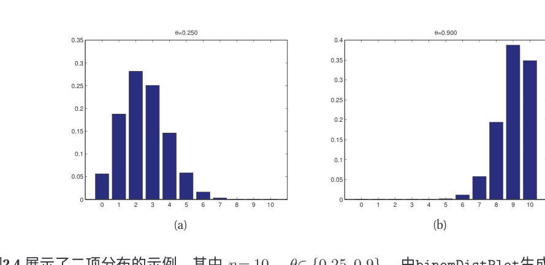

图2.4 展示了二项分布的示例，其中 $n = 10$, $\theta \in \{0.25, 0.9\}$。由 binomDistPlot 生成的图。

### 2.3.2 多项式和多类分布

二项分布可以用来模拟硬币投掷的结果。为了模拟投掷一个 $K$ 面骰子的结果，我们可以使用多项式分布。这个定义如下：让 $\mathbf{x} = (x_1, \ldots, x_K)$ 是一个随机向量，其中 $x_j$ 是骰子的第 $j$ 面出现的次数。那么 $\mathbf{x}$ 具有以下概率质量函数：

$$
\mathrm{Mu}(\mathbf{x}|n, \boldsymbol{\theta}) \triangleq \binom{n}{x_1 \ldots x_K} \prod_{j=1}^{K} \theta_j^{x_j} \qquad (2.33)
$$

其中 $\theta_j$ 是第 $j$ 面出现的概率，而

$$
\binom{n}{x_1 \ldots x_K} \triangleq \frac{n!}{x_1! x_2! \cdots x_K!} \qquad (2.34)
$$

是多项式系数（将大小为 $n = \sum_{k=1}^{K} x_k$ 的集合分成大小为 $x_1$ 到 $x_K$ 的子集的方式数）。

现在假设 $n=1$。这就像是掷一次 $K$ 面的骰子，所以 $\mathbf{x}$ 将会是一个由 0 和 1 组成的向量（一个位向量），其中只有一个位可以被打开。具体来说，如果骰子显示为第 $k$ 面，那么第 $k$ 位将会被打开。在这种情况下，我们可以将 $\mathbf{x}$ 看作是一个具有 $K$ 个状态（值）的标量分类随机变量，而 $\mathbf{x}$ 是它的虚拟编码，即 $\mathbf{x} = [\mathbb{I}(x=1), \ldots, \mathbb{I}(x=K)]$。例如，如果 $K=3$，我们将状态 1、2 和 3 编码为 $(1, 0, 0)$, $(0, 1, 0)$ 和 $(0, 0, 1)$。这也被称为 one-hot 编码，因为我们想象只有一个 $K$ 个“线路”是“热的”或打开的。在这种情况下，概率质量函数变为

$$
\mathrm{Mu}(\mathbf{x}|1, \boldsymbol{\theta}) = \prod_{j=1}^{K} \theta_j^{\mathbb{I}(x_j=1)} \qquad (2.35)
$$

参见图2.1(b-c)的示例。这个非常常见的特殊情况被称为分类或离散分布。（Gustavo Lacerda 建议我们称之为多类分布，类似于二项式/伯努利的区别，这个术语在本书中我们将采用。）我们将使用以下符号表示这种情况：

$$
\mathrm{Cat}(x|\boldsymbol{\theta}) \triangleq \mathrm{Mu}(\mathbf{x}|1, \boldsymbol{\theta}) \tag{2.36}
$$

换句话说，如果 $x \sim \mathrm{Cat}(\boldsymbol{\theta})$，则 $p(x = j|\boldsymbol{\theta}) = \theta_j$。请参阅表2.1进行总结。

表2.1 多项式和相关分布的总结。

| 名字 | n | K | x |
| :--- | :---: | :---: | :--- |
| 多项式 | - | - | $\mathbf{x} \in \{0, 1, \ldots, n\}^K, \sum_{k=1}^K x_k = n$ |
| 多类 | 1 | - | $\mathbf{x} \in \{0, 1\}^K, \sum_{k=1}^K x_k = 1$ (1-of-$K$ encoding) |
| 二项式 | - | 1 | $x \in \{0, 1, \ldots, n\}$ |
| 伯努利 | 1 | 1 | $x \in \{0, 1\}$ |

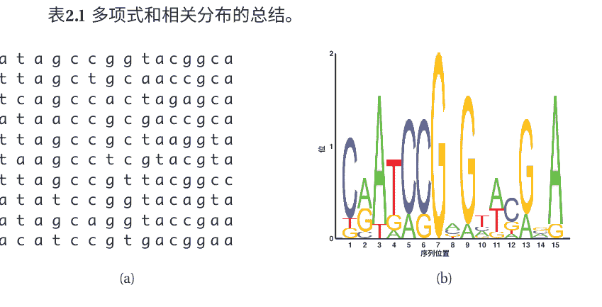

### 2.3.2.1 应用：DNA序列模式

多项式模型的一个有趣应用出现在生物序列分析中。假设我们有一组（对齐的）DNA序列，如图2.5（a）所示，其中有10行（序列）和15列（沿基因组的位置）。我们可以看到几个位置通过进化保持不变（例如，因为它们是基因编码区的一部分），因此相应的列倾向于“纯净的”。例如，第7列全是G。

一种将数据以可视化方式总结的方法是使用序列标志：参见图2.5(b)。我们用字母A、C、G和T绘制，字体大小与它们的经验概率成比例，并且最可能的字母在顶部。在位置 $t$ 处的经验概率分布 $\hat{\boldsymbol{\theta}}_t$ 通过对计数向量进行归一化得到（参见方程3.48）：

$$
\begin{align}
\mathbf{N}_t &= \left( \sum_{i=1}^N \mathbb{I}(X_{it}=1), \sum_{i=1}^N \mathbb{I}(X_{it}=2), \sum_{i=1}^N \mathbb{I}(X_{it}=3), \sum_{i=1}^N \mathbb{I}(X_{it}=4) \right) \tag{2.37} \\
\hat{\boldsymbol{\theta}}_t &= \mathbf{N}_t / N \tag{2.38}
\end{align}
$$

这个分布被称为一个模体。我们还可以计算每个位置上最可能的字母；这被称为共识序列。

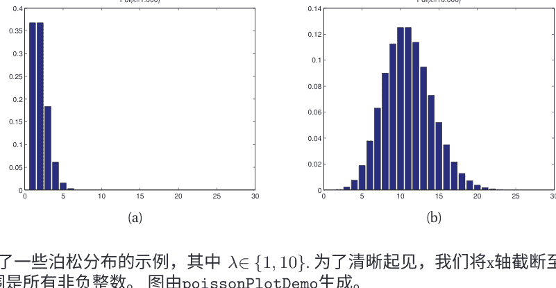

图2.6 显示了一些泊松分布的示例，其中 $\lambda \in \{1, 10\}$。为了清晰起见，我们将 x 轴截断至 25，但分布的支持范围是所有非负整数。图由 poissonPlotDemo 生成。

### 2.3.3 泊松分布

我们说 $X \in \{0,1,2,\ldots\}$ 服从参数为 $\lambda > 0$ 的泊松分布，记作 $X \sim \text{Poi}(\lambda)$，如果其概率质量函数为

$$
\text{Poi}(x|\lambda) = e^{-\lambda} \frac{\lambda^x}{x!} \qquad (2.39)
$$

第一项是归一化常数，用于确保分布总和为1。
泊松分布通常用作模拟罕见事件的计数模型，如放射性衰变和交通事故。请参见图2.6以获取一些图表。

### 2.3.4 经验分布

给定一组数据，$D = \{x_1, \ldots, x_N\}$，我们定义经验分布，也称为经验测度，如下所示：

$$
p_{\text{emp}}(A) = \frac{1}{N} \sum_{i=1}^{N} \delta_{x_i}(A) \qquad (2.40)
$$

其中 $\delta_x(A)$ 是 Dirac 测度，定义如下：

$$
\delta_x(A) = \begin{cases}
0 & \text{如果} \quad x \notin A \\
1 & \text{如果} \quad x \in A
\end{cases} \qquad (2.41)
$$

## 2.4 一些常见的连续分布

在本节中，我们介绍一些常用的一维连续概率分布。

### 2.4.1 高斯（正态）分布

统计学和机器学习中最常用的分布是高斯或正态分布。其概率密度函数如下：

$$
\mathcal{N}(x | \mu, \sigma^2) \triangleq \frac{1}{\sqrt{2\pi\sigma^2}} \exp\left\{-\frac{1}{2\sigma^2}(x-\mu)^2\right\}
$$

这里，$\mu = \mathbb{E}[X]$ 是均值（和众数），$\sigma^2 = \mathrm{var}[X]$ 是方差。$\sqrt{2\pi\sigma^2}$ 是使密度函数积分为1所需的归一化常数（参见练习2.11）。我们用 $X \sim \mathcal{N}(\mu, \sigma^2)$ 表示 $p(X = x) = \mathcal{N}(x | \mu, \sigma^2)$。如果 $X \sim \mathcal{N}(0,1)$，我们说 $X$ 服从标准正态分布。请参见图2.3(b)中的概率密度函数图；有时也称为钟形曲线。

我们经常谈论高斯分布的精度，我们指的是逆方差：$\lambda = 1/\sigma^2$。高精度意味着一个窄的分布（低方差），以 $\mu$ 为中心。请注意，由于这是一个概率密度函数，我们可以有 $p(x) > 1$。为了看到这一点，考虑在其中心处评估密度，$x = \mu$。我们有 $\mathcal{N}(\mu | \mu, \sigma^2) = (\sigma\sqrt{2\pi})^{-1}e^0$，所以如果 $\sigma < 1/\sqrt{2\pi}$，我们有 $p(x) > 1$。

高斯分布的累积分布函数或 cdf 定义为

$$
\Phi(x; \mu, \sigma^2) \triangleq \int_{-\infty}^{x} \mathcal{N}(z | \mu, \sigma^2) dz
$$

参见图2.3(a)，当 $\mu = 0, \sigma^2 = 1$ 时的 cdf 绘图。这个积分没有闭合形式的表达式，但是大多数软件包都内置了它。特别地，我们可以用误差函数(erf)来计算它：

$$
\Phi(x; \mu, \sigma) = \frac{1}{2}\left[1 + \mathrm{erf}\left(\frac{x - \mu}{\sigma\sqrt{2}}\right)\right]
$$

其中 $z = (x - \mu)/\sigma$，且

$$
\mathrm{erf}(x) \triangleq \frac{2}{\sqrt{\pi}} \int_{0}^{x} e^{-t^2} dt
$$

高斯分布是统计学中最广泛使用的分布。这有几个原因。首先，它有两个易于解释的参数，可以捕捉到分布的一些最基本的特性，即均值和方差。其次，中心极限定理（第2.6.3节）告诉我们，独立随机变量的和近似服从高斯分布，因此它是建模残差误差或“噪声”的良好选择。第三，高斯分布做出了最少的假设（具有最大熵），如果我们只知道分布的均值和方差的话。

### 2.4.2 退化概率密度函数

在 $\sigma^2 \to 0$ 的极限情况下，高斯函数变成了一个无限高且无限窄的“尖峰”，位于 $\mu$ 处：

$$
\lim_{\sigma^2 \to 0} \mathcal{N}(x|\mu, \sigma^2) = \delta(x - \mu) \quad \text{(2.47)}
$$

其中 $\delta$ 被称为 **Dirac delta函数**，并且被定义为

$$
\delta(x) = \begin{cases}
\infty & \text{if } x = 0 \\
0 & \text{if } x \neq 0
\end{cases} \quad \text{(2.48)}
$$

这样

$$
\int_{-\infty}^{\infty} \delta(x) dx = 1 \quad \text{(2.49)}
$$

Delta函数的一个有用的性质是筛选性质（sifting property），它从一个求和或积分中选择出一个单项式：

$$
\int_{-\infty}^{\infty} f(x)\delta(x - \mu) dx = f(\mu) \quad \text{(2.50)}
$$

因为被积函数只在 $x - \mu = 0$ 时非零。

高斯分布的一个问题是它对异常值非常敏感，因为对数概率与距离中心的距离的平方成二次衰减。更健壮的分布是 **Student t分布** 其概率密度函数如下：

$$
\mathcal{T}(x|\mu, \sigma^2, \nu) \propto \left[ 1 + \frac{1}{\nu} \left( \frac{x - \mu}{\sigma} \right)^2 \right]^{-\left( \frac{\nu+1}{2} \right)} \quad \text{(2.51)}
$$

其中 $\mu$ 是均值，$\sigma^2 > 0$ 是尺度参数，而 $\nu > 0$ 被称为自由度。请参见图2.7以获取一些图表。供以后参考，我们注意到该分布具有以下特性：

$$
\text{均值} = \mu, \quad \text{众数} = \mu, \quad \text{方差} = \frac{\nu \sigma^2}{\nu - 2} \quad \text{(2.52)}
$$

5. 这个分布有一个丰富多彩的词源。它最早由威廉·西利·戈斯特于1908年在都柏林的吉尼斯酿酒厂发表。由于他的雇主不允许他使用自己的名字，他将其称为“学生”分布。这个术语的起源似乎是在学生分布表的背景下产生的，这个表被费舍尔用于发展经典统计推断的基础。请参阅http://jeff560.tripod.com/s.html以获取更多历史细节。

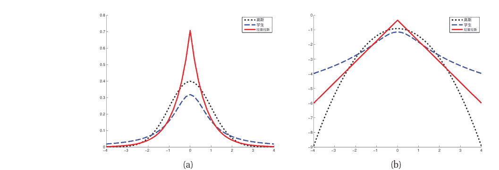

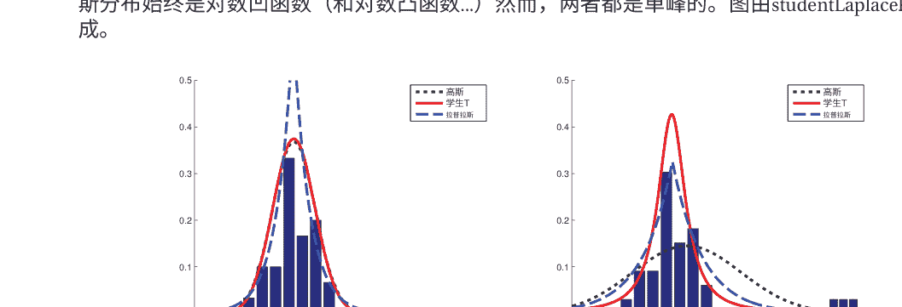

方差只有在 $\nu > 2$ 时才有定义。均值只有在 $\nu > 1$ 时才有定义。

作为对学生分布鲁棒性的说明，考虑图2.8。在左边，我们展示了一个高斯分布和一个学生分布对一些没有异常值的数据进行拟合。在右边，我们添加了一些异常值。我们可以看到高斯分布受到了很大的影响，而学生分布几乎没有变化。这是因为学生分布的尾部更重，至少对于小的 $\nu$（参见图2.7）。如果 $\nu=1$，这个分布被称为柯西分布或洛伦兹分布。这个分布的尾部非常重，以至于定义均值的积分不收敛。

为了确保有限方差，我们要求 $\nu > 2$。通常使用 $\nu=4$，在一系列问题中表现良好 (Lange et al. 1989)。对于 $\nu \gg 5$，学生分布迅速接近高斯分布，并丧失了其鲁棒性。

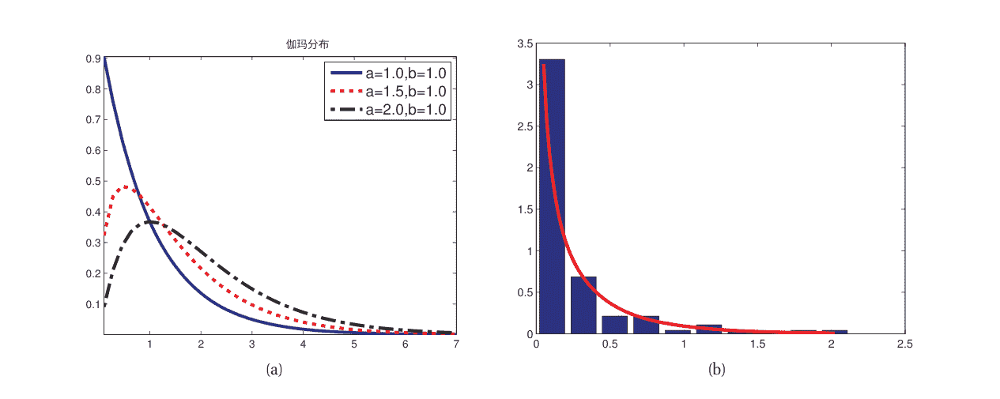

### 2.4.3 拉普拉斯分布

另一个具有重尾的分布是拉普拉斯分布$^{6}$，也被称为双侧指数分布。它的概率密度函数如下：

$$
\mathrm{Lap}(x|\mu, b) \triangleq \frac{1}{2b} \exp \left( -\frac{|x-\mu|}{b} \right) \tag{2.53}
$$

这里 $\mu$ 是一个位置参数，$b > 0$ 是一个尺度参数。参见图2.7以获得绘图。该分布具有以下特性：均值 $= \mu$，众数 $= \mu$，方差 $= 2b^2$。

其对异常值的鲁棒性在图2.8中有所体现。它还在 0 处具有比高斯分布更多的概率密度。这个特性是鼓励模型稀疏性的一种有用方式，我们将在第13.3节中看到。

### 2.4.4 伽马分布

伽马分布是一种适用于正实数随机变量的灵活分布，$x > 0$。它是用两个参数来定义的，称为形状参数 $a > 0$ 和速率参数 $b > 0$：$^{7}$

$$
\mathrm{Ga}(T|\mathrm{shape}=a, \mathrm{rate}=b) \triangleq \frac{b^a}{\Gamma(a)} T^{a-1} e^{-Tb} \tag{2.55}
$$

6. 皮埃尔-西蒙·拉普拉斯（1749-1827）是一位法国数学家，他在创建贝叶斯统计学领域起到了关键作用。

7. 有一种替代参数化方法，我们使用尺度参数代替速率参数：$\mathrm{Ga}_s(T|a, b) \triangleq \mathrm{Ga}(T|a, 1/b)$。这个版本是Matlab的 `gampdf` 使用的版本，尽管在本书中，除非另有说明，否则我们将使用速率参数化。其中 $\Gamma(a)$ 是伽玛函数：

$$\Gamma(x) \triangleq \int_0^{\infty} u^{x-1} e^{-u} du \tag{2.56}$$

请参见图2.9以获取一些图表。供以后参考，我们注意到该分布具有以下属性：均值 $= \frac{a}{b}$， mode $= \frac{a-1}{b}$, var $= \frac{a}{b^2}$ (2.57)

有几个分布只是Gamma的特殊情况，我们在下面讨论。

- **指数分布** 这是由 $\mathrm{Expon}(x|\lambda) \triangleq \mathrm{Ga}(x|1, \lambda)$ 定义的，其中 $\lambda$ 是速率参数。该分布描述了泊松过程中事件之间的时间，即事件以恒定的平均速率 $\lambda$ 连续且独立地发生。

- **Erlang分布** 这与Gamma分布相同，其中 $a$ 是整数。通常将 $a=2$ 固定，得到单参数Erlang分布 $\mathrm{Erlang}(x|\lambda) = \mathrm{Ga}(x|2, \lambda)$，其中 $\lambda$ 是速率参数。

- **卡方分布** 这是由 $\chi^2(x|\nu) \triangleq \mathrm{Ga}(x|\frac{\nu}{2}, \frac{1}{2})$ 定义的。这是高斯随机变量平方和的分布。更准确地说，如果 $Z_i \sim \mathcal{N}(0,1)$，且 $S = \sum_{i=1}^{\nu} Z_i^2$，则 $S \sim \chi^2_{\nu}$。

另一个有用的结果是：如果 $X \sim \mathrm{Ga}(a, b)$，则可以证明（练习2.10）$\frac{1}{X} \sim \mathrm{IG}(a, b)$，其中 $\mathrm{IG}$ 是由 $\mathrm{shape}=a, \mathrm{scale}=b$ 定义的逆伽玛分布。

$$\mathrm{IG}(x|\mathrm{shape}=a, \mathrm{scale}=b) \triangleq \frac{b^a}{\Gamma(a)} x^{-(a+1)} e^{-b/x} \tag{2.58}$$

这个分布具有以下特性

$$\text{均值} = \frac{b}{a-1}, \quad \text{众数} = \frac{b}{a+1}, \quad \text{方差} = \frac{b^2}{(a-1)^2(a-2)}, \tag{2.59}$$

只有当 $a>1$ 时，均值才存在。只有当 $a>2$ 时，方差才存在。我们将在后面看到这些分布的应用。

## 2.4.5 Beta分布

Beta分布在区间 $[0,1]$ 上有支持，并且定义如下：

$$\mathrm{Beta}(x|a,b) = \frac{1}{B(a,b)} x^{a-1} (1-x)^{b-1} \tag{2.60}$$

这里 $B(p,q)$ 是beta函数，

$$B(a,b) \triangleq \frac{\Gamma(a)\Gamma(b)}{\Gamma(a+b)} \tag{2.61}$$

请参见图2.10中一些贝塔分布的图表。我们要求 $a, b > 0$ 以确保分布是可积的（即确保 $B(a,b)$ 存在）。如果 $a=b=1$，我们得到均匀分布。如果

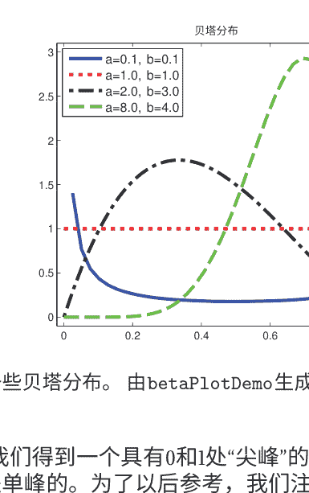

如果a和b都小于1，我们得到一个具有0和1处“尖峰”的双峰分布；如果a和b都大于1，则分布是单峰的。为了以后参考，我们注意到该分布具有以下特性（练习2.16）：

mean = $\frac{a}{a+b}$, mode = $\frac{a-1}{a+b-2}$, var = $\frac{ab}{(a+b)^2(a+b+1)}$

## 2.4.6 帕累托分布

帕累托分布用于建模具有长尾分布的数量，也称为重尾分布。例如，观察到英语中最常见的单词（“the”）出现的频率大约是第二常见单词（“of”）的两倍，而第四常见单词的频率是第二常见单词的两倍，依此类推。如果我们绘制单词的频率与其排名的图表，我们将得到一个幂律分布；这被称为Zipf定律。财富也有类似的偏斜分布，特别是在像美国这样的寡头政治国家。帕累托概率密度函数定义如下：

Pareto分布 $(x | k, m) = \frac{k m^k}{x^{k+1}}$ for $x \geq m$。这个概率密度函数表明x必须大于某个常数 m，但不能太大，其中 k控制着什么是“太大”。当 k→∞时，分布趋近于 δ(x−m)。见图2.11(a)以获取一些图表。如果我们将分布绘制在对数-对数尺度上，它将形成一条直线，形式为 log p(x) = a log x + c，其中 a 和 c 是一些常数。见图2.11(b)以获取一个示例（这被称为幂律）。这个分布具有以下特性：

均值 = $\frac{k m}{k-1}$, 如果 k > 1, 则模态值 = m, 方差 = $\frac{m^2 k}{(k-1)^2(k-2)}$ if k > 2

> 8. 在美国，400名美国人的财富超过了所有美国人的一半。（来源：http://www.politifact.com/wisconsin/statements/2011/mar/10/michael-moore/michael-moore-says-400-americans-have-more-wealth-.）有关这种极端收入分配如何在一个民主国家中出现的政治分析，请参见 (Hacker and Pierson 2010) .

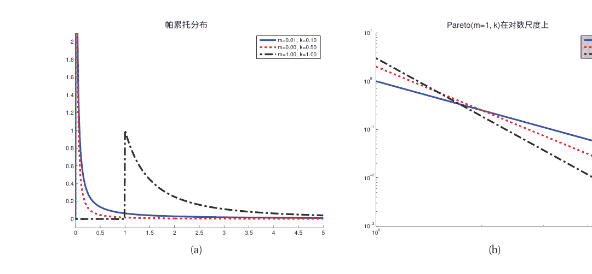

## 2.5 联合概率分布

到目前为止，我们主要关注建模单变量概率分布。在本节中，我们开始讨论更具挑战性的问题，即构建多个相关随机变量的联合概率分布；这将是本书的核心主题。

联合概率分布的形式为 p(x_1, ..., x_D)，其中 x_D 为一组 D > 1 个变量，并且模型化了变量之间的（随机）关系。如果所有变量都是离散的，我们可以将联合分布表示为一个大的多维数组，每个维度对应一个变量。然而，定义这样一个模型所需的参数数量为 O(K^D)，其中 K 是每个变量的状态数。

我们可以通过做出条件独立性假设来使用更少的参数定义高维联合分布，详细解释见第10章。对于连续分布，另一种方法是限制概率密度函数的形式，我们将在下面的一些例子中进行讨论。

### 2.5.1 协方差和相关性

两个随机变量 X 和 Y 之间的协方差衡量了 X 和 Y 之间的（线性）相关程度。协方差的定义为

$$\operatorname{cov}[X, Y] \triangleq \mathbb{E}[(X - \mathbb{E}[X])(Y - \mathbb{E}[Y])] = \mathbb{E}[XY] - \mathbb{E}[X]\mathbb{E}[Y] \tag{2.65}$$

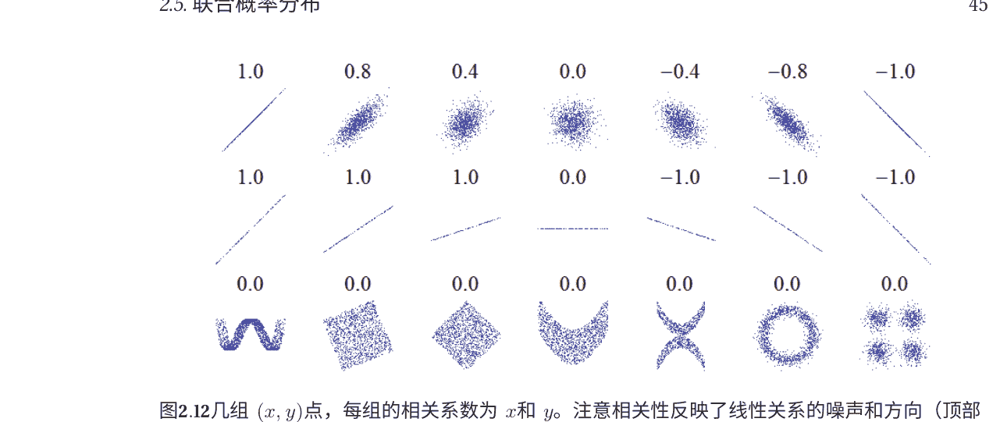

图2.12几组 (x, y)点，每组的相关系数为 x 和 y。注意相关性反映了线性关系的噪声和方向（顶部行），但不反映该关系的斜率（中间行），也不反映非线性关系的许多方面（底部行）。注意：中间的图形斜率为0，但在这种情况下，相关系数未定义，因为 Y 的方差为零。来源： http://en.wikipedia.org/wiki/File:Correlation_examples.png

如果 $x$ 是一个 $d$ 维随机向量，它的协方差矩阵被定义为以下对称的、正定的矩阵：

$$
\text{cov}[\mathbf{x}] \triangleq \mathbb{E}[(\mathbf{x} - \mathbb{E}[\mathbf{x}])(\mathbf{x} - \mathbb{E}[\mathbf{x}])^T]
$$

$$
= \begin{pmatrix}
    \text{var}[X_1] & \text{cov}[X_1, X_2] & \cdots & \text{cov}[X_1, X_d] \\
    \text{cov}[X_2, X_1] & \text{var}[X_2] & \cdots & \text{cov}[X_2, X_d] \\
    \vdots & \vdots & \ddots & \vdots \\
    \text{cov}[X_d, X_1] & \text{cov}[X_d, X_2] & \cdots & \text{var}[X_d]
\end{pmatrix}
$$

协方差可以在0和无穷之间。有时候使用一个归一化的度量更加方便，它有一个有限的上界。(皮尔逊)相关系数在X和Y之间被定义为

$$
\text{corr}[X, Y] \triangleq \frac{\text{cov}[X, Y]}{\sqrt{\text{var}[X] \text{var}[Y]}}
$$

### 一个相关矩阵的形式

$$
\mathbf{R} = \begin{pmatrix}
    \text{corr}[X_1, X_1] & \text{corr}[X_1, X_2] & \cdots & \text{corr}[X_1, X_d] \\
    \vdots & \vdots & \ddots & \vdots \\
    \text{corr}[X_d, X_1] & \text{corr}[X_d, X_2] & \cdots & \text{corr}[X_d, X_d]
\end{pmatrix}
$$

可以证明（练习4.3） $-1 \leq \text{corr}[X, Y] \leq 1$。因此，在相关矩阵中，对角线上的每个条目都是1，其他条目在-1和1之间。还可以证明 $\text{corr}[X, Y] = 1$ 当且仅当 $Y = aX + b$，其中 $a$ 和 $b$ 是一些参数，即 $X$ 和 $Y$ 之间存在线性关系（参见练习4.4）。直观上

可能会期望相关系数与回归线的斜率有关，即表达式 \(Y = aX + b\) 中的系数 \(a\)。然而，正如我们后面在方程7.99中所示，回归系数实际上由 \(\text{cov}[X, Y] / \text{var}[X]\) 给出。更好的理解相关系数的方法是将其视为线性度量：参见图2.12。

如果 \(X\) 和 \(Y\) 是独立的，即 \(p(X, Y) = p(X)p(Y)\)（参见2.2.4节），那么 \(\text{cov}[X, Y] = 0\)，因此 \(\text{corr}[X, Y] = 0\)，它们是不相关的。然而，反过来并不成立：不相关并不意味着独立。例如，假设 \(X \sim U(-1, 1)\)，且 \(Y = X^2\)。显然，\(Y\) 依赖于 \(X\)（实际上，\(Y\) 由 \(X\) 唯一确定），然而可以证明（练习4.1）\(\text{cov}[X, Y] = 0\)。图2.12展示了一些引人注目的例子，其中 \(X\) 和 \(Y\) 之间存在明显的依赖关系，然而相关系数为0。随机变量之间更一般的依赖度量是互信息，在2.8.3节中讨论。只有在变量真正独立时，互信息才为零。

### 2.5.2 多元高斯分布

多元高斯分布或多元正态分布（MVN）是最广泛应用于连续变量的联合概率密度函数。我们在第4章详细讨论了MVN；在这里，我们只给出一些定义和图形。

在 \(D\) 维中，MVN的概率密度函数定义如下：

$$
\mathcal{N}(\mathbf{x}|\boldsymbol{\mu}, \boldsymbol{\Sigma}) \triangleq \frac{1}{(2\pi)^{D/2} |\boldsymbol{\Sigma}|^{1/2}} \exp \left[ -\frac{1}{2} (\mathbf{x} - \boldsymbol{\mu})^T \boldsymbol{\Sigma}^{-1} (\mathbf{x} - \boldsymbol{\mu}) \right]
$$

其中，\(\boldsymbol{\mu} = \mathbb{E}[\mathbf{x}] \in \mathbb{R}^D\) 是均值向量，\(\boldsymbol{\Sigma} = \text{cov}[\mathbf{x}]\) 是 \(D \times D\) 协方差矩阵。有时我们会使用精度矩阵或浓度矩阵进行工作。这只是逆协方差矩阵，\(\boldsymbol{\Lambda} = \boldsymbol{\Sigma}^{-1}\)。归一化常数 \((2\pi)^{-D/2} |\boldsymbol{\Lambda}|^{1/2}\) 确保概率密度函数积分为1（参见练习4.5）。

图2.13展示了三种不同协方差矩阵下的二维多元正态分布密度图。一个完全协方差矩阵有 \(D(D+1)/2\) 个参数（我们除以2是因为 \(\boldsymbol{\Sigma}\) 是对称的）。一个对角协方差矩阵有 \(D\) 个参数，并且在对角线上的元素为0。一个球形或各向同性的协方差矩阵，\(\boldsymbol{\Sigma} = \sigma^2 \mathbf{I}_D\)，有一个自由参数。

### 2.5.3 多元学生 \(t\) 分布

多元学生 \(t\) 分布是多元正态分布的一个更健壮的替代品，其概率密度函数为

$$
\mathcal{T}(\mathbf{x}|\boldsymbol{\mu}, \boldsymbol{\Sigma}, \nu) = \frac{\Gamma(\nu/2 + D/2)}{\Gamma(\nu/2)} \frac{|\boldsymbol{\Sigma}|^{-1/2}}{\nu^{D/2} \pi^{D/2}} \times \left[ 1 + \frac{1}{\nu} (\mathbf{x} - \boldsymbol{\mu})^T \boldsymbol{\Sigma}^{-1} (\mathbf{x} - \boldsymbol{\mu}) \right]^{-(\nu+D)/2}
$$

$$
\mathcal{T}(\mathbf{x}|\boldsymbol{\mu}, \boldsymbol{\Sigma}, \nu) = \frac{\Gamma(\nu/2 + D/2)}{\Gamma(\nu/2)} |\pi \mathbf{V}|^{-1/2} \times \left[ 1 + (\mathbf{x} - \boldsymbol{\mu})^T \mathbf{V}^{-1} (\mathbf{x} - \boldsymbol{\mu}) \right]^{-(\nu+D)/2}
$$

其中 \(\boldsymbol{\Sigma}\) 被称为尺度矩阵（因为它不完全是协方差矩阵），且 \(\mathbf{V} = \nu \boldsymbol{\Sigma}\)。它的尾部比高斯分布更厚。当 \(\nu\) 越小，尾部越厚。当 \(\nu \to \infty\) 时，

## 2.5. 联合概率分布

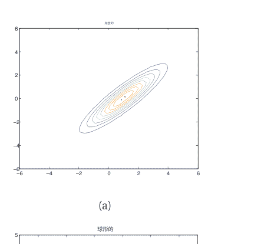

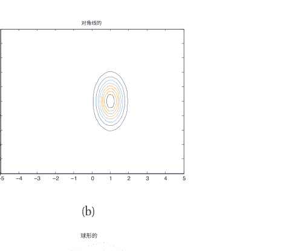

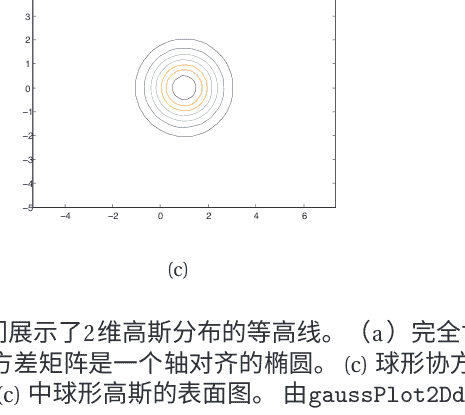

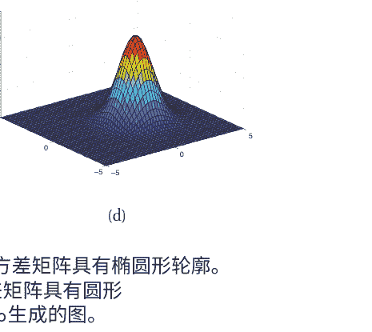

图2.13 我们展示了2维高斯分布的等高线。(a) 完全协方差矩阵具有椭圆形轮廓。(b) 对角协方差矩阵是一个轴对齐的椭圆。(c) 球形协方差矩阵具有圆形形状。(d) (c) 中球形高斯的表面图。由gaussPlot2Ddemo生成的图。

分布趋向于高斯分布。该分布具有以下特性

均值 $= \mu$, 众数 $= \mu$, 协方差 $= \frac{\nu}{\nu - 2} \Sigma$ \quad (2.73)

### 2.5.4 狄利克雷分布

贝塔分布的多元推广是狄利克雷分布⁹，其支持在概率单纯形上定义，由

$S_K = \{\mathbf{x}: 0 \le x_k \le 1, \sum_{k=1}^{K} x_k = 1\}$ \quad (2.74)

概率密度函数定义如下:

$\text{Dir}(\mathbf{x}|\boldsymbol{\alpha}) \triangleq \frac{1}{B(\boldsymbol{\alpha})} \prod_{k=1}^{K} x_k^{\alpha_k - 1} \mathbf{1} \; (\mathbf{x} \in S_K)$ \quad (2.75)

> ⁹. 约翰·狄利克雷是一位德国数学家，1805年至1859年。

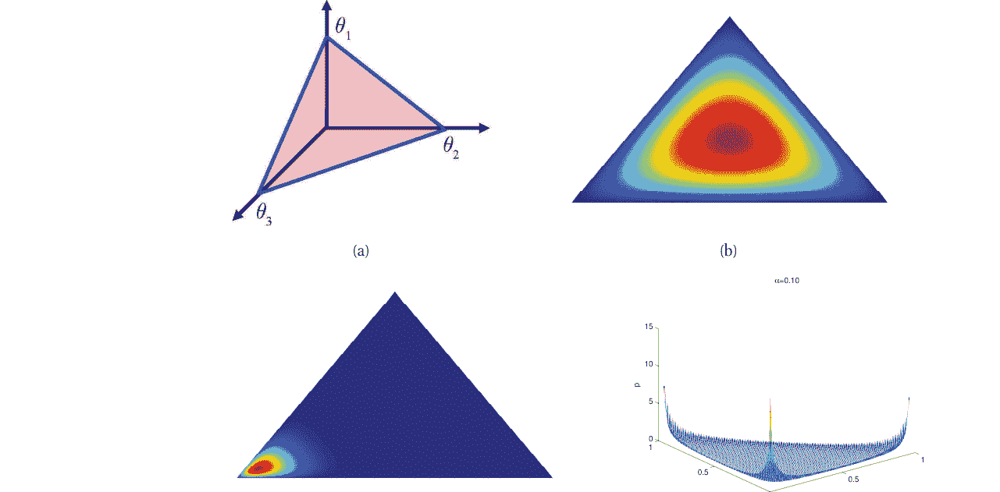

图2.14 (a) 当 $K=3$ 时，狄利克雷分布定义了一个在三角形表面上的分布。这个表面上的点满足 $0 \leq \theta_k \leq 1$ 和 $\sum_{k=1}^3 \theta_k = 1$。(b) 当 $\alpha = (2,2,2)$ 时，狄利克雷密度的图。(c) $\alpha = (20,2,2)$。图由Jonathan Huang使用visDirichletGui生成，(d) $\alpha = (0.1,0.1,0.1)$。(边缘上的梳状结构是绘图的产物。) 图由tdirichlet3dPlot生成。

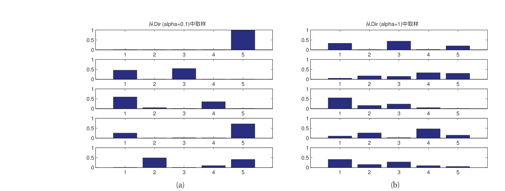

图2.15 来自不同参数值的5维对称Dirichlet分布的样本 (a) $\alpha = (0.1, \ldots, 0.1)$。这导致非常稀疏的分布，有很多0s。(b) $\alpha = (1, \ldots, 1)$。这导致更均匀（且密集）的分布。由dirichletHistogramDemo生成的图。

其中 \( B(\alpha_1, \dots, \alpha_K) \) 是 \( K \) 变量的 beta 函数的自然推广：

$$ B(\boldsymbol{\alpha}) \triangleq \dfrac{\prod_{k=1}^K \Gamma(\alpha_k)}{\Gamma(\alpha_0)} \tag{2.76} $$

其中 \( \alpha_0 \triangleq \sum_{k=1}^K \alpha_k \)。图2.14展示了当 \( K=3 \) 时的一些狄利克雷分布的图形，图2.15展示了一些采样概率向量的图形。我们可以看到 \( \alpha_0 = \sum_{k=1}^K \alpha_k \) 控制着分布的强度（峰值有多高），而 \( \alpha_k \) 控制着峰值出现的位置。例如，\( \text{Dir}(1,1,1) \) 是一个均匀分布，\( \text{Dir}(2,2,2) \) 是一个以 \( (1/3,1/3,1/3) \) 为中心的宽分布，\( \text{Dir}(20,20,20) \) 是一个以 \( (1/3,1/3,1/3) \) 为中心的窄分布。如果对于所有的 \( k \)，\( \alpha_k < 1 \)，我们在单纯形的角上得到“尖峰”。

为了将来的参考，该分布具有以下特性

$$ E[\mathbf{x}_k] = \dfrac{\alpha_k}{\alpha_0}, \quad \text{mode}[\mathbf{x}_k] = \dfrac{\alpha_k - 1}{\alpha_0 - K}, \quad \text{var}[\mathbf{x}_k] = \dfrac{\alpha_k(\alpha_0 - \alpha_k)}{\alpha_0^2(\alpha_0 + 1)} \tag{2.77} $$

其中 \( \alpha_0 = \sum_k \alpha_k \)。通常我们使用对称的狄利克雷先验形式 \( \alpha_k = \alpha/K \)。在这种情况下，均值变为 \( 1/K \)，方差变为 \( \text{var}[\mathbf{x}_k] = \dfrac{\alpha/K (\alpha - \alpha/K)}{\alpha^2 (\alpha + 1)} = \dfrac{K-1}{K^2 (\alpha + 1)} \)。因此，增加 \( \alpha \) 会增加分布的精度（减小方差）。

## 2.6 随机变量的转换

如果 \( \boldsymbol{x} \sim p(\cdot) \) 是某个随机变量，且 \( \boldsymbol{y} = f(\boldsymbol{x}) \)，那么 \( \boldsymbol{y} \) 的分布是什么？这是我们在本节中要解决的问题。

### 2.6.1 线性变换

假设 \( f(\cdot) \) 是一个线性函数：

$$ \boldsymbol{y} = f(\boldsymbol{x}) = \boldsymbol{A}\boldsymbol{x} + \boldsymbol{b} \tag{2.78} $$

在这种情况下，我们可以很容易地推导出 \( \boldsymbol{y} \) 的均值和协方差，如下所示。首先，对于均值，我们有

$$ E[\boldsymbol{y}] = E[\boldsymbol{A}\boldsymbol{x} + \boldsymbol{b}] = \boldsymbol{A}\boldsymbol{\mu} + \boldsymbol{b} \tag{2.79} $$

其中 \( \boldsymbol{\mu} = E[\boldsymbol{x}] \)。这被称为期望的线性性。如果 \( f(\cdot) \) 是一个标量值函数，\( f(\boldsymbol{x}) = \boldsymbol{a}^\top \boldsymbol{x} + b \)，相应的结果是

$$ E[\boldsymbol{a}^\top \boldsymbol{x} + b] = \boldsymbol{a}^\top \boldsymbol{\mu} + b \tag{2.80} $$

对于协方差，我们有

$$ \text{cov}[\boldsymbol{y}] = \text{cov}[\boldsymbol{A}\boldsymbol{x} + \boldsymbol{b}] = \boldsymbol{A}\boldsymbol{\Sigma}\boldsymbol{A}^\top \tag{2.81} $$

其中 \( \boldsymbol{\Sigma} = \text{cov}[\boldsymbol{x}] \)。我们将这个证明留作练习。如果 \( f(\cdot) \) 是标量值的，结果变为

$$ \text{var}[\boldsymbol{a}^\top \boldsymbol{x} + b] = \boldsymbol{a}^\top \boldsymbol{\Sigma} \boldsymbol{a} \tag{2.82} $$

我们将在后面的章节中广泛使用这两个结果。然而，请注意，均值和协方差只有在 \( \boldsymbol{x} \) 是高斯分布时才完全定义了 \( \boldsymbol{y} \) 的分布。一般情况下，我们必须使用下面描述的技术来推导 \( \boldsymbol{y} \) 的完整分布，而不仅仅是它的前两个矩。

### 2.6.2 一般变换

如果 \( X \) 是一个离散随机变量，我们可以通过简单地将所有使得 \( f(x) = y \) 的 \( x \) 的概率质量相加来推导出 \( y \) 的概率质量函数：\( p_y(y) = \)

$$ \sum_{x: f(x)=y} p_x(x) $$ (2.83)

例如，如果 \( f(X) = 1 \) 如果 \( X \) 是偶数，否则 \( f(X) = 0 \)，并且 \( p_x(X) \) 在集合 \( \{1, \ldots, 10\} \) 上均匀分布，那么 \( p_y(1) = \sum_{x \in \{2,4,6,8,10\}} p_x(x) = 0.5 \)，并且 \( p_y(0) = 0.5 \) 类似地。注意在这个例子中，\( f \) 是一个多对一的函数。

如果 \( X \) 是连续的，我们不能使用方程2.83，因为 \( p_x(x) \) 是一个密度函数，而不是概率质量函数，我们不能对密度函数求和。相反，我们使用累积分布函数，并且写成

$$ P_y(y) \triangleq P(Y \leq y) = P(f(X) \leq y) = P(X \in \{x| f(x) \leq y\}) $$ (2.84)

我们可以通过对累积分布函数求导来推导出 \( y \) 的概率密度函数。

在单调且可逆函数的情况下，我们可以写成

$$ P_y(y) = P(f(X) \leq y) = P(X \leq f^{-1}(y)) = P_x(f^{-1}(y)) $$ (2.85)

对其进行导数运算，我们得到

$$ p_y(y) \triangleq \frac{d}{dy} P_y(y) = \frac{d}{dy} P_x(f^{-1}(y)) = \frac{dx}{dy} \frac{d}{dx} P_x(x) = \frac{dx}{dy} p_x(x) $$ (2.86)

我们可以将 \( dx \) 看作是 \( x \) 空间中的体积度量；同样地，\( dy \) 则是 \( y \) 空间中的体积度量。因此，\( \frac{dx}{dy} \) 度量了体积的变化。由于这种变化的符号不重要，我们取绝对值得到一般表达式：

$$ p_y(y) = p_x(x)\left| \frac{dx}{dy} \right| $$ (2.87)

这被称为变量的改变公式。我们可以更直观地理解这个结果，如下所示。落在范围 \( (x, x+\delta x) \) 内的观测值将被转换为 \( (y, y+\delta y) \)，其中 \( p_x(x) \delta x \approx p_y(y) \delta y \)。例如，假设 \( X \sim U(-1, 1) \)，且 \( Y = X^2 \)。那么 \( p_y(y) = \frac{1}{2}y^{-\frac{1}{2}} \)。另请参见练习2.10。

#### 2.6.2.1 多元变量的变量改变 *

我们可以将之前的结果推广到多元分布上，如下所示。设 \( f \) 是一个将 \( \mathbb{R}^n \) 映射到 \( \mathbb{R}^n \) 的函数，令 \( \mathbf{y} = f(\mathbf{x}) \)。那么它的Jacobian矩阵 \( \mathbf{J} \) 给出如下：

$$ \mathbf{J}_{\mathbf{x} \to \mathbf{y}} \triangleq \frac{\partial(y_1, \ldots, y_n)}{\partial(x_1, \ldots, x_n)} \triangleq \begin{pmatrix} \frac{\partial y_1}{\partial x_1} & \cdots & \frac{\partial y_1}{\partial x_n} \\ \vdots & \ddots & \vdots \\ \frac{\partial y_n}{\partial x_1} & \cdots & \frac{\partial y_n}{\partial x_n} \end{pmatrix} $$ (2.88)

\( |\det \mathbf{J}| \) 衡量当我们应用 \( f \) 时单位立方体体积变化的程度。如果 \( f \) 是可逆映射，我们可以使用逆映射的Jacobian来定义变换变量的概率密度函数 \( \mathbf{y} \rightarrow \mathbf{x} \)：

$$ p_{\mathbf{y}}(\mathbf{y}) = p_{\mathbf{x}}(\mathbf{x}) \left| \det \left( \frac{\partial \mathbf{x}}{\partial \mathbf{y}} \right) \right| = p_{\mathbf{x}}(\mathbf{x}) | \det \mathbf{J}_{\mathbf{y} \rightarrow \mathbf{x}} | $$

在练习4.5中，您将使用此公式推导多元高斯分布的归一化常数。

作为一个简单的例子，考虑将密度从笛卡尔坐标 \( \mathbf{x} = (x_1, x_2) \) 转换为极坐标 \( \mathbf{y} = (r, \theta) \)，其中 \( x_1 = r \cos \theta \) 和 \( x_2 = r \sin \theta \)。然后

$$ \mathbf{J}_{\mathbf{y} \rightarrow \mathbf{x}} = \begin{pmatrix} \frac{\partial x_1}{\partial r} & \frac{\partial x_1}{\partial \theta} \\ \frac{\partial x_2}{\partial r} & \frac{\partial x_2}{\partial \theta} \end{pmatrix} = \begin{pmatrix} \cos \theta & -r \sin \theta \\ \sin \theta & r \cos \theta \end{pmatrix} $$

和

$$ | \det \mathbf{J} | = | r \cos^2 \theta + r \sin^2 \theta | = | r | $$

因此

$$ p_{\mathbf{y}}(\mathbf{y}) = p_{\mathbf{x}}(\mathbf{x}) | \det \mathbf{J} | $$

$$ p_{r,\theta}(r, \theta) = p_{x_1, x_2}(x_1, x_2) r = p_{x_1, x_2}(r \cos \theta, r \sin \theta) r $$

从几何上看，注意图2.16中阴影区域的面积由以下给出

$$ P(r \leq R \leq r + dr, \theta \leq \Theta \leq \theta + d\theta) = p_{r,\theta}(r, \theta) dr d\theta $$

在极限情况下，这等于补丁中心的密度， \( p(r, \theta) \)，乘以补丁的大小， \( r dr d\theta \)。因此 \( p_{r,\theta}(r, \theta) dr d\theta = p_{x_1, x_2}(r \cos \theta, r \sin \theta) r dr d\theta \)。

### 2.6.3 中心极限定理

现在考虑 \( N \) 个具有概率密度函数（不一定是高斯分布） \( p(x_i) \) 的随机变量，每个变量的均值为 \( \mu \)，方差为 \( \sigma^2 \)。我们假设每个变量都是独立同分布的，简称为 \( \textbf{iid} \)。令 \( S_N = \sum_{i=1}^{N} X_i \) 为这些随机变量的和。这是一种简单但广泛使用的随机变量转换。可以证明，随着 \( N \) 的增加，这个和的分布趋近于

$$ p(S_N = s) = \frac{1}{\sqrt{2 \pi N \sigma^2}} \exp \left( -\frac{(s - N \mu)^2}{2 N \sigma^2} \right) $$

因此，这个量的分布为

$$ Z_N \triangleq \frac{S_N - N \mu}{\sigma \sqrt{N}} = \frac{\bar{X} - \mu}{\sigma / \sqrt{N}} $$

收敛到标准正态分布，其中 \( \bar{X} = \frac{1}{N} \sum_{i=1}^{N} x_i \) 是样本均值。这被称为中心极限定理。参见例如 (Jaynes 2003, p222) 或 (Rice 1995, p169) 的证明。在图2.17中，我们给出了一个从beta分布中抽取的随机变量的均值的计算示例。我们可以看到均值的抽样分布迅速收敛到一个高斯分布。

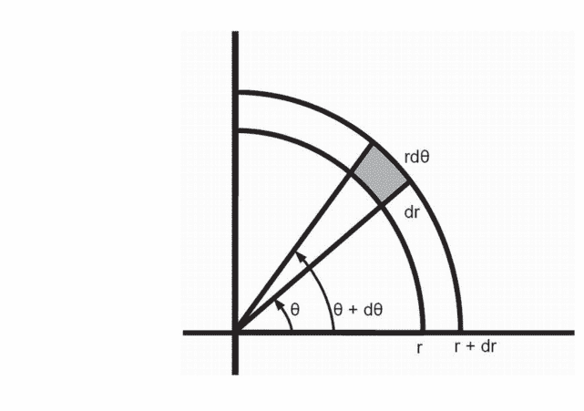

图2.16 从极坐标到笛卡尔坐标的变量转换。阴影区域的面积是 \(r \, dr \, d\theta\)。基于（Rice 1995）图3.16。

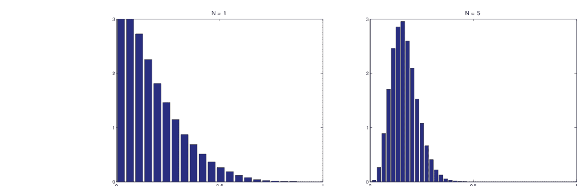

图2.17 中心极限定理的图示。我们绘制了一个 \(\frac{1}{N}\sum_{i=1}^N x_{ij}\) 的直方图，其中 \(x_{ij} \sim Beta(1, 5)\)，对于 \(j = 1 : 10000\)。当 \(N \to \infty\) 时，分布趋向于高斯分布。(a) \(N = 1\)。(b) \(N = 5\)。基于（Bishop 2006a）图2.6。由 centralLimitDemo 生成的图。

## 2.7 蒙特卡洛近似

一般来说，使用变量变换公式计算随机变量的函数的分布可能很困难。一个简单但强大的替代方法如下。首先，我们从分布中生成 \(S\) 个 samples，称为 \(x_1, \ldots, x_S\)。（有许多方法可以生成这样的 samples；对于高维分布，一种流行的方法称为马尔可夫链蒙特卡洛或 MCMC；这将在第24章中解释。）给定这些样本，我们可以使用 \(\{ f(x_s) \}_{s=1}^{S}\) 的经验分布来近似 \(f(X)\) 的分布。这被称为蒙特卡洛近似，以欧洲一座以其豪华赌场而闻名的城市命名。

蒙特卡洛技术最初是在统计物理学领域发展起来的，特别是在原子弹的开发过程中，但现在也广泛应用于统计学和机器学习。

我们可以使用蒙特卡洛方法来近似计算随机变量的期望值。我们只需抽取样本，然后计算样本上应用函数的算术平均值。这可以写成如下形式：

$$ \mathbb{E}[f(X)] = \int f(x)p(x)dx \approx \frac{1}{S} \sum_{s=1}^S f(x_s) \tag{2.98} $$

这被称为蒙特卡洛积分，相对于数值积分（基于在固定点网格上评估函数）具有优势，因为函数只在存在非零概率的位置进行评估。

通过改变函数 \( f() \)，我们可以近似许多感兴趣的量，比如

- \( \bar{x} = \frac{1}{S} \sum_{s=1}^S x_s \rightarrow \mathbb{E}[X] \)
- \( \frac{1}{S} \sum_{s=1}^S (x_s - \bar{x})^2 \rightarrow \text{var}[X] \)
- \( \frac{1}{S} \#\{x_s \leq c\} \rightarrow P(X \leq c) \)
- 中位数\( \{x_1, \dots, x_S\} \rightarrow \text{中位数}(X) \)

我们在下面给出一些例子，并且在后面的章节中会看到更多例子。

### 2.7.1 例子：变量的变换，蒙特卡洛方法

在2.6.2节中，我们讨论了如何解析地计算随机变量的函数的分布， \( y = f(x) \)。一个更简单的方法是使用蒙特卡洛近似。例如，假设 \( x \sim \text{Unif}(-1, 1) \) 且 \( y = x^2 \)。我们可以通过从 \( p(x) \) 中抽取许多样本，对它们进行平方，并计算得到的经验分布来近似 \( p(y) \)。请参见图2.18以获得说明。我们将在后面的章节中广泛使用这种技术。另请参见图5.2。

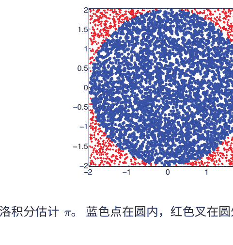

图2.19 通过蒙特卡洛积分估计 π。蓝色点在圆内，红色叉在圆外。图由mcEstimatePi生成。

### 2.7.2 示例：通过蒙特卡洛积分估计 π

MC近似法不仅适用于统计学，还适用于许多其他应用。假设我们想要估计 π。我们知道半径为 r 的圆的面积是 πr^2，但它也等于以下定积分：

$$ I = \int_{-r}^{r} \int_{-r}^{r} \mathbb{I}(x^2 + y^2 \leq r^2) \, dx \, dy $$

因此，\( \pi = I/(r^2) \)。让我们通过蒙特卡洛积分来近似计算。令 \( f(x, y) = \mathbb{I}(x^2 + y^2 \leq r^2) \) 为一个指示函数，对于圆内的点为1，圆外为0，并且令 \( p(x) \) 和 \( p(y) \) 为在 \([-r, r]\) 上的均匀分布，因此 \( p(x) = p(y) = 1/(2r) \)。那么

$$ \begin{aligned} I &= (2r)(2r) \int \int f(x, y) p(x) p(y) \, dx \, dy \\ &= 4r^2 \int \int f(x, y) p(x) p(y) \, dx \, dy \\ &\approx 4r^2 \frac{1}{S} \sum_{s=1}^{S} f(x_s, y_s) \end{aligned} $$

我们发现 \( \hat{\pi} = 3.1416 \)，标准误差为0.09（详见第2.7.3节对标准误差的讨论）。我们可以绘制接受/拒绝的点，如图2.19所示。

### 2.7.3 蒙特卡洛逼近的准确性

MC逼近的准确性随样本量增加而增加。这在图2.20中有所说明。在顶部行，我们绘制了从高斯分布中取样的直方图。在底部行，我们绘制了这些样本的平滑版本，使用核密度估计（第14.7.2节）创建。然后，在一个密集的点网格上评估这个平滑分布。

## 2.7. 蒙特卡洛近似

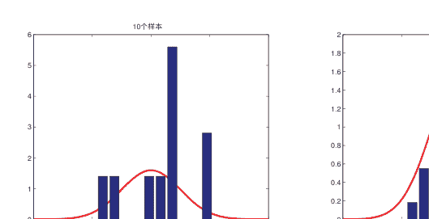

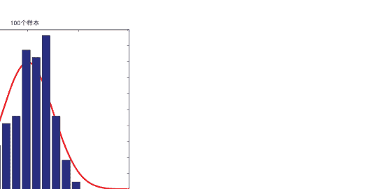

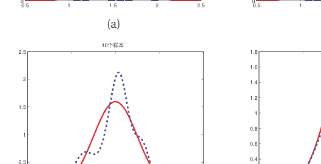

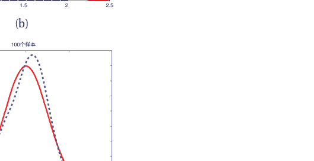

图2.20从高斯分布中取10个和100个样本，其中 $\mathcal{N}(\mu=1.5, \sigma^2=0.25)$。实线是真实概率密度函数。顶部线：样本的直方图。底部线：基于样本的核密度估计，虚线是真实概率密度函数。根据(Hoff 2009)的图4.1。由mcAccuracyDemo生成的图。

并绘制。请注意，这种平滑仅用于绘图目的，不用蒙特卡洛估计本身。

如果我们用 $\mu = \mathbb{E}[f(X)]$ 表示精确均值，用 $\hat{\mu}$ 表示MC近似值，可以证明，对于独立样本，

$$(\hat{\mu} - \mu) \to \mathcal{N}(0, \frac{\sigma^2}{S}) \quad (2.103)$$

其中

$$\sigma^2 = \text{var}[f(X)] = \mathbb{E}[f(X)^2] - \mathbb{E}[f(X)]^2 \quad (2.104)$$

这是中心极限定理的结果。当然，上述表达式中的 $\sigma^2$ 是未知的，但也可以通过MC进行估计：

$$\hat{\sigma}^2 = \frac{1}{S} \sum_{s=1}^{S} (f(x_s) - \hat{\mu})^2 \quad (2.105)$$

然后我们有

$$P \left\{ \mu - 1.96 \frac{\hat{\sigma}}{\sqrt{S}} \leq \hat{\mu} \leq \mu + 1.96 \frac{\hat{\sigma}}{\sqrt{S}} \right\} \approx 0.95 \quad (2.106)$$

这个术语 $\sqrt{\frac{\hat{\sigma}^2}{S}}$ 被称为（数值或经验）标准误差，它是对我们对 $\mu$ 的估计的不确定性的估计。（有关标准误差的更多讨论，请参见第6.2节。）如果我们想要报告一个准确度至少为95%的答案，我们需要使用一定数量的样本 $S$ 满足 $1.96 \sqrt{\frac{\hat{\sigma}^2}{S}} \le \epsilon$。我们可以通过 $S \ge \frac{4\hat{\sigma}^2}{\epsilon^2}$ 来近似 1.96的因子，从而得到 $S \ge \frac{4\hat{\sigma}^2}{\epsilon^2}$。

## 2.8 信息论

信息论关注的是以紧凑的方式表示数据（称为数据压缩或源编码）以及以能够容错的方式传输和存储数据（称为错误纠正或信道编码）。起初，这似乎与概率论和机器学习的关注点相去甚远。然而，实际上存在着密切的联系，要理解这一点，需要注意紧凑地表示数据需要将高概率的比特串分配给短码字，并将低概率的比特串保留给长码字。这与自然语言中的情况类似，常见词（如“a”，“the”，“and”）通常比罕见词要短得多。此外，在噪声信道上传输解码消息需要具备良好的概率模型，以预测人们倾向于发送的消息类型。在这两种情况下，我们需要一个能够预测哪种数据类型可能性高或低的模型，这也是机器学习中的一个核心问题（有关信息论和机器学习之间关系的更多细节，请参见（MacKay 2003））。显然，我们无法在这里详细介绍信息论的细节（如果您有兴趣了解更多，请参阅（Cover and Thomas 2006））。然而，我们将介绍一些在本书后面需要用到的基本概念。

### 2.8.1 熵

随机变量 $X$ 的熵，记作 $\mathbb{H}(X)$ 或有时 $\mathbb{H}(p)$，是其不确定性的度量。特别地，对于具有 $K$ 个状态的离散变量，它的定义如下

$$\mathbb{H}(X) \triangleq -\sum_{k=1}^{K} p(X = k) \log_2 p(X = k) \tag{2.107}$$

通常我们使用以2为底的对数，这种情况下单位被称为比特(二进制位)。如果我们使用以 $e$ 为底的对数，单位被称为奈特。例如，如果 $X \in \{1, \dots, 5\}$ 并且具有直方图分布 $p = [0.25, 0.25, 0.2, 0.15, 0.15]$，我们可以计算得到 $H= 2.2855$。具有最大熵的离散分布是均匀分布(详见第9.2.6节的证明)。因此，对于一个 $K$ 元随机变量，如果 $p(x = k) = 1/K$，则熵达到最大值；在这种情况下，$\mathbb{H}(X) = \log_2 K$。相反，具有最小熵(即零熵)的分布是将所有质量集中在一个状态上的任意 $\delta$ 函数。这样的分布没有不确定性。在图2.5(b)中，我们绘制了一个DNA序列标志，每个条的高度定义为 $2 - H$，其中 $H$ 是该分布的熵，$2$ 是最大可能的熵。因此，高度为0的条对应于均匀分布，而高度为2的条对应于确定性分布。

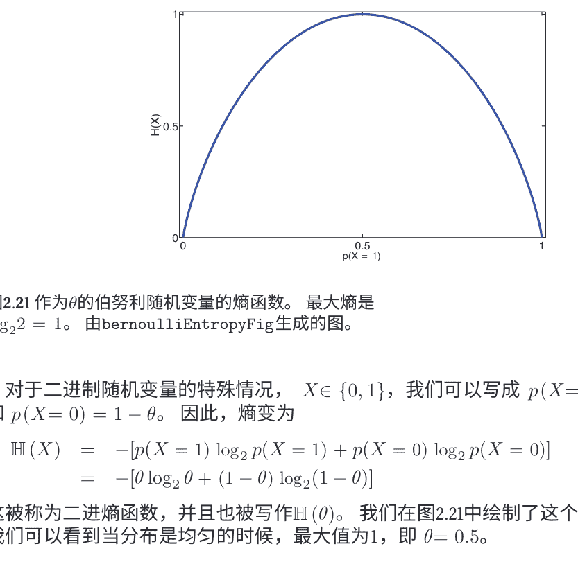

对于二进制随机变量的特殊情况，$X \in \{0,1\}$，我们可以写成 $p(X=1)=\theta$ 和 $p(X=0)=1-\theta$。因此，熵变为
$$
\begin{aligned}
\mathrm{H}(X) & = -[p(X=1) \log _{2} p(X=1)+p(X=0) \log _{2} p(X=0)] \\
& = -[\theta \log _{2} \theta+(1-\theta) \log _{2}(1-\theta)]
\end{aligned}
$$
这被称为二进熵函数，并且也被写作$\mathrm{H}(\theta)$。我们在图2.21中绘制了这个。我们可以看到当分布是均匀的时候，最大值为1，即 $\theta= 0.5$。

### 2.8.2 KL散度

衡量两个概率分布 $p$ 和 $q$ 之间差异的一种方法被称为Kullback-Leibler散度（KL散度）或相对熵。它的定义如下：

$$\mathrm{KL}(p||q) \triangleq \sum_{k=1}^{K} p_{k} \log \frac{p_{k}}{q_{k}}$$

对于概率密度函数，求和被积分所取代。我们可以将其重写为

$$\mathrm{KL}(p||q) = \sum_{k} p_{k} \log p_{k} - \sum_{k} p_{k} \log q_{k} = -\mathrm{H}(p) + \mathrm{H}(p, q)$$

其中 $\mathrm{H}(p, q)$ 被称为 **交叉熵**，

$$\mathrm{H}(p, q) \triangleq -\sum_{k} p_{k} \log q_{k}$$

可以证明(Cover and Thomas 2006)交叉熵是平均比特数需要对来自分布为 $p$ 的数据进行编码时，使用模型 $q$ 时定义我们的码本。因此，“常规”熵 $H(p) = H(p, p)$，在第2.8.1节中定义，是如果我们使用真实模型，所需的平均比特数，因此KL散度是这两者之间的差异。换句话说，KL散度是编码数据所需的平均额外比特数由于我们使用分布 $q$ 来编码数据而不是真实分布 $p$。

“额外的比特数”解释应该清楚地表明 $\text{KL}(p\|q) \geq 0$，并且只有当 $q = p$ 时，KL才等于零。我们现在给出这个重要结果的证明。

#### 定理 2.8.1. （信息不等式）$\text{KL}(p\|q) \geq 0$，当且仅当 $p = q$ 时等号成立。

证明。为了证明定理，我们需要使用Jensen不等式。这表明，对于任何凸函数 $f$，我们有

$f\left(\sum_{i=1}^{n} \lambda_i \mathbf{x}_i\right) \leq \sum_{i=1}^{n} \lambda_i f(\mathbf{x}_i)$  (2.113)

这对于 $n=2$（根据凸性的定义）显然成立，并且对于 $n>2$ 可以通过归纳法证明。

现在让我们根据（Cover和Thomas 2006, p28）的方法证明主要定理。令 $A = \{x : p(x) > 0\}$ 为 $p(x)$ 的支持。那么

$-\text{KL}(p\|q) = -\sum_{x \in A} p(x) \log \frac{p(x)}{q(x)} = \sum_{x \in A} p(x) \log \frac{q(x)}{p(x)}$ (2.114)
$\leq \log \sum_{x \in A} p(x) \frac{q(x)}{p(x)} = \log \sum_{x \in A} q(x)$ (2.115)
$\leq \log \sum_{x \in \mathcal{X}} q(x) = \log 1 = 0$ (2.116)

根据Jensen不等式，第一个不等式成立。由于 $\log(x)$ 是一个严格凹函数，我们在方程2.115中取等号当且仅当 $p(x) = c q(x)$ 对于某个 $c$。我们在方程2.116中取等号当且仅当 $\sum_{x \in A} q(x) = \sum_{x \in \mathcal{X}} q(x) = 1$ 时，我们有 $c=1$。因此 $\text{KL}(p\|q) = 0$ 当且仅当 $p(x) = q(x)$ 对于所有的 $x$。

这个结果的一个重要后果是，具有最大熵的离散分布是均匀分布。更准确地说，$H(X) \leq \log |\mathcal{X}|$，其中 $|\mathcal{X}|$ 是 $X$ 的状态数，当且仅当 $p(x)$ 是均匀分布时等号成立。为了看到这一点，让 $u(x) = 1/|\mathcal{X}|$。然后

$0 \leq \text{KL}(p\|u) = \sum_{x} p(x) \log \frac{p(x)}{u(x)}$ (2.117)
$= \sum_{x} p(x) \log p(x) - \sum_{x} p(x) \log u(x) = -\mathbb{H}(X) + \log |\mathcal{X}|$ (2.118)

这是拉普拉斯的不确定性原理的一个表述，它主张在没有其他理由支持一个分布优于另一个分布时使用均匀分布。请参阅第9.2.6节，了解如何创建满足特定约束条件但尽可能少承诺的分布。（例如，高斯分布满足第一和第二矩约束，但在其他方面具有最大熵。）

### 2.8.3 互信息

考虑两个随机变量，X和Y。假设我们想知道了解一个变量对另一个变量的影响有多大。我们可以计算相关系数，但这仅适用于实值随机变量，并且此方法对依赖性的度量非常有限，正如我们在图2.12中所看到的。一种更一般的方法是确定联合分布 $p(X,Y)$ 与分解分布 $p(X)p(Y)$ 的相似程度。这被称为互信息或MI，并定义如下：

$\mathbb{I}(X;Y) \triangleq \mathbb{KL}(p(X,Y) \| p(X)p(Y)) = \sum_x \sum_y p(x,y) \log \frac{p(x,y)}{p(x)p(y)}$ (2.119)

我们有 $\mathbb{I}(X;Y) \geq 0$，当且仅当 $p(X,Y) = p(X)p(Y)$。也就是说，当变量独立时，互信息为零。

为了理解互信息的含义，将其重新表达为联合熵和条件熵会有所帮助。可以证明（练习2.12），上述表达式等价于以下表达式：

$\mathbb{I}(X;Y) = \mathbb{H}(X) - \mathbb{H}(X|Y) = \mathbb{H}(Y) - \mathbb{H}(Y|X)$ (2.120)

其中 $\mathbb{H}(Y|X)$ 是条件熵，定义为 $\mathbb{H}(Y|X) = \sum_x p(x) \mathbb{H}(Y|X = x)$。

因此，我们可以将 X 和 Y 之间的互信息解释为观察 Y 后对 X 的不确定性减少，或者根据对称性，观察 X 后对 Y 的不确定性减少。我们将在本书的后面遇到互信息的几个应用。

另请参阅练习2.13和2.14，了解互信息和相关系数之间的联系。

与互信息密切相关的量是点对点互信息或PMI。对于两个事件（而不是随机变量）x 和 y，它的定义如下

$\mathrm{PMI}(x, y) \triangleq \log \frac{p(x,y)}{p(x)p(y)} = \log \frac{p(x|y)}{p(x)} = \log \frac{p(y|x)}{p(y)}$ (2.121)

这衡量了这些事件一起发生与按照机会预期的差异。显然，X 和 Y 的互信息只是PMI的期望值。

有趣的是，我们可以将PMI重写如下：

$\mathrm{PMI}(x, y) = \log \frac{p(x|y)}{p(x)} = \log \frac{p(y|x)}{p(y)}$ (2.122)

这是我们将从更新先验概率 $p(x)$ 到后验概率 $p(x|y)$ 所学到的知识量，或者等价地，从更新先验概率 $p(y)$ 到后验概率 $p(y|x)$ 所学到的知识量。

#### 2.8.3.1 连续随机变量的互信息 *

上述互信息公式适用于离散随机变量。对于连续随机变量，通常会先将其离散化或量化，通过将每个变量的取值范围划分为区间，并计算落入每个直方图区间的值的数量来实现（Scott 1979）。然后，我们可以使用上述公式轻松计算互信息（请参见mutualInfoAllPairsMixed的代码和miMixedDemo的演示）。

不幸的是，使用的区间数量和区间边界的位置可能会对结果产生显著影响。解决这个问题的一种方法是尝试直接估计互信息。

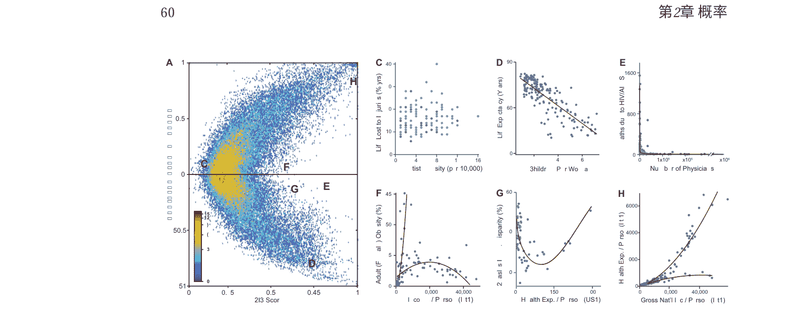

在进行密度估计之前，不进行密度估计（Learned-Miller 2004）。另一种方法是尝试许多不同的箱体大小和位置，并计算达到的最大互信息。这个统计量经过适当的归一化后，被称为最大信息系数（MIC）（Reshef et al. 2011）。更准确地说，定义

$$ m(x, y) = \frac{\max_{G \in \mathcal{G}(x,y)} I(X(G); Y(G))}{\log \min(x, y)} \tag{2.123} $$

其中 $\mathcal{G}(x,y)$ 是大小为 $x \times y$ 的2D网格集合，而 $X(G), Y(G)$ 表示将变量离散化到该网格上。（通过动态规划（Reshef等人，2011年）可以高效地执行对bin位置的最大化）。现在将MIC定义为MIC $\triangleq$ max

$$ \underset{x,y: xy<B}{m(x,y)} \tag{2.124} $$

其中 $B$ 是一些与样本大小相关的限制，表示我们可以使用的bin数量的上限，并且仍然能够可靠地估计分布（Reshef等人，2011年）建议 $B = N^{0.6}$。可以证明MIC在范围 [0,1] 内，其中0表示变量之间没有关系，1表示任何形式的无噪声关系，而不仅仅是线性关系。

图2.22展示了这个统计量的一个例子。数据包含357个变量，测量了各种社会、经济、健康和政治指标，由世界卫生组织（WHO）收集。在图的左侧，我们看到所有63,566个变量对的相关系数（CC）与MIC的关系。在图的右侧，我们看到特定变量对的散点图，现在我们来讨论一下：

-   标记为C的点具有较低的CC和MIC。相应的散点图表明很明显，这两个变量（生命损失百分比和人口中牙医的密度）之间没有关系。
-   标记为D和H的点具有较高的CC（绝对值）和MIC，因为它们代表几乎线性的关系。
-   标记为E、F和G的点具有较低的CC但较高的MIC。这是因为它们对应着变量之间的非线性关系（有时，如E和F的情况，是非功能性的，即一对多的关系）。

总结一下，我们可以看到基于互信息的统计学（如MIC）可以用来发现变量之间的有趣关系，而简单的测量方法（如相关系数）则不能。因此，MIC被称为“21世纪的相关性”（Speed 2011）。

## 练习

### 练习2.1 概率对于生成答案的问题形式非常敏感

（来源：Minka）我的邻居有两个孩子。假设孩子的性别像抛硬币一样随机，先验概率上，我的邻居有一个男孩和一个女孩的概率最高，为1/2。其他可能性——两个男孩或两个女孩——的概率分别为1/4和1/4。

-   a. 假设我问他是否有男孩，他回答是。那么一个孩子是女孩的概率是多少？
-   b. 相反，假设我碰巧看到他的一个孩子跑过，而且是个男孩。那么另一个孩子是女孩的概率是多少？

### 练习2.2 法律推理

（来源：彼得·李）假设发生了一起犯罪。在现场发现了血迹，没有无辜的解释。这是一种在人口中占1%的类型。

-   a. 检察官声称：“如果被告无辜，他有1%的机会拥有犯罪血型。”因此，他有99%的机会是有罪的。”这被称为检察官的谬误。这个论点有什么问题？
-   b. 辩护人声称：“犯罪发生在一个有80万人口的城市。大约有8000人会有这种血型。”证据只提供了1/8000的概率，证明被告有罪，因此没有相关性。”这被称为辩护人的谬误。这个论点有什么问题？

### 练习2.3 和的方差

证明和的方差是var [X + Y] = var [X] + var [Y] + 2cov [X, Y],其中cov [X, Y]是X和Y之间的协方差

### 练习2.4 医学诊断的贝叶斯规则

（来源：Koller。）在你每年的体检后，医生有好消息和坏消息。坏消息是你的检测结果显示你患有一种严重疾病，而且这个测试的准确率为99%（即，如果你患有这种疾病，测试结果为阳性的概率为0.99，如果你没有这种疾病，测试结果为阴性的概率也为0.99）。好消息是这是一种罕见的疾病，只有一万分之一的人会患上。你真正患上这种疾病的几率是多少？（展示你的计算过程以及最终结果。）

## 练习2.5 蒙提霍尔问题

（来源：麦凯） 在一个游戏节目中，参赛者被告知规则如下：

有三扇门，标有1、2、3。其中一扇门后面藏有一个奖品。你可以选择一扇门。最初你选择的门不会被打开。相反，游戏节目主持人会打开另外两扇门中的一扇，并且以一种不透露奖品的方式打开。例如，如果你首先选择了门1，他会打开门2和门3中的一扇，保证不会透露奖品。

此时，你将被给予一个新的选择：你可以坚持你的第一次选择，或者你可以换到另一扇关闭的门。然后所有的门将被打开，你将得到你最终选择的门后面的奖品。

假设参赛者首先选择门1；然后游戏节目主持人打开门3，展示出门后面没有东西，如承诺的那样。参赛者应该 (a) 坚持选择门1，还是 (b) 换到门2，或者 (c) 没有任何区别？你可以假设最初，奖品在3个门后面的概率是相等的。提示：使用贝叶斯定理。

## 练习2.6 条件独立性

（来源：Koller）

a. 让 $H \in \{1, . . . , K\}$ 是一个离散随机变量，让 $e_1$ 和 $e_2$ 是另外两个随机变量 $E_1$ 和 $E_2$ 的观测值。假设我们希望计算向量

$\vec{P}(H|e_1, e_2) = (P(H = 1|e_1, e_2), . . . , P(H = K|e_1, e_2))$

以下哪组数字足以进行计算？
- i. $P(e_1, e_2), P(H), P(e_1|H), P(e_2|H)$
- ii. $P(e_1, e_2), P(H), P(e_1, e_2|H)$
- iii. $P(e_1|H), P(e_2|H), P(H)$

b. 现在假设我们假设 $E_1 \perp E_2|H$ （即，$E_1$ 和 $E_2$ 在给定 $H$ 的条件下是独立的）。现在哪组数字足够了？

展示你的计算结果。提示：使用贝叶斯定理。

## 练习2.7 成对独立并不意味着互相独立

如果两个随机变量成对独立，则我们称它们为成对独立

$p(X_2|X_1) = p(X_2)$ （2.125）

因此

$p(X_2, X_1) = p(X_1)p(X_2|X_1) = p(X_1)p(X_2)$ （2.126）

如果随机变量彼此独立，则我们称它们为互相独立

$p(X_i|X_S) = p(X_i) \quad \forall S \subseteq \{1, . . . , n\} \setminus \{i\}$ （2.127）

因此

$p(X_{1:n}) = \prod_{i=1}^{n} p(X_i)$ （2.128）

证明所有变量之间的成对独立并不一定意味着互相独立。只需举一个反例即可。

## 2.8. 信息论

## 练习2.8 条件独立当且仅当联合分解

在文本中，我们说 $X \perp Y \mid Z$ 当且仅当

$$p(x, y \mid z) = p(x \mid z) p(y \mid z)$$

对于所有的 $x, y, z$，使得 $p(z) > 0$。现在证明以下备选定义：$X \perp Y \mid Z$ 当且仅当存在函数 $g$ 和 $h$，使得 $p(x, y \mid z) = g(x, z) h(y, z)$

对于所有的 $x, y, z$，使得 $p(z) > 0$。

## 练习2.9 条件独立性

（来源：Koller） 以下属性是否成立？证明或反驳。请注意，我们不限制关注可以由图模型表示的分布。
- a. 真或假? $(X \perp Y \mid Z) \wedge (X \perp Y \mid W) \Rightarrow (X \perp Y \mid Z, W)$

## 练习2.10 推导逆伽玛密度

设 $X \sim \mathrm{Ga}(a, b)$，即

$$\mathrm{Ga}(x \mid a, b) = \frac{b^{a}}{\Gamma(a)} x^{a-1} e^{-xb}$$

设 $Y = 1/X$。证明 $Y \sim \mathrm{IG}(a, b)$，即

$$\mathrm{IG}(x \mid \mathrm{shape}=a, \mathrm{scale}=b) = \frac{b^{a}}{\Gamma(a)} x^{-(a+1)} e^{-b / x}$$

提示：使用变量变换公式。

## 练习2.11 一维高斯分布的归一化常数

零均值高斯分布的归一化常数为

$$Z = \int_{-\infty}^{b} \exp \left(-\frac{x^{2}}{2 \sigma^{2}}\right) dx$$

为了计算这个值，考虑它的平方

$$Z^{2} = \int_{-\infty}^{b} \int_{-\infty}^{b} \exp \left(-\frac{x^{2}+y^{2}}{2 \sigma^{2}}\right) dxdy$$

让我们从笛卡尔坐标 $(x, y)$转换到极坐标 $(r, \theta)$，使用 $x = r \cos \theta$ 和 $y = r \sin \theta$。由于 $dxdy = r dr d\theta$，且 $\cos^{2} \theta + \sin^{2} \theta = 1$，我们有

$$Z^{2} = \int_{0}^{2 \pi} \int_{0}^{\infty} r \exp \left(-\frac{r^{2}}{2 \sigma^{2}}\right) dr d\theta$$

计算这个积分，然后显示 $Z = \sigma \sqrt{(2 \pi)}$。提示1：将积分分解为两个项的乘积，第一个项（涉及 $d\theta$）是常数，所以很容易。提示2：如果 $u = e^{-r^{2} / 2 \sigma^{2}}$，那么 $du / dr = -\frac{1}{\sigma^{2}} r e^{-r^{2} / 2 \sigma^{2}}$，所以第二个积分也很容易（因为 $\int u'(r) dr = u(r)$）。

## 练习2.12 用熵的术语表示互信息

证明

$$I(X, Y) = H(X) - H(X|Y) = H(Y) - H(Y|X) \tag{2.136}$$

## 练习2.13 相关正态分布的互信息

（来源： (Cover和Thomas 1991, Q9.3)。） 找到互信息 $I(X_1, X_2)$，其中 $\mathbf{X}$ 具有二元正态分布：

$$\begin{pmatrix} X_1 \\ X_2 \end{pmatrix} \sim \mathcal{N}\left(\mathbf{0}, \begin{pmatrix} \sigma^2 & \rho\sigma^2 \\ \rho\sigma^2 & \sigma^2 \end{pmatrix}\right) \tag{2.137}$$

评估 $\rho=1$, $\rho=0$ 和 $\rho=-1$ 时的 $I(X_1, X_2)$ 并评论。提示： (微分) 高斯分布的熵是

$$h(\mathbf{X}) = \frac{1}{2} \log_2 [(2\pi e)^d \det \Sigma] \tag{2.138}$$

在1d情况下，这变成了

$$h(X) = \frac{1}{2} \log_2 [2\pi e \sigma^2] \tag{2.139}$$

提示： $\log(0) = \infty$。

## 练习2.14 相关性的度量（归一化互信息）

（来源： (Cover和Thomas 1991, Q2.20)。） 让 $X$ 和 $Y$ 是离散随机变量，它们是相同分布的 (所以 $H(X)=H(Y)$)，但不一定是独立的。定义

$$r = 1 - \frac{H(Y|X)}{H(X)} \tag{2.140}$$

- a. 证明 $r = \frac{I(X,Y)}{H(X)}$
- b. 证明 $0 \leq r \leq 1$
- c. 什么时候 $r = 0$?
- d. 什么时候 $r = 1$?

## 练习2.15 MLE将KL散度最小化到经验分布

假设 $p_{\text{emp}}(x)$ 是经验分布，$q(x|\theta)$ 是某个模型。证明 $\arg\min_q \text{KL} (p_{\text{emp}}||q)$ 是通过 $q(x) = q(x; \hat{\theta})$ 获得的，其中 $\hat{\theta}$ 是MLE。提示：使用KL散度的非负性。

## 练习2.16 Beta分布的均值、众数和方差

假设 $\theta \sim \text{Beta}(a, b)$。推导出均值、众数和方差。

## 练习2.17 最小值的期望值

假设 $X$，$Y$ 是从区间 $[0, 1]$ 中独立均匀采样的两个点。
最左边点的期望位置是多少？

## 3 离散数据的生成模型

### 3.1 引言

在第2.2.3.2节中，我们讨论了如何通过将贝叶斯规则应用于形式为的生成分类器来对特征向量 $\mathbf{x}$ 进行分类

$$p(y = c|\mathbf{x}, \boldsymbol{\theta}) \propto p(\mathbf{x}|y = c, \boldsymbol{\theta})p(y = c|\boldsymbol{\theta})$$

使用这种模型的关键是为类条件密度 $p(\mathbf{x}|y = c, \boldsymbol{\theta})$ 指定合适的形式，这定义了我们在每个类中期望看到的数据类型。 在本章中，我们重点讨论观测数据为离散符号的情况。我们还讨论了如何推断这些模型的未知参数 $\boldsymbol{\theta}$。

### 3.2 贝叶斯概念学习

考虑一个孩子如何学习理解一个词的意义，比如“狗”。 可以想象，孩子的父母会给出这个概念的正面例子，比如说“看那只可爱的狗！”或者“小心狗狗”，等等。然而，他们很少会提供负面例子，比如说“看那个不是狗的东西”。 当然，在积极学习的过程中，可能会得到负面例子——孩子说“看那只狗”，父母说“亲爱的，那是只猫，不是狗”——但是心理学研究表明，人们可以仅通过正面例子学习概念（Xu和Tenenbaum，2007年）。

我们可以将学习一个词的意义视为等同于概念学习，而概念学习又等同于二元分类。为了理解这一点，定义函数 $f(\mathbf{x}) = 1$，如果 $\mathbf{x}$ 是概念 $C$ 的一个例子，否则 $f(\mathbf{x}) = 0$。 那么目标就是学习指示函数 $f$，它仅仅定义了哪些元素属于集合 $C$。 通过对 $f$ 的定义或者等价地对 $C$ 的元素的不确定性进行建模，我们可以模拟模糊集合理论，但是使用标准的概率计算。 需要注意的是，标准的二元分类技术需要正面和负面例子。 相比之下，我们将设计一种只从正面例子中学习的方法。

出于教学目的，我们将考虑一个非常简单的概念学习示例，称为数字游戏，基于Josh Tenenbaum的博士论文的一部分（Tenenbaum 1999）。 游戏进行如下。 我选择一些简单的算术概念 $C$，例如“质数”或“1到10之间的数字”。 然后，我给你一系列随机选择的正例 $D = \{x_1, ..., x_N\}$ 从 $C$ 中抽取，并询问你某个新的测试案例 $\tilde{x}$ 是否属于 $C$，即我要求你对 $\tilde{x}$ 进行分类。

为了简单起见，假设所有数字都是1到100之间的整数。现在假设我告诉你“16”是这个概念的一个正例。你认为哪些其他数字是正例？17？6？32？99？只有一个例子很难判断，所以你的预测会相当模糊。假设与16在某种意义上相似的数字更有可能。但是相似的方式是什么？17是相似的，因为它“靠近”，6是相似的，因为它有一个共同的数字，32是相似的，因为它也是偶数和2的幂，但是99似乎不相似。因此，某些数字比其他数字更有可能。我们可以将此表示为概率分布，$p(\tilde{x}|D)$，即给定数据 $D$ 的情况下，$\tilde{x} \in C$ 的概率，其中 $\tilde{x} \in \{1,..., 100\}$。这被称为后验预测分布。图3.1（顶部）显示了从实验室实验中得出的人们的预测分布。我们看到人们在各种相似性方面预测与16相似的数字。

现在假设我告诉你8、2和64也是正例。现在你可能猜到了隐藏的概念是“二的幂次”。这是归纳的一个例子。在给定这个假设的情况下，预测分布非常具体，并且将大部分质量放在2的幂次上，如图3.1（第三行）所示。如果我告诉你数据是 $D = \{16, 23, 19, 20\}$，你会得到一种不同类型的泛化梯度，如图3.1（底部）所示。

我们如何解释这种行为并在机器中模拟它？归纳的经典方法是假设我们有一个概念的假设空间 $\mathcal{H}$，例如：奇数、偶数、1到100之间的所有数字、二的幂次、以 $j$ 结尾的所有数字（对于 $0 \le j \le 9$），等等。与数据 $D$ 一致的 $\mathcal{H}$ 的子集被称为版本空间。随着我们看到更多的例子，版本空间会缩小，我们对概念越来越确定 (Mitchell 1997)。

然而，版本空间并不是全部的故事。 在看到 $D = \{16\}$ 之后，有许多一致的规则；你如何组合它们来预测是否 $\tilde{x} \in C$？ 此外，在看到 $D =\{16,8,2,64\}$ 之后，为什么选择“二的幂”规则而不是“所有偶数”或者“除了32之外的二的幂”，这两者与证据同样一致？ 我们现在将为此提供一个贝叶斯解释。

#### 3.2.1 似然度

我们必须解释为什么我们选择了 $h_{\text{two}} \triangleq$ “二的幂”，而不是 $h_{\text{even}} \triangleq$ “偶数”，在看到 $D = \{16,8,2,64\}$ 的证据后，这两个假设都与证据一致。
关键的直觉是我们想要避免可疑的巧合。 如果真正的概念是偶数，那么为什么我们只看到恰好是二的幂的数字？

为了形式化这一点，让我们假设示例是从一个概念的扩展中均匀随机采样的。（概念的扩展只是属于它的数字集合，例如，$h_{\text{even}}$ 的扩展是 $\{2,4,6,…,98,100\}$；“以9结尾的数字”的扩展是 $\{9,19,…,99\}$。） Tenenbaum将此称为强采样假设。在这个假设下，从 $h$ 独立采样 $N$ 个项目（有放回地）的概率是给定的

$$p(D|h) = \left[ \frac{1}{\text{size}(h)} \right]^N = \left[ \frac{1}{|h|} \right]^N \quad \text{(3.2)}$$

这个关键方程体现了Tenenbaum所称的size principle，即模型偏好与数据一致的最简单（最小）假设。这更常被称为Occam's razor。

为了看到它是如何工作的，让 $D = \{16\}$。然后 $p(D|h_{\text{two}}) = 1/6$，因为小于100的2的幂次只有6个，但是 $p(D|h_{\text{even}}) = 1/50$，因为有50个偶数。所以 $h = h_{\text{two}}$ 的可能性比 $h = h_{\text{even}}$ 的可能性更高。经过4个例子，$h_{\text{two}}$ 的可能性是 $(1/6)^4 = 7.7 \times 10^{-4}$，而 $h_{\text{even}}$ 的可能性是 $(1/50)^4 = 1.6 \times 10^{-7}$。这是一个几乎5000:1的likelihood ratio，有利于 $h_{\text{two}}$。这量化了我们之前的直觉，即如果由 $h_{\text{even}}$ 生成，$D = \{16,8,2,64\}$ 将是一个非常可疑的巧合。

#### 3.2.2 先验

给定这些数据，概念 $h'$ = “除了32之外的2的幂次方” 比 $h$ = “2的幂次方” 更有可能，因为 $h'$ 不需要解释32在示例集中缺失的巧合。

然而，假设 $h'$ = “除了32之外的2的幂次方” 似乎“概念上不自然”。我们可以通过给不自然的概念分配较低的先验概率来捕捉这种直觉。当然，你的先验可能与我的不同。贝叶斯推理的这种主观方面引起了很多争议，因为它意味着，例如，一个孩子和一个数学教授可能有不同的先验，因此可能会得出不同的结论，即使看到相同的数据。

#### 3.2.3 后验

后验就是似然乘以先验，再进行归一化。在这个上下文中，我们有

$$p(h|\mathcal{D}) = \frac{p(\mathcal{D}|h)p(h)}{\sum_{h' \in \mathcal{H}} p(\mathcal{D}, h')} = \frac{p(h)I(\mathcal{D} \in h)/|h|^N}{\sum_{h' \in \mathcal{H}} p(h')I(\mathcal{D} \in h')/|h'|^N} \quad (3.3)$$

其中 $I(\mathcal{D} \in h)$ 为1当且仅当所有数据都在假设 $h$ 的范围内。图3.2绘制了在观察到 $\mathcal{D} = \{1,6\}$ 后的先验、似然和后验。我们可以看到后验是先验和似然的组合。对于大多数概念，先验是均匀的，因此后验与似然成比例。然而，“不自然”的概念“2的幂加37”和“2的幂，除了32”具有较低的后验支持，尽管具有较高的似然，这是由于较低的先验。相反，奇数的概念具有较低的后验支持，尽管具有较高的先验，这是由于较低的似然。

图3.3绘制了先验、似然和后验在观察到 $\mathcal{D} = \{16, 8, 2, 64\}$ 后的情况。现在似然更加集中在二的幂概念上，因此它在后验中占主导地位。本质上，学习者有了一个 aha时刻，并找出了真正的概念。（在这里，我们看到对于不自然的概念需要低先验，否则我们会过度拟合数据并选择“除了32之外的2的幂”。）

一般来说，当我们有足够的数据时，后验 $p(h|\mathcal{D})$ 会集中在一个单一的概念上，即MAP估计，即

$$p(h|\mathcal{D}) \rightarrow \delta_{\hat{h}^{MAP}}(h) \quad (3.4)$$

其中 $\hat{h}^{MAP} = \text{argmax}_h p(h|\mathcal{D})$ 是后验模式，而 $\delta$ 是Dirac测度，定义如下

$$\delta_{x}(A) = \begin{cases} 1 & \text{if } x \in A \\ 0 & \text{if } x \notin A \end{cases} \quad (3.5)$$

请注意，MAP估计可以写成

$$\hat{h}^{MAP} = \arg\max_{h} p(\mathcal{D}|h)p(h) = \arg\max_{h} [\log p(\mathcal{D}|h) + \log p(h)] \quad (3.6)$$

由于似然项在 $N$ 上呈指数增长，而先验项保持不变，随着我们获得越来越多的数据，MAP估计会收敛到最大似然估计或MLE：

$$\hat{h}^{mle} \triangleq \arg\max_{h} p(\mathcal{D}|h) = \arg\max_{h} \log p(\mathcal{D}|h) \quad (3.7)$$

换句话说，如果我们有足够的数据，我们会发现数据压倒了先验。在这种情况下，MAP估计收敛到MLE。
如果真实假设在假设空间中，那么MAP/ ML估计将收敛到这个假设。因此，我们说贝叶斯推断（和ML估计）是一致的估计器（详见第6.4.1节）。我们还说假设空间在极限中是可识别的，意味着我们可以在无限数据的极限中恢复真相。如果我们的假设类别不足以表示“真相”（通常情况是如此），我们将收敛于尽可能接近真相的假设。然而，形式化这种“接近”的概念超出了本章的范围。

图3.4 观察到一个示例后的假设后验和相应的预测分布，$\mathcal{D} = \{16\}$。一个点表示这个数字与这个假设一致。右侧的图表$p(h|\mathcal{D})$表示给予假设$h$的权重。通过对点的加权求和，我们得到$p(\tilde{x} \in C| \mathcal{D})$（顶部）。基于(Tenenbaum 1999)的图2.9。由NumbersGame生成的图。

## 3.2.4 后验预测分布

后验是我们对世界的内部信念状态。测试我们的信念是否合理的方法是使用它们来预测客观可观测的量（这是科学方法的基础）。具体而言，在这种情况下，后验预测分布由以下给出：

$p(\tilde{x} \in C|\mathcal{D}) = \sum_{h} p(y = 1|\tilde{x}, h)p(h|\mathcal{D}) \quad (3.8)$

这只是每个个体假设的预测的加权平均，并称为贝叶斯模型平均(Hoeting et al. 1999)。这在图3.4中有所说明。底部的点显示了每个假设的预测；右侧的垂直曲线显示了每个假设的权重。如果我们将每行乘以其权重并相加，我们将得到顶部的分布。

当我们有一个小的和/或模糊的数据集时，后验概率 $p(h|\mathcal{D})$是模糊的，这导致了一个广泛的预测分布。然而，一旦我们“弄清楚真相”，后验概率就变成了以MAP估计为中心的delta函数。在这种情况下，预测分布变成：

$p(\tilde{x} \in C|\mathcal{D}) = \sum_h p(\tilde{x}|h) \delta_{\hat{h}}(h) = p(\tilde{x}|\hat{h}) \quad (3.9)$

这被称为对预测密度的插值近似，由于其简单性而被广泛使用。然而，一般来说，这样会低估我们的不确定性，我们的预测不会像使用BMA时那样平滑。我们将在本书中看到更多这方面的例子。虽然MAP学习很简单，但它无法解释从基于相似性的推理（具有不确定的后验概率）到基于规则的推理（具有确定的后验概率）的逐渐转变。例如，假设我们观察到 $\mathcal{D} = \{16\}$。如果我们使用上述简单的先验，最小一致假设是“所有4的幂”，所以只有4和16有非零的被预测的概率。这当然是过拟合的一个例子。给定 $\mathcal{D} = \{16, 8, 2, 64\}$，MAP假设是“所有2的幂”。因此，随着我们看到更多的数据，插值预测分布变得更宽（或保持不变）：它开始很窄，但随着看到更多数据而被迫变宽。相比之下，贝叶斯方法从宽开始，然后随着学习更多而变窄，这更符合直觉。特别是，给定 $\mathcal{D} = \{16\}$，有许多具有非零后验支持的假设，因此预测分布是广泛的。然而，当我们看到 $\mathcal{D} = \{16, 8, 2, 64\}$ 时，后验将其质量集中在一个假设上，因此预测分布变窄。因此，在小样本区域内，插值方法和贝叶斯方法的预测是非常不同的，尽管随着我们看到更多的数据，它们会收敛到相同的答案。

### 3.2.5 一个更复杂的先验

为了模拟人类行为，Tenenbaum使用了一个稍微复杂一些的先验，该先验是通过分析一些关于人们如何衡量数字之间相似性的实验数据得出的；详见（Tenenbaum 1999，第208页）。结果是一组类似于上述提到的算术概念，以及所有1≤n，m≤100之间的区间。（注意，这些假设不是互斥的。）因此，先验是两个先验的混合，一个是关于算术规则的，另一个是关于区间的：

$p(h) = \pi_0 p_{\text{rules}}(h) + (1-\pi_0) p_{\text{interval}}(h)$

模型中唯一的自由参数是相对权重$\pi_0$，用于这两部分先验。结果对这个值不太敏感，只要$\pi_0 > 0.5$，反映了人们更有可能考虑由规则定义的概念。使用这个更大的假设空间，模型的预测分布如图3.5所示。它与人类的预测分布（图3.1）非常相似，尽管它没有根据人类数据进行拟合（除了假设空间的选择）。

### 3.3 贝塔二项式模型

这个数字游戏涉及到对一个从有限假设空间中抽取的离散变量的分布进行推断，给定一系列离散观察。这使得计算变得特别简单：我们只需要求和、相乘和相除。然而，在许多应用中，未知参数是连续的，因此假设空间是 $\mathbb{R}^K$ 的（某个子集）。$K$是参数的数量。这使得数学变得复杂，因为我们必须用积分替换求和。然而，基本思想是相同的。 我们将通过考虑推断硬币投掷结果为正面的概率的问题来说明这一点。尽管这可能看起来微不足道，但事实证明，这个模型是我们稍后将考虑的许多方法的基础，包括朴素贝叶斯分类器、马尔可夫模型等。从历史上看，这是非常重要的，因为它是贝叶斯在1763年的原始论文中分析的例子。（贝叶斯的分析随后由皮埃尔-西蒙·拉普拉斯推广，形成了我们现在所称的“贝叶斯规则”——参见（Stigler 1986）了解更多历史细节。） 我们将按照我们现在熟悉的步骤，指定似然和先验，并推导出后验和后验预测。

#### 3.3.1 似然

假设 $X_i \sim \text{Ber}(\theta)$，其中 $X_i = 1$ 表示“正面”， $X_i = 0$ 表示“反面”，而 $\theta \in [0, 1]$ 是速率参数（正面的概率）。 如果数据是独立同分布的，似然函数的形式为

$p(D|\theta) = \theta^{N_1}(1 - \theta)^{N_0}$

其中，我们有 $N_1 = \sum_{i=1}^{N} I(x_i = 1)$ 为正面和 $N_0 = \sum_{i=1}^{N} I(x_i = 0)$ 为反面。这两个计数被称为数据的充分统计量，因为这是我们为 $D$ 需要了解的全部内容，从而推断 $\theta$。（另一组充分统计量是 $N_1$ 和 $N = N_0 + N_1$。）更正式地说，我们说 $D$ 的充分统计量 $S(D)$ 是数据 $D$ 的充分统计量，如果 $p(\theta|D) = p(\theta|S(D))$。如果我们使用均匀先验，这等价于说 $p(D|\theta) \propto p(S(D)|\theta)$。因此，如果我们有两个具有相同充分统计量的数据集，我们将推断出相同的 $\theta$ 值。现在假设数据由固定次数的试验中观察到的头部数量的计数 $N_1$ 组成，其中 $N = N_1 + N_0$。在这种情况下，我们有 $N_1 \sim \text{Bin}(N, \theta)$，其中 $\text{Bin}$ 表示二项分布，其概率质量函数如下：

$\text{Bin}(k|n, \theta) = \binom{n}{k} \theta^k (1-\theta)^{n-k} \quad (3.12)$

由于 $\binom{n}{k}$ 是与 $\theta$ 无关的常数，二项抽样模型的似然函数与伯努利模型的似然函数相同。因此，我们对 $\theta$ 的任何推断都将是相同的，无论我们观察到计数 $D= (N_1, N)$，还是观察到一系列试验 $D = \{x_1, \ldots, x_N\}$。

#### 3.3.2 先验分布

我们需要一个在区间 $[0, 1]$ 上有支持的先验分布。为了简化数学计算，如果先验分布与似然函数具有相同的形式，即先验分布看起来像：

$p(\theta) \propto \theta^{\gamma_1} (1-\theta)^{\gamma_2} \quad (3.13)$

对于一些先验参数 $\gamma_1$ 和 $\gamma_2$。如果是这种情况，那么我们可以通过简单地相加指数来评估后验概率：

$p(\theta|D) \propto p(D|\theta)p(\theta) = \theta^{N_1} (1-\theta)^{N_0} \theta^{\gamma_1} (1-\theta)^{\gamma_2} = \theta^{N_1+\gamma_1} (1-\theta)^{N_0+\gamma_2} \quad (3.14)$

当先验概率和后验概率具有相同的形式时，我们称先验概率是相应似然函数的共轭先验。共轭先验被广泛使用，因为它们简化了计算，并且易于解释，如下所示。

对于伯努利分布，共轭先验是贝塔分布，在第2.4.5节中我们遇到过：

$\text{Beta}(\theta|a, b) \propto \theta^{a-1} (1-\theta)^{b-1} \quad (3.15)$

先验的参数被称为超参数。我们可以设置它们来编码我们的先验信念。例如，为了编码我们对$\theta$的均值为0.7和标准差为0.2的信念，我们设置 $a = 2.975$ 和 $b = 1.275$ (练习3.15)。或者为了编码我们对$\theta$的均值 0.15 并且我们认为它在区间 (0.05, 0.30) 的概率是，然后我们找到 $a = 4.5$ 和 $b = 25.5$ (练习3.16)。如果我们对 $\theta$ 一无所知，除了它在区间 $[0, 1]$ 内，我们可以使用均匀先验，这是一种无信息先验 (详见第5.4.2节)。均匀分布可以用参数为 $a = b = 1$ 的贝塔分布表示。

图3.6(a)使用具有足够统计量 $N_1 = 3, N_0 = 17$ 的二项似然更新贝塔(2,2)先验，得到贝塔(5,19)后验。(b)使用具有足够统计量 $N_1 = 11,N_0 = 13$的二项似然更新贝塔(5,2)先验，得到贝塔(16,15)后验。由二项式贝塔后验演示生成的图。

#### 3.3.3 后验

如果我们令似然性与贝塔先验相乘，我们得到以下后验（根据方程3.14）：

$p(\theta|\mathcal{D}) \propto \text{Bin}(N_1|\theta, N_0 + N_1)\text{Beta}(\theta|a, b) \propto \text{Beta}(\theta|N_1 + a, N_0 + b) \tag{3.16}$

特别地，后验是通过将先验超参数与经验计数相加得到的。因此，超参数被称为伪计数。先验的强度，也被称为先验的有效样本大小，是伪计数的总和，$a + b$；这起到类似于数据集大小$N_1 + N_0 = N$的作用。

图3.6(a)给出了一个例子，我们使用一个弱Beta(2,2)先验和一个尖峰似然函数进行更新，对应于一个大样本量；我们可以看到后验基本上与似然函数相同：因为数据压倒了先验。图3.6(b)给出了一个例子，我们使用一个强Beta(5,2)先验和一个尖峰似然函数进行更新；现在我们可以看到后验是先验和似然函数之间的“折中”。

请注意，顺序更新后验概率等同于一次性批量更新。为了看到这一点，假设我们有两个数据集 $\mathcal{D}_a$和 $\mathcal{D}_b$，具有足够的统计量 $N_1^a$，$N_0^a$和$N_1^b$，$N_0^b$。令 $N_1 = N_1^a + N_1^b$和 $N_0 = N_0^a + N_0^b$成为合并数据集的统计量。在批量模式下，我们有

$p(\theta|\mathcal{D}_a, \mathcal{D}_b) \propto \text{Bin}(N_1|\theta, N_1 + N_0)\text{Beta}(\theta|a, b) \propto \text{Beta}(\theta|N_1 + a, N_0 + b) \tag{3.17}$

在顺序模式下，我们有

$p(\theta|\mathcal{D}_a, \mathcal{D}_b) \propto p(\mathcal{D}_b|\theta)p(\theta|\mathcal{D}_a) \tag{3.18}$
$\propto \text{Bin}(N_1^b|\theta, N_1^b + N_0^b)\text{Beta}(\theta|N_1^a + a, N_0^a + b) \tag{3.19}$
$\propto \text{Beta}(\theta| N_1^a + N_1^b + a, N_0^a + N_0^b + b) \tag{3.20}$

这使得贝叶斯推断特别适用于在线学习，正如我们稍后将看到的。

#### 3.3.3.1 后验均值和众数

从方程2.62可以得出MAP估计值为

$\hat{\theta}_{MAP} = \frac{a + N_1 - 1}{a + b + N - 2} \quad (3.21)$

如果我们使用均匀先验，那么MAP估计值将简化为MLE，即头部的经验分数：

$\hat{\theta}_{MLE} = \frac{N_1}{N} \quad (3.22)$

这在直观上是有意义的，但也可以通过对方程3.11中的似然函数应用基本微积分来推导出来（练习3.1）。相比之下，后验均值为：

$\bar{\theta} = \frac{a + N_1}{a + b + N} \quad (3.23)$

这种模式和平均值之间的差异将在后面证明很重要。

我们将展示后验均值是先验均值和MLE的凸组合，这捕捉到了后验是我们先前所相信和数据告诉我们之间的妥协。

让 $\alpha_0 = a + b$ 成为先验的等效样本大小，它控制着先验的强度，让先验均值为 $m_1 = a / \alpha_0$。那么后验均值为

$\mathbb{E}[\theta|\mathcal{D}] = \frac{\alpha_0 m_1 + N_1}{N + \alpha_0} = \frac{\alpha_0}{N + \alpha_0} m_1 + \frac{N}{N + \alpha_0} \frac{N_1}{N} = \lambda m_1 + (1 - \lambda)\hat{\theta}_{MLE} \quad (3.24)$

其中 $\lambda = \frac{\alpha_0}{N + \alpha_0}$ 是先验与后验等效样本量的比率。因此，先验越弱，$\lambda$ 越小，因此后验均值越接近MLE。类似地，我们可以证明后验模式是先验模式和MLE的凸组合，并且它也收敛到MLE。

#### 3.3.3.2 后验方差

均值和模式是点估计，但了解我们可以信任它们的程度很有用。后验的方差是衡量这一点的一种方式。 Beta后验的方差由以下公式给出

$\text{var}[\theta|\mathcal{D}] = \frac{(a + N_1)(b + N_0)}{(a + N_1 + b + N_0)^2 (a + N_1 + b + N_0 + 1)} \quad (3.25)$

我们可以简化这个复杂的表达式，在情况下 $N \gg a, b$，得到

$\text{var}[\theta|\mathcal{D}] \approx \frac{\hat{\theta}(1 - \hat{\theta})}{N} \quad (3.26)$

其中 $\hat{\theta}$ 是MLE。因此我们估计的“误差栏”（即后验标准差）为

$\sigma = \sqrt{\text{var}[\theta|\mathcal{D}]} \approx \sqrt{\frac{\hat{\theta}(1 - \hat{\theta})}{N}} \quad (3.27)$

我们可以看到不确定性以 $1/\sqrt{N}$ 的速率下降。然而，请注意，当 $\hat{\theta} = 0.5$时，不确定性（方差）达到最大值，并且当 $\hat{\theta}$接近0或1时，不确定性达到最小值。这意味着确定一个硬币是否有偏差比确定它是否公平更容易。

#### 3.3.4 后验预测分布

到目前为正，我们一直关注未知参数的推断。 现在让我们转向对未来可观测数据的预测。

考虑在未来的单次试验中预测出现正面的概率，其服从 Beta(a, b)后验分布。 我们有

$p(\tilde{x} = 1|\mathcal{D}) = \int_{0}^{1} p(x = 1|\theta)p(\theta|\mathcal{D}) d\theta \tag{3.28}$

$= \int_{0}^{1} \theta \operatorname{Beta}(\theta|a, b) d\theta = \mathbb{E}[\theta|\mathcal{D}] = \frac{a}{a+b} \tag{3.29}$

因此，我们可以看到后验预测分布的均值等于（在这种情况下）将后验均值参数代入的结果： $p(\tilde{x}|\mathcal{D}) = \operatorname{Ber}(\tilde{x}|\mathbb{E}[\theta|\mathcal{D}])$。

##### 3.3.4.1 过拟合和黑天鹅悖论

相反，假设我们使用最大似然估计（MLE）代入，即我们使用 $p(\tilde{x}|\mathcal{D}) \approx \operatorname{Ber}(\tilde{x}|\hat{\theta}_{MLE})$。不幸的是，当样本量较小时，这种近似可能表现得很差。 例如，假设我们连续观察到 $N = 3$次反面。MLE为 $\hat{\theta} = 0/3 = 0$，因为这使得观察到的数据尽可能有可能。 然而，使用这个估计，我们预测正面是不可能的。 这被称为零计数问题或稀疏数据问题，并且在从少量数据估计计数时经常出现。 有人可能认为在“大数据”时代，这些问题是无关紧要的，但请注意，一旦我们根据某些标准对数据进行分割 - 例如某个人参与某个活动的次数 - 样本量可能变得更小。 例如，在尝试对网页进行个性化推荐时就会出现这个问题。 因此，贝叶斯方法在大数据时代仍然有用（Jordan 2011）。

零计数问题类似于哲学中的黑天鹅悖论。 这基于古代西方的观念，即所有天鹅都是白色的。 在那个背景下，黑天鹅是指一些不可能存在的东西的隐喻。（黑天鹅在17世纪由欧洲探险家在澳大利亚发现。）“黑天鹅悖论”一词最早由著名科学哲学家卡尔·波普尔提出；这个术语也被用作最近一本流行书的标题（Taleb 2007）。 这个悖论被用来说明归纳问题，即如何从过去的具体观察中得出关于未来的一般结论的问题。

现在让我们推导出一个简单的贝叶斯解决方案。 我们将使用均匀先验，所以 $a = b = 1$。 在这种情况下，插入后验均值得到拉普拉斯的继承法则。

$p(\tilde{x} = 1|\mathcal{D}) = \frac{N_1 + 1}{N_1 + N_0 + 2} \tag{3.30}$

这样做可以证明常见的做法是将经验计数加1，然后进行归一化，再进行插值，这种技术被称为加一平滑。（注意插值MAP参数不会有这种平滑效果，因为模式的形式是 $\hat{\theta} = \frac{N_1 + a - 1}{N + a + b - 2}$，如果 $a = b = 1$，则变为MLE。

## 3.3.4.2 预测多个未来试验的结果

现在假设我们对未来 $M$ 次试验中出现的正面朝上的次数进行预测。这可以表示为

$$
p(x|\mathcal{D}, M) = \int_0^1 \text{Bin}(x|\theta, M) \text{Beta}(\theta|a, b) d\theta \quad (3.31)
$$

$$
= \binom{M}{x} \frac{1}{B(a, b)} \int_0^1 \theta^x (1 - \theta)^{M - x} \theta^{a - 1} (1 - \theta)^{b - 1} d\theta \quad (3.32)
$$

我们将积分识别为 $\text{Beta}(a + x, M - x + b)$ 分布的归一化常数。因此

$$
\int_0^1 \theta^x (1 - \theta)^{M - x} \theta^{a - 1} (1 - \theta)^{b - 1} d\theta = B(x + a, M - x + b) \quad (3.33)
$$

因此，我们发现后验预测由以下给出，被称为(复合) **beta-二项式distribution**:

$$
\text{Bb}(x|a, b, M) \triangleq \binom{M}{x} \frac{B(x + a, M - x + b)}{B(a, b)} \quad (3.34)
$$

该分布具有以下的均值和方差

$$
\mathbb{E}[x] = M \frac{a}{a + b}, \quad \text{var}[x] = \frac{M ab}{(a + b)^2} \frac{(a + b + M)}{a + b + 1} \quad (3.35)
$$

如果 $M = 1$，因此 $x \in \{0, 1\}$，我们可以看到均值变为 $\mathbb{E}[x|\mathcal{D}] = p(x = 1|\mathcal{D}) = \frac{a}{a + b}$，这与方程式3.29一致。

这个过程在图3.7(a)中有所说明。我们从Beta(2,2)先验开始，并在观察到 $N_1 = 3$ 个正面和 $N_0 = 17$ 个反面后绘制后验预测密度。图3.7(b)绘制了使用MAP估计的插值近似。我们可以看到贝叶斯预测具有更长的尾部，将其概率分布更广泛地扩展，因此不容易过拟合和出现黑天鹅类型的悖论。

## 3.4 狄利克雷-多项式模型

在前一节中，我们讨论了如何推断硬币正面朝上的概率。在本节中，我们将推广这些结果，推断一个具有 $K$ 面的骰子出现面 $k$ 的概率。这可能看起来像另一个玩具练习，但我们将在后面看到，我们将研究的方法被广泛用于分析文本数据、生物序列数据等。

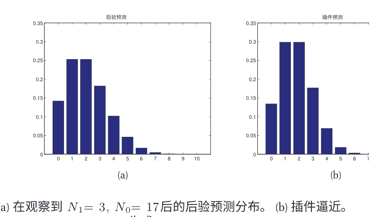

### 3.4.1 似然函数

假设我们观察到 N 次掷骰子的结果 D = {x_1, ..., x_N}，其中 x_i ∈ {1, ..., K}。如果我们假设数据是独立同分布的，似然函数的形式为

$$ p(D|\boldsymbol{\theta}) = \prod_{k=1}^{K} \theta_k^{N_k} \tag{3.36} $$

其中 N_k = \sum_{i=1}^{N} \mathbb{I}(y_i = k) 是事件 k 发生的次数（这些是该模型的充分统计量）。多项式模型的似然函数具有相同的形式，只是多了一个无关紧要的常数因子。

#### 3.4.2 先验

由于参数向量位于 K 维概率单纯形上，我们需要一个在该单纯形上有支持的先验分布。理想情况下，它还应该是共轭的。幸运的是，狄利克雷分布（第2.5.4节）同时满足这两个条件。因此，我们将使用以下先验分布：

$$ \text{Dir}(\boldsymbol{\theta}|\boldsymbol{\alpha}) = \frac{1}{B(\boldsymbol{\alpha})} \prod_{k=1}^{K} \theta_k^{\alpha_k - 1} \mathbb{I}(\mathbf{x} \in S_K) \tag{3.37} $$

#### 3.4.3 后验

将似然函数乘以先验分布，我们发现后验分布也是狄利克雷分布：

$$ p(\boldsymbol{\theta}|D) \propto p(D|\boldsymbol{\theta})p(\boldsymbol{\theta}) \tag{3.38} $$

$$ \propto \prod_{k=1}^{K} \theta_k^{N_k} \theta_k^{\alpha_k - 1} = \prod_{k=1}^{K} \theta_k^{\alpha_k + N_k - 1} \tag{3.39} $$

$$ = \text{Dir}(\boldsymbol{\theta}|\alpha_1 + N_1, ..., \alpha_K + N_K) \tag{3.40} $$

我们可以看到，后验概率是通过将先验超参数（伪计数） $\alpha_k$ 添加到经验计数 $N_k$ 中获得的。

我们可以通过使用微积分来推导出这个后验的模式（即，MAP估计）。然而，我们必须强制执行约束 $\sum_k \theta_k = 1$。我们可以通过使用拉格朗日乘子来实现这一点。受约束的目标函数，或拉格朗日，由对数似然加上对数先验加上约束给出：

$$ \mathcal{L}(\theta, \lambda) = \sum_k N_k \log \theta_k + \sum_k (\alpha_k - 1) \log \theta_k + \lambda \left(1 - \sum_k \theta_k\right) \quad (3.41) $$

为了简化符号，我们定义 $N'_k \triangleq N_k + \alpha_k - 1$。对 $\lambda$ 求导得到原始约束条件：

$$ \frac{\partial \mathcal{L}}{\partial \lambda} = \left(1 - \sum_k \theta_k\right) = 0 \quad (3.42) $$

对 $\theta_k$ 求导得到

$$ \frac{\partial \mathcal{L}}{\partial \theta_k} = \frac{N'_k}{\theta_k} - \lambda = 0 \quad (3.43) $$

$$ N'_k = \lambda \theta_k \quad (3.44) $$

我们可以通过满足总和为一的约束条件来解出 $\lambda$：

$$ \sum_k N'_k = \lambda \sum_k \theta_k \quad (3.45) $$

$$ N + \alpha_0 - K = \lambda \quad (3.46) $$

其中 $\alpha_0 \triangleq \sum_{k=1}^K \alpha_k$ 是先验的等效样本大小。因此，MAP估计值为

$$ \hat{\theta}_k = \frac{N_k + \alpha_k - 1}{N + \alpha_0 - K} \quad (3.47) $$

这与方程2.77一致。如果我们使用均匀先验分布， $\alpha_k = 1$，我们得到最大似然估计：

$$ \hat{\theta}_k = N_k / N \quad (3.48) $$

这只是面部出现的经验比例。

#### 3.4.4 后验预测

对于单个多项式试验，后验预测分布如下所示：

$$ p(X = j|\mathcal{D}) = \int p(X = j|\boldsymbol{\theta}) p(\boldsymbol{\theta}|\mathcal{D}) d\boldsymbol{\theta} $$

$$ = \int p(X = j|\theta_j) \left[\int p(\boldsymbol{\theta}_{-j}, \theta_j|\mathcal{D}) d\boldsymbol{\theta}_{-j} \right] d\theta_j $$

$$ = \int \theta_j p(\theta_j|\mathcal{D}) d\theta_j = \mathbb{E}[\theta_j|\mathcal{D}] = \frac{\alpha_j + N_j}{\sum_k (\alpha_k + N_k)} = \frac{\alpha_j + N_j}{\alpha_0 + N} $$

其中 $\boldsymbol{\theta}_{-j}$ 是 $\boldsymbol{\theta}$ 除了 $\theta_j$ 之外的所有组成部分。另请参见练习3.13。

上述表达式避免了零计数问题，就像我们在3.3.4.1节中看到的那样。事实上，在多项式情况下，这种贝叶斯平滑形式比二项式情况更重要，因为一旦我们开始将数据分成许多类别，数据稀疏性的可能性就会增加。

#### 3.4.4.1 工作示例：使用词袋模型的语言模型

贝叶斯平滑使用狄利克雷-多项式模型的一个应用是语言建模，即预测序列中可能出现的下一个单词。在这里，我们将采用一种非常简单的方法，假设第 $i$ 个单词， $X_i\in\{1,\ldots,K\}$ ，是独立于其他单词的样本，使用 $\text{Cat}(\boldsymbol{\theta})$ 分布进行采样。这被称为词袋模型。给定过去的单词序列，我们如何预测下一个可能出现的单词？

例如，假设我们观察到以下序列（儿童童谣的一部分）：

> 玛丽有一只小羊，小羊，小羊，玛丽有一只小羊，它的毛色白如雪

此外，假设我们的词汇包括以下单词：

| 编号 | 1 | 2 | 3 | 4 | 5 | 6 | 7 | 8 | 9 | 10 |
| :--- | :--- | :--- | :--- | :--- | :--- | :--- | :--- | :--- | :--- | :--- |
| 单词 | 玛丽 | 小羊 | 毛 | 大羊 | 毛 | 白 | 黑 | 雪 | 雨 | 未知 |

这里未知代表未知的单词，并表示在列表中没有出现的其他单词。为了编码童谣的每一行，我们首先去掉标点符号，并删除任何停用词，例如“a”、“as”、“the”等。我们还可以执行词干提取，这意味着将单词减少到其基本形式，例如去掉复数单词中的最后一个 $s$ ，或者从动词中去掉 $ing$（例如， $running$ 变为 $run$）。在这个例子中，没有单词需要进行词干提取。最后，我们用词汇表中的索引替换每个单词，得到：

```
1 10 3 2 3 2 3 2
1 10 3 2 10 5 10 6 8
```

现在我们忽略单词的顺序，并计算每个单词出现的次数，得到一个单词计数的直方图：

| 编号 | 1 | 2 | 3 | 4 | 5 | 6 | 7 | 8 | 9 | 10 |
| :--- | :--- | :--- | :--- | :--- | :--- | :--- | :--- | :--- | :--- | :--- |
| 单词 | 玛丽 | 小羊 | 毛 | 大羊 | 毛 | 白 | 黑 | 雪 | 雨 | 未知 |
| 计数 | 2 | 4 | 4 | 0 | 1 | 1 | 0 | 1 | 0 | 4 |

将上述计数表示为 N_j。如果我们对 θ 使用 Dir(α)先验分布，那么后验预测就是

$$ p(\tilde{X} = j|D) = \mathbb{E}[\theta_j|D] = \frac{\alpha_j + N_j}{\sum_{j'} \alpha_{j'} + N_{j'}} = \frac{1 + N_j}{10 + 17} $$

如果我们设置 α_j=1，我们得到

$$ p(\tilde{X} = j|D) = (3/27, 5/27, 5/27, 1/27, 2/27, 2/27, 1/27, 2/27, 1/27, 5/27) $$

预测分布的模式是 X=2 (“lamb”) 和 X=10 (“unk”) 。请注意，即使以前从未见过，单词“big”、“black”和“rain”也被预测将以非零概率出现在未来。稍后我们将看到更复杂的语言模型。

### 3.5 朴素贝叶斯分类器

在本节中，我们讨论如何对离散特征向量进行分类，其中特征值为 x∈{1,…,K}^D，K 是每个特征的取值数量，D是特征的数量。我们将使用生成方法。这要求我们指定类条件分布，p(x|y=c)。

最简单的方法是假设特征在给定类标签的条件下是条件独立的。这使我们可以将类条件密度写成一维密度的乘积：

$$ p(x|y=c, \theta) = \prod_{j=1}^D p(x_j|y=c, \theta_{jc}) $$

得到的模型称为朴素贝叶斯分类器（NBC）。

该模型被称为“朴素”，因为我们不期望特征在给定类标签的条件下是独立的。然而，即使朴素贝叶斯的假设不成立，它通常也能得到良好的分类器（Domingos和Pazzzani 1997）。其中一个原因是该模型非常简单（只有 O(CD)个参数，对于 C个类和 D个特征），因此相对不容易过拟合。

类条件密度的形式取决于每个特征的类型。我们在下面给出一些可能性：

+   对于实值特征，我们可以使用高斯分布：\( p(x|y=c, \theta) = \prod_{j=1}^D \mathcal{N}(x_j|\mu_{jc}, \sigma_{jc}^2) \)，其中 \(\mu_{jc}\)是类 \(c\)中对象的特征 \(j\)的均值，\(\sigma_{jc}^2\)是其方差。
+   对于二值特征，\(x_j \in \{0,1\}\)，我们可以使用伯努利分布：\( p(x|y=c, \theta) = \prod_{j=1}^D \text{Ber}(x_j|\mu_{jc}) \)，其中 \(\mu_{jc}\)是特征 \(j\)在类 \(c\)中出现的概率。这有时被称为多变量伯努利朴素贝叶斯模型。我们将在下面看到一个应用。
+   对于分类特征， $x_j \in \{1, ..., K\}$，我们可以使用多项式分布来建模：$p(\mathbf{x}|y = c, \boldsymbol{\theta}) = \prod_{j=1}^D \text{Cat}(x_j|\boldsymbol{\mu}_{jc})$，其中 $\boldsymbol{\mu}_{jc}$ 是类别 $c$ 中 $x_j$ 的可能值的直方图。

显然，我们可以处理其他类型的特征，或者使用不同的分布假设。此外，可以轻松混合和匹配不同类型的特征。

#### 3.5.1 模型拟合

现在我们讨论如何“训练”一个朴素贝叶斯分类器。通常意味着计算参数的最大似然估计或最大后验估计。然而，我们还将讨论如何计算完整的后验概率 $p(\boldsymbol{\theta}|\mathcal{D})$。

#### 3.5.1.1 NBC的最大似然估计

单个数据案例的概率由以下给出

$$p(\mathbf{x}_i, y_i|\boldsymbol{\theta}) = p(y_i|\boldsymbol{\pi}) \prod_j p(x_{ij}|\boldsymbol{\theta}_j) = \prod_c \pi_c^{\mathbb{I}(y_i=c)} \prod_j \prod_c p(x_{ij}|\boldsymbol{\theta}_{jc})^{\mathbb{I}(y_i=c)} \tag{3.55}$$

因此，对数似然函数由以下给出

$$\log p(\mathcal{D}|\boldsymbol{\theta}) = \sum_{c=1}^C N_c \log \pi_c + \sum_{j=1}^D \sum_{c=1}^C \sum_{i:y_i=c} \log p(x_{ij}|\boldsymbol{\theta}_{jc}) \tag{3.56}$$

我们可以看到这个表达式分解为一系列项，其中一项涉及 $\boldsymbol{\pi}$，以及包含 $\boldsymbol{\theta}_{jc}$ 的 $DC$ 项。因此，我们可以分别优化所有这些参数。从方程3.48可以得到，类先验的最大似然估计为

$$\hat{\pi}_c = \frac{N_c}{N} \tag{3.57}$$

其中 $N_c \triangleq \sum_i \mathbb{I}(y_i = c)$ 是类别 $c$ 中示例的数量。最大似然估计的似然函数取决于我们选择用于每个特征的分布类型。为了简单起见，假设所有特征都是二进制的，因此 $x_j|y = c \sim \text{Ber}(\theta_{jc})$。在这种情况下，最大似然估计变为

$$\hat{\theta}_{jc} = \frac{N_{jc}}{N_c} \tag{3.58}$$

实现这个模型拟合过程非常简单：参见算法8中的一些伪代码（以及一些Matlab代码的 naiveBayesFit）。这个算法显然需要 $O(ND)$ 时间。该方法很容易推广到处理混合类型的特征。这种简单性是该方法被广泛使用的原因之一。

图3.8给出了一个例子，其中我们有2个类别和600个二进制特征，表示词袋模型中的单词的存在或不存在。这个图可视化了两个类别的 $\boldsymbol{\theta}_c$ 向量。在索引107处的大峰对应于单词“subject”，该单词在两个类别中的概率都为1。（在第3.5.4节中，我们讨论了如何“过滤掉”这种无信息的特征。）

### 算法 3.1：对二进制特征拟合朴素贝叶斯分类器

```
1 N_c = 0, N_{jc} = 0;
2 for i = 1 : N do
3   c = y_i  // 第i个示例的类别标签;
4   N_c := N_c + 1;
5   for j = 1 : D do
6     if x_{ij} = 1 then
7       N_{jc} := N_{jc} + 1
8 end for
9 end for
10 for c = 1 : C do
11   \hat{\pi}_c = N_c / N
12   for j = 1 : D do
13     \hat{\theta}_{jc} = N_{jc} / N_c
14   end for
15 end for
```

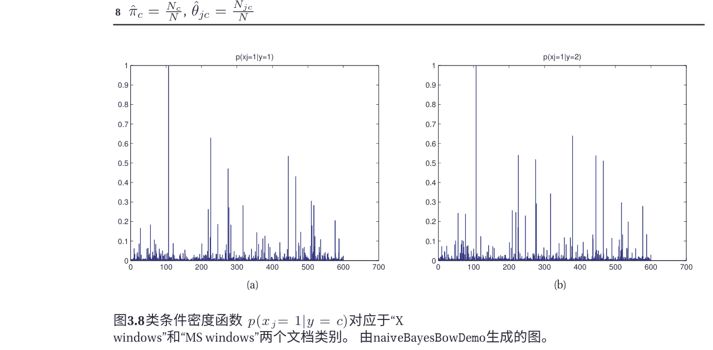

#### 3.5.1.2 贝叶斯朴素贝叶斯

最大似然的问题在于可能过拟合。例如，考虑图3.8中的例子：与单词“subject”对应的特征（称为特征 $j$）总是出现在两个类别中，因此我们估计 $\hat{\theta}_{jc}= 1$。如果我们遇到一个不包含这个单词的新邮件会发生什么？我们的算法将崩溃，因为我们会发现对于两个类别，$p(y = c|\mathbf{x}, \hat{\boldsymbol{\theta}}) = 0$! 这是第3.3.4.1节讨论的黑天鹅悖论的另一个表现形式。

过拟合的一个简单解决方案是贝叶斯方法。为了简单起见，我们将使用一个分解的先验概率：

$$p(\boldsymbol{\theta}) = p(\boldsymbol{\pi}) \prod_{j=1}^{D} \prod_{c=1}^{C} p(\theta_{jc}) \tag{3.59}$$

我们将为 $\boldsymbol{\pi}$使用一个 $\text{Dir}(\boldsymbol{\alpha})$先验概率，并为每个 $\theta_{jc}$使用一个 $\text{Beta}(\beta_0, \beta_1)$先验概率。通常我们只取 $\alpha = 1$ 和 $\beta = 1$，对应于加一平滑或拉普拉斯平滑。

将方程3.56中的分解似然函数与上述分解先验概率相结合，得到以下分解后验概率：

$$
\begin{align}
p(\boldsymbol{\theta} | \mathcal{D}) &= p(\boldsymbol{\pi} | \mathcal{D}) \prod_{j=1}^{D} \prod_{c=1}^{C} p(\theta_{jc} | \mathcal{D}) \tag{3.60} \\
p(\boldsymbol{\pi} | \mathcal{D}) &= \text{Dir}(N_1 + \alpha_1, \ldots, N_C + \alpha_C) \tag{3.61} \\
p(\theta_{jc} | \mathcal{D}) &= \text{Beta}((N_c - N_{jc}) + \beta_0, N_{jc} + \beta_1) \tag{3.62}
\end{align}
$$

换句话说，为了计算后验概率，我们只需用似然函数的经验计数更新先验计数。修改算法8以处理这个版本的模型“拟合”是很直接的。

#### 3.5.2 使用模型进行预测

在测试时，目标是计算

$$
p(y = c | \mathbf{x}, \mathcal{D}) \propto p(y = c | \mathcal{D}) \prod_{j=1}^{D} p(x_j | y = c, \mathcal{D}) \tag{3.63}
$$

正确的贝叶斯程序是对未知参数进行积分：

$$
\begin{align}
p(y = c | \mathbf{x}, \mathcal{D}) &\propto \left[ \int \text{Cat}(y = c | \boldsymbol{\pi}) p(\boldsymbol{\pi} | \mathcal{D}) d\boldsymbol{\pi} \right] \tag{3.64} \\
&\quad \prod_{j=1}^{D} \left[ \int \text{Ber}(x_j | y = c, \theta_{jc}) p(\theta_{jc} | \mathcal{D}) \right] \tag{3.65}
\end{align}
$$

幸运的是，这很容易做到，至少如果后验分布是Dirichlet的话。特别是，根据方程3.51，我们知道后验预测密度可以通过简单地插入后验均值参数 θ 来获得。因此

$$
\begin{align}
p(y = c | \mathbf{x}, \mathcal{D}) &\propto \pi_c \prod_{j=1}^{D} (\overline{\theta}_{jc})^{\mathbb{I}(x_j=1)} (1 - \overline{\theta}_{jc})^{\mathbb{I}(x_j=0)} \tag{3.66} \\
\overline{\theta}_{jc} &= \frac{N_{jc} + \beta_1}{N_c + \beta_0 + \beta_1} \tag{3.67} \\
\pi_c &= \frac{N_c + \alpha_c}{N + \alpha_0} \tag{3.68}
\end{align}
$$

其中 α0 = Σ_c α_c。

如果我们通过一个单点来近似后验分布，即 p(θ|D) ≈ δ_θ̂(θ)，其中 θ̂ 可能是最大似然估计或最大后验估计，那么后验预测密度可以通过简单地插入参数来获得，从而得到几乎相同的规则：

$$
p(y = c | \mathbf{x}, \mathcal{D}) \propto \hat{\pi}_c \prod_{j=1}^{D} (\hat{\theta}_{jc})^{\mathbb{I}(x_j=1)} (1 - \hat{\theta}_{jc})^{\mathbb{I}(x_j=0)} \tag{3.69}
$$

唯一的区别是我们用后验模式或最大似然估计替换了后验均值 \(\hat{\theta}\)。然而，在实践中，这个小差异可能很重要，因为后验均值会导致更少的过拟合（参见第3.4.4.1节）。

## 3.5.3 对数和指数技巧

现在我们讨论一个重要的实际细节，当使用任何生成分类器时会出现。 我们可以使用方程2.13计算类标签的后验概率，使用适当的类条件密度（和插值近似）。 不幸的是，对方程2.13的朴素实现可能会由于数值下溢而失败。 问题在于 \(p(\mathbf{x}|y = c)\)通常是一个非常小的数，特别是当 \(\mathbf{x}\)是一个高维向量时。 这是因为我们要求 \(\sum_{\mathbf{x}} p(\mathbf{x}|y) = 1\)，因此观察到任何特定的高维向量的概率都很小。 明显的解决方案是在应用贝叶斯规则时取对数，如下所示：

$$
\log p(y = c|\mathbf{x}) = b_c - \log \left[ \sum_{c'=1}^{C} e^{b_{c'}} \right] \tag{3.70}
$$
$$
b_c \triangleq \log p(\mathbf{x}|y = c) + \log p(y = c) \tag{3.71}
$$

然而，这需要评估以下表达式

$$
\log[\sum_{c'} e^{b_{c'}}] = \log \sum_{c'} p(y = c', \mathbf{x}) = \log p(\mathbf{x}) \tag{3.72}
$$

而且我们不能在对数域中相加。 幸运的是，我们可以分解出最大的项，然后只表示相对于它的剩余数字。 例如，

$$
\log(e^{-120} + e^{-121}) = \log \left(e^{-120}(e^0 + e^{-1})\right) = \log(e^0 + e^{-1}) - 120 \tag{3.73}
$$

一般来说，我们有

$$
\log \sum_{c} e^{b_c} = \log \left[ \left(\sum_{c} e^{b_c - B}\right) e^B \right] = \left[\log\left(\sum_{c} e^{b_c - B}\right)\right] + B \tag{3.74}
$$

其中 \(B = \max_c b_c\)。这被称为log-sum-exp技巧，并且被广泛使用。 （有关实现的函数，请参见logsumexp。）

这个技巧在算法1中被用于给出使用NBC计算 \(p(y_i|\mathbf{x}_i, \hat{\theta})\)的伪代码。 请参阅Matlab代码中的naiveBayesPredict。 请注意，如果我们只想计算\(\hat{y}_i\)，我们不需要log-sum-exp技巧，因为我们可以直接最大化非标准化的量 \(\log p(y_i = c) + \log p(\mathbf{x}_i|y = c)\)。

#### 3.5.4 使用互信息进行特征选择

由于NBC正在拟合可能有很多特征的联合分布，它可能会遭受过拟合问题。 此外，运行时间成本为 \(O(D)\)，这对于某些应用程序可能太高。解决这些问题的一种常见方法是执行特征选择，以删除“不相关”的特征，这些特征在分类问题上没有太大帮助。 特征选择的最简单方法是单独评估每个特征的相关性，然后取前K个，其中K根据准确性和复杂性之间的某种权衡选择。这种方法被称为变量排序、过滤或筛选。衡量相关性的一种方法是使用特征X_j和类别标签Y之间的互信息（第2.8.3节）：

$$
I(X,Y) = \sum_{x_j} \sum_y p(x_j,y) \log \frac{p(x_j,y)}{p(x_j)p(y)} \tag{3.75}
$$

互信息可以被看作是观察到特征j的值后，标签分布上的熵减少。如果特征是二进制的，可以很容易地证明（练习3.21）互信息可以计算如下：

$$
I_j = \sum_c \left[ \theta_{jc} \pi_c \log \frac{\theta_{jc}}{\theta_j} + (1-\theta_{jc}) \pi_c \log \frac{1-\theta_{jc}}{1-\theta_j} \right] \tag{3.76}
$$

其中π_c = p(y=c)（所有这些数量都可以作为拟合朴素贝叶斯分类器的副产品计算。）图3.1说明了如果我们将其应用于图3.8中使用的二进制词袋数据集会发生什么。我们可以看到，具有最高互信息的单词比最有可能的单词更具有区分性。例如，在两个类别中，最有可能的单词都是“subject”，这是因为这是新闻组数据，它总是有一个主题行。但显然这并不具有很强的区分性。具有最高互信息与类别标签的单词（按降序排列）是“windows”，“microsoft”，“DOS”和“motif”，这是有道理的，因为这些类别对应于Microsoft Windows和X Windows。

## 3.5.5 使用词袋分类文档

文档分类是将文本文档分类到不同类别的问题。一种简单的方法是将每个文档表示为一个二进制向量，记录每个单词是否存在，所以x_{ij}=1当且仅当单词j出现在文档i中，否则x_{ij}=0。然后我们可以使用以下类条件密度：

$$
p(\mathbf{x}_i|y_i=c,\theta) = \prod_{j=1}^D \text{Ber}(x_{ij}|\theta_{jc}) = \prod_{j=1}^D \theta_{jc}^{x_{ij}}(1-\theta_{jc})^{(1-x_{ij})} \tag{3.77}
$$

这被称为伯努利乘积模型，或者二元独立模型。

然而，忽略每个单词在文档中出现的次数会丢失一些信息（McCallum和Nigam 1998）。更准确的表示是计算每个单词出现的次数。具体来说，设xi为文档i的计数向量，其中xij∈{0,1,…,Ni}，其中Ni是文档i中的术语数（所以∑_{j=1}^D xij = Ni）。对于类别条件密度，我们可以使用多项式分布：

$$
p(xi|yi=c,θ)=Mu(xi|Ni,θc)=\frac{Ni!}{\prod_{j=1}^D xij!} \prod_{j=1}^D \theta_{jc}^{xij} \tag{3.78}
$$

我们隐含地假设文档长度Ni与类别无关。这里θjc是生成类别c文档中词语j的概率；这些参数满足约束条件∑_{j=1}^D θjc=1对于每个类别c。3 尽管多项式分类器在训练和测试时都很容易使用，但对于文档分类来说效果并不好。其中一个原因是它没有考虑到词语使用的burstiness现象。这指的是大多数词语在任何给定的文档中都不会出现，但如果它们出现一次，它们很可能会出现多次，即词语会以突发方式出现。

多项式模型无法捕捉到突发现象。要了解原因，请注意方程式3.78的形式θ_{jc}^{Nij}，由于θjc对于罕见的单词，生成许多这样的单词变得越来越不可能。对于频率较高的单词，衰减速率不那么快。为了直观地了解原因，请注意最常见的单词是功能词，它们不特定于类别，例如“and”、“the”和“but”；单词“and”出现的机会几乎是相同的，无论它之前出现了多少次（模除文档长度），因此独立性假设对于常见单词来说更合理。然而，由于罕见单词对于分类目的最重要，我们希望对其进行最仔细的建模。

已经提出了各种临时启发式方法来提高多项式文档分类器的性能（Rennie等人，2003年）。我们现在提出了一种替代的类条件密度，它的性能与这些临时方法一样好，但在概率上是可靠的（Madsen等人，2005年）。

### 算法3.2: 用朴素贝叶斯分类器预测二进制特征

```
1 对于 i=1:N进行
2   对于 c=1:C进行
3     L_ic = log π_c;
4     对于 j=1:D进行
5       如果 x_ij=1则 L_ic := L_ic + log θ_jc否则 L_ic := L_ic + log(1-θ_jc)
6   p_ic = exp(L_ic - logsumexp(L_i,:));
7   y_i = argmax_c p_ic;
```

表3.1 我们列出了类别1（X窗口）和类别2（MS窗口）最可能的5个单词。我们还展示了与类别标签具有最高互信息的5个单词。由naiveBayesBowDemo生成

| 类别1 | 概率 | 类别2 | 概率 | 最高互信息 | 互信息 |
|-------|------|-------|------|------------|--------|
| 主题  | 0.998| 主题  | 0.998| 窗口       | 0.215  |
| 这个  | 0.628| 窗口  | 0.639| 微软       | 0.095  |
| 与    | 0.535| 这个  | 0.540| DOS        | 0.092  |
| 但是  | 0.471| 与    | 0.538| 图案       | 0.078  |
| 你    | 0.431| 但是  | 0.518| 窗户       | 0.067  |

## 练习

- 练习3.1 伯努利/二项模型的MLE
通过优化方程3.11中的对数似然函数推导出方程3.22。

- 练习3.2 Beta-伯努利模型的边际似然函数
在方程5.23中，我们证明了边际似然函数是归一化常数的比值：

$$
p(D) = \frac{Z(\alpha_1 + N_1, \alpha_0 + N_0)}{Z(\alpha_1, \alpha_0)} = \frac{\Gamma(\alpha_1 + N_1)\Gamma(\alpha_0 + N_0)}{\Gamma(\alpha_1 + \alpha_0 + N)} \frac{\Gamma(\alpha_1 + \alpha_0)}{\Gamma(\alpha_1)\Gamma(\alpha_0)} \quad (3.80)
$$

我们现在将推导出这个事实的另一种推导方式。根据概率的链式法则，

$$
p(x_{1:N}) = p(x_1)p(x_2|x_1)p(x_3|x_{1:2}) \ldots \quad (3.81)
$$

在第3.3.4节中，我们证明了后验预测分布为

$$
p(X = k|D_{1:N}) = \frac{N_k + \alpha_k}{\sum_i N_i + \alpha_i} \triangleq \frac{N_k + \alpha_k}{N + \alpha} \quad (3.82)
$$

其中 k \in \{0, 1\}且 D_{1:N}是迄今为止观察到的数据。现在假设 D = H, T, T, H, H或 D = 1, 0, 0, 1, 1。然后

$$
p(D) = \frac{\alpha_1}{\alpha} \cdot \frac{\alpha_0}{\alpha + 1} \cdot \frac{\alpha_0 + 1}{\alpha + 2} \cdot \frac{\alpha_1 + 1}{\alpha + 3} \cdot \frac{\alpha_1 + 2}{\alpha + 4} \quad (3.83)
$$
$$
= \frac{[\alpha_1(\alpha_1 + 1)(\alpha_1 + 2)] [\alpha_0(\alpha_0 + 1)]}{\alpha(\alpha + 1) \cdots (\alpha + 4)} \quad (3.84)
$$
$$
= \frac{[(\alpha_1) \cdots (\alpha_1 + N_1 - 1)] [(\alpha_0) \cdots (\alpha_0 + N_0 - 1)]}{(\alpha) \cdots (\alpha + N - 1)} \quad (3.85)
$$

展示如何通过使用整数的事实将其简化为方程3.80，即 (\alpha - 1)! = \Gamma(\alpha)。

- 练习3.3 Beta-Binomial模型的后验预测

回顾方程3.32，Beta-Binomial的后验预测为

$$
p(x|n, D) = Bb(x|\alpha_0', \alpha_1', n) = \frac{B(x+\alpha_1', n-x+\alpha_0')}{B(\alpha_1', \alpha_0')} \binom{n}{x}
$$

证明这可以简化为

$$
p(\tilde{x}=1|D) = \frac{\alpha_1'}{\alpha_0' + \alpha_1'}
$$

当 $n=1$ (因此 $x \in \{0, 1\}$)时，即证明

$$
Bb(1|\alpha_1', \alpha_0', 1) = \frac{\alpha_1'}{\alpha_1' + \alpha_0'}
$$

提示：使用以下事实

$$
\Gamma(\alpha_0 + \alpha_1 + 1) = (\alpha_0 + \alpha_1 + 1)\Gamma(\alpha_0 + \alpha_1)
$$

- 练习3.4 从被审查的似然进行Beta更新

(来源：Gelman.) 假设我们抛掷一枚硬币 $n=5$ 次。设 $X$ 为正面的次数。我们观察到正面的次数少于3次，但我们不知道确切的次数。让正面的先验概率为 $p(\theta) = \text{Beta}(\theta|1, 1)$。计算后验概率 $p(\theta | X<3)$ 直到归一化常数，即推导出与 $p(\theta, X<3)$ 成比例的表达式。提示：答案是一个混合分布。

- 练习3.5 对于对数比率的无信息先验

让

$$
\phi = \text{logit}(\theta) = \log \frac{\theta}{1-\theta}
$$

证明如果 $p(\phi) \propto 1$，那么 $p(\theta) \propto \text{Beta}(\theta|0, 0)$。提示：使用变量变换公式。

- 练习3.6 Poisson分布的MLE

Poisson概率质量函数定义为 $\text{Poi}(x|\lambda) = e^{-\lambda} \frac{\lambda^x}{x!}$，对于 $x \in \{0, 1, 2, \dots\}$ 其中 $\lambda > 0$ 是速率参数。推导出MLE。

- 练习3.7 Poisson分布的贝叶斯分析

在练习3.6中，我们定义了速率为 $\lambda$ 的Poisson分布并推导出了它的MLE。这里我们进行一个共轭贝叶斯分析。

+ a. 推导后验概率 $p(\lambda|D)$，假设先验概率 $p(\lambda) = \text{Ga}(\lambda|a, b) \propto \lambda^{a-1} e^{-\lambda b}$。提示：后验概率也是一个Gamma分布。
b. 当 $a \to 0$ 和 $b \to 0$ 时，后验均值趋于什么？(回想一下，$\text{Ga}(a, b)$ 分布的均值是 $a/b$。)

- 练习3.8 均匀分布的MLE

(来源：Kaelbling。) 考虑一个以0为中心，宽度为 $2a$ 的均匀分布。密度函数为

$$
p(x) = \frac{1}{2a} I(x \in [-a, a])
$$## 练习3.9均匀分布的贝叶斯分析

考虑均匀分布 $\mathrm{Unif}(0, \theta)$。最大似然估计是 $\hat{\theta} = \max(\mathcal{D})$，正如我们在练习3.8中看到的，但这对于预测未来数据是不合适的，因为它在训练数据之外没有概率质量。在这个练习中，我们将对均匀分布进行贝叶斯分析（参考（Minka 2001a））。共轭先验是帕累托分布，$p(\theta) = \mathrm{Pareto}(\theta|b, K)$，在第2.4.6节中定义。给定帕累托先验，$\theta$ 和 $\mathcal{D}= (x_1, \dots, x_N)$的联合分布是

$$p(\mathcal{D}, \theta) = \frac{K b^K}{\theta^{N+K+1}} \mathbb{I}(\theta \geq \max(\mathcal{D}))$$ \hfill (3.93)

令 $m = \max(\mathcal{D})$。证据（所有 $N$个样本来自相同均匀分布的概率）是

$$\begin{aligned}
p(\mathcal{D}) &= \int_{m}^{\infty} \frac{K b^K}{\theta^{N+K+1}} d\theta \\
&= \begin{cases} 
\frac{K}{(N+K) b^N} & \text{如果 } m \leq b \\
\frac{K b^K}{(N+K) m^{N+K}} & \text{如果 } m > b 
\end{cases}
\end{aligned}$$ \hfill (3.94), (3.95)

推导后验分布 $p(\theta|\mathcal{D})$，并证明它可以表示为Pareto分布。

## 练习3.10出租车（有轨电车）问题

假设你到达一个新城市，看到一辆编号为100的出租车。这个城市有多少辆出租车？让我们假设出租车的编号是从0开始的连续整数，上限未知为$\theta$。（为了简单起见，我们从0开始编号出租车；我们也可以从1开始计数而不改变分析。）因此，似然函数为 $p(x) = U(0, \theta)$，即均匀分布。目标是估计$\theta$。我们将使用练习3.9中的贝叶斯分析。

-   a. 假设我们看到一辆编号为100的出租车，所以 $\mathcal{D} = \{100\}$，$m=100$，$N=1$。使用一个（不恰当的）非信息先验，形式为 $p(\theta) = \mathrm{Pareto}(\theta|0,0) \propto 1/\theta$，那么后验概率是多少 $p(\theta|\mathcal{D})$?
-   b. 如果这样的数量存在，计算城市中出租车的后验均值、众数和中位数。
-   c. 与其尝试计算出租车数量的点估计，我们可以计算下一个出租车编号的预测密度，使用
$$p(D'|\mathcal{D}, \alpha) = \int p(D'|\theta)p(\theta|\mathcal{D}, \alpha)d\theta = p(D'|\beta)$$ \hfill (3.96)
其中 $\alpha=(b, K)$是超参数，$\beta=(c, N+K)$是更新后的超参数。现在考虑情况 $\mathcal{D}=\{m\}$，以及 $D'=\{x\}$。使用方程式3.95，写出
$$p(x|\mathcal{D}, \alpha) \text{的表达式}$$ \hfill (3.97)
与上述一样，使用非信息先验 $b = K=0$。
-   d. 使用预测密度公式计算下一个出现的出租车的概率（比如，第二天）是100、50或150，即计算 $p(x=100|\mathcal{D}, \alpha)$, $p(x=50|\mathcal{D}, \alpha)$, $p(x=150|\mathcal{D}, \alpha)$。
-   e. 简要描述一下我们可以通过哪些方式使模型在预测方面更准确（1-2句）。

## 练习3.11指数分布的贝叶斯分析

机器的寿命 $X$ 由具有未知参数 $\theta$ 的指数分布来建模。似然函数为 $p(x|\theta) = \theta e^{-\theta x}$, 其中 $x \geq 0$, $\theta > 0$。

-   a. 证明最大似然估计为 $\hat{\theta} = 1/\bar{x}$, 其中 $\bar{x} = \frac{1}{N} \sum_{i=1}^N x_i$。
-   b. 假设我们观察到 $X_1 = 5$, $X_2 = 6$, $X_3 = 4$（3台不同的独立同分布机器的寿命，以年为单位）。在给定这些数据的情况下，最大似然估计是多少？
-   c. 假设专家认为 $\theta$ 应该有一个先验分布，该分布也是指数分布
$$p(\theta) = \mathrm{Expon}(\theta|\lambda)$$ \hfill (3.98)
选择先验参数，称之为 $\hat{\lambda}$，使得 $\mathbb{E}[\theta] = 1/3$。提示：回想一下Gamma分布的形式
$$\mathrm{Ga}(\theta|a, b) \propto \theta^{a-1} e^{-\theta b}$$ \hfill (3.99)
它的均值是 $a/b$。
-   d. 后验概率是多少，$p(\theta|\mathcal{D}, \hat{\lambda})$？
-   e. 指数先验是否与指数似然函数共轭？
-   f. 后验均值是多少，$\mathbb{E}[\theta|\mathcal{D}, \hat{\lambda}]$？
-   g. 解释为什么MLE和后验均值不同。在这个例子中哪个更合理？

## 练习3.12非共轭先验的伯努利MAP估计

（来源：Jaakkola。）在本书中，我们讨论了具有伯努利率数参数的贝叶斯推断先验 $p(\theta) = \mathrm{Beta}(\theta|\alpha, \beta)$。我们知道，使用这个先验，MAP估计值为

$$\hat{\theta} = \frac{N_1 + \alpha - 1}{N + \alpha + \beta - 2}$$ \hfill (3.100)

其中 $N_1$是正面的次数，$N_0$是反面的次数，而 $N = N_0 + N_1$是总次数。

-   a. 现在考虑以下先验分布，认为硬币是公平的，或者稍微偏向反面：
$$p(\theta) = \begin{cases} 
0.5 & \text{如果 } \theta=0.5 \\
0.5 & \text{如果 } \theta=0.4 \\
0 & \text{否则}
\end{cases}$$ \hfill (3.101)
根据这个先验分布，推导出MAP估计值作为 $N_1$和 $N$的函数。
-   b. 假设真实参数为 $\theta= 0.41$。当 $N$很小时，哪个先验分布会导致更好的估计？当 $N$很大时，哪个先验分布会导致更好的估计？

## 练习3.13使用Dirichlet-Multinomial模型预测一批数据的后验预测分布

在方程3.51中，我们给出了使用Dirichlet先验分布对单个多项式试验的后验预测分布。现在考虑预测一批新数据 $\tilde{\mathcal{D}} = (\tilde{x}_1, ..., \tilde{x}_m)$，其中包含 $m$个单独的多项式试验（假设它们是独立同分布的）。

推导一个表达式

$$p(\tilde{\mathcal{D}}|\mathcal{D}, \boldsymbol{\alpha})$$ \hfill (3.102)

你的答案应该是一个关于 $\boldsymbol{\alpha}$ 的函数，以及旧的和新的计数（充分统计量），定义为

$$\text{旧计数}_k = \sum_{i \in \mathcal{D}} \mathbb{I}(x_i = k)$$ \hfill (3.103)

$$\text{新的计数}_k = \sum_{i \in \tilde{\mathcal{D}}} \mathbb{I}(\tilde{x}_i = k)$$ \hfill (3.104)

提示：回想一下，对于一个计数向量 $N_{1:K}$，边际似然（证据）由以下公式给出

$$p(\mathcal{D}|\boldsymbol{\alpha}) = \frac{\Gamma(\alpha_0)}{\Gamma(N + \alpha_0)} \prod_{k=1}^K \frac{\Gamma(N_k + \alpha_k)}{\Gamma(\alpha_k)}$$ \hfill (3.105)

其中 $\alpha_0 = \sum_k \alpha_k$ 和 $N = \sum_k N_k$。

### 3.5 朴素贝叶斯分类器

## 练习3.14 Dirichlet-多项式的后验预测

（来源：Koller）。

-   a. 假设我们从2000个样本中计算罗马字母加空格字符的经验分布（一个包含27个值的分布）。假设我们看到字母“e”出现了260次。如果我们假设 $\boldsymbol{\theta} \sim \mathrm{Dir}(\alpha_1, \dots, \alpha_{27})$，其中 $\alpha_k = 10$ 对于所有 $k$，那么 $p(x_{2001} = e|\mathcal{D})$ 是多少？
-   b. 假设在2000个样本中，我们看到“e”出现了260次，“a”出现了100次，而“p”出现了87次。如果我们假设 $\boldsymbol{\theta} \sim \mathrm{Dir}(\alpha_1, \dots, \alpha_{27})$，其中 $\alpha_k = 1$ 对于所有 $k$，那么 $p(x_{2001}=p, x_{2002}=a|\mathcal{D})$ 是多少？请展示你的计算过程。

## 练习3.15 设置beta超参数

假设 $\theta \sim \mathrm{Beta}(\alpha_1, \alpha_2)$ 并且我们相信 $\mathbb{E}[\theta] = m$ 和 $\text{var}[\theta] = v$。使用方程2.62，解出 $\alpha_1$ 和 $\alpha_2$ 的值，用 $m$ 和 $v$ 表示。如果 $m = 0.7$ 和 $v = 0.2^2$，你得到什么值？

## 练习3.16 设置beta超参数II

（来源：Draper）假设 $\theta \sim \mathrm{Beta}(\alpha_1, \alpha_2)$ 并且我们相信 $\mathbb{E}[\theta] = m$ 和 $p(\ell < \theta < u) = 0.95$。编写一个程序，可以解出 $\alpha_1$ 和 $\alpha_2$ 的值，用 $m, \ell$ 和 $u$ 表示。提示：将 $\alpha_2$ 写成 $\alpha_1$ 和 $m$ 的函数，这样概率密度函数只有一个未知数；然后将区间中包含的概率质量写成积分，并将其与 0.95的平方差最小化。如果 $m=0.15$，你得到什么值？这个先验的等效样本大小是多少？

## 练习3.17 在均匀先验下的贝塔二项式边缘似然

假设我们抛一枚硬币 $N$ 次，观察到 $N_1$ 次正面。令 $N_1 \sim \mathrm{Bin}(N, \theta)$ 且 $\theta \sim \mathrm{Beta}(1, 1)$。证明边缘似然为 $p(N_1|N) = 1/(N + 1)$。提示：$\Gamma(x+1)=x!$ if $x$ 是整数。

## 练习3.18 投掷硬币的贝叶斯因子

假设我们抛一枚硬币 $N=10$ 次，观察到 $N_1=9$ 次正面。将零假设设为硬币是公平的，备择假设设为硬币可能有任意偏倚，因此 $p(\theta) = \mathrm{Unif}(0, 1)$。推导出有利于有偏硬币假设的贝叶斯因子 $BF_{1,0}$。如果 $N=100$ 且 $N_1=90$，提示：参考练习3.17。

## 练习3.19 朴素贝叶斯中的无关特征

（来源：Jaakkola。）如果单词 $w$ 在文档 $i$ 中出现，则 $x_{iw} = 1$，否则 $x_{iw} = 0$。让 $\theta_{cw}$ 表示单词 $w$ 在类别 $c$ 的文档中出现的估计概率。那么文档 $\mathbf{x}_i$ 属于类别 $c$概率的对数是

$$
\log p(\mathbf{x}_i | c, \boldsymbol{\theta}) = \log \prod_{w=1}^W \theta_{cw}^{x_{iw}} (1-\theta_{cw})^{1-x_{iw}} \qquad (3.106)
$$

$$
= \sum_{w=1}^W x_{iw} \log \theta_{cw} + (1-x_{iw}) \log(1-\theta_{cw}) \qquad (3.107)
$$

$$
= \sum_{w=1}^W x_{iw} \log \frac{\theta_{cw}}{1-\theta_{cw}} + \sum_{w} \log(1-\theta_{cw}) \qquad (3.108)
$$

其中 $W$是词汇表中的单词数。我们可以更简洁地写成

$$
\log p(\mathbf{x}_i | c, \boldsymbol{\theta}) = \phi(\mathbf{x}_i)^T \beta_c \qquad (3.109)
$$

其中 $\mathbf{x}_i = (x_{i1}, \dots, x_{iW})$ 是一个位向量，$\phi(\mathbf{x}_i) = (\mathbf{x}_i, 1)$，而

$$
\beta_c = \left( \log \frac{\theta_{c1}}{1-\theta_{c1}}, \dots, \log \frac{\theta_{cW}}{1-\theta_{cW}}, \sum_{w} \log(1-\theta_{cw}) \right)^T \qquad (3.110)
$$

我们可以看到这是一个线性分类器，因为类条件密度是参数 $\beta_c$ 的线性函数（内积）。

-   a. 假设 $p(C=1) = p(C=2) = 0.5$，写出一个表达式来计算对数后验几率，$\log \frac{p(c=1|\mathbf{x}_i)}{p(c=2|\mathbf{x}_i)}$，根据特征 $\phi(\mathbf{x}_i)$和参数 $\beta_1$和 $\beta_2$来看。
-   b. 直观上，出现在两个类别中的词语并不具有很强的“区分性”，因此不应该影响我们对类别标签的信念。考虑一个特定的词语 $w$。陈述 $\theta_{1,w}$和$\theta_{2,w}$（或者等价地陈述 $\beta_{1,w}, \beta_{2,w}$）的条件，使得在测试文档中 $w$的存在或不存在对类别后验概率没有影响（这样的词语将被分类器忽略）。提示：利用之前的结果，找出后验几率比为0.5/0.5的情况。
-   c. 使用Beta(1,1)先验的后验均值估计为
$$
\hat{\theta}_{cw} = \frac{1 + \sum_{i \in c} x_{iw}}{2 + n_c} \qquad (3.111)
$$
其中求和是在类别$c$中的所有文档上进行的。考虑一个特定的单词 $w$，并假设它在每个文档中都出现（无论类别如何）。假设类别1有 $n_1$个文档，类别2有 $n_2$个文档，其中 $n_1 = n_2$（例如，我们得到的非垃圾邮件比垃圾邮件多得多；这是类别不平衡的一个例子）。如果我们使用上述估计的 $\hat{\theta}_{cw}$，我们的分类器会忽略单词 $w$吗？解释为什么或为什么不。
-   d. 你能想到哪些其他方法可以鼓励忽略“无关”的单词？

## 练习3.20二进制数据的类条件密度

考虑一个具有类条件密度 $p(\mathbf{x}|y)$和均匀类先验$p(y)$的生成式分类器。假设所有 $D$个特征都是二进制的，$x_j \in \{0, 1\}$。如果我们假设所有特征都是条件独立的（朴素贝叶斯假设），我们可以写成

$$
p(\mathbf{x}|y=c) = \prod_{j=1}^D \mathrm{Ber}(x_j|\theta_{jc}) \qquad (3.112)
$$

这需要 $DC$ 参数。

-   a. 现在考虑一个不同的模型，我们将其称为“完全”模型，在该模型中所有特征都是完全依赖的（即，我们不做任何因子化假设）。在这种情况下，我们如何表示 $p(\mathbf{x}|y = c)$？表示 $p(\mathbf{x}|y = c)$ 需要多少参数？
-   b. 假设特征的数量 $D$ 是固定的。假设有 $N$ 个训练样本。如果样本大小 $N$ 非常小，哪个模型（朴素贝叶斯或完全模型）可能会给出较低的测试集错误率，为什么？
-   c. 如果样本大小 $N$ 非常大，哪个模型（朴素贝叶斯或完全模型）可能会给出较低的测试集错误率，为什么？
-   d. 拟合完全模型和朴素贝叶斯模型的计算复杂度是 $N$ 和 $D$ 的函数。使用大O符号表示。（在这里，拟合模型意味着计算MLE或MAP参数估计。您可以假设您可以将一个 $D$ 位向量转换为一个数组索引，时间复杂度为 $O(D)$。）
-   e. 在测试时间将完全模型和朴素贝叶斯模型应用于单个测试样例的计算复杂度是多少？
-   f. 假设测试用例有缺失数据。设 $\mathbf{x}_v$ 为可见特征，大小为 $v$，并且 $\mathbf{x}_h$ 为隐藏（缺失）特征，大小为 $h$，其中 $v + h = D$。计算完整和朴素贝叶斯模型的计算复杂度是多少，作为 $v$ 和 $h$ 的函数？

## 练习3.21朴素贝叶斯分类器的互信息（对于二进制特征）
推导方程3.76。

## 练习3.22手动拟合朴素贝叶斯垃圾邮件过滤器
（来源：Daphne Koller）。考虑一个朴素贝叶斯模型（多变量伯努利版本）用于垃圾邮件分类，词汇表 V = ["secret", "offer", "low", "price", "valued", "customer", "today", "dollar", "million", "sports", "is", "for", "play", "healthy", "pizza"]。我们有以下示例垃圾邮件消息 "million dollar offer", "secret offer today", "secret is secret" 和正常消息 "low price for valued customer", "play secret sports today", "sports is healthy", "low price pizza"。给出以下参数的最大似然估计值：$\theta_{\text{spam}}$, $\theta_{\text{secret|spam}}$, $\theta_{\text{secret|non-spam}}$, $\theta_{\text{sports|non-spam}}$, $\theta_{\text{dollar|spam}}$。

+   a. 给定数据集 $x_1, \dots, x_n$， $a$ 的最大似然估计是多少（记为 $\hat{a}$）？
-   b. 模型会给一个新的数据点 $x_{n+1}$分配什么概率，使用 $\hat{a}$?
-   c. 你觉得上述方法有什么问题吗？简要提出一个更好的方法（用文字描述）。

## 4 高斯模型

### 4.1 引言

在本章中，我们讨论多元高斯或多元正态（MVN），它是用于连续变量的最广泛使用的联合概率密度函数。它将成为我们在后面章节中遇到的许多模型的基础。

不幸的是，本章的数学水平比其他章节高。特别是，我们在很大程度上依赖线性代数和矩阵微积分。这是处理高维数据所必须付出的代价。初学者可以选择跳过标有*的部分。此外，由于本章中有很多方程式，我们在特别重要的方程式周围加了一个框。

### 4.1.1 符号表示

让我们简要地谈谈符号表示。我们用粗体小写字母表示向量，如$x$。我们用粗体大写字母表示矩阵，如$\mathbf{X}$。我们用非粗体大写字母表示矩阵中的元素，如$X_{ij}$。

除非另有说明，否则所有向量都被假定为列向量。我们使用 $[x_1, \dots, x_D]$ 来表示通过堆叠 $D$ 个标量创建的列向量。类似地，如果我们写成 $\mathbf{x} = [\mathbf{x}_1, \dots, \mathbf{x}_D]$，其中左边是一个高维列向量，我们的意思是将 $\mathbf{x}_i$ 沿行堆叠；通常写作 $\mathbf{x} = (\mathbf{x}_1^T, \dots, \mathbf{x}_D^T)^T$，但这样写比较冗长。如果我们写成 $\mathbf{X} = [\mathbf{x}_1, \dots, \mathbf{x}_D]$，其中左边是一个矩阵，我们的意思是将 $\mathbf{x}_i$ 沿列堆叠，创建一个矩阵。

#### 4.1.2 基础知识

回顾第2.5.2节中，$D$维MVN的概率密度函数（pdf）定义如下：

$$\mathcal{N}(\mathbf{x}|\boldsymbol{\mu}, \boldsymbol{\Sigma}) \triangleq \frac{1}{(2\pi)^{D/2} |\boldsymbol{\Sigma}|^{1/2}} \exp \left[-\frac{1}{2}(\mathbf{x} - \boldsymbol{\mu})^T \boldsymbol{\Sigma}^{-1} (\mathbf{x} - \boldsymbol{\mu}) \right]$$

图4.1 二维高斯密度的可视化。椭圆的主轴和次轴由协方差矩阵的前两个特征向量定义，即 $u_1$ 和 $u_2$。基于(Bishop 2006a)的图2.7。

指数内的表达式是数据向量 $\mathbf{x}$ 和均值向量 $\boldsymbol{\mu}$ 之间的马氏距离，通过对 $\boldsymbol{\Sigma}$ 进行特征分解，我们可以更好地理解这个量。也就是说，我们将 $\boldsymbol{\Sigma}$ 写成 $\mathbf{U}\boldsymbol{\Lambda}\mathbf{U}^T$ 的形式，其中 $\mathbf{U}$ 是一个正交矩阵，满足 $\mathbf{U}^T \mathbf{U} = \mathbf{I}$，$\boldsymbol{\Lambda}$ 是一个对角矩阵，包含特征值。

使用特征分解，我们有

$$\boldsymbol{\Sigma}^{-1} = \mathbf{U}^{-T} \boldsymbol{\Lambda}^{-1} \mathbf{U}^{-1} = \mathbf{U} \boldsymbol{\Lambda}^{-1} \mathbf{U}^T = \sum_{i=1}^{D} \frac{1}{\lambda_i} \mathbf{u}_i \mathbf{u}_i^T \tag{4.2}$$

其中 $\mathbf{u}_i$ 是 $\mathbf{U}$ 的第 $i$ 列，包含第 $i$ 个特征向量。因此，我们可以将马氏距离重写为以下形式：

$$(\mathbf{x} - \boldsymbol{\mu})^T \boldsymbol{\Sigma}^{-1} (\mathbf{x} - \boldsymbol{\mu}) = (\mathbf{x} - \boldsymbol{\mu})^T \left( \sum_{i=1}^{D} \frac{1}{\lambda_i} \mathbf{u}_i \mathbf{u}_i^T \right) (\mathbf{x} - \boldsymbol{\mu}) \tag{4.3}$$
$$= \sum_{i=1}^{D} \frac{1}{\lambda_i} (\mathbf{x} - \boldsymbol{\mu})^T \mathbf{u}_i \mathbf{u}_i^T (\mathbf{x} - \boldsymbol{\mu}) = \sum_{i=1}^{D} \frac{y_i^2}{\lambda_i} \tag{4.4}$$

回想一下，二维椭圆的方程是

$$\frac{y_1^2}{\lambda_1} + \frac{y_2^2}{\lambda_2} = 1 \tag{4.5}$$

因此，我们可以看到高斯分布的等概率密度轮廓沿着椭圆形状。这在图4.1中有所说明。特征向量确定了椭圆的方向，而特征值确定了椭圆的拉伸程度。

一般来说，我们可以看到马氏距离对应于在一个转换的坐标系中的欧氏距离，其中我们通过 $\boldsymbol{\mu}$ 进行平移，并通过 $\mathbf{U}$ 进行旋转。

#### 4.1.3 多元正态分布的最大似然估计

现在我们描述一种使用最大似然估计（MLE）来估计多元正态分布参数的方法。在后面的章节中，我们将讨论贝叶斯推断用于参数估计，这可以减轻过拟合问题，并提供对我们估计的置信度的度量。

> 定理 4.1.1 (高斯分布的最大似然估计)。如果我们有 $N$ 个独立同分布的样本 $\mathbf{x}_i \sim \mathcal{N}(\boldsymbol{\mu}, \boldsymbol{\Sigma})$，则参数的最大似然估计为

$$ \hat{\boldsymbol{\mu}}_{mle} = \frac{1}{N} \sum_{i=1}^N \mathbf{x}_i \triangleq \bar{\mathbf{x}} $$

$$ \hat{\boldsymbol{\Sigma}}_{mle} = \frac{1}{N} \sum_{i=1}^N (\mathbf{x}_i - \bar{\mathbf{x}})(\mathbf{x}_i - \bar{\mathbf{x}})^T = \frac{1}{N} \left(\sum_{i=1}^N \mathbf{x}_i \mathbf{x}_i^T\right) - \bar{\mathbf{x}} \bar{\mathbf{x}}^T $$

也就是说，MLE就是经验均值和经验协方差。在一元情况下，我们得到以下熟悉的结果：

$$ \hat{\mu} = \frac{1}{N} \sum_{i} x_i = \bar{x} $$

$$ \hat{\sigma}^2 = \frac{1}{N} \sum_{i} (x_i - \bar{x})^2 = \left( \frac{1}{N} \sum_{i} x_i^2 \right) - (\bar{x})^2 $$

### 4.1.3.1 证明 *

为了证明这个结果，我们需要矩阵代数中的几个结果，我们在下面总结一下。在这些方程中，$\mathbf{a}$ 和 $\mathbf{b}$ 是向量，$\mathbf{A}$ 和 $\mathbf{B}$ 是矩阵。另外，符号 $\operatorname{tr}(\mathbf{A})$ 表示矩阵的迹，即其对角线元素的和：$\operatorname{tr}(\mathbf{A}) = \sum_i A_{ii}$。

$$\begin{aligned}
\frac{\partial (\mathbf{b}^T \mathbf{a})}{\partial \mathbf{a}} &= \mathbf{b} \\
\frac{\partial (\mathbf{a}^T \mathbf{A} \mathbf{a})}{\partial \mathbf{a}} &= (\mathbf{A} + \mathbf{A}^T) \mathbf{a} \\
\frac{\partial}{\partial \mathbf{A}} \operatorname{tr}(\mathbf{B} \mathbf{A}) &= \mathbf{B}^T \\
\frac{\partial}{\partial \mathbf{A}} \log |\mathbf{A}| &= \mathbf{A}^{-T} \triangleq (\mathbf{A}^{-1})^T \\
\operatorname{tr}(\mathbf{A} \mathbf{B} \mathbf{C}) &= \operatorname{tr}(\mathbf{C} \mathbf{A} \mathbf{B}) = \operatorname{tr}(\mathbf{B} \mathbf{C} \mathbf{A})
\end{aligned}$$

最后一个方程被称为迹算子的循环置换性质。利用这一点，我们可以推导出广泛使用的迹技巧，它重新排序标量内积 $\mathbf{x}^T \mathbf{A} \mathbf{x}$ 如下：

$$ \mathbf{x}^T \mathbf{A} \mathbf{x} = \operatorname{tr}(\mathbf{x}^T \mathbf{A} \mathbf{x}) = \operatorname{tr}(\mathbf{x} \mathbf{x}^T \mathbf{A}) = \operatorname{tr}(\mathbf{A} \mathbf{x} \mathbf{x}^T) $$

证明。现在我们可以开始证明。对数似然函数为

$$
\ell(\boldsymbol{\mu}, \boldsymbol{\Sigma}) = \log p(\mathcal{D}|\boldsymbol{\mu}, \boldsymbol{\Sigma}) = \frac{N}{2} \log |\boldsymbol{\Lambda}| - \frac{1}{2} \sum_{i=1}^{N} (\mathbf{x}_i - \boldsymbol{\mu})^T \boldsymbol{\Lambda} (\mathbf{x}_i - \boldsymbol{\mu}) \quad (4.12)
$$

其中 $\boldsymbol{\Lambda} = \boldsymbol{\Sigma}^{-1}$ 是精度矩阵。
使用替换 $\mathbf{y}_i = \mathbf{x}_i - \boldsymbol{\mu}$ 和微积分的链式法则，我们有

$$
\frac{\partial}{\partial \boldsymbol{\mu}} (\mathbf{x}_i - \boldsymbol{\mu})^T \boldsymbol{\Sigma}^{-1} (\mathbf{x}_i - \boldsymbol{\mu}) = \frac{\partial}{\partial \mathbf{y}_i} \mathbf{y}_i^T \boldsymbol{\Sigma}^{-1} \mathbf{y}_i \frac{\partial \mathbf{y}_i}{\partial \boldsymbol{\mu}} \quad (4.13)
$$

$$
= -1 (\boldsymbol{\Sigma}^{-1} + \boldsymbol{\Sigma}^{-T}) \mathbf{y}_i \quad (4.14)
$$

因此

$$
\frac{\partial}{\partial \boldsymbol{\mu}} \ell(\boldsymbol{\mu}, \boldsymbol{\Sigma}) = -\frac{1}{2} \sum_{i=1}^{N} -2 \boldsymbol{\Sigma}^{-1} (\mathbf{x}_i - \boldsymbol{\mu}) = \boldsymbol{\Sigma}^{-1} \sum_{i=1}^{N} (\mathbf{x}_i - \boldsymbol{\mu}) = 0 \quad (4.15)
$$

$$
\hat{\boldsymbol{\mu}} = \frac{1}{N} \sum_{i=1}^{N} \mathbf{x}_i = \bar{\mathbf{x}} \quad (4.16)
$$

所以 $\boldsymbol{\mu}$ 的最大似然估计就是经验均值。
现在我们可以使用迹技巧将 $\boldsymbol{\Lambda}$ 的对数似然函数重写为：

$$
\ell(\boldsymbol{\Lambda}) = \frac{N}{2} \log |\boldsymbol{\Lambda}| - \frac{1}{2} \sum_{i} \operatorname{tr}[(\mathbf{x}_i - \boldsymbol{\mu})(\mathbf{x}_i - \boldsymbol{\mu})^T \boldsymbol{\Lambda}] \quad (4.17)
$$

$$
= \frac{N}{2} \log |\boldsymbol{\Lambda}| - \frac{1}{2} \operatorname{tr} [\mathbf{S}_{\boldsymbol{\mu}} \boldsymbol{\Lambda}] \quad (4.18)
$$

其中

$$
\mathbf{S}_{\boldsymbol{\mu}} \triangleq \sum_{i=1}^{N} (\mathbf{x}_i - \boldsymbol{\mu})(\mathbf{x}_i - \boldsymbol{\mu})^T \quad (4.20)
$$

是以 $\boldsymbol{\mu}$ 为中心的散布矩阵。对这个表达式关于 $\boldsymbol{\Lambda}$ 求导得到

$$
\frac{\partial \ell(\boldsymbol{\Lambda})}{\partial \boldsymbol{\Lambda}} = \frac{N}{2} \boldsymbol{\Lambda}^{-T} - \frac{1}{2} \mathbf{S}_{\boldsymbol{\mu}}^{T} = 0 \quad (4.21)
$$

$$
\boldsymbol{\Lambda}^{-T} = \boldsymbol{\Lambda}^{-1} = \boldsymbol{\Sigma} = \frac{1}{N} \mathbf{S}_{\boldsymbol{\mu}} \quad (4.22)
$$

所以

$$
\hat{\boldsymbol{\Sigma}} = \frac{1}{N} \sum_{i=1}^{N} (\mathbf{x}_i - \boldsymbol{\mu})(\mathbf{x}_i - \boldsymbol{\mu})^T \quad (4.23)
$$

这就是以 $\boldsymbol{\mu}$ 为中心的经验协方差矩阵。如果我们插入MLE $\boldsymbol{\mu} = \bar{\mathbf{x}}$ (因为两个参数必须同时优化)，我们得到协方差矩阵的MLE的标准方程。

$\square$

### 4.1.4 高斯的最大熵推导 *

在本节中，我们展示了多元高斯分布是具有最大熵的分布，同时满足特定均值和协方差（也可参见第9.2.6节）。这是高斯分布被广泛使用的一个原因：通常我们只能可靠地估计前两个矩，因此我们希望选择一个能够捕捉这些特性的同时尽可能少地做出其他假设。

为了简化符号，我们将假设均值为零。概率密度函数的形式为
$$p(\mathbf{x}) = \frac{1}{Z} \exp \left(-\frac{1}{2} \mathbf{x}^{T} \boldsymbol{\Sigma}^{-1} \mathbf{x}\right) \quad (4.24)$$
如果我们定义 $f_{ij}(\mathbf{x})=x_{i} x_{j}$ 和 $\lambda_{ij}=\frac{1}{2}\left(\boldsymbol{\Sigma}^{-1}\right)_{ij}$，对于 $i, j \in\{1, \ldots, D\}$，我们可以看到这与方程9.74的形式相同。这个分布的（微分）熵（使用以$e$为底的对数）由以下给出
$$h(\mathcal{N}(\boldsymbol{\mu}, \boldsymbol{\Sigma}))=\frac{1}{2} \ln \left[(2 \pi e)^{D}|\boldsymbol{\Sigma}|\right] \quad (4.25)$$

我们现在展示多元正态分布在具有特定协方差 $\boldsymbol{\Sigma}$ 的所有分布中具有最大熵。

**定理 4.1.2.** 设 $q(\mathbf{x})$ 是满足条件的任意密度函数 $\int q(\mathbf{x}) x_{i} x_{j} = \Sigma_{ij}$。设 $p = \mathcal{N}(\mathbf{0}, \boldsymbol{\Sigma})$。那么 $h(q) \leq h(p)$。

证明。（引自(Cover and Thomas 1991, p234)。）我们有
$$\begin{aligned}
0 &\leq \mathrm{KL}(q \| p)=\int q(\mathbf{x}) \log \frac{q(\mathbf{x})}{p(\mathbf{x})} d \mathbf{x} & (4.26) \\
&=-h(q)-\int q(\mathbf{x}) \log p(\mathbf{x}) d \mathbf{x} & (4.27) \\
&=^{*}-h(q)-\int p(\mathbf{x}) \log p(\mathbf{x}) d \mathbf{x} & (4.28) \\
&=-h(q)+h(p) & (4.29)
\end{aligned}$$
其中方程4.28中的关键步骤（用*标记）是因为 $q$ 和 $p$ 对于由 $\log p(\mathbf{x})$ 编码的二次形式产生相同的矩。 $\square$

### 4.2 高斯判别分析

MVNs的一个重要应用是在生成式分类器中定义类条件密度，即
$$p(\mathbf{x} | y=c, \boldsymbol{\theta})=\mathcal{N}\left(\mathbf{x} | \boldsymbol{\mu}_{c}, \boldsymbol{\Sigma}_{c}\right) \quad (4.30)$$
由此得到的技术被称为（高斯）判别分析或GDA（尽管它是一个生成式而不是判别式分类器——请参见第8.6节了解更多关于这个区别的内容）。如果 $\boldsymbol{\Sigma}_{c}$ 是对角的，那么这等价于朴素贝叶斯。

图4.2 (a) 身高/体重数据。 (b) 对每个类别拟合的2D高斯分布的可视化。95%的概率质量在椭圆内。图由gaussHeightWeight生成。

我们可以使用以下决策规则对特征向量进行分类，该规则源自方程2.13：

$\hat{y}(\mathbf{x}) = \argmax_{c} [\log p(y = c|\boldsymbol{\pi}) + \log p(\mathbf{x}|\boldsymbol{\theta}_c)]$ (4.31)

当我们计算每个类别条件密度下 $\mathbf{x}$ 的概率时，我们正在测量 $\mathbf{x}$ 到每个类别中心 $\boldsymbol{\mu}_c$ 的马氏距离。这可以被视为一种最近质心分类器。

例如，图4.2显示了表示男性和女性身高和体重的两个二维高斯类别条件密度。我们可以看到特征之间存在相关性，这是可以预期的（高个子往往体重更重）。每个类别的椭圆包含95%的概率质量。如果我们对类别有均匀先验，我们可以按以下方式对新的测试向量进行分类：

$\hat{y}(\mathbf{x}) = \argmin_{c} (\mathbf{x} - \boldsymbol{\mu}_c)^T \boldsymbol{\Sigma}_c^{-1} (\mathbf{x} - \boldsymbol{\mu}_c)$ (4.32)

#### 4.2.1 二次判别分析（QDA）

类别标签的后验概率由方程2.13给出。通过将高斯密度的定义代入，我们可以进一步了解这个模型，如下所示：

$p(y = c|\mathbf{x}, \boldsymbol{\theta}) = \frac{\pi_c |2\pi \boldsymbol{\Sigma}_c|^{-\frac{1}{2}} \exp\left[-\frac{1}{2}(\mathbf{x} - \boldsymbol{\mu}_c)^T \boldsymbol{\Sigma}_c^{-1} (\mathbf{x} - \boldsymbol{\mu}_c)\right]}{\sum_{c'} \pi_{c'} |2\pi \boldsymbol{\Sigma}_{c'}|^{-\frac{1}{2}} \exp\left[-\frac{1}{2}(\mathbf{x} - \boldsymbol{\mu}_{c'})^T \boldsymbol{\Sigma}_{c'}^{-1} (\mathbf{x} - \boldsymbol{\mu}_{c'})\right]}$ (4.33)

将此阈值化会得到一个关于 $\mathbf{x}$ 的二次函数。结果被称为二次判别分析(QDA)。图4.3展示了二维空间中决策边界的一些示例。

## 4.2. 高斯判别分析

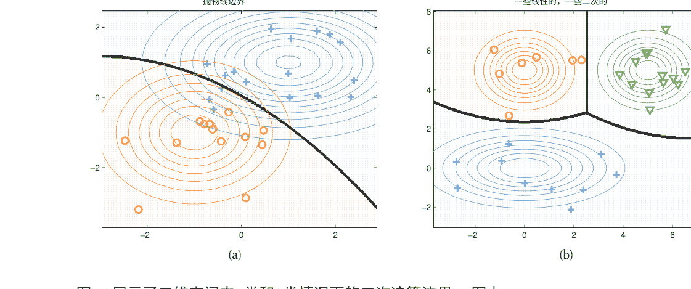

图4.3展示了二维空间中2类和3类情况下的二次决策边界。图由discrimAnalysisDboundariesDemo生成。

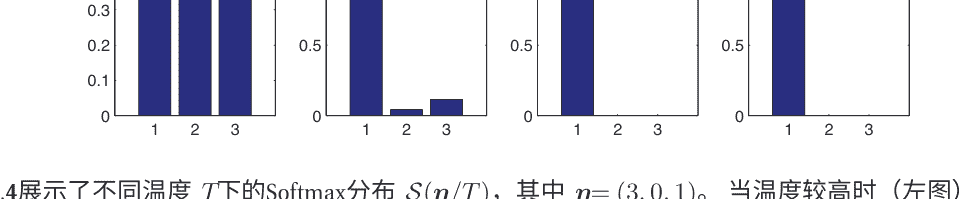

图4.4展示了不同温度 T 下的Softmax分布 S(\eta/T)，其中 \eta= (3, 0, 1)。当温度较高时（左图），分布是均匀的，而当温度较低时（右图），分布是“尖锐”的，所有的质量都集中在最大元素上。图由softmaxDemo2生成。

#### 4.2.2 线性判别分析（LDA）

现在我们考虑一个特殊情况，协方差矩阵在类别之间是相同的或共享的，即 \Sigma_c = \Sigma。在这种情况下，我们可以将方程4.33简化为以下形式：

$$p(y = c|\mathbf{x}, \theta) \propto \pi_c \exp\left[\boldsymbol{\mu}_c^T \Sigma^{-1} \mathbf{x} - \frac{1}{2} \mathbf{x}^T \Sigma^{-1} \mathbf{x} - \frac{1}{2} \boldsymbol{\mu}_c^T \Sigma^{-1} \boldsymbol{\mu}_c\right] \quad (4.34)$$

$$= \exp\left[\boldsymbol{\mu}_c^T \Sigma^{-1} \mathbf{x} - \frac{1}{2} \boldsymbol{\mu}_c^T \Sigma^{-1} \boldsymbol{\mu}_c + \log \pi_c\right] \exp\left[-\frac{1}{2} \mathbf{x}^T \Sigma^{-1} \mathbf{x}\right] \quad (4.35)$$

由于二次项 \mathbf{x}^T \Sigma^{-1} \mathbf{x} 与 c 无关，它在分子和分母中会相互抵消。如果我们定义

$$\gamma_c = -\frac{1}{2} \boldsymbol{\mu}_c^T \Sigma^{-1} \boldsymbol{\mu}_c + \log \pi_c \quad (4.36)$$

$$\beta_c = \Sigma^{-1} \boldsymbol{\mu}_c \quad (4.37)$$

然后我们可以写成

$$ p(y=c|\mathbf{x},\theta) = \frac{e^{\beta_c^T \mathbf{x} + \gamma_c}}{\sum_{c'} e^{\beta_{c'}^T \mathbf{x} + \gamma_{c'}}} = \mathcal{S}(\eta)_c \quad (4.38) $$

其中 $\eta= [\beta_1^T \mathbf{x} + \gamma_1, \ldots, \beta_C^T \mathbf{x} + \gamma_C]$, 而 $\mathcal{S}$ 是softmax函数，定义如下：

$$ \mathcal{S}(\eta)_c = \frac{e^{\eta_c}}{\sum_{c'=1}^C e^{\eta_{c'}}} \quad (4.39) $$

softmax函数之所以被称为softmax函数，是因为它有点像max函数。为了看到这一点，让我们将每个 $\eta_c$ 除以一个叫做温度 $T$ 的常数。当 $T \to 0$ 时，我们发现

$$ \mathcal{S}(\eta/T)_c = \begin{cases} 1.0 & \text{if } c = \argmax_{c'} \eta_{c'} \\ 0.0 & \text{otherwise} \end{cases} \quad (4.40) $$

换句话说，在低温下，分布基本上会在最可能的状态中度过大部分时间，而在高温下，它会均匀地访问所有状态。参见图4.4以进行说明。请注意，这个术语来自统计物理学领域，在那里通常使用与softmax函数具有相同形式的Boltzmann分布。

方程式4.38的一个有趣特性是，如果我们取对数，我们最终得到一个关于$\mathbf{x}$的线性函数。（它是线性的原因是因为分子和分母中的$\mathbf{x}^T \Sigma^{-1} \mathbf{x}$相互抵消。）因此，任意两个类别之间的决策边界，比如$c$和$c'$，将是一条直线。因此，这种技术被称为线性判别分析或LDA。我们可以通过以下方式推导出这条线的形式：

$$ p(y = c|\mathbf{x}, \theta) = p(y = c'|\mathbf{x}, \theta) \quad \text{(4.41)} $$
$$ \beta_c^T \mathbf{x} + \gamma_c = \beta_{c'}^T \mathbf{x} + \gamma_{c'} \quad \text{(4.42)} $$
$$ \mathbf{x}^T (\beta_{c'} - \beta_c) = \gamma_{c'} - \gamma_c \quad \text{(4.43)} $$

请参见图4.5中的一些示例。

除了拟合LDA模型然后推导类后验之外，另一种方法是直接拟合 $p(y|\mathbf{x}, \mathbf{W}) = \text{Cat}(y| \mathbf{W} \mathbf{x})$ 对于一些 $C \times D$ 权重矩阵 $\mathbf{W}$。这被称为多类逻辑回归，或多项式逻辑回归。我们将在第8.2节详细讨论这个模型。两种方法之间的差异在第8.6节中解释。

### 4.2.3 二分类LDA

为了进一步了解这些方程的含义，让我们考虑二进制情况。在这种情况下，后验概率为

$$ p(y = 1|\mathbf{x}, \theta) = \frac{e^{\beta_1^T \mathbf{x} + \gamma_1}}{e^{\beta_1^T \mathbf{x} + \gamma_1} + e^{\beta_0^T \mathbf{x} + \gamma_0}} = \frac{1}{1 + e^{(\beta_0 - \beta_1)^T \mathbf{x} + (\gamma_0 - \gamma_1)}} = \text{sigm} \left( (\beta_1 - \beta_0)^T \mathbf{x} + (\gamma_1 - \gamma_0) \right) \quad (4.44) $$

1. 缩写“LDA”可以表示“线性判别分析”或“潜在狄利克雷分配”（第27.3节）。我们希望从文本中可以清楚地理解其含义。
2. 在语言建模社区中，这个模型被称为最大熵模型，原因在第9.2.6节中解释。

## 线性边界

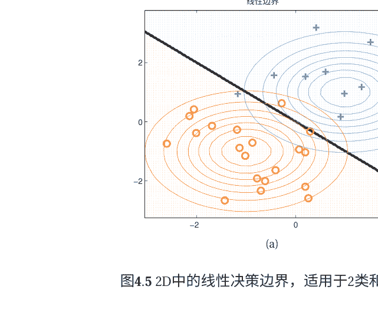

## 所有线性边界

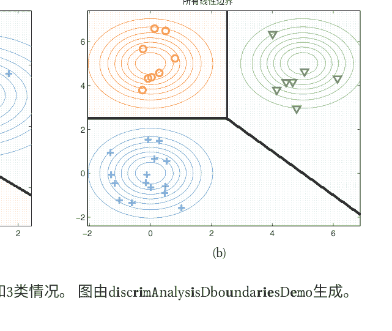

图4.5 2D中的线性决策边界，适用于2类和3类情况。图由discrimAnalysisDboundariesDemo生成。

## 图4.6 LDA在2类情况下的几何形状，其中Σ₁ = Σ₂ = I。


其中sigm(η)指的是sigmoid函数（方程1.10）。现在

$$\gamma_1 - \gamma_0 = -\frac{1}{2}\mu_1^T\Sigma^{-1}\mu_1 + \frac{1}{2}\mu_0^T\Sigma^{-1}\mu_0 + \log(\pi_1/\pi_0) \quad (4.46)$$

$$= -\frac{1}{2}(\mu_1 - \mu_0)^T\Sigma^{-1}(\mu_1 + \mu_0) + \log(\pi_1/\pi_0) \quad (4.47)$$

因此，如果我们定义

$$\mathbf{w} = \beta_1 - \beta_0 = \Sigma^{-1}(\mu_1 - \mu_0) \quad (4.48)$$

$$\mathbf{x}_0 = \frac{1}{2}(\mu_1 + \mu_0) - (\mu_1 - \mu_0)\frac{\log(\pi_1/\pi_0)}{(\mu_1 - \mu_0)^T\Sigma^{-1}(\mu_1 - \mu_0)} \quad (4.49)$$

那么我们有 $\mathbf{w}^T \mathbf{x}_0 = -(\gamma_1 - \gamma_0)$，因此 $p(y = 1 | \mathbf{x}_0)$。（这与逻辑回归密切相关，我们将在第8.2节中讨论。）因此，最终的决策规则如下：将 $\mathbf{x}$ 移位为 $\mathbf{x}_0$，投影到线 $\mathbf{w}$ 上，并查看结果是正还是负。

如果 $\Sigma = \sigma^2 \mathbf{I}$，那么 $\mathbf{w}$ 在 $\boldsymbol{\mu}_1 - \boldsymbol{\mu}_0$ 的方向上。因此，我们根据其投影离 $\boldsymbol{\mu}_0$ 或 $\boldsymbol{\mu}_1$ 更近来对点进行分类。这在图4.6中有所说明。此外，如果 $\pi_1 = \pi_0$，则 $\mathbf{x}_0 = \frac{1}{2} (\boldsymbol{\mu}_1 + \boldsymbol{\mu}_0)$，这是两个均值之间的中点。如果我们使 $\pi_1 > \pi_0$，则 $\mathbf{x}_0$ 更接近 $\boldsymbol{\mu}_0$，因此线的更多部分属于类别1 a priori。相反，如果 $\pi_1 < \pi_0$，则边界向右移动。因此，我们可以看到类别先验 $\pi_c$ 只会改变决策阈值，而不会改变整体几何结构，正如我们之前所说的。（在多类情况下，类似的论证也适用。）$\mathbf{w}$ 的大小决定了逻辑函数的陡峭程度，并且取决于均值相对于方差的分离程度。在心理学和信号检测理论中，通常使用一个称为 d-prime 的量来定义信号与背景噪声的区分度。

$$d' \triangleq \frac{\mu_1 - \mu_0}{\sigma} \qquad (4.51)$$

其中 $\mu_1$ 是信号的均值，$\mu_0$ 是噪声的均值，$\sigma$ 是噪声的标准差。如果 $d'$ 很大，信号将更容易从噪声中区分出来。

#### 4.2.4 判别分析的最大似然估计

我们现在讨论如何拟合判别分析模型。最简单的方法是使用最大似然估计。对数似然函数如下所示：

$$\log p(\mathcal{D} | \boldsymbol{\theta}) = \left[ \sum_{i=1}^{N} \sum_{c=1}^{C} \mathbb{I}(y_i = c) \log \pi_c \right] + \sum_{c=1}^{C} \left[ \sum_{i: y_i = c} \log \mathcal{N}(\mathbf{x} | \boldsymbol{\mu}_c, \Sigma_c) \right] \qquad (4.52)$$

我们可以看到，这可以分解为一个关于 $\pi$ 的项，以及关于每个 $\boldsymbol{\mu}_c$ 和 $\Sigma_c$ 的 $C$ 项。因此，我们可以分别估计这些参数。对于类先验，我们有 $\hat{\pi}_c = \frac{N_c}{N}$，与朴素贝叶斯相同。对于类条件密度，我们只需根据其类标签对数据进行分区，并计算每个高斯分布的最大似然估计：

$$\hat{\boldsymbol{\mu}}_c = \frac{1}{N_c} \sum_{i: y_i = c} \mathbf{x}_i, \quad \hat{\Sigma}_c = \frac{1}{N_c} \sum_{i: y_i = c} (\mathbf{x}_i - \hat{\boldsymbol{\mu}}_c)(\mathbf{x}_i - \hat{\boldsymbol{\mu}}_c)^T \qquad (4.53)$$

参见 Matlab 实现的 `discrimAnalysisFit`。模型拟合后，可以使用 `discrimAnalysisPredict` 进行预测，该方法使用插值逼近。

#### 4.2.5 防止过拟合的策略

MLE方法的速度和简单性是其最大的吸引力之一。然而，在高维度中，MLE可能会过拟合。特别是，对于完整的协方差矩阵，如果 $N_c < D$，则 MLE 是奇异的。即使当 $N_c > D$ 时，MLE也可能是病态的，意味着它接近奇异。对于这个问题，有几种可能的解决方案：

- 为每个类使用对角协方差矩阵，假设特征在条件下是独立的；这相当于使用朴素贝叶斯分类器（第3.5节）。
- 使用一个完整的协方差矩阵，但强制它对所有类别都相同，$\Sigma_c = \Sigma$。这是一个参数绑定或者参数共享的例子，等同于LDA（第4.2.2节）。
- 使用一个对角协方差矩阵并且强制它共享。这被称为对角协方差LDA，并在第4.2.7节中讨论。
- 使用一个完整的协方差矩阵，但施加一个先验并将其积分掉。如果我们使用一个共轭先验，可以通过闭式形式进行计算，使用第4.6.3节的结果；这类似于第3.5.1.2节中的“贝叶斯朴素贝叶斯”方法。详见（Minka 2000f）的说明。
- 通过MAP估计来拟合一个完整的或对角的协方差矩阵。我们在下面讨论两种不同的先验。
- 将数据投影到低维子空间并在那里拟合高斯分布。参见第8.6.3.3节，了解找到最佳（最有区分性）线性投影的方法。

我们在下面讨论一些选项。

### ### 4.2.6 正则化LDA *（注：此标题层级根据内容判断调整为三级标题）

假设我们将协方差矩阵绑定在一起，所以$\Sigma_c = \Sigma$，就像LDA一样，并且我们使用逆Wishart先验进行MAP估计，形式为$\text{IW}(\text{diag}(\hat{\Sigma}_{mle}), \nu_0)$（见第4.5.1节）。那么我们有

$$\hat{\Sigma} = \lambda \text{diag}(\hat{\Sigma}_{mle}) + (1-\lambda) \hat{\Sigma}_{mle} \quad (4.54)$$

其中$\lambda$控制正则化的程度，这与先验的强度有关，$\nu_0$（详见第4.6.2.1节）。这种技术被称为正则化判别分析或RDA（Hastie等人，2009年，第656页）。

当我们评估类条件密度时，我们需要计算$\hat{\Sigma}^{-1}$，因此$\hat{\Sigma}^{-1}$。如果$D > N$，这是不可能计算的。然而，我们可以使用$X$的奇异值分解（第12.2.3节）来解决这个问题，如下所示。（请注意，这个技巧不能应用于QDA，因为它是一个关于$x$的非线性函数。）

设$X = U D V^T$为设计矩阵的奇异值分解，其中$V$是$D \times N$的矩阵，$U$是一个$N \times N$的正交矩阵，$D$是一个大小为$N$的对角矩阵。此外，定义$N \times N$矩阵$Z = U D$；这就像一个在较低维空间中的设计矩阵（因为我们假设$N < D$）。还定义$\mu_z = V^T \mu$为在这个降维空间中数据的均值；我们可以使用$\mu = V \mu_z$来恢复原始均值，因为$V^T V = V V^T = I$。有了这些定义，我们可以将 MLE 重写如下：

$$\hat{\Sigma}_{mle} = \frac{1}{N} \mathbf{X}^T \mathbf{X} - \boldsymbol{\mu} \boldsymbol{\mu}^T$$
$$= \frac{1}{N} (\mathbf{Z}\mathbf{V}^T)^T (\mathbf{Z}\mathbf{V}^T) - (\mathbf{V}\boldsymbol{\mu}_z)(\mathbf{V}\boldsymbol{\mu}_z)^T$$
$$= \frac{1}{N} \mathbf{V} \mathbf{Z}^T \mathbf{Z} \mathbf{V}^T - \mathbf{V} \boldsymbol{\mu}_z \boldsymbol{\mu}_z^T \mathbf{V}^T$$
$$= \mathbf{V} \left(\frac{1}{N} \mathbf{Z}^T \mathbf{Z} - \boldsymbol{\mu}_z \boldsymbol{\mu}_z^T \right) \mathbf{V}^T$$
$$= \mathbf{V} \hat{\Sigma}_z \mathbf{V}^T$$

其中 $\hat{\Sigma}_z$ 是 $\mathbf{Z}$ 的经验协方差。因此，我们可以将 MAP 估计重写为

$$\hat{\Sigma}_{map} = \mathbf{V} \tilde{\Sigma}_z \mathbf{V}^T$$
$$\tilde{\Sigma}_z = \lambda \mathrm{diag}(\hat{\Sigma}_z) + (1-\lambda)\hat{\Sigma}_z$$

然而，请注意，我们永远不需要实际计算 $D \times D$ 矩阵 $\hat{\Sigma}_{map}$。这是因为方程 4.38 告诉我们，使用 LDA 进行分类时，我们只需要计算 $p(y=c|\mathbf{x}, \boldsymbol{\theta}) \propto \exp(\delta_c)$，其中

$$\delta_c = -\mathbf{x}^T \boldsymbol{\beta}_c + \gamma_c, \quad \boldsymbol{\beta}_c = \hat{\Sigma}^{-1} \boldsymbol{\mu}_c, \quad \gamma_c = -\frac{1}{2} \boldsymbol{\mu}_c^T \boldsymbol{\beta}_c + \log \pi_c$$

我们可以计算 RDA 的关键 $\boldsymbol{\beta}_c$ 项，而无需求逆 $D \times D$ 矩阵，如下所示：

$$\boldsymbol{\beta}_c = \hat{\Sigma}_{map}^{-1} \boldsymbol{\mu}_c = (\mathbf{V} \tilde{\Sigma}_z \mathbf{V}^T)^{-1} \boldsymbol{\mu}_c = \mathbf{V} \tilde{\Sigma}_z^{-1} \mathbf{V}^T \boldsymbol{\mu}_c = \mathbf{V} \tilde{\Sigma}_z^{-1} \boldsymbol{\mu}_{z,c}$$

其中 $\boldsymbol{\mu}_{z,c} = \mathbf{V}^T \boldsymbol{\mu}_c$ 是属于类别 $c$ 的数据的 $\mathbf{Z}$ 矩阵的均值。请参见 `rdaFit` 的代码。

### 4.2.7 对角线 LDA

一个简单的替代方法是将协方差矩阵绑定在一起，所以 $\Sigma_c = \Sigma$ as in LDA，并且对每个类别使用对角协方差矩阵。这被称为对角 LDA 模型，等价于 $\lambda=1$ 的 RDA。相应的判别函数如下（与方程 4.33 进行比较）：

$$\delta_c(\mathbf{x}) = \log p(\mathbf{x}, y=c|\boldsymbol{\theta}) = -\sum_{j=1}^{D} \frac{(x_j - \mu_{cj})^2}{2\sigma_j^2} + \log \pi_c$$

通常我们设置 $\hat{\mu}_{cj} = \bar{x}_{cj}$ 和 $\hat{\sigma}_j^2 = s_j^2$，这是特征 $j$ 的汇总经验方差（在类别间汇总）的定义：

$$s_j^2 = \frac{\sum_{c=1}^{C} \sum_{i: y_i=c} (x_{ij} - \bar{x}_{cj})^2}{N - C}$$

在高维度的情况下，这个模型比 LDA 和 RDA（Bickel 和 Levina 2004）更好。

## 4.2.8 最近收缩质心分类器

对角线LDA的一个缺点是它依赖于所有的特征。在高维问题中，我们可能更喜欢一种只依赖于特征子集的方法，原因是准确性和可解释性。一种方法是使用筛选方法，可能基于互信息，如第3.5.4节所述。我们现在讨论另一种解决这个问题的方法，即最近收缩质心分类器（Hastie等人，2009年，第652页）。

基本思想是对具有稀疏促进（拉普拉斯）先验的对角线LDA执行MAP估计（参见第13.3节）。更确切地说，通过类独立特征均值，$\mu_{cj}$，和类特定偏移量，$\Delta_{cj}$，来定义类特定特征均值。因此我们有

$\mu_{cj} = m_j + \Delta_{cj}$ (4.66)

然后我们将在$\Delta_{cj}$项上施加先验，以鼓励它们严格为零，并计算MAP估计。如果对于特征j，我们发现对于所有的c，$\Delta_{cj}=0$，则特征j在分类决策中将不起作用（因为$\mu_{cj}$将独立于c）。因此，不具有区分性的特征会自动被忽略。详细信息可以在（Hastie et al. 2009, p652）和（Greenshtein and Park 2009）中找到。参见`shrunkenCentroidsFit`一些代码。

让我们举一个方法实际应用的例子，基于（Hastie et al. 2009, p652）。考虑对基因表达数据集进行分类的问题，其中有2308个基因，4个类别，63个训练样本和20个测试样本。使用对角线LDA分类器在测试集上产生了5个错误。使用最近收缩的质心分类器在测试集上产生了0个错误，对于一系列λ值：参见图4.7。更重要的是，该模型是稀疏的，因此更容易解释：图4.8以灰色绘制了未经惩罚的差异估计值$d_{cj}$，以及收缩估计值$\Delta_{cj}$以蓝色绘制。（这些估计值是使用CV估计的λ值计算的。）我们可以看到，原始的2308个基因中只使用了39个基因。

现在考虑一个更难的问题，有16,603个基因，一个训练集有144个患者，一个测试集有54个患者，以及14种不同的癌症类型（Ramaswamy等，2001年）。Hastie等人（Hastie等人，2009年，第656页）报告最近的收缩质心在测试中产生了17个错误。图4.8对应于 λ = 4.4（图4.7中的CV最优）。这选择了39个基因。基于（Hastie等人，2009年）的图18.4。由 `shrunkenCentroidsSRBCTdemo` 生成的图。

使用6,520个基因，在测试集上RDA（第4.2.6节）产生了12个错误，使用全部16,603个基因。PMTK函数 `cancerHighDimClassifDemo` 可以用来重现这些数字。

### 4.3 联合高斯分布的推断

给定一个联合分布，p(x1,x2)，能够计算边缘分布 p(x1)和条件分布 p(x1|x2)是很有用的。我们将在下面讨论如何做到这一点，然后给出一些应用。这些操作在最坏情况下需要 O(D3)时间。更快的方法请参见第20.4.3节。

### 4.3.1 结果的陈述

定理 4.3.1(多元正态分布的边缘分布和条件分布)。假设 x= (x1, x2)是联合高斯分布，具有参数

```
\mu = \begin{pmatrix} \mu_1 \ \mu_2 \end{pmatrix}, \quad \Sigma = \begin{pmatrix} \Sigma_{11} & \Sigma_{12} \ \Sigma_{21} & \Sigma_{22} \end{pmatrix}, \quad \Lambda = \Sigma^{-1} = \begin{pmatrix} \Lambda_{11} & \Lambda_{12} \ \Lambda_{21} & \Lambda_{22} \end{pmatrix}
```

那么边缘分布为

```
\begin{aligned} p(\mathbf{x}_1) &= \mathcal{N}(\mathbf{x}_1 | \boldsymbol{\mu}_1, \Sigma_{11}) \ p(\mathbf{x}_2) &= \mathcal{N}(\mathbf{x}_2 | \boldsymbol{\mu}_2, \Sigma_{22}) \end{aligned}
```

后验条件概率由以下给出

> \begin{aligned} p(\mathbf{x}_1 | \mathbf{x}_2) &= \mathcal{N}(\mathbf{x}_1 | \boldsymbol{\mu}_{1|2}, \Sigma_{1|2}) \ \boldsymbol{\mu}_{1|2} &= \boldsymbol{\mu}_1 + \Sigma_{12}\Sigma_{22}^{-1}(\mathbf{x}_2 - \boldsymbol{\mu}_2) \ &= \boldsymbol{\mu}_1 - \Lambda_{11}^{-1}\Lambda_{12}(\mathbf{x}_2 - \boldsymbol{\mu}_2) \ &= \Sigma_{1|2}(\Lambda_{11}\boldsymbol{\mu}_1 - \Lambda_{12}(\mathbf{x}_2 - \boldsymbol{\mu}_2)) \ \Sigma_{1|2} &= \Sigma_{11} - \Sigma_{12}\Sigma_{22}^{-1}\Sigma_{21} = \Lambda_{11}^{-1} \end{aligned}

方程4.69在本书中非常重要，我们在其周围加了一个框，以便您可以轻松找到它。证明请参见第4.3.4节。

我们看到边缘分布和条件分布都是高斯分布。对于边缘分布，我们只需提取与 x₁ 或 x₂ 对应的行和列。对于条件分布，我们需要做更多的工作。然而，这并不复杂：条件均值只是 x₂ 的线性函数，条件协方差只是一个与 x₂ 无关的常数矩阵。我们给出了后验均值的三种不同（但等价）表达式，以及后验协方差的两种不同（但等价）表达式；每种表达式在不同情况下都很有用。

#### 4.3.2 示例

下面我们给出一些这些方程的实际示例，这将使它们更加直观。

### 4.3.2.1 二维高斯分布的边缘分布和条件分布

让我们考虑一个二维示例。协方差矩阵为

```
\Sigma = \begin{pmatrix} \sigma_1^2 & \rho \sigma_1 \sigma_2 \ \rho \sigma_1 \sigma_2 & \sigma_2^2 \end{pmatrix}
```

边缘分布 p(x₁)是一个一维高斯分布，通过将联合分布投影到 x₁ 线上获得：

```
p(x_1) = \mathcal{N}(x_1 | \mu_1, \sigma_1^2)
```

假设我们观察到 X2 = x2；通过在 X2 = x2线上“切割”联合分布，得到条件分布 p(x1 | x2) (见图4.9)：

```
p(x1|x2) = N(x1|μ1 + (ρσ1σ2/σ2^2)(x2 - μ2), σ1^2 - ((ρσ1σ2)^2/σ2^2)) (4.72)
```

如果 σ1 = σ2 = σ, 我们得到

```
p(x1|x2) = N(x1|μ1 + ρ(x2 - μ2), σ^2(1 - ρ^2)) (4.73)
```

在图4.9中，我们展示了一个例子，其中 ρ = 0.8, σ1 = σ2 = 1, μ = 0 和 x2 = 1。我们看到 E[x1|x2 = 1] = 0.8，这是有道理的，因为 ρ = 0.8 意味着我们相信如果 x2 增加1（超过其均值），那么 x1 增加0.8。我们还看到 var[x1|x2 = 1] = 1 - 0.8^2 = 0.36。这也是有道理的：我们对 x1 的不确定性降低了，因为我们通过观察 x2 间接地了解了一些关于 x1 的信息。如果 ρ = 0, 我们得到 p(x1|x2) = N(x1|μ1, σ1^2), 因为 x2 对于 x1 没有提供任何关于它们是否不相关（因此独立）的信息。

### 4.3.2.2 插值无噪声数据

假设我们想要估计一个定义在区间 [0, T] 上的一维函数，使得 yi = f(ti) 对于 N 观测点 ti。我们暂时假设数据是无噪声的，所以我们想要对其进行插值，即找到一个完全通过数据的函数。（有关有噪声数据情况，请参见第4.4.2.3节。）问题是：在观测数据点之间，函数的行为如何？通常可以合理地假设未知函数是平滑的。在第15章中，我们将看到如何对函数进行先验编码，并如何使用观测值更新此先验以获得函数的后验。但在本节中，我们采用了一种更简单的方法，适用于对一维输入定义的函数进行 MAP 估计。我们遵循 (Calvetti 和 Somersalo 2007 年，第135页) 的介绍。

我们通过离散化问题来开始。首先，我们将函数的支持分成 D 个等分段。然后我们定义

```
xj = f(sj), sj = jh, h = T/D, 1 ≤ j ≤ D (4.74)
```

我们可以通过假设 $x_j$是其邻居 $x_{j-1}$ 和 $x_{j+1}$的平均值加上一些高斯噪声来编码我们的平滑先验：

$$ x_j = \frac{1}{2}(x_{j-1} + x_{j+1}) + \epsilon_j, \quad 2 \le j \le D-2 $$

精度项 λ控制着我们认为函数会变化的程度：较大的 λ表示函数非常平滑，较小的 λ表示函数非常“抖动”。用向量形式表示，上述方程可以写成如下形式：

$$ \mathbf{Lx} = \epsilon $$

其中 $\mathbf{L}$是 $(D-2) \times D$二阶有限差分矩阵

$$ \mathbf{L} = \frac{1}{2} \begin{pmatrix} -1 & 2 & -1 & & \ & -1 & 2 & -1 & \ & & \ddots & & \ & & & -1 & 2 & -1 \end{pmatrix} $$

相应的先验分布具有以下形式

$$ p(\mathbf{x}) = \mathcal{N}(\mathbf{x}|\mathbf{0}, (\lambda^2 \mathbf{L}^T \mathbf{L})^{-1}) \propto \exp \left( -\frac{\lambda^2}{2} \|\mathbf{Lx}\|_2^2 \right) $$

我们将从现在开始假设我们已经按比例缩放了 $\mathbf{L}$通过 $\lambda$，所以我们可以忽略 $\lambda$项，只需写成 $\mathbf{\Lambda} = \mathbf{L}^T \mathbf{L}$表示精度矩阵。请注意，尽管 $\mathbf{x}$是 $D$维的，但精度矩阵 $\mathbf{\Lambda}$的秩只有 $D-2$。因此，这是一个不恰当的先验，被称为内在高斯随机场（见第19.4.4节）。然而，只要我们观察到 N ≥ 2个数据点，后验概率就是正确的。

现在让 x₂是函数的 N个无噪声观测值， x₁是 D - N个未知函数值。不失一般性，假设未知变量先排序，然后是已知变量。 然后我们可以将 L矩阵分割如下：

```
L = [L₁, L₂], L₁ ∈ ℝ^(D-2)×(D-N), L₂ ∈ ℝ^(D-2)×(N)
```

我们还可以将联合分布的精度矩阵进行分区：

```
Λ = LᵀL = \begin{pmatrix} Λ_{11} & Λ_{12} \\ Λ_{21} & Λ_{22} \end{pmatrix} = \begin{pmatrix} L_1^T L_1 & L_1^T L_2 \\ L_2^T L_1 & L_2^T L_2 \end{pmatrix}
```

使用方程式4.69，我们可以将条件分布写成如下形式：

```
p(x₁|x₂) = \mathcal{N}(μ_{1|2}, Σ_{1|2}) \\ μ_{1|2} = -Λ_{11}^{-1} Λ_{12} x₂ = -L₁^T L₂ x₂ \\ Σ_{1|2} = Λ_{11}^{-1}
```

请注意，我们可以通过解以下线性方程组来计算均值：

```
L₁μ_{1|2} = -L₂x₂
```

这是高效的，因为 L₁是三对角的。图4.10给出了这些方程的示意图。 我们看到后验均值 μ_{1|2}等于指定点的观测数据，并且在之间平滑插值，正如我们所期望的。

有趣的是绘制95%的点态边际可信区间，μ_j ± 2\sqrt{Σ_{1|2,jj}}，在灰色中显示。 我们可以看到方差随着离开数据点的距离而增加。 我们还可以看到方差随着先验精度的降低而增加，λ。 有趣的是，先验精度 λ对后验均值没有影响，因为在乘以 Λ_{11}和 Λ_{12}时会抵消。 相比之下，在第4.4.2.3节中考虑噪声数据时，我们将看到先验精度会影响后验均值估计的平滑程度。

边际可信区间无法捕捉到相邻位置之间的相关性。 我们可以通过从后验中绘制完整函数（即向量 x）来表示这一点，并进行绘图。 这些在图4.10中用细线表示。 这些线不如后验均值本身平滑。 这是因为先验只惩罚一阶差异。 有关此问题的进一步讨论，请参见第4.4.2.3节。

### 4.3.2.3 数据插补

假设我们在设计矩阵中缺少一些条目。 如果列之间存在相关性，我们可以使用观察到的条目来预测缺失的条目。 图4.11显示了一个简单的例子。 我们从一个20维高斯分布中采样了一些数据，然后故意在每行中“隐藏”了50%的数据。然后，我们使用真实的（生成）模型推断出观察到的条目给出的缺失条目。 更准确地说，对于每一行 i，我们计算 p(x_{h_i} | x_{v_i}, θ)，其中 h_i 和 v_i 是案例 i 中隐藏和可见条目的索引。 从这个中，我们计算每个缺失变量的边际分布，p(x_{h_{i,j}} | x_{v_i}, θ)。 然后我们绘制这个分布的均值，\hat{x}_{ij} = 𝔼[x_j | x_{v_i}, θ]；这代表了我们对条目真实值的“最佳猜测”，在从期望的平方误差最小化的角度来看（详见第5.7节），这是有意义的。图4.11显示估计值与真实值非常接近。（当然，如果 \(j \in \mathbf{v}_i\)，则期望值等于观测值，\(\hat{x}_{ij} = x_{ijo}\)。）我们可以使用 \(\mathrm{var}\ \left[ x_{h_{ij}} | X \mathbf{V}_i, \boldsymbol{\theta} \right]\) 作为对这个猜测的置信度的度量，尽管这没有显示出来。或者，我们可以从 \(p(\mathbf{x}_{\mathrm{h}_i} | X \mathbf{V}_i, \boldsymbol{\theta})\) 中抽取多个样本；这被称为多重填补。

除了填补缺失的条目外，我们可能还对计算表中每个部分观察到的行的似然性感兴趣，\(p(\mathbf{x}_{\mathrm{v}_i} | \boldsymbol{\theta})\)，可以使用方程4.68计算。这对于检测异常值（非典型观测）很有用。

#### 4.3.3 信息形式

假设 \(\mathbf{x} \sim \mathcal{N}(\boldsymbol{\mu}, \boldsymbol{\Sigma})\)。可以证明 \(\mathbb{E}[\mathbf{x}] = \boldsymbol{\mu}\) 是均值向量，\(\mathrm{cov}[\mathbf{x}] = \boldsymbol{\Sigma}\) 是协方差矩阵。这些被称为分布的矩参数。然而，有时使用规范参数或自然参数是有用的，定义如下

```
\(\boldsymbol{\Lambda} \triangleq \boldsymbol{\Sigma}^{-1}, \quad \boldsymbol{\xi} \triangleq \boldsymbol{\Sigma}^{-1} \boldsymbol{\mu}\)
```

我们可以使用以下公式转换回矩参数

```
\(\boldsymbol{\mu} = \boldsymbol{\Lambda}^{-1} \boldsymbol{\xi}, \quad \boldsymbol{\Sigma} = \boldsymbol{\Lambda}^{-1}\)
```

使用规范参数，我们可以将MVN写成信息形式（即指数族形式，在第9.2节中定义）：

```
\(\mathcal{N}_c(\mathbf{x} | \boldsymbol{\xi}, \boldsymbol{\Lambda}) = (2\pi)^{-D/2} |\boldsymbol{\Lambda}|^{\frac{1}{2}} \exp \left[ -\frac{1}{2} \left( \mathbf{x}^T \boldsymbol{\Lambda} \mathbf{x} + \boldsymbol{\xi}^T \boldsymbol{\Lambda}^{-1} \boldsymbol{\xi} - 2\mathbf{x}^T \boldsymbol{\xi} \right) \right]\)
```

我们使用符号 \(\mathcal{N}_c()\) 来区分矩参数化 \(\mathcal{N}()\)。也可以通过信息形式推导边缘化和条件化公式。我们发现

```
\(p(\mathbf{x}_2) = \mathcal{N}_c(\mathbf{x}_2 | \boldsymbol{\xi}_2 - \boldsymbol{\Lambda}_{21} \boldsymbol{\Lambda}_{11}^{-1} \boldsymbol{\xi}_1, \boldsymbol{\Lambda}_{22} - \boldsymbol{\Lambda}_{21} \boldsymbol{\Lambda}_{11}^{-1} \boldsymbol{\Lambda}_{12})\) (4.88)
\(p(\mathbf{x}_1 | \mathbf{x}_2) = \mathcal{N}_c(\mathbf{x}_1 | \boldsymbol{\xi}_1 - \boldsymbol{\Lambda}_{12} \mathbf{x}_2, \boldsymbol{\Lambda}_{11})\) (4.89)
```

因此我们可以看到，在矩形式下，边际化更容易，而在信息形式下，条件化更容易。

在信息形式下，另一个显著容易的操作是两个高斯分布的乘法。可以证明

$$ \mathcal{N}_c(\xi_f, \lambda_f) \mathcal{N}_c(\xi_g, \lambda_g) = \mathcal{N}_c(\xi_f + \xi_g, \lambda_f + \lambda_g) $$

然而，在矩形式下，情况要复杂得多：

$$ \mathcal{N}(\mu_f, \sigma_f^2) \mathcal{N}(\mu_g, \sigma_g^2) = \mathcal{N}\left( \frac{\mu_f \sigma_g^2 + \mu_g \sigma_f^2}{\sigma_f^2 + \sigma_g^2}, \frac{\sigma_f^2 \sigma_g^2}{\sigma_f^2 + \sigma_g^2} \right) $$

## 4.3.4 结果的证明 *

我们现在证明定理4.3.1。对于对繁重的矩阵代数感到害怕的读者，可以安全地跳过本节。我们首先推导一些在本书中和其他地方都需要的结果。我们将在最后回到证明中。

### 4.3.4.1 使用舒尔补求分块矩阵的逆

我们需要的关键工具是求解分块矩阵的逆的方法。可以使用以下结果来完成这个任务。

定理4.3.2 (分块矩阵的逆)。 考虑一个一般的分块矩阵

$$ \mathbf{M} = \begin{pmatrix} \mathbf{E} & \mathbf{F} \\ \mathbf{G} & \mathbf{H} \end{pmatrix} $$

其中我们假设 $ \mathbf{E} $ 和 $ \mathbf{H} $ 是可逆的。我们有

$$ \mathbf{M}^{-1} = \begin{pmatrix} (\mathbf{M}/\mathbf{H})^{-1} & -(\mathbf{M}/\mathbf{H})^{-1} \mathbf{F} \mathbf{H}^{-1} \\ -\mathbf{H}^{-1} \mathbf{G} (\mathbf{M}/\mathbf{H})^{-1} & \mathbf{H}^{-1} + \mathbf{H}^{-1} \mathbf{G} (\mathbf{M}/\mathbf{H})^{-1} \mathbf{F} \mathbf{H}^{-1} \end{pmatrix} $$

$$ = \begin{pmatrix} \mathbf{E}^{-1} + \mathbf{E}^{-1} \mathbf{F} (\mathbf{M}/\mathbf{E})^{-1} \mathbf{G} \mathbf{E}^{-1} & -\mathbf{E}^{-1} \mathbf{F} (\mathbf{M}/\mathbf{E})^{-1} \\ -(\mathbf{M}/\mathbf{E})^{-1} \mathbf{G} \mathbf{E}^{-1} & (\mathbf{M}/\mathbf{E})^{-1} \end{pmatrix} $$

其中

$$ \mathbf{M}/\mathbf{H} \triangleq \mathbf{E} - \mathbf{F} \mathbf{H}^{-1} \mathbf{G} $$

$$ \mathbf{M}/\mathbf{E} \triangleq \mathbf{H} - \mathbf{G} \mathbf{E}^{-1} \mathbf{F} $$

我们说 $ \mathbf{M}/\mathbf{H} $ 是 $ \mathbf{M} $ 相对于 $ \mathbf{H} $ 的 Schur 补。 式(4.93)被称为分块逆公式。

证明。如果我们能够对 $ \mathbf{M} $ 进行分块对角化，那么求逆将会更容易。 为了将 $ \mathbf{M} $ 的右上方块清零，我们可以进行如下预乘

$$ \begin{pmatrix} \mathbf{I} & -\mathbf{F} \mathbf{H}^{-1} \\ \mathbf{0} & \mathbf{I} \end{pmatrix} \begin{pmatrix} \mathbf{E} & \mathbf{F} \\ \mathbf{G} & \mathbf{H} \end{pmatrix} = \begin{pmatrix} \mathbf{E} - \mathbf{F} \mathbf{H}^{-1} \mathbf{G} & \mathbf{0} \\ \mathbf{G} & \mathbf{H} \end{pmatrix} $$

同样地，为了将左下角归零，我们可以进行后乘操作如下

$$\begin{pmatrix} \mathbf{E} - \mathbf{F}\mathbf{H}^{-1}\mathbf{G} & \mathbf{0} \\ \mathbf{G} & \mathbf{H} \end{pmatrix}\begin{pmatrix} \mathbf{I} & \mathbf{0} \\ -\mathbf{H}^{-1}\mathbf{G} & \mathbf{I} \end{pmatrix} = \begin{pmatrix} \mathbf{E} - \mathbf{F}\mathbf{H}^{-1}\mathbf{G} & \mathbf{0} \\ \mathbf{0} & \mathbf{H} \end{pmatrix}$$ (4.98)

将所有这些放在一起，我们得到

$$\underbrace{\begin{pmatrix} \mathbf{I} & -\mathbf{F}\mathbf{H}^{-1} \\ \mathbf{0} & \mathbf{I} \end{pmatrix}}_{\mathbf{X}} \underbrace{\begin{pmatrix} \mathbf{E} & \mathbf{F} \\ \mathbf{G} & \mathbf{H} \end{pmatrix}}_{\mathbf{M}} \underbrace{\begin{pmatrix} \mathbf{I} & \mathbf{0} \\ -\mathbf{H}^{-1}\mathbf{G} & \mathbf{I} \end{pmatrix}}_{\mathbf{Z}} = \underbrace{\begin{pmatrix} \mathbf{E} - \mathbf{F}\mathbf{H}^{-1}\mathbf{G} & \mathbf{0} \\ \mathbf{0} & \mathbf{H} \end{pmatrix}}_{\mathbf{W}}$$ (4.99)

对两边取逆得到

$$\mathbf{Z}^{-1}\mathbf{M}^{-1}\mathbf{X}^{-1} = \mathbf{W}^{-1}$$ (4.100)

因此

$$\mathbf{M}^{-1} = \mathbf{Z}\mathbf{W}^{-1}\mathbf{X}$$ (4.101)

将定义代入我们得到

$$\begin{pmatrix} \mathbf{E} & \mathbf{F} \\ \mathbf{G} & \mathbf{H} \end{pmatrix}^{-1} = \begin{pmatrix} \mathbf{I} & \mathbf{0} \\ -\mathbf{H}^{-1}\mathbf{G} & \mathbf{I} \end{pmatrix} \begin{pmatrix} (\mathbf{M}/\mathbf{H})^{-1} & \mathbf{0} \\ \mathbf{0} & \mathbf{H}^{-1} \end{pmatrix} \begin{pmatrix} \mathbf{I} & -\mathbf{F}\mathbf{H}^{-1} \\ \mathbf{0} & \mathbf{I} \end{pmatrix}$$ (4.102)

$$= \begin{pmatrix} (\mathbf{M}/\mathbf{H})^{-1} & \mathbf{0} \\ -\mathbf{H}^{-1}\mathbf{G}(\mathbf{M}/\mathbf{H})^{-1} & \mathbf{H}^{-1} \end{pmatrix} \begin{pmatrix} \mathbf{I} & -\mathbf{F}\mathbf{H}^{-1} \\ \mathbf{0} & \mathbf{I} \end{pmatrix}$$ (4.103)

$$= \begin{pmatrix} (\mathbf{M}/\mathbf{H})^{-1} & -(\mathbf{M}/\mathbf{H})^{-1}\mathbf{F}\mathbf{H}^{-1} \\ -\mathbf{H}^{-1}\mathbf{G}(\mathbf{M}/\mathbf{H})^{-1} & \mathbf{H}^{-1} + \mathbf{H}^{-1}\mathbf{G}(\mathbf{M}/\mathbf{H})^{-1}\mathbf{F}\mathbf{H}^{-1} \end{pmatrix}$$ (4.104)

或者，我们可以将矩阵 $\mathbf{M}$ 分解为 $\mathbf{E}$ 和 $\mathbf{M}/\mathbf{E}= (\mathbf{H} - \mathbf{G}\mathbf{E}^{-1}\mathbf{F})$，得到

$$\begin{pmatrix} \mathbf{E} & \mathbf{F} \\ \mathbf{G} & \mathbf{H} \end{pmatrix}^{-1} = \begin{pmatrix} \mathbf{E}^{-1} + \mathbf{E}^{-1}\mathbf{F}(\mathbf{M}/\mathbf{E})^{-1}\mathbf{G}\mathbf{E}^{-1} & -\mathbf{E}^{-1}\mathbf{F}(\mathbf{M}/\mathbf{E})^{-1} \\ -(\mathbf{M}/\mathbf{E})^{-1}\mathbf{G}\mathbf{E}^{-1} & (\mathbf{M}/\mathbf{E})^{-1} \end{pmatrix}$$ (4.105)

$$\square$$

### 4.3.4.2 矩阵求逆引理

我们现在推导出上述结果的一些有用推论。

推论 4.3.1(矩阵求逆引理)。考虑一个一般的分块矩阵 $\mathbf{M} = \begin{pmatrix} \mathbf{E} & \mathbf{F} \\ \mathbf{G} & \mathbf{H} \end{pmatrix}$，其中我们假设 $\mathbf{E}$ 和 $\mathbf{H}$ 是可逆的。我们有

$$(\mathbf{E} - \mathbf{F}\mathbf{H}^{-1}\mathbf{G})^{-1} = \mathbf{E}^{-1} + \mathbf{E}^{-1}\mathbf{F}(\mathbf{H} - \mathbf{G}\mathbf{E}^{-1}\mathbf{F})^{-1}\mathbf{G}\mathbf{E}^{-1}$$ (4.106)

$$(\mathbf{E} - \mathbf{F}\mathbf{H}^{-1}\mathbf{G})^{-1}\mathbf{F}\mathbf{H}^{-1} = \mathbf{E}^{-1}\mathbf{F}(\mathbf{H} - \mathbf{G}\mathbf{E}^{-1}\mathbf{F})^{-1}$$ (4.107)

$$|\mathbf{E} - \mathbf{F}\mathbf{H}^{-1}\mathbf{G}| = |\mathbf{H} - \mathbf{G}\mathbf{E}^{-1}\mathbf{F}||\mathbf{H}^{-1}||\mathbf{E}|$$ (4.108)

前两个方程被称为矩阵求逆引理或Sherman-Morrison-Woodbury公式。第三个方程被称为矩阵行列式引理。机器学习/统计学中的一个典型应用是以下情况。设E = Σ为一个N × N对角矩阵，设F = G^T = X of大小为N × D，其中N ≫ D，并且设H^{-1} = -I。那么我们有

$$(\Sigma + \mathbf{X}\mathbf{X}^T)^{-1} = \Sigma^{-1} - \Sigma^{-1}\mathbf{X}(\mathbf{I} + \mathbf{X}^T\Sigma^{-1}\mathbf{X})^{-1}\mathbf{X}^T\Sigma^{-1} \quad (4.109)$$

LHS计算时间为O(N^3)，RHS计算时间为O(D^3)。另一个应用涉及计算逆矩阵的秩一更新。令H = -1(一个标量)，F = u(一个列向量)，G = v^T(一个行向量)。那么我们有

$$(\mathbf{E} + \mathbf{u}\mathbf{v}^T)^{-1} = \mathbf{E}^{-1} + \mathbf{E}^{-1}\mathbf{u}(-1 - \mathbf{v}^T\mathbf{E}^{-1}\mathbf{u})^{-1}\mathbf{v}^T\mathbf{E}^{-1} \quad (4.110)$$

$$= \mathbf{E}^{-1} - \frac{\mathbf{E}^{-1}\mathbf{u}\mathbf{v}^T\mathbf{E}^{-1}}{1 + \mathbf{v}^T\mathbf{E}^{-1}\mathbf{u}} \quad (4.111)$$

当我们逐步将数据向量添加到设计矩阵中并且想要更新我们的充分统计量时，这非常有用。（可以推导出类似的公式来移除数据向量。）证明。为了证明方程4.106，我们只需将方程4.93和方程4.94的左上角块相等。为了证明方程4.107，我们只需将方程4.93和方程4.94的右上角块相等。方程4.108的证明留作练习。 □

### 4.3.4.3 高斯条件公式的证明

现在我们可以回到我们最初的目标，即推导出方程4.69。让我们将联合概率分解为p(x1, x2) as p(x2)p(x1|x2)as如下：

$$E = \exp\left\{-\frac{1}{2} \begin{pmatrix} \mathbf{x}_1 - \boldsymbol{\mu}_1 \\ \mathbf{x}_2 - \boldsymbol{\mu}_2 \end{pmatrix}^T \begin{pmatrix} \boldsymbol{\Sigma}_{11} & \boldsymbol{\Sigma}_{12} \\ \boldsymbol{\Sigma}_{21} & \boldsymbol{\Sigma}_{22} \end{pmatrix}^{-1} \begin{pmatrix} \mathbf{x}_1 - \boldsymbol{\mu}_1 \\ \mathbf{x}_2 - \boldsymbol{\mu}_2 \end{pmatrix}\right\} \quad (4.112)$$

使用方程式4.102，上述指数变为

$$E = \exp\left\{-\frac{1}{2} \begin{pmatrix} \mathbf{x}_1 - \boldsymbol{\mu}_1 \\ \mathbf{x}_2 - \boldsymbol{\mu}_2 \end{pmatrix}^T \begin{pmatrix} \mathbf{I} & \mathbf{0} \\ -\boldsymbol{\Sigma}_{22}^{-1}\boldsymbol{\Sigma}_{21} & \mathbf{I} \end{pmatrix} \begin{pmatrix} (\boldsymbol{\Sigma}/\boldsymbol{\Sigma}_{22})^{-1} & \mathbf{0} \\ \mathbf{0} & \boldsymbol{\Sigma}_{22}^{-1} \end{pmatrix} \quad (4.113)$$

$$\times \begin{pmatrix} \mathbf{I} & -\boldsymbol{\Sigma}_{12}\boldsymbol{\Sigma}_{22}^{-1} \\ \mathbf{0} & \mathbf{I} \end{pmatrix} \begin{pmatrix} \mathbf{x}_1 - \boldsymbol{\mu}_1 \\ \mathbf{x}_2 - \boldsymbol{\mu}_2 \end{pmatrix}\right\} \quad (4.114)$$

$$= \exp\left\{-\frac{1}{2}(\mathbf{x}_1 - \boldsymbol{\mu}_1 - \boldsymbol{\Sigma}_{12}\boldsymbol{\Sigma}_{22}^{-1}(\mathbf{x}_2 - \boldsymbol{\mu}_2))^T (\boldsymbol{\Sigma}/\boldsymbol{\Sigma}_{22})^{-1} \quad (4.115)$$

$$(\mathbf{x}_1 - \boldsymbol{\mu}_1 - \boldsymbol{\Sigma}_{12}\boldsymbol{\Sigma}_{22}^{-1}(\mathbf{x}_2 - \boldsymbol{\mu}_2))\right\} \times \exp\left\{-\frac{1}{2}(\mathbf{x}_2 - \boldsymbol{\mu}_2)^T \boldsymbol{\Sigma}_{22}^{-1}(\mathbf{x}_2 - \boldsymbol{\mu}_2)\right\} \quad (4.116)$$

这是一个形式

$$\exp(\text{二次形式在 } \mathbf{x}_1,\mathbf{x}_2) \times \exp(\text{二次形式在 } \mathbf{x}_2) \quad (4.117)$$

因此，我们成功地将联合分解为：
$$
p(\mathbf{x}_1, \mathbf{x}_2) = p(\mathbf{x}_1|\mathbf{x}_2)p(\mathbf{x}_2) \quad (4.118)
$$
$$
= \mathcal{N}(\mathbf{x}_1|\boldsymbol{\mu}_{1|2}, \boldsymbol{\Sigma}_{1|2}) \mathcal{N}(\mathbf{x}_2|\boldsymbol{\mu}_2, \boldsymbol{\Sigma}_{22}) \quad (4.119)
$$

其中条件分布的参数可以从上述方程中读取。

使用
$$
\boldsymbol{\mu}_{1|2} = \boldsymbol{\mu}_1 + \boldsymbol{\Sigma}_{12}\boldsymbol{\Sigma}_{22}^{-1}(\mathbf{x}_2 - \boldsymbol{\mu}_2) \quad (4.120)
$$
$$
\boldsymbol{\Sigma}_{1|2} = \boldsymbol{\Sigma}/\boldsymbol{\Sigma}_{22} = \boldsymbol{\Sigma}_{11} - \boldsymbol{\Sigma}_{12}\boldsymbol{\Sigma}_{22}^{-1}\boldsymbol{\Sigma}_{21} \quad (4.121)
$$

我们还可以使用 $|\mathbf{M}| = |\mathbf{M}/\mathbf{H}||\mathbf{H}|$ 来检查归一化常数是否正确：
$$
(2\pi)^{(d_1+d_2)/2}|\boldsymbol{\Sigma}|^{\frac{1}{2}} = (2\pi)^{(d_1+d_2)/2}(|\boldsymbol{\Sigma}/\boldsymbol{\Sigma}_{22}| |\boldsymbol{\Sigma}_{22}|)^{\frac{1}{2}} \quad (4.122)
$$
$$
= (2\pi)^{d_1/2}|\boldsymbol{\Sigma}/\boldsymbol{\Sigma}_{22}|^{\frac{1}{2}} (2\pi)^{d_2/2}|\boldsymbol{\Sigma}_{22}|^{\frac{1}{2}} \quad (4.123)
$$

其中 $d_1 = \text{dim}(\mathbf{x}_1)$ 且 $d_2 = \text{dim}(\mathbf{x}_2)$。

我们将留下方程4.69结果的其他形式的证明作为练习。

### 4.4 线性高斯系统

假设我们有一个线性高斯系统。令 $\mathbf{x} \in \mathbb{R}^{D_x}$ 为一个隐藏变量，$\mathbf{y} \in \mathbb{R}^{D_y}$ 为 $\mathbf{x}$ 的一个带噪声的观测。让我们假设我们有以下先验概率和似然函数：
$$
p(\mathbf{x}) = \mathcal{N}(\mathbf{x}|\boldsymbol{\mu}_x, \boldsymbol{\Sigma}_x)
$$
$$
p(\mathbf{y}|\mathbf{x}) = \mathcal{N}(\mathbf{y}|\mathbf{A}\mathbf{x} + \mathbf{b}, \boldsymbol{\Sigma}_y) \quad (4.124)
$$

其中 $\mathbf{A}$ 是一个大小为 $D_y \times D_x$ 的矩阵。这是一个线性高斯系统的例子。我们可以将其图示为 $\mathbf{x} \rightarrow \mathbf{y}$，表示 $\mathbf{x}$ 生成 $\mathbf{y}$。在本节中，我们将展示如何“反转箭头”，即如何从 $\mathbf{y}$ 推断出 $\mathbf{x}$。我们先给出结果，然后给出几个例子，最后推导结果。我们将在后面的章节中看到这些结果的更多应用。

## 4.4.1 结果的陈述

定理 4.4.1（线性高斯系统的贝叶斯规则）。给定一个线性高斯系统，如方程式 4.124 所示，后验概率 $p(\mathbf{x}|\mathbf{y})$ 由以下公式给出：
$$
p(\mathbf{x}|\mathbf{y}) = \mathcal{N}(\mathbf{x}|\boldsymbol{\mu}_{x|y}, \boldsymbol{\Sigma}_{x|y})
$$
$$
\boldsymbol{\Sigma}_{x|y}^{-1} = \boldsymbol{\Sigma}_x^{-1} + \mathbf{A}^T \boldsymbol{\Sigma}_y^{-1} \mathbf{A} \quad (4.125)
$$
$$
\boldsymbol{\mu}_{x|y} = \boldsymbol{\Sigma}_{x|y}[\mathbf{A}^T \boldsymbol{\Sigma}_y^{-1} (\mathbf{y} - \mathbf{b}) + \boldsymbol{\Sigma}_x^{-1} \boldsymbol{\mu}_x]
$$

此外，归一化常数 $p(\mathbf{y})$ 由以下给出
$$
p(\mathbf{y}) = \mathcal{N}(\mathbf{y}|\mathbf{A}\boldsymbol{\mu}_x + \mathbf{b}, \boldsymbol{\Sigma}_y + \mathbf{A}\boldsymbol{\Sigma}_x \mathbf{A}^T)
$$

证明见第4.4.3节。

#### 4.4.2 示例

在本节中，我们给出了上述结果的一些示例应用。

### 4.4.2.1 从噪声测量中推断未知标量

假设我们对某个基础量 $x$ 进行 $N$ 个噪声测量 $y_i$；让我们假设测量噪声具有固定精度 $\lambda_y = 1/\sigma^2$，因此似然函数为
$$
p(y_i|x) \quad = \quad \mathcal{N}(y_i|x, \lambda_y^{-1})
$$

现在让我们对未知源的值使用高斯先验分布：
$$
p(x) \quad = \quad \mathcal{N}(x|\mu_0, \lambda_0^{-1})
$$

我们想要计算 $p(x|y_1, \ldots, y_N, \sigma^2)$。我们可以通过定义 $y= (y_1, \ldots, y_N)$, $A = \mathbf{1}^T_N$（一个 $1 \times N$ 行向量，全为1），以及 $\Sigma_y^{-1} = \text{diag}(\lambda_y I)$，将其转化为适用于高斯贝叶斯规则的形式。然后我们得到
$$
\begin{aligned}
p(x|\mathbf{y}) &= \mathcal{N}(x|\mu_N, \lambda_N^{-1}) \\
\lambda_N &= \lambda_0 + N \lambda_y \\
\mu_N &= \frac{N \lambda_y \overline{y} + \lambda_0 \mu_0}{\lambda_N} = \frac{N \lambda_y}{N \lambda_y + \lambda_0} \overline{y} + \frac{\lambda_0}{N \lambda_y + \lambda_0} \mu_0
\end{aligned}
$$

这些方程非常直观：后验精度 $\lambda_N$ 是先验精度 $\lambda_0$ 加上 $N$ 个测量精度 $\lambda_y$。此外，后验均值 $\mu_N$ 是最大似然估计 $\overline{y}$ 和先验均值 $\mu_0$ 的凸组合。这使得后验均值是最大似然估计和先验之间的折衷。如果先验相对于信号强度较弱($\lambda_0$ 相对于 $\lambda_y$ 较小)，我们更加重视最大似然估计。如果先验相对于信号强度较强($\lambda_0$ 相对于 $\lambda_y$ 较大)，我们更加重视先验。这在图4.12中有所说明，该图与图3.6中的贝塔二项式模型的类似结果非常相似。

请注意，后验均值是用 $N \lambda_y \overline{y}$ 来表示的，因此具有 $N$ 个测量值，每个测量值的精度为 $\lambda_y$，就相当于具有一个值为 $\overline{y}$ 且精度为 $N \lambda_y$ 的测量值。我们可以将结果重新表示为后验方差，而不是后验精度。

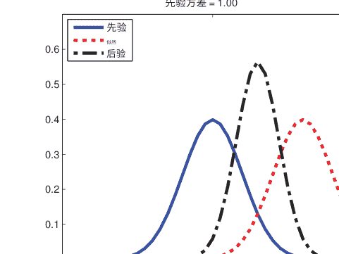

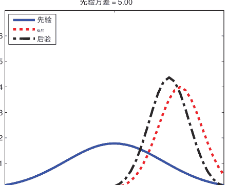

图4.12 在给定噪声观测值 $y= 3$ 的情况下对 $x$ 的推断。 (a) 强先验 $\mathcal{N}(0,1)$。后验均值‘收缩’到先验均值，即0。 (b) 弱先验 $\mathcal{N}(0,5)$。后验均值类似于MLE。图由 `gaussInferParamsMean1d` 生成。

如下：
$$
p(x|\mathcal{D}, \sigma^2) = \mathcal{N}(x|\mu_N, \tau_N^2) \quad (4.132)
$$
$$
\tau_N^2 = \frac{1}{\frac{N}{\sigma^2} + \frac{1}{\tau_0^2}} = \frac{\sigma^2 \tau_0^2}{N \tau_0^2 + \sigma^2} \quad (4.133)
$$
$$
\mu_N = \tau_N^2 \left( \frac{\mu_0}{\tau_0^2} + \frac{N \bar{y}}{\sigma^2} \right) = \frac{\sigma^2}{N \tau_0^2 + \sigma^2} \mu_0 + \frac{N \tau_0^2}{N \tau_0^2 + \sigma^2} \bar{y} \quad (4.134)
$$

其中 $\tau_0^2= 1/\lambda_0$ 是先验方差， $\tau_N^2 = 1/\lambda_N$ 是后验方差。

我们还可以在每次观察后逐步计算后验概率。 如果 $N=1$，我们可以将在观察到单个观测后的后验概率重写为以下形式（其中我们定义 $\Sigma_y = \sigma^2$， $\Sigma_0 = \tau_0^2$ 和 $\Sigma_1 = \tau_1^2$ 为似然、先验和后验的方差）：
$$
p(x|y) = \mathcal{N}(x|\mu_1, \Sigma_1) \quad (4.135)
$$
$$
\Sigma_1 = \left( \frac{1}{\Sigma_0} + \frac{1}{\Sigma_y} \right)^{-1} = \frac{\Sigma_y \Sigma_0}{\Sigma_0 + \Sigma_y} \quad (4.136)
$$
$$
\mu_1 = \Sigma_1 \left( \frac{\mu_0}{\Sigma_0} + \frac{y}{\Sigma_y} \right) \quad (4.137)
$$

我们可以用3种不同的方式重写后验均值：
$$
\begin{aligned}
\mu_1 &= \frac{\Sigma_y}{\Sigma_y + \Sigma_0} \mu_0 + \frac{\Sigma_0}{\Sigma_y + \Sigma_0} y \quad (4.138) \\
&= \mu_0 + (y - \mu_0) \frac{\Sigma_0}{\Sigma_y + \Sigma_0} \quad (4.139) \\
&= y - (y - \mu_0) \frac{\Sigma_y}{\Sigma_y + \Sigma_0} \quad (4.140)
\end{aligned}
$$

第一个方程是先验和数据的凸组合。第二个方程是先验均值向数据调整。第三个方程是数据向先验均值调整；这被称为收缩。这些都是表达似然和先验之间权衡的等效方式。如果 $\Sigma_0$ 相对于 $\Sigma_y$ 较小，表示有强先验，收缩的程度较大（参见图4.12(a))；而如果 $\Sigma_0$ 相对于 $\Sigma_y$ 较大，表示有弱先验，收缩的程度较小（参见图4.12(b))。

另一种量化收缩程度的方法是通过信噪比来衡量，其定义如下：
$$
\mathrm{SNR} \triangleq \frac{\mathbb{E}[X^{2}]}{\mathbb{E}[\epsilon^{2}]} = \frac{\Sigma_{0} + \mu_{0}^{2}}{\Sigma_{y}} \quad (4.141)
$$

其中 $x \sim \mathcal{N}(\mu_0, \Sigma_0)$ 是真实信号，$y = x + \epsilon$ 是观测信号，$\epsilon \sim \mathcal{N}(0, \Sigma_y)$ 是噪声项。

### 4.4.2.2 从噪声测量中推断未知向量

现在考虑 $N$ 个向量观测值，$\mathbf{y}_i \sim \mathcal{N}(\mathbf{x}, \Sigma_y)$，并且有一个高斯先验分布，$\mathbf{x} \sim \mathcal{N}(\boldsymbol{\mu}_0, \Sigma_0)$。设置 $\mathbf{A} = \mathbf{I}$, $\mathbf{b} = \mathbf{0}$，并使用具有精度 $N\Sigma_y^{-1}$ 的 $\mathbf{y}$ 作为有效观测值，我们有
$$
\begin{aligned}
p(\mathbf{x}|\mathbf{y}_1, \ldots, \mathbf{y}_N) &= \mathcal{N}(\mathbf{x}|\boldsymbol{\mu}_N, \Sigma_N) \quad (4.142) \\
\Sigma_N^{-1} &= \Sigma_0^{-1} + N\Sigma_y^{-1} \quad (4.143) \\
\boldsymbol{\mu}_N &= \Sigma_N(\Sigma_y^{-1}(N\bar{\mathbf{y}}) + \Sigma_0^{-1}\boldsymbol{\mu}_0) \quad (4.144)
\end{aligned}
$$

请参见图4.13，这是一个二维示例。我们可以将 $\mathbf{x}$ 看作是表示一个在二维空间中的真实但未知位置的物体，例如导弹或飞机，而 $\mathbf{y}_i$ 则是噪声观测值，例如雷达“信号”。随着我们接收到更多的信号，我们能够更好地确定信号的来源。在第18.3.1节中，我们将看到如何使用著名的卡尔曼滤波算法扩展这个例子以跟踪移动物体。

现在假设我们有多个测量设备，并且我们想要将它们组合在一起；这被称为传感器融合。如果我们有多个具有不同协方差的观测值（对应具有不同可靠性的传感器），后验将是数据的适当加权平均值。考虑图4.14中的例子。我们对 $\mathbf{x}$ 使用一个无信息的先验分布，即 $p(\mathbf{x}) = \mathcal{N}(\boldsymbol{\mu}_0, \Sigma_0) = \mathcal{N}(\mathbf{0}, 10^{10}\mathbf{I}_2)$。我们得到2个带噪声的观测值，$\mathbf{y}_1 \sim \mathcal{N}(\mathbf{x}, \Sigma_{y,1})$ 和 $\mathbf{y}_2 \sim \mathcal{N}(\mathbf{x}, \Sigma_{y,2})$。然后我们计算 $p(\mathbf{x}|\mathbf{y}_1, \mathbf{y}_2)$。

- 在图4.14(a)中，我们设置 $\Sigma_{y,1} = \Sigma_{y,2} = 0.01\mathbf{I}_2$，因此两个传感器的可靠性相同。在这种情况下，后验均值位于两个观测值 $\mathbf{y}_1$ 和 $\mathbf{y}_2$ 的中间。
- 在图4.14(b)中，我们设置 $\Sigma_{y,1} = 0.05\mathbf{I}_2$ 和 $\Sigma_{y,2} = 0.01\mathbf{I}_2$，因此传感器2比传感器1更可靠。在这种情况下，后验均值更接近于 $\mathbf{y}_2$。
- 在图4.14(c)中，我们设置
$$
\Sigma_{y,1} = 0.01 \begin{pmatrix} 10 & 1 \\ 1 & 1 \end{pmatrix}, \quad \Sigma_{y,2} = 0.01 \begin{pmatrix} 1 & 1 \\ 1 & 10 \end{pmatrix} \quad (4.145)
$$

因此，传感器1在 $y_2$ 分量（垂直方向）上更可靠，传感器2在 $y_1$ 分量（水平方向）上更可靠。在这种情况下，后验均值使用 $\mathbf{y}_1$ 的垂直分量和 $\mathbf{y}_2$ 的水平分量。

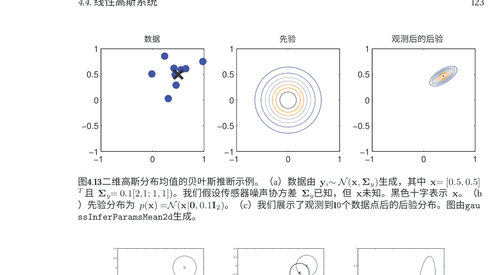

请注意，这种技术关键依赖于对每个传感器的不确定性建模；计算一个无权平均值会得到错误的结果。然而，我们假设传感器的精度是已知的。当它们不是已知的时候，我们应该对 $\boldsymbol{\Sigma}_1$ 和 $\boldsymbol{\Sigma}_2$ 的不确定性进行建模。详细信息请参见第4.6.4节。

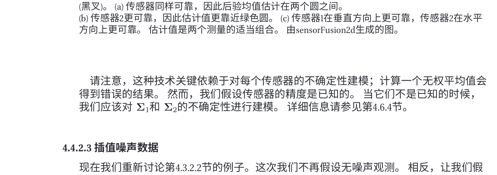

### 4.4.2.3 插值噪声数据

现在我们重新讨论第4.3.2.2节的例子。这次我们不再假设无噪声观测。相反，让我们假设我们获得 $N$ 个噪声观测 $y_i$；不失一般性，假设这些对应于 $x_1, ..., x_N$。我们可以将这个设置建模为一个线性高斯系统：
$$
\mathbf{y} = \mathbf{A} \mathbf{x} + \boldsymbol{\epsilon}
$$

其中 $\boldsymbol{\epsilon} \sim \mathcal{N}(\mathbf{0}, \boldsymbol{\Sigma}_y)$, $\boldsymbol{\Sigma}_y = \sigma^2\mathbf{I}$, $\sigma^2$ 是观测噪声， $\mathbf{A}$ 是一个 $N \times D$ 投影矩阵，选择出观测元素。例如，如果 $N= 2$ 和 $D= 4$，我们有
$$
\mathbf{A} = \begin{pmatrix} 1 & 0 & 0 & 0 \\ 0 & 1 & 0 & 0 \end{pmatrix}
$$

使用与之前相同的不恰当先验， $\boldsymbol{\Sigma}_x = (\mathbf{L}^T \mathbf{L})^{-1}$，我们可以轻松计算后验均值和方差。在图4.15中，我们绘制了后验均值、后验方差和一些后验样本。现在我们看到先验精度 $\lambda$ 也影响后验均值以及后验方差。特别地，对于强先验（大 $\lambda$），估计值非常平滑，不确定性很低。但对于弱先验（小 $\lambda$），估计值波动，不确定性（远离数据）很高。

后验均值也可以通过解下面的优化问题来计算：
$$
\min_{\mathbf{x}} \frac{1}{2\sigma^2} \sum_{i=1}^{N} (x_i - y_i)^2 + \frac{\lambda}{2} \sum_{j=1}^{D} \left[ (x_j - x_{j-1})^2 + (x_j - x_{j+1})^2 \right]
$$

在这里，我们定义了 $x_0 = x_1$ 和 $x_{D+1} = x_D$，以简化符号。我们将其识别为以下问题的离散近似：
$$
\min_{f} \frac{1}{2\sigma^2} \int (f(t) - y(t))^2 dt + \frac{\lambda}{2} \int [f'(t)]^2 dt
$$

其中 $f'(t)$ 是 $f$ 的一阶导数。第一项衡量数据的拟合程度，第二项惩罚“过于波动”的函数。这是Tikhonov正则化的一个例子，是一种流行的函数数据分析方法。更复杂的方法请参阅第15章，这些方法可以实现更高阶的平滑性（使得结果样本看起来不那么“锯齿状”）。

## 4.4.3 结果的证明 *

我们现在推导方程4.125。基本思想是推导联合分布， $p(\mathbf{x}, \mathbf{y}) = p(\mathbf{x})p(\mathbf{y}|\mathbf{x})$，然后利用第4.3.1节的结果计算 $p(\mathbf{x}|\mathbf{y})$。

更详细地说，我们按照以下步骤进行。联合分布的对数如下（忽略不相关的常数）：
$$
\log p(\mathbf{x}, \mathbf{y}) = -\frac{1}{2}(\mathbf{x} - \boldsymbol{\mu}_x)^T \boldsymbol{\Sigma}_x^{-1} (\mathbf{x} - \boldsymbol{\mu}_x) - \frac{1}{2}(\mathbf{y} - \mathbf{A} \mathbf{x} - \mathbf{b})^T \boldsymbol{\Sigma}_y^{-1} (\mathbf{y} - \mathbf{A} \mathbf{x} - \mathbf{b})
$$

这显然是一个联合高斯分布，因为它是一个二次型的指数。展开涉及 $\mathbf{x}$ 和 $\mathbf{y}$ 的二次项，并忽略线性和常数项，我们有
$$
\begin{aligned}
Q &= -\frac{1}{2} \mathbf{x}^T \boldsymbol{\Sigma}_x^{-1} \mathbf{x} - \frac{1}{2} \mathbf{y}^T \boldsymbol{\Sigma}_y^{-1} \mathbf{y} - \frac{1}{2} (\mathbf{A} \mathbf{x})^T \boldsymbol{\Sigma}_y^{-1} (\mathbf{A} \mathbf{x}) + \mathbf{y}^T \boldsymbol{\Sigma}_y^{-1} \mathbf{A} \mathbf{x} \\
&= -\frac{1}{2} \begin{pmatrix} \mathbf{x} \\ \mathbf{y} \end{pmatrix}^T \begin{pmatrix} \boldsymbol{\Sigma}_x^{-1} + \mathbf{A}^T \boldsymbol{\Sigma}_y^{-1} \mathbf{A} & -\mathbf{A}^T \boldsymbol{\Sigma}_y^{-1} \\ -\boldsymbol{\Sigma}_y^{-1} \mathbf{A} & \boldsymbol{\Sigma}_y^{-1} \end{pmatrix} \begin{pmatrix} \mathbf{x} \\ \mathbf{y} \end{pmatrix} \\
&= -\frac{1}{2} \begin{pmatrix} \mathbf{x} \\ \mathbf{y} \end{pmatrix}^T \boldsymbol{\Sigma}^{-1} \begin{pmatrix} \mathbf{x} \\ \mathbf{y} \end{pmatrix}
\end{aligned}
$$图4.15 用具有先验精度 λ 的高斯分布插值噪声数据（噪声方差 σ²=1）。(a)λ=30。(b) λ=0.01。参见图4.10。基于(Calvetti and Somersalo 2007)的图7.1。由gaussInterpNoisyDemo生成的图。参见splineBasisDemo。

联合的精确矩阵被定义为

$$\Sigma^{-1} = \begin{pmatrix} \Sigma_x^{-1} + A^T \Sigma_y^{-1} A & -A^T \Sigma_y^{-1} \\ -\Sigma_y^{-1} A & \Sigma_y^{-1} \end{pmatrix} \triangleq \Lambda = \begin{pmatrix} \Lambda_{xx} & \Lambda_{xy} \\ \Lambda_{yx} & \Lambda_{yy} \end{pmatrix} \quad (4.154)$$

根据方程4.69，并利用 μ_y = Aμ_x + b，我们有

$$p(\mathbf{x}|\mathbf{y}) = \mathcal{N}(\mu_{x|y}, \Sigma_{x|y}) \quad (4.155)$$

$$\Sigma_{x|y} = \Lambda_{xx}^{-1} = (\Sigma_x^{-1} + A^T \Sigma_y^{-1} A)^{-1} \quad (4.156)$$

$$\mu_{x|y} = \Sigma_{x|y} (\Lambda_{xx} \mu_x - \Lambda_{xy} (\mathbf{y} - \mu_y)) \quad (4.157)$$

$$= \Sigma_{x|y} (\Sigma_x^{-1} \mu + A^T \Sigma_y^{-1} (\mathbf{y} - \mathbf{b})) \quad (4.158)$$

## 4.5 离题: Wishart分布 *

Wishart分布是Gamma分布对正定矩阵的推广。 Press (Press et al. 2007, p107)曾说：“Wishart分布在多元统计中的重要性和实用性仅次于(多元)正态分布。”我们主要用它来建模协方差矩阵 Σ 或其逆矩阵Λ = Σ^{-1}的不确定性。

Wishart分布的概率密度函数定义如下:

$$\mathrm{Wi}(\mathbf{\Lambda}|\mathbf{S}, \nu) = \frac{1}{Z_{\mathrm{Wi}}} |\mathbf{\Lambda}|^{(\nu-D-1)/2} \exp \left( -\frac{1}{2} \mathrm{tr}(\mathbf{\Lambda} \mathbf{S}^{-1}) \right) \quad (4.159)$$

这里 ν 被称为“自由度”， S被称为“比例矩阵”。 （我们很快会对这些参数有更多直觉。） 这个分布的归一化常数（需要对所有对称pd矩阵进行积分）是以下庞大的表达式

$$Z_{Wi} = 2^{\nu D/2} \Gamma_D(\nu/2) |\mathbf{S}|^{\nu/2} \qquad (4.160)$$

其中 \(\Gamma_D(a)\)是多元伽玛函数：

$$\Gamma_D(x) = \pi^{D(D-1)/4} \prod_{i=1}^{D} \Gamma(x + (1-i)/2) \qquad (4.161)$$

因此 \(\Gamma_1(a) = \Gamma(a)\)并且

$$\Gamma_D(\nu_0/2) = \prod_{i=1}^{D} \Gamma\left(\frac{\nu_0 + 1 - i}{2}\right) \qquad (4.162)$$

只有在\(\nu > D - 1\)时，归一化常数才存在（因此概率密度函数才有定义）。

Wishart分布与高斯分布之间存在联系。特别地，假设 \(\mathbf{x}_i \sim \mathcal{N}(0, \mathbf{\Sigma})\). 那么散布矩阵 \(\mathbf{S} = \sum_{i=1}^{N_i} \mathbf{x}_i \mathbf{x}_i^T\) 服从Wishart分布： \(\mathbf{S} \sim \text{Wi}(\mathbf{\Sigma}, 1)\). 因此 \(\mathbb{E}[\mathbf{S}] = N\mathbf{\Sigma}\). 更一般地，可以证明 \(\text{Wi}(\mathbf{S}, \nu)\)的均值和众数分别为

$$\text{均值} = \nu\mathbf{S}, \quad \text{众数} = (\nu - D - 1)\mathbf{S} \qquad (4.163)$$

其中，只有在\(\nu > D + 1\)时，模式才存在。

如果 \(D = 1\)，Wishart分布简化为Gamma分布：

$$\text{Wi}(\lambda | s^{-1}, \nu) = \text{Ga}(\lambda | \nu/2, s/2) \qquad (4.164)$$

#### 4.5.1 逆Wishart分布

回想一下，我们已经证明（练习2.10），如果 \(\lambda \sim \text{Ga}(a, b)\)，那么 \(\lambda^{-1} \sim \text{IG}(a, b)\)。同样地，如果 \(\mathbf{\Sigma}^+ \sim \text{Wi}(\mathbf{S}, \nu)\)，那么 \(\mathbf{\Sigma} \sim \text{IW}(\mathbf{S}^{-1}, \nu + D + 1)\)，其中 \(\text{IW}\)是逆Wishart分布，逆Gamma的多维推广。它的定义如下，对于\(\nu > D - 1\)和 \(\mathbf{S} > 0\)：

$$\text{IW}(\mathbf{\Sigma} | \mathbf{S}, \nu) = \frac{1}{Z_{IW}} |\mathbf{\Sigma}|^{-(\nu+D+1)/2} \exp\left( -\frac{1}{2} \text{tr}(\mathbf{S}^{-1} \mathbf{\Sigma}^{-1}) \right) \qquad (4.165)$$

$$Z_{IW} = |\mathbf{S}|^{-\nu/2} 2^{\nu D/2} \Gamma_D(\nu/2) \qquad (4.166)$$

可以证明该分布具有这些性质

$$\text{均值} = \frac{\mathbf{S}^{-1}}{\nu - D - 1}, \quad \text{模态} = \frac{\mathbf{S}^{-1}}{\nu + D + 1} \qquad (4.167)$$

如果 \(D = 1\), 则简化为逆Gamma分布：

$$\text{IW}(\sigma^2 | S^{-1}, \nu) = \text{IG}(\sigma^2 | \nu/2, S/2) \qquad (4.168)$$

### 4.5.2 可视化Wishart分布 *

由于Wishart是一个矩阵分布，很难作为密度函数进行绘制。然而，我们可以轻松从中进行采样，在二维情况下，我们可以使用结果矩阵的特征向量来定义一个椭圆，如4.12节所述。请参见图4.16中的一些示例。

对于更高维的矩阵，我们可以绘制分布的边缘。Wishart分布矩阵的对角线具有Gamma分布，因此很容易绘制。一般情况下，很难计算出非对角元素的分布，但我们可以从分布中采样矩阵，然后通过经验计算出分布。特别地，我们可以将每个采样矩阵转换为相关矩阵，从而计算出对预期相关系数的蒙特卡洛近似（第2.7节）：

$$E[R_{ij}] \approx (1/S) * \Sigma_{s=1}^{S} R(\Sigma^{(s)})_{ij}  \quad (4.169)$$
其中 \(\Sigma^{(s)} \sim \text{Wi}(\Sigma, \nu)\) 且 \(R(\Sigma)\)将矩阵 \(\Sigma\)转换为相关矩阵：
$$R_{ij} = \Sigma_{ij} / \sqrt{\Sigma_{ii} \Sigma_{jj}}  \quad (4.170)$$

然后我们可以使用核密度估计（第14.7.2节）来产生对于绘图目的的单变量密度 \(E[R_{ij}]\)的平滑近似。请参见图4.16中的一些示例。

### 4.6 推断多元正态分布的参数

到目前为止，我们已经讨论了在假设参数 θ = (μ, Σ)已知的情况下的高斯推断。现在我们来讨论如何推断参数本身。我们将假设数据具有对于 i=1: N，我们假设 x_i ~ N(μ, Σ) 并且完全观测到，因此我们没有缺失数据（参见第11.6.1节关于如何在存在缺失值的情况下估计多元正态分布参数）。为了简化演示，我们将后验分为三个部分计算：首先计算 p(μ|D, Σ)；然后计算 p(Σ|D, μ)；最后计算联合概率 p(μ, Σ|D)。

### 4.6.1 后验分布的 μ

我们已经讨论了如何计算 μ 的最大似然估计；现在我们讨论如何计算其后验分布，这对于建模我们对其值的不确定性很有用。
似然函数的形式为

$$p(\mathcal{D}|\boldsymbol{\mu}) = \mathcal{N}(\bar{\mathbf{x}}|\boldsymbol{\mu}, \frac{1}{N}\mathbf{\Sigma}) \quad (4.171)$$

为了简单起见，我们将使用一个共轭先验，这种情况下是一个高斯分布。特别地，如果 \(p(\boldsymbol{\mu}) = \mathcal{N}(\boldsymbol{\mu}|\mathbf{m}_0, \mathbf{V}_0)\) 那么我们可以根据4.4.2.2节中的结果推导出 μ 的高斯后验分布。我们得到

$$p(\boldsymbol{\mu}|\mathcal{D}, \mathbf{\Sigma}) = \mathcal{N}(\boldsymbol{\mu}|\mathbf{m}_N, \mathbf{V}_N) \quad (4.172)$$

$$\mathbf{V}_N^{-1} = \mathbf{V}_0^{-1} + N\mathbf{\Sigma}^{-1} \quad (4.173)$$

$$\mathbf{m}_N = \mathbf{V}_N(\mathbf{\Sigma}^{-1}(N\bar{\mathbf{x}}) + \mathbf{V}_0^{-1}\mathbf{m}_0) \quad (4.174)$$

这与根据嘈杂的雷达“blips”推断物体位置的过程完全相同，只是现在我们是根据嘈杂的样本推断分布的均值。（对于贝叶斯学派来说，对于参数的不确定性和对于其他事物的不确定性没有区别。）

我们可以通过设置 \(\mathbf{V}_0 = \infty\mathbf{I}\) 来建模一个无信息的先验。在这种情况下，我们有 \(p(\boldsymbol{\mu}|\mathcal{D}, \mathbf{\Sigma})=\mathcal{N}(\mathbf{x}, \frac{1}{N}\mathbf{\Sigma})\)，因此后验均值等于MLE。我们还看到后验方差随着 1/N 的减小而减小，这是经典统计学的一个标准结果。

### 4.6.2 Σ *的后验分布

我们现在讨论如何计算 \(p(\mathbf{\Sigma}|\mathcal{D}, \boldsymbol{\mu})\). 似然函数的形式为

$$p(\mathcal{D}|\boldsymbol{\mu}, \mathbf{\Sigma}) \propto |\mathbf{\Sigma}|^{-\frac{N}{2}} \exp\left(-\frac{1}{2} \text{tr}(\mathbf{S}_\mu \mathbf{\Sigma}^{-1})\right) \quad (4.175)$$

相应的共轭先验被称为逆Wishart分布（第4.5.1节）。
回想一下，它的概率密度函数如下：

$$\text{IW}(\mathbf{\Sigma}|\mathbf{S}_0^{-1}, \nu_0) \propto |\mathbf{\Sigma}|^{-(\nu_0+D+1)/2} \exp\left(-\frac{1}{2} \text{tr}(\mathbf{S}_0 \mathbf{\Sigma}^{-1})\right) \quad (4.176)$$

这里 \(\nu_0 > D - 1\) 是自由度（dof），\(\mathbf{S}_0\) 是一个对称正定矩阵。我们看到 \(\mathbf{S}_0^{-1}\) 扮演着先验散布矩阵的角色，\(N_0 \triangleq \nu_0 + D + 1\) 控制着先验的强度，因此起到了类似于样本大小 \(N\) 的作用。

图4.17 在 D=50维度中使用 N∈{100,50,25}样本估计协方差矩阵。我们使用方程式4.184和 λ=0.9绘制真实协方差矩阵（实线黑色）、MLE估计（虚线蓝色）和MAP估计（虚线红色）的特征值，按降序排列。我们还在图例中列出了每个矩阵的条件数。基于（Schaefer和Strimmer 2005）的图1。由shrinkcovDemo生成的图。

将似然和先验相乘，我们发现后验也是逆Wishart分布：

$$p(\Sigma|\mathcal{D}, \mu) \propto |\Sigma|^{-\frac{N}{2}} \exp\left( -\frac{1}{2} \text{tr}(\Sigma^{-1} S_\mu) \right) |\Sigma|^{-(\nu_0 + D + 1)/2} \exp\left( -\frac{1}{2} \text{tr}(\Sigma^{-1} S_0) \right) \quad (4.177)$$

$$= |\Sigma|^{-\frac{N + (\nu_0 + D + 1)}{2}} \exp\left( -\frac{1}{2} \text{tr}\left[ \Sigma^{-1} (S_\mu + S_0) \right] \right) \quad (4.178)$$

$$= \text{IW}(\Sigma|S_N, \nu_N) \quad (4.179)$$

$$\nu_N = \nu_0 + N \quad (4.180)$$

$$S_N^{-1} = S_0 + S_\mu \quad (4.181)$$

换句话说，这意味着后验强度 νN 是先验强度 ν0加上观测数量N，而后验散布矩阵 S N 是先验散布矩阵 S0加上数据散布矩阵 Sμ。

#### 4.6.2.1 最大后验估计

从方程式4.7我们可以看到，Σmle是一个秩为 min(N,D)的矩阵。如果N<D，那么它不是满秩的，因此不可逆。即使N>D，Σ也可能是病态的（意味着它接近奇异）。

为了解决这些问题，我们可以使用后验模式（或平均值）。可以证明（使用类似于MLE推导的技术）MAP估计由以下给出

$$ \hat{\Sigma}_{map} = \frac{S_N}{\nu_N + D + 1} = \frac{S_0 + S_\mu}{N_0 + N} \quad (4.182) $$

如果我们使用一个不合适的均匀先验，对应于 N0=0和 S0 = 0，我们得到MLE。

将似然和先验相乘，我们可以看到后验也是IG分布：

$$p(\sigma^{2}|\mathcal{D}) = \mathrm{IG}(\sigma^{2}|a_{N},b_{N}) \quad (4.187)$$

$$a_{N} = a_{0}+N/2 \quad (4.188)$$

$$b_{N} = b_{0}+\frac{1}{2}\sum_{i=1}^{N}(x_{i}-\mu)^{2} \quad (4.189)$$

请参见图4.18以了解示例。

后验的形式不像多元情况那样漂亮，因为有 1/2 的因子。这是因为 \(\mathrm{IW}(\sigma^{2}|s_{0},\nu_{0}) = \mathrm{IG}(\sigma^{2}|\frac{s_{0}}{2},\frac{\nu_{0}}{2})\)。使用 \(\mathrm{IG}(a_{0},b_{0})\) 分布的另一个问题是先验的强度被编码在 \(a_{0}\) 和 \(b_{0}\) 中。

为了避免这两个问题，通常（在统计学文献中）使用IG分布的另一种参数化方法，即（缩放的）逆卡方分布。

定义如下：

$$\chi^{-2}(\sigma^{2}|\nu_{0},\sigma_{0}^{2}) = \mathrm{IG}(\sigma^{2}|\frac{\nu_{0}}{2},\frac{\nu_{0}\sigma_{0}^{2}}{2}) \propto (\sigma^{2})^{-\nu_{0}/2-1} \exp(-\frac{\nu_{0}\sigma_{0}^{2}}{2\sigma^{2}}) \quad (4.190)$$

这里， \(\nu_{0}\) 控制先验的强度， \(\sigma_{0}^{2}\) 编码先验的值。有了这个先验，后验变为

$$p(\sigma^{2}|\mathcal{D},\mu) = \chi^{-2}(\sigma^{2}|\nu_{N},\sigma_{N}^{2}) \quad (4.191)$$

$$\nu_{N} = \nu_{0}+N \quad (4.192)$$

$$\sigma_{N}^{2} = \frac{\nu_{0}\sigma_{0}^{2}+\sum_{i=1}^{N}(x_{i}-\mu)^{2}}{\nu_{N}} \quad (4.193)$$

我们可以看到后验自由度 \(\nu_{N}\) 是先验自由度 \(\nu_{0}\) 加上 N，而后验平方和 \(\nu_{N}\sigma_{N}^{2}\) 是先验平方和 \(\nu_{0}\sigma_{0}^{2}\) 加上数据平方和。

我们可以通过设置 \(\nu_{0}=0\) 来模拟一个无信息的先验分布， \(p(\sigma^{2}) \propto \sigma^{-2}\) ，这在直观上是有意义的（因为它对应于零虚拟样本量）。

## 4.6.3 后验分布 $\mu$ 和 $\Sigma$ *

我们现在讨论如何计算 $p(\mu, \Sigma|\mathcal{D})$。这些结果有点复杂，但在本书的后面会证明有用。在第一次阅读时，可以随意跳过本节。

### 4.6.3.1 似然

似然性由以下给出

$$p(\mathcal{D}|\boldsymbol{\mu}, \boldsymbol{\Sigma}) = (2\pi)^{-N D/2} |\boldsymbol{\Sigma}|^{-\frac{N}{2}} \exp\left(-\frac{1}{2} \sum_{i=1}^{N} (\mathbf{x}_i - \boldsymbol{\mu})^T \boldsymbol{\Sigma}^{-1} (\mathbf{x}_i - \boldsymbol{\mu})\right)\qquad (4.194)$$

现在我们可以证明

$$\sum_{i=1}^{N} (\mathbf{x}_i - \boldsymbol{\mu})^T \boldsymbol{\Sigma}^{-1} (\mathbf{x}_i - \boldsymbol{\mu}) = \mathrm{tr}(\boldsymbol{\Sigma}^{-1}\mathbf{S}_{\overline{x}}) + N (\overline{\mathbf{x}} - \boldsymbol{\mu})^T \boldsymbol{\Sigma}^{-1} (\overline{\mathbf{x}} - \boldsymbol{\mu})\qquad (4.195)$$

因此我们可以将似然性重写如下：

$$p(\mathcal{D}|\boldsymbol{\mu}, \boldsymbol{\Sigma}) = (2\pi)^{-N D/2} |\boldsymbol{\Sigma}|^{-\frac{N}{2}} \exp\left(-\frac{N}{2} (\boldsymbol{\mu} - \overline{\mathbf{x}})^T \boldsymbol{\Sigma}^{-1} (\boldsymbol{\mu} - \overline{\mathbf{x}})\right) \qquad (4.196)$$
$$\qquad \exp\left(-\frac{N}{2} \mathrm{tr}(\boldsymbol{\Sigma}^{-1}\mathbf{S}_{\overline{x}})\right) \qquad (4.197)$$

我们将使用下面的表格。

### 4.6.3.2 先验

显而易见的先验是以下的

$$p(\boldsymbol{\mu}, \boldsymbol{\Sigma}) = \mathcal{N}(\boldsymbol{\mu}|\mathbf{m}_0, \mathbf{V}_0)\mathrm{IW}(\boldsymbol{\Sigma}|\mathbf{S}_0, \nu_0)\qquad (4.198)$$

不幸的是，这与似然函数不共轭。

要理解为什么，注意到 $\boldsymbol{\mu}$ 和 $\boldsymbol{\Sigma}$ 在似然函数中以非因式分解的方式出现；因此它们在后验中也会相互耦合。

上述先验有时被称为半共轭或条件共轭，因为两个条件概率，$p(\boldsymbol{\mu}|\boldsymbol{\Sigma})$ 和 $p(\boldsymbol{\Sigma}|\boldsymbol{\mu})$，都是共轭的。要创建一个完全共轭的先验，我们需要使用一个使 $\boldsymbol{\mu}$ 和 $\boldsymbol{\Sigma}$ 相互依赖的先验。我们将使用以下形式的联合分布

$$p(\boldsymbol{\mu}, \boldsymbol{\Sigma}) = p(\boldsymbol{\Sigma})p(\boldsymbol{\mu}|\boldsymbol{\Sigma})\qquad (4.199)$$

观察似然方程的形式，方程4.197，我们可以看到一个自然的共轭先验具有以下形式：正态逆-Wishart或NIW分布，定义如下：

$$\begin{aligned}
\mathrm{NIW}(\boldsymbol{\mu}, \boldsymbol{\Sigma} | \mathbf{m}_0, \kappa_0, \nu_0, \mathbf{S}_0) &\triangleq \\
&\mathcal{N}(\boldsymbol{\mu} | \mathbf{m}_0, \frac{1}{\kappa_0} \boldsymbol{\Sigma}) \times \mathrm{IW}(\boldsymbol{\Sigma} | \mathbf{S}_0, \nu_0) \\
&= \frac{1}{Z_{N IW}}|\boldsymbol{\Sigma}|^{-\frac{1}{2}} \exp \left(-\frac{\kappa_0}{2}(\boldsymbol{\mu}-\mathbf{m}_0)^{T} \boldsymbol{\Sigma}^{-1}(\boldsymbol{\mu}-\mathbf{m}_0)\right) \\
&\quad \times |\boldsymbol{\Sigma}|^{-\frac{\nu_0+D+1}{2}} \exp \left(-\frac{1}{2} \operatorname{tr}\left(\boldsymbol{\Sigma}^{-1} \mathbf{S}_0\right)\right)
\end{aligned}$$
(4.200) - (4.203)

$$=\frac{1}{Z_{N IW}}|\boldsymbol{\Sigma}|^{-\frac{\nu_0+D+2}{2}} \times \exp \left(-\frac{\kappa_0}{2}(\boldsymbol{\mu}-\mathbf{m}_0)^{T} \boldsymbol{\Sigma}^{-1}(\boldsymbol{\mu}-\mathbf{m}_0)-\frac{1}{2} \operatorname{tr}\left(\boldsymbol{\Sigma}^{-1} \mathbf{S}_0\right)\right)$$
(4.204) - (4.205)

$$Z_{N IW}=2^{\nu_0 D / 2} \Gamma_D\left(\nu_0 / 2\right)(2 \pi / \kappa_0)^{D / 2}\left|\mathbf{S}_0\right|^{-\nu_0 / 2}$$
(4.206)

其中 $\Gamma_D(a)$是多元伽马函数。

NIW的参数可以解释如下： $\mathbf{m}_0$是我们对 $\boldsymbol{\mu}$ 的先验均值， $\kappa_0$表示我们对这个先验的强度； $\mathbf{S}_0$是（与之成比例的）我们对 $\boldsymbol{\Sigma}$的先验均值， $\nu_0$表示我们对这个先验的强度。$^3$

可以证明（Minka 2000f）不具信息的先验具有以下形式

$$\lim _{k \rightarrow 0} \mathcal{N}\left(\boldsymbol{\mu} | \mathbf{m}_0, \boldsymbol{\Sigma} / k\right) \mathrm{IW}\left(\boldsymbol{\Sigma} | \mathbf{S}_0, k\right) \propto|2 \pi \boldsymbol{\Sigma}|^{-\frac{1}{2}}|\boldsymbol{\Sigma}|^{-(D+1) / 2} \propto|\boldsymbol{\Sigma}|^{-\left(\frac{D}{2}+1\right)} \propto \mathrm{NIW}(\boldsymbol{\mu}, \boldsymbol{\Sigma} | \mathbf{0}, 0, 0, \mathbf{0} \mathbf{I})$$
(4.207) - (4.208)

实际上，使用弱信息的数据相关先验通常更好。 常见的选择（参见例如，（Chipman et al. 2001, p81），（Fraley and Raftery 2007, p6））是使用 $\mathbf{S}_0=\mathrm{diag}\left(\mathbf{S}_x\right) / N$，并且 $\nu_0=D+2$，以确保 $\mathbb{E}[\boldsymbol{\Sigma}]=\mathbf{S}_0$，并将 $\boldsymbol{\mu}_0=\bar{\mathbf{x}}$和 $\kappa_0$设置为一些小的数字，例如0.01。

3. 尽管这个先验分布有四个参数，但实际上只有三个自由参数，因为我们对均值的不确定性与方差成比例。特别是，如果我们认为方差很大，那么我们对 $\boldsymbol{\mu}$ 的不确定性也必须很大。从直觉上讲，这是有道理的，因为如果数据的分布很广泛，很难确定其均值。另请参见练习9.1，我们将更明确地看到这三个自由参数。如果我们想要分别对 $\boldsymbol{\mu}$ 和 $\boldsymbol{\Sigma}$ 的置信度进行“控制”，我们必须使用半共轭先验。

### 4.6.3.3 后验

可以证明（练习4.11），后验分布是具有更新参数的NIW分布：

$$p(\boldsymbol{\mu}, \boldsymbol{\Sigma}|\mathcal{D}) = \mathrm{NIW}(\boldsymbol{\mu}, \boldsymbol{\Sigma}|\mathbf{m}_N, \kappa_N, \nu_N, \mathbf{S}_N)$$

$$\mathbf{m}_N = \frac{\kappa_0\mathbf{m}_0 + N\overline{\mathbf{x}}}{\kappa_N} = \frac{\kappa_0}{\kappa_0 + N}\mathbf{m}_0 + \frac{N}{\kappa_0 + N}\overline{\mathbf{x}}$$

$$\kappa_N = \kappa_0 + N$$

$$\nu_N = \nu_0 + N$$

$$\mathbf{S}_N = \mathbf{S}_0 + \mathbf{S}_{\overline{\mathbf{x}}} + \frac{\kappa_0 N}{\kappa_0 + N}(\overline{\mathbf{x}} - \mathbf{m}_0)(\overline{\mathbf{x}} - \mathbf{m}_0)^T$$

$$= \mathbf{S}_0 + \mathbf{S} + \kappa_0\mathbf{m}_0\mathbf{m}_0^T - \kappa_N\mathbf{m}_N\mathbf{m}_N^T$$

我们定义 $\mathbf{S} \triangleq \sum_{i=1}^{N} \mathbf{x}_i \mathbf{x}_i^T$ 为未居中的平方和矩阵（这比居中版本更容易增量更新）。

这个结果实际上非常直观：后验均值是先验均值和MLE的凸组合，具有“强度” $\kappa_0 + N$；后验散布矩阵 $\mathbf{S}_N$ 是先验散布矩阵 $\mathbf{S}_0$ 加上经验散布矩阵 $\mathbf{S}_{\overline{\mathbf{x}}}$ 再加上由于均值的不确定性而产生的额外项（这创建了自己的虚拟散布矩阵）。

### 4.6.3.4 后验模式

联合分布的模式具有以下形式：

$$\mathrm{argmax} \, p(\boldsymbol{\mu}, \boldsymbol{\Sigma}|\mathcal{D}) = \left(\mathbf{m}_N, \frac{\mathbf{S}_N}{\nu_N + D + 2}\right)$$

如果我们设置 $\kappa_0=0$，则简化为

$$\mathrm{argmax} \, p(\boldsymbol{\mu}, \boldsymbol{\Sigma}|\mathcal{D}) = \left(\overline{\mathbf{x}}, \frac{\mathbf{S}_0 + \mathbf{S}_{\overline{\mathbf{x}}}}{\nu_0 + N + D + 2}\right)$$

相应的估计 $\hat{\boldsymbol{\Sigma}}$ 与方程4.183几乎相同，但在分母上有1的差异，因为这是联合的模式，而不是边缘的模式。

### 4.6.3.5 后验边缘

对于 $\boldsymbol{\Sigma}$ 的后验边缘简单地为

$$p(\boldsymbol{\Sigma}|\mathcal{D}) = \int p(\boldsymbol{\mu}, \boldsymbol{\Sigma}|\mathcal{D}) d\boldsymbol{\mu} = \mathrm{IW}(\boldsymbol{\Sigma}|\mathbf{S}_N, \nu_N)$$

这个边缘的模式和均值分别为

$$\hat{\boldsymbol{\Sigma}}_{map} = \frac{\mathbf{S}_N}{\nu_N + D + 1}, \quad \mathbb{E}[\boldsymbol{\Sigma}] = \frac{\mathbf{S}_N}{\nu_N - D - 1}$$

可以证明，对于 $\boldsymbol{\mu}$ 的后验边缘具有多元学生T分布：

图4.19 NIχ²(m₀, κ₀, ν₀, σ₀²)分布。m₀是先验均值，κ₀表示我们对此的强烈信念；σ₀²是先验方差，ν₀表示我们对此的强烈信念。(a) m₀=0, κ₀=1, ν₀=1, σ₀²=1。请注意轮廓图（在曲面下方）的形状像一个“压扁的蛋”。(b)我们增强了对均值的信念，因此它变得更窄：m₀=0, κ₀=5, ν₀=1, σ₀²=1。(c)我们增强了对方差的信念，因此它变得更窄：m₀=0, κ₀=1, ν₀=5, σ₀²=1。由 NIXdemo2 生成的图。

### 4.6.3.6 后验预测

后验预测由以下给出

$$p(\mathbf{x}|\mathcal{D}) = \frac{p(\mathbf{x}, \mathcal{D})}{p(\mathcal{D})} \qquad (4.220)$$

因此，它可以很容易地通过边际似然比来评估。

事实证明，这个比率具有多元学生T分布的形式：

$$\begin{aligned} p(\mathbf{x}|\mathcal{D}) &= \iint \mathcal{N}(\mathbf{x}|\boldsymbol{\mu},\boldsymbol{\Sigma}) \text{NIW}(\boldsymbol{\mu},\boldsymbol{\Sigma}|\mathbf{m}_N, \kappa_N, \nu_N, \mathbf{S}_N) d\boldsymbol{\mu} d\boldsymbol{\Sigma} \qquad (4.221) \\ &= \mathcal{T}(\mathbf{x}|\mathbf{m}_N, \frac{\kappa_N + 1}{\kappa_N(\nu_N - D + 1)} \mathbf{S}_N, \nu_N - D + 1) \qquad (4.222) \end{aligned}$$

学生T分布的尾部比高斯分布宽，这考虑到了 Σ 未知的事实。然而，这很快变得类似于高斯分布。

### 4.6.3.7 标量数据的后验

现在我们将上述结果特化到 x_i 为1维的情况。这些结果在统计学文献中被广泛使用。与 4.6.2.2 节一样，惯例上不使用正态逆Wishart，但使用正态逆卡方或NIX分布，定义为

$$N I\chi^2(\mu, \sigma^2 | m_0, \kappa_0, \nu_0, \sigma_0^2) \triangleq N(\mu | m_0, \sigma^2/\kappa_0)\chi^{-2}(\sigma^2 | \nu_0, \sigma_0^2)$$ (4.223)
$$\propto \left(\frac{1}{\sigma^2}\right)^{(\nu_0+3)/2} \exp\left( -\frac{\nu_0\sigma_0^2 + \kappa_0(\mu - m_0)^2}{2\sigma^2} \right)$$ (4.224)

参见图4.19以获取一些图表。沿着 μ轴，分布的形状类似于高斯分布，沿着 σ²轴，分布的形状类似于 χ⁻²；联合密度的等高线呈现出“压扁的蛋”形状。有趣的是，我们可以看到 μ的等高线在 σ²的小值处更加尖锐，这是有道理的，因为如果数据的方差较小，我们将能够更可靠地估计其均值。

可以证明后验概率为

$$p(\mu, \sigma^2 | \mathcal{D}) = N I\chi^2(\mu, \sigma^2 | m_N, \kappa_N, \nu_N, \sigma_N^2)$$ (4.225)
$$m_N = \frac{\kappa_0 m_0 + N \bar{x}}{\kappa_N}$$ (4.226)
$$\kappa_N = \kappa_0 + N$$ (4.227)
$$\nu_N = \nu_0 + N$$ (4.228)
$$\nu_N \sigma_N^2 = \nu_0 \sigma_0^2 + \sum_{i=1}^{N} (x_i - \bar{x})^2 + \frac{N \kappa_0}{\kappa_0 + N} (m_0 - \bar{x})^2$$ (4.229)

后验边缘分布 σ² 只是

$$p(\sigma^2 | \mathcal{D}) = \int p(\mu, \sigma^2 | \mathcal{D}) d\mu = \chi^{-2}(\sigma^2 | \nu_N, \sigma_N^2)$$ (4.230)

后验均值为 E [σ²|D] = (ν_N / (ν_N - 2)) σ_N²

对于 μ的后验边际分布，它遵循学生T分布，这是由于学生分布的比例混合表示：
$$p(\mu | \mathcal{D}) = \int p(\mu, \sigma^2 | \mathcal{D}) d\sigma^2 = \mathcal{T}(\mu | m_N, \sigma_N^2 / \kappa_N, \nu_N)$$ (4.231)

后验均值为 E [μ|D] = m_N.

让我们看看如果我们使用以下无信息先验，这些结果会是什么样子：

$$p(\mu, \sigma^2) \propto p(\mu) p(\sigma^2) \propto \sigma^{-2} \propto N I\chi^2(\mu, \sigma^2 | \mu_0 = 0, \kappa_0 = 0, \nu_0 = -1, \sigma_0^2 = 0)$$ (4.232)

在这个先验条件下，后验概率的形式为

$$p(\mu, \sigma^2 | \mathcal{D}) = N I\chi^2(\mu, \sigma^2 | m_N = \bar{x}, \kappa_N = N, \nu_N = N - 1, \sigma_N^2 = s^2)$$ (4.233)
其中
$$s^2 \triangleq \frac{1}{N-1} \sum_{i=1}^{N} (x_i - \bar{x})^2 = \frac{N}{N-1} \hat{\sigma}_{mle}^2$$ (4.234)

是样本标准差。(在第6.4.2节中，我们证明了这是一个无偏估计方差的方法。) 因此，均值的边际后验概率为
$$p(\mu | \mathcal{D}) = \mathcal{T}(\mu | \bar{x}, \frac{s^2}{N}, N-1)$$ (4.235)

## 4.6. 推断MVN的参数

均值的后验方差为

$$\text{var} [\mu|\mathcal{D}] = \frac{\nu_N}{\nu_N - 2} \sigma_N^2 = \frac{N-1}{N-3} \frac{s^2}{N} \to \frac{s^2}{N} \quad (4.236)$$

这个的平方根被称为均值的标准误差：

$$\sqrt{\text{var} [\mu|\mathcal{D}]} \approx \frac{s}{\sqrt{N}} \quad (4.237)$$

因此，均值的近似95%后验可信区间为

$$I_{.95}(\mu|\mathcal{D}) = \overline{x} \pm 2 \frac{s}{\sqrt{N}} \quad (4.238)$$

> （贝叶斯可信区间在5.2.2节中有更详细的讨论；它们与频率主义置信区间在6.6.1节中进行了对比。）

### 4.6.3.8 贝叶斯t检验

假设我们想要测试假设 \(\mu = \mu_0\)，其中 \(\mu_0\)是某个已知值 \(\mu_0\)（通常为0），给定值 \(x_i \sim \mathcal{N}(\mu, \sigma^2)\)。这被称为双侧的单样本t检验。执行这样一个测试的一种简单方法就是检查\(\mu_0\)是否属于 \(I_{0.95}(\mu|\mathcal{D})\)。如果不是，则我们可以有95%的把握认为 \(\mu \neq \mu_0\)。⁴更常见的情况是我们想要测试两个配对样本是否具有相同的均值。更准确地说，假设 \(y_i \sim \mathcal{N}(\mu_1, \sigma^2)\) 和 \(z_i \sim \mathcal{N}(\mu_2, \sigma^2)\)。我们想要确定 \(\mu = \mu_1 - \mu_2 > 0\)，使用我们的数据 \(x_i = y_i - z_i\)。我们可以如下评估这个数量：

$$p(\mu > \mu_0|\mathcal{D}) = \int_{\mu_0}^{\infty} p(\mu|\mathcal{D}) d\mu \quad (4.239)$$

这被称为单侧配对t检验。（对于一种类似的方法来进行未配对检验，比较二项比例的差异，请参见第5.2.3节。）

为了计算后验概率，我们必须指定一个先验概率。假设我们使用一个无信息的先验概率。正如我们上面所示，我们发现后验边际分布对于 \(\mu\)的形式为

$$p(\mu|\mathcal{D}) = \mathcal{T}(\mu | \overline{x}, \frac{s^2}{N}, N-1) \quad (4.240)$$

现在让我们定义以下t统计量：

$$t \triangleq \frac{\overline{x} - \mu_0}{s / \sqrt{N}} \quad (4.241)$$

其中分母是均值的标准误差。我们可以看到

其中 \(F_\nu(t)\)是标准学生t分布 \(\mathcal{T}(0, 1, \nu)\)的累积分布函数。

### 4.6.3.9 与频率统计的联系 *

如果我们使用无信息先验，那么上述贝叶斯分析得到的结果与使用频率统计方法得到的结果相同。（我们在第6章中讨论频率统计。）具体来说，从上述结果我们可以看出

$$\frac{\mu - \overline{x}}{\sqrt{s/N}} |\mathcal{D} \sim t_{N-1} \quad\quad\quad (4.243)$$

这与MLE的抽样分布具有相同的形式：

$$\frac{\mu - \overline{X}}{\sqrt{s/N}} |\mu \sim t_{N-1} \quad\quad\quad (4.244)$$

原因是学生分布在在其前两个参数中是对称的，因此 \(\mathcal{T}(x|\mu, \sigma^2, \nu) = \mathcal{T}(\mu|x, \sigma^2, \nu)\)；因此关于 \(\mu\) 的后验概率具有与关于 \(x\) 的抽样分布相同的形式。因此，频率派检验返回的（单侧）p值（在第6.6.2节中定义）与贝叶斯方法返回的 \(p(\mu > \mu_0|\mathcal{D})\) 相同。请参见bayesTtestDemo的示例。

尽管表面上相似，但这两个结果有不同的解释：在贝叶斯方法中，$\mu$ 是未知的，$x$ 是固定的，而在频率派方法中，$X$ 是未知的，$\mu$ 是固定的。在使用无信息先验的简单模型中，频率派推断和贝叶斯推断之间的更多等价性可以在（Box and Tiao 1973）中找到。另请参见第7.6.3.3节。

### 4.6.4 未知精度的传感器融合 *

在本节中，我们将第4.6.3节的结果应用于传感器融合问题，其中每个测量设备的精度是未知的。这推广了第4.4.2.2节的结果，该节假设测量模型的精度是已知的高斯分布。未知精度的情况会产生定性上不同的结果，从而得到一个潜在的多模态后验分布，我们将在后面看到。我们的演示基于（Minka 2001e）。

假设我们想要从多个来源汇总数据来估计某个量 $\mu \in \mathbb{R}$，但来源的可靠性是未知的。具体而言，假设我们有两个不同的测量设备，$x$ 和 $y$，具有不同的精度：$x_i|\mu \sim \mathcal{N}(\mu, \lambda_x^{-1})$ 和 $y_i|\mu \sim \mathcal{N}(\mu, \lambda_y^{-1})$。我们使用每个设备进行两次独立测量，结果分别为

$$x_1 = 1.1, x_2 = 1.9, y_1 = 2.9, y_2 = 4.1 \quad\quad\quad (4.245)$$

我们将为 $\mu$ 使用一个非信息先验分布，$p(\mu) \propto 1$，我们可以使用一个无限宽的高斯分布来模拟它，$p(\mu) = \mathcal{N}(\mu|m_0=0, \lambda_0^{-1}=\infty)$。如果 $\lambda_x$ 和 $\lambda_y$ 是已知的，那么后验分布将是高斯分布：

$$p(\mu|\mathcal{D}, \lambda_x, \lambda_y) = \mathcal{N}(\mu|m_N, \lambda_N^{-1}) \quad\quad\quad (4.246)$$

$$\lambda_N = \lambda_0 + N_x\lambda_x + N_y\lambda_y \quad\quad\quad (4.247)$$

$$m_N = \frac{\lambda_x N_x \overline{x} + \lambda_y N_y \overline{y}}{N_x \lambda_x + N_y \lambda_y} \quad\quad\quad (4.248)$$

其中 $N_x=2$是$x$测量的数量， $N_y=2$是$y$测量的数量， $\overline{x} = \frac{1}{N_x}\sum_{i=1}^{N_x}x_i=1.5$ 和 $\overline{y}=\frac{1}{N_y}\sum_{i=1}^{N_y}y_i=3.5$。这个结果是因为后验精度是测量精度的总和，后验均值是先验均值（为0）和数据均值的加权和。

联合对数似然为

$$\log p(\mathcal{D}, \lambda_x, \lambda_y | \mu) = \log p(\mu) + \log p(\mathcal{D}_x | \mu, \lambda_x) + \log p(\mathcal{D}_y | \mu, \lambda_y) \quad\quad\quad (4.249)$$

最大似然估计通过解下面的联立方程得到：

$$\frac{\partial}{\partial\mu} = \lambda_x N_x(\overline{x}-\mu) + \lambda_y N_y(\overline{y}-\mu) = 0 \quad\quad\quad (4.250)$$

$$\frac{\partial}{\partial\lambda_x} = \frac{1}{\lambda_x} - \frac{1}{N_x}\sum_{i=1}^{N_x}(x_i-\mu)^2 = 0 \quad\quad\quad (4.251)$$

$$\frac{\partial}{\partial\lambda_y} = \frac{1}{\lambda_y} - \frac{1}{N_y}\sum_{i=1}^{N_y}(y_i-\mu)^2 = 0 \quad\quad\quad (4.252)$$

这给出

$$\hat{\mu} = \frac{N_x\hat{\lambda}_x\overline{x}+N_y\hat{\lambda}_y\overline{y}}{N_x\hat{\lambda}_x+N_y\hat{\lambda}_y} \quad\quad\quad (4.253)$$

$$1/\hat{\lambda}_x = \frac{1}{N_x}\sum_i(x_i-\hat{\mu})^2 \quad\quad\quad (4.254)$$

$$1/\hat{\lambda}_y = \frac{1}{N_y}\sum_i(y_i-\hat{\mu})^2 \quad\quad\quad (4.255)$$

我们注意到 $\mu$的最大似然估计具有与后验均值相同的形式， $m_N$。 我们可以通过固定点迭代来解这些方程。 让我们通过估计 $\lambda_x = 1/s_x^2$ 和 $\lambda_y=1/s_y^2$来初始化，其中 $s_x^2=\frac{1}{N_x}\sum_{i=1}^{N_x}(x_i-\overline{x})^2=0.16$ 和 $s_y^2=\frac{1}{N_y}\sum_{i=1}^{N_y}(y_i-\overline{y})^2=0.36$。 使用这个，我们得到 $\hat{\mu}=2.1154$，所以 $p(\mu|\mathcal{D},\hat{\lambda}_x,\hat{\lambda}_y)=\mathcal{N}(\mu|2.1154, 0.0554)$。 如果我们现在迭代，我们收敛到 $\hat{\lambda}_x=1/0.1662$， $\hat{\lambda}_y=1/4.0509$， $p(\mu|\mathcal{D},\hat{\lambda}_x,\hat{\lambda}_y)=\mathcal{N}(\mu|1.5788, 0.0798)$。插入近似的后验概率在图4.20(a)中绘制。这根据其估计的精度加权每个传感器。 由于传感器 $y$被估计比传感器 $x$不可靠得多，我们有 $\mathbb{E}\left[\mu|\mathcal{D},\hat{\lambda}_x,\hat{\lambda}_y\right] \approx \overline{x}$，所以我们有效地忽略了 $y$传感器。

现在我们将采用贝叶斯方法，积分掉未知的精度，而不是试图估计它们。也就是说，我们计算

$$p(\mu|\mathcal{D}) \propto p(\mu)\left[\int p(\mathcal{D}_x|\mu,\lambda_x)p(\lambda_x|\mu)d\lambda_x\right]\left[\int p(\mathcal{D}_y|\mu,\lambda_y)p(\lambda_y|\mu)d\lambda_y\right] \quad\quad\quad (4.256)$$

我们将使用无信息的Jeffrey先验， $p(\mu)\propto 1$, $p(\lambda_x|\mu)\propto 1/\lambda_x$和 $p(\lambda_y|\mu)\propto 1/\lambda_y$。

由于\(x\)和\(y\)项是对称的，我们只关注其中一个。关键积分是

$$I = \int p(\mathcal{D}_x|\mu, \lambda_x)p(\lambda_x|\mu)d\lambda_x  \propto  \int \lambda_x^{-1}(N_x\lambda_x)^{N_x/2} \exp\left(-\frac{N_x}{2}\lambda_x(\overline{x}-\mu)^2 - \frac{N_x}{2}s_x^2\lambda_x\right)d\lambda_x \quad\quad\quad (4.257)$$

利用 \(N_x=2\) 的事实，简化为

$$I = \int \lambda_x^{-1}\lambda_x^1 \exp(-\lambda_x[(\overline{x}-\mu)^2 + s_x^2])d\lambda_x \quad\quad\quad (4.258)$$

我们将其识别为未归一化Gamma密度的积分比例

$$\text{Ga}(\lambda|a, b) \propto \lambda^{a-1}e^{-b\lambda} \quad\quad\quad (4.259)$$

其中 \(a=1\) 且 \(b=(\overline{x}-\mu)^2+s_x^2\)。因此，积分与Gamma分布的归一化常数 \(\Gamma(a)b^{-a}\) 成比例，因此我们得到

$$I \propto \int p(\mathcal{D}_x|\mu, \lambda_x)p(\lambda_x|\mu)d\lambda_x  \propto  ((\overline{x}-\mu)^2 + s_x^2)^{-1} \quad\quad\quad (4.260)$$

后验概率变为

$$p(\mu|\mathcal{D}) \propto \frac{1}{(\overline{x}-\mu)^2 + s_x^2} \frac{1}{(\overline{y}-\mu)^2 + s_y^2} \quad\quad\quad (4.261)$$

精确的后验概率在图4.20(b)中绘制。我们可以看到它有两个模式，一个接近于\(\overline{x}=1.5\)，另一个接近于\(\overline{y}=3.5\)。这对应于 \(x\) 传感器比 \(y\) 传感器更可靠的信念，反之亦然。第一个模式的权重较大，因为来自 \(x\) 传感器的数据更一致，所以 \(x\) 传感器似乎更可靠一些。（显然，它们不能同时可靠，因为它们报告的值不同。）然而，贝叶斯解决方案保持了 \(y\) 传感器更可靠的可能性；从两个测量中，我们无法判断，而仅选择\(x\)传感器作为插值近似结果会导致过度自信（后验概率过窄）。

## 练习

### 练习4.1 不相关并不意味着独立

显然 \(Y\) 依赖于 \(X\)（事实上，\(Y\) 由 \(X\) 唯一确定）。然而，证明 \(\rho(X, Y) = 0\)。提示：如果 \(X \sim U(a, b)\) 那么 \(E[X] = (a+b)/2\) 且 \(\text{var}[X] = (b-a)^2/12\)。

### 练习4.2 不相关和高斯并不意味着独立，除非联合高斯

设 \(X \sim \mathcal{N}(0, 1)\) 且 \(Y = WX\)，其中 \(p(W = -1) = p(W = 1) = 0.5\)。很明显 \(X\) 和 \(Y\) 不是独立的，因为 \(Y\) 是 \(X\) 的函数。

- a. 证明 \(Y \sim \mathcal{N}(0, 1)\)。
- b. 显示 \(\text{cov} [X, Y] = 0\)。因此X和Y是不相关但相关的，尽管它们是高斯的。
提示：使用协方差的定义
$$\text{cov} [X, Y] = E [XY] - E [X]E[Y] \quad\quad\quad (4.262)$$
和迭代期望的规则
$$E [XY] = E [E [XY|W]] \quad\quad\quad (4.263)$$

### 练习4.3 相关系数介于-1和+1之间

证明 $$-1 \leq \rho(X, Y) \leq 1$$。

### 练习4.4 线性相关变量的相关系数为 ±1

证明，如果 \(Y = aX + b\) 对于一些参数 \(a > 0\) 和 \(b\) 成立，则 \(\rho(X, Y) = 1\)。类似地，如果 \(a < 0\)，则 \(\rho(X, Y) = -1\)。

### 练习4.5 多维高斯分布的归一化常数

证明多维高斯分布的归一化常数为
$$(2\pi)^{d/2}|\Sigma|^{1/2} = \int \exp\left(-\frac{1}{2} (x-\mu)^T \Sigma^{-1} (x-\mu)\right) dx \quad\quad\quad (4.264)$$
提示：对 \(\lambda\)，将联合概率密度函数用成变换坐标系中一维高斯分布的乘积。（你将需要变量变换公式。）最后，使用一维高斯分布的归一化常数。

### 练习4.6 二元高斯分布

设 \(x\sim\mathcal{N}(\mu, \Sigma)\) 其中 \(x \in \mathbb{R}^2\) 和
$$\Sigma = \begin{pmatrix} \sigma_1^2 & \rho\sigma_1\sigma_2 \\ \rho\sigma_1\sigma_2 & \sigma_2^2 \end{pmatrix} \quad\quad\quad (4.265)$$
其中 \(\rho\) 是相关系数。证明概率密度函数为
$$p(x_1, x_2) = \frac{1}{2\pi\sigma_1\sigma_2\sqrt{1-\rho^2}} \exp\left( -\frac{1}{2(1-\rho^2)} \left[ \frac{(x_1-\mu_1)^2}{\sigma_1^2} + \frac{(x_2-\mu_2)^2}{\sigma_2^2} - 2\rho\frac{(x_1-\mu_1)(x_2-\mu_2)}{\sigma_1\sigma_2} \right] \right) \quad\quad\quad (4.266)$$

### 练习4.7 给定双变量高斯分布

考虑一个双变量高斯分布 \(p(x_1, x_2) = \mathcal{N}(x|\mu, \Sigma)\) 其中

$$\Sigma = \begin{pmatrix} \sigma_1^2 & \sigma_{12} \\ \sigma_{21} & \sigma_2^2 \end{pmatrix} = \sigma_1\sigma_2\begin{pmatrix} \frac{\sigma_1}{\sigma_2} & \rho \\ \rho & \frac{\sigma_2}{\sigma_1} \end{pmatrix}$$

相关系数由以下公式给出

$$\rho \triangleq \frac{\sigma_{12}}{\sigma_1\sigma_2}$$

- a. 简化你的答案，用 \(\rho, \sigma_2, \sigma_1, \mu_1,\mu_2\)和 \(x_1\) 表示。
- b. 假设 \(\sigma_1 = \sigma_2= 1\)。现在是 \(P(X_2|x_1)\)是什么?

### 练习4.8 白化与标准化

- a. 使用`rawdata = dlmread('heightWeightData.txt')`加载身高/体重数据。第一列是类别标签（1-男性，2-女性），第二列是身高，第三列是体重。提取与男性对应的身高/体重数据。使用经验均值和协方差对男性数据拟合2D高斯分布。将你的高斯分布绘制成椭圆（使用`gaussPlot2d`），叠加在散点图上。它应该看起来像图4.21(a)，其中我们用索引标记了每个数据点。提交你的图和代码。
- b. 标准化数据意味着确保每个维度上的经验方差为1。这可以通过计算 \(\frac{x_{ij} - \bar{x}_j}{\sigma_j}\)来完成，其中 \(\sigma_j\)是维度 \(j\)的经验标准差。对数据进行标准化和重新绘制。它应该看起来像图4.21(b)。（使用`axis('equal')`。）提交您的图和代码。
- c. 白化或球化数据意味着确保其经验协方差矩阵与I成比例，因此数据在每个维度上是不相关且具有相等的方差。这可以通过计算每个数据向量x的 \(\Lambda^{-\frac{1}{2}} U^T x\)来完成，其中U是特征向量，Λ是特征值X。对数据进行白化和重新绘制。它应该看起来像图4.21(c)。请注意，白化会旋转数据，因此人们在新的坐标系中移动到直观不合理的位置（例如，人物2从右侧移动到左侧）。

### 练习4.9 已知方差的传感器融合在1维中

假设我们有两个传感器，已知（且不同）方差 \(v_1\)和 \(v_2\)，但未知（且相同）均值 \(\mu\)。假设我们从第一个传感器中观察到 \(n_1\)个观测值 \(y_i^{(1)} \sim \mathcal{N}(\mu, v_1)\)，并从第二个传感器中观察到 \(n_2\)个观测值## 4.6. 推断MVN的参数

$y^{(2)} \sim \mathcal{N}(\mu, v_2)$。 (例如，假设 $\mu$ 是室外的真实温度，传感器1是一个精确（低方差）的数字温度传感器，传感器2是一个不精确（高方差）的水银温度计。）让 $\mathcal{D}$ 表示来自两个传感器的所有数据。在对 $\mu$ 进行非信息先验的情况下，后验概率是多少（我们可以使用精度为0的高斯分布进行模拟）？给出后验均值和方差的明确表达式。

练习4.10 边缘化和条件化的信息形式公式的推导
推导出第4.3.1节的信息形式结果。

练习4.11 NIW后验的推导
推导出方程4.209。提示：可以证明

$$
N(\overline{\mathbf{x}} - \boldsymbol{\mu})(\overline{\mathbf{x}} - \boldsymbol{\mu})^T + \kappa_0(\boldsymbol{\mu} - \mathbf{m}_0)(\boldsymbol{\mu} - \mathbf{m}_0)^T = \kappa_N(\boldsymbol{\mu} - \mathbf{m}_N)(\boldsymbol{\mu} - \mathbf{m}_N)^T + \frac{\kappa_0 N}{\kappa_N}(\overline{\mathbf{x}} - \mathbf{m}_0)(\overline{\mathbf{x}} - \mathbf{m}_0)^T
$$

这是一个矩阵泛化的操作，称为完成平方。^5 推导正态-Wishart模型的相应结果。

## 练习4.12 高斯的BIC

(来源：Jaakkola。)

贝叶斯信息准则（BIC）是一个带惩罚项的对数似然函数，可用于模型选择（见第5.3.2.4节）。它的定义为

$$
\text{BIC} = \log p(\mathcal{D}|\hat{\boldsymbol{\theta}}_{ML}) - \frac{d}{2}\log(N)
$$

其中 d 是模型中的自由参数数量， N 是样本数量。在这个问题中，我们将看到如何使用它来选择完全协方差高斯和带有对角线协方差的高斯之间的区别。显然，完全协方差高斯具有更高的似然性，但如果相对于对角线协方差矩阵的改进太小，则可能不值得使用额外的参数。因此，我们使用BIC分数来选择模型。

根据第4.1.3节，我们可以写成

$$
\log p(\mathcal{D}|\hat{\boldsymbol{\Sigma}}, \hat{\boldsymbol{\mu}}) & = -\frac{N}{2}\text{tr}\left(\hat{\boldsymbol{\Sigma}}^{-1}\hat{\mathbf{S}}\right) - \frac{N}{2}\log(|\hat{\boldsymbol{\Sigma}}|) \\
\hat{\mathbf{S}} & = \frac{1}{N}\sum_{i=1}^{N}(\mathbf{x}_i - \overline{\mathbf{x}})(\mathbf{x}_i - \overline{\mathbf{x}})^T
$$

其中 $\hat{\mathbf{S}}$ 是散布矩阵（经验协方差），矩阵的迹是其对角线元素的和，并且我们使用了迹技巧。

+   a. 推导具有完全协方差矩阵的 D 维高斯分布的BIC得分。尽可能简化你的答案，利用MLE的形式。确保指定自由参数的数量 d。
+   b. 推导具有对角协方差矩阵的 D 维高斯分布的BIC得分。确保指定自由参数的数量 d。提示：对于对角情况， $\boldsymbol{\Sigma}$ 的MLE估计与 $\hat{\boldsymbol{\Sigma}}_{ML}$ 相同，只是非对角项为零：
    $\hat{\boldsymbol{\Sigma}}_{diag} = \text{diag}(\hat{\boldsymbol{\Sigma}}_{ML}(1,1), \dots, \hat{\boldsymbol{\Sigma}}_{ML}(D,D))$

5. 在标量情况下，完成平方意味着将 $c_2x^2 + c_1x + c_0$ 重写为 $-a(x-b)^2 + w$，其中 $a = -c_2$， $b = \frac{c_1}{2c_2}$ 和 $w = \frac{c_1^2}{4c_2} + c_0$。

## 练习4.13 高斯后验可信区间

(来源：DeGroot。)

设 $X\sim\mathcal{N}(\mu, \sigma^2=4)$ 其中 $\mu$ 是未知的，但有先验 $\mu\sim\mathcal{N}(\mu_0, \sigma_0^2=9)$。在看到 $n$ 个样本后的后验分布是 $\mu\sim\mathcal{N}(\mu_n, \sigma_n^2)$。（这被称为可信区间，是贝叶斯的置信区间的类比。）$n$ 需要多大才能确保 $p(\ell \le \mu_n \le u|\mathcal{D}) \ge 0.95$ (4.277) 其中 $(\ell, u)$ 是一个宽度为1的区间(以 $\mu_n$为中心)， $\mathcal{D}$是数据。 提示： 回想一下，高斯分布的95%概率质量在均值的 $\pm 1.96\sigma$范围内。

## 练习4.14 一维高斯分布的MAP估计

(来源：Jaakkola。)

考虑样本 $x_1, \ldots, x_n$ 来自已知方差 $\sigma^2$ 和未知均值 $\mu$ 的高斯随机变量。 我们进一步假设先验分布（也是高斯分布）在均值上服从 $\mathcal{N}(m, s^2)$，均值 $m$ 和方差 $s^2$ 固定。 因此，唯一未知的是 $\mu$。

+   a. 计算MAP估计 $\hat{\mu}_{MAP}$。你可以在不证明的情况下陈述结果。或者，通过更多的工作，你可以计算对数后验的导数，将其设为零并求解。
+   b. 证明随着样本数量 $n$ 的增加，MAP估计收敛到最大似然估计。
+   c. 假设 $n$ 很小且固定。如果我们增加先验方差 $s^2$，MAP估计器会收敛到什么？
+   d. 假设 $n$ 很小且固定。如果我们减小先验方差 $s^2$，MAP估计器会收敛到什么？

## 练习4.15 $\hat{\Sigma}$ 的顺序（递归）更新

(来源：（Duda et al. 2001, Q3.35,3.36）。)

基于 $n$ 个样本的 $d$ 维高斯分布的无偏协方差估计为

$$
\hat{\Sigma} = \mathbf{C}_n = \frac{1}{n-1} \sum_{i=1}^n (\mathbf{x}_i - \mathbf{m}_n)(\mathbf{x}_i - \mathbf{m}_n)^T \quad (4.278)
$$

很明显，计算 $\mathbf{C}_n$ 需要 $O(nd^2)$ 的时间。如果数据点逐个到达，则增量更新这些估计比从头开始重新计算更高效。

+   a. 证明协方差可以按以下方式顺序更新
    $$\mathbf{C}_{n+1} = \frac{n-1}{n} \mathbf{C}_n + \frac{1}{n+1} (\mathbf{x}_{n+1} - \mathbf{m}_n)(\mathbf{x}_{n+1} - \mathbf{m}_n)^T \quad (4.279)$$
+   b. 每个顺序更新需要多长时间？（使用大O符号。）
+   c. 证明我们可以使用顺序更新精度矩阵
    $$\mathbf{C}_{n+1}^{-1} = \frac{n}{n-1} \left[ \mathbf{C}_n^{-1} - \frac{\mathbf{C}_n^{-1} (\mathbf{x}_{n+1} - \mathbf{m}_n)(\mathbf{x}_{n+1} - \mathbf{m}_n)^T \mathbf{C}_n^{-1}}{\frac{n^2-1}{n} + (\mathbf{x}_{n+1} - \mathbf{m}_n)^T \mathbf{C}_n^{-1} (\mathbf{x}_{n+1} - \mathbf{m}_n)} \right] \quad (4.280)$$

提示：注意到对 $\mathbf{C}_{n+1}$ 的更新包括添加一个秩为一的矩阵，即 $\mathbf{u}\mathbf{u}^T$，其中 $\mathbf{u} = \mathbf{x}_{n+1} - \mathbf{m}_n$。使用矩阵逆引理进行秩为一的更新（方程4.111），我们在这里重复一下：

$$
(\mathbf{E} + \mathbf{u}\mathbf{v}^T)^{-1} = \mathbf{E}^{-1} - \frac{\mathbf{E}^{-1} \mathbf{u}\mathbf{v}^T \mathbf{E}^{-1}}{1 + \mathbf{v}^T \mathbf{E}^{-1} \mathbf{u}} \quad (4.281)
$$

+   d. 每次更新的时间复杂度是多少？

## 练习4.16 高斯分布的似然比

来源：Alpaydin p103 ex 4. 考虑一个二元分类器，其中 K类条件密度为MVN $p(x|y=j)=\mathcal{N}(x|\mu_j,\Sigma_j)$。根据贝叶斯定理，我们有

$$
\log \frac{p(y=1|x)}{p(y=0|x)} = \log \frac{p(x|y=1)}{p(x|y=0)} + \log \frac{p(y=1)}{p(y=0)} \quad (4.282)
$$

换句话说，对数后验比是对数似然比加上对数先验比。对于下表中的4种情况，推导出对数似然比$\log \frac{p(x|y=1)}{p(x|y=0)}$，尽可能简化。

| $\Sigma_j$ 的形式 | Cov | 参数数量 |
| :--- | :--- | :--- |
| 任意 | $\Sigma_j$ | $Kd(d+1)/2$ |
| 共享的 | $\Sigma_j = \Sigma$ | $d(d+1)/2$ |
| 共享，轴对齐的 | $\Sigma_j = \Sigma$ with $\Sigma_{ij}=0$ for $i \neq j$ | $d$ |
| 共享，球形的 | $\Sigma_j = \sigma^2 I$ | $1$ |

## 练习4.17 身高/体重数据上的LDA/QDA

函数 `discrimAnalysisHeightWeightDemo` 适用于身高/体重数据的LDA和QDA模型。计算这两个模型在训练集上的误分类率。提交你的数字和代码。

## 练习4.18 具有混合特征的朴素贝叶斯

考虑一个具有一个二进制特征和一个高斯特征的3类朴素贝叶斯分类器：

$$
y \sim \text{Mu}(y|\pi,1), \quad x_1|y=c \sim \text{Ber}(x_1|\theta_c), \quad x_2|y=c \sim \mathcal{N}(x_2|\mu_c, \sigma_c^2) \quad (4.283)
$$

让参数向量如下：

$$
\pi = (0.5, 0.25, 0.25), \quad \theta = (0.5, 0.5, 0.5), \quad \mu = (-1, 0, 1), \quad \sigma^2 = (1, 1, 1) \quad (4.284)
$$

+   a. 计算 $p(y|x_1=0, x_2=0)$ （结果应为一个和为1的3个数字的向量）。
+   b. 计算 $p(y|x_1=0)$。
+   c. 计算 $p(y|x_2=0)$。
+   d. 解释你在结果中看到的任何有趣的模式。提示：看看参数向量 $\theta$。

## 练习4.19 具有半绑定协方差的LDA的决策边界

考虑具有形式 $\mathcal{N}(x|\mu_c,\Sigma_c)$的生成分类器的类条件密度。在LDA中，我们假设 $\Sigma_c = \Sigma$，而在QDA中，每个 $\Sigma_c$ 是任意的。在这里，我们考虑两类情况，其中 $\Sigma_1 = k\Sigma_0$，对于 $k>1$。也就是说，高斯椭圆具有相同的“形状”，但是类别1的椭圆比较“宽”。推导出 $p(y=1|x,\theta)$的表达式，尽可能简化。如果可能的话，给出你的结果的几何解释。

## 练习4.20 逻辑回归与LDA/QDA的比较

(来源：Jaakkola) 假设我们通过最大似然训练以下二元分类器。

+   a. GaussI: 一种生成分类器，其中类条件密度为高斯分布，协方差矩阵都设置为 I (单位矩阵)，即 $p (x|y = c) = \mathcal{N} (x|\mu_c, I)$。我们假设 $p (y)$ 是均匀分布的。
+   b. GaussX: 与GaussI相同，但协方差矩阵没有限制，即 $p (x|y = c) = \mathcal{N} (x|\mu_c, \Sigma_c)$。
+   c. LinLog: 具有线性特征的逻辑回归模型。
+   d. QuadLog: 使用线性和二次特征的逻辑回归模型（即二次多项式基函数扩展）。

训练后，我们计算每个模型 M在训练集上的性能如下：

$$
L(M) = \frac{1}{n} \sum_{i=1}^{n} \log p(y_i|\mathbf{x}_i, \hat{\theta}, M) \quad (4.285)
$$

（请注意，这是条件对数似然函数 $L(y|\mathbf{x}, \hat{\theta})$，而不是联合对数似然函数 $L(y, \mathbf{x}|\hat{\theta})$。） 我们现在想要比较每个模型的性能。如果模型M在任何训练集上的对数似然函数（对数似然函数越小越好）低于（或等于）模型M'，则我们将写作 $L(M) \le L(M')$。对于以下每对模型，说明 $L(M) \le L(M')$，$L(M) \ge L(M')$，或者无法确定（即，M有时可能比M'好，有时可能比 M'差）；此外，对于每个问题，请简要解释原因（1-2句）。

+   a. 高斯I，线性对数。
+   b. 高斯X，四次对数。
+   c. 线性对数，四次对数。
+   d. 高斯I，四次对数。
+   e. 现在假设我们用训练集上的平均误分类率来衡量性能：
    $$R(M) = \frac{1}{n} \sum_{i=1}^{n} I(y_i = \hat{y}(\mathbf{x}_i)) \quad (4.286)$$
    一般来说，是否 $L(M) > L(M')$ 意味着 $R(M) < R(M')$？请解释为什么或为什么不。

## 练习4.21 高斯决策边界

（来源：（Duda et al. 2001, Q3.7）。）假设 $p(x|y = j) = \mathcal{N}(x|\mu_j, \sigma_j)$其中 $j= 1,2$ 且 $\mu_1= 0, \sigma_1^2 = 1, \mu_2= 1, \sigma_2^2= 10^6$。假设类先验相等， $p(y= 1) = p(y= 2) = 0.5$。

+   a. 寻找决策区域
    $$R_1 = \{ x : p(x|\mu_1, \sigma_1) \geq p(x|\mu_2, \sigma_2) \} \quad (4.287)$$
    绘制结果的草图。提示：绘制曲线并找到它们的交点。找到方程的两个解
    $$p(x|\mu_1, \sigma_1) = p(x|\mu_2, \sigma_2) \quad (4.288)$$
    提示：回想一下，要解一个二次方程 $ax^2 + bx + c = 0$，我们使用
    $$x = \frac{-b \pm \sqrt{b^2 - 4ac}}{2a} \quad (4.289)$$
+   b. 现在假设 $\sigma_2= 1$（其他参数保持不变）。在这种情况下， $R_1$是什么？

## 练习4.22 具有3个类别的QDA

考虑一个三类别分类问题。让我们先来看先验概率：

$$P(Y = 1) = P(Y = 2) = P(Y = 3) = 1/3 \quad (4.290)$$

类条件密度是具有以下参数的多元正态密度：

$$\mu_1 = [0,0]^T, \mu_2 = [1,1]^T, \mu_3 = [-1,1]^T \quad (4.291)$$

$$\Sigma_1 = \begin{bmatrix} 0.7 & 0 \\ 0 & 0.7 \end{bmatrix}, \Sigma_2 = \begin{bmatrix} 0.8 & 0.2 \\ 0.2 & 0.8 \end{bmatrix}, \Sigma_3 = \begin{bmatrix} 0.8 & 0.2 \\ 0.2 & 0.8 \end{bmatrix} \quad (4.292)$$

对以下点进行分类：

+   a. $\mathbf{x} = [-0.5, 0.5]$
+   b. $\mathbf{x} = [0.5, 0.5]$

## 练习4.23 标量QDA

[注意：你可以手动或使用计算机（matlab，R等）解决这个练习。无论哪种情况，都要展示你的工作。] 考虑以下一些美国大学生的身高 $x$（以英寸为单位）和性别 $y$（男/女）的训练集：$\mathbf{x} = (67, 79, 71, 68, 67, 60), \mathbf{y} = (m, m, m, f, f, f)$。

+   a. 使用最大似然估计，将贝叶斯分类器拟合到这些数据上，即估计类条件似然的参数
    $$p(x|y = c) = \mathcal{N}(x; \mu_c, \sigma_c) \quad (4.293)$$
    以及类先验
    $$p(y = c) = \pi_c \quad (4.294)$$
    对于 $c = m, f$, 你的 $\mu_c, \sigma_c, \pi_c$ 的值是多少？展示你的计算过程（这样如果你犯了算术错误，你还能得到部分分数）。
+   b. 计算 $p(y = m|x, \hat{\theta})$，其中 $x = 72$，$\hat{\theta}$ 是MLE参数。（这被称为插值预测。）
+   c. 如果每个人有多个属性，例如身高和体重，如何简单地扩展这个技术？将你提出的模型写成一个方程。

<!-- no content -->

# 5 贝叶斯统计学

## 5.1 引言

我们现在已经看到了各种不同的概率模型，并讨论了如何将它们拟合到数据中，即我们讨论了如何计算 MAP 参数估计值 $\hat{\theta} = \text{argmax} \, p(\theta|\mathcal{D})$，使用各种不同的先验分布。我们还讨论了如何计算完整的后验分布 $p(\theta|\mathcal{D})$，以及特定情况下的后验预测密度 $p(\mathbf{x}|\mathcal{D})$（在后面的章节中，我们将讨论一般情况下的算法）。

使用后验分布来总结我们对一组未知变量的所有了解是贝叶斯统计学的核心。在本章中，我们将更详细地讨论这种统计方法。在第6章中，我们将讨论一种称为频率主义或经典统计学的统计方法。

## 5.2 总结后验分布

后验分布 $p(\theta|\mathcal{D})$ 总结了我们对未知量 $\theta$ 的所有了解。在本节中，我们讨论了可以从概率分布中推导出的一些简单量，例如后验分布。这些摘要统计量通常比完整的联合分布更容易理解和可视化。

### 5.2.1 最大后验估计

我们可以通过计算后验均值、中位数或模式来轻松计算未知量的点估计。在第5.7节中，我们讨论了如何使用决策理论在这些方法之间进行选择。通常情况下，后验均值或中位数是实值量最合适的选择，而后验模式是离散量的最佳选择。

然而，后验模式，也称为MAP估计，是最流行的选择，因为它可以转化为一个优化问题，通常存在高效的算法。此外，MAP估计可以以非贝叶斯的方式解释，将对数先验视为正则化项（详见第6.5节）。

尽管这种方法在计算上很吸引人，但重要的是要指出，MAP估计存在各种缺点，我们在下面简要讨论一下。这将为我们稍后在本章和本书其他地方研究的更全面的贝叶斯方法提供动力。

## 5.2 总结后验分布

### 5.2.1.1 没有不确定性度量

MAP估计的最明显缺点，以及任何其他点估计（如后验均值或中位数）的缺点，是它不提供任何不确定性度量。在许多应用中，了解给定估计的可信程度非常重要。我们可以从后验中推导出这种置信度度量，如我们在5.2.2节中讨论的那样。

### 5.2.1.2 将MAP估计插入可能导致过拟合

在机器学习中，我们通常更关心预测准确性，而不是解释模型的参数。然而，如果我们不对参数的不确定性建模，那么我们的预测分布将过于自信。我们在第3章中看到了几个例子，以后还会看到更多例子。在我们可能风险厌恶的情况下，对预测的过度自信尤其成问题；详见第5.7节。

### 5.2.1.3 众数是一个不典型的点

选择众数作为后验分布的摘要通常是一个非常糟糕的选择，因为众数通常不典型于分布，不像均值或中位数。这在图5.1(a)中以1维连续空间为例进行了说明。基本问题在于众数是一个零测度点，而均值和中位数则考虑了空间的体积。

另一个例子在图5.1(b)中显示：这里的模式是0，但均值非零。这种偏斜分布经常在推断方差参数时出现，特别是在层次模型中。在这种情况下，MAP估计（因此MLE）显然是一个非常糟糕的估计。

如果模式不是一个好选择，我们应该如何总结后验分布？答案是使用决策理论，我们在第5.7节中讨论。基本思想是指定一个损失函数，其中$L(\theta, \hat{\theta})$是如果真相是$\theta$而你的估计是$\hat{\theta}$时你承担的损失。如果我们使用0-1损失，$L(\theta, \hat{\theta}) = \mathbb{I}(\theta = \hat{\theta})$，那么最优估计是后验模式。0-1损失意味着只有当你没有犯错误时才能得到“分数”，否则你什么都得不到：没有“部分信用”。

这个损失函数！对于连续值，我们通常更喜欢使用平方误差损失，$L(\theta, \hat{\theta}) = (\theta - \hat{\theta})^2$；相应的最优估计器是后验均值，如我们在第5.7节中所示。或者我们可以使用更健壮的损失函数，$L(\theta, \hat{\theta}) = |\theta - \hat{\theta}|$，这会导致后验中位数。

### 5.2.1.4 MAP估计对重新参数化不具有不变性*

MAP估计的一个更微妙的问题是，我们得到的结果取决于我们如何参数化概率分布。从一个等价的表示转换为另一个等价的表示会改变结果，这是不太理想的，因为测量单位是任意的（例如，测量距离时，可以使用厘米或英寸）。

为了理解这个问题，假设我们计算 $x$ 的后验概率。如果我们定义 $y = f(x)$，$y$ 的分布由方程2.87给出，我们在这里重复一下：$$p_y(y) = p_x(x) \left| \frac{dx}{dy} \right| \quad (5.1)$$ $|\frac{dx}{dy}|$ 项被称为Jacobian，它衡量通过 $f$ 的单位体积的大小变化。令 $\hat{x} = \operatorname{argmax}_x p_x(x)$ 为 $x$ 的MAP估计。一般情况下，并不是 $\hat{y} = \operatorname{argmax}_y p_y(y)$ 由 $f(\hat{x})$ 给出。例如，假设 $x \sim \mathcal{N}(6,1)$ 且 $y = f(x)$，其中

$$f(x) = \frac{1}{1 + \exp(-x + 5)} \quad (5.2)$$

我们可以使用蒙特卡洛模拟（见第2.7.1节）推导出 $y$ 的分布。结果显示在图5.2中。我们可以看到，原始的高斯分布被sigmoid非线性函数“压缩”了。特别地，我们可以看到转换后的分布的模式不等于原始模式的转换。

为了了解在MAP估计的背景下这个问题是如何产生的，考虑以下例子，由Michael Jordan提出。伯努利分布通常由其均值 μ 参数化，因此 p(y=1|μ) = μ，其中 y∈{0,1}。假设我们对单位区间有均匀先验分布： p_μ(μ) = 1 Ⅱ(0 ≤ μ ≤ 1)。如果没有数据，MAP估计就是先验的模式，可以在0和1之间的任何位置。我们现在将展示不同的参数化可以在这个区间内任意选择不同的点。

首先让 θ = √μ 所以 μ = θ²。新的先验是

p_θ(θ) = p_μ(μ)|dμ/dθ| = 2θ  (5.3)

对于 θ ∈ [0,1]，所以新的模式是

θ̂_MAP = arg max_{θ∈[0,1]} 2θ = 1  (5.4)

现在让 φ = 1 - √(1-μ)。新的先验是

p_φ(φ) = p_μ(μ)|dμ/dφ| = 2(1-φ)  (5.5)

对于 φ ∈ [0,1]，所以新的模式是

φ̂_MAP = arg max_{φ∈[0,1]} 2-2φ = 0  (5.6)

因此，MAP估计取决于参数化。MLE不会受到这个问题的影响，因为似然函数是一个函数，而不是概率密度。贝叶斯推断也不会受到这个问题的影响，因为在积分参数空间时会考虑到测度的变化。

解决问题的一个方法是优化以下目标函数：

θ̂ = argmax_θ p(D|θ)p(θ)|I(θ)|^{-1/2}  (5.7)

这里 I(θ)是与 p(x|θ)相关的费舍尔信息矩阵（见第6.2.2节）。这个估计是参数化无关的，原因在（Jermyn 2005; Druilhet and Marin 2007）中有解释。不幸的是，优化方程5.7通常很困难，这降低了整个方法的吸引力。

## 5.2.2 可信区间

除了点估计，我们经常需要一个置信度的度量。对于某个（标量）数量 θ 的标准置信度度量是其后验分布的“宽度”。这可以使用一个 100(1-α)% 可信区间来衡量，它是一个（连续的）区域 C= (l,u)（表示下界和上界），其中包含后验概率质量的 1-α，即C_α(D) = (l, u) : P(l ≤ θ ≤ u|D) = 1-α

可能有许多这样的区间，所以我们选择一个这样的区间，使得每个尾部有 (1-α)/2 的质量；这被称为中心区间。

图5.3 (a) 中心区间和 (b) Beta(3,9)后验的HPD区域。CI为(0.06, 0.52)，HPD为(0.04, 0.48)。基于(Hoff 2009)的图3.6。由betaHPD生成的图。

如果后验具有已知的函数形式，我们可以使用  = F⁻¹(α/2)和 u = F⁻¹(1−α/2)计算后验的中心区间，其中 F是后验的累积分布函数。例如，如果后验是高斯分布，p(θ|D) = N(0,1)，且 α=0.05，则我们有= Φ(α/2) = -1.96，和 u= Φ(1−α/2)=1.96，其中 Φ表示高斯分布的累积分布函数。这在图2.3(c)中有所说明。这证明了以μ±2σ的形式引用可信区间的常见做法，其中 μ表示后验均值， σ表示后验标准差，而2是对1.96的良好近似。

当然，后验分布并不总是高斯分布。例如，在我们的硬币示例中，如果我们使用均匀先验，并观察到N=100次试验中有N=47次正面朝上的结果，那么后验分布是一个贝塔分布，p(θ|D) = Beta(48, 54)。我们发现95%的后验可信区间为(0.3749, 0.5673)（参见我们用于计算的一行Matlab代码betaCredibleInt）。

如果我们不知道函数形式，但可以从后验中抽取样本，那么我们可以使用蒙特卡洛近似来计算后验分位数：我们简单地对样本S进行排序，并找到在排序列表中位于α/S位置的样本。当S→∞时，这将收敛到真实的分位数。请参见演示mcQuantileDemo。

人们经常将贝叶斯可信区间与频率主义置信区间混淆。然而，它们并不是同一回事，正如我们在第6.6.1节中讨论的那样。一般来说，可信区间通常是人们想要计算的，但置信区间通常是他们实际计算的，因为大多数人只学过频率主义统计学而不是贝叶斯统计学。幸运的是，计算可信区间的机制与计算置信区间一样简单（例如，参见Matlab中的betaCredibleInt）。

### 5.2.2.1 最高后验密度区域*

中心区间的一个问题是可能存在于置信区间之外的点具有更高的概率密度。这在图5.3(a)中有所说明，我们可以看到在最左边的置信区间边界之外的点比刚在最右边的置信区间边界内的点具有更高的密度。这激发了一种称为最高后验密度或HPD区域的替代数量。这被定义为（集合中的）最可能的点，总共构成100(1−α)%的

图5.4（a）中心区间和（b）HPD区域的一个假设多峰后验分布。基于图2.2（Gelman等人，2004年）。由postDensityIntervals生成的图。

概率质量。更正式地，我们找到pdf上的阈值 $p^*$，使得

$$1 - \alpha = \int_{\theta: p(\theta|\mathcal{D}) > p^*} p(\theta|\mathcal{D}) d\theta$$ (5.9)

然后定义HPD为

$$C_{\alpha}(\mathcal{D}) = \{ \theta : p(\theta|\mathcal{D}) \geq p^* \}$$ (5.10) 在一维情况下，HPD区域有时被称为最高密度区间或HDI。例如，图5.3（b）显示了 Beta(3,9)分布的95% HDI，即 (0.04,0.48)。我们可以看到，尽管它仍然包含95%的质量，但它比CI更窄；此外，它内部的每个点的密度都高于外部的每个点。

对于单峰分布，HDI将是包含95%质量的模式周围最窄的区间。为了看到这一点，想象一下“倒水”的过程，我们降低水位直到95%的质量显露出来，只有5%被淹没。这给出了一个简单的算法来计算1d情况下的HDI：只需搜索包含95%质量并具有最小宽度的点。如果我们知道分布的反向CDF，可以通过1d数值优化来完成，或者如果我们有一组样本数据点，则可以通过对排序后的数据点进行搜索来完成（参见betaHPD的演示）。

如果后验是多峰的，HDI甚至可能不是一个连通的区域：参见图5.4(b)的示例。然而，总结多峰后验始终是困难的。

## 5.2.3比例差异的推断

有时候我们有多个参数，并且我们对计算这些参数的后验分布感兴趣。例如，假设你要在亚马逊购买某样东西，有两个卖家以相同的价格提供。卖家1有90个正面评价和10个负面评价。卖家2有2个正面评价和0个负面评价。你应该从哪个卖家购买？¹

图5.5 (a) 精确的后验分布 $p(\theta_i|\mathcal{D}_i)$。(b) 蒙特卡洛近似 $p(\delta|\mathcal{D})$。我们使用核密度估计来得到平滑的图形。垂直线包围了95%的中心区间。图由amazonSellerDemo生成，

从表面上看，你应该选择卖家2，但我们不能非常确定卖家2更好，因为它的评论很少。在本节中，我们概述了对这个问题的贝叶斯分析。类似的方法可以用于比较不同组之间的比率或比例，适用于各种其他情境。

设$\theta_1$和$\theta_2$为两个卖家的未知可靠性。由于我们对它们了解不多，我们将它们都赋子均匀先验，$\theta_i \sim \text{Beta}(1, 1)$。后验概率为$p(\theta_1|\mathcal{D}_1) = \text{Beta}(91, 11)$和$p(\theta_2|\mathcal{D}_2) = \text{Beta}(3, 1)$。

我们想计算$p(\theta_1 > \theta_2|\mathcal{D})$。为了方便起见，我们定义$\delta=\theta_1-\theta_2$为比率的差异。（或者我们可能希望使用对数比率来工作。）我们可以使用数值积分来计算所需的数量：

$$p(\delta > 0|\mathcal{D}) = \int_0^1 \int_0^1 \mathbb{I}(\theta_1 > \theta_2) \text{Beta}(\theta_1|y_1 + 1, N_1 - y_1 + 1) \text{Beta}(\theta_2|y_2 + 1, N_2 - y_2 + 1) d\theta_1 d\theta_2 \qquad (5.11)$$

我们发现 $p(\delta > 0|\mathcal{D}) = 0.710$，这意味着你最好从卖家1购买！请参考amazonSellerDemo的代码。（也可以通过解析方法解决积分问题（Cook 2005）。）

解决这个问题的一个简单方法是通过蒙特卡洛采样来近似后验分布 $p(\delta|\mathcal{D})$。这很容易，因为后验分布中的 $\theta_1$和$\theta_2$是独立的，并且都有beta分布，可以使用标准方法进行采样。分布 $p(\theta_i|\mathcal{D}_i)$在图5.5(a)中显示， $p(\delta|\mathcal{D})$的蒙特卡洛近似和95% HPD在图5.5(b)中显示。通过计算 $\theta_1>\theta_2$的样本比例，可以得到 $p(\delta > 0|\mathcal{D})$的蒙特卡洛近似，这个值为0.718，非常接近精确值。（请参考amazonSellerDemo的代码。）

## 5.3 贝叶斯模型选择

在图1.18中，我们看到使用过高的多项式阶数会导致过拟合，而使用过低的阶数会导致欠拟合。同样，在图7.8(a)中，我们看到使用过小的正则化参数导致过拟合，而过大的值导致欠拟合。一般来说，当面对一组不同复杂度的模型（即，参数分布族）时，我们应该如何选择最好的模型？这被称为模型选择问题。

一种方法是使用交叉验证来估计所有候选模型的泛化误差，然后选择看起来最好的模型。然而，这需要对每个模型进行拟合 $K$ 次，其中 $K$ 是交叉验证折数。一种更高效的方法是计算模型的后验概率，

$$p(m|\mathcal{D}) = \frac{p(\mathcal{D}|m)p(m)}{\sum_{m\in\mathcal{M}} p(m, \mathcal{D})}$$
(5.12)

从这个中，我们可以轻松计算出MAP模型， $\hat{m} = \text{argmax} \, p(m|\mathcal{D})$. 这被称为贝叶斯模型选择.

如果我们对模型使用均匀先验分布， $p(m) \propto 1$，那么选择最大化的模型

$$p(\mathcal{D}|m) = \int p(\mathcal{D}|\boldsymbol{\theta})p(\boldsymbol{\theta}|m)d\boldsymbol{\theta}$$
(5.13)

这个数量被称为边际似然、综合似然或模型的证据 $m$. 如何执行这个积分的详细信息将在第5.3.2节中讨论。但是首先我们给出这个数量的直观解释。

### 5.3.1 贝叶斯奥卡姆剃刀

有人可能认为使用 $p(\mathcal{D}|m)$ 来选择模型总是会偏向于具有最多参数的模型。如果我们使用 $p(\mathcal{D}|\hat{\boldsymbol{\theta}}_m)$ 来选择模型，其中 $\hat{\boldsymbol{\theta}}_m$ 是模型 $m$ 的MLE或MAP参数估计，因为具有更多参数的模型将更好地拟合数据，从而获得更高的似然。然而，如果我们积分掉参数，而不是最大化它们，我们就能自动地避免过拟合：具有更多参数的模型不一定具有更高的边际似然。这被称为贝叶斯奥卡姆剃刀效应 (MacKay 1995b; Murray and Ghahramani 2005)，以奥卡姆剃刀原则命名，该原则认为应该选择能够充分解释数据的最简单的模型。

理解贝叶斯奥卡姆剃刀的一种方法是注意到边际似然可以根据概率的链式法则（方程2.5）重写为以下形式：

$$p(\mathcal{D}) = p(y_1)p(y_2|y_1)p(y_3|y_{1:2}) \dots p(y_N|y_{1:N-1})$$
(5.14)

为简洁起见，我们省略了对 $\mathbf{x}$ 的条件。这类似于留一法交叉验证估计（第1.4.8节）的似然，因为我们预测每个未来点时都考虑了之前的所有点。（当然，数据的顺序在上述表达式中并不重要。）如果模型过于复杂，它将过拟合“早期”示例，然后会对剩余的示例预测不准确。

理解贝叶斯奥卡姆剃刀效应的另一种方式是注意概率必须总和为一。因此 $\sum_{\mathcal{D}'} p(\mathcal{D}'|m) = 1$，其中求和是在所有可能的数据集上进行的。复杂的模型可以预测许多事物，必须将其概率分布得很稀疏，因此对于任何给定的数据集，不会获得像简单模型那样大的概率。这有时候

图5.6贝叶斯奥卡姆剃刀的示意图。宽（绿色）曲线对应于复杂模型，窄（蓝色）曲线对应于简单模型，中间（红色）曲线则刚刚好。基于（Bishop 2006a）的图3.13。另请参见（Murray和Ghahramani 2005，图2）以获得类似的实际数据绘图。

称为概率质量守恒原则，并在图5.6中进行了说明。在水平轴上，我们按照递增复杂性（以某种抽象意义上的度量）的顺序绘制所有可能的数据集。在垂直轴上，我们绘制了3个可能模型的预测：一个简单的模型，$M_1$；一个中等的模型，$M_2$；和一个复杂的模型，$M_3$。我们还通过一条垂直线表示实际观察到的数据$D_0$。模型1过于简单，对$D_0$分配了较低的概率。模型3也对$D_0$分配了相对较低的概率，因为它可以预测许多数据集，因此它将其概率广泛而稀疏地分布。模型2“刚刚好”：它以合理的置信度预测观察到的数据，但不会预测太多其他事物。因此模型2是最有可能的模型。

作为贝叶斯奥卡姆剃刀的一个具体例子，考虑图5.7中的数据。我们绘制了拟合到$N=5$个数据点的1、2和3次多项式。它还显示了模型的后验概率，其中我们使用了高斯先验（详见第7.6节）。没有足够的数据来证明一个复杂的模型，因此MAP模型是$d=1$。图5.8显示了当$N=30$时会发生什么。现在清楚地看到$d=2$是正确的模型（实际上数据是从一个二次函数生成的）。

作为另一个例子，图7.8(c)绘制了多项式岭回归模型的$\log p(\mathcal{D}|\lambda)$ vs $\log(\lambda)$，其中$\lambda$在CV实验中使用的同一组值上变化。我们看到最大证据发生在大致相同的点上，与测试MSE的最小值相对应，这也对应于CV选择的点。

当使用贝叶斯方法时，我们不受限于在有限值网格上评估证据。相反，我们可以使用数值优化来找到$\lambda^* = \arg\max_{\lambda} p(\mathcal{D}|\lambda)$。这种技术被称为经验贝叶斯或第二类最大似然（详见第5.6节）。图7.8(b)显示了一个示例：我们可以看到曲线的形状与CV估计相似，但计算效率更高。

图5.7 (a-c) 我们绘制了拟合到 N=5 数据点的 1、2 和 3 次多项式的图。实线绿色曲线是真实函数，虚线红色曲线是预测（虚线蓝色线表示均值周围的 ±σ）。(d) 我们绘制了模型的后验概率 p(d|D)，假设先验概率是均匀分布 p(d) ∝ 1。基于 Zoubin Ghahramani 的图。图由 linregEbModelSelVsN 生成。

## 5.3.2 计算边际似然（证据）

在讨论固定模型的参数推断时，我们经常写

```
p(θ|D, m) ∝ p(θ|m)p(D|θ, m)  (5.15)
```

因此忽略归一化常数 p(D|m)。这是有效的，因为 p(D|m) 相对于 θ 是常数。然而，在比较模型时，我们需要知道如何计算边际似然，p(D|m)。一般来说，这可能非常困难，因为我们必须对所有可能的参数值进行积分，但当我们有一个共轭先验时，计算起来很容易，如下所示。

让 p(θ) = q(θ)/Z_0 是我们的先验分布，其中 q(θ) 是一个未归一化的分布，Z_0 是先验的归一化常数。让 p(D|θ) = q(D|θ)/Z 是似然函数，其中 Z 包含似然函数中的任何常数因子。最后，让 p(θ|D) = q(θ|D)/Z_N 是我们的后验分布，其中 q(θ|D) = q(D|θ)q(θ) 是未归一化的后验分布，而 Z_N 是后验分布的归一化常数。我们有

```
p(\theta|\mathcal{D}) = \frac{p(\mathcal{D}|\theta)p(\theta)}{p(\mathcal{D})} \quad (5.16)

\frac{q(\theta|\mathcal{D})}{Z_N} = \frac{q(\mathcal{D}|\theta)q(\theta)}{Z Z_0 p(\mathcal{D})} \quad (5.17)

p(\mathcal{D}) = \frac{Z_N}{Z_0 Z} \quad (5.18)
```

因此，假设相关的归一化常数是可计算的，我们有一种简单的方法来计算边际似然。我们下面给出一些例子。

### 5.3.2.1 Beta 二项模型

让我们将上述结果应用于 $Beta$ 二项模型。由于我们知道 $p(\theta|\mathcal{D}) = \text{Beta}(\theta|a', b')$，其中 $a' = a + N_1$ 和 $b' = b + N_0$，我们知道后验的归一化常数是 $B(a', b')$。因此 $p(\theta|\mathcal{D}) = \frac{p(\mathcal{D}|\theta)p(\theta)}{p(\mathcal{D})}$

```
\begin{aligned}
&= \frac{1}{p(\mathcal{D})} \left[ \frac{1}{B(a,b)} \theta^{a-1}(1-\theta)^{b-1} \right] \left[ \binom{N}{N_1} \theta^{N_1}(1-\theta)^{N_0} \right] & (5.19) \\
&= \binom{N}{N_1} \frac{1}{p(\mathcal{D})} \frac{1}{B(a,b)} \left[ \theta^{a+N_1-1}(1-\theta)^{b+N_0-1} \right] & (5.20)
\end{aligned}
```

所以

```
\begin{aligned}
\frac{1}{B(a+N_1, b+N_0)} &= \binom{N}{N_1} \frac{1}{p(\mathcal{D})} \frac{1}{B(a,b)} & (5.21) \\
p(\mathcal{D}) &= \binom{N}{N_1} \frac{B(a+N_1, b+N_0)}{B(a,b)} & (5.22)
\end{aligned}
```

Beta-Bernoulli 模型的边际似然与上述相同，只是缺少了 $\binom{N}{N_1}$ 这一项。

### 5.3.2.2 狄利克雷-多项式模型

通过与 Beta-Bernoulli 情况相同的推理，可以证明狄利克雷-多项式模型的边际似然为

```
p(\mathcal{D}) = \frac{B(\mathbf{N}+\boldsymbol{\alpha})}{B(\boldsymbol{\alpha})} \quad\quad (5.23)
```

其中

```
B(\boldsymbol{\alpha}) = \frac{\prod_{k=1}^{K} \Gamma(\alpha_k)}{\Gamma(\sum_{k} \alpha_k)} \quad\quad (5.24)
```

因此，我们可以将上述结果重写为通常在文献中呈现的以下形式：

```
p(\mathcal{D}) = \frac{\Gamma(\sum_{k}\alpha_k)}{\Gamma(N+\sum_{k}\alpha_k)} \prod_{k} \frac{\Gamma(N_k+\alpha_k)}{\Gamma(\alpha_k)} \quad\quad (5.25)
```

我们将在后面看到这个方程的许多应用。

### 5.3.2.3 高斯-高斯-维沙特模型

考虑具有共轭 NIW 先验的 $\text{MVN}$ 情况。让 $Z_0$ 成为先验的归一化常数，$Z_N$ 成为后验的归一化常数，让 $Z_I = (2\pi)^{N D/2}$ 成为归一化常数。

### 5.3.2.4 BIC 对对数边际似然的近似

一般来说，计算方程 5.13 中的积分可能会非常困难。一个简单但流行的近似方法被称为贝叶斯信息准则（BIC），其形式如下（Schwarz 1978）：

```
BIC \triangleq \log p(\mathcal{D}|\hat{\boldsymbol{\theta}}) - \frac{\text{dof}(\hat{\boldsymbol{\theta}})}{2} \log N \approx \log p(\mathcal{D})
```

其中 $\text{dof}(\hat{\boldsymbol{\theta}})$ 是模型中的自由度数量，而 $\hat{\boldsymbol{\theta}}$ 是模型的最大似然估计。$^2$ 我们可以看到这具有一种带惩罚项的对数似然形式，其中惩罚项取决于模型的复杂性。请参阅第 8.4.2 节以了解 BIC 分数的推导。

以线性回归为例。正如我们在第 7.3 节中所示，MLE 由 $\hat{\mathbf{w}} = (\mathbf{X}^T\mathbf{X})^{-1}\mathbf{X}^T\mathbf{y}$ 和 $\hat{\sigma}^2 = \text{RSS}/N$ 给出，其中 $\text{RSS} = \sum_{i=1}^{N} (y_i - \hat{\mathbf{w}}_{mle}^T \mathbf{x}_i)^2$。相应的对数似然由以下给出

```
\log p(\mathcal{D}|\hat{\boldsymbol{\theta}}) = -\frac{N}{2} \log(2\pi\hat{\sigma}^2) - \frac{N}{2}
```

因此，BIC 分数如下（省略常数项）

```
BIC = -\frac{N}{2} \log(\hat{\sigma}^2) - \frac{D}{2} \log(N)
```

其中 $D$ 是模型中的变量数量。在统计学文献中，通常使用另一种 BIC 的定义，我们称之为 BIC 成本（因为我们希望将其最小化）：BIC 成本 $\triangleq -2 \log p(\mathcal{D}|\hat{\boldsymbol{\theta}}) + \text{dof}(\hat{\boldsymbol{\theta}}) \log N \approx -2 \log p(\mathcal{D})$

在线性回归的背景下，这变为

```
BIC \text{成本} = N \log(\hat{\sigma}^2) + D \log(N)
```

> $^2$ 传统上，BIC 分数是使用最大似然估计 $\hat{\boldsymbol{\theta}}$ 来定义的，因此它与先验无关。然而，对于高斯混合模型等模型，最大似然估计可能表现不佳，因此最好使用 MAP 估计来评估 BIC 分数，如 (Fraley 和 Raftery 2007) 中所述。

### 5.3.2.5 先验的影响

有时候我们不清楚如何设置先验。当我们进行后验推断时，先验的细节可能并不太重要，因为似然函数通常会压倒先验。但是在计算边际似然时，先验起着更重要的作用，因为我们要对所有可能的参数设置进行加权平均。

在图 5.7 和 5.8 中，我们展示了线性回归的模型选择，我们使用了一个形如 \(p(\mathbf{w}) = \mathcal{N}(\mathbf{0}, \alpha^{-1}\mathbf{I})\) 的先验。这里 \(\alpha\) 是一个调节参数，控制先验的强度。这个参数可以产生很大的影响，我们在第 7.5 节中进行了讨论。直观地说，如果 \(\alpha\) 很大，权重会被“迫使”变小，因此我们需要使用具有许多小参数的复杂模型（例如高次多项式）来拟合数据。相反，如果 \(\alpha\) 很小，我们会更倾向于简单的模型，因为每个参数的大小变化范围较大。如果先验未知，正确的贝叶斯程序是对先验的先验进行建模。也就是说，我们应该对超参数 \(\alpha\) 以及参数 \(\mathbf{w}\) 进行先验。为了计算边际似然，我们应该积分掉所有未知量，即我们应该计算

```
$$ p(\mathcal{D}|m) = \iint p(\mathcal{D}|\mathbf{w}) p(\mathbf{w}|\alpha, m) p(\alpha|m) \, \mathrm{d}\mathbf{w} \, \mathrm{d}\alpha $$
```

当然，这需要指定超先验。幸运的是，在贝叶斯层次结构中，我们越往上走，结果对先验设置的敏感性就越小。所以我们通常可以使超先验不具信息性。

一种计算上的捷径是优化 \(\alpha\) 而不是将其整合出来。也就是说，我们使用

```
$$ p(\mathcal{D}|m) \approx \int p(\mathcal{D}|\mathbf{w}) p(\mathbf{w}|\hat{\alpha}, m) \, \mathrm{d}\mathbf{w} $$
```

其中

```
$$ \hat{\alpha} = \underset{\alpha}{\arg\max} \, p(\mathcal{D}|\alpha, m) = \underset{\alpha}{\arg\max} \, \int p(\mathcal{D}|\mathbf{w}) p(\mathbf{w}|\alpha, m) \, \mathrm{d}\mathbf{w} $$
```

这种方法被称为经验贝叶斯（EB），在第 5.6 节中有更详细的讨论。这是图 5.7 和 5.8 中使用的方法。

## 5.3.3 贝叶斯因子

假设我们对模型的先验分布是均匀的，$p(m) \propto 1$。那么模型选择等同于选择具有最高边际似然的模型。现在假设我们只考虑两个模型，称之为零假设 $M_0$ 和备择假设 $M_1$。将贝叶斯因子定义为边际似然的比值：

$$BF_{1,0} \triangleq \frac{p(\mathcal{D}|M_1)}{p(\mathcal{D}|M_0)} = \frac{p(M_1|\mathcal{D})}{p(M_0|\mathcal{D})} / \frac{p(M_1)}{p(M_0)} \qquad (5.39)$$

（这类似于似然比，只是我们积分掉了参数，这样我们可以比较不同复杂度的模型。）如果 $BF_{1,0} > 1$，那么我们更喜欢模型 1，否则我们更喜欢模型 0。

当然，可能 $BF_{1,0}$ 只是略大于 1。在这种情况下，我们对模型 1 更好并不是很有信心。Jeffreys (1961) 提出了一种证据量表来解释贝叶斯因子的大小，如表 5.1 所示。这是频率主义概念的贝叶斯替代。$^3$ 或者，我们可以将贝叶斯因子转换为模型的后验概率。如果 $p(M_1) = p(M_0) = 0.5$，我们有 $p(M_0|\mathcal{D}) = \frac{BF_{0,1}}{1 + BF_{0,1}} = \frac{1}{BF_{1,0} + 1} \qquad (5.40)$

### 5.3.3.1 例子：测试硬币是否公平

假设我们观察到一些硬币抛掷，并且想要确定数据是否由一个公平的硬币生成， $\theta= 0.5$，或者一个可能有偏差的硬币，其中 $\theta$ 可以是 $[0, 1]$ 中的任何值。我们用 $M_0$ 表示第一个模型，用 $M_1$ 表示第二个模型。在 $M_0$ 下的边际似然是简单的

$$p(\mathcal{D}|M_0) = \left(\frac{1}{2}\right)^N \qquad (5.41)$$

其中 $N$ 是抛硬币的次数。在使用 Beta 先验下，模型 $M_1$ 的边际似然是

```
p(\mathcal{D}|M_1) \quad = \quad \int p(\mathcal{D}|\theta)p(\theta)d\theta \quad = \quad \frac{B(\alpha_1 + N_1, \alpha_0 + N_0)}{B(\alpha_1, \alpha_0)} \tag{5.42}
```

我们在图 5.9(a) 中绘制了 $\log p(\mathcal{D}|M_1)$ 与正面朝上的硬币数量 $N_1$ 的关系，假设 $N=5$ 和 $\alpha_1 = \alpha_0= 1$。（曲线的形状对 $\alpha_1$ 和 $\alpha_0$ 不太敏感，只要 $\alpha_0 = \alpha_{1\circ}$）如果我们观察到 2 或 3 个正面朝上的硬币，无偏硬币假设 $M_0$ 比 $M_1$ 更有可能，因为 $M_0$ 是一个更简单的模型（它没有自由参数）——如果硬币有偏差但恰好产生几乎完全 50/50 的正面朝上/反面朝上是一个可疑的巧合。然而，随着计数变得更极端，我们更倾向于有偏硬币假设。请注意，如果我们绘制对数贝叶斯因子 $\log BF_{1,0}$，它的形状将完全相同，因为 $\log p(\mathcal{D}|M_0)$ 是一个常数。

在图 5.9(b) 中，显示了我们偏向硬币示例的 BIC 逼近 $\log p(\mathcal{D}|M_1)$。我们可以看到曲线的形状与精确的对数边际似然函数大致相同，这对于模型选择来说是最重要的，因为绝对尺度是无关紧要的。特别是在数据明显支持更简单的模型时，它更倾向于更简单的模型。

### 5.3.4 Jeffreys-Lindley 悖论*

当我们在模型选择/假设检验中使用不适当的先验分布（即不积分为 1 的先验分布）时，可能会出现问题，尽管这样的先验分布在其他情况下可能是可接受的。例如，考虑对假设 $M_0 : \theta \in \Theta_0$ vs $M_1 : \theta \in \Theta_1$ 进行检验。为了定义 $\theta$ 的边际密度，我们使用以下混合模型

```
p(\theta) \quad = \quad p(\theta|M_0)p(M_0) + p(\theta|M_1)p(M_1) \tag{5.43}
```

只有当 $p(\theta|M_0)$ 和 $p(\theta|M_1)$ 是合适的（归一化的）密度函数时，这才有意义。在这种情况下，后验概率为

```
p(M_0|\mathcal{D}) = \frac{p(M_0)p(\mathcal{D}|M_0)}{p(M_0)p(\mathcal{D}|M_0) + p(M_1)p(\mathcal{D}|M_1)} \quad (5.44)
```

```
= \frac{p(M_0) \int_{\Theta_0} p(\mathcal{D}|\theta)p(\theta|M_0)d\theta}{p(M_0) \int_{\Theta_0} p(\mathcal{D}|\theta)p(\theta|M_0)d\theta + p(M_1) \int_{\Theta_1} p(\mathcal{D}|\theta)p(\theta|M_1)d\theta} \quad (5.45)
```

现在假设我们使用不合适的先验， $p(\theta|M_0) \propto c_0$ 和 $p(\theta|M_1) \propto c_1$。然后

```
p(M_0|\mathcal{D}) = \frac{p(M_0)c_0 \int_{\Theta_0} p(\mathcal{D}|\theta)d\theta}{p(M_0)c_0 \int_{\Theta_0} p(\mathcal{D}|\theta)d\theta + p(M_1)c_1 \int_{\Theta_1} p(\mathcal{D}|\theta)d\theta} \quad (5.46)
```

```
= \frac{p(M_0)c_0 \mathcal{L}_0}{p(M_0)c_0 \mathcal{L}_0 + p(M_1)c_1 \mathcal{L}_1} \quad (5.47)
```

其中 $\mathcal{L}_i = \int_{\Theta_i} p(\mathcal{D}|\theta)d\theta$ 是模型 $i$ 的边际似然。现在让 $p(M_0)= p(M_1)=1/2$。因此

```
p(M_0|\mathcal{D}) = \frac{c_0 \mathcal{L}_0}{c_0 \mathcal{L}_0 + c_1 \mathcal{L}_1} = \frac{\mathcal{L}_0}{\mathcal{L}_0 + (c_1/c_0) \mathcal{L}_1} \quad (5.48)
```

因此，我们可以根据需要选择 $c_1$ 和 $c_0$ 来任意改变后验概率。请注意，使用适当但非常模糊的先验可能会导致类似的问题。特别是，贝叶斯因子始终会偏向于更简单的模型，因为在具有非常扩散先验的复杂模型下，观测数据的概率将非常小。这被称为杰弗里斯-林德利悖论。因此，在进行模型选择时使用适当的先验非常重要。然而，请注意，如果 $M_0$ 和 $M_1$ 在一些参数的先验分布相同，那么该先验的部分可以是不适当的，因为相应的归一化常数将抵消。

## 5.4 先验

贝叶斯统计学最具争议的方面是其对先验的依赖。贝叶斯主义者认为这是不可避免的，因为没有人是一张白纸或空白的：所有的推断都必须在对世界的某些假设条件下进行。尽管如此，人们可能对减少自己先验假设的影响感兴趣。我们简要讨论一些实现这一目标的方法。

### 5.4.1 无信息先验

如果我们对 θ 没有强烈的信念，通常会使用无信息先验，让数据自己说话。

设计无信息先验的问题实际上有些棘手。作为困难的例子，考虑一个伯努利参数， $\theta \in [0,1]$。人们可能认为最无信息的先验是均匀分布，Beta(1,1)。但在这种情况下，后验均值为 $E[\theta|\mathcal{D}] = (1+N_1)/(2+N)$，而 MLE 是 $N_1/N$。因此，可以说先验信息并不完全没有信息。

| 贝叶斯因子 BF(1,0) | 解释 |
| --- | --- |
| $BF < \frac{1}{100}$ | 对 $M_0$ 有决定性证据 |
| $BF < \frac{1}{10}$ | 对 $M_0$ 有强有力的证据 |
| $\frac{1}{10} < BF < \frac{1}{3}$ | 对 $M_0$ 有中等证据 |
| $\frac{1}{3} < BF < 1$ | 对 $M_0$ 有弱证据 |
| $1 < BF < 3$ | 对 $M_1$ 有弱证据 |
| $3 < BF < 10$ | 对 $M_1$ 有中等证据 |
| $BF > 10$ | 对 $M_1$ 有强有力的证据 |
| $BF > 100$ | 对 $M_1$ 有决定性证据 |

表 5.1 杰弗里斯证据量表用于解释贝叶斯因子。

$^3$. 一个 $p$ 值被定义为（在零假设下）观察到某个检验统计量 $f(\mathcal{D})$（例如卡方统计量）的概率，该统计量与实际观察到的一样大或更大，即 $\text{pvalue}(\mathcal{D}) \triangleq P(f(\mathcal{D}') \geq f(\mathcal{D}) | \mathcal{D}' \sim H_0)$。注意，这几乎与我们真正想要知道的事情无关，即 $\mathbf{p}(H_0|\mathcal{D})$。

显然，通过减小伪计数的数量，我们可以减轻先验的影响。根据上述论证，最不具信息的先验是

$$\lim_{c\to 0} \text{Beta}(c, c) = \text{Beta}(0,0) \quad (5.49)$$

这是两个等概率质点在0和1处的混合分布（参见 (Zhu and Lu 2004) ）。这也被称为Haldane先验。请注意，Haldane先验是一个不合适的先验，意味着它的积分不等于1。然而，只要我们至少看到一次正面和一次反面，后验概率将是合适的。

在第5.4.2.1节中，我们将论证“正确”的无信息先验实际上是 $\text{Beta}(\frac{1}{2}, \frac{1}{2})$。显然，在实践中，这三个先验之间的差异很可能是可以忽略不计的。一般来说，建议进行某种敏感性分析，检查在建模假设变化时自己的结论或预测会发生多大变化，这包括先验的选择，但也包括似然函数的选择和任何数据预处理。如果结论对建模假设相对不敏感，那么对结果就可以更有信心。

## 5.4.2 Jeffreys先验 *

Harold Jeffreys^4设计了一种创建非信息先验的通用技术。结果被称为Jeffreys先验。关键观察是，如果 $p(\phi)$ 是非信息的，那么先验的任何重新参数化，例如 $\theta = h(\phi)$，其中 $h$ 是某个函数，也应该是非信息的。现在，通过变量的变换公式，

$$p_\theta(\theta) = p_\phi(\phi) \left| \frac{d\phi}{d\theta} \right| \quad (5.50)$$

因此先验通常会发生变化。然而，让我们选择

$$p_\phi(\phi) \propto (I(\phi))^{\frac{1}{2}} \quad (5.51)$$

其中 $I(\phi)$ 是 **Fisher信息** ：

$$I(\phi) \triangleq -\mathbb{E} \left[ \left( \frac{d \log p(X|\phi)}{d\phi} \right)^2 \right] \quad (5.52)$$

这是期望负对数似然的曲率度量，因此也是MLE的稳定性度量（见第6.2.2节）。现在

$$\frac{d \log p(x|\theta)}{d\theta} = \frac{d \log p(x|\phi)}{d\phi} \frac{d\phi}{d\theta} \quad (5.53)$$

平方并对 $x$ 取期望，我们有

$$I(\theta) = -\mathbb{E} \left[ \left( \frac{d \log p(X|\theta)}{d\theta} \right)^2 \right] = I(\phi) \left( \frac{d\phi}{d\theta} \right)^2 \quad (5.54)$$

$$I(\theta)^{\frac{1}{2}} = I(\phi)^{\frac{1}{2}} \left| \frac{d\phi}{d\theta} \right| \quad (5.55)$$

所以我们发现转换后的先验概率是

$$p_{\theta}(\theta) = p_{\phi}(\phi)\left|\frac{d\phi}{d\theta}\right| \propto (I(\phi))^{\frac{1}{2}} \left|\frac{d\phi}{d\theta}\right| = I(\theta)^{\frac{1}{2}}$$

所以 $p_{\theta}(\theta)$ 和 $p_{\phi}(\phi)$ 是相同的。
一些例子将更加清楚地说明这一点。

### 5.4.2.1 例子：伯努利和多项式的杰弗里斯先验

假设 $X \sim \text{Ber}(\theta)$。 单个样本的对数似然函数为

$$\log p(X|\theta) = X \log \theta + (1 - X) \log(1 - \theta)$$

得分函数只是对数似然的梯度：

$$s(\theta) \triangleq \frac{d}{d\theta} \log p(X|\theta) = \frac{X}{\theta} - \frac{1 - X}{1 - \theta}$$

观察信息是对数似然的二阶导数：

$$J(\theta) = -\frac{d^2}{d\theta^2} \log p(X|\theta) = -s'(\theta|X) = \frac{X}{\theta^2} + \frac{1 - X}{(1 - \theta)^2}$$

费舍尔信息是期望信息：

$$I(\theta) = E[J(\theta|X)|X \sim \theta] = \frac{\theta}{\theta^2} + \frac{1 - \theta}{(1 - \theta)^2} = \frac{1}{\theta(1 - \theta)}$$

因此杰弗里斯先验是

$$p(\theta) \propto \theta^{-\frac{1}{2}}(1 - \theta)^{-\frac{1}{2}} = \frac{1}{\sqrt{\theta(1 - \theta)}} \propto \text{Beta}(\frac{1}{2}, \frac{1}{2})$$

现在考虑一个具有 $K$个状态的多项式随机变量。 可以证明杰弗里斯先验为

$$p(\boldsymbol{\theta}) \propto \text{Dir}(\frac{1}{2}, \ldots, \frac{1}{2})$$

请注意，这与更明显的选择 $\text{Dir}(\frac{1}{K}, \ldots, \frac{1}{K})$ or $\text{Dir}(1, \ldots, 1)$不同。

### 5.4.2.2 例子：Jeffreys先验用于位置和尺度参数

可以证明，对于位置参数（例如高斯均值）的Jeffreys先验为$p(\mu) \propto 1$。 这是一个平移不变先验的例子，它满足以下性质：对于任何宽度相同的区间 $[A, B]$，分配的概率质量与任何其他平移的区间，例如 $[A-c, B-c]$相同。

$$\int_{A-c}^{B-c} p(\mu) d\mu = (A - c) - (B - c) = (A - B) = \int_{A}^{B} p(\mu) d\mu$$

这可以通过使用 $ p(\mu) \propto 1 $ 来实现，我们可以通过使用具有无限方差的高斯函数来近似， $ p(\mu) = \mathcal{N}(\mu | 0, \infty) $。 请注意，这是一个不合适的先验分布，因为它不等于1。 只要后验分布是合适的，使用不合适的先验分布是可以的，只要我们已经观察到 $ N \geq 1 $ 个数据点，因为一旦我们观察到一个数据点，我们就可以确定其位置。

类似地，可以证明对于尺度参数（例如高斯方差）的杰弗里斯先验分布为 $ p(\sigma^2) \propto 1 / \sigma^2 $。 这是一个尺度不变的先验分布的例子，它满足以下性质：分配给任何区间 \([A, B]\) 的概率质量与分配给任何其他按比例缩放的区间 \([A/c, B/c]\) 的概率质量相同，其中常数因子 $ c > 0 $。（例如，如果我们从米转换为英尺，我们不希望这影响我们的推断。） 这可以通过使用

$$p(s) \propto 1/s \qquad (5.64)$$

要看到这一点，注意

$$\int_{A/c}^{B/c} p(s) ds = [\log s]_{A/c}^{B/c} = \log(B/c) - \log(A/c) \tag{5.65}$$
$$= \log(B) - \log(A) = \int_{A}^{B} p(s) ds \tag{5.66}$$

我们可以使用一个退化的Gamma分布（第2.4.4节）来近似这个分布， $ p(s) = \text{Ga}(s | 0, 0) $。 先验分布 $ p(s) \propto 1/s $ 也是不合适的，但是后验分布在我们观察到至少两个数据点后就是合适的（因为我们至少需要两个数据点来估计方差）。

## **5.4.3 鲁棒先验**

在许多情况下，我们对先验分布并不是非常自信，所以我们希望确保它不会对结果产生过大的影响。 这可以通过使用鲁棒先验（Insua和Ruggeri2000）来实现，这些先验通常具有重尾，避免了将事物强行靠近先验均值。

让我们从（Berger 1985，p7）中考虑一个例子。假设 $ x \sim \mathcal{N}(\theta, 1) $。 我们观察到 $ x=5 $，我们想要估计 $ \theta $。最大似然估计（MLE）当然是 $ \hat{\theta} = 5 $，这似乎是合理的。 在均匀先验下的后验均值也是 $ \theta = 5 $。 但是现在假设我们知道先验的中位数是0，先验的分位数在-1和1之间，所以 $ p(\theta \leq -1) = p(-1 < \theta \leq 0) = p(0 < \theta \leq 1) = p(1 < \theta) = 0.25 $。 让我们还假设先验是平滑且单峰的。很容易证明，形式为 $ \mathcal{N}(\theta | 0, 2.19^2) $ 的高斯先验满足这些先验约束。 但在这种情况下，后验均值为3.43，这似乎不太令人满意。

现在假设我们使用柯西先验 $ \mathcal{T}(\theta | 0, 1, 1) $。 这也满足我们示例的先验约束。 但是这一次我们发现（使用数值方法积分：请参见robustPriorDemo的代码），后验均值约为4.6，这似乎更合理。

## **5.4.4 共轭先验的混合**

鲁棒先验很有用，但在计算上可能很昂贵。共轭先验简化了计算，但通常不够鲁棒，也不足以编码我们的先验知识。然而，事实证明，共轭先验的混合也是共轭的（练习5.1），并且可以近似任何类型的先验（Dallal和Hall 1983; Diaconis和Ylvisaker 1985）。因此，这样的先验在计算方便性和灵活性之间提供了一个很好的折衷。

例如，假设我们正在建模硬币投掷，并且我们认为硬币要么是公平的，要么偏向正面。这不能用贝塔分布表示。然而，我们可以使用两个贝塔分布的混合模型来建模它。例如，我们可以使用

$$p(\theta) = 0.5 \text{ Beta}(\theta|20,20) + 0.5 \text{ Beta}(\theta|30,10)$$

如果 $\theta$来自第一个分布，硬币是公平的，但如果来自第二个分布，它偏向正面。

我们可以通过引入潜在指示变量 $z$来表示混合模型，其中 $z = k$表示 $\theta$ 来自混合成分 $k$。先验的形式为

$$p(\theta) = \sum_k p(z = k)p(\theta|z = k)$$

其中每个 $p(\theta|z = k)$是共轭的，$p(z = k)$被称为（先验）混合权重。可以证明（练习5.1），后验也可以写成共轭分布的混合形式，如下所示：

$$p(\theta|\mathcal{D}) = \sum_k p(z = k|\mathcal{D})p(\theta|\mathcal{D}, z = k)$$

其中 $p(Z = k|\mathcal{D})$是给定的后验混合权重

$$p(Z = k|\mathcal{D}) = \frac{p(Z = k)p(\mathcal{D}|Z = k)}{\sum_{k'} p(Z = k')p(\mathcal{D}|Z = k')}$$

这里的数量 $p(\mathcal{D}|Z = k)$是混合成分 $k$的边际似然(见第5.3.2.1节)。

### 5.4.4.1 示例

假设我们使用混合先验

$$p(\theta) = 0.5\text{Beta}(\theta|a_1, b_1) + 0.5\text{Beta}(\theta|a_2, b_2)$$

其中 $a_1 = b_1 = 20$和 $a_2 = b_2 = 10$。我们观察到 $N_1$个正面和 $N_0$个反面。后验概率为

$$p(\theta|\mathcal{D}) = p(Z = 1|\mathcal{D})\text{Beta}(\theta|a_1 + N_1, b_1 + N_0) + p(Z = 2|\mathcal{D})\text{Beta}(\theta|a_2 + N_1, b_2 + N_0)$$

如果 $N_1 = 20$个正面和 $N_0 = 10$个反面，使用方程式 5.23，后验概率为

$$p(\theta|\mathcal{D}) = 0.346 \text{ Beta}(\theta|40,30) + 0.654 \text{ Beta}(\theta|50,20)$$

请参见图5.10以进行说明。

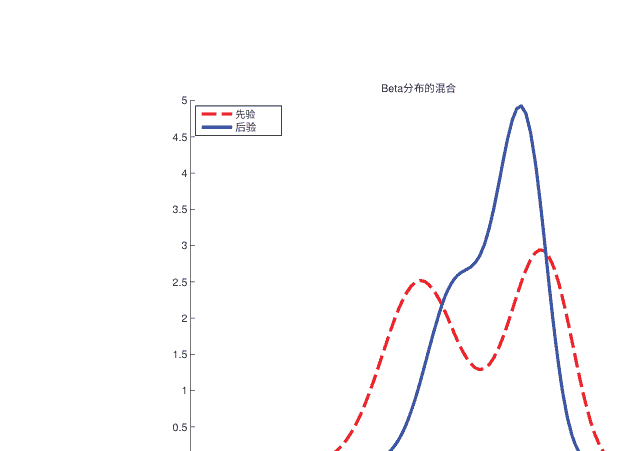

图5.10两个Beta分布的混合。由mixBetaDemo生成的图。

### 5.4.4.2 应用：在DNA和蛋白质序列中寻找保守区域

我们提到Dirichlet-多项式模型在生物序列分析中被广泛使用。让我们举一个简单的例子来说明一些已经发展起来的机制。具体来说，考虑在第2.3.2.1节中讨论的序列标志。现在假设我们想要找到代表基因组编码区域的位置。由于进化压力的原因，这些位置在所有序列中通常具有相同的字母。因此，我们需要找到“纯净”的列，或者几乎是纯净的，即大部分是A，大部分是T，大部分是C，或者大部分是G。一种方法是寻找熵低的列；这些列的分布几乎是确定性的（纯净的）。

但是假设我们想要将置信度与我们对纯度的估计关联起来。如果我们相信相邻位置是一起保留的，这将是有用的。在这种情况下，如果位置 t 被保留，我们可以让 Z_t = 1，否则让 Z_t = 0。然后，我们可以使用马尔可夫链在相邻的 Z_t 变量之间添加依赖关系；详见第17章。

无论如何，我们需要定义一个似然模型， p(N_t|Z_t)，其中 N_t 是第 t 列的(A,C,G,T)计数向量。自然而然地，我们可以将其定义为具有参数 θ_t 的多项分布。由于每一列都有不同的分布，我们将希望积分掉 θ_t，从而计算边际似然。

$$p(N_t|Z_t) = \int p(N_t|\theta_t) p(\theta_t|Z_t) d\theta_t \tag{5.74}$$

但是我们应该使用什么先验分布来表示 θ_t？ 当 Z_t = 0 时，我们可以使用均匀先验分布， p(θ|Z_t=0) = Dir(1,1,1,1)，但是如果 Z_t = 1，我们应该使用什么呢？毕竟，如果该列是保守的，它可能是一个（几乎）纯的A、C、G或T的列。一种自然的方法是使用一系列狄利克雷分布的混合，每个狄利克雷分布都“倾斜”向4维单纯形的适当角落，例如：

$$p(\theta|Z_t = 1) = \frac{1}{4} Dir(\theta|(10,1,1,1)) + \cdots + \frac{1}{4} Dir(\theta|(1,1,1,10)) \tag{5.75}$$

由于这是共轭的，我们可以轻松计算 p(N_t|Z_t)。参见（Brown et al. 1993）将这些思想应用于一个真实的生物序列问题。

## 5.5 分层贝叶斯

计算后验概率 p(θ|D)的一个关键要求是指定先验概率 p(θ|η)，其中 η是超参数。如果我们不知道如何设置 η怎么办？在某些情况下，我们可以使用无信息先验，就像我们之前讨论的那样。更贝叶斯的方法是对我们的先验分布再加一个先验！在图模型（第10章）中，我们可以表示如下情况：

$$\eta \rightarrow \theta \rightarrow D$$

这是一个分层贝叶斯模型的例子，也被称为多层模型，因为存在多个未知量的层级。我们在本书中给出一个简单的例子，后面还会看到很多其他例子。

### 5.5.1 示例：建模相关癌症率

考虑在不同城市中预测癌症率的问题（此示例来自（Johnson和Albert 1999年，第24页））。特别是，假设我们测量了各个城市的人数， N_i，以及在这些城市中死于癌症的人数， x_i。我们假设 x_i ∼ Bin(N_i, θ_i)，并且我们想要估计癌症率 θ_i。一种方法是分别估计它们，但这将受到稀疏数据问题的影响（由于小 N_i而低估癌症率）。另一种方法是假设所有的 θ_i都相同；这被称为参数绑定。得到的汇总最大似然估计值只是 θ̂ = ∑_i x_i / ∑_i N_i。但是假设所有城市具有相同的率是一个相当强的假设。一种折衷的方法是假设 θ_i是相似的，但可能存在城市特定的变化。这可以通过假设 θ_i是从某个公共分布中抽取的来建模，例如 θ_i ∼ Beta(a, b)。完整的联合分布可以写成

$$p(D, \theta, \eta|N) = p(\eta) \prod_{i=1}^N Bin(x_i|N_i, \theta_i) Beta(\theta_i|\eta) \quad (5.77)$$

其中 η = (a, b)。

请注意，我们从数据中推断出 η= (a, b)是至关重要的；如果我们将其固定为一个常数，那么 θ_i将是条件独立的，它们之间将没有信息流动。相比之下，通过将 η视为未知的（隐藏的变量），我们允许数据较少的城市从数据丰富的城市中借用统计力量。

假设我们计算联合后验概率 p(η, θ|D)。从中我们可以得到后验边缘概率 p(θ_i|D)。在图5.11(a)中，我们将后验均值 E[θ_i|D]表示为蓝色柱状图，以及总体水平均值 E[a/(a+b)|D]，表示为红线（这代表了 θ_i的平均值）。我们可以看到，对于样本量较小的城市 N_i，后验均值更加向汇总估计值收缩。例如，城市1和城市20的观察到的癌症发病率都为0，但是城市20的人口较少，因此它的发病率更加向总体估计值收缩（即更接近水平的红线）比城市1。

图5.11(b)显示了 θ_i的95%后验可信区间。我们可以看到，人口非常多（53,637人）的第15个城市的后验不确定性很小。因此，这个城市对 $\eta$ 的后验估计影响最大, 进而影响其他城市的癌症发病率估计。 城市10和19具有最高的最大似然估计, 也具有最高的后验不确定性, 反映出这样高的估计与先验 (从其他城市估计得出) 存在冲突。

在上面的例子中, 我们为每个城市设置一个参数, 建模响应的概率是否开启。通过将伯努利参数作为协变量的函数, $\theta_{i}= \text{sigm}(\mathbf{w}_{i}^T \mathbf{x})$, 我们可以建模多个相关的逻辑回归任务。 这被称为多任务学习, 在第9.5节中将详细讨论。

## 5.6 经验贝叶斯

在分层贝叶斯模型中, 我们需要计算多个层次的潜在变量的后验概率。 例如, 在一个两层模型中, 我们需要计算

$p(\boldsymbol{\eta}, \boldsymbol{\theta}|\mathcal{D}) \propto p(\mathcal{D}|\boldsymbol{\theta})p(\boldsymbol{\theta}|\boldsymbol{\eta})p(\boldsymbol{\eta})$     (5.78)

在某些情况下, 我们可以解析地边缘化掉 $\boldsymbol{\theta}$; 这样我们只需要计算 $p(\boldsymbol{\eta}|\mathcal{D})$这个更简单的问题。

-   作为一种计算上的捷径, 我们可以用一个点估计来近似超参数的后验概率, 即 $p(\boldsymbol{\eta}|\mathcal{D}) \approx \delta_{\hat{\boldsymbol{\eta}}}(\boldsymbol{\eta})$, 其中 $\hat{\boldsymbol{\eta}} = \text{argmax}\, p(\boldsymbol{\eta}|\mathcal{D})$。 由于 $\boldsymbol{\eta}$ 在维度上通常比 $\boldsymbol{\theta}$ 小得多, 所以它不容易过拟合, 因此我们可以安全地在 $\boldsymbol{\eta}$ 上使用均匀先验。 然后估计变成

$\hat{\boldsymbol{\eta}} = \text{argmax}\, p(\mathcal{D}|\boldsymbol{\eta}) = \text{argmax}\, \left[ \int p(\mathcal{D}|\boldsymbol{\theta})p(\boldsymbol{\theta}|\boldsymbol{\eta}) d\boldsymbol{\theta} \right]$     (5.79)

括号内的数量是边际或综合似然，有时被称为证据。这种整体方法被称为经验贝叶斯（EB）或第二型最大似然。在机器学习中，有时被称为证据程序。

经验贝叶斯违反了先验应该独立于数据选择的原则。然而，我们可以将其视为在分层贝叶斯模型中进行推断的一种计算上廉价的近似，就像我们将MAP估计视为在一级模型$\theta \rightarrow \mathcal{D}$中进行推断的近似一样。事实上，我们可以构建一个层次结构，其中进行的积分越多，就越“贝叶斯”。

| 方法 | 定义 |
| :--- | :--- |
| 最大似然 | $\hat{\theta} = \text{argmax}_\theta p(\mathcal{D}|\theta)$ |
| MAP估计 | $\hat{\theta} = \text{argmax}_\theta p(\mathcal{D}|\theta)p(\theta|\eta)$ |
| ML-II (经验贝叶斯) | $\hat{\eta} = \text{argmax}_\eta \int p(\mathcal{D}|\theta)p(\theta|\eta)d\theta = \text{argmax}_\eta p(\mathcal{D}|\eta)$ |
| MAP-II | $\hat{\eta} = \text{argmax}_\eta \int p(\mathcal{D}|\theta)p(\theta|\eta)p(\eta)d\theta = \text{argmax}_\eta p(\mathcal{D}|\eta)p(\eta)$ |
| 完全贝叶斯 | $p(\theta, \eta|\mathcal{D}) \propto p(\mathcal{D}|\theta)p(\theta|\eta)p(\eta)$ |

请注意，EB可以展示出良好的频率性质（参见例如（Carlin和Louis 1996; Efron 2010）），因此被非贝叶斯人士广泛使用。例如，流行的James-Stein估计器，讨论在第6.3.3.2节中，可以使用EB推导出来。

### 5.6.1 示例：beta-二项模型

让我们回到癌症发病率模型。我们可以解析地积分掉$\theta_i$，并直接写出边际似然，如下所示：
$$
p(\mathcal{D}|a, b) = \prod_i \int \text{Bin}(x_i|N_i, \theta_i)\text{Beta}(\theta_i|a, b)d\theta_i \tag{5.80}
$$
$$
= \prod_i \frac{B(a + x_i, b + N_i - x_i)}{B(a, b)} \tag{5.81}
$$

关于如何最大化这个关于$a$和$b$的函数的各种方法在（Minka 2000e）中讨论。通过估计$a$和$b$，我们可以插入超参数以计算后验概率$p(\theta_i|\hat{a}, \hat{b}, \mathcal{D})$通常的方式，使用共轭分析。最终结果是每个$\theta_i$的后验均值是其局部最大似然估计和先验均值的加权平均，这取决于$\hat{\eta}= (\hat{a}, \hat{b})$；但由于$\hat{\eta}$是基于所有数据估计的，每个$\theta_i$都受到所有数据的影响。

### 5.6.2 示例：高斯-高斯模型

我们现在研究另一个类似于癌症率示例的例子，只是数据是实值的。我们将使用高斯似然和高斯先验。这将使我们能够以解析方式写出解决方案。

特别是，假设我们有来自多个相关群体的数据。例如，$x_{ij}$可以是学校$j$中学生$i$的考试成绩，对于$j=1:D$和$i=1:N_j$。我们想要估计每个学校的平均分，$\theta_j$。然而，由于样本大小$N_j$可能很小，因此我们需要使用合适的先验来稳定估计。

在一些学校中，我们可以通过使用分层贝叶斯模型来规范化问题，其中我们假设$\theta_j$来自一个共同的先验分布$\mathcal{N}(\mu, \tau^2)$。联合分布具有以下形式：

$$p(\theta, \mathcal{D}|\eta, \sigma^2) = \prod_{j=1}^{D} \mathcal{N}(\theta_j|\mu, \tau^2) \prod_{i=1}^{N_j} \mathcal{N}(x_{ij}|\theta_j, \sigma^2) \quad (5.82)$$

在简单起见，我们假设$\sigma^2$是已知的。（我们在练习24.4中放松了这个假设。）我们解释如何估计$\eta$。一旦我们估计出$\eta=(\mu, \tau)$，我们可以计算$\theta_j$的后验概率。为了做到这一点，简化问题可以将联合分布重写为以下形式，利用了$N_j$个高斯测量具有值$x_{ij}$和方差$\sigma^2$等效于一个值为$\bar{x}_j$的测量，其精度为$N_j/\sigma^2$。这导致 $\frac{1}{N_j} \sum_{i=1}^{N_j} x_{ij}$ 的方差为 $\sigma_j^2 \triangleq \sigma^2 / N_j$。

$$p(\theta, \mathcal{D}|\hat{\eta}, \sigma^2) = \prod_{j=1}^{D} \mathcal{N}(\theta_j|\hat{\mu}, \hat{\tau}^2) \mathcal{N}(\bar{x}_j|\theta_j, \sigma_j^2) \quad (5.83)$$

由此可见，根据第4.4.1节的结果，后验概率为

$$p(\theta_j|\mathcal{D}, \hat{\mu}, \hat{\tau}^2) = \mathcal{N}(\theta_j|\hat{B}_j\hat{\mu} + (1 - \hat{B}_j)\bar{x}_j, (1 - \hat{B}_j)\sigma_j^2) \quad (5.84)$$
$$\hat{B}_j \triangleq \frac{\sigma_j^2}{\sigma_j^2 + \hat{\tau}^2} \quad (5.85)$$

其中 $\hat{\mu} = \bar{\bar{x}}$ 和 $\hat{\tau}^2$ 将在下面定义。数量 $0 \leq \hat{B}_j \leq 1$控制向整体均值 $\mu$收缩的程度。如果数据对于组 $j$是可靠的（例如，因为样本量 $N_j$很大），那么 $\sigma_j^2$相对于 $\tau^2$来说会很小；因此 $\hat{B}_j$会很小，我们在估计 $\theta_j$ 时会给予 $\bar{x}_j$更多的权重。然而，样本量较小的组会更加受到正则化（向整体均值$\mu$收缩）的影响。我们将在下面看到一个例子。如果对于所有的组 $j$, $\sigma_j = \sigma$, 后验均值变为

$$ \theta_j = \hat{B}\bar{\bar{x}} + (1 - \hat{B})\bar{x}_j = \bar{\bar{x}} + (1 - \hat{B})(\bar{x}_j - \bar{\bar{x}}) \quad (5.86) $$

这与第6.3.3.2节中讨论的James Stein估计器具有完全相同的形式。

#### 5.6.2.1 示例：预测棒球比分

我们现在给出一个应用于棒球击球率的收缩示例，来源于（Efron and Morris 1975）。我们观察到在前$T=45$场比赛中，有$D=18$名球员的击中次数为 $b_j$。 我们假设 $b_j \sim \text{Bin}(T, \theta_j)$, 其中 $\theta_j$是球员 $j$的“真实”击球率。目标是估计 $\theta_j$。最大似然估计（MLE）当然是 $\hat{\theta}_j = x_j$, 其中 $x_j = b_j/T$是经验击球率。然而，我们可以使用EB方法来取得更好的效果。为了应用上述高斯收缩方法，我们需要假设似然函数是高斯分布，即 $x_j \sim \mathcal{N}(\theta_j, \sigma^2)$, 其中 $\sigma^2$ 是已知的。（我们省略了下标 $i$，因为我们假设 $N_j = 1$。）

由于 $\bar{x}_j$ 已经表示球员 $j$ 的平均值，因此我们省略了下标 $_{j}$。然而，在这个例子中，我们有一个二项式似然函数。虽然它具有正确的均值 $\mathbb{E}[x_j] = \theta_j$，但方差不是常数：

$$\operatorname{var} [x_j] = \frac{1}{T^2} \operatorname{var} [b_j] = \frac{T \theta_j (1 - \theta_j)}{T^2} \tag{5.87}$$

因此，让我们对变量 $x_j$ 应用方差稳定转换$^5$以更好地符合高斯分布的假设：

$$y_j = f(x_j) = \sqrt{T} \arcsin(2x_j - 1) \tag{5.88}$$

现在我们大致有 $y_j \sim \mathcal{N}(f(\theta_j), 1) = \mathcal{N}(\mu_j, 1)$。我们使用高斯收缩来估计 $\mu_j$，使用方程式 5.86 和 $\sigma^2 = 1$，然后进行反转换以获得 $\theta_j$

$$\theta_j = 0.5(\sin(\hat{\mu}_j / \sqrt{T}) + 1) \tag{5.89}$$

结果如图 5.12(a-b) 所示。在 (a) 中，我们绘制了最大似然估计 $\hat{\theta}_j$ 和后验均值 $\bar{\theta}_j$。我们看到所有的估计值都向全局均值收缩，0.265。在(b)中，我们绘制了真实值 $\theta_j$，MLE $\hat{\theta}_j$ 和后验均值 $\bar{\theta}_j$。（“真实”值 $\theta_j$ 是从大量独立游戏中估计得到的。）我们看到，平均而言，收缩估计比MLE更接近真实参数。具体而言，均方误差，由 $\text{MSE} = \frac{1}{D} \sum_{j=1}^{D} (\bar{\theta}_j - \theta_j)^2$，使用收缩估计 $\bar{\theta}_j$ 比使用MLE $\hat{\theta}_j$ 小三倍以上。

#### 5.6.2.2 估计超参数

在本节中，我们给出了一个估计 $\eta$ 的算法。假设最初 $\sigma_j^2 = \sigma^2$ 对于所有的组都是相同的。在这种情况下，我们可以得到闭式形式的EB估计，如下所示。从方程4.126中，我们有

$$p(\bar{x}_j|\mu, \tau^2, \sigma^2) = \int \mathcal{N}(\bar{x}_j|\theta_j, \sigma^2) \mathcal{N}(\theta_j|\mu, \tau^2) d\theta_j = \mathcal{N}(\bar{x}_j|\mu, \tau^2 + \sigma^2) \tag{5.90}$$

因此边际似然是

$$p(\mathcal{D}|\mu, \tau^2, \sigma^2) = \prod_{j=1}^{D} \mathcal{N}(\bar{x}_j|\mu, \tau^2 + \sigma^2)$$

因此我们可以使用高斯分布的常规最大似然估计来估计超参数。对于 $\mu$，我们有

$$\hat{\mu} = \frac{1}{D} \sum_{j=1}^{D} \bar{x}_j = \bar{\bar{x}}$$

这是总体均值。 对于方差，我们可以使用矩匹配（等同于高斯分布的最大似然估计）：我们只需将模型方差等于经验方差：

$$\hat{\tau}^2 + \sigma^2 = \frac{1}{D} \sum_{j=1}^{D} (\bar{x}_j - \bar{\bar{x}})^2 \triangleq s^2$$

所以 $\hat{\tau}^2 = s^2 - \sigma^2$。由于我们知道 $\tau^2$ 必须是正数，因此通常使用以下修正估计：

$$\hat{\tau}^2 = \max\{0, s^2 - \sigma^2\} = (s^2 - \sigma^2)_+$$

因此收缩因子是

$$\hat{B} = \frac{\sigma^2}{\sigma^2 + \hat{\tau}^2} = \frac{\sigma^2}{\sigma^2 + (s^2 - \sigma^2)_+}$$

在$\sigma^2$不同的情况下，我们无法通过闭式解来推导出解决方案。 练习11.13讨论了如何使用EM算法来推导出EB估计，练习24.4讨论了如何在这个分层模型中进行完全贝叶斯推断。

## 5.7 贝叶斯决策理论

我们已经看到概率论如何用于表示和更新我们对世界状态的信念。 然而，我们的最终目标是将我们的信念转化为行动。 在本节中，我们讨论了最优的方法。

我们可以将任何给定的统计决策问题形式化为与自然的对抗（而不是与其他战略玩家的对抗，这是博弈论的主题，详见（Shoham和Leighton-Brown 2009））。在这个游戏中，自然选择一个未知于我们的状态、参数或标签 $y\in\mathcal{Y}$，然后生成一个观察值 $\mathbf{x}\in\mathcal{X}$，我们可以看到。然后我们必须做出决策，也就是说，我们必须从某个行动空间 $\mathcal{A}$ 中选择一个行动 $a$。 最后，我们会产生一些损失 $L(y, a)$，它衡量我们的行动 $a$ 与自然的隐藏状态 $y$ 的兼容性。 例如，我们可以使用误分类损失 $L(y, a) = \mathbb{I}(y \neq a)$，或者平方损失 $L(y, a) = (y-a)^2$的方式$^6$。

我们的目标是设计一个决策过程或策略，$\delta: \mathcal{X} \to \mathcal{A}$，它为每个可能的输入指定最优行动。最优行动是指最小化期望损失的行动：

$$\delta(\mathbf{x}) = \underset{a \in \mathcal{A}}{\text{argmin}}\ \mathbb{E}[L(y, a)] \quad (5.96)$$

在经济学中，更常见的是谈论一个效用函数；这只是负损失，$U(y, a) = -L(y, a)$。因此，上述规则变为

$$\delta(\mathbf{x}) = \underset{a \in \mathcal{A}}{\text{argmax}}\ \mathbb{E}[U(y, a)] \quad (5.97)$$

**这被称为最大期望效用原则，是我们所说的理性行为的本质。**

请注意，对于“期望”一词有两种不同的解释。在贝叶斯版本中，我们讨论的是在迄今为止观察到的数据条件下，$y$ 的期望值。在频率主义版本中，我们讨论的是在未来预期观察到的 $y$ 和 $\mathbf{x}$ 的期望值。

在贝叶斯决策理论中，观察到 $\mathbf{x}$ 后，最优动作被定义为最小化 **后验期望损失** 的动作 $a$：

$$\rho(a|\mathbf{x}) \triangleq \mathbb{E}_{p(y|\mathbf{x})}[L(y, a)] = \sum_y L(y, a)p(y|\mathbf{x}) \quad (5.98)$$

（如果 $y$ 是连续的（例如，当我们想要估计参数向量时），我们应该用积分替换求和。）因此，贝叶斯估计器，也称为贝叶斯决策规则，由以下给出：

$$\delta(\mathbf{x}) = \underset{a \in \mathcal{A}}{\text{arg min}}\ \rho(a|\mathbf{x}) \quad (5.99)$$

### 5.7.1 常见损失函数的贝叶斯估计器

在本节中，我们展示了如何构建常见机器学习中出现的损失函数的贝叶斯估计器。

#### 5.7.1.1 MAP估计最小化0-1损失

0-1损失定义如下：

$$L(y, a) = \mathbb{I}(y = a) = \begin{cases} 0 & \text{if } a = y \\ 1 & \text{if } a \neq y \end{cases} \quad (5.100)$$

这在分类问题中常常被使用，其中 $y$ 是真实的类别标签，而 $a = \hat{y}$ 是估计值。

例如，在两类情况下，我们可以将损失矩阵写成如下形式：

| | $\hat{y} = 1$ | $\hat{y} = 0$ |
|---|---|---|
| $y = 1$ | 0 | 1 |
| $y = 0$ | 1 | 0 |

---
*脚注:*
*5. 假设 $\mathbb{E} [X] = \mu$ 和 $\operatorname{var} [X] = \sigma^2(\mu)$. 让 $Y = f(X)$. 然后泰勒级数展开给出 $Y \approx f(\mu) + (X - \mu) f'(\mu)$. 方差稳定转换是一个函数 $f$ 使得 $f'(\mu)^2 \sigma^2(\mu)$ 独立于 $\mu$.*
*6. 我们将在下面看到一些其他的例子。*

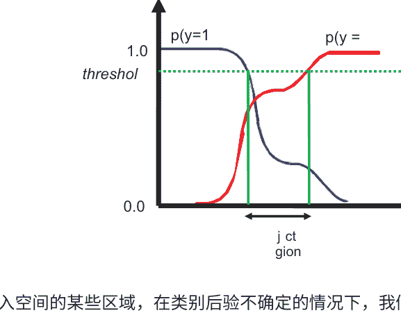

（在第5.7.2节中，我们将推广这个损失函数，使其在非对角线上对两种错误进行不同的惩罚。）后验期望损失为

$$\rho(a|\mathbf{x}) = p(a = y|\mathbf{x}) = 1 - p(y|\mathbf{x})$$ (5.101)

因此，最小化期望损失的行动是后验模式或MAP估计

$$y^*(\mathbf{x}) = \arg\max_{y \in \mathcal{Y}} p(y|\mathbf{x})$$ (5.102)

### 5.7.1.2 拒绝选项

在分类问题中，当 $p(y|\mathbf{x})$ 非常不确定时，我们可能更喜欢选择一个拒绝行动，即我们拒绝将示例分类为任何指定的类别，而是说“不知道”。这种模棱两可的情况可以由人类专家处理。请参见图5.13进行说明。这在风险厌恶的领域（如医学和金融）中非常有用。

我们可以将拒绝选项形式化如下。选择 $a = C+1$ 对应于选择拒绝行动，选择 $a \in \{1, \ldots, C\}$ 对应于选择其中一个类别。

假设我们将损失函数定义为

$$L(y = j, a = i) = \begin{cases} 0 & \text{if } i = j \text{ and } i, j \in \{1, \ldots, C\} \\ \lambda_r & \text{if } i = C+1 \\ \lambda_s & \text{否则} \end{cases}$$ (5.103)

其中 $\lambda_r$ 是拒绝动作的成本，而 $\lambda_s$ 是替换错误的成本。在练习5.3中，你将证明最优的动作是在最可能的类别的概率低于 $1 - \frac{\lambda_r}{\lambda_s}$ 时选择拒绝动作。否则，你应该选择最可能的类别。

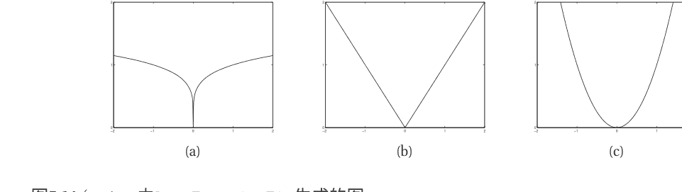

图5.14 (a-c)。由lossFunctionFig生成的图。

### 5.7.1.3 后验均值最小化 L2(二次)损失

对于连续参数，更合适的损失函数是平方误差，L2损失，或者二次损失，定义为

$L(y, a) = (y - a)^2$   (5.104)

后验期望损失为

$\rho(a|\mathbf{x}) = \mathbb{E}[(y-a)^2|\mathbf{x}] = \mathbb{E}[y^2|\mathbf{x}] - 2a\mathbb{E}[y|\mathbf{x}] + a^2$   (5.105)

因此最优估计是后验均值：

$\frac{\partial}{\partial a} \rho(a|\mathbf{x}) = -2\mathbb{E}[y|\mathbf{x}] + 2a = 0 \Rightarrow \hat{y} = \mathbb{E}[y|\mathbf{x}] = \int y p(y|\mathbf{x}) dy$   (5.106)

这通常被称为最小均方误差估计或MMSE估计。

在线性回归问题中，我们有

$p(y|\mathbf{x}, \boldsymbol{\theta}) = \mathcal{N}(y|\mathbf{x}^T \mathbf{w}, \sigma^2)$   (5.107)

在这种情况下，给定一些训练数据 $\mathcal{D}$ 的最优估计为

$\mathbb{E}[y|\mathbf{x}, \mathcal{D}] = \mathbf{x}^T \mathbb{E}[\mathbf{w}|\mathcal{D}]$   (5.108)

也就是说，我们只需插入后验均值参数估计。 请注意，无论我们对 $\mathbf{w}$ 使用什么先验，这都是最优的做法。

### 5.7.1.4 后验中位数最小化 L1(绝对)损失

L2损失对真值的偏差进行二次惩罚，因此对异常值敏感。 更稳健的替代方案是绝对或 L1损失, $L(y, a) = |y-a|$ (见图5.14)。最优估计是后验中位数，即一个值 $a$ 使得 $P(y < a|\mathbf{x}) = P(y \geq a|\mathbf{x}) = 0.5$。有关证明，请参见练习5.9。

### 5.7.1.5 监督学习

考虑一个预测函数 $\delta : \mathcal{X} \rightarrow \mathcal{Y}$，并假设我们有一个成本函数 $(y, y')$ 它给出了在真实值为 $y$ 时预测 $y'$ 的成本。我们可以定义所承担的损失为

在未知的自然状态为 θ(数据生成机制的参数)时，采取行动 δ(即使用该预测器)的损失如下：

$$L(\theta, \delta) \triangleq \mathbb{E}_{(\mathbf{x},y)\sim p(\mathbf{x},y|\theta)} \left[ L(y, \delta(\mathbf{x})) \right] = \sum_{\mathbf{x}} \sum_{y} L(y, \delta(\mathbf{x})) p(\mathbf{x}, y|\theta)$$

这被称为泛化误差。 我们的目标是最小化后验期望损失，由以下给出

$$\rho(\delta|\mathcal{D}) = \int p(\theta|\mathcal{D}) L(\theta, \delta) d\theta$$

这应该与频率风险相对比，频率风险在方程6.47中定义。

### 5.7.2 假阳性与假阴性的权衡

在本节中，我们关注二元决策问题，如假设检验、两类分类、对象/事件检测等。我们可以犯两种错误：一个假阳性 (也称为误报)，当我们估计 ŷ=1 但实际 y=0 时产生；或者一个假阴性 (也称为漏检)，当我们估计 ŷ=0 但实际 y=1 时产生。0-1损失将这两种错误视为等同。 然而，我们可以考虑以下更一般的损失矩阵：

|      | ŷ=1 | ŷ=0 |
|------|-----|-----|
| y=1 | 0   | L_FN |
| y=0 | L_FP | 0   |

其中 L_FN 是误判为负样本的代价， L_FP 是误判为正样本的代价。 两种可能行动的后验期望损失为

$$\rho(\hat{y}=0|\mathbf{x}) = L_{FN} p(y=1|\mathbf{x})$$

$$\rho(\hat{y}=1|\mathbf{x}) = L_{FP} p(y=0|\mathbf{x})$$

因此，我们应该选择类别 ŷ=1 当且仅当

$$\rho(\hat{y}=0|\mathbf{x}) > \rho(\hat{y}=1|\mathbf{x})$$

$$\frac{p(y=1|\mathbf{x})}{p(y=0|\mathbf{x})} > \frac{L_{FP}}{L_{FN}}$$

如果 L_FN = c L_FP，很容易证明 (练习5.10) 我们应该选择 ŷ=1 当且仅当 p(y=1|x)/p(y=0|x)> τ，其中 τ = c/(1+c) (参见 (Muller et al. 2004) )。例如，如果一个假阴性的代价是假阳性的两倍，即 c=2，那么我们在判定为正样本之前使用决策阈值为 2/3 。 下面我们讨论ROC曲线，它提供了一种研究FP-FN权衡的方法，而不需要选择特定的阈值。

### 5.7.2.1 ROC曲线及相关内容

假设我们正在解决一个二元决策问题，比如分类、假设检验、目标检测等。同时，假设我们有一个带有标签的数据集， D = { (x_i, y_i) }。令 δ(x) =

## 5.7 贝叶斯决策理论

| 估计值\真实值 | 1         | 0         | Σ                     |
|---------------|-----------|-----------|-----------------------|
| 1             | TP        | FP        | N̂₊ = TP + FP         |
| 0             | FN        | TN        | N̂₋ = FN + TN         |
| Σ             | N₊ = TP + FN | N₋ = FP + TN | N = TP + FP + FN + TN |

表5.2 从混淆矩阵中可得到的量。N₊是真正的正例数，N̂₊是“被叫做”正例数，N₋是真正的负例数，N̂₋是“被叫做”负例数。

| ŷ\y | y=1                              | y=0                          |
|-----|----------------------------------|------------------------------|
| ŷ=1 | T P / N₊ = TPR = 敏感性 = 召回率 | F P / N₋ = FPR = 类型I      |
| ŷ=0 | F N / N₊ = FNR = 漏报率 = 类型II | T N / N₋ = TNR = 特异度      |

表5.3 从混淆矩阵中估计 p(ŷ|y) 的值。缩写：FNR = 假阴性率，FPR = 假阳性率，TNR = 真阴性率，TPR = 真阳性率。

我们的决策规则是Ⅱ(f(x) > τ)，其中 f(x) 是 y = 1的置信度量（这应该与 p(y = 1|x)单调相关，但不需要是概率），而 τ 是某个阈值参数。对于每个给定的 τ 值，我们可以应用我们的决策规则并计算出现的真阳性、假阳性、真阴性和假阴性的数量，如表5.2所示。这个错误表被称为混淆矩阵。

从这个表中，我们可以通过使用 TPR = TP/N₊ ≈ p(ŷ=1|y=1) 来计算真正的阳性率(TPR)，也被称为敏感性,召回率或命中率。我们还可以通过使用 FPR = FP/N₋ ≈ p(ŷ=1|y=0) 来计算假阳性率(FPR)，也称为虚警率或I型错误率。这些和其他定义总结在表5.3和5.4中。我们可以以任何方式组合这些错误来计算损失函数。

然而，与其计算固定阈值 τ 的TPR和FPR，我们可以对一组阈值运行我们的检测器，然后将TPR与FPR作为隐式函数绘制为 τ 的函数。这被称为接收者操作特性或 ROC曲线。请参见图5.15(a)的示例。任何系统都可以通过将 τ=1 设置为底部左侧的点，（FPR=0, TPR=0），从而将所有内容分类为负面；类似地，任何系统都可以通过将 τ=0 设置为顶部右侧的点，（FPR=1, TPR=1），从而将所有内容分类为正面。如果一个系统的表现处于随机水平，那么我们可以通过选择适当的阈值来实现 TPR = FPR上的任意点。一个完全将正面与负面分开的系统具有可以实现左上角的阈值，（FPR=0, TPR=1）；通过改变阈值，这样的系统将“贴近”左轴然后是顶轴，如图5.15(a)所示。

ROC曲线的质量通常用一个单一的数字来总结，使用曲线下的面积（AUC）来表示。较高的AUC分数表示更好；最大值显然为1。另一个常用的摘要统计量是等错误率（EER），也称为交叉率，定义为满足 FPR = FNR 的值。由于 FNR = 1 - TPR，我们可以通过从左上到右下绘制一条直线，并观察它与ROC曲线的交点（参见图5.15(a)中的点A和点B）来计算EER。较低的EER分数表示更好；最小值显然为0。

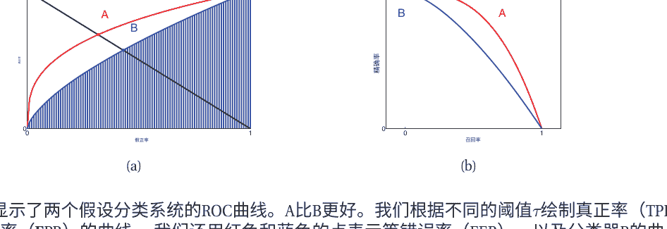

|  | $y=1$ | $y=0$ |
| :--- | :--- | :--- |
| $\hat{y}=1$ | $TP/\hat{N}_+ = \text{精确率}=\text{PPV}$ | $FP/\hat{N}_+ = \text{FDP}$ |
| $\hat{y}=0$ | $FN/\hat{N}_-$ | $TN/\hat{N}_- = \text{NPV}$ |

表5.4 从混淆矩阵中估计 $p(y|\hat{y})$ 的方法。缩写：FDP = 假阳性概率，NPV = 阴性预测值，PPV = 正性预测值。

### 5.7.2.2 精确率召回率曲线

当尝试检测罕见事件（例如检索相关文档或在图像中找到人脸）时，负样本的数量非常大。因此，将 $TPR=TP/N_+$ 与 $FPR=FP/N_-$ 进行比较并不是很有信息量，因为FPR将非常小。因此，ROC曲线中的所有“动作”都将发生在极左侧。在这种情况下，通常绘制TPR与假阳性数量的关系，而不是与假阳性率的关系。

然而，在某些情况下，“负面”的概念并不明确。例如，在图像中检测对象时（参见1.2.1.3节），如果检测器通过对补丁进行分类来工作，则检查的补丁数量（因此真负样本的数量）是算法的一个参数，而不是问题定义的一部分。因此，我们希望使用一个只涉及正样本的度量。

精确率定义为 $TP/\hat{N}_+ = p(y=1|\hat{y}=1)$，召回率定义为 $TP/N_+ = p(\hat{y}=1|y=1)$。精确率衡量我们检测到的正样本的比例，召回率衡量我们实际检测到的正样本的比例。如果 $\hat{y}_i \in \{0,1\}$ 是预测标签，而 $y_i \in \{0,1\}$ 是真实标签，我们可以使用以下方法估计精确率和召回率

$$P = \frac{\sum_i y_i \hat{y}_i}{\sum_i \hat{y}_i}, \quad R = \frac{\sum_i y_i \hat{y}_i}{\sum_i y_i}$$ (5.115)

精确率-召回率曲线是根据阈值 $\tau$ 的变化绘制的精确率和召回率的图形。参见图5.15(b)。靠近右上角是最好的结果。这条曲线可以用平均精确率（对所有阈值取平均）来总结成一个数字。

类别1
|      | y=1 | y=0 |
|------|-----|-----|
| ŷ=1 | 10  | 10  |
| ŷ=0 | 10  | 970 |

类别2
|      | y=1 | y=0 |
|------|-----|-----|
| ŷ=1 | 90  | 10  |
| ŷ=0 | 10  | 890 |

汇总
|      | y=1 | y=0 |
|------|-----|-----|
| ŷ=1 | 100 | 20  |
| ŷ=0 | 20  | 1860 |

表5.5 宏平均和微平均的区别示例。$y$是真实标签，而$\hat{y}$是预测标签。在这个例子中，宏平均精确率为 $[10/(10+10) + 90/(10+90)]/2 = (0.5 + 0.9)/2 = 0.7$。微平均精确率为 $100/(100+20) \approx 0.83$。基于(Manning et al. 2008)的表13.7。

召回值），它近似于曲线下的面积。或者，可以引用固定召回水平的精确度，例如第一个 $K=10$个实体的精确度。这被称为$K$score的平均精确度。在评估信息检索系统时，这个度量被广泛使用。

### 5.7.2.3 F-分数 *

对于一个固定的阈值，可以计算出单个的精确度和召回值。这些经常被合并成一个称为F分数或F1分数的单一统计量，它是精确度和召回率的调和平均值：

$$F_{1} \triangleq \frac{2}{1 / P+1 / R}=\frac{2 P R}{R+P}$$ (5.116)

使用方程式5.115，我们可以将其写成

$$F_{1}=\frac{2 \sum_{i=1}^{N} y_{i} \hat{y}_{i}}{\sum_{i=1}^{N} y_{i}+\sum_{i=1}^{N} \hat{y}_{i}}$$ (5.117)

这是信息检索系统中广泛使用的度量标准。

为了理解为什么我们使用调和平均数而不是算术平均数，考虑以下情况。假设我们回忆所有条目，所以 $R=1$。精确度将由流行度给出，即 $p(y=1)$。假设流行度很低，比如 $p(y=1)=10^{-4}$。算术平均数$P$和$R$由$(P + R)/2 = (10^{-4} + 1)/2 \approx 50\%$。相比之下，这种策略的调和平均数只有$\frac{2 \times 10^{-4} \times 1}{1+10^{-4}} \approx 0.2\%$。

在多类情况下（例如文档分类问题），有两种方法来推广 $F_{1}$得分。第一种方法被称为宏平均F1，定义为 $\sum_{c=1}^{C} F_{1}(c) / C$，其中 $F_{1}(c)$是在区分类别$c$和其他所有类别的任务上获得的 $F_{1}$得分。另一个被称为微平均的F1，它被定义为从每个类别的列联表中汇总所有计数的 $F_{1}$分数。

表5.5给出了一个示例，说明了它们之间的区别。我们可以看到，类别1的精确度为0.5，类别2的精确度为0.9。因此，宏平均精确度为0.7，而微平均精确度为0.83。后者与类别2的精确度比类别1的精确度更接近，因为类别2的大小是类别1的五倍。要给每个类别赋予相同的权重，请使用宏平均。

### 5.7.2.4 假阳性率*

假设我们正在使用某种高通量测量设备（如基因表达微阵列或射电望远镜）来发现一种罕见的现象。我们需要进行许多形式为 \( p(y_i=1|\mathcal{D}) > \tau \) 的二元决策，其中 \( \mathcal{D} = \{\mathbf{x}_i\}_{i=1}^N \)，且 \( N \) 可能很大。这被称为多重假设检验。请注意，与标准的二元分类不同，我们是基于所有数据而不仅仅是基于 \( \mathbf{x}_i \) 来对 \( y_i \) 进行分类的。因此，这是一个同时分类的问题，我们希望在这个问题上比一系列单独的分类问题做得更好。

$$F D(\tau, \mathcal{D}) \triangleq \sum_i \underbrace{(1 - p_i)}_{\text{pr. error}} \underbrace{\mathbb{I}(p_i > \tau)}_{\text{发现}}$$ (5.118)

其中 \( p_i \triangleq p(y_i=1|\mathcal{D}) \) 是您对该对象展示所讨论现象的信念。然后，我们定义后验期望的假发现率如下：

$$FDR(\tau, \mathcal{D}) \triangleq F D(\tau, \mathcal{D})/N(\tau, \mathcal{D})$$ (5.119)

其中 \( N(\tau, \mathcal{D}) = \sum_i \mathbb{I}(p_i > \tau) \) 是发现的物品数量。给定所需的FDR容忍度，例如 \( \alpha = 0.05 \)，可以调整 \( \tau \) 以实现这一点；这被称为直接后验概率方法来控制FDR（Newton等人，2004年；Muller等人，2004年）。为了控制FDR，估计 \( p_i \) 的联合是非常有帮助的（例如，使用层次贝叶斯模型，如第5.5节所述），而不是独立地估计。这样可以汇集统计力量，从而降低FDR。有关更多信息，请参见（Berry和Hochberg 1999）。

### 5.7.3 其他主题*

在本节中，我们简要提及与贝叶斯决策理论相关的其他几个主题。我们没有足够的空间详细介绍，但我们提供相关文献的指引。

#### 5.7.3.1 上下文赌博机

- 单臂赌博机是对世界各地的赌场中的老虎机的俗称。游戏规则是：你投入一些钱，拉动手臂，等待机器停下来；如果你幸运的话，你会赢得一些钱。现在想象一下，有一个由 \( K \) 台这样的机器组成的银行。你应该选择哪一个？这被称为多臂赌博机，并且可以使用贝叶斯决策理论进行建模：有 \( K \) 个可能的动作，每个动作都有一个未知的奖励（回报函数） \( r_k \)。通过维护一个信念状态，\( p(r_{1:K}|\mathcal{D}) = \prod \)，通过计算Gittins指数（Gittins 1989），可以制定出最优策略；这可以编译成一系列的Gittins指数。这样可以最优地解决探索-利用的权衡问题，即在决定选择胜者之前应该尝试每个动作的次数。现在考虑一个扩展，其中每个臂和玩家都有一个相关的特征向量；将所有这些特征称为 \( \mathbf{x} \)。这被称为情境赌博机（参见例如，(Sarkar 1991; Scott 2010; Li et al. 2011)）。例如，“臂”可以表示我们想要向用户展示的广告或新闻文章，而特征可以表示这些广告或文章的属性，例如词袋，以及用户的属性，例如人口统计学。如果我们假设奖励的线性模型为 $\theta_k^T \mathbf{x}$，我们可以维护每个臂的参数的分布 $(\theta_k|\mathcal{D})$，其中 $\mathcal{D}$ 是一系列形式为 $(a, \mathbf{x}, r)$ 的元组，指定了拉动的臂，其特征以及结果的结果（例如，如果用户点击了广告，则 $r=1$，否则 $r=0$）。我们将在后面的章节中讨论如何从线性和逻辑回归模型计算 $(\theta_k|\mathcal{D})$ 的方法。

给定后验概率，我们必须决定采取什么行动。一种常见的启发式方法，称为上置信界（**UCB**，代表“上置信界”），是选择最大化行动的方法

$$k^* = \underset{k=1}{\mathrm{argmax}}\; \mu_k + \lambda \sigma_k \qquad \qquad (5.120)$$

其中 $\mu_k = \mathbb{E} [r_k | \mathcal{D}]$, $\sigma_k^2 = \mathrm{var} [r_k | \mathcal{D}]$, $\lambda$ 是一个权衡探索和利用的调节参数。直觉告诉我们，我们应该选择我们认为是好的行动（$\mu_k$ 较大），和/或我们不确定的行动（$\sigma_k$ 较大）。

一种更简单的方法，称为汤普森采样，如下所示。在每一步，我们选择行动 $k$ 的概率等于它是最优行动的概率：

$$p_k = \int \mathbb{I}(\mathbb{E} [r|a, \mathbf{x}, \boldsymbol{\theta}] = \max_{a'} \mathbb{E} [r|a', \mathbf{x}, \boldsymbol{\theta}]) p(\boldsymbol{\theta}|\mathcal{D}) d\boldsymbol{\theta} \qquad \qquad (5.121)$$

我们可以通过从后验分布中抽取单个样本来近似计算，$\boldsymbol{\theta}^t \sim p(\boldsymbol{\theta}|\mathcal{D})$，然后选择 $k^*= \underset{k}{\mathrm{argmax}}\; \mathbb{E} [r|\mathbf{x}, k, \boldsymbol{\theta}^t]$。尽管它很简单，但已经被证明效果很好（Chapelle和Li 2011）。

## 5.7.3.2 效用理论

假设我们是一名医生，正在决定是否对患者进行手术。我们想象有3种自然状态：患者没有癌症，患者患有肺癌或患者患有乳腺癌。由于行动和状态空间是离散的，我们可以将损失函数 $L(\theta, a)$ 表示为损失矩阵，如下所示：

|        | 无癌症 | 有癌症 |
|--------|--------|--------|
| **肺癌**   | 20     | 0      |
| **乳腺癌** | 10     | 50     |
|        | 10     | 60     |

这些数字反映了一个事实，即当患者患有癌症时不进行手术非常糟糕（损失50或60，取决于癌症的类型），因为患者可能会死亡；当患者没有癌症时不进行手术不会有任何损失（0）；当患者没有癌症时进行手术是浪费的（损失20）；当患者患有癌症时进行手术是痛苦但必要的（10）。

自然而然地会问这些数字是从哪里来的。最终它们代表了一个虚构医生的个人偏好或价值观，并且有些是任意的：就像有些人喜欢巧克力冰淇淋，而有些人喜欢香草冰淇淋一样，没有所谓的“正确”的损失/效用函数。然而，可以证明（参见例如（DeGroot 1970）），任何一组一致的偏好都可以转化为一个标量损失/效用函数。请注意，效用可以用任意刻度来衡量，例如美元，因为只有相对值才是重要的。⁶

## 5.7.3.3 顺序决策理论

到目前为止，我们集中讨论了一次性决策问题，即我们只需要做出一次决策，然后游戏结束。在第10.6节中，我们将将其推广到多阶段或顺序决策问题。这类问题在许多商业和工程领域经常出现。这与强化学习的问题密切相关。然而，对于这一点的进一步讨论超出了本书的范围。

## 练习

- 练习5.1 证明共轭先验的混合确实是共轭的。推导出方程5.69。
- 练习5.2 分类概率的最优阈值。考虑一个情况，我们已经学习了一个条件概率分布 P(y|x)。假设只有两个类别，并且让 p0 = P(Y=0|x)和 p1 = P(Y=1|x)。考虑下面的损失矩阵：

| 预测的标签 ŷ | 真实标签 0 | 真实标签 1 |
|--------------|------------|------------|
| 0            | 0          | λ01        |
| 1            | λ10        | 0          |

- a. 证明最小化期望损失的决策 ŷ 等价于设置概率阈值θ并预测 ŷ=0如果 p1 < θ并且 ŷ=1如果 p1 ≥ θ。作为 λ01和 λ10的函数，θ是多少？（展示你的计算过程。）
- b. 展示一个阈值为0.1的损失矩阵。（展示你的计算过程。）
- 练习5.3 分类器中的拒绝选项。（来源：（Duda et al. 2001，Q2.13）。）
在许多分类问题中，你可以选择将 x分配给类别 j，或者如果你太不确定，选择拒绝选项。如果拒绝的成本小于错误分类对象的成本，那么这可能是最优的行动。让 αi表示你选择行动 i，对于 i = 1: C+1，其中 C是类别的数量，C+1是拒绝行动。让 Y = j表示真实（但未知）的自然状态。将损失函数定义如下

$$\lambda(\alpha_i|Y = j) = \begin{cases} 0 & \text{if } i = j \text{ and } i, j \in \{1, \dots, C\} \\ \lambda_r & \text{if } i = C + 1 \\ \lambda_s & \text{否则} \end{cases} \quad (5.122)$$

换句话说，如果你正确分类，你不会承担任何损失，如果你选择拒绝选项，你会承担 λr损失（成本），如果你犯了替换错误（错误分类），你会承担 λs损失（成本）。

权衡取舍，人们需要使用某种“货币”来比较不同的行动方案。保险公司经常这样做。斯坦福大学的决策理论家罗斯·沙赫特喜欢讲一个关于学校董事会的故事，他们拒绝了一份关于学校石棉清除的研究报告，因为这份报告进行了一项成本效益分析，被认为是“不人道的”，因为他们给孩子的健康下了一个价值；拒绝这份报告的结果是石棉没有被清除，这显然更加“不人道”。在医学领域，人们经常用 QALY（质量调整生命年）来衡量效用，而不是用美元，但本质是一样的。当然，即使你没有明确地指定你如何评估不同人的生命价值，你的行为也会透露出你的隐含价值/偏好，然后这些偏好可以转化为实值尺度，如美元或QALY。从行为中推断效用函数被称为逆向强化学习。

| 决策真实标签 y | 0 | 1 |
|----------------|---|---|
| 预测 0 | 0 | 10 |
| 预测 1 | 10 | 0 |
| 拒绝 | 3 | 3 |

- a. 证明如果我们决定 $Y = j$ 当且仅当 $p(Y = j|\mathbf{x}) \geq p(Y = k|\mathbf{x})$ 对于所有的 $k$（即，$j$ 是最可能的类别）并且如果 $p(Y = j|\mathbf{x}) \geq 1 - \lambda_r / \lambda_s$，则最小化风险? 我们决定拒绝。
- b. 当 $\lambda_r / \lambda_s$ 从0增加到1时（即，拒绝的相对成本增加），定性地描述会发生什么。

### 练习5.4 更多拒绝选项

在许多应用中，分类器允许将测试样例“拒绝”而不是将其分类到某个类别中。例如，考虑这样一种情况，误分类的成本为10美元，而人工手动决策的成本仅为3美元。我们可以将其表示为以下损失矩阵：

- a. 假设 $P(y=1|\mathbf{x})$ 被预测为0.2。哪个决策能使期望损失最小?
- b. 现在假设 $P(y=1|\mathbf{x})=0.4$。现在哪个决策能使期望损失最小?
- c. 证明一般情况下，对于这个损失矩阵，但对于任何后验分布，将存在两个阈值 $\theta_0$ 和 $\theta_1$，使得最优决策是如果 $p_1 < \theta_0$，则预测为0；如果 $\theta_0 \leq p_1 \leq \theta_1$，则拒绝；如果 $p_1 > \theta_1$（其中 $p_1 = p(y=1|\mathbf{x})$），则预测为1。这些阈值是多少?

### 练习5.5 新闻供应商问题

考虑决策理论/经济学中的以下经典问题。假设你正在尝试决定购买多少数量 $Q$ 的某种产品（例如报纸）以最大化利润。最优数量将取决于你认为产品的需求 $D$ 有多大，以及它对你的成本 $C$ 和销售价格 $P$。假设 $D$ 是未知的，但具有概率密度函数 $f(D)$ 和累积分布函数 $F(D)$。我们可以通过考虑两种情况来评估预期利润：如果 $D > Q$，则我们销售所有 $Q$ 个产品，并获得利润 $\pi = (P - C)Q$；但如果 $D < Q$，则我们只销售 $D$ 个产品，利润为 $(P - C)D$，但浪费了 $C(Q - D)$ 在未售出的产品上。因此，如果我们购买数量 $Q$，则预期利润为

$$E\pi(Q) = \int_Q^\infty (P-C)Q f(D) dD + \int_0^Q (P-C)D f(D) dD - \int_0^Q C(Q-D) f(D) dD \quad (5.123)$$

简化这个表达式，然后对 $Q$ 求导，以展示最优数量 $Q^*$（最大化预期利润）满足的条件

$$F(Q^*) = \frac{P-C}{P} \quad (5.124)$$

### 练习5.6 贝叶斯因子和ROC曲线

设 $B = p(D|H_1)/p(D|H_0)$ 为支持模型1的贝叶斯因子。假设我们绘制两条ROC曲线，一条通过阈值化 $B$ 计算，另一条通过阈值化 $p(H_1|D)$ 计算。它们会相同还是不同？请解释原因。

### 练习5.7 贝叶斯模型平均有助于预测准确性

-log p(Δ)。我们可以进行贝叶斯模型平均并使用以下方式进行预测

$$p^{BMA}(\Delta) = \sum_{m \in \mathcal{M}} p(\Delta|m, \mathcal{D})p(m|\mathcal{D})$$

或者我们可以使用任何单个模型进行预测（插件逼近）

$$p^m(\Delta) = p(\Delta|m, \mathcal{D})$$

证明对于所有模型 m ∈ $\mathcal{M}$，使用BMA的后验期望损失更低，即

$$\mathbb{E}[L(\Delta, p^{BMA})] \leq \mathbb{E}[L(\Delta, p^m)]$$

其中对 $\Delta$ 的期望是相对于

$$p(\Delta|\mathcal{D}) = \sum_{m \in \mathcal{M}} p(\Delta|m, \mathcal{D})p(m|\mathcal{D})$$

提示：使用KL散度的非负性。

### 练习5.8 MLE和模型选择的2D离散分布

（来源: Jaakkola。）

让 x ∈ {0,1} 表示抛硬币的结果（x=0表示反面，x=1表示正面）。这枚硬币可能是有偏的，正面出现的概率为θ₁。假设有人观察了硬币的翻转结果，并向你报告了结果y。但是这个人不可靠，只有以概率θ₂正确报告结果；即，p(y|x,θ₂)给出的是y=0

| x=0 | θ₂ | 1-θ₂ |
| x=1 | 1-θ₂ | θ₂ |

假设θ₂独立于x和θ₁。

- a. 将联合概率分布p(x, y|θ)写成2×2的表格形式，其中θ=(θ₁, θ₂)。
- b. 假设有以下数据集：x=(1,1,0,1,1,0,0)，y=(1,0,0,0,1,0,1)。求θ₁和θ₂的最大似然估计值(MLE)。请解释你的答案。提示：注意似然函数的因式分解形式，p(x,y|θ)=p(y|x,θ₂)p(x|θ₁) (5.129) 什么是p(D|θ, M₂)其中M₂表示这个两参数模型？(如果你愿意，你可以用分数形式回答。)
- c. 现在考虑一个有4个参数的模型，θ=(θ₀₀, θ₀₁, θ₁₀, θ₁₁)，表示p(x,y|θ)=θₓᵧ。（只有其中3个参数可以自由变化，因为它们必须相加为一。）θ的最大似然估计是多少？什么是p(D|θ, M₄)其中M₄表示这个四参数模型？
- d. 假设我们不确定哪个模型是正确的。我们计算2参数模型和4参数模型的留一交叉验证对数似然如下：
L(m) = $\sum_{i=1}^n \log p(x_i, y_i|m, \hat{\theta}(D_{-i}))$ (5.130)
而 $\hat{\theta}(D_{-i})$ 表示在排除第i行的D上计算的MLE。CV会选择哪个模型以及为什么？提示：注意每次省略每个训练样本时计数表的变化。

## 5.7. 贝叶斯决策理论

e. 回想一下，CV的替代方法是使用BIC分数，定义为

$$\mathrm{BIC}(M, \mathcal{D}) \triangleq \log p(\mathcal{D} | \hat{\boldsymbol{\theta}}_{M L E}) - \frac{\operatorname{dof}(M)}{2} \log N \quad (5.131)$$

其中 dof(M)是模型中自由参数的数量，计算两个模型的BIC分数(使用以 e 为底的对数)。BIC更喜欢哪个模型？

### 练习5.9 后验中位数是L1损失下的最优估计

证明后验中位数是L1损失下的最优估计。

### 练习5.10 权衡FP和FN的决策规则

如果 $L_{FN}=c L_{FP}$，证明我们应该选择 $\hat{y}=1$ 当且仅当 $p(y=1|\mathbf{x})/p(y=0|\mathbf{x})>\tau$，其中 $\tau=c/(1+c)$。

# 6 频率统计

## 6.1 引言

我们在第5章中描述的统计推断方法被称为贝叶斯统计学。令人惊讶的是，这被一些人认为是有争议的，而将贝叶斯规则应用于非统计问题——如医学诊断（第2.2.3.1节）、垃圾邮件过滤（第3.4.4.1节）或飞机跟踪（第18.2.1节）——则没有争议。反对的原因与统计模型的参数和其他类型的未知量之间的错误区分有关。¹

已经尝试过设计一些避免将参数视为随机变量的统计推断方法，从而避免使用先验概率和贝叶斯规则。这种方法被称为频率统计学、经典统计学或正统统计学。

它们不是基于后验分布，而是基于抽样分布的概念。当估计量应用于从真实但未知分布中抽样得到的多个数据集时，这就是估计量的分布；详见第6.2节。正是这种在重复试验中的变化概念构成了频率主义方法中用于建模不确定性的基础。

相比之下，在贝叶斯方法中，我们只对实际观测到的数据进行条件推断；没有重复试验的概念。这使得贝叶斯可以计算一次性事件的概率，正如我们在第2.1节中讨论的那样。更重要的是，贝叶斯方法避免了频率主义方法中的某些悖论（详见第6.6节）。然而，熟悉频率统计学（尤其是第6.5节）仍然很重要，因为它在机器学习中被广泛使用。

## 6.2 估计量的抽样分布

在频率统计学中，通过应用估计量 δ 对一些数据 D 进行计算，从而得到参数估计 $\hat{\theta}$，即 $\hat{\theta} = \delta(D)$。参数被视为固定的，数据被视为随机的，这与贝叶斯方法完全相反。参数估计的不确定性可以通过计算估计量的抽样分布来衡量。为了理解这一点

> 1. 参数有时被认为代表真实（但未知）的物理量，因此不是随机的。然而，我们已经看到，使用概率分布来表示对未知常数的不确定性是完全合理的。

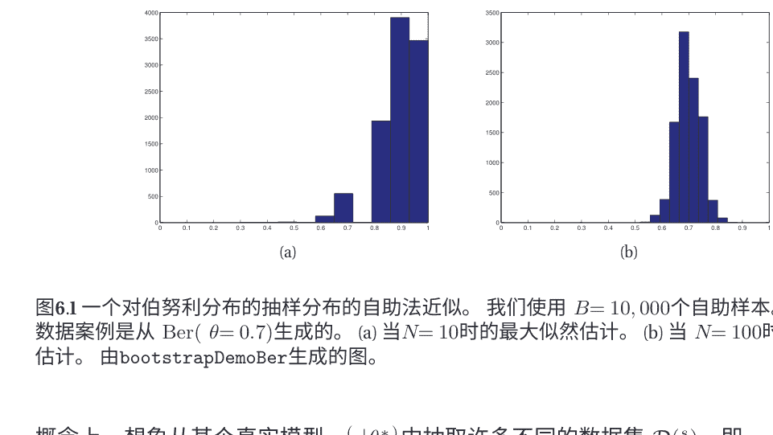

图6.1 一个对伯努利分布的抽样分布的自助法近似。我们使用 B= 10,000个自助样本。这些 N个数据案例是从 Ber( θ= 0.7)生成的。 (a) 当N= 10时的最大似然估计。 (b) 当 N= 100时的最大似然估计。由bootstrapDemoBer生成的图。

概念上，想象从某个真实模型 p(·|θ*)中抽取许多不同的数据集 D(s)，即 D(s) = {x_i(s)}_{i=1}^N，其中 x_i^s ~ p(·|θ*)，而 θ*是真实参数。这里 s=1: S索引采样数据集， N是每个这样的数据集的大小。现在将估计器 $\hat{\theta}(\cdot)$ 应用于每个 D(s)，得到一组估计值， {$\hat{\theta}$(D(s))}。当 S→∞时，引起的分布在 $\hat{\theta}$(\cdot)上是估计器的抽样分布。我们将在后面的章节中讨论使用抽样分布的各种方法。但首先，我们概述计算抽样分布本身的两种方法。

### 6.2.1 自助法

自助法是一种简单的蒙特卡洛技术，用于近似抽样分布。这在估计量是真实参数的复杂函数的情况下特别有用。

这个想法很简单。如果我们知道真实参数 θ*，我们可以从真实分布中生成许多（比如 S个）大小为 N的伪数据集，其中每个样本为 x_i^s ~ p(·|θ*)，对于 S=1: S， i=1: N。然后我们可以从每个样本计算我们的估计量， θ_s = f(x_{1:N}^s)，并使用结果样本的经验分布作为我们对抽样分布的估计。由于 θ是未知的，参数自助法的想法是使用 $\hat{\theta}$(D)来生成样本。

一种替代方法，称为非参数自助法，是从原始数据 D中（有放回地）抽取样本S，然后像之前一样计算引发的分布。在处理大规模数据集时，讨论了一些加速自助法的方法（ Kle¡ner等人，2011年）。

图6.1展示了一个例子，我们使用参数自助法计算伯努利分布的最大似然估计的抽样分布。（使用非参数自助法的结果基本相同。）我们可以看到，当 N=10时，抽样分布是不对称的，因此与高斯分布相差很远；当 N=100时，分布更接近高斯分布，符合理论预期（见下文）。

一个自然的问题是：自助法计算的参数估计 $\hat{\theta}^s$=$\hat{\theta}$(x_{1:N}^s)与从后验分布中抽样的参数值 θ^s ~ p(·|D)之间的联系是什么？

从概念上讲，它们是非常不同的。但是在常见情况下，先验不是很强时，它们可能非常相似。例如，图6.1(c-d)展示了一个使用均匀Beta(1,1)先验计算后验并进行抽样的示例。我们可以看到后验和抽样分布非常相似。因此，可以将自助法分布视为“穷人版”后验；详见(Hastie et al. 2001, p235)。

然而，令人惊讶的是，自助法可能比后验抽样慢。原因是自助法需要对模型进行$S$次拟合，而后验抽样通常只需要一次拟合（找到一个局部模态），然后在模态周围进行局部探索。这种局部探索通常比从头开始拟合模型要快得多。

## 6.2.2 MLE的大样本理论

在某些情况下，一些估计量的抽样分布可以通过解析计算得到。特别地，可以证明，在某些条件下，随着样本量趋向于无穷大，MLE的抽样分布变为高斯分布。非正式地说，这个结果成立的要求是模型中的每个参数都能“看到”无限量的数据，并且模型是可识别的。不幸的是，这排除了许多机器学习中感兴趣的模型。尽管如此，让我们假设我们处于一个简单的情境中，定理成立。

高斯分布的中心将是MLE $\hat{\theta}$。但是这个高斯分布的方差呢？直观地说，估计量的方差与似然函数曲面在其峰值处的曲率（反）相关。如果曲率很大，峰值将会很“尖”，方差很低；在这种情况下，估计是“确定的”。相反，如果曲率很小，峰值将会几乎“平坦”，因此方差很高。

现在让我们正式化这个直觉。将得分函数定义为在某一点$\theta$处评估的对数似然梯度的梯度：

(6.1)将观测信息矩阵定义为负得分函数的梯度，或者等价地说，负对数似然的Hessian矩阵：

$$\mathbf{J}(\hat{\theta}(\mathcal{D})) \triangleq -\nabla s(\hat{\theta}) = -\nabla^2 \hat{\theta} \log p(\mathcal{D}|\theta)|_{\hat{\theta}} \qquad\qquad (6.2)$$

在一维情况下，这变为

$$J(\hat{\theta}(\mathcal{D})) = - \frac{d}{d\theta^2} \log p(\mathcal{D}|\theta)|_{\hat{\theta}} \qquad\qquad (6.3)$$

这只是对 $\hat{\theta}$ 的对数似然函数曲率的度量。

由于我们正在研究抽样分布，$\mathcal{D} = (\mathbf{x}_1, \dots, \mathbf{x}_N)$是一组随机变量。费舍尔信息矩阵被定义为观测信息矩阵的期望值：$^{2}$

$$\mathbf{I}_N(\hat{\theta}|\theta^*) \triangleq \mathbb{E}_{\theta^*} \left[ \mathbf{J}(\hat{\theta}|\mathcal{D}) \right] \qquad\qquad (6.4)$$

> 2. 这不是通常的定义，但在标准假设下是等价的。更准确地说，标准定义如下（我们只给出标量情况以简化符号）：$I(\hat{\theta}|\theta^*) \triangleq \text{var}_{\theta^*} \left[ \frac{d}{d\theta} \log p(X|\theta)|_{\hat{\theta}} \right]$，那是，得分函数的方差。如果 $\hat{\theta}$ 是MLE，很容易看出 $\mathbb{E}_{\theta^*} \left[ \frac{d}{d\theta} \log p(X|\theta)|_{\hat{\theta}} \right] = 0$ （因为其中 $\mathbb{E}_{\theta^*} [\mathbf{f}(\mathcal{D})] \triangleq \mathbb{E}_{\mathbf{x} \sim \theta^*} [\mathbf{f}(\mathbf{x})]$ 是函数 $\mathbf{f}$ 在从 $\theta^*$ 采样的数据上应用时的期望值。通常 $\theta^*$ 被假定为已知的“真实参数”，所以我们只写 $\mathbf{I}_N(\hat{\theta}) \triangleq \mathbf{I}_N(\hat{\theta} | \theta^*)$ 简写。此外，很容易看出 $\mathbf{I}_N(\hat{\theta}) = N \mathbf{I}_1(\hat{\theta})$，因为样本大小为 $N$ 的对数似然函数比样本大小为1的对数似然函数“陡峭” $N$ 倍。所以我们可以去掉 1下标，只写 $\mathbf{I}(\hat{\theta}) \triangleq \mathbf{I}_1(\hat{\theta})$。这通常是使用的符号。

现在让 $\hat{\theta} \triangleq \hat{\theta}_{\text{mle}}(\mathcal{D})$ 成为MLE，其中 $\mathcal{D} \sim \theta^*$。可以证明

$$\hat{\theta} \rightarrow \mathcal{N}(\theta^*, \mathbf{I}_N(\theta^*)^{-1})$$ (6.5)

当 $N \rightarrow \infty$ 时（参见例如，(Rice 1995, p265)的证明）。我们说MLE的抽样分布是渐近正态分布。

MLE的方差如何？方差可以作为MLE的某种置信度的度量。不幸的是， $\theta^*$ 是未知的，因此我们无法评估抽样分布的方差。然而，我们可以用 $\hat{\theta}$ 替换 $\theta^*$ 来近似抽样分布。

因此，近似标准误差 $\hat{\theta}_k$ 由以下给出

$$\widehat{se}_k \triangleq \mathbf{I}_N(\hat{\theta})_{kk}^{-\frac{1}{2}}$$ (6.6)

例如，从方程5.60我们知道二项式抽样模型的费舍尔信息是

$$I(\theta) = \frac{1}{\theta(1 - \theta)}$$ (6.7)

因此，MLE的近似标准误差是

$$\widehat{se} = \frac{1}{\sqrt{\mathbf{I}_N(\hat{\theta})}} = \frac{1}{\sqrt{N I(\hat{\theta})}} = \left( \frac{\hat{\theta}(1 - \hat{\theta})}{N} \right)^{\frac{1}{2}}$$ (6.8)

其中 $\hat{\theta} = \frac{1}{N} \sum_i X_i$。将其与方程3.27进行比较，后验标准差是均匀先验下的标准差。

## 6.3 频率派决策理论

在频率派或经典决策理论中，存在损失函数和似然函数，但没有先验和后验或后验期望损失。因此，与贝叶斯情况不同，没有自动推导出最优估计器的方法。相反，在频率派方法中，我们可以自由选择任何我们想要的估计器或决策过程 $\delta: \mathcal{X} \rightarrow \mathcal{A}$。

梯度在最大值处必须为零，因此方差减小到得分函数的期望平方：我 $(\hat{\theta} | \theta^*) = \mathbb{E}_{\theta^*} \left[ \left( \frac{d}{d\theta} \log p(X|\theta) \right)^2 \right]$。可以证明（例如，(Rice 1995, p263)） $\mathbb{E}_{\theta^*} \left[ \left( \frac{d}{d\theta} \log p(X|\theta) \right)^2 \right] = -\mathbb{E}_{\theta^*} \left[ \frac{d^2}{d\theta^2} \log p(X|\theta) \right]$，因此现在费舍尔信息减小到NLL的期望二阶导数，这是比得分的方差更直观的数量。

3. 在实践中，频率主义方法通常只应用于一次性的统计决策问题，例如分类、回归和参数估计，因为其非构造性的性质使其难以应用于逐步决策问题，这些问题可以根据在线数据进行调整。

## 6.3.1 贝叶斯风险

在选择了一个估计器之后，我们定义其期望损失或风险如下：

$$R(θ^*, δ) \triangleq \mathbb{E}_{p(\tilde{\mathcal{D}}|\theta^*)}[L(θ^*, δ(\tilde{\mathcal{D}}))] = \int L(θ^*, δ(\tilde{\mathcal{D}})) p(\tilde{\mathcal{D}}|\theta^*) d\tilde{\mathcal{D}}$$

其中 $\tilde{\mathcal{D}}$是从“自然分布”中采样的数据，由参数 $\theta^*$表示。换句话说，期望是对估计器的抽样分布进行的。将其与贝叶斯后验期望损失进行比较：

$$ρ(a|\mathcal{D}, π) \triangleq \mathbb{E}_{p(\theta|\mathcal{D},π)}[L(\theta, a)] = \int_{\Theta} L(\theta, \mathbf{a}) p(\theta|\mathcal{D}, π) d\theta$$

我们可以看到，贝叶斯方法对 $\theta$（未知）进行平均，并在 $\mathcal{D}$（已知）的条件下进行，而频率主义方法对 $\tilde{\mathcal{D}}$（忽略观察到的数据）进行平均，并在 $\theta^*$（未知）的条件下进行。

频率主义定义不仅不自然，而且无法计算，因为 $\theta^*$是未知的。因此，我们无法根据频率主义风险来比较不同的估计器。我们将在下面讨论各种解决方案。

我们如何在估计器之间进行选择？我们需要一种方法将 $R(θ^*, δ)$转化为不依赖于知道 $\theta^*$的质量度量 $R(δ)$。一种方法是对 $\theta^*$进行先验设定，然后定义估计器的贝叶斯风险或综合风险如下：

$$R_B(δ) \triangleq \mathbb{E}_{p(θ^*)}[R(θ^*, δ)] = \int R(θ^*, δ) p(θ^*) dθ^*$$

贝叶斯估计器或贝叶斯决策规则是最小化期望风险的方法：

$$δ_B \triangleq \argmin_{δ} R_B(δ)$$

请注意，综合风险也被称为先验风险，因为这是在我们看到数据之前。最小化这个值对于实验设计非常有用。

我们现在将证明一个非常重要的定理，它将贝叶斯和频率主义的决策理论联系起来。

**定理6.3.1.** 通过最小化每个x的后验期望损失，可以得到贝叶斯估计器。

**证明。** 通过改变积分的顺序，我们有

$$R_B(δ) = \int \left[ \sum_{x} \sum_{y} L(y, δ(x)) p(x, y|θ^*) \right] p(θ^*) dθ^*$$

$$= \sum_{x} \sum_{y} \int_{\Theta} L(y, δ(x)) p(x, y, θ^*) dθ^*$$

$$= \sum_{x} \left[ \sum_{y} L(y, δ(x)) p(y|x) dy \right] p(x)$$

$$= \sum_{x} ρ(δ(x)|x) p(x)$$

为了最小化整体期望值，我们只需针对每个 x最小化内部项，因此我们的决策规则是选择

$$\delta_B(\mathbf{x}) = \argmin_{a \in \mathcal{A}} \rho(a|\mathbf{x}) \qquad (6.17)$$

因此我们可以看到，按照案例的基础上选择最优行动（如贝叶斯方法）在平均情况下是最优的（如频率主义方法）。换句话说，贝叶斯方法提供了实现频率主义目标的好方法。事实上，我们还可以进一步证明以下内容。

> **定理6.3.2 (Wald, 1950).** 每个可接受的决策规则都是相对于某个，可能是不恰当的先验分布的贝叶斯决策规则。

这个定理表明，最小化频率风险的最佳方法是成为贝叶斯！有关此观点的进一步讨论，请参见（Bernardo and Smith 1994, p448）。

## 6.3.2 最小化最大风险

显然，一些频率主义者不喜欢使用贝叶斯风险，因为它需要选择一个先验分布（尽管这仅仅是在估计器的评估中，不一定是其构建的一部分）。另一种方法如下。将估计器的最大风险定义为

$$R_{max}(\delta) \triangleq \max_{\theta^*} R(\theta^*, \delta) \qquad (6.18)$$

最小最大规则是一种最小化最大风险的规则：

$$\delta_{MM} \triangleq \argmin_{\delta} R_{max}(\delta) \qquad (6.19)$$

例如，在图6.2中，我们可以看到 δ₁的最坏情况风险比 δ₂低，涵盖了所有可能的 θ*值，因此它是最小最大估计量（有关如何计算实际模型的风险函数的解释，请参见第6.3.3.1节）。最小最大估计量具有一定的吸引力。然而，计算它们可能很困难。而且，它们非常悲观。实际上，可以证明所有最小最大估计量在最不利先验下等效于贝叶斯估计量。在大多数统计情况下（排除博弈论情况），假设自然界是对手是不合理的假设。

## 6.3.3 可接受的估计器

频率派决策理论的基本问题在于它依赖于知道真实分布 p(·|θ*)以评估风险。然而，可能存在一些估计器比其他估计器更差，无论 θ*的值如何。特别地，如果对于所有的θ ∈ Θ，都有 R(θ, δ₁) ≤ R(θ, δ₂)，那么我们说 δ₁支配 δ₂。如果不等式对于某些 θ是严格的，那么支配是严格的。如果一个估计器没有被任何其他估计器严格支配，那么它被称为可接受的。

### 6.3.3.1 例子

让我们给出一个例子，基于(Bernardo and Smith 1994)。考虑估计一个高斯分布的均值的问题。我们假设数据是从 x_i ~ N(θ*, σ²=1)中采样的，并使用二次损失 L(θ, θ̂) = (θ - θ̂)²。相应的风险函数是均方误差(MSE)。一些可能的决策规则或估计器 θ̂(x) = δ(x)如下：

- δ₁(x) = x̄，样本均值
- δ₂(x) = x̃，样本中位数
- δ₃(x) = θ₀，固定值
- δ_κ(x)，具有 N(θ|θ₀, σ²/κ)先验的后验均值：
  δ_κ(x) = \frac{N}{N+κ} \bar{x} + \frac{κ}{N+κ} θ_0 = w\bar{x} + (1-w)θ_0 (6.20)

对于δ对于κ，我们考虑一个弱先验， κ=1，和一个更强的先验， κ=5。先验均值为 θ₀，一些固定值。我们假设 σ²已知。（因此 δ₃(x)与具有无限强先验的 δ_κ(x)相同， κ=∞。）现在让我们通过分析推导出风险函数。（我们可以这样做，因为在这个玩具例子中，我们知道真实参数 θ*。）

$$MSE(θ̂(·)|θ*) = 方差[θ̂] + 偏差²(θ̂) \qquad (6.21)$$

样本均值是无偏的，所以它的风险是

$$MSE(δ₁|θ*) = 方差[X] = \frac{σ²}{N} \qquad (6.22)$$

样本中位数也是无偏的。可以证明方差近似为 $\pi/(2N)$，所以

$$MSE(\delta_2|\theta^*) = \frac{\pi}{2N}$$

对于 $\delta_3(\mathbf{x}) = \theta_0$，方差为零，所以

$$MSE(\delta_3|\theta^*) = (\theta^* - \theta_0)^2$$

最后，对于后验均值，我们有

$$\begin{aligned} MSE(\delta_\kappa|\theta^*) &= \mathbb{E}\left[(w\bar{x} + (1-w)\theta_0 - \theta^*)^2\right] \\ &= \mathbb{E}\left[(w(\bar{x}-\theta^*) + (1-w)(\theta_0-\theta^*))^2\right] \\ &= w^2\frac{\sigma^2}{N} + (1-w)^2(\theta_0-\theta^*)^2 \\ &= \frac{1}{(N+\kappa)^2}\left(N\sigma^2 + \kappa^2(\theta_0-\theta^*)^2\right) \end{aligned}$$

这些函数在图6.3中绘制，对于 $N\in\{5,20\}$。我们可以看到，通常情况下，最好的估计器取决于 $\theta^*$的值，而 $\theta^*$是未知的。如果 $\theta^*$非常接近 $\theta_0$，那么 $\delta_3$（只是预测 $\theta_0$）是最好的。如果 $\theta^*$在 $\theta_0$周围的某个合理范围内，那么后验均值，它将先验猜测的 $\theta_0$与实际数据结合起来，是最好的。如果 $\theta^*$远离 $\theta_0$，则最好的是MLE。这一切都不应该令人惊讶：一小部分收缩（使用具有弱先验的后验均值）通常是可取的，假设我们的先验均值是合理的。更令人惊讶的是，对于每个θ□的值，决策规则 $\delta_2$（样本中位数）的风险总是高于 $\delta_1$（样本均值）的风险。因此，样本中位数是一个### 6.3.3.2 斯坦因悖论 *

假设我们有 $N$个独立同分布的随机变量 $X_i \sim \mathcal{N}(\theta_i, 1)$，我们想要估计 $\theta_i$。显然的估计器是最大似然估计（MLE），在这种情况下，它将 $\hat{\theta}_i = x_i$。事实证明，当 $N \ge 4$时，这是一个不可接受的估计器（在二次损失下）。

为了证明这一点，构建一个更好的估计量就足够了。詹姆斯-斯坦因估计量就是这样一个估计量，定义如下：

$$\hat{\theta}_i = \hat{B} \bar{x} + (1 - \hat{B}) x_i = \bar{x} + (1 - \hat{B})(x_i - \bar{x}) \quad\quad (6.29)$$

其中 $\bar{x} = \frac{1}{N} \sum_{i=1}^{N} x_i$且 $0 < B < 1$是某个调整常数。这个估计量将“收缩”$\theta_i$朝向整体均值。（我们在第5.6.2节中使用经验贝叶斯方法推导出这个估计量。）

可以证明，对于 $N \ge 4$，这个收缩估计量的频率风险（均方误差）比MLE（样本均值）更低。这被称为斯坦因的悖论。之所以称之为悖论，是因为以下例子可以说明。假设 $\theta_i$是学生 $i$的“真实”智商，$X_i$是他的测试分数。为什么我对 $\theta_i$的估计要依赖于全局均值 $\bar{x}$，从而依赖于其他学生的分数？通过使不同的维度具有不同的性质，例如，$\theta_1$是我的智商，$\theta_2$温哥华的平均降雨量等等。

悖论的解决方案如下。如果你的目标只是估计 $\theta_i$，那么你不能比使用 $x_i$更好，但如果目标是估计整个向量 $\boldsymbol{\theta}$，并且使用平方误差作为损失函数，那么收缩有所帮助。为了看到这一点，假设我们想要从单个样本 $\mathbf{x} \sim \mathcal{N}(\boldsymbol{\theta}, \mathbf{I})$中估计 $\|\boldsymbol{\theta}\|_2^2$。一个简单的估计是 $\|\mathbf{x}\|_2^2$，但这将高估结果，因为

$$\mathbb{E}\left[\|\mathbf{x}\|_2^2\right] = \mathbb{E}\left[\sum_i x_i^2\right] = \sum_{i=1}^{N} \left(1 + \theta_i^2\right) = N + \|\boldsymbol{\theta}\|_2^2 \quad\quad (6.30)$$

因此，我们可以通过汇集信息，甚至来自不相关的来源，并向整体均值收缩来降低风险。在第5.6.2节中，我们给出了一个贝叶斯解释。参见（Efron和Morris 1975）。

### 6.3.3.3 可接受性是不够的

显然，我们可以将寻找良好估计器的范围限制在可接受估计器的类别内。但实际上，我们可以很容易地构造可接受的估计器，如下面的例子所示。

定理 6.3.3. 设 \( X\sim \mathcal{N}(\theta,1)\)，考虑在平方损失下估计 \(\theta\)。设 \(\delta_1(x)=\theta_0\)，一个与数据无关的常数。这是一个可接受的估计器。

证明. 假设不成立。那么存在另一个估计器 \(\delta_2\)，其风险更小，因此 \(R(\theta^*,\delta_2) \leq R(\theta^*,\delta_1)\)，其中不等式对于某些 \(\theta^*\) 必须是严格的。假设真实参数为 \(\theta^* = \theta_0\)。那么 \(R(\theta^*,\delta_1)=0\)，且
\[ R(\theta^*,\delta_2) = \int (\delta_2(x)-\theta_0)^2 p(x|\theta_0) dx \tag{6.31} \]
因此，\(\delta_2\) 唯一能避免在某个特定点 \(\theta_0\) 上具有比 \(\delta_1\) 更高风险的方法就是等于 \(\delta_1\)。因此，没有其他估计器 \(\delta_2\) 的风险比 \(\delta_1\) 严格更低，所以 \(\delta_1\) 是可接受的。□

## 6.4 估计量的理想特性

由于频率派决策理论没有提供选择最佳估计量的自动方法，我们需要提出其他启发式方法进行选择。在本节中，我们讨论一些我们希望估计量具备的特性。不幸的是，我们将看到我们不能同时满足所有这些特性。

### 6.4.1 一致估计量

如果估计量在样本量趋向无穷大时最终恢复生成数据的真实参数，即 \(\hat{\theta}(\mathcal{D}) \rightarrow \theta^*\) as \(|\mathcal{D}| \rightarrow \infty\)（箭头表示概率收敛），则称其为一致估计量。当然，这个概念只在数据实际上来自具有参数 \(\theta^*\) 的指定模型时才有意义，而这通常不是实际数据的情况。尽管如此，这个性质在理论上是有用的。

可以证明MLE是一个一致的估计量。直观的原因是最大化似然等价于最小化 KL \(\big(p(\cdot|\theta^*) \| p(\cdot|\hat{\theta}) \big)\)，其中 \(p(\cdot|\theta^*)\)是真实分布，\(p(\cdot|\hat{\theta})\)是我们的估计。当且仅当 \(\hat{\theta} = \theta^*\)时，我们可以实现0的KL散度。\(^4\)

### 6.4.2 无偏估计

估计量的偏差定义为
\[ \text{bias}(\hat{\theta}(\cdot)) = \mathbb{E}_{p(\mathcal{D}|\theta_*)} \left[ \hat{\theta}(\mathcal{D}) - \theta_* \right] \tag{6.32} \]
其中 \(\theta_*\)是真实参数值。如果偏差为零，则估计量被称为无偏的。这意味着抽样分布以真实参数为中心。例如，高斯均值的MLE是无偏的：
\[ \text{偏差}(\hat{\mu}) = \mathbb{E}[\hat{x}] - \mu = \mathbb{E}\left[\frac{1}{N} \sum_{i=1}^{N} x_i\right] - \mu = \frac{N \mu}{N} - \mu = 0 \tag{6.33} \]

\(^4\) 如果模型不可识别，最大似然估计可能选择与真实参数不同的参数集但导致的分布，\(p(\cdot|\hat{\theta})\),与精确分布相同。这样的参数被称为似然等价。

然而，对于高斯方差，MLE估计值 \(\hat{\sigma}^2\)，不是 \(\sigma^2\)的无偏估计。实际上，可以证明（练习6.3）

$$\mathbb{E}\left[\hat{\sigma}^{2}\right]=\frac{N-1}{N} \sigma^{2} \tag{6.34}$$

然而，以下估计器

$$\hat{\sigma}_{N-1}^{2}=\frac{N}{N-1} \hat{\sigma}^{2}=\frac{1}{N-1} \sum_{i=1}^{N}\left(x_{i}-\bar{x}\right)^{2} \tag{6.35}$$

是一个无偏估计量，我们可以很容易地证明如下：

$$\mathbb{E}\left[\hat{\sigma}_{N-1}^{2}\right]=\mathbb{E}\left[\frac{N}{N-1} \hat{\sigma}^{2}\right]=\frac{N}{N-1} \frac{N-1}{N} \sigma^{2}=\sigma^{2} \tag{6.36}$$

在Matlab中， var(X)返回 \(\hat{\sigma}_{N-1}^{2}\)， 而 var(X,1)返回 \(\hat{\sigma}^{2}\)（最大似然估计）。 对于足够大的 \(N\)，差异将是可以忽略的。

尽管最大似然估计有时可能是一个有偏估计量，但可以证明在渐近情况下，它总是无偏的。（这对于最大似然估计是一致估计量是必要的。） 尽管无偏听起来像是一个理想的特性，但这并不总是正确的。 参见第6.4.4节和 （Lindley 1972） 对此问题的讨论。

### 6.4.3 最小方差估计

直观上讲，我们希望我们的估计量是无偏的（尽管我们将在下面提出一些反对这一观点的论据）。 然而，仅仅无偏是不够的。 例如，假设我们想要从 \(\mathcal{D}=\left\{x_{1}, \ldots, x_{N}\right\}\)中估计一个高斯分布的均值。 只看第一个数据点的估计量 \(\hat{\theta}(\mathcal{D})=x_{1}\)是一个无偏估计量，但通常会比经验均值 \(\bar{x}\)（也是无偏的）更远离 \(\theta_{*}\)。因此，估计量的方差也很重要。

一个自然的问题是：方差能有多大？ 一个著名的结果，称为 **Cramer-Rao下界**，提供了任何无偏估计量方差的下界。更具体地说，

定理 6.4.1（Cramer-Rao不等式）。设 \(X_{1}, \ldots, X_{n} \sim p\left(X \mid \theta_{0}\right)\)，且 \(\hat{\theta}=\hat{\theta}\left(x_{1}, \ldots, x_{n}\right)\)是 \(\theta_{0}\)的一个无偏估计量。那么，在对 \(p\left(X \mid \theta_{0}\right)\)进行各种光滑性假设的情况下，我们有

$$\operatorname{var}[\hat{\theta}] \geq \frac{1}{n I\left(\theta_{0}\right)} \tag{6.37}$$

其中 \(I\left(\theta_{0}\right)\)是费舍尔信息矩阵（见第6.2.2节）。

证明可以在（Rice 1995， p275）中找到。

可以证明MLE达到了Cramer Rao下界，因此具有任何无偏估计量中最小的渐近方差。因此MLE被称为渐近最优的。

### 6.4.4 偏差-方差权衡

尽管使用无偏估计似乎是一个好主意，但并不总是如此。为了看清楚原因，假设我们使用二次损失。正如我们上面所示，相应的风险是均方误差。我们现在推导出一个非常有用的均方误差分解。（所有期望和方差都是关于真实分布 p(D|θ*)，但为了简洁起见，我们省略了显式的条件。）让θ̂ = θ̂(D)表示估计值，而 \(\bar{\theta} = \mathbb{E} [\hat{\theta}]\) 表示估计的期望值（当我们改变D时）。然后我们有

$$\mathbb{E}\left[\left(\hat{\theta}-\theta^*\right)^2\right] = \mathbb{E}\left[\left(\left(\hat{\theta}-\bar{\theta}\right)+\left(\bar{\theta}-\theta^*\right)\right)^2\right] \tag{6.38}$$
$$= \mathbb{E}\left[\left(\hat{\theta}-\bar{\theta}\right)^2\right]+2\left(\bar{\theta}-\theta^*\right)\mathbb{E}\left[\hat{\theta}-\bar{\theta}\right]+\left(\bar{\theta}-\theta^*\right)^2 \tag{6.39}$$
$$= \mathbb{E}\left[\left(\hat{\theta}-\bar{\theta}\right)^2\right]+\left(\bar{\theta}-\theta^*\right)^2 \tag{6.40}$$
$$= \text{方差}\left[\hat{\theta}\right]+\text{偏差}^2(\hat{\theta}) \tag{6.41}$$

用文字来说，

$$\text{MSE} = \text{方差} + \text{偏差}^2 \tag{6.42}$$

这被称为偏差-方差权衡（参见例如，（Geman et al. 1992））。这意味着，如果我们的目标是最小化平方误差，那么使用一个有偏估计量可能是明智的，只要它能减小方差。

#### 6.4.4.1 例子：估计高斯均值

让我们举一个例子，基于（Hoff 2009, p79）。假设我们想要从 \(\mathbf{x}=(x_1,...,x_N)\) 中估计高斯分布的均值。我们假设数据是从 \(x_i \sim N(\theta^*=1, \sigma^2)\) 中采样的。一个明显的估计是MLE。这个估计的偏差为0，方差为

$$\text{var} [\bar{x}|\theta^*] = \frac{\sigma^2}{N} \tag{6.43}$$

但我们也可以使用MAP估计。在第4.6.1节中，我们证明了在高斯先验 \(N(\theta_0, \sigma^2/\kappa_0)\) 下的MAP估计为

$$\tilde{x} \triangleq \frac{N}{N+\kappa_0}\bar{x} + \frac{\kappa_0}{N+\kappa_0}\theta_0 = w\bar{x} + (1-w)\theta_0 \tag{6.44}$$

其中 \(0 \le w \le 1\) 控制着我们对MLE和先验的信任程度。（这也是后验均值，因为高斯分布的均值和众数相同。）偏差和方差由以下公式给出

$$\mathbb{E}[\tilde{x}] - \theta^* = w\theta^* + (1-w)\theta_0 - \theta^* = (1-w)(\theta_0 - \theta^*) \tag{6.45}$$
$$\text{var} [\tilde{x}] = w^2\frac{\sigma^2}{N} \tag{6.46}$$

因此，尽管MAP估计存在偏差（假设w < 1），但方差较低。假设我们的先验略有错误，因此我们使用 \(\theta_0= 0\)，而真实值为\(\theta^*= 1\)。在图6.4(a)中，我们可以看到对于 \(\kappa_0 > 0\)的MAP估计的抽样分布偏离了真实值，但方差较低（更窄）比MLE的抽样分布。在图6.4(b)中，我们绘制了 mse(\(\tilde{x}\))/mse(\(\bar{x}\)) vs N。我们可以看到MAP估计的MSE比MLE小，特别是对于小样本大小，对于 \(\kappa_0\in \{1,2\}\)。当 \(\kappa_0= 0\)时，对应于MLE，当 \(\kappa_0= 3\)时，对应于强先验，这会损害性能，因为先验均值是错误的。显然，调整先验的强度非常重要，这是我们稍后讨论的一个主题。

### 6.4.4.2 例子：岭回归

偏差方差权衡的另一个重要例子出现在岭回归中，在第7.5节中讨论。简而言之，这对应于高斯先验下线性回归的MAP估计， \(p(\mathbf{w}) = \mathcal{N}(\mathbf{w}|\mathbf{0}, \lambda^{-1}\mathbf{I})\)零均值先验鼓励权重较小，从而减少过拟合；精度项，\(\lambda\)，控制该先验的强度。设置\(\lambda= 0\)会得到MLE；使用\(\lambda > 0\)会得到一个有偏估计。为了说明对方差的影响，考虑一个简单的例子。图6.5左侧绘制了每个单独拟合的曲线，右侧绘制了平均拟合的曲线。我们可以看到，随着正则化强度的增加，方差减小，但偏差增加。

### 6.4.4.3 分类的偏差-方差权衡

如果我们使用0-1损失而不是平方误差，上述分析就会失效，因为频率风险不再能表示为平方偏差加方差。事实上，可以证明（Hastie等人2009年的练习7.2）偏差和方差是乘法组合的。如果估计值在决策边界的正确一侧，则偏差为负，减小方差将降低误分类率。但如果估计值在决策边界的错误一侧，则偏差为正，因此增加方差是有益的（Friedman 1997a）。这个鲜为人知的事实说明偏差-方差权衡对于分类问题并不是非常有用。

更好的做法是关注期望损失（见下文），而不是直接关注偏差和方差。我们可以使用交叉验证来近似计算期望损失，详见第6.5.3节。

## 6.5 经验风险最小化

频率派决策理论面临一个根本性问题，即无法计算风险函数，因为它依赖于知道真实数据分布。（相比之下，贝叶斯后验期望损失总是可以计算的，因为它是基于数据而不是基于θ*的条件概率。）然而，有一种情况可以避免这个问题，那就是任务是预测可观测量，而不是估计隐藏变量或参数。也就是说，我们不再考虑形如L(θ, δ(D))的损失函数，其中θ是真实但未知的参数，δ(D)是我们的估计器，而是考虑损失形式为 $L(y, \delta(\mathbf{x}))$ 的函数，其中 $y$ 是真实但未知的响应，$\delta(\mathbf{x})$ 是我们对于给定输入 $\mathbf{x}$ 的预测。 在这种情况下，频率风险变为

$$R(p_*, \delta) \triangleq \mathbb{E}_{(\mathbf{x}, y) \sim p_*} [L(y, \delta(\mathbf{x}))] = \sum_{\mathbf{x}} \sum_{y} L(y, \delta(\mathbf{x})) p_*(\mathbf{x}, y) \qquad \qquad (6.47)$$

其中 $p_*$ 代表“自然分布”。 当然，这个分布是未知的，但一个简单的方法是使用经验分布来近似 $p_*$，该经验分布是从一些训练数据中得出的，即

$$p_*(\mathbf{x}, y) \approx p_{\text{emp}}(\mathbf{x}, y) \triangleq \frac{1}{N} \sum_{i=1}^{N} \delta_{\mathbf{x}_i}(\mathbf{x}) \delta_{y_i}(y) \qquad \qquad (6.48)$$

然后我们将 **empirical risk** 定义如下:

$$R_{emp}(\mathcal{D}, \delta) \triangleq R(p_{\text{emp}}, \delta) = \frac{1}{N} \sum_{i=1}^{N} L(y_i, \delta(\mathbf{x}_i)) \qquad \qquad (6.49)$$

在0-1损失的情况下， \(L(y, \delta(\mathbf{x})) = \mathbb{I}(y = \delta(\mathbf{x}))\)，这变成了 **misclassification rate**。 在平方误差损失的情况下， \(L(y, \delta(\mathbf{x})) = (y - \delta(\mathbf{x}))^2\)，这变成了 **mean squared error**。 我们将 **empirical risk minimization** 或 **ERM** 的任务定义为找到一个决策过程 (通常是一个分类规则)来最小化经验风险:

$$\delta_{ERM}(\mathcal{D}) = \text{argmin}_{\delta} R_{emp}(\mathcal{D}, \delta) \qquad \qquad (6.50)$$

在无监督的情况下，我们消除了所有对于 $y$ 的引用，并用 \(L(\mathbf{x}, \delta(\mathbf{x}))\) 替换了 \(L(y, \delta(\mathbf{x}))\)，例如， \(L(\mathbf{x}, \delta(\mathbf{x})) = \|\mathbf{x} - \delta(\mathbf{x})\|_2^2\)，它衡量了重构误差。 我们可以使用 \(\delta(\mathbf{x}) = \text{decode}(\text{encode}(\mathbf{x}))\) 来定义决策规则，就像向量量化 (第11.4.2.6节) 或PCA (第12.2节) 一样。 最后，我们定义经验风险为

$$R_{emp}(\mathcal{D}, \delta) = \frac{1}{N} \sum_{i=1}^{N} L(\mathbf{x}_i, \delta(\mathbf{x}_i)) \qquad \qquad (6.51)$$

当然，我们总是可以通过设置 \(\delta(\mathbf{x}) = \mathbf{x}\) 来微不足道地最小化这个风险，所以编码器-解码器通过某种瓶颈是至关重要的。

### 6.5.1 正则化风险最小化

请注意，如果我们对“自然分布”的先验是它与经验分布完全相等 (Minka 2001b)，则经验风险等于贝叶斯风险:

$$\mathbb{E} [R(p_*, \delta) | p_* = p_{\text{emp}}] = R_{emp}(\mathcal{D}, \delta) \qquad \qquad (6.52)$$

因此，最小化经验风险通常会导致过拟合。 因此，通常需要向目标函数添加复杂度惩罚:

$$R'(\mathcal{D}, \delta) = R_{emp}(\mathcal{D}, \delta) + \lambda C(\delta) \qquad \qquad (6.53)$$其中 $C(\delta)$ 衡量了预测函数 $\delta(\mathbf{x})$ 的复杂性，$\lambda$ 控制了复杂性惩罚的强度。这种方法被称为正则化风险最小化 (RRM)。

请注意，如果损失函数是负对数似然函数，而正则化项是负对数先验概率，那么这等价于最大后验估计。

RRM中的两个关键问题是：我们如何衡量复杂性，以及我们如何选择 $\lambda$。对于线性模型，我们可以根据其自由度来定义复杂性，详见第7.5.3节。对于更一般的模型，我们可以使用VC维度，详见第6.5.4节。为了选择 $\lambda$，我们可以使用第6.5.2节中讨论的方法。

## 6.5.2 结构风险最小化

正则化风险最小化原则指出，对于给定的复杂性惩罚，我们应该通过使用模型来拟合数据。

$$\hat{\delta}_{\lambda} = \underset{\delta}{\text{argmin}} \ [R_{emp}(\mathcal{D}, \delta) + \lambda C(\delta)] \qquad\qquad\qquad(6.54)$$

但是我们应该如何选择 $\lambda$？我们不能使用训练集，因为这会低估真实风险，这是一个被称为训练误差乐观性的问题。作为一种替代方法，我们可以使用以下规则，被称为结构风险最小化原则：（Vapnik 1998）:

$$\hat{\lambda} = \underset{\lambda}{\text{argmin}} \ \hat{R}(\hat{\delta}_{\lambda}) \qquad\qquad\qquad(6.55)$$

其中 $\hat{R}(\delta)$ 是风险的估计。有两种广泛使用的估计方法：交叉验证和风险的理论上界。我们在下面讨论这两种方法。

## 6.5.3 使用交叉验证估计风险

我们可以使用验证集来估计某个估计器的风险。如果我们没有单独的验证集，我们可以使用交叉验证（CV），如我们在1.4.8节中简要讨论过的。更准确地说，CV的定义如下。假设训练集中有 $N = |\mathcal{D}|$ 个数据案例。将第 $k$ 个测试折叠中的数据表示为 $\mathcal{D}_k$，将其他所有数据表示为 $\mathcal{D}_{-k}$。（在分层交叉验证中，这些折叠是这样选择的，使得每个折叠中的类别比例（如果存在离散标签）大致相等。）让 $\mathcal{F}$ 是一个学习算法或拟合函数，它接受一个数据集和一个模型索引 $m$（这可以是一个离散索引，例如多项式的次数，或者是一个连续索引，例如正则化的强度），并返回一个参数向量:

$$\hat{\boldsymbol{\theta}}_m = \mathcal{F}(\mathcal{D}, m) \qquad\qquad\qquad(6.56)$$

最后，让 $\mathcal{P}$ 成为一个预测函数，它接受一个输入和一个参数向量，并返回一个预测:

$$\hat{y} = \mathcal{P}(\mathbf{x}, \hat{\boldsymbol{\theta}}) = f(\mathbf{x}, \hat{\boldsymbol{\theta}}) \qquad\qquad\qquad(6.57)$$

因此，组合的适应-预测循环表示为

$$f_m(\mathbf{x}, \mathcal{D}) = \mathcal{P}(\mathbf{x}, \mathcal{F}(\mathcal{D}, m)) \qquad\qquad\qquad(6.58)$$

## 6.5. 经验风险最小化

对于 $f_m$ 的 $K$ 折交叉验证风险的估计定义为

$$ R(m, \mathcal{D}, K) \triangleq \frac{1}{N} \sum_{k=1}^{K} \sum_{i \in \mathcal{D}_k} L(y_i, \mathcal{P}(\mathbf{x}_i, \mathcal{F}(\mathcal{D}_{-k}, m))) $$

请注意，我们可以每个折叠调用一次拟合算法。让 $f_{mk}(\mathbf{x}) = \mathcal{P}(\mathbf{x}, \mathcal{F}(\mathcal{D}_{-k}, m))$ 是在除了第 $k$ 折的所有数据上训练的函数。然后我们可以将交叉验证估计重写为

$$ R(m, \mathcal{D}, K) = \frac{1}{N} \sum_{k=1}^{K} \sum_{i \in \mathcal{D}_k} L(y_i, f_m^k(\mathbf{x}_i)) = \frac{1}{N} \sum_{i=1}^{N} L(y_i, f_m^{k(i)}(\mathbf{x}_i)) $$

其中 $k(i)$ 是将 $i$ 用作测试数据的折叠。换句话说，我们使用不包含 $\mathbf{x}_i$ 的数据训练的模型来预测 $y_i$。

当 $K = N$ 时，该方法被称为留一法交叉验证或 LOOCV。在这种情况下，估计的风险变为

$$ R(m, \mathcal{D}, N) = \frac{1}{N} \sum_{i=1}^{N} L(y_i, f_m^{-i}(\mathbf{x}_i)) $$

这需要对模型进行 $N$ 次拟合，其中对于 $f_{m-i}$，我们省略了第 $i$ 个训练案例。幸运的是，对于某些模型类别和损失函数（即线性模型和二次损失），我们可以仅拟合一次模型，并在分析上“消除”第 $i$ 个训练案例的影响。这被称为广义交叉验证或 GCV。

### 6.5.3.1 例子：使用CV选择 $\lambda$ 作为岭回归的参数

以具体的例子来说，考虑在惩罚线性回归中选择正则化器的强度 $\ell_2$。我们使用以下规则：

$$ \hat{\lambda} = \arg \min_{\lambda \in [\lambda_{\text{min}}, \lambda_{\text{max}}]} R(\lambda, \mathcal{D}_{\text{train}}, K) $$

其中 $[\lambda_{\text{min}}, \lambda_{\text{max}}]$ 是我们搜索的 $\lambda$ 值的有限范围，而 $R(\lambda, \mathcal{D}_{\text{train}}, K)$ 是使用 $\lambda$ 的 $K$ 折交叉验证估计的风险，由以下公式给出：

$$ R(\lambda, \mathcal{D}_{\text{train}}, K) = \frac{1}{|\mathcal{D}_{\text{train}}|} \sum_{k=1}^{K} \sum_{i \in \mathcal{D}_k} L(y_i, f_\lambda^k(\mathbf{x}_i)) $$

其中 $f_\lambda^k(\mathbf{x}) = \mathbf{x}^T \hat{\mathbf{w}}_\lambda(\mathcal{D}_{-k})$ 是在不包括第 $k$ 折的数据上训练的预测函数，而 $\hat{\mathbf{w}}_\lambda(\mathcal{D}) = \arg \min_{\mathbf{w}} \text{NLL}(\mathbf{w}, \mathcal{D}) + \lambda \|\mathbf{w}\|^2$ 是 MAP 估计。图6.6(b)给出了一个关于风险与 $\log(\lambda)$ 的 CV 估计的例子，其中损失函数是平方误差。

在进行分类时，我们通常使用0-1损失。在这种情况下，我们优化一个凸上界来估计经验风险的 $\hat{\mathbf{w}}_\lambda$，但我们优化（交叉验证估计的）风险本身来估计 $\lambda$。当估计 $\lambda$ 时，我们可以处理非光滑的0-1损失函数，因为我们在整个（一维）空间上使用穷举搜索。

当我们有超过一个或两个调参参数时，这种方法变得不可行。在这种情况下，可以使用经验贝叶斯，它允许使用基于梯度的优化器来优化大量的超参数，而不是穷举搜索。详见第5.6节。

## 第6章 频率统计学

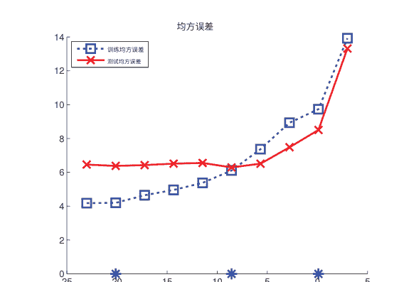

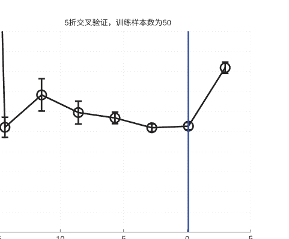

图6.6 (a) 对数正则化器下，惩罚度为2的14次多项式回归的均方误差。与图7.8中相同，只是现在我们有 $N=50$ 个训练点而不是21个。星星对应于在图7.7中绘制函数所使用的值。(b) CV估计。为了清晰起见，垂直刻度被截断。蓝线对应于通过一个标准误差规则选择的值。图由 `linregPolyVsRegDemo` 生成。

### 6.5.3.2 一个标准误差规则

上述过程估计了风险，但没有给出任何不确定性的度量。一个标准的频率主义不确定性度量是均值的标准误差，定义为

$$ \text{se} = \frac{\hat{\sigma}}{\sqrt{N}} = \sqrt{\frac{\hat{\sigma}^2}{N}} \quad (6.64) $$

其中 $\hat{\sigma}^2$ 是损失的方差的估计：

$$ \hat{\sigma}^2 = \frac{1}{N} \sum_{i=1}^{N} (L_i - \bar{L})^2, \quad L_i = L(y_i, f_m^{k(i)}(\mathbf{x}_i)) \quad \bar{L} = \frac{1}{N} \sum_{i=1}^{N} L_i \quad (6.65) $$

请注意 $\sigma$ 衡量了 $L$ 在样本之间的固有变异性，而 $\text{se}$ 衡量了我们对均值 $L$ 的不确定性。

假设我们将 CV 应用于一组模型，并计算它们估计风险的均值和 $\text{se}$。从这些噪声估计中选择一个模型的常见启发式方法是选择对应于最简单模型的值，其风险不超过最佳模型的一个标准误差；这被称为一个标准误差规则 (Hastie 等人, 2001年, 第216页)。

例如，在图6.6中，我们可以看到这个启发式方法并没有选择曲线上的最低点，而是稍微向右选择了一个点，因为那对应着一个更加正则化的模型，其经验性能基本相同。

### 6.5.3.3 非概率非监督学习中的模型选择的CV

如果我们进行非监督学习，我们必须使用损失函数，例如 $L(\mathbf{x}, \delta(\mathbf{x})) = \|\mathbf{x} - \delta(\mathbf{x})\|_2$，它衡量了重构误差。这里 $\delta(\mathbf{x})$ 是某种编码-解码方案。

然而，正如我们在第11.5.2节中讨论的那样，我们不能使用 CV 来确定 $\delta$ 的复杂度，因为即使在测试集上评估，我们总是会得到更复杂模型的更低损失。这是因为更复杂的模型会对数据进行更少的压缩，并引起更少的失真。

因此，我们必须使用概率模型或发明其他启发式方法。

## 6.5.4 使用统计学习理论上界风险*

交叉验证的主要问题是速度慢，因为我们需要多次拟合模型。这激发了计算近似解析或上界的愿望泛化误差。这是在统计学习理论（SLT）领域研究的。

更准确地说，SLT 试图以经验风险 $R_{\text{emp}}(\mathcal{D}, h)$，样本大小 $N=|\mathcal{D}|$ 和假设空间的大小 $\mathcal{H}$ 为基础，为任何数据分布 $P_*$ 和假设 $h \in \mathcal{H}$ 的风险 $R(p_*, h)$ 限制风险。

让我们首先考虑假设空间是有限的情况，其大小为 $\dim(\mathcal{H}) = |\mathcal{H}|$。换句话说，我们从一个有限的列表中选择一个模型/假设，而不是优化实值参数，然后我们可以证明以下内容。

> 定理6.5.1. 对于任何数据分布 $p_*$，以及从 $p_*$ 抽取的大小为 $N$ 的数据集 $\mathcal{D}$，我们对错误率的估计在最坏情况下超过 $\epsilon$ 的概率上界如下所示：

$$ P\left(\max_{h\in\mathcal{H}} |R_{\text{emp}}(\mathcal{D}, h) - R(p_*, h)| > \epsilon\right) \leq 2 \dim(\mathcal{H}) e^{-2N\epsilon^2} \quad (6.66) $$

证明。为了证明这一点，我们需要两个有用的结果。首先，霍夫丁不等式，它表明如果 $X_1, \ldots, X_N \sim \text{Ber}(\theta)$，那么对于任何 $\epsilon > 0$，

$$ P(|\bar{x} - \theta| > \epsilon) \leq 2e^{-2N\epsilon^2} \quad (6.67) $$

其中 $\bar{x} = \frac{1}{N} \sum_{i=1}^N x_i$，联合界定指出，如果 $A_1, \ldots, A_d$ 是一组事件，则 $P(\cup_{i=1}^d A_i) \leq \sum_{i=1}^d P(A_i)$。

最后，为了简洁起见，令 $R(h) = R(h, p_*)$ 为真实风险，$\hat{R}_N(h) = R_{\text{emp}}(\mathcal{D}, h)$ 为经验风险。利用这些结果，我们有

$$ P\left(\max_{h\in\mathcal{H}} |\hat{R}_N(h) - R(h)| > \epsilon\right) = P\left( \bigcup_{h\in\mathcal{H}} \left\{|\hat{R}_N(h) - R(h)| > \epsilon\right\} \right) \quad (6.68) $$

$$ \leq \sum_{h\in\mathcal{H}} P\left(|\hat{R}_N(h) - R(h)| > \epsilon\right) \quad (6.69) $$

$$ \leq \sum_{h\in\mathcal{H}} 2e^{-2N\epsilon^2} = 2 \dim(\mathcal{H}) e^{-2N\epsilon^2} \quad (6.70) $$

这个界限告诉我们，训练误差的乐观性随着维度的增加而增加，但随着 $N = |\mathcal{D}|$ 的减少而减少，这是可以预料的。

如果假设空间 $\mathcal{H}$ 是无限的（例如，我们有实值参数），我们不能使用 $\text{dim}(\mathcal{H}) = |\mathcal{H}|$。相反，我们可以使用一个称为假设类的 Vapnik-Chervonenkis 或 VC 维度的数量。详细信息请参见 (Vapnik 1998)。

从所有理论中退后一步，统计学习理论背后的关键直觉非常简单。假设我们找到了一个具有低经验风险的模型。如果假设空间 $\mathcal{H}$ 相对于数据大小非常大，那么很可能我们只是“幸运”地得到了一个由于机会而很好地建模我们选择的函数的数据集。然而，这并不意味着这样一个函数将具有低泛化误差。但是，如果假设类的大小受到足够的限制，和/或训练集足够大，那么我们不太可能以这种方式幸运，因此低经验风险是低真实风险的证据。

请注意，训练误差的乐观性不一定随着模型复杂性的增加而增加，但随着搜索的不同模型数量的增加而增加。

与 CV 相比，统计学习理论的优势在于风险的界限比使用 CV 更快计算。缺点是对许多有趣的模型计算 VC 维度很困难，上界通常非常宽松（尽管参见 (Kaariainen 和 Langford 2005））。

可以通过考虑学习者的计算复杂性来扩展统计学习理论。这个领域被称为计算学习理论或 COLT。这项工作的大部分集中在 $\mathcal{H}$ 是二元分类器的情况下，损失函数是0-1损失。如果我们观察到低的经验风险，并且假设空间适当“小”，那么我们可以说我们的估计函数可能近似正确或 PAC。如果存在一个多项式时间算法可以识别一个是 PAC 的函数，则称假设空间为高效 PAC 可学习。有关详细信息，请参见 (Kearns 和 Vazirani 1994)。

## 6.5.5 替代损失函数

在 ERM/RRM 框架中最小化损失并不总是容易的。例如，我们可能希望优化 AUC 或 F1 得分。或者更简单地说，我们可能只想最小化0-1损失，这在分类中很常见。不幸的是，0-1风险是一个非常不平滑的目标，因此很难优化。一种替代方法是使用最大似然估计，因为对数似然是0-1风险的一个平滑凸上界，如下所示。

为了看到这一点，考虑二元逻辑回归，并让 $y_i \in \{-1, +1\}$。假设我们的决策函数计算对数几率比，

$$ f(\mathbf{x}_i) = \log \frac{p(y = 1|\mathbf{x}_i, \mathbf{w})}{p(y = -1|\mathbf{x}_i, \mathbf{w})} = \mathbf{w}^T\mathbf{x}_i = \eta_i \tag{6.71} $$

然后，输出标签的相应概率分布是

$$ p(y_i|\mathbf{x}_i, \mathbf{w}) = \text{sigm}(y_i\eta_i) \tag{6.72} $$

让我们将 **log-loss** 定义为

$$ L_{\text{nll}}(y, \eta) = -\log p(y|\mathbf{x}, \mathbf{w}) = \log(1 + e^{-y\eta}) \tag{6.73} $$

## 6.6 频率统计的病态 *

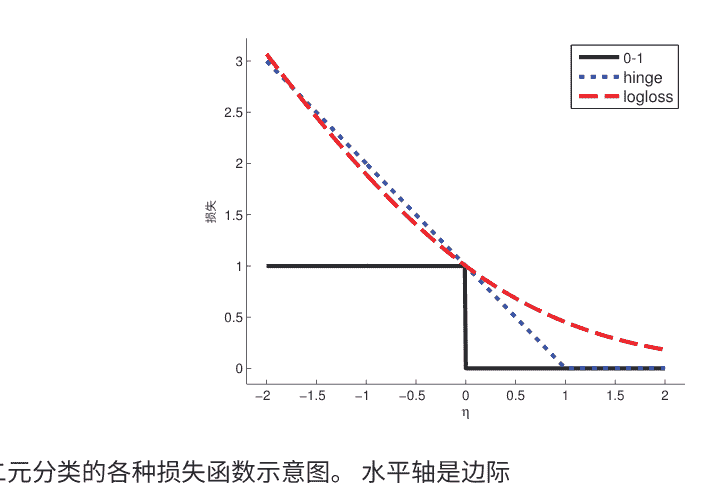

很明显，最小化平均对数损失等价于最大化似然函数。现在考虑计算最可能的标签，这等价于使用 $\hat{y} = -1$ 如果 $\eta_i < 0$ 且 $\hat{y} = +1$ 如果 $\eta_i \geq 0$。我们的函数的0-1损失变为

$$ L_{01}(y, \eta) = \mathbb{I}(y = \hat{y}) = \mathbb{I}(y\eta < 0) \tag{6.74} $$

图6.7展示了这两个损失函数。我们可以看到，NLL 确实是0-1损失的一个上界。

对数损失是一个 **surrogate** 损失函数的例子。另一个例子是 **hinge** 损失：

$$ L_{\text{hinge}}(y, \eta) = \max(0, 1 - y\eta) \tag{6.75} $$

请参见图6.7进行绘制。我们可以看到，这个函数看起来像一个门铰链，因此得名。这个损失函数是一种流行的分类方法支持向量机（SVM）的基础，我们将在第14.5节中讨论。通常选择凸上界作为替代函数，因为凸函数易于最小化。更多信息请参见（Bartlett等，2006年）。

## 6.6 频率统计的病态 *

> > 我相信说服一个聪明人当前的[频率统计]统计实践是明智的是非常困难的，但通过似然和贝叶斯定理的方法则会容易得多。- 乔治·博克斯，1962年。

频率统计展示了各种奇怪和不可取的行为形式，被称为病态。我们在下面给出一些例子，以警告读者；这些和其他例子在（林德利1972年；林德利和菲利普斯1976年；林德利1982年；伯杰1985年；杰恩斯2003年；明卡1999年）中有更详细的解释。

## 6.6.1 置信区间的反直觉行为

一个置信区间是从估计量的抽样分布中得出的区间（而贝叶斯可信区间是从参数的后验中得出的，正如我们在第5.2.2节中讨论的那样）。更准确地说，对于某个参数 θ，频率主义置信区间由以下（相当不自然的）表达式定义：

$$C_{\alpha}(\theta) = \{(\ell, u): P(\ell(\tilde{D}) \leq \theta \leq u(\tilde{D})|\tilde{D} \sim \theta) = 1 - \alpha\}$$

也就是说，如果我们从参数 θ 中采样假设的未来数据 $\tilde{D}$，那么 $(\ell(\tilde{D}), u(\tilde{D}))$ 就是一个置信区间，如果参数 θ 在这个区间内的概率为 1 - α。

让我们暂停一下，思考一下正在发生的事情。在贝叶斯统计中，我们条件是已知的——即观测数据 D——并对未知的部分进行平均，即参数 θ。在频率统计中，我们正好相反：我们条件是未知的——即真实参数值 θ——并对假设的未来数据集 $\tilde{D}$ 进行平均。

这种反直觉的置信区间定义可能导致奇怪的结果。考虑一下来自 (Berger 1985, p11) 的以下例子。假设我们从中抽取两个整数 $D = (x_1, x_2)$，其分布为：

$$p(x|\theta) = \begin{cases} 0.5 & \text{如果 } x=\theta, \\ 0.5 & \text{如果 } x=\theta+1, \\ 0 & \text{否则} \end{cases}$$

如果 θ= 39，则我们预期以下结果的概率均为0.25：

$$(39, 39), (39, 40), (40, 39), (40, 40)$$

令 $m = \min(x_1, x_2)$ 并定义以下置信区间：

$$[\ell(D), u(D)] = [m, m]$$

对于上述样本，这将产生以下结果

$$[39, 39], [39, 39], [39, 39], [40, 40]$$

因此，方程6.79显然是一个75%的置信区间，因为39包含在这些区间的3/4中。然而，如果 $D= (39, 40)$，则 $p(\theta= 39|D) = 1.0$，所以我们知道 θ 必须是39，但我们只对这个事实有75%的“置信度”。

另一个不那么牵强的例子如下。假设我们想要估计伯努利分布的参数 θ。令 $\bar{x} = \frac{1}{N} \sum_{i=1}^{N} x_i$ 为样本均值。最大似然估计为 $\hat{\theta} = \bar{x}$。伯努利参数的近似95%置信区间为 $\bar{x} \pm 1.96 \sqrt{\bar{x}(1-\bar{x})/N}$（这被称为Wald区间，基于对二项分布的高斯近似；与方程3.27进行比较）。现在考虑一个单次试验，其中 N=1 和 $x_1=0$。最大似然估计为0，这是过拟合的，正如我们在第3.3.4.1节中所看到的。但是我们的95%置信区间也是 (0,0)，这似乎更糟糕。可以认为上述缺陷是因为我们用高斯近似了真实的抽样分布，或者样本量太小，或者参数“太极端”。然而，即使对于大的 N 和非极端的参数，Wald区间也可能表现不佳（Brown等人，2001年）。

## 6.6.2 p值被认为是有害的

假设我们想要决定是否接受或拒绝某个基准模型，我们将其称为零假设。我们需要定义一些决策规则。在频率统计学中，通常首先计算一个称为p值的数量，它被定义为在零假设下观察到某个检验统计量f(D)（如卡方统计量）大于或等于实际观察到的概率：$^{5}$

$$\text{pvalue}(\mathcal{D}) \geq P(f(\mathcal{D}^\sim) \geq f(\mathcal{D})|\mathcal{D} \sim H_0) \tag{6.81}$$

这个数量依赖于计算抽样分布的尾部面积概率；我们下面给出一个如何计算的例子。

给定p值，我们定义我们的决策规则如下：当p值小于某个阈值（如α=0.05）时，我们拒绝零假设。如果我们拒绝它，我们说观察到的检验统计量与期望的检验统计量之间的差异在α水平上是统计显著的。这种方法被称为零假设显著性检验，或NHST。这个过程保证了我们期望的I类（假阳性）错误率最多为α。

这有时被解释为频率派假设检验非常保守，因为它不太可能意外地拒绝零假设。但事实上恰恰相反：因为这种方法只关心试图拒绝零假设，它永远无法收集支持零假设的证据，无论样本大小多大。因此，p值往往会夸大对零假设的证据，因此非常“易触发”。一般来说，p值和我们真正关心的数量之间可能存在巨大差异，这个数量是给定数据的零假设的后验概率，$p(H_0|\mathcal{D})$。特别是，Sellke等人(2001)表明，即使p值为0.05，$H_0$的后验概率至少为30%，通常更高。因此，频率派经常声称有“显著”的证据表明效应不能由零假设解释，而贝叶斯派在他们的论断中通常更保守。例如，p值曾被用来“证明”超感官知觉(ESP)是真实的(Wagenmakers等人，2011)，尽管ESP显然非常不可能。因此，某些医学期刊已禁止使用p值进行论证(Matthews，1998)。

p值的另一个问题是，它们的计算取决于你在何时停止收集数据的决策，即使这些决策不会改变你实际观察到的数据。例如，假设我抛掷一枚硬币n=12次，观察到s=9次成功（正面）和f=3次失败（反面），所以n = s + f。在这种情况下，n是固定的，而s（因此f）是随机的。相关的抽样模型是二项式分布

$$\text{Bin}(s|n, \theta) = \binom{n}{s} \theta^s (1-\theta)^{n-s} \tag{6.82}$$

假设零假设是硬币是公平的，θ=0.5，其中θ是成功（正面）的概率。使用检验统计量t(s)=s的单侧p值为

$$p_1 = P(S \geq 9|H_0) = \sum_{s=9}^{12} \text{Bin}(s|12, 0.5) = \sum_{s=9}^{12} \binom{12}{s} 0.5^{12} = 0.073 \tag{6.83}$$

双侧p值是

$$p_2 = \sum_{s=9}^{12} \text{Bin}(s|12,0.5) + \sum_{s=0}^{3} \text{Bin}(s|12,0.5) = 0.073 + 0.073 = 0.146 \tag{6.84}$$

无论哪种情况，p值都大于神奇的5%阈值，因此频率派不会拒绝零假设。

现在假设我告诉你，我实际上一直投掷硬币直到观察到 $f= 3$ 个正面。在这种情况下，$f$是固定的，$n$（因此 $s = n - f$）是随机的。概率模型变成了负二项分布，表示为

$$\text{NegBinom}(s|f, \theta) = \binom{s + f - 1}{f - 1} \theta^s (1 - \theta)^f \tag{6.85}$$

其中 $f = n - s$。

请注意，依赖于 $\theta$ 的项在方程6.82和6.85中是相同的，因此关于 $\theta$ 的后验概率在两种情况下都是相同的。然而，对于相同的数据，这两种解释给出了不同的p值。特别是，在负二项模型下，我们得到

$$p_3 = P(S \geq 9|H_0) = \sum_{s=9}^{\infty} \binom{3 + s - 1}{2} (1/2)^s (1/2)^3 = 0.0327 \tag{6.86}$$

因此，p值为3%，突然间似乎有了显著的偏倚证据！显然，这是荒谬的：数据是相同的，因此我们对硬币的推断应该是相同的。毕竟，我可以随机选择实验方案。实验的结果才是重要的，而不是我决定运行哪个实验的细节。尽管这可能只是一个数学上的奇点，但它也具有重要的实际意义。特别是，停止规则会影响p值的计算，这意味着频率主义者通常不会提前终止实验，即使结论是显而易见的，以免对其统计分析产生不利影响。如果实验具有成本或对人们有害，这显然是一个坏主意。也许不足为奇的是，美国食品和药物管理局（FDA）最近开始支持贝叶斯方法⁶，因为贝叶斯方法不受停止规则的影响。

## 6.6.3 似然原则

这些病态的根本原因是频率派推断违反了似然原则，似然原则认为推断应该基于观察数据的似然性，而不是基于你尚未观察到的假设未来数据。贝叶斯显然满足似然原则，因此不会受到这些病态的影响。

支持似然原则的一个有力论证是在（Birnbaum 1962）中提出的，他证明似然原则是从两个更简单的原则自动推导出来的。其中一个原则是充分性原则，它认为一个充分统计量包含了所有相关信息。

## 为什么不是每个人都是贝叶斯派？

鉴于频率主义统计学的这些根本缺陷，以及贝叶斯方法没有这些缺陷的事实，一个显而易见的问题是：“为什么不是每个人都是贝叶斯派？”频率主义统计学家布拉德利·埃夫隆 (Bradley Efron) 在1986年发表了一篇题为《为什么不是每个人都是贝叶斯派？》的论文 (Efron 1986)。对于对这个主题感兴趣的任何人来说，他的短篇论文都是值得一读的。下面我们引用他的开篇部分：

> 这个标题至少有两个合理的问题。首先，每个人都曾经是贝叶斯派。拉普拉斯全心全意地支持贝叶斯对推断问题的阐述，大多数19世纪的科学家也都遵循这种观点。这其中包括高斯，他的统计工作通常以频率主义术语呈现。

第二个更重要的观点是贝叶斯论证的合理性。现代统计学家在萨维奇和德芬尼的带领下，提出了强有力的理论论证，支持贝叶斯推断。这项工作的一个副产品是对频率主义观点中的不一致性的令人不安的目录。

然而，并不是每个人都是贝叶斯派。当前时代（1986年）是统计学被广泛用于科学报告的第一个世纪，事实上，20世纪的统计学主要是非贝叶斯派。然而，林德利 (1975年) 预测21世纪会发生变化。

时间会告诉我们林德利是否正确...

## 练习

### 练习6.1 LOOCV的悲观主义

(来源: Witten05, p152)。假设我们有一个完全随机标记的数据集（即，特征 x不提供关于类别标签 y的任何信息），其中类别1有 N1个示例，类别2有 N2个示例，其中 N1 = N2。任何方法能够达到的最佳误分类率是多少？使用LOOCV，同一方法的估计误分类率是多少？

### 练习6.2 高斯均值的James Stein估计器

考虑2阶段模型 $Y_i|\theta_i \sim \mathcal{N}(\theta_i, \sigma^2)$ 和 $\theta_i|\mu \sim \mathcal{N}(m_0, \tau_0^2)$。假设 $\sigma^2 = 500$ 已知并且我们观察到以下6个数据点, i= 1 : 6:

1505, 1528, 1564, 1498, 1600, 1470

a. 找到 $m_0$ 和 $\tau_0^2$ 的ML-II估计值。
b. 找到后验估计值 $\mathbb{E} [\theta_i | y_i, m_0, \tau_0]$ 和 $\text{var} [\theta_i | y_i, m_0, \tau_0]$ 对于 $i = 1$。(其他项,$i = 2:6$, 类似地计算。)
c. 给出 $i = 1$ 的95%可信区间 $p(\theta_i | y_i, m_0, \tau_0)$。你相信这个区间吗 (假设高斯假设是合理的)？ 即它可能太大还是太小，还是刚刚好?
d. 如果 $\sigma^2$ 更小 (比如 $\sigma^2 = 1$) ，你预计你的估计会发生什么变化? 你不需要计算数值答案; 只需简要解释定性上会发生什么, 以及为什么。

### 练习6.3 $\hat{\sigma}_{MLE}^2$ 是有偏的

证明 $\hat{\sigma}_{MLE}^2 = \frac{1}{N} \sum_{n=1}^{N} (x_n - \hat{\mu})^2$ 是一个有偏估计量 $\sigma^2$，即证明
$$\mathbb{E}_{X_1, \dots, X_n \sim \mathcal{N}(\mu, \sigma)}[\hat{\sigma}^2(X_1, \dots, X_n)] = \sigma^2$$

提示: 注意 $X_1, \dots, X_N$ 是独立的，并且利用随机变量的乘积的期望是期望的乘积的事实。

### 练习6.4 当 $\mu$ 已知时，$\sigma^2$ 的估计

假设我们采样 $x_1, \dots, x_N \sim \mathcal{N}(\mu, \sigma^2)$ 其中 $\mu$ 是一个已知常数。推导出这种情况下 $\sigma^2$ 的MLE表达式。它是无偏的吗?

## 7 线性回归

### 7.1 引言

线性回归是统计学和（监督）机器学习的“工作马”。当与核函数或其他形式的基函数扩展相结合时，它还可以建模非线性关系。当高斯输出被伯努利或多项式分布取代时，它可以用于分类，如下所示。因此，详细研究这个模型是值得的。

### 7.2 模型规范

正如我们在第1.4.5节中讨论的，线性回归是一个形式为的模型

$$p(y|\mathbf{x}, \boldsymbol{\theta}) = \mathcal{N}(y|\mathbf{w}^T\mathbf{x}, \sigma^2) \tag{7.1}$$

通过将 $\mathbf{x}$ 替换为输入的某些非线性函数 $\phi(\mathbf{x})$，线性回归可以建模非线性关系。也就是说，我们使用 $p(y|\mathbf{x}, \boldsymbol{\theta}) = \mathcal{N}(y|\mathbf{w}^T\phi(\mathbf{x}), \sigma^2)$

$$\tag{7.2}$$

这被称为基函数扩展。（请注意，模型在参数$\mathbf{w}$方面仍然是线性的，因此仍然被称为线性回归；这一点的重要性将在下面变得清晰。）一个简单的例子是多项式基函数，其中模型的形式为

$$\phi(x) = [1, x, x^2, \ldots, x^d] \tag{7.3}$$

图1.18说明了改变 $d$ 的效果：增加 $d$ 的度数可以创建越来越复杂的函数。

我们还可以将线性回归应用于多个输入。例如，考虑将温度建模为位置的函数。图7.1(a)绘制了 $\mathbb{E}[y|\mathbf{x}] = w_0 + w_1 x_1 + w_2 x_2$，而图7.1(b)绘制了 $\mathbb{E}[y|\mathbf{x}] = w_0 + w_1 x_1 + w_2 x_2 + w_3 x_1^2 + w_4 x_2^2$。

### 7.3 最大似然估计（最小二乘法）

估计统计模型参数的常见方法是计算最大似然估计（MLE），其定义为

$$\hat{\boldsymbol{\theta}} \triangleq \arg \max_{\boldsymbol{\theta}} \log p(\mathcal{D}|\boldsymbol{\theta}) \tag{7.4}$$

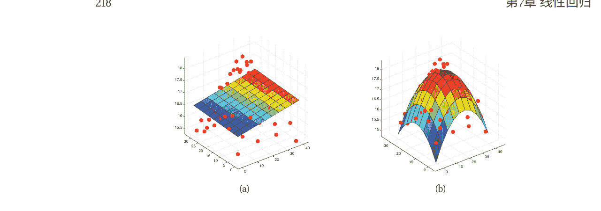

图7.1 线性回归应用于2D数据。垂直轴是温度，水平轴是房间内的位置。数据是由英特尔实验室在加州伯克利的一些远程感测节点收集的（数据由Romain Thibaux提供）。（a）拟合平面的形式为 $f(x) = w_0 + w_1 x_1 + w_2 x_2$。（b）温度数据使用二次函数拟合，形式为 $f(x) = w_0 + w_1 x_1 + w_2 x_2 + w_3 x_1^2 + w_4 x_2^2$。由surfaceFitDemo生成。

通常假设训练样本是独立同分布的，常简写为 iid。这意味着我们可以将对数似然函数写成以下形式：

$$\ell(\theta) \triangleq \log p(\mathcal{D}|\theta) = \sum_{i=1}^{N} \log p(y_i|\mathbf{x}_i, \theta)$$

我们可以等价地通过最小化负对数似然函数（negative log likelihood or NLL）来最大化对数似然函数：

$$\text{NLL}(\theta) \triangleq -\sum_{i=1}^{N} \log p(y_i|\mathbf{x}_i, \theta)$$

负对数似然函数的表达方式有时更方便，因为许多优化软件包都是设计用于寻找函数的最小值，而不是最大值。现在让我们将最大似然估计方法应用于线性回归设置中。将高斯分布的定义插入上述公式，我们可以得到对数似然函数的表达式：

$$\ell(\theta) = \sum_{i=1}^{N} \log \left[ \left( \frac{1}{2\pi\sigma^2} \right)^{\frac{1}{2}} \exp \left( -\frac{1}{2\sigma^2} (y_i - \mathbf{w}^T \mathbf{x}_i)^2 \right) \right]$$

$$= -\frac{1}{2\sigma^2} \text{RSS}(\mathbf{w}) - \frac{N}{2} \log(2\pi\sigma^2)$$

RSS代表残差平方和，定义为

$$\text{RSS}(\mathbf{w}) \triangleq \sum_{i=1}^{N} (y_i - \mathbf{w}^T \mathbf{x}_i)^2$$

RSS也被称为平方误差和（SSE），SSE/N 被称为均方误差（MSE）。它也可以写成向量的 ℓ2 norm of the vector of的平方

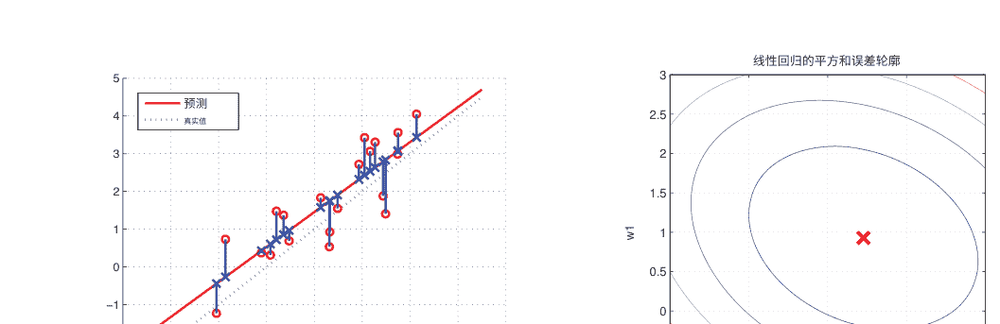

残差误差：

$$\text{RSS}(\mathbf{w}) = ||\mathbf{\epsilon}||_2^2 = \sum_{i=1}^{N} \epsilon_i^2 \tag{7.10}$$

其中 $\epsilon_i = (y_i - \mathbf{w}^T\mathbf{x}_i)$。

我们可以看到，MLE对于 $\mathbf{w}$ 的最小化RSS，因此这种方法被称为最小二乘法。这种方法在图7.2(a)中有所说明。训练数据 $(x_i, y_i)$ 被表示为红色圆圈，估计值 $(x_i, \hat{y}_i)$ 被表示为蓝色十字，残差 $\epsilon_i = y_i - \hat{y}_i$ 被表示为垂直的蓝色线。目标是找到参数的设置（斜率 $w_1$ 和截距 $w_0$），使得结果红线的残差平方和最小化（垂直蓝线的长度）。

在图7.2(b)中，我们绘制了线性回归示例的NLL曲面。我们看到它是一个二次“碗”，有一个唯一的最小值，现在我们来推导它。（重要的是，即使我们使用基函数扩展，比如多项式，因为NLL仍然是 $\mathbf{w}$ 的线性函数，即使它在输入 $\mathbf{x}$上不是线性的。）

#### 7.3.1 MLE的推导

首先，我们将目标重新写成更易于求导的形式：

$$\text{NLL}(\mathbf{w})\ =\ \frac{1}{2}(\mathbf{y} - \mathbf{Xw})^T(\mathbf{y} - \mathbf{Xw}) = \frac{1}{2}\mathbf{w}^T(\mathbf{X}^T\mathbf{X})\mathbf{w} - \mathbf{w}^T(\mathbf{X}^T\mathbf{y}) \tag{7.11}$$其中

$$\mathbf{X}^{T} \mathbf{X}=\sum_{i=1}^{N} \mathbf{x}_{i} \mathbf{x}_{i}^{T}=\sum_{i=1}^{N}\left(\begin{array}{ccc}
x_{i, 1}^{2} & \cdots & x_{i, 1} x_{i, D} \\
\vdots & \ddots & \vdots \\
x_{i, D} x_{i, 1} & \cdots & x_{i, D}^{2}
\end{array}\right)$$ (7.12)

**是平方和矩阵**

$$\mathbf{X}^{T} \mathbf{y}=\sum_{i=1}^{N} \mathbf{x}_{i} y_{i}.$$ (7.13)

使用方程4.10的结果，我们可以看到其梯度为

$$\mathrm{g}(\mathbf{w}) = [\mathbf{X}^{T} \mathbf{X} \mathbf{w}-\mathbf{X}^{T} \mathbf{y}]=\sum_{i=1}^{N} \mathbf{x}_{i}\left(\mathbf{w}^{T} \mathbf{x}_{i}-y_{i}\right)$$ (7.14)

将其置零，我们得到

$$\mathbf{X}^{T} \mathbf{X} \mathbf{w} = \mathbf{X}^{T} \mathbf{y}$$ (7.15)

这被称为正规方程。对应的线性方程组的解$\hat{\mathbf{w}}$被称为普通最小二乘或OLS解，其表达式为

$$\hat{\mathbf{w}}_{O L S}=\left(\mathbf{X}^{T} \mathbf{X}\right)^{-1} \mathbf{X}^{T} \mathbf{y}$$ (7.16)

## 7.3.2 几何解释

这个方程有一个优雅的几何解释，现在我们来解释一下。我们假设$N > D$，所以我们有比特征更多的例子。矩阵 $\mathbf{X}$的列定义了一个嵌入在 $N$维空间中的 $D$维线性子空间。让第 $j$列为向量 $\tilde{\mathbf{x}}_{j}$，它是一个在 $\mathbb{R}^{N}$中的向量。(这不应与表示第$i$个数据点的向量 $\mathbf{x}_{i} \in \mathbb{R}^{D}$混淆。)同样地， $\mathbf{y}$是一个在 $\mathbb{R}^{N}$中的向量。例如，假设我们在 $D= 2$维空间中有 $N = 3$个例子：

$$\mathbf{X}=\left(\begin{array}{cc}
1 & 2 \\
1 & -2 \\
1 & 2
\end{array}\right), \quad \mathbf{y}=\left(\begin{array}{l}
8.8957 \\
0.6130 \\
1.7761
\end{array}\right)$$ (7.17)

这些向量在图7.3中有所说明。

我们寻找一个向量 $\hat{\mathbf{y}} \in \mathbb{R}^{N}$，它位于这个线性子空间中，并且尽可能接近 $\mathbf{y}$，即我们想要找到

$$\underset{\hat{\mathbf{y}} \in \operatorname{span}\left\{\tilde{\mathbf{x}}_{1}, \ldots, \tilde{\mathbf{x}}_{D}\right\}}{\operatorname{argmin}} \|\mathbf{y}-\hat{\mathbf{y}}\|_{2}.$$ (7.18)

由于 $\hat{\mathbf{y}} \in \operatorname{span}(\mathbf{X})$，存在一些权重向量 $\mathbf{w}$，使得

$$\hat{\mathbf{y}}=w_{1} \tilde{\mathbf{x}}_{1}+\cdots+w_{D} \tilde{\mathbf{x}}_{D}=\mathbf{X} \mathbf{w}$$ (7.19)

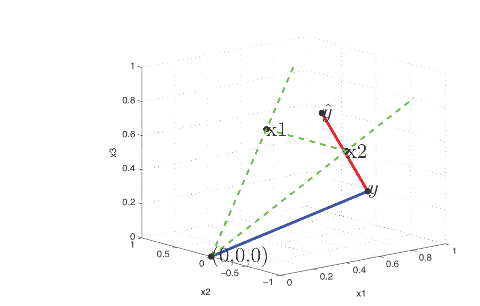

图7.3最小二乘法的图形解释，其中 $N= 3$个示例， $D= 2$个特征。 $\tilde{x}_1$ 和 $\tilde{x}_2$ 是 $\mathbb{R}^3$ 中的向量；它们共同定义了一个二维平面。 $y$ 也是 $\mathbb{R}^3$ 中的向量，但不位于这个二维平面上。将 $y$ 在这个平面上的正交投影表示为 $\hat{y}$。从 $y$ 到 $\hat{y}$ 的红色线是残差，我们希望最小化其范数。为了视觉清晰起见，所有向量都已转换为单位范数。图由leastSquaresProjection生成。

为了最小化残差的范数，我们希望残差向量与 $\mathbf{X}$ 的每一列都正交，即 $\tilde{x}^{T}_j (y - \hat{y}) = 0$ 对于 $j= 1 : D$。因此

$$\tilde{\mathbf{x}}_j^T(y - \hat{y}) = 0 \Rightarrow \mathbf{X}^T(y - \mathbf{Xw}) = 0 \Rightarrow \mathbf{w} = (\mathbf{X}^T\mathbf{X})^{-1}\mathbf{X}^Ty \quad\quad (7.20)$$

因此我们对 $y$ 的投影值为

$$\hat{y} = \mathbf{X}\hat{\mathbf{w}} = \mathbf{X}(\mathbf{X}^T\mathbf{X})^{-1}\mathbf{X}^Ty \quad\quad (7.21)$$

这对应于将 $y$ 投影到 $\mathbf{X}$ 的列空间上的正交投影。投影矩阵 $\mathbf{P} \triangleq \mathbf{X}(\mathbf{X}^T\mathbf{X})^{-1}\mathbf{X}^T$ 被称为帽子矩阵，因为它“给 $y$ 戴上了帽子”。

## 7.3.3 凸性

当讨论最小二乘法时，我们注意到NLL具有唯一最小值的碗状形状。这种函数的技术术语是凸函数。凸函数在机器学习中起着非常重要的作用。

让我们更准确地定义这个概念。我们说一个集合 $S$ 是凸的，如果对于任何 $\boldsymbol{\theta}, \boldsymbol{\theta}' \in S$, 我们有

$$\lambda\boldsymbol{\theta} + (1 - \lambda)\boldsymbol{\theta}' \in S, \quad \forall \lambda \in [0, 1] \quad\quad (7.22)$$

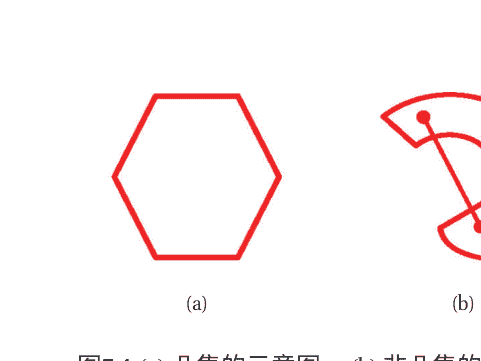

图7.4 (a) 凸集的示意图。(b) 非凸集的示意图。

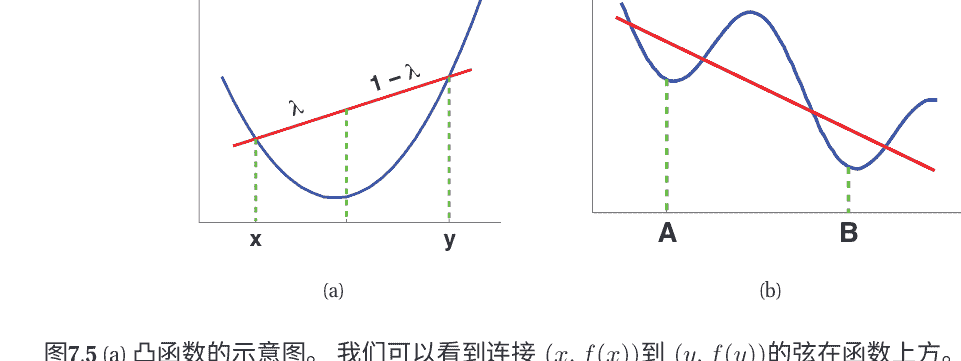

图7.5 (a) 凸函数的示意图。我们可以看到连接 $(x, f(x))$ 到 $(y, f(y))$ 的弦在函数上方。(b) 既不是凸函数也不是凹函数的函数。A是局部最小值，B是全局最小值。由convexFnHand生成的图。

也就是说，如果我们从 $\theta$ 到 $\theta'$ 画一条线，线上的所有点都在集合内。参见图7.4(a)以了解凸集的示例，以及图7.4(b)以了解非凸集的示例。

一个函数 $f(\theta)$ 如果它的上图（函数上方的点的集合）定义了一个凸集，则称为凸函数。等价地，一个函数 $f(\theta)$ 如果它在一个凸集上定义，并且对于任意 $\theta, \theta' \in S$，以及任意 $0 \leq \lambda \leq 1$，我们有 $f(\lambda\theta + (1-\lambda)\theta') \leq \lambda f(\theta) + (1-\lambda) f(\theta')$ (7.23) 请参见图7.5，其中有一个一维示例。如果不等式是严格的，那么函数被称为严格凸。

如果 $-f(\theta)$ 是凸的，那么函数 $f(\theta)$ 是凹的。标量凸函数的例子包括 $\theta^2$, $e^\theta$ 和 $\theta \log \theta$ (对于 $\theta > 0$)。标量凹函数的例子包括 $\log(\theta)$ 和 $\sqrt{\theta}$。

直观上，（严格）凸函数具有“碗形”，因此具有唯一的全局最小值 $\theta^*$ 对应于碗底。因此，它的二阶导数必须在每个地方都是正的，即 $\partial^2 f(\theta) > 0$。在机器学习的背景下，一个两次连续可微的多变量函数 $f$ 是凸的，当且仅当它的海森矩阵对于所有 $\theta$ 都是正定的。

在机器学习的上下文中，函数 $f$ 通常对应于NLL。

- 回想一下，海森矩阵是由二阶偏导数构成的矩阵，定义为 $H_{jk} = \partial^2 f(\theta) / \partial \theta_j \partial \theta_k$。此外，还要记住，矩阵 $H$ 是正定的当且仅当对于任意非零向量 $v$，有 $v^T H v > 0$。

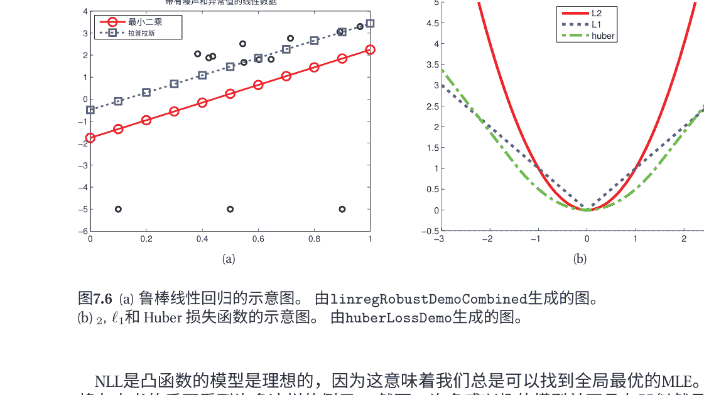

NLL是凸函数的模型是理想的，因为这意味着我们总是可以找到全局最优的MLE。我们将在本书的后面看到许多这样的例子。然而，许多感兴趣的模型并不具有凹似然函数。在这种情况下，我们将讨论如何推导出局部最优的参数估计。

## 7.4 鲁棒线性回归 *

在回归模型中，使用零均值和恒定方差的高斯分布来建模噪声是非常常见的，其中 $\epsilon_i \sim \mathcal{N}(0, \sigma^2)$，其中 $\epsilon_i = y_i - \mathbf{w}^T\mathbf{x}_i$。在这种情况下，最大化似然等价于最小化残差平方和，正如我们所见。然而，如果我们的数据中存在异常值，这可能导致拟合效果不佳，如图7.6(a)所示。（异常值是图中底部的点。）这是因为平方误差对偏离的惩罚是二次的，所以远离直线的点对拟合的影响比靠近直线的点更大。

实现对异常值的鲁棒性的一种方法是将响应变量的高斯分布替换为具有重尾的分布。这样的分布将更高地赋予异常值以似然，而无需扰动直线来“解释”它们。

一种可能性是使用拉普拉斯分布，介绍在第2.4.3节。如果我们将其中其作为回归的观测模型，我们得到以下似然函数：

$$p(y|\mathbf{x}, \mathbf{w}, b) = \mathrm{Lap}(y|\mathbf{w}^T\mathbf{x}, b) \propto \exp(-\frac{1}{b}|y - \mathbf{w}^T\mathbf{x}|) \quad (7.24)$$

鲁棒性来自于使用 $|y - \mathbf{w}^T\mathbf{x}|$ 而不是 $(y - \mathbf{w}^T\mathbf{x})^2$。为了简单起见，我们将假设 $b$ 是固定的。让 $r_i \triangleq y_i - \mathbf{w}^T\mathbf{x}_i$ 是第 $i$ 个残差。负对数似然函数的形式为：

$$\ell(\mathbf{w}) = \sum_i |r_i(\mathbf{w})| \quad (7.25)$$

| 似然函数先验 | 名字 | 第 |
| :--- | :--- | :--- |
| 高斯 | 均匀最小二乘 | 7.3 |
| 高斯 | 高斯岭 | 7.5 |
| 高斯 | 套索 | 13.3 |
| 拉普拉斯 | 均匀鲁棒回归 | 7.4 |
| 学生 | 均匀鲁棒回归 | 练习 11.12 |

表7.1 线性回归中使用的各种似然函数和先验概率的总结。似然函数指的是条件概率分布 p(y|x, w, σ^2)，先验概率指的是分布形式 p(w)。MAP估计中使用均匀分布对应于MLE。

不幸的是，这是一个非线性目标函数，很难优化。幸运的是，我们可以通过以下的分割变量技巧将NLL转化为一个线性目标函数，受到线性约束的限制。首先我们定义

$r_i \triangleq r_i^+ - r_i^-$ 
(7.26)

然后我们施加线性不等式约束 $r_i^+ \ge 0$ 和 $r_i^- \ge 0$。现在受限制的目标函数变为

$\min_{\mathbf{w}, \mathbf{r}^+, \mathbf{r}^-} \sum_{i} (r_i^+ - r_i^-) \quad \text{s.t.} \quad r_i^+ \ge 0, r_i^- \ge 0, \mathbf{w}^T \mathbf{x}_i + r_i^+ + r_i^- = y_i$ 
(7.27)

这是一个具有 D + 2N 未知数和 3N 约束条件的线性规划的示例。由于这是一个凸优化问题，它有唯一的解。要解决一个线性规划问题，我们必须首先将其写成标准形式，如下所示：

$\min_{\theta} \mathbf{f}^T \theta \quad \text{s.t.} \quad \mathbf{A} \theta \le \mathbf{b}, \quad \mathbf{A}_{eq} \theta = \mathbf{b}_{eq}, \quad \mathbf{l} \le \theta \le \mathbf{u}$ 
(7.28)

这可以通过任何线性规划求解器来解决（参见例如，（Boyd and Vandenberghe 2004））。请参见图7.6（a）以了解该方法的示例。使用拉普拉斯似然下的NLL的替代方法是最小化Huber损失函数（Huber 1964），定义如下：

$L_H(r, \delta) = \begin{cases} r^2/2 & \text{如果 } |r| \le \delta \\ \delta |r| - \delta^2/2 & \text{如果 } |r| > \delta \end{cases}$ 
(7.29)

这相当于对于小于 $\delta$ 的错误，等价于 $\ell_2$；对于较大的错误，等价于 $\ell_1$。参见图7.6(b)。这个损失函数的优点是它在任何地方都是可微的，利用了当 $r=0$ 时，$\frac{d}{dr} |r| = \text{sign}(r)$ 的事实。我们还可以检查这个函数是 $C_1$ 连续的，因为函数的两部分在 $r = \pm \delta$ 处的梯度是匹配的，即 $\frac{d}{dr} L_H(r, \delta) \big|_{r=\delta^+} = \frac{d}{dr} L_H(r, \delta) \big|_{r=\delta^-} = \delta$。因此，优化 $Huber$ 损失比使用 $Laplace$ 似然函数要快得多，因为我们可以使用标准的平滑优化方法（如拟牛顿法）而不是线性规划。

图7.6(a)给出了Huber损失函数的示意图。结果在质量上与概率方法相似。（事实上，事实证明Huber方法也有一个概率解释，尽管它相当不自然（Pontil等人，1998年）。）

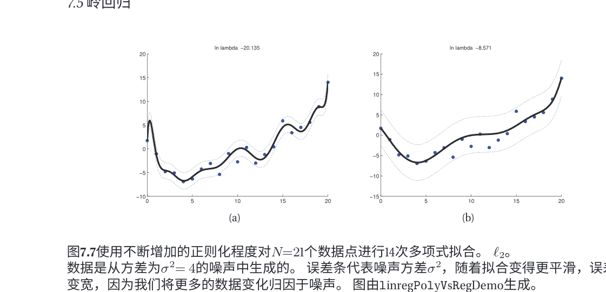

## 7.5 岭回归

ML估计的一个问题是可能导致过拟合。在本节中，我们讨论了使用具有高斯先验的MAP估计来改善这个问题的方法。为了简单起见，我们假设使用高斯似然函数，而不是鲁棒似然函数。

### 7.5.1 基本思想

最大似然估计（MLE）过拟合的原因是它选择了最适合训练数据建模的参数值；但是如果数据存在噪声，这样的参数往往会导致复杂的函数。举个简单的例子，假设我们使用最小二乘法将一个14次多项式拟合到N=21个数据点上。得到的曲线非常‘抖动’，如图7.7(a)所示。相应的最小二乘系数（不包括w₀）如下：

+   6.560，-36.934，-109.255，543.452，1022.561，-3046.224，-3768.013，8524.540，6607.897，-12640.058，-5530.188，9479.730，1774.639，-2821.526

我们可以看到有许多较大的正数和负数。这些数值完全抵消，使得曲线以几乎完美地插值数据的方式‘抖动’。但是这种情况是不稳定的：如果我们稍微改变数据，系数会发生很大变化。通过使用零均值的高斯先验，我们可以鼓励参数变得较小，从而得到一个更平滑的曲线：

$$p(\mathbf{w}) = \prod_{j} \mathcal{N}(w_j | 0, \tau^2)$$  (7.30)

$$\arg\max_{\mathbf{w}} \sum_{i=1}^{N} \log \mathcal{N}(y_i | w_0 + \mathbf{w}^T \mathbf{x}_i, \sigma^2) + \sum_{j=1}^{D} \log \mathcal{N}(w_j | 0, \tau^2)$$  (7.31)

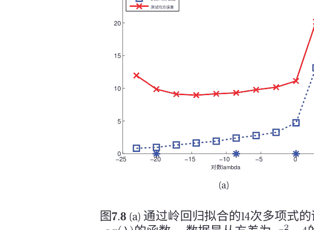

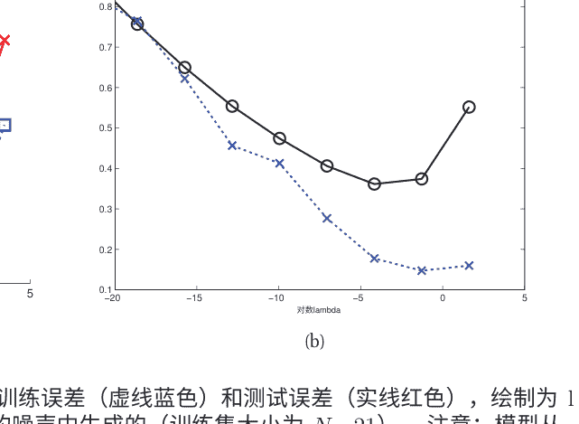

图7.8 (a) 通过岭回归拟合的14次多项式的训练误差（虚线蓝色）和测试误差（实线红色），绘制为 $\log(\lambda)$ 的函数。数据是从方差为 $\sigma^2=4$ 的噪声中生成的（训练集大小为 $N=21$）。注意：模型从复杂（小正则化器）到简单（大正则化器）的顺序排列。星号对应于用于绘制图7.7中函数的值。(b)使用训练集的性能估计。虚线蓝色：5折交叉验证估计的未来MSE。实线黑色：负对数边际似然性， $-\log p(\mathcal{D}|\lambda)$。为了使它们可比较，两条曲线都已经在[0,1]上进行了垂直缩放。图由linregPolyVsRegDemo生成。

这是一个简单的练习，用来证明这等价于最小化以下内容：

$$J(\mathbf{w}) = \frac{1}{N} \sum_{i=1}^{N} (y_i - (w_0 + \mathbf{w}^T \mathbf{x}_i))^2 + \lambda ||\mathbf{w}||_2^2$$

(7.32)

其中 $\lambda \triangleq \sigma^2 / \tau^2 = \mathbf{w}^T \mathbf{w} / 2$ 是平方二范数。这里第一项是均方误差/负对数似然，第二项 ， $\lambda \geq 0$，是复杂度惩罚。相应的解为

$$\hat{\mathbf{w}}_{ridge} = (\lambda \mathbf{I}_D + \mathbf{X}^T \mathbf{X})^{-1} \mathbf{X}^T \mathbf{y}$$

(7.33)

这种技术被称为岭回归，或者惩罚最小二乘法。通常，在模型的参数上添加高斯先验以鼓励它们变小被称为 $\ell_2$ 正则化或权重衰减。请注意，偏移项 $w_0$ 没有被正则化，因为这只影响函数的高度，而不是它的复杂度。通过对权重的绝对值之和进行惩罚，我们确保函数是简单的（因为 $\mathbf{w} = \mathbf{0}$ 对应于一条直线，这是可能的最简单的函数，对应于一个常数）

我们在图7.7中说明了这个想法，我们可以看到增加 $\lambda$ 会导致更平滑的函数。得到的系数也变小了。例如，使用 $\lambda= 10^{-3}$，我们有2.128, 0.807, 16.457, 3.704, -24.948, -10.472, -2.625, 4.360, 13.711, 10.063, 8.716, 3.966, -9.349, -9.232

在图7.8(a)中，我们绘制了训练集和测试集的均方误差与 log(λ)的关系。我们可以看到，随着 λ的增加（模型变得更受限制），训练集上的误差增加。对于测试集，我们可以看到典型的U形曲线，模型过拟合然后欠拟合。通常使用交叉验证来选择 λ，如图7.8(b)所示。在第1.4.8节中，我们将讨论一种更概率化的方法。

在本书中，我们将考虑各种不同的先验。每个先验对应着不同形式的正则化。这种技术被广泛用于防止过拟合。

### 7.5.2 数值稳定的计算

有趣的是，岭回归在统计上效果更好，数值上也更容易拟合，因为(λID+XTX)的条件更好（因此更有可能可逆）比 X^T X要好得多，至少对于适当的大 λ来说。

然而，为了数值稳定性的原因，最好还是避免矩阵求逆。（实际上，如果你在Matlab中写w=inv(X’*X)*X’*y，它会给你一个警告。）我们现在描述一种更具数值稳定性的方法来拟合岭回归模型（因此也可以推广到计算普通OLS估计）。我们假设先验的形式为 p(w) = N(0, Λ^{-1})，其中 Λ是精度矩阵。对于岭回归的情况， Λ = (1/τ^2)I。为了避免对 w0项进行惩罚，我们应该先对数据进行中心化，如练习7.5中所解释的。首先，让我们用一些来自先验的“虚拟数据”来扩充原始数据：

$$\tilde{\mathbf{X}} = \begin{pmatrix} \mathbf{X}/\sigma \\ \sqrt{\boldsymbol{\Lambda}} \end{pmatrix}, \tilde{\mathbf{y}} = \begin{pmatrix} \mathbf{y}/\sigma \\ \mathbf{0}_{D \times 1} \end{pmatrix}$$ (7.34)

其中 Λ = √Λ √Λ^T 是 Λ的Cholesky分解。我们可以看到 X̃ 是 (N + D) × D的矩阵，其中额外的行表示来自先验的伪数据。

我们现在证明在这个扩展数据上的负对数似然等价于对原始数据的带惩罚项的负对数似然：

$$f(\mathbf{w}) = (\tilde{\mathbf{y}} - \tilde{\mathbf{X}}\mathbf{w})^T (\tilde{\mathbf{y}} - \tilde{\mathbf{X}}\mathbf{w})$$ (7.35)
$$= \left( \begin{pmatrix} \mathbf{y}/\sigma \\ \mathbf{0} \end{pmatrix} - \begin{pmatrix} \mathbf{X}/\sigma \\ \sqrt{\boldsymbol{\Lambda}} \end{pmatrix} \mathbf{w} \right)^T \left( \begin{pmatrix} \mathbf{y}/\sigma \\ \mathbf{0} \end{pmatrix} - \begin{pmatrix} \mathbf{X}/\sigma \\ \sqrt{\boldsymbol{\Lambda}} \end{pmatrix} \mathbf{w} \right)$$ (7.36)
$$= \left( \begin{array}{c} \frac{1}{\sigma}(\mathbf{y} - \mathbf{X}\mathbf{w}) \\ -\sqrt{\boldsymbol{\Lambda}}\mathbf{w} \end{array} \right)^T \left( \begin{array}{c} \frac{1}{\sigma}(\mathbf{y} - \mathbf{X}\mathbf{w}) \\ -\sqrt{\boldsymbol{\Lambda}}\mathbf{w} \end{array} \right)$$ (7.37)
$$= \frac{1}{\sigma^2}(\mathbf{y} - \mathbf{X}\mathbf{w})^T(\mathbf{y} - \mathbf{X}\mathbf{w}) + (\sqrt{\boldsymbol{\Lambda}}\mathbf{w})^T(\sqrt{\boldsymbol{\Lambda}}\mathbf{w})$$ (7.38)
$$= \frac{1}{\sigma^2}(\mathbf{y} - \mathbf{X}\mathbf{w})^T(\mathbf{y} - \mathbf{X}\mathbf{w}) + \mathbf{w}^T\boldsymbol{\Lambda}\mathbf{w}$$ (7.39)

因此，MAP估计由以下给出

$$\hat{\mathbf{w}}_{ridge} = (\tilde{\mathbf{X}}^T \tilde{\mathbf{X}})^{-1} \tilde{\mathbf{X}}^T \tilde{\mathbf{y}}$$ (7.40)

正如我们所声称的。

现在让我们对 $\tilde{\mathbf{X}}$ 进行QR分解： $\tilde{\mathbf{X}} = \mathbf{Q}\mathbf{R}$，其中 $\mathbf{Q}$是正交的（意味着 $\mathbf{Q}^T\mathbf{Q} = \mathbf{Q}\mathbf{Q}^T = \mathbf{I}$），而$\mathbf{R}$是上三角矩阵。那么

$$(\tilde{\mathbf{X}}^T\tilde{\mathbf{X}})^{-1} = (\mathbf{R}^T\mathbf{Q}^T\mathbf{Q}\mathbf{R})^{-1} = (\mathbf{R}^T\mathbf{R})^{-1} = \mathbf{R}^{-1}\mathbf{R}^{-T}\tag{7.42}$$

因此

$$\hat{\mathbf{w}}_{ridge} = \mathbf{R}^{-1}\mathbf{R}^{-T}\mathbf{R}^T\mathbf{Q}^T\tilde{\mathbf{y}} = \mathbf{R}^{-1}\mathbf{Q}^T\tilde{\mathbf{y}}\tag{7.43}$$

请注意 $\mathbf{R}$易于求逆，因为它是上三角形的。这给我们提供了一种计算岭估计的方法，同时避免了求逆 $(\lambda \mathbf{I} + \mathbf{X}^T\mathbf{X})$的过程。

我们可以使用这种技术来找到MLE，只需计算未增广矩阵 $\mathbf{X}$的QR分解，并使用原始的$\mathbf{y}$。这是解决最小二乘问题的首选方法。(实际上，它非常常见，可以在一行Matlab代码中实现，使用backslash运算符: `w=X\y`。)请注意，计算一个 $N \times D$矩阵的QR分解需要 $O(ND^2)$时间，并且在数值上非常稳定。

如果 $D \gg N$，我们应该首先进行SVD分解。特别地，设 $\mathbf{X} = \mathbf{U}\mathbf{S}\mathbf{V}^T$为 $\mathbf{X}$的SVD分解，其中 $\mathbf{V}^T\mathbf{V} = \mathbf{I}_D$， $\mathbf{U}\mathbf{U}^T = \mathbf{U}^T\mathbf{U} = \mathbf{I}_N$，且 $\mathbf{S}$是一个 $N \times D$矩阵，其左上角是一个对角 $N \times N$矩阵。现在让 $\mathbf{Z} = \mathbf{U}\mathbf{S}$成为一个 $N \times D$矩阵。然后我们可以这样重新写岭估计:

$$\hat{\mathbf{w}}_{ridge} = \mathbf{V}(\mathbf{Z}^T\mathbf{Z} + \lambda \mathbf{I}_D)^{-1}\mathbf{Z}^T\mathbf{y}\tag{7.44}$$

换句话说，我们可以用 $N$维向量$\mathbf{z}_i$替换 $D$维向量 $\mathbf{x}_i$，并像以前一样进行惩罚拟合。然后，我们通过乘以 $\mathbf{V}$将 $N$维解转换为 $D$维解。从几何上讲，我们通过旋转到一个新的坐标系，其中除了第一个 $N$坐标外，其他坐标都为零。这不会影响解，因为球形高斯先验具有旋转不变性。总体时间现在为$O(ND^2)$操作。

### 7.5.3 与PCA的联系

在本节中，我们讨论了岭回归和PCA（第12.2节）之间的有趣联系，这进一步解释了为什么岭回归效果好。我们的讨论基于 (Hastie et al. 2009, p66) 。

令 $\mathbf{X} = \mathbf{U}\mathbf{S}\mathbf{V}^T$为 $\mathbf{X}$的奇异值分解。根据方程7.44，我们有

$$\hat{\mathbf{w}}_{ridge} = \mathbf{V}(\mathbf{S}^2 + \lambda \mathbf{I})^{-1}\mathbf{S}\mathbf{U}^T\mathbf{y}\tag{7.45}$$

因此，训练集上的岭回归预测为

$$\hat{\mathbf{y}} = \mathbf{X}\hat{\mathbf{w}}_{ridge} = \mathbf{U}\mathbf{S}\mathbf{V}^T\mathbf{V}(\mathbf{S}^2 + \lambda \mathbf{I})^{-1}\mathbf{S}\mathbf{U}^T\mathbf{y}\tag{7.46}$$
$$= \mathbf{U}\tilde{\mathbf{S}}\mathbf{U}^T\mathbf{y} = \sum_{j=1}^{D} \mathbf{u}_j \tilde{S}_{jj} \mathbf{u}_j^T \mathbf{y}\tag{7.47}$$

其中
$$\tilde{S}_{jj} \triangleq [\mathbf{S}(\mathbf{S}^2 + \lambda \mathbf{I})^{-1}\mathbf{S}]_{jj} = \frac{\sigma_j^2}{\sigma_j^2 + \lambda}$$
并且 \(\sigma_j\) 是 \(\mathbf{X}\) 的奇异值。因此
$$\hat{\mathbf{y}} = \mathbf{X}\hat{\mathbf{w}}_{ridge} = \sum_{j=1}^D \mathbf{u}_j \frac{\sigma_j^2}{\sigma_j^2 + \lambda} \mathbf{u}_j^T \mathbf{y}$$

相反，最小二乘预测是
$$\hat{\mathbf{y}} = \mathbf{X}\hat{\mathbf{w}}_{ls} = (\mathbf{U}\mathbf{S}\mathbf{V}^T)(\mathbf{V}\mathbf{S}^{-1}\mathbf{U}^T \mathbf{y}) = \mathbf{U}\mathbf{U}^T \mathbf{y} = \sum_{j=1}^D \mathbf{u}_j \mathbf{u}_j^T \mathbf{y}$$

如果 \(\sigma_j^2\) 相对于 \(\lambda\) 很小，那么方向 \(\mathbf{u}_j\) 对预测不会有太大影响。鉴于此，我们定义模型的有效自由度如下：
$$\text{dof}(\lambda) = \sum_{j=1}^D \frac{\sigma_j^2}{\sigma_j^2 + \lambda}$$
当 \(\lambda = 0\) 时，\(\text{dof}(\lambda) = D\)，而当 \(\lambda \to \infty\) 时，\(\text{dof}(\lambda) \to 0\)。

让我们试着理解为什么这种行为是可取的。在第7.6节中，我们证明了 \(\text{cov}[\mathbf{w}|\mathcal{D}] = \sigma^2 (\mathbf{X}^T \mathbf{X})^{-1}\)，如果我们对 \(\mathbf{w}\) 使用均匀先验。因此，我们对 \(\mathbf{w}\) 最不确定的方向由该矩阵的特征向量确定，其对应的特征值最小，如图4.1所示。此外，在第12.2.3节中，我们证明了平方奇异值 \(\sigma_j^2\) 等于 \(\mathbf{X}^T \mathbf{X}\) 的特征值。因此，小的奇异值 \(\sigma_j\) 对应于后验方差较大的方向。正是这些方向上的岭收缩最为明显。

这个过程在图7.9中有所说明。水平 \(w_1\) 参数由数据决定（具有较高的后验方差），但是垂直 \(w_2\) 参数是确定的。因此 \(w_2^{map}\) 接近于 \(\widehat{w}_2^{mle}\)，但是 \(w_1^{map}\) 向先验均值强烈偏移，即为0。（与图4.14(c)相比，它说明了具有不同可靠性传感器的传感器融合。）通过这种方式，不确定的参数被缩小到0。这被称为收缩。还有一种相关但不同的技术，称为主成分回归。思路是这样的：首先使用PCA将维度降低到 \(K\) 维，然后将这些低维特征作为回归的输入。然而，从预测准确性的角度来看，这种技术不如岭回归效果好（Hastie等人，2001年，第70页）。原因是在PC回归中，只保留了前 \(K\) 个（派生）维度，而剩余的 \(D-K\) 维度完全被忽略。相比之下，岭回归对所有维度进行了“软”加权。

### 7.5.4 大数据的正则化效果

正则化是避免过拟合的最常见方法。然而，另一种有效的方法 - 并不总是可用的 - 是使用大量的数据。直观上很明显，我们拥有的训练数据越多，我们就能学得越好。^2 因此，我们期望测试集误差随着 \(N\) 的增加而减少，最终趋于平稳。这在图7.10中有所体现，我们绘制了不同阶数的多项式回归模型在测试集上产生的均方误差与 \(N\) 的关系（误差与训练集大小的关系被称为学习曲线）。测试误差的平稳水平由两个部分组成：所有模型都会产生的不可避免的成分，由于生成过程的固有变异性（这被称为噪声底线）；以及取决于生成过程（“真相”）与模型之间的差异的成分：这被称为结构误差。在图7.10中，真相是一个二次多项式，我们尝试将1阶、2阶和25阶的多项式拟合到这些数据上。将这3个模型称为 \(\mathcal{M}_1\)、\(\mathcal{M}_2\) 和 \(\mathcal{M}_{25}\)。我们可以看到模型 \(\mathcal{M}_2\) 和 \(\mathcal{M}_{25}\) 的结构误差为零，因为两者都能捕捉到真实的生成过程。然而，模型 \(\mathcal{M}_1\) 的结构误差很大，这从高于噪声水平的平台可以看出。对于任何足够表达真相的模型（即具有较小结构误差的模型），测试误差将随着 \(N \rightarrow \infty\) 趋近于噪声水平。然而，对于更简单的模型，测试误差通常会更快地趋近于零，因为需要估计的参数较少。特别地，在有限的训练集中，我们估计的参数与给定模型类的最佳参数之间会存在一些差异。这被称为近似误差，当 \(N \rightarrow \infty\) 时趋近于零，但对于更简单的模型，它会更快地趋近于零。这在图7.10中有所说明。另请参阅练习7.1。在具有大量数据的领域中，简单的方法可以出奇地有效（Halevy等人，2009年）。然而，仍然有理由研究更复杂的学习方法，因为总会有我们拥有很少数据的问题。例如，即使在像网络搜索这样的数据丰富的领域中，一旦我们想要开始个性化结果，对于任何给定用户可用的数据量又开始显得很小（相对于问题的复杂性）。

在这种情况下，我们可能希望同时学习多个相关的模型，这被称为多任务学习。这将使我们能够从具有大量数据的任务中“借用统计强度”，并与具有少量数据的任务共享。我们将在本书的后面讨论如何实现这一点。

## 7.6 贝叶斯线性回归

虽然岭回归是一种计算点估计的有用方法，但有时我们想要计算关于 w 和 σ² 的完整后验分布。为了简单起见，我们最初假设噪声方差 σ² 是已知的，因此我们专注于计算 p(w|D, σ²)。然后在第7.6.3节中我们考虑一般情况下，我们计算 \(p(\mathbf{w}, \sigma^2 | \mathcal{D})\)。我们始终假设高斯似然模型。使用鲁棒似然进行贝叶斯推断也是可能的，但需要更高级的技术（参见练习24.5）。

### 7.6.1 计算后验分布

在线性回归中，似然函数为
$$p(\mathbf{y} | \mathbf{X}, \mathbf{w}, \mu, \sigma^2) = \mathcal{N}(\mathbf{y} | \mu + \mathbf{X}\mathbf{w}, \sigma^2 \mathbf{I}_N)$$ (7.52)
$$\propto \exp\left( -\frac{1}{2\sigma^2} (\mathbf{y} - \mu \mathbf{1}_N - \mathbf{X}\mathbf{w})^T (\mathbf{y} - \mu \mathbf{1}_N - \mathbf{X}\mathbf{w}) \right)$$ (7.53)
其中 \(\mu\) 是一个偏移项。如果输入是居中的，则均值可能为正数或负数。因此，让我们对 \(\mu\) 放置一个不恰当的先验分布，形式为 \(p(\mu) \propto 1\)，然后将其积分以得到
$$p(\mathbf{y} | \mathbf{X}, \mathbf{w}, \sigma^2) \propto \exp\left( -\frac{1}{2\sigma^2} \|\mathbf{y} - \bar{y}\mathbf{1}_N - \mathbf{X}\mathbf{w}\|_2^2 \right)$$ (7.54)
其中 \(\bar{y} = \frac{1}{N} \sum_{i=1}^N y_i\) 是输出的经验均值。为了简化符号，我们假设输出已经居中，并将 \(\mathbf{y}\) 写为 \(\mathbf{y} - \bar{y}\mathbf{1}_N\)。

上述高斯似然的共轭先验也是一个高斯分布，我们将其表示为 \(p(\mathbf{w} | \mathbf{w}_0, \mathbf{V}_0)\)。使用高斯贝叶斯规则，方程式4.125，后验概率为
$$p(\mathbf{w} | \mathbf{X}, \mathbf{y}, \sigma^2) \propto \mathcal{N}(\mathbf{w} | \mathbf{w}_0, \mathbf{V}_0) \mathcal{N}(\mathbf{y} | \mathbf{X}\mathbf{w}, \sigma^2 \mathbf{I}_N) = \mathcal{N}(\mathbf{w} | \mathbf{w}_N, \mathbf{V}_N)$$ (7.55)
$$\mathbf{w}_N = \mathbf{V}_N \mathbf{V}_0^{-1} \mathbf{w}_0 + \frac{1}{\sigma^2} \mathbf{V}_N \mathbf{X}^T \mathbf{y}$$ (7.56)
$$\mathbf{V}_N^{-1} = \mathbf{V}_0^{-1} + \frac{1}{\sigma^2} \mathbf{X}^T \mathbf{X}$$ (7.57)
$$\mathbf{V}_N = \sigma^2 (\sigma^2 \mathbf{V}_0^{-1} + \mathbf{X}^T \mathbf{X})^{-1}$$ (7.58)

如果 \(\mathbf{w}_0 = \mathbf{0}\) 且 \(\mathbf{V}_0 = \tau^2 \mathbf{I}\)，则后验均值简化为岭估计，如果我们定义 \(\lambda = \frac{\sigma^2}{\tau^2}\)。这是因为高斯分布的均值和众数是相同的。

为了深入了解后验分布（而不仅仅是其众数），让我们考虑一个一维示例：
$$y(x, \mathbf{w}) = w_0 + w_1 x + \epsilon$$ (7.59)
其中“真实”参数为 \(w_0 = -0.3\) 和 \(w_1 = 0.5\)。在图7.11中，我们绘制了先验分布、似然函数、后验分布以及一些来自后验预测的样本。特别地，右侧列绘制了函数 \(y(x, \mathbf{w}^{(s)})\)，其中 \(x\) 范围在 \([-1, 1]\)，而 \(\mathbf{w}^{(s)} \sim \mathcal{N}(\mathbf{w} | \mathbf{w}_N, \mathbf{V}_N)\) 是参数后验的一个样本。最初，当我们从先验中采样（第一行），我们的预测是“随机的”，因为我们的先验是均匀的。在我们看到一个数据点之后（第二行），我们的后验受到相应似然函数的限制，我们的预测接近观测数据。然而，我们可以看到后验具有类似脊状的形状，反映了存在许多可能的解决方案，具有不同的## 7.6.2 计算后验预测

> 预测很难，尤其是关于未来的预测。-约基·贝拉

在机器学习中，我们通常更关心预测而不是解释参数。使用方程4.126，我们可以轻松地证明在测试点 x处的后验预测分布也是高斯分布：

$$p(y|\mathbf{x}, \mathcal{D}, \sigma^2) = \int \mathcal{N}(y|\mathbf{x}^T\mathbf{w}, \sigma^2) \mathcal{N}(\mathbf{w}|\mathbf{w}_N, \mathbf{V}_N) d\mathbf{w} \quad (7.60)$$
$$= \mathcal{N}(y|\mathbf{w}_N^T\mathbf{x}, \sigma_N^2(\mathbf{x})) \quad (7.61)$$
$$\sigma_N^2(\mathbf{x}) = \sigma^2 + \mathbf{x}^T \mathbf{V}_N \mathbf{x} \quad (7.62)$$

这个预测的方差， $\sigma_N^2(\mathbf{x})$，取决于两个因素：观测噪声的方差， $\sigma^2$，以及参数的方差， $\mathbf{V}_{N}$。后者会导致关于观测的方差，这取决于 x与训练数据 $\mathcal{D}$的接近程度。这在图7.12中有所说明，我们可以看到随着离开训练点的距离增加，误差条变得更大，代表着增加的不确定性。这对于主动学习等应用非常重要，因为我们希望对我们不知道的事物进行建模，同时也要对我们知道的事物进行建模。相比之下，插件估计的误差条大小是恒定的，因为

$$p(y|\mathbf{x}, \mathcal{D}, \sigma^2) \approx \int \mathcal{N}(y|\mathbf{x}^T\mathbf{w}, \sigma^2)\delta_{\hat{\mathbf{w}}}(\mathbf{w}) d\mathbf{w} = p(y|\mathbf{x}, \hat{\mathbf{w}}, \sigma^2) \quad (7.63)$$

## 7.6.3 当 $\sigma^2$未知时的贝叶斯推断 *

在本节中，我们将Section 4.6.3的结果应用于计算 $p(\mathbf{w}, \sigma^2|\mathcal{D})$ 线性回归模型的问题。这推广了Section 7.6.1中我们假设 $\sigma^2$已知的结果。在使用无信息先验的情况下，我们将看到一些有趣的与频率统计学的联系。

### 7.6.3.1 共轭先验

像往常一样，似然函数的形式为

$$p(\mathbf{y}|\mathbf{X}, \mathbf{w}, \sigma^2) = \mathcal{N}(\mathbf{y}|\mathbf{X}\mathbf{w}, \sigma^2\mathbf{I}_N) \quad (7.64)$$

类比于第4.6.3节，可以证明自然共轭先验具有以下形式：

$$p(\mathbf{w}, \sigma^2) = \text{NIG}(\mathbf{w}, \sigma^2|\mathbf{w}_0, \mathbf{V}_0, a_0, b_0) \quad (7.65)$$
$$\triangleq \mathcal{N}(\mathbf{w}|\mathbf{w}_0, \sigma^2\mathbf{V}_0)\text{IG}(\sigma^2|a_0, b_0) \quad (7.66)$$
$$= \frac{b_0^{a_0}}{(2\pi)^{D/2}|\mathbf{V}_0|^{1/2}\Gamma(a_0)} (\sigma^2)^{-(a_0+(D/2)+1)} \quad (7.67)$$
$$\times \exp\left[-\frac{(\mathbf{w}-\mathbf{w}_0)^T \mathbf{V}_0^{-1} (\mathbf{w}-\mathbf{w}_0) + 2b_0}{2\sigma^2}\right] \quad (7.68)$$

使用这个先验和似然函数，可以证明后验具有以下形式:

$$p(\mathbf{w}, \sigma^2|\mathcal{D}) = \text{NIG}(\mathbf{w}, \sigma^2|\mathbf{w}_N, \mathbf{V}_N, a_N, b_N) \quad (7.69)$$
$$\mathbf{w}_N = \mathbf{V}_N (\mathbf{V}_0^{-1} \mathbf{w}_0 + \mathbf{X}^T \mathbf{y}) \quad (7.70)$$
$$\mathbf{V}_N = (\mathbf{V}_0^{-1} + \mathbf{X}^T \mathbf{X})^{-1} \quad (7.71)$$
$$a_N = a_0 + n/2 \quad (7.72)$$
$$b_N = b_0 + \frac{1}{2} (\mathbf{w}_0^T \mathbf{V}_0^{-1} \mathbf{w}_0 + \mathbf{y}^T \mathbf{y} - \mathbf{w}_N^T \mathbf{V}_N^{-1} \mathbf{w}_N) \quad (7.73)$$

对于 $\mathbf{w}_N$ 和 $\mathbf{V}_N$ 的表达式与 $\sigma^2$ 已知的情况类似。对于 $a_N$ 的表达式也很直观，因为它只是更新计数。对于 $b_N$ 的表达式可以解释为如下所示：它是先验平方和 $b_0$，加上经验平方和 $\mathbf{y}^T \mathbf{y}$，再加上对 $\mathbf{w}$先验误差的一个项。后验边缘概率如下：

$$p(\sigma^2|\mathcal{D}) = \mathrm{IG}(a_N, b_N) \quad\quad\quad\quad\quad\quad\quad\quad (7.74)$$
$$p(\mathbf{w}|\mathcal{D}) = \mathcal{T}\left(\mathbf{w}_N, \frac{b_N}{a_N} \mathbf{V}_N, 2a_N\right)\quad\quad\quad\quad\quad (7.75)$$

我们在第7.6.3.3节中给出了使用这些方程的实例。类比于第4.6.3.6节，后验预测分布是一个学生T分布。特别地，给定新的测试输入 $\tilde{\mathbf{X}}$，我们有

$$p(\tilde{\mathbf{y}}|\tilde{\mathbf{X}}, \mathcal{D}) = \mathcal{T}\left(\tilde{\mathbf{y}}|\tilde{\mathbf{X}}\mathbf{w}_N, \frac{b_N}{a_N}(\mathbf{I}_m + \tilde{\mathbf{X}} \mathbf{V}_N \tilde{\mathbf{X}}^T), 2a_N\right) \quad\quad\quad (7.76)$$

预测方差有两个组成部分：$(b_N/a_N)\mathbf{I}_m$由于测量噪声，以及$(b_N/a_N)\tilde{\mathbf{X}} \mathbf{V}_N \tilde{\mathbf{X}}^T$由于 $\mathbf{w}$ 的不确定性。后一项的值取决于测试输入与训练数据的接近程度。

通常将 $a_0 = b_0 = 0$设置为无信息先验，对于 $\sigma^2$，将$\mathbf{w}_0 = \mathbf{0}$和 $\mathbf{V}_0 = g(\mathbf{X}^T\mathbf{X})^{-1}$设置为任意正值 $g$的先验。这被称为Zellner的$g$先验 (Zellner1986)。这里 $g$在岭回归中扮演着类似于 $1/\lambda$的角色。然而，先验协方差与 $\mathbf{I}$不同，而是与 $(\mathbf{X}^T\mathbf{X})^{-1}$成比例。这确保了后验对输入的缩放是不变的 (Minka 2000b)。另请参见练习7.10。

我们将在下面看到，如果我们使用无信息先验，给定 $N$个测量，后验精度为 $\mathbf{V}_N^{-1} = \mathbf{X}^T\mathbf{X}$。单位信息先验被定义为包含一个样本的信息量 (Kass和Wasserman$^1$1995)。要为线性回归创建单位信息先验，我们需要使用 $\mathbf{V}_0^{\frac{1}{N}} = \frac{1}{N} \mathbf{X}^T\mathbf{X}$，这等价于$g$先验为 $N$。

### 7.6.3.2 无信息先验

通过考虑共轭先验的无信息极限，可以获得无信息先验，这相当于将 $g = \infty$。这相当于具有不适当的NIG先验，其中$\mathbf{w}_0= \mathbf{0}$, $\mathbf{V}_0 = \infty \mathbf{I}$, $a_0 = 0$和 $b_0 = 0$,这给出了 $p(\mathbf{w}, \sigma^2) \propto \sigma^{-(D+2)}$。

或者，我们可以从半共轭先验 $p(\mathbf{w}, \sigma^2) = p(\mathbf{w})p(\sigma^2)$开始，然后将每个项分别取其无信息极限，这给出了 $p(\mathbf{w}, \sigma^2) \propto \sigma^{-2}$。这相当于具有不适当的NIG先验，其中 $\mathbf{w}_0 = \mathbf{0}, \mathbf{V}_0 = \infty \mathbf{I}$, $a_0 = -D/2$和 $b_0 = 0$. 相应的后验分布为

$$
\begin{aligned}
p(\mathbf{w}, \sigma^2|\mathcal{D}) &= \mathrm{NIG}(\mathbf{w}, \sigma^2|\mathbf{w}_N, \mathbf{V}_N, a_N, b_N) \quad\quad\quad\quad\quad\quad\quad\quad (7.77)\\
\mathbf{w}_N &= \hat{\mathbf{w}}_{mle} = (\mathbf{X}^T\mathbf{X})^{-1}\mathbf{X}^T\mathbf{y} \quad\quad\quad\quad\quad\quad\quad\quad\quad\quad\quad\quad (7.78)\\
\mathbf{V}_N &= (\mathbf{X}^T\mathbf{X})^{-1} \quad\quad\quad\quad\quad\quad\quad\quad\quad\quad\quad\quad\quad\quad\quad\quad\quad (7.79)\\
a_N &= \frac{N - D}{2} \quad\quad\quad\quad\quad\quad\quad\quad\quad\quad\quad\quad\quad\quad\quad\quad\quad\quad (7.80)\\
b_N &= \frac{s^2}{2} \quad\quad\quad\quad\quad\quad\quad\quad\quad\quad\quad\quad\quad\quad\quad\quad\quad\quad\quad\quad\quad (7.81)\\
s^2 &\triangleq (\mathbf{y} - \mathbf{X}\hat{\mathbf{w}}_{mle})^T(\mathbf{y} - \mathbf{X}\hat{\mathbf{w}}_{mle}) \quad\quad\quad\quad\quad\quad\quad\quad\quad\quad (7.82)
\end{aligned}
$$

权重的边缘分布由以下给出

$$p(\mathbf{w}|\mathcal{D}) = \mathcal{T}(\mathbf{w}|\hat{\mathbf{w}}, \frac{s^2}{N-D}\mathbf{C}, N-D)$$

其中 $\mathbf{C} = (\mathbf{X}^T\mathbf{X})^{-1}$，$\hat{\mathbf{w}}$是MLE。我们将在下面讨论这些方程的含义。

### 7.6.3.3 一个例子，贝叶斯推断和频率主义推断一致的情况*

使用（半共轭）无信息先验是有趣的，因为得到的后验结果与频率主义统计的结果等价（参见第4.6.3.9节）。特别地，根据方程式7.83，我们有

$$p(w_j|\mathcal{D}) = T(w_j|\hat{w}_j, \frac{C_{jj}s^2}{N-D}, N-D)$$

这相当于MLE的抽样分布，其由以下给出（参见 e.g., (Rice 1995, p542), (Casella and Berger 2002, p554)):

$$\frac{w_j - \hat{w}_j}{s_j} \sim t_{N-D}$$

哪里

$$s_j = \sqrt{\frac{s^2 C_{jj}}{N-D}}$$

是估计参数的标准误差。（见第6.2节对抽样分布的讨论。）因此，在这种情况下，频率主义置信区间和贝叶斯边际可信区间的参数是相同的。

作为这一点的一个实例，考虑来自（Marin and Robert 2007）的毛毛虫数据集。（数据的具体含义对我们目前的目的并不重要。）我们可以使用方程式7.84计算回归系数的后验均值和标准差，以及95%的可信区间（CI）。结果显示在表7.2中。很容易检查到，这些95%的可信区间与使用标准频率方法计算的95%置信区间是相同的（请参见代码linregBayesCaterpillar）。

我们还可以使用这些边际后验概率来计算系数是否与0“显著”不同。一种非正式的方法（不使用决策理论）是检查其95%的可信区间是否排除了0。从表7.2中，我们可以看到系数0、1、2、4、5的可信区间都是显著的，所以我们在它们旁边加上一个小星号。很容易检查到，这些结果与使用标准频率软件包在5%水平上计算的结果是相同的。

尽管贝叶斯和频率派结果之间的对应关系可能对一些读者有吸引力，但请回忆第6.6节中提到的频率派推断中存在着病态问题。此外，请注意当N < D时，最大似然估计甚至不存在，因此标准的频率派推断理论在这种情况下失效。贝叶斯推断理论仍然适用，尽管需要使用适当的先验分布。（参见（Maruyama和George 2008）对于D > N的情况下g-先验的扩展。）

**表7.2 线性回归模型的后验均值、标准差和可信区间，使用无信息先验拟合毛毛虫数据。由linregBayesCaterpillar生成。**

| $w_j$ | $\mathbb{E}[w_j|\mathcal{D}]$ | $\sqrt{\text{var}[w_j|\mathcal{D}]}$ | 95% CI | sig |
|-------|-------------------------------|-----------------------------------|--------|-----|
| w0 | 10.998 | 3.06027 | [4.652, 17.345] | * |
| w1 | -0.004 | 0.00156 | [-0.008, -0.001] | * |
| w2 | -0.054 | 0.02190 | [-0.099, -0.008] | * |
| w3 | 0.068 | 0.09947 | [-0.138, 0.274] |  |
| w4 | -1.294 | 0.56381 | [-2.463, -0.124] | * |
| w5 | 0.232 | 0.10438 | [0.015, 0.448] | * |
| w6 | -0.357 | 1.56646 | [-3.605, 2.892] |  |
| w7 | -0.237 | 1.00601 | [-2.324, 1.849] |  |
| w8 | 0.181 | 0.23672 | [-0.310, 0.672] |  |
| w9 | -1.285 | 0.86485 | [-3.079, 0.508] |  |
| w10 | -0.433 | 0.73487 | [-1.957, 1.091] |  |

## 7.6.4 线性回归的经验贝叶斯方法（证据过程）

到目前为止，我们假设先验分布是已知的。在本节中，我们描述了一种经验贝叶斯方法来选择超参数。更准确地说，我们选择η=(α,λ)以最大化边际似然，其中λ=1/σ²是观测噪声的精度，α是先验的精度，p(w)=N(w|0,α^{-1}I)。这被称为证据过程（Mac Kay 1995b）。有关算法细节，请参见第13.7.4节。

证据程序提供了一种替代使用交叉验证的方法。例如，在图7.13(b)中，我们绘制了不同α值的对数边际似然，以及优化器找到的最大值。我们可以看到，在这个例子中，我们得到了与5-CV相同的结果，如图7.13(a)所示。（我们在两种方法中都保持λ=1/σ²固定，以使它们可比较。）

与CV相比，证据程序的主要实际优势将在第13.7节中显现，我们通过允许每个特征具有不同的α_j来推广先验。这可以用于执行特征选择，使用一种称为自动相关性确定或ARD的技术。相比之下，使用CV来调整D不同的超参数是不可能的。

证据程序在比较不同类型的模型时也很有用，因为它提供了对证据的良好近似：

> $$p(\mathcal{D}|m) = \iint p(\mathcal{D}|\mathbf{w}, m)p(\mathbf{w}|m, \boldsymbol{\eta})p(\boldsymbol{\eta}|m)d\mathbf{w}d\boldsymbol{\eta} \quad (7.87)$$
> $$\approx \max_{\boldsymbol{\eta}} \int p(\mathcal{D}|\mathbf{w}, m)p(\mathbf{w}|m, \boldsymbol{\eta})p(\boldsymbol{\eta}|m)d\mathbf{w} \quad (7.88)$$

重要的是（至少近似地）对η进行积分，而不是任意地设置它，原因在第5.3.2.5节中讨论。事实上，这是用来评估边际的方法。

3. 或者，我们可以像第7.6.3节中所示那样，通过解析地积分λ，只优化α（Buntine和Weigend 1991）。然而，事实证明，这比同时优化α和λ（MacKay 1999）更不准确。

## 7.6. 贝叶斯线性回归

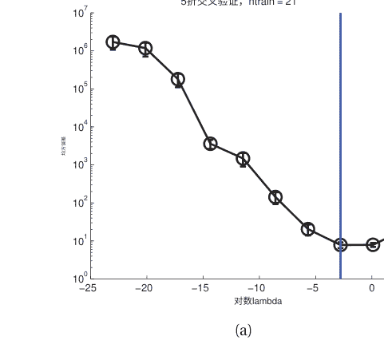

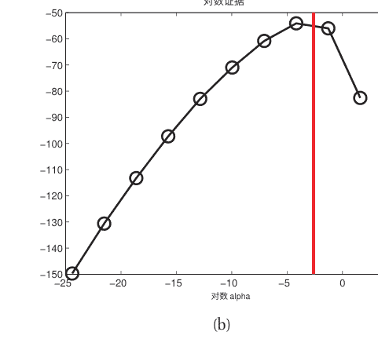

图7.13 (a) 由5折交叉验证产生的测试MSE估计值与 log(λ)的关系。垂直线表示最小值。请注意，垂直刻度是以对数单位表示的。(c) 对数边际似然与 log(α)的关系。垂直线表示最大值。由linregPolyVsRegDemo生成的图。

图5.7和5.8中的多项式回归模型的似然。对于“更贝叶斯”的方法，我们对 η的不确定性进行建模，而不是计算点估计值，请参见第21.5.2节。

## 练习

### 练习7.1 随着样本量增加，训练集误差的行为

随着我们获得更多的训练数据，测试误差将始终减少，因为模型将更好地估计。然而，如图7.10所示，对于足够复杂的模型，随着我们获得更多的训练数据，训练集上的误差可能会增加，直到到达某个平台。请解释原因。

### 练习7.2 多输出线性回归

(来源：Jaakkola。)

当我们在回归中有多个独立的输出时，模型变得

$p(\mathbf{y}|\mathbf{x}, \mathbf{W}) = \prod_{j=1}^M \mathcal{N}(y_j | \mathbf{w}_j^T \mathbf{x}_i, \sigma_j^2)$

由于似然函数在维度上分解，最大似然估计也是如此。因此

$\hat{\mathbf{W}} = [\hat{\mathbf{w}}_1, ..., \hat{\mathbf{w}}_M]$

其中 $\hat{\mathbf{w}}_j = (\mathbf{X}^T \mathbf{X})^{-1} \mathbf{Y}_{:,j}$。

在这个练习中，我们将这个结果应用于一个具有2维响应向量 $\mathbf{y}_i \in \mathbb{R}^2$的模型。假设我们有一些二进制输入数据， $x_i \in \{0,1\}$。训练数据如下：

| x | y |
|---|---|
| 0 | $(-1, -1)^T$ |
| 0 | $(-1, -2)^T$ |
| 0 | $(-2, -1)^T$ |
| 1 | $(1, 1)^T$ |
| 1 | $(1, 2)^T$ |
| 1 | $(2, 1)^T$ |

让我们使用以下基函数将每个 $x_i$ 嵌入到2d中：

$$\phi(0) = (1, 0)^T, \quad \phi(1) = (0, 1)^T \tag{7.91}$$

模型变为

$$\hat{y} = \mathbf{W}^T \phi(x) \tag{7.92}$$

其中 $\mathbf{W}$ 是一个 $2 \times 2$ 矩阵。从上述数据中计算 $\mathbf{W}$ 的最大似然估计(MLE)。

### 练习7.3中心化和岭回归

假设 $x = 0$, 因此输入数据已经被居中。证明

$$J(\mathbf{w}, w_0) = (\mathbf{y} - \mathbf{X} \mathbf{w} - w_0 \mathbf{1})^T (\mathbf{y} - \mathbf{X} \mathbf{w} - w_0 \mathbf{1}) + \lambda \mathbf{w}^T \mathbf{w} \text{的最优化器} \tag{7.93}$$

是

$$\hat{w}_0 = \bar{y} \tag{7.94}$$

$$\hat{\mathbf{w}} = (\mathbf{X}^T \mathbf{X} + \lambda \mathbf{I})^{-1} \mathbf{X}^T \mathbf{y} \tag{7.95}$$

### 练习7.4线性回归中 $\sigma^2$ 的MLE

证明线性回归中误差方差的MLE为

$$\hat{\sigma}^2 = \frac{1}{N} \sum_{i=1}^{N} (y_i - \mathbf{x}_i^T \hat{\mathbf{w}})^2 \tag{7.96}$$

这只是当我们插入我们对 $\mathbf{w}$ 的估计时残差误差的经验方差。

### 练习7.5线性回归中偏移项的MLE

### 练习7.6简单线性回归的最大似然估计

简单线性回归是指输入为标量的情况，因此 D=1。证明在这种情况下，最大似然估计由以下方程给出，这些方程可能在基础统计课程中很熟悉：

$$ w_1 = \frac{\sum_i (x_i - \bar{x})(y_i - \bar{y})}{\sum_i (x_i - \bar{x})^2} = \frac{\sum_i x_i y_i - N \bar{x} \bar{y}}{\sum_i x_i^2 - N \bar{x}^2} \approx \frac{\text{cov}[X, Y]}{\text{var}[X]} \quad (7.99) $$

$$ w_0 = \bar{y} - w_1 \bar{x} \approx \mathbb{E}[Y] - w_1 \mathbb{E}[X] \quad (7.100) $$

查看linregDemo1进行演示。

### 练习 7.7在线线性回归的充分统计量

（来源：Jaakkola。）考虑使用最小二乘法拟合模型 ŷ = w0 + w1 x。不幸的是，我们没有保留原始数据， xi, yi，但我们有以下数据的函数（统计量）：

$$ \bar{x}^{(n)} = \frac{1}{n} \sum_{i=1}^{n} x_i, \quad \bar{y}^{(n)} = \frac{1}{n} \sum_{i=1}^{n} y_i \quad (7.101) $$

$$ C_{xx}^{(n)} = \frac{1}{n} \sum_{i=1}^{n} (x_i - \bar{x})^2, \quad C_{xy}^{(n)} = \frac{1}{n} \sum_{i=1}^{n} (x_i - \bar{x})(y_i - \bar{y}), \quad C_{yy}^{(n)} = \frac{1}{n} \sum_{i=1}^{n} (y_i - \bar{y})^2 \quad (7.102) $$

- a. 我们需要估计 w1的最小统计量是什么？（提示：参见方程7.99。）
- b. 我们需要估计 w0的最小统计量是什么？（提示：参见方程7.97。）
- c. 假设一个新的数据点， xn+1, yn+1到达，我们想要更新我们的充分统计量，而不查看我们没有存储的旧数据。（这对于在线学习很有用。）证明我们可以按照以下方式对 x进行更新。

$$ \bar{x}^{(n+1)} \triangleq \frac{1}{n+1} \sum_{i=1}^{n+1} x_i = \frac{1}{n+1} \left( n \bar{x}^{(n)} + x_{n+1} \right) \quad (7.103) $$

$$ = \bar{x}^{(n)} + \frac{1}{n+1} (x_{n+1} - \bar{x}^{(n)}) \quad (7.104) $$

这具有以下形式：新的估计是旧的估计加上修正。我们可以看到，修正的大小随着时间的推移而减小（即，随着我们获得更多样本）。推导出一个类似的表达式来更新 y。展示一个可以更新 C_{xy}^{(n+1)} 递归使用

$$ C_{xy}^{(n+1)} = \frac{1}{n+1} \left[ x_{n+1} y_{n+1} + n C_{xy}^{(n)} + n \bar{x}^{(n)} \bar{y}^{(n)} - (n+1) \bar{x}^{(n+1)} \bar{y}^{(n+1)} \right] \quad (7.105) $$

推导出一个类似的表达式来更新 C_{xx}。

- e. 实现在线学习算法，即编写一个形式为 [w,ss] = linregUpdateSS(ss,x,y)的函数，其中x和y是标量，ss是包含足够统计量的结构体。
- f. 使用linregDemo1中的数据集，绘制“时间”上的系数。（具体来说，使用 [x,y] = polyDataMake('sampling','thibaux')。）检查它们是否收敛到批处理（离线）学习器（即普通最小二乘法）给出的解。你的结果应该看起来像图7.14。

提交你的推导、代码和图表。

### 练习7.8已知σ²的贝叶斯线性回归在1维中的拟合（来源： Bolstad）

考虑拟合以下形式的模型

$$ p(y|x, \boldsymbol{\theta}) = \mathcal{N}(y|w_0 + w_1 x, \sigma^2) \quad (7.106) $$

到下面的数据：

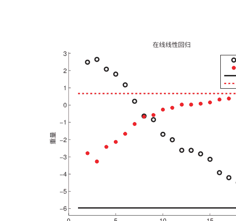

图7.14 随时间变化的回归系数。由练习7.7生成。

$$x = [94,96,94,95,104,106,108,113,115,121,131];$$
$$y = [0.47, 0.75, 0.83, 0.98, 1.18, 1.29, 1.40, 1.60, 1.75, 1.90, 2.23];$$

- a. 使用计算一个无偏估计 $\sigma^2$

$$\hat{\sigma}^2 = \frac{1}{N-2} \sum_{i=1}^{N} (y_i - \hat{y}_i)^2 \tag{7.107}$$

(分母为 $N-2$，因为我们有两个输入，即偏移项和 $x$。这里 $\hat{y}_i = \hat{w}_0 + \hat{w}_1 x_i$, 而 $\hat{\mathbf{w}} = (\hat{w}_0, \hat{w}_1)$ 是MLE。
- b. 现在假设以下先验分布在 $\mathbf{w}$ 上：

$p(\mathbf{w}) = p(w_0)p(w_1) \tag{7.108}$在 $w_0$上使用（不恰当的）均匀先验分布，在 $w_1$上使用 $\mathcal{N}(0,1)$先验分布。证明这可以写成一个形式为 $\mathcal{N}(\mathbf{w}|\mathbf{w}_0, \mathbf{V}_0)$的高斯先验分布。
- c. 计算斜率的边缘后验概率， $p(w_1|\mathcal{D}, \sigma^2)$, 其中 $\mathcal{D}$是上述数据， $\sigma^2$是上面计算得到的无偏估计。什么是 $\mathbb{E}[w_1|\mathcal{D}, \sigma^2]$ 和 $\text{var}[w_1|\mathcal{D}, \sigma^2]$ 展示你的工作。 (如果你喜欢，你可以使用Matlab。)提示：后验方差是一个非常小的数！
- d. 对于 $w_1$，95%的可信区间是多少?

### 练习7.9线性回归的生成模型

线性回归是估计 $E[Y|\mathbf{x}]$的问题，使用形式为 $w_0 + \mathbf{w}^T\mathbf{x}$的线性函数。通常我们假设 $Y$给定 $\mathbf{X}$的条件分布是高斯分布。我们可以直接估计这个条件高斯分布（判别方法），或者我们可以拟合一个高斯分布到 $\mathbf{X}$，$Y$的联合分布，然后推导出 $E[Y|\mathbf{X} = \mathbf{x}]$。

在练习7.5中，我们展示了判别式方法导致了这些方程

$$E[Y|\mathbf{x}] = w_0 + \mathbf{w}^T\mathbf{x} \tag{7.109}$$
$$w_0 = \bar{y} - \bar{\mathbf{x}}^T\mathbf{w} \tag{7.110}$$
$$\mathbf{w} = (\mathbf{X}_c^T\mathbf{X}_c)^{-1}\mathbf{X}_c^T\mathbf{y}_c \tag{7.111}$$

其中 $\mathbf{X}_c = \mathbf{X} - \bar{\mathbf{X}}$ 是中心化的输入矩阵，而 $\bar{\mathbf{X}} = \mathbf{1}_n \mathbf{x}^T$在行上复制 $\mathbf{x}_o$。同样地，$y_c = y - \bar{y}$是中心化的输出向量，而 $\bar{y} = \mathbf{1}_n y$在行上复制 $y_o$。

- a. 通过找到 $\boldsymbol{\Sigma}_{XX}$，$\boldsymbol{\Sigma}_{XY}$，$\boldsymbol{\mu}_x$ 和 $\mu_y$ 的最大似然估计，通过将联合高斯拟合到 $\mathbf{X}$，$Y$并使用条件高斯的公式（见第4.3.1节）推导出上述方程。展示你的工作。
- b. 与标准的判别式方法相比，这种方法的优缺点是什么？

### 练习7.10使用g先验的贝叶斯线性回归

证明当我们使用g先验时，后验分布的形式为：$p(\mathbf{w}, \sigma^2) = \mathrm{NIG}(\mathbf{w}, \sigma^2|\mathbf{0}, g(\mathbf{X}^T\mathbf{X})^{-1}, 0, 0)$

$$p(\mathbf{w}, \sigma^2|\mathcal{D}) = \mathrm{NIG}(\mathbf{w}, \sigma^2|\mathbf{w}_N, \mathbf{V}_N, a_N, b_N) \tag{7.112}$$
$$\mathbf{V}_N = \dfrac{g}{g+1}(\mathbf{X}^T\mathbf{X})^{-1} \tag{7.113}$$
$$\mathbf{w}_N = \dfrac{g}{g+1}\hat{\mathbf{w}}_{mle} \tag{7.114}$$
$$a_N = N/2 \tag{7.115}$$
$$b_N = \dfrac{s^2}{2} + \dfrac{1}{2(g+1)}\hat{\mathbf{w}}_{mle}^T\mathbf{X}^T\mathbf{X}\hat{\mathbf{w}}_{mle} \tag{7.116}$$

## 8 逻辑回归

## 8.1 引言

构建概率分类器的一种方法是创建形式为 \(p(y, \mathbf{x})\) 的联合模型，然后在给定 \(\mathbf{x}\) 的条件下，推导出 \(p(y|\mathbf{x})\)。这被称为生成方法。另一种方法是直接拟合形式为 \(p(y|\mathbf{x})\) 的模型。这被称为判别式方法，在本章中我们采用这种方法。特别地，我们将假设参数线性的判别式模型。我们将看到，这将显著简化模型拟合过程。在第8.6节中，我们比较生成方法和判别式方法，在后续章节中，我们将考虑非线性和非参数判别式模型。

## 8.2 模型规范

正如我们在1.4.6节中讨论的那样，逻辑回归对应于以下二元分类模型：

$$p(y|\mathbf{x}, \mathbf{w}) = \mathrm{Ber}(y|\mathrm{sigm}(\mathbf{w}^T \mathbf{x})) \tag{8.1}$$

图1.19(b)展示了一个一维示例。逻辑回归可以轻松扩展到高维输入。例如，图8.1显示了对于不同权重向量 \(\mathbf{w}\) 的2维输入的 \(p(y = 1|\mathbf{x}, \mathbf{w}) = \mathrm{sigm}(\mathbf{w}^T \mathbf{x})\) 的图。如果我们将这些概率阈值设为0.5，我们就会得到一个线性决策边界，其法向量由 \(\mathbf{w}\) 给出。

## 8.3 模型拟合

在本节中，我们讨论了用于估计逻辑回归模型参数的算法。

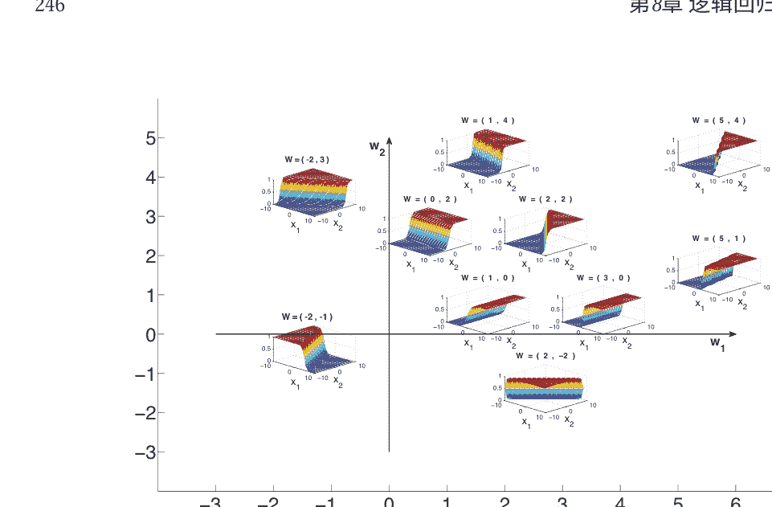

图8.1绘制了 $\text{sigm}(w_1 x_1 + w_2 x_2)$的图形。这里$\mathbf{w} = ( w_1, w_2)$定义了决策边界的法向量。位于该法向量右侧的点满足 $\text{sigm}(\mathbf{w}^T \mathbf{x}) > 0.5$，而位于左侧的点满足 $\text{sigm}(\mathbf{w}^T \mathbf{x}) < 0.5$。基于(MacKay 2003)的图39.3。由sigmoidplot2D生成的图。

### 8.3.1最大似然估计

逻辑回归的负对数似然函数为

$$\begin{aligned}
\text{NLL}(\mathbf{w}) &= -\sum_{i=1}^{N} \log\left[\mu_i^{\mathbb{I}(y_i=1)} \times (1-\mu_i)^{\mathbb{I}(y_i=0)}\right] \tag{8.2}\\
&= -\sum_{i=1}^{N} \left[y_i \log \mu_i + (1-y_i) \log(1-\mu_i)\right] \tag{8.3}
\end{aligned}$$

这也被称为交叉熵误差函数（见第2.8.2节）。另一种写法如下。假设 $\tilde{y}_i \in \{-1, +1\}$而不是 $y_i \in \{0, 1\}$。我们有 $p(y=1) = \frac{1}{1+\exp(-\mathbf{w}^T\mathbf{x})}$ 和 $p(y=1) = \frac{1}{1+\exp(+\mathbf{w}^T\mathbf{x})}$。因此

$$\text{NLL}(\mathbf{w}) = \sum_{i=1}^{N} \log(1 + \exp(-\tilde{y}_i \mathbf{w}^T \mathbf{x}_i)) \tag{8.4}$$

与线性回归不同，我们不能再以闭式形式写出MLE。相反，我们需要使用优化算法来计算它。为此，我们需要推导梯度和海森矩阵。

在逻辑回归的情况下，可以证明（练习8.3）梯度和海森矩阵图8.2 梯度下降在一个简单函数上的表现，从 (0,0)开始，进行20步，使用固定的学习率（步长）$\eta$。全局最小值在 (1,1)处。 (a) $\eta=0.1$。 (b) $\eta=0.6$。由steepestDescentDemo生成的图。

以下是给出的
$$
\begin{aligned}
\mathbf{g} &= \frac{d}{d\mathbf{w}} f(\mathbf{w}) = \sum_i (\mu_i - y_i) \mathbf{x}_i = \mathbf{X}^T (\boldsymbol{\mu} - \mathbf{y}) \qquad (8.5)\\
\mathbf{H} &= \frac{d}{d\mathbf{w}} \mathbf{g}(\mathbf{w})^T = \sum_i (\nabla_{\mathbf{w}} \mu_i) \mathbf{x}_i^T = \sum_i \mu_i(1 - \mu_i)\mathbf{x}_i \mathbf{x}_i^T \qquad (8.6)\\
&= \mathbf{X}^T \mathbf{S} \mathbf{X} \qquad (8.7)
\end{aligned}
$$
可以证明（练习8.3）$\mathbf{H}$是正定的。

因此，NLL是凸的，并且具有唯一的全局最小值。下面我们讨论一些方法来寻找这个最小值。

## 8.3.2 最陡下降法

也许最简单的无约束优化算法是梯度下降，也被称为最陡下降。可以写成如下形式：
$$\boldsymbol{\theta}_{k+1} = \boldsymbol{\theta}_k - \eta_k \mathbf{g}_k \qquad (8.8)$$
其中 $\eta_k$ 是步长或学习率。梯度下降中的主要问题是：我们应该如何设置步长？这事实证明是相当棘手的。如果我们使用恒定的学习率，但是将其设得太小，收敛速度将非常慢，但如果设得太大，方法可能无法收敛。这在图8.2中有所说明，我们绘制了以下（凸）函数
$$f(\boldsymbol{\theta}) = 0.5(\theta_1^2 - \theta_2)^2 + 0.5(\theta_1 - 1)^2, \qquad (8.9)$$
我们任意决定从 (0,0)开始。在图8.2(a)中，我们使用固定的步长 $\eta=0.1$；我们看到它沿着山谷缓慢移动。在图8.2(b)中，我们使用固定的步长 $\eta=0.6$；我们看到算法开始在山谷的两侧上下振荡，从未收敛到最优解。

图8.3 (a) 在与图8.2相同的函数上进行最陡下降，从 (0,0) 开始，使用线搜索。由steepestDescentDemo生成的图。(b) 在线搜索结束时的局部梯度与搜索方向垂直的示意图 (图片顶部)。基于 (Press et al. 1988)的图10.6.1。

让我们开发一种更稳定的选择步长的方法，以便无论我们从哪里开始，该方法都能收敛到局部最优解。(这个性质被称为全局收敛，不应与收敛到全局最优解混淆！)根据泰勒定理，我们有

$$f(\theta + \eta \mathbf{d}) \approx f(\theta) + \eta \mathbf{g}^T \mathbf{d} \quad (8.10)$$

其中 $\mathbf{d}$ 是我们的下降方向。所以如果选择的 $\eta$ 足够小，那么 $f(\theta+\eta \mathbf{d})<f(\theta)$，因为梯度将为负。但我们不希望选择步长 $\eta$ 太小，否则我们会移动得很慢，可能无法达到最小值。所以让我们选择 $\eta$ 来最小化

$$\phi(\eta) = f(\theta_k + \eta \mathbf{d}_k) \quad (8.11)$$

这被称为线性最小化或线搜索。有各种方法可以解决这个一维优化问题；详见 (Nocedal和Wright 2006) 了解详情。

图8.3(a)证明了线搜索确实适用于我们的简单问题。然而，我们可以看到具有精确线搜索的最陡下降路径表现出特征性的曲折行为。要了解原因，请注意精确线搜索满足 $\eta_k = \arg \min_{\eta>0} \phi(\eta)$。最优解的必要条件是 $\phi'(\eta)=0$。根据链式法则， $\phi'(\eta) = \mathbf{d}^T \mathbf{g}$，其中 $\mathbf{g} = f'(\theta+\eta \mathbf{d})$ 是步骤结束时的梯度。所以我们要么有 $\mathbf{g}=0$，这意味着我们找到了一个稳定点，要么 $\mathbf{g} \perp \mathbf{d}$，这意味着精确搜索在一个局部梯度与搜索方向垂直的点停止。因此，连续的方向将是正交的（见图8.3(b)）。这解释了曲折行为。

减少折返效应的一个简单启发式方法是添加一个动量项，$(\theta_k - \theta_{k-1})$，如下所示：

$$\theta_{k+1} = \theta_k - \eta_k \mathbf{g}_k + \mu_k (\theta_k - \theta_{k-1}) \quad (8.12)$$

其中 \(0 \leq \mu_k \leq 1\) 控制动量项的重要性。在优化社区中，这被称为**heavy ball method**(参见例如，(Bertsekas 1999))。

减少“折返效应”的另一种方法是使用共轭梯度法(参见例如，(Nocedal and Wright 2006, ch 5)或(Golub and van Loan 1996, Sec 10.2))。这是解决线性系统时形式为 \(f(\theta) = \theta^T A \theta\) 的二次目标的首选方法。然而，非线性共轭梯度法不太流行。

## 8.3.3 牛顿法

算法 8.1: 最小化严格凸函数的牛顿法
- 1 初始化 \(\theta_0\);
- 2 对于 \(k = 1, 2, \ldots\) 直到收敛为止 **do**
- 3     计算     \(\mathbf{g}_k = \nabla f(\mathbf{\theta}_k)\);
- 4     计算     \(\mathbf{H}_k = \nabla^2 f(\mathbf{\theta}_k)\);
- 5     解 \(\mathbf{H}_k \mathbf{d}_k = -\mathbf{g}_k\) 得到 \(\mathbf{d}_k\);
- 6     使用线性搜索找到步长 \(\eta_k\) 沿着 \(\mathbf{d}_k\);
- 7     \(\mathbf{\theta}_{k+1} = \mathbf{\theta}_k + \eta_k \mathbf{d}_k\);

通过考虑空间的曲率（即，海森矩阵），可以推导出更快的优化方法。这些被称为二阶优化方法。主要的例子是牛顿算法。这是一个迭代算法，由以下更新组成

$$\theta_{k+1} = \theta_k - \eta_k \mathbf{H}_k^{-1} \mathbf{g}_k \tag{8.13}$$

完整的伪代码在算法8.1中给出。

这个算法可以如下推导得到。考虑对 \(f(\theta)\) 在 \(\theta_k\) 附近进行二阶泰勒级数近似：
$$f_{quad}(\theta) = f_k + \mathbf{g}_k^T (\theta - \theta_k) + \frac{1}{2} (\theta - \theta_k)^T \mathbf{H}_k (\theta - \theta_k) \tag{8.14}$$
让我们将其重写为
$$f_{quad}(\theta) = \theta^T \mathbf{A} \theta + \mathbf{b}^T \theta + c \tag{8.15}$$
其中
$$\mathbf{A} = \frac{1}{2}\mathbf{H}_k, \quad \mathbf{b} = \mathbf{g}_k - \mathbf{H}_k \theta_k, \quad c = f_k - \mathbf{g}_k^T \theta_k + \frac{1}{2} \theta_k^T \mathbf{H}_k \theta_k \tag{8.16}$$
最小值 \(f_{quad}\) 在
$$\theta = -\frac{1}{2} \mathbf{A}^{-1} \mathbf{b} = \theta_k - \mathbf{H}_k^{-1} \mathbf{g}_k \tag{8.17}$$
因此，牛顿步长 \(\mathbf{d}_k = -\mathbf{H}_k^{-1} \mathbf{g}_k\) 是应该添加到 \(\theta_k\) 以最小化关于\(\theta_k\)的二阶近似的 \(f\)。请参见图8.4(a)进行说明。

图8.4 牛顿法最小化一维函数的示例。(a) 实线曲线是函数 f(x)。虚线 $f_{quad}(x)$ 是其在 $x_k$处的二阶近似。牛顿步长 $d_k$是必须添加到 $x_k$以达到 $f_{quad}(x)$的最小值。基于(Vandenberghe2006)的图13.4。由newtonsMethodMinQuad生成的图。(b)应用于非凸函数的牛顿法示例。我们围绕当前点 $x_k$拟合二次曲线，并移动到其稳定点，$x_{k+1}=x_k+d_k$。不幸的是，这是一个局部最大值，而不是最小值。这意味着我们需要小心我们的二次近似的范围。基于(Vandenberghe 2006)的图13.11。由newtonsMethodNonConvex生成的图。

在其最简单的形式（如所列），牛顿法要求 $\mathbf{H}_k$为正定的，如果函数是严格凸的，则会满足这一条件。如果不是，目标函数不是凸的，那么$\mathbf{H}_k$可能不是正定的，因此 $\mathbf{d}_k = -\mathbf{H}_k^{-1}\mathbf{g}_k$ 可能不是一个下降方向（参见图8.4(b)的例子）。在这种情况下，一个简单的策略是回到最陡下降法，$\mathbf{d}_k = -\mathbf{g}_k$。Levenberg-Marquardt算法是在牛顿步骤和最陡下降步骤之间自适应地混合的一种方法。这种方法在解非线性最小二乘问题时被广泛使用。另一种方法是：不直接计算 $\mathbf{d}_k = -\mathbf{H}_k^{-1}\mathbf{g}_k$，而是使用共轭梯度（CG）求解线性方程组 $\mathbf{H}_k \mathbf{d}_k = -\mathbf{g}_k$ 来计算 $\mathbf{d}_k$。如果 $\mathbf{H}_k$不是正定的，我们可以在检测到负曲率时简单地截断CG迭代；这被称为截断牛顿法。

## 8.3.4 迭代重新加权最小二乘法 (IRLS)

现在让我们应用牛顿算法来找到二元逻辑回归的最大似然估计 (MLE)。对于这个模型，在第 k+1 次迭代时，牛顿更新如下 (使用 $\eta_k = 1$，因为海森矩阵是精确的):

$$
\begin{aligned}
\mathbf{w}_{k+1} &= \mathbf{w}_k - \mathbf{H}_k^{-1} \mathbf{g}_k \\
&= \mathbf{w}_k + (\mathbf{X}^T \mathbf{S}_k \mathbf{X})^{-1} \mathbf{X}^T (\mathbf{y} - \boldsymbol{\mu}_k) \\
&= (\mathbf{X}^T \mathbf{S}_k \mathbf{X})^{-1} \left[ (\mathbf{X}^T \mathbf{S}_k \mathbf{X}) \mathbf{w}_k + \mathbf{X}^T (\mathbf{y} - \boldsymbol{\mu}_k) \right] \\
&= (\mathbf{X}^T \mathbf{S}_k \mathbf{X})^{-1} \mathbf{X}^T [\mathbf{S}_k \mathbf{X} \mathbf{w}_k + \mathbf{y} - \boldsymbol{\mu}_k] \\
&= (\mathbf{X}^T \mathbf{S}_k \mathbf{X})^{-1} \mathbf{X}^T \mathbf{S}_k \mathbf{z}_k
\end{aligned}
$$

我们定义了工作响应为

$$ \mathbf{z}_k \triangleq \mathbf{X} \mathbf{w}_k + \mathbf{S}_k^{-1} (\mathbf{y} - \boldsymbol{\mu}_k) $$

方程8.22是加权最小二乘问题的一个例子，它是一个最小化器

$$ \sum_{i=1}^{N} S_{ki} (z_{ki} - \mathbf{w}^T \mathbf{x}_i)^2 $$

由于$\mathbf{S}_k$是一个对角矩阵，我们可以将目标重新写成分量形式（对于每个案例 $i = 1 : N$）

$$ z_{ki} = \mathbf{w}_k^T \mathbf{x}_i + (y_i - \mu_{ki}) / (\mu_{ki} (1 - \mu_{ki})) $$

这个算法被称为迭代重新加权最小二乘法，简称IRLS，因为在每次迭代中，我们解决一个加权最小二乘问题，其中权重矩阵 $\mathbf{S}_k$在每次迭代中改变。请参见算法8.2的一些伪代码。

算法8.2: 迭代重新加权最小二乘法 (IRLS)
- 1 $\mathbf{w} = \mathbf{0}_D$;
- 2 $w_0 = \log(\bar{y}/(1-\bar{y}))$;
- 3 重复
- 4   $\eta_i = w_0 + \mathbf{w}^T \mathbf{x}_i$;
- 5   $\mu_i = \text{sigm}(\eta_i)$;
- 6   $s_i = \mu_i(1-\mu_i)$ ;
- 7   $z_i = \eta_i + (y_i-\mu_i)/s_i$ ;
- 8   $\mathbf{S} = \text{diag}(s_{1:N})$ ;
- 9   $\mathbf{w} = (\mathbf{X}^T \mathbf{S} \mathbf{X})^{-1} \mathbf{X}^T \mathbf{S} \mathbf{z}$;
- 10 直到 收敛 ;

### 8.3. 模型拟合

## 8.3.5 拟牛顿（变量度量）方法

所有二阶优化算法的鼻祖是牛顿算法，在第8.3.3节中我们讨论过。不幸的是，计算 $\mathbf{H}$ 显式地可能太昂贵了。拟牛顿方法通过在每一步使用梯度向量获得的信息来逐步构建对Hessian的近似。最常见的方法被称为 BFGS（以其发明者Broyden, Fletcher, Goldfarb和Shanno命名），它通过以下方式更新对Hessian的近似 $\mathbf{B}_k \approx \mathbf{H}_k$:

$$ \begin{aligned}
\mathbf{B}_{k+1} &= \mathbf{B}_k + \frac{\mathbf{y}_k \mathbf{y}_k^T}{\mathbf{y}_k^T \mathbf{s}_k} - \frac{(\mathbf{B}_k \mathbf{s}_k)(\mathbf{B}_k \mathbf{s}_k)^T}{\mathbf{s}_k^T \mathbf{B}_k \mathbf{s}_k} \\
\mathbf{s}_k &= \boldsymbol{\theta}_k - \boldsymbol{\theta}_{k-1} \\
\mathbf{y}_k &= \mathbf{g}_k - \mathbf{g}_{k-1}
\end{aligned} $$

这是对矩阵的二阶更新，确保矩阵保持正定（在步长的某些限制条件下）。通常我们从对角线近似开始，$\mathbf{B}_0 = \mathbf{I}$。因此，BFGS可以被看作是对Hessian矩阵的“对角线加低秩”近似。

或者，BFGS可以迭代地更新对Hessian矩阵的逆矩阵近似，$\mathbf{C}_k \approx \mathbf{H}_k^{-1}$，如下所示：

$$ \mathbf{C}_{k+1} = \left( \mathbf{I} - \frac{\mathbf{s}_k \mathbf{y}_k^T}{\mathbf{y}_k^T \mathbf{s}_k} \right) \mathbf{C}_k \left( \mathbf{I} - \frac{\mathbf{y}_k \mathbf{s}_k^T}{\mathbf{y}_k^T \mathbf{s}_k} \right) + \frac{\mathbf{s}_k \mathbf{s}_k^T}{\mathbf{y}_k^T \mathbf{s}_k} \quad (8.29) $$

由于存储Hessian需要 $O(D^2)$ 空间，对于非常大的问题，可以使用有限内存的BFGS或L-BFGS，其中 $\mathbf{H}_k$ 或 $\mathbf{H}_k^{-1}$ 通过对角线加低秩矩阵来近似。 特别地，可以通过与 $\mathbf{s}_k$ 和 $\mathbf{y}_k$ 进行一系列内积运算，仅使用最近的 $m$ 个 $(\mathbf{s}_k, \mathbf{y}_k)$ 对，并忽略旧的信息，从而获得乘积 $\mathbf{H}_k^{-1} \mathbf{g}_k$。 因此，存储需求为 $O(mD)$。 通常 $m \sim 20$ 足以获得良好的性能。 更多信息请参见 (Nocedal和Wright 2006, p177)。 L-BFGS通常是机器学习中大多数无约束平滑优化问题的首选方法（尽管请参见第8.5节）。

## 8.3.6 $\ell_2$正则化

正如我们更喜欢岭回归而不是线性回归一样，我们应该更喜欢用最大后验估计来计算逻辑回归，而不是最大似然估计。 事实上，即使我们有大量数据，在分类问题中正则化也很重要。 为了看清楚这一点，假设数据是线性可分的。 在这种情况下，当 $\| \mathbf{w} \| \rightarrow \infty$ 时，MLE被获得，对应于一个无限陡峭的Sigmoid函数，也被称为线性阈值单元。 这将最大限度地将概率质量分配给训练数据。 然而，这样的解决方案非常脆弱，无法很好地推广。

为了防止这种情况发生，我们可以使用 $\ell_2$ 正则化，就像我们在岭回归中所做的一样。我们注意到新的目标函数、梯度和海森矩阵具有以下形式：

$$\begin{aligned} f'(\mathbf{w}) &= \text{NLL}(\mathbf{w}) + \frac{\lambda}{2} \mathbf{w}^T \mathbf{w} \quad (8.30) \\ \mathbf{g}'(\mathbf{w}) &= \mathbf{g}(\mathbf{w}) + \lambda \mathbf{w} \quad (8.31) \\ \mathbf{H}'(\mathbf{w}) &= \mathbf{H}(\mathbf{w}) + \lambda \mathbf{I} \quad (8.32) \end{aligned}$$

将这些修改后的方程传递给任何基于梯度的优化器是一件简单的事情。

## 8.3.7 多类别逻辑回归

现在我们考虑多项式逻辑回归，有时也被称为最大熵分类器。 这是一个形式为的模型

$$ p(y = c | \mathbf{x}, \mathbf{W}) = \frac{\exp(\mathbf{w}_c^T \mathbf{x})}{\sum_{c'=1}^C \exp(\mathbf{w}_{c'}^T \mathbf{x})} \quad (8.33) $$

一种轻微变体，称为条件对数模型，对每个数据案例都对不同的类别进行归一化；这对于建模用户在不同的项目集合之间做出的选择非常有用。

现在让我们引入一些符号。 此外，让 $y_{ic} = \mathbb{I}(y_i = c)$ 是 $y_i$ 的一种 $C$ 位编码；因此 $\mathbf{y}_i$ 是一个位向量，在其中，当且仅当 $y_i = c$ 时，第 $c$ 位打开。 根据 (Krishnapuram等人, 2005)，让我们## 8.3. 模型拟合

设置 \(\mathbf{w}_C = \mathbf{0}\)，以确保可识别性，并定义 \(\mathbf{w} = \text{vec}(\mathbf{W}(:,1:C-1))\) 为 \(D \times (C-1)\) 列向量。

有了这个，对数似然可以写成

$$\ell(\mathbf{W}) = \log \prod_{i=1}^N \prod_{c=1}^C \mu_{ic}^{y_{ic}} = \sum_{i=1}^N \sum_{c=1}^C y_{ic} \log \mu_{ic}$$

$$ = \sum_{i=1}^N \left[ \left( \sum_{c=1}^C y_{ic} \mathbf{w}_c^T \mathbf{x}_i \right) - \log \left( \sum_{c'=1}^C \exp(\mathbf{w}_{c'}^T \mathbf{x}_i) \right) \right] $$

将NLL定义为

$$f(\mathbf{w}) = -\ell(\mathbf{w})$$

现在我们继续计算这个表达式的梯度和海森矩阵。由于 \(\mathbf{w}\) 是分块结构的，符号有点复杂，但思想很简单。有助于定义 \(\mathbf{A} \otimes \mathbf{B}\) 为矩阵 \(\mathbf{A}\) 和 \(\mathbf{B}\) 的 Kronecker 积。如果 \(\mathbf{A}\) 是一个 \(m \times n\) 矩阵，\(\mathbf{B}\) 是一个 \(p \times q\) 矩阵，那么 \(\mathbf{A} \times \mathbf{B}\) 是 \(mp \times nq\) 分块矩阵。

$$\mathbf{A} \otimes \mathbf{B} = \begin{bmatrix} a_{11} \mathbf{B} & \cdots & a_{1n} \mathbf{B} \\ \vdots & \ddots & \vdots \\ a_{m1} \mathbf{B} & \cdots & a_{mn} \mathbf{B} \end{bmatrix}$$

回到手头的任务，可以证明（练习8.4）梯度由以下给出

$$\mathbf{g}(\mathbf{W}) = \nabla f(\mathbf{w}) = \sum_{i=1}^N (\boldsymbol{\mu}_i - \mathbf{y}_i) \otimes \mathbf{x}_i$$

其中 \(\mathbf{y}_i = (\mathbb{I}(y_i = 1), \ldots, \mathbb{I}(y_i = C-1))\) 且 \(\boldsymbol{\mu}_i(\mathbf{W}) = [p(y_i = 1|\mathbf{x}_i, \mathbf{W}), \ldots, p(y_i = C-1|\mathbf{x}_i, \mathbf{W})]\) 是长度为 \(C-1\) 的列向量，例如，如果我们有 \(D = 3\) 个特征维度和 \(C = 3\) 个类别，这变成

$$\mathbf{g}(\mathbf{W}) = \sum_i \begin{pmatrix} (\mu_{i1} - y_{i1}) x_{i1} \\ (\mu_{i1} - y_{i1}) x_{i2} \\ (\mu_{i1} - y_{i1}) x_{i3} \\ (\mu_{i2} - y_{i2}) x_{i1} \\ (\mu_{i2} - y_{i2}) x_{i2} \\ (\mu_{i2} - y_{i2}) x_{i3} \end{pmatrix}$$

换句话说，对于每个类别 \(c\)，第 \(c\) 列的权重的导数是

$$\nabla_{\mathbf{w}_c} f(\mathbf{W}) = \sum_i (\mu_{ic} - y_{ic}) \mathbf{x}_i$$

这与二元逻辑回归的情况具有相同的形式，即一个误差项乘以 \(\mathbf{x}_i\)。（这是指数族分布的一般特性，我们将在第9.3.2节中看到。）

还可以证明（练习8.4）Hessian矩阵具有以下块结构 \(D(C-1) \times D(C-1)\):

$$\mathbf{H}(\mathbf{W}) = \nabla^2 f(\mathbf{w}) = \sum_{i=1}^{N} (\mathrm{diag}(\boldsymbol{\mu}_i) - \boldsymbol{\mu}_i \boldsymbol{\mu}_i^T) \otimes (\mathbf{x}_i \mathbf{x}_i^T) \quad (8.41)$$

例如，如果我们有3个特征和3个类别，那么就变成了

$$\mathbf{H}(\mathbf{W}) = \sum_{i} \begin{pmatrix} \mu_{i1} - \mu_{i1}^2 & -\mu_{i1} \mu_{i2} \\ -\mu_{i1} \mu_{i2} & \mu_{i2} - \mu_{i2}^2 \end{pmatrix} \otimes \begin{pmatrix} x_{i1} x_{i1} & x_{i1} x_{i2} & x_{i1} x_{i3} \\ x_{i2} x_{i1} & x_{i2} x_{i2} & x_{i2} x_{i3} \\ x_{i3} x_{i1} & x_{i3} x_{i2} & x_{i3} x_{i3} \end{pmatrix} \quad (8.42)$$

$$= \sum_{i} \begin{pmatrix} (\mu_{i1} - \mu_{i1}^2) \mathbf{X}_i & -\mu_{i1} \mu_{i2} \mathbf{X}_i \\ -\mu_{i1} \mu_{i2} \mathbf{X}_i & (\mu_{i2} - \mu_{i2}^2) \mathbf{X}_i \end{pmatrix} \quad (8.43)$$

换句话说，块\(c, c'\)子矩阵由以下给出

$$\mathbf{H}_{c,c'}(\mathbf{W}) = \sum_{i} \mu_{ic} (\delta_{c,c'} - \mu_{i,c'}) \mathbf{x}_i \mathbf{x}_i^T \quad (8.44)$$

这也是一个正定矩阵，所以存在唯一的最大似然估计。现在考虑最小化

$$f'(\mathbf{W}) \triangleq -\log p(\mathcal{D}|\mathbf{w}) - \log p(\mathbf{W}) \quad (8.45)$$

其中 \(p(\mathbf{W}) = \prod\) 新目标的梯度和海森矩阵如下

$$f'(\mathbf{W}) = f(\mathbf{W}) + \frac{1}{2} \sum_{c} \mathbf{w}_c \mathbf{V}_0^{-1} \mathbf{w}_c \quad (8.46)$$

$$\mathbf{g}'(\mathbf{W}) = \mathbf{g}(\mathbf{W}) + \mathbf{V}_0^{-1} \left( \sum_{c} \mathbf{w}_c \right) \quad (8.47)$$

$$\mathbf{H}'(\mathbf{W}) = \mathbf{H}(\mathbf{W}) + \mathbf{I}_C \otimes \mathbf{V}_0^{-1} \quad (8.48)$$

这可以传递给任何基于梯度的优化器来找到MAP估计。然而，请注意，海森矩阵的大小为 \(O((CD) \times (CD))\)，比二进制情况下的行和列多 \(C\)倍，因此有限内存的BFGS方法比牛顿法更合适。请参阅 logregFit 的一些 Matlab 代码。

## 8.4 贝叶斯逻辑回归

自然而然地，我们希望计算逻辑回归模型参数的完整后验概率分布， \(p(\mathbf{w}|\mathcal{D})\)。这对于任何需要将置信区间与我们的预测关联起来的情况都很有用（例如，在解决上下文强化学习问题时，如第5.7.3.1节所讨论的情况）。

不幸的是，与线性回归情况不同，这是无法精确计算的，因为逻辑回归没有方便的共轭先验分布。我们在下面讨论了一种简单的近似方法；其他方法包括MCMC（第24.3.3.1节），变分推断（第21.8.1.1节），期望传播（Kuss和Rasmussen 2005），等等。为了简化符号，我们只考虑二元逻辑回归。

### 8.4.1 拉普拉斯近似

在这一部分中，我们讨论如何对后验分布进行高斯近似。近似的工作方式如下。假设 \(\theta \in \mathbb{R}^D\)。让

$$ p(\theta|\mathcal{D}) = \frac{1}{Z} e^{-E(\theta)} $$

其中 \(E(\theta)\) 被称为能量函数，等于未归一化的对数后验的负对数，\(E(\theta) = -\log p(\theta, \mathcal{D})\)，其中 \(Z = p(\mathcal{D})\) 是归一化常数。围绕模态 \(\theta^*\)（即最低能量状态）进行泰勒级数展开，我们得到

$$ E(\theta) \approx E(\theta^*) + (\theta - \theta^*)^T \mathbf{g} + \frac{1}{2} (\theta - \theta^*)^T \mathbf{H} (\theta - \theta^*) $$

其中 \(\mathbf{g}\) 是梯度，\(\mathbf{H}\) 是在模态处评估的能量函数的海森矩阵：

$$ \mathbf{g} \triangleq \nabla E(\theta)\big|_{\theta^*}, \quad \mathbf{H} \triangleq \frac{\partial^2 E(\theta)}{\partial \theta \partial \theta^T}\bigg|_{\theta^*} $$

由于 \(\theta^*\) 是模态，梯度项为零。因此

$$ \hat{p}(\theta|\mathcal{D}) \approx \frac{1}{Z} e^{-E(\theta^*)} \exp\left[ -\frac{1}{2} (\theta - \theta^*)^T \mathbf{H} (\theta - \theta^*) \right] = \mathcal{N}(\theta|\theta^*, \mathbf{H}^{-1}) $$

$$ Z = p(\mathcal{D}) \approx \int \hat{p}(\theta|\mathcal{D}) d\theta = e^{-E(\theta^*)} (2\pi)^{D/2} |\mathbf{H}|^{-\frac{1}{2}} $$

最后一行是多元高斯分布的归一化常数。方程8.54被称为边际似然的拉普拉斯近似。因此，方程8.52有时被称为后验的拉普拉斯近似。然而，在统计学界，“拉普拉斯近似”一词指的是一种更复杂的方法（详见例如（Rue et al. 2009））。因此，最好使用“高斯近似”一词来指代方程8.52。高斯近似通常是一个合理的近似，因为随着样本量的增加，后验往往变得更加“高斯化”，原因类似于中心极限定理。（在物理学中，有一种类似的技术称为鞍点近似。）

### 8.4.2 BIC的推导

我们可以使用高斯近似来写出对数边际似然，如下所示，忽略不相关的常数：

$$ \log p(\mathcal{D}) \approx \log p(\mathcal{D}|\theta^*) + \log p(\theta^*) - \frac{1}{2} \log |\mathbf{H}| $$

被添加到 \(\log p(\mathcal{D}|\theta^*)\) 的惩罚项有时被称为奥卡姆因子，它是模型复杂性的度量。如果我们有一个均匀先验分布，\(p(\theta) \propto 1\)，我们可以忽略第二项，并用MLE替换 \(\theta^*\)，即 \(\hat{\theta}\)。

现在我们专注于近似第三项。我们有 \(\mathbf{H} = \sum_{i=1}^{N} \mathbf{H}_i\)，其中 \(\mathbf{H}_i = \nabla \nabla \log p(\mathcal{D}_i|\theta)\)。让我们用一个固定的矩阵 \(\hat{\mathbf{H}}\) 来近似每个 \(\mathbf{H}_i\)。然后我们有

$$ \log |\mathbf{H}| = \log |N\hat{\mathbf{H}}| = \log(N^D |\hat{\mathbf{H}}|) = D \log N + \log |\hat{\mathbf{H}}| \quad (8.56) $$

其中 \(D= \dim(\theta)\)，我们假设 \(\mathbf{H}\) 是满秩的。我们可以忽略 \(\log |\hat{\mathbf{H}}|\) 项，因为它与 \(N\) 无关，而且会被似然函数所压倒。将所有的部分放在一起，我们得到BIC分数（第5.3.2.4节）：

$$ \log p(\mathcal{D}) \approx \log p(\mathcal{D}|\hat{\theta}) - \frac{D}{2} \log N \quad (8.57) $$

### 8.4.3 逻辑回归的高斯近似

现在让我们将高斯近似应用于逻辑回归。我们将使用形式为 \(p(\mathbf{w}) = \mathcal{N}(\mathbf{w}|\mathbf{0}, \mathbf{V}_0)\) 的高斯先验，就像我们在MAP估计中所做的那样。近似后验分布为

$$ p(\mathbf{w}|\mathcal{D}) \approx \mathcal{N}(\mathbf{w}|\hat{\mathbf{w}}, \mathbf{H}^{-1}) \quad (8.58) $$

其中 \(\hat{\mathbf{w}} = \arg \min_{\mathbf{w}} E(\mathbf{w})\), \(E(\mathbf{w}) = -(\log p(\mathcal{D}|\mathbf{w}) + \log p(\mathbf{w}))\), 且 \(\mathbf{H} = \nabla^2 E(\mathbf{w})|_{\hat{\mathbf{w}}}\)。

举个例子，考虑图8.5(a)中线性可分的二维数据。有许多参数设置与完全分离训练数据的线相对应；我们展示了4个例子。图8.5(b)显示了似然曲面，我们可以看到在参数空间中向上和向右移动时，似然是无界的，在一条 \(w_2/w_1 = 2.35\) 的脊线上（由对角线表示）。原因是我们可以通过使 \(\|\mathbf{w}\|\) 趋近无穷大（在此线上），从而最大化似然，因为较大的回归权重使得Sigmoid函数非常陡峭，将其转变为阶跃函数。因此，当数据线性可分时，MLE并不明确定义。

为了正则化问题，让我们使用一个模糊的球形先验，以原点为中心，\(\mathcal{N}(\mathbf{w}|\mathbf{0}, 100\mathbf{I})\)。将这个球形先验乘以似然曲面得到一个高度倾斜的后验分布，如图8.5(c)所示。（后验分布倾斜是因为似然函数以“柔性”的方式“截断”了与数据不一致的参数空间区域。）MAP估计由蓝色点表示。与MLE不同，这个估计不是无穷大。

高斯近似后验分布如图8.5(d)所示。我们可以看到这是一个对称分布，因此不是一个很好的近似。当然，它能够正确地得到模式（通过构造），并且至少表示了沿着西南-东北方向（对应于分离线的方向不确定性）的不确定性更大，而垂直于此方向的不确定性较小。虽然这是一个粗略的近似，但肯定比用一个delta函数来近似后验分布要好，而这正是MAP估计所做的。

### 8.4.4 近似后验预测

给定后验分布，我们可以计算可信区间，进行假设检验等，就像我们在线性回归的7.6.3.3节中所做的那样。但在机器学习中，兴趣通常集中在预测上。后验预测分布的形式为

$$ p(y|\mathbf{x}, \mathcal{D}) = \int p(y|\mathbf{x}, \mathbf{w})p(\mathbf{w}|\mathcal{D}) d\mathbf{w} \quad (8.59) $$

图8.5 (a) 二维两类数据。(b) 逻辑回归模型的对数似然。该线从原点沿着最大似然估计的方向绘制（位于无穷远处）。这些数字对应于参数空间中的4个点，对应于(a)中的线条。(c) 非归一化对数后验（假设模糊的球形先验）。(d) 后验的拉普拉斯近似。基于Mark Girolami的图。图由 logregLaplaceGirolamiDemo 生成。

不幸的是，这个积分是难以处理的。

最简单的近似是插值近似，在二进制情况下，采取以下形式

$$ p(y=1|x, \mathcal{D}) \approx p(y=1|x, \mathbb{E}[w]) \quad (8.60) $$

其中 \(\mathbb{E}[w]\) 是后验均值。在这个背景下， \(\mathbb{E}[w]\) 被称为贝叶斯点。当然，这样的插值估计低估了不确定性。我们在下面讨论一些更好的近似方法。

图8.6 逻辑回归模型在2D中的后验预测分布。左上角：\(p(y=1|\mathbf{x},\hat{\mathbf{w}}_{map})\) 的等高线。右上角：来自后验预测分布的样本。左下角：对这些样本进行平均。右下角：调整输出（概率逼近）。基于Mark Girolami的图。图由 logregLaplaceGirolamiDemo 生成。

#### 8.4.4.1 蒙特卡洛近似

一个更好的方法是使用蒙特卡洛近似，如下所示：

$$ p(y=1|\mathbf{x},\mathcal{D})\approx\frac{1}{S}\sum_{s=1}^{S}\mathrm{sigm}((\mathbf{w}^s)^T\mathbf{x}) \quad (8.61) $$

其中 \(\mathbf{w}^s\sim p(\mathbf{w}|\mathcal{D})\) 是从后验中采样得到的。（这种技术可以轻松地扩展到多类情况。）如果我们使用蒙特卡洛近似来近似后验，我们可以重复使用这些样本进行预测。如果我们对后验进行高斯近似，我们可以使用标准方法从高斯中抽取独立样本。

图8.6(b)显示了我们2D示例的后验预测样本。图8.6(c)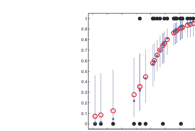

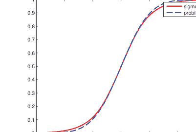

图8.7 (a) SAT数据的后验预测密度。红色圆圈表示后验均值，蓝色十字表示后验中位数，蓝色线表示预测分布的第5和第95百分位数。图由logregSATdemoBayes生成。(b) 逻辑（sigmoid）函数sigmoid(x)以实线红色表示，重新缩放的probit函数Φ(λx)以虚线蓝色叠加。这里λ=√(π/8)，这是为了使两条曲线在x=0处的导数相等选择的。基于(Bishop2006b)的图4.9。由probitPlot生成的图。由probitRegDemo生成的图。

显示这些样本的平均值。通过对多个预测进行平均，我们可以看到决策边界的不确定性在远离训练数据时“展开”。因此，尽管决策边界是线性的，但后验预测密度并不是线性的。还要注意后验均值决策边界与两个类别大致相距相等；这是第14.5.2.2节讨论的大边界原则的贝叶斯类比。图8.7(a)展示了一个一维示例。红点表示在训练数据处评估的后验预测均值。垂直的蓝线表示后验预测的95%可信区间；小蓝星是中位数。我们可以看到，通过贝叶斯方法，我们能够对学生根据他们的SAT成绩通过考试的概率建模，并不仅仅得到一个点估计。

### 8.4.4.2 Probit逼近（调节输出） *

如果我们对后验分布进行高斯逼近 $p(\mathbf{w}|\mathcal{D}) \approx \mathcal{N}(\mathbf{w}|\mathbf{m}_N, \mathbf{V}_N)$，我们还可以计算出后验预测分布的确定性逼近，至少在二元情况下。我们按照以下步骤进行：

```
p(y = 1|\mathbf{x}, \mathcal{D}) \approx \int \mathrm{sigm}(\mathbf{w}^T\mathbf{x}) p(\mathbf{w}|\mathcal{D}) d\mathbf{w} = \int \mathrm{sigm}(a) \mathcal{N}(a|\mu_a, \sigma_a^2) da \quad (8.62)
a \triangleq \mathbf{w}^T \mathbf{x} \quad (8.63)
\mu_a \triangleq \mathbb{E}[a] = \mathbf{m}_N^T \mathbf{x} \quad (8.64)
\sigma_a^2 \triangleq \mathrm{var}[a] = \int p(a|\mathcal{D})[a^2 - \mathbb{E}[a^2]] da \quad (8.65)
= \int p(\mathbf{w}|\mathcal{D})[(\mathbf{w}^T\mathbf{x})^2 - (\mathbf{m}_N^T\mathbf{x})^2] d\mathbf{w} = \mathbf{x}^T \mathbf{V}_N \mathbf{x} \quad (8.66)
```

因此，我们可以看到我们需要评估对于高斯分布的sigmoid函数的期望。这可以通过利用sigmoid函数与probit函数的相似性来近似计算，probit函数由标准正态分布的累积分布函数给出：

```
$$\Phi(a) \triangleq \int_{-\infty}^{a} \mathcal{N}(x|0,1) dx \tag{8.67}$$
```

图8.7(b)绘制了sigmoid函数和probit函数。我们已经重新调整了坐标轴，使得sigmoid(a)在原点处具有与Φ(λa)相同的斜率，其中λ²=π/8。使用probit的优势是可以对其进行高斯卷积分析：

```
$$\int \Phi(\lambda a) \mathcal{N}(a|\mu, \sigma^2) da = \Phi\left( \frac{1}{\sqrt{\lambda^{-2} + \sigma^2}} \right) \tag{8.68}$$
```

我们现在将近似值sigmoid(a)≈Φ(λa)代入方程两边得到

```
$$\int \text{sigm}(a) \mathcal{N}(a|\mu, \sigma^2) da \approx \text{sigm}(\kappa(\sigma^2) \mu) \tag{8.69}$$
```

```
$$\kappa(\sigma^2) \triangleq (1 + \pi \sigma^2 / 8)^{-1/2} \tag{8.70}$$
```

将这个应用于逻辑回归模型，我们得到以下表达式（最初在(Spiegelhalter and Lauritzen 1990)中提出）：

```
$$p(y = 1|\mathbf{x}, \mathcal{D}) \approx \text{sigm}(\kappa(\sigma_a^2) \mu_a) \tag{8.71}$$
```

图8.6(d)表明，这给出了与蒙特卡洛近似非常相似的结果。

有时使用方程8.71被称为调节输出，因为它比插值估计更加平缓。要理解这一点，注意0≤κ(σ²)≤1，因此

```
$$\text{sigm}(\kappa(\sigma^2) \mu) \leq \text{sigm}(\mu) = p(y = 1|\mathbf{x}, \hat{\mathbf{w}}) \tag{8.72}$$
```

当μ=0时，不等式是严格的。如果μ>0，我们有p(y=1|x, ŵ)>0.5，但是调整后的预测总是更接近0.5，因此不太自信。然而，决策边界发生在p(y=1|x, D)=sigmoid(κ(σ²) μ)=0.5时，这意味着μ=ŵ^T x=0。因此，调整近似的决策边界与插值近似的决策边界相同。因此，两种方法的误分类数量将相同，但对数似然度将不同。（请注意，在多类别情况下，考虑后验协方差会得到与插值方法不同的答案：参见(Rasmussen和Williams 2006)的练习3.10.3。）

### 8.4.5 残差分析（异常值检测） *

有时候检测数据中的“异常值”是很有用的。这被称为残差分析或案例分析。在回归设置中，可以通过计算r_i = y_i - ŷ_i来执行此操作，其中ŷ_i = ŵ^T x_i。如果建模假设正确，这些值应该遵循N(0, σ²)分布。这可以通过创建一个qq-plot来评估，其中我们将高斯分布的N理论分位数绘制为横轴，将r_i的N经验分位数绘制为纵轴。偏离直线的点可能是异常值。

基于残差的经典方法在二进制数据上效果不好，因为它们依赖于检验统计量的渐近正态性。然而，采用贝叶斯方法，我们可以将异常值定义为概率\( p(y_i | \hat{y}_i) \)较小的点，其中通常使用\( \hat{y}_i = \text{sigm}(\hat{\mathbf{w}}^T \mathbf{x}_i) \)。请注意，\( \hat{\mathbf{w}} \)是从所有数据中估计得到的。一个更好的方法是在预测\( y_i \)时，从估计的\( \mathbf{w} \)中排除\( (\mathbf{x}_i, y_i) \)。也就是说，我们将异常值定义为在交叉验证后验预测分布下概率较低的点，定义如下：

```
\( p(y_i | \mathbf{x}_i, \mathbf{x}_{-i}, \mathbf{y}_{-i}) = \int p(y_i | \mathbf{x}_i, \mathbf{w}) \prod_{i'=i} p(y_{i'} | \mathbf{x}_{i'}, \mathbf{w}) p(\mathbf{w}) d\mathbf{w} \) (8.73)
```

这可以通过采样方法（Gelfand 1996）高效地近似计算。有关逻辑回归模型中残差分析的进一步讨论，请参见（Johnson和Albert 1999，第3.4节）。

## 8.5在线学习和随机优化

传统上，机器学习是离线进行的，这意味着我们有一批数据，并且优化以下形式的方程

```
\( f(\boldsymbol{\theta}) = \frac{1}{N} \sum_{i=1}^{N} f(\boldsymbol{\theta}, \mathbf{z}_i) \) (8.74)
```

其中\( \mathbf{z}_i = (\mathbf{x}_i, y_i) \)在有监督的情况下，或者只是\( \mathbf{x}_i \)在无监督的情况下，而\( f(\boldsymbol{\theta}, \mathbf{z}_i) \)是某种损失函数。例如，我们可以使用

```
\( f(\boldsymbol{\theta}, \mathbf{z}_i) = - \log p(y_i | \mathbf{x}_i, \boldsymbol{\theta}) \) (8.75)
```

在这种情况下，我们试图最大化可能性。或者，我们可以使用

```
\( f(\boldsymbol{\theta}, \mathbf{z}_i) = L(y_i, h(\mathbf{x}_i, \boldsymbol{\theta})) \) (8.76)
```

其中\( h(\mathbf{x}_i, \boldsymbol{\theta}) \)是一个预测函数，\( L(y, \hat{y}) \)是其他损失函数，如平方误差或Huber损失。在频率派决策理论中，平均损失被称为风险（见第6.3节），因此这种整体方法被称为经验风险最小化或ERM（有关详细信息，请参见第6.5节）。

然而，如果我们有流式数据，我们需要进行在线学习，这样我们可以在每个新数据点到达时更新我们的估计，而不是等到“结束”（可能永远不会发生）。即使我们有一批数据，如果它太大而无法放入主内存中，我们可能希望将其视为流式处理。下面我们讨论这种情况下的学习方法。¹

¹当应用于数据集太大而无法保存在内存中时，可以使用一种简单的实现技巧来加速批处理学习算法。首先注意到，朴素的实现方法会从数据文件的开头到结尾进行一次遍历，同时累积足够的统计信息和梯度；然后进行更新，然后重复这个过程。不幸的是，在每次遍历结束时，文件开头的数据将会从缓存中清除（因为我们假设无法将所有数据都保存在内存中）。与其返回文件开头并重新加载它，我们可以直接从文件末尾开始向前工作，因为文件末尾已经在内存中。然后我们在数据上重复这种前后模式。这个简单的技巧被称为摇滚。

### 8.5.1 在线学习和遗憾最小化

假设在每一步中，“自然”呈现一个样本z_k，而“学习者”必须用一个参数估计θ_k来回应。在理论机器学习社区中，在线学习中使用的目标是后悔，即相对于使用单个固定参数值在回顾中可能获得的最佳结果的平均损失：

> $$ \text{后悔}_k = \frac{1}{k} \sum_{t=1}^k f(\theta_t, z_t) - \min_{\theta_* \in \Theta} \frac{1}{k} \sum_{t=1}^k f(\theta_*, z_t) $$ (8.77)

例如，想象我们正在投资股票市场。让θ_j是我们投资在股票j的金额，让z_j是这只股票的回报。我们的损失函数是f(θ, z)=-θ^T z。后悔是我们在每一步交易中做得更好（或更差）的程度，而不是采用“买入并持有”策略，使用一个神谕来选择要购买的股票。

一种简单的在线学习算法是在线梯度下降(Zinkevich 2003)，其步骤如下：在每一步k，使用以下方式更新参数θ_{k+1}=proj_Θ(θ_k-η_k g_k) (8.78)其中

> $$ \text{proj}_V(v) = \text{argmin}_{w \in V} \|w - v\|_2 $$ 是向量v在空间V上的投影，$$ g_k = \nabla f(\theta_k, z_k) $$是梯度，$$ \eta_k $$是步长。（如果参数必须限制在$$ \mathbb{R}^D $$的某个子集中，则需要进行投影步骤。详见第13.4.3节。）下面我们将看到这种遗憾最小化方法与更传统的目标（如MLE）之间的关系。

还有其他各种各样的遗憾最小化方法超出了本书的范围（详见Cesa-Bianchi和Lugosi（2006）的细节）。

### 8.5.2 随机优化和风险最小化

现在假设我们不是在最小化过去的后悔，而是要在未来最小化预期损失，这在（频率主义）统计学习理论中更为常见。也就是说，我们要最小化

> $$ f(\theta) = \mathbb{E}[f(\theta, z)] $$ (8.79) 其中期望是在未来的数据上进行的。优化一些目标函数，其中目标中的一些变量是随机的，被称为随机优化。

假设我们从分布中接收到一个无限流的样本。优化随机目标，如方程8.79，可以在每一步中执行方程8.78中的更新。这被称为随机梯度下降或SGD（Nemirovski和Yudin 1978）。由于我们通常希望得到一个单一的参数估计，我们可以使用一个滑动平均值：

> $$ \bar{\theta}_k = \frac{1}{k} \sum_{t=1}^k \theta_t $$ (8.80)

2. 请注意，在随机优化中，目标是随机的，因此算法也将是随机的。然而，也可以将随机优化算法应用于确定性目标。例子包括模拟退火（第24.6.1节）和应用于经验风险最小化问题的随机梯度下降。在线学习和随机优化之间存在一些有趣的理论联系（Cesa-Bianchi和Lugosi 2006），但这超出了本书的范围。

这被称为Polyak-Ruppert平均，可以递归地实现如下：

```
$$ \overline{\theta}_k = \overline{\theta}_{k-1} - \frac{1}{k}(\overline{\theta}_{k-1} - \theta_k) $$ (8.81)
```

详细信息请参见(Spall 2003; Kushner and Yin 2003)。

### 8.5.2.1 设置步长

我们现在讨论一些关于学习率的充分条件，以保证SGD的收敛性。这些条件被称为Robbins-Monro条件：

```
$$ \sum_{k=1}^{\infty} \eta_k = \infty, \sum_{k=1}^{\infty} \eta_k^2 < \infty. $$ (8.82)
```

随着时间的推移，$\eta_k$的值集合被称为学习率调度。使用各种公式，例如$\eta_k = 1/k$，或者以下公式(Bottou 1998; Bach and Moulines 2011)：

```
$$ \eta_k = (\tau_0 + k)^{-\kappa} $$ (8.83)
```

其中$\tau_0 \ge 0$减慢了算法的早期迭代速度，而$\kappa \in (0.5, 1]$控制了旧值被遗忘的速率。

调整这些调节参数的需求是随机优化的主要缺点之一。一个简单的启发式方法(Bottou 2007)如下：存储一部分初始数据，并在该子集上尝试一系列$\eta$值；然后选择导致目标函数下降最快的值，并将其应用于其余的数据。请注意，这可能不会导致收敛，但当在保留集上的性能改善停滞时，可以终止算法（这称为提前停止）。

### 8.5.2.2 每个参数的步长

SGD的一个缺点是它对所有参数使用相同的步长。我们现在简要介绍一种称为adagrad（自适应梯度）的方法(Duchi et al. 2010)，它在精神上类似于对角线Hessian近似。（也可参见(Schaul et al. 2012)类似的方法。）特别地，如果$\theta_i(k)$是时间$k$的参数$i$，$g_i(k)$是其梯度，则我们按以下方式进行更新：

```
$$ \theta_i(k+1) = \theta_i(k) - \eta \frac{g_i(k)}{\tau_0 + \sqrt{s_i(k)}} $$ (8.84)
```

其中对角步长向量是梯度向量的平方，对所有时间步求和。这可以递归地更新如下：

```
$$ s_i(k) = s_i(k-1) + g_i(k)^2 $$ (8.85)
```

结果是一个适应损失函数曲率的每个参数步长。这个方法最初是为了最小化遗憾而导出的，但它可以更广泛地应用。

### 8.5.2.3 SGD与批量学习的比较

如果我们没有无限的数据流，我们可以通过从训练集中随机抽样数据点来“模拟”一个。本质上，我们通过将其视为对经验分布的期望来优化方程8.74。

```
算法8.3：随机梯度下降
1 初始化$\theta$, $\eta$;
2 重复
3   随机排列数据;
4   对于$i = 1 : N$执行
5       $g = \nabla f(\theta, z_i)$;
6       $\theta \leftarrow \text{proj}_{\Theta}(\theta - \eta g)$;
7       更新$\eta$;
8 直到收敛;
```

理论上，我们应该进行有放回的抽样，尽管在实践中，随机排列数据并进行无放回的抽样通常更好，并且重复多次。对整个数据集进行一次遍历称为一个**epoch**。请参考算法8的伪代码。

在这种离线情况下，计算一个**mini-batch** of $B$数据样本的梯度通常更好。如果$B=1$，这是标准的SGD，如果$B=N$，这是标准的最速下降。通常使用$B \sim 100$。

尽管是一个简单的一阶方法，SGD在某些问题上表现出色，尤其是在具有大数据集的问题上(Bottou 2007)。直观的原因是，通过仅查看几个示例，可以得到对梯度的相当好的估计。仔细评估使用大数据集的精确梯度通常是浪费时间的，因为算法在下一步仍然需要重新计算梯度。在计算机时间上，通常更好的做法是获得一个有噪声的估计，并快速移动参数空间。作为一个极端的例子，假设我们通过复制每个示例来使训练集加倍。批处理方法将需要两倍的时间，但在线方法不受影响，因为梯度的方向没有改变(数据大小加倍改变了梯度的大小，但这是无关紧要的，因为梯度已经被步长缩放了)。

除了提高速度外，SGD通常不容易陷入浅层局部最小值，因为它添加了一定量的“噪声”。因此，在机器学习社区中，它非常受欢迎，用于拟合具有非凸目标的模型，例如神经网络(第16.5节)和深度置信网络(第28.1节)。

### 8.5.3 LMS算法

作为SGD的一个例子，让我们考虑如何以在线方式计算线性回归的MLE。我们从方程7.14中推导出批量梯度。第$k$次迭代的在线梯度为

$g_k = x_i(\theta_k^T x_i - y_i)$ (8.86)其中 i = i(k) 是在第 k 次迭代中使用的训练样本。如果数据集是流式的，我们使用 i(k)=k；为了简化符号，我们从现在开始假设如此。方程 8.86 很容易解释：它是特征向量 x_k 与我们预测值 θ_k^T x_k 和真实响应值 y_k 之间的差异加权；因此梯度的作用类似于一个误差信号。计算梯度后，我们按照以下方式迈出一步：

θ_{k+1} = θ_k - η_k (θ_k^T x_k - y_k) x_k

这个算法被称为最小均方或 LMS 算法，也被称为 delta 规则或 Widrow-Hoff 规则。

图 8.8 显示了将该算法应用于图 7.2 中显示的数据的结果。我们从 θ=(-0.5,2) 开始，并在大约 26 次迭代中收敛（即 ||θ_k - θ_{k-1}||_2^2 下降到一个阈值为 10^{-2} 以下）。

请注意，LMS 可能需要多次通过数据来找到最优解。相比之下，基于卡尔曼滤波器的递归最小二乘算法使用二阶信息，在一次通过中找到最优解（参见第 18.2.3 节）。另请参阅练习 7.7。

## 8.5.4 感知器算法

现在让我们考虑如何以在线方式拟合二元逻辑回归模型。批量梯度在方程 8.5 中给出。在线情况下，权重更新具有简单的形式。

θ_k = θ_{k-1} - η_k g_i = θ_{k-1} - η_k (μ_i - y_i) x_i

我们可以看到，这与 LMS 算法具有完全相同的形式。事实上，这个性质对于所有广义线性模型都成立（第 9.3 节）。

现在我们考虑对这个算法的近似。具体来说，让

$\hat{y}_i = \arg\max_{y \in \{0,1\}} p(y|\mathbf{x}_i, \boldsymbol{\theta})$

表示最可能的类别标签。我们用 $\hat{y}_i$ 替换 $\mu_i = p( y= 1|\mathbf{x}_i, \boldsymbol{\theta}) = \text{sigm}(\boldsymbol{\theta}^T \mathbf{x}_i)$ 在梯度表达式中。因此，近似梯度变为

$\mathbf{g}_i \approx (\hat{y}_i - y_i)\mathbf{x}_i$

如果我们假设 $y \in \{-1, +1\}$ 而不是 $y \in \{0,1\}$，这将使代数运算更简单。 在这种情况下，我们的预测变为

$\hat{y}_i = \text{sign}(\boldsymbol{\theta}^T \mathbf{x}_i)$

然后，如果 $\hat{y}_i y_i = -1$，我们犯了一个错误，但如果 $\hat{y}_i y_i = +1$，我们猜对了标签。
在每一步中，我们通过添加梯度来更新权重向量。关键观察是，如果我们预测正确，那么 $\hat{y}_i = y_i$，所以（近似）梯度为零，我们不会改变权重向量。但是如果 $\mathbf{x}_i$ 被错误分类，我们按以下方式更新权重：如果 $\hat{y}_i = 1$ 但 $y_i = -1$，则负梯度为 $-2\mathbf{x}_i$；如果 $\hat{y}_i = -1$ 但 $y_i = 1$，则负梯度为 $2\mathbf{x}_i$。我们可以将 2 的因子吸收到学习率 $\eta$ 中，并在错误分类的情况下将更新写为

$\boldsymbol{\theta}_k = \boldsymbol{\theta}_{k-1} + \eta_k y_i \mathbf{x}_i$

由于只有权重的符号而不是大小是重要的，我们将设置 $\eta_k = 1$。请参见算法 11 的伪代码。
可以证明，这种方法被称为感知器算法（Rosenblatt 1958），将会收敛，只要数据是线性可分的，即存在参数 $\boldsymbol{\theta}$ 使得在训练集上使用 $\text{sign}(\boldsymbol{\theta}^T \mathbf{x})$ 进行预测可以达到 0 误差。然而，如果数据不是线性可分的，算法将不会收敛，即使它收敛了，也可能需要很长时间。有更好的方法来训练逻辑回归模型（例如使用正确的 SGD，不使用梯度近似，或者 IRLS，讨论在第 8.3.4 节）。然而，感知器算法在历史上非常重要：它是最早推导出来的机器学习算法之一（由 Frank Rosenblatt 于 1957 年推导出来），甚至在模拟硬件中实现过。此外，该算法可以用于拟合计算边际概率 $ p(y_i|\mathbf{x}, \boldsymbol{\theta}) $ 比计算 MAP 输出 $ \arg \max_y p(\mathbf{y}|\mathbf{x}, \boldsymbol{\theta}) $ 更昂贵的模型；这在某些结构化输出分类问题中出现。详细信息请参见第 19.7 节。

## 8.5.5 一个贝叶斯观点

在线学习的另一种方法是采用贝叶斯观点。这在概念上非常简单：我们只需递归地应用贝叶斯规则：

$p(\boldsymbol{\theta}|\mathcal{D}_{1:k}) \propto p(\mathcal{D}_k|\boldsymbol{\theta}) p(\boldsymbol{\theta}|\mathcal{D}_{1:k-1})$

这有一个明显的优点，即返回后验概率而不仅仅是一个点估计。它还允许在线调整超参数，这很重要，因为交叉验证不能在在线环境中使用。最后，它有一个（不太明显的）优点，即它可以比 SGD 更快。要了解原因，请注意，通过对每个参数的后验方差进行建模，我们有效地为每个参数关联了不同的学习率（de Freitas et al. 2000），这是一种模拟空间曲率的简单方法。然后，可以使用概率论的常规规则来调整这些方差。相比之下，使二阶优化方法在线上工作更加棘手（参见例如，（Schraudolph et al.2007; Sunehag et al. 2009; Bordes et al. 2009, 2010））。

作为一个简单的例子，在第 18.2.3 节中，我们展示了如何使用卡尔曼滤波器在线上拟合线性回归模型。与 LMS 算法不同，这个算法在对数据进行单次遍历时就会收敛到最优（离线）答案。在（Ting et al. 2010）中描述了一种可以以在线方式学习鲁棒非线性回归模型的扩展。对于 GLM 情况，我们可以使用一个假设的密度滤波器（第 18.5.3 节），其中我们用一个带有对角协方差的高斯分布来近似后验；方差项作为每个参数的步长。详细信息请参见第 18.5.3.2 节。
另一种方法是使用粒子滤波（第 23.5 节）；这在（Andrieu 等人，2000 年）中用于顺序学习核化线性/逻辑回归模型。

```
算法8.4：感知器算法
1 输入：线性可分数据集 $\mathbf{x}_i \in \mathbb{R}^D$, $y_i \in \{-1, +1\}$ for $i=1:N$; 初始化 $\boldsymbol{\theta}_0$;
2 $k \leftarrow 0$;
3
4 重复
5 $\quad k \leftarrow k + 1$;
6 $\quad i \leftarrow k \mod N$;
7 $\quad$ 如果 $\hat{y}_i = y_i$ 那么
8 $\quad\quad \boldsymbol{\theta}_{k+1} \leftarrow \boldsymbol{\theta}_k + y_i\mathbf{x}_i$
9 $\quad$ 否则
10 $\quad\quad$ 无操作
11 直到 收敛;
```

## 8.6 生成式与判别式分类器

在 4.2.2 节中，我们展示了由高斯判别分析（GDA）引起的类标后验具有与逻辑回归完全相同的形式，即 $p(y=1|\mathbf{x})=\text{sigm}(\mathbf{w}^T\mathbf{x})$。因此，在这两种情况下，决策边界都是 $\mathbf{x}$ 的线性函数。然而，请注意，许多生成模型都可以产生逻辑回归的后验概率，例如，如果每个类条件密度都是泊松分布，$p(x|y=c)=\text{Poi}(x|\lambda_c)$。因此，GDA 所做的假设比逻辑回归所做的假设要强得多。

这些模型之间的另一个区别是它们的训练方式。当拟合一个判别模型时，我们通常最大化条件对数似然 $\sum_{i=1}^N \log p(y_i|\mathbf{x}_i, \boldsymbol{\theta})$，而当拟合一个生成模型时，我们通常最大化联合对数似然 $\sum_{i=1}^N \log p(y_i, \mathbf{x}_i|\boldsymbol{\theta})$。
很明显，这些通常会得到不同的结果（参见练习 4.20）。当 GDA 所做的高斯假设是正确的时候，模型将需要比逻辑回归更少的训练数据来达到一定的性能水平，但如果高斯假设不正确，逻辑回归会表现更好（Ng 和 Jordan 2002）。这是因为判别模型不需要对特征的分布进行建模。这在图 8.10 中有所体现。我们可以看到类条件密度非常复杂；特别是，p(x|y=1) 是一个多峰分布，可能很难估计。然而，类后验概率，p(y=c|x)，是一个简单的 S 形函数，以 0.55 为阈值。这表明，一般来说，判别方法会更准确，因为它们的“任务”在某种意义上更容易。然而，在选择方法时，准确性并不是唯一重要的因素。下面我们讨论一些方法的其他优缺点。

### 8.6.1 每种方法的优缺点

-   容易拟合吗？正如我们所见，通常很容易拟合生成式分类器。例如，在 3.5.1.1 节和 4.2.4 节中，我们展示了通过简单计数和平均可以拟合朴素贝叶斯模型和 LDA 模型。相比之下，逻辑回归需要解决一个凸优化问题（详见 8.3.4 节），速度要慢得多。
-   分别拟合各个类别？在生成式分类器中，我们独立地估计每个类别的参数条件密度，因此当我们添加更多类别时，不需要重新训练模型。相反，在判别模型中，所有参数相互作用，因此如果我们添加一个新类别，整个模型必须重新训练。（如果我们训练一个生成式模型来最大化判别目标 Salojarvi 等人（2005）也是如此。）
-   如何轻松处理缺失特征？有时候一些输入（x 的组成部分）没有被观察到。在生成式分类器中，有一种简单的方法来处理这个问题，我们在第 8.6.2 节中讨论。然而，在判别式分类器中，对于这个问题没有原则性的解决方案，因为模型假设 x 始终可用于条件概率计算（尽管参见（Marlin 2008）中的一些启发式方法）。
-   能够处理无标签的训练数据吗？半监督学习引起了很大的兴趣，它使用无标签的数据来帮助解决有监督的任务。使用生成模型来实现这一点相对容易（例如，参见（Lasserre et al. 2006; Liang et al. 2007）），但是使用判别模型来实现则更加困难。
-   输入和输出对称吗？我们可以“反向”运行生成模型，并通过计算 p(x|y) 来推断出可能的输入。这在判别模型中是不可能的。原因是生成模型在 x 和 y 上定义了一个联合分布，因此对输入和输出进行对称处理。
-   能处理特征预处理吗？判别方法的一个重要优势是可以以任意方式预处理输入，例如，我们可以用 φ(x) 替换 x，这可能是一些基函数扩展，如图 8.9 所示。在这种预处理数据上定义生成模型通常很困难，因为新特征以复杂的方式相关联。
-   概率校准良好吗？一些生成模型，如朴素贝叶斯，做出了强独立假设，这通常是无效的。这可能导致非常极端的后验类概率（非常接近 0 或 1）。判别模型，如逻辑回归，在概率估计方面通常更加校准。

我们可以看到对于这两种模型都有支持和反对的观点。因此，在你的“工具箱”中同时拥有这两种模型是很有用的。请参阅表 8.1 以获取分类和回归技术的概述。

图 8.9 (a) 在原始特征空间中的 5 类多项式逻辑回归。(b) 在基函数扩展后，使用带宽为 1 的 RBF 核，并使用所有数据点作为中心。由 logregMultinomKernelDemo 生成的图。

图 8.10 类条件密度 $p(x|y=c)$ (左侧) 可能比类后验概率 $p(y=c|x)$ (右侧) 更复杂。 基于 (Bishop 2006 a) 的图 1.27。由 generativeVsDiscrim 生成的图。

## 8.6.2 处理缺失数据

有时候一些输入（x 的组成部分）没有被观测到；这可能是由于传感器故障，或者在调查中未完成某个条目等。这被称为缺失数据问题（Little 和 Rubin 1987）。以原则性的方式处理缺失数据是生成模型的最大优势之一。

为了形式化我们的假设，我们可以关联一个二进制响应变量 $r_i \in \{0,1\}$，它指定每个值 $x_i$ 是否被观测到。联合模型的形式为 $p(\mathbf{x}_i, r_i|\theta, \phi) = p(r_i|\mathbf{x}_i, \phi)p(\mathbf{x}_i|\theta)$，其中 $\phi$ 是控制项目是否被观测到的参数。

| 模型 | 分类/回归 | 生成/判别 | 参数/非参数 | 章节 |
|------|------------|------------|----------------|------|
| 判别分析 | 分类 | 生成 | 参数 | 第4.2.2节，第4.2.4节 |
| 朴素贝叶斯分类器 | 分类 | 生成 | 参数 | 第3.5节，第3.5.1.2节 |
| 树增强朴素贝叶斯分类器 | 分类 | 生成 | 参数 | 第10.2.1节 |
| 线性回归 | 回归 | 判别 | 参数 | 第14.5节，第7.3节，第7.6节 |
| 逻辑回归 | 分类 | 判别 | 参数 | 第14.6节，第8.3.4节，第8.4.3节，第21.8.1.1节 |
| 稀疏线性/逻辑回归 | 两者 | 判别 | 参数 | 第13章 |
| 专家混合 | 两者 | 判别 | 参数 | 第11.2.4节 |
| 多层感知机(MLP)/神经网络 | 两者 | 判别 | 参数 | 第16章 |
| 条件随机场(CRF) | 分类 | 判别 | 参数 | 第19.6节 |
| K最近邻分类器 | 分类 | 生成 | 非参数 | 第14.2节，第14.7.3节 |
| (无限)混合判别分析 | 分类 | 生成 | 非参数 | 第14.7.3节 |
| 分类和回归树 (CART) | 两者 | 判别 | 非参数 | 第16.2节 |
| 增强模型 | 两者 | 判别 | 非参数 | 第16.4节 |
| 稀疏核化线性/逻辑回归 (SKLR) | 两者 | 判别 | 非参数 | 第14.3.2节 |
| 相关向量机 (RVM) | 两者 | 判别 | 非参数 | 第14.3.2节 |
| 支持向量机 (SVM) | 两者 | 判别 | 非参数 | 第14.5节 |
| 高斯过程 (GP) | 两者 | 判别 | 非参数 | 第15章 |
| 平滑样条 | 回归 | 判别 | 非参数 | 第15.4.6节 |

表 8.1 本书讨论的各种分类和回归模型列表。列如下：模型名称；模型适用于分类、回归还是两者都适用；模型是生成式还是判别式；模型是参数化还是非参数化；本书讨论该模型的章节列表。另请参阅 http://pmtk3.googlecode.com/svn/trunk/docs/tutorial/html/tutSupervised.html 有关这些模型的 PMTK 等效模型。任何生成概率模型（例如，HMM、Boltzmann 机、贝叶斯网络等）都可以通过将其用作类条件密度来转化为分类器。

是否观察到。如果我们假设 $p(r_i | \mathbf{x}_i, \phi) = p(r_i | \phi)$，我们说数据是完全随机缺失或 MCAR。如果我们假设 $p(r_i | \mathbf{x}_i, \phi) = p(r_i | \mathbf{x}^o_i, \phi)$，其中 $\mathbf{x}^o_i$ 是 $\mathbf{x}_i$ 的观察部分，我们说数据是随机缺失或 MAR。如果这些假设都不成立，我们说数据不是随机缺失或 NMAR。在这种情况下，我们必须对缺失数据机制进行建模，因为缺失模式对于缺失数据的值和相应的参数具有信息。例如，在大多数协同过滤问题中都是如此。有关进一步讨论，请参见 (Marlin 2008)。从现在开始，我们将假设数据是 MAR。

在处理缺失数据时，有助于区分仅在测试时存在缺失的情况（因此训练数据是完整的数据），与在训练时也存在缺失的更困难的情况。我们将在下面讨论这两种情况。请注意，根据定义，类别标签在测试时始终缺失；如果类别标签在训练时有时也缺失，则问题被称为半监督学习。

### 8.6.2.1 测试时的缺失数据

在生成分类器中，我们可以通过边缘化处理 MAR 特征。例如，如果我们缺失了 $x_1$ 的值，我们可以计算

$$ p(y = c|\mathbf{x}_{2:D}, \theta) \propto p(y = c|\theta) p(\mathbf{x}_{2:D}|y = c, \theta) $$
$$ = p(y = c|\theta) \sum_{x_1} p(x_1, \mathbf{x}_{2:D}|y = c, \theta) $$

如果我们做出朴素贝叶斯的假设，边缘化可以如下进行：

$$ \sum_{x_1} p(x_1, \mathbf{x}_{2:D}|y = c, \theta) = \left[ \sum_{x_1} p(x_1|\theta_{1c}) \right] \prod_{j=2}^D p(x_j|\theta_{jc}) = \prod_{j=2}^D p(x_j|\theta_{jc}) $$

在这里我们利用了的事实 $\sum_{x_1} p(x_1|\theta_{1c}) = 1$。因此，在朴素贝叶斯分类器中，我们可以在测试时简单地忽略缺失的特征。同样，在判别分析中，无论使用何种正则化方法来估计参数，我们总是可以解析地边缘化掉缺失的变量（参见第 4.3 节）：

$$ p(\mathbf{x}_{2:D}|y = c, \theta) = \mathcal{N}(\mathbf{x}_{2:D}|\mu_{c,2:D}, \Sigma_{c,2:D,2:D}) $$

### 8.6.2.2 训练时的缺失数据

在训练时缺失数据更难处理。 特别是，由于第 11.3.2 节中讨论的原因，计算 MLE 或 MAP 估计不再是一个简单的优化问题。然而，很快我们将学习一系列更复杂的算法（如第 11.4 节中的 EM 算法）来在这些情况下找到近似的 ML 或 MAP 估计。

## 8.6.3 Fisher 线性判别分析（FLDA） *

判别分析是一种生成式的分类方法，需要对特征进行 MVN 拟合。 正如我们所讨论的，这在高维度下可能会有问题。另一种方法是降低特征的维度 $\mathbf{x} \in \mathbb{R}^D$，然后对结果进行 MVN 拟合 $\mathbf{z} \in \mathbb{R}^L$。 最简单的方法是使用线性投影矩阵 $\mathbf{z} = \mathbf{W}\mathbf{x}$，其中 $\mathbf{W}$ 是一个 $L \times D$ 矩阵。 找到 $\mathbf{W}$ 的一种方法是使用 PCA（第 12.2 节）；结果与 RDA（第 4.2.6 节）非常相似，因为 SVD 和 PCA 本质上是等价的。 然而，PCA 是一种无监督技术，不考虑类别标签。 因此，得到的低维特征不一定是最优的用于分类的，如图 8.11 所示。另一种方法是找到矩阵 $\mathbf{W}$，使得低维数据能够使用高斯类条件密度模型进行尽可能好的分类。 高斯性的假设是合理的，因为我们正在计算（可能是非高斯的）特征的线性组合。 这种方法被称为 Fisher 线性判别分析（FLDA）。

FLDA 是一种有趣的判别和生成技术的混合体。 这种技术的缺点是，它受限于使用 $L \leq C-1$ dimensions，无论 $D$ 如何，原因我们将在下面解释。 在两类情况下，这意味着我们正在寻找一个单一的向量 $\mathbf{w}$，将数据投影到其中。 下面我们推导出两类情况下的最优 $\mathbf{w}$。

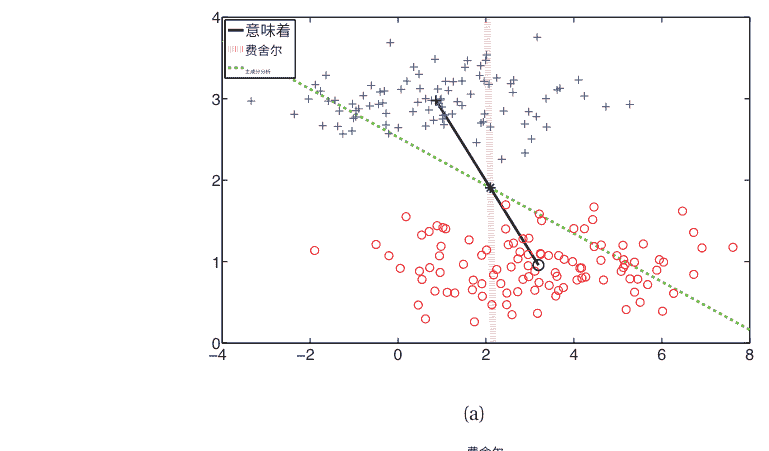

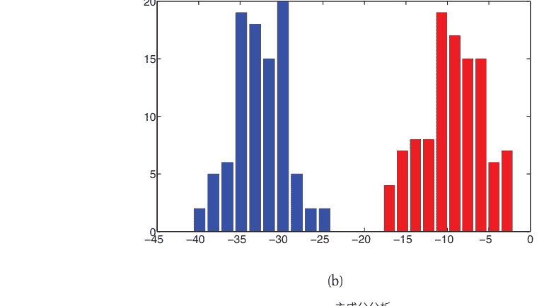

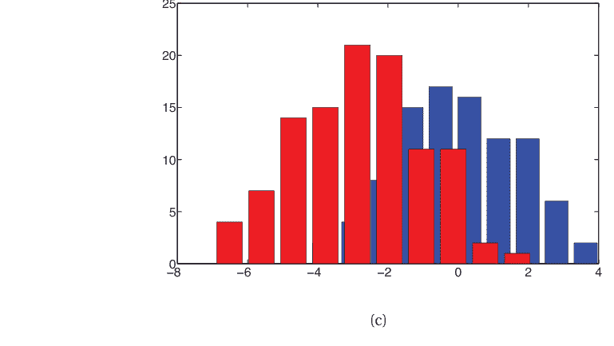

图8.11费舍尔线性判别的例子。(a)二维的两类数据。虚线绿线=第一主基向量。点线红线=费舍尔线性判别向量。实线黑线连接类条件均值。(b)点在费舍尔向量上的投影显示良好的类别分离。(c)点在主成分分析向量上的投影显示较差的类别分离。图由费舍尔LDA演示生成。

## 8.6.3.1 最优一维投影的推导

现在我们推导出这个最优方向 w，对于两类情况，按照(Bishop 2006b, 第4.1.4节)的介绍。将类条件均值定义为

$$\mu_1 = \frac{1}{N_1} \sum_{i:y_i=1} \mathbf{x}_i, \quad \mu_2 = \frac{1}{N_2} \sum_{i:y_i=2} \mathbf{x}_i$$ (8.98)

让 $m_k = \mathbf{w}^T \mu_k$ 是每个均值在线 $\mathbf{w}$ 上的投影。同时，让 $z_i = \mathbf{w}^T \mathbf{x}_i$ 是数据在线上的投影。投影点的方差与

$$s_k^2 = \sum_{i:y_i=k} (z_i - m_k)^2$$ (8.99)

目标是找到 $\mathbf{w}$，使得我们最大化均值之间的距离 $m_2 - m_1$，同时确保投影的簇“紧密”: 

$$J(\mathbf{w}) = \frac{(m_2 - m_1)^2}{s_1^2 + s_2^2}$$ (8.100)

我们可以将上述右侧重新写成 $\mathbf{w}$ 的形式，如下所示

$$J(\mathbf{w}) = \frac{\mathbf{w}^T \mathbf{S}_B \mathbf{w}}{\mathbf{w}^T \mathbf{S}_W \mathbf{w}}$$ (8.101)

其中 $\mathbf{S}_B$ 是给定的类间散布矩阵，由 $(\mu_2 - \mu_1)(\mu_2 - \mu_1)^T$ 得到

(8.102)

而 $\mathbf{S}_W$ 是给定的类内散布矩阵，由

$$\mathbf{S}_W = \sum_{i:y_i=1} (\mathbf{x}_i - \mu_1)(\mathbf{x}_i - \mu_1)^T + \sum_{i:y_i=2} (\mathbf{x}_i - \mu_2)(\mathbf{x}_i - \mu_2)^T$$ (8.103)

为了理解这一点，请注意

$$\mathbf{w}^T \mathbf{S}_B \mathbf{w} = \mathbf{w}^T (\mu_2 - \mu_1)(\mu_2 - \mu_1)^T \mathbf{w} = (m_2 - m_1)(m_2 - m_1)$$ (8.104)

和

$$\mathbf{w}^T \mathbf{S}_W \mathbf{w} = \sum_{i:y_i=1} \mathbf{w}^T (\mathbf{x}_i - \mu_1)(\mathbf{x}_i - \mu_1)^T \mathbf{w} + \sum_{i:y_i=2} \mathbf{w}^T (\mathbf{x}_i - \mu_2)(\mathbf{x}_i - \mu_2)^T \mathbf{w}$$ (8.105)

$$= \sum_{i:y_i=1} (z_i - m_1)^2 + \sum_{i:y_i=2} (z_i - m_2)^2$$ (8.106)

方程式8.101是两个标量的比值；我们可以对 $\mathbf{w}$ 求导并令其等于零。可以证明（练习12.6）当 $\mathbf{S}_B \mathbf{w} = \lambda \mathbf{S}_W \mathbf{w}$ 时， $J(\mathbf{w})$ 取得最大值。

(8.107)

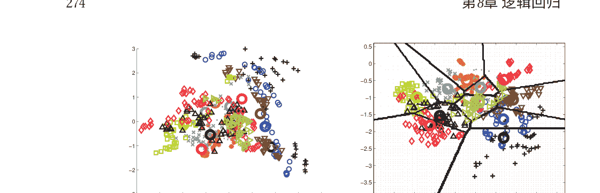

图8.12 (a) 是将元音数据投影到2维的PCA投影。 (b) 是将元音数据投影到2维的FLDA投影。 我们可以看到FLDA情况下有更好的类别分离。 基于(Hastie et al. 2009)的图4.11。 图由fisherDiscrimVowelDemo生成，由Hannes Bretschneider提供。

其中

$$ \lambda = \frac{\mathbf{w}^T \mathbf{S}_B \mathbf{w}}{\mathbf{w}^T \mathbf{S}_W \mathbf{w}} $$

方程式8.107被称为广义特征值问题。如果 $\mathbf{S}_W$ 是可逆的，我们可以将其转换为常规特征值问题：

$$ \mathbf{S}_W^{-1} \mathbf{S}_B \mathbf{w} = \lambda \mathbf{w} $$

然而，在两类情况下，存在一个更简单的解决方案。特别地，由于

$$ \mathbf{S}_B \mathbf{w} = (\mu_2 - \mu_1)(\mu_2 - \mu_1)^T \mathbf{w} = (\mu_2 - \mu_1)(m_2 - m_1) $$

然后，根据方程式8.109，我们有

$$ \lambda \mathbf{w} = \mathbf{S}_W^{-1} (\mu_2 - \mu_1)(m_2 - m_1) $$

$$ \mathbf{w} \propto \mathbf{S}_W^{-1} (\mu_2 - \mu_1) $$

由于我们只关心方向性，而不关心比例因子，所以我们可以将其设置为

$$ \mathbf{w} = \mathbf{S}_W^{-1} (\mu_2 - \mu_1) $$

这是两类情况下的最优解。如果 $\mathbf{S}_W \propto \mathbf{I}$，意味着汇总协方差矩阵是各向同性的，那么 $\mathbf{w}$ 与连接类均值的向量成比例。这是一个直观合理的投影方向，如图8.11所示。

## 8.6.3.2 扩展到更高维度和多类别

我们可以通过找到一个从 $D$ 到 $L$ 的投影矩阵 $\mathbf{W}$ 来将上述思想扩展到多类别和更高维子空间，以便最大化 $J$

$$ J(\mathbf{W}) = \frac{|\mathbf{W} \mathbf{\Sigma}_B \mathbf{W}^T|}{|\mathbf{W} \mathbf{\Sigma}_W \mathbf{W}^T|} $$

## 8.6 生成式与判别式分类器

其中

$$
\Sigma_{B} \triangleq \sum_{c} \frac{N_{c}}{N} (\boldsymbol{\mu}_{c} - \boldsymbol{\mu})(\boldsymbol{\mu}_{c} - \boldsymbol{\mu})^{T} \qquad (8.115)
$$

$$
\Sigma_{W} \triangleq \sum_{c} \frac{N_{c}}{N} \Sigma_{c} \qquad (8.116)
$$

$$
\Sigma_{c} \triangleq \frac{1}{N_{c}} \sum_{i: y_i=c} (\mathbf{x}_{i} - \boldsymbol{\mu}_{c})(\mathbf{x}_{i} - \boldsymbol{\mu}_{c})^{T} \qquad (8.117)
$$

解决方案可以显示为

$$
\mathbf{W} = \Sigma_{W}^{-\frac{1}{2}} \mathbf{U} \qquad (8.118)
$$

其中 $\mathbf{U}$ 是 $\Sigma_{W}^{-\frac{1}{2}} \Sigma_{B} \Sigma_{W}^{-\frac{1}{2}}$ 的主特征向量，假设 $\Sigma_{W}$ 是非奇异的。（如果它是奇异的，我们可以先对所有数据进行主成分分析。）图8.12给出了这种方法应用于一些 $D=10$ 维语音数据，代表 $C=11$ 个不同的元音音素。我们可以看到FLDA比PCA给出更好的类别分离效果。

请注意，FLDA受限于找到最多一个 $L \leq C-1$ 维线性子空间，无论 $D$ 有多大，因为类间协方差矩阵 $\Sigma_{B}$ 的秩为 $C-1$。（-1项是由于 $\boldsymbol{\mu}$ 项，它是 $\boldsymbol{\mu}_c$ 的线性函数。这是一个相当严格的限制，限制了FLDA的实用性。

## 8.6.3.3 FLDA的概率解释*

为了找到FLDA的有效概率解释，我们遵循（Kumar and Andreo1998; Zhou et al. 2009）的方法。他们提出了一个称为异方差LDA（HLDA）的模型，其工作原理如下。设 $\mathbf{W}$ 为一个 $D \times D$ 可逆矩阵，令 $\mathbf{z}_i = \mathbf{W}\mathbf{x}_i$ 为数据的转换版本。我们现在对转换后的数据拟合完全协方差高斯分布，每个类别一个，但约束条件是只有前 $L$ 个分量是类别特定的；剩余的 $H=D-L$ 个分量在类别之间共享，因此不具有判别性。也就是说，我们使用

$$
p(\mathbf{z}_{i} | \boldsymbol{\theta}, y_{i}=c) \;=\; \mathcal{N}(\mathbf{z}_{i}|\boldsymbol{\mu}_{c}, \Sigma_{c}) \qquad (8.119)
$$

$$
\boldsymbol{\mu}_{c} \triangleq (\mathbf{m}_{c}; \mathbf{m}_{0}) \qquad (8.120)
$$

$$
\Sigma_{c} \triangleq \begin{pmatrix} \mathbf{S}_{c} & \mathbf{0} \\ \mathbf{0} & \mathbf{S}_{0} \end{pmatrix} \qquad (8.121)
$$

其中 $\mathbf{m}_{0}$ 是共享的 $H$ 维均值，$\mathbf{S}_{0}$ 是共享的 $H \times H$ 协方差。原始（未转换）数据的概率密度函数为

$$
p(\mathbf{x}_{i}|y_{i}=c, \mathbf{W}, \boldsymbol{\theta}) \;=\; |\mathbf{W}|\, \mathcal{N}(\mathbf{W}\mathbf{x}_{i}|\boldsymbol{\mu}_{c}, \Sigma_{c}) \qquad (8.122)
$$

$$
=\; |\mathbf{W}|\, \mathcal{N}(\mathbf{W}_{L}\mathbf{x}_{i}|\mathbf{m}_{c}, \mathbf{S}_{c}) \, \mathcal{N}(\mathbf{W}_{H}\mathbf{x}_{i}|\mathbf{m}_{0}, \mathbf{S}_{0}) \qquad (8.123)
$$

其中 $\mathbf{W} = \begin{pmatrix} \mathbf{W}_{L} \\ \mathbf{W}_{H} \end{pmatrix}$。对于固定的 $\mathbf{W}$，很容易推导出 $\boldsymbol{\theta}$ 的最大似然估计。然后可以使用梯度方法优化 $\mathbf{W}$。

在特殊情况下，$\Sigma_c$是对角矩阵，存在一个闭式解来计算$\mathbf{W}$ (Gales1999)。而且，在特殊情况下，$\Sigma_c$都相等时，我们可以得到经典的LDA (Zhou et al. 2009)。根据这个结果，很明显如果类别的协方差在判别子空间内不相等（即假设$\Sigma_c$与$c$独立是一个不好的假设），HLDA将优于LDA。这在合成数据上很容易证明，并且在更具挑战性的任务上也是如此，比如语音识别 (Kumar and Andreo 1998)。

此外，我们可以通过允许每个类别使用自己的投影矩阵来扩展模型；这被称为多重LDA (Gales 2002)。

## 练习

### 练习8.1使用逻辑回归进行垃圾邮件分类

考虑在(Hastie et al. 2009)的第300页上讨论的电子邮件垃圾数据集。这个数据集包含4601封电子邮件消息，从中提取了57个特征。具体如下：

- 48个特征，在 [0, 100]范围内，表示给定消息中与给定单词匹配的单词的百分比。该列表包含诸如“business”、“free”、“george”等单词。（数据由George Forman收集，所以他的名字出现得多。）
- 6个特征，在 [0, 100]范围内，表示与列表中给定字符匹配的电子邮件中字符的百分比。这些字符是: (! $ #
- 特征55：连续大写字母序列的平均长度（最大值为40.3，平均值为4.9）
- 特征 56：最长连续大写字母序列的长度（最大为 45.0，平均为 52.6）
- 特征 57：连续大写字母序列的长度之和（最大为 25.6，平均为 282.2）

从spamData.mat中加载数据，其中包含一个训练集（大小为 3065）和一个测试集（大小为 1536）。

- a. 标准化列，使它们的平均值为0，方差为1。
- b. 使用$\log(x_{ij} + 0.1)$来转换特征。
- c. 使用$\mathbb{I}(x_{ij} > 0)$来将特征二值化。

对于每个数据版本，拟合逻辑回归模型。使用交叉验证选择正则化强度。of the $\ell_2$ regularizer. 报告训练集和测试集的平均错误率。你应该得到类似于这样的数字：

| method | train | test |
|--------|-------|------|
| stnd   | 0.082 | 0.079 |
| log    | 0.052 | 0.059 |
| 二进制 | 0.065 | 0.072 |

（具体的值将取决于您选择的正则化值。）提交您的代码和数值结果。（另见练习8.2。）

### 练习8.2使用朴素贝叶斯进行垃圾邮件分类

我们将重新检查练习8.1中的数据集。

- a. 在二值化的垃圾邮件数据上使用naiveBayesFit和naiveBayesPredict。训练和测试误差是多少？（如果您愿意，可以尝试不同的伪计数 $\alpha$ 的设置（这对应于每个 $\theta_{jc}$的Beta（$\alpha$，$\alpha$）先验），尽管默认值 $\alpha=1$可能是可以的。）提交您的错误率。
- b. 修改代码以处理实值特征。对于每个特征使用高斯密度；用最大似然估计拟合它。在标准化数据和对数变换数据上的训练和测试误差率是多少？提交您的4个错误率和代码。

### 练习8.3逻辑回归的对数似然函数的梯度和海森矩阵

- a. 让 $\sigma(a) = \frac{1}{1+e^{-a}}$ 是sigmoid函数。证明

$$\frac{d\sigma(a)}{da} = \sigma(a)(1 - \sigma(a))$$ (8.124)

- b. 利用前面的结果和微积分的链式法则，推导出对数似然函数（方程8.5）的梯度表达式。
- c. 海森矩阵可以写成 $\mathbf{H} = \mathbf{X}^T \mathbf{S} \mathbf{X}$，其中 $\mathbf{S} \triangleq \text{diag}(\mu_1(1-\mu_1),\ldots,\mu_n(1-\mu_n))$。证明 $\mathbf{H}$ 是正定的。（你可以假设 $0<\mu_i<1$，因此 $\mathbf{S}$ 的元素将严格为正，且 $\mathbf{X}$ 是满秩的。）

### 练习8.4多项式逻辑回归的对数似然函数的梯度和海森矩阵

- a. 让 $\mu_{ik} = \mathcal{S}(\boldsymbol{\eta}_i)_k$。证明softmax函数的Jacobian矩阵为

$$\frac{\partial \mu_{ik}}{\partial \eta_{ij}} = \mu_{ik}(\delta_{kj} - \mu_{ij})$$ (8.125)

其中 $\delta_{kj} = I(k=j)$。

- b. 因此证明

$$\nabla_{\mathbf{w}_c} \ell = \sum_{i} (y_{ic} - \mu_{ic}) \mathbf{x}_i$$ (8.126)

提示：使用链式法则和 $\sum$ 的性质 $\sum_c y_{ic} = 1$。

- c. 证明类别 $c$ 和 $c'$ 的海森矩阵的分块子矩阵为

$$\mathbf{H}_{c,c'} = - \sum_{i} \mu_{ic}(\delta_{c,c'} - \mu_{i,c'}) \mathbf{x}_i \mathbf{x}_i^T$$ (8.127)

### 练习8.5对称版本的 $\ell_2$ 正则化多项式逻辑回归

(来源: (Hastie et al. 2009)的练习8.3)

多类别逻辑回归的形式为

$$p(y = c|\mathbf{x}, \mathbf{W}) = \frac{\exp(w_{c0} + \mathbf{w}_c^T \mathbf{x})}{\sum_{k=1}^C \exp(w_{k0} + \mathbf{w}_k^T \mathbf{x})}$$ (8.128)

其中 $\mathbf{W}$是一个 $(D+1) \times C$权重矩阵。我们可以任意地定义 $\mathbf{w}_c = \mathbf{0}$为其中一个类别，比如说 $c = C$，因为 $p(y = C|\mathbf{x}, \mathbf{W}) = 1 - \sum_{c=1}^{C-1} p(y = c|\mathbf{x}, \mathbf{w})$。在这种情况下，模型的形式为

$$p(y = c|\mathbf{x}, \mathbf{W}) = \frac{\exp(w_{c0} + \mathbf{w}_c^T \mathbf{x})}{1 + \sum_{k=1}^{C-1} \exp(w_{k0} + \mathbf{w}_k^T \mathbf{x})}$$ (8.129)

如果我们不将其中一个向量“固定”为某个常数值，参数将无法确定。
然而，假设我们不夹紧 $\mathbf{w}_C = \mathbf{0}$，所以我们使用方程8.128，但我们通过优化添加 $\ell_2$ 正则化

$$\sum_{i=1}^{N} \log p(y_i | \mathbf{x}_i, \mathbf{W}) - \lambda \sum_{c=1}^{C} \|\mathbf{w}_c\|_2^2 \qquad \qquad \qquad (8.130)$$

证明在最优解时，我们有 $\sum_{c=1}^{C} \hat{w}_{cj} = 0$ 对于 $j=1:D$。 （对于未正则化的 $\hat{w}_{c0}$ 项，我们仍然需要强制 $w_{0C}=0$ 以确保偏移的可识别性。）练习 **8.6 基本属性** 的 $\ell_2$ 正则化的逻辑回归
(来源: Jaakkola)。考虑最小化

$$J(\mathbf{w}) = -\ell(\mathbf{w}, \mathcal{D}_{\text{train}}) + \lambda \|\mathbf{w}\|_2^2 \qquad \qquad \qquad (8.131)$$

其中

$$\ell(\mathbf{w}, \mathcal{D}) = \frac{1}{|\mathcal{D}|} \sum_{i \in \mathcal{D}} \log \sigma(y_i \mathbf{x}_i^T \mathbf{w}) \qquad \qquad \qquad (8.132)$$

是数据集 $\mathcal{D}$ 上的平均对数似然函数，对于 $y_i \in \{-1, +1\}$。回答以下真/假问题。

+   a. $J(\mathbf{w})$ 有多个局部最优解：是/否?
b. 令 $\hat{\mathbf{w}} = \arg \min_{\mathbf{w}} J(\mathbf{w})$ 为全局最优解。$\hat{\mathbf{w}}$ 是稀疏的（有很多零元素）：是/否?
c. 如果训练数据是线性可分的，那么一些权重 $w_j$ 可能会变为无穷大，如果 $\lambda = 0$：是/否?
d. $\ell(\hat{\mathbf{w}}, \mathcal{D}_{\text{train}})$ 随着 $\lambda$ 的增加总是增加：是/否?
e. $\ell(\hat{\mathbf{w}}, \mathcal{D}_{\text{test}})$ 随着 $\lambda$ 的增加总是增加：是/否?

**练习8.7 在2d逻辑回归中对分离项进行正则化**
(来源：Jaakkola。)

a. 考虑图8.13中的数据，我们拟合模型 $p(y=1 | \mathbf{x}, \mathbf{w}) = \sigma(w_0 + w_1 x_1 + w_2 x_2)$。
假设我们通过最大似然估计拟合模型，即最小化
$J(\mathbf{w}) = -\ell(\mathbf{w}, \mathcal{D}_{\text{train}})$ 其中 $\ell(\mathbf{w}, \mathcal{D}_{\text{train}})$ 是训练集上的对数似然。草图一个可能对应于 $\hat{\mathbf{w}}$ 的决策边界。（首先复制图形（粗略草图即可），然后将你的答案叠加在副本上，因为你将需要多个版本的这个图形。）你的答案（决策边界）是唯一的吗？你的方法在训练集上有多少分类错误？

b. 现在假设我们只对 $w_0$ 参数进行正则化，即最小化
$J_0(\mathbf{w}) = -\ell(\mathbf{w}, \mathcal{D}_{\text{train}}) + \lambda w_0^2 \qquad \qquad \qquad (8.134)$ 假设 $\lambda$ 是一个非常大的数，所以我们将 $w_0$ 规范化到0，但是所有其他参数都是非规范化的。勾画一个可能的决策边界。你的方法在训练集上有多少分类错误？提示：考虑简单线性回归的行为，$w_0 + w_1 x_1 + w_2 x_2$ 当 $x_1 = x_2 = 0$ 时。

c. 现在假设我们只对 $w_1$ 参数进行强烈的规范化，即我们最小化
$J_1(\mathbf{w}) = -\ell(\mathbf{w}, \mathcal{D}_{\text{train}}) + \lambda w_1^2 \qquad \qquad \qquad (8.135)$
) 勾画一个可能的决策边界。你的方法在训练集上有多少分类错误？

d. 现在假设我们只对 w2 参数进行强正则化。画出可能的决策边界。你的方法在训练集上有多少分类错误？

图8.13 逻辑回归问题的数据。

## 9 广义线性模型和指数族

### 9.1 引言

我们现在遇到了各种各样的概率分布：高斯分布、伯努利分布、学生分布、均匀分布、伽马分布等等。事实证明，这些大多数都是指数族分布的成员。在本章中，我们讨论了这个分布族的各种性质。这使我们能够推导出具有非常广泛适用性的定理和算法。

我们将看到如何轻松地使用指数族的任何成员作为类条件密度，以构建生成式分类器。此外，我们还将讨论如何构建判别模型，其中响应变量具有指数族分布，其均值是输入的线性函数；这被称为广义线性模型，并将逻辑回归的思想推广到其他类型的响应变量。

### 9.2 指数族

在定义指数族之前，我们提到了几个重要原因：

+   - 可以证明，在某些正则条件下，指数族是唯一的具有有限大小充分统计量的分布族，这意味着我们可以将数据压缩成固定大小的摘要而不丢失信息。这对于在线学习非常有用，稍后我们将看到。
- 指数族是唯一具有共轭先验的分布族，这简化了后验计算（见第9.2.5节）。
- 可以证明，指数族是在一些用户选择的约束条件下做出最少假设的分布族（见第9.2.6节）。
- 指数族是广义线性模型的核心，如第9.3节所讨论的。
- 指数族是变分推断的核心，如第21.2节所讨论的。

- 1. 例外情况是学生分布 \(t\)，它没有正确的形式，以及均匀分布，它没有固定的支持独立于参数值。

### 9.2.1 定义

对于 $\mathbf{x}=(\ x_1, \ldots, x_m)\in \mathcal{X}^m$ 和 $\boldsymbol{\theta} \in \Theta \subseteq \mathbb{R}^d$ ，一个概率密度函数或概率质量函数 $p(\mathbf{x} \mid \boldsymbol{\theta})$ 被称为是属于指数族的，如果它具有以下形式

$$p(\mathbf{x} \mid \boldsymbol{\theta}) = \frac{1}{Z(\boldsymbol{\theta})} h(\mathbf{x}) \exp \left[\boldsymbol{\theta}^{T} \phi(\mathbf{x})\right] \quad (9.1)$$
$$=h(\mathbf{x}) \exp \left[\boldsymbol{\theta}^{T} \phi(\mathbf{x})-A(\boldsymbol{\theta})\right] \quad (9.2)$$

其中
$$Z(\boldsymbol{\theta}) = \int_{\mathcal{X}^m} h(\mathbf{x}) \exp \left[\boldsymbol{\theta}^{T} \phi(\mathbf{x})\right] d \mathbf{x} \quad (9.3)$$
$$A(\boldsymbol{\theta}) = \log Z(\boldsymbol{\theta}) \quad (9.4)$$ 这里 $\boldsymbol{\theta}$ 被称为自然参数或者规范参数， $\phi(\mathbf{x}) \in \mathbb{R}^d$ 被称为充分统计量的向量， $Z(\boldsymbol{\theta})$ 被称为分区函数， $A(\boldsymbol{\theta})$ 被称为对数分区函数或者累积函数， $h(\mathbf{x})$ 是一个缩放常数，通常为1。如果 $\phi(\mathbf{x}) = \mathbf{x}$ ，我们称之为自然指数族。

方程9.2可以通过写成一般形式来推广
$$p(\mathbf{x} \mid \boldsymbol{\theta})=h(\mathbf{x}) \exp \left[\eta(\boldsymbol{\theta})^{T} \phi(\mathbf{x})-A(\boldsymbol{\theta})\right] \quad (9.5)$$ 其中 $\eta(\boldsymbol{\theta})$ 是一个将参数 $\boldsymbol{\theta}$ 映射到规范参数 $\boldsymbol{\eta} = \eta(\boldsymbol{\theta})$ 的函数。如果 $\operatorname{dim}(\boldsymbol{\theta}) < \operatorname{dim}(\eta(\boldsymbol{\theta}))$ ，则称为曲线指数族，这意味着我们拥有比参数更多的充分统计量。如果 $\eta(\boldsymbol{\theta}) = \boldsymbol{\theta}$ ，则模型被称为规范形式。

除非另有说明，我们将假设模型处于规范形式。

### 9.2.2 示例

让我们考虑一些示例以使事情更清楚。

### 9.2.2.1 伯努利

对于 $x \in\{0,1\}$ 的伯努利可以写成指数族形式如下：
$$\operatorname{Ber}(x \mid \mu)=\mu^{x}(1-\mu)^{1-x}=\exp [x \log (\mu)+(1-x) \log (1-\mu)]=\exp \left[\phi(x)^{T} \boldsymbol{\theta}\right] \quad (9.6)$$

其中 $\phi(x)=\left[\mathbb{I}(x=0), \mathbb{I}(x=1)\right]$ ， $\boldsymbol{\theta}=\left[\log (\mu), \log (1-\mu)\right]$ 。然而，这种表示方式是过完备的，因为特征之间存在线性相关性：
$$\mathbf{1}^{T} \phi(x)=\mathbb{I}(x=0)+\mathbb{I}(x=1)=1 \quad (9.7)$$

因此 $\boldsymbol{\theta}$ 不是唯一可识别的。通常要求表示方式是最小的，这意味着分布与唯一的 $\boldsymbol{\theta}$ 相关联。在这种情况下，我们只需定义
$$\operatorname{Ber}(x \mid \mu)=(1-\mu) \exp \left[x \log \left(\frac{\mu}{1-\mu}\right)\right] \quad (9.8)$$

现在我们有 $\phi(x) = x, \theta = \log \left( \frac{\mu}{1-\mu} \right)$，这是对数几率，和 $Z=1/(1-\mu)$。我们可以从规范参数中恢复均值参数 $\mu$，使用

$\mu = \text{sigm}(\theta) = \frac{1}{1+e^{-\theta}}$

### 9.2.2.2 多项式分布

我们可以将多项式分布表示为最小指数族，如下所示（其中 $x_k = \mathbb{I}(x = k)$）：

$\text{Cat}(x|\boldsymbol{\mu}) = \prod_{k=1}^K \mu_k^{x_k} = \exp \left[ \sum_{k=1}^K x_k \log \mu_k \right]$
$= \exp \left[ \sum_{k=1}^{K-1} x_k \log \mu_k + \left(1 - \sum_{k=1}^{K-1} x_k\right) \log\left(1 - \sum_{k=1}^{K-1} \mu_k\right) \right]$
$= \exp \left[ \sum_{k=1}^{K-1} x_k \log \left( \frac{\mu_k}{1 - \sum_{j=1}^{K-1} \mu_j} \right) + \log\left(1 - \sum_{k=1}^{K-1} \mu_k\right) \right]$
$= \exp \left[ \sum_{k=1}^{K-1} x_k \log \left( \frac{\mu_k}{\mu_K} \right) + \log \mu_K \right]$

我们可以将其写成指数族形式，如下所示：

$\text{Cat}(x|\boldsymbol{\theta}) = \exp(\boldsymbol{\theta}^T \phi(\mathbf{x}) - A(\boldsymbol{\theta}))$
$\boldsymbol{\theta} = \left[\log \frac{\mu_1}{\mu_K}, \ldots, \log \frac{\mu_{K-1}}{\mu_K}\right]$
$\phi(x) = \left[\mathbb{I}(x = 1), \ldots, \mathbb{I}(x = K - 1)\right]$

我们可以使用规范参数从典型参数中恢复均值参数

$\mu_k = \frac{e^{\theta_k}}{1 + \sum_{j=1}^{K-1} e^{\theta_j}}$

由此，我们得到

$\mu_K = 1 - \frac{\sum_{j=1}^{K-1} e^{\theta_j}}{1 + \sum_{j=1}^{K-1} e^{\theta_j}} = \frac{1}{1 + \sum_{j=1}^{K-1} e^{\theta_j}}$

因此

$A(\boldsymbol{\theta}) = \log \left(1 + \sum_{k=1}^{K-1} e^{\theta_k}\right)$

如果我们定义 $\theta_K = 0$，我们可以写成 $\mu = \mathcal{S}(\theta)$ 和 $A(\theta) = \log \sum_{k=1}^K e^{\theta_k}$，其中 $\mathcal{S}$ 是方程4.39中的softmax函数。

### 9.2.2.3 单变量高斯分布

单变量高斯分布可以写成指数族形式如下：

$$\mathcal{N}(x|\mu, \sigma^2) = \frac{1}{(2\pi\sigma^2)^{\frac{1}{2}}} \exp\left[-\frac{1}{2\sigma^2}(x - \mu)^2\right] \quad (9.20)$$
$$= \frac{1}{(2\pi\sigma^2)^{\frac{1}{2}}} \exp\left[-\frac{1}{2\sigma^2}x^2 + \frac{\mu}{\sigma^2}x - \frac{1}{2\sigma^2}\mu^2\right] \quad (9.21)$$
$$= \frac{1}{Z(\boldsymbol{\theta})} \exp\left(\boldsymbol{\theta}^T \phi(x)\right) \quad (9.22)$$

哪里

$$\boldsymbol{\theta} = \begin{pmatrix} \mu/\sigma^2 \\ -\frac{1}{2\sigma^2} \end{pmatrix} \quad (9.23)$$
$$\phi(x) = \begin{pmatrix} x \\ x^2 \end{pmatrix} \quad (9.24)$$
$$Z(\mu, \sigma^2) = \sqrt{2\pi}\sigma \exp\left[\frac{\mu^2}{2\sigma^2}\right] \quad (9.25)$$
$$A(\boldsymbol{\theta}) = -\frac{\theta_1^2}{4\theta_2} - \frac{1}{2}\log(-2\theta_2) - \frac{1}{2}\log(2\pi) \quad (9.26)$$

### 9.2.2.4 非例子

并非所有感兴趣的分布都属于指数族。例如，均匀分布，$X \sim \text{Unif}(a, b)$，不属于指数族，因为分布的支持取决于参数。此外，学生T分布（第11.4.5节）也不属于指数族，因为它不具备所需的形式。

### 9.2.3 对数分区函数

指数族的一个重要特性是对数分区函数的导数可以用来生成充分统计量的累积量。因此，$A(\theta)$ 有时被称为累积函数。我们将证明这对于一个1参数分布成立；这可以直接推广到一个 $K$ 参数分布。对于第一个

> 2. 分布的第一和第二累积量是其均值 $\mathbb{E}[X]$ 和方差 $\text{var}[X]$，而第一和第二矩是其均值 $\mathbb{E}[X]$ 和 $\mathbb{E}[X^2]$。

导数我们有

$\frac{dA}{d\theta} = \frac{d}{d\theta} \left( \log \int \exp(\theta\phi(x)) h(x) dx \right) \quad (9.27)$

$= \frac{\frac{d}{d\theta} \int \exp(\theta\phi(x)) h(x) dx}{\int \exp(\theta\phi(x)) h(x) dx} \quad (9.28)$

$= \frac{\int \phi(x) \exp(\theta\phi(x)) h(x) dx}{\exp(A(\theta))} \quad (9.29)$

$= \int \phi(x) \exp(\theta\phi(x) - A(\theta)) h(x) dx \quad (9.30)$

$= \int \phi(x) p(x) dx = \mathbb{E} [\phi(x)] \quad (9.31)$

对于二阶导数，我们有

$\frac{d^2 A}{d\theta^2} = \int \phi(x) \exp (\theta\phi(x) - A(\theta)) h(x)(\phi(x) - A'(\theta))dx \quad (9.32)$

$= \int \phi(x)p(x)(\phi(x) - A'(\theta))dx \quad (9.33)$

$= \int \phi^2(x)p(x)dx - A'(\theta) \int \phi(x)p(x)dx \quad (9.34)$

$= \mathbb{E} [\phi^2(X)] - \mathbb{E}[\phi(x)]^2 = \text{var} [\phi(x)] \quad (9.35)$

其中我们使用了 $A'(\theta) = \frac{dA}{d\theta} = \mathbb{E} [\phi(x)]$ 的事实。

在多变量情况下，我们有

$\frac{\partial^2 A}{\partial\theta_i\partial\theta_j} = \mathbb{E} [\phi_i(x)\phi_j(x)] - \mathbb{E} [\phi_i(x)] \mathbb{E} [\phi_j(x)] \quad (9.36)$

因此

$\nabla^2 A(\theta) = \text{cov} [\phi(\mathbf{x})] \quad (9.37)$

由于协方差是正定的，我们可以看出 $A(\theta)$ 是一个凸函数（见第7.3.3节）。

### 9.2.3.1 例子：伯努利分布

例如，考虑伯努利分布。我们有 $A(\theta) = \log(1 + e^\theta)$，所以均值为

$\frac{dA}{d\theta} = \frac{e^\theta}{1 + e^\theta} = \frac{1}{1 + e^{-\theta}} = \text{sigm}(\theta) = \mu \quad (9.38)$

方差由以下给出

$\frac{d^2 A}{d\theta^2} = \frac{d}{d\theta}(1 + e^{-\theta})^{-1} = (1 + e^{-\theta})^{-2} \cdot e^{-\theta} \quad (9.39)$

$= \frac{e^{-\theta}}{1 + e^{-\theta}} \frac{1}{1 + e^{-\theta}} = \frac{1}{e^\theta + 1} \frac{1}{1 + e^{-\theta}} = (1 - \mu)\mu \quad (9.40)$

## 9.2.4 指数族的最大似然估计

指数族模型的似然函数形式为

$$p(\mathcal{D} | \boldsymbol{\theta}) = \left[ \prod_{i=1}^N h(\mathbf{x}_i) \right] g(\boldsymbol{\theta})^N \exp \left( \boldsymbol{\eta}(\boldsymbol{\theta})^T \left[ \sum_{i=1}^N \phi(\mathbf{x}_i) \right] \right)$$ (9.41)

我们可以看到充分统计量为 $N$和

$$\phi(\mathcal{D}) = \left[ \sum_{i=1}^N \phi_1(\mathbf{x}_i), \ldots, \sum_{i=1}^N \phi_K(\mathbf{x}_i) \right]$$ (9.42)

例如，对于伯努利模型，我们有 $\phi = [\sum_i \mathbb{I}(x_i = 1)]$，而对于单变量高斯分布，我们有 $\phi = [\sum_i x_i, \sum_i x_i^2]$。（我们还需要知道样本大小，$N$。）皮特曼-库普曼-达摩亚定理指出，在某些正则条件下，指数族是唯一具有有限充分统计量的分布族。（这里，有限意味着与数据集大小无关。）

该定理所需的条件之一是分布的支持不依赖于参数。对于这样一个分布的简单例子，考虑均匀分布

$$p(x|\theta) = U(x|\theta) = \frac{1}{\theta} \mathbb{I}(0 \leq x \leq \theta)$$ (9.43)

似然性由以下给出

$$p(\mathcal{D}|\theta) = \theta^{-N} \mathbb{I}(0 \leq \max\{x_i\} \leq \theta)$$ (9.44)

因此，充分统计量是 $N$ 和 $s(\mathcal{D}) = \max_i x_i$。这个大小是有限的，但均匀分布不属于指数族，因为其支持集合 $\lambda$取决于参数。

我们现在描述如何计算规范指数族模型的最大似然估计。给定$N$个独立同分布的数据点 $\mathcal{D} = (x_1, \dots, x_N)$，对数似然函数为$\log p(\mathcal{D}|\boldsymbol{\theta}) = \boldsymbol{\theta}^T \phi(\mathcal{D}) - N A(\boldsymbol{\theta})$ (9.45)

由于 $-A(\boldsymbol{\theta})$在 $\boldsymbol{\theta}$上是凹的，而 $\boldsymbol{\theta}^T \phi(\mathcal{D})$在 $\boldsymbol{\theta}$上是线性的，我们可以看出对数似然函数是凹的，因此具有唯一的全局最大值。为了推导出这个最大值，我们使用了对数分区函数的导数给出了充分统计量向量的期望值（第9.2.3节）：

$$\nabla_{\boldsymbol{\theta}} \log p(\mathcal{D}|\boldsymbol{\theta}) = \phi(\mathcal{D}) - N \mathbb{E}[\phi(\mathbf{X})]$$ (9.46)

(将这个梯度设为零，我们可以看到在MLE中，充分统计量的经验平均值必须等于模型的理论期望充分统计量，即 $\hat{\boldsymbol{\theta}}$必须满足

$$\mathbb{E}[\phi(\mathbf{X})] = \frac{1}{N} \sum_{i=1}^N \phi(\mathbf{x}_i)$$ (9.47)

这被称为矩匹配。例如，在伯努利分布中，我们有 $\phi(X)=\mathbb{I}(X=1)$，因此MLE满足

$\mathbb{E}[\phi(X)]=p(X=1)=\hat{\mu}=\frac{1}{N}\sum_{i=1}^{N}\mathbb{I}(x_i=1)$ (9.48)

## 9.2.5 指数族的贝叶斯方法*

我们已经看到，如果先验与似然函数共轭，精确的贝叶斯分析会大大简化。非正式地说，这意味着先验分布 $p(\theta|\tau)$与似然函数$p(\mathcal{D}|\theta)$具有相同的形式。为了使这有意义，我们要求似然函数具有有限的充分统计量，这样我们可以写成 $p(\mathcal{D}|\theta)=p(\mathbf{s}(\mathcal{D})|\theta)$。这表明，只有指数族分布存在共轭先验分布。我们将在下面推导先验和后验的形式。

### 9.2.5.1 似然

指数族的似然由以下给出

$p(\mathcal{D}|\theta)\propto g(\theta)^N \exp\left(\eta(\theta)^T\mathbf{s}_N\right)$ (9.49)

其中 $\mathbf{s}_N=\sum_{i=1}^{N}\mathbf{s}(\mathbf{x}_i)$。用规范参数表示，这变为

$p(\mathcal{D}|\eta)\propto\exp(N\eta^T\bar{\mathbf{s}}-NA(\eta))$ (9.50)

其中 $\bar{\mathbf{s}}=\frac{1}{N}\mathbf{s}_N$。

### 9.2.5.2 先验

自然共轭先验的形式为

$p(\theta|\nu_0,\tau_0)\propto g(\theta)^{\nu_0}\exp\left(\eta(\theta)^T\tau_0\right)$ (9.51)

让我们写作 $\tau_0=\nu_0\bar{\tau}_0$，以区分先验伪数据的大小 $\nu_0$和该伪数据上的充分统计量的均值 $\bar{\tau}_0$。以规范形式，先验变为$p(\eta|\nu_0,\tau_0)\propto\exp(\nu_0\eta^T\bar{\tau}_0-\nu_0A(\eta))$ (9.52)

### 9.2.5.3 后验

后验由以下给出

$p(\theta|\mathcal{D})=p(\theta|\nu_N,\tau_N)=p(\theta|\nu_0+N,\tau_0+\mathbf{s}_N)$ (9.53)

所以我们看到我们只需通过添加来更新超参数。在规范形式中，这变为

$p(\eta|\mathcal{D})\propto\exp\left(\eta^T(\nu_0\bar{\tau}_0+N\bar{\mathbf{s}})-(\nu_0+N)A(\eta)\right)$ (9.54)

$=p(\eta|\nu_0+N,\frac{\nu_0\bar{\tau}_0+N\bar{\mathbf{s}}}{\nu_0+N})$ (9.55)

所以我们看到后验超参数是先验均值超参数和充分统计量的平均值的凸组合。

### 9.2.5.4 后验预测密度

让我们推导出未来可观测数据的预测密度的通用表达式 $\mathcal{D}' = (\tilde{\mathbf{x}}_1, \ldots, \tilde{\mathbf{x}}_{N'})$ 给定过去的数据 $\mathcal{D} = (\mathbf{x}_1, \ldots, \mathbf{x}_N)$ 如下。为了简洁起见，我们将充分统计量与数据大小结合起来，如下所示： $\hat{\boldsymbol{\tau}}_0 = (\nu_0, \boldsymbol{\tau}_0), \hat{\mathbf{s}}(\mathcal{D}) = (N, \mathbf{s}(\mathcal{D}))$, and $\hat{\mathbf{s}}(\mathcal{D}') = (N', \mathbf{s}(\mathcal{D}'))$。因此，先验变成了

$p(\boldsymbol{\theta} | \hat{\boldsymbol{\tau}}_0) = \frac{1}{Z(\hat{\boldsymbol{\tau}}_0)} g(\boldsymbol{\theta})^{\nu_0} \exp(\boldsymbol{\eta}(\boldsymbol{\theta})^T \boldsymbol{\tau}_0)$  (9.56)

似然函数和后验概率具有相似的形式。因此

$p(\mathcal{D}' | \mathcal{D}) = \int p(\mathcal{D}' | \boldsymbol{\theta}) p(\boldsymbol{\theta} | \mathcal{D}) d\boldsymbol{\theta}$  (9.57)

$= \left[\prod_{i=1}^{N'} h(\tilde{\mathbf{x}}_i)\right] Z(\hat{\boldsymbol{\tau}}_0 + \hat{\mathbf{s}}(\mathcal{D}))^{-1} \int g(\boldsymbol{\theta})^{\nu_0 + N + N'} d\boldsymbol{\theta}$  (9.58)

$\quad \times \exp\left(\sum_k \eta_k(\boldsymbol{\theta})\left(\tau_k + \sum_{i=1}^{N} s_k(\mathbf{x}_i) + \sum_{i=1}^{N'} s_k(\tilde{\mathbf{x}}_i)\right)\right) d\boldsymbol{\theta}$  (9.59)

$= \left[\prod_{i=1}^{N'} h(\tilde{\mathbf{x}}_i)\right] \frac{Z(\hat{\boldsymbol{\tau}}_0 + \hat{\mathbf{s}}(\mathcal{D}) + \hat{\mathbf{s}}(\mathcal{D}'))}{Z(\hat{\boldsymbol{\tau}}_0 + \hat{\mathbf{s}}(\mathcal{D}))}$  (9.60)

如果 $N= 0$，这将变成 $\mathcal{D}'$ 的边际似然，它简化为后验的标准形式除以先验的标准化常数，再乘以一个常数。

### 9.2.5.5 例子：伯努利分布

作为一个简单的例子，让我们用新的符号重新审视贝塔-伯努利模型。似然性由以下给出

$p(\mathcal{D} | \theta) = (1 - \theta)^N \exp\left(\log\left(\frac{\theta}{1-\theta}\right) \sum_i x_i\right)$  (9.61)

因此，共轭先验由以下给出

$p(\theta | \nu_0, \tau_0) \propto (1 - \theta)^{\nu_0} \exp\left(\log\left(\frac{\theta}{1-\theta}\right)\tau_0\right)$  (9.62)

$\qquad\qquad = \theta^{\tau_0} (1 - \theta)^{\nu_0 - \tau_0}$  (9.63)

如果我们定义 $\alpha = \tau_0 + 1$ 和 $\beta = \nu_0 - \tau_0 + 1$，我们可以看到这是一个贝塔分布。我们可以推导出后验概率如下，其中 $s = \sum_i \mathbb{I}(x_i = 1)$ 是充分统计量：

$p(\theta | \mathcal{D}) \propto \theta^{\tau_0 + s} (1 - \theta)^{\nu_0 - \tau_0 + n - s}$  (9.64)

$\qquad\qquad = \theta^{\tau_n} (1 - \theta)^{\nu_n - \tau_n}$  (9.65)

我们可以推导出后验预测分布如下。假设 $p(\theta) = \text{Beta}(\theta | \alpha, \beta)$，并且让 $s = s(\mathcal{D})$ 为过去数据中正面朝上的次数。我们可以预测一个的概率

给定未来头部的序列， $\mathcal{D}' = (\tilde{\mathbf{x}}_1, \ldots, \tilde{\mathbf{x}}_{m})$, 具有足够的统计量 $s' = \sum_{i=1}^m \mathbb{I}(\tilde{x}_i = 1)$, 如下所示:

$$ p(\mathcal{D}'|\mathcal{D}) = \int_0^1 p(\mathcal{D}'|\theta)\text{Beta}(\theta|\alpha_n, \beta_n)d\theta \quad (9.66) $$
$$ = \frac{\Gamma(\alpha_n + \beta_n)}{\Gamma(\alpha_n)\Gamma(\beta_n)} \int_0^1 \theta^{\alpha_n + s' -1}(1 - \theta)^{\beta_n + m - s' -1} d\theta \quad (9.67) $$
$$ = \frac{\Gamma(\alpha_n + \beta_n)}{\Gamma(\alpha_n)\Gamma(\beta_n)} \frac{\Gamma(\alpha_{n+m})\Gamma(\beta_{n+m})}{\Gamma(\alpha_{n+m} + \beta_{n+m})} \quad (9.68) $$

其中

$$ \alpha_{n+m} = \alpha_n + s' = \alpha + s + s' \quad (9.69) $$
$$ \beta_{n+m} = \beta_n + (m - s') = \beta + (n - s) + (m - s') \quad (9.70) $$

## 9.2.6 最大熵推导的指数族 *

尽管指数族很方便，但是有没有更深层次的理由来使用它呢？事实证明是有的：它是在满足一组特定的用户指定约束条件的情况下对数据做出最少假设的分布，我们将在下面解释。特别地，假设我们只知道某些特征或函数的期望值:

$$ \sum_{\mathbf{x}} f_k(\mathbf{x}) p(\mathbf{x}) = F_k \quad (9.71) $$

其中 F_k 是已知常数， f_k(x) 是任意函数。最大熵原理或最大熵法则认为我们应该选择熵最大（最接近均匀分布）的分布，同时满足分布的矩与指定函数的经验矩相匹配的约束条件。

为了在方程9.71的约束条件下最大化熵，并且满足约束条件 p(x) ≥ 0 和 Σ_x p(x) = 1, 我们需要使用拉格朗日乘子。拉格朗日函数给出

$$ J(p, \lambda) = -\sum_{\mathbf{x}} p(\mathbf{x}) \log p(\mathbf{x}) + \lambda_0(1 - \sum_{\mathbf{x}} p(\mathbf{x})) + \sum_k \lambda_k (F_k - \sum_{\mathbf{x}} p(\mathbf{x}) f_k(\mathbf{x})) \quad (9.72) $$

我们可以使用变分法对函数 p 进行导数计算，但是我们将采用更简单的方法，将 p 视为一个固定长度的向量（因为我们假设 x 是离散的）。然后我们有

$$ \frac{\partial J}{\partial p(\mathbf{x})} = -1 - \log p(\mathbf{x}) - \lambda_0 - \sum_k \lambda_k f_k(\mathbf{x}) \quad (9.73) $$

设置 ∂J/∂p(x) = 0 yields

$$ p(\mathbf{x}) = \frac{1}{Z} \exp(-\sum_k \lambda_k f_k(\mathbf{x})) \quad (9.74) $$

使用总和为一的约束条件，我们有
$$
1 = \sum_{\mathbf{x}} p(\mathbf{x}) = \frac{1}{Z} \sum_{\mathbf{x}} \exp(-\sum_{k} \lambda_k f_k(\mathbf{x})) \tag{9.75}
$$

因此，归一化常数为
$$
Z = \sum_{\mathbf{x}} \exp(-\sum_{k} \lambda_k f_k(\mathbf{x})) \tag{9.76}
$$

因此，最大熵分布 \( p(\mathbf{x}) \)具有指数族的形式（第9.2节），也被称为Gibbs分布。

## 9.3 广义线性模型（GLMs）

线性回归和逻辑回归是广义线性模型（GLMs）的例子，或 GLMs (McCullagh and Nelder 1989)。这些模型的输出密度属于指数族（第9.2节），并且均值参数是输入的线性组合，通过可能的非线性函数传递，例如逻辑函数。我们在下面更详细地描述GLMs。为了简化符号，我们专注于标量输出。（这不包括多项式逻辑回归，但这只是为了简化演示。）

### 9.3.1 基础知识

为了理解广义线性模型（GLMs），让我们首先考虑标量响应变量的无条件分布：
$$
p(y_i|\theta, \sigma^2) = \exp\left[\frac{y_i\theta - A(\theta)}{\sigma^2} + c(y_i, \sigma^2)\right] \tag{9.77}
$$

其中 \( \sigma^2 \)是离散参数（通常设置为1）， \( \theta \)是自然参数， \( A \)是分区函数， \( c \)是归一化常数。例如，在逻辑回归的情况下， \( \theta \)是对数几率比率， \( \theta = \log(\frac{\mu}{1-\mu}) \)，其中 \( \mu = \mathbb{E}[y] = p(y=1) \)是均值参数（参见第9.2.2.1节）。要从均值参数转换为自然参数分布 | 链接 $g(\mu)$ | $\theta = \psi(\mu)$ | $\mu = \psi^{-1}(\theta) = \mathbb{E}[y]$
--- | --- | --- | ---
$\mathcal{N}(\mu, \sigma^2)$ | 恒等 | $\theta = \mu$ | $\mu = \theta$
$\text{Bin}(N, \mu)$ | logit | $\theta = \log(\frac{\mu}{1-\mu})$ | $\mu = \text{sigm}(\theta)$
$\text{Poi}(\mu)$ | log | $\theta = \log(\mu)$ | $\mu = e^{\theta}$

表9.1 一些常见GLMs的规范链接函数 $\psi$ 及其反函数。

我们可以使用函数 $\psi$，所以 $\theta=\psi(\mu)$。这个函数由指数族分布的形式唯一确定。实际上，这是一个可逆的映射，所以我们有 $\mu=\psi^{-1}(\theta)$。此外，我们从第9.2.3节知道，均值由分区函数的导数给出，所以我们有 $\mu=\psi^{-1}(\theta)=A'(\theta)$。

现在让我们添加输入/协变量。我们首先定义输入的线性函数：

$\eta_i = \mathbf{w}^T \mathbf{x}_i$ (9.78)

我们现在使分布的均值成为这个线性组合的某个可逆单调函数。按照惯例，这个函数被称为均值函数，用 $g^{-1}$ 表示，所以

$\mu_i = g^{-1}(\eta_i) = g^{-1}(\mathbf{w}^T \mathbf{x}_i)$ (9.79)

有关基本模型的概述，请参见图9.1。

均值函数的反函数，即 $g()$，被称为链接函数。我们可以自由选择几乎任何我们喜欢的 $g$ 函数，只要它是可逆的，并且 $g^{-1}$ 具有适当的范围。例如，在逻辑回归中，我们设置 $\mu_i = g^{-1}(\eta_i) = \text{sigm}(\eta_i)$。一种特别简单的链接函数形式是使用 $g = \psi$；这被称为规范链接函数。在这种情况下，$\theta_i = \eta_i = \mathbf{w}^T \mathbf{x}_i$，因此模型变为

$p(y_i|\mathbf{x}_i, \mathbf{w}, \sigma^2) = \exp \left[ \frac{y_i \mathbf{w}^T \mathbf{x}_i - A(\mathbf{w}^T \mathbf{x}_i)}{\sigma^2} + c(y_i, \sigma^2) \right]$ (9.80)

在表9.1中，我们列出了一些分布及其规范链接函数。我们可以看到，对于伯努利/二项分布，规范链接是logit函数，$g(\mu)=\log(\mu/(1-\mu))$，其反函数是logistic函数，$\mu=\text{sigm}(\eta)$。

根据第9.2.3节的结果，我们可以证明响应变量的均值和方差如下：

$\mathbb{E} [y|\mathbf{x}_i, \mathbf{w}, \sigma^2] = \mu_i = A'(\theta_i)$ (9.81)

$\text{var} [y|\mathbf{x}_i, \mathbf{w}, \sigma^2] = \sigma_i^2 = A''(\theta_i)\sigma^2$ (9.82)

为了使符号更清晰，让我们考虑一些简单的例子。

-   对于线性回归，我们有 $\log p(y_i|\mathbf{x}_i, \mathbf{w}, \sigma^2) = \frac{y_i \mu_i - \frac{\mu_i^2}{2}}{\sigma^2} - \frac{1}{2} \left( \frac{y_i^2}{\sigma^2} + \log(2\pi\sigma^2) \right)$ (9.83) 其中 $y_i \in \mathbb{R}$, and $\theta_i = \mu_i = \mathbf{w}^T \mathbf{x}_i$. Here $A(\theta) = \theta^2 / 2$, 所以 $\mathbb{E}[y_i] = \mu_i$ and var $[y_i] = \sigma^2$.

-   对于二项回归，我们有
    $$
    \log p(y_i|\mathbf{x}_i, \mathbf{w}) = y_i \log\left(\frac{\pi_i}{1 - \pi_i}\right) + N_i \log(1 - \pi_i) + \log\binom{N_i}{y_i} \tag{9.84}
    $$
    其中 $y_i \in \{0, 1, \dots, N_i\}$, $\pi_i = \text{sigm}(\mathbf{w}^T \mathbf{x}_i)$, $\theta_i = \log(\pi_i / (1 - \pi_i)) = \mathbf{w}^T \mathbf{x}_i$, 且 $\sigma^2 = 1$. 在这里 $A(\theta) = N_i \log(1 + e^\theta)$, 所以 $\mathbb{E}[y_i] = N_i \pi_i = \mu_i$, $\text{var}[y_i] = N_i \pi_i (1 - \pi_i)$.

-   对于泊松回归, 我们有
    $$
    \log p(y_i|\mathbf{x}_i, \mathbf{w}) = y_i \log \mu_i - \mu_i - \log(y_i!) \tag{9.85}
    $$
    这里 $A(\theta) = e^\theta$, 所以 $\mathbb{E}[y_i] = \text{var}[y_i] = \mu_i$. 泊松回归在生物统计学应用广泛，其中 $y_i$ 可能表示给定个人或地点的疾病数量，或者在高通量测序环境中基因组位置的读数（参见例如，(Kuan et al. 2009)）。

## 9.3.2 机器学习和MAP估计

广义线性模型的一个吸引人的特性是，它们可以使用完全相同的方法来拟合逻辑回归。特别地，对数似然函数具有以下形式:

$$
\ell(\mathbf{w}) = \log p(\mathcal{D}|\mathbf{w}) = \frac{1}{\sigma^2} \sum_{i=1}^N \ell_i \tag{9.86}
$$
$$
\ell_i \triangleq \theta_i y_i - A(\theta_i) \tag{9.87}
$$

我们可以使用链式法则计算梯度向量如下:

$$
\frac{d\ell_i}{dw_j} = \frac{d\ell_i}{d\theta_i} \frac{d\theta_i}{d\mu_i} \frac{d\mu_i}{d\eta_i} \frac{d\eta_i}{dw_j} \tag{9.88}
$$
$$
= (y_i - A'(\theta_i)) \frac{d\theta_i}{d\mu_i} \frac{d\mu_i}{d\eta_i} x_{ij} \tag{9.89}
$$
$$
= (y_i - \mu_i) \frac{d\theta_i}{d\mu_i} \frac{d\mu_i}{d\eta_i} x_{ij} \tag{9.90}
$$

如果我们使用一个典型的链接函数， $\theta_i = \eta_i$, 这简化为

$$
\nabla_\mathbf{w} \ell(\mathbf{w}) = \frac{1}{\sigma^2} \left[ \sum_{i=1}^N (y_i - \mu_i) \mathbf{x}_i \right] \tag{9.91}
$$

这是输入向量的加权和，加权由误差决定。这可以在（随机）梯度下降过程中使用，在第8.5.2节中讨论。然而，为了提高效率，我们应该使用二阶方法。如果我们使用一个标准链接，海森矩阵为

$$
\mathbf{H} = -\frac{1}{\sigma^2} \sum_{i=1}^N \frac{d\mu_i}{d\theta_i} \mathbf{x}_i \mathbf{x}_i^T = -\frac{1}{\sigma^2} \mathbf{X}^T \mathbf{S} \mathbf{X} \tag{9.92}
$$

其中 $\mathbf{S} = \text{diag}\left( \frac{d\mu_1}{d\theta_1}, \dots, \frac{d\mu_N}{d\theta_N} \right)$ 是一个对角加权矩阵。这可以在IRLS算法（第8.3.4节）中使用。具体来说，我们有以下的牛顿更新：
$\mathbf{w}_{t+1} = (\mathbf{X}^T \mathbf{S}_t \mathbf{X})^{-1} \mathbf{X}^T \mathbf{S}_t \mathbf{z}_t$ (9.93)
$\mathbf{z}_t = \boldsymbol{\eta}_t + \mathbf{S}_t^{-1} (\mathbf{y} - \boldsymbol{\mu}_t)$ (9.94)
其中 $\boldsymbol{\eta}_t = \mathbf{X} \mathbf{w}_t$ 和 $\boldsymbol{\mu}_t = g^{-1}(\boldsymbol{\eta}_t)$。

如果我们扩展推导以处理非规范链接，我们会发现海森矩阵有另一个项。然而，事实证明，期望的海森矩阵与方程9.92中的相同；使用期望的海森矩阵（称为费舍尔信息矩阵）而不是实际的海森矩阵被称为费舍尔评分方法。

修改上述过程以执行具有高斯先验的MAP估计非常简单：我们只需修改目标函数、梯度和海森矩阵，就像我们在第8.3.6节中为逻辑回归添加正则化一样。

## 9.3.3 贝叶斯推断

通常使用MCMC（第24章）进行广义线性模型的贝叶斯推断。可能的方法包括基于IRLS的Metropolis Hastings算法（Gamerman 1997），对每个全条件使用自适应拒绝采样（ARS）的Gibbs采样（Dellaportas和Smith 1993），等等。有关更多信息，请参见（Dey等，2000）。还可以使用高斯近似（第8.4.1节）或变分推断（第21.8.1.1节）。

## 9.4 Probit回归

在（二元）逻辑回归中，我们使用以下模型：$p(y=1|\mathbf{x}_i, \mathbf{w}) = \text{sigm}(\mathbf{w}^T \mathbf{x}_i)$。一般来说，我们可以写成：$p(y=1|\mathbf{x}_i, \mathbf{w}) = g^{-1}(\mathbf{w}^T \mathbf{x}_i)$，其中 $g^{-1}$ 是将 $[-\infty, \infty]$ 映射到 $[0,1]$ 的任何函数。表9.2列出了几种可能的均值函数。

在本节中，我们重点关注 $g^{-1}(\eta) = \Phi(\eta)$ 的情况，其中 $\Phi(\eta)$ 是标准正态分布的累积分布函数。这被称为probit回归。probit函数与逻辑函数非常相似，如图8.7(b)所示。然而，这个模型相比于逻辑回归有一些优势，我们将会看到。

| 名字 | 公式 |
| --- | --- |
| Logistic | $g^{-1}(\eta) = \text{sigm}(\eta) = \frac{e^\eta}{1+e^\eta}$ |
| Probit | $g^{-1}(\eta) = \Phi(\eta)$ |
| Log-log | $g^{-1}(\eta) = \exp(-\exp(-\eta))$ |
| Complementary log-log | $g^{-1}(\eta) = 1 - \exp(-\exp(\eta))$ |
表格9.2 一些二元回归的可能均值函数的总结。

### 9.4.1 使用基于梯度的优化进行ML/MAP估计

我们可以使用标准梯度方法找到probit回归的MLE。然后，特定情况下的对数似然函数的梯度为

$$
\mathbf{g}_i \triangleq \frac{d}{d\mathbf{w}} \log p(\tilde{y}_i|\mathbf{w}^T \mathbf{x}_i) = \frac{d\mu_i}{d\mathbf{w}} \frac{d}{d\mu_i} \log p(\tilde{y}_i|\mathbf{w}^T \mathbf{x}_i) = \mathbf{x}_i \frac{\tilde{y}_i \phi(\mu_i)}{\Phi(\tilde{y}_i \mu_i)}
$$

其中 $\phi$ 是标准正态分布的概率密度函数，$\Phi$ 是其累积分布函数。类似地，单个案例的海森矩阵由以下给出

$$
\mathbf{H}_i = \frac{d^2}{d\mathbf{w}^2} \log p(\tilde{y}_i|\mathbf{w}^T \mathbf{x}_i) = -\mathbf{x}_i \left( \frac{\phi(\mu_i)^2}{\Phi(\tilde{y}_i \mu_i)^2} + \frac{\tilde{y}_i \mu_i \phi(\mu_i)}{\Phi(\tilde{y}_i \mu_i)} \right) \mathbf{x}_i^T
$$

我们可以修改这些表达式以便以直观的方式计算MAP估计。特别地，如果我们使用先验分布 $p(\mathbf{w}) = \mathcal{N}(0, \mathbf{V}_0)$，那么罚函数的梯度和海森矩阵的形式为 $\sum_i \mathbf{g}_i + 2\mathbf{V}_0^{-1} \mathbf{w}$ 和 $\sum_i \mathbf{H}_i + 2\mathbf{V}_0^{-1}$。这些表达式可以传递给任何基于梯度的优化器。请参阅probitRegDemo进行演示。

### 9.4.2 潜在变量解释

我们可以将probit（和logistic）模型解释如下。首先，让我们将每个项目$\mathbf{x}_i$与两个潜在效用$u_{0i}$和$u_{1i}$相关联，对应于 $y_i = 0$和$y_i = 1$的可能选择。然后，我们假设观察到的选择是具有较大效用的动作。更准确地说，模型如下所示：

$$
u_{0i} \triangleq \mathbf{w}_0^T \mathbf{x}_i + \delta_{0i}
$$
$$
u_{1i} \triangleq \mathbf{w}_1^T \mathbf{x}_i + \delta_{1i}
$$
$$
y_i = \mathbb{I}(u_{1i} > u_{0i})
$$

其中 $\delta$ 是误差项，代表我们选择不模拟（或无法模拟）的其他可能相关的因素。这被称为随机效用模型或RUM（McFadden 1974; Train 2009）。

由于只有效用差异才是重要的，让我们定义 $z_i = u_{1i} - u_{0i}$，其中 $\epsilon_i = \delta_{1i} - \delta_{0i}$。如果 $\delta$ 的分布是高斯分布，那么 $\epsilon_i$ 也是高斯分布。因此我们可以写成

$$
z_i \triangleq \mathbf{w}^T \mathbf{x}_i + \epsilon_i
$$
$$
\epsilon_i \sim \mathcal{N}(0, 1)
$$
$$
y_i = 1 = \mathbb{I}(z_i \geq 0)
$$

根据（Fruhwirth-Schnatter and Fruhwirth 2010），我们将其称为差异RUM或dRUM模型。

当我们边缘化掉 $z_i$ 时，我们恢复了probit模型：

$$
p(y_i = 1|\mathbf{x}_i, \mathbf{w}) = \int \mathbb{I}(z_i \geq 0) \mathcal{N}(z_i|\mathbf{w}^T \mathbf{x}_i, 1) dz_i
$$
$$
= p(\mathbf{w}^T \mathbf{x}_i + \epsilon \geq 0) = p(\epsilon \geq -\mathbf{w}^T \mathbf{x}_i)
$$
$$
= 1 - \Phi(-\mathbf{w}^T \mathbf{x}_i) = \Phi(\mathbf{w}^T \mathbf{x}_i)
$$

在这里我们使用了高斯分布的对称性。³ 这种潜变量解释提供了一种拟合模型的替代方法，详见第11.4.6节。

有趣的是，如果我们使用Gumbel分布来表示 $\delta$，我们就会引入一个逻辑分布 $\epsilon_i$，模型就会简化为逻辑回归。更多细节请参见第24.5.1节。

### 9.4.3 序数Probit回归 *

Probit回归的潜变量解释的一个优点是，它很容易扩展到响应变量是有序的情况，即它可以取 C 个离散值，这些值可以以某种方式排序，例如低、中和高。这被称为序数回归。

基本思想如下。我们引入 C + 1 个阈值 $\gamma_j$ 并设置
如果 $\gamma_{j-1} < z_i \leq \gamma_j$，则 $y_i = j$ (9.106)
其中 $\gamma_0 \leq \dots \leq \gamma_C$。出于可识别性的原因，我们设置 $\gamma_0 = -\infty$， $\gamma_1 = 0$ 和 $\gamma_C = \infty$。例如，如果 $C = 2$，则这将简化为标准的二进制probit模型，其中 $z_i < 0$ 产生 $y_i = 0$， $z_i \geq 0$ 产生 $y_i = 1$。如果 $C = 3$，我们将实线分为3个区间：$(-\infty, 0]$， $(0, \gamma_2]$， $(\gamma_2, \infty)$。我们可以改变参数 $\gamma_2$ 以确保每个区间中的概率质量的相对量与每个类别的经验频率相匹配。

对于这个模型找到最大似然估计比二元probit回归要复杂一些，因为我们需要优化 $\mathbf{w}$ 和 $\gamma$，并且后者必须满足一个排序约束。例如，可以参考(Kawakatsu和Largey 2009)中基于EM的方法。还可以推导出这个模型的一个简单的Gibbs采样算法（参见Hoff 2009, p216）。

### 9.4.4 多项Probit模型 *

现在考虑响应变量可以取 C 个无序分类值的情况，
$y_i \in \{1, \dots, C\}$。多项probit模型定义如下：
$z_{ic} = \mathbf{w}_c^T \mathbf{x}_i + \epsilon_{ic}$ (9.107)
$\boldsymbol{\epsilon}_i \sim \mathcal{N}(\mathbf{0}, \mathbf{R})$ (9.108)
$y_i = \text{argmax}_c z_{ic}$ (9.109)
有关模型及其与多项式逻辑回归的联系的更多细节，请参阅 (Dow和Endersby 2004; Scott 2009; Fruhwirth-Schnatter和Fruhwirth 2010)。通过定义 $\mathbf{w} = [\mathbf{w}_1, \dots, \mathbf{w}_C]$ 和 $\mathbf{x}_{ic} = [\mathbf{0}, \dots, \mathbf{0}, \mathbf{x}_i, \mathbf{0}, \dots, \mathbf{0}]$，我们可以恢复更熟悉的公式 $z_{ic} = \mathbf{x}_i^T \mathbf{w}_c$。由于只有相对效用才重要，我们将 $\mathbf{R}$ 限制为相关矩阵。如果我们不是将 $y_i = \text{argmax}_c z_{ic}$ 设置为 $y_i = 1(z_{ic} > 0)$，我们得到一个称为多元probit模型的模型，这是一种建模 C 个相关二元结果的方法（参见，例如， (Talhouk等，2011)）。

³. 请注意，假设高斯噪声项的均值为零，方差为单位，不会丧失一般性。为了看清楚这一点，假设我们使用了其他均值 $\mu$ 和方差 $\sigma^2$。那么我们可以轻松地重新缩放 $\mathbf{w}$ 并添加一个偏移项而不改变似然。因为 $P(\mathcal{N}(0,1) \geq -\mathbf{w}^T \mathbf{x}) = P(\mathcal{N}(\mu, \sigma^2) \geq -(\mathbf{w}^T \mathbf{x} + \mu)/\sigma)$。

## 9.5 多任务学习

有时我们想要拟合许多相关的分类或回归模型。通常合理的假设是输入输出映射在这些不同模型之间是相似的，因此我们可以通过同时拟合所有参数来获得更好的性能。在机器学习中，这种设置通常被称为多任务学习（Caruana 1998），迁移学习（例如，（Raina等, 2005）），或学习如何学习（Thrun和Pratt 1997）。在统计学中，通常使用层次贝叶斯模型（Bakker和Heskes 2003）来解决这个问题，如下所讨论，尽管还有其他可能的方法（参见例如，（Chai 2010））。

### 9.5.1 多任务学习的分层贝叶斯

设 $y_{ij}$ 为第 $i$ 个组中第 $j$ 个项目的响应，其中 $i = 1 : N_j$ 且 $j = 1 : J$。例如，$j$ 可以表示学校，$i$ 可以表示学校内的学生，$y_{ij}$ 可以表示考试成绩，如第5.6.2节所述。或者 $j$ 可以表示人，$i$ 可以表示购买，$y_{ij}$ 可以表示被购买的物品的标识（这被称为离散选择建模（Train 2009））。设 $\mathbf{x}_{ij}$ 为与 $y_{ij}$ 相关联的特征向量。目标是为所有 $j$ 拟合模型（$y_j | \mathbf{x}_j$）。

尽管某些组可能有大量数据，但通常存在大量数据较少的组。因此，我们无法可靠地分别拟合每个模型，但我们也不希望对所有组使用相同的模型。作为一种折衷，我们可以为每个组拟合一个单独的模型，但是鼓励模型参数在组之间相似。更准确地说，假设 $\mathbb{E}[y_{ij}|\mathbf{x}_{ij}] = g(\mathbf{x}_{ij}^T \beta_j)$，其中 $g$ 是广义线性模型的链接函数。此外，假设 $\beta_j \sim \mathcal{N}(\beta_*, \sigma_j^2 \mathbf{I})$，且 $\beta_* \sim \mathcal{N}(\mu, \sigma_*^2 \mathbf{I})$。在这个模型中，样本量较小的组从样本量较大的组中借用统计强度，因为 $\beta_j$ 通过潜在的共同父节点 $\beta_*$（详见第5.5节）相关。

术语 $\sigma_j^2$ 控制着第 $j$ 组对共同父节点的依赖程度，而 $\sigma_*^2$ 项控制着整体先验的强度。

为了简单起见，假设 $\mu = 0$，并且 $\sigma_j^2$ 和 $\sigma_*^2$ 都是已知的（例如，可以通过交叉验证来设置）。整体对数概率的形式为

$$ \log p(\mathcal{D}|\beta) + \log p(\beta) = \sum_j \left[ \log p(\mathcal{D}_j|\beta_j) - \frac{\|\beta_j - \beta_*\|^2}{2\sigma_j^2} \right] - \frac{\|\beta_*\|^2}{2\sigma_*^2} \quad (9.110) $$

我们可以使用标准梯度方法对 $\beta = (\beta_{1:J}, \beta_*)$ 进行MAP估计。或者，我们可以执行迭代优化方案，交替优化 $\beta_j$ 和 $\beta_*$；由于似然函数和先验函数是凸函数，这保证收敛到全局最优解。请注意，一旦模型训练完成，我们可以丢弃 $\beta_*$，并单独使用每个模型。

### 9.5.2 应用于个性化电子邮件垃圾过滤

多任务学习的一个有趣应用是个性化垃圾邮件过滤。假设我们想要为每个用户拟合一个分类器，$\beta_j$。由于大多数用户不会将他们的电子邮件标记为垃圾邮件或非垃圾邮件，估计这些模型将会很困难。因此，我们将让 $\beta_j$ 具有一个共同的先验 $\beta_*$，表示一个通用用户的参数。

在这种情况下，我们可以用一个简单的技巧（Daume2007b; Attenberg et al. 2009; Weinberger et al. 2009）来模拟上述模型的行为：我们复制每个特征 $\mathbf{x}_i$，一个与用户ID连接，一个不连接。效果将是学习一个形式的预测器

$$\mathbb{E}[y_i|\mathbf{x}_i, u] = (\beta_*, \mathbf{w}_1, \cdots, \mathbf{w}_J)^T [\mathbf{x}_i, \mathbb{I}(u=1)\mathbf{x}_i, \cdots, \mathbb{I}(u=J)\mathbf{x}_i] \quad (9.111)$$

用户ID在哪里。换句话说，

$$\mathbb{E}[y_i|\mathbf{x}_i, u=j] = (\beta_*^T + \mathbf{w}_j)^T \mathbf{x}_i \quad (9.112)$$

因此 $\beta_*$ 将从每个人的电子邮件中估计出来，而 $\mathbf{w}_j$ 只从用户 $j$ 的电子邮件中估计出来。

为了看到与上述分层贝叶斯模型的对应关系，定义 $\mathbf{w}_j = \beta_j - \beta_*$。然后，原始模型的对数概率可以重写为

$$\sum_j \left[ \log p(\mathcal{D}_j|\beta_* + \mathbf{w}_j) - \frac{||\mathbf{w}_j||^2}{2\sigma_j^2} \right] - \frac{||\beta_*||^2}{2\sigma_*^2} \quad (9.113)$$

如果我们假设 $\sigma_j^2 = \sigma_*^2$，那么使用增广特征技巧的效果与 $\mathbf{w}_j$ 和 $\beta_*$ 的相同正则化强度一样。然而，通常通过不要求 $\sigma_j^2$ 等于 $\sigma_*^2$（Finkel和Manning 2009）可以获得更好的性能。

### 9.5.3 应用于领域适应

领域适应是在不同分布的数据上训练一组分类器的问题，例如电子邮件和新闻文本。这个问题显然是多任务学习的一个特例，其中任务是相同的。

（Finkel和Manning 2009）使用上述分层贝叶斯模型对两个NLP任务进行领域适应，即命名实体识别和解析。他们报告相对于对每个数据集拟合单独模型的方法，使用上述分层贝叶斯模型可以获得相当大的改进，并且相对于汇集所有数据并拟合单个模型的方法可以获得小的改进。

### 9.5.4 其他类型的先验

在多任务学习中，通常假设先验为高斯分布。然而，有时候其他先验更合适。例如，考虑联合分析的任务，需要确定产品的哪些特征最受客户喜欢。可以使用与上述相同的分层贝叶斯设置来建模，但是我们使用稀疏促进先验对 $\beta$ 进行建模，而不是使用高斯先验。这被称为多任务特征选择。有关一些可能的方法，请参见（Lenk等，1996年；Argyriou等，2008年）

并不总是合理地假设所有任务都是完全相似的。如果我们将参数汇集在质量不同的任务中，性能会比不使用汇集要差，因为我们的先验归纳偏差是错误的。事实上，实验证明，有时候多任务学习比分别解决每个任务要差（这被称为负迁移）。

解决这个问题的一种方法是使用更灵活的先验，例如高斯混合模型。这样的灵活先验可以提供对先验错误规范的鲁棒性。详细信息请参见 (Xue等, 2007年; Jacob等, 2008年)。当然，可以将混合与稀疏促进先验相结合 (Ji等, 2009年)。还有许多其他变体可能存在。

## 9.6 广义线性混合模型*

假设我们将多任务学习场景推广到允许响应在群体级别上包含信息 x_j, 以及在项目级别上包含信息 x_{ij}。同样，我们可以允许参数在群体之间变化 β_j, 或者在群体之间绑定 α。这导致了以下模型:

$$ E[y_{ij}|x_{ij}, x_j] = g(\varphi_1(x_{ij})^T \beta_j + \varphi_2(x_j)^T \beta'_j + \varphi_3(x_{ij})^T \alpha + \varphi_4(x_j)^T \alpha') \quad (9.114) $$

其中 φ_k 是基础函数。这个模型可以用图示的方式表示，如图9.2(a)所示。（这样的图将在第10章中解释。）请注意，β_j 参数的数量随着组的数量增加而增加，而 α 的大小是固定的。

频率学派将术语 β_j 称为随机效应，因为它们在不同的组之间随机变化，但是他们将 α 称为固定效应，因为它被视为一个固定但未知的常数。同时具有固定效应和随机效应的模型称为混合模型。如果 p(y|x) 是一个广义线性模型（GLM），那么整体模型被称为广义线性混合效应模型（GLMM）。这样的模型在统计学中被广泛使用。

### 9.6.1 示例：医学数据的半参数广义线性混合模型

考虑以下来自 (Wand 2009) 的示例。假设 y_{ij} 是第 i 次测量时第 j 个人的脊柱骨密度（SBMD）的数量。让 x_{ij} 表示个人的年龄，让 x_j 表示他们的种族，可以是以下之一：白人、亚洲人、黑人或西班牙裔。主要目标是确定四个种族群体的平均SBMD是否存在显著差异，考虑到年龄因素。数据在图9.2(b)的浅灰色线中显示。我们可以看到SBMD与年龄之间存在非线性效应，因此我们将使用一个半参数模型，将线性回归与非参数回归相结合 (Ruppert等人, 2003年)。我们还可以看到每个群体内个体之间存在变异，因此我们将使用混合效应模型。具体而言，我们将使用 φ_1(x_{ij}) = 1 来考虑每个人的随机效应；φ_2(x_{ij}) = 0 因为没有其他系数是个人特定的；φ_3(x_{ij}) = [b_k(x_{ij})], 其中 b_k 是第 k 个样条基函数（参见第15.4.6.2节），用于考虑年龄的非线性效应；以及 φ_4(x_j) = [I(x_j = w), I(x_j = a), I(x_j = b), I(x_j = h)] 来考虑不同种族的影响。此外，我们使用线性连接函数。因此，整体模型为

$$ E[y_{ij}|x_{ij}, x_j] = \beta_j + \alpha^T b(x_{ij}) + \varepsilon_{ij} \quad (9.115) $$

$$ +\alpha'_w I(x_j = w) + \alpha'_a I(x_j = a) + \alpha'_b I(x_j = b) + \alpha'_h I(x_j = h) \quad (9.116) $$

其中 $\varepsilon_{ij} \sim N(0, \sigma^2_y)$。$\alpha$ 包含与年龄相关的非参数模型部分，$\alpha'$ 包含与种族相关的参数模型部分，而 $\beta_j$ 是人员 $j$ 的随机偏移。我们为所有这些回归系数赋予单独的高斯先验。然后我们可以进行后验推断来计算 $p(\alpha, \alpha', \beta, \sigma^2|\mathcal{D})$ (见第9.6.2节)

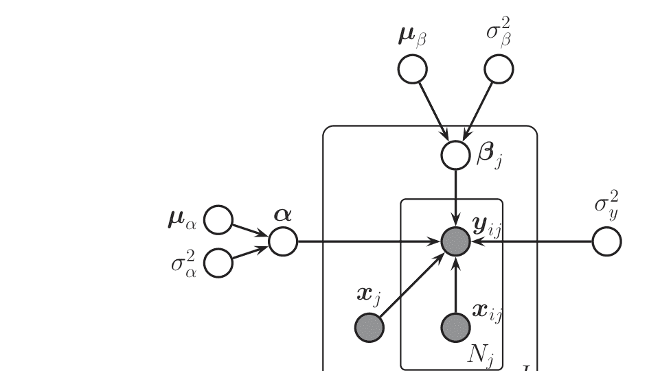

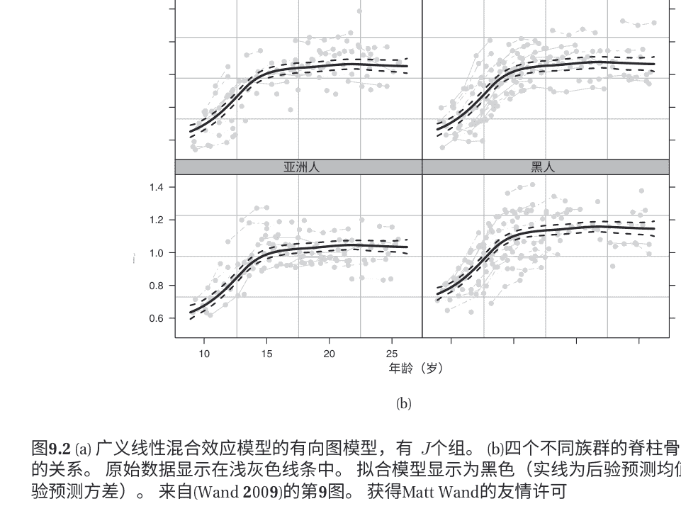

> 图9.2 (a) 广义线性混合效应模型的有向图模型，有 J个组。 (b)四个不同族群的脊柱骨密度与年龄的关系。 原始数据显示在浅灰色线条中。 拟合模型显示为黑色 (实线为后验预测均值，虚线为后验预测方差)。 来自(Wand 2009)的第9图。 获得Matt Wand的友情许可

### 9.6.2 计算问题

广义线性混合模型的主要问题在于，由于两个原因，它们可能很难拟合。 首先，$p(y_{ij}|\theta)$ 可能不与先验 $p(\theta)$ 共轭，其中 $\theta = (\alpha, \beta)$。 其次，在模型中有两个未知水平，即回归系数 $\theta$ 和先验的均值和方差 $\eta = (\mu, \sigma)$。

一种方法是采用完全贝叶斯推断方法，例如变分贝叶斯 (Hall等人, 2011) 或 MCMC (Gelman和Hill, 2007)。 我们在第21.5节讨论变分贝叶斯，第24.1节讨论MCMC。

另一种方法是使用经验贝叶斯，我们在第5.6节以一般术语讨论。在 GLMM 的背景下，我们可以使用 EM 算法 (第11.4节)，其中在 E 步中计算 $p(\theta|\eta, D)$，在 M 步中优化 $\eta$。 在线性回归设置中，E 步可以精确执行，但一般情况下我们需要使用近似方法。 传统方法使用数值积分或蒙特卡洛 (参见例如 (Breslow和Clayton，1993))。 更快的方法是使用变分 EM；参见 (Braun和McAuliffe，2010) 中对多层离散选择建模问题的应用。

> 在频率统计学中，有一种流行的方法可以拟合广义线性混合模型，称为广义估计方程或 GEE (Hardin和Hilbe 2003) 。 然而，我们不推荐这种方法，因为它在统计效率上不如基于似然的方法 (参见第6.4.3节)。 此外，它只能提供人口参数 $\alpha$ 的估计，而不能提供随机效应 $\beta$ 的估计，有时这些随机效应本身也是感兴趣的。

## 9.7 学习排序*

在本节中，我们讨论学习排序或 LETOR 问题。 也就是说，我们希望学习一个可以对一组项目进行排序的函数（我们将在下面更加精确地说明）。 最常见的应用是信息检索。 具体而言，假设我们有一个查询 $q$ 和一组可能与 $q$ 相关的文档 $d^1, ..., d^m$（例如，包含字符串 $q$ 的所有文档）。

我们希望按照相关性的降序对这些文档进行排序，并向用户展示前 $k$ 个。 类似的问题也出现在其他领域，比如协同过滤。（在游戏或比赛中对玩家进行排名是一种稍微不同类型的问题；参见第22.5.5节。） 下面我们总结一些解决这个问题的方法，按照 (Liu 2009) 的介绍。 这些材料并不基于广义线性模型，但由于没有更好的位置，我们仍将它们包含在本章中。

衡量文档 $d$ 对查询 $q$ 的相关性的一种标准方法是使用基于词袋模型的概率语言模型。 也就是说，我们定义 $sim(q, d) \triangleq p(q|d) = \prod_{i=1}^n p(q_i|d)$，其中 $q_i$ 是第 $i$ 个词或术语，而 $p(q_i|d)$ 是从文档 $d$ 估计得到的多项式分布。 实际上，我们需要对估计的分布进行平滑处理，例如使用狄利克雷先验，表示每个词的整体频率。 这可以

从系统中的所有文档中估计。更准确地说，我们可以使用

$p(t|d) = (1-\lambda)\frac{\text{TF}(t,d)}{\text{LEN}(d)} + \lambda p(t|\text{background})$

其中，TF(t,d) 是文档 d 中术语 t 的频率，LEN(d) 是 d 中的单词数，而 $0<\lambda<1$ 是平滑参数（详见 Zhai 和 Lafferty (2004) 的详细信息）。然而，我们可能还可以使用许多其他信号来衡量相关性。例如，网页文档的 PageRank 是其权威性的度量，源自于网络的链接结构（详见第17.2.4节）。我们还可以计算查询在文档中出现的频率和位置。下面我们将讨论如何学习如何组合所有这些信号。4

### 9.7.1 点对点方法

假设我们收集了一些训练数据，表示每个查询的一组文档的相关性。具体而言，对于每个查询 q，假设我们检索到 m 个可能相关的文档 $d_j$，其中 $j=1:m$。对于每个查询文档对，我们定义一个特征向量 $x(q,d)$。例如，这个向量可能包含查询文档的相似度分数和页面排名分数。此外，假设我们有一组表示文档 $d_j$ 对查询 q 的相关程度的标签 $y_j$。这些标签可以是二进制的（例如，相关或不相关），或者它们可以表示相关程度的程度（例如，非常相关、有些相关、不相关）。这些标签可以从查询日志中获得，通过对给定查询的文档点击次数进行阈值处理。

如果我们有二进制相关性标签，我们可以使用标准的二进制分类方案来估计 $p(y=1|x(q,d))$。如果我们有有序的相关性标签，我们可以使用序列回归来预测评分 $p(y=r|x(q,d))$。无论哪种情况，我们都可以按照这个评分指标对文档进行排序。这被称为 LETOR 的逐点方法，并且由于其简单性而被广泛使用。然而，这种方法没有考虑到每个文档在列表中的位置。因此，它对列表末尾的错误和开头的错误一样进行惩罚，这通常不是期望的行为。此外，每个关于相关性的决策都是非常短视的。

### 9.7.2 对偶方法

有证据表明（例如，(Carterette等，2008)），人们在判断两个项目的相对相关性方面比绝对相关性更好。因此，数据可能告诉我们对于给定的查询，$d_j$ 比 $d_k$ 更相关，或者反之亦然。我们可以使用形式为 $p(y_{jk}|x(q,d_j),x(q,d_k))$ 的二进制分类器来建模这种类型的数据，其中我们设置 $y_{jk}=1$ 如果 $rel(d_j,q) > rel(d_k,q)$，否则 $y_{jk}=0$。

建模这样一个函数的一种方法如下：

$p(y_{jk} = 1|\mathbf{x}_j, \mathbf{x}_k) = \text{sigm}(f(\mathbf{x}_j) - f(\mathbf{x}_k))$

4. 令人惊讶的是，谷歌在其搜索引擎中并没有（至少在2008年之前没有）使用这样的学习方法。来源：Peter Norvig，引自 http://anand.typepad.com/datawocky/2008/05/are-human-experts-less-prone-to-catastrophic-errors-than-machine-learned-models.html。

其中 $f(\mathbf{x})$ 是一个评分函数，通常被认为是线性的， $f(\mathbf{x}) = \mathbf{w}^T \mathbf{x}$。这是一种特殊的神经网络，被称为 **RankNet** (Burges et al. 2005)（有关神经网络的一般讨论，请参见第16.5节）。我们可以通过最大化对数似然或等价地最小化交叉熵损失来找到 $\mathbf{w}$ 的最大似然估计（MLE），其表达式为

$$
L = \sum_{i=1}^N \sum_{j=1}^{m_i} \sum_{k=j+1}^{m_i} L_{ijk} \tag{9.119}
$$

$$
-L_{ijk} = \mathbb{I}(y_{ijk} = 1) \log p(y_{ijk} = 1|\mathbf{x}_{ij}, \mathbf{x}_{ik}, \mathbf{w}) + \mathbb{I}(y_{ijk} = 0) \log p(y_{ijk} = 0|\mathbf{x}_{ij}, \mathbf{x}_{ik}, \mathbf{w}) \tag{9.120}
$$

这可以通过梯度下降进行优化。微软的 Bing 搜索引擎使用了 RankNet 的变体$^5$

### 9.7.3 列表法

成对法存在一个问题，即只基于一对项目（文档）做出相关性决策，而不考虑整个上下文。我们现在考虑同时查看整个项目列表的方法。

我们可以通过指定其索引的排列 $\pi$ 来定义列表的总顺序。为了对 $\pi$ 的不确定性进行建模，我们可以使用 **Plackett-Luce** 分布，该分布的名称来源于 (Plackett 1975) 和 (Luce 1959) 的独立工作。它具有以下形式:

$$
p(\pi|\mathbf{s}) = \prod_{j=1}^m \frac{s_j}{\sum_{u=j}^m s_u} \tag{9.121}
$$

其中 $s_j = s(\pi^{-1}(j))$ 是排名第 $j$ 的文档的得分。

为了理解方程式 9.121，让我们考虑一个简单的例子。假设 $\pi = (A, B, C)$。那么我们有 $p(\pi)$ 是 $A$ 排名第一的概率，乘以在 $A$ 排名第一的情况下 $B$ 排名第二的概率，再乘以在 $A$ 和 $B$ 排名第一和第二的情况下 $C$ 排名第三的概率。换句话说， $p(\pi|\mathbf{s}) =$

$$
\frac{s_A}{s_A + s_B + s_C} \times \frac{s_B}{s_B + s_C} \times \frac{s_C}{s_C} \tag{9.122}
$$

为了融入特征，我们可以定义 $s(d) = f(\mathbf{x}(q, d))$，其中我们通常将 $f$ 定义为线性函数， $f(\mathbf{x}) = \mathbf{w}^T \mathbf{x}$。这被称为 **ListNet 模型** (Cao等人, 2007年)。为了训练这个模型，让 $i$ 的相关性得分为查询 $i$ 的文档。然后我们最小化交叉熵项。

$$
- \sum_i \sum_\pi p(\pi|\mathbf{y}_i) \log p(\pi|\mathbf{s}_i) \tag{9.123}
$$

为了使其可行，我们只考虑前 $k$ 个位置的排列:

$$
p(\pi_{1:k}|\mathbf{s}_{1:m}) = \prod_{j=1}^k \frac{s_j}{\sum_{u=1}^m s_u} \tag{9.124}
$$只有 $m!/(m-k)!$ 这么多排列方式。如果我们设置 $k=1$，我们可以在 $O(m)$ 时间内评估每个交叉熵项（及其导数）。在只有一个来自呈现列表的文档被认为是相关的特殊情况下，假设 $y_i = c$，我们可以使用多项式逻辑回归：
$p(y_i = c|\mathbf{x}) = \frac{\exp(s_c)}{\sum_{c'=1}^m \exp(s_{c'})} \tag{9.125}$
在协同过滤的背景下，这通常至少与排名方法一样好（Yang et al. 2011）。

## 9.7.4 排名损失函数

有多种方法来衡量排名系统的性能，我们在下面进行总结。

- 平均倒数排名 (MRR)。对于一个查询 $q$，其第一个相关文档的排名位置用 $r(q)$ 表示。然后我们定义平均倒数排名如下：$1/r(q)$。这是一个非常简单的性能度量。
- 平均准确率 (MAP)。在二元相关标签的情况下，我们可以定义某个排序的前k个位置的准确率如下：
$\text{P@k}(\pi) \triangleq \frac{\text{排序 } \pi \text{中前 } k \text{个位置的相关文档数}}{k} \tag{9.126}$
然后我们定义平均准确率如下：
$\text{AP}(\pi) \triangleq \frac{\sum_k \text{P@k}(\pi) \cdot I_k}{\text{相关文档数}} \tag{9.127}$
其中 $I_k$ 等于1，当文档 $k$ 是相关的。例如，如果我们有相关性标签 $\mathbf{y} = (1, 0, 1, 0, 1)$，则AP为 $\frac{1}{3}(\frac{1}{1}+\frac{2}{3}+\frac{3}{5}) \approx 0.76$。最后，我们定义均值平均精度为所有查询的平均AP。
- 归一化折扣累计增益 (NDCG)。假设相关性标签具有多个级别。我们可以定义一个排序中前 $k$ 项的折扣累计增益如下：
$\text{DCG@k}(\mathbf{r}) = r_1 + \sum_{i=2}^{k} \frac{r_i}{\log_2 i} \tag{9.128}$
其中 $r_i$ 是第 $i$ 项的相关性，$\log_2$ 项用于折扣后面的项。表9.3给出了一个简单的数值示例。另一种定义更加强调检索相关文档的方法使用
$\text{DCG@k}(\mathbf{r}) = \sum_{i=1}^{k} \frac{2^{r_i} - 1}{\log_2(1 + i)} \tag{9.129}$
DCG的问题在于它的大小会因为返回列表的长度而变化。因此，通常将这个度量标准归一化为理想的DCG。

## 第9章 广义线性模型和指数族

| i | 1 | 2 | 3 | 4 | 5 | 6 |
|---|---|---|---|---|---|---|
| $r_i$ | 3 | 2 | 3 | 0 | 1 | 2 |
| $\log_2 i$ | 0 | 1 | 1.59 | 2.0 | 2.32 | 2.59 |
| $r_i/\log_2 i$ | N/A | 2 | 1.887 | 0 | 0.431 | 0.772 |

表9.3 计算NDCG的示例，来源于 http://en.wikipedia.org/wiki/Discounted_cumulative_gain。值 $r_i$ 是位置 $i$ 上项目的相关性得分。 从这里，我们可以看出DCG@6= $3 + (2 + 1.887 + 0 + 0.431 + 0.772) = 8.09$。 最大的DCG是使用得分为3、3、2、2、1、0的排序获得的。 因此，理想的DCG是8.693，因此归一化的DCG是 $8.09 / 8.693 = 0.9306$。

通过使用最佳排序获得的DCG： $\text{IDCG@k}(\mathbf{r}) = \arg\max_\pi \text{DCG@k}(\mathbf{r})$。 这可以...最后，我们定义折扣累积增益的归一化版本，即NDCG，为 $\text{DCG}/\text{IDCG}$。 表9.3给出了一个简单的数值示例。 可以对查询进行平均处理，以得到性能度量。
- 排名相关性。我们可以使用各种方法来衡量排序列表 $\pi$ 和相关性判断 $\pi^*$ 之间的相关性。 一种方法，称为（加权）肯德尔 $\tau$ 统计量，是通过加权的成对不一致性来定义这两个列表：
$\tau(\pi,\pi^*) = \frac{\sum_{u<v} w_{uv} [1 + \text{sgn}(\pi_u - \pi_v)\text{sgn}(\pi_u^* - \pi_v^*)]}{2 \sum_{u<v} w_{uv}} \quad (9.130)$
常用的其他度量方法有很多种。

这些损失函数可以以不同的方式使用。在贝叶斯方法中，我们首先使用后验推断来拟合模型；这取决于似然和先验，但与损失无关。 然后，在测试时选择我们的行动以最小化预期的未来损失。 一种方法是从后验中采样参数，$\theta^s \sim p(\theta | D)$，然后对不同阈值评估，例如精度@k，对 $\theta^s$ 进行平均。参见（Zhang et al. 2010）中的一个示例。

在频率派方法中，我们试图最小化训练集上的经验损失。问题在于这些损失函数不是模型参数的可微函数。我们可以使用无梯度优化方法，或者我们可以最小化一个替代损失函数。交叉熵损失（即负对数似然）是一个广泛使用的替代损失函数的例子。

另一个损失，被称为加权近似排序成对或 WARP损失，在（Usunier等人, 2009年）中提出，并在（Weston等人, 2010年）中进行了扩展，提供了对精度@k损失的更好近似。WARP定义如下： $\text{WARP}(f(\mathbf{x}, :), y) \triangleq L(\text{rank}(f(\mathbf{x}, :), y))$
$\text{rank}(f(\mathbf{x}, :), y) = \sum_{y'\neq y} \mathbb{I}(f(\mathbf{x}, y') \geq f(\mathbf{x}, y)) \quad (9.132)$
$L(k) \triangleq \sum_{j=1}^{k} \alpha_j, \quad \text{with} \quad \alpha_1 \geq \alpha_2 \geq \cdots \geq 0 \quad (9.133)$
这里 $f(\mathbf{x}, :) = [f(\mathbf{x}, 1), \ldots, f(\mathbf{x}, |y|)]$ 是每个可能输出标签的分数向量，或者在IR术语中，是与输入查询 $\mathbf{x}$ 对应的每个可能文档的分数。表达式 $\text{rank}(f(\mathbf{x}, :), y)$ 衡量了此评分函数分配的真实标签 $y$ 的排名。最后，$L$ 将整数排名转换为实值惩罚。使用 $\alpha_1 = 1$ 和 $\alpha_{j>1} = 0$ 将优化排名靠前的正确标签的比例。将 $\alpha_{1:k}$ 设置为非零值将优化排名列表中的前 $k$ 个，这将通过MAP或精度@$k$ 来衡量良好的性能。目前为止，WARP损失仍然很难优化，但可以通过蒙特卡洛采样进一步近似，然后通过梯度下降进行优化，如 (Weston等人, 2010年) 中所述。

## 练习

练习9.1 指数族形式下的单变量高斯共轭先验
通过类比于第9.2.5.5节，利用指数族的方法推导出单变量高斯分布的共轭先验，其中 $\mu$ 和 $\lambda = 1/\sigma^2$。通过适当的参数重新调整，证明先验具有形式 $p(\mu, \lambda) = \mathcal{N}(\mu|\gamma, \lambda(2\alpha - 1))\text{Ga}(\lambda|\alpha, \beta)$，因此只有3个自由参数。

练习9.2 多元正态分布在指数族中的形式
证明我们可以将多元正态分布写成指数族的形式。提示：使用第4.3.3节中定义的信息形式。

# 第10章 有向图模型（贝叶斯网络）

## 10.1 引言

> 我基本上知道处理复杂系统的两个原则：第一个是模块化原则，第二个是抽象原则。我是机器学习中计算概率的辩护者，因为我相信概率论以深入而有趣的方式实现了这两个原则——分解和平均。我认为充分利用这两个机制是机器学习的前进之路。—— Michael Jordan, 1997年（引自（Frey 1998））。

假设我们观察到多个相关变量，例如文档中的单词，图像中的像素或微阵列中的基因。我们如何紧凑地表示联合分布 $p(\mathbf{x}|\theta)$？我们如何利用这个分布在合理的计算时间内推断出一组变量？我们如何在合理的数据量下学习这个分布的参数？这些问题是概率建模、推断和学习的核心，并构成了本章的主题。

### 10.1.1 链式法则

根据概率的链式法则，我们始终可以使用以下方式表示联合分布，使用任意变量的顺序：
$p(x_{1:V}) = p(x_1)p(x_2|x_1)p(x_3|x_2, x_1)p(x_4|x_1, x_2, x_3) \dots p(x_V|x_{1:V-1}) \quad (10.1)$
其中 $V$ 是变量的数量，类似于Matlab的符号 `1:V` 表示集合 $\{1, 2, \dots, V\}$，我们省略了对固定参数 $\theta$ 的条件限制，以简洁起见。这个表达式的问题在于，随着条件分布 $p(x_t|x_{1:t-1})$ 的规模变大，它变得越来越复杂。

例如，假设所有变量都有 $K$ 个状态。我们可以将 $p(x_1)$ 表示为一个包含 $O(K)$ 个数字的表格，表示离散分布（实际上只有 $K-1$ 个自由参数，由于总和为一的约束，但为了简单起见，我们写作 $O(K)$）。同样，我们可以通过写作 $p(x_2|x_1)=T_{ij}$ 的方式，将 $p(x_2|x_1)$ 表示为一个包含 $O(K^2)$ 个数字的表格；我们称 T 为随机矩阵，因为它满足约束条件 $\sum_j T_{ij} = 1$ 对于所有行 $i$，并且 $0 \leq T_{ij} \leq 1$ 对于所有条目。同样，我们可以用一个三维表表示 $p(x_3|x_1, x_2)$ 包含 $O(K^3)$ 个数字。 这些被称为条件概率表或 CPTs。 我们可以看到模型中有 $O(K^V)$个参数。 我们需要大量的数据来学习这么多参数。

一种解决方案是用更简洁的条件概率分布或 CPD替换每个CPT，例如多项式逻辑回归，即 $p(x_t = k|\mathbf{x}_{1:t-1}) = \mathcal{S}(\mathbf{W}_t\mathbf{x}_{1:t-1})_k$。 现在总参数数量只有 $O(K^2V^2)$，使得这成为一个紧凑的密度模型（Neal 1992; Frey 1998）。 如果我们只想评估一个完全观察到的向量 $\mathbf{x}_{1:T}$的概率，这是足够的。 例如，我们可以使用这个模型来定义一个类条件密度，$p(\mathbf{x}|y = c)$，从而构建一个生成式分类器（Bengio and Bengio 2000）。 然而，这个模型对于其他类型的预测任务并不有用，因为每个变量都依赖于所有先前的变量。

### 10.1.2 条件独立性

高效表示大型联合分布的关键是对条件独立性（CI）进行一些假设。 回顾第2.2.4节，如果条件联合可以写成条件边缘的乘积形式，即 $X \perp Y | Z$，那么 $X$ 和 $Y$ 在给定$Z$的条件下是条件独立的（记作 $X \perp\!\!\!\perp Y | Z$）。
$X \perp\!\!\!\perp Y | Z \iff p(X, Y|Z) = p(X|Z)p(Y|Z)$
让我们看看为什么这可能有帮助。 假设我们假设 $x_{t+1} \perp\!\!\!\perp \mathbf{x}_{1:t-1}|x_t$，或者用文字来说，“未来在给定现在的情况下独立于过去”。 这被称为（一阶）马尔可夫假设。 利用这个假设和链式法则，我们可以将联合分布写成如下形式：
$p(\mathbf{x}_{1:V}) = p(x_1) \prod_{t=2}^{V} p(x_t|x_{t-1})$
这被称为(一阶)马尔可夫链。 它们可以通过初始状态分布来描述，$p(x_1 = i)$，再加上状态转移矩阵 $p(x_t = j|x_{t-1} = i)$。 更多信息请参见第17.2节。

### 10.1.3 图形模型

虽然一阶马尔可夫假设对于定义1维序列上的分布很有用，但我们如何定义2维图像、3维视频或者一般情况下的任意变量集合（例如属于某个生物途径的基因）的分布呢？ 这就是图形模型的用武之地。

图形模型（GM）是一种通过进行CI假设来表示联合分布的方法。 特别地，图中的节点表示随机变量，而（缺少）边表示CI假设。 （事实上，这些模型的更好名称应该是“独立图”，但是“图形模型”这个术语现在已经被广泛使用。） 根据图的有向性、无向性或有向和无向的组合，有几种不同类型的图形模型。 在本章中，我们只研究有向图。 我们在第19章中考虑无向图。

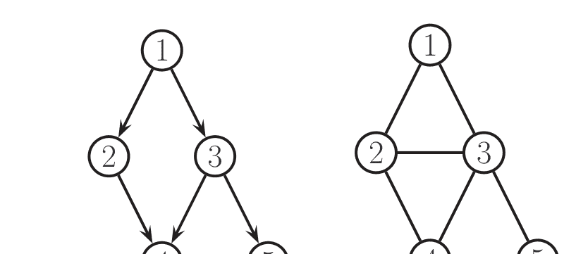

图10.1 (a) 一个简单的有向无环图，有5个节点，按拓扑顺序编号。节点1是根节点，节点4和5是叶节点。(b) 一个简单的无向图，具有以下最大团：{1, 2, 3}, {2, 3, 4}, {3, 5}。

### 10.1.4 图的术语

在我们继续之前，我们必须定义一些基本术语，其中大部分都非常直观。

一个图 $G=(\mathcal{V}, \mathcal{E})$ 由一组节点或顶点 $\mathcal{V} = \{1, ..., V\}$ 和一组边 $\mathcal{E} = \{(s, t) : s, t \in \mathcal{V}\}$ 组成。我们可以通过其邻接矩阵来表示图，在其中我们写 $G(s, t)=1$ 表示 $(s, t)\in \mathcal{E}$，即如果 $s \rightarrow t$ 是图中的一条边。

如果 $G(s, t)=1$ 当且仅当 $G(t, s)=1$，我们称这个图是无向的，否则它是有向的。通常我们假设 $G(s, s)=0$，这意味着没有自环。

这里还有一些我们常用的术语：
- 父节点：对于一个有向图，一个节点的父节点是所有输入到它的节点的集合：$pa(s) \triangleq \{t: G(t, s)=1\}$。
- 子节点：对于一个有向图，一个节点的子节点是所有从它出去的节点的集合：$ch(s) \triangleq \{t: G(s, t)=1\}$。
- 家族：对于一个有向图，一个节点的家族是该节点和它的父节点的集合，$fam(s) = \{s\} \cup pa(s)$。
- 根：对于有向图，根是没有父节点的节点。
- 叶：对于有向图，叶是没有子节点的节点。
- 祖先：对于有向图，祖先是节点的父节点、祖父节点等。也就是说，节点 $t$ 的祖先是通过路径与节点 $t$ 相连的节点的集合：$anc(t) \triangleq \{s: s \rightsquigarrow t\}$。
- 后代：对于有向图，后代是节点的子节点、孙子节点等。也就是说，节点 $s$ 的后代是通过路径从节点 $s$ 到达的节点的集合：$desc(s) \triangleq \{t: s \rightsquigarrow t\}$。
- 邻居：对于任何图，我们将节点的邻居定义为所有直接连接的节点的集合：$nbr(s) \triangleq \{t: G(s, t)=1 \lor G(t, s)=1\}$。对于无向图，我们使用 $s$ 和 $t$ 表示它们是邻居（所以 $(s,t)\in\mathcal{E}$ 是图中的一条边）。
- 度：节点的度是其邻居的数量。对于有向图，我们称之为入度和出度，分别计算父节点和子节点的数量。
- 循环：对于任何图，我们定义循环为一系列节点，通过跟随边可以回到起点，$s_1 - s_2\cdots - s_n - s_1$，$n\geq2$。如果图是有向的，我们可以称之为有向循环。例如，在图10.1(a)中，没有有向循环，但 $1\rightarrow2\rightarrow4\rightarrow3\rightarrow1$ 是一个无向循环。
- DAG：有向无环图或DAG是一个没有有向循环的有向图。请参见图10.1(a)的示例。
- 拓扑排序：对于一个DAG，拓扑排序或全序是对节点进行编号的方式，使得父节点的编号小于子节点的编号。例如，在图10.1(a)中，我们可以使用 $(1,2,3,4,5)$，或 $(1,3,2,5,4)$ 等等。
- 路径或轨迹：是一系列从 $s$ 到 $t$ 的有向边。
- 树：一个无向树是一个没有循环的无向图。有向树是一个没有有向循环的DAG。如果允许一个节点有多个父节点，我们称之为多树，否则我们称之为道德有向树。
- 森林：森林是一组树。
- 子图：一个（节点诱导）子图 $G_A$ 是通过使用 $A$ 中的节点和相应的边创建的图，$G_A=(\mathcal{V}_A,\mathcal{E}_A)$。
- 团：对于无向图，一个团是一组彼此都是邻居的节点。最大团是一个团，如果再添加任何节点都会失去团的特性。例如，在图10.1(b)中，$\{1,2\}$ 是一个团，但它不是最大团，因为我们可以添加3并仍然保持团的特性。事实上，最大团如下：$\{1,2,3\}$，$\{2,3,4\}$，$\{3,5\}$。

### 10.1.5 有向图模型

一个有向图模型或DGM是一个图形为DAG的GM。这些更常被称为贝叶斯网络。然而，贝叶斯网络本质上并没有“贝叶斯”的特点：它们只是一种定义概率分布的方式。这些模型也被称为信念网络。这里的“信念”一词指的是主观概率。再次强调，用DGM表示的概率分布类型并没有固有的主观性。最后，这些模型有时被称为因果网络，因为有向箭头有时被解释为表示因果关系。然而，DGM本质上并没有固有的因果性。（请参见第26.6.1节关于因果DGM的讨论。）因此，我们使用更中立（但不那么引人注目）的术语DGM。

DAG的关键属性是节点可以被排序，使得父节点在子节点之前。这被称为拓扑排序，可以从任何DAG构建。给定这样的顺序，我们将有序马尔可夫性质定义为节点仅依赖于其直接父节点，而不依赖于排序中的所有前驱节点，即
$x_s\perp\!\!\!\perp\mathbf{x}_{\text{pred}(s)\setminus\text{pa}(s)}\mid\mathbf{x}_{\text{pa}(s)}$
其中 $\mathbf{x}_{\text{pa}(s)}$ 是节点 $s$ 的父节点，而 $\text{pred}(s)$ 是节点 $s$ 的前驱节点在排序中。这是从链到一般DAG的一阶马尔可夫性质的自然推广。

图10.2(a) 一个简单的朴素贝叶斯分类器表示为DGM。为了简单起见，我们假设有 $D=4$个特征。阴影节点是观察到的，未阴影节点是隐藏的。(b) 基于树的朴素贝叶斯分类器，用于 $D=4$个特征。一般来说，树的拓扑结构可以根据 $y$的值而改变。

例如，图10.1(a)中的DAG编码了以下联合分布：

$p(\mathbf{x}_{1:5}) = p(x_1)p(x_2|x_1)p(x_3|x_1, x_2)p(x_4|x_1, x_2, x_3)p(x_5|x_1, x_2, x_3, x_4)$
$= p(x_1)p(x_2|x_1)p(x_3|x_1)p(x_4|x_2, x_3)p(x_5|x_3)$

一般来说，我们有

$p(\mathbf{x}_{1:V} | G) = \prod_{t=1}^{V} p(x_t | \mathbf{x}_{\mathrm{pa}(t)})$

其中每个术语 $p(x_t|\mathbf{x}_{\mathrm{pa}(t)})$是一个条件概率分布。我们将分布写成 $p(\mathbf{x}|G)$以强调只有在DAG $G$中编码的CI假设正确时，该方程才成立。然而，为了简洁起见，我们通常会省略这种明确的条件。如果每个节点有 $O(F)$个父节点和$K$个状态，则模型中的参数数量为 $O(VK^{F})$，这比不做CI假设的模型所需的$O(K^{V})$要少得多。

## 10.2 示例

在本节中，我们展示了一系列常用的概率模型可以方便地表示为DGMs。

### 10.2.1 朴素贝叶斯分类器

在第3.5节中，我们介绍了朴素贝叶斯分类器。这假设特征在给定类别标签的条件下是独立的。这个假设在图10.2(a)中有所说明。这使我们能够将联合分布写成以下形式：

$p(y, \mathbf{x}) = p(y) \prod_{j=1}^{D} p(x_j|y)$

朴素贝叶斯假设相当天真，因为它假设特征在条件下是独立的。捕捉特征之间相关性的一种方法是使用图模型。特别地，如果模型是一棵树，则该方法被称为增强朴素贝叶斯分类器或TAN模型（Friedman *et al.* 1997）。这在图10.2(b)中有所说明。使用树而不是通用图的原因有两个。首先，使用Chow-Liu算法很容易找到最优的树结构，如第26.3节所述。其次，在树结构模型中处理缺失特征也很容易，如第20.2节所解释的。

### 10.2.2 马尔可夫和隐马尔可夫模型

图10.3(a)展示了一个一阶马尔可夫链作为有向无环图。当然，假设即时过去，$x_{t-1}$，就能完全了解整个历史，$x_{1:t-2}$，是有点强的。我们可以通过从$x_{t-2}$到$x_t$添加一个依赖来稍微放松它；这被称为二阶马尔可夫链，并在图10.3(b)中进行了说明。相应的联合概率具有以下形式：

$p(\mathbf{x}_{1:T}) = p(x_1, x_2)p(x_3|x_1, x_2)p(x_4|x_2, x_3)\ldots = p(x_1, x_2) \prod_{t=3}^{T} p(x_t|x_{t-1}, x_{t-2}) \quad (10.9)$

我们可以以类似的方式创建高阶马尔可夫模型。有关马尔可夫模型的更详细讨论，请参见第17.2节。

不幸的是，即使是二阶马尔可夫假设，如果观察值之间存在长程相关性，可能仍然不够。我们不能不断构建更高阶的模型，因为参数的数量会爆炸。另一种方法是假设存在一个潜在的隐藏过程，可以由一个一阶马尔可夫链建模，但数据是这个过程的嘈杂观测。结果被称为隐藏马尔可夫模型或HMM，并在图10.4中进行了说明。这里的$z_t$被称为“时间”$t$的隐藏变量，而$\mathbf{x}_t$是观察变量。（我们在引号中加入了“时间”，因为这些模型可以应用于任何类型的序列数据，例如基因组学或语言，其中$t$表示位置而不是时间。）CPD $p(\ z_t|z_{t-1})$是转移模型，而CPD $p(\ x_t|z_t)$是观测模型。

| h₀ | h₁ | h₂ | P(v=0|h₁, h₂) | P(v=1|h₁, h₂) |
|---|---|---|---|---|
| 1 | 0 | 0 | θ₀ | 1-θ₀ |
| 1 | 1 | 0 | θ₀θ₁ | 1-θ₀θ₁ |
| 1 | 0 | 1 | θ₀θ₂ | 1-θ₀θ₂ |
| 1 | 1 | 1 | θ₀θ₁θ₂ | 1-θ₀θ₁θ₂ |

表格 10.1 具有泄漏节点的2个父节点的噪声OR CPD。 为了简洁起见，我们省略了下标 t。

隐藏变量通常表示感兴趣的數量，例如当前正在说话的单词的身份。 观察变量是我们测量的内容，例如声学波形。 我们想要做的是根据数据估计隐藏状态，即计算 p(z_t|x_{1:t}, θ)。 这被称为状态估计，只是概率推断的另一种形式。 有关HMM的更多详细信息，请参见第17章。

### 10.2.3 医学诊断

考虑对在重症监护病房（ICU）中测量的各种变量之间的关系进行建模，例如患者的呼吸频率、血压等。图10.5(a)中的报警网络是表示这些（非）依赖关系的一种方式（Beinlich等人，1989年）。该模型有37个变量和504个参数。

由于这个模型是通过手工创建的，通过一种称为知识工程的过程，因此被称为概率专家系统。 在第10.4节中，我们讨论了如何从数据中学习DGM的参数，假设图结构已知，在第26章中，我们讨论了如何学习图结构本身。

另一种称为快速医学参考或QMR网络（Shwe等人，1991年）的医学诊断网络如图10.5(b)所示。它被设计用于建模传染病。 QMR模型是一个二分图结构，顶部是疾病（原因），底部是症状或发现。所有节点都是二进制的。 我们可以将分布写成如下形式：

$p(\mathbf{v}, \mathbf{h}) = \prod_s p(h_s) \prod_t p(v_t|h_{\mathrm{pa}(t)}) \quad (10.10)$

其中 $h_s$ 代表隐藏节点（疾病），而 $v_t$ 代表可见节点（症状）。

根节点的条件概率分布（CPD）只是伯努利分布，表示该疾病的先验概率。使用条件概率表（CPT）来表示叶节点（症状）的CPD将需要太多参数，因为许多叶节点的父节点数量很高。一种自然的替代方法是使用逻辑回归来建模CPD，即 $p(v_t=1|h_{\mathrm{pa}(t)}) = \mathrm{sigm}(\mathbf{w}_t^T \mathbf{h}_{\mathrm{pa}(t)})$。（CPD为逻辑回归分布的DGM被称为sigmoid信念网络（Neal 1992）。）然而，由于该模型的参数是手动创建的，因此使用了一种称为噪声OR模型的替代CPD。

噪声-或模型假设如果父节点开启，则子节点通常也会开启（因为它是一个或门），但是父节点到子节点的“链接”可能会偶尔失败，独立地随机发生。在这种情况下，即使父节点开启，子节点也可能关闭。为了更精确地建模这一点，让 $\theta_{st} = 1 - q_{st}$ 表示链接成功的概率，因此 $q_{st} = 1 - \theta_{st} = p(v_t = 0 | h_s=1, h_{-s}=0)$ 是 $s$ 能够单独激活 $t$ 的概率（它的“因果能力”）。孩子关闭的唯一方式是如果所有开启的父节点的链接都以独立随机的方式失败。因此

$p(v_t=0|\mathbf{h}) = \prod_{s\in \mathrm{pa}(t)} \theta_{st}^{\mathbb{I}(h_s=1)} \quad (10.11)$

显然， $p(v_t=1|\mathbf{h}) = 1 - p(v_t=0|\mathbf{h})$。
如果我们观察到 $v_t=1$ ，但是它的所有父节点都关闭，那么这与模型相矛盾。这样的数据情况在模型下的概率为零，这是有问题的，因为有可能有人表现出症状但没有任何指定的疾病。为了处理这个问题，我们添加了一个虚拟的leak节点 $h_0$ ，它始终开启；这代表“所有其他原因”。参数 $q_{0t}$ 表示背景泄漏单独引起效应的概率。修改后的CPD变为 $p(v_t=0|\mathbf{h}) = \theta_{0t} \prod_{s\in \mathrm{pa}(t)} \theta_{st}^{h_s}$。请参见表10.1以获取一个数值示例。

如果我们定义 $w_{st} \triangleq \log(\theta_{st})$ ，我们可以将CPD重写为

$p(v_t = 1|\mathbf{h}) = 1 - \exp\left(w_{0t} + \sum_s h_s w_{st}\right) \quad (10.12)$

我们可以看到这与逻辑回归模型类似。
带有噪声OR CPD的二分模型称为 **BN2O模型**。根据领域专业知识，手动设置 $\theta_{st}$ 参数相对容易。然而，也可以从数据中学习它们（参见例如，（Neal 1992; Meek and Heckerman 1997））。噪声OR CPD在建模人类因果学习（Griffiths and Tenenbaum 2005）以及一般的二元分类设置（Yuille and Zheng 2009）中也被证明是有用的。

### 10.2.4 遗传连锁分析 *

DGM的另一个重要（并且历史上非常早期的）应用是遗传连锁分析问题。我们从一个家谱图开始，这是一个表示父母和子女关系的有向无环图（DAG），如图10.6(a)所示。然后我们将其转换为一个DGM，如下所述。最后，我们在得到的模型中进行概率推断。

更详细地说，对于每个人（或动物）$i$和基因组中的位置或位点$j$，我们创建三个节点：观察到的标记$X_{ij}$（可以是血型等属性，或者只是可以测量的DNA片段），以及两个隐藏的等位基因，$G_{ij}^m$和$G_{ij}^p$，一个来自$i$的母亲（母系等位基因）和另一个来自$i$的父亲（父系等位基因）。因此，有序对$G_{ij}=(G_{ij}^m, G_{ij}^p)$构成了$i$在位点$j$的隐藏基因型。显然，我们必须添加$G_{ij}^m \rightarrow X_{ij}$和$G_{ij}^p \rightarrow X_{ij}$的弧，表示基因型导致表型（基因型的观察表现）。CPD $p(X_{ij}|G_{ij}^m, G_{ij}^p)$被称为穿透模型。作为一个非常简单的例子，假设$X_{ij} \in \{A, B, O, AB\}$表示人$i$的观察到的血型，而$G_{ij}^m, G_{ij}^p \in \{A, B, O\}$是他们的基因型。我们可以使用表10.2中显示的确定性CPD来表示穿透模型。例如，A优于O，因此如果一个人的基因型为AO或OA，则他们的表型将为A。此外，我们还将$i$的母亲和父亲的弧添加到$G_{ij}$中，反映了遗传物质的孟德尔遗传。更准确地说，让$m_i = k$是$i$的母亲。那么$G_{ij}^m$可以等于$G_{kj}^m$或者$G_{kj}^p$，也就是说，$i$的母亲等位基因是其母亲的两个等位基因之一的副本。让$Z_{ijm}$成为一个隐藏变量，指定选择。我们可以使用以下条件概率分布来建模，称为继承模型：

$p(G_{ij}^m | G_{kj}^m, G_{kj}^p, Z_{ijm}) = \begin{cases} \mathbb{I}(G_{ij}^m = G_{kj}^m) & \text{if } Z_{ijm} = m \\ \mathbb{I}(G_{ij}^m = G_{kj}^p) & \text{if } Z_{ijm} = p \end{cases} \tag{10.13}$

我们可以类似地定义$p(G_{ij}^p | G_{kj}^m, G_{kj}^p, Z_{ijp})$，其中$k = p_i$是$i$的父亲。所述$Z_{ij}$的值被认为是基因型的相位。$G_{ij}^p, G_{ij}^m, Z_{ij}^p$和$Z_{ij}^m$的值构成了个体$i$在位点$j$上的单倍型。¹

接下来，我们需要为根节点指定先验概率，$p(G_{0j}^m)$和$p(G_{0j}^p)$。这被称为创始人模型，表示了种群中不同等位基因的总体流行度。我们通常假设这些创始等位基因之间是独立的。

最后，我们需要为控制遗传过程的切换变量指定先验概率。这些变量在空间上是相关的，因为基因组上相邻的位点通常是一起遗传的（重组事件很少发生）。我们可以通过在$Z$上施加一个二态马尔可夫链来建模这一点，在该链上，位点$j$切换状态的概率由$\theta_j = \frac{1}{2}(1 - e^{-2d_j})$给出，其中$d_j$是位点$j$和$j+1$之间的距离。这被称为重组模型。

结果的DGM显示在图10.6(b)中：它是一系列复制的家谱DAG，通过使用马尔可夫链连接的切换$Z$变量进行增强。（还有一个相关的模型被称为系统发育HMM（Siepel和Haussler 2003），用于模拟系统发育。）

作为如何使用该模型的简化示例，假设我们只有一个位点，对应于血型。为了简洁起见，我们将省略$j$索引。假设我们观察到$x_i = A$。然后有3种可能的基因型：$G_i$是（A，A），（A，O）或（O，A）。由于基因型到表型的映射是多对一的，存在歧义。我们想要反转这个映射。这被称为一个逆问题。幸运的是，我们可以利用亲属的血型来帮助消除证据的歧义。信息将从其他$x_j$的$G_j$流向它们的$G_j$，然后通过家谱DAG传递给$i$。因此，我们可以结合我们的局部证据$p(x_i | G_i)$与具有信息先验概率的条件概率分布，$p(G_i|\mathbf{x}_{-i})$，在给定其他数据的情况下，得到一个熵较小的局部后验概率分布，$p(G_i|\mathbf{x}) \propto p(\mathbf{x}_i|G_i)p(G_i|\mathbf{x}_{-i})$。

¹ 有时，观察到的标记等于未相位基因型，即无序集合 $\{G_{ij}^p, G_{ij}^m\}$；然而，相位或隐藏的基因型无法直接测量。

在实践中，该模型用于确定给定疾病相关基因在基因组中的位置，这是遗传连锁分析的任务。该方法的工作原理如下。首先，假设模型的所有参数，包括所有标记位点之间的距离，都是已知的。唯一未知的是致病基因的位置。如果存在 $L$ 个标记位点，我们构建 $L+1$ 个模型：在模型 $\ell$ 中，我们假设疾病基因位于标记位点 $\ell$ 之后，其中 $0 < \ell < L+1$。我们可以估计马尔可夫切换参数 $\hat{\theta}_\ell$，从而得到疾病基因与其最近已知位点之间的距离 $d_\ell$。我们通过其似然函数来衡量该模型的质量，$p(D|\hat{\theta}_\ell)$。然后，我们可以选择具有最高似然函数的模型（在均匀先验下等效于最大后验模型）。

然而，请注意，计算似然需要边际化所有隐藏 $Z$ 和 $G$ 变量。参见 (Fishelson和Geiger 2002) 和其中的参考文献，了解一些精确的方法；这些方法基于变量消除算法，我们在第20.3节中讨论。不幸的是，由于我们在第20.5节中解释的原因，如果个体和/或位点的数量很大，精确方法可能在计算上难以处理。参见 (Albers等, 2006年) 以了解计算似然的近似方法；这基于一种变分推断的形式，我们将在第22.4.1节中讨论。

### 10.2.5 有向高斯图模型 *

考虑一个所有变量都是实值的DGM，并且所有CPD具有以下形式：
$$ p(x_t|\mathbf{x}_{\text{pa}(t)}) = \mathcal{N}(x_t|\mu_t + \mathbf{w}_t^T \mathbf{x}_{\text{pa}(t)}, \sigma_t^2) \tag{10.14} $$
这被称为线性高斯CPD。正如我们下面所示，将所有这些CPD相乘会得到一个形式为 $p(\mathbf{x}) = \mathcal{N}(\mathbf{x}|\boldsymbol{\mu}, \boldsymbol{\Sigma})$ 的大型联合高斯分布。这被称为有向GGM，或者高斯贝叶斯网络。

我们现在解释如何从CPD参数中推导出 $\boldsymbol{\mu}$ 和 $\boldsymbol{\Sigma}$，参考(Shachter and Kenley 1989, App. B)。为了方便起见，我们将CPD重写为以下形式：
$$ x_t = \mu_t + \sum_{s \in \text{pa}(t)} w_{ts}(x_s - \mu_s) + \sigma_t z_t \tag{10.15} $$
其中 $z_t \sim \mathcal{N}(0, 1)$， $\sigma_t$是给定其父节点的条件标准差，$w_{ts}$是$ s \rightarrow t $的强度，而 $\mu_t$是局部均值。²
很容易看出，全局均值只是局部均值的连接，$\boldsymbol{\mu} = (\mu_1, \dots, \mu_D)$。我们现在推导出全局协方差，$\boldsymbol{\Sigma}$。设 $\mathbf{S} \triangleq \text{diag}(\boldsymbol{\sigma})$为一个对角矩阵包含标准差。我们可以将方程10.15重写为矩阵-向量形式，如下所示：
$$ (\mathbf{x} - \boldsymbol{\mu}) = \mathbf{W}(\mathbf{x} - \boldsymbol{\mu}) + \mathbf{S} \mathbf{z} \tag{10.16} $$

² 如果我们不减去父节点的均值（即，如果我们使用 $x_t = \mu_t + \sum_{s \in \text{pa}(t)} w_{ts} x_s + \sigma_t z_t$），则 $\boldsymbol{\Sigma}$的推导会变得更加混乱，可以通过查看 (Bishop 2006b, p370) 来看到。

| $G^{p}$ | $G^{m}$ | $p(X=a)$ | $p(X=b)$ | $p(X=o)$ | $p(X=ab)$ |
|---|---|---|---|---|---|
| $\to$ | $\uparrow$ | 1 | 0 | 0 | 0 |
| a | b | 0 | 0 | 0 | 1 |
| a | o | 1 | 0 | 0 | 0 |
| b | $\uparrow$ | 0 | 0 | 0 | 1 |
| b | b | 0 | 1 | 0 | 0 |
| b | o | 0 | 1 | 0 | 0 |
| o | $\uparrow$ | 1 | 0 | 0 | 0 |
| o | b | 0 | 1 | 0 | 0 |
| o | o | 0 | 0 | 1 | 0 |

表格 10.2 CPT，它编码了从基因型到表型（血型）的映射。这是一个确定性的、但是多对一的映射。

## 10.3. 推断

现在让e是一个噪声项的向量:

$\mathbf{e} \triangleq \mathbf{S}\mathbf{z}$

我们可以重新排列这个等式得到

$\mathbf{e} = (\mathbf{I} - \mathbf{W})(\mathbf{x} - \boldsymbol{\mu})$

由于W是下三角矩阵（因为在拓扑排序中，如果t>s则w_ts=0），我们有I-W是下三角矩阵，对角线上为1。因此

$\begin{pmatrix} e_1 \\ e_2 \\ \vdots \\ e_d \end{pmatrix} = \begin{pmatrix} 1 & 0 & \dots & 0 \\ -w_{21} & 1 & \dots & 0 \\ \vdots & \vdots & \ddots & \vdots \\ -w_{d1} & -w_{d2} & \dots & 1 \end{pmatrix} \begin{pmatrix} x_1 - \mu_1 \\ x_2 - \mu_2 \\ \vdots \\ x_d - \mu_d \end{pmatrix}$

由于I-W始终可逆，我们可以写成

$\mathbf{x} - \boldsymbol{\mu} = (\mathbf{I} - \mathbf{W})^{-1}\mathbf{e} \triangleq \mathbf{U}\mathbf{e} = \mathbf{U}\mathbf{S}\mathbf{z}$

其中我们定义$\mathbf{U} = (\mathbf{I} - \mathbf{W})^{-1}$。因此，回归权重对应于Σ的Cholesky分解，如下所示:$\boldsymbol{\Sigma}$ = cov[$\mathbf{x}$] = cov[$\mathbf{x} - \boldsymbol{\mu}$]

$= \text{cov}[\mathbf{U}\mathbf{S}\mathbf{z}] = \mathbf{U}\mathbf{S} \text{cov}[\mathbf{z}] \mathbf{S}\mathbf{U}^T = \mathbf{U}\mathbf{S}^2\mathbf{U}^T$

## 10.3 推理

我们已经看到，图模型提供了一种定义联合概率分布的简洁方式。给定这样一个联合分布，我们可以做什么呢？这样一个联合分布的主要用途是进行概率推断。这指的是从已知量中估计未知量的任务。例如，在第10.2.2节中，我们介绍了HMM，并且说其中一个目标是从观测中估计隐藏状态（例如，单词）。在第10.2.4节中，我们讨论了遗传连锁分析，并且说其中一个目标是估计数据在不同DAGs下的可能性，这些DAGs对应于关于致病基因位置的不同假设。

一般来说，我们可以将推理问题表述如下。假设我们有一组相关的随机变量，其联合分布为$p(\mathbf{x}_{1:V} | \boldsymbol{\theta})$。（在本节中，我们假设模型的参数$\boldsymbol{\theta}$已知。我们将在第10.4节中讨论如何学习参数。）让我们将这个向量分成可见变量$\mathbf{x}_v$（观测到的变量）和隐藏变量$\mathbf{x}_h$（未观测到的变量）。推理是指计算未知变量在已知变量条件下的后验分布：

$p(\mathbf{x}_h | \mathbf{x}_v, \boldsymbol{\theta}) = \frac{p(\mathbf{x}_h, \mathbf{x}_v | \boldsymbol{\theta})}{p(\mathbf{x}_v | \boldsymbol{\theta})} = \frac{p(\mathbf{x}_h, \mathbf{x}_v | \boldsymbol{\theta})}{\sum_{\mathbf{x}_h'} p(\mathbf{x}_h', \mathbf{x}_v | \boldsymbol{\theta})}$

本质上，我们是通过将可见变量固定为其观察值，即数据的条件，然后进行归一化，从而从$p(\mathbf{x}_h, \mathbf{x}_v)$到$p(\mathbf{x}_h | \mathbf{x}_v)$。归一化常数$p(\mathbf{x}_v | \boldsymbol{\theta})$是数据的似然度，也称为证据的概率。

有时我们只对一些隐藏变量感兴趣。因此，让我们将隐藏变量分为我们希望知道其值的查询变量, $\mathbf{x}_{q}$ 和其余的无关变量, $\mathbf{x}_{n}$。我们可以通过对无关变量进行边际化来计算我们感兴趣的内容:

$$p(\mathbf{x}_{q}|\mathbf{x}_{v}, \theta) = \sum_{\mathbf{x}_{n}} p(\mathbf{x}_{q}, \mathbf{x}_{n}|\mathbf{x}_{v}, \theta) \quad \quad \quad (10.24)$$

在第4.3.1节中，我们看到如何在多元高斯中执行所有这些操作, 时间复杂度为$O(V^3)$，其中 $V$是变量的数量。如果我们有离散随机变量, 每个变量有 $K$个状态, 会怎么样? 如果联合分布表示为多维表格, 我们总是可以精确执行这些操作, 但这将花费$O(K^V)$的时间。在第20章中, 我们解释了如何利用GM编码的因子化来执行这些操作, 时间复杂度为$O(VK^{w+1})$, 其中 $w$是图的树宽。这衡量了图的“树状”程度。如果图是树 (或链), 我们有 $w=1$, 因此对于这些模型, 推理时间与节点数量成线性关系。不幸的是, 对于更一般的图, 精确推理可能需要指数时间, 正如我们在第20.5节中所解释的。因此, 我们将在本书的后面研究各种近似推理方案。

## 10.4 学习

在图形模型的文献中, 通常区分推断和学习。推断意味着计算 (函数) $p (\mathbf{x}_{h}|\mathbf{x}_{v}, \theta)$ , 其中 $v$是可见节点, $h$是隐藏节点, $\theta$是模型的参数, 假设已知。学习通常意味着根据数据计算参数的MAP估计:

$$\hat{\theta} = \mathop{\mathrm{argmax}}_{\theta} \sum_{i=1}^{N} \log p(\mathbf{x}_{i,v}|\theta) + \log p(\theta) \quad \quad \quad (10.25)$$

其中, $\mathbf{x}_{i,v}$是第 $i$个案例中的可见变量。如果我们有一个均匀先验分布, $p (\theta) \propto 1$, 那么这就简化为MLE (最大似然估计) , 与通常情况下相同。如果我们采用贝叶斯观点, 参数是未知变量, 也应该进行推断。因此, 对于贝叶斯来说, 推断和学习之间没有区别。实际上, 我们可以将参数作为节点添加到图中, 在给定 $\mathcal{D}$的条件下, 推断出所有节点的值。 (我们将在下面更详细地讨论这个问题。)

在这个观点中, 隐藏变量和参数之间的主要区别在于隐藏变量的数量随着训练数据的增加而增加 (因为通常每个观察数据案例都有一组隐藏变量) , 而参数的数量通常是固定的 (至少在参数模型中是如此)。这意味着我们必须积分掉隐藏变量以避免过拟合, 但是对于参数, 我们可以使用点估计技术, 因为它们的数量较少。

### 10.4.1 板符号

当从数据中推断参数时, 我们经常假设数据是独立同分布的。我们可以使用图模型来明确表示这个假设, 如图10.7(a)所示。这说明了假设每个数据案例是独立生成的，但来自同一分布。

注意，数据案例仅在给定参数 $\theta$ 的条件下是独立的；在边上，数据案例是相关的。然而，我们可以看到，在这个例子中，数据案例到达的顺序对我们对 $\theta$ 的信念没有影响，因为所有的排序都具有相同的充分统计量。因此，我们说数据是可交换的。

为了避免视觉混乱，通常使用一种称为 plates的语法糖形式：我们只需在重复的变量周围画一个小框，约定在模型展开时，框内的节点将被重复。我们经常在框的右下角写上副本或重复的数量。参见图10.7(b)中的一个简单例子。相应的联合分布具有以下形式

$$ p(\theta, \mathcal{D}) = p(\theta) \prod_{i=1}^N p(\mathbf{x}_i | \theta) \quad (10.26) $$

这个DGM代表了我们在第5章中考虑的模型背后的CI假设。

图10.8展示了一个稍微复杂一点的例子。在左边，我们展示了一个被“展开”了的朴素贝叶斯分类器，它有D个特征，但使用一个板块来表示对i从1到N的重复。右边的版本使用了嵌套板块的表示方式来展示相同的模型。当一个变量在两个板块内部时，它将有两个下标。例如，我们用$\theta_{jc}$表示类条件密度c中特征j的参数。请注意，板块可以嵌套或交叉。可以设计用于建模更复杂的参数绑定模式的符号设备（例如，(Heckerman et al. 2004))，但这些并不常用。从图中不清楚的是，只有当$y_i=c$时，$\theta_{jc}$才用于生成$x_{i,j}$，否则它会被忽略。这是一个上下文特定独立性的例子，因为只有当$y_i=c$时，$x_{i,j} \perp \theta_{jc}$的关系才成立。

### 10.4.2 从完整数据中学习

如果每个案例中的所有变量都完全观察到，因此没有缺失数据和隐藏变量，我们称数据是完整的。 对于具有完整数据的DGM，似然函数为

$p(D|\theta) = \prod_{i=1}^{N} p(\mathbf{x}_i|\theta) = \prod_{i=1}^{N} \prod_{t=1}^{V} p(x_{it}|\mathbf{x}_{i,\text{pa}(t)}, \theta_t) = \prod_{t=1}^{V} p(\mathcal{D}_t|\theta_t)$ (10.27)

其中 $\mathcal{D}_t$ 是与节点 $t$ 及其父节点相关联的数据，即第 $t$ 个家族。 这是一个项的乘积，每个CPD对应一个项。 我们说似然函数根据图结构进行分解。

现在假设先验也可以因子分解：

$p(\theta) = \prod_{t=1}^{V} p(\theta_t)$ (10.28)

显然，后验也可以因子分解：

$p(\theta|\mathcal{D}) \propto p(\mathcal{D}|\theta)p(\theta) = \prod_{t=1}^{V} p(\mathcal{D}_t|\theta_t)p(\theta_t)$ (10.29)

这意味着我们可以独立计算每个CPD的后验概率。 换句话说，因子化的先验加上因子化的似然意味着因子化的后验概率 (10.30)

让我们考虑一个例子，其中所有的CPD都是表格形式的，从而扩展了之前在3.5.12节中讨论的贝叶斯朴素贝叶斯的结果。对于每个条件情况，即每个父节点值的组合，我们都有一个单独的行（即一个单独的多项分布） ，如表10.2所示。形式上，我们可以将第$t$个CPT写为$\mathbf{x}_t | \mathbf{x}_{\text{pa}(t)} = c \sim \text{Cat}(\boldsymbol{\theta}_{tc})$，其中$\theta_{tck} \triangleq p(\mathbf{x}_t = k|\mathbf{x}_{\text{pa}(t)} = c)$，对于 $k=1: K_t$，$c=1:C_t$和$t=1:T$。这里 $K_t$是节点的状态 $t, C_t \triangleq \prod_{s \in \text{pa}(t)} K_s$ 是父节点组合的数量，而 $T$ 是节点的数量。显然 $\sum_{k} \theta_{tck} = 1$ 对于每个CPT的每一行。
让我们在每个CPT的每一行上单独放置一个狄利克雷先验，即 $\boldsymbol{\theta}_{tc} \sim \text{Dir}(\boldsymbol{\alpha}_{tc})$。然后，我们可以通过将伪计数添加到经验计数中来计算后验概率，得到 $\boldsymbol{\theta}_{tc} | \mathcal{D} \sim \text{Dir}(\mathbf{N}_{tc} + \boldsymbol{\alpha}_{tc})$，其中 $N_{tck}$ 是节点 $t$ 在状态 $k$ 时其父节点在状态 $c$ 的次数：

$N_{tck} \triangleq \sum_{i=1}^{N} \mathbb{I}(x_{i,t} = k, x_{i,\text{pa}(t)} = c)$ (10.31)

根据方程2.77，该分布的均值由以下给出：
$\bar{\theta}_{tck} = \frac{N_{tck} + \alpha_{tck}}{\sum_{k'} (N_{tck'} + \alpha_{tck'})}$ (10.32)

例如，考虑图10.1(a)中的DGM。假设训练数据包含以下5个案例：

| $x_1$ | $x_2$ | $x_3$ | $x_4$ | $x_5$ |
| :---: | :---: | :---: | :---: | :---: |
| 0 | 0 | 1 | 0 | 0 |
| 0 | 1 | 1 | 1 | 1 |
| 1 | 1 | 0 | 1 | 0 |
| 0 | 1 | 1 | 0 | 0 |
| 0 | 1 | 1 | 1 | 0 |

下面我们列出所有的充分统计量 $N_{tck}$，并且在具有 $\alpha_{tck}= 1$（对应于加一平滑）的狄利克雷先验下的后验均值参数 $\theta_{tck}$，对于节点 $t= 4$：

| $x_2$ | $x_3$ | $N_{tck=1}$ | $N_{tck=0}$ | $\bar{\theta}_{tck=1}$ | $\bar{\theta}_{tck=0}$ |
| :---: | :---: | :---: | :---: | :---: | :---: |
| 0 | 0 | 0 | 0 | 1/2 | 1/2 |
| 1 | 0 | 1 | 0 | 2/3 | 1/3 |
| 0 | 1 | 0 | 1 | 1/3 | 2/3 |
| 1 | 1 | 2 | 1 | 3/5 | 2/5 |

很容易证明MLE具有与方程10.32相同的形式，只是没有 $\alpha_{tck}$ 项，即
$\hat{\theta}_{tck} = \frac{N_{tck}}{\sum_{k'} N_{tck'}}$ (10.33)

当然，MLE受到3.3.4.1节中讨论的零计数问题的困扰，因此使用先验来规范化估计问题非常重要。

### 10.4.3 学习缺失和/或潜在变量

如果我们有缺失数据和/或隐藏变量，似然函数不再因式分解，实际上它也不再是凸函数，我们在第11.3节中详细解释了这一点。这意味着我们通常只能计算局部最优的极大似然或最大后验估计。贝叶斯推断参数更加困难。我们在后面的章节中讨论适用的近似推断技术。

## 10.5 DGMs的条件独立性质

任何图模型的核心是一组条件独立性（CI）假设。我们写作$x_{A}\perp_{G}x_{B}|x_{C}$，如果在图 $G$ 中，给定 $C$，$A$与 $B$是独立的，使用下面定义的语义。让 $I(G)$是由图编码的所有这样的CI语句的集合。

我们说 $G$是 $p$的 **I-map**（独立性图），或者说 $p$相对于 $G$是 **Markov**的，当且仅当$I(G) \subseteq I(p)$，其中 $I(p)$是对于分布 $p$成立的所有CI语句的集合。换句话说，如果图不对分布做出任何不真实的CI断言，那么它就是一个I-map。这使我们能够在推理分布 $p$的CI属性时，将图作为一个安全的代理。这对于设计适用于大类分布的算法非常有帮助，无论其具体的数值参数 $\theta$如何。

请注意，完全连接的图是所有分布的I-map，因为它没有进行任何CI断言（因为它没有缺少任何边）。因此，如果$G$是$p$的I-map，并且没有$G' \subseteq G$是$p$的I-map，则我们称$G$是$p$的最小I-map。

剩下的是指定如何确定$x_{A}\perp_{G}x_{B}|x_{C}$。对于无向图，推导这些独立性是很容易的（参见第19.2节），但是$D_{AG}$的情况有些复杂，因为需要尊重有向边的方向。我们在下面给出详细信息。

### 10.5.1 d-分离和贝叶斯球算法（全局马尔可夫性）

首先，我们介绍一些定义。如果至少满足以下条件之一，则我们说一个无向路径$P$被节点集$E$（包含证据）d-分离：

1.  P包含一个链, $s \rightarrow m \rightarrow t$或者 $s \leftarrow m \leftarrow t$, 其中 $m \in E$
2.  P包含一个帐篷或者叉, $s \swarrow m \searrow t$, 其中 $m \in E$
3.  P包含一个碰撞器或者v-结构, $s \searrow m \swarrow t$, 其中 $m$不在 $E$中，也不是 $m$的任何后代。

接下来，我们说一个节点集合 $A$相对于另一个节点集合 $B$在观察到的第三个集合 $E$的条件下是$d$-分离的，如果从每个节点 $a \in A$到每个节点 $b \in B$的每条无向路径都被 $E$所$d$-分离。最后，我们定义DAG的CI属性如下:

> $x_{A} \perp_{G} x_{B}|x_{E} \iff A$相对于B在观察到E的条件下是d-分离的 (10.34)

贝叶斯球算法(Shachter 1998)是一种简单的方法，用于判断在给定 $E$的情况下，$A$是否与 $B$d-分离。其思想是这样的。我们在 $E$中“阴影”所有节点，表示它们是被观察到的。然后，我们在 $A$中的每个节点上放置“球”，让它们根据一些规则“弹跳”，然后询问是否有任何球到达 $B$中的任何节点。主要的三个规则如图10.9所示。请注意，球可以沿着边的相反方向移动。

我们可以看到球可以通过一个链，但如果中间被阴影遮挡则不能通过。同样，球可以通过一个分叉，但如果中间被阴影遮挡则不能通过。然而，球不能通过一个V形结构，除非中间被阴影遮挡。

我们可以通过以下方式证明贝叶斯球的三个规则。首先考虑一个链式结构 $X \rightarrow Y \rightarrow Z$，它编码了

> $p(x, y, z) = p(x)p(y|x)p(z|y)$ (10.35)

图10.9 贝叶斯球规则。阴影节点是我们条件约束的节点。如果有箭头击中一个条，意味着球不能通过；否则球可以通过。基于 (Jordan 2007)。

当我们条件约束 y 时，x 和 z 是否独立？我们有

$$
p(x, z|y) = \frac{p(x)p(y|x)p(z|y)}{p(y)} = \frac{p(x, y)p(z|y)}{p(y)} = p(x|y)p(z|y) \quad (10.36)
$$

因此 x ⊥ z|y。因此观察链的中间节点会将其分为两部分（就像马尔可夫链一样）。

现在考虑帐篷结构 X ← Y → Z。联合概率分布为

$$
p(x, y, z) = p(y)p(x|y)p(z|y) \quad (10.37)
$$

当我们给定 y 的条件时，x 和 z 是独立的吗？我们有

$$
p(x, z|y) = \frac{p(x, y, z)}{p(y)} = \frac{P(Y)P(X|Y)P(Z|Y)}{p(y)} = p(x|y)p(z|y) \tag{10.38}
$$

因此 $x \perp z|y$。因此观测根节点会将其子节点分开（如朴素贝叶斯分类器中所见，参见第3.5节）。

最后考虑一个 v-结构 $X \rightarrow Y \leftarrow Z$。联合分布为

$$
P(X, Y, Z) = P(X)P(Z)P(Y|X, Z) \tag{10.39}
$$

当我们给定 y 条件时，x 和 z 是否独立？我们有

$$
P(X, Z|Y) = \frac{P(X)P(Z)P(Y|X, Z)}{p(y)} \tag{10.40}
$$

然而，在无条件分布中，我们有

$$
P(X, Z) = P(X)P(Z) \tag{10.41}
$$

所以我们可以看到，x 和 z 在边际上是独立的。所以我们看到，在底部的一个 v-结构上条件化一个共同的孩子会使其父母变得相关。这个重要的效应被称为解释消除，因果推理，或伯克森悖论。作为解释消除的一个例子，假设我们抛两个硬币，代表二进制数0和1，然后我们观察它们的值的“和”。先验地，这两个硬币是独立的，但是一旦我们观察到它们的和，它们就变得相关（例如，如果和为1，并且第一个硬币是0，那么我们知道第二个硬币是1）。

最后，贝叶斯球还需要图10.10(a-b)中所示的“边界条件”。为了理解这些规则的来源，考虑图10.10(c)。假设 Y' 是 Y 的无噪声副本。那么如果我们观察到 Y'，我们实际上也观察到 Y，所以父节点 X 和 Z 必须竞争来解释这个。所以如果我们把一个球沿着 $X \rightarrow Y \rightarrow Y'$ 发送，它应该沿着 $Y' \rightarrow Y \rightarrow Z$ 反弹回来。然而，如果 Y 和它的所有子节点都是隐藏的，球就不会反弹回来。

例如，在图10.11中，我们可以看到 $x_2 \perp x_6 | x_5$，因为路径 $x_2 \rightarrow 5 \rightarrow 6$ 被 $x_5$（已观察到）阻塞，路径 $x_2 \rightarrow 4 \rightarrow 7 \rightarrow 6$ 被 $x_7$（隐藏的）阻塞，以及路径 $x_2 \rightarrow 1 \rightarrow 3 \rightarrow 6$ 被 $x_1$（隐藏的）阻塞。然而，我们还可以看到 $x_2 \perp x_6 | x_5, x_7$，因为现在路径 $x_2 \rightarrow 4 \rightarrow 7 \rightarrow 6$ 不再被 $x_7$（已观察到）阻塞。练习10.2让你更多地练习确定 DGM 的 CI 关系。

## 10.5.2 DGMs的其他马尔可夫性质

从 d-分离准则可以得出结论

> $t \perp \text{nd}(t) \setminus \text{pa}(t) | \text{pa}(t)$ (10.42)

其中节点 nd(t) 的非后代节点是除了其后代之外的所有节点，nd(t) = V \\ {t ∪ desc(t)}。方程10.42被称为有向局部马尔可夫性质。例如，在图10.11中，我们有 nd(3) = {2,4}，且 pa(3) = 1，所以 3 ⊥ 2,4 | 1。

这个性质的一个特殊情况是我们只看节点的前驱节点，根据某种拓扑排序。我们有

> $t \perp \text{pred}(t) \setminus \text{pa}(t) | \text{pa}(t)$ (10.43)

这是因为 pred(t) ⊆ nd(t)。这被称为有序马尔可夫性质，这证明了方程10.7。例如，在图10.11中，如果我们使用顺序 1，2，...，7。我们发现 pred(3) = {1,2} 和 pa(3) = 1，所以 3 ⊥ 2 | 1。

我们现在已经描述了 DAG 的三个马尔可夫性质：方程10.34中的有向全局马尔可夫性质 G，方程10.43中的有序马尔可夫性质 O，以及方程10.42中的有向局部马尔可夫性质 L。很明显 G ⟹ L ⟹ O。不太明显，但仍然是真实的是 O ⟹ L ⟹ G（见例如，（Koller和Friedman 2009）的证明）。因此，所有这些性质是等价的。

## 10.5.3 马尔可夫毯和全条件

使节点 t 在图中与其他节点条件独立的节点集合被称为 t 的马尔可夫毯；我们用 mb(t) 表示。可以证明，在 DGM 中，一个节点的马尔可夫毯等于其父节点、子节点和共同父节点，即，也是其子节点的其他节点：

$$
\text{mb}(t) \triangleq \text{ch}(t) \cup \text{pa}(t) \cup \text{copa}(t) \quad (10.44)
$$

例如，在图10.11中，我们有

$$
\text{mb}(5) = \{6,7\} \cup \{2,3\} \cup \{4\} = \{2,3,4,6,7\} \quad (10.45)
$$

其中4是5的共同父节点，因为它们有一个共同的子节点，即7。

为了看到为什么共同父节点在马尔可夫毯中，注意当我们推导出 $ p(x_t|\mathbf{x}_{-t}) =p(x_t, \mathbf{x}_{-t}) /p(\mathbf{x}_{-t}) $ 时，所有不涉及 $ x_t $ 的项都会在分子和分母之间抵消，所以我们剩下的是一个包含 $ x_t $ 在其范围内的 CPD 的乘积。因此

$$
p(x_t|\mathbf{x}_{-t}) \propto p(x_t|\mathbf{x}_{\text{pa}(t)}) \prod_{s \in \text{ch}(t)} p(x_s|\mathbf{x}_{\text{pa}(s)}) \quad (10.46)
$$

例如，在图10.11中，我们有

$$
p(x_5|\mathbf{x}_{-5}) \propto p(x_5|x_2, x_3)p(x_6|x_3, x_5)p(x_7|x_4, x_5, x_6) \quad (10.47)
$$

结果表达式被称为 $ t $ 的完全条件，在我们研究吉布斯采样（第24.2节）时将证明其重要性。

## 10.6 影响（决策）图*

我们可以使用图形符号（Howard和Matheson 1981; Kjaerulft和Madsen 2008）来表示多阶段（贝叶斯）决策问题，称为决策图或影响图。这通过添加决策节点（也称为行动节点），用矩形表示，并添加效用节点（也称为值节点），用菱形表示，扩展了有向图模型。原始随机变量称为机会节点，通常用椭圆表示。

图10.12(a)给出了一个简单的例子，说明了著名的野蛮开采问题。在这个问题中，你需要决定是否钻井。你有两种可能的行动：$ d=1 $ 表示钻井，$ d=0 $ 表示不钻井。你假设有3种自然状态：$ o=0 $ 表示井干了，$ o=1 $ 表示湿润（有一些油），$ o=2 $ 表示浸泡（有很多油）。假设你的先验信念是 $ p(o) = [0.5, 0.3, 0.2] $。最后，你必须指定效用函数 $ U(d, o) $。由于状态和行动是离散的，我们可以将其表示为一个表格（类似于 DGM 中的 CPT）。假设我们使用以下数字表示，以美元为单位：

|       | $o=0$ | $o=1$ | $o=2$ |
|-------|-------|-------|-------|
| $d=0$ | 0     | 0     | 0     |
| $d=1$ | -70   | 50    | 200   |

我们可以看到，如果你不进行钻探，你不会产生任何成本，但也不会赚到任何钱。如果你钻探一个干井，你会损失70美元；如果你钻探一个湿井，你会赚到50美元；如果你钻探一个浸泡井，你会赚到200美元。如果你进行钻探，你的先验期望效用为

$$
EU(d=1) = \sum_{o=0}^{2} p(o)U(d, o) = 0.5 \cdot (-70) + 0.3 \cdot 50 + 0.2 \cdot 200 = 20 \quad (10.48)
$$

如果你不钻孔，你的预期效用为0。所以你的最大预期效用是

$$
\text{MEU} = \max\{EU(d=0), EU(d=1)\} = \max\{0, 20\} = 20
$$

因此，最优的行动是钻孔：

$$
d^* = \arg\max\{EU(d=0), EU(d=1)\} = 1
$$

现在让我们考虑模型的一个小扩展。假设你进行声测来估计井的状态。声测观测可以处于3种状态之一：$ s=0 $ 表示漫反射模式，表明没有油；$ s=1 $ 表示开放反射模式，表明有一些油；$ s=2 $ 表示闭合反射模式，表明有很多油。由于 $ S $ 是由 $ O $ 引起的，我们在模型中添加了一个 $ O \rightarrow S $ 的弧。此外，我们假设声测测试的结果将在我们决定是否钻孔之前可用；因此我们在 $ S $ 到 $ D $ 之间添加了一个信息弧。这在图10.12(b)中有所说明。

让我们使用以下条件分布来建模传感器的可靠性 $ p(s|o) $：

|      | s = 0 | s = 1 | s = 2 |
|------|-------|-------|-------|
| o = 0 | 0.6   | 0.3   | 0.1   |
| o = 1 | 0.3   | 0.4   | 0.3   |
| o = 2 | 0.1   | 0.4   | 0.5   |

假设我们进行声测试验并观察到 $ s= 0 $。油状态的后验概率为

> $p(o|s = 0) = [0.732, 0.219, 0.049] \quad (10.51)$

现在，执行动作 $ d $ 的后验期望效用为

> $EU(d|s = 0) = \sum_{o=0}^{2} p(o|s = 0)U(o, d) \quad (10.52)$

如果 $ d= 1 $，则得到

> $EU(d = 1|s = 0) = 0.732 \times (-70) + 0.219 \times 50 + 0.049 \times 200 = -30.5 \quad (10.53)$

然而，如果 $ d= 0 $，那么 $ EU(d=0|s= 0)=0 $，因为不钻井不会产生任何成本。因此，如果我们观察到 $ s=0 $，我们最好不要钻井，这是有道理的。

现在假设我们进行声测试验，并观察到 $ s= 1 $。通过类似的推理，可以证明 $ EU(d=1|s= 1) = 32.9 $，这比 $ EU(d=0|s= 1) =0 $ 要高。

同样，如果我们观察到 $ s= 2 $，我们有 $ EU(d=1|s= 2) = 87.5 $，这比 $ EU(d=0|s= 2) = 0 $ 要高得多。因此，最优策略 $ d^*(s) $ 如下：如果 $ s= 0 $，选择 $ d^*(0)= 0 $ 并获得 $0；如果 $ s=1 $，选择 $ d^*(1)= 1 $ 并获得 $32.9；如果 $ s= 2 $，选择 $ d^*(2)= 1 $ 并获得 $87.5$。

你可以计算你的预期利润或最大预期效用如下：

> $\text{最大预期效用} = \sum_{s} p(s) EU(d^*(s)|s) \quad (10.54)$

这是在假设你根据结果采取最佳行动的情况下，对声测试验可能结果的预期效用。测试结果的先验边际分布是

> $p(s) = \sum_{o} p(o)p(s|o) = [0.41, 0.35, 0.24] \quad (10.55)$

因此，你的最大预期效用是

> $\text{最大预期效用}= 0.41 \times 0 + 0.35 \times 32.9 + 0.24 \times 87.5 = 32.2 \quad (10.56)$

现在假设你可以选择是否进行测试。这可以被建模如图10.12(c)所示，我们添加一个新的测试节点 $ T $。如果 $ T= 1 $，我们进行测试，$ S $ 可以进入3个状态之一，由 $ O $ 决定，与上述情况完全相同。如果 $ T= 0 $，我们不进行测试，$ S $ 进入一个特殊的未知状态。进行测试也会有一些成本。

值得做这个测试吗？这取决于我们的 MEU 在我们知道测试结果（即 S 的状态）后如何改变。如果你不做测试，根据方程10.49，我们有 MEU = 20。如果你做测试，根据方程10.56，我们有 MEU = 32.2。所以如果你做测试（并对其结果进行最优行动），效用的提升是12.2美元。这称为完美信息的价值(VPI)。所以只要花费不超过12.2美元，我们就应该进行测试。

在图形模型方面，变量 T 的 VPI 可以通过计算基本影响图的 MEU I，然后计算从 T 到动作节点添加信息弧的影响图的 MEU，然后计算差异来确定。换句话说，

VPI = MEU(I + T → D) - MEU(I)

其中 D 是决策节点， T 是我们要测量的变量。

可以修改变量消除算法（第20.3节）以计算给定影响图的最优策略。这些方法本质上是从最后一个时间步骤开始向后计算，假设所有后续动作都被最优选择。详见 (Lauritzen和Nilsson 2001; Kjaerulff和Madsen 2008) 的详细信息。

我们可以继续以各种方式扩展模型。例如，我们可以想象一个动态系统，在其中我们测试、观察结果、执行操作，然后转移到下一个油井，并以此方式继续钻井（和污染）。实际上，机器人技术、商业、医学、公共政策等许多问题都可以有用地表述为随时间展开的影响图 (Raiffa 1968; Lauritzen and Nilsson 2001; Kjaerulff and Madsen 2008)。

这个形式的通用模型如图10.13(a)所示。这被称为部分观测的马尔可夫决策过程或 POMDP (发音为“pom-d-p”)。这基本上是一个隐藏的马尔可夫模型（第17.3节）加上动作和奖励节点。这可以用来模拟所有智能代理使用的感知-行动循环（详见例如 (Kaelbling et al. 1998)）。

POMDP的一个特殊情况是，状态完全可观察，称为马尔可夫决策过程 (MDP)， 如图10.13(b)所示。这更容易解决，因为我们只需要计算从观察到的状态到动作的映射。这可以使用动态规划来解决（详见Sutton和Barto 1998的细节）。

在 POMDP 情况下，从 $ x_t $ 到 $ a_t $ 的信息弧不足以唯一确定最佳动作。由于状态不完全可观察，因此无法确定最佳动作。相反，我们需要根据我们的信念状态选择动作，即 $p(z_t|\mathbf{x}_{1:t}, a_{1:t})$。由于信念更新过程是确定性的（见第17.4.2节），我们可以计算出一个信念状态 MDP。有关如何计算此类模型的策略的详细信息，请参见 (Kaelbling等人1998; Spaan和Vlassis 2005)。

### 练习

### 练习10.1 在DGM中边缘化一个节点

(来源：Koller。)

考虑图10.14(a)中的 DAG $G$。假设它是 $p(A, B, C, D, E, F, X)$ 的最小 I-map。现在考虑边缘化 $X$。构建一个新的 DAG $G'$，它是 $p(A, B, C, D, E, F)$ 的最小 I-map。指定（并证明）需要添加哪些额外的边。

### 练习10.2 贝叶斯球

(来源：Jordan。)

在一些有向图模型中，我们计算一些全局独立性陈述。你可以使用“贝叶斯球”算法、d-分离准则或将其转换为无向图的方法（所有方法都应该得到相同的结果）。

a. 考虑图10.14(b)中的 DAG。列出在给定 $B$ 上的证据下与 $A$ 独立的所有变量。

b. 考虑图10.14(c)中的 DAG。列出在给定 $J$ 上的证据下与 $A$ 独立的所有变量。

### 练习10.3 DGM的马尔可夫毯

证明 DGM 中节点 $i$ 的全条件概率为

$$
p(X_i|X_{-i}) \quad \propto \quad p(X_i|P a(X_i)) \quad \prod_{Y_j \in ch(X_i)} p(Y_j|P a(Y_j)) \qquad \qquad (10.58)
$$

其中 $ch(X_i)$ 是 $X_i$ 的子节点，$P a(Y_j)$ 是 $Y_j$ 的父节点。

### 练习10.4 DGM中的隐藏变量

考虑图11.1中的 DGM，它们都定义了 $p(X_{1:6})$，其中我们从左到右，从上到下编号空节点。左边的图定义了联合概率为

$$
p(X_{1:6}) = \sum_{h} p(X_1)p(X_2)p(X_3)p(H=h|X_{1:3})p(X_4|H=h)p(X_5|H=h)p(X_6|H=h) \qquad (10.59)
$$# 10.6. 影响（决策）图

在这里，我们对隐藏变量 $H$进行了边际化处理。 右侧的图定义了联合概率为
$p(X_{1:6}) = p(X_1)p(X_2)p(X_3)p(X_4|X_{1:3})p(X_5|X_{1:4})p(X_6|X_{1:5})$   (10.60)

- a. (5分) 假设所有节点（包括H）都是二进制的，所有CPD都是表格形式的，证明左边的模型有17个自由参数。
- b. (5分) 假设所有节点都是二进制的，所有CPD都是表格形式的，证明右边的模型有59个自由参数。
- c. (5分) 假设我们有一个数据集 $\mathcal{D} = X_{1:6} \ n \text{ for} = 1 : N$，我们观察到 $X$，但没有观察到 $H$，我们想要使用最大似然估计来估计CPD的参数。 哪个模型更容易实现？请解释你的答案。

# 练习10.5 雨天的贝叶斯网络

(来源: Nando de Freitas)。 在这个问题中，你必须建模4个二进制变量： $G =$ "灰色", $V =$ "温哥华", $R =$ "下雨"和 $S =$ "难过"。 考虑图10.15(a)中描述这些变量之间关系的有向图模型。

- a. 写出 $P(S= 1|V = 1)$的表达式，用$\alpha, \beta, \gamma, \delta$表示。
- b. 写出 $P(S= 1|V = 0)$的表达式。 这与 $P(S= 1|V = 1)$相同还是不同? 解释为什么。
- c. 使用以下数据集找到$\alpha, \beta, \gamma$的最大似然估计，其中每一行是一个训练案例。 (你可以在不证明的情况下给出答案。)

| V | G | R | S |
|---|---|---|---|
| 1 | 1 | 1 | 1 |
| 1 | 1 | 0 | 1 |
| 1 | 0 | 0 | 0 |

# 练习10.6捕鱼网

(来源: (Duda et al. 2001)..) 考虑图10.15(b)中显示的贝叶斯网络。 这里，节点表示以下变量
$X_1 \in \{$冬季, 春季, 夏季, 秋季 $\}$, $X_2 \in \{$鲑鱼, 鲈鱼 $\}$    (10.62)
$X_3 \in \{$浅色, 中等色, 深色$\}$, $X_4 \in \{$宽, 窄 $\}$      (10.63)

相应的条件概率表为

$p(x_1) = (.25 .25 .25 .25), p(x_2|x_1) = \begin{pmatrix} .9 & .1 \ .3 & .7 \ .4 & .6 \ .8 & .2 \end{pmatrix}$ (10.64)

$p(x_3|x_2) = \begin{pmatrix} .33 & .33 & .34 \ .8 & .1 & .1 \end{pmatrix}, p(x_4|x_2) = \begin{pmatrix} .4 & .6 \ .95 & .05 \end{pmatrix}$ (10.65)

请注意，在 $p(x_4|x_2)$中，行表示 $x_2$，列表示 $x_4$（因此每行总和为一，表示CPD的子节点）。因此 $p(x_4=窄|x_2=鲈鱼)=0.05$，$p(x_4=窄|x_2=鲑鱼)=0.6$，等等。

回答以下问题。你可以使用Matlab或手动完成。无论哪种情况，都要展示你的工作。

- a. 假设鱼是在12月20日被捕获的——秋季和冬季的交界处——因此让我们使用 $p(x_1)=(.5,0,0,.5)$作为先验分布，而不是上述的先验分布。（这被称为软证据，因为我们不知道 $X_1$的确切值，但我们对其有一个分布。）假设亮度没有被测量，但已知鱼很瘦。将鱼分类为鲑鱼还是鲈鱼。
- b. 假设我们只知道鱼很瘦且亮度适中。现在是什么季节，最有可能是什么季节？使用 $p(x_1)=(.25 .25 .25 .25)$

# 练习10.7在BN20网络中删除叶节点

- a. 考虑QMR网络，其中只观察到一些症状。例如，在图10.16(a)中，$X_4$和$X_5$是隐藏的。证明我们可以安全地删除所有隐藏的叶节点而不影响疾病节点的后验概率，即证明我们可以使用图10.16(b)中的网络计算 $p(z_{1:3}|x_1,x_2,x_4)$。这被称为贫瘠节点删除，并且可以应用于任何DGM。
- b. 现在假设我们将叶节点分为三组：开启、关闭和未知。显然，我们可以删除未知的叶节点，因为它们是隐藏的，不会影响它们的父节点。证明我们可以通过将其效果吸收到父节点的先验中，从而解析地删除处于“关闭状态”的叶节点。（这个技巧只适用于有噪声的OR CPDs。）

# 练习10.8在QMR网络中处理负结果

考虑QMR网络。让 $d$是隐藏的疾病，$f^-$是负结果（关闭的叶节点），$f^+$是正结果（打开的叶节点）。我们可以通过两个步骤计算后验概率 $p(d|f^-,f^+)$：首先吸收负结果，$p(d|f^-) \propto p(d) p(f^-|d)$，然后吸收正结果，$p(d|f^-,f^+) \propto p(d|f^-) p(f^+|d)$。证明第一步可以在 $O(|d||f^-|)$ 时间内完成，其中 $|d|$是疾病的数量，$|f^-|$是负结果的数量。为了简单起见，你可以忽略泄漏节点。（直观上，当结果关闭时，父节点之间没有相关性，因为没有解释。）

# 练习10.9道德化不会引入新的独立性陈述

回想一下，道德化有向无环图（DAG）的过程是将所有共同拥有一个孩子的“未婚”父母连接在一起，然后删除所有箭头。设M为DAG G的道德化。证明CI( M ) ⊆ CI(G)，其中CI是模型所暗示的条件独立性陈述的集合。

# 11 混合模型和EM算法

## 11.1 潜变量模型

在第10章中，我们展示了如何使用图模型来定义高维联合概率分布。基本思想是通过在图中两个变量之间添加一条边来建模它们之间的依赖关系。（从技术上讲，图表示条件独立性，但你明白我的意思。）

另一种方法是假设观测变量之间存在相关性，因为它们来自一个隐藏的共同“原因”。具有隐藏变量的模型也被称为潜变量模型或LVM。正如我们将在本章中看到的那样，这种模型比没有潜变量的模型更难拟合。然而，它们可以有两个主要优势。首先，潜变量模型通常比直接表示可见空间相关性的模型具有更少的参数。这在图11.1中有所说明。如果所有节点（包括H）都是二进制的，并且所有条件概率分布都是表格形式的，左侧的模型有17个自由参数，而右侧的模型有59个自由参数。

其次，在LVM中的隐藏变量可以作为一个瓶颈，它计算数据的压缩表示。这构成了无监督学习的基础，正如我们将看到的。图11.2展示了一些通用的LVM结构，可以用于这个目的。
一般来说，有 L 个潜在变量， $z_{i1}, \ldots, z_{iL}$，和 D 可见变量， $x_{i1}, \ldots, x_{iD}$，通常情况下 $D \gg L$。如果 $L > 1$，每个观测值都有许多潜在因素的贡献，所以我们有一个多对多的映射。如果 $L = 1$，我们只有一个单一的潜在变量；在这种情况下， $z_i$ 通常是离散的，我们有一个一对多的映射。我们还可以有一个多对一的映射，表示每个观测变量的不同竞争因素或原因；这些模型构成了概率矩阵分解的基础，详细讨论见第27.6.2节。最后，我们可以有一个一对一的映射，可以表示为 $z_i \rightarrow x_i$。通过允许 $z_i$ 和/或 $x_i$ 为向量值，这种表示可以包含所有其他表示。根据似然函数 $p(\mathbf{x}_i | \mathbf{z}_i)$ 和先验分布 $p(\mathbf{z}_i)$ 的形式，我们可以生成各种不同的模型，总结如表11.1所示。

## 11.2 混合模型

最简单的LVM形式是当 $z_i \in \{1, \ldots, K\}$ 时，表示离散潜在状态。我们将使用离散先验分布，即 $p(z_i) = \text{Cat}(\pi)$。对于似然函数，我们使用 $p(\mathbf{x}_i | z_i = k) = p_k(\mathbf{x}_i)$，

其中 $p_k$是观测的第 $k$个基本分布；它可以是任何类型。整体模型被称为混合模型，因为我们将 $K$个基本分布混合在一起，如下所示：

$$p(x_i|\theta) = \sum_{k=1}^{K} \pi_k p_k(x_i|\theta)$$

这是 $p_k$的凸组合，因为我们取加权和，其中混合权重 $\pi_k$满足 $0 \leq \pi_k \leq 1$且 $\sum_{k=1}^{K} \pi_k = 1$。我们以下给出一些例子。

| p(xi|zi) | p(zi) | 名字 | 章节 |
|----------|-------|------|------|
| MVN | 离散 | 高斯混合模型 | 11.2.1 |
| 产品离散 | 离散 | 多项式混合模型 | 11.2.2 |
| 产品高斯 | 产品高斯 | 因子分析/概率PCA | 12.1.5 |
| 产品高斯 | 产品拉普拉斯 | 概率ICA/稀疏编码 | 12.6 |
| 产品离散 | 产品高斯 | 多项式PCA | 27.2.3 |
| 产品离散 | 狄利克雷 | 潜在狄利克雷分配 | 27.3 |
| 产品有噪声或产品伯努利 | BN20/QMR | 10.2.3 |
| 产品伯努利 | 产品伯努利 | Sigmoid信念网络 | 27.7 |

表II.1 一些流行的有向潜在变量模型的摘要。这里“产品”表示乘积，所以“产品 似然中的“离散”表示形式为 $\prod_j \text{Cat}(x_{ij}|z_i)$，和“Prod. 高斯”意味着一个形式为 $\prod_j \mathcal{N}(x_{ij}|z_i)$的分布。“PCA”代表“主成分分析”。“ICA”代表“独立成分分析”。

### 11.2.1 高斯混合

最广泛使用的混合模型是高斯混合(MOG)，也称为高斯混合模型或GMM。在该模型中，混合中的每个基本分布都是具有均值 $\boldsymbol{\mu}_k$和协方差矩阵 $\boldsymbol{\Sigma}_k$的多元高斯分布。因此，该模型的形式为

$$p(\mathbf{x}_i|\boldsymbol{\theta}) = \sum_{k=1}^{K} \pi_k \mathcal{N}(\mathbf{x}_i|\boldsymbol{\mu}_k, \boldsymbol{\Sigma}_k) \quad \text{(II.2)}$$

图II.3展示了2D中的3个高斯混合模型。每个混合成分由不同的椭圆轮廓表示。给定足够多的混合成分，GMM可以用来逼近在 $\mathbb{R}^D$上定义的任何密度。

### 11.2.2 多项式混合模型

我们可以使用混合模型来定义各种数据的密度模型。例如，假设我们的数据由 D 维位向量组成。在这种情况下，适当的类条件密度是伯努利的乘积：

$$p(x_i|z_i = k, \theta) = \prod_{j=1}^D \text{Ber}(x_{ij}|\mu_{jk}) = \prod_{j=1}^D \mu_{jk}^{x_{ij}} (1 - \mu_{jk})^{1-x_{ij}} \qquad (11.3)$$

其中 $\mu_{jk}$ 是位 j 在簇 k 中打开的概率。

潜在变量不一定有任何含义，我们可能只是引入潜在变量来使模型更强大。例如，可以证明 (练习11.8) 混合分布的均值和协方差为

$$\mathbb{E} [\mathbf{x}] = \sum_k \pi_k \boldsymbol{\mu}_k \qquad (11.4)$$

$$\text{cov} [\mathbf{x}] = \sum_k \pi_k [\boldsymbol{\Sigma}_k + \boldsymbol{\mu}_k \boldsymbol{\mu}_k^T] - \mathbb{E} [\mathbf{x}] \mathbb{E} [\mathbf{x}]^T \qquad (11.5)$$

其中 $\boldsymbol{\Sigma}_k = \text{diag}(\mu_{jk}(1 - \mu_{jk}))$。因此，尽管组件分布是分解的，联合分布却不是。因此，混合分布可以捕捉变量之间的相关性，而单个伯努利模型则不能。

### 11.2.3 使用混合模型进行聚类

混合模型有两个主要应用。第一个是将它们用作黑盒密度模型，即 $p(\mathbf{x}_i)$。这对于各种任务非常有用，例如数据压缩、异常检测和生成分类器，其中我们通过混合分布对每个类条件密度 $p(\mathbf{x}|y = c)$ 进行建模 (参见第14.7.3节)。

混合模型的第二种，也是更常见的应用是用于聚类。

我们在第25章详细讨论了这个话题，但基本思想很简单。我们首先拟合混合模型，然后计算后验概率 $p(z_i=k|\mathbf{x}_i,\theta)$，它表示点i属于聚类k的概率。这被称为聚类k对点i的责任，并且可以使用贝叶斯规则计算如下：

$$r_{i,k} = p(z_{i}=k|\mathbf{x}_{i},\theta) = \frac{p(z_{i}=k|\theta)p(\mathbf{x}_{i}|z_{i}=k,\theta)}{\sum_{k'=1}^{K} p(z_{i}=k'|\theta)p(\mathbf{x}_{i}|z_{i}=k',\theta)} \qquad (11.6)$$

这个过程被称为软聚类，与使用生成分类器时执行的计算完全相同。这两个模型之间的区别只在训练时出现：在混合情况下，我们从未观察到 $z_i$，而在生成分类器中，我们观察到 $y_i$ (起到 $z_i$ 的作用)。

我们可以通过使用 $1 - \max_k r_{ik}$ 来表示聚类分配中的不确定性量。假设这个值很小，可以合理地使用MAP估计计算硬聚类，给出的估计为

$$z_i^* = \arg \max_k r_{ik} = \arg \max_k \log p(\mathbf{x}_i|z_i = k, \theta) + \log p(\mathbf{z}_i = k|\theta) \qquad (11.7)$$

图11.8展示了使用GMM进行硬聚类的示例，我们对一些代表人的身高和体重的数据进行了聚类。颜色表示硬分配。请注意，使用的标签（颜色）的身份并不重要；我们可以自由地重新命名所有的聚类，而不会影响数据的分区；这被称为标签切换。

图11.4显示了另一个示例。这里的数据向量 $x_i \in \mathbb{R}^7$ 表示不同时间点的不同基因的表达水平。我们使用GMM对它们进行了聚类。我们可以看到有几种类型的基因，例如那些随着给定刺激的表达水平单调上升的基因，那些随着时间单调下降的基因，以及具有更复杂响应模式的基因。我们将这些系列聚类成 $K=16$组。（有关如何选择 $K$ 的详细信息，请参见第11.5节。）例如，我们可以用一个原型或质心来表示每个聚类。这在图11.4(b)中显示。作为对二进制数据进行聚类的示例，考虑一个二值化的MNIST手写数字数据集（参见图1.5(a)），我们忽略了类标签。我们可以拟合一个混合模型

- 模型非常简单，无法捕捉到数字的相关视觉特征。例如，每个像素都被独立处理，没有形状或笔画的概念。
- 尽管我们认为应该有10个聚类，但实际上一些数字在视觉上具有相当大的差异。例如，有两种写7的方式（带有和不带有横杠）。图1.5(a)展示了一些不同的书写风格。因此，我们需要 $K \gg 10$ 个聚类来充分建模这些数据。然而，如果我们将 $K$ 设置得很大，模型或算法中没有任何限制额外聚类的使用，结果就会出现多个相同数字的版本。我们可以使用模型选择来防止选择过多的聚类，但视觉上的吸引力和良好的密度估计可能会有很大的不同。
- 似然函数不是凸函数，所以我们可能会陷入局部最优解，正如我们在第11.3.2节中所解释的那样。

这个例子是混合建模的典型，也表明我们必须非常谨慎地尝试“解释”方法发现的任何聚类。（稍微添加一点监督，或使用信息先验，可以帮助很多。）

### 11.2.4 专家混合模型

第14.7.3节描述了如何在生成分类器的背景下使用混合模型。我们还可以使用它们来创建用于分类和回归的判别模型。例如，考虑图11.6(a)中的数据。看起来一个好的模型应该是三个不同的线性回归函数，每个函数适用于输入空间的不同部分。我们可以通过允许混合权重和混合密度依赖于输入来对此进行建模：

$$p(y_i|\mathbf{x}_i, z_i = k, \theta) = \mathcal{N}(y_i|\mathbf{w}_k^T \mathbf{x}_i, \sigma_k^2)$$
$$p(z_i|\mathbf{x}_i, \theta) = \mathrm{Cat}(z_i|\mathcal{S}(\mathbf{V}^T \mathbf{x}_i))$$

参见图11.7(a)的DGM。这个模型被称为专家混合模型或MoE（Jordan和Jacobs 1994）。这个想法是，每个子模型被认为是输入空间的某个区域的“专家”。函数 $p(z_i = k|\mathbf{x}_i, \theta)$ 被称为门控函数，并根据输入值决定使用哪个专家。例如，图11.6(b)展示了三个专家如何“划分”1维输入空间，图11.6(a)展示了每个专家的个别预测（在这种情况下，专家只是线性回归模型），图11.6(c)展示了模型的整体预测结果，通过使用

$$p(y_i|\mathbf{x}_i, \theta) = \sum_k p(z_i = k|\mathbf{x}_i, \theta)p(y_i|\mathbf{x}_i, z_i = k, \theta)$$

我们在第11.4.3节讨论如何拟合这个模型。

很明显，我们可以“插入”任何专家模型。例如，我们可以使用神经网络（第16章）来表示门控函数和专家模型。结果被称为混合密度网络。这种模型训练速度较慢，但比专家混合模型更加灵活。详细信息请参阅(Bishop 1994)。

每个专家本身也可以是专家混合模型。这导致了一种被称为分层专家混合模型的模型。有关DGM的图11.7(b)和更多详细信息，请参阅第16.2.6节。

### 11.2.4.1 应用于逆问题

专家混合在解决逆问题中很有用。这些是我们需要反转的多对一映射问题。一个典型的例子是机器人技术，在那里末端执行器（手）的位置由电机的关节角度唯一确定，x。然而，对于给定的位置y，有许多关节设置x可以产生它。因此，反向映射x = f^{-1}(y)不是唯一的。另一个例子是从视频中对人进行运动学跟踪（Bo et al. 2008），由于自遮挡等原因，从图像外观到姿势的映射不是唯一的。

为了说明目的，图11.8(a)展示了一个更简单的例子。我们可以看到这定义了一个函数，$y = f(x)$，因为对于水平轴上的每个值$x$，都有一个唯一的响应$y$。这有时被称为正向模型。现在考虑计算$x = f^{-1}(y)$的问题。对应的反向模型显示在图11.8(b)中；这是通过简单地交换$x$和$y$轴获得的。现在我们可以看到，在水平轴上的某些值上，存在多个可能的输出，因此反向模型没有唯一定义。

例如，如果$y = 0.8$，那么$x$可以是$0.2$或$0.8$。因此，预测分布$p(x|y,\theta)$是多峰的。

我们可以对这些数据拟合一个线性专家混合模型。图11.8(b)显示了每个专家的预测结果，图11.8(c)显示了（一个插件逼近的）后验预测模式和均值。需要注意的是，后验均值不能提供良好的预测结果。事实上，任何被训练用于最小化均方误差的模型——即使是一个灵活的非线性模型，比如神经网络——在这种逆问题上表现不佳。然而，后验模式，其中模式是输入相关的，提供了一个合理的近似。

## 11.3 混合模型的参数估计

我们已经看到如何在已知参数的情况下计算隐藏变量关于观测变量的后验概率。在本节中，我们讨论如何学习这些参数。

在10.4.2节中，我们展示了当我们有完整数据和一个分解的先验时，参数的后验概率也会分解，从而使计算变得非常简单。不幸的是，如果我们有隐藏变量和/或缺失数据，这个结论就不再成立。从图11.9可以看出，原因是如果$z_i$被观察到，那么根据d-分离，我们可以看到$\theta_z \perp \theta_x | \mathcal{D}$，因此后验概率会分解。但是，由于在LVM中$z_i$是隐藏的，参数不再是独立的，后验概率也不会分解，这使得计算变得更加困难。这也使得MAP和ML估计的计算变得复杂，如下所讨论。

### 11.3.1 不可识别性

计算LVM的后验概率 $p(\theta|\mathcal{D})$的主要问题是后验可能具有多个模式。为了看清楚，考虑一个GMM。如果 $z_i$都被观察到，我们将得到参数的单峰后验分布：

$$ p(\theta|\mathcal{D}) = \mathrm{Dir}(\pi|\mathcal{D}) \prod_{k=1}^{K} \mathrm{NIW}(\boldsymbol{\mu}_k, \boldsymbol{\Sigma}_k|\mathcal{D}) \quad (11.11) $$

因此，我们可以轻松地找到全局最优的MAP估计（因此也是全局最优的MLE）。

但是现在假设 $z_i$是隐藏的。在这种情况下，对于“填充”the $z_i$的每种可能方式，我们得到一个不同的单峰似然函数。因此，当我们对 $z_i$进行边际化时，我们得到一个多峰的后验概率 $p(\theta|\mathcal{D})$。这些模式对应于聚类的不同标签。这在图11.10(b)中有所说明，我们绘制了似然函数 $p(\mathcal{D}|\mu_1, \mu_2)$,对于一个具有 $K=2$的2D GMM的数据在图11.10(a)中显示。我们可以看到两个峰值，一个对应于 $\mu_1 = -10, \mu_2 = 10$，另一个对应于 $\mu_1= 10,\mu_2 = -10$。我们说参数不是可识别的，因为没有唯一的MLE。因此，不能有唯一的MAP估计（假设先验不排除某些标签），因此后验必须是多峰的。关于有多少个模式的问题，有 $K!$ 种可能的标记方式，但是一些峰值可能会合并。然而，可能存在指数级的数量，因为找到GMM的最优MLE是NP-hard的(Aloise等人2009; Drineas等人2004)。

1. 不要将参数后验的多模态性， $p(\theta|\mathcal{D})$，与模型定义的多模态性混淆， $p(\mathbf{x}|\theta)$。在后一种情况下，如果我们有 $K$个聚类，我们只会得到 $K$个峰值，尽管从理论上讲可能会得到多于 $K$个，至少如果$D > 1$(Carreira-Perpinan和Williams 2003)。

不可识别性可能会对贝叶斯推断造成问题。例如，假设我们从后验分布中抽取一些样本，$\boldsymbol{\theta}^{(s)} \sim p(\boldsymbol{\theta}|\mathcal{D})$，然后对它们进行平均，以近似后验均值，$\boldsymbol{\theta} \approx \frac{1}{S} \sum_{s=1}^{S} \boldsymbol{\theta}^{(s)}$。(这种蒙特卡洛方法在第24章中有更详细的解释。) 如果样本来自不同的模式，平均值将没有意义。然而，请注意，对后验预测分布进行平均是合理的，$p(\mathbf{x}) \approx \frac{1}{S} \sum_{s=1}^{S} p(\mathbf{x}|\boldsymbol{\theta}^{(s)})$，因为似然函数对参数来自哪个模式是不变的。

已经提出了各种解决方案来解决不可识别性问题。这些解决方案取决于模型的细节和使用的推断算法。例如，参见 (Stephens 2000) 中使用MCMC处理混合模型的方法。我们在本章中采用的方法要简单得多：我们只计算一个局部模式，即进行近似的MAP估计。(我们说“近似”是因为找到全局最优MLE，因此MAP估计是NP-hard的，至少对于混合模型来说 (Aloise等人, 2009)。) 这是最常见的方法，因为它简单易行。要理解为什么，考虑图11.9 (a)。我们可以看到有 $N$ 个潜在变量，每个变量只能“看到”一个数据点。然而，只有两个潜在参数，每个参数可以看到 $N$ 个数据点。因此，关于参数的后验不确定性通常比关于潜在变量的后验不确定性要小得多。这正当了常见的策略，计算 $p(z_i|\mathbf{x}_i, \hat{\boldsymbol{\theta}})$，但不计算 $p(\boldsymbol{\theta}|\mathcal{D})$。在第5.6节中，我们将研究分层贝叶斯模型，这些模型本质上在参数之上放置了结构。在这种模型中，重要的是对 $p(\boldsymbol{\theta}|\mathcal{D})$ 进行建模，以便参数之间可以传递信息。如果我们使用一个点估计，这是不可能的。

### 11.3.2 计算MAP估计是非凸的

在前几节中，我们已经通过一些启发式的方法论证了似然函数具有多个模式，因此找到MAP或ML估计将会很困难。在本节中，我们通过更多的代数手段来展示这个结果，这将为问题提供一些额外的洞察力。我们的演示部分基于(Rennie 2004)。

考虑一个LVM的对数似然函数：

$$ \log p(\mathcal{D}|\boldsymbol{\theta}) = \sum_{i} \log \left[ \sum_{\mathbf{z}_i} p(\mathbf{x}_i, \mathbf{z}_i|\boldsymbol{\theta}) \right] \quad (11.12) $$

不幸的是，这个目标很难最大化。因为我们不能将对数运算符放在求和符号内部。这排除了某些代数简化的可能性，但并不能证明问题是困难的。

现在假设联合概率分布 $p(\mathbf{z}_i, \mathbf{x}_i|\boldsymbol{\theta})$ 属于指数族，可以写成如下形式：

$$ p(\mathbf{x}, \mathbf{z}|\boldsymbol{\theta}) = \frac{1}{Z(\boldsymbol{\theta})} \exp\left[ \boldsymbol{\theta}^T \phi(\mathbf{x}, \mathbf{z}) \right] \quad (11.13) $$

其中 $\phi(\mathbf{x}, \mathbf{z})$ 是充分统计量， $Z(\boldsymbol{\theta})$ 是归一化常数（详见第9.2节）。可以证明（习题9.2），MVN属于指数族，几乎所有我们迄今遇到的分布，包括Dirichlet、多项式、Gamma、Wishart等，都属于指数族（学生分布是一个显著的例外）。此外，指数族的混合分布也属于指数族，只要混合指示变量被观测到（习题11.11）。

在这个假设下，完全数据对数似然可以写成如下形式：

$$ \ell_c(\boldsymbol{\theta}) = \sum_{i} \log p(\mathbf{x}_i, \mathbf{z}_i|\boldsymbol{\theta}) = \boldsymbol{\theta}^T \left( \sum_{i} \phi(\mathbf{x}_i, \mathbf{z}_i) \right) - N \log Z(\boldsymbol{\theta}) \quad (11.14) $$

第一项显然是关于 $\theta$ 的线性函数。可以证明 $Z(\theta)$ 是一个凸函数（Boyd和Vandenberghe 2004），因此整体目标是凹的（由于负号），因此具有唯一的最大值。

现在考虑当我们有缺失数据时会发生什么。观测数据的对数似然函数是

$$ \ell(\boldsymbol{\theta}) = \sum_{i} \log \sum_{\mathbf{z}_i} p(\mathbf{x}_i, \mathbf{z}_i|\boldsymbol{\theta}) = \sum_{i} \log \left[ \sum_{\mathbf{z}_i} e^{\boldsymbol{\theta}^T \phi(\mathbf{x}_i, \mathbf{z}_i)} \right] - N \log Z(\boldsymbol{\theta}) \quad (11.15) $$

可以证明对数和指数函数是凸函数（Boyd和Vandenberghe 2004），而我们知道 $Z(\theta)$ 是凸的。然而，两个凸函数的差不一定是凸的。因此，目标函数既不是凸的也不是凹的，存在局部最优解。

非凸函数的缺点是通常很难找到它们的全局最优解。大多数优化算法只能找到局部最优解；它们找到的取决于它们的起始点。有一些算法，比如模拟退火（第24.6.1节）或遗传算法，声称总能找到全局最优解，但这只是在不现实的假设下（例如，如果它们被允许“无限缓慢”冷却，或者“无限长时间”运行）。在实践中，我们会运行一个局部优化器，可能使用多次随机重启来增加找到“好”的局部最优解的机会。当然，仔细的初始化也可以帮助很多。我们会根据具体情况给出如何进行初始化的示例。

请注意，已经提出了一种用于拟合高斯混合模型的凸方法。这个想法是为每个数据点分配一个聚类，并使用凸 $\ell_1$ 型惩罚从中选择，而不是尝试优化聚类中心的位置。详细信息请参见（Lashkari和Golland 2007）。这本质上是无监督版本的稀疏核逻辑回归方法，我们将在第14.3.2节中讨论。然而，请注意，$\ell_1$ 惩罚，虽然是凸的，但不一定是促进稀疏性的好方法，如第13章所讨论的。事实上，正如我们将在该章节中看到的那样，一些最好的促进稀疏性的方法使用非凸惩罚，并使用EM算法来优化它们！故事的寓意是：不要害怕非凸性。

## 11.4 EM算法

对于机器学习和统计学中的许多模型，只要我们观察到所有相关随机变量的所有值，计算ML或MAP参数估计就很容易，即如果我们有完整的数据。然而，如果我们有缺失数据和/或潜在变量，那么计算最大似然/最大后验估计就变得困难。

一种方法是使用通用的基于梯度的优化器来找到负对数似然或NLL的局部最小值，即

$$ \text{NLL}(\theta) = - \frac{1}{N} \log p(\mathcal{D}|\theta) \quad (11.16) $$

然而，我们经常需要强制执行一些约束，例如协方差矩阵必须是正定的，混合权重必须加起来为一等等，这可能会很棘手（参见练习11.5）。在这种情况下，使用一种称为期望最大化或EM的算法通常更简单（但不一定更快）（Dempster等人，1977年; Meng和van Dyk，1997年; McLachlan和Krishnan，1997年）。这是一个简单的迭代算法，每一步通常都有闭式更新。此外，该算法会自动强制执行所需的约束。

EM利用了这样一个事实，即如果数据完全观察到，则ML / MAP估计将很容易计算。特别是，EM是一种迭代算法，它在推断给定参数的缺失值（E步骤）和优化给定“填充数据”的参数（M步骤）之间交替进行。我们在下面给出详细信息，然后提供几个示例。最后，我们进行了更多的理论讨论，将算法放入更大的背景中。请参阅表11.2，了解本书中EM的应用摘要。

### 11.4.1 基本思想

让 $\mathbf{x}_i$ 为第i个案例中的可见或观察变量，让 $\mathbf{z}_i$ 为隐藏或缺失变量。目标是最大化观察数据的对数似然：

$$ \ell(\theta) = \sum_{i=1}^N \log p(\mathbf{x}_i|\theta) = \sum_{i=1}^N \log \left[ \sum_{\mathbf{z}_i} p(\mathbf{x}_i, \mathbf{z}_i|\theta) \right] \quad (11.17) $$

不幸的是，这很难优化，因为对数无法推入求和符号内部。

EM通过以下方式解决了这个问题。将完整数据的对数似然定义为

$$ \ell_c(\boldsymbol{\theta}) \triangleq \sum_{i=1}^N \log p(\mathbf{x}_i, \mathbf{z}_i | \boldsymbol{\theta}) \quad (11.18) $$

由于 $\mathbf{z}_i$ 是未知的，所以无法计算。因此，让我们将期望的完整数据对数似然定义如下：

$$ Q(\boldsymbol{\theta}, \boldsymbol{\theta}^{t-1}) = \mathbb{E} [\ell_c(\boldsymbol{\theta}) | \mathcal{D}, \boldsymbol{\theta}^{t-1}] \quad (11.19) $$

其中 $t$ 是当前迭代次数。$Q$ 被称为辅助函数。期望是针对旧参数 $\boldsymbol{\theta}^{t-1}$ 和观测数据 $\mathcal{D}$ 进行的。E步的目标是计算 $Q(\boldsymbol{\theta}, \boldsymbol{\theta}^{t-1})$，或者说，MLE依赖的其中项；这些被称为期望充分统计量或ESS。在M步中，我们优化Q函数关于 $\boldsymbol{\theta}$ 的值：

$$ \boldsymbol{\theta}^t = \underset{\boldsymbol{\theta}}{\arg \max} Q(\boldsymbol{\theta}, \boldsymbol{\theta}^{t-1}) \quad (11.20) $$

为了进行MAP估计，我们修改M步骤如下：

$$ \boldsymbol{\theta}^t = \underset{\boldsymbol{\theta}}{\arg \max} [Q(\boldsymbol{\theta}, \boldsymbol{\theta}^{t-1}) + \log p(\boldsymbol{\theta})] \quad (11.21) $$

E步骤保持不变。在第11.4.7节中，我们展示了EM算法单调增加观测数据的对数似然（加上对数先验，如果进行MAP估计），或者保持不变。因此，如果目标函数下降，那么我们的数学或代码中一定存在错误。（这是一个令人惊讶的有用的调试工具！）

下面我们将解释如何对几个简单模型执行E和M步骤，这应该会更清楚一些。

### 11.4.2 GMM的EM算法

在本节中，我们讨论如何使用EM算法拟合高斯混合模型。拟合其他类型的混合模型需要进行简单的修改-参见练习11.3。我们假设混合成分的数量 $K$ 已知（有关此点的讨论，请参见第11.5节）。

| 模型 | 部分 |
|------|------|
| 混合高斯 | 11.4.2 |
| 混合专家 | 11.4.3 |
| 因子分析 | 12.1.5 |
| 学生T | 11.4.5 |
| Probit回归 | 11.4.6 |
| 具有隐藏变量的DGM | 11.4.4 |
| 具有缺失数据的MVN | 11.6.1 |
| HMMs | 17.5.2 |
| 高斯均值的收缩估计 | 练习11.13 |

表11.2 本书讨论的一些模型，可以很容易地应用EM算法来找到最大似然/最大后验参数估计。

## 11.4.2.1 辅助函数

期望的完整数据对数似然由以下给出

$$
\begin{aligned}
Q(\boldsymbol{\theta}, \boldsymbol{\theta}^{(t-1)}) & \triangleq \mathbb{E}\left[\sum_{i} \log p\left(\mathbf{x}_{i}, z_{i} | \boldsymbol{\theta}\right)\right] \\
& = \sum_{i} \mathbb{E}\left[\log \left[\prod_{k=1}^{K}\left(\pi_{k} p\left(\mathbf{x}_{i} | \boldsymbol{\theta}_{k}\right)\right)^{\mathbb{I}\left(z_{i}=k\right)}\right]\right] \\
& = \sum_{i} \sum_{k} \mathbb{E}\left[\mathbb{I}\left(z_{i}=k\right)\right] \log \left[\pi_{k} p\left(\mathbf{x}_{i} | \boldsymbol{\theta}_{k}\right)\right] \\
& = \sum_{i} \sum_{k} p\left(z_{i}=k | \mathbf{x}_{i}, \boldsymbol{\theta}^{t-1}\right) \log \left[\pi_{k} p\left(\mathbf{x}_{i} | \boldsymbol{\theta}_{k}\right)\right] \\
& = \sum_{i} \sum_{k} r_{i k} \log \pi_{k} + \sum_{i} \sum_{k} r_{i k} \log p\left(\mathbf{x}_{i} | \boldsymbol{\theta}_{k}\right)
\end{aligned}
$$
(11.22) (11.23) (11.24) (11.25) (11.26)

- 其中 $r_{i k} \triangleq p(z_{i}=k | \mathbf{x}_{i}, \boldsymbol{\theta}^{(t-1)})$ 是簇 $k$ 对数据点 $i$ 的责任。这在下面的E步骤中计算。

## 11.4.2.2 E 步骤

E 步骤具有以下简单形式，对于任何混合模型都是相同的：

$$
r_{i k} = \frac{\pi_{k} p\left(\mathbf{x}_{i} | \boldsymbol{\theta}_{k}^{(t-1)}\right)}{\sum_{k^{\prime}} \pi_{k^{\prime}} p\left(\mathbf{x}_{i} | \boldsymbol{\theta}_{k^{\prime}}^{(t-1)}\right)}
$$
(11.27)

## 11.4.2.3 M 步骤

在 M 步骤中，我们优化 $Q$ 关于 $\pi$ 和 $\boldsymbol{\theta}_{k}$。 对于 $\pi$，我们显然有

$$
\pi_{k} = \frac{1}{N} \sum_{i} r_{i k} = \frac{r_{k}}{N}
$$
(11.28)

其中 $r_{k} \triangleq \sum_{i} r_{i k}$ 是分配给聚类 $k$ 的加权点数。
为了推导 $\boldsymbol{\mu}_{k}$ 和 $\boldsymbol{\Sigma}_{k}$ 的 M 步骤，我们看一下 $Q$ 的部分，这些部分依赖于 $\boldsymbol{\mu}_{k}$ 和 $\boldsymbol{\Sigma}_{k}$。我们可以看到结果是

$$
\begin{aligned}
\ell\left(\boldsymbol{\mu}_{k}, \boldsymbol{\Sigma}_{k}\right) & = \sum_{k} \sum_{i} r_{i k} \log p\left(\mathbf{x}_{i} | \boldsymbol{\theta}_{k}\right) \\
& = -\frac{1}{2} \sum_{i} r_{i k}\left[\log \left|\boldsymbol{\Sigma}_{k}\right|+\left(\mathbf{x}_{i}-\boldsymbol{\mu}_{k}\right)^{T} \boldsymbol{\Sigma}_{k}^{-1}\left(\mathbf{x}_{i}-\boldsymbol{\mu}_{k}\right)\right]
\end{aligned}
$$
(11.29) (11.30)

这只是计算MVN的MLEs的加权版本的标准问题（见第4.1.3节）。可以证明（练习11.2）新的参数估计值为

$$
\begin{aligned}
\boldsymbol{\mu}_{k} & = \frac{\sum_{i} r_{i k} \mathbf{x}_{i}}{r_{k}} \\
\boldsymbol{\Sigma}_{k} & = \frac{\sum_{i} r_{i k}\left(\mathbf{x}_{i}-\boldsymbol{\mu}_{k}\right)\left(\mathbf{x}_{i}-\boldsymbol{\mu}_{k}\right)^{T}}{r_{k}} = \frac{\sum_{i} r_{i k} \mathbf{x}_{i} \mathbf{x}_{i}^{T}}{r_{k}}-\boldsymbol{\mu}_{k} \boldsymbol{\mu}_{k}^{T}
\end{aligned}
$$
(11.31) (11.32)

## 11.4.2.4 示例

算法的示例如图 11.11 所示。我们从 $\boldsymbol{\mu}_{1} = (-1, 1)$ 开始，$\boldsymbol{\Sigma}_{1} = \mathbf{I}$，$\boldsymbol{\mu}_{2} = (1, -1)$，$\boldsymbol{\Sigma}_{2} = \mathbf{I}$。我们对点进行颜色编码，使得蓝色点来自簇 1，红色点来自簇 2。更准确地说，我们将颜色设置为 $color(i) = r_{i1}\text{blue} + r_{i2}\text{red}$。

因此，模糊的点会呈现紫色。经过 20 次迭代，算法已经收敛到一个良好的聚类结果。（在处理之前，数据已经进行了标准化，即去除均值并除以标准差。这通常有助于收敛。）

## 11.4.2.5 K-means算法

有一种流行的EM算法变体用于GMM，被称为K-means算法，现在我们来讨论一下。考虑一个GMM，我们做出以下假设：$\boldsymbol{\Sigma}_{k} = \sigma^2\mathbf{I}_{D}$ 是固定的，$\pi_{k} = 1/K$ 是固定的，因此只需要估计聚类中心，$\boldsymbol{\mu}_{k} \in \mathbb{R}_{D}$。现在考虑在E步骤期间计算的后验的以下delta函数近似：$p(z_i=k|\mathbf{x}_i, \boldsymbol{\theta}) \approx \mathbb{I}(k = z_i^*)$

这有时被称为硬EM，因为我们对点与聚类进行了硬分配。由于我们假设每个聚类的协方差矩阵是相等的，因此可以通过找到最近的原型来计算$\mathbf{x}_i$的最可能聚类：$z_i^* = \arg \min_{k} ||\mathbf{x}_i - \boldsymbol{\mu}_{k}||_2^2$

因此，在每个E步中，我们必须找到$N$个数据点和$K$个聚类中心之间的欧氏距离，这需要$O(NKD)$的时间。然而，可以使用各种技术来加快速度，例如应用三角不等式来避免一些冗余计算（Elkan 2003）。

给定硬聚类分配，M步通过计算分配给它的所有点的平均值来更新每个聚类中心：$\boldsymbol{\mu}_{k} = \frac{1}{N_k} \sum_{i:z_i=k} \mathbf{x}_i$

请参考伪代码算法5。

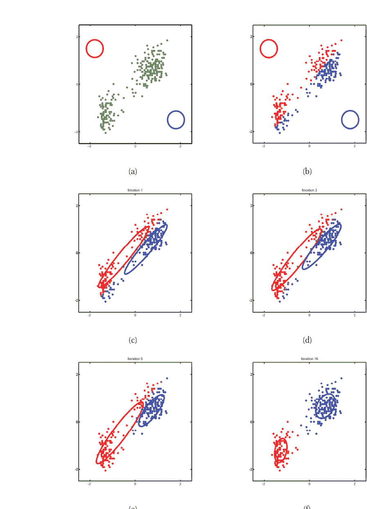

图11.11展示了应用于Old Faithful数据的GMM的EM算法的示意图。(a) 参数的初始（随机）值。(b) 在第一个E步骤中计算的每个点的后验责任。红色程度表示点属于红色簇的程度，蓝色类似；这些紫色点在簇之间具有大致均匀的后验概率。(c) 第一个M步骤后更新的参数。(d) 经过3次迭代后。(e) 经过5次迭代后。(f) 经过16次迭代后。基于（Bishop 2006a）图9.8。由mixGaussDemoFaithful生成的图。

```
算法 11.1: K-means 算法
1 初始化 $\mathbf{m}_k$;
2 重复
3 将每个数据点分配给其最近的聚类中心: $z_i = \arg \min_k \|\mathbf{x}_i - \boldsymbol{\mu}_k\|^2$;
4 通过计算分配给它的所有点的平均值来更新每个聚类中心:
   $\boldsymbol{\mu}_k = \frac{1}{N_k} \sum_{i:z_i=k} \mathbf{x}_i$;
5 直到 收敛 ;
```

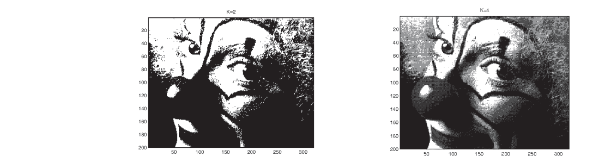

## 11.4.2.6 向量量化

由于 K-means 不是一个合适的 EM 算法，它不是在最大化似然函数。相反，它可以被解释为一种贪婪算法，用于近似最小化与数据相关的损失函数，现在我们来解释一下。

假设我们想要对一些实值向量进行有损压缩，$\mathbf{x}_i \in \mathbb{R}^D$。对此，一个非常简单的方法是使用向量量化或 VQ。基本思想是用离散符号 $z_i \in \{1, \dots, K\}$ 替换每个实值向量 $\mathbf{x}_i \in \mathbb{R}^D$，该符号是一个指向码书中的 $K$ 原型，$\boldsymbol{\mu}_k \in \mathbb{R}^D$。每个数据向量都通过使用最相似原型的索引进行编码，其中相似性是用欧氏距离来衡量的：$\text{encode}(\mathbf{x}_i) = \arg \min_k \|\mathbf{x}_i - \boldsymbol{\mu}_k\|^2$。

$$\text{encode}(\mathbf{x}_i) = \arg \min_k \|\mathbf{x}_i - \boldsymbol{\mu}_k\|^2 \quad\quad (11.37)$$

我们可以通过计算重构误差或引起的畸变来定义一个衡量码书质量的代价函数：

$$J(\boldsymbol{\mu}, \mathbf{z}|K, \mathbf{X}) \triangleq \frac{1}{N} \sum_{i=1}^N \|\mathbf{x}_i - \text{decode}(\text{encode}(\mathbf{x}_i))\|^2 = \frac{1}{N} \sum_{i=1}^N \|\mathbf{x}_i - \boldsymbol{\mu}_{z_i}\|^2 \quad\quad (11.38)$$

其中 $\text{decode}(k) = \boldsymbol{\mu}_k$。K-means算法可以被看作是一个简单的迭代方案，用于最小化这个目标。

当然，如果我们将每个数据向量分配一个原型，我们可以实现零失真，但这需要 $O(NDC)$ 空间，其中 $N$ 是实值数据向量的数量，每个向量的长度为 D，C是表示实值标量所需的位数（量化精度）。然而，在许多数据集中，我们经常看到相似的向量，所以我们可以将它们存储一次，然后创建指向它们的指针。因此，我们可以将空间要求减少到 $O(N \log_2K + KDC)$： $O(N \log_2K)$ 项是因为每个 N 数据向量需要指定它使用的 K 码字（指针）；而 $O(KDC)$ 项是因为我们必须存储每个码书条目，每个条目都是一个 D 维向量。通常第一项占主导地位，所以我们可以近似编码方案的速率（每个对象所需的位数）为 $O(\log_2K)$，这通常远小于 $O(DC)$。

向量量化的一个应用是图像压缩。考虑图11.12中的 $N= 200 \times 320 = 64,000$ 像素的图像；这是灰度图像，所以 $D= 1$。如果我们用一个字节来表示每个像素（灰度强度从0到255），那么 $C= 8$，所以我们需要 $N C= 512,000$ 位来表示图像。对于压缩后的图像，我们需要 $N \log_2K + KC$ 位。对于 $K= 4$，这大约是128kb，压缩比为4。对于 $K= 8$，这大约是192kb，压缩比为2.6，几乎没有感知损失（见图11.12(b)）。如果我们对像素之间的空间相关性进行建模，例如，如果我们编码5x5块（就像JPEG所使用的那样），则可以实现更大的压缩。这是因为残差误差（与模型预测的差异）会更小，需要更少的位来编码。

## 11.4.2.7 初始化和避免局部最小值

K-means和EM都需要初始化。通常是随机选择 K 个数据点，并将它们作为初始聚类中心。或者我们可以按顺序选择中心点，以尽量覆盖数据。也就是说，我们随机均匀地选择初始点。然后，每个后续点都根据其到最近聚类中心的平方距离与剩余点的距离成比例地选择。这被称为最远点聚类（Gonzales 1985），或者 k-means++（Arthur and Vassilvitskii 2007; Bahmani et al. 2012）。令人惊讶的是，这个简单的技巧可以保证失真度永远不会比最优解差 $O(\log K)$（Arthur and Vassilvitskii 2007）。

语音识别领域常用的一种启发式方法是逐步“增长”GMMs：我们首先根据其混合权重给每个聚类分配一个分数；在每轮训练之后，我们考虑将得分最高的聚类分裂为两个，新的质心是原始质心的随机扰动，新的分数是旧分数的一半。如果一个新的聚类分数太小，或者方差太小，它将被移除。我们继续这样做，直到达到所需的聚类数。参见（Figueiredo和Jain 2002）类似的增量方法。

## 11.4.2.8 MAP估计

通常，MLE可能会过拟合。过拟合问题在GMM的情况下特别严重。为了理解这个问题，假设简单起见，$\Sigma_k=\sigma_k^2\mathbf{I}$，而 $K=2$。通过将其中一个中心（例如 $\mu_2$）分配给单个数据点（例如 $x_1$），可以获得无限的似然性，因为这样第一项对似然性的贡献如下：

$\mathcal{N}(x_1|\mu_2, \sigma_2^2\mathbf{I}) = \frac{1}{\sqrt{2\pi\sigma_2^2}} e^0$

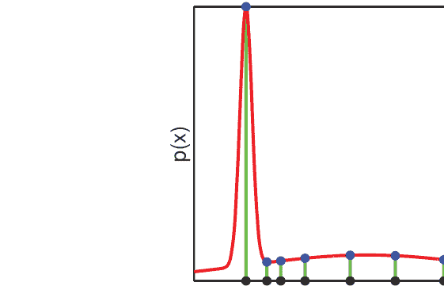

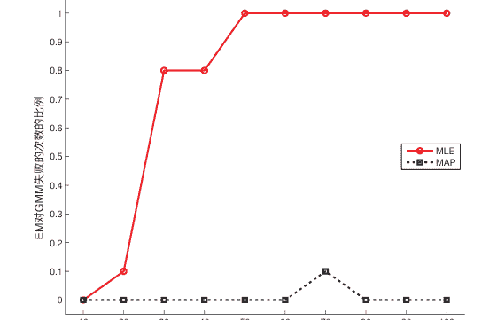

图11.13 (a) 展示了GMM似然函数中奇异性的产生方式。基于（Bishop 2006a）图9.7生成的图。图由mixGaussSingularity生成。(b) 展示了在拟合高斯混合模型时，MAP估计与ML估计的好处。我们绘制了每种方法在问题维度为 $N=100$ 个样本时，遇到数值问题的次数占总次数的比例（5次随机试验）。红色实线（上曲线）：MLE。黑色虚线（下曲线）：MAP。图由mixGaussMLvsMAP生成。

因此，通过让 $\sigma_2 \rightarrow 0$，我们可以使这个项趋向于无穷大，如图11.13(a)所示。我们将其称为“坍缩方差问题”。

解决这个问题的一个简单方法是进行MAP估计。新的辅助函数是期望的完整数据对数似然加上先验的对数:

$Q'(\theta, \theta^{old}) = \left[ \sum_i \sum_k r_{ik} \log \pi_{ik} + \sum_i \sum_k r_{ik} \log p(\mathbf{x}_i|\theta_k) \right] + \log p(\pi) + \sum_k \log p(\theta_k) (11.40)$

请注意，E步骤保持不变，但是M步骤需要进行修改，我们现在来解释一下。

对于混合权重的先验，使用狄利克雷先验是很自然的选择，$\pi \sim \text{Dir}(\alpha)$，因为这与分类分布共轭。MAP估计由以下给出

$\pi_k = \frac{r_k + \alpha_k - 1}{N + \sum_k \alpha_k - K} (11.41)$

如果我们使用均匀先验，$\alpha_k = 1$，这将简化为方程11.28。

类条件密度参数的先验分布，$p(\theta_k)$，取决于类条件密度的形式。我们在下面讨论GMMs的情况，并将MAP估计留给Exercise 11.3。

为了简单起见，让我们考虑一个形式为共轭先验的情况

$p(\mu_k, \Sigma_k) = \text{NIW}(\mu_k, \Sigma_k | \mathbf{m}_0, \kappa_0, \nu_0, \mathbf{S}_0) (11.42)$

根据第4.6.3节，MAP估计由以下给出

$$\hat{\mu}_k = \frac{r_k \bar{\mathbf{x}}_k + \kappa_0 \mathbf{m}_0}{r_k + \kappa_0}$$
$$\bar{\mathbf{x}}_k \triangleq \frac{\sum_i r_{ik} \mathbf{x}_i}{r_k}$$
$$\hat{\Sigma}_k = \frac{\mathbf{S}_0 + \mathbf{S}_k + \frac{\kappa_0 r_k}{\kappa_0 + r_k} (\bar{\mathbf{x}}_k - \mathbf{m}_0)(\bar{\mathbf{x}}_k - \mathbf{m}_0)^T}{\nu_0 + r_k + D + 2}$$
$$\mathbf{S}_k \triangleq \sum_i r_{ik} (\mathbf{x}_i - \bar{\mathbf{x}}_k)(\mathbf{x}_i - \bar{\mathbf{x}}_k)^T$$

我们现在通过GMMs的背景来说明使用MAP估计而不是ML估计的好处。我们使用ML或MAP估计将EM应用于一些合成数据在 $D$ 维度中。如果涉及奇异矩阵的数值问题，我们将试验视为“失败”。对于每个维度，我们进行5次随机试验。结果在图11.13(b)中使用 $N=100$ 进行说明。我们可以看到，一旦 $D$ 变得相当大，ML估计就会崩溃，而MAP估计则永远不会遇到数值问题。

在使用MAP估计时，我们需要指定超参数。在这里，我们提到一些简单的启发式方法来设置它们（Fraley和Raftery 2007, p163）。我们可以将 $\kappa_0$ 设置为0，这样 $\mu_k$ 就不会被正则化，因为数值问题只会出现在 $\Sigma_k$ 中。在这种情况下，MAP估计简化为 $\hat{\mu}_k = \bar{\mathbf{x}}_k$ 和 $\hat{\Sigma}_k = (\mathbf{S}_0 + \mathbf{S}_k)/(\nu_0 + r_k + D + 2)$，这并不是那么可怕。

现在我们讨论如何设置 $\mathbf{S}_0$。一种可能性是使用

$$\mathbf{S}_0 = \frac{1}{K^{1/D}} \text{diag}(s_1^2, \ldots, s_D^2)$$

其中 $s_j^2 = (1/N) \sum_{i=1}^{N} (x_{ij} - \bar{x}_j)^2$ 是维度 $j$ 的汇总方差。（原因是 $\frac{1}{K^{1/D}}$ 术语是每个椭球体的体积由 $|\mathbf{S}_0| = K^{-1}|\text{diag}(s_1^2, \ldots, s_D^2)|$ 给出。）参数 $\nu_0$ 控制我们对先验的强度。我们可以使用最弱的先验，同时仍然是适当的，将 $\nu_0 = D + 2$ 设置为常见选择。

## 11.4.3 混合专家的EM算法

我们可以直接使用EM算法来拟合混合专家模型。完整数据的期望对数似然函数为

$$Q(\boldsymbol{\theta}, \boldsymbol{\theta}^{old}) = \sum_{i=1}^{N} \sum_{k=1}^{K} r_{ik} \log[\pi_{ik} \mathcal{N}(y_i | \mathbf{w}_k^T \mathbf{x}_i, \sigma_k^2)]$$
$$\pi_{i,k} \triangleq \mathcal{S}(\mathbf{V}^T \mathbf{x}_i)_k$$
$$r_{ik} \propto \pi_{ik}^{old} \mathcal{N}(y_i | \mathbf{x}_i^T \mathbf{w}_k^{old}, (\sigma_k^{old})^2)$$

所以E步与标准混合模型相同，只是在计算 $r_{ik}$ 时，我们需要用 $\pi_{i,k}$ 替换 $\pi_k$。

在M步中，我们需要最大化 $Q(\theta,\theta^{old})$ wrt $\mathbf{w}_k$, $\sigma_k^2$ 和 $\mathbf{V}$。对于模型 $k$ 的回归参数，目标函数的形式为

$$Q(\theta_k,\theta^{old}) = \sum_{i=1}^N r_{ik} \left\{ -\frac{1}{\sigma_k^2} (y_i - \mathbf{w}_k^T \mathbf{x}_i) \right\}$$

我们将其识别为加权最小二乘问题，这在直观上是有意义的：如果 $r_{ik}$ 很小，那么数据点 $i$ 在估计模型 $k$ 的参数时将被降权。根据第8.3.4节，我们可以立即写出MLE为

$$\mathbf{w}_k = (\mathbf{X}^T \mathbf{R}_k \mathbf{X})^{-1} \mathbf{X}^T \mathbf{R}_k \mathbf{y}$$

其中 $\mathbf{R}_k = \mathrm{diag}(r_{:,k})$. 方差的最大似然估计为

$$\sigma_k^2 = \frac{\sum_{i=1}^N r_{ik} (y_i - \mathbf{w}_k^T \mathbf{x}_i)^2}{\sum_{i=1}^N r_{ik}}$$

我们用门控参数 $\mathbf{V}$ 的估计值替换无条件混合权重 $\pi$ 的估计值。目标函数的形式为

$$\ell(\mathbf{V}) = \sum_i \sum_k r_{ik} \log \pi_{i,k}$$

我们将其识别为多项式逻辑回归的对数似然函数，与方程式8.34中的“硬”1-of-$C$编码 $\mathbf{y}_i$ 相对应，只是我们用“软”1-of-$K$编码 $\mathbf{r}_i$ 替换了它。因此，我们可以通过将软目标标签拟合到逻辑回归模型来估计 $\mathbf{V}$。

## 11.4.4 隐藏变量的DGM的EM

我们可以推广EM背后的思想，以计算任意DGM的MLE或MAP估计。我们可以使用基于梯度的方法（Binder等人，1997年），但使用EM（Lauritzen，1995年）更简单：在E步骤中，我们只需估计隐藏变量，在M步骤中，我们将使用这些填充值计算MLE。我们在下面给出详细信息。

为了简化演示，我们将假设所有CPD都是表格形式的。根据第10.4.2节，让我们将每个CPT写成如下形式：

$$p(x_{it} | \mathbf{x}_{i,\mathrm{pa}(t)}, \boldsymbol{\theta}_t) = \prod_{c=1}^{K_{\mathrm{pa}(t)}} \prod_{k=1}^{K_t} \theta_{tck}^{\mathbb{I}(x_{it}=i, \mathbf{x}_{i,\mathrm{pa}(t)}=c)}$$

完整数据的对数似然由以下给出

$$\log p(\mathcal{D}|\boldsymbol{\theta}) = \sum_{t=1}^V \sum_{c=1}^{K_{\mathrm{pa}(t)}} \sum_{k=1}^{K_t} N_{tck} \log \theta_{tck}$$

其中 $N_{tck} = \sum_{i=1}^N \mathbb{I}(x_{it} = i, \mathbf{x}_{i,\mathrm{pa}(t)} = c)$ 是经验计数。因此，期望的完整数据对数似然具有以下形式

$$\mathbb{E}[\log p(\mathcal{D}|\boldsymbol{\theta})] = \sum_t \sum_c \sum_k \overline{N}_{tck} \log \theta_{tck}$$

其中

$$\overline{N}_{tck} = \sum_{i=1}^N \mathbb{E} [\mathbb{I}(x_{it} = i, \mathbf{x}_{i,\text{pa}(t)} = c)] = \sum_i p(x_{it} = k, \mathbf{x}_{i,\text{pa}(t)} = c | \mathcal{D}_i)$$

其中 $\mathcal{D}_i$是案例 $i$中的所有可见变量。数量 $p(x_{it}, \mathbf{x}_{i,\text{pa}(t)} | \mathcal{D}_i, \theta)$被称为**family marginal**，并且可以使用任何GM推理算法计算。$N_{tjk}$是期望的充分统计量，并构成E步骤的输出。

$$\hat{\theta}_{tck} = \frac{\overline{N}_{tck}}{\sum_{k'} \overline{N}_{tjk'}}$$

这可以通过添加Lagrange乘数（以强制执行约束 $\sum_k \theta_{tjk} = 1$）来证明，对于预期的完整数据对数似然进行修改，然后分别优化每个参数向量 $\theta_{tc}$分离。我们可以通过简单地向期望计数添加伪计数来修改此操作，以执行具有Dirichlet先验的MAP估计。

## 11.4.5 学生分布的EM *

高斯分布的一个问题是它对异常值敏感，因为与中心的距离的对数概率仅以二次方式衰减。更健壮的替代方案是学生t分布，如第 ??节所讨论的。

与高斯分布不同，即使我们没有缺失数据，也没有学生的MLE的闭式公式，因此我们必须采用迭代优化方法。最容易使用的是EM，因为它自动强制执行 $\nu$为正和 $\Sigma$为对称正定的约束。此外，所得到的算法具有简单直观的形式，如下所示。

乍一看，可能不明显为什么可以使用EM算法，因为没有缺失数据。关键思想是引入一个“人工”的隐藏变量，以简化算法。特别是，我们将利用学生分布可以写成高斯混合的事实：

$$\mathcal{T}(\mathbf{x}_i | \boldsymbol{\mu}, \boldsymbol{\Sigma}, \nu) = \int \mathcal{N}(\mathbf{x}_i | \boldsymbol{\mu}, \boldsymbol{\Sigma} / z_i) \text{Ga}(z_i | \frac{\nu}{2}, \frac{\nu}{2}) dz_i$$

（参见练习11.1中1维情况的证明。）这可以看作是一个“无限”的高斯混合，每个高斯混合具有稍微不同的协方差矩阵。将 $z_i$视为缺失数据，我们可以将完整数据的对数似然函数写成

$$\ell_c(\boldsymbol{\theta}) = \sum_{i=1}^N [\log \mathcal{N}(\mathbf{x}_i | \boldsymbol{\mu}, \boldsymbol{\Sigma} / z_i) + \log \text{Ga}(z_i | \nu/2, \nu/2)]$$

$$= \sum_{i=1}^N \left[ -\frac{D}{2}\log(2\pi) - \frac{1}{2}\log|\boldsymbol{\Sigma}| - \frac{z_i}{2}\delta_i + \frac{\nu}{2}\log\frac{\nu}{2} - \log\Gamma(\frac{\nu}{2}) \right. $$

$$\left. + \frac{\nu}{2}(\log z_i - z_i) + (\frac{D}{2} - 1)\log z_i \bigg]$$

在这里，我们定义了马哈拉诺比斯距离为

$$\delta_i = (\mathbf{x}_i - \boldsymbol{\mu})^T \boldsymbol{\Sigma}^{-1} (\mathbf{x}_i - \boldsymbol{\mu})$$

我们可以将其分为两个项，一个涉及 μ和 Σ，另一个涉及 ν。我们忽略不相关的常数，

$$\ell_c(\boldsymbol{\theta}) = L_N(\boldsymbol{\mu}, \boldsymbol{\Sigma}) + L_G(\nu)$$

$$L_N(\boldsymbol{\mu}, \boldsymbol{\Sigma}) \triangleq -\frac{1}{2} N \log |\boldsymbol{\Sigma}| - \frac{1}{2} \sum_{i=1}^N z_i \delta_i$$

$$L_G(\nu) \triangleq -N \log \Gamma(\nu/2) + \frac{1}{2} N \nu \log(\nu/2) + \frac{1}{2} \nu \sum_{i=1}^N (\log z_i - z_i)$$

### 11.4.5.1 EM with ν known

首先，为了简单起见，让我们推导出假设 ν已知的算法。在这种情况下，我们可以忽略 L_G项，因此我们只需要弄清楚如何计算旧参数下的 E[z_i]。根据第4.6.2.2节的内容，我们有

$$p(z_i | \mathbf{x}_i, \boldsymbol{\theta}) = \text{Ga}(z_i | \frac{\nu + D}{2}, \frac{\nu + \delta_i}{2})$$

如果 $z_i \sim \text{Ga}(a, b)$, 那么 $\mathbb{E}[z_i] = a/b$. 因此，在迭代 t的E步骤中

$$\bar{z}_i^{(t)} \triangleq \mathbb{E}[z_i | \mathbf{x}_i, \boldsymbol{\theta}^{(t)}] = \frac{\nu^{(t)} + D}{\nu^{(t)} + \delta_i^{(t)}}$$

通过最大化 $\mathbb{E}[L_N(\boldsymbol{\mu}, \boldsymbol{\Sigma})]$来获得M步骤

$$\hat{\boldsymbol{\mu}}^{(t+1)} = \frac{\sum_i \bar{z}_i^{(t)} \mathbf{x}_i}{\sum_i \bar{z}_i^{(t)}}$$

$$\hat{\boldsymbol{\Sigma}}^{(t+1)} = \frac{1}{N} \sum_i \bar{z}_i^{(t)} (\mathbf{x}_i - \hat{\boldsymbol{\mu}}^{(t+1)})(\mathbf{x}_i - \hat{\boldsymbol{\mu}}^{(t+1)})^T$$

$$= \frac{1}{N} \left[ \sum_i \bar{z}_i^{(t)} \mathbf{x}_i \mathbf{x}_i^T - \left( \sum_{i=1}^N \bar{z}_i^{(t)} \right) \hat{\boldsymbol{\mu}}^{(t+1)} (\hat{\boldsymbol{\mu}}^{(t+1)})^T \right]$$

这些结果相当直观：数量 $z_i$是测量 $i$的精度，因此如果它很小，在估计均值和协方差时，相应的数据点会被降权。这就是学生在处理异常值时实现鲁棒性的方式。

### 11.4.5.2 EM算法中 ν未知

为了计算自由度的最大似然估计，我们首先需要计算 $L_G(\nu)$的期望，其中涉及 $z_i$和 $\log z_i$。现在如果 $z_i \sim \text{Ga}(a, b)$, 那么可以证明

$$\bar{\ell}_i^{(t)} \triangleq \mathbb{E}[\log z_i | \boldsymbol{\theta}^{(t)}] = \Psi(a) - \log b$$

其中 $\Psi(x) \overset{\mathrm{def}}{=} \frac{d}{dx} \log \Gamma(x)$ 是digamma函数。因此，根据方程11.69，我们有

$$
\bar{\ell}_i^{(t)} = \Psi\left(\frac{\nu^{(t)} + D}{2}\right) - \log\left(\frac{\nu^{(t)} + \delta_i^{(t)}}{2}\right) \tag{11.75}
$$

$$= \log(\bar{z}_i^{(t)}) + \Psi\left(\frac{\nu^{(t)} + D}{2}\right) - \log\left(\frac{\nu^{(t)} + D}{2}\right) \tag{11.76}$$

将其代入方程11.68，我们有

$$
\mathbb{E}[L_G(\nu)] = -N \log \Gamma(\nu/2) + \frac{N \nu}{2} \log(\nu/2) + \frac{\nu}{2} \sum_i \left( \bar{\ell}_i^{(t)} - \bar{z}_i^{(t)} \right) \tag{11.77}
$$

这个表达式的梯度等于

$$
\frac{d}{d\nu} \mathbb{E}[L_G(\nu)] = -\frac{N}{2} \Psi(\nu/2) + \frac{N}{2} \log(\nu/2) + \frac{N}{2} + \frac{1}{2} \sum_i \left( \bar{\ell}_i^{(t)} - \bar{z}_i^{(t)} \right) \tag{11.78}
$$

这在区间 $(0, +\infty]$ 内有唯一解，可以使用一维约束优化器找到。

在M步中进行基于梯度的优化，而不是闭式更新，是所谓的广义EM算法的一个例子。即使我们只对M步中的参数进行“部分”改进，EM算法仍然会收敛到局部最优解。

### 11.4.5.3 学生分布的混合

很容易将上述方法扩展到拟合学生分布的混合。详细信息请参见练习11.4。

让我们从 (Lo 2009, ch3) 中考虑一个小例子。我们有一个 $N = 66$, $D = 2$ 关于某些公司破产模式的数据集。第一个特征指定了保留收益（RE）与总资产的比率，第二个特征指定了利息和税前利润（EBIT）与总资产的比率。我们对这些数据拟合了两个模型，忽略了类别标签：一个由2个高斯分布组成的混合模型和一个由2个学生分布组成的混合模型。然后我们使用每个拟合的模型对数据进行分类。我们计算最可能的聚类成员，并将其视为 $\hat{y}_i$。然后我们将 $\hat{y}_i$ 与真实标签 $y_i$ 进行比较，并计算错误率。如果错误率超过50%，我们重新排列潜在标签（即，我们认为聚类1代表类别2，反之亦然），然后重新计算错误率。被错误分类的点会显示为红色。结果显示在图11.14中。我们可以看到学生模型有4个错误，高斯模型有21个错误。这是因为类条件密度包含一些极端值，导致高斯模型选择不当。

## 11.4.6 probit回归的EM算法 *

在第9.4.2节中，我们描述了probit回归的潜变量解释。回想一下这个形式是 $P(Y_i=1|Z_i)=I(Z_i>0)$，其中 $Z_i\sim\mathcal{N}(W^T X_i,1)$ 是潜变量。我们现在展示如何使用EM算法拟合这个模型。（虽然可以使用梯度下降等方法拟合probit回归模型，如第9.4.1节所示，但基于EM算法的方法具有广泛适用于其他模型的优势，稍后我们将看到。）

完整数据的对数似然函数形式如下，假设 w 的先验分布为 $\mathcal{N}(0, V_0)$:

$$
\ell(Z,W|V_0) = \log P(Y|Z) + \log \mathcal{N}(Z|XW,I) + \log \mathcal{N}(W|0,V_0) \quad (11.79)
$$

$$
\ell(Z,W|V_0) = \sum_i \log p(y_i|z_i) - \frac{1}{2} (z - Xw)^T (z - Xw) - \frac{1}{2} w^T V_0^{-1} w + \text{const} \quad (11.80)
$$

E步骤中的后验概率是一个截断高斯分布:

$$
p(z_i|y_i, x_i, w) = \begin{cases} \mathcal{N}(z_i|w^T x_i, 1)I(z_i > 0) & \text{if } y_i = 1 \\ \mathcal{N}(z_i|w^T x_i, 1)I(z_i < 0) & \text{if } y_i = 0 \end{cases} \quad (11.81)
$$

在方程11.80中，我们可以看到 w 只是线性地依赖于 z，所以我们只需要计算 $E[z_i|y_i, x_i, w]$。练习11.15要求你证明后验均值为

$$
E[z_i|w, x_i] = \begin{cases} \mu_i + \frac{\phi(\mu_i)}{1-\Phi(-\mu_i)} = \mu_i + \frac{\phi(\mu_i)}{\Phi(\mu_i)} & \text{if } y_i = 1 \\ \mu_i - \frac{\phi(\mu_i)}{\Phi(-\mu_i)} = \mu_i - \frac{\phi(\mu_i)}{1-\Phi(\mu_i)} & \text{if } y_i = 0 \end{cases} \quad (11.82)
$$

其中 $\mu_i = w^T x_i$。

在M步骤中，我们使用岭回归来估计 w，其中 $\mu = E[z]$ 是我们试图预测的输出。具体来说，我们有

$$
\hat{w} = (V_0^{-1} + X^T X)^{-1} X^T \mu \quad (11.83)
$$

EM算法很简单，但比直接梯度方法慢得多，如图11.15所示。这是因为E步骤中的后验熵非常高，因为我们只观察到 z 是正数还是负数，但没有从似然函数中获得关于其大小的任何信息。使用更强的正则化器可以帮助加快收敛速度，因为它限制了可行 z 值的范围。此外，还可以使用各种加速技巧，如数据增强（van Dyk和Meng 2001），但我们在这里不讨论。

## 11.4.7 EM的理论基础 *

在本节中，我们将展示EM算法单调地增加观测数据的对数似然，直到达到局部最大值（或者鞍点，尽管这样的点通常是不稳定的）。我们的推导还将成为我们稍后讨论的各种EM推广的基础。

### 11.4.7.1 预期完整数据对数似然是一个下界

考虑一个任意分布 $q(\mathbf{z}_i)$ 对于隐藏变量。观测数据对数似然可以写成如下形式：

$$\ell(\boldsymbol{\theta}) \triangleq \sum_{i=1}^{N} \log \left[ \sum_{\mathbf{z}_i} p(\mathbf{x}_i, \mathbf{z}_i | \boldsymbol{\theta}) \right] = \sum_{i=1}^{N} \log \left[ \sum_{\mathbf{z}_i} q(\mathbf{z}_i) \frac{p(\mathbf{x}_i, \mathbf{z}_i | \boldsymbol{\theta})}{q(\mathbf{z}_i)} \right] \tag{11.84}$$

现在 $\log(u)$ 是一个凹函数，所以根据Jensen不等式（方程2.113），我们有以下下界：

$$\ell(\boldsymbol{\theta}) \geq \sum_{i} \sum_{\mathbf{z}_i} q_i(\mathbf{z}_i) \log \frac{p(\mathbf{x}_i, \mathbf{z}_i | \boldsymbol{\theta})}{q_i(\mathbf{z}_i)} \tag{11.85}$$

让我们将这个下界表示为：

$$Q(\boldsymbol{\theta}, q) \triangleq \sum_{i} \mathbb{E}_{q_i} [\log p(\mathbf{x}_i, \mathbf{z}_i | \boldsymbol{\theta})] + \mathbb{H}(q_i) \tag{11.86}$$

其中 $\mathbb{H}(q_i)$ 是 $q_i$ 的熵。

上述论证对于任何正分布 $q$ 都成立。我们应该选择哪一个？直观上，我们应该选择能够产生最紧密下界的 $q$。下界是一个求和，对于以下形式的项 i 的总和：

$$ L(\theta, q_i) = \sum_{z_i} q_i(z_i) \log \frac{p(x_i, z_i|\theta)}{q_i(z_i)} \tag{11.87} \\ = \sum_{z_i} q_i(z_i) \log \frac{p(z_i|x_i, \theta) p(x_i|\theta)}{q_i(z_i)} \tag{11.88} \\ = \sum_{z_i} q_i(z_i) \log \frac{p(z_i|x_i, \theta)}{q_i(z_i)} + \sum_{z_i} q_i(z_i) \log p(x_i|\theta) \tag{11.89} \\ = -\text{KL}(q_i(z_i) \| p(z_i|x_i, \theta)) + \log p(x_i|\theta) \tag{11.90} $$

在 $p(x_i|\theta)$ 项中，与 $q_i$ 无关，因此我们可以通过设置 $q_i(z_i) = p(z_i|x_i, \theta)$ 来最大化下界。当然，$\theta$ 是未知的，所以我们使用 $q_i^t(z_i) = p(z_i|x_i, \theta^t)$，其中 $\theta^t$ 是迭代 $t$ 时的参数估计。这是E步的输出。

将其代入下界，我们得到

$$ Q(\theta, q^t) = \sum_{i} \mathbb{E}_{q_i^t} [\log p(x_i, z_i|\theta)] + \mathbb{H}(q_i^t) \tag{11.91} $$

我们将第一项识别为期望的完整数据对数似然。第二项是关于 $\theta$ 的常数。因此，M步变为

$$ \theta^{t+1} = \arg \max_{\theta} Q(\theta, \theta^t) = \arg \max_{\theta} \sum_{i} \mathbb{E}_{q_i^t} [\log p(x_i, z_i|\theta)] \tag{11.92} $$

像往常一样。

现在来到关键的一点。由于我们使用了 $q_i^t(z_i) = p(z_i|x_i, \theta^t)$，KL散度变为零，因此 $L(\theta^t, q_i) = \log p(x_i|\theta^t)$，从而

$$ Q(\theta^t, \theta^t) = \sum_{i} \log p(x_i|\theta^t) = \ell(\theta^t) \tag{11.93} $$

我们看到在E步骤之后，下界是紧的。由于下界“触及”了函数，最大化下界也会“推动”函数本身的增长。也就是说，M步骤保证了修改参数以增加观测数据的可能性（除非已经达到局部最大值）。

这个过程在图11.16中概述。虚线红曲线是原始函数（观测数据的对数似然）。实线蓝曲线是下界，在$\theta^t$处评估；它在$\theta^t$处与目标函数相切。然后我们将$\theta^{t+1}$设置为下界（蓝曲线）的最大值，并在该点拟合一个新的下界（虚线绿曲线）。这个新下界的最大值变为$\theta^{t+2}$等（与图8.4(a)中的牛顿法相比，该方法重复拟合并优化二次近似）。

### 11.4.7.2 EM算法单调增加观测数据的对数似然

我们现在证明EM算法单调增加观测数据的对数似然，直到达到局部最优。我们有

$$ \ell(\theta^{t+1}) \ge Q(\theta^{t+1}, \theta^t) \ge Q(\theta^t, \theta^t) = \ell(\theta^t) \tag{11.94} $$

其中第一个不等式成立是因为 $Q(\theta, \cdot)$ 是 $\ell(\theta)$ 的一个下界；第二个不等式成立是因为根据定义， $Q(\boldsymbol{\theta}^{t+1}, \boldsymbol{\theta}^{t}) = \max_{\theta} Q(\boldsymbol{\theta}, \boldsymbol{\theta}^{t}) \geq Q(\boldsymbol{\theta}^{t}, \boldsymbol{\theta}^{t})$；最后一个等式根据方程11.93成立。

根据这个结果，如果你观察到观测数据对数似然的单调递增性，那么你的数学和/或代码肯定有错误。（如果你正在进行MAP估计，你必须在目标函数中加上对数先验项。）这是一个令人惊讶的强大调试工具。

## 11.4.8 在线EM

当处理大型或流式数据集时，能够进行在线学习非常重要，正如我们在第8.5节中讨论的那样。文献中有两种主要的在线EM方法。第一种方法被称为增量EM（Neal and Hinton 1998），它一次优化一个 $q_i$，但这需要存储每个数据案例的预期充分统计量。第二种方法被称为逐步EM（Sato and Ishii 2000; Cappé and Moulines 2009; Cappé 2010），它基于随机逼近理论，只需要恒定的内存使用。我们在下面更详细地解释这两种方法，紧接着是（Li and Kleijn）的介绍。

### 11.4.8.1 批处理EM回顾

在解释在线EM之前，我们先在一个更抽象的环境中回顾一下批处理EM。设 $\phi(\mathbf{x}, \mathbf{z})$ 为单个数据案例的充分统计量向量。（例如，对于多项式混合模型，这将是计数向量 $a(j)$，它表示集群 $j$ 在 $\mathbf{z}$ 中被使用的次数，加上矩阵 $B(j, v)$，它表示隐藏状态为 $j$ 且观察到的字母为 $v$ 的次数。）设 $\mathbf{s}_i = \sum_{\mathbf{z}} p(\mathbf{z} | \mathbf{x}_i, \boldsymbol{\theta}) \phi(\mathbf{x}_i, \mathbf{z})$ 为案例 $i$ 的期望充分统计量。$\boldsymbol{\mu} = \sum_{i=1}^{N} \mathbf{s}_i$ 为ESS的总和。给定 $\boldsymbol{\mu}$，我们可以通过M步骤推导出参数的ML或MAP估计值；我们将这个操作表示为 $\boldsymbol{\theta}(\boldsymbol{\mu})$。（例如，在多项式混合模型的情况下，我们只需要对 $a$ 和 $B$ 的每一行进行归一化。）有了这个符号表示，批处理EM的伪代码如算法8所示。

```
算法 11.2:批量EM算法
1 初始化 μ;
2 重复
3   μ^{新} = 0;
4   对于每个例子 i=1:N 执行
5     s_i := ∑_z p(z|x_i, θ(μ)) φ(x_i, z);
6     μ^{新} := μ^{新} + s_i;
7   μ := μ^{新};
8 直到 收敛 ;
```

### 11.4.8.2 增量EM

在增量EM中（Neal和Hinton1998），我们跟踪 $\mu$ 以及 $s_i$。当我们遇到一个数据案例时，我们将旧的 $s_i$ 替换为新的 $s_i^{新}$，如算法8中的代码所示。请注意，我们可以利用 $s_i^{新}$ 的稀疏性加速计算 $\theta$，因为 $\mu$ 的大多数分量不会改变。

```
算法 11.3: 增量 EM 算法
1 初始化 s_i 为 1:N;
2 μ = ∑_i s_i;
3 重复
4   对于每个示例 i=1:N 以随机顺序执行
5     s_i^{new} := ∑_z p(z|x_i, θ(μ)) φ(x_i, z);
6     μ := μ + s_i^{new} - s_i;
7     s_i := s_i^{new};
8 直到 收敛 ;
```

这可以被视为通过优化 $q_1$，然后 $\theta$，然后 $q_2$，然后 $\theta$ 等来最大化下界 $Q(\theta, q_1, \dots, q_N)$。因此，该方法保证单调收敛到下界的局部最大值和对数似然本身。

### 11.4.8.3 逐步 EM

在逐步 EM 中，每当计算一个新的 $s_i$ 时，我们将 $\mu$ 朝它移动，如算法 7.2 所示。在第 $k$ 次迭代中，步长为 $\eta_k$，必须满足 Robbins-Monro 条件中的方程 8.82。例如，(Liang and Klein) 使用 $\eta_k = (2+k)^{-\kappa}$ 对于 $0.5 < \kappa \leq 1$。在每次更新之前，我们可以使用大小为 $m$ 的小批量数据来获得更好的性能。可以通过优化 $m$ 和 $\kappa$ 来最大化训练集的似然性，方法是：

> 2. 一个细节: 如写所示, 对于 $\mu$ 的更新没有利用到 $s_i$ 的稀疏性。我们可以通过保持 $\theta$ = $\frac{\mu}{\prod_{j<k} (1-\eta_j)}$ 而不是 $\mu$，然后使用稀疏更新 $\mathbf{m} := \mathbf{m} + \frac{\eta_k}{\prod_{j<k} (1-\eta_j)} s_i$。这不会影响结果 (即 $\theta(\mu) = \theta(\mathbf{m})$ ), 因为通过全局常数缩放计数不会产生影响。

在初始试验期间并行尝试不同的值，这可以显著加快算法的速度。

```
算法 11.4: 逐步EM算法
1 初始化 μ; k = 0 ;
2 重复
3   对于每个示例 i = 1 : N 以随机顺序执行 do
4     s_i := ∑_z p(z|x_i, θ(μ)) φ(x_i, z) ;
5     μ := (1 - η_k) μ + η_k s_i;
6     k := k + 1
7 直到 收敛 ;
```

(Liang and Klein) 比较了批量EM、增量EM和逐步EM在四个不同的无监督语言建模任务上的表现。他们发现，逐步EM (使用κ ≈ 0.7 和 m ≈ 1000) 比增量EM更快，两者都比批量EM快得多。在准确性方面，逐步EM通常与批量EM一样好，有时甚至更好；增量EM往往比其他方法更差。

## 11.4.9 其他EM变体 *

EM是统计学和机器学习中最广泛使用的算法之一。毫不奇怪，已经提出了许多变体。我们在后面的章节中简要提到了一些，其中一些我们将在后面的章节中使用。更多信息请参见 (McLachlan和Krishnan 1997)。

- **退火EM**：一般来说，EM只会收敛到局部最大值。为了增加找到全局最大值的机会，我们可以使用各种方法。一种方法是使用被称为确定性退火的方法 (Rose 1998)。基本思想是通过将后验“景观”提升到一个温度，然后逐渐冷却它，同时缓慢地跟踪全局最大值来“平滑”后验“景观”。参见图11.17的草图。（一种随机版本该算法的描述在第24.6.1节中。）EM的一个退火版本在(Ueda和Nakano 1998)中描述。

- **变分EM**：在第11.4.7节中，我们展示了在E步骤中要做的最佳操作是使 $q_i$ 成为潜在变量的精确后验概率分布，$q_i^{t}(z_i) = p(z_i|x_i, \theta^{t})$。在这种情况下，对对数似然的下界将会很紧，因此M步骤将“推高”对数似然本身。 然而，有时在E步骤中进行精确推断是计算上难以处理的，但我们可能能够进行近似推断。 如果我们可以确保E步骤是基于对似然的下界进行推断，那么M步骤可以被视为单调增加这个下界（见图11.18）。这被称为变分EM（Neal和Hinton 1998）。 请参阅第21章，了解一些可以在E步骤中使用的变分推断方法。

- **蒙特卡洛EM**：处理难以处理的E步骤的另一种方法是使用蒙特卡洛近似来计算期望充分统计量。 也就是说，我们从后验分布中抽取样本， $z_i^{s} \sim p(z_i|x_i, \theta^{t})$，然后计算每个完成向量的充分统计量，$(x_i, z_i^{s})$，然后对结果进行平均。这被称为蒙特卡洛EM或MCEM（Wei和Tanner 1990）。（如果我们只抽取一个样本，则称为随机EM（Celeux和Diebolt 1985）。）抽取样本的一种方法是使用MCMC（见第24章）。 然而，如果我们必须在每个E步骤中等待MCMC收敛，该方法会变得非常缓慢。另一种选择是使用随机逼近，在E步骤中仅执行“简短”的抽样，然后进行部分参数更新。 这被称为随机逼近EM（Delyon等人1999），并且往往比MCEM效果更好。另一种选择是将MCMC应用于推断参数和潜在变量（完全贝叶斯方法），从而消除了E步骤和M步骤之间的区别。 详细信息请参见第24章。

- **广义EM**：有时我们可以精确执行E步骤，但无法精确执行M步骤。 然而，我们仍然可以通过执行“部分”M步骤来单调增加对数似然，其中我们仅仅增加了预期的完整数据对数似然，而不是最大化它。例如，我们可以进行几个梯度步骤。这被称为广义EM或GEM算法。 （这是一个不幸的术语，因为有很多将EM推广的方法...）

- **ECM(E)算法**：ECM算法代表“期望条件最大化”，并且指的是在M步中按顺序优化参数，如果它们是相关的。 ECME算法，代表“ECM either”（Liu and Rubin 1995），是ECM的一种变体，在一个或多个条件最大化步骤中，我们通常最大化期望完全数据对数似然（Q函数）或观察数据对数似然。后者可能会快得多，因为它忽略了E步的结果，直接优化感兴趣的目标。一个标准的例子是拟合学生T分布。对于固定的 ν，我们可以像往常一样更新 Σ，但是为了更新 ν，我们用 $\nu^{t+1} = \arg \max_\nu Q((\mu^{t+1}, \Sigma^{t+1}, \nu), \theta^t)$ 替换了标准的更新形式：$\nu^{t+1} = \arg \max_\nu \log p(D|\mu^{t+1}, \Sigma^{t+1}, \nu)$。更多信息请参见（McLachlan and Krishnan 1997）。

- **过度放松的EM**：普通的EM算法可能会很慢，特别是在有大量缺失数据的情况下。自适应过度放松EM算法(Salakhutdinov和Roweis 2003)执行的更新形式为 $\theta^{t+1} = \theta^t + \eta(M(\theta^t) - \theta^t)$，其中 $\eta$ 是步长参数，$M(\theta^t)$ 是在M步骤中计算的常规更新。显然，如果 $\eta=1$，则这将简化为标准EM算法，但是使用较大的 $\eta$ 值可以加快收敛速度。请参见图11.19进行说明。不幸的是，使用过大的 $\eta$ 值可能导致算法无法收敛。

最后，注意EM实际上只是一类更大的算法类别中的特殊情况，这类算法被称为约束优化或MM算法（MM代表辅助最大化）。有关进一步讨论，请参见（Hunter和Lange 2004）。

## 11.5 潜变量模型的模型选择

在使用潜变量模型时，我们必须指定潜变量的数量，这控制着模型的复杂度。特别是在混合模型的情况下，我们必须指定 $K$，即聚类的数量。选择这些参数是模型选择的一个例子。我们在下面讨论一些方法。

### 11.5.1 概率模型的模型选择

最优的贝叶斯方法，在第5.3节中讨论，是选择具有最大边际似然的模型，即 $K^* = \arg\max_K p(\mathcal{D}|K)$。

这有两个问题。首先，对于潜变量模型，评估边际似然是相当困难的。在实践中，可以使用简单的近似方法，如BIC（参见例如，(Fraley and Raftery 2002)）。或者，我们可以使用交叉验证似然作为性能度量，尽管这可能很慢，因为它需要逐个拟合每个模型 $F$ 次，其中 $F$ 是交叉验证折数。

第二个问题是需要在潜在的大量模型中进行搜索。通常的方法是对 $K$ 的所有候选值进行穷举搜索。然而，有时我们可以将模型设置为最大尺寸，然后依靠贝叶斯奥卡姆剃刀的力量来“消除”不需要的组件。在第21.6.1.6节中，我们将展示一个例子，讨论变分贝叶斯。

另一种方法是在模型空间中进行随机抽样。传统的方法，如 (Green 1998, 2003; Lunn et al. 2009) ，基于可逆跳跃MCMC，使用出生移动提出新的中心，使用死亡移动消除旧的中心。然而，这可能会很慢且难以实现。一个更简单的方法是使用狄利克雷过程混合模型，可以使用吉布斯抽样进行拟合，但仍允许无限数量的混合组件；有关详细信息，请参见第25.2节。

也许令人惊讶的是，这些基于采样的方法可能比简单的逐个评估每个 $K$ 的质量的方法更快。原因是为每个 $K$ 拟合模型通常很慢。相比之下，采样方法通常可以快速确定某个 $K$ 值的质量较差，因此它们不需要在后验的那部分浪费时间。

### 11.5.2 非概率方法的模型选择

如果我们不使用概率模型呢？例如，我们如何为 $K$-均值算法选择 $K$？由于这不对应于概率模型，因此上述方法都不能使用。

似然的一个明显替代是重构误差。定义数据集 $\mathcal{D}$ 的平方重构误差，使用模型复杂度 $K$，如下所示：

$$
E(\mathcal{D}, K) = \frac{1}{|\mathcal{D}|} \sum_{i \in \mathcal{D}} || \mathbf{x}_i - \hat{\mathbf{x}}_i ||^2 \quad (11.95)
$$

对于K-means，重构由 $\hat{\mathbf{x}}_i = \boldsymbol{\mu}_{z_i}$ 给出，其中 $z_i = \arg\min_k || \mathbf{x}_i - \boldsymbol{\mu}_k ||_2^2$，如第11.4.2.6节所解释的。

图11.20(a)显示了K-means在测试集上的重构误差。我们注意到随着模型复杂度的增加，误差逐渐减小！这种行为的原因如下：

当我们向 K-means添加越来越多的质心时，我们可以更密集地“铺设”空间，如图11.21(b)所示。因此，随着 K的增加，任何给定的测试向量更有可能找到一个接近的原型来准确表示它，从而减小重构误差。 然而，如果我们使用概率模型，如GMM，并绘制负对数似然，我们在测试集上得到通常的U形曲线，如图11.20(b)所示。

在监督学习中，我们总是可以使用交叉验证来选择不同复杂度的非概率模型，但在无监督学习中不是这样。 尽管这不是一个新观察（例如，在(Hastie et al. 2009, p519)中提到过），但它可能没有得到应有的广泛认可。实际上，这是支持概率模型的更有说服力的论点之一。

鉴于交叉验证不起作用，并且假设出于某种奇怪的原因不愿使用概率模型，那么如何选择 K？ 最常见的方法是在训练集上绘制重构误差与 K的关系，并尝试识别曲线上的一个拐点或转折点。 这个想法是对于K < K*，其中 K*是“真实”的聚类数，错误函数的下降速度会很快，因为我们将不应该被分组在一起的东西分开。 然而，对于K > K*，我们正在分开“自然”的聚类，这并不能减少错误。

## 11.6 用缺失数据拟合模型

假设我们想通过最大似然法拟合一个联合密度模型，但是由于数据缺失（通常用NaN表示），我们的数据矩阵中存在“空洞”。更正式地说，如果数据案例i的组件j观察到，则Oij = 1，否则Oij = 0。让Xv = {xij: Oij = 1}为可见数据，Xh = {xij: Oij = 0}为缺失或隐藏数据。我们的目标是计算

$$
\hat{\theta} = \mathop{\mathrm{argmax}}_{\theta} p(\mathbf{X}_v | \theta, \mathbf{O})
$$
(11.96)

在随机缺失假设下（参见第8.6.2节），我们有

$$
p(\mathbf{X}_v | \theta, \mathbf{O}) = \prod_{i=1}^{N} p(\mathbf{x}_{iv} | \theta)
$$
(11.97)

其中 $\mathbf{x}_{iv}$ 是由行 i和由集合 {j : Oij = 1}索引的列创建的向量。因此，对数似然函数的形式为

$$
\log p(\mathbf{X}_v | \theta) = \sum_{i} \log p(\mathbf{x}_{iv} | \theta)
$$
(11.98)

其中

$$
p(\mathbf{x}_{iv} | \theta) = \sum_{\mathbf{x}_{ih}} p(\mathbf{x}_{iv}, \mathbf{x}_{ih} | \theta)
$$
(11.99)

而 $\mathbf{x}_{ih}$ 是用于案例i的隐藏变量向量（为了简洁起见，假设为离散变量）。代入后，我们得到

$\log p(\mathbf{x}_v|\theta) = \sum_i \log [\sum_{\mathbf{x}_{ih}} p(\mathbf{x}_{iv}, \mathbf{x}_{ih}|\theta)]$ (11.100)

不幸的是，这个目标函数很难最大化。因为我们无法将对数运算符放入求和符号内。然而，我们可以使用EM算法计算局部最优解。我们在下面给出一个例子。

### 11.6.1 使用EM算法求解带有缺失数据的多元正态分布的最大似然估计

假设我们想通过最大似然估计来拟合一个多元正态分布，但是我们有缺失数据。我们可以使用EM算法来找到目标函数的局部最大值，如下所述。

#### 11.6.1.1 入门

为了启动算法，我们可以基于数据矩阵中完全观测到的行计算MLE。如果没有这样的行，我们可以使用一些特定的插补方法，然后计算初始MLE。

#### 11.6.1.2 E步

一旦我们有了 $\boldsymbol{\theta}^{(t-1)}$ ，我们可以在第t次迭代时计算预期的完整数据对数似然，如下所示：

$Q(\boldsymbol{\theta}, \boldsymbol{\theta}^{(t-1)}) = \mathbb{E}[\sum_{i=1}^N \log \mathcal{N}(\mathbf{x}_i|\boldsymbol{\mu}, \boldsymbol{\Sigma})|\mathcal{D}, \boldsymbol{\theta}^{(t-1)}]$ (11.101)
$= -\frac{N}{2} \log |2\pi\boldsymbol{\Sigma}| - \frac{1}{2} \sum_i \mathbb{E}[(\mathbf{x}_i - \boldsymbol{\mu})^T \boldsymbol{\Sigma}^{-1}(\mathbf{x}_i - \boldsymbol{\mu})]$ (11.102)
$= -\frac{N}{2} \log |2\pi\boldsymbol{\Sigma}| - \frac{1}{2} \operatorname{tr}(\boldsymbol{\Sigma}^{-1} \sum_i \mathbb{E}[(\mathbf{x}_i - \boldsymbol{\mu})(\mathbf{x}_i - \boldsymbol{\mu})^T])$ (11.103)
$= -\frac{N}{2} \log |\boldsymbol{\Sigma}| - \frac{N D}{2} \log(2\pi) - \frac{1}{2} \operatorname{tr}(\boldsymbol{\Sigma}^{-1} \mathbb{E}[\mathbf{S}(\boldsymbol{\mu})])$ (11.104)
其中
$\mathbb{E}[\mathbf{S}(\boldsymbol{\mu})] \triangleq \sum_i (\mathbb{E}[\mathbf{x}_i \mathbf{x}_i^T] + \boldsymbol{\mu}\boldsymbol{\mu}^T - 2\boldsymbol{\mu} \mathbb{E}[\mathbf{x}_i]^T)$ (11.105)
(为了简洁起见，我们省略了对 $\mathcal{D}$ 和 $\boldsymbol{\theta}^{(t-1)}$ 的期望条件。) 我们看到我们需要计算 $\sum_i \mathbb{E}[\mathbf{x}_i]$ 和 $\sum_i \mathbb{E}[\mathbf{x}_i \mathbf{x}_i^T]$ ；这些是期望的充分统计量。为了计算这些量，我们使用第4.3.1节的结果。具体来说，考虑情况i，其中分量v被观察到，分量h未被观察到。我们有
$\mathbf{x}_{ih}|\mathbf{x}_{iv}, \boldsymbol{\theta} \sim \mathcal{N}(\mathbf{m}_i, \mathbf{V}_i)$ (11.106)
$\mathbf{m}_i \triangleq \boldsymbol{\mu}_h + \boldsymbol{\Sigma}_{hv} \boldsymbol{\Sigma}_{vv}^{-1}(\mathbf{x}_{iv} - \boldsymbol{\mu}_v)$ (11.107)
$\mathbf{V}_i \triangleq \boldsymbol{\Sigma}_{hh} - \boldsymbol{\Sigma}_{hv} \boldsymbol{\Sigma}_{vv}^{-1} \boldsymbol{\Sigma}_{vh}$ (11.108)

因此，期望的充分统计量是

$\mathbb{E}[\mathbf{x}_i] = (\mathbb{E}[\mathbf{x}_{ih}]; \mathbf{x}_{iv}) = (\boldsymbol{\mu}_i; \mathbf{x}_{iv})$  (11.109)
在节点排序中，我们假设（不失一般性） 未观察到的变量出现在观察到的变量之前。

要计算 $\mathbb{E} \left[ \mathbf{x}_i\mathbf{x}_i^T \right]$, 我们使用 $\operatorname{cov}[\mathbf{x}] = \mathbb{E} \left[ \mathbf{x}\mathbf{x}^T \right] - \mathbb{E}[\mathbf{x}] \mathbb{E}[\mathbf{x}^T]$. 因此

$\mathbb{E} \left[ \mathbf{x}_i\mathbf{x}_i^T \right] = \mathbb{E} \left[ \begin{pmatrix} \mathbf{x}_{ih} \\ \mathbf{x}_{iv} \end{pmatrix} \begin{pmatrix} \mathbf{x}_{ih}^T & \mathbf{x}_{iv}^T \end{pmatrix} \right] = \begin{pmatrix} \mathbb{E}[\mathbf{x}_{ih}\mathbf{x}_{ih}^T] & \mathbb{E}[\mathbf{x}_{ih}]\mathbf{x}_{iv}^T \\ \mathbf{x}_{iv}\mathbb{E}[\mathbf{x}_{ih}]^T & \mathbf{x}_{iv}\mathbf{x}_{iv}^T \end{pmatrix}$  (11.110)

$\mathbb{E}[\mathbf{x}_{ih}\mathbf{x}_{ih}^T] = \mathbb{E}[\mathbf{x}_{ih}]\mathbb{E}[\mathbf{x}_{ih}]^T + \mathbf{V}_i$  (11.111)

#### 11.6.1.3 M 步

通过求解 $\nabla Q(\boldsymbol{\theta}, \boldsymbol{\theta}^{(t-1)}) = \boldsymbol{0}$, 我们可以证明 M 步等价于将这些 ESS 插入到通常的 MLE 方程中得到

$\boldsymbol{\mu}^t = \frac{1}{N} \sum_i \mathbb{E}[\mathbf{x}_i]$  (11.112)

$\boldsymbol{\Sigma}^t = \frac{1}{N} \sum_i \mathbb{E}[\mathbf{x}_i\mathbf{x}_i^T] - \boldsymbol{\mu}^t (\boldsymbol{\mu}^t)^T$  (11.113)

因此，我们可以看到 EM 不等同于简单地用期望替换变量并应用标准 MLE 公式；这将 忽略后验方差并导致错误的估计。相反，我们必须计算充分统计量的期望值，并将其插 入到 MLE 的常规方程中。我们可以轻松修改算法以执行 MAP 估计，通过将 ESS 插入到 MAP 估计的方程中。有关实现，请参见 `gaussMissingFitEm`。

#### 11.6.1.4 示例

作为这个过程的一个例子，让我们重新考虑第4.3.2.3节中的插补问题，其中有 $N=100$ 个 $D=10$ 维数据案例，其中50%的数据缺失。让我们使用EM算法来拟合参数。将得到的参数称为 $\hat{\boldsymbol{\theta}}$。我们可以通过计算 $\mathbb{E}$ 来使用我们的模型进行预测

$\mathbb{E}[\mathbf{x}_{ih}|\mathbf{x}_{iv}, \hat{\boldsymbol{\theta}}]$

图11.22(a-b)表明，使用学习到的参数得到的结 果几乎与真实参数一样好。毫不奇怪，随着数据量的增加或缺失数据的比例的减少，性 能会提高。

#### 11.6.1.5 GMM情况的扩展

在部分观测数据向量 $\mathbf{x}_i$ 存在的情况下，拟合高斯混合模型是直接的。我们将细节留作 练习。

## 练习

练习11.1 学生T作为高斯混合的无限混合 推导方程11.61。为简单起见，假设一维分布。

练习11.2 高斯混合的EM算法

证明高斯混合的ML估计的M步骤为

$$
\mu_k = \frac{\sum_i r_{ik} x_i}{r_k}
$$

$$
\Sigma_k = \frac{\sum_i r_{ik} (x_i - \mu_k)(x_i - \mu_k)^T}{r_k} = \frac{\sum_i r_{ik} x_i x_i^T - r_k \mu_k \mu_k^T}{r_k}
$$

练习11.3 混合伯努利的EM算法

- 证明伯努利混合模型的ML估计的M步骤为
  $$
  \mu_{k,j} = \frac{\sum_i r_{ik} x_{ij}}{\sum_i r_{ik}}
  $$
- 证明具有 $\beta(\alpha, \beta)$ 先验的伯努利混合模型的MAP估计的M步骤为
  $$
  \mu_{k,j} = \frac{(\sum_i r_{ik} x_{ij}) + \alpha - 1}{(\sum_i r_{ik}) + \alpha + \beta - 2}
  $$

练习11.4 学生分布的EM算法

推导多元学生T分布混合模型的ML估计的EM算法

练习11.5 梯度下降法拟合GMM

考虑高斯混合模型

$$
p(\mathbf{x}|\theta) = \sum_k \pi_k \mathcal{N}(\mathbf{x}|\mu_k, \Sigma_k)
$$

将对数似然定义为

$$
\ell(\theta) = \sum_{n=1}^N \log p(\mathbf{x}_n|\theta)
$$

定义簇 $k$ 对数据点 $n$ 的后验责任如下：

$$
r_{nk} \triangleq p(z_n = k|\mathbf{x}_n, \theta) = \frac{\pi_k \mathcal{N}(\mathbf{x}_n|\mu_k, \Sigma_k)}{\sum_{k'=1}^K \pi_{k'} \mathcal{N}(\mathbf{x}_n|\mu_{k'}, \Sigma_{k'})} \tag{11.120}
$$

- a. 证明对于 $\boldsymbol{\mu}_k$ 的对数似然的梯度是
  $$
  \frac{d}{d\boldsymbol{\mu}_k} \ell(\boldsymbol{\theta}) = \sum_{n} r_{nk} \Sigma_k^{-1} (\mathbf{x}_n - \boldsymbol{\mu}_k) \tag{11.121}
  $$
- b. 推导对数似然函数关于 $\pi_k$ 的梯度。（暂时忽略对 $\pi_k$ 的任何约束。）
- c. 处理 $\sum_{k=1}^K \pi_k = 1$ 的一种方法是使用softmax函数重新参数化：
  $$
  \pi_k \triangleq \frac{e^{w_k}}{\sum_{k'=1}^K e^{w_{k'}}} \tag{11.122}
  $$
  这里 $w_k \in \mathbb{R}$ 是无约束的参数。证明
  $$
  \frac{d}{d w_k} \ell(\boldsymbol{\theta}) = \sum_{n} r_{nk} - \pi_k \tag{11.123}
  $$
  （上述表达式可能缺少一个常数因子...）提示：使用链式法则和事实
  $$
  \frac{d\pi_j}{d w_k} = \begin{cases} \pi_j(1 - \pi_j) & \text{if } j = k \\ -\pi_j\pi_k & \text{如果 } j \neq k \end{cases} \tag{11.124}
  $$
  这是从练习8.4(1)得出的结论。
- d. 推导出对数似然函数关于 $\Sigma_k$ 的梯度。（暂时忽略对 $\Sigma_k$ 的任何约束。）
- e. 处理 $\Sigma_k$ 必须是对称正定矩阵的约束的一种方法是使用Cholesky分解， $\Sigma_k = \mathbf{R}_k^T \mathbf{R}_k$，其中 $\mathbf{R}_k$ 是一个上三角矩阵，但是没有其他约束。推导出对数似然函数关于 $\mathbf{R}_k$ 的梯度。

练习11.6 有限高斯混合模型的EM算法

（来源：Jaakkola..）考虑图11.23中定义的图模型，它定义了以下内容：

$$
p(x_n|\theta) = \sum_{j=1}^{m} p_j \left[ \sum_{k=1}^{l} q_k \mathcal{N}(x_n|\mu_j, \sigma_k^2) \right] \tag{11.125}
$$其中 $\theta = \{p_1, \ldots, p_m, \mu_1, \ldots, \mu_m, q_1, \ldots, q_l, \sigma_1^2, \ldots, \sigma_l^2\}$ 是所有参数。 这里 $P(J_n = n j)$ 和 $P(K_n = k)$ 相当于混合权重。 我们可以将其看作是一个混合由 $m$ 个非高斯分量组成，其中每个分量分布是一个比例混合，$p(x|j; \theta) = \sum_{k=1}^l q_k N(x; \mu_j, \sigma_k^2)$，将具有不同方差（尺度）的高斯分布组合在一起。 现在我们将推导出这个模型的广义EM算法。（回想一下，在广义EM中，我们在M步中进行部分更新，而不是找到精确的最大值。）

- a. 推导出一个表达式，用于计算E步骤所需的责任 $P(J_n = j, K_n = k|x_n, \theta)$。
- b. 写出完整的期望完全对数似然表达式
$$Q(\theta^{new}, \theta^{old}) = E_{\theta^{old}} \sum_{n=1}^{N} \log P(J_n, K_n, x_n|\theta^{new}) \tag{11.126}$$
- c. 解决M步骤需要我们共同优化均值 $\mu_1, \ldots, \mu_m$ 和方差 $\sigma_1^2, \ldots, \sigma_l^2$。事实证明，首先在固定的 $\sigma_j^2$ 的情况下解决 $\mu_j$ 的问题会更简单，然后再根据 $\mu_j$ 的新值解决 $\sigma_j^2$ 的问题。为了简洁起见，我们只做第一部分。推导出在固定的 $\sigma_{1:2l}$ 情况下最大化 $\mu_j$ 的表达式，即解决 $\frac{\partial Q}{\partial \mu_j^{new}} = 0$。

## 练习 11.7 手动计算 GMM 的 M 步

（来源：de Freitas。）在这个问题中，我们使用EM算法对一维数据进行混合高斯聚类。给定1-D数据点 $x = [1, 10, 20]$。假设E步的输出是以下矩阵：

$$\mathbf{R} = \begin{bmatrix} 1 & 0 \\ 0.4 & 0.6 \\ 0 & 1 \end{bmatrix} \tag{11.127}$$

其中条目 $r_{i,c}$ 是观测值 $x_i$ 属于聚类 $c$ 的概率（聚类 $c$ 对数据点 $i$ 的责任）。你只需要计算M步。你可以陈述这些数量的最大似然估计方程（你应该知道）而无需证明；你只需要将方程应用于这个数据集。你可以用分数形式给出你的答案。展示你的工作。

- a. 写出你要优化的似然函数。
- b. 在对混合权重 $\pi_1, \pi_2$ 执行M步之后，新的值是什么？
- c. 在对均值 $\mu_1$ 和 $\mu_2$ 执行M步骤之后，新的值是什么？

## 练习 11.8 高斯混合的矩

考虑一个 $K$ 高斯混合
$$p(\mathbf{x}) = \sum_{k=1}^{K} \pi_k \mathcal{N}(\mathbf{x}|\boldsymbol{\mu}_k, \mathbf{\Sigma}_k) \tag{11.128}$$

a. 证明

$$\mathbb{E}[\mathbf{x}] = \sum_{k} \pi_k \boldsymbol{\mu}_k \tag{11.129}$$

b. 证明

$$\text{cov} [\mathbf{x}] = \sum_k \pi_k [\mathbf{\Sigma}_k + \mathbf{\mu}_k \mathbf{\mu}_k^T] - \mathbb{E}[\mathbf{x}] \mathbb{E}[\mathbf{x}]^T$$

提示：使用 $\text{cov} [\mathbf{x}] = \mathbb{E}[\mathbf{x}\mathbf{x}^T] - \mathbb{E}[\mathbf{x}] \mathbb{E}[\mathbf{x}]^T$ 这个事实。

## 练习 11.9 手动进行K-means聚类

(来源： Jaakkola。)

在图11.24中，我们展示了一些位于整数网格上的数据点。（注意，x轴已经被压缩；距离应该使用实际的网格坐标来测量。）假设我们将K-means算法应用于这些数据，使用 K=2 并将中心初始化为两个圈起来的数据点。 在K-means收敛后绘制最终聚类结果（显示新中心的大致位置，并将分配给每个中心的所有点分组在一起）。提示：考虑最短欧几里得距离。

## 练习 11.10 推导K-means成本函数证明

$$J_W(\mathbf{z}) = \frac{1}{2} \sum_{k=1}^K \sum_{i: z_i=k} \sum_{i': z_{i'}=k} (x_i - x_{i'})^2 = \sum_{k=1}^K n_k \sum_{i: z_i=k} (x_i - \overline{x}_k)^2$$

提示：注意，对于任何 $\mu$,

$$\begin{aligned}
\sum_{i} (x_i - \mu)^2 &= \sum_{i} [(x_i - \overline{x}) - (\mu - \overline{x})]^2 \\
&= \sum_{i} (x_i - \overline{x})^2 + \sum_{i} (\overline{x} - \mu)^2 - 2 \sum_{i} (x_i - \overline{x})(\mu - \overline{x}) \\
&= n s^2 + n(\overline{x} - \mu)^2
\end{aligned}$$

其中 $s^2 = \frac{1}{n} \sum_{i=1}^n (x_i - \overline{x})^2$, 因为

$$\sum_{i} (x_i - \overline{x})(\mu - \overline{x}) = (\mu - \overline{x}) \left( \sum_{i} x_i - n\overline{x} \right) = (\mu - \overline{x})(n\overline{x} - n\overline{x}) = 0$$

## 练习 11.11 可见高斯混合模型属于指数族

证明一维高斯混合模型的联合分布 $p(x, z | \theta)$ 可以用指数族形式表示

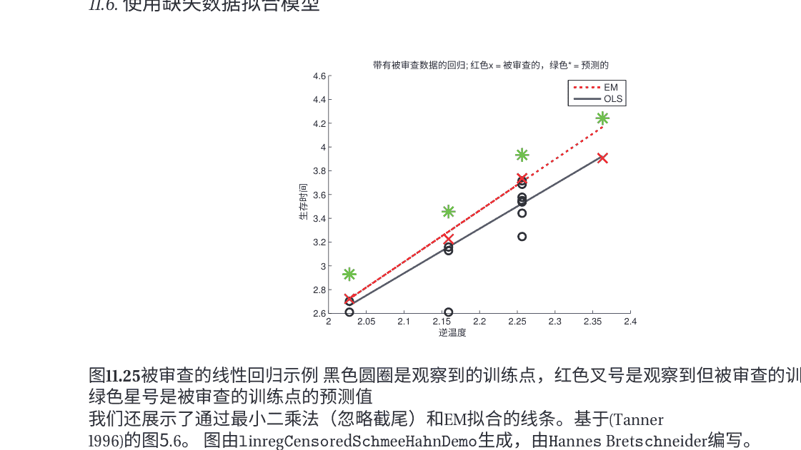

## 练习 11.12 具有学生t似然的鲁棒线性回归的EM

考虑一个形式为的模型

$$p(y_i | \mathbf{x}_i, \mathbf{w}, \sigma^2, \nu) = \mathcal{T}(y_i | \mathbf{w}^T \mathbf{x}_i, \sigma^2, \nu) \quad (11.136)$$

推导出一个EM算法来计算 $\mathbf{w}$ 的MLE。为了简单起见，您可以假设 $\nu$ 和 $\sigma^2$ 是固定的。提示：参见第11.4.5节。

## 练习 11.13 高斯收缩模型的EB估计的EM

将第5.6.2.2节的结果推广到 $\sigma_j^2$ 不相等的情况（但已知）。提示：将 $\theta_j$ 视为隐藏变量，然后在E步骤中将其积分出来，并在M步骤中最大化 $\eta = (\mu, \tau^2)$。

## 练习 11.14 EM 用于被审查的线性回归

被审查的回归是指知道结果至少（或最多）是某个确定值，但确切值是未知的情况。这在许多不同的环境中出现。例如，假设有人试图学习一个模型，可以预测程序在不同参数设置下运行所需的时间。如果某些运行时间看起来太长，可以中止它们；得到的运行时间被称为右审查。对于这样的运行，我们只知道 $y_i \geq c_i$，其中 $c_i$ 是审查时间，即 $y_i = \min(z_i, c_i)$，其中 $z_i$ 是真实运行时间，$y_i$ 是观察到的运行时间。我们还可以定义左审查和区间审查模型。$^{3}$ 推导出一个用于拟合线性回归模型到右审查数据的EM算法。提示：使用练习11.15的结果。参见图11.25的例子，基于（Schmee和Hahn 1979）的数据。我们注意到EM线更向上倾斜，因为该模型考虑到截断值实际上比观察到的值更高。

$^{3}$ 在计量经济学中有一个密切相关的模型叫做Tobit模型，在这个模型中 $y_i = \max(z_i, 0)$，所以我们只能观察到正的结果。一个例子是当 $z_i$ 代表“期望投资”，而 $y_i$ 是实际投资。Probit回归（第9.4节）是另一个例子。

## 练习 11.15 截断高斯分布的后验均值和方差

有时候，比如在Probit回归或截断回归中，我们无法观察到 $z_i$，但我们观察到它超过某个阈值的事实，即我们观察到事件 $E = I(z_i \geq c_i) = I(\varepsilon_i \geq c_i - \mu_i)$。（有关截断回归的详细信息，请参见练习11.14，有关Probit回归，请参见第11.4.6节。）证明

$$E[z_i | z_i \geq c_i] = \mu_i + \sigma H \left( \frac{c_i - \mu_i}{\sigma} \right) \tag{11.137}$$

和

$$E[z_i^2 | z_i \geq c_i] = \mu_i^2 + \sigma^2 + \sigma(c_i + \mu_i) H \left( \frac{c_i - \mu_i}{\sigma} \right) \tag{11.138}$$

我们定义了

$$H(u) \triangleq \frac{\phi(u)}{1 - \Phi(u)} \tag{11.139}$$

其中 $\phi(u)$ 是标准高斯分布的概率密度函数，$\Phi(u)$ 是其累积分布函数。

提示1：我们有 $p(\varepsilon_i|E) = \frac{p(\varepsilon_i,E)}{p(E)}$，其中 $E$ 是某个感兴趣的事件。

提示2：可以证明

$$\frac{d}{dw} \mathcal{N}(w|0,1) = -w \mathcal{N}(w|0,1) \tag{11.140}$$

因此

$$\int_b^c w \mathcal{N}(w|0,1) dw = \mathcal{N}(b|0,1) - \mathcal{N}(c|0,1) \tag{11.141}$$

# 12 潜在线性模型

## 12.1 因子分析

混合模型的一个问题是它们只使用一个潜在变量来生成观测值。 特别地，每个观测值只能来自 $K$ 个原型之一。 可以将混合模型看作使用 $K$ 个隐藏的二进制变量，表示簇的身份的一位热编码。 但是因为这些变量是互斥的，所以模型在表示能力上仍然有限。

另一种选择是使用一个实值潜在变量的向量， $\mathbf{z}_i \in \mathbb{R}^L$。 使用的最简单的先验是高斯分布（我们稍后会考虑其他选择）：

$$p(\mathbf{z}_i) = \mathcal{N}(\mathbf{z}_i|\boldsymbol{\mu}_0, \boldsymbol{\Sigma}_0)$$

如果观测值也是连续的，那么 $\mathbf{x}_i \in \mathbb{R}^D$，我们可以使用高斯分布作为似然函数。就像线性回归一样，我们假设均值是（隐藏的）输入的线性函数，从而得到

$$p(\mathbf{x}_i|\mathbf{z}_i, \boldsymbol{\theta}) = \mathcal{N}(\mathbf{x}_i|\mathbf{W}\mathbf{z}_i + \boldsymbol{\mu}, \boldsymbol{\Psi})$$

其中 $\mathbf{W}$ 是一个 $D \times L$ 矩阵，称为因子载荷矩阵， $\boldsymbol{\Psi}$ 是一个 $D \times D$ 协方差矩阵。 我们将 $\boldsymbol{\Psi}$ 取为对角矩阵，因为模型的整个目的是“强制” $\mathbf{z}_i$ 解释相关性，而不是将其“内置”到观测的协方差中。 这个整体模型被称为因子分析或FA。 特殊情况下，当 $\boldsymbol{\Psi} = \sigma^2 \mathbf{I}$ 时，被称为概率主成分分析或PPCA。 这个名称的原因将在后面变得明显。

生成过程，在 $L=1$， $D=2$ 和 $\boldsymbol{\Psi}$ 是对角的情况下，如图12.1所示。我们采用各向同性高斯“喷雾罐”，沿着由 $\mathbf{w} z_i + \boldsymbol{\mu}$ 定义的1维线滑动。这导致了一个在2维中拉长（因此相关的）高斯分布。

### 12.1.1 因子分析是多元正态分布的低秩参数化

因子分析可以被看作是在 $\mathbf{x}$ 上使用少量参数来指定联合密度模型的一种方式。 要看到这一点，注意从方程4.126，引发的边际分布 $p(\mathbf{x}_i|\boldsymbol{\theta})$ 是一个高斯分布：

$$\begin{aligned}
p(\mathbf{x}_i|\boldsymbol{\theta}) &= \int \mathcal{N}(\mathbf{x}_i|\mathbf{W}\mathbf{z}_i + \boldsymbol{\mu}, \boldsymbol{\Psi}) \mathcal{N}(\mathbf{z}_i|\boldsymbol{\mu}_0, \boldsymbol{\Sigma}_0) d\mathbf{z}_i \\
&= \mathcal{N}(\mathbf{x}_i|\mathbf{W}\boldsymbol{\mu}_0 + \boldsymbol{\mu}, \boldsymbol{\Psi} + \mathbf{W}\boldsymbol{\Sigma}_0\mathbf{W}^T)
\end{aligned}$$

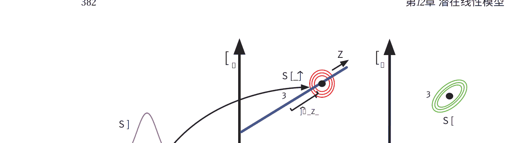

图12.1 PPCA生成过程的示意图，其中我们有 L= 1个潜在维度生成 D= 2个观测维度。基于(Bishop 2006b)的图12.9。

从这个中，我们可以设置 $\mu_0 = 0$而不会丧失一般性，因为我们可以将 $\mathbf{W}\boldsymbol{\mu}_0$ 吸收到 $\boldsymbol{\mu}$ 中。同样，我们可以设置 $\Sigma_0 = I$而不会丧失一般性，因为我们可以通过定义一个新的权重矩阵 $\tilde{\mathbf{W}} = \mathbf{W}\boldsymbol{\Sigma}_0^{-1/2}$来“模拟”相关的先验。然后我们得到

$$\text{cov}[\mathbf{x}|\theta] = \tilde{\mathbf{W}}\tilde{\mathbf{W}}^T + \mathbb{E}[\boldsymbol{\epsilon}\boldsymbol{\epsilon}^T] = (\mathbf{W}\boldsymbol{\Sigma}_0^{-1/2})\boldsymbol{\Sigma}_0(\mathbf{W}\boldsymbol{\Sigma}_0^{-1/2})^T + \boldsymbol{\Psi} = \mathbf{W}\mathbf{W}^T + \boldsymbol{\Psi}$$

因此，我们可以看到FA使用低秩分解来近似可见向量的协方差矩阵：

$$\mathbf{C} \triangleq \text{cov}[\mathbf{x}] = \mathbf{W}\mathbf{W}^T + \boldsymbol{\Psi} \tag{12.6}$$

这只使用 $O(LD)$ 参数，这允许在完全协方差高斯分布 ($O(D^2)$参数) 和对角协方差 ($O(D)$参数) 之间进行灵活的折中。请注意，如果我们不限制 $\boldsymbol{\Psi}$ 为对角矩阵，我们可以将 $\boldsymbol{\Psi}$ 轻松设置为完全协方差矩阵；然后我们可以将 $\mathbf{W} = 0$，这样就不需要潜在因子。

### 12.1.2 潜在因素的推断

尽管FA可以被看作是在 $\mathbf{x}$ 上定义密度的一种方式，但通常使用它是因为我们希望潜在因素 $\mathbf{z}$ 能够揭示数据中的一些有趣的东西。为了做到这一点，我们需要计算潜在因素的后验概率。我们可以使用高斯贝叶斯规则来得到

$$p(\mathbf{z}_i|\mathbf{x}_i, \theta) = \mathcal{N}(\mathbf{z}_i|\mathbf{m}_i, \mathbf{\Sigma}_i)$$

$$\mathbf{\Sigma}_i \triangleq (\boldsymbol{\Sigma}_0^{-1} + \mathbf{W}^T \boldsymbol{\Psi}^{-1} \mathbf{W})^{-1}$$

$$\mathbf{m}_i \triangleq \mathbf{\Sigma}_i (\mathbf{W}^T \boldsymbol{\Psi}^{-1} (\mathbf{x}_i - \boldsymbol{\mu}) + \boldsymbol{\Sigma}_0^{-1} \boldsymbol{\mu}_0)$$

请注意，在FA模型中，$\mathbf{\Sigma}_i$ 实际上与 $i$ 无关，因此我们可以用 $\mathbf{\Sigma}$ 来表示它。计算这个矩阵需要 $O(L^3 + L^2 D)$ 时间，并且计算每个 $\mathbf{m}_i = E[\mathbf{z}_i|\mathbf{x}_i, \theta]$ 需要 $O(L^2 + LD)$ 时间。这些 $\mathbf{m}_i$ 有时被称为潜在得分或潜在因素。

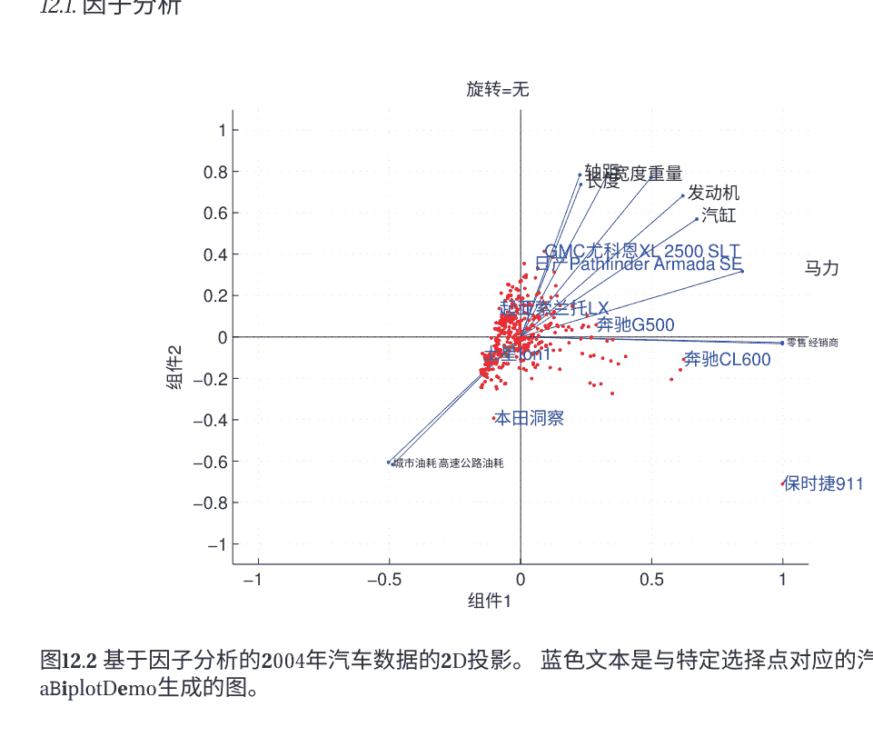

让我们给出一个简单的例子，基于(Shalizi, 2009)。我们考虑一个包含11个变量和387个案例的数据集，描述了汽车的各个方面，如发动机尺寸、汽缸数、每加仑英里数(MPG)、价格等。我们首先拟合一个2维模型。我们可以将得分作为点在$\mathbb{R}^2$中绘制，以可视化数据，如图12.2所示。为了更好地理解潜在因子的“含义”，我们可以将与每个特征维度对应的单位向量，如 $\mathbf{e}_1 = (1, 0, ..., 0), \mathbf{e}_2 = (0, 1, 0, ..., 0)$，等等，投影到低维空间中。这些在图12.2中显示为蓝色线条；这被称为双图。我们可以看到水平轴代表价格，对应于标有“经销商”和“零售”的特征，右侧是昂贵的汽车。垂直轴代表燃油效率（以MPG为单位）与尺寸的关系：重型车辆效率较低，位于较高位置，而轻型车辆效率较高，位于较低位置。我们可以通过点击一些点来“验证”这种解释，并找到训练集中最接近的示例，并打印它们的名称，如图12.2所示。然而，总的来说，解释潜在变量模型是困难的，我们在第12.1.3节中讨论了这个问题。

### 12.1.3 不可识别性

就像混合模型一样，因子分析也是不可识别的。为了看到这一点，假设 $\mathbf{R}$ 是任意的正交旋转矩阵，满足 $\mathbf{R}\mathbf{R}^T = \mathbf{I}$。让我们定义 $\tilde{\mathbf{W}} = \mathbf{W}\mathbf{R}$；然后似然函数

$$\begin{align}
\text{cov}[\mathbf{x}] &= \tilde{\mathbf{W}}\mathbb{E}[\mathbf{z}\mathbf{z}^T]\tilde{\mathbf{W}}^T + \mathbb{E}[\boldsymbol{\epsilon}\boldsymbol{\epsilon}^T] && (12.10) \\
&= \mathbf{W}\mathbf{R}\mathbf{R}^T\mathbf{W}^T + \boldsymbol{\Psi} = \mathbf{W}\mathbf{W}^T + \boldsymbol{\Psi} && (12.11)
\end{align}$$

从几何上讲，将 $\mathbf{W}$ 乘以一个正交矩阵就像在生成 $\mathbf{x}$ 之前旋转 $\mathbf{z}$；但由于 $\mathbf{z}$ 是从各向同性高斯分布中抽取的，这对似然函数没有影响。因此，我们无法唯一确定 $\mathbf{W}$，因此也无法唯一确定潜在因子。

为了确保唯一解，我们需要去除 $L(L-1)/2$ 自由度，因为这是 $L \times L$ 大小的正交矩阵的数量。<sup>1</sup> 总共，FA 模型有 $D + LD - L(L-1)/2$ 个自由参数（不包括均值），其中第一项来自 $\boldsymbol{\Psi}$。显然，我们要求这个值小于或等于 $D(D+1)/2$，这是一个无约束（但对称）协方差矩阵中的参数数量。这给出了 $L$ 的一个上界，如下所示：

$$L_{max} = \lfloor D + 0.5(1 - \sqrt{1 + 8D}) \rfloor \qquad (12.12)$$

例如，$D = 6$ 意味着 $L \le 3$。但通常我们不选择这个上界，因为这会导致过拟合（参见第12.3节中关于如何选择 $L$ 的讨论）。不幸的是，即使我们设置 $L < L_{max}$，我们仍然无法唯一地确定参数，因为旋转的不确定性仍然存在。非可识别性不会影响模型的预测性能。然而，它确实会影响加载矩阵，从而影响潜在因子的解释。由于因子分析经常用于揭示数据中的结构，因此需要解决这个问题。以下是一些常用的解决方案：

- **强制 $\mathbf{W}$ 正交**：也许最干净的解决方案是强制 $\mathbf{W}$ 正交，并按照相应潜在因子的方差递减的顺序对列进行排序，以解决可识别性问题。这是主成分分析（PCA）采用的方法，我们将在第12.2节中讨论。结果不一定更易解释，但至少是唯一的。
- **强制 $\mathbf{W}$ 为下三角矩阵**：一种实现可识别性的方法，这在贝叶斯社区中很受欢迎（例如，(Lopes 和 West 2004)），是确保第一个可见特征仅由第一个潜在因子生成，第二个可见特征仅由前两个潜在因子生成，依此类推。例如，如果 $L=3$ 和 $D=4$，则相应的因子载荷矩阵为

$$\mathbf{W} = \begin{pmatrix}
w_{11} & 0 & 0 \\
w_{21} & w_{22} & 0 \\
w_{31} & w_{32} & w_{33} \\
w_{41} & w_{42} & w_{43}
\end{pmatrix} \qquad (12.13)$$

我们还要求 $w_{jj} > 0$ 对于 $j=1:L$。在这个受限制的矩阵中，参数的总数是 $D + DL - L(L-1)/2$，这个数等于唯一可识别参数的数量。这种方法的缺点是第一个 $L$ 可见变量，

<sup>1</sup> 要理解这一点，注意到在第一列中有 $L-1$ 个自由参数（因为列向量必须归一化为单位长度），在第二列中有 $L-2$ 个自由参数（必须与第一个列向量正交），依此类推。

被称为创始人变量，影响潜在因子的解释，因此必须小心选择。

- 稀疏性促进权重的先验我们可以鼓励权重为零的条目，而不是预先指定 W使用正则化 (Zou等人, 2006年)，ARD (Bishop, 1999年; Archambeau和Bach, 2008年) 或尖峰和平板先验 (Rattray等人, 2009年)。这被称为稀疏因子分析。这并不一定保证唯一的MAP估计值，但它确实鼓励可解释的解决方案。请参见第13.8节。
- 选择一个信息丰富的旋转矩阵有各种试图找到旋转矩阵 R的启发式方法，可以用来修改 W（从而修改潜在因子），以尝试增加解释性，通常是通过鼓励它们（近似地）稀疏。一种流行的方法被称为 varimax (Kaiser, 1958年)。
- 使用非高斯先验来表示潜在因子在第12.6节中，我们将讨论如何用非高斯分布替换p(z_i)，从而有时可以唯一地识别W以及潜在因子。这种技术被称为ICA。

## 12.1.4 因子分析器的混合

FA模型假设数据存在于低维线性流形上。实际上，大多数数据更适合由某种形式的低维曲面流形建模。我们可以通过分段线性流形来近似曲面流形。这提示了以下模型：让第k个维度为Lk的线性子空间由Wk表示，其中k=1:K。假设我们有一个潜在指示器qi ∈{1,...,K}，指定应该使用哪个子空间来生成数据。然后，我们从高斯先验中采样zi，并通过Wk矩阵（其中k=qi）传递，并添加噪声。更准确地说，模型如下：

```
p(x_i|z_i, q_i = k, θ) = N(x_i|μ_k + W_k z_i, Ψ)  (12.14)
p(z_i|θ) = N(z_i|0, I)  (12.15)
p(q_i|θ) = Cat(q_i|π)  (12.16)
```

图 12.4	拟合到数据集的 1d PPCAs混合模型，对于 $K = 1, 10$。由mixPpcaDemoNetla b生成的图.

这被称为混合因子分析器(MFA) (Hinton et al. 1997). CI假设在图12.3中表示。

另一种思考这个模型的方式是将其视为高斯混合模型的低秩版本。特别地，这个模型只需要 $O(KLD)$个参数，而不是一个混合完全协方差高斯模型所需要的 $O(KD^2)$个参数。这可以减少过拟合。事实上，MFA是高维实值数据的一个很好的通用密度模型。

## 12.1.5 因子分析模型的EM算法

使用第4章的结果，可以很容易地推导出一个EM算法来拟合一个因子分析模型。通过一点点额外的工作，我们可以拟合一个混合因子分析模型。下面我们陈述结果，但不给出证明。这些方程的推导可以在（Ghahramani和Hinton 1996a）中找到；然而，如果你想在数学上变得熟练，自己推导这些方程是一个有用的练习。

要获得单个因子分析器的结果，只需在下面的方程中设置 $r_{ic}=1$和 $c=1$。在第12.2.5节中，我们将看到这些方程的进一步简化，这是在拟合PPCA模型时出现的，结果将具有特别简单和优雅的解释。

在E步骤中，我们计算数据点 $i$对于聚类 $c$的后验责任。

```
latex
$r_{ic} \triangleq p(q_i = c|\mathbf{x}_i, \boldsymbol{\theta}) \propto \pi_c \mathcal{N}(\mathbf{x}_i|\boldsymbol{\mu}_c, \mathbf{W}_c\mathbf{W}_c^T + \boldsymbol{\Psi})$
```

)给定 $\mathbf{z}_i$的条件后验为

```
latex
$p(\mathbf{z}_i|\mathbf{x}_i, q_i = c, \boldsymbol{\theta}) \quad = \quad \mathcal{N}(\mathbf{z}_i|\mathbf{m}_{ic}, \boldsymbol{\Sigma}_{ic})$

$\boldsymbol{\Sigma}_{ic} \quad \triangleq \quad (\mathbf{I}_L + \mathbf{W}_c^T \boldsymbol{\Psi}_c^{-1} \mathbf{W}_c)^{-1}$

$\mathbf{m}_{ic} \quad \triangleq \quad \boldsymbol{\Sigma}_{ic}(\mathbf{W}_c^T \boldsymbol{\Psi}_c^{-1} (\mathbf{x}_i - \boldsymbol{\mu}_c))$
```

)在M步中，最容易同时估计 $\boldsymbol{\mu}_c$和 $\mathbf{W}_c$，通过定义 $\tilde{\mathbf{W}}_c = (\mathbf{W}_c, \boldsymbol{\mu}_c$), $\tilde{\mathbf{z}} = (\mathbf{z}, 1)$), 同时，定义
$$\begin{aligned} \mathbf{b}_{ic} &\triangleq \mathbb{E}[\tilde{\mathbf{z}}|\mathbf{x}_i, q_i=c] = [\mathbf{m}_{ic}; 1] \quad &(12.21) \ \mathbf{C}_{ic} &\triangleq \mathbb{E}[\tilde{\mathbf{z}}\tilde{\mathbf{z}}^T|\mathbf{x}_i, q_i=c] = \begin{pmatrix} \mathbb{E}[\mathbf{z}\mathbf{z}^T|\mathbf{x}_i, q_i=c] & \mathbb{E}[\mathbf{z}|\mathbf{x}_i, q_i=c] \ \mathbb{E}[\mathbf{z}|\mathbf{x}_i, q_i=c]^T & 1 \end{pmatrix} \quad &(12.22) \end{aligned}$$

然后，M步骤如下：
$$\begin{aligned} \hat{\mathbf{W}}_c &= \left[ \sum_i r_{ic} \mathbf{x}_i \mathbf{b}_{ic}^T \right] \left[ \sum_i r_{ic} \mathbf{C}_{ic} \right]^{-1} \quad &(12.23) \ \hat{\boldsymbol{\Psi}} &= \frac{1}{N} \mathrm{diag} \left\{ \sum_{i,c} r_{ic} \left( \mathbf{x}_i - \hat{\mathbf{W}}_c \mathbf{b}_{ic} \right) \mathbf{x}_i^T \right\} \quad &(12.24) \ \hat{\pi}_c &= \frac{1}{N} \sum_{i=1}^N r_{ic} \quad &(12.25) \end{aligned}$$

请注意，这些更新是针对“纯粹”的EM算法。基于ECM的更快版本的算法在(Zhao and Yu 2008)中有描述。

## 12.1.6 使用缺失数据拟合FA模型

在许多应用中，比如协同过滤，我们会有缺失数据。EM方法拟合FA/PPCA模型的一个优点是很容易扩展到这种情况。然而，如果有大量缺失数据，过拟合可能成为一个问题。因此，进行MAP估计或使用贝叶斯推断非常重要。详细信息请参见(Ilin and Raiko 2010)。

## 12.2 主成分分析 (PCA)

考虑约束 $\boldsymbol{\Psi} = \sigma^2 \mathbf{I}$ 和 $\mathbf{W}$ 为正交的FA模型。据证明(Tipping and Bishop 1999)，当 $\sigma^2 \to 0$ 时，该模型简化为经典（非概率性）主成分分析 (PCA)，也称为Karhunen Loeve变换。当 $\sigma^2 > 0$ 时，该模型被称为概率性主成分分析 (PPCA) (Tipping and Bishop 1999)，或称为sensible PCA(Roweis 1997)。（等效结果也可以从不同的角度独立推导出来，参见(Moghaddam and Pentland 1995)。）

为了理解这个结果，我们首先需要了解经典PCA。然后我们将PCA与SVD连接起来。最后我们回到讨论PPCA。

### 12.2.1 经典PCA：定理的陈述

经典PCA的综合视角总结如下定理。

**定理 12.2.1.** 假设我们想要找到一组正交的$L$个线性基向量$\mathbf{w}_{j} \in \mathbb{R}^{D}$，以及相应的得分$\mathbf{z}_{i} \in \mathbb{R}^{L}$，使得我们最小化平均重构误差。
$$J(\mathbf{W}, \mathbf{Z}) = \frac{1}{N} \sum_{i=1}^N \| \mathbf{x}_i - \hat{\mathbf{x}}_i \|^2 \quad (12.26)$$

其中 $\hat{\mathbf{x}}_i = \mathbf{W}\mathbf{z}_i$，受到 $\mathbf{W}$ 正交的约束。等价地，我们可以将这个目标写成如下形式：

$$J(\mathbf{W}, \mathbf{Z}) = ||\mathbf{X} - \mathbf{W}\mathbf{Z}^T||_F^2 \tag{12.27}$$

其中 $\mathbf{Z}$ 是一个 $N \times L$ 矩阵，其行中包含 $\mathbf{z}_i$，而 $||\mathbf{A}||_F$ 是矩阵 $\mathbf{A}$ 的 Frobenius 范数，定义为

$$||\mathbf{A}||_F = \sqrt{\sum_{i=1}^{m} \sum_{j=1}^{n} a_{ij}^2} = \sqrt{\text{tr}(\mathbf{A}^T\mathbf{A})} = ||\mathbf{A}(:)||_2 \tag{12.28}$$

通过设置 $\hat{\mathbf{W}} = \mathbf{V}_L$，可以得到最优解，其中 $\mathbf{V}_L$ 包含经验协方差矩阵 $\hat{\mathbf{\Sigma}} = \frac{1}{N} \sum_{i=1}^{N} \mathbf{x}_i \mathbf{x}_i^T$ 的最大特征值对应的 $L$ 个特征向量。（我们假设 $\mathbf{x}_i$ 的均值为零，为了简便起见。此外，数据的最佳低维编码由 $\hat{\mathbf{z}}_i = \mathbf{W}^T \mathbf{x}_i$ 给出，这是数据在特征向量所张成的列空间上的正交投影。

图12.5(a)展示了一个例子，其中 $D=2$ 和 $L=1$。对角线是向量 $\mathbf{w}_1$；这被称为第一主成分或主方向。数据点 $\mathbf{x}_i \in \mathbb{R}^2$ 被正交投影到这条线上得到 $z_i \in \mathbb{R}$。这是数据的最佳一维近似。（我们将在后面讨论图12.5(b)。）

一般来说，很难可视化高维数据，但如果数据恰好是一组图像，那么很容易做到。图12.6展示了前三个主向量，重塑为图像，以及使用不同数量的基向量对特定图像的重构。（我们将在第11.5节讨论如何选择 $L$。）

下面我们将展示主要方向是数据显示最大方差的方向。这意味着PCA可能会被方差较高的方向“误导”，仅仅是因为测量尺度的原因。图12.7(a)展示了一个例子，其中垂直轴（重量）使用的范围比水平轴（身高）大，导致了一条看起来有些“不自然”的线。因此，标准做法是首先对数据进行标准化，或者

图12.6 (a)基于MNIST数据集中的25个数字3图像，展示了平均值和前三个PC基础向量（特征数字）。(b)基于2个、10个、100个和所有基础向量的图像重构。由pcaImageDemo生成的图像。

图12.7 标准化对应用于身高/体重数据集的PCA的影响。左侧：原始数据的PCA。右侧：标准化数据的PCA。由pcaDemoHeightWeight生成的图像。

等价地，可以使用相关矩阵而不是协方差矩阵进行工作。 从图12.7(b)中可以看出这个好处。

### 12.2.2 证明 *

**证明。** 我们用 $\mathbf{w}_j \in \mathbb{R}^D$ 表示第 $j$ 个主方向， $\mathbf{x}_i \in \mathbb{R}^D$ 表示第 $i$ 个高维观测值， $\mathbf{z}_i \in \mathbb{R}^L$ 表示第 $i$ 个低维表示， $\tilde{\mathbf{z}}_j \in \mathbb{R}^N$ 表示所有低维向量的第 $j$ 个分量 $[z_{1j}, \dots, z_{Nj}]$。

让我们从估计最佳的一维解开始， $\mathbf{w}_1 \in \mathbb{R}^D$， 并且相应的投影点 $\tilde{\mathbf{z}}_1 \in \mathbb{R}^N$。 我们稍后会找到剩余的基向量 $\mathbf{w}_2$， $\mathbf{w}_3$ 等等。重构误差由以下给出

$$J(\mathbf{w}_1, \mathbf{z}_1) = \frac{1}{N} \sum_{i=1}^{N} \| \mathbf{x}_i - z_{i1} \mathbf{w}_1 \|^2 = \frac{1}{N} \sum_{i=1}^{N} (\mathbf{x}_i - z_{i1} \mathbf{w}_1)^T (\mathbf{x}_i - z_{i1} \mathbf{w}_1) \quad (12.29)$$
$$= \frac{1}{N} \sum_{i=1}^{N} [\mathbf{x}_i^T \mathbf{x}_i - 2 z_{i1} \mathbf{w}_1^T \mathbf{x}_i + z_{i1}^2 \mathbf{w}_1^T \mathbf{w}_1] \quad (12.30)$$
$$= \frac{1}{N} \sum_{i=1}^{N} [\mathbf{x}_i^T \mathbf{x}_i - 2 z_{i1} \mathbf{w}_1^T \mathbf{x}_i + z_{i1}^2] \quad (12.31)$$

因为 $\mathbf{w}_1^T \mathbf{w}_1=1$（根据正交性假设）。 对 $z_{i1}$ 求导并置零得到

$$\frac{\partial}{\partial z_{i1}} J(\mathbf{w}_1, \mathbf{z}_1) = \frac{1}{N} [-2 \mathbf{w}_1^T \mathbf{x}_i + 2 z_{i1}] = 0 \Rightarrow z_{i1} = \mathbf{w}_1^T \mathbf{x}_i \quad (12.32)$$

因此，通过将数据正交投影到第一个主方向，可以获得最佳重构权重，$\mathbf{w}_1$（见图12.5 (a)）。将其代回得到

$$J(\mathbf{w}_1) = \frac{1}{N} \sum_{i=1}^{N} [\mathbf{x}_i^T \mathbf{x}_i - z_{i1}^2] = \text{const} - \frac{1}{N} \sum_{i=1}^{N} z_{i1}^2 \quad (12.33)$$

现在，投影坐标的方差由以下公式给出

$$\text{var} [\tilde{\mathbf{z}}_1] = \mathbb{E} [\tilde{\mathbf{z}}_1^2] - (\mathbb{E} [\tilde{\mathbf{z}}_1])^2 = \frac{1}{N} \sum_{i=1}^{N} z_{i1}^2 - 0 \quad (12.34)$$

因为

$$\mathbb{E} [z_{i1}] = \mathbb{E} [\mathbf{x}_i^T \mathbf{w}_1] = \mathbb{E} [\mathbf{x}_i]^T \mathbf{w}_1 = 0 \quad (12.35)$$

因为数据已经居中。由此可见，最小化重构误差等价于最大化投影数据的方差，即

$$\arg \min_{\mathbf{w}_1} J(\mathbf{w}_1) = \arg \max_{\mathbf{w}_1} \text{var} [\tilde{\mathbf{z}}_1] \quad (12.36)$$

)这就是为什么经常说PCA找到了最大方差的方向。这被称为PCA的分析视角。

投影数据的方差可以写成

$$\frac{1}{N} \sum_{i=1}^{N} z_{i1}^2 = \frac{1}{N} \sum_{i=1}^{N} \mathbf{w}_1^T \mathbf{x}_i \mathbf{x}_i^T \mathbf{w}_1 = \mathbf{w}_1^T \hat{\Sigma} \mathbf{w}_1 \quad (12.37)$$

其中 $\hat{\Sigma} = \frac{1}{N} \sum_{i=1}^{N} \mathbf{x}_i \mathbf{x}_i^T$ 是经验协方差矩阵（如果数据已标准化，则为相关矩阵）。

我们可以通过让 $\|\mathbf{w}_1\| \to \infty$ 来最大化投影的方差（从而最小化重构误差），因此我们施加约束 $\|\mathbf{w}_1\|=1$ 并且改为最大化

```
$\tilde{J}(\mathbf{w}_1) = \mathbf{w}_1^T \hat{\Sigma} \mathbf{w}_1 + \lambda_1 (\mathbf{w}_1^T \mathbf{w}_1 - 1)$
```

其中 $\lambda_1$ 是拉格朗日乘数。对导数进行求解并令其等于零，我们得到

```
$\frac{\partial}{\partial \mathbf{w}_1} \tilde{J}(\mathbf{w}_1) = 2\hat{\Sigma}\mathbf{w}_1 - 2\lambda_1 \mathbf{w}_1 = 0$
```

```
$\hat{\Sigma}\mathbf{w}_1 = \lambda_1 \mathbf{w}_1$
```

）因此，最大化方差的方向是协方差矩阵的特征向量。左乘以 $\mathbf{w}_1$（并且使用 $\mathbf{w}_1^T \mathbf{w}_1 = 1$），我们发现投影数据的方差为

```
$\mathbf{w}_1^T \hat{\Sigma} \mathbf{w}_1 = \lambda_1$
```

由于我们想要最大化方差，我们选择对应于最大特征值的特征向量。

现在让我们找到另一个方向 $\mathbf{w}_2$ 以进一步最小化重构误差，满足 $\mathbf{w}_1^T \mathbf{w}_2 = 0$ 和 $\mathbf{w}_2^T \mathbf{w}_2 = 1$。误差为

```
$J(\mathbf{w}_1, \mathbf{z}_1, \mathbf{w}_2, \mathbf{z}_2) = \frac{1}{N} \sum_{i=1}^N \|\mathbf{x}_i - z_{i1}\mathbf{w}_1 - z_{i2}\mathbf{w}_2\|^2$
```

对 $\mathbf{z}_1$ 和 $\mathbf{z}_2$ 进行优化给出了与之前相同的解。练习12.4要求你证明 换句话说，第二个主要编码是通过 投影到第二个主要方向得到的。代入后得到

```
$J(\mathbf{w}_2) = \frac{1}{n} \sum_{i=1}^N [\mathbf{x}_i^T \mathbf{x}_i - \mathbf{w}_1^T \mathbf{x}_i \mathbf{x}_i^T \mathbf{w}_1 - \mathbf{w}_2^T \mathbf{x}_i \mathbf{x}_i^T \mathbf{w}_2] = \text{const} - \mathbf{w}_2^T \hat{\Sigma} \mathbf{w}_2$
```

去掉常数项并添加约束条件得到

```
$\tilde{J}(\mathbf{w}_2) = -\mathbf{w}_2^T \hat{\Sigma} \mathbf{w}_2 + \lambda_2 (\mathbf{w}_2^T \mathbf{w}_2 - 1) + \lambda_{12} (\mathbf{w}_2^T \mathbf{w}_1 - 0)$
```

练习12.4要求你证明解是由具有第二个 最大特征值的特征向量给出的：

```
$\hat{\Sigma}\mathbf{w}_2 = \lambda_2 \mathbf{w}_2$
```

证明继续进行。（形式上可以使用归纳法。）

## 12.2.3 奇异值分解（SVD）

我们已经根据协方差矩阵的特征向量定义了PCA的解。然而，有另一种获得解的方法，基于奇异值分解（SVD）。这基本上将特征向量的概念从方阵推广到任何类型的矩阵。

特别地，任何（实数） $N \times D$矩阵 $\mathbf{X}$可以分解如下
$$
\underset{N\times D}{\mathbf{X}}=\underset{N\times N}{\mathbf{U}}\underset{N\times D}{\mathbf{S}}\underset{D\times D}{\mathbf{V}^T} \qquad (12.46)
$$
其中 $\mathbf{U}$是一个 $N \times N$矩阵，其列是正交的（所以 $\mathbf{U}^T\mathbf{U} = \mathbf{I}_N$），$\mathbf{V}$是一个 $D \times D$矩阵，其行和列是正交的（所以 $\mathbf{V}^T\mathbf{V} = \mathbf{V}\mathbf{V}^T = \mathbf{I}_D$），$\mathbf{S}$是一个 $N \times D$矩阵，其主对角线上有 $r=\min(N, D)$个奇异值 $\sigma_i \geq 0$，其余位置填充为0。$\mathbf{U}$的列是左奇异向量，$\mathbf{V}$的列是右奇异向量。请参见图12.8（a）的示例。

由于最多有 $D$个奇异值（假设$N > D$），最后 $N - D$列的 $\mathbf{U}$是无关的，因为它们将乘以0。经济型奇异值分解（SVD）或者称为紧奇异值分解避免计算这些不必要的元素。我们用 $\hat{\mathbf{U}}\hat{\mathbf{S}}\hat{\mathbf{V}}$来表示这个分解。如果$N > D$，我们有
$$
\underset{N\times D}{\mathbf{X}}=\underset{N\times D}{\hat{\mathbf{U}}}\underset{D\times D}{\hat{\mathbf{S}}}\underset{D\times D}{\hat{\mathbf{V}}^T} \qquad (12.47)
$$
如图12.8(a)所示。如果 $N < D$，我们有
$$
\underset{N\times D}{\mathbf{X}}=\underset{N\times N}{\hat{\mathbf{U}}}\underset{N\times N}{\hat{\mathbf{S}}}\underset{N\times D}{\hat{\mathbf{V}}^T} \qquad (12.48)
$$
计算经济型奇异值分解需要 $O(N D \min(N, D))$时间 (Golub和van Loan 1996年，第254页)。

特征向量和奇异向量之间的关系如下。对于任意实矩阵 $\mathbf{X}$，如果 $\mathbf{X} = \mathbf{U}\mathbf{S}\mathbf{V}^T$，我们有
$$
\mathbf{X}^T\mathbf{X} = \mathbf{V}\mathbf{S}^T\mathbf{U}^T \mathbf{U}\mathbf{S}\mathbf{V}^T = \mathbf{V}(\mathbf{S}^T\mathbf{S})\mathbf{V}^T = \mathbf{V}\mathbf{D}\mathbf{V}^T \qquad (12.49)
$$
其中 $\mathbf{D} = \mathbf{S}^2$是一个包含平方奇异值的对角矩阵。因此
$$
(\mathbf{X}^T\mathbf{X})\mathbf{V} = \mathbf{V}\mathbf{D} \qquad (12.50)
$$
因此，$\mathbf{X}^T\mathbf{X}$的特征向量等于 $\mathbf{V}$，即 $\mathbf{X}$的右奇异向量，$\mathbf{X}^T\mathbf{X}$的特征值等于 $\mathbf{D}$，即平方奇异值。同样地
$$
\mathbf{X}\mathbf{X}^T = \mathbf{U}\mathbf{S}\mathbf{V}^T \mathbf{V}\mathbf{S}^T\mathbf{U}^T = \mathbf{U}(\mathbf{S}\mathbf{S}^T)\mathbf{U}^T \qquad (12.51)
$$
$$
(\mathbf{X}\mathbf{X}^T)\mathbf{U} = \mathbf{U}(\mathbf{S}\mathbf{S}^T) = \mathbf{U}\mathbf{D} \qquad (12.52)
$$
因此，$\mathbf{X}\mathbf{X}^T$的特征向量等于 $\mathbf{U}$，即 $\mathbf{X}$的左奇异向量。此外，$\mathbf{X}\mathbf{X}^T$的特征值等于平方奇异值。我们可以总结如下：
$$
\mathbf{U} = \text{evec}(\mathbf{X}\mathbf{X}^T), \quad \mathbf{V} = \text{evec}(\mathbf{X}^T\mathbf{X}), \quad \mathbf{S}^2 = \text{eval}(\mathbf{X}\mathbf{X}^T) = \text{eval}(\mathbf{X}^T\mathbf{X}) \qquad (12.53)
$$

由于特征向量不受矩阵的线性缩放影响，我们可以看到 X的右奇异向量等于经验协方差 $\boldsymbol{\Sigma}$的特征向量。此外， $\boldsymbol{\Sigma}$的特征值是奇异值的平方的缩放版本。这意味着我们可以只用几行代码来执行PCA（参见 pcaPMTK）。

然而，主成分分析（PCA）和奇异值分解（SVD）之间的联系更加深入。从方程式12.46中，我们可以将一个秩为 r的矩阵表示为以下形式：
$$ X = \sigma_1 \begin{pmatrix} | \\ u_1 \\ | \end{pmatrix} \begin{pmatrix} - & v_1^T & - \end{pmatrix} + \cdots + \sigma_r \begin{pmatrix} | \\ u_r \\ | \end{pmatrix} \begin{pmatrix} - & v_r^T & - \end{pmatrix} $$

如果奇异值如图12.10中迅速衰减，我们可以通过以下方式生成一个对矩阵的秩 L近似：
$$ X \approx \mathbf{U}_{:,1:L} \mathbf{S}_{1:L,1:L} \mathbf{V}_{:,1:L}^T $$

这被称为截断奇异值分解（truncated SVD）（见图12.8(b)）。使用秩 L近似来表示一个 $N \times D$矩阵所需的总参数数量为 $NL + LD + L = L(N + D + 1)$

图12.8 (a) 非方阵的SVD分解 X = USV^T. 阴影部分的 S 和所有非对角线上的项都为零。在经济尺寸的版本中， U 和 S 中的阴影条目不会被计算，因为它们不需要。 (b) 排名为 L 的截断SVD近似。

图12.9 对图像进行低秩近似。左上角：原始图像的大小为 $200 \times 320$，因此其秩为 200。后续图像的秩分别为 2、5 和 20。由svdImageDemo生成的图。

图12.10 小丑图像的前50个对数奇异值（实线红色）和通过随机重排像素获得的数据矩阵的对数奇异值（虚线绿色）。由svdImageDemo生成的图。

## 12.2.3 奇异值分解（SVD） (续)

以图12.9（左上角）中的 $200 \times 320$像素图像为例。该图像包含64,000个数字。我们可以看到，仅使用$(200 + 320 + 1) \times 20 = 10,420$个数字的秩20近似是非常好的近似。
$$||\mathbf{X} - \mathbf{X}_L||_F \approx \sigma_{L+1}$$

此外，可以证明SVD提供了对矩阵的最佳秩 $L$近似（在最小化上述Frobenius范数的意义上最佳）。让我们将这个与PCA联系起来。假设 $\mathbf{X} = \mathbf{U}\mathbf{S}\mathbf{V}^T$ 是 $\mathbf{X}$的截断SVD。我们知道 $\hat{\mathbf{W}} = \mathbf{V}$，且 $\hat{\mathbf{Z}} = \mathbf{X}\hat{\mathbf{W}}$，所以
$$\hat{\mathbf{Z}} = \mathbf{U}\mathbf{S}\mathbf{V}^T \mathbf{V} = \mathbf{U}\mathbf{S}$$

此外，最优重构由 $\hat{\mathbf{X}} = \hat{\mathbf{Z}}\hat{\mathbf{W}}^T$ 给出，因此我们得到
$$\hat{\mathbf{X}} = \mathbf{U}\mathbf{S}\mathbf{V}^T$$

这与截断SVD近似完全相同！这是PCA是数据的最佳低秩近似的另一个说明。

## 12.2.4 概率主成分分析

我们现在准备重新审视PPCA。可以证明以下令人称奇的结果。

**定理 12.2.2** (Tipping and Bishop 1999). 考虑一个因子分析模型，其中 $\boldsymbol{\Psi} = \sigma^2 \mathbf{I}$ 和 $\mathbf{W}$是正交的。观测数据的对数似然函数为
$$\log p(\mathbf{X}|\mathbf{W}, \sigma^2) = -\frac{N}{2} \ln |\mathbf{C}| - \frac{1}{2} \sum_{i=1}^{N} \mathbf{x}_i^T \mathbf{C}^{-1} \mathbf{x}_i = -\frac{N}{2} \ln |\mathbf{C}| + \text{tr}(\mathbf{C}^{-1} \hat{\mathbf{S}})$$
其中 $\mathbf{C} = \mathbf{W}\mathbf{W}^T + \sigma^2 \mathbf{I}$ 和 $\hat{\mathbf{S}} = \frac{1}{N} \sum ...$（我们假设数据已经居中，为了简化符号。）对数似然函数的极大值由以下给出
$$\hat{\mathbf{W}} = \mathbf{V}(\boldsymbol{\Lambda} - \sigma^2 \mathbf{I})^{\frac{1}{2}} \mathbf{R}$$
其中$\mathbf{R}$是任意的 $L \times L$正交矩阵，$\mathbf{V}$是由$\hat{\mathbf{S}}$的前$L$个特征向量组成的 $D \times L$矩阵，$\boldsymbol{\Lambda}$是相应的特征值对角矩阵。不失一般性，我们可以设 $\mathbf{R} = \mathbf{I}$。此外，噪声方差的最大似然估计为
$$\hat{\sigma}^2 = \frac{1}{D - L} \sum_{j=L+1}^{D} \lambda_j$$
这是与被丢弃的维度相关的平均方差。

因此，当 $\sigma^2 \rightarrow 0$ 时，我们有 $\hat{\mathbf{W}} \rightarrow \mathbf{V}$，就像经典的PCA一样。那么 $\hat{\mathbf{Z}}$呢？很容易看出，潜在因子的后验分布为
$$p(\mathbf{z}_i | \mathbf{x}_i, \hat{\boldsymbol{\theta}}) = \mathcal{N}(\mathbf{z}_i | \hat{\mathbf{F}}^{-1} \hat{\mathbf{W}}^T \mathbf{x}_i, \sigma^2 \hat{\mathbf{F}}^{-1})$$
$$\hat{\mathbf{F}} \triangleq \hat{\mathbf{W}}^T \hat{\mathbf{W}} + \hat{\sigma}^2 \mathbf{I}$$

(不要混淆 $\mathbf{F} = \mathbf{W}^T\mathbf{W} + \sigma^2\mathbf{I}$ 和 $\mathbf{C} = \mathbf{W}\mathbf{W}^T + \sigma^2\mathbf{I}$。因此，当 $\sigma^2 \rightarrow 0$时，我们发现 $\hat{\mathbf{W}} \rightarrow \mathbf{V}$， $\hat{\mathbf{F}} \rightarrow \mathbf{I}$ 和 $\hat{\mathbf{z}}_i \rightarrow \mathbf{V}^T \mathbf{x}_i$。因此，后验均值是通过将数据在 $\mathbf{V}$ 的列空间上进行正交投影得到的，就像经典PCA一样。
然而，请注意，如果 $\sigma^2 > 0$，后验均值不是一个正交投影，因为它在一定程度上向先验均值收缩，如图12.5(b)所示。这听起来可能是一个不理想的特性，但它意味着重建将更接近于整体数据的均值， $\hat{\boldsymbol{\mu}} = \bar{\mathbf{x}}$。)

## 12.2.5 EM算法用于PCA

尽管通常拟合PCA模型的方法是使用特征向量方法或SVD，但我们也可以使用EM，它将具有一些我们在下面讨论的优势。PCA的EM依赖于PCA的概率形式。然而，该算法在零噪声限制下仍然有效，如 (Roweis 1997) 所示。

让 $\tilde{\mathbf{Z}}$ 是一个 $L \times N$ 矩阵，存储后验均值（低维表示）在其列中。同样，让 $\tilde{\mathbf{X}} = \mathbf{X}^T$ 存储原始数据在其列中。根据方程12.63，当 $\sigma^2= 0$时，我们有
$$\tilde{\mathbf{Z}} = (\mathbf{W}^T\mathbf{W})^{-1}\mathbf{W}^T\tilde{\mathbf{X}}$$
这构成了E步骤。请注意，这只是数据的正交投影。

从方程12.23中，M步骤给出
$$\hat{\mathbf{W}} = \left[\sum_i \mathbf{x}_i \mathbb{E}[\mathbf{z}_i]^T \right] \left[\sum_i \mathbb{E}[\mathbf{z}_i] \mathbb{E}[\mathbf{z}_i]^T \right]^{-1}$$
我们利用了 $\boldsymbol{\Sigma}= \text{Cov} [\mathbf{z}_i|\mathbf{x}_i, \boldsymbol{\theta}] = \mathbf{0}$当 $\sigma^2= 0$的事实。值得将这个表达式与多输出线性回归的MLE（方程7.89）进行比较，其形式为 $\mathbf{W} = (\sum_i \mathbf{y}_i \mathbf{x}_i^T)(\sum_i \mathbf{x}_i \mathbf{x}_i^T)^{-1}$。因此，我们可以看到M步骤类似于线性回归，其中我们用潜变量的期望值替换观察到的输入。

总结起来，这是整个算法的步骤：
- E步骤: $\tilde{\mathbf{Z}} = (\mathbf{W}^T\mathbf{W})^{-1}\mathbf{W}^T\tilde{\mathbf{X}}$
- M步骤: $\mathbf{W} = \tilde{\mathbf{X}}\tilde{\mathbf{Z}}^T(\tilde{\mathbf{Z}}\tilde{\mathbf{Z}}^T)^{-1}$

(Tipping 和 Bishop 1999) 证明了 EM 算法的唯一稳定的固定点是全局最优解。也就是说，EM 算法收敛到一个解，其中 $\mathbf{W}$跨越了与前 L个特征向量定义的相同线性子空间。然而，如果我们希望 $\mathbf{W}$是正交的，并且按照特征值降序包含特征向量，我们需要对结果矩阵进行正交化（这可以很便宜地完成）。或者，我们可以修改 EM 算法直接给出主要基 (Ahn 和 Oh 2003) 。

在 $D= 2$和 $L= 1$的情况下，该算法在物理上有一个简单的类比 (Roweis 1997)。考虑一些在 $\mathbb{R}^2$中通过弹簧连接到刚性杆的点，其方向由向量 $\mathbf{w}$定义。让 $z_i$是第 i个弹簧连接到杆的位置。在 E 步中，我们固定杆，让连接点滑动以最小化弹簧能量（与平方残差的和成比例）。在 M 步中，我们固定连接点保持点固定，让杆旋转以最小化弹簧能量。详见图12.11的示意图。

图12.11 EM在PCA中的示意图，其中 $D=2$ 和 $L=1$。绿色星星是原始数据点，黑色圆圈是它们的重构。权重向量 $\mathbf{w}$ 由蓝色线表示。(a) 我们从一个随机的初始猜测 $\mathbf{w}$ 开始。E步骤由正交投影表示。(b) 我们在M步骤中更新杆 $\mathbf{w}$，保持投影在杆上的位置（黑色圆圈）固定。(c) 另一个E步骤。黑色圆圈可以沿着杆滑动，但杆保持固定。(d) 另一个M步骤。基于(Bishop 2006b)的图12.12。由pcaEmStepByStep生成的图。

除了这个令人愉悦的直观解释外，EM用于PCA还具有以下优点超过特征向量方法：
- EM可能更快。特别是，假设 $N$，$D \gg L$，EM的主要成本是E步骤中的投影操作，因此总时间为 $O(TLND)$，其中 $T$ 是迭代次数。(Roweis 1997)的实验证明，迭代次数通常非常小（平均为3.6），不论 $N$ 或 $D$。(这个结果取决于经验协方差矩阵的特征值比率。)这比直接特征向量方法所需的 $O(\min(N D^2, D N^2))$时间要快得多，尽管更复杂的特征向量方法，如Lanczos算法，具有与EM相当的运行时间。
- EM可以以在线方式实现，即我们可以根据数据流更新我们对 $\mathbf{W}$ 的估计。
- EM可以简单地处理缺失数据（见第12.1.6节）。
- EM可以扩展以处理PPCA/ FA模型的混合。
- EM可以修改为变分EM或变分贝叶斯EM以适应更复杂的模型。

## 12.3 选择潜在维度的数量

在第11.5节中，我们讨论了如何选择混合模型中的组件数量 $K$。在本节中，我们讨论了如何选择FA/PCA模型中的潜在维度数量 $L$。

### 12.3.1 FA/PPCA的模型选择

如果我们使用概率模型，原则上我们可以计算 $L^* = \arg\max_L p(L|\mathcal{D})$。然而，这有两个问题。首先，评估LVMS的边际似然相当困难。在实践中，可以使用简单的近似方法，如BIC或变分下界（见第21.5节）（也可参考 (Minka 2000a)）。或者，我们可以使用交叉验证似然作为性能度量，尽管这可能很慢，因为它需要适应每个模型 $F$次，其中 $F$是交叉验证折数。

第二个问题是需要在可能很多模型中进行搜索。通常的方法是对 $L$ 的所有候选值进行穷举搜索。然而，有时候我们可以将模型设置为最大尺寸，然后使用自动相关性确定技术（第13.7节）结合EM来自动修剪掉无关的权重。

## 12.3. 选择潜在维度的数量

这种技术将在第13章的监督环境中进行描述，但可以根据 (Bishop 1999; Ghahramani and Beal 2000) 中的示例适应 (M)FA 环境。

图 12.12 展示了这种方法应用于一个小的合成数据集的 FA 混合。这些图形使用 Hinton 图可视化每个簇的权重矩阵，其中方块的大小与矩阵中的条目值成比例。我们可以通过看到其中许多是稀疏的。图 12.13 显示了稀疏度程度取决于训练数据量，符合贝叶斯奥卡姆剃刀原理。特别是在样本量较小时，该方法自动倾向于更简单的模型，但是当样本量足够大时，该方法会收敛到“正确”的解决方案，即具有维度为 1、2、2、3、4 和 7 的 6 个子空间。

虽然 ARD/EM 方法很优雅，但仍然需要在 K 上进行搜索。这是通过“birth”和“death”操作来完成的 (Ghahramani and Beal 2000)。另一种方法是在模型空间中进行随机采样。传统方法，如 (Lopes and West 2004)，基于可逆跳跃 MCMC，也使用 birth 和 death 操作。然而，这可能会很慢且难以实现。更近期的方法结合了非参数先验和 Gibbs 采样，参见 (Paisley and Carin 2009)。

### 12.3.2 主成分分析的模型选择

由于主成分分析不是一个概率模型，我们不能使用上述任何方法。一个明显的似然代理是重构误差：

```
$$E(\mathcal{D}, L) = \frac{1}{|\mathcal{D}|} \sum_{i \in \mathcal{D}} \| \mathbf{x}_i - \hat{\mathbf{x}}_i \|^2$$ (12.67)
```

在主成分分析的情况下，重构由 $\hat{\mathbf{x}}_i = \mathbf{W}\mathbf{z}_i + \boldsymbol{\mu}$ 给出，其中 $\mathbf{z}_i = \mathbf{W}^T(\mathbf{x}_i - \boldsymbol{\mu})$ 并且 $\mathbf{W}$ 和 $\boldsymbol{\mu}$ 是从 $\mathcal{D}_{train}$ 估计的。

图 12.14(a) 绘制了在图 12.6 的 MNIST 训练数据上的 $E(D_{train}, L)$ vs $L$。我们可以看到它迅速下降，表明我们可以用少量因子捕捉到大部分像素的经验相关性，如图 12.6 定性地说明。练习 12.5 要求你证明仅使用 $L$ 个项的残差误差由被丢弃的特征值之和给出：

$$E(D_{train}, L) = \sum_{j=L+1}^{D} \lambda_j \quad\quad (12.68)$$

因此，绘制误差的替代方法是绘制保留的特征值，按降序排列。这被称为“scree plot”，因为“图形看起来像山的一侧，而 'scree' 指的是从山上掉下来并堆积在山脚下的碎石”。这将具有与残差误差图相同的形状。

**相关的量是解释的方差比例，定义为**

$$F(D_{train}, L) = \frac{\sum_{j=1}^{L} \lambda_j}{\sum_{j'=1}^{L_{max}} \lambda_{j'}} \quad\quad (12.69)$$

这捕捉到与 scree plot 相同的信息。

当然，如果我们使用 $L = \text{rank}(\mathbf{X})$，我们在训练集上得到零重构误差。为了避免过拟合，自然要在测试集上绘制重构误差。这在图 12.14(b) 中显示。在这里，我们看到即使模型变得更复杂，误差仍然下降！因此，我们没有得到通常期望看到的 U 形曲线。发生了什么？问题在于 PCA 不是数据的适当生成模型。

这只是一种压缩技术。如果你给它更多的潜在维度，它将能够更准确地逼近测试数据。相比之下，概率模型享受贝叶斯奥卡姆剃刀效应（第 5.3.1 节），即如果它在数据稀疏的空间部分浪费概率质量，它将受到“惩罚”。这在图 12.15 中有所说明，图中绘制了使用 PPCA 计算的负对数似然与 $L$ 相比在测试集上，我们看到了通常的 U 形曲线。

这些结果类似于第 11.5.2 节中讨论的选择 $K$ 在 K-means 算法中与使用 GMM 的问题。

#### 12.3.2.1 概率轮廓

虽然没有 U 形，但有时图中会出现‘制度变革’，从相对较大的误差到相对较小的误差。自动检测这一点的一种方法在 (Zhu and Ghodsi 2006) 中有描述。思路是这样的。设 $\lambda_k$ 是模型大小为 $k$ 时产生的误差的某种度量，使得 $\lambda_1 \geq \lambda_2 \geq \dots \geq \lambda_L$。在 PCA 中，这些是特征值，但该方法也可以应用于 K-means。现在考虑将这些值分成两组，取决于 $k < L$ 还是 $k > L$，其中 $L$ 是我们将确定的阈值。为了衡量 $L$ 的质量，我们将使用一个简单的变点模型，其中 $\lambda_k \sim \mathcal{N}(\mu_1, \sigma^2)$ if $k \leq L$，并且 $\lambda_k \sim \mathcal{N}(\mu_2, \sigma^2)$ if $k > L$。（在两个模型中，$\sigma^2$ 必须相同，以防止一个制度的数据少于另一个制度时的过拟合。）在这两个制度中，我们假设 $\lambda_k$ 是独立同分布的，这显然是不正确的，但对于我们目前的目的来说是足够的。我们可以为每个 $L=1:L_{max}$ 拟合这个模型，通过分割数据并计算 MLEs，使用方差的汇总估计：

> $\mu_1(L) = \frac{\sum_{k \leq L} \lambda_k}{L}, \mu_2(L) = \frac{\sum_{k > L} \lambda_k}{N - L}$ (12.70)
>
> $\sigma^2(L) = \frac{\sum_{k \leq L} (\lambda_k - \mu_1(L))^2 + \sum_{k > L} (\lambda_k - \mu_2(L))^2}{N}$ (12.71)

然后我们可以评估概率对数似然

> $\ell(L) = \sum_{k=1}^L \log \mathcal{N}(\lambda_k | \mu_1(L), \sigma^2(L)) + \sum_{k=L+1}^K \log \mathcal{N}(\lambda_k | \mu_2(L), \sigma^2(L))$ (12.72)

最后，我们选择 $L^* = \arg \max \ell(L)$。这在图 12.16 中有所说明。在左边，我们绘制了屏幕图，其形状与图 12.14(a) 相同。在右边，我们绘制了概率轮廓。令人惊讶的是，我们看到一个相当确定的峰值。

## 12.4 用于分类数据的主成分分析

在本节中，我们考虑将因子分析模型扩展到观测数据为分类数据而不是实值的情况。也就是说，数据的形式为 $y_{ij} \in \{1, \dots, C\}$, 其中 $j = 1 : R$ 是观测响应变量的数量。我们假设每个 $y_{ij}$ 都是从一个潜变量 $\mathbf{z}_i \in \mathbb{R}^L$ 生成的，具有高斯先验分布，然后通过 softmax 函数进行处理，如下所示：

```
$p(\mathbf{z}_i) = \mathcal{N}(\mathbf{0}, \mathbf{I})$ 	(12.73)
```

```
$p(\mathbf{y}_i|\mathbf{z}_i, \boldsymbol{\theta}) = \prod_{r=1}^R \text{Cat}(y_{ir} | S(\mathbf{W}_r^T \mathbf{z}_i + \mathbf{w}_{0r}))$ 	(12.74)
```

其中 $\mathbf{W}_r \in \mathbb{R}^{L \times M}$ 是响应 $j$ 的因子载荷矩阵，$\mathbf{w}_{0r} \in \mathbb{R}^M$ 是响应 $r$ 的偏移项，$\boldsymbol{\theta} = (\mathbf{W}_r, \mathbf{w}_{0r})_{r=1}^R$。 (我们需要一个明确的偏移项，因为将 $\mathbf{z}_i$ 的一个元素固定为 1 时，在计算后验协方差时可能会出现问题。) 与因子分析一样，我们将先验均值定义为 $\mathbf{m}_0 = \mathbf{0}$，先验协方差定义为 $\mathbf{V}_0 = \mathbf{I}$，因为我们可以通过改变 $\mathbf{w}_{0j}$ 来捕捉非零均值，通过改变 $\mathbf{W}_r$ 来捕捉非单位协方差。我们将其称为主成分分析分类。有关相关模型的讨论，请参阅第 27 章。

通过改变参数，研究我们可以在观察变量上引发哪些分布是很有趣的。为了简单起见，我们假设存在一个单一的三元响应变量，所以它在三维概率单纯形中。图 12.17 展示了当我们改变先验的参数 $\mathbf{m}_0$ 和 $\mathbf{V}_0$ 时会发生什么，这等同于改变似然函数的参数 $\mathbf{W}_1$ 和 $\mathbf{w}_{01}$。我们可以看到这可以定义在单纯形上相当复杂的分布。这个引发的分布被称为 logistic normal 分布 (Aitchison 1982)。

我们可以使用改进的 EM 算法将这个模型拟合到数据中。基本思想是在 E 步骤中推断出对后验分布 $p(\mathbf{z}_i|\mathbf{y}_i, \boldsymbol{\theta})$ 的高斯近似，然后在 M 步骤中最大化 $\boldsymbol{\theta}$。关于多类情况的详细信息可以在 (Khan et al. 2010) 中找到 (见还有第 21.8.1.1 节。二进制情况下的 sigmoid 链接的详细信息可以在练习 21.9 中找到，probit 链接的详细信息可以在练习 21.10 中找到。

这种模型的一个应用是可视化高维分类数据。图 12.18(a) 展示了一个简单的例子，其中我们有 150 个 6 维位向量。很明显，每个样本只是三个二进制原型的噪声副本。我们对这个模型进行了 2d catFA 拟合，得到了近似的 MLEs $\hat{\theta}$。在图 12.18(b) 中，我们绘制了 $\mathbb{E}\left[\mathbf{z}_i | \mathbf{x}_i, \hat{\theta}\right]$。我们看到有三个明显的聚类，这是可以预期的。

在 (Khan et al. 2010) 中，我们展示了这个模型在设计矩阵中的缺失条目插补任务上优于有限混合模型。该设计矩阵由实数和分类数据组成。这对于分析社会科学调查数据非常有用，这些数据经常有缺失数据和混合类型的变量。

## 12.5 配对和多视图数据的主成分分析

通常会有一对相关的数据集，例如基因表达和基因拷贝数，或用户对电影的评分和电影评论。自然而然地希望将它们合并成低维嵌入。这是数据融合的一个例子。在某些情况下，我们可能希望通过低维的“瓶颈”从一对中的一个元素，例如 $x_{i1}$，预测另一个元素 $x_{i2}$。

下面我们将根据 (Virtanen 2010) 的介绍，讨论这些任务的各种潜在高斯模型。这些模型很容易从一对数据扩展到数据集 $x_{im}$，其中 $m=1:M$。我们重点关注 $x_{im} \in \mathbb{R}^{D_m}$ 的情况。在这种情况下，联合分布是多元高斯分布，因此我们可以使用 EM 算法或 Gibbs 采样轻松拟合模型。

我们可以通过使用指数族作为响应分布来推广模型以处理离散和计数数据，而不是使用高斯分布，详见第 27.2.2 节。然而，这将需要在 E 步骤中使用近似推断（或类似的 MCMC 修改）。

### 12.5.1 监督主成分分析（潜在因子回归）

考虑下面的模型，如图 12.19(a) 所示：

```
p(z_i) = N(0, I_L)   (12.75)
p(y_i|z_i) = N(w_y^T z_i + μ_y, σ_y^2)   (12.76)
p(x_i|z_i) = N(W_x z_i + μ_x, σ_x^2 I_D)   (12.77)
```

在 (Yu et al. 2006) 中，这被称为监督主成分分析。在 (West 2003) 中，这被称为贝叶斯因子回归。这个模型类似于主成分分析，只是在学习低维嵌入时考虑了目标变量 y_i。由于该模型是联合高斯分布，我们有

```
y_i|x_i \sim N(x_i^T w, σ_y^2 + w_y^T C w_y)   (12.78)
```

所以虽然这是一个联合密度模型(y_i, x_i)，我们可以推断出隐含的条件分布。

我们现在展示了与 Zellner 的 g-prior 之间的有趣联系。假设 p(w_y) = N(0, 1/g Σ^2), 并且让 X = R V^T 是 X 的 SVD，其中 V^T V = I 且 R^T R = Σ^2 = diag(σ_j^2) 包含了平方奇异值。然后可以证明 (West 2003)

```
p(w) = N(0, g V^{-T} Σ^{-2} V^{-1}) = N(0, g (X^T X)^{-1})   (12.79)
```

因此，对于 X 上的 w 的先验依赖性是由于 w 间接地通过 X 和 y 的联合模型导出的。

上述讨论集中在回归问题上。(Guo 2009) 将 CCA 推广到指数族，如果 x_i 和/或 y_i 是离散的，则更合适。尽管我们不能再以闭式形式计算条件概率 p(y_i|x_i, θ)，但该模型具有类似于回归情况的解释，即我们通过一个潜在的“瓶颈”来预测响应。

将压缩 x_i 以预测 y_i 的基本思想可以用信息论来表述。特别是，我们可能希望找到一个编码分布 p(z|x)，使得我们最小化

```
I(X; Z) - β I(X; Y)   (12.80)
```

其中 β≥0 是控制压缩和预测准确性之间权衡的参数。这被称为信息瓶颈 (Tishby et al. 1999)。通常，Z 被视为离散的，如聚类。然而，在高斯情况下，IB 与 CCA (Chechik et al. 2005) 密切相关。

我们可以轻松将 CCA 推广到 y_i 是要预测的响应向量的情况，如多标签分类。(Ma et al. 2008; Williamson and Ghahramani 2008) 使用这个模型来进行协同过滤，其中目标是预测 y_{ij} ∈ {1, ..., 5}，即用户 i 对电影 j 的评分，其中“附加信息” x_i 采用 i 的朋友列表的形式。这种方法的直觉是，了解你的朋友是谁，以及其他所有用户的评分，应该有助于预测你会喜欢哪些电影。一般来说，任何任务相关的设置都可以从 CCA 中受益。一旦我们采用概率视角，各种扩展都很简单。例如，我们可以轻松推广到半监督情况，其中我们不观察所有的 y_i (Yu et al. 2006)。

#### 12.5.1.1 判别式监督PCA

这个模型的一个问题是它在预测输入 x_i 和输出 y_i 时给予了同样的权重。通过使用以下形式的加权目标函数，可以在一定程度上缓解这个问题（Rish等人，2008年）：

```
$$\ell(\theta) = \prod_i p(y_i|\eta_{iy})^{\alpha_y} p(x_i|\eta_{ix})^{\alpha_x}$$
```

其中 α_m 控制着数据源的相对重要性，而 η_im = W_m z_i。对于高斯数据，我们可以看到 α_m 只是控制噪声方差：

```
$$\ell(\theta) \propto \prod_i \exp(-\frac{1}{2} \alpha_x ||x_i^T - \eta_{ix}||^2) \exp(-\frac{1}{2} \alpha_y ||y_i^T - \eta_{iy}||^2)$$
```

这个解释在指数族中更普遍地成立。然而，请注意，估计 α_m 参数是困难的，因为改变它们会改变似然函数的归一化常数。我们在下面给出了一种更重视加权 y 的替代方法。

### 12.5.2 偏最小二乘法

偏最小二乘法（PLS）（Gustafsson 2001; Sun et al. 2009）是一种非对称或更“判别性”的监督PCA技术。其关键思想是允许一部分输入特征的（协）方差由其自身子空间，z^{x_i}，解释，而将其余的子空间，z^{s_i}，在输入和输出之间共享。该模型的形式为p (z_i) = N(z^s_i | 0, I_L)

```
$$p(z_i) = \mathcal{N}(z_i^x | 0, I_{L_x})$$
$$p(y_i|z_i) = \mathcal{N}(W_y z_i^s + \mu_y, \sigma^2 I_{D_y})$$
$$p(x_i|z_i) = \mathcal{N}(W_x z_i^s + B_x z_i^x + \mu_x, \sigma^2 I_{D_x})$$
```

参见图 12.19(b)。可见变量上的对应诱导分布具有以下形式

```
$$p(v_i|\theta) = \int \mathcal{N}(v_i|W z_i + \mu, \sigma^2 I) \mathcal{N}(z_i|0, I) dz_i = \mathcal{N}(v_i|\mu, W W^T + \sigma^2 I)$$
```

其中 v_i = (x_i; y_i), μ = (μ_y; μ_x) 和

```
$$W = \begin{pmatrix} W_y & 0 \\ W_x & B_x \end{pmatrix}$$
$$W W^T = \begin{pmatrix} W_y W_y^T & W_y W_x^T \\ W_x W_y^T & W_x W_x^T + B_x B_x^T \end{pmatrix}$$
```

我们应该选择足够大的 L，以便共享子空间不捕捉协变量特定的变化。

这个模型可以很容易地推广到使用指数族（Virtanen 2010）的离散数据。

## 12.5.3 典型相关分析

典型相关分析或CCA是PLS的对称无监督版本：它允许每个视图有自己的“私有”子空间，但也有一个共享的子空间。如果我们有两个观测变量，x_i和y_i，则我们有三个潜在变量，z_i^s ∈ ℝ^{L_s}是共享的，z_i^x ∈ ℝ^{L_x}和z_i^y ∈ ℝ^{L_y}是私有的。我们可以将模型写成如下形式（Bach和Jordan 2005）：

```
p(z_i) = \mathcal{N}(z_i^s|0, \mathbf{I}_{L_s}) \mathcal{N}(z_i^x|0, \mathbf{I}_{L_x}) \mathcal{N}(z_i^y|0, \mathbf{I}_{L_y}) \quad (12.89)
```

```
p(\mathbf{x}_i|\mathbf{z}_i) = \mathcal{N}(\mathbf{x}_i|\mathbf{B}_x \mathbf{z}_i^x + \mathbf{W}_x \mathbf{z}_i^s + \boldsymbol{\mu}_x, \sigma_x^2 \mathbf{I}_D) \quad (12.90)
```

```
p(\mathbf{y}_i|\mathbf{z}_i) = \mathcal{N}(\mathbf{y}_i|\mathbf{B}_y \mathbf{z}_i^y + \mathbf{W}_y \mathbf{z}_i^s + \boldsymbol{\mu}_y, \sigma_y^2 \mathbf{I}_D) \quad (12.91)
```

参见图12.19(c)。相应的观测联合分布具有以下形式

```
p(\mathbf{v}_i|\boldsymbol{\theta}) = \int \mathcal{N}(\mathbf{v}_i|\mathbf{W} \mathbf{z}_i + \boldsymbol{\mu}, \sigma^2 \mathbf{I}) \mathcal{N}(\mathbf{z}_i|0, \mathbf{I}) d\mathbf{z}_i = \mathcal{N}(\mathbf{v}_i|\boldsymbol{\mu}, \mathbf{W}\mathbf{W}^T + \sigma^2 \mathbf{I}_D) \quad (12.92)
```

其中

```
\mathbf{W} = \begin{pmatrix} \mathbf{W}_x & \mathbf{B}_x & 0 \\ \mathbf{W}_y & 0 & \mathbf{B}_y \end{pmatrix} \quad (12.93)
```

```
\mathbf{W}\mathbf{W}^T = \begin{pmatrix} \mathbf{W}_x \mathbf{W}_x^T + \mathbf{B}_x \mathbf{B}_x^T & \mathbf{W}_x \mathbf{W}_y^T \\ \mathbf{W}_y \mathbf{W}_x^T & \mathbf{W}_y \mathbf{W}_y^T + \mathbf{B}_y \mathbf{B}_y^T \end{pmatrix} \quad (12.94)
```

可以使用EM算法计算该模型的最大似然估计(MLE)。 (Bach和Jordan 2005)表明，得到的MLE等价于经典的非概率视角(除了旋转和缩放)。然而，概率视角的优势很多：我们可以轻松地推广到M>2个观测变量；我们可以创建CCA的混合模型(Viinikanoja等人，2010)；我们可以使用ARD创建CCA的稀疏版本(Archambeau和Bach，2008)；我们可以推广到指数族(Klami等人，2010)；我们可以对参数进行贝叶斯推断(Wang，2007；Klami和Kaski，2008)；我们可以处理用于W和B的非参数稀疏先验(Rai和Daume，2009)；等等。

## 12.6 独立成分分析 (ICA)

考虑以下情况。你在一个拥挤的房间里，很多人在说话。你的耳朵实际上就像两个麦克风，它们在房间里听到的是不同语音信号的线性组合。你的目标是将混合的信号解卷积成它们的组成部分。这被称为鸡尾酒会问题，是盲信号分离的一个例子，其中“盲”表示我们对信号源一无所知。除了在声学信号处理方面的明显应用之外，这个问题还在分析脑电图（EEG）和脑磁图（MEG）信号、金融数据以及任何其他数据集（不一定是时间序列）中出现，其中潜在的源或因素以线性方式混合在一起。

我们可以将问题形式化如下。设 \mathbf{x}_t \in \mathbb{R}^D 为传感器上观测到的信号在“时间”t，\mathbf{z}_t \in \mathbb{R}^L 为源信号的向量。我们假设

```
\mathbf{x}_t = \mathbf{W} \mathbf{z}_t + \boldsymbol{\epsilon}_t \quad (12.95)
```

其中 W是一个 D × L矩阵， ε_t ∼ N(0, Ψ)。在本节中，我们将每个时间点视为独立观测，即，我们不建模时间相关性（因此可以用 i 替换 t 索引，但为了与大部分ICA文献保持一致，我们仍然使用 t ）。目标是推断源信号， p(z_t | x_t, θ)，如图12.20所示。在这个背景下， W被称为混合矩阵。如果 L = D（源的数量等于传感器的数量），它将是一个方阵。通常，为了简化起见，我们会假设噪声水平 |Ψ|为零。

到目前为止，该模型与因子分析（或者如果没有噪声的话，与主成分分析相同，除了我们通常不需要 W的正交性）。然而，我们将为 p(z_t)使用不同的先验分布。在主成分分析中，我们假设每个源是独立的，并且具有高斯分布。

> p(\mathbf{z}_t) = \prod_{j=1}^{L} \mathcal{N}(z_{t,j} | 0, 1) \quad (12.96)

现在，我们将放松对高斯分布的假设，让源分布可以是任意的非高斯分布。

## 分布

```
$$p(\mathbf{z}_t) = \prod_{j=1}^{L} p_j(z_{t j}) \quad (12.97)$$
```

不失一般性，我们可以将源分布的方差限制为1，因为任何其他方差都可以通过适当缩放W的行来建模。得到的模型被称为独立成分分析或ICA。

高斯分布在ICA中被禁止作为源先验的原因是它不允许唯一地恢复源，如图12.20(c)所示。这是因为PCA的似然函数对源$\mathbf{z}_t$和混合矩阵$\mathbf{W}$的任何正交变换都是不变的。PCA可以恢复信号所在的最佳线性子空间，但不能唯一地恢复信号本身。

为了说明这一点，假设我们有两个具有均匀分布的独立源，如图12.21(a)所示。现在假设我们有以下混合矩阵

```
$$\mathbf{W} = \begin{pmatrix} 2 & 3 \\ 2 & 1 \end{pmatrix}$$ (12.98)
```

然后我们观察到图12.21(b)中显示的数据（假设没有噪声）。如果我们对此应用PCA，然后进行缩放，我们得到图12.21(c)中的结果。这对应于数据的白化。为了唯一地恢复源，我们需要进行额外的旋转。问题是，对称高斯后验中没有信息告诉我们应该旋转多少角度。从某种意义上说，PCA解决了问题的“一半”，因为它确定了线性子空间；ICA所要做的就是确定适当的旋转。（因此我们可以看到，ICA与varimax等方法并没有太大的不同，它们寻求潜在因子的良好旋转以增强可解释性。）

图12.21(d)显示ICA可以恢复源，只要索引的排列和可能的符号改变。ICA要求 $\mathbf{W}$ 是方阵，因此可逆。在非方阵情况下（例如，当源比传感器多时），我们无法唯一地恢复真实信号，但我们可以计算后验概率 $P(\mathbf{z}|\mathbf{x}, \mathbf{W})$，它表示我们对源的信念。

在这两种情况下，我们需要估计 $\mathbf{W}$ 以及源的分布 $p_j$。我们将在下面讨论如何做到这一点。

## 12.6.1 最大似然估计

在本节中，我们讨论估计无噪声ICA模型的方阵 $\mathbf{W}$ 的方法。通常情况下，我们假设观测值已经被居中；因此我们也可以假设$\mathbf{z}$的均值为零。此外，我们假设观测值已经被白化，这可以通过PCA完成。

如果数据被居中和白化，我们有 $\mathbb{E}[\mathbf{x}\mathbf{x}^T] = \mathbf{I}$。但在无噪声的情况下，我们也有

```
$$\text{cov}[\mathbf{x}] = \mathbb{E}[\mathbf{x}\mathbf{x}^T] = \mathbf{W}\mathbb{E}[\mathbf{z}\mathbf{z}^T]\mathbf{W}^T = \mathbf{W}\mathbf{W}^T$$ (12.99)
```

因此我们可以看到 $\mathbf{W}$ 必须是正交的。这将减少我们需要估计的参数数量从 $D^2$ 到 $D(D-1)/2$。这也将简化数学和算法。

让 $\mathbf{V} = \mathbf{W}^{-1}$；这些通常被称为识别权重，与 $\mathbf{W}$ 相对应，后者是**生成权重**。

由于 $\mathbf{x} = \mathbf{W}\mathbf{z}$，根据方程2.89，我们有

```
$$p_{\mathbf{x}}(\mathbf{W}\mathbf{z}_t) = p_{\mathbf{z}}(\mathbf{z}_t) |\det(\mathbf{W}^{-1})| = p_{\mathbf{z}}(\mathbf{V}\mathbf{x}_t) |\det(\mathbf{V})|$$ (12.100)
```

因此，我们可以将对数似然写成以下形式，假设 $T$ 独立同分布的样本：

```
$$\frac{1}{T} \log p(\mathcal{D}|\mathbf{V}) = \log |\det(\mathbf{V})| + \frac{1}{T} \sum_{j=1}^L \sum_{t=1}^T \log p_j(\mathbf{v}_j^T \mathbf{x}_t)$$ (12.101)
```

> 4. 在文献中，通常用 $\mathbf{A}$ 表示生成权重，用 $\mathbf{W}$ 表示识别权重，但我们试图与本章前面使用的符号一致。

其中 \(v_{j}\) 是 V 的第 \(j\) 行。由于我们限制 V 是正交的，第一项是一个常数，所以我们可以忽略它。我们还可以用期望算子替换数据的平均值，得到以下目标函数

$$\text{NLL}(\mathbf{V}) = \sum_{j=1}^{L} \mathbb{E} [G_{j}(z_{j})] \qquad (12.102)$$

我们希望在约束条件下最小化这个函数，即 \(\mathbf{V}\) 的行是正交的。我们还希望它们是单位范数，因为这确保因子的方差是单位（因为在白化数据的情况下，\(\mathbb{E} [\mathbf{v}_{j}^{T} \mathbf{x}] = \|\mathbf{v}_{j}\|^{2}\)），这是必要的来修正权重的尺度。换句话说，\(\mathbf{V}\) 应该是一个正交矩阵。 很容易推导出一个梯度下降算法来拟合这个模型；然而，它速度相对较慢。人们还可以推导出一个更快的算法，遵循自然梯度；详见(MacKay 2003, ch 34)。一种流行的替代方法是使用近似牛顿方法，我们在第12.6.2节中讨论。另一种方法是使用EM算法，我们在第12.6.3节中讨论。

## 12.6.2 快速ICA算法

我们现在描述一下快速ICA算法，基于(Hyvarinen and Oja 2000)，我们将证明它是拟合ICA模型的一种近似牛顿方法。

为了简化演示，我们最初假设只有一个潜在因素。此外，我们最初假设所有源分布是已知的且相同的，所以我们可以直接写成 \(G(z) = -\log p(z)\)。给出了约束目标及其梯度和 Hessian矩阵。

$$\begin{aligned}
f(\mathbf{v}) &= \mathbb{E} [G(\mathbf{v}^{T} \mathbf{x})] + \lambda(1 - \mathbf{v}^{T} \mathbf{v}) \qquad (12.103) \\
\nabla f(\mathbf{v}) &= \mathbb{E} [\mathbf{x} g(\mathbf{v}^{T} \mathbf{x})] - \beta \mathbf{v} \qquad (12.104) \\
\mathbf{H}(\mathbf{v}) &= \mathbb{E} [\mathbf{x} \mathbf{x}^{T} g'(\mathbf{v}^{T} \mathbf{x})] - \beta \mathbf{I} \qquad (12.105)
\end{aligned}$$

其中 \(\beta = 2\lambda\) 是拉格朗日乘子。让我们做一个近似

$$\mathbb{E} [\mathbf{x} \mathbf{x}^{T} g'(\mathbf{v}^{T} \mathbf{x})] \approx \mathbb{E} [\mathbf{x} \mathbf{x}^{T}] \mathbb{E} [g'(\mathbf{v}^{T} \mathbf{x})] = \mathbb{E} [g'(\mathbf{v}^{T} \mathbf{x})] \qquad (12.106)$$

这使得海森矩阵非常容易求逆，从而产生以下的牛顿更新：

$$\mathbf{v}^{*} \triangleq \mathbf{v} - \frac{\mathbb{E} [\mathbf{x} g(\mathbf{v}^{T} \mathbf{x})] - \beta \mathbf{v}}{\mathbb{E} [g'(\mathbf{v}^{T} \mathbf{x})] - \beta} \qquad (12.107)$$

可以将其重写为以下方式

$$\mathbf{v}^{*} \triangleq \mathbb{E} [\mathbf{x} g(\mathbf{v}^{T} \mathbf{x})] - \mathbb{E} [g'(\mathbf{v}^{T} \mathbf{x})] \mathbf{v} \qquad (12.108)$$

（在实践中，期望可以用训练集的蒙特卡洛估计来替代，这样可以得到高效的在线学习算法。）在执行此更新后，应该使用以下方式将其投影回约束面：

$$\mathbf{v}^{\text{新}} \triangleq \frac{\mathbf{v}^{*}}{\|\mathbf{v}^{*}\|} \qquad (12.109)$$

直到收敛为止，重复执行此算法。（由于 v的符号不确定性， v的值可能不会收敛，但是由该向量定义的方向应该收敛，因此可以通过监视 |v^{T} v^{new}|来评估收敛性，该值应该接近1。）

由于目标函数不是凸函数，存在多个局部最优解。我们可以利用这个事实来学习多个不同的权重向量或特征。我们可以顺序学习特征，然后投影出 v_j在早期特征定义的子空间中的部分，或者我们可以并行学习它们，并在并行中正交化 V。通常更喜欢后一种方法，因为与PCA不同，特征没有任何顺序。因此，第一个特征不比第二个特征“更重要”，因此最好对它们进行对称处理。

### 12.6.2.1 建模源密度

到目前为止，我们假设 $G(z) = -\log p(z)$是已知的。什么样的模型可能是合理的信号先验？我们知道使用高斯分布（对应于 $G$ 的二次函数）是行不通的。所以我们希望有某种非高斯分布。一般来说，有几种非高斯分布，例如以下几种：

- 超高斯分布：这些分布在均值处有一个大尖峰，因此（为了确保单位方差）有重尾。拉普拉斯分布是一个经典的例子。见图12.22。严格来说，我们说一个分布是超高斯的或者是尖峰的（“lepto”来自希腊语的“thin”），如果 $\text{kurt}(z) > 0$，其中 $\text{kurt}(z)$是分布的峰度，定义为

$$\text{kurt}(z) \triangleq \frac{\mu_4}{\sigma^4} - 3 \quad (12.110)$$

其中 $\sigma$是标准差，而 $\mu_k$是关于均值的第 $k$个中心矩，或者称为矩：

$$\mu_k \triangleq \mathbb{E}\left[ (X - \mathbb{E}[X])^k \right] \quad (12.111)$$

(所以 $\mu_1 = \mu$是均值，而 $\mu_2 = \sigma^2$是方差。)习惯上，在峰度的定义中减去3，使得高斯变量的峰度等于零。

- 次高斯分布：次高斯或者称为“扁平峰”（“扁平”来自希腊语中的“宽广”）分布具有负峰度。这些是比高斯分布更平坦的分布。均匀分布是一个经典的例子。见图12.22。

- 偏斜分布：“非高斯”的另一种方式是不对称。一个度量这种不对称性的方法是偏度，定义为

$$\text{偏斜}(z) \triangleq \frac{\mu_3}{\sigma^3} \quad (12.112)$$

一个（右）偏斜分布的例子是伽玛分布（见图2.9）。

当人们观察许多自然信号的经验分布时，例如图像和语音，当通过某些线性滤波器时，它们往往是非常超高斯的。这个结果适用于大脑的某些部分（如主视觉皮层中的简单细胞）中发现的线性滤波器，也适用于信号处理中使用的线性滤波器，如小波变换。因此，用ICA对自然信号进行建模的一个明显选择是拉普拉斯分布。对于均值为零，方差为1，其对数概率密度函数为

$$\log p(z) = -\sqrt{2}|z| - \log(\sqrt{2}) \quad (12.113)$$

由于拉普拉斯先验在原点处不可微分，更常见的做法是使用其他更平滑的超高斯分布。一个例子是逻辑斯蒂分布。对应的对数概率密度函数，当均值为零，方差为1时（因此 $\mu=0$和$s = \frac{\sqrt{3}}{\pi}$），给定如下：

$$\log p(z) = -2 \log \cosh(\frac{\pi}{2\sqrt{3}}z) - \log \frac{4\sqrt{3}}{\pi} \quad (12.114)$$

图12.23使用混合单变量高斯模型对源分布进行建模（Moulines等人，1997年；Attias，1999年）。

在开创性论文（Pham和Garrat，1997年）中讨论了估计 $G(Z) = -\log p(z)$的各种方法。然而，当通过最大似然估计拟合ICA时，不需要知道源分布的确切形状（尽管知道它是亚高斯还是超高斯很重要）。因此，通常只使用 $G(z) = \sqrt{z}$ 或 $G(z) = \log \cosh(z)$而不是上述更复杂的表达式。

### 12.6.3 使用EM

对于 $G(z)$的假设形式，或者等价地对于 $p(z)$的假设形式，可以使用一种灵活的非参数密度估计器，例如混合（单变量）高斯分布：

$$ p(q_j = k) = \pi_k \quad (12.115) $$
$$ p(z_j|q_j = k) = \mathcal{N}(\mu_{j,k}, \sigma_{j,k}^2) \quad (12.116) $$
$$ p(\mathbf{x}|\mathbf{z}) = \mathcal{N}(\mathbf{W}\mathbf{z}, \mathbf{\Psi}) \quad (12.117) $$

这种方法是在（Moulines et al. 1997; Attias 1999）中提出的，并且相应的图模型如图12.23所示。

可以为该模型推导出一个精确的EM算法。关键观察是，可以通过对所有 $K^L$组合的 $\mathbf{q}$ 变量求和来精确计算 $\mathbb{E}[\mathbf{z}_t|\mathbf{x}_t, \theta]$，其中 $K$是每个源的混合成分数。（如果这样做太昂贵，可以使用变分均值场近似（Attias 1999）。）然后，我们可以通过将标准GMM拟合到 $\mathbb{E}[\mathbf{z}_t]$来并行估计所有源分布。当源GMMs已知，我们可以很容易地计算边际概率 $ p_j(z_j) $，使用

$$ p_j(z_j) = \sum_{k=1}^{K} \pi_{j,k} \mathcal{N}(z_j | \mu_{j,k}, \sigma_{j,k}^2) \quad (12.118) $$

给定 $ p_j $，我们可以使用ICA算法估计 $ \mathbf{W} $。当然，这些步骤应该交替进行。详细信息可以在（Attias 1999）中找到。

### 12.6.4 其他估计原则 *

通常使用似乎不同于最大似然的方法来估计ICA模型的参数是很常见的。我们将在下面回顾其中一些方法，因为它们能够提供额外的ICA洞察。然而，我们也将看到，这些方法实际上与最大似然是等价的。我们的介绍基于（Hyvarinen and Oja 2000）。

#### 12.6.4.1 最大化非高斯性

早期ICA的一种方法是找到一个矩阵 $ \mathbf{V} $，使得分布 $ \mathbf{z} = \mathbf{V} \mathbf{x} $ 尽可能远离高斯分布。（在统计学中有一种相关方法叫做投影追踪。）非高斯性的一个度量是峰度，但这可能对异常值敏感。另一个度量是负熵，定义为

负熵 $ J(z) \triangleq \mathbb{H}(\mathcal{N}(\mu, \sigma^2)) - \mathbb{H}(z) $ (12.119)

由于高斯分布是最大熵分布，因此这个度量始终为非负值，并且对于高度非高斯分布的分布变得很大。

我们可以将我们的目标定义为最大化

$$ J(\mathbf{V}) = \sum_j \text{负熵} (z_j) = \sum_j \left[ \mathbb{H}(\mathcal{N}(\mu_j, \sigma_j^2)) - \mathbb{H}(z_j) \right] \quad (12.120) $$

其中 $ \mathbf{z} = \mathbf{V} \mathbf{x} $。如果我们固定 $ \mathbf{V} $ 为正交的，并且对数据进行白化处理，那么 $ \mathbf{z} $ 的协方差将独立于 $ \mathbf{V} $，因此第一项是一个常数。因此

$$ J(\mathbf{V}) = \sum_j -\mathbb{H}(z_j) + \text{const} = \sum_j \mathbb{E}[\log p(z_j)] + \text{const} \quad (12.121) $$

我们可以看到，它与公式12.102中的对数似然函数相等（除了符号改变和不相关的常数）。

#### 12.6.4.3 最大化互信息 (infomax)

不是试图最小化 $\mathbf{z}$ 的分量之间的互信息，让我们想象一个神经网络，其中 $\mathbf{x}$ 是输入，$y_j = \phi(\mathbf{v}_j^T \mathbf{x}) + \epsilon$ 是噪声输出，其中 $\phi$ 是某个非线性标量函数，$\epsilon \sim \mathcal{N}(0,1)$。试图最大化信息在这个系统中的流动似乎是合理的，这个原则被称为 **infomax**。（Bell and Sejnowski 1995）。也就是说，我们希望最大化 $\mathbf{y}$（内部神经表示）和 $\mathbf{x}$（观察到的输入信号）之间的互信息。我们有 $I(\mathbf{x}; \mathbf{y}) = \mathbb{H}(\mathbf{y}) - \mathbb{H}(\mathbf{y}|\mathbf{x})$，其中后一项是常数，如果我们假设噪声具有恒定方差。我们可以近似表示前一项如下

$$\mathbb{H}(\mathbf{y}) = \sum_{j=1}^L \mathbb{E}\left[ \log \phi'(\mathbf{v}_j^T \mathbf{x}) \right] + \log |\det(\mathbf{V})| \quad (12.124)$$

通常情况下，如果 $\mathbf{V}$ 是正交的，我们可以忽略最后一项。如果我们定义 $\phi(z)$ 为一个累积分布函数（cdf），那么 $\phi'(z)$ 就是它的概率密度函数（pdf），上述表达式等价于对数似然函数。特别地，如果我们使用一个逻辑斯蒂非线性函数，$\phi(z) = \text{sigm}(z)$，那么相应的概率密度函数就是逻辑斯蒂分布，而 $\log \phi'(z) = \log \cosh(z)$（忽略不相关的常数）。因此我们可以看出，infomax等价于最大似然估计。

## 练习

- 练习12.1 因子分析的M步
  对于因子分析模型，证明 $\mathbf{W}$ 的M步的最大似然估计由方程12.23给出。
- 练习12.2 FA模型的MAP估计
  使用共轭先验推导FA模型的M步
- 练习12.3 评估PCA适用性的启发式方法
  (来源: (Press 2005, Q9.8)。) 让经验协方差矩阵 $\Sigma$ 具有特征值 $\lambda_1 \geq \lambda_2 \geq \cdots \geq \lambda_d > 0$。解释为什么特征值的方差，$\sigma^2 = \frac{1}{d} \sum_{i=1}^d (\lambda_i - \bar{\lambda})^2$ 是衡量PCA是否对数据分析有用的指标（$\sigma^2$ 的值越高，PCA越有用）。

## 12.6 独立成分分析 (ICA)

- 练习12.4 推导第二主成分
  a. 让
  $$J(\mathbf{v}_2, \mathbf{z}_2) = \frac{1}{n} \sum_{i=1}^{n} (\mathbf{x}_i - z_{i1}\mathbf{v}_1 - z_{i2}\mathbf{v}_2)^T (\mathbf{x}_i - z_{i1}\mathbf{v}_1 - z_{i2}\mathbf{v}_2) \qquad (12.125)$$
  证明 $\frac{\partial J}{\partial \mathbf{z}_2} = 0$ 导致 $z_{i2} = \mathbf{v}_2^T \mathbf{x}_i$.

  b. 证明使得
  $$\tilde{J}(\mathbf{v}_2) = -\mathbf{v}_2^T \mathbf{C} \mathbf{v}_2 + \lambda_2(\mathbf{v}_2^T \mathbf{v}_2 - 1) + \lambda_{12}(\mathbf{v}_2^T \mathbf{v}_1 - 0) \text{的 } \mathbf{v}_2 \text{ 的值最小} \qquad (12.126)$$
  由 $\mathbf{C}$ 的第二大特征值对应的特征向量给出。 提示：回想一下 $\mathbf{C} \mathbf{v}_1 = \lambda_1 \mathbf{v}_1$ 和 $\frac{\partial \mathbf{x}^T \mathbf{A} \mathbf{x}}{\partial \mathbf{x}} = (\mathbf{A} + \mathbf{A}^T) \mathbf{x}$。

- 练习12.5 推导PCA的残差误差
  a. 证明
  $$\|\mathbf{x}_i - \sum_{j=1}^{K} z_{ij} \mathbf{v}_j\|^2 = \mathbf{x}_i^T \mathbf{x}_i - \sum_{j=1}^{K} \mathbf{v}_j^T \mathbf{x}_i \mathbf{x}_i^T \mathbf{v}_j \qquad (12.127)$$
  提示：首先考虑 $K=2$ 的情况。利用 $\mathbf{v}_j^T \mathbf{v}_j = 1$ 和 $\mathbf{v}_j^T \mathbf{v}_k = 0$ (对于 $k \neq j$) 的事实。另外，回忆 $z_{ij} = \mathbf{x}_i^{T} \mathbf{v}_j$。

  b. 现在证明
  $$J_K \triangleq \frac{1}{n} \sum_{i=1}^{n} \left( \mathbf{x}_i^T \mathbf{x}_i - \sum_{j=1}^{K} \mathbf{v}_j^T \mathbf{x}_i \mathbf{x}_i^T \mathbf{v}_j \right) = \frac{1}{n} \sum_{i=1}^{n} \mathbf{x}_i^T \mathbf{x}_i - \sum_{j=1}^{K} \lambda_j \qquad (12.128)$$
  提示：回忆 $\mathbf{v}_j^T \mathbf{C} \mathbf{v}_j = \lambda_j \mathbf{v}_j^T \mathbf{v}_j = \lambda_j$。

  c. 如果 $K = d$，则没有截断，所以 $J_d = 0$。利用这个结果，只使用 $K < d$ 项的误差为
  $$J_K = \sum_{j=K+1}^{d} \lambda_j \qquad (12.129)$$
  提示：将总和 $\sum_{j=1}^{d} \lambda_j$ 分成 $\sum_{j=1}^{K} \lambda_j$ 和 $\sum_{j=K+1}^{d} \lambda_j$ 的部分。

- 练习12.6 Fisher线性判别的推导
  证明 $J(\mathbf{w}) = \frac{\mathbf{w}^T \mathbf{S}_B \mathbf{w}}{\mathbf{w}^T \mathbf{S}_W \mathbf{w}}$ 的最大值 $\quad \frac{\mathbf{w}^T \mathbf{S}_B \mathbf{w}}{\mathbf{w}^T \mathbf{S}_W \mathbf{w}} \quad$ 给定 $\mathbf{S}_B \mathbf{w} = \lambda \mathbf{S}_W \mathbf{w}$
  其中 $\lambda = \frac{\mathbf{w}^T \mathbf{S}_B \mathbf{w}}{\mathbf{w}^T \mathbf{S}_W \mathbf{w}}$。提示：回想一下，两个标量比值的导数是由 $\frac{d}{dx} \frac{f(x)}{g(x)} = \frac{f'g - fg'}{g^2}$。
  另外，回想一下 $\frac{d}{d\mathbf{x}} \mathbf{x}^T \mathbf{A} \mathbf{x} = (\mathbf{A} + \mathbf{A}^T) \mathbf{x}$。

- 练习12.7 通过连续的排除法进行主成分分析
  令 $\mathbf{v}_1, \mathbf{v}_2, \ldots, \mathbf{v}_k$ 是 $\mathbf{C} = \frac{1}{n} \mathbf{X}^T \mathbf{X}$ 的最大特征值对应的前 $k$ 个特征向量，即主要基向量。这些满足
  $$\mathbf{v}_j^T \mathbf{v}_k = \begin{cases} 0 & \text{if } j \neq k \\ 1 & \text{if } j = k \end{cases} \qquad (12.130)$$
  我们将逐步构建一种找到 $\mathbf{v}_j$ 的方法。

  正如我们在课堂上所展示的，$\mathbf{v}_1$是$\mathbf{C}$的第一个主要特征向量，并满足$\mathbf{C}\mathbf{v}_1 = \lambda_1\mathbf{v}_1$。现在定义$\tilde{\mathbf{x}}_i$为$\mathbf{x}_i$在与$\mathbf{v}_1$正交的空间上的正交投影：\
  $\tilde{\mathbf{x}}_i = \mathbf{P}_{\perp\mathbf{v}_1}\mathbf{x}_i = (\mathbf{I} - \mathbf{v}_1\mathbf{v}_1^T)\mathbf{x}_i$\
  将$\tilde{\mathbf{X}} = [\tilde{\mathbf{x}}_1; \dots; \tilde{\mathbf{x}}_n]$定义为秩为$d-1$的缩减矩阵，通过从$d$维数据中去除在第一主方向上的分量得到：\
  $\tilde{\mathbf{X}} = (\mathbf{I} - \mathbf{v}_1\mathbf{v}_1^T)^T\mathbf{X} = (\mathbf{I} - \mathbf{v}_1\mathbf{v}_1^T)\mathbf{X}$

  a. 利用 $\mathbf{X}^T\mathbf{X}\mathbf{v}_1 = n\lambda_1\mathbf{v}_1$（因此 $\mathbf{v}_1^T\mathbf{X}^T\mathbf{X} = n\lambda_1\mathbf{v}_1^T$）和 $\mathbf{v}_1^T\mathbf{v}_1=1$的事实，证明缩减矩阵的协方差为\
  $\hat{\mathbf{C}} \triangleq \frac{1}{n}\tilde{\mathbf{X}}^T\tilde{\mathbf{X}} = \frac{1}{n}\mathbf{X}^T\mathbf{X} - \lambda_1\mathbf{v}_1\mathbf{v}_1^T$

  b. 设 $\mathbf{u}$ 是 $\hat{\mathbf{C}}$的主特征向量。解释为什么 $\mathbf{u} = \mathbf{v}_2$。（你可以假设 $\mathbf{u}$ 是单位范数。）

  c. 假设我们有一种简单的方法来找到一个正定矩阵的主特征向量和特征值，用 $[\lambda, \mathbf{u}] = f(\mathbf{C})$ 表示。写一些伪代码来找到 $\tilde{\mathbf{X}}$ 的前 $K$ 个主基向量，只使用特殊的 $f$ 函数和简单的向量运算，即你的代码不应使用 SVD 或者 eig 函数。提示：这应该是一个简单的迭代过程，只需要写2-3行代码。 输入是 $\mathbf{C}$，$K$ 和函数 $f$，输出应该是 $\mathbf{v}_j$ 和 $\lambda_j$，其中 $j=1:K$。不用担心语法是否正确。

- 练习12.8 潜在语义索引
  （来源：de Freitas）。在这个练习中，我们研究了一种叫做潜在语义索引的技术，它将 SVD 应用于文档-词矩阵，以创建一个低维嵌入数据的表示，旨在捕捉单词之间的语义相似性。 文件 lsiDocuments.pdf 包含了 9 个关于不同主题的文档。这些文档中出现的所有 460 个唯一单词/术语的列表在 lsiWords.txt 中。文档-词矩阵在 lsiMatrix.txt 中。
  a. 令 $X$ 为 lsiMatrix 的转置，所以每一列代表一个文档。计算 $X$ 的 SVD，并使用前 2 个奇异值/向量对其进行近似 $\hat{X}$。在 2D 中绘制 9 个文档的低维表示。你应该得到类似于图 12.24 的结果。
  b. 考虑寻找关于外星人绑架的文档。如果你查看 lsiWords.txt，你会发现有 3 个版本的这个词，第 23 个术语（“abducted”），第 24 个术语（“abduction”）和第 25 个术语（“abductions”）。 假设我们想要找到包含单词“被绑架”的文档。文档 2 和 3 包含它，但是文档 1 没有。然而，文档 1 与这个主题明显相关。因此，LSI 也应该找到文档 1。创建一个包含单词“被绑架”的测试文档，并将其投影到 2D 子空间中以得到 $\hat{q}$。现在计算 $\hat{q}$ 与所有文档的低维表示之间的余弦相似度。最接近的前 3 个匹配是什么？

- 练习12.9 FA模型中的插补
  推导出 $p(\mathbf{x}|\mathbf{x}_i,\theta)$ 的表达式，其中 FA 模型使用 MLE 并使用矩阵求逆引理进行计算。

- 练习12.10 高效评估PPCA密度
  根据插入 MLEs 并使用矩阵求逆引理，推导出 PPCA 模型的 $p(\mathbf{x}|\hat{\mathbf{W}},\hat{\sigma}^2)$ 的表达式。

图12.24 将9个文档投影到2维空间中。由 LSI Code 生成的图。

## 练习12.11 PPCA vs FA

（来源：Hastie等人的练习14.15，由Hinton提供）。从以下模型中生成 200个观测值，其中 $z_i \sim \mathcal{N}(0, I)$：$x_{i1} = z_{i1}$， $x_{i2} = z_{i1} + 0.001z_{i2}$， $x_{i3} = 10z_{i3}$。使用1个潜在因子拟合FA和PCA模型。因此，证明相应的权重向量 $w$ 与PCA情况下的最大方差方向（维度3）对齐，但与FA情况下的最大相关方向（维度1+2）对齐。

## 13 稀疏线性模型

### 13.1 引言

我们在第3.5.4节介绍了特征选择的主题，讨论了寻找与输出具有高互信息的输入变量的方法。这种方法的问题在于它基于一种短视策略，只看一个变量。

如果存在交互作用，这种方法可能会失败。例如，如果$y = \text{xor}(x_1, x_2)$，那么单独的$x_1$和$x_2$都无法预测响应，但它们在一起可以完美预测响应。对于这个问题的一个现实世界的例子，考虑遗传关联研究：有时两个基因单独存在时是无害的，但当它们一起存在时会引发一种隐性疾病（Balding，2006）。

在本章中，我们专注于使用基于模型的方法一次选择一组变量。如果模型是广义线性模型，形式为$p(y|\mathbf{x}) = p(y|f(\mathbf{w}^T \mathbf{x}))$，其中$f$是某个链接函数，那么我们可以通过鼓励权重向量$\mathbf{w}$稀疏来进行特征选择，即具有许多零。这种方法在计算上具有显著的优势，我们将在下面看到。

以下是一些特征选择/稀疏性有用的应用场景:

- 在许多问题中，我们的维度 $D$比训练样本 $N$多得多。相应的设计矩阵是矮胖的，而不是高瘦的。这被称为小 $N$，大 $D$问题。随着我们开发出更多的高通量测量设备，这种情况越来越普遍。例如，使用基因芯片，常常测量 $D \sim 10,000$个基因的表达水平，但只有 $N \sim 100$个这样的例子。（这或许是时代的标志，即使我们的数据似乎也变得更胖了...）我们可能希望找到能够准确预测响应（例如细胞生长速率）的最小特征集，以防止过拟合，降低建立诊断设备的成本，或者帮助解决科学问题。

- 在第14章中，我们将使用以训练样本为中心的基函数，因此 $\phi(\mathbf{x}) = [\kappa(\mathbf{x}, \mathbf{x}_1), . . . . . . . . . ., \kappa(\mathbf{x}, \mathbf{x}_N)]$，其中 $\kappa$是一个核函数。得到的设计矩阵的大小为 $N \times N$。在这种情况下，特征选择等同于选择训练样本的子集，这有助于减少过拟合和计算成本。这被称为稀疏核机。

- 在信号处理中，常常使用小波基函数来表示信号（图像、语音等）。为了节省时间和空间，找到一种稀疏表示是有用的。信号的稀疏表示意味着用少量这样的基函数来表示信号。这使我们能够从少量测量中估计信号，同时对信号进行压缩。有关更多信息，请参见第13.8.3节。

请注意，特征选择和稀疏性是目前机器学习/统计学中最活跃的领域之一。在本章中，我们只有空间来概述主要结果。

### 13.2 贝叶斯变量选择

变量选择问题的一个自然方式是如下所示。如果特征_j是“相关的”，则令 $\gamma_j = 1$，否则令 $\gamma_j = 0$。我们的目标是计算模型的后验概率

$$p(\gamma|\mathcal{D}) = \frac{e^{-f(\gamma)}}{\sum_{\gamma'} e^{-f(\gamma')}} \quad (13.1)$$

其中 $f(\gamma)$ 是成本函数：

$$f(\gamma) \triangleq -[\log p(\mathcal{D}|\gamma) + \log p(\gamma)] \quad (13.2)$$

例如，假设我们从一个 $D = 10$维线性回归模型中生成 $N = 20$个样本，其中 $K = 5$个元素的w不为零。我们枚举所有 $2^{10} = 1024$个模型，并计算每个模型的 $p(\gamma|\mathcal{D})$（我们在下面给出了计算公式）。我们按照格雷码顺序对模型进行排序，这确保连续的向量之间恰好相差1位（这样做的原因是为了计算方便，在第13.2.3节中讨论）。

位模式的结果集显示在图13.1(a)中。每个模型的成本， $f(\gamma)$，在图13.1(b)中显示。我们可以看到这个目标函数非常“崎岖”。如果我们计算模型的后验分布， $p(\gamma|\mathcal{D})$，结果会更容易解释。这在图13.1(c)中显示。下面列出了前8个模型：

| 模型编号 | 概率 | 成员变量 |
| :--- | :--- | :--- |
| 61 | 0.447 | 2, |
| 452 | 0.241 | 2, 6, |
| 60 | 0.103 | 2, 6, 9, |
| 29 | 0.091 | 2, 3, 6, |
| 68 | 0.041 | 2, 5, |
| 36 | 0.021 | 2, 6, 7, |
| 5 | 0.015 | 2, 5, 6, |
| 1024 | 0.010 | 2, 3, |

“真实”模型是 $\{2, 3, 6, 8, 9\}$。然而，与特征3和8相关的系数相对较小（相对于 $\sigma^2$）。因此，这些变量更难检测。在有足够的数据的情况下，该方法将收敛于真实模型（假设数据是由线性模型生成的），但对于有限的数据集，通常会存在相当大的后验不确定性。

对大量模型的后验进行解释是相当困难的，因此我们将寻求各种摘要统计。一个自然的摘要统计量是后验模式，或者最大后验估计

$$\hat{\gamma} = \mathrm{argmax} \ p(\gamma|\mathcal{D}) = \mathrm{argmin} \ f(\gamma) \quad (13.3)$$

然而，模式通常不能代表完整的后验质量（见第5.2.1.3节）。更好的摘要是中位数模型（Barbieri和Berger 2004; Carvahlo和Lawrence 2007），通过计算得到

$$\hat{\gamma} = \{ j : p(\gamma_j = 1 | \mathcal{D}) > 0.5 \}$$

这需要计算后验边际包含概率，$p(\gamma_j=1|\mathcal{D})$.这些在图13.1(d)中显示。我们可以看到模型对变量2和6的包含是有信心的；如果我们将决策阈值降低到0.1，我们还会添加3和9。然而，如果我们想要“捕捉”变量8，我们将产生两个误报（5和7）。这种假阳性和假阴性之间的权衡在5.7.2.1节中有更详细的讨论。上面的例子说明了变量选择的“黄金标准”：问题足够小（只有10个变量），我们能够精确计算完整的后验。

当然，在维度数量较大的情况下，变量选择是最有用的。由于存在 $2^D$ possible models (bit vectors)，通常无法计算完整的后验概率，甚至无法找到总结，如MAP估计或边际包含概率。

### 13.2.1 尖峰和板块模型

后验由以下给出

$$p(\gamma|\mathcal{D}) \propto p(\gamma)p(\mathcal{D}|\gamma)$$

我们首先考虑先验，然后是似然函数。通常使用以下先验概率来对位向量进行建模：

$$p(\gamma) = \prod_{j=1}^{D} \text{Ber}(\gamma_j|\pi_0) = \pi_0^{\|\gamma\|_0} (1-\pi_0)^{D-\|\gamma\|_0}$$

其中 $\pi_0$ 是特征相关的概率，而 $\|\gamma\|_0 = \sum_{j=1}^{D} \gamma_j$ 是伪范数，即向量中非零元素的数量。为了与后续模型进行比较，将对数先验写成如下形式是有用的：

$$\log p(\gamma|\pi_0) = \|\gamma\|_0 \log \pi_0 + (D - \|\gamma\|_0) \log(1-\pi_0) \\ = \|\gamma\|_0 (\log \pi_0 - \log(1-\pi_0)) + \text{const} \\ = -\lambda \|\gamma\|_0 + \text{const}$$

其中 $\lambda \triangleq \log \frac{1-\pi_0}{\pi_0}$ 控制模型的稀疏性。我们可以将似然函数写成如下形式：

$$p(\mathcal{D}|\gamma) = p(\mathbf{y}|\mathbf{X}, \gamma) = \iint p(\mathbf{y}|\mathbf{X}, \mathbf{w}, \gamma) p(\mathbf{w}|\gamma, \sigma^2) p(\sigma^2) \, d\mathbf{w} \, d\sigma^2$$

为了简化符号，我们假设响应变量是居中的（即 $\bar{y}=0$），因此我们可以忽略任何偏移项 $\mu$。现在我们讨论先验分布 $p(\mathbf{w}|\gamma, \sigma^2)$。如果 $\gamma_j = 0$，则特征 $j$ 是无关的，因此我们期望 $w_j = 0$。如果 $\gamma_j = 1$，我们期望 $w_j$ 不为零。如果我们对输入进行标准化，一个合理的先验分布是 $\mathcal{N}(0, \sigma^2 \sigma_w^2)$，其中 $\sigma_w^2$ 控制我们期望与相关变量相关的系数的大小（该大小由整体噪声水平 $\sigma^2$ 缩放）。我们可以将这个先验分布总结如下：

$$p(w_j|\sigma^2, \gamma_j) = \begin{cases} \delta_0(w_j) & \text{如果 } \gamma_j = 0 \\ \mathcal{N}(w_j|0, \sigma^2 \sigma_w^2) & \text{if } \gamma_j = 1 \end{cases}$$

第一项是原点处的“尖峰”。当 $\sigma_w^2 \to \infty$ 时，分布 $p(w_j|\gamma_j=1)$ 趋近于均匀分布，可以看作是一个高度恒定的“板块”。因此，这被称为“尖峰和板块”模型（Mitchell和Beauchamp 1988）。我们可以从模型中删除 $w_j$ 为0的系数，因为它们在先验下被固定为零。因此，方程13.10变为以下形式（假设高斯似然）：

$$p(\mathcal{D}|\gamma) = \iint \mathcal{N}(\mathbf{y}|\mathbf{X}_\gamma \mathbf{w}_\gamma, \sigma^2 \mathbf{I}_N) \mathcal{N}(\mathbf{w}_\gamma|\mathbf{0}_{D_\gamma}, \sigma^2 \sigma_w^2 \mathbf{I}_{D_\gamma}) p(\sigma^2) \, d\mathbf{w}_\gamma \, d\sigma^2$$

其中 $D_{\gamma} = \|\gamma\|_0$ 是 $\gamma$中非零元素的数量。在接下来的内容中，我们将稍微推广一下，通过定义一个形式为 $p(\mathbf{w}|\gamma, \sigma^2) = \mathcal{N}(\mathbf{w}_{\gamma}|\mathbf{0}_{D_\gamma}, \sigma^2\mathbf{\Sigma}_{\gamma})$的先验分布，其中 $\Sigma_{\gamma}$是任意正定矩阵。

有了这些先验分布，我们现在可以计算边际似然。如果噪声方差已知，我们可以按照以下方式写出边际似然（使用方程13.151）：

$$p(\mathcal{D}|\gamma, \sigma^2) = \int \mathcal{N}(\mathbf{y}|\mathbf{X}_{\gamma}\mathbf{w}_{\gamma}, \sigma^2\mathbf{I})\mathcal{N}(\mathbf{w}_{\gamma}|\mathbf{0}, \sigma^2\mathbf{\Sigma}_{\gamma}) d\mathbf{w}_{\gamma} = \mathcal{N}(\mathbf{y}|\mathbf{0}, \mathbf{C}_{\gamma})$$

$$\mathbf{C}_{\gamma} \triangleq \sigma^2\mathbf{X}_{\gamma}\mathbf{\Sigma}_{\gamma}\mathbf{X}_{\gamma}^{T} + \sigma^2\mathbf{I}_{N}$$

通常我们对噪声方差也设置一个先验，并将其整合掉。通常使用 $p(\sigma^2) = \text{IG}(\sigma^2|a_{\sigma}, b_{\sigma})$。关于设置 $a, b$ 的一些建议可以在(Kohn et al. 2001)中找到。如果我们使用 $a = b = 0$，我们得到Jeffrey的先验分布， $p(\sigma^2) \propto \sigma^{-2}$。当我们整合掉噪声时，对于边际似然，我们得到以下更复杂的表达式(Brown et al. 1998):

$$p(\mathcal{D}|\gamma) = \int \int p(\mathbf{y}|\gamma, \mathbf{w}_{\gamma}, \sigma^2)p(\mathbf{w}_{\gamma}|\gamma, \sigma^2)p(\sigma^2) d\mathbf{w}_{\gamma} d\sigma^2$$

$$\propto |\mathbf{X}_{\gamma}^{T}\mathbf{X}_{\gamma} + \mathbf{\Sigma}_{\gamma}^{-1}|^{-\frac{1}{2}} |\mathbf{\Sigma}_{\gamma}|^{-\frac{1}{2}} (2b_{\sigma} + S(\gamma))^{-(2a_{\sigma}+N-1)/2}$$

其中 $S(\gamma)$ 是RSS：

$$S(\gamma) \triangleq \mathbf{y}^{T}\mathbf{y} - \mathbf{y}^{T}\mathbf{X}_{\gamma}(\mathbf{X}_{\gamma}^{T}\mathbf{X}_{\gamma} + \mathbf{\Sigma}_{\gamma}^{-1})^{-1}\mathbf{X}_{\gamma}^{T}\mathbf{y}$$

参见练习13.4。

当边际似然无法以闭式形式计算时（例如，如果我们使用逻辑回归或非线性模型），我们可以使用BIC进行近似计算，其形式为

$$\log p(\mathcal{D}|\gamma) \approx \log p(\mathbf{y}|\mathbf{X}, \hat{\mathbf{w}}_{\gamma}, \hat{\sigma}^2) - \frac{\|\gamma\|_0}{2} \log N$$

其中 $\hat{\mathbf{w}}_{\gamma}$ 是基于 $\mathbf{X}_{\gamma}$的ML或MAP估计， $\|\gamma\|_0$是模型的“自由度”（Zou等人，2007年）。添加对数先验，整体目标变为

$$\log p(\gamma|\mathcal{D}) \approx \log p(\mathbf{y}|\mathbf{X}, \hat{\mathbf{w}}_{\gamma}, \hat{\sigma}^2) - \frac{\|\gamma\|_0}{2} \log N - \lambda\|\gamma\|_0 + \text{常数}$$

我们可以看到有两个复杂度惩罚项：一个来自于BIC对边际似然的近似，另一个来自于对 $p(\gamma)$的先验。显然，这些可以合并为一个总体复杂度参数，我们将其表示为 $\lambda$。

### 13.2.2 从伯努利-高斯模型到 $l_0$正则化

有时候还会使用另一个模型（例如，(Kuo and Mallick 1998; Zhou et al. 2009; Soussen et al. 2010)），如下所示：

$$y_i|\mathbf{x}_i, \mathbf{w}, \gamma, \sigma^2 \sim \mathcal{N}(\sum_j \gamma_j w_j x_{ij}, \sigma^2)$$

$$\gamma_j \sim \text{Ber}(\pi_0)$$

$$w_j \sim \mathcal{N}(0, \sigma_w^2)$$

1. 通常使用形式为 $\mathbf{\Sigma}_{\gamma} = g(\mathbf{X}_{\gamma}^{T}\mathbf{X}_{\gamma})^{-1}$ 的 $g$ 先验，原因在第7.6.3.1节中有解释（也可参见练习13.4）。已经提出了各种设置 $g$ 的方法，包括交叉验证、经验贝叶斯（Minka 2000b; George and Foster 2000）、分层贝叶斯（Liang et al. 2008）等。

在信号处理文献中（例如，（Soussen et al. 2010）），这被称为伯努利-高斯模型，尽管我们也可以称之为二进制掩码模型，因为我们可以将 $\gamma_{j}$ 变量视为“掩盖”权重 $w_{j}$。
与尖峰和板块模型不同，我们不会积分掉“无关”的系数；它们总是存在的。此外，二进制掩码模型的形式为 $\gamma_{j} \rightarrow \mathbf{y} \leftarrow w_{j}$，而尖峰和板块模型的形式为 $\gamma_{j} \rightarrow w_{j} \rightarrow \mathbf{y}$。在二进制掩码模型中，只有乘积 $\gamma_{j} w_{j}$ 可以从似然中确定。

这个模型的一个有趣的方面是，它可以用来推导出在（非贝叶斯）子集选择文献中广泛使用的目标函数。首先，注意联合先验的形式为

```
$$p(\gamma, \mathbf{w}) \propto \mathcal{N}(\mathbf{w}|\mathbf{0}, \sigma_{w}^{2} \mathbf{I})\pi_{0}^{\|\gamma\|_{0}}(1-\pi_{0})^{D-\|\gamma\|_{0}}$$ (13.23)
```

因此，缩放的非标准化负对数后验的形式为

```
$$f(\gamma, \mathbf{w}) \triangleq -2\sigma^{2} \log p(\gamma, \mathbf{w}, \mathbf{y}|\mathbf{X}) = \|\mathbf{y} - \mathbf{X}(\gamma .* \mathbf{w})\|^{2} + \frac{\sigma^{2}}{\sigma_{w}^{2}}\|\mathbf{w}\|^{2} + \lambda\|\gamma\|_{0} + \text{常数}$$ (13.24)
```

其中

```
$$\lambda \triangleq 2\sigma^{2} \log\left(\frac{1-\pi_{0}}{\pi_{0}}\right)$$ (13.25)
```

让我们将 $\mathbf{w}$ 分成两个子向量，$\mathbf{w}_{-\gamma}$ 和 $\mathbf{w}_{\gamma}$，分别由 $\gamma$ 的零和非零条目索引。由于 $\mathbf{X}(\gamma .* \mathbf{w}) = \mathbf{X}_{\gamma}\mathbf{w}_{\gamma}$，我们可以将 $\mathbf{w}_{-\gamma}$ 设置为 $\mathbf{0}$。

现在考虑 $\sigma_{w}^{2} \rightarrow \infty$ 的情况，因此我们不对非零权重进行正则化（因此没有来自边际似然或其BIC近似的复杂性惩罚）。在这种情况下，目标变为

```
$$f(\gamma, \mathbf{w}) = \|\mathbf{y} - \mathbf{X}_{\gamma}\mathbf{w}_{\gamma}\|_{2}^{2} + \lambda\|\gamma\|_{0}$$ (13.26)
```

这与上面的BIC目标类似。

我们可以不再跟踪位向量 $\gamma$，而是将相关变量的集合定义为支持集，或 $\mathbf{w}$ 的非零条目集合。然后我们可以将上述方程重写为以下形式：

```
$$f(\mathbf{w}) = \|\mathbf{y} - \mathbf{X}\mathbf{w}\|_{2}^{2} + \lambda\|\mathbf{w}\|_{0}$$ (13.27)
```

这被称为 $\ell_{0}$ 正则化。我们已经将离散优化问题（在 $\gamma \in \{0,1\}^{D}$）转化为连续问题（在 $\mathbf{w} \in \mathbb{R}^{D}$）；然而，$\ell_{0}$ 伪范数使得目标函数非常不光滑，所以这仍然很难优化。我们将在本章的其余部分讨论不同的解决方案。

## 13.2.3 算法

由于有 $2^{D}$ 个模型，我们无法探索完整的后验分布，或者找到全局最优的模型。相反，我们将不得不采用一种或另一种形式的启发式方法。我们将讨论的所有方法都涉及到在模型空间中搜索，并评估成本 $f(\gamma)$ 在每个点。这需要拟合模型（即计算 argmax p(D|w)），或者评估其边际似然（即计算 ∫ p(D|w)p(w)dw) 在每个步骤中。这有时被称为包装器方法，因为我们将我们对最佳模型（或一组好模型）的搜索“包装”在一个通用的模型拟合过程中。

为了使包装器方法高效，重要的是我们能够快速评估新模型的得分函数，给定先前模型的得分。只要我们能够高效地更新计算 f(γ) 所需的充分统计量，就可以实现这一点。只要 γ' 与 γ 在一个位上不同（对应于添加或删除一个变量），并且 f(γ) 仅通过 X_γ 依赖于数据，这是可能的。在这种情况下，我们可以使用一级秩矩阵更新/降级来高效计算 X_{γ'}^T X_{γ'} 从 X_γ^T X_γ。这些更新通常应用于 X 的QR分解。有关详细信息，请参见 (Miller 2002; Schniter等, 2008)。

### 13.2.3.1 贪婪搜索

假设我们想要找到MAP模型。如果我们在方程13.27中使用 ℓ0-正则化目标，我们可以利用最小二乘法的性质来推导出各种高效的贪婪前向搜索方法，下面我们对其中一些进行总结。更多细节请参见 (Miller 2002; Soussen et al. 2010)。

- 单个最佳替换：最简单的方法是使用贪婪爬山法，在每一步中，我们将当前模型的邻域定义为可以通过翻转一个位 γ 而到达的所有模型，即对于每个变量，如果它当前不在模型中，我们考虑将其添加进去，如果它当前在模型中，我们考虑将其移除。在 (Soussen et al. 2010) 中，他们称之为单个最佳替换（SBR）。由于我们期望得到一个稀疏解，我们可以从空集合 γ=0 开始。我们实际上是在穿越子集的格点，如图13.2(a)所示。我们继续添加或移除，直到没有改进为止。

- 正交最小二乘：如果我们在方程13.27中设置 λ=0，那么就没有复杂度惩罚，就没有理由执行删除步骤。在这种情况下，SBR算法等价于正交最小二乘(Chen and Wigger 1995)，而正交最小二乘又等价于贪婪的前向选择。在这个算法中，我们从空集开始，每一步都添加最佳特征。误差会随着 $\|\gamma\|_0$ 的减小而单调下降，如图13.2(b)所示。我们可以选择下一个最佳特征 $j^*$ 添加到当前集合 $\gamma_t$ 中，通过求解

```
$j^* = \arg \min_{j \in \gamma_t} \min_{\mathbf{w}} \|\mathbf{y} - (\mathbf{X}_{\gamma_t \cup j}) \mathbf{w}\|^2$ (13.28)
```

然后，我们通过设置 $\gamma^{(t+1)} = \gamma^{(t)} \cup \{j^*\}$ 来更新活动集。在步骤 $t$ 中选择下一个要添加的特征，我们需要在步骤 $t$ 中解决 $D - D_t$ 个最小二乘问题，其中 $D_t = |\gamma_t|$ 是当前活动集的基数。选择了要添加的最佳特征后，我们需要解决一个额外的最小二乘问题来计算 $\mathbf{w}_{t+1}$。

- 正交匹配追踪：正交最小二乘法有点昂贵。一种简化的方法是“冻结”当前权重的值，然后通过求解来选择下一个要添加的特征

```
$j^* = \arg \min_{j \in \gamma_t} \min_{\beta} \|\mathbf{y} - \mathbf{X} \mathbf{w}_t - \beta \mathbf{x}_{:,j}\|^2$ (13.29)
```

这个内部优化很容易解决：我们只需设置 $\beta = \mathbf{x}_{:,j}^T \mathbf{r}_t / \|\mathbf{x}_{:,j}\|^2$，其中 $\mathbf{r}_t = \mathbf{y} - \mathbf{X} \mathbf{w}_t$ 是当前残差向量。如果列是单位范数，我们有

```
$j^* = \arg \max \mathbf{x}_{:,j}^T \mathbf{r}_t$ (13.30)
```

所以我们只是在寻找与当前残差最相关的列。然后更新活动集，并使用 $\mathbf{X}_\gamma$ 计算新的最小二乘估计 $\mathbf{w}_{t+1}$。这种方法被称为正交匹配追踪或OMP（Mallat et al. 1994）。这只需要每次迭代进行一次最小二乘计算，因此比正交最小二乘法更快，但不太准确（Blumensath and Davies 2007）。

- 匹配追踪：更激进的近似方法是贪婪地添加与当前残差最相关的特征。这被称为匹配追踪 (Mallat和Zhang 1993)。这也等同于一种称为最小二乘提升的方法 (第16.4.6节)。

- 向后选择：向后选择从模型中的所有变量开始(即所谓的饱和模型)，然后在每一步中删除最差的变量。这相当于从格子的顶部向下进行贪婪搜索。这可以比自底向上的搜索得到更好的结果，因为是否保留一个变量的决策是在可能依赖它的所有其他变量的背景下进行的。然而，对于大问题来说，这种方法通常是不可行的，因为饱和模型的拟合成本太高。

- FoBa(Zhang 2008)的前向-后向算法：与上面介绍的单个最佳替换算法类似，只是在选择下一步移动时使用了类似OMP的近似方法。类似的“双通道”算法在(Moghadam等人2008年)中有描述。

- 贝叶斯匹配追踪(Schniter等人2008年)的算法：与OMP类似，不同之处在于它使用贝叶斯边际似然评分准则(在尖峰和板块模型下)，而不是最小二乘目标。此外，它使用一种束搜索形式同时探索格子中的多条路径。

### 13.2.3.2 随机搜索

如果我们想要近似后验概率，而不仅仅计算模式(例如，因为我们想要计算边际包含概率)，一种选择是使用MCMC。标准方法是使用Metropolis Hastings，其中提议分布只是翻转单个位。
这使我们能够高效地计算 $p(\gamma'|\mathcal{D})$ 给定 $p(\gamma|\mathcal{D})$。 状态(位配置)的概率是通过计算随机游走访问该状态的次数来估计的。 有关此类方法的综述，请参见(O'Hara和Sillanpaa 2009年)，以及基于进化MCMC的最新方法(Bottolo和Richardson 2010年)。

然而，在离散状态空间中，MCMC是不必要的低效，因为我们可以直接计算状态的（非标准化）概率，使用 $p(\gamma, \mathcal{D}) = \exp(-f(\gamma))$ ；因此，不需要再次访问状态。一种更高效的替代方法是使用某种随机搜索算法，生成一组高分模型 $\mathcal{S}$，并进行以下近似

> $$p(\gamma|\mathcal{D}) \approx \frac{e^{-f(\gamma)}}{\sum_{\gamma' \in \mathcal{S}} e^{-f(\gamma')}}$$

参见（Heaton和Scott 2009）对这种方法的最新方法进行综述。

### 13.2.3.3 EM和变分推断 *

很容易将EM应用于尖峰和板块模型，其形式为 $\gamma_j \rightarrow w_j \rightarrow y$。 我们可以在E步中计算 $p(\gamma_j=1|w_j)$ ，并在M步中优化 $w$。 然而，这样做行不通，因为当我们计算 $p(\gamma_j=1|w_j)$ 时，我们正在将一个delta函数 $\delta_0(w_j)$ 与一个高斯pdf $\mathcal{N}(w_j|0,\sigma_w^2)$ 进行比较。我们可以用一个窄的高斯函数替换delta函数，然后E步相当于将 $w_j$ 分类为两种可能的高斯模型。然而，这很可能会遭受严重的局部最小值问题。

另一种方法是将EM应用于伯努利-高斯模型，其形式为 $\gamma_j \rightarrow y \leftarrow w_j$。在这种情况下，后验概率 $p(\gamma|\mathcal{D}, \mathbf{w})$ 的计算是困难的，因为所有位都由于解释而变得相关。 然而，可以推导出一个均值场近似的形式 $\prod_j q(\gamma_j)q(w_j)$(Huang et al. 2007; Rattray et al. 2009)。

## 13.3 ℓ₁正则化：基础知识

当我们有很多变量时，计算后验模式$p(\gamma|\mathcal{D})$是困难的。 尽管贪婪算法通常表现良好（参见例如，(Zhang 2008)的理论分析），但它们当然可能陷入局部最优解。

问题的一部分是由于 $\gamma_j$ 变量是离散的， $\gamma_j \in \{0,1\}$。在优化领域中，通过用连续变量替换离散变量来放宽这种形式的硬约束是很常见的。 我们可以通过用连续先验替换尖峰和板块样式的先验来实现这一点，该先验为 $w_j=0$分配了有限的概率质量，并在原点附近放置了大量的概率密度，例如零均值拉普拉斯分布。 这首先在鲁棒线性回归的第7.4节中介绍。 在那里，我们利用了拉普拉斯分布具有重尾的特点。 在这里，我们利用了这个事实

它在 $\mu=0$ 附近有一个尖峰。更准确地说，考虑一个形式为的先验

$$p(\mathbf{w}|\lambda) = \prod_{j=1}^D \mathrm{Lap}(w_j|0,1/\lambda) \propto \prod_{j=1}^D e^{-\lambda|w_j|} \tag{13.32}$$

我们将在偏移项上使用均匀先验，$p(w_0) \propto 1$。让我们使用这个先验进行MAP估计。惩罚负对数似然的形式为

$$f(\mathbf{w}) = -\log p(\mathcal{D}|\mathbf{w}) - \log p(\mathbf{w}|\lambda) = \mathrm{NLL}(\mathbf{w}) + \lambda\|\mathbf{w}\|_1 \tag{13.33}$$

其中 $\|\mathbf{w}\|_1 = \sum_{j=1}^{D} |w_j|$ 是 $\mathbf{w}$ 的 $\ell_1$ 范数。对于适当大的 $\lambda$，估计 $\hat{\mathbf{w}}$ 将是稀疏的，原因我们在下面解释。实际上，这可以看作是对非凸 $\ell_0$ 目标的凸近似。

$$\underset{\mathbf{w}}{\operatorname{argmin}} \mathrm{NLL}(\mathbf{w}) + \lambda\|\mathbf{w}\|_0 \tag{13.34}$$

在线性回归的情况下，$\ell_1$ 目标变为

$$\begin{aligned}
f(\mathbf{w}) &= \sum_{i=1}^{N} -\frac{1}{2\sigma^2} (y_i - (w_0 + \mathbf{w}^T \mathbf{x}_i))^2 + \lambda\|\mathbf{w}\|_1 \n&= \mathrm{RSS}(\mathbf{w}) + \lambda'\|\mathbf{w}\|_1 \tag{13.36}
\end{aligned}$$

其中 $\lambda' = 2\lambda\sigma^2$。这种方法被称为基础追踪去噪或 **BPDN** (Chen et al. 1998)。这个术语的原因将在后面变得清楚。一般来说，将参数放在零均值的拉普拉斯先验上，并进行MAP估计的技术被称为 $\ell_1$ 正则化。它可以与任何凸或非凸的NLL项结合使用。已经设计了许多不同的算法来解决这类问题，其中一些我们在第13.4节中进行了回顾。

### 13.3.1 为什么 $\ell_1$ 正则化会产生稀疏解？

我们现在解释为什么 $\ell_1$ 正则化会导致稀疏解，而 $\ell_2$ 正则化则不会。我们重点讨论线性回归的情况，尽管类似的论证也适用于逻辑回归和其他广义线性模型。

目标是以下非光滑目标函数：

$$
\min_{\mathbf{w}} \text{RSS}(\mathbf{w}) + \lambda \|\mathbf{w}\|_1
$$
(13.37)

我们可以将其重写为一个受约束但光滑的目标函数（一个具有线性约束的二次函数）：

$$
\min_{\mathbf{w}} \text{RSS}(\mathbf{w}) \quad \text{s.t.} \quad \|\mathbf{w}\|_1 \leq B
$$
(13.38)

其中 \(B\) 是权重的 \(\ell_1\)-范数的上界：一个小（紧）的界 \(B\) 对应一个大的惩罚 \(\lambda\)，反之亦然。方程式 13.38 被称为 **lasso**，它代表“最小绝对收缩和选择算子”（Tibshirani 1996）。我们稍后会看到它为什么有这个名字。

同样地，我们可以写成岭回归

$$
\min_{\mathbf{w}} \text{RSS}(\mathbf{w}) + \lambda \|\mathbf{w}\|_2^2
$$
(13.39)

或者作为一个有界约束形式：

$$
\min_{\mathbf{w}} \text{RSS}(\mathbf{w}) \quad \text{s.t.} \quad \|\mathbf{w}\|_2^2 \leq B
$$
(13.40)

在图 13.3 中，我们绘制了 RSS 目标函数的等高线，以及约束面的等高线 \(\ell_2\) 和 \(\ell_1\)。从约束优化理论中，我们知道最优解出现在目标函数的最低等高线与约束面相交的点上（假设约束是激活的）。从几何上来看，当我们放松约束 \(B\) 时，我们扩大了 \(\ell_1\)“球”，直到它与目标函数相交；球的角点更有可能与椭圆相交，而不是边的一侧，尤其是在高维空间中，因为角点更加“突出”。角点对应于稀疏解，即位于坐标轴上。相比之下，当我们扩大 \(\ell_2\)“球”时，它可以在任意点与目标函数相交；没有“角点”，因此对于稀疏性没有偏好。

从另一个角度来看，注意到在岭回归中，稀疏解的先验成本，例如 \(\mathbf{w} = (1, 0)\)，与密集解的成本相同，例如 \(\mathbf{w} = (1/\sqrt{2}, 1/\sqrt{2})\)，只要它们具有相同的 \(\ell_2\) 范数:

$$
\|(1, 0)\|_2 = \|(1/\sqrt{2}, 1/\sqrt{2})\|_2 = 1
$$
(13.41)

然而，对于套索回归，设置 \(\mathbf{w} = (1, 0)\) 比设置 \(\mathbf{w} = (1/\sqrt{2}, 1/\sqrt{2})\) 更便宜，因为

$$
\|(1, 0)\|_1 = 1 < \|(1/\sqrt{2}, 1/\sqrt{2})\|_1 = \sqrt{2}
$$
(13.42)

看到 \(\ell_1\) 正则化导致稀疏解的最严格方法是检查在最优点处成立的条件。我们在第 13.3.2 节中进行了这样的分析。

### 13.3.2 套索的最优条件

套索目标的形式为

$$
f(\boldsymbol{\theta}) = \text{RSS}(\boldsymbol{\theta}) + \lambda \|\mathbf{w}\|_1
$$
(13.43)

> 2. 方程式 13.38 是一个二次规划问题的例子，因为我们有一个二次目标函数，受到线性不等式约束的限制。它的拉格朗日函数由方程式 13.37 给出。

不幸的是，当 \( w_j = 0 \) 时，\( \| w \|_1 \) 项是不可微的。这是一个非光滑的优化问题的例子。

为了处理非光滑函数，我们需要扩展导数的概念。我们定义一个凸函数 \( f: \mathcal{I} \to \mathbb{R} \) 在点 \( \theta_0 \) 处的子导数或次梯度为一个标量 \( g \)。

\[
f(\theta) - f(\theta_0) \geq g(\theta - \theta_0) \quad \forall \theta \in \mathcal{I} \quad (13.44)
\]

其中 \( \mathcal{I} \) 是包含 \( \theta_0 \) 的某个区间。请参见图13.4以进行说明。^3 我们将子导数的集合定义为区间 \([a, b]\)，其中 \( a \) 和 \( b \) 是单侧极限

\[
a = \lim_{\theta \to \theta_0^-} \frac{f(\theta) - f(\theta_0)}{\theta - \theta_0}, \quad b = \lim_{\theta \to \theta_0^+} \frac{f(\theta) - f(\theta_0)}{\theta - \theta_0} \quad (13.46)
\]

所有子导数的集合 \([a, b]\) 被称为函数 \( f \) 在 \( \theta_0 \) 处的次微分，并且表示为 \( \partial f(\theta)|_{\theta_0} \)。例如，在绝对值函数 \( f(\theta) = |\theta| \) 的情况下，子导数由以下给出

\[
\partial f(\theta) = \begin{cases} \{-1\} & \text{if } \theta < 0 \\ [-1, 1] & \text{if } \theta = 0 \\ \{+1\} & \text{if } \theta > 0 \end{cases} \quad (13.47)
\]

如果函数在每个点都可微分，那么 \( \partial f(\theta) = \{ \frac{df}{d\theta} \} \)。类似于标准微积分结果，我们可以证明点 \( \hat{\theta} \) 是 \( f \) 的局部最小值当且仅当 \( 0 \in \partial f(\theta)|_{\hat{\theta}} \)。

一般来说，对于一个向量值函数，我们说 \( g \) 是 \( f \) 在 \( \theta_0 \) 处的次梯度，如果对于所有向量 \( \theta \)，\( f(\theta) - f(\theta_0) \geq (\theta - \theta_0)^T g \) 成立。所以 \( g \) 是函数在 \( \theta_0 \) 处的线性下界。 \( (13.45) \)

## 13.3. $\ell_1$正则化. 基础

让我们将这些概念应用于套索问题。最初，让我们忽略非光滑的惩罚项。可以证明（练习13.1）

\[
\frac{\partial}{\partial w_j}\text{RSS}(\mathbf{w})\quad = \quad a_j w_j - c_j \qquad\qquad\qquad\qquad (13.48)
\]
\[
\qquad\qquad\quad\; a_j\quad = \quad 2\sum_{i=1}^{n} x_{ij}^2\qquad\qquad\qquad\qquad\qquad\quad (13.49)
\]
\[
\qquad\qquad\quad\; c_j\quad = \quad 2\sum_{i=1}^{n} x_{ij}(y_i - \mathbf{w}_{-j}^T \mathbf{x}_{i,-j})\qquad\qquad\quad (13.50)
\]

其中 $\mathbf{w}_{-j}$ 是 $\mathbf{w}$ 去掉分量 $j$ 后的向量，$\mathbf{x}_{i,-j}$ 同理。我们可以看到 $c_j$ 是特征 $j$ $\mathbf{x}_{:,j}$ 与其他特征引起的残差 $\mathbf{r}_{-j} = \mathbf{y} - \mathbf{X}_{:,-j}\mathbf{w}_{-j}$ 之间的相关性（成比例）。因此，$c_j$ 的大小表明特征 $j$ 相对于其他特征和当前参数对于预测 $y$ 的相关性。

在添加惩罚项后，我们发现次导数由下式给出

\[
\partial_{w_j} f(\mathbf{w})\quad = \quad (a_j w_j - c_j) + \lambda \partial_{w_j} \|\mathbf{w}\|_1 \qquad\qquad\qquad (13.51)
\]
\[
\qquad\qquad\quad = \quad \begin{cases} \{a_j w_j - c_j - \lambda\} & \text{如果 } w_j < 0 \\ [-c_j - \lambda, -c_j + \lambda] & \text{if } w_j = 0 \\ \{a_j w_j - c_j + \lambda\} & \text{如果 } w_j > 0 \end{cases}\qquad\quad (13.52)
\]

我们可以将其更简洁地写成如下形式：

\[
\mathbf{X}^T(\mathbf{X}\mathbf{w} - \mathbf{y})_j \in \begin{cases} \{-\lambda\} & \text{如果 } w_j < 0 \\ [-\lambda, \lambda] & \text{if } w_j = 0 \\ \{\lambda\} & \text{如果 } w_j > 0 \end{cases}\qquad\qquad\qquad\quad (13.53)
\]

根据 $c_j$ 的值，$f(\mathbf{w}) = 0$ 的解会在 $w_j$ 的 3 个不同值处出现，如下所示：

1.  如果 \( c_j < -\lambda \)，那么该特征与残差强烈负相关，那么子梯度在 \( \hat{w}_j = \frac{c_j + \lambda}{a_j} \) 处为零 \( (< 0) \)。
2.  如果 \( c_j \in [-\lambda, \lambda] \)，那么该特征与残差只有弱相关，那么子梯度在 \( \hat{w}_j = 0 \) 处为零。
3.  如果 \( c_j > \lambda \)，那么该特征与残差强烈正相关，那么子梯度在 \( \hat{w}_j = \frac{c_j - \lambda}{a_j} \) 处为零 \( (> 0) \)。

总结一下，我们有

\[
\hat{w}_j(c_j) = \begin{cases} \frac{c_j + \lambda}{a_j} & \text{如果 } c_j < -\lambda \\ 0 & \text{如果 } c_j \in [-\lambda, \lambda] \\ \frac{c_j - \lambda}{a_j} & \text{如果 } c_j > \lambda \end{cases}
\]

我们可以这样写：

\[
\hat{w}_j = \text{soft}\left( \frac{c_j}{a_j}; \frac{\lambda}{a_j} \right)
\]

其中

\[
\text{soft}(a; \delta) \triangleq \text{sign}(a) \left( |a| - \delta \right)_+
\]

并且 \( x_+ = \max(x, 0) \) 是 \( x \) 的正部分。这被称为软阈值。这在图13.5(a)中有所说明，我们绘制了 \( \hat{w}_j \) 与 \( c_j \) 的关系图。虚线是 \( w_j = c_j / a_j \) 对应的最小二乘拟合线。实线代表正则化估计 \( \hat{w}_j(c_j) \)，它将虚线向下（或向上）移动 \( \lambda \)，除非 \( -\lambda \leq c_j \leq \lambda \)，在这种情况下，它将 \( w_j = 0 \)。

相比之下，在图13.5(b)中，我们展示了硬阈值处理。这将把 \( w_j \) 的值设置为0，如果 \( -\lambda \leq c_j \leq \lambda \)，但它不会收缩区间之外的 \( w_j \) 值。软阈值处理线的斜率与对角线不重合，这意味着即使是大的系数也会被收缩到零；因此，Lasso是一个有偏估计。这是不可取的，因为如果似然函数通过 \( c_j \) 表明系数 \( w_j \) 应该很大，我们不希望将其收缩。我们将在第13.6.2节中更详细地讨论这个问题。现在我们终于可以理解为什么Tibshirani在(Tibshirani 1996)中发明了“Lasso”这个术语：它代表“最小绝对选择和收缩算子”，因为它选择了一部分变量，并通过惩罚绝对值来收缩所有系数。如果 \( \lambda = 0 \)，我们得到OLS解（最小 \( \ell_1 \) 范数）。如果 \( \lambda \geq \lambda_{\text{max}} \)，我们得到 \( \hat{\mathbf{w}} = \mathbf{0} \)，其中

\[
\lambda_{\text{max}} = \|\mathbf{X}^T \mathbf{y}\|_\infty = \max_j |\mathbf{y}^T \mathbf{x}_j|
\]

这个值是通过以下事实计算得出的：如果对于所有的 \( j \)，\( (\mathbf{X}^T \mathbf{y})_j \in [-\lambda, \lambda] \)，那么0是最优的。一般来说，正则化目标的最大惩罚是

\[
\lambda_{\text{max}} = \max_j |\nabla_j \mathcal{NLL}(\mathbf{0})|
\]

## 13.3.3 最小二乘法、套索、岭回归和子集选择的比较

通过将其与最小二乘法、$\ell_2$和$\ell_0$正则化进行比较，我们可以进一步了解$\ell_1$正则化。$\ell_0$正则化最小二乘法。为简单起见，假设 $\mathbf{X}$的所有特征都是正交的，因此 $\mathbf{X}^T\mathbf{X}=\mathbf{I}$。在这种情况下，残差平方和为

\[
\text{残差平方和}(\mathbf{w}) = \|\mathbf{y}-\mathbf{X}\mathbf{w}\|^2 = \mathbf{y}^T\mathbf{y}+\mathbf{w}^T\mathbf{X}^T\mathbf{X}\mathbf{w}-2\mathbf{w}^T\mathbf{X}^T\mathbf{y} \tag{13.59}
\]
\[
= \text{常数} + \sum_k w_k^2 -2\sum_k\sum_i w_k x_{ik} y_i \tag{13.60}
\]

因此，我们可以将其分解为每个维度的项之和。因此，我们可以通过以下方式解析地写出MAP和ML估计：

- **MLE OLS解为**
  \[
  \hat{w}_k^{OLS} = \mathbf{x}_{:k}^T\mathbf{y} \tag{13.61}
  \]
  其中 $\mathbf{x}_{:k}$ 是 $\mathbf{X}$的第$k$列。这个结论可以从方程13.60中直接得出。我们可以看到 $\hat{w}_k^{OLS}$ 只是特征 $k$在响应向量上的正交投影（参见第7.3.2节）。
- **Ridge 岭估计可以表示为**
  \[
  \hat{w}_k^{ridge} = \frac{\hat{w}_k^{OLS}}{1+\lambda} \tag{13.62}
  \]
- **Lasso 根据方程13.55和 $a_k=2$ 以及 $\hat{w}_k^{OLS} = c_k/2$, 我们有**
  \[
  \hat{w}_k^{\text{套索}} = \text{sign}(\hat{w}_k^{OLS})\left(|\hat{w}_k^{OLS}|-\frac{\lambda}{2}\right)_+ \tag{13.63}
  \]
  这对应于软阈值处理，如图13.5(a)所示。
- **子集选择 如果我们使用子集选择选择最佳的 $K$特征，参数估计如下**
  \[
  \hat{w}_k^{SS} = \begin{cases} \hat{w}_k^{OLS} & \text{如果 } \text{rank}(|w_k^{OLS}|) \le K \\ 0 & \text{否则} \end{cases} \tag{13.64}
  \]
  其中rank指的是权重大小排序列表中的位置。这对应于硬阈值处理，如图13.5(b)所示。

图13.6(a)绘制了套索在14次多项式上的MSE vs $\lambda$的图像，图13.6(b)绘制了MSE vs多项式阶数的图像。我们可以看到，套索方法给出了与子集选择方法类似的结果。

作为另一个例子，考虑一个关于前列腺癌的数据集。我们有 $D=8$个特征和 $N=67$个训练样本；目标是预测对数前列腺特异性抗原水平（详见 (Hastie et al. 2009, p4) 以获取更多生物学细节）。表13.1显示，套索回归 (lasso) 在预测准确性上（至少在这个特定数据集上）优于最小二乘法、岭回归和最佳子集回归。（在每种情况下，正则化项的强度是通过交叉验证选择的。）套索回归还产生了一个稀疏解。当然，对于其他问题，岭回归可能会提供更好的预测准确性。在实践中，套索回归和岭回归的组合，即弹性网络，通常表现最好，因为它提供了稀疏性和正则化的良好组合（详见第13.5.3节）。

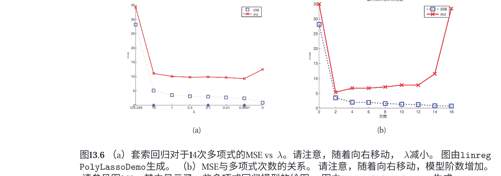

图13.6 (a) 套索回归对于14次多项式的MSE vs λ。请注意，随着向右移动，λ减小。图由linreg PolyLassoDemo生成。(b) MSE与多项式次数的关系。请注意，随着向右移动，模型阶数增加。请参见图11.18，其中显示了一些多项式回归模型的绘图。图由linregPolyVsDegree生成。

| 术语 | LS | 最佳子集 | 岭回归 | 套索 |
|------|----|----------|--------|------|
| 截距 | 2.452 | 2.481 | 2.479 | 2.480 |
| lcavol | 0.716 | 0.651 | 0.656 | 0.653 |
| lweight | 0.293 | 0.380 | 0.300 | 0.297 |
| age | -0.143 | -0.000 | -0.129 | -0.119 |
| lbph | 0.212 | -0.000 | 0.208 | 0.200 |
| svi | 0.310 | -0.000 | 0.301 | 0.289 |
| lcp | -0.289 | -0.000 | -0.260 | -0.236 |
| gleason | -0.021 | -0.000 | -0.019 | 0.000 |
| pgg45 | 0.277 | 0.178 | 0.256 | 0.226 |
| 测试误差 | 0.586 | 0.572 | 0.580 | 0.564 |

表13.1 不同方法在前列腺癌数据上的结果，该数据具有8个特征和67个训练案例。方法包括：LS = 最小二乘法，Subset = 最佳子集回归，Ridge, Lasso。行表示系数；我们可以看到子集回归和套索给出了稀疏解。底行是测试集（30个案例）上的均方误差。基于(Hastie et al. 2009)的表3.3。图由前列腺比较生成。

## 13.3.4 正则化路径

当我们增加 λ时，解向量 ŵ(λ)会趋向于变得更稀疏，尽管不一定是单调的。我们可以绘制每个特征 \(j\) 的值 ŵ _j(λ) 与 λ 的关系图，这被称为正则化路径。

这在岭回归的图13.7(a)中有所说明，我们绘制 ŵ _j(λ) 随着正则化参数 λ 的减小而变化。我们可以看到当 λ = ∞时，所有的系数都为零。但对于任何有限的 λ值，所有的系数都是非零的；此外，它们的大小随着 λ的减小而增加。

在图13.7(b)中，我们绘制了套索的类似结果。当我们向右移动时，ℓ_1惩罚的上界 B增加。当 B= 0时，所有的系数都为零。当我们增加 B，系数逐渐“打开”。但是对于介于 0 和 \(B_{\text{max}} = \|\hat{w}_{\text{OLS}}\|_1\) 之间的任何值，解都是稀疏的。^4

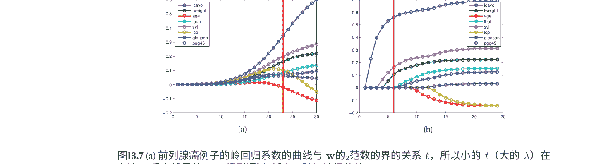

图13.7 (a) 前列腺癌例子的岭回归系数的曲线与 w 的 2 范数的界的关系，所以小的 t (大的 λ) 在左边。垂直线是使用ISE规则通过5折交叉验证选择的值。基于(Hastie et al. 2009)的图3.8。由ridgePathProstate生成的图。(b) 前列腺癌例子的套索回归系数的曲线与 w 的 1 范数的界的关系，所以小的 t (大的 λ) 在左边。基于(Hastie et al. 2009)的图3.10。由lassoPathProstate生成的图。

令人惊讶的是，可以证明解路径是 B 的分段线性函数(Efron et al. 2004)。也就是说，存在一组关键值 B，其中非零系数的活动集发生变化。在这些关键值之间的 B 值范围内，每个非零系数都以线性方式增加或减少。这在图13.8(a)中有所说明。此外，可以通过解析方法求解这些关键值。这是 LARS算法的基础(Efron et al. 2004)，它代表“最小角度回归和收缩”(详见第13.4.2节)。令人惊讶的是，LARS算法可以计算出整个正则化路径，而计算时间大致相同。

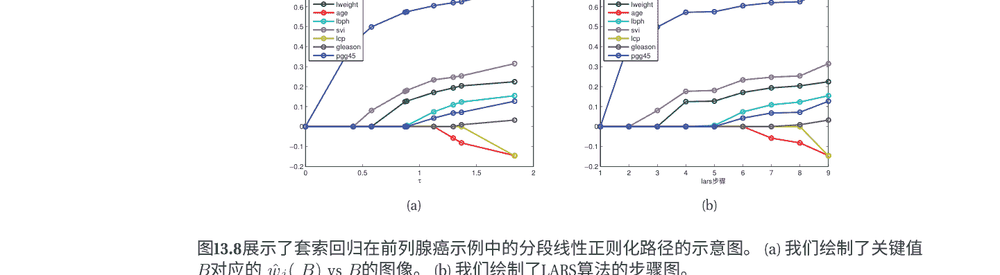

图13.8展示了套索回归在前列腺癌示例中的分段线性正则化路径的示意图。(a) 我们绘制了关键值 B 对应的 ŵ_j(B) vs B 的图像。(b) 我们绘制了LARS算法的步骤图。由lassoPathProstate生成的图。

> 4. 通常会将解与收缩因子进行绘图，收缩因子定义为 B 的比值 B/B_{max}，而不是与 B 进行绘图。这只是影响了水平轴的比例尺，而不影响曲线的形状。

图13.9使用Lasso恢复稀疏信号的示例。详细信息请参阅正文。基于(Figueiredo et al. 2007)的图1。由Mario Figueiredo编写的sparseSensingDemo生成的图。

计算成本与单个最小二乘拟合相同（即 O(min(N D^2, D N^2))）。在图13.8(b)中，我们绘制了在每个关键值 B 处计算的系数。现在分段线性更加明显。下面我们显示了沿着正则化路径的每个步骤的实际系数值（最后一行是最小二乘解）：

清单 13.1 lassoPathProstate 的输出

| 0 | 0 | 0 | 0 | 0 | 0 | 0 | 0 | 0 |
| --- | --- | --- | --- | --- | --- | --- | --- | --- |
| 0.4279 | 0 | 0 | 0 | 0 | 0 | 0 | 0 | 0 |
| 0.5015 | 0.0735 | 0 | 0 | 0 | 0 | 0 | 0 | 0 |
| 0.5610 | 0.1878 | 0 | 0 | 0.0930 | 0 | 0 | 0 | 0 |
| 0.5622 | 0.1890 | 0 | 0.0036 | 0.0963 | 0 | 0 | 0 | 0 |
| 0.5797 | 0.2456 | 0 | 0.1435 | 0.2003 | 0 | 0 | 0.0901 | 0 |
| 0.5864 | 0.2572 | -0.0321 | 0.1639 | 0.2082 | 0 | 0 | 0.1066 | 0 |
| 0.6994 | 0.2910 | -0.1337 | 0.2062 | 0.3003 | -0.2565 | 0 | 0.2452 | 0 |
| 0.7164 | 0.2926 | -0.1425 | 0.2120 | 0.3096 | -0.2890 | -0.0209 | 0.2773 | 0 |

通过将 B 从 0 更改为 B_{max}，我们可以从所有权重为零的解决方案转变为所有权重非零的解决方案。不幸的是，不是所有的子集大小都可以通过套索实现。可以证明，如果 D > N，最优解最多可以有 N 个变量，在达到对应于最小 $\ell_1$ 范数的 OLS 解之前，它包含了完整的集合。在第 13.5.3 节中，我们将看到通过使用 $\ell_2$ 以及 $\ell_1$ 正则化（一种称为弹性网络的方法），我们可以实现包含更多变量的稀疏解决方案，这些变量比训练样例还要多。这使我们能够探索介于 N 和 D 之间的模型大小。

## 13.3.5 模型选择

使用 $\ell_1$ 正则化来估计相关变量集合是很诱人的。在某些情况下，我们可以恢复生成数据的参数向量 $\mathbf{w}^*$的真实稀疏模式。一种可以在 $N \rightarrow \infty$ 极限下恢复真实模型的方法被称为模型选择一致性。哪些方法享有这种属性以及何时享有这种属性的详细信息超出了本书的范围；有关详细信息，请参阅例如（Bühlmann和van de Geer 2011）。

我们不会进行理论讨论，而是只展示一个小例子。首先，我们生成一个大小为 $D = 4096$ 的稀疏信号 $\mathbf{w}^*$，其中包含160个随机放置的 $\pm 1$ 峰值。接下来，我们生成一个大小为 $N \times D$ 的随机设计矩阵 $\mathbf{X}$，其中 $N = 1024$。最后，我们生成一个带噪声的观测值 $\mathbf{y} = \mathbf{X}\mathbf{w}^* + \boldsymbol{\epsilon}$，其中 $\epsilon_i \sim \mathcal{N}(0, 0.01^2)$。然后，我们从 $\mathbf{y}$ 和 $\mathbf{X}$ 中估计 $\mathbf{w}$。

原始 $\mathbf{w}^*$ 在图13.9的第一行中显示。第二行是使用 $\ell_1$ 估计 $\hat{\mathbf{w}}_{L1}$ 的结果，使用 $\lambda = 0.1 \lambda_{max}$。我们看到这些“尖峰”出现在正确的位置，但它们太小了。第三行是基于 $\text{supp}(\hat{\mathbf{w}}_{L1})$ 估计为非零的系数的最小二乘估计。这被称为去偏，因为Lasso收缩了相关系数和无关系数。最后一行是忽略稀疏性的所有系数的最小二乘估计。我们看到（去偏的）稀疏估计是原始信号的优秀估计。相比之下，没有稀疏性假设的最小二乘法表现非常糟糕。

当然，要进行模型选择，我们必须选择 $\lambda$。常用的方法是使用交叉验证。然而，重要的是要注意交叉验证是选择一个能够得到良好预测准确性的 $\lambda$ 值。通常情况下，这个值与恢复“真实”模型的值不同。为了理解原因，回想一下 $\ell_1$ 正则化执行选择和收缩，也就是说，选择的系数被拉近到0。为了防止相关系数以这种方式被收缩，交叉验证倾向于选择一个不太大的 $\lambda$ 值。当然，这将导致一个包含无关变量（假阳性）的较少稀疏的模型。

事实上，(Meinshausen and Bühlmann 2006) 证明了预测最优的 $\lambda$ 值不会导致模型选择的一致性。在第13.6.2节中，我们将讨论一些自适应机制，以便在每个维度上自动调整 $\lambda$ 值，从而实现模型选择的一致性。

使用正则化选择变量的一个缺点是，如果数据稍微扰动一下，结果可能会有很大不同。贝叶斯方法通过估计后验边际包含概率 $p(\gamma_j = 1 | \mathcal{D})$ 来提高鲁棒性。频率派解决这个问题的方法是使用自助法重采样（见第6.2.1节），并在不同版本的数据上重新运行估计器。通过计算每个变量在不同试验中被选择的频率，我们可以近似后验包含概率。这种方法被称为稳定选择（Meinshausen和Bühlmann 2010）。

我们可以将稳定选择（自助法）的包含概率阈值设定为某个水平，比如90%，从而得到一个稀疏估计器。这被称为自助套索（bootstrap lasso）或者bolasso（Bach 2008）。如果一个变量在lasso返回的至少90%的集合中出现，它将被包括在内（对于固定的 $\lambda$）。这种交集的过程是消除普通lasso产生的误报的一种方法。（Bach 2008）中的理论结果证明了bolasso在更广泛的条件下是模型选择一致的。

作为一个例子，我们在（Bach 2008）中重现了实验。特别地，我们创建了

图13.10 (a) 每个变量的选择概率（白色=大概率，黑色=小概率）与正则化参数的关系。从左到右移动，我们减少了正则化的程度，因此选择更多的变量。(b) 与(a)相同，但是对于bolasso。(c) 正确符号估计的概率与正则化参数的关系。Bolasso（红色，虚线）和Lasso（黑色，实线）：自助样本的数量为 {2, 4, 8, 16, 32, 64, 128, 256}。基于（Bach 2008）的图1-3。图由bolasoDemo生成。

256个大小为 N= 1000的数据集，其中 D= 16个变量，其中 8个是相关的。更多关于实验设置的细节，请参见（Bach 2008）。对于数据集 n，变量 j和稀疏度水平 k，定义S(j, k, n) = I(w_j(λ_k, D_n) = 0)。现在定义P(j, k)为256个数据集上 S(j, k, n)的平均值。在图13.10(a-b)中，我们绘制了lasso和bolasso的 P vs -log(λ)。我们可以看到，对于bolasso，存在一个较大的 λ范围，在这个范围内选择了真正的变量，但是对于lasso来说并非如此。这在图13.10(c)中得到了强调，我们绘制了在增加的bootstrap样本数量下，lasso和bolasso恢复正确变量集的经验概率。当然，使用更多的样本需要更长的时间。实际上，使用32个bootstrap样本似乎是速度和准确性之间的一个很好的折衷。

在bolasso中，存在选择 λ的常见问题。显然，我们可以使用交叉验证，但是图13.10(b)等图表表明另一种启发式方法：洗牌行以创建一个大的黑色块，然后选择 λ位于该区域的中间。当然，将这种直觉操作化可能会很棘手，并且需要各种特定的阈值（这让人想起了第11.5.2节中讨论如何选择 K的“找到曲线上的拐点”启发式方法）。贝叶斯方法提供了一种更有原则的选择 λ的方法。

## 13.3.6 具有拉普拉斯先验的线性模型的贝叶斯推断

我们一直在关注稀疏线性模型中的MAP估计。也可以进行贝叶斯推断（参见例如，(Park and Casella 2008; Seeger 2008)）。然而，后验均值和中位数以及来自后验的样本都不是稀疏的；只有模式是稀疏的。这是第5.2.1节讨论的现象的另一个例子，在该节中我们说MAP估计通常不典型于后验的大部分。

使用后验均值的另一个支持论点来自于方程5.108，该方程表明，如果我们想要最小化平方预测误差，那么插入后验均值而不是后验模式是最优选择。（Schniter等人，2008年）的实验证明，（Elad和Yavneh，2009年）的理论研究表明，使用尖峰和平板先验的后验均值比使用拉普拉斯先验的后验模式具有更好的预测准确性，尽管计算成本稍高。

## 13.4 $\ell_1$正则化：算法

在本节中，我们简要回顾了一些可用于解决 $\ell_1$正则化估计问题的算法。我们重点关注套索情况，其中我们有一个二次损失。然而，大多数算法可以扩展到更一般的设置，例如逻辑回归（参见 (Yuan等人, 2010年) 对 $\ell_1$正则化逻辑回归的全面回顾）。请注意，机器学习领域发展非常迅速，因此下面的方法在您阅读本章时可能已经不是最新技术。（参见 (Schmidt等人, 2009年; Yuan等人, 2010年; Yang等人, 2010年) 的一些最新调查。）

### 13.4.1 坐标下降

有时候同时优化所有变量很困难，但是逐个优化它们很容易。特别是，我们可以在其他变量固定的情况下解出第$j$个系数：

$$w_j^* = \underset{z}{\text{argmin}} \; f(\mathbf{w} + z\mathbf{e}_j) - f(\mathbf{w}) \qquad\qquad\qquad\qquad\qquad (13.65)$$

其中 $\mathbf{e}_j$是第$j$个单位向量。我们可以以确定性的方式循环遍历坐标，也可以随机采样它们，或者选择梯度最陡的坐标进行更新。

如果每个一维优化问题都可以通过解析方法解决，那么坐标下降法尤其有吸引力。例如，Lasso算法 (Fu 1998; Wu and Lange 2008) 使用方程13.54计算给定其他所有系数时的最优值 $w_{j}$。请参见伪代码 (Algorithm 7) 和一些Matlab代码 (LassoShooting)。

参考(Yuan等人, 2010年)了解一些将该方法扩展到逻辑回归案例的方法。由于其实验比较中，该算法是最快的方法，涉及到使用大型稀疏特征向量（表示词袋）进行文档分类。其他类型的数据（例如，密集特征和/或回归问题）可能需要不同的算法。

```
算法13.1：坐标下降法（也称为射击算法）
1 初始化$\mathbf{w} = (\mathbf{X}^T\mathbf{X} + \lambda \mathbf{I})^{-1}\mathbf{X}^T\mathbf{y}$;
2 重复
3 $\quad$ 对于 $j = 1, \ldots, D$ 进行
4 $\qquad a_j = 2 \sum_{i=1}^{n} x_{ij}^2$;
5 $\qquad c_j = 2 \sum_{i=1}^{n} x_{ij} (y_i - \mathbf{w}^T\mathbf{x}_i + w_jx_{ij})$;
6 $\qquad w_j = \text{soft}\left(\frac{c_j}{a_j}, \frac{\lambda}{a_j}\right)$;
7 直到 收敛 ;
```

### 13.4.2 LARS和其他同伦方法

坐标下降的问题在于它一次只更新一个变量，因此收敛速度可能较慢。主动集方法一次更新多个变量。不幸的是，它们更加复杂，因为需要确定哪些变量被限制为零，哪些变量可以更新。主动集方法通常一次只添加或删除少量变量，因此如果它们距离解决方案很远，可能需要很长时间。

但是，它们非常适合生成一组不同 λ值的解，从空集开始，即生成正则化路径。这些算法利用了一个事实，即如果$\lambda_k \approx \lambda_{k-1}$，可以快速计算 $\hat{w}(\lambda_k)$从 $\hat{w}(\lambda_{k-1})$。这被称为热启动。实际上，即使我们只想要 λ的解，称为 $\lambda_*$，有时候使用热启动计算一组解，从 $\lambda_{max}$到 $\lambda_*$，在计算效率上可能更高；这被称为连续方法或同伦方法。事实上，即使我们只想要 λ的解，称为 $\lambda_*$，有时候使用热启动计算一组解，从$\lambda_{max}$到$\lambda_*$，在计算效率上可能更高；这被称为连续方法或同伦方法。这通常比直接在$\lambda$处进行“冷启动”要快得多；如果$\lambda$很小，尤其如此。

在机器学习中，同伦方法的最著名的例子可能是LARS算法，它代表“最小角度回归和收缩” (Efron等人, 2004年) (类似的算法在 (Osborne等人, 2000b, a) 中独立发明)。这可以高效地计算出所有可能的λ值对应的$\hat{w}(\lambda)$。

LARS的工作原理如下。它从一个较大的 λ值开始，只选择与响应向量 y最相关的变量。然后逐渐减小 λ，直到找到第二个与当前残差具有相同相关性（按大小）的变量，其中第 k步的残差定义为 $\mathbf{r}_k = \mathbf{y} - \mathbf{X}_{:,F} \mathbf{w}_k$，其中$\mathbf{w}_k$是当前的活动集（参见方程13.50）。令人惊讶的是，可以通过几何论证来解析地求解这个新的 λ值（因此称为“最小角度”）。这使得算法能够快速地在正则化路径上“跳转”到下一个点，从而改变活动集。这个过程重复进行，直到所有变量都被添加进来。

如果我们希望解的序列对应于Lasso的正则化路径，那么允许变量从活动集中被移除是必要的。如果我们不允许变量被移除，我们得到一个稍微不同的算法，称为LAR，它倾向于更快。特别地，LAR的成本与单个普通最小二乘拟合相同，即 $O(ND\min(N, D))$，如果$N > D$，则为 $O(ND^2)$如果$D > N$，则为 $O(N^2D)$。LAR与贪婪的前向选择非常相似，以及一种称为最小二乘提升的方法（见第16.4.6节）。

已经有许多尝试将LARS算法扩展到计算完整的正则化路径，用于 $\ell_1$正则化的广义线性模型，例如逻辑回归。一般来说，无法通过解析的方法求解 λ的临界值。相反，标准的方法是从 $\lambda_{\max}$开始，然后逐渐减小 λ，跟踪解决方案；这被称为连续方法或者同伦方法。这些方法利用了我们可以快速计算出 $\hat{w}(\lambda_k)$从$\hat{w}(\lambda_{k-1})$，如果 $\lambda_k \approx \lambda_{k-1}$；这被称为热启动。即使我们不需要完整的路径，这种方法通常比直接在所需的 λ值上“冷启动”要快得多（特别是 λ很小的情况下）。

在(Friedman et al. 2010)中描述的方法将坐标下降与这种热启动策略相结合，并计算任何正则化GLM的完整正则化路径。这已经在与PMTK捆绑在一起的glmnet软件包中实现。

### 13.4.3 近端和梯度投影方法

在本节中，我们考虑一些适用于非常大规模问题的方法，其中同伦方法可能太慢。这些方法也很容易扩展到其他类型正则化项的选择，超越 $\ell_1$，我们稍后会看到。本节中的介绍基于 (Vandenberghe 2011; Yang et al. 2010)。

考虑一个形式为凸目标函数 $f(\boldsymbol{\theta}) = L(\boldsymbol{\theta}) + R(\boldsymbol{\theta})$ (13.66)

其中 $L(\boldsymbol{\theta})$ (表示损失)是凸且可微的，而 $R(\boldsymbol{\theta})$ (表示正则化项)是凸但不一定可微的。例如，$L(\boldsymbol{\theta}) = \text{RSS}(\boldsymbol{\theta})$ 和 $R(\boldsymbol{\theta}) = \lambda \|\boldsymbol{\theta}\|_1$ 对应于BPDN问题。作为另一个例子，套索问题可以表示为：$L(\boldsymbol{\theta}) = \text{RSS}(\boldsymbol{\theta})$ 和 $R(\boldsymbol{\theta}) = I_C(\boldsymbol{\theta})$，其中 $C = \{\boldsymbol{\theta} : \|\boldsymbol{\theta}\|_1 \leq B\}$，并且 $I_C(\boldsymbol{\theta})$ 是凸集 $C$ 的指示函数，定义为 $I_C(\boldsymbol{\theta}) \triangleq \begin{cases} 0 & \boldsymbol{\theta} \in C \\ +\infty & \text{otherwise} \end{cases}$ (13.67)

在某些情况下，优化方程13.66中的形式很容易。例如，假设 $L(\boldsymbol{\theta}) = \text{RSS}(\boldsymbol{\theta})$，设计矩阵简单地为 $\mathbf{X} = \mathbf{I}$。那么目标函数变为 $f(\boldsymbol{\theta}) = R(\boldsymbol{\theta}) + \frac{1}{2}\|\boldsymbol{\theta} - \mathbf{y}\|_2^2$。这个的最小化器由 $\text{prox}_R(\mathbf{y})$ 给出，它是凸函数R的 **proximal operator**，由以下定义 $\text{prox}_R(\mathbf{y}) = \underset{\mathbf{z}}{\text{argmin}} \left( R(\mathbf{z}) + \frac{1}{2}\|\mathbf{z} - \mathbf{y}\|_2^2 \right)$ (13.68)

直观地说，我们返回一个最小化 $R$ 但也接近 (proximal) 于 $\mathbf{y}$ 的点。一般来说，我们会在迭代优化器中使用这个运算符，这时我们希望保持接近先前的迭代。在这种情况下，我们使用 $\text{prox}_R(\boldsymbol{\theta}_k) = \underset{\mathbf{z}}{\text{argmin}} \left( R(\mathbf{z}) + \frac{1}{2}\|\mathbf{z} - \boldsymbol{\theta}_k\|_2^2 \right)$ (13.69)

关键问题是：我们如何高效地计算不同正则化器 $R$ 的proximal operator，并如何将这个技术扩展到更一般的损失函数 $L$？我们在下面讨论这些问题。

### 13.4.3.1 近端算子

如果 $R(\boldsymbol{\theta}) = \lambda \|\boldsymbol{\theta}\|_1$，近端算子由逐分量软阈值处理给出：$\text{prox}_R(\boldsymbol{\theta}) = \text{soft}(\boldsymbol{\theta}, \lambda)$ (13.70)

正如我们在第13.3.2节中所示，如果 $R(\boldsymbol{\theta}) = \lambda \|\boldsymbol{\theta}\|_0$，近端算子由逐分量硬阈值处理给出：$\text{prox}_R(\boldsymbol{\theta}) = \text{hard}(\boldsymbol{\theta}, \sqrt{2\lambda})$ (13.71)

其中 $\text{hard}(u, a) \triangleq u \mathbb{I}(|u| > a)$。

如果 $R(\boldsymbol{\theta}) = I_C(\boldsymbol{\theta})$，近端算子由投影到集合 $C$ 上给出：$\text{prox}_R(\boldsymbol{\theta}) = \underset{\mathbf{z} \in C}{\text{argmin}} \|\mathbf{z} - \boldsymbol{\theta}\|_2^2 = \text{proj}_C(\boldsymbol{\theta})$ (13.72)

## 13.4.3.2 近端梯度法

我们现在讨论如何在梯度下降算法中使用近端算子。基本思想是在损失函数的简单二次逼近上进行最小化，以损失函数为中心。

θ_k:

$$\theta_{k+1} = \arg\min_{\mathbf{z}} R(\mathbf{z}) + L(\theta_k) + \mathbf{g}_k^T (\mathbf{z} - \theta_k) + \frac{1}{2t_k} \|\mathbf{z} - \theta_k\|_2^2 \quad (13.77)$$

其中 $\mathbf{g}_k = \nabla L(\theta_k)$ 是损失函数的梯度，$t_k$ 是下面讨论的一个常数，最后一项是损失函数Hessian矩阵的简单逼近 $\nabla^2 L(\theta_k) \approx \frac{1}{t_k}$。

忽略与 $\mathbf{z}$ 无关的项，并乘以 $t_k$，我们可以将上述表达式重写为以下形式的近端算子：

$$\theta_{k+1} = \arg\min_{\mathbf{z}} \left[ t_k R(\mathbf{z}) + \frac{1}{2} \|\mathbf{z} - \mathbf{u}_k\|_2^2 \right] = \operatorname{prox}_{t_k R}(\mathbf{u}_k) \quad (13.78)$$
$$\mathbf{u}_k = \theta_k - t_k \mathbf{g}_k \quad (13.79)$$
$$\mathbf{g}_k = \nabla L(\theta_k) \quad (13.80)$$

如果 $R(\theta) = 0$，这等同于梯度下降。如果 $R(\theta) = I_C(\theta)$，该方法等同于投影梯度下降，在图13.11中概述。如果 $R(\theta) = \lambda \|\theta\|_1$，该方法被称为迭代软阈值。

有几种方法可以选择 $t_k$，或者等价地选择 $\alpha_k = 1/t_k$。鉴于 $\alpha_k \mathbf{I}$ 是Hessian $\nabla^2L$ 的近似值，我们要求

$$\alpha_k (\theta_k - \theta_{k-1}) \approx \mathbf{g}_k - \mathbf{g}_{k-1} \quad (13.81)$$

在最小二乘意义下。因此

$$\alpha_k = \arg\min_{\alpha} \| \alpha (\theta_k - \theta_{k-1}) - (\mathbf{g}_k - \mathbf{g}_{k-1}) \|_2^2 = \frac{ (\theta_k - \theta_{k-1})^T (\mathbf{g}_k - \mathbf{g}_{k-1}) }{ (\theta_k - \theta_{k-1})^T (\theta_k - \theta_{k-1}) } \quad (13.82)$$

这被称为 Barzilai-Borwein (BB) 或者光谱步长 (Barzilai and Borwein 1988; Fletcher 2005; Raydan 1997)。这个步长可以与任何梯度方法一起使用，无论是否是近端的。它不会导致目标的单调减少，但比标准的线搜索技术要快得多。（为了确保收敛，我们要求目标“平均”下降，其中平均是在大小为 M+1 的滑动窗口上计算的。）当我们将 BB 步长与迭代软阈值技术（对于 $R(\theta)=\lambda\|\theta\|_1$）相结合，再加上逐渐减小 $\lambda$ 的连续方法，我们得到了一个快速的方法用于 BPDN 问题，称为 SpaRSA 算法，它代表“通过可分离逼近进行稀疏重构”（Wright et al. 2009）。然而，我们将其称为迭代收缩和阈值算法。请参见算法12的一些伪代码，以及一些 Matlab 代码。另请参见练习13.11，其中使用了基于投影梯度下降的相关方法。

### 13.4.3.3 Nesterov的方法

通过在最近的参数值之外的点展开二次逼近，可以获得更快的近端梯度下降版本。特别地，考虑执行以下形式的更新

$$\theta_{k+1} = \operatorname{prox}_{t_k R}(\phi_k - t_k \mathbf{g}_k) \quad (13.83)$$
$$\mathbf{g}_k = \nabla L(\phi_k) \quad (13.84)$$
$$\phi_k = \theta_k + \frac{k-1}{k+2} (\theta_k - \theta_{k-1}) \quad (13.85)$$

这被称为 Nesterov 的方法 (Nesterov 2004; Tseng 2008)。与之前一样，有多种设置 $t_k$ 的方法；通常使用线性搜索。

当这种方法与迭代软阈值技术（对于 $R(\theta) = \lambda\|\theta\|_1$）结合起来时，再加上逐渐减小 $\lambda$ 的连续方法，我们得到了一个快速的方法来解决 BPDN 问题，即快速迭代收缩阈值算法（FISTA）（Beck和Teboulle 2009）。

## 算法13.2: 迭代收缩阈值算法 (ISTA)

```
1 输入: X ∈ ℝ^{N×D}, y ∈ ℝ^N, 参数 λ ≥ 0, M ≥ 1, 0 < s < 1;
2 初始化: θ_0 = 0, α = 1, r = y, λ_0 = ∞;
3 重复
4     λ_t = max(s || X^T r ||_∞, λ) // 调整正则化项;
5     重复
6         g = ∇L(θ);
7         u = θ - (1/α) g;
8         θ = soft(u, (λ_t/α));
9         使用方程式13.82中的BB步长更新 α;
10    直到过去的 M 步中 f(θ) 增加太多为止;
11    r = y - Xθ // 更新残差;
12 直到 λ_t = λ;
```

## 13.4.4 Lasso的EM算法

在本节中，我们展示了如何使用 Lasso 来解决 Lasso 问题。乍一看，这可能看起来很奇怪，因为没有隐藏变量。关键的洞察力是我们可以将拉普拉斯分布表示为高斯比例混合（GSM）（Andrews和Mallows 1974; West 1987），如下所示：

$$
\text{Lap}(w_j|0, 1/\gamma) = \frac{\gamma}{2} e^{-\gamma|w_j|} = \int \mathcal{N}(w_j|0, \tau_j^2) \text{Ga}(\tau_j^2|1, \frac{\gamma^2}{2}) d\tau_j^2
$$

因此，拉普拉斯是一个 GSM，其中方差的混合分布是指数分布，$\text{Expon}(\tau_j^2|\gamma^2/2) = \text{Ga}(\tau_j^2|1, \gamma^2/2)$。使用这个分解，我们可以将lasso模型表示为图13.12所示。相应的联合分布具有以下形式

$$
p(\mathbf{y}, \mathbf{w}, \boldsymbol{\tau}, \sigma^2|\mathbf{X}) = \mathcal{N}(\mathbf{y}|\mathbf{X}\mathbf{w}, \sigma^2\mathbf{I}_N) \mathcal{N}(\mathbf{w}|\mathbf{0}, \mathbf{D}_\tau) \text{IG}(\sigma^2|a_\sigma, b_\sigma) \left[ \prod_j \text{Ga}(\tau_j^2|1, \gamma^2/2) \right]
$$

其中 $\mathbf{D}_\tau = \text{diag}(\tau_j^2)$，我们假设为了符号简洁，$\mathbf{X}$ 被标准化，$\mathbf{y}$ 被居中（所以我们可以忽略偏移项 $\mu$）。展开，我们得到

$$
p(\mathbf{y}, \mathbf{w}, \boldsymbol{\tau}, \sigma^2|\mathbf{X}) \propto (\sigma^2)^{-N/2} \exp\left(-\frac{1}{2\sigma^2}\|\mathbf{y} - \mathbf{X}\mathbf{w}\|_2^2\right) |\mathbf{D}_\tau|^{-\frac{1}{2}} \exp\left(-\frac{1}{2}\mathbf{w}^T \mathbf{D}_\tau \mathbf{w}\right) (\sigma^2)^{-(a_\sigma+1)} \exp(-b_\sigma/\sigma^2) \prod_j \exp\left(-\frac{\gamma^2}{2} \tau_j^2\right)
$$

下面我们描述如何将EM算法应用于图13.12中的模型。简而言之，在E步中，我们推断 $\tau_j^2$ 和 $\sigma^2$，在M步中，我们估计 $\mathbf{w}$。得到的估计 $\hat{\mathbf{w}}$ 与套索估计器相同。这种方法首先在 (Figueiredo 2003) 中提出（也可以参考 (Griffin and Brown 2007; Caron and Doucet 2008; Ding and Harrison 2010) 的一些扩展）。

### 13.4.4.1 为什么EM?

在深入讨论EM的细节之前，值得问一下为什么我们要介绍这种方法，考虑到还有其他各种直接解决问题的算法（通常更快） $\ell_1$ MAP 估计问题（见 linregFitL1Test 进行经验比较）。原因是潜变量视角带来了几个优势，例如以下几点：

-   它提供了一种简单的方法来推导出算法，以找到 $\ell_1$ 正则化参数估计值，适用于其他各种模型，例如鲁棒线性回归（练习11.12）或概率回归（练习13.9）。
-   除了 $\text{Ga}(\tau_j^2|1,\gamma^2/2)$ 之外，它建议尝试其他方差的先验分布。我们将在下面考虑各种扩展。
-   它清楚地说明了我们如何计算完整的后验概率 $p(\mathbf{w}|\mathcal{D})$，而不仅仅是 MAP 估计。这种技术被称为贝叶斯套索 (Park and Casella 2008; Hans 2009)。

### 13.4.4.2 目标函数

根据方程式13.88，完整数据的惩罚对数似然函数如下（省略不依赖于 w 的项）

$$
\ell_c(\mathbf{w}) = -\frac{1}{2\sigma^2}\|\mathbf{y} - \mathbf{Xw}\|_2^2 - \frac{1}{2}\mathbf{w}^T\mathbf{\Lambda w} + \text{常数} \tag{13.89}
$$

其中 $\mathbf{\Lambda} = \text{diag}(\frac{1}{\tau_j^2})$ 是 $\mathbf{w}$ 的精确矩阵。

### 13.4.4.3 E步

关键是计算 $\mathbb{E}\left[\frac{1}{\tau_j^2}|w_j\right]$。我们可以直接推导出这个结果（参见练习13.8）。或者，我们可以推导出完整的后验概率，如下所示（Park和Casella 2008）：

$$
p(1/\tau_j^2|\mathbf{w},\mathcal{D}) = \text{InverseGaussian}\left(\sqrt{\frac{\gamma^2}{w_j^2}},\gamma^2\right) \tag{13.90}
$$

(注意，逆高斯分布也被称为瓦尔德分布。）因此

$$
\mathbb{E}\left[\frac{1}{\tau_j^2}|w_j\right] = \frac{\gamma}{|w_j|} \tag{13.91}
$$

令 $\overline{\mathbf{\Lambda}} = \text{diag}(\mathbb{E}[1/\tau_1^2],...,\mathbb{E}[1/\tau_D^2])$ 表示这个E步的结果。
我们还需要推断 $\sigma^2$。很容易证明后验概率为

$$
p(\sigma^2|\mathcal{D},\mathbf{w}) = \text{IG}(a_\sigma + (N)/2, b_\sigma + \frac{1}{2}(\mathbf{y} - \mathbf{Xw})^T(\mathbf{y} - \mathbf{Xw})) = \text{IG}(\alpha_N, \beta_N) \tag{13.92}
$$

因此

$$
\mathbb{E}[1/\sigma^2] = \frac{\alpha_N}{\beta_N} \triangleq \overline{\omega} \tag{13.93}
$$

### 13.4.4.4 M步

M步包括计算

$$
\hat{\mathbf{w}} = \underset{\mathbf{w}}{\text{argmax}} -\frac{1}{2\overline{\omega}}\|\mathbf{y} - \mathbf{Xw}\|_2^2 - \frac{1}{2}\mathbf{w}^T\overline{\mathbf{\Lambda}} \mathbf{w} \tag{13.94}
$$

这只是高斯先验下的MAP估计：

$$
\hat{\mathbf{w}} = (\overline{\omega}^{-1}\overline{\mathbf{\Lambda}} + \mathbf{X}^T\mathbf{X})^{-1}\mathbf{X}^T\mathbf{y} \tag{13.95}
$$

然而，由于我们预期许多 $w_j = 0$，对于许多 $j$，我们将有 $\tau_j^2 = 0$，使得求逆 $\overline{\mathbf{\Lambda}}$ 在数值上不稳定。幸运的是，我们可以使用 $\mathbf{X}$ 的 SVD，给定为 $\mathbf{X} = \mathbf{U} \mathbf{D} \mathbf{V}^T$，如下所示：

$$
\hat{\mathbf{w}} = \mathbf{\Psi} \mathbf{V} (\mathbf{V}^T \mathbf{\Psi} \mathbf{V} + \frac{1}{\overline{\omega}} \mathbf{D}^{-2})^{-1} \mathbf{D}^{-1} \mathbf{U}^T \mathbf{y}
$$

其中

$$
\mathbf{\Psi} = \overline{\mathbf{\Lambda}}^{-1} = \text{diag}(\frac{1}{\mathbb{E}[1/\tau_j^2]}) = \text{diag}(\frac{|w_j|}{\gamma})
$$

### 13.4.4.5 注意事项

由于套索目标是凸的，这种方法应该总是找到全局最优解。不幸的是，由于数值原因，有时候这种情况并不会发生。特别是，假设在真实解中，$w_j^* = 0$。此外，假设我们在一个M步中将 $\hat{w}_j = 0$。在接下来的E步中，我们推断 $\tau_j^2 = 0$，所以我们再次将 $\hat{w}_j = 0$；因此我们永远无法“撤销”我们的错误。幸运的是，在实践中，这种情况似乎很少见。请参阅 (Hunter和Li 2005) 进行进一步讨论。

## 13.5 $\ell_1$正则化: 扩展

在本节中，我们讨论“纯净” $\ell_1$ 正则化 的各种扩展。

### 13.5.1 群组套索

在标准 $\ell_1$ 正则化中，我们假设参数和变量之间存在一对一的对应关系，因此如果 $\hat{w}_j = 0$，我们解释为变量 $j$ 被排除在外。但是，在更复杂的模型中，可能会有许多与给定变量相关联的参数。特别地，在每个输入上可能有一个权重向量 $\mathbf{w}_j$。以下是一些示例：

-   多项式逻辑回归每个特征与 $C$ 个不同的权重相关联，每个类别一个。
-   具有分类输入的线性回归每个标量输入被独热编码为长度为 $C$ 的向量。
-   多任务学习在多任务学习中，我们有多个相关的预测问题。例如，我们可能有 $C$ 独立的回归或二元分类问题。因此，每个特征与 $C$ 不同的权重相关联。我们可能希望在所有任务中使用一个特征或不使用任何任务，并在组级别上选择权重 (Obozinski等人，2007年)。

如果我们使用形式为 $\|\mathbf{w}\| = \sum_j \sum_c |w_{jc}|$ 的 $\ell_1$ 正则化器，可能会导致一些 $\mathbf{w}_{j,}$ 元素为零，而一些元素不为零。为了防止这种情况，我们将参数向量分成 $G$ 组。现在我们最小化以下目标

$$
J(\mathbf{w}) = \text{NLL}(\mathbf{w}) + \sum_{g=1}^G \lambda_g \|\mathbf{w}_g\|_2
$$

其中 $\|\mathbf{w}_g\|_2 = \sqrt{\sum_{j \in g} w_j^2}$ 是群体权重向量的2-范数。如果 NLL 是最小二乘法，则该方法称为群体套索（Yuan和Lin 2006）。

我们通常对较大的群体使用较大的惩罚，通过设置 $\lambda_g = \lambda \sqrt{d_g}$，其中 $d_g$ 是群体 $g$ 中的元素数量。例如，如果我们有群体 $\{1,2\}$ 和 $\{3,4,5\}$，目标函数变为

$$
J(\mathbf{w}) = \text{NLL}(\mathbf{w}) + \lambda \left[ \sqrt{2} \sqrt{(w_1^2 + w_2^2)} + \sqrt{3} \sqrt{(w_3^2 + w_4^2 + w_5^2)} \right] \quad (13.100)
$$

请注意，如果我们使用2-范数的平方，则该模型将等同于岭回归，因为

$$
\sum_{g=1}^G \|\mathbf{w}_g\|_2^2 = \sum_g \sum_{j \in g} w_j^2 = \|\mathbf{w}\|_2^2 \quad (13.101)
$$

通过使用平方根，我们对包含组重量的球的半径进行惩罚：只有当所有元素都很小时，半径才会很小。因此，平方根导致了组的稀疏性。

这种技术的一个变体将2-范数替换为无穷范数（Turlach等人，2005年；Zhao等人，2005年）：

$$
\|\mathbf{w}_g\|_\infty = \max_{j \in g} |w_j| \quad (13.102)
$$

很明显，这也会导致组的稀疏性。

图13.3和13.14显示了差异的示例。在两种情况下，我们都有一个大小为 $D=2^{12}=4096$ 的真实信号 $\mathbf{w}$，分成64个大小为64的组。我们随机选择8个 $\mathbf{w}$ 组，并为它们分配非零值。在第一个示例中，这些值是从 $\mathcal{N}(0,1)$ 中抽取的。在第二个示例中，这些值都设置为1。然后，我们选择一个大小为 $N \times D$ 的随机设计矩阵 $\mathbf{X}$，其中 $N=2^{10}=1024$。最后，我们生成 $\mathbf{y} = \mathbf{X}\mathbf{w} + \boldsymbol{\varepsilon}$，其中 $\boldsymbol{\varepsilon} \sim \mathcal{N}(\mathbf{0}, 10^{-4}\mathbf{I}_N)$。在给定这些数据的情况下，我们使用L1范数或组L1范数来估计 $\mathbf{w}$ 的支持集，并使用最小二乘法估计非零值。我们看到组套索比普通套索做得更好，因为它尊重已知的组结构。我们还看到了 $\ell_\infty$ 范数倾向于使块内的所有元素具有相似的大小。这在第二个例子中是合适的，但在第一个例子中不合适。（$\lambda$ 的值在所有示例中都相同，并且是手动选择的。）

#### 13.5.1.1 组套索的GSM解释

组套索等价于使用以下先验进行MAP估计

$$
p(\mathbf{w}|\gamma, \sigma^2) \propto \exp\left(-\frac{\gamma}{\sigma}\sum_{g=1}^G \|\mathbf{w}_g\|_2\right) \quad (13.103)
$$

图13.11 投影梯度下降的示意图。沿着负梯度的步长，到达 $\theta_k - g_k$，将我们带出可行集。如果我们将该点投影到集合中最近的点，我们得到 $\theta_{k+1} = \text{proj}_\Theta(\theta_k - g_k)$。然后，我们可以通过 $d_k = \theta_{k+1} - \theta_k$ 来推导出隐式更新方向。在 Mark Schmidt 的友情许可下使用。

对于某些凸集，计算投影算子很容易。例如，要将点投影到由盒约束 $C = \{\theta : \ell_j \leq \theta_j \leq u_j\}$ 定义的矩形集上，我们可以使用

$$
\text{proj}_C(\theta)_j = \begin{cases} \ell_j & \theta_j < \ell_j \\ \theta_j & \ell_j \leq \theta_j \leq u_j \\ u_j & \theta_j > u_j \end{cases} \quad (13.73)
$$

为了将点投影到欧几里得球 $C = \{\theta : \|\theta\|_2 \leq 1\}$，我们可以使用

$$
\text{proj}_C(\theta) = \begin{cases} \frac{\theta}{\|\theta\|_2} & \|\theta\|_2 > 1 \\ \theta & \|\theta\|_2 \leq 1 \end{cases} \quad (13.74)
$$

为了将点投影到 $\ell_1$ 范数球 $C = \{\theta : \|\theta\|_1 \leq 1\}$，我们可以使用

$$
\text{proj}_C(\theta) = \text{soft}(\theta, \lambda) \quad (13.75)
$$

其中 $\lambda=0$ 如果 $\|\theta\|_1 \leq 1$，否则 $\lambda$ 是方程的解

$$
\sum_{j=1}^{D} \max(|\theta_j| - \lambda, 0) = 1 \quad (13.76)
$$

我们可以按照 (Duchi et al. 2008) 中的解释，在 $O(D)$ 时间内实现整个过程。我们将在第13.5.1.2节中看到这些不同投影方法的应用。

图13.13 展示了原始信号为分段高斯的组套索。左上：原始信号。左下：普通套索估计。右上：使用块上的 ℓ₂范数的组套索估计。右下：使用块上的 ℓ∞ 范数的组套索估计。基于(Wright et al. 2009)的3-4图。由groupLassoDemo生成的图，基于Mario Figueiredo的代码。

现在可以证明（练习13.10），这个先验可以写成GSM，如下所示：

```
$$ \mathbf{w}_g | \sigma^2, \tau_g^2 \sim \mathcal{N}(\mathbf{0}, \sigma^2 \tau_g^2 \mathbf{I}_{d_g}) \quad (13.104) $$
$$ \tau_g^2 | \gamma \sim \text{Ga}(\frac{d_g + 1}{2}, \frac{\gamma}{2}) \quad (13.105) $$
```

其中 d_g 是组 g 的大小。所以我们可以看到，每个组都有一个方差项，每个方差项都来自于一个伽马先验分布，其形状参数取决于组的大小，而速率参数由 γ 控制。图13.15给出了一个例子，我们有2个组，一个大小为2，另一个大小为3。

这个图也更清楚地说明了为什么会有分组效应。假设 w_{1,1}很小；那么 τ_1^2的估计值也会很小，这将迫使 w_{1,2}也很小。相反地，假设 w_{1,1}很大；那么 τ_1^2的估计值也会很大，这将允许 w_{1,2}也变得很大。

图13.14 与图13.13相同，只是原始信号是分段常数。

图13.15 具有2个组的组套索的图形模型，第一个组的大小为 \(G_1 = 2\)，第二个组的大小为 \(G_2 = 3\)。

### 13.5.1.2 组套索算法

有各种各样的组套索算法。 这里我们简要提到两种。第一种方法基于近端梯度下降，在第13.4.3节中讨论过。由于正则化器是可分离的， $R(\mathbf{w}) = \sum_{g} \|\mathbf{w}_g\|_p$, 近端算子分解为 $G$ 个独立算子形式如下

```
$$\text{prox}_{R}(\mathbf{b}) = \arg\min_{\mathbf{z} \in \mathbb{R}^{D_g}} \|\mathbf{z} - \mathbf{b}\|_2^2 + \lambda \|\mathbf{z}\|_p$$
```

如果 $p=2$, 可以证明 (Combettes和Wajs 2005) 可以如下实现

```
$$\text{prox}_{R}(\mathbf{b}) = \mathbf{b} - \text{proj}_{\lambda C}(\mathbf{b})$$
```

其中 $C = \{\mathbf{z} : \|\mathbf{z}\|_2 \leq 1\}$ 是 $\ell_2$ 球。 使用方程式13.74, 如果 $\|\mathbf{b}\|_2 < \lambda$, 我们有

```
$$\text{prox}_{R}(\mathbf{b}) = \mathbf{b} - \mathbf{b} = \mathbf{0}$$
```

否则我们有

```
$$\text{prox}_{R}(\mathbf{b}) = \mathbf{b} - \lambda \frac{\mathbf{b}}{\|\mathbf{b}\|_2} = \mathbf{b} \frac{\|\mathbf{b}\|_2 - \lambda}{\|\mathbf{b}\|_2}$$
```

我们可以将它们组合成一个向量软阈值函数, 如下所示 (Wright等人, 2009年):

```
$$\text{prox}_{R}(\mathbf{b}) = \mathbf{b} \frac{\max(\|\mathbf{b}\|_2 - \lambda, 0)}{\max(\|\mathbf{b}\|_2 - \lambda, 0) + \lambda}$$
```

如果 $p = \infty$, 我们使用 $C = \{\mathbf{z} : \|\mathbf{z}\|_1 \leq 1\}$, 这是 $\ell_1$ 球。 我们可以使用 (Duchi等人, 2008年) 中描述的算法, 在 $O(d_g)$ 时间内投影到这个上面。

另一种方法是修改EM算法。 该方法与普通套索几乎相同。 如果我们定义 $\tau_j^2 = \tau_{g(j)}^2$, 其中 $g(j)$ 是维度 $j$ 所属的组, 我们可以像以前一样使用相同的完全条件来计算 $\sigma^2$ 和 $\mathbf{w}$ 。 唯一的变化如下：

- 我们必须修改权重精度的完全条件, 这些精度是基于共享的权重估计的：

```
$$\frac{1}{\tau_g^2} | \gamma, \mathbf{w}, \sigma^2, \mathbf{y}, \mathbf{X} \sim \text{InverseGaussian}(\sqrt{\frac{\gamma^2 \sigma^2}{\|\mathbf{w}_g\|_2^2}}, \gamma^2)$$
```

其中 $\|\mathbf{w}_g\|_2^2 = \sum$ 对于E步骤, 我们可以使用

```
$$\mathbb{E} \left[ \frac{1}{\tau_g^2} \right] = \frac{\gamma \sigma}{\|\mathbf{w}_g\|_2}$$
```

- 我们必须修改调整参数的完全条件, 该参数现在仅基于 $G$ 值估计 $\tau_g^2$:

```
$$p(\gamma^2 | \boldsymbol{\tau}) = \text{Ga}(a_\gamma + G/2, b_\gamma + \frac{1}{2} \sum_{g}^G \tau_g^2)$$
```

图13.16 (a) 融合套索的示例。垂直轴表示阵列CGH（染色体基因组杂交）强度，水平轴表示基因组上的位置。来源：（Hoefling 2010）的图1。（b）噪声图像。（c）使用2D格点先验的融合套索估计。来源：图2 of (Hoefling 2010). 在Holger Hoefling的友情许可下使用。

### 13.5.2 融合套索

在某些问题设置中（例如，函数数据分析），我们希望相邻的系数彼此相似，除了稀疏之外。图13.16(a)中给出了一个例子，在这个例子中，我们希望拟合一个大部分为“关闭”的信号，但是相邻的位置通常具有相似的值。我们可以使用以下形式的先验模型来建模

```
p(w|\sigma^2) \propto \exp\left(-\frac{\lambda_1}{\sigma} \sum_{j=1}^{D} |w_j| - \frac{\lambda_2}{\sigma} \sum_{j=1}^{D-1} |w_{j+1} - w_j|\right)   (13.114)
```

这被称为融合套索惩罚。在函数数据分析的背景下，我们经常使用 X = I，因此信号中每个位置都有一个系数（参见第4.4.2.3节）。在这种情况下，总体目标的形式为

```
J(w, \lambda_1, \lambda_2) = \sum_{i=1}^{N} (y_i - w_i)^2 + \lambda_1 \sum_{i=1}^{N} |w_i| + \lambda_2 \sum_{i=1}^{N-1} |w_{i+1} - w_i|   (13.115)
```

这是方程4.148的稀疏版本。可以将这个想法推广到链以外的其他图结构，使用形式为的惩罚

```
J(w, \lambda_1, \lambda_2) = \sum_{s \in V} (y_s - w_s)^2 + \lambda_1 \sum_{s \in V} |w_s| + \lambda_2 \sum_{(s,t) \in E} |w_s - w_t|   (13.116)
```

这被称为图引导的融合套索（参见例如，（Chen et al. 2010））。图可能来自一些先前的知识，例如来自己知生物途径的数据库。另一个例子如图13.16(b-c)所示，其中图结构是一个2D格子。

### 13.5.2.1 融合套索的GSM解释

可以证明（Kyung等人，2010年）融合套索模型等价于以下层次模型

$$ w|\sigma^2,\tau,\omega \sim \mathcal{N}(0,\sigma^2\Sigma(\tau,\omega)) $$ (13.117)

$$ \tau_j^2|\gamma_1 \sim \text{Expon}(\frac{\gamma_1^2}{2}), j=1:D $$ (13.118)

$$ \omega_j^2|\gamma_2 \sim \text{Expon}(\frac{\gamma_2^2}{2}), j=1:D-1 $$ (13.119)

其中 $\Sigma = \Omega^{-1}$，$\Omega$ 是一个三对角精度矩阵，其

主对角线 = $\{\frac{1}{\tau_j^2} + \frac{1}{\omega_{j-1}^2} + \frac{1}{\omega_j^2}\}$ (13.120)

非对角线 = $\{-\frac{1}{\omega_j^2}\}$ (13.121)

在这里，我们定义了 $\omega_0^{-2} = \omega_D^{-2} = 0$。这与第4.4.2.3节中的模型非常相似，我们使用了链式结构的高斯马尔可夫随机场作为先验，具有固定的方差。在这里，我们只是让方差是随机的。在图引导套索的情况下，图的结构反映在高斯精度矩阵的零模式中（参见第19.4.4节）。

### 13.5.2.2 融合套索的算法

可以通过利用高斯先验的马尔可夫结构来推广EM算法以适应融合套索模型，以提高效率。也可以推导出直接求解器（不使用潜在变量技巧）（参见例如，（Hoe fling 2010））。然而，这个模型无疑比我们考虑过的其他变体更昂贵。

### 13.5.3 弹性网络（岭回归和套索回归的结合）

尽管套索回归已被证明是一种有效的变量选择技术，但它存在一些问题（Zou和Hastie 2005），例如以下问题：

- 如果存在一组高度相关的变量（例如，处于相同通路的基因），那么套索回归倾向于仅选择其中一个，而且选择方式相当随意。（这一点可以从LARS算法中看出：一旦选择了一组中的一个成员，剩余的成员与新的残差之间的相关性将不高，因此不会被选择。）通常最好选择所有相关的变量组。如果我们知道分组结构，我们可以使用分组套索回归，但通常我们不知道分组结构。
- 在 $D > N$ 的情况下，套索回归在饱和之前最多可以选择 $N$ 个变量。
- 如果 $N > D$，但变量之间存在相关性，经验观察表明岭回归的预测性能优于套索回归。

Zou和Hastie (Zou和Hastie 2005) 提出了一种称为弹性网络的方法，它是套索回归和岭回归之间的混合体，可以解决所有这些问题。它显然被称为“弹性网络”，因为它就像“一个可伸缩的渔网，保留着‘所有的大鱼’”(Zou和Hastie 2005)。

### 13.5.3.1 原始版本

模型的原始版本定义了以下目标函数：

```
$J(\mathbf{w}, \lambda_1, \lambda_2) = \|\mathbf{y} - \mathbf{X}\mathbf{w}\|^2 + \lambda_2\|\mathbf{w}\|_2^2 + \lambda_1\|\mathbf{w}\|_1 \quad (13.122)$
```

请注意，这个惩罚函数是严格凸函数（假设 $\lambda_2 > 0$），因此存在唯一的全局最小值，即使 $\mathbf{X}$ 不是满秩的。

可以证明 (Zou和Hastie 2005) 任何严格凸惩罚函数在 $\mathbf{w}$ 上都会表现出分组效应，这意味着高度相关变量的回归系数倾向于相等（如果它们呈负相关，则可能会改变符号）。例如，如果两个特征相等，即 $\mathbf{X}_{:j} = \mathbf{X}_{:k}$，可以证明它们的估计值也相等，$\hat{w}_j = \hat{w}_k$。

相比之下，使用套索方法，我们可能会得到 $\hat{w}_j = 0$ 和 $\hat{w}_k = 0$ 或者反之亦然。

### 13.5.3.2 普通弹性网络的算法

可以简单地证明 (练习13.5) 弹性网络问题可以转化为在修改后的数据上的套索问题。具体来说，定义

```
$\tilde{\mathbf{X}} = c \begin{pmatrix} \mathbf{X} \\ \sqrt{\lambda_2} \mathbf{I}_D \end{pmatrix}, \quad \tilde{\mathbf{y}} = \begin{pmatrix} \mathbf{y} \\ \mathbf{0}_{D \times 1} \end{pmatrix} \quad (13.123)$
```

其中 $c = (1 + \lambda_2)^{-\frac{1}{2}}$。然后我们解决

```
$\hat{\mathbf{w}} = \arg \min_{\tilde{\mathbf{w}}} \|\tilde{\mathbf{y}} - \tilde{\mathbf{X}}\tilde{\mathbf{w}}\|^2 + c\lambda_1\|\tilde{\mathbf{w}}\|_1 \quad (13.124)$
```

并设置 $\mathbf{w} = c\tilde{\mathbf{w}}$。

我们可以使用LARS算法来解决这个子问题；这被称为LARS-EN算法。如果我们在包含 $m$ 个变量后停止算法，成本为 $O(m^3 + D m^2)$。注意，如果需要，我们可以使用 $m = D$，因为 $\tilde{\mathbf{X}}$ 的秩为 $D$。这与套索方法形成对比，套索方法在 $N < D$ 之前不能选择超过 $N$ 个变量（在跳转到OLS解之前）。在使用LARS-EN（或其他 $\ell_1$ 求解器）时，通常使用交叉验证来选择 $\lambda_1$ 和 $\lambda_2$。

### 13.5.3.3 改进版本

不幸的是，事实证明“纯粹”的弹性网络不能产生非常准确的预测函数，除非它非常接近纯岭回归或纯套索。直观上，原因是它进行了两次收缩：一次是由于 $\ell_2$ 惩罚，另一次是由于 $\ell_1$ 惩罚。

解决方案很简单：通过放大来自原始版本的估计值来撤销 $\ell_2$ 收缩。换句话说，如果 $\mathbf{w}^*$ 是方程13.124的解，则更好的估计值是

```
$\hat{\mathbf{w}} = \sqrt{1 + \lambda_2} \tilde{\mathbf{w}} \quad (13.125)$
```

我们将称之为修正估计。

可以证明修正估计由以下给出

$$\hat{\mathbf{w}} = \arg \min_{\mathbf{w}} \mathbf{w}^T \left(\frac{\mathbf{X}^T \mathbf{X} + \lambda_2 \mathbf{I}}{1+\lambda_2}\right) \mathbf{w} - 2\mathbf{y}^T\mathbf{X}\mathbf{w} + \lambda_1\|\mathbf{w}\|_1$$ (13.126)

现在

$$\frac{\mathbf{X}^T \mathbf{X} + \lambda_2 \mathbf{I}}{1+\lambda_2} = (1-\rho)\hat{\boldsymbol{\Sigma}} + \rho \mathbf{I}$$ (13.127)

因此，弹性网络类似于套索，但我们使用的版本是向 $\mathbf{I}$ 收缩的 $\hat{\boldsymbol{\Sigma}}$。（有关正则化估计协方差矩阵的更多讨论，请参见第4.2.6节。）

### 13.5.3.4 弹性网络的GSM解释

弹性网络使用的隐式先验显然具有以下形式

$$p(\mathbf{w}|\sigma^2) \propto \exp\left(-\frac{\gamma_1}{\sigma} \sum_{j=1}^D |w_j| - \frac{\gamma_2}{2\sigma^2}\sum_{j=1}^D w_j^2\right)$$ (13.128)

这只是高斯和拉普拉斯分布的乘积。

这可以写成以下的分层先验形式 (Kyung et al. 2010; Chen et al. 2011) ：

$$w_j | \sigma^2, \tau_j^2 \sim \mathcal{N}(0, \sigma^2(\tau_j^{-2}+\gamma_2)^{-1})$$ (13.129)

$$\tau_j^2 | \gamma_1 \sim \text{Expon}(\frac{\gamma_1^2}{2})$$ (13.130)

显然，如果 $\gamma_2=0$，这就变成了常规的套索。

可以使用EM在这个模型中进行MAP估计，或者使用MCMC (Kyung等人, 2010年) 或变分贝叶斯 (Chen等人, 2011年) 进行贝叶斯推断。

### 13.6 非凸正则化

尽管拉普拉斯先验导致了一个凸优化问题，但从统计学的角度来看，这个先验并不理想。它存在两个主要问题。首先，它没有在0附近放置足够的概率质量，因此不能充分抑制噪声。其次，它没有在大值上放置足够的概率质量，因此会导致相关系数的收缩，对应于“信号”。（这可以从图13.5（a）中看出：我们可以看到大系数的估计值明显小于它们的最大似然估计值，这种现象被称为偏差。）这两个问题可以通过采用更灵活的先验来解决，这些先验在0处有更大的峰值和更重的尾部。尽管我们无法再找到全局最优解，但这些非凸方法在预测准确性和检测相关变量方面通常优于 $\ell_1$ 正则化 (Fan和Li, 2001年; Schniter等人, 2008年)。我们下面给出一些例子。

## 13.6.1 桥回归

一种自然的推广 ℓ₁正则化，称为桥回归（Frank和Friedman 1993），具有以下形式

```
\hat{w} = \text{NLL}(w) + \lambda \sum_j |w_j|^b
```

这对应于使用指数幂分布进行MAP估计，给定

```
\text{ExpPower}(w|\mu, a, b) \triangleq \frac{b}{2a\Gamma(1+1/b)} \exp\left(-\frac{|x-\mu|^b}{a}\right)
```

如果 b = 2，我们得到高斯分布（其中 a = σ √2），对应于岭回归；如果设置 b = 1，我们得到拉普拉斯分布，对应于套索；如果我们设置 b = 0，我们得到 ℓ₀回归，它等价于最佳子集选择。不幸的是，对于 b < 1，目标函数不是凸的，并且对于 b > 1不会促进稀疏性。因此，ℓ₁范数是对 ℓ₀范数最紧凸近似。

改变 b 的效果在图13.17中有所体现，我们绘制了 b=2, b=1 和 b=0.4的先验分布；我们假设 p(w) = p(w₁)p(w₂)。在观察到单个观测值 (x, y)后，我们还绘制了后验分布，它施加了一个形式为 (y = w^T x)的线性约束，观测噪声通过一定的容差进行控制（与图7.1进行比较）。我们可以看到拉普拉斯分布的模式位于垂直轴上，对应 w₁=0。相比之下，当使用 b=0.4时，存在两个模式，对应两个不同的稀疏解。当使用高斯分布时，MAP估计不是稀疏的（模式不位于任何坐标轴上）。

## 13.6.2 分层自适应套索

回想一下，套索的一个主要问题是它会导致有偏估计。这是因为它需要使用一个较大的 λ值来“压缩”不相关的参数，但是这样会过度惩罚相关的参数。如果我们能够将每个参数与不同的惩罚参数关联起来，那将更好。当然，通过交叉验证来调整 D个参数是完全不可行的，但对于贝叶斯来说，这不是问题：我们只需使每个 τⱼ²有自己的私有调整参数 γⱼ，现在将其视为来自共轭先验 γⱼ ∼ IG(a, b)的随机变量。完整模型如下：

```
\gamma_j \sim \text{IG}(a, b) \\
\tau_j^2 | \gamma_j \sim \text{Ga}(1, \gamma_j^2/2) \\
w_j | \tau_j^2 \sim \mathcal{N}(0, \tau_j^2)
```

参见图13.18(a)。这被称为分层自适应套索（HAL）(Lee等人, 2010)（另见(Lee等人, 2011; Cevher 2009; Armagan等人, 2011)）。我们可以积分掉 τⱼ²，这导致 wⱼ上的 Lap(0, 1/γⱼ)分布。结果是 p(wⱼ) 现在是 Laplacian 的缩放混合。我们可以使用EM来拟合这个模型（即计算一个 local posterior mode），如下所述。得到的估计值 ŵ_{HAL} 通常有效比套索返回的估计更好，从这个意义上说，它更有可能在正确的位置包含零（模型选择一致性），并更有可能产生良好的预测结果（预测一致性）（Lee等人，2010年）。我们在第13.6.2.2节中对这种行为进行了解释。

### 13.6.2.1 HAL的EM算法

由于逆Gamma分布是Laplace分布的共轭先验，我们发现 γj 的E步骤由以下公式给出：

```
p(γj|wj) = IG(a + 1, b + |wj|)
(13.136)
```

对于 σ²的E步骤与普通套索相同。
对于 w 的先验具有以下形式：

```
p(w|γ) = ∏_j (1/(2γj)) exp(-|wj|/γj)
(13.137)
```

因此，M步骤必须进行优化

```
ŵ^(t+1) = argmax_w log N(y|Xw, σ²) - Σ_j |wj| E[1/γj]
(13.138)
```

期望值由以下给出

$$ \mathbb{E}[1/\gamma_j] = \frac{a+1}{b+\lvert w_j^{(t)} \rvert} \triangleq s_j^{(t)} \tag{13.139} $$

因此，M步骤变成了一个加权套索问题：

$$ \hat{\mathbf{w}}^{(t+1)} = \argmin_{\mathbf{w}} \lVert \mathbf{y} - \mathbf{Xw} \rVert_2^2 + \sum_j s_j^{(t)} \lvert w_j \rvert \tag{13.140} $$

这可以使用标准方法（例如，LARS）轻松解决。请注意，如果系数在前一次迭代中被估计为大（因此 $w_j^{(t)}$ 很大），那么缩放因子 $s_j^{(t)}$ 将会很小，因此大的系数不会受到严重惩罚。相反，小的系数会受到严重惩罚。这是算法调整每个系数的惩罚强度的方式。结果是一个估计值，通常比套索返回的结果更稀疏，但也更少有偏差。

请注意，如果我们设置 $a = b = 0$，并且只执行1次EM迭代，我们将得到一个与(Zou 2006; Zou and Li 2008)中的自适应套索方法密切相关的方法。这个EM算法也与信号处理社区中提出的一些迭代重新加权 $\ell_1$ 方法密切相关 (Chartrand and Yin 2008; Candes et al. 2008)。

### 13.6.2.2 理解HAL的行为

通过积分消除 $\gamma_j$，我们可以更好地理解HAL的以下边际分布，

$$ p(w_j \vert a, b) = \frac{a}{2b} \left( \frac{\lvert w_j \rvert}{b} + 1 \right)^{-(a+1)} \tag{13.141} $$

这是广义t分布的一个实例（McDonald和Newey 1988）（在（Cevher 2009； Armagan et al. 2011）中，这被称为双Pareto分布），定义为

$$\text{GT}(w | \mu, a, c, q) \triangleq \frac{q}{2ca^{1/q}B(1/q, a)} \left( 1 + \frac{|w - \mu|^q}{ac^q} \right)^{-(a+1/q)} \qquad (13.142)$$

其中 $c$ 是尺度参数（控制稀疏程度），而 $a$ 与自由度有关。当 $q = 2$ 且 $c = \sqrt{2}$ 时，我们得到标准的t分布；当 $a \to \infty$ 时，我们得到指数幂分布；当 $q = 1$ 且 $a = \infty$ 时，我们得到拉普拉斯分布。在当前模型的背景下，我们可以看到 $p(w_j | a, b) = \text{GT}(w_j | 0, a, b/a, 1)$。

得到的惩罚项具有以下形式

$$\pi_\lambda(w_j) \triangleq -\log p(w_j) = (a+1) \log\left(1 + \frac{|w_j|}{b}\right) + \text{常数} \qquad (13.143)$$

其中 $\lambda = (a, b)$ 是调整参数。我们在2D平面上绘制了这个惩罚项（即，我们绘制了 $\pi_\lambda(w_1) + \pi_\lambda(w_2)$）在图13.18(b)中，对于不同的 $b$ 值。与钻石形状的拉普拉斯惩罚相比，如图13.3(a)所示，我们可以看到HAL惩罚更像一个“海星”：它在“脊梁”上分布更多的密度，从而更积极地实现稀疏性。请注意，这个惩罚项显然不是凸的。

通过考虑将这个惩罚函数应用于具有正交设计矩阵的线性回归问题，我们可以进一步了解它的行为。在这种情况下，可以证明目标变为

$$J(\mathbf{w}) = \frac{1}{2} \|\mathbf{y} - \mathbf{X}\mathbf{w}\|_2^2 + \sum_{j=1}^D \pi_\lambda(|w_j|) \quad (13.144)$$
$$= \frac{1}{2} \|\mathbf{y} - \hat{\mathbf{y}}\|^2 + \frac{1}{2} \sum_{j=1}^D (\hat{w}_j^{mle} - w_j)^2 + \sum_{j=1}^D \pi_\lambda(|w_j|) \quad (13.145)$$

其中 $\hat{\mathbf{w}}^{mle} = \mathbf{X}^T \mathbf{y}$ 是最大似然估计，$\hat{\mathbf{y}} = \mathbf{X} \hat{\mathbf{w}}^{mle}$。因此，我们可以通过解决以下一维优化问题逐个维度计算MAP估计：

$$\hat{w}_j = \underset{w_j}{\text{argmin}} \frac{1}{2} (\hat{w}_j^{mle} - w_j)^2 + \pi_\lambda(w_j) \quad (13.146)$$

在图13.19(a)中，我们绘制了套索估计值，$\hat{w}^{L1}$，与最大似然估计值，$\hat{w}^{mle}$，我们可以看到 $\ell_1$ estimator 具有在图13.5(a)中早期看到的常见的软阈值行为。然而，这种行为是不可取的，因为大幅度的系数也被收缩到0，而我们希望它们等于它们未收缩的最大似然估计。

在图13.19(b)中，我们绘制了HAL估计值 $\hat{w}^{HAL}$ 与ML估计值 $\hat{w}^{mle}$ 之间的关系。我们看到这更接近于在图13.5(b)中早期看到的更理想的硬阈值行为。

## 13.6.3 其他分层先验

已经提出了许多其他分层稀疏促进先验；请参见表13.2以获得简要摘要。在某些情况下，我们可以分析地推导出 $w_j$ 的边缘先验形式。一般来说，这个先验不是凹的。

一个特别有趣的先验是不正确的正态-Jeffreys先验，它已经在(Figueiredo 2003)中使用。这将一个非信息性的Jeffreys先验放在方差上，$\text{Ga}(\tau_j^2 | 0, 0) \propto$

| $p(\tau_j^2)$ | $p(\gamma_j)$ | $p(w_j)$ | 参考 |
|---------------|---------------|----------|------|
| Ga(1, $\frac{\gamma^2}{2}$) | 固定 | Lap(0, $1/\gamma$) | (Andrews and Mallows 1974; West 1987) |
| Ga(1, $\frac{\gamma^2}{2}$) | IG($a, b$) | GT(0, $a, b/a, 1$) | (Lee et al. 2010, 2011; Cevher 2009; Armagan et al. 2011) |
| Ga(1, $\frac{\gamma^2}{2}$) | Ga($a, b$) | NEG($a, b$) | (Griffin and Brown 2007, 2010; Chen et al. 2011) |
| Ga($\delta, \frac{\gamma^2}{2}$) | 固定 | NG($\delta, \gamma$) | (Griffin and Brown 2007, 2010) |
| Ga($\tau_j^2 | 0, 0$) | - | NJ($w_j$) | (Figueiredo 2003) |
| IG($\frac{\delta}{2}, \frac{\delta\gamma^2}{2}$) | 固定 | $\mathcal{T}(0, \delta, \gamma)$ | (Andrews and Mallows 1974; West 1987) |
| $C^+(0, \gamma)$ | $C^+(0, b)$ | 马蹄铁 $(b)$ | (Carvahlo et al. 2010) |

表13.2 一些高斯混合模型。缩写： $C^+$ = 半整流柯西分布； Ga = 伽马分布(形状和速率参数化)； GT = 广义t分布； IG = 逆伽马分布； NEG = 正态-指数-伽马分布； NG = 正态-伽马分布； NJ = 正态-Jeffreys分布。马蹄铁分布是我们给出的根据(Carvahlo et al. 2010)中描述的先验分布在 $w_j$ 上诱导的分布；它没有简单的解析形式。NEG和NG密度的定义有点复杂，但可以在参考文献中找到。其他分布在文本中定义。

## 13.7 自动相关性确定 (ARD) / 稀疏贝叶斯学习 (SBL)

到目前为止，我们考虑的所有方法（除了第13.2.1节中的尖峰和平板方法）都使用了形式为 $p(\mathbf{w}) = \prod_j p(w_j)$ 的阶乘先验。我们已经看到这些先验可以用高斯混合尺度的形式 $w_j \sim \mathcal{N}(0, \tau_j^2)$ 来表示，其中 $\tau_j^2$ 具有表13.2中列出的先验之一。使用这些潜在方差，我们可以将模型表示为 $\tau_j^2 \rightarrow w_j \rightarrow \mathbf{y} \leftarrow \mathbf{X}$。然后我们可以使用EM进行MAP估计，在E步中推断 $p(\tau_j^2 \mid w_j)$，在M步中从 $\mathbf{y}$, $\mathbf{X}$ 和 $\boldsymbol{\tau}$ 估计 $\mathbf{w}$。

这个 M 步骤要么涉及一个闭式加权 $\ell_2$ optimization（在高斯混合情况下），要么涉及一个加权 $\ell_1$ optimization（在拉普拉斯混合情况下）。我们还讨论了如何在这些模型中进行贝叶斯推断，而不仅仅是计算 MAP 估计。

在本节中，我们讨论了一种基于第二类 ML 估计（经验贝叶斯）的替代方法，通过对 $\mathbf{w}$ 进行积分并最大化关于 $\boldsymbol{\tau}$ 的边际似然。这个 EB 过程可以通过 EM 或通过重新加权 $\ell_1$ 方案来实现，我们将在下面解释。在估计了方差之后，我们将它们代入计算权重的后验均值，$\mathbb{E}[\mathbf{w} \mid \hat{\boldsymbol{\tau}}, \mathcal{D}]$；令人惊讶的是（考虑到高斯先验），结果是一个（近似）稀疏估计，原因我们将在下面解释。

在神经网络的背景下，这种方法被称为自动相关性确定或ARD（MacKay 1995b; Neal 1996）：参见第16.5.7.5节。在本章中考虑的线性模型的背景下，这种方法被称为稀疏贝叶斯学习或SBL（Tipping 2001）。将ARD / SBL与基函数扩展结合在线性模型中，产生了一种称为相关向量机（RVM）的技术，我们将在第14.3.2节中讨论。

### 13.7.1 线性回归的ARD

我们将在线性回归的背景下解释该过程；GLMs的ARD需要使用拉普拉斯（或其他）近似。在讨论ARD / SBL时，通常用 $\alpha_j = 1/\tau_j^2$ 表示权重精度，用 $\beta = 1/\sigma^2$ 表示测量精度（不要将其与统计学中用于表示回归系数的 $\beta$ 混淆）。特别是，我们将假设以下模型：

```
p(y|\mathbf{x}, \mathbf{w}, \beta) = \mathcal{N}(y|\mathbf{w}^T \mathbf{x}, 1/\beta) \quad (13.147)
p(\mathbf{w}) = \mathcal{N}(\mathbf{w}|\mathbf{0}, \mathbf{A}^{-1}) \quad (13.148)
```

其中 A = diag(α). 边际似然可以通过以下方式进行解析计算:

```
p(y|X, α, β) = ∫ N(y|Xw, βIₙ) N(w|0, A) dw
```

```
= N(y|0, βIₙ + XA⁻¹Xᵀ)
```

```
= (2π)^{-N/2} |C_α|^{-1/2} exp(-\frac{1}{2}y^T C_α^{-1} y)
```

```
C_α ≜ β^{-1}I_N + XA^{-1}X^T
```

将此与尖峰和板模型中方程13.13中的边际似然进行比较；除了第二项缺少的 β = 1/σ²因子外，方程式是相同的，只是我们用连续的 αⱼ ∈ ℝ⁺替换二进制 γⱼ∈{0,1}。以对数形式，目标变为

```
ℓ(α, β) ≜ -\frac{1}{2} log p(y|X, α, β) = log |C_α| + y^T C_α^{-1} y
```

为了正则化问题，我们可以对每个精度加上共轭先验，αⱼ ~ Ga(a, b) 和 β ~ Ga(c, d)。修改后的目标变为

```
ℓ(α, β) ≜ -\frac{1}{2} log p(y|X, α, β) + \sum_{j} log Ga(α_j|a, b) + log Ga(β|c, d)
```

```
= log |C_α| + y^T C_α^{-1} y + \sum_{j} (a log α_j - bα_j) + c log β - dβ
```

这在对 α和 β进行贝叶斯推断时非常有用(Bishop and Tipping 2000)。然而，在进行（第二类）点估计时，我们将使用不合适的先验 a = b = c = d = 0，这会导致最大的稀疏性。下面我们将描述如何优化精度项α和 β。⁷这是寻找钉子和板模型中最可能的模型设置 γ的代理，而这又与 ℓ₀正则化密切相关。特别地，可以证明（Wipf et al. 2010）方程式13.153中的目标函数比 ℓ₀目标函数具有更少的局部最优解，因此更容易优化。

一旦我们估计出 α和 β，我们可以使用公式计算参数的后验概率

```
p(w|D, \hat{α}, \hat{β}) = N(μ, Σ)
```

```
Σ^{-1} = \hat{β}X^TX + A
```

```
μ = \hat{β}ΣX^Ty
```

我们计算 w的后验概率，同时鼓励稀疏性，这就是为什么这个方法被称为“稀疏贝叶斯学习”。然而，由于有很多方法可以实现稀疏和贝叶斯，我们在线性模型的上下文中使用“ARD”术语。此外，SBL只对系数的值“贝叶斯化”，而不反映对相关变量集合的不确定性，而后者通常更具有兴趣。

图13.20 说明了为什么ARD会导致稀疏性。输入向量 $\mathbf{x}$ 不指向输出向量 $\mathbf{y}$，因此应该删除该特征。
(a) 对于有限的 $\alpha$，概率密度在远离 $\mathbf{y}$ 的方向上扩散。
(b) 当 $\alpha = \infty$ 时，概率密度在 $\mathbf{y}$ 处达到最大。基于(Tipping 2001)的图8。

### 13.7.2 稀疏性从何而来？

如果 $\hat{\alpha}_j \approx 0$，我们发现 $\hat{w}_j \approx \hat{w}_j^{mle}$，因为高斯先验将 $w_j$ 收缩到0的精度为零。然而，如果我们发现 $\hat{\alpha}_j \approx \infty$，那么先验非常确信 $w_j = 0$，因此特征 $j$ 是“不相关的”。因此，后验均值将具有 $\hat{w}_j \approx 0$。因此，不相关的特征将自动“关闭”或“修剪”它们的权重。

现在我们根据（Tipping 2001）给出一个直观的论证，说明为什么ML-II应该鼓励不相关特征的 $\alpha_j \to \infty$。考虑一个具有2个训练样本的1d线性回归，所以 $\mathbf{X} = \mathbf{x} = (x_1, x_2)$， $\mathbf{y} = (y_1, y_2)$。我们可以将 $\mathbf{x}$ 和 $\mathbf{y}$ 作为平面上的向量绘制出来，如图13.20所示。假设该特征对于预测响应是不相关的，因此 $\mathbf{x}$ 点几乎与 $\mathbf{y}$ 垂直。让我们看看在改变 $\alpha$ 时边际似然会发生什么。边际似然由 $p(\mathbf{y}|\mathbf{x}, \alpha, \beta) = \mathcal{N}(\mathbf{y}|\mathbf{0}, \mathbf{C})$ 给出，其中

$$ \mathbf{C} = \frac{1}{\beta}\mathbf{I} + \frac{1}{\alpha}\mathbf{xx}^T $$ (13.159)

如果 $\alpha$ 是有限的，后验概率将沿着 $\mathbf{x}$ 的方向拉长，如图13.20(a)所示。然而，如果 $\alpha = \infty$，我们发现 $\mathbf{C} = \frac{1}{\beta}\mathbf{I}$，所以 $\mathbf{C}$ 是球形的，如图13.20(b)所示。如果 $|\mathbf{C}|$ 保持不变，后者将更高的概率密度分配给观察到的响应向量 $\mathbf{y}$，因此这是首选的解决方案。换句话说，边际似然“惩罚”那些 $\alpha_j$ 很小但 $\mathbf{X}_{:,j}$ 无关紧要的解，因为这些解浪费了概率质量。从贝叶斯奥卡姆剃刀的角度来看，消除冗余维度更加简洁。

## 13.7.3 与MAP估计的联系

ARD与我们在本章早些时候考虑的MAP估计方法似乎非常不同。特别是，在ARD中，我们不是积分 $\alpha$ 和优化 $\mathbf{w}$，而是相反。因为参数 $w_j$ 在后验中变得相关（由于解释性减弱），当我们估计 $\alpha_j$ 时，我们从所有特征中借用信息，而不仅仅是特征 $j$。因此，有效的先验 $p(\mathbf{w}|\alpha)$ 是非阶乘的，而且还依赖于数据 $\mathcal{D}$（和 $\sigma^2$）。然而，在（Wipf和Nagarajan 2007）中，他们展示了ARD可以被视为以下MAP估计问题：

$$\hat{\mathbf{w}}^{ARD} = \arg\min_{\mathbf{w}} \beta\|\mathbf{y} - \mathbf{Xw}\|_2^2 + g_{ARD}(\mathbf{w})$$ \quad (13.160)

$$g_{ARD}(\mathbf{w}) \triangleq \min_{\alpha \geq 0} \sum_j \alpha_j w_j^2 + \log |\mathbf{C}_\alpha|$$ \quad (13.161)

这个证明基于凸分析，有点复杂，因此被省略了。 此外，（Wipf和Nagarajan 2007; Wipf等2010）证明了使用非因子先验的MAP估计比使用任何可能的因子先验的MAP估计在以下意义上严格更好：非因子目标函数始终比因子目标函数具有更少的局部最小值，同时仍满足非因子目标函数的全局最优解对应于全局最优解的属性 - 这是正则化不享有的属性。

## 13.7.4 ARD算法 *

在本节中，我们回顾了几种实现ARD的不同算法。

### 13.7.4.1 EM算法

实现SBL/ARD的最简单方法是使用EM算法。期望完整数据对数似然由以下给出

$$Q(\alpha, \beta) = \mathbb{E}\left[\log \mathcal{N}(\mathbf{y}|\mathbf{Xw}, \sigma^2\mathbf{I}) + \log \mathcal{N}(\mathbf{w}|\mathbf{0}, \mathbf{A}^{-1})\right]$$ \quad (13.162)

$$= \frac{1}{2}\mathbb{E}\left[ N\log \beta - \beta\|\mathbf{y} - \mathbf{Xw}\|^2 + \sum_j \log \alpha_j - \text{tr}(\mathbf{A}\mathbf{w}\mathbf{w}^T) \right] + \text{const}$$ \quad (13.163)

$$= \frac{1}{2}N\log \beta - \frac{\beta}{2}(\|\mathbf{y} - \mathbf{X\mu}\|^2 + \text{tr}(\mathbf{X}^T\mathbf{X\Sigma})) + \frac{1}{2}\sum_j \log \alpha_j - \frac{1}{2}\text{tr}[\mathbf{A}(\boldsymbol{\mu}\boldsymbol{\mu}^T + \boldsymbol{\Sigma})] + \text{const}$$ \quad (13.164)

其中 $\mu$ 和 $\Sigma$ 是使用方程式13.158在E步骤中计算得出的。 假设我们在 $\alpha_j$ 上放置一个 $\text{Ga}(a, b)$ 先验分布，并在 $\beta$ 上放置一个 $\text{Ga}(c, d)$ 先验分布。惩罚目标变为

$$Q'(\alpha, \beta) = Q(\alpha, \beta) + \sum_j (a\log \alpha_j - b\alpha_j) + c\log \beta - d\beta$$ \quad (13.165)

设置 $\frac{dQ'}{d\alpha_j} = 0$ 我们得到以下的M步骤:

$$\alpha_j = \frac{1 + 2a}{\mathbb{E}[w_j^2] + 2b} = \frac{1 + 2a}{m_j^2 + \Sigma_{jj} + 2b}$$ \quad (13.166)

如果 $\alpha_j = \alpha$, 并且 $a = b = 0$, 更新变为

$$\alpha = \frac{D}{\mathbb{E}[\mathbf{w}^T \mathbf{w}]} = \frac{D}{\boldsymbol{\mu}^T \boldsymbol{\mu} + \mathrm{tr}(\boldsymbol{\Sigma})}$$

对于 $\beta$的更新如下

$$\beta^{-1}_{\text{新的}} = \frac{\|\mathbf{y} - \mathbf{X}\boldsymbol{\mu}\|^2 + \beta^{-1} \sum_j (1 - \alpha_j \Sigma_{jj}) + 2d}{N + 2c}$$

(推导这个是练习13.2)

### 13.7.4.2 固定点算法

一种更快更直接的方法是直接优化方程13.155中的目标。可以证明(练习13.3)方程式 $\frac{\partial \ell}{\partial \alpha_j} = 0$和$\frac{\partial}{\partial \beta} \mathrm{d} \ell = 0$导致以下固定的更新点:

$$\alpha_j \leftarrow \frac{\gamma_j + 2a}{m_j^2 + 2b}$$

$$\beta^{-1} \leftarrow \frac{\|\mathbf{y} - \mathbf{X}\boldsymbol{\mu}\|^2 + 2d}{N - \sum_j \gamma_j + 2c}$$

$$\gamma_j \triangleq 1 - \alpha_j \Sigma_{jj}$$

数量 $\gamma_j$是数据确定 $w_j$的程度的度量（MacKay 1992）。因此 $\gamma = \sum_j \gamma_j$是模型的有效自由度。详细讨论请参见第7.5.3节。

由于 $\alpha$和 $\beta$都依赖于 $\boldsymbol{\mu}$和 $\boldsymbol{\Sigma}$（可以使用方程式13.158或拉普拉斯近似计算），我们需要重新估计这些方程直到收敛。（该算法的收敛性质已在（Wipf和Nagarajan 2007）中进行了研究。）在收敛时，结果在形式上与通过EM获得的结果完全相同，但由于目标函数是非凸的，结果可能依赖于初始值。

### 13.7.4.3 迭代重新加权 ℓ₁算法

解决ARD问题的另一种方法是基于将其视为MAP估计问题。尽管先验对数 $g(\mathbf{w})$的形式相当复杂，但可以证明它是 $|w_j|$的非递减、凹函数。这意味着它可以通过迭代重新加权 $\ell_1$问题来解决，其形式为

$$\mathbf{w}^{t+1} = \arg \min_{\mathbf{w}} \mathrm{NLL}(\mathbf{w}) + \sum_j \lambda_j^{(t)} |w_j|$$

在(Wipf和Nagarajan 2010)中，建议使用以下程序来设置惩罚项（基于惩罚函数的凸界）。我们初始化 $\lambda_j^{(0)} = 1$，然后在第 $t+1$ 次迭代中，计算 $\lambda_j^{(t+1)}$ 通过迭代以下方程来计算:

$$\lambda_j \leftarrow \left[ \mathbf{X}_{:,j} \left( \sigma^2 \mathbf{I} + \mathbf{X} \text{diag}(1/\lambda_j) \text{diag}(|w_j^{(t+1)}|) \right)^{-1} \mathbf{X}^T \right)^{-1} \mathbf{X}_{:,j} \right]^{\frac{1}{2}}$$ (13.173)

我们可以看到新的惩罚项 $\lambda_j$ 取决于所有旧的权重。这与第13.6.2节中的自适应套索方法非常不同。

为了理解这个差异，考虑无噪声的情况，其中 $\sigma^2=0$，并假设 $D \gg N$。

在这种情况下，有 $\binom{D}{N}$ 个完全重构数据的解，$\mathbf{Xw} = \mathbf{y}$，并且具有稀疏性 $||\mathbf{w}||_0 = N$；这些被称为基本可行解或BFS。我们想要的是满足 $\mathbf{Xw} = \mathbf{y}$ 但比这个更稀疏的解。假设该方法已经找到了一个BFS。我们不想增加一个权重的惩罚项，只因为它很小（如自适应套索），因为这只会加强我们当前的局部最优解。相反，如果一个权重很小且 $||\mathbf{w}^{(t+1)}|| < N$，我们希望增加它的惩罚项。协方差项 $(\mathbf{X} \text{diag}(1/\lambda_j) \text{diag}(|w_j^{(t+1)}|))^{-1}$ has this effect: if $\mathbf{w}$ is a BFS, this matrix will be full rank, so the penalty will not increase much, but if $\mathbf{w}$ is sparser than $N$, the matrix will not be full rank, so the penalties associated with zero-valued coefficients will increase, thus reinforcing this solution (Wipf and Nagarajan 2010).

## 13.7.5 逻辑回归的ARD

现在考虑二元逻辑回归，$p(\mathbf{y}|\mathbf{x}, \mathbf{w}) = \text{Ber}(y|\text{sigm}(\mathbf{w}^T \mathbf{x}))$, 使用相同的高斯先验, $p(\mathbf{w}) = \mathcal{N}(\mathbf{w}|\mathbf{0}, \mathbf{A}^{-1})$。我们不能再使用EM来估计 $\alpha$，因为高斯先验不与逻辑似然共轭，所以无法精确进行E步骤。

一种方法是使用变分近似来进行E步骤，如第21.8.1.1节所讨论的。另一种简单的方法是在E步骤中使用拉普拉斯近似（见第8.4.1节）。然后，我们可以在之前的EM过程中使用这个近似，除了我们不再需要更新 $\beta$。但请注意，这并不能保证收敛。

另一种选择是使用第13.7.4.3节中的技术。在这种情况下，我们可以使用精确的方法来计算内部加权的逻辑回归问题，而不需要进行近似。

## 13.8 稀疏编码 *

到目前为止，我们一直在关注有监督学习的稀疏先验。在本节中，我们将讨论如何将它们应用于无监督学习。

在第12.6节中，我们讨论了独立成分分析（ICA），它类似于主成分分析（PCA），只是它使用了非高斯先验来表示潜在因子 $\mathbf{z}_i$。如果我们将非高斯先验设定为稀疏促进型，例如拉普拉斯分布，我们将近似将每个观测向量 $\mathbf{x}_i$ 表示为基向量（$\mathbf{W}$的列）的稀疏组合；注意稀疏模式（由 $\mathbf{z}_i$ 控制）会从数据案例到数据案例发生变化。如果我们放松 $\mathbf{W}$ 正交的约束条件，我们得到一种称为的方法

表13.3 各种潜在因子模型的总结。在 p(W)列中的破折号“-”表示我们进行的是ML参数估计而不是MAP参数估计。缩写总结：PCA = 主成分分析；FA = 因子分析；ICA = 独立成分分析；MF = 矩阵分解。

| 方法 | p(z_i) | p(W) | W正交 |
| :--- | :--- | :--- | :--- |
| PCA | 高斯 | - | 是 |
| FA | 高斯 | - | 否 |
| ICA | 非高斯 | | 是 |
| 稀疏编码拉普拉斯 | | - | 否 |
| 稀疏PCA | 高斯 | 可能是拉普拉斯 | |
| 稀疏MF | 拉普拉斯 | 不是拉普拉斯 | |

稀疏编码. 在这个背景下，我们将因子载荷矩阵 W 称为字典；每一列被称为一个原子。⁹鉴于稀疏表示，常常有 L > D 的情况，在这种情况下，我们称之为过完备的表示。

在稀疏编码中，字典可以是固定的或者学习得到的。如果是固定的，通常使用小波或离散余弦变换基，因为许多自然信号可以用少量的这样的基函数很好地近似。然而，也可以通过最大化似然函数来学习字典。

$$\log p(\mathcal{D}|\mathbf{W}) = \sum_{i=1}^N \log \int_{\mathbf{z}_i} \mathcal{N}(\mathbf{x}_i | \mathbf{W}\mathbf{z}_i, \sigma^2\mathbf{I}) p(\mathbf{z}_i) d\mathbf{z}_i \quad\quad\quad (13.174)$$

我们将在下面讨论优化这个问题的方法，然后介绍几个有趣的应用。不要将稀疏编码与稀疏主成分分析(参见例如，(Witten et al. 2009; Journee et al.2010))混淆：在稀疏主成分分析中，我们对回归权重 W 施加了稀疏先验，而在稀疏编码中，我们对潜在因子 z_i 施加了稀疏先验。当然，这两种技术可以结合起来；我们将结果称为稀疏矩阵分解，尽管这个术语不是标准的。请参阅表13.3以了解我们的术语总结。

## 13.8.1 学习稀疏编码字典

由于方程式13.174是一个难以最大化的目标，通常会进行以下近似：

$$\log p(\mathcal{D}|\mathbf{W}) \approx \sum_{i=1}^N \max_{\mathbf{z}_i} \left[ \log \mathcal{N}(\mathbf{x}_i | \mathbf{W}\mathbf{z}_i, \sigma^2\mathbf{I}) + \log p(\mathbf{z}_i) \right] \quad\quad\quad (13.175)$$

如果 p(z_i) 是拉普拉斯分布，我们可以将NLL重写为

$$\text{NLL}(\mathbf{W}, \mathbf{Z}) = \sum_{i=1}^N \frac{1}{2} ||\mathbf{x}_i - \mathbf{W}\mathbf{z}_i||_2^2 + \lambda ||\mathbf{z}_i||_1 \quad\quad\quad (13.176)$$

9. 通常用 D 表示字典，用 α_i 表示潜在因子。然而，我们将坚持使用 W 和 z_i 的表示法。

为了防止 $\mathbf{W}$ 变得任意大，通常会限制其列的 $\ell_2$ 范数小于或等于1。让我们用这个约束集表示

$$ C = \{ \mathbf{W} \in \mathbb{R}^{D \times L} \quad \text{s.t.} \quad \mathbf{w}_j^T \mathbf{w}_j \leq 1 \} $$

然后我们想要解决 $\min_{\mathbf{W} \in \mathcal{C}, \mathbf{Z} \in \mathbb{R}^{N \times L}} \text{NLL}(\mathbf{W}, \mathbf{Z})$。对于固定的 $\mathbf{z}_i$，优化W是一个简单的最小二乘问题。对于固定的字典 $\mathbf{W}$，优化问题over $\mathbf{Z}$与套索问题相同，有许多快速算法可用。这表明一个明显的迭代优化方案，我们在优化 $\mathbf{W}$和 $\mathbf{Z}$之间交替进行。（Mumford 1994）称这种方法为分析合成循环，其中估计基础 $\mathbf{W}$是分析阶段，估计系数 $\mathbf{Z}$是合成阶段。在这种情况下，速度太慢时，可以使用更复杂的算法，参见例如（Mairal et al. 2010）。

其他各种模型都会导致一个类似于方程13.176的优化问题。例如，非负矩阵分解或NMF (Paatero和Tapper 1994; Lee和Seung 2001) 需要解决形式为目标

$$ \min_{\mathbf{W} \in \mathcal{C}, \mathbf{Z} \in \mathbb{R}^{L \times N}} \frac{1}{2} \sum_{i=1}^{N} \| \mathbf{x}_i - \mathbf{W} \mathbf{z}_i \|_2^2 \quad \text{s.t.} \quad \mathbf{W} \geq 0, \mathbf{z}_i \geq 0 $$

（请注意，这没有需要调整的超参数。）这个约束背后的直觉是，如果学到的字典是正的“部分”的正和的总和，而不是稀疏的正和负的原子的总和，那么它可能更容易解释。当然，我们可以将NMF与对潜在因子进行稀疏促进的先验相结合。这被称为非负稀疏编码 (Hoyer 2004)。

或者，我们可以放弃正性约束，但对因子 $\mathbf{z}_i$和字典 $\mathbf{W}$施加稀疏约束。我们称之为稀疏矩阵分解。为了确保严格的凸性，我们可以在权重上使用弹性网类型的惩罚 (Mairal等人，2010年)，从而得到

$$ \min_{\mathbf{W}, \mathbf{Z}} \frac{1}{2} \sum_{i=1}^{N} \| \mathbf{w}_j \|_2^{2} + \gamma \| \mathbf{w}_j \|_1 \leq_1 $$

有几个相关的目标可以写下来。例如，我们可以用组套索或融合套索 (Witten等人，2009年) 替换套索NLL。

我们还可以使用除Laplace之外的其他稀疏促进先验。例如，(Zhou等人，2009年)提出了一种模型，其中潜在因子 $\mathbf{z}_i$使用二进制掩码模型 (第13.2.2节) 进行稀疏化。掩码的每一位可以从伯努利分布生成，参数为 $\pi$，可以从贝塔分布中抽取。或者，我们可以使用非参数先验，例如贝塔过程。这允许模型使用无限大小的字典，而不必事先指定 $L$。可以使用Gibbs采样或变分贝叶斯在该模型中进行贝叶斯推断。由于贝叶斯奥卡姆剃刀，发现字典的有效大小随着噪声水平的增加而减小。这可以防止过拟合。有关详细信息，请参阅 (Zhou等人，2009年)。

## 13.8.2 字典学习从图像块的结果

稀疏编码最近引起了很大的兴趣的一个原因是因为它解释了神经科学中的一个有趣现象。特别是通过应用学习的字典

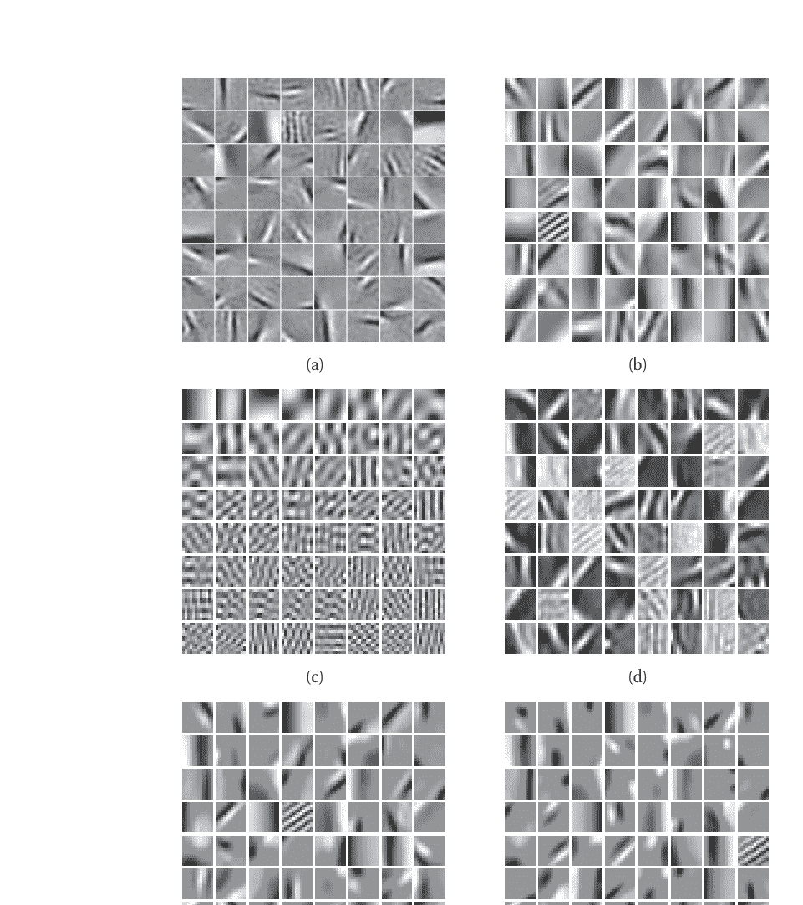

图13.21 各种方法学习自然图像块时所学到的滤波器的示意图。(每个块首先被居中和归一化为单位范数。)(a) ICA。图片由icaBasisDemo生成，由Aapo Hyvarinen提供。(b) 稀疏编码。(c) PCA。(d) 非负矩阵分解。(e) 低稀疏度的稀疏PCA权重矩阵。(f) 高稀疏度的稀疏PCA权重矩阵。图由sparseDictDemo生成，由Julien Mairal编写。

对自然图像块进行稀疏编码的基向量类似于哺乳动物大脑的初级视觉皮层中的简单细胞中发现的滤波器（Olshausen和Field 1996）。特别是滤波器看起来像条形和边缘检测器，如图13.21(b)所示。（在这个例子中，参数 λ被选择为使活跃基函数的数量（非零分量 z_i）约为10。有趣的是，使用ICA得到的结果在视觉上与之相似，如图13.21(a)所示。相比之下，将PCA应用于相同的数据会产生正弦光栅，如图13.21(c)所示；这些不像皮层细胞的响应模式。因此，有人猜测皮层的某些部分可能正在对感觉输入进行稀疏编码；然后，由大脑的更高层次进一步处理得到的潜在表示。

图13.21(d)显示了使用NMF的结果，图13.21(e-f)显示了稀疏PCA在增加基向量稀疏性时的结果。

## 13.8.3 压缩感知

虽然观察稀疏编码学习到的字典很有趣，但并不一定非常有用。然而，稀疏编码有一些实际应用，我们在下面进行讨论。

想象一下，我们观察的不是数据 $\mathbf{x} \in \mathbb{R}^D$，而是它的低维投影，即 $\mathbf{y} = \mathbf{R}\mathbf{x} + \boldsymbol{\epsilon}$ 其中 $\mathbf{y} \in \mathbb{R}^M$，$\mathbf{R}$ 是一个 $M \times D$ 矩阵，$M \ll D$，并且 $\boldsymbol{\epsilon}$ 是一个噪声项（通常为高斯噪声）。我们假设 $\mathbf{R}$ 是一个已知的感知矩阵，对应于x的不同线性投影。例如，考虑一台MRI扫描仪：每个射束方向对应一个向量，编码为 $\mathbf{R}$ 中的一行。图13.22说明了建模假设。

我们的目标是推断条件概率 $p(\mathbf{x}|\mathbf{y}, \mathbf{R})$。如果我们没有测量全部的 $\mathbf{x}$，我们如何希望恢复全部的 $\mathbf{x}$呢？答案是：我们可以使用适当的先验概率的贝叶斯推断，利用自然信号可以表示为少数几个适当选择的基函数的加权组合的事实。也就是说，我们假设 $\mathbf{x} = \mathbf{W}\mathbf{z}$，其中 $\mathbf{z}$ 具有稀疏先验概率，而 $\mathbf{W}$ 是适当的字典。这被称为压缩感知或压缩采样（Candes et al. 2006; Baraniuk 2007; Candes and Wakin 2008; Bruckstein et al. 2009）。

为了使压缩感知正常工作，重要的是以正确的基础来表示信号，否则它将不会是稀疏的。在传统的压缩感知应用中，字典被固定为标准形式，例如小波。然而，通过学习特定领域的稀疏编码字典，可以获得更好的性能（Zhou等人，2009年）。至于感知矩阵 $\mathbf{R}$，通常选择为随机矩阵，原因在（Candes和Wakin，2008年）中有解释。然而，通过将投影矩阵适应字典（Seeger和Nickish，2008年；Chang等人，2009年），可以获得更好的性能。

## 13.8.4 图像修复和去噪

假设我们有一张图像，在某种程度上被损坏，例如在其上稀疏地叠加了文本或划痕，如图13.23所示。我们可能想要估计其潜在的“干净”的图像。这被称为图像修复。可以使用类似的技术进行图像去噪。

我们可以将其建模为一种特殊类型的压缩感知问题。基本思想如下。我们将图像分割成重叠的补丁， $\mathbf{y}_i$，并将它们连接起来形成 $\mathbf{y}$。我们定义 $\mathbf{R}$，使得第 $i$行选择出补丁 $i$。现在定义 $\mathcal{V}$为可见（未损坏）的 $\mathbf{y}$的组成部分， $\mathcal{H}$为隐藏的组成部分。要执行图像修复，我们只需计算 $p(\mathbf{y}_{\mathcal{H}}|\mathbf{y}_{\mathcal{V}},\theta)$，其中 $\theta$是模型参数，指定字典 $\mathbf{W}$和稀疏程度 $\lambda$的 $\mathbf{z}$。我们可以从图像数据库中离线学习字典，也可以基于非损坏的补丁仅为该图像学习字典。

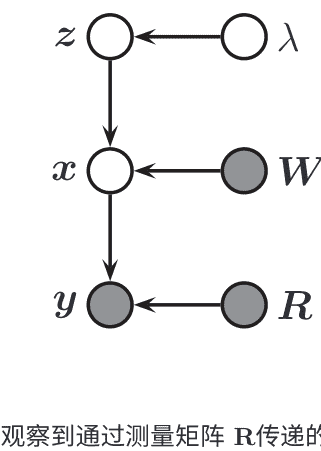

图13.23使用稀疏编码进行图像修复的示例。左侧：原始图像。 右侧：重建。 来源：(Mairal等人，2008年)的第13章图。 获得Julien Mairal的友情许可使用。

图13.23展示了这个技术的应用。 字典（大小为256个原子）是从12百万像素图像中的 $7\times10^6$ 个未损坏的 $12\times12$ 彩色块中学习得到的。

另一种方法是使用图模型（例如，专家领域模型（S）和 Black 2009）直接编码相邻图像块之间的相关性，而不是使用潜在变量模型。不幸的是，这种模型往往计算上更昂贵。

# 练习

## 练习13.1 RSS的偏导数

定义

$$RSS(\mathbf{w}) = \|\mathbf{X}\mathbf{w} - \mathbf{y}\|_2^2$$

a. 证明

$$\frac{\partial}{\partial w_k} RSS(\mathbf{w}) = a_k w_k - c_k$$
$$a_k = 2 \sum_{i=1}^n x_{ik}^2 = 2 \|\mathbf{x}_{:,k}\|^2$$
$$c_k = 2 \sum_{i=1}^n x_{ik} (y_i - \mathbf{w}_{-k}^T \mathbf{x}_{i, -k}) = 2 \mathbf{x}_{:,k}^T \mathbf{r}_k$$

其中 $\mathbf{w}_{-k} = \mathbf{w}$ 没有组件 $k$，$\mathbf{x}_{i, -k}$ 是没有组件 $k$ 的 $\mathbf{x}_i$，而 $\mathbf{r}_k = \mathbf{y} - \mathbf{X}_{-k} \mathbf{w}_{-k}$ 是使用除了特征 $k$ 之外的所有特征得到的残差。提示：将权重分为涉及 $k$ 和不涉及 $k$ 的部分。

b. 证明如果

$$\frac{\partial}{\partial w_k} RSS(\mathbf{w}) = 0, 那么$$
$$\hat{w}_k = \frac{\mathbf{x}_{:,k}^T \mathbf{r}_k}{\|\mathbf{x}_{:,k}\|^2}$$

因此，当我们逐步添加特征时，特征 $k$ 的最优权重通过将 $\mathbf{x}_{:,k}$ 正交投影到当前残差上来计算。

## 练习 13.2 推导线性回归的 EB 的 M 步骤

推导出方程 13.166 和 13.168。提示：以下恒等式可能有用

$$\mathbf{\Sigma} \mathbf{X}^T \mathbf{X} = \mathbf{\Sigma} \mathbf{X}^T \mathbf{X} + \beta^{-1} \mathbf{\Sigma} \mathbf{A} - \beta^{-1} \mathbf{\Sigma} \mathbf{A}$$
$$= \mathbf{\Sigma} (\mathbf{X}^T \mathbf{X} \beta + \mathbf{A}) \beta^{-1} - \beta^{-1} \mathbf{\Sigma} \mathbf{A}$$
$$= (\mathbf{A} + \beta \mathbf{X}^T \mathbf{X})^{-1} (\mathbf{X}^T \mathbf{X} \beta + \mathbf{A}) \beta^{-1} - \beta^{-1} \mathbf{\Sigma} \mathbf{A}$$
$$= (\mathbf{I} - \mathbf{A} \mathbf{\Sigma}) \beta^{-1}$$

## 练习 13.3 线性回归的EB固定点更新的推导

推导方程式 13.169 和 13.170。提示：推导这个结果最简单的方法是将 $\log p(\mathcal{D}|\alpha, \beta)$ 重写为方程式 8.54。这完全等价，因为在高斯先验和似然函数的情况下，后验也是高斯分布，所以拉普拉斯“近似”是精确的。在这种情况下，我们得到

$$\log p(\mathcal{D}|\alpha, \beta) = \frac{N}{2} \log \beta - \frac{\beta}{2} \|\mathbf{y} - \mathbf{X}\mathbf{w}\|^2 + \frac{1}{2} \sum_j \log \alpha_j - \frac{1}{2} \mathbf{m}^T \mathbf{A} \mathbf{m} + \frac{1}{2} \log |\mathbf{\Sigma}| - \frac{D}{2} \log(2\pi)$$

其余部分是直接的代数运算。

## 练习13.4线性回归的边际似然

假设我们使用形式为 $\Sigma_\gamma = g(\mathbf{X}_\gamma^T \mathbf{X}_\gamma)^{-1}$ 的 $g$-先验。证明方程13.16简化为

$$p(\mathcal{D}|\gamma) \propto (1+g)^{-D_\gamma/2}(2b_\sigma + S(\gamma))^{-(2a_\sigma + N-1)/2}$$
$$S(\gamma) = \mathbf{y}^T\mathbf{y} - \frac{g}{1+g}\mathbf{y}^T\mathbf{X}_\gamma(\mathbf{X}_\gamma^T\mathbf{X}_\gamma)^{-1}\mathbf{X}_\gamma^T\mathbf{y}$$

## 练习13.5将弹性网络简化为套索

### 定义

$$J_1(\mathbf{w}) = |\mathbf{y} - \mathbf{X}\mathbf{w}|^2 + \lambda_2|\mathbf{w}|^2 + \lambda_1|\mathbf{w}|_1$$

和

$$J_2(\mathbf{w}) = |\tilde{\mathbf{y}} - \tilde{\mathbf{X}}\tilde{\mathbf{w}}|^2 + c\lambda_1|\mathbf{w}|_1$$

其中 $c = (1 + \lambda_2)^{-\frac{1}{2}}$ 和

$$\tilde{\mathbf{X}} = c \begin{pmatrix} \mathbf{X} \\ \sqrt{\lambda_2}\mathbf{I}_d \end{pmatrix}, \quad \tilde{\mathbf{y}} = \begin{pmatrix} \mathbf{y} \\ \mathbf{0}_{d \times 1} \end{pmatrix}$$

### 展示

$$\arg\min J_1(\mathbf{w}) = c(\arg\min J_2(\mathbf{w}))$$

即

$$J_1(c\mathbf{w}) = J_2(\mathbf{w})$$

因此可以使用修改后的数据在套索求解器上解决弹性网络问题。

## 练习13.6线性回归中的收缩

(来源：Jaakkola。) 考虑使用正交设计矩阵进行线性回归，因此 $\|\mathbf{x}_{:,k}\|^2_2 = 1$ 对于每一列 (特征) $k$，且 $\mathbf{x}_{:,k}^T\mathbf{x}_{:,j} = 0$，因此我们可以分别估计每个参数 $w_k$。

图13.24绘制了 $\hat{w}_k$ vs $c_k = 2\mathbf{y}^T\mathbf{x}_{:,k}$，即特征k与响应的相关性，对于3种不同的估计方法：普通最小二乘法 (OLS)，带参数 $\lambda_2$的岭回归和带参数 $\lambda_1$的套索。

- a. 很遗憾，我们忘记给图表贴标签了。实线 (1)、虚线 (2) 和点线 (3) 分别对应哪种方法？提示：参见第13.3.3节。
- b. $\lambda_1$的值是多少？
- c. $\lambda_2$的值是多少？

## 练习13.7针对尖峰和平板模型中的伯努利率率参数的先验

考虑第13.2.1节中的模型。假设我们对稀疏率 $\pi_j$进行先验设定, $\pi_j \sim \text{Beta}(\alpha_1, \alpha_2)$。

在积分掉 $\pi_j$后, 推导出 $p(\gamma|\alpha)$的表达式。与假设 $\pi_j = \pi_0$的方法相比, 讨论这种方法的一些优点和缺点。

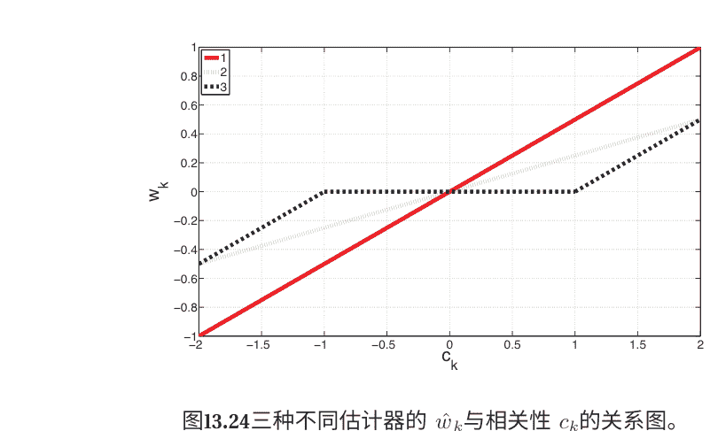

## 练习 13.8推导GSM先验的E步骤

证明

$$\mathbb{E} \left[ \frac{1}{\tau_j^2} \middle| w_j \right] = \frac{\pi'(w_j)}{|w_j|} \tag{13.197}$$

其中 $\pi(w_j) = -\log p(w_j)$ 且 $p(w_j) = \int \mathcal{N}(w_j | 0, \tau_j^2) p(\tau_j^2) d\tau_j^2$。提示1:

提示1:

$$\frac{1}{\tau_j^2} \mathcal{N}(w_j | 0, \tau_j^2) \propto \frac{1}{\tau_j^2} \exp\left( -\frac{w_j^2}{2\tau_j^2} \right) \tag{13.198}$$

$$= \frac{-1}{|w_j|} \frac{-2w_j}{2\tau_j^2} \exp\left( -\frac{w_j^2}{2\tau_j^2} \right) \tag{13.199}$$

$$= \frac{-1}{|w_j|} \frac{d}{d|w_j|} \mathcal{N}(w_j | 0, \tau_j^2) \tag{13.200}$$

提示2:

$$\frac{d}{d|w_j|} p(w_j) = \frac{1}{p(w_j)} \frac{d}{d|w_j|} \log p(w_j) \tag{13.201}$$

## 练习13.9使用拉普拉斯先验的稀疏probit回归的EM算法

推导出一个EM算法，用于拟合二进制probit分类器（第9.4节），使用拉普拉斯先验对权重进行建模。（如果你卡住了，参考（Figueiredo 2003; Ding and Harrison 2010）。）

## 练习13.10组套索的GSM表示

考虑先验 $\tau_j^2 \sim \text{Ga}(\delta, \rho^2/2)$，暂时忽略分组问题。通过Gamma混合分布引起的权重的边际分布被称为正态Gamma分布，它是## 13.8 稀疏编码

给定的
$$NG(w_j|\delta, \rho) = \int \mathcal{N}(w_j|0, \tau_j^2) \text{Ga}(\tau_j^2|\delta, \rho^2/2) \, d\tau_j^2 \quad (13.202)$$
$$= \frac{1}{Z} |w_j|^{\delta-1/2} K_{\delta-\frac{1}{2}}(\rho|w_j|) \quad (13.203)$$
$$\frac{1}{Z} = \frac{\rho^{\delta+\frac{1}{2}}}{\sqrt{\pi} 2^{\delta-1/2} \Gamma(\delta)} \quad (13.204)$$

其中 $K_{\alpha}(x)$ 是第二类修正贝塞尔函数（在 Matlab 中为 `besselk` 函数）。

现在假设我们对方差有以下先验分布
$$p(\sigma_{1:D}^2) = \prod_{g=1}^{G} p(\sigma_{1:d_g}^2), \quad p(\sigma_{1:d_g}^2) = \prod_{j \in g} \text{Ga}(\tau_j^2|\delta_g, \rho^2/2) \quad (13.205)$$

每组权重的相应边际分布形式为
$$p(\mathbf{w}_g) \propto |u_g|^{\delta_g - d_g/2} K_{\delta_g - d_g/2}(\rho u_g) \quad (13.206)$$

其中
$$u_g \triangleq \sqrt{\sum_{j \in g} w_{g,j}^2} = \|\mathbf{w}_g\|_2 \quad (13.207)$$

现在假设 $\delta_g = (d_g + 1)/2$，所以 $\delta_g - d_g/2 = 1/2$。方便地，我们有 $K_{\frac{1}{2}}(\cdot) \propto \exp(-\cdot)$，从而得到的 MAP 估计等价于分组套索。

- **练习 13.11 投影梯度下降法求解 $\ell_1$ 正则化最小二乘问题**
考虑 BPDN 问题 $\arg\min_{\boldsymbol{\theta}} \text{RSS}(\boldsymbol{\theta}) + \lambda \|\boldsymbol{\theta}\|_1$。通过使用在第 7.4 节中引入的分割变量技巧（即，定义 $\boldsymbol{\theta} = [\boldsymbol{\theta}_+, \boldsymbol{\theta}_-]$），将其重写为具有简单边界约束的二次规划问题。然后概述如何使用投影梯度下降法解决这个问题。（如果你卡住了，参考 (Figueiredo et al. 2007)。）

- **练习 13.12 铰链损失函数的次导数**
令 $f(x) = (1 - x)_+$ 为铰链损失函数，其中 $(z)_+ = \max(0, z)$。求 $\partial f(0)$，$\partial f(1)$ 和 $\partial f(2)$ 的值？

- **练习 13.13 凸函数的下界**
假设 $f$ 是一个凸函数。解释如何在任意点 $x \in \text{dom}(f)$ 处找到 $f$ 的全局仿射下界。

# 14 核函数

## 14.1 引言

到目前为止，在本书中，我们一直假设我们希望分类、聚类或以任何方式处理的每个对象都可以表示为一个固定大小的特征向量，通常形式为 $\mathbf{x}_i \in \mathbb{R}^D$。然而，对于某些类型的对象，如何最好地表示它们为固定大小的特征向量并不清楚。例如，我们如何表示一个文本文档或蛋白质序列，其长度可以变化？或者一个具有复杂三维几何结构的分子结构？或者一个具有可变大小和形状的进化树？

解决这类问题的一种方法是为数据定义一个生成模型，并使用推断出的潜在表示和/或模型的参数作为特征，然后将这些特征插入标准方法中。例如，在第 28 章中，我们讨论了深度学习，它本质上是一种无监督学习良好特征表示的方法。

另一种方法是假设我们有一种衡量对象相似性的方式，不需要将它们预处理成特征向量格式。例如，在比较字符串时，我们可以计算它们之间的编辑距离。设 $\kappa(\mathbf{x}, \mathbf{x}') \geq 0$ 为对象 $\mathbf{x}, \mathbf{x}' \in \mathcal{X}$ 之间的相似性度量，其中 $\mathcal{X}$ 是某个抽象空间；我们将 $\kappa$ 称为核函数。注意，“核”一词有几个含义；我们将在第 14.7.1 节中讨论另一种解释。

在这一章中，我们将讨论几种核函数。然后我们描述一些可以纯粹基于核函数计算的算法。当我们无法访问（或选择不查看）我们正在处理的对象 $\mathbf{x}$ 的“内部”时，可以使用这些方法。

## 14.2 核函数

我们将一个核函数定义为两个参数的实值函数，$\kappa(\mathbf{x}, \mathbf{x}') \in \mathbb{R}$，对于 $\mathbf{x}, \mathbf{x}' \in \mathcal{X}$。通常该函数是对称的（即 $\kappa(\mathbf{x}, \mathbf{x}') = \kappa(\mathbf{x}', \mathbf{x})$），且非负的（即 $\kappa(\mathbf{x}, \mathbf{x}') \geq 0$），因此可以解释为相似性的度量，但这不是必需的。下面给出几个例子。

### 14.2.1 径向基核函数

平方指数核函数（SE 核函数）或高斯核函数的定义为
$$\kappa(\mathbf{x}, \mathbf{x}') = \exp\left(-\frac{1}{2}(\mathbf{x}-\mathbf{x}')^T\boldsymbol{\Sigma}^{-1}(\mathbf{x}-\mathbf{x}')\right) \quad (14.1)$$

如果 $\boldsymbol{\Sigma}$ 是对角矩阵，可以写成
$$\kappa(\mathbf{x}, \mathbf{x}') = \exp\left(-\frac{1}{2}\sum_{j=1}^{D}\frac{1}{\sigma_j^2}(x_j - x_j')^2\right) \quad (14.2)$$

我们可以将 $\sigma_j$ 解释为定义维度 $j$ 的特征长度尺度。如果 $\sigma_j = \infty$，则忽略相应的维度；因此这被称为 ARD 核函数。如果 $\boldsymbol{\Sigma}$ 是球形的，我们得到各向同性核函数
$$\kappa(\mathbf{x}, \mathbf{x}') = \exp\left(-\frac{\|\mathbf{x}-\mathbf{x}'\|^2}{2\sigma^2}\right) \quad (14.3)$$

这里 $\sigma^2$ 被称为带宽。方程式 14.3 是径向基函数或 RBF 核函数的一个例子，因为它只是 $\|\mathbf{x} - \mathbf{x}'\|$ 的函数。

### 14.2.2 用于比较文档的核函数

在进行文档分类或检索时，有一种比较两个文档的方法是很有用的，即通过比较文档 $\mathbf{x}_i$ 和 $\mathbf{x}_{i'}$ 的方式。如果我们使用词袋表示，其中 $x_{ij}$ 是单词 $j$ 在文档 $i$ 中出现的次数，我们可以使用余弦相似度来定义
$$\kappa(\mathbf{x}_i, \mathbf{x}_{i'}) = \frac{\mathbf{x}_i^T \mathbf{x}_{i'}}{\|\mathbf{x}_i\|_2 \|\mathbf{x}_{i'}\|_2} \quad (14.4)$$

这个量度衡量了当将 $\mathbf{x}_i$ 和 $\mathbf{x}_{i'}$ 解释为向量时，它们之间的夹角的余弦值。由于 $\mathbf{x}_i$ 是一个计数向量（因此非负），余弦相似度介于 0 和 1 之间，其中 0 表示向量正交，因此没有共同的单词。

不幸的是，这种简单的方法效果不太好，原因有两个。首先，如果 $\mathbf{x}_i$ 与 $\mathbf{x}_{i'}$ 有任何共同的单词，它们被认为是相似的，即使一些常见的单词，如“the”或“and”在许多文档中出现，因此它们不具有区分性。（这些被称为停用词。）其次，如果一个具有区分性的单词在一个文档中出现多次，相似度会被人为提高，即使单词的使用往往是突发性的，这意味着一旦一个单词在一个文档中使用了，它很有可能再次被使用（参见第 3.5.5 节）。幸运的是，我们可以通过一些简单的预处理来显著提高性能。这个想法是用一个称为 TF-IDF 表示的新特征向量替换单词计数向量，它代表“词频逆文档频率”。我们将其定义如下。

首先，词频被定义为计数的对数变换：
$$\text{tf}(x_{ij}) \triangleq \log(1 + x_{ij}) \quad (14.5)$$

这减少了在一个文档中多次出现的单词的影响。其次，逆文档频率被定义为
$$\text{idf}(j) \triangleq \log \frac{N}{1 + \sum_{i=1}^{N} \mathbb{I}(x_{ij} > 0)} \quad (14.6)$$

其中，$N$ 是文档的总数，分母计算包含术语 $j$ 的文档数。最后，我们定义 $\text{tf-idf}(\mathbf{x}_i) \triangleq [\text{tf}(x_{ij}) \times \text{idf}(j)]_{j=1}^V$，并使用余弦相似度：
$$\kappa(\mathbf{x}_i, \mathbf{x}_{i'}) = \frac{\phi(\mathbf{x}_i)^T \phi(\mathbf{x}_{i'})}{\|\phi(\mathbf{x}_i)\|_2 \|\phi(\mathbf{x}_{i'})\|_2} \quad (14.7)$$

其中 $\phi(\mathbf{x}) = \text{tf-idf}(\mathbf{x})$。这对于信息检索（Manning et al. 2008）给出了良好的结果。
对于 tf-idf 核函数的概率解释见（Elkan 2005）。

### 14.2.3 Mercer（正定）核函数

我们将研究的一些方法要求核函数满足以下要求：由 **Gram 矩阵** 定义
$$\mathbf{K} = \begin{pmatrix} \kappa(\mathbf{x}_1, \mathbf{x}_1) & \cdots & \kappa(\mathbf{x}_1, \mathbf{x}_N) \\ \vdots & & \vdots \\ \kappa(\mathbf{x}_N, \mathbf{x}_1) & \cdots & \kappa(\mathbf{x}_N, \mathbf{x}_N) \end{pmatrix} \quad (14.8)$$

对于任意一组输入 $\{\mathbf{x}_i\}_{i=1}^N$，它应该是正定的。我们称这样的核函数为 Mercer 核，或者是正定核函数。可以证明（Schoelkopf 和 Smola 2002）高斯核函数是一个 Mercer 核函数，余弦相似度核函数也是（Sahami 和 Heilman 2006）。

Mercer 核函数的重要性在于以下结果，即 Mercer 定理。如果 Gram 矩阵是正定的，我们可以按照以下方式计算其特征向量分解
$$\mathbf{K} = \mathbf{U}^T \boldsymbol{\Lambda} \mathbf{U} \quad (14.9)$$

其中 $\boldsymbol{\Lambda}$ 是一个特征值为 $\lambda_i > 0$ 的对角矩阵。现在考虑 $\mathbf{K}$ 的一个元素：
$$k_{ij} = (\boldsymbol{\Lambda}^{\frac{1}{2}} \mathbf{U}_{:, i})^T (\boldsymbol{\Lambda}^{\frac{1}{2}} \mathbf{U}_{:, j}) \quad (14.10)$$

让我们定义 $\phi(\mathbf{x}_i) = \boldsymbol{\Lambda}^{\frac{1}{2}} \mathbf{U}_{:, i}$，然后我们可以写成
$$k_{ij} = \phi(\mathbf{x}_i)^T \phi(\mathbf{x}_j) \quad (14.11)$$

因此我们可以看到核矩阵中的元素可以通过执行内积计算一些由特征向量 $\mathbf{U}$ 隐式定义的特征向量来计算。一般来说，如果核是 Mercer 核，那么存在一个函数 $\phi$ 将 $\mathbf{x} \in \mathcal{X}$ 映射到 $\mathbb{R}^D$，使得 $\kappa(\mathbf{x}, \mathbf{x}') = \phi(\mathbf{x})^T \phi(\mathbf{x}')$，其中 $\phi$ 取决于核 $\kappa$ 的特征函数（所以 $D$ 是一个潜在的无限维空间）。

例如，考虑（非平稳的）多项式核 $\kappa(\mathbf{x}, \mathbf{x}') = (\gamma \mathbf{x}^T \mathbf{x}' + r)^M$，其中 $r > 0$。可以证明相应的特征映射 $\phi(\mathbf{x})$ 将包含所有的项直到 $M$ 阶。例如，如果 $M = 2, \gamma = r = 1$ 和 $\mathbf{x}, \mathbf{x}' \in \mathbb{R}^2$，我们有
$$\begin{align} (1 + \mathbf{x}^T \mathbf{x}')^2 &= (1 + x_1 x'_1 + x_2 x'_2)^2 \\ &= 1 + 2x_1 x'_1 + 2x_2 x'_2 + (x_1 x'_1)^2 + (x_2 x'_2)^2 + 2x_1 x'_1 x_2 x'_2 \end{align} \quad (14.12)$$
$$\phi(\mathbf{x}) = [1, \sqrt{2}x_1, \sqrt{2}x_2, x_1^2, x_2^2, \sqrt{2}x_1x_2]^T \quad (14.13)$$

因此使用这个核函数等同于在一个 6 维特征空间中工作。在高斯核函数的情况下，特征映射存在于一个无限维空间中。在这种情况下，明显无法明确表示特征向量。

一个不是 Mercer 核的例子是所谓的 sigmoid 核，定义为
$$\kappa(\mathbf{x}, \mathbf{x}') = \tanh(\gamma \mathbf{x}^T \mathbf{x}' + r) \quad (14.14)$$

（注意，即使它被称为 sigmoid 核，但它使用了 $\tanh$ 函数。）这个核受到了多层感知器的启发（见第 16.5 节），但没有真正的理由使用它。（有关真正的“神经网络核”，即正定的核，请参见第 15.4.5 节。）一般来说，证明一个核是 Mercer 核是困难的，需要使用函数分析技术。然而，可以证明使用一组标准规则可以从更简单的核构建新的 Mercer 核。例如，如果 $\kappa_1$ 和 $\kappa_2$ 都是 Mercer 核，那么 $\kappa(\mathbf{x}, \mathbf{x}') = \kappa_1(\mathbf{x}, \mathbf{x}') + \kappa_2(\mathbf{x}, \mathbf{x}')$ 也是 Mercer 核。详细信息请参见（Schoelkopf 和 Smola 2002）。

### 14.2.4 线性核函数

推导由核函数隐含的特征向量通常非常困难，只有在核函数是 Mercer 的情况下才可能。然而，从特征向量推导出核函数很容易：我们只需使用
$$\kappa(\mathbf{x}, \mathbf{x}') = \phi(\mathbf{x})^T \phi(\mathbf{x}') = \langle \phi(\mathbf{x}), \phi(\mathbf{x}') \rangle \quad (14.15)$$

如果 $\phi(\mathbf{x}) = \mathbf{x}$，我们得到线性核函数，定义为
$$\kappa(\mathbf{x}, \mathbf{x}') = \mathbf{x}^T \mathbf{x}' \quad (14.16)$$

如果原始数据已经是高维的，并且原始特征各自具有信息量，例如词袋表示中的词汇量很大，或者许多基因的表达水平。在这种情况下，决策边界很可能可以表示为原始特征的线性组合，因此不需要在其他特征空间中工作。

当然，并不是所有高维问题都是线性可分的。例如，图像是高维的，但单个像素并不是非常有信息量的，因此图像分类通常需要非线性核函数（参见第 14.2.7 节）。

### 14.2.5 Matern 核函数

Matern 核函数常用于高斯过程回归（参见第 15.2 节），其形式如下
$$\kappa(r) = \frac{2^{1-\nu}}{\Gamma(\nu)} \left( \frac{\sqrt{2\nu} r}{\ell} \right)^{\nu} K_{\nu} \left( \frac{\sqrt{2\nu} r}{\ell} \right) \quad (14.17)$$

其中 $r = \|\mathbf{x} - \mathbf{x}'\|$, $\nu > 0$, $\ell > 0$, 而 $K_{\nu}$ 是一个修正的贝塞尔函数。当 $\nu \rightarrow \infty$ 时，这趋近于 SE 核函数。如果 $\nu = \frac{1}{2}$，则核函数简化为
$$\kappa(r) = \exp(-r/\ell) \quad (14.21)$$

如果 $D=1$，并且我们使用这个核函数来定义一个高斯过程（见第 15 章），我们得到奥恩斯坦-乌伦贝克过程，它描述了一个经历布朗运动的粒子的速度（相应的函数是连续但不可微的，因此非常“锯齿状”）。

### 14.2.6 字符串核函数

当输入是结构化对象时，核函数的真正威力就显现出来了。作为一个例子，我们现在描述一种使用字符串核函数比较两个可变长度字符串的方法。我们遵循 (Rasmussen 和 Williams 2006, 第 100 页) 和 (Hastie 等人 2009, 第 668 页) 的介绍。
考虑两个长度为 $D$、$D'$ 的字符串 $x$ 和 $x'$，每个字符串都定义在字母表 $\mathcal{A}$ 上。例如，考虑两个氨基酸序列，定义在 20 个字母的字母表 $\mathcal{A} = \{A, R, N, D, C, E, Q, G, H, I, L, K, M, F, P, S, T, W, Y, V\}$ 上。让 $x$ 是长度为 110 的以下序列
```
IPTSALVKETLALLSTHRTLLIANETLRIPVPVHKNHQLCTE EIFQGIGTLESQTVQGGTV
ERLFKNLSLIKKYIDGQKKKCGEERRRVNQFLDYLQEFLGVMNTEWI
```
并且让 $x'$ 是长度为 153 的以下序列
```
PHRRDLCSR SIWLARKIRSDLTALTESYVKHQGLWSEL TEAERLQENLQAYRTFHVLLA
RLL EDQQVHFTPTEGDFHQAIHTLLLQVAAFAYQIEELMILLEYKIPRNEADGM LFEKK
LWGLKVLQELS QWTVRS IHDLRFISSHQ TGIP
```
这些字符串都有共同的子字符串 LQE。我们可以定义两个字符串的相似性为它们共有的子字符串的数量。
更正式地说，如果我们可以将字符串 $x$ 写成 $usv$ 的形式，其中 $u$，$s$ 和 $v$ 是（可能为空的）字符串，则我们说字符串 $s$ 是字符串 $x$ 的子字符串。现在，让 $\phi_s(x)$ 表示子字符串 $s$ 在字符串 $x$ 中出现的次数。我们将字符串 $x$ 和 $x'$ 之间的核函数定义为
$$\kappa(x, x') = \sum_{s \in \mathcal{A}^*} w_s \phi_s(x) \phi_s(x') \quad (14.22)$$

其中 $w_s \geq 0$ 且 $\mathcal{A}^*$ 是字母表 $\mathcal{A}$ 的所有字符串的集合（这被称为 Kleene 星操作符）。这是一个 Mercer 核函数，并且可以使用后缀树 (Leslie 等人, 2003; Vishwanathan 和 Smola, 2003; Shawe-Taylor 和 Cristianini, 2004) 在 $O(|x| + |x'|)$ 时间内计算（对于权重 $\{w_s\}$ 的某些设置）。
有各种感兴趣的情况。如果我们设置 $w_s = 0$ 对于 $|s| > 1$，我们得到一个字符包（bag-of-characters）核函数。这定义了 $\phi(x)$ 为 $\mathcal{A}$ 中每个字符在 $x$ 中出现的次数。如果我们要求 $s$ 被空白字符包围，我们得到一个词袋（bag-of-words）核函数，其中 $\phi(x)$ 计算每个可能单词出现的次数。请注意，这是一个非常稀疏的向量，因为大多数单词将不会出现。如果我们只考虑长度固定为 k 的字符串，我们得到 k-谱核。这已经被用于将蛋白质分类为 SCOP 超家族（Leslie 等人，2003 年）。例如，如果 k=3，对于上面的两个字符串，我们有 φ_LQE (x) =1 和 φ_LQE (x') =2。

有各种扩展可能。例如，我们可以允许字符不匹配（Leslie 等人，2003 年）。我们可以将字符串核泛化为比较树，如（Collins 和 Duffy，2002 年）中所述。这对于分类（或排名）解析树、进化树等非常有用。

## 14.2.7 金字塔匹配核

在计算机视觉中，通常通过计算图像中的各种点（通常使用 SIFT（Lowe 1999））的特征向量来创建图像的词袋表示。在选择的位置处的特征向量然后进行向量量化，以创建一组离散符号的词袋。

比较这种类型的两个可变大小的词袋的一种方法是使用金字塔匹配核（Grauman 和 Darrell 2007）。基本思想如图 14.1 所示。每个特征集被映射到一个多分辨率直方图。然后使用加权直方图交集进行比较。事实证明，这提供了对相似度度量的良好近似，即在最细的空间分辨率上执行最优二分匹配，然后对匹配点之间的成对相似度求和。然而，直方图方法更快，并且对于缺失和不均匀的点数更具鲁棒性。这是一个 Mercer 核。

## 14.2.8 从概率生成模型派生的核函数

假设我们有一个特征向量的概率生成模型，$p(\mathbf{x}|\theta)$。然后，我们可以使用这个模型的几种方法来定义核函数，从而使模型适用于判别任务。我们在下面概述了两种方法。

### 14.2.8.1 概率乘积核函数

一种方法是按以下方式定义核函数：

$\kappa(\mathbf{x}_i, \mathbf{x}_j) = \int p(\mathbf{x}|\mathbf{x}_i)^\rho p(\mathbf{x}|\mathbf{x}_j)^\rho d\mathbf{x}$

其中 $\rho > 0$，并且 $p(\mathbf{x}|\mathbf{x}_i)$ 通常由 $p(\mathbf{x}|\hat{\theta}(\mathbf{x}_i))$ 近似，其中 $\hat{\theta}(\mathbf{x}_i)$ 是使用单个数据向量计算的参数估计。这被称为概率乘积核函数 (Jebara et al. 2004)。

虽然将模型拟合到单个数据点似乎很奇怪，但重要的是要记住，拟合的模型仅用于查看两个对象的相似程度。特别是，如果我们将模型拟合到 $\mathbf{x}_i$，然后模型认为 $\mathbf{x}_j$ 很可能，这意味着 $\mathbf{x}_i$ 和 $\mathbf{x}_j$ 是相似的。

例如，假设 $p(\mathbf{x}|\theta) = \mathcal{N}(\mu, \sigma^2\mathbf{I})$，其中 $\sigma^2$ 是固定的。如果 $\rho=1$，并且我们使用 $\hat{\mu}(\mathbf{x}_i) = \mathbf{x}_i$ 和 $\hat{\mu}(\mathbf{x}_j) = \mathbf{x}_j$，我们发现 (Jebara et al. 2004, p825)

$\kappa(\mathbf{x}_i, \mathbf{x}_j) = \frac{1}{(4\pi\sigma^2)^{D/2}} \exp \left( -\frac{1}{4\sigma^2} ||\mathbf{x}_i - \mathbf{x}_j||^2 \right)$

这是（最多一个常数因子）RBF 核函数。

事实证明，可以计算方程式 14.23 的各种生成模型，包括具有潜在变量的模型，如 HMMs。这为变长序列上定义核函数提供了一种方法。此外，这种技术即使对于实值向量序列也适用，不像第 14.2.6 节中的字符串核函数。有关详细信息，请参阅 (Jebara 等人, 2004 年)。

### 14.2.8.2 Fisher 核函数

使用生成模型定义核函数的更高效方法是使用 Fisher 核函数 (Jaakkola 和 Haussler，1998 年)，其定义如下：

$\kappa(\mathbf{x}, \mathbf{x}') = \mathbf{g}(\mathbf{x})^T \mathbf{F}^{-1} \mathbf{g}(\mathbf{x}')$

其中 $\mathbf{g}$ 是对数似然函数的梯度，或者在 MLE $\hat{\theta}$

$\mathbf{g}(\mathbf{x}) \triangleq \nabla_\theta \log p(\mathbf{x}|\theta) \big|_{\hat{\theta}}$

和 $\mathbf{F}$ 是费舍尔信息矩阵，本质上是海森矩阵：

$\mathbf{F} = \nabla \nabla \log p(\mathbf{x}|\theta) \big|_{\hat{\theta}}$

注意，$\hat{\theta}$ 是所有数据的函数，所以 $\mathbf{x}$ 和 $\mathbf{x}'$ 的相似性也是在所有数据的背景下计算的。另外，注意我们只需要拟合一个模型。费舍尔核的直觉是：让 $\mathbf{g}(\mathbf{x})$ 成为（在参数空间中） $\mathbf{x}$ 希望参数移动的方向（从 $\hat{\theta}$ 开始），以便最大化自身的似然性；我们称之为方向梯度。然后，如果它们的方向梯度在几何形状（由似然函数的曲率编码）方面相似，则我们说两个向量 $\mathbf{x}$ 和 $\mathbf{x}'$ 是相似的（参见第 7.5.3 节）。

> (Saunders et al. 2003) 中证明了第 14.2.6 节的字符串核等价于由 $L$ 阶马尔可夫链导出的 Fisher 核（参见第 17.2 节）。此外，(Elkan 2005) 中证明了由 TF-IDF 向量的内积定义的核（第 14.2.2 节）与基于复合狄利克雷多项式模型的文本生成模型的 Fisher 核近似相等（第 3.5.5 节）。

## 14.3 在 GLMs 中使用核函数

在本节中，我们讨论一种简单的使用核函数进行分类和回归的方法。我们稍后会看到其他方法。

### 14.3.1 核机器

我们将一个核机器定义为输入特征向量具有以下形式的广义线性模型

$\phi(\mathbf{x}) = [\kappa(\mathbf{x}, \boldsymbol{\mu}_1), \dots, \kappa(\mathbf{x}, \boldsymbol{\mu}_K)]$

其中 $\boldsymbol{\mu}_k \in \mathcal{X}$ 是一组 $K$ 个质心。如果 $\kappa$ 是一个 RBF 核函数，这被称为 RBF 网络。我们将在下面讨论选择 $\boldsymbol{\mu}_k$ 参数的方法。我们将方程式 14.28 称为核化特征向量。请注意，在这种方法中，核函数不必是 Mercer 核函数。

我们可以通过定义 $p(y|\mathbf{x}, \boldsymbol{\theta}) = \text{Ber}(\mathbf{w}^T \phi(\mathbf{x}))$ 来使用核化特征向量进行逻辑回归。这提供了定义非线性决策边界的简单方法。

例如，考虑来自异或或 xor 函数的数据。这是一个具有两个二进制输入的二进制值函数。其真值表如图 14.2(a) 所示。

| $x_1$ | $x_2$ | $y$ |
|---|---|---|
| 0 | 0 | 0 |
| 0 | 1 | 1 |
| 1 | 0 | 1 |
| 1 | 1 | 0 |

在图 14.2(b) 中，我们展示了一些由异或函数标记的数据，但我们已经对点进行了抖动处理，以使图片更清晰。$^1$ 我们可以看到即使使用 10 次多项式也无法将数据分开。

> 1. 抖动是统计学中常见的可视化技巧，即在绘图/显示中，本应落在同一位置的点被均匀的加性噪声分散开来。

然而，使用 RBF 核函数和仅 4 个原型很容易解决问题，如图 14.2(c) 所示。

我们还可以通过定义 $p(y|x, \theta) = \mathcal{N}(\mathbf{w}^T \phi(\mathbf{x}), \sigma^2)$，在线性回归模型中使用核化特征向量。例如，图 14.3 展示了一个 1 维数据集，使用 $K=10$ 个均匀间隔的 RBF 原型进行拟合，但带宽从小到大变化。小的值会导致非常波动的函数，因为预测的函数值只在接近原型 $\boldsymbol{\mu}_k$ 的点 $\mathbf{x}$ 上非零。如果带宽非常大，设计矩阵将变为一个全为 1 的常数矩阵，因为每个点都与每个原型等距离；因此，相应的函数将变为一条直线。

### 14.3.2 L1VMs、RVMs 和其他稀疏向量机

核机器的主要问题是：我们如何选择质心 $\boldsymbol{\mu}_k$? 如果输入是低维欧几里得空间，我们可以用原型均匀地铺满数据所占据的空间，就像图 14.2(c) 中所示。然而，在更高维度的情况下，这种方法会因为维度灾难而失效。如果 $\boldsymbol{\mu}_k \in \mathbb{R}^D$，我们可以尝试对这些参数进行数值优化（参见例如 (Haykin 1998))，或者使用 MCMC 推断（参见例如 (Andrieu et al. 2001; Koh et al. 2001))，但是得到的目标函数/后验分布是高度多峰的。此外，这些技术很难扩展到结构化的输入空间，而核函数在这些情况下是最有用的。

另一种方法是在数据中找到聚类，然后为每个聚类分配一个原型中心（许多聚类算法只需要一个相似度度量作为输入）。然而，具有高密度的空间区域不一定是最有用用于表示输出的原型区域，也就是说，聚类是一项无监督任务，可能不会产生对预测有用的表示。此外，还需要选择聚类的数量。

一个更简单的方法是将每个示例 $\mathbf{x}_i$ 作为原型，这样我们就得到

$\phi(\mathbf{x}) = [\kappa(\mathbf{x}, \mathbf{x}_1), \ldots, \kappa(\mathbf{x}, \mathbf{x}_N)]$ (14.29)

现在我们看到 $D=N$，所以我们有与数据点一样多的参数。然而，我们可以使用第 13 章中讨论的任何稀疏促进先验来高效地选择训练示例的子集。我们将其称为稀疏向量机。

最自然的选择是使用 $\ell_1$ 正则化 (Krishnapuram 等人, 2005 年)。（注意，在多类情况下，必须使用组套索，因为每个实例与 $C$ 权重相关联，每个类别一个。）我们称之为 **L1VM**，即“$\ell_1$-正则化向量机”。类比地，我们定义使用 $\ell_2$ 正则化器为 **L2VM** 或“$\ell_2$-正则化向量机”；当然，这不会是稀疏的。

通过使用 ARD/SBL，我们可以获得更大的稀疏性，从而得到一种称为相关向量机或 **RVM** (Tipping, 2001 年) 的方法。可以使用通用的 ARD/SBL 算法来拟合这个模型，尽管在实践中，最常用的方法是 (Tipping 和 Faul, 2003 年) 中的贪婪算法（这是 Mike Tipping 的代码中实现的算法，与 PMTK 捆绑在一起）。

创建稀疏核机器的另一种非常流行的方法是使用支持向量机或 **SVM**。这将在第 14.5 节详细讨论。与使用稀疏先验不同，它实质上修改了似然项，从贝叶斯观点来看，这是相当不自然的。然而，效果是相似的，我们将会看到。

在图 14.4 中，我们将 L2VM、L1VM、RVM 和使用相同 RBF 核的 SVM 在 2D 二分类问题上进行了比较。为了简单起见，L2VM 和 L1VM 的 $\lambda$ 是手动选择的；对于 RVM，参数是使用经验贝叶斯估计的；对于 SVM，我们使用 CV 来选择 $C=1/\lambda$，因为 SVM 的性能对这个参数非常敏感（参见第 14.5.3 节）。我们可以看到所有的方法都给出了类似的性能。然而，RVM 是最稀疏的（因此在测试时最快），然后是 L1VM，最后是 SVM。RVM 的训练速度也是最快的，因为 SVM 的 CV 很慢。（尽管 RVM 代码是用 Matlab 编写的，而 SVM 代码是用 C 编写的。）这个结果是相当典型的。

在图 14.5 中，我们比较了 L2VM、L1VM、RVM 和使用 RBF 核的 SVM 在一个一维回归问题上的表现。再次，我们可以看到预测结果非常相似，但是 RVM 是最稀疏的，然后是 L2VM，最后是 SVM。这在图 14.6 中进一步说明。

## 14.4 核技巧

与其用核函数来定义特征向量 $\phi(\mathbf{x}) = [\kappa(\mathbf{x}, \mathbf{x}_1), \ldots, \kappa(\mathbf{x}, \mathbf{x}_N)]$，我们可以使用原始特征向量 $\mathbf{x}$，但是修改算法，将所有形式为 $\langle \mathbf{x}, \mathbf{x}' \rangle$ 的内积替换为核函数的调用 $\kappa(\mathbf{x}, \mathbf{x}')$。这被称为核技巧。事实证明，许多算法都可以通过这种方式进行核化。下面给出一些例子。需要注意的是，为了使用这个技巧，核函数必须是 Mercer 核。

### 14.4.1 核化最近邻分类

回想一下，在 1NN 分类器（第 14.2 节）中，我们只需要计算测试向量与所有训练点之间的欧氏距离，找到最近的点，并查找其标签。这可以通过观察到进行核化

$||x_i - x_{i'}||_2^2 = ⟨x_i, x_i⟩ + ⟨x_{i'}, x_{i'}⟩ - 2⟨x_i, x_{i'}⟩$ (14.30)

这使我们能够将最近邻分类器应用于结构化数据对象。

### 14.4.2 核化 K-medoids 聚类

K-means 聚类（第 11.4.2.5 节）使用欧氏距离来衡量不相似性，这在处理结构化对象时并不总是合适。我们现在描述如何开发一个核化的算法的版本。

第一步是用 K-medoids 算法替换 K-means 算法。这类似于 K-means，但不是用分配给该簇的所有数据向量的平均值来表示每个簇的质心，而是使每个质心成为数据向量之一。

因此，我们始终处理整数索引，而不是数据对象。我们像以前一样将对象分配给最近的质心。当我们更新质心时，我们查看属于该簇的每个对象，并测量其与同一簇中所有其他对象的距离之和；然后选择具有最小距离之和的对象：

$m_k = \argmin_{i:z_i=k} \sum_{i':z_{i'}=k} d(i, i') \qquad\qquad (14.31)$

其中

$d(i, i') \triangleq || \mathbf{x}_i - \mathbf{x}_{i'} ||_2^2$ (14.32)

这需要 $O(n_k^2)$ 每个簇的工作量，而 K-means 则需要 $O(n_k D)$ 来更新每个簇。伪代码给出在算法 5 中。这种方法可以修改为通过计算每个类别的最近中心点来得到一个分类器。这被称为最近中心点分类（Hastie 等人，2009 年，第 671 页）。

通过使用方程 14.30 来替代距离计算，这个算法可以进行核化。

```
算法 14.1: K-medoids 算法

1 初始化 $m_1$: 将 $K$ 作为大小为 $K$ 的随机子集从 $\{1, \ldots, N\}$ 中选择;
2 重复
3    $z_i = \arg\min_k d(i, m_k)$ for $i = 1 : N;$
4    $m_k \leftarrow \arg\min_{i:z_i=k} \sum_{i':z_{i'}=k} d(i, i')$ for $k = 1 : K;$
5 直到 收敛 ;
```

### 14.4.3 核化岭回归

将核技巧应用于基于距离的方法是直接的。如何将其应用于岭回归等参数模型并不那么明显。然而，我们现在将解释如何做到这一点。这将为研究支持向量机提供一个很好的“热身”。

#### 14.4.3.1 原始问题

设 $\mathbf{x} \in \mathbb{R}^D$ 为某个特征向量， $\mathbf{X}$ 为相应的 $N \times D$ 设计矩阵。我们希望最小化

$J(\mathbf{w}) = (\mathbf{y} - \mathbf{X}\mathbf{w})^T(\mathbf{y} - \mathbf{X}\mathbf{w}) + \lambda\|\mathbf{w}\|^2$ (14.33)

最优解由给出

$\mathbf{w} = (\mathbf{X}^T\mathbf{X} + \lambda\mathbf{I}_D)^{-1}\mathbf{X}^T\mathbf{y} = \left(\sum_i \mathbf{x}_i\mathbf{x}_i^T + \lambda\mathbf{I}_D\right)^{-1}\mathbf{X}^T\mathbf{y}$ (14.34)

#### 14.4.3.2 对偶问题

方程式 14.34 尚未以内积形式呈现。然而，使用矩阵求逆引理（方程式 4.107），我们将岭估计重写为以下形式

$\mathbf{w} = \mathbf{X}^T(\mathbf{X}\mathbf{X}^T + \lambda\mathbf{I}_N)^{-1}\mathbf{y}$ (14.35)

计算时间为 $O(N^3 + N^2D)$。如果 $D$ 很大，这可能是有利的。此外，我们可以部分地将其核化，将 $\mathbf{X}\mathbf{X}^T$ 替换为 Gram 矩阵 $\mathbf{K}$。但是，关于主要的 $\mathbf{X}^T$ 项呢？

让我们定义以下双重变量：

$\alpha \triangleq (\mathbf{K} + \lambda\mathbf{I}_N)^{-1}\mathbf{y}$ (14.36)

然后我们可以将原始变量重写为以下形式

$\mathbf{w} = \mathbf{X}^T\alpha = \sum_{i=1}^N \alpha_i \mathbf{x}_i$ (14.37)

这告诉我们解向量只是 $N$ 训练向量的线性和。当我们在测试时将其插入计算预测均值时，我们得到

$\hat{f}(\mathbf{x}) = \mathbf{w}^T\mathbf{x} = \sum_{i=1}^N \alpha_i \mathbf{x}_i^T \mathbf{x} = \sum_{i=1}^N \alpha_i \kappa(\mathbf{x}, \mathbf{x}_i)$ (14.38)通过从原始变量转换为对偶变量，我们成功地将核化岭回归。这种技术可以应用于许多其他线性模型，如逻辑回归。

## 14.4.3.3 计算成本

计算对偶变量 α 的成本为 O(N³)，而计算原始变量 w 的成本为 O(D³)。因此，即使我们只使用线性核（参见方程式7.44中的SVD技巧），核方法在高维设置中也可能很有用。然而，使用对偶变量进行预测需要 O(ND) 时间，而使用原始变量进行预测只需要 O(D) 时间。我们可以通过使 α 稀疏来加速预测，如第14.5节所讨论的。

## 14.4.4 核主成分分析

在第12.2节中，我们看到如何使用主成分分析（PCA）计算一些数据的低维线性嵌入。这需要找到样本协方差矩阵 S 的特征向量。

然而，我们也可以通过找到内积矩阵 $\mathbf{X}\mathbf{X}^T$ 的特征向量来计算PCA，如下所示。这将允许我们使用核技巧，一种称为核主成分分析 (kernel PCA) 的方法，产生非线性嵌入 (Schoelkopf等，1998年)。

首先，让 $\mathbf{U}$ 是一个包含 $\mathbf{X}\mathbf{X}^T$ 的特征向量和对应特征值的正交矩阵。根据定义，我们有 $(\mathbf{X}\mathbf{X}^T)\mathbf{U} = \mathbf{U}\mathbf{\Lambda}$。通过 $\mathbf{X}^T$ 的预乘，得到

```
$$(\mathbf{X}^T\mathbf{X})(\mathbf{X}^T\mathbf{U}) = (\mathbf{X}^T\mathbf{U})\mathbf{\Lambda}$$
```

从中我们可以看出 $\mathbf{X}^T\mathbf{X}$ (因此也是 $\mathbf{S}$) 的特征向量是 $\mathbf{V} = \mathbf{X}^T\mathbf{U}$，其特征值由 $\mathbf{\Lambda}$ 给出。然而，这些特征向量并没有被归一化，因为 $\|\mathbf{v}_j\|^2 = \mathbf{u}_j^T \mathbf{X}\mathbf{X}^T \mathbf{u}_j = \lambda_j \mathbf{u}_j^T \mathbf{u}_j = \lambda_j$。因此，归一化的特征向量由 $\mathbf{V}_{pca} = \mathbf{X}^T\mathbf{U}\mathbf{\Lambda}^{-\frac{1}{2}}$ 给出。

如果 $D > N$，这是正常PCA的一个有用技巧，因为 $\mathbf{X}^T\mathbf{X}$ 的大小为 $D \times D$，而 $\mathbf{X}\mathbf{X}^T$ 的大小为 $N \times N$。这也将使我们能够使用核技巧，我们现在展示一下。

现在让 $\mathbf{K} = \mathbf{X}\mathbf{X}^T$ 为Gram矩阵。回想一下Mercer定理，使用核函数意味着存在某个潜在的特征空间，所以我们隐式地将 $\mathbf{x}_i$ 替换为 $\phi(\mathbf{x}_i) = \phi_i$。让 $\mathbf{\Phi}$ 为相应的（概念上的）设计矩阵，且 $\frac{1}{N} \mathbf{\Phi}^T\mathbf{\Phi}$ 是特征空间中的相应（名义）协方差矩阵。特征向量由 $\mathbf{V}_{kpca} = \mathbf{\Phi}^T \mathbf{U} \mathbf{\Lambda}^{-\frac{1}{2}}$ 给出，其中 $\mathbf{U}$ 和 $\mathbf{\Lambda}$ 包含 $\mathbf{K}$ 的特征向量和特征值。当然，我们无法实际计算 $\mathbf{V}_{kpca}$，因为 $\phi_i$ 可能是无限维的。然而，我们可以计算测试向量 $\mathbf{x}_*$ 在特征空间上的投影如下：

```
$$\phi_*^T \mathbf{V}_{kpc a} = \phi_*^T \mathbf{\Phi} \mathbf{U} \mathbf{\Lambda}^{-\frac{1}{2}} = \mathbf{k}_*^T \mathbf{U} \mathbf{\Lambda}^{-\frac{1}{2}}$$
```

其中 $\mathbf{k}_* = [\kappa(\mathbf{x}_*, \mathbf{x}_1), \ldots, \kappa(\mathbf{x}_*, \mathbf{x}_N)]$。

还有一个最后的细节需要担心。到目前为止，我们假设投影数据的均值为零，但一般情况下并非如此。我们不能简单地减去特征空间中的均值。然而，我们可以使用一个技巧。将中心化的特征向量定义为

```
$$\tilde{K}_{ij} = \tilde{\phi}_i^T \tilde{\phi}_j$$
```

```
$$= \phi_i^T \phi_j - \frac{1}{N} \sum_{k=1}^N \phi_i^T \phi_k - \frac{1}{N} \sum_{k=1}^N \phi_j^T \phi_k + \frac{1}{N^2} \sum_{k=1}^N \sum_{l=1}^M \phi_k^T \phi_l$$
```

```
$$= \kappa(\mathbf{x}_i, \mathbf{x}_j) - \frac{1}{N} \sum_{k=1}^N \kappa(\mathbf{x}_i, \mathbf{x}_k) - \frac{1}{N} \sum_{k=1}^N \kappa(\mathbf{x}_j, \mathbf{x}_k) + \frac{1}{N^2} \sum_{k=1}^N \sum_{l=1}^M \kappa(\mathbf{x}_k, \mathbf{x}_l)$$
```

这可以用矩阵表示如下：

```
$$\tilde{\mathbf{K}} = \mathbf{H} \mathbf{K} \mathbf{H}$$
```

是中心化矩阵。我们可以将所有这些代数转化为算法9中所示的伪代码。

### 算法14.2: 核主成分分析

```
1 输入: **K** 的大小为 $N \times N$ 的矩阵, **K*** 的大小为 $N* \times N*$ 的矩阵, 潜在维度的数量为 $L$; $\mathbf{O}= 1_N 1_N^T N/N$; $\mathbf{\tilde{K}} = \mathbf{K} - \mathbf{O}\mathbf{K} - \mathbf{K}\mathbf{O} + \mathbf{O}\mathbf{K}\mathbf{O}$
2 $\mathbf{O}$; $[\mathbf{U}, \mathbf{\Lambda}] = \text{eig}(\mathbf{\tilde{K}})$; 对于 $i=1:N$, 执行 $v_i = u_i / \sqrt{\lambda}$
3
4
5
6 $\mathbf{O}* = 1_{N*} 1_{N*}^T / N*$;
7 $\mathbf{\tilde{K}}* = \mathbf{K}* - \mathbf{O}*\mathbf{K}* - \mathbf{K}*\mathbf{O}* + \mathbf{O}*\mathbf{K}*\mathbf{O}*$;
8 $\mathbf{Z} = \mathbf{\tilde{K}}* \mathbf{V}(:, 1:L)$
```

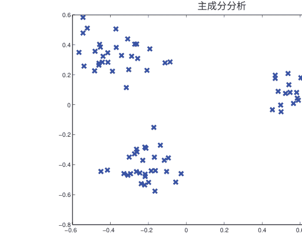

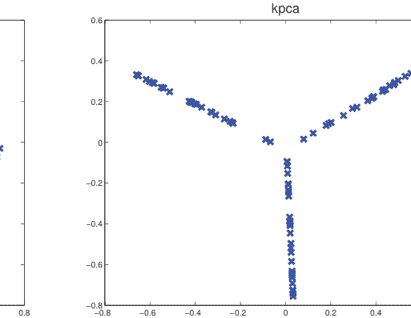

图14.8 一些2D数据的2D可视化。(a) PCA投影。(b) 核PCA投影。图由kpcaDemo2生成, 基于L.J.P. van der Maaten的代码。

使用等高线图显示8个组件和相应的曲面。我们可以看到前两个分量将三个聚类分开，后续分量将聚类进一步分割。

虽然kPCA学习到的特征对于分类可能有用（Schölkopf等人，1998年），但对于数据可视化来说并不一定有用。例如，图14.8显示了从图14.7中的数据投影到使用PCA和kPCA计算的前2个主基的结果。显然，PCA完美地表示了数据。kPCA通过不同的线表示每个聚类。

当然，将2D数据重新投影回2D是没有必要的。因此，让我们考虑一个不同的数据集。我们将使用一个12维的数据集，表示油管中已知的三个流动相。（这个数据集被广泛用于比较数据可视化方法，来自（Bishop和James，1993年）。）我们使用PCA和kPCA（使用RBF核）将其投影到2D空间。结果如图14.9所示。如果我们在低维空间中进行最近邻分类，kPCA产生13个错误，而PCA产生20个错误（Lawrence


图14.9 2维表示12维油流数据。不同的颜色/符号代表油流的3个阶段。(a) 主成分分析。(b) 带有高斯核的核主成分分析。与图15.10(b)进行比较。从图中可以看出 来自(Lawrence 2005)的第1张图。获得Neil Lawrence的友好许可后使用。

2005年)。然而，kPCA投影相当不自然。在第15.5节中，我们将讨论如何将概率化的核主成分分析。 请注意，核主成分分析与一种称为多维缩放或MDS的技术之间存在密切联系。该方法找到一个低维嵌入，使得嵌入空间中的欧氏距离近似于原始的不相似性矩阵。详细信息请参见(Williams 2002)。

## 14.5 支持向量机（SVMs）

在第14.3.2节中，我们看到了一种导出稀疏核机器的方法，即使用具有核基函数的广义线性模型，再加上稀疏促进先验，如 ℓ₁ 或ARD。另一种方法是将目标函数从负对数似然函数改变为其他损失函数，正如我们在第6.5.5节中讨论的那样。特别是，考虑 ℓ₂ 正则化的经验风险函数。

```
$J(\mathbf{w}, \lambda) = \sum_{i=1}^{N} L(y_i, \hat{y}_i) + \lambda \|\mathbf{w}\|^2$ \quad (14.45)
```

(到目前为止，这是在原始特征空间中；我们稍后会介绍核函数。) 如果 L 是二次损失函数，那么这等价于岭回归；如果 L 是方程6.73中定义的对数损失函数，那么这等价于逻辑回归。

在岭回归的情况下，我们知道解的形式为 \hat{\mathbf{w}} = (\mathbf{X}^T\mathbf{X} + \lambda\mathbf{I})^{-1}\mathbf{X}^T\mathbf{y}，并且插入预测的形式为 \hat{y}_0 + \hat{\mathbf{w}}^T \mathbf{x}_0。正如我们在第14.4.3节中所看到的，我们可以以一种只涉及形式为 \mathbf{x}^T \mathbf{x}' 的内积的方式重写这些方程，而这些内积可以用核函数 \kappa(\mathbf{x}, \mathbf{x}') 来替代。这是核化的，但不是稀疏的。

然而，如果我们用其他损失函数替换二次/对数损失函数，如下所述，我们可以确保解是稀疏的，因此预测仅依赖于训练数据的一个子集，称为支持向量。这种核技巧加上修改后的损失函数的组合被称为支持向量机或SVM。这种技术是

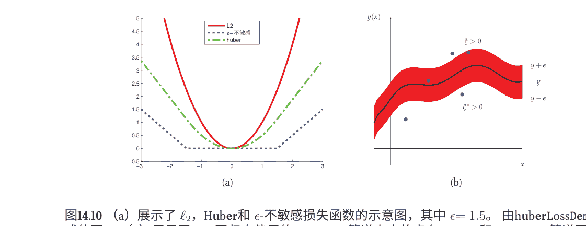

图14.10 （a）展示了 ℓ2，Huber和 ϵ-不敏感损失函数的示意图，其中 ϵ=1.5。由huberLossDemo生成的图。（b）展示了SVM回归中使用的 ϵ-tube。管道上方的点有 ξ_i > 0 和 ξ_i^* = 0。管道下方的点有 ξ_i = 0 和 ξ_i^* > 0。管道内部的点有 ξ_i = ξ_i^* = 0。基于（Bishop 2006a）的图7.7。

最初设计用于二元分类，但可以扩展到回归和多类分类，如下所述。

请注意，从概率角度来看，支持向量机（SVM）是非常不自然的。首先，它们在损失函数中编码了稀疏性，而不是先验知识。其次，它们通过使用算法技巧来编码核函数，而不是作为模型的显式部分。最后，SVM不会产生概率输出，这在多类分类设置中会导致各种困难（详见第14.5.2.4节）。

通过使用LIVM或RVM等技术，可以获得稀疏、概率、基于核的多类分类器，其效果与SVM相当甚至更好，这些技术在第14.3.2节中进行了讨论。然而，尽管SVM不具备概率性质，我们还是包括了对它们的讨论，原因有两个。首先，它们非常流行且广泛使用，因此所有的机器学习学生都应该了解它们。其次，在结构化输出情况下，它们在计算上具有一些优势，详见第19.7节。

### 14.5.1 支持向量机用于回归

核化岭回归的问题在于解向量 w 取决于所有的训练输入。我们现在寻求一种产生稀疏估计的方法。

Vapnik (Vapnik et al. 1997) 提出了一种变体的Huber损失函数（第7.4节）称为ε不敏感损失函数，定义为

$$L_\epsilon(y, \hat{y}) \triangleq \begin{cases} 0 & \text{如果 } |y - \hat{y}| < \epsilon \\ |y - \hat{y}| - \epsilon & \text{否则} \end{cases}$$ (14.46)

这意味着在预测周围的任何点都不会受到惩罚，就像图14.10中所示。

相应的目标函数通常以以下形式书写

$$J = C \sum_{i=1}^N L_\epsilon(y_i, \hat{y}_i) + \frac{1}{2} \| \mathbf{w} \|^2$$ (14.47)

其中 \(\hat{y}_i = f(\mathbf{x}_i) = \mathbf{w}^T\mathbf{x}_i + w_0\) 和 \(C=1/\lambda\) 是一个正则化常数。这个目标是凸的和无约束的，但由于损失项中的绝对值函数，它不可微。正如在第13.4节中讨论的套索问题，我们可以使用几种可能的算法。一种流行的方法是将问题表述为一个约束优化问题。特别地，我们引入松弛变量来表示每个点位于管道之外的程度：

```
\[
y_i \quad \leq \quad f(\mathbf{x}_i) + \epsilon + \xi_i^+ \ny_i \quad \geq \quad f(\mathbf{x}_i) - \epsilon - \xi_i^-
\]
```

鉴于此，我们可以将目标重写如下：

```
\[
J = C \sum_{i=1}^{N} (\xi_i^+ + \xi_i^-) + \frac{1}{2} \|\mathbf{w}\|^2
\]
```

这是一个关于 \(\mathbf{w}\) 的二次函数，并且必须在线性约束条件方程14.48-14.49以及正性约束条件 \(\xi_i^+ \geq 0\) 和 \(\xi_i^- \geq 0\) 的限制下进行最小化。这是一个关于 \(2N + D + 1\) 个变量的标准二次规划问题。

可以证明（参见例如，（Schoelkopf和Smola 2002）），最优解具有以下形式

```
\[
\hat{\mathbf{w}} = \sum_i \alpha_i \mathbf{x}_i
\]
```

此外，结果表明 \(\alpha\) 向量是稀疏的，因为我们不关心小于 \(\epsilon\) 的误差。对于 \(\alpha_i > 0\) 的 \(\mathbf{x}_i\)，称为支持向量；这些点的误差位于或超出 \(\epsilon\) 管道之外。

一旦模型训练完成，我们就可以使用它进行预测。

```
\[
\hat{y}(\mathbf{x}) = \hat{w}_0 + \hat{\mathbf{w}}^T\mathbf{x}
\]
```

将 \(\hat{\mathbf{w}}\) 的定义代入，我们得到

```
\[
\hat{y}(\mathbf{x}) = \hat{w}_0 + \sum_i \alpha_i \mathbf{x}_i^T \mathbf{x}
\]
```

最后，我们可以用 \(\kappa(\mathbf{x}_i, \mathbf{x})\) 替换 \(\mathbf{x}_i^T \mathbf{x}\)，得到核化解决方案：

```
\[
\hat{y}(\mathbf{x}) = \hat{w}_0 + \sum_i \alpha_i \kappa(\mathbf{x}_i, \mathbf{x})
\]
```

### 14.5.2 用于分类的支持向量机

现在我们讨论如何将支持向量机应用于分类。我们首先关注二元情况，然后在第14.5.2.4节中讨论多类情况。

#### 14.5.2.1 合页损失

在第6.5.5节中，我们展示了逻辑回归模型的负对数似然函数，

```
\[
L_{\mathrm{nll}}(y, \eta) = -\log p(y|\mathbf{x}, \mathbf{w}) = \log(1 + e^{-y\eta})
\]
```

是二元分类器的0-1风险的凸上界，其中 η = f(x) = w^T x + w_0 是对数几率比，我们假设标签是 y ∈ {1, -1} 而不是 {0, 1}。在本节中，我们用hinge损失替换了NLL损失，定义为

```
$L_{\text{hinge}}(y, \eta) = \max(0, 1 - y\eta) = (1 - y\eta)_+ \tag{14.56}$
```

这里 η = f(x)是我们选择标签 y=1的“置信度”；然而，它不一定具有任何概率语义。请参见图6.7进行绘制。我们可以看到该函数看起来像一个门铰链，因此得名。总体目标的形式为

```
$\min_{w,w_0} \frac{1}{2} ||w||^2 + C \sum_{i=1}^{N} (1 - y_i f(x_i))_+ \tag{14.57}$
```

再次强调，由于max项的存在，这是不可微分的。然而，通过引入松弛变量 ξ_i，可以证明这等价于求解

```
$\min_{w,w_0,\xi} \frac{1}{2} ||w||^2 + C \sum_{i=1}^{N} \xi_i \quad \text{s.t.} \quad \xi_i \geq 0, \quad y_i (x_i^T w + w_0) \geq 1 - \xi_i, i = 1:N \tag{14.58}$
```

这是一个包含 N + D + 1 个变量的二次规划问题，受到 O(N) 个约束条件的限制。我们可以消除原始变量 w, w_0 和 ξ_i，只需求解与约束条件对应的 N 个对偶变量，即拉格朗日乘子。标准求解器的时间复杂度为 O(N^3)。然而，针对这个问题已经开发出了一些专门的算法，避免使用通用的QP求解器，比如顺序最小优化或SMO算法 (Platt 1998)。在实践中，这可能需要 O(N^2) 的时间。然而，如果 N 很大，即使这样也可能太慢。在这种情况下，常见的做法是使用线性支持向量机 (linear SVMs)，其训练时间为 O(N) (Joachims 2006; Bottou et al. 2007)。可以证明，解的形式为

```
$\hat{w} = \sum_{i} \alpha_i x_i \tag{14.59}$
```

其中 α_i = λ_i y_i，且 α 是稀疏的（因为存在hinge loss）。对于 α_i > 0 的 x_i，它们被称为支持向量；这些点要么被错误分类，要么被正确分类但位于或在边界内（我们将在下面讨论边界）。请参见图14.12(b)进行说明。

在测试时，使用预测进行

```
$\hat{y}(x) = \text{sgn}(f(x)) = \text{sgn} (\hat{w}_0 + \hat{w}^T x) \tag{14.60}$
```

使用方程式14.59和核技巧，我们有

```
$\hat{y}(x) = \text{sgn} \left( \hat{w}_0 + \sum_{i=1}^{N} \alpha_i κ(x_i, x) \right) \tag{14.61}$
```

这需要 O(sD) 的时间来计算，其中 s ≤ N 是支持向量的数量。这取决于稀疏级别，因此取决于正则化器 C。

## 14.5.2.2 大边界原则

图14.11 大边界原则的说明。左：具有大边界的分离超平面。右：具有小边界的分离超平面。

图14.12 (a)在2D中线性决策边界的几何示意图。如果 f(x) > 0，则将点x分类为决策区域 R1中，否则将其分类为决策区域 R2；这里 f(x)被称为判别函数。决策边界是满足 f(x) = 0的点的集合。向量w是垂直于决策边界的。术语 w0控制决策边界与原点的距离。点 x到其在决策边界上的正交投影点 x⊥的有符号距离由 f(x)/||w||给出。基于(Bishop 2006a)的图4.1。(b)软间隔原理的示意图。带有圆圈的点是支持向量。我们还指示了相应松弛变量的值。基于(Bishop 2006a)的图7.3。

在本节中，我们从完全不同的角度推导出方程14.58。回想一下，我们的目标是推导出一个判别函数 \( f(x) \)，它在由核函数选择确定的特征空间中是线性的。考虑一个点 \( x \) 在这个引导空间中。参考图14.12(a)，我们可以看到

$$ \mathbf{x} = \mathbf{x}_{\perp} + r \frac{\mathbf{w}}{\|\mathbf{w}\|} \quad (14.62) $$

其中 \( r \) 是 \( x \) 到决策边界的距离，其法向量为 \( \mathbf{w} \)，而 \( \mathbf{x}_{\perp} \) 是 \( x \) 在该边界上的正交投影。因此

$$ f(\mathbf{x}) = \mathbf{w}^T \mathbf{x} + w_0 = (\mathbf{w}^T \mathbf{x}_{\perp} + w_0) + r \frac{\mathbf{w}^T \mathbf{w}}{\|\mathbf{w}\|} \quad (14.63) $$

因此 \( f(\mathbf{x}) = r \frac{\sqrt{\mathbf{w}^T \mathbf{w}}}{\|\mathbf{w}\|} \)，并且 \( r = \frac{f(\mathbf{x})}{\|\mathbf{w}\|} \)。 我们希望使这个距离 \( r = f(\mathbf{x})/\|\mathbf{w}\| \) 尽可能大，这是在图14.11中说明的原因。特别是，可能有很多条线完全分开训练数据（尤其是在高维特征空间中工作时），但直观上，最好的线是最大化边界的垂直距离，即最接近的点的垂直距离。此外，我们希望确保每个点都在边界的正确一侧，因此我们希望 \( f(\mathbf{x}_i) y_i > 0 \)。因此我们希望优化

$$ \max_{\mathbf{w}, w_0} \min_{i=1}^N \frac{y_i (\mathbf{w}^T \mathbf{x}_i + w_0)}{\|\mathbf{w}\|} \quad (14.64) $$

请注意，通过使用 \( \mathbf{w} \rightarrow k \mathbf{w} \) 和 \( w_0 \rightarrow k w_0 \) 重新缩放参数，我们不会改变任何点到边界的距离，因为当我们除以 \( \|\mathbf{w}\| \) 时， \( k \) 因子会被取消。因此，让我们定义比例因子，使得最靠近决策边界的点的 \( y_i f_i = 1 \)。因此，我们希望优化

$$ \min_{\mathbf{w}, w_0} \frac{1}{2} y_i (\mathbf{w}^T \mathbf{x}_i + w_0) \geq 1, \quad i=1 : N \quad (14.65) $$

（为了方便起见，添加了 \( \frac{1}{2} \) 的事实，并不影响最优参数。）约束条件表示我们希望所有点都在决策边界的正确一侧，且至少有1的间隔。因此，我们称SVM为大边界分类器。

如果数据在使用核技巧后仍然不是线性可分的，那么对于所有 \( i \)，将没有可行解使得 \( y_i f_i \geq 1 \)。因此，我们引入松弛变量 \( \xi_i \geq 0 \)，使得当点在或在正确的边界内时， \( \xi_i = 0 \)，否则 \( \xi_i = |y_i - f_i| \)。如果 \( 0 < \xi_i \leq 1 \)，则该点位于间隔内，但在决策边界的正确一侧。

如果 \( \xi_i > 1 \)，则该点位于决策边界的错误一侧。参见图14.12(b)。 我们用软间隔约束替换硬约束，即 \( y_i f_i \geq 0 \) 变为 \( y_i f_i \geq 1 - \xi_i \)。新的目标变为

$$ \min_{\mathbf{w}, w_0, \xi} \frac{1}{2} \|\mathbf{w}\|^2 + C \sum_{i=1}^N \xi_i \quad \text{s.t.} \quad \xi_i \geq 0, \quad y_i (\mathbf{x}_i^T \mathbf{w} + w_0) \geq 1 - \xi_i \quad (14.66) $$

这与方程14.58相同。由于 $\xi_i > 1$ 意味着点$i$被错误分类，我们可以解释为 $\sum_i \xi_i$作为误分类点数量的上界。

参数 $C$ 是一个正则化参数，用于控制我们在训练集上容忍的错误数量。通常使用 $C=1/(\nu N)$来定义，其中$0 < \nu \leq 1$控制训练阶段允许的误分类点的比例。

这被称为 $\nu$-SVM分类器。通常使用交叉验证来设置这个参数（参见第14.5.3节）。

## 14.5.2.3 概率输出

图14.13 对数几率与$x$的关系，使用了3种不同的方法。基于(Tipping 2001)的图10。获得了Mike Tipping的友好许可。

SVM分类器产生一个硬标签， $\hat{y}(\mathbf{x}) = \text{sign}(f(\mathbf{x}))$。然而，我们经常希望对我们的预测有一定的置信度。一种启发式的方法是将 $f(\mathbf{x})$解释为对数几率比， $\log \frac{p(y=1|\mathbf{x})}{p(y=0|\mathbf{x})}$。我们可以使用支持向量机的输出来转换为概率

$$p(y = 1|\mathbf{x}, \boldsymbol{\theta}) = \sigma(a f(\mathbf{x}) + b) \quad\quad (14.67)$$

其中 $a, b$可以通过在单独的验证集上使用最大似然估计来估计。（使用训练集来估计 $a$ 和 $b$会导致严重过拟合。）这个技术最早是在（Platt 2000）中提出的。

然而，由于SVM训练过程中没有任何理由将 $f(\mathbf{x})$解释为对数几率比，所以得到的概率并不特别校准。为了说明这一点，考虑（Tipping 2001）中的一个例子。假设我们有一维数据，其中 $p(x|y=0) = \text{Uniform}(0, 1)$和 $p(x|y=1) = \text{Uniform}(0.5, 1.5)$。由于类条件分布在中间重叠，类1相对于类0的对数几率应在 $[0.5, 1.0]$内为零，在此区域之外为无穷大。我们从模型中抽取了1000个点，然后使用宽度为0.1的高斯核函数拟合了一个RVM和一个SVM。这两个模型都能完美捕捉决策边界，并在这个问题上实现了25%的泛化误差，这是贝叶斯最优的。RVM的概率输出很好地近似了真实的对数几率，但是SVM并非如此，如图14.13所示。

## 14.5.2.4 用于多类分类的支持向量机

在第8.3.7节中，我们看到如何将二元逻辑回归模型升级为多类情况，通过用softmax替换sigmoid函数，用多项式替换伯努利分布。将支持向量机升级为多类情况并不容易，因为输出不在一个校准的尺度上，因此很难相互比较。

明显的方法是使用一对其余的方法（也称为一对全部方法），其中我们训练C个二元分类器\(f_c(\mathbf{x})\)，其中类别\(c\)的数据被视为正例，而所有其他类别的数据被视为负例。然而，这可能导致输入空间中的区域具有模糊的标签，如图14.14(a)所示。

一个常见的替代方法是选择 \(\hat{y}(\mathbf{x}) = \arg \max_c f_c(\mathbf{x})\)。然而，这种技术可能也不起作用，因为不保证不同的\(f_c\)函数具有可比较的大小。此外，每个二进制子问题很可能受到类别不平衡问题的影响。为了看到这一点，假设我们有10个平均表示的类别。当训练\(f_1\)时，我们将有10%的正例和90%的负例，这可能会影响性能。有可能设计出同时训练所有\(C\)个分类器的方法（Weston和Watkins 1999），但得到的方法需要 \(O(C^2N^2)\)时间，而不是通常的 \(O(CN^2)\)时间。

另一种方法是使用一对一或OVO方法，也称为全对，其中我们训练 \(C(C-1)/2\)个分类器来区分所有的对 \(f_{c, c'}\)。然后，我们将一个点分类到得到最多票数的类别。然而，这也可能导致歧义，如图14.14(b)所示。此外，训练每个数据点需要 \(O(C^2N^2)\)时间，测试需要 \(O(C^2 N_{sv})\)时间，其中 \(N_{sv}\)是支持向量的数量。^2 另请参阅（Allwein等人2000）基于纠错输出码的方法。

值得记住的是，所有这些困难以及提出的众多启发式方法来解决这些困难，根本上是因为支持向量机不使用概率来建模不确定性，所以它们的输出分数在不同类别之间是不可比较的。

> ^2 我们可以通过将类别结构化为有向无环图(DAG)，并进行 \(O(C)\)两两比较(Platt等人，2000年)来减少测试时间。然而，训练时间中的 \(O(C^2)\)因素是不可避免的。

#### 14.5.3 选择 C

图14.15 (a) 使用不同精度 $\gamma=1/(2\sigma^2)$和不同正则化参数 $\lambda=1/C$对从两个高斯分布中抽取的合成数据集应用RBF核的SVM分类器的0-1误差的交叉验证估计。(b) 对于 $\gamma=5$的这个曲面的切片。红色虚线是贝叶斯最优误差，使用贝叶斯规则应用于生成数据的模型计算得出。基于(Hastie等人, 2009年)的图12.6。由tsvmCgammaDemo生成的图。

支持向量机 (SVM) 用于分类和回归，需要指定核函数和参数 C。通常通过交叉验证来选择参数 C。然而，请注意参数 C与核参数之间的强烈相互作用。例如，假设我们使用一个RBF核函数，精度 $\gamma = \frac{1}{2\sigma^2}$。如果 $\gamma=5$，即使用窄核函数，我们需要进行强正则化，因此需要较小的参数 C（所以 $\lambda=1/C$较大）。如果 $\gamma=1$，应该使用较大的参数 C。因此，我们可以看到 $\gamma$ 和 C是紧密耦合的。这在图14.15中有所体现，该图显示了0-1风险的CV估计值作为参数 C 和 $\gamma$ 的函数。

libsvm的作者推荐 (Hsu等人, 2009年) 使用CV在一个二维网格上进行，其中参数 $C \in \{2^{-5}, 2^{-3}, ..., 2^{15}\}$ 和 $\gamma \in \{2^{-15}, 2^{-13}, ..., 2^3\}$。此外，首先对数据进行标准化非常重要，以便使用球形高斯核函数。

为了有效地选择 C，可以开发一种路径跟踪算法，其灵感来自于lars (第13.3.4节)。基本思想是从一个较大的 $\lambda$ 开始，使得边界 $1/||w(\lambda)||$很宽，因此所有的点都在其内部，并且具有 $\alpha_i=1$。通过逐渐减小 $\lambda$，一小部分点将从边界内部移动到外部，并且它们的 $\alpha_i$值将从1变为0，因为它们不再是支持向量。当 $\lambda$ 达到最大值时，函数完全平滑，不再存在支持向量。详见 (Hastie等人, 2004年) 的细节。

## 14.5.4 关键要点总结

总结上述讨论，我们认识到SVM分类器涉及三个关键要素：核技巧、稀疏性和大间隔原则。核技巧是必要的，以防止欠拟合，即确保特征向量足够丰富，使得线性分类器能够分离数据。（回顾第14.2.3节，任何Mercer核都可以被视为隐式地定义一个潜在的高维特征向量。）如果原始特征已经是高维的（如许多基因表达和文本分类问题），则可以使用线性核 $\kappa(\mathbf{x}, \mathbf{x}') = \mathbf{x}^T \mathbf{x}'$，这相当于使用原始特征进行操作。

稀疏性和大边界原则是防止过拟合的必要条件，即确保我们不使用所有的基函数。这两个思想彼此密切相关，并且都源于使用铰链损失函数（在这种情况下）。然而，还有其他实现稀疏性的方法（如 $\ell_1$），以及最大化边界的其他方法（如提升）。对这一点的更深入讨论超出了本书的范围。

> 参见例如，（Hastie等人，2009年）获取更多信息。

#### 14.5.5 支持向量机的概率解释

在第14.3节中，我们看到如何在广义线性模型中使用核函数来推导概率分类器，例如LIVM和RVM。在第15.3节中，我们将讨论高斯过程分类器，它也使用核函数。然而，所有这些方法都使用逻辑回归或概率回归似然函数，而不是SVM使用的合页损失函数。自然而然地会想知道是否可以更直接地将SVM解释为概率模型。为了这样做，我们必须将 $Cg(m)$ 解释为负对数似然函数，其中 $g(m) = (1-m)_+$，其中 $m = yf(\mathbf{x})$ 是边际。因此 $p(y=1|f) = \exp(-Cg(f))$ 和 $p(y=-1|f) = \exp(-Cg(-f))$。通过对 $y$ 的两个值求和，我们要求 $\exp(-Cg(f)) + \exp(-Cg(-f))$ 是与 $f$ 无关的常数。但是事实证明，对于任何 $C>0$ （Sollich，2002年）都不可能。

然而，如果我们愿意放松总和为一的条件，并使用伪-似然函数，我们可以推导出铰链损失的概率解释（Polson和Scott 2011）。特别地，我们可以证明

$$ \exp\bigl(-2(1 - y_i \mathbf{x}_i^T \mathbf{w})_+\bigr) = \int_{0}^{\infty} \frac{1}{\sqrt{2\pi\lambda_i}} \exp\left( -\frac{1}{2} \frac{(1 + \lambda_i - y_i \mathbf{x}_i^T \mathbf{w})^2}{\lambda_i} \right) d\lambda_i \qquad (14.68) $$

因此，负铰链损失的指数可以表示为高斯比例混合物。这使得可以使用EM或Gibbs采样来拟合SVM，其中 $\lambda_i$ 是潜变量。这反过来为设置先验概率超参数w的贝叶斯方法打开了大门。详细信息请参阅（Polson和Scott 2011）。（另请参阅（Franc等，2011）对SVM的不同概率解释。）

### 14.6 判别式核方法的比较

我们已经提到了几种基于核的分类和回归方法，我们在表14.1中总结了这些方法。（GP代表“高斯过程”，我们在第15章中讨论。）列的含义如下：

+   - 优化 $w$: 一个关键是目标 $J(\mathbf{w}) = -\log p(\mathcal{D}|\mathbf{w}) - \log p(\mathbf{w})$ 是否是凸的。L2VM、L1VM和SVM具有凸目标。RVM不具有。GPs是不进行参数估计的贝叶斯方法。
- 优化核: 所有的方法都要求“调整”核参数，如RBF核的带宽以及正则化水平。对于基于高斯的方法，包括L2VM、RVM和GPs，我们可以使用高效的梯度优化器来最大化边际似然。对于SVM和L1VM，我们必须使用交叉验证，这会更慢（参见第14.5.3节）。
- 稀疏: L1VM、RVM和SVM是稀疏核方法，它们只使用训练样本的一个子集。GPs和L2 VM不是稀疏的：它们使用所有的训练样本。稀疏性的主要优势是测试时的预测通常更快。此外，有时可以获得更高的准确性。
- 概率性: 除了SVM之外的所有方法都产生形式为$p(y|\mathbf{x})$的概率输出。SVM产生一个可以转换为概率的“置信度”值，但这些概率通常校准得很差（参见第14.5.2.3节）。
- 多类别: 除了SVM之外的所有方法自然地适用于多类别设置，通过使用多项式输出而不是伯努利输出。SVM可以转化为多类别分类器，但是这种方法存在各种困难，如第14.5.2.4节所讨论的。
- Mercer核函数: SVM和GP要求核函数是正定的；其他技术则不需要。

除了这些差异，还有一个自然的问题：哪种方法效果最好？在一个小实验^3中，我们发现在一系列问题上，所有这些方法的准确性都相似，前提是它们具有相同的核函数，并且正则化常数选择得当。

考虑到统计性能大致相同，那么计算性能呢？GP和L2VM通常是最慢的，需要 $O(N^3)$ 时间，因为它们不利用稀疏性（尽管可以进行各种加速，参见第15.6节）。SVM的训练也需要 $O(N^3)$ 时间（除非我们使用线性核函数，这种情况下只需要 $O(N)$ 时间（Joachims 2006））。然而，使用交叉验证可能使SVM比RVM更慢。L1VM应该比RVM更快，因为RVM需要多轮 $\ell_1$ 最小化（参见第13.7.4.3节）。然而，在实践中，通常使用贪婪方法来训练RVM，这比 $\ell_1$ 最小化更快。这在我们的实证结果中得到了反映。

所有这一切的结论如下：如果速度很重要，使用RVM，但如果需要校准良好的概率输出（例如用于主动学习或控制问题），使用GP。唯一合理使用SVM的情况是结构化输出情况，其中基于似然的方法可能很慢。（我们认为SVM的巨大流行不是因为它们的优越性，而是因为对替代方法的无知，以及缺乏实现替代方法的高质量软件。）

第16.7.1节对监督学习方法进行了更广泛的实验比较，包括SVM和各种非核方法。

^3 在一个小实验^3中，我们发现在一系列问题上，所有这些方法的准确性都相似，前提是它们具有相同的核函数，并且正则化常数选择得当。

| 方法 | 优化w | 优化 | 核 | 稀疏 | 概率 | 多类别 | 非Mercer部分 |   |
| :--- | :--- | :--- | :--- | :--- | :--- | :--- | :--- | :--- |
| L2VM | 凸 | EB |   | 否 | 是 | 是 | 是 | 14.3.2 |
| L1VM | 凸 | CV |   | 是 | 是 | 是 | 是 | 14.3.2 |
| RVM | 非凸 EB |   |   | 是 | 是 | 是 | 是 | 14.3.2 |
| SVM | 凸 | CV |   | 是 | 否 | 间接否 |   | 14.5 |
| GP | 不适用 | EB |   | 否 | 是 | 是 | 否 | 15 |

表14.1 各种基于核的分类器的比较。 EB = 经验贝叶斯，CV = 交叉验证。详细信息请参阅正文。

图14.16 一些流行平滑核函数的比较。矩形窗核函数具有紧支持，但不平滑。Epanechnikov核函数具有紧支持，但在边界处不可微。三立方体核在其支持边界上具有紧致支持和两个连续导数。高斯函数是可微的，但不具有紧致支持。基于(Hastie et al. 2009)的图6.2。由smoothingKernelPlot生成的图。

### 14.7 用于构建生成模型的核函数

还有一种称为平滑核函数的不同类型的核函数，可以用于创建非参数密度估计。这可以用于无监督密度估计，以及通过创建形式为 p(y,x) 的生成模型来进行分类和回归。

#### 14.7.1 平滑核函数

平滑核函数是一个具有一个参数的函数，满足以下属性：

$$ \kappa(x) dx = 1, \quad \int x\kappa(x)dx = 0, \quad \int x^2\kappa(x)dx > 0 $$

一个简单的例子是 **高斯核**，

$$ \kappa(x) \triangleq \frac{1}{(2\pi)^{\frac{1}{2}}} e^{-x^2/2} $$

我们可以通过引入一个带宽参数 \( h \) 来控制核的宽度：

$$ \kappa_h(x) \triangleq \frac{1}{h} \kappa\left(\frac{x}{h}\right) $$

我们可以通过定义一个RBF核来推广到向量值输入：

$$ \kappa_h(\mathbf{x}) = \kappa_h(\|\mathbf{x}\|) $$

在高斯核的情况下，这变成了

$$ \kappa_h(\mathbf{x}) = \frac{1}{h^D (2\pi)^{D/2}} \prod_{j=1}^D \exp\left(-\frac{1}{2h^2} x_j^2\right) $$

尽管高斯核很受欢迎，但它们具有无界的支持。一种具有紧支持的替代核是Epanechnikov核，定义如下

$$\kappa(x) \triangleq \frac{3}{4}(1 - x^{2})\mathbb{I}(|x| \leq 1) \qquad \text{(14.74)} $$

这在图14.16中绘制出来。紧凑支持可以提高效率，因为可以使用快速最近邻方法来评估密度。

不幸的是，Epanechnikov核在其支持边界处不可微分。另一种选择是三立方体核，定义如下：

$$\kappa(x) \triangleq \frac{70}{81}(1 - |x|^{3})^{3}\mathbb{I}(|x| \leq 1) \qquad \text{(14.75)} $$

这具有紧凑支持，并且在其支持边界处具有两个连续导数。参见图14.16。

盒状核只是均匀分布：

$$\kappa(x) \triangleq \mathbb{I}(|x| \leq 1) \qquad \text{(14.76)} $$

我们将使用下面的核函数。

#### 14.7.2 核密度估计 (KDE)

回顾一下第11.2.1节中的高斯混合模型。这是一个参数密度估计器，用于在 $\mathbb{R}^{D}$ 中的数据。然而，它需要指定聚类的数量 $K$ 和位置 $\boldsymbol{\mu}_{k}$。估计 $\boldsymbol{\mu}_{k}$ 的另一种方法是为每个数据点分配一个聚类中心，所以 $\boldsymbol{\mu}_{i} = \mathbf{x}_{i}$。在这种情况下，模型变为

$$p(\mathbf{x}|\mathcal{D}) = \frac{1}{N} \sum_{i=1}^{N} \mathcal{N}(\mathbf{x}|\mathbf{x}_{i}, \sigma^{2}\mathbf{I}) \qquad \text{(14.77)} $$

我们可以通过写作来概括这种方法

$$\hat{p}(\mathbf{x}) = \frac{1}{N} \sum_{i=1}^{N} \kappa_{h}(\mathbf{x} - \mathbf{x}_{i}) \qquad \text{(14.78)} $$

这被称为Parzen窗口密度估计器，或核密度估计器 (KDE)，是一个简单的非参数密度模型。与参数模型相比，优点是不需要进行模型拟合（除了调整带宽，通常通过交叉验证完成）。并且不需要选择 $K$。缺点是该模型需要大量的内存来存储，并且评估需要很长时间。对于聚类任务也没有用处。

图14.17 一个非参数（Parzen）密度估计器在1D中由6个数据点估计得到，用x表示。顶行：均匀核。底行：高斯核。行代表越来越大的带宽参数。基于http://en.wikipedia.org/wiki/Kernel_density_estimation。由parzenWindowDemo2生成的图。

推断h。DP混合模型也可以比KDE更高效，因为它们不需要存储所有数据。另请参见第5.2.4节，我们在高斯过程模型中讨论了一种经验贝叶斯方法来估计核参数，用于分类/回归。

#### 14.7.3 从KDE到KNN

我们可以使用KDE来定义生成分类器中的类条件密度。这实际上提供了最近邻分类器的另一种推导，我们在第14.2节中介绍过。为了展示这一点，我们遵循（Bishop 2006a，p125）的演示。在具有矩形核的KDE中，我们固定带宽并计算有多少数据点落在以数据点为中心的超立方体中。假设，我们不是固定带宽h，而是允许每个数据点的带宽或体积不同。具体来说，我们将在遇到K个数据点之前，“增长”围绕 x的一个体积，而不考虑它们的类别标签。让结果体积的大小为V(x)（之前是h^D），并且在这个体积中有N_c(x)个来自类别c的示例。然后我们可以如下估计类条件密度：\[ p(\mathbf{x}|y=c,\mathcal{D}) = \frac{N_c(\mathbf{x})}{N_c V(\mathbf{x})} \] 其中N_c是整个数据集中类别c的示例总数。类别先验可以通过以下方式估计：\[ p(y=c|\mathcal{D}) = \frac{N_c}{N} \] 因此，类别后验概率为 \[ p(y=c|\mathbf{x},\mathcal{D}) = \frac{ \frac{N_c(\mathbf{x})}{N_c V(\mathbf{x})} \frac{N_c}{N} }{ \sum_{c'} \frac{N_{c'}(\mathbf{x})}{N_{c'} V(\mathbf{x})} \frac{N_{c'}}{N} } = \frac{N_c(\mathbf{x})}{ \sum_{c'} N_{c'}(\mathbf{x}) } = \frac{N_c(\mathbf{x})}{K} \] 其中我们使用了 $\sum_c N_c(\mathbf{x}) = K$，因为我们在每个点周围选择了 K个点（不考虑类别）。这等价于方程1.2，因为 $N_c(\mathbf{x}) = \sum_{i \in N_K(\mathbf{x},\mathcal{D})} \mathbb{I}(y_i = c)$。

图14.18 使用高斯核进行一维核回归的示例。由kernelRegressionDemo生成的图，基于Yi Cao的代码。

#### 14.7.4 核回归

在第14.7.2节中，我们讨论了核密度估计或KDE在无监督学习中的应用。我们也可以将KDE用于回归。目标是计算条件期望 \[ f(\mathbf{x}) = \mathbb{E}[y|\mathbf{x}] = \int y p(y|\mathbf{x}) dy = \frac{\int y p(\mathbf{x}, y) dy}{\int p(\mathbf{x}, y) dy} \]

我们可以使用KDE来近似联合密度 \( p(\mathbf{x}, y) \)如下：

$$p(\mathbf{x}, y) \approx \frac{1}{N} \sum_{i=1}^{N} \kappa_h(\mathbf{x} - \mathbf{x}_i) \kappa_h(y - y_i) \qquad (14.83)$$

因此

$$f(\mathbf{x}) = \frac{\frac{1}{N} \sum_{i=1}^{N} \kappa_h(\mathbf{x} - \mathbf{x}_i) \int y \kappa_h(y - y_i) dy}{\frac{1}{N} \sum_{i=1}^{N} \kappa_h(\mathbf{x} - \mathbf{x}_i) \int \kappa_h(y - y_i) dy} \qquad (14.84)$$

$$= \frac{\sum_{i=1}^{N} \kappa_h(\mathbf{x} - \mathbf{x}_i) y_i}{\sum_{i=1}^{N} \kappa_h(\mathbf{x} - \mathbf{x}_i)} \qquad (14.85)$$

为了推导这个结果，我们使用了平滑核的两个性质。首先，它们的积分为一，即 \( \int \kappa_h(u) du = 1 \)。其次，平滑核具有零均值的性质： \( \int u \kappa_h(u) du = 0 \)。这是通过定义 \( x = y - y_i \) 并利用平滑核的零均值性质得到的：

$$\int (x + y_i) \kappa_h(x) dx = \int x \kappa_h(x) dx + y_i \int \kappa_h(x) dx = 0 + y_i = y_i \qquad (14.86)$$

我们可以将上述结果重写如下：

$$f(\mathbf{x}) = \sum_{i=1}^{N} w_i(\mathbf{x}) y_i \qquad (14.87)$$

$$w_i(\mathbf{x}) \triangleq \frac{\kappa_h(\mathbf{x} - \mathbf{x}_i)}{\sum_{i'=1}^{N} \kappa_h(\mathbf{x} - \mathbf{x}_{i'})} \qquad (14.88)$$

我们可以看到，预测值只是训练点输出的加权和，其中权重取决于 \( \mathbf{x} \) 与存储的训练点的相似程度。这种方法被称为核回归、核平滑或Nadaraya-Watson模型。请参见图14.18，我们在其中使用了高斯核。

请注意，这种方法只有一个自由参数，即 \( h \)。可以证明（Bowman和Azzalini 1997），对于一维数据，如果真实密度是高斯分布且我们使用高斯核，最优带宽 \( h \) 由以下公式给出

$$h = \left( \frac{4}{3N} \right)^{1/5} \hat{\sigma} \qquad (14.89)$$

我们可以通过首先计算均值绝对偏差来计算对标准差的稳健近似

$$\text{MAD} = \text{中位数}(|\mathbf{x} - \text{中位数}(\mathbf{x})|) \qquad (14.90)$$

然后使用

$$\hat{\sigma} = 1.4826 \ \text{MAD} = \frac{1}{0.6745} \text{MAD} \qquad (14.91)$$

尽管这些启发式方法似乎效果很好，但它们的推导基于一些相当可疑的假设（如真实密度的高斯性）。此外，这些启发式方法仅限于调整单个参数。在第15.2.4节中，我们讨论了一种经验贝叶斯方法，用于在高斯过程模型中估计分类/回归的多个核参数，该方法可以处理许多调整参数，并且基于更透明的原则（最大化边际似然）。

#### 14.7.5 局部加权回归

如果我们定义 $\kappa_h(\mathbf{x} - \mathbf{x}_i) = \kappa(\mathbf{x}, \mathbf{x}_i)$，我们可以将核回归所做的预测重写为以下形式

$\hat{f}(\mathbf{x}_*) = \sum_{i=1}^N y_i \frac{\kappa(\mathbf{x}_*, \mathbf{x}_i)}{\sum_{i'=1}^N \kappa(\mathbf{x}_*, \mathbf{x}_{i'})} \qquad (14.92)$

请注意，$\kappa(\mathbf{x}, \mathbf{x}_i)$ 不一定是平滑核函数。如果不是，我们就不再需要归一化项，所以我们可以直接写成

$\hat{f}(\mathbf{x}_*) = \sum_{i=1}^N y_i \kappa(\mathbf{x}_*, \mathbf{x}_i) \qquad (14.93)$

这个模型本质上是在局部拟合一个常数函数。我们可以通过解决每个点 $\mathbf{x}_*$ 的线性回归模型来改进这一点

$\min_{\beta(\mathbf{x}_*)} \sum_{i=1}^N \kappa(\mathbf{x}_*, \mathbf{x}_i)[y_i - \beta(\mathbf{x}_*)^T \phi(\mathbf{x}_i)]^2 \qquad (14.94)$

其中 $\phi(\mathbf{x}) = [1, \mathbf{x}]$。这被称为局部加权回归。这种方法的一个例子是 LOESS，也称为 LOWESS，代表“局部加权散点图平滑”（Cleveland and Devlin 1988）。另请参阅（Edakunni et al .2010）关于该模型的贝叶斯版本。我们可以通过解决以下加权最小二乘问题来计算每个测试案例的参数 $\beta(\mathbf{x}_*)$：

$\beta(\mathbf{x}_*) = (\Phi^T \mathbf{D}(\mathbf{x}_*) \Phi)^{-1} \Phi^T \mathbf{D}(\mathbf{x}_*) \mathbf{y} \qquad (14.95)$

其中 $\Phi$是一个 $N \times (D+1)$设计矩阵， $\mathbf{D} = \text{diag}(\kappa(\mathbf{x}_*, \mathbf{x}_i))$.相应的预测具有以下形式

$\hat{f}(\mathbf{x}_*) = \phi(\mathbf{x}_*)^T \beta(\mathbf{x}_*) = (\Phi^T \mathbf{D}(\mathbf{x}_*) \Phi)^{-1} \Phi^T \mathbf{D}(\mathbf{x}_*) \mathbf{y} = \sum_{i=1}^N w_i(\mathbf{x}_*) y_i \qquad (14.96)$

将局部平滑核与线性回归效果相结合的术语 $w_i(\mathbf{x}_*)$被称为等效核。另请参见第15.4.2节。

## 练习

练习14.1 手动拟合SVM分类器 （来源：Jaakkola。）考虑一个1维数据集，其中有2个点：$(x_1=0, y_1=−1)$ 和 $(x_2=\sqrt{2}, y_2=1)$. 考虑使用特征向量 $\phi(x) = [1, \sqrt{2}x, x^2]^T$ 将每个点映射到3D空间中。（这相当于使用二次多项式核函数。）最大间隔分类器的形式为

$$
\begin{aligned}
\min &\|\mathbf{w}\|^2 \\
\text{s.t.} \quad & y_1 (\mathbf{w}^T \phi(\mathbf{x}_1) + w_0) \geq 1 \\
& y_2 (\mathbf{w}^T \phi(\mathbf{x}_2) + w_0) \geq 1
\end{aligned}
$$

- a. 写下与最优向量 \mathbf{w} 平行的向量。 提示：从图7.8 (12Apr10版本) 中可以看出 \mathbf{w} 垂直于3D特征空间中两个点之间的决策边界。
- b. 这个 \mathbf{w} 实现的间隔是多少？ 提示：记住间隔是每个支持向量到决策边界的距离。 提示2：思考一下空间中两个点的几何关系，以及一条将它们分开的线。
- c. 解出 \mathbf{w}，使用边界等于 1/\|\mathbf{w}\| 的事实。
- d. 使用你的 \mathbf{w} 值和方程14.97到14.99解出 w_0。 提示：点将位于决策边界上，所以不等式将是紧的。
- e. 将判别函数 f(x) = w_0 + \mathbf{w}^T \phi(x) 的形式写下来，作为 x 的显式函数。

练习14.2 线性可分性

(来源：Koller..) 考虑将 C > 0 的SVM拟合到线性可分的数据集上。 结果的决策边界是否保证能够分开类别？

## 15 高斯过程

### 15.1 引言

在监督学习中，我们观察到一些输入 $x_i$ 和一些输出 $y_i$。我们假设 $y_i = f(x_i)$，对于某个未知函数 $f$，可能被噪声破坏。最优的方法是在给定数据的情况下推断出函数的分布 $p(f|X, y)$，然后使用它来对新的输入进行预测，即计算

> $p(y_*|x_*, X, y) = \int p(y_*|f, x_*) p(f|X, y) df \quad (15.1)$

到目前为止，我们一直关注函数 $f$ 的参数表示，以便推断 $p(f|D)$，而不是推断 $p(\theta|D)$。在本章中，我们将讨论一种对函数本身进行贝叶斯推断的方法。

我们的方法将基于高斯过程或 GPs。高斯过程定义了函数的先验分布，一旦我们看到一些数据，就可以将其转换为函数的后验分布。尽管表示函数的分布可能看起来很困难，但事实证明，我们只需要能够在一个有限但任意的点集上定义函数值的分布，比如 $\mathbf{x}_1, \ldots, \mathbf{x}_N$。高斯过程假设 $p(f(\mathbf{x}_1), \ldots, f(\mathbf{x}_N))$ 是联合高斯分布，具有某个均值 $\mu(\mathbf{x})$ 和协方差 $\Sigma(\mathbf{x})$，其中 $\Sigma_{ij} = \kappa(\mathbf{x}_i, \mathbf{x}_j)$，$\kappa$ 是一个正定的核函数（有关核函数的信息，请参见第14.2节）。关键思想是，如果核函数认为 $\mathbf{x}_i$ 和 $\mathbf{x}_j$ 相似，那么我们期望函数在这些点的输出也是相似的。请参见图15.1以进行说明。

事实证明，在回归设置中，所有这些计算都可以用闭式形式在 $O(N^3)$ 时间内完成。（我们在第15.6节中讨论更快的近似方法。）在分类设置中，我们必须使用近似方法，例如高斯近似，因为后验不再是完全的高斯分布。

高斯过程可以被看作是我们在第14章中讨论的核方法的贝叶斯替代方法，包括LIVM、RVM和SVM。尽管这些方法更稀疏，因此更快，但它们不能给出良好校准的概率输出（详见第15.4.4节进一步讨论）。在某些应用中，如视觉和机器人的在线跟踪（Ko和Fox 2009）、强化学习和最优控制（Engel等人2005；Deisenroth等人2009）、非凸函数的全局优化（Mockus等人1996；Lizotte 2008；Brochu等人2009）、实验设计（Santner等人2003）等，正确调整的概率输出非常重要。

这些隐藏节点通过无向边完全相互连接，形成一个高斯图模型；边的强度表示协方差项 $\Sigma_{ij} = \kappa(\mathbf{x}_i, \mathbf{x}_j)$。如果测试点 $\mathbf{x}_\star$ 与训练点 $\mathbf{x}_1$ 和 $\mathbf{x}_2$ 相似，则预测输出 $y_\star$ 将与 $y_1$ 和 $y_2$ 相似。

我们的演示基于(Rasmussen and Williams 2006)，应该参考进一步的细节。另请参阅(Diggle and Ribeiro 2007)，讨论了相关的方法，即克里金法，在空间统计文献中被广泛使用。

## 15.2 GPs用于回归

在本节中，我们讨论了用于回归的GPs。让回归函数的先验是一个GP，表示为

$$f(\mathbf{x}) \sim GP(m(\mathbf{x}), \kappa(\mathbf{x}, \mathbf{x}'))$$ (15.2)

其中 $m(\mathbf{x})$ 是均值函数，$\kappa(\mathbf{x}, \mathbf{x}')$ 是核函数或协方差函数，即 $m(\mathbf{x}) = \mathbb{E}[f(\mathbf{x})]$
$$\kappa(\mathbf{x}, \mathbf{x}') = \mathbb{E}[(f(\mathbf{x}) - m(\mathbf{x}))(f(\mathbf{x}') - m(\mathbf{x}'))^T]$$ (15.4)

显然，我们要求 $\kappa()$ 是一个正定核函数。对于任意有限点集，这个过程定义了一个联合高斯分布：
$$p(\mathbf{f}|\mathbf{X}) = \mathcal{N}(\mathbf{f}|\boldsymbol{\mu}, \mathbf{K})$$ (15.5)

其中 $K_{ij} = \kappa(\mathbf{x}_i, \mathbf{x}_j)$ 且 $\boldsymbol{\mu} = (m(\mathbf{x}_1), \ldots, m(\mathbf{x}_N))$。

请注意，通常使用均值函数 $m(\mathbf{x}) = 0$，因为GP足够灵活，可以很好地模拟均值，如下所示。然而，在第15.2.6节中，我们将考虑均值函数的参数模型，因此GP只需要模拟残差误差。这种半参数化方法结合了参数模型的可解释性和非参数模型的准确性。

#### 15.2.1 使用无噪声观测进行预测

假设我们观察到一个训练集 $\mathcal{D} = \{ (\mathbf{x}_i, f_i), i=1:N \}$，其中 $f_i = f(\mathbf{x}_i)$ 是在 $\mathbf{x}_i$ 处评估的无噪声观测。给定一个大小为 $N_* \times D$ 的测试集 $\mathbf{X}_*$，我们想要预测函数的输出 $\mathbf{f}_*$。

如果我们要求GP预测 $f(\mathbf{x})$ 对于已经见过的 $\mathbf{x}$ 的值，我们希望GP以无不确定性的方式返回答案 $f(\mathbf{x})$。换句话说，它应该作为训练数据的插值器。只有在我们假设观测值是无噪声的情况下才会发生这种情况。我们将在下面考虑有噪声观测的情况。

现在我们回到预测问题。根据GP的定义，联合分布具有以下形式

$$
\begin{pmatrix}
\mathbf{f} \\
\mathbf{f}_*
\end{pmatrix}
\sim
\mathcal{N}\left(
\begin{pmatrix}
\boldsymbol{\mu} \\
\boldsymbol{\mu}_*
\end{pmatrix},
\begin{pmatrix}
\mathbf{K} & \mathbf{K}_* \\
\mathbf{K}_*^T & \mathbf{K}_{**}
\end{pmatrix}
\right)
\tag{15.6}
$$

其中 $\mathbf{K} = \kappa(\mathbf{X}, \mathbf{X})$ 是 $N \times N$ 的矩阵，$\mathbf{K}_* = \kappa(\mathbf{X}, \mathbf{X}_*)$ 是 $N \times N_*$ 的矩阵，$\mathbf{K}_{**} = \kappa(\mathbf{X}_*, \mathbf{X}_*)$ 是 $N_* \times N_*$ 的矩阵。根据高斯条件概率的标准规则（第4.3节），后验分布具有以下形式。

$$
\begin{aligned}
p(\mathbf{f}_* | \mathbf{X}_*, \mathbf{X}, \mathbf{f}) &= \mathcal{N}(\mathbf{f}_* | \boldsymbol{\mu}_*, \boldsymbol{\Sigma}_*) \tag{15.7} \\
\boldsymbol{\mu}_* &= \boldsymbol{\mu}(\mathbf{X}_*) + \mathbf{K}_*^T \mathbf{K}^{-1} (\mathbf{f} - \boldsymbol{\mu}(\mathbf{X})) \tag{15.8} \\
\boldsymbol{\Sigma}_* &= \mathbf{K}_{**} - \mathbf{K}_*^T \mathbf{K}^{-1} \mathbf{K}_* \tag{15.9}
\end{aligned}
$$

这个过程在图15.2中有所说明。在左边，我们展示了来自先验分布的样本，$p(\mathbf{f}|\mathbf{X})$，其中我们使用了一个平方指数核，也称为高斯核或RBF核。在1d中，它的表达式为

$$
\kappa(x, x') = \sigma_f^2 \exp\left(-\frac{1}{2\ell^2}(x-x')^2\right) \tag{15.10}
$$

这里 $\ell$ 控制函数变化的水平尺度，$\sigma_f^2$ 控制垂直变化。（我们将在下面讨论如何估计这些核参数。）在右边，我们展示了来自后验分布的样本，$p(f_*|X_*, X, f)$。我们可以看到模型完美地插值了训练数据，并且随着我们远离观测数据，预测的不确定性增加。

无噪声高斯过程回归的一个应用是作为复杂模拟器（例如天气预报程序）行为的计算廉价代理。（如果模拟器是随机的，我们可以将$f$定义为其平均输出；请注意，仍然没有观测噪声。）然后，我们可以通过检查它们对高斯过程预测的影响来估计改变模拟器参数的效果，而不必运行模拟器多次，这可能会非常慢。这种策略被称为DACE，即设计和分析计算机实验（Santner等人，2003年）。

### 15.2.2 使用有噪声观测进行预测

现在让我们考虑一种情况，我们观察到的是基础函数的噪声版本，$y = f(x) + \epsilon$，其中$\epsilon \sim \mathcal{N}(0, \sigma_y^2)$。在这种情况下，模型不需要插值数据，但必须接近观察到的数据。观察到的噪声响应的协方差是

$$
\text{cov} [y_p, y_q] = \kappa(\mathbf{x}_p, \mathbf{x}_q) + \sigma_y^2 \delta_{pq} \tag{15.11}
$$

其中$\delta_{pq} = \mathbb{I}(p = q)$。换句话说

$$
\text{cov} [\mathbf{y}|\mathbf{X}] = \mathbf{K} + \sigma_y^2 \mathbf{I}_N \triangleq \mathbf{K}_y \tag{15.12}
$$

第二个矩阵是对角矩阵，因为我们假设噪声项是独立添加到每个观测值中。

观测数据和测试点上的潜在无噪声函数的联合密度由以下给出

$$
\begin{pmatrix} \mathbf{y} \\ \mathbf{f}_* \end{pmatrix} \sim \mathcal{N} \left( \mathbf{0}, \begin{pmatrix} \mathbf{K}_y & \mathbf{K}_* \\ \mathbf{K}_*^T & \mathbf{K}_{**} \end{pmatrix} \right) \tag{15.13}
$$

在这里，我们假设均值为零，以简化符号。因此，后验预测密度为

$$
p(\mathbf{f}_*|X_*, X, \mathbf{y}) = \mathcal{N}(\mathbf{f}_*|\mu_*, \Sigma_*) \tag{15.14}
$$
$$
\mu_* = \mathbf{K}_*^T \mathbf{K}_y^{-1} \mathbf{y} \tag{15.15}
$$
$$
\Sigma_* = \mathbf{K}_{**} - \mathbf{K}_*^T \mathbf{K}_y^{-1} \mathbf{K}_* \tag{15.16}
$$

对于单个测试输入，这简化如下

$$
p(f_*|\mathbf{x}_*, X, \mathbf{y}) = \mathcal{N}(f_*|\mathbf{k}_*^T \mathbf{K}_y^{-1} \mathbf{y}, k_{**} - \mathbf{k}_*^T \mathbf{K}_y^{-1} \mathbf{k}_*) \tag{15.17}
$$

其中$\mathbf{k}_* = [\kappa(\mathbf{x}_*, \mathbf{x}_1), \dots, \kappa(\mathbf{x}_*, \mathbf{x}_N)]$且$k_{**} = \kappa(\mathbf{x}_*, \mathbf{x}_*)$。另一种写法如下所示的后验均值：

$$
\bar{f}_* = \mathbf{k}_*^T \mathbf{K}_y^{-1} \mathbf{y} = \sum_{i=1}^N \alpha_i \kappa(\mathbf{x}_i, \mathbf{x}_*) \tag{15.18}
$$

我们将在稍后重新讨论这个表达式。

图15.3 一些具有SE核但具有不同超参数的1d GPs拟合到20个噪声观测。核函数的形式如方程15.19所示。超参数(ℓ, σ_f, σ_y)如下：(a)(1,1,0.1) (b)(0.3,0.108,0.00005), (c)(3.0,1.16,0.89)。基于(Rasmussen and Williams 2006)的图2.5。由Carl Rasmussen编写的gprDemoChangeHparams生成的图。

#### 15.2.3 核参数的影响

高斯过程的预测性能完全取决于所选择的核函数的适用性。假设我们选择以下的平方指数(SE)核函数来处理有噪声的观测数据

$$
\kappa_y(x_p, x_q) = \sigma_f^2 \exp\left(-\frac{1}{2\ell^2}(x_p - x_q)^2\right) + \sigma_y^2 \delta_{pq} \tag{15.19}
$$

这里，ℓ是函数变化的水平尺度，σ_f²控制函数的垂直尺度，而σ_y²是噪声方差。图15.3展示了改变这些参数的效果。我们使用(ℓ, σ_f, σ_y)=(1,1,0.1)从SE核函数中采样了20个有噪声的数据点，然后根据数据进行了各种参数的预测。在图15.3(a)中，我们使用了(ℓ, σ_f, σ_y)=(1,1,0.1)，结果拟合得很好。在图15.3(b)中，我们将长度尺度缩小到ℓ=0.3（其他参数通过最大(边缘)似然法进行了优化，这是一种我们将在下面讨论的技术）；现在函数看起来更加“抖动”。此外，不确定性增加得更快，因为与训练点的有效距离增加得更快。在图15.3(c)中，我们将长度尺度增加到ℓ=3；现在函数看起来更加平滑。

图15.4 从具有SE核但具有不同超参数的GP中采样的一些2D函数。核函数的形式如方程式15.20所示，其中 (a) M = I，(b) M = diag(1,3)^{-2}，(c) M = (1, -1; -1,1) + diag(6,6)^{-2}。基于(Rasmussen和Williams 2006)的图5.1。由Carl Rasmussen编写的gprDemoArd生成的图。

我们可以将SE核扩展到多个维度，如下所示：

$$
\kappa_y(\mathbf{x}_p, \mathbf{x}_q) = \sigma_f^2 \exp\left(-\frac{1}{2}(\mathbf{x}_p - \mathbf{x}_q)^T \mathbf{M} (\mathbf{x}_p - \mathbf{x}_q)\right) + \sigma_y^2 \delta_{pq} \tag{15.20}
$$

我们可以用几种方式定义矩阵 M。最简单的方法是使用各向同性矩阵，$M_1 = \ell^{-2}I$。请参见图15.4(a)的示例。我们还可以为每个维度赋予其自己的特征长度尺度，$M_2 = diag(\boldsymbol{\ell})^{-2}$。如果其中任何一个长度尺度变大，相应的特征维度被认为是“不相关的”，就像在ARD（第13.7节）中一样。在图15.4(b)中，我们使用 $M = M_2$ with $\boldsymbol{\ell} = (1,3)$，所以函数在 $x_1$ direction上的变化比在 $x_2$ direction上快。

我们还可以创建一个形式为 $M_3 = \Lambda\Lambda^T + diag(\boldsymbol{\ell})^{-2}$的矩阵，其中 $\Lambda$是一个 D×K矩阵，其中 K < D。(Rasmussen和Williams 2006，p107) 将其称为因子分析距离函数，类比于因子分析（第12.1节）将协方差矩阵近似为低秩矩阵加上对角矩阵。矩阵 $\Lambda$的列对应于输入空间中的相关方向。在图15.4(c)中，我们使用$\boldsymbol{\ell}= (6,6)$和 $\Lambda= (1, -1)^T$，所以函数在与 (1,1) 垂直的方向上变化最快。

#### 15.2.4 估计核参数

为了估计核参数，我们可以使用离散值的穷举搜索，以验证损失作为目标，但这可能会非常慢。（这是SVM使用的核调优方法。）在这里，我们考虑一种经验贝叶斯方法，它将允许我们使用连续优化方法，这样速度更快。特别地，我们将最大化边际似然^1。

$$
p(\mathbf{y}|\mathbf{X}) = \int p(\mathbf{y}|\mathbf{f}, \mathbf{X})p(\mathbf{f}|\mathbf{X})d\mathbf{f} \tag{15.21}
$$

由于 $p(\mathbf{f}|\mathbf{X}) = \mathcal{N}(\mathbf{f}|\mathbf{0}, \mathbf{K})$，且 $p(\mathbf{y}|\mathbf{f}) = \prod_{i} \mathcal{N}(y_i|f_i, \sigma_y^2)$，边际似然由以下给出

$$
\log p(\mathbf{y}|\mathbf{X}) = \log \mathcal{N}(\mathbf{y}|\mathbf{0}, \mathbf{K}_y) = -\frac{1}{2}\mathbf{y}^T\mathbf{K}_y^{-1}\mathbf{y} - \frac{1}{2}\log |\mathbf{K}_y| - \frac{N}{2}\log(2\pi) \tag{15.22}
$$

第一项是数据拟合项，第二项是模型复杂度项，第三项是一个常数。为了理解前两项之间的权衡，考虑一个一维的SE核，当我们改变长度尺度 $\ell$ 并保持 $\sigma_f^2$ 不变时。对于较短的长度尺度，拟合效果会很好，所以$\mathbf{y}^T\mathbf{K}_y^{-1}\mathbf{y}$会很小。然而，模型的复杂度会很高：$\mathbf{K}$ 几乎是对角线矩阵（如图14.3右上角所示），因为大多数点都不会被认为是“接近”其他点，所以 $\log |\mathbf{K}_y|$ 会很大。对于较长的长度尺度，拟合效果会很差，但模型的复杂度会很低：$\mathbf{K}$ 几乎全部为1（如图14.3右下角所示），所以 $\log |\mathbf{K}_y|$ 会很小。

我们现在讨论如何最大化边际似然。设核参数（也称为超参数）为 $\theta$。可以证明

$$
\frac{\partial}{\partial \theta_j} \log p(\mathbf{y}|\mathbf{X}) = \frac{1}{2}\mathbf{y}^T\mathbf{K}_y^{-1} \frac{\partial \mathbf{K}_y}{\partial \theta_j} \mathbf{K}_y^{-1}\mathbf{y} - \frac{1}{2}\mathrm{tr}\left(\mathbf{K}_y^{-1}\frac{\partial \mathbf{K}_y}{\partial \theta_j}\right) \tag{15.23}
$$
$$
= \frac{1}{2}\mathrm{tr}\left( (\boldsymbol{\alpha}\boldsymbol{\alpha}^T - \mathbf{K}_y^{-1})\frac{\partial \mathbf{K}_y}{\partial \theta_j} \right) \tag{15.24}
$$

其中 $\boldsymbol{\alpha} = \mathbf{K}_y^{-1}\mathbf{y}$。计算 $\mathbf{K}_y^{-1}$ 需要 $O(N^3)$ 时间，然后每个超参数计算梯度需要 $O(N^2)$ 时间。

$\frac{\partial \mathbf{K}_y}{\partial \theta_j}$ 的形式取决于核函数的形式，以及我们对哪个参数进行导数。通常我们对超参数有约束条件，例如 $\sigma_f^2 \geq 0$。在这种情况下，我们可以定义 $\theta = \log(\sigma_f^2)$，并使用链式法则。

给定对数边际似然及其导数的表达式，我们可以使用任何标准的基于梯度的优化器来估计核参数。然而，由于目标函数不是凸函数，局部最小值可能是一个问题，如下所示。

#### 15.2.4.1 示例

考虑图15.5。我们在方程15.19中使用SE核函数，其中 $\sigma_f^2=1$，并绘制 $\log p(\mathbf{y}|\mathbf{X}, \ell, \sigma_y^2)$（其中 $\mathbf{X}$ 和 $\mathbf{y}$ 是面板b和c中显示的7个数据点），当我们变化 $\ell$ 和 $\sigma_y^2$ 时。这两个

^1. 之所以称为边际似然，而不仅仅是似然，是因为我们已经对潜在的高斯向量 $\mathbf{f}$ 进行了边际化。这使我们上升了贝叶斯层次，并降低了过拟合的可能性（与标准参数模型相比，核参数的数量通常相对较小）。

图15.5边际似然表面的局部极小值示意图。(a) 我们绘制了对数边际似然与 $\sigma_y^2$ 和 $\ell$ 的关系，对于固定的 $\sigma_f^2 = 1$，使用面板b和c中显示的7个数据点。(b) 对应于左下局部极小值的函数，$(\ell, \sigma_n^2) \approx (1, 0.2)$。这是相当“起伏”的，并且具有低噪声。(c) 对应于右上局部极小值的函数，$(\ell, \sigma_n^2) \approx (10, 0.8)$。这是相当平滑的，并且具有高噪声。数据是使用 $(\ell, \sigma_n^2) = (1, 0.1)$生成的。来源：(Rasmussen and Williams 2006)的图5.5。图由gprDemoMarglik生成，由Carl Rasmussen编写。

局部最优点由+表示。左下方的最优点对应于低噪声、短长度尺度的解决方案（在面板b中显示）。右上方的最优点对应于高噪声、长长度尺度的解决方案（在面板c中显示）。只有7个数据点，没有足够的证据来确定哪个更合理，尽管更复杂的模型（面板b）的边际似然比简单模型（面板c）高约60%。

随着更多的数据，MAP估计值应该占主导地位。图15.5展示了一些其他有趣（且典型）的特征。当噪声非常高时，$\sigma_y^2 \approx 1$（面板a顶部的区域），在这种情况下，边际似然对长度尺度不敏感（由水平轮廓表示），因为所有数据都被解释为噪声。当长度尺度非常短时，$\ell \approx 0.5$（面板a的左侧），在这种情况下，边际似然对噪声水平不敏感，因为数据被完全插值。优化器不会选择这两个区域中的任何一个。

## 15.2.4.2 超参数的贝叶斯推断

计算超参数的点估计的另一种方法是计算它们的后验概率。让 $\theta$ 表示所有的核参数，以及 $\sigma_y^2$。如果 $\theta$ 的维度较小，我们可以计算一个离散的可能值网格，以MAP估计 $\hat{\theta}$ 为中心（如上所述）。然后，我们可以使用近似方法计算潜在变量的后验概率

$$p(\mathbf{f}|\mathcal{D}) \propto \sum_{s=1}^{S} p(\mathbf{f}|\mathcal{D}, \boldsymbol{\theta}_s) p(\boldsymbol{\theta}_s|\mathcal{D}) \delta_s \tag{15.25}$$

其中 $\delta$ 表示网格点的权重。

在高维空间中，常规网格会受到维度灾难的影响。另一种明显的选择是蒙特卡洛方法，但这可能会很慢。另一种方法是使用一种准蒙特卡洛方法，在每个维度上将网格点放置在模态点和距离模态点 $\pm 1$ 标准差的位置，总共 $2|\theta|+1$ 个点。这被称为中心复合设计（Rue等，2009年）。（这也被用于无迹卡尔曼滤波器，请参见第18.5.2节。）为了使这种类似高斯分布的近似更合理，我们经常对超参数进行对数变换。

请参见图15.6进行说明。

## 15.2.4.3 多核学习

一种完全不同的优化核参数的方法被称为多核学习。这个想法是将核函数定义为基础核函数的加权和， $\kappa(\mathbf{x}, \mathbf{x}') = \sum_j w_j \kappa_j(\mathbf{x}, \mathbf{x}')$，然后优化权重 $w_j$ 而不是核参数本身。如果我们希望融合不同类型的数据，这将非常有用。参见例如 (Rakotomamonjy et al. 2008) 基于风险最小化和凸优化的方法，以及 (Girolami and Rogers 2005) 基于变分贝叶斯的方法。

#### 15.2.5 计算和数值问题 *

预测均值由 $f_* = \mathbf{k}_*^T \mathbf{K}_y^{-1} \mathbf{y}$ 给出。出于数值稳定性的原因，直接求逆 $\mathbf{K}_y$ 是不明智的。一个更可靠的替代方法是计算 Cholesky 分解，$\mathbf{K}_y = \mathbf{L}\mathbf{L}^T$。然后我们可以根据伪代码在算法6中计算预测均值、方差和对数边际似然（基于 (Rasmussen and Williams 2006, p19)）。计算 Cholesky 分解需要 $O(N^3)$ 时间，解 $\boldsymbol{\alpha} = \mathbf{K}_y^{-1} \mathbf{y} = \mathbf{L}^{-T} \mathbf{L}^{-1} \mathbf{y}$ 需要 $O(N^2)$ 时间。然后我们可以使用 $\mathbf{k}_*^T \boldsymbol{\alpha}$ 在 $O(N)$ 时间内计算均值，使用 $k_{**} - \mathbf{k}_*^T \mathbf{L}^{-T} \mathbf{L}^{-1} \mathbf{k}_*$ 在每个测试案例中在 $O(N^2)$ 时间内计算方差。

Cholesky分解的替代方法是通过求解线性系统 $\mathbf{K}_y \boldsymbol{\alpha} = \mathbf{y}$ 使用共轭梯度法 (CG)。如果我们在 $k$ 次迭代后终止该算法，它需要 $O(k N^2)$ 时间。如果我们运行 $k = N$，它将在 $O(N^3)$ 时间内给出精确解。另一种方法是使用快速高斯变换来近似CG所需的矩阵-向量乘法。(Yang等人，2005年)；然而，这在高维输入上不可扩展。另请参阅第15.6节，了解其他加速技术的讨论。

```
算法15.1：GP回归
1 $\mathbf{L} = \text{cholesky}(\mathbf{K} + \sigma_y^2\mathbf{I})$;
2 $\boldsymbol{\alpha} = \mathbf{L}^T \setminus (\mathbf{L} \setminus \mathbf{y})$;
3 $\mathbb{E}[f_*] = \mathbf{k}_*^T \boldsymbol{\alpha}$;
4 $\mathbf{v} = \mathbf{L} \setminus \mathbf{k}_*$;
5 $\text{var}[f_*] = \kappa(\mathbf{x}_*, \mathbf{x}_*) - \mathbf{v}^T \mathbf{v}$;
6 $\log p(\mathbf{y}|\mathbf{X}) = -\frac{1}{2}\mathbf{y}^T\boldsymbol{\alpha} - \sum_i \log L_{ii} - \frac{N}{2}\log(2\pi)$
```

#### 15.2.6 半参数高斯过程 *

有时候，对于过程的均值使用线性模型是有用的，如下所示：

$f(\mathbf{x}) = \boldsymbol{\beta}^T \phi(\mathbf{x}) + r(\mathbf{x})$  (15.26)

其中 $r(\mathbf{x}) \sim \text{GP}(0, \kappa(\mathbf{x}, \mathbf{x}'))$ 表示残差。这结合了参数模型和非参数模型，被称为半参数模型。

如果我们假设 $\boldsymbol{\beta} \sim \mathcal{N}(\mathbf{b}, \mathbf{B})$，我们可以将这些参数积分掉，得到一个新的高斯过程 (O'Hagan 1978)：

$f(\mathbf{x}) \sim \text{GP} \left( \phi(\mathbf{x})^T \mathbf{b}, \kappa(\mathbf{x}, \mathbf{x}') + \phi(\mathbf{x})^T \mathbf{B} \phi(\mathbf{x}') \right)$  (15.27)

通过积分 $\beta$，对于测试输入 $\mathbf{X}_*$的相应预测分布具有以下形式（Rasmussen和Williams 2006, 第28页）:

$p(\mathbf{f}_*|\mathbf{X}_*, \mathbf{X}, \mathbf{y}) = \mathcal{N}(\mathbf{f}_*,\operatorname{cov}[\mathbf{f}_*])$ (15.28)

$\mathbf{\bar{f}}_* = \mathbf{\Phi}_*^T\mathbf{\bar{\beta}}+\mathbf{K}_*^T\mathbf{K}_y^{-1}(\mathbf{y}-\mathbf{\Phi}\mathbf{\bar{\beta}})$ (15.29)

$\mathbf{\bar{\beta}} = (\mathbf{\Phi}^T\mathbf{K}_y^{-1}\mathbf{\Phi}+\mathbf{B}^{-1})^{-1}(\mathbf{\Phi}\mathbf{K}_y^{-1}\mathbf{y}+\mathbf{B}^{-1}\mathbf{b})$ (15.30)

$\operatorname{cov}[\mathbf{f}_*] = \mathbf{K}_{**}-\mathbf{K}_*^T\mathbf{K}_y^{-1}\mathbf{K}_*+\mathbf{R}^T(\mathbf{B}^{-1}+\mathbf{\Phi}\mathbf{K}_y^{-1}\mathbf{\Phi}^T)^{-1}\mathbf{R}$ (15.31)

$\mathbf{R} = \mathbf{\Phi}_*-\mathbf{\Phi}\mathbf{K}_y^{-1}\mathbf{\Phi}_*$ (15.32)

预测均值是线性模型的输出加上由GP引起的修正项，预测协方差是通常的GP协方差加上由于不确定性引起的额外项 in $\beta$.

表15.1 二元逻辑/probit GP回归的似然函数、梯度和海森矩阵。我们假设 $y_i\in\{-1,+1\}$并定义 $t_i=(y_i+1)/2\in\{0,1\}$和 $\pi_i=\operatorname{sigm}(f_i)$用于逻辑回归，以及 $\pi_i=\Phi(f_i)$用于probit回归。此外， $\phi$和 $\Phi$是 $\mathcal{N}(0,1)$的概率密度函数和累积分布函数。来自(Rasmussen and Williams 2006, p43)。

| $\log p(y_i|f_i)$ | $\frac{\partial}{\partial f_i}\log p(y_i|f_i)$ | $\frac{\partial^2}{\partial f_i^2}\log p(y_i|f_i)$ |
| :--- | :--- | :--- |
| $\log \operatorname{sigm}(y_i f_i)$ | $t_i-\pi_i$ | $-\pi_i(1-\pi_i)$ |
| $\log \Phi(y_i f_i)$ | $\frac{y_i\phi(f_i)}{\Phi(y_if_i)}$ | $-\frac{\phi_i^2}{\Phi(y_if_i)^2}-\frac{y_if_i\phi(f_i)}{\Phi(y_if_i)}$ |

## 15.3 GPs满足GLMs

在本节中，我们将GP扩展到GLM设置中，重点关注分类情况。与贝叶斯逻辑回归一样，主要困难在于高斯先验与伯努利/多项式似然不共轭。有几种近似方法可以采用：高斯近似（第8.4.3节），期望传播（Kuss和Rasmussen 2005; Nickisch和Rasmussen 2008），变分（Girolami和Rogers 2006; Opper和Archambeau 2009），MCMC（Neal 1997; Christensen等2006），等等。在这里，我们重点关注高斯近似，因为它是最简单和最快的。

#### 15.3.1 二元分类

在二元情况下，我们将模型定义为 $p(y_i|\mathbf{x}_i) = \sigma(y_i f(\mathbf{x}_i))$，其中，根据(Rasmussen and Williams 2006)的假设， $y_i \in \{-1, +1\}$，并且我们让 $\sigma(z) = \operatorname{sigm}(z)$ (逻辑回归) 或 $\sigma(z) = \Phi(z)$ (Probit回归)。对于GP回归，我们假设 $f \sim \mathcal{GP}(0, \kappa)$。

#### 15.3.1.1 计算后验概率

将未归一化后验的对数定义如下:

```
$\ell(\mathbf{f}) = \log p(\mathbf{y}|\mathbf{f}) + \log p(\mathbf{f}|\mathbf{X}) = \log p(\mathbf{y}|\mathbf{f}) - \frac{1}{2}\mathbf{f}^T\mathbf{K}^{-1}\mathbf{f} - \frac{1}{2}\log|\mathbf{K}| - \frac{N}{2}\log 2\pi \quad (15.33)$
```

让 $J(f) \triangleq -\ell(f)$是我们想要最小化的函数。这个函数的梯度和海森矩阵分别为

```
$\mathbf{g} = -\nabla \log p(\mathbf{y}|\mathbf{f}) + \mathbf{K}^{-1}\mathbf{f}$ (15.34)
```

```
$\mathbf{H} = -\nabla\nabla \log p(\mathbf{y}|\mathbf{f}) + \mathbf{K}^{-1} = \mathbf{W} + \mathbf{K}^{-1}$ (15.35)
```

注意 $\mathbf{W} \triangleq -\nabla\nabla \log p(\mathbf{y}|\mathbf{f})$是一个对角矩阵，因为数据是独立同分布的（在给定$\mathbf{f}$的条件下）。对于逻辑回归和概率回归的对数似然函数的梯度和海森矩阵的表达式分别在8.3.1节和9.4.1节中给出，并在表15.1中总结。我们可以使用IRLS算法来找到MAP估计值。更新的形式为

```
$\mathbf{f}_{\text{新}} = \mathbf{f} - \mathbf{H}^{-1}\mathbf{g} = \mathbf{f} + (\mathbf{K}^{-1} + \mathbf{W})^{-1}(\nabla \log p(\mathbf{y}|\mathbf{f}) - \mathbf{K}^{-1}\mathbf{f})$ (15.36)
```

```
$= (\mathbf{K}^{-1} + \mathbf{W})^{-1}(\mathbf{W}\mathbf{f} + \nabla \log p(\mathbf{y}|\mathbf{f}))$ (15.37)
```

在收敛时，后验的高斯近似具有以下形式：

```
$p(\mathbf{f}|\mathbf{X}, \mathbf{y}) \approx \mathcal{N}(\hat{\mathbf{f}}, (\mathbf{K}^{-1} + \mathbf{W})^{-1})$ (15.38)
```

#### 15.3.1.2 计算后验预测

我们现在计算后验预测。首先，我们预测测试样例$\mathbf{x}_{*}$的潜在函数。对于均值，我们有

```
$\mathbb{E}[f_{*}|\mathbf{x}_{*}, \mathbf{X}, \mathbf{y}] = \int \mathbb{E}[f_{*}|\mathbf{f}, \mathbf{x}_{*}, \mathbf{X}, \mathbf{y}] p(\mathbf{f}|\mathbf{X}, \mathbf{y}) d\mathbf{f}$ (15.39)
```

```
$= \int \mathbf{k}_{*}^{T} \mathbf{K}^{-1} \mathbf{f} p(\mathbf{f}|\mathbf{X}, \mathbf{y}) d\mathbf{f}$ (15.40)
```

```
$= \mathbf{k}_{*}^{T} \mathbf{K}^{-1} \mathbb{E}[\mathbf{f}|\mathbf{X}, \mathbf{y}] \approx \mathbf{k}_{*}^{T} \mathbf{K}^{-1} \hat{\mathbf{f}}$ (15.41)
```

其中我们使用方程式15.8得到 $f_{*}$的均值。

为了计算预测方差，我们使用迭代方差规则：

```
$\text{var}[f_{*}] = \mathbb{E}[\text{var}[f_{*}|\mathbf{f}]] + \text{var}[\mathbb{E}[f_{*}|\mathbf{f}]]$ (15.42)
```

其中所有的概率都是在 $\mathbf{x}_{*}, \mathbf{X}, \mathbf{y}$的条件下。根据方程式15.9，我们有

```
$\mathbb{E}[\text{var}[f_{*}|\mathbf{f}]] = \mathbb{E}[k_{**} - \mathbf{k}_{*}^{T} \mathbf{K}^{-1} \mathbf{k}_{*}] = k_{**} - \mathbf{k}_{*}^{T} \mathbf{K}^{-1} \mathbf{k}_{*}$ (15.43)
```

从方程式15.9我们得到

```
$\text{var}[\mathbb{E}[f_{*}|\mathbf{f}]] = \text{var}[\mathbf{k}_{*}^{T} \mathbf{K}^{-1} \mathbf{f}] = \mathbf{k}_{*}^{T} \mathbf{K}^{-1} \text{cov}[\mathbf{f}] \mathbf{K}^{-1} \mathbf{k}_{*}$ (15.44)
```

结合这些我们得到

```
$\text{var}[f_{*}] = k_{**} - \mathbf{k}_{*}^{T} (\mathbf{K}^{-1} - \mathbf{K}^{-1} \text{cov}[\mathbf{f}] \mathbf{K}^{-1}) \mathbf{k}_{*}$ (15.45)
```

从方程式15.38我们得到$\text{cov}[\mathbf{f}] \approx (\mathbf{K}^{-1} + \mathbf{W})^{-1}$。使用矩阵求逆引理我们得到

```
$\text{var}[f_{*}] \approx k_{**} - \mathbf{k}_{*}^{T} \mathbf{K}^{-1} \mathbf{k}_{*} + \mathbf{k}_{*}^{T} \mathbf{K}^{-1} (\mathbf{K}^{-1} + \mathbf{W})^{-1} \mathbf{K}^{-1} \mathbf{k}_{*}$ (15.46)
```

```
$= k_{**} - \mathbf{k}_{*}^{T} (\mathbf{K} + \mathbf{W}^{-1})^{-1} \mathbf{k}_{*}$ (15.47)
```所以总结一下我们有

$$
p(f_* \mid \mathbf{x}_*, \mathbf{X}, \mathbf{y}) = \mathcal{N}(\mathbb{E}[f_*], \text{var}[f_*])
$$

为了将其转换为二进制响应的预测分布，我们使用

$$
\pi_* = p(y_* = 1 \mid \mathbf{x}_*, \mathbf{X}, \mathbf{y}) \approx \int \sigma(f_*) p(f_* \mid \mathbf{x}_*, \mathbf{X}, \mathbf{y}) df_*
$$

这可以用第8.4.4节讨论的任何方法来近似，其中我们讨论了贝叶斯逻辑回归。例如，使用第8.4.4.2节的近似方法，我们有 $\pi_* \approx \text{sigm}(\kappa(v) \mathbb{E}[f_*])$，其中 $v = \text{var}[f_*]$ 和 $\kappa^2(v) = (1 + \pi v / 8)^{-1}$。

## 15.3.1.3 计算边际似然

我们需要边际似然来优化核参数。使用方程式8.54中的拉普拉斯近似，我们有

$$
\log p(\mathbf{y} \mid \mathbf{X}) \approx \ell(\hat{\mathbf{f}}) - \frac{1}{2} \log \mid \mathbf{H} \mid + \text{常数}
$$

因此

$$
\log p(\mathbf{y} \mid \mathbf{X}) \approx \log p(\mathbf{y} \mid \hat{\mathbf{f}}) - \frac{1}{2} \hat{\mathbf{f}}^T \mathbf{K}^{-1} \hat{\mathbf{f}} - \frac{1}{2} \log \mid \mathbf{K} \mid - \frac{1}{2} \log \mid \mathbf{K}^{-1} + \mathbf{W} \mid
$$

计算导数 $\frac{\partial \log p(\mathbf{y} \mid \mathbf{X}, \theta)}{\partial \theta_j}$ 由于 $\hat{\mathbf{f}}$ 和 $\mathbf{W}$ 以及 $\mathbf{K}$ 都依赖于 $\theta$，因此比回归情况更复杂。详细信息可以在 (Rasmussen and Williams 2006, p125) 中找到。

## 15.3.1.4 数值稳定计算 *

为了以数值稳定的方式实现上述方程，最好避免求逆 $\mathbf{K}$ 或 $\mathbf{W}$。(Rasmussen and Williams 2006, p45) 建议定义

$$
\mathbf{B} = \mathbf{I}_N + \mathbf{W}^{\frac{1}{2}} \mathbf{K} \mathbf{W}^{\frac{1}{2}}
$$

其特征值在1以下 (因为 $\mathbf{I}$) 和在 $1 + \frac{N}{4} \max_{ij} K_{ij}$ 以上有界 (因为 $w_{ii} = \pi_i(1 - \pi_i) \leq 0.25$)，因此可以安全地求逆。

可以使用矩阵求逆引理来展示

$$
(\mathbf{K}^{-1} + \mathbf{W})^{-1} = \mathbf{K} - \mathbf{K} \mathbf{W}^{\frac{1}{2}} \mathbf{B}^{-1} \mathbf{W}^{\frac{1}{2}} \mathbf{K}
$$

因此IRLS更新变为

$$
\mathbf{f}_{\text{新}} = (\mathbf{K}^{-1} + \mathbf{W})^{-1} \underbrace{(\mathbf{W} \mathbf{f} + \nabla \log p(\mathbf{y} \mid \mathbf{f}))}_{\mathbf{b}}
$$

$$
= \mathbf{K}(\mathbf{I} - \mathbf{W}^{\frac{1}{2}} \mathbf{B}^{-1} \mathbf{W}^{\frac{1}{2}} \mathbf{K}) \mathbf{b}
$$

$$
= \mathbf{K}(\mathbf{b} - \mathbf{W}^{\frac{1}{2}} \mathbf{L}^T \backslash (\mathbf{L} \backslash (\mathbf{W}^{\frac{1}{2}} \mathbf{K} \mathbf{b})))
$$

其中 $\mathbf{B} = \mathbf{L} \mathbf{L}^T$ 是 $\mathbf{B}$ 的 Cholesky 分解。拟合算法的时间复杂度为 $O(T N^3)$，空间复杂度为 $O(N^2)$，其中 $T$ 是 Newton 迭代的次数。

在收敛时，我们有 $\mathbf{a} = \mathbf{K}^{-1} \hat{\mathbf{f}}$，因此我们可以使用对数边际似然 (Equation 15.51) 来评估。

$$
\log p(\mathbf{y}|\mathbf{X}) = \log p(\mathbf{y}|\hat{\mathbf{f}}) - \frac{1}{2} \mathbf{a}^T \hat{\mathbf{f}} - \sum_i \log L_{ii} \quad \quad \quad \quad \quad \quad \quad \quad \quad \quad \quad \quad \quad \quad (15.57)
$$

我们利用了以下事实

$$
\mid \mathbf{B} \mid = \mid \mathbf{K} \mid \mid \mathbf{K}^{-1} + \mathbf{W} \mid = \mid \mathbf{I}_N + \mathbf{W}^{\frac{1}{2}} \mathbf{K} \mathbf{W}^{\frac{1}{2}} \mid \quad \quad \quad \quad \quad \quad \quad \quad \quad \quad \quad \quad \quad \quad (15.58)
$$

现在我们计算预测分布。我们不再使用 $\mathbb{E}[f_*] = \mathbf{k}_*^T \mathbf{K}^{-1} \hat{\mathbf{f}}$，而是利用了在模式下 $\nabla \ell = 0$ 的事实，因此 $\hat{\mathbf{f}} = \mathbf{K} (\nabla \log p(\mathbf{y}|\hat{\mathbf{f}}))$。因此，我们可以将预测均值重写为以下形式：

$$
\mathbb{E}[f_*] = \mathbf{k}_*^T \nabla \log p(\mathbf{y}|\hat{\mathbf{f}}) \quad \quad \quad \quad \quad \quad \quad \quad \quad \quad \quad \quad \quad \quad (15.59)
$$

为了计算预测方差，我们利用了这个事实

$$
(\mathbf{K} + \mathbf{W}^{-1})^{-1} = \mathbf{W}^{\frac{1}{2}} \mathbf{W}^{-\frac{1}{2}} (\mathbf{K} + \mathbf{W}^{-1})^{-1} \mathbf{W}^{-\frac{1}{2}} \mathbf{W}^{\frac{1}{2}} = \mathbf{W}^{\frac{1}{2}} \mathbf{B}^{-1} \mathbf{W}^{\frac{1}{2}} \quad \quad \quad \quad \quad \quad \quad \quad \quad \quad \quad \quad \quad \quad (15.60)
$$

得到

$$
\text{var}[f_*] = k_{**} - \mathbf{k}_*^T \mathbf{W}^{\frac{1}{2}} (\mathbf{L} \mathbf{L}^T)^{-1} \mathbf{W}^{\frac{1}{2}} \mathbf{k}_* = k_{**} - \mathbf{v}^T \mathbf{v} \quad \quad \quad \quad \quad \quad \quad \quad \quad \quad \quad \quad \quad \quad (15.61)
$$

然后我们可以计算 $\pi_*$。
整个算法总结在算法 15.2 中，基于 (Rasmussen 和 Williams 2006, p46)。拟合时间为 $O(N^3)$，预测时间为 $O(N^2 N_*)$，其中 $N_*$ 是测试用例的数量。

## 15.3.1.5 示例

在图 15.7 中，我们展示了一个二维合成二元分类问题。我们使用 SE 核函数。在左边，我们展示了使用手动设置的超参数进行预测；我们使用了一个较短的长度尺度，因此决策边界非常锐利。在右边，我们展示了使用学习到的超参数进行预测；模型更倾向于对数据进行更简洁的解释。

#### 15.3.2 多类分类

在本节中，我们考虑一个形式为 $p(y_i \mid \mathbf{x}_i) = \text{Cat}(y_i \mid S(\mathbf{f}_i))$ 的模型，其中 $\mathbf{f}_i = (f_{i1}, ..., f_{iC})$，并且我们假设 $f_{ic} \sim \text{GP}(0, \kappa_c)$。因此，我们每个类别有一个潜在函数，它们先验独立，并且可以使用不同的核函数。与之前一样，我们将使用高斯近似来近似后验分布。（类似的模型，但使用多项式概率函数而不是多项式逻辑函数，见 (Girolami 和 Rogers 2006)。）

### 算法15.2：使用高斯近似进行GP二分类

```
// 首先使用IRLS计算MAP估计；
f = 0；
重复
    W = -∇∇ \log p(\mathbf{y}|\mathbf{f}) ;
    B = \mathbf{I}_N + \mathbf{W}^{1/2} \mathbf{K} \mathbf{W}^{1/2} ;
    L = \text{cholesky}(\mathbf{B}) ;
    b = \mathbf{W}\mathbf{f} + ∇ \log p(\mathbf{y}|\mathbf{f}) ;
    a = \mathbf{b} - \mathbf{W}^{1/2} \mathbf{L}^T \setminus (\mathbf{L} \setminus (\mathbf{W}^{1/2} \mathbf{K}\mathbf{b}));
    f = Ka；
直到收敛；
\log p(\mathbf{y}|\mathbf{X}) = \log p(\mathbf{y}|\mathbf{f}) - \frac{1}{2}\mathbf{a}^T\mathbf{f} - \sum_i \log L_{ii}；
// 现在进行预测；
\mathbb{E}[f_*] = \mathbf{k}_*^T ∇ \log p(\mathbf{y}|\mathbf{f})；
\mathbf{v} = \mathbf{L} \setminus (\mathbf{W}^{1/2} \mathbf{k}_*)；
\text{var}[f_*] = k_{**} - \mathbf{v}^T \mathbf{v} ;
p(y_* = 1) = \int \text{sigm}(z) \mathcal{N}(z \mid \mathbb{E}[f_*], \text{var}[f_*]) dz;
```

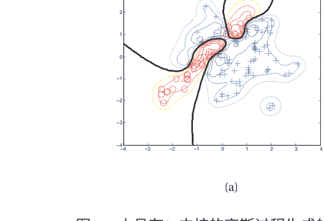

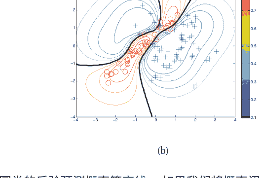

图15.7 由具有SE内核的高斯过程生成的红色圆类的后验预测概率等高线。 如果我们将概率阈值设为0.5，则厚黑线是决策边界。(a) 手动参数，短长度尺度。(b) 学习到的参数，长长度尺度。 由Carl Rasmussen的代码生成的图由gpcDemo2d生成。

## 15.3.2.1 计算后验概率

非归一化对数后验由以下公式给出

$$
\ell(\mathbf{f}) = -\frac{1}{2}\mathbf{f}^T\mathbf{K}^{-1}\mathbf{f} + \mathbf{y}^T\mathbf{f} - \sum_{i=1}^N \log \left( \sum_{c=1}^C \exp f_{ic} \right) - \frac{1}{2}\log \mid \mathbf{K} \mid - \frac{CN}{2}\log 2\pi
$$

其中

$$
\mathbf{f} = (f_{11}, \ldots, f_{N1}, f_{12}, \ldots, f_{N2}, \ldots, f_{1C}, \ldots, f_{NC})^T
$$

和 y是一个虚拟编码，其布局与 f相同。此外， K是一个包含 K_c的分块对角矩阵，其中 K_c = [\kappa_c(\mathbf{x}_i, \mathbf{x}_j)]模拟了 c的相关性。

梯度和海森矩阵如下所示

$$
\nabla\ell = -\mathbf{K}^{-1}\mathbf{f} + \mathbf{y} - \boldsymbol{\pi}
$$
$$
\nabla\nabla\ell = -\mathbf{K}^{-1} - \mathbf{W}
$$

其中 $\mathbf{W} \triangleq \text{diag}(\boldsymbol{\pi}) - \boldsymbol{\Pi}\boldsymbol{\Pi}^T$，其中 $\boldsymbol{\Pi}$是通过将 $\text{diag}(\boldsymbol{\pi}_{:c})$垂直堆叠而得到的 $CN \times N$矩阵。（将这些表达式与第8.3.7节中的标准逻辑回归进行比较。）

我们可以使用IRLS算法计算模式。牛顿步骤的形式如下

$$
\mathbf{f}^{\text{new}} = (\mathbf{K}^{-1} + \mathbf{W})^{-1}(\mathbf{W}\mathbf{f} + \mathbf{y} - \boldsymbol{\pi})
$$

Naively implementing this would take $O(C^3 N^3)$ time. 然而，我们可以将其减少到 $O(CN^3)$，如(Rasmussen and Williams 2006, p52)所示。

## 15.3.2.2 计算后验预测

我们可以以类似于第15.3.1.2节的方式计算后验预测。对于潜在响应的均值，我们有

$$
\mathbb{E}[f_{*c}] = \mathbf{k}_c(\mathbf{x}_*)^T\mathbf{K}_c^{-1}\hat{\mathbf{f}}_c = \mathbf{k}_c(\mathbf{x}_*)^T(\mathbf{y}_c - \hat{\boldsymbol{\pi}}_c)
$$

我们可以通过写成向量形式来表示

$$
\mathbb{E}[\mathbf{f}_*] = \mathbf{Q}_*^T(\mathbf{y} - \hat{\boldsymbol{\pi}})
$$

其中

$$
\mathbf{Q}_* = \begin{pmatrix} \mathbf{k}_1(\mathbf{x}_*) & \cdots & \mathbf{0} \\ & \ddots & \\ \mathbf{0} & \cdots & \mathbf{k}_C(\mathbf{x}_*) \end{pmatrix}
$$

使用类似于方程15.47的论证，我们可以证明潜在响应的协方差由以下给出

$$
\text{cov}[\mathbf{f}_*] = \boldsymbol{\Sigma} + \mathbf{Q}_*^T\mathbf{K}^{-1}(\mathbf{K}^{-1} + \mathbf{W})^{-1}\mathbf{K}^{-1}\mathbf{Q}_*
$$
$$
= \text{diag}(\mathbf{k}(\mathbf{x}_*, \mathbf{x}_*)) - \mathbf{Q}_*^T(\mathbf{K} + \mathbf{W}^{-1})^{-1}\mathbf{Q}_*
$$

其中 $\Sigma$ 是一个 $C \times C$ 对角矩阵，其中 $\Sigma_{cc} = \kappa_c(\mathbf{x}_*, \mathbf{x}_*) - \mathbf{k}^{Tc}(\mathbf{x}_*)\mathbf{K}_c^{-1}\mathbf{k}_c(\mathbf{x}_*)$, 且 $\mathbf{k}(\mathbf{x}_*, \mathbf{x}_*) = [\kappa_c(\mathbf{x}_*, \mathbf{x}_*)]$。
为了计算可见响应的后验预测，我们需要使用

$$
p(y \mid \mathbf{x}_*, \mathbf{X}, \mathbf{y}) \approx \int \mathrm{Cat}(y \mid \mathcal{S}(\mathbf{f}_*)) \mathcal{N}(\mathbf{f}_* \mid \mathbb{E}[\mathbf{f}_*], \mathrm{cov}[\mathbf{f}_*]) d\mathbf{f}_* \quad (15.72)
$$

我们可以使用在第21.8.1.1节讨论的任何确定性逼近方法来计算这个。 或者，我们可以使用蒙特卡洛方法。

## 15.3.2.3 计算边际似然

使用类似于二进制情况的论证，我们可以证明

$$
\log p(\mathbf{y} \mid \mathbf{X}) \approx -\frac{1}{2}\hat{\mathbf{f}}^T\mathbf{K}^{-1}\hat{\mathbf{f}} + \mathbf{y}^T\hat{\mathbf{f}} - \sum_{i=1}^N \log \left( \sum_{c=1}^C \exp \hat{f}_{ic} \right) - \frac{1}{2} \log \mid \mathbf{I}_{CN} + \mathbf{W}^{\frac{1}{2}}\mathbf{K}\mathbf{W}^{\frac{1}{2}} \mid \quad (15.73)
$$

这可以通过常规的数值优化方法进行优化。

## 15.3.2.4 数值和计算问题

可以使用(Rasmussen and Williams 2006, p50)中描述的技术，在 $O(TCN^3)$时间和 $O(CN^2)$空间内实现模型拟合，其中 $T$是牛顿迭代的次数。预测需要 $O(CN^3 + CN^2N_*)$时间，其中 $N_*$是测试案例的数量。

## 15.3.3 用于泊松回归的高斯过程

在本节中，我们将说明用于泊松回归的高斯过程。 这的一个有趣的应用是空间疾病映射。例如，(Vanhatalo et al. 2010)讨论了在芬兰不同地区建模心脏病发病率的问题。数据包括1996年至2000年芬兰心脏病发病情况，以20km x 20km的格子单元进行聚合。该模型具有以下形式：

$$
y_i \sim \mathrm{Poi}(e_i r_i) \quad (15.74)
$$

其中 $e_i$是已知的预期死亡人数（与细胞 $i$的人口和总死亡率有关），而 $r_i$是我们想要推断的细胞 $i$的相对风险。由于数据计数较小，我们通过与空间邻居共享信息来规范化问题。因此，我们假设 $f \triangleq \log(r) \sim \mathrm{GP}(0, \kappa)$，其中我们使用具有 $\nu= 3/2$的Matern核函数，并且从数据中估计出长度尺度和幅度。
图15.8给出了使用这种方法可以获得的输出示例，基于来自911个位置的数据。在左侧，我们绘制了后验均值相对风险（RR），在右侧，我们绘制了后验方差。我们可以看到东芬兰的相对风险（RR）较高，这与其他研究一致。我们还可以看到北部的方差较高，因为那里的居民较少。

图15.8 我们使用泊松GP展示了芬兰心脏病的相对风险。左侧：后验均值。右侧：后验方差。图由gpSpatialDemoLaplace生成，作者为Jarno Vanhatalo。

### 15.4 与其他方法的联系

统计学和机器学习中有许多与GP回归/分类密切相关的其他方法。我们简要回顾了其中一些。

### 15.4.1 线性模型与GPs的比较

考虑具有$D$维特征的贝叶斯线性回归，其中权重的先验分布为$p(\mathbf{w})=\mathcal{N}(\mathbf{0},\boldsymbol{\Sigma})$。后验预测分布如下所示：

$$\begin{align}
p(f_*|\mathbf{x}_*, \mathbf{X}, \mathbf{y}) &= \mathcal{N}(\mu, \sigma^2) \tag{15.75} \\
\mu &= \frac{1}{\sigma_y^2}\mathbf{x}_*^T\mathbf{A}^{-1}\mathbf{X}^T\mathbf{y} \tag{15.76} \\
\sigma^2 &= \mathbf{x}_*^T\mathbf{A}^{-1}\mathbf{x}_* \tag{15.77}
\end{align}$$

可以证明我们可以将上述分布重写为如下：

$$\begin{align}
\mu &= \mathbf{x}_*^T\boldsymbol{\Sigma}\mathbf{X}^T(\mathbf{K}+\sigma_y^2\mathbf{I})^{-1}\mathbf{y} \tag{15.78} \\
\sigma^2 &= \mathbf{x}_*^T\boldsymbol{\Sigma}\mathbf{x}_* - \mathbf{x}_*^T\boldsymbol{\Sigma}\mathbf{X}^T(\mathbf{K}+\sigma_y^2\mathbf{I})^{-1}\mathbf{X}\boldsymbol{\Sigma}\mathbf{x}_* \tag{15.79}
\end{align}$$

我们定义$\mathbf{K}=\mathbf{X}\boldsymbol{\Sigma}\mathbf{X}^T$，其大小为$N\times N$。由于特征只以$\mathbf{X}\boldsymbol{\Sigma}\mathbf{X}^T$，$\mathbf{x}_*^T\boldsymbol{\Sigma}\mathbf{X}^T$或者$\mathbf{x}_*^T\boldsymbol{\Sigma}\mathbf{x}_*$的形式出现，我们可以通过定义$\kappa(\mathbf{x},\mathbf{x}')=\mathbf{x}^T\boldsymbol{\Sigma}\mathbf{x}'$来将上述表达式核化。

因此，我们可以看到贝叶斯线性回归等价于具有协方差函数$\kappa(\mathbf{x},\mathbf{x}')=\mathbf{x}^T\boldsymbol{\Sigma}\mathbf{x}'$。然而需要注意的是，这是一个退化的协方差函数，因为它最多有$D$个非零特征值。直观上，这反映了模型只能表示有限数量的函数。这可能导致欠拟合，因为模型不够灵活以捕捉数据。更糟糕的是，这可能导致过度自信，因为模型的先验信息非常贫乏，导致其后验信息过于集中。因此，模型不仅错误，而且它认为自己是正确的！

#### 15.4.2 线性平滑器与高斯过程的比较

线性平滑器是一个回归函数，它是训练输出的线性函数：

$$\hat{f}(\mathbf{x}_*) = \sum_i w_i(\mathbf{x}_*) y_i \tag{15.80}$$

其中 $w_i(\mathbf{x}_*)$被称为权重函数(Silverman 1984)。(不要将其与线性模型混淆，其中输出是输入向量的线性函数。)

有各种线性平滑器，例如核回归（第14.7.4节），局部加权回归（第14.7.5节），平滑样条（第15.4.6节）和GP回归。为了看到GP回归是一个线性平滑器，注意GP的后验预测分布的均值由以下给出：

$$\bar{f}(\mathbf{x}_*) = \mathbf{k}_*^T (\mathbf{K} + \sigma_y^2 \mathbf{I}_N)^{-1} \mathbf{y} = \sum_{i=1}^N y_i w_i(\mathbf{x}_*) \tag{15.81}$$

其中 $w_i(\mathbf{x}_*) = [(\mathbf{K} + \sigma_y^2 \mathbf{I}_N)^{-1} \mathbf{k}_*]_i$。

在核回归中，我们从平滑核函数中推导出权重函数，而不是从Mercer核函数中推导出权重函数，因此可以清楚地看到权重函数具有局部支持。在GP的情况下，情况并不那么明确，因为权重函数取决于 $\mathbf{K}$ 的逆。对于某些GP核函数，我们可以解析地推导出 $w_i(\mathbf{x}_*)$ 的形式，这被称为等效核(Silverman 1984)。可以证明 $\sum_{i=1}^N w_i(\mathbf{x}_*) = 1$，尽管我们可能有 $w_i(\mathbf{x}_*) < 0$，所以我们计算的是线性组合而不是凸组合的 $y_i$'s。更有趣的是，$w_i(\mathbf{x}_*)$ 是一个局部函数，即使GP使用的原始核函数不是局部的。此外，GP的等效核的有效带宽会随着样本大小 $N$ 的增加而自动减小，而在核平滑中，带宽 $h$ 需要手动设置以适应 $N$。详细信息请参见(Rasmussen and Williams 2006, 第2.6节，第7.1节)。

#### 线性平滑器的自由度

很明显为什么这个方法被称为“线性”，但为什么被称为“平滑器”呢？这最好通过高斯过程来解释。考虑对训练集的预测：

$$\bar{\mathbf{f}} = \mathbf{K}(\mathbf{K} + \sigma_y^2)^{-1} \mathbf{y} \tag{15.82}$$

现在让 $\mathbf{K}$进行特征分解 $\mathbf{K} = \sum_{i=1}^N \lambda_i \mathbf{u}_i \mathbf{u}_i^T$。由于 $\mathbf{K}$是实数且对称正定的，特征值 $\lambda_i$ 是实数且非负，特征向量 $\mathbf{u}_i$是正交的。现在让 $\mathbf{y} = \sum_{i=1}^N \gamma_i \mathbf{u}_i$，其中 $\gamma_i = \mathbf{u}_i^T \mathbf{y}$。然后我们可以将上述方程重写为：

$$\bar{\mathbf{f}} = \sum_{i=1}^N \frac{\gamma_i \lambda_i}{\lambda_i + \sigma_y^2} \mathbf{u}_i \tag{15.83}$$

这与方程7.47相同，只是我们使用Gram矩阵 K的特征向量而不是数据矩阵 X。无论如何，解释是相似的：如果 λ_i << σ_y^2 ，那么相应的基函数 u_i 将不会有太大影响。因此， y中的高频分量被平滑掉了。线性平滑器的有效自由度定义为

$$\text{dof} \triangleq \text{tr}(\mathbf{K}(\mathbf{K} + \sigma_y^2 \mathbf{I})^{-1}) = \sum_{i=1}^{N} \frac{\lambda_i}{\lambda_i + \sigma_y^2} \tag{15.84}$$

这指定了曲线的“波动性”。

### 15.4.3 SVM与GP的比较

我们在第14.5.2节中看到，二元分类的SVM目标由方程14.57给出。

$$J(\mathbf{w}) = \frac{1}{2} \|\mathbf{w}\|^2 + C \sum_{i=1}^{N} (1 - y_i f_i)_+ \tag{15.85}$$

我们还从方程14.59中知道，最优解的形式为 w = \sum_i \alpha_i \mathbf{x}_i ，所以 \|\mathbf{w}\|^2 = \sum_{i,j} \alpha_i \alpha_j \mathbf{x}_i^T \mathbf{x}_j 。核化后，我们得到 \|\mathbf{w}\|^2 = \boldsymbol{\alpha}^T \mathbf{K} \boldsymbol{\alpha} 。根据方程14.61，并将 \hat{w}_0 项吸收到其中一个核函数中，我们有 \mathbf{f} = \mathbf{K}\boldsymbol{\alpha} ，所以 \|\mathbf{w}\|^2 = \mathbf{f}^T \mathbf{K}^{-1} \mathbf{f} 。因此，SVM目标可以重写为

$$J(\mathbf{f}) = \frac{1}{2} \mathbf{f}^T \mathbf{f} + C \sum_{i=1}^{N} (1 - y_i f_i)_+ \tag{15.86}$$

将其与GP分类器的MAP估计进行比较：

$$J(\mathbf{f}) = \frac{1}{2} \mathbf{f}^T \mathbf{f} - \sum_{i=1}^{N} \log p(y_i | f_i) \tag{15.87}$$

我们很容易地认为，通过找出与铰链损失等效的似然函数，我们可以将SVM“转换”为GP。然而，事实证明没有这样的似然函数（Sollich2002），尽管有一个与SVM匹配的伪似然函数（见第14.5.5节）。从图6.7中，我们可以看到铰链损失和逻辑损失（以及概率损失）非常相似。主要区别在于，对于大于1的错误，铰链损失严格为0。这导致了一个稀疏解。在第14.3.2节中，我们讨论了导出稀疏核机器的其他方法。我们将在下面讨论这些方法与GPs之间的联系。

### 15.4.4 LIVM和RVM与GPs相比

稀疏核机器只是具有基函数扩展形式 \phi(\mathbf{x}) = [\kappa(\mathbf{x}, \mathbf{x}_1), \dots, \kappa(\mathbf{x}, \mathbf{x}_N)] 的线性模型。从第15.4.1节我们知道，这等价于具有以下核函数的GP：

$$\kappa(\mathbf{x}, \mathbf{x}') = \sum_{j=1}^{D} \frac{1}{\alpha_j} \phi_j(\mathbf{x}) \phi_j(\mathbf{x}') \tag{15.88}$$

#### 15.4.5 神经网络与高斯过程的比较

在第16.5节中，我们将讨论神经网络，它是广义线性模型的非线性推广。在二分类情况下，神经网络由逻辑回归模型应用于逻辑回归模型定义：

$$p(y|\mathbf{x}, \boldsymbol{\theta}) = \text{伯努利分布}(y|\mathrm{sigm}(\mathbf{w}^T \mathrm{sigmoid}(\mathbf{V}\mathbf{x}))) \qquad (15.89)$$

事实证明，神经网络和高斯过程之间存在有趣的联系，最早由 (Neal 1996) 指出。

为了解释这种联系，我们遵循 (Rasmussen and Williams 2006, p91) 的介绍。考虑一个具有一个隐藏层的回归神经网络。它的形式为

$$p(y|\mathbf{x}, \boldsymbol{\theta}) = \mathcal{N}(y|f(\mathbf{x}; \boldsymbol{\theta}), \sigma^2) \qquad (15.90)$$

其中

$$f(\mathbf{x}) = b + \sum_{j=1}^{H} v_j g(\mathbf{x}; \mathbf{u}_j) \qquad (15.91)$$

其中 $b$ 是偏置项的偏移量，$v_j$ 是从隐藏单元 $j$ 到响应变量 $y$ 的输出权重，$\mathbf{u}_j$ 是从输入变量 $\mathbf{x}$ 到单元 $j$ 的输入权重，$g()$ 是隐藏单元的激活函数。通常情况下，这是sigmoid函数或tanh函数，但也可以是任何平滑函数。

让我们对权重使用以下先验分布：其中 $b\sim \mathcal{N}(0, \sigma_b^2)$， $\mathbf{v} \sim \prod_j \mathcal{N}(v_j|0, \sigma_w^2)$， $\mathbf{u} \sim \prod_j p(\mathbf{u}_j)$ 对于某些未指定的 $p(\mathbf{u}_j)$。将所有权重表示为 $\boldsymbol{\theta}$，我们有

$$\mathbb{E}_{\boldsymbol{\theta}}[f(\mathbf{x})] = 0 \qquad (15.92)$$

$$\mathbb{E}_{\boldsymbol{\theta}}[f(\mathbf{x})f(\mathbf{x}')] = \sigma_b^2 + \sum_{j} \sigma_v^2 \mathbb{E}_{\mathbf{u}_j}[g(\mathbf{x}; \mathbf{u}_j)g(\mathbf{x}'; \mathbf{u}_j)] \qquad (15.93)$$

$$= \sigma_b^2 + H \sigma_v^2 \mathbb{E}_{\mathbf{u}}[g(\mathbf{x}; \mathbf{u})g(\mathbf{x}'; \mathbf{u})] \qquad (15.94)$$

其中最后一个等式是因为 $H$ 隐藏单元是独立同分布的。如果我们让 $\sigma_v^2$ 按照 $\omega^2/H$ 进行缩放（因为更多的隐藏单元会增加到最终节点的输入，所以我们应该缩小权重的幅度），那么最后一项变为 $\omega^2 \mathbb{E}_{\mathbf{u}}[g(\mathbf{x}; \mathbf{u})g(\mathbf{x}'; \mathbf{u})]$。这是对 $H$ 独立同分布随机变量的求和。假设 $g$ 是有界的，我们可以应用中心极限定理。结果是，当 $H \rightarrow \infty$ 时，我们得到一个高斯过程。

如果我们使用作为激活/传递函数的 $g(\mathbf{x}; \mathbf{u}) = \text{erf}(u_0 + \sum_{j=1}^{D} u_j x_j)$，其中$\text{erf}(z) = 2/\sqrt{\pi} \int_0^z e^{-t^2} dt$，如果我们选择 $\mathbf{u} \sim \mathcal{N}(\mathbf{0}, \boldsymbol{\Sigma})$，那么(Williams 1998)表明协方差核函数的形式为

$$\kappa_{NN}(\mathbf{x}, \mathbf{x}') = \frac{2}{\pi} \sin^{-1} \left( \frac{2 \tilde{\mathbf{x}}^T \boldsymbol{\Sigma} \tilde{\mathbf{x}}'}{\sqrt{(1 + 2 \tilde{\mathbf{x}}^T \boldsymbol{\Sigma} \tilde{\mathbf{x}})(1 + 2 (\tilde{\mathbf{x}}')^T \boldsymbol{\Sigma} \tilde{\mathbf{x}}')}} \right) \tag{15.95}$$

其中 $\tilde{\mathbf{x}} = (1, x_1, \ldots, x_D)$。这是一个真正的“神经网络”核函数，不像“sigmoid”核函数 $\kappa(\mathbf{x}, \mathbf{x}') = \tanh(a + b \mathbf{x}^T \mathbf{x}')$，它不是正定的。

图15.9(a)展示了当 $D=2$ 和 $\boldsymbol{\Sigma} = \text{diag}(\sigma_0^2, \sigma^2)$ 时的核函数。图15.9(b)展示了从相应高斯过程中采样的一些函数。这些函数等价于 $\text{erf}(u_0 + u x)$ 的叠加，其中 $u_0$ 和 $u$ 是随机的。当 $\sigma^2$ 增加时，$u$ 的方差增加，因此函数变化更快。与RBF核函数不同，从这个核函数中采样的函数不会在数据之外趋近于0，而是会保持在数据“边缘”处的相同值。

现在假设我们使用RBF网络，它等价于一个隐藏单元激活函数的形式 $g(\mathbf{x}; \mathbf{u}) = \exp(-|\mathbf{x} - \mathbf{u}|^2 / (2\sigma_g^2))$。如果 $\mathbf{u} \sim \mathcal{N}(\mathbf{0}, \sigma_u^2 \mathbf{I})$，可以证明相应的核函数等价于RBF或SE核。

### 15.4.6 平滑样条与GPs的比较 *

平滑样条是一种广泛使用的非参数方法，用于平滑插值数据(Green and Silverman 1994)。正如我们将看到的，它们是GPs的特例。通常在输入是1或2维时使用。

#### 15.4.6.1 一元样条

基本思想是通过最小化与数据的差异加上平滑项来拟合函数 $f$，该平滑项惩罚“过于波动”的函数。如果我们惩罚 $m$ 阶导数，目标变为

$$J(f) = \sum_{i=1}^{N} (f(x_i) - y_i)^2 + \lambda \int (\frac{d^m}{dx^m} f(x))^2 dx \tag{15.96}$$

可以证明（Green和Silverman 1994）解是分段多项式，其中多项式在内部区间 $[x_{i-1}, x_i]$（表示为 $\mathcal{I}$）中的阶数为 $2m-1$，并且在两个最外层区间 $(-\infty, x_1]$和 $[x_N, \infty)$中的阶数为 $m-1$：

$$f(x) = \sum_{j=0}^{m-1} \beta_j x^j + \mathbb{I}(x \in \mathcal{I}) \left( \sum_{i=1}^{N} \alpha_i (x - x_i)_{+}^{2m-1} \right) + \mathbb{I}(x \notin \mathcal{I}) \left( \sum_{i=1}^{N} \alpha_i (x - x_i)_{+}^{m-1} \right) \tag{15.97}$$

例如，如果 $m = 2$，我们得到（自然）**三次样条**

$$f(x) = \beta_0 + \beta_1 x + \mathbb{I}(x \in \mathcal{I}) \left( \sum_{i=1}^{N} \alpha_i (x - x_i)_{+}^{3} \right) + \mathbb{I}(x \notin \mathcal{I}) \left( \sum_{i=1}^{N} \alpha_i (x - x_i)_{+} \right) \tag{15.98}$$

这是一系列截断的三次多项式，其左侧位于每个$N$训练点。（模型在边缘上是线性的，这样可以防止它在数据范围之外过度外推；如果我们放弃这个要求，我们将得到一个“无限制”的样条。）

我们可以使用岭回归来明确拟合这个模型：$\hat{\mathbf{w}} = (\mathbf{\Phi}^T \mathbf{\Phi} + \lambda \mathbf{I}_N)^{-1} \mathbf{\Phi}^T \mathbf{y}$，其中 $\mathbf{\Phi}$的列为$1$, $x_i$和$(x - x_i)_{+}^{3}$对于$i = 2: N-1$和$(x - x_i)_{+}$对于$i = 1$或$i = N$。然而，我们还可以推导出一个 $O(N)$ 时间复杂度的方法（Green和Silverman 1994, 第2.3.3节）。

#### 15.4.6.2 回归样条

一般来说，我们可以将多项式放置在一个固定的 $K$位置上，称为节点，表示为$\xi_k$。结果被称为回归样条。这是一个参数模型，它使用以下形式的基函数扩展（为简单起见，我们省略了内部/外部区分）：

$$f(x) = \beta_0 + \beta_1 x + \sum_{k=1}^{K} \alpha_j (x - \xi_k)_{+}^{3} \tag{15.99}$$

选择节点的数量和位置就像在第14.3.2节中选择支持向量的数量和值一样。如果我们对回归系数$\alpha_j$施加 $\ell_2$正则化，则该方法被称为**惩罚样条**。请参阅第9.6.1节，了解惩罚样条的实际示例。

#### 15.4.6.3 与GPs的连接

可以证明（Rasmussen和Williams 2006，p139）立方样条是以下函数的MAP估计

$$f(x) = \beta_0 + \beta_1 x + r(x) \tag{15.100}$$其中 $p (\beta_j) \propto 1$（以便我们不惩罚 $f$ 的零和一阶导数），而 $r (x) \sim \text{GP}(0, \sigma_f^2 \kappa_{sp}(x, x'))$，其中

$\kappa_{sp}(x, x') \triangleq \int_{0}^{1} (x-u)_{+}(x'-u)_{+}du$

请注意，方程15.101中的核函数相当不自然，因此从结果GP中得到的后验样本相当不平滑。然而，后验模态/均值是平滑的。这表明正则化项并不总是好的先验。

### 15.4.6.4 2D输入（薄板样条）

可以通过定义以下形式的正则化项将三次样条推广到2D输入：

$\iint \left[ \left( \frac{\partial^2 f(x)}{\partial x_1^2} \right)^2 + 2 \left( \frac{\partial^2 f(x)}{\partial x_1 \partial x_2} \right)^2 + \left( \frac{\partial^2 f(x)}{\partial x_2^2} \right)^2 \right] dx_1 dx_2$

可以证明，解的形式为

$f(x) = \beta_0 + \beta_1^T x + \sum_{i=1}^N \alpha_i \phi_i(x)$

这被称为薄板样条。这等价于具有在（Williams和Fitzgibbon 2006）中定义的核的MAP估计。

### 15.4.6.5 高维输入

当使用高阶输入时，很难解析地求解最优解的形式。然而，在参数回归样条设置中，我们放弃对$f$的正则化器，我们在定义基函数时有更多的自由。处理多个输入的一种方法是使用张量积基函数，定义为1d基函数的叉积。例如，对于2d输入，我们可以定义

$f(x_1, x_2) = \beta_0 + \sum_{m} \beta_{1m} (x_1 - \xi_{1m})_{+} + \sum_{m} \beta_{2m} (x_2 - \xi_{2m})_{+}$

$+ \sum_{m} \beta_{12m} (x_1 - \xi_{1m})_{+}(x_2 - \xi_{2m})_{+}$

很明显，对于高维数据，我们不能允许高阶交互，因为参数太多了。解决这个问题的一种方法是使用搜索过程来寻找有用的交互项。这被称为MARS，代表“多元自适应回归样条”。详细信息请参见第16.3.3节。

### 15.4.7 RKHS方法与GPs的比较 *

我们可以推广函数导数的惩罚思想，就像平滑样条中使用的那样，来拟合具有更一般平滑性概念的函数。回顾第14.2.3节中提到的Mercer定理表明任何正定核函数都可以用特征函数表示：

$$\kappa(\mathbf{x}, \mathbf{x}') = \sum_{i=1}^{\infty} \lambda_i \phi_i(\mathbf{x}) \phi_i(\mathbf{x}')$$

The $\phi_i$ form an orthonormal basis for a function space:

$$\mathcal{H}_k = \left\{ f : f(\mathbf{x}) = \sum_{i=1}^{\infty} f_i \phi_i(\mathbf{x}), \sum_{i=1}^{\infty} f_i^2 / \lambda_i < \infty \right\}$$

现在定义两个函数之间的内积 $f(\mathbf{x}) = \sum_{i=1}^{\infty} f_i \phi_i(\mathbf{x})$ 和 $g(\mathbf{x}) = \sum_{i=1}^{\infty} g_i \phi_i(\mathbf{x})$ 在这个空间中如下:

$$\langle f, g \rangle_{\mathcal{H}} \triangleq \sum_{i=1}^{\infty} \frac{f_i g_i}{\lambda_i}$$

在练习15.1中，我们证明了这个定义意味着

$$\langle \kappa(\mathbf{x}_1, \cdot), \kappa(\mathbf{x}_2, \cdot) \rangle_{\mathcal{H}} = \kappa(\mathbf{x}_1, \mathbf{x}_2)$$

这被称为再生性质，函数空间 $\mathcal{H}_k$被称为再生核希尔伯特空间或 **RKHS**。

现在考虑一个形式为的优化问题

$$J(f) = \frac{1}{2\sigma_y^2} \sum_{i=1}^{N} (y_i - f(\mathbf{x}_i))^2 + \frac{1}{2} \| f \|^2_{\mathcal{H}}$$

其中 $\| f \|_{\mathcal{H}}$是函数的范数:

$$\| f \|_{\mathcal{H}} = \langle f, f \rangle_{\mathcal{H}} = \sum_{i=1}^{\infty} \frac{f_i^2}{\lambda_i}$$

直观上，对于核函数而言，复杂的函数会有较大的范数，因为它们需要许多特征函数来表示。我们希望选择一个简单的函数来很好地拟合数据。

可以证明（参见例如，（Schoelkopf和Smola 2002）），解的形式必须为

$$f(\mathbf{x}) = \sum_{i=1}^{N} \alpha_i \kappa(\mathbf{x}, \mathbf{x}_i)$$

这被称为再现定理，对于其他凸损失函数也成立。

我们可以通过将 $\boldsymbol{\alpha}$代入 $f(\mathbf{x}) = \sum_{i=1}^{N} \alpha_i \kappa(\mathbf{x}, \mathbf{x}_i)$并使用再现性质来求解。

$$J(\boldsymbol{\alpha}) = \frac{1}{2\sigma_y^2} |\mathbf{y} - \mathbf{K}\boldsymbol{\alpha}|^2 + \frac{1}{2} \boldsymbol{\alpha}^T \mathbf{K} \boldsymbol{\alpha}$$

对 $\alpha$ 进行最小化，我们得到

$$\hat{\alpha} = (\mathbf{K} + \sigma_y^2\mathbf{I})^{-1} \mathbf{y}$$

因此

$$\hat{f}(\mathbf{x}_*) = \sum_i \hat{\alpha}_i \kappa(\mathbf{x}_*, \mathbf{x}_i) = \mathbf{k}_*^T (\mathbf{K} + \sigma_y^2\mathbf{I})^{-1} \mathbf{y}$$

这与方程15.18完全相同，即高斯过程预测分布的后验均值。 实际上，由于高斯分布的均值和众数相同，我们可以看到带有RKHS正则化器的线性回归等价于使用高斯过程的MAP估计。 类似的说法也适用于高斯过程逻辑回归情况，该情况下也使用凸似然函数/损失函数。

### 15.5 高斯过程潜变量模型

在第14.4.4节中，我们讨论了核PCA，它将核技巧应用于常规PCA。在本节中，我们讨论了一种不同的方法来结合核函数和概率PCA。得到的方法被称为“高斯过程潜变量模型”（Lawrence 2005）的GP-LVM。

为了解释这种方法，我们从PPCA开始。回顾一下第12.2.4节中的PPCA模型如下：

$$\begin{aligned} p(\mathbf{z}_i) &= \mathcal{N}(\mathbf{z}_i | \mathbf{0}, \mathbf{I}) \\ p(\mathbf{y}_i | \mathbf{z}_i, \boldsymbol{\theta}) &= \mathcal{N}(\mathbf{y}_i | \mathbf{W} \mathbf{z}_i, \sigma^2\mathbf{I}) \end{aligned}$$

我们可以通过最大似然法来拟合这个模型，通过积分掉 $\mathbf{z}_i$ 并最大化 $\mathbf{W}$ （和 $\sigma^2$ ）。 目标函数为

$$p(\mathbf{Y}|\mathbf{W}, \sigma^2) = (2\pi)^{-DN/2}|\mathbf{C}|^{-N/2} \exp\left(-\frac{1}{2}\mathrm{tr}(\mathbf{C}^{-1}\mathbf{Y}^T\mathbf{Y})\right)$$

正如我们在定理12.2.2中所示，这个最大似然估计可以通过 $\mathbf{Y}^T\mathbf{Y}$ 的特征向量来计算。

现在我们考虑对偶问题，即最大化 $\mathbf{Z}$ 并积分掉 $\mathbf{W}$ 。 我们将使用形式为 $p(\mathbf{W}) = \prod$ 的先验。相应的似然变为

$$\begin{aligned} p(\mathbf{Y}|\mathbf{Z}, \sigma^2) &= \prod_{d=1}^{D} \mathcal{N}(\mathbf{y}_{:,d} | \mathbf{0}, \mathbf{Z}\mathbf{Z}^T + \sigma^2\mathbf{I}) \\ &= (2\pi)^{-DN/2}|\mathbf{K}_z|^{-D/2} \exp\left(-\frac{1}{2}\mathrm{tr}(\mathbf{K}_z^{-1}\mathbf{Y}\mathbf{Y}^T)\right) \end{aligned}$$

根据我们在第14.4.4节中对 $\mathbf{Y}\mathbf{Y}^T$ 和 $\mathbf{Y}^T\mathbf{Y}$ 的特征值之间的联系的讨论，我们也可以使用特征值方法来解决对偶问题（有关详细信息，请参见 (Lawrence 2005) ）。

如果我们使用线性核函数，我们可以恢复PCA。但我们也可以使用更一般的核函数：$\mathbf{K}_z = \mathbf{K} + \sigma^2\mathbf{I}$，其中 $\mathbf{K}$ 是 $\mathbf{Z}$ 的格拉姆矩阵。 对于 $\mathbf{Z}$ 的MLE将不再可用通过特征值方法无法解决；我们必须使用基于梯度的优化方法。目标函数为

$$ \ell = -\frac{D}{2} \log |\mathbf{K}_z| - \frac{1}{2} \text{tr}(\mathbf{K}_z^{-1} \mathbf{Y} \mathbf{Y}^T) $$

梯度为

$$ \frac{\partial \ell}{\partial Z_{ij}} = \frac{\partial \ell}{\partial \mathbf{K}_z} \frac{\partial \mathbf{K}_z}{\partial Z_{ij}} $$

哪里

$$ \frac{\partial \ell}{\partial \mathbf{K}_z} = \mathbf{K}_z^{-1} \mathbf{Y} \mathbf{Y}^T \mathbf{K}_z^{-1} - D \mathbf{K}_z^{-1} $$

$\frac{\partial}{\partial Z_{ij}} \mathbf{K}_z$的形式——当然取决于所使用的核函数。（例如，使用线性核函数时，其中 $\mathbf{K}_z = \mathbf{Z} \mathbf{Z}^T + \sigma^2 \mathbf{I}$，我们有 $\frac{\partial}{\partial Z_{ij}} \mathbf{K}_z = \mathbf{Z}_i$。）然后，我们可以将这个梯度传递给任何标准的优化器，例如共轭梯度下降。

现在让我们将GP-LVM与核PCA进行比较。在核PCA中，我们学习从观测空间到潜在空间的核化映射，而在GP-LVM中，我们学习从潜在空间到观测空间的核化映射。图15.10展示了将kPCA和GP-LVM应用于可视化图中所示的12维油流数据的结果。我们可以看到，GP-LVM产生的嵌入效果更好。如果我们在潜在空间中进行最近邻分类，GP-LVM会产生4个错误，而核PCA（使用相同的核函数但分别优化的超参数）会产生13个错误，常规PCA会产生20个错误。GP-LVM继承了概率生成模型的通常优势，例如处理缺失数据和不同类型数据的能力，使用基于梯度的方法（而不是网格搜索）来调整核参数的能力，处理先验信息的能力等等。 关于 （光谱）维度降低的其他一些概率方法的讨论，请参见 （Lawrence 2012） .

### 15.6 大数据集的近似方法

GP的主要缺点是使用时间复杂度为 $O(N^3)$。这是因为需要求逆（或计算 $N \times N$ 核矩阵 K的乔列斯基分解）。已经设计了各种近似方法，其使用时间复杂度为 $O(M^2 N)$，其中 M是用户可指定的参数。 详细信息请参见 （Quinonero-Candela et al. 2007） .

### 练习

- 练习 15.1 再生性质
- 证明方程式 15.109.

## 16 自适应基函数模型

### 16.1 引言

在第14章和第15章中，我们讨论了核方法，它们为回归和分类提供了一种强大的非线性模型创建方式。预测的形式为 $f(\mathbf{x}) = \mathbf{w}^T \phi(\mathbf{x})$，其中我们定义

$\phi(\mathbf{x}) = [\kappa(\mathbf{x}, \boldsymbol{\mu}_1), \ldots, \kappa(\mathbf{x}, \boldsymbol{\mu}_N)]$

其中 $\mu_k$ 可以是所有训练数据或某个子集。这种形式的模型本质上执行一种模板匹配，它将输入 $\mathbf{x}$ 与存储的原型 $\mu_k$ 进行比较。

尽管这种方法可以很好地工作，但它依赖于一个好的核函数来衡量数据向量之间的相似性。通常，找到一个好的核函数是相当困难的。例如，我们如何定义两个图像之间的相似性？逐像素比较强度（这是高斯核对应的内容）效果不好。虽然手工设计特定任务的核函数是可能的（见第14.2.7节中的金字塔匹配核函数），但如果我们能够学习核函数将更有趣。在第15.2.4节中，我们讨论了一种通过最大化边际似然来学习核函数参数的方法。例如，如果我们使用ARD核函数，

$\kappa(\mathbf{x}, \mathbf{x}') = \theta_0 \exp \left( -\frac{1}{2} \sum_{j=1}^{D} \theta_j (x_j - x'_j)^2 \right)$

我们可以估计 $\theta_j$，并且执行一种非线性特征选择的形式。然而，这些方法可能计算成本高昂。另一种方法，称为多核学习（参见例如，(Rakotomamonjy et al. 2008)），使用基础核的凸组合。$\kappa(\mathbf{x}, \mathbf{x}') = \sum_j w_j \kappa_j(\mathbf{x}, \mathbf{x}')$，然后估计混合权重 $w_j$。但这依赖于拥有良好的基础核（而且计算成本也很高）。

另一种替代方法是完全放弃核函数，并尝试直接从输入数据中学习有用的特征 $\phi(\mathbf{x})$。也就是说，我们将创建一个称为自适应基函数模型（ABM）的模型，其形式为

$f(\mathbf{x}) = w_0 + \sum_{m=1}^{M} w_m \phi_m(\mathbf{x})$

其中 $\phi_m(\mathbf{x})$ 是第 $m$ 个基函数，是从数据中学习得到的。这个框架涵盖了我们在本章中讨论的所有模型。通常基函数是参数化的，所以我们可以写成 $\phi_m(\mathbf{x}) = \phi(\mathbf{x}; \mathbf{v}_m)$，其中 $\mathbf{v}_m$ 是基函数本身的参数。我们将使用 $\theta = (w_0, \mathbf{w}_{1:M}, \{\mathbf{v}_m\}_{m=1}^M)$ 来表示整个参数集。由此得到的模型不再是线性参数模型，因此我们只能计算 $\theta$ 的局部最优MLE或MAP估计。然而，这样的模型通常比线性模型表现更好，我们将会看到。

### 16.2 分类和回归树（CART）

分类和回归树或CART模型，也称为决策树（与决策理论中使用的决策树不同），通过递归地划分输入空间，在每个划分的输入空间中定义一个局部模型。这可以用一棵树来表示，每个区域对应一个叶子节点，如下所述。

#### 16.2.1 基础知识

为了解释CART方法，考虑图16.1(a)中的树。第一个节点询问是否 $x_1$ 小于某个阈值 $t_1$。如果是，我们再询问 $x_2$ 是否小于另一个阈值 $t_2$。如果是，我们就在空间的左下象限 $R_1$ 中。如果不是，我们再询问 $x_1$ 是否小于 $t_3$。等等。这些轴平行的划分将 $2$D空间划分为5个区域，如图16.1(b)所示。现在，我们可以为每个区域关联一个平均响应，得到图16.1(c)中的分段常数曲面。我们可以用以下形式表示模型。

$$f(\mathbf{x}) = \mathbb{E}[y|\mathbf{x}] = \sum_{m=1}^{M} w_m \mathbb{I}(\mathbf{x} \in R_m) = \sum_{m=1}^{M} w_m \phi(\mathbf{x}; \mathbf{v}_m) \quad (16.4)$$

其中 $R_m$ 是第 $m$ 个区域，$w_m$ 是该区域的平均响应，$\mathbf{v}_m$ 编码了从根节点到第 $m$ 个叶子节点的变量选择和阈值。 这清楚地表明CART模型只是一个自适应基函数模型，其中基函数定义了区域，权重指定了每个区域的响应值。 我们将在下面讨论如何找到这些基函数。

我们可以通过在每个叶子节点存储类标签的分布来将其推广到分类设置中，而不是平均响应。这在图16.2中有所说明。该模型可以用于对图1.1中的数据进行分类。例如，我们首先检查对象的颜色。如果是蓝色的，我们就跟随左分支，最终到达一个标记为“4,0”的叶子节点，这意味着我们有4个正例和0个负例与此条件匹配。因此，我们预测当 $\mathbf{x}$ 是蓝色时，$p(y=1|\mathbf{x}) = 4/4$。如果是红色的，我们再检查形状：如果是椭圆形，我们最终到达一个标记为“1,1”的叶子节点，因此我们预测 $p(y=1|\mathbf{x}) = 1/2$。如果是红色但不是椭圆形，我们预测 $p(y=1|\mathbf{x}) = 0/2$；如果是其他颜色，我们检查大小：如果小于10，我们预测 $p(y=1|\mathbf{x}) = 4/4$，否则 $p(y=1|\mathbf{x}) = 0/5$。这些概率只是满足每个特征值组合的正例的经验比例，它定义了从根节点到叶子节点的路径。

## 16.2. 分类和回归树（CART）

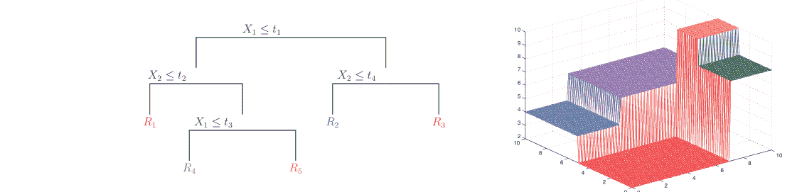

图16.1 两个输入的简单回归树。基于 (Hastie et al. 2009) 的图9.2。由 regtreeSurfaceDemo 生成的图。

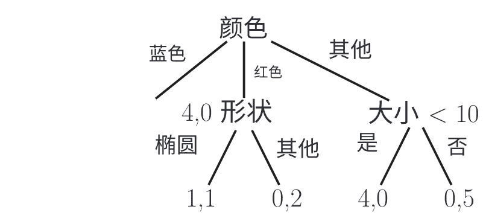

图16.2 图1.1中的简单决策树。标记为（n1, n0）的叶子表示有 n1 个匹配该路径的正例和 n0 个负例。在这棵树中，大多数叶子是“纯净”的，意味着它们只有一个类别或另一个类别的示例；唯一的例外是表示红色椭圆的叶子，它具有标签分布（1, 1）。我们可以通过添加基于大小的进一步测试来区分正例和负例的红色椭圆。然而，由于过拟合，构建完全模拟训练数据的树并不总是可取的。

## 16.2.2 生长一棵树

寻找数据的最优分割是NP完全问题（Hyafil和Rivest 1976），因此通常使用贪婪算法6来计算局部最优MLE。这种方法被CART（Breiman等人1984）、C4.5（Quinlan 1993）和ID3（Quinlan 1986）等三种流行的实现方法所使用。（参见 dtfit 一个简单的Matlab实现。）

> split函数选择最佳特征和该特征的最佳值，如下所示：

$$
(j^*, t^*) = \arg \min_{j \in \{1,...,D\}} \min_{t \in \mathcal{T}_j} \text{cost}(\{\mathbf{x}_i, y_i: x_{ij} \leq t\}) + \text{cost}(\{\mathbf{x}_i, y_i: x_{ij} > t\}) \qquad (16.5)
$$

```
算法16.1：递归过程来构建一个分类/回归树
1 函数 fitTree(node, \mathcal{D}, depth) ;
2 node.prediction = mean(y_i : i \in \mathcal{D}) // 或者类别标签分布 ;
3 (j^*, t^*, \mathcal{D}_L, \mathcal{D}_R) = split(\mathcal{D}) ;
4 如果不值得分割(depth, cost, \mathcal{D}_L, \mathcal{D}_R)那么
5     返回节点
6 否则
7     node.test = \lambda x . x_{j^*} < t^* // 匿名函数 ;
8     node.left = fitTree(node, \mathcal{D}_L, depth+1) ;
9     node.right = fitTree(node, \mathcal{D}_R, depth+1) ;
10     返回节点 ;
```

给定数据集的成本函数将在下面定义。为了简化符号，我们假设所有输入都是实数或有序的，因此将特征 x_{ij} 与数值 t 进行比较是有意义的。特征 j 的可能阈值集合 \mathcal{T}_j 可以通过对 x_{ij} 的唯一值进行排序获得。例如，如果特征1具有值 \{4.5, -12, 72, -12\}，则我们设置 \mathcal{T}_1 = \{-12, 4.5, 72\}。对于分类输入，最常见的方法是考虑形如 x_{ij} = c_k 和 x_{ij} \neq c_k 的分割，其中 c_k 是可能的类别标签。虽然我们可以允许多路分割（导致非二叉树），但这将导致数据碎片化，意味着太少的数据可能会“落入”每个子树，从而导致过拟合。

检查节点是否值得分割的函数可以使用几个停止启发式方法，例如以下方法：

-   成本减少是否太小？通常，我们定义使用特征的收益为成本减少的归一化度量：
$$ \Delta \triangleq \text{成本}(\mathcal{D}) - \left( \frac{|\mathcal{D}_L|}{|\mathcal{D}|} \text{成本}(\mathcal{D}_L) + \frac{|\mathcal{D}_R|}{|\mathcal{D}|} \text{成本}(\mathcal{D}_R) \right) \tag{16.6} $$
-   树是否超过了最大期望深度？
-   响应在 \mathcal{D}_L 或 \mathcal{D}_R 中的分布是否足够均匀（例如，所有标签都相同，因此分布是纯净的）？
-   在 \mathcal{D}_L 或 \mathcal{D}_R 中的示例数量是否太少？

剩下的就是指定用于评估提议分割质量的成本度量。这取决于我们的目标是回归还是分类。我们在下面讨论这两种情况。

### 16.2.2.1 回归成本

在回归设置中，我们定义成本如下：

> $$ \text{成本}(\mathcal{D}) = \sum_{i \in \mathcal{D}} (y_i - \bar{y})^2 \tag{16.7} $$

其中 $\bar{y} = \frac{1}{|\mathcal{D}|} \sum_{i \in \mathcal{D}} y_i$ 是指定数据集中响应变量的均值。

或者，我们可以为每个叶子拟合一个线性回归模型，使用从根节点到叶子节点的路径上选择的特征作为输入，然后测量残差误差。

### 16.2.2.2 分类成本

在分类设置中，有几种方法可以衡量分割的质量。首先，我们对叶子节点中的数据拟合一个多项式模型，通过以下方式估计类条件概率：

$\hat{\pi}_c = \frac{1}{|\mathcal{D}|} \sum_{i \in \mathcal{D}} \mathbb{I}(y_i = c)$ \quad (16.8)

其中 $\mathcal{D}$ 是叶子节点中的数据。在此基础上，有几种常见的错误度量方法来评估提议的分割。

-   误分类率。我们将最有可能的类别标签定义为 $\hat{y}= \text{argmax}_c \hat{\pi}_c$。相应的错误率是
$$\frac{1}{|\mathcal{D}|} \sum_{i \in \mathcal{D}} \mathbb{I}(y_i \neq \hat{y}) = 1 - \hat{\pi}_{\hat{y}}$$ \quad (16.9)
-   熵，或偏差：
$$\mathbb{H}(\boldsymbol{\pi}) = - \sum_{c=1}^{C} \hat{\pi}_c \log \hat{\pi}_c$$ \quad (16.10)

注意，最小化熵等价于最大化信息增益 (Quinlan 1986)，即测试 $X_j < t$ 和类别标签 $Y$ 之间的差异，定义为

$$\text{infoGain}(X_j < t, Y) \triangleq \mathbb{H}(Y) - \mathbb{H}(Y|X_j < t)$$ \quad (16.11)
$$= \left( -\sum_{c} p(y = c) \log p(y = c) \right)$$ \quad (16.12)
$$+ \left( \sum_{c} p(y = c|X_j < t) \log p(y = c|X_j < t) \right)$$ \quad (16.13)

因为 $\hat{\pi}_c$ 是分布 $p(c|X_j < t)$ 的最大似然估计。$^1$

1.  如果 $X_j$ 是分类变量，并且我们使用 $X_j = k$ 的测试，那么对 $X_j$ 的值取期望值得到 $X_j$ 和 $Y$ 之间的互信息：$\mathbb{E} [\text{infoGain}(X_j, Y)] = \sum_k p(X_j = k) \text{infoGain}(X_j = k, Y) = H(Y) - H(Y|X_j) = \mathbb{I}(Y; X_j)$。

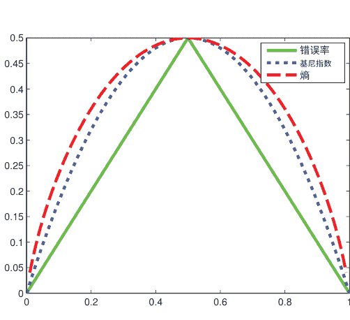

-   基尼指数

$$
\sum_{c=1}^C \hat{\pi}_c(1 - \hat{\pi}_c) = \sum_{c} \hat{\pi}_c - \sum_{c} \hat{\pi}_c^2 = 1 - \sum_{c} \hat{\pi}_c^2
$$

这是预期的错误率。要看到这一点，注意 $\hat{\pi}_c$ 是叶子节点中随机条目属于类别 $c$ 的概率，而 $(1 - \hat{\pi}_c)$ 是它被错误分类的概率。

在两类问题中，其中 $p = \hat{\pi}_1(1)$，误分类率为 $1 - \max(p, 1 - p)$，熵为 $H_2(p)$，基尼指数为 $2p(1 - p)$。这些在图16.3中绘制。我们可以看到交叉熵和基尼指数非常相似，并且对类别概率的变化更敏感，而误分类率则不太敏感。例如，考虑一个两类问题，每个类别有400个案例。假设一个分割创建了节点(300,100)和(100,300)，而另一个分割创建了节点(200,400)和(200,0)。这两个分割产生了一个误分类率为0.25。然而，后者似乎更可取，因为其中一个节点是纯的，即只包含一个类别。交叉熵和基尼指数会偏好后者的选择。

### 16.2.2.3 示例

作为一个例子，考虑三类鸢尾花数据集中的四个特征之一，如图16.4(a)所示。生成的决策树如图16.5(a)所示，决策边界如图16.4(b)所示。我们可以看到，决策树非常复杂，决策边界也是如此。

在图16.5(b)中，我们可以看到交叉验证误差估计远高于训练集误差，表明过拟合。下面我们将讨论如何进行树剪枝以简化决策树。

## 16.2. 分类和回归树（CART）

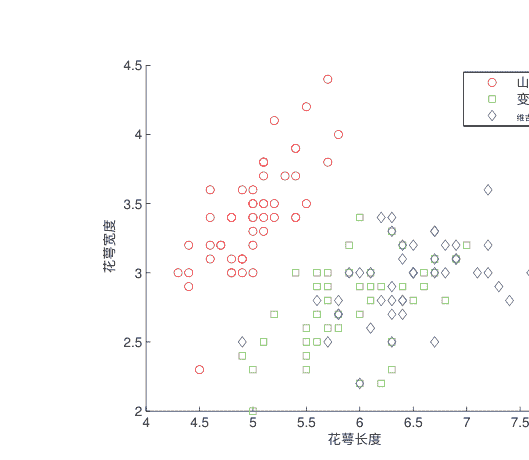

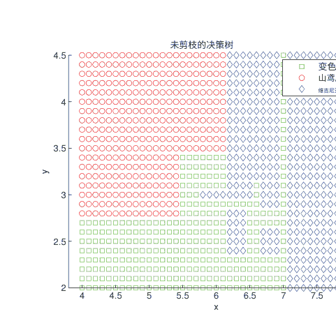

图16.4 (a) 鸢尾花数据。我们只展示了前两个特征，花萼长度和花萼宽度，并忽略了花瓣长度和花瓣宽度。(b) 决策树在图16.5(a)中引导的决策边界。

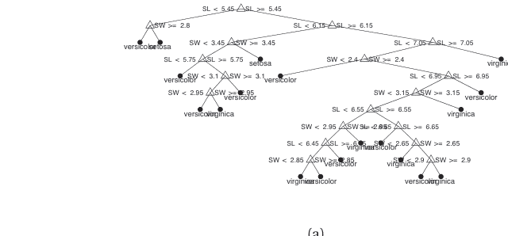

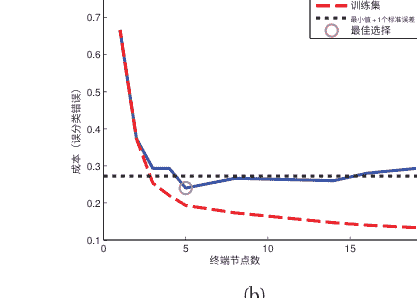

图16.5 (a) 鸢尾花数据的未修剪决策树。(b) 误分类错误率与树深度的图。由 dtreeDemoIris 生成的图。

## 16.2.3 剪枝树

为了防止过拟合，如果错误减少不足以证明添加额外子树的额外复杂性，则可以停止生长树。然而，这往往太短视了。例如，在图14.2(c)中的异或数据上，它可能永远不会进行任何分割，因为每个特征本身的预测能力很小。

因此，标准方法是先生成一个“完整”的树，然后进行剪枝。这可以通过一种修剪分支的方案来实现，该方案使错误增加最小。有关详细信息，请参见 (Breiman et al. 1984)。

为了确定要修剪多远，我们可以评估每个这样的子树的交叉验证错误，然后选择交叉验证错误在最小值的1个标准误差范围内的树。这在图16.4(b)中有所说明。具有最小交叉验证错误的点对应于图16.6(a)中的简单树。

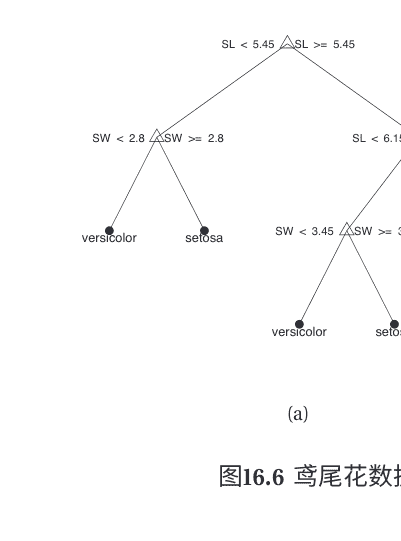

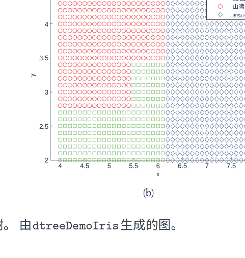

图16.6 鸢尾花数据的修剪决策树。由 dtreeDemoIris 生成的图。

#### 16.2.4 树的优缺点

CART模型之所以受欢迎有几个原因：它们易于解释²，可以轻松处理混合的离散和连续输入，对输入的单调变换不敏感（因为分割点是基于数据点的排名），可以自动选择变量，相对鲁棒性较强，适用于大型数据集，并且可以修改以处理缺失输入。³

然而，CART模型也有一些缺点。主要的一个是与其他类型的模型相比，它们的预测精度不高。这部分是由于树构建算法的贪婪性质。相关问题是树的不稳定性：输入数据的微小变化可能对树的结构产生较大影响，这是由于树生长过程的层次性质，导致顶部的错误影响整个树。在频率学派的术语中，我们说树是高方差的估计器。我们在下面讨论了解决方案。

#### 16.2.5 随机森林

减少估计方差的一种方法是将许多估计值取平均。例如，我们可以在数据的不同子集上随机选择训练 $M$ 个不同的树。

集成结果：

$$ f(\mathbf{x}) = \sum_{m=1}^{M} \frac{1}{M} f_m(\mathbf{x}) \quad (16.15) $$

其中 $f_m$ 是第 $m$ 棵树。这种技术被称为装袋 (Breiman 1996)，代表着“自助聚合”。

不幸的是，简单地在数据的不同子集上重新运行相同的学习算法可能导致高度相关的预测变量，这限制了可能的方差减少量。被称为随机森林 (Breiman 2001a) 的技术尝试通过学习基于随机选择的输入变量子集以及随机选择的数据案例子集的树来使基本学习器不相关。这种模型通常具有非常好的预测准确性 (Caruana and Niculescu-Mizil 2006)，并且已经在许多应用中广泛使用（例如，使用微软流行的Kinect传感器进行身体姿势识别 (Shotton et al. 2011)）。装袋是一种频率概念。也可以采用贝叶斯方法来学习树。特别是，(Chipman et al. 1998; Denison et al. 1998; Wu et al. 2007) 使用MCMC对树的空间（结构和参数）进行近似推断。这减少了预测的方差。我们还可以对树的集合空间进行贝叶斯推断，这往往效果更好。这被称为贝叶斯自适应回归树或 **BART** (Chipman et al. 2010)。请注意，这些基于采样的贝叶斯方法的成本与基于采样的随机森林方法相当。也就是说，这两种方法都训练速度较慢，但产生高质量的分类器。

不幸的是，使用多个树的方法（无论是从贝叶斯还是频率学派的观点出发）会失去它们良好的可解释性特性。幸运的是，可以应用各种后处理措施，如第16.8节所讨论的。

## 16.2.6 CART与分层专家混合比较 *

决策树的一个有趣的替代方案被称为分层专家混合。图11.7(b)给出了一个示例，其中我们有两个级别的专家。这可以被视为深度为2的概率决策树，因为我们递归地划分空间，并对每个划分应用不同的专家。Hastie等人 (Hastie et al. 2009, p331) 写道：“HME方法是CART树的一个有希望的竞争对手”。一些优点包括：

-   该模型可以使用任何一组嵌套线性决策边界来划分输入空间。相比之下，标准决策树受到轴平行分割的限制。
-   模型通过对所有专家进行平均来进行预测。相比之下，在标准决策树中，预测仅基于相应叶子节点中的模型。由于叶子节点通常包含很少的训练样本，这可能导致过拟合。
-   拟合HME涉及解决一个平滑连续的优化问题（通常使用EM算法），相比于用于拟合决策树的标准贪婪离散优化方法，它更不容易陷入局部最优解。出于类似的原因，对于HME的参数来说，采用贝叶斯方法更容易计算（参见例如，（Peng et al. 1996; Bishop和Svensén 2003）），而对于决策树的结构和参数来说，采用贝叶斯方法更困难（参见例如，（Wu et al. 2007））。

## 16.3 广义可加模型

创建具有多个输入的非线性模型的一种简单方法是使用广义可加模型 (Hastie和Tibshirani 1990)，其形式为

$$ f(x) = \alpha + f_1(x_1) + \dots + f_D(x_D) \tag{16.16} $$

在这里，每个 $f_j$ 可以由一些散点平滑器建模，并且 $f(x)$ 可以通过链接函数映射到 $p(y|x)$ 使用GLM（因此称为广义加性模型）。

如果我们对 $f_j$ 使用回归样条（或其他一些固定基函数扩展方法），那么每个 $f_j(x_j)$ 可以写成 $\beta_j^T \phi_j(x_j)$，因此整个模型可以写成 $f(x) = \beta^T \phi(x)$，其中 $\phi(x) = [1, \phi_1(x_1), \dots, \phi_D(x_D)]$。然而，更常见的是使用平滑样条（第15.4.6节）来进行 $f_j$ 的平滑。在这种情况下，目标（在回归设置中）变为

$$ J(\alpha, f_1, \dots, f_D) = \sum_{i=1}^N \left( y_i - \alpha - \sum_{j=1}^D f_j(x_{ij}) \right)^2 + \sum_{j=1}^D \lambda_j \int f_j''(t_j)^2 dt_j \tag{16.17} $$

其中 $\lambda_j$ 是 $f_j$ 的正则化强度。

#### 16.3.1 反向拟合

我们现在讨论如何使用MLE来拟合模型。常数 $\alpha$ 不是唯一可识别的，因为我们总是可以对任何 $f_j$ 函数添加或减去常数。惯例是假设对于所有的 $j$，有 $\sum_{i=1}^N f_j(x_{ij}) = 0$。在这种情况下，$\alpha$ 的MLE就是 $\hat{\alpha} = (1/N)\sum_{i=1}^N y_i$。为了拟合模型的其余部分，我们可以对响应进行居中处理（通过减去 $\hat{\alpha}$），然后迭代地更新每个 $f_j$，使用省略项 $f_j$ 得到的残差作为目标向量：

$$ \hat{f}_j := \text{平滑器} \left( \left\{ y_i - \sum_{k \neq j} \hat{f}_k(x_{ik}) \right\}_{i=1}^N \right) \tag{16.18} $$

然后我们应该确保输出是零均值的

$$ \hat{f}_j := \hat{f}_j - \frac{1}{N} \sum_{i=1}^N \hat{f}_j(x_{ij}) \tag{16.19} $$

这被称为反向拟合算法（Hastie和Tibshirani 1990）。如果 $\mathbf{X}$ 具有满列秩，那么上述目标是凸的（因为每个平滑样条都是一个线性算子，如15.4.2节所示），因此这个过程保证收敛到全局最优解。在GLM情况下，我们需要稍微修改这个方法。基本思想是用加权反向拟合算法替换IRLS的加权最小二乘步骤（参见8.3.4节）。在逻辑回归情况下，每个响应都有与之相关的权重 $s_i = \mu_i(1 - \mu_i)$，其中 $\mu_i = \text{sigmoid}(\hat{\alpha} + \sum_{j=1}^D \hat{f}_j(x_{ij}))$。

#### 16.3.2 计算效率

每次调用平滑器需要 $O(N)$ 时间，因此总成本为 $O(NDT)$，其中 $T$ 是迭代次数。如果我们有高维输入，拟合GAM是昂贵的。一种方法是将其与稀疏惩罚相结合，例如，参见(Ravikumar et al. 2009)的 **SpAM(稀疏可加模型)** 方法。或者，我们可以使用贪婪方法，例如提升(boosting) (参见第16.4.6节)

## 16.3.3 多元自适应回归样条(MARS)

我们可以通过允许交互效应来扩展GAM。一般来说，我们可以创建一个ANOVA分解:

$$f(\mathbf{x}) = \beta_0 + \sum_{j=1}^{D} f_j(x_j) + \sum_{j,k} f_{jk}(x_j, x_k) + \sum_{j,k,l} f_{jkl}(x_j, x_k, x_l) + \cdots \qquad (16.20)$$

当然，我们不能允许太多高阶交互，因为参数太多了，无法拟合。

通常使用贪婪搜索来决定要添加的变量。多元自适应回归样条（**MARS**）算法是其中的一个例子（Hastie等，2009年，第9.4节）。它拟合方程16.20中的模型，使用张量积基函数来表示多维回归函数。例如，对于2维输入，我们可以使用

$$\begin{aligned} f(x_1, x_2) &= \beta_0 + \sum_{m} \beta_{1m}(x_1 - t_{1m})_+ \\ &+ \sum_{m} \beta_{2m}(t_{2m} - x_2)_+ + \sum_{m} \beta_{12m}(x_1 - t_{1m})_+(t_{2m} - x_2)_+ \qquad (16.21) \end{aligned}$$

为了创建这样一个函数，我们从一组候选基函数开始，其形式为

$$\mathcal{C} = \{(x_j - t)_+, (t - x_j)_+ : t \in \{x_{1j}, \dots, x_{Nj}\}, j = 1, \dots, D\} \qquad (16.22)$$

这些是一维线性样条，其中节点位于该变量的所有观测值上。我们考虑两个方向上都倾斜的样条；这被称为反射对。参见图16.7(a)。让 $\mathcal{M}$ 表示当前的基函数集合。我们通过使用 $\mathcal{M} = \{1\}$ 进行初始化。我们考虑通过将 $\mathcal{M}$ 中的一个函数与 $\mathcal{C}$ 中的一个反射对相乘来创建一个新的基函数对。例如，我们可能最初得到 $f(\mathbf{x}) = 25 - 4(x_1 - 5)_+ + 20(5 - x_1)_+ \qquad (16.23)$，通过将 $h_0(\mathbf{x}) = 1$ 与一个包含 $x_1$ 和结点 $t=5$ 的反射对相乘得到。这对是添加到 $\mathcal{M}$ 中的。参见图16.7(b)。在下一步中，我们可以创建一个模型，如 $f(\mathbf{x}) = 2 - 2(x_1 - 5)_+ + 3(5 - x_1)_+ \qquad -(x_2 - 10)_+ \times (5 - x_1) + -1.2(10 - x_2)_+ \times (5 - x_1)_+ \qquad (16.24)$，通过将 $(5-x_1)_+$ 从 $\mathcal{M}$ 乘以新的反射对 $(x_2-10)_+$ 和 $(10-x_2)_+$ 得到。这个新函数在图16.7(c)中显示。

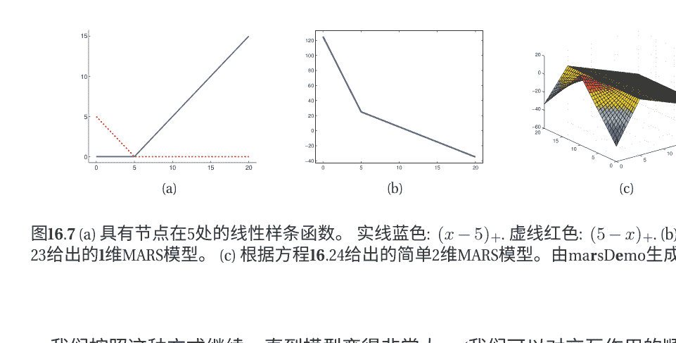

我们按照这种方式继续，直到模型变得非常大。(我们可以对交互作用的顺序设置一个上限。)然后我们向后修剪，每一步消除导致残差误差最小增加的基函数，直到CV误差停止改善。

整个过程与CART密切相关。为了看到这一点，假设我们用阶梯函数 $\mathbb{I}(x_j > t)$ 和 $\mathbb{I}(x_j < t)$ 替换分段线性基函数。乘以一对反射的阶梯函数等效于分裂一个节点。现在假设我们强制要求一旦一个变量参与到候选项的乘法中，该变量就被交互作用所取代，因此原始变量不再可用。这确保了一个变量不能被分裂多次，从而保证了生成的模型可以表示为一棵树。在这种情况下，MARS的生长策略与CART的生长策略相同。

### 16.4 提升

提升 (Schapire和Freund 2012) 是一种贪婪算法，用于拟合自适应基函数模型，其形式如方程16.3中所示，其中 $\phi_m$ 由称为弱学习器或基学习器的算法生成。该算法通过将弱学习器顺序应用于加权版本的数据来工作，其中对于之前轮次中被错误分类的示例给予更多权重。

这个弱学习器可以是任何分类或回归算法，但通常使用CART模型。1998年，已故的Leo Breiman将弱学习器定义为浅层决策树，称其为“世界上最好的现成分类器” (Hastie等人，2009年，第340页)。这一观点得到了 (Caruana和Niculescu-Mizil 2006) 对10种不同分类器进行的广泛实证比较的支持，他们表明提升决策树在误分类错误和生成良好校准概率方面是最好的，根据ROC曲线判断。(第二好的方法是由Breiman发明的随机森林，请参见第16.2.5节。) 相比之下，单个决策树的性能非常差。

Boosting最初是从计算学习理论文献中推导出来的 (Schapire 1990;Freund and Schapire 1996)，其中重点是二元分类。在这些论文中，证明了可以任意提高任何弱学习器 (在训练集上) 的性能。

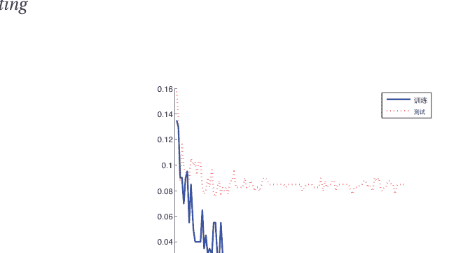图16.8使用决策树桩作为弱学习器的adaboost在图16.10中的数据上的性能。训练（实线蓝色）和测试（虚线红色）误差与迭代次数的关系。图由boostingDemo生成，由Richard Stapenhurst编写。

只要弱学习器总是能够稍微好于随机猜测，就可以获得很高的性能。例如，在图16.8中，我们绘制了在图16.10中显示的2D数据集上使用增强决策树桩的训练和测试误差。我们可以看到训练集误差迅速接近零。更令人惊讶的是，即使在训练集误差达到零之后，测试集误差仍然继续下降（尽管最终会上升）。因此，Boosting对过拟合非常抵抗。（增强决策树桩是非常成功的人脸检测器的基础（Viola and Jones 2001），它被用于生成图1.6中的结果，并且被许多数码相机使用。）

鉴于其惊人的实证成功，统计学家开始对这种方法产生兴趣。Breiman（Breiman 1998）表明，提升可以解释为函数空间中的梯度下降形式。然后，在（Friedman等人，2000年）中扩展了这个观点，他们展示了如何扩展提升以处理各种损失函数，包括回归、鲁棒回归、泊松回归等。在本节中，我们将介绍提升的这种统计解释，参考（Buhlmann和Hothorn 2007）和（Hastie等人2009年，ch10）的评论，以获取更多详细信息。

#### 16.4.1 前向逐步加法建模

提升的目标是解决以下优化问题：

$$ \min_{f} \sum_{i=1}^{N} L(y_i, f(\mathbf{x}_i)) \quad (16.25) $$

和 $L(y,\hat{y})$ 是一些损失函数，$f$ 被假设为与方程式16.3中的ABM模型相同。常见的损失函数选择列在表16.1中。如果我们使用平方误差损失，最优估计值为

$$ f^*(\mathbf{x}) = \underset{f(\mathbf{x})}{\text{argmin}} = \mathbb{E}_{y|\mathbf{x}} \left[ (Y - f(\mathbf{x}))^2 \right] = \mathbb{E}[Y|\mathbf{x}] \quad (16.26) $$

正如我们在第5.7.1节中所示，这在实践中是无法计算的，因为它需要知道真实的条件分布 $p(y|\mathbf{x})$。因此，有时将其称为 population minimimizer，其中期望是以频率学派的意义进行解释的。下面我们将看到，提升将尝试逼近这个条件期望。

对于二元分类，显而易见的损失是0-1损失，但这不可微分。相反，通常使用对数损失，它是0-1损失的凸上界，正如我们在第6.5.5节中所示。在这种情况下，可以证明最优估计由以下给出 $f^*(\mathbf{x}) = \frac{1}{2}\log \frac{p(\tilde{y}=1|\mathbf{x})}{p(\tilde{y}=-1|\mathbf{x})}$ (16.27) 其中 $\tilde{y} \in \{-1, +1\}$。我们可以将这个框架推广到多类情况，但我们在这里不讨论。

另一种凸上界是指数损失，定义为 $L(\tilde{y}, f) = \exp(-\tilde{y}f)$ (16.28) 请参见图16.9。这将比对数损失有一些计算上的优势，下面将讨论。事实证明，这种损失的最优估计也是 $f^*(\mathbf{x}) =$

为了证明这一点，我们可以将期望损失的导数（对于每个x）设为零：

$$\frac{\partial}{\partial f(\mathbf{x})} \mathbb{E}\left[e^{-\tilde{y} f(\mathbf{x})} | \mathbf{x}\right] = \frac{\partial}{\partial f(\mathbf{x})}\left[p(\tilde{y}=1|\mathbf{x})e^{-f(\mathbf{x})} + p(\tilde{y}=-1|\mathbf{x})e^{f(\mathbf{x})}\right] \quad(16.29)$$
$$= -p(\tilde{y}=1|\mathbf{x})e^{-f(\mathbf{x})} + p(\tilde{y}=-1|\mathbf{x})e^{f(\mathbf{x})} \quad(16.30)$$
$$= 0 \Rightarrow \frac{p(\tilde{y}=1|\mathbf{x})}{p(\tilde{y}=-1|\mathbf{x})} = e^{2f(\mathbf{x})} \quad(16.31)$$

所以在这两种情况下，我们可以看到提升应该尝试近似（一半）对数几率比。

由于找到最优 $f$ 很困难，我们将按顺序解决它。我们通过定义来初始化

$$f_0(\mathbf{x}) = \arg \min_{\gamma} \sum_{i=1}^{N} L(y_i, f(\mathbf{x}_i; \gamma)) \quad(16.32)$$

例如，如果我们使用平方误差，我们可以设置 $f_0(\mathbf{x}) = \bar{y}$，如果我们使用对数损失或指数损失，我们可以设置 $f_0(\mathbf{x}) = \frac{1}{2} \log \frac{\bar{y}}{1-\bar{y}}$。我们还可以使用更强大的模型作为我们的基线，比如GLM。然后在第 $m$ 次迭代中，我们计算

$$(\beta_m, \gamma_m) = \arg \min_{\beta, \gamma} \sum_{i=1}^{N} L(y_i, f_{m-1}(\mathbf{x}_i) + \beta \phi(\mathbf{x}_i; \gamma)) \quad(16.33)$$

然后我们设置

$$f_m(\mathbf{x}) = f_{m-1}(\mathbf{x}) + \beta_m \phi(\mathbf{x}; \gamma_m) \quad(16.34)$$

关键点是我们不会回头调整之前的参数。这就是为什么这个方法被称为前向逐步加法建模。

我们将继续进行固定次数的迭代 $M$。事实上 $M$ 是该方法的主要调节参数。通常我们通过监控单独的验证集上的性能来选择它，然后在性能开始下降时停止；这被称为提前停止。或者，我们可以使用模型选择标准，如AIC或BIC（详见（Buhlmann和Hothorn 2007）的详细信息）。

实际上，通过执行“部分更新”形式的操作可以获得更好的（测试集）性能

$$f_m(\mathbf{x}) = f_{m-1}(\mathbf{x}) + \nu \beta_m \phi(\mathbf{x}; \gamma_m) \quad(16.35)$$

这里 $0 < \nu \leq 1$ 是一个步长参数。在实践中，通常使用小的值，如 $\nu=0.1$。这被称为收缩。

下面我们讨论如何解决方程16.33中的子问题。这将取决于损失函数的形式。然而，它与弱学习器的形式无关。

### 16.4.2 L2boosting

假设我们使用平方误差损失。那么在第 $m$ 步，损失的形式为

$$L(y_i, f_{m-1}(\mathbf{x}_i) + \beta \phi(\mathbf{x}_i; \gamma)) = (r_{im} - \phi(\mathbf{x}_i; \gamma))^2 \quad(16.36)$$

其中 $r_{im} \triangleq y_i - f_{m-1}(x_i)$ 是当前残差，并且我们设置 $\beta = 1$ 没有损失的情况下。因此，我们可以通过使用弱学习器来预测 $r_m$ 来找到新的基函数。这被称为L2boosting，或者最小二乘提升（Buhlmann和Yu 2003）。在第16.4.6节中，我们将看到这种方法在选择合适的弱学习器的情况下，可以产生与LARS相同的结果，LARS可以用于执行变量选择（参见第13.4.2节）。

#### 16.4.3 AdaBoost

考虑一个具有指数损失的二元分类问题。在第 $m$ 步，我们必须最小化 $ L_m(\phi) = \sum_{i=1}^N \exp[-\tilde{y}_i(f_{m-1}(x_i) + \beta\phi(x_i))] = \sum_{i=1}^N w_{i,m} \exp(-\beta \tilde{y}_i\phi(x_i)) $ (16.37) 其中 $ w_{i,m} \triangleq \exp(-\tilde{y}_i f_{m-1}(x_i)) $ 是应用于数据点 $ i $ 的权重，而 $ \tilde{y}_i \in \{-1, +1\} $。我们可以将这个目标重写为： $ L_m = e^{-\beta} \sum_{\tilde{y}_i=\phi(x_i)} w_{i,m} + e^{\beta} \sum_{\tilde{y}_i=\phi(x_i)} w_{i,m} $ (16.38) $ = (e^{\beta} - e^{-\beta}) \sum_{i=1}^N w_{i,m} \mathbb{I}(\tilde{y}_i = \phi(x_i)) + e^{-\beta} \sum_{i=1}^N w_{i,m} $ (16.39) 因此，要添加的最优函数是 $ \phi_m = \argmin_{\phi} w_{i,m} \mathbb{I}(\tilde{y}_i = \phi(x_i)) $ (16.40) 这可以通过将弱学习器应用于数据集的加权版本来找到，其中权重为 $ w_{i,m} $。将 $ \phi_m $ 代入 $ L_m $ 并解出 $ \beta $，我们得到 $ \beta_m = \frac{1}{2} \log \frac{1 - err_m}{err_m} $ (16.41) 其中 $$\text{err}_m = \frac{\sum_{i=1}^N w_i \mathbb{I}(\tilde{y}_i = \phi_m(\mathbf{x}_i))}{\sum_{i=1}^N w_i}$$ 整体更新变为 $$f_m(\mathbf{x}) = f_{m-1}(\mathbf{x}) + \beta_m \phi_m(\mathbf{x})$$ 有了这个，下一次迭代的权重变为 $$w_{i,m+1} = w_{i,m} e^{-\beta_m \tilde{y}_i \phi_m(\mathbf{x}_i)} = w_{i,m} e^{\beta_m (2\mathbb{I}(\tilde{y}_i = \phi_m(\mathbf{x}_i)) - 1)} = w_{i,m} e^{2\beta_m \mathbb{I}(\tilde{y}_i = \phi_m(\mathbf{x}_i))} e^{-\beta_m}$$ 我们利用了 $-\tilde{y}_i \phi_m(\mathbf{x}_i) = -1$ if $\tilde{y}_i = \phi_m(\mathbf{x}_i)$ and $-\tilde{y}_i \phi_m(\mathbf{x}_i) = +1$ otherwise 这个事实。由于 $e^{-\beta_m}$ 在归一化步骤中会被消除，我们可以忽略它。结果是算法7中所示的算法，即 Adaboost.M1$^4$

使用决策树桩作为弱学习器的这个算法的示例在图16.10中给出。我们可以看到，在许多迭代之后，我们可以“刻出”一个复杂的决策边界。令人惊讶的是，AdaBoost非常不容易过拟合，这一点在图16.8中显而易见。有关这一点的讨论，请参见第16.4.8节。

**算法 16.2 Adaboost.M1，用指数损失进行二元分类**

- $w_i = 1/N$;
- for $m = 1 : M$ do
    - 使用权重 $\mathbf{w}$ 将分类器 $\phi_m(\mathbf{x})$ 拟合到训练集上；
    - 计算 $\text{err}_m = \frac{\sum_{i=1}^N w_i \mathbb{I}(\tilde{y}_i = \phi_m(\mathbf{x}_i))}{\sum_{i=1}^N w_i}$ ;
    - 计算 $\alpha_m = \log\left[(1 - \text{err}_m)/\text{err}_m\right]$；
    - 将 $w_i \leftarrow w_i \exp\left[\alpha_m \mathbb{I}(\tilde{y}_i = \phi_m(\mathbf{x}_i))\right]$；
- 返回 $f(\mathbf{x}) = \text{sgn}\left[\sum_{m=1}^M \alpha_m \phi_m(\mathbf{x})\right]$;

#### 16.4.4 LogitBoost

指数损失的问题在于它对错误分类的示例赋予了很大的权重，如图16.9左侧的指数爆炸所示。这使得该方法对异常值（错误标记的示例）非常敏感。此外，$e^{-yf}$ 不是二元变量 $y \in \{-1, +1\}$ 的任何概率质量函数的对数；因此我们无法从 $f(\mathbf{x})$ 中恢复概率估计。

| 名字 | 损失 | 导数 | $f^*$ | 算法 |
| --- | --- | --- | --- | --- |
| 平方误差 | $\frac{1}{2}(y_i - f(\mathbf{x}_i))^2$ | $y_i - f(\mathbf{x}_i)$ | $\mathbb{E}[y|\mathbf{x}_i]$ | L2Boosting |
| 绝对误差 | $|y_i - f(\mathbf{x}_i)|$ | $\text{sgn}(y_i - f(\mathbf{x}_i))$ | 中位数$(y|\mathbf{x}_i)$ | 梯度提升 |
| 指数损失 | $\exp(-\tilde{y}_i f(\mathbf{x}_i))$ | $-\tilde{y}_i \exp(-\tilde{y}_i f(\mathbf{x}_i))$ | $\frac{1}{2}\log \frac{\pi_i}{1-\pi_i}$ | AdaBoost |
| 对数损失 | $\log(1 + e^{-\tilde{y}_i f_i})$ | $y_i - \pi_i$ | $\frac{1}{2}\log \frac{\pi_i}{1-\pi_i}$ | LogitBoost |

表 16.1 一些常用的损失函数，它们的梯度，它们的人口最小化器 $f^*$，以及一些最小化损失的算法。对于二分类问题，我们假设 $\tilde{y}_i \in \{-1, +1\}$, $y_i \in \{0, 1\}$和 $\pi_i = \text{sigm}(2f(\mathbf{x}_i))$。对于回归问题，我们假设 $y_i \in \mathbb{R}$。改编自(Hastie et al. 2009, p360)和(Bühlmann and Hothorn 2007, p483)。

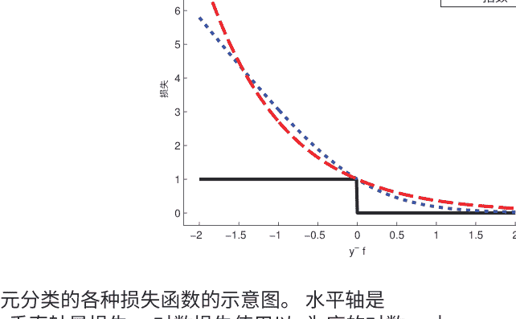

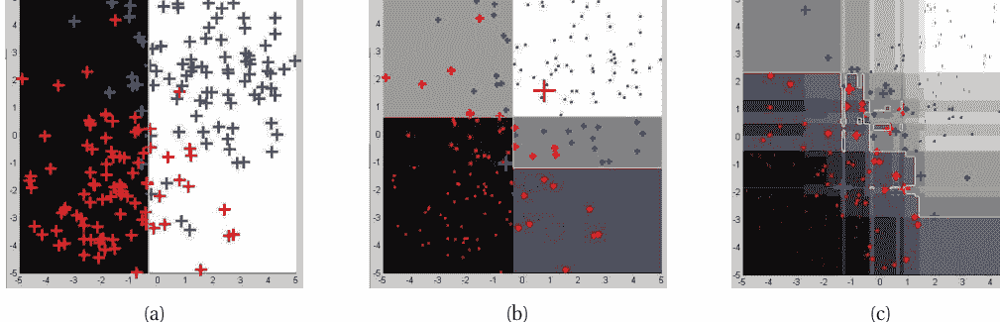图16.10使用决策树桩作为弱学习器的adaboost示例。黑度的程度表示对红色类别的置信度。白度的程度表示对蓝色类别的置信度。数据点的大小表示它们的权重。决策边界为黄色。(a)经过1轮。(b)经过3轮。(c)经过120轮。图由Richard Stapenhurst编写的boostingDemo生成。

一个自然的替代方法是使用对数损失。这只是线性地惩罚错误，如图16.9所示。此外，这意味着我们将能够从最终学到的函数中提取概率，使用

$$ p(y=1|\mathbf{x}) = \frac{e^{f(\mathbf{x})}}{e^{-f(\mathbf{x})} + e^{f(\mathbf{x})}} = \frac{1}{1 + e^{-2f(\mathbf{x})}} $$

目标是最小化期望的对数损失，由以下公式给出

$$ L_m(\phi) = \sum_{i=1}^N \log [1 + \exp (-2\tilde{y}_i (f_{m-1}(\mathbf{x}_i) + \phi(\mathbf{x}_i)))] $$

通过对这个目标进行牛顿更新（类似于IRLS），可以推导出算法如下所示。这被称为 **LogitBoost** (Friedman等人，2000年)。它可以推广到多类别设置，如 (Friedman等人，2000年) 所解释的。

算法 16.3: LogitBoost，用于二元分类和对数损失

1 $w_i = 1/N$, $\pi_i = 1/2$;
2 **对于** $m= 1 : M$ **执行**
3   计算工作响应 $z_i = \frac{y_i^* - \pi_i}{\pi_i(1-\pi_i)}$;
4   计算权重 $w_i = \pi_i(1 - \pi_i)$;
5   $\phi_m = \operatorname{argmin}_\phi \sum_{i=1}^N w_i (z_i - \phi(\mathbf{x}_i))^2$;
6   更新 $f(\mathbf{x}) \leftarrow f(\mathbf{x}) + \frac{1}{2} \phi_m(\mathbf{x})$;
7   计算 $\pi_i = 1/(1 + \exp(-2f(\mathbf{x}_i)))$;
8 **返回** $f(\mathbf{x}) = \operatorname{sgn} \left[ \sum_{m=1}^M \phi_m(\mathbf{x}) \right]$;

## 16.4.5 提升为函数梯度下降

与其为每个不同的损失函数推导出新版本的提升，不如推导出一个通用版本，称为梯度提升 (Friedman 2001; Mason et al. 2000)。为了解释这一点，想象一下最小化

$$ \hat{\mathbf{f}} = \operatorname{argmin}_{\mathbf{f}} L(\mathbf{f}) $$

其中 $\mathbf{f} = (f(\mathbf{x}_1), \ldots, f(\mathbf{x}_N))$是“参数”。我们将使用梯度下降逐步解决这个问题。在第 $m$ 步，令 $\mathbf{g}_m$为在$\mathbf{f} = \mathbf{f}_{m-1}$处评估的 $L(\mathbf{f})$的梯度：

$$ g_{im} = \left[ \frac{\partial L(y_i, f(\mathbf{x}_i))}{\partial f(\mathbf{x}_i)} \right]_{f=f_{m-1}} $$

一些常见损失函数的梯度在表16.1中给出。然后我们进行更新

$$ \mathbf{f}_m = \mathbf{f}_{m-1} - \rho_m \mathbf{g}_m $$

其中 $\rho_m$ 是步长，由

$$\rho_m= \underset{\rho}{\text{argmin}}  L(\mathbf{f}_{m-1} - \rho \mathbf{g}_m) \tag{16.52}$$

这被称为函数梯度下降。以其当前形式，这没有太大用处，因为它只优化了 $f$ 在一组固定的 $N$点上，所以我们无法学习一个可以泛化的函数。然而，我们可以通过拟合一个弱学习器来修改算法，以近似负梯度信号。也就是说，我们使用这个更新

$$\gamma_m = \underset{\gamma}{\text{argmin}} \sum_{i=1}^N (-g_{im} - \phi(\mathbf{x}_i; \gamma))^2 \tag{16.53}$$

算法6总结了整体算法。（我们省略了线性搜索步骤，这在严格意义上并不是必需的，正如 (Buhlmann和Hothorn 2007) 所讨论的那样。）

算法 16.4: 梯度提升
1 初始化 $f_0(\mathbf{x}) = \underset{\gamma}{\text{argmin}} \sum_{i=1}^N L(y_i, \phi(\mathbf{x}_i; \gamma))$;
2 for $m = 1 : M$ do
3 使用 $r_{im}$计算梯度残差 $= - \left[ \frac{\partial L(y_i, f(\mathbf{x}_i))}{\partial f(\mathbf{x}_i)} \right]_{f(\mathbf{x}_i)=f_{m-1}(\mathbf{x}_i)}$;
4 使用弱学习器计算 $\gamma_m$，使得 $\sum_{i=1}^N (r_{im} - \phi(\mathbf{x}_i; \gamma_m))^2$最小化;
5 更新 $f_m(\mathbf{x}) = f_{m-1}(\mathbf{x}) + \nu \phi(\mathbf{x}; \gamma_m)$;
6 返回 $f(\mathbf{x}) = f_M(\mathbf{x})$

如果我们使用平方损失来应用这个算法，我们就可以得到L2Boosting。如果我们将这个算法应用于对数损失，我们就得到了一个被称为BinomialBoost的算法(Buhlmann和Hothorn，2007)。与LogitBoost相比，它的优点是不需要能够进行加权拟合：它只是将任何黑盒回归模型应用于梯度向量。此外，它相对容易扩展到多类情况（参见 (Hastie等，2009年，p387) ）。我们还可以将这个算法应用于其他损失函数，比如Huber损失（第7.4节），它对离群值比平方误差损失更鲁棒。

## 16.4.6 稀疏增强

假设我们将以下算法作为我们的弱学习器：在所有可能的变量 $j= 1: D$ 上进行搜索，并选择最能预测残差向量的变量 $j(m)$:

$$j(m) = \underset{j}{\text{argmin}} \sum_{i=1}^N (r_{im} - \hat{\beta}_{jm} x_{ij})^2 \tag{16.54}$$
$$\hat{\beta}_{jm} = \frac{\sum_{i=1}^N x_{ij} r_{im}}{\sum_{i=1}^N x_{ij}^2} \tag{16.55}$$
$$\phi_m(\mathbf{x}) = \hat{\beta}_{j(m),m} x_{j(m)} \tag{16.56}$$

这种方法被称为稀疏增强(Buhlmann and Yu 2006)，与第13.2.3.1节中讨论的匹配追踪算法相同。很明显，这将导致一个稀疏估计，至少如果 M很小的话。为了看清楚这一点，让我们将更新重写如下：

```
\beta_m := \beta_{m-1} + \nu(0, \ldots, 0, \hat{\beta}_{j(m),m}, 0, \ldots, 0)
```

非零元素出现在位置 j(m)。这被称为前向逐步线性回归（Hastie等人，2009年，第608页），它等价于第13.4.2节中讨论的LAR算法，当 \nu \rightarrow 0时。增加提升中的步骤数 m类似于减小正则化惩罚 \lambda。如果我们修改提升算法以允许一些变量删除步骤（Zhao和Yu，2007年），我们可以使其等价于LARS算法，该算法计算套索问题的完整正则化路径。相同的算法可以用于稀疏逻辑回归，只需将残差修改为适当的负梯度即可。

现在考虑一个类似于上述的弱学习器，除了在从 x_j 到残差的映射时使用平滑样条而不是线性回归。结果是一个稀疏的广义加性模型（见第16.3节）。显然可以扩展为一次选择一对变量。结果方法通常比MARS（Buhlmann和Yu，2006年）效果好得多。

## 16.4.7 多元自适应回归树（MART）

通常使用CART模型作为弱学习器是很常见的。通常建议使用浅层树，以降低方差。尽管偏差会很高（因为浅层树可能与“真相”相距较远），但这将在后续的提升轮次中得到补偿。树的高度是一个额外的调节参数（除了 M，即提升轮次，和 \nu，即收缩因子）。假设我们限制树的叶子节点数为 Jleaves。如果 J= 2，我们得到一个树桩，只能在一个变量上进行分割。如果 J= 3，我们允许两个变量之间的交互作用，等等。一般建议（例如在（Hastie et al. 2009, p363）和（Caruana and Niculescu-Mizil 2006）中）使用 J \approx 6。

如果我们将梯度提升算法与（浅层）回归树结合起来，我们得到一个模型称为 MART，它代表“多元自适应回归树”。实际上，这包括对基本梯度提升算法的轻微改进：在将回归树拟合到残差（负梯度）之后，我们重新估计树叶的参数以最小化损失：

```
\gamma_{jm} = \argmin_{\gamma} \sum_{x_i \in R_{jm}} L(y_i, f_{m-1}(\mathbf{x}_i) + \gamma)
```

其中 R_{jm}是第 m棵树中叶子 j的区域， \gamma_{jm}是相应的参数（回归问题的均值响应 y，或分类问题的最可能类标签）。

## 16.4.8 为什么提升算法效果如此好？

我们已经看到，提升算法非常有效，特别是对于分类器。这有两个主要原因。首先，它可以被看作是一种形式的 \ell_1正则化，已知有助于通过消除“无关”的特征来防止过拟合。为了看到这一点，想象一下预先计算所有可能的弱学习器，并定义一个形式为 $\phi(\mathbf{x}) = [\phi_1(\mathbf{x}), \ldots, \phi_K(\mathbf{x})]$ 的特征向量。我们可以使用 $\ell_1$ 正则化来选择其中的一部分。或者我们可以使用增强学习，在每一步中，弱学习器即时创建一个新的 $\phi_{k_0}$。可以将增强学习和 $\ell_1$ 正则化结合起来，得到一种称为 L1-AdaBoost(Duchi and Singer2009)的算法。基本上，这种方法使用增强学习贪婪地添加最佳特征（弱学习器），然后使用 $\ell_1$ 正则化剪除无关的特征。

另一个解释与边界的概念有关，我们在第14.5.2.2节中介绍了这个概念。(Schapire等人，1998年; Ratsch等人，2001年)证明了AdaBoost最大化了训练数据上的边界。(Rosset等人，2004年)将这一概念推广到了其他损失函数，如对数损失。

## 16.4.9 一个贝叶斯观点

到目前为止，我们对提升算法的介绍非常频率主义，因为它专注于贪婪地最小化损失函数。在(Neal和MacKay，1998年; Meek等人，2002年)中给出了该算法的似然解释。这个想法是考虑一个形式为的专家混合模型

$p(y|\mathbf{x}, \theta) = \sum_{m=1}^{M} \pi_m p(y|\mathbf{x}, \gamma_m)$

其中每个专家 $p(y|\mathbf{x}, \gamma_m)$ 就像一个弱学习器。通常我们一次拟合所有 $M$ 个专家，使用EM算法，但我们可以想象一种顺序方案，逐个更新每个专家的参数。在E步骤中，后验责任将反映现有专家对给定数据点的解释程度; 如果拟合效果不好，这些数据点将对下一个拟合的专家产生更大的影响。(这种观点自然地提出了一种用于无监督学习的类似提升算法的方法: 我们只需顺序拟合混合模型，而不是专家混合模型。)

请注意，这是一个相当“破碎”的最大似然估计过程，因为它从不返回更新旧专家的参数。同样，如果增强学习想要改变分配给一个弱学习器的权重，唯一的方法是使用新的权重再次添加该弱学习器。这可能导致模型过大。相比之下，BART模型 (Chipman等人，2006年，2010年) 使用贝叶斯版本的反向拟合来拟合一小组弱学习器 (通常是树)。

## 16.5 前馈神经网络（多层感知机）

前馈神经网络，也称为多层感知机（MLP），是一系列逻辑回归模型堆叠在一起，最后一层可以是另一个逻辑回归模型或线性回归模型，具体取决于我们是解决分类问题还是回归问题。例如，如果我们有两层，并且我们正在解决一个回归问题，模型的形式为

$p(y|\mathbf{x}, \theta) = \mathcal{N}(y|\mathbf{w}^T \mathbf{z}(\mathbf{x}), \sigma^2)$

$\mathbf{z}(\mathbf{x}) = g(\mathbf{V}\mathbf{x}) = [g(\mathbf{v}_1^T \mathbf{x}), \ldots, g(\mathbf{v}_H^T \mathbf{x})]$

其中 $g$ 是一个非线性的激活函数或传递函数 (通常是逻辑函数)，$\mathbf{z}(\mathbf{x}) = \phi(\mathbf{x}, \mathbf{V})$ 被称为 hidden layer (输入的确定性函数)，$H$ 是隐藏单元的数量，\(V\)是从输入到隐藏节点的权重矩阵，\(w\)是从隐藏节点到输出的权重向量。重要的是 \(g\) 是非线性的，否则整个模型会崩溃成一个形式为\(y = \mathbf{w}^T(\mathbf{Vx})\)的大型线性回归模型。可以证明，MLP是一个 **universal approximator**，意味着它可以对任何适当平滑的函数进行建模，只要有足够的隐藏单元，就可以达到任意精度的水平（Hornik 1991）。

为了处理二元分类问题，我们将输出通过一个sigmoid函数，就像在GLM中一样：

$$p(y|\mathbf{x}, \boldsymbol{\theta}) = \text{Ber}(y|\text{sigm}(\mathbf{w}^T \mathbf{z}(\mathbf{x})))$$  (16.62)

我们可以很容易地扩展MLP来预测多个输出。例如，在回归情况下，我们有

$$p(\mathbf{y}|\mathbf{x}, \boldsymbol{\theta}) = \mathcal{N}(\mathbf{y}|\mathbf{W} \ \phi(\mathbf{x}, \mathbf{V}), \sigma^2 \mathbf{I})$$  (16.63)

请参见图16.11以进行说明。如果我们在输出单元之间添加互相抑制的弧线，确保只有一个单元被激活，我们可以强制执行总和为一的约束条件，这可以用于多类分类。得到的模型的形式为

$$p(y|\mathbf{x}, \boldsymbol{\theta}) = \ \ \text{Cat}(y|\mathcal{S}(\mathbf{W}\mathbf{z}(\mathbf{x})))$$  (16.64)

#### 16.5.1 卷积神经网络

隐藏单元的目的是学习原始输入的非线性组合；这被称为特征提取或特征构建。然后，这些隐藏特征作为最终广义线性模型的输入。这种方法在原始输入特征不太具有个体信息的问题中特别有用。例如，图像中的每个像素并不具有很多信息；只有像素的组合才能告诉我们存在哪些对象。相反，对于使用词袋表示进行文档分类的任务，每个特征（词频）本身就具有信息量，因此提取“高阶”特征就不那么重要。因此，神经网络中的大部分工作都受到了视觉模式的启发。一种特别适用于1D信号（如语音或文本）或2D信号（如图像）的MLP形式是卷积神经网络。这是一种MLP，其中隐藏单元具有局部感受野（如主视觉皮层），并且权重在图像中被绑定或共享，以减少参数数量。直观地说，这种空间参数绑定的效果是，在图像的某个部分“发现”的任何有用特征都可以在其他地方重复使用，而无需独立学习。结果网络表现出平移不变性，这意味着它可以对输入图像中发生的模式进行分类，而不管它们出现在哪里。

图16.12给出了一个卷积网络的示例，由Simard和同事设计（Simard等人，2003年），有5层（4层可调参数），旨在对来自MNIST数据集的29×29灰度图像的手写数字进行分类（参见第1.2.1.3节）。在第1层中，我们有6个特征图，每个特征图的大小为13×13。这些特征图中的每个隐藏节点通过将图像与一个5×5的权重矩阵（有时称为核）进行卷积，添加偏置，然后通过某种非线性形式传递结果来计算。因此，第1层中有13×13×6=1014个神经元，和（5×5+1）×6=156个权重。（“+1”是指偏置项。）如果我们不共享这些参数，第一层将有1014×26=26,364个权重。在第2层中，我们有50个特征图，每个特征图是通过将第1层中的每个特征图与一个5×5的权重矩阵进行卷积，相加，添加偏置，并通过非线性函数传递得到的。因此，第2层中有5×5×50=1250个神经元，（5×5+1）×6×50=7800个可调权重（每对特征图对应一个核），以及 1250 × 26 = 32,500个连接。第3层与第2层完全连接，并且有100个神经元和 100 ×(1250 + 1) = 125,100个权重。最后，第4层也是完全连接的，并且有10个神经元和 10 ×(100 + 1) = 1010个权重。将上述数字相加，总共有3,215个神经元，134,066个可调节的权重和184,974个连接。

通常使用随机梯度下降来训练这个模型 (详见第16.5.4节)。对数据集进行一次遍历称为一个时代。当迈克·奥尼尔在2006年进行这些实验时，他发现一个时代大约需要40分钟 (回想一下MNIST中有60,000个训练示例)。由于大约需要30个时代才能使错误率收敛，总的训练时间约为20小时。使用这种技术，他在10,000个测试案例中获得了约1.40%的错误分类率。

为了进一步降低错误率，一个常见的技巧是通过包含原始数据的扭曲版本扩展训练集，以鼓励网络对不影响数字身份的小变化具有不变性。这些可以通过应用随机流场来移动像素来创建。请参见图16.13中的一些示例。(如果我们使用在线训练，例如随机梯度下降，我们可以即时创建这些扭曲，而不必存储它们。) 使用这种技术，Mike O'Neill在10,000个测试案例中获得了约0.74%的错误分类率，接近当前的最新技术水平。

Yann Le Cun和他的同事 (LeCun等人，1998年) 使用稍微复杂的架构 (如图16.14所示) 获得了类似的性能。该模型被称为LeNet5，并且在历史上先于图16.12中的模型。有两个主要区别。首先，LeNet5在每个卷积层之间有一个子采样层，该层在前一层的每个小窗口上进行平均或计算最大值，以减小尺寸并获得少量的平移不变性。卷积和子采样的组合受到Hubel和Wiesel在视觉皮层中简单和复杂细胞模型 (Hubel和Wiesel，1962年) 的启发，并且在神经启发的视觉对象识别模型 (Riesenhuber和Poggio，1999年) 中仍然很受欢迎。类似的想法最早出现在Fukushima的新认知机 (Fukushima，1975年) 中，尽管当时没有全局监督训练算法可用。

LeNet5和Simard架构之间的第二个区别是最后一层实际上是一个RBF网络，而不是更标准的S型或softmax层。当没有扭曲训练时，该模型的测试错误率约为0.95%，而当有扭曲训练时为0.8%。图16.15显示了系统产生的82个错误。有些是真正模棱两可的，但有几个是一个人永远不会犯的错误。可以在http://yann.lecun.com/exdb/lenet/index找到LeNet5的基于Web的演示。当然，分类孤立的数字的适用性有限: 在现实世界中，人们通常会写数字或其他字母的字符串。这需要分割和分类两者。Le Cun和同事们设计了一种将卷积神经网络与类似于条件随机场的模型 (在第19.6节中描述) 相结合的方法来解决这个问题。该系统最终由美国邮政部署。(有关该系统的更详细描述，请参见 (LeCun等，1998年) )

+   5. 实现细节：迈克使用了C++代码和各种加速技巧。他使用的是标准的2006年硬件（一台运行在2.8GHz的英特尔Pentium 4超线程处理器）。请参阅 http://www.codeproject.com/KB/library/NeuralNetRecognition.aspx获取详细信息。
6. 各种方法的列表，以及它们在MNIST测试集上的错误分类率，可从 http://yann.lecun.com/exdb/mnist/获取。误差率相差在0.1-0.2%之间的结果在统计上没有显著差异。

## 16.5. 前馈神经网络（多层感知器）

图16.13 手写数字的几个合成扭曲。基于 (Bishop 2006a) 的图5.14。图由 Kevin Swersky 编写的 elasticDistortionsDemo 生成。

图16.14 LeNet5，用于分类手写数字的卷积神经网络。来源：来自 (LeCun et al. 1998) 的图2。获得 Yann LeCun 的友好许可后使用。

#### 16.5.2 其他类型的神经网络

除了上面讨论的那些，还有其他的网络拓扑结构。例如，我们可以直接从输入到输出跳过隐藏层的跳跃弧线；我们可以在层之间有稀疏连接；等等。然而，MLP始终要求权重形成一个有向无环图。如果允许有反馈连接，该模型被称为循环神经网络；这定义了一个非线性动力系统，但没有简单的概率解释。目前，这种RNN模型是语言建模（即在自然语言中进行单词预测）的最佳方法（Tomas等人，2011年），在17.2.2节讨论的标准n-gram方法方面明显优于其他方法。如果允许隐藏单元之间有对称连接，该模型被称为Hopfield网络或关联记忆；它的概率对应物被称为Boltzmann机器（见27.7节），可用于无监督学习。

#### 16.5.3 领域的简要历史

神经网络几十年来一直备受关注，因为人们希望理解大脑并构建学习机器。在这里不可能回顾整个历史。相反，我们只给出一些“编辑亮点”。

这个领域通常被认为是从1943年的McCulloch和Pitts（McCulloch和Pitts 1943）开始的，他们在1943年设计了一个简单的神经元数学模型，其中他们近似地将输出视为通过阈值函数传递的输入的加权和，$y = \mathbb{I}(\sum_{i} w_i x_i > \theta)$，对于某个阈值 $\theta$。这类似于一个S型激活函数。Frank Rosenblatt于1957年发明了感知器学习算法，这是一种估计McCulloch-Pitts神经元参数的方法（详见第8.5.4节）。Widrow和Hoff于1960年发明了一个非常类似的模型，称为 **adaline**（自适应线性元素）。

1969年，明斯基和帕佩特（Minsky and Papert 1969）出版了一本著名的书，名为“感知机”（Perceptrons），在这本书中他们展示了这种线性模型的局限性，因为它们无法对非线性可分数据进行分类。这大大降低了人们对这个领域的兴趣。

1986年，Rumelhart、Hinton和Williams（Rumelhart et al. 1986）发现了反向传播算法（见第16.5.4节），它允许我们拟合具有隐藏层的模型。（反向传播算法最初是在（Bryson and Ho 1969）中发现的，并且在（Werbos 1974）中也独立发现；然而，正是（Rumelhart et al. 1986）将这个算法带到了人们的视野中。）这引发了十年的对这些模型的强烈兴趣。

1987年，Sejnowski和Rosenberg（Sejnowski和Rosenberg 1987）创建了著名的 **NETtalk**系统，该系统学习了从英语单词到音标符号的映射，可以输入到语音合成器中。可以在以下网址找到系统随时间学习的音频演示：http://www.cnl.salk.edu/ParallelNetsPronounce/nettalk.mp3。NETtalk通过其隐藏层学习了各种声音的分布式表示，并且其成功引发了心理学中基于神经网络的**connectionism**和基于句法规则的**computationalism**之间的激烈辩论。该系统从“胡言乱语”开始，然后逐渐学会发音英语单词。NETtalk通过其隐藏层学习了各种声音的分布式表示，并且其成功引发了心理学中基于神经网络的connectionism和基于句法规则的computationalism之间的激烈辩论。这场辩论在机器学习社区中仍然存在一定程度的争论，关于使用低层次的“类神经”表示还是使用更结构化的模型来进行学习的问题。

1989年，Yann Le Cun和其他人（LeCun等，1989年）创建了著名的LeNet系统，详见第16.5.1节。

1992年，支持向量机（见第14.5节）被发明（Boser等，1992年）。SVMs提供了与神经网络相似的预测准确性，同时训练起来要容易得多（因为它们使用凸目标函数）。这引发了对核方法的十年兴趣。^7但是请注意，SVMs不使用自适应基函数，因此需要相当多的人类专业知识来设计正确的核函数。

2002年，Geoff Hinton发明了对比散度训练过程（Hinton，2002年），这为首次以无监督的方式逐层训练深度网络提供了一种方法（详见第27.7.2.4节）。这反过来又引发了对神经网络的新兴兴趣，近年来越来越受关注（见第28章）。

#### 16.5.4 反向传播算法

与GLM不同，MLP的NLL是其参数的非凸函数。然而，我们可以使用标准的基于梯度的优化方法找到局部最优的ML或MAP估计。由于MLP具有大量参数，它们通常在非常大的数据集上进行训练。

7. 在1990年代，成为被称为NIPS的顶级机器学习会议的发表论文的一部分成为了传说，重要的是确保您的论文不包含“神经网络”这个词！

图16.16 两种可能的激活函数。tanh将映射到[-1,+1]，是隐藏节点的首选非线性函数。sigm将映射到[0,1]，是输出层二进制节点的首选非线性函数。由tanhPlot生成的图。

因此，通常使用一阶在线方法，如随机梯度下降（第8.5.2节），而GLMs通常使用IRLS进行拟合，这是一种二阶离线方法。我们现在讨论如何通过应用微积分的链式法则来计算NLL的梯度向量。由此得到的算法被称为反向传播，原因将很快明了。

为了简化符号，我们假设模型只有一个隐藏层。有助于区分神经元的前后突触值，即在应用非线性函数之前和之后的值。设 x_n 为第 n 个输入， a_n = V x_n 为前突触隐藏层， z_n = g(a_n) 为后突触隐藏层，其中 g 是某个传递函数。我们通常使用 g(a) = sigm(a) ，但也可以使用 g(a) = tanh(a) ：参见图16.16进行比较。

（当输入到 sigm or tanh是一个向量时，我们假设它是逐分量应用的。）

现在我们将这个隐藏层转换为输出层，如下所示。让 b_n = W z_n 是前突触输出层，而 ŷ_n = h(b_n) 是后突触输出层，其中 h 是另一个非线性函数，对应于广义线性模型的规范链接。（我们保留符号 y_n，没有帽子，表示对应于第 n 个训练样本的输出。）对于回归模型，我们使用 h(b) = b；对于二元分类，我们使用 h(b) = [sigm(b_1), ..., sigm(b_c)]；对于多类分类，我们使用 h(b) = S(b)。

我们可以将整个模型写成如下形式：

```
x_n \xrightarrow{V} a_n \xrightarrow{g} z_n \xrightarrow{W} b_n \xrightarrow{h} \hat{y}_n \qquad (16.65)
```

模型的参数是 θ= (V, W)，即第一层和第二层的权重矩阵。通过将 x_n 和 z_n 的元素限制为1，可以容纳偏置项或偏差项。⁸

8. 在回归设置中，我们可以通过残差误差的经验方差来轻松估计输出噪声的方差，即 σ^2 = (1/N) ||ŷ(θ) - y||^2，在训练完成后。如果我们进行多目标回归，每个输出节点都会有一个 σ^2 的值，这是我们通常假设的情况。

## 16.5. 前馈神经网络（多层感知器）

在回归情况下，对于 $K$个输出，NLL由平方误差给出：

$$J(\boldsymbol{\theta}) = - \sum_n \sum_k (\hat{y}_{nk}(\boldsymbol{\theta}) - y_{nk})^2$$

在分类情况下，有 $K$个类别，交叉熵给出了负对数似然

$$J(\boldsymbol{\theta}) = - \sum_n \sum_k y_{nk} \log \hat{y}_{nk}(\boldsymbol{\theta})$$

我们的任务是计算 $\nabla_{\boldsymbol{\theta}} J$。我们将分别推导每个 $n$的梯度；整体梯度通过对 $n$求和得到，尽管通常我们只使用一个小批量（见第8.5.2节）。让我们从考虑输出层权重开始。

$$\nabla_{\mathbf{w}_k} J_n = \frac{\partial J_n}{\partial b_{nk}} \nabla_{\mathbf{w}_k} b_{nk} = \frac{\partial J_n}{\partial b_{nk}} \mathbf{z}_n$$

因为 $b_{n_k} = \mathbf{w}_k^T \mathbf{z}_n$。假设 $h$是输出广义线性模型的规范链接函数，那么方程9.91告诉我们

$$\frac{\partial J_n}{\partial b_{nk}} \triangleq \delta_{nk}^w = (\hat{y}_{nk} - y_{nk})$$

这是误差信号。因此整体梯度是

$$\nabla_{\mathbf{w}_k} J_n = \delta_{nk}^w \mathbf{z}_n$$

这是输出层的前突输入，即 $\mathbf{z}_n$，乘以误差信号，即 $\delta_{nk}^w$。

对于输入层的权重，我们有

$$\nabla_{\mathbf{v}_j} J_n = \frac{\partial J_n}{\partial a_{nj}} \nabla_{\mathbf{v}_j} a_{nj} \triangleq \delta_{nj}^v \mathbf{x}_n$$

在这里我们利用了 $a_{n_j} = \mathbf{v}_j^T \mathbf{x}_n$的事实。剩下的就是计算第一层的误差信号 $\delta_{n_j}^v$。我们有

$$\delta_{nj}^v = \frac{\partial J_n}{\partial a_{nj}} = \sum_{k=1}^K \frac{\partial J_n}{\partial b_{nk}} \frac{\partial b_{nk}}{\partial a_{nj}} = \sum_{k=1}^K \delta_{nk}^w \frac{\partial b_{nk}}{\partial a_{nj}}$$

现在

$$b_{nk} = \sum_j w_{kj} g(a_{nj})$$

所以

$$\frac{\partial b_{nk}}{\partial a_{nj}} = w_{kj} g'(a_{nj})$$

对于tanh单元，$g'(a) \stackrel{\text{def}}{=} \tanh'(a) = 1 - \tanh^2(a) = \text{sech}^2(a)$，而对于sigmoid单元，$g'(a) \stackrel{\text{def}}{=} \sigma'(a) = \sigma(a)(1 - \sigma(a))$。因此

$$\delta_{nj}^v = \sum_{k=1}^K \delta_{nk}^w w_{kj} g'(a_{nj})$$

因此，可以通过将第二层的错误传递回 W矩阵来计算第一层的错误；因此术语“反向传播”。关键属性是我们可以在本地计算梯度：每个节点只需要知道其直接邻居。这被认为是算法“神经可信”的，尽管这种解释在某种程度上存在争议。将所有这些放在一起，我们可以按照以下方式计算所有的梯度：首先进行前向传播来计算 $a_n$，$z_n$，$b_n$ 和 $\hat{y}_n$。然后计算输出层的误差，$\delta_n^{(2)}=\hat{y}_n - y_n$，我们通过方程16.75将其向后传递到 W，以计算隐藏层的误差 $\delta_n^{(1)}$。然后我们按如下方式计算整体梯度：

$$\nabla_{\theta} J(\theta) = \sum_n \left[ \delta_n^v \mathbf{x}_n, \delta_n^w \mathbf{z}_n \right] \qquad (16.76)$$

### ### 16.5.5 可辨识性

很容易看出神经网络的参数是不可辨识的。例如，我们可以改变进入其中一个隐藏单元的权重的符号，只要我们改变所有离开它的权重的符号；这些效果会相互抵消，因为 tanh 是一个奇函数，所以 $\tanh(-a) = -\tanh(a)$。这样的符号翻转对称性将导致 $2^H$ equivalent settings of the parameters。同样，我们可以改变隐藏单元的身份而不影响似然函数。这样的排列方式有 $H!$ 种。具有相同似然函数的等价参数设置的总数因此为 $H!2^H$。

此外，由于NLL的非凸性，可能存在局部最小值。这可能是一个更严重的问题，尽管有足够的数据，这些局部最优解通常是相当“浅”的，并且简单的随机优化方法可以避免它们。此外，通常会执行多次重启，并选择最佳解决方案，或对结果进行平均预测。（对参数本身进行平均没有意义，因为它们不可识别。）

### ### 16.5.6 正则化

通常情况下，MLE可能会过拟合，特别是当节点数量较大时。防止这种情况的一种简单方法称为早停，即当验证集上的错误率首次开始增加时停止训练过程。这种方法有效是因为我们通常从小的随机权重初始化，所以模型最初是简单的（因为 tanh 和 sigm 函数在原点附近几乎是线性的）。随着训练的进行，权重变得越来越大，模型变得非线性。最终它会过拟合。

另一种防止过拟合的方法是，在参数上施加先验，并使用MAP估计。这种方法更符合本书中其他方法的使用方式。通常使用标准的先验分布 $\mathcal{N}(0, \alpha^{-1}\mathbf{I})$（等价于 L2正则化），其中 $\alpha$ 是先验的精度（强度）。在神经网络文献中，这被称为权重衰减，因为它鼓励使用较小的权重，从而得到更简单的模型。惩罚的负对数似然目标变为

$$J(\theta) = -\sum_{n=1}^N \log p(y_n|\mathbf{x}_n; \theta) + \frac{\alpha}{2} \left[ \sum_{ij} v_{ij}^2 + \sum_{jk} w_{jk}^2 \right] \qquad (16.77)$$

（注意，我们不对偏置项进行惩罚。） 修改后目标的梯度为

$$\nabla_{\theta} J(\theta) = \left[ \sum_{n} \delta_{n}^{v} \mathbf{x}_{n} + \alpha \mathbf{v}, \quad \sum_{n} \delta_{n}^{w} \mathbf{z}_{n} + \alpha \mathbf{w} \right] \quad \quad (16.78)$$

如第8.3.6节所示。 如果正则化足够强，那么隐藏单元的数量就不重要了（除了浪费计算资源）。 因此，建议将 $H$ 设置得尽可能大 （比如10-100），然后选择适当的正则化参数。 我们可以通过交叉验证或经验贝叶斯（见第16.5.7.5节）来设置 $\alpha$ 参数。 与岭回归一样，将输入标准化为零均值和单位方差是一个好的做法，这样球形高斯先验就有意义了。

### 16.5.6.1 一致的高斯先验 *

可以证明（MacKay 1992）对于第一层和第二层的权重使用相同的正则化参数会导致缺乏某种理想的不变性。 特别地，假设我们线性缩放和平移输入和/或输出到神经网络回归模型。 然后我们希望模型通过适当缩放其内部权重和偏置项来学习预测相同的函数。 然而，第一层和第二层的权重需要进行的缩放来补偿输入和/或输出的变化是不同的。

因此，我们需要为第一层和第二层使用不同的正则化强度。 幸运的是，这很容易实现 - 我们只需要使用以下先验分布：

$$p(\theta) = \mathcal{N}\left(\mathbf{W}\left|\mathbf{0}, \frac{1}{\alpha_{w}} \mathbf{I}\right.\right) \mathcal{N}\left(\mathbf{V}\left|\mathbf{0}, \frac{1}{\alpha_{v}} \mathbf{I}\right.\right) \mathcal{N}\left(\mathbf{b}\left|\mathbf{0}, \frac{1}{\alpha_{b}} \mathbf{I}\right.\right) \mathcal{N}\left(\mathbf{c}\left|\mathbf{0}, \frac{1}{\alpha_{c}} \mathbf{I}\right.\right) \quad\quad (16.79)$$

其中 $\mathbf{b}$ 和 $\mathbf{c}$ 是偏置项。 $^{9}$

为了对这些超参数的影响有所了解，我们可以从先验分布中采样MLP参数，并绘制出随机函数的结果。 图16.17显示了一些示例。 减小 $\alpha_{v}$ 可以使第一层的权重变大，使函数的形状更陡峭。 减小 $\alpha_{b}$ 可以使第一层的偏置项变大，使sigmoid函数的中心左右移动更多。 减小 $\alpha_{w}$ 可以使第二层的权重变大，使函数更加“起伏”（对输入的变化更敏感，因此动态范围更大）。 而减小 $\alpha_{c}$ 可以使第二层的偏置项变大，使函数的平均水平上下移动更多。 （在第15章中，我们将看到一种更简单的定义函数先验的方法。）

### 16.5.6.2 权重剪枝

由于神经网络中有许多权重，鼓励稀疏性常常是有帮助的。 为了实现这一点，有各种各样的临时方法，例如“最优脑损伤”，这些方法在1990年代被提出；详细信息请参见（Bishop 1995）。

然而，我们也可以使用我们在第13章中讨论的更有原则的稀疏促进技术。一种方法是使用 ℓ₁ 正则化器。请参见图16.18中的示例。另一种方法是使用ARD；这在第16.5.7.5节中有更详细的讨论。

## 16.5.6.3 软权重共享*

另一种正则化参数的方法是鼓励相似的权重共享统计强度。但是我们如何知道哪些参数应该分组在一起？我们可以通过使用混合模型来学习这个。也就是说，我们将 \( p(\theta) \) 建模为（对角）高斯的混合。被分配到同一簇的参数将共享相同的均值和方差，因此将具有相似的值（假设该簇的方差较低）。这被称为软权重共享（Nowlan和Hinton 1992）。在实践中，这种技术并不常用。如果你想了解细节，请参考（Bishop 2006a，p271）。

## 16.5.6.4 半监督嵌入*

一种有趣的正则化“深度”前馈神经网络的方法是鼓励隐藏层将相似的对象分配给相似的表示。这很有用，因为通常很容易获得由相似和不相似对象组成的“附加”信息。例如，在视频分类任务中，相邻的帧可以被认为是相似的，但是时间上相隔较远的帧可以被认为是不相似的（Mobahi等人，2009年）。请注意，这可以在不收集任何标签的情况下完成。

如果示例 \( i \) 和 \( j \) 相似，则 \( S_{ij} = 1 \)，否则 \( S_{ij} = 0 \)。假设 \( f(\mathbf{x}_i) \) 是项目 \( \mathbf{x}_i \) 的某种嵌入，例如 \( f(\mathbf{x}_i) = \mathbf{z}(\mathbf{x}_i, \theta) \)，其中 \( \mathbf{z} \) 是神经网络的隐藏层。现在定义一个损失函数 \( L(f(\mathbf{x}_i), f(\mathbf{x}_j), S_{ij}) \)，它依赖于两个对象的嵌入和观察到的相似度度量。

和观察到的相似度度量。例如，我们可能希望强制相似的对象具有相似的嵌入，并且强制不相似的对象的嵌入之间的距离最小：

$$L(\mathbf{f}_i, \mathbf{f}_j, S_{ij}) = \begin{cases} \|\mathbf{f}_i - \mathbf{f}_j\|^2 & \text{if } S_{ij}=1, \\ \ \max(0, m - \|\mathbf{f}_i - \mathbf{f}_j\|^2) & \text{if } S_{ij}=0 \end{cases} \qquad (16.80)$$

其中 $m$ 是一些最小边际。我们现在可以定义一个增强的损失函数来训练神经网络：

$$\sum_{i\in \mathcal{L}} \text{NLL}(f(\mathbf{x}_i), y_i) + \lambda \sum_{i,j\in \mathcal{U}} L(f(\mathbf{x}_i), f(\mathbf{x}_j), S_{ij}) \qquad (16.81)$$

其中 $\mathcal{L}$ 是标记的训练集，$\mathcal{U}$ 是未标记的训练集，而 $\lambda \geq 0$ 是一些权衡参数。这被称为半监督嵌入(Weston et al. 2008)。

这样的目标可以通过随机梯度下降轻松优化。在每次迭代中，选择一个随机的标记训练示例，$(\mathbf{x}_n, y_n)$，并采取梯度步骤来优化 $\text{NLL}(f(\mathbf{x}_i), y_i)$。然后选择一对相似的未标记示例 $\mathbf{x}_i, \mathbf{x}_j$ (有时可以即时生成而不是提前存储)，并进行梯度步骤来优化 $\lambda L(f(\mathbf{x}_i), f(\mathbf{x}_j), 1)$，最后，选择一个随机的未标记示例 $\mathbf{x}_k$，很可能与 $\mathbf{x}_i$ 不相似，并进行梯度步骤来优化 $\lambda L(f(\mathbf{x}_i), f(\mathbf{x}_k), 0)$。

请注意，这种技术之所以有效，是因为它可以利用大量的数据。在相关的方法中，(Collobert和Weston 2008)训练了一个神经网络来区分有效的英语句子和无效的句子。这是通过从英文维基百科(en.wikipedia.org)中获取的631亿个单词，并创建包含相邻单词的长度为11的窗口来完成的。这构成了正例。为了创建负例，每个窗口的中间单词被随机的英文单词替换（这很可能是一个“无效”句子，可能在语法上和/或语义上都是如此）。然后，在1周的时间内对这个神经网络进行训练，并将其潜在表示用作监督语义角色标注任务的输入，该任务的标注训练数据非常少。

> (另请参阅(Ando和Zhang 2005)的相关工作。)

#### 16.5.7 贝叶斯推断*

尽管MAP估计是减少过拟合的一种成功方法，但仍然有一些好的原因希望采用完全贝叶斯方法来“拟合”神经网络：

-   将参数积分掉而不是优化它们是一种比MAP估计更强的正则化形式。
-   我们可以使用贝叶斯模型选择来确定超参数设置和隐藏单元的数量。如果我们有许多超参数（例如在ARD中），这可能比交叉验证快得多。
-   在参数中建模不确定性会导致我们的预测分布中存在不确定性，这对于某些问题（如主动学习和风险规避决策）非常重要。
-   我们可以使用在线推断方法（如扩展卡尔曼滤波器）进行在线学习（Haykin 2001）。

在这种情况下，可以采用各种近似贝叶斯推断技术。在本节中，我们讨论了拉普拉斯近似，这是首次在（MacKay 1992, 1995b）中提出的。还可以使用混合蒙特卡罗（Neal 1996）或变分贝叶斯（Hinton和Camp 1993; Barber和Bishop 1998）方法。

### 16.5.7.1 回归参数的后验

我们从回归开始，按照（Bishop 2006a, 第5.7节）的介绍，总结了（MacKay 1992, 1995b）的工作。我们将使用形式为 $p(\mathbf{w}) = \mathcal{N}(\mathbf{w}| \mathbf{0}, (1/\alpha)\mathbf{I})$ 的先验，其中 $\mathbf{w}$ 代表所有权重的组合。我们将通过 $\beta = 1/\sigma^2$ 来表示噪声的精度。

后验可以近似如下：

$$p(\mathbf{w}|\mathcal{D}, \alpha, \beta) \propto \exp(-E(\mathbf{w}))$$

$$E(\mathbf{w}) \triangleq \beta E_D(\mathbf{w}) + \alpha E_W(\mathbf{w})$$

$$E_D(\mathbf{w}) \triangleq \frac{1}{2} \sum_{n=1}^N (y_n - f(\mathbf{x}_n, \mathbf{w}))^2$$

$$E_W(\mathbf{w}) \triangleq \frac{1}{2} \mathbf{w}^T \mathbf{w}$$

其中 $E_D$ 是数据误差，$E_W$ 是先验误差，而 $E$ 是总误差（负对数先验加对数似然）。现在让我们对 $E(\mathbf{w})$ 进行二阶泰勒级数近似（最大后验估计）。

$$E(\mathbf{w}) \approx E(\mathbf{w}_{MP}) + \frac{1}{2} (\mathbf{w} - \mathbf{w}_{MP})^T \mathbf{A} (\mathbf{w} - \mathbf{w}_{MP})$$

其中 $\mathbf{A}$ 是 $E$ 的黑塞矩阵：

$$\mathbf{A} = \nabla\nabla E(\mathbf{w}_{MP}) = \beta \mathbf{H} + \alpha \mathbf{I}$$

其中 $\mathbf{H} = \nabla\nabla E_D(\mathbf{w}_{MP})$ 是数据误差的黑塞矩阵。这可以精确计算在 $O(d^2)$ 时间内，其中 $d$ 是参数的数量，使用反向传播的变体（详见(Bishop 2006a, sec 5.4)）。或者，如果我们使用拟牛顿法找到模式，我们可以使用其内部计算的（低秩）近似值 $\mathbf{H}$。（注意，$\mathbf{H}$ 的对角线近似通常非常不准确。）无论哪种情况，使用这个二次近似，后验分布变成了高斯分布：

$$p(\mathbf{w}|\alpha, \beta, \mathcal{D}) \approx \mathcal{N}(\mathbf{w}| \mathbf{w}_{MP}, \mathbf{A}^{-1})$$

### 16.5.7.2 分类参数后验

分类情况与回归情况相同，只是 $\beta=1$ 且 $E_D$ 是一个交叉熵误差

$$E_D(\mathbf{w}) \triangleq \sum_{n=1}^{N} [y_n \ln f(\mathbf{x}_n, \mathbf{w}) + (1 - y_n) \ln f(\mathbf{x}_n, \mathbf{w})] \qquad (16.89)$$

### 16.5.7.3 回归预测后验

后验预测密度由以下给出

$$p(y|\mathbf{x}, \mathcal{D}, \alpha, \beta) = \int \mathcal{N}(y|f(\mathbf{x}, \mathbf{w}), 1/\beta) \mathcal{N}(\mathbf{w}|\mathbf{w}_{M P}, \mathbf{A}^{-1}) d\mathbf{w} \qquad (16.91)$$

由于 $f(\mathbf{x}, \mathbf{w})$ 的非线性，这是不可解析的。因此，让我们围绕模式构建一个一阶泰勒级数近似：

$$f(\mathbf{x}, \mathbf{w}) \approx f(\mathbf{x}, \mathbf{w}_{M P}) + \mathbf{g}^{T} (\mathbf{w} - \mathbf{w}_{M P}) \qquad (16.92)$$

其中

$$\mathbf{g} = \nabla_{\mathbf{w}} f(\mathbf{x}, \mathbf{w})|_{\mathbf{w}=\mathbf{w}_{M P}} \qquad (16.93)$$

现在我们有一个具有高斯先验的线性高斯模型。根据方程4.126，我们有

$$p(y|\mathbf{x}, \mathcal{D}, \alpha, \beta) \approx \mathcal{N}(y|f(\mathbf{x}, \mathbf{w}_{M P}), \sigma^{2}(\mathbf{x})) \qquad (16.94)$$

其中预测方差取决于输入 $\mathbf{x}$ 如下：

$$\sigma^{2}(\mathbf{x}) = \beta^{-1} + \mathbf{g}^{T} \mathbf{A}^{-1} \mathbf{g} \qquad (16.95)$$

误差条将在我们拥有少量训练数据的输入空间区域中更大。请参见图16.19的示例。

### 16.5.7.4 分类的预测后验

在本节中，我们讨论如何在二元分类的情况下近似计算 $p(y|\mathbf{x}, \mathcal{D})$。这种情况与第8.4.4节中讨论的逻辑回归的情况类似，只是此外，后验预测均值是 $\mathbf{w}$ 的非线性函数。具体来说，我们有 $\mu = \mathbb{E} [y|\mathbf{x}, \mathbf{w}] = \text{sigm}(a(\mathbf{x}, \mathbf{w}))$，其中 $a(\mathbf{x}, \mathbf{w})$ 是最后一层的前突输出。

让我们对此进行线性近似：

$$a(\mathbf{x}, \mathbf{w}) \approx a_{M P}(\mathbf{x}) + \mathbf{g}^{T} (\mathbf{w} - \mathbf{w}_{M P}) \qquad (16.96)$$

其中 $a_{M P}(\mathbf{x}) = a(\mathbf{x}, \mathbf{w}_{M P})$ 且 $\mathbf{g} = \nabla_{\mathbf{x}} a(\mathbf{x}, \mathbf{w}_{M P})$ 可以通过修改后的反向传播算法找到。显然

$$p(a|\mathbf{x}, \mathcal{D}) \approx \mathcal{N}(a(\mathbf{x}, \mathbf{w}_{M P}), \mathbf{g}(\mathbf{x})^{T} \mathbf{A}^{-1} \mathbf{g}(\mathbf{x})) \qquad (16.97)$$

因此，输出的后验预测是

$$p(y = 1|\mathbf{x}, \mathcal{D}) = \int \text{sigm}(a)p(a|\mathbf{x}, \mathcal{D})da \approx \text{sigm}(\kappa(\sigma_a^2)\mathbf{b}^T\mathbf{w}_{MP}) \qquad (16.98)$$

其中 $\kappa$ 由方程8.70定义，为了方便起见，我们在这里重复一下：

$$\kappa(\sigma^2) \triangleq (1 + \pi\sigma^2/8)^{-\frac{1}{2}} \qquad (16.99)$$

当然，一个更简单（可能更准确）的选择是从高斯后验中抽取一些样本，并使用蒙特卡罗方法近似后验预测。无论哪种情况，考虑到参数的不确定性，如第8.4.4节所述，会“调节”输出的置信度；然而，决策边界本身不受影响。

### 16.5.7.5 神经网络的ARD

一旦我们对后验进行了拉普拉斯近似，我们可以使用与第13.7.4.2节中相同的固定点方程优化边际似然函数关于超参数 $\alpha$。通常，我们为每个节点的权重向量使用一个超参数，以实现类似于组套索（第13.5.1节）的效果。也就是说，先验具有以下形式

$$p(\boldsymbol{\theta}) = \prod_{i=1}^D \mathcal{N}(\mathbf{v}_{:,i}|0, \frac{1}{\alpha_{v,i}}\mathbf{I}) \prod_{j=1}^H \mathcal{N}(\mathbf{w}_{:,j}|0, \frac{1}{\alpha_{w,j}}\mathbf{I}) \qquad (16.100)$$

如果我们发现 $\alpha_{v,i}=\infty$，则输入特征 $i$ 是无关的，它的权重向量 $\mathbf{v}_{:,i}$ 被修剪掉。同样地，如果我们发现 $\alpha_{w,j}=\infty$，则隐藏特征 $j$ 是无关的。这被称为自动相关性确定或ARD，在第13.7节中详细讨论过。将其应用于神经网络可以为非线性模型中的变量选择提供高效手段。

软件包 NETLAB包含了一个应用于神经网络的ARD的简单示例，名为 demard。该演示根据非线性回归函数 $f(x_1, x_2, x_3) = \sin(2\pi x_1) + \epsilon$ 创建了一些数据，其中 $x_2$ 是 $x_1$ 的噪声副本。我们可以看到 $x_2$ 和 $x_3$ 对于预测目标是不相关的。然而， $x_2$ 与 $x_1$ 相关，这是相关的。使用ARD，最终的超参数如下：

$$\alpha = [0.2, 21.4, 249001.8] \qquad (16.101)$$

这明确表明特征3是无关的，特征2只是弱相关的，而特征1非常相关。

### 16.6 集成学习

集成学习指的是学习基本模型的加权组合形式

$$f(y|\mathbf{x}, \pi) = \sum_{m \in \mathcal{M}} w_m f_m(y|\mathbf{x}) \qquad (16.102)$$

其中 $w_m$ 是可调参数。集成学习有时被称为委员会方法，因为每个基本模型 $f_m$ 都获得了加权的“投票”。显然，集成学习与学习自适应基函数模型密切相关。实际上，可以认为神经网络是一种集成方法，其中 $f_m$ 表示第 $m$ 个隐藏单元， $w_m$ 是输出层的权重。此外，我们可以将提升算法看作是一种集成学习，其中基本模型的权重是顺序确定的。下面我们描述一些其他形式的集成学习。

#### 16.6.1 堆叠

估计方程式16.102中权重的一种明显方法是使用

$$\hat{\mathbf{w}} = \underset{\mathbf{w}}{\text{argmin}} \sum_{i=1}^N L(y_i, \sum_{m=1}^M w_m f_m(\mathbf{x})) \qquad (16.103)$$

然而，这将导致过拟合，对于最复杂的模型，$w_m$ 会很大。解决这个问题的一个简单方法是使用交叉验证。特别地，我们可以使用LOOCV估计

$$\hat{\mathbf{w}} = \underset{\mathbf{w}}{\text{argmin}} \sum_{i=1}^N L(y_i, \sum_{m=1}^M w_m \hat{f}_m^{-i}(\mathbf{x})) \qquad (16.104)$$

其中，$\hat{f}_m^{-i}(\mathbf{x})$ 是通过在不包括 $(\mathbf{x}_i, y_i)$ 的数据上进行训练得到的预测器。这被称为堆叠，代表“堆叠泛化”（Wolpert 1992）。与标准BMA（Clarke2003）相比，这种技术对于“真实”模型不在模型类中的情况更加稳健。这种方法被Netflix团队（被称为“The Ensemble”）使用，与获胜团队（BellKor's Pragmatic Chaos）在准确性上持平（Sill等人，2009）。堆叠还被用于图像分割和标记等问题。

| 类别 | C1 | C2 | C3 | C4 | C5 | C6 | ... | C15 |
|------|----|----|----|----|----|----|-----|-----|
| 0    | 1  | 1  | 0  | 0  | 0  | 0  | ... | 1   |
| 1    | 0  | 0  | 1  | 1  | 1  | 1  | ... | 0   |
| ...  |    |    |    |    |    |    |     |     |
| 9    | 0  | 1  | 1  | 1  | 0  | 0  | ... | 0   |

表16.2 一个10类问题的15位纠错输出码的一部分。每一行定义了一个二分类问题。基于(Hastie et al. 2009)的表16.1。

#### 16.6.2 纠错输出码

一种有趣的集成学习形式被称为纠错输出码或ECOC(Dietterich and Bakiri 1995)，可以在多类分类的上下文中使用。思想是我们试图解码一个具有 C个可能状态的符号（即类别标签）。我们可以使用长度为 B = log2 C⌉的位向量来编码类别标签，并训练B个独立的二分类器来预测每个位。然而，通过使用更多的位，并设计具有最大汉明距离的码字，我们得到了一种对个别位翻转错误（误分类）更具抵抗力的方法。例如，在表16.2中，我们使用 B= 15位来编码一个 C= 10类问题。任意两行之间的最小汉明距离为7。解码规则为

$$\hat{c}(\mathbf{x}) = \min_{c} \sum_{b=1}^{B} |C_{cb} - \hat{p}_b(\mathbf{x})| \qquad (16.105)$$

其中 $C_{cb}$是类别 c的编码中的第 b位。（James和Hastie 1998）表明，随机编码和最优编码的效果一样好：这两种方法都是通过对多个分类器的结果进行平均来减小方差。

## 16.6.3 集成学习与贝叶斯模型平均不等价

在第5.3节中，我们讨论了贝叶斯模型选择。除了选择最佳模型并使用其进行预测之外，另一种方法是对每个模型的预测结果进行加权平均，即我们计算

$$p(y|\mathbf{x}, \mathcal{D}) = \sum_{m \in \mathcal{M}} p(y|\mathbf{x}, m, \mathcal{D}) p(m|\mathcal{D}) \qquad (16.106)$$

这被称为贝叶斯模型平均（BMA），有时比使用任何单个模型都能获得更好的性能（Hoeting等人，1999年）。当然，对所有模型进行平均通常在计算上是不可行的（在离散空间中显然无法进行分析积分，尽管有时可以使用动态规划来进行精确计算，例如（Meila和Jaakkola，2006年））。一个简单的近似方法是从后验中采样几个模型。甚至更简单的近似方法（也是实践中最广泛使用的方法）是只使用MAP模型。

需要注意的是，BMA与集成学习（Minka 2000c）并不等同。后一种技术对应于通过定义一个新模型来扩大模型空间，它是基本模型的凸组合，如下所示：

$$p(y|\mathbf{x}, \pi) = \sum_{m \in \mathcal{M}} \pi_m p(y|\mathbf{x}, m) \qquad (16.107)$$

原则上，我们现在可以进行贝叶斯推断来计算 $p(\pi|\mathcal{D})$；然后我们使用 $p(y|\mathbf{x}, \mathcal{D})$ 进行预测 = ∫ 然而，更常见的是使用点估计方法来估计 $\pi$，就像我们之前看到的那样。

| 模型 | 第一个 | 第二个 | 第三个 | 第四个 | 第五个 | 第六个 | 第七个 | 第八个 | 第九个 | 第十个 |
|------|--------|--------|--------|--------|--------|--------|--------|--------|--------|--------|
| BST-DT | 0.580 | 0.228 | 0.160 | 0.023 | 0.009 | 0.000 | 0.000 | 0.000 | 0.000 | 0.000 |
| RF | 0.390 | 0.525 | 0.084 | 0.001 | 0.000 | 0.000 | 0.000 | 0.000 | 0.000 | 0.000 |
| BAG-DT | 0.030 | 0.232 | 0.571 | 0.150 | 0.017 | 0.000 | 0.000 | 0.000 | 0.000 | 0.000 |
| SVM | 0.000 | 0.008 | 0.148 | 0.574 | 0.240 | 0.029 | 0.001 | 0.000 | 0.000 | 0.000 |
| ANN | 0.000 | 0.007 | 0.035 | 0.230 | 0.606 | 0.122 | 0.000 | 0.000 | 0.000 | 0.000 |
| KNN | 0.000 | 0.000 | 0.000 | 0.009 | 0.114 | 0.592 | 0.245 | 0.038 | 0.002 | 0.000 |
| BST-STMP | 0.000 | 0.000 | 0.002 | 0.013 | 0.014 | 0.257 | 0.710 | 0.004 | 0.000 | 0.000 |
| DT | 0.000 | 0.000 | 0.000 | 0.000 | 0.000 | 0.000 | 0.004 | 0.616 | 0.291 | 0.089 |
| LOGREG | 0.000 | 0.000 | 0.000 | 0.000 | 0.000 | 0.000 | 0.040 | 0.312 | 0.423 | 0.225 |
| NB | 0.000 | 0.000 | 0.000 | 0.000 | 0.000 | 0.000 | 0.000 | 0.030 | 0.284 | 0.686 |

表16.3 每种方法在11个数据集和8个指标上按平均性能排序时所达到的指定排名的时间比例。基于 (Caruana和Niculescu-Mizil 2006) 的表4。获得了Alexandru Niculescu-Mizil的友好许可。

### 16.7 实验比较

我们已经描述了许多不同的分类和回归方法。你应该使用哪个？这取决于你认为对你的领域最合适的归纳偏差。通常这很难评估，所以常常只是尝试几种不同的方法，并根据实证结果来判断它们的性能。下面我们总结了两个经过仔细进行的比较（尽管使用的数据集相对较小）。请参阅网站mlcomp.org以分布式方式进行此类大规模比较。当然，我们必须始终记住没有免费午餐定理（第1.4.9节），它告诉我们没有普遍最佳的学习方法。

#### 16.7.1 低维特征

2006年，Rich Caruana和Alex Niculescu-Mizil (Caruana和Niculescu-Mizil 2006) 对10种不同的二元分类方法在11个不同的数据集上进行了非常广泛的实验比较。这11个数据集都有5000个训练样本，并且平均包含约10,000个测试样本。特征数量从9到200不等，因此比NIPS 2003特征选择挑战的维度要低得多。使用5折交叉验证来评估平均测试误差。（这与方法可能需要用于模型选择的任何内部交叉验证是分开的。）

他们比较的方法如下（按照表16.3的性能大致降序排列）：

- BST-DT: 增强决策树
- RF: 随机森林
- BAG-DT: 装袋决策树
- SVM: 支持向量机
- ANN: 人工神经网络
- KNN: K最近邻
- BST-STMP: 增强树桩
- DT: 决策树
- LOGREG: 逻辑回归
- NB: 朴素贝叶斯

他们使用了8个不同的性能度量，可以分为三组。阈值度量只需要一个点估计作为输出。这些包括准确率，F-分数（第5.7.2.3节），等等。排序/排名度量衡量正例在负例之前的排序效果。这些包括ROC曲线下的面积（第5.7.2.1节），平均精度和精确率/召回率的平衡点。最后，概率度量包括交叉熵（对数损失）和平方误差，$(y - \hat{p})^2$。不产生校准概率的方法（如SVM）使用Platt的逻辑回归技巧（第14.5.2.3节）或使用等距回归进行后处理。性能度量被标准化为0到1的范围，以便进行比较。

显然，结果会因数据集和度量标准而异。因此，仅仅对性能进行平均并不能得出可靠的结论。然而，可以进行自助法分析，以显示结论对这些变化的稳健性。结果如表16.3所示。我们可以看到，大部分时间，提升决策树是最好的方法，其次是随机森林、袋装决策树、支持向量机和神经网络。然而，以下方法的表现相对较差：KNN、树桩、单一决策树、逻辑回归和朴素贝叶斯。

这些结果与领域内从业者的基本常识一致。当然，如果特征是高维的和/或存在大量无关特征（如第16.7.2节所述），或者存在大量噪声等，结论可能会发生变化。

#### 16.7.2 高维特征

2003年，NIPS会议举办了一场竞赛，目标是在给定小训练集的情况下解决具有大量（大部分无关）特征的二分类问题。（这被称为“特征选择”挑战，但性能是以预测准确率而不是选择特征的能力来衡量的。）使用的五个数据集在表16.4中概述。术语“探针”指的是为了增加问题难度而添加的人工变量。这些变量没有预测能力，但与原始特征相关。

比赛结果在(Guyon et al. 2006)中讨论。总冠军是基于贝叶斯神经网络的方法(Neal and Zhang 2006)。在后续研究中，与基于装袋和提升的几种其他方法进行了比较（Johnson 2009）。请注意，所有这些方法都非常相似：在每种情况下，预测的形式为

$\hat{f}(x_{*}) = \sum_{m=1}^{M} w_{m} \mathbb{E}[y|x_{*}, \theta_{m}]$

贝叶斯多层感知机通过MCMC（混合蒙特卡洛）进行拟合，因此我们将$w_{m}$设置为$1/M$，并将$\theta_{m}$设置为从后验中抽取的值。在装袋中，我们将$w_{m}$设置为$1/M$，并通过将模型拟合到数据的自助样本来估计$\theta_{m}$。在提升中，我们将$w_{m}$设置为1，并且$\theta_{m}$是顺序估计的。

为了提高计算和统计性能，进行了一些特征选择。考虑了两种方法：使用T检验进行简单的单变量筛选，以及基于MLP+ARD的方法。这个后续研究的结果显示在表16.5中。我们可以看到贝叶斯多层感知机再次获胜。排名第二的是随机森林或提升的多层感知机，具体取决于预处理方法。然而，由于测试集相对较小，这些差异在统计上是否显著尚不清楚。

就训练时间而言，我们发现MCMC比其他方法要慢得多。看看确定性贝叶斯推断（例如，拉普拉斯近似）的表现会很有趣。（显然，速度会快得多，但问题是：会损失多少？）

| 数据集   | 领域       | 类型       | D      | %探针 | N训练 | N验证 | N测试 |
|----------|------------|------------|--------|-------|-------|-------|-------|
| Aracene  | 质谱密集10,000 |            |        | 30    | 100   | 100   | 700   |
| Dexter   | 文本分类   | 稀疏20,000 |        | 50    | 300   | 300   | 2000  |
| Dorothea | 药物发现   | 稀疏100,000| 50     |       | 800   | 350   | 800   |
| Gisette  | 数字识别   | 密集5000   |        | 30    | 6000  | 1000  | 6500  |
| Madelon  | 人工       | 密集500    |        | 96    | 2000  | 600   | 1800  |

表16.4 NIPS 2003“特征选择”挑战中使用的数据摘要。对于Dorothea数据集，特征是二进制的。对于其他数据集，特征是实值的。

| 方法       | 筛选后的特征 |         | ARD    |         |
|------------|--------------|---------|--------|---------|
|            | 平均排名     | 平均时间| 平均排名| 平均时间|
| HMC MLP    | 1.5          | 384 (138)| 1.6    | 600 (186)|
| 增强 MLP   | 3.8          | 9.4 (8.6) | 2.2    | 35.6 (33.5)|
| 袋装 MLP   | 3.6          | 3.5 (1.1) | 4.0    | 6.4 (4.4)|
| 增强树     | 3.4          | 3.03 (2.5)| 4.0    | 34.1 (32.4)|
| 随机森林   | 2.7          | 1.9 (1.7) | 3.2    | 11.2 (9.3)|

表16.5 不同方法在NIPS 2003“特征选择”挑战中的性能。(HMC代表混合蒙特卡洛；参见第24.5.4节。) 我们报告了5个数据集中的平均排名（较低为更好）。我们还报告了平均训练时间（以分钟为单位，标准误差在括号内）。MCMC和袋装MLP使用了两个隐藏层，分别为20个和8个单元。增强MLP使用了一个隐藏层，其中包含2个或4个隐藏单元。增强树的深度在2到9之间，收缩率在0.001到0.1之间。每棵树在每一步中随机选择80%的数据进行训练（所谓的随机梯度提升）。来自(Hastie et al. 2009)的表11.3。

在统计性能方面呢？

### 16.8 解释黑盒模型

线性模型很受欢迎，部分原因是它们易于解释。然而，它们通常是糟糕的预测器，这使它们成为“自然机制”的不良代理。因此，关于特定变量重要性的任何结论都应该基于具有良好预测准确性的模型（Breiman, 2001b）。（有趣的是，许多标准的统计拟合测试并不测试模型的预测准确性。）

在这一章中，我们研究了黑盒模型，它们具有良好的预测准确性。不幸的是，它们很难直接解释。幸运的是，我们可以使用各种启发式方法来“探测”这些模型，以评估哪些输入变量最重要。

作为一个简单的例子，考虑以下非线性函数，首次由Friedman（1991）提出以展示MARS的强大之处：

$$f(\mathbf{x}) = 10 \sin(\pi x_1 x_2) + 20(x_3 - 0.5)^2 + 10 x_4 + 5 x_5 + \epsilon \qquad (16.109)$$

其中 $\epsilon \sim \mathcal{N}(0, 1)$。我们可以看到输出是输入的一个复杂函数。通过在 $\mathbf{x}$ 向量中添加额外的无关随机变量，都从 $[0, 1]$ 均匀分布中抽取，我们可以创建一个具有挑战性的特征选择问题。在下面的实验中，我们添加了5个额外的虚拟变量。

衡量一组变量对输出的影响的一种有用方法是计算偏依赖图(Friedman，2001年)。这是一个关于 $f(\mathbf{x}_s)$ vs $\mathbf{x}_s$ 的图，其中 $f(\mathbf{x}_s)$ 被定义为在其他预测变量平均的情况下对 $\mathbf{x}_s$ 的响应：

$$f(\mathbf{x}_s) = \frac{1}{N} \sum_{i=1}^{N} f(\mathbf{x}_s, \mathbf{x}_{i,-s}) \quad (16.110)$$

图16.20显示了一个示例，其中我们使用与每个单一变量对应的集合。数据是根据方程16.109生成的，其中添加了5个无关变量。然后，我们拟合了一个BART模型(第16.2.5节)并计算了偏依赖图。我们可以看到，在 $s \in \{6, \dots, 10\}$ 的情况下，预测响应是不变的，这表明这些变量是(边际)无关的。响应在 $x_4$ 和 $x_5$ 大致上是线性的，在 $x_3$ 上大致上是二次的。(误差棒通过计算基于后验样本的 $f(\mathbf{x}, \theta)$ 的经验分位数获得；或者，我们可以使用自助法。)

另一个非常有用的总结计算了预测变量的相对重要性。

这可以被看作是一种非线性的，甚至是“无模型”的变量选择方法，尽管该技术仅限于树的集合。基本思想最初提出于（Breiman等人，1984年），是计算变量 $j$ 在任何一棵树的节点中使用的频率。

特别地，令 $v_j = \frac{1}{M} \sum_{m=1}^{M} \mathbb{I}(j \in T_m)$ 是使用 $x_j$ 的所有分割规则的比例，其中 $T_m$ 是第 $m$ 棵树。如果我们可以对树的后验进行采样， $p(T_{1:M}|\mathcal{D})$ ，我们可以轻松地计算 $v_j$ 的后验。或者，我们可以使用自助法。

图16.21给出了一个使用BART的例子。我们可以看到，选择了五个相关变量，远远多于五个不相关变量。随着树的数量 $M$ 的增加，所有变量被选择的可能性更大，降低了该方法的敏感性，但对于较小的 $M$，该方法是相当诊断性的。

# 练习

练习 **16.1** 非线性回归用于逆动力学

在这个问题中，我们拟合一个模型，可以预测机器人需要施加的扭矩，以使其手臂达到所需的空间点。数据是从一个具有7个自由度的SARCOS机器人手臂收集的。输入向量 $\mathbf{x} \in \mathbb{R}^{21}$ 编码了7个关节的期望位置、速度和加速度。输出向量 $\mathbf{y} \in \mathbb{R}^{7}$ 编码了应该施加到关节上的扭矩，以达到该点。从 $\mathbf{x}$ 到 $\mathbf{y}$ 的映射是高度非线性的。我们有 $N = 48,933$ 个训练点和 $N_{test} = 4,449$ 个测试点。为了简单起见，我们遵循标准做法，只关注于预测一个标量输出，即第一个关节的扭矩。

从 http://www.gaussianprocess.org/gpml 下载数据。对输入进行标准化，使其在训练集上具有零均值和单位方差，并对输出进行居中，使其在训练集上具有零均值。将相应的转换应用于测试数据。下面我们将描述各种模型，您应该将其拟合到这个转换后的数据上。然后进行预测，并计算测试集上的标准化均方误差，如下所示：

$$SMSE = \frac{\frac{1}{N_{测试}} \sum_{i=1}^{N_{测试}} (y_i - \hat{y}_i)^2}{\sigma^2} \qquad (16.111)$$

其中 $\sigma^2 = \frac{1}{N_{训练}} \sum_{i=1}^{N_{训练}} (y_i - \bar{y})^2$ 是在训练集上计算的输出方差。

- a. 你应该尝试的第一种方法是标准线性回归。提交你的数字和代码。（根据 (Rasmussen和Williams 2006, p24) 的说法，使用这种方法应该能够达到0.075的SMSE。）
- b. 现在尝试运行K-means聚类（使用交叉验证来选择 $K$）。然后，使用由K-means估计的 $\mu_k^{estimated}$ 拟合RBF网络。使用CV来估计RBF带宽。你得到了什么SMSE？提交你的数字和代码。（根据 (Rasmussen和Williams 2006, p24) 的说法，高斯过程回归可以获得0.011的SMSE，所以目标是接近这个值。）
- c. 现在尝试拟合一个前馈神经网络。使用CV选择隐藏单元的数量和正则化强度。你得到了什么SMSE？提交你的数字和代码。

## 17 马尔可夫和隐马尔可夫模型

### 17.1 引言

在本章中，我们讨论了用于观测序列的概率模型，$X_1, \ldots, X_T$ of arbitrary length $T$。这样的模型在计算生物学、自然语言处理、时间序列预测等领域有应用。我们重点关注观测发生在离散的“时间步骤”上的情况，尽管“时间”也可以指序列内的位置。

### 17.2 马尔可夫模型

回顾第10.2.2节，马尔可夫链的基本思想是假设 $X_t$ 包含了预测未来所需的所有相关信息（即，我们假设它是一个充分统计量）。如果我们假设离散的时间步骤，我们可以将联合分布写成如下形式：

$$p(X_{1:T}) = p(X_1)p(X_2|X_1)p(X_3|X_2)\ldots = p(X_1) \prod_{t=2}^T p(X_t|X_{t-1}) \quad (17.1)$$

**这被称为马尔可夫链或马尔可夫模型。**

如果我们假设转移函数 $p(X_t|X_{t-1})$ 与时间无关，则该链被称为齐次、平稳或时不变。这是一个 parameter tying 的例子，因为同一个参数被多个变量共享。这个假设允许我们使用固定数量的参数来建模任意数量的变量；这样的模型被称为随机过程。

如果我们假设观测变量是离散的，即 $X_t \in \{1, \ldots, K\}$，则称之为离散状态或有限状态马尔可夫链。在本节的其余部分，我们将保持这个假设。

#### 17.2.1 转移矩阵

当 $X_t$ 是离散的，所以 $X_t \in \{1, \ldots, K\}$，条件分布 $p(X_t|X_{t-1})$ 可以写成一个 $K \times K$ 矩阵，称为转移矩阵 $\mathbf{A}$，其中 $A_{ij} = p(X_t = j|X_{t-1} = i)$ 是从状态 $i$ 到状态 $j$ 的概率。矩阵的每一行之和为一，$\sum_j A_{ij} = 1$，所以这被称为一个随机矩阵。

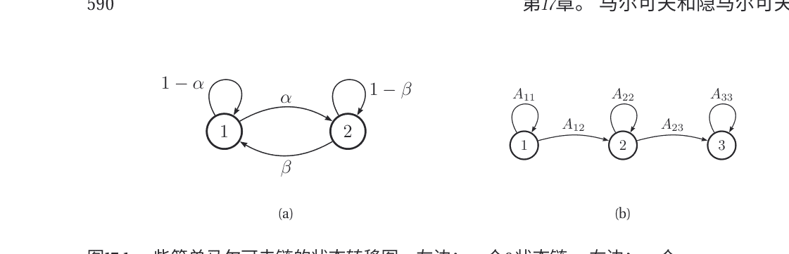

图17.1 一些简单马尔可夫链的状态转移图。左边：一个2状态链。右边：一个3状态从左到右的链。

一个稳定的、有限状态的马尔可夫链等价于一个随机自动机。通常可以通过绘制有向图来可视化这样的自动机，其中节点表示状态，箭头表示合法的转换，即 A 的非零元素。这被称为状态转换图。弧上的权重是概率。例如，下面的2状态链

$$ \mathbf{A} = \begin{pmatrix} 1-\alpha & \alpha \\ \beta & 1-\beta \end{pmatrix} $$

在图17.1（左）中有示例。下面的3状态链

$$ \mathbf{A} = \begin{pmatrix} A_{11} & A_{12} & 0 \\ 0 & A_{22} & A_{23} \\ 0 & 0 & 1 \end{pmatrix} $$

在图17.1（右）中有示例。这被称为从左到右的转移矩阵，并且在语音识别（第17.6.2节）中常用。转移矩阵的 $A_{ij}$ 元素指定了从 $i$ 到 $j$ 的一步的概率。在 $n$ 步转移矩阵 $\mathbf{A}(n)$ 中，$A_{ij}(n) \triangleq p(X_{t+n} = j|X_t = i)$ 被定义为 (17.4) 这是从 $i$ 到 $j$ 恰好经过 $n$ 步的概率。显然 $\mathbf{A}(1) = \mathbf{A}$。Chapman-Kolmogorov 方程表明

$$ A_{ij}(m+n) = \sum_{k=1}^{K} A_{ik}(m) A_{kj}(n) $$

换句话说，从 $i$ 到 $j$ 在 $m+n$ 步内的概率就是从 $i$ 到 $k$ 在 $m$ 步内的概率，然后从 $k$ 到 $j$ 在 $n$ 步内的概率，对所有 $k$ 求和。我们可以将上述表示为矩阵乘法

$$ \mathbf{A}(m+n) = \mathbf{A}(m) \mathbf{A}(n) $$

因此

$$ \mathbf{A}(n) = \mathbf{A} \mathbf{A}(n-1) = \mathbf{A} \mathbf{A} \mathbf{A}(n-2) = \cdots = \mathbf{A}^n $$

因此，我们可以通过“加强”转移矩阵来模拟马尔可夫链的多个步骤。

表17.1示例输出来自使用回退平滑在广播新闻语料库上训练的4-gram词模型。前4个词是手动指定的，模型生成第5个词，然后将结果反馈到模型中。来源：http://www.fit.vutbr.cz/~imikolov/rnnlm/gen-4gram.txt.

#### 17.2.2 应用：语言建模

马尔可夫模型的一个重要应用是生成统计语言模型，它是对单词序列的概率分布。我们将状态空间定义为英语（或其他语言）中的所有单词。边缘概率 $p(X_t = k)$ 被称为一元统计量。如果我们使用一阶马尔可夫模型，那么 $p(X_t = k|X_{t-1} = j)$ 被称为二元模型。如果我们使用二阶马尔可夫模型，那么 $p(X_t = k|X_{t-1} =j, X_{t-2} = i)$ 被称为三元模型。一般而言，这些被称为 n-gram 模型。例如，图17.2显示了从达尔文的《物种起源》中估计得到的字母 $\{a, \ldots, z, -\}$（其中-表示空格）的1-gram和2-gram计数。语言模型可以用于多种用途，例如以下几点：

- 句子完成：语言模型可以根据前面的单词预测下一个单词。这可以用来减少所需的输入量，对于残疾用户尤其重要（例如，David Mackay的Dasher系统$^{1}$），或者移动设备的使用。
- 数据压缩：任何密度模型都可以用来定义编码方案，通过为更可能出现的字符串分配短码字。预测模型越准确，存储数据所需的位数就越少。
- 文本分类：任何密度模型都可以用作类条件密度，从而转化为（生成式）分类器。请注意，使用0-gram类条件密度（即，仅使用一元统计）等效于朴素贝叶斯分类器（参见第3.5节）。
- 自动写作：可以从 $p(x_{1:t})$中采样生成人工文本。这是评估模型质量的一种方式。在表17.1中，我们给出了一个基于包含4亿个单词的语料库训练的4-gram模型生成的文本示例。（Tomas等人，2011年）描述了一个基于循环神经网络的更好的语言模型，可以生成更具语义合理性的文本。

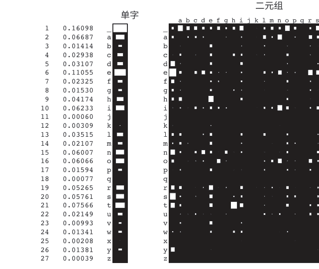

图17.2 达尔文的《物种起源》中的一元组和二元组计数。右侧的二维图是联合分布的辛顿图。白色方块的大小与相应向量/矩阵中的条目值成比例。基于 (MacKay 2003, p22)。由ngramPlot生成的图。

##### 17.2.2.1 马尔可夫语言模型的最大似然估计

我们现在讨论一种从训练数据中估计转移矩阵的简单方法。长度为 T 的任意特定序列的概率为

$$ p(x_{1:T}|\theta) = \pi(x_1) A(x_1, x_2) \ldots A(x_{T-1}, x_T) \tag{17.8} $$

$$ = \prod_{j=1}^K (\pi_j)^{\mathbb{I}(x_1=j)} \prod_{t=2}^T \prod_{j=1}^K \prod_{k=1}^K (A_{jk})^{\mathbb{I}(x_t=k, x_{t-1}=j)} \tag{17.9} $$

因此，一组序列 $D = (x_1, \ldots, x_N)$ 的对数似然函数，其中 $x_i = (x_{i1}, ..., x_{iT_i})$ 的长度为 $T_i$，可以表示为

$$ \log p(D|\theta) = \sum_{i=1}^N \log p(\mathbf{x}_i|\theta) = \sum_j N_j^1 \log \pi_j + \sum_j \sum_k N_{jk} \log A_{jk} \tag{17.10} $$

其中我们定义了以下计数：

$$ N_j^1 \triangleq \sum_{i=1}^N \mathbb{I}(x_{i1} = j), \quad N_{jk} \triangleq \sum_{i=1}^N \sum_{t=1}^{T_i-1} \mathbb{I}(x_{i,t} = j, x_{i,t+1} = k) \tag{17.11} $$

因此，我们可以将最大似然估计写成归一化的计数形式：

$$ \hat{\pi}_j = \frac{N_j^1}{\sum_j N_j^1}, \quad \hat{A}_{jk} = \frac{N_{jk}}{\sum_k N_{jk}} \tag{17.12} $$

这些结果可以直接推广到更高阶的马尔可夫模型。然而，当状态数 $K$ 和/或链的阶数 $N$ 很大时，零计数问题变得非常严重。一个 $n$-gram 模型有 $O(K^n)$ 个参数。如果我们的词汇表中有约 50,000个单词，那么一个二元模型将有大约25亿个自由参数，对应于所有可能的单词对。在我们的训练数据中，我们很不可能看到所有这些。然而，我们不希望预测一个特定的单词串完全不可能，仅仅因为我们在训练文本中没有看到它 —— 这将是一种严重的过拟合形式。$^2$

对此的一个简单解决方案是使用加一平滑，即在归一化之前将所有经验计数加一。贝叶斯对此的理论依据在第3.3.4.1节中给出。然而，加一平滑假设所有n-gram都是等可能的，这并不是非常现实的。在第17.2.2.2节中讨论了一种更复杂的贝叶斯方法。使用智能先验的另一种选择是收集大量的数据。例如，Google基于从网络中提取的一万亿个单词拟合了 $n$-gram模型（对于 $n = 1$ 至 $5$）。他们的数据在未压缩时超过100GB，并且是公开可用的。下面是他们的一组4-gram数据的示例。

- 作为进入的 92
- 作为孵化器的 99
- 作为独立的 794
- 作为指数的 223
- 作为指示的 72
- 作为指示器的 120
- 作为指标的 45
- 作为不可或缺的 111
- 作为不可或缺的 40
- 作为个体的 234
- ...

尽管这种基于“蛮力和无知”的方法可能会成功，但它并不令人满意，因为很明显这不是人类学习的方式（参见例如，（Tenenbaum和Xu 2000））。在第17.2.2.2节中描述了一种更精细的贝叶斯方法，它需要更少的数据。

##### 17.2.2.2 删除插值的经验贝叶斯版本

用于解决稀疏数据问题的常见启发式方法称为删除插值（Chen和Goodman 1996）。这将转移矩阵定义为bigram的凸组合

> > 2. 一个著名的例子是由诺姆·乔姆斯基提出的一个不太可能但在语法上是有效的英语词组，“无色的绿色思想疯狂地睡觉”。我们不希望我们的模型预测这个字符串是不可能的。即使是不符合语法的结构，我们的模型也应该以一定的概率允许，因为人们经常在口语中违反语法规则。
> > 3. 查看http://googleresearch.blogspot.com/2006/08/all-our-n-gram-are-belong-to-you.html了解详细信息。

频率 $f_{jk}=N_{jk}/N_j$ 和一元频率 $f_k=N_k/N$：

$$ A_{jk}=(1-\lambda)f_{jk}+\lambda f_k $$

术语 $\lambda$ 通常通过交叉验证来设置。还有一种密切相关的技术称为回退平滑；其思想是，如果 $f_{jk}$ 太小，我们会“回退”到更可靠的估计值，即 $f_k$。

我们将展示删除插值启发式方法是一个简单分层贝叶斯模型所做预测的近似。我们的演示遵循（McKay和Petol995）的方法。首先，让我们对转移矩阵的每一行使用独立的Dirichlet先验：

$$ \mathbf{A}_j \sim \text{Dir}(\alpha_0 m_1, \ldots, \alpha_0 m_K) = \text{Dir}(\alpha_0 \mathbf{m}) = \text{Dir}(\alpha) $$

其中 $\mathbf{A}_j$ 是转移矩阵的第j行，$\alpha_0$ 是先验强度值，我们假设为每一行使用相同的先验：参见图17.3。后验由 $\mathbf{A}_j \sim \text{Dir}(\alpha + \mathbf{N}_j)$ 给出，其中 $\mathbf{N}_j = (N_{j1}, \ldots, N_{jK})$ 是记录我们从状态j转移到其他状态的次数的向量。

根据方程3.51，后验预测密度为

$$ p(X_{t+1} = k | X_t = j, \mathcal{D}) = \bar{A}_{jk} = \frac{N_{jk} + \alpha m_k}{N_j + \alpha_0} = \frac{f_{jk} N_j + \alpha m_k}{N_j + \alpha_0} = (1 - \lambda_j) f_{jk} + \lambda_j m_k $$

其中 $\bar{A}_{jk} = \mathbb{E} [A_{jk} | \mathcal{D}, \alpha]$ 并且

$$ \lambda_j = \frac{\alpha}{N_j + \alpha_0} $$

这与方程式17.13非常相似，但并不完全相同。主要区别在于贝叶斯模型使用上下文相关的权重 $\lambda_j$ 将 $m_k$ 与经验频率 $f_{jk}$ 组合起来，而不是固定的权重 $\lambda$。这就像是自适应删除插值。此外，我们不是回退到经验边际频率 $f_k$，而是回退到模型参数 $m_k$。

唯一剩下的问题是：我们应该使用什么值来表示 $\alpha$ 和 $\mathbf{m}$？让我们使用经验贝叶斯。由于我们假设转移矩阵的每一行在给定 $\alpha$ 的先验独立性下，我们的马尔可夫模型的边际似然可以通过将方程式5.24应用于每一行来找到：

$$ p(\mathcal{D} | \alpha) = \prod_j \frac{B(\mathbf{N}_j + \alpha)}{B(\alpha)} $$

其中 $\mathbf{N}_j = (N_{j1}, \ldots, N_{jK})$ 是离开状态 $j$ 的计数，$B(\alpha)$ 是广义贝塔函数。

我们可以使用（Minka 2000e）中讨论的方法来拟合这个模型。然而，我们也可以使用以下近似方法（McKay and Peto 1995, p12）：

$$ m_k \propto |\{j : N_{jk} > 0\}| $$

这意味着单词 $k$ 的先验概率是它出现在不同上下文中的次数，而不是它出现的次数。为了证明这个结果的合理性，Mackay和Peto（McKay and Peto 1995）给出了以下例子。

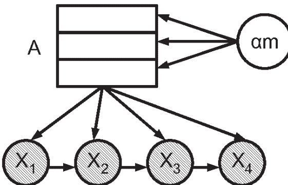

图17.3 一个马尔可夫链，在转移矩阵 A 的每一行上都放置了不同的狄利克雷先验，但狄利克雷的超参数是共享的。

想象一下，你看到，语言中经常出现的一对词组'你看到'，你看到，在这对词组中，第二个词'看到'紧随第一个词'你'之后的概率非常高，你看到。然后，边际统计量，你看到，将被'你'和'看到'这两个词主导，频率相等，你看到。

如果我们使用标准的平滑公式，方程式17.13，那么对于一些之前没有见过的新的上下文词，P('你'|新的)和P('看到'|新的)将会相同，因为'你'和'看到'的边际频率相同（各出现11次）。然而，这似乎是不合理的。'你'出现在许多上下文中，所以P('你'|新的)应该很高，但是 '看到'只在 '你'之后出现，所以P('看到'|新的)应该很低。如果我们使用贝叶斯公式方程式17.15，我们将会得到这种效果，因为我们会回退到 $m_k$ not $f_k$，并且根据方程式17.18，'你'的 $m_k$会很大，而'看到'的 $m_k$会很小。

不幸的是，尽管这个贝叶斯模型很优雅，但它并没有超越被称为插值Kneser-Ney的最先进语言模型（Kneser和Ney 1995; Chen和Goodman 1998）。然而，在（Teh 2006）中，已经展示了如何构建一个非参数贝叶斯模型，它通过使用可变长度的上下文超越了插值Kneser-Ney。在（Wood等人2009）中，这种方法被扩展为创建“序列记忆器”，它目前（2010年）是表现最好的语言模型。⁴

##### 17.2.2.3 处理未登录词

虽然上述平滑方法处理了计数小甚至为零的情况，但它们都没有处理测试集可能包含全新词汇的情况。特别地，它们都假设词汇表中的单词（即，$X$的状态空间）是固定且已知的（通常是训练数据中的唯一单词集合或某个词典）。

⁴. 有趣的是，这些非参数方法是基于后验推断，使用MCMC（第24.1节）和/或粒子滤波（第23.5节），而不是像EB那样的优化方法。尽管如此，它们非常高效。

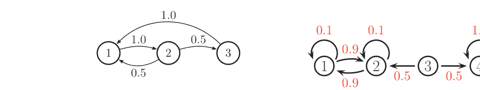

图17.4 一些马尔可夫链。(a) 一个3状态的非周期链。(b) 一个可约的4状态链。

即使所有的A_jk都是非零的，这些模型也不会预测集合之外的新词，因此对于一个包含陌生词的测试句子，它们会赋予零概率。（陌生词是不可避免的，因为词汇集是一个开放类。例如，专有名词（人名和地名）的集合是无限的。）

解决这个问题的一个标准启发式方法是用特殊符号 unk 替换所有的新词，unk 代表“未知”。一定量的概率质量被保留给这个事件。

一个更有原则的解决方案是使用狄利克雷过程，它可以生成一个可数无限状态空间，随着数据量的增加（见第25.2.2节）。如果所有新词都被“接受”为真实词，那么系统就没有预测能力，因为任何拼写错误都会被视为新词。因此，新词必须被频繁地出现，才能被添加到词汇表中。详见（Friedman and Singer 1999; Griffiths and Tenenbaum 2001）的详细信息。

#### 17.2.3 马尔可夫链的稳定分布*

我们一直在关注马尔可夫模型作为定义序列上的联合概率分布的一种方式。然而，我们也可以将它们解释为随机动力系统，在每个时间步骤中从一个状态跳转到另一个状态。在这种情况下，我们通常对状态的长期分布感兴趣，这被称为链的稳定分布。

在这一部分中，我们讨论了一些相关的理论。稍后我们将考虑两个重要的应用：Google的PageRank算法用于对网页进行排名（第17.2.4节），以及用于从难以归一化的概率分布中生成样本的MCMC算法（第24章）。

##### 17.2.3.1 什么是稳态分布？

设 $A_{ij} = p(X_t = j|X_{t-1} = i)$ 为一步转移矩阵，设 $\pi_t(j) = p(X_t = j)$ 为时间 $t$ 时处于状态 $j$ 的概率。在这个背景下，通常假设 $\pi$ 是一个行向量。如果我们对状态 $\pi_0$ 有一个初始分布，则在时间1时我们有

$$ \pi_1(j) = \sum_i \pi_0(i) A_{ij} $$

或者，用矩阵表示，

$$ \pi_1 = \pi_0 A $$

## 17.2. 马尔可夫模型

我们可以想象迭代这些方程。如果我们达到一个阶段，
$$\pi = \pi A$$ (17.21)
那么我们称之为稳态分布（也称为不变分布或平衡分布）。一旦我们进入稳态分布，我们将永远不会离开。

例如，考虑图17.4(a)中的链。为了找到它的稳态分布，我们写下
$$(\pi_1 \quad \pi_2 \quad \pi_3) = (\pi_1 \quad \pi_2 \quad \pi_3) \begin{pmatrix} 1 - A_{12} - A_{13} & A_{12} & A_{13} \\ A_{21} & 1 - A_{21} - A_{23} & A_{23} \\ A_{31} & A_{32} & 1 - A_{31} - A_{32} \end{pmatrix}$$ (17.22)
所以
$$\pi_1 = \pi_1(1 - A_{12} - A_{13}) + \pi_2 A_{21} + \pi_3 A_{31}$$ (17.23)
或者
$$\pi_1(A_{12} + A_{13}) = \pi_2 A_{21} + \pi_3 A_{31}$$ (17.24)
一般来说，我们有
$$\pi_i \sum_{j \ne i} A_{ij} = \sum_{j \ne i} \pi_j A_{ji}$$ (17.25)
换句话说，处于状态 i 的概率乘以从状态 i 流出的净流量必须等于处于其他每个状态 j 的概率乘以从该状态流入 i 的净流量。这些被称为全局平衡方程。我们可以解这些方程，但要满足的约束条件是 $\sum_j \pi_j = 1$。

### 17.2.3.2 计算稳态分布

要找到稳态分布，我们只需解决特征向量方程 $A^T v = v$，然后设置 $\pi = v^T$，其中 v 是特征向量，其特征值为1。（我们可以确定存在这样的特征向量，因为 A 是行随机矩阵，所以 $A\mathbf{1} = \mathbf{1}$；还要记住 A 和 $A^T$ 的特征值是相同的。）当然，由于特征向量只有在比例常数上唯一，我们必须在最后对 v 进行归一化，以确保其总和为一。

然而需要注意的是，如果矩阵是正的，特征向量只能保证是实数值的，即 $A_{ij} > 0$（因此 $A_{ij} < 1$，由于和为一的限制）。一个更一般的方法，可以处理一些转移概率为0或1的链（例如图17.4(a)），如下所示（Resnick 1992, p138）。我们从 $\pi (I - A) = 0_{K \times 1}$ 得到 K 个约束条件，从 $\pi \mathbf{1}_{K \times 1} = 0$ 得到1个约束条件。由于我们只有 K 个未知数，这是过约束的。

因此，让我们用 $\mathbf{1}$ 替换 $I - A$ 的任意一列（例如最后一列），得到一个新的矩阵，称为 M。接下来，我们定义 $r = [0, 0, \dots, 1]$，其中最后一位的1对应于 M 中全为1的列。然后我们解 $\pi M = r$。例如，对于一个3状态的链，我们需要解这个线性系统：
$$(\pi_1 \quad \pi_2 \quad \pi_3) \begin{pmatrix} 1 - A_{11} & -A_{12} & 1 \\ -A_{21} & 1 - A_{22} & 1 \\ -A_{31} & -A_{32} & 1 \end{pmatrix} = (0 \quad 0 \quad 1)$$ (17.26)

对于图17.4(a)中的链，我们发现 $\pi= [0.4,0.4,0.2]$。我们可以轻松验证这是正确的，因为 $\pi = \pi A$。请参见一些Matlab代码的 `mcStatDist`。不幸的是，并非所有的链都有一个稳态分布，如下所述。

### 17.2.3.3 何时存在稳态分布？ *

考虑图17.4(b)中的4状态链。如果我们从状态4开始，我们将永远停留在那里，因为4是一个吸收状态。因此 $\pi= (0,0,0,1)$是一个可能的稳态分布。然而，如果我们从1或2开始，我们将永远在这两个状态之间振荡。所以 $\pi= (0.5,0.5,0,0)$是另一个可能的稳态分布。如果我们从状态3开始，我们可能会最终处于上述任何一个稳态分布中。

从这个例子中我们可以看出，具有唯一的稳态分布的必要条件是状态转移图是一个单连通组件，即我们可以从任何状态到达任何其他状态。这样的链被称为不可约。

现在考虑图17.1(a)中的2状态链。只要 $\alpha, \beta > 0$, 它是不可约的。假设 $\alpha = \beta= 0.9$。很明显，由于对称性，这个链将花费50%的时间在每个状态上。因此 $\pi= (0.5,0.5)$。但是现在假设 $\alpha = \beta= 1$。在这种情况下，链将在两个状态之间振荡，但是长期状态分布取决于起始状态。如果我们从状态1开始，那么在每个奇数时间步骤(1,3,5, ...) 我们将处于状态1；但是如果我们从状态2开始，那么在每个奇数时间步骤我们将处于状态2。

这个例子激发了以下定义。如果一个链有一个极限分布，我们就说它有一个极限分布，如果 $\pi_j = \lim_{n\to\infty} A_{ij}^{(n)}$ 存在且与 $i$ 无关，对于所有的 $j$。如果这成立，那么状态的长期分布将独立于起始状态：
$$P(X_t = j) = \sum_i P(X_0 = i) A_{ij}^{(t)} \rightarrow \pi_j \text{ as } t \rightarrow \infty \quad (17.27)$$

现在让我们来描述何时存在极限分布。定义状态 $i$ 的周期为
$$d(i) = \text{gcd} \{ t : A_{ii}^{(t)} > 0 \} \quad (17.28)$$
其中 $\text{gcd}$ 表示最大公约数，即能够整除集合中所有成员的最大整数。例如，在图17.4(a)中，我们有 $d(1)=d(2)=\text{gcd}(2,3,4,6,...)=1$ 和 $d(3)=\text{gcd}(3,5,6,...)=1$。如果 $d(i)=1$，我们说状态 $i$ 是非周期的。（确保这一点的一个充分条件是状态 $i$ 有一个自环，但这不是一个必要条件。）我们说一个链是非周期的，如果它的所有状态都是非周期的。我们可以证明以下重要结果：

**定理 17.2.1.** 每个不可约（单连通），非周期的有限状态马尔可夫链都有一个极限分布，即 $\pi$，它的唯一稳态分布。

这个结果的一个特殊情况是，每个正则有限状态链都有一个唯一的稳态分布，其中正则链是指其转移矩阵满足 $A_{ij}^{(n)} > 0$ 对于某个整数 $n$ 和所有 $i,j$，即可以从任何状态转移到任何其他状态需要 $n$ 步。因此，在 $n$ 步之后，无论起始状态在哪里，链都可能处于任何状态。可以证明，确保正则性的充分条件是链是不可约（单连通）的，并且每个状态都有自环。

为了处理状态空间不是有限的马尔可夫链的情况（例如，所有整数的可数集，或所有实数的不可数集），我们需要推广一些早期的方法。

定义。由于细节相当技术性，我们只简要陈述主要结果而不证明。详细信息请参见（Grimmett和Stirzaker 1992）。

为了存在一个平稳分布，我们需要不可约性（单连通）和非周期性，与之前一样。但我们还要求每个状态都是经常性的。（所有状态都是经常性的链称为经常性链。）经常性意味着你以1的概率返回该状态。作为一个非经常性状态（即瞬态状态）的简单例子，请参考图17.4（b）：状态3是瞬态的，因为你立即离开它，要么永远在状态4周围旋转，要么在状态1和2之间永远振荡。没有办法返回状态3。

显然，任何有限状态的不可约链都是经常性的，因为你总是可以回到起点。但现在考虑一个具有无限状态空间的例子。假设我们在整数上进行随机游走，$\mathscr{X}=\{..., -2, -1, 0, 1, 2, ...\}$。设 $A_{i,i+1}=P$ 为向右移动的概率，$A_{i,i-1}=1-P$ 为向左移动的概率。假设我们从 $X_1=0$ 开始。如果 $P > 0.5$，我们将无限远地向右移动；我们不能保证返回。同样，如果 $P < 0.5$，我们将无限远地向左移动。因此，在这两种情况下，该链都不是经常性的，尽管它是不可约的。

直观上很明显，我们需要所有状态都是经常性的才能存在一个稳态分布。然而，这还不够。为了看到这一点，再次考虑整数上的随机游走，并假设 $p=0.5$。在这种情况下，我们可以无限次返回原点，所以链是经常性的。然而，这需要无限长的时间。这使得它无法具有稳态分布。直观上的原因是分布在整数集的一个越来越大的集合上不断扩散，并且永远不会收敛到一个稳态分布。更正式地说，如果返回到该状态的预期时间是有限的，我们将定义一个状态为非空经常性。所有状态都是非空的链称为非空链。

为了简洁起见，我们称一个状态为遍历的，如果它是非周期的、经常性的和非空的，并且我们称一个链是遍历的，如果它的所有状态都是遍历的。

我们现在可以陈述我们的主要定理：

**定理 17.2.2.** 每个不可约（单连通），遍历的马尔可夫链都有一个极限分布，它等于 $\pi$，它的唯一稳态分布。

这推广了定理17.2.1，因为对于不可约的有限状态链，所有状态都是经常性的且非零的。

### 17.2.3.4 详细平衡

建立遍历性可能很困难。我们现在给出一个更容易验证的替代条件。

我们说一个马尔可夫链 $A$ 是时间可逆的如果存在一个分布 $\pi$ 使得
$$\pi_i A_{ij} = \pi_j A_{ji} \quad (17.29)$$
这些被称为详细平衡方程。这意味着从 $i$ 到 $j$ 的流必须等于从 $j$ 到 $i$ 的流，加权以适当的源概率。

我们有以下重要结果。

**定理 17.2.3.** 如果具有转移矩阵 $A$ 的马尔可夫链是正则的，并且满足关于分布 $\pi$ 的详细平衡条件，则 $\pi$ 是该链的一个稳态分布。

证明。要看到这一点，请注意
$$
\sum_{i} \pi_{i} A_{i j}=\sum_{i} \pi_{j} A_{j i}=\pi_{j} \sum_{i} A_{j i}=\pi_{j}
\tag{17.30}
$$
因此 $\pi = \mathbf{A} \pi$。 $\square$

请注意，这个条件是充分但不必要的（参见图17.4(a)中不满足详细平衡条件的稳态分布的示例）。在第24.1节中，我们将讨论马尔可夫链蒙特卡洛（MCMC）方法。这些方法以所需分布 $\pi$ 作为输入，并构造满足关于 $\pi$ 的详细平衡条件的转移矩阵（或一般情况下的转移核） $\mathbf{A}$。因此，通过从这样的链中采样状态，我们最终将进入稳态分布，并以 $\pi$ 给出的概率访问状态。

## 17.2.4 应用：谷歌的PageRank算法用于网页排名 *

17.2.3节的结果构成了谷歌的PageRank算法的理论基础，该算法用于全球范围内的信息检索。我们在下面简要介绍基本思想；有关更详细的解释，请参见(Byran and Leise 2006)。

我们将把网络视为一个巨大的有向图，其中节点表示网页（文档），边表示超链接。$^{5}$ 然后我们执行一个称为网络爬虫的过程。我们从一些指定的根节点开始，例如 dmoz.org，这是开放目录项目的主页，然后按照链接的顺序存储遇到的所有页面，直到时间用完。

接下来，将每个网页中的所有单词输入到称为倒排索引的数据结构中。也就是说，对于每个单词，我们存储该单词出现的文档列表。（在实践中，我们存储表示URL的哈希码列表。）在测试时，当用户输入一个查询，我们可以查找包含每个单词的所有文档，并交集这些列表（因为查询由搜索项的连接定义）。通过存储每个单词在每个文档中的位置，我们可以获得更精确的搜索结果。然后，我们可以测试文档中的单词是否按照查询中的顺序出现。

让我们举个例子，来自于 http://en.wikipedia.org/wiki/Inverted_index。我们有3个文档，$T_0=$“它就是它”，$T_1=$“它是什么”，$T_2=$“它是一个香蕉”。然后，我们可以创建以下倒排索引，其中每对表示一个文档和单词的位置：

```
"a": {(2, 2)}
"香蕉": {(2, 3)}
"是": {(0, 1), (0, 4), (1, 1), (2, 1)}
"它": {(0, 0), (0, 3), (1, 2), (2, 0)}
"什么": {(0, 2), (1, 0)}
```

例如，我们可以看到单词“什么”在文档0中的位置是2（从0开始计数），在文档1中的位置是0。假设我们搜索“什么是它”。如果我们忽略单词顺序，我们会检索到以下文档：
$$\{T_0, T_1\} \cap \{T_0, T_1, T_2\} \cap \{T_0, T_1, T_2\} = \{T_0, T_1\} \qquad (17.31)$$
如果我们要求单词顺序匹配，只有文档 $T_1$ 会被返回。更一般地说，我们可以允许无序匹配，但可以给与单词顺序与查询单词顺序匹配的文档“加分”，或者给予其他特征加分，例如单词出现在文档标题中。然后，我们可以按照得分/相关性的降序返回匹配的文档。这被称为文档排序。

到目前为止，我们已经描述了信息检索的标准过程。但是网络的链接结构提供了额外的信息来源。基本思想是一些网页比其他网页更有权威性，因此应该排名更高（假设它们与查询匹配）。如果一个网页被许多其他网页链接到，那么它就是一个权威网页。但为了防止所谓的链接农场的影响，链接农场是指仅仅链接到给定网站以提高其表面相关性的虚假页面，我们将根据来源的权威性对每个传入链接进行加权。

因此，我们得到了页面 $j$ 的权威性的以下递归定义，也称为其**PageRank**：
$$\pi_j = \sum_{i} A_{ij} \pi_i \qquad (17.32)$$
其中 $A_{ij}$ 是从 $i$ 到 $j$ 的链接跟随的概率。我们将方程17.32识别为马尔可夫链的稳态分布。

在最简单的设置中，我们将 $A_{i}$ 定义为与 $i$ 相连的所有状态的均匀分布。然而，为了确保分布是唯一的，我们需要将链变成一个正则链。这可以通过允许每个状态 $i$ 以一定的、小概率跳转到任何其他状态（包括自身）来实现。这实际上使得转移矩阵是非周期的，并且是完全连接的（尽管网络本身的邻接矩阵 $G_{ij}$ 非常稀疏）。

我们发现稳态分布是
$$\pi = (0.3209, 0.1706, 0.1065, 0.1368, 0.0643, 0.2008) \quad (17.33)$$
因此，一个随机浏览者会大约有32%的时间访问网站1。我们可以看到节点1的PageRank比节点4或6更高，尽管它们都有相同数量的入链。这是因为从一个有影响力的节点链接到你会比从一个不那么有影响力的节点链接到你更有助于提高你的PageRank分数。

作为一个稍大的例子，图17.6(a)展示了一个从根节点 harvard.edu派生出来的网页图。图17.6(b)展示了相应的PageRank向量。

### 17.2.4.1 高效计算PageRank向量

令 $G_{ij} = 1$ 当且仅当从 $j$ 到 $i$ 有一条链接。现在想象在这个图上进行随机游走，在每个时间步骤中，以概率 $p=0.85$，你以均匀随机的方式跟随一个出链，以概率 $1-p$，你跳转到一个随机节点，同样是均匀随机选择的。如果没有出链，你只是跳转到一个随机页面。（这些随机跳转，包括自我转移，确保链是不可约（单连通）和正则的。）因此，我们可以使用特征向量方法解出其唯一的稳态分布。这定义了以下转移矩阵：
$$M_{ij} = \begin{cases} pG_{ij}/c_j + \delta & \text{如果 } c_j \ne 0 \\ 1/n & \text{如果 } c_j = 0 \end{cases} \quad (17.34)$$
其中 $n$ 是节点的数量，$\delta=(1-p)/n$ 是从一个页面跳转到另一个页面而不遵循链接的概率，$c_j = \sum_i G_{ij}$ 表示页面 $j$ 的出度。（如果 $n=4 \cdot 10^9$ 和 $p=0.85$，那么 $\delta=3.75 \cdot 10^{-11}$。）这里 $M$ 是一个随机矩阵，其中列的和为一。注意 $M = A^T$ 是我们之前的表示法。

我们可以简洁地表示转移矩阵如下。定义对角矩阵 $D$
$$d_{jj} = \begin{cases} 1/c_j & \text{if } c_j \ne 0 \\ 0 & \text{如果 } c_j = 0 \end{cases} \quad (17.35)$$
$$z_j=\begin{cases}\delta & \text{如果 } c_j\ne 0 \\ 1/n & \text{如果 } c_j=0\end{cases} \quad \quad (17.36)$$
那么我们可以将方程17.34重写为：
$$\mathbf{M} = p\mathbf{G}\mathbf{D} + \mathbf{1}\mathbf{z}^T \quad \quad (17.37)$$
矩阵 M 不是稀疏的，但它是一个稀疏矩阵的秩一修正。矩阵 M 的大部分元素都等于小常数 $\delta$。显然，这些不需要明确存储。

我们的目标是解决 $\mathbf{v} = \mathbf{M}\mathbf{v}$ 的问题，其中 $\mathbf{v} = \pi^T$。一种有效的方法来找到一个大矩阵的主特征向量被称为幂法。这只是由重复的矩阵-向量乘法组成，然后进行归一化：
$$\mathbf{v} \propto \mathbf{M}\mathbf{v} = p\mathbf{G}\mathbf{D}\mathbf{v} + \mathbf{1}\mathbf{z}^T\mathbf{v} \quad \quad (17.38)$$
可以在不使用任何矩阵乘法的情况下实现幂法，只需从转移矩阵中进行采样，并计算每个状态的访问频率。这本质上是对由 $\mathbf{v} = \mathbf{M}\mathbf{v}$ 所隐含的求和的蒙特卡洛近似。将此应用于图17.6(a)中的数据，得到图17.6(b)中的稳态分布。从均匀分布开始，经过13次迭代才收敛。（另请参见Tim Davis的函数 `pagerankDemo`，用于展示该算法在网络示例中的运行动画。）为了处理不断变化的网络结构，我们可以每天或每周重新运行此算法，从旧的分布（Langville和Meyer 2006）开始。

有关如何在并行分布计算环境中执行此蒙特卡洛幂法的详细信息，请参阅（Rajaraman和Ullman 2010）等。

### 17.2.4.2 网络垃圾

PageRank并不是绝对可靠的。例如，考虑JC Penney采取的策略，这是美国的一家百货商店。在2010年的圣诞季，它在成千上万个无关的网页上放置了许多链接，从而提高了在Google搜索引擎上的排名（Segal 2011）。尽管这些源页面的PageRank很低，但它们的影响是累加的。企业称之为搜索引擎优化；Google称之为网络垃圾。当Google被（纽约时报）通知了这个骗局时，它手动降低了JC Penney的权重，因为这种行为违反了Google的行为准则。结果是JC Penney从排名第1降至第65，基本上从视野中消失了。

自动检测此类骗局依赖于各种超出本章范围的技术。

### 17.3 隐马尔可夫模型

正如我们在第10.2.2节中提到的，一个隐马尔可夫模型（HMM）由一个离散时间、离散状态的马尔可夫链组成，其中隐藏状态 $z_t \in \{1, \ldots, K\}$，加上一个观测模型图17.7 (a) 从3个状态的HMM中采样的一些2D数据。每个状态从一个2D高斯分布中发射。(b) 隐藏状态序列。基于(Bishop 2006b)的图13.8。由hmmLillypadDemo生成的图。

相应的联合分布具有以下形式

$$ p(\mathbf{z}_{1:T}, \mathbf{x}_{1:T}) = p(\mathbf{z}_{1:T}) p(\mathbf{x}_{1:T}|\mathbf{z}_{1:T}) = \left[ p(z_1) \prod_{t=2}^{T} p(z_t|z_{t-1}) \right] \left[ \prod_{t=1}^{T} p(\mathbf{x}_t|z_t) \right] $$

HMM中的观测可以是离散的或连续的。如果它们是离散的，观测模型通常是一个观测矩阵:

$$ p(\mathbf{x}_t = l | z_t = k, \theta) = B(k, l) $$

如果观测是连续的，观测模型通常是一个条件高斯分布:

$$ p(\mathbf{x}_t | z_t = k, \theta) = \mathcal{N}(\mathbf{x}_t | \mu_k, \Sigma_k) $$

图17.7显示了一个例子，其中有3个状态，每个状态发射一个不同的高斯分布。得到的模型类似于高斯混合模型，只是聚类成员关系具有马尔可夫动力学。（事实上，HMMs有时被称为马尔可夫切换模型 (Fruhwirth-Schnatter 2007)。）我们可以看到我们倾向于在同一个位置得到多个观测值，然后突然跳到一个新的聚类。

#### 17.3.1 HMM的应用

HMM可以作为序列上的黑盒密度模型使用。它们相对于马尔可夫模型的优势在于可以表示观测之间的长程依赖，通过潜在变量进行中介。特别要注意的是，它们不假设观测本身满足马尔可夫性质。这种黑盒模型对于时间序列预测很有用 (Fraser 2008)。它们还可以用于在生成式分类器中定义类条件密度。

然而，更常见的是赋予隐藏状态一些期望的含义，并尝试从观测中估计隐藏状态，即计算 $p(z_t|x_{1:t})$如果我们处于在线场景中，或者 $p(z_t|\mathbf{x}_{1:T})$ 如果我们处于离线场景中（有关这两种方法之间差异的进一步讨论，请参见第17.4.1节）。下面我们给出一些使用HMM的应用示例：

- 自动语音识别。这里， $\mathbf{x}_t$ 表示从语音信号中提取的特征， $z_t$ 表示正在说的单词。转移模型 $p(z_t|z_{t-1})$ 表示语言模型，观测模型 $p(\mathbf{x}_t|z_t)$ 表示声学模型。详细信息请参见 (Jelinek 1997; Jurafsky and Martin 2008)。
- 活动识别。这里的 $\mathbf{x}_t$ 代表从视频帧中提取的特征，而 $z_t$ 代表人们从事的活动类别（例如，跑步、走路、坐着等）。有关详细信息，请参见例如 (Szeliski 2010)。
- 词性标注。这里的 $x_t$ 代表一个单词，而 $z_t$ 代表其词性（名词、动词、形容词等）。有关POS标注和相关任务的更多信息，请参见第19.6.2.1节。
- 基因发现。这里的$x_t$代表DNA核苷酸（A、C、G、T），而$z_t$代表我们是否在基因编码区域内。有关详细信息，请参见例如（Schweikerta et al. 2009）。
- 蛋白质序列比对。这里的$x_t$代表一种氨基酸，而$z_t$代表这是否与该位置的潜在一致序列匹配。这个模型被称为概要HMM，并在图17.8中说明。HMM有3个状态，称为匹配、插入和删除。如果$z_t$是一个匹配状态，那么$x_t$等于共识的第$t$个值。如果$z_t$是一个插入状态，那么$x_t$是从与共识序列无关的均匀分布中生成的。如果$z_t$是一个删除状态，那么$x_t = -$。通过这种方式，我们可以生成不同长度的共识序列的噪声副本。在图17.8(a)中，共识是“AGC”，我们可以看到下面的各种版本。状态转移图中的路径，如图17.8(b)所示，指定了如何将序列对齐到共识，例如对于$z_t$，最可能的路径是$D, D, I, I, I, M$。这意味着我们删除了共识序列的A和G部分，插入了3个A，然后匹配了最后的C。我们可以通过计算这样的转换次数和每种状态的发射次数来估计模型参数，如图17.8(c)所示。有关在HMM中进行训练的更多信息，请参阅第17.5节，有关概要HMM的详细信息，请参阅(Durbin et al. 1998)。

请注意，对于其中一些任务，条件随机场（CRF）可能更合适，它们本质上是HMM的判别版本；有关详细信息，请参见第19章。

| 动物 | 序列1 | 序列2 | 序列3 | 序列4 |
|---|---|---|---|---|
| 蝙蝠 | A | G | - | C |
| 老鼠 | A | - | A | G | C |
| 猫 | A | G | - | A | A | - |
| 虫子 | - | - | A | A | A | C |
| 山羊 | A | G | - | - | C |

(a)

图17.8 (a) 一些DNA序列。(b) 一个概要HMM的状态转移图。来源：Figure 5.7 of (Durbin et al. 1998)。在Richard Durbin的友好许可下使用。

### 17.4 HMM的推断

我们现在讨论如何推断隐藏状态序列的HMM，假设参数已知。完全相同的算法适用于其他链式结构的图模型，例如链式CRF（参见第19.6.1节）。在第20章中，我们将这些方法推广到任意图。在第17.5.2节中，我们展示了如何在参数估计的上下文中使用推断的输出。

#### 17.4.1 时间模型的推断问题类型

对于HMM（和SSM一般情况下），有几种不同类型的推理任务。为了说明差异，我们将考虑一个名为“偶尔不诚实的赌场”的例子（来自Durbin等人，1998年）。在这个模型中，$x_t \in \{1,2, \dots,6\}$表示骰子的面，$z_t$表示正在使用的骰子的身份。大部分时间赌场使用公平的骰子，$z=1$，但偶尔会在短时间内切换到有偏的骰子，$z=2$。如果$z=1$观测分布是符号$\{1, \dots,6\}$的均匀多项式分布。如果$z=2$,观测分布偏向于面部6（见图17.9）。如果我们从这个模型中采样，我们可能会观察到以下数据：

**清单17.1 casinoDemo的示例输出**

| 滚动次数 | 6 6 4 1 5 3 2 1 6 1 6 2 1 1 5 2 3 4 6 5 3 2 1 4 3 5 6 6 3 4 2 6 1 6 5 2 3 4 2 3 2 3 1 5 1 4 2 4 6 4 1 5 6 6 3 2 4 6 |
| --- | --- |
| 骰子 | L L L L L L L L L L L L L L F F F F F L L L L L L L L L L F F F F F F F F F F F F F L L L L L L L L |

这里，“滚动”指的是观察到的符号，“骰子”指的是隐藏状态（L表示加载，F表示公平）。因此，我们可以看到模型生成了一系列符号，但统计数据的分布时不时地突然变化。在典型的应用中，我们只看到掷骰子的结果，并希望推断使用的是哪个骰子。但是有不同类型的推理，我们在下面总结。

- **过滤**意味着在线或递归地计算置信状态 $p(z_t|x_{1:t})$，随着数据的流入，这被称为“过滤”，因为它比仅仅使用当前估计 $p(z_t|x_t)$更能减少噪声。我们将在下面看到，我们可以通过顺序应用贝叶斯规则来执行过滤。参见图17.10 (a) 的示例。
- **平滑**意味着离线计算概率 $p(z_t|x_{1:T})$，给定所有证据。参见图17.10(b)作为一个例子。通过对过去和未来数据进行条件约束，我们的不确定性将显著减少。为了直观理解这一点，考虑一个侦探试图弄清楚谁犯了罪。当他在犯罪现场移动时，他的不确定性很高，直到他找到关键线索；然后他有一个“啊哈”时刻，他的不确定性减少了，之前所有令人困惑的观察在回顾时很容易解释。
- **固定滞后平滑**是在线和离线估计之间的一个有趣折衷方案；它涉及计算 $p(z_{t-\ell}|\mathbf{x}_{1:t})$，其中$\ell>0$被称为滞后。这比滤波性能更好，但会稍有延迟。通过改变滞后的大小，可以在准确性和延迟之间进行权衡。
- **预测**与固定滞后平滑不同，我们可能希望根据过去来预测未来，即计算 $p(z_{t+h}|\mathbf{x}_{1:t})$，其中$h>0$被称为预测 **horizon**。例如，假设$h=2$；那么我们有
$$p(z_{t+2}|\mathbf{x}_{1:t}) = \sum_{z_{t+1}} \sum_{z_t} p(z_{t+2}|z_{t+1})p(z_{t+1}|z_t)p(z_t|\mathbf{x}_{1:t}) \quad (17.42)$$
执行这个计算很简单：我们只需将转移矩阵乘以当前的信念状态。数量 $p(z_{t+h}|\mathbf{x}_{1:t})$ 是对未来隐藏状态的预测；可以通过将其转换为对未来观测的预测来使用
$$p(\mathbf{x}_{t+h}|\mathbf{x}_{1:t}) = \sum_{z_{t+h}} p(\mathbf{x}_{t+h}|z_{t+h})p(z_{t+h}|\mathbf{x}_{1:t}) \quad (17.43)$$
这是后验预测密度，可用于时间序列预测（详见(Fraser 2008)）。参见图17.11，了解滤波、平滑和预测之间的关系的草图。
- **MAP估计**这意味着计算 $\arg \max_{\mathbf{z}_{1:T}} p(\mathbf{z}_{1:T}|\mathbf{x}_{1:T})$，这是最可能的状态序列。在HMM的背景下，这被称为维特比解码（详见第17.4.4节）。图17.10说明了偶尔不诚实的赌场HMM的滤波、平滑和MAP解码之间的差异。我们可以看到平滑（离线）估计确实比滤波（在线）估计更加平滑。如果我们将估计值阈值设为0.5并与真实序列进行比较，我们发现滤波方法在300次中有71个错误，平滑方法有49/300个错误；MAP路径有60/300个错误。平滑方法比维特比方法产生的错误更少并不奇怪，因为最小化比特错误率的最佳方法是对后验边缘进行阈值处理（参见第5.7.11节）。然而，对于某些应用，我们可能更喜欢维特比解码，这一点我们在第17.4.4节中讨论。
- **后验样本**如果数据存在多个合理的解释，从后验分布中进行采样是很有用的，即 $z_{1:T} \sim p(z_{1:T}|x_{1:T})$。这些样本路径包含比平滑计算得到的边缘序列更多的信息。
- **证据的概率**我们可以通过对所有隐藏路径求和来计算证据的概率，即 $p(x_{1:T})$，这可以用于序列分类（例如，如果HMM用作类条件密度），用于基于模型的聚类，用于异常检测等。

#### 17.4.2 前向算法

现在我们来描述如何在HMM中递归地计算滤波边缘概率 $p(z_t|x_{1:t})$，算法有两个步骤。首先是预测步骤，在这一步中，我们计算一步预测密度；这将作为时间 $t$ 的新先验：

$$ p(z_t=j|x_{1:t-1}) = \sum_i p(z_t=j|z_{t-1}=i)p(z_{t-1}=i|x_{1:t-1}) $$

接下来是更新步骤，在这一步中，我们使用贝叶斯规则吸收从时间 $t$ 观察到的数据:

$$ \alpha_t(j) \triangleq p(z_t=j|x_{1:t}) = p(z_t=j|x_t, x_{1:t-1}) \\ = \frac{1}{Z_t} p(x_t|z_t=j, x_{1:t-1}) p(z_t=j|x_{1:t-1}) $$

其中归一化常数由以下给出

$$ Z_t \triangleq p(x_t|x_{1:t-1}) = \sum_j p(z_t=j|x_{1:t-1}) p(x_t|z_t=j) $$

这个过程被称为预测-更新循环。分布 $p(z_t|x_{1:t})$ 被称为时间 $t$ 的（滤波）置信状态，通常用向量 $\alpha_t$ 表示。在矩阵-向量表示中，我们可以用以下简单形式表示更新:

$$ \alpha_t \propto \psi_t \odot (\Psi^T \alpha_{t-1}) $$

其中 $\psi_t(j)=p(x_t|z_t=j)$ 是时间 $t$ 的局部证据， $\Psi(i,j)=p(z_t=j|z_{t-1}=i)$ 是转移矩阵， $\odot$ 表示逐元素向量乘法。请参见算法6的伪代码，以及一些Matlab代码的 `hmmFilter`。

除了计算隐藏状态外，我们还可以使用这个算法来计算证据的对数概率：

$$\log p(\mathbf{x}_{1:T}|\boldsymbol{\theta}) = \sum_{t=1}^{T} \log p(\mathbf{x}_t|\mathbf{x}_{1:t-1}) = \sum_{t=1}^{T} \log Z_t \qquad \qquad (17.49)$$

(我们需要在对数域中工作，以避免数值下溢。)

**算法17.1：前向算法**

1. 输入：转移矩阵 $\psi(i, j) = p(z_t = j|z_{t-1} = i)$, 本地证据向量 $\psi_t(j) = p(\mathbf{x}_t|z_t = j)$, 初始状态分布 $\pi(j) = p(z_1 = j)$;
2. $[\alpha_1, Z_1] = \text{normalize}(\psi_1 \odot \pi)$;
3. **for** $t = 2:T$ **do**
4.    $[\alpha_t, Z_t] = \text{normalize}(\psi_t \odot (\Psi^T \alpha_{t-1}))$;
5. **返回** $\alpha_{1:T}$ 和 $\log p(\mathbf{x}_{1:T}) = \sum_t \log Z_t$;
6. 子程序：$[\mathbf{v}, Z] = \text{normalize}(\mathbf{u}) : Z = \sum_j u_j; \quad v_j = u_j/Z;$

#### 17.4.3 前向-后向算法

在第17.4.2节中，我们解释了如何使用在线推理计算过滤边缘概率 $p(z_t = j|\mathbf{x}_{1:t})$。现在我们讨论如何使用离线推理计算平滑边缘概率 $p(z_t = j|\mathbf{x}_{1:T})$。

#### 17.4.3.1 基本思想

关键的分解依赖于我们可以通过对 $z_t$ 进行条件化，将链条分为过去和未来两部分：

$$p(z_t = j|\mathbf{x}_{1:T}) \propto p(z_t = j, \mathbf{x}_{t+1:T}|\mathbf{x}_{1:t}) \propto p(z_t = j|\mathbf{x}_{1:t}) p(\mathbf{x}_{t+1:T}|z_t = j, \mathbf{x}_{1:t}) \qquad \qquad (17.50)$$

让 $\alpha_t(j) \triangleq p(z_t = j|\mathbf{x}_{1:t})$ 作为之前的滤波信念状态。同时，定义

$$\beta_t(j) \triangleq p(\mathbf{x}_{t+1:T}|z_t = j) \qquad \qquad (17.51)$$

作为给定时间 $t$ 的隐藏状态为 $j$ 时未来证据的条件似然。(请注意，这不是状态的概率分布，因为它不需要满足 $\sum_j \beta_t(j) = 1$。) 最后，定义

$$\gamma_t(j) \triangleq p(z_t = j|\mathbf{x}_{1:T}) \qquad \qquad (17.52)$$

作为所需的平滑后验边际。根据方程式17.50，我们有

$$\gamma_t(j) \propto \alpha_t(j)\beta_t(j) \qquad \qquad (17.53)$$

我们已经描述了如何按从左到右的顺序递归计算 \(\alpha\) 的方法，在第17.4.2节中。现在我们描述如何按从右到左的顺序递归计算 \(\beta\) 的方法。如果我们已经计算了 \(\beta_t\)，我们可以按以下方式计算 \(\beta_{t-1}\)：\(\beta_{t-1}(i) = p(\mathbf{x}_{t:T} | z_{t-1}=i)\)

\[\begin{align*}
\beta_{t-1}(i) &= \sum_j p(z_t = j, \mathbf{x}_t, \mathbf{x}_{t+1:T} | z_{t-1} = i) \\
&= \sum_j p(\mathbf{x}_{t+1:T} | z_t = j, z_{t-1} = i, \mathbf{x}_t) p(z_t = j, \mathbf{x}_t | z_{t-1} = i) \\
&= \sum_j p(\mathbf{x}_{t+1:T} | z_t = j) p(\mathbf{x}_t | z_t = j, z_{t-1} = i) p(z_t = j | z_{t-1} = i) \\
&= \sum_j \beta_t(j) \psi_t(j) \psi(i, j)
\end{align*}\]
对应的公式编号为：(17.54), (17.55), (17.56), (17.57), (17.58)

我们可以将得到的方程写成矩阵-向量形式

$$\boldsymbol{\beta}_{t-1} = \boldsymbol{\Psi} (\boldsymbol{\psi}_t \odot \boldsymbol{\beta}_t) \quad (17.59)$$

基本情况是

$$\beta_T(i) = p(\mathbf{x}_{T+1:T} | z_T = i) = p(\emptyset | z_T = i) = 1 \quad (17.60)$$

这是一个非事件的概率。
计算了前向和后向消息后，我们可以将它们组合起来计算 \(\gamma_t(j) \propto \alpha_t(j)\beta_t(j)\)。整体算法被称为前向-后向算法。伪代码与前向情况非常相似；请参见实现的 `hmmFwdBack`。
我们可以将这个算法看作是从左到右传递“消息”，然后从右到左传递，并在每个节点处将它们组合起来。我们将在第20.2节中推广这个直觉，当我们讨论信念传播时。

#### 17.4.3.2 两片平滑边缘

当我们使用EM算法（见第17.5节）估计转移矩阵的参数时，我们需要计算从状态 \(i\) 到状态 \(j\) 的预期转移次数：

$$N_{ij} = \sum_{t=1}^{T-1} \mathbb{E} [\mathbb{I}(z_t = i, z_{t+1} = j) | \mathbf{x}_{1:T}] = \sum_{t=1}^{T-1} p(z_t = i, z_{t+1} = j | \mathbf{x}_{1:T}) \quad (17.61)$$

术语 \(p(z_t = i, z_{t+1} = j | \mathbf{x}_{1:T})\) 被称为（平滑的）两片边缘，可以如下计算

\[\begin{align*}
\xi_{t,t+1}(i, j) &\triangleq p(z_t = i, z_{t+1} = j | \mathbf{x}_{1:T}) \\
&\propto p(z_t | \mathbf{x}_{1:t}) p(z_{t+1} | z_t, \mathbf{x}_{t+1:T}) \\
&\propto p(z_t | \mathbf{x}_{1:t}) p(\mathbf{x}_{t+1:T} | z_t, z_{t+1}) p(z_{t+1} | z_t) \\
&\propto p(z_t | \mathbf{x}_{1:t}) p(\mathbf{x}_{t+1} | z_{t+1}) p(\mathbf{x}_{t+2:T} | z_{t+1}) p(z_{t+1} | z_t) \\
&= \alpha_t(i) \phi_{t+1}(j) \beta_{t+1}(j) \psi(i, j)
\end{align*}\]
对应的公式编号为：(17.62), (17.63), (17.64), (17.65), (17.66)在矩阵-向量形式中，我们有
$$ \xi_{t,t+1} \propto \Psi \odot (\alpha_t (\phi_{t+1} \odot \beta_{t+1})^T) $$
对于这些方程的另一种解释，请参见第20.2.4.3节。

## 17.4.3.3 时间和空间复杂度

很明显，FB的直接实现需要 $O(K^2T)$ 时间，因为我们必须在每一步执行一次 $K \times K$ 矩阵乘法。对于一些应用，比如语音识别，$K$ 非常大，因此 $O(K^2)$ 项变得不可行。幸运的是，如果转移矩阵是稀疏的，我们可以大大减少这个值。例如，在一个从左到右的转移矩阵中，该算法需要 $O(TK)$ 时间。

在某些情况下，即使转移矩阵不是稀疏的，我们也可以利用状态空间的特殊属性。特别是，假设状态表示底层连续状态空间的离散化，并且转移矩阵具有形式 $\psi(i, j) \propto \exp(-\sigma^2|\mathbf{z}_i - \mathbf{z}_j|)$，其中 $\mathbf{z}_i$ 是由状态 $i$ 表示的连续向量。然后，可以在 $O(TK \log K)$ 时间内实现前向-后向算法。这对于具有大状态空间的模型非常有用。详细信息请参见第22.2.6.1节。

在某些情况下，瓶颈是内存，而不是时间。EM算法需要的期望充分统计量是 $\sum_t \xi_{t-1,t}(i, j)$；这需要恒定的空间（与 $T$ 无关）；然而，为了计算它们，我们需要 $O(KT)$ 的工作空间，因为我们必须存储 $\alpha_t$ for $t=1, \dots$ 直到我们进行反向传播。可以设计一个简单的分治算法，将空间复杂度从 $O(KT)$ 降低到 $O(K \log T)$，但代价是增加运行时间从 $O(K^2T)$ 到 $O(K^2T \log T)$：详见 (Binder et al. 1997; Zweig and Padmanabhan 2000) 的细节。

#### 17.4.4 维特比算法

维特比算法 (Viterbi 1967) 可以用于计算链式图模型中最可能的状态序列，即可以计算
$$ \mathbf{z}^* = \arg \max_{\mathbf{z}_{1:T}} p(\mathbf{z}_{1:T} | \mathbf{x}_{1:T}) $$
这相当于通过图17.12中的状态图计算最短路径，其中节点是每个时间步的可能状态，节点和边的权重是对数概率。也就是说，路径 $z_1, z_2, \dots, z_T$ 的权重为
$$ \log \pi_1(z_1) + \log \phi_1(z_1) + \sum_{t=2}^{T} [\log \psi(z_{t-1}, z_t) + \log \phi_t(z_t)] $$

### 17.4.4.1 MAP vs MPE

在讨论算法如何工作之前，让我们先做一个重要的说明：(联合)最可能的状态序列不一定与(边际)最可能的状态序列相同。前者由方程17.68给出，这是维特比算法计算的内容，而后者由后验边际的最大化者给出 MPM：
$$ \hat{\mathbf{z}} = (\arg \max_{z_1} p(z_1|\mathbf{x}_{1:T}), \dots, \arg \max_{z_T} p(z_T|\mathbf{x}_{1:T})) $$

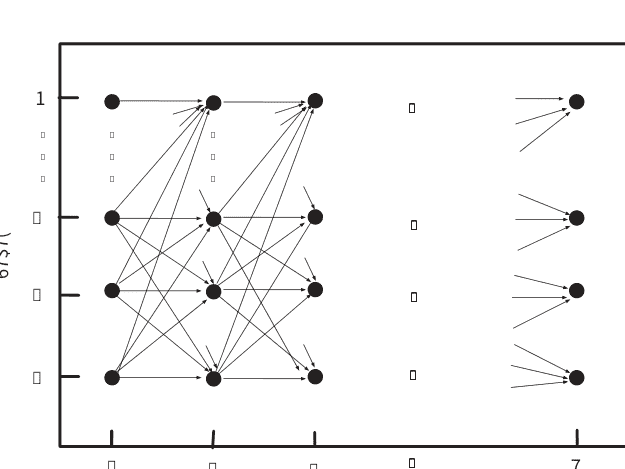

图17.12 马尔可夫链在时间上的状态网格。基于(Rabiner 1989)。

作为差异的一个简单例子，考虑一个有两个时间步的链，定义如下联合分布：

| | $X_1 = 0$ | $X_1 = 1$ | |
| :--- | :---: | :---: | :---: |
| $X_2 = 0$ | 0.04 | 0.3 | 0.34 |
| $X_2 = 1$ | 0.36 | 0.3 | 0.66 |
| | 0.4 | 0.6 | |

联合MAP估计为 $(0, 1)$，而边际MPM序列为 $(1, 1)$。

联合MAP估计的优点是始终具有全局一致性。例如，假设我们正在进行语音识别，有人说“识别语音”。这可能被误听为“破坏一个美丽的海滩”。在局部上，看起来“海滩”是那个特定声音窗口的最可能解释，但当我们添加数据必须由一个语言上合理的路径解释的要求时，这种解释变得不太可能。

另一方面，MPM估计可以更加稳健（Marroquin等, 1987年）。为了看清楚，注意在维特比算法中，当我们估计 $z_t$ 时，我们“最大化”其他变量：$z_t^* = \arg\max$
$$ z_t \max_{z_{1:t-1}, z_{t+1:T}} p(\mathbf{z}_{1:t-1}, z_t, \mathbf{z}_{t+1:T}|\mathbf{x}_{1:T}) \tag{17.71} $$
当我们使用前向-后向算法时，我们对其他变量求和:
$$ p(z_t|\mathbf{x}_{1:T}) = \sum_{\mathbf{z}_{1:t-1}, \mathbf{z}_{t+1:T}} p(\mathbf{z}_{1:t-1}, z_t, \mathbf{z}_{t+1:T}|\mathbf{x}_{1:T}) \tag{17.72} $$
这使得方程17.70中的MPM更加稳健，因为我们对每个节点进行估计时都会对其邻居进行平均，而不是基于其邻居的特定值进行条件化。$^6$

6. 通常情况下，我们可能希望混合使用最大值和求和。例如，考虑一个联合分布，在该分布下我们观察到

## 17.4.4.2 算法的详细信息

很容易认为我们可以通过将前向-后向算法中的求和操作符替换为最大值操作符来实现维特比算法。前者被称为求和-乘积算法，后者被称为最大-乘积算法。如果存在唯一的模式，则运行最大-乘积算法，然后使用方程17.70进行计算将得到与使用方程17.68相同的结果（Weiss和Freeman 2001b），但是一般情况下，如果存在多个等可能的联合分配，则可能导致错误的结果。原因是每个节点都独立地打破平局，因此可能以与其邻居不一致的方式打破平局。因此，维特比算法并不像简单地用最大值替换求和那样简单。特别是，前向传递确实使用了最大-乘积算法，但是后向传递使用了回溯过程来恢复最可能的路径通过状态的网格。基本上，一旦 $z_t$ 选择了其最可能的状态，前面的节点就会基于这个事件进行条件化，因此它们将一致地打破平局。

更详细地定义
$$ \delta_t(j) \triangleq \max_{z_1,\dots,z_{t-1}} p(\mathbf{z}_{1:t-1}, z_t = j | \mathbf{x}_{1:t}) \tag{17.73} $$
这是在时间 $t$ 结束于状态 $j$ 的概率，假设我们采取最可能的路径。关键的洞察是，在时间 $t$ 结束于状态 $j$ 的最可能路径必须由时间 $t - 1$ 结束于某个其他状态 $i$ 的最可能路径，然后由状态 $i$ 转移到状态 $j$。因此
$$ \delta_t(j) = \max_i \delta_{t-1}(i) \psi(i,j) \phi_t(j) \tag{17.74} $$
我们还跟踪每个可能的状态，以找到最可能的前一个状态:
$$ a_t(j) = \operatorname{argmax}_i \delta_{t-1}(i) \psi(i,j) \phi_t(j) \tag{17.75} $$
也就是说，$a_t(j)$ 告诉我们在最可能的路径上最可能的前一个状态是 $z_t = j$。我们通过设置
$$ \delta_1(j) = \pi_j \phi_1(j) \tag{17.76} $$
然后，我们通过计算最可能的最终状态 $z_T^*$ 来终止计算:
$$ z_T^* = \arg \max_i \delta_T(i) \tag{17.77} $$
然后，我们可以使用 traceback 来计算最可能的状态序列:
$$ z_t^* = a_{t+1}(z_{t+1}^*) \tag{17.78} $$
和往常一样，我们需要担心数值下溢的问题。我们可以在每一步对 $\delta_t$ 进行归一化处理；这不会影响最大值。然而，与前向-后向情况不同的是，

> 我们想要查询的变量 $v$ 和我们想要查询的 $q$; 令 $n$ 为剩余的干扰变量。我们将MAP估计定义为 $x_q^* = \arg \max_{x_q} \sum_{x_n} p(x_q, x_n | x_v)$，其中我们对 $x_q$ 取最大值，对 $x_n$ 求和。相比之下，我们将 MPE 或者最可能的解释定义为 $(x_q^*, x_n^*) = \arg \max_{x_q, x_n} p(x_q, x_n | x_v)$，其中我们对 $x_q$ 和 $x_n$ 都取最大值。这个术语是由 (Pearl 1988) 提出的，尽管在贝叶斯网络领域之外并不常用。显然，如果 $n = \emptyset$，那么 MAP=MPE。然而，如果 $n \neq \emptyset$，那么消除干扰变量的求和操作可能会得到与取最大值不同的结果。消除干扰变量的求和操作更合理，但在计算上更困难，因为需要结合最大值和求和操作 (Lerner and Parr 2001)。

# 17.4. HMM中的推断

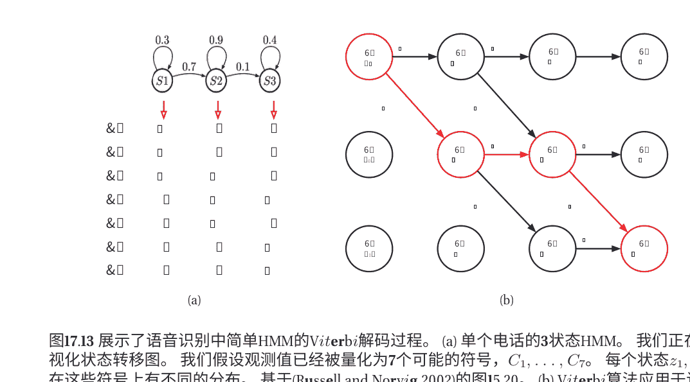

我们也可以很容易地在对数域中工作。关键的区别在于 $\log \max = \max \log$，而 $\log \sum \neq \sum \log$。因此我们可以使用
$$ \log \delta_t(j) \triangleq \max_{\mathbf{z}_{1:t-1}} \log p(\mathbf{z}_{1:t-1}, z_t = j | \mathbf{x}_{1:t}) \qquad (17.95) $$
$$ = \max_i \log \delta_{t-1}(i) + \log \psi(i, j) + \log \phi_t(j) \qquad (17.96) $$
对于高斯观测模型的情况，这可以导致显著的（常数因子）加速，因为计算 $\log p(\mathbf{x}_t | z_t)$ 比计算 $p(\mathbf{x}_t | z_t)$ 更快，对于基于HMM的大型语音识别系统的训练，这是Viterbi算法广泛使用于EM的E步骤（第17.5.2节）的原因之一。

## 17.4.4.3 示例

图17.13给出了维特比算法的一个实例，基于(Russell et al. 1995)。假设我们观察到离散的观测序列 $\mathbf{x}_{1:4}= (C_1, C_3, C_4, C_6)$，表示语音信号的矢量量化版本中的码本条目。模型从状态 $z_1$ 开始。在 $z_1$ 中生成 $C_1$ 的概率为0.5，因此我们有 $\delta_1(1) = 0 .5$，对于其他所有状态， $\delta_1(i) = 0$。接下来，我们可以以0.3的概率自转到 $z_1$，或以0.7的概率转移到 $z_2$。 如果我们最终处于 $z_1$，生成 $C_3$ 的概率为0.3；如果我们最终处于 $z_2$，生成 $C_3$ 的概率是0.2。因此我们有
\[
\delta_2(1) = \delta_1(1)\psi(1,1)\phi_2(1) = 0.5 \cdot 0.3 \cdot 0.3 = 0.045 \tag{17.81}
\]
\[
\delta_2(2) = \delta_1(1)\psi(1,2)\phi_2(2) = 0.5 \cdot 0.7 \cdot 0.2 = 0.07 \tag{17.82}
\]
因此，在 $t=2$ 时，状态2更有可能；请参见图17.13(b)的第二列。在时间步骤3中，我们可以看到有两条路径进入 $z_2$，一条来自 $z_1$，另一条来自 $z_2$。粗箭头表示后者更有可能。因此，这是我们唯一需要记住的。算法会一直进行，直到我们到达序列的末尾。一旦到达末尾，我们可以沿着黑色箭头返回以恢复MAP路径（即1,2,2,3）。

## 17.4.4.4 时间和空间复杂度

Viterbi的时间复杂度明显为 $O(K^2T)$，空间复杂度为 $O(KT)$，与前向后向算法相同。如果转移矩阵具有以下形式：$\psi(i, j) \propto \exp(-\sigma^2 \|\mathbf{z}_i - \mathbf{z}_j\|^2)$，其中 $\mathbf{z}_i$ 是由状态 $i$ 表示的连续向量，我们可以在 $O(T K)$ 时间内实现Viterbi，而不是前向后向算法所需的 $O(T K \log K)$。详见第22.2.6.1节。

## 17.4.4.5 N-最佳列表

维特比算法返回最有可能的路径之一。它可以扩展为返回前 $N$ 个路径（Schwarz和Chow 1990; Nilsson和Goldberger 2001）。这被称为N-最佳列表。然后可以使用一种判别方法根据全局特征重新排序路径，这些特征是从完全观察到的状态序列（以及可见特征）中派生出来的。这种技术在语音识别中被广泛使用。例如，考虑句子“识别语音”。系统对这个声学信号的最有可能解释可能是“破坏一个好的演讲”，或者可能是“破坏一个美丽的海滩”。也许正确的解释在列表中排名较低。然而，通过使用重新排序系统，我们可以根据更全局的上下文来提高正确解释的分数。

$N$ 最佳列表的一个问题是，通常前 $N$ 个路径非常相似，而不是代表数据的不同解释。相反，我们可能希望生成更多样化的路径集，以更准确地表示后验不确定性。一种方法是从后验中采样路径，如下所讨论的。关于生成多样化MAP估计的其他方法，请参见（Yadollahpour等，2011年; Kulesza和Taskar，2011年）。

## 17.4.5 前向滤波，后向采样

从后验中采样路径通常很有用：
\[
\mathbf{z}_{1:T}^{s} \sim p(\mathbf{z}_{1:T}|\mathbf{x}_{1:T}) \tag{17.83}
\]
我们可以按照以下方式进行：运行前向后向，计算两个时间片的平滑后验概率，$p(z_{t-1}, z_t|\mathbf{x}_{1:T})$；然后通过归一化计算条件概率 $p(z_t|z_{t-1}, \mathbf{x}_{1:T})$；从初始状态对中采样，$z_{1,2}^{*} \sim p(z_{1,2}|\mathbf{x}_{1:T})$；最后，递归采样 $z_t^{*} \sim p(z_t|z_{t-1}^{*}, \mathbf{x}_{1:T})$。
请注意，上述解决方案需要进行前向后向传递，然后进行额外的前向采样传递。另一种方法是进行前向传递，然后在后向传递中进行采样。如何做到这一点的关键洞察是，我们可以从右到左编写联合概率
$$ p(z_{1:T}|x_{1:T}) = p(z_T|x_{1:T}) \prod_{t=T-1}^{1} p(z_t|z_{t+1}, x_{1:T}) $$
然后，我们可以使用未来采样的状态来采样 $z_t$
$$ z_t \sim p(z_t|z_{t+1:T}, x_{1:T}) = p(z_t|z_{t+1}, x_{1:T}) = p(z_t|z_{t+1}, x_{1:t}) $$
给出了抽样分布
$$ p(z_t = i|z_{t+1} = j, x_{1:t}) = \frac{p(z_t, z_{t+1}|x_{1:t+1})}{p(z_{t+1}|x_{1:t+1})} = \frac{p(x_{t+1}|z_{t+1}, z_t, x_{1:t}) p(z_{t+1}, z_t|x_{1:t})}{p(z_{t+1}|x_{1:t+1})} = \frac{p(x_{t+1}|z_{t+1}) p(z_{t+1}|z_t, x_{1:t}) p(z_t|x_{1:t})}{p(z_{t+1}|x_{1:t+1})} = \frac{\phi_{t+1}(j) \psi(i,j) \alpha_t(i)}{\alpha_{t+1}(j)} $$
基本情况是
$$ z_T \sim p(z_T = i|x_{1:T}) = \alpha_T(i) $$
这个算法是基于阻塞Gibbs采样方法进行参数推断的基础，我们将在下面看到。

### 17.5 HMM的学习

我们现在讨论如何估计参数 $\theta= (\pi, \mathbf{A}, \mathbf{B})$, 其中 $\pi(i) = p(z_1 = i)$ 是初始状态分布， $A(i, j) = p(z_t = j|z_{t-1} = i)$ 是转移矩阵， $\mathbf{B}$ 是类条件密度 $p(\mathbf{x}_t|z_t = j)$ 的参数。我们首先考虑在训练集中观察到的情况，然后是更难的情况，即 $z_{1:T}$ 是隐藏的。

#### 17.5.1 使用完全观测数据进行训练

如果我们观察到隐藏状态序列，我们可以像17.2.2.1节中那样精确计算 $\mathbf{A}$ 和 $\pi$ 的最大似然估计。如果我们使用共轭先验，我们也可以轻松计算后验概率。

如何估计 $\mathbf{B}$ 的细节取决于观测模型的形式。这种情况与拟合生成分类器完全相同。例如，如果每个状态都与一个多项分布相关联，其中参数 $B_{jl} = p(X_t = l|z_t = j)$, 其中 $l\in \{1, \ldots, L\}$ 表示观察到的符号，则最大似然估计为
$$ \hat{B}_{jl} = \frac{N_{jl}^X}{N_j}, \quad N_{jl}^X \triangleq \sum_{i=1}^{N} \sum_{t=1}^{T_i} I(z_{i,t} = j, x_{i,t} = l) $$
这个结果非常直观：我们只需将我们处于状态 $j$ 并且看到符号 $l$ 的次数相加，然后除以我们处于状态 $j$ 的次数。

同样，如果每个状态都与高斯分布相关联，我们可以得到（来自第4.2.4节）以下的最大似然估计：
\[
\hat{\boldsymbol{\mu}}_k = \frac{\overline{\mathbf{x}}_k}{N_k}, \quad \hat{\boldsymbol{\Sigma}}_k = \frac{(\overline{\mathbf{x}\mathbf{x}})_k^T - N_k \hat{\boldsymbol{\mu}}_k \hat{\boldsymbol{\mu}}_k^T}{N_k}
\]
其中，足够统计量由以下给出
\[
\overline{\mathbf{x}}_k \triangleq \sum_{i=1}^N \sum_{t=1}^{T_i} \mathbb{I}(z_{i,t} = k) \mathbf{x}_{i,t}
\]
\[
(\overline{\mathbf{x}\mathbf{x}})_k^T \triangleq \sum_{i=1}^N \sum_{t=1}^{T_i} \mathbb{I}(z_{i,t} = k) \mathbf{x}_{i,t} \mathbf{x}_{i,t}^T
\]

类似的结果也可以推导出其他类型的分布。人们还可以轻松地扩展所有这些结果，以计算MAP估计，甚至是参数的完整后验。

### 17.5.2 HMM的EM算法（Baum-Welch算法）

如果未观察到 $z_t$ 变量，我们就处于类似于拟合混合模型的情况。最常见的方法是使用EM算法找到MLE或MAP参数，当然也可以使用其他基于梯度的方法（参见例如（Baldi和Chauvin1994））。在本节中，我们推导出EM算法。当应用于HMM时，这也被称为 **Baum-Welch算法**（Baum等人，1970年）。

#### 17.5.2.1 E步

很容易证明，期望的完整数据对数似然由以下公式给出
\[
Q(\boldsymbol{\theta}, \boldsymbol{\theta}^{old}) = \sum_{k=1}^K \mathbb{E}[N_k^1] \log \pi_k + \sum_{j=1}^K \sum_{k=1}^K \mathbb{E}[N_{jk}] \log A_{jk}
\]
\[
+ \sum_{i=1}^N \sum_{t=1}^{T_i} \sum_{k=1}^K p(z_t = k | \mathbf{x}_i, \boldsymbol{\theta}^{old}) \log p(\mathbf{x}_{i,t} | \boldsymbol{\phi}_k)
\]
其中，期望计数由给出
\[
\mathbb{E}[N_k^1] = \sum_{i=1}^N p(z_{i1} = k | \mathbf{x}_i, \boldsymbol{\theta}^{old})
\]
\[
\mathbb{E}[N_{jk}] = \sum_{i=1}^N \sum_{t=2}^{T_i} p(z_{i,t-1} = j, z_{i,t} = k | \mathbf{x}_i, \boldsymbol{\theta}^{old})
\]
\[
\mathbb{E}[N_j] = \sum_{i=1}^N \sum_{t=1}^{T_i} p(z_{i,t} = j | \mathbf{x}_i, \boldsymbol{\theta}^{old})
\]这些期望的充分统计量可以通过在每个序列上运行前向-后向算法来计算。特别地，该算法计算以下平滑的节点和边缘：

$$
\gamma_{i,t}(j) \triangleq p(z_t = j | \mathbf{x}_{i,1:T_i}, \boldsymbol{\theta}) \quad (17.101)
$$
$$
\xi_{i,t}(j,k) \triangleq p(z_{t-1} = j, z_t = k | \mathbf{x}_{i,1:T_i}, \boldsymbol{\theta}) \quad (17.102)
$$

## 17.5.2.2 M 步

根据第11.3节，我们知道 A 和 π 的 M 步骤就是对期望计数进行归一化：

$$
\hat{A}_{jk} = \frac{\mathbb{E}[N_{jk}]}{\sum_{k'} \mathbb{E}[N_{jk'}]}, \quad \hat{\pi}_k = \frac{\mathbb{E}[N^1_k]}{N} \quad (17.103)
$$

这个结果非常直观：我们只需将从 j 到 k 的期望转换次数相加，然后除以从 j 到其他任何状态的期望转换次数。

对于多项式观测模型，期望的充分统计量为：

$$
\mathbb{E}[M_{jl}] = \sum_{i=1}^N \sum_{t=1}^{T_i} \gamma_{i,t}(j) \mathbb{I}(x_{i,t} = l) = \sum_{i=1}^N \sum_{t: x_{i,t}=l} \gamma_{i,t}(j) \quad (17.104)
$$

M步骤的形式为

$$
\hat{B}_{jl} = \frac{\mathbb{E}[M_{jl}]}{\mathbb{E}[N_j]} \quad (17.105)
$$

这个结果非常直观：我们只需将我们处于状态 j 时看到符号 l 的预期次数相加，并除以我们处于状态 j 的预期次数。对于高斯观测模型，预期充分统计量如下所示

$$
\mathbb{E}[\overline{\mathbf{x}}_k] = \sum_{i=1}^N \sum_{t=1}^{T_i} \gamma_{i,t}(k) \mathbf{x}_{i,t} \quad (17.106)
$$
$$
\mathbb{E}[(\overline{\mathbf{x}} \overline{\mathbf{x}}^T)_k] = \sum_{i=1}^N \sum_{t=1}^{T_i} \gamma_{i,t}(k) \mathbf{x}_{i,t} \mathbf{x}_{i,t}^T \quad (17.107)
$$

M步骤变为

$$
\hat{\boldsymbol{\mu}}_k = \frac{\mathbb{E}[\overline{\mathbf{x}}_k]}{\mathbb{E}[N_k]}, \quad \hat{\boldsymbol{\Sigma}}_k = \frac{\mathbb{E}[(\overline{\mathbf{x}} \overline{\mathbf{x}}^T)_k] - \mathbb{E}[N_k] \hat{\boldsymbol{\mu}}_k \hat{\boldsymbol{\mu}}_k^T}{\mathbb{E}[N_k]} \quad (17.108)
$$

这可以（也应该）以与GMM相同的方式进行正则化。

## 17.5.2.3 初始化

和EM一样，我们必须小心确保仔细初始化参数，以最小化陷入较差的局部最优解的机会。有几种方法可以做到这一点，比如

- 使用一些完全标记的数据来初始化参数。
- 最初忽略马尔可夫依赖性，并使用标准混合模型估计方法（如K-means或EM）估计观测参数。
- 随机初始化参数，使用多次重启，并选择最佳解决方案。

诸如确定性退火（Ueda和Nakano 1998; Rao和Rose 2001）之类的技术可以帮助减轻局部最小值的影响。此外，就像K-means经常用于初始化GMM的EM一样，通常使用Viterbi训练来初始化HMM的EM，这意味着用最可能的路径近似计算路径的后验概率。（这不一定是一个好主意，因为最初参数通常估计不准确，所以Viterbi路径将是相当任意的。更安全的选择是在收敛时开始使用前向-后向训练，并在接近收敛时切换到Viterbi。）

#### 17.5.3 贝叶斯方法用于“拟合”HMMs *

EM返回参数的MAP估计。在本节中，我们简要讨论了一些用于HMM中贝叶斯参数估计的方法。（这些方法依赖于我们将在本节中介介绍的材料。）

一种方法是使用变分贝叶斯EM（VBEM），我们在第21.6节中以一般术语进行讨论。关于HMM情况的详细信息可以在（MacKay 1997; Beal 2003）中找到，但基本思想是：E步使用前向-后向算法，但我们插入后验均值参数而不是MAP估计。M步更新共轭后验的参数，而不是更新参数本身。

VBEM的替代方法是使用MCMC。一种特别吸引人的算法是块Gibbs采样，我们在第24.2.8节中以一般术语进行讨论。关于HMM情况的详细信息可以在（Fruhwirth-Schnatter 2007）中找到，但基本思想是：我们使用前向滤波、后向采样对给定的数据和参数进行采样 $z_{1:T}$，然后根据采样的潜在路径从其后验中采样参数。这很容易实现，但需要注意不可识别性（标签切换），就像混合模型一样（见第11.3.1节）。

#### 17.5.4 判别式训练

有时候，HMMs被用作生成分类器中的类条件密度。在这种情况下，可以使用前向算法计算 $p(x|y=c,\theta)$。我们可以通过使用EM（或其他方法）分别为每个类条件密度拟合HMM来轻松地最大化联合似然 $\prod_{i=1}^{N} p(x_i, y_i|\theta)$。

然而，我们可能希望找到最大化条件似然的参数。

$$\prod_{i=1}^{N} p(y_i|x_i, \theta) = \prod_{i} \frac{p(y_i|\theta) p(x_i|y_i, \theta)}{\sum_c p(y_i=c|\theta) p(x_i|c, \theta)} \qquad (17.109)$$

这比最大化联合似然更昂贵，因为分母将所有C个类条件HMM耦合在一起。此外，不能再使用EM，必须采取其他方法。

#### 17.5.5 模型选择

在HMM中，模型选择的两个主要问题是：选择多少个状态和使用什么拓扑结构作为状态转移图。我们将在下面讨论这两个问题。

### 17.5.5.1 选择隐藏状态的数量

在HMM中选择隐藏状态的数量 $K$类似于选择混合成分数量的问题。以下是一些可能的解决方案：

- 在一定范围内使用网格搜索 $K$，使用交叉验证似然函数、BIC分数或变分下界作为目标函数来选择。
- 使用可逆跳跃MCMC。有关详细信息，请参阅 (Fruhwirth-Schnatter 2007)。请注意，这非常慢，且不常用。
- 使用变分贝叶斯来“消除”不需要的组件，类似于第21.6.1.6节中讨论的GMM情况。有关详细信息，请参阅 (MacKay 1997; Beal 2003)。
- 使用“无限HMM”，它基于分层狄利克雷过程。有关详细信息，请参阅 (Beal et al. 2002; Teh et al. 2006)。

### 17.5.5.2 结构学习

在HMM的背景下，术语结构学习指的是学习稀疏的转移矩阵。也就是说，我们想要学习状态转移图的结构，而不是图形模型的结构（它是固定的）。已经提出了大量启发式方法。

大多数在参数估计和某种启发式的分割合并方法之间交替 (参见例如，(Stolcke and Omohundro 1992)).

或者，可以将问题表述为使用最小熵先验的MAP估计，形式为

$$p(A_{i,:}) \propto \exp(-\mathbb{H}(A_{i,:}))$$

这个先验更喜欢出站分布几乎是确定性的状态，因此具有低熵 (Brand 1999)。相应的M步骤无法以闭式形式解决，但可以使用数值方法。这样做的是，我们可能会剪枝掉所有进入状态的转换，从而在状态空间中创建孤立的“岛屿”。无限HMM对这些方法提供了一个有趣的替代方案。详见例如，(Beal et al. 2002; Teh et al. 2006)。

### 17.6 HMM的推广

已经提出了基本HMM模型的许多变体。我们简要讨论其中的一些如下。

图17.14 将隐藏的半马尔可夫模型编码为DGM。$D_t$是确定性持续计数器。

### 17.6.1 变长持续时间（半马尔可夫）HMMs

在标准HMM中，我们保持在状态 $i$ 恰好 $d$ 步的概率是

$$p(t_i = d) = (1 - A_{ii})A_{ii}^{d} \propto \exp(d \log A_{ii}) \qquad\qquad (17.111)$$

其中 $A_{ii}$ 是自环概率。这被称为几何分布。然而，这种指数衰减的函数关于 $d$ 的形式有时是不现实的。

为了允许更一般的持续时间，可以使用半马尔可夫模型。它被称为半马尔可夫，因为要预测下一个状态，仅仅依赖于过去的状态是不够的：我们还需要知道我们在该状态下停留了多长时间。当状态空间不直接观察到时，结果被称为隐藏的半马尔可夫模型（HSMM），变长持续时间HMM或显式持续时间HMM。

HSMMs广泛应用于许多基因发现程序中，因为外显子和内含子的长度分布不是几何分布（参见例如，（Schweikerta等，2009年）），并且在一些芯片序列数据分析程序中（参见例如，（Kuan等，2009年））。

HSMMs之所以有用，不仅因为它们可以更准确地建模每个状态的等待时间，而且因为它们可以一次性建模整个观测批次的分布，而不是假设所有观测都是条件独立同分布的。也就是说，它们可以使用形式为 $p(\mathbf{x}_{t:t+l}|z_t=k, d_t=l)$ 的似然模型，如果状态 $k$ 的持续时间为 $l$ 个时间步长，则生成 $l$ 个相关观测。这对于建模分段线性数据或显示其他局部趋势（Ostendorf等，1996年）非常有用。

#### 17.6.1.1 HSMM作为增强的HMM

表示HSMM的一种方法是使用图模型，如图17.14所示。（在这个图中，我们假设观测在每个状态内是独立同分布的，但这不是必需的，如上所述。）$D_t \in \{0, 1, \ldots, D\}$ 节点是状态持续时间计数器，其中 $D$ 是任何状态的最大持续时间。当我们首次进入状态 $j$ 时，我们从该状态的持续时间分布中采样 $D_t$，$D_t \sim p_j(\cdot)$。然后，$D_t$ 以确定性方式递减直到 $D_t = 0$。当 $D_t > 0$ 时，状态 $z_t$ 不允许改变。 当 $D_t = 0$ 时，我们进行一个随机转换到一个新的状态。

更准确地说，我们将CPD定义如下：

$$
p(D_t = d' | D_{t-1} = d, z_t = j) = \begin{cases} p_j(d') & \text{if } d = 0 \\ 1 & \text{如果 } d' = d - 1 \text{且 } d \geq 1 \\ 0 & \text{否则} \end{cases} \tag{17.112}
$$

$$
p(z_t = k | z_{t-1} = j, D_{t-1} = d) = \begin{cases} 1 & \text{如果 } d > 0 \text{且 } j = k \\ A_{jk} & \text{if } d = 0 \\ 0 & \text{否则} \end{cases} \tag{17.113}
$$

注意，$p_j(d)$ 可以表示为一个表格（非参数方法）或某种参数分布，如Gamma分布。 如果 $p_j(d)$ 是几何分布，则模拟了标准的HMM。

可以通过定义一个超级变量 $Y_t= (D_t, z_t)$ 在这个模型中进行推断。 然而，这种方法效率相对较低，因为 $D_t$ 是确定性的。 可以将 $D_t$ 边缘化掉，并推导出特殊目的的推断过程。 详见 (Guedon 2003; Yu and Kobayashi 2006) 。

不幸的是，所有这些方法的时间复杂度都是 $O(T K^2 D)$，其中 $T$ 是序列长度，$K$ 是状态数，$D$ 是任意状态的最大持续时间。

#### 17.6.1.2 半马尔可夫模型的近似

一种更高效但不太灵活的建模非几何等待时间的方法是用每个状态替换为N个新状态，每个新状态的发射概率与原状态相同。 例如，考虑图17.15(a)中的模型。 显然，该模型能生成的最小序列长度为N= 4。 通过模型的任意长度为D的路径的概率为 $p^{D-N} (1-p)^N$；乘以可能的路径数，我们可以得到长度为D的路径的总概率。

$$p(d) = \binom{d-1}{n-1} p^{d-n} (1-p)^n \tag{17.114}$$

图17.16一个能够识别3个单词的ASR系统的HHMM示例。顶层表示双字词的概率。中间层表示每个单词的音标拼写。底层表示每个音素的子音素。（传统上将一个电话表示为一个3状态的HMM，表示开始、中间和结束。）基于 (Jurafsky和Martin 2000) 的图7.5。

这相当于负二项分布。通过调整 n和每个状态的自环概率 p，我们可以模拟广泛的等待时间范围：参见图17.15(b)。设 E为每个状态需要扩展的次数以近似 $p_j(d)$。在该模型上的前向-后向算法的时间复杂度为 $O(T(KE)F_{in})$，其中 $F_{in}$ 是前驱状态的平均数，而对于HSMM，时间复杂度为 $O(TK(F_{in}+D))$。对于典型的语音识别应用程序，$F_{in} \sim 3$，$D \sim 50$，$K \sim 10^6$，$T \sim 10^5$。（类似的数字也适用于诸如基因发现等问题，这些问题通常也使用HSMM。）由于 $F_{in}+D >> EF_{in}$，扩展状态方法比HSMM快得多。有关详细信息，请参阅 (Johnson 2005)。

### 17.6.2 分层HMM

分层HMM（HHMM）（Fine等，1998年）是HMM的扩展，旨在建模具有分层结构的领域。图17.16给出了一个在自动语音识别中使用的HHMM的示例。电话和子电话模型可以从不同的更高级别上下文中“调用”。我们总是可以将HHMM“展平”为常规HMM，但分解表示通常更容易解释，并且允许更高效的推理和模型拟合。

HHMM已经在许多应用领域中使用，例如语音识别（Bilmes，2001年），基因发现（Hu等，2000年），计划识别（Bui等，2002年），监测交通模式（Liao等，2007年），室内机器人定位（Theocharous等，2004年）等。HHMM比随机上下文无关文法（SCFGs）表达能力较弱，因为它们只允许有界深度的层次结构，但它们支持更高效的推理。特别是，在SCFG中的推理（使用内外算法，（Jurafsky和Martin，2008年））需要 $O(T^3)$ 的时间，而在HHMM中的推理只需要 $O(T)$ 的时间（Murphy和Paskin，2001年）。

我们可以将HHMM表示为一个有向图模型，如图17.17所示。$Q_t^\ell$ 表示时间为 $t$ 和水平为 $\ell$ 的状态。在水平为 $\ell$ 的状态转换只有在“允许”的情况下才会发生，下面的链已经“完成”，由 $F_t^{\ell-1}$ 确定节点。（当链选择进入其结束状态时，下面的链结束。）这个机制确保了高层链比低层链演化得更慢，即低层嵌套在高层中。可变时长的HMM可以被看作是HHMM的特例，其中顶层是一个确定性计数器，底层是一个常规HMM，只有在计数器‘超时’后才能改变状态。详细信息请参见（Murphy和Paskin2001）。

图17.17一个以DGM表示的HHMM。$Q_t^\ell$ 是时间为 $t$，水平为 $\ell$ 的状态；$F_t^\ell = 1$ 如果水平为 $\ell$ 的HMM已经完成（进入了退出状态），否则 $F_t^\ell = 0$。阴影节点是观察到的；其余节点是隐藏的。我们可以选择将 $F_T^\ell = 1$，其中 $T$ 是观察序列的长度，以确保所有模型在序列结束时都已经完成。来源：(Murphy和Paskin 2001)的图2。

### 17.6.3 输入输出HMM

将HMM扩展到处理输入是很直观的，如图17.18(a)所示。这定义了一种序列的条件密度模型形式

$$p(\mathbf{y}_{1:T}, \mathbf{z}_{1:T} | \mathbf{u}_{1:T}, \boldsymbol{\theta}) \tag{17.115}$$

其中 $\mathbf{u}_t$ 是时间 $t$ 的输入；这有时被称为控制信号。如果输入和输出是连续的，一个典型的参数化将是

$$p(z_t | \mathbf{u}_t, z_{t-1}=i, \boldsymbol{\theta}) = \text{Cat}(z_t | \mathcal{S}(\mathbf{W}_i \mathbf{u}_t)) \tag{17.116}$$

$$p(\mathbf{y}_t | \mathbf{u}_t, z_t=j, \boldsymbol{\theta}) = \mathcal{N}(\mathbf{y}_t | \mathbf{V}_j \mathbf{u}_t, \boldsymbol{\Sigma}_j) \tag{17.117}$$

因此，转移矩阵是一个逻辑回归模型，其参数取决于前一个状态。观测模型是一个高斯模型，其参数取决于当前状态。

状态。整个模型可以被看作是最大熵马尔可夫模型的隐藏版本（第19.6.1节）。在给定输入 $u_{1:T}$ 和参数 $\theta$ 的条件下，可以应用标准的前向-后向算法来估计隐藏状态。推导出用于估计参数的EM算法也很直观（详见（Bengio and Frasconi 1996））。

## 17.6.4 自回归和嵌入式HMM

标准HMM假设给定隐藏状态的情况下观测是条件独立的。实际上，这通常不是真的。然而，可以直接从 $\mathbf{x}_{t-1}$ 到 $\mathbf{x}_t$ 以及从 $z_t$ 到 $\mathbf{x}_t$ 建立直接弧线，如图17.18(b)所示。这被称为自回归HMM或切换模型。对于连续数据，观测模型变为 $$p(\mathbf{x}_t | \mathbf{x}_{t-1}, z_t=j, \boldsymbol{\theta}) = \mathcal{N}(\mathbf{x}_t | \mathbf{W}_j \mathbf{x}_{t-1} + \boldsymbol{\mu}_j, \boldsymbol{\Sigma}_j) \tag{17.118}$$ 这是一个线性回归模型，其中参数根据当前的隐藏状态选择。我们还可以考虑更高阶的扩展，其中我们以最后 $L$ 个观测为条件： $$p(\mathbf{x}_t | \mathbf{x}_{t-L:t-1}, z_t=j, \boldsymbol{\theta}) = \mathcal{N}\left(\mathbf{x}_t \middle| \sum_{\ell=1}^L \mathbf{W}_{j,\ell} \mathbf{x}_{t-\ell} + \boldsymbol{\mu}_j, \boldsymbol{\Sigma}_j\right) \tag{17.119}$$ 这些模型在计量经济学中被广泛使用（Hamilton 1990）。类似的模型可以用于离散观测。AR-HMM本质上结合了两个马尔可夫链，一个用于捕捉长程依赖关系的隐藏变量链，一个用于捕捉短程依赖关系的观测变量链（Berchtold 1999）。由于 $X$ 节点是可观测的，它们之间的连接只有改变局部证据的计算；推断仍然可以使用标准的前向-后向算法进行。使用EM进行参数估计也很简单：E步骤不变，转移矩阵的M步骤也不变。如果我们假设标量观测以简化符号表示，那么M步骤涉及最小化

$$\sum_t \mathbb{E} \left[ \frac{1}{\sigma^2(s_t)} (y_t - \mathbf{y}_{t-L:t-1}^T \mathbf{w}(s_t))^2 + \log \sigma^2(s_t) \right] \quad (17.120)$$

关注$\mathbf{w}$项，我们可以看到这需要解决$K$个加权最小二乘问题：

$$J(\mathbf{w}_{1:K}) = \sum_j \sum_t \frac{\gamma_t(j)}{\sigma^2(j)} (y_t - \mathbf{y}_{t-L:t-1}^T \mathbf{w}_j)^2 \quad (17.121)$$

其中$\gamma_t(j) = p(z_t = k|\mathbf{x}_{1:T})$是平滑后验边缘。这是一个加权线性回归问题，其中设计矩阵具有Toeplitz形式。这个子问题可以使用Levinson-Durbin方法（Durbin和Koopman 2001）高效地解决。

Buried Markov模型通过允许观察节点之间的依赖结构根据隐藏状态改变来推广AR-HMMs，如图17.18(c)所示。这样的模型被称为动态贝叶斯多网络，因为它是不同网络的混合。在线性高斯设置中，我们可以通过使用稀疏回归矩阵$\mathbf{W}_j$来改变$\mathbf{x}_{t-1} \rightarrow \mathbf{x}_t$弧的结构，并且可以通过使用稀疏高斯图模型（有向或无向）来改变$\mathbf{x}_t$的组件内部的连接结构。详细信息请参见（Bilmes 2000）。

#### 17.6.5 阶乘HMM

HMM使用单个离散随机变量$z_t \in \{1, \ldots, K\}$来表示隐藏状态。要表示10位信息，需要$K = 2^{10} = 1024$个状态。相比之下，考虑一个分布式表示的隐藏状态，其中每个$z_{c,t} \in \{0, 1\}$表示第$c$个链的第t个隐藏状态。现在我们可以用只有10个二进制变量的方式表示10位，如图17.19(a)所示。这个模型被称为阶乘HMM（Ghahramani和Jordan 1997）。希望这种模型能够捕捉到信号的不同方面，例如，一个链表示说话风格，另一个链表示正在说的单词。

不幸的是，在给定 $\mathbf{x}_t$ 的条件下，所有隐藏变量都是相关的（由于解释了共同观察到的子节点 $\mathbf{x}_t$）。这使得精确的状态估计变得困难。然而，我们可以推导出高效的近似推断算法，如我们在第21.4.1节中讨论的那样。

## 17.6.6 耦合的HMM和影响模型

如果我们有多个相关的数据流，我们可以使用耦合的HMM（Brand 1996），如图17.19(b)所示。这是一系列HMM，其中状态转换取决于相邻链的状态。也就是说，我们将联合条件分布表示为

$$p(z_t | z_{t-1}) = \prod_c p(z_{ct} | z_{t-1}) \quad (17.122)$$

$$p(z_{ct} | z_{t-1}) = p(z_{ct} | z_{c,t-1}, z_{c-1,t-1}, z_{c+1,t-1}) \quad (17.123)$$

这已经被用于各种任务，例如音频-视觉语音识别（Nefian等人2002）和建模高速公路交通流量（Kwon和Murphy 2000）。

上述模型的问题在于它需要 $O(CK^4)$ 参数来指定，如果有 $C$ 个链，每个链有 $K$ 个状态，因为每个状态都依赖于自己的过去以及其两个邻居的过去。有一个密切相关的模型，称为影响模型（Asavathiratham 2000），它使用更少的参数。它将联合条件分布建模为

$$p(z_{ct} | z_{t-1}) = \sum_{c'=1}^C \alpha_{c,c'} p(z_{ct} | z_{c',t-1}) \quad (17.124)$$

其中 $\sum_{c'} \alpha_{c,c'} = 1$ 对于每个 $c$。也就是说，我们使用一对一转移矩阵的凸组合。参数 $\alpha_{c,c'}$ 指定了链 $c$ 对链 $c'$ 的影响程度。这个模型只需要 $O(C^2 + CK^2)$ 参数来指定。此外，它允许每个链受到所有其他链的影响，而不仅仅是最近的邻居。（因此，相应的图模型类似于图17.19(b)，只是每个节点都有来自所有前面节点的入边。）这已经被用于各种任务，例如建模人与人之间的对话互动 (Basu et al. 2001)。

不幸的是，这两个模型的推断都需要 $O(T(K^C)^2)$ 时间，因为即使交互图是稀疏的，所有的链都变得完全相关。可以应用各种近似推断方法，我们稍后会讨论。

## 17.6.7 动态贝叶斯网络 (DBNs)

动态贝叶斯网络只是使用有向图模型来表示随机过程的一种方式。请注意，网络本身并不是动态的（结构和参数是固定的）

> 7. DBN这个缩写可以表示“动态贝叶斯网络”或者“深度信念网络”（第28.1节），具体取决于上下文。Geoff Hinton（发明了“深度信念网络”这个术语的人）建议使用缩写 DyBN和DeeBN来避免这种歧义。

它不是一个动态系统的网络表示。我们之前看到的所有HMM变体都可以被认为是DBN。然而，我们更倾向于将术语“DBN”保留给更“不规则”和问题特定的图结构。图17.20显示了一个例子，它是一个设计用于监控模拟自动驾驶汽车状态的DBN，被称为“贝叶斯自动出租车”或“BATmobile”（Forbes等，1995年）。

定义DBNs很简单：你只需要指定第一个时间片的结构，两个时间片之间的结构以及CPDs的形式。学习也很容易。主要问题是精确推断可能计算成本高昂，因为所有隐藏变量随时间变化而相关（这被称为纠缠 - 详见（Koller和Friedman 2009，第15.2.4节））。因此，稀疏图并不一定导致可处理的精确推断。然而，后面我们将看到可以利用图结构进行高效近似推断的算法。

## 练习

### 练习17.1 HMM的Q函数推导
- 推导方程17.97。

### 练习17.2 HMM中平滑的两个滤波器方法
- 假设对于所有的$i$和$t$， $\Pi_t(i) = p(S_t = i) > 0$，推导出一个递归算法来更新 $r_t(i) = p(S_t = i|\mathbf{x}_{t+1:T})$。提示：它应该与标准前向算法非常相似，但使用了一个时间反转的转移矩阵。然后展示如何计算后验边际 $\gamma_t(i) = p(S_t = i|\mathbf{x}_{1:T})$ 从反向过滤的消息 $r_t(i)$，正向过滤的消息 $\alpha_t(i)$，和稳态分布 $\Pi_t(i)$。

### 练习17.3 混合高斯观测的HMM的EM算法
- 考虑一个HMM，其中观测模型的形式为
$$p(\mathbf{x}_t|z_t = j, \boldsymbol{\theta}) \quad = \quad \sum_{k} w_{jk} \mathcal{N}(\mathbf{x}_t | \boldsymbol{\mu}_{jk}, \boldsymbol{\Sigma}_{jk}) \qquad\qquad\qquad (17.125)$$
- 画出DGM图。
- 推导E步骤。
- 推导M步骤。

### 练习17.4 带有混合的HMM的EM算法
- 在许多应用中，观测值通常是高维向量（例如，在语音识别中，$\mathbf{x}_t$通常是一个倒谱系数和它们的导数的向量，因此$\mathbf{x}_t \in \mathbb{R}^{39}$），因此像练习17.3中那样为 $KM$值（其中 $M$是每个隐藏状态的混合成分数）估计一个完整的协方差矩阵需要大量的数据。另一种选择是仅使用 $M$高斯分布，而不是$M K$高斯分布，并且让状态影响混合权重而不是均值和协方差。这被称为半连续HMM或绑定混合HMM。
- 绘制相应的图形模型。
- 推导E步骤。
- 推导M步骤。

## 18 状态空间模型

### 18.1 介绍

状态空间模型（SSM）与隐马尔可夫模型（HMM）类似，只是隐藏状态是连续的。该模型可以用以下通用形式表示：

$z_t = g(u_t, z_{t-1}, \epsilon_t)$  (18.1)

$y_t = h(z_t, u_t, \delta_t)$  (18.2)

其中，$z_t$是隐藏状态，$u_t$是可选的输入或控制信号，$y_t$是观测值，$g$是转移模型，$h$是观测模型，$\epsilon_t$是时间点时的系统噪声，$\delta_t$是时间点时的观测噪声。我们假设模型的所有参数$\theta$都是已知的；如果不是，可以将它们包含在隐藏状态中，我们将在下面讨论这个问题。

使用SSM的主要目标之一是递归地估计置信状态$p(z_t|y_{1:t}, u_{1:t}, \theta)$。（注意：为了简洁起见，我们经常省略对$u$和$\theta$的条件。）我们将在本章后面讨论算法。我们还将讨论如何通过计算后验预测 $p(y_{t+1}|y_{1:t})$ 将我们对隐藏状态的信念转化为对未来可观测量的预测。

SSM的一个重要特例是所有CPD都是线性高斯的。换句话说，我们假设

- 过渡模型是一个线性函数
    $z_t = A_t z_{t-1} + B_t u_t + \epsilon_t$  (18.3)
- 观测模型是一个线性函数
    $y_t = C_t z_t + D_t u_t + \delta_t$  (18.4)
- 系统噪声是高斯的
    $\epsilon_t \sim \mathcal{N}(0, Q_t)$  (18.5)
- 观测噪声是高斯的
    $\delta_t \sim \mathcal{N}(0, R_t)$  (18.6)

这个模型被称为线性高斯SSM（LG-SSM）或线性动态系统（LDS）。

如果参数 $\theta_t = (A_t, B_t, C_t, D_t, Q_t, R_t)$ 与时间无关，则模型被称为静态的。

LG-SSM很重要，因为它支持精确推理，正如我们将看到的那样。特别是，如果初始信念状态是高斯分布，即$p(\mathbf{z}_1) = \mathcal{N}(\boldsymbol{\mu}_{1|0}, \boldsymbol{\Sigma}_{1|0})$，那么所有后续的信念状态也将是高斯分布；我们用$p(\mathbf{z}_t|\mathbf{y}_{1:t}) = \mathcal{N}(\boldsymbol{\mu}_{t|t}, \boldsymbol{\Sigma}_{t|t})$来表示它们。（符号$\boldsymbol{\mu}_{t|\tau}$表示$\mathbb{E}[\mathbf{z}_t|\mathbf{y}_{1:\tau}]$，$\boldsymbol{\Sigma}_{t|\tau}$类似；因此$\boldsymbol{\mu}_{t|0}$表示在我们看到任何数据之前的$\mathbf{z}_t$的先验。为了简洁起见，我们使用$\boldsymbol{\mu}_{t|t} = \boldsymbol{\mu}_t$和$\boldsymbol{\Sigma}_{t|t} = \boldsymbol{\Sigma}_t$来表示后验信念状态。）我们可以使用著名的卡尔曼滤波器高效地计算这些量，正如我们在第18.3.1节中所示。但在讨论算法之前，我们先讨论一些重要的应用。

## 18.2 SSMs的应用

SSMs有许多应用，其中一些我们在下面的章节中讨论。我们主要关注LG-SSMs，为了简单起见，尽管非线性和/或非高斯的SSMs更加广泛使用。

### 18.2.1 用于目标跟踪的SSMs

卡尔曼滤波最早的应用之一是用于从嘈杂的测量中跟踪物体，例如飞机和导弹。在这里，我们给出一个简化的例子来说明关键思想。考虑一个在二维平面上移动的物体。让$z_{1t}$和$z_{2t}$分别是物体的水平和垂直位置，$\dot{z}_{1t}$和$\dot{z}_{2t}$是相应的速度。

我们可以将其表示为状态向量$\mathbf{z}_t \in \mathbb{R}^4$如下：

$$\mathbf{z}_t^T = \left(z_{1t}\quad z_{2t}\quad \dot{z}_{1t}\quad \dot{z}_{2t}\right).$$

让我们假设物体以恒定速度移动，但受到随机高斯噪声的“干扰”（例如，由于风）。因此，我们可以将系统动态建模如下：

$$ \mathbf{z}_t = \mathbf{A}_t \mathbf{z}_{t-1} + \boldsymbol{\epsilon}_t \qquad\qquad\qquad\qquad\qquad\qquad\qquad\qquad(18.8) $$
$$ \begin{pmatrix} z_{1t} \\ z_{2t} \\ \dot{z}_{1t} \\ \dot{z}_{2t} \end{pmatrix} = \begin{pmatrix} 1 & 0 & \Delta & 0 \\ 0 & 1 & 0 & \Delta \\ 0 & 0 & 1 & 0 \\ 0 & 0 & 0 & 1 \end{pmatrix} \begin{pmatrix} z_{1,t-1} \\ z_{2,t-1} \\ \dot{z}_{1,t-1} \\ \dot{z}_{2,t-1} \end{pmatrix} + \begin{pmatrix} \epsilon_{1t} \\ \epsilon_{2t} \\ \epsilon_{3t} \\ \epsilon_{4t} \end{pmatrix} \qquad(18.9) $$

其中$\boldsymbol{\epsilon}_t \sim \mathcal{N}(\mathbf{0}, \mathbf{Q})$是系统噪声，$\Delta$是采样周期。这意味着新位置$z_{j,t}$是旧位置$z_{j,t-1}$加上$\Delta$乘以旧速度$\dot{z}_{j,t-1}$，再加上随机噪声$\epsilon_{jt}$，对于$j=1:2$。同时，新速度$\dot{z}_{j,t}$是旧速度$\dot{z}_{j,t-1}$加上随机噪声$\epsilon_{jt}$，对于$j=3:4$。这被称为随机加速度模型，因为物体根据牛顿定律运动，但速度会随机变化。

现在假设我们可以观察到物体的位置，但无法观察到其速度。让$\mathbf{y}_t \in \mathbb{R}^2$表示我们的观测结果，我们假设其受高斯噪声影响。我们可以将其建模如下：

$$ \mathbf{y}_t = \mathbf{C}_t \mathbf{z}_t + \boldsymbol{\delta}_t \qquad\qquad\qquad\qquad\qquad\qquad\qquad\qquad(18.10) $$
$$ \begin{pmatrix} y_{1t} \\ y_{2t} \end{pmatrix} = \begin{pmatrix} 1 & 0 & 0 & 0 \\ 0 & 1 & 0 & 0 \end{pmatrix} \begin{pmatrix} z_{1t} \\ z_{2t} \\ \dot{z}_{1t} \\ \dot{z}_{2t} \end{pmatrix} + \begin{pmatrix} \delta_{1t} \\ \delta_{2t} \end{pmatrix} \qquad(18.11) $$

其中$\boldsymbol{\delta}_t \sim \mathcal{N}(\mathbf{0}, \mathbf{R})$是测量噪声。

最后，我们需要指定关于对象状态的初始（先验）信念，$p(\mathbf{z}_1)$。我们假设这是一个高斯分布，$p(\mathbf{z}_1) = \mathcal{N}(\mathbf{z}_1 | \boldsymbol{\mu}_{1|0}, \boldsymbol{\Sigma}_{1|0})$。我们可以通过使$\boldsymbol{\Sigma}_{1|0}$足够“宽泛”来表示先验无知，例如，$\boldsymbol{\Sigma}_{1|0} = \infty \mathbf{I}$。我们现在已经完全指定了模型，并且可以使用称为卡尔曼滤波器的算法执行顺序贝叶斯更新来计算$p(\mathbf{z}_t | \mathbf{y}_{1:t})$，该算法将在第18.3.1节中描述。

图18.1(a)给出了一个例子。物体向右移动，并在每个时间步生成一个观测值（可以想象成雷达屏幕上的“信号”）。我们观察到这些信号，并通过使用卡尔曼滤波器来滤除噪声。在每个步骤中，我们有条件概率分布$p(\mathbf{z}_t | \mathbf{y}_{1:t})$，通过对与速度相关的维度进行边缘化，我们可以计算出$p(z_{1,t}, z_{2,t} | \mathbf{y}_{1:t})$。（这很容易做到，因为后验概率是高斯分布。）我们对物体位置的“最佳猜测”是后验均值$E[\mathbf{z}_t | \mathbf{y}_{1:t}]$，在图18.1(b)中用红色十字表示。我们与此相关的不确定性用椭圆表示，其中包含95%的概率质量。我们可以看到随着时间的推移，我们的不确定性降低，因为初始不确定性的影响被“冲刷”掉了。我们还可以看到估计的轨迹已经“滤除”了一些噪声。为了得到图18.1(c)中更平滑的曲线，我们需要使用卡尔曼平滑器，它计算出$p(\mathbf{z}_t | \mathbf{y}_{1:T})$，这取决于“未来”和“过去”数据，如第18.3.2节所讨论的。

#### 18.2.2 机器人SLAM

考虑一个在未知的二维世界中移动的机器人。它需要学习地图并跟踪其在地图中的位置。这个问题被称为同时定位和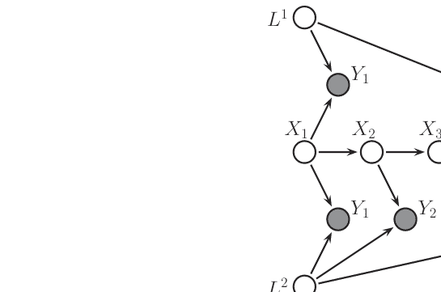

图18.2显示了SLAM底层的图模型。$L^i$是地标 $i$ 的固定位置， $x_t$ 是机器人的位置，而 $y_t$ 是观测值。在这个例子中，机器人在时间步骤1看到地标1和2，然后只看到地标2，然后只看到地标1，等等。基于(Koller和Friedman2009)的图15.A.3。

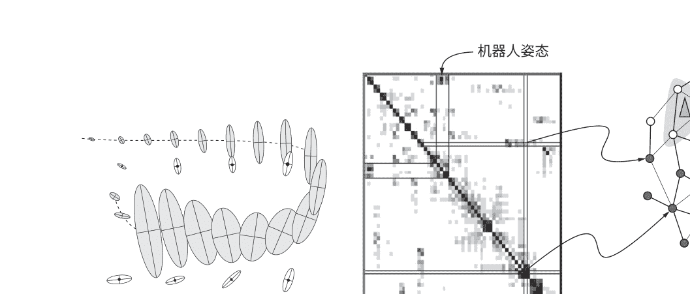

图18.3显示了SLAM问题的示意图。（a）机器人从左上角开始顺时针移动，形成一个圆圈回到起点。我们可以看到随着机器人返回到熟悉的位置，后验关于机器人位置的不确定性增加然后减少，闭环。如果我们进行平滑处理，这个新信息将向后传播到过去的时间，以消除整个轨迹的歧义。（b）我们展示了表示地标之间以及地标与机器人位置（姿态）之间稀疏相关性的精度矩阵。这个稀疏精度矩阵可以被可视化为一个高斯图模型，如图所示。来源：(Koller和Friedman 2009)的图15.A.3。获得Daphne Koller的友情许可使用。

## 18.2. SSMs的应用

映射，或者 SLAM简称，广泛应用于移动机器人技术，以及其他应用例如使用手机进行室内导航（因为GPS在建筑物内无法工作）。

让我们假设我们可以将地图表示为一组固定的 $K$地标的二维位置，用 $L^1, \dots$ 来表示它们，$L^K$（每个都是 $\mathbb{R}^2$ 中的向量）。为了简单起见，我们假设它们是唯一可识别的。让 $\mathbf{x}_t$表示时间 $t$时机器人的未知位置。我们定义状态空间为 $\mathbf{z}_t = (\mathbf{x}_t, \mathbf{L}^{1:K})$；我们假设地标是静态的，因此它们的运动模型是恒定的，并且它们没有系统噪声。如果 $\mathbf{y}_t$测量从 $\mathbf{x}_t$到最近地标集合的距离，那么机器人可以根据所见到的信息更新对地标位置的估计。图18.2显示了当$K = 2$时的相应图形模型，第一步它看到地标1和2，然后只看到地标2，然后只看到地标1，依此类推。

如果我们假设观测模型 $p(\mathbf{y}_t|\mathbf{z}_t, \mathbf{L})$是线性高斯的，并且我们使用高斯运动模型来描述$p(\mathbf{x}_t|\mathbf{x}_{t-1}, \mathbf{u}_t)$，我们可以使用卡尔曼滤波器来维护对机器人位置和地标位置的信念状态（Smith和Cheeseman 1986; Choset和Nagatani 2001）。

随着时间的推移，由于轮胎打滑等原因，机器人位置的不确定性会增加，但当机器人返回到熟悉的位置时，其不确定性会再次减小。这被称为闭环，如图18.3(a)所示，我们可以看到不确定性椭圆，表示$\text{cov} [\mathbf{x}_t|\mathbf{y}_{1:t}, \mathbf{u}_{1:t}]$，先增长然后再缩小。（请注意，在本节中，我们假设一个人通过环境来操控机器人，因此 $\mathbf{u}_{1:t}$作为输入给定，即我们不涉及选择探索位置的决策理论问题。）

由于信念状态是高斯的，我们可以可视化后验协方差矩阵 $\Sigma_t$。实际上，更有趣的是可视化后验精度矩阵 $\mathbf{\Lambda}_t = \Sigma_t^{-1}$，因为它在图18.3(b)中显示出相当稀疏。这是因为精度矩阵中的零对应于相应无向高斯图模型中的缺失边（参见第19.4.4节）。最初，所有地标之间都是不相关的（假设我们对 $\mathbf{L}$有一个对角先验），因此GGM是一个不连通的图，并且 $\mathbf{\Lambda}_t$是对角的。然而，随着机器人的移动，它将在附近地标之间引起相关性。直观地说，这是因为机器人根据与地标的距离来估计自己的位置，但地标的位置是根据机器人的位置来估计的，所以它们都变得相互依赖。从图18.2中的图形模型更清楚地看出：很明显 $L^1$和 $L^2$不是由 $\mathbf{y}_{1:t}$分离的，因为它们之间存在一条通过未知序列 $\mathbf{x}_{1:t}$节点的路径。由于精度矩阵变得更密集，精确推断需要 $O(K^3)$时间。（这是DBN推断中的纠缠问题的一个例子。）这阻止了该方法应用于大型地图。

解决这个问题有两个主要方法。第一个方法是注意到相关性模式随着机器人位置的移动而移动（见图18.3(b)）。剩余的相关性随时间变弱。因此，我们可以使用一种称为薄型联合树过滤器（Paskin 2003）的技术动态地“修剪掉”GGM中的弱边缘（联合树在第20.4节中解释）。

第二种方法是注意到，在知道机器人路径的条件下， $\mathbf{x}_{1:t}$，地标位置是独立的。这是一种称为FastSLAM的方法的基础，它结合了卡尔曼滤波和粒子滤波，如第23.6.3节所讨论的。

(Thrun et al. 2006)提供了关于SLAM和移动机器人的更详细的说明。

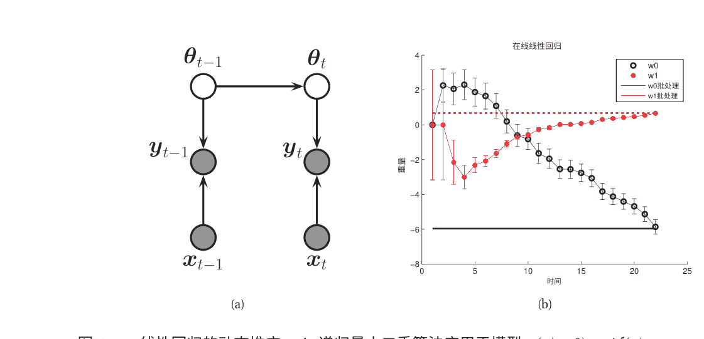

图18.4 (a) 线性回归的动态推广。(b) 递归最小二乘算法应用于模型 $p(y|x, \theta) = \mathcal{N}(y|w_0 + w_1 x, \sigma^2)$ 的示例。我们绘制了 $w_0$ 和 $w_1$ 的边际后验与数据点数量的关系。（误差线表示 $\mathbb{E}[w_j|y_{1:t}] \pm \sqrt{\text{var}[w_j|y_{1:t}]}$。）在看到所有数据后，我们收敛到离线的ML（最小二乘）解，由水平线表示。图由linregOnlineDemoKalman生成。

#### 18.2.3 使用递归最小二乘法进行在线参数学习

我们可以使用SSMs对各种统计模型的参数进行在线贝叶斯推断，在本节中，我们重点讨论线性回归；在第18.5.3.2节中，我们讨论逻辑回归。

基本思想是让隐藏状态表示回归参数，并让（时变的）观测模型表示当前数据向量。更详细地说，将先验定义为 $p(\theta) = \mathcal{N}(\theta|\theta_0, \Sigma_0)$。（如果我们想进行在线极大似然估计，我们可以将 $\Sigma_0 = \infty I$。）让隐藏状态为 $z_t = \theta$；如果我们假设回归参数不变，我们可以设置 $\mathbf{A}_t = \mathbf{I}$ 和 $\mathbf{Q}_t = 0\mathbf{I}$，所以

$p(\theta_t|\theta_{t-1}) = \mathcal{N}(\theta_t|\theta_{t-1}, 0\mathbf{I}) = \delta_{\theta_{t-1}}(\theta_t)$

（如果我们让参数随时间变化，我们得到一个所谓的动态线性模型 (Harvey 1990; West and Harrison 1997; Petris et al. 2009)。）让 $\mathbf{C}_t = \mathbf{x}_t^T$，$\mathbf{R}_t = \sigma^2$，所以（非平稳）观测模型的形式为

$\mathcal{N}(y_t|\mathbf{C}_t \mathbf{z}_t, \mathbf{R}_t) = \mathcal{N}(y_t|\mathbf{x}_t^T \theta_t, \sigma^2)$

将卡尔曼滤波器应用于该模型提供了一种在数据流入时更新我们对参数的后验信念的方法。这被称为递归最小二乘或RLS算法。

我们可以推导出更新的显式形式如下。在第18.3.1节中，我们展示了后验均值的卡尔曼更新具有以下形式

$\mu_t = \mathbf{A}_t \mu_{t-1} + \mathbf{K}_t (y_t - \mathbf{C}_t \mathbf{A}_t \mu_{t-1})$

其中 $\mathbf{K}_t$ 被称为卡尔曼增益矩阵。根据方程式18.39，可以证明 $\mathbf{K}_t = \boldsymbol{\Sigma}_t \mathbf{C}^T \mathbf{R}_t^{-1}$。在这个背景下，我们有 $\mathbf{K}_t = \boldsymbol{\Sigma} \mathbf{x}_t / \sigma^2$。因此，参数的更新变为

$$\hat{\boldsymbol{\theta}}_t = \hat{\boldsymbol{\theta}}_{t-1} + \frac{1}{\sigma^2} \boldsymbol{\Sigma}_{t|t} (y_t - \mathbf{x}_t^T \hat{\boldsymbol{\theta}}_{t-1}) \mathbf{x}_t \tag{18.15}$$

如果我们近似 $\frac{1}{\sigma^2} \boldsymbol{\Sigma}_{t|t-1}$ 与 $\eta_t \mathbf{I}$ 的近似，我们可以得到最小均方或LMS算法，在第8.5.3节中讨论。在LMS中，我们需要指定如何调整更新参数 $\eta_t$ 以确保收敛到MLE。此外，该算法可能需要多次通过数据。相比之下，RLS算法会自动执行步长调整，并在一次数据遍历中收敛到最优后验。请参见图18.4的示例。

### 18.2.4 用于时间序列预测的SSM *

正如我们下面所解释的，SSM非常适用于时间序列预测。为了简单起见，我们重点关注标量（一维）时间序列的情况。我们的介绍基于 (Varian 2011)。

此外，关于这个主题，还有一些好书，如 (Aoki 1987; Harvey 1990; West and Harrison 1997; Durbin and Koopman 2001; Petris et al. 2009; Prado and West 2010)。

乍一看，可能不明显为什么SSMs有用，因为预测的目标是预测未来可见变量，而不是估计某个系统的隐藏状态。事实上，大多数用于时间序列预测的经典方法只是形式为 $\hat{y}_{t+1} = f(\mathbf{y}_{1:t}, \boldsymbol{\theta})$ 的函数，隐藏变量不起作用 (见第18.2.4.4节)。状态空间方法在时间序列中的思想是基于潜在过程创建数据的生成模型，这些过程捕捉信号的不同方面。然后，我们可以积分掉隐藏变量来计算可见变量的后验预测。

由于模型是线性高斯的，我们可以将这些过程相加来解释观测数据。这被称为结构时间序列模型。下面我们解释一些基本构建模块。

### 18.2.4.1 本地水平模型

最简单的潜在过程被称为本地水平模型，其形式为

$$y_t = a_t + \epsilon_t^y, \quad \epsilon_t^y \sim \mathcal{N}(0, R) \tag{18.16}$$
$$a_t = a_{t-1} + \epsilon_t^a, \quad \epsilon_t^a \sim \mathcal{N}(0, Q) \tag{18.17}$$

其中隐藏状态只是 $\mathbf{z}_t = a_t$。该模型断言观察数据 $y_t \in \mathbb{R}$ 等于某个未知水平项 $a_t \in \mathbb{R}$，加上方差为 $R$ 的观测噪声。此外，水平 $a_t$ 随时间变化，受到方差为 $Q$ 的系统噪声的影响。请参见图18.5中的一些示例。

## 第18章. 状态空间模型

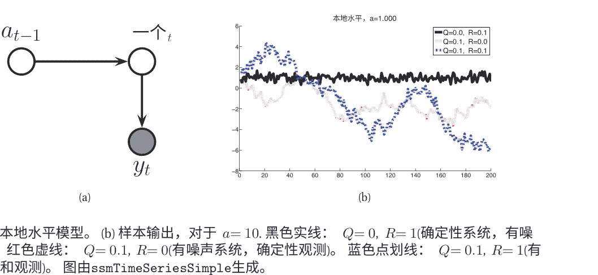

图18.5 (a) 本地水平模型。(b) 样本输出，对于 $a=10$。黑色实线：$Q=0, R=1$ (确定性系统，有噪声观测)。红色虚线：$Q=0.1, R=0$ (有噪声系统，确定性观测)。蓝色点划线：$Q=0.1, R=1$ (有噪声系统和观测)。图由ssmTimeSeriesSimple生成。

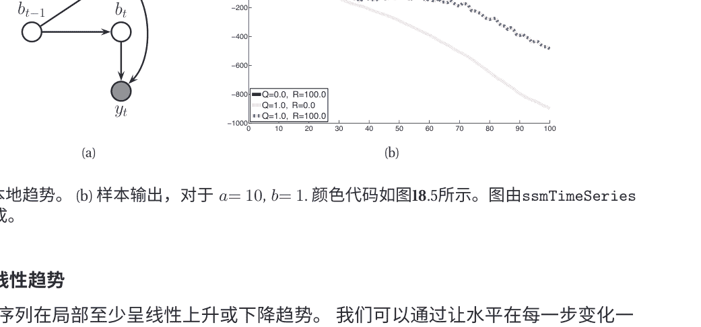

图18.6 (a) 本地趋势。(b) 样本输出，对于 $a=10, b=1$。颜色代码如图18.5所示。图由ssmTimeSeriesSimple生成。

### 18.2.4.2 本地线性趋势

许多时间序列在局部至少呈线性上升或下降趋势。 我们可以通过让水平在每一步变化一个量 $b$ 来对此进行建模，如下所示：$y_t = a_t + \epsilon^y_t$, $\epsilon^y_t \sim \mathcal{N}(0, R)$

$$a_t = a_{t-1} + b_{t-1} + \epsilon^a_t, \quad \epsilon^a_t \sim \mathcal{N}(0, Q_a) \tag{18.18}$$

$$b_t = b_{t-1} + \epsilon^b_t, \quad \epsilon^b_t \sim \mathcal{N}(0, Q_b) \tag{18.19}$$

参见图18.6(a)。 我们可以通过定义 $\mathbf{z}_t = (a_t, b_t)$ 来将其写成标准形式。

$$\mathbf{A} = \begin{pmatrix} 1 & 1 \\ 0 & 1 \end{pmatrix}, \quad \mathbf{C} = \begin{pmatrix} 1 & 0 \end{pmatrix}, \quad \mathbf{Q} = \begin{pmatrix} Q_a & 0 \\ 0 & Q_b \end{pmatrix} \tag{18.21}$$

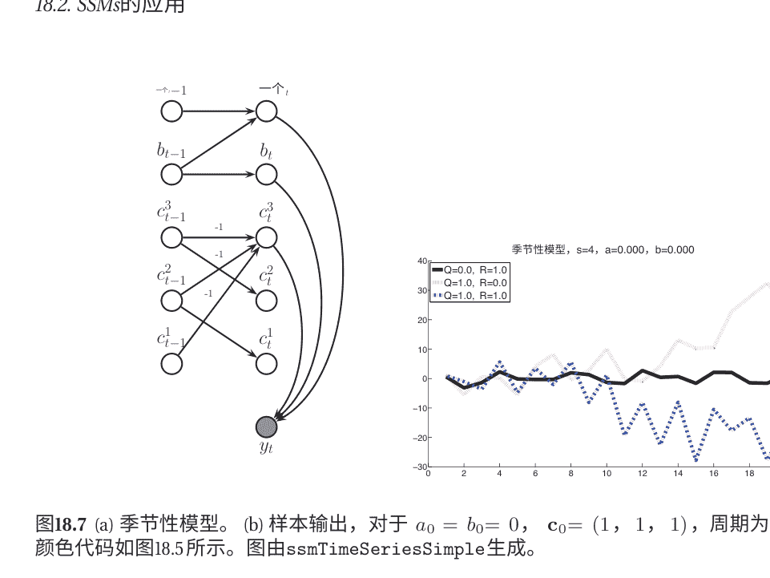

因此，这是经典的常数线性趋势模型的推广，其中一个示例显示在图18.6(b)的黑线中。

### 18.2.4.3 季节性

许多时间序列周期性波动，如图18.7(b)所示。这可以通过添加由一系列偏移项组成的潜在过程来建模，这些偏移项在一个完整的 S步骤周期内总和为零（平均值为零）：

$$c_t = -\sum_{s=1}^{S-1} c_{t-s} + \epsilon^c_t, \quad \epsilon^c_t \sim \mathcal{N}(0, Q_c) \tag{18.22}$$

有关情况 S= 4的图形模型，请参见图18.7(a)（由于总和为零的约束，我们只需要3个季节性变量）。将其以标准LG-SSM形式书写留给练习18.2。

### 18.2.4.4 ARMA模型*

时间序列预测的经典方法基于 ARMA模型。“ARMA”代表自回归移动平均模型，指的是一种形式的模型

$$x_t = \sum_{i=1}^{p} \alpha_i x_{t-i} + \sum_{j=1}^{q} \beta_j w_{t-j} + v_t \tag{18.23}$$

其中 v_t, w_t ∼ N(0,1)是独立的高斯噪声项。如果 q= 0，我们得到一个纯AR模型，其中 x_t ⊥ x_i|x_{t-1:t-p}, 对于 i < t - p。例如，如果 p= 1，我们得到AR(1)模型

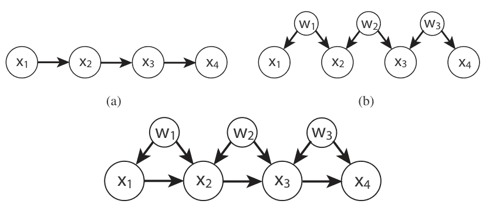

如图18.8(a)所示。 ($v_t$ nodes在高斯CPD中是隐含的 $x_t$。) 这只是一个一阶马尔可夫链。 如果 $p = 0$， 我们有一个纯MA模型， 其中 $x_t \perp x_i$, 对于 $i < t - q$。 例如， 如果 $q = 1$， 我们有图18.8(b)中显示的MA(1)模型。 这里的 $w_t$ nodes是隐藏的共同原因， 它在相邻时间步之间引起依赖关系。 这个模型具有短程相关性。 如果 $p = q = 1$， 我们得到图18.8(c)中显示的ARMA(1,1)模型， 它捕捉到短时间尺度和长时间尺度的相关性。

事实证明， ARMA模型可以表示为SSM， 如 (Aoki 1987; Harvey 1990; West and Harrison 1997; Durbin and Koopman 2001; Petris et al. 2009; Prado and West 2010) 中所解释的。 然而， 结构化方法对于时间序列通常比ARMA方法更容易理解。 此外， 它允许参数随时间演变， 使得模型更适应非平稳性。

### 18.3 LG-SSM中的推断

在本节中， 我们讨论LG-SSM模型中的精确推断。 我们首先考虑在线情况， 这类似于HMM的前向算法。 然后我们考虑离线情况， 这类似于HMM的前向后向算法。

#### 18.3.1 卡尔曼滤波算法

卡尔曼滤波器是线性高斯状态空间模型的精确贝叶斯滤波算法。 我们将在时间$t$表示边缘后验概率为

$$p(\mathbf{z}_t|\mathbf{y}_{1:t}, \mathbf{u}_{1:t}) = \mathcal{N}(\mathbf{z}_t|\boldsymbol{\mu}_t, \boldsymbol{\Sigma}_t)$$

由于所有内容都是高斯的， 我们可以闭式地执行预测和更新步骤， 如下所述。 得到的算法是第17.4.2节中HMM滤波器的高斯模拟。

### 18.3.1.1 预测步骤

预测步骤很容易推导出：

$$p(z_t|y_{1:t-1}, u_{1:t}) = \int \mathcal{N}(z_t|A_t z_{t-1} + B_t u_t, Q_t) \mathcal{N}(z_{t-1}|\mu_{t-1}, \Sigma_{t-1}) d z_{t-1} \quad (18.25) \\
= \mathcal{N}(z_t|\mu_{t|t-1}, \Sigma_{t|t-1}) \quad (18.26) \\
\mu_{t|t-1} \triangleq A_t \mu_{t-1} + B_t u_t \quad (18.27) \\
\Sigma_{t|t-1} \triangleq A_t \Sigma_{t-1} A_t^T + Q_t \quad (18.28)$$

### 18.3.1.2 测量步骤

测量步骤可以使用贝叶斯规则计算，如下所示

$$p(z_t|y_t, y_{1:t-1}, u_{1:t}) \propto p(y_t|z_t, u_t) p(z_t|y_{1:t-1}, u_{1:t}) \quad (18.29)$$

在第18.3.1.6节中，我们证明了这是由以下给出的

$$p(z_t|y_{1:t}, u_t) = \mathcal{N}(z_t|\mu_t, \Sigma_t) \quad (18.30) \\
\mu_t = \mu_{t|t-1} + \mathbf{K}_t \mathbf{r}_t \quad (18.31) \\
\Sigma_t = (\mathbf{I} - \mathbf{K}_t \mathbf{C}_t) \Sigma_{t|t-1} \quad (18.32)$$

其中 \mathbf{r}_t 是残差或创新，由我们预测观测值与实际观测值之间的差异给出：

$$\mathbf{r}_t \triangleq \mathbf{y}_t - \hat{\mathbf{y}}_t \quad (18.33) \\
\hat{\mathbf{y}}_t \triangleq \mathbb{E}[\mathbf{y}_t|y_{1:t-1}, \mathbf{u}_{1:t}] = \mathbf{C}_t \mu_{t|t-1} + \mathbf{D}_t \mathbf{u}_t \quad (18.34)$$

而 \mathbf{K}_t 是卡尔曼增益矩阵，给定为

$$\mathbf{K}_t \triangleq \Sigma_{t|t-1} \mathbf{C}_t^T \mathbf{S}_t^{-1} \quad (18.35)$$

其中

$$\mathbf{S}_t \triangleq \text{cov} [\mathbf{r}_t|\mathbf{y}_{1:t-1}, \mathbf{u}_{1:t}] \quad (18.36) \\
= \mathbb{E} [ (\mathbf{C}_t \mathbf{z}_t + \delta_t - \hat{\mathbf{y}}_t)(\mathbf{C}_t \mathbf{z}_t + \delta_t - \hat{\mathbf{y}}_t)^T |\mathbf{y}_{1:t-1}, \mathbf{u}_{1:t} ] \quad (18.37) \\
= \mathbf{C}_t \Sigma_{t|t-1} \mathbf{C}_t^T + \mathbf{R}_t \quad (18.38)$$

其中 \delta_t \sim \mathcal{N}(0, \mathbf{R}_t)是一个与所有其他噪声源独立的观测噪声项。 请注意，通过使用矩阵求逆引理，卡尔曼增益矩阵也可以表示为

$$\mathbf{K}_t = \Sigma_{t|t-1} \mathbf{C}^T (\mathbf{C} \Sigma_{t|t-1} \mathbf{C}^T + \mathbf{R})^{-1} = (\Sigma_{t|t-1}^{-1} + \mathbf{C}^T \mathbf{R} \mathbf{C})^{-1} \mathbf{C}^T \mathbf{R}^{-1} \quad (18.39)$$

现在我们已经拥有实现算法所需的所有量；请参见kalmanFilter以获取一些Matlab代码。

让我们试着理解这些方程。 特别是，考虑均值更新的方程： \(\mu_t = \mu_{t|t-1} + \mathbf{K}_t \mathbf{r}_t\)。这意味着新的均值是旧均值加上一个校正因子，即 $K_t$ 倍的误差信号 $r_t$。对误差信号的权重取决于卡尔曼增益矩阵。如果 $C_t = I$，则 $K_t = \Sigma_{t|t-1} S_t^{-1}$，这是先验协方差（来自动态模型）和测量误差协方差之间的比率。如果我们有一个强先验和/或非常嘈杂的传感器，$|K_t|$ 将会很小，我们会对校正项给予很小的权重。相反，如果我们有一个弱先验和/或高精度传感器，那么 $|K_t|$ 将会很大，我们会对校正项给予很大的权重。

### 18.3.1.3 边际似然

作为算法的副产品，我们还可以使用对数似然来计算序列。
$$ \log p(y_{1:T}|u_{1:T}) = \sum_t \log p(y_t|y_{1:t-1}, u_{1:t}) \quad (18.40) $$
其中
$$ p(y_t|y_{1:t-1}, u_{1:t}) = \mathcal{N}(y_t|C_t \mu_{t|t-1}, S_t) \quad (18.41) $$

### 18.3.1.4 后验预测

可以通过以下方式计算观测值的一步预测后验密度
$$ p(y_t|y_{1:t-1}, u_{1:t}) = \int \mathcal{N}(y_t|C z_t, R) \mathcal{N}(z_t|\mu_{t|t-1}, \Sigma_{t|t-1}) dz_t \quad (18.42) $$
$$ = \mathcal{N}(y_t|C \mu_{t|t-1}, C \Sigma_{t|t-1} C^T + R) \quad (18.43) $$
这对于时间序列预测很有用。

### 18.3.1.5 计算问题

在卡尔曼滤波器中有两个主要的成本：计算卡尔曼增益矩阵的矩阵求逆，$K_t$，它需要 $O(|y_t|^3)$ 时间；以及计算 $\Sigma_t$ 的矩阵乘法，它需要 $O(|z_t|^2)$ 时间。在某些应用中（例如机器人地图绘制），我们有 $|z_t| \gg |y_t|$，因此后者的成本更高。然而，在这种情况下，我们有时可以使用稀疏逼近（参见（Thrun et al. 2006））。

在 $|y_t| \gg |z_t|$ 的情况下，我们可以预先计算 $K_t$，因为令人惊讶的是，它不依赖于实际观测值 $y_{1:t}$（这是线性高斯系统特有的性质）。更新 $\Sigma_t$ 的迭代方程被称为Ricatti方程，对于时间不变的系统（即 $\theta_t = \theta$），它们会收敛到一个固定点。然后可以使用这个稳态解代替使用特定时间的增益矩阵。

在实践中，应该使用更复杂的卡尔曼滤波器实现，以保证数值稳定性。一种方法是信息滤波器，它递归地更新高斯分布的规范参数 $\Lambda_t = \Sigma_t^{-1}$ 和 $\eta_t = \Lambda_t \mu_t$，而不是矩参数。另一种方法是平方根滤波器，它使用 $\Sigma_t$ 的Cholesky分解或 $U_t D_t U_t$ 分解。这比直接更新 $\Sigma_t$ 要更加数值稳定。更多细节可以在 http://www.cs.unc.edu/~welch/kalman/ 和各种书籍中找到，例如（Simon 2006）。

### 18.3.1.6 推导 *

我们现在推导卡尔曼滤波方程。为了简化符号，我们将忽略输入项 $\mathbf{u}_{1:t}$。根据高斯贝叶斯规则（方程4.125），后验精度为
$$ \mathbf{\Sigma}_t^{-1} = \mathbf{\Sigma}_{t|t-1}^{-1} + \mathbf{C}_t^T \mathbf{R}_t^{-1} \mathbf{C}_t $$
根据矩阵求逆引理（方程4.106），我们可以将其重写为
$$ \mathbf{\Sigma}_t = \mathbf{\Sigma}_{t|t-1} - \mathbf{\Sigma}_{t|t-1}\mathbf{C}_t^T(\mathbf{R}_t + \mathbf{C}_t\mathbf{\Sigma}_{t|t-1}\mathbf{C}_t^T)^{-1}\mathbf{C}_t\mathbf{\Sigma}_{t|t-1} $$
$$ = (\mathbf{I} - \mathbf{K}_t\mathbf{C}_t)\mathbf{\Sigma}_{t|t-1} $$
根据高斯贝叶斯规则（方程4.125），后验均值为
$$ \boldsymbol{\mu}_t = \mathbf{\Sigma}_t \mathbf{C}_t \mathbf{R}_t^{-1} \mathbf{y}_t + \mathbf{\Sigma}_t \mathbf{\Sigma}_{t|t-1}^{-1} \boldsymbol{\mu}_{t|t-1} $$
现在我们将对其进行转换，使其符合之前所述的形式。将第二个矩阵求逆引理（方程4.107）应用于方程18.47的第一项，我们有
$$ \mathbf{\Sigma}_t \mathbf{C}_t \mathbf{R}_t^{-1} \mathbf{y}_t = (\mathbf{\Sigma}_{t|t-1}^{-1} + \mathbf{C}_t^T \mathbf{R}_t^{-1} \mathbf{C}_t)^{-1} \mathbf{C}_t \mathbf{R}_t^{-1} \mathbf{y}_t $$
$$ = \mathbf{\Sigma}_{t|t-1} \mathbf{C}_t^T (\mathbf{R}_t + \mathbf{C}_t \mathbf{\Sigma}_{t|t-1} \mathbf{C}_t^T)^{-1} \mathbf{y}_t = \mathbf{K}_t \mathbf{y}_t $$
现在将矩阵求逆引理（方程4.106）应用于方程18.47的第二项，我们有
$$ \mathbf{\Sigma}_t \mathbf{\Sigma}_{t|t-1}^{-1} \boldsymbol{\mu}_{t|t-1} $$
$$ = (\mathbf{\Sigma}_{t|t-1}^{-1} + \mathbf{C}_t^T \mathbf{R}_t^{-1} \mathbf{C}_t)^{-1} \mathbf{\Sigma}_{t|t-1}^{-1} \boldsymbol{\mu}_{t|t-1} $$
$$ = [\mathbf{\Sigma}_{t|t-1} - \mathbf{\Sigma}_{t|t-1} \mathbf{C}^T (\mathbf{R}_t + \mathbf{C}_t^T \mathbf{\Sigma}_{t|t-1} \mathbf{C}_t^T) \mathbf{C}_t \mathbf{\Sigma}_{t|t-1}] \mathbf{\Sigma}_{t|t-1}^{-1} \boldsymbol{\mu}_{t|t-1} $$
$$ = (\mathbf{\Sigma}_{t|t-1} - \mathbf{K}_t \mathbf{C}_t^T \mathbf{\Sigma}_{t|t-1}) \mathbf{\Sigma}_{t|t-1}^{-1} \boldsymbol{\mu}_{t|t-1} $$
$$ = \boldsymbol{\mu}_{t|t-1} - \mathbf{K}_t \mathbf{C}_t^T \boldsymbol{\mu}_{t|t-1} $$
将这两者结合起来，我们得到
$$ \boldsymbol{\mu}_t = \boldsymbol{\mu}_{t|t-1} + \mathbf{K}_t (\mathbf{y}_t - \mathbf{C}_t \boldsymbol{\mu}_{t|t-1}) $$

#### 18.3.2 卡尔曼平滑算法

在第18.3.1节中，我们描述了卡尔曼滤波器，它按顺序计算每个时间步的条件概率分布 $p(\mathbf{z}_t|\mathbf{y}_{1:t})$。这对于在线推断问题非常有用，比如跟踪。然而，在离线设置中，我们可以等待所有数据到达，然后计算整个时间范围内的条件概率分布 $p(\mathbf{z}_t|\mathbf{y}_{1:T})$。通过对过去和未来数据进行条件约束，我们的不确定性将显著降低。这在图18.1(c)中有所体现，我们可以看到平滑轨迹的后验协方差椭球比滤波轨迹的要小。（椭球在轨迹的起始和结束处较大，因为边界附近的状态没有那么多有用的邻居可以提供信息。）

现在我们将解释如何使用一种名为RTS平滑器的算法来计算平滑估计值，该算法以其发明者Rauch、Tung和Striebel（Rauch等人，1965年）命名。它也被称为卡尔曼平滑算法。该算法类似于HMM的前向-后向算法，尽管存在一些小的差异，我们将在下面进行讨论。

### 18.3.2.1 算法

卡尔曼滤波可以被看作是在一个图上进行的从左到右的信息传递。当消息到达图的末尾时，我们成功地计算出了 $p(z_T|y_{1:T})$。现在我们从右到左开始工作，将信息从未传回到过去，并将这两个信息源结合起来。问题是：我们如何计算这些反向方程？我们首先给出方程，然后进行推导。

我们有
$$ \begin{aligned} p(z_t|y_{1:T}) &= \mathcal{N}(\mu_{t|T}, \Sigma_{t|T}) \quad (18.56) \\ \mu_{t|T} &= \mu_{t|t} + J_t (\mu_{t+1|T} - \mu_{t+1|t}) \quad (18.57) \\ \Sigma_{t|T} &= \Sigma_{t|t} + J_t (\Sigma_{t+1|T} - \Sigma_{t+1|t}) J_t^T \quad (18.58) \\ J_t &\triangleq \Sigma_{t|t} A_{t+1}^T \Sigma_{t+1|t}^{-1} \quad (18.59) \end{aligned} $$
其中 $J_t$ 是反向卡尔曼增益矩阵。该算法可以从卡尔曼滤波器中的 $\mu_{T|T}$ 和 $\Sigma_{T|T}$ 进行初始化。请注意，这个反向传递不需要访问数据，也就是说，它不需要 $y_{1:T}$。这使我们能够“丢弃”潜在的高维观测向量，只保留滤波后的信念状态，这通常需要更少的内存。

### 18.3.2.2 推导 *

现在我们推导卡尔曼平滑器，按照（Jordan 2007，第15.7节）的介绍。关键思想是利用马尔可夫性质，即 $z_t$ 在未来的数据 $y_{t+1:T}$ 下是独立的，只要 $z_{t+1}$ 是已知的。当然，$z_{t+1}$ 是未知的，但我们有一个分布在它上面。所以我们在 $z_{t+1}$ 上进行条件，并将其积分掉，如下所示。
$$ \begin{aligned} p(z_t|y_{1:T}) &= \int p(z_t|y_{1:T}, z_{t+1}) p(z_{t+1}|y_{1:T}) dz_{t+1} \quad (18.60) \\ &= \int p(z_t|y_{1:t}, z_{t+1}) p(z_{t+1}|y_{1:T}) dz_{t+1} \quad (18.61) \end{aligned} $$
通过归纳法，假设我们已经计算出了 $t+1$ 的平滑分布：
$$ p(z_{t+1}|y_{1:T}) = \mathcal{N}(z_{t+1}|\mu_{t+1|T}, \Sigma_{t+1|T}) \quad (18.62) $$
问题是：我们如何进行积分？

首先，我们计算两个时间片的滤波分布 $p(z_t, z_{t+1}|y_{1:t})$ 如下：
$$ p(z_t, z_{t+1}|y_{1:t}) = \mathcal{N}\left( \begin{pmatrix} z_t \\ z_{t+1} \end{pmatrix} \middle| \begin{pmatrix} \mu_{t|t} \\ \mu_{t+1|t} \end{pmatrix}, \begin{pmatrix} \Sigma_{t|t} & \Sigma_{t|t} A_{t+1}^T \\ A_{t+1} \Sigma_{t|t} & \Sigma_{t+1|t} \end{pmatrix} \right) \quad (18.63) $$
现在我们使用高斯条件计算 $p(\mathbf{z}_t|\mathbf{z}_{t+1}, \mathbf{y}_{1:t})$如下：
$$ p(\mathbf{z}_t|\mathbf{z}_{t+1}, \mathbf{y}_{1:t}) = \mathcal{N}(\mathbf{z}_t|\boldsymbol{\mu}_{t|t} + \mathbf{J}_t(\mathbf{z}_{t+1} - \boldsymbol{\mu}_{t+1|t}), \boldsymbol{\Sigma}_{t|t} - \mathbf{J}_t \boldsymbol{\Sigma}_{t+1|t} \mathbf{J}_t^T) \quad (18.64) $$
我们可以使用迭代期望和迭代协方差的规则计算平滑分布。首先，计算均值：
$$ \boldsymbol{\mu}_{t|T} = \mathbb{E} \left[ \mathbb{E} [\mathbf{z}_t|\mathbf{z}_{t+1}, \mathbf{y}_{1:T}] | \mathbf{y}_{1:T} \right] \quad (18.65) $$
$$ = \mathbb{E} \left[ \mathbb{E} [\mathbf{z}_t|\mathbf{z}_{t+1}, \mathbf{y}_{1:t}] | \mathbf{y}_{1:T} \right] \quad (18.66) $$
$$ = \mathbb{E} \left[ \boldsymbol{\mu}_{t|t} + \mathbf{J}_t(\mathbf{z}_{t+1} - \boldsymbol{\mu}_{t+1|t}) | \mathbf{y}_{1:T} \right] \quad (18.67) $$
$$ = \boldsymbol{\mu}_{t|t} + \mathbf{J}_t(\boldsymbol{\mu}_{t+1|T} - \boldsymbol{\mu}_{t+1|t}) \quad (18.68) $$
现在计算协方差：
$$ \boldsymbol{\Sigma}_{t|T} = \text{协方差} \left[ \mathbb{E} [\mathbf{z}_t|\mathbf{z}_{t+1}, \mathbf{y}_{1:T}] | \mathbf{y}_{1:T} \right] + \mathbb{E} \left[ \text{cov} [\mathbf{z}_t|\mathbf{z}_{t+1}, \mathbf{y}_{1:T}] | \mathbf{y}_{1:T} \right] \quad (18.69) $$
$$ = \text{cov} \left[ \mathbb{E} [\mathbf{z}_t|\mathbf{z}_{t+1}, \mathbf{y}_{1:t}] | \mathbf{y}_{1:T} \right] + \mathbb{E} \left[ \text{cov} [\mathbf{z}_t|\mathbf{z}_{t+1}, \mathbf{y}_{1:t}] | \mathbf{y}_{1:T} \right] \quad (18.70) $$
$$ = \text{协方差} \left[ \boldsymbol{\mu}_{t|t} + \mathbf{J}_t(\mathbf{z}_{t+1} - \boldsymbol{\mu}_{t+1|t}) | \mathbf{y}_{1:T} \right] + \mathbb{E} \left[ \boldsymbol{\Sigma}_{t|t} - \mathbf{J}_t \boldsymbol{\Sigma}_{t+1|t} \mathbf{J}_t^T | \mathbf{y}_{1:T} \right] \quad (18.71) $$
$$ = \mathbf{J}_t \text{cov} \left[ \mathbf{z}_{t+1} - \boldsymbol{\mu}_{t+1|t} | \mathbf{y}_{1:T} \right] \mathbf{J}_t^T + \boldsymbol{\Sigma}_{t|t} - \mathbf{J}_t \boldsymbol{\Sigma}_{t+1|t} \mathbf{J}_t^T \quad (18.72) $$
$$ = \mathbf{J}_t \boldsymbol{\Sigma}_{t+1|T} \mathbf{J}_t^T + \boldsymbol{\Sigma}_{t|t} - \mathbf{J}_t \boldsymbol{\Sigma}_{t+1|t} \mathbf{J}_t^T \quad (18.73) $$
$$ = \boldsymbol{\Sigma}_{t|t} + \mathbf{J}_t(\boldsymbol{\Sigma}_{t+1|T} - \boldsymbol{\Sigma}_{t+1|t}) \mathbf{J}_t^T \quad (18.74) $$
该算法可以从上一步的过滤算法中的 $\boldsymbol{\mu}_{T|T}$ 和 $\boldsymbol{\Sigma}_{T|T}$ 初始化。

### 18.3.2.3 与HMM的前向后向算法的比较

请注意，在LDS的前向和后向传递中，我们始终使用归一化的分布，无论是在过去的数据条件下还是在所有数据条件下。此外，后向传递取决于前向传递的结果。这与HMM的常规前向后向算法的表述不同，在那里后向传递可以独立于前向传递计算（参见第17.4.3节）。

事实证明，我们可以以修改后的形式重写卡尔曼平滑器，使其更类似于HMM的前向后向算法。特别是，我们有
$$ p(\mathbf{z}_t|\mathbf{y}_{1:T}) = \int p(\mathbf{z}_t|\mathbf{y}_{1:t}, \mathbf{z}_{t+1}) p(\mathbf{z}_{t+1}|\mathbf{y}_{1:T}) d\mathbf{z}_{t+1} \quad (18.75) $$
$$ = \int p(\mathbf{z}_t, \mathbf{z}_{t+1}|\mathbf{y}_{1:t}) \frac{p(\mathbf{z}_{t+1}|\mathbf{y}_{1:T})}{p(\mathbf{z}_{t+1}|\mathbf{y}_{1:t})} d\mathbf{z}_{t+1} \quad (18.76) $$
现在
$$ p(\mathbf{z}_{t+1}|\mathbf{y}_{1:T}) = \frac{p(\mathbf{y}_{t+1:T}|\mathbf{z}_{t+1}, \mathbf{y}_{1:t}) p(\mathbf{z}_{t+1}|\mathbf{y}_{1:t})}{p(\mathbf{y}_{t+1:T}|\mathbf{y}_{1:t})} \quad (18.77) $$
所以
$$ \frac{p(\mathbf{z}_{t+1}|\mathbf{y}_{1:T})}{p(\mathbf{z}_{t+1}|\mathbf{y}_{1:t})} = \frac{p(\mathbf{z}_{t+1}|\mathbf{y}_{1:t}) p(\mathbf{y}_{t+1:T}|\mathbf{z}_{t+1})}{p(\mathbf{z}_{t+1}|\mathbf{y}_{1:t}) p(\mathbf{y}_{t+1:T}|\mathbf{y}_{1:t})} \propto p(\mathbf{y}_{t+1:T}|\mathbf{z}_{t+1}) \quad (18.78) $$这是未来数据的条件似然。这个反向消息可以独立于正向消息计算。然而，这种方法有几个缺点: (1)它需要访问原始观察序列; (2)反向消息是一个似然, 而不是后验概率, 因此它不一定在 $z_t$ 上积分为1 - 实际上, 它可能无法将 $p(y_{t+1:T}|z_{t+1})$ 表示为具有正定协方差的高斯分布 (这个问题在离散状态空间中不会出现, 如HMM中使用); (3)当无法进行精确推断时, 更合理的做法是尝试近似平滑分布而不是反向似然项 (参见第22.5节)。

还有另一种变体, 称为两个滤波平滑, 在前向传递中计算 $p(z_t|y_{1:t})$, 然后在后向传递中计算滤波后验 $p(z_t|y_{t+1:T})$。然后可以很容易地组合这些来计算 $p(z_t|y_{1:T})$。详见 (Kitagawa 2004; Briers et al. 2010) 了解详情。

### 18.4 LG-SSM的学习

在本节中, 我们简要讨论了如何估计LG-SSM的参数。在控制理论社区中, 这被称为系统辨识 (Ljung 1987)。

在使用SSMs进行时间序列预测以及某些物理状态估计问题时, 观测矩阵 $C$ 和转移矩阵 $A$ 都是已知且固定的, 根据模型的定义。在这种情况下, 需要学习的只有噪声协方差 $Q$ 和 $R$。 (初始状态估计 $\mu_0$ 通常不太重要, 因为在几个时间步之后, 它会被数据“冲刷掉”。这可以通过将初始状态协方差设置得很大来鼓励, 表示一个弱先验。) 虽然我们可以使用下面描述的方法离线估计 $Q$ 和 $R$, 但也可以推导出一个递归过程来精确计算后验 $p(z_t, R, Q|y_{1:t})$, 其形式为正态逆-Wishart分布; 详见 (West and Harrison 1997; Prado and West 2010) 了解详情。

### 18.4.1 可辨识性和数值稳定性

在更一般的情况下, 隐藏状态没有预先定义的含义, 我们需要学习 $A$ 和 $C$。然而, 在这种情况下, 我们可以设置 $Q = I$ 而不会丧失一般性, 因为任意的噪声协方差可以通过适当修改 $A$ 来建模。此外, 类似于因子分析, 我们可以要求 $R$ 是对角的而不会丧失一般性。这样做可以减少自由参数的数量并提高数值稳定性。

另一个有用的约束是对动力学矩阵 $A$ 的特征值进行约束。为了理解为什么这很重要, 考虑没有系统噪声的情况。在这种情况下, 时间 $t$ 的隐藏状态由以下公式给出

$$z_t = A^t z_1 = U\Lambda^t U^{-1}z_1 \quad (18.79)$$

其中 $U$ 是 $A$ 的特征向量矩阵, $\Lambda = \mathrm{diag}(\lambda_i)$ 包含特征值。如果任何 $\lambda_i > 1$, 那么对于大的 $t$, $z_t$ 的幅值将会增大。因此, 为了确保稳定性, 有用的是要求所有特征值都小于1 (Siddiqi等人, 2007年)。当然, 如果所有特征值都小于1, 那么对于大的 $t$, $\mathbb{E}[z_t] = 0$, 因此状态将返回原点。

幸运的是, 当我们添加噪声时, 状态变为非零, 因此模型不会退化。

#### 18.4.2 使用完全观测数据进行训练

如果我们观察到隐藏状态序列，我们可以通过求解多元线性回归问题来计算参数的最大似然估计（甚至是完整的后验概率）。也就是说，我们可以通过求解最小二乘问题来估计 $\mathbf{A}$，$J(\mathbf{A}) = \sum_{t=1}^{T} (\mathbf{z}_{t} - \mathbf{A} \mathbf{z}_{t-1})^{2}$，对于 $\mathbf{C}$ 也是类似的。我们可以通过预测 $\mathbf{z}_{t}$ 从 $\mathbf{z}_{t-1}$ 的残差来估计系统噪声协方差 $\mathbf{Q}$，并通过预测 $\mathbf{y}_{t}$ 从 $\mathbf{z}_{t}$ 的残差来估计观测噪声协方差 $\mathbf{R}$。

### 18.4.3 EM for LG-SSM

如果我们只观察输出序列，我们可以使用EM计算参数的最大似然估计或最大后验估计。该方法在概念上与HMM的Baum-Welch算法非常相似（第17.5节），只是在E步中我们使用卡尔曼平滑而不是前向后向，并且在M步中使用不同的计算。我们将细节留给练习18.1。

#### 18.4.4 子空间方法

EM并不总是给出令人满意的结果，因为它对初始参数估计值非常敏感。避免这种情况的一种方法是使用一种称为子空间方法的不同方法（Overschee和Moor 1996; Katayama 2005）。

为了理解这种方法，让我们最初假设没有观测噪声和系统噪声。在这种情况下，我们有 $\mathbf{z}_{t} = \mathbf{A} \mathbf{z}_{t-1}$ 和 $\mathbf{y}_{t} = \mathbf{C} \mathbf{z}_{t}$，因此 $\mathbf{y}_{t} = \mathbf{C} \mathbf{A}^{t-1} \mathbf{z}_{1}$。

因此，所有的观测值必须从一个 $\dim(\mathbf{z}_{t})$ 维线性流形或子空间生成。我们可以使用主成分分析（PCA）来识别这个子空间（详见上述参考文献）。

一旦我们估计出 $\mathbf{z}_{t}$ 的值，我们可以像完全观测到一样拟合模型。我们可以将这些估计值直接使用，或者用它们来初始化EM算法。

### 18.4.5 贝叶斯方法用于“拟合”LG-SSMs

EM算法有各种离线贝叶斯替代方法，包括变分贝叶斯EM（Beal 2003; Barber and Chiappa 2007）和阻塞吉布斯采样（Carter and Kohn 1994; Cappe et al. 2005; Fruhwirth-Schnatter 2007）。贝叶斯方法也可以用于在线学习，正如我们在第18.2.3节中讨论的那样。不幸的是，一旦我们将SSM参数添加到状态空间中，模型通常不再是线性高斯的。因此，我们必须使用下面将要讨论的一些近似在线推断方法。

## 18.5 针对非线性、非高斯SSMs的近似在线推断

在第18.3.1节中，我们讨论了如何对LG-SSMs进行精确的在线推断。然而，许多模型是非线性的。例如，大多数移动物体不会沿直线移动。

即使他们这样做了，如果我们假设模型的参数是未知的并将它们添加到状态空间中，模型就变成了非线性的。此外，非高斯噪声也非常普遍，例如由于异常值，或者在推断GLMs的参数时而不仅仅是线性回归。对于这些更一般的模型，我们需要使用近似推断。

我们在下面讨论的近似推理算法通过高斯分布来近似后验概率。一般来说，如果 $Y = f(X)$，其中 $X$ 服从高斯分布，$f$ 是一个非线性函数，有两种主要的方法可以通过高斯分布来近似 $p(Y)$。第一种方法是使用 $f$ 的一阶近似。第二种方法是使用精确的 $f$，但是通过矩匹配将 $f(X)$ 投影到高斯空间中。我们依次讨论这些方法。（另请参见第23.5节，我们在那里讨论了粒子滤波，这是一种用于近似在线推理的随机算法，它使用非参数近似来近似后验概率，通常更准确但计算速度较慢。）

#### 18.5.1 扩展卡尔曼滤波器（EKF）

在本节中，我们关注非线性模型，但我们假设噪声是高斯的。也就是说，我们考虑形式为的模型

$$
\begin{aligned}
\mathbf{z}_t &= g(\mathbf{u}_t, \mathbf{z}_{t-1}) + \mathcal{N}(\mathbf{0}, \mathbf{Q}_t) \quad &(18.80) \\
\mathbf{y}_t &= h(\mathbf{z}_t) + \mathcal{N}(\mathbf{0}, \mathbf{R}_t) \quad &(18.81)
\end{aligned}
$$

其中，转换模型 $g$ 和观测模型 $h$ 是非线性但可微分的函数。此外，我们重点关注将后验近似为单个高斯分布的情况。（处理更一般的后验分布（例如多模态、离散等）的最简单方法是使用粒子滤波器，在第23.5节中讨论。）

扩展卡尔曼滤波器（EKF）可以应用于这种形式的非线性高斯动态系统。基本思想是使用一阶泰勒级数展开将 $g$ 和 $h$ 线性化到先前状态估计周围，然后应用标准的卡尔曼滤波器方程。（方程中的噪声方差（$\mathbf{Q}$ 和 $\mathbf{R}$）未改变，即由于线性化而引起的额外误差未建模。）因此，我们将非平稳非线性动态系统近似为非平稳线性动态系统。

该方法的直觉在图18.9中显示，该图显示了当我们通过非线性函数 $y = g(x)$ （右上方显示）传递高斯分布 $p(x)$ （右下方显示）时会发生什么。结果分布（通过蒙特卡洛近似）显示在左上角的阴影灰色区域中。对此的最佳高斯近似，通过蒙特卡洛从 $\mathbb{E}[g(x)]$ 和 $\mathrm{var}[g(x)]$ 计算得到，由实线黑线表示。EKF对此高斯分布的近似如下：在当前模式 $\mu$ 处线性化 $g$ 函数，然后通过该线性化函数传递高斯分布 $p(x)$。在这个例子中，对于 $p(y)$ 的一阶和二阶矩的近似非常好，而成本要比MC近似低得多。

更详细地说，该方法的工作原理如下。我们使用近似的测量模型

$$p(\mathbf{y}_t|\mathbf{z}_t) \approx \mathcal{N}(\mathbf{y}_t|\mathbf{h}(\boldsymbol{\mu}_{t|t-1}) + \mathbf{H}_t(\mathbf{y}_t - \boldsymbol{\mu}_{t|t-1}), \mathbf{R}_t) \quad (18.82)$$

其中 $\mathbf{H}_t$ 是在先验模式下评估的 $\mathbf{h}$ 的雅可比矩阵：

$$H_{ij} \triangleq \frac{\partial h_i(\mathbf{z})}{\partial z_j} \quad (18.83)$$
$$\mathbf{H}_t \triangleq \mathbf{H}|_{\mathbf{z}=\boldsymbol{\mu}_{t|t-1}} \quad (18.84)$$

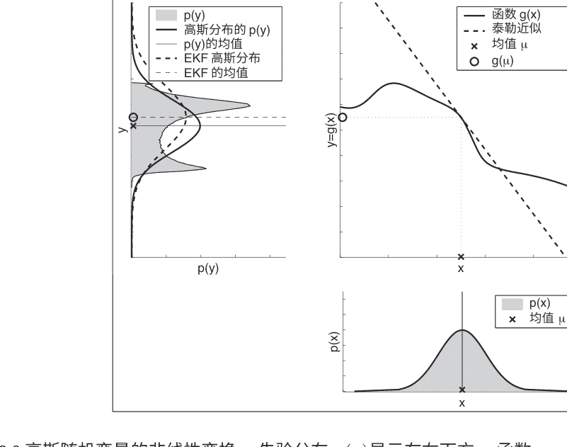

图18.9 高斯随机变量的非线性变换。先验分布 $p(x)$ 显示在右下方。函数 $y = g(x)$ 显示在右上方。变换后的分布 $p(y)$ 显示在左上方。线性函数引起高斯分布，而非线性函数引起复杂分布。实线是对此的最佳高斯近似；虚线是对此的EKF近似。来源：(Thrun et al. 2006) 的图3.4。获得 Sebastian Thrun 的友情许可后使用。

同样地，我们使用近似方法来建模系统

$$ p(\mathbf{z}_t|\mathbf{z}_{t-1}, \mathbf{u}_t) \approx \mathcal{N}(\mathbf{z}_t|\mathbf{g}(\mathbf{u}_t, \boldsymbol{\mu}_{t-1}) + \mathbf{G}_t(\mathbf{z}_{t-1} - \boldsymbol{\mu}_{t-1}), \mathbf{Q}_t) \quad (18.85)$$

其中

$$ G_{ij}(\mathbf{u}) \triangleq \frac{\partial g_i(\mathbf{u}, \mathbf{z})}{\partial z_j} \quad (18.86) $$
$$ \mathbf{G}_t \triangleq \mathbf{G}(\mathbf{u}_t)|_{\mathbf{z}=\boldsymbol{\mu}_{t-1}} \quad (18.87)$$

所以 $\mathbf{G}$ 是 $\mathbf{g}$ 在先验模式处的雅可比矩阵。在此基础上，我们可以应用卡尔曼滤波器来计算后验概率，具体如下：

$$ \boldsymbol{\mu}_{t|t-1} = \mathbf{g}(\mathbf{u}_t, \boldsymbol{\mu}_{t-1}) \quad (18.88) $$
$$ \mathbf{V}_{t|t-1} = \mathbf{G}_t \mathbf{V}_{t-1} \mathbf{G}_t^T + \mathbf{Q}_t \quad (18.89) $$
$$ \mathbf{K}_t = \mathbf{V}_{t|t-1} \mathbf{H}_t^T (\mathbf{H}_t \mathbf{V}_{t|t-1} \mathbf{H}_t^T + \mathbf{R}_t)^{-1} \quad (18.90) $$
$$ \boldsymbol{\mu}_t = \boldsymbol{\mu}_{t|t-1} + \mathbf{K}_t(\mathbf{y}_t - \mathbf{h}(\boldsymbol{\mu}_{t|t-1})) \quad (18.91) $$
$$ \mathbf{V}_t = (\mathbf{I} - \mathbf{K}_t \mathbf{H}_t) \mathbf{V}_{t|t-1} \quad (18.92)$$

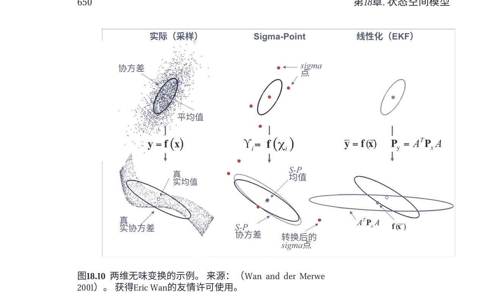

图18.10 两维无味变换的示例。来源：（Wan and der Merwe 2001）。获得Eric Wan的友情许可使用。

我们可以看到，与常规的卡尔曼滤波器相比，唯一的区别是，在计算状态预测时，我们使用 $\mathbf{g}(\mathbf{u}_t, \boldsymbol{\mu}_{t-1})$ 而不是 $\mathbf{A}_t \boldsymbol{\mu}_{t-1} + \mathbf{B}_t \mathbf{u}_t$，并且在计算测量更新时，我们使用 $\mathbf{h}(\boldsymbol{\mu}_{t|t-1})$ 而不是 $\mathbf{C}_t \boldsymbol{\mu}_{t|t-1}$。通过反复线性化方程式，可以改善性能，围绕 $\boldsymbol{\mu}_t$ 而不是 $\boldsymbol{\mu}_{t|t-1}$；这被称为迭代EKF，并且可以得到更好的结果，尽管速度较慢。

EKF工作不好的情况有两种。第一种情况是先验协方差较大。在这种情况下，先验分布较宽，因此我们会将大量的概率质量通过函数的不同部分发送，这些部分远离均值，在这些部分函数已经线性化。EKF工作不好的另一种情况是函数在当前均值附近高度非线性。在第18.5.2节中，我们将讨论一种称为UKF的算法，在这两种情况下比EKF更好。

### 18.5.2 无香卡尔曼滤波器 (UKF)

无香卡尔曼滤波器 (UKF) 是EKF的改进版本 (Julier and Uhlmann 1997)。(显然它被称为“无香”是因为它“不臭”！) 关键的直觉是：近似一个高斯分布比近似一个函数更容易。因此，不是对函数进行线性近似，并通过它传递一个高斯分布，而是通过函数传递一组确定性选择的点，称为sigma点，并将高斯分布拟合到结果转换后的点。这被称为无香变换，并在图18.10中概述。（我们将在下面详细解释这个图。）

UKF基本上使用无香变换两次，一次近似通过系统模型 $\mathbf{g}$，一次近似通过测量模型 $\mathbf{h}$。我们在下面给出详细信息。请注意，UKF和EKF每个时间步骤执行 $O(d^3)$次操作，其中 $d$是潜在状态空间的大小。然而，UKF至少是二阶精确的，而EKF只是一阶近似（尽管EKF和UKF都可以扩展以捕捉更高阶的项）。此外，无香变换不需要任何导数或雅可比矩阵的解析评估（所谓的无导数滤波器），使其更容易实现和更广泛适用。

#### 18.5.2.1 无香转换

在解释UKF之前，我们首先解释无香转换。假设 $p(\mathbf{x}) = \mathcal{N}(\mathbf{x} | \boldsymbol{\mu}, \boldsymbol{\Sigma})$，并考虑估计 $p(\mathbf{y})$，其中 $\mathbf{y} = f(\mathbf{x})$ 是某个非线性函数 $f$。无香转换的做法如下。首先，我们创建一组 $2d+1$ 个西格玛点 $\mathbf{x}_i$，给定为

$$\mathbf{x} = \left( \boldsymbol{\mu}, \{ \boldsymbol{\mu} + (\sqrt{(d+\lambda)\boldsymbol{\Sigma}})_{:i} \}_{i=1}^d, \{ \boldsymbol{\mu} - (\sqrt{(d+\lambda)\boldsymbol{\Sigma}})_{:i} \}_{i=1}^d \right)$$

其中 $\lambda = \alpha^2(d + \kappa) - d$是一个要指定的缩放参数，符号 $\mathbf{M}_{:i}$ 表示矩阵 $\mathbf{M}$的第 $i$ 列。

这些sigma点通过非线性函数传播，得到 $\mathbf{y}_i = f(\mathbf{x}_i)$，以及 $\mathbf{y}$ 的均值和协方差如下计算：

$$ \boldsymbol{\mu}_y = \sum_{i=0}^{2d} w_m^i \mathbf{y}_i $$
$$ \boldsymbol{\Sigma}_y = \sum_{i=0}^{2d} w_c^i (\mathbf{y}_i - \boldsymbol{\mu}_y)(\mathbf{y}_i - \boldsymbol{\mu}_y)^T $$

其中 $w$ 的权重项由以下给出

$$ w_m^i = \frac{\lambda}{d + \lambda} \quad (对于 i=0) $$
$$ w_c^i = \frac{\lambda}{d + \lambda} + (1 - \alpha^2 + \beta) \quad (对于 i=0) $$
$$ w_m^i = w_c^i = \frac{1}{2(d + \lambda)} \quad (对于 i=1,...,2d) $$

参见图18.10进行说明。

一般来说，$\alpha$，$\beta$和$\kappa$的最优值取决于问题，但当 $d=1$ 时，它们为 $\alpha = 1, \beta = 0, \kappa = 2$。因此，在1d情况下，$\lambda = 2$，所以3个sigma点为 $\mu, \mu + \sqrt{3}\sigma$ 和 $\mu - \sqrt{3}\sigma$。

#### 18.5.2.2 UKF算法

UKF算法只是无味变换的两个应用之一，一个用于计算 $p(\mathbf{z}_t | \mathbf{y}_{1:t-1}, \mathbf{u}_{1:t})$，另一个用于计算 $p(\mathbf{z}_t | \mathbf{y}_{1:t}, \mathbf{u}_{1:t})$。我们在下面给出详细信息。

第一步是通过将旧的信念状态 $\mathcal{N}(\mathbf{z}_{t-1}|\boldsymbol{\mu}_{t-1}, \boldsymbol{\Sigma}_{t-1})$ 通过系统模型 $\mathbf{g}$ 来近似预测密度 $p(\mathbf{z}_t|\mathbf{y}_{1:t-1}, \mathbf{u}_{1:t}) \approx \mathcal{N}(\mathbf{z}_t|\boldsymbol{\mu}_t, \boldsymbol{\Sigma}_t)$。

$$
\begin{aligned}
\mathbf{z}_{t-1}^0 &= \left( \boldsymbol{\mu}_{t-1}, \{\boldsymbol{\mu}_{t-1} + \gamma(\sqrt{\boldsymbol{\Sigma}_{t-1}})_{:,i}\}_{i=1}^d, \{\boldsymbol{\mu}_{t-1} - \gamma(\sqrt{\boldsymbol{\Sigma}_{t-1}})_{:,i}\}_{i=1}^d \right) \tag{18.99} \\
\overline{\mathbf{z}}_t^{*i} &= \mathbf{g}(\mathbf{u}_t, \mathbf{z}_{t-1}^{0i}) \tag{18.100} \\
\overline{\boldsymbol{\mu}}_t &= \sum_{i=0}^{2d} w_m^i \overline{\mathbf{z}}_t^{*i} \tag{18.101} \\
\overline{\boldsymbol{\Sigma}}_t &= \sum_{i=0}^{2d} w_c^i (\overline{\mathbf{z}}_t^{*i} - \overline{\boldsymbol{\mu}}_t)(\overline{\mathbf{z}}_t^{*i} - \overline{\boldsymbol{\mu}}_t) + \mathbf{Q}_t \tag{18.102}
\end{aligned}
$$

其中 $\gamma = \sqrt{d + \lambda}$。

第二步是通过观测模型 $\mathbf{h}$ 来近似似然函数 $p(\mathbf{y}_t|\mathbf{z}_t) \approx \mathcal{N}(\mathbf{y}_t|\hat{\mathbf{y}}_t, \mathbf{S}_t)$，其中先验分布为 $\mathcal{N}(\mathbf{z}_t|\boldsymbol{\mu}_t, \boldsymbol{\Sigma}_t)$。

$$
\begin{aligned}
\mathbf{z}_t^0 &= \left( \boldsymbol{\mu}_t, \{\boldsymbol{\mu}_t + \gamma(\sqrt{\boldsymbol{\Sigma}_t})_{:,i}\}_{i=1}^d, \{\boldsymbol{\mu}_t - \gamma(\sqrt{\boldsymbol{\Sigma}_t})_{:,i}\}_{i=1}^d \right) \tag{18.103} \\
\overline{\mathbf{y}}_t^{*i} &= \mathbf{h}(\mathbf{z}_t^{0i}) \tag{18.104} \\
\hat{\mathbf{y}}_t &= \sum_{i=0}^{2d} w_m^i \overline{\mathbf{y}}_t^{*i} \tag{18.105} \\
\mathbf{S}_t &= \sum_{i=0}^{2d} w_c^i (\overline{\mathbf{y}}_t^{*i} - \hat{\mathbf{y}}_t)(\overline{\mathbf{y}}_t^{*i} - \hat{\mathbf{y}}_t)^T + \mathbf{R}_t \tag{18.106}
\end{aligned}
$$

最后，我们使用高斯贝叶斯规则得到后验概率 $p(\mathbf{z}_t|\mathbf{y}_{1:t}, \mathbf{u}_{1:t}) \approx \mathcal{N}(\mathbf{z}_t|\boldsymbol{\mu}_t, \boldsymbol{\Sigma}_t)$:

$$
\begin{aligned}
\overline{\boldsymbol{\Sigma}}_t^{z,y} &= \sum_{i=0}^{2d} w_c^i (\overline{\mathbf{z}}_t^{*i} - \overline{\boldsymbol{\mu}}_t)(\overline{\mathbf{y}}_t^{*i} - \hat{\mathbf{y}}_t)^T \tag{18.107} \\
\mathbf{K}_t &= \overline{\boldsymbol{\Sigma}}_t^{z,y} \mathbf{S}_t^{-1} \tag{18.108} \\
\boldsymbol{\mu}_t &= \overline{\boldsymbol{\mu}}_t + \mathbf{K}_t(\mathbf{y}_t - \hat{\mathbf{y}}_t) \tag{18.109} \\
\boldsymbol{\Sigma}_t &= \overline{\boldsymbol{\Sigma}}_t - \mathbf{K}_t \mathbf{S}_t \mathbf{K}_t^T \tag{18.110}
\end{aligned}
$$

## 18.5.3 假设密度滤波 (ADF)

在本节中，我们讨论推断，其中我们执行一个精确的更新步骤，然后通过某种方便的形式的分布（例如高斯分布）来近似后验分布。更准确地说，让我们用 $\boldsymbol{\theta}_t$ 表示我们想要推断的未知量。假设 $\mathcal{Q}$ 是一组可计算的分布，例如具有对角协方差矩阵的高斯分布，或者离散分布的乘积。假设我们有一个近似先验分布 $q_{t-1}(\boldsymbol{\theta}_{t-1}) \approx p(\boldsymbol{\theta}_{t-1}|\mathbf{y}_{1:t-1})$，其中 $q_{t-1} \in \mathcal{Q}$。我们可以使用新的测量结果来更新这个近似后验分布

$$
\hat{p}(\boldsymbol{\theta}_t) = \frac{1}{Z_t} p(\mathbf{y}_t|\boldsymbol{\theta}_t) q_{t|t-1}(\boldsymbol{\theta}_t) \tag{18.111}
$$

其中
$$Z_t = \int p(\mathbf{y}_t|\boldsymbol{\theta}_t)q_{t|t-1}(\boldsymbol{\theta}_t)d\boldsymbol{\theta}_t$$
是归一化常数，
$$q_{t|t-1}(\boldsymbol{\theta}_t) = \int p(\boldsymbol{\theta}_t|\boldsymbol{\theta}_{t-1})q_{t-1}(\boldsymbol{\theta}_{t-1})d\boldsymbol{\theta}_{t-1}$$
是一步预测分布。

如果先验来自一个适当受限的族群，这个一步更新过程通常是可计算的。然而，我们经常发现得到的后验不再属于我们可计算的族群，$\hat{p}(\boldsymbol{\theta}_t) \notin \mathcal{Q}$。因此，在更新后，我们通过计算来寻找最佳的可计算近似
$$q(\boldsymbol{\theta}_t) = \underset{q \in \mathcal{Q}}{\text{argmin}}\ \mathbb{KL}(\hat{p}(\boldsymbol{\theta}_t)||q(\boldsymbol{\theta}_t))$$
这最小化了Kullback-Leibler散度（第2.8.2节）从近似$q(\boldsymbol{\theta}_t)$到“精确”后验$\hat{p}(\boldsymbol{\theta}_t)$，可以看作是将$\hat{p}$投影到可计算的分布空间上。整个算法由预测-更新-投影循环组成。这被称为假设密度滤波或ADF（Maybeck 1979）。请参见图18.11(a)的草图。

如果$q$属于指数族，可以证明通过矩匹配来进行KL最小化。我们给出一些例子如下。

### 18.5.3.1 Boyen-Koller算法用于DBNs的在线推断

如果我们在离散状态的动态贝叶斯网络（第17.6.7节）中进行推断，其中$\theta_{t,j}$是时间$t$的第$j$个隐藏变量，则精确的后验概率$p(\boldsymbol{\theta}_t)$由于纠缠问题而变得难以计算。假设我们使用完全分解的近似形式$q(\boldsymbol{\theta}_t) = \prod_{j=1}^{D_j} \text{Cat}(\theta_{t,j}|\boldsymbol{\pi}_{t,j})$，其中$\pi_{t,jk} = q(\theta_{t,j} = k)$是概率变量$j$处于状态$k$，$D$是变量的数量。在这种情况下，矩匹配操作变为
$$\pi_{t,jk} = \hat{p}(\theta_{t,j} = k)$$
这可以通过使用分解的先验进行预测更新步骤，然后计算后验边缘来计算。这被称为Boyen-Koller算法，以(Boyen and Koller 1998)的作者命名，他们证明了在对系统的随机性做出一定假设的情况下，这一系列重复近似所产生的误差保持有界。

### 18.5.3.2 广义线性模型在线推断的高斯近似

现在假设 $ q(\theta_t) = \prod_{j=1}^{D} \mathcal{N}(\theta_{t,j} | \mu_{t,j}, \tau_{t,j}) $，其中 $\tau_{t,j}$ 是方差。然后，可计算的后验近似的最优参数为
$$ \mu_{t,j} = \mathbb{E}_{\hat{p}} [\theta_{t,j}], \quad \tau_{t,j} = \text{var}_{\hat{p}} [\theta_{t,j}] \tag{18.116} $$

这种方法可以用来对许多统计模型的参数进行在线推断。

例如，TrueSkill系统在微软的Xbox上用于随时间对玩家进行排名，使用了这种近似方法 (Herbrich等人，2007年)。我们还可以将这种方法应用于更简单的模型，例如GLM，其优势在于后验概率是对数凹函数。下面我们将解释如何对二元逻辑回归进行这样的处理，参考 (Zoeter，2007年) 的介绍。

该模型的形式为
$$ p(y_t | \mathbf{x}_t, \theta_t) = \text{Ber}(y_t | \text{sigm}(\mathbf{x}_t^T \theta_t)) \tag{18.117} $$
$$ p(\theta_t | \theta_{t-1}) = \mathcal{N}(\theta_t | \theta_{t-1}, \sigma^2 \mathbf{I}) \tag{18.118} $$
其中 $\sigma^2$ 是一些过程噪声，允许参数随时间缓慢变化。（如果需要，可以将其设置为0，如递归最小二乘法（第18.2.3节）中所示。）我们将假设 $ q_{t-1}(\theta_{t-1}) = \prod_j \mathcal{N}(\theta_{t-1,j} | \mu_{t-1,j}, \tau_{t-1,j}) $ 是可计算的先验。我们可以使用标准的线性高斯更新计算一步预测密度 $ q_{t|t-1}(\theta_t) $。所以现在我们专注于测量更新步骤。

定义确定性量 $ s_t = \theta_t^T \mathbf{x}_t $，如图18.11(b)所示。如果 $ q_{t|t-1}(\theta_t) = \prod_j \mathcal{N}(\theta_{t,j} | \mu_{t|t-1,j}, \tau_{t|t-1,j}) $，那么我们可以计算 $ s_t $ 的预测分布如下：
$$ q_{t|t-1}(s_t) = \mathcal{N}(s_t | m_{t|t-1}, v_{t|t-1}) \tag{18.119} $$
$$ m_{t|t-1} = \sum_j x_{t,j} \mu_{t|t-1,j} \tag{18.120} $$
$$ v_{t|t-1} = \sum_j x_{t,j}^2 \tau_{t|t-1,j} \tag{18.121} $$

后验概率为 $ s_t $ 给定
$$ q_t(s_t) = \mathcal{N}(s_t | m_t, v_t) \tag{18.122} $$
$$ m_t = \int s_t \frac{1}{Z_t} p(y_t | s_t) q_{t|t-1}(s_t) ds_t \tag{18.123} $$
$$ v_t = \int s_t^2 \frac{1}{Z_t} p(y_t | s_t) q_{t|t-1}(s_t) ds_t - m_t^2 \tag{18.124} $$
$$ Z_t = \int p(y_t | s_t) q_{t|t-1}(s_t) ds_t \tag{18.125} $$

这些积分是一维的，因此可以使用高斯积分法进行计算（详见 (Zoeter 2007) ）。这与UKF算法的一步相同。

在推断出 $q(s_t)$ 之后，我们需要计算 $q(\theta|s_t)$。可以按照以下步骤完成。将 $\delta_m$ 定义为 $s_t$ 的均值变化，将 $\delta_v$ 定义为方差的变化:
$$
\begin{aligned}
    m_t &= m_{t|t-1} + \delta_m, \quad v_t = v_{t|t-1} + \delta_v \tag{18.126}
\end{aligned}
$$

然后可以证明模型参数的新分解后验概率为
$$
\begin{aligned}
    q(\theta_{t,j}) &= \mathcal{N}(\theta_{t,j}|\mu_{t,j}, \tau_{t,j}) & & (18.127) \\
    \mu_{t,j} &= \mu_{t|t-1,j} + a_j \delta_m & & (18.128) \\
    \tau_{t,j} &= \tau_{t|t-1,j} + a_j^2 \delta_v & & (18.129) \\
    a_j &\triangleq \frac{x_{t,j} \tau_{t|t-1,j}}{\sum_{j'} x_{t,j'}^2 \tau_{t|t-1,j}} & & (18.130)
\end{aligned}
$$

因此，我们可以看到与具有较大幅度的输入相对应的参数 ($|x_{t,j}|$ 大) 或具有较大不确定性的参数 ($\tau_{t|t-1,j}$ 大) 得到最多的更新，这是直观的。

在 (Opper 1998) 中，使用一个probit似然函数导出了该算法的一个版本（见第9.4节）。在这种情况下，测量更新可以以闭合形式完成，无需进行数值积分。无论哪种情况，该算法每个时间步只需要 $O(D)$ 次操作，因此可以应用于具有大量参数的模型。而且，由于它是一种在线算法，它还可以处理海量数据集。例如，(Zhang et al. 2010) 使用该算法的一个版本在线拟合非常大的数据集的多类分类器。他们击败了其他（非贝叶斯）在线学习算法，有时甚至超过了现有技术的批量（离线）学习方法，如SVM（在第14.5节中描述）。

## 18.6 混合离散/连续SSMs

许多系统同时包含离散和连续的隐藏变量；这些被称为混合系统。例如，离散变量可以表示测量传感器是否故障，或者系统处于哪个“状态”。我们将在下面看到一些其他的例子。

混合系统的一个特例是将HMM和LG-SSM结合起来。这被称为切换线性动态系统（SLDS）、跳跃马尔可夫线性系统（JMLS）或切换状态空间模型（SSSM）。更准确地说，我们有一个离散潜在变量，$q_t \in \{1, \ldots, K\}$，一个连续潜在变量，$z_t \in \mathbb{R}^L$，一个连续观测响应$y_t \in \mathbb{R}^D$，以及一个可选的连续观测输入或控制 $u_t \in \mathbb{R}^U$。然后，我们假设连续变量在离散状态的条件下具有线性高斯CPDs:
$$
\begin{aligned}
    p(q_t = k | q_{t-1} = j, \theta) &= A_{ij} & & (18.131) \\
    p(z_t | z_{t-1}, q_t = k, u_t, \theta) &= \mathcal{N}(z_t | \mathbf{A}_k z_{t-1} + \mathbf{B}_k u_t, \mathbf{Q}_k) & & (18.132) \\
    p(y_t | z_t, q_t = k, u_t, \theta) &= \mathcal{N}(y_t | \mathbf{C}_k z_t + \mathbf{D}_k u_t, \mathbf{R}_k) & & (18.133)
\end{aligned}
$$
参见图18.12(a)的DGM表示。

#### 18.6.1 推断

不幸的是，混合模型中的推断（即状态估计），包括切换的LG-SSM模型，是难以处理的。为了看清楚原因，假设 $q_t$ 是二进制的，但只有动态$\mathbf{A}$依赖于 $q_t$，而观测矩阵不依赖于它。我们的初始信念状态将是两个高斯分布的混合，对应于 $p(\mathbf{z}_1 | \mathbf{y}_1, q_1=1)$ 和 $p(\mathbf{z}_1 | \mathbf{y}_1, q_1=2)$。一步预测密度将是4个高斯分布的混合 $p(\mathbf{z}_2 | \mathbf{y}_1, q_1=1, q_2=1)$, $p(\mathbf{z}_2 | \mathbf{y}_1, q_1=1, q_2=2)$, $p(\mathbf{z}_2 | \mathbf{y}_1, q_1=2, q_2=1)$ 和 $p(\mathbf{z}_2 | \mathbf{y}_1, q_1=2, q_2=2)$，通过将每个先验模式通过2个可能的转换模型。第2步的信念状态也将是4个高斯分布的混合，通过使用 $\mathbf{y}_2$ 更新上述每个分布获得。在第3步，信念状态将是8个高斯分布的混合。以此类推。因此，我们可以看到模式数量呈指数级增长（参见图18.12(b)）。

已经提出了各种近似推断方法，例如以下方法：
- 剪枝离散树中概率较低的轨迹；这是多假设跟踪的基础(Bar-Shalom和Fortmann 1988; Bar-Shalom和Li 1993)。
- 使用蒙特卡洛方法。基本上，我们只是对离散轨迹进行采样，并在给定轨迹的条件下对连续变量应用分析滤波器。详细信息请参见第23.6节。
- 使用ADF，我们用较小的高斯混合物近似表示指数级别的高斯混合物。详细信息请参见第18.6.1.1节。

#### 18.6.1.1 用于切换SSMs的高斯和滤波器

高斯和滤波器(Sorensom和Alspach 1971)通过 $K$ 个高斯混合物近似表示每一步的置信状态。这可以通过运行 $K$ 个卡尔曼滤波器来实现。

图18.13用于切换线性动态系统的ADF。（a）GPB2方法。（b）IMM方法。详见文本。

并行。这对于切换SSMs特别适用。我们现在描述其中一种版本，称为“二阶广义伪贝叶斯滤波器”（GPB2）（Bar-Shalom和Fortmann 1988）。我们假设先验信念状态 $b_{t-1}$ 是一个混合高斯分布，每个离散状态一个：

$$b_{t-1}^{j} \triangleq p(\mathbf{z}_{t-1}, q_{t-1} = i|\mathbf{y}_{1:t-1}) = \pi_{t-1,i} \mathcal{N}(\mathbf{z}_{t-1}|\boldsymbol{\mu}_{t-1,i}, \mathbf{\Sigma}_{t-1,i}) \quad\quad (18.134)$$

然后我们将其通过 $K$ 个不同的线性模型传递，以获得

$$b_{t}^{ij} \triangleq p(\mathbf{z}_{t}, q_{t-1} = i, q_{t} = j|\mathbf{y}_{1:t}) = \pi_{tij} \mathcal{N}(\mathbf{z}_{t}|\boldsymbol{\mu}_{t,ij}, \mathbf{\Sigma}_{t,ij}) \quad\quad (18.135)$$

最后，对于每个 $j$ 的值，我们将 $K$ 个高斯混合模型合并为一个单一的混合模型，得到

$$b_{t}^{j} \triangleq p(\mathbf{z}_{t}, q_{t} = j|\mathbf{y}_{1:t}) = \pi_{tj} \mathcal{N}(\mathbf{z}_{t}|\boldsymbol{\mu}_{t,j}, \mathbf{\Sigma}_{t,j}) \quad\quad (18.136)$$

参见图18.13(a)的草图。用单个高斯函数来近似高斯混合分布的最优方法是通过最小化 KL 散度 $q= \arg \min_q KL(q||p)$, 其中 $p(z) = \sum$。这可以通过矩匹配来解决，即，

$$\mu = \mathbb{E}[\mathbf{z}] = \sum_k \pi_k \mu_k \quad\quad (18.137)$$

$$\Sigma = \text{cov}[\mathbf{z}] = \sum_k \pi_k \left( \Sigma_k + (\mu_k - \mu)(\mu_k - \mu)^T \right) \quad\quad (18.138)$$

在图模型文献中，这被称为弱边际化(Lauritzen 1992)，因为它保留了前两个矩。将这些方程应用于我们的模型，我们可以从 $b^{ij}$ 转换为 $b^{j}$ 如下所示（为简洁起见，我们省略了下标）：

$$\pi_j = \sum_i \pi_{ij} \quad\quad (18.139)$$

$$\pi_{j|i} = \frac{\pi_{ij}}{\sum_{j'} \pi_{ij'}} \quad\quad (18.140)$$

$$\mu_j = \sum_i \pi_{j|i} \mu_{ij} \quad\quad (18.141)$$

$$\Sigma_j = \sum_i \pi_{j|i} \left( \Sigma_{ij} + (\mu_{ij} - \mu_j)(\mu_{ij} - \mu_j)^T \right) \quad\quad (18.142)$$

该算法在每个步骤中需要运行 $K^2$ 个滤波器。一种更便宜的选择是在每个步骤中通过对离散开关进行边际化，用单个高斯表示信念状态。这是ADF的一个直接应用。这种方法的离线扩展称为期望校正，在（Barber 2006; Mesot and Barber 2009）中有描述。

另一种启发式方法称为交互多模型或 IMM （Bar-Shalom and Fortmann 1988），可以通过首先将先验折叠为单个高斯（通过矩匹配），然后使用 $K$ 个不同的卡尔曼滤波器进行更新，每个值为 $q_{t|o}$。请参见图18.13(b)的草图。

#### 18.6.2 应用：数据关联和多目标跟踪

假设我们正在跟踪 $K$ 个物体，例如飞机，并且在时间 $t$，我们观察到 $K'$ 个检测事件，例如雷达屏幕上的“闪烁点”。由于遮挡或漏检，我们可能会有 $K' < K$ 个物体。由于杂波或误报警，我们可能会有 $K' > K$ 个物体。或者我们可能会有 $K' = K$ 个物体。无论如何，我们需要确定 $K'$ 个检测事件 $\mathbf{y}_{tk}$ 与 $K$ 个物体 $\mathbf{z}_{tj}$ 之间的对应关系。这被称为数据关联问题，在许多应用领域中都会出现。

图18.14给出了一个例子，其中我们正在跟踪 $K = 2$ 个物体。在每个时间步骤中，$q_t$ 是未知的映射，指定了哪些物体导致了哪些观测结果。它指定了时间片 $t$ 的“连线图”。解决这个问题的标准方法是计算一个权重，衡量物体 $j$ 和测量 $k$ 之间的“兼容性”，通常基于 $k$ 与模型认为 $j$ 应该在的位置的接近程度（所谓的最近邻数据关联启发式算法）。这给我们一个 $K \times K'$ 的权重矩阵。我们可以将其转化为通过添加虚拟背景对象来构建一个大小为 $N \times N$ 的方阵，其中 $N= \max(K, K^{\prime})$，这可以解释所有的误报，并添加虚拟观测，这可以解释所有的漏检。然后，我们可以使用匈牙利算法计算最大权重的二分匹配，其时间复杂度为 $O(N^3)$ (参见例如，(Burkard et al. 2009))。在此条件下，我们可以执行卡尔曼滤波器更新，其中分配给虚拟观测的对象不执行测量更新。

这种方法的扩展，用于处理可变和/或未知数量的对象，被称为多目标跟踪。这需要处理可变大小的状态空间。有很多方法可以做到这一点，但可能最简单和最稳健的方法是基于顺序蒙特卡罗（例如，(Ristic等, 2004)）或MCMC（例如，(Khan等, 2006; Oh等, 2009)）。

#### 18.6.3 应用：故障诊断

考虑图18.15（a）中的模型。这代表了由管道相互连接的各种液体罐的工业装置。在这个例子中，我们只有两个罐子，为了简单起见。我们想要根据每个罐子的流入和流出的嘈杂测量来估计每个罐子内的压力。然而，测量设备有时会失效。此外，管道可能会破裂或堵塞；我们称之为“电阻故障”。这个模型被广泛用作故障诊断社区的基准（Mosterman和Biswas, 1999）。

我们可以创建一个系统的概率模型，如图18.15(b)所示。方形节点表示离散变量，例如测量故障和电阻故障。其余的变量是连续的。可以应用各种近似推断算法到这个模型中。参见（Koller和Lerner 2001）的一种方法，基于Rao-Blackwellized粒子滤波（在第23.6节中有解释）。

图18.15 (a) 两个水箱系统。目标是从对水箱1的流出， F1o，对水箱2的流出， F2o，或者水箱1和2之间的观测（带噪声）中推断出管道是否堵塞或破裂，或者传感器是否损坏。 F12，R1o是一个表示水箱1的管道阻力的隐藏变量， P1是一个表示水箱1的压力的隐藏变量，等等。来源：（Koller和Lerner 2001）的图11。在Daphne Koller的友好许可下使用。（b）两个水箱系统的动态贝叶斯网络表示。离散节点是方形的，连续节点是圆形的。缩写：R = 阻力，P = 压力，F = 流量，M = 测量，RF = 电阻故障，MF = 测量故障。基于（Koller和Lerner 2001）的图12。

#### 18.6.4 应用：计量经济预测

在计量经济预测中，切换的LG-SSM模型被广泛使用，其中被称为切换模型。例如，我们可以结合两个线性趋势模型（见第18.2.4.2节），其中一个中 $b_t > 0$ 反映了经济的增长，另一个中 $b_t < 0$ 反映了经济的萎缩。详细信息请参见（West and Harrison 1997）。

## 练习

1.  练习18.1 推导LG-SSM的EM算法
    推导计算LG-SSM模型的（局部最优）MLE的E步骤和M步骤。提示：结果在（Ghahramani and Hinton 1996b）中；你的任务是推导这些结果。
2.  练习18.2 标准形式的季节性LG-SSM模型
    将图18.7(a)中的季节模型写成LG-SSM。定义矩阵 A, C, Q 和 R。

## 19 无向图模型（马尔可夫随机场）

### 19.1 引言

在第10章中，我们讨论了有向图模型（DGMs），通常称为贝叶斯网络。然而，对于某些领域来说，被迫选择边的方向，如DGM所要求的那样，是相当尴尬的。例如，考虑对图像建模。我们可能会假设相邻像素的强度值是相关的。我们可以创建一个具有2D网格拓扑结构的DAG模型，如图19.1(a)所示。这被称为因果MRF或马尔可夫网格（Abend等，1965年）。然而，它的条件独立性质相当不自然。特别是，中间节点 X8 的马尔可夫毯（在第10.5节中定义）是其他有颜色的节点（3、4、7、9、12和13），而不仅仅是它的4个最近邻节点，这可能是人们所期望的。

另一种选择是使用无向图模型 (UGM)，也称为马尔可夫随机场 (MRF)或马尔可夫网络。这些不需要我们指定边的方向，对于一些问题，如图像分析和空间统计，更加自然。例如，图19.1(b)展示了一个无向的2D格点图；现在每个节点的马尔可夫毯是它的最近邻，如我们在第19.2节中所示。

粗略地说，UGM相对于DGM的主要优势是：(1) 它们是对称的，因此在某些领域，如空间或关系数据，更加“自然”；(2) 判别式UGM（也称为条件随机场或CRF）的效果更好，它们定义了条件密度 p(y|x)，我们在第19.6.1节中解释了原因。UGM相对于DGM的主要缺点是：(1) 参数的可解释性和模块化性较差，我们在第19.3节中解释了原因；(2) 参数估计的计算成本更高，我们在第19.5节中解释了原因。有关两种方法在图像处理任务中的实证比较，请参阅（Domke et al. 2008）。

### 19.2 UGM的条件独立性属性

#### 19.2.1 关键属性

UGMs通过简单的图分离来定义CI关系，如下所示：对于节点集合 A, B,和 C，我们说 C 在图 G 中将 A 与 B 分离 ⊥ G A B | C 当且仅当在移除 C中的所有节点后，如果没有路径连接 A 中的任何节点与 B 中的任何节点，则CI属性成立。这意味着，当我们移除 C中的所有节点时，如果没有路径连接 A 中的任何节点与B中的任何节点，则CI属性成立。这被称为UGMs的全局马尔可夫性质。例如，在图19.2(b)中，我们有 {1, 2} ⊥ {6, 7} | {3,4,5}。

图19.1 (a) 以DAG表示的2D格点图。虚线红色节点 $X_8$在给定其马尔可夫毯子的情况下，独立于所有其他节点（黑色），其马尔可夫毯子包括其父节点（蓝色），子节点（绿色）和共同父节点（橙色）。(b) 以UGM表示的相同模型。红色节点 $X_8$在给定其邻居节点（蓝色节点）的情况下，独立于其他黑色节点。

图19.2 (a) 一个DGM. (b) 它的道德化版本，表示为一个UGM.

在图中，使一个节点 $t$在条件下独立于其他所有节点的节点集合被称为 $t$的马尔可夫毯子; 我们将其表示为 $\mathrm{mb}(t)$. 形式上，马尔可夫毯子满足以下属性:

> $t \perp \mathcal{V} \setminus \mathrm{cl}(t) | \mathrm{mb}(t)$      (19.1)

其中 $\mathrm{cl}(t) \triangleq \mathrm{mb}(t) \cup \{t\}$是节点 $t$的闭包. 可以证明，在UGM中，一个节点的马尔可夫毯子是其直接邻居的集合。这被称为无向局部马尔可夫性质. 例如，在图19.2(b)中，我们有$\mathrm{mb}(5) = \{2, 3, 4, 6\}$.

从局部马尔可夫性质可以很容易地看出，如果两个节点之间没有直接边，则在给定其余节点的情况下，这两个节点是条件独立的。 这被称为成对马尔可夫性质。用符号表示，可以写作

> $s \perp t | \mathcal{V} \setminus \{s, t\} \Longleftrightarrow G_{st} = 0$      (19.2)

利用我们讨论过的三个马尔可夫性质，我们可以从图19.2(b)中的UGM推导出以下CI性质（以及其他性质）:

-   成对 $1 \perp 7 | \text{其余}$
-   局部 $1 \perp \text{其余} | 2, 3$
-   全局 $1,2 \perp 6,7 \mid 3,4,5$

很明显，全局马尔可夫蕴含局部马尔可夫，而局部马尔可夫蕴含成对马尔可夫。不太明显，但却是真实的（假设对于所有的$\mathbf{x}$，即 $p(\mathbf{x}) > 0$，即 $p$是一个正密度），成对蕴含全局，因此所有这些马尔可夫性质是相同的，如图19.3所示（参见例如（Koller和Friedman 2009, p119）的证明）。这个结果的重要性在于，通常更容易通过经验评估成对条件独立性；这些成对CI语句可以用来构建一个图，从中可以提取全局CI语句。

### 19.2.2 一个无向的d-分离的替代方法

我们已经看到，在UGMs中确定CI关系比在DGMs中容易得多，因为我们不必担心边的方向性。在本节中，我们将展示如何使用UGM来确定DGM的CI关系。

很诱人的是，我们可以简单地通过去掉边的方向将DGM转换为UGM，但这显然是不正确的，因为一个v-结构 $A \rightarrow B \leftarrow C$与相应的无向链 $A - B - C$具有完全不同的CI属性。后一个图错误地陈述了$A \perp C \mid B$。为了避免这种错误的CI陈述，我们可以在“未婚”父母$A$和$C$之间添加边，然后去掉边上的箭头，形成（在这种情况下）一个完全连接的无向图。这个过程被称为道德化。图19.2(b)给出了一个更大的道德化的例子：我们将2和3连接起来，因为它们有一个共同的子节点5，我们将4、5和6连接起来，因为它们有一个共同的子节点7。

不幸的是，道德化会丢失一些CI信息，因此我们不能使用道德化的UGM来确定DGM的CI属性。例如，在图19.2(a)中，使用d-分离，我们可以看到 4 ⊥ 5|2。 添加一个道德化弧 4 – 5会丢失这个事实（见图19.2(b)）。然而，请注意，由于共同的子节点7，4-5的道德化边是不需要的，如果我们不观察7或其任何后代。这提示了以下确定 A ⊥ B|C的方法。首先，我们根据 U = A ∪ B ∪ C形成DAG G的祖先图。这意味着我们从 G中删除所有不在 U中的节点或不是 U的祖先的节点。然后，我们对这个祖先图进行道德化，并应用UGM的简单图分离规则。例如，在图19.4(a)中，我们展示了图19.2(a)的祖先图，使用 U = {2,4,5}。在图19.4(b)中，我们展示了这个图的道德化版本。很明显，我们现在正确地得出结论 4 ⊥ 5|2。

#### 19.2.3 比较有向和无向图模型

哪个模型具有更多的“表达能力”，DGM还是UGM？为了形式化这个问题，回忆一下我们说G是分布p的I-map，如果I(G)⊆I(p)。现在定义G为分布p的完美映射，即I(G) = I(p)，换句话说，图可以表示分布的所有（且仅有的）CI属性。事实证明，DGM和UGM是不同分布的完美映射（见图19.5）。从这个意义上说，它们作为表示语言没有更强大的。

作为一个可以被DGM但不能被UGM完美建模的一些CI关系的例子，考虑一个v-结构 $A \rightarrow C \leftarrow B$。这表明 $A \perp B$，并且 $A \perp B|C$。如果我们去掉箭头，得到 $A – C – B$，它断言 $A \perp B|C$和 $A \perp B$，这是不正确的。事实上，没有UGM能够准确地表示由v-结构编码的两个CI语句。一般来说，UGM中的CI属性是单调的，即如果 $A \perp B|C$，则 $A \perp B|(C \cup D)$。但是在DGM中，CI属性可以是非单调的，因为条件可以消除由于解释消失而产生的条件独立性。作为一个UGM可以完美建模但DGM不能完美建模的一些CI关系的例子，考虑图19.6(a)中显示的4个循环。一种用DGM建模的尝试如图19.6(b)所示。这个尝试正确地断言 $A \perp C|B, D$。然而，它错误地断言 $B \perp D|A$。图19.6(c)是另一个错误的DGM：它正确地编码了 $A \perp C|B, D$，但错误地编码了 $B \perp D$。实际上，没有DGM能够准确地表示这个UGM所编码的所有CI语句。

一些分布可以完美地由DGM或UGM建模；结果图称为可分解的或和弦的。粗略地说，这意味着以下内容：如果我们将每个最大团中的所有变量合并在一起，形成“超级变量”，则结果图将是一棵树。当然，如果图已经是一棵树（包括链作为特殊情况），它将是和弦的。有关详细信息，请参见第20.4.1节。

### 19.3 MRF的参数化

尽管UGM的CI属性比DGM更简单和更自然，但表示UGM的联合分布比表示DGM的联合分布不太自然，如下所示。

#### 19.3.1 Hammersley-Clifford定理

由于无向图没有拓扑排序，我们无法使用链规则来表示 $p(\mathbf{y})$。因此，我们不是将CPD与每个节点关联，而是将潜在函数或因子与图中的每个最大团关联起来。我们将团 $c$ 的潜在函数表示为 $\psi_c(\mathbf{y}_c|\boldsymbol{\theta}_c)$。潜在函数可以是其参数的任何非负函数。然后，联合分布被定义为团潜在函数的乘积成比例。令人惊讶的是，可以证明任何具有UGM可以表示的CI属性的正分布都可以以这种方式表示。我们在下面更正式地陈述这个结果。## 定理 19.3.1 (Hammersley-Clifford)

一个正分布 \(p(y) > 0\) 满足无向图 \(G\) 的CI属性，当且仅当 \(p\) 可以表示为因子的乘积，每个最大团一个因子，即

$$p(y|\theta) = \frac{1}{Z(\theta)} \prod_{c \in \mathcal{C}} \psi_c(y_c | \theta_c) \quad (19.3)$$

其中 \(\mathcal{C}\) 是 \(G\) 的所有（最大）团的集合，\(Z(\theta)\) 是由以下给出的分区函数

$$Z(\theta) \triangleq \sum_{\mathbf{y}} \prod_{c \in \mathcal{C}} \psi_c(y_c | \theta_c) \quad (19.4)$$

请注意，分区函数确保整体分布总和为1。

该证明从未发表，但可以在例如 (Koller and Friedman 2009) 中找到。

例如，考虑图10.1(b)中的MRF。如果 \(p\) 满足该图的CI属性则我们可以将 \(p\) 写成如下形式：

$$p(y|\theta) = \frac{1}{Z(\theta)} \psi_{123}(y_1, y_2, y_3) \psi_{234}(y_2, y_3, y_4) \psi_{35}(y_3, y_5) \quad (19.5)$$

其中

$$Z = \sum_{\mathbf{y}} \psi_{123}(y_1, y_2, y_3) \psi_{234}(y_2, y_3, y_4) \psi_{35}(y_3, y_5) \quad (19.6)$$

UGMs和统计物理之间有着深刻的联系。特别地，有一个被称为Gibbs分布的模型，可以写成如下形式：

$$p(y|\theta) = \frac{1}{Z(\theta)} \exp(-\sum_c E(y_c | \theta_c)) \quad (19.7)$$

其中 \(E(y_c) > 0\) 是与团 \(c\) 中的变量相关联的能量。我们可以通过定义将其转换为UGM。

$$\psi_c(y_c | \theta_c) = \exp(-E(y_c | \theta_c)) \quad (19.8)$$

我们可以看到高概率状态对应低能量配置。

这种形式的模型被称为能量基模型，在物理学、生物化学以及机器学习的某些领域中常被使用 (LeCun等, 2006年)。

请注意，我们可以自由地将参数化限制在图的边缘，而不是最大团。这被称为成对的MRF。

在图10.1(b)中，我们得到

$$p(y|\theta) \quad \propto \quad \psi_{12}(y_1, y_2) \psi_{13}(y_1, y_3) \psi_{23}(y_2, y_3) \psi_{24}(y_2, y_4) \psi_{34}(y_3, y_4) \psi_{35}(y_3, y_5) \quad (19.9)$$

$$\qquad \propto \prod_{s \sim t} \psi_{st}(y_s, y_t) \quad (19.10)$$

由于其简单性，这种形式被广泛使用，尽管它不太通用。

#### 19.3.2 表示潜在函数

如果变量是离散的，我们可以将潜在函数或能量函数表示为表格形式的（非负）数字，就像我们处理条件概率表一样。然而，这些潜在函数不是概率。相反，它们表示不同赋值之间的相对“兼容性”。我们将在下面看到一些例子。

更一般的方法是将对数潜在函数定义为参数的线性函数: $$\log \psi_c(y_c) \triangleq \phi_c(y_c)^T \theta_c$$ (19.11) 其中 $\phi_c(x_c)$是从变量 $y_c$的值派生的特征向量。 得到的对数概率的形式为 $$\log p(\mathbf{y}|\theta) = \sum_c \phi_c(y_c)^T \theta_c - Z(\theta)$$ (19.12) 这也被称为最大熵或对数线性模型。

例如，考虑一个成对的MRF，对于每条边，我们将一个长度为 $K^2$的特征向量关联如下: $$\phi_{st}(y_s, y_t) = [\ldots, \mathbb{I}(y_s = j, y_t = k), \ldots]$$ (19.13) 如果我们对每个特征都有一个权重，我们可以将其转换为一个 $K \times K$的势函数，如下所示: $$\psi_{st}(y_s = j, y_t = k) = \exp([\theta_{st}^T \phi_{st}]_{jk}) = \exp(\theta_{st}(j, k))$$ (19.14) 因此，我们可以使用对数线性形式轻松表示表格潜力。 但是对数线性形式更加通用。

为了看到这有什么用，假设我们有兴趣建立一个英语拼写的概率模型。由于某些字母组合经常一起出现（例如，“ing”），我们需要更高阶的因子来捕捉这一点。假设我们限制自己只使用字母三元组。一个表格潜力仍然有 $26^3 = 17,576$个参数。然而，其中大多数三元组将永远不会出现。

另一种方法是定义寻找特定“特殊”三元组（如“ing”、“qu-”等）的指示函数。然后我们可以如下定义每个三元组的潜力: $$\psi(y_{t-1}, y_t, y_{t+1}) = \exp(\sum_k \theta_k \phi_k(y_{t-1}, y_t, y_{t+1}))$$ (19.15) 其中 $k$索引不同的特征，对应于“ing”，“qu-”等，并且 $\phi_k$是相应的二进制特征函数。通过在不同位置上绑定参数，我们可以使用任意长度的单词的概率 $$p(\mathbf{y}|\theta) \propto \exp(\sum_t \sum_k \theta_k \phi_k(y_{t-1}, y_t, y_{t+1}))$$ (19.16)

这引出了一个问题，这些特征函数是从哪里来的。在许多应用中，它们是通过手工创建以反映领域知识（我们将在后面的示例中看到）的，但也可以从数据中学习它们，正如我们在第19.5.6节中讨论的那样。

### 19.4 MRF的示例

在本节中，我们将展示如何将几种流行的概率模型方便地表示为UGMs。

### 19.4.1 Ising模型

Ising模型是一种从统计物理学中产生的MRF的示例。³最初它被用于模拟磁体的行为。特别地，让 $y_s \in \{-1, +1\}$ 表示原子的自旋，它可以是自旋向下或自旋向上。在一些磁体中，称为铁磁体，相邻的自旋倾向于朝相同的方向排列，而在其他类型的磁体中，称为反铁磁体，自旋“希望”与其邻居不同。

我们可以将其建模为如下的MRF。我们以2D或3D的格子形式创建一个图形，并连接相邻的变量，如图19.1(b)所示。然后我们定义以下的成对团势函数：

$$
\psi_{st}(y_s, y_t) = \begin{pmatrix} e^{w_{st}} & e^{-w_{st}} \\ e^{-w_{st}} & e^{w_{st}} \end{pmatrix} \quad\quad\quad (19.17)
$$

这里 $w_{st}$ 是节点 $s$ 和 $t$ 之间的耦合强度。如果两个节点在图中没有连接，我们设置 $w_{st}=0$。我们假设权重矩阵 $\mathbf{W}$ 是对称的，所以 $w_{st} = w_{ts}$。通常我们假设所有边的强度相同，所以 $w_{st} = J$ （假设 $w_{ss}=0$）。如果所有的权重都是正数，$J > 0$，那么相邻的自旋很可能处于相同的状态；这可以用来建模铁磁体，并且是关联马尔可夫网络的一个例子。如果权重足够强，相应的概率分布将具有两个模式，对应于全+1的状态和全-1的状态。这些被称为系统的基态。

如果所有的权重都是负数，$J < 0$，那么自旋希望与它们的邻居不同；这可以用来建模反铁磁体，并导致一个受挫的系统，其中不能同时满足所有约束。相应的概率分布将具有多个模式。有趣的是，对于关联马尔可夫网络，计算分区函数 $Z(J)$ 可以在多项式时间内完成，但在一般情况下是NP难的（Cipra 2000）。

Ising模型和高斯图模型之间存在有趣的类比。首先，假设 $y_t \in \{-1, +1\}$，我们可以将Ising模型的非标准化对数概率写成如下形式：

$$\log \tilde{p}(\mathbf{y}) = -\sum_{s \sim t} y_s w_{st} y_t = -\frac{1}{2} \mathbf{y}^T \mathbf{W} \mathbf{y} \quad\quad\quad (19.18)$$

（因为我们对每条边求和两次，所以因子 $\frac{1}{2}$ 出现。）如果 $w_{st} = J > 0$，我们得到一个低能量（因此高概率）如果相邻状态一致。有时候会有一个外部场，它是一个能量项，会添加到每个自旋上。这可以用一个局部能量项来建模，形式为 $-\mathbf{b}^T \mathbf{y}$，其中 $\mathbf{b}$ 有时被称为一个偏置项。修改后的分布由以下给出

$$\log \tilde{p}(\mathbf{y}) = \sum_{s \sim t} w_{st}y_s y_t + \sum_s b_s y_s = \frac{1}{2} \mathbf{y}^T \mathbf{W} \mathbf{y} + \mathbf{b}^T \mathbf{y} \quad (19.19)$$

其中 $\theta = (\mathbf{W}, \mathbf{b})$。如果我们定义 $\mu \triangleq -\frac{1}{2} \Sigma^{-1}\mathbf{b}$, $\Sigma^{-1} = -\mathbf{W}$, 并且 $c \triangleq \frac{1}{2} \mu^T \Sigma^{-1}\mu$, 我们可以将其重写为类似于高斯分布的形式:

$$\tilde{p}(\mathbf{y}) \propto \exp\left(-\frac{1}{2} (\mathbf{y} - \mu)^T \Sigma^{-1} (\mathbf{y} - \mu) + c\right) \quad (19.20)$$

一个非常重要的区别是，在高斯模型的情况下，归一化常数，$Z = |2\pi\Sigma|^{\frac{1}{2}}$, 需要计算矩阵行列式，这可以在 $O(D^3)$ 时间内计算，而在伊辛模型的情况下，归一化常数需要对所有 $2^D$ 位向量求和；这相当于计算矩阵的永久性，在一般情况下是NP难问题 (Jerrum et al. 2004)。

#### 19.4.2 Hopfield网络

一个Hopfield网络 (Hopfield 1982) 是一个完全连接的伊辛模型，具有对称的权重矩阵，$\mathbf{W} = \mathbf{W}^T$。这些权重加上偏置项 $\mathbf{b}$，可以通过训练数据使用 (近似) 最大似然法来学习，如第19.5节所述。⁴Hopfield网络的主要应用是作为关联记忆或内容寻址记忆。思路是这样的：假设我们训练一个完全观察到的位向量集合，对应于我们想要记忆的模式。然后，在测试时，我们向网络呈现一个部分模式。我们希望估计缺失的变量；这被称为模式补全。请参见图19.7的示例。这可以被看作是根据示例本身的一部分从内存中检索示例，因此称为“关联记忆”。

由于在这个模型中精确推断是难以处理的，因此通常使用一种称为迭代条件模式的坐标下降算法 (ICM)，它只是根据其所有邻居的最可能（能量最低）状态来设置每个节点。完整条件可以显示为

$$p(y_s=1|y_{-s}, \theta) = \text{sigm}(\mathbf{w}_{s,:}^T \mathbf{y}_{-s} + b_s) \quad (19.21)$$

选择最可能的状态相当于使用规则 $y_s^* = 1$ 如果 $\sum_{t} w_{st}y_t > b_s$ 并且使用 $y_s^* = 0$ 否则。（更好的推理算法将在本书的后面讨论。）由于推理是确定性的，因此也可以将该模型解释为一个循环神经网络。（这与第16.5节中研究的前馈神经网络非常不同；它们是形式为 $p(y|x, \theta)$ 的单变量条件密度模型，只能用于监督学习。）有关Hopfield网络的更多细节，请参见Hertz等人 (1991)。Boltzmann机器通过包含一些隐藏节点来推广Hopfield / Ising模型，使模型的表示能力更强。在这种模型中的推理通常使用Gibbs采样，这是ICM的随机版本 (有关详细信息，请参见第24.2节)。

## ## Hopfield Demo

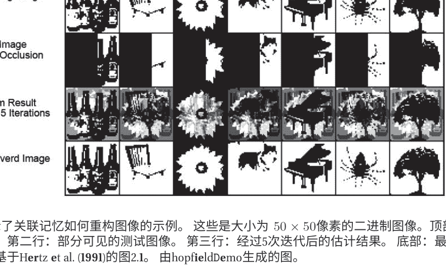

图19.7 展示了关联记忆如何重构图像的示例。这些是大小为 50 × 50像素的二进制图像。顶部：训练图像。第二行：部分可见的测试图像。第三行：经过5次迭代后的估计结果。底部：最终状态估计。基于Hertz et al. (1991)的图2.1。由hopfieldDemo生成的图。

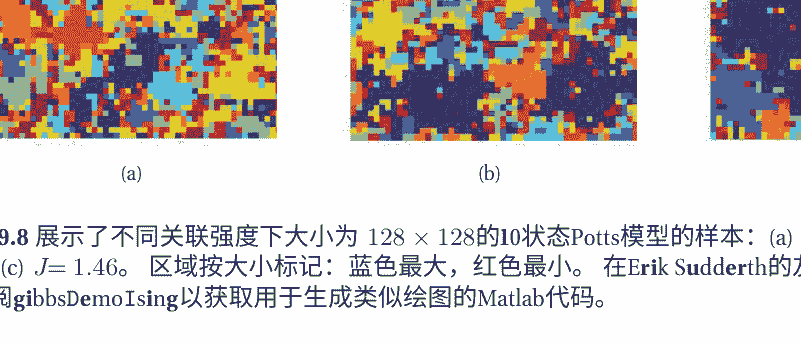

图19.8 展示了不同关联强度下大小为 128 × 128的10状态Potts模型的样本：(a) J= 1.42, (b) J= 1.44, (c) J= 1.46。区域按大小标记：蓝色最大，红色最小。在Erik Sudderth的友好许可下使用。请参阅gibbsDemoIsing以获取用于生成类似绘图的Matlab代码。

然而，我们同样可以将吉布斯应用于霍普菲尔德网络，将ICM应用于玻尔兹曼机：推理算法不是模型定义的一部分。详见第27.7节关于玻尔兹曼机的更多细节。

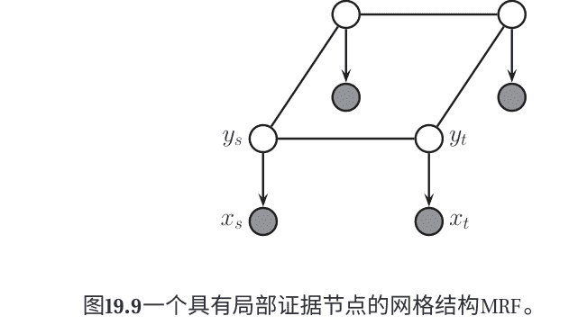

图19.9 一个具有局部证据节点的网格结构MRF。

## ## 19.4.3 Potts模型

将Ising模型推广到多个离散状态很容易，其中 $y_t \in \{1,2,\ldots,K\}$。通常使用以下形式的势函数：

$$
\psi_{st}(y_s, y_t) = \begin{pmatrix} e^J & 0 & 0 \\ 0 & e^J & 0 \\ 0 & 0 & e^J \end{pmatrix} \quad (19.22)
$$

这被称为Potts模型。如果 $J>0$，则鼓励相邻节点具有相同的标签。图19.8显示了该模型的一些样本。我们可以看到，对于 $J>1.44$，出现大的聚类；对于 $J<1.44$，出现许多小的聚类；在临界值 $J=1.44$ 时，小的和大的聚类混合存在。当我们改变系统的一个参数时，系统行为的这种快速变化被称为相变，并在物理学界广泛研究。Ising模型中也发生类似的现象；详见（MacKay 2003，第31章）了解详情。

波茨模型可以用作图像分割的先验，因为它表明相邻的像素很可能具有相同的离散标签，因此属于同一分割。我们可以将这个先验与似然项结合如下：

$$
p(\mathbf{y}, \mathbf{x}|\theta) = p(\mathbf{y}|J) \prod_t p(x_t|y_t, \theta) = \left[ \frac{1}{Z(J)} \prod_{s \sim t} \psi(y_s, y_t; J) \right] \prod_t p(x_t|y_t, \theta) \quad (19.23)
$$

其中 $p(x_t|y_t = k; \theta)$ 是观察到像素 $x_t$ 的概率，假设相应的分割属于类别 $k$。这个观察模型可以用高斯或非参数密度来建模。（请注意，我们将隐藏节点 $y_t$ 和观察节点 $x_t$ 标记为与第19.6节兼容。）

相应的图模型是无向边和有向边的混合，如图19.9所示。无向2d格子表示先验概率 $p(\mathbf{y})$；此外，每个 $y_t$ 到其对应的 $x_t$ 之间有一个有向边，表示局部证据。从技术上讲，这种无向和有向图的组合被称为链图。然而，由于观察到的 $x_t$ 节点可以被“吸收”到模型中，从而留下一个无向的“骨架”。

这个模型是HMM的二维类比，可以称为部分观测的MRF。与HMM一样，目标是进行后验推断，即计算（某个函数的）后验概率 $p(\mathbf{y}|\mathbf{x}, \theta)$。不幸的是，二维情况被证明比一维情况更困难，我们必须采用近似方法，正如我们在后面的章节中讨论的那样。

尽管Potts先验适用于正则化监督学习问题，但在无监督方式进行图像分割时，它不够准确，因为该模型产生的分割结果不能准确地代表自然图像中所见到的分割类型（Morris等，1996年）。⁶ 对于无监督情况，需要使用更复杂的先验，例如（Sudderth和Jordan，2008年）的截断高斯过程先验。

#### 19.4.4 高斯MRF

无向GGM，也称为高斯MRF（参见例如（Rue和Held，2005年）），具有以下形式的成对MRF：

$$p(\mathbf{y}|\theta) \propto \prod_{s \sim t} \psi_{st}(y_s, y_t) \prod_t \psi_t(y_t) \quad (19.24)$$

$$\psi_{st}(y_s, y_t) = \exp\left(-\frac{1}{2} y_s \Lambda_{st} y_t\right) \quad (19.25)$$

$$\psi_t(y_t) = \exp\left(-\frac{1}{2} \Lambda_{tt} y_t^2 + \eta_t y_t\right) \quad (19.26)$$

（请注意，我们可以轻松地将节点潜力吸收到边缘潜力中，但为了清晰起见，我们将它们保持分开。）联合分布可以写成如下形式：

$$p(\mathbf{y}|\theta) \propto \exp\left[\boldsymbol{\eta}^T \mathbf{y} - \frac{1}{2} \mathbf{y}^T \boldsymbol{\Lambda} \mathbf{y}\right] \quad (19.27)$$

我们将其识别为以信息形式书写的多元高斯分布，其中 $\boldsymbol{\Lambda} = \boldsymbol{\Sigma}^{-1}$ 和 $\boldsymbol{\eta} = \boldsymbol{\Lambda} \boldsymbol{\mu}$。

如果 $\Lambda_{st} = 0$，则没有连接 $s$ 和 $t$ 的成对项，因此根据分解定理（定理2.2.1），我们得出结论：

$$y_s \perp y_t | \mathbf{y}_{-(st)} \Leftrightarrow \Lambda_{st} = 0 \quad (19.28)$$

$\boldsymbol{\Lambda}$ 中的零元素被称为结构零元素，因为它们表示图中不存在的边。因此，无向GGM对应于稀疏的精度矩阵，在第26.7.2节中我们利用了这一事实来高效地学习图的结构。

#### 19.4.4.1 比较高斯DGM和UGM *

在第10.2.5节中，我们看到有向GGM对应于稀疏的回归矩阵，因此对应于协方差矩阵的稀疏Cholesky分解，而无向GGM对应于稀疏精度矩阵。DAG公式的优势在于我们可以使回归权重 $\mathbf{W}$，因此 $\boldsymbol{\Sigma}$，根据协变量信息（Pourahmadi 2004）进行条件化，而不必担心正定约束。DAG公式的缺点是它依赖于顺序，尽管在某些领域，如时间序列，变量的自然排序已经存在。

实际上可以将两种表示结合起来，得到一个高斯链图。例如，考虑一个离散时间、二阶马尔可夫链，其中状态是连续的， $\mathbf{y}_t \in \mathbb{R}^D$。过渡函数可以表示为（向量值）线性-高斯CPD：

$$p(\mathbf{y}_t|\mathbf{y}_{t-1}, \mathbf{y}_{t-2}, \theta) = \mathcal{N}(\mathbf{y}_t | \mathbf{A}_1 \mathbf{y}_{t-1} + \mathbf{A}_2 \mathbf{y}_{t-2}, \boldsymbol{\Sigma}) \quad (19.29)$$

这被称为二阶向量自回归或 VAR 过程。这种模型在计量经济学中广泛用于时间序列预测。

时间序列方面最自然的建模方法是使用DGM。然而，如果 $\boldsymbol{\Sigma}^{-1}$ 是稀疏的，那么在一个时间片段内组件之间的相关性最自然地建模使用UGM。例如，假设我们有

$$
\mathbf{A}_1 = \begin{pmatrix} \frac{3}{5} & 0 & \frac{1}{5} & 0 & 0 \\ 0 & \frac{2}{5} & 0 & -\frac{1}{5} & 0 \\ \frac{2}{5} & \frac{1}{3} & \frac{3}{5} & 0 & 0 \\ 0 & 0 & 0 & -\frac{1}{2} & \frac{1}{5} \\ 0 & 0 & \frac{1}{5} & 0 & \frac{2}{5} \end{pmatrix}, \quad \mathbf{A}_2 = \begin{pmatrix} 0 & 0 & -\frac{1}{5} & 0 & 0 \\ 0 & 0 & 0 & 0 & 0 \\ 0 & 0 & 0 & 0 & 0 \\ 0 & 0 & \frac{1}{5} & 0 & \frac{1}{3} \\ 0 & 0 & 0 & 0 & -\frac{1}{5} \end{pmatrix} \quad (19.30)
$$

$$
\boldsymbol{\Sigma} = \begin{pmatrix} 1 & \frac{1}{2} & \frac{1}{3} & 0 & 0 \\ \frac{1}{2} & 1 & -\frac{1}{3} & 0 & 0 \\ \frac{1}{3} & -\frac{1}{3} & 1 & 0 & 0 \\ 0 & 0 & 0 & 1 & 0 \\ 0 & 0 & 0 & 0 & 1 \end{pmatrix}, \quad \boldsymbol{\Sigma}^{-1} = \begin{pmatrix} 2.13 & -1.47 & -1.2 & 0 & 0 \\ -1.47 & 2.13 & 1.2 & 0 & 0 \\ -1.2 & 1.2 & 1.8 & 0 & 0 \\ 0 & 0 & 0 & 1 & 0 \\ 0 & 0 & 0 & 0 & 1 \end{pmatrix} \quad (19.31)
$$

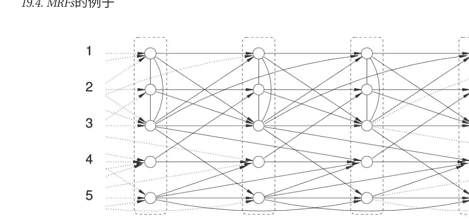

图19.10 一个VAR(2)过程表示为一个动态链图。 来源：（Dahlhaus和Eichler 2000）。在Rainer Dahlhaus和Oxford University Press的友好许可下使用。

图19.10展示了生成的图模型。转移矩阵 $\mathbf{A}_1$ 和 $\mathbf{A}_2$中的零表示从 $\mathbf{y}_{t-1}$和 $\mathbf{y}_{t-2}$到 $\mathbf{y}_t$的有向弧缺失。精度矩阵中的零 $\boldsymbol{\Sigma}^{-1}$表示 $\mathbf{y}_t$中节点之间的无向弧缺失。

有时候我们有的是稀疏协方差矩阵而不是稀疏精度矩阵。这可以用一个双向图表示，每条边都有双向箭头，如图19.11(a)所示。这里未连接的节点是无条件独立的。例如，在图19.11(a)中我们可以看到 $Y_1 \perp Y_3$。在高斯情况下，这意味着 $\Sigma_{1,3}= \Sigma_{3,1} = 0$。（表示稀疏协方差矩阵的图称为协方差图。）相反，如果这是一个无向模型，我们将有 $Y_1 \perp Y_3 | Y_2$，且 $\Lambda_{1,3}= \Lambda_{3,1}= 0$，其中 $\Lambda = \boldsymbol{\Sigma}^{-1}$。

一个双向图可以通过潜在变量转换为一个有向无环图（DAG），其中每个双向边都被替换为表示隐藏共同原因或混淆因子的隐藏变量，如图19.11(b)所示。然后可以使用d-分离来确定相关的CI属性。

我们可以结合双向边和有向边来得到一个有向混合图模型。这对于表示各种模型非常有用，例如ARMA模型（第18.2.4.4节），结构方程模型（第26.5.5节）等。

#### 19.4.5 马尔可夫逻辑网络*

在第10.2.2节中，我们看到我们可以“展开”马尔可夫模型和HMM以模拟可变长度的序列。类似地，在第19.4.1节中，我们看到我们可以扩展一个格子UGM以模拟任意大小的图像。那么在更复杂的领域中，我们有可变数量的对象和它们之间的关系怎么办？

为这种情况创建模型通常使用一阶逻辑(参见例如，(Russell and Norvig 2010))。例如，考虑句子“吸烟导致癌症”和“如果两个人是朋友，并且一个人吸烟，那么另一个人也会吸烟”。我们可以用一阶逻辑来表达这些句子。

逻辑如下:

```
$\forall x. Sm(x) \Rightarrow Ca(x)$ (19.32)
```

```
$\forall x. \forall y. Fr(x, y) \wedge Sm(x) \Rightarrow Sm(y)$ (19.33)
```

其中 Sm 和 Ca 是谓词，而 Fr 是一个关系。7

当然，这些规则并不总是正确的。事实上，这种脆弱性是逻辑方法在人工智能领域不再广泛使用的主要原因，至少不是以纯粹的形式。已经有各种尝试将一阶逻辑与概率理论结合起来，这个领域被称为统计关系人工智能或概率关系建模（Kersting等人，2011年）。

一种简单的方法是对逻辑规则附加权重（称为确定性因子），然后将它们解释为条件概率分布。例如，我们可以说 p（Ca（x）=1|Sm（x）=1）=0.9。不幸的是，这个规则没有说明如果Sm（x）=0时应该预测什么。此外，以这种方式组合CPD不能保证定义一个一致的联合分布，因为结果图可能不是一个有向无环图。

另一种方法是将这些规则视为在展开的UGM中定义潜在函数的方式。结果被称为马尔可夫逻辑网络(Domingos和Lowd 2009)。为了指定网络，我们首先将所有规则重写为合取范式(CNF)，也被称为子句范式。在这种情况下，我们得到

```
$\neg Sm(x) \vee Ca(x)$ (19.34)
```

```
$\neg Fr(x, y) \vee \neg Sm(x) \vee Sm(y)$ (19.35)
```

第一个子句可以解读为“要么 x不吸烟，要么他患有癌症”，这在逻辑上等同于方程式19.32。（注意，在子句中，任何未绑定的变量，如 x，被假定为全称量化。）

- 7. 谓词只是一个关于一个参数的函数，称为对象，根据该对象是否满足属性来评估为真或假。关系（逻辑）只是一个关于两个或多个参数（对象）的函数，根据该对象集合之间是否存在关系来评估为真或假。

一阶逻辑中的推理只是半可决定的，因此通常使用受限子集。一种常见的方法（如Prolog中所使用的）是将语言限制为Horn子句，这些子句最多包含一个正文字。基本上，这意味着模型是一系列的如果-那么规则，其中规则的右侧（即“那么”部分或结果）只有一个术语。

一旦我们将我们的知识库编码为一组子句，我们可以为每个子句附加权重；这些权重是模型的参数，并且它们定义了团势能如下：

```
$$\psi_c(\mathbf{x}_c) = \exp(w_c \phi_c(\mathbf{x}_c))$$
```

其中 \(\phi_c(\mathbf{x}_c)\)是一个逻辑表达式，它评估应用于变量 \(\mathbf{x}_c\)的子句\(c\)，并且\(w_c\)是我们附加到该子句的权重。粗略地说，子句的权重指定了满足该子句的世界相对于不满足该子句的世界的概率。

现在假设世界中有两个对象（人），Anna和Bob，我们将它们表示为常量符号 \(A\) 和 \(B\)。我们可以根据上述子句创建一个ground network，通过创建二进制随机变量 \(S_x\)， \(C_x\) 和 \(F_{x,y}\) for \(x, y \in \{A, B\}\)，并根据上述子句进行“连接”。结果是图19.12中具有8个二进制节点的UGM。

请注意，我们没有编码\(Fr\)是对称关系的事实，所以\(Fr(A, B)\)和\(Fr(B, A)\)可能具有不同的值。类似地，我们有“退化”节点\(Fr(A, A)\)和\(Fr(B, B)\)，因为我们没有强制执行方程式19.33中的 \(x = y\)。 （如果我们添加这样的约束条件，那么生成基础网络的模型编译器可以避免创建冗余的节点。）

总之，我们可以将MLN视为一种方便的方式来指定UGM模板，可以展开处理任意大小的数据。还有其他几种定义关系概率模型的方法，请参见（Koller和Friedman 2009; Kersting等人2011）了解详细信息。在某些情况下，对于对象或关系的数量或存在性存在不确定性（所谓的开放宇宙问题）。第18.6.2节在多对象跟踪的背景下给出了一个具体的例子。有关更多详细信息，请参见（Russell和Norvig 2010; Kersting等人2011）和相关参考文献。

### 19.5 学习

在这一部分中，我们讨论如何对MRF进行ML和MAP参数估计。我们将看到这是非常计算密集的。因此，对于MRF的参数进行贝叶斯推断是很少见的（尽管参见（Qi等，2005年））。

#### 19.5.1 使用梯度方法训练最大熵模型

考虑一个以对数线性形式表示的MRF：

```
$$p(\mathbf{y}|\boldsymbol{\theta}) = \frac{1}{Z(\boldsymbol{\theta})} \exp \left( \sum_c \boldsymbol{\theta}_c^T \phi_c(\mathbf{y}) \right)$$
```

其中 c索引了团。 缩放后的对数似然函数为

```
$$\ell(\boldsymbol{\theta}) \triangleq \frac{1}{N} \sum_{i} \log p(\mathbf{y}_{i} | \boldsymbol{\theta}) = \frac{1}{N} \sum_{i} \left[ \sum_{c} \boldsymbol{\theta}_{c}^{T} \phi_{c}(\mathbf{y}_{i}) - \log Z(\boldsymbol{\theta}) \right]$$
```

由于MRF属于指数分布族，我们知道该函数在 θ中是凸函数（参见第9.2.3节），因此它具有唯一的全局最大值，我们可以使用基于梯度的优化器找到。 特别地，对于特定团的权重， c，其导数为∂ℓ∂θ_c

```
$$\frac{\partial \ell}{\partial \theta_c} = \frac{1}{N} \sum_{i} \left[ \phi_c(\mathbf{y}_i) - \frac{\partial}{\partial \theta_c} \log Z(\boldsymbol{\theta}) \right]$$
```

练习19.1要求你证明对于 θ_c的对数分区函数的导数是模型下的 c特征的期望，即∂log Z(θ)/∂θ_c

```
$$\frac{\partial}{\partial \theta_c} \log Z(\boldsymbol{\theta}) = \mathbb{E}[\phi_c(\mathbf{y}) | \boldsymbol{\theta}] = \sum_{\mathbf{y}} \phi_c(\mathbf{y}) p(\mathbf{y} | \boldsymbol{\theta})$$
```

因此，对数似然的梯度是

```
$$\frac{\partial \ell}{\partial \theta_c} = \left[ \frac{1}{N} \sum_{i} \phi_c(\mathbf{y}_i) \right] - \mathbb{E}[\phi_c(\mathbf{y})]$$
```

在第一项中，我们将γ固定为其观察值；这有时被称为固定项。在第二项中，γ是自由的；这有时被称为非固定项或对比项。请注意，计算非固定项需要对模型进行推断，并且这必须在每个梯度步骤中完成。 这使得UGM训练比DGM训练慢得多。对数似然的梯度可以重写为根据经验分布的预期特征向量减去模型对特征向量的期望:

```
$$\frac{\partial \ell}{\partial \theta_c} = \mathbb{E}_{p_{\text{emp}}} [\phi_c(\mathbf{y})] - \mathbb{E}_{p(\cdot | \boldsymbol{\theta})} [\phi_c(\mathbf{y})]$$
```

在最优点，梯度将为零，因此特征的经验分布将与模型的预测相匹配:

```
$$\mathbb{E}_{p_{\text{emp}}} [\phi_c(\mathbf{y})] = \mathbb{E}_{p(\cdot | \boldsymbol{\theta})} [\phi_c(\mathbf{y})]$$
```

这被称为矩匹配。 这个观察结果激发了一种不同的优化算法，我们在第19.5.7节中讨论。

### 19.5.2 部分观测最大熵模型的训练

假设我们的模型中存在缺失数据和/或隐藏变量。 一般来说，我们可以将这样的模型表示如下:

```
$$p(\mathbf{y}, \mathbf{h} | \boldsymbol{\theta}) = \frac{1}{Z(\boldsymbol{\theta})} \exp \left( \sum_{c} \boldsymbol{\theta}_{c}^{T} \phi_{c}(\mathbf{h}, \mathbf{y}) \right)$$
```

对数似然函数的形式为

```
$\ell(\boldsymbol{\theta}) = \frac{1}{N} \sum_{i} \log \left( \sum_{\mathbf{h}_i} p(\mathbf{y}_i, \mathbf{h}_i|\boldsymbol{\theta}) \right) = \frac{1}{N} \sum_{i} \log \left( \frac{1}{Z(\boldsymbol{\theta})} \sum_{\mathbf{h}_i} \tilde{p}(\mathbf{y}_i, \mathbf{h}_i|\boldsymbol{\theta}) \right) \quad (19.45)$
```

其中

```
$\tilde{p}(\mathbf{y}, \mathbf{h}|\boldsymbol{\theta}) \triangleq \exp \left( \sum_{c} \boldsymbol{\theta}_c^T \phi_c(\mathbf{h}, \mathbf{y}) \right) \quad (19.46)$
```

是未归一化的分布。该项 $\sum_{\mathbf{h}_i} \tilde{p}(\mathbf{y}_i, \mathbf{h}_i|\boldsymbol{\theta})$ 与整个模型的分区函数相同，只是 $\mathbf{y}$ 被固定为 $\mathbf{y}_i$。因此，梯度就是预期特征，我们将 $\mathbf{y}_i$ 固定，但在 $\mathbf{h}$ 上取平均：

```
$\frac{\partial}{\partial \boldsymbol{\theta}_c} \log \left( \sum_{\mathbf{h}_i} \tilde{p}(\mathbf{y}_i, \mathbf{h}_i|\boldsymbol{\theta}) \right) = \mathbb{E}[\phi_c(\mathbf{h}, \mathbf{y}_i)|\boldsymbol{\theta}] \quad (19.47)$
```

因此，总梯度由以下给出

```
$\frac{\partial \ell}{\partial \boldsymbol{\theta}_c} = \frac{1}{N} \sum_{i} \{ \mathbb{E}[\phi_c(\mathbf{h}, \mathbf{y}_i)|\boldsymbol{\theta}] - \mathbb{E}[\phi_c(\mathbf{h}, \mathbf{y})|\boldsymbol{\theta}] \} \quad (19.48)$
```

第一组期望值是通过将可见节点固定为观察值来计算的，而第二组期望值是通过让可见节点自由计算的。在这两种情况下，我们对 $\mathbf{h}_i$ 进行边缘化处理。

另一种方法是使用广义EM算法，在M步骤中使用梯度方法。详细信息请参见（Koller和Friedman 2009，p956）。

### 19.5.3 计算MRFs的MLE的近似方法

当拟合UGM时，通常没有ML或MAP估计的闭式解，因此我们需要使用基于梯度的优化器。这个梯度需要推理。在推理困难的模型中，学习也变得困难。这激发了对机器学习/最大后验估计的各种计算上更快的替代方法的兴趣，我们在表19.1中列出了其中一些。我们在下面讨论了其中一些替代方法，并将其他方法推迟到后面的章节。

#### 19.5.4 伪似然

MLE的一种替代方法是最大化伪似然（Besag 1975），定义如下：

```
$\ell_{PL}(\boldsymbol{\theta}) \triangleq \sum_{\mathbf{y}} \sum_{d=1}^{D} p_{\text{emp}}(\mathbf{y}) \log p(y_d|\mathbf{y}_{-d}) = \frac{1}{N} \sum_{i=1}^{N} \sum_{d=1}^{D} \log p(y_{id}|\mathbf{y}_{i,-d}, \boldsymbol{\theta}) \quad (19.49)$
```

也就是说，我们优化了全条件概率的乘积，也被称为复合似然（Lindsay 1988）。将其与最大似然的目标进行比较：

```
$\ell_{ML}(\boldsymbol{\theta}) = \sum_{\mathbf{y}, \mathbf{x}} p_{\text{emp}}(\mathbf{y}) \log p(\mathbf{y}|\boldsymbol{\theta}) = \sum_{i=1}^{N} \log p(\mathbf{y}_i|\boldsymbol{\theta}) \quad (19.50)$
```

| 方法 | 限制 | 精确的MLE? | 章节 |
| :--- | :--- | :--- | :--- |
| 闭合形式 | 只有和弦MRF | 精确的 | 第19.5.7.4节 |
| IPF | 只有表格/高斯MRF | 精确的 | 第19.5.7节 |
| 基于梯度的优化 | 低树宽 | 精确的 | 第19.5.1节 |
| 最大边缘训练 | 只有CRFs | 不适用 | 第19.7节 |
| 伪似然 | 没有隐藏变量 | 近似 | 第19.5.4节 |
| 随机ML | - | 精确的（直到MC误差） | 第19.5.5节 |
| 对比散度 | - | 近似 | 第27.7.2.4节 |
| 最小概率流 | 可以积掉隐藏变量 | 近似 | Sohl-Dickstein等人（2011年） |

表19.1 一些用于计算MRFs/ CRFs的近似ML/ MAP参数估计的方法。低树宽意味着为了使方法高效，图必须是“树状”的；有关详细信息，请参见第20.5节。

对于高斯MRFs，PL等价于ML (Besag 1975)，但一般情况下并不成立(Liang and Jordan 2008)。
图19.13展示了2D网格中的PL方法。我们学习预测每个节点，给定其所有邻居。这个目标通常计算速度很快，因为每个完全条件$p(y_{id}|\mathbf{y}_{i, -d}, \boldsymbol{\theta})$只需要对单个节点的状态进行求和，$y_{id}$，以计算局部归一化常数。PL方法类似于分别拟合每个完全条件(这是训练依赖网络的方法，在第26.2.2节中讨论)，只是参数在相邻节点之间是相连的。

PL的一个问题是很难应用于具有隐藏变量的模型（Parise和Welling 2005）。另一个更微妙的问题是每个节点都假设其邻居的值是已知的。如果节点 $t \in \text{nbr}(s)$ 是节点 $s$ 的完美预测器，那么 $s$ 将完全依赖于节点 $t$，甚至忽视其他可能有用的信息，如其本地证据。

然而，（Parise和Welling 2005; Hoefling和Tibshirani 2009）的实验证明，对于完全观察到的伊辛模型，PL的效果与精确的ML一样好，而且PL速度更快。

#### 19.5.5 随机最大似然

回想一下，完全观察到的MRF的对数似然的梯度为

```
$$\nabla_{\boldsymbol{\theta}} \ell(\boldsymbol{\theta}) = \frac{1}{N} \sum_{i} [\phi(\mathbf{y}_i) - \mathbb{E}[\phi(\mathbf{y})]]$$
```

部分观测的MRF的梯度是相似的。在这两种情况下，我们可以使用蒙特卡洛采样来近似模型的期望。我们可以将这个方法与随机梯度下降（第8.5.2节）相结合，该方法从经验分布中取样。得到的方法的伪代码如算法3所示。

# 算法19.1：用于拟合MRF的随机最大似然法

```
1 随机初始化权重θ;
2 设置k=0, η=1;
3 对于每个epoch,
4   对于每个大小为B的minibatch,
5     对于每个样本s=1:S,
6       采样 $y_{s,k} \sim p(y|\theta_k)$;
7     计算 $E(\phi(y)) = \frac{1}{S} \sum_{s=1}^{S} \phi(y_{s,k})$;
8   对于每个minibatch中的训练样本i,
9     计算 $g_{ik} = \phi(y_i) - E(\phi(y))$;
10    $g_k = \frac{1}{B} \sum_{i \in B} g_{ik}$;
11    $\theta_{k+1} = \theta_k - \eta g_k$;
12    k = k + 1;
13    减小步长 η;
```

通常我们使用MCMC来生成样本。当然，在内循环的每一步运行MCMC直到收敛将会非常慢。幸运的是，(Younes1989)证明我们可以从先前的值开始MCMC链，并且只进行几步。换句话说，我们通过将MCMC链初始化为 $y^{s,k-1}$ 来采样 $y^{s,k}$，并运行几次迭代。这是有效的，因为 $p(y|\theta^k)$ 很可能接近 $p(y|\theta^{k-1})$，因为我们只改变了参数的一小部分。我们将这个算法称为随机最大似然或SML。（还有一个密切相关的算法叫做持续对比散度，我们在第27.7.2.5节中讨论。）

### 19.5.6 特征归纳的最大熵模型 *

MRFs需要一组好的特征。一种无监督学习这些特征的方法，称为特征归纳，是从一组基本特征开始，然后不断地通过旧特征创建新的特征组合，贪婪地将最佳特征添加到模型中。这种方法最初是在(Pietra et al. 1997; Zhu et al. 1997)中提出的，并在(McCallum 2003)中扩展到CRF情况。

为了说明基本思想，我们从(Pietra et al. 1997)中提供一个例子，该例子描述了如何构建无条件概率模型来表示英语拼写。最初的模型没有特征，表示均匀分布。算法首先选择添加特征

```
$\phi_1(\mathbf{y}) = \sum_t \mathbb{I}(y_t \in \{a, \ldots, z\})$  (19.52)
```

它检查任何字母是否为小写。添加了该特征后，参数通过最大似然重新拟合。对于这个特征，结果表明 \(\hat{\theta}_1= 1.944\)，这意味着任何位置有小写字母的单词比没有小写字母的单词更有可能出现，大约是 7 倍。使用（退火）吉布斯采样（第 24.2 节）从该模型生成的一些样本如下所示。

-   m, r, xevo, ijj iir, b, to, jz, gsr, wq, vf, x, ga, msmGh, pcp, d, oziVlal, hzagh, yzop, io, advzmxnv, i jv_bolft, x, emx, kayerf, mlj, rawzyb, jp, ag, ctdnnnbg, wgdw, t, kguv, cy, spxcq, uzflbbf, dxtkkn, cxwx, jpd, ztzh, lv, zhpkvnu, 1^, r, qee, nynrx, atze4n, ik, se, w, lrh, hp+, yrqyka' h, zcngotcnx, igcump, zj cjs, lqpWiqu, cefmfhc, o, lb, fdcY, tzby, yopxmvk, by, fz,, t, govyccm, ijyiduwfzo, 6xr, duh, ejv, pk, pjw, 1, fl, w

算法添加的第二个特征检查相邻的两个字符是否为小写：

```
$$\phi_2(\mathbf{y}) = \sum_{s \sim t} \mathbb{I}(y_s \in \{a, \ldots, z\}, y_t \in \{a, \ldots, z\}) \qquad (19.53)$$
```

现在模型的形式为

```
$$p(\mathbf{y}) = \frac{1}{Z} \exp(\theta_1 \phi_1(\mathbf{y}) + \theta_2 \phi_2(\mathbf{y})) \qquad (19.54)$$
```

继续这样进行，算法为字符串 \(s>\) 和 \(ing>\) 添加特征，其中 \(>\) 表示单词的结尾，以及各种正则表达式如 \([0-9]\) 等。使用（退火）吉布斯采样生成的具有 1000 个特征的模型的一些样本如下所示。

-   was, reaser, in, there, to, will, ,, was, by, homes, thing, be, reloverated, ther, which, conists, at, fores, anditing, with, Mr., proveral, the, ,, ***, on't, prolling, prothere, ,, mento, at, yaou, 1, chestraing, for, have, to, intrally, of, qut, ., best, compers, ***, cluseliment, uster, of, is, deveral, this, thise, of, offect, inatever, thifer, constranded, stater, vill, in, thase, in, youse, menttering, and, ., of, in, verate, of, to

特征学习的这种方法可以被看作是一种图模型结构学习的形式（第 26 章），只是更加细粒度：我们添加的特征是有用的，而不考虑结果图的结构。然而，生成的图可能变得密集连接，这使得推断（以及参数估计）变得困难。

### 19.5.7 迭代比例拟合 (IPF) *

考虑一个成对的 MRF，其中势函数被表示为表格，每个变量设置有一个参数。我们可以使用对数线性形式表示这个。

```
$$\psi_{st}(y_s, y_t) = \exp\left(\boldsymbol{\theta}_{st}^T [\mathbb{I}(y_s = 1, y_t = 1), \ldots, \mathbb{I}(y_s = K, y_t = K)]\right) \qquad (19.55)$$
```

类似地，对于 \(\psi_t(y_t)\) 也是如此。因此，特征向量只是指示函数。

从方程式19.43可以看出，在似然函数的最大值处，特征的经验期望等于模型的期望：

```
$$\mathbb{E}_{p_{\text{emp}}} \left[ \mathbb{I}(y_s = j, y_t = k) \right] = \mathbb{E}_{p(\cdot|\theta)} \left[ \mathbb{I}(y_s = j, y_t = k) \right]$$
```

```
$$p_{\text{emp}}(y_s = j, y_t = k) = p(y_s = j, y_t = k|\theta)$$
```

其中，p_{\text{emp}}是经验概率：

```
$$p_{\text{emp}}(y_s = j, y_t = k) = \frac{N_{st,jk}}{N} = \frac{\sum_{n=1}^{N} \mathbb{I}(y_{ns} = j, y_{nt} = k)}{N}$$
```

对于一般的图形，必须满足的条件是

```
$$p_{\text{emp}}(\mathbf{y}_c) = p(\mathbf{y}_c|\theta)$$
```

对于一类特殊的图形，称为可分解图（在第20.4.1节中定义），可以证明 \(p(\mathbf{y}_c|\theta) = \psi_c(\mathbf{y}_c)\)。然而，即使图形不可分解，我们也可以想象尝试强制执行这个条件。这表明了一种迭代坐标上升方案，在每一步中我们计算

```
$$\psi_c^{t+1}(\mathbf{y}_c) = \psi_c^{t}(\mathbf{y}_c) \times \frac{p_{\text{emp}}(\mathbf{y}_c)}{p(\mathbf{y}_c|\psi^t)}$$
```

其中乘法是逐元素进行的。这被称为迭代比例拟合或IPF（Fienberg 1970; Bishop et al. 1975）。请参见伪代码的算法7。

# 算法19.2: 用于表格MRF的迭代比例拟合算法

```
1 初始化 \(\psi_c = 1\) 对于 \(c = 1 : C\);
2 重复
3    对于 \(c = 1 : C\) 执行
4        \(p_c = p(\mathbf{y}_c|\psi)\);
5        \(\hat{p}_c = p_{\text{emp}}(\mathbf{y}_c)\);
6        \(\psi_c = \psi_c \times (p_c / \hat{p}_c)\);
7 直到 收敛 ;
```

### 19.5.7.1 示例

让我们考虑一个简单的例子，来自 http://en.wikipedia.org/wiki/Iterative_proportional_fitting。我们有两个二进制变量，\(Y_1\)和\(Y_2\)，其中 \(Y_{n1}=1\)如果男人 \(n\)是左撇子，\(Y_{n1}=0\)否则；类似地，\(Y_{n2}=1\)如果女人 \(n\)是左撇子，\(Y_{n2}=0\)否则。我们可以使用以下2×2列联表总结数据：右撇子 左撇子 总计男性

|      | 右撇子 | 左撇子 | 总计 |
|------|--------|--------|------|
| 男性 | 43     | 9      | 52   |
| 女性 | 44     | 4      | 48   |
| 总计 | 87     | 13     | 100  |

假设我们想要拟合一个包含节点 $Y_1$ 和 $Y_2$ 但它们之间没有边的离散图模型。也就是说，我们想要找到向量 $\psi_1$ 和 $\psi_2$，使得 $M \triangleq \psi_1 \psi_2^T \approx C$，其中 $M$ 是模型的期望计数，$C$ 是经验计数。通过矩匹配，我们发现模型的行和列之和必须与数据的行和列之和完全匹配。一种可能的解决方案是使用 $\psi_1 = [0.5200, 0.4800]$ 和 $\psi = [87, 13]$。下面我们展示模型的预测结果， $M = \psi_1 \psi_2^T$。

|      | 右手 | 左手 | 总共 |
|------|------|------|------|
| 男性 | 45.24| 6.76 | 52   |
| 女性 | 41.76| 6.24 | 48   |
| 总计 | 87   | 13   | 100  |

很容易看出这符合所需的约束条件。请参阅 IPFdemo2x2以获取计算这些数字的Matlab代码。这种方法很容易推广到任意图形。

### 19.5.7.2 IPF的速度

IPF是一种用于强制满足矩匹配约束的固定点算法，并且保证收敛到全局最优解（Bishop等人，1975年）。迭代次数取决于模型的形式。如果图形是可分解的，则IPF在单次迭代中收敛，但通常情况下，IPF可能需要多次迭代。

很明显，IPF的主要成本是在模型下计算所需的边际概率。可以使用高效的方法（如接合树算法（第20.4节）），从而得到称为高效IPF的东西（Jirousek和Preucil，1995年）。
然而，坐标下降可能会很慢。另一种方法是一次性更新所有参数，只需按照似然函数的梯度进行更新。这种梯度方法还有一个重要的优势，即它适用于模型中的团势能可能没有完全参数化的情况，即特征可能不包含每个团的所有可能指示符，而可以是任意的。虽然可以将IPF调整到具有一般特征的情况下，从而得到一种称为迭代缩放的方法，但在实践中，梯度方法要快得多（Malouf 2002; Minka 2003）。

### 19.5.7.3 IPF的推广

我们可以使用IPF来拟合高斯图模型：不再使用经验计数，而是使用经验均值和协方差（Speed and Kiiveri 1986）。还可以为模型参数的后验分布创建贝叶斯IPF算法（参见例如（Dobra and Massam 2010））。

### 19.5.7.4 可分解图模型的IPF

有一类特殊的无向图模型被称为可分解图模型。这在20.4.1节中正式定义，但基本思想是它包含了“类似树”的图。这样的图可以用UGMs或DGMs表示，而不会丢失任何信息。

在可分解图模型的情况下，IPF在一次迭代中收敛。实际上，

MLE有一个闭式解（Lauritzen 1996）。特别是对于表格势，我们有

```
$$\hat{\psi}_c(y_c=k) = \frac{\sum_{i=1}^N \mathbb{I}(y_{i,c}=k)}{N} \tag{19.61}$$
```

对于高斯势，我们有

```
$$\hat{\mu}_c = \frac{\sum_{i=1}^N y_{i,c}}{N}, \quad \hat{\Sigma}_c = \frac{\sum_{i} (y_{i,c} - \hat{\mu}_c)(x_{i,c} - \hat{\mu}_c)^T}{N} \tag{19.62}$$
```

通过使用共轭先验，我们还可以在可分解的情况下轻松计算模型参数的完整后验，就像在DGM案例中所做的那样。详细信息请参阅（Lauritzen 1996）。

### 19.6 条件随机场（CRFs）

条件随机场（CRF）（Lafferty et al. 2001），有时也称为判别式随机场（Kumar and Heber rt 2003），只是MRF的一个版本，其中所有团势函数都以输入特征为条件：

```
$$p(\mathbf{y}|\mathbf{x}, \mathbf{w}) = \frac{1}{Z(\mathbf{x}, \mathbf{w})} \prod_{c} \psi_c(\mathbf{y}_c|\mathbf{x}, \mathbf{w}) \tag{19.63}$$
```

CRF可以被看作是逻辑回归的结构化输出扩展。我们通常假设势函数具有对数线性表示：

```
$$\psi_c(\mathbf{y}_c|\mathbf{x}, \mathbf{w}) = \exp(\mathbf{w}_c^T \phi(\mathbf{x}, \mathbf{y}_c)) \tag{19.64}$$
```

其中 φ(x, y_c)是从全局输入 x和局部标签集合 y_c派生出的特征向量。我们将在下面给出一些例子，这将使这种符号更清晰。

CRF相对于MRF的优势类似于判别式分类器相对于生成式分类器的优势（见第8.6节），即我们不需要“浪费资源”对我们总是观察到的事物进行建模。相反，我们可以将注意力集中在建模我们关心的内容上，即给定数据的标签分布。

CRF的另一个重要优势是我们可以使模型的潜在因子与数据相关。例如，在图像处理应用中，如果在像素 s和 t之间的图像强度存在不连续性，我们可以“关闭”两个相邻节点之间的标签平滑。同样，在自然语言处理问题中，我们可以使潜在标签依赖于句子的全局属性，例如它是用哪种语言编写的。将全局特征纳入生成模型是困难的。

CRF相对于MRF的缺点是它们需要有标记的训练数据，并且训练速度较慢，我们在第19.6.3节中解释了这一点。这类似于逻辑回归与朴素贝叶斯的优劣之处，我们在第8.6节中讨论过。

#### 19.6.1 链式CRF，MEMM和标签偏差问题

最常用的CRF类型使用链式结构图来建模相邻标签之间的相关性。这类模型对于各种序列标注任务非常有用（见第19.6.2节）。

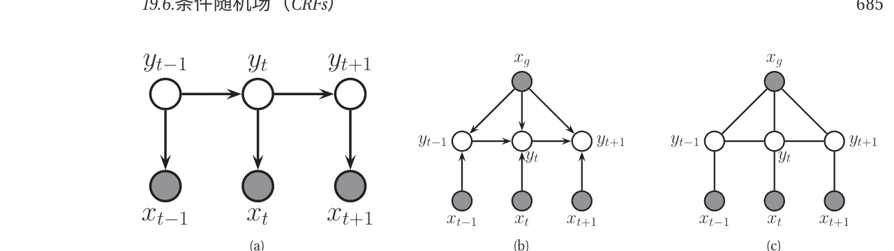

图19.14顺序数据的各种模型。 （a） 生成式有向HMM。 （b） 判别式有向MEMM。 （c） 判别式无向CRF。

传统上，HMMs（在第17章中详细讨论）被用于这些任务。这些是形式为联合密度模型的

```
p(\mathbf{x}, \mathbf{y}|\mathbf{w}) = \prod_{t=1}^{T} p(y_t|y_{t-1}, \mathbf{w}) p(\mathbf{x}_t|y_t, \mathbf{w})
```

为简单起见，我们省略了初始 $p(y_1)$项。参见图19.14(a)。如果我们观察到所有$_t$的 $\mathbf{x}_t$和 $y_t$，使用17.5.1节中描述的技术训练这样的模型非常容易。

HMM需要指定一个生成观测模型， $p(\mathbf{x}_t|y_t, \mathbf{w})$，这可能很困难。此外，每个 $\mathbf{x}_t$都需要是局部的，因为很难为整个观测流定义一个生成模型， $\mathbf{x} = \mathbf{x}_{1:T}$。

一种明显的方法是将HMM的箭头“反转”，从 $y_t$到 $\mathbf{x}_t$，如图19.14(b)所示。这定义了一个有向判别模型

```
p(\mathbf{y}|\mathbf{x}, \mathbf{w}) = \prod_{t} p(y_t|y_{t-1}, \mathbf{x}, \mathbf{w})
```

其中 $\mathbf{x}=(\mathbf{x}_{1:T}, \mathbf{x}_g)$, $\mathbf{x}_g$是全局特征，而 $\mathbf{x}_t$是特定于节点 $t$的特征。（这种将局部和全局划分的方式并非必需，但在与HMM进行比较时会有帮助。）这被称为最大熵马尔可夫模型或MEMM（McCallum等人，2000年；Kakade等人，2002年）。

MEMM只是一个马尔可夫链，其状态转移概率取决于输入特征。（因此，它是输入-输出HMM的特例，在第17.6.3节中讨论。）这似乎是逻辑回归到结构化输出设置的自然推广，但它存在一个被称为标签偏差问题（Lafferty等人，2001年）的微妙问题。问题在于时间 $t$的局部特征不会影响时间 $t$之前的状态。通过检查DAG，可以得出这一结论，该DAG显示 $\mathbf{x}_t$通过位于$y_t$的v-结构与 $y_{t-1}$（以及所有更早的时间点） d-分离，从而阻止了信息的流动。

为了理解这在实践中意味着什么，考虑词性标注任务的一部分。假设我们看到单词“banks”，它可以是一个动词（如“他在BoA银行办理业务”），也可以是一个名词（如“河岸正在溢出”）。在本地，该单词的词性标记是模糊的。然而，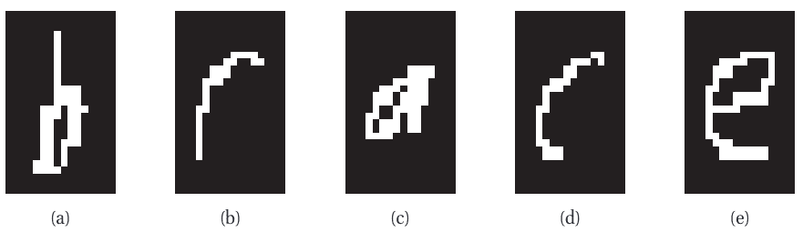

图19.15 手写字母识别示例。在单词'brace'中，'r'和'c'看起来非常相似，但可以通过上下文来消除歧义。来源：(Taskar等人，2003年)。获得Ben Taskar的友情许可使用。

假设在句子的后面，我们看到单词“fishing”，这就足够让我们推断出“banks”的意思是“河岸”。然而，在MEMM中（与HMM和CRF不同），“fishing”这个证据不会向后传播，因此我们将无法消除“banks”的歧义。

现在考虑一个链式CRF。这个模型的形式是

$p(\mathbf{y}|\mathbf{x}, \mathbf{w}) = \frac{1}{Z(\mathbf{x}, \mathbf{w})} \prod_{t=1}^T \psi(y_t|\mathbf{x}, \mathbf{w}) \prod_{t=1}^{T-1} \psi(y_t, y_{t+1}|\mathbf{x}, \mathbf{w})$ (19.67)

从图19.14(c)中可以看出，由于$y_t$不会阻止来自$x_t$的信息传递给其他$y_t$节点，因此标签偏见问题不再存在。

MEMMs中的标签偏见问题是由于有向模型进行局部归一化，即每个CPD的总和为1。相比之下，MRFs和CRFs进行全局归一化，这意味着局部因子不需要总和为1，因为分区函数$Z$会确保模型定义一个有效的分布。然而，这种解决方案的代价是：只有在看到整个句子之后，我们才能得到关于$\mathbf{y}$的有效概率分布，因为只有这样才能对所有配置进行归一化。因此，对于在线或实时推断，CRFs不如DGMs（无论是判别式还是生成式）有用。此外，$Z$依赖于所有节点，因此也依赖于所有参数，这使得CRFs的训练速度比DGMs慢得多，我们将在第19.6.3节中看到。

## 19.6.2 条件随机场的应用

条件随机场已经应用于许多有趣的问题；我们在下面给出一个代表性的样本。这些应用示例展示了几种有用的建模技巧，并且还为我们在第20章中讨论的一些推理技术提供了动机。

### 19.6.2.1 手写识别

CRFs的一个自然应用是对手写数字字符串进行分类，如图19.15所示。关键观察是，局部上一个字母可能是模糊的，但是通过依赖于邻居的（未知）标签，可以利用上下文来降低错误率。注意节点势函数，$\psi_t(y_t|\mathbf{x}_t)$，通常被视为概率判别式分类器，

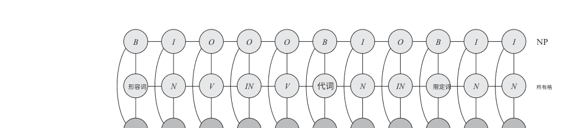

| 缩写 | 定义 |
|------|------|
| B | 开始名词短语 |
| I | 名词短语内部 |
| O | 不是名词短语 |
| N | 名词 |
| ADJ | 形容词 |
| V | 动词 |
| IN | 介词 |
| PRP | 所有格代词 |
| DT | 限定词（例如，a, an, the） |

图19.16 用于联合POS标注和NP分割的CRF。来源：（Koller and Friedman 2009）的图4.E.1。获得Daphne Koller的友情许可后使用。

例如，神经网络或RVM等在孤立字母上训练的模型，边缘势函数ψ_st(y_s, y_t)通常采用语言二元模型。稍后我们将讨论如何联合训练所有的势函数。

### 19.6.2.2 名词短语分块

一种常见的自然语言处理任务是名词短语分块，它指的是将句子分割成不同的名词短语（NPs）。这是一种被称为浅层解析的简单示例。

更详细地说，我们用B（表示新NP的开始），I（表示NP内部）或O（表示NP外部）标记句子中的每个单词。这被称为 BIO标记法。例如，在下面的句子中，NPs用括号标记：

B  I  O  O  O  B  I  O  B  I  
宣布退出UAI交易后，（英国航空）股价上涨。

（我们需要B符号以便我们可以区分I I，表示单个NP中的两个单词，和 B B，表示两个独立的NP。）

解决这个问题的一种标准方法是首先将单词串转换为POS标签串，然后将POS标签转换为BIO串。然而，这样的流水线方法可能会传播错误。更健壮的方法是构建一个形式为 p(NP_{1:T}, POS_{1:T}|words_{1:T}) 的联合概率模型。一种实现这一点的方法是使用图19.16中的CRF。相邻标签之间的连接编码了从B、I和O状态之间转换的概率，并可以强制执行一些约束，比如B必须在I之前。特征通常是手工设计的，包括诸如：这个词是否以大写字母开头，这个词后面是否跟着一个句号，这个词是否是名词等。通常每个节点有约 ~ 1,000 - 10,000个特征。

特征的数量对推理时间几乎没有影响，因为特征是被观察到的，不需要求和。（成本有小幅增加）

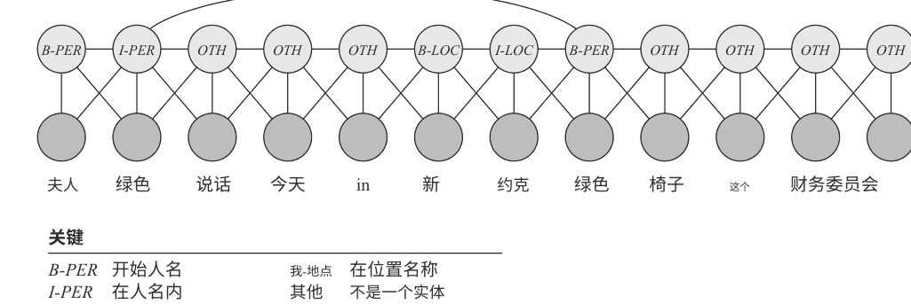

图19.17 用于命名实体识别的跳链条件随机场。 来源: (Koller和Friedman 2009)的图4.E.1。 获得Daphne Koller的亲切许可使用。

评估具有许多特征的潜在函数，但这通常是可以忽略的；如果不是，可以使用正则化来修剪不相关的特征。然而，图结构对推理时间有很大影响。图19.16中的模型是可处理的，因为它本质上是一个“胖链”，所以我们可以使用前向-后向算法（第17.4.3节）进行精确推理，时间复杂度为O(T|POS|²|NP|²)，其中|POS|是POS标签的数量，|NP|是NP标签的数量。然而，图19.17中的看似相似的图形将在下面解释，计算上是难以处理的。

### 19.6.2.3 命名实体识别

与NP分块相关的任务是命名实体提取。我们不仅可以分割名词短语，还可以分割与人和地点有关的短语。类似的技术被用于从电子邮件中自动填充日历；这被称为信息提取。

对此的一个简单方法是使用链式CRF，但将状态空间从BIO扩展到B-Per, I-Per, B-Loc, I-Loc和Other。然而，有时候一个词是人名、地点还是其他东西是不明确的。（专有名词特别难处理，因为它们属于一个开放类，即可能的名称数量是无限的，不像名词和动词的集合，它们虽然庞大但基本上是固定的。）通过考虑单词之间的长程相关性，我们可以获得更好的性能。例如，我们可以在相同单词的所有出现之间添加链接，并强制该单词在每个出现中具有相同的标签。（相同的技术对于解决代词的身份也很有帮助。）这被称为跳链CRF。请参见图19.17以进行说明。

我们看到图结构本身会根据输入而改变，这是CRFs相对于生成模型的额外优势。不幸的是，在这个模型中进行推断通常比具有局部连接的简单链更昂贵，原因在第20.5节中有解释。

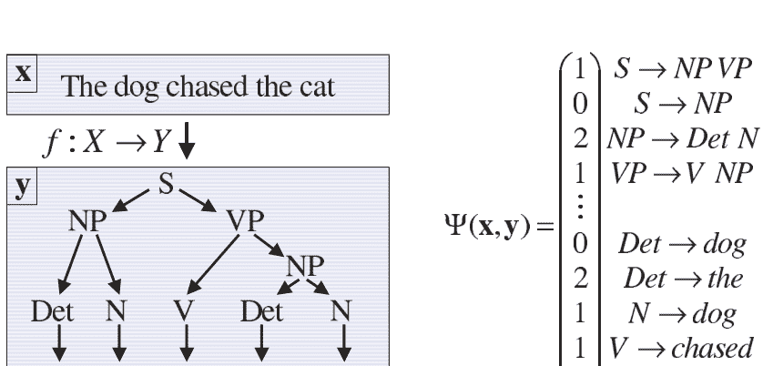

### 19.6.2.4 自然语言解析

语言的链式模型的一种推广是使用概率语法。特别是，概率上下文无关文法（PCFG）是一组形式为 σ → σ'σ'' 或 σ → x 的重写或生成规则，其中 σ, σ', σ'' ∈ Σ 是非终结符（类似于词性），而 x ∈ X 是终结符，即单词。请参见图19.18中的示例。每个规则都有一个相关的概率。生成的模型定义了单词序列的概率分布。我们可以通过对生成该序列的所有树进行求和来计算观察到特定序列 x = x₁…x_T 的概率。这可以在 $O(T^3)$ 时间内使用内外算法来完成；有关详细信息，请参阅（Jurafsky和Martin 2008；Manning和Schuetze 1999）。

PCFG是生成模型。可以通过使用形式为 $p(y|x) \propto \exp(\mathbf{w}^T \phi(\mathbf{x}, y))$ 的CRF来编码给定单词序列 x 的标记树 y 的概率。例如，我们可以定义 $\phi(\mathbf{x}, y)$ 来计算每个生成规则的使用次数（类似于链式模型中的状态转换次数）。详见（Taskar等，2004年）的详细信息。

### 19.6.2.5 分层分类

假设我们正在进行多类分类，其中我们有一个标签分类法，将类别分组成层次结构。我们可以通过定义一个二进制向量 $\phi(y)$ 来编码 y 在这个层次结构中的位置，其中我们打开组件 y 及其所有子节点的位。
这可以与输入特征 $\phi(\mathbf{x})$ 结合使用张量积，$\phi(\mathbf{x}, y) = \phi(\mathbf{x}) \otimes \phi(y)$。
请参见图19.19的示例。
这种方法在文本分类中被广泛使用，手动构建的分类法（例如 Open Directory Project 在 www.dmoz.org 上）非常常见。好处是可以在相邻类别的参数之间共享信息，实现跨类别的泛化。

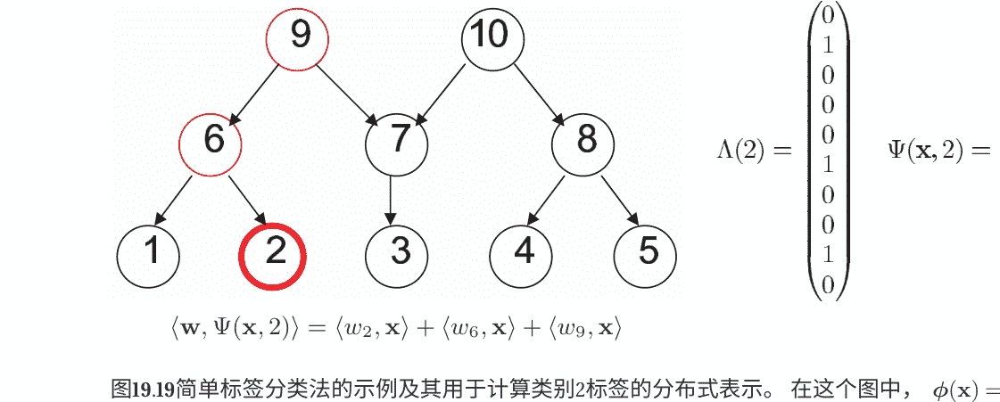

### 19.6.2.6 蛋白质侧链预测

在预测蛋白质侧链的结构时，一个有趣的类比是跳链模型。侧链中的每个残基有4个二面角，通常被离散化为3个称为旋转体的值。目标是从氨基酸的离散序列，预测出这个离散角度序列，y。

我们可以定义一个能量函数 E(x, y)，其中包括附近残基之间的各种成对相互作用项（ y向量的元素）。这个能量通常被定义为个体能量项的加权和，E(x, y|w) = Σⱼ₌₁^{Dⱼ} θⱼEⱼ(x, y)，其中 Eⱼ是由各种静电力、氢键势等引起的能量贡献，w是模型的参数。详见 (Yanover等人，2007年) 的详细信息。

给定模型，我们可以使用 y* = argmin E(x, y|w)计算最可能的侧链构型。一般来说，这个问题是NP难的，取决于由 Eⱼ项引起的图的性质，因为变量之间存在长程连接。然而，一些特殊情况可以通过在第22.6节中讨论的方法高效处理。

### 19.6.2.7 立体视觉

低层次视觉问题是指输入为图像（或一组图像），输出为图像的处理版本的问题。在这种情况下，通常使用2D格点结构模型；这些模型类似于图19.9，只是特征可以是全局的，并且不是由模型生成的。我们将假设是一个成对的条件随机场。

经典的低层次视觉问题是密集立体重建，目标是估计给定两个稍微不同角度拍摄的图像中每个像素的深度。在本节中（基于 (Sudderth和Freeman 2008)），我们简要介绍了如何使用简单的条件随机场来解决这个任务。更复杂的模型可以参考 (Sun等人2003)。

通过使用一些标准的预处理技术，可以将深度估计转化为

估计左图像中位置为 $(i_s, j_s)$ 的像素与右图像中位置为 $(i_s + y_s, j_s)$ 的对应像素之间的视差问题。我们通常假设对应的像素具有相似的强度，因此我们定义了一个形式为的局部节点势函数

$$
\psi_s(y_s|\mathbf{x}) \propto \exp \left\{ -\frac{1}{2\sigma^2} (x_L(i_s, j_s) - x_R(i_s + y_s, j_s))^2 \right\} \tag{19.68}
$$

其中 $x_L$ 是左图像，$x_R$ 是右图像。这个方程可以推广到模拟每个位置周围小窗口的强度。在高纹理区域，通常可以通过互相关找到对应的补丁，但在低纹理区域，对于正确的 $y_s$ 值会存在相当大的歧义。

我们可以很容易地在MRF的边缘上添加一个高斯先验，来编码相邻视差 $y_s$ 和 $y_t$ 应该相似的假设，如下所示：

$$
\psi_{st}(y_s, y_t) \propto \exp \left( -\frac{1}{2\gamma^2} (y_s - y_t)^2 \right) \tag{19.69}
$$

得到的模型是一个高斯CRF。

然而，使用高斯边缘势将会过度平滑估计值，因为这个先验未能考虑到在不连续边界上的相邻像素之间可能发生的偶尔大的视差变化。使用截断高斯势可以得到更好的结果，形式如下：

$$
\psi_{st}(y_s, y_t) \propto \exp \left\{ -\frac{1}{2\gamma^2} \min \left( (y_s - y_t)^2, \delta_0^2 \right) \right\} \tag{19.70}
$$

其中，$\gamma$ 表示期望的平滑度，$\delta_0$ 表示如果视差显著不同将会施加的最大惩罚。这被称为保持不连续性的势函数；请注意，这样的惩罚不是凸的。类似地，可以通过类似的方式使局部证据势函数具有鲁棒性，以处理由于镜面反射、遮挡等原因引起的异常值。图19.20说明了这两种先验形式之间的差异。左上角是来自标准Middlebury立体图像基准数据集的图像 (Scharstein和Szeliski 2002)。

在左下方是相应的真实视差值。其余的列代表了经过0、1和“无限”次循环置信传播（见第22.2节）后的估计视差，其中“无限”表示收敛时的结果。顶部行显示了使用高斯边缘潜力的结果，底部行显示了使用截断潜力的结果。后者明显更好。

不幸的是，对于实值变量进行推理在计算上是困难的，除非模型是联合高斯的。因此，常常对变量进行离散化处理。（例如，图19.20（底部）使用了50个状态。）边缘潜力仍然具有方程式19.69中给出的形式。得到的模型被称为度量CRF，因为潜力形成了度量。度量CRF中的推理比在没有自然排序的离散标签的CRF中更高效，我们在第22.6.3.3节中解释了这一点。有关应用于低级CRF的各种近似推理方法的比较，请参见第22.6.4节，并参见 (Blake等, 2011年; Prince, 2012年) 了解计算机视觉概率模型的更多细节。

9. 如果一个函数 $f$ 满足以下三个性质，则称其为度量：自反性：$f(a, b) = 0$ 当且仅当 $a = b$; 对称性：$f(a, b) = f(b, a)$; 三角不等式：$f(a, b) + f(b, c) \ge f(a, c)$。如果 $f$ 只满足前两个性质，则称其为半度量。

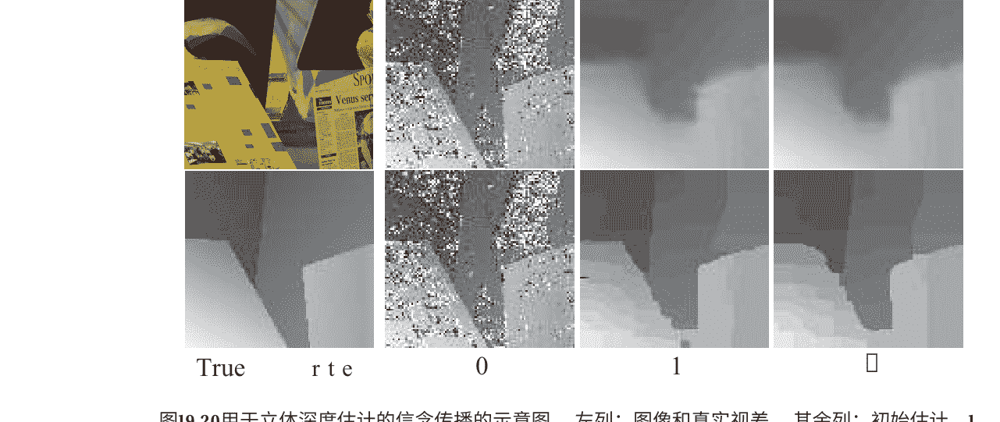

图19.20用于立体深度估计的信念传播的示意图。左列：图像和真实视差。其余列：初始估计，1次迭代后的估计和收敛时的估计。顶行：高斯边缘势。底行：鲁棒边缘势。来源：(Sudderth and Freeman 2008)的图4。获得Erik Sudderth的友情许可后使用。

#### 19.6.3 CRF训练

我们可以以直接的方式将19.5.1节中描述的MRF的基于梯度的优化修改为CRF的情况。特别地，缩放的对数似然变为

$\ell(\mathbf{w}) \triangleq \frac{1}{N} \sum_{i} \log p(\mathbf{y}_i | \mathbf{x}_i, \mathbf{w}) = \frac{1}{N} \sum_{i} \left[ \sum_{c} \mathbf{w}_c^T \phi_c(\mathbf{y}_i, \mathbf{x}_i) - \log Z(\mathbf{w}, \mathbf{x}_i) \right]$

梯度变为

$\frac{\partial \ell}{\partial \mathbf{w}_c} = \frac{1}{N} \sum_{i} \left[ \phi_c(\mathbf{y}_i, \mathbf{x}_i) - \frac{\partial}{\partial \mathbf{w}_c} \log Z(\mathbf{w}, \mathbf{x}_i) \right] = \frac{1}{N} \sum_{i} [\phi_c(\mathbf{y}_i, \mathbf{x}_i) - \mathbb{E}[\phi_c(\mathbf{y}, \mathbf{x}_i)]]$

请注意，在每个梯度步骤内，我们现在必须对每个单独的训练案例执行推理，这比MRF情况慢 \(O(N)\)倍。这是因为分区函数取决于输入 \(\mathbf{x}_i\)。

在CRFs的大多数应用中（以及MRFs的一些应用中），图结构的大小可以变化。因此，我们需要使用参数绑定来确保我们可以定义任意大小的分布。在成对的情况下，我们可以将模型写成如下形式：

$p(\mathbf{y}|\mathbf{x}, \mathbf{w}) = \frac{1}{Z(\mathbf{w}, \mathbf{x})} \exp\left( \mathbf{w}^T \phi(\mathbf{y}, \mathbf{x}) \right)$

其中，w = [ w_n, w_e ]是节点和边的参数，

$\phi(y, x) \triangleq \left[ \sum_t \phi_t(y_t, x), \sum_{s \sim t} \phi_{st}(y_s, y_t, x) \right]$ (19.75)

是节点和边特征的总和（这些是充分统计量）。梯度表达式很容易修改以处理这种情况。

实践中，使用先验/正则化来防止过拟合非常重要。如果我们使用高斯先验，新的目标函数变为

$\ell'(w) \triangleq \frac{1}{N} \sum_i \log p(y_i|x_i, w) - \lambda \|w\|_2^2$ (19.76)

修改梯度表达式很简单。

或者，我们可以使用 $\ell_1$ 正则化。例如，我们可以使用 $\ell_1$ 来学习稀疏图结构的边缘权重 $w_e$，并且使用 $\ell_2$ 来学习节点权重 $w_n$，如(Schmidt et al. 2008)中所示。换句话说，目标变为

$\ell'(w) \triangleq \frac{1}{N} \sum_i \log p(y_i|x_i, w) - \lambda_1 \|w_e\|_1 - \lambda_2 \|w_n\|_2^2$ (19.77)

不幸的是，当我们使用 $\ell_1$ 时，优化算法变得更加复杂（参见第13.4节），尽管问题仍然是凸的。

为了处理大型数据集，我们可以使用随机梯度下降（SGD），如第8.5.2节所述。

可以（并且有用）定义具有隐藏变量的条件随机场（CRFs），例如允许可见特征和隐藏标签之间的未知对齐（参见例如，（Schnitzspan等，2010年））。在这种情况下，目标函数不再是凸函数。然而，我们可以使用EM和/或梯度方法找到局部最优的ML或MAP参数估计。

## 19.7 结构化支持向量机

我们已经看到，训练CRF需要进行推断，以计算评估梯度所需的期望充分统计量。对于某些模型，计算状态的联合MAP估计比计算边际概率更简单，如第22.6节所讨论的。在本节中，我们讨论了一种利用快速MAP求解器的结构化输出分类器的训练方法。（为了避免与参数的MAP估计混淆，我们经常将状态的MAP估计称为解码。）这些方法被称为结构化支持向量机或SSVMs（Tsochantaridis等，2005年）。（还有一类非常相似的方法，称为最大边际马尔可夫网络或M3nets（Taskar等，2003年）；有关差异的讨论，请参见第19.7.2节。）

### 19.7.1 SSVMs：概率视角

在这本书中，我们主要集中于使用MAP参数估计来拟合模型，即通过最小化形式为的函数

$R_{MAP}(w) = -\log p(w) - \sum_{i=1}^N \log p(y_i|x_i, w)$ (19.78)然而，在测试时，我们选择标签以最小化后验期望损失（在第5.7节中定义）：
$$\hat{y}(x|w) = \text{argmin}_{\hat{y}} \sum_y L(\hat{y}, y) p(y|x, w) \qquad (19.79)$$
其中 $L(y^*, \hat{y})$ 是我们估计 $\hat{y}$ 但实际上是 $y^*$ 时产生的损失。因此，在进行参数估计时，考虑损失函数似乎是合理的。$^{10}$ 因此，根据（Yuille and He 2011），让我们在训练集上最小化后验期望损失：
$$R_{EL}(w) \triangleq -\log p(w) + \sum_{i=1}^N \log \left[ \sum_y L(y_i, y) p(y|x_i, w) \right] \qquad (19.80)$$
在0-1损失的特殊情况下，$L(y_i, y) = 1 - \delta_{y_i, y}$，这将简化为 $R_{MAP}$。

我们将假设我们可以用以下形式来表示我们的模型：
$$p(y|x, w) = \frac{\exp(\mathbf{w}^T \phi(x, y))}{Z(x, w)} \qquad (19.81)$$
$$p(w) = \frac{\exp(-E(w))}{Z} \qquad (19.82)$$
其中 $Z(x, w) = \sum$ 此外，让我们定义 $L(y_i, y) = \exp \tilde{L}(y_i, y)$。有了这个，我们可以将我们的目标重写如下：
$$R_{EL}(w) = -\log p(w) + \sum_i \log \left[ \sum_y \exp \tilde{L}(y_i, y) \frac{\exp(\mathbf{w}^T \phi(x, y))}{Z(x, w)} \right] \qquad (19.83)$$
$$= E(w) + \sum_i -\log Z(x_i, w) + \log \sum_y \exp \left( \tilde{L}(y_i, y) + \mathbf{w}^T \phi(x_i, y) \right) \qquad (19.84)$$
现在我们将考虑各种界限，以简化这个目标。首先注意，对于任何函数 $f(y)$ 我们有
$$\max_{y \in \mathcal{Y}} f(y) \leq \log \sum_{y \in \mathcal{Y}} \exp[f(y)] \leq \log \left[ |\mathcal{Y}| \exp \left( \max_y f(y) \right) \right] = \log |\mathcal{Y}| + \max_y f(y) \qquad (19.85)$$
例如，假设 $\mathcal{Y} = \{0, 1, 2\}$ 和 $f(y) = y$。那么我们有
$$2 = \log[\exp(2)] \leq \log[\exp(0) + \exp(1) + \exp(2)] \leq \log[3 \times \exp(2)] = \log(3) + 2 \qquad (19.86)$$
我们可以忽略 $\log |\mathcal{Y}|$ 项，它与 $y$ 无关，并将 $\max_{y \in \mathcal{Y}} f(y)$ 视为下界和上界。因此我们可以看到
$$R_{EL}(w) \sim E(w) + \sum_{i=1}^N \left[ \max_y \left\{ \tilde{L}(y_i, y) + \mathbf{w}^T \phi(x_i, y) \right\} - \max_y \mathbf{w}^T \phi(x_i, y) \right] \qquad (19.87)$$
其中 $x \sim y$ 意味着存在某些常数 $c_1$, $c_2$, 使得 $c_1 + x \leq y + c_2$。不幸的是，这个目标函数在 $\mathbf{w}$ 上不是凸的。然而，我们可以通过利用以下对log-sum-exp函数的较松的下界来设计一个凸上界：
$$f(\mathbf{y}') \leq \log \sum_{\mathbf{y}} \exp[f(\mathbf{y})] \quad (19.88)$$
对于任意的 $\mathbf{y}' \in \mathcal{Y}$。将这个方程应用到我们之前的例子中，对于 $f(\mathbf{y}) = \mathbf{y}$ 和 $\mathbf{y}' = 1$，我们得到 $1 = \log[\exp(1)] \leq \log[\exp(0) + \exp(1) + \exp(2)]$。将这个界限应用到 $R_{EL}$ 我们得到
$$R_{EL}(\mathbf{w}) \leq E(\mathbf{w}) + \sum_{i=1}^{N} \left[ \max_{\mathbf{y}} \left\{ \tilde{L}(\mathbf{y}_i, \mathbf{y}) + \mathbf{w}^T \phi(\mathbf{x}_i, \mathbf{y}) \right\} - \mathbf{w}^T \phi(\mathbf{x}_i, \mathbf{y}_i) \right] \quad (19.89)$$
如果我们设置 $E(\mathbf{w}) = -\frac{1}{2C}\|\mathbf{w}\|^2$（对应于一个球形高斯先验），我们得到
$$R_{SSVM}(\mathbf{w}) \triangleq \frac{1}{2}\|\mathbf{w}\|^2 + C \sum_{i=1}^{N} \left[ \max_{\mathbf{y}} \left\{ \tilde{L}(\mathbf{y}_i, \mathbf{y}) + \mathbf{w}^T \phi(\mathbf{x}_i, \mathbf{y}) \right\} - \mathbf{w}^T \phi(\mathbf{x}_i, \mathbf{y}_i) \right] \quad (19.90)$$
这与(Tsochantaridis et al. 2005)中的SSVM方法使用的目标相同。

在特殊情况下 $\mathcal{Y} = \{-1, +1\}$， $L(\mathbf{y}^*, \mathbf{y}) = 1 - \delta_{\mathbf{y},\mathbf{y}^*}$， and $\phi(\mathbf{x}, \mathbf{y}) = \frac{1}{2}y\mathbf{x}$，这个准则可以简化为以下形式（通过考虑两种情况 $y = y_i$ 和 $y = y_i$）:
$$R_{SVM}(\mathbf{w}) \triangleq \frac{1}{2}\|\mathbf{w}\|^2 + C \sum_{i=1}^{N} \left[ \max\{0, 1 - y_i \mathbf{w}^T \mathbf{x}_i\} \right] \quad (19.91)$$
这是标准的二元SVM目标函数（参见方程式14.57）。

因此，我们可以看到SSVM准则可以被视为优化贝叶斯目标函数的上界，这个结果首次在(Yuille and He 2011)中得到证明。当 $\|\mathbf{w}\|$ 很大时，这个上界将会很紧（因此近似效果很好），因为在这种情况下， $p(\mathbf{y}|\mathbf{x}, \mathbf{w})$ 将会集中在 $\text{argmax}_{\mathbf{y}} p(\mathbf{y}|\mathbf{x}, \mathbf{w})$ 上。不幸的是，一个大的 $\|\mathbf{w}\|$ 对应着一个很可能过拟合的模型，所以我们不太可能在这个范围内工作（因为我们会调整正则化项的强度以避免这种情况）。SVM准则的另一个理由是它将精力集中在影响决策边界的参数拟合上。这是一种比拟合完整分布更好地利用计算资源的方法，特别是当模型错误时。

### 19.7.2 SSVMs: 非概率视角

我们现在以更传统的方式介绍SSVMs（非概率性），按照（Tsochantaridis等人，2005年）的方法。得到的目标将与上面的目标相同。然而，这个推导将为我们下面讨论的算法奠定基础。

让 $f(\mathbf{x}; \mathbf{w}) = \text{argmax}_{\mathbf{y} \in \mathcal{Y}} \mathbf{w}^T \phi(\mathbf{x}, \mathbf{y})$ 成为预测函数。如果我们使用这个预测器在训练集上获得零损失，那么
$$\forall i, \max_{\mathbf{y} \in \mathcal{Y} \setminus \mathbf{y}_i} \mathbf{w}^T \phi(\mathbf{x}_i, \mathbf{y}) \leq \mathbf{w}^T \phi(\mathbf{x}_i, \mathbf{y}_i) \quad (19.92)$$
这些非线性不等式中的每一个都可以等价地替换为|𝒴| - 1线性不等式，总共有 N|𝒴| - N 线性约束，形式如下：∀i.∀y ∈ 𝒴 \ y_i. w^T ϕ(x_i, y_i) - w^T ϕ(x_i, y) ≥ 0
$$ (19.93) $$
为了简洁起见，我们引入符号
$$ δ_i(y) \triangleq ϕ(x_i, y_i) - ϕ(x_i, y) $$
$$ (19.94) $$
因此，我们可以将这些约束重新写成 w^T δ_i(y) ≥ 0.

如果我们能够实现零损失，通常会有多个解向量 w. 我们选择使间隔最大化的解向量，定义为
$$ γ \triangleq \min_{i} f(x, y_i; w) - \max_{y' ∈ 𝒴 \setminus y} f(x, y'; w) $$
$$ (19.95) $$
由于通过重新缩放 w 可以使间隔任意大，我们将其范数固定为1，从而得到优化问题
$$ \max_{γ, w: ||w||=1} \quad \text{s.t.} \quad ∀i. ∀y ∈ 𝒴 \setminus y_i. \quad w^T δ_i(y) ≥ γ $$
$$ (19.96) $$
等价地，我们可以写成
$$ \min_{w} \frac{1}{2} ||w||^2 \quad \text{s.t.} \quad ∀i. ∀y ∈ 𝒴 \setminus y_i. \quad w^T δ_i(y) ≥ 1 $$
$$ (19.97) $$
为了允许无法达到零损失的情况（相当于数据在二元分类中不可分），我们通过引入松弛项 ξ_i，每个数据案例一个。这导致
$$ \min_{w, ξ} \frac{1}{2} ||w||^2 + C \sum_{i=1}^{N} ξ_i \quad w^T δ_i(y) ≥ 1 - ξ_i, ξ_i ≥ 0 $$
$$ (19.98) $$
在结构化输出的情况下，我们不希望将所有约束违规视为同等重要。例如，在分割问题中，一个位置错误应该受到的惩罚应该比多个位置错误受到的惩罚要少。实现这一点的一种方法是将松弛变量除以损失的大小（这被称为松弛重新缩放）。这将得到
$$ \min_{w, ξ} \frac{1}{2} ||w||^2 + C \sum_{i=1}^{N} ξ_i \quad \text{s.t.} \quad ∀i. ∀y ∈ 𝒴 \setminus y_i. \quad w^T δ_i(y) ≥ 1 - \frac{ξ_i}{L(y_i, y)}, ξ_i ≥ 0 $$
$$ (19.99) $$
或者，我们可以将边界定义为与损失成比例（这被称为边界重新缩放）。这将得到

供以后参考，我们可以按以下方式解决 \(\xi_i^*\) 项：
$$\xi_i^*(\mathbf{w}) = \max\{0, \max\limits_y(L(\mathbf{y}_i, \mathbf{y}) - \mathbf{w}^T \boldsymbol{\delta}_i)\} = \max\limits_y(L(\mathbf{y}_i, \mathbf{y}) - \mathbf{w}^T \boldsymbol{\delta}_i)$$
代入并丢弃约束，我们得到以下等价问题：
$$\min\limits_{\mathbf{w}} \frac{1}{2}\|\mathbf{w}\|^2 + C\sum_i \max\limits_y \{L(\mathbf{y}_i, \mathbf{y}) + \mathbf{w}^T \phi(\mathbf{x}_i, \mathbf{y})\} - \mathbf{w}^T \phi(\mathbf{x}_i, \mathbf{y}_i)$$

#### 19.7.2.1 经验风险最小化

让我们停下来思考一下上述目标是否合理。回想一下，在频率主义的机器学习方法中（第6.5节），目标是最小化正则化经验风险，其定义为
$$\mathcal{R}(\mathbf{w}) + \frac{C}{N} \sum\limits_{i=1}^{N} L(\mathbf{y}_i, f(\mathbf{x}_i, \mathbf{w}))$$
其中 \(\mathcal{R}(\mathbf{w})\) 是正则化项，而 \(f(\mathbf{x}_i, \mathbf{w}) = \text{argmax}_{\mathbf{y}} \mathbf{w}^T \phi(\mathbf{x}_i, \mathbf{y}) = \hat{\mathbf{y}}_i\) 是预测值。由于这个目标很难优化，因为损失函数不可微分，我们将构建一个凸上界来代替。

我们可以证明
$$\mathcal{R}(\mathbf{w}) + \frac{C}{N} \sum_i \max\limits_y(L(\mathbf{y}_i, \mathbf{y}) - \mathbf{w}^T \boldsymbol{\delta}_i)$$
是这样一个凸上界。要看到这一点，注意到
$$\begin{aligned} L(\mathbf{y}_i, f(\mathbf{x}_i, \mathbf{w})) &\leq L(\mathbf{y}_i, f(\mathbf{x}_i, \mathbf{w})) - \mathbf{w}^T \phi(\mathbf{x}_i, \mathbf{y}_i) + \mathbf{w}^T \phi(\mathbf{x}_i, \hat{\mathbf{y}}_i) \\ &\leq \max\limits_y L(\mathbf{y}_i, \mathbf{y}) - \mathbf{w}^T \phi(\mathbf{x}_i, \mathbf{y}_i) + \mathbf{w}^T \phi(\mathbf{x}_i, \mathbf{y}) \end{aligned}$$
使用这个界限和 \(\mathcal{R}(\mathbf{w}) = \frac{1}{2}\|\mathbf{w}\|^2\) yields 方程19.102。

#### 19.7.2.2 计算问题

尽管上述目标是简单的二次规划问题（QP），但它们有 \(O(N|\mathcal{Y}|)\) 约束。这是不可行的，因为 \(|\mathcal{Y}|\) 通常是指数级别的。在边际重新缩放的公式中，可以将指数数量的约束减少到多项式数量，前提是损失函数和特征向量按照图模型进行分解。这是M3nets（Taskar等人，2003年）中使用的方法。

另一种方法是直接使用指数大小的QP。这样可以使用更一般的损失函数。有几种可能的方法可以使这成为可能。一种方法是使用切割平面方法。另一种方法是使用随机次梯度方法。我们在下面讨论这两种方法。

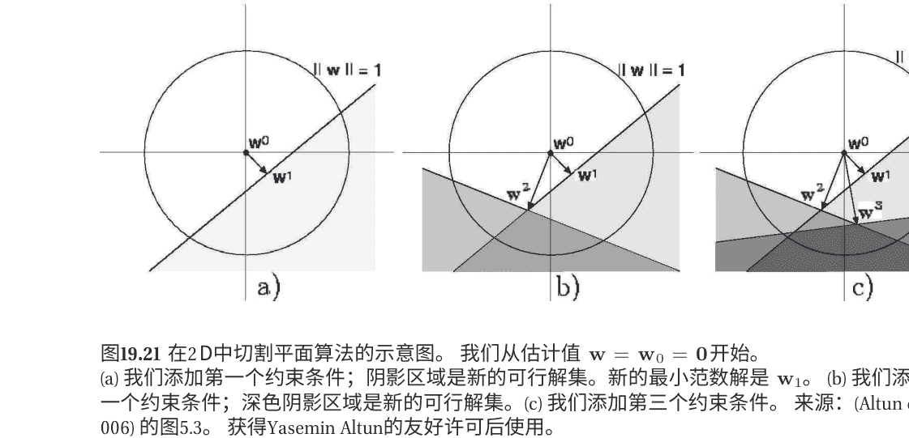

图19.21 在2D中切割平面算法的示意图。我们从估计值 w = w0 = 0开始。(a) 我们添加第一个约束条件；阴影区域是新的可行解集。新的最小范数解是 w1。(b) 我们添加另一个约束条件；深色阴影区域是新的可行解集。(c) 我们添加第三个约束条件。来源：(Altun et al. 2006) 的图5.3。获得Yasemin Altun的友好许可后使用。

### 19.7.3 用于拟合SSVM的切割平面方法

在本节中，我们讨论了一种有效的算法来拟合SSVMs，该算法由（Joachims等人，2009年）提出。这种方法可以处理一般的损失函数，并且在流行的SVMstruct包中实现。该方法基于凸优化中的割平面方法（Kelley，1960年）。

基本思想如下。我们从一个初始猜测 w开始，没有约束条件。在每次迭代中，我们执行以下操作：对于每个示例 i，我们找到涉及 xi 和 ŷi 的“最严重违反”约束。如果损失增强的边际违反超过当前值 εi,超过 ϵ，我们将 ŷi 添加到此训练案例的约束工作集 Wi 中，然后解决产生的新QP以找到新的 w，ξ。请参见图19.21的草图和算法11的伪代码。（由于每一步只添加一个新约束，我们可以热启动QP求解器。）我们可以轻松修改算法以优化松弛缩放版本，方法是用 L（yi，y） - w^T δ_i（ŷi） 替换 L（yi，y）（1 - w^T δ_i（ŷi））。

该方法效率的关键在于只需要添加多项式数量的约束条件，并且一旦添加了这些约束条件，指数数量的其他约束条件也将被保证在容忍度内得到满足(参见(Tsochantaridis等人，2005年)的证明)。

#### 19.7.3.1 损失增强解码

效率的另一个关键是能够在算法的第5行找到最违反的约束条件，即计算
$$argmax_{y∈𝒴} L(y_i, y) - w^T δ_i(y) = argmax_{y∈𝒴} L(y_i, y) + w^T φ(x_i, y)  (19.107)$$

> 11. http://svmlight.joachims.org/svm_struct.html

## 算法19.3: SSVM的切割平面算法（边际重新缩放，N松弛版本）

```
1 输入 𝒟 = {(𝐱₁, 𝐲₁), ..., (𝐱_N, 𝐲_N)}, C, ε ;
2 𝒲_i = ∅, ξ_i = 0 for i = 1 : N ;
3 重复对于 i = 1 : N
4   执行 ŷ_i = argmax
5     x_ŷ   i∈𝒴 L(𝐲_i, 𝐲) - 𝐰^T 𝛿_i(ŷ_i) ;
6   如果 L(𝐲_i, 𝐲) - 𝐰^T 𝛿_i(ŷ_i) > ξ_i + ε 则
7     𝒲_i = 𝒲_i ∪ {ŷ_i} ;
8     (𝐰, 𝛏) = argmin_{𝐰,𝛏≥0} ½||𝐰||² + C ∑_{i=1}^N ξ_i ;
9     s.t. ∀i = 1 : N, ∀𝐲' ∈ 𝒲_i : 𝐰^T 𝛿_i(𝐲') ≥ L(𝐲_i, 𝐲') - ξ_i ;
10 直到 no 𝒲_i has changed;
11 Return (𝐰, 𝛏)
```

我们将这个过程称为损失增强解码。（在 (Joachims et al. 2009) 中，这个过程被称为分离预言机。）如果损失函数具有与特征相同的加法分解形式，那么我们可以将损失折叠到权重向量中，即，我们可以找到一组新的参数 𝐰'，使得 (𝐰')^T 𝛿_i(𝐲) = 𝐰^T 𝛿_i(𝐲)。然后我们可以在模型 p(𝐲|𝐱, 𝐰') 上使用标准的解码算法，如维特比算法。

在0-1损失的特殊情况下，最优解要么是最佳解决方案， argmax_𝐲 𝐰^T φ(𝐱_i, 𝐲) ，其值为 0 − 𝐰^T 𝛿_i(ŷ)，要么是第二最佳解决方案，即， \(\tilde{\mathbf{y}} = \underset{\mathbf{y}=\hat{\mathbf{y}}}{\text{argmax}} \mathbf{w}^T \phi(\mathbf{x}_i, \mathbf{y})\) (19.108)

它实现了一个总体值为 1 − 𝐰^T 𝛿_i(ŷ)的结果。 对于链式结构的条件随机场，我们可以使用维特比算法进行解码；第二最佳路径与最佳路径在一个位置上不同，可以通过将最大边际最接近决策边界的变量更改为其第二最佳值来获得。 我们可以推广这个（需要更多的工作）来找到 N-最佳列表 (Schwarz和Chow 1990; Nilsson和Goldberger 2001) 。

对于汉明损失， \(L(\mathbf{y}^*, \mathbf{y}) = \mathbb{I}[\mathbf{y}_t^* = \mathbf{y}_t]\)，对于F1得分（在第5.7.2.3节中定义），我们可以设计一个动态规划算法来计算方程式19.107。 详见 (Altun等人2006) 的详细信息。 其他模型和损失函数的组合将需要不同的方法。

### 19.7.3.2 一个线性时间算法

虽然上述算法需要多项式时间，但我们可以做得更好，并设计一个在线性时间内运行的算法，假设我们使用线性核函数（即，我们使用原始特征 φ(𝐱, 𝐲)并且不应用核技巧）。 基本思想，如 (Joachims等人, 2009年) 所解释的，是只有一个松弛变量 ξ，而不是 N，但使用 |𝒴|^N 个约束条件，而不是仅 $N|\mathcal{Y}|$。具体而言，我们优化以下内容（假设边界重新缩放公式）：

$$
\min_{\mathbf{w}, \xi \ge 0} \frac{1}{2}||\mathbf{w}||_2^2 + C\xi
$$
$$
\text{s.t.} \quad \forall(\overline{\mathbf{y}}_1, \dots, \overline{\mathbf{y}}_N) \in \mathcal{Y}^N : \frac{1}{N}\mathbf{w}^T \sum_{i=1}^{N} \delta_i(\overline{\mathbf{y}}_i) \ge \frac{1}{N}\sum_{i=1}^{N} L(\mathbf{y}_i, \overline{\mathbf{y}}_i) - \xi \quad (19.109)
$$

将其与原始版本进行比较，原始版本是

$$
\min_{\mathbf{w}, \xi_i \ge 0} \frac{1}{2}||\mathbf{w}||_2^2 + \frac{C}{N} \sum_{i=1:N} \xi_i \quad \text{s.t.} \quad \forall \mathbf{y} \in \mathcal{Y} : \mathbf{w}^T \delta_i(\mathbf{y}) \ge L(\mathbf{y}_i, \mathbf{y}) - \xi_i \quad (19.110)
$$

可以证明，方程式19.109的任何解 $\mathbf{w}^*$ 也是方程式19.110的解，反之亦然，其中 $\xi^* = \frac{1}{N} \xi_i^*$。

### 算法19.4：SSVM的切割平面算法（边际重新缩放，1-slack版本）

```
1 输入 $\mathcal{D} = \{(\mathbf{x}_1, \mathbf{y}_1), \dots, (\mathbf{x}_N, \mathbf{y}_N)\}, C, \epsilon$;
2 $\mathcal{W} = \emptyset$;
3 **重复**
4 $\qquad (\mathbf{w}, \xi) = \text{argmin}_{\mathbf{w}, \xi \ge 0} \frac{1}{2}||\mathbf{w}||_2^2 + C \sum_{i=1}^{N} \xi_i$;
5 $\qquad \qquad \text{s.t.} \quad \forall(\overline{\mathbf{y}}_1, \dots, \overline{\mathbf{y}}_N) \in \mathcal{W} : \frac{1}{N}\mathbf{w}^T \sum_{i=1}^{N} \delta_i(\overline{\mathbf{y}}_i) \ge \frac{1}{N}\sum_{i=1}^{N} L(\mathbf{y}_i, \overline{\mathbf{y}}_i) - \xi$;
6 $\qquad$ **for** $i = 1 : N$ **do**
7 $\qquad\qquad \hat{\mathbf{y}}_i = \text{argmax}_{\hat{\mathbf{y}}_i \in \mathcal{Y}} L(\mathbf{y}_i, \hat{\mathbf{y}}_i) + \mathbf{w}^T \phi(\mathbf{x}_i, \hat{\mathbf{y}}_i)$
8 $\qquad \mathcal{W} = \mathcal{W} \cup \{(\hat{\mathbf{y}}_1, \dots, \hat{\mathbf{y}}_N)\}$;
9 **until** $\frac{1}{N} \sum_{i=1}^{N} L(\mathbf{y}_i, \hat{\mathbf{y}}_i) - \frac{1}{N}\mathbf{w}^T \sum_{i=1}^{N} \delta_i(\hat{\mathbf{y}}_i) \le \xi + \epsilon$;
10 返回 $(\mathbf{w}, \xi)$
```

我们可以使用算法10中的切割平面算法来优化方程19.109。（这是在SVMstruct中实现的。第4行中的内部QP可以使用(Joachims 2006)的方法在$O(N)$时间内解决。在第7行，我们对损失增强解码器进行了$N$次调用。最后，可以证明迭代次数是与$N$无关的常数。因此，总体运行时间是线性的。

### 19.7.4 用于拟合SSVM的在线算法

尽管切割平面算法可以在数据点数量线性时间内运行，但如果我们有一个大型数据集，这仍然可能很慢。在这种情况下，最好使用在线学习。我们简要提到一下下面几种可能的算法。

### 19.7.4.1 结构感知器算法

一种非常简单的拟合SSVMs的算法是结构感知器算法(Collins 2002)。该方法是第8.5.4节中常规感知器算法的扩展。

在每一步中，我们计算当前训练样本x的最大概率标签 ŷ = argmax p(y|x)(例如，使用维特比算法)。如果 ŷ = y，我们不做任何操作，否则我们使用权重向量进行更新。

$$
\mathbf{w}_{k+1} = \mathbf{w}_k + \phi(y, \mathbf{x}) - \phi(\hat{y}, \mathbf{x})
$$

为了获得良好的性能，需要对最近几次更新的参数进行平均（详见第8.5.2节），而不是使用最近的值。

### 19.7.4.2 随机次梯度下降

结构化感知机算法的缺点是它隐含地假设了0-1损失，并且不强制执行任何类型的边界。另一种方法是执行随机次梯度下降。这个特定实例是 Pegasos算法（Shalev-Shwartz等人，2007年），它代表“用于SVM的原始估计次梯度求解器”。Pegasos是为二元SVM设计的，但可以扩展到SSVMS。让我们从考虑目标函数开始：

$$
f(\mathbf{w}) = \sum_{i=1}^N \max_{\hat{y}_i} \left[ L(y_i, \hat{y}_i) + \mathbf{w}^T \phi(\mathbf{x}_i, \hat{y}_i) \right] - \mathbf{w}^T \phi(\mathbf{x}_i, y_i) + \lambda ||\mathbf{w}||^2
$$

让 $\hat{y}_i$ 成为这个最大值的argmax。然后，这个目标函数的次梯度是

$$
g(\mathbf{w}) = \sum_{i=1}^N \phi(\mathbf{x}_i, \hat{y}_i) - \phi(\mathbf{x}_i, y_i) + 2\lambda \mathbf{w}
$$

在随机次梯度下降中，我们用一个项 $i$ 来近似这个梯度，然后进行更新：

$$
\mathbf{w}_{k+1} = \mathbf{w}_k - \eta_k g_i(\mathbf{w}_k) = \mathbf{w}_k - \eta_k [\phi(\mathbf{x}_i, \hat{y}_i) - \phi(\mathbf{x}_i, y_i) + (2/N)\lambda \mathbf{w}]
$$

)其中 $\eta_k$ 是步长参数，应满足Robbins-Monro条件（第8.5.2.1节）。（注意，感知机算法只是 $\lambda=0$和$\eta_k=1$的特殊情况。）为了确保 $\mathbf{w}$ 具有单位范数，我们可以在每次更新后将其投影到 $\ell_2$球上。

### 19.7.5 潜在结构SVM

在许多感兴趣的应用中，我们有潜在的或隐藏的变量 $\mathbf{h}$。例如，在目标检测问题中，我们可能被告知图像中包含一个对象，所以 $y=1$，但我们可能不知道它在哪里。对象的位置或姿态可以被视为隐藏变量。或者在机器翻译中，我们可能知道源文本 $\mathbf{x}$（比如英文）和目标文本 $\mathbf{y}$（比如法文），但通常不知道单词之间的对齐关系。我们将扩展我们的模型如下，以获得一个潜在CRF：

$$
p(\mathbf{y}, \mathbf{h}|\mathbf{x}, \mathbf{w}) = \frac{\exp(\mathbf{w}^T \phi(\mathbf{x}, \mathbf{y}, \mathbf{h}))}{Z(\mathbf{x}, \mathbf{w})}
$$
$$
Z(\mathbf{x}, \mathbf{w}) = \sum_{\mathbf{y},\mathbf{h}} \exp(\mathbf{w}^T \phi(\mathbf{x}, \mathbf{y}, \mathbf{h}))
$$

此外，我们引入损失函数 \( L(y^*, y, h) \)；这个函数衡量了当我们采取“动作”是使用潜在变量 \( h \) 来预测 \( y \) 时的损失。我们可以像之前一样使用 \( L(y^*, y) \)，因为 \( h \) 通常是一个干扰变量，而不是直接感兴趣的变量。 然而， \( h \) 有时可以在定义损失函数时发挥有用的作用。 \( ^{12} \)给定损失函数，我们将我们的目标定义为

\[
R_{EL}(\mathbf{w}) = -\log p(\mathbf{w}) + \sum_{i} \log \left[ \sum_{\mathbf{y},\mathbf{h}} \exp \tilde{L}(\mathbf{y}_i, \mathbf{y}, \mathbf{h}) \frac{\exp(\mathbf{w}^T \phi(\mathbf{x}, \mathbf{y}, \mathbf{h}))}{Z(\mathbf{x}, \mathbf{w})} \right]
\quad \text{(19.117)}
\]

使用与之前相同的宽松下界，我们得到

\[
\begin{aligned}
R_{EL}(\mathbf{w}) &\leq E(\mathbf{w}) + \sum_{i=1}^{N} \max_{\mathbf{y},\mathbf{h}} \left\{ \tilde{L}(\mathbf{y}_i, \mathbf{y}, \mathbf{h}) + \mathbf{w}^T \phi(\mathbf{x}_i, \mathbf{y}, \mathbf{h}) \right\} \\
&\quad - \sum_{i=1}^{N} \max_{\mathbf{h}} \mathbf{w}^T \phi(\mathbf{x}_i, \mathbf{y}_i, \mathbf{h})
\end{aligned}
\quad \text{(19.118)}
\]

如果我们设置 \( E(\mathbf{w}) = -\frac{1}{2C} ||\mathbf{w}||^2 \)，我们得到与 **latent SVMs** (Yu and Joachims 2009)中优化的相同目标。

不幸的是，这个目标不再是凸的。 然而，它是凸函数的差，因此可以使用 **CCCP** 或 **concave-convex procedure**(Yuille and Rangarajan 2003)高效地解决。 这是一种最小化形式为 \( f(\mathbf{w}) - g(\mathbf{w}) \) 的函数的方法，其中 \( f \) 和 \( g \) 是凸函数。 该方法交替地找到线性上界 \( u \) on \( -g \)，然后最小化凸函数 \( f(\mathbf{w}) + u(\mathbf{w}) \)；请参见算法6的伪代码。 CCCP保证在每次迭代中减小目标，并收敛到局部最小值或鞍点。

```
**算法19.5：凹凸过程 (CCCP)**

1. 设置 \( t = 0 \)并初始化 \( \mathbf{w}_0 \)；
2. 重复
3.      找到超平面 \( \mathbf{v}_t \) such that \( -g(\mathbf{w}) \leq -g(\mathbf{w}_t) + (\mathbf{w} - \mathbf{w}_t)^T \mathbf{v}_t \) for all \( \mathbf{w} \) ;
4.      解 \( \mathbf{w}_{t+1} = \mathrm{argmin}_{\mathbf{w}} f(\mathbf{w}) + \mathbf{w}^T \mathbf{v}_t \) ;
5.      设 \( t = t + 1 \)
6. 直到 收敛 ；
```

当应用于潜在的SSVMs时，CCCP与（硬）EM非常相似。在“E步骤”中，我们计算通过设置线性上界 $\mathbf{v}_t = -C \sum_{i=1}^{N_i} \phi(\mathbf{x}_i, y_i, \mathbf{h}_i^*)$，其中

$$
\mathbf{h}_i = \underset{\mathbf{h}}{\mathrm{argmax}}\; \mathbf{w}_t^T \phi(\mathbf{x}_i, y_i, \mathbf{h})
$$

在“M步骤”中，我们使用解决完全可见SSVM的技术来估计 $\mathbf{w}$。具体来说，我们最小化

$$
\frac{1}{2} ||\mathbf{w}||_2 + C \sum_{i=1}^{N} \max_{y,\mathbf{h}} \left\{ L(\mathbf{y}_i, y, \mathbf{h}) + \mathbf{w}^T \phi(\mathbf{x}_i, y, \mathbf{h}) \right\} - C \sum_{i=1}^{N} \mathbf{w}^T \phi(\mathbf{x}_i, \mathbf{y}_i, \mathbf{h}_i^*)
$$

## 练习

### 练习19.1 对数分区函数的导数

推导方程19.40.

### 练习19.2 高斯图模型的CI属性

(来源：Jordan.)

在这个问题中，我们研究了高斯图模型中稀疏矩阵和稀疏图之间的关系。考虑一个三维的多元高斯分布 $\mathcal{N}(\mathbf{x}|\boldsymbol{\mu}, \boldsymbol{\Sigma})$。假设 $\boldsymbol{\mu}= (0, 0, 0)^T$ 始终成立。

回想一下，对于联合高斯随机变量，我们知道 $X_i$ 和 $X_j$ 是独立的，当且仅当它们不相关，即 $\Sigma_{ij} = 0$。(这在一般情况下是不成立的，即使 $X_i$ 和 $X_j$ 是高斯的但不是联合高斯的。) 另外，$X_i$ 在给定其他所有变量的条件下与 $X_j$ 是条件独立的，当且仅当 $\Sigma^{-1}_{ij} = 0$。

a. 假设

$$
\boldsymbol{\Sigma} = \begin{pmatrix} 0.75 & 0.5 & 0.25 \\ 0.5 & 1.0 & 0.5 \\ 0.25 & 0.5 & 0.75 \end{pmatrix}
$$

在 $X_1$, $X_2$ 和 $X_3$ 之间是否存在任何边际独立性？那么条件独立性呢？提示：计算 $\boldsymbol{\Sigma}^{-1}$ 并展开 $\mathbf{x}^T \boldsymbol{\Sigma}^{-1} \mathbf{x}$；哪些成对项 $x_i x_j$ 缺失？绘制一个无向图模型，尽可能捕捉这些独立性陈述（边际和条件），但不做任何错误的独立性断言。

b. 假设

$$
\boldsymbol{\Sigma} = \begin{pmatrix} 2 & 1 & 0 \\ 1 & 2 & 1 \\ 0 & 1 & 2 \end{pmatrix}
$$

在 $X_1$, $X_2$ 和 $X_3$ 之间是否存在任何边际独立性？在 $X_1$, $X_2$ 和 $X_3$ 之间是否存在任何条件独立性？绘制一个无向图模型，尽可能捕捉这些独立性陈述（边际和条件），但不做任何错误的独立性断言。

c. 现在假设 $\mathbf{X}$ 的分布可以由以下有向无环图表示：

$$
X_1 \rightarrow X_2 \rightarrow X_3
$$

让CPD如下所示：

$$
P(X_1) = \mathcal{N}(X_1; 0, 1), P(X_2|x_1) = \mathcal{N}(X_2; x_1, 1), P(X_3|x_2) = \mathcal{N}(X_3; x_2, 1)
$$

将这3个CPD相乘并完成平方（Bishop p101）以找到相应的联合分布 $\mathcal{N}(X_{1:3}|\boldsymbol{\mu}, \boldsymbol{\Sigma})$。（你可能会发现解 $\boldsymbol{\Sigma}^{-1}$ 比解 $\boldsymbol{\Sigma}$ 更容易。）

d. 对于前一个问题中的DAG模型：X1, X2和X3之间是否存在任何边际独立性？条件独立性呢？绘制一个无向图模型，尽可能捕捉到这些独立性陈述，但不做任何错误的独立性断言（无论是边际还是条件）。

## 练习19.3 高斯图模型中的独立性

(来源：麦凯。)

a. 考虑有向无环图 X1 ← X2 → X3。假设所有的条件概率分布都是线性高斯分布。以下哪个矩阵可能是协方差矩阵？

$$A = \begin{pmatrix} 9 & 3 & 1 \\ 3 & 9 & 3 \\ 1 & 3 & 9 \end{pmatrix}, B = \begin{pmatrix} 8 & -3 & 1 \\ -3 & 9 & -3 \\ 1 & -3 & 8 \end{pmatrix}, C = \begin{pmatrix} 9 & 3 & 0 \\ 3 & 9 & 3 \\ 0 & 3 & 9 \end{pmatrix}, D = \begin{pmatrix} 9 & -3 & 0 \\ -3 & 10 & -3 \\ 0 & -3 & 9 \end{pmatrix} \tag{19.122}$$

b. 以上哪个矩阵可能是逆协方差矩阵？

c. 考虑有向无环图 X1 → X2 ← X3。假设所有的条件概率分布都是线性高斯分布。以上哪个矩阵可能是协方差矩阵？

d. 以上哪个矩阵可能是逆协方差矩阵？

e. 假设三个变量 x1, x2, x3的协方差矩阵为 Σ(1:3)，精度矩阵为 Ω(1:3) = Σ(1:3)^{-1}，如下所示

$$\Sigma_{(1:3)} = \begin{pmatrix} 1 & 0.5 & 0 \\ 0.5 & 1 & 0.5 \\ 0 & 0.5 & 1 \end{pmatrix}, \Omega_{(1:3)} = \begin{pmatrix} 1.5 & -1 & 0.5 \\ -1 & 2 & -1 \\ 0.5 & -1 & 1.5 \end{pmatrix} \tag{19.123}$$

现在关注 x1 和 x2。关于它们的协方差矩阵 Σ(1:2)和精度矩阵 Ω(1:2)的以下哪个陈述是正确的？

$$A: \Sigma_{(1:2)} = \begin{pmatrix} 1 & 0.5 \\ 0.5 & 1 \end{pmatrix}, B: \Omega_{(1:2)} = \begin{pmatrix} 1.5 & -1 \\ -1 & 2 \end{pmatrix} \tag{19.124}$$

## 练习19.4 训练MRFs和CRFs的成本

(来源：Koller。)考虑使用 k个特征的对数线性模型进行梯度上升训练的过程，给定一个包含 N个训练实例的数据集。为简单起见，假设在我们的数据集中，计算单个特征在单个实例上的成本是恒定的，计算每个特征的期望值的成本也是恒定的，一旦我们计算了其作用域中变量的边际。假设计算每个数据案例的所有边际需要 c时间。此外，假设我们需要 r次迭代才能使梯度过程收敛。

- 使用这种符号，训练一个MRF所需的时间是多少（用大O符号表示）？
- 使用这种符号，训练一个CRF所需的时间是多少（用大O符号表示）？

## 练习19.5 在Ising模型中的全条件

考虑一个Ising模型

$$p(x_1, \ldots, x_n | \boldsymbol{\theta}) = \frac{1}{Z(\boldsymbol{\theta})} \prod_{<ij>} \exp(J_{ij} x_i x_j) \prod_{i=1}^n \exp(h_i x_i) \tag{19.125}$$

其中 < ij > 表示所有唯一的对（即所有边），Jij ∈ ℝ是边上的耦合强度（权重），hi ∈ ℝ是局部证据（偏置项），而θ = (J, h)是所有参数。

如果 $x_i \in \{0, 1\}$，推导出全条件的表达式

$$p(x_i = 1|\mathbf{x}_{-i}, \theta) = p(x_i = 1|\mathbf{x}_{nb_i}, \theta) \tag{19.126}$$

其中 $\mathbf{x}_{-i}$ 是除 $i$ 之外的所有节点， $nb_i$ 是图中 $i$ 的邻居。 提示： 你的答案应该使用sigmoid/logistic函数 $\sigma(z) = 1/(1 + e^{-z})$。 现在假设 $x_i \in \{-1, +1\}$。 推导出与此情况下的 $p(x_i|\mathbf{x}_{-i}, \theta)$ 相关的表达式。（在应用Gibbs采样到模型时可以使用此结果。）

## 20 图模型的精确推断

### 20.1 引言

在第17.4.3节中，我们讨论了前向-后向算法，它可以精确计算任何链式图模型中的后验边缘 \( p(x_t|\mathbf{v}, \theta) \)，其中 \( x \) 是隐藏变量（假设为离散的）和 \( \mathbf{v} \) 是可见变量。这个算法可以被修改为计算后验模式和后验样本。线性高斯链的类似算法，称为卡尔曼平滑器，在第18.3.2节中进行了讨论。本章的目标是将这些精确推断算法推广到任意图形。得到的方法适用于有向和无向图模型。为了简洁起见，我们将描述各种算法，但省略了它们的推导。有关离散有向图模型的精确推断技术的详细阐述，请参见（Darwiche 2009; Koller and Friedman 2009）。

### 20.2 树的信念传播

在本节中，我们将从链式结构推广前向-后向算法到树结构。由此得到的算法被称为信念传播（BP）（Pearl 1988），或者是和积算法。

#### 20.2.1 串行协议

我们最初假设（为了简化符号）模型是成对的MRF（或CRF），即

$$ p(\mathbf{x}|\mathbf{v}) = \frac{1}{Z(\mathbf{v})} \prod_{s \in \mathcal{V}} \psi_s(x_s) \prod_{(s,t) \in \mathcal{E}} \psi_{s,t}(x_s, x_t) $$

其中 \( \psi_s \) 是节点 \( s \) 的局部证据，而 \( \psi_{s,t} \) 是边 \( s - t \) 的潜在因子。我们将在后面考虑具有更高阶团的模型（如有向树）的情况。实现无向树的BP的一种方法如下。选择一个任意节点并将其称为根节点，r。现在将所有边从r指向外（直观上，我们可以想象在节点r处“拿起图形”，并让所有边“悬挂”下来）。这给我们一个明确定义的父节点和子节点的概念。现在我们从叶子节点向根节点发送消息（收集证据阶段），然后从根节点向下发送消息（分发证据阶段），类似于链式结构上的前向-后向算法。

为了更详细地解释这个过程，考虑图20.1中的例子。假设我们想要计算节点 $t$ 的置信状态。 我们最初只根据图中在或低于节点 $t$ 处的证据来确定置信，即我们想要计算 $\mathrm{bel}_t^{-}(x_t) \triangleq p(x_t|\mathbf{v}_t^{-})$。 我们将其称为“自底向上的置信状态”。 假设通过归纳法，我们已经计算出了从 $t$ 的两个子节点传递的“消息”，总结了它们认为 $t$ 应该了解其子树中的证据的信息，即我们已经计算出了 $m_{s \rightarrow t}^{-}(x_t) = p(x_t|\mathbf{v}_{st}^{-})$，其中 $\mathbf{v}_{st}^{-}$ 是沿下游方向的所有证据（参见图20.1(a)），类似地，我们已经计算出了 $m_{u \rightarrow t}^{-}(x_t)$。 然后我们可以按如下方式计算节点 $t$ 的自底向上置信状态：

$$\mathrm{bel}_t^{-}(x_t) \triangleq p(x_t|\mathbf{v}_t^{-}) = \frac{1}{Z_t} \psi_t(x_t) \prod_{c \in \mathrm{ch}(t)} m_{c \rightarrow t}^{-}(x_t) \qquad \qquad \qquad \qquad \qquad \qquad \qquad (20.2)$$

其中 $\psi_t(x_t) \propto p(x_t|\mathbf{v}_t)$ 是节点 $t$ 的局部证据， $Z_t$ 是局部归一化常数。 简单来说，我们将来自子节点的所有传入消息以及来自局部证据的传入消息相乘，然后进行归一化。

我们已经解释了如何从自下而上的消息中计算自下而上的信念状态。 那么我们如何计算消息本身呢？ 考虑计算 $m_{s \rightarrow t}^{-}(x_t)$，其中 $s$ 是 $t$ 的一个子节点。 通过递归假设，我们已经计算出 $\mathrm{bel}_s^{-}(x_s) = p(x_s|\mathbf{v}_s^{-})$。 然后我们可以按照以下方式计算消息：

$$m_{s \rightarrow t}^{-}(x_t) = \sum_{x_s} \psi_{st}(x_s, x_t) \mathrm{bel}_s^{-}(x_s) \qquad \qquad \qquad \qquad \qquad \qquad \qquad \qquad (20.3)$$

基本上，我们通过使用边缘潜力 $\psi_{st}$，将关于 $x_s$ 的信念转化为关于 $x_t$ 的信念。 我们沿着树向上继续这样做，直到达到根节点。 一旦到达根节点，我们已经“看到”了树中的所有证据，因此我们可以使用

$$\mathrm{bel}_r(x_r) \triangleq p(x_r|\mathbf{v}) = p(x_r|\mathbf{v}_r^{-}) \propto \psi_r(x_r) \prod_{c \in \mathrm{ch}(r)} m_{c \rightarrow r}^{-}(x_r) \qquad \qquad \qquad \qquad \qquad (20.4)$$

这完成了向上传递的结束，类似于HMM中的前向传递。 作为一个“副作用”，我们可以通过收集证据的概率来计算归一化常数:

$$p(v) = \prod_t Z_t \tag{20.5}$$

我们现在可以从根节点传递消息。例如，考虑节点 $s$，其父节点为 $t$，如图20.1(b)所示。为了计算 $s$ 的信念状态，我们需要将自下而上的信念与来自 $t$ 的自上而下的消息相结合，该消息总结了图中其余部分的所有信息，$m^+_{t \rightarrow s}(x_s) \triangleq p(x_t | \mathbf{v}^+_{st})$，其中 $\mathbf{v}^+_{st}$ 是 $s-t$ 边上游（根）侧的所有证据，如图20.1(b)所示。然后我们有

$$\text{bel}_s(x_s) \triangleq p(x_s | \mathbf{v}) \propto \text{bel}_s^-(x_s) \prod_{t \in \text{pa}(s)} m^+_{t \rightarrow s}(x_t) \tag{20.6}$$

我们如何计算这些向下传递的信息？例如，考虑从 $t$ 到 $s$ 的信息。假设 $t$ 的父节点是 $r$，的子节点是 $s$ 和 $u$，如图20.1(b)所示。我们希望在 $m^+_{t \rightarrow s}$ 中包含接收到的所有信息，除了 $s$ 发送的信息：

$$m^+_{t \rightarrow s}(x_s) \triangleq p(x_s | \mathbf{v}^+_{st}) = \sum_{x_t} \psi_{st}(x_s, x_t) \frac{\text{bel}_t(x_t)}{m^-_{s \rightarrow t}(x_t)} \tag{20.7}$$

与其除去发送给 $t$ 的信息，我们可以插入 $\text{bel}_t$ 的方程来得到

$$m^+_{t \rightarrow s}(x_s) = \sum_{x_t} \psi_{st}(x_s, x_t) \psi_t(x_t) \prod_{c \in \text{ch}(t), c \neq s} m^-_{c \rightarrow t}(x_t) \prod_{p \in \text{pa}(t)} m^+_{p \rightarrow t}(x_t) \tag{20.8}$$

换句话说，我们将除了接收者之外的所有节点传入的消息相乘在一起 $t$，然后通过边缘势函数 $\psi_{st}$ 进行组合。在链的情况下，$t$ 只有一个子节点和一个父节点，所以上述简化为

$$m^+_{t \rightarrow s}(x_s) = \sum_{x_t} \psi_{st}(x_s, x_t) \psi_t(x_t) m^+_{p \rightarrow t}(x_t) \tag{20.9}$$

在我们使用除法的BP版本中，称为信念更新，而在我们乘以除了一个消息之外的所有消息的版本中称为求和乘积。信念更新版本类似于我们在第18.3.2节中制定卡尔曼平滑器的方式：自上而下的消息依赖于自下而上的消息。这意味着它们可以被解释为条件后验概率。求和乘积版本类似于我们在第17.4.3节中制定反向算法的方式：自上而下的消息完全独立于自下而上的消息，这意味着它们只能被解释为条件似然概率。

请参阅18.3.2.3节，对这个微妙差别进行更详细的讨论。

#### 20.2.2 并行协议

到目前为止，我们已经介绍了算法的串行版本，在这个版本中，我们将消息发送到根节点，然后再发送回来。这是树的最佳方法，也是对链式前向-后向的自然扩展。然而，作为处理具有循环的一般图的前奏，我们现在考虑BP的并行版本。这在串行机器上实现时与串行版本具有相同的结果，但效率较低。

基本思想是所有节点并行接收来自邻居的消息，然后更新它们的信念状态，最后将新的消息发送回邻居。这个过程重复直到收敛。这种计算架构被称为脉动阵列，因为它类似于跳动的心脏。

更准确地说，我们将所有消息初始化为全1向量。然后，每个节点并行地从所有邻居吸收消息使用

$$belief_t(x_t) \propto \psi_t(x_t) \prod_{s \in nbr(t)} m_{s \to t}(x_t) \tag{20.10}$$

然后，每个节点并行地向其邻居发送消息：

$$m_{t \to s}(x_t) = \sum_{x_s} \left( \psi_t(x_t) \psi_{st}(x_s, x_t) \prod_{u \in nbr(t) \setminus s} m_{u \to t}(x_t) \right) \tag{20.11}$$

计算 $m_{s \to t}$ 消息是将所有传入的消息相乘，除了接收者发送的消息，然后通过 $\psi_{st}$ 潜力传递。在算法的第 $T$次迭代中，$\text{bel}_s(x_s)$ 表示在图中距离为 $T$步的证据条件下的 $x_s$ 的后验信念。经过 $D(G)$步，其中 $D(G)$是图的直径（任意两个节点之间的最大距离），每个节点都从所有其他节点获得了信息。然后，它的局部信念状态就是正确的后验边际分布。由于树的直径最多为|V| - 1，算法在线性步数内收敛。

我们可以通过强加条件来推导算法的上下版本，即一个节点只有在接收到所有其他邻居节点的消息后才能发送消息。这意味着我们必须从叶节点开始，因为它们只有一个邻居。然后消息向上传播到根节点，再返回。我们还可以以随机顺序更新节点。唯一的要求是每个节点都要更新 $D(G)$次。这正好足够的时间让信息在整个树中传播。

类似的并行分布式算法用于解决线性方程组，在(Bertsekas 1997)中有讨论。特别地，高斯-塞德尔算法类似于串行的上下版本BP算法，而雅可比算法类似于并行版本的BP算法。

#### 20.2.3 高斯BP*

现在考虑一个情况，即 $p(x|v)$是联合高斯分布，因此可以表示为高斯对MRF，就像在第19.4.4节中所述。我们现在介绍这个模型类别的置信传播算法，参考(Bickson 2009)的介绍(也参考(Malioutov et al. 2006)) 。我们假设以下节点和边缘势函数：

$$\psi_t(x_t) = \exp\left(-\frac{1}{2}A_{tt}x_t^2 + b_t x_t\right) \tag{20.12}$$

$$\psi_{st}(x_s, x_t) = \exp\left(-\frac{1}{2}x_s A_{st} x_t\right) \tag{20.13}$$

所以整体模型的形式为

$$p(x|v) \propto \exp\left(-\frac{1}{2}x^T A x + b^T x\right) \tag{20.14}$$

这是MVN的信息形式（参见习题9.2），其中 $A$是精度矩阵。请注意，通过完成平方，局部证据可以重写为高斯分布：

$$\psi_t(x_t) \propto \mathcal{N}(b_t/A_{tt}, A_{tt}^{-1}) \triangleq \mathcal{N}(m_t, \ell_t^{-1}) \tag{20.15}$$

下面我们将介绍如何使用BP算法计算后验节点边缘概率，

$$p(x_t|v) = \mathcal{N}(\mu_t, \lambda_t^{-1}) \tag{20.16}$$

如果图是一棵树，该方法是精确的。如果图是循环的，后验均值可能仍然是精确的，但后验方差通常太小（Weiss和Freeman 1999）。

尽管精度矩阵 $A$经常是稀疏的，计算后验均值需要对其进行求逆，因为 $\mu = A^{-1}b$。BP提供了一种利用图结构进行计算的方法，其时间复杂度为 $\mathcal{O}(|V|)$，而不是 $\mathcal{O}(|V|^3)$。这与线性代数中的各种方法有关，如（Bickson 2009）中所讨论的。

由于模型是联合高斯的，所有边缘和所有消息都将是高斯的。我们需要的关键操作是将两个高斯因子相乘，并从联合高斯因子中边缘化掉一个变量。

对于乘法，我们可以使用两个高斯分布的乘积仍然是高斯分布的事实：

$$\mathcal{N}(x|\mu_1, \lambda_1^{-1}) \times \mathcal{N}(x|\mu_2, \lambda_2^{-1}) = C \mathcal{N}(x|\mu, \lambda^{-1}) \tag{20.17}$$

$$\lambda = \lambda_1 + \lambda_2 \tag{20.18}$$

$$\mu = \lambda^{-1}(\mu_1\lambda_1 + \mu_2\lambda_2) \tag{20.19}$$

其中

$$C = \sqrt{\frac{\lambda}{\lambda_1\lambda_2}} \exp\left(\frac{1}{2}\left(\lambda_1\mu_1^2(\lambda^{-1}\lambda_1 - 1) + \lambda_2\mu_2^2(\lambda^{-1}\lambda_2 - 1) + 2\lambda^{-1}\lambda_1\lambda_2\mu_1\mu_2\right)\right) \tag{20.20}$$

参见练习20.2的证明。

对于边缘化，我们有以下结果：

$$\int \exp(-ax^2 + bx)dx = \sqrt{\frac{\pi}{a}} \exp\left(\frac{b^2}{4a}\right) \tag{20.21}$$

这是由于高斯分布的归一化常数（练习2.11）得出的。

现在我们拥有了所有需要的部分。特别地，让消息 $m_{s\to t}(x_t)$为一个具有均值 $\mu_{st}$和精度 $\lambda_{st}$的高斯分布。根据方程20.10，节点 $s$的置信度由传入消息的乘积乘以局部证据（方程20.15）给出，因此

$$\text{bel}_s(x_s) = \psi_s(x_s) \prod_{t\in\text{nbr}(s)} m_{ts}(x_s) = \mathcal{N}(x_s|\mu_s, \lambda_s^{-1}) \tag{20.22}$$

$$\lambda_s = \ell_s + \sum_{t\in\text{nbr}(s)} \lambda_{ts} \tag{20.23}$$

$$\mu_s = \lambda_s^{-1} \left(\ell_s m_s + \sum_{t\in\text{nbr}(s)} \lambda_{ts} \mu_{ts}\right) \tag{20.24}$$

计算消息本身时，我们使用方程20.11，该方程给出
$$ m_{s \to t}(x_t) = \int_{x_s} \left( \psi_{st}(x_s, x_t) \psi_s(x_s) \prod_{u \in \text{nbr}(s) \setminus t} m_{u \to s}(x_s) \right) dx_s \tag{20.25} $$
$$ = \int_{x_s} \psi_{st}(x_s, x_t) f_{s \setminus t}(x_s) dx_s \tag{20.26} $$
其中 \( f_{s \setminus t}(x_s) \) 是局部证据和除了来自 \( t \) 的所有传入消息之外的乘积：
$$ f_{s \setminus t}(x_s) \triangleq \psi_s(x_s) \prod_{u \in \text{nbr}(s) \setminus t} m_{u \to s}(x_s) \tag{20.27} $$
$$ = \mathcal{N}(x_s | \mu_{s \setminus t}, \lambda_{s \setminus t}^{-1}) \tag{20.28} $$
$$ \lambda_{s \setminus t} \triangleq \ell_s + \sum_{u \in \text{nbr}(s) \setminus t} \lambda_{us} \tag{20.29} $$
$$ \mu_{s \setminus t} \triangleq \lambda_{s \setminus t}^{-1} \left( \ell_s m_s + \sum_{u \in \text{nbr}(s) \setminus t} \lambda_{us} \mu_{us} \right) \tag{20.30} $$
回到方程20.26，我们有
$$ m_{s \to t}(x_t) = \int_{x_s} \exp(-x_s A_{st} x_t) \exp(-\lambda_{s \setminus t}/2 (x_s - \mu_{s \setminus t})^2) dx_s \tag{20.31} $$
$$ = \int_{x_s} \exp\left( (-\lambda_{s \setminus t} x_s^2 / 2) + (\lambda_{s \setminus t} \mu_{s \setminus t} - A_{st} x_t) x_s \right) dx_s + \text{常数} \tag{20.32} $$
$$ \propto \exp\left( (\lambda_{s \setminus t} \mu_{s \setminus t} - A_{st} x_t)^2 / (2 \lambda_{s \setminus t}) \right) \tag{20.33} $$
$$ \propto \mathcal{N}(\mu_{st}, \lambda_{st}^{-1}) \tag{20.34} $$
$$ \lambda_{st} = A_{st}^2 / \lambda_{s \setminus t} \tag{20.35} $$
$$ \mu_{st} = A_{st} \mu_{s \setminus t} / \lambda_{st} \tag{20.36} $$
，而消息变成小型MVNs而不是标量高斯分布（Alag和Agogino 1996）。如果我们将得到的算法应用于线性动态系统，则可以恢复第18.3.2节中的卡尔曼平滑算法。

在具有非高斯势能的模型中执行消息传递，可以使用采样方法来近似相关积分。这被称为非参数BP（Sudderth等人，2003年；Isard，2003年；Sudderth等人，2010年）。

#### 20.2.4 其他BP变体*

在本节中，我们简要讨论了主要算法的几个变体。

### 20.2.4.1 最大乘积算法

可以通过用**max**运算符替换\(\sum\)运算符来设计BP算法的最大乘积版本。然后我们可以计算每个节点的局部MAP边际。然而，如果存在并列，这可能不是全局一致的，如17.4.4节所讨论的。幸运的是，我们可以将维特比算法推广到树上，在收集到根节点阶段使用**max**和**argmax**，在从根节点分发阶段执行回溯。 详细信息请参阅 (Dawid 1992)。

### 20.2.4.2 从树中抽样

可以通过推广在第17.4.5节中讨论的前向过滤/后向抽样算法来从树结构模型中抽样。详见 (Dawid 1992)

### 20.2.4.3 计算变量集上的后验概率

在第17.4.3.2节中，我们解释了如何计算HMM中的“两个时间片”分布 \(\xi_{t,t+1}(i, j) = p(x_t =i, x_{t+1} = j|\mathbf{v})\)，即通过使用
\[\xi_{t,t+1}(i, j) = \alpha_t(i)\psi_{t+1}(j)\beta_{t+1}(j)\psi_{t,t+1}(i, j) \tag{20.37}\]
由于 \(\alpha_t(i) \propto \psi_t(i) f_t(i)\)，其中 \(f_t = p(x_t|\mathbf{v}_{1:t-1})\)是前向消息，我们可以将其视为将消息 \(f_t\) 和 \(\psi_t\) 发送到 \(x_t\)中，将 \(\beta_{t+1}\) 和 \(\phi_{t+1}\) 发送到 \(x_{t+1}\)中，然后使用 \(\Psi\)矩阵将它们组合起来，如图20.2所示。这就像将 \(x_t\) 和 \(x_{t+1}\)视为一个单独的“超级节点”，然后将所有传入的消息以及所有局部因子（这里是 \(\psi_{t,t+1}\)）相乘。

### 20.3 变量消除算法

我们已经看到如何使用BP算法在链式和树状结构上计算精确边缘概率。在本节中，我们讨论一种算法来计算任何类型图中的$p(\mathbf{x}_q|\mathbf{x}_v)$。

我们将通过示例来解释算法。考虑图20.3(a)中的DGM模型。这个模型来自于(Koller and Friedman 2009)，它是一个关于典型学生的各种变量之间关系的假设模型。相应的联合概率具有以下形式：
```
P(C, D, I, G, S, L, J, H) = P(C)P(D|C)P(I)P(G|I, D)P(S|I)P(L|G)P(J|L, S)P(H|G, J)
```
请注意，CPD的形式并不重要，因为我们的所有计算都是符号化的。然而，为了说明目的，我们将假设所有变量都是二进制的。

在继续之前，我们将我们的模型转换为无向形式。这不是必需的，但它使得演示更加统一，因为所得到的方法可以应用于DGM和UGM（正如我们将在第20.3.1节中看到的，还可以应用于与图模型无关的各种其他问题）。由于DGM和UGM中推理的计算复杂性一般来说是相同的，从计算的角度来看，这种转换并没有损失任何东西。¹

要将DGM转换为UGM，我们只需为每个CPD定义一个潜在因子，从而得到
```
p(C, D, I, G, S, L, J, H) = \psi_C(C)\psi_D(D, C)\psi_I(I)\psi_G(G, I, D)\psi_S(S, I)\psi_L(L, G)\psi_J(J, L, S)\psi_H(H, G, J)
```
> 1. 在有向情况下，有一些“技巧”可以利用，而在无向情况下则不容易利用。一个重要的例子是无用节点删除。为了解释这一点，考虑一个朴素贝叶斯分类器，如图10.2所示。假设我们想要推断 y，并且我们观察到 x1 和 x2，但没有观察到 x3 和 x4。很明显，我们可以安全地删除 x3 和 x4，因为 Σ_{x3,x4} p(x3,x4|y) = 1，类似地，对于 x4 也是如此。一般来说，一旦我们去除了隐藏的叶子，我们可以递归地应用这个过程。由于潜在函数不一定总和为一，我们不能在无向情况下使用这个技巧。参见（Koller和Friedman 2009）以获取其他加速技巧。

由于所有的潜在函数都是局部归一化的，因为它们是条件概率分布，所以不需要全局归一化常数，因此 Z = 1。相应的无向图如图20.3(b)所示。请注意，它比有向无环图有更多的边。特别是，任何共享一个子节点的“未婚”节点必须“结婚”，通过在它们之间添加一条边；这个过程被称为道德化。只有在这之后，箭头才能被去掉。在这个例子中，我们添加了 D-I，G-J和L-S的道德化弧。需要进行这个操作的原因是确保UGM的CI属性与DGM的属性相匹配，如第19.2.2节所解释的那样。它还确保存在一个可以“存储”每个家族的CPD的团。

现在假设我们想要计算 p(J = 1)，即一个人得到工作的边际概率。由于我们有8个二进制变量，我们可以简单地枚举所有可能的分配给所有变量 (除了 J) 的情况，并将每个联合实例的概率相加：
$$p(J) = \sum_{L} \sum_{S} \sum_{G} \sum_{H} \sum_{I} \sum_{D} \sum_{C} p(C, D, I, G, S, L, J, H) \quad \quad (20.42)$$
然而，这将花费 O(2^7)的时间。 我们可以更聪明地将求和推到乘积内部。这是变量消除算法 (Zhang和Poole 1996) 的关键思想，也被称为桶消除 (Dechter 1996)，或者在遗传谱系树的背景下，被称为剥离算法 (Cannings等人1978)。在我们的例子中，我们得到
$$\begin{aligned}
p(J) &= \sum_{L,S,G,H,I,D,C} p(C, D, I, G, S, L, J, H) \\
&= \sum_{L,S,G,H,I,D,C} \psi_C(C)\psi_D(D, C)\psi_I(I)\psi_G(G, I, D)\psi_S(S, I)\psi_L(L, G) \\
& \quad \quad \quad \quad \quad \times \psi_J(J, L, S)\psi_H(H, G, J) \\
&= \sum_{L,S} \psi_J(J, L, S) \sum_{G} \psi_L(L, G) \sum_{H} \psi_H(H, G, J) \sum_{I} \psi_S(S, I)\psi_I(I) \\
& \quad \quad \quad \quad \quad \times \sum_{D} \psi_G(G, I, D) \sum_{C} \psi_C(C)\psi_D(D, C)
\end{aligned}$$
我们现在按照表20.1所示的从右到左的顺序评估这个表达式。首先，我们将作用域内的所有项相乘以创建临时因子
$$\tau'_1(C, D) = \psi_C(C)\psi_D(D, C) \quad \quad \quad \quad \quad \quad \quad \quad \quad \quad \quad \quad \quad \quad \quad \quad \quad \quad (20.43)$$
然后，我们对 C进行边缘化，得到新的因子
$$\tau_1(D) = \sum_{C} \tau'_1(C, D) \quad \quad \quad \quad \quad \quad \quad \quad \quad \quad \quad \quad \quad \quad \quad \quad \quad (20.44)$$
接下来，我们将范围内的所有项相乘 \(\sum_D\)运算符然后边缘化以创建
$$\begin{aligned}
\tau'_2(G, I, D) &= \psi_G(G, I, D)\tau_1(D) \quad \quad \quad \quad \quad \quad \quad \quad \quad \quad \quad \quad \quad \quad \quad \quad \quad (20.45) \\
\tau_2(G, I) &= \sum_{D} \tau'_2(G, I, D) \quad \quad \quad \quad \quad \quad \quad \quad \quad \quad \quad \quad \quad \quad \quad \quad \quad (20.46)
\end{aligned}$$
$$
\begin{aligned}
&\sum_L \sum_S \psi_J(J, L, S) \sum_G \psi_L(L, G) \sum_H \psi_H(H, G, J) \sum_I \psi_S(S, I) \psi_I(I) \sum_D \psi_G(G, I, D) \sum_C \psi_C(C) \psi_D(D, C) \\
&= \sum_L \sum_S \psi_J(J, L, S) \sum_G \psi_L(L, G) \sum_H \psi_H(H, G, J) \sum_I \psi_S(S, I) \psi_I(I) \sum_D \psi_G(G, I, D) \tau_1(D) \\
&= \sum_L \sum_S \psi_J(J, L, S) \sum_G \psi_L(L, G) \sum_H \psi_H(H, G, J) \sum_I \psi_S(S, I) \psi_I(I) \tau_2(G, I) \\
&= \sum_L \sum_S \psi_J(J, L, S) \sum_G \psi_L(L, G) \sum_H \psi_H(H, G, J) \tau_3(G, S) \\
&= \sum_L \sum_S \psi_J(J, L, S) \sum_G \psi_L(L, G) \tau_4(G, J) \\
&= \sum_L \sum_S \psi_J(J, L, S) \tau_5(J, L, S) \\
&= \sum_L \tau_6(J, L) \\
&= \tau_7(J)
\end{aligned}
$$
表格 20.1 从图 20.3 中按顺序消除变量C, D, I, H, G, S, L计算 P(J).

接下来，我们将范围内的所有项相乘 \(\sum_I\)运算符，然后边缘化以创建
$$
\begin{aligned}
\tau'_3(G, I, S) &= \psi_S(S, I) \psi_I(I) \tau_2(G, I) \quad (20.47) \\
\tau_3(G, S) &= \sum_I \tau'_3(G, I, S) \quad (20.48)
\end{aligned}
$$
等等。
上述技术可用于计算任何感兴趣的边际概率，例如 p(J) 或 p(J, H)。 要计算条件概率，我们可以取两个边际概率的比值，其中可见变量已被固定为已知值（因此不需要对其求和）。例如，
$$
p(J = j | I = 1, H = 0) = \frac{p(J = j, I = 1, H = 0)}{\sum_{j'} p(J = j', I = 1, H = 0)} \quad (20.49)
$$
一般来说，我们可以写成
$$
p(\mathbf{x}_q | \mathbf{x}_v) = \frac{p(\mathbf{x}_q, \mathbf{x}_v)}{p(\mathbf{x}_v)} = \frac{\sum_{\mathbf{x}_h} p(\mathbf{x}_h, \mathbf{x}_q, \mathbf{x}_v)}{\sum_{\mathbf{x}_h} \sum_{\mathbf{x}_q'} p(\mathbf{x}_h, \mathbf{x}_q', \mathbf{x}_v)} \quad (20.50)
$$
分母中的归一化常数，$p(\mathbf{x}_v)$，被称为证据的概率。

请参阅variableElimination函数，这是一个简单的Matlab实现，适用于任意图形和任意离散因子。但在你过于疯狂之前，请阅读第20.3.2节，该节指出VE在最坏情况下可能会指数级缓慢。

#### 20.3.1 广义分配律*

抽象地说，VE可以被认为是计算以下表达式：
$p(\mathbf{x}_q|\mathbf{x}_v) \propto \sum_{\mathbf{x}} \prod_{c} \psi_c(\mathbf{x}_c)$ (20.51)
理解可见变量 $\mathbf{x}_v$ 被固定，不进行求和。VE使用非串行动态规划（Bertele和Brioschi 1972），缓存中间结果以避免冗余计算。

然而，对于任何给定的图模型，我们可能还想解决其他任务。例如，我们可能希望得到MAP估计：
$\mathbf{x}^* = \operatorname{argmax}_{\mathbf{x}} \prod_{c} \psi_c(\mathbf{x}_c)$ (20.52)
幸运的是，基本上相同的算法也可以用来解决这个任务：我们只需用max替换sum。（我们还需要一个 traceback步骤，实际上是恢复 argmax，而不仅仅是 max的值；这些细节在第17.4.4节中有解释。）

- 一般来说，VE可以应用于任何可交换半环。这是一个集合 $K$，还有两个称为“+”和“×”的二元运算，满足以下三个公理：
1. 运算“+”是可结合和可交换的，并且存在一个称为“0”的加法单位元，使得 $k + 0 = k$ 对于所有 $k \in K$ 成立。
2. 运算“×”是可结合和可交换的，并且存在一个称为“1”的乘法单位元，使得 $k \times 1 = k$ 对于所有 $k \in K$ 成立。
3. 成立的分配律，即 $(a \times b) + (a \times c) = a \times (b + c)$ 对于所有的三元组 $(a, b, c)$ 来自 $K$。

这个框架涵盖了非常广泛的重要应用，包括约束满足问题（Bistarelli等人，1997年;Dechter，2003年），快速傅里叶变换（Aji和McEliece，2000年）等。请参见表20.2中的一些示例。

#### 20.3.2 VE的计算复杂度

VE的运行时间显然是与最大因子的大小呈指数关系，因为我们需要对所有相应的变量求和。一些因子来自原始模型（因此是不可避免的），但在求和过程中还会创建新的因子。例如，| 领域 | + | × | 名字 |
| --- | --- | --- | --- |
| [0, ∞) | (+, 0) | (×, 1) | 求和-乘积 |
| [0, ∞) | (max, 0) | (×, 1) | 最大乘积 |
| (-∞, ∞] | (最小, ∞) | (+, 0) | 最小和 |
| {T, F} | (∨, F) | (∧, T) | 布尔可满足性 |

表格 20.2 一些可交换半环。

$$
\sum_D \sum_C \psi_D(D, C) \sum_H \sum_L \sum_S \psi_J(J, L, S) \sum_I \psi_I(I) \psi_S(S, I) \sum_G \psi_G(G, I, D) \psi_L(L) \psi_H(H, G, J)
$$
$$
= \sum_D \sum_C \psi_D(D, C) \sum_H \sum_L \sum_S \psi_J(J, L, S) \sum_I \psi_I(I) \psi_S(S, I) \tau_1(I, D, L, J, H)
$$
$$
= \sum_D \sum_C \psi_D(D, C) \sum_H \sum_L \sum_S \psi_J(J, L, S) \tau_2(D, L, S, J, H)
$$
$$
= \sum_D \sum_C \psi_D(D, C) \sum_H \sum_L \tau_3(D, L, J, H)
$$
$$
= \sum_D \sum_C \psi_D(D, C) \sum_H \tau_4(D, J, H)
$$
$$
= \sum_D \sum_C \psi_D(D, C) \tau_5(D, J)
$$
$$
= \sum_D \tau_6(D, J)
$$
$$
= \tau_7(J)
$$

表 20.3 从图 20.3 中按顺序消除变量 G, I, S, L, H, C, D。

在方程 20.47 中，我们创建了一个涉及 G、I 和 S 的因子；但这些节点最初并不在任何因子中同时出现。

我们执行求和的顺序被称为消除顺序。这可能对创建的中间因子的大小产生很大影响。例如，考虑表 20.1 中的排序：最大的创建因子（除了模型中的原始因子）的大小为 3，对应于 $\tau_5$ (J, L, S)。现在考虑表 20.3 中的排序：现在最大的因子是 $\tau_1$ (I, D, L, J, H) 和 $\tau_2$ (D, L, S, J, H)，它们要大得多。

我们可以通过图形确定最大因子的大小，而不必担心实际的数值因子。当我们消除变量 $X_t$ 时，我们将其与所有变量连接起来，以反映新的临时因子 $\pi_t$。由此产生的边称为填充边。例如，图 20.4 显示了在按顺序消除 $C$、$D$、$I$ 等时引入的填充边。前两个步骤不会引入任何填充边，但是当我们消除 $I$ 时，我们连接 $G$ 和 $S$，因为它们在方程 20.48 中共同出现。设 $G(\prec)$ 为应用变量消除到 $G$ 使用消除顺序 $\prec$ 时产生的（无向）图。VE 生成的临时因子对应于图 $G(\prec)$ 中的最大团。例如，使用顺序 $(C, D, I, H, G, S, L)$，最大团如下：

$\{C, D\}, \{D, I, G\}, \{G, L, S, J\}, \{G, J, H\}, \{G, I, S\}$ (20.54)

很明显，VE 的时间复杂度是

$\prod_{c \in \mathcal{C}(G(\prec))} K^{|c|}$ (20.55)

其中 $\mathcal{C}$ 是创建的团， $|c|$ 是团 $c$ 的大小，我们假设为了简化符号，所有变量都有 $K$ 个状态。让我们定义给定消除顺序 $\prec$ 的图的诱导宽度 $w(\prec)$，表示诱导图中最大因子（即最大团）的大小减 1。然后很容易看出，使用顺序 $\prec$ 的 VE 的复杂度是 $O(K^{w(\prec)+1})$。

显然，我们希望尽量减少运行时间，从而减小诱导宽度。让我们定义图的树宽度为最小诱导宽度。

$w \triangleq \min_{\prec} \max_{c \in G(\prec)} |c| - 1$ (20.56)

显然，VE 的最佳运行时间为 $O(DK^{w+1})$。不幸的是，可以证明对于任意图形，找到最小化 $w(\prec)$ 的消除顺序 $\prec$ 是 NP 难的（Arnborg 等人，1987 年）。在实践中，人们使用贪婪搜索技术来找到合理的顺序。（Kjaerulff，1990 年）尽管人们已经尝试过其他离散优化的启发式方法，例如遗传算法 (Larranaga 等人，1997 年)。还可以推导出具有可证明性能保证的近似算法 (Amir，2010 年)。

在某些情况下，最优的消除顺序是明确的。例如，对于链式结构，我们应该向前或向后工作。对于树结构，我们应该从叶子到根部工作。这些顺序不会引入任何填充边，所以 $w=1$。因此，对于链式结构和树结构的推理需要 $O(VK^2)$ 时间。这是马尔可夫链和马尔可夫树如此广泛使用的一个原因。

不幸的是，对于其他图形，树宽较大。例如，对于一个 $m \times n$ 的二维格子，树宽为 $O(\min\{m, n\})$ (Lipton and Tarjan 1979)。因此，在 $100 \times 100$ 的伊辛模型上进行 VE 将需要 $O(2^{100})$ 时间。

当然，VE 慢并不意味着没有更聪明的算法存在。我们在第 20.5 节讨论这个问题。

## 20.3.3 VE 的一个弱点

变量消除算法的主要缺点（除了与树宽度呈指数关系之外）是如果我们想要计算多个条件查询，则效率低下。例如，考虑计算链式结构图模型（如 HMM）中的所有边际概率。我们可以通过按顺序消除节点 $x_1$ 到 $x_{T-1}$ 来轻松计算最终边际概率 $p(x_T | v)$。这相当于前向算法，并且需要 $O(K^2_T)$ 的时间。但是现在假设我们想要计算 $p(x_{T-1} | v)$。我们必须再次运行 VE，代价是 $O(K^2_T)$ 的时间。因此，计算所有边际概率的总成本是 $O(K^2_T \times T)$。然而，我们知道可以使用前向-后向算法在 $O(K^2_T)$ 的时间内解决这个问题。区别在于 FB 在前向传递中缓存计算的消息，因此可以在以后重用它们。

对于树上的 BP，相同的论证成立。例如，考虑图 20.5 中的 4 节点树。我们可以通过消除 $x_2, x_4$ 来计算 $p(x_1 | v)$，这相当于发送消息到 $x_1$ （消息对应于 VE 创建的 $\tau$ 因子）。类似地，我们可以计算 $p(x_2 | v)$， $p(x_3 | v)$ 然后计算 $p(x_4 | v)$。我们可以看到，用于计算一个节点上的边缘概率的一些消息可以被重复使用来计算其他节点上的边缘概率。通过存储消息以供 later 重复使用，我们可以在 $O(DK^2)$ 时间内计算所有的边缘概率。这就是树上的上下（收集-分发）算法的作用。

问题是：我们如何将树上的 BP 的效率与 VE 的普遍性结合起来？答案在第 20.4 节中给出。

## 20.4 联合树算法

联结树算法或 JTA 将 BP 从树推广到任意图。我们在下面简要概述基本思想；详细信息请参见 (Koller and Friedman 2009)。

### 20.4.1 创建联结树

JTA 背后的基本思想是这样的。我们首先“符号化”运行 VE 算法，根据给定的消除顺序逐步添加填充边。得到的图将是一个弦图，这意味着每个长度为 $k \geq 4$ 的无向循环 $X_1 — X_2 — \dots — X_k — X_1$ 都有一个弦，即边连接 $X_i$, $X_j$ 对于所有非相邻节点 $i$, $j$ 在循环中。$^{2}$ 创建了一个弦图后，我们可以提取其最大团。一般来说，找到最大团是计算上困难的，但事实证明可以从这种特殊的图中高效地完成。图 20.7 (b) 给出了一个例子，其中最大团如下：

$\{C, D\}, \{G, I, D\}, \{G, S, I\}, \{G, J, S, L\}, \{H, G, J\}$ (20.57)

请注意，如果原始图模型已经是弦图，消除过程将不会添加任何额外的填充边（假设使用了最优的消除顺序）。我们称这样的模型为可分解的，因为它们可以分解为由团定义的小块。

事实证明，弦图的团可以排列成一种特殊类型的树，称为联结树。这具有运行交集属性（RIP），这意味着包含给定变量的任何节点子集形成一个连通分量。

图 20.7(c) 给出了这样一棵树的示例。我们可以看到节点 $I$ 出现在两个相邻的树节点中，因此它们可以共享关于这个变量的信息。对于所有其他变量，类似的情况也成立。

可以证明，如果一棵树满足运行交集属性，则对该树应用 BP 算法（如下所述）将返回树中每个节点（即诱导图中的团）的准确值 $p(\mathbf{x}_{\setminus c}|\mathbf{v})$。基于此，我们可以通过边缘化团分布从原始模型中提取节点和边的边际概率 $p(\mathbf{x}_{\setminus t}|\mathbf{v})$ 和 $p(\mathbf{x}_{\setminus s}, \mathbf{x}_{\setminus t}|\mathbf{v})$。$^{3}$

### 20.4.2 在联合树上进行消息传递

构建了一个联合树后，我们可以用它进行推理。这个过程与树上的信念传播非常相似。与第 20.2 节中一样，有两个版本：求和-乘积形式，也称为 Shafer-Shenoy 算法，以 (Shafer and Shenoy 1990) 命名；以及信念更新形式（涉及除法），也称为 Hugin（以一家公司命名）或 Lauritzen-Spiegelhalter 算法（以 Lauritzen and Spiegelhalter 1988 命名）。有关这些方法的详细比较，请参见 (Lepar and Shenoy 1998)。下面我们简要介绍一下 Hugin 算法的工作原理。

我们假设原始模型具有以下形式：

$p(\mathbf{x}) = \frac{1}{Z} \prod_{c \in \mathcal{C}(G)} \psi_c(\mathbf{x}_c)$ (20.58)

其中 $\mathcal{C}(G)$ 是原始图的团。另一方面，树定义了以下形式的分布：

$p(\mathbf{x}) = \frac{\prod_{c \in \mathcal{C}(T)} \psi_c(\mathbf{x}_c)}{\prod_{s \in \mathcal{S}(T)} \psi_s(\mathbf{x}_s)}$ (20.59)

其中 $\mathcal{C}(T)$ 是连接树的节点（也是弦图的团），而 $\mathcal{S}(T)$ 是树的分离集。为了使它们相等，我们通过定义 $\psi_s = 1$ 为所有分离集和 $\psi_c = 1$ 为所有团来初始化。然后，对于原始模型中的每个团，$c \in \mathcal{C}(G)$，我们找到树中包含它的团 $c' \in \mathcal{C}(T)$，其中 $c' \supseteq c$。然后，我们通过计算 $\psi_{c'} = \psi_{c'} \psi_c$ 将 $\psi_c$ 乘到 $\psi_{c'}$ 上。在对原始图中的所有团执行此操作后，我们得到

$$
\prod_{c \in \mathcal{C}(T)} \psi_c(\mathbf{x}_c) = \prod_{c \in \mathcal{C}(G)} \psi_c(\mathbf{x}_c) \qquad (20.60)
$$

正如在第 20.2.1 节中所述，我们现在从叶子节点向根节点发送消息，并返回，如图 20.1 所示。在向上传递中，也被称为收集到根节点阶段，节点 $i$ 向其父节点 $j$ 发送以下消息：

$$
m_{i \rightarrow j}(S_{ij}) = \sum_{C_i \setminus S_{ij}} \psi_i(C_i) \qquad (20.61)
$$

也就是说，我们消除了节点 $i$ “知道”的与 $j$ 无关的变量，然后发送剩下的部分。一旦一个节点收到了来自所有子节点的消息，它会使用这些消息更新其信念状态。

$$
\psi_i(C_i) \propto \psi_i(C_i) \prod_{j \in \text{ch}_i} m_{j \rightarrow i}(S_{ij}) \qquad (20.62)
$$

最终，根节点计算其信念 $p(\mathbf{x}_r | \mathbf{v})$，它是在团 $C_r$ 上的所有证据的条件下的后验概率。其归一化常数为 $p(\mathbf{v})/Z_0$，其中 $Z_0$ 是无条件先验概率 $p(\mathbf{x})$ 的归一化常数。（如果原始模型是 DGM，则 $Z_0=1$。）

在向下传递阶段，也称为从根节点分发阶段，节点 $i$ 向其子节点 $j$ 发送以下消息：

$$
m_{i\rightarrow j}(S_{ij}) = \frac{\sum_{C_i \setminus S_{ij}} \psi_i(C_i)}{m_{j\rightarrow i}(S_{ij})} \tag{20.63}
$$

我们除以 $j$ 发送给 $i$ 的内容，以避免重复计算证据。这要求我们存储来自向上传递阶段的消息。一旦一个节点从其父节点接收到自顶向下的消息，它可以使用该消息计算其最终的信念状态。

$$
\psi_j(C_j) \propto \psi_j(C_j)m_{i\rightarrow j}(S_{ij}) \tag{20.64}
$$

一种等价的算法表达方式是基于存储在分隔势函数中的消息。在上行过程中，从 $i$ 到 $j$ 发送时，我们计算分隔势函数

$$
\psi_{ij}^*(S_{ij}) = \sum_{C_i \setminus S_{ij}} \psi_i(C_i) \tag{20.65}
$$

然后更新接收者势函数：

$$
\psi_j^*(C_j) \propto \psi_j(C_j)\frac{\psi_{ij}^*(S_{ij})}{\psi_{ij}(S_{ij})} \tag{20.66}
$$

(回想一下，我们初始化 $\psi_{ij}(S_{ij})=1$。) 这有时被称为从 $i$ 到 $j$ 传递流量。在下行过程中，从 $i$ 到 $j$，我们计算分隔势函数

$$
\psi_{ij}^{**}(S_{ij}) = \sum_{C_i \setminus S_{ij}} \psi_i^*(C_i) \tag{20.67}
$$

然后更新接收者势函数：

$$
\psi_j^{**}(C_j) \propto \psi_j^*(C_j)\frac{\psi_{ij}^{**}(S_{ij})}{\psi_{ij}^*(S_{ij})} \tag{20.68}
$$

这个过程被称为联结树校准。请参见图 20.1 以进行说明。它的正确性来自于每条边将证据分为两个不同的组，以及树满足 RIP 的事实，这确保了仅通过进行局部计算不会丢失任何信息。

#### 20.4.2.1 示例：链上的联结树算法

有趣的是，如果我们将这个过程应用于链式结构的图，比如一个 HMM，会发生什么。详细讨论可以在 (Smyth et al. 1997) 中找到，但基本思想是这样的。这些团是边，分离集是节点，如图 20.8 所示。我们初始化势函数如下：我们对所有分离集设置 $\psi_s=1$，对于团 $c=(X_{t-1}, X_t)$，我们设置 $\psi_c(x_{t-1}, x_t) = p(x_t|x_{t-1})$，对于团 $c=(X_t, Y_t)$，我们设置 $\psi_c(x_t, y_t) = p(y_t|x_t)$。

接下来我们从左到右发送消息。考虑团 $(X_{t-1}, X_t)$ 和势函数 $p(X_t|X_{t-1})$。它通过分隔符 $X_{t-1}$ 从团 $(X_{t-2}, X_{t-1})$ 接收消息，形式为 $\sum_{x_{t-2}}$，当与团势函数结合时，这变成了两个时间片的预测密度。

> $p(X_t|X_{t-1})p(X_{t-1}|v_{1:t-1}) = p(X_{t-1}, X_t|v_{1:t-1})$ (20.69)

团 $(X_{t-1}, X_t)$ 也通过分隔符 $X_t$ 的形式从 $(X_t, Y_t)$ 接收到一条消息 $p(y_t|X_t)$，这对应于它的本地证据。当与更新后的团势结合时，这成为了两个切片的过滤后验。

> $p(X_{t-1}, X_t|v_{1:t-1})p(v_t|X_t) = p(X_{t-1}, X_t|v_{1:t})$ (20.70)

因此，前向传递中的消息是过滤后的置信状态 $\alpha_t$，而团势函数则是两个切片分布。在后向传递中，消息是更新因子 $\gamma_t$。通过乘以这个消息，我们“替换掉”旧的 $\alpha_t$ 消息，并“替换进”新的 $\gamma_t$ 消息。我们可以看到后向传递涉及到的是后验置信度，而不是条件似然度。详细讨论这种差异，请参见第 18.3.2.3 节。

### 20.4.3 JTA 的计算复杂度

如果所有节点都是离散的，每个节点有 $K$ 个状态，那么很明显，JTA 的时间和空间复杂度为 $O(|C|K^{w+1})$，其中 $|C|$ 是团的数量，$w$ 是图的树宽，即最大团的大小减 1。不幸的是，选择一个使树宽最小化的三角剖分是 NP 难问题，如第 20.3.2 节所述。

JTA 可以修改以处理高斯图模型的情况。图论步骤保持不变。只有消息计算不同。我们只需要定义如何乘法、除法和边缘化高斯势函数。这在信息形式下最容易实现。详细信息请参见 (Lauritzen 1992; Murphy 1998; Cemgil 2001)。算法的时间复杂度为 $O(|C|w^3)$ 和空间复杂度为 $O(|C|w^2)$。当应用于链式结构图时，该算法等同于第 18.3.2 节中的卡尔曼平滑器。

$^{2}$ 弦图中最大的环的长度为3。因此，弦图有时被称为三角剖分图。然而，仅仅看起来像由小三角形组成的图形是不够的。例如，图 20.6(a) 不是弦图，即使它由小三角形组成，因为它包含无弦 5 环 1-2-3-4-5-1。

$^{3}$ 如果我们想要一些不在同一个团中的变量的联合分布，即所谓的团外查询，我们可以根据第 20.2.4.3 节中描述的技术进行调整：创建一个包含查询变量和路径上的任何其他干扰变量的超级节点，将消息乘以超级节点的边界，并消除内部干扰变量。这种内部边缘化可能需要使用 BP 或 VE。有关详细信息，请参见 (Koller and Friedman 2009)。

图20.9 将一个3-SAT问题编码为具有n个变量和m个子句的DGM。Qs变量是二进制随机变量。Cs变量是Qs的确定性函数，并计算每个子句的真值。An节点是一系列AND门，以确保最终x节点的CPT具有有界大小。双环表示具有确定性CPD的节点。来源：（Koller和Friedman 2009）的图9.1。获得Daphne Koller的友情许可后使用。

### 20.4.4 JTA的泛化 *

我们已经看到如何在图模型中使用JTA算法计算后验边缘概率。这个算法有几种可能的泛化方式，我们在下面提到其中一些。所有这些都以某种形式利用图分解。它们只在如何定义/计算消息和“信念”的方式上有所不同。关键要求是计算消息的运算符形成一个可交换的半环（见第20.3.1节）。

- 计算MAP估计。我们只需在收集阶段将求和-乘积替换为最大-乘积，并在分发阶段使用回溯，就像Viterbi算法（第17.4.4节）中一样。详细信息请参见（Dawid 1992）。
- 计算N个最有可能的配置（Nilsson 1998）。
- 计算后验样本。收集传递阶段与通常相同，但在分发传递阶段，我们根据树上方的值对变量进行采样，从而推广了HMM中描述的前向-后向采样方法（第17.4.5节）。详细信息请参见（Dawid 1992）。
- 解决约束满足问题（Dechter 2003）。
- 解决逻辑推理问题（Amir和McIlraith 2005）。

### 20.5 最坏情况下精确推断的计算难度

正如我们在第20.3.2节和第20.4.3节中所看到的，VE和JTA所花费的时间在图的树宽上是指数级的。由于树宽在最坏情况下可以是O（节点数），这意味着这些算法在问题规模上是指数级的。当然，VE和JTA慢并不意味着没有更聪明的算法存在。不幸的是，这似乎是不可能的，因为很容易证明精确推断是NP难的（Dagum和Luby 1993）。证明是从可满足性问题简单归约而来的。

| 方法 | 限制 | 正向 |
| :--- | :--- | :--- |
| 反向 | 链，D或LG | 第17.4.3节 |
| 信念传播 | 树，D或LG | 第20.2节 |
| 变量消除 | 低树宽，D或LG，单个查询 | 第20.3节 |
| 连接树算法 | 低树宽，D或LG | 第20.4节 |
| 循环置信传播 | 近似，D或LG | 第22.2节 |
| 凸置信传播 | 近似，D或LG | 第22.4.2节 |
| 均值场 | 近似，C-E | 第21.3节 |
| 吉布斯采样 | 近似 | 第24.2节 |

表格20.4 一些可用于图模型推断的方法的总结。“D”表示所有隐藏变量必须是离散的。“L-G”表示所有因子必须是线性高斯的。术语“单个查询”指的是VE仅计算一个边际概率 \(p(\mathbf{x}_q | \mathbf{x}_v)\) 一次。有关此问题的讨论，请参见第20.3.3节。“C-E”代表“共轭指数”；这意味着变分均值场仅适用于似然函数属于指数族且先验分布是共轭的模型。这包括D和LG情况，以及其他许多情况，我们将在第21.5节中看到。

特别要注意的是，我们可以将任何3-SAT问题编码为具有确定性链接的DGM，如图20.9所示。我们将最终节点 \(x\) 固定为开启状态，并且我们安排CPTs使得当且仅当存在满足的赋值时， \(p(x=1)>0\)。计算任何后验边际都需要评估归一化常数 \(p(x=1)\)，它表示证据的概率，因此在这个模型中的推理隐含地解决了SAT问题。

事实上，精确推理是#P-hard问题（Roth 1996），这甚至比NP-hard问题更难。（有关这些术语的定义，请参见（Arora和Barak 2009）。）这是因为为了计算归一化常数 \(Z\)，我们必须计算有多少满足的赋值。相比之下，对于某些模型类别，MAP估计被证明更容易（Greig等人，1989），因为从直观上讲，它只需要找到一个满足的赋值，而不需要计算所有满足的赋值。

### 20.5.1 近似推理

许多流行的概率模型支持高效的精确推理，因为它们基于链、树或低树宽图。但是对于许多其他模型来说，精确推理是难以处理的。事实上，即使是形式为 \(\theta \rightarrow \mathbf{x}\) 的简单两节点模型，如果 \(\theta\) 的先验分布与似然函数 \(p(\mathbf{x} | \theta)\) 不共轭，也无法支持精确推理。\(^{5}\) 因此，我们需要转向近似推理方法。请参见表20.4，了解即将介绍的内容概要。在大多数情况下，这些方法不保证其准确性或运行时间。理论计算机科学家通常将它们描述为启发式算法，而不是近似算法。事实上，可以证明

4. 3-SAT问题是一个逻辑表达式，形式为 \((Q_1 \wedge Q_2 \wedge \neg Q_3) \vee (Q_1 \wedge \neg Q_4 \wedge Q_5) \cdots\)，其中 \(Q_i\) 是二进制变量，每个子句由三个变量（或其否定）的合取构成。目标是找到一个满足条件的赋值，即一组使表达式为真的 \(Q_i\) 变量的值。
5. 对于离散随机变量，共轭性不是一个问题，因为离散分布总是在条件和边缘化下封闭的。因此，在讨论具有离散隐藏状态的模型的推断时，图论考虑更为重要。

## 练习

### 练习20.1 变量消除

考虑图10.14(b)中的MRF。

- a. 假设我们想使用消除顺序 <=(1, 2, 3, 4, 5, 6)来计算分区函数，即

```
\sum_{x_6} \sum_{x_5} \sum_{x_4} \sum_{x_3} \sum_{x_2} \sum_{x_1} \psi_{12}(x_1, x_2)\psi_{13}(x_1, x_3)\psi_{24}(x_2, x_4)\psi_{34}(x_3, x_4)\psi_{45}(x_4, x_5)\psi_{56}(x_5, x_6) (20.71)
```

如果我们使用变量消除算法，我们将创建新的中间因子。 最大的中间因子是什么?

- b. 在原始MRF中的每对最终在同一个因子中的变量之间添加一条边。（这些被称为填充边。） 绘制结果MRF。这个图中最大团的大小是多少?

- c. 现在考虑消除顺序 <=(4, 1, 2, 3, 5, 6)，即

```
\sum_{x_6} \sum_{x_5} \sum_{x_3} \sum_{x_2} \sum_{x_1} \sum_{x_4} \psi_{12}(x_1, x_2)\psi_{13}(x_1, x_3)\psi_{24}(x_2, x_4)\psi_{34}(x_3, x_4)\psi_{45}(x_4, x_5)\psi_{56}(x_5, x_6) (20.72)
```

如果我们使用变量消除算法，我们将创建新的中间因子。最大的中间因子是什么?

- d. 在原始MRF中，为每对最终进入同一因子的变量添加一条边。（这些被称为填充边） 绘制结果MRF。这个图中最大团的大小是多少?

### 练习20.2 高斯乘以高斯等于高斯

证明方程20.17。提示：使用完成平方。

### 练习20.3 在树上进行消息传递

考虑图20.10中的DGM，它表示以下虚构的生物模型。 每个 G_i 表示一个人的基因型： G_i=1如果他们有健康基因， G_i=2如果他们有不健康的基因。G_2和 G_3可能从父亲 G_1那里继承了不健康的基因。 X_i ∈ ℝ是血压的连续测量值，如果你健康则低，如果你不健康则高。 我们将CPD定义如下

```
p(G_1) = [0.5, 0.5] (20.73)
```

```
p(G_2|G_1) = \begin{pmatrix} 0.9 & 0.1 \ 0.1 & 0.9 \end{pmatrix} (20.74)
```

```
p(G_3|G_1) = \begin{pmatrix} 0.9 & 0.1 \ 0.1 & 0.9 \end{pmatrix} (20.75)
```

```
p(X_i|G_i = 1) = N(X_i|\mu = 50, \sigma^2 = 10) (20.76)
```

```
p(X_i|G_i = 2) = N(X_i|\mu = 60, \sigma^2 = 10) (20.77)
```

矩阵 p(G_2|G_1)的含义是 p(G_2=1|G_1=1)=0.9, p(G_2=1|G_1=2)=0.1,等等。

- a. 假设你观察到 $X_2 = 50$，而 $X_1$ 未观察到。后验概率是多少 $G_1$，即$p(G_1|X_2= 50)$?

- b. 现在假设你观察到 $X_2= 50$和 $X_3= 50$。直观地解释你的答案。

- c. 现在假设 $X_2= 60$， $X_3= 60$。直观地解释你的答案。

- d. 现在假设 $X_2= 50$， $X_3= 60$。直观地解释你的答案。

### 练习20.4 在2D格点MRF中的推断

考虑一个具有2D $m \times n$格点图结构的MRF，因此每个隐藏节点 $X_{ij}$与其4个最近邻节点相连，就像一个Ising模型一样。此外，每个隐藏节点都有自己的局部证据 $Y_{ij}$。假设所有隐藏节点都有$K > 2$个状态。一般来说，这种模型的精确推断是难以处理的，因为相应的三角化图的最大团的大小为 $O(\max\{m, n\})$。假设$m \ll n$即格点是短而胖的。

- a. 如何在这样的模型中高效地进行精确推断（使用确定性算法）？（通过精确推断，我指的是准确计算边缘概率 $P(X_{ij}|\neg y)$，其中$\neg y$是所有证据。）请简要描述您的方法。

- b. 你的算法的渐近复杂度（运行时间）是什么？

- c. 现在假设格点很大且是正方形的，所以 $m = n$，但所有隐藏状态都是二进制的（即 $K= 2$）。在这种情况下，如何使用确定性算法高效地精确计算（使用确定性算法）MAP估计值$\arg \max_x P(x|y)$，其中 $x$是所有隐藏节点的联合赋值？

## 21 变分推断

### 21.1 引言

我们现在已经看到了几种计算（函数的）后验分布的算法。对于离散图模型，我们可以使用联结树算法进行精确推断，如第20.4节所述。然而，这需要指数时间与图的树宽成正比，使得精确推断通常不可行。对于高斯图模型的情况，精确推断与树宽的立方成正比。然而，即使如此，如果变量很多，这也可能太慢。此外，联结树算法在高斯情况之外的连续随机变量以及在条件高斯情况之外的混合离散连续变量上不起作用。

对于一些简单的两个节点的图模型，形式为 x→D，我们可以计算出闭式形式的精确后验概率 p(x|D)，前提是先验概率 p(x) 与似然函数 p(D|x) 共轭（这意味着似然函数必须属于指数分布族）。请参阅第5章中的一些示例。（请注意，在本章中，x 代表未知变量，而在第5章中，我们使用 θ 代表未知数。）

在更一般的情况下，我们必须使用近似推断方法。在第8.4.1节，我们讨论了高斯近似，它适用于先验不共轭的两个节点模型的推断。（例如，第8.4.3节将该方法应用于逻辑回归。）

高斯近似方法很简单。然而，有些后验概率不能自然地用高斯分布建模。例如，在推断多项式参数时，狄利克雷分布是更好的选择；在推断离散图模型中的状态时，分类分布是更好的选择。

在这一章中，我们将研究一类更一般的基于变分推断的确定性近似推断算法(Jordan et al. 1998; Jaakkola and Jordan 2000; Jaakkola 2001; Wainwright and Jordan 2008a)。基本思想是从一些可处理的族群中选择一个近似 q(x) 到分布，并尽可能使这个近似接近真实的后验分布 p*(x) ≜ p(x|D)。这将推断问题简化为一个优化问题。通过放宽约束和/或近似目标，我们可以在速度上换取准确性。底线是，变分推断通常给我们提供了MAP估计的速度优势，同时又具备贝叶斯方法的统计优势。

### 21.2 变分推断

假设 $p^*(\mathbf{x})$ 是我们的真实但难以处理的分布，而 $q(\mathbf{x})$ 是一些近似值，选择自一些可处理的族群，例如多元高斯分布或分解分布。我们假设 $q$ 有一些自由参数，我们希望优化这些参数，使 $q$ “类似于” $p^*$。

一个明显的成本函数是尝试最小化KL散度：

$$\mathrm{KL}(p^* \| q) = \sum_{\mathbf{x}} p^*(\mathbf{x}) \log \frac{p^*(\mathbf{x})}{q(\mathbf{x})}$$ (21.1)

然而，这很难计算，因为对于 $p^*$ 的期望被认为是难以处理的。一个自然的替代方案是反向KL散度：

$$\mathrm{KL}(q \| p^*) = \sum_{\mathbf{x}} q(\mathbf{x}) \log \frac{q(\mathbf{x})}{p^*(\mathbf{x})}$$ (21.2)

这个目标的主要优势是，计算对于 $q$ 的期望是可计算的（通过选择适当的 $q$ 形式）。我们在第21.2.2节讨论了这两个目标之间的统计差异。

不幸的是，式子21.2仍然不可计算，因为即使评估 $p^*(\mathbf{x}) = p(\mathbf{x}|\mathcal{D})$ 逐点计算也很困难，因为它需要评估不可计算的归一化常数 $Z = p(\mathcal{D})$。然而，通常情况下，非归一化分布 $\tilde{p}(\mathbf{x}) \triangleq p(\mathbf{x}, \mathcal{D}) = p^*(\mathbf{x})Z$ 是可计算的。因此，我们根据以下方式定义我们的新目标函数：

$$J(q) \triangleq \mathrm{KL}(q \| \tilde{p})$$ (21.3)

在这里我们稍微滥用了符号，因为 $\tilde{p}$ 不是一个归一化分布。将KL的定义代入，我们得到

$$J(q) = \sum_{\mathbf{x}} q(\mathbf{x}) \log \frac{q(\mathbf{x})}{\tilde{p}(\mathbf{x})}$$ (21.4)
$$= \sum_{\mathbf{x}} q(\mathbf{x}) \log \frac{q(\mathbf{x})}{Z p^*(\mathbf{x})}$$ (21.5)
$$= \sum_{\mathbf{x}} q(\mathbf{x}) \log \frac{q(\mathbf{x})}{p^*(\mathbf{x})} - \log Z$$ (21.6)
$$= \mathrm{KL}(q \| p^*) - \log Z$$ (21.7)

由于 $Z$ 是一个常数，通过最小化 $J(q)$，我们将强制 $q$ 接近于 $p^*$。

由于KL散度始终为非负值，我们可以看出 $J(q)$ 是负对数似然(NLL)的一个上界：

$$J(q) = \mathrm{KL}(q \| p^*) - \log Z \geq -\log Z = -\log p(\mathcal{D})$$ (21.8)

或者，我们可以尝试最大化以下数量（在(Koller and Friedman 2009)中，这被称为能量函数），它是数据的对数似然的一个下界：

$$L(q) \triangleq -J(q) = -\mathrm{KL}(q \| p^*) + \log Z \leq \log Z = \log p(\mathcal{D})$$ (21.9)

由于当 $q = p^*$ 时，这个界是紧的，我们可以看到变分推断与EM密切相关（见第11.4.7节）。

#### 21.2.1 变分目标的替代解释

有几种等价的写法可以提供不同的见解。其中一种表述如下：

$$J(q) = \mathbb{E}_{q} [\log q(\mathbf{x})] + \mathbb{E}_{q} [-\log \tilde{p}(\mathbf{x})] = -\mathbb{H}(q) + \mathbb{E}_{q} [E(\mathbf{x})] \tag{21.10}$$

这是期望能量（回忆 $E(\mathbf{x}) = -\log \tilde{p}(\mathbf{x})$）减去系统的熵。在统计物理学中，$J(q)$被称为变分自由能或Helmholtz自由能。<sup>1</sup>目标的另一种表述如下：

$$\begin{align} J(q) &= \mathbb{E}_{q} [\log q(\mathbf{x}) - \log p(\mathbf{x})p(\mathcal{D}|\mathbf{x})] \tag{21.11} \ &= \mathbb{E}_{q} [\log q(\mathbf{x}) - \log p(\mathbf{x}) - \log p(\mathcal{D}|\mathbf{x})] \tag{21.12} \ &= \mathbb{E}_{q} [-\log p(\mathcal{D}|\mathbf{x})] + \text{KL} (q(\mathbf{x})||p(\mathbf{x})) \tag{21.13} \end{align}$$

这是期望的负对数似然，加上一个衡量近似后验与精确先验之间差距的惩罚项。

我们还可以从信息论的角度解释变分目标（即所谓的bits-back论证）。详细信息请参见（Hinton和Camp 1993; Honkela和Valpola 2004）。

### 21.2.2 正向或反向KL? *

由于KL散度在其参数中不对称，最小化 $\text{KL} (q||p)$ wrt $q$会产生与最小化 $\text{KL} (p||q)$不同的行为。下面我们将讨论这两种不同的方法。

首先，考虑反向KL散度，即$\text{KL}(q||p)$，也被称为I-投影或信息投影。根据定义，我们有

$$\text{KL} (q||p) = \sum_{\mathbf{x}} q(\mathbf{x}) \ln \frac{q(\mathbf{x})}{p(\mathbf{x})} \tag{21.14}$$

如果 $p(\mathbf{x}) = 0$ 且 $q(\mathbf{x}) > 0$，那么这是无穷的。因此，如果 $p(\mathbf{x}) = 0$，我们必须确保 $q(\mathbf{x}) = 0$。我们说反向KL对于 $q$ 是零强制的。因此，$q$ 通常会低估 $p$ 的支持。

现在考虑正向KL，也被称为M-投影或矩投影：

$$\text{KL} (p||q) = \sum_{\mathbf{x}} p(\mathbf{x}) \ln \frac{p(\mathbf{x})}{q(\mathbf{x})} \tag{21.15}$$

如果 $q(\mathbf{x}) = 0$ 且 $p(\mathbf{x}) > 0$，那么这是无穷的。因此，如果 $p(\mathbf{x}) > 0$，我们必须确保 $q(\mathbf{x}) > 0$。我们说正向KL对于 $q$ 是零避免的。因此，$q$ 通常会高估 $p$ 的支持。

这些方法之间的区别在图21.1中有所说明。我们可以看到，当真实分布是多峰的时候，使用正向KL是一个坏主意（假设$q$被限制为单峰），因为得到的后验模态/均值将位于低密度区域，正好位于两个峰之间。在这种情况下，反向KL不仅更容易计算，而且在统计上更合理。

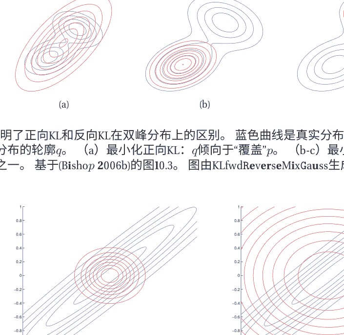

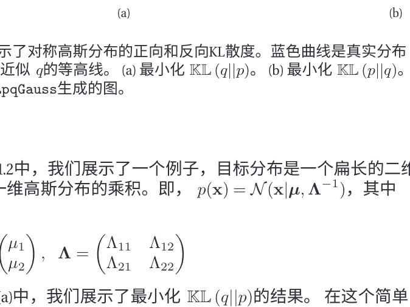

在图21.2中，我们展示了一个例子，目标分布是一个扁长的二维高斯分布，近似分布是两个一维高斯分布的乘积。即，$p(\mathbf{x}) = \mathcal{N}(\mathbf{x}|\boldsymbol{\mu}, \mathbf{\Lambda}^{-1})$，其中

$$\boldsymbol{\mu} = \begin{pmatrix} \mu_1 \ \mu_2 \end{pmatrix}, \quad \mathbf{\Lambda} = \begin{pmatrix} \Lambda_{11} & \Lambda_{12} \ \Lambda_{21} & \Lambda_{22} \end{pmatrix} \qquad (21.16)$$

在图21.2(a)中，我们展示了最小化 $\text{KL} (q\|p)$ 的结果。在这个简单的例子中，可以证明解的形式为

$$\begin{aligned} q(\mathbf{x}) & = \mathcal{N}(x_1|m_1, \Lambda_{11}^{-1}) \mathcal{N}(x_2|m_2, \Lambda_{22}^{-1}) \ m_1 & = \mu_1 - \Lambda_{11}^{-1} \Lambda_{12}(m_2 - \mu_2) \ m_2 & = \mu_2 - \Lambda_{22}^{-1} \Lambda_{21}(m_1 - \mu_1) \end{aligned} \qquad (21.17)-(21.19)$$

- 它被称为“自由”，因为变量 $\mathbf{x}$可以自由变化，而不是固定的。变分自由能是分布 $q$ 的函数，而常规能量是状态向量 $\mathbf{x}$的函数。

图21.2(a)显示我们已经正确捕捉到了均值，但近似过于紧凑：其方差由 p 的最小方差方向控制。事实上，通常情况下（尽管并非总是（Turner et al. 2008）），最小化 KL (q||p)，其中 q 是分解的，会导致过度自信的近似。

在图21.2(b)中，我们展示了最小化 KL (p||q) 的结果。正如我们在练习21.7中所展示的那样，最小化前向KL相对于分解近似的最优解是将 q 设置为边缘概率的乘积。因此，解的形式为

$$ q(\mathbf{x}) = \mathcal{N}(x_1|\mu_1, \Lambda_{11}^{-1}) \mathcal{N}(x_2|\mu_2, \Lambda_{22}^{-1}) $$

图21.2(b)显示这太宽泛了，因为它是对 p 支持的过估计。

在本章的其余部分以及下一章的大部分内容中，我们将专注于最小化 KL (q||p)。在第22.5节中，当我们讨论期望传播时，我们将讨论局部优化 KL (p||q) 的方法。

可以通过定义一个参数 α ∈ R 来创建一个族由差异度量指标索引的差异度量alpha divergence如下所示：

$$ D_{\alpha}(p||q) \triangleq \frac{4}{1-\alpha^{2}} \left( 1 - \int p(x)^{(1+\alpha)/2} q(x)^{(1-\alpha)/2} dx \right) $$

这个度量满足 D_α(p||q)=0 当且仅当 p = q，但显然不对称，因此不是一个度量。KL (p ||q) 对应于极限 α → 1，而 KL (q||p) 对应于极限 α → -1。当 α=0 时，我们得到一个与 Hellinger distance 线性相关的对称差异度量，定义如下：

$$ D_H(p||q) \triangleq \int \left( p(x)^{\frac{1}{2}} - q(x)^{\frac{1}{2}} \right)^{2} dx $$

请注意 √(D_H(p||q)) 是一个有效的距离度量，即它是对称的、非负的，并且满足三角不等式。详细信息请参见（Minka 2005）。

## 21.3 均场方法

变分推断最流行的形式之一是称为均场近似的方法（Opper and Saad 2001）。在这种方法中，我们假设后验概率是一个完全因子化的近似形式

$$ q(\mathbf{x}) = \prod_{i} q_i(\mathbf{x}_i) $$

我们的目标是解决这个优化问题：

$$ \min_{q_1, \ldots, q_D} \ KL(q||p) $$

在每个边缘分布 q_i 的参数上进行优化。在第21.3.1节中，我们推导了一种坐标下降方法，在每一步中进行以下更新：

$$ \log q_j(\mathbf{x}_j) = \mathbb{E}_{-q_j} [\log \tilde{p}(\mathbf{x})] + \text{const} $$

其中 $\tilde{p}(\mathbf{x}) = p(\mathbf{x}, \mathcal{D})$是未归一化的后验概率，符号 $\mathbb{E}_{-q_j}[f(\mathbf{x})]$表示对 $f(\mathbf{x})$关于除了 $x_j$以外的所有变量取期望。例如，如果我们有三个变量，那么

$$\mathbb{E}_{-q_2}[f(\mathbf{x})] = \sum_{x_1} \sum_{x_3} q(x_1) q_3(x_3) f(x_1, x_2, x_3) \quad (21.26)$$

在必要时，求和被替换为积分。

当更新 $q_j$ 时，我们只需要考虑与 $x_j$共享因子的变量，即 $j$的马尔可夫毯子中的项（参见第10.5.3节）；其他项被吸收到常数项中。由于我们用均值替换了相邻值，这种方法被称为均值场。这与吉布斯采样（第24.2节）非常相似，只是我们在节点之间发送均值而不是采样值。

这往往更高效，因为均值可以作为大量样本的代理。（另一方面，均值场消息是密集的，而样本是稀疏的；这使得采样在非常大的模型中更具可扩展性。）

当然，一次更新一个分布可能会很慢，因为它是一种坐标下降的形式。已经提出了几种方法来加快这种基本方法的速度，包括使用模式搜索（Honkela等人，2003年）和基于参数扩展的技术（Qi和Jaakkola，2008年）。然而，在本章中，我们不考虑这些方法。重要的是要注意，均场方法可以用来推断离散或连续的潜在数量，使用各种参数形式来表示 $q_i$，如下所示。这与我们将在后面遇到的其他变分方法形成对比，后者在适用性方面更加受限。表21.1列出了我们在本书中涵盖的一些均场的例子。

### 21.3.1 均场更新方程的推导

回想一下，变分推断的目标是最小化上界 $J(q) \geq - \log p(\mathcal{D})$。等价地，我们可以尝试最大化下界

$$L(q) \triangleq -J(q) = \sum_{\mathbf{x}} q(\mathbf{x}) \log \frac{\tilde{p}(\mathbf{x})}{q(\mathbf{x})} \leq \log p(\mathcal{D}) \quad (21.27)$$

我们将逐个项进行处理。

如果我们目标函数写成只涉及 $q_j$ 的项，并将其他所有项视为常数，我们得到

$$L(q_j) = \sum_{\mathbf{x}} \prod_{i} q_i(\mathbf{x}_i) \left[ \log \tilde{p}(\mathbf{x}) - \sum_{k} \log q_k(\mathbf{x}_k) \right] \tag{21.28}$$

$$= \sum_{\mathbf{x}_j} \sum_{\mathbf{x}_{-j}} \prod_{i \neq j} q_i(\mathbf{x}_i) \left[ \log \tilde{p}(\mathbf{x}) - \sum_{k} \log q_k(\mathbf{x}_k) \right] \tag{21.29}$$

$$= \sum_{\mathbf{x}_j} q_j(\mathbf{x}_j) \sum_{\mathbf{x}_{-j}} \prod_{i \neq j} q_i(\mathbf{x}_i) \log \tilde{p}(\mathbf{x}) \tag{21.30}$$

$$- \sum_{\mathbf{x}_j} q_j(\mathbf{x}_j) \sum_{\mathbf{x}_{-j}} \prod_{i \neq j} q_i(\mathbf{x}_i) \left[ \sum_{k \neq j} \log q_k(\mathbf{x}_k) + q_j(\mathbf{x}_j) \right] \tag{21.31}$$

$$= \sum_{\mathbf{x}_j} q_j(\mathbf{x}_j) \log f_j(\mathbf{x}_j) - \sum_{\mathbf{x}_j} q_j(\mathbf{x}_j) \log q_j(\mathbf{x}_j) + \text{常数}$$

哪里

$$\log f_j(\mathbf{x}_j) \triangleq \sum_{\mathbf{x}_{-j}} \prod_{i \neq j} q_i(\mathbf{x}_i) \log \tilde{p}(\mathbf{x}) = \mathbb{E}_{-q_j} [\log \tilde{p}(\mathbf{x})] \tag{21.32}$$

因此，我们将除了 $\mathbf{x}_j$ 之外的所有隐藏变量进行平均。因此，我们可以将 $L(q_j)$ 重写为：

$$L(q_j) = -\mathbb{KL} (q_j \| f_j) \tag{21.33}$$

我们可以通过最小化这个KL来最大化 $L$，我们可以通过设置 $q_j = f_j$ 来实现，如下所示：

$$q_j(\mathbf{x}_j) = \frac{1}{Z_j} \exp \left( \mathbb{E}_{-q_j} [\log \tilde{p}(\mathbf{x})] \right) \tag{21.34}$$

通常情况下，我们可以忽略局部归一化常数 $Z_j$，因为我们知道 $q_j$ 必须是一个归一化分布。因此，我们通常使用以下形式

$$\log q_j(\mathbf{x}_j) = \mathbb{E}_{-q_j} [\log \tilde{p}(\mathbf{x})] + \text{const} \tag{21.35}$$

$q_j$的函数形式将由变量类型 $\mathbf{x}_j$和模型形式决定。 （有时被称为自由形式优化。） 如果 $x_j$是一个离散随机变量，那么 $q_j$将是一个离散分布；如果 $x_j$是一个连续随机变量，那么 $q_j$将是某种概率密度函数。我们将在下面看到一些例子。

### 21.3.2 示例：Ising模型的均场

考虑第19.4.1节中的图像去噪示例，其中 $x_i \in \{-1, +1\}$ 是“干净”图像的隐藏像素值。我们有一个形式为的联合模型

$$p(\mathbf{x}, \mathbf{y}) = p(\mathbf{x})p(\mathbf{y}|\mathbf{x}) \tag{21.36}$$

其中先验的形式为

$$p(\mathbf{x}) = \frac{1}{Z_0} \exp(-E_0(\mathbf{x}))$$

$$E_0(\mathbf{x}) = -\sum_{i=1}^{D} \sum_{j \in \mathrm{nbr}_i} W_{ij} x_i x_j$$

而似然的形式为

$$p(\mathbf{y}|\mathbf{x}) = \prod_i p(y_i|x_i) = \sum_i \exp(-L_i(x_i))$$

因此后验的形式为

$$p(\mathbf{x}|\mathbf{y}) = \frac{1}{Z} \exp(-E(\mathbf{x}))$$

$$E(\mathbf{x}) = E_0(\mathbf{x}) - \sum_i L_i(x_i)$$

我们现在将通过完全因子化的近似来近似这个

$$q(\mathbf{x}) = \prod_i q(x_i, \mu_i)$$

其中 $\mu_i$ 是节点 $i$ 的均值。为了推导出变分参数 $\mu_i$ 的更新，我们首先写出 $\log\tilde{p}(\mathbf{x}) = -E(\mathbf{x})$，省略不涉及 $x_i$ 的项：$\log\tilde{p}(\mathbf{x}) = x_i$

$$\sum_{j \in \mathrm{nbr}_i} W_{ij} x_j + L_i(x_i) + \mathrm{const}$$

$j=i q_j(x_j)$ 进行期望，得到

$$q_i(x_i) \propto \exp \left( x_i \sum_{j \in \mathrm{nbr}_i} W_{ij} \mu_j + L_i(x_i) \right)$$

因此，我们用邻居的平均值替换邻居的状态。让

$$m_i = \sum_{j \in \mathrm{nbr}_i} W_{ij} \mu_j$$

是节点 $i$ 的平均场影响。近似边缘后验概率由以下给出

$$q_i(x_i = 1) = \frac{e^{m_i + L_i^+}}{e^{m_i + L_i^+} + e^{-m_i + L_i^-}} = \frac{1}{1 + e^{-2m_i + L_i^- - L_i^+}} = \mathrm{sigm}(2a_i)$$

$$a_i \triangleq m_i + 0.5(L_i^+ - L_i^-)$$

类似地，我们有 $q_i(x_i = -1) = \text{sigm}(-2a_i)$。从这里我们可以计算出站点 $i$ 的新均值：$\mu_i = \mathbb{E}_q$

$$ \mathbb{E}_q_i[x_i] = q_i(x_i = +1) \cdot (+1) + q_i(x_i = -1) \cdot (-1) \tag{21.48} \ = \frac{1}{1 + e^{-2a_i}} - \frac{1}{1 + e^{2a_i}} = \frac{e^{a_i}}{e^{a_i} + e^{-a_i}} - \frac{e^{-a_i}}{e^{-a_i} + e^{a_i}} = \tanh(a_i) \tag{21.49} $$

因此更新方程变为

$$ \mu_i = \tanh \left( \sum_{j \in \text{nbr}_i} W_{ij} \mu_j + 0.5(L_i^+ - L_i^-) \right) \tag{21.50} $$

另请参见练习21.6以获得这些方程的另一种推导。

我们可以通过编写将上述方程转化为一个固定点算法

$$ \mu_i^t = \tanh \left( \sum_{j \in \text{nbr}_i} W_{ij} \mu_j^{t-1} + 0.5(L_i^+ - L_i^-) \right) \tag{21.51} $$

通常最好使用形式为 damped updates of的更新

$$ \mu_i^t = (1 - \lambda) \mu_i^{t-1} + \lambda \tanh \left( \sum_{j \in \text{nbr}_i} W_{ij} \mu_j^{t-1} + 0.5(L_i^+ - L_i^-) \right) \tag{21.52} $$

对于 $0< \lambda < 1$ 我们可以同时更新所有节点，或者异步更新它们。

图21.3展示了该方法的实际应用，应用于具有均匀吸引势能的2D Ising模型， $W_{ij}=1$。我们使用带有阻尼因子 $\lambda=0.5$ 的并行更新。（如果我们不使用阻尼，往往会出现“棋盘”伪影。）

表 21.1 本书中我们提供了关于均场推断算法的详细推导的一些模型。

| 模型 | 章节 |
|------|------|
| 伊辛模型 | 章节 21.3.2 |
| 阶乘HMM | 章节 21.4.1 |
| 单变量高斯 | 章节 21.5.1 |
| 线性回归 | 章节 21.5.2 |
| 逻辑回归 | 章节 21.8.1.1 |
| 高斯混合模型 | 章节 21.6.1 |
| 潜在狄利克雷分配 | 章节 27.3.6.3 |

## 21.4 结构化均值场 *

假设后验中所有变量都是独立的是一个非常强的假设，可能导致结果不佳。有时我们可以利用问题中的可解子结构，所以我们可以高效地处理某些类型的依赖关系。这被称为结构化均值场方法(Saul和Jordan 1995)。方法与之前相同，只是我们将变量集合分组，并同时更新它们。(这是通过将第$i$组中的所有变量视为一个“超级变量”，然后在第21.3.1节中重复推导得出的。只要我们可以在每个$q_i$中进行高效的推理，整个方法就是可行的。我们下面给出一个例子。有关这个领域的一些最新工作，请参见(Bouchard-Cote和Jordan 2009)。

#### 21.4.1 示例：阶乘HMM

考虑阶乘HMM模型（Ghahramani和Jordan 1997）在第17.6.5节中介绍。假设有 $M$ 个链，每个链的长度为 $T$，并且假设每个隐藏节点有 $K$ 个状态。该模型定义如下

$$p(\mathbf{x}, \mathbf{y}) = \prod_m \prod_t p(x_{tm} | x_{t-1,m}) p(\mathbf{y}_t | x_{tm}) \quad (21.53)$$

其中 $p(x_{tm} = k | x_{t-1,m} = j) = A_{mjk}$ 是链 $m$ 的转移矩阵中的一个条目，$p(x_{1m} = k | x_{0m}) = p(x_{1m} = k) = \pi_{mk}$，是链 $m$ 的初始状态分布，以及

$$p(\mathbf{y}_t | \mathbf{x}_t) = \mathcal{N}\left( \mathbf{y}_t \middle| \sum_{m=1}^M \mathbf{W}_m x_{tm}, \mathbf{\Sigma} \right) \quad (21.54)$$

是观测模型，其中 $\mathbf{x}_{tm}$ 是 $x_{tm}$ 的1-of-$K$编码，$\mathbf{W}_m$ 是一个 $D \times K$ 矩阵（假设 $\mathbf{y}_t \in \mathbb{R}^D$）。图21.4(a)说明了当 $M = 3$ 时的模型。尽管每个链在先验上是独立的，但由于有一个观察到的共同子节点 $\mathbf{y}_t$，它们在后验中变得耦合。应用于该图的联结树算法的时间复杂度为 $O(T M K^{M+1})$。下面我们将推导出一种结构化均场算法，其时间复杂度为$O(T M K^2 I)$，其中 $I$是均场迭代的次数（通常 $I \sim 10$足以获得良好的性能）。

我们可以将精确的后验概率写成以下形式：

```
$$ p(\mathbf{x}|\mathbf{y}) = \frac{1}{Z} \exp(-E(\mathbf{x}, \mathbf{y})) $$
```

```
$$ E(\mathbf{x}, \mathbf{y}) = \frac{1}{2} \sum_{t=1}^{T} \left( \mathbf{y}_t - \sum_{m} \mathbf{W}_m \mathbf{x}_{tm} \right)^T \boldsymbol{\Sigma}^{-1} \left( \mathbf{y}_t - \sum_{m} \mathbf{W}_m \mathbf{x}_{tm} \right) - \sum_{m} \mathbf{x}_{1m}^T \tilde{\boldsymbol{\pi}}_m - \sum_{t=2}^{T} \sum_{m} \mathbf{x}_{tm}^T \tilde{\mathbf{A}}_m \mathbf{x}_{t-1,m} $$
```

其中 $\tilde{\mathbf{A}}_m \triangleq \log \mathbf{A}_m$ 和 $\tilde{\boldsymbol{\pi}}_m \triangleq \log \boldsymbol{\pi}_m$（都按元素解释）。

我们可以将后验概率近似为边缘概率的乘积，如图21.4(b)所示，但更好的近似是使用链的乘积，如图21.4(c)所示。每个链都可以通过使用前向后向算法进行可计算的单独更新。更准确地说，我们假设

```
$$ q(\mathbf{x}|\mathbf{y}) = \frac{1}{Z_q} \prod_{m=1}^{M} q(x_{1m} | \boldsymbol{\xi}_{1m}) \prod_{t=2}^{T} q(x_{tm} | x_{t-1,m}, \boldsymbol{\xi}_{tm}) $$
```

```
$$ q(x_{1m} | \boldsymbol{\xi}_{1m}) = \prod_{k=1}^{K} (\xi_{1mk} \pi_{mk})^{x_{1mk}} $$
```

```
$$ q(x_{tm} | x_{t-1,m}, \boldsymbol{\xi}_{tm}) = \prod_{k=1}^{K} \left( \xi_{tmk} \prod_{j=1}^{K} (A_{m,jk})^{x_{t-1,m,j}} \right)^{x_{tmk}} $$
```

我们看到 $\xi_{tmk}$ 参数起到了近似局部证据的作用，平均了其他链的影响。这与精确的局部证据形成对比，精确的局部证据将所有链耦合在一起。

我们可以将近似后验重新写成 $ q(\mathbf{x}) = \frac{1}{Z_q} \exp(-E_q(\mathbf{x})) $，其中

```
$$ E_q(\mathbf{x}) = - \sum_{t=1}^{T} \sum_{m=1}^{M} \mathbf{x}_{tm}^T \tilde{\boldsymbol{\xi}}_{tm} - \sum_{m=1}^{M} \mathbf{x}_{1m}^T \tilde{\boldsymbol{\pi}}_m - \sum_{t=2}^{T} \sum_{m=1}^{M} \mathbf{x}_{tm}^T \tilde{\mathbf{A}}_m \mathbf{x}_{t-1,m} $$
```

其中 $\tilde{\boldsymbol{\xi}}_{tm} = \log \boldsymbol{\xi}_{tm}$。我们看到这与精确后验具有相同的时间因素，但局部证据项不同。目标函数由以下给出

```
$$ \text{KL}(q||p) = \mathbb{E}[E] - \mathbb{E}[E_q] - \log Z_q + \log Z $$
```

其中期望值是相对于 $ q $ 取的。可以证明（练习21.8）更新的形式为

```
$$ \boldsymbol{\xi}_{tm} = \exp\left( \mathbf{W}_m^T \boldsymbol{\Sigma}^{-1} \tilde{\mathbf{y}}_{tm} - \frac{1}{2} \boldsymbol{\delta}_m \right) $$
```

```
$$ \boldsymbol{\delta}_m \triangleq \text{diag}(\mathbf{W}_m^T \boldsymbol{\Sigma}^{-1} \mathbf{W}_m) $$
```

```
$$ \tilde{\mathbf{y}}_{tm} \triangleq \mathbf{y}_t - \sum_{\ell \neq m} \mathbf{W}_\ell \mathbb{E}[\mathbf{x}_{t,\ell}] $$
```

$\xi_{tm}$ 参数扮演了局部证据的角色，对相邻链进行平均。
计算完每个链的这个值后，我们可以并行地执行前向-后向算法，使用这些近似的局部证据项来计算每个 $m$ 和 $t$ 的 $q(\mathbf{x}_m | \mathbf{y}_{1:T})$。更新成本为 $O(TMK^2)$，对于所有变分参数的完整“扫描”，因为我们必须独立地运行 $M$ 次前向-后向算法，对于每个链。这与完全因子化的近似成本相同，但更准确。

### 21.5 变分贝叶斯

到目前为止，我们一直在集中推断潜在变量 $\mathbf{z}_i$，假设模型的参数 $\boldsymbol{\theta}$ 已知。现在假设我们想要推断参数本身。如果我们进行完全因子化（即均值场）的近似，$p(\boldsymbol{\theta}|\mathcal{D}) \approx \prod_k q(\theta_k)$，我们得到一种方法，称为变分贝叶斯或 **VB**（Hinton 和 Camp 1993; MacKay 1995a; Attias 2000; **Beal** 和 **Ghahramani** 2006; Smidl 和 Quinn 2005）。$^{2}$我们在下面给出一些 **VB** 的例子，假设没有潜在变量。如果我们想要推断潜在变量和参数，并且我们对形式进行近似 $p(\boldsymbol{\theta}, \mathbf{z}_{1:N}|\mathcal{D}) \approx q(\boldsymbol{\theta}) \prod_i q_i(\mathbf{z}_i)$，我们得到一种方法，称为变分贝叶斯EM，我们在第21.6节中描述了该方法。

### 21.5.1 例子：用于单变量高斯的VB

根据（MacKay 2003, p429），让我们考虑如何应用VB来推断1维高斯分布的后验概率，$p(\mu, \lambda|\mathcal{D})$，其中 $\lambda = 1/\sigma^2$ 是精度。为了方便起见，我们将使用一个形式为的共轭先验
$$p(\mu, \lambda) = \mathcal{N}(\mu|\mu_0, (\kappa_0\lambda)^{-1})\text{Ga}(\lambda|a_0, b_0)\qquad(21.65)$$
然而，我们将使用一个近似的分解后验形式
$$q(\mu, \lambda) = q_\mu(\mu)q_\lambda(\lambda)\qquad(21.66)$$
我们不需要为分布 $q_\mu$ 和 $q_\lambda$ 指定形式；在推导过程中，最优形式将自动“落下来”（方便的是，它们分别是高斯分布和伽马分布）。

你可能会想为什么我们要这样做，因为我们知道如何计算这个模型的精确后验（第4.6.3.7节）。有两个原因。首先，这是一个有用的教学练习，因为我们可以将我们的近似质量与精确后验进行比较。其次，修改该方法以处理半共轭先验的形式 $p(\mu, \lambda) = \mathcal{N}(\mu|\mu_0, \tau_0)\text{Ga}(\lambda|a_0, b_0)$，对于这种情况，精确推断不再可行。

#### 21.5.1.1 目标分布

非标准化的对数后验具有以下形式

```
\log \tilde{p}(\mu, \lambda) = \log p(\mu, \lambda, \mathcal{D}) = \log p(\mathcal{D}|\mu, \lambda) + \log p(\mu|\lambda) + \log p(\lambda) \quad \text{(21.67)}
= \frac{N}{2}\log \lambda - \frac{\lambda}{2}\sum_{i=1}^{N} (x_i - \mu)^2 - \frac{\kappa_0 \lambda}{2} (\mu - \mu_0)^2 
\quad + \frac{1}{2} \log(\kappa_0 \lambda) + (a_0 - 1) \log \lambda - b_0 \lambda + \text{const} \quad \text{(21.68)}
```

#### 21.5.1.2 更新 \quad q_\mu(\mu)

最优形式的 \(q_\mu(\mu)\)通过对 \(\lambda\)进行平均得到：

```
\log q_\mu(\mu) = \mathbb{E}_{q_\lambda} [\log p(\mathcal{D}|\mu, \lambda) + \log p(\mu|\lambda)] + \text{常数} \quad \text{(21.69)}
= - \frac{\mathbb{E}_{q_\lambda}[\lambda]}{2} \left\{ \kappa_0 (\mu - \mu_0)^2 + \sum_{i=1}^{N} (x_i - \mu)^2 \right\} + \text{常数} \quad \text{(21.70)}
```

通过完成平方，可以证明 \(q_\mu(\mu) = \mathcal{N}(\mu|\mu_N, \kappa_N^{-1})\)，其中

```
\mu_N = \frac{\kappa_0 \mu_0 + N \bar{x}}{\kappa_0 + N}, \quad \kappa_N = (\kappa_0 + N)\mathbb{E}_{q_\lambda}[\lambda] \quad \text{(21.71)}
```

在这个阶段，我们不知道 \(q_\lambda(\lambda)\)是什么，因此我们无法计算 \(\mathbb{E}[\lambda]\)，但我们将在下面推导出来。

#### 21.5.1.3 更新 \quad q_\lambda(\lambda)

最优形式为 \(q_\lambda(\lambda)\)由以下给出

```
\log q_\lambda(\lambda) = \mathbb{E}_{q_\mu} [\log p(\mathcal{D}|\mu, \lambda) + \log p(\mu|\lambda) + \log p(\lambda)] + \text{常数} \quad \text{(21.72)}
= (a_0 - 1)\log \lambda - b_0 \lambda + \frac{1}{2}\log \lambda + \frac{N}{2}\log \lambda 
\quad - \frac{\lambda}{2}\mathbb{E}_{q_\mu} \left[ \kappa_0 (\mu - \mu_0)^2 + \sum_{i=1}^{N} (x_i - \mu)^2 \right] + \text{常数} \quad \text{(21.73)}
```

我们将其识别为Gamma分布的对数形式，因此 \(q_\lambda(\lambda) = \text{Ga}(\lambda|a_N, b_N)\)，其中

```
a_N = a_0 + \frac{N+1}{2} \quad \text{(21.74)}
b_N = b_0 + \frac{1}{2}\mathbb{E}_{q_\mu} \left[ \kappa_0 (\mu - \mu_0)^2 + \sum_{i=1}^{N} (x_i - \mu)^2 \right] \quad \text{(21.75)}
```

#### 21.5.1.4 计算期望

为了实现更新，我们需要指定如何计算各种期望。由于 $q(\mu) = \mathcal{N}(\mu | \mu_N, \kappa_N^{-1})$, 我们有

```
$$\mathbb{E}_{q(\mu)}[\mu] = \mu_N \qquad\qquad\qquad\qquad\qquad\qquad\qquad\qquad\qquad\qquad (21.76)$$
$$\mathbb{E}_{q(\mu)}[\mu^2] = \frac{1}{\kappa_N} + \mu_N^2 \qquad\qquad\qquad\qquad\qquad\qquad\qquad\qquad\qquad (21.77)$$
```

由于 $q(\lambda) = \text{Ga}(\lambda | a_N, b_N)$, 我们有

```
$$\mathbb{E}_{q(\lambda)}[\lambda] = \frac{a_N}{b_N} \qquad\qquad\qquad\qquad\qquad\qquad\qquad\qquad\qquad\qquad\qquad\quad (21.78)$$
```

现在我们可以给出更新方程的明确形式。对于 $q(\mu)$我们有

```
$$\mu_N = \frac{\kappa_0 \mu_0 + N\bar{x}}{\kappa_0 + N} \qquad\qquad\qquad\qquad\qquad\qquad\qquad\qquad\qquad\qquad\qquad (21.79)$$
$$\kappa_N = (\kappa_0 + N)\frac{a_N}{b_N} \qquad\qquad\qquad\qquad\qquad\qquad\qquad\qquad\qquad\qquad (21.80)$$
```

对于 $q(\lambda)$ 我们有

```
$$a_N = a_0 + \frac{N+1}{2} \qquad\qquad\qquad\qquad\qquad\qquad\qquad\qquad\qquad\qquad\qquad\quad (21.81)$$
$$b_N = b_0 + \kappa_0 (\mathbb{E}[\mu^2] + \mu_0^2 - 2\mathbb{E}[\mu]\mu_0) + \frac{1}{2}\sum_{i=1}^{N}(x_i^2 + \mathbb{E}[\mu^2] - 2\mathbb{E}[\mu]x_i) \qquad (21.82)$$
```

我们看到 $\mu_N$和 $a_N$实际上是固定常数，只有 $\kappa_N$和 $b_N$需要迭代更新。（实际上，可以通过解析的方法求解 $\kappa_N$和 $b_N$的固定点，但我们在这里不这样做是为了说明迭代更新方案。）

#### 21.5.1.5 插图

图21.5展示了这种方法的一个示例。绿色轮廓表示精确的后验分布，它是高斯-伽马分布。虚线红色轮廓表示多次迭代的变分近似。我们看到最终的近似解与精确解相当接近。然而，它比真实分布更“紧凑”。通常情况下，均值场推断低估了后验不确定性；有关这一点的更多讨论，请参见第21.2.2节。

#### 21.5.1.6 下界 *

在VB中，我们正在最大化 $L(q)$，这是对对数边际似然的下界：

```
$$L(q) \leq \log p(\mathcal{D}) = \log \iint p(\mathcal{D}|\mu, \lambda) p(\mu, \lambda) d\mu d\lambda \qquad\qquad\qquad\qquad\qquad\qquad\qquad\quad\ \ (21.83)$$
```

计算下界本身非常有用，有三个原因。首先，它可以用来评估算法的收敛性。其次，它可以用来评估一个人的正确性

图21.5 分解变分近似（红色）对高斯-伽马分布（绿色）的逼近。（a）初始猜测。（b）更新 $q_{\mu}$ 后。（c）更新 $q_{\lambda}$ 后。（d）收敛后（经过5次迭代）。基于 (Bishop 2006b) 的 10.4。由 `unigaussVbDemo` 生成的图。

代码：与EM一样，如果边界不单调增加，则必定存在错误。第三，边界可以用作边际似然的近似，用于贝叶斯模型选择。

不幸的是，计算这个下界涉及大量繁琐的代数运算。我们为这个例子详细解释了细节，但对于其他模型，我们将只陈述结果而不证明，甚至为了简洁起见可能会省略对边界的讨论。

对于这个模型， $L(q)$ 可以计算如下：

```
$$L(q) = \iint q(\mu, \lambda) \log \frac{p(\mathcal{D}, \mu, \lambda)}{q(\mu, \lambda)} d\mu d\lambda$$
$$= \mathbb{E} [\log p(\mathcal{D}|\mu, \lambda)] + \mathbb{E} [\log p(\mu|\lambda)] + \mathbb{E} [\log p(\lambda)] - \mathbb{E} [\log q(\mu)] - \mathbb{E} [\log q(\lambda)]$$
```

在这里，所有的期望都是关于 $q(\mu, \lambda)$ 的。我们将最后两项识别为高斯分布的熵和伽马分布的熵，它们分别为

```
$$\mathbb{H} \left(\mathcal{N}(\mu_N, \kappa_N^{-1}) \right) = -\frac{1}{2} \log \kappa_N + \frac{1}{2} \big(1 + \log(2\pi) \big)$$
$$\mathbb{H} \left(\mathrm{Ga}(a_N, b_N) \right) = \log \Gamma(a_N) - (a_N - 1) \psi(a_N) - \log(b_N) + a_N$$
```其中 $\psi(\cdot)$ 是digamma函数。

为了计算其他项，我们需要以下事实：

$$
E[\log x \mid x \sim \mathrm{Ga}(a, b)] = \psi(a) - \log(b)  \quad (21.88)
$$
$$
E[x \mid x \sim \mathrm{Ga}(a, b)] = a/b  \quad (21.89)
$$
$$
E[x \mid x \sim \mathcal{N}(\mu, \sigma^2)] = \mu  \quad (21.90)
$$
$$
E[x^2 \mid x \sim \mathcal{N}(\mu, \sigma^2)] = \mu^2 + \sigma^2  \quad (21.91)
$$

对于期望的对数似然，可以证明

$$
\begin{aligned}
E_{q(\mu, \lambda)} [\log p(D|\mu, \lambda)] \quad &(21.92) \\
= -\frac{N}{2} \log(2\pi) + \frac{N}{2} E_{q(\lambda)}[\log \lambda] - \frac{E[\lambda]_{q(\lambda)}}{2} \sum_{i=1}^{N} E_{q(\mu)}[(x_i - \mu)^2] \\
= -\frac{N}{2} \log(2\pi) + \frac{N}{2} (\psi(a_N) - \log b_N) \quad &(21.93) \\
   - \frac{N a_N}{2 b_N} (\hat{\sigma}^2 + \bar{x}^2 - 2 \mu_N \bar{x} + \mu_N^2 + \frac{1}{\kappa_N}) \quad &(21.94)
\end{aligned}
$$

其中，$\bar{x}$ 和 $\hat{\sigma}^2$ 是经验均值和方差。

对于 $\lambda$ 的先验对数期望，我们有

$$
\begin{aligned}
E_{q(\lambda)}[\log p(\lambda)] &= (a_0 - 1)E[\log \lambda] - b_0 E[\lambda] + a_0 \log b_0 - \log \Gamma(a_0) \quad (21.95) \\
&= (a_0 - 1)(\psi(a_N) - \log b_N) - b_0 \frac{a_N}{b_N} + a_0 \log b_0 - \log \Gamma(a_0) \quad (21.96)
\end{aligned}
$$

对于 $\mu$ 的预期对数先验，可以证明

$$
\begin{aligned}
E_{q(\mu, \lambda)}[\log p(\mu|\lambda)] &= \frac{1}{2} \log \frac{\kappa_0}{2\pi} + \frac{1}{2} E[\log \lambda]_{q(\lambda)} - \frac{1}{2} E_{q(\mu, \lambda)}[(\mu - \mu_0)^2 \kappa_0 \lambda] \\
&= \frac{1}{2} \log \frac{\kappa_0}{2\pi} + \frac{1}{2} (\psi(a_N) - \log b_N) \\
   &\quad - \frac{\kappa_0 a_N}{2 b_N} \left[\frac{1}{\kappa_N} + (\mu_N - \mu_0)^2\right] \quad (21.97)
\end{aligned}
$$

把它全部放在一起，我们可以展示

$$
L(q) = \frac{1}{2} \log \frac{1}{\kappa_N} + \log \Gamma(a_N) - a_N \log b_N + \text{const} \quad (21.98)
$$

这个数量在每次VB更新后单调增加。

## 21.5.2 例子：线性回归的VB

在第7.6.4节中，我们讨论了一种经验贝叶斯方法来设置岭回归的超参数，称为证据过程。特别地，我们假设了一个形式为 $p(y|X, \theta) = \mathcal{N}(Xw, \lambda^{-1})$ 的似然函数和一个形式为 $p(w) = \mathcal{N}(w|0, \alpha^{-1}I)$ 的先验分布。然后计算了 $\alpha$ 和 $\lambda$ 的二阶估计。在第13.7节中，同样的方法被扩展为处理形式为 $\mathcal{N}(\mathbf{w}|\mathbf{0}, \mathrm{diag}(\alpha)^{-1})$ 的先验，这允许每个特征有一个超参数，这种技术被称为自动相关性确定。

在本节中，我们推导了该模型的VB算法。我们遵循(Drugowitsch 2008)的介绍。³最初我们将使用以下先验分布：

$$p(\mathbf{w}, \lambda, \alpha) \quad = \quad \mathcal{N}(\mathbf{w}|\mathbf{0}, (\lambda \alpha)^{-1} \mathbf{I}) \mathrm{Ga}(\lambda|a_{0}^{\lambda}, b_{0}^{\lambda}) \mathrm{Ga}(\alpha|a_{0}^{\alpha}, b_{0}^{\alpha}) \quad (21.99)$$

我们选择使用以下分解近似来逼近后验分布：

$$q(\mathbf{w}, \alpha, \lambda) \quad = \quad q(\mathbf{w}, \lambda)q(\alpha) \quad (21.100)$$

在这些假设下，可以证明（参见 (Drugowitsch 2008) ）后验的最优形式为

$$q(\mathbf{w}, \alpha, \lambda) \quad = \quad \mathcal{N}(\mathbf{w}|\mathbf{w}_N, \lambda^{-1} \mathbf{V}_N) \mathrm{Ga}(\lambda|a_{N}^{\lambda}, b_{N}^{\lambda}) \mathrm{Ga}(\alpha|a_{N}^{\alpha}, b_{N}^{\alpha}) \quad (21.101)$$

其中

- $$\mathbf{V}_N^{-1} \quad = \quad \overline{\mathbf{A}} + \mathbf{X}^T \mathbf{X} \quad (21.102)$$
- $$\mathbf{w}_N \quad = \quad \mathbf{V}_N \mathbf{X}^T \mathbf{y} \quad (21.103)$$
- $$a_{N}^{\lambda} \quad = \quad a_{0}^{\lambda} + \frac{N}{2} \quad (21.104)$$
- $$b_{N}^{\lambda} \quad = \quad b_{0}^{\lambda} + \frac{1}{2} \left(\|\mathbf{y} - \mathbf{X}\mathbf{w}_N\|^2 + \mathbf{w}_N^T \overline{\mathbf{A}} \mathbf{w}_N \right) \quad (21.105)$$
- $$a_{N}^{\alpha} \quad = \quad a_{0}^{\alpha} + \frac{D}{2} \quad (21.106)$$
- $$b_{N}^{\alpha} \quad = \quad b_{0}^{\alpha} + \frac{1}{2} \left( \frac{a_{N}^{\lambda}}{b_{N}^{\lambda}} \mathbf{w}_N^T \mathbf{w}_N + \mathrm{tr}(\mathbf{V}_N) \right) \quad (21.107)$$
- $$\overline{\mathbf{A}} \quad = \quad \langle \alpha \rangle \mathbf{I} = \frac{a_{N}^{\alpha}}{b_{N}^{\alpha}} \mathbf{I} \quad (21.108)$$

这种方法可以直接扩展到ARD情况，使用以下先验分布：

$$p(\mathbf{w}) \quad = \quad \mathcal{N}(\mathbf{0}, \mathrm{diag}(\alpha)^{-1}) \quad (21.109)$$
$$p(\alpha) \quad = \quad \prod_{j=1}^{D} \mathrm{Ga}(\alpha_j | a_{0}^{\alpha}, b_{0}^{\alpha}) \quad (21.110)$$

计算 $\mathbf{w}$ 和 $\lambda$ 的后验分布与之前相同，只是使用 $\mathbf{A} = \mathrm{diag}(a_{j}^{\alpha N} / b_{j}^{\alpha N})$ 代替。

³ 请注意，Drugowitsch使用 $a_{0}, b_{0}$ 作为 $p(\lambda)$ 的超参数，使用 $a_{0}, b_{0}$ 作为 $p(\alpha)$ 的超参数，而(Bishop 2006b, Sec 10.3)使用 $a_{0}, b_{0}$ 作为 $p(\alpha)$ 的超参数，并将 $\lambda$ 视为固定值。为了（希望）避免混淆，我使用 $a_{0}^{\lambda}, b_{0}^{\lambda}$ 作为 $p(\lambda)$ 的超参数，使用 $a_{0}^{\alpha}, b_{0}^{\alpha}$ 作为 $p(\alpha)$ 的超参数。

后验概率 $q(\boldsymbol{\alpha})$ 的形式为

$$
q(\boldsymbol{\alpha}) = \prod_{j} \mathrm{Ga}(\alpha_{j}|a_{N_{j}}^{\alpha}, b_{N_{j}}^{\alpha}) \quad (21.111)
$$
$$
a_{N_{j}}^{\alpha} = a_{0}^{\alpha} + \frac{1}{2} \quad (21.112)
$$
$$
b_{N_{j}}^{\alpha} = b_{0}^{\alpha} + \frac{1}{2}\left( \frac{a_{N}^{\lambda}}{b_{N}^{\lambda}} w_{N,j}^{2} + (\mathbf{V}_{N})_{jj} \right) \quad (21.113)
$$

该算法在更新 $q(\mathbf{w}, \lambda)$ 和 $q(\boldsymbol{\alpha})$ 之间交替进行。一旦推断出 $\mathbf{w}$ 和 $\lambda$，后验预测就是一个学生分布，如方程式7.76所示。具体而言，对于单个数据案例，我们有

$$
p(y|\mathbf{x}, \mathcal{D}) = \mathcal{T}(y|\mathbf{w}_{N}^{T}\mathbf{x}, \frac{b_{N}^{\lambda}}{a_{N}^{\lambda}}(1+\mathbf{x}^{T}\mathbf{V}_{N}\mathbf{x}), 2a_{N}^{\lambda}) \quad (21.114)
$$

精确的边际似然可以用于模型选择，给出的是

$$
p(\mathcal{D}) = \int\int\int p(\mathbf{y}|\mathbf{X}, \mathbf{w}, \lambda)p(\mathbf{w}|\boldsymbol{\alpha})p(\lambda) d\mathbf{w} d\boldsymbol{\alpha} d\lambda \quad (21.115)
$$

我们可以计算 $\log p(\mathcal{D})$ 的一个下界，如下所示：

$$
\begin{aligned}
L(q) &= -\frac{N}{2}\log(2\pi) - \frac{1}{2}\sum_{i=1}^{N} \left( \frac{a_{N}^{\lambda}}{b_{N}^{\lambda}} (y_{i} - \mathbf{w}_{N}^{T}\mathbf{x}_{i})^{2} + \mathbf{x}_{i}^{T}\mathbf{V}_{N}\mathbf{x}_{i} \right) \\
&+ \frac{1}{2}\log |\mathbf{V}_{N}| + \frac{D}{2} \\
&- \log \Gamma(a_{0}^{\lambda}) + a_{0}^{\lambda}\log b_{0}^{\lambda} - b_{0}^{\lambda}\frac{a_{N}^{\lambda}}{b_{N}^{\lambda}} + \log \Gamma(a_{N}^{\lambda}) - a_{N}^{\lambda}\log b_{N}^{\lambda} + a_{N}^{\lambda} \\
&- \log \Gamma(a_{0}^{\alpha}) + a_{0}^{\alpha}\log b_{0}^{\alpha} + \log \Gamma(a_{N}^{\alpha}) - a_{N}^{\alpha}\log b_{N}^{\alpha} \quad (21.116)
\end{aligned}
$$

在ARD情况下，最后一行变成

$$
\sum_{j=1}^{D} \left[ -\log \Gamma(a_{0}^{\alpha}) + a_{0}^{\alpha}\log b_{0}^{\alpha} + \log \Gamma(a_{N}^{\alpha}) - a_{N}^{\alpha}\log b_{N_{j}}^{\alpha} \right] \quad (21.117)
$$

图21.6比较VB和EB在多项式回归的模型选择问题上的结果。我们可以看到VB给出了与EB类似的结果，但具体行为取决于样本大小。当 $N=5$ 时，VB对模型的后验估计比EB更加模糊，因为VB对超参数的不确定性进行建模。当 $N=30$ 时，超参数的后验估计变得更加确定。事实上，如果我们在先验分布不确定的情况下计算 $\mathbb{E}[\alpha|\mathcal{D}]$，即 $a_{0}^{\alpha}=b_{0}^{\alpha}=0$，我们得到

$$
\bar{\alpha} = \frac{a_{N}^{\alpha}}{b_{N}^{\alpha}} = \frac{D/2}{\frac{1}{2}(\frac{a_{N}^{\lambda}}{b_{N}^{\lambda}} \mathbf{w}_{N}^{T}\mathbf{w}_{N} + \mathrm{tr}(\mathbf{V}_{N}))} \quad (21.118)
$$

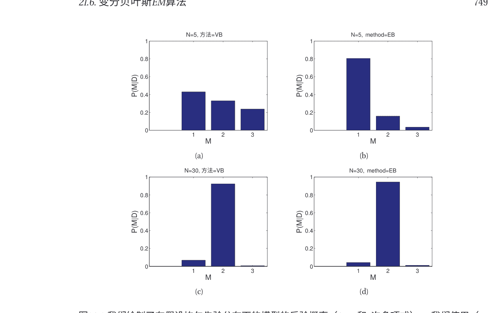

**图21.6** 我们绘制了在假设均匀先验分布下的模型的后验概率（1、2和3次多项式）。我们使用（a，c）VB和（b，d）EB来近似边际似然。在（a-b）中，我们使用N=5个数据点（如图5.7所示）。在（c-d）中，我们使用N=30个数据点（如图5.8所示）。图由linregEbModelSelVsN生成。

将其与EB的方程13.167进行比较：

$$ \hat{\alpha} = \frac{D}{\mathbb{E}[\mathbf{w}^T \mathbf{w}]} = \frac{D}{\mathbf{w}_N^T \mathbf{w}_N + \mathrm{tr}(\mathbf{V}_N)} \quad (21.119) $$

除了 $a_N^{\lambda}$ 和 $b_N^{\lambda}$ 项外，它们是相同的。事后看来，这也许并不令人惊讶，因为EB试图最大化 $\log p(\mathcal{D})$，而VB试图最大化对 $\log p(\mathcal{D})$ 的下界。

## 21.6 变分贝叶斯 EM

现在考虑形式为 $\mathbf{z}_i \rightarrow \mathbf{x}_i \leftarrow \theta$ 的潜变量模型。这包括混合模型，主成分分析，隐马尔可夫模型等。现在有两种未知数：参数 $\theta$ 和潜变量 $\mathbf{z}_i$。正如我们在第11.4节中所看到的，通常使用EM来拟合这样的模型，在E步骤中，我们推断潜变量的后验概率 $p(\mathbf{z}_i | \mathbf{x}_i, \theta)$，在M步骤中，我们计算参数的点估计 $\theta$。这样做的理由有两个。首先，它导致简单的算法。其次，$\theta$ 的后验不确定性通常小于 $\mathbf{z}_i$ 的后验不确定性，因为 $\theta$ 受到所有 $N$ 个数据案例的影响，而 $\mathbf{z}_i$ 只受到 $\mathbf{x}_i$ 的影响；这使得MAP估计的 $\theta$ 比 $\mathbf{z}_i$ 的MAP估计更合理。

然而，VB提供了一种“更贝叶斯”的方法，通过对参数 $\theta$ 和潜在变量 $\mathbf{z}_i$ 的不确定性进行建模，计算成本与EM基本相同。这种方法被称为变分贝叶斯EM或VBEM。基本思想是使用均值场，近似后验的形式为

$$p(\theta, \mathbf{z}_{1:N}|\mathcal{D}) \approx q(\theta)q(\mathbf{z}) = q(\theta) \prod_i q(\mathbf{z}_i)$$

第一个因子分解，即 $\theta$ 和 $\mathbf{z}$ 之间的分解，是使算法可行的关键假设。第二个因子分解来自于模型，因为潜在变量在给定 $\theta$ 的条件下是独立同分布的。

在VBEM中，我们交替更新 $q(\mathbf{z}_i|\mathcal{D})$（变分E步）和 $q(\theta|\mathcal{D})$（变分M步）。我们可以通过使用一个delta函数来近似参数后验，从VBEM中恢复标准EM， $q(\theta|\mathcal{D}) \approx \delta_{\hat{\theta}}(\theta)$。

变分E步骤与标准E步骤类似，只是我们需要对参数进行平均，而不是插入参数的MAP估计值并计算 $p(\mathbf{z}_i|\mathcal{D}, \hat{\theta})$。粗略地说，这可以通过插入参数的后验均值而不是MAP估计值来计算，然后使用标准算法（如前向-后向算法）计算 $p(\mathbf{z}_i|\mathcal{D}, \theta)$。不幸的是，事情并不完全如此简单，但这是基本思想。

具体细节取决于模型的形式；我们在下面给出一些例子。

变分M步骤与标准M步骤类似，只是我们不计算参数的点估计，而是更新超参数，使用期望的充分统计量。这个过程通常与常规EM中的MAP估计非常相似。再次强调，具体如何做取决于模型的形式。

VBEM相对于常规EM的主要优势在于通过边缘化参数，我们可以计算边际似然的下界，这可以用于模型选择。我们将在第21.6.1.6节中看到一个例子。VBEM也是“平等”的，因为它将参数视为“一等公民”，就像任何其他未知数量一样，而EM则在参数和潜在变量之间进行了人为区分。

### 21.6.1 示例：高斯混合的VBEM

让我们考虑如何使用VBEM“拟合”高斯混合模型。（我们使用引号，因为我们不是在估计模型参数，而是在推断它们的后验概率。）我们将按照（Bishop 2006b，第10.2节）的介绍进行。不幸的是，细节相当复杂。

幸运的是，就像EM一样，经过一点练习就会习惯。（和数学一样，仅仅阅读方程式不会有太大帮助，如果你想深入学习这些内容，你应该尝试自己推导这些结果（或者尝试一些练习题）。）

### 21.6.1.1 变分后验

似然函数是高斯混合模型的常规函数：

$$p(\mathbf{z}, \mathbf{X}|\theta) = \prod_i \prod_k \pi_k^{z_{ik}} \mathcal{N}(\mathbf{x}_i|\boldsymbol{\mu}_k, \boldsymbol{\Lambda}_k^{-1})^{z_{ik}}$$

其中 $z_{ik} = 1$ 如果数据点 $i$ 属于聚类 $k$，否则 $z_{ik} = 0$。

我们将假设以下分解共轭先验

$$p(\boldsymbol{\theta}) = \mathrm{Dir}(\boldsymbol{\pi}|\boldsymbol{\alpha}_0) \prod_k \mathcal{N}(\boldsymbol{\mu}_k|\mathbf{m}_0, (\beta_0 \boldsymbol{\Lambda}_k)^{-1}) \mathrm{Wi}(\boldsymbol{\Lambda}_k|\mathbf{L}_0, \nu_0) \qquad (21.122)$$

其中 $\boldsymbol{\Lambda}_k$ 是聚类 $k$ 的精度矩阵。下标0表示这些是先验的参数。我们假设所有先验参数对于所有聚类都是相同的。对于混合权重，我们通常使用对称先验，$\boldsymbol{\alpha}_0 = \alpha_0 \mathbf{1}$。

精确的后验概率 $p(\boldsymbol{\theta}, \mathbf{z}_{1:N}|\mathcal{D})$ 是一个由所有可能的标签 $\mathbf{z}$ 对应的 $K^N$ 分布的混合。我们将尝试近似计算围绕其中一个模式的体积。我们将使用标准的变分贝叶斯近似来近似后验概率：

$$p(\boldsymbol{\theta}, \mathbf{z}_{1:N}|\mathcal{D}) \approx q(\boldsymbol{\theta}) \prod_i q(\mathbf{z}_i) \qquad (21.123)$$

在这个阶段，我们还没有指定 $q$ 函数的形式；这将由似然函数和先验分布的形式决定。下面我们将展示最优形式如下：

$$q(\mathbf{z}, \boldsymbol{\theta}) = q(\mathbf{z}|\boldsymbol{\theta}) q(\boldsymbol{\theta}) = \left[ \prod_i \mathrm{Cat}(\mathbf{z}_i|\mathbf{r}_i) \right] \qquad (21.124)$$
$$\left[ \mathrm{Dir}(\boldsymbol{\pi}|\boldsymbol{\alpha}) \prod_k \mathcal{N}(\boldsymbol{\mu}_k|\mathbf{m}_k, (\beta_k \boldsymbol{\Lambda}_k)^{-1}) \mathrm{Wi}(\boldsymbol{\Lambda}_k|\mathbf{L}_k, \nu_k) \right] \qquad (21.125)$$

(缺少0下标意味着这些是后验的参数，而不是先验的。) 下面我们将推导出这些变分参数的更新方程。

### 21.6.1.2 推导

**$q(\mathbf{z})$ （变分E步）**

可以通过查看完整数据的对数联合来获得 $q(\mathbf{z})$ 的形式，忽略不涉及 $\mathbf{z}$ 的项，并对剩下的项关于除 $\mathbf{z}$ 之外的所有隐藏变量取期望。我们有

$$\log q(\mathbf{z}) = \mathbb{E}_{q(\boldsymbol{\theta})} [\log p(\mathbf{x}, \mathbf{z}, \boldsymbol{\theta})] + \text{常数} \qquad (21.126)$$
$$= \sum_i \sum_k z_{ik} \log \rho_{ik} + \text{常数} \qquad (21.127)$$

我们定义

$$\log \rho_{ik} \triangleq \mathbb{E}_{q(\boldsymbol{\theta})} [\log \pi_k] + \frac{1}{2} \mathbb{E}_{q(\boldsymbol{\theta})} [\log |\boldsymbol{\Lambda}_k|] - \frac{D}{2} \log (2\pi) - \frac{1}{2} \mathbb{E}_{q(\boldsymbol{\theta})} [(\mathbf{x}_i - \boldsymbol{\mu}_k)^T \boldsymbol{\Lambda}_k (\mathbf{x}_i - \boldsymbol{\mu}_k)] \qquad (21.128)$$

利用 $q(\boldsymbol{\pi}) = \mathrm{Dir}(\boldsymbol{\pi})$ 这个事实，我们有

$$\log \bar{\pi}_k \triangleq \mathbb{E} [\log \pi_k] = \psi(\alpha_k) - \psi(\sum_{k'} \alpha_{k'}) \qquad (21.129)$$其中 $\psi(\cdot)$ 是 digamma 函数。(详细推导见练习 21.5。) 接下来，我们使用以下事实

$$q(\boldsymbol{\mu}_k, \boldsymbol{\Lambda}_k) = \mathcal{N}(\boldsymbol{\mu}_k | \mathbf{m}_k, (\beta_k \boldsymbol{\Lambda}_k)^{-1}) \text{Wi}(\boldsymbol{\Lambda}_k | \mathbf{L}_k, \nu_k) \tag{21.130}$$

得到

$$\log \tilde{\Lambda}_k \triangleq \mathbb{E}[\log |\boldsymbol{\Lambda}_k|] = \sum_{j=1}^{D} \psi \left( \frac{\nu_k + 1 - j}{2} \right) + D \log 2 + \log |\mathbf{L}_k| \tag{21.131}$$

最后，对于二次型的期望值，我们得到

$$\mathbb{E}[(\mathbf{x}_i - \boldsymbol{\mu}_k)^T \boldsymbol{\Lambda}_k (\mathbf{x}_i - \boldsymbol{\mu}_k)] = D \beta_k^{-1} + \nu_k (\mathbf{x}_i - \mathbf{m}_k)^T \boldsymbol{\Lambda}_k (\mathbf{x}_i - \mathbf{m}_k) \tag{21.132}$$

将其整合起来，我们得到聚类 $k$ 对于数据点 $i$ 的后验责任为

$$r_{ik} \propto \tilde{\pi}_k \tilde{\Lambda}_k^{\frac{1}{2}} \exp \left( -\frac{D}{2\beta_k} - \frac{\nu_k}{2} (\mathbf{x}_i - \mathbf{m}_k)^T \boldsymbol{\Lambda}_k (\mathbf{x}_i - \mathbf{m}_k) \right) \tag{21.133}$$

与常规 EM 中使用的表达式进行比较：

$$r_{ik}^{EM} \propto \hat{\pi}_k |\hat{\Lambda}_k|^{\frac{1}{2}} \exp \left( -\frac{1}{2} (\mathbf{x}_i - \hat{\boldsymbol{\mu}}_k)^T \hat{\boldsymbol{\Lambda}}_k (\mathbf{x}_i - \hat{\boldsymbol{\mu}}_k) \right) \tag{21.134}$$

这种差异的重要性在第 21.6.1.7 节中进一步讨论。

## 21.6.1.3 $q(\theta)$ (变分 M 步骤的推导)

使用均值场配方，我们有

$$\begin{aligned} \log q(\boldsymbol{\theta}) &= \log p(\boldsymbol{\pi}) + \sum_k \log p(\boldsymbol{\mu}_k, \boldsymbol{\Lambda}_k) + \sum_i \mathbb{E}_{q(\mathbf{z})} [\log p(\mathbf{z}_i | \boldsymbol{\pi})] \\ &+ \sum_k \sum_i \mathbb{E}_{q(\mathbf{z})} [z_{ik}] \log \mathcal{N}(\mathbf{x}_i | \boldsymbol{\mu}_k, \boldsymbol{\Lambda}_k^{-1}) + \text{const} \end{aligned} \tag{21.135}$$

我们看到这可以分解成以下形式

$$q(\boldsymbol{\theta}) = q(\boldsymbol{\pi}) \prod_k q(\boldsymbol{\mu}_k, \boldsymbol{\Lambda}_k) \tag{21.136}$$

对于 $\boldsymbol{\pi}$ 项，我们有

$$\log q(\boldsymbol{\pi}) = (\alpha_0 - 1) \sum_k \log \pi_k + \sum_k \sum_i r_{ik} \log \pi_k + \text{常数} \tag{21.137}$$

指数化后，我们将其识别为一个狄利克雷分布：

$$\begin{aligned} q(\boldsymbol{\pi}) &= \text{Dir}(\boldsymbol{\pi} | \boldsymbol{\alpha}) \tag{21.138} \\ \alpha_k &= \alpha_0 + N_k \tag{21.139} \\ N_k &= \sum_i r_{ik} \tag{21.140} \end{aligned}$$

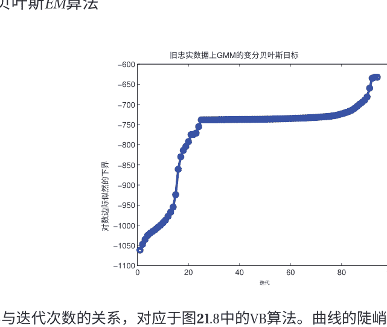

对于 $\boldsymbol{\mu}_k$ 和 $\boldsymbol{\Lambda}_k$ 项，我们有

$$q(\boldsymbol{\mu}_k, \boldsymbol{\Lambda}_k) = \mathcal{N}(\boldsymbol{\mu}_k | \mathbf{m}_k, (\beta_k \boldsymbol{\Lambda}_k)^{-1}) \mathrm{Wi}(\boldsymbol{\Lambda}_k | \mathbf{L}_k, \nu_k) \tag{21.141}$$
$$\beta_k = \beta_0 + N_k \tag{21.142}$$
$$\mathbf{m}_k = (\beta_0 \mathbf{m}_0 + N_k \bar{\mathbf{x}}_k) / \beta_k \tag{21.143}$$
$$\mathbf{L}_k^{-1} = \mathbf{L}_0^{-1} + N_k \mathbf{S}_k + \frac{\beta_0 N_k}{\beta_0 + N_k} (\bar{\mathbf{x}}_k - \mathbf{m}_0)(\bar{\mathbf{x}}_k - \mathbf{m}_0)^T \tag{21.144}$$
$$\nu_k = \nu_0 + N_k + 1 \tag{21.145}$$
$$\bar{\mathbf{x}}_k = \frac{1}{N_k} \sum_i r_{ik} \mathbf{x}_i \tag{21.146}$$
$$\mathbf{S}_k = \frac{1}{N_k} \sum_i r_{ik} (\mathbf{x}_i - \bar{\mathbf{x}}_k)(\mathbf{x}_i - \bar{\mathbf{x}}_k)^T \tag{21.147}$$

这与第11.4.2.8节中讨论的MAP估计的M步骤非常相似，只是这里我们计算的是关于 $\boldsymbol{\theta}$ 的后验参数，而不是 $\boldsymbol{\theta}$ 的MAP估计。

## 21.6.1.4 边际似然的下界

该算法试图最大化以下下界

$$\mathcal{L} = \sum_{\mathbf{z}} \int q(\mathbf{z}, \boldsymbol{\theta}) \log \frac{p(\mathbf{x}, \mathbf{z}, \boldsymbol{\theta})}{q(\mathbf{z}, \boldsymbol{\theta})} d\boldsymbol{\theta} \leq \log p(\mathcal{D}) \tag{21.148}$$

这个量应该随着每次迭代单调增加，如图21.7所示。不幸的是，推导这个界限有点复杂，因为我们需要计算未归一化的对数后验的期望以及 $q$ 分布的熵。 我们将细节（与第21.5.1.6节类似）留给练习21.4。

## 21.6.1.5 后验预测分布

我们证明了近似后验具有以下形式

$$q(\boldsymbol{\theta}) = \text{Dir}(\boldsymbol{\pi}|\boldsymbol{\alpha}) \prod_k \mathcal{N}(\boldsymbol{\mu}_k|\mathbf{m}_k, (\beta_k \boldsymbol{\Lambda}_k)^{-1}) \text{Wi}(\boldsymbol{\Lambda}_k|\mathbf{L}_k, \nu_k)$$

因此，后验预测密度可以近似如下，使用第4.6.3.6节的结果：

$$p(\mathbf{x}|\mathcal{D}) \approx \sum_z \int p(\mathbf{x}|z, \boldsymbol{\theta}) p(z|\boldsymbol{\theta}) q(\boldsymbol{\theta}) d\boldsymbol{\theta}$$
$$= \sum_k \int \pi_k \mathcal{N}(\mathbf{x}|\boldsymbol{\mu}_k, \boldsymbol{\Lambda}_k^{-1}) q(\boldsymbol{\theta}) d\boldsymbol{\theta}$$
$$= \sum_k \frac{\alpha_k}{\sum_{k'} \alpha_{k'}} \mathcal{T}(\mathbf{x}|\mathbf{m}_k, \mathbf{M}_k, \nu_k + 1 - D)$$
$$\mathbf{M}_k = \frac{(\nu_k + 1 - D) \beta_k}{1 + \beta_k} \mathbf{L}_k$$

这只是一个学生分布的加权和。如果我们使用插件近似方法，我们将得到高斯分布的加权和。

## 21.6.1.6 使用VBEM进行模型选择

在使用VB时选择K的最简单方法是拟合多个模型，然后使用变分下界来近似对数边际似然， $\mathcal{L}(K) \leq \log p(\mathcal{D}|K)$，以近似$p(K|\mathcal{D})$：

$$p(K|\mathcal{D}) = \frac{e^{\mathcal{L}(K)}}{\sum_{K'} e^{\mathcal{L}(K')}}$$

然而，下界需要在一定程度上进行修改，以考虑参数的不可识别性（第11.3.1节）。特别是，虽然VB将近似参数后验所占据的体积，但它只会在一个局部模式周围这样做。

有 $K$个组件，有 $K!$ 个等效模式，仅通过排列标签而不同。因此，我们应该使用 $\log p(\mathcal{D}|K)\approx \mathcal{L}(K) + \log(K!)$。

## 21.6.1.7 VBEM的自动稀疏诱导效应

虽然VB对边际似然提供了一个合理的近似（比BIC更好(Beal and Ghahramani 2006)），但这种方法仍然需要拟合多个模型，每个模型对应一个考虑的 $K$值。一种更快的替代方法是拟合一个单一模型，其中 $K$设置为较大的值，但 $\alpha_0$设置为非常小的值， $\alpha_0 \ll 1$。从图2.14(d)中，我们可以看到混合权重 $\pi$的先验结果在单纯形的角附近有“尖峰”，鼓励稀疏的混合权重向量。

在常规EM算法中，混合权重的MAP估计形式为 $\hat{\pi}_k \propto (\alpha_k - 1)$，其中 $\alpha_k = \alpha_0 + N_k$。不幸的是，如果 $\alpha_0=0$ 且 $N_k=0$，这可能是负数(Figueiredo and Jain 2002)。然而，在VBEM中，我们使用

$$\tilde{\pi}_k = \frac{\exp[\Psi(\alpha_k)]}{\exp[\Psi(\sum_{k'} \alpha_{k'})]} \tag{21.155}$$

所以如果 $\alpha_k = 0$，当我们计算 $\tilde{\pi}_k$ 时，就像从后验计数中减去0.5一样。这会对小的聚类群体造成更大的伤害，而不是大的聚类群体（就像是一种累进税）。<sup>4</sup> 其效果是在连续的迭代中，具有非常少（加权）成员的聚类群体变得越来越空，而受欢迎的聚类群体则变得越来越多。这被称为“富者愈富”现象；我们将在第25.2节再次遇到它，当我们讨论狄利克雷过程混合模型时。

这种自动修剪方法在图21.8中有所示。我们对Old Faithful数据集拟合了一个由6个高斯分布组成的混合模型，但数据实际上只需要2个聚类，所以其余的被“消除”了。

> <sup>4</sup> 更多细节请参见（Liang等人，2007年）。

在这个例子中，我们使用 α₀=0.001；如果我们使用更大的 α₀，就不会得到稀疏效果。在图21.9中，我们绘制了不同迭代次数下的 q(α|D)；我们可以看到不需要的组件被消除了。 这为在聚类数目上进行离散搜索提供了一种高效的替代方法。

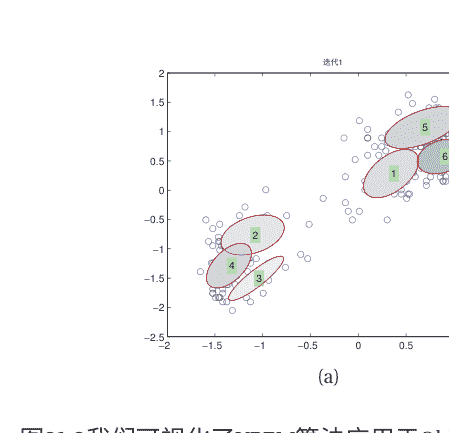

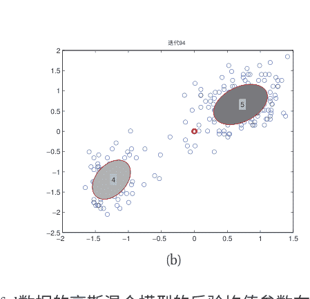

### 21.7 变分消息传递和VIBES

我们已经看到，均值场方法，至少是完全因子化的方法，都非常相似：只需计算每个节点的完全条件，并平均邻居节点。 这与吉布斯采样（第24.2节）非常相似，只是方程的推导通常要更多一些工作。 幸运的是，我们可以推导出一组适用于任何DGM的通用更新方程，只要所有CPD都属于指数族，并且所有父节点都具有共轭分布（Ghahramani和Beal，2001年）。然后，我们可以在图上进行扫描，逐个更新节点，类似于吉布斯采样的方式。 这被称为变分消息传递或VMP（Winn和Bishop，2005年），并已在开源程序VIBES<sup>5</sup>中实现。

这是一个VB模拟BUGS的程序，BUGS是一种流行的用于Gibbs采样的通用程序，讨论在第24.2.6节中。

VMP/均值场是最适合于其中一个或多个隐藏节点是连续的推断（例如，在执行“贝叶斯学习”时）。 对于所有隐藏节点都是离散的模型，可以使用更准确的近似推断算法，我们在第22章中讨论。

## 21.8 局部变分界 *

到目前为止，我们一直专注于均值场推断，这是一种基于最小化 KL(q||p̃)的变分推断形式，其中 q是近似后验，假设为分解的，和 p̃是精确（但未归一化）的后验。 然而，还有另一种类型的变分推断，我们用一个更简单的函数替换联合分布中的特定项，以简化后验的计算。 这种方法有时被称为局部变分近似，因为我们只修改模型的一部分，而不像均值场那样是全局近似。 在本节中，我们研究了几个这种方法的示例。

### 21.8.1 激发应用

在解释如何推导局部变分界限之前，我们给出一些使用这个方法有用的例子。

#### 21.8.1.1 变分逻辑回归

考虑如何在高斯先验下近似多类别逻辑回归模型的参数后验的问题。 一种方法是使用高斯（拉普拉斯）近似，如第8.4.3节所讨论的。 然而，变分方法可以产生更准确的后验近似，因为它具有可调参数。

准确逼近后验的一个优点是它具有可调参数。另一个优点是变分方法单调地优化数据似然的一个下界，我们将在后面看到。

为了看到为什么我们需要一个界限，注意似然可以写成如下形式：

$$ p(\mathbf{y}|\mathbf{X}, \mathbf{w}) = \prod_{i=1}^{N} \exp \left[ \mathbf{y}_i^{T} \boldsymbol{\eta}_i - \text{lse}(\boldsymbol{\eta}_i) \right] $$

其中 $\boldsymbol{\eta}_i = \mathbf{X}_i \mathbf{w}_i = [\mathbf{x}^{T i} \mathbf{w}_1, \dots, \mathbf{x}^{T i} \mathbf{w}_M]$, 其中 $M = C - 1$(因为我们设置 $\mathbf{w}_C = \mathbf{0}$以确保可识别性), 并且我们定义log-sum-exp或lse函数如下:

$$ \text{lse}(\boldsymbol{\eta}_i) \triangleq \log \left( 1 + \sum_{m=1}^{M} e^{\eta_{im}} \right) $$

主要问题是这个似然函数与高斯先验不共轭。下面我们讨论如何计算对这个似然函数的“类似高斯”的下界，这会导致近似的高斯后验。

## 21.8.1.2 多任务学习

贝叶斯推断在逻辑回归中的一个重要应用是当我们有多个相关的分类器需要拟合时。在这种情况下，我们希望在每个分类器的参数之间共享信息；这要求我们维护一个参数的后验分布，以便我们既有一个置信度的度量，又有一个值的估计。我们可以将上述变分方法嵌入到一个更大的层次模型中，以执行这种多任务学习，如 (Braun和McAuliffe 2010) 中所述。

## 21.8.1.3 离散因子分析

另一种情况下，变分界限很有用，是当我们将因子分析模型拟合到离散数据时。这个模型就像多项式逻辑回归，只是输入变量是隐藏因子。我们需要对隐藏变量以及回归权重进行推断。为了简单起见，我们可以对权重进行点估计，并且只集成隐藏变量。我们可以使用变分EM来做到这一点，在E步骤中使用变分界限。详细信息请参见第12.4节。

## 21.8.1.4 相关主题模型

主题模型是用于文本文档和其他形式的离散数据的潜变量模型；详细信息请参见第27.3节。通常我们假设主题分布具有狄利克雷先验，但更强大的模型，称为相关主题模型，使用了高斯先验，可以更容易地建模相关性（详细信息请参见第27.4.1节）。不幸的是，这也涉及到lse函数。然而，我们可以在变分EM算法的上下文中使用我们的变分界限，稍后我们将看到。

## 21.8.2 Bohning的二次边界到对数和指数函数

以上所有的例子都需要处理高斯先验与多项式似然的乘积；这是困难的，因为有对数和指数函数（lse）项。在本节中，我们推导出一种方法来推导出对这个似然的“类高斯”下界。

考虑围绕 $\psi_i \in \mathbb{R}^M$的lse函数的泰勒级数展开：

$$\text{lse}(\eta_i) = \text{lse}(\psi_i) + (\eta_i - \psi_i)^T \mathbf{g}(\psi_i) + \frac{1}{2} (\eta_i - \psi_i)^T \mathbf{H}(\psi_i) (\eta_i - \psi_i) \quad (21.158)$$
$$\mathbf{g}(\psi_i) = \exp[\psi_i - \text{lse}(\psi_i)] = \mathcal{S}(\psi_i) \quad (21.159)$$
$$\mathbf{H}(\psi_i) = \text{diag}(\mathbf{g}(\psi_i)) - \mathbf{g}(\psi_i)\mathbf{g}(\psi_i)^T \quad (21.160)$$

其中 $\mathbf{g}$ 和 $\mathbf{H}$是lse的梯度和Hessian矩阵，$\psi_i \in \mathbb{R}^M$被选择为满足等式的值。通过用矩阵 $\mathbf{A}_i$替换Hessian矩阵 $\mathbf{H}(\psi_i)$，可以找到lse的上界，使得 $\mathbf{A}_i \prec \mathbf{H}(\psi_i)$。(Bohning (1992))证明了如果我们使用矩阵 $\mathbf{A}_i = \frac{1}{2} \left[ \mathbf{I}_M - \frac{1}{M+1} \mathbf{1}_M \mathbf{1}_M^T \right]$。(回想一下，$M+1=C$是类别的数量。)请注意，$\mathbf{A}_i$与 $\psi_i$无关；然而，我们仍然将其写为 $\mathbf{A}_i$（而不是去掉下标$i$），因为我们在下面考虑的其他界限将具有数据相关的曲率项。因此，lse的上界变为

$$\text{lse}(\eta_i) \leq \frac{1}{2} \eta_i^T \mathbf{A}_i \eta_i - \mathbf{b}_i^T \eta_i + c_i \quad (21.161)$$
$$\mathbf{A}_i = \frac{1}{2} \left[ \mathbf{I}_M - \frac{1}{M+1} \mathbf{1}_M \mathbf{1}_M^T \right] \quad (21.162)$$
$$\mathbf{b}_i = \mathbf{A}_i \psi_i - \mathbf{g}(\psi_i) \quad (21.163)$$
$$c_i = \frac{1}{2} \psi_i^T \mathbf{A}_i \psi_i - \mathbf{g}(\psi_i)^T \psi_i + \text{lse}(\psi_i) \quad (21.164)$$

其中 $\psi_i \in \mathbb{R}^M$是变分参数的向量。我们可以使用上述结果得到以下对softmax似然的下界：

$$\log p(y_i = c|\mathbf{x}_i, \mathbf{w}) \geq \left[ \mathbf{y}_i^T \mathbf{X}_i \mathbf{w} - \frac{1}{2} \mathbf{w}^T \mathbf{X}_i \mathbf{A}_i \mathbf{X}_i \mathbf{w} + \mathbf{b}_i^T \mathbf{X}_i \mathbf{w} - c_i \right]_c \quad (21.165)$$

为了简化符号，定义伪测量

$$\tilde{\mathbf{y}}_i \triangleq \mathbf{A}_i^{-1}(\mathbf{b}_i + \mathbf{y}_i) \quad (21.166)$$

然后我们可以得到观测模型的“高斯化”版本：

$$p(\mathbf{y}_i|\mathbf{x}_i, \mathbf{w}) \geq f(\mathbf{x}_i, \psi_i) \mathcal{N}(\tilde{\mathbf{y}}_i|\mathbf{X}_i\mathbf{w}, \mathbf{A}_i^{-1}) \quad (21.167)$$

其中 $f(\mathbf{x}_i, \psi_i)$是一个不依赖于 $\mathbf{w}$的函数。鉴于此，使用高斯贝叶斯规则很容易计算后验 $q(\mathbf{w}) = \mathcal{N}(\mathbf{m}_N, \mathbf{V}_N)$。下面我们将解释如何更新变分参数 $\psi_i$。

### 21.8.2.1 将Bohning的界应用于多项式逻辑回归

让我们看看如何将这个界限应用于多项式逻辑回归。从方程式21.13中，我们可以定义变分推断的目标为最大化

$$L(q) \triangleq -\text{KL}(q(\mathbf{w}) \| p(\mathbf{w}|\mathcal{D})) + \mathbb{E}_q \left[ \sum_{i=1}^N \log p(y_i | \mathbf{x}_i, \mathbf{w}) \right] \quad (21.168)$$
$$= -\text{KL}(q(\mathbf{w}) \| p(\mathbf{w}|\mathcal{D})) + \mathbb{E}_q \left[ \sum_{i=1}^N \mathbf{y}_i^T \boldsymbol{\eta}_i - \text{lse}(\boldsymbol{\eta}_i) \right] \quad (21.169)$$
$$= -\text{KL}(q(\mathbf{w}) \| p(\mathbf{w}|\mathcal{D})) + \sum_{i=1}^N \mathbf{y}_i^T \mathbb{E}_q[\boldsymbol{\eta}_i] - \sum_{i=1}^N \mathbb{E}_q[\text{lse}(\boldsymbol{\eta}_i)] \quad (21.170)$$

其中 $q(\mathbf{w}) = \mathcal{N}(\mathbf{w}|\mathbf{m}_N, \mathbf{V}_N)$ 是近似后验。第一项只是两个高斯分布之间的KL散度，其表达式为

$$-\text{KL}(\mathcal{N}(\mathbf{m}_0, \mathbf{V}_0) \| \mathcal{N}(\mathbf{m}_N, \mathbf{V}_N)) = -\frac{1}{2} \left[ \text{tr}(\mathbf{V}_N \mathbf{V}_0^{-1}) - \log |\mathbf{V}_N \mathbf{V}_0^{-1}| + (\mathbf{m}_N - \mathbf{m}_0)^T \mathbf{V}_0^{-1} (\mathbf{m}_N - \mathbf{m}_0) - DM \right] \quad (21.171)$$

其中 $DM$ 是高斯分布的维度，我们假设先验分布为 $p(\mathbf{w}) = \mathcal{N}(\mathbf{m}_0, \mathbf{V}_0)$，通常 $\boldsymbol{\mu}_0 = \mathbf{0}_{DM}$， $\mathbf{V}_0$ 是分块对角矩阵。第二项简单地表示

$$\sum_{i=1}^N \mathbf{y}_i^T \mathbb{E}_q[\boldsymbol{\eta}_i] = \sum_{i=1}^N \mathbf{y}_i^T \tilde{\mathbf{m}}_i \quad (21.172)$$

最终项可以通过对lse的二次上界取期望来得到下界，如下所示：

$$-\sum_{i=1}^N \mathbb{E}_q[\text{lse}(\boldsymbol{\eta}_i)] \geq -\frac{1}{2} \text{tr}(\mathbf{A}_i \tilde{\mathbf{V}}_i) - \frac{1}{2} \tilde{\mathbf{m}}_i^T \mathbf{A}_i \tilde{\mathbf{m}}_i + \mathbf{b}_i^T \tilde{\mathbf{m}}_i - c_i \quad (21.173)$$

将所有这些放在一起，我们有

$$L_{QJ}(q) \geq -\frac{1}{2} \left[ \text{tr}(\mathbf{V}_N \mathbf{V}_0^{-1}) - \log |\mathbf{V}_N \mathbf{V}_0^{-1}| + (\mathbf{m}_N - \mathbf{m}_0)^T \mathbf{V}_0^{-1} (\mathbf{m}_N - \mathbf{m}_0) \right] -\frac{1}{2} DM + \sum_{i=1}^N \mathbf{y}_i^T \tilde{\mathbf{m}}_i - \frac{1}{2} \text{tr}(\mathbf{A}_i \tilde{\mathbf{V}}_i) - \frac{1}{2} \tilde{\mathbf{m}}_i^T \mathbf{A}_i \tilde{\mathbf{m}}_i + \mathbf{b}_i^T \tilde{\mathbf{m}}_i - c_i \quad (21.174)$$

这个下界结合了Jensen不等式（如均值场推断）和由lse项导致的二次下界，因此我们将其写为 $L_{QJ}$。

我们将使用坐标上升法来优化这个下界。也就是说，我们更新变分后验参数 $\mathbf{V}_N$ 和 $\mathbf{m}_N$，然后更新变分似然参数 $\psi_i$。我们留下详细的推导作为练习，并且只陈述结果。我们有

$$\mathbf{V}_N = \left( \mathbf{V}_0 + \sum_{i=1}^N \mathbf{X}_i^T \mathbf{A}_i \mathbf{X}_i \right)^{-1} \quad (21.175)$$
$$\mathbf{m}_N = \mathbf{V}_N \left( \mathbf{V}_0^{-1} \mathbf{m}_0 + \sum_{i=1}^N \mathbf{X}_i^T (\mathbf{y}_i + \mathbf{b}_i) \right) \quad (21.176)$$
$$\psi_i = \tilde{\mathbf{m}}_i = \mathbf{X}_i \mathbf{m}_N \quad (21.177)$$

我们可以利用 $\mathbf{A}_i$ 是一个常数矩阵的事实，再加上 $\mathbf{X}_i$ 具有块结构的事实，来简化前两项如下：

$$\mathbf{V}_N = \left( \mathbf{V}_0 + \mathbf{A} \otimes \sum_{i=1}^N \mathbf{x}_i \mathbf{x}_i^T \right)^{-1} \quad (21.178)$$
$$\mathbf{m}_N = \mathbf{V}_N \left( \mathbf{V}_0^{-1} \mathbf{m}_0 + \sum_{i=1}^N (\mathbf{y}_i + \mathbf{b}_i) \otimes \mathbf{x}_i \right) \quad (21.179)$$

其中 $\otimes$ 表示克罗内克积。请参考算法15的伪代码，以及 http://www.cs.ubc.ca/~emtiyaz/software/catLGM.html 提供的一些Matlab代码。

## 算法 21.1: 使用 Bohning 的变分推断进行多类 logistic 回归

1.  输入: $y_i \in \{1, \dots, C\}, \mathbf{x}_i \in \mathbb{R}^D, i = 1 : N$, 先验 $\mathbf{m}_0, \mathbf{V}_0$。
2.  定义 $M := C - 1$; 将 $\mathbf{y}_i$ 进行虚拟编码 $M$; 定义 $\mathbf{X}_i = \text{blockdiag}(\mathbf{x}_i^T)$。
3.  定义 $\mathbf{y} := [\mathbf{y}_1; \dots; \mathbf{y}_N]$, $\mathbf{X} := [\mathbf{X}_1; \dots; \mathbf{X}_N]$ 和 $\mathbf{A} := \frac{1}{2} \left[ \mathbf{I}_M - \frac{1}{M+1} \mathbf{1}_M \mathbf{1}_M^T \right]$。
4.  $\mathbf{V}_N := (\mathbf{V}_0^{-1} + \sum_{i=1}^N \mathbf{X}_i^T \mathbf{A} \mathbf{X}_i)^{-1}$。
5.  初始化 $\mathbf{m}_N := \mathbf{m}_0$。
6.  重复
    7.  $\mathbf{\psi} := \mathbf{X} \mathbf{m}_N$。
    8.  $\mathbf{\Psi} := \text{reshape}(\mathbf{\psi}, M, N)$。
    9.  $\mathbf{G} := \exp(\mathbf{\Psi} - \text{lse}(\mathbf{\Psi}))$。
    10. $\mathbf{B} := \mathbf{A} \mathbf{\Psi} - \mathbf{G}$。
    11. $\mathbf{b} := \text{vec}(\mathbf{B})$。
    12. $\mathbf{m}_N := \mathbf{V}_N (\mathbf{V}_0^{-1} \mathbf{m}_0 + \mathbf{X}^T (\mathbf{y} + \mathbf{b}))$。
    13. 使用方程式21.174计算下界 $L_{QJ}$。
14.  直到收敛。
15.  返回 $\mathbf{m}_N$ 和 $\mathbf{V}_N$。

## 21.8.3 sigmoid函数的边界

在许多模型中，我们只有二进制数据。在这种情况下，我们有 $y_i \in \{0, 1\}, M = 1$ 和 $\eta_i = \mathbf{w}^T \mathbf{x}_i$ 其中 $\mathbf{w} \in \mathbb{R}^D$ 是一个权重向量（不是矩阵）。在这种情况下，Bohning边界变成

$$\log(1 + e^{\eta}) \leq \frac{1}{2}a\eta^{2} - b\eta + c \quad (21.180)$$
$$a = \frac{1}{4} \quad (21.181)$$
$$b = a\psi - (1+e^{-\psi})^{-1} \quad (21.182)$$
$$c = \frac{1}{2}a\psi^{2} - (1+e^{-\psi})^{-1}\psi + \log(1+e^{\psi}) \quad (21.183)$$

可以推导出这种情况的另一种二次界限，如(Jaakkola and Jordan 1996b, 2000)所示。它具有以下形式

$$\log(1+e^{\eta}) \leq \lambda(\xi)(\eta^{2} - \xi^{2}) + \frac{1}{2}(\eta-\xi) + \log(1+e^{\xi}) \quad (21.184)$$
$$\lambda(\xi) \triangleq \frac{1}{4\xi} \tanh(\xi/2) = \frac{1}{2\xi} [\text{sigm}(\xi) - \frac{1}{2}] \quad (21.185)$$

我们将其称为JJ界限，以其发明者(Jaakkola and Jordan 1996b, 2000)命名。为了便于与Bohning的界限进行比较，让我们将JJ界限重新写成二次形式如下

$$\log(1+e^{\eta}) \leq \frac{1}{2}\alpha(\xi)\eta^{2} - \beta(\xi)\eta + \gamma(\xi) \quad (21.186)$$
$$\alpha(\xi) = 2\lambda(\xi) \quad (21.187)$$
$$\beta(\xi) = -\frac{1}{2} \quad (21.188)$$
$$\gamma(\xi) = -\lambda(\xi)\xi^{2} - \frac{1}{2}\xi + \log(1+e^{\xi}) \quad (21.189)$$

JJ界限具有自适应曲率项，因为 $\alpha$ 取决于 $\xi$。此外，从图21.10(b)可以明显看出，JJ界限在两个点上是紧的。相比之下，Bohning界限是一个恒定的曲率界限，在一个点上是紧的，如图21.10(a)所示。

如果我们希望对二元逻辑回归使用JJ界限，我们可以对算法15进行一些小的修改。首先，我们使用新的定义来表示 $a_i$，$b_i$ 和 $c_i$。使用JJ界限时，与使用Bohning界限不同的是，$a_i$ 不是常数，这意味着我们不能在主循环之外计算 $V_N$，使得该方法变慢了一个常数因子。

接下来，我们注意到 $X_i = x_i^T$，因此后验的更新变为

$$\begin{aligned}
\mathbf{V}_N^{-1} &= \mathbf{V}_0^{-1} + 2 \sum_{i=1}^N \lambda(\xi_i) \mathbf{x}_i \mathbf{x}_i^T \quad & (21.190)\\
\mathbf{m}_N &= \mathbf{V}_N \left( \mathbf{V}_0^{-1} \mathbf{m}_0 + \sum_{i=1}^N \left(y_i - \frac{1}{2}\right) \mathbf{x}_i \right) \quad & (21.191)
\end{aligned}$$

最后，为了计算 $\xi_i$ 的更新，我们将 $L_{QJ}$ 中依赖于 $\xi_i$ 的项分离出来，得到

$$L(\boldsymbol{\xi}) = \sum_{i=1}^N \{\ln \text{ sigm}(\xi_i) - \xi_i/2 - \lambda(\xi_i)(\mathbf{x}_i^T \mathbb{E}_q [\mathbf{w} \mathbf{w}^T] \mathbf{x}_i - \xi_i^2)\} + \text{常数} \quad (21.192)$$

对 $\xi_i$ 进行优化得到方程

$$0 = \lambda'(\xi_i)(\mathbf{x}_i^T \mathbb{E}_q [\mathbf{w} \mathbf{w}^T] \mathbf{x}_i - \xi_i^2) \quad (21.193)$$

现在 $\lambda'(\xi_i)$ 对于 $\xi_i \geq 0$ 是单调的，我们不需要考虑 $\xi_i$ 的负值，因为关于 $\xi_i = 0$ 的边界对称性（见图21.10）。因此，使上述表达式为0的唯一方法是如果我们有 $(\mathbf{x}_i^T \mathbb{E} [\mathbf{w} \mathbf{w}^T] \mathbf{x}_i - \xi_i^2) = 0$。因此，更新变为

$$(\xi_i^{\text{new}})^2 = \mathbf{x}_i^T (\mathbf{V}_N + \mathbf{m}_N \mathbf{m}_N^T) \mathbf{x}_i \quad (21.194)$$

尽管JJ界限比Bohning界限更紧，但有时候它不够紧以准确估计后验协方差。一种更准确的方法是使用分段二次上界来估计lse，详见(Marlin et al. 2011)。通过增加分段数，可以使界限任意紧。

## 21.8.4 其他对数和指数求和函数的界限和近似

我们可以使用几种其他的界限和近似来计算多类别lse函数，以下是简要总结。然而，请注意所有这些都需要数值优化方法来计算 $\mathbf{m}_N$ 和 $\mathbf{V}_N$，使得实现更加复杂。

### 21.8.4.1 乘积sigmoid函数

(Bouchard 2007)中的方法利用了这个事实

$$\log \left( \sum_{k=1}^K e^{\eta_k} \right) \leq \alpha + \sum_{k=1}^K \log(1 + e^{\eta_k - \alpha}) \quad (21.195)$$

然后将JJ界应用于右侧的项。

## 21.8.4.2 Jensen不等式

(Blei和Lafferty 2006a, 2007) 中的方法使用Jensen不等式如下：

$$ E_q [\text{lse}(\eta_i)] = E_q \left[ \log \left( 1 + \sum_{c=1}^M \exp(\mathbf{x}_i^T \mathbf{w}_c) \right) \right] \quad (21.196) $$

$$ \leq \log \left( 1 + \sum_{c=1}^M E_q [\exp(\mathbf{x}_i^T \mathbf{w}_c)] \right) \quad (21.197) $$

$$ \leq \log \left( 1 + \sum_{c=1}^M \exp(\mathbf{x}_i^T \mathbf{m}_{N,c} + \frac{1}{2} \mathbf{x}_i^T \mathbf{V}_{N,cc} \mathbf{x}_i) \right) \quad (21.198) $$

最后一项是由对数正态分布的均值得到的，即 $e^{\mu + \sigma^2 / 2}$。

## 21.8.4.3 多元三角法

(Ahmed和Xing 2007; Braun和McAuliffe 2010) 中的方法使用多元三角法，这是一种使用泰勒级数展开来近似函数的矩的方法。

更详细地说，让 $f(\mathbf{w})$ 是我们感兴趣的函数。 在点 $\mathbf{m}$ 附近使用二阶近似，我们有

$$ f(\mathbf{w}) \approx f(\mathbf{m}) + (\mathbf{w} - \mathbf{m})^T \mathbf{g}(\mathbf{w} - \mathbf{m}) + \frac{1}{2} (\mathbf{w} - \mathbf{m})^T \mathbf{H} (\mathbf{w} - \mathbf{m}) \quad (21.199) $$

其中 $\mathbf{g}$ 和 $\mathbf{H}$ 是在点 $\mathbf{m}$ 处求得的梯度和海森矩阵。 如果 $q(\mathbf{w}) = \mathcal{N}(\mathbf{w}|\mathbf{m}, \mathbf{V})$，我们有

$$ E_q [f(\mathbf{w})] \approx f(\mathbf{m}) + \frac{1}{2} \text{tr}[\mathbf{H} \mathbf{V}] \quad (21.200) $$

如果我们使用 $f(\mathbf{w}) = \text{lse}(\mathbf{X}_i \mathbf{w})$，我们得到

$$ E_q [\text{lse}(\mathbf{X}_i \mathbf{w})] \approx \text{lse}(\mathbf{X}_i \mathbf{m}) + \frac{1}{2} \text{tr}[\mathbf{X}_i \mathbf{H} \mathbf{X}_i^T \mathbf{V}] \quad (21.201) $$

其中 $\mathbf{g}$ 和 $\mathbf{H}$ 对于 $\text{lse}$ 函数的定义在方程21.159和21.160中。

#### 21.8.5 基于上界的变分推断

到目前为止，我们一直集中在下界上。 然而，有时我们需要使用一个上界。 例如，(Saul et al. 1996)推导出了一个用于sigmoid信念网络的均值场算法，其中每个CPD是一个逻辑回归函数(Neal 1992)。 与Ising模型的情况不同，得到的MRF不是成对的，而是包含更高阶的相互作用。

这使得标准的均值场更新变得棘手。 特别地，它们需要计算一个需要评估的表达式

$$ E \left[ \log(1 + e^{-\sum_{j \in \text{pa}_i} w_{ij} x_j}) \right] = E \left[ -\log \text{sigm}(\mathbf{w}_i^T \mathbf{x}_{\text{pa}(i)}) \right] \quad (21.202) $$

(注意前面的负号。) (Saul等人, 1996年) 展示了如何推导出一个上界，使得这个更新过程易于处理，从而得到一个单调收敛的推断过程。

## 练习

### 练习21.1 对于一个一元高斯分布，使用拉普拉斯近似来估计 $p(\mu, \log \sigma|\mathcal{D})$

使用一个无信息先验 $p(\mu, \log \sigma) \propto 1$，计算一个高斯分布的拉普拉斯近似 $p(\mu, \log\sigma|\mathcal{D})$。

### 练习21.2 对于正态-伽马分布，使用拉普拉斯近似

考虑使用一个无信息的正态-伽马先验来估计高斯分布的 $\mu$ 和 $\ell = \log \sigma$。对数后验为

$$ \log p(\mu, \ell|\mathcal{D}) = -n\log\sigma - \frac{1}{2\sigma^2}[ns^2 + n(\bar{y} - \mu)^2] $$

- a. 证明一阶导数为

$$ \frac{\partial}{\partial \mu} \log p(\mu, \ell|\mathcal{D}) = \frac{n(\bar{y} - \mu)}{\sigma^2} $$

$$ \frac{\partial}{\partial \ell} \log p(\mu, \ell|\mathcal{D}) = -n + \frac{ns^2 + n(\bar{y} - \mu)^2}{\sigma^2} $$

- b. 证明Hessian矩阵为

$$ \mathbf{H} = \begin{pmatrix} \frac{\partial^2}{\partial \mu^2} \log p(\mu, \ell|\mathcal{D}) & \frac{\partial^2}{\partial \mu \partial \ell} \log p(\mu, \ell|\mathcal{D}) \\ \frac{\partial^2}{\partial \ell \partial \mu} \log p(\mu, \ell|\mathcal{D}) & \frac{\partial^2}{\partial \ell^2} \log p(\mu, \ell|\mathcal{D}) \end{pmatrix} $$

$$ = \begin{pmatrix} -\frac{n}{\sigma^2} & -\frac{2n(\bar{y}-\mu)}{\sigma^2} \\ -\frac{2n(\bar{y}-\mu)}{\sigma^2} & -\frac{2}{\sigma^2}(ns^2 + n(\bar{y} - \mu)^2) \end{pmatrix} $$

- c. 利用此推导出对后验分布 $p(\mu, \ell|\mathcal{D})$的拉普拉斯近似。

### 练习21.3 变分贝叶斯下界对于一维高斯分布

填写21.5.1.6节推导的细节。

### 练习21.4 变分贝叶斯下界对于高斯混合模型

考虑在第21.6.1.4节中使用VBEM来处理GMMs。证明下界具有以下形式

$$ \mathcal{L} = \mathbb{E}[\ln p(\mathbf{x}|\mathbf{z}, \boldsymbol{\mu}, \boldsymbol{\Lambda})] + \mathbb{E}[\ln p(\mathbf{z}|\boldsymbol{\pi})] + \mathbb{E}[\ln p(\boldsymbol{\pi})] + \mathbb{E}[\ln p(\boldsymbol{\mu}, \boldsymbol{\Lambda})] - \mathbb{E}[\ln q(\mathbf{z})] - \mathbb{E}[\ln q(\boldsymbol{\pi})] - \mathbb{E}[\ln q(\boldsymbol{\mu}, \boldsymbol{\Lambda})] $$

其中

$$ \mathbb{E}[\ln p(\mathbf{x}|\mathbf{z}, \boldsymbol{\mu}, \boldsymbol{\Lambda})] = \frac{1}{2}\sum_k N_k \left\{ \ln \tilde{\Lambda}_k - D\beta_k^{-1} - \nu_k \operatorname{tr}(\mathbf{S}_k\mathbf{L}_k) -\nu_k(\bar{\mathbf{x}}_k - \mathbf{m}_k)^T\mathbf{L}_k(\bar{\mathbf{x}}_k - \mathbf{m}_k) - D\ln(2\pi) \right\} $$

$$ \mathbb{E}[\ln p(\mathbf{z}|\boldsymbol{\pi})] = \sum_i \sum_k r_{ik} \ln \pi_k $$

$$ \mathbb{E}[\ln p(\boldsymbol{\pi})] = \ln C_{dir}(\boldsymbol{\alpha}_0) + (\alpha_0 - 1) \sum_k \ln \pi_k $$

$$ \mathbb{E}[\ln p(\boldsymbol{\mu}, \boldsymbol{\Lambda})] = \frac{1}{2}\sum_k \left\{ D\ln(\beta_0/2\pi) + \ln \tilde{\Lambda}_k - \frac{D\beta_0}{\beta_k} -\beta_0\nu_k(\mathbf{m}_k - \mathbf{m}_0)^T\mathbf{L}_k(\mathbf{m}_k - \mathbf{m}_0) + \ln C_{W_i}(\mathbf{L}_0, \nu_0) + \frac{\nu_0 - D - 1}{2} \ln \tilde{\Lambda}_k - \frac{1}{2}\nu_k\operatorname{tr}(\mathbf{L}_0^{-1}\mathbf{L}_k) \right\} $$

$$ \mathbb{E}[\ln q(\mathbf{z})] = \sum_i \sum_k r_{ik} \ln r_{ik} $$

$$ \mathbb{E}[\ln q(\boldsymbol{\pi})] = \sum_k (\alpha_k - 1) \ln \pi_k + \ln C_{dir}(\boldsymbol{\alpha}) $$

$$ \mathbb{E}[\ln q(\boldsymbol{\mu}, \boldsymbol{\Lambda})] = \sum_k \left\{ \frac{1}{2} \ln \tilde{\Lambda}_k + \frac{D}{2} \ln \left( \frac{\beta_k}{2\pi} \right) - \frac{D}{2} - \mathbb{H}(q(\boldsymbol{\Lambda}_k)) \right\} $$

其中，狄利克雷和维沙特的归一化常数为

$$ C_{dir}(\boldsymbol{\alpha}) \triangleq \frac{\Gamma(\sum_k \alpha_k)}{\prod_k \Gamma(\alpha_k)} $$

$$ C_{W_i}(\mathbf{L}, \nu) \triangleq |\mathbf{L}|^{-\nu/2} \left( 2^{\nu D/2} \Gamma_D(\nu/2) \right)^{-1} $$

$$ \Gamma_D(\alpha) \triangleq \pi^{D(D-1)/4} \prod_{j=1}^{D} \Gamma(\alpha + (1-j)/2) $$

其中 $\Gamma_D(\nu)$是多元伽玛函数。最后，Wishart的熵由以下公式给出

$$ \mathbb{H}(\mathrm{Wi}(\mathbf{L}, \nu)) = -\ln C_{W_i}(\mathbf{L}, \nu) - \frac{\nu - D - 1}{2} \mathbb{E}[\ln |\mathbf{\Lambda}|] + \frac{\nu D}{2} $$

其中 $\mathbb{E}[\ln |\mathbf{\Lambda}|]$由方程21.131给出。

### 练习21.5 在Dirichlet分布下推导 $\mathbb{E}[\log \pi_k]$

证明

$$ \exp(\mathbb{E}[\log \pi_k]) = \frac{\exp(\Psi(\alpha_k))}{\exp(\Psi(\sum_{k'} \alpha_{k'}))} $$

其中 $\pi \sim \mathrm{Dir}(\alpha)$。

### 练习21.6 对于Ising模型的均场更新的替代推导

通过逐个优化变分自由能的项，推导出方程21.50。

### 练习21.7 正向KL散度与反向KL散度的比较

（来源：（MacKay 2003）的练习33.7。）考虑一个分解的近似 $q(x, y) = q(x)q(y)$ 到一个联合分布 $p(x, y)$。证明为了最小化正向KL散度 $KL(p||q)$ 我们应该设置 $q(x) = p(x)$ 和 $q(y) = p(y)$，即最优的近似是边缘概率的乘积。

现在考虑以下联合分布，其中行代表 $y$，列代表 $x$。

|   | x 1 | x 2 | x 3 | x 4 |
| :--- | :--- | :--- | :--- | :--- |
| 1 | 1/8 | 1/8 | 0 | 0 |
| 2 | 1/8 | 1/8 | 0 | 0 |
| 3 | 0 | 0 | 1/4 | 0 |
| 4 | 0 | 0 | 0 | 1/4 |

证明对于这个 $p$ 的反向KL散度 $KL(q|| p)$ 有三个不同的最小值。确定这些最小值并计算在每个最小值处的 $KL(q||p)$ 的值。如果我们设置 $q(x, y) = p(x) p(y)$，那么 $KL(q||p)$ 的值是多少。

### 练习 21.8 推导FHMM的结构均场更新

在第21.4.1节中推导更新。

### 练习 21.9 具有sigmoid链接的二进制FA的变分EM

考虑二进制FA模型：

$$ p(\mathbf{x}_i|\mathbf{z}_i, \boldsymbol{\theta}) = \prod_{j=1}^{D} \text{Ber}(x_{ij} | \text{sigm}(\mathbf{w}_j^T \mathbf{z}_i + \beta_j)) = \prod_{j=1}^{D} \text{Ber}(x_{ij} | \text{sigm}(\eta_{ij})) \quad (21.221) $$
$$ \eta_i = \tilde{\mathbf{W}} \tilde{\mathbf{z}}_i \quad (21.222) $$
$$ \tilde{\mathbf{z}}_i \triangleq (\mathbf{z}_i; 1) \quad (21.223) $$
$$ \tilde{\mathbf{W}} \triangleq (\mathbf{W}, \boldsymbol{\beta}) \quad (21.224) $$
$$ p(\mathbf{z}_i) = \mathcal{N}(\mathbf{0}, \mathbf{I}) \quad (21.225) $$

使用Jaakkola-Jordan界推导出EM算法来拟合这个模型。提示：答案在（Tipping 1998）中，但是练习要求你推导这些方程。

### 练习 21.10 使用 probit 连接的二进制 FA 的 VB

在第 11.4.6 节中，我们展示了如何使用 EM 方法拟合 probit 回归，使用的模型形式为 $p(y_i =1|z_i) = \mathbb{I}(z_i > 0)$，其中 $z_i \sim \mathcal{N}(\mathbf{w}^T \mathbf{x}_i, 1)$是潜变量。现在考虑输入 $\mathbf{x}_i$ 也是未知的情况，就像二元因子分析一样。展示如何使用变分贝叶斯拟合这个模型，对后验进行近似，形式为 $q(\mathbf{x}, \mathbf{z}, \mathbf{W}) = \prod_{i=1}^{N} q(\mathbf{x}_i)q(\mathbf{z}_i) \prod_{l=1}^{L} q(\mathbf{w}_l)$。提示：$q(\mathbf{x}_i)$和$q(\mathbf{w}_l)$将是高斯分布，而 $q(\mathbf{z}_i)$将是截断的一元高斯分布。

## 22 更多的变分推断

### 22.1 引言

在第21章中，我们讨论了均值场推断，它通过边缘分布的乘积来近似后验分布。这使我们能够为每个变量使用不同的参数形式，在对统计模型的参数进行贝叶斯推断时特别有用（例如高斯或GMM的均值和方差，或GLM中的回归权重），正如我们在讨论变分贝叶斯和VB-EM时所看到的。

在本章中，我们讨论了一种稍微不同的变分推断方法。基本思想是最小化 $J(q) = KL(q||\tilde{p})$，其中 $\tilde{p}$ 是之前的精确但未归一化的后验分布，但我们不再要求 $q$ 是分解的。事实上，我们甚至不要求 $q$ 是全局有效的联合分布。相反，我们只要求 $q$ 在局部上是一致的，也就是说，两个相邻节点的联合分布与相应的边缘分布一致（我们将在下面更准确地定义这一点）。

除了这种新型推理方法外，我们还将讨论在离散图模型中用于MAP状态估计的近似方法。事实证明，解决MAP问题的算法与计算边际概率的一些近似方法非常相似，我们将会看到。

### 22.2 循环置信传播：算法问题

对于离散（或高斯）图模型，有一种非常简单的近似推理算法，称为循环置信传播或LBP。基本思想非常简单：即使图中存在循环（即非树形结构），我们也将应用第20.2节中的置信传播算法。这种方法简单高效，在实践中通常表现良好，优于均值场（Weiss 2001）。在本节中，我们将更详细地讨论该算法。

在下一节中，我们将从变分推理的角度分析该算法。

#### 22.2.1 简要历史

当应用于循环图时，BP不能保证给出正确的结果，甚至可能不收敛。事实上，Judea Pearl在1988年对于循环BP写道：

> 当存在循环时，网络不再是单一连接的，局部传播方案总会遇到麻烦...如果我们忽略循环的存在，并允许节点继续彼此通信，就好像网络是单一连接的，消息可能会在循环中无限循环，进程可能不会收敛到稳定的平衡...这种振荡通常不会在概率网络中发生...随着时间的推移，这种渐近平衡并不一致，因为它不代表网络中所有节点的后验概率 — (Pearl 1988, p.195)

尽管存在这些保留意见，Pearl提倡在循环网络中使用信念传播作为近似方案(J. Pearl, 个人通信)，并且(Pearl 1988)中的练习4.7研究了将其应用于特定循环信念网络时的近似质量。

然而，对BP的兴趣主要是由McEliece等人（1998年）展示的一个事实引起的，他们表明一个被称为Turbo码的流行纠错算法（Berrou等人，1993年）可以被看作是应用于某种图形的BP的一个实例。这是一个重要的观察，因为Turbo码已经非常接近Shannon证明的编码效率的理论下界。（另一种方法，称为低密度奇偶校验或LDPC码，已经实现了可比较的性能；它也使用LBP进行解码-请参见图22.1的示例。）在（Murphy等人，1999年）中，实验证明LBP在纠错码上下文之外的其他类型的图形模型推理中也表现良好，自那时以来，该方法已被广泛应用于许多不同的应用领域。

#### 22.2.2 对成对模型的LBP

我们现在讨论如何将LBP应用于具有成对因子的无向图模型（我们将在下一节讨论涉及更高阶因子的有向情况）。这种方法很简单：只需不断应用方程20.11和20.10直到收敛。请参见伪代码Algorithm 8和Matlab代码beliefPropagation。我们将很快讨论收敛和准确性等问题。

**算法22.1: 循环置信传播用于成对的MRF**
| 步骤 | 描述 |
| :--- | :--- |
| 1 | **输入：** 节点势 ψ_s(x_s)，边势 ψ_st(x_s, x_t); |
| 2 | **初始化** 消息 m_{s→t}(x_t) = 1 对于所有边 s−t; |
| 3 | **初始化** 置信 bel_s(x_s) = 1 对于所有节点 s; |
| 4 | **重复** |
| 5 |   在每条边上发送消息<br>   m_{s→t}(x_t) = Σ_{x_s} (ψ_s(x_s)ψ_st(x_s, x_t) ∏_{u∈nbrs\{t}} m_{u→s}(x_s)); |
| 6 |   更新每个节点的置信 bel_s(x_s) ∝ ψ_s(x_s) ∏_{t∈nbrs} m_{t→s}(x_s); |
| 7 | **直到** 置信不显著改变; |
| 8 | **返回** 边际置信 bel_s(x_s); |

## 22.2. 循环置信传播：算法问题

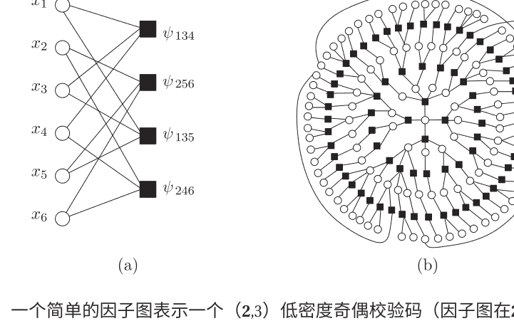

图22.1 (a) 一个简单的因子图表示一个 (2,3) 低密度奇偶校验码（因子图在22.2.3.1节中定义）。每个消息位（空心圆圈）连接到两个奇偶校验因子（实心黑方块），每个奇偶校验因子连接到三个位。每个奇偶校验因子的形式为ψ_{stu} (x_s, x_t, x_u) = I (x_s ⊗ x_t ⊗ x_u=1)，其中⊗是异或运算符。未显示每个隐藏节点的局部证据因子。(b) 一个更大的随机LDPC码示例。我们可以看到这个图是“局部类似树状”的，意味着没有短循环；相反，每个循环的长度约为~log m，其中m是节点的数量。这给了我们一个关于为什么循环BP在这样的图上表现得如此好的提示。（注意，然而，一些纠错码图有短循环，所以这不是完整的解释。）来源：(Wainwright和Jordan 2008b)的图2.9。获得Martin Wainwright的友情许可使用。

#### 22.2.3 在因子图上的LBP

为了处理具有高阶团势能的模型（包括具有多个父节点的有向模型），使用一种称为因子图的表示方法是有用的。我们在下面解释这种表示方法，然后描述如何将LBP应用于这种模型。

### 22.2.3.1 因子图

因子图（Kschischang et al. 2001; Frey 2003）是一种图形表示，统一了有向模型和无向模型，并简化了某些消息传递算法。更准确地说，因子图是一种具有两种类型节点的无向二分图。圆形节点表示变量，方形节点表示因子，每个变量与提及它的每个因子之间都有一条边。例如，考虑图22.2(a)中的MRF。如果我们假设每个最大团只有一个势能，那么得到的因子图如图22.2(b)所示，表示了该函数。

f(x1, x2, x3, x4) = f124(x1, x2, x4)f234(x2, x3, x4) (22.1)

如果我们假设每条边上有一个潜在的势函数。 我们得到图22.2(c)中的因子图，它表示了函数

f(x1, x2, x3, x4) = f14(x1, x4)f12(x1, x2)f34(x3, x4)f23(x2, x3)f24(x2, x4) (22.2)

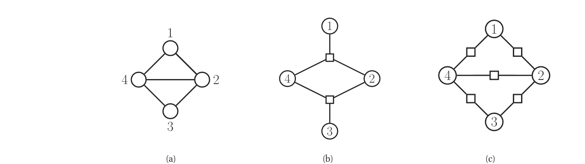

图22.2 (a) 一个简单的UGM。(b) 假设每个最大团上有一个潜在的势函数的因子图表示。(c) 假设每条边上有一个潜在的势函数的因子图表示。

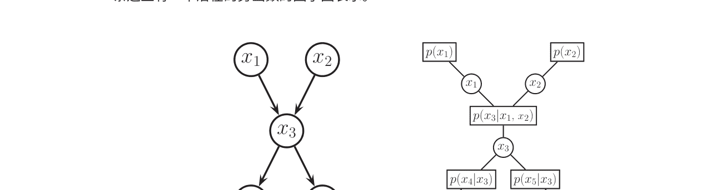

图22.3 (a) 一个简单的DGM。(b) 它对应的因子图。基于(Yedidia et al. 2001)的图5。

我们还可以将DGM转换为因子图：只需为每个CPD创建一个因子，并将该因子连接到使用该CPD的所有变量。例如，图22.3表示以下因子分解：

$f(x_1, x_2, x_3, x_4, x_5) = f_1(x_1) f_2(x_2) f_{123}(x_1, x_2, x_3) f_{34}(x_3, x_4) f_{35}(x_3, x_5)$ \quad (22.3)

其中我们定义 $f_{123}(x_1, x_2, x_3) = p(x_3|x_1, x_2)$, 等等。如果每个节点最多只有一个父节点（因此图是一个链或简单树），那么每条边都会有一个因子（根节点的先验CPD可以被吸收进它们的子节点的因子中）。这样的模型等价于成对的MRFs。

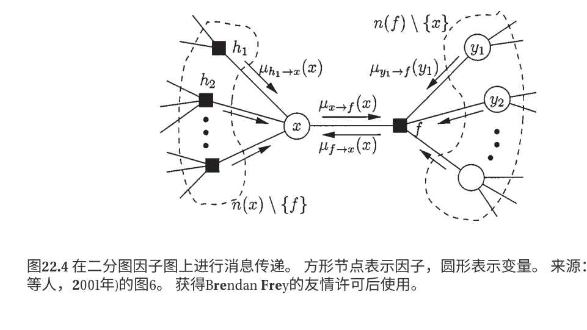

### 22.2.3.2 在因子图上的BP

我们现在推导出一种在因子图上发送消息的BP版本，正如(Kschischang等人，2001年)所提出的。具体来说，我们现在有两种类型的消息：变量到因子的消息

$$ m_{x \to f}(x) = \prod_{h \in \text{nbr}(x) \setminus \{f\}} m_{h \to x}(x) $$

并将因素转化为变量：

$$ m_{f \to x}(x) = \sum_{\mathbf{y}} f(x, \mathbf{y}) \prod_{y \in \text{nbr}(f) \setminus \{x\}} m_{y \to f}(y) $$

这里 nbr(x)是与变量 x相连的所有因素，而 nbr(f)是与因素 f相连的所有变量。这些消息在图22.4中有所说明。在收敛时，我们可以将最终的信念计算为传入消息的乘积：

$$ \text{bel}(x) \propto \prod_{f \in \text{nbr}(x)} m_{f \to x}(x) $$

在接下来的章节中，我们将重点讨论对于成对模型的LBP，而不是因子图，但这只是为了符号简洁。

## 22.2.4 收敛

LBP并不总是收敛，即使它收敛了，也可能收敛到错误的答案。这引发了几个问题：我们如何预测何时会发生收敛？我们可以做些什么来增加收敛的概率？我们可以做些什么来增加收敛的速度？我们在下面简要讨论这些问题。然后我们讨论收敛时结果的准确性问题。

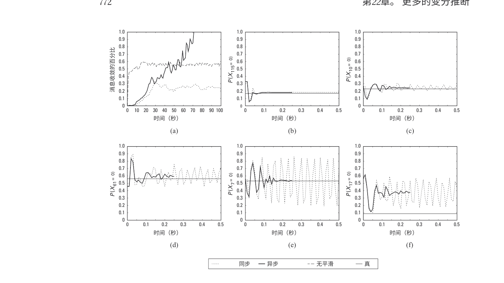

图22.5展示了在具有随机势能的11 × 11 Ising网格上的循环置信传播行为，其中 wi_j ~ Unif(-C, C)，其中 C= 11。对于较大的 C，推理变得更加困难。(a)3种不同更新计划的收敛消息百分比随时间的变化：点状 = 阻尼同步（少数节点收敛），虚线 = 无阻尼异步（一半节点收敛），实线 = 阻尼异步（所有节点收敛）。(b-f)某些节点的边际置信随时间的变化。实线 = 真实值，虚线 = 同步，实线 = 阻尼异步。来源: (Koller and Friedman 2009)的图11.C.1。获得Daphne Koller的友情许可后使用。

### 22.2.4.1 何时LBP收敛？

关于LBP何时收敛的分析细节超出了本章的范围，但是我们简要概述了基本思想。关键的分析工具是计算树，它可视化算法进行时传递的消息。图22.6给出了一个简单的例子。

在第一次迭代中，节点1接收来自节点2和节点3的消息。在第二次迭代中，它从节点3（通过节点2）接收到一条消息，从节点2（通过节点3）接收到一条消息，并从节点4（通过节点2和节点3）接收到两条消息。以此类推。

关键的洞察是，LBP的T次迭代等价于在高度为T+1的计算树中进行精确计算。如果边缘上的连接强度足够弱，那么叶子节点对根节点的影响将随着时间的推移而减弱，从而达到收敛。有关更多信息，请参阅（Wainwright和Jordan 2008b）和相关参考文献。

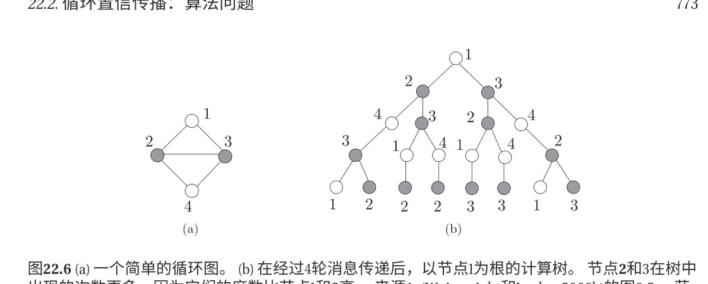

图22.6 (a) 一个简单的循环图。 (b) 在经过4轮消息传递后，以节点1为根的计算树。 节点2和3在树中出现的次数更多，因为它们的度数比节点1和2高。 来源：(Wainwright和Jordan 2008b)的图8.2。 获得Martin Wainwright的友好许可后使用。

### 22.2.4.2 使LBP收敛

尽管理论上的收敛分析非常有趣，但在实践中，当面对LBP不收敛的模型时，我们应该怎么办？ 减少振荡的一个简单方法是使用阻尼。 也就是说，我们发送的不是消息$M_{ts}^k$，而是形式为的阻尼消息

$$ \tilde{M}_{tsk}(x_s) = \lambda M_{ts}(x_s) + (1-\lambda) \tilde{M}_{tsk-1}(x_s) \tag{22.7} $$

其中 $0 \le \lambda \le 1$ 是阻尼因子。显然，如果 $\lambda = 1$，则这将简化为标准方案，但对于 $\lambda < 1$ ，这种部分更新方案可以帮助改善收敛性。 使用 $\lambda \sim 0.5$ 这样的值是标准做法。 这种方法的好处在图22.5中显示出来，我们可以看到阻尼更新往往比无阻尼更新更容易收敛。

可以设计一种称为双循环算法的方法，它可以保证收敛到与LBP最小化的相同目标的局部最小值 (Yuille 2001; Welling and Teh 2001) 。 不幸的是，这些方法速度较慢且复杂，并且得到的边缘概率通常不比标准LBP的准确性更高。 （事实上，振荡的边缘概率有时是LBP近似本身不好的一个迹象。） 因此，这些技术并不被广泛使用。 在第22.4.2节中，我们将看到一种广泛使用的BP的不同收敛版本。

### 22.2.4.3 增加收敛速度：消息调度

即使LBP收敛，可能需要很长时间。 在实现LBP时，标准方法是进行同步更新，其中所有节点同时吸收消息，然后同时发送消息。 也就是说，在第$k+1$次迭代中，新的消息是并行计算得到的。

$$ \mathbf{m}^{k+1} = (f_1(\mathbf{m}^k), \ldots, f_E(\mathbf{m}^k)) \tag{22.8} $$

其中 $E$ 是边的数量，而 $f_{st}(\mathbf{m})$ 是计算给定所有旧消息的边 $s \to t$ 的消息的函数。 这类似于解线性方程组的雅可比方法。

众所周知 (Bertsekas 1997) ，高斯-塞德尔方法在解线性方程组时，通过以固定的循环方式进行异步更新，收敛速度更快。 我们可以将相同的思想应用于LBP，使用以下形式的更新

$$\mathbf{m}^{k+1}_i = f_i\left(\{\mathbf{m}^{k+1}_j : j < i\}, \{\mathbf{m}^k_j : j > i\}\right)$$ (22.9)

其中，对于边 $i$ 的消息是使用在排序中较早的边的新消息 (迭代 $k+1$ ) 和在排序中较晚的边的旧消息 (迭代 $k$ ) 计算得出的。

这引发了更新消息的顺序问题。一个简单的想法是使用固定或随机的顺序。 这种方法的好处在图22.5中得到了展示，我们可以看到 (阻尼) 异步更新比同步更新更经常收敛。

一个更聪明的方法是选择一组生成树，然后逐个树进行上下扫描，保持其他所有消息不变。 这被称为树重参数化 (TRP) (Wainwright等人, 2001) ，不应与更复杂的树重新加权BP (通常缩写为TRW) 混淆，该方法将在第22.4.2.1节中讨论。 然而，通过使用自适应排序，我们可以做得更好。 直觉告诉我们，我们应该将计算工作集中在最不确定的变量上。 (Elidan等人, 2006) 提出了一种称为残差置信传播的技术，其中消息的发送计划根据与其先前值的差异的范数确定。 也就是说，我们定义新消息 $m_{st}$ 在迭代 $k$ 时的残差为

$$r(s, t, k) = \|\log m_{st} - \log m^k_{st}\|_{\infty} = \max_i \left|\log \frac{m_{st}(i)}{m^k_{st}(i)}\right|$$ (22.10)

我们可以将消息存储在优先队列中，并始终发送具有最高残差的消息。 当从 $s$ 发送消息到 $t$ 时，所有依赖于 $m_{st}$ (即形式为 $m_{tu}$ 的消息，其中 $u \in \text{nbr}(t) \setminus s$) 的其他消息需要重新计算；它们的残差被重新计算，并且被添加回队列。 在 (Elidan等人, 2006年) 中，他们 (通过实验证明) 表明，这种方法比使用同步更新、异步更新和TRP方法更经常收敛，而且速度更快。

在 (Sutton和McCallum, 2007年) 中提出了残差BP的改进。 在本文中，他们使用消息残差的上界而不是实际残差。 这意味着只有在将要发送消息时才计算它们；它们不仅仅是为了评估残差而计算的。 观察到这比残差BP快大约五倍，尽管最终结果的质量相似。

## **22.2.5 LBP的准确性**

对于一个只有一个循环的图，如果最大乘积版本的LBP收敛，可以证明它会找到正确的MAP估计 (Weiss 2000) 。 对于更一般的图，可以通过LBP计算的近似边际误差进行界定，如 (Wainwright et al. 2003; Vinyals et al. 2010) 所示。 在高斯模型的情况下，有更强的结果可用 (Weiss and Freeman 2001a; Johnson et al. 2006; Bickson 2009) 。 特别是在高斯情况下，如果方法收敛，均值是精确的，尽管方差不是 (通常置信度过高) 。

## 22.2.6 LBP的其他加速技巧 *

有几种技巧可以用来加快BP的运行速度。我们在下面讨论其中一些。

### 22.2.6.1 大状态空间的快速消息计算

在BP中计算每个消息的成本（无论是在树还是在循环图中）是 $O(K^f)$，其中 $K$是状态的数量，$f$ 是最大因子的大小（对于成对的UGM，$f=2$）。在许多视觉问题中（例如图像去噪），$K$非常大（比如256），因为它表示某个潜在连续空间的离散化，所以每个消息的 $O(K^2)$的成本太高。幸运的是，对于形式为 $\psi_{st}(x_s, x_t) = \psi(x_s - x_t)$的某些成对潜力函数，可以使用快速傅里叶变换或FFT在 $O(K \log K)$时间内计算和乘积消息，如 (Felzenszwalb和Huttenlocher 2006) 中所解释的。

关键的洞察是消息计算只是卷积：

$$M_{st}^k(x_t) = \sum_{x_s} \psi(x_s - x_t) h(x_s) \tag{22.11}$$

其中 $h(x_s) = \psi_s(x_s) \prod_{v \in \text{nbr}(s) \setminus t} M$。如果潜在函数 $\psi(z)$是类似高斯的潜在函数，我们可以通过顺序卷积与少量的盒式滤波器(Felzenszwalb和Huttenlocher 2006)在 $O(K)$时间内计算卷积。

对于最大乘积情况，可以使用一种称为距离变换的技术在 $O(K)$时间内计算消息。然而，这仅在 $\psi(z) = \exp(-E(z))$且 $E(z)$具有以下形式之一时有效：二次的，$E(z) = z^2$；截断线性的，$E(z) = \min(c_1|z|, c_2)$；或者Potts模型，$E(z) = c \mathbb{I}(z=0)$。详细信息请参阅(Felzenszwalb和Huttenlocher 2006)。

### 22.2.6.2 多尺度方法

一种特定于二维晶格结构的方法，在计算机视觉中常见，基于多网格技术。这些方法广泛应用于数值线性代数中，其中一个核心问题是快速求解线性方程组；这相当于高斯MRF中的MAP估计。在计算机视觉环境中，(Felzenszwalb和Huttenlocher 2006)建议使用以下启发式方法来显著加速BP：构建一个粗到细的网格，在粗粒度级别计算消息，并使用此消息初始化下一级别的消息；当我们到达底层时，只需要几次标准BP迭代，因为通过初始化过程已经实现了长程通信。

在粗粒度级别上计算的置信度是在少量大块上计算的。局部证据是根据每个可能块标签分配给块中所有像素的平均对数概率计算的。成对势函数基于相邻块的标签差异，考虑到它们的大小。然后我们可以在粗粒度级别上运行LBP，然后使用此结果初始化下一级别的消息。请注意，模型仍然是一个平面网格；然而，初始化过程利用了问题的多尺度特性。详细信息请参见(Felzenszwalb和Huttenlocher 2006)。

### 22.2.6.3 级联

处理高维状态空间的另一个技巧，也可以与精确推理（例如，用于链式CRF）一起使用，是基于计算廉价的过滤步骤来剪枝不可能的状态。事实上，可以创建一个模型层次结构，以权衡速度和准确性。这被称为计算级联。对于链式结构，可以保证级联永远不会过滤掉真正的MAP解（Weiss等人，2010年）。

## 22.3 循环置信传播：理论问题 *

我们现在尝试从变分的角度理解LBP算法。我们的介绍紧密基于一篇优秀的300页综述文章（Wainwright和Jordan，2008a）。鉴于其长度和技术难度，这篇论文有时被称为“怪物”（甚至是由其作者自己！）。本节只是简要概述了一些主要结果。为了简化演示，我们将重点放在具有离散变量和表格势的成对UGMs的特殊情况上。许多结果可以推广到具有高阶团势（包括DGMs）的UGMs，但这会使符号更加复杂（有关一般情况的详细信息，请参见（Koller和Friedman 2009））。

### 22.3.1 以指数族形式表示的UGMs

我们假设分布具有以下形式：

$$p(\mathbf{x}|\theta, G) = \frac{1}{Z(\theta)} \exp \left\{ \sum_{s \in \mathcal{V}} \theta_s(x_s) + \sum_{(s,t) \in \mathcal{E}} \theta_{st}(x_s, x_t) \right\} \quad (22.12)$$

其中图 G具有节点 \mathcal{V}和边 \mathcal{E}。（从现在开始，为了简洁起见，我们将省略对 \theta和 G的明确条件，因为我们假设两者都是已知且固定的。）我们可以将其重写为指数族形式，如下所示：

$$p(\mathbf{x}|\theta) = \frac{1}{Z(\theta)} \exp(-E(\mathbf{x})) \quad (22.13)$$

$$E(\mathbf{x}) \triangleq -\theta^T \phi(\mathbf{x}) \quad (22.14)$$

其中 \theta = (\{\theta_{s;j}\}, \{\theta_{s,t;j,k}\})是所有节点和边的参数（规范参数），而 \phi(\mathbf{x}) = (\{\mathbb{I}(x_s = j)\}, \{\mathbb{I}(x_s = j, x_t = k)\})是所有节点和边的指示函数（充分统计量）。注意：我们使用 s, t \in \mathcal{V}来索引节点，使用 j, k \in \mathcal{X}来索引状态。充分统计量的均值被称为模型的均值参数，表示为

$$\mu = \mathbb{E}[\phi(\mathbf{x})] = (\{p(x_s = j)\}_s, \{p(x_s = j, x_t = k)\}_{s=t}) = (\{\mu_{s;j}\}_s, \{\mu_{st;jk}\}_{s=t}) \quad (22.15)$$

这是一个长度为 d = |\mathcal{X}||\mathcal{V}| + |\mathcal{X}|^2|\mathcal{E}|的向量，包含节点和边缘。它完全描述了分布 p(\mathbf{x}|\theta)，所以有时我们将 \mu视为一个分布本身。

方程22.12被称为标准过完备表示。它被称为“过完备”，因为它忽略了总和为一的约束。在某些情况下，去除它是方便的。

## 22.3. 循环置信传播：理论问题 *

这种冗余性。例如，考虑一个 Ising 模型，其中 $X_s \in \{0, 1\}$。该模型可以写成

$$
p(\mathbf{x}) = \frac{1}{Z(\boldsymbol{\theta})} \exp \left\{ \sum_{s \in \mathcal{V}} \theta_s x_s + \sum_{(s, t) \in \mathcal{E}} \theta_{st} x_s x_t \right\}
$$

因此，我们可以使用以下最小参数化

$$
\phi(\mathbf{x}) = (x_s, \, s \in V; \, x_s x_t, \, (s, t) \in E) \in \mathbb{R}^d
$$

其中 $d = |V| + |E|$。相应的均值参数为 $\mu_s = p(x_s = 1)$ 和 $\mu_{st} = p(x_s = 1, x_t = 1)$。

## 22.3.2 边际多面体

可允许的 $\boldsymbol{\mu}$ 向量空间称为边际多面体，表示为 $\mathbb{M}(G)$，其中 $G$ 是定义 UGM 的图的结构。这被定义为给定模型的所有均值参数的集合，可以从有效的概率分布中生成：

$$
\mathbb{M}(G) \triangleq \{ \boldsymbol{\mu} \in \mathbb{R}^d : \exists p \quad \text{s.t.} \quad \boldsymbol{\mu} = \sum_{\mathbf{x}} \phi(\mathbf{x}) \, p(\mathbf{x}) \geq 0, \, \sum_{\mathbf{x}} p(\mathbf{x}) = 1 \}
$$

例如，考虑一个伊辛模型。如果我们只有两个节点连接为 $X_1 - X_2$，可以证明我们有以下最小的约束集合：$0 \leq \mu_{12}$，$0 \leq \mu_{12} \leq \mu_1$，$0 \leq \mu_{12} \leq \mu_2$，以及 $1 + \mu_{12} - \mu_1 - \mu_2 \geq 0$。我们可以将这些写成矩阵-向量形式

$$
\begin{pmatrix}
0 & 0 & 1 \\
1 & 0 & -1 \\
0 & 1 & -1 \\
-1 & -1 & 1
\end{pmatrix}
\begin{pmatrix}
\mu_1 \\
\mu_2 \\
\mu_{12}
\end{pmatrix}
\geq
\begin{pmatrix}
0 \\
0 \\
0 \\
-1
\end{pmatrix}
$$

这四个约束定义了一系列半平面，它们的交集定义了一个多面体，如图22.7(a)所示。

由于 $\mathbb{M}(G)$ 是通过取特征向量的凸组合得到的，它也可以被写成特征集合的凸包形式：$\mathbb{M}(G) = \text{conv} \{ \phi_1(\mathbf{x}), \ldots, \phi_d(\mathbf{x}) \}$

例如，对于具有二进制状态的 2 节点 MRF $X_1 - X_2$，我们有

$$
\mathbb{M}(G) = \text{conv} \{ (0, 0, 0), \, (1, 0, 0), \, (0, 1, 0), \, (1, 1, 1) \}
$$

这些是图22.7(a)中的四个黑点。我们看到凸包定义了与半空间交集相同的体积。

边际多面体在我们讨论本章其余部分的近似推理算法中起着关键作用。

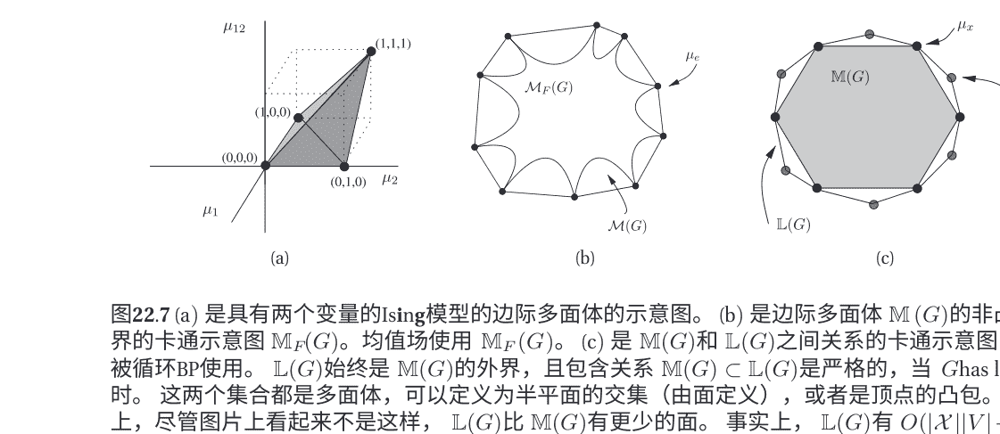

图22.7(a) 是具有两个变量的Ising模型的边际多面体的示意图。(b) 是边际多面体$\mathbb{M}(G)$的非凸内界的卡通示意图$\mathbb{M}_F(G)$。均值场使用$\mathbb{M}_F(G)$。(c) 是$\mathbb{M}(G)$和$\mathbb{L}(G)$之间关系的卡通示意图，它被循环BP使用。$\mathbb{L}(G)$始终是$\mathbb{M}(G)$的外界，且包含关系$\mathbb{M}(G) \subset \mathbb{L}(G)$是严格的，当$G$ has loops时。这两个集合都是多面体，可以定义为半平面的交集（由面定义），或者是顶点的凸包。实际上，尽管图片上看起来不是这样，$\mathbb{L}(G)$比$\mathbb{M}(G)$有更少的面。事实上，$\mathbb{L}(G)$有$O(|\mathcal{X}||V| + |\mathcal{X}|^2|E|)$个面，其中$|\mathcal{X}|$是每个变量的状态数，$|V|$是变量的数量，而$|E|$是边的数量。相比之下，$\mathbb{M}(G)$有$O(|\mathcal{X}|^{|V|})$个面。

另一方面，$\mathbb{L}(G)$比$\mathbb{M}(G)$有更多的顶点，尽管图片上看起来不是这样，因为$\mathbb{L}(G)$包含了所有的二进制向量极点$\boldsymbol{\mu} \in \mathbb{M}(G)$，还有额外的分数极点。来源: (Wainwright和Jordan 2008a)的图3.6、5.4和4.2。获得Martin Wainwright的友好许可后使用。

## 22.3.3 精确推断作为变分优化问题

回顾第21.2节，变分推断的目标是找到使能量泛函最大化的分布$q$。

$$L(q) = -\mathbb{KL}(q||p) + \log Z = \mathbb{E}_q [\log \tilde{p}(\mathbf{x})] + \mathbb{H}(q) \leq \log Z \quad (22.22)$$
其中$\tilde{p}(\mathbf{x}) = Zp(\mathbf{x})$是未归一化的后验概率。如果我们将$\log \tilde{p}(\mathbf{x}) = \boldsymbol{\theta}^T \phi(\mathbf{x})$写成，然后令$q = p$，那么精确能量泛函变为最大化问题。
$$\max_{\boldsymbol{\mu} \in \mathbb{M}(G)} \boldsymbol{\theta}^T \boldsymbol{\mu} + \mathbb{H}(\boldsymbol{\mu}) \quad (22.23)$$
其中$\boldsymbol{\mu} = \mathbb{E}_p [\phi(\mathbf{x})]$是所有状态配置$\mathbf{x}$的联合分布（因此可以写成$\mathbb{H}(\boldsymbol{\mu})$）。由于当$p = q$时KL散度为零，我们知道
$$\max_{\boldsymbol{\mu} \in \mathbb{M}(G)} \boldsymbol{\theta}^T \boldsymbol{\mu} + \mathbb{H}(\boldsymbol{\mu}) = \log Z(\boldsymbol{\theta}) \quad (22.24)$$
这是将精确推理视为变分优化问题的一种方法。

方程22.24似乎很容易优化：目标函数是凹函数，因为它是线性函数和凹函数的和（参见图2.21，了解熵为什么是凹函数）；此外，我们在一个凸集上最大化这个函数。然而，边际多面体$\mathbb{M}(G)$有指数级的面。在某些情况下，这个多面体具有结构，可以通过动态规划来利用（正如我们在第20章中所看到的），但一般来说，精确推理需要指数时间。

现有的大多数确定性近似推理方案可以看作是对边际多面体的不同近似，正如我们在下面解释的那样。

## 22.3.4 均值场作为一种变分优化问题

我们在第21章中详细讨论了均值场。 让我们在我们的新的更抽象的框架中重新解释均值场推理。 这将帮助我们将其与我们下面讨论的其他近似方法进行比较。

首先，让 F 成为原始图 G 的边子图，并让 $\mathcal{I}(F) \subseteq \mathcal{I}$ 成为与 F 的团相关的足够统计量的子集。 让 $\Omega$ 成为完整模型的规范参数集，并定义子模型的规范参数空间如下：

$$\Omega(F) \triangleq \{ \boldsymbol{\theta} \in \Omega : \boldsymbol{\theta}_\alpha = 0 \; \forall \alpha \in \mathcal{I} \setminus \mathcal{I}(F) \} \tag{22.25}$$

换句话说，我们要求与充分统计量相关的自然参数$\alpha$在我们选择的类之外为零。 例如，在完全因子化的情况下， $F_0$， 我们从图中删除所有边，得到

$$\Omega(F_0) \triangleq \{ \boldsymbol{\theta} \in \Omega : \boldsymbol{\theta}_{st} = 0 \; \forall (s, t) \in E \} \tag{22.26}$$

)在结构化均场（第21.4节）的情况下，我们将不在可处理子图中的边的 $\theta_{st}$设置为0。

接下来，我们将受限模型的均值参数空间定义如下：

$$\mathrm{M}_F(G) \triangleq \{ \boldsymbol{\mu} \in \mathbb{R}^d : \boldsymbol{\mu} = \mathbb{E}_{\boldsymbol{\theta}} [\phi(\mathbf{x})] \; \text{对于某些} \; \boldsymbol{\theta} \in \Omega(F) \} \tag{22.27}$$这被称为边际多面体的内部近似，因为 $\mathrm{M}_F(G) \subseteq \mathrm{M}(G)$。 请参见图22.7(b)以获得草图。 请注意， $\mathrm{M}_F(G)$是一个非凸多面体，这导致了多个局部最优解。 相比之下，我们稍后将考虑的一些近似将是凸的。

我们将我们的近似的熵定义为 $\mathbb{H}(\boldsymbol{\mu}(F))$，它是在子模型 F 上定义的分布$\boldsymbol{\mu}$的熵。 然后，我们将均场能量泛函优化问题定义如下：

$$\max_{\boldsymbol{\mu} \in \mathrm{M}_F(G)} \boldsymbol{\theta}^T \boldsymbol{\mu} + \mathbb{H}(\boldsymbol{\mu}) \leq \log Z(\boldsymbol{\theta}) \tag{22.28}$$

对于成对UGM的完全因子化均场近似情况，我们可以将这个目标写成如下形式：

$$\max_{\boldsymbol{\mu} \in \mathcal{P}^d} \sum_{s \in V} \sum_{x_s} \theta_s(x_s)\mu_s(x_s) + \sum_{(s, t) \in E} \sum_{x_s, x_t} \theta_{st}(x_s, x_t)\mu_s(x_s)\mu_t(x_t) + \sum_{s \in V} \mathbb{H}(\mu_s) \tag{22.29}$$

其中 $\boldsymbol{\mu}_s \in \mathcal{P}$， 而 $\mathcal{P}$是概率单纯形空间上的。

均场方法涉及对非凸集合上的凹目标进行最大化。 通常使用坐标上升法进行优化，因为对于每个 $\mu_s$来说，优化标量凹函数在 $\mathcal{P}$上是容易的。 例如，对于成对的UGM，我们得到

$$\mu_s(x_s) \propto \exp(\theta_s(x_s)) \exp \left( \sum_{t \in \mathrm{nbr}(s)} \sum_{x_t} \mu_t(x_t)\theta_{st}(x_s, x_t) \right) \tag{22.30}$$

## 22.3.5 LBP作为一个变分优化问题

在本节中，我们解释了LBP如何被视为一种变分推断问题。

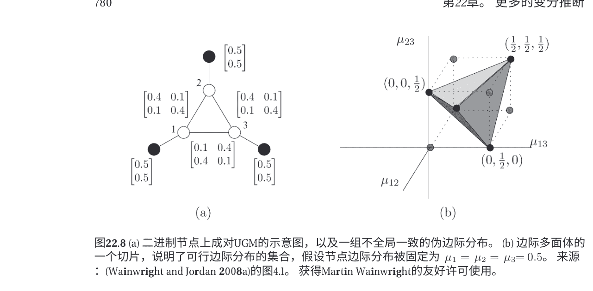

> 来源: (Wainwright and Jordan 2008a)的图4.1。获得Martin Wainwright的友好许可使用。

### 22.3.5.1 边际多面体的外部逼近

如果我们想考虑与我们的模型相关的所有可能的概率分布，我们需要考虑所有的向量 μ ∈ M(G)。由于集合 M(G) 的规模是指数级的，通常无法进行优化。组合优化中的一种标准策略是放松约束条件。在这种情况下，我们不再要求概率向量 μ 属于 M(G)，而是考虑一个只满足以下局部一致性约束条件的向量 τ:

$$\sum_{x_s} \tau_s(x_s) = 1 \qquad (22.31)$$

$$\sum_{x_t} \tau_{st}(x_s, x_t) = \tau_s(x_s) \qquad (22.32)$$

第一个约束被称为归一化约束，第二个被称为边际化约束。然后我们定义集合

$$\mathbb{L}(G) \triangleq \{ \tau \geq 0 : (22.31) \text{ holds } \forall s \in V \text{ and } (22.32) \text{ holds } \forall (s, t) \in E \} \qquad (22.33)$$

集合 L(G) 也是一个多面体，但它只有 O(|V| + |E|) 个约束。它是对 M(G) 的一个凸外估计，如图22.7(c)所示。

我们称之为 τ_s, τ_st ∈ L(G) 伪边际，因为它们可能不对应于任何有效概率分布的边际。作为这个的一个例子，考虑图22.8(a)。图片显示了一组伪节点和边缘，它们满足局部一致性要求。然而，它们在全局上不一致。为了看清楚原因，注意到 τ_12 意味着 p(X_1 = X_2) = 0.8, τ_23 意味着 p(X_2 = X_3) = 0.8, 但是 τ_13 意味着 p(X_1 = X_3) = 0.2, 这是不可能的（参见(Wainwright and Jordan 2008b, p81)进行正式证明）。事实上，图22.8(b)显示 L(G) 包含了不在 M(G) 中的点。

我们声称 M(G) ⊆ L(G)，当且仅当 G 是一棵树。为了看到这一点，首先考虑一个元素 $\mu \in \mathbb{M}(G)$。任何这样的向量必须满足归一化和边际化约束，因此 $\mathbb{M}(G) \subseteq \mathbb{L}(G)$。现在考虑反过来。假设 $T$ 是一棵树，且 $\mu \in \mathbb{L}(T)$。根据定义，这满足归一化和边际化约束。然而，任何树都可以以以下形式表示

$$ p_\mu(\mathbf{x}) = \prod_{s \in V} \mu_s(x_s) \prod_{(s,t) \in E} \frac{\mu_{st}(x_s, x_t)}{\mu_s(x_s)\mu_t(x_t)} \tag{22.34} $$

因此，满足归一化和局部一致性就足以定义任何树的有效分布。因此 $\mu \in \mathbb{M}(T)$ 也成立。相反，如果图中有循环，我们有 $\mathbb{M}(G) = \mathbb{L}(G)$。参见图22.8(b)以了解此事实的示例。

### 22.3.5.2 熵的近似

根据方程式22.34，我们可以将任何树状分布的精确熵表示为 $\mu \in \mathbb{M}(T)$ 如下：

$$ \mathbb{H}(\mu) = \sum_{s \in V} H_s(\mu_s) - \sum_{(s,t) \in E} I_{st}(\mu_{st}) \tag{22.35} $$

$$ H_s(\mu_s) = - \sum_{x_s \in \mathcal{X}_s} \mu_s(x_s) \log \mu_s(x_s) \tag{22.36} $$

$$ I_{st}(\mu_{st}) = \sum_{(x_s, x_t) \in \mathcal{X}_s \times \mathcal{X}_t} \mu_{st}(x_s, x_t) \log \frac{\mu_{st}(x_s, x_t)}{\mu_s(x_s)\mu_t(x_t)} \tag{22.37} $$

注意，我们可以将互信息项重写为 $I_{st}(\mu_{st}) = H_s(\mu_s) + H_t(\mu_t) - H_{st}(\mu_{st})$，因此我们得到以下替代但等效的表达式：

$$ \mathbb{H}(\mu) = -\sum_{s \in V}(d_s - 1)H_s(\mu_s) + \sum_{(s,t) \in E} H_{st}(\mu_{st}) \tag{22.38} $$

其中 $d_s$ 是节点 $s$ 的度（邻居数）。贝塔近似熵就是在没有树的情况下使用方程式22.35：

$$ \mathbb{H}_{\text{Bethe}}(\boldsymbol{\tau}) = \sum_{s \in V} H_s(\tau_s) - \sum_{(s,t) \in E} I_{st}(\tau_{st}) \tag{22.39} $$

我们将Bethe自由能定义为

$$ F_{\text{Bethe}}(\boldsymbol{\tau}) \triangleq - \left[ \boldsymbol{\theta}^T \boldsymbol{\tau} + \mathbb{H}_{\text{Bethe}}(\boldsymbol{\tau}) \right] \tag{22.40} $$

我们将Bethe能量泛函定义为Bethe自由能的负值。

### 22.3.5.3 LBP目标

将外部逼近 $\mathbb{L}(G)$ 与Bethe熵逼近相结合，我们得到以下Bethe变分问题（BVP）：

$$ \min_{\tau \in \mathbb{L}(G)} F_{\text{Bethe}}(\tau) = \max_{\tau \in \mathbb{L}(G)} \boldsymbol{\theta}^T \boldsymbol{\tau} + \mathbb{H}_{\text{Bethe}}(\tau) \qquad (22.41)$$

我们优化的空间是一个凸集，但目标本身不是凹的（因为 $\mathbb{H}_{\text{Bethe}}$ 不是凹的）。因此，BVP可能存在多个局部最优解。BVP得到的值是对 $\log Z(\boldsymbol{\theta})$ 的近似。在树的情况下，近似是精确的；在具有吸引势能的模型中，近似结果是一个上界（Sudderth等人，2008年）。

### 22.3.5.4 消息传递和拉格朗日乘数

在这个小节中，我们将展示LBP算法的任何固定点都定义了上述约束目标的稳定点。让我们定义在 $C_{ss}(\boldsymbol{\tau}) \triangleq 1 - \sum_{x_s} \tau_s(x_s)$，并将边缘化约束定义为 $C_{ts}(x_s; \boldsymbol{\tau}) \triangleq \tau_s(x_s) - \sum_{x_t} \tau_{st}(x_s, x_t)$ 对于每条边 $_t \rightarrow _s$，我们现在可以将Lagrangian写成

$$ \mathcal{L}(\boldsymbol{\tau}, \boldsymbol{\lambda}; \boldsymbol{\theta}) \triangleq \boldsymbol{\theta}^T \boldsymbol{\tau} + \mathbb{H}_{\text{Bethe}}(\boldsymbol{\tau}) + \sum_{s} \lambda_{ss} C_{ss}(\boldsymbol{\tau}) + \sum_{s,t} \left[ \sum_{x_s} \lambda_{ts}(x_s) C_{ts}(x_s; \boldsymbol{\tau}) + \sum_{x_t} \lambda_{st}(x_t) C_{st}(x_t; \boldsymbol{\tau}) \right] \qquad (22.42)$$

（约束条件 $\boldsymbol{\tau} \geq 0$ 没有明确强制执行，但可以证明在最优解时它将成立，因为 $\boldsymbol{\theta} > 0$。）一些简单的代数运算表明 $\nabla_{\boldsymbol{\tau}} \mathcal{L} = \mathbf{0}$ 导致 $\log \tau_s(x_s) = \lambda_{ss} + \theta_s(x_s) + \sum_{t \in \text{nbr}(s)} \lambda_{ts}(x_s)$

$$ \log \frac{\tau_{st}(x_s, x_t)}{\tilde{\tau}_s(x_s) \tilde{\tau}_t(x_t)} = \theta_{st}(x_s, x_t) - \lambda_{ts}(x_s) - \lambda_{st}(x_t) \qquad (22.44)$$

我们定义了 $\tilde{\tau}_s(x_s) \triangleq \sum_{x_t} \tau_{st}(x_s, x_t)$。利用边缘化约束意味着 $\tilde{\tau}_s(x_s) = \tau_s(x_s)$，我们得到

$$ \log \tau_{st}(x_s, x_t) = \lambda_{ss} + \lambda_{tt} + \theta_{st}(x_s, x_t) + \theta_s(x_s) + \theta_t(x_t) + \sum_{u \in \text{nbr}(s) \setminus t} \lambda_{us}(x_s) + \sum_{u \in \text{nbr}(t) \setminus s} \lambda_{ut}(x_t) \qquad (22.45)$$

为了与消息传递建立联系，定义 $M_{ts}(x_s) = \exp(\lambda_{ts}(x_s))$。使用这个符号，我们可以将上述方程（两边取指数）重写为以下形式：

$$ \tau_s(x_s) \propto \exp(\theta_s(x_s)) \prod_{t \in \text{nbr}(s)} M_{ts}(x_s) \qquad (22.46)$$

$$ \tau_{st}(x_s, x_t) \propto \exp(\theta_{st}(x_s, x_t) + \theta_s(x_s) + \theta_t(x_t)) \times \prod_{u \in \text{nbr}(s) \setminus t} M_{us}(x_s) \prod_{u \in \text{nbr}(t) \setminus s} M_{ut}(x_t) \qquad (22.47)$$其中，λ项被吸收到比例常数中。我们可以看到，这等价于LBP中节点和边缘的常规表达式。为了推导出关于其他消息的方程（而不是关于λ_{ts}），我们强制执行边缘化条件\sum_{x_t} \tau_{st}(x_s, x_t) = \tau_s(x_s)。然后可以证明

$$
M_{ts}(x_s) \propto \sum_{x_t} \left[ \exp \left\{ \theta_{st}(x_s, x_t) + \theta_t(x_t) \right\} \prod_{u \in \text{nbr}(t) \setminus s} M_{ut}(x_t) \right]
$$

我们可以看到，这与LBP中的消息表达式是等价的。

## 22.3.6 循环置信传播与均值场

比较朴素均值场（MF）和LBP近似是很有趣的。有几个明显的区别。首先，LBP对于树是精确的，而MF不是，这表明LBP通常会更准确（参见Wainwright et al. 2003进行分析）。其次，LBP优化节点和边缘，而MF只优化节点边缘，这再次表明LBP会更准确。第三，在真实边缘因子化的情况下，即\mu_{st} = \mu_s \mu_t，两种情况下的自由能近似将是相同的。

不太明显的是，但似乎是真实的，MF目标函数比LBP目标函数有更多的局部最优解，因此优化MF目标函数似乎更困难。特别是，（Weiss 2001）的实证研究表明，从均匀或随机初始条件开始优化MF通常会导致糟糕的结果，而从均匀初始消息开始优化BP通常会导致良好的结果。此外，使用BP边际分布初始化MF也会得到良好的结果（尽管MF倾向于过于自信），这表明问题不是由于MF近似的不准确性引起的，而是由于MF目标函数的严重非凸性以及MF使用的标准坐标下降优化方法的弱点引起的。然而，MF的优势在于它给出了分区函数的下界，而BP则不具备这个特性，在使用它作为学习算法中的子程序时非常有用。此外，MF更容易扩展到除离散和高斯分布之外的其他分布，正如我们在第21章中所看到的。直观地说，这是因为MF只使用边际分布，而边际分布只有一种类型，而不需要定义可能需要具有两种不同类型的成对分布。

## 22.4 信念传播的扩展*

在这一部分中，我们讨论了LBP的各种扩展。

## 22.4.1 广义置信传播

我们可以通过将形成紧密循环的节点聚类在一起来提高循环BP的准确性。这被称为簇变分方法。结果是一个超图，即一个图

在这里，超边是在顶点集之间而不是单个顶点之间的。请注意，联合树（第20.4.1节）是一种超图。我们可以使用偏序集图表示超图，其中每个节点表示一个超边，并且如果$e_2 \subset e_1$，则存在箭头$e_1 \to e_2$。请参见图22.9中的示例。

让$t$是超图中最大超边的大小。如果我们允许$t$的大小与图的树宽一样大，那么我们可以将超图表示为一棵树，并且该方法将是精确的，就像LBP在常规树上（树宽为1）一样精确。通过这种方式，我们可以定义一系列逼近，从LBP一直到精确推断。

定义$\mathbb{L}_{t} (G)$为所有伪边缘的集合，使得在最大超边大小为$t+1$的超图上满足归一化和边缘化约束。例如，在图22.9中，我们施加了以下形式的约束

$$\sum_{x_1,x_2} \tau_{1245}(x_1, x_2, x_4, x_5) = \tau_{45}(x_4, x_5), \quad \sum_{x_6} \tau_{56}(x_5, x_6) = \tau_5(x_5), \ldots \qquad (22.49)$$

此外，我们将熵近似如下：

$$\mathbb{H}_{\text{Kikuchi}}(\boldsymbol{\tau}) \triangleq \sum_{g \in E} c(g) H_g(\tau_g) \qquad (22.50)$$

其中 $H_g(\tau_g)$是集合 $g$中顶点的（伪）联合分布的熵，$c(g)$被称为集合 $g$的过计数数目。这些与集合论中的Mobious数有关。与其给出一个精确的定义，我们只给出一个简单的例子。对于图中的图22.9，我们有

$$\begin{aligned}
\mathbb{H}_{\text{Kikuchi}}(\boldsymbol{\tau}) & = \ [H_{1245} + H_{2356} + H_{4578} + H_{5689}] \\
& - [H_{25} + H_{45} + H_{56} + H_{58}] + H_{5}
\end{aligned}
\qquad (22.51)$$

将这两个近似方法结合起来，我们可以定义**Kikuchi自由能**如下：

$$F_{\text{Kikuchi}}(\boldsymbol{\tau}) \triangleq - \left[ \boldsymbol{\theta}^T \boldsymbol{\tau} + \mathbb{H}_{\text{Kikuchi}}(\boldsymbol{\tau}) \right] \qquad (22.52)$$

Ryoichi Kikuchi是一位日本物理学家。

我们的变分问题变为

$$\min_{\tau \in \mathbb{L}_t(G)} F_{\text{Kikuchi}}(\tau) = \max_{\tau \in \mathbb{L}_t(G)} \boldsymbol{\theta}^T \boldsymbol{\tau} + \mathbb{H}_{\text{Kikuchi}}(\boldsymbol{\tau}) \tag{22.53}$$

就像Bethe自由能一样，这不是一个凹目标。有几种可能的算法可以找到这个目标的局部最优解，包括一种称为广义置信传播的消息传递算法。然而，细节超出了本章的范围。有关更多信息，请参见(Wainwright and Jordan 2008b, Sec 4.2)或(Koller and Friedman 2009, Sec 11.3.2)。可以说，该方法比LBP给出更准确的结果，但计算成本更高（因为需要处理节点群集）。这种成本加上方法的复杂性，使其无法广泛使用。

## 22.4.2 凸信念传播

均场能量函数是凹的，但是它在非凸的边缘多面体的内部近似上达到最大值。Bethe和Kikuchi能量函数不是凹的，但是它们在凸的边缘多面体的外部近似上达到最大值。

因此，对于均场和LBP，优化问题存在多个最优解，因此方法对初始条件敏感。考虑到精确公式（方程22.24）是一个凹的目标函数在一个凸集上的最大化问题，自然而然地想到寻找一个涉及凹的目标函数在一个凸集上最大化的近似方法。我们现在描述一种方法，称为凸信念传播。这涉及使用一组可处理的子模型 $\mathcal{F}$，例如树或平面图。对于每个模型 $F \subset G$，熵更高，$\mathbb{H}(\boldsymbol{\mu}(F)) \geq \mathbb{H}(\boldsymbol{\mu}(G))$，因为 $F$ 具有更少的约束。因此，这些子图的任何凸组合的熵也会更高：

$$\mathbb{H}(\boldsymbol{\mu}(G)) \leq \sum_{F \in \mathcal{F}} \rho(F) \mathbb{H}(\boldsymbol{\mu}(F)) \triangleq \mathbb{H}(\boldsymbol{\mu}, \boldsymbol{\rho}) \tag{22.54}$$

其中 $\rho(F) \geq 0$ 且 $\sum_F \rho(F)=1$。此外，$\mathbb{H}(\boldsymbol{\mu}, \boldsymbol{\rho})$ 是 $\boldsymbol{\mu}$ 的一个凹函数。我们现在定义凸自由能为

$$F_{\text{Convex}}(\boldsymbol{\mu}, \boldsymbol{\rho}) \triangleq -\left[\boldsymbol{\mu}^T \boldsymbol{\theta} + \mathbb{H}(\boldsymbol{\mu}, \boldsymbol{\rho}) \right] \tag{22.55}$$

我们定义凹能量泛函为凸自由能的负值。我们讨论如何优化 $\boldsymbol{\rho}$ 如下。

在定义了熵的上界之后，我们现在考虑均值参数的凸外包。我们希望确保我们可以计算此集合中任意向量 $\boldsymbol{\tau}$ 的熵，因此我们限制它，使得 $\boldsymbol{\tau}$ 在子图 $G$ 的投影中存在于 $\mathbb{M}$ 在 $F$ 上的投影中：

$$\mathbb{L}(G; \mathcal{F}) \triangleq \{\boldsymbol{\tau} \in \mathbb{R}^d : \boldsymbol{\tau}(F) \in \mathbb{M}(F) \, \forall F \in \mathcal{F} \} \tag{22.56}$$

这是一个凸集，因为每个 $\mathbb{M}(F)$ 都是凸集的投影。因此我们定义我们的问题为

$$\min_{\boldsymbol{\tau} \in \mathbb{L}(G; \mathcal{F})} F_{\text{Convex}} (\boldsymbol{\tau}, \boldsymbol{\rho}) = \max_{\boldsymbol{\tau} \in \mathbb{L}(G; \mathcal{F})} \boldsymbol{\tau}^T \boldsymbol{\theta} + \mathbb{H}(\boldsymbol{\tau}, \boldsymbol{\rho}) \tag{22.57}$$

这是一个凸集上最大化的凹目标函数，因此具有唯一的最大值。我们在下面给出一个具体的例子。

### 22.4.2.1 树加权置信传播

考虑特定情况，其中 $\mathcal{F}$ 是图的所有生成树。对于给定的树，熵由方程22.35给出。要计算上界，通过对所有树进行平均，注意到项 $\sum_{s \in V} \sum_F \rho(F) H(\mu(F)_s)$ 对于单个节点，将只是 $H_s$，因为节点 $s$ 出现在每棵树中，并且 $\sum_{(s,t)} \rho_{st} I_{st}$ 接收权重 $\rho_{st} = \mathbb{E}_\rho [\mathbb{I}((s, t) \in E(T))]$，称为边出现概率。因此，我们对熵有以下上界：

$$ H(\boldsymbol{\mu}) \leq \sum_{s \in V} H_s(\mu_s) - \sum_{(s,t) \in E} \rho_{st} I_{st}(\mu_{st}) $$

边缘出现的概率存在于一个称为生成树多面体的空间中。这是因为它们受限于从树的分布中产生。图22.10给出了一个图和它的三个生成树的例子。假设每棵树在 $\rho$ 下具有相等的权重。边 $f$ 在3棵树中出现1次，所以 $\rho_f=1/3$。边 $e$ 在3棵树中出现2次，所以 $\rho_e=2/3$。边 $b$ 在所有树中都出现，所以 $\rho_b=1$。等等。理想情况下，我们可以找到一个分布 $\rho$ ，或者等效地找到生成树多面体中的边缘概率，使得上述界限尽可能紧密。一种实现这一目标的算法在（Wainwright et al. 2005）中有描述。（一种更简单的方法是随机生成图 $G$ 的生成树，直到所有边都被覆盖，或者使用所有权重为 $\rho_e=1/|E|$ 的单个边。）

$$ \max_{\boldsymbol{\tau} \in \mathbb{L}(G)} \left\{ \boldsymbol{\tau}^T \boldsymbol{\theta} + \sum_{s \in V} H_s(\tau_s) - \sum_{(s,t) \in E(G)} \rho_{st} I_{st}(\tau_{st}) \right\} $$

除了关键的 $\rho_{st}$ 权重外，这与LBP目标相同。只要对于所有边 $(s, t)$，$\rho_{st} > 0$，这个问题就是严格凹的，有唯一的最大值。

我们如何找到这个全局最优解？至于LBP，有几种算法，但可能最简单的是一种称为树重新加权置信传播的改进版本，也被称为 TRW 或 TRBP 简称。 从 $t$ 到 $s$ 的消息现在是所有从其他邻居 $v$ 到 $t$ 发送的消息的函数，与之前一样，但现在它还是从 $s$ 到 $t$ 发送的消息的函数。具体来说

$$
M_{ts}(x_s) \propto \sum_{x_t} \exp \left( \frac{1}{\rho_{st}} \theta_{st}(x_s, x_t) + \theta_t(x_t) \right) \frac{\prod_{v \in \mathrm{nbr}(t) \setminus s} [M_{vt}(x_t)]^{\rho_{vt}}}{[M_{st}(x_t)]^{1-\rho_{ts}}} \tag{22.60}
$$

在收敛时，节点和边的伪边际由以下给出

$$
\tau_s(x_s) \propto \exp(\theta_s(x_s)) \prod_{v \in \mathrm{nbr}(s)} [M_{vs}(x_s)]^{\rho_{vs}} \tag{22.61}
$$

$$
\tau_{st}(x_s, x_t) \propto \varphi_{st}(x_s, x_t) \frac{\prod_{v \in \mathrm{nbr}(s) \setminus t} [M_{vs}(x_s)]^{\rho_{vs}} \prod_{v \in \mathrm{nbr}(t) \setminus s} [M_{vt}(x_t)]^{\rho_{vt}}}{[M_{ts}(x_s)]^{1-\rho_{st}} [M_{st}(x_t)]^{1-\rho_{ts}}} \tag{22.62}
$$

$$
\varphi_{st}(x_s, x_t) \triangleq \exp \left( \frac{1}{\rho_{st}} \theta_{st}(x_s, x_t) + \theta_s(x_s) + \theta_t(x_t) \right) \tag{22.63}
$$

该算法可以通过类似于第22.3.5.4节中描述的方法推导得出。
如果对于所有边 $(s, t) \in E$， $\rho_{st}=1$，则该算法简化为标准的LBP算法。
然而，条件 $\rho_{st}=1$ 意味着每条边在每个生成树中的存在概率为1，这只有在原始图是一棵树时才可能实现。因此，当方法是精确的时，该方法只等同于树上的标准LBP。

一般来说，这种消息传递方案不能保证收敛到唯一的全局最优解。可以设计双循环方法来保证收敛（Hazan和Shashua 2008），但在实践中，使用阻尼更新（如公式22.7中所示）通常足以确保收敛。

还可以产生Kikuchi自由能的凸版本，可以使用改进的广义置信传播算法进行优化。详细信息请参见（Wainwright和Jordan 2008b，第7.2.2节）。

根据公式22.59，并利用TRBP熵近似是真实熵的上界这一事实，我们可以看出TRBP目标是对 $\log Z$ 的上界。利用 $I_{st} = H_s + H_t - H_{st}$ 这一事实，我们可以将上界重写如下：

$$
\log \hat{Z}(\boldsymbol{\theta}) \triangleq \boldsymbol{\tau}^T \boldsymbol{\theta} + \sum_{st} \rho_{st} H_{st}(\tau_{st}) + \sum_s c_s H_s(\tau_s) \le \log Z(\boldsymbol{\theta}) \tag{22.64}
$$
其中 $c_s \triangleq 1 - \sum_t \rho_{st}$。

### 22.5 期望传播

期望传播(EP) (Minka 2001c) 是一种信念传播的形式，其中消息被近似。它是假设密度滤波(ADF) 算法的一种推广，详见第18.5.3节。在该方法中，我们使用假设的函数形式（如高斯分布）来近似每个步骤的后验概率。这个后验概率可以使用矩匹配来计算，它在局部上优化了 $\mathrm{KL}(p||q)$ 的单个项。基于此，我们推导出发送到下一个时间步的消息。

ADF 在顺序贝叶斯更新中表现良好，但它给出的答案取决于数据的观察顺序。EP 通过对数据进行多次遍历来纠正这个缺陷（因此 EP 是一种离线或批量推理算法）。

#### 22.5.1 EP作为一种变分推断问题

我们现在解释如何从变分推断的角度来看EP。我们遵循(Wainwright and Jordan 2008b, 第4.3节)的介绍，进一步的细节请参考该文献。

假设联合分布可以写成指数族形式，如下所示：

$$ p(\mathbf{x}|\boldsymbol{\theta}, \tilde{\boldsymbol{\theta}}) \propto f_0(\mathbf{x}) \exp(\boldsymbol{\theta}^T \phi(\mathbf{x})) \prod_{i=1}^{d_I} \exp(\tilde{\theta}_i^T \Phi_i(\mathbf{x})) \tag{22.65} $$

在这里，我们将参数和充分统计量分成了一个可处理的项 $\boldsymbol{\theta}$ of size $d_T$和一个不可处理的项 $\tilde{\theta}_i$，每个项的大小为 $b$。

例如，考虑推断一个未知向量 $\mathbf{x}$ 的问题，当观测模型是一个由两个高斯分布混合而成的模型，一个以 $\mathbf{x}$ 为中心，另一个以 $\mathbf{0}$ 为中心。（这可以用来表示异常值，例如。）Minka (发明EP的人) 将其称为混杂问题。更正式地说，我们假设观测模型的形式为

$$ p(\mathbf{y}|\mathbf{x}) = (1 - w) \mathcal{N}(\mathbf{y}|\mathbf{x}, \mathbf{I}) + w \mathcal{N}(\mathbf{y}|\mathbf{0}, a\mathbf{I}) \tag{22.66} $$

其中 $0 < w < 1$是已知的混合权重（异常值的比例），而 $a > 0$是背景分布的方差。假设一个固定的先验形式为 $p(\mathbf{x}) = \mathcal{N}(\mathbf{x}|\mathbf{0}, \boldsymbol{\Sigma})$，我们可以将我们的模型写成所需的形式如下：

$$ p(\mathbf{x}|\mathbf{y}_{1:N}) \propto \mathcal{N}(\mathbf{x}|\mathbf{0}, \boldsymbol{\Sigma}) \prod_{i=1}^{N} p(\mathbf{y}_i|\mathbf{x}) \tag{22.67} $$

$$ = \exp\left( -\frac{1}{2} \mathbf{x}^T \boldsymbol{\Sigma}^{-1} \mathbf{x} \right) \exp\left( \sum_{i=1}^{N} \log p(\mathbf{y}_i|\mathbf{x}) \right) \tag{22.68} $$

这与我们的规范形式相匹配，其中 $f_0(\mathbf{x}) \exp(\boldsymbol{\theta}^T \phi(\mathbf{x}))$ 对应于 $\exp\left( -\frac{1}{2} \mathbf{x}^T \boldsymbol{\Sigma}^{-1} \mathbf{x} \right)$，使用 $\phi(\mathbf{x}) = (\mathbf{x}, \mathbf{x}\mathbf{x}^T)$，并且我们设置 $\Phi_i(\mathbf{x}) = \log p(\mathbf{y}_i|\mathbf{x})$, $\tilde{\theta}_i = 1$, 以及 $d_I = N$。精确推断问题对应于

$$ \max_{(\boldsymbol{\tau}, \tilde{\boldsymbol{\tau}}) \in \mathcal{M}(\boldsymbol{\phi}, \boldsymbol{\Phi})} \boldsymbol{\tau}^T \boldsymbol{\theta} + \tilde{\boldsymbol{\tau}}^T \tilde{\boldsymbol{\theta}} + \mathbb{H}((\boldsymbol{\tau}, \tilde{\boldsymbol{\tau}})) \tag{22.69} $$

其中 $\mathcal{M}(\boldsymbol{\phi}, \boldsymbol{\Phi})$是由任何概率分布实现的均值参数集合，从足够统计量的角度来看：

$$ \mathcal{M}(\boldsymbol{\phi}, \boldsymbol{\Phi}) = \{(\boldsymbol{\mu}, \tilde{\boldsymbol{\mu}}) \in \mathbb{R}^{d_T} \times \mathbb{R}^{d_I b} : (\boldsymbol{\mu}, \tilde{\boldsymbol{\mu}}) = \mathbb{E}[(\phi(\mathbf{X}), \Phi_1(\mathbf{X}), \ldots, \Phi_{d_I}(\mathbf{X}))]\} \tag{22.70} $$

就目前而言，在这个分布中进行推断是棘手的。例如，在我们的混乱示例中，后验包含 $2^N$个模式。但是假设我们只合并一个棘手的项，比如第 $i$个；我们将称之为 $\Phi_i$增广分布：

$$ p(\mathbf{x}|\boldsymbol{\theta}, \tilde{\theta}_i) \propto f_0(\mathbf{x}) \exp(\boldsymbol{\theta}^T \phi(\mathbf{x})) \exp(\tilde{\theta}_i^T \Phi_i(\mathbf{x})) \tag{22.71} $$

在我们的混乱示例中，这变成了

$$ p(\mathbf{x}|\boldsymbol{\theta}, \tilde{\boldsymbol{\theta}}_{i}) = \exp\left(-\frac{1}{2}\mathbf{x}^{T}\boldsymbol{\Sigma}^{-1}\mathbf{x}\right)[w\mathcal{N}(\mathbf{y}_{i}|\mathbf{0}, a\mathbf{I}) + (1-w)\mathcal{N}(\mathbf{y}_{i}|\mathbf{x}, \mathbf{I})] \qquad\qquad(22.72) $$

这个计算是可行的，因为它只是两个高斯分布的混合。

EP的关键思想是以迭代的方式处理这些 $\Phi_{i}$ 增广分布。首先，我们用另一个更大的凸集来近似凸集 $\mathcal{M}(\phi, \boldsymbol{\Phi}): \mathcal{L}(\phi, \boldsymbol{\Phi}) \triangleq \{(\boldsymbol{\tau}, \tilde{\boldsymbol{\tau}}): \boldsymbol{\tau} \in \mathcal{M}(\phi), (\boldsymbol{\tau}, \tilde{\boldsymbol{\tau}}_{i}) \in \mathcal{M}(\phi, \boldsymbol{\Phi}_{i})\}$

$$ \mathcal{L}(\phi, \boldsymbol{\Phi}) \triangleq \{(\boldsymbol{\tau}, \tilde{\boldsymbol{\tau}}): \boldsymbol{\tau} \in \mathcal{M}(\phi), (\boldsymbol{\tau}, \tilde{\boldsymbol{\tau}}_{i}) \in \mathcal{M}(\phi, \boldsymbol{\Phi}_{i})\} \qquad\qquad(22.73) $$

其中 $\mathcal{M}(\phi) = \{\boldsymbol{\mu} \in \mathbb{R}^{d_{T}}: \boldsymbol{\mu} = \mathbb{E}[\phi(\mathbf{X})]\}$ 和 $\mathcal{M}(\phi, \boldsymbol{\Phi}_{i}) = \{(\boldsymbol{\mu}, \tilde{\boldsymbol{\mu}}_{i}) \in \mathbb{R}^{d_{T}} \times \mathbb{R}^{b}: (\boldsymbol{\mu}, \tilde{\boldsymbol{\mu}}_{i}) = \mathbb{E}[(\phi(\mathbf{X}), \Phi_{i}(\mathbf{X}))]\}$。

接下来，我们通过以下逐项逼近来近似熵：

$$ \mathbb{H}_{\mathrm{ep}}(\boldsymbol{\tau}, \tilde{\boldsymbol{\tau}}) \triangleq \mathbb{H}(\boldsymbol{\tau}) + \sum_{i=1}^{d_{I}}[\mathbb{H}(\boldsymbol{\tau}, \tilde{\boldsymbol{\tau}}_{i}) - \mathbb{H}(\boldsymbol{\tau})] \qquad\qquad(22.74) $$

然后EP问题变成了

$$ \max_{(\boldsymbol{\tau}, \tilde{\boldsymbol{\tau}}) \in \mathcal{L}(\phi, \boldsymbol{\Phi})} \boldsymbol{\tau}^{T}\boldsymbol{\theta} + \tilde{\boldsymbol{\tau}}^{T}\tilde{\boldsymbol{\theta}} + \mathbb{H}_{\mathrm{ep}}(\boldsymbol{\tau}, \tilde{\boldsymbol{\tau}}) \qquad\qquad(22.75) $$

#### 22.5.2 使用矩匹配优化EP目标

我们现在讨论如何最大化方程22.75中的EP目标。让我们将 $\boldsymbol{\tau}$ 复制 $d_{I}$ 次以得到 $\boldsymbol{\eta}_{i}=\boldsymbol{\tau}$。我们现在需要优化的参数集合是

$$ (\boldsymbol{\tau}, (\boldsymbol{\eta}_{i}, \tilde{\boldsymbol{\tau}}_{i})_{i=1}^{d_{I}}) \in \mathbb{R}^{d_{T}} \times (\mathbb{R}^{d_{T}} \times \mathbb{R}^{b})^{d_{I}} \qquad\qquad(22.76) $$

受约束条件 $\boldsymbol{\eta}_{i} = \boldsymbol{\tau}$ 和 $(\boldsymbol{\eta}_{i}, \tilde{\boldsymbol{\tau}}_{i}) \in \mathcal{M}(\phi; \boldsymbol{\Phi}_{i})$ 的限制。

让我们将拉格朗日乘子的向量 $\boldsymbol{\lambda}_{i} \in \mathbb{R}^{d_{T}}$ 与第一组约束关联起来。然后，偏拉格朗日函数变为

$$ L(\boldsymbol{\tau}; \boldsymbol{\lambda}) = \boldsymbol{\tau}^{T}\boldsymbol{\theta} + \mathbb{H}(\boldsymbol{\tau}) + \sum_{i=1}^{d_{i}}\left[\tilde{\boldsymbol{\tau}}_{i}^{T}\tilde{\boldsymbol{\theta}}_{i} + \mathbb{H}((\boldsymbol{\eta}_{i}, \tilde{\boldsymbol{\tau}}_{i})) - \mathbb{H}(\boldsymbol{\eta}_{i}) + \boldsymbol{\lambda}_{i}^{T}(\boldsymbol{\tau} - \boldsymbol{\eta}_{i})\right] \qquad\qquad(22.77) $$

通过求解 $\nabla_{\boldsymbol{\tau}} L(\boldsymbol{\tau}; \boldsymbol{\lambda}) = \mathbf{0}$，我们可以证明在 $\mathcal{M}(\phi)$ 中对应的分布具有以下形式

$$ q(\mathbf{x}|\boldsymbol{\theta}, \boldsymbol{\lambda}) \propto f_{0}(\mathbf{x}) \exp\left\{\left(\boldsymbol{\theta} + \sum_{i=1}^{d_{I}}\boldsymbol{\lambda}_{i}\right)^{T}\phi(\mathbf{x})\right\} \qquad\qquad(22.78) $$

$\boldsymbol{\lambda}_{i}^{T}\phi(\mathbf{x})$项表示使用基本分布的充分统计量对第$i$个难以处理的项进行近似，如下所示。

同样，通过求解 $\nabla_{(\boldsymbol{\eta}_{i}, \tilde{\boldsymbol{\tau}}_{i})} L(\boldsymbol{\tau}; \boldsymbol{\lambda}) = \mathbf{0}$，我们发现 $\mathcal{M}(\phi, \boldsymbol{\Phi}_{i})$ 中对应的分布具有以下形式

$$ q_{i}(\mathbf{x}|\boldsymbol{\theta}, \tilde{\boldsymbol{\theta}}_{i}, \boldsymbol{\lambda}) \propto f_{0}(\mathbf{x}) \exp\left\{\left(\boldsymbol{\theta} + \sum_{j=i}\boldsymbol{\lambda}_{j}\right)^{T}\phi(\mathbf{x}) + \tilde{\boldsymbol{\theta}}_{i}^{T}\Phi_{i}(\mathbf{x})\right\} \qquad\qquad(22.79) $$

这相当于从基本分布中去除对应于第 $i$ 个项的近似值 $\lambda_i$，并添加正确的第 $i$ 个项 $\Phi_i$。最后，$\nabla_{\boldsymbol{\tau}} L(\boldsymbol{\tau};\boldsymbol{\lambda}) = 0$ 只是强制执行约束条件，即 $\boldsymbol{\tau} = \mathbb{E}_q[\phi(\mathbf{x})]$ 和 $\boldsymbol{\eta}_i = \mathbb{E}_{q_i}[\phi(\mathbf{x})]$ 相等。换句话说，我们得到以下的矩匹配约束：

$$ \int q(\mathbf{x}|\boldsymbol{\theta},\boldsymbol{\lambda})\phi(\mathbf{x})d\mathbf{x} = \int q_i(\mathbf{x}|\boldsymbol{\theta},\tilde{\boldsymbol{\theta}}_i,\boldsymbol{\lambda})\phi(\mathbf{x})d\mathbf{x} $$

因此，整体算法如下。首先，我们初始化 $\lambda_i$。然后，我们迭代以下步骤直到收敛：选择一个项 $i$；计算 $q_i$（对应于去除旧的近似值 $\Phi_i$ 并添加新的近似值）；然后通过求解矩匹配方程（请注意，这种特定的优化方案不能保证收敛到一个固定点。）

$$ p(\mathbf{x}|\mathcal{D}) = \frac{1}{Z} \prod_i f_i(\mathbf{x}) $$

我们通过近似每个 $f_i$ 为 $\tilde{f}_i$ 并设置

$$ q(\mathbf{x}) = \frac{1}{\tilde{Z}} \prod_i \tilde{f}_i(\mathbf{x}) $$

现在我们重复以下步骤直到收敛：

- 1. 选择一个因子 $\tilde{f}_i$ 进行改进。
- 2. 通过除以 $\tilde{f}_i$ 从后验中移除它：

$$ q_{-i}(\mathbf{x}) = \frac{q(\mathbf{x})}{\tilde{f}_i(\mathbf{x})} $$

这可以通过从 $q$ 中减去 $\tilde{f}_i$ 的自然参数来实现。

- 3. 通过求解来计算新的后验

$$ \min_{q^{new}(\mathbf{x})} \text{KL}\left( \frac{1}{Z_i} f_i(\mathbf{x}) q_{-i}(\mathbf{x}) \| q^{new}(\mathbf{x}) \right) $$

这可以通过将 $q^{new}(\mathbf{x})$ 的矩与 $q_i(\mathbf{x}) \propto q_{-i}(\mathbf{x}) f_i(\mathbf{x})$ 的矩相等来完成。相应的归一化常数具有以下形式

$$ Z_i = \int q_{-i}(\mathbf{x}) f_i(\mathbf{x}) d\mathbf{x} $$

- 4. 计算隐式使用的新因子（消息）（以便稍后删除）：

$$ \tilde{f}_i(\mathbf{x}) = Z_i \frac{q^{new}(\mathbf{x})}{q_{-i}(\mathbf{x})} $$

收敛后，我们可以使用以下方法近似计算边际似然

$$ p(\mathcal{D}) \approx \int \prod_i \tilde{f}_i(\mathbf{x}) d\mathbf{x} \quad (22.87) $$

我们将在下面给出一些例子，以便更清楚地说明问题。

## 22.5.3 杂波问题的EP算法

让我们回到考虑杂波问题。我们的介绍基于 (Bishop 2006b) 。^4 为简单起见，我们假设先验是一个球形高斯分布，$p(\mathbf{x}) = \mathcal{N}(\mathbf{0}, b\mathbf{I})$。此外，我们选择用球形高斯分布来近似后验分布，$q(\mathbf{x}) = \mathcal{N}(\mathbf{m}, v\mathbf{I})$。我们将 $f_0(\mathbf{x})$设置为先验分布；这可以保持不变。因子近似将是“类似高斯”的形式，如下所示

$$ \tilde{f}_i(\mathbf{x}) = s_i \mathcal{N}(\mathbf{x}|\mathbf{m}_i, v_i\mathbf{I}) \quad (22.88) $$

然而，请注意，在EP更新中，方差可能为负数！因此，这些项应被解释为函数，而不一定是概率分布。(如果方差为负数，则表示 $\tilde{f}_i$曲线向上而不是向下。)

首先，我们通过除法从 $q(\mathbf{x})$中移除 $\tilde{f}_i(\mathbf{x})$，得到 $q_{-i}(\mathbf{x}) = \mathcal{N}(\mathbf{m}_{-i}, v_{-i}\mathbf{I})$，其中

$$ v_{-i}^{-1} = v^{-1} - v_i^{-1} \quad (22.89) $$

$$ \mathbf{m}_{-i} = \mathbf{m} + v_{-i} v_i^{-1}(\mathbf{m} - \mathbf{m}_i) \quad (22.90) $$

归一化常数由以下给出

$$ Z_i = (1 - w)\mathcal{N}(\mathbf{y}_i|\mathbf{m}_{-i}, (v_{-i} + 1)\mathbf{I}) + w\mathcal{N}(\mathbf{y}_i|\mathbf{0}, a\mathbf{I}) \quad (22.91) $$

接下来，我们通过以下方式计算 $q^{new}(\mathbf{x})$的均值和方差来计算 $q_{-i}(\mathbf{x})f_i(\mathbf{x})$：

$$ \mathbf{m} = \mathbf{m}_{-i} + \rho_i \frac{v_{-i}}{v_{-i} + 1} (\mathbf{y}_i - \mathbf{m}_{-i}) \quad (22.92) $$

$$ v = v_{-i} - \rho_i \frac{v_{-i}^2}{v_{-i} + 1} + \rho_i (1 - \rho_i) \frac{v_{-i}^2 \|\mathbf{y}_i - \mathbf{m}_i\|^2}{D(v_{-i} + 1)^2} \quad (22.93) $$

$$ \rho_i = 1 - \frac{w}{Z_i} \mathcal{N}(\mathbf{y}_i|\mathbf{0}, a\mathbf{I}) \quad (22.94) $$

其中 $D$是 $\mathbf{x}$的维度， $\rho_i$可以解释为 $\mathbf{y}_i$不是杂波的概率。

最后，我们计算新的因子 $\tilde{f}_i$，其参数由给定

$$ v_i^{-1} = v^{-1} - v_{-i}^{-1} \quad (22.95) $$

$$ \mathbf{m}_i = \mathbf{m}_{-i} + (v_i + v_{-i})v_{-i}^{-1}(\mathbf{m} - \mathbf{m}_{-i}) \quad (22.96) $$

$$ s_i = \frac{Z_i}{(2\pi v_i)^{D/2} \mathcal{N}(\mathbf{m}_i|\mathbf{m}_{-i}, (v_i + v_{-i})\mathbf{I})} \quad (22.97) $$

4. 对于一个方便的“备忘单”，包含了许多用于推导高斯EP算法所需的标准方程，请参见 http://research.microsoft.com/en-us/um/people/minka/papers/ep/minka-ep-quickref.pdf.

在收敛时，我们可以如下近似边际似然：

$$ p(\mathcal{D}) \approx (2\pi v)^{D/2} \exp(c/2) \prod_{i=1}^{N} s_i(2\pi v_i)^{-D/2} \tag{22.98} $$

$$ c \triangleq \frac{\mathbf{m}^T \mathbf{m}}{v} - \sum_{i=1}^{N} \frac{\mathbf{m}_i^T \mathbf{m}_i}{v_i} \tag{22.99} $$

在(Minka 2001d)中，它显示出，在这个例子中，EP比VB和MCMC在单位CPU时间内提供更高的准确性。

## 22.5.4 LBP是EP的一个特例

我们现在展示循环置信传播是EP的一个特例，其中基本分布包含节点边缘和“难以处理”的项对应于边缘势。我们假设模型具有如方程22.12所示的成对形式。如果有 $m$ 个节点，则基本分布采用以下形式

$$ p(\mathbf{x}|\theta_1, \ldots, \theta_m, \mathbf{0}) \propto \prod_{s \in V} \exp(\theta_s(x_s)) \tag{22.100} $$

这个分布的熵很简单

$$ \mathbb{H}(\boldsymbol{\tau}_{1:m}) = \sum_s \mathbb{H}(\boldsymbol{\tau}_s) \tag{22.101} $$

如果我们加入 $u - v$ 边，增广分布的形式为

$$ p(\mathbf{x}|\theta_{1:m}, \theta_{uv}) \propto \left[ \prod_{s \in V} \exp(\theta_s(x_s)) \right] \exp(\theta_{uv}(x_u, x_v)) \tag{22.102} $$

由于这个图是一棵树，这个分布的精确熵由以下给出

$$ \mathbb{H}(\boldsymbol{\tau}_{1:m}, \tilde{\boldsymbol{\tau}}_{uv}) = \sum_s \mathbb{H}(\boldsymbol{\tau}_s) - I(\tilde{\boldsymbol{\tau}}_{uv}) \tag{22.103} $$

其中 $I(\boldsymbol{\tau}_{uv}) = \mathbb{H}(\boldsymbol{\tau}_u) + \mathbb{H}(\boldsymbol{\tau}_v) - \mathbb{H}(\boldsymbol{\tau}_{uv})$ 是互信息。

因此，对于完整分布的EP近似熵由以下给出

$$ \begin{aligned} \mathbb{H}_{\mathrm{ep}}(\boldsymbol{\tau}, \tilde{\boldsymbol{\tau}}) &= \mathbb{H}(\boldsymbol{\tau}) + \sum_{(u,v) \in E} [\mathbb{H}(\boldsymbol{\tau}_{1:m}, \tilde{\boldsymbol{\tau}}_{uv}) - \mathbb{H}(\boldsymbol{\tau})] \tag{22.104} \\ &= \sum_s \mathbb{H}(\boldsymbol{\tau}_s) + \sum_{(u,v) \in E} \left[ \sum_s \mathbb{H}(\boldsymbol{\tau}_s) - I(\tilde{\boldsymbol{\tau}}_{uv}) - \sum_s \mathbb{H}(\boldsymbol{\tau}_s) \right] \tag{22.105} \\ &= \sum_s \mathbb{H}(\boldsymbol{\tau}_s) - \sum_{(u,v) \in E} I(\tilde{\boldsymbol{\tau}}_{uv}) \tag{22.106} \end{aligned} $$

这正是熵的Bethe近似。

我们现在证明EP优化的凸集，由方程22.73给出的 $\mathcal{L}(\phi,\Phi)$ 与LBP优化的凸集相同，由方程22.33给出的 $\mathbb{L}(G)$。首先，让我们考虑集合 $\mathcal{M}(\phi)$。这包括所有由分解分布实现的边缘分布 $(\tau_s, s \in V)$。因此，这等价于满足非负性约束 $\tau_s(x_s) \geq 0$ 和局部归一化约束 $\sum_{x_s} \tau_s(x_s) = 1$。现在考虑集合 $\mathcal{M}(\phi,\Phi)$ 对于单个 $u-v$ 边。这等同于边添加后的边际多面体 $\mathbb{M}(G_{uv})$，其中 $G_{uv}$ 是具有单个 $u-v$ 边的图。由于该图对应于一棵树，该集合也满足边际化条件。

$$
\sum_{x_v} \tau_{uv}(x_u, x_v) = \tau_u(x_u), \sum_{x_u} \tau_{uv}(x_u, x_v) = \tau_v(x_v) \quad (22.107)
$$

由于 $\mathcal{L}(\phi,\Phi)$ 是这些集合的并集，当我们遍历图中的所有边时，我们恢复了与 $\mathbb{L}(G)$ 相同的集合。我们已经证明了Bethe近似等同于EP近似。现在我们展示了EP算法如何简化为LBP。与每个难以处理的项 $i=(u,v)$ 相关联的将是一对拉格朗日乘子， $(\lambda_{uv}(x_v), \lambda_{vu}(x_u))$。回想一下 $\boldsymbol{\theta}^T\boldsymbol{\phi}(\mathbf{x}) = [\theta_s(x_s)]_s$，方程22.78中的基本分布具有以下形式

$$
q(\mathbf{x}|\boldsymbol{\theta}, \boldsymbol{\lambda}) \propto \prod_s \exp(\theta_s(x_s)) \prod_{(u,v)\in E} \exp(\lambda_{uv}(x_v) + \lambda_{vu}(x_u)) \quad (22.108) \\
= \prod_s \exp\left( \theta_s(x_s) + \sum_{t\in \mathcal{N}(s)} \lambda_{ts}(x_s) \right) \quad (22.109)
$$

同样，方程22.79中的增广分布具有以下形式

$$
q_{uv}(\mathbf{x}|\boldsymbol{\theta}, \boldsymbol{\lambda}) \propto q(\mathbf{x}|\boldsymbol{\theta}, \boldsymbol{\lambda}) \exp\left( \theta_{uv}(x_u, x_v) - \lambda_{uv}(x_v) - \lambda_{vu}(x_u) \right) \quad (22.110) \\
(\mathbb{E}_q[x_s], \mathbb{E}_q[x_t]) = (\mathbb{E}_{q_{\text{ext}}}[X_S], \mathbb{E}_{q_{\text{ext}}}[X_T]) \quad (22.111)
$$

我们可以证明，这可以在 $u-v$ 边上（双向）执行常规的和积消息传递步骤来完成，其中消息由 $M_{uv}(x_v) = \exp(\lambda_{uv}(x_v))$ 和 $M_{vu}(x_u) = \exp(\lambda_{vu}(x_u))$ 给出。一旦我们更新了 $Q$，我们可以推导出相应的消息 $\lambda_{uv}$ 和 $\lambda_{vu}$。

上述分析建议一个自然的扩展，即基分布设为树结构，而不是完全因子化的分布。然后，我们逐个添加边，吸收其影响，并通过一个新的树来近似得到的分布。这被称为树形EP（Minka和Qi 2003），比LBP更准确，有时更快。通过考虑其他类型的结构化基本分布，我们可以得到优于泛化置信传播的算法（Welling等人，2005年）。

## 22.5.5 使用TrueSkill对玩家进行排名

我们现在介绍一种有趣的应用EP来解决竞技游戏中玩家排名的问题。微软使用这种方法 - 称为TrueSkill（Herbrich等人，2007年） - 来进行排名。

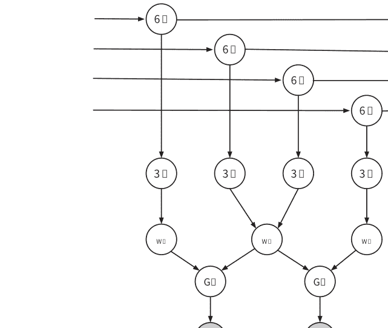

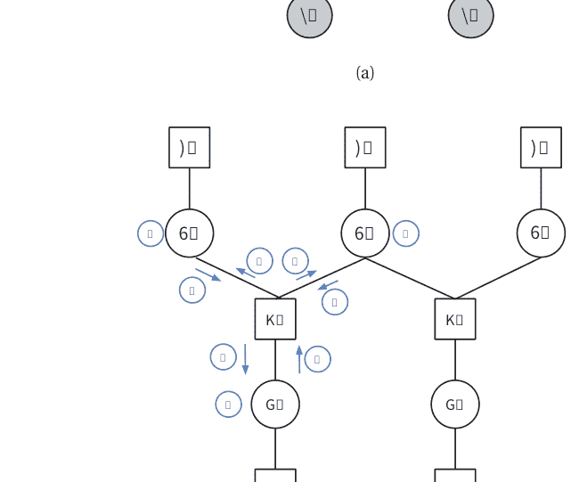

图22.11 （a）表示TrueSkill模型的DGM，有4个玩家和3个团队，其中团队1是玩家1，团队2是玩家2和3，团队3是玩家4。我们假设有两场比赛，团队1对阵团队2，团队2对阵团队3。双圈圈的节点是确定性的。（b）是模型的因子图表示，我们假设有3个玩家（没有团队）。有2场比赛，玩家1对玩家2，玩家2对玩家3。圈圈内的数字表示消息传递算法中的步骤。

## 22.5. 期望传播

使用Xbox 360 Live在线游戏系统的玩家；这个系统每天处理超过 $10^5$ 个游戏，使之成为迄今为止最大的贝叶斯统计应用之一。相同的方法也可以应用于其他游戏，如网球或国际象棋。

基本思想如图22.11(a)所示。我们假设每个玩家 $i$ 都有一个潜在的或真实的潜在技能水平 $s_i \in \mathbb{R}$。这些技能水平可以根据一个简单的动态模型演化， $p(s_i^t |s_i^{t-1}) = \mathcal{N}(s_i^t |s_i^{t-1}, \gamma^2)$。在任何给定的游戏中，我们定义玩家 $i$ 的表现为 $p_i$，其条件分布为 $p(p_i|s_i) = \mathcal{N}(p_i|s_i, \beta^2)$。然后我们定义一个团队的表现为其组成成员的表现之和。

$$
p(y_1 = +1|s) = \int p(d_1 > 0|t_1, t_2)p(t_1|s_1)p(t_2|s_2)dt_1dt_2 \quad (22.112)
$$

其中 $t_1 \sim \mathcal{N}(s_1, \beta^2)$ 和 $t_2 \sim \mathcal{N}(s_2 + s_3, \beta^2)$。为了简化算法的呈现，我们将忽略动态模型，并假设一个常见的静态分解高斯先验， $\mathcal{N}(\mu_0, \sigma_0^2)$，对技能进行建模。此外，我们假设每个团队只有1名球员，所以 $t_i = p_i$，并且不允许平局。最后，我们将积分出性能变量 $p_i$，并假设 $\beta^2= 1$，得到最终的模型形式

$$
p(s) = \prod_i \mathcal{N}(s_i|\mu_0, \sigma_0^2) \quad (22.113) \\
p(d_g|s) = \mathcal{N}(d_g|s_{i_g} - s_{j_g}, 1) \quad (22.114) \\
p(y_g|d_g) = \mathbb{I}(y_g = \text{sign}(d_g)) \quad (22.115)
$$

其中 $i_g$ 是游戏 $g$ 的第一个玩家， $j_g$ 是第二个玩家。这在图22.11(b)中以因子图形式表示。我们有3种类型的因子：先验因子， $f_i(s_i)=\mathcal{N}(s_i|\mu_0, \sigma_0^2)$，游戏因子， $h_g(s_{i_g}, s_{j_g}, d_g) = \mathcal{N}(d_g|s_{i_g} - s_{j_g}, 1)$，以及结果因子， $k_g(d_g, y_g) = \mathbb{I}(y_g=\text{sign}(d_g))$。

由于似然项 $(y_g|d_g)$ 与高斯先验不共轭，我们将需要进行近似推断。因此，即使图形是一棵树，我们也需要迭代。

（如果有额外的游戏，比如玩家1和玩家3之间的游戏，那么图就不再是一棵树了。）我们将用一维高斯分布来表示所有的消息和边际信念。我们将使用符号 $\mu$ 和 $v$ 表示均值和方差（矩参数），以及 $\lambda= 1/v$ 和 $\eta= \lambda\mu$ 表示精度和精度调整后的均值（自然参数）。

我们假设在迭代0时，从因子到变量的初始向上消息是均匀的，即

$$
m^0_{h_g \rightarrow s_{ig}}(s_{ig}) = 1, \quad \lambda^0_{h_g \rightarrow s_{ig}} = 0, \quad \eta^0_{h_g \rightarrow s_{ig}} = 0 \quad (22.116)
$$

并且类似地 $m^0_{h_g \rightarrow s_{jg}}(s_{jg}) = 1$。消息传递算法每场比赛包括6个步骤，如图22.11(b)所示。我们在下面详细介绍这些步骤。

1.  计算技能变量的后验概率:

    $$
    q^t(s_i) = f(s_i) \prod_g m^{t-1}_{h_g \rightarrow s_i}(s_i) = \mathcal{N}_c(s_i|\eta_i^t, \lambda_i^t) \quad (22.117) \\
    \lambda_i^t = \lambda_0 + \sum_g \lambda^{t-1}_{h_g \rightarrow s_i}, \quad \eta_i^t = \eta_0 + \sum_g \eta^{t-1}_{h_g \rightarrow s_i} \quad (22.118)
    $$

2.  从技能变量到游戏因子 $h_g$ 计算消息:

    $$
    m^t_{s_{ig} \rightarrow h_g}(s_{ig}) = \frac{q^t(s_{ig})}{m^{t-1}_{h_g \rightarrow s_{ig}}(s_{ig})}, \quad m^t_{s_{jg} \rightarrow h_g}(s_{jg}) = \frac{q^t(s_{jg})}{m^{t-1}_{h_g \rightarrow s_{jg}}(s_{jg})} \quad (22.119)
    $$

    其中除法的实现方式如下:

    $$
    \lambda^t_{s_{ig} \rightarrow h_g} = \lambda^t_{s_{ig}} - \lambda^{t-1}_{h_g \rightarrow s_{ig}}, \quad \eta^t_{s_{ig} \rightarrow h_g} = \eta^t_{s_{ig}} - \eta^{t-1}_{h_g \rightarrow s_{ig}} \quad (22.120)
    $$

    同样地，对于 $s_{jg}$.

3.  从游戏因子 $h_g$ 到差异变量 $d_g$ 计算消息:

    $$
    m^t_{h_g \rightarrow d_g}(d_g) = \iint h_g(d_g, s_{ig}, s_{jg}) m^t_{s_{ig} \rightarrow h_g}(s_{ig}) m^t_{s_{jg} \rightarrow h_g}(s_{jg}) ds_{ig} ds_{jg} \quad (22.121) \\
    = \iint \mathcal{N}(d_g|s_{ig} - s_{jg}, 1) \mathcal{N}(s_{ig}|\mu^t_{s_{ig} \rightarrow h_g}, v^t_{s_{ig} \rightarrow h_g}) \mathcal{N}(s_{jg}|\mu^t_{s_{jg} \rightarrow h_g}, v^t_{s_{jg} \rightarrow h_g}) ds_{ig} ds_{jg} \quad (22.122) \\
    = \mathcal{N}(d_g|\mu^t_{h_g \rightarrow d_g}, v^t_{h_g \rightarrow d_g}) \quad (22.123) \\
    v^t_{h_g \rightarrow d_g} = 1 + v^t_{s_{ig} \rightarrow h_g} + v^t_{s_{jg} \rightarrow h_g} \quad (22.124) \\
    \mu^t_{h_g \rightarrow d_g} = \mu^t_{s_{ig} \rightarrow h_g} - \mu^t_{s_{jg} \rightarrow h_g} \quad (22.125)
    $$

4.  计算差异变量的后验概率:

    $$
    q^t(d_g) \propto m^t_{h_g \rightarrow d_g}(d_g) m_{k_g \rightarrow d_g}(d_g) \quad (22.127) \\
    = \mathcal{N}(d_g|\mu^t_{h_g \rightarrow d_g}, v^t_{h_g \rightarrow d_g}) \mathbb{I}(y_g = \mathrm{sign}(d_g)) \quad (22.128) \\
    \approx \mathcal{N}(d_g|\mu_g^t, v_g^t) \quad (22.129)
    $$

（请注意，从 $k_g$ 因子的上行消息是恒定的。）我们可以通过矩匹配来找到这些参数，如下所示：

$$
\mu_g^t = y_g \mu_{h_g \rightarrow d_g}^t + \sigma_{h_g \rightarrow d_g}^t \Psi\left( \frac{y_g \mu_{h_g \rightarrow d_g}^t}{\sigma_{h_g \rightarrow d_g}^t} \right) \quad (22.130) \\
\nu_g^t = \nu_{h_g \rightarrow d_g}^t \left[ 1 - \Lambda\left( \frac{y_g \mu_{h_g \rightarrow d_g}^t}{\sigma_{h_g \rightarrow d_g}^t} \right) \right] \quad (22.131) \\
\Psi(x) \triangleq \frac{\mathcal{N}(x|0,1)}{\Phi(x)} \quad (22.132) \\
\Lambda(x) \triangleq \Psi(x)(\Psi(x) + x) \quad (22.133)
$$

（这些方程的推导留作练习11.15的修改。）这些函数在图22.12中绘制。让我们试着理解这些方程。假设 $\mu_{h_g \rightarrow d_g}^t$ 是一个较大的正数。这意味着根据当前技能的估计，我们预计 $d_g$ 将会是较大且正数。因此，如果我们观察到 $y_g=+1$，我们不会对 $i_g$ 成为赢家感到惊讶，这反映在均值的更新因子较小的事实中， $\Psi( y_g \mu_{h_g \rightarrow d_g}^t ) \approx 0$。同样，方差的更新因子也很小， $\Lambda(y_g \mu_{h_g \rightarrow d_g}^t ) \approx 0$。然而，如果我们观察到 $y_g = -1$，那么均值和方差的更新因子就会变得相当大。

5.  计算从差异变量到游戏因子 $h_g$ 的上行消息：

    $$
    m_{d_g \rightarrow h_g}^t(d_g) = \frac{q^t(d_g)}{m^t_{h_g \rightarrow d_g}(d_g)} \quad (22.134) \\
    \lambda_{d_g \rightarrow h_g}^t = \lambda_g^t - \lambda^t_{h_g \rightarrow d_g}, \quad \eta_{d_g \rightarrow h_g}^t = \eta_g^t - \eta^t_{h_g \rightarrow d_g} \quad (22.135)
    $$

6.  计算从游戏因子到技能变量的向上消息。让我们假设 $i_g$ 是赢家，$j_g$ 是输家。那么我们有

    $$
    m^t_{h_g \to s_{i_g}}(s_{i_g}) = \int \int h_g(d_g, s_{i_g}, s_{j_g}) m^t_{d_g \to h_g}(d_g) m^t_{s_{j_g} \to h_g}(s_{j_g}) dd_g ds_{j_g} \quad (22.136) \\
    = \mathcal{N}(s_{i_g} | \mu^t_{h_g \to s_{i_g}}, v^t_{h_g \to s_{i_g}}) \quad (22.137) \\
    v^t_{h_g \to s_{i_g}} = 1 + v^t_{d_g \to h_g} + v^t_{s_{j_g} \to h_g} \quad (22.138) \\
    \mu^t_{h_g \to s_{i_g}} = \mu^t_{d_g \to h_g} + \mu^t_{s_{j_g} \to h_g} \quad (22.139)
    $$

    类似地

    $$
    m^t_{h_g \to s_{j_g}}(s_{j_g}) = \int \int h_g(d_g, s_{i_g}, s_{j_g}) m^t_{d_g \to h_g}(d_g) m^t_{s_{i_g} \to h_g}(s_{i_g}) dd_g ds_{i_g} \quad (22.140) \\
    = \mathcal{N}(s_{j_g} | \mu^t_{h_g \to s_{j_g}}, v^t_{h_g \to s_{j_g}}) \quad (22.141) \\
    v^t_{h_g \to s_{j_g}} = 1 + v^t_{d_g \to h_g} + v^t_{s_{i_g} \to h_g} \quad (22.142) \\
    \mu^t_{h_g \to s_{j_g}} = \mu^t_{d_g \to h_g} - \mu^t_{s_{i_g} \to h_g} \quad (22.143)
    $$

当我们计算 $q^{t+1}(s_{i_g})$ 在下一次迭代中，通过组合 $m^t_{h_g \to s_{i_g}}(s_{i_g})$ 与先验因子一起，我们将看到后验均值为 $s_{i_g}$ 上升。同样，后验均值 of $s_{j_g}$ 下降。

将EP与ADF结合起来进行在线推断是直接的，这对于大多数实际应用是必要的。

让我们考虑一个简单的例子。我们创建了一个包含5个玩家的部分排序，如图22.13(a)所示。然后，我们从这个图中采样一些游戏结果。

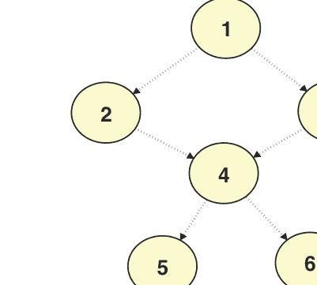

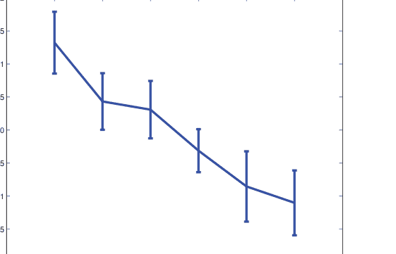

图22.13 (a) 表示玩家的部分排序的有向无环图。(b) 基于26场比赛的每个玩家潜在技能的后验均值加减1个标准差。图由trueskillDemo生成。

父节点总是击败子节点。我们将这些数据传入（5次迭代的）EP算法，并推断出每个玩家的技能水平的后验均值和方差。结果如图22.13(b)所示。我们可以看到该方法已经正确推断出了玩家的排名顺序。

#### 22.5.6 EP的其他应用

TrueSkill模型是由微软的研究人员开发的。他们和其他人将该模型扩展到了各种其他有趣的应用中，包括个性化广告推荐（Stern等人，2009年），预测Bing搜索引擎上广告的点击率（Graepel等人，2010年），等等。他们还开发了一个基于EP的通用贝叶斯推断工具箱，名为infer.net（Minka等人，2010年）。

EP还被用于各种其他模型，例如高斯过程分类（Nickisch和Rasmussen 2008）。请参见http://research.microsoft.com/en-us/um/people/minka/papers/ep/roadmap.html以获取其他EP应用的列表。

### 22.6 MAP状态估计

在本节中，我们考虑在离散状态图模型中找到最可能的变量配置的问题，即我们的目标是找到以下形式的MAP分配：

$$\mathbf{x}^* = \arg \max_{\mathbf{x} \in \mathcal{X}^m} p(\mathbf{x}|\boldsymbol{\theta}) = \arg \max_{\mathbf{x} \in \mathcal{X}^m} \sum_{i \in V} \theta_i(x_i) + \sum_{f \in F} \theta_f(\mathbf{x}_f) = \arg \max_{\mathbf{x} \in \mathcal{X}^m} \boldsymbol{\theta}^T \boldsymbol{\phi}(\mathbf{x}) \quad (22.144)$$

其中 $\theta_i$ 是单节点势函数，$\theta_f$ 是因子势函数。（在本节中，我们遵循（Sontag等人2011）的符号约定，考虑的是一般势函数而不仅仅是成对的。）注意，分区函数 $Z(\boldsymbol{\theta})$ 在MAP估计中不起作用。如果树宽较低，我们可以使用联结树算法（第20.4节）解决这个问题，但一般情况下这个问题是难以处理的。在本节中，我们讨论各种近似方法，基于第22.3节的材料。

#### 22.6.1 线性规划松弛

我们可以将目标重新表达为变分参数的形式如下：

$$\arg \max_{\mathbf{x} \in \mathcal{X}^m} \boldsymbol{\theta}^T \boldsymbol{\phi}(\mathbf{x}) = \arg \max_{\boldsymbol{\mu} \in \mathbb{M}(G)} \boldsymbol{\theta}^T \boldsymbol{\mu} \quad (22.145)$$

其中 $\boldsymbol{\phi}(\mathbf{x}) = [\{\mathbb{I}(x_s = j)\}, \{\mathbb{I}(\mathbf{x}_f = k)\}]$，而 $\boldsymbol{\mu}$ 是边缘多面体中的概率向量。为了理解这个等式为什么成立，注意我们可以将 $\boldsymbol{\mu}$ 设置为一个退化分布，其中 $\mu(x_s) = \mathbb{I}(x_s = x_s^*)$，其中 $x_s^*$ 是节点的最优分配。因此，我们现在优化的是概率分布 $\boldsymbol{\mu}$，而不是离散分配。

看起来我们有一个容易解决的问题，因为方程式22.145中的目标函数是 $\boldsymbol{\mu}$ 的线性函数，而约束集合 $\mathbb{M}(G)$ 是凸的。问题在于，一般情况下，$\mathbb{M}(G)$ 的面数是节点数量的指数级别。

在组合优化中，一种标准策略是放宽约束条件。在这种情况下，我们允许概率向量 $\boldsymbol{\mu}$ 不仅限于驻点多面体 $\mathbb{M}(G)$，而是允许它存在于一个凸包 $\mathbb{L}(G)$ 中。定义了这个放松的约束集合后，我们有

$\max_{\mathbf{x} \in \mathcal{X}^m} \boldsymbol{\theta}^T \phi(\mathbf{x}) = \max_{\boldsymbol{\mu} \in \mathbb{M}(G)} \boldsymbol{\theta}^T \boldsymbol{\mu} \leq \max_{\boldsymbol{\tau} \in \mathbb{L}(G)} \boldsymbol{\theta}^T \boldsymbol{\tau}$ (22.146)

如果解是整数，那么它是精确的；如果解是分数，那么它是一个近似值。这被称为（一阶）线性规划松弛。之所以称为一阶，是因为强制执行的约束是与树的一致性相对应的约束，而树的树宽为1。可以使用树宽更大的图来强制执行高阶一致性（详见（Wainwright and Jordan 2008b, sec 8.5））。

我们应该如何实际执行优化？我们可以使用通用的线性规划包，但这通常非常慢。幸运的是，在图模型的情况下，可以设计专门的分布式消息传递算法来解决这个优化问题，如下所述。

### 22.6.2 最大乘积置信传播

方程式22.145中的MAP目标，$\max_{\boldsymbol{\mu} \in \mathbb{M}(G)} \boldsymbol{\theta}^T \boldsymbol{\mu}$，与方程式22.23中的推理目标几乎相同，$\max_{\boldsymbol{\mu} \in \mathbb{M}(G)} \boldsymbol{\theta}^T \boldsymbol{\mu} + \mathbb{H}(\boldsymbol{\mu})$，除了熵项。一种启发式的方法是考虑概率分布 $\boldsymbol{\mu}$的零温度极限，其中概率分布的质量全部集中在其模式上（见第4.2.2节）。在这种情况下，熵项变为零。然后，我们可以修改用于解决推理问题的消息传递方法，使其解决MAP估计问题。特别是在零温度极限下，求和运算符变为最大运算符，从而产生一种称为最大乘积置信传播的方法。

更详细地说，让

$A(\boldsymbol{\theta}) \triangleq \max_{\boldsymbol{\mu} \in \mathbb{M}(G)} \boldsymbol{\theta}^T \boldsymbol{\mu} + \mathbb{H}(\boldsymbol{\mu})$ (22.147)

现在考虑逆温度 $\beta$趋于无穷大。我们有

$\lim_{\beta \to +\infty} \frac{A(\beta \boldsymbol{\theta})}{\beta} = \lim_{\beta \to +\infty} \frac{1}{\beta} \max_{\boldsymbol{\mu} \in \mathbb{M}(G)} \left\{ (\beta \boldsymbol{\theta})^T \boldsymbol{\mu} + \mathbb{H}(\boldsymbol{\mu}) \right\}$ (22.148)
$= \max_{\boldsymbol{\mu} \in \mathbb{M}(G)} \left\{ \boldsymbol{\theta}^T \boldsymbol{\mu} + \lim_{\beta \to +\infty} \frac{1}{\beta} \mathbb{H}(\boldsymbol{\mu}) \right\}$ (22.149)
$= \max_{\boldsymbol{\mu} \in \mathbb{M}(G)} \boldsymbol{\theta}^T \boldsymbol{\mu}$ (22.150)

正是目标函数的凹性使我们能够交换 $\lim$和 $\max$运算符（详见（Wainwright and Jordan 2008b, p274））。

现在考虑Bethe近似，其形式为 $\max_{\boldsymbol{\tau} \in \mathbb{L}(G)} \boldsymbol{\theta}^T \boldsymbol{\tau} + \mathbb{H}_{\text{Bethe}}(\boldsymbol{\tau})$。我们证明了循环BP找到了这个目标的局部最优解。在零温度极限下，这个目标等价于MAP问题的LP松弛。不幸的是，最大乘积循环BP不能解决这个LP松弛，除非图是一棵树（Wainwright and Jordan2008b, p211）。原因是Bethe能量泛函不是凹的（除了树），所以我们不能在上述零温度推导中交换极限和最大值运算符。

然而，如果我们使用树重新加权的BP，或者TRBP/TRW，我们有一个凹目标。在这种情况下，可以证明（Kolmogorov和Wainwright 2005）TRBP的最大乘积版本可以解决上述LP松弛问题。这个算法的某种调度，称为顺序TRBP，TRBP-S或TRW-S，可以证明总是收敛（Kolmogorov 2006），而且通常比标准并行更新更快。这个想法是选择一个任意的节点顺序 X1, ..., XNo。然后我们考虑一个树的集合，它是这个顺序的子序列。在每次迭代中，我们从 X1 向 XN 进行最大乘积BP，并沿着其中一棵树返回。可以证明，这个算法单调地最小化能量的一个下界，因此保证收敛到LP松弛的全局最优解。

#### 22.6.3 图割

在本节中，我们将展示如何通过使用图的最大流/最小割算法来找到MAP状态估计，或者等价地，最小能量配置。^8这类方法被称为图割，广泛应用于计算机视觉领域。

我们将从考虑具有二进制节点和受限潜力类的MRF的情况开始；在这种情况下，图割将找到精确的全局最优解。然后我们考虑每个节点具有多个状态的情况，这些状态被假设具有某种潜在的排序；我们可以通过解决一系列二进制子问题来近似解决这种情况，正如我们将看到的。

#### 22.6.3.1 广义伊辛模型的图割

让我们首先考虑一个二进制MRF，其中边的能量具有以下形式：

$$E_{uv}(x_u, x_v) = \begin{cases} 0 & \text{如果 } x_u = x_v \\ \lambda_{st} & \text{如果 } x_u \neq x_v \end{cases} \quad (22.151)$$

其中 \(\lambda_{st} \ge 0\)是边的成本。这鼓励相邻节点具有相同的值（因为我们试图最小化能量）。由于我们可以自由添加任何我们喜欢的常数到整体能量中而不影响MAP状态估计，让我们重新调整局部能量项使得 \(E_u(1) = 0\)或 \(E_u(0) = 0\)。

现在让我们构建一个具有与MRF相同节点集的图，再加上两个特殊节点：源节点 s 和汇节点 t。如果 \(E_u(1) = 0\)，我们添加边 \(x_u \rightarrow t\)，成本为 \(E_u(0)\)。（这确保如果 u 不在分区 \(\mathcal{X}_t\)中，即 u 被分配到状态0，我们将在割中支付成本 \(E_u(0)\)。）类似地，如果 \(E_u(0) = 0\)，我们添加边 \(x_u \rightarrow s\)，成本为 \(E_u(1)\)。最后，对于MRF中连接的每对变量，我们添加边 \(x_u \rightarrow x_v\)和 \(x_v \rightarrow x_u\)，两者成本均为 \(\lambda_{u,v} \ge 0\)。图22.14说明了具有4个节点的MRF的构造方式，并具有以下非零能量值：

$$E_1(0) = 7, E_2(1) = 2, E_3(1) = 1, E_4(1) = 6 \quad (22.152)$$
$$\lambda_{1,2} = 6, \lambda_{2,3} = 6, \lambda_{3,4} = 2, \lambda_{1,4} = 1 \quad (22.153)$$

构建完图后，我们计算最小割。这是将节点分为两个集合的划分，\(\mathcal{X}_s\)是与 s 相连的节点，\(\mathcal{X}_t\)是与 t 相连的节点。我们^8选择使得分区之间边的成本之和最小的分区：

$$成本(\mathcal{X}_s, \mathcal{X}_t) = \sum_{x_u \in \mathcal{X}_s, x_v \in \mathcal{X}_t} 成本(x_u, x_v) \quad (22.154)$$

在图22.14中，我们可以看到最小割的成本为6。在这个图中，最小化成本等价于最小化MRF中的能量。因此，被分配给 s的节点具有最优状态0，而被分配给 t的节点具有最优状态1。在图22.14中，我们可以看到最优MAP估计为 (1,1,1,0)。

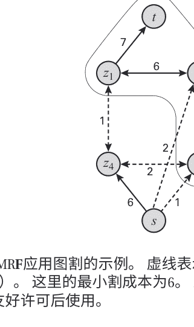

图22.14 对具有4个节点的MRF应用图割的示例。虚线表示对割的成本有贡献的边（对于双向边，我们只计算其中一个成本）。这里的最小割成本为6。来源：（Koller and Friedman 2009）的图13.5。获得Daphne Koller的友好许可后使用。

^8 有多种实现此算法的方法，请参见例如（Sedgewick and Wayne 2011）。最佳时间复杂度为 \(O(EV \log V)\) 或 \(O(V^3)\)，其中 E 是边的数量，V 是节点的数量。

#### 22.6.3.2 用于具有次模势能的二元MRF的图割

现在我们讨论如何将图割构造扩展到具有更一般的势函数的二元MRF。特别地，假设每个成对能量满足以下条件：

$$E_{uv}(1,1) + E_{uv}(0,0) \leq E_{uv}(1,0) + E_{uv}(0,1) \quad (22.155)$$

换句话说，对角线能量的总和小于非对角线能量的总和。在这种情况下，我们说能量是次模的(Kolmogorov and Zabin 2004)。一个次模能量的例子是一个Ising模型，其中 \(\lambda_{uv} > 0\)。这也被称为一个吸引力的MRF或关联的MRF，因为模型“希望”相邻的状态是相同的。

^9 次模性是离散凸性的类比。直观地说，它对应于“边际效益递减法则”，即如果集合已经很大，则向集合添加一个元素的额外价值会减少。更正式地说，对于任何 \(A \subset B \subset S\) 和 \(x \in S\)，我们有 \(f(A \cup \{x\}) - f(A) \geq f(B \cup \{x\}) - f(B)\)。如果 \(-f\) 是次模性的，那么 \(f\) 是超模性的。

要将图割应用于具有次模势的二元MRF，我们按如下方式构造成对的边权重：

$$E'_{u,v}(0,1) = E_{u,v}(1,0) + E_{u,v}(0,1) - E_{u,v}(0,0) - E_{u,v}(1,1) \tag{22.156}$$

这是由于次模性假设保证为非负的。此外，我们按如下方式构造新的局部边权重:首先，我们初始化 $E'(u) = E(u)$，然后对于每对边 $(u, v)$，我们按如下方式更新这些值：

$$E'_u(1) = E'_u(1) + (E_{u,v}(1,0) - E_{u,v}(0,0)) \tag{22.157}$$
$$E'_v(1) = E'_v(1) + (E_{u,v}(1,1) - E_{u,v}(1,0)) \tag{22.158}$$

我们现在以类似的方式构建一个图。具体来说，如果 $E'_u (1) > E'_u (0)$，我们添加边 $u \rightarrow s$，成本为 $E'_u (1) - E'_u (0)$；否则，我们添加边 $u \rightarrow t$，成本为 $E'_u (0) - E'_u (1)$。最后，对于每个满足 $E'_{u,v} (0,1) > 0$的MRF边，我们添加一个图割边 $x_u - x_v$，成本为 $E'_{u,v} (0,1)$。（我们不需要在两个方向上都添加边。）可以证明（练习22.1），这个图中的最小割与最小能量配置相同。因此，我们可以使用最大流/最小割来找到全局最优的MAP估计（Greig等人，1989年）。

#### 22.6.3.3 针对非二进制度量MRF的图割

我们现在讨论如何在每个节点可以具有多个状态的MRF中使用图割进行近似MAP估计（Boykov等人，2001年）。然而，我们要求成对能量形成一个度量。我们将这样的模型称为度量MRF。例如，假设状态具有自然排序，这在它们是底层连续空间的离散化时常见。在这种情况下，我们可以定义一个形式为 $E(x_s, x_t) = \min(\delta, ||x_s - x_t||)$ 或形式为 $E(x_s, x_t) = \min(\delta, (x_s - x_t)^2)$ 的度量，其中 $\delta > 0$ 是某个常数。这种能量鼓励相邻节点具有相似的标签，但从不“惩罚”它们超过 $\delta$。这个 $\delta$ 项防止过度平滑，我们在图19.20中进行了说明。

图割的一种版本是$\alpha$扩展。在每一步中，它选择一个可用的标签或状态，并将其称为$\alpha$；然后它解决一个二进制子问题，其中每个变量可以选择保持其当前状态，或者变为状态$\alpha$（参见图22.15(d)的示例）。更准确地说，我们在二进制节点上定义了一个新的MRF，并且相对于当前分配 $\mathbf{x}$，我们定义了这个新模型的能量如下：

$$E'_u(0) = E_u(x_u), \quad E'_u(1) = E_u(\alpha), \quad E'_{u,v}(0,0) = E_{u,v}(x_u, x_v) \tag{22.159}$$
$$E'_{u,v}(0,1) = E_{u,v}(x_u, \alpha), \quad E'_{u,v}(1,0) = E_{u,v}(\alpha, x_v), \quad E'_{u,v}(1,1) = E_{u,v}(\alpha, \alpha) \tag{22.160}$$

为了使用图割来优化 $E'$（从而找出最优的alpha扩展移动），我们需要能量是次模的。将定义代入，我们得到以下约束条件：

$$E_{u,v}(x_u, x_v) + E_{u,v}(\alpha, \alpha) \le E_{u,v}(x_u, \alpha) + E_{u,v}(\alpha, x_v) \tag{22.161}$$

对于任何距离函数，$E_{u,v} (\alpha, \alpha) = 0$，剩下的不等式由三角不等式得出。因此，我们可以将alpha扩展移动应用于任何度量MRF。

图22.15 (a) 带有3个标签的图像。(b) 标准的局部移动（例如，通过迭代条件模式）只会翻转一个像素的标签。(c) α-β交换允许当前标记为α的所有节点在降低能量的情况下重新标记为β。(d) α扩展允许当前未标记为α的所有节点在降低能量的情况下重新标记为α。来源：(Boykov等人，2001年) 的图2。在Ramin Zabih的友情许可下使用。

在每一步的alpha扩展中，我们从一个指数级别的巨大集合中找到最优的移动；因此，我们达到了一个比迭代条件模式等标准贪婪标签翻转方法找到的局部最优解能量要低得多的强局部最优解。事实上，一旦算法收敛，得到的解的能量最多是最优能量的2倍，其中

> $c = \max_{(u,v) \in E} \frac{\max_{\alpha=\beta} E_{uv}(\alpha,\beta)}{\min_{\alpha=\beta} E_{uv}(\alpha,\beta)}$

请参见练习22.3以获取证明。在Potts模型的情况下，$c=1$，因此我们有一个2-近似解。

图割的另一个版本是alpha-beta交换。在每一步中，选择两个标签，称为α和β。如果这样能降低能量（参见图22.15(c))，则当前标记为α的所有节点都可以改为β（反之亦然）。即使能量只是半度量（即，三角不等式不成立；请参见练习22.2)，也可以精确解决得到的二元子问题。尽管α-β交换版本可以应用于比α扩展版本更广泛的模型类别，但从理论上讲它不如α扩展版本强大。事实上，在各种低级视觉问题中，（Szeliski等人，2008年）通过实验证明，扩展版本通常优于交换版本（请参见第22.6.4节）。

#### 22.6.4 图割和BP的实验比较

在第19.6.2.7节中，我们描述了用于各种低级视觉问题的格子结构CRF。（Szeliski等人，2008年）对这类问题的不同近似优化技术进行了广泛比较。对于立体深度估计问题，一些结果如图22.16所示。我们可以看到，图割和树重新加权的最大乘积BP（TRW）给出了最好的结果，而常规的最大乘积BP则要差得多。就速度而言，图割是最快的，TRW紧随其后。其他算法，如ICM、模拟退火或一种称为归一化相关的标准领域特定启发式算法，

图22.16 用于立体深度估计的CRF上的能量最小化。 顶行：两个输入图像以及地面真实深度值。 底行：4种不同优化算法的能量与时间的关系。 左下角：结果是泰迪图像（显示在顶部行）。 右下角：结果是筑波图像（显示在图22.17(a)中）。 来源：(Koller和Friedman 2009)的图13.B.1。 获得Daphne Koller的友情许可后使用。

如图22.17所示，情况更糟。

由于TRW正在优化松弛的LP问题的对偶问题，我们可以在收敛时使用其值来评估最优能量。 事实证明，在立体基准数据集中的许多图像中，地面真实值的能量（概率较低）比全局最优估计（Meltzer等人，2005年）更高。 这表明我们正在优化错误的模型。 这并不奇怪，因为成对的CRF忽略了已知的长程约束。 不幸的是，如果我们将这些约束添加到模型中，图形要么变得过于密集（使BP变慢），要么势函数变得非次模（使图割不适用）。

解决这个问题的一种方法是使用图割的重复应用来生成多样化的局部模式，如(Yadollahpour等人，2011年)所述。 然后我们可以应用更复杂的模型，使用全局特征对解决方案进行重新排序。

图22.17 使用MRF进行立体深度估计的示例。 (a) 左图像，大小为 384 × 288像素，来自筑波大学。(相应的右图像类似，但未显示。) (b)真实深度图，量化为15个级别。 (c-f)：使用不同方法的MAP估计：(c) α − β交换，(d) α扩展，(e) 归一化交叉相关性，(f) 模拟退火。 来源：(Boykov等人, 2001年)的图10。 获得Ramin Zabih的友好许可后使用。

## 22.6.5 双重分解

我们对计算感兴趣

$$p^* = \max_{\mathbf{x} \in \mathcal{X}^m} \sum_{i \in V} \theta_i(x_i) + \sum_{f \in F} \theta_f(\mathbf{x}_f)$$

其中 F表示一组因子。 我们将假设我们可以有效地优化每个局部因子，但所有这些因子的组合使问题变得棘手。 一种方法是独立地优化每个项，然后引入约束条件，强制所有局部变量值的估计值相互一致。 我们在(Sontag et al. 2011)的介绍之后，详细解释这一点。

图22.18 (a) 具有4个不同边缘因子的成对MRF。 (b) 我们有4个独立的变量，加上每个变量在参与的因子中的副本。来源：(Sontag et al. 2011)的图1.2-1.3。获得David Sontag的友好许可后使用。

### 22.6.5.1 基本思想

让我们为每个因子复制变量 $x_i$，并强制它们相等。具体来说，令 $\mathbf{x}^{f} = \{x^{f}_{i}\}_{i \in f}$ 为因子$_f$使用的变量集。这个构造在图22.18中有所说明。我们可以重新表述目标如下：

$$p^* = \mathop{\text{最大值}}_{\mathbf{x},\mathbf{x}^f} \sum_{i \in V} \theta_i(x_i) + \sum_{f \in F} \theta_f(\mathbf{x}^f_f) \quad \text{s.t.} \quad x^f_i = x_i \quad \forall f, i \in f \tag{22.164}$$

现在让我们引入拉格朗日乘子，或者双重变量，$\delta_{f i}(k)$，来强制执行这些约束。拉格朗日函数变为

$$L(\delta, \mathbf{x}, \mathbf{x}^f) = \sum_{i \in V} \theta_i(x_i) + \sum_{f \in F} \theta_f(\mathbf{x}^f_f) \tag{22.165}$$
$$+ \sum_{f \in F} \sum_{i \in f} \sum_{\hat{x}_i} \delta_{f i}(\hat{x}_i) \left( \mathbb{I}(x_i = \hat{x}_i) - \mathbb{I}(x^f_i = \hat{x}_i) \right) \tag{22.166}$$

这在以下意义上等价于我们的原始问题：对于任何$\delta$的值，我们有

$$p^* = \mathop{\text{最大值}}_{\mathbf{x},\mathbf{x}^f} L(\delta, \mathbf{x}, \mathbf{x}^f) \quad \text{s.t.} \quad x^f_i = x_i \quad \forall f, i \in f \tag{22.167}$$

因为如果约束成立，最后一项为零。我们可以通过放弃一致性约束来得到一个上界，并且只优化以下上界：

$$L(\delta) \triangleq \max_{\mathbf{x},\mathbf{x}^f} L(\delta, \mathbf{x}, \mathbf{x}^f) \tag{22.168}$$
$$= \sum_i \max_{x_i} \left( \theta_i(x_i) + \sum_{f: i \in f} \delta_{f i}(x_i) \right) + \sum_f \max_{\mathbf{x}_f} \left( \theta_f(\mathbf{x}_f) - \sum_{i \in f} \delta_{f i}(x_i) \right) \tag{22.169}$$

参见图22.19以进行说明。

这个目标是可优化的，因为每个 $\mathbf{x}_f$ 项都是解耦的。此外，我们看到 $L(\boldsymbol{\delta}) \geq p^*$，因为通过放松一致性约束，我们在一个更大的空间上进行优化。此外，我们还有一个性质，即

$$\min_{\boldsymbol{\delta}} L(\boldsymbol{\delta}) = p^* \tag{22.170}$$

因此，上界在 $\delta$ 的最优值处是紧的，这强制执行了原始约束。

最小化这个上界被称为对偶分解或拉格朗日松弛(Komodakis et al. 2011; Sontag et al. 2011; Rush and Collins 2012)。此外，可以证明 $L(\boldsymbol{\delta})$是与之前看到的相同LP松弛的对偶。我们将在下面讨论几种可能的优化算法。

从实际角度来看，对偶分解的主要优点是它允许以方便的方式混合和匹配不同类型的优化算法。例如，我们可以将网格结构图与局部子模因子相结合，进行图像分割，再加上树结构模型进行姿态估计（参见练习22.4）。类似的方法可以在自然语言处理中使用，其中我们经常有局部和全局约束的混合（参见例如，(Koo et al. 2010; Rush and Collins 2012)）。

### 22.6.5.2 理论保证

我们能够对通过这种方式获得的解的质量有什么说法？为了理解这一点，让我们首先引入一些符号：

$$\bar{\theta}^{\delta}_{i}(x_i) \triangleq \theta_i(x_i) + \sum_{f: i \in f} \delta_{f\,i}(x_i) \tag{22.171}$$

$$\bar{\theta}^{\delta}_{f}(\mathbf{x}_f) \triangleq \theta_f(\mathbf{x}_f) - \sum_{i \in f} \delta_{f\,i}(x_i) \tag{22.172}$$

这表示对原始问题的重新参数化，即

$\sum_i \theta_i(x_i) + \sum_f \theta_f(\mathbf{x}_f) = \sum_i \bar{\theta}_i^\delta(x_i) + \sum_f \bar{\theta}_f^\delta(\mathbf{x}_f) \tag{22.173}$

因此

$L(\delta) = \sum_{i} \max_{x_i} \bar{\theta}_i^\delta(x_i) + \sum_{f} \max_{\mathbf{x}_f} \bar{\theta}_f^\delta(\mathbf{x}_f) \tag{22.174}$

现在假设存在一组对偶变量 $\delta^*$ 和一个分配 $\mathbf{x}^*$，使得对于单例项的最大化分配与因子项的分配一致，即，$\bar{\theta}_i^{\delta^*} (x_i)$ 和 $\mathbf{x}_f^* \in \operatorname{argmax}_{\mathbf{x}_f} \bar{\theta}_f^{\delta^*} (\mathbf{x}_f)$。在这种情况下，我们有

$L(\delta^*) = \sum_i \bar{\theta}_i^{\delta^*} (x_i^*) + \sum_f \bar{\theta}_f^{\delta^*} (\mathbf{x}_f^*) = \sum_i \theta_i(x_i^*) + \sum_f \theta_f(\mathbf{x}_f^*) \tag{22.175}$

现在由于

$\sum_i \theta_i(x_i^*) + \sum_f \theta_f(\mathbf{x}_f^*) \leq p^* \leq L(\delta^*) \tag{22.176}$

我们得出结论 $L(\delta^*) = p^*$, 所以 $\mathbf{x}^*$ 是MAP分配。因此，如果我们能找到一个解，使得所有子问题都达成一致，我们可以确信它是全局最优解。这在实际问题中经常发生。

### 22.6.5.3 子梯度下降

$L(\delta)$ 是一个凸且连续的目标函数，但在 $\theta \delta$ 点处是不可微的。或 $\bar{\theta}_f^{\delta} (\mathbf{x}_f)$ 有多个最优解。一种方法是使用次梯度下降。这将同时更新 $\delta$ 的所有元素，如下所示：

$\delta_{f i}^{t+1}(x_i) = \delta_{f i}^{t}(x_i) - \alpha_t g_{f i}^{t}(x_i) \tag{22.177}$

其中 $\mathbf{g}^t$ 是 $L(\delta)$ 在 $\delta^t$ 处的次梯度。如果步长 $\alpha_t$ 设置得当（见第8.5.2.1节），该方法保证收敛到对偶问题的全局最优解。（详见(Komodakis et al. 2011)）

可以证明梯度由以下稀疏向量给出。首先令 $x_i^{s_i} \in \operatorname{argmax}_{x_i} \bar{\theta}_i^{\delta_t} (x_i)$ 和 $\mathbf{x}_f^{f_f} \in \operatorname{argmax}_{\mathbf{x}_f} \bar{\theta}_f^{\delta_t}$ 接下来，让我们定义 $g_{f i} (x_i) = 0$ 对于所有元素。最后，如果 $x_i^f = x_i^{s_i}$（因此因子 $f$ disagrees 与本地项关于如何设置变量 $i$），我们设置 $g_{f i} (x_i^{s_i}) = +1$ 和 $g_{f j} = -1$。这将导致减小 $\bar{\theta}_i^{\delta_t} (x_i^{s_i})$ 并增加 $\bar{\theta}_f^{\delta_t} (\mathbf{x}_f^{f}, \mathbf{x}_{f\i})$ 的值并增加 $\theta_f^{\delta_t} (x_i^{s_i}, \mathbf{x}_{f\i})$ 的值。为了计算梯度，我们需要能够解决以下形式的子问题：

$\operatorname{argmax}_{\mathbf{x}_f} \bar{\theta}_f^{\delta_t} (\mathbf{x}_f) = \operatorname{argmax}_{\mathbf{x}_f} \left[ \theta_f(\mathbf{x}_f) - \sum_{i \in f} \delta_{f i}^t(x_i) \right] \tag{22.178}$

### 22.6.5.4 坐标下降

一种替代方法是使用块坐标下降来更新整个 δ 向量（尽管是稀疏的）。通过选择块的大小，我们可以在局部优化问题的收敛速度和易用性之间进行权衡。

一种方法是同时为所有 i ∈ f 和所有 x i（对于固定的因子 f）优化 δf i ( x i)。这被称为最大乘积线性规划（Globerson和Jaakkola, 2008年）。从算法上讲，这类似于在因子图上进行信念传播。具体而言，我们将从因子 f 发送到变量 i 的消息定义为 δf→i，将从变量 i 发送到因子 f 的消息定义为 δi→f o 这些消息可以按照以下方式计算（参见（Globerson和Jaakkola, 2008年）的推导）：

$\delta_{i \rightarrow f}(x_i) = \theta_i(x_i) + \sum_{g=\neg f} \delta_{g \rightarrow i}(x_i) \quad\quad\quad\quad\quad\quad (22.179)$

$\delta_{f \rightarrow i}(x_i) = -\delta_{i \rightarrow f}(x_i) + \frac{1}{|f|} \max_{\mathbf{x}_{f \setminus i}} \left[ \theta_f(\mathbf{x}_f) + \sum_{j \in f} \delta_{j \rightarrow f}(x_j) \right] \quad\quad\quad\quad\quad\quad (22.180)$

然后我们将双重变量 δf i (x_i)设置为消息 δf→i(x_i)。

例如，考虑一个 2 × 2 网格MRF，具有以下成对因子： θf(x1, x2), θg(x1, x3), θh(x2, x4)和 θk(x3, x4)。 从因子 f 到变量2的输出消息是a

所有进入 $f$ 的消息的函数，以及 $f$ 的本地因子：

$\delta_{f \to 2}(x_2) = -\delta_{2 \to f}(x_2) + \frac{1}{2} \max_{x_1} [\theta_f(x_1, x_2) + \delta_{1 \to f}(x_1) + \delta_{2 \to f}(x_2)]$

同样，从变量2到因子 $f$ 的输出消息是所有从其他连接的因子（在这个例子中只有因子 $h$）发送到变量2的消息的函数，以及本地潜力：

$\delta_{2 \to f}(x_2) = \theta_2(2) + \delta_{h2}(x_2)$

计算的关键瓶颈是计算每个因子的最大边际，其中我们从除了 $x_i$ 之外的所有变量中选择最大值，即我们需要能够高效地计算以下最大边际：

$\max_{x_f \setminus i} h(x_f \setminus i, x_i), \quad h(x_f \setminus i, x_i) \triangleq \theta_f(x_f) + \sum_{j \in f} \delta_{jf}(x_j)$

与方程22.178的不同之处在于我们在所有变量中选择最大值，除了一个变量。我们可以使用消息传递在低树宽图模型中高效地解决这个问题；我们还可以在对应于二分匹配（Duchi等人，2007年）或基数约束（Tarlow等人，2010年）的因子上高效地解决这个问题。然而，在某些情况下，在因子的范围内选择最大值比在除了一个变量之外的所有变量上选择最大值更容易计算（请参见（Sontag等人，2011年，第1.5.4节）的示例）；在这种情况下，我们可能更愿意使用次梯度方法。

坐标下降是一种简单的算法，通常在最小化对偶问题时比梯度下降快得多，特别是在早期迭代中。它还可以单调地减少目标，并且不需要任何步长参数。不幸的是，它不能保证收敛到全局最优解，因为 $L(\delta)$ 是凸但不是严格凸的（这意味着可能存在多个全局最优值）。确保收敛的一种方法是将 $L(\delta)$ 的定义中的最大函数替换为软最大函数，这使得目标函数严格凸（详见（Hazan and Shashua 2010））。

### 22.6.5.5 恢复MAP分配

到目前为止，我们一直在寻找 $\delta^*$ 的最优值。但我们真正想要的是 $x^*$ 的最优值。一般来说，从 $\delta^*$ 计算 $x^*$ 是NP难的，即使LP松弛是紧的且MAP分配是唯一的（Sontag et al. 2011，定理1.4）。（当存在与MAP估计的最优值相同的分数分配时，会出现问题。）

然而，假设每个 $\theta^{\delta^*}_{i}$ 有一个唯一的最大值， $x^*_i$；在这种情况下，我们说 $\delta^*$ 对于 $x^*$ 是局部可解码的。可以证明，在这种情况下，LP松弛是唯一的，其解是确实的 $x^*$。如果许多节点，但不是全部节点都是唯一可解码的，我们可以将唯一可解码的节点“固定”到它们的MAP值，然后使用精确推理算法来找出剩余变量的最优赋值。使用这种方法，（Meltzer等人，2005年）能够最优地解决各种立体视觉CRF估计问题，（Yanover等人，2007年）能够最优地解决各种蛋白质侧链结构预测问题。另一种方法是在分支和界限搜索过程中使用由对偶提供的上界（Geoffrion，1974年）。

## 练习

## 练习22.1 二进制次模MRF中的图割用于MAP估计

(来源: (Koller和Friedman 2009)的例子13.14)。 证明使用22.6.3.2节中描述的图构造方法，割的代价等于相应分配的能量，除了一个无关紧要的常数。 (警告: 这个练习涉及大量的代数记账。)

## 练习22.2 用于alpha-beta交换的图割

(来源: (Koller和Friedman 2009)的例子13.15)。 展示如何通过在适当构造的图上运行最小割来找到最优的alpha-beta交换。 更具体地说，

- a. 定义一组二进制变量 $t_1, \ldots, t_n$ 使得 $t_i = 0$ 表示 $x_i' = \alpha$, $t_i = 1$ 如果 $x_i' = \beta$, 且 $x_i' = x_i$ 不变如果 $x_i = \alpha$ 和 $x_i = \beta$。
- b. 定义一个关于新变量的能量函数, 使得 $E'(\mathbf{t}) = E(\mathbf{x}) + \text{const.}$
- c. 证明如果 $E$ 是一个半度量, $E'$ 是次模的。

## 练习23.3 α扩展的常数因子最优性

(来源: Daphne Koller)。 假设 λ是一个基于图 G= (V,E)的成对度量马尔可夫随机场。假设变量是非二进制的，节点势是非负的。 让 A表示每个 X∈ λ的标签集合。 虽然通常情况下不可能 (可计算地) 找到全局最优的分配x*，但 α扩展算法提供了一种找到局部最优分配 x̂的方法，这些分配相对于一大组变换是局部最优的，即可能的 α扩展移动。

尽管 α-扩展只能产生局部最优的MAP分配，但可以证明这个分配的能量与全局最优解的能量之间存在一个已知因子x*。 事实上，这是一个更一般的原则的特例，适用于各种算法，包括最大乘积信念传播和更一般的移动算法: 如果可以证明算法得到的解是 “强局部最小值”，即相对于一组大的潜在移动的局部最小值，那么就可以推导出这些解的 (全局) 次优性的界限，而界限的质量将取决于所考虑的移动的性质。 （有一个“大移动集合”的精确定义。）

考虑以下方法来证明 α-扩展的次优性界限。

- a. 让 $\hat{x}$ 是相对于扩展移动的局部最小值。对于每个 $\alpha \in \mathcal{A}$, 让 $V^{\alpha} = \{ s \in V \mid x_s^* = \alpha \}$, 即全局最小值中标记为 $\alpha$ 的节点的集合。让 $x'$ 是在 $V^{\alpha}$ 上等于 $x^*$ 且在其他地方等于 $\hat{x}$ 的分配; 这是 $\hat{x}$ 的一个 $\alpha$-扩展。验证 $E(x^*) \leq E(\hat{x}) \leq E(x')$。
- b. 在前一部分的基础上, 证明 $E(\hat{x}) \leq 2c E(x^*)$, 其中 $c = \max_{(s,t) \in E} \left( \frac{\max_{\alpha=\beta} \varepsilon_{st}(\alpha,\beta)}{\min_{\alpha=\beta} \varepsilon_{st}(\alpha,\beta)} \right)$ 而 $E$ 表示分配的能量。提示。考虑 $x'$ 与 $\hat{x}$ 以及 $x^*$ 的一致性。

## 练习22.4 用于姿势分割的双重分解

(来源: Daphne Koller) 。计算机视觉中的两个重要问题是解析关节对象 (例如, 人体), 称为姿势估计, 以及分割前景和背景, 称为分割。 直观地说, 这两个问题是相关的, 因为如果另一个问题的解决方案可用, 则解决任一问题将更容易。 我们考虑使用关节模型同时解决人体姿势和前景/背景标签, 并在该模型中使用双重分解进行MAP推断。

我们构建了一个两层模型, 其中高层处理姿势估计, 低层处理像素级背景分割。 设 G= (V,E)是一个无向像素网格。 每个节点 i∈ V表示一个像素。 假设我们对每个像素有一个二进制变量 x_i, 其中 x_i= 1表示像素 i在前景中。 用 x= (x_i)表示这些变量的完整集合。

此外，假设我们对部件有一个无向树结构 $T = (\mathcal{V}', \mathcal{E}')$。对于每个身体部位，我们有一组离散的候选姿势，每个姿势由指定其位置和方向的参数来描述。（这些候选姿势是由此处描述的算法之外的过程生成的。）定义 $y_{jk}$ 为一个二进制变量，指示身体部位 $j \in \mathcal{V}'$ 是否处于配置 $k$ 中。那么部件变量的完整集合由 $\mathbf{y} = (y_{jk})$ 给出，其中 $j \in \mathcal{V}'$ 且 $k=1, \ldots, K$，其中 $J$ 是身体部位的总数，$K$ 是每个部位的候选姿势数。请注意，为了描述一个有效的配置，$\mathbf{y}$ 必须满足约束条件 $\sum^K_{k=1} y_{jk}=1$ 对于每个 $j$。

假设我们有以下像素能量函数：
$$E_1(\mathbf{x}) = \sum_{i \in \mathcal{V}} \mathbf{1}[x_i = 1] \cdot \theta_i + \sum_{(i,j) \in \mathcal{E}} \mathbf{1}[x_i = x_j] \cdot \theta_{ij}.$$
假设 $\theta_{ij}$ 来自于度量（例如，基于像素强度的差异），因此可以将其视为与 $G$ 相关的成对度量MRF的能量。然后，我们对部分有以下能量函数：
$$E_2(\mathbf{y}) = \sum_{p \in \mathcal{V}'} \theta_p(y_p) + \sum_{(p,q) \in \mathcal{E}'} \theta_{pq}(y_p, y_q).$$

由于每个部分候选 $y_{jk}$ 被假设具有位置和方向，我们可以在图像平面上计算二进制掩码。该掩码为每个像素分配一个值，用 $\{w_{jk}^i\}_{i \in \mathcal{V}}$ 表示，其中 $w_{jk}^i=1$ 如果像素 $i$ 位于骨架上，并且随着移动而减小。我们可以利用此来定义部分和像素之间的能量函数：
$$E_3(\mathbf{x}, \mathbf{y}) = \sum_{i \in \mathcal{V}} \sum_{j \in \mathcal{V}'} \sum_{k=1}^{K} \mathbf{1}[x_i = 0, y_{jk} = 1] \cdot w_{jk}^i.$$
换句话说，这个能量项只惩罚部件候选处于活动状态，但下面的像素标记为背景的情况。

将 $E_1 + E_2 + E_3$ 的最小化问题制定为整数规划，并展示如何使用对偶分解来求解该整数规划的对偶问题。你的解决方案应该描述成为从属问题的分解方法，解决每个问题的方法，以及整体算法的更新规则。简要说明你的设计选择，特别是从属问题的推理算法的选择。

## 23 蒙特卡洛推理

### 23.1 引言

到目前为止，我们讨论了各种用于后验推理的确定性算法。这些方法在享受贝叶斯方法的许多好处的同时，速度几乎与基于优化的点估计方法一样快。这些方法的问题在于它们在推导过程中可能相当复杂，并且在适用领域上有一定的限制（例如，它们通常假设共轭先验和指数族似然函数，尽管参见（Wand et al. 2011）中对更复杂分布的均值场的一些最新扩展）。此外，尽管它们速度快，但其准确性通常受我们选择的近似形式的限制。

在本章中，我们讨论了一种基于蒙特卡洛近似思想的替代算法类别，这个思想在第2.7节中首次介绍。这个思想非常简单：从后验分布中生成一些（无权重的）样本， $x^s \sim p(x|\mathcal{D})$ ，然后使用这些样本计算任何感兴趣的量，例如后验边缘分布， $p(x_1|\mathcal{D})$ ，或者两个量的差的后验分布， $p(x_1 - x_2|\mathcal{D})$ ，或者后验预测分布， $p(y|\mathcal{D})$ 等等。所有这些量都可以通过 $\mathbb{E}[f|\mathcal{D}] \approx \frac{1}{S} \sum_{s=1}^S f(x^s)$ 来近似计算。

## 23.2 从标准分布中抽样

我们简要讨论了从标准形式的一维或二维分布中抽样的一些方法。这些方法通常作为更复杂方法的子程序使用。

#### 23.2.1 使用累积分布函数

从一维分布中抽样的最简单方法是基于逆概率变换。设 $F$ 为我们想要从中抽样的某个分布的累积分布函数，设 $F^{-1}$

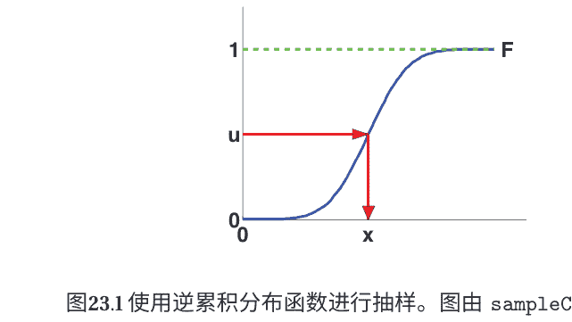

设其为逆函数。那么我们有以下结果。

## 定理23.2.1. 如果 $U \sim U(0,1)$ 是均匀分布的随机变量，则 $F^{-1}(U) \sim F$

证明。

$$
\begin{aligned}
\Pr(F^{-1}(U) \leq x) &= \Pr(U \leq F(x)) \quad (\text{两边应用 } F) \tag{23.1} \\
&= F(x) \quad (\text{因为 } \Pr(U \leq y) = y) \tag{23.2}
\end{aligned}
$$

其中第一行是因为 $F$ 是一个单调函数，第二行是因为 $U$ 在单位区间上均匀分布。

因此，我们可以从任何一维分布中采样，只要我们能够评估其反函数cdf，方法如下：使用一个伪随机数生成器生成一个随机数 $u \sim U(0,1)$ (详见例如，(Press et al. 1988)的细节)。让 $u$ 表示沿着 $y$ 轴的高度。然后沿着 $x$ 轴“滑动”，直到与 $F$ 曲线相交，然后“下降”并返回相应的 $x$ 值。这对应于计算 $x = F^{-1}(u)$。请参见图23.1进行说明。

例如，考虑指数分布
$$\text{Expon}(x|\lambda) \triangleq \lambda e^{-\lambda x} \mathbb{I}(x \geq 0) \tag{23.3}$$

累积分布函数是
$$F(x) = 1 - e^{-\lambda x} \mathbb{I}(x \geq 0) \tag{23.4}$$

其逆函数是分位函数
$$F^{-1}(p) = -\frac{\ln(1-p)}{\lambda} \tag{23.5}$$

根据上述定理，如果 $U \sim \text{Unif}(0,1)$，我们知道 $F^{-1}(U) \sim \text{Expon}(\lambda)$。此外，由于 $1 - U \sim \text{Unif}(0,1)$，我们可以通过先从均匀分布中采样，然后使用 $-\ln(u)/\lambda$ 来转换结果来从指数分布中采样。

### 23.2.2 从高斯分布中抽样 (Box-Muller方法)

我们现在描述一种从高斯分布中抽样的方法。思路是我们从一个单位半径的圆中均匀抽样，然后使用变量变换公式从一个二维球形高斯分布中得到样本。这可以看作是从一个一维高斯分布中抽取两个样本。更详细地说，均匀地从区间 $(-1,1)$ 中抽样 $z_1, z_2$，并且丢弃不满足 $z_1^2 + z_2^2 \le 1$ 的样本对。结果将是均匀分布在单位圆内的点，因此 $p(z) = \frac{1}{\pi} \mathbb{I}(z \text{ 在圆内 })$。现在定义

$$x_i = z_i \left( \frac{-2 \ln r^2}{r^2} \right)^{\frac{1}{2}} \quad (23.6)$$

对于 $i=1:2$, 其中 $r^2 = z_1^2 + z_2^2$。使用多元变量变换公式，我们有

$$p(x_1, x_2) = p(z_1, z_2)\left| \frac{\partial(z_1, z_2)}{\partial(x_1, x_2)} \right| = \left[ \frac{1}{\sqrt{2\pi}} \exp(-\frac{1}{2}x_1^2) \right] \left[ \frac{1}{\sqrt{2\pi}} \exp(-\frac{1}{2}x_2^2) \right] \quad (23.7)$$

因此 $x_1$ 和 $x_2$ 是从单变量高斯分布中独立采样得到的两个样本。这被称为 **Box-Muller方法**。

要从多元高斯分布中采样，我们首先计算其协方差矩阵的Cholesky分解，$\boldsymbol{\Sigma} = \mathbf{L}\mathbf{L}^T$，其中 $\mathbf{L}$ 是下三角矩阵。接下来，我们使用Box-Muller方法采样 $\mathbf{x} \sim \mathcal{N}(\mathbf{0}, \mathbf{I})$。最后，我们设置 $\mathbf{y} = \mathbf{L}\mathbf{x} + \boldsymbol{\mu}$。这是有效的，因为

$$\text{cov}[\mathbf{y}] = \mathbf{L}\text{cov}[\mathbf{x}]\mathbf{L}^T = \mathbf{L}\mathbf{I}\mathbf{L}^T = \boldsymbol{\Sigma} \quad (23.8)$$

## 23.3 拒绝抽样

当无法使用逆cdf方法时，一种简单的替代方法是使用拒绝抽样，现在我们来解释一下。

#### 23.3.1 基本思想

在拒绝抽样中，我们创建一个满足 $M q(x) \ge \tilde{p}(x)$ 的提议分布 $q(x)$，其中 $\tilde{p}(x)$ 是 $p(x)$ 的非标准化版本 (即 $p(x) = \tilde{p}(x) / Z_p$，其中 $Z_p$ 可能是未知的常数)。函数 $M q(x)$ 为 $\tilde{p}$ 提供了一个上界。然后我们从 $q( x)$ 中采样 $x \sim$，这对应于随机选择一个 $x$ 位置，然后我们从 $U(0,1)$ 中采样 $u \sim$，这对应于在上界下的一个随机高度 ($y$ 位置)。如果 $u > \frac{\tilde{p}(x)}{M q(x)}$，则拒绝该样本，否则接受。参见图23.2(a)，其中阴影区域表示接受区域，而拒绝区域是阴影区域和上界之间的白色区域。

我们现在证明这个过程是正确的。让

$$S = \{ (x, u) : u \le \tilde{p}(x) / M q(x) \}, \quad S_0 = \{ (x, u) : x \le x_0, u \le \tilde{p}(x) / M q(x) \} \quad (23.9)$$

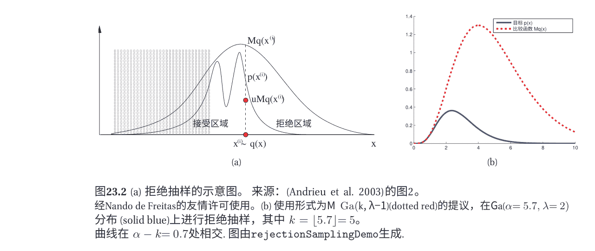

然后被接受点的累积分布函数为

$$P(x \leq x_0 | x \text{ 被接受}) = \frac{P(x \leq x_0, x \text{ 被接受})}{P(x \text{ 被接受})} \tag{23.10}$$

$$= \frac{\iint \mathbb{I}((x, u) \in S_0) q(x) du dx}{\iint \mathbb{I}((x, u) \in S) q(x) du dx} = \frac{\int_{-\infty}^{x_0} \tilde{p}(x) dx}{\int_{-\infty}^{\infty} \tilde{p}(x) dx} \tag{23.11}$$

这是 $p(x)$ 的累积分布函数，正如所期望的那样。这种方法效率如何？ 由于我们以概率 $q(x)$ 生成并以概率 $\frac{p(x)}{M q(x)}$ 接受，接受的概率为

$$p(\text{接受}) = \int \frac{\tilde{p}(x)}{M q(x)} q(x) dx = \frac{1}{M} \int \tilde{p}(x) dx \tag{23.12}$$

因此，我们希望选择 $M$ 尽可能小，同时满足 $M q(x) \geq \tilde{p}(x)$。

#### 23.3.2 示例

例如，假设我们想从Gamma分布中抽样：¹

$$\text{Ga}(x|\alpha, \lambda) = \frac{1}{\Gamma(\alpha)} x^{\alpha-1} \lambda^{\alpha} \exp(-\lambda x) \tag{23.13}$$

可以证明，如果 $X_i \stackrel{iid}{\sim} \text{Expon}(\lambda)$，并且 $Y = X_1 + \cdots + X_k$，则 $Y \sim \text{Ga}(k, \lambda)$。对于非整数形状参数，我们无法使用这个技巧。 然而，我们可以使用拒绝抽样

¹ 本节基于Ioana A. Cosma的笔记，可在以下网址找到：http://users.aims.ac.za/~ioana/cp2.pdf.

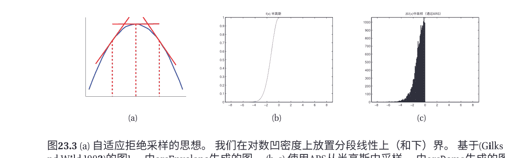

图23.3 (a) 自适应拒绝采样的思想。我们在对数凹密度上放置分段线性上（和下）界。基于(Gilks and Wild 1992)的图1。由arsEnvelope生成的图。(b-c) 使用ARS从半高斯中采样。由arsDemo生成的图，由Daniel Eaton编写。

使用 Ga(k, \lambda - 1)分布作为提议，其中 k = \lfloor \alpha \rfloor。比率的形式为

$$\frac{p(x)}{q(x)} = \frac{\mathrm{Ga}(x|\alpha, \lambda)}{\mathrm{Ga}(x|k, \lambda-1)} = \frac{x^{\alpha-1}\lambda^\alpha \exp(-\lambda x)/\Gamma(\alpha)}{x^{k-1}(\lambda-1)^k \exp(-(\lambda-1)x)/\Gamma(k)} \quad (23.14)$$

$$= \frac{\Gamma(k)\lambda^\alpha}{\Gamma(\alpha)(\lambda-1)^k} x^{\alpha-k} \exp(-x) \quad (23.15)$$

当 x = \alpha - k 时，这个比率达到最大值。因此

$$M = \frac{\mathrm{Ga}(\alpha-k|\alpha, \lambda)}{\mathrm{Ga}(\alpha-k|k, \lambda-1)} \quad (23.16)$$

请参见图23.2(b)以获取绘图。（练习23.2要求您基于柯西分布设计更好的建议分布。）

### 23.3.3 贝叶斯统计的应用

假设我们想从后验分布中抽取（无权重）样本，p(\boldsymbol{\theta}|\mathcal{D}) = p(\mathcal{D}|\boldsymbol{\theta})p(\boldsymbol{\theta})/p(\mathcal{D})。我们可以使用拒绝抽样，以 \tilde{p}(\boldsymbol{\theta}) = p(\mathcal{D}|\boldsymbol{\theta})p(\boldsymbol{\theta})作为目标分布，q(\boldsymbol{\theta}) = p(\boldsymbol{\theta})作为我们的提议分布，并且 M = p(\mathcal{D}|\hat{\boldsymbol{\theta}})，其中 \hat{\boldsymbol{\theta}} = \arg\max p(\mathcal{D}|\boldsymbol{\theta})是MLE；这最初是在（Smith and Gelfand 1992）中提出的。我们以一定的概率接受点

$$\frac{\tilde{p}(\boldsymbol{\theta})}{M q(\boldsymbol{\theta})} = \frac{p(\mathcal{D}|\boldsymbol{\theta})}{p(\mathcal{D}|\hat{\boldsymbol{\theta}})} \quad (23.17)$$

因此，来自先验分布的样本，其似然性较高的样本更有可能被保留在后验分布中。当然，如果先验分布和后验分布之间存在很大的不匹配（如果先验分布模糊而似然性信息丰富），这个过程将非常低效。我们稍后会讨论更好的算法。

#### 23.3.4 自适应拒绝采样

我们现在描述一种可以自动得到任何对数凹密度 p(x)的紧密上界 q(x)的方法。这个想法是用分段函数来上界对数密度。

线性函数，如图23.3(a)所示。我们根据分布的支持上的固定网格选择初始位置。然后我们在这些位置评估对数密度的梯度，并使线在这些点上切线。

由于包络的对数是分段线性的，所以包络本身是分段指数的：

$$q(x) = M_i \lambda_i \exp(-\lambda_i(x - x_{i-1})), \quad x_{i-1} < x \leq x_i \qquad \qquad (23.18)$$

其中 $x_i$ 是网格点。从这个分布中进行抽样相对简单。如果样本 $x$ 被拒绝，我们在 $x$ 处创建一个新的网格点，从而改进包络。随着网格点的增加，包络的紧密度提高，拒绝率降低。这被称为自适应拒绝抽样(ARS) (Gilks and Wild 1992)。

图23.3(b-c)展示了该方法的一个示例。与标准拒绝抽样一样，它可以应用于非标准化分布。

## 23.3.5 高维拒绝抽样

显然，我们希望将我们的提议 $q(x)$ 尽可能接近目标分布 $p(x)$，同时仍然是一个上界。但是在高维情况下，这很难实现。为了看到这一点，考虑从 $p(\mathbf{x}) = \mathcal{N}(\mathbf{0}, \sigma_p^2 \mathbf{I})$ 中进行抽样，使用作为提议 $q(\mathbf{x}) = \mathcal{N}(\mathbf{0}, \sigma_q^2 \mathbf{I})$。显然，我们必须有 $\sigma_q^2 \geq \sigma_p^2$ 才能成为一个上界。在 $D$ 维度中，最佳值由 $M = (\sigma_q/\sigma_p)^D$ 给出。接受率为 $1/M$ (因为 $p$ 和 $q$ 都被归一化)，随着维度的增加呈指数级下降。例如，如果 $\sigma_q$ 仅比 $\sigma_p$ 多1%，那么在1000维度中，接受比率将约为1/20,000。

这是拒绝抽样的一个基本弱点。

在第24章中，我们将描述MCMC抽样，这是一种从高维分布中抽样的更高效的方法。有时候这会使用（自适应）拒绝抽样作为一个子程序，这被称为自适应拒绝Metropolis抽样 (Gilks等人, 1995)。

## 23.4 重要性抽样

我们现在描述一种被称为重要性抽样的蒙特卡洛方法，用于近似计算形式为

$$I = \mathbb{E}[f] = \int f(\mathbf{x})p(\mathbf{x})d\mathbf{x} \qquad \qquad (23.19)$$

的积分。

#### 23.4.1 基本思想

这个想法是在具有高概率的区域中抽取样本 $\mathbf{x}$，但也要确保 $|f(\mathbf{x})|$ 很大。结果可以是超级高效的，意味着它需要比从精确分布 $p(\mathbf{x})$ 中抽样更少的样本。原因是样本集中在重要的空间部分。例如，假设我们想要估计一个罕见事件的概率。定义 $f(\mathbf{x}) = \mathbb{I}(\mathbf{x} \in E)$，其中 $E$ 是某个集合。那么从一个形式为 $q(\mathbf{x}) \propto f(\mathbf{x})p(\mathbf{x})$ 的提议中抽样要比从 $p(\mathbf{x})$ 本身抽样更好。

重要性采样从任何提议中采样，$q(\mathbf{x})$。然后使用这些样本来估计积分如下:

$$\mathbb{E}[f] = \int f(\mathbf{x}) \frac{p(\mathbf{x})}{q(\mathbf{x})} q(\mathbf{x}) d\mathbf{x} \approx \frac{1}{S} \sum_{s=1}^S w_s f(\mathbf{x}^s) = \hat{I}$$

其中 $w_s \triangleq \frac{p(\mathbf{x}^s)}{q(\mathbf{x}^s)}$ 是重要性权重。请注意，与拒绝采样不同，我们使用所有的样本。

我们该如何选择提议? 一个自然的标准是最小化估计的方差 $\text{var}[\hat{I}] = \text{var}_{q(\mathbf{x})}[f(\mathbf{x})w(\mathbf{x})]$。现在

$$\text{var}_{q(\mathbf{x})}[f(\mathbf{x})w(\mathbf{x})] = \mathbb{E}_{q(\mathbf{x})}[f^2(\mathbf{x})w^2(\mathbf{x})] - I^2$$

由于最后一项与 $q$ 无关，我们可以忽略它。根据Jensen不等式，我们有以下下界:

$$\mathbb{E}_{q(\mathbf{x})}[f^2(\mathbf{x})w^2(\mathbf{x})] \geq \left(\mathbb{E}_{q(\mathbf{x})}[|f(\mathbf{x})w(\mathbf{x})|]\right)^2 = \left(\int |f(\mathbf{x})| p(\mathbf{x}) d\mathbf{x}\right)^2$$

当我们使用最优重要性分布时，可以得到下界:

$$q^*(\mathbf{x}) = \frac{|f(\mathbf{x})| p(\mathbf{x})}{\int |f(\mathbf{x}')| p(\mathbf{x}') d\mathbf{x}'}$$

当我们没有特定的目标函数 $f(\mathbf{x})$ in mind时，我们通常只是尽可能地使 $q(\mathbf{x})$ 接近 $p(\mathbf{x})$。一般来说，这是困难的，特别是在高维情况下，但是可以通过调整提议分布来改善近似。这被称为自适应重要性采样(Oh和Berger 1992)。

### 23.4.2 处理未归一化的分布

经常情况下，我们可以评估未归一化的目标分布，$\tilde{p}(\mathbf{x})$，但无法计算其归一化常数，$Z_p$。我们可能还想使用一个未归一化的提议分布，$\tilde{q}(\mathbf{x})$，其归一化常数可能未知，$Z_q$。我们可以按照以下步骤进行。首先，我们评估

$$\mathbb{E}[f] = \frac{Z_q}{Z_p} \int f(\mathbf{x}) \frac{\tilde{p}(\mathbf{x})}{\tilde{q}(\mathbf{x})} q(\mathbf{x}) d\mathbf{x} \approx \frac{Z_q}{Z_p} \frac{1}{S} \sum_{s=1}^S \tilde{w}_s f(\mathbf{x}^s)$$

其中 $\tilde{w}_s \triangleq \frac{\tilde{p}(\mathbf{x}^s)}{\tilde{q}(\mathbf{x}^s)}$ 是未归一化的重要性权重。我们可以使用相同的样本集来评估比值 $Z_p / Z_q$，如下所示:

$$\frac{Z_p}{Z_q} = \frac{1}{Z_q} \int \tilde{p}(\mathbf{x}) d\mathbf{x} = \int \frac{\tilde{p}(\mathbf{x})}{\tilde{q}(\mathbf{x})} q(\mathbf{x}) d\mathbf{x} \approx \frac{1}{S} \sum_{s=1}^S \tilde{w}_s$$

因此

$$\hat{I} = \frac{\frac{1}{S} \sum_s \tilde{w}_s f(\mathbf{x}^s)}{\frac{1}{S} \sum_s \tilde{w}_s} = \sum_{s=1}^S w_s f(\mathbf{x}^s)$$

其中

$$w_s \triangleq \frac{\tilde{w}_s}{\sum_{s'} \tilde{w}_{s'}} \qquad (23.27)$$

是归一化的重要性权重。得到的估计是两个估计的比值，因此是有偏的。然而，当 $S \to \infty$ 时，我们有 $\hat{I} \to I$，在弱假设下成立（详见(Robert and Casella 2004)）。

### 23.4.3 用于DGM的重要性采样：似然加权

我们现在描述一种使用重要性采样从一个可以表示为有向图模型的分布中生成样本的方法（第10章）。
如果我们没有证据，我们可以从DGM的无条件联合分布中进行采样 $p(\mathbf{x})$ 如下：首先采样根节点，然后采样它们的子节点，然后采样它们的子节点，依此类推。这被称为祖先采样。这有效是因为在有向无环图中，我们总是可以对节点进行拓扑排序，使得父节点在子节点之前。（请注意，对于无条件无向图形模型，没有等效的简单方法可以进行采样。）现在假设我们有一些证据，因此一些节点被“固定”为观察值，并且我们想要从后验分布中进行采样 $p(\mathbf{x}|\mathcal{D})$。如果所有变量都是离散的，我们可以使用以下简单的过程：进行祖先采样，但是一旦我们采样到与观察值不一致的值，就拒绝整个样本并重新开始。这被称为逻辑采样（Hernitor 1988）。

不用说，逻辑抽样非常低效，并且在我们有实值证据时无法应用。然而，可以进行以下修改。像以前一样，对未观察到的变量进行抽样，条件是它们的父节点。但是不要对观察到的变量进行抽样；相反，我们只使用它们的观察值。这相当于使用以下形式的提议

$$q(\mathbf{x}) = \prod_{t \notin E} p(x_t|\mathbf{x}_{\text{pa}(t)}) \prod_{t \in E} \delta_{x_t^*}(x_t) \qquad (23.28)$$

其中 $E$ 是观察节点的集合，而 $x_t^*$ 是节点 $t$ 的观察值。因此，我们应该给整体样本一个
重要性权重，如下所示：

$$w(\mathbf{x}) = \frac{p(\mathbf{x})}{q(\mathbf{x})} = \prod_{t \notin E} \frac{p(x_t|\mathbf{x}_{\text{pa}(t)})}{p(x_t|\mathbf{x}_{\text{pa}(t)})} \prod_{t \in E} \frac{p(x_t|\mathbf{x}_{\text{pa}(t)})}{1} = \prod_{t \in E} p(x_t|\mathbf{x}_{\text{pa}(t)}) \qquad (23.29)$$

这种技术被称为似然加权(Fung and Chang 1989; Shachter and Peot 1989)。

### 23.4.4 重要性重采样（SIR）

我们可以通过重要性采样（使用提议分布 $q$）从 $p(\mathbf{x})$ 中抽取无权重的样本，以生成一个形式为的分布

$$p(\mathbf{x}) \approx \sum_{s=1}^S w_s \delta_{\mathbf{x}^s}(\mathbf{x}) \qquad (23.30)$$

其中，$w_s$ 是归一化的重要性权重。然后，我们从方程式23.30中有放回地进行采样，其中选择 $\mathbf{x}^s$ 的概率为 $w_s$。 让这个过程引导一个被表示为 $\hat{p}$ 的分布。 要看到这是有效的，请注意

$$\begin{aligned} \hat{p}(x \leq x_0) & = \sum_s \mathbb{I}(x^s \leq x_0) w_s = \frac{\sum_s \mathbb{I}(x^s \leq x_0) \tilde{p}(x^s)/q(x^s)}{\sum_s \tilde{p}(x^s)/q(x^s)} \quad (23.31)\\ & \rightarrow \frac{\int \mathbb{I}(x \leq x_0) \frac{\tilde{p}(x)}{q(x)} q(x) dx}{\int \frac{\tilde{p}(x)}{q(x)} q(x) dx} \quad (23.32)\\ & = \frac{\int \mathbb{I}(x \leq x_0) \tilde{p}(x) dx}{\int \tilde{p}(x) dx} = \int \mathbb{I}(x \leq x_0) p(x) dx = p(x \leq x_0) \quad (23.33) \end{aligned}$$

这被称为抽样重要性重采样(SIR) (Rubin 1988)。 结果是一个不加权的近似形式

$$p(\mathbf{x}) \approx \frac{1}{S'} \sum_{s=1}^{S'} \delta_{\mathbf{x}^s}(\mathbf{x}) \qquad (23.34)$$

请注意，我们通常采用 $S' \ll S$。

该算法可用于在低维环境中进行贝叶斯推断 (Smith and Gelfand 1992)。 也就是说，假设我们想从后验分布中抽取（不加权）样本，$p(\theta|\mathcal{D}) = p(\mathcal{D}|\theta)p(\theta)/p(\mathcal{D})$。我们可以使用重要性采样，其中 $\tilde{p}(\theta) = p(\mathcal{D}|\theta)p(\theta)$ 作为非归一化的后验分布， $q(\theta) = p(\theta)$ 作为我们的提议分布。归一化的权重具有以下形式

$$w_s = \frac{\tilde{p}(\theta_s)/q(\theta_s)}{\sum_{s'} \tilde{p}(\theta_{s'})/q(\theta_{s'})} = \frac{p(\mathcal{D}|\theta_s)}{\sum_{s'} p(\mathcal{D}|\theta_{s'})} \qquad (23.35)$$

然后我们可以使用SIR从 $p(\theta|\mathcal{D})$ 中进行采样。

当然，如果我们的提议（先验）与目标（后验）之间存在很大的差异，我们将需要大量的重性样本才能可靠地工作，否则重要性权重的方差将非常大，意味着大多数样本不携带用的信息。 （这个问题将在第23.5节再次讨论，当我们讨论粒子滤波时。）

### 23.5 粒子滤波

粒子滤波（PF）是一种基于蒙特卡洛或基于模拟的递归贝叶斯推断算法。 也就是说，它近似了第18.3.1节中描述的预测-更新循环。它在许多领域广泛应用，包括跟踪、时间序列预测、在线参数学习等。我们在下面解释基本算法。 有关详细的处理，请参阅（Doucet等, 2001）；有关良好的教程，请参阅（Arulampalam等，2002），或者继续阅读。

#### 23.5.1 顺序重要性采样

基本思想是使用一组加权粒子来近似表示信念状态（整个状态轨迹）：

$$p(\mathbf{z}_{1:t}|\mathbf{y}_{1:t}) \approx \sum_{s=1}^{S} \hat{w}_{t}^{s} \delta_{\mathbf{z}_{1:t}^{s}}(\mathbf{z}_{1:t}) \qquad (23.36)$$

其中 $\hat{w}_{t}^{\;s}$ 是时间 $t$ 时样本 $s$ 的归一化权重。通过这种表示，我们可以简单地计算最近状态的边缘分布，即 $p(\mathbf{z}_{t}|\mathbf{y}_{1:t})$，只需忽略轨迹的前面部分 $\mathbf{z}_{1:t-1}$。（粒子滤波在整个轨迹空间中进行采样的事实具有各种含义，我们将在后面讨论。）

我们使用重要性采样来更新这个信念状态。如果提议的形式为 $q(\mathbf{z}_{1:t}^{s}|\mathbf{y}_{1:t})$，则重要性权重为

$$w_{t}^{s} \propto \frac{p(\mathbf{z}_{1:t}^{s}|\mathbf{y}_{1:t})}{q(\mathbf{z}_{1:t}^{s}|\mathbf{y}_{1:t})} \qquad (23.37)$$

可以归一化为以下形式：

$$\hat{w}_{t}^{s} = \frac{w_{t}^{s}}{\sum_{s'} w_{t}^{s'}} \qquad (23.38)$$

我们可以将分子递归地重写为以下形式：

$$\begin{aligned} p(\mathbf{z}_{1:t}|\mathbf{y}_{1:t}) & = \frac{p(\mathbf{y}_{t}|\mathbf{z}_{1:t},\mathbf{y}_{1:t-1})p(\mathbf{z}_{1:t}|\mathbf{y}_{1:t-1})}{p(\mathbf{y}_{t}|\mathbf{y}_{1:t-1})} \\ & = \frac{p(\mathbf{y}_{t}|\mathbf{z}_{t})p(\mathbf{z}_{t}|\mathbf{z}_{1:t-1},\mathbf{y}_{1:t-1})p(\mathbf{z}_{1:t-1}|\mathbf{y}_{1:t-1})}{p(\mathbf{y}_{t}|\mathbf{y}_{1:t-1})} \\ & \propto p(\mathbf{y}_{t}|\mathbf{z}_{t})p(\mathbf{z}_{t}|\mathbf{z}_{t-1})p(\mathbf{z}_{1:t-1}|\mathbf{y}_{1:t-1}) \end{aligned} \qquad (23.39-23.41)$$

我们做了通常的马尔可夫假设。我们将限制注意力在以下形式的提议密度上：

$$q(\mathbf{z}_{1:t}|\mathbf{y}_{1:t}) = q(\mathbf{z}_{t}|\mathbf{z}_{1:t-1},\mathbf{y}_{1:t})q(\mathbf{z}_{1:t-1}|\mathbf{y}_{1:t-1}) \qquad (23.42)$$

这样我们可以通过将新状态 $\mathbf{z}_{t}$ 添加到末尾来“增长”轨迹。在这种情况下，重要性权重简化为

$$\begin{aligned} w_{t}^{s} & \propto \frac{p(\mathbf{y}_{t}|\mathbf{z}_{t}^{s})p(\mathbf{z}_{t}^{s}|\mathbf{z}_{t-1}^{s})p(\mathbf{z}_{1:t-1}^{s}|\mathbf{y}_{1:t-1})}{q(\mathbf{z}_{t}^{s}|\mathbf{z}_{1:t-1}^{s},\mathbf{y}_{1:t})q(\mathbf{z}_{1:t-1}^{s}|\mathbf{y}_{1:t-1})} \\ & = w_{t-1}^{s} \frac{p(\mathbf{y}_{t}|\mathbf{z}_{t}^{s})p(\mathbf{z}_{t}^{s}|\mathbf{z}_{t-1}^{s})}{q(\mathbf{z}_{t}^{s}|\mathbf{z}_{1:t-1}^{s},\mathbf{y}_{1:t})} \end{aligned} \qquad (23.43-23.44)$$

如果我们进一步假设 $q(\mathbf{z}_{t}|\mathbf{z}_{1:t-1},\mathbf{y}_{1:t}) = q(\mathbf{z}_{t}|\mathbf{z}_{t-1},\mathbf{y}_{t})$，那么我们只需要保留轨迹和观测序列的最近部分，而不是整个历史记录，就可以计算新的样本。在这种情况下，权重变为

$$w_{t}^{s} \propto w_{t-1}^{s} \frac{p(\mathbf{y}_{t}|\mathbf{z}_{t}^{s})p(\mathbf{z}_{t}^{s}|\mathbf{z}_{t-1}^{s})}{q(\mathbf{z}_{t}^{s}|\mathbf{z}_{t-1}^{s},\mathbf{y}_{t})} \qquad (23.45)$$因此，我们可以使用后验滤波密度的近似值

$$
p(\mathbf{z}_t|\mathbf{y}_{1:t}) \approx \sum_{s=1}^{S} \hat{w}_t^s \delta_{\mathbf{z}_t^s}(\mathbf{z}_t) \quad (23.46)
$$

当 $S \rightarrow \infty$ 时，可以证明这趋近于真实的后验概率（Crisan et al. 1999）。基本算法现在非常简单：对于每个旧样本 $s$，使用 $\mathbf{z}_t^s \sim q(\mathbf{z}_t | \mathbf{z}_{t-1}^s, \mathbf{y}_t)$ 提出一个扩展，并使用方程式23.45给予这个新粒子权重 $w_t^s$。不幸的是，这个基本算法效果不好，我们将在下面讨论。

#### 23.5.2 退化问题

基本的顺序重要性采样算法在几步之后失败，因为大多数粒子的权重可以忽略不计。这被称为退化问题，并且发生是因为我们在一个高维空间中进行采样（实际上，随着时间推移，空间的大小在增长），使用了一种目光短浅的提议分布。

我们可以使用有效样本大小来量化退化程度，其定义为

$$
S_{\text{eff}} \triangleq \frac{S}{1 + \text{var}[w_t^{*s}]} \quad (23.47)
$$

其中 $w_t^{*s} = p(\mathbf{z}_t^s | \mathbf{y}_{1:t}) / q(\mathbf{z}_t^s | \mathbf{z}_{t-1}^s, \mathbf{y}_t)$ 是粒子 $s$ 的“真实权重”。由于我们不知道真实后验分布，因此无法精确计算这个量，但我们可以使用近似方法来计算。

$$
\hat{S}_{\text{eff}} = \frac{1}{\sum_{s=1}^{S} (w_t^s)^2} \quad (23.48)
$$

如果权重的方差很大，那么更新低权重的粒子将浪费资源，这些粒子对后验估计贡献不大。

解决退化问题的两个主要方法是添加重采样步骤和使用良好的提议分布。我们将依次讨论这两种方法。

#### 23.5.3 重采样步骤

对基本的SIS算法的主要改进是监测有效采样大小，当其低于阈值时，消除权重较低的粒子，然后创建幸存粒子的副本。（因此，PF有时被称为适者生存（Kanazawa等, 1995）。）具体而言，我们通过从加权分布中进行S次有放回抽样，生成一个新的集合 ${\mathbf{z}_t^{s*}}_{s=1}^S$。

$$
p(\mathbf{z}_t | \mathbf{y}_{1:t}) \approx \sum_{s=1}^{S} \hat{w}_t^s \delta_{\mathbf{z}_t^{s*}}(\mathbf{z}_t) \quad (23.49)
$$

选择粒子 $j$ 进行复制的概率为 $w_t^j$。（这有时被称为复原。）结果是从离散密度方程23.49中得到的一个无偏重样本，因此我们将新的权重设置为 $w_t^s = 1/S$。该方案在图23.4中有所说明。

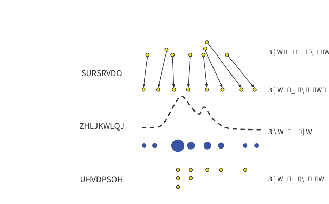

图23.4 粒子滤波的示意图。

有多种算法可用于执行重采样步骤。最简单的是多项式重采样，它计算

$$
(K_1, \dots, K_S) \sim \text{Mu}(S, (w_t^1, \dots, w_t^S)) \qquad (23.50)
$$

然后我们复制 $K_s$ 个 $\mathbf{z}_t^s$。存在各种改进方法，如系统重采样、残差重采样和分层抽样，可以减小权重的方差。所有这些方法的时间复杂度为 $O(S)$。详见(Doucet et al. 2001)。

总体粒子滤波算法在算法6中总结。（请注意，如果需要状态的估计值，则应在重采样步骤之前计算，因为这将导致较低的方差。）

算法23.1: 通用粒子滤波器的一步

```
1 对于 $s = 1 : S$ 做
2     从 $q(\mathbf{z}_{tt} | \mathbf{z}_{t-1}^{st}, \mathbf{y}_{tt})$ 中抽取 $\mathbf{z}_{t}^{st}$;
3     计算权重 $w_{ts} \propto w_{t-1}^{s} \frac{p(\mathbf{y}_{tt} | \mathbf{z}_{st}) p(\mathbf{z}_{st} | \mathbf{z}_{st-1})}{q(\mathbf{z}_{st} | \mathbf{z}_{t-1}^{st}, \mathbf{y}_{tt})}$;
4 归一化权重: $w_{ts} = \frac{w_{ts}}{\sum_{s'} w_{t}^{s'}}$;
5 计算 $\hat{S}_{\text{eff}} = \frac{1}{\sum_{s=1}^{S} (w_{t}^s)^2}$;
6 如果 $\hat{S}_{\text{eff}} < S_{\text{min}}$ then
7     重新采样 $S$ 索引 $\boldsymbol{\pi} \sim \mathbf{w}_t$;
8     $\mathbf{z}_t^s = \mathbf{z}_t^{\pi_s}$;
9     $w_t^s = 1/S$;
```

尽管重新采样步骤有助于解决退化问题，但也引入了自身的问题。特别是，由于具有高权重的粒子将被多次选择，种群之间的多样性会减少。这被称为样本贫化。在没有过程噪声的极端情况下（例如，如果我们的状态空间中包含静态但未知的参数），则所有粒子将在几次迭代内坍缩为一个点。为了缓解这个问题，提出了几种解决方案。

- （1）只在必要时重新采样，而不是在每个时间步骤都重新采样。（原始的自助滤波器（Gordon 1993）在每一步都重新采样，但这是次优的。）
- （2）在复制旧粒子后，使用MCMC步骤对新值进行采样，该步骤保持后验分布不变（参见例如（Gilks and Berzuni 2001）中的重新采样-移动算法）。
- （3）在粒子上创建核密度估计，$p(\mathbf{z}_t|\mathbf{y}_{1:t}) \approx \sum_{s=1}^{S} w_t^s \kappa(\mathbf{z}_t - \mathbf{z}_t^s)$，其中 $\kappa$ 是一些平滑核函数。然后我们从这个平滑的分布中进行采样。这被称为正则化粒子滤波器(Musso等人, 2001)。
- （4）在对静态参数进行推断时，添加一些人工过程噪声。(如果这是不可取的，必须使用其他算法进行在线参数估计，例如(Andrieu等人, 2005))。

#### 23.5.4 提议分布

最简单且最常用的提议分布是从先验中进行采样：

$$
q(\mathbf{z}_t|\mathbf{z}_{t-1}^s, \mathbf{y}_t) = p(\mathbf{z}_t|\mathbf{z}_{t-1}^s)
$$

在这种情况下，权重更新简化为

$$
w_t^s \propto w_{t-1}^s p(\mathbf{y}_t|\mathbf{z}_t^s)
$$

这可以被看作是一种“生成和测试”的方法：我们从动态模型中采样值，然后在看到数据后评估它们的好坏（见图23.4）。这是用于视觉跟踪的条件密度传播算法（Isard和Blake 1998）中使用的方法。然而，如果似然比动态先验更窄（意味着传感器比运动模型更具信息量，这通常是情况），这是一种非常低效的方法，因为大多数粒子将被分配非常低的权重。

在生成提议时，实际上最好实际查看数据 $\mathbf{y}_t$。事实上，最优的提议分布具有以下形式：

$$
q(\mathbf{z}_t|\mathbf{z}_{t-1}^s, \mathbf{y}_t) = p(\mathbf{z}_t|\mathbf{z}_{t-1}^s, \mathbf{y}_t) = \frac{p(\mathbf{y}_t|\mathbf{z}_t) p(\mathbf{z}_t|\mathbf{z}_{t-1}^s)}{p(\mathbf{y}_t|\mathbf{z}_{t-1}^s)}
$$

如果我们使用这个提议，新的权重由以下给出

$$
w_t^s \propto w_{t-1}^s p(\mathbf{y}_t|\mathbf{z}_{t-1}^s) = w_{t-1}^s \int p(\mathbf{y}_t|\mathbf{z}_t') p(\mathbf{z}_t'|\mathbf{z}_{t-1}^s) d\mathbf{z}_t'
$$

这个提议是最优的，因为对于任何给定的 $\mathbf{z}_{t-1}^s$，新的权重 $w_t^{*s}$ 都取相同的值无论 $\mathbf{z}_t^s$ 的取值如何。因此，在旧值 $\mathbf{z}_{t-1}^s$ 的条件下，真实权重 $\text{var} [w_t^{*s}]$ 的方差为零。

一般来说，从 $p(\mathbf{z}_t|\mathbf{z}^s_{t-1}, \mathbf{y}_t)$ 中采样和计算预测密度 $p(\mathbf{y}_t|\mathbf{z}^s_{t-1})$ 是棘手的。然而，在两种情况下可以使用最优的提议分布。第一种情况是 $\mathbf{z}_t$ 离散的，所以积分变成了求和。当然，如果整个状态空间是离散的，我们可以使用HMM滤波器，但在某些情况下，一些状态是离散的，一些是连续的。第二种情况是 $p(\mathbf{z}_t|\mathbf{z}^s_{t-1}, \mathbf{y}_t)$ 是高斯分布。这发生在动力学是非线性的但观测是线性的情况下。详细信息请参见练习23.3。

在模型不是线性高斯的情况下，我们仍然可以使用无迹变换（第18.5.2节）计算 $p(\mathbf{z}_t|\mathbf{z}^s_{t-1}, \mathbf{y}_t)$ 的高斯近似，并将其用作提议。这被称为无迹粒子滤波器（van der Merwe et al. 2000）。在更一般的情况下，我们可以使用其他类型的数据驱动提议，可能基于判别模型。与MCMC不同，我们不需要担心提议的可逆性。

## 23.5.5 应用：机器人定位

考虑一个在办公环境中徘徊的移动机器人。我们假设它已经有了一个世界地图，以占用网格的形式表示，其中只指定每个网格单元是空间还是被固体物体（如墙壁）占据。机器人的目标是估计自己的位置。这可以通过使用HMM滤波器来最优地解决，因为我们假设状态空间是离散的。然而，由于状态的数量 $K$ 通常非常大，每次更新的时间复杂度为 $O(K^2)$ 是不可行的。我们可以使用粒子滤波器作为对信念状态的稀疏近似。这被称为蒙特卡洛定位，并在（Thrun et al. 2006）中详细描述。

图23.5给出了该方法的一个示例。机器人使用声纳测距仪，因此只能感知到障碍物的距离。它从均匀先验开始，反映了机器人的所有者可能在任意位置打开它的事实。（从均匀先验开始确定自己的位置被称为全局定位。）在第一次扫描之后，显示了信念状态如图（b）所示，指示两侧有墙壁。后验仍然相对宽泛，因为机器人可能位于墙壁相当靠近的任何位置，例如走廊或任何狭窄的房间。移动到位置2后，机器人相当确定它必须位于走廊中，如图（c）所示。移动到位置3后，传感器能够检测到走廊的尽头。然而，由于对称性，它不确定自己是在位置I（真实位置）还是位置II。（这是感知混淆的一个例子，指的是不同的事物可能看起来相同。）在移动到位置4和5之后，它最终能够准确地确定自己的位置。整个过程类似于有人在办公楼中迷路，沿着走廊漫游直到看到一个他们认识的标志。

在第23.6.3节中，我们讨论了如何同时估计位置和地图。

## 23.5.6 应用：视觉目标跟踪

我们的下一个例子涉及在视频序列中跟踪一个对象（在这种情况下是一个遥控直升机）。该方法使用简单的线性运动模型来计算对象的质心，并使用颜色直方图作为似然模型，使用巴氏距离来比较直方图。提议分布是通过从似然中进行采样得到的。有关详细信息，请参阅（Nummiaro等人，2003年）。


图23.5 蒙特卡洛定位的示意图 来源：（Thrun等人，2006年）的图8.7。获得Sebastian Thrun的友情许可后使用。

图23.6展示了一些示例帧。该系统使用 $S=250$ 粒子，有效样本大小为 $\hat{S}_{\text{eff}}=134$。(a)展示了第1帧的置信状态。为了保持有效样本大小超过150，该系统已经重新采样了5次；(b)展示了第251帧的置信状态；红线显示了过去250帧中目标中心的估计位置。(c)展示了该系统可以处理视觉杂乱，只要它与目标对象的颜色不同即可。(d)展示了该系统在直升机的灰色和建筑物的灰色之间感到困惑。后验分布是双峰的。绿色椭圆表示后验均值和协方差位于两个模式之间。(e)展示了概率质量转移到了错误的模式：系统已经失去了追踪。(f)展示了粒子在灰色建筑物上分散；使用这种状态很难恢复目标。

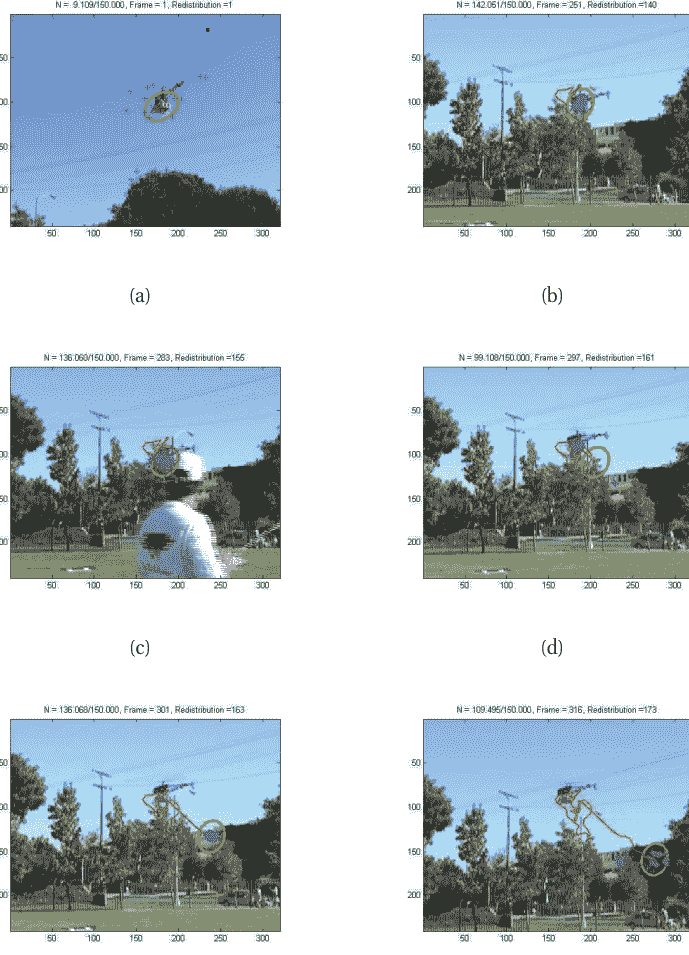

图23.6 粒子滤波应用于视觉目标跟踪的示例，基于颜色直方图。 (a-c) 成功跟踪：绿色椭圆在直升机上方。(d-f)：跟踪器被背景中的灰色杂物分散注意力。详见文本。由SebastienParis编写的pfColorTrackerDemo生成的图。

我们可以看到，尽管存在杂物，该方法能够长时间跟踪目标。然而，最终它会失去目标的跟踪。请注意，由于算法是随机的，简单地重新运行演示可能会解决问题。但在现实世界中，这不是一个选择。提高性能的最简单方法是使用更多的粒子。另一种选择是通过检测来进行跟踪，即每隔几帧在图像上运行目标检测器。有关详细信息，请参阅（Forsyth和Ponce 2002; Szeliski 2010; Prince 2012）。

## 23.5.7 应用：时间序列预测

在第18.2.4节中，我们讨论了如何使用卡尔曼滤波器进行时间序列预测。这假设模型是一个线性高斯状态空间模型。有许多模型既是非线性的，也是非高斯的。例如，随机波动率模型，在金融领域被广泛使用，假设系统和/或观测噪声的方差随时间变化。粒子滤波在这种情况下被广泛使用。有关详细信息，请参见（Doucet等，2001年）和相关参考文献。

## 23.6 Rao-Blackwellised 粒子滤波 (RBPF)

在一些模型中，我们可以将隐藏变量分为两种，$\mathbf{q}_t$ 和 $\mathbf{z}_t$，这样我们可以在已知 $\mathbf{q}_{1:t}$ 的值的情况下解析地积分出 $\mathbf{z}_t$ 的值。这意味着我们只有样本 $\mathbf{q}_{1:t}$，并且可以以参数化的方式表示 $p(\mathbf{z}_t|\mathbf{q}_{1:t})$。因此，每个粒子 $s$ 表示 $\mathbf{q}_{1:t}^s$ 的一个值和形式为 $p(\mathbf{z}_t|\mathbf{y}_{1:t}, \mathbf{q}_{1:t}^s)$ 的分布。这些混合粒子有时被称为分布粒子或折叠粒子(Koller和Friedman 2009，第12.4节)。

这种方法的优点是我们减少了采样空间的维度，从而减小了估计的方差。因此，这种技术被称为Rao-Blackwellised粒子滤波，简称RBPF，以第24.20定理命名。该方法最好通过一个具体的例子来解释。

### 23.6.1 切换LG-SSMs的RBPF

RBPF可以应用于切换线性动态系统（SLDS）模型，这是一个典型的例子，讨论在第18.6节中（Chen和Liu 2000; Doucet等2001）。我们可以使用每个粒子的均值和协方差矩阵来表示 $p(\mathbf{z}_t|\mathbf{y}_{1:t}, \mathbf{q}_{1:t}^s)$，其中 $q_t \in \{1, \ldots, K\}$。如果我们从先验中提出，$q(q_t = k|q_{t-1}^s)$，权重更新变为

$$
w_t^s \propto w_{t-1}^s p(\mathbf{y}_t|q_t = k, \mathbf{q}_{1:t-1}^s, \mathbf{y}_{1:t-1}) = w_{t-1}^s L_{t,k}^s \quad (23.56)
$$

其中

$$
L_{tk}^s = \int p(\mathbf{y}_t|q_t = k, \mathbf{z}_t, \mathbf{y}_{1:t-1}, \mathbf{q}_{1:t-1}^s) p(\mathbf{z}_t|q_t = k, \mathbf{y}_{1:t-1}, \mathbf{q}_{1:t-1}^s) dz_t \quad (23.57)
$$

数量 $L_{tk}^s$ 是新观测的预测密度，条件是 $q_t = k$ 和历史 $\mathbf{q}_{1:t-1}^s$。在SLDS模型的情况下，可以使用卡尔曼滤波器的归一化常数计算，即方程18.41。

我们在算法8中给出了一些伪代码。（标记为“KFupdate”的步骤是指第18.3.1节中的卡尔曼滤波器更新方程。）这被称为卡尔曼滤波器的混合。如果 $K$ 很小，我们可以计算出最优的提议分布，即

$$
p(q_t = k|\mathbf{y}_{1:t}, \mathbf{q}_{1:t-1}^s) = \hat{p}_{t-1}^s(q_t = k|\mathbf{y}_t) \quad (23.58)
$$

$$
= \frac{\hat{p}_{t-1}^s(\mathbf{y}_t|q_t = k)\hat{p}_{t-1}^s(q_t = k)}{\hat{p}_{t-1}^s(\mathbf{y}_t)} \quad (23.59)
$$

$$
= \frac{L_{tk}^s p(q_t = k|q_{t-1}^s)}{\sum_{k'} L_{tk'}^s p(q_t = k'|q_{t-1}^s)} \quad (23.60)
$$

算法 23.2: 使用先验作为提议的RBPF的一步SLDS

```
1 对于 s=1: S do
2   k ~ p(q_t | q_{t-1}^s);
3   q_t^s := k;
4   (μ_t^s, Σ_t^s, L_{tk}^s) = KFupdate(μ_{t-1}^s, Σ_{t-1}^s, y_t, θ_k);
5   w_t^s = w_{t-1}^s L_{ts}^k;
6 归一化权重: w_{ts} = w_{ts} / Σ_{s=1}^S w_{ts};
7 计算 Ŝ_{eff} = 1 / Σ_{s=1}^S (w_t^s)^2;
8 if Ŝ_{eff} < S_{min} then
9   Resample S indices π ~ w_t;
10   q_t^i = q_t^{π_i}, μ_t^i = μ_t^{π_i}, Σ_t^i = Σ_t^{π_i};
11   w_t^i = 1/S;
```

我们使用以下简写: $ \hat{p}_{t-1}^s(\cdot) = p(\cdot | \mathbf{y}_{1:t-1}, \mathbf{q}_{1:t-1}^s) $ (23.61)
然后我们从 $ p(q_t | \mathbf{q}_{1:t-1}^s, \mathbf{y}_{1:t}) $ 中采样，并给出结果的粒子权重
$ w_t^s \propto w_{t-1}^s p(\mathbf{y}_t | \mathbf{q}_{1:t-1}^s, \mathbf{y}_{1:t-1}) = w_{t-1}^s \sum_k \left[ L_{tk}^s p(q_t = k | q_{t-1}^s) \right] $ (23.62)

由于方程23.62中粒子的权重与实际采样的新值 q_t 无关，我们可以先计算这些权重，然后使用它们来决定哪些粒子进行传播。也就是说，我们使用来自时间 t 的信息来选择时间 t-1的最佳粒子。 这被称为前瞻性RBPF (de Freitas等人，2004年)

更详细地说，这个想法是这样的。 我们通过所有 K 模型将先验中的每个样本传递，以获得每个样本的 K后验。 这个过程的归一化常数允许我们计算方程23.62中的最优权重。然后，我们重新采样 S索引。最后，对于每个选择的旧粒子 s，我们从已经计算过的 K可能的替代中采样一个新状态 q_t s = k，并使用相应的后验。 伪代码显示在算法7中。 这种方法需要 O(KS)存储空间，但优点是每个粒子都是使用最新信息选择的。 y_t。

通过利用状态空间是离散的这一事实，可以进一步改进。因此，我们可以使用(Fearnhead 2004)的重采样方法，避免重复粒子。

### 23.6.2 应用：追踪机动目标

SLDS的一个应用是追踪具有分段线性动力学的移动物体。 例如，假设我们想要追踪一架飞机或导弹；可以指定对象是否正常飞行或采取规避动作。 这被称为主动目标跟踪。

图23.7给出了一个在二维空间中移动的物体的示例。 设置与第18.2.1节基本相同，只是我们添加了一个控制的三状态离散马尔可夫链。

算法23.3：使用最优提议的SLDS前向后向粒子滤波的一步
1 对于 s = 1：S 执行
2 	对于 k = 1：K 执行
3 		(μ_tk^s, Σ_tk^s, L_tk^s) = KFupdate(μ_{t-1}^s, Σ_{t-1}^s, y_t, θ_k);
4 		w_t^s = w_{t-1}^s[Σ_k L_tk^s p(q_t = k | q_{t-1}^s)];
5 归一化权重：w_ts = \frac{w_t^s}{Σ_s w_t^s} ;
6 重新采样 S 索引 π ~ w_t;
7 对于 s ∈ π 执行
8 	计算最优建议 p(k | q_{1:t-1}^s, y_{1:t}) = \frac{L_{tk}^s p(q_t = k | q_{t-1}^s)}{Σ_{k'} L_{tk'}^s p(q_t = k' | q_{t-1}^s)};
9 	采样 k ~ p(k | q_{1:t-1}^s, y_{1:t});
10 	q_t^s = k, μ_t^s = μ_{tk}^s, Σ_t^s = Σ_{tk}^s;
11 	w_t^s = 1/S;

方法 | 误分类率MSE | 时间 (秒)
--- | --- | ---
PF | 0.440 | 21.051
RBPF | 0.340 | 18.168

*注：原始表格中PF行有“21.051 | 6.086”两个时间值，RBPF行有“18.168 | 10.986”两个时间值，可能表示不同实验条件下的时间。此处为了清晰，将表格简化为三列。*

表23.1 PF和RBPF在图23.7中机动目标问题上的比较。

输入到系统的。我们定义 $u_t = 1$ 并设置

$\mathbf{B}_1 = (0, 0, 0, 0)^T, \mathbf{B}_2 = (-1.225, -0.35, 1.225, 0.35)^T, \mathbf{B}_3 = (1.225, 0.35, -1.225, -0.35)^T$

因此，系统将根据离散状态而转向不同的方向。

图23.7(a)展示了系统的真实状态，来自一个样本运行，从 $(0,0)$ 开始：彩色符号表示离散状态，符号的位置表示 $(x, y)$ 位置。小点表示嘈杂的观测。图23.7(b)展示了使用500个粒子进行粒子滤波计算的状态估计，其中提议是从先验中采样。彩色符号表示状态的MAP估计，符号的位置表示MMSE（最小均方误差）估计的位置，由后验均值给出。图23.7(c)展示了使用500个粒子和最优提议分布进行RBPF计算的估计。表23.1展示了更具量化的比较。我们可以看到RBPF的性能稍微更好，尽管速度稍慢一些。

图23.8可视化了系统的信念状态。在(a)中，我们展示了对离散状态的分布。我们可以看到，粒子滤波器对信念状态的估计（第二列）在开始时不如RBPF估计（第三列）准确，尽管在最开始的几次观测后，两种方法的性能相似。在(b)中，我们绘制了关于$x$位置的后验概率。为了简单起见，我们使用了PF估计，它是一组加权样本，但我们也可以使用RBPF估计，它是一组加权高斯分布。

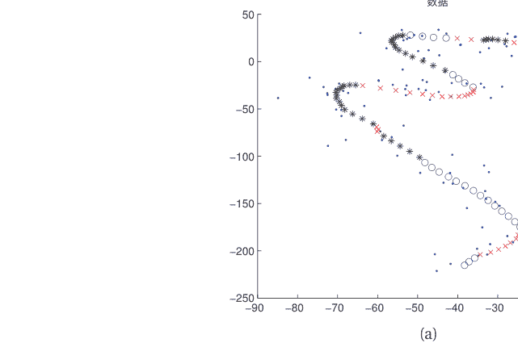

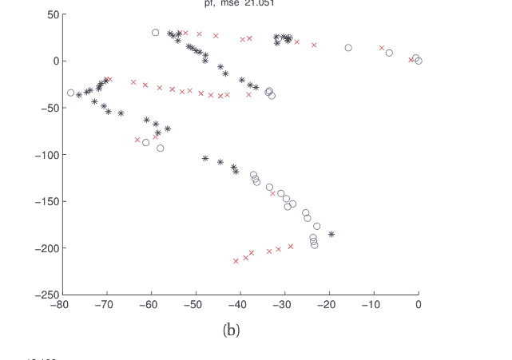

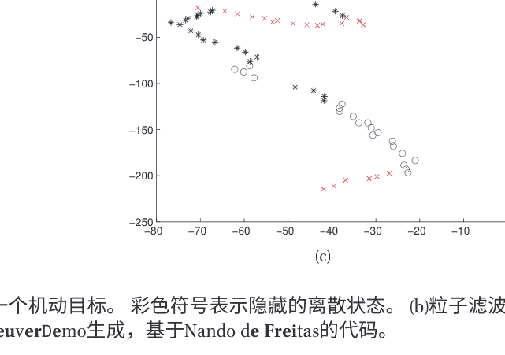

图23.7 (a) 一个机动目标。彩色符号表示隐藏的离散状态。(b)粒子滤波器估计。(c)RBPF估计。图由rbpfManeuverDemo生成，基于Nando de Freitas的代码。

## 23.6.3 应用：快速SLAM

在第18.2.2节中，我们介绍了移动机器人的同时定位和地图构建问题，即SLAM。卡尔曼滤波器实现的主要问题是它在地标数量上是立方的。然而，通过观察图18.2中的DGM，我们可以看到，在知道机器人路径的条件下，$q_{1:t} \in \mathbb{R}^2$，地标位置 $z \in \mathbb{R}^{2L}$ 是独立的。（我们假设地标不会移动，因此我们省略了下标 $t$ ）。也就是说，$p(z|q_{1:t}, y_{1:t}) = \prod^L ...$ 因此，我们可以使用RBPF，其中我们对机器人的轨迹 $q_{1:t}$ 进行采样，并在每个粒子内部运行 $L$ 个独立的2D卡尔曼滤波器。这需要每个粒子 $O(L)$ 的时间。幸运的是，为了获得良好的性能，所需的粒子数量相当小（这在一定程度上取决于控制/探索策略），因此该算法在粒子数量上基本上是线性的。这种技术还具有额外的优势。

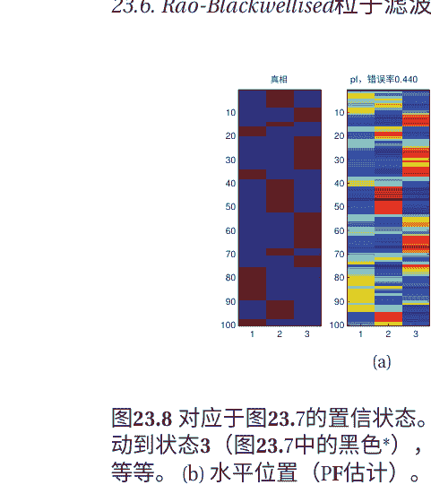

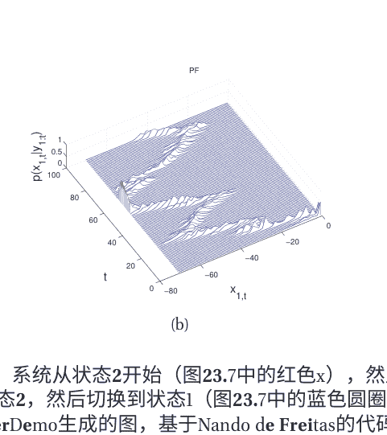

图23.8 对应于图23.7的置信状态。 (a) 离散状态。 系统从状态2开始（图23.7中的红色x），然后移动到状态3（图23.7中的黑色*），短暂返回到状态2，然后切换到状态1（图23.7中的蓝色圆圈），等等。 (b) 水平位置（PF估计）。 由rbpfManeuverDemo生成的图，基于Nando de Freitas的代码。

使用采样处理数据关联的模糊性很容易，并且允许其他地图表示，例如占据栅格。 这个想法最初是在(Murphy 2000)中提出的，并在(Thrun et al. 2004)中得到了进一步的扩展和实践，他们将这种技术命名为FastSLAM。 在离散网格世界中，参见rbpfSlamDemo的简单演示。

## 练习

- **练习23.1 从柯西分布中抽样**
展示如何使用逆概率变换从标准柯西分布中抽样， $\mathcal{T}(x|0, 1, 1)$.

- **练习23.2 使用柯西提议从伽马分布中进行拒绝抽样**
展示如何使用柯西提议从伽马分布中进行拒绝抽样。 推导出最优常数 $M$，并绘制密度和其上包络线。

- **练习23.3 线性高斯测量模型下的粒子滤波的最优提议**
考虑以下形式的状态空间模型：
$$\mathbf{z}_t = f_t(\mathbf{z}_{t-1}) + \mathcal{N}(0, \mathbf{Q}_{t-1}) \quad (23.63)$$
$$\mathbf{y}_t = \mathbf{H}_t \mathbf{z}_t + \mathcal{N}(0, \mathbf{R}_t) \quad (23.64)$$
推导出计算最优（最小方差）提议分布所需的 $p(\mathbf{z}_t|\mathbf{z}_{t-1}, \mathbf{y}_t)$ 和 $p(\mathbf{y}_t|\mathbf{z}_{t-1})$ 的表达式。 提示：使用高斯分布的贝叶斯定理。

## 24 马尔可夫链蒙特卡洛（MCMC）推断

### 24.1 引言

在第23章中，我们介绍了一些简单的蒙特卡洛方法，包括拒绝抽样和重要性抽样。这些方法的问题在于它们在高维空间中效果不好。从高维分布中进行抽样的最流行方法是马尔可夫链蒙特卡洛（MCMC）。在SIAM News的一项调查中，MCMC被列为20世纪最重要的10个算法之一。

MCMC的基本思想是在状态空间$\mathcal{X}$上构建一个马尔可夫链（第17.2节），其稳态分布是目标密度函数$p^*(x)$（可能是先验或后验）。也就是说，我们以一种使得在每个状态$x$上停留的时间比例与$p^*(x)$成比例的方式在状态空间上进行随机游走。通过从链中抽取（相关的！）样本$x_0, x_1, x_2, ...$，我们可以对$p^*$进行蒙特卡洛积分。我们在下面给出详细说明。

MCMC算法有一个有趣的历史。它是由在洛斯阿拉莫斯的原子弹研究中发现的，并在第二次世界大战期间首次在开放文献中发表（Metropolis等人，1953年）在化学期刊上。在统计学文献中发表了一个扩展（Hastings，1970年），但基本上没有引起注意。一个特殊情况（Gibbs抽样，第24.2节）在1984年在Ising模型的背景下独立发明，并在（Geman和Geman，1984年）中发表。但直到（Gelfand和Smith，1990年）算法才为更广泛的统计学界所熟知。从那时起，它在贝叶斯统计学中变得非常流行，并且在机器学习中越来越受欢迎。

值得简要比较MCMC和变分推断（第21章）。

- 变分推断的优点是：
1. 对于小到中等规模的问题，通常更快；
2. 它是确定性的；
3. 很容易确定何时停止；
4. 它通常提供对数似然的下界。

- 抽样的优点是：
1. 实现通常更容易；
2. 适用于更广泛的模型，例如模型的大小或结构取决于某些变量的值（例如，在匹配问题中发生的情况），或者没有良好的共轭先验的模型；
3. 当应用于非常庞大的模型或数据集时，抽样可能比变分方法更快。

1. 来源：http://www.siam.org/pdf/news/637.pdf.
2. 原因是采样通过特定的变量值（或变量集合），而在变分推断中，我们传递分布。因此，采样传递稀疏消息，而变分推断传递密集消息。有关这两种方法的比较，请参见（Yoshida和West 2010）和（Bekkerman等人）中的文章。

### 24.2 Gibbs采样

在本节中，我们介绍一种最流行的MCMC算法，称为Gibbs采样。3（在物理学中，这种方法被称为Glauber动力学或热浴方法。）这是坐标下降的MCMC模拟。

#### 24.2.1 基本思想

Gibbs采样的思想是我们依次采样每个变量，条件是在分布中所有其他变量的值。也就是说，给定所有变量的联合样本 $\mathbf{x}^s$，我们根据其他变量的最新值依次生成新的样本 $\mathbf{x}^{s+1}$。例如，如果我们有 $D= 3$个变量，我们使用

- $x_1^{s+1} \sim p(x_1|x_2^s, x_3^s)$
- $x_2^{s+1} \sim p(x_2|x_1^{s+1}, x_3^s)$
- $x_3^{s+1} \sim p(x_3|x_1^{s+1}, x_2^{s+1})$

这很容易推广到 $D$变量。如果 $x_i$是一个可见变量，我们不对其进行采样，因为它的值已经知道了。 表达式 $p(x_i|\mathbf{x}_{-i})$被称为变量 $i$的全条件概率。一般来说，$x_i$可能只依赖于其他一些变量。如果我们将 $p(\mathbf{x})$表示为一个图模型，我们可以通过查看 $i$的马尔可夫毯子来推断其依赖关系，即图中的邻居。因此，要采样 $x_i$，我们只需要知道 $i$的邻居的值。从这个意义上说，吉布斯采样是一种分布式算法。然而，它不是一个并行算法，因为样本必须按顺序生成。

出于我们将在第24.4.1节中解释的原因，有必要丢弃一些初始样本，直到马尔可夫链燃烧进入其稳定分布。我们在第24.4.1节中讨论了如何估计燃烧已经发生。在下面的示例中，为了简单起见，我们只丢弃了初始样本的25%。

### 24.2.2 示例：Ising模型的Gibbs采样

在第21.3.2节中，我们将均值场应用于Ising模型。这里我们应用Gibbs采样。 对于成对MRF/CRF的Gibbs采样采取以下形式

$p(x_t|\mathbf{x}_{-t}, \theta) \propto \prod_{s \in \text{nbr}(t)} \psi_{st}(x_s, x_t)$

在具有边缘势能的Ising模型的情况下 $\psi(x_s, x_t) = \exp(J x_s x_t)$, 其中 $x_t \in \{-1, +1\}$，完全条件变为

$$\begin{align}
p(x_t = +1|\mathbf{x}_{-t}, \theta) &= \frac{\prod_{s \in \text{nbr}(t)} \psi_{st}(x_t = +1, x_s)}{\prod_{s \in \text{nbr}(t)} \psi_{st}(x_t = +1, x_s) + \prod_{s \in \text{nbr}(t)} \psi_{st}(x_t = -1, x_s)} \quad (24.2) \\
&= \frac{\exp[J \sum_{s \in \text{nbr}(t)} x_s]}{\exp[J \sum_{s \in \text{nbr}(t)} x_s] + \exp[-J \sum_{s \in \text{nbr}(t)} x_s]} \quad (24.3) \\
&= \frac{\exp[J \eta_t]}{\exp[J \eta_t] + \exp[-J \eta_t]} = \text{sigm}(2J \eta_t) \quad (24.4)
\end{align}$$

其中 $J$是耦合强度，$\eta_t = \sum_{s \in \text{nbr}(t)} x_s$，$\text{sigm}(u) = 1/(1+e^{-u})$是sigmoid函数。 很容易看出 $\eta_t = x_t (a_t - d_t)$，其中 $a_t$是与 $t$一致（具有相同符号）的邻居数量，$d_t$是不一致的邻居数量。 如果这个数量相等，$x_t$上的“力量”将相互抵消，因此完全条件是均匀的。

我们可以将一个伊辛先验与一个局部证据项 $\psi_t$结合起来。 例如，使用高斯观测模型，我们有 $\psi_t(x_t) = \mathcal{N}(y_t|x_t, \sigma^2)$。 完整的条件变为

$$\begin{align}
p(x_t = +1|\mathbf{x}_{-t}, \mathbf{y}, \theta) &= \frac{\exp[J \eta_t] \psi_t(+1)}{\exp[J \eta_t] \psi_t(+1) + \exp[-J \eta_t] \psi_t(-1)} \quad (24.5) \\
&= \text{sigm} \left( 2J \eta_t - \log \frac{\psi_t(+1)}{\psi_t(-1)} \right) \quad (24.6)
\end{align}$$

现在，$x_t$进入每个状态的概率由其与邻居的兼容性（伊辛先验）和与数据的兼容性（局部似然项）共同决定。 请参考图24.1，了解该算法应用于简单图像去噪问题的示例。 结果与均值场（图21.3）相似，只是最终估计（基于样本平均）稍微“模糊”，这是因为均值场往往过于自信。

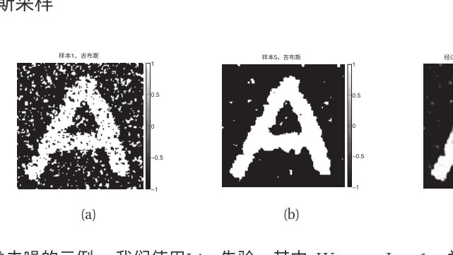

图24.1 图像去噪的示例。 我们使用Ising先验，其中 $W_{ij} = J = 1$，并且使用高斯噪声模型，其中 $\sigma = 2$。 我们使用吉布斯采样（第24.2节）进行近似推断。 (a) 在图像上进行一次扫描后的后验采样。 (b) 经过5次扫描后的采样。 (c) 经过15次扫描后的后验均值，通过对15次扫描结果进行平均计算得到。 与使用均值场推断的结果相比，参见图21.3。 由isingImageDenoiseDemo生成的图。

### 24.2.3 示例：用吉布斯采样推断GMM的参数

推导吉布斯采样算法以“拟合”混合模型非常直观，尤其是如果我们使用共轭先验。我们将重点关注高斯混合模型的情况，尽管结果很容易推广到其他类型的混合模型。（该推导源自第4.6节的结果，比起第21.6.1节中的变分贝叶斯算法要简单得多。）

假设我们使用半共轭先验。那么完整的联合分布由以下给出

$$p(\mathbf{x}, \mathbf{z}, \boldsymbol{\mu}, \mathbf{\Sigma}, \boldsymbol{\pi}) \quad=\quad p(\mathbf{x}|\mathbf{z}, \boldsymbol{\mu}, \mathbf{\Sigma})p(\mathbf{z}|\boldsymbol{\pi})p(\boldsymbol{\pi}) \prod_{k=1}^{K} p(\boldsymbol{\mu}_k)p(\mathbf{\Sigma}_k)$$

$$\qquad\qquad= \quad\left(\prod_{i=1}^{N}\prod_{k=1}^{K} \left(\pi_k \mathcal{N}(\mathbf{x}_i | \boldsymbol{\mu}_k, \mathbf{\Sigma}_k)\right)^{\mathbb{I}(z_i=k)}\right) \times$$

$$\qquad\qquad\qquad\qquad\text{Dir}(\boldsymbol{\pi}|\boldsymbol{\alpha})\prod_{k=1}^{K} \mathcal{N}(\boldsymbol{\mu}_k|\mathbf{m}_0, \mathbf{V}_0)\text{IW}(\mathbf{\Sigma}_k|\mathbf{S}_0, \nu_0)$$

我们对每个混合成分使用相同的先验。完整的条件如下。对于离散指示器，我们有

$$p(z_i = k|\mathbf{x}_i, \boldsymbol{\mu}, \mathbf{\Sigma}, \boldsymbol{\pi})\quad\propto\quad \pi_k\mathcal{N}(\mathbf{x}_i|\boldsymbol{\mu}_k, \mathbf{\Sigma}_k)$$

对于混合权重，我们使用第3.4节的结果

$$p(\boldsymbol{\pi}|\mathbf{z})\quad=\quad\text{Dir}\left(\left\{\alpha_k + \sum_{i=1}^{N}\mathbb{I}(z_i=k)\right\}_{k=1}^{K}\right)$$

对于均值，我们使用第4.6.1节的结果

$$p(\boldsymbol{\mu}_k|\mathbf{\Sigma}_k, \mathbf{z}, \mathbf{x})\quad=\quad \mathcal{N}(\boldsymbol{\mu}_k|\mathbf{m}_k, \mathbf{V}_k)$$

$$\mathbf{V}_k^{-1}\quad=\quad \mathbf{V}_0^{-1} + N_k\mathbf{\Sigma}_k^{-1}$$

$$\mathbf{m}_k\quad=\quad \mathbf{V}_k(\mathbf{\Sigma}_k^{-1}N_k\overline{\mathbf{x}}_k + \mathbf{V}_0^{-1}\mathbf{m}_0)$$

$$N_k\quad\triangleq\quad \sum_{i=1}^{N}\mathbb{I}(z_i=k)$$

$$\overline{\mathbf{x}}_k\quad\triangleq\quad \frac{\sum_{i=1}^{N}\mathbb{I}(z_i=k)\mathbf{x}_i}{N_k}$$

对于协方差，我们有（使用第4.6.2节的结果）

$$p(\mathbf{\Sigma}_k|\boldsymbol{\mu}_k, \mathbf{z}, \mathbf{x})\quad=\quad \text{IW}(\mathbf{\Sigma}_k|\mathbf{S}_k, \nu_k)$$

$$\mathbf{S}_k\quad=\quad \mathbf{S}_0 + \sum_{i=1}^{N}\mathbb{I}(z_i=k)(\mathbf{x}_i - \boldsymbol{\mu}_k)(\mathbf{x}_i - \boldsymbol{\mu}_k)^T$$

$$\nu_k\quad=\quad \nu_0 + N_k$$

请参阅gaussMissingFitGibbs的一些Matlab代码。（如果需要，此代码还可以对x进行缺失值采样。）

## 24.2.3.1 标签切换

尽管实现简单，但混合模型的Gibbs采样具有根本性的弱点。问题在于模型的参数 θ 和指示函数 z 是不可识别的，因为我们可以任意排列隐藏标签而不影响似然函数（参见第11.3.1节）。因此，我们不能仅仅对样本取蒙特卡洛平均来计算后验均值，因为一个样本认为簇1的参数可能是另一个样本认为簇2的参数。事实上，如果我们可以对所有模式进行平均，我们会发现 𝔼[μ_k | 𝒟] 对于所有 k 都是相同的（假设先验是对称的）。这就是标签切换问题。

这个问题在EM或VBEM中不会出现，它们只会“锁定”一个单一模式。然而，在访问多个模式的任何方法中都会出现这个问题。在一维问题中，可以通过引入参数约束来防止这个问题，以确保可识别性，例如，μ_1 < μ_2 < μ_3 (Richardson and Green 1997)。然而，这并不总是有效，因为似然可能会压倒先验，并导致标签交换。此外，这种技术在高维度上不可扩展。另一种方法是通过搜索全局标签置换来后处理样本，以使每个样本最小化某个损失函数 (Stephens 2000)；然而，这可能会很慢。

也许最好的解决方案就是“不问”那些无法唯一识别的问题。例如，不要问数据点 i 属于聚类 k 的概率，而是问数据点 i 和 j 属于同一聚类的概率。后一个问题对标签是不变的。此外，它只涉及可观察的量（i 和 j 是否被分组在一起），而不涉及不可观察的量，如潜在聚类。这种方法的进一步优点是它适用于无限混合模型，在第25.2节中讨论，其中 K 是无界的；在这样的模型中，隐藏聚类的概念并不明确，但数据的分区概念是明确的。

#### 24.2.4 折叠吉布斯采样 *

在某些情况下，我们可以解析地积分掉一些未知量，只需对其余部分进行采样。这被称为折叠吉布斯采样器，它往往更高效，因为它在一个较低维度的空间中进行采样。

更准确地说，假设我们对 z 进行采样，并积分掉 θ。因此，θ 参数不参与马尔可夫链；因此，我们可以条件独立地绘制样本 θ^s ~ p(θ|z^s, 𝒟)，其方差比从联合状态空间中绘制的样本要低得多（Liu 等人, 1994年）。这个过程被称为Rao-Blackwell化，以以下定理命名：

> 定理 24.2.1 (Rao-Blackwell)。设 z 和 θ 是相关的随机变量，f(z, θ) 是某个标量函数。那么

```
var_{z,θ}[f(z,θ)] ≥ var_z[𝔼_θ[f(z,θ)|z]] (24.20)
```

这个定理保证了通过解析地积分消除 θ 所创建的估计的方差始终低于（或者说从不高于）直接MC估计的方差。在折叠吉布斯采样中，我们将 z 与 θ 整合在一起；上述Rao-Blackwell定理在这种情况下仍然适用（Liu 等, 1994年）。

我们将在第23.6节再次遇到Rao-Blackwell化。虽然它可以减少统计方差，但只有在整合过程可以快速完成的情况下才值得这样做，否则我们每秒钟无法产生与朴素方法相同数量的样本。我们在下面给出一个例子。

### 24.2.4.1 示例：用折叠吉布斯采样拟合GMM

考虑一个具有完全共轭先验的GMM。在这种情况下，我们可以解析地积分掉模型参数 $\mu_k$, $\Sigma_k$ 和 $\pi$, 只需采样指示变量 $\mathbf{z}$。一旦我们积分掉 $\pi$, 所有的 $z_i$ 节点变得相互依赖。同样地，一旦我们积分掉 $\theta_k$, 所有的 $x_i$ 节点变得相互依赖，如图24.2(b)所示。然而，我们可以轻松地计算完全条件如下：

```
$$p(z_i = k|\mathbf{z}_{-i}, \mathbf{x}, \boldsymbol{\alpha}, \boldsymbol{\beta}) \quad \propto \quad p(z_i = k|\mathbf{z}_{-i}, \boldsymbol{\alpha}) p(\mathbf{x}|z_i = k, \mathbf{z}_{-i}, \boldsymbol{\alpha}, \boldsymbol{\beta}) \quad (24.21)$$
$$\propto \quad p(z_i = k|\mathbf{z}_{-i}, \boldsymbol{\alpha}) p(\mathbf{x}_i|\mathbf{x}_{-i}, z_i = k, \mathbf{z}_{-i}, \boldsymbol{\beta}) \quad (24.22)$$
$$p(\mathbf{x}_{-i}|z_i = k, \mathbf{z}_{-i}, \boldsymbol{\beta})$$
$$\propto \quad p(z_i = k|\mathbf{z}_{-i}, \boldsymbol{\alpha}) p(\mathbf{x}_i|\mathbf{x}_{-i}, z_i = k, \mathbf{z}_{-i}, \boldsymbol{\beta}) \quad (24.23)$$
```

其中 $\boldsymbol{\beta}= (\mathbf{m}_0, \mathbf{V}_0, \mathbf{S}_0, \nu_0)$是类条件密度的超参数。第一项可以通过积分得到 $\pi$。假设我们使用形式为$\boldsymbol{\pi} \sim \text{Dir}(\boldsymbol{\alpha})$的对称先验，其中 $\alpha_k = \alpha/K$。根据方程5.26，我们有

```
$$p(z_1, \ldots, z_N|\alpha) = \frac{\Gamma(\alpha)}{\Gamma(N + \alpha)} \prod_{k=1}^{K} \frac{\Gamma(N_k + \alpha/K)}{\Gamma(\alpha/K)} \quad (24.24)$$
```

因此
$$p(z_i = k|\mathbf{z}_{-i}, \alpha) = \frac{p(\mathbf{z}_{1:N}|\alpha)}{p(\mathbf{z}_{-i}|\alpha)} = \frac{\frac{1}{\Gamma(N+\alpha)}}{\frac{1}{\Gamma(N+\alpha-1)}} \times \frac{\Gamma(N_k + \alpha/K)}{\Gamma(N_{k,-i} + \alpha/K)} = \frac{\Gamma(N + \alpha - 1) \Gamma(N_{k,-i} + 1 + \alpha/K)}{\Gamma(N + \alpha) \Gamma(N_{k,-i} + \alpha/K)} = \frac{N_{k,-i} + \alpha/K}{N + \alpha - 1}$$
其中 $N_{k,-i} \triangleq \sum_{n \neq i} \mathbb{I}(z_n = k) = N_k - 1$，我们利用了 $\Gamma(x+1) = x\Gamma(x)$ 的事实。

为了得到方程24.23中的第二项，即给定所有其他数据和所有分配的情况下的后验预测分布 $\mathbf{x}_i$，我们使用了以下事实
$$p(\mathbf{x}_i|\mathbf{x}_{-i}, \mathbf{z}_{-i}, z_i = k, \beta) = p(\mathbf{x}_i|\mathcal{D}_{-i,k})$$
其中 $\mathcal{D}_{-i,k} = \{\mathbf{x}_j : z_j =k, j \neq i\}$ 是分配给簇 $k$ 的除了 $\mathbf{x}_i$ 之外的所有数据。如果我们对 $\boldsymbol{\theta}_k$ 使用共轭先验，我们可以闭式计算 $p(\mathbf{x}_i|\mathcal{D}_{-i,k})$。此外，我们可以通过缓存每个簇的充分统计量来高效地更新这些预测似然。

为了计算上述表达式，我们从当前聚类中移除 $\mathbf{x}_i$ 的统计数据（即 $z_i$），然后在每个聚类的后验预测下评估 $\mathbf{x}_i$。一旦我们选择了一个新的聚类，我们将 $\mathbf{x}_i$ 的统计数据添加到这个新的聚类中。

算法24.1展示了算法的一步伪代码，基于 (Sudderth 2006, p94)。（我们以随机顺序更新节点以改善混合时间，如 (Roberts and Sahu 1997) 中建议的。）我们可以通过顺序采样从 $p (z_i|\mathbf{z}_{1:i-1}, \mathbf{x}_{1:i})$ 来初始化样本。（参见 fmGibbs 的一些Matlab代码，作者是Yee-Whye Teh。）在GMMs的情况下，无论是朴素采样器还是折叠采样器，每步的时间复杂度都是 $O (N K D)$。

```
算法24.1: 折叠吉布斯采样器用于混合模型
1. 对于每个 $i = 1 : N$ 以随机顺序进行
2.   从旧的聚类中删除$\mathbf{x}_i$的充分统计量$z_i$;
3.   对于每个 $k = 1 : K$ 进行
4.       计算$p_k(\mathbf{x}_i) \triangleq p_k(\mathbf{x}_i|\{\mathbf{x}_j: z_j = k, j \neq i\})$;
5.   计算$p(z_i=k|z_{-i}, \mathcal{D}) \propto (N_{k,-i} + \alpha/K) p_k(\mathbf{x}_i)$;
6.   采样$z_i \sim p(z_i|\cdot)$;
7.   将$\mathbf{x}_i$的充分统计量添加到新的聚类$z_i$
```

将该方法与标准吉布斯采样器进行比较，结果显示在图24.3中。垂直轴是每次迭代时的数据对数概率，使用以下计算
$$\log p(\mathcal{D}|\mathbf{z}, \boldsymbol{\theta}) = \sum_{i=1}^{N} \log [\pi_{z_i} p(\mathbf{x}_i|\boldsymbol{\theta}_{z_i})]$$

使用折叠采样器计算这个数量时，我们必须给定数据和当前分配 $\mathbf{z}$ 来采样 $\boldsymbol{\theta} = (\boldsymbol{\pi}, \boldsymbol{\theta}_{1:K})$。从图24.3中我们可以看到，折叠采样器确实比普通采样器效果更好。然而，有时候这两种方法都可能陷入较差的局部模式中。（注意

图24.3比较折叠（红色）和普通（蓝色）吉布斯采样在一个包含 $K=4$ 个二维高斯混合的 $N=300$ 个数据点上的应用（如图25.7所示）。我们绘制了数据的对数概率与迭代次数的关系。（a）20个不同的随机初始化。（b）在100个不同的随机初始化上平均的对数概率。实线是中位数，粗虚线是0.25和0.75分位数，细虚线是0.05和0.95分位数。来源：（Sudderth 2006）的图2.20。获得Erik Sudderth的友情许可使用。

图24.4 (a) 对于100所学校的数学成绩与社会经济地位的最小二乘回归线。总体均值（汇总估计）以粗体显示。(b) 对于100所学校的样本大小 $N_j$（斜率）与 $\hat{w}_{2j}$ 的图。极端斜率往往对应样本较小的学校。(c) 层次模型的预测。总体均值以粗体显示。基于(Hoff 2009)的图11.1。由Emtiyaz Khan编写的multilevelLinregDemo生成的图。

请注意，图24.3(b)中的误差条是在起始值上平均化的，而定理是指单次运行中的MC样本。

## 24.2.5 用于层次GLMs的Gibbs采样

通常我们有来自多个相关来源的数据。如果某些来源比其他来源更可靠和/或数据丰富，那么同时对所有数据进行建模是有意义的，以便借用统计强度。解决这类问题最自然的方法之一是使用层次贝叶斯建模，也称为多层建模。在第9.6节中，我们讨论了使用变分方法在这些模型中进行近似推断的方法。在这里，我们讨论如何使用Gibbs采样。

为了解释这种方法，考虑以下例子。假设我们有关于学生在不同学校中的数据。这样的数据自然地被建模为一个两级层次结构：我们让 $y_{ij}$ 成为我们想要预测的学生 $i$ 在学校 $j$ 的响应变量。这个预测可以基于学校和学生的特定协变量， $\mathbf{x}_{ij}$。由于学校的质量有所不同，我们希望为每个学校使用一个单独的参数。所以我们的模型变成了

```
$$y_{ij} = \mathbf{x}_{ij}^T \mathbf{w}_j + \epsilon_{ij} \qquad (24.29)$$
```

我们将使用来自(Hoff 2009, p197)的数据集来说明这个模型，其中 $x_{ij}$ 是学生 $i$ 在学校 $j$ 的社会经济地位(SES)，而 $y_{ij}$ 是他们的数学成绩。

如果给定学校的样本量很小，我们可以分别拟合每个 $\mathbf{w}_j$，但这可能会导致结果不佳。这在图24.4(a)中有所说明，该图绘制了分别估计的 $J=100$ 个学校的最小二乘回归线。我们可以看到大多数斜率是正的，但也有一些“错误”的情况，斜率是负的。事实证明，具有极端斜率的线条往往出现在样本量较小的学校中，如图24.4(b)所示。因此，我们可能不一定信任这些拟合。

如果我们构建一个分层贝叶斯模型，我们可以获得更好的结果，其中 $\mathbf{w}_j$ 被假设来自一个共同的先验分布： $\mathbf{w}_j \sim \mathcal{N}(\boldsymbol{\mu}_w, \boldsymbol{\Sigma}_w)$。这在图24.5中有所说明。在这个模型中，样本量较小的学校从样本量较大的学校中借用统计强度，因为 $\mathbf{w}_j$ 通过潜在的共同父节点 ($\boldsymbol{\mu}_w, \boldsymbol{\Sigma}_w$) 相关。（重要的是，这些超参数必须从数据中推断出来；如果它们是固定的常数， $\mathbf{w}_j$ 将是条件独立的，它们之间将没有信息共享。）

为了完整地定义模型，我们必须为共享参数指定先验分布。根据 (Hoff 2009, p198) 的建议，为了方便起见，我们将使用以下半共轭形式：

```
$$\begin{align*}
\boldsymbol{\mu}_w &\sim \mathcal{N}(\boldsymbol{\mu}_0, \mathbf{V}_0) \qquad (24.30) \\
\boldsymbol{\Sigma}_w &\sim \text{IW}(\eta_0, \mathbf{S}_0^{-1}) \qquad (24.31) \\
\sigma^2 &\sim \text{IG}(\nu_0/2, \nu_0\sigma_0^2/2) \qquad (24.32)
\end{align*}$$
```

鉴于此，很容易证明吉布斯采样所需的完全条件具有以下形式。

#### 24.2.6 BUGS和JAGS

对于特定组的权重：

$$p(\mathbf{w}_j|\mathcal{D}_j, \theta) \quad = \quad \mathcal{N}(\mathbf{w}_j|\boldsymbol{\mu}_j, \boldsymbol{\Sigma}_j) \qquad (24.33)$$

$$\boldsymbol{\Sigma}_j^{-1} \qquad \quad = \quad \boldsymbol{\Sigma}^{-1} + \mathbf{X}_j^T \mathbf{X}_j / \sigma^2 \qquad (24.34)$$

$$\boldsymbol{\mu}_j \qquad \qquad = \quad \boldsymbol{\Sigma}_j (\boldsymbol{\Sigma}^{-1} \boldsymbol{\mu} + \mathbf{X}_j^T \mathbf{y}_j / \sigma^2) \qquad (24.35)$$

对于整体均值：

$$p(\boldsymbol{\mu}_w|\mathbf{w}_{1:J}, \boldsymbol{\Sigma}_w) \quad = \quad \mathcal{N}(\boldsymbol{\mu}|\boldsymbol{\mu}_N, \boldsymbol{\Sigma}_N) \qquad (24.36)$$

$$\boldsymbol{\Sigma}_N^{-1} \qquad = \quad \mathbf{V}_0^{-1} + J \boldsymbol{\Sigma}^{-1} \qquad (24.37)$$

$$\boldsymbol{\mu}_N \qquad \quad = \quad \boldsymbol{\Sigma}_N (\mathbf{V}_0^{-1} \boldsymbol{\mu}_0 + J \boldsymbol{\Sigma}^{-1} \overline{\mathbf{w}}) \qquad (24.38)$$

其中 $\overline{\mathbf{w}} = \frac{1}{J} \sum_j \mathbf{w}_j$. 对于整体协方差：

$$p(\boldsymbol{\Sigma}_w|\boldsymbol{\mu}_w, \mathbf{w}_{1:J}) \quad = \quad \text{IW}((\mathbf{S}_0 + \mathbf{S}_\mu)^{-1}, \eta_0 + J) \qquad (24.39)$$

$$\mathbf{S}_\mu \qquad \qquad = \quad \sum_j (\mathbf{w}_j - \boldsymbol{\mu}_w)(\mathbf{w}_j - \boldsymbol{\mu}_w)^T \qquad (24.40)$$

对于噪声方差：

$$p(\sigma^2|\mathcal{D}, \mathbf{w}_{1:J}) \quad = \quad \text{IG}([\nu_0 + N]/2, [\nu_0 \sigma_0^2 + \text{SSR}(\mathbf{w}_{1:J})]/2) \qquad (24.41)$$

$$\text{SSR}(\mathbf{w}_{1:J}) \quad = \quad \sum_{j=1}^{J} \sum_{i=1}^{N_j} (y_{ij} - \mathbf{w}_j^T \mathbf{x}_{ij})^2 \qquad (24.42)$$

应用吉布斯采样到我们的分层模型，我们得到了图24.4(c)中所示的结果。浅灰色线条绘制了每个学校的后验预测分布的均值：

$$\mathbb{E}[y_j|\mathbf{x}_{ij}] = \mathbf{x}_{ij}^T \hat{\mathbf{w}}_j \qquad (24.43)$$

其中

$$\hat{\mathbf{w}}_j = \mathbb{E}[\mathbf{w}_j|\mathcal{D}] \approx \frac{1}{S} \sum_{s=1}^{S} \mathbf{w}_j^{(s)} \qquad (24.44)$$

中间的深灰色线条绘制了使用整体平均参数进行预测的结果， $\mathbf{x}_{ij}^T \hat{\boldsymbol{\mu}}_{w}$。我们可以看到该方法很好地进行了正则化拟合，而不会强制要求过于一致。(收缩量由 $\boldsymbol{\Sigma}_w$控制，而$\boldsymbol{\Sigma}_w$又取决于超参数；在这个例子中，我们使用了模糊的值。)

吉布斯采样如此受欢迎的一个原因是可以设计通用的软件，几乎适用于任何模型。这个软件只需要一个模型规范，通常是以有向图模型的形式 (在文件中指定或使用图形用户界面创建) ，以及一个从不同类型的全条件分布中进行采样的方法库。(这通常可以使用自适应拒绝采样来完成，详见第23.3.4节。) 一个例子## 24.2.7 数据扩充（IP）算法

数据扩充或IP算法（Tanner和Wong 1987）是Gibbs采样的一种特殊情况，其中我们将变量分为两类：隐藏变量 z 和参数 θ 。这应该听起来很熟悉：它基本上是EM的MCMC版本，其中E步骤被I步骤取代，M步骤被P步骤取代。这是一种更一般的策略的例子，称为数据增强，通过引入辅助变量来简化后验计算（这里是计算 p(θ|D) ）。有关更多信息，请参见（Tanner 1996; van Dyk和Meng 2001）。

#### 24.2.8 阻塞吉布斯采样

吉布斯采样可能会很慢，因为它只更新一个变量（所谓的单个位置更新）。如果变量之间高度相关，从当前状态移动开将需要很长时间。这在图24.6中有所说明，我们展示了从一个二维高斯分布中采样（详见练习24.1的细节）。如果变量之间高度相关，算法将会在状态空间中移动得非常缓慢。特别地，移动的大小由条件分布的方差控制。如果这在$x$方向上是 $\ell$，并且分布的支集在这个维度上是 $L$，那么我们需要 $O((L/\ell)^2)$步来获得一个独立的样本。

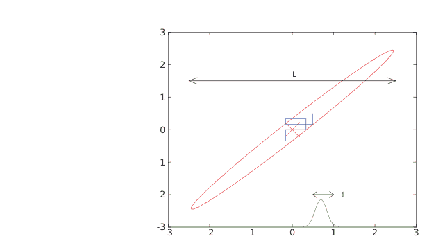

在某些情况下，我们可以高效地一次性采样多个变量组。这被称为阻塞吉布斯采样（Jensen et al. 1995; Wilkinson and Yeung 2002），并且可以在状态空间中进行更大的移动。

### 24.3 Metropolis Hastings算法

尽管吉布斯采样很简单，但在可以应用的模型集合中有一定的限制。例如，在计算 $p(\mathbf{w} | \mathcal{D})$ 的逻辑回归模型时，它并没有太大帮助，因为相应的图模型没有有用的马尔可夫结构。此外，吉布斯采样可能非常慢，正如我们之前提到的。

幸运的是，有一种更通用的算法可以使用，称为 **Metropolis Hastings**或 **MH**算法，我们在下面进行描述。

#### 24.3.1 基本思想

MH中的基本思想是，在每一步中，我们提议从当前状态 $\mathbf{x}$ 移动到一个新状态 $\mathbf{x}'$的概率为 $q(\mathbf{x}'|\mathbf{x})$，其中 $q$ 被称为提议分布（也称为核）。用户可以自由选择任何类型的提议，但需要满足一些条件，我们在下面解释。这使得MH成为一种非常灵活的方法。常用的提议是以当前状态为中心的对称高斯分布，$q(\mathbf{x}'|\mathbf{x}) = \mathcal{N}(\mathbf{x}'|\mathbf{x}, \mathbf{\Sigma})$；这被称为随机游走Metropolis算法。我们将在第24.3.3节讨论如何选择 $\mathbf{\Sigma}$。如果我们使用 $q(\mathbf{x}'|\mathbf{x}) = q(\mathbf{x}')$的形式，其中新状态独立于旧状态，我们得到一种称为独立采样器的方法，类似于重要性采样（第23.4节）。

在提出将移动到 $\mathbf{x}'$之后，我们根据某个公式决定是否接受这个提议，该公式确保在每个状态中花费的时间比例与 $p^*(\mathbf{x})$成比例。如果接受了提议，新状态为 $\mathbf{x}'$，否则新状态为与当前状态相同，即 $\mathbf{x}$（即，我们重复采样）。如果提议是对称的，即 $q(\mathbf{x}'|\mathbf{x}) = q(\mathbf{x}|\mathbf{x}')$，则接受概率由以下公式给出：

$$r = \min(1, \frac{p^*(\mathbf{x}')}{p^*(\mathbf{x})}) \tag{24.45}$$

我们可以看到，如果 $\mathbf{x}'$比 $\mathbf{x}$更有可能，我们肯定会移动到那里（因为 $\frac{p^*(\mathbf{x}')}{p^*(\mathbf{x})} > 1$），但如果$\mathbf{x}'$的概率较低，我们仍然可能移动到那里，这取决于相对概率。因此，我们偶尔允许“下坡”移动到概率较低的状态，而不仅仅是贪婪地移动到更可能的状态。在第24.3.6节中，我们证明了这个过程确保我们在每个状态 $\mathbf{x}$中花费的时间比例与 $p^*(\mathbf{x})$成比例。

如果提议是非对称的，即 $q(\mathbf{x}'|\mathbf{x}) \neq q(\mathbf{x}|\mathbf{x}')$，我们需要进行Hastings校正因子，如下所示：

$$r = \min(1, \alpha) \tag{24.46}$$
$$\alpha = \frac{p^*(\mathbf{x}') q(\mathbf{x}|\mathbf{x}')}{p^*(\mathbf{x}) q(\mathbf{x}'|\mathbf{x})} = \frac{p^*(\mathbf{x}') / q(\mathbf{x}'|\mathbf{x})}{p^*(\mathbf{x}) / q(\mathbf{x}|\mathbf{x}')} \tag{24.47}$$

这个修正是为了补偿这样一个事实，即提议分布本身（而不仅仅是目标分布）可能偏向某些状态。

MH算法之所以是一个有用的算法的一个重要原因是，在评估 $\alpha$时，我们只需要知道目标密度的归一化常数。特别地，假设 $p^*(\mathbf{x}) = \frac{1}{Z} \tilde{p}(\mathbf{x})$，其中 $\tilde{p}(\mathbf{x})$是一个非归一化分布，$Z$是归一化常数。那么

$$\alpha = \frac{(\tilde{p}(\mathbf{x}') / Z) q(\mathbf{x}|\mathbf{x}')}{(\tilde{p}(\mathbf{x}) / Z) q(\mathbf{x}'|\mathbf{x})} \tag{24.48}$$

所以 $Z$被消去。因此，即使 $Z$未知，我们仍然可以从 $p^*$中进行采样。特别地，我们只需要逐点评估 $\tilde{p}$，其中 $\tilde{p}(\mathbf{x}) = p^*(\mathbf{x}) Z$。

算法2总结了整个算法。

### 24.3.2 Gibbs采样是MH的一个特例

事实证明，我们在第24.2节中讨论的Gibbs采样是MH的一个特例。具体而言，它等价于使用形式为的一系列提议进行MH

$$q(\mathbf{x}'|\mathbf{x}) = p(x_i'|\mathbf{x}_{-i}) \mathbb{I}(\mathbf{x}_{-i}' = \mathbf{x}_{-i}) \tag{24.49}$$

也就是说，我们转移到一个新的状态，其中 $x_i$从其完全条件分布中进行采样，但 $\mathbf{x}_{-i}$保持不变。

我们现在证明每个提议的接受率为1，因此整个算法的接受率也为100%。我们有

$$\alpha = \frac{p(\mathbf{x}') q(\mathbf{x}|\mathbf{x}')}{p(\mathbf{x}) q(\mathbf{x}'|\mathbf{x})} = \frac{p(x_i'|\mathbf{x}_{-i}) p(\mathbf{x}_{-i}) p(x_i|\mathbf{x}_{-i})}{p(x_i|\mathbf{x}_{-i}) p(\mathbf{x}_{-i}) p(x_i'|\mathbf{x}_{-i})} = 1 \tag{24.50, 24.51}$$

```
算法 24.2: Metropolis Hastings 算法
1 初始化 x^0;
2 对于 s= 0, 1, 2, ...执行
3 定义 x = x^s;
4 采样 x' ~ q(x'|x);
5 计算接受概率
   \[ \alpha = \frac{\tilde{p}(x')q(x|x')}{\tilde{p}(x)q(x'|x)} \]
   计算 r = min(1, α);
6 采样 u ~ U(0,1);
7 将新样本设置为
   \[ x^{s+1} = \begin{cases} x' & \text{如果 } u < r \\ x^s & \text{如果 } u \geq r \end{cases} \]
```

在这里我们利用了 $x'_i = x_i$ 的事实，并且 $q(x'|x) = p(x'_i|x_{-i})$。

接受率为100%并不一定意味着Gibbs会快速收敛，因为它每次只更新一个坐标（见第24.2.8节）。幸运的是，我们可以使用许多其他类型的提议，如下所讨论。

#### 24.3.3 提议分布

对于给定的目标分布 $p^*$，如果一个提议分布 $q$ 能够给出移动到目标分布中具有非零概率的状态的非零概率，则该提议分布是有效或可接受的。形式上，我们可以写成

\[ \text{supp}(p^*) \subseteq \bigcup_x \text{supp}(q(\cdot|x)) \tag{24.52} \]

例如，高斯随机游走提议在整个状态空间上具有非零概率密度，因此对于任何连续状态空间都是有效的提议。

当然，在实践中，重要的是提议以恰当的方式分布其概率质量。图24.7展示了一个例子，我们使用MH算法使用随机游走提议从两个1D高斯混合分布中采样，其中 $q(x'|x) = \mathcal{N}(x'|x, v)$。这是一个有些棘手的目标分布，因为它由两个相距较远的模态组成。设置提议的方差 $v$ 非常重要：如果方差过低，链只会探索其中一个模态，如图24.7(a)所示，但如果方差过大，大部分移动将被拒绝，链将非常粘滞，即在同一个状态停留很长时间。从图24.7(b)中可以看出，这在长时间内会导致重复值的连续出现。如果我们将提议的方差设置得恰到好处，我们将得到图24.7(c)中的轨迹，其中样本明显探索了目标分布的支撑集。我们将在下面讨论如何调整提议。

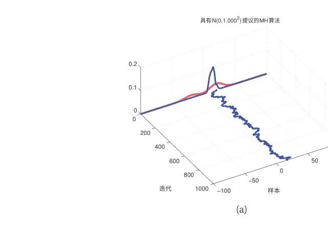
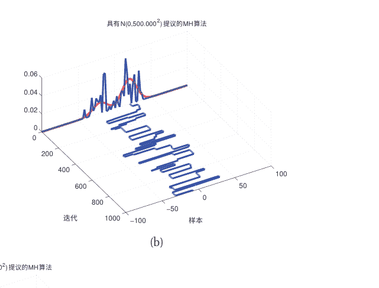
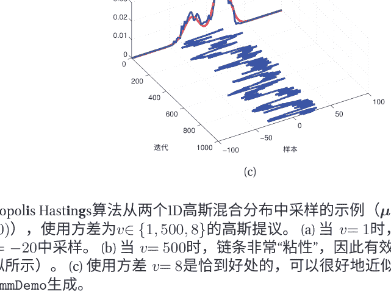
图24.7 Metropolis Hastings算法从两个1D高斯混合分布中采样的示例（μ=(−20,20), π=(0.3,0.7), σ=(100,100)），使用方差为v∈{1,500,8}的高斯提议。(a)当v=1时，链条陷入起始状态附近，无法从μ=−20中采样。(b)当v=500时，链条非常“粘性”，因此有效样本量较低（如尾部的粗糙直方图近似所示）。(c)使用方差v=8是恰到好处的，可以很好地近似真实分布（红色表示）。图由mcmcGmmDemo生成。
基于Christophe Andrieu和Nando de Freitas的代码。

吉布斯采样的一个重要优势是不需要选择提议分布，而且接受率为100%。当然，通过使用方差为0的提议（假设我们从一个模式开始），可以轻松地实现100%的接受率，但这显然不能探索后验分布。因此，高接受率并不是最终目标。通过增加高斯核的方差，我们可以增加探索的程度。

通常，人们会尝试不同的参数，直到接受率在25%到40%之间，理论上这是最优的，至少对于高斯目标分布来说是如此。用于调整提议的这些短期运行被称为试飞运行。

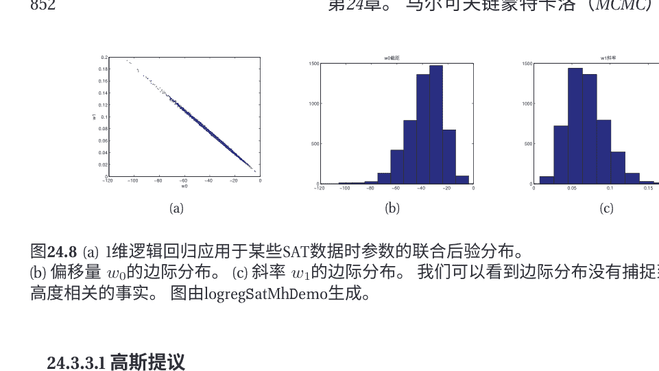

#### 24.3.3.1 高斯提案

如果我们有一个连续的状态空间，局部模态 $\hat{w}$ 的海森矩阵 $\mathbf{H}$ 可以用来定义一个高斯提议分布的协方差。这种方法的优点是海森矩阵模拟了每个维度的局部曲率和长度尺度；因此，这种方法避免了吉布斯采样在图24.6中显示的一些慢混合行为。有两种明显的方法：(1) 独立提议，$q(\mathbf{w}'|\mathbf{w}) = \mathcal{N}(\mathbf{w}'|\hat{\mathbf{w}}, \mathbf{H}^{-1})$ 或者 (2) 随机游走提议，$q(\mathbf{w}'|\mathbf{w}) = \mathcal{N}(\mathbf{w}'|\mathbf{w}, s^2\mathbf{H}^{-1})$，其中 $s^2$ 是一个选择的缩放因子以促进快速混合。(Roberts and Rosenthal 2001) 证明，如果后验分布是高斯分布，渐近最优的值是使用 $s^2 = 2.38^2/D$，其中 $D$ 是 $\mathbf{w}$ 的维度，这将导致接受率为0.234。

例如，考虑二元逻辑回归的MH算法。从方程8.7可以得到，对数似然函数的Hessian矩阵为 $\mathbf{H}_l = \mathbf{X}^T\mathbf{D}\mathbf{X}$，其中 $\mathbf{D} = \text{diag}(\mu_i(1-\mu_i))$，$\mu_i = \text{sigm}(\hat{\mathbf{w}}^T\mathbf{x}_i)$。如果我们假设一个高斯先验分布，$p(\mathbf{w}) = \mathcal{N}(\mathbf{0}, \mathbf{V}_0)$，那么 $\mathbf{H} = \mathbf{V}_0^{-1} + \mathbf{H}_l$，因此渐近最优的高斯提议分布的形式为
\[ q(\mathbf{w}'|\mathbf{w}) = \mathcal{N}\left(\mathbf{w}, \frac{2.38^2}{D} \left(\mathbf{V}_0^{-1} + \mathbf{X}^T\mathbf{D}\mathbf{X}\right)^{-1}\right) \tag{24.53} \]

详细信息请参见（Gamerman 1997; Rossi et al. 2006; Fruhwirth-Schnatter and Fruhwirth 2010）。该方法在图24.8中进行了说明，我们从拟合一些SAT数据的1D逻辑回归模型中采样参数。我们从使用IRLS计算的模式开始初始化链，然后使用上述随机行走Metropolis采样器。

如果你无法计算模式或其Hessian $\mathbf{X}^T\mathbf{D}\mathbf{X}$，一种替代方法是在（Scott 2009）中建议的，将上述提议近似如下：
\[ q(\mathbf{w}'|\mathbf{w}) = \mathcal{N}\left(\mathbf{w}, \left(\mathbf{V}_0^{-1} + \frac{6}{\pi^2}\mathbf{X}^T\mathbf{X}\right)^{-1}\right) \tag{24.54} \]

#### 24.3.3.2 混合提案

如果不知道要使用什么样的提议，可以尝试一个混合提议，它是基本提议的凸组合：

$$q(\mathbf{x}'|\mathbf{x}) = \sum_{k=1}^K w_k q_k(\mathbf{x}'|\mathbf{x}) \tag{24.55}$$

其中 $w_k$ 是混合权重。只要每个 $q_k$ 都是有效的，整体提议也将是有效的。

#### 24.3.3.3 数据驱动的MCMC

最有效的提议不仅依赖于先前的隐藏状态，还依赖于可见数据，即它们具有形式 $q(\mathbf{x}'|\mathbf{x}, \mathcal{D})$。这被称为数据驱动的MCMC（参见例如（Tu and Zhu 2002））。要创建这样的提议，可以从前向模型中采样（$\mathbf{x}, \mathcal{D}$）对，然后训练一个判别性分类器来预测 $p(\mathbf{x}|f(\mathcal{D}))$，其中 $f(\mathcal{D})$ 是从可见数据中提取的一些特征。

通常情况下， $\mathbf{x}$ 是一个高维向量（例如，视觉对象检测器中一个人的所有肢体的位置和方向），因此很难预测整个状态向量， $p(\mathbf{x}|f(\mathcal{D}))$。相反，我们可以训练一个判别式检测器来预测状态空间的部分， $p(x_k|f_k(\mathcal{D}))$，例如一个人脸的位置。然后我们可以使用以下形式的提议

$$q(\mathbf{x}'|\mathbf{x}, \mathcal{D}) = \pi_0 q_0(\mathbf{x}'|\mathbf{x}) + \sum_{k} \pi_k q_k(x'_k|f_k(\mathcal{D})) \tag{24.56}$$

其中 $q_0$ 是一个标准的与数据无关的提议（例如，随机游走），而 $q_k$ 更新状态空间的第 $k$ 个分量。为了提高效率，判别式提议应该建议对多个变量进行联合变化，但这通常很难做到。

整体过程是一种生成和测试的形式：判别性提议 $q(\mathbf{x}'|\mathbf{x})$ 生成新的假设，然后通过计算后验比率 $p(\mathbf{x}'|\mathcal{D})/p(\mathbf{x}|\mathcal{D})$ 来测试这些假设，以便判断新的假设是更好还是更差。通过添加一个退火步骤，可以修改算法以找到后验模式；这被称为模拟退火，并在第24.6.1节中进行了描述。使用寻找模式的版本算法的一个优点是我们不需要确保提议分布是可逆的。

#### 24.3.4 自适应MCMC

在算法运行时，可以更改提议的参数以提高效率。这被称为自适应MCMC。这允许我们从一个宽泛的协方差（例如）开始，允许在空间中进行大范围的移动，直到找到一个模式，然后缩小协方差以确保对模式周围区域进行仔细的探索。

然而，必须小心不要违反马尔可夫性质；因此，提议的参数不应该依赖于整个链的历史。事实证明，确保这一点的一个足够条件是逐渐随时间“淡化”适应。详细信息请参见（Andrieu and Thoms 2008）。

## 24.3.5 初始化和模式跳转

有必要从具有非零概率的初始状态开始MCMC。如果模型具有确定性约束，则找到这样一个合法配置可能本身就是一个困难的问题。因此，通常在本地模式下初始化MCMC方法，使用优化器找到一个局部模式。

在某些领域（特别是具有离散状态空间的领域），多次重新启动优化器并对这些模式进行平均，而不是探索局部模式周围的相似点，可以更有效地利用计算时间。然而，在连续状态空间中，模式的体积可以忽略不计（第5.2.1.3节），因此有必要在每个模式周围进行局部探索，以访问足够的后验概率质量。

#### 24.3.6 为什么MH有效 *

为了证明MH过程生成从 p*中的样本，我们需要使用一些马尔可夫链理论，请务必先阅读第17.2.3节。

MH算法定义了以下转移矩阵的马尔可夫链：

```
$$
p(x'|x) = \begin{cases} q(x'|x)r(x'|x) & \text{如果 } x' = x \\ q(x|x) + \sum_{x' \neq x} q(x'|x)(1 - r(x'|x)) & \text{otherwise} \end{cases}$$ (24.57)
```

这是通过案例分析得出的结论：如果你从 x 移动到 x', 你必须已经提议了它（概率为 q(x'|x)），并且它必须已经被接受了（概率为 r(x'|x)）；否则，你将保持在状态 x, 要么是因为这是你提议的（概率为 q(x|x)），要么是因为你提议了其他东西（概率为 q(x'|x)），但被拒绝了（概率为1 - r(x'|x)）。

让我们分析这个马尔可夫链。回顾第17.2.3.4节，如果一个链满足详细平衡，则平衡。

```
$$
p(x'|x)p^*(x) = p(x|x')p^*(x')$$ (24.58)
```

我们还证明了，如果一个链满足详细平衡，则 p*是其稳定分布。我们的目标是证明MH算法定义了一个满足详细平衡的转移函数，因此 p*是其稳定分布。（如果方程24.58成立，我们说 p*是 q 的不变分布。）

定理24.3.1。如果MH算法定义的转移矩阵（由方程24.57给出）是遍历和不可约的，则 p*是其唯一的极限分布。

因此我们有  $r(\mathbf{x}'|\mathbf{x}) = \alpha(\mathbf{x}'|\mathbf{x})$ 和  $r(\mathbf{x}|\mathbf{x}') = 1$。

现在要从 $\mathbf{x}$ 到 $\mathbf{x}'$ 我们必须首先提出 $\mathbf{x}'$ 然后接受它。因此

```
$$
p(\mathbf{x}'|\mathbf{x}) = q(\mathbf{x}'|\mathbf{x})r(\mathbf{x}'|\mathbf{x}) = q(\mathbf{x}'|\mathbf{x}) \frac{p^*(\mathbf{x}')q(\mathbf{x}|\mathbf{x}')}{p^*(\mathbf{x})q(\mathbf{x}'|\mathbf{x})} = \frac{p^*(\mathbf{x}')}{p^*(\mathbf{x})} q(\mathbf{x}|\mathbf{x}')$$
```

因此

```
$$
p^*(\mathbf{x})p(\mathbf{x}'|\mathbf{x}) = p^*(\mathbf{x}')q(\mathbf{x}|\mathbf{x}')$$
```

反向概率是

```
$$
p(\mathbf{x}|\mathbf{x}') = q(\mathbf{x}|\mathbf{x}')r(\mathbf{x}|\mathbf{x}') = q(\mathbf{x}|\mathbf{x}')$$
```

因为 $r(\mathbf{x}|\mathbf{x}') = 1$。将其插入方程24.63中，我们得到

```
$$
p^*(\mathbf{x})p(\mathbf{x}'|\mathbf{x}) = p^*(\mathbf{x}')p(\mathbf{x}|\mathbf{x}')$$
```

因此，关于 $p^*$ 的详细平衡成立。因此，根据定理17.2.3， $p^*$ 是一个稳态分布。此外，根据定理17.2.2，这个分布是唯一的，因为该链是遍历的和不可约的。

#### 24.3.7 可逆跳跃（跨维度）MCMC *

假设我们有一组具有不同参数数量的模型，例如，混合模型中的混合成分数量未知。让模型表示为 $m$ ，并且让其未知数（例如，参数）表示为 $\mathbf{x}_m \in \mathcal{X}_m$ （例如， $\mathcal{X}_m = \mathbb{R}^{n_m}$ ，其中 $n_m$ 是模型 $m$ 的维度）。在维度不同的空间中进行采样被称为跨维度MCMC（Green 2003）。我们可以从模型指示器 $m \in \{1,\ldots,M\}$ 中进行采样，并从乘积空间 $\prod_{m=1}^M \mathcal{X}_m$ 中采样所有参数，但这非常低效。在联合空间 $\mathcal{X} = \bigcup_{m=1}^M \{m\} \times \mathcal{X}_m$ 中进行采样更加简洁，我们只关心当前活动模型的参数。

当我们在不同维度的模型之间转换时，这种方法的困难就出现了。问题在于当我们计算MH接受比率时，我们在比较在不同维度空间中定义的密度，这是没有意义的。这就像是试图比较一个球和一个圆。解决方案是由（Green 1998）提出的，被称为可逆跳跃MCMC或RJMCMC，它通过增加额外的随机变量来扩充低维空间，使得两个空间具有共同的度量。

不幸的是，我们没有足够的空间在这里详细介绍。可以说，该方法在理论上可以实现，尽管在实践中有些棘手。然而，如果连续参数可以被积分掉（导致一种称为折叠RJMCMC的方法），许多困难就会消失，因为我们只剩下一个离散状态空间，不需要担心度量的变化。例如，（Denison et al. 2002）包括了许多应用折叠RJMCMC于贝叶斯推断自适应基函数模型的例子。他们从一组固定的候选基函数中采样（例如，以数据点为中心），并通过解析地积分出其他参数。这为使用贝叶斯方法提供了一种替代使用RVMs或SVMs的选择。

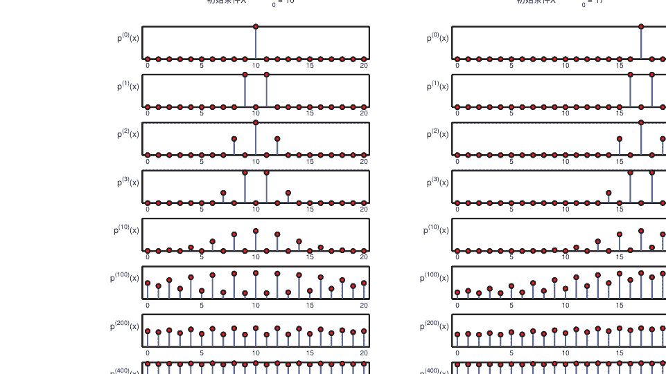

图24.9展示了从（左）状态10和（右）状态17开始的对称随机行走收敛到{0,1,...,20}上的均匀分布。基于（MacKay2003）的图29.14和29.15。由randomWalk0to20Demo生成的图。

### 24.4 MCMC的速度和准确性

在本节中，我们讨论与MCMC相关的一些重要的理论和实际问题。

#### 24.4.1 燃烧阶段

我们从任意初始状态开始MCMC。正如我们在17.2.3节中解释的那样，只有当链“忘记”它的起始状态时，样本才来自于链的稳定分布。在链达到稳定分布之前收集的样本不来自于p*，并且通常会被丢弃。初始阶段的样本将被忽略，称为燃烧阶段。

例如，考虑一个均匀分布在整数{0,1,...,20}上的情况。假设我们从中进行对称随机游走进行采样。在图24.9中，我们展示了算法的两次运行。在左边，我们从状态10开始；在右边，我们从状态17开始。即使在这个小问题中，直到链条“忘记”起始位置，需要超过100步。

很难诊断链条何时已经烧毁，这是我们在下面更详细讨论的一个问题。（这是MCMC的一个基本弱点之一。）作为一个有趣的例子，如果你开始过早地收集样本，考虑波茨模型。图24.10(a)展示了Gibbs采样经过500次迭代后的一个样本。这表明模型喜欢

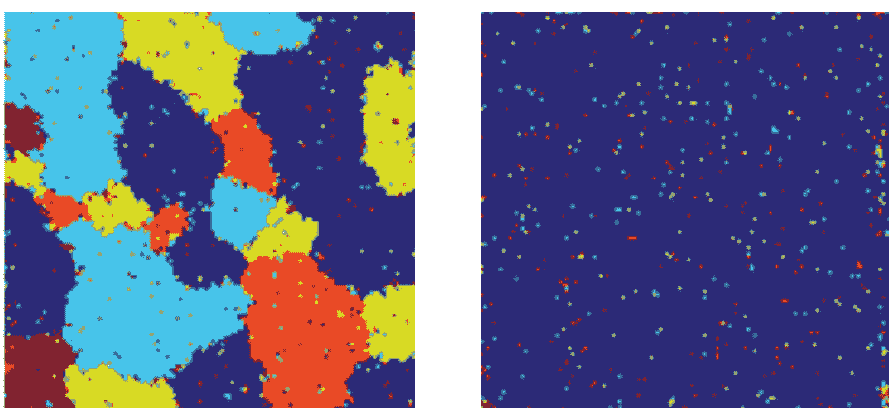

图24.10 展示了由于混合不良而引起的问题。 (a) 在一个 128 × 128的网格上，使用8个最近邻连接和 J= 2/3 (如 (Geman和Geman 1984) 中所示) 的5状态波茨模型的一个样本，在200次迭代后。 (b) 在相同模型上进行1万次迭代后的一个样本。获得Erik Sudderth的友好许可使用。

中等大小的区域中标签相同，这意味着模型对图像分割有很好的先验。事实上，在最初的吉布斯采样论文中就提到了这一点 (Geman和Geman 1984)。

然而，事实证明，如果你运行足够长的链，你会得到孤立的斑点，如图24.10(b)所示。结果取决于耦合强度，但一般来说，很难找到一个能产生漂亮的中等大小斑块的设置：大多数参数会产生一些超级簇或大量的小碎片。事实上，这两种情况之间存在着快速的相变。这导致了一篇名为“Ising/Potts模型不适合于分割任务”的论文 (Morris等人1996年)。在达到收敛之前进行采样可能会导致错误的结论，但是可以创建更适合图像分割的先验 (例如，(Sudderth和Jordan 2008))。

## 24.4.2 马尔可夫链的混合速率 *

马尔可夫链收敛到稳态分布并忘记初始状态所需的时间称为混合时间。更正式地说，我们说从状态 x₀ 的混合时间是最小时间，使得对于任意常数ϵ > 0，我们有

```
$$
\tau_\epsilon(x_0) \triangleq \min\{t : ||\delta_{x_0}(x)T^t - p^*||_1 \leq \epsilon\}$$ (24.66)
```

其中 $\delta_{x_0}(x)$ 是一个在状态 $x_0$ 上具有全部质量的分布， $T$ 是链的转移矩阵 (取决于目标 $p^*$ 和提议 $q$)， $\delta_{x_0}(x)T^t$ 是 t 步之后的分布。链的混合时间定义为

```
$$
\tau_\epsilon \triangleq \max_{x_0} \tau_\epsilon(x_0)$$ (24.67)
```

混合时间由特征间隙 $\gamma = \lambda_1 - \lambda_2$ 决定，即差值

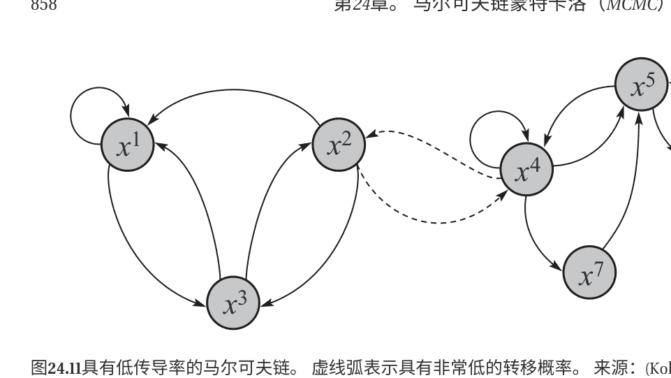

转移矩阵的第一和第二特征值。 特别地，可以证明

```
$$
\tau_\epsilon \leq O\left( \frac{1}{\gamma} \log \frac{n}{\epsilon} \right)
$$
```

其中n是状态的数量。 由于计算转移矩阵可能很困难，特别是对于高维和/或连续状态空间，找到其他估计混合时间的方法是有用的。

另一种方法是检查状态空间的几何结构。 例如，考虑图24.1中的链。我们可以看到状态空间由两个“岛屿”组成，每个岛屿通过一个狭窄的“瓶颈”相连。（如果它们完全断开，链将不是遍历的，就不再有唯一的稳态分布。）我们定义链的传导率 $\phi$ 为从该集合到其补集的最小概率，对于所有状态子集而言：

```
$$
\phi \triangleq \min_{S:0 \leq p^*(S) \leq 0.5} \frac{\sum_{x \in S, x' \in S^c} T(x \rightarrow x')}{p^*(S)}
$$
```

可以证明

```
$$
\tau_\epsilon \leq O\left( \frac{1}{\phi^2} \log \frac{n}{\epsilon} \right)
$$
```

因此具有低传导率的链具有较高的混合时间。 例如，具有分离明显模式的分布通常具有较高的混合时间。 在这种情况下，简单的MCMC方法通常效果不佳，需要使用更高级的算法，如并行退火(参见(Liu 2001))。

#### 24.4.3 实际收敛诊断

计算链的混合时间通常非常困难，因为转移矩阵通常很难计算。 在实践中，已经提出了各种启发式方法来诊断

收敛性 - 参见(Geyer 1992; Cowles and Carlin 1996; Brooks and Roberts 1998)进行综述。
严格来说，这些方法并不是诊断收敛，而是非收敛。也就是说，该方法可能声称链已经收敛，但实际上并没有。这是所有收敛诊断的一个共同缺陷，因为一般情况下诊断收敛是计算上难以处理的 (Bhatnagar等，2010年)。

评估方法何时收敛的最简单方法之一是从非常不同且过度分散的起始点运行多个链，并绘制感兴趣变量的样本。这被称为轨迹图。如果链已经混合，它应该已经“忘记”了起始点，因此轨迹图应该收敛到相同的分布，并与彼此重叠。

图2.4.1给出了一个例子。我们展示了从两个1D高斯混合中采样的变量x的轨迹图，使用了四种不同的方法：具有对称高斯建议的MH方法，方差为 $\sigma^2 \in \{1, 8, 500\}$，以及Gibbs采样。我们可以看到 $\sigma^2=1$ 没有混合，这也可以从图2.4.7(a)中看出，该图显示单个链永远不会离开起始区域。其他方法的结果表明，这些链迅速收敛到稳定分布，无论它们从何处开始。 （ $\sigma^2=500$ 建议的粘性特性非常明显。这降低了计算效率，但不影响统计有效性。）

### 24.4.3.1 估计的潜在规模缩减（EPSR）

我们可以通过以下方式更定量地评估收敛性。基本思想是比较每个链中某个数量的方差与所有链之间的方差。更准确地说，假设我们从每个变量的每个链中收集了S个样本（在burn-in之后），其中C是链的数量，D是变量的数量，x 是一个标量，i的取值范围是1到D，s的取值范围是1到S，c的取值范围是1到C。让 $y_{sc}$ 是从 $x_{1:D,s,c}$ 派生出的感兴趣的标量数量（例如，对于某个选择的i， $y_{sc}=x_{isc}$）。将序列内均值和总体均值定义为

$$
\bar{y}_{.c}\triangleq \frac{1}{S}\sum_{s=1}^S y_{sc}, \quad \bar{y}_{..}\triangleq \frac{1}{C}\sum_{c=1}^C \bar{y}_{.c}
$$ (24.71)

将序列间方差和序列内方差定义为

$$
B\triangleq \frac{S}{C-1}\sum_{c=1}^C (\bar{y}_{.c}-\bar{y}_{..})^2, \quad W\triangleq \frac{1}{C}\sum_{c=1}^C \left[\frac{1}{S-1}\sum_{s=1}^S (y_{sc}-\bar{y}_{.c})^2 \right]
$$ (24.72)

现在我们可以构建两个 y 方差的估计。第一个估计是 W：如果链没有完全遍历后验分布，则应该低估var [y]。第二个估计是

$$
\hat{V} = \frac{S-1}{S}W + \frac{1}{S}B
$$ (24.73)

这是一个在平稳性下无偏的var [y]的估计，但如果起始点过分散，则会高估(Gelman and Rubin 1992)。基于此，我们可以定义以下收敛诊断统计量，称为估计的潜在尺度缩减或EPSR：

$$
\hat{R} \triangleq \sqrt{\frac{\hat{V}}{W}}
$$ (24.74)

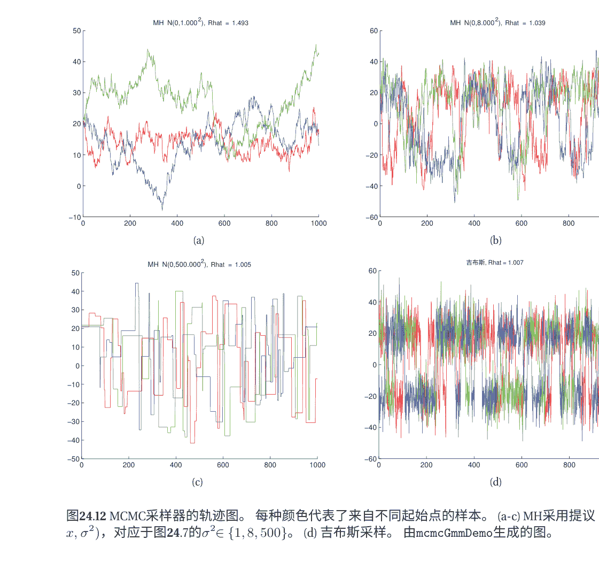

图24.12 MCMC采样器的轨迹图。每种颜色代表了来自不同起始点的样本。(a-c) MH采用提议 $\mathcal{N}(x'|x, \sigma^2)$，对应于图24.7的 $\sigma^2 \in \{1, 8, 500\}$。(d) 吉布斯采样。由mcmcGmmDemo生成的图。

这个数量最初是在(Gelman and Rubin 1992)中提出的，它衡量了如果我们继续在 $S \to \infty$ 极限下进行采样，后验方差会减小的程度。如果对于任何给定的数量， $\hat{R} \approx 1$，那么该估计是可靠的（或者至少不是不可靠的）。图24.12中四个采样器的 $\hat{R}$ 值分别为1.493、1.039、1.005和1.007。因此，这个诊断正确地识别出了使用第一个（ $\sigma^2=1$ ）提议的采样器是不可信的。

#### 24.4.4 MCMC的准确性

MCMC生成的样本存在自相关性，这降低了它们的信息内容相对于独立或“完美”的样本。我们可以如下量化。假设我们想要

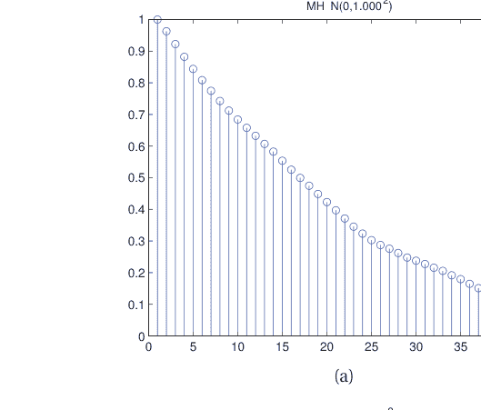

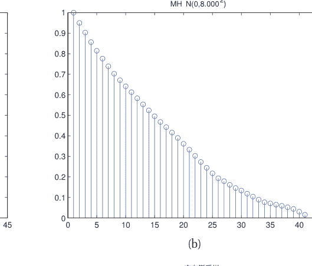

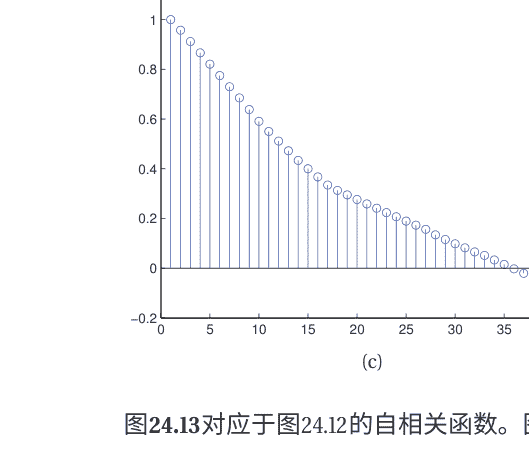

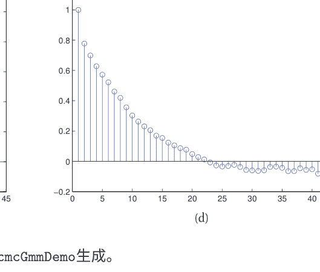

图24.13对应于图24.12的自相关函数。图由mcmcGmmDemo生成。

用于估计 $f(X)$ 的均值，对于某个函数 $f$，其中 $X \sim p()$。将真实均值表示为

$$f^* \triangleq \mathbb{E} [f(X)]$$ (24.75)

蒙特卡洛估计由以下给出

$$\overline{f} = \frac{1}{S} \sum_{s=1}^{S} f_s$$ (24.76)

通过MCMC估计得到的方差估计如下

$$
\begin{aligned}
\text{Var}_{MCMC}[\bar{f}] &= \mathbb{E}[(\bar{f} - f^*)^2] \\
&= \mathbb{E}\left[\left\{\frac{1}{S}\sum_{s=1}^{S}(f_s - f^*)\right\}^2\right] \\
&= \frac{1}{S^2}\mathbb{E}\left[\sum_{s=1}^{S}(f_s - f^*)^2\right] + \frac{1}{S^2}\sum_{s \neq t}\mathbb{E}[(f_s - f^*)(f_t - f^*)] \\
&= \text{Var}_{MC}(\bar{f}) + \frac{1}{S^2}\sum_{s \neq t}\mathbb{E}[(f_s - f^*)(f_t - f^*)]
\end{aligned}
$$ (24.77-24.80)

其中第一项是蒙特卡洛估计的方差，如果样本之间没有相关性，而第二项取决于样本之间的相关性。 我们可以如下衡量这一点。定义样本自相关函数在滞后 $t$ 的情况下，对一组样本 $f_1, \ldots, f_S$ 如下：

$$\rho_t \triangleq \frac{\frac{1}{S-t}\sum_{s=1}^{S-t}(f_s - \bar{f})(f_{s+t} - \bar{f})}{\frac{1}{S-1}\sum_{s=1}^{S}(f_s - \bar{f})^2}$$ (24.81)

这被称为自相关函数(ACF)。 我们在图24.13中为我们的四个采样器绘制了这个图。 我们可以看到Gibbs采样器的自相关函数（右下角）比MH采样器更快地趋近于0，这表明每个Gibbs样本的价值比每个MH样本更高。

减少自相关的一种简单方法是使用稀疏采样，即我们保留每个$n$个样本。 这不会增加底层采样器的效率，但可以节省空间，因为它避免了存储高度相关的样本。

我们可以通过计算有效样本大小 (ESS) $S_{\text{eff}}$ 来估计一组样本的信息内容，其定义为

$$S_{\text{eff}} \triangleq \frac{\text{Var}_{MC}(f)}{\text{Var}_{MCMC}(\bar{f})}$$ (24.82)

从图24.12可以清楚地看出，Gibbs采样器的有效样本量高于其他采样器（在这个例子中）。

## 24.4.5 有多少条链？

一个自然的问题是：我们应该运行多少条链？ 我们可以运行一条长链来确保收敛，然后收集相隔较远的样本，或者我们可以运行许多短链，但这会浪费燃烧时间。 实践中通常运行中等数量的链（比如3条）和中等长度的链（比如100,000步），并在丢弃前半部分样本后从每个链中取样。 如果我们从一个局部模式初始化，我们可能能够使用所有样本，而不必等待燃烧期。

| 模型目标方法 | 参考 |
| :--- | :--- |
| Probit MAP梯度 | 第9.4.1节 |
| Probit MAP EM | 第11.4.6节 |
| Probit后验EP | (Nickisch和Rasmussen 2008) |
| Probit后验Gibbs+ | 练习24.6 |
| Probit后验Gibbs与ARS | (Dellaportas和Smith 1993) |
| Probit后验MH使用IRLS提议(Gamerman 1997) | |
| Logit MAP梯度 | 第8.3.4节 |
| Logit 后验Gibbs+与学生 | (Fruhwirth-Schnatter和Fruhwirth 2010) |
| Logit 后验Gibbs+与KS | (Holmes和Held 2006) |

表24.1 一些用于二元分类估计和推断的可能算法的总结。使用高斯先验。缩写词：Aux. = 辅助变量采样，ARS = 自适应拒绝采样，EP = 期望传播，Gibbs+ = 带有辅助变量的Gibbs采样，IRLS = 迭代加权最小二乘法，KS = Kolmogorov Smirnov，MAP = 最大后验，MH = Metropolis Hastings，Post = 后验。

## 24.5 辅助变量 MCMC *

有时候，通过引入虚拟的辅助变量，我们可以显著提高采样的效率，以减少原始变量之间的相关性。如果原始变量用 $\mathbf{x}$ 表示，辅助变量用 $\mathbf{z}$ 表示，我们要求 $\sum_{\mathbf{z}} p(\mathbf{x}, \mathbf{z}) = p(\mathbf{x})$，并且 $p(\mathbf{x}, \mathbf{z})$ 比 $p(\mathbf{x})$ 更容易采样。如果我们满足这两个条件，我们可以在扩展模型中进行采样，然后丢弃采样的 $\mathbf{z}$ 值，从而恢复出 $p(\mathbf{x})$ 的样本。下面我们给出一些例子。

#### 24.5.1 逻辑回归的辅助变量采样

在第9.4.2节中，我们讨论了概率回归的潜变量解释。回想一下，它的形式是

$$z_i \triangleq \mathbf{w}^T \mathbf{x}_i + \epsilon_i \tag{24.83}$$
$$\epsilon_i \sim \mathcal{N}(0, 1) \tag{24.84}$$
$$y_i = 1 = \mathbb{I}(z_i \geq 0) \tag{24.85}$$

我们在第11.4.6节中利用了这种表示方法，使用EM算法找到了最大似然估计。将其转换为辅助变量Gibbs采样器（练习24.6）非常简单，因为 $p(\mathbf{w}|\mathcal{D})$ 是高斯分布，而 $p(z_i|\mathbf{x}_i, y_i, \mathbf{w})$ 是截断高斯分布，两者都很容易采样。

现在让我们讨论如何为逻辑回归推导出一个辅助变量Gibbs采样器。令 $\epsilon_i$ 服从逻辑分布，其概率密度函数为

$$p_{\text{Logistic}}(\epsilon) = \frac{e^{-\epsilon}}{(1 + e^{-\epsilon})^2} \tag{24.86}$$

其均值为 $\mathbb{E}[\epsilon] = 0$，方差为 $\text{var}[\epsilon] = \pi^2/3$。累积分布函数的形式为 $F(\epsilon) = \text{sigm}(\epsilon)$，其中是逻辑函数。 由于 \(y_i= 1\)当且仅当 \(\mathbf{w}^T \mathbf{x}_i +\epsilon > 0\)，根据对称性，我们有

$$p(y_i = 1|\mathbf{x}_i, \mathbf{w}) = \int_{-\mathbf{w}^T\mathbf{x}_i}^{\infty} f(\epsilon)d\epsilon = \int_{-\infty}^{\mathbf{w}^T\mathbf{x}_i} f(\epsilon)d\epsilon = F(\mathbf{w}^T\mathbf{x}_i) = \text{sigm}(\mathbf{w}^T\mathbf{x}_i) \tag{24.87}$$

如所需。我们可以通过从 \(p(\mathbf{z}|\mathbf{w}, \mathcal{D})\)和 \(p(\mathbf{w}|\mathbf{z}, \mathcal{D})\)中采样来推导出辅助变量吉布斯采样器。不幸的是，直接从 \(p(\mathbf{w}|\mathbf{z}, \mathcal{D})\)中采样是不可能的。一种方法是定义 \(\epsilon_i\sim \mathcal{N}(0, \lambda_i)\)，其中 \(\lambda_i= (2\psi_i)^2\)， \(\psi_i\sim \text{KS}\)，即科尔莫戈洛夫-斯米尔诺夫分布，然后采样 \(\mathbf{w}, \mathbf{z}, \boldsymbol{\lambda}\)和 \(\boldsymbol{\psi}\)(Holmes and Held 2006)。一种更简单的方法是通过学生分布来近似逻辑分布(Albert and Chib 1993)。 具体来说，我们将使用近似 \(\epsilon_i\sim \mathcal{T}(0, 1, \nu)\)的方法，其中\(\nu\approx 8\)。 现在我们可以使用学生分布的混合高斯表示来简化推断。具体来说，我们可以写成

$$
\begin{aligned}
\lambda_i &\sim \text{Ga}(\nu/2, \nu/2) \tag{24.88} \\
\epsilon_i &\sim \mathcal{N}(0, \lambda_i^{-1}) \tag{24.89} \\
z_i &\triangleq \mathbf{w}^T \mathbf{x}_i + \epsilon_i \tag{24.90} \\
y_i = 1|z_i &= \mathbb{I}(z_i \geq 0) \tag{24.91}
\end{aligned}
$$

现在所有的完全条件都有一个简单的形式；详见练习24.7。

请注意，如果我们设置 \(\nu= 1\)，那么 \(z_i\sim \mathcal{N}(\mathbf{w}^T \mathbf{x}_i, 1)\)，这等价于概率回归（见第9.4节）。我们不必在概率回归和逻辑回归之间进行选择，只需估计参数 \(\nu\)即可。 没有方便的共轭先验，但我们可以考虑一系列有限的可能值，并按以下方式评估后验概率：

$$p(\nu|\boldsymbol{\lambda}) \propto p(\nu) \prod_{i=1}^{N} \frac{1}{\Gamma(\nu/2)(\nu/2)^{\nu/2}} \lambda_i^{\nu/2-1} e^{-\nu\lambda_i/2} \tag{24.92}$$

此外，如果我们定义 \(\mathbf{V}_0 = v_0\mathbf{I}\)，我们也可以对 \(v_0\)进行采样。 例如，假设我们对 \(v_0\)使用一个 \(\text{IG}(\delta_1, \delta_2)\)先验分布。后验分布由 \(p(v_0|\mathbf{w}) = \text{IG}(\delta_1 + \frac{1}{2}D, \delta_2 + \frac{1}{2}\sum_{j=1}^{D} w_j^2)\)给出。这可以与其他吉布斯采样步骤交替进行，并为设置正则化强度提供了一种吸引人的贝叶斯替代方法。

有关拟合Probit和Logit模型的各种算法的总结，请参见表24.1。 许多这些方法也可以扩展到多项式逻辑回归的情况。 有关详细信息，请参见 (Scott 2009; Fruhwirth-Schnatter and Fruhwirth 2010)。

#### 24.5.2 切片采样

考虑从一个一维但多峰分布中采样 \(\tilde{p}(x)\)。通过添加一个辅助变量 \(u\)，我们有时可以提高进行大幅移动的能力。 我们将联合分布定义如下:

$$\hat{p}(x, u) = \begin{cases} 1/Z_p & \text{if } 0 \leq u \leq \tilde{p}(x) \\ 0 & \text{否则} \end{cases} \tag{24.93}$$

其中 $Z_p = \int$ 给定的$x$的边际分布为

$$\int \hat{p}(x, u) du = \int_0^{\tilde{p}(x)} \frac{1}{Z_p} du = \frac{\tilde{p}(x)}{Z_p} = p(x) \tag{24.94}$$

因此，我们可以通过从 $\hat{p}(x, u)$中采样，然后忽略 $u$来从 $p(x)$中采样。完全条件的形式为

$p(u|x) = U_{[0,\tilde{p}(x)]}(u) \tag{24.95}$

$p(x|u) = U(A)$ 其中 $A = \{x: \tilde{p}(x) \geq u\}$是在所选高度 $u$上方或上方的点的集合。这对应于分布的一个切片，因此称为切片采样(Neal 2003a)。见图24.14(a)。

在实践中，很难确定集合 $A$。因此，我们可以采用以下方法：构建一个区间 $x_{min} \leq x \leq x_{max}$，围绕当前点 $x^s$的一定宽度。然后测试每个端点是否在切片内。如果是，则继续向该方向扩展，直到超出切片范围。这被称为步出。然后从该区域均匀选择一个候选值\( x' \)。如果它在切片内，则保留，即\( x^{s+1} = x' \)。否则，我们缩小该区域，使\( x' \)成为一端，并且该区域仍然包含\( x^s \)。然后抽取另一个样本。我们继续这样做，直到接受一个样本。

要将该方法应用于多变量分布，我们可以为每个维度采样一个额外的辅助变量。切片采样相对于Gibbs的优势在于它不需要对全条件进行规定，只需要未归一化的联合分布。切片采样相对于MH的优势在于它不需要用户指定的提议分布（尽管它需要指定步出区间的宽度）。

图24.14(b)展示了算法在一个合成的一维问题上的运行情况。图24.15展示了它在一个稍微困难的问题上的行为，即二项式逻辑回归。该模型的形式为

$y_i \sim \text{Bin}(n_i, \text{logit}(\beta_1 + \beta_2 x_i))$

我们对\( \beta_j \)的先验使用了一个模糊的高斯分布。图24.15(a)展示了对后验的基于网格的近似，图24.15(b)展示了基于样本的近似。在这个例子中，网格计算更快，但对于超过2个维度的问题，网格方法是不可行的。

#### 24.5.3 Swendsen Wang

考虑一个以下形式的伊辛模型：

$p(\mathbf{x}) = \frac{1}{Z} \prod_e f_e(\mathbf{x}_e)$

其中\( \mathbf{x}_e = (x_i, x_j) \)对于边\( e = (i, j) \), \( x_i \in \{+1, -1\} \), 边因子\( f_e \)的定义为

$ \begin{pmatrix} e^J & e^{-J} \\ e^{-J} & e^J \end{pmatrix} $

其中\( J \)是边缘强度。在这种模型中，Gibbs采样可能会很慢，当\( J \)的绝对值很大时，因为相邻状态可能高度相关。Swendsen Wang算法（Swendsen和Wang 1987）是一种辅助变量MCMC采样器，对于吸引力或铁磁模型的情况下，混合速度更快，其中\( J > 0 \)。

假设我们引入边缘的辅助二进制变量，每个边缘一个。这些被称为bond variables，并且将被表示为\( \mathbf{z} \)。然后我们定义一个扩展模型\( p(\mathbf{x}, \mathbf{z}) \)的形式

$p(\mathbf{x}, \mathbf{z}) = \frac{1}{Z'} \prod_e g_e(\mathbf{x}_e, z_e)$

因此，如果我们可以从这个扩展模型中采样，我们可以直接丢弃 z samples，并从原始分布中获得有效的 x samples。

幸运的是，将吉布斯采样应用于这个扩展模型很容易。完全条件 p(z|x) 在边上分解，因为给定节点变量时，键变量是条件独立的。此外，完全条件 p(ze|xe) 很容易计算：如果边的两端节点处于相同状态 (xi = xj)，我们以概率 p = 1 - e^{-2J} 将键 ze 设置为1，否则设置为0。在图24.16 (右上方)，可以打开的键 (因为相应的节点处于相同状态) 用虚线表示。在图24.16 (右下方)，随机打开的键用实线表示。

要采样 p(x|z)，我们按照以下步骤进行。找到由打开的键引发的图所定义的连通分量。(注意，连通分量可能由一个单例节点组成。) 随机均匀地选择其中一个组件。每个这样的组件中的所有节点必须具有相同的状态，因为 ge(xe, ze=1) 因子中的非对角项为0。随机均匀地选择一个状态 ±1，并强制该组件中的所有变量采用这个新状态。这在图24.16 (左下方) 中有所说明，绿色方块表示所选的连接组件，并选择强制其内的所有节点进入白色状态。

该算法的有效性留作练习，处理局部证据和非平稳势函数的扩展也是如此。

直观上可以清楚地看出，Swendsen Wang在状态空间中的移动比Gibbs采样要大得多。事实上，SW在二维晶格Ising模型上比Gibbs采样混合得更快，对于各种耦合参数的值，只要J>0。更准确地说，边缘强度由J/T参数化，其中T>0是计算温度。对于较大的T，节点大致独立，因此两种方法都同样有效。然而，当T接近临界温度T_c时，系统的典型状态具有非常长的相关长度，而Gibbs采样需要很长时间才能生成独立样本。随着温度的继续下降，典型状态要么全部打开，要么全部关闭。Gibbs采样在这两种模式之间移动的频率指数级地减小。相比之下，SW在所有温度下都快速混合。

不幸的是，如果任何边的权重为负数，J<0，系统会受挫，而且在低温下模式会呈指数增长。在这种情况下，SW的效果不是很好，因为它试图强制许多相邻变量具有相同的状态。事实上，对于任何算法来说，在这个范围内的计算都是可以证明的困难的（Jerum和Sinclair 1993, 1996）。

### 24.5.4 混合/哈密顿蒙特卡罗 *

在本节中，我们简要介绍了一种在连续状态空间中进行MCMC采样的方法，可以计算（非标准化的）对数后验的梯度。这在神经网络模型中是成立的，例如。

基本思想是将参数视为空间中的一个粒子，并创建表示该粒子“动量”的辅助变量。然后，我们根据一定的规则更新这个参数/动量对（详见（Duane等，1987年；Neal，1993年；MacKay，2003年；Neal，2010年））。得到的方法称为混合MCMC或哈密顿MCMC。用户必须指定的两个主要参数是在更新位置/动量时要采取多少个leapfrog步骤以及要使这些步骤有多大。性能对这些参数非常敏感（尽管参见（Hoffman和Gelman，2011年）以了解最近的自动设置方法）。这种方法可以与随机梯度下降（第8.5.2节）结合使用，以处理大型数据集，如（Ahn等，2012年）中所解释的。

最近，这种方法的一个更强大的扩展已经开发出来，利用了二阶梯度信息。详见（Girolami et al. 2010）

### 24.6 退火方法

许多分布是多峰的，因此很难从中采样。然而，类似于金属被加热然后冷却以使分子排列的方式，我们可以想象使用一个计算温度参数来平滑一个分布，逐渐冷却以恢复原始的“凹凸不平”的分布。我们首先在MAP估计算法的背景下更详细地解释这个想法。然后我们讨论采样情况下的扩展。

#### 24.6.1 模拟退火

模拟退火(Kirkpatrick等人, 1983年)是一种随机算法，试图找到黑盒函数 f(x) 的全局最优解。它与Metropolis-Hastings算法密切相关，用于从概率分布中生成样本，我们在第24.3节中讨论过。SA可用于离散和连续优化。

该方法受到统计物理学的启发。关键量是Boltzmann分布，它指定了处于任何特定状态 x 的概率为

$p(x) \propto \exp(-f(x)/T) \quad\quad\quad\quad (24.100)$

其中 f(x) 是系统的“能量”，T是计算温度。当温度接近0（系统冷却），系统在其最小能量（最可能）状态中花费更多时间。图24.17给出了不同温度下的2D函数的一个例子。在高温下，表面大致是平坦的，因此很容易移动（即避免局部最优解）。随着温度的降低，最高峰变得更高，最小峰消失。通过足够慢地降温，可以“追踪”最高峰，从而找到全局最优解。这是一个连续方法的例子。

我们可以根据以下步骤生成一个算法。在每一步中，根据某个提议分布 $q(\cdot| x_k)$，采样一个新的状态 x'。对于实值参数，这通常是一个简单的随机游走提议，$x' = x_k + \epsilon_k$，其中 $\epsilon_k \sim \mathcal{N}(0, \Sigma)$。对于离散优化，必须定义其他类型的局部移动。

提出了一个新的状态后，我们计算

$\alpha = \exp((f(x) - f(x'))/T) \quad\quad\quad\quad (24.101)$

然后我们以概率 min(1, α) 接受新的状态（即设置 $x_{k+1} = x'$），否则我们保持在当前状态（即设置 $x_{k+1} = x_k$）。这意味着如果新的状态具有较低的能量（更有可能），我们将绝对接受它，但如果新的状态具有较高的能量（更不可能），我们可能仍然接受，这取决于当前的温度。因此，该算法允许在概率空间中进行“下坡”移动（在能量空间中上坡），但随着温度的降低，这种移动发生的频率较低。

## 第24章 马尔可夫链蒙特卡洛（MCMC）推断

温度随时间变化的速率被称为冷却计划。已经证明（Kirkpatrick等人，1983年），如果冷却足够缓慢，算法将能够找到全局最优解。然而，“足够缓慢”是什么意思并不清楚。

实践中常常使用以下形式的指数冷却计划：$T_k = T_0 C^k$，其中$T_0$是初始温度（通常为$T_0 \sim 1$），$C$是冷却速率（通常为$C \sim 0.8$）。请参见图24.18(a)以获得此冷却计划的绘图。过快的冷却意味着可能陷入局部最大值，但过慢的冷却只会浪费时间。确定最佳的冷却计划是困难的；这是模拟退火的主要缺点之一。

图24.18(b)展示了模拟退火应用于图24.17中的函数的示例，使用随机游走提议。我们可以看到该方法随机地随着时间降低能量。图24.19展示了随时间绘制的（直方图）从冷却概率分布中抽取的样本。我们可以看到大多数样本集中在全局最大值附近。当算法收敛时，我们只返回找到的最大值。

#### 24.6.2 退火重要性采样

现在我们描述一种称为退火重要性采样（Neal 2001）的方法，它结合了模拟退火和重要性采样的思想，以从困难（例如，多模态）分布中抽取独立样本。

假设我们想从分布 $p_0(\mathbf{x}) \propto f_0(\mathbf{x})$ 中抽样，但我们不能轻易地实现；例如，这可能表示一个多模态后验分布。然而，假设存在一个更容易抽样的分布 $p_n(\mathbf{x}) \propto f_n(\mathbf{x})$；例如，这可能是先验分布。现在我们可以构建一系列从 $p_n$ 到 $p_0$ 的缓慢移动的中间分布，如下所示：

$$f_j(\mathbf{x}) = f_0(\mathbf{x})^{\beta_j} f_n(\mathbf{x})^{1-\beta_j} \quad (24.102)$$

其中 $1 = \beta_0 > \beta_1 > \cdots > \beta_n = 0$，其中 $\beta_j$ 是一个逆温度。（与模拟退火使用的方案相比，其形式为 $f_j(\mathbf{x}) = f_0(\mathbf{x})^{\beta_j}$；这使得从 $p_n$ 中采样变得困难。）此外，假设我们有一系列马尔可夫链 $T_j(\mathbf{x}, \mathbf{x}')$（从 $\mathbf{x}$ 到 $\mathbf{x}'$），使得每个 $p_j$ 保持不变。在此基础上，我们可以通过以下方式从 $p_0$ 中采样 $\mathbf{x}$：首先采样一个序列 $\mathbf{z} = (\mathbf{z}_{n-1}, \ldots, \mathbf{z}_0)$：采样 $\mathbf{z}_{n-1} \sim p_n$；采样 $\mathbf{z}_{n-2} \sim T_{n-1}(\mathbf{z}_{n-1}, \cdot)$；...；采样 $\mathbf{z}_0 \sim T_1(\mathbf{z}_1, \cdot)$。最后，我们将 $\mathbf{x}$ 设为 $\mathbf{z}_0$ 并赋予它权重

$$w = \frac{f_{n-1}(\mathbf{z}_{n-1})}{f_n(\mathbf{z}_{n-1})} \frac{f_{n-2}(\mathbf{z}_{n-2})}{f_{n-1}(\mathbf{z}_{n-2})} \cdots \frac{f_1(\mathbf{z}_1)}{f_2(\mathbf{z}_1)} \frac{f_0(\mathbf{z}_0)}{f_1(\mathbf{z}_0)} \quad (24.103)$$

通过将算法视为扩展状态空间中的重要性抽样的形式，可以证明这是正确的 $\mathbf{z} = (\mathbf{z}_0, \ldots, \mathbf{z}_{n-1})$。考虑在此状态空间上的以下分布：

$$p(\mathbf{z}) \propto f(\mathbf{z}) = f_0(\mathbf{z}_0) \tilde{T}_1(\mathbf{z}_0, \mathbf{z}_1) \tilde{T}_2(\mathbf{z}_1, \mathbf{z}_2) \cdots \tilde{T}_{n-1}(\mathbf{z}_{n-2}, \mathbf{z}_{n-1}) \quad (24.104)$$

其中 $\tilde{T}_j$ 是 $T_j$ 的反转：

$$\tilde{T}_j(\mathbf{z}, \mathbf{z}') = T_j(\mathbf{z}', \mathbf{z}) p_j(\mathbf{z}')/p_j(\mathbf{z}) = T_j(\mathbf{z}', \mathbf{z}) f_j(\mathbf{z}')/f_j(\mathbf{z}) \quad (24.105)$$

很明显 $\sum_{\mathbf{z}_1, \ldots, \mathbf{z}_{n-1}} f(\mathbf{z}) = f_0(\mathbf{z}_0)$，因此我们可以安全地只使用这些序列的 $\mathbf{z}_0$ 部分来恢复原始分布。

现在考虑算法定义的提议分布：

$$q(\mathbf{z}) \propto g(\mathbf{z}) = f_n(\mathbf{z}_{n-1}) T_{n-1}(\mathbf{z}_{n-1}, \mathbf{z}_{n-2}) \cdots T_2(\mathbf{z}_2, \mathbf{z}_1) T_1(\mathbf{z}_1, \mathbf{z}_0) \quad (24.106)$$

可以证明，重要权重 $w = \frac{f(\mathbf{z}_0, \ldots, \mathbf{z}_{n-1})}{g(\mathbf{z}_0, \ldots, \mathbf{z}_{n-1})}$ 由方程式24.103给出。

#### 24.6.3 并行退火

结合MCMC和退火的另一种方法是在不同温度下并行运行多个链，并允许一条链从相邻温度的另一条链中采样。

通过这种方式，高温链可以在状态空间中进行长距离移动，并对低温链产生影响。这被称为并行退火。详细信息请参见（Earl和Deem 2005）。

### 24.7 近似边际似然

边际似然 $p(\mathcal{D}|M)$ 是贝叶斯模型选择的关键数量，其表达式为

$$p(\mathcal{D}|M) = \int p(\mathcal{D}|\boldsymbol{\theta}, M)p(\boldsymbol{\theta}|M)d\boldsymbol{\theta}$$

不幸的是，这个积分通常很难计算，例如如果我们有非共轭的先验，和/或者我们有隐藏变量。在本节中，我们简要讨论一些使用蒙特卡洛方法来近似这个表达式的方式。更详细的回顾请参见（Gelman和Meng 1998）。

#### 24.7.1 候选方法

有一种简单的方法可以近似计算边际似然，称为候选方法（Chib 1995）。这利用了以下恒等式：

$$p(\mathcal{D}|M) = \frac{p(\mathcal{D}|\boldsymbol{\theta}, M)p(\boldsymbol{\theta}|M)}{p(\boldsymbol{\theta}|\mathcal{D}, M)}$$

这对于任何 $\boldsymbol{\theta}$ 的值都成立。一旦我们选择了一些值，我们可以很容易地评估 $p(\mathcal{D}|\boldsymbol{\theta}, M)$ 和 $p(\boldsymbol{\theta}|M)$。如果我们对近似 $\boldsymbol{\theta}$ 的后验有一些估计，我们也可以评估分母。这个后验通常使用MCMC方法来近似。这种方法的缺陷在于它依赖于假设 $p(\boldsymbol{\theta}|\mathcal{D}, M)$ 已经边际化了后验的所有模式，而在实践中很少可能。因此，这种方法在实践中可能会给出非常不准确的结果（Neal 1998）。

## 24.7.2 谐波均值估计

Newton和Raftery（1994）提出了一种使用MCMC的输出近似估计 $p(\mathcal{D})$ 的简单方法，如下所示：

$$1/p(\mathcal{D}) \approx \frac{1}{S} \sum_{s=1}^{S} \frac{1}{p(\mathcal{D}|\boldsymbol{\theta}^s)}$$

这个表达式是每个样本下数据似然的谐波均值。这个表达式的理论正确性可以从以下恒等式推导出来：

$$\int \frac{1}{p(\mathcal{D}|\boldsymbol{\theta})} p(\boldsymbol{\theta}|\mathcal{D}) d\boldsymbol{\theta} = \int \frac{1}{p(\mathcal{D}|\boldsymbol{\theta})} \frac{p(\mathcal{D}|\boldsymbol{\theta})p(\boldsymbol{\theta})}{p(\mathcal{D})} d\boldsymbol{\theta} = \frac{1}{p(\mathcal{D})} \int p(\boldsymbol{\theta}|\mathcal{D}) d\boldsymbol{\theta} = \frac{1}{p(\mathcal{D})}$$

不幸的是，在实践中这种方法效果非常差。事实上，Radford Neal称之为“史上最差的蒙特卡洛方法”。它之所以如此糟糕，是因为它仅依赖于从后验中抽取的样本。但是后验通常对先验非常不敏感，而边际似然则不然。我们只是提到这种方法是为了警告不要使用它。我们在下面介绍一个更好的方法。

#### 24.7.3 退火重要性采样

我们可以使用退火重要性采样（第24.6.2节）来评估分区函数的比值。注意 $Z_0 = \int f_0(\mathbf{x})d\mathbf{x} = \int f(\mathbf{z})d\mathbf{z}$, 和 $Z_n = \int f_n(\mathbf{x})d\mathbf{x} = \int g(\mathbf{z})d\mathbf{z}$。因此

$$\frac{Z_0}{Z_n} = \frac{\int f(\mathbf{z})d\mathbf{z}}{\int g(\mathbf{z})d\mathbf{z}} = \frac{\int \frac{f(\mathbf{z})}{g(\mathbf{z})} g(\mathbf{z})d\mathbf{z}}{\int g(\mathbf{z})d\mathbf{z}} = \mathbb{E}_q\left[\frac{f(\mathbf{z})}{g(\mathbf{z})}\right] \approx \frac{1}{S}\sum_{s=1}^{S}w_s \quad (24.111)$$

如果 $f_n$ 是先验，$f_0$ 是后验，我们可以使用上述方程估计 $Z_n = p(\mathcal{D})$，前提是先验具有已知的归一化常数 $Z_0$。这通常被认为是评估困难的分区函数的首选方法。

## 练习

### 练习 24.1 从2D高斯中进行Gibbs采样

假设 $x \sim \mathcal{N}(\mu, \Sigma)$，其中 $\mu = (1, 1)$ 和 $\Sigma = (1, -0.5; -0.5, 1)$。推导出完整的条件概率 $p(\mathbf{x}_1|\mathbf{x}_2)$ 和 $p(\mathbf{x}_2|\mathbf{x}_1)$。实现算法并绘制1D边缘概率 $p(x_1)$ 和 $p(x_2)$ 作为直方图。在精确边缘概率的图上叠加绘制。

### 练习 24.2 对于一维高斯混合模型的吉布斯采样

考虑将吉布斯采样应用于一元高斯混合模型，就像第24.2.3节中所述。推导出完全条件的表达式。提示：如果我们知道 $z_n = j$ （假设），那么 $\mu_j$ 与 $x_n$ “连接”在一起，但是对于所有 $i = j$ 的其他 $\mu_i$ 值都是无关的。（这是上下文特定独立性的一个例子，一旦我们为一些节点分配了值，图的结构就会简化。）因此，给定所有 $z_n$ 值，$\mu$ 的后验应该是独立的，所以 $\mu_j$ 的条件应该是 $\mu_{-j}$ 的独立的。（$\sigma_j$ 也是类似的。）

### 练习 24.3 从波茨模型中进行吉布斯采样

修改gibbsDemoIsing中的代码，以在不同温度下从Potts先验中抽取样本，如图19.8所示。

### 练习 24.4 高斯均值的分层模型的完全条件

让我们重新考虑第5.6.2节中用于建模多个相关均值参数 $\theta_j$ 的高斯-高斯模型。在这个练习中，我们推导出一个Gibbs采样器，而不是使用EB。假设，根据(Hoff 2009, p134)，我们在超参数上使用以下共轭先验：

$$\begin{aligned}
\mu &\sim \mathcal{N}(\mu_0, \gamma_0^2) &\quad (24.112) \\
\tau^2 &\sim \text{IG}(\eta_0/2, \eta_0\tau_0^2/2) &\quad (24.113) \\
\sigma^2 &\sim \text{IG}(\nu_0/2, \nu_0\sigma_0^2/2) &\quad (24.114)
\end{aligned}$$

我们可以将 $\eta=(\mu_0, \gamma_0, \eta_0, \tau_0, \nu_0, \sigma_0)$ 设置为无信息值。在给定这个模型规范的情况下，展示 $\mu, \tau, \sigma$ 和 $\theta_j$ 的完全条件如下：

$$p(\mu | \theta_{1:D}, \tau^2) = \mathcal{N}\left(\mu \left| \frac{D\bar{\theta}/\tau^2 + \mu_0/\gamma_0^2}{D/\tau^2 + 1/\gamma_0^2}, [D/\tau^2 + 1/\gamma_0^2]^{-1}\right.\right) \quad (24.115)$$

$$p(\theta_j | \mu, \tau^2, \mathcal{D}_j, \sigma^2) = \mathcal{N}\left(\theta_j \left| \frac{N_j \bar{x}_j / \sigma^2 + \mu/\tau^2}{N_j/\sigma^2 + 1/\tau^2}, [N_j/\sigma^2 + 1/\tau^2]^{-1}\right.\right) \quad (24.116)$$

$$p(\tau^2 | \theta_{1:D}, \mu) = \text{IG}\left(\tau^2 \left| \frac{\eta_0 + D}{2}, \frac{\eta_0 \tau_0^2 + \sum_j (\theta_j - \mu)^2}{2}\right.\right) \quad (24.117)$$

$$p(\sigma^2 | \theta_{1:D}, \mathcal{D}) = \text{IG}\left(\sigma^2 \left| \frac{1}{2}\left[\nu_0 + \sum_{j=1}^D N_j\right], \frac{1}{2}\left[\nu_0 \sigma_0^2 + \sum_{j=1}^D \sum_{i=1}^{N_j} (x_{ij} - \theta_j)^2\right]\right.\right) \quad (24.118)$$

### 练习 24.5 使用学生 t 分布的鲁棒线性回归的 Gibbs 采样

修改练习 11.12 中的 EM 算法以执行 Gibbs 采样，用于 $p(\mathbf{w}, \sigma^2, \mathbf{z} | \mathcal{D}, \nu)$。

### 练习 24.6 使用 probit 回归的 Gibbs 采样

修改第 11.4.6 节中的 EM 算法以执行 Gibbs 采样，用于 $p(\mathbf{w}, \mathbf{z} | \mathcal{D})$。提示：我们可以从截断高斯分布中采样， $\mathcal{N}(z|\mu, \sigma)\mathbb{I}(a \leq z \leq b)$，分为两步：首先从 $u \sim U(\Phi((a-\mu)/\sigma), \Phi((b-\mu)/\sigma))$ 中采样，然后设置 $z = \mu + \sigma \Phi^{-1}(u)$ (Robert 1995)。

### 练习 24.7 使用学生近似的逻辑回归的 Gibbs 采样

推导由方程 24.88 到 24.91 定义的联合模型的完全条件。

## 25 聚类

### 25.1 引言

聚类是将相似的对象分组在一起的过程。我们可能使用两种类型的输入。基于相似性的聚类算法的输入是一个 $N \times N$ 不相似性矩阵或距离矩阵 $\mathbf{D}$。基于特征的聚类算法的输入是一个 $N \times D$ 特征矩阵或设计矩阵 $\mathbf{X}$。基于相似性的聚类具有易于包含特定领域相似性或核函数（第14.2节）的优势。基于特征的聚类具有适用于“原始”、可能带有噪声的数据的优势。我们将在下面看到两种示例。

除了两种类型的输入外，还有两种可能的输出类型：平坦聚类，也称为分区聚类，我们将对象分成不相交的集合；和层次聚类，我们创建一个嵌套的分区树。我们将在下面讨论这两种。毫不奇怪，平坦聚类通常更快创建（$O(N D)$ 对于平坦聚类，$O(N^2 \log N)$ 对于层次聚类），但层次聚类通常更有用。此外，大多数层次聚类算法是确定性的，不需要指定聚类数 $K$，而大多数平坦聚类算法对初始条件敏感，需要一些模型选择方法来选择 $K$。（我们将在下面详细讨论如何选择 $K$。）

在本章中，我们将做出的最后一个区分是该方法是否基于概率模型。人们可能会想为什么我们要讨论非概率方法用于聚类。原因有两个：首先，它们被广泛使用，所以读者应该了解它们；其次，它们通常包含了好的思路，可以用于加速概率模型的推理。

#### 25.1.1 测量（不）相似性

一个不相似度矩阵 $\mathbf{D}$ 是一个矩阵，其中 $d_{i,i}=0$ 且 $d_{i,j} \ge 0$ 是衡量对象 $i$ 和 $j$ 之间“距离”的度量。主观判断的不相似度很少是严格意义上的距离，因为三角不等式，$d_{i,j} \le d_{i,k}+d_{j,k}$，通常不成立。一些算法要求 $\mathbf{D}$ 是一个真实的距离矩阵，但很多算法并不要求如此。如果我们有一个相似度矩阵 $\mathbf{S}$，我们可以通过应用任何单调递减的函数（例如，$\mathbf{D} = \max(\mathbf{S}) - \mathbf{S}$）将其转换为不相似度矩阵。

定义对象之间的不相似性最常见的方法是通过不相似性来定义。

它们的属性：

$$\Delta(\mathbf{x}_i, \mathbf{x}_{i'}) = \sum_{j=1}^D \Delta_j(x_{ij}, x_{i'j})$$ (25.1)

一些常见的属性不相似性函数如下：

- 平方（欧几里德）距离：
  $$\Delta_j(x_{ij}, x_{i'j}) = (x_{ij} - x_{i'j})^2$$ (25.2)
  当然，这只有在属性 j 是实值时才有意义。平方距离强调了较大的差异（因为差异被平方）。一个更健壮的选择是使用 ℓ₁距离：
  $$\Delta_j(x_{ij}, x_{i'j}) = |x_{ij} - x_{i'j}|$$ (25.3)
  这也被称为城市街区距离，因为在二维空间中，可以通过计算水平和垂直移动的行数和列数来计算距离，从 𝐱_i 到 𝐱_{i'}。
- 如果 𝐱_i 是一个向量（例如，实值数据的时间序列），通常使用相关系数（见第2.5.1节）。如果数据已经标准化，则 corr[𝐱_i, 𝐱_{i'}] = \sum_j x_{ij} x_{i'j}，因此 \sum 基于相关性（相似性）的聚类等同于基于平方距离（不相似性）的聚类。
- 对于有序变量，例如 {低、中、高}，通常将值编码为实值数字，例如 1/3，2/3，3/3如果有3个可能的值。然后可以对定量变量应用任何不相似性函数，例如平方距离。
- 对于分类变量，例如 {红色，绿色，蓝色}，如果特征不同，我们通常将距离设为1，否则设为0。对所有分类特征求和得到
  $$\Delta(\mathbf{x}_i, \mathbf{x}_{i'}) = \sum_{j=1}^D \mathbb{I}(x_{ij} \neq x_{i'j})$$ (25.4)
  这被称为 Hamming 距离。

#### 25.1.2 评估聚类方法的输出 *

聚类结构的验证是聚类分析中最困难和令人沮丧的部分。如果不在这个方向上做出强有力的努力，聚类分析将仍然是一门只有经验和勇气的真正信徒才能掌握的黑魔法。

> — Jain and Dubes (Jain and Dubes 1988)

聚类是一种无监督学习技术，因此很难评估任何给定方法的输出质量。如果我们使用概率模型，我们可以始终评估测试集的可能性，但这有两个缺点：首先，它不直接评估模型发现的任何聚类；其次，它不适用于非概率方法。因此，现在我们讨论一些不基于可能性的性能度量。

直观上，聚类的目标是将相似的点分配到同一簇，并确保不相似的点位于不同的簇中。有几种方法可以测量这些数量，例如参见 (Jain和Dubes 1988; Kaufman和Rousseeuw 1990)。然而，这些内部标准可能有限。另一种选择是依赖某种外部数据来验证该方法。例如，假设我们对每个对象都有标签，如图25.1所示。（等价地，我们可以有一个参考聚类；给定一个聚类，我们可以导出一组标签，反之亦然。）然后，我们可以使用下面描述的各种度量标准来比较聚类和标签。当我们比较聚类方法时，我们将在以后使用其中一些度量标准。

### 25.1.2.1 纯度

令 \(N_{ij}\)为属于类 \(j\)的聚类 \(i\)中的对象数量，令 \(N_i = \sum_{j=1}^{C} N_{ij}\)为聚类 \(i\)中的总对象数量。定义 \(p_{ij} = N_{ij}/N_i\)；这是聚类 \(i\)中类别标签的经验分布。我们将聚类的纯度定义为 \(p_i \triangleq \max_j p_{ij}\)，并将聚类的整体纯度定义为

纯度 \(\triangleq \sum_{i} \frac{N_i}{N} p_i\)

例如，在图25.1中，纯度为
\[\frac{6}{17} \frac{5}{6} + \frac{6}{17} \frac{4}{6} + \frac{5}{17} \frac{3}{5} = \frac{5+4+3}{17} = 0.71\]
纯度的取值范围在0（差）和1（好）之间。然而，我们可以通过将每个对象放入自己的聚类中轻松地达到纯度为1，因此这个度量不会因聚类的数量而受到惩罚。

### 25.1.2.2 兰德指数

令 \(U = \{u_1, \ldots, u_R\}\)和 \(V = \{v_1, \ldots, v_C\}\)是两个不同的数据点分区，即两个不同的（平坦的）聚类。例如，\(U\)可能是估计的聚类，\(V\)是从类标签派生的参考聚类。现在定义一个 \(2 \times 2\)列联表，包含以下数字：$TP$是在 $U$ 和 $V$ 中都在同一聚类中的对数（真正例）；$TN$是在 $U$ 和 $V$ 中都在不同聚类中的对数（真负例）；$FN$是在$U$中在不同聚类中但在 $V$ 中在同一聚类中的对数（假负例）；$FP$是在 $U$ 中在同一聚类中但在 $V$ 中在不同聚类中的对数（假正例）。一个常见的总结统计量是 Rand 指数：

> $$R \triangleq \frac{TP + TN}{TP + FP + FN + TN} \quad (25.7)$$

这可以解释为正确的聚类决策的比例。显然 $0 \leq R \leq 1$。

例如，考虑图25.1，三个聚类包含6、6和5个点，因此“正例”（即放在同一聚类中的对象对，不考虑标签）的数量是

> $$TP + FP = \binom{6}{2} + \binom{6}{2} + \binom{5}{2} = 40 \quad (25.8)$$

其中，真正例的数量由以下给出

> $$TP = \binom{5}{2} + \binom{5}{2} + \binom{3}{2} + \binom{2}{2} = 20 \quad (25.9)$$

最后两项来自聚类3：有 $\binom{3}{2}$ 对标记为 $C$ 和 $\binom{2}{2}$ 对标记为 $A$。所以 $FP = 40 - 20 = 20$。类似地，可以证明 $FN = 24$ 和 $TN = 72$。因此，Rand 指数为 $(20+72)/(20+20+24+72) = 0.68$。

如果 $TP = TN = 0$，则 Rand 指数只能达到其下限0，这是一个罕见的事件。可以将调整后的 Rand 指数 (Hubert 和 Arabie 1985) 定义如下：

> $$AR \triangleq \frac{\text{RI} - \text{期望RI}}{\text{最大RI} - \text{期望RI}} \quad (25.10)$$

在这里，随机性模型基于使用广义超几何分布，即两个分区是随机选择的，但要保持原始类别和对象的数量，然后计算 $TP + TN$ 的期望值。这个模型可以用来计算 Rand 指数的统计显著性。

Rand 指数同等权重地考虑了假阳性和假阴性。其他用于二元决策问题的各种摘要统计量，如 F 分数 (第 5.7.2.2 节)，也可以使用。可以使用引导法等方法计算它们的频率抽样分布，从而计算它们的统计显著性。

### 25.1.2.3 互信息

衡量聚类质量的另一种方法是计算 $U$ 和 $V$ 之间的互信息 (Vaithyanathan 和 Dom 1999)。为了做到这一点，让 $p_{UV}(i, j) = |u_i \cap v_j| / N$ 表示随机选择的对象属于聚类 $u_i$ 在 $U$ 和 $v_j$ 在 $V$ 的概率。同样，让 $p_U(i) = |u_i| / N$ 表示随机选择的对象属于聚类 $u_i$ 在 $U$ 的概率；定义类似地，$p_V(j) = |v_j|/N$。然后我们有

$$ II(U, V) = \sum_{i=1}^{R} \sum_{j=1}^{C} p_{UV}(i, j) \log \frac{p_{UV}(i, j)}{p_U(i)p_V(j)} $$

这在0和 $\min\{H(U), H(V)\}$ 之间。不幸的是，最大值可以通过使用许多小的簇来实现，这些簇的熵较低。为了弥补这一点，我们可以使用归一化互信息，

$$ NMI(U, V) \triangleq \frac{II(U, V)}{(H(U) + H(V))/2} $$

这在0和1之间。这个版本是根据机会（在特定的随机数据模型下）进行调整的，详见 (Vinh et al. 2009)。另一种变体，称为信息的变化，在 (Meila 2005) 中有描述。

### 25.2 狄利克雷过程混合模型

(平坦) 聚类的最简单方法是使用有限混合模型，正如我们在第11.2.3节中讨论的那样。这有时被称为基于模型的聚类，因为我们定义了数据的概率模型，并优化了一个明确定义的目标（似然或后验），而不仅仅是使用一些启发式算法。

有限混合模型的主要问题是如何选择组件的数量K. 在第11.5节，我们讨论了几种技术。然而，在许多情况下，没有明确的聚类数量。即使在简单的二维身高体重数据中（图1.8），也不清楚“正确”的K值应该是2、3还是4。如果我们根本不需要选择K，那将会更好。

在本节中，我们讨论无限混合模型，其中我们不对K施加任何先验约束。为了做到这一点，我们将使用基于狄利克雷过程(DP)的非参数先验。这允许聚类数量随着数据量的增加而增长。当我们讨论层次聚类时，这也会证明很有用。

非参数贝叶斯的主题目前非常活跃，我们没有空间详细介绍（参见 (Hjort et al. 2010) 关于该主题的最新书籍）。相反，我们只是根据 (Sudderth 2006, 第2.2节) 的介绍，对DP及其在混合建模中的应用进行简要回顾。

#### 25.2.1 从有限到无限混合模型

考虑一个有限混合模型，如图25.2(a)所示。通常的表示方式如下：

$$ p(x_i|z_i = k, \theta) = p(x_i|\theta_k) $$
$$ p(z_i = k|\pi) = \pi_k $$
$$ p(\pi|\alpha) = \text{Dir}(\pi|(\alpha/K)\mathbf{1}_K) $$

选择 $p(\theta_k|\lambda)$ 的形式是为了与 $p(x_i|\theta_k)$ 共轭。我们可以将 $p(x_i|\theta_k)$ 写成 $x_i \sim F(\theta_{z_i})$，其中F是观测分布。类似地，我们可以将 $\theta_k \sim H(\lambda)$ 写成H是先验分布。

## 图25.2 有限混合模型的两种不同表示。

左：传统表示。右：参数是从离散测度 G中采样得到的表示。右边的图片说明了 K=4的情况，我们从高斯先验 H(.|λ)中采样得到4个高斯均值 θ_ko。尖峰的高度反映了混合权重 π_ko。这个加权的δ函数的和是 G。然后，我们从 G中生成两个参数 θ_1 和 θ_2，每个数据点一个。最后，我们从 N(θ_1, σ_2) 和 N(θ_2, σ_2)中生成两个数据点 x_1 和 x_2。

> > 来源: (Sudderth 2006)的图2.9。获得了Erik Sudderth的友好许可。

这个模型的等价表示如图25.2(b)所示。这里 θ_i 是用来生成观测值 x_i的参数；这些参数是从分布 G中采样得到的，其形式为

$$ G(\theta) = \sum_{k=1}^{K} \pi_k \delta_{\theta_k}(\theta) \quad (25.16) $$

其中 π ~ Dir(Kα 1)，而 θ_k ~ H。因此，我们可以看到 G是一个有限个数的狄拉克函数的混合，以聚类参数 θ_k为中心。参数 θ_i 等于 θ_k的概率正好是 π_k，即该聚类的先验概率。

如果我们从这个模型中采样，我们将总是（以概率为一）得到恰好 K个聚类，数据点散布在聚类中心周围。我们希望有一个更灵活的模型，能够生成可变数量的聚类。此外，我们生成的数据越多，看到一个新的聚类的可能性就越大。实现这一点的方法是用一个随机概率测度替换离散分布 G。下面我们将展示狄利克雷过程（记作 G ~ DP(α, H)）是实现这一点的一种方式。

在我们深入细节之前，我们展示了这个非参数模型的一些样本，如图25.3所示。我们可以看到，随着数据量的增加，它具有生成可变数量的聚类的期望特性。生成的样本看起来更像真实数据，而不是有限混合模型的样本。

当然，与一个“无限”模型一起工作听起来很可怕。幸运的是，正如我们下面所展示的那样，尽管这个模型可能是无限的，我们可以使用可处理的计算量进行推断，而且通常比拟合一组所需的计算量要少得多。

图25.3 来自2D高斯分布的Dirichlet过程混合模型的一些样本，浓度参数 α=1。从左到右，我们展示了 N=50, N=500和 N=1000个样本。每一行都是一个不同的运行。我们还展示了作为椭圆的模型参数，这些参数是从模糊的 NIW 基本分布中采样得到的。基于(Sudderth 2006)的图2.25。由 dpmSampleDemo生成的图，作者为Yee-Whye Teh。

对于不同的 K的有限混合模型 直观的原因是，在我们能够估计参数之前，我们可以获得某些 K值合适（具有高后验支持）的证据，因此我们可以将计算工作集中在适当复杂度的模型上。因此，有时候无限极限的方法可能更快。当我们需要解决多个模型选择问题时，这一点尤为真实。

图25.4 (a) 2D空间 $\Theta$上的基本测度 $H$。(b) 一种可能的 $K=3$区域划分，其中单元格 $T_k$的阴影与 $\mathbb{E}[G(T_k)] = H(T_k)$成比例。(c) 一个细分为 $K=5$区域的划分。来源：(Sudderth 2006)的图2.21。获得Erik Sudderth的友好许可后使用。

#### 25.2.2 狄利克雷过程

回顾第15章，高斯过程是一种关于形式为$f : \mathcal{X} \rightarrow \mathbb{R}$的函数的分布。它隐含地通过要求对于任意一组点$\mathbf{x}_i \in \mathcal{X}$，$p(f(\mathbf{x}_1), \ldots, f(\mathbf{x}_N))$是联合高斯分布来定义的。可以使用均值函数$\mu()$和协方差（核）函数$K()$来计算该高斯的参数。我们将其表示为 $f \sim \text{GP}(\mu(), K())$。此外，高斯过程是一致定义的，因此可以从 $p(f(\mathbf{x}_1), f(\mathbf{x}_2))$等中推导出 $p(f(\mathbf{x}_1))$等。

狄利克雷过程是一种关于概率测度 $G: \Theta \rightarrow \mathbb{R}^+$的分布，其中我们要求 $G(\theta) \ge 0$ 和 $\int G(\theta)d\theta=1$。DP通过要求对于$\Theta$的任何有限分割$(T_1, \ldots, T_K)$，向量$(G(T_1), \ldots, G(T_K))$具有联合狄利克雷分布$\text{Dir}(\alpha H(T_1), \ldots, \alpha H(T_K))$来隐式定义 (25.17) 对于任何有限分割 $(T_1, \ldots, T_K)$ of $\Theta$。如果是这种情况，我们写作 $G \sim \text{DP}(\alpha, H)$，其中$\alpha$被称为浓度参数，$H$被称为基本测度。$^1$ DP的一个例子如图25.4所示，其中基本测度是一个二维高斯分布。所有单元格的分布，$p(G(T_1), \ldots, G(T_K))$，是狄利克雷分布，因此每个单元格的边缘分布是贝塔分布：

$$\text{Beta}(\alpha H(T_i), \alpha \sum_{j \neq i} H(T_j)) \qquad \qquad \qquad (25.18)$$

DP在这里的定义是一致的，如果 $T_1$ 和 $T_2$ 是 $\widetilde{T}_1$的一个分割，那么$G(T_1) + G(T_2)$和 $G(\widetilde{T}_1)$都遵循相同的beta分布。回想一下，如果 $\pi \sim \text{Dir}(\alpha)$，并且 $z|\pi \sim \text{Cat}(\pi)$，那么我们可以积掉$\pi$得到Dirichlet-multinoulli模型的预测分布：

$$z \sim \text{Cat}(\alpha_1 / \alpha_0, \ldots, \alpha_K / \alpha_0) \qquad \qquad \qquad (25.19)$$

1. 与GP不同，对$G(T_k)$的了解并不能告诉我们关于$G(T_{k'})$的任何信息，除了满足总和为一的约束；我们称DP为中性过程。可以定义其他不具有这种属性的随机过程，但它们在计算上不太方便。

图25.5 棍子破碎构造的示意图。 (a)我们有一根单位长度的棍子，我们在一个随机点 β₁处将其折断;我们保留的那一段的长度被称为 π₁;然后我们递归地折断剩余的部分，生成 π₂、π₃等等。来源: (Sudderth 2006)的图2.22。在Erik Sudderth的友好许可下使用。(b)从这个过程中生成的 πk 的样本，其中 α=2(顶行)和 α=5(底行)。由stickBreakingDemo生成的图,由Yee-Whyte Teh编写。

其中 $\alpha_0 = \sum_k \alpha_k$。换句话说，$p(z = k|\boldsymbol{\alpha}) = \alpha_k / \alpha_0$。此外，给定一个观测值，更新后的 $\pi$ 的后验概率为

$$\pi|z \sim \text{Dir}(\alpha_1 + \mathbb{I}(z = 1), \ldots, \alpha_K + \mathbb{I}(z = K))$$ (25.20)

DP将其推广到任意分区。如果 $G \sim \text{DP}(\alpha, H)$, 那么 $p(\boldsymbol{\theta} \in T_i) = H(T_i)$并且后验概率是

$$p(G(T_1), \ldots, G(T_K)|\boldsymbol{\theta}, \alpha, H) = \text{Dir}(\alpha H(T_1) + \mathbb{I}(\boldsymbol{\theta} \in T_1), \ldots, \alpha H(T_K) + \mathbb{I}(\boldsymbol{\theta} \in T_K))$$ (25.21)

这适用于任何一组分区。因此，如果我们观察到多个样本 $\boldsymbol{\theta}_i \sim G$, 新的后验概率为

$$G|\overline{\boldsymbol{\theta}}_1, \ldots, \overline{\boldsymbol{\theta}}_N, \alpha, H \sim \text{DP}\left( \alpha + N, \frac{1}{\alpha + N} \left( \alpha H + \sum_{i=1}^N \delta_{\boldsymbol{\theta}_i} \right) \right)$$ (25.22)

因此，我们可以看到DP有效地为任意可测空间定义了一个共轭先验。浓度参数 $\alpha$就像基本测度 $H$的有效样本大小一样。

### 25.2.2.1 DP的棍子折断构造

到目前为止，我们的讨论非常抽象。我们现在给出DP的一种具体定义，即棍子折断构造。

让$\pi = \{ \pi_k \}_{k=1}^\infty$ 是从以下过程中得到的无限混合权重的序列:

$$\beta_k \sim \text{Beta}(1, \alpha)$$ (25.23)
$$\pi_k = \beta_k \prod_{l=1}^{k-1} (1 - \beta_l) = \beta_k \left(1 - \sum_{l=1}^{k-1} \pi_l \right)$$ (25.24)这通常用来表示

$$\pi \sim \text{GEM}(\alpha)$$

其中GEM代表Griffiths, Engen和McCloskey（这个术语源自（Ewens 1990））。图25.5显示了从这个过程中抽取的一些样本。可以证明，尽管生成的元素数量随着$\alpha$的增加而增加，但这个过程将以概率1终止。此外，$\pi_k$组件的大小平均减小。

现在定义

$$G(\boldsymbol{\theta}) = \sum_{k=1}^{\infty} \pi_k \delta_{\boldsymbol{\theta}_k}(\boldsymbol{\theta})$$

然后可以证明 $G \sim \text{DP}(\alpha, H)$。根据这个构造的结果，我们可以看到从 DP中抽取的样本在概率为1的情况下是离散的。换句话说，如果你不断抽样，你会得到越来越多的先前生成的值的重复。因此，如果我们从 $G$ 中抽样 $\boldsymbol{\theta}_i \sim G$，我们将看到重复的值；让我们给唯一的值编号 $\boldsymbol{\theta}_1, \boldsymbol{\theta}_2$等等。从 $\boldsymbol{\theta}_i$抽样的数据将围绕 $\boldsymbol{\theta}_k$聚集。这 在图25.3中是明显的，大部分数据来自具有较大 $\pi_k$值的高斯分布，用粗边框表示。这是我们第一个发现DP可能对聚类有用的迹象。

## 25.2.2.2 中国餐馆过程 (CRP)

使用无限维度的棍子工作是有问题的。然而，我们可以利用聚类属性从GP中抽取样本， 如我们现在所示。

关键结果是：如果 $\boldsymbol{\theta}_i \sim G$ 是 $N$ 个从 $G \sim \text{DP}(\alpha, H)$中的观测值，则下一个观测值的预测分布为

$$p(\bar{\boldsymbol{\theta}}_{N+1} = \boldsymbol{\theta} | \bar{\boldsymbol{\theta}}_{1:N}, \alpha, H) = \frac{1}{\alpha + N} \left( \alpha H(\boldsymbol{\theta}) + \sum_{k=1}^K N_k \delta_{\bar{\boldsymbol{\theta}}_k}(\boldsymbol{\theta}) \right)$$

其中 $N_k$是先前等于 $\bar{\boldsymbol{\theta}}_k$的观测值的数量。这被称为**Polya瓮**或**Blackwell-MacQueen**采样方案。这提供了一种从DP中采样的构造性方法。使用离散变量 $z_i$更加方便，它指定要使用 的$\bar{\boldsymbol{\theta}}_k$的值。也就是说，我们定义 $\boldsymbol{\theta}_i = \bar{\boldsymbol{\theta}}_z_i$。基于上述表达式，我们有

$$p(z_{N+1} = z | \mathbf{z}_{1:N}, \alpha) = \frac{1}{\alpha + N} \left( \alpha \mathbb{I}(z = k^*) + \sum_{k=1}^K N_k \mathbb{I}(z = k) \right)$$

其中 $k^*$表示尚未使用的新聚类索引。这被称为**中国餐馆过程**或 **CRP**，基于某些中国餐馆似乎无限供应的桌子。类比如下：桌子就像聚类，顾客就像观测。当一个人进入餐馆时，他可以选择加入一个已有的桌子，概率与该桌子上已经坐着的人数成比例（$N_k$）；否则，随着更多的人进入房间，他加入的概率会逐渐减小（由于 $1/(\alpha + N)$项）。

他可能选择坐在一个新的桌子上 k*。结果是整数的一个分布，就像是顾客分布到桌子上一样。
当前被占用的桌子更有可能吸引新的顾客，这有时被称为富者越富现象。事实上，我们可以推导出由这个先验过程引起的簇大小的分布表达式；它基本上是一个幂律分布。被占用的桌子数量 K几乎肯定会趋近于 $\alpha \log(N)$ 当 $N \to \infty$ 时，这表明模型的复杂性确实会随着数据集大小的增长而对数增长。还可以定义更灵活的簇大小先验，例如双参数Pitman-Yor过程。

## 25.2.3 将狄利克雷过程应用于混合建模

DP对于直接建模数据并不特别有用，因为数据向量很少完全重复。然而，它作为一个随机数据生成机制（如混合模型）的参数先验是有用的。为了创建这样一个模型，我们完全按照第11.2节的设置进行，但我们定义 $G \sim \text{DP}(\alpha, H)$。等价地，我们可以将模型写成如下形式：

$\pi \sim \text{GEM}(\alpha)$ (25.29)
$z_i \sim \pi$ (25.30)
$\theta_k \sim H(\lambda)$ (25.31)
$x_i \sim F(\theta_{z_i})$ (25.32)

这在图25.6中有所说明。我们可以看到 G现在是从基本分布 H中抽取了一个无限多的参数 $\theta_k$的随机抽样，每个参数都有权重 $\pi_k$。每个数据点 $x_i$都是通过从 G中抽样自己的“私有”参数 $\theta_i$生成的。随着我们获得越来越多的数据， $\theta_i$等于我们之前见过的 $\theta_k$之一的可能性越来越大，因此 $x_i$将生成接近现有数据点的位置。

#### 25.2.4 拟合DP混合模型

拟合DPMM的最简单方法是修改第24.2.4节中的折叠吉布斯采样器。

$p(z_i = k|\mathbf{z}_{-i}, \mathbf{x}, \alpha, \lambda) \propto p(z_i = k|\mathbf{z}_{-i}, \alpha) p(\mathbf{x}_i|\mathbf{x}_{-i}, z_i = k, \mathbf{z}_{-i}, \lambda)$

根据可交换性，我们可以假设 $z_i$ 是最后一个进入餐厅的顾客。因此第一项为

$p(z_i|\mathbf{z}_{-i}, \alpha) = \frac{1}{\alpha + N - 1} \left( \alpha \mathbb{I}(z_i = k^*) + \sum_{k=1}^{K} N_{k,-i} \mathbb{I}(z_i = k) \right)$

其中 $K$ 是 $\mathbf{z}_{-i}$ 使用的簇的数量，$k^*$ 是一个新的簇。另一种写法如下：

$p(z_i = k|\mathbf{z}_{-i}, \alpha) = \begin{cases} \frac{N_{k,-i}}{\alpha + N - 1} & \text{如果 } k \text{ 之前已经出现过} \\ \frac{\alpha}{\alpha + N - 1} & \text{如果 } k \text{ 是一个新的聚类} \end{cases}$

有趣的是，这等同于方程24.26，其形式为 $p(z_i = k|\mathbf{z}_{-i}, \alpha) = \frac{N_{k,-i} + \alpha/K}{\alpha + N - 1}$，在 $K \to \infty$ 的极限下（Rasmussen 2000; Neal 2000）。

为了计算第二项，$p(\mathbf{x}_i|\mathbf{x}_{-i}, z_i = k, \mathbf{z}_{-i}, \lambda)$，让我们根据 $\mathbf{z}_{-i}$ 将数据 $\mathbf{x}_{-i}$ 分成簇。让 $\mathbf{x}_{-i,c} = \{\mathbf{x}_j : z_j = c, j \neq i\}$ 是分配给簇 $c$ 的数据。如果 $z_i = k$，则 $\mathbf{x}_i$ 在除了分配给簇 $k$ 的数据点之外是条件独立的。因此我们有

$p(\mathbf{x}_i|\mathbf{x}_{-i}, \mathbf{z}_{-i}, z_i = k, \lambda) = p(\mathbf{x}_i|\mathbf{x}_{-i,k}, \lambda) = \frac{p(\mathbf{x}_i, \mathbf{x}_{-i,k}|\lambda)}{p(\mathbf{x}_{-i,k}|\lambda)}$

哪里

$p(\mathbf{x}_i, \mathbf{x}_{-i,k}|\lambda) = \int p(\mathbf{x}_i|\theta_k) \left[ \prod_{j \neq i:z_j=k} p(\mathbf{x}_j|\theta_k) \right] H(\theta_k|\lambda) d\theta_k$

是分配给簇 $k$ 的所有数据的边际似然，包括 $i$，而 $p(\mathbf{x}_{-i,k}|\lambda)$ 是一个类似的表达式，不包括 $i$。因此，我们可以看到 $p(\mathbf{x}_i|\mathbf{x}_{-i}, \mathbf{z}_{-i}, z_i = k, \lambda)$ 是簇 $k$ 在 $\mathbf{x}_i$ 处的后验预测分布。如果 $z_i = k^*$，对应于一个新的簇，我们有

$p(\mathbf{x}_i|\mathbf{x}_{-i}, \mathbf{z}_{-i}, z_i = k^*, \lambda) = p(\mathbf{x}_i|\lambda) = \int p(\mathbf{x}_i|\theta) H(\theta|\lambda) d\theta$

这只是在 $\mathbf{x}_i$ 处评估的新聚类的先验预测分布。请参见伪代码的算法1。（这在（Neal 2000）中称为“算法3”）这与有限混合的折叠吉布斯非常相似，只是我们必须考虑 $z_i = k^*$ 的情况。

在图25.7中展示了此过程的示例。样本聚类和引发的 $K$ 的后验似乎是合理的。该方法往往能够快速发现一个好的聚类。相比之下，吉布斯采样（和EM）用于有限混合模型往往会陷入困境贫瘠的局部最优解（未显示）。这是因为DPMM能够在早期创建额外的冗余聚类，并利用它们来逃离局部最优解。图25.8显示，大部分时间，DPMM比有限混合模型更快地收敛。

还提出了各种其他拟合方法。（Daume 2007a）展示了如何使用A星搜索和波束搜索快速找到近似的MAP估计。（Mansinghka et al. 2007）讨论了如何使用粒子滤波在线拟合DPMM，这类似于随机版本的波束搜索。这比吉布斯采样更高效，特别是对于大型数据集。（Kurihara et al. 2006）开发了一种变分近似方法，速度更快（另见（Zobay 2009））。（Neal 2000）讨论了非共轭先验的扩展情况。另一个重要问题是如何设置超参数。对于DP， $\alpha$的值对预测准确性影响不大，但它会影响聚类的数量。

一种方法是为 $\alpha$设置一个 $\text{Ga}(a,b)$先验分布，然后使用辅助变量方法（Escobar和West 1995）从其后验分布中得到 $p(\alpha|K, N, a, b)$。或者，可以使用经验贝叶斯方法（McAuliffe等人，2006年）。同样，对于基本分布，我们可以从超参数 $\lambda$（Rasmussen 2000）中进行采样，或者使用经验贝叶斯方法（McAuliffe等人，2006年）。

### 25.3 亲和传播

混合模型，无论是有限的还是无限的，都需要访问原始的 $N \times D$ 数据矩阵，并且需要指定一个数据的生成模型。另一种方法是将一个 $N \times N$ 相似性矩阵作为输入，然后尝试识别样本，这些样本将充当聚类中心。K-medoids 或 K-centers算法（第14.4.2节）是一种方法，但它可能会遇到局部最小值。在这里，我们描述了一种称为 affinity propagation（Frey和Dueck 2007）的替代方法，它在实践中效果更好。

这个想法是每个数据点必须选择另一个数据点作为其示例或质心；一些数据点将选择自己作为质心，这将自动确定聚类的数量。更准确地说，让 $c_i \in \{1, ..., N\}$ 表示数据点 $i$ 的质心。

目标是最大化以下函数

$$ S(\mathbf{c}) = \sum_{i=1}^{N} s(i, c_i) + \sum_{k=1}^{N} \delta_k(\mathbf{c}) \qquad \qquad (25.39) $$

第一个术语衡量了每个点与其质心的相似性。第二个术语是一个惩罚项，如果某个数据点选择了 $k$ 作为其样本（即 $i = k$），但 $k$ 没有选择自己作为样本（即我们没有 $c_k = k$），则为 $-\infty$。更正式地说，

$$ \delta_k(\mathbf{c}) = \begin{cases} -\infty & \text{if } c_k = k \text{ 但存在 } i: c_i = k \\ 0 & \text{否则} \end{cases} \qquad \qquad (25.40) $$

目标函数可以表示为因子图。我们可以使用 $N$ 个节点，

### 25.3. 亲和传播

如图25.9所示，每个变量节点有 $N$ 个可能的值，或者我们可以使用 $N^2$ 个二进制节点（详见(Givoni and Frey 2009))。我们将假设采用前一种表示方法。我们可以通过使用最大乘积循环置信传播（第22.2节）来找到目标的强局部最大值。参考图25.9中的模型，每个变量节点 $c_i$ 向每个因子节点 $\delta_k$ 发送一条消息。事实证明，这个 $N$ 个数字的向量可以简化为一个标量消息，表示为责任。 $r_{i \to k}$ 。这是一个衡量 $i$ 认为 $k$ 会成为一个好的样本的程度的指标，与 $i$ 查看的所有其他样本相比。此外，每个因子节点 $\delta_k$ 向每个变量节点 $c_i$ 发送一条消息。同样，这可以简化为一个标量消息，表示为可用性。 $a_{i \leftarrow k}$ 。这是一个衡量 $k$ 坚信自己应该成为 $i$ 的样本的程度的指标，基于 $k$ 查看的所有其他数据点。像往常一样，在循环BP中，该方法可能会震荡，且收敛不能保证。

然而，通过使用阻尼，该方法在实践中非常可靠。如果图密集连接，消息传递需要 $O(N^2)$ 时间，但是对于稀疏相似性矩阵，它只需要 $O(E)$ 时间，其中 $E$ 是边缘或非零条目的数量 $S$。

可以通过缩放对角项 $S(i, i)$ 来控制聚类的数量，这反映了每个数据点想成为示例的程度。图25.10给出了一些2D数据的简单示例，其中使用负欧氏距离来测量相似性。将 $S(i, i)$ 值设置为所有成对相似性的中位数。结果是3个聚类。（Frey和Dueck 2007）中报告了许多其他结果，他们表明该方法明显优于K-medoids。

### 25.4 谱聚类

聚类的另一种观点是基于图割。我们的想法是从相似矩阵 $S$ 中创建一个加权的无向图 $W$，通常使用每个点的最近邻来实现；这样可以确保图是稀疏的，从而加快计算速度。如果我们想要将数据分成 $K$ 个簇，比如 $A_1, ..., A_K$，一个自然的准则是最小化

$$\text{cut}(A_1, \dots, A_K) \triangleq \frac{1}{2} \sum_{k=1}^{K} W(A_k, \bar{A_k}) \qquad (25.41)$$

其中 $\bar{A}_k = V \setminus A_k$ 是 $A_k$ 的补集，而 $W(A, B) \triangleq \sum_{i \in A, j \in B} w_{ij}$ 。对于 $K=2$ ，这个问题很容易解决。不幸的是，最优解通常只是将一个单独的数据点与其他数据分开。为了确保集合足够大，我们可以定义归一化割。

$$\text{Ncut}(A_1, \ldots, A_K) \triangleq \frac{1}{2} \sum_{k=1}^K \frac{\text{cut}(A_k, \overline{A}_k)}{\text{vol}(A_k)}$$

其中 $\text{vol}(A) \triangleq \sum_{i \in A} d_i$ ，并且 $d_i$ 是节点 $i$ 的加权度。这将图分割成 $K$ 个簇，使得每个簇内的节点相似，但与其他簇中的节点不同。

我们可以用搜索二进制向量 $\mathbf{c}_i \in \{0, 1\}^N$ 来表达 Ncut 问题，其中 $c_{ik} = 1$ 表示点 $i$ 属于簇 $k$ ，以最小化目标函数。不幸的是，这是一个 NP-hard 问题 (Wagner and Wagner 1993)。亲和传播是解决这个问题的一种方法。
另一种方法是放宽 $\mathbf{c}_i$ 为实值而不是二进制约束。结果变成了一个称为谱聚类的特征向量问题 (参见例如，(Shi and Malik 2000))。一般来说，对图进行特征分析的技术称为谱图理论 (Chung 1997)。

深入细节会让我们离题太远，但是下面我们给出一个非常简要的总结，基于 (von Luxburg 2007)，因为我们将在后面遇到其中一些想法。

### 25.4.1 图拉普拉斯算子

设 $\mathbf{W}$ 为一个图的对称权重矩阵，其中 $w_{ij} = w_{ji} \geq 0$ 。设 $\mathbf{D} = \text{diag}(d_i)$ 为一个包含每个节点加权度的对角矩阵。我们将图拉普拉斯算子定义如下：

$$\mathbf{L} \triangleq \mathbf{D} - \mathbf{W}$$

这个矩阵具有各种重要的性质。因为每一行的和为零，我们有 $\mathbf{1}$ 是特征向量，其特征值为0。此外，该矩阵是对称的和半正定的。要看到这一点，注意到

$$\begin{aligned}
\mathbf{f}^T \mathbf{L} \mathbf{f} &= \mathbf{f}^T \mathbf{D} \mathbf{f} - \mathbf{f}^T \mathbf{W} \mathbf{f} = \sum_i d_i f_i^2 - \sum_{i,j} f_i f_j w_{ij} \\
&= \frac{1}{2} \left( \sum_i d_i f_i^2 - 2 \sum_{i,j} f_i f_j w_{ij} + \sum_j d_j f_j^2 \right) = \frac{1}{2} \sum_{i,j} w_{ij} (f_i - f_j)^2
\end{aligned}$$

因此 $\mathbf{f}^T \mathbf{L} \mathbf{f} \geq 0$ 对于所有 $\mathbf{f} \in \mathbb{R}^N$ 成立。因此我们可以看到 $\mathbf{L}$ 具有 $N$ 个非负的实数特征值，$0 \leq \lambda_1 \leq \lambda_2 \leq \ldots \leq \lambda_N$。
为了对基于图的聚类有一些直觉，我们注意到以下结果。

**定理 25.4.1.** $\mathbf{L}$ 的特征值为 $0$ 的特征向量集由指示向量 $\mathbf{1}_{A_1}, \ldots, \mathbf{1}_{A_K}$ 组成，其中 $A_k$ 是图的 $K$ 个连通分量。

证明。让我们从情况 $K=1$ 开始。如果 $\mathbf{f}$ 是一个特征向量，其特征值为0，则 $0 = \sum_{i \sim j} w_{ij}(f_i - f_j)^2$。如果两个节点相连，那么 $w_{ij} > 0$，我们必须有 $f_i = f_j$。因此，对于图中由路径连接的所有顶点，$\mathbf{f}$ 是常数。现在假设 $K > 1$。在这种情况下，$\mathbf{L}$ 将是分块对角矩阵。类似上面的论证表明，我们将有 $K$ 个指示函数，用于“选择出”连接的组件。□

这提示了以下算法。计算 $\mathbf{L}$ 的前 $K$ 个特征向量 $\mathbf{u}_k$。令 $\mathbf{U} = [\mathbf{u}_1, \ldots, \mathbf{u}_K]$ 为一个 $N \times K$ 矩阵，其列为特征向量。令 $\mathbf{y}_i \in \mathbb{R}^K$ 为 $\mathbf{U}$ 的第 $i$ 行。由于这些 $\mathbf{y}_i$ 将是分段常数，我们可以对它们应用 $K$-means聚类算法来恢复连接的组件。现在，如果行 $i$ of $\mathbf{Y}$ 被分配到集群 $k$，则将点 $i$ 分配给集群 $k$。

实际上，我们不希望从一个真实的相似性矩阵中得到的图具有孤立的连接组件 - 那将太容易了。但是合理地假设图是从这样一个理想状态下的小的“扰动”中产生的。在这种情况下，可以使用扰动理论的结果来证明扰动拉普拉斯矩阵的特征向量将接近这些理想的指示函数（Ng等，2001年）。

请注意，这种方法与核PCA（第14.4.4节）相关。特别地，KPCA使用 $\mathbf{W}$ 的最大特征向量；这些等价于 $\mathbf{I} - \mathbf{W}$ 的最小特征向量。这与上述方法类似，它计算 $\mathbf{L} = \mathbf{D} - \mathbf{W}$ 的最小特征向量。详细信息请参见（Bengio等，2004年）。在实践中，谱聚类比KPCA给出更好的结果。

## 25.4.2 归一化图拉普拉斯算子

在实践中，归一化图拉普拉斯算子很重要，以考虑到一些节点比其他节点更高连接度的事实。有两种常见的方法来实现这一点。一种方法，例如 (Shi and Malik 2000; Meila 2001) 中使用的方法，创建一个每行和为一的随机矩阵：

$$\mathbf{L}_{rw} \triangleq \mathbf{D}^{-1}\mathbf{L} = \mathbf{I} - \mathbf{D}^{-1}\mathbf{W} \qquad\qquad (25.46)$$

$\mathbf{L}$ 和 $\mathbf{L}_{rw}$ 的特征值和特征向量彼此密切相关（详见 (vonLuxburg 2007)）。此外，可以证明对于 $\mathbf{L}_{rw}$，0 的特征空间再次由指示向量 $\mathbf{1}_A$ 张成。这表明以下算法：找到 $\mathbf{L}_{rw}$ 的最小 $K$ 个特征向量，创建 $\mathbf{U}$，使用 K-means 对 $\mathbf{U}$ 的行进行聚类，然后推断原始点的分区 (Shi and Malik 2000)。（注意，$\mathbf{L}_{rw}$ 的特征向量/值等价于求解 $\mathbf{L}\mathbf{u} = \lambda\mathbf{D}\mathbf{u}$ 的广义特征向量/值。）

另一种方法，例如 (Ng et al. 2001) 中使用的方法，创建一个对称矩阵。

$$\mathbf{L}_{sym} \triangleq \mathbf{D}^{-\frac{1}{2}}\mathbf{L}\mathbf{D}^{-\frac{1}{2}} = \mathbf{I} - \mathbf{D}^{-\frac{1}{2}}\mathbf{W}\mathbf{D}^{-\frac{1}{2}} \qquad\qquad (25.47)$$

这次的特征空间0由 $\mathbf{D}^{\frac{1}{2}}\mathbf{1}_A$ 张成。这表明以下算法：找到 $\mathbf{L}_{sym}$ 的最小 $K$ 个特征向量，创建 $\mathbf{U}$，通过创建将每行归一化为单位范数 $t_{ij} = u_{ij} / \sqrt{(\sum_k u_{ik}^2)}$，使用K-means聚类 $\mathbf{T}$ 的行，然后推断出原始点的分区(Ng et al. 2001)。

Ncuts和图上的随机游走之间有一个有趣的联系(Meila 2001)。首先注意到 $\mathbf{P} = \mathbf{D}^{-1}\mathbf{W} = \mathbf{I} - \mathbf{L}_{rw}$ 是一个随机矩阵，其中 $p_{ij} = w_{ij}/d_i$ 可以解释为从 $i$ 到 $j$ 的概率。 如果图是连通的且非二分的，则具有唯一的稳态分布 $\pi = (\pi_1, \ldots, \pi_N)$，其中 $\pi_i = d_i / \text{vol}(V)$。 此外，还可以证明

$$Ncut(A, \bar{A}) = p(\bar{A}|A) + p(A|\bar{A}) \tag{25.48}$$

这意味着我们正在寻找一种切割方式，使得随机游走很少从 $A$ 到 $\bar{A}$ 或者反之。

#### 25.4.3 示例

图25.11展示了该方法的运作方式。 在图25.11(a)中，我们可以看到K-means在聚类方面表现不佳，因为它隐含地假设每个聚类对应一个球形高斯分布。接下来我们尝试谱聚类。我们使用高斯核函数定义了一个相似性矩阵。我们计算了拉普拉斯矩阵的前两个特征向量。通过这些特征向量，我们可以推断出图25.11(b)中的聚类情况。

由于该方法基于寻找稀疏矩阵的最小 $K$ eigenvectors，所以它的时间复杂度为 $O(N^3)$。然而，针对大型数据集，可以使用各种方法进行扩展（参见例如(Yan et al. 2009))。

图25.11由2个螺旋形成的聚类数据。(a) K-means. (b) 谱聚类。 由Wei-Lwun Lu编写的谱聚类演示生成的图。

## 25.5 层次聚类

无论是有限混合模型还是无限混合模型，都会产生“平坦”聚类。通常我们希望学习一个层次聚类，其中聚类可以嵌套在彼此之内。

层次聚类有两种主要方法：自底向上或凝聚聚类，和自顶向下或分裂聚类。这两种方法的输入是对象之间的不相似矩阵。在自底向上的方法中，最相似的组在每次合并时被合并。

图25.12 (a) 使用城市街区距离进行单链接聚类的示例。对于距离为1的对(1,3)和(4,5)，它们首先被合并。 (b) 得到的树状图。基于(Alpaydin2004)的图7.5。由 aggloDemo生成的图。

图25.13 应用于酵母基因表达数据的层次聚类。(a) 根据层次聚类方案（平均链接凝聚聚类）对行进行排列，以将相似的行放在一起。(b) 在某个高度上切割平均链接树所产生的16个聚类。由hclustYeastDemo生成的图形.

步骤. 在自上而下的方法中，使用各种不同的标准来分组。 我们在下面给出细节. 请注意，凝聚和分裂聚类都只是启发式方法，不优化任何明确定义的目标函数。 因此，难以正式的方式评估它们产生的聚类质量。 此外，它们将始终对输入数据进行聚类，即使数据完全没有结构（例如，它是随机噪声）。 在本节的后面，我们将讨论一种解决这些问题的分层聚类的概率版本。

## 算法25.2：凝聚聚类

```
1 将聚类初始化为单例集合: 对于i从1到n, 执行C_i = {i}
2 ; 初始化可合并聚类的集合: S = {1, ..., n};
3 重复
4   选择最相似的两个聚类进行合并: (j, k) = arg min_{j,k \in S} d_{j,k}
5   ; 创建新的聚类C' = C_j \cup C_k; 标记j和k为不可用: S
6   = S \ {j, k}; 如果C' = {1, ..., n}, 则标记ℓ为可用,
7   S = S \cup {ℓ}; 对于S中的每个i执行
8   |
9   |
10  | 更新不相似矩阵 d(i, ℓ);
11 直到没有更多的聚类可用于合并;
```

## 25.5.1 聚合聚类

聚合聚类从 N 个初始包含一个对象的组开始，然后在每一步中合并两个最相似的组，直到只剩下一个包含所有数据的组。请参阅伪代码的算法11。由于选择两个最相似的聚类进行合并需要 O(N^2)时间，并且算法中有 O(N)步骤，总运行时间为 O(N^3)。

然而，通过使用优先队列，这可以减少到 O(N^2 log N) (详见例如 (Manninget al. 2008, c h. 17) 的详细信息)。对于大的 N，一个常见的启发式方法是首先运行K-means，它需要 O(K N D)时间，然后将层次聚类应用于估计的聚类中心。

合并过程可以用一个二叉树表示，称为一个树状图，如图25.12(b)所示。初始的组 (对象) 位于叶子节点 (图的底部)，每次合并两个组，我们就在树中连接它们。分支的高度表示正在合并的组之间的不相似度。树的根节点 (位于顶部) 表示包含所有数据的一个组。如果我们在任意给定的高度上切割树，我们就会得到一个给定大小的聚类。例如，如果我们在图25.12(b)中的高度2处切割树，我们得到聚类 {{{4,5}, {1,3}}, {2}}。我们将在下面讨论如何选择高度/聚类数量的问题。

在图25.13(a)中，我们展示了一个更复杂的例子，其中展示了一些基因表达数据。如果我们在图25.13(a)中的树上某个特定高度处切割，我们将得到图25.13(b)中展示的16个聚类。

实际上，有三种聚合聚类的变体，取决于我们如何定义对象组之间的不相似度。这些可能会得到完全不同的结果，如下所示：

单链接

(a)

完全链接

(b)

平均链接

(c)

图25.15 酵母基因表达数据的层次聚类。(a) 单链接。(b) 完全链接。(c) 平均链接。由hclustYeastDemo生成的图。

图25.15。我们在下面给出详细信息。

### 25.5.1.1 单链接

在单链接聚类中，也称为最近邻聚类，两个组G和H之间的距离定义为每个组中两个最接近成员之间的距离：

$$d_{SL}(G, H) = \min_{i \in G, i' \in H} d_{i,i'} \quad (25.49)$$

见图25.14(a)。

使用单链接聚类构建的树是数据的最小生成树，它以最小化边权重（距离）的方式连接所有对象。要理解这一点，注意当我们合并两个聚类时，我们将两个聚类的最近成员连接在一起；这会在相应的节点之间添加一条边，而且这条边保证是连接这两个聚类的“最轻的权重”。一旦两个聚类被合并，它们将不再被考虑，因此我们无法创建循环。由于这个原因，我们实际上可以在 O(N^2) 时间内实现单链接聚类，而其他变体需要 O(N^3) 时间。

### 25.5.1.2 完全链接

在完全链接聚类中，也称为最远邻聚类，两个群组之间的距离定义为两个最远对之间的距离：

$$d_{CL}(G, H) = \max_{i \in G, i' \in H} d_{i,i'} \quad (25.50)$$

见图25.14(b)。

单链接只需要两个对象中的一对接近，即可认为这两个组是接近的，而不考虑组中其他成员的相似性。

因此，可以形成违反紧凑性属性的聚类，该属性表示组内的所有观测应该相互相似。特别地，如果我们将一个组的直径定义为其成员之间的最大不相似度，即d_G = \max_{i \in G, i' \in G} d_{i,i'}，那么我们可以看到单链接可以产生直径较大的聚类。完全链接表示相反的极端情况：只有当它们的并集中的所有观测相对相似时，两个组才被认为是接近的。这将倾向于产生直径较小的聚类，即紧凑的聚类。

### 25.5.1.3 平均链接

在实践中，首选的方法是平均链接聚类，它衡量了所有配对之间的平均距离：

$$d_{avg}(G, H) = \frac{1}{n_G n_H} \sum_{i \in G} \sum_{i' \in H} d_{i,i'} \quad (25.51)$$

其中 n_G 和 n_H 分别是 G 和 H 中的元素数量。 见图25.14(c)。

平均链接聚类是单链接聚类和完全链接聚类之间的折衷方案。

它倾向于产生相对紧凑但相对分散的聚类。然而，由于它涉及到对d_{i,i'}的平均值，任何测量尺度的改变都可能改变结果。

相比之下，单链接聚类和完全链接聚类对于 $d_{i, i'}$ 的单调变换是不变的，因为它们保持相对顺序不变。

#### 25.5.2 分裂聚类

分裂聚类从一个单一的聚类开始，然后以自上而下的方式递归地将每个聚类分裂成两个子聚类。由于将N个项目分成2组有 $2^{N-1} - 1$ 种方式，因此很难计算最佳分裂，因此使用各种启发式算法。一种方法是选择直径最大的聚类，并使用K-means或K-medoids算法将其分裂成两个聚类，其中 $K=2$。这被称为分裂K-means算法(Steinbach et al. 2000)。我们可以重复此过程，直到获得所需的聚类数。这可以作为常规K-means的替代方法，但也会引发层次聚类。

另一种方法是从不相似性图中构建最小生成树，然后通过断开对应最大不相似性的连接来创建新的聚类。（实际上，这与单链接凝聚聚类得到相同的结果。）

另一种方法称为不相似性分析（Macnaughton-Smith等人，1964），具体步骤如下。我们从包含所有数据的单个聚类开始，$G = \{1, \dots, N\}$。然后我们测量 $i \in G$ 到所有其他 $i' \in G$ 的平均不相似性：

$$d_i^G = \frac{1}{n_G} \sum_{i' \in G} d_{i, i'} \tag{25.52}$$

我们移除最不相似的对象并将其放入自己的聚类$H$：

$$i^* = \arg \max_{i \in G} d_i^G, G = G \setminus \{i^*\}, H = \{i^*\} \tag{25.53}$$

我们现在继续将对象从 $G$ 移动到 $H$，直到满足某个停止准则。具体来说，我们选择一个点 $i^*$ 来移动，该点最大化与每个 $i' \in G$ 的平均不相似度，但最小化与每个 $i' \in H$ 的平均不相似度：

$$d_i^H = \frac{1}{n_H} \sum_{i' \in H} d_{i, i'}, \quad i^* = \arg \max_{i \in G} d_i^G - d_i^H \tag{25.54}$$

我们继续这样做，直到 $d^{Gi} - d^{Hi}$ 为负。最终结果是我们将 $G$ 分成了两个子簇，$G$ 和 $H$。然后我们可以递归地在 $G$ 和/或 $H$ 上调用算法，或者在树中的任何其他节点上调用算法。例如，我们可以选择将平均不相似度最高的节点 $G$ 进行分割，或者选择直径最大的节点进行分割。我们继续这个过程，直到每个簇内的平均不相似度低于某个阈值，和/或所有簇都成为单个元素。

分裂聚类比凝聚聚类不太流行，但它有两个优点。

首先，它可能更快，因为如果我们只分割固定层次的话，它只需要 $O(N)$ 时间。其次，分裂决策是在看到所有数据的情况下进行的，而自下而上的方法则会做出目光短浅的合并决策。

### 25.5.3 选择聚类的数量

选择“正确”的聚类数量是困难的，因为层次聚类算法总会创建一个层次结构，即使数据完全随机。但是，就像选择 K用于K-means一样，希望在树状图的链接长度中存在可见的“间隙”（表示合并组之间的不相似度）来区分自然聚类和非自然聚类。当然，在真实数据上，这个间隙可能很难检测到。在第25.5.4节中，我们将介绍一种贝叶斯方法来解决这个问题。

#### 25.5.4 贝叶斯分层聚类

有几种方法可以制作产生类似分层聚类结果的概率模型，例如（Williams 2000; Neal 2003 b; Castro et al. 2004; Lau and Green 2006）。在这里，我们介绍一种特定的方法，称为贝叶斯分层聚类（Heller and Ghahra-mani 2005）。从算法上讲，它与标准的自底向上凝聚聚类非常相似，并且所需时间相当，而上述其他技术中的几种则要慢得多。然而，它使用贝叶斯假设检验来决定是否合并聚类（如果有的话），而不是以某种特定的方式计算点群之间的相似性。这些假设检验与在狄利克雷过程混合模型中进行推断所需的计算密切相关，我们将在后面看到。此外，模型的输入是一个数据矩阵，而不是一个不相似性矩阵。

#### 25.5.4.1 算法

令 $\mathcal{D} = \{\mathbf{x}_1, \dots, \mathbf{x}_N\}$表示所有的数据，并且令 $\mathcal{D}_i$为子树 $T_i$的叶节点数据集。在每一步中，我们比较两棵树 $T_i$和 $T_j$来判断它们是否应该合并成一棵新树。定义 $\mathcal{D}_{ij}$为它们合并后的数据集，并且如果它们应该合并，则令 $M_{ij}=1$，否则令 $M_{ij}=0$。

合并的概率由以下公式给出：

$$ r_{ij} \triangleq \frac{p(\mathcal{D}_{ij} | M_{ij} = 1) p(M_{ij} = 1)}{p(\mathcal{D}_{ij} | T_{ij})} \tag{25.55} $$
$$ p(\mathcal{D}_{ij} | T_{ij}) = p(\mathcal{D}_{ij} | M_{ij} = 1) p(M_{ij} = 1) + p(\mathcal{D}_{ij} | M_{ij} = 0) p(M_{ij} = 0) \tag{25.56} $$

）这里 $p(M_{ij}=1)$是合并的先验概率，可以使用下面描述的自底向上算法计算。现在我们转向似然项。如果 $M_{ij}=1$，则假设 $\mathcal{D}_{ij}$中的数据来自同一模型，因此

$$ p(\mathcal{D}_{ij} | M_{ij} = 1) = \int \left[ \prod_{\mathbf{x}_n \in \mathcal{D}_{ij}} p(\mathbf{x}_n | \theta) \right] p(\theta | \lambda) d\theta \tag{25.57} $$

如果 $M_{ij}=0$，则假设 $\mathcal{D}_{ij}$中的数据是由每棵树独立生成的，因此

$$ p(\mathcal{D}_{ij} | M_{ij} = 0) = p(\mathcal{D}_{i} | T_{i}) p(\mathcal{D}_{j} | T_{j}) \tag{25.58} $$

这两个术语已经通过自底向上的过程计算出来。因此我们拥有了决定合并哪些树所需的所有数量。请参见算法9的伪代码，假设 $p(M_{ij})$是均匀的。完成后，我们可以在 $r_{ij} < 0.5$的点处切割树。

算法25.3：贝叶斯分层聚类
1 初始化 $D_i = \{x_i\}, i = 1:N$；
2 计算 $p(D_i | T_i), i = 1:N$；
3 重复
4  对于每对聚类 $i, j$，执行以下操作
5      计算 $p(D_{ij} | T_{ij})$
6  找到具有最高合并概率 $r_{ij}$ 的一对 $D_i$ 和 $D_j$；
7  合并 $D_k := D_i \cup D_j$；
8  删除 $D_i, D_j$；
9 直到所有聚类都合并为止；

### 25.5.4.2 与狄利克雷过程混合模型的联系

在本节中，我们将建立BHC和DPMM之间的联系。这将进而为我们提供一个计算先验概率 $p(M_{ij}=1)$ 的算法。

请注意，DPMM的边际似然，对所有 $2^N - 1$ 个分区求和，可以表示为

$p(D_k) = \sum_{v \in \mathcal{V}} p(v) p(D_v)$ (25.59)

$p(v) = \frac{\alpha^{m_v} \prod_{l=1}^{m_v} \Gamma(n_l^v)}{\frac{\Gamma(n_k+\alpha)}{\Gamma(\alpha)}}$ (25.60)

$p(D_v) = \prod_{l=1}^{m_v} p(D_l^v)$ (25.61)

其中 $\mathcal{V}$ 是 $D_k$ 的所有可能分区的集合， $p(v)$ 是分区 $v$ 的概率， $m_v$ 是分区 $v$ 中的簇数， $n_l^v$ 是分区 $v$ 中簇 $l$ 中的点数， $D_l^v$ 是分区 $v$ 中簇 $l$ 中的点， $n_k$ 是 $D_k$ 中的点数。可以证明（Heller和Ghahramani 2005），BHC算法计算的 $p(D_k | T_k)$ 与上述给出的 $p(D_k)$ 类似，只是它只对与树 $T_k$ 一致的分区求和。（对于平衡二叉树，与树一致的分区的数量是指数级的，但显然这是所有可能分区的一个子集。）通过这种方式，我们可以使用BHC算法计算DPMM数据的边际似然的下界。此外，我们可以将该算法解释为在每一步中贪婪地搜索与树一致的分区的指数级空间中的最佳分区。

我们现在可以计算 $\pi_k = p(M_k = 1)$，对于每个具有子节点 $i$ 和 $j$ 的节点 $k$。这等于簇 $D_k$ 来自DPMM的概率，相对于与当前树一致的所有其他分区。这可以按照以下方式计算：对于每个叶节点 $i$，初始化 $d_i = \alpha$ 和 $\pi_i = 1$；然后在构建树的过程中，对于每个内部节点 $k$，计算 $d_k = \alpha \Gamma(n_k) + d_i d_j$，以及 $\pi_k = \frac{\alpha \Gamma(n_k)}{d_k}$，其中 $i$ 和 $j$ 是 $k$ 的左子节点和右子节点。

| 数据集 | 单链接 | 完全链接 | 平均链接 | BHC |
| :--- | :--- | :--- | :--- | :--- |
| 合成 | 0.599 ± 0.033 | 0.634 ± 0.024 | 0.668 ± 0.040 | **0.828 ± 0.025** |
| 新闻组 | 0.275 ± 0.001 | 0.315 ± 0.008 | 0.282 ± 0.002 | **0.465 ± 0.016** |
| 垃圾邮件数据库 | 0.598 ± 0.017 | 0.699 ± 0.017 | 0.668 ± 0.019 | **0.728 ± 0.029** |
| 数字 | 0.224 ± 0.004 | 0.299 ± 0.006 | 0.342 ± 0.005 | **0.393 ± 0.015** |
| 玻璃 | 0.478 ± 0.009 | 0.476 ± 0.009 | **0.491 ± 0.009** | 0.467 ± 0.011 |

表格 25.1 各种层次聚类方案应用于各种数据集的纯度得分。合成数据具有 N = 200, D = 2, C = 4 和真实特征。新闻组从20个新闻组数据集中提取 (D = 500, N = 800, C = 4, 二进制特征)。垃圾邮件数据库具有 N = 100, C = 2, D = 57, 二进制特征。Digits是CEDAR Buffalo数字数据集 (N = 200, C = 10, D = 64, 二值化特征)。Fglass是法医玻璃数据集 (N = 214, C = 6, D = 9, 真实特征)。来源: (Heller and Ghahramani 2005)的表1。获得Katherine Heller的友好许可使用。

### 25.5.4.3 学习超参数

该模型有两个自由参数：α和λ，其中λ是先验超参数对参数θ的影响。在(Heller and Ghahramani 2005)中，他们展示了如何反向传播形式为 ∂p(D_k|T_k)/∂λ 的梯度——通过树进行反向传播，从而对超参数进行经验贝叶斯估计。

### 25.5.4.4 实验结果

(Heller and Ghahramani 2005)在各种数据集上将BHC与传统的凝聚聚类算法进行了比较，以纯度得分为指标。结果如表25.1所示。我们可以看到，除了法医玻璃数据集之外，BHC在所有数据集上的表现都要好于其他方法。

图25.16展示了BHC和凝聚层次聚类 (AHC) 在新闻组数据上 (使用贝塔伯努利模型) 估计的树结构。BHC树明显优于AHC (观察叶子节点的颜色，代表类别标签)。图25.17是这两棵树的前几个节点的放大图。BHC将与体育相关的聚类从与汽车和太空相关的聚类中分离出来。AHC将体育和汽车合并在一起。尽管体育和汽车都属于相同的“rec”新闻组标题 (而不是太空，它属于“sci”新闻组标题)，但BHC聚类似乎更合理，这也得到了定量纯度得分的支持。

BHC也被应用于基因表达数据，并取得了良好的结果 (Savage等人, 2009年)。

### 25.6 聚类数据点和特征

到目前为止，我们一直在集中处理数据点的聚类。但是每个数据点通常由多个特征描述，并且我们可能也对它们进行聚类感兴趣。下面我们将介绍一些进行此操作的方法。

# 4个新闻组的平均链接聚类

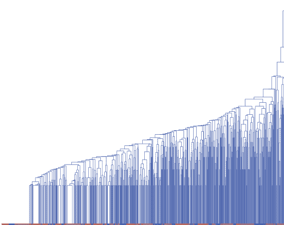

# 4个新闻组的贝叶斯分层聚类

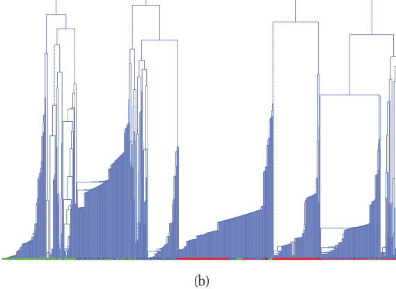

图25.16应用于4个新闻组中的800个文档的分层聚类（红色为rec.autos，蓝色为rec.sport.baseball，绿色为rec.sport.hockey，品红色为sci.space）。顶部：平均链接分层聚类。底部：贝叶斯分层聚类。每个叶子都标有颜色，表示该文档来自哪个新闻组。我们可以看到贝叶斯方法得到的聚类结果与这些标签更加一致（这些标签在模型拟合过程中未使用）。来源：(Heller和Ghahramani，2005年）的图7。获得Katherine Heller的友好许可后使用。

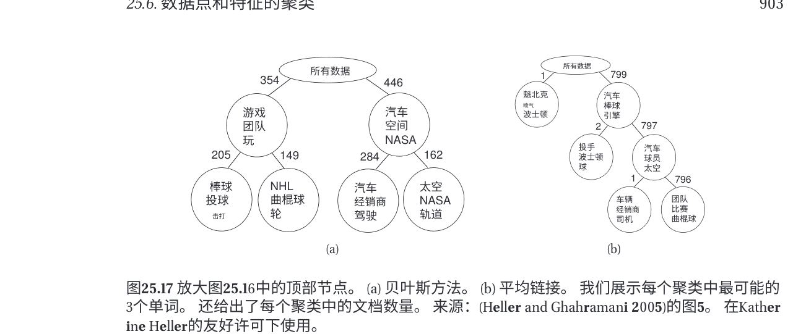

> 图25.17放大图25.16中的顶部节点。(a) 贝叶斯方法。(b) 平均链接。我们展示每个聚类中最可能的3个单词。还给出了每个聚类中的文档数量。来源：(Heller and Ghahramani 2005)的图5。在Katherine Heller的友好许可下使用。

#### 25.6.1 双聚类

将行和列进行聚类称为双聚类或共聚类。这在生物信息学中被广泛使用，其中行通常代表基因，列代表条件。

它还可以用于协同过滤，其中行代表用户，列代表电影。

已经提出了各种临时方法用于双聚类；参见（Madeira和Oliveira 2004）进行回顾。在这里，我们提出了一个简单的概率生成模型，基于（Kemp等人2006年）（另见（Sheng等人2003年）相关方法）。这个想法是将每一行和每一列与潜在指示符相关联，$r_i \in \{1, ..., K^r\}$，$c_j \in \{1, ..., K^c\}$。然后，我们假设数据在样本和每个块内的特征之间是独立同分布的：

$$
p(\mathbf{x}|\mathbf{r}, \mathbf{c}, \theta) = \prod_i \prod_j p(x_{ij} | r_i, c_j, \theta) = p(x_{ij} | \theta_{r_i,c_j}) \qquad (25.62)
$$

其中 $\theta_{a,b}$是行聚类 a和列聚类 b的参数。我们可以使用狄利克雷过程来代替对行和列使用有限数量的聚类，就像我们在第27.6.1节中讨论的无限关系模型一样。我们可以使用例如（折叠）吉布斯采样来拟合这个模型。

该模型的行为如图25.18所示。数据的形式为 $X(i, j) = 1$ 当且仅当动物 i具有特征 j时，其中 i=1:50且 j=1:85。动物代表鲸鱼、熊、马等。特征代表栖息地的属性（丛林、树木、沿海），或解剖学属性（有牙齿、四足），或行为属性（游泳、吃肉）等。该模型使用伯努利似然函数拟合数据。它发现了12个动物聚类和33个特征聚类。例如，它发现了一个表示哺乳动物倾向于具有水生特征的双聚类。

### 25.6.2 多视角聚类

双聚类的问题在于每个对象（行）只能属于一个聚类。直观地说，一个对象可以有多个角色，并且可以根据不同的情况分配给不同的聚类。

# 第25章 聚类

+   O1 虎鲸，蓝鲸，座头鲸，海豹，海象，海豚
O2 羚羊，马，长颈鹿，斑马，鹿
O3 猴子，大猩猩，黑猩猩
O4 河马，大象，犀牛
O5 灰熊，北极熊
F1 鳍，尖牙，游泳，北极，沿海，海洋，水
F2 蹄，长脖子，角
F3 手，两足行走，丛林，树
F4 球状体形状，缓慢，不活跃
F5 肉牙齿，吃肉，猎人，凶猛
F6 行走，四足行走，地面

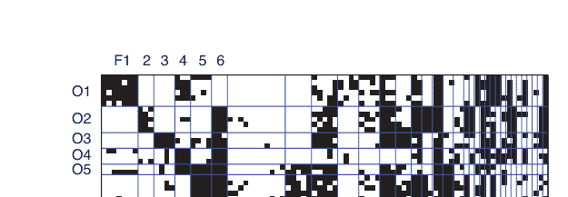

图25.18 双聚类的示意图。 我们展示了12个动物聚类中的5个，以及33个特征聚类中的6个。 原始数据矩阵显示，根据发现的聚类进行了分区。 来自(Kemp et al. 2006)的图3。 获得Charles Kemp的友好许可后使用。


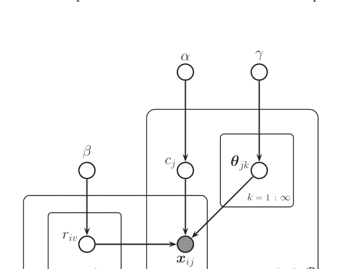

图25.19 (a) 多视图聚类的示意图。 这里有3个视图（列分区）。 在第一个视图中，我们有2个聚类（行分区）。 在第二个视图中，我们有3个聚类。 在第三个视图中，我们有2个聚类。 视图和分区的数量是从数据中推断出来的。 每个彩色块内的行被假设为独立同分布；然而，每列可以有不同的分布形式，这对于建模离散和连续数据很有用。 来自(Guan et al. 2010)的图1。 在Jennifer Dy的友好许可下使用。 (b) 相应的DGM。

你使用的特征子集。例如，在动物数据集中，我们可能希望根据解剖特征（例如，哺乳动物是恒温动物，爬行动物不是）或行为特征（例如，捕食者与猎物）对动物进行分组。

我们现在提出了一个可以捕捉这种现象的模型。 这个模型最初是在（Shafto等人，2006年；Mansinghka等人，2011年）中独立提出的，他们称之为crosscat（用于交叉分类），在（Guan等人，2010年；Cui等人，2010年）中称之为（非参数）多聚类。（另请参阅（Rodriguez和Ghosh，2011年）中的一个非常相似的模型。）这个想法是我们将列（特征）分成V个组或视图，所以 $c_j \in \{1, \dots, V\}$，其中 $j \in \{1, \dots, D\}$ 索引

## 25.6. 数据点和特征的聚类

特征。我们将使用一个狄利克雷过程先验来建模 $p(c)$，这样可以自动增长 V。然后对于每个列的分区（即每个视图），称之为 v，我们再次使用DP对行进行分区，如图25.19(a)所示。设v中的第 i 行属于簇 $i_v \in \{1, \dots, K(v)\}$。最后，在分区行和列之后，我们生成数据：假设块内的所有行和列都是独立同分布的。我们可以更精确地定义模型如下：

$$
p(\mathbf{c}, \mathbf{r}, \mathcal{D}) = p(\mathbf{c})p(\mathbf{r}|\mathbf{c})p(\mathcal{D}|\mathbf{r}, \mathbf{c}) \quad (25.63)
$$

$$
p(\mathbf{c}) = \text{DP}(\mathbf{c}|\alpha) \quad (25.64)
$$

$$
p(\mathbf{r}|\mathbf{c}) = \prod_{v=1}^{V(\mathbf{c})} \text{DP}(\mathbf{r}_v|\beta) \quad (25.65)
$$

$$
p(\mathcal{D}|\mathbf{r}, \mathbf{c}, \boldsymbol{\theta}) = \prod_{v=1}^{V(\mathbf{c})} \prod_{j: c_j=v} \left[ \prod_{k=1}^{K(\mathbf{r}_v)} \int \prod_{i: r_{iv}=k} p(x_{ij}|\boldsymbol{\theta}_{jk}) p(\boldsymbol{\theta}_{jk}) d\boldsymbol{\theta}_{jk} \right] \quad (25.66)
$$

请参见图25.19(b)以获取DGM。2 如果数据是二进制的，并且我们对 $\theta_{jk}$ 使用 Beta(γ, γ)先验分布，似然函数简化为

$$
p(\mathcal{D}|\mathbf{r}, \mathbf{c}, \gamma) = \prod_{v=1}^{V(\mathbf{c})} \prod_{j: c_j=v} \prod_{k=1}^{K(\mathbf{r}_v)} \frac{\text{Beta}(n_{j,k,v} + \gamma, \bar{n}_{j,k,v} + \gamma)}{\text{Beta}(\gamma, \gamma)} \quad (25.67)
$$

其中 $n_{j,k,v} = \sum_{i: r_{iv}=k} I(x_{ij}=1)$ 时，计算在视图 v 和行聚类 k 中，第 j 列上处于打开状态的特征数量。类似地，$\bar{n}_{j,k,v}$ 计算处于关闭状态的特征数量。该模型可以轻松扩展到其他类型的数据，例如用高斯-伽马-高斯模型替换贝塔伯努利模型，如(Guan et al. 2010; Mansinghka et al. 2011)中所讨论的。可以使用随机搜索进行近似MAP估计(Shafto et al. 2006)，也可以使用变分贝叶斯(Guan et al. 2010)或吉布斯采样(Mansinghka et al. 2011)进行近似推断。 似然的超参数 γ通常可以以非信息性的方式设置，但结果对其他两个参数更敏感，因为 α控制列分区的数量， β控制行分区的数量。 因此，更稳健的技术是使用MH算法推断超参数。这也加快了收敛速度(Mansinghka et al. 2011)。

图25.20展示了应用于包含22只动物和106个特征的二进制数据的模型。 图表显示了（近似的）MAP分区。 第一列的分区包含分类特征，例如“有骨骼”，“是恒温动物”，“下蛋”等。这将动物分为鸟类、爬行动物/两栖动物、哺乳动物和无脊椎动物。 第二列的分区包含被视为噪声的特征，没有明显的结构（除了标有“青蛙”的单行）。 第三列的分区包含生态特征，如“危险”，“食肉动物”，“生活在水中”等。这将动物分为猎物、陆地捕食者、海洋捕食者和空中捕食者。 因此，每个动物（行）可以属于不同的

2. 不显示r和c之间的依赖关系，因为它不是r和c的值之间的依赖关系，而是v和c_j的基数之间的依赖关系。换句话说，我们需要指定的行分区数（由v索引的视图数）取决于我们拥有的列分区数（聚类数）。

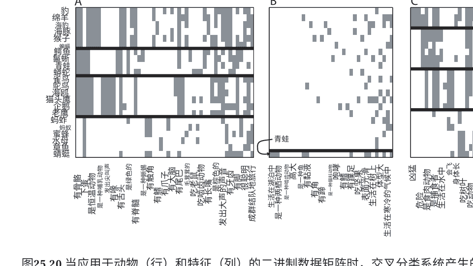

图25.20 当应用于动物（行）和特征（列）的二进制数据矩阵时，交叉分类系统产生的MAP估计。详细信息请参阅文本。来源：（Shafto等人，2006年）的图7。在Vikash Mansingkha的友好许可下使用。

根据考虑的特征集合进行聚类。对于分区的不确定性可以通过抽样来处理。

将这个模型与标准的无限混合模型进行比较是很有趣的。虽然标准模型可以表示任何固定大小向量上的密度，当N→∞时，但它无法处理D→∞，因为它无法处理不相关、噪声或冗余的特征。相比之下，crosscat/multi-clust系统对于不相关的特征是鲁棒的：它可以将它们分割开，并且只使用相关特征对行进行聚类。然而，需要注意的是，它不需要一个单独的“背景”模型，因为一切都是使用相同的机制建模的。这是有用的，因为一个人的噪声对另一个人来说可能是信号。（实际上，这种对称性可能解释了为什么在（Guan et al. 2010）的实验中，multi-clust优于（Law et al. 2004）的稀疏混合模型方法。）

## 26 图模型结构学习

### 26.1 引言

我们已经看到图模型如何用于表示变量之间的条件独立性假设。 在本章中，我们将讨论如何学习图模型本身的结构。 也就是说，我们想要计算$p(G|\mathcal{D})$，其中$G$是表示为$V \times V$邻接矩阵的图结构。

正如我们在1.3.3节中讨论的那样，结构学习有两个主要应用：知识发现和密度估计。前者只需要一个图的拓扑结构，而后者需要一个完全指定的模型。

结构学习中的主要障碍是可能的图的数量在节点数量上呈指数增长：一个简单的上界是$O(2^{V(V-1)/2})$。因此，完整的后验概率$p(G|\mathcal{D})$是非常庞大的：即使我们能够计算它，我们也无法存储它。因此，我们将寻找后验的适当摘要。这些摘要统计量取决于我们的任务。

如果我们的目标是知识发现，我们可能想要计算后验边缘概率，$p(G_{st}=1|\mathcal{D})$；然后我们可以绘制相应的图形，其中每条边的粗细表示我们对其存在的置信度。通过设置阈值，我们可以生成一个稀疏的图形，这对于可视化目的很有用 （见图1.11）。

如果我们的目标是密度估计，我们可能想要计算MAP图，$\hat{G} \in \arg\max_G p(G|\mathcal{D})$。在大多数情况下，找到全局最优图将需要指数时间，因此我们将使用启发式搜索等离散优化方法。然而，在树的情况下，我们可以使用精确方法相当高效地找到全局最优图结构，这是我们在第26.3节中讨论的。

如果密度估计是我们唯一的目标，那么值得考虑是否更适合学习一个潜变量模型，该模型可以通过一组潜在的共同原因捕捉可见变量之间的相关性 （见第12章和第27章）。这种模型通常更容易学习，而且更重要的是，它们可以更高效地应用 （用于预测目的） ，因为它们不需要在一个具有潜在高树宽的学习图中执行推断。 这种模型的缺点是潜在因素通常无法识别，因此很难解释。 当然，我们可以结合图模型结构学习和潜变量学习，这将在本章后面展示。

在某些情况下，我们不仅仅想要建模变量之间的观察到的相关性；相反，我们想要建模数据背后的因果结构，以便我们可以预测操作变量的效果。 这是一项更具挑战性的任务，我们在这里简要讨论一下由于计算MAP图或精确的后验边缘通常是计算上难以处理的（Chickering 1996），在本节中我们讨论一些“快速而粗糙”的方法来学习图结构，这些方法可以用来可视化数据。由此产生的模型不构成一致的联合概率分布，因此不能用于预测，甚至不能在拟合好坏方面进行形式化评估。尽管如此，这些方法是数据可视化工具箱中有用的临时工具，因为它们快速且简单。

#### 26.2.1 相关网络

相关网络是一种可视化多个随机变量之间的成对互信息的方法：我们只需选择一个阈值，并在节点i到节点j之间绘制一条边，如果$I(X_i; X_j)$超过该阈值。在高斯情况下，$I(X_i; X_j) = -1/2 \log(1-\rho_{ij}^2)$，其中$\rho_{ij}$是相关系数（参见练习 2.13），因此我们实质上是在可视化$\Sigma$；这被称为协方差图（第19.4.4.1节）。

这种方法在系统生物学中非常流行（Margolin等人，2006年），用于可视化基因之间的相互作用。生物学的例子的问题在于非生物学家很难理解。因此，我们可以用自然语言文本来说明这个想法。图26.1给出了一个例子，在这个例子中，我们可视化了新闻组数据集中单词之间的互信息。结果似乎是合理的。

然而，相关网络存在一个主要问题：图通常非常密集，因为大多数变量依赖于大多数其他变量，即使在阈值化互信息之后也是如此。例如，假设 $X_1$ 直接影响 $X_2$，$X_2$ 直接影响 $X_3$（例如，它们构成一个信号级联， $X_1 \rightarrow X_2 \rightarrow X_3$ ）。那么 $X_1$与$X_3$具有非零互信息（反之亦然），因此在相关网络中将存在一个 $1 \rightarrow 3$ 的边。事实上，大多数配对都会出现连接的。

一个更好的方法是使用图模型，它表示条件独立性，而不是依赖性。在上面的例子中，给定$X_2$，$X_1$在条件上独立于$X_3$，因此不会有$1-3$的边。因此，图模型通常比相关网络更稀疏，因此是一种更有用的可视化多个变量之间相互作用的方式。

#### 26.2.2 依赖网络

学习图模型结构的一种简单高效的方法是独立地拟合$D$稀疏全条件分布$p(x_t|x_{-t})$；这被称为依赖网络(Heckerman等人，2000)。所选择的变量构成节点的输入，即其马尔可夫毯子。然后我们可以可视化得到的稀疏图。与相关网络相比的优势是不会选择冗余变量作为输入。

我们可以使用任何稀疏回归或分类方法来拟合每个CPD。(Heckerman等人2000)使用分类/回归树，(Meinshausen和Buhlmann 2006)使用 $\ell_1$-正则化线性回归，(Wainwright等人2006)使用 $\ell_1$-正则化逻辑回归(参见depnetFit的一些代码)，(Dobra 2009)使用贝叶斯变量选择等。(Meinshausen和Buhlmann 2006)讨论了在哪些理论条件下 $\ell_1$-正则化线性回归可以恢复真实的图结构，假设数据是从一个稀疏高斯图模型生成的。

图26.2显示了从20-newsgroup数据中使用 $\ell_1$-正则化逻辑回归学习到的依赖网络，其中惩罚参数$\lambda$是通过BIC选择的。这些估计的马尔可夫毯子中的许多词表示相当自然的关联关系(aids:disease, baseball:fans, bible:god, bmw:car, cancer:patients等)。然而，一些估计的统计依赖关系似乎不太直观，比如baseball:windows和bmw:christian。

- **aids**: 儿童 (0.53), 疾病 (0.84), 事实 (0.47), 健康 (0.77), 总统 (0.50), 研究 (0.53)
- **棒球**: 基督教 (-0.98), 驱动 (-0.49), 游戏 (0.81), 上帝 (-0.46), 政府 (-0.69), 击球 (0.62), 记忆 (-1.29), 球员 (1.16), 赛季 (0.31), 软件 (-0.68), 窗口 (-1.45)
- **圣经**: 汽车 (-0.72), 卡片 (-0.88), 基督教 (0.49), 事实 (0.21), 上帝 (1.01), 耶稣 (0.68), 轨道 (0.83), 程序 (-0.56), 宗教 (0.24), 版本 (0.49)
- **宝马**: 汽车 (0.60), 基督教 (-11.54), 发动机 (0.69), 上帝 (-0.74), 政府 (-1.01), 帮助 (-0.50), 窗户 (-1.43)
- **癌症**: 疾病 (0.62), 药物 (0.58), 患者 (0.90), 研究 (0.49), 研究 (0.70)

斜体红色的单词具有负权重，表示一种分离关系。例如，模型反映出棒球:窗户是一个不太可能的组合。事实证明，在这个模型中，大部分权重是负的（1173个负数，286个正数，8541个零）。
除了可视化数据外，依赖网络还可以用于推理。然而，我们唯一能使用的算法是吉布斯采样，在这个算法中，我们反复从完全条件中采样具有缺失值的节点。不幸的是，一般来说，完全条件的乘积不构成任何有效的联合分布的表示（Heckerman等人，2000年），因此吉布斯采样器的输出可能没有意义。然而，如果缺失数据不多，这种方法有时可以给出合理的结果，并且它是一种有用的数据插补方法（Gelman和Raghunathan，2001年）。此外，该方法可以用作我们下面讨论的更复杂的结构学习方法的初始化技术。

### 26.3 学习树结构

在本章的其余部分中，我们专注于学习完全指定的联合概率模型，这些模型可用于密度估计、预测和知识发现。

由于一般图的结构学习问题是NP难的（Chickering 1996），我们首先考虑树的特殊情况。树是特殊的，因为我们可以高效地学习它们的结构，如下所述，并且一旦我们学习了树，我们可以将它们用于高效的精确推断，如第20.2节所讨论的。

#### 26.3.1 有向还是无向树？

在继续之前，我们需要讨论是否应该使用有向树还是无向树的问题。一个有向树，具有单个根节点 r，定义了如下的联合分布：p(x|T) =

$$\prod_{t \in V} p(x_t | x_{\text{pa}(t)})$$ (26.1)

在这里，我们定义 pa(r)=∅。例如，在图26.3(b-c)中，我们有

$$p(x_1, x_2, x_3, x_4|T) = p(x_1)p(x_2|x_1)p(x_3|x_2)p(x_4|x_2)$$ (26.2)
$$= p(x_2)p(x_1|x_2)p(x_3|x_2)p(x_4|x_2)$$ (26.3)

我们可以看到，根节点的选择并不重要：这两个模型是等价的。为了使模型更对称，最好使用无向树。这可以表示如下：

$$p(\mathbf{x}|T) = \prod_{t \in V} p(x_t) \prod_{(s,t) \in E} \frac{p(x_s, x_t)}{p(x_s)p(x_t)}$$ (26.4)

其中 p(x_s, x_t)是边缘边，而 p(x_t)是节点边缘。例如，在图26.3(a)中，我们有

$$p(x_1, x_2, x_3, x_4|T) = p(x_1)p(x_2)p(x_3)p(x_4)\frac{p(x_1, x_2)p(x_2, x_3)p(x_2, x_4)}{p(x_1)p(x_2)p(x_2)p(x_3)p(x_2)p(x_4)}$$ (26.5)

为了看到与有向表示的等价性，让我们取消一些项

$$p(x_1, x_2, x_3, x_4|T) = p(x_1, x_2)\frac{p(x_2, x_3)}{p(x_2)}\frac{p(x_2, x_4)}{p(x_2)}$$ (26.6)
$$= p(x_1)p(x_2|x_1)p(x_3|x_2)p(x_4|x_2)$$ (26.7)
$$= p(x_2)p(x_1|x_2)p(x_3|x_2)p(x_4|x_2)$$ (26.8)

其中 p(x_t|x_s) = p(x_s, x_t)/p(x_s).

因此，一棵树可以表示为无向图或有向图：参数数量相同，因此学习的复杂度也相同。当然，推理在两种表示中也是相同的。无向表示对于结构学习很有用，但有向表示对于参数学习更方便。

#### 26.3.2 Chow-Liu算法用于寻找最大似然树结构

使用方程式26.4，我们可以将树的对数似然写成如下形式:

$$ \log p(\mathcal{D}|\theta, T) = \sum_{t} \sum_{k} N_{tk} \log p(x_t = k|\theta) + \sum_{s,t} \sum_{j,k} N_{stjk} \log \frac{p(x_s = j, x_t = k|\theta)}{p(x_s = j|\theta) p(x_t = k|\theta)} \quad (26.9) $$

其中 $ N_{stjk} $ 是节点 $ s $ 处于状态 $ j $ 且节点 $ t $ 处于状态 $ k $ 的次数， $ N_{tk} $ 是节点 $ t $ 处于状态 $ k $ 的次数。我们可以用经验分布来重新表示这些计数: $ N_{stjk} = N p_{emp}(x_s = j, x_t = k) $ 和 $ N_{tk} = N p_{emp}(x_t = k) $。将 $ \theta $ 设置为最大似然估计，这变为

$$ \frac{\log p(\mathcal{D}|\theta, T)}{N} = \sum_{t \in \mathcal{V}} \sum_{k} p_{emp}(x_t = k) \log p_{emp}(x_t = k) \quad (26.10) $$

$$ + \sum_{(s,t) \in \mathcal{E}(T)} \mathbb{I}(x_s, x_t | \hat{\theta}_{st}) \quad (26.11) $$

其中 $ \mathbb{I}(x_s, x_t | \hat{\theta}_{st}) \geq 0 $ 是 $ x_s $ 和 $ x_t $ 在经验分布下的互信息:

$$ \mathbb{I}(x_s, x_t | \hat{\theta}_{st}) = \sum_{j} \sum_{k} p_{emp}(x_s = j, x_t = k) \log \frac{p_{emp}(x_s = j, x_t = k)}{p_{emp}(x_s = j) p_{emp}(x_t = k)} \quad (26.12) $$

由于方程26.11中的第一项与拓扑结构 $ T $ 无关，因此在学习结构时可以忽略它。因此，通过计算最大权重生成树来找到最大化似然的树拓扑，其中边的权重是成对的互信息 $ \mathbb{I}(y_s, y_t | \hat{\theta}_{st}) $。这被称为Chow-Liu算法(Chow and Liu 1968)。

有几种算法可以找到最大生成树（MST）。最著名的两种算法是Prim算法和Kruskal算法。两者都可以实现在 $ O(E \log V) $ 时间内运行，其中 $ E = V^2 $ 是边的数量， $ V $ 是节点的数量。详细信息请参见 (Sedgewick和Wayne 2011, 4.3)。因此，总运行时间为 $ O(NV^2 + V^2 \log V) $，其中第一项是计算足够统计量的成本。

图26.4展示了该方法在二进制20个新闻组数据上的应用示例，图1.2显示了树在表示“电子邮件”的节点上任意根节点。学到的连接似乎合理。

#### 26.3.3 寻找MAP森林

由于所有树具有相同数量的参数，我们可以安全地使用最大似然分数作为模型选择标准，而不必担心过拟合。然而，有时候我们可能希望拟合一个森林而不是单棵树，因为在森林中进行推断比在单棵树中快得多（我们可以在森林中的每棵树上并行运行置信传播）。最大似然估计准则永远不会选择省略一条边。然而，如果我们使用边际似然或惩罚似然（如BIC），最优解可能是一个森林。下面我们给出了边际似然情况的详细信息。

在第26.4.2.2节中，我们解释了如何使用Dirichlet先验计算任何DAG的边际似然，得到的表达式可以写成以下形式：

$$
\log p(\mathcal{D}|T) = \sum_{t \in \mathcal{V}} \log \int \prod_{i=1}^N p(x_{it} | \mathbf{x}_{i,\text{pa}(t)} | \boldsymbol{\theta}_t) p(\boldsymbol{\theta}_t) d\boldsymbol{\theta}_t = \sum_t \text{score}(\mathbf{N}_{t,\text{pa}(t)})
$$

其中 N_{t,pa(t)} 是节点 t 及其父节点的计数（充分统计量），score 是由方程式 26.28 定义的。

现在假设我们只允许最多有一个父节点的有向无环图（DAG）。根据 (Heckerman et al. 1995,p227) 的论述，让我们为每个边 s → t 关联一个权重 w_{s,t} ≜ score(t|s) - score(t|0)，其中score(t|0)是当 t 没有父节点时的得分。请注意，这些权重可能是负数（与MLE情况不同，MLE情况下边的权重总是非负的，因为它们对应于互信息）。然后我们可以将目标重写如下：

$$
\log p(\mathcal{D}|T) = \sum_t \text{分数}(t|\text{pa}(t)) = \sum_t w_{\text{pa}(t)}, + \sum_t \text{分数}(t|0)
$$

最后一项对于所有树 T来说都是相同的，所以我们可以忽略它。因此，找到最有可能的树就是找到相应加权有向图中的最大分支。

可以使用(Gabow等人，1984年)中的算法找到这个。

如果评分函数是先验和似然等价的（这些术语在第26.4.2.3节中有解释），我们有

$$ \text{分数}(s|t) + \text{分数}(t|0) = \text{分数}(t|s) + \text{分数}(s|0) \quad (26.15) $$

因此，权重矩阵是对称的。在这种情况下，最大分支与最大权重森林相同。我们可以应用稍微修改过的MST算法来找到这个（Edwards等人，2010年）。为了看到这一点，让G=(V,E)是一个具有正负边权重的图。现在让G'是通过省略G中的所有负边得到的图。这不会减少总权重，因此我们可以通过找到G'的每个连通分量的最小生成树来找到G的最大权重森林。我们可以直接在G'上运行Kruskal算法来实现这一点：没有必要显式地找到连通分量。

#### 26.3.4 树的混合

单个树在表达能力上相对有限。本章后面我们将讨论学习更一般的图的方法。然而，得到的图在推理过程中可能会很昂贵。一个有趣的替代方法是学习树的混合（Meila和Jordan 2000），其中每个混合成分可能具有不同的树拓扑结构。这类似于第10.2.1节中讨论的无监督版本的TAN分类器。我们可以使用EM来拟合树的混合：在E步骤中，我们计算每个数据点对于每个簇的责任，并在M步骤中使用Chow-Liu算法的加权版本。详细信息请参见（Meila和Jordan 2000）。

事实上，可以创建一个“无限树混合”，通过对所有可能的树进行积分。令人惊讶的是，可以使用矩阵树定理在V^3时间内完成这个过程。这使得我们能够对后验边缘等进行精确的贝叶斯推理。然而，使用这个无限混合进行隐藏节点的推理是不可行的。详细信息请参见（Meila和Jaakkola 2006）。

### 26.4 学习DAG结构

在本节中，我们讨论如何计算（函数） p (G|D)，其中G被限制为一个DAG。这通常被称为贝叶斯网络结构学习。在本节中，我们假设没有缺失数据，并且没有隐藏变量。这被称为完全数据假设。为了简单起见，我们将重点放在所有变量都是分类变量且所有CPD都是表格的情况下，尽管结果可以推广到实值数据和其他类型的CPD，例如线性高斯CPD。

我们的介绍部分基于部分（Heckerman et al. 1995），尽管我们将遵循第10.4.2节的符号约定。特别地，让$x_{it} \in \{1, \ldots, K_t\}$是节点$t$在情况$i$下的值，其中$K_t$是节点$t$的状态数。让$\theta_{tck} \triangleq p(x_t = k|\text{xpa}(t) = c)$，对于$k=1:K_t$，和$c=1:C_t$，其中$C_t$是父节点组合的数量（可能的条件情况）。为了简化符号，我们经常假设$K_t = K$，所以所有节点具有相同的状态数。我们还将$d_t = \dim(\text{pa}(t))$定义为节点$t$的度或入度，因此$C_t = K^{d_t}$。

#### 26.4.1 马尔可夫等价

在本节中，我们讨论了从数据中学习DAG结构的一些基本限制。

考虑以下3个DGMs： X → Y → Z， X ← Y ← Z和 X ← Y → Z。它们都表示相同的CI语句集合，即

X ⊥ Z|Y, X ⊥ Z (26.16)

我们称这些图是马尔可夫等价的，因为它们编码了相同的CI假设集合。也就是说，它们都属于同一个马尔可夫等价类。然而，v-结构 X → Y ← Z 编码 X ⊥ Z 和 X ⊥ Z| Y 的相反的CI假设。

我们可以证明以下定理。

定理26.4.1(Verma和Pearl (Verma和Pearl 1990))。两个结构在马尔可夫等价的条件下相等当且仅当它们具有相同的无向骨架和相同的v-结构集合。

例如，参考图26.5，我们可以看到 G₁ ≡ G₂，因为反转 2 → 4 弧会创建一个新的v-结构。然而， G₁ ≡ G₃，因为反转 1 → 5 弧不会创建一个新的v-结构。

我们可以用一个单一的部分有向无环图（PDAG）来表示一个马尔可夫等价类，也被称为本质图或模式，其中一些边是有向的，一些是无向的。无向边表示可逆边；只要不创建新的v-结构，任何组合都是可能的。有向边被称为强制边，因为改变它们的方向会改变v-结构，从而改变等价类。例如，PDAG X - Y - Z 表示 {X → Y → Z, X ← Y ← Z, X ← Y → Z}，它编码了 X ⊥ Z 和 X ⊥ Z| Y。参见图26.6。

上述定理的重要性在于，当我们从数据中学习DAG结构时，即使给定无限量的数据，我们也无法唯一确定所有边的方向。我们说我们可以学习DAG结构“直到马尔可夫等价”。这也提醒我们不要过分解读特定边的方向的含义，因为我们经常可以在不改变模型的任何可观察方式的情况下改变它们。

图26.6马尔可夫等价有向无环图（PDAG）的表示。

## 26.4.2 精确结构推断

在本节中，我们讨论如何计算忽略计算可行性问题的图的精确后验概率 $p(G|\mathcal{D})$。

### 26.4.2.1 推导似然函数

假设没有缺失数据，并且所有的条件概率分布都是表格形式的，似然函数可以写成如下形式：

$$
p(\mathcal{D}|G, \boldsymbol{\theta}) = \prod_{i=1}^{N} \prod_{t=1}^{V} \text{Cat}(x_{it}|\mathbf{x}_{i,\text{pa}(t)}, \boldsymbol{\theta}_t) \tag{26.17}
$$

$$
= \prod_{i=1}^{N} \prod_{t=1}^{V} \prod_{c=1}^{C_t} \text{Cat}(x_{it}|\boldsymbol{\theta}_{tc})^{\mathbb{I}(\mathbf{x}_{i,\text{pa}(t)}=c)} \tag{26.18}
$$

$$
= \prod_{i=1}^{N} \prod_{t=1}^{V} \prod_{c=1}^{C_t} \prod_{k=1}^{K_t} \theta_{tck}^{\mathbb{I}(x_{i,t}=k, \mathbf{x}_{i,\text{pa}(t)}=c)} \tag{26.19}
$$

$$
= \prod_{t=1}^{V} \prod_{c=1}^{C_t} \prod_{k=1}^{K_t} \theta_{tck}^{N_{tck}} \tag{26.20}
$$

其中 $N_{tck}$ 是节点 $t$ 处于状态 $k$ 且其父节点处于状态 $c$ 的次数。（从技术上讲，这些计数取决于图结构 $G$，但我们在符号中省略了这一点。）

### 26.4.2.2 推导边际似然

当然，选择具有最大似然的图将始终选择一个完全连接的图（受到无环约束的限制），因为这最大化了参数的数量。为了避免过拟合，我们将选择具有最大边际似然的图，$p(\mathcal{D}|G)$；贝叶斯奥卡姆剃刀的魔力将惩罚过于复杂的图。

为了计算边际似然，我们需要指定参数的先验分布。我们将做出两个标准假设。首先，我们假设全局先验参数独立，即

$$
p(\boldsymbol{\theta}) = \prod_{t=1}^{V} p(\boldsymbol{\theta}_t) \tag{26.21}
$$

其次，我们假设局部先验参数独立，即

$$
p(\boldsymbol{\theta}_t) = \prod_{c=1}^{C_t} p(\boldsymbol{\theta}_{tc}) \tag{26.22}
$$

对于每个$t$。事实证明，这些假设意味着每个CPT的每一行的先验分布必须是一个狄利克雷分布（Geiger和Heckerman，1997），即

$$
p(\boldsymbol{\theta}_{tc}) = \text{Dir}(\boldsymbol{\theta}_{tc} | \boldsymbol{\alpha}_{tc}) \tag{26.23}
$$

在这些假设的基础上，并利用第5.3.2.2节的结果，我们可以写出任何DAG的边际似然如下：

$$
\begin{aligned}
p(\mathcal{D}|G) &= \prod_{t=1}^V \prod_{c=1}^{C_t} \int \left[ \prod_{i: x_{i,\text{pa}(t)} = c} \text{Cat}(x_{it} | \boldsymbol{\theta}_{tc}) \right] \text{Dir}(\boldsymbol{\theta}_{tc}) d\boldsymbol{\theta}_{tc} \quad\quad (26.24) \\
&= \prod_{t=1}^V \prod_{c=1}^{C_t} \frac{B(\mathbf{N}_{tc} + \boldsymbol{\alpha}_{tc})}{B(\boldsymbol{\alpha}_{tc})} \quad\quad\quad\quad\quad\quad\quad\quad\quad\quad\quad\quad (26.25) \\
&= \prod_{t=1}^V \prod_{c=1}^{C_t} \frac{\Gamma(N_{tc})}{\Gamma(N_{tc} + \alpha_{tc})} \prod_{k=1}^{K_t} \frac{\Gamma(N_{tck} + \alpha^G_{tck})}{\Gamma(\alpha^G_{tck})} \quad\quad\quad\quad\quad\quad\quad (26.26) \\
&= \prod_{t=1}^V \text{score}(\mathbf{N}_{t,\text{pa}(t)}) \quad\quad\quad\quad\quad\quad\quad\quad\quad\quad\quad\quad\quad (26.27)
\end{aligned}
$$

其中 $N_{tc} = \sum_k N_{tck}, \alpha_{tc} = \sum_k \alpha_{tck}, \mathbf{N}_{t,\text{pa}(t)}$是节点 $t$及其父节点的计数向量（充分统计量），score()是一个由本地评分函数定义的

$$
\text{score}(\mathbf{N}_{t,\text{pa}(t)}) \triangleq \prod_{c=1}^{C_t} \frac{B(\mathbf{N}_{tc} + \boldsymbol{\alpha}_{tc})}{B(\boldsymbol{\alpha}_{tc})} \quad\quad\quad\quad\quad\quad\quad\quad\quad (26.28)
$$

我们说边际似然根据图结构分解或因子化。

### 26.4.2.3 设置先验

我们应该如何设置超参数 $\alpha_{tck}$？诱人的是使用形式为Jeffreys先验 $\alpha_{tck} = \frac{1}{2}$(方程5.62)。然而，事实证明这违反了一种被称为似然等价的性质，这在某些情况下被认为是可取的。这个性质说如果 $G_1$和 $G_2$是马尔可夫等价的（第26.4.1节），它们应该有相同的边际似然，因为它们本质上是等价的模型。Geiger和Heckerman（1997）证明了对于完全图，满足似然等价和参数独立性的唯一先验是狄利克雷先验，其中伪计数的形式为

$$
\alpha_{tck} = \alpha \ p_0(x_t = k, \mathbf{x}_{\text{pa}(t)} = c) \tag{26.29}
$$

其中$\alpha > 0$被称为等效样本大小, 而 $p_0$是一些先验联合概率分布。这被称为 **BDe先验**，代表贝叶斯狄利克雷似然等价。

为了推导其他图结构的超参数，Geiger和Heckerman (1997)引入了一个额外的假设，称为参数模块化，它表示如果节点 $X_t$ 在 $G_1$ 和 $G_2$ 中具有相同的父节点，则 $p(\theta_t|G_1) = p(\theta_t|G_2)$。在这个假设下，我们可以通过边际化方程26.29中的伪计数来计算任何其他图中节点 $t$ 的 $\alpha$。

通常假设先验分布 $p_0$在所有可能的联合配置上均匀分布。在这种情况下，我们有

$$
\alpha_{tck} = \frac{\alpha}{K_t C_t} \tag{26.30}
$$

因为 $p_0(x_t = k, x_{\text{pa}(t)} = c) = \frac{1}{K_t C_t}$。因此，如果我们对CPT中的所有 $C_t \times K_t$条目求和，我们将得到一个等效样本总数为 $\alpha$的总和。这被称为 BDeu先验，其中“u”代表均匀分布。这是学习贝叶斯网络结构最广泛使用的先验。关于设置全局调整参数 $\alpha$的建议，请参阅 (Silander et al. 2007)。

### 26.4.2.4 简单的实例

现在我们从 (Neapolitan 2003, p.438) 中给出一个非常简单的实例。假设我们只有2个二进制节点，并且有以下8个数据案例:

| X1 | X2 |
|----|----|
| 1  | 1  |
| 1  | 2  |
| 1  | 1  |
| 2  | 2  |
| 1  | 1  |
| 2  | 1  |
| 1  | 1  |
| 2  | 2  |

假设我们对两个可能的图形感兴趣: $G_1$是 $X_1\rightarrow X_2$， $G_2$是不连通的图。在 $G_1$中，节点1的经验计数为 $\mathbf{N}_1=(5,3)$，节点2的经验计数为：

|      | X2=1 | X2=2 |
|------|------|------|
| X1=1 | 4    | 1    |
| X1=2 | 1    | 2    |

$G_1$的BDeu先验为 $\alpha_1=(\alpha/2, \alpha/2)$, $\alpha_{2|x_1=1}=(\alpha/4, \alpha/4)$和 $\alpha_{2|x_1=2}=(\alpha/4, \alpha/4)$。对于 $G_2$， $\theta_1$的先验相同， $\theta_2$的先验为 $\alpha_{2|x_1=1}=(\alpha/2, \alpha/2)$ 和 $\alpha_{2|x_1=2}=(\alpha/2, \alpha/2)$。如果我们设置 $\alpha=4$，并使用BDeu先验，我们发现 $p(\mathcal{D}|G_1)=$ 因此，在均匀图先验下，后验概率为 $p(G_1|\mathcal{D})=0.51678$和 $p(G_2|\mathcal{D})=0.48322$.

### 26.4.2.5 示例：分析大学计划数据集

现在我们考虑来自(Heckerman et al. 1997)的一个更有趣的例子。考虑1968年由Sewell和Shah收集的数据集，该数据集测量了可能影响高中学生是否上大学的5个变量。具体而言，这些变量如下:

- 性别：男性或女性
- SES：社会经济地位：低、中低、中上或高。
- IQ：智商：离散为低、中低、中上或高。
- PE：父母的鼓励：低或高
- CP：大学计划：是或否。

这些变量是针对10,318名威斯康星州高中毕业生进行测量的。共有 $2 \times 4 \times 4 \times 2 \times 2 = 128$种可能的联合配置。

Heckerman等人计算了所有29,281个可能的5节点DAG的精确后验概率，除了那些SEX和/或SES有父节点，以及CP有子节点的情况。（基于领域知识，这些图的先验概率设为0。）他们使用了$\alpha= 5$的BDeu分数，尽管他们表示结果对于任何$\alpha$在3到40的范围内都是稳健的。图26.7显示了排名前两位的图。我们可以看到最有可能的图几乎占据了所有的概率，因此后验概率非常尖峰。

诱人的是，我们可以从因果关系的角度解释这个图表（见第26.6节）。特别是，社会经济地位、智商和父母的鼓励似乎都对是否上大学产生了因果影响，这是有道理的。此外，性别只通过父母的鼓励间接影响上大学的计划，这也是有道理的。然而，社会经济地位直接影响智商的联系似乎令人惊讶；这可能是由于一个隐藏的共同原因。在第26.5.1.4节中，我们将重新审视这个数据集，考虑到隐藏变量的存在。

### 26.4.2.6 K2算法

假设我们知道节点的总排序。然后我们可以独立地计算每个节点的父节点分布，而不会引入任何有向循环的风险：我们只需枚举所有可能的祖先子集并计算它们的边际似然。如果我们只返回每个节点的最佳父节点集合，我们就得到了K2算法 (Cooper and Herskovits 1992)。

### 26.4.2.7 处理非表格型CPD

如果所有的CPD都是线性高斯的，我们可以用正态-伽马模型替换狄利克雷-多项式模型，从而得到一个不同的边缘似然表达式。详细信息请参见 (Geiger and Heckerman 1994)。实际上，我们可以轻松地组合离散节点和高斯节点，只要离散节点始终具有离散的父节点；这被称为条件高斯DAG。同样，我们可以闭式计算边缘似然。详细信息请参见 (Bottcher and Dethlefsen 2003)。

在一般情况下（即除了高斯和CPT之外的情况），我们需要近似计算边缘似然。最简单的方法是使用BIC近似，其形式为

$$
\sum_{t} \log p(\mathcal{D}_t | \hat{\theta}_t) - \frac{K_t C_t}{2} \log N \tag{26.31}
$$

#### 26.4.3 扩展到更大的图

计算DAG上的后验概率的主要挑战在于可能的图太多了。更准确地说，(Robinson 1973)证明了D个节点的DAG数量满足以下递归关系：

$$
f(D) = \sum_{i=1}^{D} (-1)^{i+1} \binom{D}{i} 2^{i(D-i)} f(D-i) \tag{26.32}
$$

对于$D > 2$。基本情况是$f(1) = 1$。解决这个递归关系得到以下序列：1, 3, 25, 543, 29281, 3781503, 等等。考虑到假设空间的巨大规模，我们通常被迫使用近似方法，下面我们将对其中一些方法进行回顾。

### 26.4.3.1 近似后验模式

我们可以使用动态规划来找到全局最优的MAP DAG（在马尔可夫等价的情况下）(Koivisto and Sood 2004; Silander and Myllmaki 2006)。不幸的是，这种方法需要$O(V2^V)$时间和空间，超过16个节点就无法处理了。事实上，找到全局最优的MAP DAG的一般问题是可证明的NP完全问题(Chickering 1996)，因此，我们必须满足于找到局部最优的MAP DAG。

最常见的方法是贪婪爬山法：在每一步中，算法对当前图提出小的改变，例如添加、删除或翻转单个边；然后移动到最增加后验概率的邻近图。当达到局部最大值时，方法停止。重要的是，该方法只对图提出局部改变。因为这样可以在常数时间内计算边际似然（以及后验概率）的变化（假设我们缓存足够的统计信息）。这是因为在计算对数贝叶斯因子\(\delta(G \rightarrow G') = \log p(G'|D) - \log p(G|D)\)时，方程式26.25中除了一个或两个项外，其余项都会抵消。

我们可以从最佳树开始搜索，可以使用在第26.3节中讨论的精确方法找到。为了提高速度，我们可以限制搜索，只添加来自依赖网络估计的马尔可夫毯子的边（Schmidt 2010）。图26.8展示了从20-newsgroup数据中以这种方式学习到的一个DAG的示例。

我们可以使用多次随机重启等技术来增加找到良好局部最大值的机会。我们还可以使用更复杂的局部搜索方法，如遗传算法或模拟退火，进行结构学习。

### 26.4.3.2 近似后验的其他函数

如果我们的目标是知识发现，MAP DAG可能会误导，原因我们在第5.2.1节中讨论过。更好的方法是计算每条边存在的概率，即\(p(G_{st} = 1|D)\)，或者从\(s\)到\(t\)存在路径的概率。我们可以使用动态规划（Koivisto 2006; Parviainen and Koivisto 2011）来精确计算这一点。不幸的是，这些方法在一般情况下需要$O(V2^V)$时间，对于超过大约16个节点的图来说是不可行的。

一种近似方法是从后验中采样DAGs，然后计算每个 (s, t)对应的边或路径的出现频率。绘制样本的标准方法是使用Metropolis Hastings算法（第24.3节），其中我们使用与贪婪搜索中相同的局部提议（Madigan和Raftery 1994）。

一种更快混合的方法是使用折叠MH采样器，如（Friedman和Koller 2003）所建议的。这利用了一个事实，即如果已知节点的总排序，我们可以独立地选择每个节点的父节点，而不必担心循环，如第26.4.2.6节所讨论的。通过对所有可能的父节点选择求和，我们可以消除问题的这一部分，并只采样总排序。（Ellis和Wong 2008）也使用了顺序空间（折叠）MCMC，但这次是使用并行退火MCMC算法。

### 26.5 学习具有潜在变量的DAG结构

有时完整数据的假设不成立，要么是因为我们有缺失数据，要么是因为我们有隐藏变量。在这种情况下，边际似然由以下给出

$$
p(\mathcal{D}|G) = \int \sum_{\mathbf{h}} p(\mathcal{D}, \mathbf{h}|\theta, G)p(\theta|G)d\theta = \sum_{\mathbf{h}} \int p(\mathcal{D}, \mathbf{h}|\theta, G)p(\theta|G)d\theta \tag{26.33}
$$

其中 $\mathbf{h}$表示隐藏或缺失的数据。

一般来说，计算这是困难的。例如，考虑一个混合模型，我们不观察到聚类标签。在这种情况下，有 $K^N$ 个可能的数据完成方式（假设我们有 $K$个聚类）；我们可以为每个完成方式计算内部积分，但我们无法承担计算所有积分的代价。（当然，大多数这些积分将对应于具有较少后验支持的假设，例如将单个数据点分配给孤立的聚类，但我们事先不知道这些分配的相对权重。）

在本节中，我们讨论了在存在潜在变量和/或缺失数据时学习DAG结构的一些方法。

#### 26.5.1 在存在缺失数据时近似边际似然

最简单的方法是使用标准的结构学习方法来处理完全可见的DAG，但是近似边际似然。在第24.7节中，我们讨论了一些用于近似边际似然的蒙特卡洛方法。然而，这些方法通常速度太慢，无法在模型搜索中使用。下面我们提到一些更快的确定性近似方法。

#### 26.5.1.1 BIC近似

一个简单的近似方法是使用BIC分数，其定义为

$$
\text{BIC}(G) \triangleq \log p(\mathcal{D}|\hat{\theta}, G) - \frac{\log N}{2} \dim(G) \tag{26.34}
$$

其中 $\dim(G)$是模型中的自由度数量， $\hat{\theta}$是MAP或ML估计。然而，BIC分数经常严重低估真实的边际似然（Chickering和Heckerman 1997），导致选择过于简单的模型。

## 26.5.1.2 Cheeseman-Stutz近似

我们现在介绍一种更好的方法，称为Cheeseman-Stutz近似（CS）（Cheeseman和Stutz 1996）。我们首先使用EM算法计算参数的MAP估计值 $\hat{\theta}$。将数据的期望统计量表示为 $\overline{\mathcal{D}} = \mathcal{D}(\hat{\theta})$；对于离散变量，我们只需用其期望值“填充”隐藏变量。然后我们在这个填充数据上使用精确的边际似然方程：

$p(\mathcal{D}|G) \approx p(\overline{\mathcal{D}}|G) = \int p(\overline{\mathcal{D}}|\theta, G)p(\theta|G)d\theta$ (26.35)

然而，与方程26.33进行比较，我们可以看到该值会指数级减小，因为它没有对所有 $h$ 的值求和。为了纠正这个问题，我们首先写出

$\log p(\mathcal{D}|G) = \log p(\overline{\mathcal{D}}|G) + \log p(\mathcal{D}|G) - \log p(\overline{\mathcal{D}}|G)$ (26.36)

然后我们对最后两项应用BIC近似：

$\begin{aligned} \log p(\mathcal{D}|G) - \log p(\overline{\mathcal{D}}|G) &\approx \left[ \log p(\mathcal{D}|\hat{\theta}, G) - \frac{N}{2} \dim(\hat{\theta}) \right] \\ &- \left[ \log p(\overline{\mathcal{D}}|\hat{\theta}, G) - \frac{N}{2} \dim(\hat{\theta}) \right] \\ &= \log p(\mathcal{D}|\hat{\theta}, G) - \log p(\overline{\mathcal{D}}|\hat{\theta}, G) \end{aligned}$ (26.37) (26.38) (26.39)

将其整合起来，我们得到

$\log p(\mathcal{D}|G) \approx \log p(\overline{\mathcal{D}}|G) + \log p(\mathcal{D}|\hat{\theta}, G) - \log p(\overline{\mathcal{D}}|\hat{\theta}, G)$ (26.40)

第一个术语 $p(\overline{\mathcal{D}}|G)$ 可以通过将填充的数据插入到精确边际似然中来计算。第二个术语 $p(\mathcal{D}|\hat{\theta}, G)$，涉及指数和（因此与左侧的“维度”匹配）可以使用推理算法计算。最后一个术语 $p(\overline{\mathcal{D}}|\hat{\theta}, G)$ 可以通过将填充的数据插入到常规似然中来计算。

## 26.5.1.3 变分贝叶斯EM

更准确的方法是使用变分贝叶斯EM算法。回顾一下第21.6节中的关键思想是做出以下因子化假设：

$p(\theta, \mathbf{z}_{1:N}|\mathcal{D}) \approx q(\theta)q(\mathbf{z}) = q(\theta) \prod_i q(\mathbf{z}_i)$ (26.41)

其中 $\mathbf{z}_i$ 是第 $i$ 个案例中的隐藏变量。在E步骤中，我们更新 $q(\mathbf{z}_i)$，在M步骤中，我们更新 $q(\theta)$。相应的变分自由能提供了对对数边际似然的下界。在(Beal and Ghahramani 2006)中，证明了这个界限是对真实对数边际似然的更好近似（通过缓慢退火重要性采样过程估计）比BIC或CS更准确。事实上，可以证明变分边界始终比CS更准确（而CS始终比BIC更准确）。

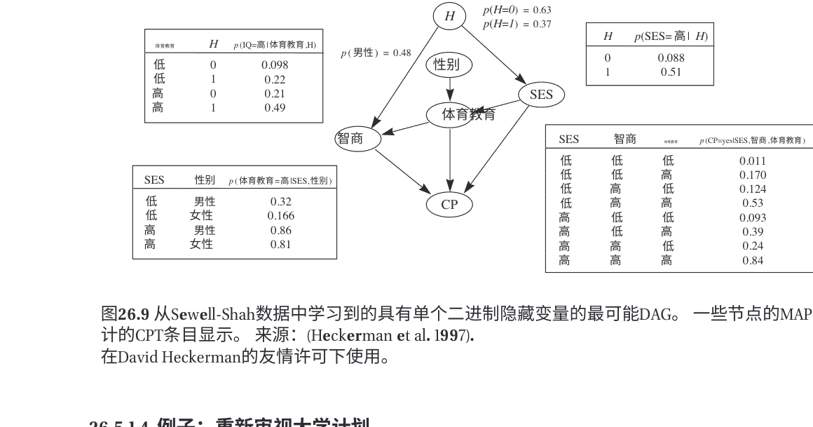

## 26.5.1.4 例子：重新审视大学计划

让我们重新审视第26.4.2.5节中的大学计划数据集。回想一下，如果我们忽略隐藏变量的可能性，社会经济地位与智商之间在MAP DAG中存在直接联系。Heckerman等人决定看看如果引入一个隐藏变量 H会发生什么情况，他们将其作为SES和IQ的父节点，表示一个隐藏的共同原因。

他们还考虑了一个变体，其中 H指向SES、IQ和PE。对于这两种情况，他们考虑了保留SES-PE和PE-IQ边的情况，保留其中一个边的情况，以及保留两个边的情况。他们改变了隐藏节点的状态数，从2到6不等。因此，他们使用CS近似方法计算了超过 $8 \times 5 = 40$ 个不同的模型的近似后验概率。

他们发现的最有可能的模型如图26.9所示。这比不包含隐藏变量的最佳模型更有可能发生的次数多 $2 \times 10^{10}$ 倍。这也比具有隐藏变量的第二个最有可能的模型更有可能发生的次数多 $5 \times 10^{9}$ 倍。因此，后验概率再次非常尖峰。

这些结果表明，确实存在一个隐藏的共同原因，即父母的社会经济地位和孩子的智商。通过检查CPT条目，我们可以看到当H取值为1时，SES和IQ更有可能是高的。他们解释这意味着隐藏变量代表着“父母质量”（可能是遗传因素）。然而，请注意，H和SES之间的弧可以反转而不改变图中的v-结构，因此不会影响可能性；这强调了解释隐藏变量的困难。

有趣的是，隐藏变量模型在可见变量之间具有与最可能的可见变量模型相同的条件独立性假设。因此，仅仅通过观察数据中的经验条件独立性（这是结构学习的基础）无法区分这些假设（Pearl和Verma 1991; Spirtes等人2000年）。相反，通过采用贝叶斯方法，考虑到简洁性（而不仅仅是条件独立性），我们可以发现。

#### 26.5.2 结构EM

在存在缺失数据的情况下进行结构推断的一种方法是使用标准的搜索过程（确定性或随机），并使用第26.5.1节中的方法来估计边际似然。然而，这种方法非常低效，因为当我们有缺失数据时，边际似然不会分解，其近似也不会分解。

例如，如果我们使用CS近似或VBEM近似，我们必须在每个相邻模型中进行推断，只是为了评估单个移动的质量！(Friedman 1997b; Thiesson等人1998) 提出了一种更高效的方法，称为结构EM算法。基本思想是：不是逐个拟合每个候选的相邻图，然后填充其数据，而是填充数据一次，并使用这个填充的数据来评估所有邻居的分数。尽管这可能是边际似然的一个坏近似，但它可能是不同模型之间边际似然差异的足够好的近似，这是我们选择最佳邻居所需要的全部。

更准确地说，将 $\overline{\mathcal{D}}(G_0, \hat{\theta}_0)$ 定义为使用 $G_0$ 和MAP参数 $\hat{\theta}_0$ 填充的数据。现在定义一个修改后的BIC分数如下：

$\text{score}_{\text{BIC}}(G, \mathcal{D}) \triangleq \log p(\mathcal{D}|\hat{\theta}, G) - \frac{\log N}{2} \text{dim}(G) + \log p(G) + \log p(\hat{\theta}|G)$ (26.42)

其中我们已经包括了图和参数的对数先验。可以证明 (Friedman1997b)，如果我们选择一个相对于期望数据增加了BIC分数的图 $G$，它也会增加实际数据上的分数，即：

$\text{score}_{\text{BIC}}(G, \overline{\mathcal{D}}(G_0, \hat{\theta}_0)) - \text{score}_{\text{BIC}}(G_0, \overline{\mathcal{D}}(G_0, \hat{\theta}_0)) \leq \text{score}_{\text{BIC}}(G, \mathcal{D}) - \text{score}_{\text{BIC}}(G_0, \mathcal{D})$ (26.43)

要将其转化为算法，我们按照以下步骤进行。首先，我们使用一些图形 $G_0$ 和一些参数集 $\theta_0$ 进行初始化。然后，我们使用当前参数填充数据 - 在实践中，这意味着当我们要任何特定家族的预期计数时，我们使用当前模型进行推断。（如果我们知道我们将需要哪些计数，我们可以预先计算所有这些计数，这样会更快。）然后，我们使用填充的数据评估所有邻居的BIC分数，并选择最佳邻居。然后，我们重新拟合模型参数，再次填充数据，并重复此过程。为了提高速度，我们可以选择仅在几个步骤之后重新拟合模型，因为对结构的小改变希望不会太大地影响参数估计和填充的数据。

一个有趣的应用是学习一个系统发生树结构。在这里，观察到的叶子是当前存活物种的DNA或蛋白质序列，目标是推断树的拓扑结构和缺失内部节点的值。对于这个任务，有许多经典算法（参见例如 (Durbin et al. 1998)），但其中一个使用SEM的算法在 (Friedman et al. 2002) 中讨论。

这种方法的另一个有趣应用是学习稀疏混合模型 (Barash和Friedman 2002)。这个想法是我们有一个隐藏变量 $C$ 指定聚类，并且我们必须选择是否为每个可能的特征 $X_i$ 添加边缘 $C \rightarrow X_i$。因此，一些特征将依赖于聚类ID，而一些特征将是独立的。（另请参见 (Law等人, 2004年)）

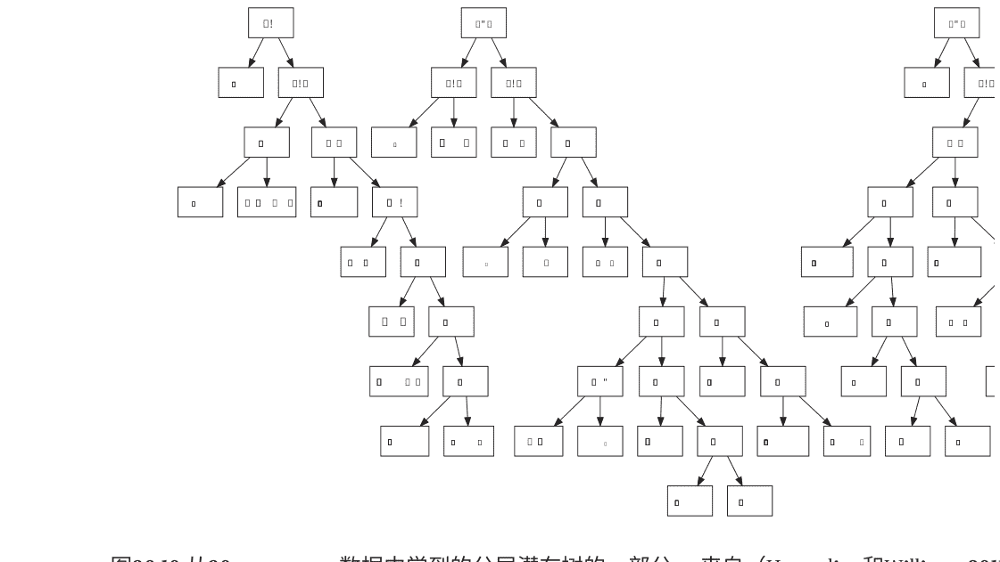

图26.10 从20-newsgroup数据中学到的分层潜在树的一部分。来自（Harmeling和Williams 2011）的图2。获得Stefan Harmeling的友好许可后使用。

对于执行此任务的另一种方法，可以使用常规EM和一组位，每个特征一个位，这些位可以在数据案例之间自由变化。

#### 26.5.3 发现隐藏变量

在第26.5.1.4节中，我们手动引入了一个隐藏变量，然后通过拟合一系列不同的模型并计算具有最佳边际似然的模型来确定局部拓扑。我们如何自动化这个过程？

图11.1提供了一个有用的直觉：如果在“真实模型”中存在一个隐藏变量，则其子节点很可能密集连接。这表明以下启发式方法（Elidan等人，2000年）：在可见域中进行结构学习，然后寻找结构特征，例如密集连接的节点集（近似团）；引入一个隐藏变量，并将其连接到该近似团中的所有节点；然后让结构EM处理细节。

不幸的是，这种技术效果不太好，因为结构学习算法对于拟合具有密集连接团的模型存在偏差。

聚类提供了另一个有用的直觉。在平坦混合模型中，也称为潜在类模型，离散潜在变量提供了其子节点的压缩表示。因此，我们希望创建与其子节点具有高互信息的隐藏变量。

一种方法是创建一个树形层次结构的潜在变量，每个潜在变量只需解释一小组子节点。（Zhang 2004）将其称为分层潜在类模型。他们提出了一种贪婪局部搜索算法来学习这样的结构，该算法基于添加或删除隐藏节点，添加或删除边等。（请注意，学习最优潜在树是NP难问题（Roch 2006）。）最近（Harmeling和Williams 2011）提出了一种更快的贪婪算法，用于基于聚类的层次模型学习。我们不详细介绍，只给出一个系统可以学到的例子。

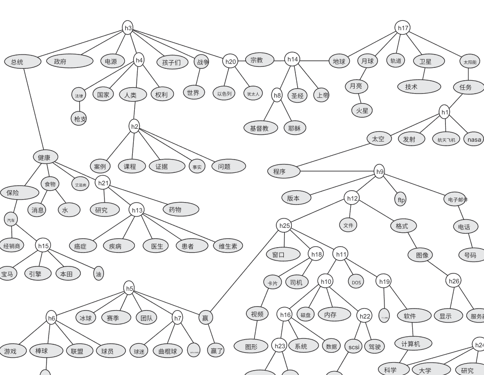

图26.11 从20-newsgroup数据中学到的部分潜在树。请注意，一些单词可以有多个意思，并与不同的潜在变量连接，代表不同的“主题”。例如，单词“win”可以指的是体育背景（由h5表示）或Microsoft Windows背景（由h25表示）。来自（Choi et al. 2011）的图12。在Jin Choi的友好许可下使用。

图26.10显示了从20-newsgroup数据中学到的潜在树的一部分。为了速度原因，该算法强制每个潜在节点恰好有两个子节点。尽管如此，我们看到了可解释的聚类出现。例如，图26.10显示了关于医学、体育和宗教的不同聚类。这提供了一种替代LDA和其他主题模型（第4.2.2节）的方法，其额外优势是在潜在树中进行推断是精确的，并且时间复杂度与节点数成线性关系。

在（Choi等人，2011）中提出了一种替代方法，其中观测数据不受限于叶子节点。该方法从观测数据的Chow-Liu树开始，然后添加隐藏变量以捕捉内部节点之间的高阶依赖关系。这导致了更紧凑的模型，如图26.11所示。该模型的预测准确性也优于其他方法，如混合模型或强制所有观测数据位于叶子节点的树。有趣的是，可以证明该方法可以恢复出精确的潜在树结构，前提是从一棵树中生成的。参见（Choi等人2011年）的详细信息。

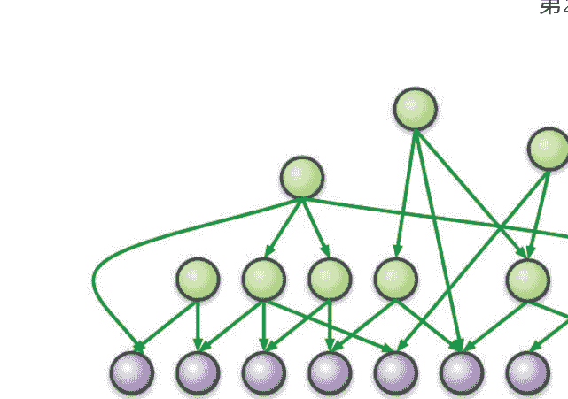

然而，请注意，与（Zhang 2004; Harmeling和Williams 2011）不同，这种方法要求所有变量（隐藏和观察到的）的基数相同。此外，如果观察到的变量是高斯的，那么隐藏变量也必须是高斯的。

## 26.5.4 案例研究：Google的Rephil

在本节中，我们描述了一个名为Rephil的巨大DGM，它是从数据中自动学习得到的。该模型在Google内部被广泛用于各种目的，包括他们著名的AdSense系统[^4]。

模型结构如图26.12所示。叶子节点是二进制节点，表示文本文档或查询中单词或复合词（如“纽约市”）的存在或不存在。潜在变量也是二进制的，表示共现词的聚类。所有的CPD都是噪声OR，因为一些叶子节点（表示单词）可以有许多父节点。这意味着每条边都可以增加一个隐藏变量，指定链接是否被激活；如果链接没有激活，则父节点无法将子节点激活。（在（Singliar和Hauskrecht 2006）中也提出了一个非常相似的模型。）

参数学习基于EM算法，其中需要推断每条边的隐藏激活状态(Meek和Heckerman 1997)。结构学习基于旧的神经科学[^3] “一起激活的节点应该连接在一起”的想法。为了实现这一点，我们运行推理并检查经常同时激活的簇-词和簇-簇对。然后，如果链接可以显著增加子节点的概率，我们从父节点添加一条边到子节点。很少被激活的链接会被剪枝。我们初始化每个“文档”（对应一组语义相关的短语）一个簇。然后，如果簇A解释了簇B的顶部词汇，反之亦然，我们合并簇A和簇B。我们还可以丢弃使用过少的簇。

该模型在约1000亿个文本片段或搜索查询上进行了训练；即使在并行分布式计算架构上，这也需要几周的时间。生成的模型包含1200万个词节点和约100万个潜在簇节点。模型中有大约3.5亿个链接，包括许多簇-簇依赖关系。图中最大的路径长度为555，因此该模型非常深。

在这个模型中，精确推理显然是不可行的。然而请注意，大多数叶子节点都会被忽略，因为大多数单词在给定的查询中并不存在；这样的叶子节点可以通过分析性地移除，如练习10.7所示。我们还可以通过从单词到其父节点的最强链接来修剪掉不太可能的隐藏节点，以获得一个候选概念集。然后，我们执行迭代条件模式来找到一组良好的局部最大值。在ICM的每个步骤中，每个节点根据其邻居节点在其马尔可夫毯子中的值设置其值为最可能的状态。这将持续进行，直到达到局部最大值。我们可以从随机的起始配置中多次重复这个过程。在Google，这可以在15毫秒内运行！

[^3]: 原始系统名为“Phil”，由Georges Harik和Noam Shazeer开发。该系统已于2004年提交并发表为美国专利号8024372，“用于学习文本的概率生成模型的方法和装置”。 Rephil是该方法的更具概率性的版本，由Uri Lerner等人开发。下面的摘要基于Brian Milch的笔记（他也在Google工作）。
[^4]: AdSense是Google的系统，通过从网页中提取语义关键词，以自动方式将网页与内容相关的广告匹配。这些关键词在功能上类似于用户搜索时输入的词语；Google的AdWords系统使用后一种形式的信息。细节是保密的，但(Levy 2011)提供了一个概述。

## 26.5.5 结构方程模型 *

结构方程模型（Bollen 1989）是一种特殊类型的有向混合图（第19.4.4.1节），可能是循环的，在其中所有的CPD都是线性高斯的，并且所有的双向边表示相关的高斯噪声。这样的模型也被称为路径图。结构方程模型在经济学和社会科学中被广泛使用。通常可以根据因果关系来解释边的方向，其中有向循环被解释为反馈环（参见例如（Pearl 2000，第5章））。然而，该模型实际上只是一种指定联合高斯分布的方式，如下所示。它本质上与“因果关系”无关。（我们在第26.6节中讨论因果关系。）

$$x_i = \mu_i + \sum_{j \neq i} w_{ij} x_j + \epsilon_i$$ (26.44)

$$\mathbf{x} = \mathbf{Wx} + \boldsymbol{\mu} + \epsilon \quad \Rightarrow \quad \mathbf{x} = (\mathbf{I} - \mathbf{W})^{-1} (\boldsymbol{\epsilon} + \boldsymbol{\mu})$$ (26.45)

$$\boldsymbol{\Sigma} = (\mathbf{I} - \mathbf{W})^{-1} \boldsymbol{\Psi} (\mathbf{I} - \mathbf{W})^{-T}$$ (26.46)

如果 $|w_{ij}| > 0$，我们就画一条弧线 $X_i \leftarrow X_j$。如果 $\mathbf{W}$ 是下三角矩阵，则图是无环的。此外，如果 $\boldsymbol{\Psi}$ 是对角矩阵，则该模型等价于高斯DGM，如第10.2.5节所讨论的；这样的模型被称为递归。如果 $\boldsymbol{\Psi}$ 不是对角矩阵，则我们画一个双向的弧 $X_i \leftrightarrow X_j$ 对于每个非零的非对角线项。这样的边表示相关性，可能是由于隐藏的共同原因。

在使用结构方程模型时，将变量分为潜在变量 $Z_i$ 和观测变量 $Y_i$ 是常见的。例如，图26.13展示了以下模型：

$$
\begin{pmatrix}
X_1 \\ X_2 \\ X_3 \\ X_4 \\ X_5 \\ X_6
\end{pmatrix}
=
\begin{pmatrix}
Z_1 \\ Z_2 \\ Z_3 \\ Y_1 \\ Y_2 \\ Y_3
\end{pmatrix}
=
\begin{pmatrix}
0 & 0 & w_{13} & 0 & 0 & 0 \\
w_{21} & 0 & 0 & 0 & 0 & 0 \\
0 & w_{32} & 0 & 0 & 0 & 0 \\
w_{41} & 0 & 0 & 0 & 0 & 0 \\
0 & w_{52} & 0 & 0 & 0 & 0 \\
0 & 0 & w_{63} & 0 & 0 & 0
\end{pmatrix}
\begin{pmatrix}
Z_1 \\ Z_2 \\ Z_3 \\ Y_1 \\ Y_2 \\ Y_3
\end{pmatrix}
+
\begin{pmatrix}
\epsilon_1 \\ \epsilon_2 \\ \epsilon_3 \\ \epsilon_4 \\ \epsilon_5 \\ \epsilon_6
\end{pmatrix}
\,,$$
(26.47)

其中

$$
\mathbf{\Psi} =
\begin{pmatrix}
\Psi_{11} & 0 & 0 & 0 & 0 & 0 \\
0 & \Psi_{22} & 0 & 0 & 0 & 0 \\
0 & 0 & \Psi_{33} & 0 & 0 & 0 \\
0 & 0 & 0 & \Psi_{44} & \Psi_{45} & 0 \\
0 & 0 & 0 & \Psi_{54} & \Psi_{55} & 0 \\
0 & 0 & 0 & 0 & 0 & \Psi_{66}
\end{pmatrix}
$$
(26.48)

从 $\mathbf{W}$ 不是下三角形可以看出存在反馈循环 $Z_1 \rightarrow Z_2 \rightarrow Z_3 \rightarrow Z_1$。而在 $\mathbf{\Psi}$ 的非对角线项中可以看出 $Y_1$ 和 $Y_2$ 之间存在混淆。

通常我们假设每个潜变量有多个观测值。为了确保可识别性，我们可以将潜变量的均值设置为0，并将回归权重设置为1。这实际上定义了每个潜变量的尺度。（除了 $Z$ 之外，还有由双向边隐含的额外隐藏变量。）SEM社区的标准做法，如流行的商业软件包LISREL所示（可从 [http://www.ssicentral.com/lisrel/](http://www.ssicentral.com/lisrel/) 获取），是手动构建结构，通过最大似然估计参数，然后使用标准的频率方法测试任何回归权重是否与0显著不同。

手动构建结构，通过最大似然估计参数，然后使用标准的频率方法测试任何回归权重是否与0显著不同是SEM中的标准做法。然而，也可以使用贝叶斯推断进行参数估计（参见例如，Dunson等人，2005年）。SEM中的结构学习很少见，但由于递归SEM等价于高斯DAGs，本节讨论的许多技术都可以应用。

结构方程模型（SEMs）与因子分析（FA）模型密切相关（第12章）。基本区别在于，在FA模型中，潜在高斯分布具有低秩协方差矩阵，观测噪声具有对角协方差（因此没有双向边）。在SEM中，潜在高斯分布具有稀疏的Cholesky分解（至少在W是无环的情况下），观测噪声可能具有完全协方差矩阵。

请注意，SEMs可以以许多方式进行扩展。例如，我们可以添加协变量/输入变量（可能是有噪声的观测），我们可以使一些观测变量离散化（例如，通过使用probit链接），等等。

## 26.6 学习因果有向无环图（DAGs）

因果模型是可以预测对系统进行干预或操作的效果的模型。例如，电子电路图隐含地提供了如果移除任何给定组件或切断任何导线将会发生什么的紧凑编码。因果医学模型可能会预测，如果我继续吸烟，我可能会患上肺癌（因此，如果我戒烟，我较不可能患上肺癌）。因果性主张本质上更强大，但也更有用，比纯粹的关联性主张，例如“吸烟者经常患肺癌”。

因果模型通常由DAGs（Pearl 2000）表示，尽管这在某种程度上是有争议的（Dawid 2010）。我们在下面解释了DAGs的这种因果解释。然后我们展示如何使用DAG进行因果推理。最后，我们简要讨论了如何学习因果DAGs的结构。关于这个主题的更详细描述可以在（Pearl 2000）和（Koller和Friedman 2009，第21章）中找到。

#### 26.6.1 DAGs的因果解释

在本节中，我们将DAG中的有向边A → B定义为“A直接导致B”，因此如果我们操纵A，则B将发生变化。这被称为因果马尔可夫假设。（当然，我们还没有定义“导致”这个词，我们不能通过引用DAG来做到这一点，否则我们将得到一个循环的定义；有关这一点的进一步讨论，请参见（Dawid 2010）。）我们还将假设所有相关变量都包含在模型中，即没有未知的混清因素，反映了隐藏的共同原因。这被称为因果充分性假设。（如果已知存在混清因素，则应将其添加到模型中，尽管有时可以使用混合有向图（第26.5.5节）作为避免明确建模混清因素的一种方法。）

假设我们愿意做因果马尔可夫和因果充分性的假设，我们可以使用有向无环图来回答因果问题。关键的抽象是完美干预；这表示将变量设置为某个已知值，比如将X_i设置为x_i。这样一个完美干预的现实世界例子是基因敲除实验，其中一种基因被“沉默”。我们需要一些符号约定来区分这个行为与观察到X_i的行为。

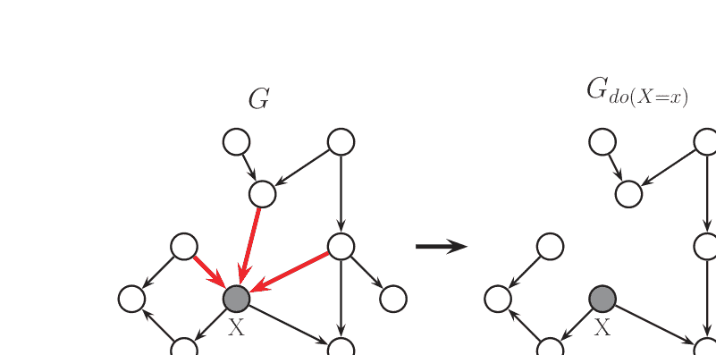

恰好具有值 $x_i$。 我们使用Pearl的**do calculus**符号（如动词“做”）并写作$\text{do}(X_i = x_i)$来表示我们将 $X_i$ 设置为 $x_i$ 的事件。 因果模型可以用于进行形式为 $p(\mathbf{x}|\text{do}(X_i = x_i))$的推断，这与形式为$p(\mathbf{x}|X_i = x_i)$的推断不同。

为了理解在干预和观察条件下的差异（即做和看的差异），考虑一个2节点DGM $S \rightarrow Y$，其中 $S=1$表示你吸烟， $S=0$表示否， $Y=1$表示你有黄色污渍的手指， $Y=0$表示否。 如果我观察到你有黄色污渍的手指，我有权利推断你很可能是个吸烟者（因为尼古丁会导致黄色污渍）：

$p(S = 1|Y = 1) > p(S = 1)$  (26.49)

然而，如果我干预并且把你的手指涂成黄色，我就不能再根据这个推断了，因为我破坏了正常的因果机制。因此

$p(S = 1|\text{do}(Y = 1)) = p(S = 1)$  (26.50)

建模完美干预的一种方法是使用图手术：通过DGM表示联合分布，然后切断进入任何被干预节点的弧。
请参见图26.14的示例。 这样可以防止从被干预节点发送信息到它们的父节点。 进行了这种手术后，我们可以像通常一样在“残缺”的图中进行概率推理，以推断干预的效果。 我们正式陈述如下。

定理 26.6.1（操纵定理（Pearl 2000; Spirtes et al. 2000））。

要计算节点集$_i, _j$上的 $X_i|\text{do}(X_j)$的概率 $p$，我们可以对 $X_j$节点进行手术干预，然后在残缺的图中使用标准概率推理。

我们可以通过将干预作为显式的行动节点添加到图中来概括完美干预的概念。 结果类似于影响图，只是没有效用节点（Lauritzen 2000; Dawid 2002）。 这被称为增广有向无环图（Pearl 2000）。 我们

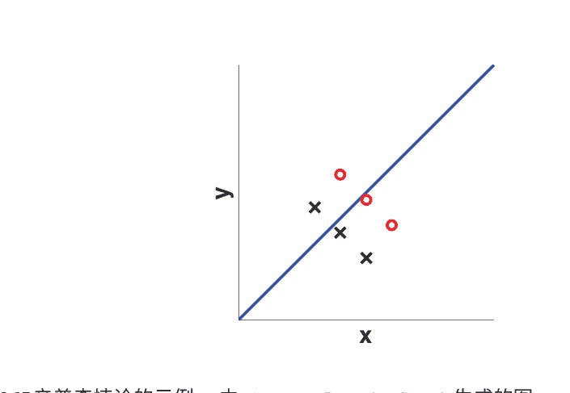

然后我们可以将CPD $p(X_i|\text{do}(X_i))$定义为我们想要的任何内容。我们还可以允许一个行动影响多个节点。这被称为fat hand干预，指的是有人试图改变某个系统（例如电子电路）的单个组件，但意外触及多个组件，从而引起各种副作用（参见（Eaton and Murphy 2007）以使用增广有向无环图对此进行建模的方法）。

### 26.6.2 使用因果有向图解决辛普森悖论

在本节中，我们假设我们知道因果有向图。然后，我们可以通过对被修改的图应用d-分离来进行因果推理。在本节中，我们举一个例子，并展示因果推理如何帮助解决一个著名的悖论，即辛普森悖论。

辛普森悖论指出，任何两个变量之间的统计关系都可以通过在分析中包含额外因素来颠倒。例如，假设某个原因 $C$（比如服用药物）使某个效应 $E$（比如康复）更有可能发生 $P(E|C) > P(E|\neg C)$。

然而，当我们根据患者的性别进行条件限制时，我们发现服用药物会使效应在女性（$F$）和男性（$\neg F$）中都变得不太可能发生：$P(E|C, F) < P(E|\neg C, F)$，$P(E|C, \neg F) < P(E|\neg C, \neg F)$。

这似乎是不可思的，但根据概率规则，这是完全可能的，因为当我们只考虑$\neg C$时，事件空间与我们在条件 ($\neg C, F$) or ($\neg C, \neg F$)下的事件空间可能完全不同。下面的数字表格显示了一个具体的例子（来自 (Pearl 2000, p175) ）：

| 分组 | 统计项 | $E$ | $\neg E$ | 总数 | 比率 |
| :--- | :--- | :--- | :--- | :--- | :--- |
| 合并 | $C$ | 20 | 20 | 40 | 50% |
| | $\neg C$ | 16 | 24 | 40 | 40% |
| | 总数 | 36 | 44 | 80 | |
| 男性 | $C$ | 18 | 12 | 30 | 60% |
| | $\neg C$ | 7 | 3 | 10 | 70% |
| | 总数 | 25 | 15 | 40 | |
| 女性 | $C$ | 2 | 8 | 10 | 20% |
| | $\neg C$ | 9 | 21 | 30 | 30% |
| | 总数 | 11 | 29 | 40 | |

从这个数字表格中，我们可以看到

$p(E|C) = 20/40 = 0.5 > p(E|\neg C) = 16/40 = 0.4 \quad (26.51)$

$p(E|C, F) = 2/10 = 0.2 < p(E|\neg C, F) = 9/30 = 0.3 \quad (26.52)$

$p(E|C, \neg F) = 18/30 = 0.6 < p(E|\neg C, \neg F) = 7/10 = 0.7 \quad (26.53)$

表示如图26.15所示。向上和向右的线表示随着原因(x轴)的增加，效应(y轴)也增加。然而，圆点代表女性的数据，十字代表男性的数据。在每个子组中，我们可以看到随着原因的增加，效应会减小。

很明显，效应是真实的，但这仍然是非常违反直觉的。悖论出现的原因是我们在解释陈述时是因果关系，但在进行计算时没有使用正确的因果推理。药物C引起恢复E的陈述是

$P(E|\text{do}(C)) > P(E|\text{do}(\neg C)) \quad (26.54)$

而数据仅仅告诉我们

$P(E|C) > P(E|\neg C) \quad (26.55)$

这并不是一个矛盾。观察C是E的正面证据，因为男性比女性更多地使用这种药物，并且男性的恢复率更高（无论是否使用药物）。因此，方程式26.55并不意味着方程式26.54。

然而，我们面临一个实际问题：我们应该使用这种药物还是不使用？看起来，如果我们不知道患者的性别，我们应该使用这种药物，但是一旦我们发现他们是男性还是女性，我们应该停止使用。显然，这个结论是荒谬的。

为了回答这个问题，我们需要更明确地表达我们的假设。假设现实可以由图26.16(a)中的因果DAG模型化。为了计算C对E的因果效应，我们需要对混淆变量F进行调整（即在其上进行条件约束）。这是必要的，因为存在一条通过F的反向路径从C到E，所以我们需要分别检查C→E关系的每个F值，以确保C和E之间的关系不受任何F值的影响。

假设对于每个F的值，服用药物是有害的，也就是说，

$p(E|\text{do}(C), F) < p(E|\text{do}(\neg C), F) \quad (26.56)$

$p(E|\text{do}(C), \neg F) < p(E|\text{do}(\neg C), \neg F) \quad (26.57)$

然后我们可以证明服用药物总体上是有害的：

$p(E|\text{do}(C)) < p(E|\text{do}(\neg C)) \quad (26.58)$

证明如下（Pearl 2000, p181）。首先，根据图26.16(a)中的假设，我们可以看到药物对性别没有影响

$p(F|\text{do}(C)) = p(F|\text{do}(\neg C)) = p(F) \quad (26.59)$

现在使用总概率法则,

$p(E|\text{do}(C)) = p(E|\text{do}(C), F)p(F|\text{do}(C)) + p(E|\text{do}(C), \neg F)p(\neg F|\text{do}(C)) \quad (26.60)$

$= p(E|\text{do}(C), F)p(F) + p(E|\text{do}(C), \neg F)p(\neg F) \quad (26.61)$

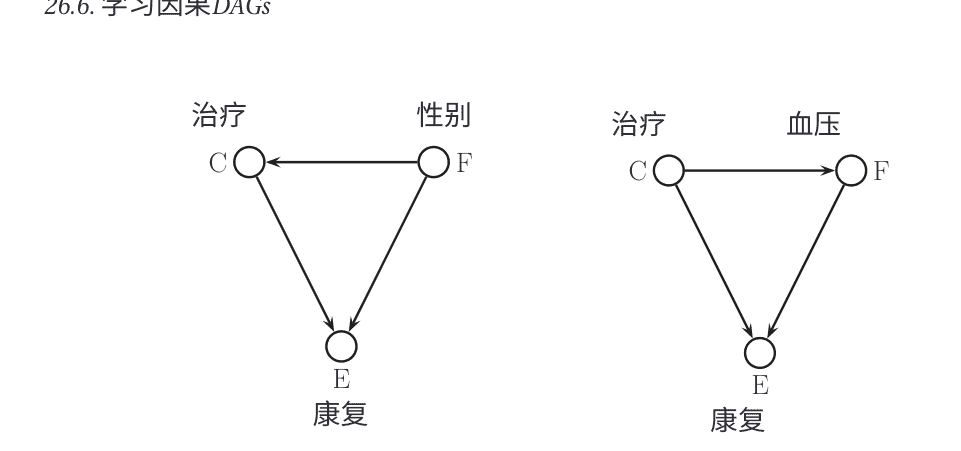

图26.16 使用两个不同的模型来说明辛普森悖论。 (a) F是性别，是C和E的混淆变量 (b) F是血压，是C引起的。

同样地,

$p(E|\text{do}(\neg C)) = p(E|\text{do}(\neg C), F)p(F) + p(E|\text{do}(\neg C), \neg F)p(\neg F) \quad (26.62)$

由于方程26.61中的每个项都小于方程26.62中的相应项，我们得出结论

$p(E|\text{do}(C)) < p(E|\text{do}(\neg C)) \quad (26.63)$

因此，如果图26.16(a)中的模型是正确的，我们不应该给药，因为它会降低效果的概率。

现在考虑这个例子的另一个版本。假设我们保持数据不变，但将 F解释为受 C影响的东西，比如血压。参见图26.16(b)。在这种情况下，我们不能再假设

$p(F|\text{do}(C)) = p(F|\text{do}(\neg C)) = p(F) \quad (26.64)$

上述证明就会失败。因此，E在进行C操作后的概率 $p(E|\text{do}(C))$ 减去在不进行C操作后的概率 $p(E|\text{do}(\neg C))$ 可能是正的或负的。

如果真实模型是图26.16(b)，那么在评估 C对 E的影响时，我们不应该以 F为条件，因为在这种情况下没有反向路径，因为在F处存在v-结构。也就是说，以 F为条件可能会阻塞其中一条因果路径。换句话说，通过比较具有相同治疗后血压（F的值）的患者，我们可能会掩盖药物通过两条途径促使康复的效果之一。

因此，我们可以看到不同的因果假设导致不同的因果结论，因此导致不同的行动。这引发了一个问题，我们是否可以从数据中学习因果模型。我们在下面讨论这个问题。

#### 26.6.3 学习因果DAG结构

在本节中，我们讨论了一些学习因果DAG结构的方法。

## 26.6.3.1 从观测数据中学习

在第26.4节中，我们讨论了从观测数据中学习DAG结构的各种方法。自然而然地会问，这些方法是否能够恢复生成数据的“真实”DAG结构。显然，即使我们有无限的数据，最优的方法也只能识别出DAG的Markov等价性（第26.4.1节）。也就是说，它可以识别出PDAG（部分有向无环图），但不能识别出完整的DAG结构，因为所有Markov等价的DAG具有相同的似然度。

有几种算法（例如，(Chickering 2002)的贪婪等价搜索方法）是PDAG结构的一致估计器，意味着当样本量趋近于无穷大时，它们能够识别真实的马尔可夫等价类，假设我们观测到所有变量。然而，我们还必须假设生成分布 p 对生成的 DAG G 是忠实的。这意味着 p 的所有条件独立性（CI）属性都被图形结构准确捕捉，所以 I(p) = I(G)；这意味着 p 中不能有任何CI属性是由于参数的特定设置（例如回归矩阵中的零）而不是图形明确表示的。因此，忠实分布也被称为稳定分布。

假设这些假设成立并且我们学习了一个PDAG。我们可以用它做什么？我们可以不必恢复完整的图形，而是专注于因果关系的边缘效应，通过计算一个节点对另一个节点的因果效应的大小（比如A对B的影响）。如果我们知道DAG，我们可以使用(Pearl 2000)中描述的技术来做这个。如果DAG是未知的，我们可以按照以下方式计算效应的下界（Maathuis et al. 2009）：从数据中学习一个等价类（PDAG）；枚举等价类中的所有DAG；应用Pearl的do-calculus在每个DAG中计算A对B的因果效应的大小；最后，取这些效应的最小值作为下界。计算等价类中所有DAG的计算量通常是不可行的，但幸运的是，我们只需要能够识别出 A 和 B 的局部邻域，这可以更高效地估计，如(Maathuis et al. 2009)中所述。这个技术被称为 **IDA**，它是“当DAG不存在时的干预计算”。

在（Maathuis等人，2010年）中，这种技术被应用于一些酵母基因表达数据。基因敲除数据被用来估计每个234个单基因缺失对剩余5361个基因的“真实”影响。然后，该算法被应用于63个未受干扰的（野生型）样本，并用于对每个234个基因的可能靶点进行排序。当召回率设定为10%时，该方法的精确度为66%；虽然较低，但这比诸如套索和弹性网络等竞争的变量选择方法要高出很多。

## 26.6.3.2 从干预数据中学习

如果我们想在等价类中区分DAGs，我们需要使用干预数据，其中某些变量已被设置，并且后果已被测量。一个例子是图26.17（a）中的数据集，其中信号通路中的蛋白质受到干扰，并使用一种称为流式细胞术的技术测量其磷酸化状态（Sachs等人，2005年）。

修改标准的贝叶斯评分准则（如边际似然或BIC评分）以处理来自混合观测和实验数据是直接的：我们

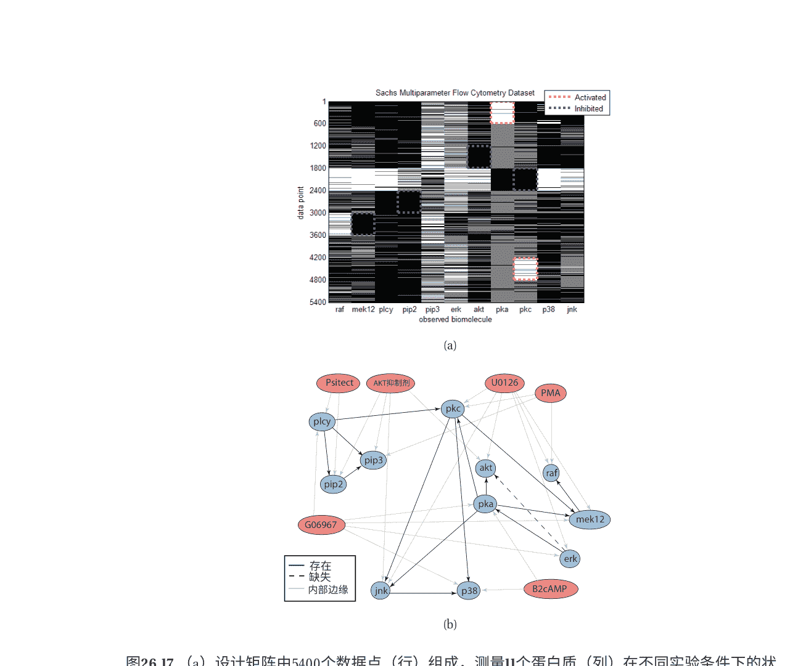

图26.17 (a) 设计矩阵由5400个数据点（行）组成，测量11个蛋白质（列）在不同实验条件下的状态（使用流式细胞术）。数据已离散化为3个状态：低（黑色），中等（灰色）和高（白色）。某些蛋白质明确使用激活或抑制化学物质进行控制。(b) 一个有向图模型表示各种蛋白质（蓝色圆圈）和各种实验干预（粉色椭圆）之间的依赖关系，该模型是从这些数据中推断出来的。我们绘制所有满足条件的边缘 $p (G_{st} = 1|D) > 0.5$。虚线边缘被认为存在于自然界中但未被算法发现（1个假阴性）。实线边缘是真阳性。浅色边缘表示干预的效果。来源：（Eaton和Murphy 2007）的图6d。可以使用以下代码重现此图 http://www.cs.ubc.ca/~murphyk/Software/BDAGL/index.html。

通过跳过那些由干预设置的情况（Cooper和Yoo 1999），仅计算CPD参数的足够统计量。例如，在使用表格型CPD时，我们按以下方式修改计数：

$$ N_{tck} \triangleq \sum_{i:x_{it}\text{未设置}} \mathbb{I}(x_{i,t}=k,\mathbf{x}_{i,\text{pa}(t)}=c) $$

这样做的理由是，在节点 $t$ 被强制设置的情况下，它不是从其通常的机制中采样的，因此在推断参数 $\theta_t$ 时应忽略这些情况。修改后的评分准则可以与任何标准结构学习算法结合使用。

> （He和Geng 2009）讨论了一些选择要执行的干预方法，以便尽快减少后验不确定性（一种主动学习形式）。

前面的方法假设干预是完美的。实际上，实验者很少能够控制单个分子的状态。相反，他们注入各种刺激剂或抑制剂化学物质，这些化学物质旨在针对特定分子，但可能会产生副作用。我们可以通过将干预节点添加到DAG中，并学习一个更大的增强DAG结构来简单地建模这一点，其中约束条件是干预节点之间没有边，而“常规”节点也没有边指向干预节点。

图26.17(b)展示了从图26.17(a)中描绘的干预流式细胞术数据中学到的增强DAG。特别地，我们绘制了中位图，其中包括所有满足条件 $p(G_{ij}=1|\mathcal{D})>0.5$ 的边。这些是使用(Koivisto 2006)的精确算法计算得出的。事实证明，在这个例子中，中位模型与使用(Koivisto and Sood 2004; Silander and Myllmaki 2006)的算法计算得出的最优MAP模型 $\mathrm{argmax}_G p(G|\mathcal{D})$ 具有完全相同的结构。

### 26.7 学习无向高斯图模型

学习无向图模型的结构比学习DAG结构更容易，因为我们不需要担心非循环性。另一方面，学习无向图模型的结构比学习DAG结构更困难，因为似然函数不能分解（参见第19.5节）。这使得我们无法使用局部搜索方法（贪婪搜索和MCMC采样），因为评估每个相邻图的成本太高，我们必须从头开始重新拟合每个模型（无法增量更新模型的得分）。

在这一部分中，我们讨论了在高斯随机场或无向高斯图模型（GGM）的背景下解决这个问题的几种解决方案。我们在第26.8节中考虑了离散无向模型的结构学习。

#### 26.7.1 GGM的MLE

在讨论结构学习之前，我们需要讨论参数估计。计算（不可分解）GGM的MLE的任务被称为协方差选择（Dempster 1972）。

$$ \ell(\mathbf{\Omega}) = \log \det \mathbf{\Omega} - \mathrm{tr}(\mathbf{S}\mathbf{\Omega}) $$

## 26.7. 学习无向高斯图模型

其中 $\Omega = \Sigma^{-1}$ 是精度矩阵， $S = \frac{1}{N} \sum_{i=1}^{N} (\mathbf{x}_i - \bar{\mathbf{x}})(\mathbf{x}_i - \bar{\mathbf{x}})^T$ 是经验协方差矩阵。（为了简化符号，我们假设已经估计出 $\hat{\mu} = \bar{\mathbf{x}}$。）可以证明其梯度为

$\nabla \ell(\Omega) = \Omega - S$。然而，我们必须强制执行约束条件，即 $\Omega_{st}=0$ 如果 $G_{st}=0$（结构零），并且 $\Omega$ 是正定的。前一个约束条件很容易实施，但后一个有点具有挑战性（尽管仍然是一个凸约束）。一种方法是在目标函数中添加一个惩罚项，如果 $\Omega$ 离开正定锥体；这是 ggmFitMinfunc 中使用的方法（另见（Dahl 等人，2008年））。另一种方法是使用坐标下降法，描述在（Hastie 等人，2009年，p633）中，并在 ggmFitHtf 中实现。另一种方法是使用迭代比例拟合，描述在第19.5.7节中。然而，IPF 需要识别图的团，这在一般情况下是NP难的。

有趣的是，可以证明 MLE 必须满足以下性质： $\Sigma_{st} = S_{st}$ if $G_{st}=1$ or $s=t$，即通过边连接的一对的协方差必须与经验协方差相匹配。此外，如果 $G_{st}=0$，根据GGM的定义，我们有 $\Omega_{st}=0$，即未连接的一对的精度必须为0。我们称 $\Sigma$ 为正定矩阵完成 $S$，因为它尽可能保留 $S$ 中的条目，对应于图中的边，同时满足 $\Sigma^{-1}$ 的稀疏模式要求，对应于不存在的边；填充 $\Sigma$ 中的剩余条目以最大化似然函数。

让我们从（Hastie et al. 2009, p652）中考虑一个实例。我们将使用以下表示循环结构的邻接矩阵， $X_1 - X_2 - X_3 - X_4 - X_1$，并使用以下经验协方差矩阵：

$$
\mathbf{G} = \begin{pmatrix} 0 & 1 & 0 & 1 \\ 1 & 0 & 1 & 0 \\ 0 & 1 & 0 & 1 \\ 1 & 0 & 1 & 0 \end{pmatrix}, \quad \mathbf{S} = \begin{pmatrix} 10 & 1 & 5 & 4 \\ 1 & 10 & 2 & 6 \\ 5 & 2 & 10 & 3 \\ 4 & 6 & 3 & 10 \end{pmatrix}
$$

最大似然估计由以下公式给出

$$
\Sigma = \begin{pmatrix} 10.00 & 1.00 & 1.31 & 4.00 \\ 1.00 & 10.00 & 2.00 & 0.87 \\ 1.31 & 2.00 & 10.00 & 3.00 \\ 4.00 & 0.87 & 3.00 & 10.00 \end{pmatrix}, \quad \Omega = \begin{pmatrix} 0.12 & -0.01 & 0 & -0.05 \\ -0.01 & 0.11 & -0.02 & 0 \\ 0 & -0.02 & 0.11 & -0.03 \\ -0.05 & 0 & -0.03 & 0.13 \end{pmatrix}
$$

(请参见 ggmFitDemo 以重现这些数字的代码。在 $\Omega$ 中，约束元素和 $\Sigma$ 中的自由元素都对应于不存在的边，已经突出显示。

#### 26.7.2 图形套索

现在我们讨论一种学习稀疏GRF结构的方法，该方法利用了精度矩阵中的零与图中不存在的边之间的一一对应关系。这表明我们可以通过使用鼓励精度矩阵中的零的目标来学习稀疏的图结构。类似于套索（见第13.3节），可以定义以下惩罚NLL：

$$
J(\Omega) = - \log \det \Omega + \operatorname{tr}(\mathbf{S} \Omega) + \lambda \| \Omega \|_1
$$

其中 $||\Omega||_1 = \sum_{j,k} |\omega_{jk}|$ 是矩阵的1范数。这被称为图形套索或Glasso。

尽管目标是凸的，但它是非光滑的（因为非可微的 $\ell_1$ 惩罚）并且受限制的（因为 $\Omega$ 必须是正定矩阵）。已经提出了几种算法来优化这个目标（Yuan and Lin 2007; Banerjee et al. 2008; Duchiet al. 2008），尽管可以说最简单的是（Friedman et al. 2008）中的算法，它使用类似于lasso的射击算法的坐标下降算法。请参阅 ggmLassoHtf 进行实现。（另请参阅（Mazumder and Hastie 2012）以获取此算法的更近期版本。）

图26.18 使用图形套索应用于流式细胞术数据学习的稀疏GGMs。（a）λ=36。（b）λ=27。（c）λ=7。（d）λ=0。由 ggmLassoDemo 生成的图。

举个例子，让我们将该方法应用于(Sachs et al. 2005)的流式细胞术数据集。数据的离散化版本如图26.17(a)所示。这里我们使用原始连续数据。然而，我们忽略了数据是在干预下采样的这一事实。在图26.18中，我们展示了在从0到一个较大值的范围内扫描λ时学到的图结构。这些代表了关于这些蛋白质连接性的一系列合理的假设。

值得注意的是，我们展示了许多UGM和一个DAG只是偶然的：我们可以轻松使用BIC来选择“最佳”UGM，反之亦然。请注意，我们展示多个UGM和仅一个DAG只是偶然的：我们可以轻松使用BIC来选择“最佳”UGM，反之亦然。

## 26.7.3 GGM结构的贝叶斯推断 *

尽管图形套索相当快速，但它只给出了结构的一个点估计。此外，它不是模型选择一致的（Meinshausen 2005），这意味着它无法在 \(N \to \infty\) 时恢复真实的图形。最好的方法是在参数中进行积分，并在图形空间中进行后验推断，即计算 \(p(G|\mathcal{D})\)。然后，我们可以提取后验的摘要，例如后验边缘概率 \(p(G_{i,j}=1|\mathcal{D})\)，就像我们对DAGs所做的那样。在本节中，我们将讨论如何做到这一点。

请注意，情况类似于第13章，我们在那里讨论了变量选择。在第13.2节中，我们讨论了贝叶斯变量选择，其中我们积分了回归权重并计算了 \(p(\gamma|\mathcal{D})\) 和边际包含概率 \(p(\gamma_j=1|\mathcal{D})\)。然后，在第13.3节中，我们讨论了基于 \(\ell_1\) 正则化的方法。这里有相同的二分法，但我们以相反的顺序呈现它们。

如果图是可分解的，并且我们使用共轭先验，我们可以计算边际似然的闭式形式（Dawid和Lauritzen 1993）。此外，我们可以高效地识别图的可分解邻居（Thomas和Green 2009），即合法边添加和删除的集合。这意味着我们可以执行相对高效的随机局部搜索以近似后验概率（参见例如（Giudici和Green 1999；Armstrong等人2008；Scott和Carvalho 2008））。

然而，限制在可分解的图上相当有限，如果目标是知识发现，因为可分解图的数量远小于一般无向图的数量。\( ^5 \)

一些作者研究了非可分解情况下GGM结构的贝叶斯推断（例如，（Dellaportas等人2003；Wong等人2003；Jones等人2005）），但是这种方法不能扩展到大型模型，因为它们使用昂贵的蒙特卡罗近似来计算边际似然（Atay-Kayis和Massam 2005）。（Lenkoski和Dobra 2008）建议使用拉普拉斯近似。这需要计算G-Wishart先验下的参数的MAP估计（Roverato 2002）。在（Lenkoski和Dobra 2008）中，他们使用迭代比例缩放算法（Speed和Kiiveri 1986；Hara和Takimura 2008）来找到模式。然而，这非常慢，因为它需要知道图的最大团，这在一般情况下是NP难的。

在（Moghaddam等人，2009年）中，提出了一种更快的方法。特别是，他们修改了第26.7.1节中的基于梯度的方法，以找到MAP估计；这些算法不需要知道图的团。通过仅使用对角线拉普拉斯近似，可以进一步加速，这比BIC更准确，但基本上具有相同的成本。这个方法加上不限于可分解图的限制，使得可以使用相当快速的随机搜索方法来近似计算 \(p(G|\mathcal{D})\) 及其模式。这种方法在预测准确性和结构恢复方面明显优于图拉索，并具有相当的计算成本。

## 26.7.4 使用copulas处理非高斯数据 *

图形套索和其变种仅适用于联合高斯数据，这是一个相当严格的限制。幸运的是，该方法可以推广到处理非高斯但仍连续的数据，方法相当简单。基本思想是估计一组 \(D\) 单变量单调变换 \(f_j\)，每个变量 \(j\) 对应一个变换，使得结果转换后的数据是联合高斯分布。如果这是可能的，我们称数据属于非参数正态分布，或非参数正态分布（Liu等人，2009年）。这相当于**Gaussian copulas**的族群（Klaassen和Wellner，1997年）。如何从每个变量的经验cdf估计 \(f_j\) 变换的详细信息可以在（Liu等人，2009年）中找到。在转换数据后，我们可以计算相关矩阵，然后按照通常的方式应用glasso。在各种假设下，可以证明这是原始分布的CI假设的一致估计（Liu等人，2009年）。

## 26.8 学习无向离散图模型

对于具有离散变量的UGMs学习结构的问题比高斯情况更难，因为计算参数估计所需的分区函数 \(Z(\theta)\) 的复杂度与计算矩阵的永久性相当，而一般情况下是难以处理的（Jerrum等人，2004年）。相比之下，在高斯情况下，计算 \(Z\) 只需要计算矩阵行列式，其复杂度最多为 \(O(V^3)\)。

由于对于一般的离散UGMs来说，随机局部搜索是难以处理的，下面我们提到一些可能的替代方法。

## 26.8.1 MRFs/CRFs的图形套索

可以将图形套索的思想扩展到离散MRF和CRF的情况。然而，现在图中的每条边都有一组相关参数，因此我们必须使用图形套索的图形类比（参见第13.5.1节）。例如，考虑一个具有三元节点的成对CRF，其节点和边缘势分别为

$$
\psi_t(y_t, \mathbf{x}) = \begin{pmatrix} \mathbf{v}_{t1}^T \mathbf{x} \\ \mathbf{v}_{t2}^T \mathbf{x} \\ \mathbf{v}_{t3}^T \mathbf{x} \end{pmatrix},
\quad
\psi_{st}(y_s, y_t, \mathbf{x}) = \begin{pmatrix}
\mathbf{w}_{st11}^T \mathbf{x} & \mathbf{w}_{st12}^T \mathbf{x} & \mathbf{w}_{st13}^T \mathbf{x} \\
\mathbf{w}_{st21}^T \mathbf{x} & \mathbf{w}_{st22}^T \mathbf{x} & \mathbf{w}_{st23}^T \mathbf{x} \\
\mathbf{w}_{st31}^T \mathbf{x} & \mathbf{w}_{st32}^T \mathbf{x} & \mathbf{w}_{st33}^T \mathbf{x}
\end{pmatrix}
\qquad (26.71)
$$

我们假设 \(\mathbf{x}\) 以一个常数1项开始，以考虑偏移量。（如果 \(\mathbf{x}\) 只包含1，CRF将简化为MRF。）请注意，我们可以选择将一些 \(\mathbf{v}_{tk}\) 和 \(\mathbf{w}_{st,jk}\) 权重设置为0，以确保可识别性，尽管这也可以通过先验来处理，如练习8.5所示。

为了学习稀疏结构，我们可以最小化以下目标函数：

$$
J = -\sum_{i=1}^N \left[ \sum_t \log \psi_t(y_{it}, \mathbf{x}_i, \mathbf{v}_t) + \sum_{s=1}^V \sum_{t=s+1}^V \log \psi_{st}(y_{is}, y_{it}, \mathbf{x}_i, \mathbf{w}_{st}) \right] + \lambda_1 \sum_{s=1}^V \sum_{t=s+1}^V \|\mathbf{w}_{st}\|_p + \lambda_2 \sum_{t=1}^V \|\mathbf{v}_t\|_2^2
\qquad (26.72)
$$

其中\(\|\mathbf{w}_{st}\|_p\)是 *p*范数；常见的选择是 *p*= 2或 *p* = ∞，如第13.5.1节所解释的。这种CRF结构学习方法最初在(Schmidt et al. 2008)中提出。
(在学习二进制MRF结构时，提出了使用正则化的方法(Lee等人，2006)。)

尽管这个目标是凸的，但评估起来可能很昂贵，因为我们需要进行推理来计算其梯度，如第19.6.3节所解释的（对于MRFs也是如此）。因此，我们应该使用一个不会对目标函数或其梯度进行过多调用的优化器，例如（Schmidt等人，2009）中的投影拟牛顿方法。此外，我们可以使用近似推理，例如凸信念传播（第22.4.2节），更快地计算近似目标和梯度。另一种方法是对第19.5.4节中讨论的伪似然函数应用组套索惩罚。这样做速度更快，因为不再需要推理（Hoefling和Tibshirani，2009）。图26.19显示了将此过程应用于20-newsgroup数据的结果，其中 \(y_{it}\) 表示文档 \(i\)中存在单词 \(t\)，而 \(\mathbf{x}_i= 1\)（因此模型是一个MRF）。

图26.19 通过使用λ= 256的组 $\ell_1$ 正则化从20-newsgroup数据估计的MRF。孤立节点不会被绘制。 来自(Schmidt 2010)的图5.9。 获得Mark Schmidt的亲切许可。

## 26.8.2 薄接点树

到目前为止，我们一直关注学习“稀疏”图，但这些图不一定具有低树宽。例如，一个 $D \times D$网格是稀疏的，但树宽为 $O(D)$。这意味着我们学习的模型可能在推理目的上是难以处理的，这违背了学习图结构的两个主要原因之一（另一个原因是“知识发现”）。已经有各种尝试学习具有有界树宽的图模型（例如，（Bach和Jordan 2001; Srebro 2001; Elidan和Gould 2008; Shahaf等2009）），也被称为薄接点树，但一般情况下确切的问题是困难的。

另一种方法是学习一个具有低电路复杂度的模型（Gogate等人，2010年；Poon和Domingos，2011年）。这样的模型可能具有很高的树宽度，但它们利用上下文特定的独立性和确定性来实现快速的精确推理（例如，参见（Darwiche，2009年））。

## 练习

练习26.1 洒水器网络中的因果推理
考虑图26.20中的因果网络。让 $T$ 表示真， $F$ 表示假。

-   a. 假设我进行了完美的干预并使草变湿。在进行干预后，洒水器打开的概率是多少，即$P(S = T | \text{do}(W = T))$?
-   b. 假设我进行了完美的干预并使草变干。在进行干预后，洒水器打开的概率是多少，即$P(S = T | \text{do}(W = F))$?
-   c. 假设我进行了完美的干预并使云“打开”（例如，通过播种）。在进行干预后，洒水器打开的概率是多少，即$P(S = T | \text{do}(C = T))$?

图26.20 具有相应二进制CPT的水洒洒水器DGM。T和F分别代表真和假。

### 27.2 分布式状态离散数据的潜在变量模型

在本节中，我们总结了构建形式为 $p(\mathbf{y}_{i,1:L_i})$ 的模型的各种可能方法，对于标记的包；$p(\mathbf{y}_{1:R})$，对于标记的向量；以及 $p(\mathbf{n}_i)$，对于整数计数的向量。

#### 27.2.1 混合模型

最简单的方法是使用有限混合模型（第11章）。这将每个文档与一个单一的离散潜变量 $q_i \in \{1, \ldots, K\}$相关联，其中 $K$ 是聚类的数量。我们将使用离散先验分布 $q_i \sim \text{Cat}(\boldsymbol{\pi})$。对于变长文档，我们可以定义 $p(y_{il}|q_i = k) = b_{kv}$，其中 $b_{kv}$是聚类 $k$生成词 $v$的概率。变量 $q_i$的值被称为一个主题，向量 $\mathbf{b}_k$是第 $k$个主题的词分布。也就是说，似然函数的形式为

$$p(\mathbf{y}_{i,1:L_i}|q_i = k) = \prod_{l=1}^{L_i} \text{Cat}(y_{il}|\mathbf{b}_k)$$

可见数据上的诱导分布由以下给出

$$p(\mathbf{y}_{i,1:L_i}) = \sum_{k} \pi_k \left[ \prod_{l=1}^{L_i} \text{Cat}(y_{il}|\mathbf{b}_k) \right]$$

这个编码的“生成故事”如下：对于文档 $i$，从 $\boldsymbol{\pi}$中选择一个主题 $q_i$，称之为 $k$，然后对于每个词 $l=1: L_i$，从 $\mathbf{b}_k$中选择一个词。我们将在本章后面考虑更复杂的生成模型。

如果我们有一组固定的分类观测，我们可以为每个输出变量使用不同的主题矩阵：

$$p(\mathbf{y}_{i,1:R}|q_i = k) = \prod_{r=1}^{R} \text{Cat}(y_{il}|\mathbf{b}_k^{(r)})$$

这是一种无监督的朴素贝叶斯分类的类比。我们还可以建模计数向量。如果总和 $L_i = \sum_v n_{iv}$已知，我们可以使用多项式分布：

$$p(\mathbf{n}_i|L_i, q_i = k) = \text{Mu}(\mathbf{n}_i|L_i, \mathbf{b}_k)$$

如果总和未知，我们可以使用泊松类条件密度来给出

$$p(\mathbf{n}_i|q_i = k) = \prod_{v=1}^{V} \text{Poi}(n_{iv}|\lambda_{vk})$$

在这种情况下，$L_i|q_i = k \sim \text{Poi}(\sum_v \lambda_{vk})$。

#### 27.2.2 指数族PCA

不幸的是，有限混合模型在表达能力方面非常有限。一种更灵活的模型是使用一组实值连续潜变量，类似于第12章中的因子分析(FA)和PCA模型。在PCA中，我们使用形式为 $p(\mathbf{z}_i) = \mathcal{N}(\boldsymbol{\mu}, \boldsymbol{\Sigma})$ 的高斯先验，其中 $\mathbf{z}_i \in \mathbb{R}^K$，并使用形式为 $p(\mathbf{y}_i|\mathbf{z}_i) = \mathcal{N}(\mathbf{W}\mathbf{z}_i, \sigma^2\mathbf{I})$ 的高斯似然。这种方法当然可以应用于离散或计数数据。事实上，被称为潜在语义分析(LSA)或潜在语义索引(LSI)的方法(Deerwester et al. 1990; Dumais and Landauer 1997)与将PCA应用于按术语和文档计数矩阵完全等效。

对于建模分类数据，更好的方法是使用多项式分布。我们只需要改变似然函数

$$p(\mathbf{y}_{i,1:L_i}|\mathbf{z}_i) = \prod_{l=1}^{L_i} \text{Cat}(y_{il}|\mathcal{S}(\mathbf{W}\mathbf{z}_i)) \tag{27.6}$$

其中 $\mathbf{W} \in \mathbb{R}^{V \times K}$ 是权重矩阵，$\mathcal{S}$ 是softmax函数。如果我们有固定数量的分类响应，我们可以使用

$$p(\mathbf{y}_{1:R}|\mathbf{z}_i) = \prod_{r=1}^{R} \text{Cat}(y_{ir}|\mathcal{S}(\mathbf{W}_r\mathbf{z}_i)) \tag{27.7}$$

其中 $\mathbf{W}_r \in \mathbb{R}^{V \times K}$ 是第 $r$ 个响应变量的权重矩阵。这个模型被称为分类PCA，并在图27.1(a)中进行了说明；详细讨论请参见第12.4节。如果我们有计数数据，我们可以使用多项式模型

$$p(\mathbf{n}_i|L_i, \mathbf{z}_i) = \text{Mu}(\mathbf{n}_i|L_i, \mathcal{S}(\mathbf{W}\mathbf{z}_i)) \tag{27.8}$$

或者泊松模型

$$p(\mathbf{n}_i|\mathbf{z}_i) = \prod_{v=1}^{V} \text{Poi}(n_{iv}|\exp(\mathbf{w}_{v,.}^T\mathbf{z}_i)) \tag{27.9}$$

所有这些模型都是指数族PCA或ePCA的例子(Collins et al. 2002; Mohamed et al. 2008)，它是GLMs的无监督类比。可见变量上的相应引导分布具有以下形式

$$p(\mathbf{y}_{i,1:L_i}) = \int \left[ \prod_{l=1}^{L_i} p(y_{il}|\mathbf{z}_i, \mathbf{W}) \right] \mathcal{N}(\mathbf{z}_i|\boldsymbol{\mu}, \boldsymbol{\Sigma}) d\mathbf{z}_i \tag{27.10}$$

由于缺乏共轭性，拟合这个模型是棘手的。(Collins et al. 2002)提出了一种坐标上升方法，交替估计 $\mathbf{z}_i$ 和 $\mathbf{W}$。这可以被视为EM的退化版本，在E步骤中计算 $\mathbf{z}_i$ 的点估计。退化方法的问题在于它很容易过拟合，因为潜变量的数量与数据点的数量成比例(Welling et al. 2008)。真正的EM算法将边缘化掉潜变量 $\mathbf{z}_i$。对于分类PCA，可以使用变分EM来实现这一点，详见第12.4节。对于更一般的模型，可以使用MCMC(Mohamed et al. 2008)。

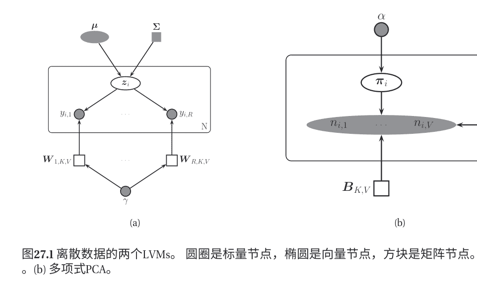

#### 27.2.3 LDA和mPCA

在ePCA中，数量 $\mathbf{W}\mathbf{z}_i$ 表示指数族的自然参数。 有时候使用对偶参数更方便。 例如，对于多项式分布，对偶参数是概率向量，而自然参数是对数几率向量。

如果我们想要使用对偶参数，我们需要约束潜变量使其位于适当的参数空间中。 对于分类数据，我们需要确保潜向量位于 $S_K$，即 $K$ 维概率单纯形。 为了避免与ePCA混淆，我们将这样的潜向量表示为 $\boldsymbol{\pi}_i$。 在这种情况下，潜变量的自然先验是Dirichlet分布， $\boldsymbol{\pi}_i \sim \mathrm{Dir}(\boldsymbol{\alpha})$。 通常我们设置 $\boldsymbol{\alpha} = \alpha \mathbf{1}_K$。 如果我们设置 $\alpha \ll 1$，我们鼓励 $\boldsymbol{\pi}_i$ 稀疏，如图2.14所示。

当我们有一个总和已知的计数向量时，似然函数为 $p(\mathbf{n}_i | L_i, \boldsymbol{\pi}_i) = \mathrm{Mu}(\mathbf{n}_i | L_i, \mathbf{B}\boldsymbol{\pi}_i)$ (27.11) 这个模型被称为多项式PCA或mPCA (Buntine 2002; Buntine and Jakulin 2004, 2006) 。见图27.1(b)。由于我们假设 $n_{iv} = \sum_{k} b_{vk} \pi_{iv}$，这可以看作是计数矩阵的一种矩阵分解形式。 请注意，我们使用 $b_{v,k}$ 来表示参数向量，而不是 $w_{v,k}$，因为我们施加了 $0 \leq b_{v,k} \leq 1$ 和 $\sum_{v} b_{v,k} = 1$ 的约束。相应的边缘分布具有以下形式 $p(\mathbf{n}_i | L_i) = \int \mathrm{Mu}(\mathbf{n}_i | L_i, \mathbf{B}\boldsymbol{\pi}_i) \mathrm{Dir}(\boldsymbol{\pi}_i | \boldsymbol{\alpha}) d\boldsymbol{\pi}_i$ (27.12) 不幸的是，这个积分无法通过解析方法计算。

如果我们有一个可变长度的序列（已知长度），我们可以使用 $p(\mathbf{y}_{i,1:L_i} | \boldsymbol{\pi}_i) = \prod_{l=1}^{L_i} \mathrm{Cat}(y_{il} | \mathbf{B}\boldsymbol{\pi}_i)$ (27.13)

#### 27.2.4 GaP模型和非负矩阵分解

这被称为潜在狄利克雷分配或 LDA (Blei等人, 2003年)，并将在下面更详细地描述。LDA可以被看作是LSA的概率扩展，其中潜在数量πik是非负的并且总和为一。相比之下，在LSA中，zik可以是负数，这使得解释困难。

LDA的前身被称为概率潜在语义索引或 PLSI (Hofmann, 1999年)，它使用相同的模型，但为每个文档计算πi的点估计(类似于ePCA)，而不是将其整合掉。因此，在PLSI中，没有πi的先验。我们可以修改LDA以处理固定数量的不同分类响应，如下所示：

$$p(\mathbf{y}_{i,1:R}|\boldsymbol{\pi}_i) = \prod_{r=1}^R \text{Cat}(y_{il}|\mathbf{B}^{(r)}\boldsymbol{\pi}_i)$$ (27.14)

这被称为用户评分概况模型(URP) (Marlin 2003)，以及简单因子模型(Bhattacharya and Dunson 2011)。

现在考虑对计数向量进行建模，其中我们不限制总和为观察到的值。在这种情况下，潜在变量只需要是非负的，因此我们将它们表示为$\mathbf{z}_i^+$。这可以通过使用以下形式的先验来确保

$$p(\mathbf{z}_i^+) = \prod_{k=1}^K \text{Ga}(z_{ik}^+|\alpha_k, \beta_k)$$ (27.15)

似然性由以下给出

$$p(\mathbf{n}_i|\mathbf{z}_i^+) = \prod_{v=1}^V \text{Poi}(n_{iv}|\mathbf{b}_v^T \mathbf{z}_i^+)$$ (27.16)

这被称为 GaP(Gamma-Poisson) 模型 (Canny 2004)。参见图27.2(a)。在(Buntine and Jakulin 2006)中，证明了当条件固定为$L_i$时，GaP模型简化为mPCA模型。这是因为一组泊松随机变量，在给定它们的和的条件下，变成了一个多项分布(参见，例如，(Ross 1989))。

如果我们在GaP模型中将 $\alpha_k = \beta_k= 0$，我们就恢复了一种称为非负矩阵分解或NMF的方法 (Lee and Seung 2001)，如(Buntine and Jakulin 2006)所示。NMF不是一个概率生成模型，因为它没有为 $\mathbf{z}_i^+$ 指定适当的先验。此外，(Lee and Seung 2001)提出的算法是另一种退化的EM算法，因此容易过拟合。为了克服这些问题，(Buntine and Jakulin 2006)提供了一些适应GaP模型的方法。

为了鼓励 $\mathbf{z}_i^+$ 稀疏，我们可以修改先验为尖峰-伽玛类型的先验，如下所示：

$$p(z_{ik}^+) = \rho_k \mathbb{I}(z_{ik}^+ = 0) + (1-\rho_k)\text{Ga}(z_{ik}^+|\alpha_k, \beta_k)$$ (27.17)

其中 $\rho_k$是0处尖峰的概率。这被称为条件伽玛泊松模型(Buntine and Jakulin 2006)。修改Gibbs采样以处理这种先验是很简单的，尽管我们在这里不会详细介绍。

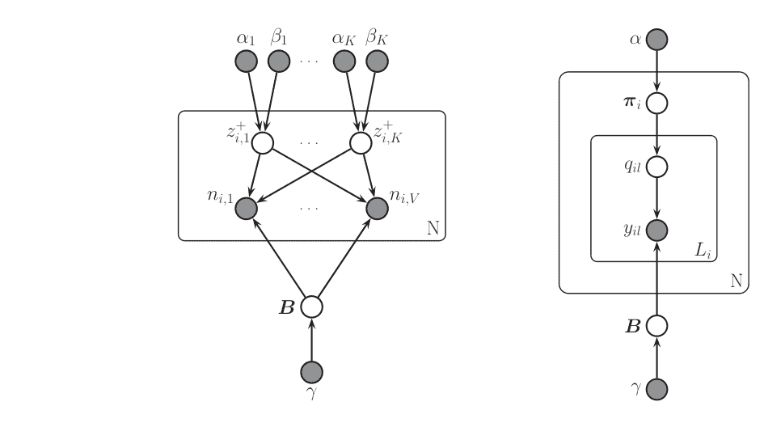

### 27.3 潜在狄利克雷分配 (LDA)

在本节中，我们详细解释了潜在狄利克雷分配或LDA (Blei等人， 2003) 模型。

#### 27.3.1 基础知识

在多项式混合模型中，每个文档都被分配给一个单一的主题，\(q_i \in \{1, \ldots, K\}\)，从全局分布\(\pi\)中抽取。 在LDA中，每个单词都被分配给它自己的主题，\(q_{il} \in \{1, \ldots, K\}\)，从文档特定的分布\(\pi_i\)中抽取。 由于文档属于主题分布，而不是单一的主题，所以该模型被称为混合成分模型或混合成员模型 (Erosheva等人， 2004)。 该模型在文本分析之外还有许多其他应用，例如遗传学 (Pritchard等人， 2000)，健康科学 (Erosheva等人， 2007)，社交网络分析 (Airoldi等人， 2008) 等。

通过给参数添加共轭先验，完整模型如下：

$$
\begin{aligned}
\pi_i \mid \alpha &\sim \text{Dir}(\alpha \mathbf{1}_K) & & (27.18) \\
q_{il} \mid \pi_i &\sim \text{Cat}(\pi_i) & & (27.19) \\
\mathbf{b}_k \mid \gamma &\sim \text{Dir}(\gamma \mathbf{1}_V) & & (27.20) \\
y_{il} \mid q_{il}=k, \mathbf{B} &\sim \text{Cat}(\mathbf{b}_k) & & (27.21)
\end{aligned}
$$

这在图27.2(b)中有所说明。 我们可以边缘化掉 \(q_i\) 变量，从而创建一个

> ¹ 我们的符号表示与本书其他地方使用的相似，但与大多数LDA论文使用的符号不同。它们通常使用 \(w_{nd}\) 表示单词 \(n\) 在文档 \(d\) 中的标识， \(z_{nd}\) 表示离散指示器， \(\theta_d\) 表示文档 \(d\) 的连续潜在向量， \(\beta_k\) 表示第 \(k\) 个主题向量。

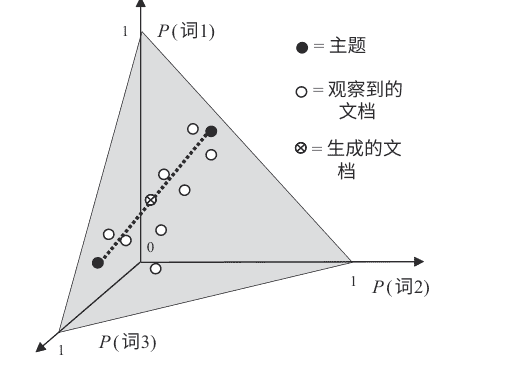

图27.3 LDA的几何解释。我们有 $K=2$个主题和 $V=3$个词。每个文档（白点）和每个主题（黑点）都是3D单纯形中的一个点。来源：（Steyvers和Griffiths 2007）的图5。获得Tom Griffiths的友好许可后使用。

从 $\pi_i$到 $y_{il}$的直接弧，具有以下条件概率分布：

$p(y_{il} = v|\pi_i) = \sum_k p(y_{il}=v|q_{il}=k)p(q_{il}=k) = \sum_k \pi_{ik}b_{kv}$  (27.22)

正如我们在介绍中提到的，这与（Buntine 2002）中提出的多项式PCA模型非常相似，而多项式PCA模型又与分类PCA、GaP、NMF等密切相关。LDA具有有趣的几何解释。

每个向量 $\mathbf{b}_k$定义了一个在$V$个词上的分布；每个 $k$被称为一个主题。每个文档向量 $\pi_i$定义了一个在 $K$个主题上的分布。因此，我们将每个文档建模为主题的混合物。等价地，我们可以将LDA视为一种降维方法（假设$K < V$，通常是这种情况），其中我们将一个点（归一化的文档计数向量 $\mathbf{x}_i$）投影到 $K$维单纯形上。这在图27.3中有所说明，其中 $V=3$个词和$K=2$个主题。观察到的文档（位于3D单纯形中）被近似为位于由2个主题向量张成的2D单纯形上，每个主题向量都位于3D单纯形中。

使用单纯形作为我们的潜在空间而不是欧几里得空间的一个优点是，单纯形可以处理歧义。这很重要，因为在自然语言中，单词经常有多个含义，这种现象被称为多义性。例如，“play”可能指的是动词（例如，“打球”或“吹喇叭”），也可能指的是名词（例如，“莎士比亚的戏剧”）。在LDA中，我们可以有多个主题，每个主题都可以生成单词“play”，如图27.4所示，反映了这种歧义。

给定文档 $i$中的单词 $l$，我们可以计算 $p(q_{il}=k|\mathbf{y}_i,\theta)$，从而推断出其最有可能的主题。通过独立地观察单词，很难知道单词的具体含义，但是通过观察文档中的其他单词，我们可以消除这种歧义。特别是，给定文档 $\mathbf{x}_i$，我们可以推断出文档的主题分布 $\pi_i$；这作为消除歧义的先验。这在图27.5中有所说明，我们展示了TASA语料库中的三个文档。$^2$在第一个文档中，有各种与音乐相关的单词，这表明

$^2$TASA语料库是一个包含37,000个高中水平的英语文档的集合，总计超过1000万个单词。

| 单词概率。 |
|-----------|
| 音乐 .090 |
| 舞蹈 .034 |
| 歌曲 .033 |
| 戏剧 .030 |
| 唱歌 .026 |
| 唱歌 .026 |
| 乐队 .026 |
| 演奏 .023 |
| 唱 .022 |
| 歌曲 .021 |
| 跳舞 .020 |
| 钢琴 .017 |
| 玩 .016 |
| 节奏 .015 |
| 阿尔伯特 .013 |
| 音乐 .013 |

| 单词概率。 |
|-----------|
| 文学 .031 |
| 诗歌 .028 |
| 诗歌 .027 |
| 诗人 .020 |
| 戏剧 .019 |
| 诗歌 .019 |
| 戏剧 .015 |
| 文学的 .013 |
| 作家们 .013 |
| 戏剧 .012 |
| 写作 .012 |
| 诗人 .011 |
| 作家 .011 |
| 莎士比亚 .010 |
| 写 .009 |
| 舞台 .009 |

| 单词概率。 |
|-----------|
| 戏剧 .136 |
| 球类 .129 |
| 游戏 .065 |
| 玩耍 .042 |
| 击中 .032 |
| 演奏 .031 |
| 棒球 .027 |
| 游戏 .025 |
| 球棒 .019 |
| 跑步 .019 |
| 投掷 .016 |
| 球 .015 |
| 网球 .011 |
| 家 .010 |
| 捕捉 .010 |
| 领域 .010 |

图 27.4 与单词 play相关的三个主题. 来源: (Steyvers and Griffiths 2007)的图9。获得Tom Griffiths的友情许可。

比克斯·贝德贝克，在十五岁时，坐在俯瞰密西西比河的悬崖上。他正在听来自一艘经过的游轮的音乐。这首音乐已经俘获了他的心和他的耳朵。这是爵士乐。比克斯·贝德贝克已经上过音乐课。他在钢琴上展示了才华，他的父母希望他能考虑成为一名音乐会钢琴家。但比克斯对另一种音乐感兴趣。他想演奏这个小号。他想要演奏爵士乐...

我们整个西方世界真正伟大的剧院时期之所以如此少，有一个简单的原因。太多的事情必须在同一时间正确地发生。剧作家必须有合适的演员，演员必须有合适的剧院，剧院必须有合适的观众。我们必须记住，戏剧存在是为了演出，而不仅仅是为了阅读（即使你自己阅读一部戏剧必须被演出，然后一些种类的戏剧...

吉姆有一本游戏书。吉姆读这本书。吉姆看见一个游戏。吉姆玩这个游戏。吉姆喜欢这个游戏。这本游戏书帮助吉姆。唐进入房子。唐和吉姆读这本游戏书。两个男孩看见一个游戏。这两个男孩玩这个游戏。这男孩玩这个游戏适合两个人。这些男孩喜欢这个游戏。梅格进入房子。梅格和唐和吉姆读这本书。他们看见一个三人游戏。梅格和唐以及吉姆玩这场比赛。他们玩...

图27.5 TASA语料库中包含不同意义的单词 play的三个文档。灰色的单词被模型忽略了，因为它们对应于不感兴趣的停用词（如“和”，“the”等）或者非常低频的词。来源: (Steyvers and Griffiths 2007)的图10。获得Tom Griffiths的友情许可后使用。

π_i将其大部分质量放在音乐主题上（编号77）；这反过来使得“play”的音乐解释最有可能，如上标所示。第二个文档将play解释为戏剧意义，第三个文档将其解释为体育意义。请注意，关键是 π_i 是一个潜变量，因此信息可以在 q_{il} 之间流动，从而使得局部消歧能够使用完整的词汇集。

#### 27.3.2 无监督发现主题

LDA的主要目的之一是在大量文档（参见图27.12的示例）中发现主题。不幸的是，由于模型不可识别，主题的解释可能很困难（Chang等，2009年）。一种方法，称为标记的LDA（Ramage等，2009年），利用文档上的标签的存在作为确保可识别性的一种方式。特别是，它强制主题与标签相对应，然后学习每个标签的单词分布。这可以使结果更容易解释。

#### 27.3.3 作为语言模型定量评估LDA

为了定量评估LDA，我们可以将其视为一种语言模型，即对单词序列的概率分布。当然，它不是一个很好的语言模型，因为它忽略了单词顺序，只看单个单词（unigrams），但是将LDA与其他基于unigram的模型（如多项式混合模型和pLSI）进行比较是有趣的。这种简单的语言模型有时在信息检索中很有用。衡量语言模型质量的标准方法是使用困惑度，我们将在下面定义。

#### 27.3.3.1 困惑度

语言模型 q给定一个随机过程^3 p的困惑度被定义为

$$困惑度 (p, q) \triangleq 2^{H(p,q)}$$

其中 H(p,q)是两个随机过程的交叉熵，被定义为

$$H(p, q) \triangleq \lim_{N\to\infty} -\frac{1}{N} \sum_{\mathbf{y}_{1:N}} p(\mathbf{y}_{1:N}) \log q(\mathbf{y}_{1:N})$$

如果 q = p，交叉熵（以及困惑度）将被最小化；在这种情况下，模型可以像“真实”分布一样进行预测。

我们可以通过使用一个长的测试序列（由多个文档和多个句子组成，并带有句子结束标记）来近似随机过程，称为 y^*_{1:N}。（随着序列变得越来越长，这种近似越来越准确，前提是过程是平稳和遍历的（Cover和Thomas 2006）。）将经验分布（对随机过程的近似）定义为

$$p_{\text{emp}}(\mathbf{y}_{1:N}) = \delta_{\mathbf{y}_{1:N}^*}(\mathbf{y}_{1:N})$$

由Touchstone Applied Science Associates公司整理，现在被称为Questar Assessment Inc www.questarai.com. 3. 随机过程是可以定义任意数量随机变量的联合分布。 我们可以将自然语言看作是一个随机过程，因为它可以生成无限流的单词。

在这种情况下，交叉熵变为

$$H(p_{\text{emp}}, q) = -\frac{1}{N} \log q(y_{1:N}^*) \quad (27.26)$$

而困惑度变为

$$\text{困惑度} (p_{\text{emp}}, q) = 2^{H(p_{\text{emp}}, q)} = q(y_{1:N}^*)^{-1/N} = \left( \prod_{i=1}^N \frac{1}{q(y_i^* | y_{1:i-1}^*)} \right)^{1/N} \quad (27.27)$$

我们可以看到这是逆预测概率的几何平均值，这是困惑度的常见定义（Jurafsky和Martin 2008，p96）。

对于一元模型，交叉熵项由以下给出

$$H = -\frac{1}{N} \sum_{i=1}^N \frac{1}{L_i} \sum_{l=1}^{L_i} \log q(y_{il}) \quad (27.28)$$

其中 N是文档的数量，L_i是文档 i中的单词数量。因此，模型 q的困惑度由以下给出

$$\text{困惑度} (p_{\text{emp}}, p) = \exp \left( -\frac{1}{N} \sum_{i=1}^N \frac{1}{L_i} \sum_{l=1}^{L_i} \log q(y_{il}) \right) \quad (27.29)$$

直观地说，困惑度衡量了模型预测分布的加权平均分支因子。假设模型预测每个符号（字母、单词等）的概率相等，因此 p(y_i | y_{1:i-1}) = 1/K。那么困惑度为 ((1/K)^N)^{-1/N} = K。如果某些符号比其他符号更有可能，并且模型正确反映了这一点，它的困惑度将低于 K。当然，H(p, p) = H(p) \le H(p, q)，因此我们永远无法将困惑度降低到基础随机过程的熵以下。

### 27.3.3.2 LDA的困惑度

关键数量是 p(v)，模型对可能的单词的预测分布。（它隐含地依赖于训练集。）对于LDA，可以通过插入B（例如，后验均值估计）并使用均值场推断近似地积分出q来近似计算。（有关更准确的近似预测似然的方法，请参见（Wallach等人，2009）。）

在图27.6中，我们将LDA与其他几种简单的单词模型进行了比较，包括多项式的MAP估计，多项式混合的MAP估计和pLSI。（在进行MAP估计时，与LDA模型中使用的相同的Dirichlet先验分布被用于B。）度量标准是困惑度，如方程27.29所示，数据是包含16,333篇新闻文章和23,075个唯一术语的TREC AP语料库的子集。我们可以看到LDA明显优于这些其他方法。

### 27.3. 潜在狄利克雷分配（LDA）

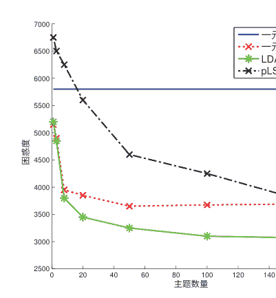

图27.6 困惑度与不同语言模型下的主题数量在TREC AP语料库上的对比。基于(Blei等人，2003年)的第9图。由bleiLDAperplexityPlot生成的图。

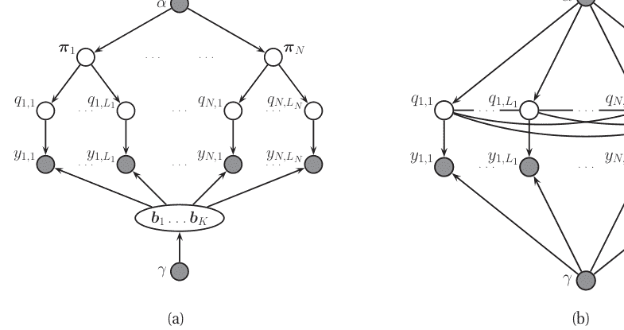

图27.7 (a) 展开的LDA模型，包含 N个文档。(b) 折叠的LDA模型，我们积分掉 π_i和 b_k。

#### 27.3.4 使用(折叠)吉布斯采样进行拟合

对于LDA，推导出Gibbs采样算法是很直观的。完全条件如下：

$$p(q_{il}=k|\cdot)  \propto  \exp[\log \pi_{ik} + \log b_{k,x_{il}}] \qquad (27.30)$$

$$p(\pi_i|\cdot)  =  \text{Dir}(\{\alpha_k + \sum_{l} \mathbb{I}(z_{il}=k)\}) \qquad (27.31)$$

$$p(\mathbf{b}_k|\cdot)  =  \text{Dir}(\{\gamma_v + \sum_i \sum_l \mathbb{I}(x_{il}=v, z_{il}=k)\}) \qquad (27.32)$$

然而，通过解析地积分掉 π_i 和 b_k，可以获得更好的性能，只需对离散的qil进行采样。

这种方法中，πi和bk都服从狄利克雷分布，而离散的 qil 只需进行采样。这种方法最早在(Griffiths and Steyvers 2004)中提出，是折叠Gibbs采样的一个例子。图27.7(b)显示，现在所有的 qil变量都是完全相关的。然而，我们可以逐个采样它们，如下所述。

首先，我们需要一些符号。令 Cwik = ∑_{l=1}^{Li} i I(qil =k, yil =v)表示单词 v在文档中被分配给主题 k的次数。令 cikwik表示文档 i中任何单词被分配给主题 k的次数。令 cvk = ∑_{i} cwik表示单词 v被分配给任何主题 k的次数。令 nckwik表示单词 v在文档 i中出现的次数；这是观察到的。令 ck = ∑_{v} cvk表示分配给主题 k的单词数。最后，令 Li = ∑_{k} cik表示文档 i中的单词数；这是观察到的。

$$
p(\mathbf{q}|\alpha) = \prod_i \int \left[ \prod_{l=1}^{L_i} \text{Cat}(q_{il}|\pi_i) \right] \text{Dir}(\pi_i|\alpha\mathbf{1}_K) d\pi_i \tag{27.33}
$$
$$
= \left( \frac{\Gamma(K\alpha)}{\Gamma(\alpha)^K} \right)^N \prod_{i=1}^N \frac{\prod_{k=1}^K \Gamma(c_{ik} + \alpha)}{\Gamma(L_i + K\alpha)} \tag{27.34}
$$

通过类似的推理，可以证明
$$
p(\mathbf{y}|\mathbf{q}, \gamma) = \prod_k \int \left[ \prod_{il:q_{il}=k} \text{Cat}(y_{il}|\mathbf{b}_k) \right] \text{Dir}(\mathbf{b}_k|\gamma\mathbf{1}_V) d\mathbf{b}_k \tag{27.35}
$$
$$
= \left( \frac{\Gamma(V\beta)}{\Gamma(\beta)^V} \right)^K \prod_{k=1}^K \frac{\prod_{v=1}^V \Gamma(c_{vk} + \beta)}{\Gamma(c_k + V\beta)} \tag{27.36}
$$

从上述方程中，利用Γ(x+1)/Γ(x)=x的事实，我们可以推导出对于 p(q_{il}|\mathbf{q}_{-i,l})的完整条件。定义 c_{-i,k}^{v} 与 c_{i,k}^{v}相同，只是通过对文档 i中的所有位置求和来计算，除了 q_{il}。同时，令 y_{il} = v_o 然后
$$
p(q_{i,l}=k|\mathbf{q}_{-i,l}, \mathbf{y}, \alpha, \gamma) \propto \frac{c_{v,k}^{-} + \gamma}{c_k^{-} + V\gamma} \cdot \frac{c_{i,k}^{-} + \alpha}{L_i + K\alpha} \tag{27.37}
$$

我们可以看到，一个文档中的单词分配给一个主题，既取决于该单词由该主题生成的频率（第一项），也取决于该主题在该文档中使用的频率（第二项）。

给定方程27.37，我们可以按照以下方式实现折叠吉布斯采样器。我们随机地将一个主题分配给每个单词，其中q为{1,...,K}。然后，我们可以按照以下方式对新主题进行采样：对于语料库中的给定单词，根据当前单词分配的主题减少相关计数；从方程27.37中抽取一个新主题，更新计数矩阵；并重复此过程。由于计数矩阵非常稀疏，因此可以使该算法更加高效。

#### 27.3.5 示例

图27.8以两个主题和五个单词的小例子进行了说明。图的左侧部分说明了从LDA模型中采样的16个文档。

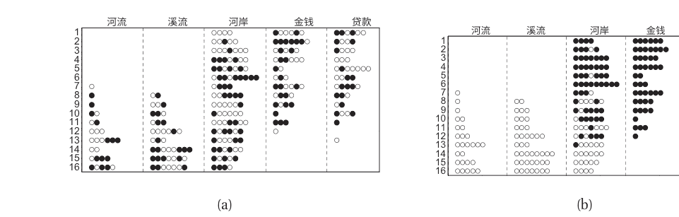

图27.8 对小型LDA示例应用（折叠）吉布斯采样的说明。有 N=16个文档，每个文档包含从词汇表中抽取的可变数量的单词 V=5个单词，有两个主题。白点表示单词分配给主题1，黑点表示单词分配给主题2。(a) 初始随机状态分配。(b) 经过64次吉布斯采样后的后验样本。来源：(Steyvers和Griffiths 2007) 的图7。获得Tom Griffiths的友好许可后使用。

p(钱|k=1)=p(贷款|k=1)=p(银行|k=1)=1/3 和 p(河流|k=2)=p(小溪|k=2)=p(银行|k=2)=1/3。例如，我们可以看到第一个文档中单词“银行”出现了4次（在“银行”列的第1行中用四个点表示），以及其他各种金融术语。图的右侧显示了吉布斯采样器经过64次迭代后的状态。在大多数情况下，每个标记都被正确地分配了“正确”的主题。例如，在文档1中，我们可以看到单词“银行”已经被正确地分配给了金融主题，这是基于“钱”和“贷款”这两个词的存在。参数的后验均值估计由 p̂(钱|k=1)=0.32， p̂(贷款|k=1)=0.29， p̂(银行|k=1)=0.39， p̂(河流|k=2)=0.25， p̂(小溪|k=2)=0.4， 和 p̂(银行|k=2)=0.35，这是相当准确的，考虑到只有16个训练样本。

#### 27.3.6 使用批量变分推断进行拟合

比MCMC更快的替代方法是使用变分EM。（我们无法使用精确的EM，因为精确推断π_i和q_i是棘手的。）我们在下面给出详细信息。

#### 27.3.6.1 序列版本

根据（Blei等人，2003），我们将使用完全因子化（均值场）的近似形式

$$q(\pi_i, \mathbf{q}_i) = \mathrm{Dir}(\pi_i|\tilde{\pi}_i) \prod_l \mathrm{Cat}(q_{il}|\tilde{\mathbf{q}}_{il})$$

我们将遵循通常的均值场方法。对于 q (qil)，我们使用贝叶斯规则，但在需要对先验进行期望的地方：

$$\tilde{q}_{ilk} \propto b_{y_{i,l},k} \exp(\mathbb{E}[\log \pi_{ik}])$$

其中

$$\mathbb{E}[\log \pi_{ik}] = \psi_k(\tilde{\pi}_i) \triangleq \Psi(\tilde{\pi}_{ik}) - \Psi(\sum_{k'} \tilde{\pi}_{ik'})$$

其中 ψ是digamma函数。 更新 q(π_i)的方法是将期望计数相加：

$\tilde{\pi}_{ik} = \alpha_k + \sum_l \tilde{q}_{ilk}$
(27.41)

M步骤是通过将期望计数相加并进行归一化来获得的：

$\hat{b}_{vk} \propto \gamma_v + \sum_{i=1}^N \sum_{l=1}^{L_i} \tilde{q}_{ilk} \mathbb{I}(y_{il} = v)$
(27.42)

#### 27.3.6.2 计数版本

请注意，E步骤需要 O((\sum_i L_i) V K)的空间来存储 \tilde{q}_{ilk}。如果文档很长，使用模型的mPCA版本进行推断更加高效，该版本使用计数；这些计数只需要 O(N V K)的空间，如果文档很长，这是一个很大的节省。（相比之下，折叠的Gibbs采样器必须明确处理 q_i l变量。）

我们将重点关注近似计算 p(π_i, c_i|n_i, L_i)，其中我们将 c_i 简写为 c_i..。 我们将再次使用完全分解（均值场）的近似形式

$q(π_i, c_i) = \text{Dir}(π_i|\tilde{\pi}_i) \prod_v \text{Mu}(c_{iv.}|n_{iv}, \tilde{c}_{iv.})$
(27.43)

新的E步骤变为

$\tilde{\pi}_{ik} = \alpha_k + \sum_v n_{iv} \tilde{c}_{ivk}$
(27.44)

$\tilde{c}_{ivk} \propto b_{vk} \exp(\mathbb{E} [\log \pi_{ik}])$
(27.45)

新的M步骤变为

$\hat{b}_{vk} \propto \gamma_v + \sum_i n_{iv} \tilde{c}_{ivk}$
(27.46)

#### 27.3.6.3 VB版本

我们现在修改算法，使用VB代替EM，这样我们可以推断参数和潜在变量。这样做有两个优点。首先，通过设置 γ ≪ 1，VB将鼓励 B 稀疏（如第21.6.1.6节所述）。其次，我们将能够将其推广到在线学习环境中，如下面所讨论的。

我们的新后验近似变为

$q(π_i, c_i, \text{B}) = \text{Dir}(π_i|\tilde{\pi}_i) \prod_v \text{Mu}(c_{iv.}|n_{iv}, \tilde{c}_{iv.}) \prod_k \text{Dir}(\mathbf{b}_{.k}|\tilde{\mathbf{b}}_{.k})$
(27.47)

对于 \tilde{c}_{ivk} 的更新如下：

$\tilde{c}_{ivk} \propto \exp (\mathbb{E} [\log b_{vk}] + \mathbb{E} [\log \pi_{ik}])$
(27.48)## 27.3.6 批量变分推断

算法 27.1：批量 VB 用于 LDA
```
1 输入: n_{iv}, K, α_k, γ_v;
2 估计 使用 EM 算法对 b_{vk} 进行估计;
3 初始化计数 n_{iv};
4 当未收敛时执行
5     // E 步骤;
6     s_{vk} = 0 // 期望的充分统计量;
7     对于每个文档 i=1:N do
8         (π_i, ĉ_i) = Estep(n_i, B̃, α);
9         s_{vk} += n_{iv} ĉ_{ivk};
10    // M 步骤;
11    对于每个主题 k=1:K 执行
12        b̃_{vk} = γ_v + s_{vk};
```

函数 (π̃_i, c̃_i) = E步骤(n_i, B̃, α);
```
13 初始化 π̃_{ik} = α_k;
14 重复
15     π̃_i^{旧} = π̃_i, π̃_{ik} = α_k;
16     对于每个单词 v=1:V 执行
17         对于每个主题 k=1:K 执行
18             c̃_{ivk} = exp(ψ(b̃_{v.}) + ψ(π̃_i^{旧}));
19     normalize(c̃_{iv.});
20     π̃_{ik} += n_{iv} c̃_{ivk}
21 直到 (1/K) Σ_k |π̃_{ik} - π̃_{ik}^{old}| < thresh;
```

b̃_{vk} = γ_v + Σ_i c̃_{ivk}  (27.49)

不需要归一化，因为我们只是更新伪计数。整体算法在算法 27.2 中概述。

#### 27.3.7 使用在线变分推断进行拟合

在批量版本中，E 步骤明显需要 O(N K V T) 时间，其中 T 是均值场更新的次数（通常 T ~ 5）。如果我们有很多文档，这可能会很慢。通过使用随机梯度下降（第 8.5.2 节）进行在线变分推断，可以减少这种情况，我们现在解释一下。

我们可以推导出一个在线版本，遵循 (Hoffman et al. 2010) 的方法。我们按照通常的方式进行 E 步骤。然后，我们将从单个数据案例中得到的变分参数视为整个数据集具有这些统计数据。最后，我们对变分参数 B 进行部分更新，将权重 ρ_t 放在新估计上，并将权重 1 - ρ_t 放在旧估计上。步长 ρ_t 随时间衰减，如方程 8.83 所示。算法的总体概述见算法 27.2。在实践中，我们应该使用小批量数据，如第 8.5.2.3 节所述。在 (Hoffman et al. 2010) 中，他们使用了大小为 256-4096 的批处理。

算法 27.2：LDA 的在线变分贝叶斯
```
1 输入：n_{iv}, K, α_k, γ_v, τ_0, κ;
2 随机初始化 b̃_{vk};
3 对于 t = 1 : ∞，执行以下操作
4     设置步长 ρ_t = (τ_0 + t)^{-κ};
5     选择文档 i = i(t);
6     (π_i, c̃_i) = E步骤(n_i, B̃, α);
7     b̃_{vk}^{新} = γ_v + N n_{iv} c̃_{ivk};
8     b̃_{vk} = (1 - ρ_t)b̃_{vk} + ρ_t b̃_{vk}^{新};
```

图 27.9 显示了在一个大小为 1000 的测试集上，困惑度与分析文档数量（E 步骤）的关系，其中数据来自（英文）维基百科。图表显示，在线变分推断比离线推断快得多，但产生的结果相似。

#### 27.3.8 确定主题数量

选择 K，即主题数量，是一个标准的模型选择问题。以下是一些已经采取的方法：

-   使用退火重要性采样（第 24.6.2 节）来近似证据（Wallach 等人，2009 年）。
-   交叉验证，使用测试集上的对数似然。
-   使用变分下界作为 log p(D|K) 的代理。
-   使用非参数贝叶斯方法（Teh 等人，2006 年）。

### 27.4 LDA 的扩展

自 2003 年第一篇论文问世以来，LDA 的许多扩展已经被提出。我们简要地讨论了其中的一些。

#### 27.4.1 相关主题模型

LDA 的一个弱点是它无法捕捉主题之间的相关性。例如，如果一个文档具有“商业”主题，那么“金融”主题与之共现是合理的。
问题的根源在于对 π_i 使用了一个狄利克雷先验。狄利克雷先验的问题在于它仅由一个均值向量和一个强度参数来描述，而其协方差是固定的 (Σ_{ij} = -α_i α_j)，而不是一个自由参数。
解决这个问题的一种方法是用逻辑正态分布替换狄利克雷先验，就像在分类 PCA（第 27.2.2 节）中一样。模型变为

```
b_k | γ ~ Dir(γ1_V)
z_i ~ N(μ, Σ)
π_i | z_i = S(z_i)
q_{il} | π_i ~ Cat(π_i)
y_{il} | q_{il} = k, B ~ Cat(b_k)
```

这被称为相关主题模型 (Blei and Lafferty 2007)。这与分类主成分分析非常相似，但略有不同。为了看到区别，让我们将 q_{il} 和 π_i 边际化。然后在 CTM 中，我们有

y_{il} ~ Cat(B S(z_i))

其中 B 是一个随机矩阵。相比之下，在 catPCA 中我们有

y_{il} ~ Cat(S(W z_i))

其中 W 是一个无约束矩阵。
拟合这个模型很棘手，因为 π_i 的先验不再与多项式似然函数 q_{il} 共轭。然而，我们可以使用第 21.8.1.1 节中的任何变分方法，其中我们讨论了贝叶斯多类逻辑回归。在 CTM 情况下，事情变得更加困难，因为分类响应变量 q_i 是隐藏的，但我们可以通过使用一个额外的均值场近似来处理这个问题。详细信息请参阅 (Blei and Lafferty 2007)。
拟合模型后，可以通过修剪低强度边缘，将 Σ 转换为稀疏精度矩阵 Σ^{-1}，从而得到稀疏高斯图模型。这样可以让你可视化主题之间的相关性。图 27.10 展示了将此过程应用于 1990-1999 年间的 *Science* 杂志文章的结果。（该语料库包含 16,351 个文档，5.7M 个单词（其中 19,088 个是唯一的），在去除停用词和低频词后。）节点代表主题，每个主题内列出前 5 个单词。字体大小反映了主题在语料库中的普遍程度。边表示精度矩阵的显著元素。

图 27.10 相关主题模型的输出（主题数 K=50）应用于 Science 的文章。节点表示主题，每个主题内显示了 5 个最可能的短语。字体大小反映了主题的整体普遍性。请参见 http://www.cs.cmu.edu/~lemur/science/ 以获取此模型的交互版本（100 个主题）。来源：(Blei and Lafferty 2007) 的图 2。获得 David Blei 的友情许可使用。

#### 27.4.2 动态主题模型

在 LDA 中，主题（词分布）被假设为静态的。在某些情况下，允许这些分布随时间平滑演变是有意义的。例如，一篇文章可能使用“神经科学”这个主题，但如果它是在 1900 年代写的，更有可能使用“神经”这样的词，而如果它是在 2000 年代写的，更有可能使用“钙受体”这样的词（这反映了神经科学向分子生物学的一般趋势）。

建模这一点的一种方法是使用动态逻辑正态模型，如图 27.11 所示。具体而言，我们假设主题分布按照高斯随机游走演变，然后通过 softmax 函数将这些高斯向量映射到概率：

b_{t,k} | b_{t-1,k} ~ N(b_{t-1,k}, σ^2 1_V) （27.57）
π_i^t ~ Dir(α 1_K) （27.58）
q_i^t | π_i^t ~ Cat(π_i^t) （27.59）
y_{il}^t | q_i^t = k, B^t ~ Cat(S(B_k^t)) （27.60）

这被称为动态主题模型 (Blei 和 Lafferty 2006b)。

可以使用结构化均场方法在该模型中进行近似推断 (第 21.4 节)，该方法利用卡尔曼平滑算法 (第 18.3.1 节) 对 b_{t,k} 节点之间的线性高斯链进行精确推断 (详见 (Blei 和 Lafferty 2006b) 的详细信息)。

图 27.12 展示了系统应用于 100 年的 Science 文章时的典型输出。在顶部，我们可视化了特定主题（似乎与神经科学相关）在 10 年间隔后的前 10 个词。在左下方，我们绘制了一些特定词属于该主题的概率。在右下方，我们列出了包含该主题的一些文章的标题。

这个模型的一个有趣应用是进行时间校正的文档检索。也就是说，假设我们要查找关于疾病遗传的文档。现代文章会使用“DNA”等词，但是在发现 DNA 之前的旧文章可能会使用其他术语，如“可遗传单元”。但是这两篇文章很可能使用相同的思想。类似的思想可以用于进行跨语言信息检索，参见例如（Cimiano et al. 2009）。

#### 27.4.3 LDA-HMM

LDA 模型假设单词是可交换的，这显然是不正确的。一种简单的建模单词之间的顺序依赖的方法是使用隐马尔可夫模型或 HMM。HMM 的问题在于它们只能建模短程依赖关系，因此无法捕捉文档的整体要义。因此，它们可以生成句法正确的句子（参见例如，表 17.1），但不能生成语义上合理的句子。

可以将 LDA 与 HMM 结合起来创建一个称为 LDA-HMM 的模型（Griffiths 等人，2004 年）。该模型使用 HMM 状态来建模功能或句法词，如‘and’或‘however’，并使用 LDA 来建模内容或语义词，这些词更难预测。有一个特殊的 HMM 状态，指定了何时使用 LDA 模型来生成单词；其余时间，HMM 生成单词。

更正式地说，对于每个文档 i，模型定义了一个具有状态 z_{il} ∈ {0, …, C} 的 HMM。此外，每个文档都有一个与之关联的 LDA 模型。如果 z_{il}=0，我们从语义 LDA 模型中生成单词 y_{il}，主题由 q_{il} 指定；否则，我们从句法 HMM 模型中生成单词 y_{il}。图 27.13 显示了 DGM。CPD 如下：

```
p(π_i) = Dir(π_i|α 1_K) (27.61)
p(q_{il} = k|π_i) = π_{ik} (27.62)
p(z_{il} = c'|z_{i,l-1} = c) = A^{HMM}(c, c') (27.63)
p(y_{il} = v|q_{il} = k, z_{il} = c) = 
    B^{LDA}(k, v)   if c = 0
    B^{HMM}(c, v)   if c > 0
    (27.64)
```

其中 B^{LDA} 是常规的主题-词矩阵，B^{HMM} 是状态-词 HMM 发射矩阵，而 A^{HMM} 是状态-状态 HMM 转移矩阵。

在这个模型中，推断可以通过折叠吉布斯采样来完成，通过解析地积分掉所有连续量。详见 (Griffiths et al. 2004) 中的细节。

将该模型应用于合并的布朗语料库和 TASA 语料库⁴ 的结果如表 27.1 所示。我们可以看到 HMM 通常是负责句法词汇，而 LDA 负责语义词汇。如果没有 HMM，LDA 主题将被“污染”功能词汇（见图顶部），这就是为什么在预处理过程中通常删除此类词汇的原因。

该模型还可以帮助消除当同一个词在句法上或语义上被使用时的歧义。图 27.14 展示了模型应用于 NIPS 语料库时的一些例子。我们可以看到单词的角色被区分开来，例如，“我们要求算法返回一个矩阵”（动词）与“最大期望回报”（名词）。原则上，词性标注器可以消除这两种用法的歧义，但请注意：

-   1. LDA-HMM 方法是完全无监督的（没有使用词性标签）。
-   2. 有时一个词可以有相同的词性标签，但不同的意义，例如，“左图”（句法角色）与“图 G”（语义角色）。

句法和语义的概率模型是一个广阔的话题，我们不涉及其中。

⁴. 布朗语料库由 500 个文档和 1,137,466 个词标记组成，每个词标记都有词性标签。TASA 语料库是一个未标记的教育材料集合，包含 37,651 个文档和 12,190,931 个词元。出现在少于 5 个文档中的单词被替换为星号，但标点符号被包括在内。综合词汇量为 37,202 个独特单词。
⁵. NIPS 代表“神经信息处理系统”。它是顶级机器学习会议之一。NIPS 语料库卷 1-12 包含 1713 个文档。

图 27.12 动态主题模型应用于 *Science* 文章时的部分输出。我们展示了神经科学主题随时间变化的前 10 个词。我们还展示了这个主题随时间变化的三个词的概率，以及包含这个主题的一些文章。来源：(Blei and Lafferty 2006b) 的图 4。获得 David Blei 的友好许可后使用。

图 27.13 LDA-HMM 模型。

图 27.14 NIPS 语料库中的功能词和内容词，由 LDA-HMM 模型区分。灰度表示分配给 LDA 组件的后验概率，黑色表示最高。被框起来的单词在一句话中作为功能词，在另一句话中作为内容词。星号标记的单词频率较低，并且被模型视为一个单词类型。来源：(Griffiths et al. 2004) 的图 4。获得 Tom Griffiths 的友好许可后使用。

表 27.1 上排：当 LDA 模型在合并的 Brown 和 TASA 语料库上训练时提取的主题。中排：LDA-HMM 模型中 LDA 部分提取的主题。下排：LDA-HMM 模型中 HMM 部分提取的主题。每列代表一个单独的主题/类别，单词按照在该主题/类别中的概率顺序出现。由于某些类别几乎将所有概率都分配给了少数几个单词，当单词占据 90% 的概率质量时，列表终止。来源：(Griffiths et al. 2004) 的图 2。获得 Tom Griffiths 的友情许可后使用。

| 列1 | 列2 | 列3 | 列4 | 列5 | 列6 | 列7 | 列8 | 列9 | 列10 |
| :--- | :--- | :--- | :--- | :--- | :--- | :--- | :--- | :--- | :--- |
| 这个 | 这个 | 这个 | 这个 | 这个 | 一个 | 这个 | 这个 | 血 | 一个 |
| 液 | ， | 和 | 的 | 的 | 一个 | 的 | ， | ， | 的 |
| , | 的 | 的 | 到 | , | , | , | 一个 | 的 | 和 |
| 一个 | in | in | in | in | 到 | 和 | 和 | 和 | in |
| 在身体中 | 树木 | 土地 | 和 | 图片 | 水 | in | in | in | 故事 |
| 核心 | 树 | 到 | 班级 | 电影 | 是 | 故事 | 饮料 | 酒精 | 是 |
| 和 | 与 | 农民 | 政府 | 图像 | 和 | 是 | 酒精 | 到 | 瓶子 |
| 在 | 在 | 为了 | 一个 | 镜头 | 事情 | 到 | 到 | 作为 | 球 |
| 去 | 森林 | 农场 | 国家 | 光 | 是 | 作为 | 瓶子 |  | 球 |
| 去 | 树木 | 政府 |  | 水 |  |  |  |  | 球 |
| 血液 | 森林 | 国家 |  | 水 |  |  |  |  | 游戏 |
| 心 | 作物 | 联邦 |  | 事情 |  |  |  |  | 团队 |
| 压力 | 土地 | 公共 |  | 分子 |  |  |  |  | 是 |
| 身体 | 土壤 | 本地 |  | 液体 |  |  |  |  | 玩 |
| 肺 | 区域 | 行为 |  | 粒子 |  |  |  |  | 球 |
| 氧气 | 公园 | 州 |  | 气体 |  |  |  |  | 游戏 |
| 船只 | 野生动物 | 国家 |  | 固体 |  |  |  |  | 团队 |
| 动脉 | 区域 | 法律 |  | 物质 |  |  |  |  | 篮球 |
| 呼吸 | 雨 | 部门 |  | 温度 |  |  |  |  |  |没有更多的空间深入研究。有关更多信息，请参阅（Jurafsky和Martin 2008）。

#### 27.4.4 监督LDA

在本节中，我们讨论了LDA处理除了单词之外的各种附加信息的扩展。

### 27.4.4.1 生成式监督LDA

假设我们有一个变长的单词序列 $y_{il} \in \{1, \ldots, V\}$ 像往常一样，但我们还有一个类别标签 $c_i \in \{1, \ldots, C\}$。我们如何从 $\mathbf{y}_i$ 预测 $c_i$？有很多可能的方法，但大多数是从单词到类别的直接映射。在某些情况下，例如情感分析，通过首先进行推理来尝试消除单词的含义歧义可以获得更好的性能。例如，假设目标是确定一篇文档是否是对电影的好评。如果我们遇到短语“布拉德·皮特在电影中间之前非常出色”，单词“出色”可能会让我们认为评论是积极的，但显然整体情感是消极的。

解决这类问题的一种方法是构建一个形式为 $p(c_i, \mathbf{y}_i | \boldsymbol{\theta})$ 的联合模型。（Blei和McAuliffe 2010）提出了一种称为监督LDA的方法，其中类标签 $c_i$ 是从主题中生成的，具体如下：

$$ p(c_i|\overline{\mathbf{q}}_i) = \text{Ber}(\text{sigm}(\mathbf{w}^T \overline{\mathbf{q}}_i)) $$

这里 $\overline{\mathbf{q}}_i$ 是文档 $i$ 的经验主题分布：

$$ \overline{q}_{ik} \triangleq \frac{1}{L_i} \sum_{i=1}^{L_i} q_{ilk} $$

参见图27.15(a)进行说明。

图27.16 LDA的判别变体。 (a) 专家混合模型，也称为MR-LDA。双环表示一个节点 π_i 是其父节点的确定性函数。 (b) 带有随机效应的专家混合模型。 (c) DMR-LDA。

我们可以使用蒙特卡洛EM算法来拟合这个模型：在E步中运行折叠的吉布斯采样器，以计算 $\mathbb{E}[q_{ik}]$，并将其作为输入特征传递给标准的逻辑回归包。

### 27.4.4.2 判别式有监督LDA

另一种方法，称为判别式LDA（Lacoste-Julien等人，2009年），如图27.15(b)所示。这是一个判别模型，形式为 $p(y_i|c_i, \theta)$。与常规LDA唯一的区别是主题先验变成了输入相关的，如下所示：

$$p(q_{il}|π_i, c_i = c, θ) = Cat(A_c π)$$ (27.67)

其中 $A_c$ 是一个 $K \times K$ 的随机矩阵。

到目前为止，我们假设“辅助信息”是一个单一的分类变量 $c_i$。通常我们有高维协变量 $\mathbf{x}_i \in \mathbb{R}^D$。例如，考虑图像标记的任务。这个想法是表示相关的标签或标签，我们希望根据给定的输入来预测。我们现在讨论几种扩展LDA的尝试，使其能够根据输入生成标签。

最简单的方法是使用多输出的专家混合模型（第11.2.4节）。这与LDA非常相似，只是我们用输入的确定性函数替换 $\pi_i$ 的狄利克雷先验：

$$\pi_i = S(\mathbf{W} \mathbf{x}_i)$$ (27.68)

在（Law et al. 2010）中，这被称为多项式回归LDA。参见图27.16（a）。消除确定性 $\pi_i$ 后，我们有

$$p(q_{il}|\mathbf{x}_i, \mathbf{W}) = Cat(S(\mathbf{W} \mathbf{x}_i))$$ (27.69)

我们可以像通常一样使用EM来拟合这个模型。然而，（Law et al. 2010）提出了一种替代方法。首先，仅基于 $\mathbf{y}_i$ 来拟合无监督的LDA模型；然后将推断得到的 $\pi_i$ 作为数据处理，拟合一个多项式逻辑回归模型，将 $\mathbf{x}_i$ 映射到 $\pi_i$。尽管这种方法很快，但是以无监督的方式拟合LDA模型并不一定会得到一个有区分性的潜在变量集合，正如(Blei and McAuliffe 2010)中所讨论的那样。

这个模型存在一个更微妙的问题：由于 $\pi_i$ 是输入的确定性函数，它实际上是被观察到的，使得 $q_{il}$（以及标签 $y_{il}$）独立。换句话说，

$$p(\mathbf{y}_i|\mathbf{x}_i, \theta) = \prod_{l=1}^{L_i} p(y_{il}|\mathbf{x}_i, \theta) = \prod_{l=1}^{L_i} \sum_k p(y_{il}|q_{il}=k, \mathbf{B})p(q_{il}=k|\mathbf{x}_i, \mathbf{W}) \tag{27.70}$$

这意味着如果我们观察到一个标签的值，它对其他标签没有任何影响。这可能解释了为什么(Law et al. 2010)的结果只显示出微小的改进，而不是独立地预测每个标签。

诱导相关性的一种方法是使 $\mathbf{W}$ 成为一个随机变量。结果模型显示在图27.16(b)中。我们将其称为随机效应混合专家模型。我们通常假设 $\mathbf{W}_i$ 上有一个高斯先验分布。如果 $\mathbf{x}_i = 1$，则 $p(q_{il}|\mathbf{x}_i, \mathbf{w}_i) = \text{Cat}(S(\mathbf{w}_i))$，因此我们恢复了相关主题模型。可以通过向 $q_{il}$ 变量添加马尔可夫动力学来扩展该模型。这被称为条件主题随机场(Zhu and Xing 2010)。

**一个密切相关的方法，称为狄利克雷多项式回归LDA(Mimno and McCallum 2008)，显示在图27.16(c)中。这与标准LDA完全相同，只是我们使 $\alpha$ 成为输入的一个函数。**

$$\alpha_i = \exp(\mathbf{W}\mathbf{x}_i) \tag{27.71}$$

其中 $\mathbf{W}$ 是一个 $K \times D$ 矩阵。消除确定性 $\alpha_i$ 我们有

$$\pi_i \sim \text{Dir}(\exp(\mathbf{W}\mathbf{x}_i)) \tag{27.72}$$

与(Law et al. 2010)不同，这个模型允许通过潜在的 $\pi_i$ 标签之间传递信息。

这个模型的一个变体，其中 $\mathbf{x}_i$ 对应于一个离散标签的集合，$\pi_i \sim \text{Dir}(\alpha \odot \mathbf{x}_i)$，被称为标记的LDA(Ramage et al. 2009)。在这种情况下，标签 $\mathbf{x}_i$ 与潜在主题一一对应，这使得得到的主题更易解释。

一种扩展，被称为部分标记的LDA(Ramage et al. 2011)，允许每个标签具有多个潜在子主题；这个模型包括LDA、标记的LDA和多项式混合模型作为特殊情况。

### 27.4.4.3 判别性分类PCA

使用LDA的另一种选择是在分类PCA模型中扩展输入，如图27.17(a)所示。由于潜在空间现在是实值的，我们可以使用简单的线性回归来进行输入-隐藏映射。对于隐藏-输出映射，我们使用传统的catPCA：

与神经网络的主要区别在于信息可以通过潜在的瓶颈层 $z_i$ 在 $y_{il}$ 之间流动。在输出标签高度相关的情况下，这种方法应该比传统的神经网络效果更好，即使在对特征进行条件约束后；这个问题经常在多标签分类中出现。请注意，如果标签的数量很大，我们可以允许直接的 $x_i$ 到 $y_i$ 的弧线，但这将需要太多的参数。⁶

我们可以通过对第12.4节中的变分EM算法进行小的修改来拟合这个模型。如果我们将这个模型用于回归而不是分类，我们可以完全执行E步骤，通过修改因子分析的EM算法。（Ma等人，1997年）报告称，这种方法比标准的反向传播算法收敛更快。

我们还可以扩展模型，使 $z_i$ 的先验成为一个使用输入相关均值的高斯混合模型。如果输出是高斯分布，这对应于一种判别性因子分析器的混合模型（Fokoue, 2005年；Zhou和Liu，2008年）。如果输出是分类的，这将是一个（尚未发表的）模型，我们可以称之为“判别性分类因子分析器的混合模型”。

### 27.5 图结构数据的LVMs

另一个离散数据的来源是建模图形或网络结构。为了看到连接，回想一下，任何具有 $D$ 节点的图形都可以表示为 $D \times D$ 邻接矩阵 $\mathbf{G}$，其中 $G(i, j) = 1$ 当且仅当存在从节点 $i$ 到节点 $j$ 的边。这些矩阵通常是二进制的，而且往往非常稀疏。请参见图27.19的示例。

图形在许多应用领域中出现，例如建模社交网络、蛋白质相互作用网络或人与动物之间的疾病传播模式。分析这种数据通常有两个主要目标：首先，尝试发现一些“有趣的”结构，例如聚类或社区；其次，尝试预测未来可能发生的链接（例如，谁会和谁交朋友）。下面我们总结了一些为这些任务提出的模型，其中一些与LDA相关。关于这些和其他方法的更多细节可以在例如(Goldenberg et al. 2009)和参考文献中找到。

#### 27.5.1 随机块模型

在图27.18(a)中，我们展示了一个有9个节点的有向图。没有明显的结构。然而，如果我们深入观察，我们会发现可以将节点分成三组或块，$B_1 = \{1, 4, 6\}$, $B_2 = \{2, 3, 5, 8\}$, 和 $B_3 = \{7, 9\}$, 大部分连接是从 $B_1$ 到 $B_2$，或者从 $B_2$ 到 $B_3$，或者从 $B_3$ 到 $B_1$。这在图27.18(b)中有所说明。

# 第27章。离散数据的潜在变量模型

如果我们绘制邻接矩阵，问题会更容易理解。图27.19（a）显示了节点按其原始顺序排列的图的矩阵。图27.19（b）显示了节点按其排列顺序排列的图的矩阵。很明显存在块结构。

我们可以按以下方式生成块结构图的生成模型。首先，对于每个节点，从块概率 $\pi$ 中采样一个潜在块 $q_i \sim \text{Cat}( \boldsymbol{\pi} )$，其中 $\pi_k$ 是选择块 $k$ 的概率，对于 $k=1 : K$。其次，选择连接组 $a$ 到组 $b$ 的概率，对于所有组对；我们用 $\eta_{a,b}$ 表示这个概率。这可以来自贝塔先验。最后，使用以下模型生成每个边 $R_{ij}$：

$$p(R_{ij} = r | q_i = a, q_j = b, \boldsymbol{\eta}) = \text{Ber}(r | \eta_{a,b}) \tag{27.75}$$

这被称为随机块模型(Nowicki和Snijders 2001)。图27.21(a)以DGM的形式说明了该模型，图27.19(c)说明了该模型如何用于聚类我们的示例中的节点。

请注意，这与传统的聚类问题非常不同。例如，我们可以看到块3中的所有节点都被分组在一起，即使它们之间没有连接。它们共享的是它们“喜欢”连接到块1中的节点，并从块2中的节点接收连接的属性。图27.20说明了该模型生成许多不同类型的图结构的能力。例如，一些社交网络具有分层结构，可以通过将人们分成不同的社交阶层来建模，而其他社交网络则由一组圈子组成。

与标准混合模型不同，使用精确的EM算法无法拟合该模型，因为所有潜在变量 $q_i$ 都会变得相关。然而，可以使用变分EM算法（Airoldi等人，2008年），折叠吉布斯采样（Kemp等人2006年）等。我们省略了细节（与LDA案例类似）。
在（Kemp等人2006年）中，他们取消了块数 $K$ 固定的限制，通过将 $\pi$ 的狄利克雷先验替换为狄利克雷过程（见第25.2.2节）。这被称为无限关系模型。详细信息请参见第27.6.1节。
如果我们对每个节点都有相关的特征，我们可以通过定义一个判别式版本的模型来实现

$$p(R_{ij} = r|q_i = a, q_j = b, \mathbf{x}_i, \mathbf{x}_j, \boldsymbol{\theta}) = \mathrm{Ber}(r|\mathbf{w}_{a,b}^T f(\mathbf{x}_i, \mathbf{x}_j)) \tag{27.76}$$

其中 $f(\mathbf{x}_i, \mathbf{x}_j)$ 是一种组合特征向量的方式。例如，我们可以使用连接操作，$[\mathbf{x}_i, \mathbf{x}_j]$，或者逐元素乘积 $\mathbf{x}_i \otimes \mathbf{x}_j$。就像监督LDA一样。整个模型就像混合专家模型的关系扩展。

#### 27.5.2 混合成员随机块模型

在（Airoldi et al. 2008）中，他们取消了每个节点只属于一个簇的限制。也就是说，他们用 $\boldsymbol{\pi}_i \in S_K$ 替换了 $q_i \in \{1, ..., K\}$。这被称为混合成员随机块模型，与模糊聚类或软聚类的精神类似。请注意，$\pi_{ik}$ 与 $p(z_i = k|\mathcal{D})$ 不同；前者表示本体不确定性（每个对象属于一个簇的程度），而后者表示认识论不确定性（对象属于哪个簇）。如果我们想要结合认识论和本体不确定性，我们可以计算 $p(\boldsymbol{\pi}_i|\mathcal{D})$。

更详细地说，生成过程如下。首先，每个节点选择一个分布 blocks，$\boldsymbol{\pi}_i \sim \mathrm{Dir}(\boldsymbol{\alpha})$。其次，选择将组 $a$ 连接到组 $b$ 的概率，对于所有组对，$\eta_{a,b} \sim \beta(\alpha, \beta)$。第三，对于每条边，采样两个离散变量，一个用于每个方向：

$$q_{i \rightarrow j} \sim \mathrm{Cat}(\boldsymbol{\pi}_i), q_{i \leftarrow j} \sim \mathrm{Cat}(\boldsymbol{\pi}_j)$$

最后，使用以下模型生成每条边 $R_{ij}$：

$$p(R_{ij} = 1|q_{i \rightarrow j} = a, q_{i \leftarrow j} = b, \boldsymbol{\eta}) = \eta_{a,b}$$

# 第27章。离散数据的潜在变量模型

有关DGM，请参见图27.21(b)。
与常规随机块模型不同，每个节点可以扮演不同的角色，这取决于它连接的对象。为了说明这一点，我们将考虑一个在社交网络分析文献中广泛使用的数据集。这些数据涉及到一组18个修道士之间的互相喜欢关系。它是由Sampson (Sampson 1968)在数月时间内手工收集的。(如今，在像Facebook这样的社交媒体时代，只有18个人的社交网络微不足道，但我们讨论的方法可以扩展。)图27.22(a)绘制了原始数据，图27.22(b)绘制了每个修道士的 $\mathbb{E}[\pi]_i$，其中 $K=3$。我们可以看到大多数修道士属于三个群体之一，即“年轻的土耳其人”、“被排斥者”和“忠诚的反对派”。然而，一些个体，特别是修道士15，属于两个群体；Sampson称这些修道士为“摇摆者”。有趣的是，模型能够恢复出Sampson手工推导出的相同的洞察力。

社交网络分析中一个普遍存在的问题是缺失数据。例如，如果 $R_{ij}=0$，可能是因为人 $i$ 和 $j$ 没有机会互动，或者是因为该互动的数据不可用，而不是因为这些人不想互动。换句话说，缺乏证据并不意味着证据的缺乏。我们可以通过修改观测模型来建模，使得以概率 $\rho$ 从背景模型生成0，并且我们只有在概率 $1-\rho$ 下强制模型解释观测到的0。

换句话说，我们使观测模型具有鲁棒性，以容忍异常值，具体如下：

$$p(R_{ij} = r|q_{i \rightarrow j} = a, q_{i \leftarrow j} = b, \boldsymbol{\eta}) = \rho \delta_0(r) + (1-\rho)\text{Ber}(r|\eta_{a,b})$$

> 详细信息请参阅 (Airoldi等人，2008年)

#### 27.5.3 关系主题模型

在许多情况下，我们网络中的节点具有属性。例如，如果节点代表学术论文，边代表引用，则属性包括文档本身的文本。因此，有必要创建一个可以同时解释文本和链接结构的模型。这样的模型可以根据文本预测链接，甚至反之亦然。

关系主题模型（RTM）（Chang和Blei，2010年）是实现这一目标的一种方法。这是一种简单的扩展监督LDA（第27.4.4.1节）的方式，其中响应变量 $R_{ij}$（表示节点 $i$ 和 $j$ 之间是否存在边）的建模如下：

$$p(R_{ij}=1|\overline{q}_i,\overline{q}_j,\theta)=\text{sigm}(\mathbf{w}^T(\overline{q}_i \otimes \overline{q}_j)+w_0) \qquad\qquad\qquad\qquad(27.80)$$

回想一下 $\overline{q}_i$ 是文档 $_i$ 的经验主题分布，$\overline{q}_{ik}\triangleq \frac{1}{L_i}\sum_{i=1}^{L_i} q_{ilk}$。看图27.23
注意，重要的是 $R_{ij}$ 取决于实际选择的主题，$\mathbf{q}_i$ 和 $\mathbf{q}_j$，而不是主题分布，$\overline{\pi}_i$ 和 $\pi_j$，否则预测性能不会那么好。这个直观的原因如下：如果 $R_{ij}$ 是 $\pi_i$ 和 $\pi_j$ 的子节点，它将被视为另一个单词，类似于 $q_{il}$ 和 $y_{il}$；但由于单词比边更多，图结构信息将被“冲刷掉”。通过将 $R_{ij}$ 作为 $\mathbf{q}_i$ 和 $\mathbf{q}_j$ 的子节点，图信息可以更直接地影响主题的选择。

可以像SLDA一样拟合这个模型。详细信息请参见（Chang和Blei 2010）。该方法在预测缺失链接方面比先拟合LDA模型，然后将其作为逻辑回归问题的输入更好。原因类似于部分最小二乘法（第12.5.2节）优于PCA+线性回归的优越性，即RTM学习了一个被迫预测图结构和单词的潜在空间，而LDA可能学习了一个对于预测图不有用的潜在空间。

### 27.6 关系数据的LVMs

图可以用来表示某种类型的变量之间的关系，例如人与人之间的友谊关系。但通常我们有多种类型的对象和多种类型的关系。例如，图27.24说明了两种关系，一种是人与人之间的关系，另一种是人与电影之间的关系。
一般来说，我们将一个 $k$ 元关系 $R$ 定义为适当类型的 $k$ 元组的子集：

$$R \subseteq T_1 \times T_2 \times \cdots \times T_k \qquad\qquad\qquad\qquad(27.81)$$其中 $T_i$ 是集合或类型。二元、成对或二元关系是定义在对象对上的关系。例如，人与电影之间的观看关系可以表示为人们观看过的电影的集合。我们可以将其明确表示为一个集合，例如
$$
\text{seen} = \{ (\text{鲍勃}, \text{星球大战}), (\text{鲍勃}, \text{古墓丽影}), (\text{爱丽丝}, \text{大白鲨}) \}
$$
或者通过一个指示函数隐式表示集合:
$$
\text{seen}(\text{鲍勃}, \text{星球大战})=1, \text{seen}(\text{鲍勃}, \text{古墓丽影})=1, \text{seen}(\text{爱丽丝}, \text{大白鲨})=1
$$

两个类型为 $T^1$ 和 $T^2$ 的实体之间的关系可以表示为一个二元函数 $R : T^1 × T^2 → \{0,1\}$，因此也可以表示为一个二元矩阵。这也可以表示为一个二部图，其中有两种类型的节点。如果 $T^1 = T^2$，这就变成了一个常规的有向图，如第27.5节所述。然而，有些情况并不容易用图来建模，但仍然可以用关系来建模。例如，我们可能有一个三元关系， $R : T^1 × T^1 × T^2 → \{0,1\}$，其中，如果化学物质 $k$ 存在，则 $R(i, j, k) = 1$ 表示蛋白质 $i$ 与蛋白质 $j$ 相互作用。这可以用一个三维二元矩阵来建模。我们将在第27.6.1节中给出一些示例。

对关系数据进行概率建模被称为统计关系学习 (Getoor和Taskar 2007)。一种方法是直接建模变量之间的关系，使用图模型；这被称为概率关系建模。另一种方法是使用潜在变量模型，如下所讨论。

#### 27.6.1 无限关系模型

将随机块模型扩展到关系数据建模是直接的：我们只需为每个实体 $i$ 的每个类型 $t$ 关联一个潜在变量 $q_i^t ∈ \{1, ..., K_t\}$。然后，我们通过查找该类型实体之间关系成立的概率来定义特定实体之间关系成立的概率。例如，如果 $R : T^1 × T^1 × T^2 → \{0,1\}$，我们有

```
p(R(i, j, k) = 1|q_i^1 = a, q_j^1 = b, q_k^2 = c, η) = η_{a,b,c}
```

如果我们允许每种类型的聚类数 $K_t$ 不受限制，通过使用狄利克雷过程，模型被称为无限关系模型(IRM) (Kemp et al. 2006)。基本上

图27.25展示了应用于统一医学语言系统的IRM学习到的本体。方框代表14个概念聚类中的7个。属于同一聚类的谓词被分组在一起，并与它们所属的边相关联。所有权重大于0.8的链接都已包含在内。来自(Kemp et al. 2010)的第9图。获得Charles Kemp的友好许可后使用。

相同的模型，在名为无限隐藏关系模型(IHRM)下，同时被提出(Xu等人，2006年)。我们可以使用变分贝叶斯(Xu等人，2006年，2007年)或者折叠吉布斯采样(Kemp等人，2006年)来拟合这个模型。我们不详细介绍算法，只是简要概述一些有趣的应用。

### 27.6.1.1 学习本体论

本体论指的是知识的组织方式。在人工智能中，本体论通常是手工构建的(参见例如，(Russell和Norvig，2010年))，但是尝试从数据中学习本体论是很有趣的。在(Kemp等人，2006年)中，他们展示了如何使用IRM来实现这一点。

数据来自统一医学语言系统(McCray，2003年)，该系统定义了一个包含135个概念(如“疾病或综合征”，“诊断过程”，“动物”)和49个二元谓词(如“影响”，“预防”)的语义网络。我们可以将其表示为一个三元关系 $R : T^1 \times T^1 \times T^2 \rightarrow \{0, 1\}$，其中 $T^1$是概念集合， $T^2$是二元谓词集合。结果是一个三维立方体。然后我们可以应用IRM将立方体划分为大致均匀响应的区域。系统发现了14个概念聚类和21个谓词聚类。其中一些在图27.25中显示。例如，系统学习到生物功能影响生物体(因为 $\eta_{a,b,c} \approx 1$，其中 $a$表示生物功能聚类， $b$表示生物体聚类， $c$表示影响聚类)。

### 27.6.1.2 基于关系和特征的聚类

我们还可以使用IRM根据对象的关系和特征进行聚类。例如， (Kemp等人，2006年)考虑一个政治数据集(来自1965年)，包括14个国家，54个二进制

图27.26 展示了应用IRM到包含特征和成对交互的一些政治数据的示意图。顶部行 (a)。将国家分为5个簇和特征分为5个簇。每个第二列都标有相应特征的名称。底部的小方块 (a-i)：这些是18个交互类型簇中的8个。来自(Kemp et al. 2006)的图6。获得Charles Kemp的友好许可使用。

表示国家之间交互类型的谓词（例如，“发送游客到”，“经济援助”），以及90个特征（例如，“共产主义”，“君主制”）。为了创建一个二进制数据集，实值特征被阈值化为它们的均值，并且分类变量被虚拟编码。数据有3种类型： T^1代表国家， T^2代表交互， T^3代表特征。 （因此，这个问题结合了双聚类模型和本体发现模型的方面。）当给出多个关系时，IRM将它们视为条件独立的。在这种情况下，我们有

```
p(R^1, R^2, q^1, q^2, q^3|θ) = p(R^1|q^1, q^2, θ)p(R^2|q^1, q^3, θ) (27.83)
```

结果如图27.26所示。IRM将90个特征分为5个簇，其中第一个簇包含“非共产主义”，这是捕捉这个冷战时代数据集中最重要方面之一。它还将14个国家分为5个簇，反映了自然地缘政治分组（例如美国和英国，或共产主义集团），将54个谓词分为18个簇，反映了类似的关系（例如“负面行为”和“指责”）

## 27.6.2 概率矩阵分解用于协同过滤

如第1.3.4.2节所讨论的，协同过滤（CF）需要预测矩阵R : T^1 × T^2 → R中的条目，例如R(i, j)是用户i对电影j的评分。 因此，我们可以看出CF是一种关系学习问题（并且具有特定的商业重要性）。

这个领域的许多工作都利用了Netflix在他们的竞赛中提供的数据。 特别地，提供了一个大型的17,770 ×480,189电影x用户评分矩阵。 完整的矩阵将有 ～ 8.6 × 10^9个条目，但只有100,480,507个（约1%） 条目被观察到，因此矩阵非常稀疏。 此外，数据非常不平衡，许多用户评分少于5部电影，而少数用户评分超过10,000部电影。 验证集有1,408,395个（电影，用户）对。 最后，还有一个单独的测试集，其中包含2,817,131个（电影，用户）对，参赛者不知道排名。 性能度量是均方根误差:

RMSE = √(1/N Σ_{i=1}^{N} (X(m_i, u_i) - X̂(m_i, u_i))^2) (27.84)

其中 X(m_i, u_i)是用户u_i对电影m_i的真实评分， 而 X̂(m_i, u_i)是预测评分。基准系统称为Cinematch，在训练集上的RMSE为0.9514，在测试集上的RMSE为0.9525。为了有资格参加总决赛，团队需要将测试RMSE降低10%，即达到0.8563或更低的测试RMSE。我们将在下面讨论一些获胜团队使用的基本方法。

由于评分来自集合 {0,1,2,3,4,5}，因此很容易使用分类观测模型。 然而，这并不能捕捉到评分的有序性。 虽然我们可以使用有序观测模型，但实际上人们为了简单起见使用了高斯观测模型。 使模型更好地匹配数据的一种方法是通过一个sigmoid函数将模型预测的平均响应传递，并将 [0,1]区间映射到 [0,5](Salakhutdinov和Mnih 2008)。 或者，我们可以通过使用 R_ij = √(6 - R_ij) (Aggarwal和Merugu 2007) 来使数据更好地匹配高斯模型。

我们可以使用IRM来进行CF任务，为每个用户关联一个离散的潜在变量 q_i^u 并为每个电影或视频 q_j^v，然后定义 p(R_ij = r | q_i^u = a, q_j^v = b, θ) = N(r | μ_{a,b}, σ^2) (27.85) 这只是另一个共聚类的例子。 我们还可以扩展模型以生成有关每个用户和/或电影的附加信息，例如属性。 请参见图27.27进行说明。

另一种可能性是用连续的潜在变量替换离散的潜在变量 π_i^u ∈ S_{K_u} 和 π_j^v ∈ S_{K_v}。 然而，研究发现（例如，Shan和Banerjee 2010） 通过为每个用户u_i ∈ R^K和每个电影v_j ∈ R^K使用无约束的实值潜在因子可以获得更好的结果。^7然后我们使用以下形式的似然函数 p(R_ij = r | u_i, v_j) = N(r | u_i^T v_j, σ^2) (27.86)

7. 在一些比Netflix小的数据集上，使用离散潜在变量取得了良好的结果，例如MovieLens和EachMovie。然而，这些数据集更容易预测，因为不同用户之间的评价数量不太不平衡（在Netflix中，一些用户评价了超过10,000部电影，而其他用户评价不到5部）。

图27.27展示了一个小型关系数据集的可视化，其中我们有一个关系likes(user, movie)，以及电影的特征（这里是类型）和用户的特征（这里是职业）。来自（Xu et al. 2008）的图5。获得了赵旭的友好许可。

图27.28 (a) 用于概率矩阵分解的DGM。(b) 从Netflix挑战数据估计的PMF模型中的前两个因子的可视化。每部电影j都在指定的位置绘制v_j。在左边，我们有低俗幽默和恐怖电影（半熟，弗雷迪对杰森），在右边，我们有更严肃的戏剧（苏菲的选择，月亮亮）。在顶部，我们有备受赞誉的独立电影（疯狂爱情，我心中的哈卡比），在底部，我们有主流好莱坞大片（世界末日，跑道新娘）。绿野仙踪正好位于这些轴的中间。来自(Koren等人2009年)的图3。获得Yehuda Koren的友情许可后使用。

这被称为概率矩阵分解(PMF) (Salakhutdinov和Mnih 2008)。请参见图27.28(a)以获取DGM。该方法背后的直觉是，每个用户和每个电影都嵌入到相同的低维连续空间中(参见图27.28(b))。如果一个用户在该空间中靠近一部电影，他们很可能会给它高评分。在Netflix竞赛中，所有最好的参赛作品都以某种形式使用了这种方法。

PMF与SVD密切相关。特别是，如果没有缺失数据，那么计算 u_i 和 v_j 的MLE等价于找到一个接近 R 的秩 K 近似值。然而，一旦我们有了缺失数据，问题就变得非凸，如图所示。

8. 获胜的条目实际上是由不同的方法组合而成的，包括PMF、最近邻方法等等。

图27.29 (a) 在验证集上不同PMF变体的RMSE与通过数据的次数之间的关系。“SVD”是未经正则化的版本，\lambda_U = \lambda_V = 0。“PMF1”对应于 \lambda_U = 0.01和\lambda_V = 0.001，而“PMF2”对应于 \lambda_U = 0.001和 \lambda_V = 0.0001。“PMFAI”对应于从数据中学习的高斯先验的均值和对角协方差的版本。来自(Salakhutdinov和Mnih 2008)的图2。在几个不同的模型中，测试集(测验部分)上的RMSE与参数数量之间的关系。(b)“Plain”是具有适当选择的 \lambda_U, \lambda_V的基准PMF。“带有偏差”添加了 f_i和 g_j的偏移项。“带有隐式反馈”“带有时间动态”允许偏移项随时间变化。 Netflix基准系统的RMSE为0.9514，而大奖所要求的准确度为0.8563(该准确度是在2009年9月21日获得的)。 图由netflixResultsPlot生成。 来自(Koren等人2009)的图4。 获得Yehuda Koren的友情许可。

(Srebro和Jaakkola 2003) ， 标准的SVD方法无法应用。 （回想一下，在Netflix挑战中，只有大约1%的矩阵是可观察到的。） 拟合PMF模型最直接的方法是最小化整体NLL:

```
$$J(\mathbf{U}, \mathbf{V}) = -\log p(\mathbf{R}|\mathbf{U}, \mathbf{V}, \mathbf{O}) = -\log \left( \prod_{i=1}^{N} \prod_{j=1}^{M} [\mathcal{N}(R_{ij} | \mathbf{u}_i^T \mathbf{v}_j, \sigma^2)]^{\mathbb{I}(O_{ij}=1)} \right) \quad (27.87)$$
```

其中 O_{ij}=1如果用户 i 看过电影 j。 由于这是非凸的，我们只能找到一个局部最优MLE。 由于Netflix的数据非常庞大（约有1亿个观察到的条目），通常使用随机梯度下降（第8.5.2节）来完成此任务。 对于 \mathbf{u}_i的梯度给出

```
$$\frac{dJ}{d\mathbf{u}_i} = \frac{d}{d\mathbf{u}_i} \frac{1}{2} \sum_{ij} \mathbb{I}(O_{ij}=1) (R_{ij} - \mathbf{u}_i^T \mathbf{v}_j)^2 = - \sum_{j:O_{ij}=1} e_{ij} \mathbf{v}_j \quad (27.88)$$
```

其中 e_{ij} = R_{ij} - \mathbf{u}_i^T \mathbf{v}_j是误差项。 通过随机抽样一个用户i观看的单个电影j，更新的形式如下:

```
$$\mathbf{u}_i = \mathbf{u}_i + \eta e_{ij} \mathbf{v}_j \quad (27.89)$$
```

其中 \eta是学习率。 对于 \mathbf{v}_j的更新类似。

当然，仅仅最大化似然会导致过拟合，如图27.29(a)所示。我们可以通过施加高斯先验来进行正则化：

```
$$p(\mathbf{U}, \mathbf{V}) = \prod_i \mathcal{N}(\mathbf{u}_i|\boldsymbol{\mu}_u, \boldsymbol{\Sigma}_u) \prod_j \mathcal{N}(\mathbf{v}_j|\boldsymbol{\mu}_v, \boldsymbol{\Sigma}_v)$$
```

如果我们使用 μ_u = μ_v = 0, Σ_u = σ_u^2 I_K, 和 Σ_v = σ_v^2 I_K, 新的目标变为

```
$$J(\mathbf{U}, \mathbf{V}) = -\log p(\mathbf{R}, \mathbf{U}, \mathbf{V}|\mathbf{O}, \boldsymbol{\theta}) \\ = \sum_i \sum_j \mathbb{I}(O_{ij} = 1)(R_{ij} - \mathbf{u}_i^T \mathbf{v}_j)^2 \\ + \lambda_U \sum_i \|\mathbf{u}_i\|_2^2 + \lambda_V \sum_j \|\mathbf{v}_j\|_2^2 + \text{常数}$$
```

其中我们定义了 λ_U = σ^2/σ_u^2 和 λ_V = σ^2/σ_v^2. 通过改变正则化项，我们可以减少过拟合的影响，如图27.29(a)所示。我们可以使用随机梯度下降法找到MAP估计。我们还可以使用变分贝叶斯方法计算近似后验概率(Ilin and Raiko 2010)。

如果我们对先验使用对角协方差，我们可以通过不同的程度对每个潜在维度进行惩罚。此外，如果我们对先验使用非零均值，我们可以考虑偏移项。优化先验参数 (μ_u, Σ_u, μ_v, Σ_v) 与模型参数 (U, V, σ^2) 同时进行是创建自适应先验的一种方式。这样可以避免搜索最佳 λ_U 和 λ_V 的需要，并且可以获得更好的结果，如图27.29(a)所示。事实证明，数据的很大变化可以通过电影特定或用户特定的效应来解释。例如，有些电影受到所有类型用户的欢迎。而一些用户对所有类型的电影都给出低分。我们可以通过引入用户和电影特定的偏移或偏差项来建模：

```
$$p(R_{ij} = r|\mathbf{u}_i, \mathbf{v}_j, \boldsymbol{\theta}) = \mathcal{N}(r|\mathbf{u}_i^T \mathbf{v}_j + \mu + f_i + g_j, \sigma^2)$$
```

其中 μ 是总体均值， f_i 是用户偏差， g_j 是电影偏差，而 u_i^T v_j 是交互项。这相当于仅将PMF应用于残差矩阵，并且给出了更好的结果，如图27.29(b)所示。我们可以使用随机梯度下降来估计 f_i， g_j 和 μ 项，就像我们估计 U， V 和 θ 一样。

我们还可以允许偏差项随时间变化，以反映用户的偏好变化(Koren 2009b)。这很重要，因为在Netflix竞赛中，测试数据比训练数据更近。图27.29(b)显示，考虑时间动态可以帮助很多。

通常我们还有各种类型的附加信息。在Netflix竞赛中，参赛者知道用户在测试集中评价了哪些电影，尽管他们不知道这些评分的具体数值。也就是说，他们知道（稠密）O矩阵的值，即使在测试集上。如果用户选择评价一部电影，很可能是因为他们看过它，并且认为自己会喜欢它。因此，评分的行为本身就透露了信息。

相反，如果用户选择不评价一部电影，这表明他们知道自己不会喜欢它。因此，数据并不是随机缺失的（参见例如 (Marlin and Zemel 2009)）。利用这一点可以提高性能，如图27.29(b)所示。在实际问题中，测试集上的信息是不可用的。然而，我们通常知道用户观看了哪些电影或拒绝观看了哪些电影。

即使他们没有对其进行评分（这被称为隐式反馈），也可以观看，并且这可以作为有用的附加信息。
另一个附加信息的来源涉及电影的内容，例如电影的类型，演员列表或剧情概要。这可以用视频v的特征 $\mathbf{x}_v$ 来表示。（在只有视频的ID的情况下，我们可以将视频v的特征 $\mathbf{x}_v$ 视为一个 $|\mathcal{V}|$ 维的位向量，只有一个位为1。）我们还可以了解用户的特征，用用户u的特征 $\mathbf{x}_u$ 来表示。在某些情况下，我们只知道用户是否点击了视频，即我们可能没有一个数值评级。然后我们可以修改模型如下：

$$
p(R(u, v)\vert \mathbf{x}_u, \mathbf{x}_v, \boldsymbol{\theta}) = \text{Ber}(R(u, v)\vert (U\mathbf{x}_u)^T (V\mathbf{x}_v)) \tag{27.94}
$$

其中 $U$ 是一个 $|\mathcal{U}| \times K$ 矩阵，而 $V$ 是一个 $|\mathcal{V}| \times K$ 矩阵（我们可以通过在常规方式中添加1来引入偏移项来附加到用户u和视频v的 $\mathbf{x}$ 中）。一种用ADF和EP在在线方式中计算近似后验概率 ($p(\mathbf{U}, \mathbf{V} \vert \mathcal{D})$) 的方法在 (Stern et al. 2009) 中被描述。这是由Microsoft实施的，并已部署用于预测Bing使用的所有广告的点击率。

不幸的是，仅从正二进制数据中拟合该模型可能导致过多的链接预测，因为没有包含负例。如果可以访问用户展示的所有视频集合，其中最多只有一个被选择，则可以获得更好的性能；这种数据形式被称为 **impression log**。在这种情况下，我们可以使用多项式模型而不是二进制模型；在 (Yang et al. 2011) 中，证明了这比二进制模型要好得多。

为了理解为什么，假设有人面临选择看一部由阿诺德·施瓦辛格主演的动作电影，一部由文·迪塞尔主演的动作电影和一部由休·格兰特主演的喜剧电影。如果用户选择了阿诺德·施瓦辛格，我们不仅了解到他们更喜欢动作电影而不是喜剧片，还了解到他们更喜欢施瓦辛格而不是迪塞尔。这比只知道他们喜欢施瓦辛格和动作电影更具信息量。

### 27.7 限制玻尔兹曼机（RBMs）

到目前为止，在本章中我们提出的所有模型都可以用有向图模型表示。但是有些模型更适合用无向图表示。例如，Boltzmann机器（Ackley等，1985年）是一个具有隐藏节点 $\mathbf{h}$ 和可见节点 $\mathbf{v}$ 的成对MRF，如图27.30(a)所示。Boltzmann机器的主要问题是精确推断是难以处理的，即使使用近似推断，如Gibbs采样，也可能很慢。然而，假设我们限制架构，使得节点按层排列，并且同一层内的节点之间没有连接（见图27.30(b)）。那么模型的形式为

$$
p(\mathbf{h}, \mathbf{v} \vert \boldsymbol{\theta}) = \frac{1}{Z(\boldsymbol{\theta})} \prod_{r=1}^R \prod_{k=1}^K \psi_{rk}(v_r, h_k) \tag{27.95}
$$

其中 $R$ 是可见（响应）变量的数量， $K$ 是隐藏变量的数量，而 $\mathbf{v}$ 在本章中起到了 $y$ earlier的作用。这个模型被称为受限玻尔兹曼机（**RBM**）（Hinton 2002），或者是一个谐振器（Smolensky 1986）。
RBM是专家乘积（PoE）（Hinton 1999）的一个特例，所谓的专家是指我们在每条边上乘在一起的一组潜在函数。

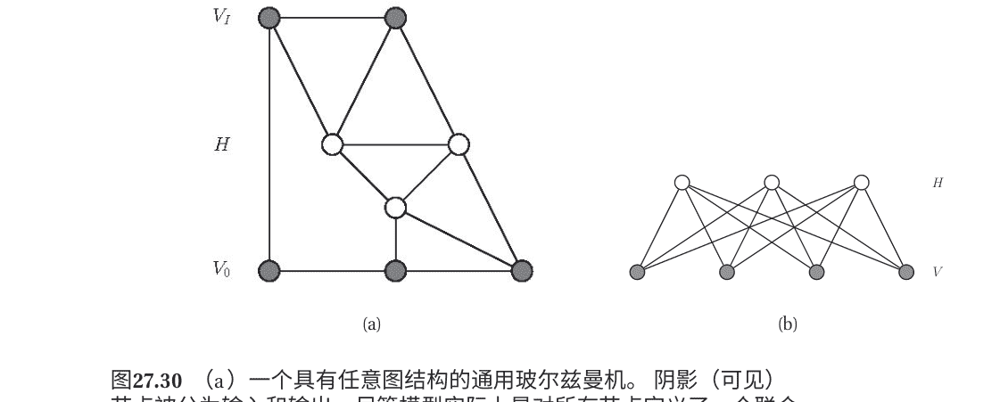

然后进行归一化，而在专家混合中，我们采用归一化分布的凸组合。PoE模型可能比混合模型效果更好的直观原因是，每个专家可以强制执行一个约束（如果专家的值为 $\gg 1$ 或 $\ll 1$）或者一个“不关心”的条件（如果专家的值为1）。通过以不同的方式将这些专家相乘，我们可以创建“尖锐”的分布，从而预测满足指定约束的数据（Hinton和Teh 2001）。例如，考虑一个文本的分布式模型。

给定的文档可能具有“政府”、“黑手党”和“花花公子”这些主题。如果我们将每个主题的预测结果“相乘”，模型可能会对单词“Berlusconi”给出非常高的概率（Salakhutdinov和Hinton 2010）。相比之下，将专家的预测结果相加只会使分布变得更宽（参见图14.17）。

通常，RBM中的隐藏节点是二进制的，所以 $\mathbf{h}$s 指定了哪些约束是活动的。值得将其与我们讨论过的有向模型进行比较。在混合模型中，我们有一个隐藏变量 $q \in \{ 1,…,K\}$。我们可以用一组 $K$ 位来表示这个，限制条件是每次只有一个位开启。这被称为局部编码，因为只有一个隐藏单元用于生成响应向量。这类似于大脑中的假设概念祖母细胞，它们只能识别一种对象。

相比之下，RBM使用分布式编码，其中许多单元参与生成每个输出。使用向量值隐藏变量的模型，例如 $\boldsymbol{\pi} \in S_K$，如mPCA/LDA中的 $\mathbf{z} \in R^K$，也使用分布式编码。

RBM和有向两层模型之间的主要区别在于，隐藏变量在给定可见变量的条件下是条件独立的，因此后验概率可以分解：

$$
p(\mathbf{h}|\mathbf{v}, \theta) = \prod_{k} p(h_k|\mathbf{v}, \theta)
$$

这使得推断比有向模型简单得多，因为我们可以估计每个 $h_k$。
独立并行地进行，就像前馈神经网络一样。缺点是训练无向模型更加困难，我们将在下面讨论。

#### 27.7.1 RBM的种类

在本节中，我们通过定义不同的成对潜在函数来描述各种形式的RBM。请参阅表27.2进行总结。所有这些都是指数族谐振器的特例(Welling等人2004)。

### 27.7.1.1 二进制RBM

最常见的RBM形式是具有二进制隐藏节点和二进制可见节点。联合分布的形式如下：

$$
p(\mathbf{v}, \mathbf{h}|\theta) = \frac{1}{Z(\theta)} \exp(-E(\mathbf{v}, \mathbf{h}; \theta))
$$

$$
E(\mathbf{v}, \mathbf{h}; \theta) \triangleq -\sum_{r=1}^{R} \sum_{k=1}^{K} v_r h_k W_{rk} - \sum_{r=1}^{R} v_r b_r - \sum_{k=1}^{K} h_k c_k = -(\mathbf{v}^T \mathbf{W} \mathbf{h} + \mathbf{v}^T \mathbf{b} + \mathbf{h}^T \mathbf{c})
$$

$$
Z(\theta) = \sum_{\mathbf{v}} \sum_{\mathbf{h}} \exp(-E(\mathbf{v}, \mathbf{h}; \theta))
$$

其中 $E$ 是能量函数，$\mathbf{W}$ 是一个 $R \times K$ 的权重矩阵，$\mathbf{b}$ 是可见偏置项，$\mathbf{c}$ 是隐藏偏置项，而 $\theta=(\mathbf{W}, \mathbf{b}, \mathbf{c})$ 是所有参数。为了简化符号，我们将偏置项通过将虚拟单元 $v_0=1$ 和 $h_0=1$ 固定到权重矩阵中，并设置 $\mathbf{w}_{0,:} = \mathbf{c}$ 和 $\mathbf{w}_{:,0} = \mathbf{b}$。请注意，简单地计算 $Z(\theta)$ 需要 $O(2^R 2^K)$ 时间，但我们可以将其减少到 $O(\min\{R2^K, K2^R\})$ 时间（练习27.1）。当使用二进制RBM时，后验可以如下计算：

$$
p(\mathbf{h}|\mathbf{v}, \theta) = \prod_{k=1}^{K} p(h_k|\mathbf{v}, \theta) = \prod_{k} \mathrm{Ber}(h_k|\mathrm{sigm}(\mathbf{w}_{:,k}^T \mathbf{v}))
$$

根据对称性，我们可以如下生成给定隐藏变量的数据：

$$
p(\mathbf{v}|\mathbf{h}, \theta) = \prod_{r} p(v_r|\mathbf{h}, \theta) = \prod_{r} \mathrm{Ber}(v_r|\mathrm{sigm}(\mathbf{w}_{r,:}^T \mathbf{h}))
$$

我们可以将其写成矩阵-向量表示如下：

$$
\mathbb{E} [\mathbf{h}|\mathbf{v}, \theta] = \mathrm{sigm}(\mathbf{W}^T \mathbf{v}) \tag{27.103}
$$

$$
\mathbb{E} [\mathbf{v}|\mathbf{h}, \theta] = \mathrm{sigm}(\mathbf{W}\mathbf{h}) \tag{27.104}
$$

$\mathbf{W}$ 中的权重被称为生成权重，因为它们用于生成观测数据，而 $\mathbf{W}^T$ 中的权重被称为识别权重，因为它们用于识别输入。

从方程27.103中，我们可以看到我们激活隐藏节点 $k$ 与输入向量 $\mathbf{v}$ “看起来像”权重向量 $\mathbf{w}_{:,k}$ 成比例（最多缩放因子）。因此，每个隐藏节点都捕捉到输入中的某些特征，就像前馈神经网络中编码的那样。

### 27.7.1.2 分类RBM

我们可以通过使用1-of-C编码将二进制RBM扩展到分类可见变量，其中C是每个 $v_{ir}$ 的状态数。 我们定义一个新的能量函数如下 (Salakhutdinov等人, 2007年; Salakhutdinov和Hinton, 2010年)：

$$
E(\mathbf{v}, \mathbf{h}; \theta) = - \sum_{r=1}^R \sum_{k=1}^K \sum_{c=1}^C v_r^c h_k W_{rk}^c - \sum_{r=1}^R \sum_{c=1}^C v_r^c b_r^c - \sum_{k=1}^K h_k c_k \tag{27.105}
$$

完整的条件给出

$$
p(v_r|\mathbf{h}, \theta) = \mathrm{Cat}\left(\mathrm{Softmax}\left(\{b_r^c + \sum_k h_k W_{rk}^c\}_{c=1}^C\right)\right) \tag{27.106}
$$

$$
p(h_k = 1|\mathbf{v}, \theta) = \mathrm{sigm}\left(c_k + \sum_r \sum_c v_r^c W_{rk}^c\right) \tag{27.107}
$$

### 27.7.1.3 高斯RBM

我们可以推广模型以处理实值数据。 特别地，一个高斯RBM具有以下能量函数：

$$
E(\mathbf{v}, \mathbf{h}|\theta) = - \sum_{r=1}^R \sum_{k=1}^K W_{rk} h_k v_r - \frac{1}{2} \sum_{r=1}^R (v_r - b_r)^2 - \sum_{k=1}^K a_k h_k \tag{27.108}
$$

该模型的参数为 $\theta = (\mathbf{W}, \mathbf{a}, \mathbf{b})$。 (我们假设数据已标准化，所以我们将方差固定为 $\sigma^2 = 1$。) 将其与信息形式的高斯分布进行比较：

$$
\mathcal{N}_c(\mathbf{v}|\boldsymbol{\eta}, \boldsymbol{\Lambda}) \propto \exp(\boldsymbol{\eta}^T \mathbf{v} - \frac{1}{2} \mathbf{v}^T \boldsymbol{\Lambda} \mathbf{v}) \tag{27.109}
$$

我们看到我们已经设置 $\boldsymbol{\Lambda} = \mathbf{I}$, 和 $\boldsymbol{\eta} = \mathbf{b}$ 因此，均值由 $\boldsymbol{\mu} = \boldsymbol{\Lambda}^{-1}\boldsymbol{\eta} = \mathbf{b}$ 给出。

完整的条件，用于推断和学习，由以下给出

$$
p(v_r|\mathbf{h}, \theta) = \mathcal{N}(v_r | b_r + \sum_k w_{rk} h_k, 1)
$$

$$
p(h_k = 1|\mathbf{v}, \theta) = \text{sigm}\left( a_k + \sum_r w_{rk} v_r \right)
$$

我们看到每个可见单元都有一个高斯分布，其均值是隐藏位向量的函数。更强大的模型可以使（协）方差依赖于隐藏状态，并且还可以开发出来（Ranzato和Hinton 2010）。

### 27.7.1.4 具有高斯隐藏单元的RBM

如果我们使用高斯潜变量和高斯可见变量，我们将得到一个无向版本的因子分析。然而，事实证明它与标准的有向版本相同（Marks和Movellan 2001）。

如果我们使用高斯潜变量和分类观察变量，我们将得到一个无向版本的分类PCA（第27.2.2节）。在（Salakhutdinov等人2007）中，这被应用于Netflix协同过滤问题，但发现与使用二进制潜变量相比，其表达能力较差。

#### 27.7.2 学习 RBMs

在本节中，我们讨论了使用基于梯度的优化器计算 RBMs 的最大似然参数估计的一些方法。通常使用随机梯度下降，因为 RBMs 通常具有许多参数，因此需要在非常大的数据集上进行训练。此外，在这种情况下，通常使用正则化技术，称为权重衰减。

这对目标和梯度需要进行非常小的改变，如第8.3.6节所讨论的。

#### 27.7.2.1 使用 $p(\mathbf{h}, \mathbf{v}|\theta)$ 推导梯度

为了计算梯度，我们可以修改第19.5.2节中展示如何拟合通用潜变量最大熵模型的方程。在玻尔兹曼机的背景下，我们每个边都有一个特征，因此梯度由以下给出

$$
\frac{\partial \ell}{\partial w_{rk}} = \frac{1}{N} \sum_{i=1}^N \mathbb{E}[v_r h_k | \mathbf{v}_i, \theta] - \mathbb{E}[v_r h_k | \theta] \tag{27.112}
$$

我们可以将其写成矩阵-向量形式如下：

$$
\nabla_{\mathbf{W}} \ell = \mathbb{E}_{p_{\text{emp}}(\mathbf{v},\mathbf{h}|\theta)}[\mathbf{v}\mathbf{h}^T] - \mathbb{E}_{p(\mathbf{v},\mathbf{h}|\theta)}[\mathbf{v}\mathbf{h}^T] \tag{27.113}
$$

其中 $p_{\text{emp}}(\mathbf{v}, \mathbf{h}|\theta)$ 是经验分布（我们可以通过设置 $v_i = 1$ 或 $h_k = 1$ 来推导出类似的偏差项表达式。）

当 $\mathbf{v}$ 固定为一个数据案例时，梯度的第一项有时被称为固定阶段，而当 $\mathbf{v}$ 自由时，第二项有时被称为非固定阶段。

#### 27.7.2.2 使用 $p(\mathbf{v}|\theta)$ 导出梯度

我们现在提出了一种替代方法来推导方程27.112，该方法也适用于其他基于能量的模型。首先，我们边缘化隐藏变量，并将RBM写成形式 $p(\mathbf{v}|\boldsymbol{\theta}) = \frac{1}{Z(\boldsymbol{\theta})} \exp(-F(\mathbf{v}; \boldsymbol{\theta}))$，其中 $F(\mathbf{v}; \boldsymbol{\theta})$ 是自由能量：

$$
\begin{aligned}
F(\mathbf{v}) &\triangleq -\sum_{\mathbf{h}} \exp \left( -E(\mathbf{v}, \mathbf{h}) \right) \\
&= -\sum_{\mathbf{h}} \exp \left( \sum_{r=1}^{R} \sum_{k=1}^{K} v_r h_k W_{rk} + \sum_{r=1}^{R} v_r b_r + \sum_{k=1}^{K} h_k c_k \right) \\
&= -\exp \left( \sum_{r=1}^{R} v_r b_r \right) \prod_{k=1}^{K} \sum_{h_k \in \{0, 1\}} \exp \left( h_k \left( c_k + \sum_{r=1}^{R} v_r W_{rk} \right) \right) \\
&= -\exp \left( \sum_{r=1}^{R} v_r b_r \right) \prod_{k=1}^{K} \left( 1 + \exp \left( c_k + \sum_{r=1}^{R} v_r W_{rk} \right) \right)
\end{aligned} \tag{27.114-27.117}
$$

接下来我们将（缩放后的）对数似然写成以下形式：

$$
\ell(\boldsymbol{\theta}) = \frac{1}{N} \sum_{i=1}^{N} \log p(\mathbf{v}_i|\boldsymbol{\theta}) = -\frac{1}{N} \sum_{i=1}^{N} F(\mathbf{v}_i|\boldsymbol{\theta}) - \log Z(\boldsymbol{\theta}) \quad (27.118)
$$

利用 $Z(\boldsymbol{\theta}) = \sum_{\mathbf{v}} \exp(-F(\mathbf{v}; \boldsymbol{\theta}))$ 我们有

$$
\begin{aligned}
\nabla \ell(\boldsymbol{\theta}) &= -\frac{1}{N} \sum_{i=1}^{N} \nabla F(\mathbf{v}_i) - \frac{\nabla Z}{Z} \\
&= -\frac{1}{N} \sum_{i=1}^{N} \nabla F(\mathbf{v}_i) + \sum_{\mathbf{v}} \nabla F(\mathbf{v}) \frac{\exp(-F(\mathbf{v}))}{Z} \\
&= -\frac{1}{N} \sum_{i=1}^{N} \nabla F(\mathbf{v}_i) + \mathbb{E}_{p(\mathbf{v}|\theta)} [\nabla F(\mathbf{v})]
\end{aligned} \tag{27.119-27.121}
$$

将自由能（方程27.117）代入，可以证明

$$
\frac{\partial}{\partial w_{rk}} F(\mathbf{v}) = -v_r \mathbb{E}[h_k | \mathbf{v}, \boldsymbol{\theta}] = -\mathbb{E}[v_r h_k | \mathbf{v}, \boldsymbol{\theta}] \quad (27.122)
$$

因此

$$
\frac{\partial}{\partial w_{rk}} \ell(\boldsymbol{\theta}) = \frac{1}{N} \sum_{i=1}^{N} \mathbb{E}[v_r h_k | \mathbf{v}_i, \boldsymbol{\theta}] - \mathbb{E}[v_r h_k | \boldsymbol{\theta}] \quad (27.123)
$$

与方程27.112相匹配。

9. 西尔维奥·贝卢斯科尼是意大利现任（2011年）总理。

| 可见 | 隐藏 | 名字 | 参考 |
|------|------|------|------|
| 二进制 | 二进制 | 二进制RBM | (Hinton 2002) |
| 高斯 | 二进制 | 高斯RBM | (Welling and Sutton 2005) |
| 分类 | 二进制 | 分类RBM | (Salakhutdinov et al. 2007) |
| 多分类 | 二进制 | 复制的softmax/无向LDA | (Salakhutdinov and Hinton 2010) |
| 高斯 | 高斯 | 无向PCA | (Marks and Movellan 2001) |
| 二进制 | 高斯 | 无向二进制PCA | (Welling and Sutton 2005) |

表27.2 不同种类的RBM的总结。

图27.31在RBM中吉布斯采样的示意图。可见节点初始化为数据向量，然后我们采样一个隐藏向量，然后又一个可见向量，依此类推。最终（在“无限”时）我们将从联合分布中产生样本 \(p(\mathbf{v}, \mathbf{h}|\theta)\)。

### 27.7.2.3 近似期望

我们可以通过执行块Gibbs采样来近似评估梯度所需的期望，使用方程27.101和27.102。更详细地说，我们可以从联合分布 \(p(\mathbf{v}, \mathbf{h}|\theta)\) 中进行采样，方法如下：在 \(\mathbf{v}^{1}\) 处初始化链条（例如，通过设置 \(\mathbf{v}^{1} = \mathbf{v}_{i}\) 为某个数据向量），然后从 \(\mathbf{h}^{1} \sim p(\mathbf{h}|\mathbf{v}^{1})\) 中采样，接着从 \(\mathbf{v}^{2} \sim p(\mathbf{v}|\mathbf{h}^{1})\) 中采样，然后从 \(\mathbf{h}^{2} \sim p(\mathbf{h}|\mathbf{v}^{2})\) 中采样，等等。请参见图27.31进行说明。然而，请注意，在马尔可夫链达到平衡（即“燃烧进程”完成）之前，我们必须等待，才能将样本解释为感兴趣的联合分布，并且这可能需要很长时间。

一种更快的替代方法是使用均值场，其中我们进行近似 \(\mathbb{E}[v_r, h_k] \approx \mathbb{E}[v_r]\mathbb{E}[h_k]\)。然而，由于 \(p(\mathbf{v}, \mathbf{h})\) 通常是多峰的，这通常是一个非常差的近似，因为它会对不同的模式进行平均（见第21.2.2节）。此外，还有一个更微妙的原因不使用均值场：由于梯度的形式为 \(\mathbb{E}[v_r, h_k|\mathbf{v}] - \mathbb{E}[v_r, h_k]\)，我们可以看到前面的负号意味着该方法将尽可能使变分边界松散（Salakhutdinov和Hinton 2009）。这解释了为什么早期尝试使用均值场来学习玻尔兹曼机器（例如，（Kappen和Rodriguez 1998））没有成功。

### 27.7.2.4 对比散度

使用吉布斯采样计算梯度的问题在于速度较慢。我们现在介绍一种更快的方法，称为对比散度或CD（Hinton 2002）。CD最初是通过近似定义为两个KL散度之差的目标函数来推导的，而不是试图最大化似然本身。然而，从算法的角度来看，它可以被视为类似于随机梯度下降，只是它用“简短”的吉布斯采样来近似“未固定”的期望，其中我们将每个马尔可夫链初始化为数据向量。也就是说，我们如下近似一个数据向量的梯度：

$$
\nabla_{\mathbf{w}} \ell \approx \mathbb{E} [\mathbf{vh}^{T}|\mathbf{v}_{i}] - \mathbb{E}_{q} [\mathbf{vh}^{T}]
$$

其中 \(q\) 对应于由 \(K\) 次上下吉布斯扫描生成的分布，从 \(\mathbf{v}_{i}\) 开始，如图27.31所示。这被称为CD-\(K\)。更详细地说，该过程（对于 \(K = 1\)）如下：

$$
\begin{align*}
\mathbf{h}_i &\sim p(\mathbf{h}|\mathbf{v}_i, \boldsymbol{\theta}) \quad &(27.125)\\
\mathbf{v}'_i &\sim p(\mathbf{v}|\mathbf{h}_i, \boldsymbol{\theta}) \quad &(27.126)\\
\mathbf{h}'_i &\sim p(\mathbf{h}|\mathbf{v}'_i, \boldsymbol{\theta}) \quad &(27.127)
\end{align*}
$$

然后我们进行近似

$$
\mathbb{E}_{q}\left[\mathbf{v}\mathbf{h}^{T}\right] \approx \mathbf{v}_{i}(\mathbf{h}'_{i})^{T} \quad &(27.128)
$$

这样的样本有时被称为幻想数据。我们可以将 $\mathbf{v}'_i$ 看作是模型在编码和解码之后对 $\mathbf{v}_i$的最佳重建尝试。这类似于我们训练自编码器的方式，自编码器是一种试图通过一个受限制的参数“瓶颈”将数据“压缩”的模型（参见第28.3.2节）。

在实践中，通常使用 $\mathbb{E}\left[\mathbf{h}|\mathbf{v}'_i\right]$代替采样值 $\mathbf{h}'_i$进行最终的向上传递，因为这样可以减少方差。然而，在早期的向上传递中，不能使用 $\mathbb{E}\left[\mathbf{h}|\mathbf{v}_i\right]$代替采样 $\mathbf{h}_i \sim p(\mathbf{h}|\mathbf{v}_i)$，因为这样每个隐藏单元将能够传递超过1个比特的信息，因此它将不再起到瓶颈的作用。

整个过程在算法27.3中总结。（请注意，我们遵循正梯度因为我们正在最大化似然。）可以使用各种技巧来加快此算法的速度，例如使用动量项（第8.3.2节），使用小批量，平均更新等。这些细节可以在（Hinton 2010; Swersky et al. 2010）中找到。

**算法27.3: 具有二进制隐藏和可见单元的RBM的CD-1训练**
1 随机初始化权重 $\mathbf{W} \in \mathbb{R}^{R \times K}$;
2 $t := 0$;
3 **对于每个时期 do**
4 $\qquad t := t + 1$ ;
5 $\qquad$ **对于大小为 $B$ 的每个小批量 do**
6 $\qquad\qquad$ 将小批量梯度设置为零，$\mathbf{g} := \mathbf{0}$;
7 $\qquad\qquad$ 对于小批量中的每个案例 $\mathbf{v}_i$，计算 $\boldsymbol{\mu}_i = \mathbb{E}[\mathbf{h}|\mathbf{v}_i, \mathbf{W}]$;
8 $\qquad\qquad$ 采样 $\mathbf{h}_i \sim p(\mathbf{h}|\mathbf{v}_i, \mathbf{W})$;
9 $\qquad\qquad$ 采样 $\mathbf{v}'_i \sim p(\mathbf{v}|\mathbf{h}_i, \mathbf{W})$;
10 $\qquad\qquad$ 计算 $\boldsymbol{\mu}'_i = \mathbb{E}[\mathbf{h}|\mathbf{v}'_i, \mathbf{W}]$;
11 $\qquad\qquad$ 计算梯度 $\nabla_{\mathbf{W}} = (\mathbf{v}_i)(\boldsymbol{\mu}_i)^T - (\mathbf{v}'_i)(\boldsymbol{\mu}'_i)^T$ ;
12 $\qquad\qquad$ 累积 $\mathbf{g} := \mathbf{g} + \nabla_{\mathbf{W}}$;
13 $\qquad$ 更新参数 $\mathbf{W} := \mathbf{W} + (\alpha_t / B)\mathbf{g}$

### 27.7.2.5 持久CD

在第19.5.5节中，我们介绍了一种称为随机最大似然（SML）的技术，用于拟合最大熵模型。这样可以避免在每次迭代中运行MCMC直到收敛的需要，通过利用参数变化缓慢的事实，使得马尔可夫链在每次更新后不会被推得太远离平衡（Younes 1989）。换句话说，有两个以不同时间尺度运行的动力学过程：状态变化快速，参数变化缓慢。这个算法在（Tieleman 2008）中独立重新发现，被称为持久CD。请参见伪代码的算法27.4。

在学习的早期阶段，PCD通常比CD更好（参见例如（Tieleman 2008; Marlin et al. 2010; Swersky et al. 2010）），尽管CD可能更快。

**算法27.4：用于训练具有二进制隐藏和可见单元的RBM的持续CD**
1 随机初始化权重 $\mathbf{W} \in \mathbb{R}^{D \times L}$;
2 随机初始化链 $(\mathbf{v}_s, \mathbf{h}_s)_{s=1}^{S}$;
3 对于 $t = 1, 2, ...$ 执行
4 $\quad$ // 均值场更新;
5 $\quad$ 对于每个案例 $i = 1 : N$,
6 $\qquad$ $\mu_{ik} = \text{sigm}(\mathbf{v}_i^T \mathbf{w}_{:,k})$
7 $\quad$ // MCMC更新;
8 $\quad$ 对于每个样本 $s = 1 : S$,
9 $\qquad$ 通过从旧的 $(\mathbf{v}_s, \mathbf{h}_s)$ 中进行简要的Gibbs采样生成 $(\mathbf{v}_s, \mathbf{h}_s)$
10 $\quad$ // 参数更新;
11 $\quad$ $\mathbf{g} = (1/N) \sum_{i=1}^N \mathbf{v}_i (\boldsymbol{\mu}_i)^T - (1/S) \sum_{s=1}^S \mathbf{v}_s (\mathbf{h}_s)^T$ ;
12 $\quad$ $\mathbf{W} := \mathbf{W} + \alpha_t \mathbf{g}$;
13 $\quad$ 减小 $\alpha_t$

#### 27.7.3 RBMs的应用

RBMs的主要应用是作为深度生成模型的构建模块，在第28.2节中讨论。但它们也可以用作有向两层模型的替代品。它们在测试时需要快速推断隐藏状态的情况下特别有用。我们下面给出一些例子。

### 27.7.3.1 语言建模和文档检索

我们可以使用分类RBMs来定义词袋的生成模型，作为LDA的替代方案。一个细微之处是无向模型中的分区函数取决于图的大小，因此取决于文档的长度。这个问题的解决方案在（Salakhutdinov和Hinton 2010）中提出：使用具有绑定权重的分类RBMs，但将隐藏激活偏置项 $c_k$ 乘以文档长度 $L$ 来补偿观察到的词频向量 $\mathbf{v}$ 的大小差异：

$$
E(\mathbf{v}, \mathbf{h}; \theta) = - \sum_{k=1}^K \sum_{c=1}^C v^c h_k W_k^c - \sum_{c=1}^C v^c b^c - L \sum_{k=1}^K h_k c_k    \quad (27.129)
$$

这就像有一个单一的多项式节点（所以我们已经去掉了下标）有 $C$ 个状态，其中 $C$ 是词汇表中的单词数。这被称为复制的softmax模型（Salakhutdinov和Hinton 2010），是mPCA / LDA的一个无向的替代方法。

我们可以通过在测试集上测量困惑度来比较RBM和LDA的建模能力，这可以使用退火重要性采样（第24.6.2节）来近似计算。结果显示在图27.32中。我们可以看到LDA比unigram模型好得多，而RBM比LDA好得多。

| 数据集 | 文档数量 | | $K$ | $\bar{D}$ | 标准差 | 平均每个单词的测试困惑度 (以nats为单位) | | | |
| :--- | :---: | :---: | :---: | :---: | :---: | :---: | :---: | :---: | :---: |
| | 训练 | 测试 | | | | LDA-50 | LDA-200 | R. Soft-50 | Unigram |
| NIPS | 1,690 | 50 | 13,649 | 98.0 | 245.3 | 3576 | 3391 | 3405 | 4385 |
| 20-news | 11,314 | 7,531 | 2,000 | 51.8 | 70.8 | 1091 | 1058 | 953 | 1335 |
| Reuters | 794,414 | 10,000 | 10,000 | 94.6 | 69.3 | 1437 | 1142 | 988 | 2208 |

图27.32 RBM（复制的softmax）和LDA在三个语料库上的比较。$K$是词汇表中的单词数，$D$是平均文档长度，St. Dev.是文档长度的标准差。来源：（Salakhutdinov和Hinton 2010）。

LDA的另一个优点是推断快速而准确：只需进行一次矩阵-向量乘法，然后再进行一个sigmoid非线性变换，就像方程27.107中所示。除了更快之外，RBM更准确。这在图27.33中有所体现，图中显示了RBM和LDA在两个不同语料库上的精确率-召回率曲线。这些曲线的生成方式如下：从测试集中取出一个查询文档，计算它与所有训练文档的相似度，其中相似度定义为两个主题向量之间的夹角的余弦值，然后返回前 $M$ 个文档，对于不同的 $M$。如果检索到的文档与查询的类标签相同，则认为它是相关的（这是唯一使用标签的地方）。

### 27.7.3.2 用于协同过滤的RBM

RBM已经应用于Netflix协同过滤竞赛（Salakhutdinov等人，2007年）。事实上，具有二进制隐藏节点和分类可见节点的RBM可以略微优于SVD。通过结合这两种方法，性能可以进一步提高。（挑战中的获胜作品是许多不同类型模型的集合（Koren 2009a）。）

# 练习

## 练习27.1 RBM的分区函数

展示如何在 $O(R^2 K)$ 时间内计算具有 $K$ 个二进制隐藏节点和 $R$ 个二进制观察节点的RBMs的 $Z(\theta)$，假设 $K < R$。

## 28 深度学习

### 28.1 引言

我们在本书中看到的许多模型都具有简单的两层架构，形式为 $\mathbf{z} \rightarrow \mathbf{y}$（无监督潜在变量模型）或 $\mathbf{x} \rightarrow \mathbf{y}$（监督模型）。然而，当我们观察大脑时，我们看到许多层次的处理。人们认为每个层次都在学习越来越抽象的特征或表示。例如，视觉皮层的标准模型（Hubel和Wiesel 1962; Serre等人2005; Ranzato等人2007）建议（粗略地说）大脑首先提取边缘，然后是补丁，然后是表面，然后是物体等等。（有关大脑如何执行视觉的更多信息，请参见（Palmer 1999; Kandel等人2000）。）

这一观察启发了机器学习中的一个最新趋势，即深度学习（参见（Bengio 2009），deeplearning.net和其中的参考文献），它试图在计算机中复制这种架构。（注意，这个想法也可以应用于非视觉问题，比如语音和语言。）

在本章中，我们对这个新领域进行了简要概述。然而，我们提醒读者，深度学习的主题目前正在快速发展，因此本章的内容可能很快就会过时。

### 28.2 深度生成模型

深度模型通常具有数百万个参数。获取足够的标记数据来训练这样的模型是困难的，尽管有众包网站如Mechanical Turk。在简单的设置中，例如手写字符识别，可以通过制作小型手动标记的训练集的修改副本来生成大量标记数据（参见图16.13），但似乎这种方法不太可能适用于复杂的场景。¹

为了克服需要标记训练数据的问题，我们将重点放在无监督学习上。执行这个任务最自然的方式是使用生成模型。在本节中，我们讨论三种不同类型的深度生成模型：有向模型、无向模型和混合模型。

1. 已经有一些尝试使用计算机图形和视频游戏来生成复杂场景的逼真图像，然后将其作为计算机视觉系统的训练数据。然而，图形程序通常会为了使图像在感知上更具吸引力而采取捷径，这些图像并不反映真实世界图像的自然统计特性。

#### 28.2.1 深度有向网络

构建深度生成模型的最自然的方法可能是构建一个深度有向图模型，如图28.1(a)所示。底层包含观察到的像素（或其他数据），其余层是隐藏层。为了简化符号，我们假设只有3层。层数和大小通常是手动选择的，尽管也可以使用非参数贝叶斯方法（Adams等，2010年）或提升（Chen等，2010年）来推断模型结构。

我们将称这种形式的模型为深度有向网络或DDNs。如果所有节点都是二进制的，并且所有的CPD都是逻辑函数，那么这被称为 sigmoid 信念网络（Neal 1992）。在这种情况下，模型定义了以下联合分布：

$$
\begin{align*}
p(\mathbf{h}_1, \mathbf{h}_2, \mathbf{h}_3, \mathbf{v}|\boldsymbol{\theta}) &= \prod_i \mathrm{Ber}(v_i|\mathrm{sigm}(\mathbf{h}_1^T \mathbf{w}_{0i})) \prod_j \mathrm{Ber}(h_{1j}|\mathrm{sigm}(\mathbf{h}_2^T \mathbf{w}_{1j})) \quad &(28.1)\\
&\quad \prod_k \mathrm{Ber}(h_{2k}|\mathrm{sigm}(\mathbf{h}_3^T \mathbf{w}_{2k})) \prod_l \mathrm{Ber}(h_{3l}|w_{3l}) \quad &(28.2)
\end{align*}
$$

不幸的是，对于这样的有向模型，推断是棘手的，因为隐藏节点的后验与解释性降低相关。可以使用快速均值场近似（Jaakkola和Jordan 1996a; Saul和Jordan 2000），但这可能不是非常准确，因为它用因子后验近似了相关后验。也可以使用MCMC推断（Neal 1992; Adams等人2010），但这可能非常慢，因为变量之间高度相关。慢推断也导致学习缓慢。

#### 28.2.2 深度玻尔兹曼机

构建一个深度无向模型是对有向模型的一种自然替代方法。例如，我们可以将一系列RBM堆叠在一起，如图28.1(b)所示。这被称为深度玻尔兹曼机或DBM（Salakhutdinov和Hinton 2009）。如果我们有3个隐藏层，模型定义如下：

$$
p(\mathbf{h}_1, \mathbf{h}_2, \mathbf{h}_3, \mathbf{v}|\boldsymbol{\theta}) = \frac{1}{Z(\boldsymbol{\theta})} \exp \left( \sum_{ij} v_i h_{1j} W_{1ij} + \sum_{jk} h_{1j} h_{2k} W_{2jk} + \sum_{kl} h_{2k} h_{3l} W_{3kl} \right) \quad (28.3)
$$## 28.2. 深度生成模型

在这里，我们忽略了常数偏移或偏置项。与有向模型相比，主要优势在于可以进行高效的块（逐层）Gibbs采样或块均值场，因为每层中的所有节点在给定上下层的条件下是条件独立的（Salakhutdinov和Larochelle 2010）。主要缺点是训练无向模型更加困难，因为存在分区函数。然而，在下面，我们将看到一种贪婪的逐层策略来学习深度无向模型。

#### 28.2.3 深度置信网络

一个有趣的折衷方案是使用一个部分有向和部分无向的模型。特别地，假设我们构建了一个分层模型，其中除了顶部外，其他部分都有有向箭头，顶部是一个无向的二分图，如图28.1(c)所示。这个模型被称为深度置信网络（Hinton et al. 2006）或DBN。如果我们有3个隐藏层，该模型的定义如下：

$$p(\mathbf{h}_1, \mathbf{h}_2, \mathbf{h}_3, \mathbf{v}| \theta) = \prod_i \text{Ber}(v_i|\text{sigm}(\mathbf{h}_1^T \mathbf{w}_{1i})) \prod_j \text{Ber}(h_{1j}|\text{sigm}(\mathbf{h}_2^T \mathbf{w}_{2j})) \quad (28.4)$$

$$\frac{1}{Z(\theta)} \exp\left( \sum_{kl} h_{2k} h_{3l} W_{3kl} \right) \quad (28.5)$$

本质上，顶部的两个层充当关联记忆，其余层则生成输出。

这种特殊架构的优势在于我们可以以快速的自底向上的方式推断隐藏状态。为了理解这一点，假设我们只有两个隐藏层，并且$\mathbf{W}_2 = \mathbf{W}_1^T$，因此第二层的权重与第一层的权重相连（见图28.2(a)）。这定义了一个形式为$p(\mathbf{h}_1, \mathbf{h}_2, \mathbf{v}|\mathbf{W}_1)$的模型。可以证明分布$p(\mathbf{h}_1, \mathbf{v}|\mathbf{W}_1) = \sum_{\mathbf{h}_2} p(\mathbf{h}_1, \mathbf{h}_2, \mathbf{v}|\mathbf{W}_1)$具有以下形式$p(\mathbf{h}_1, \mathbf{v}|\mathbf{W}_1) = \frac{1}{Z(\mathbf{W}_1)} \exp(\mathbf{v}^T \mathbf{W}_1 \mathbf{h}_1)$，这与RBM等效。由于DBN在$p(\mathbf{h}_1, \mathbf{v}|\mathbf{W}_1)$方面与RBM等效，我们可以像在RBM中一样准确地推断出DBN中的后验概率$p(\mathbf{h}_1|\mathbf{v}, \mathbf{W}_1)$。即使这个后验概率是完全分解的，它仍然是准确的。现在，要得到一个分解的后验概率，唯一的方法是将先验概率$p(\mathbf{h}_1|\mathbf{W}_1)$设为一个互补先验概率。互补先验概率是指当与似然函数$p(\mathbf{v}|\mathbf{h}_1)$相乘时，会得到一个完全分解的后验概率。因此，我们可以看到DBN中的顶层RBM充当了底层有向Sigmoid似然函数的互补先验。如果我们有多个隐藏层，并且权重没有绑定，那么DBN和RBM之间的对应关系不再准确，但我们仍然可以使用分解推理规则作为一种近似的自底向上推理方法。下面我们将展示这是一个有效的变分下界。这个界限还建议了一种逐层训练策略，我们稍后将详细解释。然而，DBN中的自顶向下推理是不可行的，所以DBN通常只以前馈方式使用。

2. 不幸的是，“DBN”这个缩写也代表“动态贝叶斯网络”（第17.6.7节）。发明深度置信网络的Geoff Hinton提出了DBNs和DyBNs这两个不同含义的缩写。然而，这个术语并非标准用法。

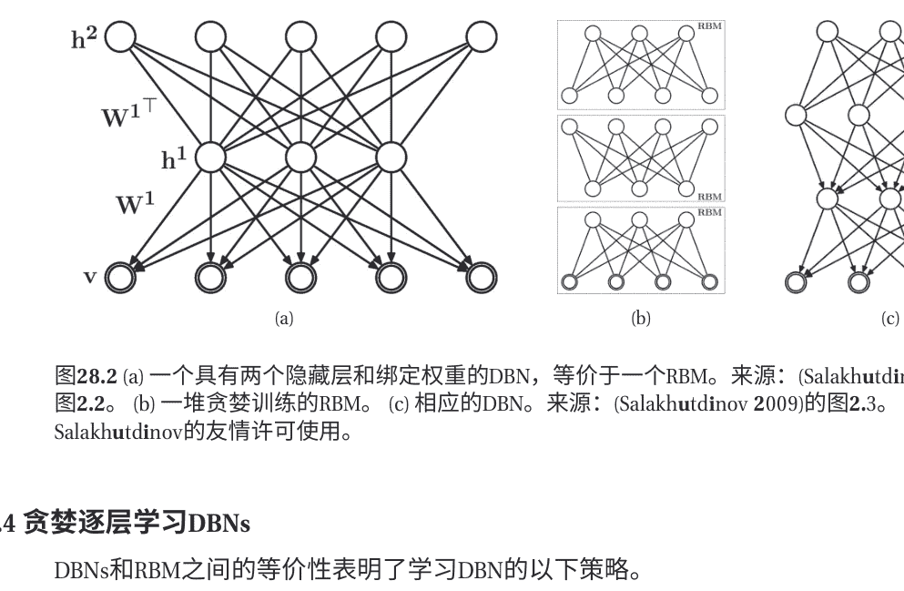

#### 28.2.4 贪婪逐层学习DBNs

DBNs和RBM之间的等价性表明了学习DBN的以下策略。

- 使用第27.7.2节中描述的方法，拟合一个RBM来学习 $\mathbf{W}_1$。
- 将RBM展开成具有2个隐藏层的DBN，如图28.2(a)所示。现在“冻结”有向权重 $\mathbf{W}_1$，并且让 $\mathbf{W}_2$“解绑”，因此不再强制等于 $\mathbf{W}_1^T$。我们现在将通过拟合第二个RBM来学习 $p(\mathbf{h}_1|\mathbf{W}_2)$的更好先验。这个新RBM的输入数据是隐藏单元的激活 $\mathbb{E}[\mathbf{h}_1|\mathbf{v}, \mathbf{W}_1]$，可以使用阶乘近似来计算。
- 继续添加更多隐藏层，直到满足某个停止准则，例如，时间或内存不足，或者开始过拟合验证集。根据这些RBM构建DBN，如图28.2(c)所示。

可以证明（Hinton等人，2006年）这个过程总是增加一个下界的观察数据似然。当然，这个过程可能导致过拟合，但这是一个不同的问题。

在实践中，我们希望能够在每个层级中使用任意数量的隐藏单元。这意味着我们将无法初始化权重，使得 $\mathbf{W}_\ell = \mathbf{W}_{\ell-1}^T$。这使得理论上的保证失效。然而，正如我们将看到的，这种方法在实践中效果很好。该方法还可以通过贪婪的方式扩展到训练DBMs（Salakhutdinov和Larochelle，2010年）。

在使用贪婪的逐层训练策略之后，通常会使用一种称为**backfitting**的技术来“微调”权重。具体操作如下。执行向上的采样传递到顶层。然后在顶层RBM中执行简短的Gibbs采样，并对RBM参数执行CD更新。最后，执行向下的祖先采样传递（这是一个对后验的近似样本），并使用小的梯度步长更新逻辑CPD参数。这被称为**up-down**过程（Hinton等人，2006年）。不幸的是，这个过程非常慢。

### 28.3 深度神经网络

鉴于DBNs通常只在前馈或自下而上的模式下使用，它们实际上就像神经网络一样运作。考虑到这一点，自然而然地可以放弃生成故事，并尝试直接拟合深度神经网络，正如我们在下面讨论的那样。由此产生的训练方法通常更容易实现，并且可以更快。

然而，请注意，深度神经网络的性能有时不如概率模型好（Bengio等人，2007年）。其中一个原因是概率模型支持自上而下的推理和自下而上的推理。（DBNs不支持高效的自上而下推理，但DBMs支持，并且已经证明这对于帮助有所帮助（Salakhutdinov和Larochelle，2010年）。）当对信号的正确解释存在很多歧义时，自上而下的推理是有用的。

有趣的是，在哺乳动物的视觉皮层中，反馈连接比前馈连接要多得多（参见例如（Palmer 1999; Kandel et al. 2000））。这些反馈连接的作用尚不完全清楚，但它们可能提供上下文先验信息（例如，来自先前的“帧”或视网膜扫视），这些信息可以用来消除当前的自下而上信号的歧义（Lee and Mumford 2003）。当然，我们可以使用神经网络模拟自上而下推理的效果。然而，我们下面讨论的模型并没有这样做。

#### 28.3.1 深度多层感知器

许多决策问题可以归约为分类问题，例如预测图像块中是否存在对象，或者预测给定声学特征向量中存在哪个音素。我们可以通过创建一个深度前馈神经网络或多层感知器（MLP）来解决这些问题，如第16.5节所述，然后使用梯度下降（也称为反向传播）来拟合参数。

不幸的是，这种方法效果不是很好。一个问题是，梯度在离数据越远的地方变得越弱；这被称为“消失梯度”问题（Bengio和Frasconi 1995）。一个相关的问题是，误差曲面上可能存在大的高原，这会导致简单的一阶梯度方法陷入困境（Glorot和Bengio 2010）。

因此，早期学习深度神经网络的尝试都没有成功。最近，由于采用了GPU（Ciresan等人2010）和二阶优化算法（Martens 2010），取得了一些进展。然而，这样的模型仍然很难训练。

下面我们讨论一种使用无监督学习来初始化参数的方法；这被称为生成预训练。首先进行无监督学习的优势在于，模型被迫对高维响应进行建模，即输入特征向量，而不仅仅是预测一个标量响应。这起到了一种数据诱导的正则化作用，并帮助反向传播找到具有良好泛化性能的局部最小值（Erhan等人2010；Glorot和Bengio 2010）。

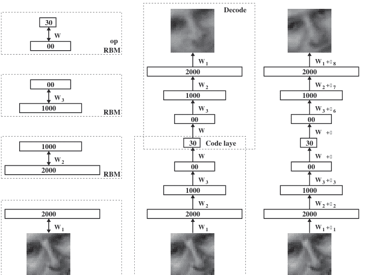

图28.3 训练深度自编码器。(a) 首先，我们贪婪地训练一些受限玻尔兹曼机。(b) 然后，我们通过复制权重来构建自编码器。(c) 最后，我们使用反向传播来微调权重。来自(Hinton和Salakhutdinov 2006)的图1。获得Ruslan Salakhutdinov的友好许可使用。

#### 28.3.2 深度自编码器

自编码器是一种用于降维和特征发现的无监督神经网络。更准确地说，自编码器是一个前馈神经网络，它被训练来预测输入本身。为了防止系统学习平凡的恒等映射，中间的隐藏层通常被限制为一个窄的瓶颈。系统可以通过确保隐藏单元捕捉数据的最相关方面来最小化重构误差。

假设系统有一个隐藏层，所以模型的形式为 v → h → v。此外，假设所有的函数都是线性的。在这种情况下，可以证明隐藏单元的权重将跨越与数据的前 K 个主成分相同的子空间（Karhunen和Joutsensalo 1995; Japkowicz等人2000）。换句话说，线性自编码器等同于PCA。然而，通过使用非线性激活函数，可以发现数据的非线性表示。

通过使用深度自编码器可以学习到更强大的表示。不幸的是，使用反向传播训练这样的模型效果不好，因为梯度信号在通过多个层时变得太小，学习算法经常陷入较差的局部最小值。

解决这个问题的一种方法是贪婪地训练一系列的RBM，并使用它们来初始化自编码器，如图28.3所示。然后可以使用常规的反向传播进行微调。这种方法最初是在（Hinton和Salakhutdinov 2006年）中提出的，比尝试直接使用随机权重来拟合深度自动编码器要好得多。

#### 28.3.3 堆叠去噪自动编码器

训练自动编码器的一种标准方法是确保隐藏层比可见层窄。这样可以防止模型学习恒等函数。但还有其他方法可以防止这种平凡解，从而允许使用过完备表示。

一种方法是对隐藏单元的激活施加稀疏约束(Ranzato等人，2006)。另一种方法是向输入添加噪声；这被称为去噪自动编码器(Vincent等人，2010)。例如，我们可以破坏一些输入，例如将它们设为零，这样模型就必须学会预测缺失的条目。可以证明，这等价于对RBM应用某种近似形式的最大似然训练(称为分数匹配)(Vincent，2011)。

当然，我们可以将这些模型堆叠在一起，学习一个深度堆叠去噪自动编码器，如果需要的话，它可以像前馈神经网络一样进行判别性微调。

### 28.4 深度网络的应用

在本节中，我们提到了一些我们讨论过的模型的应用。

#### 28.4.1 使用DBNs进行手写数字分类

图28.4(a)展示了一个由3个隐藏层组成的DBN（来自Hinton等人2006年的论文）。可见层对应于MNIST数据集中手写数字的二进制图像。此外，顶部的RBM与一个具有10个单元的softmax层相连，表示类别标签。

前两个隐藏层使用贪婪的无监督方式从50,000个MNIST数字中进行训练，使用30个周期 (对数据的遍历) 和随机梯度下降，使用CD启发式算法。这个过程花费了“几个小时每层” (Hinton等人2006年，第1540页)。然后，顶层使用较低隐藏层的激活以及类别标签作为输入进行训练。相应的生成模型在测试集上的错误率约为2.5%。然后，使用上下过程对所有60,000个训练图像进行了精细调整。这个过程花费了“大约一周时间” (Hinton等人2006年，第1540页)。该模型可以通过执行确定性的自下而上传递，并计算每个可能类别标签的顶层RBM的自由能来进行分类。测试集上的最终错误率约为1.25%。误分类的示例显示在图28.4(b)中。

这是MNIST的排列不变版本上任何方法的最佳错误率当时。(通过排列不变，我们指的是一种不利用事实的方法输入是一张图片。通用方法在输入的排列版本上同样有效 (见图1.5)，因此可以应用于其他类型的数据集。) 唯一接近的方法是一个具有9次多项式核的SVM，其错误率为1.4% (Decoste和Schölkopf 2002年)。作为比较，1最近邻 (使用所有60,000个示例) 达到3.1% (见mnist1NNdemo)。这不太好，尽管1-NN要简单得多。

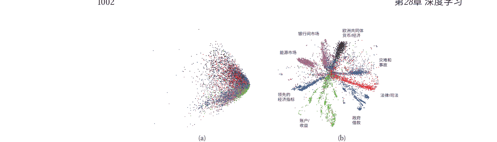

图28.5来自路透社RCV1-v2语料库的一些词袋数据的2D可视化。(a) 使用LSA的结果。(b) 使用深度自动编码器的结果。来源: (Hinton和Salakhutdinov 2006)的图4。获得Ruslan Salakhutdinov的友情许可使用。

3. 通过利用输入是图像的事实，可以在这个任务上获得更好的性能。一种方法是创建输入的扭曲版本，添加小的位移和平移 (见图16.13中的一些示例)。应用这个技巧将SVM的错误率降低到0.56%。使用卷积神经网络 (16.5.1节) 在扭曲图像上训练可以达到类似的错误率 (Simard等人2003年获得了0.4%的错误率)。然而，DBNs的优点在于它们提供了一种学习这种先验知识的方法，而不需要手工制作。

#### 28.4.2 数据可视化和使用深度自动编码器进行特征发现

深度自动编码器可以从原始数据中学习有信息的特征。这些特征通常被用作标准监督学习方法的输入。为了说明这一点，考虑使用一个具有2维隐藏瓶颈的深度自动编码器来拟合一些文本数据。结果显示在图28.5中。在左边，我们展示了由LSA（第27.2.2节）产生的2D嵌入，而在右边，是由自编码器产生的2D嵌入。很明显，由自编码器创建的低维表示捕捉到了很多文档的含义，即使没有使用类标签。⁴

注意，还有其他各种学习低维连续词嵌入的方法被提出。详见（Turian et al. 2010）的细节。

#### 28.4.3 使用深度自编码器进行信息检索（语义哈希）

考虑到在第27.7.3.1节中讨论的RBM在信息检索中的成功，自然会想知道深度模型是否可以做得更好。事实上，它们可以，如图28.6所示。更有趣的是，我们可以在深度自编码器的中间层使用二进制的低维表示，而不是像上面使用的连续表示。这样可以实现非常快速的相关文档检索。例如，如果我们使用20位的编码，我们可以预先计算所有文档的二进制表示，然后创建一个哈希表将编码词映射到文档。这种方法被称为语义哈希，因为语义上相似的文档的二进制表示在汉明距离上会很接近。

对于Reuters RCV1-v2中的402,207个测试文档，这意味着每个表项大约有0.4个文档。在测试时，我们计算查询的码字，然后通过查找内存中相关地址的内容，在常数时间内简单地检索相关文档。为了找到其他相关文档，我们可以计算所有码字在一个范围内的汉明距离，比如说，4。这导致检索大约 $6196 \times 0.4 \approx 2500$ 个文档<sup>5</sup>。关键点是总时间与语料库的大小无关。

当然，还有其他快速文档检索的技术，比如倒排索引。这些技术依赖于单词的信息量很大，所以我们可以简单地求交集，包含每个单词的所有文档。然而，在进行图像检索时，很明显我们不希望在像素级别上工作。最近，克里兹赫夫斯基和辛顿（2010）展示了深度自编码器可以学习一个优秀的语义哈希函数，其在8000万个小图像数据集上优于之前的技术（Torralba等人，2008；Weiss等人，2008）。将倒排索引技术应用于实值数据很困难（尽管可以想象对图像块进行向量量化）。

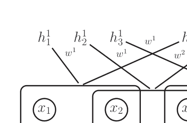

图28.7 一个具有两组隐藏单元的小型1D卷积RBM，每个单元与一个大小为2的滤波器相关联。$h^1_1$ 和 $h^2_1$ 是第一个窗口中数据的两个不同“视图”， $(x_1, x_2)$。第一个视图使用滤波器 $\mathbf{w}^1$ 计算，第二个视图使用滤波器 $\mathbf{w}^2$ 计算。类似地，$h^1_2$ 和 $h^2_2$ 是第二个窗口中数据的视图， $(x_2, x_3)$，分别使用 $\mathbf{w}^1$ 和 $\mathbf{w}^2$ 计算。

#### 28.4.4 使用一维卷积DBNs学习音频特征

为了将DBNs应用于长度不受限制的时间序列，需要使用某种形式的参数绑定。一种方法是使用卷积DBNs(Lee等人，2009年；Desjardins和Bengio，2008年)，它们使用卷积RBM作为基本单元。这些模型是第16.5.1节讨论的卷积神经网络的生成版本。基本思想如图28.7所示。每个组的隐藏激活向量通过将输入向量与该组的滤波器（权重向量或矩阵）进行卷积来计算。换句话说，隐藏组内的每个节点都是输入的子集的加权组合。我们通过“滑动”这个权重向量在输入上计算所有隐藏节点的激活。这使我们能够建模平移不变性，因为无论模式在输入向量的哪个位置出现，我们都使用相同的权重。<sup>6</sup>每个组都有自己的滤波器，对应于它自己的模式检测器。

4. 一些细节。Salakhutdinov和Hinton使用了Reuters RCV1-v2数据集，该数据集包含了804,414篇新闻文章，手动分类为103个主题。他们通过计算前2000个最常见单词出现的次数来表示每个文档。他们在一半的数据上训练了一个具有2000-500-250-125-2层的深度自动编码器。2000个可见单元使用复制的softmax分布，中间层的2个隐藏单元具有高斯分布，其余单元具有通常的伯努利-逻辑分布。在微调自动编码器时，使用了交叉熵损失函数（相当于在多项式分布下的最大似然估计）。有关详细信息，请参阅（Hinton和Salakhutdinov 2006）。

更正式地说，对于二进制1D信号，我们可以在卷积RBM中定义全条件如下（Lee等人，2009年）：

$$ p(h_t^k = 1|\mathbf{v}) = \text{sigm}((\mathbf{w}^k \otimes \mathbf{v})_t + b_t) \quad (28.6) $$
$$ p(v_s = 1|\mathbf{h}) = \text{sigm}\left( \sum_k (\mathbf{w}^k \otimes \mathbf{h}^k)_s + c_s \right) \quad (28.7) $$

其中 $\mathbf{w}^k$ 是组 $k$ 的权重向量，$b_t$ 和 $c_s$ 是偏置项，$\mathbf{a} \otimes \mathbf{b}$ 表示向量 $\mathbf{a}$ 和 $\mathbf{b}$ 的卷积。

通常还会添加一个最大池化层和一个卷积层，该层计算过滤响应的局部最大值。这样可以实现一定程度的平移不变性。它还可以减小较高层的大小，从而显著加快计算速度。在神经网络中定义这一点很简单，但是要以一种允许信息向前和向后流动的方式来定义这一点则更加复杂。基本思想与噪声OR CPD（第10.2.3节）类似，我们在最大节点和其最大化的部分之间定义了概率关系。详见（Lee等人，2009年）的详细信息。然而，请注意，自上而下的生成过程将会很困难，因为最大池化操作会丢弃大量信息。

（Lee et al. 2009）将深度为2的1D卷积DBNs应用于听觉数据。当输入由语音信号组成时，该方法恢复了一个类似于音素的表示。当应用于音乐分类和说话人识别时，他们的方法优于使用标准特征（如MFCC）的技术。（所有特征都被馈送到相同的判别式分类器中。）

在（Seide et al. 2011）中，深度神经网络被用于传统HMM中的GMM的替代。使用DNN显著提高了对话语音识别的性能。在一次采访中，该项目的技术负责人表示：“从历史上看，语音识别中很少有个别技术能够带来如此大的改进。”

#### 28.4.5 使用2D卷积DBNs学习图像特征

我们可以直接将一维卷积DBN扩展到二维（Lee等人，2009），如图28.8所示。在Caltech 101数据集的四类视觉对象（汽车、摩托车、人脸和飞机）上训练的三层系统的结果如图28.9所示。我们只展示第2层和第3层的结果，因为第1层学习到的Gabor样式滤波器与稀疏编码学习到的滤波器非常相似，如图13.21（b）所示。我们可以看到第2层学习到了一些通用的视觉部分，这些部分在对象类别之间是共享的，而第3层似乎学习到了类似祖母细胞的滤波器，这些滤波器对于个别对象类别是特定的，在某些情况下，对于个别对象也是特定的。

### 28.5 讨论

到目前为止，我们一直在讨论受大脑低层处理启发的模型。这些模型为简单的分类任务提供了有用的特征。但是这种纯自下而上的方法能否逼近更具挑战性的问题，比如场景解释或自然语言理解？

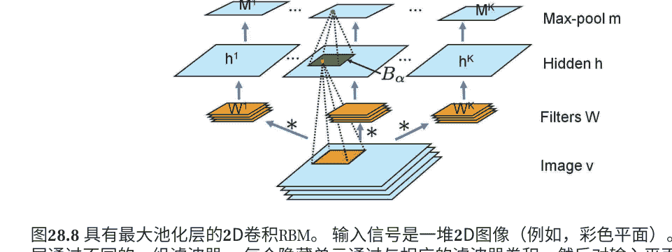

人脸、汽车、飞机、摩托车

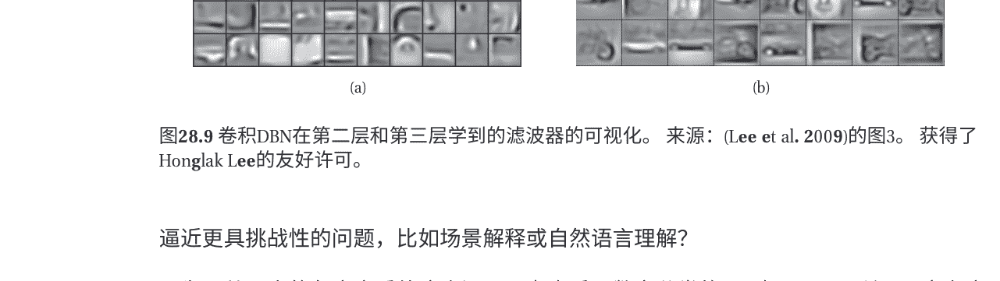

为了从更广的角度来看待这个问题，考虑手写数字分类的DBN如图28.4（a）所示。 它有大约1.6M个自由参数 （28 × 28 × 500 + 500 × 500 + 510 × 2000 = 1, 662, 000）。 虽然这很多，但与大脑中的神经元数量相比微不足道。 正如Hinton所说的那样，

> 这大约是0.002立方毫米的小鼠皮层中的参数数量，而且这种复杂性的几百个网络可以容纳在高分辨率fMRI扫描的一个体素中。 这表明，为了与人类的形状识别能力竞争，可能需要更大的网络。 — （Hinton et al. 2006, p1547）。

为了应对更具挑战性的问题，各个团队正在使用GPU（参见例如,（Raina et al. 2009））和/或并行计算。 但也许更高效的方法是在对象或其部分的空间中进行推理，而不是在更高的抽象层次上，比特和像素空间中进行。也就是说，我们希望弥合信号与符号之间的鸿沟，其中“符号”是指可以以组合方式与其他符号结合的原子性东西。

如何将低级信号转换为更结构化/“语义”表示的问题被称为符号基础问题（Harnad 1990）。传统上，这些符号与自然语言中的单词相关联，但是直接从低级信号跳跃到高级语义概念似乎是不可能的。相反，我们需要一个中间层次的符号或原子部分。

从实值信号（如图像）创建这些部分的一种非常简单的方法是应用矢量量化。这将生成一组视觉词。然后可以使用第27章中用于建模词袋的一些技术对其进行建模。然而，这样的模型仍然相当“浅”。

可以定义和学习使用离散潜在部分的深度模型。在这里，我们只是提到了一些最近的方法，以展示可能性的一些特点。（Salakhutdinov等人，2011年）将RBM与层次潜在狄利克雷分配方法相结合，以无监督的方式进行训练。（Zhu等人，2010年）使用潜在的“与或”图，以类似于潜在结构SVM的方式进行训练。基于语法的类似方法在（Girshick等人，2011年）中有描述。有趣的是，这些技术将数据驱动的机器学习方法应用于丰富的结构化/符号化的“人工智能风格”模型。这似乎是机器学习的一个有希望的未来方向。

# 符号

## 引言

很难找到一个统一的、一致的符号来涵盖我们讨论的各种数据、模型和算法。此外，惯例在机器学习和统计学之间以及不同的书籍和论文之间是不同的。尽管如此，我们尽可能地保持一致。下面我们总结了本书中使用的大部分符号，尽管各个章节可能会引入新的符号。还要注意，同一个符号在不同的上下文中可能有不同的含义，尽管我们尽量避免这种情况。

## 一般数学符号

| 符号 | 含义 |
|------|------|
| ⌊x⌋ | x的下取整，即向下舍入到最近的整数 |
| ⌈x⌉ | x的上取整，即向上舍入到最近的整数 |
| x ⊗ y | x和y的卷积 |
| x ⊙ y | x和y的Hadamard（逐元素）乘积 |
| a ∧ b | 逻辑与 |
| a ∨ b | 逻辑或 |
| ¬a | 逻辑非 |
| 𝟙(x) | 指示函数，𝟙(x)=1如果x为真，否则𝟙(x)=0 |
| ∞ | 无穷大 |
| → | 趋向于，例如，n → ∞ |
| ∝ | 与比例成正比，所以y=ax可以写成 y ∝ x |
| |x| | 绝对值 |
| |S| | 集合的大小（基数） |
| n! | 阶乘函数 |
| ∇ | 一阶导数的向量 |
| ∇² | 海森矩阵的二阶导数 |
| ≝ | 定义为 |
| O(·) | 大O：大致意味着数量级 |
| ℝ | 实数 |
| 1:N | 范围（Matlab约定）：1:N = {1,2,…,N} |
| ≈ | 近似等于 |
| argmax_x f(x) | Argmax：使f最大化的值x |
| $B(a, b)$ | 贝塔函数，$B(a, b) = \frac{\Gamma(a)\Gamma(b)}{\Gamma(a+b)}$ |
| $B(\alpha)$ | 多元贝塔函数 $\frac{\prod_k \Gamma(\alpha_k)}{\Gamma(\sum_N \alpha_k)}$ |
| $\binom{n}{k}$ | 组合数，等于 $N!/(K!(N - K)!)$ |
| $\delta(x)$ | 狄拉克δ函数，$\delta(x) = \infty$ if $x = 0$, 否则 $\delta(x) = 0$ |
| $\delta_{ij}$ | Kronecker delta，如果 $i = j$，则等于1，否则等于0 |
| $\delta_x(y)$ | Kronecker delta，如果 $x = y$，则等于1，否则等于0 |
| $\exp(x)$ | 指数函数 $e^x$ |
| $\Gamma(x)$ | 伽玛函数，$\Gamma(x) = \int_0^\infty u^{x-1} e^{-u} du$ |
| $\Psi(x)$ | 二次函数，$\Psi(x) = \frac{d}{dx} \log \Gamma(x)$ |
| $\mathcal{X}$ | 从中提取值的集合（例如，$\mathcal{X} = \mathbb{R}^D$） |

## 线性代数符号

我们使用粗体小写字母表示向量，例如 a，并使用粗体大写字母表示矩阵，例如 A。默认情况下，向量被假定为列向量，除非另有说明。

| 符号 | 含义 |
|------|------|
| $A \succ 0$ | $A$是一个正定矩阵 |
| $\text{tr}(A)$ | 矩阵的迹 |
| $\det(A)$ | 矩阵 $A$ 的行列式 |
| $|A|$ | 矩阵 $A$的行列式 |
| $A^{-1}$ | 矩阵的逆 |
| $A^{\dagger}$ | 矩阵的伪逆 |
| $A^T$ | 矩阵的转置 |
| $a^T$ | 向量的转置 |
| $\text{diag}(a)$ | 由向量 $a$构成的对角矩阵 |
| $\text{diag}(A)$ | 从矩阵 $A$中提取的对角向量 |
| $I$ 或 $I_d$ | 大小为 $d \times d$的单位矩阵（对角线上为1，其他位置为0） |
| $1$ 或 $1_d$ | 全1向量（长度为 $d$） |
| $0$ 或 $0_d$ | 全0向量（长度为 $d$） |
| $\|\mathbf{x}\| = \|\mathbf{x}\|_2$ | 欧几里得或 $\ell_2$范数 $\sqrt{\sum_{j=1}^d x_j^2}$ |
| $\|\mathbf{x}\|_1$ | $\ell_1$范数 $\sum_{j=1}^d |x_j|$ |
| $\mathbf{A}_{:,j}$ | 矩阵的第$j$列 |
| $\mathbf{A}_{i,:}$ | 矩阵的第$i$行的转置（列向量） |
| $A_{ij}$ | 矩阵A的 $(i, j)$ 元素 |
| $\mathbf{x} \otimes \mathbf{y}$ | 矩阵$\mathbf{x}$和矩阵$\mathbf{y}$的张量积 |

## 概率符号表示

我们用小写字母表示随机和固定的标量，用粗体小写字母表示随机和固定的向量，用粗体大写字母表示随机和固定的矩阵。偶尔我们使用非粗体大写字母表示标量随机变量。此外，我们使用 p()表示离散和连续随机变量。

| 符号 | 含义 |
| :--- | :--- |
| $X \perp Y$ | $X$独立于 $Y$ |
| $X \not\perp Y$ | $X$不独立于 $Y$ |
| $X \perp Y \mid Z$ | $X$在给定 $Z$的条件下独立于 $Y$ |
| $X \not\perp Y \mid Z$ | $X$在给定 $Z$的条件下不独立于 $Y$ |
| $X \sim \text{分布}$ | $X$按照分布 $p$进行分布 |
| $\boldsymbol{\alpha}$ | Beta分布或Dirichlet分布的参数 |
| $\mathrm{cov}[\mathbf{x}]$ | $\mathbf{x}$的协方差 |
| $\mathbb{E}[X]$ | 随机变量 $X$ 的期望值 |
| $\mathbb{E}_q[X]$ | 随机变量 $X$关于分布 $q$的期望值 |
| $\mathbb{H}(X)$或 $\mathbb{H}(p)$ | 分布 $p(X)$的熵 |
| $\mathrm{I}(X; Y)$ | 随机变量 $X$和 $Y$之间的互信息 |
| $\mathrm{KL}(p\|q)$ | 从分布 $p$到 $q$的KL散度 |
| $\ell(\theta)$ | 对数似然函数 |
| $L(\theta, a)$ | 当真实状态为 $\theta$时，采取行动 $a$的损失函数 |
| $\lambda$ | 精度（逆方差） $\lambda=1/\sigma^2$ |
| $\boldsymbol{\Lambda}$ | 精度矩阵 $\boldsymbol{\Lambda}=\boldsymbol{\Sigma}^{-1}$ |
| $\text{模态 }[X]$ | $X$的最可能值 |
| $\mu$ | 标量分布的均值 |
| $\boldsymbol{\mu}$ | 多元分布的均值 |
| $p(x)$ | 概率密度或质量函数 |
| $p(x|y)$ | 给定$y$的条件下$x$的条件概率密度 |
| $\Phi$ | 标准正态分布的累积分布函数 |
| $\phi$ | 标准正态分布的概率密度函数 |
| $\pi$ | 多项式参数向量，马尔可夫链的稳态分布 |
| $\rho$ | 相关系数 |
| $\mathrm{sigm}(x)$ | Sigmoid（逻辑）函数， $\displaystyle \frac{1}{1+e^{-x}}$ |
| $\sigma^2$ | 方差 |
| $\boldsymbol{\Sigma}$ | 协方差矩阵 |
| $\mathrm{var}[x]$ | $x$的方差 |
| $\nu$ | 自由度参数 |
| $Z$ | 概率分布的归一化常数 |

## 机器学习/统计符号

一般来说，我们使用大写字母表示常数，例如 $C$, $D$, $K$, $N$, $S$, $T$等。我们使用小写字母作为适当范围的虚拟索引，例如 $c=1:C$用于索引类别， $j=1:D$用于索引输入特征， $k=1:K$用于索引状态或聚类， $s=1:S$用于索引样本， $t=1:T$用于索引时间等。为了索引数据案例，我们使用符号 $i=1:N$， 尽管符号 $n=1:N$也被广泛使用。

我们使用 $\mathbf{x}$来表示观测数据向量。 在监督问题中，我们使用 $y$或 $\mathbf{y}$来表示期望的输出标签。 我们使用 $\mathbf{z}$来表示隐藏变量。 有时我们也使用 $q$来表示隐藏的离散变量。

| 符号 | 含义 |
|------|------|
| C | 类别数量 |
| D | 数据向量的维度（特征数量） |
| R | 输出数量（响应变量数量） |
| $\mathcal{D}$ | 训练数据 $\mathcal{D} = \{\mathbf{x}_i | i=1:N\}$ or $\mathcal{D} = \{(\mathbf{x}_i, y_i) | i=1:N\}$ |
| $\mathcal{D}_{\text{test}}$ | 测试数据 |
| $J(\boldsymbol{\theta})$ | 成本函数 |
| $K$ | 变量的状态或维度数量（通常是潜在的） |
| $\kappa(\mathbf{x}, \mathbf{y})$ | 核函数 |
| $\mathbf{K}$ | 核矩阵 |
| $\lambda$ | 正则化项的强度 $\ell_2$ 或 $\ell_1$ |
| N | 数据案例数量 |
| $N_c$ | 类别 $c$ 的示例数量, $N_c = \sum_{n=1}^N \mathbb{I}(y_n = c)$ |
| $\phi(\mathbf{x})$ | 特征向量的基函数扩展 $\mathbf{x}$ |
| $\boldsymbol{\Phi}$ | 设计矩阵的基函数扩展 $X$ |
| $q()$ | 近似或提议分布 |
| $Q(\boldsymbol{\theta}, \boldsymbol{\theta}_{\text{old}})$ | EM中的辅助函数 |
| $S$ | 样本数量 |
| $T$ | 序列的长度 |
| $T(\mathcal{D})$ | 数据的检验统计量 |
| $\mathbf{T}$ | 马尔可夫链的转移矩阵 |
| $\boldsymbol{\theta}$ | 参数向量 |
| $\boldsymbol{\theta}^{(s)}$ | 参数向量的第 $s$ 个样本 |
| $\hat{\boldsymbol{\theta}}$ | 对 $\boldsymbol{\theta}$ 的估计（通常是 MLE 或 MAP） |
| $\hat{\boldsymbol{\theta}}_{\text{ML}}$ | 对 $\boldsymbol{\theta}$ 的最大似然估计 |
| $\hat{\boldsymbol{\theta}}_{\text{MAP}}$ | 对 $\boldsymbol{\theta}$ 的 MAP 估计 |
| $\bar{\boldsymbol{\theta}}$ | 对 $\boldsymbol{\theta}$ 的估计（通常是后验均值） |
| $\mathbf{w}$ | 回归权重向量（在统计学中称为 $\beta$） |
| $\mathbf{W}$ | 回归权重矩阵 |
| $x_{ij}$ | 数据案例 $i$ 的第 $j$ 个组件（即特征），对于 $i=1:N$, $j=1:D$ |
| $\mathbf{x}_i$ | 训练案例, $i=1:N$ |
| $\mathbf{X}$ | 大小为 $N \times D$ 的设计矩阵 |
| $\bar{\mathbf{x}}$ | 经验均值 $\bar{\mathbf{x}} = \frac{1}{N} \sum_{i=1}^N \mathbf{x}_i$ |
| $\tilde{\mathbf{x}}$ | 未来测试案例 |
| $\mathbf{x}_*$ | 未来测试案例 |
| $\mathbf{y}$ | 所有训练标签的向量 $\mathbf{y} = (y_1, \ldots, y_N)$ |
| $z_{ij}$ | 用于案例 $i$ 的潜在组件 $j$ |

## 图模型符号

在图模型中，我们用 $s, t, u \in V$ 来索引节点，用 $i, j, k \in X$ 来表示状态。

## 符号

| 符号 | 含义 |
|------|------|
| s ~ t | 节点s与节点t相连 |
| bel | 信念函数 |
| C | 图的团 |
| ch_j | DAG中节点 j的子节点 |
| desc_j | DAG中节点 j的后代 |
| G | 一个图 |
| E | 一个图的边 |
| mb_t | 节点 t的马尔可夫毯 |
| nbd_t | 节点 t的邻居 |
| pa_t | DAG中节点 t的父节点 |
| pred_t | DAG中节点 t的前驱节点（相对于某个排序） |
| psi_c(x_c) | 团 c的潜在函数 |
| S | 图的分隔符 |
| theta_sjk | 概率。节点 s在状态 k时，给定其父节点处于状态 j |
| V | 图的节点 |

## 常用缩写列表

| 缩写 | 含义 |
|------|------|
| CDF | 累积分布函数 |
| CPD | 条件概率分布 |
| CPT | 条件概率表 |
| CRF | 条件随机场 |
| DAG | 有向无环图 |
| DGM | 有向图模型 |
| EB | 经验贝叶斯 |
| EM | 期望最大化算法 |
| EP | 期望传播 |
| GLM | 广义线性模型 |
| GMM | 高斯混合模型 |
| HMM | 隐马尔可夫模型 |
| iid | 独立同分布 |
| iff | 当且仅当 |
| KL divergence | Kullback-Leibler散度 |
| LDS | 线性动态系统 |
| LHS | 等式的左侧（方程的） |
| MAP | 最大后验估计 |
| MCMC | 马尔可夫链蒙特卡洛 |
| MH | Metropolis-Hastings |
| MLE | 最大似然估计 |
| MPM | 后验边缘的最大值 |
| MRF | 马尔可夫随机场 |
| MSE | 均方误差 |
| NLL | 负对数似然 |
| OLS | 普通最小二乘法 |
| pd | 正定（矩阵） |
| pdf | 概率密度函数 |
| pmf | 概率质量函数 |
| RBPF | Rao-Blackwellised粒子滤波器 |
| RHS | 方程的右手边 |
| RJMCMC | 可逆跳跃MCMC |
| RSS | 残差平方和 |
| SLDS | 切换线性动态系统 |
| SSE | 平方误差和 |
| UGM | 无向图模型 |
| VB | 变分贝叶斯 |
| wrt | 关于 |

## 参考文献

- Abend, K., T. J. Harley, and L. N. Kanal (1965). 二进制随机模式的分类。 IEE Transactions on Information Theory 11(4), 538-544.

- Ackley, D., G. Hinton, and T. Sejnowski (1985). 一种用于 Boltzmann机器的学习算法。 认知科学 9, 147-169.

- Adams, R. P., H. Wallach, and Z. Ghahramani (2010). 学习深度稀疏图模型的结构。 在AI/Statistics中。

- Aggarwal, D. and S. Merugu (2007). 用于大规模二元数据的预测离散潜在因子模型。 在知识发现和数据挖掘国际会议上。

- Ahmed, A. and E. Xing (2007). 关于逻辑正态主题混合模型的紧密近似推断。 在AI/Statistics中。

- Ahn, J.-H. and J.-H. Oh (2003). 一种用于主成分分析的约束EM算法。 神经计算 15, 57-65.

- Ahn, S., A. Korattikara, and M. Welling (2012). 通过随机梯度费舍尔评分进行贝叶斯后验采样。 在机器学习国际会议上。

- Airoldi, E., D. Blei, S. Fienberg, and E. Xing (2008). 混合成员随机块模型。 机器学习研究杂志9, 1981-2014.

- Aitchison, J. (1982). 组成数据的统计分析。 皇家统计学会B系列44(2), 139-177.

- Aji, S. M. and R. J. McEliece (2000, March). 广义分布律。 IEEE信息论46(2), 325-343.

- Alag, S. and A. Agogino (1996). 在向量高斯连续网络中使用消息传播和拓扑变换进行推理。 在 UAI中。

- Albers, C., M. Leisink and H. Kappen (2006). 用于扩展谱系的高效联动分析的集群变异方法。 BMC Bioinformatics 7.

- Albert, J. and S. Chib (1993). 二元和多项响应数据的贝叶斯分析。 J. of the Am. Stat. Assoc. 88 (422), 669-679.

- Allwein, E., R. Schapire and Y. Singer (2000). 将多类分类减少为二元分类：一种统一的边界分类器方法。 J. of Machine Learning Research, 113-141.

- Aloise, D., A. Deshpande, P. Hansen, and P. Popat (2009). 欧几里得平方和聚类的NP难度。 机器学习75, 245-249.

- Alpaydin, E. (2004). 机器学习导论。 MIT出版社.

- Altun, Y., T. Hofmann, and I. Tsochantaridis (2006). 用于结构化和相互依赖输出变量的大边界方法。 在 G. Bakir, T. Hofmann, B. Scholkopf, A. Smola, B. Taskar, and S. Vishwanathan (Eds.), 机器学习 with Structured Outputs. MIT出版社.

- Amir, E. (2010). 树宽的近似算法。 Algorithmica 56(4), 448.

- Amir, E. and S. McIlraith (2005). 基于分区的逻辑推理-用于一阶和命题理论。 人工智能162(1), 49-88.

- Ando, R. and T. Zhang (2005). 从多个任务和无标签数据中学习预测结构的框架。 J. 机器学习研究 6, 1817-1853.

- Andrews, D. and C. Mallows (1974). 正态分布的混合尺度-分布。 J. of Royal Stat. Soc. Series B 36, 99-102.

- Andrieu, C., N. de Freitas, and A. Doucet (2000). 顺序贝叶斯估计和模型选择-用于动态核机器。 技术报告, 剑桥大学.

- Andrieu, C., N. de Freitas, and A. Doucet (2001). 鲁棒的全贝叶斯学习径向基函数网络。 神经计算机器 I3(10), 2359-2407.

- Andrieu, C., N. de Freitas, A. Doucet, and M. Jordan (2003). 关于机器学习的MCMC入门-介绍。机器学习50, 5-43.

- Andrieu, C., A. Doucet, and V. Tadic (2005). 在线EM算法用于非线性非高斯-状态空间模型的参数估计。 在IEEE CDC会议上。

- Andrieu, C. and J. Thoms (2008). 关于自适应MCMC的教程。统计计算18, 343-373.

- Aoki, M. (1987). 状态空间建模的时间序列。 Springer.

- Archambeau, C. and F. Bach (2008). 稀疏概率投影。 在NIPS.

- Argyriou, A., T. Evgeniou, and M. Pontil (2008). 凸多任务特征学习。 机器学习73(3), 243-272.

- Armagan, A., D. Dunson, and J. Lee (2011). 广义双帕累托收缩。 技术报告, 杜克大学.

- Armstrong, H. (2005). 贝叶斯估计的可分解高斯图模型。 博士论文, 新南威尔士大学.

- Armstrong, H., C. Carter, K. Wong, and R. Kohn (2008). 使用可分解图模型的贝叶斯协方差矩阵估计。 统计与计算, 1573-1375.

- Arnborg, S., D. G. Corneil, and A. Proskurowski (1987). 在k-树中寻找嵌入的复杂性。 SIAM J. on Algebraic and Discrete Methods 8, 277-284.

- Arora, S. and B. Barak (2009). 复杂性理论：现代方法。 剑桥。

- Arthur, D. and S. Vassilvitskii (2007). k-means++：小心种子的优势。 在 Proc. 18th ACM-SIAM symp. on Discrete algorithms, pp. 1027–1035.

- Arulampalam, M., S. Maskell, N. Gordon, and T. Clapp (2002, February). 在线非线性/非高斯贝叶斯跟踪的粒子滤波器教程。IEEE Trans. on Signal Processing 50(2), 174–189.

- Asavathiratham, C. (2000). Influence 模型：网络马尔可夫链动态的可处理表示。Ph.D.论文，MIT, Dept. EECS.

- Atay-Kayis, A. and H. Massam (2005). 一种计算非分解高斯图模型边际似然的蒙特卡罗方法 Biometrika 92, 317–335.

- Attenberg, J., K. Weinberger, A. Smola, A. Dasgupta, and M. Zinkevich (2009). 使用哈希技巧的协同垃圾邮件过滤器 VirusBulletin.

- Attias, H. (1999). 独立因子分析。神经计算 11, 803–851.

- Attias, H. (2000). 图形模型的变分贝叶斯框架。在 NIPS-12中。

- Bach, F. (2008). Bolasso: 通过自助法进行模型一致的Lasso估计。在机器学习国际会议中。

- Bach, F. and M. Jordan (2001). 薄联合树。在 NIPS中。

- Bach, F. and M. Jordan (2005). 对经典相关分析的概率解释。技术报告 688, 加州大学伯克利分校。

- Bach, F. and E. Moulines (2011). 非渐近分析的随机逼近算法在机器学习中的应用。在 NIPS中。

- Banerjee, O., L. E. Ghaoui, and A. d’Aspremont (2008). 通过稀疏最大似然估计进行模型选择用于多变量高斯或二进制数据。机器学习研究杂志 9, 485–516.

- Bar-Shalom, Y. and T. Fortmann (1988). 跟踪和数据关联 . 学术出版社.

- Bar-Shalom, Y. and X. Li (1993). 估计和跟踪:原理,技术和软件. Artech House.

- Barash, Y. and N. Friedman (2002). 上下文特定的贝叶斯聚类-ning 用于基因表达数据. J. 计算机生物学. 9, 169–191.

- Barber, D. (2006). 期望校正平滑推断中的切换线性动力系统. 机器学习研究杂志 7, 2515–2540.

- Barber, D. and C. Bishop (1998). 贝叶斯神经网络中的集成学习. 在 C. Bishop编者, 神经网络和机器学习, pp. 215–237. Springer.

- Barber, D. and S. Chiappa (2007). 统一推理变分贝叶斯线性高斯状态空间模型。 在 NIPS中。

- Barbieri, M. and J. Berger (2004). 最优预测模型选择。 Annals of Statistics 32, 870–897.

- Bartlett, P., M. Jordan, and J. McAuliffe (2006). 凸性，分类，和风险界限。 J. of the Am. Stat. Assoc. 101(473), 138–156.

- Baruniak, R. (2007). 压缩感-知。 IEEE Signal Processing Magazine.

- 在马尔可夫链的统计分析中出现的一种技术-函数的概率函数。数理统计学年鉴 41, 164–171.

- Beal, M. (2003). 变分算法用于近似贝叶斯推断。博士论文，Gatsby Unit.

- Beal, M. and Z. Ghahramani (2006). 变分贝叶斯学习具有隐藏变量的有向图模型。 贝叶斯分析 1(4).

- Beal, M. J., Z. Ghahramani, and C. E. Rasmussen (2002). 无限隐藏马尔可夫模型。在 NIPS-14中。

- Beck, A. and M. Teboulle (2009). 一种快速的迭代收缩阈值算法，用于线性逆问题。 SIAM J. on Imaging Sciences 2(1), 183–202.

- Beinlich, I., H. Suermondt, R. Chavez, and G. Cooper (1989). ALARM监测系统：一个概率推理的案例研究网络信念的两种技术。在 Proc. 第二届欧洲人工智能医学会议, pp. 247–256.

- Bekkerman, R., M. Bilenko, and J. Langford (Eds.) (2011). 扩展机器学习. 剑桥.

- Bell, A. J. and T. J. Sejnowski (1995). 一种信息最大化的方法，用于盲分离和盲卷积。 神经计算 7(6), 1129–1159.

- Bengio, Y. (2009). 学习深度架构用于人工智能。机器学习基础和趋势2(1), 1–127.

- Bengio, Y. and S. Bengio (2000). 用多层神经网络建模高维离散数据。在NIPS中。

- Bengio, Y., O. Delalleau, N. Roux, J. Pagement, P. Vincent, and M. Ouimet (2004). 学习特征函数链接嵌入和核PCA。 神经计算16, 2197–2219.

- Bengio, Y. and P. Frasconi (1995). 在马尔可夫模型中传播上下文和信用信息。AI研究杂志3, 249–270.

- Bengio, Y. and P. Frasconi (1996). 用于序列处理的输入/输出HMMs。 IEEE Trans. on Neural Networks 7(5), 1231–1249.

- Bengio, Y., P. Lamblin, D. Popovici, and H. Larochelle (2007). 贪婪逐层训练深度神经网络。在 NIPS.

- Berchtold, A. (1999). 双链马尔可夫模型。Comm. Stat. Theor. Methods 28, 2569–2589.

- Berger, J. (1985). 贝叶斯推销员问题。在 P. K. Goel and A. Zellner (Eds.), Bayesian Inference and Decision Techniques with Applications: Essays in Honor of Bruno de Finetti. North-Holland.

- Berger, J. and R. Wolpert (1988). 似然原则。数理统计学研究所。第二版。

- Berkhin, P. (2006). 聚类数据挖掘技术的调查。在 J. Kogan, C. Nicholas and M. Teboule (Eds.) 的《多维数据分组：聚类的最新进展》中，第25-71页。Springer.

- Bernardo, J. and A. Smith (1994). 贝叶斯理论。John Wiley.

- Berrou, C., A. Glavieux, and P. Thitimajashima (1993). 接近Shannon极限的纠错编码和解码：Turbo codes。Proc. IEEE Intl. Comm. Conf..

- Berry, D. and Y. Hochberg (1999). 关于多重比较的贝叶斯观点。J. Statist. Planning and Inference 82, 215–227.

- Bertele, U. and F. Brioschi (1972). 非连续动态规划。Academic Press.

- Bertsekas, D. (1997). 并行和分布计算：数值方法。Athena Scientific.

- Bertsekas, D. (1999). 非线性规划（第二版）。Athena Scientific.

- Bertsekas, D. and J. Tsitsiklis (2008). 概率导论。Athena Scientific. 第二版。

- Besag, J. (1975). 非格点数据的统计分析。The Statistician 24, 179–196.

- Bhatnagar, N., C. Bogdanov, and E. Mosel (2010). 估计收敛时间的计算复杂性。技术报告，。

- Bhattacharya, A. and D. B. Dunson (201). 多元无序分类数据的单纯形因子模型。美国统计协会杂志。即将出版。

- Bickel, P. and E. Levina (2004). 一些关于Fisher线性判别函数，“朴素贝叶斯”和当变量比观测值多得多时的一此替代方法的理论。伯努利10, 989–1010.

- Bickson, D. (2009). 高斯信念传播：理论和应用。希伯来大学耶路撒冷分校博士论文。

- Bilmes, J. (2000). 动态贝叶斯多网络。在 UAI中。

- Bilmes, J. A. (2001). 图形模型和自动语音识别。技术报告UWEETR-2001-0005，华盛顿大学，电子工程系。

- Binder, J., D. Koller, S. J. Russell, and K. Kanazawa (1997). 具有隐藏变量的自适应概率网络。机器学习29, 213–244.

- Binder, J., K. Murphy, and S. Russell (1997). 在动态概率网络中高效推理。在国际人工智能联合会议上

- Birnbaum, A. (1962). 关于统计推断的基础。美国统计协会杂志57, 269–326.

- Bishop, C. (1999). 贝叶斯主成分分析。在 NIPS.

- Bishop, C. (2006a). 模式识别和机器学习。斯普林格出版社。

- Bishop, C. (2006b). 模式识别和机器学习。斯普林格出版社。

- Bishop, C. and G. James (1993). 使用双能量密度测定和神经网络分析多相流动。核仪器和物理研究方法A327, 580–593.

- Bishop, C. and M. Svensen (2003). 贝叶斯分层混合专家。在 UAI。

- Bishop, C. and M. Tipping (2000). 变分相关向量机- chines。在 UAI。

- Bishop, C. M. (1994). 混合密度网络。技术报告NCRG 4288，神经计算研究组，计算机科学系，阿斯顿大学。

- Bishop, C. M. (1995). 神经网络用于模式识别。Clarendon Press。

- Bishop, Y., S. Fienberg and P. Holland (1975). 离散多元分析-理论与实践。MIT Press。

- Bistarelli, S., U. Montanari and F. Rossi (1997). 基于半环的约束满足和优化-化。J. of the ACM 44(2), 201–236。

- Blake, A., P. Kohli, and C. Rother (2011). 视觉和图像处理中的马尔可夫随机场的进展。MIT出版社。

- Blei, D. and J. Lafferty (2006a). 相关主题模型。在 NIPS。

- Blei, D. and J. Lafferty (2006b). 动态主题模型。在机器学习国际会议，第113-120页。

- Blei, D. and J. Lafferty (2007). 一个“科学”的相关主题模型。应用统计学年鉴，I(1), 17–35。

- Blei, D. and J. McAuliffe (2010年3月). 监督主题模型。技术报告，普林斯顿。

- Blei, D., A. Ng, and M. Jordan (2003). 潜在狄利克雷分配。机器学习研究杂志3, 993–1022。

- Blumensath, T. and M. Davies (2007). 正交匹配追踪和正交最小二乘之间的差异。技术报告，爱丁堡大学。

- Bo, L., C. Sminchisescu, A. Kanauji and D. Metaxas (2008). 用于大规模条件3D预测的快速算法。在 CVPR中。

- Bohning, D. (1992). 多项式逻辑回归算法。统计数学研究所年鉴44, 197–200。

- Bollen, K. (1989). 具有潜在变量的结构方程模型。约翰威利和儿子。

- Bordes, A., L. Bottou and P. Gallinari (2009). Sgd-qn：小心的拟牛顿随机梯度下降。机器学习研究杂志10, 1737–1754。

- Bordes, A., L. Bottou, P. Gallinari, J. Chang, and S. A. Smith (2010). 勘误：SGDQN比预期更不小心。机器学习研究杂志11, 2229–2240。

Boser, B. E., I. M. Guyon, and V. N. Vapnik (1992). 一种用于最优边界分类器的训练算法。在会议记录。 关于计算学习理论的研讨会。

Bottcher, S. G. and C. Dethlefsen (2003). deal: 一个学习贝叶斯网络的软件包。统计软件杂志 8(20).

Bottolo, L. and S. Richardson (2010). 进化随机搜索。贝叶斯分析 5(3), 583–618。

Bottou, L. (1998). 在线算法和随机逼近。在 D. Saad (Ed.), 在线学习和神经网络。 剑桥。

Bottou, L. (2007). 大规模数据集的学习 (nips 教程)。

Bottou, L., O. Chapelle, D. DeCoste, 和 J. Weston (Eds.) (2007). 大规模核机器。 MIT出版社。

Bouchard, G. (2007). 对softmax的高效界限及其在混合模型中的近似推断应用。在NIPS 2007 Workshop on Approximate Inference in Hybrid Models中。

Bouchard-Cote, A. 和 M. Jordan (2009). 结构化均值场目标的优化。在 UAI中。

Bowman, A. 和 A. Azzalini (1997). 应用平滑技术进行数据分析。 牛津。

Box, G. 和 N. Draper (1987). 经验-建模和响应曲面。 Wiley。

Box, G. 和 G. Tiao (1973). 贝叶斯统计分析中的推断。 Addison-Wesley。

Boyd, S. 和 L. Vandenberghe (2004). 凸优化。 Cambridge。

Boyen, X. 和 D. Koller (1998). 复杂随机过程的可处理推断。 在 UAI。

Boykov, Y., O. Veksler, 和 R. Zabih (2001). 通过图割的快速近似能量最小化。 IEEE模式分析和机器智能 23(II).

Brand, M. (1996). 用于建模相互作用过程的耦合隐马尔可夫模型。 MIT感知计算实验室技术报告405.

Brand, M. (1999). 通过熵先验和参数消失在条件概率模型中进行结构学习。神经计算 11, I155-I182.

Braun, M. and J. McAuliffe (2010). Vari-大规模离散选择模型的national Inference. J. of the Am. Stat. Assoc. 105(489), 324–335.

Breiman, L. (1996). Bagging预测器。机器学习 24, 123–140.

Breiman, L. (1998). Arcing分类器。Annals of Statistics 26, 801–849.

Breiman, L. (2001a). 随机森林。机器学习 45(1), 5–32.

Breiman, L. (2001b). 统计模-建模：两种文化。统计科学 16(3), 199–231.

Breiman, L., J. Friedman, and R. Olshen (1984). 分类和回归树。 Wadsworth.

Breslow, N. E. and D. G. Clayton (1993). 广义线性混合模型的近似推断。美国统计协会杂志。 88(421), 9–25.

Briers, M, A. Doucet, and S. Maskell (2010). 用于状态空间模型的平滑算法。统计数学研究所年鉴(1), 61–89.

Brochu, E., M. Cora, and N. de Freitas (2009, November). 昂贵成本函数的贝叶斯优化教程，以及对主动用户建模和分层强化学习的应用。技术报告TR-2009-23，计算机科学系，英属哥伦比亚大学。

Brooks, S. and G. Roberts (1998). 评估马尔可夫链蒙特卡罗算法的收敛性。统计与计算 8, 319–335.

Brown, L., T. Cai and A. DasGupta (2001). 二项比例的区间估计。统计科学 16(2), 101–133.

Brown, M. P., R. Hughey, A. Krogh, I. S. Mian, K. Sjölander and D. Haussler (1993). 使用狄利克雷混合先验推导蛋白质家族的隐藏马尔可夫模型。在国际智能分子生物学会议，第47–55页。

Brown, P., M. Vannucci and T. Fearn (1998). 多元贝叶斯变量选择和预测。英国皇家统计学会B 60(3), 627–641.

Bruckstein, A., D. Donoho, and M. Elad (2009). 从稀疏解决方案到信号和图像的稀疏建模。SIAM Review 51(1), 34–81.

Bryson, A. and Y.-C. Ho (1969). 应用最优控制：优化、估计和控制。 Blaisdell出版公司。

Bühlmann, P. and T. Hothorn (2007). Boosting算法：正则化、预测和模型拟合。Statistical Science 22(4), 477–505.

Bühlmann, P. and S. van de Geer (2011). 高维数据的统计学：方法论、理论和应用。 Springer.

Bühlmann, P. and B. Yu (2003). 使用L2损失进行Boost-回归和分类。J. of the Am. Stat. Assoc. 98(462), 324–339.

Bühlmann, P. and B. Yu (2006). 稀疏提升。机器学习研究杂志 7, 1001–1024.

Bui, H., S. Venkatesh, and G. West (2002). 在抽象隐马尔可夫模型中的策略识别。 人工智能研究杂志 17, 451–499.

Buntine, W. (2002). 变分扩展-到EM和多项式PCA。 在国际机器学习会议。

Buntine, W. and A. Jakulin (2004). 应用离散PCA在数据分析中。在 UAI。

Buntine, W. and A. Jakulin (2006). 离散成分分析。在子空间、潜在结构和特征选择:统计和优化视角研讨会。

Buntine, W. and A. Weigend (1991). 贝叶斯反向传播。复杂系统 5, 603–643。

Burges, C. J., T. Shaked, E. Renshaw, A. Lazier, M. Deeds, N. Hamilton, 和 G. Hullender (2005). 使用梯度下降进行排序学习。在机器学习国际会议上, 第89-96页。

Burkard, R., M. Dell'Amico 和 S. Martello (2009). 分配问题。 SIAM。

Byran, K. 和 T. Leise (2006). 第25,000,000,000个特征向量: Google背后的线性代数。 SIAM评论 48(3)。

Calvetti, D. 和 E. Somersalo (2007). 贝叶斯科学计算导论。 Springer。

Candes, E., J. Romberg 和 T. Tao (2006). 鲁棒性不确定性原理: 从极度不完整的频率信息中精确信号重建。 IEEE。 信息。 理论 52(2), 489-509。

Candes, E. 和 M. Wakin (2008, 3月). 压缩采样简介。 IEEE信号处理杂志 21。

Candes, E., M. Wakin 和 S. Boyd (2008). 通过重新加权的l1最小化来增强稀疏性。 J. of Fourier分析和应用 1, 877-905。

Cannings, C., E. A. Thompson 和 M. H. Skolnick (1978). 复杂家系中的概率函数。 应用概率的进展 10, 26-61。

Canny, J. (2004). Gap: 一种离散数据的因子模型。 Proc. Annual Intl. ACM SIGIR Conference, pp. 122-129。

Cao, Z., T. Qin, T.-Y. Liu, M.-F. Tsai 和 H. Li (2007). 学习排序: 从成对方法到列表方法。 Intl. Conf. on Machine Learning, pp. 129-136。

Cappe, O. (2010). 在线期望最大化。 在 K. Mengersen, M. Titterington 和 C. Robert (Eds.), 混合。

Cappe, O. 和 E. Moulines (2009, 6月). 在线EM算法用于潜在数据模型。 J. of Royal Stat. Soc. Series B 71(3), 593-613。

Cappe, O., E. Moulines 和 T. Ryden (2005). 在隐马尔可夫模型中的推断。 Springer。

Carbonetto, P. (2003). 无监督统计模型用于一般对象识别。 硕士论文, 不列颠哥伦比亚大学。

Carlin, B. P. 和 T. A. Louis (1996). 贝叶斯和经验贝叶斯方法用于数据分析。 Chapman and Hall。

Caron, F. 和 A. Doucet (2008). 稀疏贝叶斯非参数回归。 在机器学习国际会议上。

Carreira-Perpinan, M. 和 C. Williams (2003). 各向同性高斯混合模型可以比分量更多的模式。 技术报告EDI-INF-RR-0185, 信息学院, 爱丁堡大学。

Carter, C. 和 R. Kohn (1994). 关于Gibbs采样用于状态空间模型。 Biometrika 81(3), 541-553。

Carterette, B., P. Bennett, D. Chickering, 和 S. Dumais (2008). 这里还是那里: 关于相关性的偏差判断。 在ECIR会议上。

Caruana, R. (1998). 多任务学习的一打技巧。 在 G. Orr 和 K.-R. Mueller (Eds.), 神经网络: 行业内的技巧。 Springer-Verlag。

Caruana, R. 和 A. Niculescu-Mizil (2006). 一种有监督学习算法的实证比较。 在机器学习国际会议上。

Carvalho, C., N. Polson, 和 J. Scott (2010). 用于稀疏信号的马蹄铁估计器。 Biometrika 97(2), 465。

Carvalho, L. 和 C. Lawrence (2007). 在离散高维空间中的质心估计与生物学应用。 Proc. of the National Academy of Science, USA 105(4)。

Carvalho, C. M. 和 M. West (2007). 动态矩阵变量图模型。 Bayesian Analysis 2(1), 69-98。

Casella, G. 和 R. Berger (2002). 统计推断。 Duxbury. 第二版。

Castro, M., M. Coates, 和 R. D. Nowak (2004). 基于似然的层次聚类。 IEEE信号处理杂志 52(8), 230。

Celeux, G. 和 J. Diebolt (1985). SEM算法: 从EM算法派生的概率性教师算法用于混合问题。 计算统计学季刊 2, 73-82。

Cemgil, A. T. (2001). 一种无痛推导卡尔曼滤波递归的技术。 技术报告, U. Nijmegen。

Cesa-Bianchi, N. and G. Lugosi (2006). 预测、学习和游戏。 剑桥大学出版社。

Cevher, V. (2009). 学习可压缩先验。 NIPS。

Chai, K. M. A. (2010). 使用高斯过程的多任务学习。 博士论文, 爱丁堡大学。

Chang, H., Y. Weiss, and W. Freeman (2009). 信息感知。 技术报告, 希伯来大学。 提交给IEEE信息论交易。

Chang, J. and D. Blei (2010). 层次关系模型用于文档网络。 应用统计学年鉴 4(1), 124-150。

Chang, J., J. Boyd-Graber, S. Gerrish, C. Wang, and D. Blei (2009). 阅读茶叶: 人类如何解释主题模型。 在 NIPS中。

Chapelle, O. and L. Li (2011). 汤普森抽样的实证评估。 在 NIPS中。

Chartrand, R. and W. Yin (2008). 迭代加权算法用于压缩感知。 在国际会议上。 声学、语音和信号处理。

Chechik, G., A. G. N. Tishby, and Y. Weiss (2005). 高斯变量的信息瓶颈。 机器学习研究杂志 6, 165–188。

Cheeseman, P., J. Kelly, M. Self, J. Stutz, W. Taylor, and D. Freeman (1988). Autoclass: 一个贝叶斯分类系统。 在第五届国际机器学习研讨会上。

Cheeseman, P. and J. Stutz. (1996). 贝叶斯分类 (autoclass) : 理论和结果。 在 Fayyad, Pratetsky-Shapiro, Smyth 和 Uthurusamy (Eds.) 中, 知识发现和数据挖掘的进展。 麻省理工学院出版社。

Chen, B., K. Swersky, B. Marlin, and N. de Freitas (2010). 稀疏先验和增强学习局部化的分布特征表示。 技术报告, UBC。

Chen, B., J.-A. Ting, B. Marlin, and N. de Freitas (2010). 从视频中深度学习不变的时空特征。 在深度学习的NIPS研讨会上。

Chen, M., D. Carlson, A. Zaas, C. Woods, G. Ginsburg, A. Hero, J. Lucas, and L. Carin (2011, March). 贝叶斯弹性网络：多任务基因表达数据的分类。 IEEE Trans. Biomed. Eng. 58(3), 468–79.

Chipman, H., E. George, 和 R. McCulloch (2006). 贝叶斯集成学习。在 NIPS中。

Cleveland, W. 和 S. Devlin (1988). 局部加权回归：通过局部拟合进行回归分析的方法。美国统计学会杂志 83(403), 596–610.

Chen, R. and S. Liu (2000). 混合卡尔曼滤波器。J. Royal Stat. Soc. B.

Chipman, H., E. George, 和 R. McCulloch (2010). BART: 贝叶斯加性回归树。Ann. Appl. Stat. 4(1), 266–298.

Collins, M. (2002). 用于隐马尔可夫模型的判别式训练方法：理论和感知器算法的实验。在 EMNLP中。

Chen, S. and J. Goodman (1996). 平滑技术的实证研究用于语言建模。在 Proc. 34th ACL, pp. 310–318.

Choi, M., V. Tan, A. Anandkumar, 和 A. Willsky (2011). 学习潜在树图模型。J. of Machine Learning Research.

Collins, M., S. Dasgupta, and R. E. Schapire (2002). 主成分分析的推广到指数族。在 NIPS-14中。

Chen, S. 和 J. Goodman (1998). 平滑技术在语言建模中的实证研究。技术报告 TR-10-98, 计算机科学系, 哈佛大学。

Choi, M. J. (2011). 树和更多：利用和改进树结构图模型. Ph.D. 论文, MIT.

Collins, M. and N. Duffy (2002). 用于自然语言的卷积核。在 NIPS中。

Chen, S. 和 J. Wigger (1995, 七月). 快速正交最小二乘算法用于高效子集模型选择。IEEE 信号处理杂志 3(7), 1713–1715.

Choset, H. 和 K. Nagatani (2001). 拓扑同时定位和建图（SLAM）：朝着无需显式定位的精确定位。IEEE Trans. Robotics and Automation 17(2).

Collobert, R. and J. Weston (2008). 自然语言处理的统一架构：深度神经网络与多任务学习。在机器学习国际会议中。

Chen, S. S., D. L. Donoho, 和 M. A. Saunders (1998). 基 Pursuit 的原子分解。SIAM 科学计算杂志 20(1), 33–61.

Chow, C. K. 和 C. N. Liu (1968). 用依赖树近似离散概率分布。IEEE Trans. on Info. Theory 14, 462–67.

Combettes, P. and V. Wajs (2005). 通过近端前向后向分裂进行信号恢复。SIAM J. Multi-scale Model. Simul. 4(4), 1168–1200.

Chen, X., S. Kim, Q. Lin, J. G. Carbonell, 和 E. P. Xing (2010). 图结构化多任务回归和通用融合 Lasso 的高效优化方法。技术报告, CMU.

Christensen, O., G. Roberts, 和 M. Skåld (2006). 鲁棒的马尔可夫链蒙特卡罗方法用于空间广义线性混合模型。J. of Computational and Graphical Statistics 15, 1–17.

Cook, J. (2005). Beta不等式的精确计算技术报告, M. D. Anderson癌症中心, 生物统计学部门。

Chib, S. (1995). 从吉布斯输出中的边际似然。J. of the Am. Stat. Assoc. 90, 1313–1321.

Chung, F. (1997). 光谱图理论。AMS.

Cooper, G. and E. Herskovits (1992). 一种从数据中归纳概率网络的贝叶斯方法. 机器学习 9, 309–347.

Chickering, D. (1996). 学习贝叶斯网络是NP-Complete的。In AI/Stats V.

Cimiano, P., A. Schultz, S. Sizov, P. Sorg, 和 S. Staab (2009). 显式与潜在概念模型用于跨语言信息检索。In Intl. Joint Conf. on AI.

Cooper, G. and C. Yoo (1999). 从实验和观测数据的混合中发现因果关系。在UAI。

Chickering, D. and D. Heckerman (1997). 对于给定贝叶斯网络的不完全数据的边际似然的高效近似network。机器学习 29, 181–212.

Cipra, B. (2000). Ising模型是NP-Complete。SIAM新闻 33(6).

Cover, T. and P. Hart (1967). 最近邻模式分类。IEEE Trans. Inform. Theory 13(1), 21–27.

Chickering, D. M. (2002). 用贪婪搜索进行最优结构识别search。机器学习研究杂志 3, 507–554.

Ciresan, D. C., U. Meier, L. M. Gambardella, 和 J. Schmidhuber (2010). 深度大简单神经网络用于手写数字识别。神经计算 22(12), 3207–3220.

Cover, T. M. and J. A. Thomas (1991). 信息论要素。 John Wiley.

Chipman, H., E. George, and R. McCulloch (1998). 贝叶斯CART模型搜索。J. of the Am. Stat. Assoc. 93, 935–960.

Clarke, B. (2003). 当模型近似误差不能被忽视时，贝叶斯模型平均和堆叠。机器学习研究, 683–712.

Cover, T. M. and J. A. Thomas (2006). 信息论要素。 John Wiley. 第二版.

Chipman, H., E. George, 和 R. McCulloch (2001). 贝叶斯模型选择的实际实现。模型选择。 IMS讲义。

Clarke, B., E. Fokoue, 和 H. H. Zhang (2009). 数据挖掘和机器学习的原理和理论。 Springer.

Cowles, M. 和 B. Carlin (1996). 马尔科夫链蒙特卡洛收敛诊断：一项比较评估。美国统计协会杂志 91, 883–904.

## 参考文献

Crisan, D., P. D. Moral, 和 T. Lyons (1999). 使用分支和交互粒子系统的离散滤波。马尔科夫过程和相关领域 5(3), 293–318.

Cui, Y., X. Z. Fern, 和 J. G. Dy (2010). 学习多个非冗余聚类。ACM知识发现与数据挖掘交易 4(3).

Cukier, K. (2010年2月). 数据，到处都是数据。

Dagum, P. 和 M. Luby (1993). 在贝叶斯信念网络中近似概率推理是NP-难题。人工智能 60, 141–153.

Dahl, J., L. Vandenberghe, and V. Roychowdhury (2008, 八月). 通过和弦嵌入选择非弦图的协方差。优化方法和软件 23(4), 501–502.

Dahlhaus, R. and M. Eichler (2000). 因果关系和图模型对于时间序列. 在 P. Green, N. Hjort, and S. Richardson (Eds.), 高度结构化的随机系统. 牛津大学出版社.

Dallal, S. and W. Hall (1983). 通过混合自然共轭先验来近似先验分布. J. of Royal Stat. Soc. Series B 45, 278–286.

Darwiche, A. (2009). 建模和贝叶斯网络推理. 剑桥.

Daume, H. (2007a). 快速搜索狄利克雷过程混合模型。在AI统计中。

Daume, H. (2007b). 令人沮丧地简单领域适应。在计算语言学协会会议上。

Dawid, A. P. (1992). 应用于概率专家系统的通用传播算法。统计学和计算机科学 2, 25-36.

Dawid, A. P. (2002). 影响图-用于因果建模和推理。国际统计评论 70, 161-189. 更正p437.

Dawid, A. P. (2010). 小心有关DAG的问题! 机器学习研究杂志 6, 59-86.

Dawid, A. P. 和 S. L. Lauritzen (1993). 在可分解图模型的统计分析中的超马尔可夫定律。统计学年鉴 3, 1272-1317.

de Freitas, N., R. Dearden, F. Hutter, R. Morales-Menendez, J. Mutch, and D. Poole (2004). 通过一个服务员和一个火星探险家的诊断。Proc. IEEE 92(3).

de Freitas, N., M. Niranjan, and A. Gee (2000). 用于顺序学习中的分层贝叶斯模型。神经计算 12(4), 955–993.

Dechter, R. (1996). 桶消除：概率推理的统一框架。UAI.

Dechter, R. (2003). 约束处理. Morgan Kaufmann.

Decoste, D. and B. Schölkopf (2002). 训练不变的支持向量机。机器学习 41, 161–190.

Deerwester, S., S. Dumais, G. Furnas, T. Landauer, and R. Harshman (1990). 通过潜在语义分析进行索引。美国信息科学协会杂志 41(6), 391–407.

DeGroot, M. (1970). 最优统计决策. 麦格劳-希尔出版社.

Deisenroth, M., C. Rasmussen, and J. Peters (2009). 高斯过程动态规划. 神经计算 72(7), 1508–1524.

Dellaportas, P., P. Giudici, and G. Roberts (2003). 贝叶斯推断-非可分解图高斯模型. Sankhya, Ser. A 65, 43–55.

Dellaportas, P. and A. F. M. Smith (1993). 通过吉布斯采样进行广义线性和比例危险模型的贝叶斯推断。J. of the Royal Statistical Society. Series C (Applied Statistics) 42(3), 443–459.

Delyon, B., M. Lavielle, and E. Moulines (1999). 收敛性EM算法的随机逼近版本。统计学年鉴 27(1), 94–128.

Dempster, A. (1972). 协方差选择。生物统计学 28(1).

Dempster, A. P., N. M. Laird, and D. B. Rubin (1977). 通过EM算法从不完整数据中获得最大似然估计。皇家统计学会B系列 34, 1–38.

Denison, D., C. Holmes, B. Mallick, and A. Smith (2002). 贝叶斯非线性分类和回归方法。Wiley.

Denison, D., B. Mallick, and A. Smith (1998). 一种贝叶斯CART算法。Biometrika 85, 363–377.

Desjardins, G. and Y. Bengio (2008). 对视觉的卷积-RBM的实证评估。技术报告1327，蒙特利尔大学。

Dey, D., S. Ghosh, and B. Mallick (Eds.) (2000). 广义线性模型：贝叶斯视角. Chapman & Hall/CRC生物统计学系列.

Diaconis, P., S. Holmes, and R. Montgomery (2007). 硬币投掷中的动态偏差。SIAM评论 49(2), 211–235.

Diaconis, P. and D. Ylvisaker (1985). 量化先前观点。在贝叶斯统计学2中。

Dietterich, T. G. and G. Bakiri (1995). 通过ECOCs解决多类学习问题。人工智能研究杂志 2, 263–286.

Diggle, P. 和 P. Ribeiro (2007). 基于模型的地质统计. Springer.

Ding, Y. 和 R. Harrison (2010). 用于分类的稀疏多项式Probit模型. 模式分析和应用, 1–9.

Dobra, A. (2009). 用于全基因组数据的依赖网络. U. Washington的技术报告.

Dobra, A. 和 H. Massam (2010). 面向模式的随机搜索(MOSS)算法用于对数线性具有共轭先验的模型. 统计方法论 7, 240–253.

Domingos, P. 和 D. Lowd (2009). 马尔科夫逻辑：人工智能的接口层. Morgan & Claypool.

Domingos, P. 和 M. Pazzani (1997). 在零一损失下，简单贝叶斯分类器的最优性。机器学习 29, 103–130.

Domke, J., A. Karapurkar 和 Y. Aloimonos (2008). 谁杀死了有向模型？在CVPR中。

Doucet, A., N. de Freitas 和 N. J. Gordon (2001). 实践中的顺序蒙特卡罗方法. Springer Verlag.

Doucet, A., N. Gordon 和 V. Krishnamurthy (2001). 用于跳跃马尔可夫线性系统状态估计的粒子滤波器。IEEE Trans. on Signal Processing 49 (3), 613-624.

Dow, J. 和 J. Endersby (2004). 多项式概率和多项式对数：选举研究中选择模型的比较。选举研究 23 (1), 107-122.

Drineas, P., A. Frieze, R. Kannan, S. Vempala, 和 V. Vinay (2004). 通过奇异值分解对大型图进行聚类。机器学习 56, 9-33.

Drugowitsch, J. (2008). 贝叶斯线性回归。技术报告, U.罗切斯特.

Druilhet, P. 和 J.-M. Marin (2007). 不变的HPD可信区间和MAP估计。贝叶斯分析 2(4), 681-692.

Duane, S., A. Kennedy, B. Pendleton, 和 D. Roweth (1987). 混合Monte Carlo。物理学快报 B 195(2), 216-222.

Duchi, J., S. Gould, 和 D. Koller (2008). 用于学习稀疏高斯分布的投影次梯度方法。在UAI中。

Duchi, J., E. Hazan, and Y. Singer (2010). 自适应次梯度法-在线学习和随机优化。在计算学习理论的会议上。

Duchi, J., S. Shalev-Shwartz, Y. Singer, and T. Chandra (2008). 高维度学习中的L1球上的高效投影。在机器学习国际会议上。

Duchi, J. and Y. Singer (2009). 具有结构稀疏性的增强学习。在机器学习国际会议上。

Duchi, J., D. Tarlow, G. Elidan, and D. Koller (2007). 在最大乘积信念传播中使用组合优化。在NIPS上。

Duda, R. O., P. E. Hart, and D. G. Stork (2001). Pattern Classification. Wiley Interscience. 第二版.

Dumais, S. 和 T. Landauer (1997). 对于柏拉图问题的一个解决方案：知识的潜在语义分析理论的获取、归纳和表示。Psychological Review 104, 211-240.

Dunson, D., J. Palomo, 和 K. Bollen (2005). 贝叶斯结构方程建模。技术报告2005-5, SAMSI.

Durbin, J. 和 S. J. Koopman (2001). 基于状态空间方法的时间序列分析. 牛津大学出版社.

Durbin, R., S. Eddy, A. Krogh, 和 G. Mitchison (1998). 生物序列分析：蛋白质和核酸的概率模型. 剑桥：剑桥大学出版社.

Earl, D. 和 M. Deem (2005). 并行退火：理论、应用和新视角。Phys. Chem. Chem. Phys. 7, 3910.

Eaton, D. 和 K. Murphy (2007). 从不确定的干预中精确贝叶斯结构学习。在AIS-tatistics中。

Edakunni, N., S. Schaal 和 S. Vijayakumar (2010). 使用随机变化系数的概率增量局部加权学习。技术报告, USC.

Edwards, D., G. de Abreu 和 R. Labouriau (2010). 使用最小AIC或BIC森林选择高维混合图模型。BMC生物信息学 11(18).

Efron, B. (1986). 为什么不是每个人都是贝叶斯派？美国统计学家 40(1).

Efron, B. (2010). 大规模推断：经验贝叶斯方法用于估计、检验和预测。剑桥.

Efron, B., I. Johnstone, T. Hastie, and R. Tibshirani (2004). 最小角度回归。统计学年鉴 32(2), 407-499.

Efron, B. and C. Morris (1975). 使用斯坦估计和其广义的数据分析。美国统计协会杂志 70(350), 311-319.

Elad, M. and I. Yavnai (2009). 多个稀疏表示比单个最稀疏的表示更好。IEEE信息论杂志 55(10), 4701-4714.

Elidan, G. and S. Gould (2008). 学习有界树宽贝叶斯网络。机器学习研究, 2699-2731.

Elidan, G., N. Lotner, N. Friedman, and D. Koller (2000). 发现隐藏变量：基于结构的方法。在NIPS中。

Elidan, G., I. McGraw, and D. Koller (2006). 剩余信念传播：信息调度异步消息传递的方法。在UAI中。

Elkan, C. (2003). 利用三角不等式加速k-means。在机器学习国际会议中。

Elkan, C. (2005). 将TF-IDF推导为Fisher核。在字符串处理和信息检索国际研讨会(SPIRE)中, 第296-301页。

Elkan, C. (2006). 使用指数族逼近狄利克雷复合多项式模型对文档进行聚类。在机器学习国际会议中。

Ellis, B. and W. H. Wong (2008). 从实验数据中学习因果贝叶斯网络结构。美国统计协会杂志. 103(482), 778-789.

Engel, Y., S. Mannor, and R. Meir (2005). 使用高斯过程的强化学习。在国际机器学习会议中。

Erhan, D., Y. Bengio, A. Courville, P.-A. Manzagol, P. Vincent, and S. Bengio (2010). 为什么无监督预训练有助于深度学习？J. 机器学习研究 11, 625-660.

Erosheva, E., S. Fienberg, and C. Joutard (2007). 通过个体级混合模型描述残疾多变量二进制数据。应用统计学年鉴.

Erosheva, E., S. Fienberg, and J. Lafferty (2004). 科学出版物的混合成员模型。Proc. 美国国家科学院 101, 5220-5227.

Escobar, M. D. 和 M. West (1995). 贝叶斯密度估计和混合推断。美国统计协会杂志 90(430), 577-588.

Ewens, W. (1990). 种群遗传学理论 - 过去和未来. 在 S. Lessard (Ed.) 的《数学和统计发展的进化理论》中, pp. 177-227. Reidel.

Fan, J. 和 R. Z. Li (2001). 通过非凸惩罚似然函数进行变量选择及其奥拉克特性。美国统计协会杂志 96(456), 1348-1360.

Fearnhead, P. (2004). 精确贝叶斯曲线拟合和信号分段-化。IEEE信号处理杂志 53, 2160-2166.

Felzenszwalb, P. 和 D. Huttenlocher (2006). 高效的信念传播用于早期视觉。Intl. J. Computer Vision 70(1), 41-54.

Ferrucci, D., E. Brown, J. Chu-Carroll, J. Fan, D. Gondek, A. Kalyanpur, A. Lally, J. W. Murdock, E. N. amd J. Prager, N. Schlaefer, 和 C. Welty (2010). 构建Watson: DeepQA项目概述。AI Magazine, 59-79.

Fienberg, S. (1970). 连续表中估计的迭代过程。Annals of Mathematical Statistics 41(3), 907-917.

Figueiredo, M. (2003). 自适应稀疏性用于监督学习。IEEE模式分析和机器智能 25(9), 1150-1159.

Figueiredo, M., R. Nowak 和 S. Wright (2007). 梯度投影用于稀疏重建：应用于压缩感知和其他逆问题。IEEE. J. 选择的信号处理主题.

Figueiredo, M. A. T 和 A. K. Jain (2002). 无监督学习的有限混合模型。IEEE模式分析和机器智能 24(3), 381-396. Matlab代码在 http://www.lx.it.pt/~mtf/mixture-code.zip.

Fine, S., Y. Singer 和 N. Tishby (1998). 分层隐马尔可夫模型：分析和应用。机器学习 32, 41.

Finkel, J. 和 C. Manning (2009). 分层贝叶斯领域适应。在 Proc. NAACL, pp. 602-610.

Fischer, B. 和 J. Schumann (2003). Autobayes: 从统计模型生成数据分析程序的系统。J. Functional Programming 13(3), 483-508.

Fishelson, M. 和 D. Geiger (2002). 通用家系的精确遗传连锁计算。BMC Bioinformatics 18.

Fletcher, R. (2005). 关于Barzilai-Borwein方法。Applied Optimization 96, 235-256.

Fokoue, E. (2005). 混合因子分析器：一个带有协变量的扩展。J. Multivariate Analysis 95, 370-384.

Forbes, J., T. Huang, K. Kanazawa, 和 S. Russell (1995). 巴特车：走向贝叶斯自动出租车。在国际人工智能联合会议。

Forsyth, D. and J. Ponce (2002). 计算机视觉：现代方法。Prentice Hall.

Fraley, C. and A. Raftery (2002). 基于模型的聚类、判别分析和密度估计。美国统计协会杂志 (97), 611-631.

Fraley, C. and A. Raftery (2007). 贝叶斯正则化用于正态混合估计和基于模型的聚类。分类学杂志 24, 155-181.

Franc, V., A. Zien, and B. Scholkopf (2011). 支持向量机作为概率模型。在国际机器学习会议。

Frank, I. 和 J. Friedman (1993). 一种对一些化学计量-回归工具的统计观点。Technometrics 35(2), 109-135.

Fraser, A. (2008). 隐马尔可夫模型和动态系统。SIAM Press.

Freund, Y. 和 R. R. Schapire (1996). 使用一种新的提升算法进行实验。在机器学习国际会议中。

Frey, B. (1998). 机器学习和数字通信的图形模型。MIT Press.

Frey, B. (2003). 扩展因子图以统一有向和无向图模型。在UAI中。

Frey, B. 和 D. Dueck (2007, 二月). 通过数据点之间的传递消息进行聚类。科学 315, 972-976.

Friedman, J. (1991). 多元自适应回归样条。Ann. Statist. 19, 1-67.

Friedman, J. (1997a). 关于偏差、方差、0-1损失和维度诅咒。J. Data Mining and Knowledge Discovery 1, 55-77.

Friedman, J. (2001). 贪婪函数逼近：梯度提升机。Annals of Statistics 29, 1189-1232.

Friedman, J., T. Hastie, and R. Tibshirani (2000). 加性逻辑回归：提升的统计视角。Annals of Statistics 28(2), 337-374.

Friedman, J., T. Hastie, and R. Tibshirani (2008). 稀疏逆协方差估计：图形Lasso。Biostatistics 9(3), 432-441.

Friedman, J., T. Hastie, and R. Tibshirani (2010年2月). 通过坐标下降法进行广义线性模型的正则化路径。统计软件杂志 33(1).

Friedman, N. (1998). 在存在缺失值和隐藏变量的情况下学习贝叶斯网络。在UAI中.

Friedman, N., D. Geiger, and M. Goldszmidt (1997). 贝叶斯网络分类器。机器学习杂志 29, 131-163.

Friedman, N., D. Geiger, and N. Lotner (2000). 使用值抽象进行似然计算。在UAI中。

Friedman, N. and D. Koller (2003). 关于网络结构的贝叶斯方法: 贝叶斯网络中的结构发现。机器学习杂志 50, 95-126.

Friedman, N., M. Ninio, I. Pe'er, and T. Pupko (2002). 一种结构化EM算法用于系统发育推断。J. Comp. Bio. 9, 331-353.

Friedman, N. and Y. Singer (1999). Efficient Bayesian parameter estimation in large discrete domains. In NIPS-11.

## 参考文献

Fruhwirth-Schnatter, S. (2007). *Finite Mixture and Markov Switching Models*. Springer.

Fruhwirth-Schnatter, S. and R. Fruhwirth (2010). 数据增强和二进制和多项式逻辑回归模型的MCMC。 在 T. Kneib and G. Tutz (Eds.), *Statistical Modelling and Regression Structures*, pp. 111-132. Springer.

Fu, W. (1998). 惩罚回归：桥梁与套索。*J. 计算和图形统计.*

Fukushima, K. (1975). 认知机：一个自组织的多层神经网络。*生物控制论 20*(6), 121-136.

Fung, R. and K. Chang (1989). 权重和整合证据在贝叶斯网络中的随机模拟。在 *UAI*.

Gabow, H., Z. Galil, and T. Spencer (1984). 高效实现使用收缩的图算法。 在计算机科学基础的IEEE研讨会上。

Gales, M. (2002). 最大似然多子空间投影用于隐马尔可夫模型。*IEEE Trans. on Speech and Audio Processing 10*(2), 37-47.

Gales, M. J. F. (1999). 用于隐马尔可夫模型的半绑定协方差矩阵。*IEEE Trans. on Speech and Audio Processing 7*(3), 272-281.

Gamerman, D. (1997). 在广义线性混合模型中从后验分布中高效采样。*Statistics and Computing 7*, 57-68.

Geiger, D. and D. Heckerman (1994). 学习高斯网络。 在 *UAI*, Volume 10, pp. 235-243.

Geiger, D. and D. Heckerman (1997). 通过局部和全局独立性对Dirichlet分布进行表征。*Annals of Statistics 25*, 1344-1368.

Gelfand, A. (1996). 使用基于采样的方法进行模型确定。在 Gilks, Richardson和Spiegelhalter (Eds.) 的 *Markov Chain Monte Carlo in Practice*. Chapman & Hall.

Gelfand, A. 和 A. Smith (1990). 基于采样的方法来计算边际密度。*J. of the Am. Stat. Assoc. 85*, 385-409.

Gelman, A., J. Carlin, H. Stern 和 D. Rubin (2004). *贝叶斯数据分析*. Chapman and Hall. 第二版。

Gelman, A. 和 J. Hill (2007). *使用回归和多层次/分层模型进行数据分析*. Cambridge.

Gelman, A. 和 X.-L. Meng (1998). 模拟归一化常数：从重要性采样到桥接采样到路径采样。*Statistical Science 13*, 163-185.

Gelman, A. 和 T. Raghunathan (2001). 使用条件分布进行缺失数据插补。*Statistical Science.*

Gelman, A. 和 D. Rubin (1992). 从迭代模拟中推断使用多个序列。*统计科学*, 457-511.

Geman, S., E. Bienenstock 和 R. Doursat (1992). 神经网络和偏差-方差困境。*神经计算 4*, 1-58.

Geman, S. 和 D. Geman (1984). 随机松弛，Gibbs分布和贝叶斯恢复图像。*IEEE Trans. on Pattern Analysis and Machine Intelligence 6*(6).

Geoffrion, A. (1974). 拉格朗日松弛整数规划。*数学规划研究2*, 82-114.

George, E. 和 D. Foster (2000). 校准和经验贝叶斯变量选择。*生物统计学87*(4), 731-747.

Getoor, L. 和 B. Taskar (Eds.) (2007). *关系统计学导论*. 学习. MIT出版社.

Geyer, C. (1992). 实用的马尔可夫链蒙特卡洛。*统计科学 7*, 473-483.

Ghahramani, Z. 和 M. Beal (2000). 贝叶斯混合因子分析的变分推断。在 *NIPS-12*.

Ghahramani, Z. 和 M. Beal (2001). 变分贝叶斯学习的传播算法。在 *NIPS-13*.

Ghahramani, Z. 和 G. Hinton (1996a). 混合因子分析器的EM算法。技术报告, 计算机科学系, 多伦多大学.

Ghahramani, Z. 和 G. Hinton (1996b). 线性动态系统的参数估计。技术报告 CRG-TR-96-2, 计算机科学系, 多伦多大学.

Ghahramani, Z. 和 M. Jordan (1997). 阶乘隐藏马尔可夫模型。*机器学习 29*, 245-273.

Gilks, W. 和 C. Berzuini (2001). 跟踪移动目标 -动态贝叶斯模型的蒙特卡洛推断。*J. of Royal Stat. Soc. Series B 63*, 127-146.

Gilks, W., N. Best, 和 K. Tan (1995). 自适应拒绝 Metropolis 抽样。*应用统计学 44*, 455-472.

Gilks, W. 和 P. Wild (1992). 自适应拒绝采样用于 Gibbs 抽样。*应用统计学 41*, 337-348.

Girolami, M., B. Calderhead, 和 S. Chin (2010). 黎曼流形哈密尔顿蒙特卡洛。*J. of Royal Stat. Soc. Series B*. 即将出版。

Girolami, M. 和 S. Rogers (2005). 基于核学习的层次贝叶斯模型。在机器学习国际会议上, 第241-248页。

Girolami, M. 和 S. Rogers (2006). 具有高斯过程先验的变分贝叶斯多项式 probit 回归。*神经计算 18*(8), 1790 - 1817.

Girshick, R., P. Felzenszwalb 和 D. McAllester (2011). 具有语法模型的对象检测。在 *NIPS*中。

Gittins, J. (1989). 多臂赌博机分配指数. Wiley.

Giudici, P. 和 P. Green (1999). 可分解的图形高斯模型决定。*Biometrika 86*(4), 785-801.

Givoni, I. E. 和 B. J. Frey (2009). 一个二元变量模型用于亲和力传播。*神经计算 21*(6), 1589 - 1600.

Globerson, A. 和 T. Jaakkola (2008). 修复最大乘积: 收敛消息传递算法用于 MAP LP松弛。在 *NIPS*.

Glorot, X. 和 Y. Bengio (2010). 理解训练深度前馈神经网络的困难。在 *AISTatistics*, 第9卷, pp. 49-256.

Gogate, V., W. A. Webb, 和 P. Domingos (2010). 学习高效马尔可夫网络。在 NIPS。

Goldenber, A., A. X. Zheng, S. E. Fienberg, 和 E. M. Airoldi (2009). 一个统计网络模型的调查。Foundations and Trends in Machine Learning, 129-233。

Golub, G. 和 C. F. van Loan (1996). 矩阵计算。Johns Hopkins 大学出版社。

Gonen, M., W. Johnson, Y. Lu, 和 P. Westfall (2005). The Bayesian 两样本 t 检验。The American Statistician 59(3), 252-257.

Gonzales, T. (1985). 聚类以最小化最大簇间距离. Theor. Comp. Sci. 38, 293-306.

Gorder, P. F. (2006). 神经网络为机器视觉带来新的希望. 科学与工程计算 8(6), 4-8.

Gordon, N. (1993). 非线性/非高斯贝叶斯状态估计的新方法. IEE Proceedings (F) 140(2), 107-113.

Graepel, T., J. Quinonero-Candela, T. Borchert, and R. Herbrich (2010). Web-Scale Bayesian Click-Through Rate Prediction for Sponsored Search Advertising in Microsoft's Bing Search Engine. In Intl. Conf. on Machine Learning.

Grauman, K. and T. Darrell (2007). The Pyramid Match Kernel: Efficient Learning with Sets of Features. J. of Machine Learning Research 8, 725-760.

Green, P. (1998). Reversible jump Markov chain Monte Carlo computation and Bayesian model determination. Biometrika 82, 711-732.

Green, P. (2003). Tutorial on trans-dimensional MCMC. In P. Green, N. Hjort, and S. Richardson (Eds.), Highly Structured Stochastic Systems. OUP.

Green, P. and B. Silverman (1994). 非参数回归和广义线性模型。查普曼和霍尔。

Greenshtein, E. and J. Park (2009). 非参数经验贝叶斯估计在高维分类中的应用。机器学习研究杂志10, 1687-1704。

Greig, D., B. Porteous, and A. Seheult (1989). 二值图像的最大后验估计。皇家统计学会B系列51(2), 271-279。

Griffin, J. and P. Brown (2007). 具有非凸惩罚的贝叶斯自适应套索。技术报告，肯特大学。

Griffin, J. and P. Brown (2010). 在回归问题中使用正态-伽马先验分布进行推断。贝叶斯分析5(1), 171-188。

Griffiths, T. 和 J. Tenenbaum (2009). 基于理论的因果归纳。心理学评论 116(4), 661-716.

Griffiths, T. 和 M. Steyvers (2004). 发现科学主题。国家科学院美国 101, 5228-5235.

Griffiths, T., M. Steyvers, D. Blei, 和 J. Tenenbaum (2004). 整合主题和语法。在 NIPS中。

Griffiths, T. 和 J. Tenenbaum (2001). 在贝叶斯多项式估计中使用词汇知识。在 NIPS中，第1385-1392页。

Griffiths, T. 和 J. Tenenbaum (2005). 因果归纳中的结构和强度。认知心理学 51, 334-384.

Grimmett, G. 和 D. Stirzaker (1992). 概率和随机过程. 牛津.

Guan, Y., J. Dy, D. Niu, 和 Z. Ghahramani (2010). 变分推断用于非参数多重聚类。在第1届国际研讨会上发现、总结和使用多重聚类(MultiClust).

Guedon, Y. (2003). 从离散序列中估计隐藏的半马尔科夫链.计算和图形统计学杂志12, 604-639.

Guo, Y. (2009). 通过凸优化进行监督指数族主成分分析. 在NIPS.

Gustafsson, M. (2001). 偏最小二乘算法的概率推导. 化学信息和建模41, 288-294.

Guyon, I., S. Gunn, M. Nikravesh, and L. Zadeh (Eds.) (2006). 特征提取: 基础和应用. Springer.

Hacker, J. and P. Pierson (2010). 赢者通吃的政治: 华盛顿如何让富人更富——并对中产阶级置之不理. Simon & Schuster.

Halevy, A., P. Norvig, and F. Pereira (2009). 数据的非理性有效性. IEEE智能系统 24(2), 8-12.

Hall, P., J. T. Ormerod, and M. P. Wand (2011). 高斯变分近似的理论对于广义线性混合模型的应用. Statistica Sinica 21, 269-389.

Hamilton, J. (1990). 对受制于制度变化的时间序列的分析. J. Econometrics 45, 39-70.

Hans, C. (2009). 贝叶斯套索回归。 Biometrika 96(4), 835-845.

Hansen, M. and B. Yu (2001). 模型选择和最小描述长度原则。 J. of the Am. Stat. Assoc..

Hara, H. and A. Takimura (2008). 一种改进高斯图模型迭代比例缩放的本地化方法。统计学通信 - 理论和方法。即将出版。

Hardin, J. and J. Hilbe (2003). 广义估计方程。Chapman and Hall/CRC.

Harmeling, S. and C. K. I. Williams (2011). 贪婪学习二进制潜在树。IEEE Trans. on Pattern Analysis and Machine Intelligence 33(6), 1087-1097.

Harnard, S. (1990). 符号 grounding问题。 Physica D 42, 335-346。

Harvey, A. C. (1990). 预测, 结构-时间序列模型和卡尔曼滤波器。 剑桥大学出版社。

Hastie, T., S. Rosset, R. Tibshirani, and J. Zhu (2004). 支持向量机的整个正则化路径。机器学习研究杂志5, 1391-1415.

Hastie, T. and R. Tibshirani (1990). 广义加性模型。Chapman and Hall.

Hastie, T., R. Tibshirani, and J. Friedman (2001). 统计学习的要素。Springer.

Hastie, T., R. Tibshirani, and J. Friedman (2009). 统计学习的要素。Springer. 第二版。

Hastings, W. (1970). 蒙特卡洛采样方法使用马尔可夫链及其应用。Biometrika 57(1), 97-109.

Haykin, S. (1998). 神经网络：一个全面的基础。普林斯顿大学出版社。第二版。

Haykin, S. (Ed.) (2001). 卡尔曼滤波和神经网络。约翰威利。

Hazan, T. and A. Shashua (2008). 收敛的消息传递算法-用于一般图的推理具有凸自由能。在UAI。

Hazan, T. and A. Shashua (2010). 范数-乘积信念传播：原始-对偶消息传递用于近似推理。IEEE Trans. 信息论56(12), 6294-6316.

He, Y. B. and Z. Geng (2009). 主动学习因果网络与干预实验和优化设计。机器学习研究10, 2523-2547.

Heaton, M. and J. Scott (2009). 贝叶斯计算和线性模型。杜克大学技术报告。

Heckerman, D., D. Chickering, C. Meek, R. Rounthwaite, and C. Kadie (2000). 依赖网络用于密度估计、协同过滤和数据可视化。机器学习研究杂志1, 49-75。

Heckerman, D., D. Geiger, and M. Chickering (1995). 学习贝叶斯网络：知识和统计数据的结合。机器学习20 (3), 197-243。

Heckerman, D., C. Meek, and G. Cooper (1997). 因果发现的贝叶斯方法。技术报告MSR-TR-97-05，微软研究。

Heckerman, D., C. Meek, and D. Koller (2004). 概率模型用于关系数据. 技术报告MSR-TR-2004-30, 微软研究.

Heller, K. and Z. Ghahramani (2005). 贝叶斯分层聚类。在机器学习国际会议.

Henrion, M. (1988). 通过逻辑抽样在贝叶斯网络中传播不确定性。在UAI, pp. 149-164.

Herbrich, R., T. Minka, and T. Graepel (2007). TrueSkill：一种贝叶斯技能评级系统。在NIPS。

Hertz, J., A. Krogh, and R. G. Palmer (1991). 神经计算理论导论。Addison-Wesley.

Hillar, C., J. Sohl-Dickstein, and K. Koepsell (2012). 高效和最优的二进制Hopfield关联记忆使用最小概率流。技术报告.

Hinton, G. (1999). 专家的乘积。在Proc. 第9届国际人工智能会议(ICANN), 卷1, 页码1-6.

Hinton, G. (2002). 通过最小化对比散度来训练专家产品。神经计算14, 1771-1800。

Hinton, G. (2010). 训练受限玻尔兹曼机的实用指南。技术报告，U.多伦多.

Hinton, G. and D. V. Camp (1993). 通过最小化权重的描述长度来保持神经网络的简单性。在Proc. of the第6届ACM计算学习理论会议, 页码5-13. ACM出版社。

Hinton, G., S. Osindero, and Y. Teh (2006). 一种用于深度置信网络的快速学习算法。神经计算18, 1527-1554。

Hinton, G. and R. Salakhutdinov (2006). 用神经网络降低数据的维度。科学313(5786), 504-507.

Hinton, G. E., P. Dayan, and M. Revow (1997). 手写数字图像的流形建模。IEEE神经网络转换8, 65-74.

Hinton, G. E. and Y. Teh (2001). 发现经常近似满足的多个约束条件。在UAI中。

Hjort, N., C. Holmes, P. Muller, and S. Walker (Eds.) (2010). 贝叶斯非参数。剑桥。

Hoefling, H. (2010). 一种用于融合Lasso信号近似的路径算法。技术报告，斯坦福大学.

Hoefling, H. and R. Tibshirani (2009). 使用伪似然函数估计稀疏二元对Markov网络。机器学习研究杂志10.

Hoeting, J., D. Madigan, A. Raftery, 和 C. Volinsky (1999). 贝叶斯模型平均：教程.统计科学4(4).

Hoff, P. D. (2009). 贝叶斯统计方法初级课程。Springer.

Hoffman, M., D. Blei, 和 F. Bach (2010). 潜在狄利克雷分配的在线学习。在NIPS。

Hoffman, M. 和 A. Gelman (2011). 无U转弯采样器：自适应设置哈密顿蒙特卡罗路径长度。技术报告，哥伦比亚大学。

Hofmann, T. (1999). 概率性内容语义索引。信息检索中的研究与开发，50-57。

Holmes, C. 和 L. Held (2006). 用于二元和多项式回归的贝叶斯辅助变量模型。贝叶斯分析1 (1), 145-168.

Honkela, A. 和 H. Valpola (2004). 变分学习和位后编码：贝叶斯学习的信息论视角。IEEE 神经网络15 (4).

Honkela, A., H. Valpola 和 I. Karhunen (2003). 通过模式搜索进行参数估计的加速循环更新算法。神经处理信息17, 191-203.

## 参考文献

> Hopfield, J. J. (1982, April). 神经网络和具有新兴集体计算能力的物理系统。 国家科学院学报, 美国 79(8),2554–2558.

> Hornik, K. (1991). 多层前馈神经网络的近似能力。 神经网络4(2),251–257.

> Horvitz, E., J. Apacible, R. Sarin, and L. Liao (2005). 预测、期望和惊喜: 方法、设计和一个部署的交通预测服务的研究。 在 UAI中。

> Howard, R. 和 J. Matheson (1981). 影响图。 在 R. Howard 和 J. Matheson (Eds.), 决策分析原理与应用读物, 第二卷. 战略决策团队.

> Hoyer, P. (2004). 非负矩阵分解与稀疏性约束。 机器学习研究杂志5, 1457-1469。

> Hsu, C.-W., C.-C. Chang, and C.-J. Lin (2009). 支持向量分类的实用指南。 技术报告, 计算机科学系, 国立台湾大学。

> Hu, D., L. van der Maaten, Y. Cho, L. Saul, and S. Lerner (2010). 用于预测大规模软件开发中文件依赖关系的潜在变量模型。 在 NIPS中。

> Hu, M., C. Ingram, M. Sirski, C. Pal, S. Swamy, and C. Patten (2000). 脊椎动物基因剪接位点预测的分层HMM实现。 技术报告, 计算机科学系, 滑铁卢大学。

> Huang, J., Q. Morris, and B. Frey (2007). 从序列和表达数据中的贝叶斯推断Mi-croRNA的靶点。 J. Comp. Bio.,

> Hubel, D. and T. Wiesel (1962). 猫的视觉皮层中的感受野、双眼互动和功能结构。 J. Physiology 160,106–154.

> Huber, P. (1964). 鲁棒估计的位置参数数。 Annals of Statistics 53, 73–101.

> Hubert, L. and P. Arabie (1985). Comparing partitions. J. of Classification 2, 193–218.

> Hunter, D. and R. Li (2005). 使用MM算法进行变量选择。 Annals of Statistics 33, 1617–1642.

> Hunter, D. R. 和 K. Lange (2004). 关于MM算法的教程。 美国统计学家 58, 30-37。

> Hyaïfil, L. 和 R. Rivest (1976). 构建最优二叉决策树是NP完全问题。 信息处理信件5(1), 15-17。

> Hyvarinen, A., J. Hurri 和 P. Hoyer (2009). 自然图像统计学: 早期计算机视觉的概率方法。 Springer出版社。

> Hyvarinen, A. 和 E. Oja (2000). 独立成分分析: 算法和应用。 神经网络13, 411-430。 神经网络13, 411-430。

> Ilin, A. 和 T. Raiko (2010). 在存在缺失值的情况下进行主成分分析的实用方法。 机器学习研究杂志11, 1957-2000。

> Insua, D. R. 和 F. Ruggeri (编者) (2000). 鲁棒贝叶斯分析. Springer.

> Isard, M. (2003). PAMPAS: 用于计算机视觉的实值图形模型。 在 CVPR卷1, 第613页.

> Isard, M. 和 A. Blake (1998). CONDENSATION - 条件密度传播用于视觉跟踪。 国际计算机视觉杂志 29(1), 5–18.

> Jaakkola, T. (2001). 变分近似方法教程。 在 M. Opper 和 D. Saad (编者), 高级均值场方法. MIT Press.

> Jaakkola, T. 和 D. Haussler (1998). 在NIPS中利用生成模型进行判别分类器。 第487–493页.

> Jaakkola, T. 和 M. Jordan (1996a). 在不可计算网络中计算似然的上界和下界。 在 UAI中。

> Jaakkola, T. 和 M. Jordan (1996b). 贝叶斯逻辑回归问题及其扩展的变分方法。 在 AI + Statistics中。

> Jaakkola, T. S. 和 M. I. Jordan (2000). 通过变分方法进行贝叶斯参数估计。 统计和计算 10, 25–37。

> Jacob, L., F. Bach, and J.-P. Vert (2008). 聚类多任务学习: 一个凸形式。 在 NIPS中。

> Jain, A. and R. Dubes (1988). 用于聚类数据的算法。 Prentice Hall。

> James, G. and T. Hastie (1998). 误码方法和PICTS。 J. 计算和图形统计学7 (3), 377–387。

> Japkowicz, N., S. Hanson和M. Gluck (2000年)。 非线性自动关联不等于PCA。 神经计算2, 531-545。

> Jaynes, E. T. (2003年)。 概率理论: 科学的逻辑。 剑桥大学出版社。

> Jebara, T., R. Kondor和A. Howard (2004年)。 概率乘积核。 J. 机器学习研究5, 819–844。

> Jeffreys, H. (1961年)。 概率理论。 牛津。

> Jelinek, F. (1997年)。 语音识别的统计方法。 麻省理工学院出版社。

> Jensen, C. S., A. Kong和U. Kjaerulff (1995年)。 在非常大的概率专家系统中进行阻塞-吉布斯采样。 国际人机交互研究, 647–666。

> Jermyn, I. (2005), 在流形上的不变贝叶斯估计。 统计学年鉴 33(2), 583–605.

> Jerrum, M. and A. Sinclair (1993). 用于Ising模型的多项式时间近似算法。 SIAM J. on Computing 22, 1087–1116.

> Jerrum, M. and A. Sinclair (1996). 马尔可夫链蒙特卡洛方法: 一种近似计数和积分的方法。 在 D. S. Hochbaum (Ed.), Approximation Algorithms for NP-hard problems. PWS Publishing.

> Jerrum, M., A. Sinclair, and E. Vigoda (2004). 用于具有非负条目的矩阵的多项式时间近似算法。 ACM 杂志, 671–697.

> Ji, S., D. Dunson, and L. Carin (2009). 多任务压缩感知。 IEEE信号处理- 57(1)。

Ji, S., L. Tang, S. Yu, and J. Ye (2010). 用于多标签分类的共享子空间学习框架。 *ACM Trans. on Knowledge Discovery from Data* 4(2)。

Journeree, M., Y. Nesterov, P. Richtarik, 和 R. Sepulchre (2010). 稀疏主成分分析的广义幂法。 机器学习研究杂志 11, 517-553。

Karhunen, J. and J. Joutsensalo(1995). 主成分分析的推广，优化问题和神经网络。 神经网络*8*(4), 549-562。

Jirousek, R. and S. Preucil (1995). 关于迭代比例拟合过程的有效实现。 计算统计与数据分析19, 177-189。

Julier, S.和J. Uhlmann (1997年)。 卡尔曼滤波器的一个新扩展，适用于非线性系统。 在 *AeroSense* 的*Proc.*: 第11届国际航空航天/国防感知、模拟和控制研讨会。

Kass, R. and L. Wasserman (1995). 一个参考贝叶斯检验用于嵌套假设及其与Schwarz准则的关系。 美国统计协会杂志*90*(431), 928-934。

Joachims, T. (2006). 在知识发现和数据挖掘国际会议上的线性时间训练线性SVMs。

Jurafsky, D.和J. H. Martin (2000年)。 语音和语言处理：自然语言处理、计算语言学和语音识别的介绍。 *Prentice-Hall*。

Katayama, T. (2005).子空间方法用于系统识别。 斯普林格出版社。

Joachims, T., T. Finley, and C.-N. Yu(2009). 结构化SVMs的切割平面训练。 机器学习-*77*(1), 27-59。

Jurafsky, D.和J. H. Martin (2008年)。 语音和语言处理：自然语言处理、计算语言学和语音识别的介绍。 *Prentice-Hall*。第二版。

Kaufman, L.和P. Rousseeuw (1990年)。 在数据中查找群组：聚类分析的介绍。 *Wiley*。

Johnson, J. K., D. M. Malioutov, andA. S. Willsky(2006). 高斯信念传播的行走和解释分析。 在 *NIPS*中, p. 579-586。

Kawakatsu, H.和A. Largey (2009年)。 具有内生回归的有序probit模型的EM算法。 经济计量学杂志*12 (1)*, I64-I86。

Kaariainen, M.和J. Langford (2005年)。 紧密泛化边界的比较。 在机器学习的Intl. Conf.上。

Johnson, M. (2005). HMM持续时间建模技术的容量和复杂性。 信号处理*Letters 12* (5), 407-410。

Kearns, M. J.和U. V. Vazirani (1994年)。 计算学习理论简介。 *MIT出版社*。

Kaelbling, L., M. Littman, andA. Moore (1996). 强化学习综述。 人工智能研究杂志 *4*, 237-285.

Johnson, N. (2009). 对NIPS特征选择挑战的研究。 斯坦福大学技术报告。

Kelley, J. E. (1960年)。 用于解决凸问题的切平面方法。 工业和应用数学学会杂志*8*, 703-712。

Kaelbling, L. P., M. Littman, and A. Cassandra (1998). 部分可观察随机领域的规划和行动。 人工智能 *101*。

Johnson, V. and J. Albert (1999). 有序数据建模。 *Springer*。

Kemp, C., J. Tenenbaum, S. Niyogi 和 T. Griffiths (2010年)。 一个理论形成的概率模型。 *认知114*, 165-196。

Jones, B., A. Dobra, C. Carvalho,C. Hans, C. Carter, and M. West(2005). 高维图模型的随机计算实验。 统计科学 *20*, 388-400。

Kaiser, H. (1958). 因子分析中的解析旋转的varimax准则。 心理测量学 *23*(3).

Kemp, C., J. Tenenbaum, T. Y. T. Griffiths and, and N. Ueda (2006). 用无限关系模型学习概念系统。 在*AAAI*中。

Jordan, M. I. (2007). 概率图模型简介。 准备中。

Kakade, S., Y. W. Teh, and S. Roweis(2002). 马尔可夫场的另一种目标函数。 机器学习国际会议.

Kersting, K., S. Natarajan, and D. Poole (2011). 统计关系人工智能：逻辑、概率和计算。 UBC技术报告。

Jordan, M. I. (2011). 大数据时代。 在*I SBA Bulletin*, 第18卷,第1-3页。

Khan, M. E., B. Marlin, G. Bouchard和 K. P. Murphy (2010). 混合数据因子分析的变分界限。 在 *NIPS*中。

Kanazawa, K., D. Koller, and S. Rus-sell (1995). 动态概率网络的随机模拟算法。 *UAI*。

Kitagawa, G. (2004). 平滑和高斯和总和的两个滤波器公式的实现统计数学研究所年鉴 46(4), 605–623.

Kjaerulf, U. (1990). 图的三角剖分算法-给出小的总状态空间 技术报告R-90-09, 数学和计算机科学系, Aalborg大学, 丹麦.

Kjaerulf, U. and A. Madsen (2008). 贝叶斯网络和影响图:构建和分析指南. Springer.

Klaassen, C. and J. A. Wellner (1997). 双变量正态Copula模型中的高效估计: 正态边缘是最不利的. 伯努利3 (1), 55-77.

Klami, A.和S. Kaski (2008年). 检测数据集之间依赖关系的概率方法. 神经计算72, 39-46.

Klami, A., S. Virtanen和S. Kaski (2010年). 贝叶斯指数族投影用于耦合数据源. 在 UAI中.

Kleiner, A., A. Talwalkar, P. Sarkar和M. I. Jordan (2011年). 可扩展的大数据引导. 技术报告, 加州大学伯克利分校.

Kneser, R.和H. Ney (1995年). 改进的n-gram语言建模的回退. 在国际会议上声学、语音和信号处理, 卷1, 第181-184页.

Ko, J. 和 D. Fox (2009). GP-BayesFilters: 使用高斯过程预测和观测模型的贝叶斯滤波器. 自主机器人杂志.

Kohn, R., M. Smith, 和 D. Chan (2001). 使用基函数的非参数回归 . 统计计算 11,313–322.

Koivisto, M. (2006). 贝叶斯网络中精确贝叶斯结构发现的进展. 在 UAI .

Koivisto, M. 和 K. Sood (2004). 贝叶斯网络中精确贝叶斯结构发现. 机器学习研究杂志 5, 549–573.

Koller, D. 和 N. Friedman (2009). 概率图模型: 原理和技术. MIT 出版社.

Koller, D. 和 U. Lerner (2001). 分解动态系统中的采样. 在 A. Doucet, N. de Fre-itas, 和 N. Gordon (Eds.), 实际中的序列蒙特卡洛方法. Springer.

Kolmogorov, V. (2006年10月). 收敛的树加权消息传递用于能量最小化. IEEE模式分析和机器智能28(10), 1568–1583.

Kolmogorov, V.和M. Wainwright (2005年). 关于树加权消息传递的最优性 . 在 UAI, pp. 316–322.

Kolmogorov, V.和R. Zabin (2004年). 哪些能量函数可以通过图割进行最小化? IEEE模式分析和机器智能26(2), 147–159.

Komodakis, N., N. Paragios,和G. Tziritas (2011年). 通过双重分解进行MRF能量最小化及更多. IEEE模式分析和机器智能33(3), 531–552.

Koo, T., A. M. Rush, M. Collins, T. Jaakkola, and D. Sontag (2010). 双重分解用于解析非投影头动机。 在 Proc. EMNLP, pp. 1288–1298.

Koren, Y. (2009a). The bellkor solution to the netflix grand prize. Technical report, Yahoo! Research.

Koren, Y. (2009b). Collaborative filtering with temporal dynamics. In Proc. of the Int'l Conf. on Knowledge Discovery and Data Mining.

Koren, Y., R. Bell, and C. Volinsky (2009). Matrix factorization techniques for recommender systems. IEEE Computer 42(8), 30–37.

Krishnapuram, B., L. Carin, M. Figueiredo, and A. Hartemink (2005). 学习稀疏贝叶斯 classifiers: 多类别公式, 快速算法和泛化界限. IEEE Transaction on Pattern Analysis and Machine Intelligence.

Krizhevsky, A. and G. Hinton (2010). 使用非常深的自动编码器进行基于内容的图像检索。 提交.

Kschischang, F., B. Frey, and H.-A. Loeliger (2001, February). 因子图和求和-乘积算法. IEEE Trans Info. Theory.

Kuan, P., G. Pan, J. A. Thomson, R. Stewart, and S. Keles (2009). 用于检测富集的分层半马尔科夫模型与ChIP-Seq实验的应用. 技术报告, 威斯康星大学.

Kulesza, A. 和 B. Taskar (2011). 学习决定性点过程. 在 UAI.

Kumar, N. 和 A. Andreo (1998). 异方差别判别分析和降低秩HMMs用于改进语音识别。 语音通信 26, 283–297.

Kumar, S. 和 M. Hebert (2003). 判别随机场: 一个判别框架用于上下文交互分类。 在国际计算机视觉会议.

Kuo, L. 和 B. Mallick (1998). 回归模型的变量选择. Sankhya B系列 60, 65–81.

Kurihara, K., M. Welling, 和 N. Vlassis (2006). 加速变分DP混合模型。 在 NIPS.

Kushner, H. 和 G. Yin (2003). 随机逼近和递归算法及应用. Springer.

Kuss 和 C. Rasmussen (2005). 评估二值高斯过程分类的近似推理. 机器学习研究杂志 6, 1679–1704.

Kwon, J. 和 K. Murphy (2000). 使用耦合的HMMs建模高速公路交通. 加州大学伯克利分校技术报告.

Kyung, M., J. Gill, M. Ghosh, 和 G. Casella (2010). 惩罚回归,标准误差和贝叶斯Lassos.贝叶斯分析 5(2), 369–412.

Lacoste-Julien, S., F. Huszar, 和 Z. Ghahramani (2011). 用于损失校准的近似推理贝叶斯方法. 在AI统计中.

Lacoste-Julien, S., F. Sha, and M. I. Jordan (2009). DiscLDA: 判别学习用于降维和分类. 在 NIPS中.

Lafferty, J., A. McCallum, and F. Pereira (2001). 条件随机场:用于分割和标记序列数据的概率模型。在机器学习国际会议中。

Lange, K., R. Little, and J. Taylor (1989). 使用t分布进行鲁棒统计建模。美国统计协会杂志34(408), 881-896.

Langville, A. and C. Meyer (2006). 更新马尔可夫链，关注Google的PageRank。SIAM矩阵分析和应用杂志27(4), 968-987.

Larranaga, P., C. M. H. Kuiipers, M. Poza, and R. H. Murga (1997). 分解贝叶斯网络:用遗传算法对道德图进行三角剖分。统计学和计算(英国)7(1), 19-34.

Lashkari, D. 和 P. Golland (2007). 凸聚类与示例-基于模型。在NIPS中。

Lasserre, J., C. Bishop, 和 T. Minka (2006). 生成和判别模型的原则性混合。在CVPR中。

Lau, J. 和 P. Green (2006). 基于贝叶斯模型的聚类程序。计算和图形统计学杂志12, 351-357.

Lauritzen, S. (1996). 图形模型 OUP.

Lauritzen, S. (2000). 从图模型中进行因果推断。在D. R. C. O. E. Barndorff-Nielsen 和 C. Klüppelberg (Eds.), 复杂随机系统. Chapman and Hall.

Lauritzen, S. and D. Nilsson (2001). 用有限信息表示和解决决策问题。Management Science 47, 1238-1251.

Lauritzen, S. L. (1992, December). 在混合图关联模型中传播概率、均值和方差。J. of the Am. Stat. Assoc. 87(420), 1098-1108.

Lauritzen, S. L. (1995). 具有缺失数据的图关联模型的EM算法。计算统计和数据分析19, 191-201.

Lauritzen, S. L. 和 D. J. Spiegelhalter (1988). 在图结构上使用概率进行本地计算，并将其应用于专家系统。J. R. Stat. Soc. B 50(1), 127-224.

Law, E., B. Settles, 和 T. Mitchell (2010). 从开放词汇标签中学习标签。在Proc. European Conf. on Machine Learning.

Law, M., M. Figueiredo, 和 A. Jain (2004). 使用混合模型进行同时特征选择和聚类。IEEE Trans. on Pattern Analysis and Machine Intelligence 26(4).

Lawrence, N. D. (2005). 具有高斯过程潜变量模型的概率非线性主成分分析。J. of Machine Learning Research 6, 1783-1816.

Lawrence, N. D. (2012). 一种统一的概率视角用于光谱维度降低：洞察和新模型。机器学习研究杂志13, 1609-1638.

Learned-Miller, E. (2004). 超空间和信息论的估计。技术报告04-104, U. Mass. Amherst计算机科学系。

LeCun, Y., B. Boser, J. S. Denker, D. Henderson, R. E. Howard, W. Hubbard, and L. D. Jackel (1989, Winter). 反向传播应用于手写邮政编码。神经计算 I(4), 541-551.

LeCun, Y., L. Bottou, Y. Bengio, and P. Haffner (1998, November). 基于梯度的学习应用于文档识别。IEEE 86(11)会议论文, 2278-2324.

LeCun, Y., S. Chopra, R. Hadsell, F.-J. Huang, 和 M.-A. Ranzato (2006). 能量基学习的教程。在B. et al. (Ed.), 预测结构化输出。MIT出版社。

Ledoit, O. 和 M. Wolf (2004a). 亲爱的，我缩小了样本协方差矩阵。投资组合管理杂志31(0).

Ledoit, O. 和 M. Wolf (2004b). 一个适用于大维协方差矩阵的良好条件估计器。多元分析杂志88(2), 365-411.

Lee, A., F. Caron, A. Doucet, 和 C. Holmes (2010). 一个用于构建稀疏先验的分层贝叶斯框架。技术报告，牛津大学。

Lee, A., F. Caron, A. Doucet, and C. Holmes (2011). 基于贝叶斯稀疏路径分析的遗传关联信号使用广义t先验。技术报告，牛津大学.

Lee, D. and S. Seung (2001). 非负矩阵分解的算法。在NIPS中。

Lee, H., R. Grosse, R. Ranganath, and A. Ng (2009). 用于可扩展无监督学习的卷积深度置信网络的分层表示。在机器学习国际会议中。

Lee, H., Y. Largman, P. Pham, and A. Ng (2009). 使用卷积深度置信网络进行音频分类的无监督特征学习。在NIPS中。

Lee, S.-I., V. Ganapathi, and D. Koller (2006). 使用L1-正则化的马尔可夫网络的高效结构学习。在NIPS中。

Lee, T. S. 和 D. Mumford (2003). 高层次贝叶斯推断在视觉皮层中的应用。美国光学学会杂志20(7), 1434-1448.

Lenk, P., W. S. DeSarbo, P. Green, 和 M. Young (1996). 层次-贝叶斯共同分析:从减少的实验设计中恢复偏好异质性。市场科学15(2), 173-191.

Lenkoski, A. 和 A. Dobra (2008). 高斯图模型中的贝叶斯结构学习和估计。技术报告545, 统计学系，华盛顿大学.

Lepar, V. 和 P. P. Shenoy (1998). Lauritzen-Spiegelhalter, Hugin 和 Shenoy-Shafer 架构在计算概率分布边际的比较。在G. Cooper 和 S. Moral (Eds.), UAI, pp. 328-337. Morgan Kaufmann.

Lerner, U. and R. Parr (2001). 混合网络中的推断:理论限制和实际算法。在UAI.

Leslie, C., E. Eskin, A. Cohen, J. Weston, and W. Noble (2003). 用于判别蛋白质分类的不匹配字符串核函数。生物信息学 I, 1-10.

Levy, S. (2011). 在Plex中:谷歌如何思考、工作和塑造我们的生活. Simon & Schuster.

Li, L., W. Chu, J. Langford, and X. Wang (2011). 无偏离线评估基于上下文的强化学习新闻文章推荐算法。在 WSDM.

Liang, F., S. Mukherjee, and M. West (2007). 理解在预测建模中使用未标记数据的方法。统计科学 22, 189-205.

Liang, F., R. Paulo, G. Molina, M. Clyde, and J. Berger (2008). 贝叶斯变量选择的混合先验. 美国统计协会杂志 103(481), 410-423.

Liang, P. and M. I. Jordan (2008). 生成、判别和伪似然估计器的渐近分析. 在国际机器学习大会 (ICML).

Liang, P. and D. Klein. 无监督模型的在线EM算法. 在NAACL会议中.

Liao, L., D. J. Patterson, D. Fox, and H. Kautz (2007). 学习和推断交通例程. 人工智能 171(5), 311-331.

Lindley, D. (1982). 评分规则和概率的必然性。 ISI 评论50, 1-26.

Lindley, D. V. (1972). 贝叶斯统计学：一篇评论。 SIAM.

Lindley, D. V. and L. D. Phillips (1976). 对伯努利过程的推断（贝叶斯观点）。 美国统计学家 30 (3), 112-119.

Lindsay, B. (1988). 类似复合似然方法。当代数学 80 (1), 221-239.

Lipton, R. J. and R. E. Tarjan (1979). 平面图的分离定理。 SIAM应用数学杂志 36, 177-189.

Little, R. J. and D. B. Rubin (1987). 带有缺失数据的统计分析。 纽约： Wiley and Son.

Liu, C. 和 D. Rubin (1995). 使用EM及其扩展的ML估计T分布, ECM和ECME。 Statistica Sinica 5, 19-39.

Liu, H., J. Lafferty, 和 L. Wasserman (2009). 非参数，高维无向图的半参数估计。机器学习研究杂志 10, 295-2328.

Liu, J. (2001). 蒙特卡洛策略在科学计算中的应用。 Springer.

Liu, J. S., W. H. Wong, 和 A. Kong (1994). 具有应用于估计器和增广方案比较的Gibbs采样器的协方差结构。 Biometrika 81(1), 27-40.

Liu, T.-Y. (2009). 学习排序用于信息检索。信息检索基础和趋势 3(3), 225-331.

Lizotte, D. (2008). 实用贝叶斯优化。博士论文, U. Alberta.

Ljung, L. (1987). 系统辨识：用户的理论. Prentice Hall.

Lo, C. H. (2009). 高通量基因组学的统计方法. 博士论文, UBC.

Lo, K., F. Hahne, R. Brinkman, R. Ryan, 和 R. Gottardo (2009, 五月). flow-clust: 一个用于自动化流式细胞术数据分选的Bioconductor软件包。 BMC生物信息学 10, 145+.

Lopes, H. 和 M. West (2004). 因子分析中的贝叶斯模型评估. Statistica Sinica 14, 41-67.

Lowe, D. G. (1999). 从局部尺度不变特征进行目标识别。在国际计算机视觉会议ICCV的论文集中, Corfu, 第1150-1157页.

Luce, R. (1959). 个体选择行为：理论分析. Wiley.

Lunn, D., N. Best, and J. Whittaker (2009). 使用图模型的通用可逆跳跃MCMC。 统计与计算 19(4), 395-408.

Lunn, D., A. Thomas, N. Best, and D. Spiegelhalter (2000). WinBUGS- 一个贝叶斯建模框架：概念、结构和可扩展性。统计与计算 10, 325-337.

Ma, H., H. Yang, M. Lyu, and I. King (2008). SoRec: 使用概率矩阵分解进行社交推荐。第17届信息与知识管理会议论文集.

Ma, S., C. Ji, 和 J. Farmer (1997). 一种高效的基于EM的前馈神经网络训练算法。神经网络 10(2), 243-256.

Maathuis, M., D. Colombo, M. Kalisch, 和 P. Bühlmann (2010). 从观测数据中预测大规模系统的因果效应。 Nature Methods 7, 247-248.

Maathuis, M., M. Kalisch, 和 P. Bühlmann (2009). 从观测数据中估计高维干预效应。统计学年鉴 37, 3133-3164.

MacKay, D. (1992). 贝叶斯插值。神经计算 4, 415-447.

MacKay, D. (1995a). 神经网络中的概率建模发展 — 集成学习。在第三届神经网络研讨会.

MacKay, D. (1995b). 可能网络和合理预测 —— 对监督神经网络实用贝叶斯方法的综述网络.

MacKay, D. (1997). 集成学习用于隐马尔可夫模型。技术报告, 剑桥大学.

MacKay, D. (1999). 处理超参数的近似方法的比较。神经计算 11(5), 1035-1068.

MacKay, D. (2003). 信息论、推理和学习算法。剑桥大学出版社.

Macnaughton-Smith, P., W. T. Williams, M. B. Dale, 和 G. M. Mockett (1964). 差异性分析：一种新的层次划分技术。 自然 202, 1034-1035.

Madeira, S. C. 和 A. L. Oliveira (2004). 生物数据分析的双聚类算法：一项调查。IEEE/ACM计算生物学和生物信息学交易 I(1), 24–45.

Madigan, D. 和 A. Raftery (1994). 模型选择和在图形模型中考虑模型不确定性，使用奥卡姆窗口。J. of the Am. Stat. Assoc. 89, 1535–1546.

Madsen, R., D. Kauchak, 和 C. Elkan (2005). 使用狄利克雷分布建模词汇爆发性。在机器学习国际会议上。

Mairal, J., F. Bach, J. Ponce, 和 G. Sapiro (2010). 矩阵分解和稀疏编码的在线学习。J. of Machine Learning Research 11, 19–60.

Mairal, J., M. Elad, and G. Sapiro (2008). 稀疏表示用于彩色图像恢复。IEEE Trans. on Image Processing 17(1), 53–69.

Malioutov, D., J. Johnson, and A. Willsky (2006). Walk-sums and belief propagation in gaussian graphical models. J. of Machine Learning Research 7, 2003–2030.

Mallat, S., G. Davis, and Z. Zhang (1994, July). 自适应时频分解。SPIE Journal of Optical Engineering 33, 2183–2919.

Mallat, S. and Z. Zhang (1993). Matching pursuits with time-frequency dictionaries. IEEE Transactions on Signal Processing 41(12), 3397–3415.

Malouf, R. (2002). 最大熵参数估计算法的比较。In Proc. Sixth Conference on Natural Language Learning (CoNLL-2002), pp.49–55.

Manning, C., P. Raghavan, and H. Schuetze (2008). 信息检索导论。剑桥大学出版社。

Manning, C. and H. Schuetze (1999). 统计自然语言处理基础。MIT出版社。

Mansinghka, V., D. Roy, R. Rifkin, and J. Tenenbaum (2007). AClass:一种用于生成分类的在线算法。在AI/Statistics中。

Mansinghka, V., P. Shafto, E. Jonas, C. Petschulat, and J. Tenenbaum (2011). 交叉分类：一种用于建模异质、高维数据的非参数贝叶斯方法。MIT技术报告。

Margolin, A., I. Nemenman, K. Basso, C. Wiggins, G. Stolovitzky, and R. Fabr... d A. Califano (2006). ARACNE:一种用于在哺乳动物细胞环境中重构基因调控网络的算法。BMC生物信息学7。

Marin, J.-M. 和 C. Robert (2007). 贝叶斯核心：一种实用的计算贝叶斯统计方法。Springer。

Marks, T. K. 和 J. R. Movellan (2001). 扩散网络、专家产品和因子分析。技术报告，加利福尼亚大学圣地亚哥分校。

Marlin, B. (2003). 建模用户评分配置文件进行协同过滤。在NIPS。

Marlin, B. (2008). 机器学习中的缺失数据问题。博士论文，多伦多大学。

Marlin, B., E. Khan, 和 K. Murphy (2011). 分段边界用于估计伯努利-逻辑潜在高斯模型。在国际机器学习会议。

Marlin, B. 和 R. Zemel (2009). 具有非随机缺失数据的协同预测和排名。在第三届ACM推荐系统会议中的论文。

Marlin, B. M., K. Swersky, B. Chen, and N. de Freitas (2010). 归纳原则用于受限玻尔兹曼机器学习。在AI/统计中。

Marroquin, J., S. Mitter, and T. Poggio (1987). 概率解决计算机视觉中的不适定问题。美国统计学会J. 82(297), 76–89.

Martens, J. (2010). 通过海森矩阵自由优化进行深度学习。在机器学习国际会议中。

Maruyama, Y. and E. George (2008). A g-prior extension for p > n. Technical report, U. Tokyo.

Mason, L., J. Baxter, P. Bartlett, and M. Frean (2000). 提升算法作为梯度下降。在NIPS, 第12卷, 第512–518页。

Matthews, R. (1998). 统计学在健康领域的贝叶斯批判：伟大的健康骗局。

Maybeck, P. (1979). 随机模型，估计和控制。学术出版社。

Mazumder, R. and T. Hastie (2012). 图形套索：新的见解和替代方案。技术报告。

McAuliffe, J., D. Blei, and M. Jordan (2006). 非参数经验贝叶斯用于狄利克雷过程混合模型。统计和计算 16(1), 5–14.

McCallum, A. (2003). 高效地诱导条件随机场的特征。在UAI中。

McCallum, A., D. Freitag, and F. Pereira (2000). 最大熵马尔可夫模型用于信息提取和分割。在机器学习国际会议中。

McCallum, A. 和 K. Nigam (1998). 朴素贝叶斯文本分类的事件模型比较。在AAAI/ICML学习文本分类的研讨会。

McCray, A. (2003). 生物医学领域的上层本体论。比较和功能基因组学 4, 80–84.

McCullagh, P. 和 J. Nelder (1989). 广义线性模型。Chapman and Hall. 第二版。

McCulloch, W. 和 W. Pitts (1943). 神经活动中的思想的逻辑演算。数学生物物理学通报 5, 115–137.

McDonald, J. 和 W. Newey (1988). 通过广义t分布部分自适应估计回归模型。计量理论 4(3), 428–445.

McEliece, R. J., D. J. C. MacKay, and J. F. Cheng (1998). Turbo解码作为Pearl的'信念传播'算法的一个实例。IEEE J. on Selected Areas in Comm. 16(2), 140–152.

McFadden, D. (1974). 条件逻辑分析定性选择行为。在P. Zarembka (Ed.)的《经济计量学前沿》中，Frontiers in econometrics, pp. 105–142 学术出版社。

## 参考文献

McGrayne, S. B. (2011). 那个不会消失的理论：贝叶斯定理如何破解密码，追踪俄罗斯潜艇，并在两个世纪的争议中胜出。耶鲁大学出版社。

McKay, B. D., F. E. Oggier, G. F. Royle, N. J. A. Sloane, I. M. Wanless, and H. S. Wilf (2004). 无环有向图和0/1矩阵的特征值。J. 整数序列7(04,3.3)。

麦凯，D.和I. C.贝托（1995年）。一个分层狄利克雷语言模型。自然语言工程师-1 (3)，289-307。

麦克拉克兰，G. J.和T.克里希南（1997年）。EM算法和Ex-扩展。威利。

米克，C.和D赫克曼（1997年）。因果独立性和因果交互模型的结构和参数学习。在UAI中，pp. 366-375。

米克，C.，B. Thiesson和D. Heckerman（2002年）。分阶段混合模型和提升。在UAI中，圣弗朗西斯科，加利福尼亚州，pp. 335-343。摩尔-根考夫曼。

梅拉，M.（2001年）。光谱分割的随机游走视角。在AIS-统计中。

Meila, M. (2005). 比较聚类的：公理观点。在国际机器学习会议。

Meila, M. and T. Jaakkola (2006). 可处理的贝叶斯树信念网络学习。统计和计算16, 77-92。

Meila, M. and M. I. Jordan (2000). 学习与树的混合。J. 机器学习研究1, 1-48。

Meinshausen, N. (2005). 关于lasso的注释用于高斯图模型选择。技术报告, ETH统计学研讨会。

Meinshausen, N. and P. Bühlmann (2006). 高维图和变量选择与lasso。统计学年鉴34, 1436-1462。

Meinshausen, N. and P. Bühlmann (2010). 稳定性选择。J. of Royal Stat. Soc. Series B 72, 417-473。

Meltzer, T., C. Yanover, and Y. Weiss (2005). 在立体视觉中使用重加权的置信传播实现全局最优-能量最小化。在ICCV, pp. 428-435。

Meng, X. L. and D. van Dyk (1997). EM算法——一首以快速新曲调演唱的老民谣（附讨论）。J. Royal Stat. Soc. B 59,511-567。

Mesot, B. and D. Barber (2009). 一种简单的期望校正算法的替代推导。IEEE Signal Processing Letters 16(1), 121-124。

Metropolis, N., A. Rosenbluth, M. Rosenbluth, A. Teller, and E. Teller (1953). 通过快速计算机进行状态方程计算。J. of Chemical Physics 21, 1087-1092。

Metz, C. (2010). Google行为广告定向是个聪明的家伙。The Register。

Miller, A. (2002). 回归中的子集选择。Chapman and Hall. 第二版。

Mimno, D. and A. McCallum (2008). 在Dirichlet-多项式回归中条件主题模型。在UAI中。

Minka, T. (1999). 正统计学的病态。MIT Media Lab的技术报告。

Minka, T. (2000a). PCA维度的自动选择。技术报告, MIT。

Minka, T. (2000b). 贝叶斯线性回归。技术报告, MIT。

Minka, T. (2000c). 贝叶斯模型平均不是模型组合。MIT Media Lab的技术报告。

Minka, T. (2000d). 经验风险最小化是一个不完全的归纳原则。技术报告，麻省理工学院。

Minka, T. (2000e). 估计一个狄利克雷分布。技术报告，麻省理工学院。

Minka, T. (2000f). 推断一个高斯分布。技术报告，麻省理工学院。

Minka, T. (2001a). 贝叶斯推断一个均匀分布。技术报告，麻省理工学院。

Minka, T. (2001b). 经验风险最小化是一个不完全的归纳原则。技术报告，麻省理工学院。

Minka, T. (2001c). 期望传播用于近似贝叶斯推断。在UAI中。

Minka, T. (2001d). 一族近似贝叶斯推断算法。博士论文，麻省理工学院。

Minka, T. (2001e). 统计学方法用于学习和发现10-602: 作业任务2, 问题5。技术报告, CMU。

Minka, T. (2003). 逻辑回归的数值优化器比较。技术报告，MSR。

Minka, T. (2005). 散度度量和消息传递。技术报告，MSR Cambridge。

Minka, T.和Y. Qi (2003). 树状结构的期望传播近似。在NIPS中。

Minka, T., J. Winn, J. Guiver和D. Knowles (2010). Infer.NET 2.4. Microsoft Research Cambridge. http://research.microsoft.com/infernet。

Minsky, M.和S. Papert (1969). 感知机。MIT出版社。

Mitchell, T. (1997). 机器学习。麦格劳希尔。

Mitchell, T.和J. Beauchamp (1988). 贝叶斯线性回归中的变量选择。美国统计学会杂志83, 1023-1036。

Mobahi, H., R. Collobert和J. Weston (2009). 从视频中学习时序一致性。机器学习国际会议。

Mockus, J., W. Eddy, A. Mockus, L. Mockus和G. Reklaitis (1996). 贝叶斯启发式方法用于离散和全局优化：算法，可视化，软件和应用。Kluwer。

Moghaddam, B., A. Gruber, Y. Weiss, 和S. Avidan (2008). 稀疏回归作为稀疏特征值问题。在信息理论和应用研讨会 (ITA'08) 中。

Moghaddam, B., B. Marlin, E. Khan和K. Murphy (2009). 加速贝叶斯结构推断非可分解高斯图模型。在NIPS中。

Moghaddam, B. 和 A. Pentland(1995). 概率视觉学习用于目标检测。在国际计算机视觉会议中。

Mohamed, S., K. Heller, 和 Z. Ghahramani (2008). 贝叶斯指数族PCA。在 NIPS中。

Moler, C. (2004).使用MATLAB进行数值计算. SIAM.

Morris, R. D., X. Descombes, 和J. Zerubia (1996). Ising/Potts模型不适用于分割任务。在IEEE DSP工作-坊中。

Mosterman, P. J. 和 G. Biswas (1999). 在瞬态运行区间中对连续值系统进行诊断。 IEEE Trans. on Systems, Man, and Cybernetics, Part A 29(6), 554–565.

Moulines, E., J.-F. Cardoso, 和 E. Gassiat (1997). 使用混合模型进行盲分离和去卷积的最大似然估计噪声信号。 在Proc. IEEE Int.Conf. on Acoustics, Speech and Signal Processing (ICASSP'97), Munich,Germany, pp. 3617–3620.

Muller, P., G. Parmigiani, C. Robert, and J. Rousseau (2004). 多重检验的最佳样本大小：基因表达微阵列的情况。 J. of the Am. Stat. As-soc. 99, 990–1001.

Mumford, D. (1994). 用于模式理论问题的神经结构。在C. Koch和J. Davis (Eds.) 中，大规模神经理论的大脑。麻省理工学院出版社。

Murphy, K. (2000). 贝叶斯地图在动态环境中学习。在 NIPS，第12卷。

Murphy, K. and M. Paskin (2001). 在分层HMMs中的线性时间推理。在NIPS中。

Murphy, K., Y. Weiss, and M. Jordan (1999). 循环信念传播用于近似推理：一项经验-研究。在 UAI中。

Murphy, K. P. (1998). 使用连接树算法的线性动态系统中的滤波和平滑。技术报告，加州大学伯克利分校，计算机科学系。

Murray, I. and Z. Ghahramani (2005). 关于证据和贝叶斯奥卡姆剃刀的注释。技术报告，Gatsby。

Musso, C., N. Oudjane, and F. LeGland(2001). 改进正则化的粒子滤波器。在A. Doucet, J. F. G.de Freitas 和N. Gordon (Eds.) 中，实践中的顺序蒙特卡罗方法。 Springer。

Nabney, I. (2001). NETLAB: 用于模式识别的算法。 Springer。

Neal, R. (1992). 信念网络的连接主义学习 Artificial Intelligence 56, 71–113.

Neal, R. (1993). 使用马尔可夫链蒙特卡罗方法进行概率推断方法。技术报告，多伦多大学。

Neal, R. (1996). 贝叶斯学习用于神经网络。 Springer。

Neal, R. (1997). 用于贝叶斯回归和分类的高斯过程的蒙特卡罗实现和分类。技术报告9702，多伦多大学。

Neal, R. (1998). “Gibbs Output” 中的错误结果的边际似然。技术报告，U.多伦多。

Neal, R. (2000). 用于Dirichlet过程混合模型的马尔可夫链采样方法。计算和图形统计学杂志 9(2), 249–265.

Neal, R. (2003a). 切片采样。统计学年鉴 31(3), 7–5–767.

Neal, R. (2010). 使用Hamiltonian动力学的MCMC。在S. Brooks, A. Gelman, G. Jones和X.-L. Meng (编)， Markov Chain Monte Carlo手册。 Chapman & Hall.

Neal, R.和D. MacKay (1998). 基于似然的提升。技术报告，U. 多伦多。

Neal, R.和J. Zhang (2006). 高维分类贝叶斯神经网络和狄利克雷扩散树。在L. Guyon, S. Gunn, M. Nikravesh和L. Zadeh (Eds.)，特征提取。 Springer。

Neal, R. M. (2001). 退火重要性采样。统计和计算 11, 125–139。

Neal, R. M. (2003b). 使用狄利克雷扩散树的密度建模和聚类。在J. M. Bernardo等人 (Eds.)，贝叶斯统计7, pp. 619–629。牛津大学出版社。

Neal, R. M. 和 G. E. Hinton (1998). EM算法的新视角，证明了增量和其他变体。在M. Jordan (Ed.)，图形模型中的学习。 MIT出版社。

Neapolitan, R. (2003). 学习贝叶斯网络。普林斯顿大学出版社。

Nefian, A., L. Liang, X. Pi, X. Liu, 和 K. Murphy (2002). 动态贝叶斯网络用于音频-视觉语音识别。 J. Applied Signal Processing.

Nemirovski, A. 和 D. Yudin (1978). 关于Cezari的收敛性的陡-降法近似凸-凹函数的鞍点。 Soviet Math. Dokl. 19.

Nesterov, Y. (2004). 凸优化入门讲座。基础课程。 Kluwer。

Newton, M., D. Noueiry, D. Sarkar, 和 P. Ahlquist (2004). 使用半参数分层混合方法检测差异基因表达。生物统计学 5, 155–176.

Newton, M.和A. Raftery (1994). 用加权似然引导的近似贝叶斯推断。 J. of Royal Stat. Soc. Series B 56(1), 3–48.

Ng, A., M. Jordan和Y. Weiss (2001). 关于谱聚类的分析和算法。 NIPS。

Ng, A. Y.和M. I. Jordan (2002). 关于判别式与生成式分类器的比较：逻辑回归和朴素贝叶斯。 NIPS-14.

Nickisch, H.和C. Rasmussen (2008). 用于二进制高斯过程分类的近似方法。 J. of Ma-chine Learning Research 9, 2035–2078.

Nilsson, D. (1998). 一种在概率专家系统中找到M个最可信配置的高效算法。 Statistics and Computing 8, 159–173.

Nilsson, D. 和 J. Goldberger (2001). 在隐马尔可夫模型中顺序地找到N-Best列表。在 Intl. Joint Conf. on AI, pp. 1280–1285.

Nocedal, J. 和 S. Wright (2006). Numerical Optimization. Springer.

Nowicki, K. 和 T. A. B. Snijders(2001). 用于随机块结构的估计和预测。美国统计协会杂志96(455), 1077 -??

Nowlan, S. 和 G. Hinton (1992). 通过软权重共享简化神经网络。Neural Computa-tion 4(4), 473-493.

Nummiaro, K., E. Koller-Meier, 和 L. V. Gool (2003). 一种自适应的基于颜色的粒子滤波器。Image and Visi on Computing 21(1), 99-110.

Obozinski, G., B. Taskar, 和 M. I. Jor-dan (2007). 联合协变量选择用于分组分类。技术报告，加州大学伯克利分校。

Oh, M.-S. 和 J. Berger (1992). MonteCar lo积分中的自适应重要性抽样。统计计算与模拟杂志 41(3), 143-168.

Oh, S., S. Russell, 和 S. Sastry (2009). 用于多目标跟踪的马尔可夫链蒙特卡罗数据关联。IEEE自动控制杂志 54(3), 481-497.

O'Hagan, A. (1978). 曲线拟合和预测的最佳设计。皇家统计学会B系列杂志 40, 1-42.

O'Hara, R. 和 M. Sillanpaa (2009). 贝叶斯变量选择方法综述：什么，如何和哪个。贝叶斯分析4(1), 85-118.

Olshausen, B. A. 和 D. J. Field (1996). 通过学习自然图像的稀疏编码，简单细胞感受野特性的出现。Nature 381, 607-609.

Opper, M. (1998). 一种贝叶斯方法用于在线学习。在 D. Saad (Ed.), 神经网络中的在线学习。剑桥。

Opper, M. 和 C. Archambeau (2009). 再探变分高斯近似。神经计算 21(3), 786-792.

Opper, M. 和 D. Saad (Eds.) (2001). 高级均值场方法：理论与实践。MIT Press.

Osborne, M. R., B. Presnell, and B. A. Turlach (2000a). 最小二乘问题中变量选择的新方法。IMA数值分析杂志20(3), 389-403.

Osborne, M. R., B. Presnell, and B. A. Turlach (2000b). 关于套索及其对偶的研究。计算和图形统计学杂志 9, 319-337.

Ostendorf, M., V. Digalakis, and O. Kimball (1996). 从HMM到分段模型：语音识别的统一视角。IEEE语音和音频处理杂志 4(5), 360-378.

Overschee, P. V. and B. D. Moor (1996). 线性系统的子空间识别：理论、实现和应用。Kluwer学术出版社。

Paatero, P. and U. Tapper (1994). 正定矩阵分解：一种具有优化误差估计的非负因子模型的数据值的最佳利用。Environmetrics 5, 111-126.

Padadimitriou, C. 和 K. Steiglitz (1982). 组合优化：算法和复杂性。Prentice Hall.

Paisley, J. 和 L. Carin (2009). 非参数因子分析与beta过程先验。在机器学习国际会议。

Palmer, S. (1999). 视觉科学：光子到现象学。MIT Press.

Parise, S. 和 M. Welling (2005). 在马尔可夫随机场中学习：一项实证研究。在联合统计会议。

Park, T. 和 G. Casella (2008). 贝叶斯套索。美国统计学会杂志103(482), 681-686.

Parviainen, P. 和 M. Koivisto (2011). 在存在未观测变量的情况下的祖先关系。在机器学习欧洲会议上的论文。

Paskin, M. (2003). 用于同时定位和建图的薄型联合树滤波器。在国际人工智能联合会议上。

Pearl, J. (1988). 智能系统中的概率推理：合理推断网络。Morgan Kaufmann.

Pearl, J. (2000). 因果关系：模型、推理和推断。Cambridge Univ. Press.

Pearl, J. 和 T. Verma (1991). 一种推断因果关系的理论。在知识表示中，第441-452页。

Pe'er, D. (2005, 四月). 信号网络的贝叶斯网络分析：入门指南。Science STKE 281, 14.

彭, F., R. 雅各布斯和 M. 坦纳 (1996年). 贝叶斯推理在专家混合和分层专家模型中的用于语音识别。美国统计学会杂志 91 (435), 953-960.

佩特里斯, G., S. 佩特罗内和 P. 坎帕内利 (2009年). R中的动态线性模型。斯普林格。

范, D.-T. 和 P. 加拉特 (1997年). 通过准最大似然方法对独立源混合进行盲分离。IEEE信号处理杂志 45 (7), 1712-1725.

皮埃特拉, S. D., V. D. 皮埃特拉和 J. 拉夫特里 (1997年). 诱导随机机场特征。IEEE模式分析和机器智能杂志 19 (4).

Plackett, R. (1975年). 排列的分析。应用统计。24, 193-202.

Platt, J. (1998年). 使用分析 QP 和稀疏性加速支持向量机的训练。在 NIPS中。

Platt, J. (2000年). sv machines的概率。在 A. Smola, P. Bartlett, B. Schölkopf 和 D. Schuurmans (Eds.), Advances in Large Margin Classifiers. MIT Press.

Platt, J., N. Cristianini 和 J. Shawe-Taylor (2000年). 用于多类别分类的大边界 DAGs。在 NIPS中, 第12卷, 第547-533页.

Plummer, M. (2003年). JAGS: 使用Gibbs采样分析贝叶斯图形模型的程序。在 Proc. 3rd Intl. Workshop on Distributed Statistical Computing中。

Polson, N. 和 S. Scott (2011). 数据增强支持向量机器。贝叶斯分析 6(1), 1-124.

Pontil, M., S. Mukherjee, 和 F. Girosi (1998). 关于支持向量机回归的噪声模型。技术报告, MIT AI 实验室。

Poon, H. 和 P. Domingos (2011). Sum-product 网络：一种新的深度架构。在 UAI中。

Pourahmadi, M. (2004). 协方差矩阵的同时建模：GLM，贝叶斯和非参数-ric视角。技术报告，Northern Illinois University。

Prado, R. 和 M. West (2010). 时间序列：建模，计算和推断。CRC Press。

Press, S. J. (2005). 应用多元分析，使用贝叶斯和频率主义推断方法。Dover. 第二版。

Press, W., W. Vetterling, S. Teukolosky, and B. Flannery (1988). *Numerical Recipes in C: The Art of Scientific Computing* (Second ed). Cambridge University Press.

Prince, S. (2012). 计算机视觉：模型、学习和推理。剑桥。

Pritchard, J., M. M. Stephens, and P. Donnelly (2000). *Inference of population structure using multilocus genotype data*. *Genetics* 155, 945–959.

Qi, Y. and T. Jaakkola (2008). Parameter Expanded Variational Bayesian Methods. In *NIPS*.

Qi, Y., M. Szummer, and T. Minka (2005). Bayesian Conditional Random Fields. In 10th Intl. Workshop on AI/Statistics.

Quinlan, J. (1990). 从关系中学习逻辑定义。机器学习5, 239-266。

Quinlan, J. R. (1986). 决策树的归纳。机器学习1, 81-106。

Quinlan, J. R. (1993). 用于机器学习的C4.5程序。Morgan Kaufman。

Quinonero-Candela, J., C. Rasmussen, and C. Williams (2007). 高斯过程回归的近似方法。在 L. Bottou, O. Chapelle, D. DeCoste 和 J. Weston (Eds.)的大规模核机器, pp. 203-223. MIT Press.

Rabiner, L. R. (1989). 关于隐-马尔可夫模型和语音识别中的选定应用的教程。*Proc. IEEE* 77(2), 257-286.

Rai, P. and H. Daume (2009). 通过稀疏无限CCA进行多标签预测。在 *NIPS*.

Raiffa, H. (1968). 决策分析。Addison Wesley。

Raina, R., A. Madhavan, and A. Ng (2009). 使用图形处理器进行大规模深度非监督学习。在机器学习国际会议。

Raina, R., A. Ng, and D. Koller (2005). 通过构建信息先验进行迁移学习。在 *NIPS*。

Rajaraman, A. and J. Ullman (2010). 大规模数据集的挖掘。自行发布。

Rajaraman, A. and J. Ullman (2011). 大规模数据集的挖掘。Cambridge。

Rakotomamonjy, A., F. Bach, S. Canu, and Y. Grandvalet (2008). SimpleMKL.*机器学习研究杂志* 9, 2491–2521.

Ramage, D., D. Hall, R. Nallapati, and C. Manning (2009). 标记 LDA: 一种用于多标签语料库中的信用归因的监督主题模型。在 *EMNLP*。

Ramage, D., C. Manning, and S. Dumas (2011). 部分标记的主题模型用于可解释的文本挖掘。在知识发现和数据挖掘国际会议。

Ramaswamy, S., P. Tamayo, R. Rifkin, S. Mukherjee, C. Yeang, M. Angelo, C. Ladd, M. Reich, E. Latulippe, J. Mesirov, T. Poggio, W. Gerald, M. Loda, E. Lander, and T. Golub (2001). 使用肿瘤基因表达签名进行多类癌症诊断。美国国家科学院学报 98, 15149–15154。

Ranzato, M. and G. Hinton (2010). 使用分解的三阶Boltzmann机器建模像素均值和协方差。在 *CVPR*中。

Ranzato, M., F.-J. Huang, Y.-L. Boureau, and Y. LeCun (2007). 无监督学习不变特征层次结构及其在目标识别中的应用。在 *CVPR*中。

Ranzato, M., C. Poultney, S. Chopra, and Y. LeCun (2006). 使用基于能量的模型高效学习稀疏表示。在 *NIPS*中。

Rao, A.和K. Rose (2001年2月). 确定性退火设计隐藏马尔可夫模型语音识别器。*IEEE Trans. on Speech and Audio Proc.* 9(2), 111–126。

Rasmussen, C. (2000). 无限高斯混合模型。在 *NIPS*中。

Rasmussen, C. E. 和 J. Quiñonero-Candela (2005). 通过增加数据来改进相关向量机。在机器学习国际会议中, 第689-696页。

Rasmussen, C. E. 和 C. K. I. Williams (2006). 用于机器学习的高斯过程。麻省理工学院出版社。

Ratsch, G., T. Onoda, 和 K. Muller (2001). Adaboost的软边界。机器学习42, 287-320页。

Rattray, M., O. Stegle, K. Sharp, 和 J. Winn (2009). 用于贝叶斯稀疏因子分析的推断算法和学习理论。在统计-机械信息学国际研讨会。

Rauch, H. E., F. Tung, and C. T. Striebel (1965). 线性动态系统的最大似然估计。*AIAA Journal* 3(8), 1445–1450。

Ravikumar, P., J. Lafferty, H. Liu, and L. Wasserman (2009). 稀疏加性模型。*J. of Royal Stat. Soc. Series B* 71(5), 1009–1030。

Raydan, M. (1997). 大规模无约束最小化问题的barzilai and borwein梯度方法。*SIAM J. on Optimization* 7(1), 26–33。

Rennie, J. (2004). 为什么求和是不好的。技术报告, MIT。

Rennie, J., L. Shih, J. Teevan, and D. Karger (2003). 解决朴素贝叶斯文本分类器的错误假设。在机器学习国际会议。

Reshed, D., Y. Reshef, H. Finucane, S. Grossman, G. McVean, P. Turnbaugh, E. Lander, M. Mitzenmacher, and P. Sabeti (2011, December). 在大数据集中检测新的关联。科学 34, 1518–1524。

Resnick, S. I. (1992). 随机过程的冒险。Birkhauser。

Rice, J. (1995). 数理统计学和数据分析。Duxbury. 第二版。

Richardson, S. and P. Green (1997). 关于具有未知组分数量的混合物的贝叶斯分析。 J. of Royal Stat. Soc. SeriesB 59, 731–758.

Riesenhuber, M. 和 T. Poggio(1999). 层次模型的目标识别在皮层中。自然神经科学 2, 1019–1025.

Rish, I., G. Grabarnik, G. Cec-chi, F. Pereira, 和 G. Gordon(2008). 具有广义线性模型的闭式监督降维。在国际机器学习会议中。

Ristic, B., S. Arulampalam, 和 N. Gor-d on (2004). 超越卡尔曼滤波器：粒子滤波器用于跟踪应用。 Artech House雷达图书馆。

Robert, C. (1995). 截断正态分布的模拟。 统计学和计算 5, 121–125.

Robert, C. 和 G. Casella (2004). 蒙特卡洛统计方法。斯普林格。第二版。

罗伯茨, G.和J.罗森塔尔 (2001年)。各种最优缩放Metropolis-Hastings 算法。统计科学16, 351–367.

罗伯茨, G.O和S.K.萨胡 (1997年)。更新方案，相关性结构，阻塞和参数化 Gibbs 采样器。 Royal Stat. Soc. SeriesB 59 (2), 291–317.

罗宾逊, R.W. (1973年)。计数有标签的无环有向图。在F.哈拉里(编辑)，图论的新方向，第239-273页。学术出版社。

罗奇, S. (2006年)。最大似然法重建系统发生树的简短证明是困难的。 IEEE/ACM Trans. Comp. Bio. Bioinformatics 31 (1).

罗德里格斯, A. 和 K. 高什 (2011)。通过嵌套分区模型对关系数据进行建模。生物统计学。即将出现。

罗斯, K. (1998年11月)。用于聚类、压缩、分类、回归和相关优化问题的确定性退火。 IEEE 80, 2210–2239.

罗森布拉特, F. (1958年)。感知机：大脑中信息存储和组织的概率模型。心理评论 65 (6), 386–408.

罗斯, S. (1989年)。概率模型导论。学术出版社。

罗塞特, S, J. 朱, 和 T. 哈斯蒂 (2004年)。提升作为通往最大间隔分类器的正则化路径。机器学习研究杂志 5, 941–973.

Rossi, P., G. Allenby, and R. McCulloch(2006). 贝叶斯统计和市场营销. Wiley.

Roth, D. (1996, 四月). 关于近似推理的困难问题。 Artificial Intelligence 82(1-2), 273–302.

Rother, C., P. Kohli, W. Feng, and J. Jia(2009). 最小化离散变量的稀疏高阶能量函数。在 CVPR, pp. I382–1389.

Rouder, J., P. Speckman, D. Sun, and R. Morey (2009). 贝叶斯t检验用于接受和拒绝零假设。 Psychonomic Bulletin & Review 16(2), 225–237.

Roverato, A. (2002). 非可分解图的反超向Wishart分布及其在贝叶斯推断中的应用高斯图模型。 Scand.J. Statistics 29, 391–411.

Roweis, S. (1997). EM算法用于主成分分析和稀疏主成分分析。在 NIPS中。

Rubin, D. (1998). 使用SIR算法模拟后验分布。在贝叶斯统计学3中。

Rue, H. and L. Held (2005). 高斯马尔科夫随机场：理论和应用，第104卷统计学和应用概率。伦敦: Chapman & Hall。

Rue, H., S. Martino, and N. Chopin(2009). 使用集成嵌套拉普拉斯近似进行潜在高斯模型的近似贝叶斯推断。 J. of Royal Stat. Soc.Series B 71, 319–392.

Rumelhart, D., G. Hinton, andR. Willia ms (1986). 通过误差传播学习内部表示。在D. Rumelhart, J. McClelland和PDP研究小组 (Eds.)，并行分布处理-ning: 对认知微结构的探索。 MIT Press。

Ruppert, D., M. Wand, 和 R. Carroll (2003). 半参数回归。剑桥大学出版社。

Rush, A. M. 和 M. Collins (2012). 关于NLP的Lagrangian relaxation和dual decomposition的教程。哥伦比亚大学技术报告。

Russell, S., J. Binder, D. Koller, 和K. Kanazawa (1995). 在具有隐藏变量的概率网络中的局部学习。在AI国际联合会议上。

Russell, S. 和 P. Norvig (1995). 人工智能: 现代方法. 新泽西州恩格尔伍德克利夫斯: 普林斯顿大厅。

Russell, S. 和 P. Norvig (2002). 人工智能: 现代方法. 普林斯顿大厅。第二版。

Russell, S. 和 P. Norvig (2010). 人工智能: 现代方法. Prentice Hall. 第三版.

S. 和 M. Black (2009, 四月). 专家领域. Intl. J. 计算机视觉 82(2), 205–229.

Sachs, K., O. Perez, D. Pe’er, D. Lauffenburger, 和 G. Nolan(2005). 基于多参数单细胞数据的因果蛋白质信号网络. 科学 308.

Sahami, M. 和 T. Heilman (2006). 用于测量短文本片段相似性的基于Web的核函数. 在WWW conferenc中。

Salakhutdinov, R. (2009). 深度生成模型. 博士论文, U.Toronto.

Salakhutdinov, R. 和 G. Hinton (2009). 深度Boltzmann机器. 在AI统计, 第5卷, 第448-455页.

Salakhutdinov, R. 和 G. Hinton (2010). 复制的Softmax: 一个无向主题模型. 在 NIPS中.

Salakhutdinov, R. 和 H. Larochelle (2010). 高效学习深度Boltzmann机器. 在 AI统计 - 学中.

Salakhutdinov, R. 和 A. Mnih (2008). 概率矩阵分解. 在 NIPS中, 第20卷.

Salakhutdinov, R. 和 S. Rowels(2003). 自适应过松弛约束优化方法。在国际机器学习会议中，第20卷,第664-671页。

Schaefer, J. and K. Strimmer (2005). 一种收缩方法用于大规模协方差矩阵估计和功能基因组学的影响。*Statist. Appl. Genet. Mol.Biol* 4(32).

Schniter, P., L. C. Potter, and J. Ziniel(2008). 快速贝叶斯匹配追踪：稀疏线性模型的模型不确定性和参数估计。技术报告, U.Ohio。提交给IEEE信号处理杂志。

Salakhutdinov, R., J. Tenenbaum, and A.Torralba (2011). 学习使用复合HD模型进行学习。在 *NIPS*中。

Schapire, R. (1990). 弱可学习性的强度。 机器学习 5, 197-227.

Schnitzspan, P., S. Roth, and B. Schiele (2010). 通过潜在的条件随机场自动发现有意义的物体部分。 在 *CVPR*中。

Salakhutdinov, R. R., A. Mnih, and G. E. Hinton (2007). 用于协同过滤的受限玻尔兹曼机。在机器学习国际会议中，第24卷，第791-798页。

Schapire, R. 和 Y. Freund (2012). *Boosting: Foundations and Algorithms*. MIT Press.

Schoelkopf, B. and A. Smola (2002). 使用核函数进行学习：支持向量机，正则化，优化和更多。麻省理工学院出版社。

Salajarvi, J., K. Puolamaki, and S. Kaski (2005). 关于判别式联合密度建模。在欧洲机器学习会议中。

Schapire, R., Y. Freund, P. Bartlett, 和 W. Lee (1998). Boosting the margin: 一种新的解释投票方法的有效性。*An-nals of Statistics* 5, 1651-1686.

Schoelkopf, B., A. Smola, and K.-R.Müller (1998). 非线性组-分析作为一个核特征-值问题。 神经计算10, 1299 - 1319.

Sampson, F. (1968). 变革时期的新手：社会关系的实验和案例研究。康奈尔大学博士论文。

Scharstein, D. 和 R. Szeliski (2002). 密集双帧立体对应算法的分类和评估。*Intl. J. Computer Vi-sion* 47(1), 7-42.

Schraudolph, N. N., J. Yu, and S. Günter (2007). 一种用于在线凸优化的随机拟-牛顿方法。在*AI&Statistics*, pp.436-443.

Santner, T., B. Williams, and W. Notz(2003). 计算机实验的设计与分析。*Springer*出版。

Schaul, T., S. Zhang, 和 Y. LeCun(2012). 不再烦恼学习率。 Technical report, Courant In-stite of Mathematical Sciences.

Schwarz, G. (1978). 估计模型的维度。 统计学年鉴6(2), 461–464.

Sarkar, J. (1991). 具有协变量的单臂赌博问题。 统计学年鉴19(4), 1978-2002.

Schmee, J. and G. Hahn (1979). 一种用于带有被审查数据的回归分析的简单方法。 *Technomet-rics* 21, 417-432.

Schwarz, R. and Y. Chow (1990). n最佳算法：一种高效且准确的找到n个最可能假设的方法。在国际会议上。关于声学、语音和信号处理。

Sato, M. and S. Ishii (2000). 用于归一化高斯网络的在线EM算法。 神经计算12, 407-432.

Schmidt, M. (2010). 图形模型结构学习与l1正则化. 博士论文, UBC.

Schweikerta, G., A. Zien, G. Zeller, J. Behr, C. Dieterich, C. Ong, P. Philips, F. D. Bona, L. Hartmann, A. Bohlen, N. Kröger, S. Sonnenburg, and G. Rätsch (2009). mGene:基于准确的SVM的基因寻找及其在线虫基因组中的应用。 *Genome Re-search*, 19, 2133-2143.

Saul, L., T. Jaakkola, and M. Jordan(1996). 用于Sig-moid信念网络的均场理论。 *AI研究杂志*4, 61-76.

Schmidt, M., G. Fung, and R. Rosales (2009). 优化方法用于ℓ − 1正则化. 技术报告, U. British Columbia.

Saul, L. and M. Jordan (1995). 在不可解网络中利用可解子结构。在 *NIPS*, 卷-ume 8.

Schmidt, M. and K. Murphy (2009). 使用有向循环图模型建模离散干预数据. 在 *UAI*中.

Scott, D. (1979). 关于最优和基于数据的直方图。 *Biometrika* 66(3), 605-610.

Saul, L. and M. Jordan (2000). 前馈神经网络中的吸引子动力学网络。 神经计算12,1313-1335.

Schmidt, M., K. Murphy, G. Fung, and R.Rosales (2008). 用于心脏运动异常检测的随机场结构学习。在*CVPR*中.

Scott, J. G. and C. M. Carvalho (2008). 特征包含随机搜索用于高斯图模型。 *J. 计算和图形统计学* 17(4), 790-808.

Saunders, C., J. Shawe-Taylor, and A. Vinokourov (2003). 字符串核-内核，费舍尔核和有限状态自动机。在 *NIPS*中。

Schmidt, M., A. Niculescu-Mizil, and K. Murphy (2007). 使用l1-正则化路径学习图形模型结构。在 *AAAI*中.

Scott, S. (2009). 数据增强、频率估计和贝叶斯分析的多项式逻辑模型。统计论文.

Savage, R., K. Heller, Y. Xi, Z. Ghahra-mani, W. Truman, M. Grant, K. Denby, and D. Wild (2009). R/BHC: 快速贝叶斯层次-聚类用于微阵列数据。 *BMC生物信息学* 10(242).

Schmidt, M., E. van den Berg, M. Friedl-ander, and K. Murphy(2009). 通过简单约束优化昂贵的函数：有限内存投影拟牛顿算法。在*AI & Statis-tics*中。

Scott, S. (2010). 现代贝叶斯视角下的多臂赌博机。应用随机模型在商业和工业中的应用26, 639-658。

## 参考文献

Sedgewick, R. and K. Wayne (2011). 算法. Addison Wesley.

Seeger, M. (2008). 稀疏线性模型中的贝叶斯推断和最优设计. 机器学习研究杂志 9, 759-813.

Seeger, M. and H. Nickish (2008). 压缩感知和贝叶斯实验设计. 在国际机器学习会议.

Segal, D. (2011, 2月12日). 搜索的肮脏小秘密. 纽约时报.

Seide, F., G. Li, 和 D. Yu (2011). 基于上下文相关深度神经网络的对话语音转录. 在 Interspeech.

Sejnowski, T. 和 C. Rosenberg (1987). 学习发音的并行网络. 复杂系统 1, 145-168.

Sellke, T., M. J. Bayarri, 和 J. Berger (2001). 用于测试精确零假设的p值校准. The American Statistician 55(1), 62-71.

Serre, T., L. Wolf, 和 T. Poggio (2005). 基于视觉皮层启发的物体识别. 在 CVPR, pp. 994-1000.

Shachter, R. (1998). 贝叶斯棒球: 理性的消遣 (用于确定信念网络和影响图中的不相关和必要信息). 在 UAI.

Shachter, R. and C. R. Kenley (1989). 高斯影响图. 管理科学 35(5), 527-550.

Shachter, R. D. and M. A. Peot (1989). 在 UAI 中对信念网络进行一般概率推理的模拟方法, 第5卷.

Shafer, G. R. and P. P. Shenoy (1990). 概率传播. 数学和人工智能杂志 2, 327-352.

Shafto, P., C. Kemp, V. Mansinghka, M. Gordon, and J. B. Tenenbaum (2006). 学习交叉类别系统. 在认知科学会议中.

Shahaf, D., A. Chechik, and C. Guestrin (2009). 通过图割学习薄的连接树. 在 AISTATS中.

Shalev-Shwartz, S., Y. Singer, and N. Srebro (2007). Pegasos: primal estimated sub-gradient solver for svm. In Intl. Conf. on Machine Learning.

Shalizi, C. (2009). Cs 36-350 lecture 10: Principal components: mathematics, example, interpretation.

Shan, H. and A. Banerjee (2010). Residual Bayesian co-clustering for matrix approximation. In SIAM Intl. Conf. on Data Mining.

Shawe-Taylor, J. and N. Cristianini (2004). Kernel Methods for Pattern Analysis Cambridge.

Sheng, Q., Y. Moreau, and B. D. Moor (2003). Biclustering Microarray data by Gibbs sampling. Bioinformatics 19, ii196-ii205.

Shi, J. 和 J. Malik (2000). 标准化割和图像分割. IEEE模式分析和机器智能.

Shoham, Y. 和 K. Leyton-Brown (2009). 多智能体系统: 算法-博弈论和逻辑基础. 剑桥大学出版社.

Shotton, J., A. Fitzgibbon, M. Cook, T. Sharp, M. Finocchio, R. Moore, A. Kipman 和 A. Blake (2011). 从单个深度图像中实时识别人体姿势的部分. 在 CVPR中.

Shwe, M., B. Middleton, D. Heckerman, M. Henrion, E. Horvitz, H. Lehmann 和 G. Cooper (1991). 使用重新制定的 internist-1/qmr 知识库的概率诊断. 方法. Inf. Med 30(4), 241-255.

Siddiqi, S., B. Boots, and G. Gordon (2007). 一种约束生成的学习稳定线性动态系统的方法. 在 NIPS中.

Siepel, A. and D. Haussler (2003). 在生物序列分析中结合系统发生学和隐马尔可夫模型的方法. 在第7届国际计算分子生物学会议 (RECOMB) 中.

Silander, T., P. Kontkanen, and P. Myllymäki (2007). 关于MAP贝叶斯网络结构对等样本大小参数的敏感性. 在 UAI中, 第360-367页.

Silander, T. and P. Myllmaki (2006). 一种寻找全局最优贝叶斯网络结构的简单方法. 在 UAI中.

Sill, J., G. Takacs, L. Mackey, and D. Lin (2009). 特征加权的linear堆叠. 技术报告.

Silverman, B. W. (1984). 样条平滑: 等效变量核方法. Annals of Statistics 12(3), 898-916.

Simard, P., D. Steinkraus, and J. Platt (2003). 卷积神经网络应用于视觉文档分析的最佳实践. 在国际会议文档分析和识别 (ICDAR).

Simon, D. (2006). 最优状态估计: 卡尔曼, H无穷大和非线性方法. Wiley.

Singliar, T. and M. Hauskrecht (2006). Noisy-OR组件分析和其在链接分析中的应用. 机器学习研究杂志 7.

Smidl, V. 和 A. Quinn (2005). 变分贝叶斯方法在信号处理中的应用. Springer.

Smith, A. F. M. 和 A. E. Gelfand (1992). 贝叶斯统计学的采样-重采样视角. The American Statistician 46(2), 84-88.

Smith, R. 和 P. Cheeseman (1986). 关于空间不确定性的表示和估计. Intl. J. Robotics Research 5(4), 56-68.

Smith, V., J. Yu, T. Smulders, A. Hartemink, 和 E. Jarvis (2006). 神经信息流网络的计算推断. PLoS Computational Biology 2, 1436-1439.

Smolensky, P. (1986). 动态系统中的信息处理: 和谐理论的基础. 在D. Rumelhart和J. McClelland (编辑), 并行分布式处理: 认知微结构的探索. 卷1. 麦格劳希尔.

Smyth, P., D. Heckerman 和 M. I. Jordan (1997). 用于隐马尔可夫概率模型的概率独立网络. 神经计算 9 (2), 227-269.

Sohl-Dickstein, J., P. Battaglino 和 M. DeWeese (2011). 在机器学习国际会议上.

Sollich, P. (2002). 支持向量机的贝叶斯方法：证据和预测类概率. 机器学习 46, 21-52.

Stephens, M. (2000). 处理混合模型中的标签切换问题. J. Royal Statistical Society, Series B 62, 795-809.

Sun, L., S. Ji, S. Yu, 和 J. Ye (2009). 关于规范相关分析和正交归一化偏最小二乘之间的等价性. 在Intl. Joint Conf. on AI.

Sontag, D., A. Globerson, and T. Jaakkola (2011). 介绍了用于推理的双重分解. 在S. Sra, S. Nowozin和S. J. Wright (Eds.) 的《机器学习优化》中. MIT Press.

Stern, D., R. Herbrich, and T. Graepel (2009). Matchbox: 大规模贝叶斯推荐. 在第18届国际万维网会议.

Sunebag, P., J. Trumpf, S. V. N. Vishwanathan, 和 N. N. Schraudolph (2009). 变量度量随机近似理论. 在 All Statistics, pp. 560–566.

Sorensen, H. and D. Alspach (1971). 使用高斯和的递归贝叶斯估计. Automatica 7, 465–479.

Steyvers, M. 和 T. Griffiths (2007). 概率主题模型. 在T. Landauer, D. McNamara, S. Dennis, 和 W. Kintsch (Eds.), 潜在语义分析:通往意义的道路. Lawrence Erlbaum.

Sutton, C. 和 A. McCallum (2007). 改进的置信传播动态调度. 在 UAI.

Soussen, C., J. Iier, D. Brie, 和 J. Duan (2010). 从伯努利-高斯反卷积到稀疏信号恢复. 技术报告, 南锡自动化研究中心.

Stigler, S. (1986). 统计学的历史. 哈佛大学出版社.

Sutton, R. 和 A. Barto (1998). 强化学习：一种介绍. MIT Press.

Stolcke, A. 和 S. M. Omohundro (1992). 通过贝叶斯模型合并进行隐马尔可夫模型归纳. 在 NIPS-5.

Swendsen, R. 和 J.-S. Wang (1987). 蒙特卡洛模拟中的非通用临界动力学. 物理评论快报 58, 86–88.

Spaaij, M. and N. Vlassis (2005). Perseus: 基于随机点的POMDP值迭代. J. of AI Research 24, 195–220.

Stoyanov, V., A. Ropson, 和 J. Eisner (2011). 通过近似推理、解码和模型结构的图模型参数的经验风险最小化. 在AIStatistics.

Swersky, K., B. Chen, B. Marlin, 和 N. de Freitas (2010). 关于训练受限玻尔兹曼机和深度信念网络的随机逼近算法的教程. 在信息理论和应用（ITA）研讨会中.

Spall, J. (2003). 引论到随机搜索和优化：估计，模拟和控制. Wiley.

Sudderth, E. (2006). 用于视觉对象识别和跟踪的图模型. MIT博士论文.

Szeliski, R. (2010). 计算机视觉：算法和应用. Springer.

Speed, T. (2011年12月). 21世纪的相关性. 科学 334, 152–1503.

Sudderth, E. 和 W. Freeman (2008年3月). 信号和图像处理. 使用信令传播. IEEE信号处理杂志.

Szeliski, R., R. Zabih, D. Scharstein, O. Veksler, V. Kolmogorov, A. Agarwala, M. Tappen, 和 C. Rother (2008). 关于具有基于平滑性的先验的马尔可夫随机场的能量最小化方法的比较研究. IEEE模式分析和机器智能 30(6), 1068–1080.

Speed, T. and H. Kiiveri (1986). 高斯马尔可夫分布在有限图上. 统计学年鉴 14(1), 138–150.

Sudderth, E., A. Ihler, W. Freeman 和 A. Willsky (2003). 非参数信念传播. 在 CVPR.

Szigeti, C. (2010). 强化学习算法. MorganClaypool.

Spiegelhalter, D. I. 和 S. L. Lauritzen (1990). 有向图结构上的条件概率的顺序更新. 网络 20.

Sudderth, E., A. Ihler, M. Isard, W. Freeman 和 A. Willsky (2010). 非参数信念传播. ACM通信 53 (10).

Taleb, N. (2007). 黑天鹅：高度不可预测性的影响. Random House.

Spirtes, P., C. Glymour, 和 R. Scheines (2000). 因果关系，预测和搜索. MIT Press. 第二版.

Sudderth, E. 和 M. Jordan (2008). 使用相关皮特曼-约尔过程共享自然场景的分割. 在 NIPS.

Talhouk, A., K. Murphy, 和 A. Doucet (2011). 高效的贝叶斯推断用于稀疏逆相关矩阵的多元Probit模型. J. Comp. Graph. Statist.

Srebro, N. (2001). 最大似然有界树宽马尔可夫网络作品. 在 UAI.

Sudderth, E., M. Wainwright 和 A. Willsky (2008). 循环级数和吸引力图模型的Bethe变分界限. 在 NIPS.

Tanner, M. (1996). 统计推断工具. Springer.

Srebro, N. and T. Jaakkola (2003). 加权低秩近似. 方法. 在 机器学习国际会议上.

Sun, J., N. Zheng, 和 H. Shum (2003). 使用置信传播的立体匹配. IEEE Trans. on Pattern Analysis and Machine Intelligence 25(7), 787–800.

Tanner, M. and W. Wong (1987). 通过数据增强计算后验分布. J. of the Am. Stat. Assoc. 82(398), 528–540.

Steinbach, M., G. Karypis, 和 V. Kumar (2000). 文档聚类技术的比较. 在KDD文本挖掘研讨会上.

Tarlow, D., I. Givoni, and R. Zemel (2010). Hop-map: 高潜力的高效消息传递. 在AI/统计中.

Taskar, B., C. Guestrin, and D. Koller (2003). 最大边缘马尔可夫网络. 在NIPS.

Taskar, B., D. Klein, M. Collins, D. Koller, and C. Manning (2004). 最大边缘解析. 在Proc. Empirical Methods in Natural Language Processing.

Teh, Y. W. (2006). 基于Pitman-Yor过程的分层贝叶斯语言模型. 在Proc. of the Assoc. for Computational Linguistics, pp. 985–992.

Teh, Y. W., M. Jordan, M. Beal, and D. Blei (2006). 分层狄利克雷过程. J. of the Am. Stat. Assoc. 101(476), 1566–1581.

Tenenbaum, J. (1999). 一个贝叶斯概念学习的框架. Ph.D.论文, MIT.

Tenenbaum, J. B. and F. Xu (2000). 词汇学习作为贝叶斯推断. 在Proc. 第22届年度认知科学学会.

Theoroharos, G., K. Murphy, and L. Kaelbling (2004). 将分层POMDP表示为DBN以进行多尺度机器人定位. 在IEEE国际机器人与自动化会议.

Thiesson, B., C. Meek, D. Chickering, and D. Heckerman (1998). 学习混合DAG模型. 在UAI.

Thomas, A. and P. Green (2009). 在简单扰动下枚举可分解图的可分解邻居. 计算统计与数据分析 53, 1232–1238.

Thrun, S., W. Burgard, and D. Fox (2006). 概率机器人学. MIT出版社.

Thrun, S., M. Montemerlo, D. Koller, B. Wegbreit, J. Nieto, and E. Nebot (2004). Fastslam: 一种高效的同时定位和映射问题的解决方案，未知数据关联. 机器学习研究杂志.

Thrun, S. and L. Pratt (Eds.) (1997). 学会学习. Kluwer.

Tibshirani, R. (1996). 回归收缩和选择通过套索. J. Royal. Statist. Soc B 58(1), 267–288.

Tibshirani, R., G. Walther, and T. Hastie (2001). 通过同余统计量估计数据中的簇数. J. of Royal Stat. Soc. Series B 32(2), 411–423.

Tieleman, T. (2008). 使用近似似然度训练受限玻尔兹曼机. 在第25届国际机器学习大会上，第1064-1071页.

Ting, J., A. D'Souza, S. Vijayakumar, and S. Schaal (2010). 高维回归中的高效学习和特征选择. 神经计算22(4), 831–886.

Tipping, M. (1998). 高维二进制数据的概率可视化. 在NIPS中.

Tipping, M. (2001). 稀疏贝叶斯学习和相关向量机. 机器学习研究杂志1, 211–244.

Tipping, M. and C. Bishop (1999). 概率主成分分析. 皇家统计学会系列B 21(3), 611–622.

Tipping, M. and A. Faul (2003). 用于稀疏贝叶斯模型的快速边际似然最大化. 在AI-Stats.

Tishby, N., F. Pereira, and W. Bialek (1999). 信息瓶颈方法. 在第37届年度Allerton会议上，关于通信、控制和计算, pp.368–377.

Tomas, M., D. Anoop, K. Stefan, B. Lukas, and C. Jan (2011). 经验评估和组合先进的语言建模技术. 在第12届年度国际语音交流协会会议 (INTERSPEECH).

Torralba, A., R. Fergus, and Y. Weiss (2008). 用于识别的小代码和大型图像数据库. 在CVPR中.

Train, K. (2009). 具有模拟的离散选择方法. 剑桥大学出版社. 第二版.

Tseng, P. (2008). 关于加速的近端梯度方法凸优化. 技术报告，华盛顿大学.

Tsochatzidis, I., T. Joachims, T. Hofmann, and Y. Altun (2005). 用于结构化和相互依赖的大边界方法输出变量. 机器学习研究 6, 1453–1484.

Tu, Z. and S. Zhu (2002). 数据驱动的马尔科夫链蒙特卡洛图像分割. IEEE Trans. on Pattern Analysis and Machine Intelligence 24(5), 657–673.

Turian, J., L. Ratinov, and Y. Bengio (2010). 词表示：一种简单且通用的半监督学习方法. 在Proc. ACL中.

Turlach, B., W. Venables, and S. Wright (2005). 同时变量选择. Technometrics 47(3), 349–363.

Turner, R., P. Berkes, M. Sahani, and D. Mackay (2008). 对变分自由能紧凑性民间定理的反例. 技术报告，剑桥大学.

Ueda, N. and R. Nakano (1998). 确定性退火EM算法. 神经网络11, 271–282.

Usunier, N., D. Buffoni, and P. Gallina (2009). 使用有序加权成对分类进行排名.

Vaithyanathan, S. and B. Dom (1999). 无监督学习中的模型选择，应用于文档聚类. 在国际机器学习会议中.

van der Merwe, R., A. Doucet, N. de Freitas, and E. Wan (2000). 无香粒子滤波器. 在NIPS-13中.

van Dyk, D. and X.-L. Meng (2001). 数据增强的艺术. J. 计算和图形统计学10(1), 1–50.

Vandenberghe, L. (2006). 应用数值计算：讲义.

Vandenberghe, L. (2011). Ee236c - 大规模系统的优化方法.

Vanhatalo, J. (2010). 加速高斯过程模型的推断. 博士论文，赫尔辛基大学.

## 参考文献
- Vanhatalo, J., V. Pietiläinen, and A. Ehtari (2010). 稀疏高斯过程的疾病映射的近似推断。 *医学统计学* 29(15), 1580–1607.
- Vapnik, V. (1998). *统计学习理论*. Wiley.
- Vapnik, V., S. Golowich, and A. Smola (1997). 支持向量方法用于函数逼近、回归估计和信号处理。 在 NIPS中。
- Varian, H. (2011). R中的结构时间序列教程。 技术报告，Google。
- Verma, T. and J. Pearl (1990). 因果模型的等价性和综合。 在 *UAI*中。
- Viinikanoja, J., A. Klami, and S. Kaski (2010). 鲁棒CCA模型的变分贝叶斯混合。 在欧洲机器学习会议中。
- Vincent, P. (2011). 得分匹配和去噪自编码器之间的联系。 *神经计算* 23(7), 1661–1674.
- Vincent, P., H. Larochelle, I. Lajolie, Y. Bengio, and P.-A. Manzagol (2010). 堆叠去噪自编码器：在具有局部去噪准则的深度网络中学习有用的表示。 *机器学习研究杂志* 11, 3371–3408.
- Vinh, N., J. Epps, and J. Bailey (2009). 用于聚类比较的信息论度量：是否需要纠正机会？ 在机器学习国际会议上。
- Vinyals, M., J. Cerquides, J. Rodriguez-Aguilar, and A. Farinelli (2010). 最坏情况下对最大乘积固定点质量的界限。 在 *NIPS*。
- Viola, P. 和 M. Jones (2001). 快速对象检测使用增强的级联简单分类器。 在 *CVPR*。
- Virtanen, S. (2010). 贝叶斯指数-指数家族投影。 硕士论文，阿尔托大学。
- Vishwanathan, S. V. N. 和 A. Smola (2003). 快速字符串和树匹配的核函数。 在 *NIPS*。
- Viterbi, A. (1967). 卷积码的误差界限和渐近最优解码算法。 *IEEE Trans. on Information Theory* 13 (2), 260–269.
- von Luxburg, U. (2007). 关于谱聚类的教程。 *统计和计算* 17(4), 395–416.
- Wagenmakers, E.-J., R. Wetzels, D. Borsboom, 和 H. van der Maas (2011). 为什么心理学家必须改变他们分析数据的方式： Psi的案例。 *个性与社会心理学杂志*。
- Wagner, D. 和 F. Wagner (1993). 在最小割和图的二分之间。 在 *Proc. 18 th Intl. Symp. on Math. Found. of Comp. Sci.*, pp. 744–750.
- Wainwright, M., T. Jaakkola, 和 A. Willsky (2001). 基于树的重新参数化，用于在循环图上进行近似估计 。 在 *NIPS-14*。
- Wainwright, M., T. Jaakkola, 和 A. Willsky (2005). 关于对数分区函数的一个新类上界。 *IEEE Trans. Info. Theory* 51(7), 2313–2335.
- Wainwright, M., P. Ravikumar, and J. Lafferty (2006). 使用 $\ell - 1$-正则化伪似然推断图模型结构。 在 *NIPS*中。
- Wainwright, M. J., T. S. Jaakkola, and A. S. Willsky (2003). 基于树的重新参数化框架用于求和-乘积和相关算法的分析。 *IEEE Trans. on Information Theory* 49(5), 1120–1146.
- Wainwright, M. J. and M. I. Jordan (2008a). 图模型，指数族和变分推断 。 *机器学习的基础和趋势* 1–2, 1–305.
- Wainwright, M. J. and M. I. Jordan (2008b). 图模型，指数族和变分推断 。 *机器学习的基础和趋势* 1–2, 1–305.
- Wallach, H., I. Murray, R. Salakhutdinov, 和 D. Mimmo (2009). 主题模型的评估方法。 在机器学习国际会议上。
- Wan, E. A. 和 R. Van der Merwe (2001). 无味卡尔曼滤波器。 在 S. Haykin (Ed.), *卡尔曼滤波和神经网络*. Wiley.
- Wand, M. (2009). 半参数回归和图模型。 *澳大利亚和新西兰统计杂志* 51(1), 9–41.
- Wand, M. P., J. T. Ormerod, S. A. Padoan, 和 R. Fruhrwirth (2011). 复杂分布的均场变分贝叶斯。 *贝叶斯分析* 6(4), 847 – 900.
- Wang, C. (2007). 变分贝叶斯规范相关分析方法。 *IEEE神经网络期刊* 18(3), 905–910.
- Wasserman, L. (2004). *统计学全书. 统计推断简明课程*. Springer.
- Wei, G. and M. Tanner (1990). 一种蒙特卡洛实现的EM算法和穷人的数据增强算法。 *美国统计协会杂志* 85(411), 699–704.
- Weinberger, K., A. Dasgupta, J. Attenberg, J. Langford, and A. Smola (2009). 用于大规模多任务学习的特征哈希。 在机器学习国际会议中。
- Weiss, D., B. Sapp, and B. Taskar (2010). 通过结构化集成级联来回避棘手的推断问题。 *NIPS*中。
- Weiss, Y. (2000). 在具有循环的图模型中局部概率传播的正确性。 *神经计算* 12, 1–41.
- Weiss, Y. (2001). 比较均场方法和信念传播在近似推理中的应用于MRFs的方法。 在Saad和Opper (Eds.) 的 《高级均场方法》中。 MIT出版社。
- Weiss, Y. and W. T. Freeman (1999). 在高斯图模型中信念传播的正确性与任意拓扑结构。 在 *NIPS-12*中。
- Weiss, Y. and W. T. Freeman (2001a). 在高斯图模型中信念传播的正确性与任意拓扑结构。 *神经计算* 13(10), 2173–2200.
- Weiss, Y. and W. T. Freeman (2001b). 在任意图中，最大乘积信念传播算法的解的最优性。 *IEEE信息论交易*，关于图和迭代算法的代码的特刊 47(2), 723–735。
- Weiss, Y., A. Torralba, and R. Fergus (2008). 光谱哈希。 在 *NIPS*。
- Welling, M., C. Chemudugunta, and N. Sutter (2008). 确定性潜变量模型及其陷阱。 在国际数据挖掘会议。
- Williams, C. (1998). 计算与无限网络。 *神经计算* 10(5), 1203–1216.
- Wood, F., C. Archambeau, J. Gasthaus, L. James, and Y. W. Teh (2009). 用于序列数据的随机记忆器。 在机器学习国际会议上。
- Welling, M., T. Minka, and Y. W. Teh (2005). 结构化区域图：将EP转化为GBP。 在 UAI。
- Williams, C. (2000). 一种MCMC方法用于分层混合模型。 在 S. A. Solla, T. K. Leen, and K.-R. Müller (Eds.), NIPS. MIT Press。
- Wright, S., R. Nowak, 和 M. Figueiredo (2009). 通过可分离逼近进行稀疏重建。 *IEEE信号处理杂志* 57(7), 2479–2493。
- Welling, M., M. Rosen-Zvi, and G. Hinton (2004). 指数族谐振器及其在信息检索中的应用。 在 NIPS-14。
- Williams, C. (2002). 关于核PCA和度量多维缩放之间的联系。 *机器学习 J.* 46(1).
- Wu, T. T. 和 K. Lange (2008). 坐标下降算法用于套索惩罚回归。 *Ann. Appl. Stat* 2(1), 224–244.
- Welling, M. 和 C. Sutton (2005). 在马尔可夫随机场中学习对比自由能。 在第十届国际人工智能和统计学研讨会 (AISTATS)。
- Williams, O. 和 A. Fitzgibbon (2006). 高斯过程隐式曲面。 在实践中的高斯过程。
- Wu, Y., H. Tielmeland, 和 M. West (2007). 贝叶斯CART：先验结构和MCMC计算。 *计算和图形统计学杂志* 16(1), 44–66.
- Welling, M. 和 Y.-W. Teh (2001). 二进制网络的信念优化：稳定的循环信念传播的替代方法。 在 UAI。
- Williamson, S. 和 Z. Ghahramani (2008). 推荐系统中的数据组合的概率模型。 在 MPS多源学习研讨会中。
- Xu, F. 和 J. Tenenbaum (2007). 词汇学习作为贝叶斯推断。 *心理学评论* 114(2).
- Werbos, P. (1974). 超越回归：行为科学中的新预测和分析工具。 博士学位论文, 哈佛大学。
- Winn, J. and C. Bishop (2005). 变分传递消息。 *机器学习研究杂志* 6, 661–694.
- Xu, Z., V. Tresp, A. Rettinger, 和 K. Kersing (2008). 非参数关系模型的社交网络挖掘。 在ACM社交网络挖掘和分析研讨会 (SNA-KDD 2008) 中。
- West, M. (1987). 关于尺度混合正态分布。 *Biometrika* 74, 646–648.
- Wipf, D. and S. Nagarajan (2007). 自动相关性确定的新视角。 在NIPS中。
- Xu, Z., V. Tresp, K. Yu, 和 H.-P. Kriegel (2006). 无限隐藏关系模型。 在 UAI。
- West, M. (2003). 贝叶斯因子回归模型在"大p，小n"范式中。 *贝叶斯统计学* 7.
- Wipf, D. and S. Nagarajan (2010, 四月). 用于寻找稀疏解的迭代加权 ℓ−1 和 ℓ−2方法。 *信号处理中的选定主题杂志 (压缩感知专题)* 4(2).
- Xu, Z., V. Tresp, S. Yu, K. Yu, 和 H.-P. Kriegel (2007). 无限隐藏关系模型中的快速推断。 在在图形挖掘和学习中的研讨会。
- West, M. 和 J. Harrison (1997). 贝叶斯预测和动态模型。 斯普林格。
- Wipf, D., B. Rao, and S. Nagarajan (2010). 促进稀疏性的潜变量贝叶斯模型。 *IEEE信息论*。
- Xue, Y., X. Liao, L. Carin, 和 B. Krishnapuram (2007). 具有狄利克雷过程序先验的分类的多任务学习。 *机器学习研究杂志* 8, 2007.
- Weston, J., S. Bengio 和 N. Usunier (2010). 大规模图像注释学习使用联合词-图像嵌入进行排序。 在欧洲机器学习会议上。
- Witten, D., R. Tibshirani, and T. Hastie (2009). 一种惩罚矩阵分解方法, 应用于稀疏主成分和规范相关分析。 *生物统计学* 10(3), 515–534.
- Yadollahpour, P., D. Batra, 和 G. Shakhnarovich (2011). MRF中的多样化M-best解决方案。 在 NIPS机器学习中的离散优化研讨会。
- Weston, J., F. Ratle 和 R. Collobert (2008). 通过半监督嵌入进行深度学习。 在国际机器学习会议上。
- Wolpert, D. (1992). 堆叠泛化。 *神经网络* 5(2), 241–259.
- Yan, D., L. Huang, and M. I. Jordan (2009). 快速近似谱聚类。 在第15届 ACM Conf. on Knowledge Discovery and Data Mining.
- Weston, J. 和 C. Watkins (1999). 多类支持向量机。 在 ESANN上。
- Wolpert, D. (1996). 学习算法之间缺乏先验区分。 *神经计算* 8(7), 1341–1390.
- Yang, A., A. Ganesh, S. Sastry, 和 Y. Ma (2010). 快速ℓ1-最小化算法及其在鲁棒人脸识别中的应用：一个综述。 技术报告 UCB/EECS-2010-13, EECS Department, University of California, Berkeley.
- Wiering, M. 和 M. van Otterlo (2012). 强化学习：最新技术。 斯普林格。
- Wong, F., C. Carter, and R. Kohn (2003). 协方差的高效估计选择模型。 *Biometrika* 90(4), 809–830.
- Wilkinson, D. 和 S. Yeung (2002). 从高度结构化的高斯系统中进行条件模拟，并应用于基于阻塞MCMC的大型线性模型的贝叶斯分析。 *统计和计算* 12, 287–300.
- Yang, C., R. Duraiswami, and I. David (2005). 使用改进的快速高斯变换的高效核机器。 在 NIPS。
- Yang, S., B. Long, A. Smola, H. Zha, and Z. Zheng (2011). 协作竞争过滤：利用用户选择上下文进行推荐学习。 在 Proc. Annual Intl. ACM SIGIR Conference。
- Yanover, C., O. Schueler-Furman, and Y. Weiss (2007). 最小化和学习能量函数用于侧链预测。 在 Recomb中。
- Yuan, G.-X., K.-W. Chang, C.-J. Hsieh, and C.-J. Lin (2010). 优化方法和软件的比较用于大规模L1正则化线性分类。 *机器学习研究* 11, 3183-3234.
- Yedidia, J., W. T. Freeman, and Y. Weiss (2001). 理解信念传播及其广义化。 国际人工智能联合会议中。
- Yoshida, R. and M. West (2010). 通过退火熵在稀疏图形因子模型中的贝叶斯学习。 *研究* 11, 1771-1798.
- Younes, L. (1989). 参数估计-不完全观测的吉布斯场。 *概率论和相关领域* 82，625-645。
- Yu, C. and T. Joachims (2009). 学习具有潜在变量的结构化SVM。 *机器学习国际会议*。
- Yu, S., K. Yu, V. Tresp, K. H-P, and M. Wu (2006). 监督概率主成分分析。 *知识发现和数据挖掘国际会议*。
- Yu, S.-Z. and H. Kobayashi (2006). 一个明确持续时间的隐马尔可夫模型的有效前向-后向算法的实际实现。 *IEEE信号处理杂志* 54(5), 1947-1951.
- Yuan, M. 和 Y. Lin (2006). 模型选择和估计在具有分组变量的回归中。 *J. Royal Statistical Society, Series B* 68(1), 49-67.
- Yuan, M. 和 Y. Lin (2007). 模型选择和估计在高斯图模型中。 *Biometrika* 94(1), 19-35.
- Yuille, A. (2001). CCCP算法以最小化Bethe和Kikuchi自由能量：收敛的替代-信念传播。 *神经计算* 14, 1691-1722.
- Yuille, A. 和 A. Rangarajan (2003). 凹凸过程。 *神经计算* 15, 915.
- Yuille, A. 和 S. Zheng (2009). 组合噪声逻辑学习。 在机器学习国际会议。
- Yuille, A. L. 和 X. He (2011). 视觉和最大间隔方法的概率模型。 *电气和电子工程的前沿* 7(1).
- Zellner, A. (1986). 关于评估先验分布和使用g-先验分布进行贝叶斯回归分析的研究。 在贝叶斯推断和决策技术中，贝叶斯, 计量经济学和统计学研究第6卷. 北荷兰。
- Zhai, C. 和 J. Lafferty (2004). 应用于信息检索的语言模型平滑方法研究。 *ACM Trans. on Information Systems* 22(2), 179-214.
- Zhang, N. (2004). 用于聚类分析的层次潜在类模型。 *机器学习研究*, 301-308.
- Zhang, N. 和 D. Poole (1996). 在贝叶斯网络推理中利用因果独立性。 *人工智能研究杂志*, 301-328.
- Zhang, T. (2008). 自适应前向-后向贪婪算法用于稀疏学习和线性模型。 在 NIPS中。
- Zhang, X., T. Graepel, 和 R. Herbrich (2010). 贝叶斯在线学习用于多标签和多变量性能度量。 在 AI统计中。
- Zhao, J.-H. 和 P. L. H. Yu (2008). 通过ECM算法快速估计混合因子分析器。 *IEEE. Trans. on神经网络* 19(11).
- Zhao, P., G. Rocha, 和 B. Yu (2005). 通过复合绝对惩罚进行分组和层次模型选择。 技术报告, 加州大学伯克利。
- Zhao, P. 和 B. Yu (2007). Stagewise Lasso. *J. of Machine Learning Research* 8, 2701-2726.
- Zhou, H., D. Karakos, S. Khudanpur, A. Andreou, 和 C. Priebe (2009). 使用最大似然准则对高斯分布进行投影。 In Proc. of the Workshop on Information Theory and its Applications.
- Zhou, M., H. Chen, J. Paisley, L. Ren, G. Sapiro, 和 L. Carin (2009). 非参数贝叶斯字典学习用于稀疏图像表示。 In NIPS.
- Zhou, X. 和 X. Liu (2008). 扩展的因子分析模型的EM算法。 *Computational Statistics and Data Analysis* 52, 3939-3953.
- Zhu, C. S., N. Y. Wu, and D. Mumford (1997). 极小最大熵原理及其在纹理建模中的应用。 *神经计算* 9(8).
- Zhu, J. and E. Xing (2010). 条件主题随机场。 在国际机器学习会议上。
- Zhu, L., Y. Chen, A. Yuille, and W. Freeman (2010). 潜在的分层结构学习用于目标检测。 在 CVPR。
- Zhu, M. and A. Ghodsi (2006). 从屏幕图中通过使用概率轮廓自动选择维度。 *计算统计与数据分析* 51, 918-930.
- Zhu, M. and A. Lu (2004). 伯努利家族的反直觉非信息先验。 *统计教育杂志*。
- Zinkevich, M. (2003). 在线凸规划和广义无限小梯度上升。 在机器学习国际会议，第928-936页。
- Zobay, O. (2009). 用于狄利克雷过程混合模型的均值场推断。 *电子统计学杂志* 3, 507-545.
- Zoeter, O. (2007). 贝叶斯广义线性模型在千兆字节世界中。 在第5届国际图像和信号处理-分析研讨会中。

## 参考文献

Zou, H. (2006). 自适应Lasso及其奥拉克尔特性。美国统计协会杂志, 1418-1429页。

Zou, H. and T. Hastie (2005). 通过弹性网络进行正则化和变量选择。皇家统计学会杂志B系列67(2), 301-320页。

Zou, H., T. Hastie, and R. Tibshirani (2006). 稀疏主成分分析。计算和图形统计学杂志 15(2), 262-286.

Zou, H., T. Hastie, and R. Tibshirani (2007). 关于“套索的自由度”的研究。统计学年鉴 35(5), 2173-2192.

Zou, H and Li, R. (2008). 一步稀疏估计在非连续洞穴惩罚似然模型中。统计学年鉴36(4), 1509-1533.

Zweig, G. 和 M. Padmanabhan (2000). 在对数空间中进行精确的alpha-beta计算，与映射词图构建的应用相关。在Proc. Intl. Conf. Spoken Lang.

## 代码索引

agglomDemo, 894
amazonSellerDemo, 155
arsDemo, 819
arsEnvelope, 819
bayesChangeOfVar, 151
bayesLinRegDemo2d, 233
bayesTtestDemo, 138
beliefPropagation, 768
bernoulliEntropyFig, 57
besselk, 477
betaBinomPostPredDemo, 79
betaCredibleInt, 153
betaHPD, 153, 154
betaPlotDemo, 43
biasVarModelComplexity3, 204
bimodalDemo, 150
binaryFaDemoTipping, 403
binomDistPlot, 35
binomialBetaPosteriorDemo, 75
bleiLDAperplexityPlot, 955
bollasoDemo, 440
boostingDemo, 555, 558
bootstrapDemoBer, 192
cancerHighDimClassifDemo, 110
cancerRatesEb, 172
casinoDemo, 606, 607
centralLimitDemo, 52
changeOfVarsDemoId, 53
chowliuTreeDemo, 913
coinsModelSelDemo, 164
contoursSSEdemo, 219
convexFnHand, 222
curseDimensionality, 18
demard, 580
depnetFit, 909
dirichlet3dPlot, 48
dirichletHistogramDemo, 48
discreteProbDistFig, 28
discrimAnalysisDboundariesDemo, 103, 105
discrimAnalysisFit, 106
discrimAnalysisHeightWeightDemo, 145
discrimAnalysisPredict, 106
dpmGauss2dDemo, 888
dpmSampleDemo, 881
dtfit, 545
dtreeDemoIris, 549, 550
elasticDistortionsDemo, 567
emLogLikelihoodMax, 365
faBiplotDemo, 383
fisherDiscrimVowelDemo, 274
fisherIrisDemo, 6
fisherLDAdemo, 272
fmGibbs, 843
gammaPlotDemo, 41, 150
gammaRainfallDemo, 41
gampdf, 41
gaussCondition2Ddemo2, 112
gaussHeightWeight, 102
gaussedDemo, 115, 375
gaussInferParamsMean1d, 121
gaussInferParamsMean2d, 123
gaussedInterpDemo, 113
gaussedInterpNoisyDemo, 125
gaussedMissingFitEm, 374
gaussedMissingFitGibbs, 840
gaussedPlot2d, 142
gaussedPlot2Ddemo, 47
gaussedPlotDemo, 19
gaussedSeqUpdateSigmoid1D, 131
generativeVsDiscrim, 269
geomRidge, 227
ggmFitDemo, 939
ggmFitHtf, 939
ggmFitMinfunc, 939
ggmLassoDemo, 13, 940
ggmLassoHtf, 940
gibbsDemoIsing, 670, 873
gibbsGaussDemo, 848
giniDemo, 548
gpcDemo2d, 529
gpnDemo, 536
gprDemoArd, 520
gprDemoChangeHparams, 519
gprDemoMargLik, 522
gprDemoNoiseFree, 517
gpSpatialDemoLaplace, 532
groupLassoDemo, 451
hclustYeastDemo, 894, 896
hingeLossPlot, 211, 556
hmmFilter, 609
hmmFwdBack, 611
hmmLillypadDemo, 604
hmmSelfLoopDist, 623
hopfieldDemo, 670
huberLossDemo, 223, 497
icaBasisDemo, 471
icaDemo, 408
icaDemoUniform, 409
IPFDemo2x2, 683
isingImageDenoiseDemo, 739, 839
kalmanFilter, 641
kalmanTrackingDemo, 632
kernelBinaryClassifDemo, 489
kernelRegrDemo, 490, 491
kernelRegressionDemo, 510
KLFwdReverseMixGauss, 734
KLpqGauss, 734
kmeansHeightWeight, 10
kmeansModelSelId, 371
kmeansYeastDemo, 341
knnClassifyDemo, 17, 23-25
knnVoronoi, 16
kpcaDemo2, 495
kpcaScholkopf, 493
lassoPathProstate, 437, 438
LassoShooting, 441
leastSquaresProjection, 221
linregAllsubsetsGraycodeDemo, 423
linregBayesCaterpillar, 237, 238
linregCensoredSchmeeHahnDemo, 379
linregDemo1, 241
linregEbModelSelVsN, 158, 159, 749
linregFitL1Test, 447
linregOnlineDemoKalman, 636
linregPolyLassoDemo, 436
linregPolyVsDegree, 9, 20, 436
linregPolyVsN, 231
linregPolyVsRegDemo, 208, 225, 226, 239
linregPostPredDemo, 235
linregRbfDemo, 487
linregRobustDemoCombined, 223
linregWedgeDemo2, 19
LMSdemo, 265
logregFit, 254
logregLaplaceGirolamiDemo, 257, 258
logregMultinomKernelDemo, 269
logregSATdemo, 21
logregSATdemoBayes, 259
logregSatMhDemo, 852
logregXorDemo, 486
logsumexp, 86
lossFunctionFig, 179
lsICode, 419
marsDemo, 554
mcAccuracyDemo, 55
mcEstimatePi, 54
mcmcGmmDemo, 851, 860, 861
mcQuantileDemo, 153
mcStatDist, 598
miMixedDemo, 59
mixBerMnistEM, 341
mixBetaDemo, 170
mixexpDemo, 343
mixexpDemoOneToMany, 344
mixGaussDemoFaithful, 353
mixGaussLikSurfaceDemo, 346
mixGaussMLvsMAP, 356
mixGaussOverRelaxedEmDemo, 369
mixGaussPlotDemo, 339
mixGaussSingularity, 356
mixGaussVbDemoFaithful, 753, 755
mixPpcaDemoNetlab, 386
mixStudentBankruptcyDemo, 361
mlpPriorsDemo, 574
mlpRegEvidenceDemo, 579
mlpRegHmcDemo, 579
mnistINNdemo, 25, 1002
multilevelLinregDemo, 844
mutualInfoAllPairsMixed, 59
naiveBayesBowDemo, 84, 88
naiveBayesFit, 83, 277
naiveBayesPredict, 86, 277
netflixResultsPlot, 981
newsgroupsVisualize, 5
newtonsMethodMinQuad, 250
newtonsMethodNonConvex, 250
ngramPlot, 592
NIXdemo2, 135
normalGammaPenaltyPlotDemo, 460
normalGammaThresholdPlotDemo, 461
numbersGame, 69-71
pagerankDemo, 600, 603
pagerankDemoPmtk, 602
paretoPlot, 44
parzenWindowDemo2, 509
pcaDemo2d, 388
pcaDemo3d, 11
pcaDemoHeightWeight, 389
pcaEmStepByStep, 397
pcaImageDemo, 12, 389
pcaOverfitDemo, 400-402
pcaPmtk, 393
pfColorTrackerDemo, 830
poissonPlotDemo, 37
postDensityIntervals, 154
ppcaDemo2d, 388
PRHand, 182
probitPlot, 259
probitRegDemo, 259, 294, 363
prostateComparison, 436
prostateSubsets, 427
quantileDemo, 33
randomWalk0to20Demo, 856
rbpfManeuverDemo, 834, 835
rbpfSlamDemo, 835
rdaFit, 108
regtreeSurfaceDemo, 545
rejectionSamplingDemo, 818
relevanceNetworkNewsgroupDemo, 908
residualsDemo, 219
ridgePathProstate, 437
riskFnGauss, 198
robustDemo, 40
robustPriorDemo, 168
saDemoPeaks, 869, 870
sampleCdf, 816
samplingDistGaussShrinkage, 203
sensorFusion2d, 123
sensorFusionUnknownPrec, 141
seqlogoDemo, 36
shrinkageDemoBaseball, 175
shrinkcov, 130
shrinkcovDemo, 129
shrunkennCentroidsFit, 109
shrunkenCentroidsSRCTdemo, 109, 110
shuffledDigitsDemo, 7, 25
sigmoidLowerBounds, 761
sigmoidPlot, 21
sigmoidplot2D, 246
simpsonsParadoxGraph, 933
sliceSamplingDemo1d, 865
sliceSamplingDemo2d, 865
smoothingKernelPlot, 507
softmaxDemo2, 103
SpaRSA, 445
sparseDictDemo, 471
sparseNetDemo, 575
sparsePostPlot, 459
sparseSensingDemo, 438
spectralClusteringDemo, 893
splineBasisDemo, 125
ssmTimeSeriesSimple, 638, 639
steepestDescentDemo, 247, 248
stickBreakingDemo, 883
studentLaplacePdfPlot, 40
subgradientPlot, 432
subSuperGaussPlot, 412
surfaceFitDemo, 218
svdImageDemo, 394
svmCgammaDemo, 504
tanhPlot, 570
trueskillDemo, 798
trueskillPlot, 797
unigaussVbDemo, 745
varEMbound, 368
variableElimination, 717
visDirichletGui, 48
visualizeAlarmNetwork, 314
vqDemo, 354
wiPlotDemo, 127

## 关键词索引

#P-hard, 727
0-1损失, 177
3-SAT, 727
A星搜索, 887
吸收状态, 598
接受, 848
动作, 176
动作节点, 328
动作空间, 176
动作, 176
激活, 563
主动学习, 230, 234, 938
活动集, 441
活动集, 442
活动识别, 605
Adaboost.M1, 559
adagrad, 263
adaline, 569
自适应基函数模型, 543
自适应重要性采样, 821
自适应套索, 460
自适应MCMC, 853
自适应拒绝Metropolis采样, 820
自适应拒绝采样, 820
加一平滑, 77, 593
ADF, 653, 983
邻接矩阵, 309, 970
调整, 934
调整兰德指数, 878
可接受的, 197
混合混合物, 950
AdSense, 928
AdWords, 928
亲和传播, 887
凝聚聚类, 893
凝聚层次聚类, 927
aha, 68
人工智能, 1007
AIC, 162, 557
赤池信息准则, 162
报警网络, 313
对齐, 701
所有对, 503
等位基因, 317
alpha散度, 735
alpha扩展, 803
alpha-beta交换, 804
备选假设, 163
分析视图, 390
分析合成, 470
祖先, 309
祖先图, 664
祖先采样, 822
与或图, 1007
退火重要性采样, 871, 923退火重要性采样, 992
ANOVA, 553
反铁磁体, 668
非周期性, 598
近似推断, 727
近似误差, 230
ARD, 238, 463, 520, 580
ARD核, 480
曲线下面积, 181
ARMA, 639, 674
数组CGH, 454
关联规则, 15
关联性, 931
关联马尔可夫网络, 668
关联记忆, 568, 669, 997
关联MRF, 802
假设密度过滤器, 267
假设密度过滤, 653, 787
渐近正态, 194
渐近最优, 201
异步更新, 774
原子, 469
原子弹, 52
吸引性MRF, 802
属性, 2, 3
AUC, 181
音频-视觉语音识别, 628
增强DAG, 932
自动编码器, 1000
自动编码器, 990
自回归HMM, 626
自动分类, 11
自相关函数, 862
自相关性确定, 463
自动相关性确定, 238, 398, 580, 747
自动语音识别, 605
自动语音识别, 624
辅助函数, 350
辅助变量, 863, 868
平均链接聚类, 897
平均精度, 303
K处的平均精度, 183
轴对齐, 47
轴平行分割, 544
反向传播, 999
后门路径, 934
反向拟合, 552, 563, 998
背景知识, 68
回退平滑, 594
反向传播, 570, 970
反向传播算法, 569
反斜杠运算符, 228
向后选择, 428
词袋, 5, 81, 945
字符袋, 483
词袋, 483
装袋, 551
带宽, 480, 507
空节点移除, 334, 714
BART, 551, 586
Barzilai-Borwein, 445
基本分布, 338
基本学习器, 554
基本度量, 882
基本率谬误, 30
基本可行解, 468
基础函数展开, 20, 217
基础函数, 421
基础追踪去噪, 430
批处理, 261
Baum-Welch, 618
贝叶斯球算法, 324
贝叶斯决策规则, 177, 195
贝叶斯估计, 177, 195## 关键词索引

- 贝叶斯因子，137，163，921
- 贝叶斯模型平均，71，581
- 贝叶斯点，257
- 贝叶斯风险，195
- 贝叶斯规则，29，340
- 贝叶斯定理，29
- 贝叶斯统计，xxvii，27，149，191
- 贝叶斯自适应回归树，551
- 贝叶斯因子回归，405
- 贝叶斯分层聚类，899
- 贝叶斯信息准则，161
- 贝叶斯IPF，683
- 贝叶斯套索，448
- 贝叶斯模型选择，156
- 贝叶斯网络结构学习，914
- 贝叶斯网络，310
- 贝叶斯奥卡姆剃刀，156
- BDe，917
- BDeu，918
- 波束搜索，428，887
- 信念网络，310
- 信念传播，611，707，767
- 信念状态，71，332，607，609
- 信念状态MDP，332
- 信念更新，709
- 钟形曲线，20，38
- 伯克森悖论，326
- 伯努利，21，34
- 伯努利乘积模型，88
- 伯努利-高斯，426
- 贝塞尔函数，483
- 贝塔分布，42，74
- 贝塔函数，42
- 贝塔过程，470
- 贝塔二项式，78
- Bethe，781
- Bethe能量泛函，781
- Bethe自由能，781
- BFGS，251
- 巴氏距离，828
- 双向图，674
- 偏差，20，200，457
- 偏差项，669
- 偏差-方差权衡，202
- BIC，161，256，557，920
- 双聚类，903
- 大数据，1
- 二元模型，591
- 二元分类，3，65
- 二元熵函数，57
- 二元独立模型，88
- 二进制掩码，426，470
- 二叉树，895
- 必应，302，799，983
- 二项式，34
- 二项式系数，34
- 二项分布，74
- 二项回归，292
- BinomialBoost，561
- BIO，687
- 生物序列分析，36，170
- 二分图，313
- 双标图，383
- 出生移动，370
- 二分k均值，898
- 位，56位回退，73
- 黑天鹅悖论，77，84
- 黑盒，340，585
- Blackwell-MacQueen，8
- 空白状态，165
- 盲信号分离，407
- 盲源分离，407
- 阻塞Gibbs采样，848
- 血型，317
- BN2O，315
- bolasso，439
- 玻尔兹曼分布，104，869
- 玻尔兹曼机，568，669，983
- 债券变量，866
- Boosting，554
- 增强，553，742
- 自举，192
- 自举过滤器，827
- 自举套索，439
- 自举重采样，439
- 借用统计强度，171，231，296，845
- 瓶颈，205，337，1000
- 瓶颈层，970
- 边界优化，369
- 盒约束，444
- Box-Muller，817
- 矩形核，508
- Boyen-Koller，654
- BP，707
- BPDN，430
- 布拉德利·特里，795
- 分支和界限，811
- 分支因子，954
- 桥回归，458
- 布朗运动，483
- 桶消除，715
- BUGS，756，847
- 埋藏的马尔可夫模型，627
- 燃烧阶段，856
- 烧毁，838
- 爆发性，88，480
- C4.5，545
- 变分法，289
- 校准，724
- 候选方法，872
- 规范相关分析，407
- 规范形式，282
- 规范链接函数，291
- 规范参数，115，282
- 基数约束，810
- CART，544，545
- 笛卡尔，51
- 级联，776
- 案例分析，260
- 分类，2，35
- 分类PCA，402，947，961
- 分类变量，876
- 柯西，40
- 因果马尔可夫假设，931
- 因果模型，931
- 因果MRF，661
- 因果网络，310
- 因果充分性，931
- 因果性，919，929
- CCA，407
- CCCP，702
- CD，989
- cdf，32，38
- 被审查回归，379，380
- 中心矩阵，494
- 中心组合设计，523
- 中心区间，152
- 中心极限定理，38，51，255，55
- 中心矩，413
- 质心，341，486
- 不确定因素，675
- 链图，671
- 链规则，29，307
- 机会节点，328
- 变量变换，50
- 信道编码，56
- Chapman-Kolmogorov，590
- 特征长度尺度，480
- Cheeseman-Stutz近似，923
- 卡方分布，42
- 卡方统计量，163，213
- 子节点，309，310
- 中国餐馆过程，884
- 芯片测序，622
- Cholesky分解，227，817
- Chomsky正规形式，689
- 弦图，665，720
- Chow-Liu算法，312，912
- CI，308
- 电路复杂度，944
- 曼哈顿距离，876
- 夹紧相位，987
- 夹紧项，677
- 夹紧，319
- 类别不平衡，503
- 类条件密度，30，65
- 经典的，149
- 经典统计学，191
- 分类，2，3
- 分类和回归树，544
- 子句形式，675
- 子句，727
- 强制边缘，915
- 互补先验，997
- 完整，322
- 完整数据，270，349
- 完整数据假设，914
- 完整数据对数似然，348，350
- 完整链接聚类，897
- 完成平方，143
- 复合似然，678
- 压缩感知，472
- 计算树，772
- 计算学习理论，210
- 计算主义，569
- 凹，222，286
- 凹凸过程，702
- 浓度矩阵，46
- 浓度参数，882
- 概念，65
- 概念学习，65
- 凝结，827
- 条件熵，59
- 条件伽马泊松，949
- 条件高斯，920
- 条件独立，308
- 条件似然，620
- 条件逻辑模型，252
- 条件概率，29
- 条件概率分布，308
- 条件概率表，308
- 条件随机场，606，661，684
- 条件主题随机场，969
- 条件共轭，132
- 条件独立，31，82
- 条件，319
- 条件案例，322
- 导电，858
- 置信区间，153，212
- 混淆因子，674
- 凸信念传播，785，943
- 凸组合，76，130，338
- 凸包，777
- 卷积DBN，1004
- 卷积神经网络，1004，565
- 冷却计划，870
- 语料库，953
- 相关主题模型，757，961
- 相关系数，45，876
- 相关矩阵，45
- 对应，658
- 余弦相似度，480
- 成本效益分析，186
- 耦合HMM，628
- 协方差，45，46
- 协方差图，674，908
- 协方差选择，938
- 协变量，2
- CPD，308
- CPTs，308
- Cramer-Rao不等式，201
- Cramer-Rao下界，201
- 可信区间，137，152，212
- CRF，661，684
- 临界温度，868
- 临界值，671
- 交叉熵，57，571，246，953
- 交叉率，181
- 交叉验证，24，206
- 跨语言信息检索，963
- 交叉分类，904
- 众包，10，995
- CRP，884
- CTR，4
- 三次样条，537
- 累积函数，282，284
- 累积量，284
- 累积分布函数，32，38
- 维度诅咒，18，487
- 曲线指数族，282
- 切平面，698
- CV，24
- 周期，310
- 循环置换性质，99
- d-主元，106
- d-分离，324
- DACE，518
- DAG，310
- 阻尼更新，739
- 阻尼，773
- Dasher，591
- 数据关联，658，810
- 数据增强，362，847
- 数据压缩，56
- 数据分割，546
- 数据融合，404
- 数据超过先验，69
- 数据驱动的MCMC，853
- 数据驱动的提议，828
- DBM，996
- DBN，628，997
- DCM，89
- DCT，469
- death moves，370
- debiasing，439
- decision，176
- 决策边界，22
- 决策图，328
- 决策节点，328
- 决策问题，176
- 决策过程，177
- 决策规则，22
- 决策树，544
- 解码，693
- 可分解，665，722，941
- 可分解图，682
- 分解，322，917
- DeeBN，628
- DeeBNs，997
- 深度，929
- 深度自编码器，1000
- 深度置信网络，997
- 深度玻尔兹曼机，996
- 深度有向网络，996
- 深度学习，479，995
- 深度网络，569
- 防守者谬误，61
- 通缩矩阵，418
- 退化问题，825
- 退化，532，535
- 度，310
- 自由度，39，161，206，229，534
- 删除插值，593
- delta规则，265
- 系统树，895
- 去噪自编码器，1001
- 密集立体重建，690
- 密度估计，9
- 依赖网络，679，909
- 无导数滤波器，651
- 后代，309
- 描述性，2
- 设计矩阵，3，875
- 详细平衡，854
- 详细平衡方程，599
- 决定论，944
- 确定性退火，367，620
- 偏差，547
- DGM，310
- 对角线，46
- 对角线协方差LDA，107
- 对角线LDA，108
- 直径，710，897
- 字典，469
- 逆gamma，361，752，958
- 数码相机，8
- 降维，11，1000
- Dirac delta函数，39
- Dirac测度，37，68
- Dirichlet过程，903
- 直接后验概率方法，184
- 有向，309
- 有向无环图，310
- 有向图模型，310
- 有向局部马尔可夫性质，327
- 有向混合图，929
- 有向混合图模型，674
- 狄利克雷，79
- 狄利克雷复合多项式，89
- 狄利克雷分布，47
- 狄利克雷多项式回归LDA，969
- 狄利克雷过程，596，879，882，973，976
- 狄利克雷过程混合模型，508，755
- 保持不连续性，691
- 折扣累计增益，303

## 索引

- 离散，35
- 离散AdaBoost，559
- 离散选择建模，296
- 离散随机变量，28
- 离散概率为一，884
- 离散化，59，691
- 可辨识性，106
- 判别分析，101
- 判别函数，500
- 判别性，245
- 判别分类器，30
- 判别LDA，968
- 判别随机场，684
- 疾病映射，531
- 疾病传播，970
- 差异，691
- 离散参数，290
- 不相似性分析，898
- 不相似性矩阵，875
- 距离矩阵，875
- 距离变换，775
- 扭曲，566
- 失真，354
- 分发证据，707
- 从根节点分发，724
- 分布式编码，984
- 分布式表示，569，627
- 分布粒子，831
- 分配律，717
- 分裂聚类，893
- DNA序列，36
- DO运算，932
- 文档分类，5，87
- 领域适应，297
- 支配，197
- 双循环算法，773
- 双Pareto分布，461
- 双侧指数，41
- D-RUM，294
- 双重分解，808
- 双变量，492，499
- 虚拟编码，35
- 二元的，976
- 动态Bayes网络，628
- 动态Bayesian网络，628
- 动态线性模型，636
- 动态规划，331，920
- 动态主题模型，962
- E步骤，350
- 电子商务，11
- 早停，263，557，572
- EB，173
- ECM，369，387
- ECME，369
- ECOC，581
- 计量经济学预测，660
- 经济规模的奇异值分解，392
- 边缘外观概率，786
- 边缘，309
- 编辑距离，479
- EER，181
- 有效样本量，75，825，862
- 高效IPF，683
- 高效PAC可学习，210
- 特征值分解，98
- 特征脸，12
- 特征间隙，857
- 特征值谱，130
- EKF，648
- 弹性网络，438，456，936
- 消除顺序，718
- EM，271，349，618，749
- 电子邮件垃圾过滤，5
- 嵌入，575
- 经验贝叶斯，157，162，173，300，746
- 经验分布，37，205
- 经验测度，37
- 经验风险，205，697
- 经验风险最小化，205，261
- 末端执行器，344
- 能量基模型，666
- 能量函数，255
- 能量泛函，732，778
- 集成，980
- 集成学习，580，742
- 纠缠，629
- 纠缠问题，635，653
- 熵，56，547
- EP，983
- Epanechnikov核，508
- ePCA，947
- 外接，222
- 认识不确定性，973
- 时期，264，566
- ε不敏感损失函数，497
- EPSR，859
- 等错误率，181
- 平衡分布，597
- 等价类，915
- 等价核，512，533
- 等价样本大小，76，917
- 误差函数，38
- 遗传算法，38
- 遗传，599
- Erlang分布，42
- ERM，205，261
- 误差棒，76
- 纠错码，768
- 纠错，56
- 误差信号，265
- 纠错输出码，503，581
- ESS，862
- 本质图，915
- 估计的潜在规模缩减，859
- 估计器，191
- 欧几里得距离，18
- 证据，156，173
- 证据过程，173，238，746
- 进化MCMC，429
- 可交换的，321，963
- 异或，486
- 期望校正，658
- 期望最大化，349
- 期望传播，525，735，787
- 期望完全数据对数似然，350，351
- 期望利润，330
- 期望统计量，350，359，619
- 期望值，33
- 解释消失，326
- 显式持续HMM，622
- 探索-利用，184
- 探索性数据分析，7
- 指数冷却计划，870
- 指数分布，42
- 指数族，115，253，281，282，290，347
- 指数族谱波，985
- 指数族PCA，947
- 指数损失，556
- 指数幂分布，458
- 扩展卡尔曼滤波器，648
- 扩展，67
- 外部场，668
- F得分，183
- F1得分，183，699
- FA，381
- 人脸检测，8
- 人脸检测器，555
- 人脸识别，8
- Facebook，974
- 因子，665
- 因子分析，381，402，931，947
- 因子分析距离，520
- 因子图，769，771，888
- 因子载荷矩阵，381
- 阶乘HMM，628
- 阶乘先验，463
- 因素，382
- 忠诚的，936
- 误报，30，180
- 误报率，181
- 虚假发现率，184
- 假阴性，180
- 假阳性，30，180
- 假阳性率，181
- 家族，309
- 家族边际，359
- 扇入，313
- 幻想数据，990
- 最远点聚类，355
- 快速傅里叶变换，717，775
- 快速高斯变换，524
- 快速ICA，411
- 快速迭代收缩阈值算法，446
- FastSLAM，635，835
- 胖手，933
- 故障诊断，659
- 特征构造，564
- 特征提取，6，564
- 特征函数，667
- 特征归纳，680
- 特征映射，565
- 特征矩阵，875
- 特征选择，86
- 基于特征的聚类，875
- 特征，2，3，412
- 反馈循环，929
- 前馈神经网络，563
- 铁磁体，668
- FFT，775
- 专家领域，473
- 填充边，719
- 过滤，87，607
- 有限差分矩阵，113
- 有限混合模型，879
- 一阶逻辑，674
- Fisher信息，166
- Fisher信息矩阵，152，193，293
- Fisher核，485
- Fisher评分方法，293
- 费舍尔线性判别分析，271
- FISTA，446
- 拟合-预测循环，206
- 固定效应，298
- 固定滞后平滑，608
- 固定点，139
- 平坦聚类，875
- FLDA，271
- 流式细胞术，936
- 折叠，24
- 森林，310，912
- 前向分步加法建模，557
- 前向分步线性回归，562
- 前向KL，733
- 前向模型，345
- 前向选择，428
- 前向-后向，644，688，707，720
- 前向-后向算法，428，611
- 创始人模型，317
- 创始人变量，385
- 傅里叶基，472
- 解释的方差比，400
- 自由能，988
- 自由形式优化，737
- 频繁项集挖掘，15
- 频率主义者，27，149
- 频率主义统计，191
- Frobenius范数，388
- 受挫，868
- 受挫系统，668
- 完整，46
- 完全条件，328，838
- 函数逼近，3
- 功能数据分析，124
- 功能梯度下降，561
- 最远邻聚类，897
- 融合套索，454
- 模糊聚类，973
- 模糊集理论，65
- g-先验，236，425
- 与自然对抗的游戏，176
- 博弈论，176
- Gamma分布，623
- Gamma函数，42
- GaP，949
- gap统计量，372
- 门控函数，342
- Gauss-Seidel，710
- 高斯分布，20，38
- 高斯近似，255，731
- 高斯贝叶斯网络，318
- 高斯copulas，942
- 高斯图模型，725
- 高斯核，480，507，517
- 高斯混合模型，339
- 高斯MRF，672
- 高斯过程，483，505，509，512，515，882
- 高斯随机场，938
- 高斯RBM，986
- 高斯混合尺度，359，447，505
- 高斯和滤波器，656
- GDA，101
- GEE，300
- GEM，369
- 基因发现，606，622
- 基因敲除实验，931
- 基因微阵列，421
- 泛化，3
- 泛化误差，23，180
- 泛化梯度，66
- 广义加性模型，552
- 广义信念传播，785
- 广义交叉验证，207
- 广义特征值，274
- 广义EM，361，369
- 广义估计方程，300
- 广义线性混合效应模型，298
- 广义线性模型，281，290
- 广义伪贝叶斯滤波器，657
- 广义t分布，461
- 生成和测试，853
- 生成方法，245
- 生成分类器，30
- 生成预训练，999
- 生成权重，410，986
- 遗传算法，348，720，921
- 遗传连锁分析，315，318
- 基因组，318
- 基因型，317
- 几何分布，622
- 吉布斯分布，290，666
- 吉布斯采样器，672
- 吉布斯采样，328，669，736，838
- 基尼指数，548
- 要点，963
- 吉廷斯指数，184
- Glasso，940
- Glauber动力学，838
- 广义线性模型，290，654
- 广义线性混合模型，298
- glmnet，442
- 全局平衡方程，597
- 全局收敛，248
- 全局定位，828
- 全局马尔可夫性质，661
- 全局最小值，222
- 全局先验参数独立性，916
- 全局归一化，686
- GM，308
- GMM，339
- GP-LVM，540
- GPs，515
- GPUs，1006
- 梯度提升，560
- 梯度下降，247，445
- 格拉姆矩阵，481
- 语法，689，1007
- 祖母细胞，984，1005
- 图，309
- 图割，801，890
- 图拉普拉斯矩阵，891
- 图手术，932
- 图引导融合套索，454
- 图拉索，940
- 图模型，308，311，337，909
- 格雷码，422
- 最大公约数，598
- 贪婪等价搜索，936
- 地面网络，676
- 基态，668
- 群套索，450，579，942
- 分组效应，456
- Gumbel，295
- Hadamard乘积，609
- Haldane先验，166
- 火腿，5
- Hamiltonian MCMC，868
- Hammersley-Clifford，666
- 海明距离，876
- 手写识别，7
- 单倍型，317
- 硬聚类，340
- 硬EM，352
- 硬阈值，434，435
- 调和平均，183
- 谐振器，983
- Hastings校正，849
- 帽矩阵，221
- HDI，154
- 热浴，838
- 重球法，249
- 重尾，43，223
- Hellinger距离，735
- Helmholtz自由能，733
- Hessian，193，852
- 异方差LDA，275
- 启发式，727
- 隐藏，10，349
- 隐藏层，563
- 隐马尔可夫模型，312，603，963
- 隐藏节点，313
- 隐半马尔可夫模型，622
- 隐藏单元，564
- 隐藏变量，312，319，914，924
- 分层自适应Lasso，458
- 分层贝叶斯模型，171，347
- 分层聚类，875，893
- 分层狄利克雷过程，621
- 分层HMM，624
- 分层潜类模型，926
- 分层专家混合，344，551
- 高通量，184，421
- 高方差估计器，550
- 最高密度区间，154
- 最高后验密度，153
- 山爬，920
- 事后，607
- 铰链损失，211，477，499
- Hinton图，399，592
- 直方图，508
- 命中率，181
- HMM，312，603
- HMM过滤器，640
- HMMs，685
- Hoeffding不等式，209
- 均匀，589
- 同伦，442
- Hopfield网络，568，669
- 地平线，608
- Horn子句，676
- HPD，153
- HSMM，622
- Huber损失，224，561
- Hugin，722
- 匈牙利算法，659，810
- 混合MCMC，868
- 混合Monte Carlo，584
- 混合系统，655## 关键词索引

- 超参数, 74
- 假设空间, 66
- I-映射, 324
- I-投影, 733
- ICA, 385, 409
- ID3, 545
- IDA, 936
- 可识别, 346
- 可识别极限, 70
- 当且仅当, 68
- 独立同分布, 51, 218, 320
- 病态, 106, 129
- 图像分类, 7
- 图像压缩, 355
- 图像去噪, 473
- 图像修复, 14, 473
- 图像分割, 671
- 图像标记, 968
- IMM, 658
- 隐式反馈, 983
- 重要性采样, 820
- 重要性权重, 821
- 印象日志, 983
- 不正确的先验, 166, 168
- 填补, 14
- 填补后验, 847
- 入度, 310
- 包含概率, 423
- 增量EM, 365, 366
- 独立采样器, 848
- 独立同分布, 51
- 独立成分分析, 409
- 指示函数, 17, 28, 976
- 诱导宽度, 719
- 归纳, 66, 77
- 归纳偏差, 19, 582
- infer.net, 799
- 推理, 320
- 无限隐藏关系模型, 977
- 无限HMM, 621
- 无限混合模型, 841, 879
- 无限关系模型, 903, 973, 976
- 影响图, 328, 932
- 影响模型, 628
- 信息最大化, 416
- 信息, 27
- 信息弧, 329, 331
- 信息瓶颈, 405
- 信息提取, 688
- 信息过滤器, 642
- 信息形式, 115, 305, 672, 711, 725
- 信息增益, 547
- 信息不等式, 58
- 信息投影, 733
- 信息检索, 183, 300, 953
- 信息理论, 56
- 继承模型, 317
- 内部逼近, 779
- 创新, 641
- 内外部, 624
- 内外部算法, 689
- 基于实例的学习, 17
- 积分, 156
- 综合似然, 156
- 综合风险, 195
- 重症监护室, 313
- 因果推理, 326
- 交互效应, 421
- 交互多模型, 658
- 兴趣点检测器, 484
- 插值, 112
- 插值Kneser-Ney, 595
- 插值器, 517
- 区间截断, 379
- 干预数据, 936
- 干预, 931
- 内在高斯随机场, 113
- 不变性, 8, 854
- 不变分布, 597
- 不变特征, 1004
- 逆卡方分布, 131
- 逆Gamma, 130
- 逆伽马, 42
- 逆高斯, 448
- 逆概率变换, 815
- 逆问题, 317
- 逆问题, 344
- 逆强化学习, 186
- 逆Wishart, 126, 128
- 倒排索引, 600
- 倒排索引, 1004
- IP, 847
- IPF, 682
- 鸢尾花, 6, 548
- IRLS, 251
- IRM, 976
- 不可约, 598
- 伊辛模型, 668
- 各向同性, 46
- 迭代EKF, 650
- 迭代条件模式, 669, 804, 929
- 迭代比例拟合, 682, 939
- 迭代缩放, 683
- 迭代收缩和阈值算法, 445
- 迭代软阈值, 445
- 迭代重新加权最小二乘, 251
- 雅可比, 710, 773
- 雅可比矩阵, 151, 648, 649
- JAGS, 847
- JamBayes, 1
- James Stein 估计器, 174
- James-Stein 估计器, 173, 199
- JC Penney, 603
- Jeffreys 先验, 166
- Jeffreys-Lindley 悖论, 165
- Jensen不等式, 58, 363
- Jensen-Shannon 散度, 57
- Jeopardy, 4
- 抖动, 486
- JJ界限, 761
- 联合分布, 29, 307
- 联合概率分布, 44
- JTA, 720
- 跳跃马尔可夫线性系统, 655
- 连接树, 722
- 连接树算法, 720, 731
- 连接树, 635
- K中心, 887
- K均值算法, 352
- k均值++, 355
- K中心算法, 490
- k谱核, 484
- K2算法, 920
- 卡尔曼滤波器, 122, 267, 632, 633, 640, 643
- 卡尔曼增益矩阵, 637, 641
- 卡尔曼平滑器, 633, 707
- 卡尔曼平滑, 644, 712, 963
- 卡尔胡宁洛夫, 387
- 卡尔波普尔, 77
- KDE, 508, 510
- Kendall的 τ, 304
- 核函数, 565, 600, 848
- 核密度估计, 127, 510
- 核密度估计器, 508
- 核机器, 486
- 核PCA, 494, 540, 892
- 核回归, 511
- 核平滑, 511
- 核技巧, 488
- 核化特征向量, 486
- Kikuchi自由能, 784
- Kinect, 551
- 运动学跟踪, 344
- 弯曲, 372
- KL散度, 57, 732
- Kleene星, 483
- 膝盖, 372
- KNN, 16
- 节点, 537
- 知识库, 676
- 知识发现, 2, 9
- 知识工程, 313
- Kolmogorov-Smirnov, 864
- 克里金, 516
- 克罗内克积, 253, 760
- Kruskal算法, 912
- Kullback-Leibler散度, 57
- 峰度, 413, 415

## 索引

- L-BFGS, 252
- ℓ0 伪范数, 424
- ℓ0 正则化, 426
- ℓ1 损失, 179
- ℓ1 正则化, 430
- L1-Adaboost, 563
- LIVM, 488, 505
- ℓ2 损失, 179
- ℓ2 范数, 218
- ℓ2 正则化, 226
- L2boosting, 558
- L2VM, 488
- 标签, 176
- 标签偏差, 685
- 标签切换, 341, 841
- 标签分类法, 689
- 标记的LDA, 953, 969
- 滞后, 608
- 拉格朗日乘子, 80
- 拉格朗日乘数, 289
- 拉格朗日函数, 80, 289
- 拉格朗日松弛, 808
- Lanczos算法, 398
- 语言模型, 300, 953
- 语言建模, 81, 568
- 语言模型, 591
- 拉普拉斯, 223, 413, 429
- 拉普拉斯近似, 255, 468
- 拉普拉斯分布, 41
- 拉普拉斯继承法则, 77
- LAR, 442, 562
- 大边界分类器, 501
- 大边界原则, 259
- LARS, 437, 442, 558, 562
- 套索, 431, 470, 562, 936
- 潜在, 11

## 关键词索引

- 本地一致性, 780
- 本地证据, 317, 671
- 本地级别模型, 637
- 本地先验参数独立性, 917
- 本地变分近似, 756
- 本地编码, 984
- 本地可解码, 811
- 本地归一化, 686, 715
- 本地加权回归, 512
- LOESS, 512
- 对数分区函数, 282
- 对数线性, 667
- 对数损失, 210
- 对数比率, 283
- 对数和指数, 86, 757
- 逻辑采样, 822
- 逻辑推理问题, 726
- 逻辑回归, 21, 295
- logistic分布, 413, 863
- logistic正态, 402, 961
- 逻辑回归, 21, 106
- logit, 21
- logitBoost, 560
- 长尾, 2, 296
- 长尾, 43
- LOOCV, 24, 207
- 前 RBPF, 832
- 循环, 310
- 循环信念传播, 691, 767, 889
- 洛伦兹, 40
- 损失, 176
- 损失函数, 261
- 损失矩阵, 185
- 损失增强解码, 699
- 损失校准推断, 694
- 有损压缩, 354
- 低密度奇偶校验, 768
- 低级视觉, 690
- LOWESS, 512
- LSA, 947, 1003
- lse, 757
- LSI, 947
- LVM, 337
- M步骤, 350
- M投影, 733
- M3nets, 693
- 机器学习, 1
- 宏平均 F1, 183
- 马氏距离, 98
- 乳腺X光, 29
- 机动目标跟踪, 832
- 清单, 930
- MAP估计, 4, 178
- MAR, 270
- 边际, 563
- 边际重新缩放, 696
- 边际分布, 29
- 边际似然, 156, 169
- 边际多面体, 777
- 边际化, 320
- 边际独立, 30
- 标记, 317
- 市场篮分析, 15
- 马尔科夫, 324
- 马尔科夫假设, 308
- 马尔科夫毯, 327, 662, 736, 838
- 马尔科夫链, 308, 589
- 马尔科夫链蒙特卡洛, 815
- 马尔科夫链蒙特卡洛, 52, 600, 837
- 马尔可夫决策过程, 331
- 马尔可夫等价性, 936
- 马尔可夫等价, 915, 917
- 马尔可夫逻辑网络, 675
- 马尔可夫网格, 661
- 马尔可夫模型, 589
- 马尔可夫模型, 32
- 马尔可夫网络, 661
- 马尔可夫随机场, 661
- 马尔可夫切换模型, 604
- MARS, 538, 553, 562
- MART, 562
- 主人, 810
- 匹配追踪, 562
- 匹配追踪, 428
- Matern核, 482
- MATLAB, xxviii
- 矩阵补全, 14, 939
- 矩阵行列式引理, 118
- 矩阵分解, 948
- 矩阵求逆引理, 118, 144, 641
- 矩阵永久, 669
- 矩阵树定理, 914
- 最大流/最小割, 801
- 最大边际马尔可夫网络, 693
- 最大池化, 1005
- 最大乘积线性规划, 810
- 最大乘积, 614, 713
- 最大乘积信念传播, 800
- 最大熵, 289
- 最大分支, 913
- 最大团, 310
- 最大信息系数, 60
- 最大权重二分匹配, 659
- 后验边际最大化, 612
- 最大后验概率, 4
- 最大熵, 39, 104, 289, 667
- 最大熵分类器, 252
- 最大熵马尔可夫模型, 685
- 最大期望效用原则, 177
- 最大似然估计, 69
- 最大风险, 196
- 最大权重生成树, 912
- MCAR, 270
- MCEM, 368
- MCMC, 52, 596, 600, 815, 837
- MDL, 162
- MDP, 331
- MDS, 496
- 均值, 33
- 均值绝对偏差, 511
- 均值平均精度, 303
- 均值场, 735, 756, 767, 989
- 均值场能量泛函, 779
- 均值函数, 291
- 均值精度, 182
- 均值倒数排名, 303
- 均方误差, 205, 218
- 机械土耳其人, 10, 995
- 中位数, 33
- 中位数模型, 423
- MEMM, 685
- 基于内存的学习, 17
- 孟德尔遗传, 317
- Mercer核, 481
- Mercer定理, 481, 539
- 消息传递, 644, 800
- 度量, 691, 691, 803
- 度量CRF, 691
- 度量MRF, 803
- Metropolis Hastings, 848, 922
- Metropolis-Hastings算法, 869
- MFCC, 1005
- MH, 848
- MI, 59
- 微平均F1, 183
- Microsoft, 983
- 小批量, 264, 571
- 最小的, 282
- 最小的l-map, 324
- 极小化规则, 196
- 最小描述长度, 162
- 最小熵先验, 621
- 最小均方误差, 179
- 最小生成树, 897
- 最小化最大化, 369
- 错误分类损失, 176
- 错误分类率, 547
- 错误分类率, 22, 205
- 漏检, 180
- 缺失, 15
- 随机缺失, 270, 372, 982
- 完全随机缺失, 270
- 缺失数据, 14, 914, 974
- 缺失数据问题, 269
- 混合有向图, 931
- 混合成员模型, 950
- 混合成员随机块模型, 973
- 混合模型, 298
- 混合矩阵, 408
- 混合时间, 857
- 混合权重, 169, 338
- 混合, 72
- 混合密度网络, 344
- 混合模型, 164, 338
- 混合共轭先验, 169
- 专家混合, 342, 563, 973, 984
- 混合因子分析, 386
- 高斯混合, 339
- 卡尔曼滤波器混合, 831
- 树混合, 914
- 混合提议, 853
- MLE, 69
- MLP, 563
- MM, 369
- MMSE, 179
- MNIST, 7, 341
- Mobius数, 784
- mode, 4
- 基于模型的聚类, 11
- 模型选择, 10, 24, 156
- 模型选择一致性, 439
- 基于模型的方法, xxvii
- 基于模型的聚类, 879
- 适度输出, 260
- 模块化, xxviii
- MoE, 342
- 矩匹配, 176, 287, 653, 658, 677
- 矩参数, 115
- 矩投影, 733
- 动量, 248
- monks, 974
- 蒙特卡洛, 52, 151, 192, 258, 815
- 蒙特卡洛 EM, 368
- 蒙特卡洛积分, 53
- 蒙特卡洛定位, 828
- 道德化, 663, 715
- motes, 218
- 模体, 36
- mPCA, 948
- MPE, 614
- MPM, 612
- MRF, 661
- MSE, 218
- 多标签分类, 970
- 多网络, 627
- 多臂赌博机, 184
- 多类别逻辑回归, 104
- 多聚类, 904
- 多网格技术, 775
- 多信息, 415
- 多标签分类, 3, 405
- 多层感知机, 563, 999
- 多层模型, 171
- 多层建模, 844
- 多阶段, 186
- 多目标跟踪, 659
- 多任务特征选择, 297
- 多任务学习, 172, 231, 296, 449, 757
- 多类别分类, 3
- 多维缩放, 496
- 多项式, 35
- 多项式系数, 35
- 多项式逻辑回归, 104, 252
- 多项式PCA, 948, 951
- 多项式probit, 295
- 多项式回归LDA, 968
- 多项式重采样, 826
- 多努力分布, 35
- 多重假设检验, 184
- 多重假设跟踪, 656
- 多重插补, 115
- 多核学习, 524, 543
- 多LDA, 276
- 多输出模型, 3
- 多次随机重启, 348, 921
- 多次重启, 620
- 多元自适应回归样条, 553
- 多元伯努利朴素贝叶斯, 82
- 多元增量法, 763
- 多元伽玛函数, 133
- 多元伽玛函数, 126
- 多元高斯, 46, 97, 339
- 多元正态, 46, 97
- 多元probit, 295
- 多元学生t, 46
- 互信息, 46, 59, 87, 547, 912
- 相互抑制, 564
- 相互独立, 62
- MVN, 46, 97
- N最佳列表, 616
- n-gram, 568
- n-gram模型, 591
- Nadaraya-Watson, 511
- 朴素贝叶斯分类器, 82, 88, 311
- 朴素贝叶斯分类器, 32
- 命名实体提取, 688
- NaN, 14
- nats, 56
- 自然指数族, 282
- 自然梯度, 411
- 自然参数, 115, 282
- NDCG, 304
- 最近质心分类器, 102
- 最近质心分类, 491
- 最近邻, 16
- 最近邻聚类, 897
- 最近邻数据关联, 658
- 最近收缩质心, 109## 关键词索引

负二项分布, 624
负二项分布, 214
负例, 65
负对数似然, 218, 349
负迁移, 297
负熵, 415
邻居, 309
新认知机, 566
嵌套板, 321
Nesterov方法, 446
Netflix, 15, 580, 979, 981, 987, 993
NETtalk, 569
神经网络, 302, 969
神经网络, 344, 535
中性过程, 882
牛顿算法, 249, 251
NHST, 213
NIW, 133
NIX, 136
NLL, 218, 349
NMAR, 270
NMF, 470, 949
无遗忘, 331
没有免费午餐定理, 24, 582
节点, 309
一起激活的节点应该连接在一起, 929
噪声门限, 230
噪声OR门, 313, 928
名义的, 2
非后代节点, 327
非阶乘, 466
非信息性的, 165
非负矩阵分解, 470, 949
非负稀疏编码, 470
非空递归, 599
非参数贝叶斯, 879
非参数自助法, 192
非参数BP, 712
非参数模型, 16
非参数先验, 879
非连续动态规划, 717
非光滑, 432
非终结符, 689
非正常, 942
函数的范数, 539
正态的, 20, 38
正态方程, 220
正态伽玛分布, 476
正态逆卡方分布, 136
正态逆-Wishart分布, 133
归一化切割, 891
归一化折扣累计增益, 304
归一化互信息, 879
非随机缺失, 270
名词短语分块, 687
NP完全问题, 920
NP困难问题, 726
ν-SVM分类器, 502
干扰变量, 320
零假设, 163, 213
零假设显著性检验, 213
数字游戏, 65
数值下溢, 86
目标检测, 8
目标定位, 8
观测, 603
观测模型, 312, 631
观测数据对数似然, 348
观测信息, 167
观测信息矩阵, 193
Occam因子, 255
奥卡姆剃刀, 67, 156, 399, 400
偶尔不诚实的赌场, 606
占用栅格, 828
Octave, xxviii
离线, 261
石油野蛮人, 328
OLS, 220
OMP, 428
单臂赌博机, 184
one-hot编码, 35
one-of-C编码, 252
one-shot决策问题, 186
one-standard error规则, 208
one-step-ahead预测密度, 609
one-versus-one, 503
one-versus-the-rest, 503
one-vs-all, 503
在线EM, 365
在线梯度下降, 262
在线学习, 75, 241, 261
本体不确定性, 973
本体论, 977
开放类, 596, 688
Open Directory Project, 600, 689
开放宇宙, 676
最优动作, 177
训练误差的乐观性, 206
优化, 218
有序马尔可夫性质, 310, 327
序数, 295
序数回归, 2, 295, 301
序数变量, 876
普通最小二乘, 220
Ornstein-Uhlenbeck过程, 483
正统统计学, 191
正交最小二乘, 427
正交匹配追踪, 428, 正交投影, 221
出度, 310
非团查询, 7
外估计, 780
异常值, 179, 223
过完备, 282, 1001, 469
过计数, 784
过分离, 859
过拟合, 22, 72
过松弛EM算法, 369
p值, 138, 163, 213
PAC, 210
PageRank, 301, 596, 600, 601
配对t检验, 137
两两独立, 62
两两马尔可夫性质, 662
两两MRF, 666
并行退火, 858, 871, 922
参数, 176
参数扩展, 736
参数模块化, 918
参数共享, 107
参数绑定, 107, 171, 589
参数化自助法, 192
参数化模型, 16, 19
父节点, 309, 310
帕累托分布, 43
词性, 605, 966
词性标注, 605
部分依赖图, 586
偏最小二乘法, 406, 975
部分有向无环图, 915
部分标记的LDA, 969
部分观测的马尔可夫决策过程, 331
部分观测的MRF, 672
粒子滤波, 823, 267, 648, 823, 887
分区函数, 282, 666
分区聚类, 875
分区逆公式, 116
分区, 841
整数的分区, 885
Parzen窗口密度估计, 508
通过流量, 724
路径, 310
路径图, 929
病理学, 211
模式, 915
模式补全, 669
模式识别, 2
模式搜索, 736, 783
PCA, 12, 387, 493, 947
PCFG, 689
PDAG, 936
概率密度函数, 32
家谱图, 315
剥离算法, 715
Pegasos, 701
惩罚最小二乘法, 226
惩罚对数似然, 161
惩罚样条, 537
穿透模型, 317
感知-动作, 331
感知器, 569
感知器算法, 266
知觉混淆, 828
完美干预, 931
完美映射, 664
周期, 598
永久, 942
困惑度, 953, 992
持续CD, 991
持续对比散度, 680
个性化推荐, 77
个性化垃圾邮件过滤, 296
振动理论, 892
相位, 317
相变, 671, 857
表型, 317
电话, 624
音素, 1005
系统发育HMM, 317
系统发育树, 925
分段多项式, 537
试运行, 851
流水线, 687
皮特曼-库普曼-达莫亚定理, 286
皮特曼-约尔过程, 885
普拉克特-卢斯, 302
板块, 321
峰度, 413
PLS, 406
PLSI, 949
插件, 147
插件逼近, 72
鼻头政治, 43
概率质量函数, 28
PMTK, xxviii
点估计, 149, 150
逐点方法, 301
逐点边际可信区间, 114
逐点互信息, 59
泊松, 37
泊松回归, 292
极坐标, 51
政策, 177
波利亚乌尔恩, 89, 884
波利亚克-鲁珀特平均, 263
多项式核, 481
多项式回归, 20
多项式时间逼近方案, 728
多义性, 951
多叉树, 310
POMDP, 331
汇集, 171
汇总经验方差, 108
种群最小化器, 556
正定, 125, 222
正定核, 481
正例, 65
后验期望损失, 177
后验均值, 179
后验中位数, 179
后验模式, 178
后验预测密度, 608
后验预测分布, 66, 71, 234
潜在函数, 665
Potts模型, 671, 856
幂律, 43
幂法, 603
PPCA, 381, 387
精度, 38, 182
k处的精度, 303, 702
精度矩阵, 46, 100
精度召回曲线, 182
预测-更新循环, 609
预测-更新-投影, 653
预测性, 2
偏好, 185
先验风险, 195
流行病, 183
Prim算法, 912
原始变量, 492, 499
主成分, 388
主成分分析, 1000
主成分回归, 230
不充分理由原则, 58
概率决策树, 551
概率专家系统, 313
概率推理, 319
概率潜在语义索引, 949
概率矩阵分解, 337, 980
概率PCA, 387
概率主成分分析, 381
概率关系建模, 675, 976
概率密度函数, 32
概率质量函数, 28
证据的概率, 319, 609, 717
概率乘积核, 485
概率单纯形, 47, 79
概率论, xxvii, 1
可能近似正确, 210
探针, 583
概率单位, 260, 655
概率回归, 293, 362, 380, 795, 864
专家乘积, 983
乘法规则, 29

## 关键词索引

产生规则, 689
轮廓HMM, 606
轮廓对数似然, 401
投影梯度下降, 444, 445
投影, 262
投影追踪, 415
Prolog, 676
提议分布, 817, 848, 869
提出, 848
检察官谬误, 61
蛋白质序列比对, 606
蛋白质相互作用网络, 970
原型, 341
近端算子, 443
修剪, 549
伪计数, 75
伪似然, 678
伪边际, 780
伪随机数生成器, 816
伪似然估计, 943
纯净的, 546, 548
纯度, 877
将求和推入乘积中, 715
金字塔匹配核, 484
QALY, 186
QMR, 313
QP, 431
qq图, 260
QR分解, 228
二次判别分析, 102
二次损失, 179
二次规划, 431, 498, 499
分位数, 33
量化, 59
四分位数, 33
拟牛顿, 251
查询日志, 301
查询变量, 320
快速医疗参考, 313
雷达, 658
径向基函数, 480
Rand指数, 878
随机加速度模型, 633
随机效应, 298
随机效应混合专家, 969
随机森林, 551, 554
随机概率测度, 880
随机效用模型, 294
随机行走Metropolis算法, 848
整数上的随机行走, 599
随机行走提议, 869
等级相关性, 304
等级一次更新, 118
排名, 87, 601, 702
RankNet, 302
Rao-Blackwell, 841
Rao-Blackwell化, 841
Rao-Blackwell粒子滤波, 831
Rao-Blackwellized粒子滤波, 659
罕见事件, 182, 820
速率, 355
理性行为, 177
RBF, 480
RBF核函数, 517
RBF网络, 486
RBM, 983, 996
RBPF, 831
真实AdaBoost, 559
召回率, 181, 182
接收操作特征, 181
感受野, 565
识别权重, 410, 986
重组模型, 317
重构误差, 354, 387
循环, 599
循环神经网络, 568, 669, 591
递归, 929
递归最小二乘法, 265, 636
反射对, 553
制度切换, 660
制度切换马尔可夫模型, 626
回归, 2
回归样条, 537
遗憾, 262
正则, 598
正则化, 227
正则化路径, 436, 442, 562
正则化判别分析, 107
正则化估计, 130
正则化粒子滤波, 827
正则化风险最小化, 206
强化学习, 2, 186
拒绝动作, 178
拒绝采样, 817
复苏, 825
关系, 975
关系概率模型, 676
关系主题模型, 974
相对熵, 57
预测变量的相对重要性, 586
相对风险, 531
相关网络, 908
相关向量机, 463, 488
Rephil, 928
复制的softmax模型, 992
表示定理, 539
再生核希尔伯特空间, 539
再生性质, 539
重新排序, 616
重新采样移动, 827
残差, 641
残差分析, 260
残差置信传播, 774
残差误差, 19
残差重采样, 826
残差平方和, 218
响应变量, 2
责任, 340, 351
受限玻尔兹曼机, 983
反向KL, 733
可逆跳跃MCMC, 370, 399, 855
奖励, 2
Ricatti方程, 642
富者愈富, 755, 885
岭回归, 203, 226
右侧截尾, 379
风险, 195, 261
风险厌恶, 4, 178
RJMCMC, 855
RKHS, 539
RLS, 636
Robbins-Monro, 263, 366, 701
鲁棒性, 179, 223
鲁棒先验, 168
ROC, 181
摇摆, 261
根, 309, 895
均方根误差, 979
Rosenblatt, 266
rotamers, 690
RTS平滑器, 644
迭代期望规则, 141
全概率规则, 29
规则, 550
RUM, 294
运行交集性质, 722
RVM, 488, 505
鞍点近似, 255
样本贫化, 826
样本标准差, 136
样本, 52
抽样分布, 191
抽样重要性重采样, 823
采样周期, 633
满足的分配, 727
饱和模型, 428
SBL, 463
标量积, 19
尺度不变先验, 168
证据尺度, 163
散点图, 6
SCFGs, 624
时间表, 263
舒尔补, 116
科学方法, 71
范围, 328
得分函数, 167, 193
得分匹配, 1001
得分向量, 485
得分, 382
屏幕图, 400
筛选, 87
搜索引擎优化, 603
二阶, 249
三阶马尔可夫链, 312
二阶马尔可夫模型, 591
自环, 309
语义哈希, 1003
语义网络, 977
语义角色标注, 576
半共轭, 132
半连续HMM, 630
半马尔可夫模型, 622
半度量, 691
半参数模型, 298, 524
半监督, 405
半监督嵌入, 576
半监督学习, 268, 270
合理的PCA, 387
敏感性, 29, 181
敏感性分析, 166
传感器融合, 122
情感分析, 967
分离集, 723
分离预言机, 699
序列标志, 36
顺序, 186
顺序最小优化, 499
顺序TRBP, 801
SGD, 262
Shafer-Shenoy, 722
浅层解析, 687
共享, 103
Sherman-Morrison-Woodbury公式, 118
射击, 441, 940
收缩, 122, 174, 230, 557
收缩估计, 130
收缩因子, 437
侧链, 690
侧信息, 982
SIFT, 484
筛选性质, 39
sigma点, 650, 651
sigmoid函数, 21, 105
sigmoid信念网络, 313, 996, 763
sigmoid核, 482
信号检测理论, 106
信号处理, 421
信噪比, 122
信号到符号, 1007
相似, 66, 875
基于相似性的聚类, 875
简单细胞, 413
简单线性回归, 241
单纯形因子模型, 949
辛普森悖论, 933
模拟退火, 869, 262, 348, 853, 921
基于模拟的, 823
同时定位和地图构建, 635
单一最佳替代, 427
单链接聚类, 897
单站点更新, 847
奇异值分解, 392, 107, 228
奇异值, 392
SIR, 823
大小原则, 67
偏度, 413
跳弧, 568
跳链CRF, 688
松弛重新缩放, 696
松弛变量, 498
SLAM, 635, 834
奴隶, 810
切片采样, 865
滑动窗口检测器, 8
滑移, 635
老虎机, 184
小 N, 大 D, 421
聪明屁股, 4
SML, 680
SMO, 499
平滑, 607
平滑核, 507
平滑样条, 536
社交网络, 970
软聚类, 340, 973
软间隔约束, 501
软阈值, 434, 435
软权重共享, 575
softmax函数, 104, 283
源编码, 56
SpAM算法, 553
垃圾邮件, 5
生成树多面体, 786
SpaRSA算法, 445
稀疏, 15, 421, 621, 945, 979
稀疏贝叶斯学习, 463
稀疏提升, 562
稀疏编码, 469
稀疏数据问题, 77
稀疏核机器, 421
稀疏矩阵分解, 469, 470
稀疏主成分分析, 469
稀疏表示, 421
稀疏向量机, 488
稀疏性, 41
稀疏促进先验, 297
谱, 445
谱聚类, 891
谱图理论, 891
语音识别, 590, 1005
球化, 142
球形, 46
尖峰和平板, 424
自旋, 668
样条, 298
分割合并, 621
分割变量, 224
平方根滤波器, 642
平方误差, 179
平方指数核, 480, 517
平方损失, 176
压缩函数, 21
SSM算法, 631
SSVMs算法, 693
稳定性选择, 439
稳定的, 936
堆叠去噪自编码器, 1001
堆叠, 580
标准差, 34
标准误差, 56
均值标准误差, 137, 208
标准误差, 194
标准模型, 995
标准正态分布, 38
标准过完备表示, 776
标准化, 352, 142
状态, 176
状态估计, 313
状态空间, 28
状态空间模型, 631
状态转移图, 590, 606
状态转移矩阵, 308
平稳的, 589, 631
平稳分布, 596, 597
统计学习理论, 209
统计关系AI, 675
统计关系学习, 976
统计显著性, 213
最陡下降, 247, 264
斯坦恩悖论, 199
词干提取, 81
步长, 247
跳出, 866
逐步EM, 365
断棍构造, 883
粘性, 850
随机算法, 869
随机逼近, 368
随机逼近EM, 368
随机自动机, 590
随机块模型, 972
随机上下文无关文法, 624
随机EM, 368
随机梯度提升, 584
随机梯度下降, 262, 570, 868, 981, 987
随机矩阵, 307, 589
随机最大似然, 680, 990
随机优化, 262
随机过程, 953, 589
随机搜索, 429
随机波动率, 831
停用词, 81, 480, 952
停止规则, 214
分层交叉验证, 206
分层抽样, 826
流数据, 261
StreetView, 8
严格, 197
严格凸, 222
字符串核, 483
强局部最优, 804
强采样假设, 67
结构化EM, 925
结构方程模型, 929, 674
结构误差, 230
结构风险最小化, 206
结构特征, 926
结构支持向量机, 693
结构时间序列, 637
结构零, 672
结构学习, 621, 681
结构均场, 740
结构化输出, 684
结构化感知器算法, 700
结构化输出分类问题, 266
学生t分布, 359, 39
次高斯, 413
次导数, 432
次梯分, 432
次梯度, 432
子图, 310
主观, 67
主观概率, 310
子模, 802
子采样, 566
子空间方法, 647
充分性原则, 214
充分统计量, 74, 79, 281, 282, 348
后验树, 483
平方误差和, 218
平方和, 220
求和规则, 29
求和乘积, 614, 709
求和乘积算法, 707
超高效, 820
超高斯, 413
超模块化, 802
监督LDA,
监督学习, 2
监督PCA, 405
支持, 426
支持向量机, 488, 496, 569, 211
支持向量, 496, 498, 499
替代损失, 304
替代损失函数, 211
替代分割, 550
适者生存, 825
可疑巧合, 164, 67
奇异值分解, 107, 228, 392, 980
支持向量机, 211, 488, 496
支持向量机结构, 698, 700
Swendsen Wang, 866
切换线性动态系统, 655, 831
切换状态空间模型, 655
符号基础, 1007
对称的, 849

## 索引

根, 309, 895
均方根误差, 979
Rosenblatt, 266
rotamers, 690
RTS平滑器, 644
迭代期望规则, 141
全概率规则, 29
规则, 550
RUM, 294
运行交集性质, 722
RVM, 488, 505
鞍点近似, 255
样本贫化, 826
样本标准差, 136
样本, 52
抽样分布, 191
抽样重要性重采样, 823
采样周期, 633
满足的分配, 727
饱和模型, 428
SBL, 463
标量积, 19
尺度不变先验, 168
证据尺度, 163
散点图, 6
SCFGs, 624
时间表, 263
舒尔补, 116
科学方法, 71
范围, 328
得分函数, 167, 193
得分匹配, 1001
得分向量, 485
得分, 382
屏幕图, 400
筛选, 87
搜索引擎优化, 603
二阶, 249
三阶马尔可夫链, 312
二阶马尔可夫模型, 591
自环, 309
语义哈希, 1003
语义网络, 977
语义角色标注, 576
半共轭, 132
半连续HMM, 630
半马尔可夫模型, 622
半度量, 691
半参数模型, 298, 524
半监督, 405
半监督嵌入, 576
半监督学习, 268, 270
合理的PCA, 387
敏感性, 29, 181
敏感性分析, 166
传感器融合, 122
情感分析, 967
分离集, 723
分离预言机, 699
序列标志, 36
顺序, 186
顺序最小优化, 499
顺序TRBP, 801
SGD, 262
Shafer-Shenoy, 722
浅层解析, 687
共享, 103
Sherman-Morrison-Woodbury公式, 118
射击, 441, 940
收缩, 122, 174, 230, 557
收缩估计, 130
收缩因子, 437
侧链, 690
侧信息, 982
SIFT, 484
筛选性质, 39
sigma点, 650, 651
sigmoid函数, 21, 105
sigmoid信念网络, 313, 996, 763
sigmoid核, 482
信号检测理论, 106
信号处理, 421
信噪比, 122
信号到符号, 1007
相似, 66, 875
基于相似性的聚类, 875
简单细胞, 413
简单线性回归, 241
单纯形因子模型, 949
辛普森悖论, 933
模拟退火, 869, 262, 348, 853, 921
基于模拟的, 823
同时定位和地图构建, 635
单一最佳替代, 427
单链接聚类, 897
单站点更新, 847
奇异值分解, 392, 107, 228
奇异值, 392
SIR, 823
大小原则, 67
偏度, 413
跳弧, 568
跳链CRF, 688
松弛重新缩放, 696
松弛变量, 498
SLAM, 635, 834
奴隶, 810
切片采样, 865
滑动窗口检测器, 8
滑移, 635
老虎机, 184
小 N, 大 D, 421
聪明屁股, 4
SML, 680
SMO, 499
平滑, 607
平滑核, 507
平滑样条, 536
社交网络, 970
软聚类, 340, 973
软间隔约束, 501
软阈值, 434, 435
软权重共享, 575
softmax函数, 104, 283
源编码, 56
SpAM算法, 553
垃圾邮件, 5
生成树多面体, 786
SpaRSA算法, 445
稀疏, 15, 421, 621, 945, 979
稀疏贝叶斯学习, 463
稀疏提升, 562
稀疏编码, 469
稀疏数据问题, 77
稀疏核机器, 421
稀疏矩阵分解, 469, 470
稀疏主成分分析, 469
稀疏表示, 421
稀疏向量机, 488
稀疏性, 41
稀疏促进先验, 297
谱, 445
谱聚类, 891
谱图理论, 891
语音识别, 590, 1005
球化, 142
球形, 46
尖峰和平板, 424
自旋, 668
样条, 298
分割合并, 621
分割变量, 224
平方根滤波器, 642
平方误差, 179
平方指数核, 480, 517
平方损失, 176
压缩函数, 21
SSM算法, 631
SSVMs算法, 693
稳定性选择, 439
稳定的, 936
堆叠去噪自编码器, 1001
堆叠, 580
标准差, 34
标准误差, 56
均值标准误差, 137, 208
标准误差, 194
标准模型, 995
标准正态分布, 38
标准过完备表示, 776
标准化, 352, 142
状态, 176
状态估计, 313
状态空间, 28
状态空间模型, 631
状态转移图, 590, 606
状态转移矩阵, 308
平稳的, 589, 631
平稳分布, 596, 597
统计学习理论, 209
统计关系AI, 675
统计关系学习, 976
统计显著性, 213
最陡下降, 247, 264
斯坦恩悖论, 199
词干提取, 81
步长, 247
跳出, 866
逐步EM, 365
断棍构造, 883
粘性, 850
随机算法, 869
随机逼近, 368
随机逼近EM, 368
随机自动机, 590
随机块模型, 972
随机上下文无关文法, 624
随机EM, 368
随机梯度提升, 584
随机梯度下降, 262, 570, 868, 981, 987
随机矩阵, 307, 589
随机最大似然, 680, 990
随机优化, 262
随机过程, 953, 589
随机搜索, 429
随机波动率, 831
停用词, 81, 480, 952
停止规则, 214
分层交叉验证, 206
分层抽样, 826
流数据, 261
StreetView, 8
严格, 197
严格凸, 222
字符串核, 483
强局部最优, 804
强采样假设, 67
结构化EM, 925
结构方程模型, 929, 674
结构误差, 230
结构风险最小化, 206
结构特征, 926
结构支持向量机, 693
结构时间序列, 637
结构零, 672
结构学习, 621, 681
结构均场, 740
结构化输出, 684
结构化感知器算法, 700
结构化输出分类问题, 266
学生t分布, 359, 39
次高斯, 413
次导数, 432
次梯分, 432
次梯度, 432
子图, 310
主观, 67
主观概率, 310
子模, 802
子采样, 566
子空间方法, 647
充分性原则, 214
充分统计量, 74, 79, 281, 282, 348
后验树, 483
平方误差和, 218
平方和, 220
求和规则, 29
求和乘积, 614, 709
求和乘积算法, 707
超高效, 820
超高斯, 413
超模块化, 802
监督LDA,
监督学习, 2
监督PCA, 405
支持, 426
支持向量机, 488, 496, 569, 211
支持向量, 496, 498, 499
替代损失, 304
替代损失函数, 211
替代分割, 550
适者生存, 825
可疑巧合, 164, 67
奇异值分解, 107, 228, 392, 980
支持向量机, 211, 488, 496
支持向量机结构, 698, 700
Swendsen Wang, 866
切换线性动态系统, 655, 831
切换状态空间模型, 655
符号基础, 1007
对称的, 849## 关键词索引

- 同步更新, 773
- 语法糖, 321
- 综合视图, 387
- 系统性重采样, 826
- 系统生物学, 13
- 系统识别, 646
- 系统阵列, 710
- t统计量, 137
- t检验, 137
- 白板, 165
- 尾部面积概率, 33
- 尾部面积概率, 213
- TAN, 312, 914
- TASA, 951
- 泰勒级数, 255
- 泰勒级数展开, 648
- 泰勒定理, 248
- 温度, 104
- 模板, 676
- 模板匹配, 543
- 张量积, 553
- 张量积基, 538
- 终端, 689
- 检验统计量, 163, 213
- TF-IDF, 480
- 薄的联合树滤波器, 635
- 薄的联合树, 944
- 薄板样条, 538
- 薄奇异值分解, 392
- 稀疏化, 862
- 汤普森抽样, 185
- 绑定, 103, 565, 997
- 绑定混合HMM, 630
- 蒂赫诺夫正则化, 124
- 时间可逆, 599
- 时间不变, 589
- 时间序列预测, 637, 673
- Tobit模型, 379
- Toeplitz, 627
- 标记, 945
- 主题, 946, 951
- 主题模型, 757
- 拓扑排序, 310, 310
- 全序, 310
- 迹, 99
- 迹图, 859
- 迹技巧, 99
- 回溯, 614, 717
- 跟踪, 823
- 跟踪检测, 830
- 可计算的子结构, 739
- 路径, 310
- 训练集, 2
- 跨维度MCMC, 855
- 传递函数, 563, 570
- 迁移学习, 296
- 瞬态, 599
- 转移矩阵, 589, 590
- 转移模型, 312, 631
- 平移不变性, 565, 1004
- 平移不变先验, 167
- TRBP, 787
- TRBP-S, 801
- 树EP, 793
- 树重参数化, 774
- 树加权信念传播, 786
- 树增强朴素贝叶斯分类器, 312
- 树宽, 320, 719, 800
- 格子, 614
- 格子图, 612
- 三立方核, 508
- 三角不等式, 352, 875
- 三角剖分, 722
- 三对角, 114
- 三元模型, 591
- 真阳性率, 181
- TrueSkill, 654, 793
- 截断高斯, 362
- 截断高斯势, 691
- 截断牛顿, 250
- 截断奇异值分解, 393
- TRW, 787
- TRW-S, 801
- 管, 497
- 元组, 975
- 涡轮码, 768
- 两滤波平滑, 646
- 两片切片边缘, 611
- 类型I, 213
- 类型I错误率, 181
- 类型II最大似然, 157
- 类型II最大似然, 173
- U形曲线, 23
- UCB, 185
- UGM, 661
- UKF, 650
- 无偏, 200
- 不确定性, 27
- 未夹住相位, 988
- 未夹住项, 677
- 无条件独立, 30
- 欠拟合, 23
- 无向, 309
- 无向图模型, 661
- 无向局部马尔可夫性, 662
- 不忠实, 663
- 不可识别, 200, 278, 841
- 统一医学语言系统, 977
- 均匀分布, 32
- unigram统计, 591
- unigrams, 953
- 无信息, 165
- 并集界, 209
- 单位信息先验, 236
- 通用逼近器, 564
- 未知, 15, 81
- 展开, 321
- 无香卡尔曼滤波器, 523, 650
- 无香粒子滤波器, 828
- 无香变换, 650
- 不稳定, 550
- 无监督学习, 2, 9, 337
- 上下, 998
- 用户评分配置文件, 949
- 效用, 294
- 效用函数, 177
- 效用节点, 328
- V结构, 324, 326
- 验证集, 23
- 价值节点, 328
- 完美信息的价值, 331
- 消失梯度, 999
- Vapnik-Chervonenkis, 210
- VAR, 673

- Zipf定律, 43
- 变量持续时间HMM, 622
- 变量消除, 318, 331, 715
- 方差, 33
- 方差稳定变换, 175
- 信息变异, 879
- 变分贝叶斯, 742
- 变分贝叶斯EM, 620, 750, 923
- 变分EM, 368
- 变分自由能, 733
- 变分推断, 281, 318, 731
- 变分消息传递, 756
- 方差最大化, 385, 410
- VB, 742
- VBEM, 750
- VC, 210
- VC维度, 206
- 向量自回归, 673
- 向量量化, 354
- 版本空间, 67
- 顶点, 309
- VIBES, 756
- 视图, 904
- 可见的, 349
- 可见节点, 313
- 可见变量, 319
- 视觉词, 1007
- 可视化, 12
- 维特比, 612, 701
- 维特比解码, 608
- 维特比训练, 620
- VMP, 756
- Voronoi tessellation, 18
- VQ, 354
- 瓦尔德, 448
- 瓦尔德区间, 212
- 温暖启动, 442
- WARP, 304
- 沃森, 4
- 小波, 469
- 小波变换, 413
- 弱条件性, 215
- 弱学习器, 554
- 弱边化, 658
- 网络爬虫, 600
- 网络垃圾邮件, 603
- 权重衰减, 226, 572, 987
- 权重函数, 533
- 权重向量, 19
- 加权近似排序成对, 304
- 加权平均, 71
- 加权最小二乘, 358
- 加权最小二乘问题, 251
- 白化, 142
- 白化, 410
- Widrow-Hoff规则, 265
- Wishart, 125
- 工作响应, 250
- 世界卫生组织, 60
- 包装方法, 427
- Xbox, 654, 795
- 异或, 486
- Zellner的g先验, 405
- 零避免, 733
- 零计数问题, 77
- 零强制, 733
- 零温度极限, 800
- 锯齿形, 248