# 概率机器学习导论

# 自适应计算与机器学习

托马斯·迪特里希，编辑

克里斯托弗·毕晓普，大卫·赫克曼，迈克尔·乔丹和迈克尔·科恩斯，副编辑

- 生物信息学：机器学习方法，皮埃尔·巴尔迪和Søren Brunak
- 强化学习：导论，理查德·S·萨顿和安德鲁·G·巴托
- 机器学习和数字通信的图形模型，布伦丹·J·弗雷
- 图形模型中的学习，迈克尔·I·乔丹
- 因果关系、预测和搜索，第二版，彼得·斯皮尔特斯，克拉克·格里莫尔和理查德·斯奇恩斯
- 数据挖掘原理，大卫·汉德，海基·曼尼拉和帕德赖克·斯密斯
- 生物信息学：机器学习方法，第二版，皮埃尔·巴尔迪和Søren Brunak
- 学习核分类器：理论和算法，拉尔夫·赫布里希
- 使用核函数进行学习：支持向量机、正则化、优化和更多，伯恩哈德·舍尔科普夫和亚历山大·J·斯莫拉
- 机器学习导论，埃瑟姆·阿尔帕伊丁
- 机器学习的高斯过程，卡尔·爱德华·拉斯穆森和克里斯托弗·K·I·威廉姆斯
- 半监督学习，奥利维尔·沙佩尔，伯恩哈德·谢尔科普夫和亚历山大·齐恩，主编
- 最小描述长度原则，彼得·D·格伦瓦尔德
- 统计关系学习导论，莉丝·盖图尔和本·塔斯卡尔，主编
- 概率图模型：原理与技术，达芙妮·科勒和尼尔·弗里德曼
- 机器学习导论，第二版，埃瑟姆·阿尔帕伊丁
- 提升：基础和算法，罗伯特·E·沙皮尔和约阿夫·弗伦德
- 机器学习：概率视角，凯文·P·墨菲
- 机器学习基础，梅里亚尔·莫里，阿夫什·罗斯塔米和阿米特·塔尔瓦克
- 概率机器学习：导论，凯文·P·墨菲

# 概率机器学习
导论

凯文·P·墨菲

麻省理工学院出版社
剑桥，马萨诸塞州
伦敦，英格兰

© 2022 麻省理工学院

本作品受到创作共用CC-BY-NC-ND许可证的约束。

在此许可下，保留所有权利。

麻省理工学院出版社感谢匿名同行评审人员对本书草稿提供的评论。学术专家的慷慨工作对于我们出版物的权威性和质量至关重要。我们对这些未署名读者的贡献表示衷心感谢。

印刷和装订：美利坚合众国

# 国会图书馆编目数据

- 姓名：凯文·P·墨菲，作者。
- 标题：概率机器学习：导论/凯文·P·墨菲。
- 描述：马萨诸塞州剑桥：麻省理工学院出版社，[2022]
- 系列：自适应计算和机器学习系列
- 包括参考文献和索引。
- 标识符：LCCN 2021027430 | ISBN 9780262046824（精装）
- 主题：LCSH：机器学习。 | 概率。
- 分类：LCC Q325.5 .M872 2022 | DDC 006.3/1–dc23
- 可在https://lccn.loc.gov/2021027430找到LC记录

这本书献给我的母亲布里吉德·墨菲，她向我介绍了学习和教学的乐趣。

# 简要内容

1. 介绍 1

I. 基础 31
   2. 概率：单变量模型 33
   3. 概率：多变量模型 77
   4. 统计学 107
   5. 决策理论 167
   6. 信息论 205
   7. 线性代数 227
   8. 优化 273

II. 线性模型 319
   9. 线性判别分析 321
   10. 逻辑回归 337
   11. 线性回归 369
   12. 广义线性模型* 413

III. 深度神经网络 421
   13. 用于表格数据的神经网络 423
   14. 用于图像的神经网络 465
   15. 用于序列的神经网络 501

IV. 非参数模型 543
   16. 基于示例的方法 545
   17. 核方法* 565
   18. 树、森林、装袋和提升 601

V. 超越监督学习 623
   19. 少标记示例的学习 625
   20. 降维 655
   21. 聚类 713
   22. 推荐系统 739
   23. 图嵌入* 751
   一个符号 771

# 目录

## 前言 xxvii

## 1 引言 1

### 1.1 什么是机器学习？ 1

### 1.2 监督学习 1

#### 1.2.1 分类 2

#### 1.2.2 回归 8

#### 1.2.3 过拟合和泛化 12

#### 1.2.4 没有免费午餐定理 13

### 1.3 无监督学习 14

#### 1.3.1 聚类 14

#### 1.3.2 发现潜在的“变化因素” 15

#### 1.3.3 自监督学习 16

#### 1.3.4 评估无监督学习 16

### 1.4 强化学习 17

### 1.5 数据 19

#### 1.5.1 一些常见的图像数据集 19

#### 1.5.2 一些常见的文本数据集 22

#### 1.5.3 预处理离散输入数据 23

#### 1.5.4 预处理文本数据 24

#### 1.5.5 处理缺失数据 27

### 1.6 讨论 27

#### 1.6.1 机器学习与其他领域的关系 27

#### 1.6.2 本书的结构 28

#### 1.6.3 注意事项 28

## I 基础 31

## 2 概率：单变量模型 33

### 2.1 引言 33

#### 2.1.1 什么是概率？ 33

#### 2.1.2 不确定性的类型 33

#### 2.1.3 概率作为逻辑的扩展 34

### 2.2 随机变量 35

#### 2.2.1 离散随机变量 35

#### 2.2.2 连续随机变量 36

#### 2.2.3 相关随机变量的集合 38

#### 2.2.4 独立性和条件独立性 39

#### 2.2.5 分布的矩 40

#### 2.2.6 总结统计的局限性 * 43

### 2.3 贝叶斯规则 44

#### 2.3.1 示例：COVID-19测试 46

#### 2.3.2 示例：蒙提霍尔问题 47

#### 2.3.3 逆问题 * 49

### 2.4 伯努利和二项分布 49

#### 2.4.1 定义 49

#### 2.4.2 Sigmoid（逻辑）函数 50

#### 2.4.3 二元逻辑回归 52

### 2.5 类别和多项式分布 53

#### 2.5.1 定义 53

#### 2.5.2 Softmax函数 54

#### 2.5.3 多类逻辑回归 55

#### 2.5.4 对数和指数求和技巧 56

### 2.6 单变量高斯（正态）分布 57

#### 2.6.1 累积分布函数 57

#### 2.6.2 概率密度函数 58

#### 2.6.3 回归 59

#### 2.6.4 为什么高斯分布被广泛使用？ 60

#### 2.6.5 狄拉克δ函数作为极限情况 60

### 2.7 其他常见的单变量分布 * 61

#### 2.7.1 学生t分布 61

#### 2.7.2 柯西分布 62

#### 2.7.3 拉普拉斯分布 63

#### 2.7.4 贝塔分布 63

#### 2.7.5 伽马分布 64

#### 2.7.6 经验分布 65

### 2.8 随机变量的变换 * 66

#### 2.8.1 离散情况 66

#### 2.8.2 连续情况 66

#### 2.8.3 可逆变换（双射） 66

#### 2.8.4 线性变换的矩 69

#### 2.8.5 卷积定理 70

#### 2.8.6 中心极限定理 71

#### 2.8.7 蒙特卡洛近似 72

### 2.9 练习 73

## 3 概率：多变量模型 77

### 3.1 多个随机变量的联合分布 77

#### 3.1.1 协方差 77

#### 3.1.2 相关性 78

#### 3.1.3 不相关并不意味着独立 79

#### 3.1.4 相关性并不意味着因果关系 79

#### 3.1.5 辛普森悖论 80

### 3.2 多元高斯（正态）分布 80

#### 3.2.1 定义 81

#### 3.2.2 马氏距离 83

#### 3.2.3 多元正态分布的边缘和条件概率* 84

#### 3.2.4 示例：对一个二维高斯分布进行条件推断 85

#### 3.2.5 示例：填补缺失值* 85

### 3.3 线性高斯系统* 86

#### 3.3.1 高斯贝叶斯规则 87

#### 3.3.2 推导* 87

#### 3.3.3 示例：推断未知标量 88

#### 3.3.4 示例：推断未知向量 90

#### 3.3.5 示例：传感器融合 92

### 3.4 指数族* 93

#### 3.4.1 定义 93

#### 3.4.2 示例 94

#### 3.4.3 对数分区函数是累积生成函数 95

#### 3.4.4 指数族的最大熵推导 95

### 3.5 混合模型 96

#### 3.5.1 高斯混合模型 97

#### 3.5.2 伯努利混合模型 98

### 3.6 概率图模型* 99

#### 3.6.1 表示 100

#### 3.6.2 推断 102

#### 3.6.3 学习 102

### 3.7 练习题 103

## 4 统计学 107

### 4.1 引言 107

### 4.2 最大似然估计（MLE） 107

#### 4.2.1 定义 107

#### 4.2.2 MLE的理论基础 108

#### 4.2.3 示例：伯努利分布的MLE 110

#### 4.2.4 示例：分类分布的MLE 111

#### 4.2.5 示例：单变量高斯分布的MLE 111

#### 4.2.6 示例：多变量高斯分布的MLE 112

#### 4.2.7 示例：线性回归的MLE 114

### 4.3 经验风险最小化（ERM） 115

#### 4.3.1 示例：最小化误分类率 116

#### 4.3.2 替代损失 116

### 4.4 其他估计方法* 117

#### 4.4.1 矩估计法 117

#### 4.4.2 在线（递归）估计 119

### 4.5 正则化 120

#### 4.5.1 示例：伯努利分布的MAP估计 121

#### 4.5.2 示例：多变量高斯分布的MAP估计* 122

#### 4.5.3 示例：权重衰减 123

#### 4.5.4 使用验证集选择正则化器 124

#### 4.5.5 交叉验证 125

#### 4.5.6 提前停止 126

#### 4.5.7 使用更多数据 127

### 4.6 贝叶斯统计学* 129

#### 4.6.1 共轭先验 129

#### 4.6.2 贝塔二项模型 130

#### 4.6.3 狄利克雷多项式模型 137

#### 4.6.4 高斯-高斯模型 141

#### 4.6.5 超越共轭先验 144

#### 4.6.6 可信区间 146

#### 4.6.7 贝叶斯机器学习 147

#### 4.6.8 计算问题 151

### 4.7 频率统计学* 154

#### 4.7.1 抽样分布 154

#### 4.7.2 最大似然估计的抽样分布的高斯近似 155

#### 4.7.3 任何估计量的自助法近似的抽样分布 156

#### 4.7.4 置信区间 157

#### 4.7.5 注意：置信区间不可信 158

#### 4.7.6 偏差-方差权衡 159

### 4.8 练习 164

## 5 决策理论 167

### 5.1 贝叶斯决策理论 167

#### 5.1.1 基础知识 167

#### 5.1.2 分类问题 169

#### 5.1.3 ROC曲线 171

#### 5.1.4 精确率-召回率曲线 174

#### 5.1.5 回归问题 176

#### 5.1.6 概率预测问题 177

### 5.2 选择“正确”的模型 179

#### 5.2.1 贝叶斯假设检验 179

#### 5.2.2 贝叶斯模型选择 180

#### 5.2.3 奥卡姆剃刀 182

#### 5.2.4 交叉验证与边际似然之间的关系 184

#### 5.2.5 信息准则 185

#### 5.2.6 后验推断关于效应大小和贝叶斯显著性检验 186

### 5.3 频率派决策理论 188

#### 5.3.1 计算估计量的风险 188

#### 5.3.2 一致估计量 191

#### 5.3.3 可接受的估计量 191

### 5.4 经验风险最小化 192

#### 5.4.1 经验风险 192

#### 5.4.2 结构风险 194

#### 5.4.3 交叉验证 194

#### 5.4.4 统计学习理论* 195

### 5.5 频率派假设检验* 197

#### 5.5.1 似然比检验 197

#### 5.5.2 第一类和第二类错误以及Neyman-Pearson引理 198

#### 5.5.3 零假设显著性检验（NHST）和p值 198

#### 5.5.4 p值的危害 199

#### 5.5.5 为什么不是每个人都是贝叶斯派？ 201

### 5.6 练习 203

## 6 信息论 205

### 6.1 熵 205

#### 6.1.1 离散随机变量的熵 205

#### 6.1.2 交叉熵 207

#### 6.1.3 联合熵 207

#### 6.1.4 条件熵 208

#### 6.1.5 困惑度 209

#### 6.1.6 连续随机变量的差分熵* 210

### 6.2 相对熵（KL散度）* 211

#### 6.2.1 定义 211

#### 6.2.2 解释 212

#### 6.2.3 示例：两个高斯分布之间的KL散度 212

#### 6.2.4 KL的非负性 212

#### 6.2.5 KL散度和MLE 213

#### 6.2.6 正向KL和反向KL 214

### 6.3 互信息* 215

#### 6.3.1 定义 215

#### 6.3.2 解释 216

#### 6.3.3 示例 216

#### 6.3.4 条件互信息 217

#### 6.3.5 互信息作为“广义相关系数” 218

#### 6.3.6 归一化互信息 219

#### 6.3.7 最大信息系数 219

#### 6.3.8 数据处理不等式 221

#### 6.3.9 充分统计量 222

#### 6.3.10 范诺不等式* 223

### 6.4 练习 224

## 7 线性代数 227

### 7.1 引言 227

#### 7.1.1 符号 227

#### 7.1.2 向量空间 230

#### 7.1.3 向量和矩阵的范数 232

#### 7.1.4 矩阵的性质 234

#### 7.1.5 特殊类型的矩阵 237

### 7.2 矩阵乘法 240

#### 7.2.1 向量-向量乘积 240

#### 7.2.2 矩阵-向量乘积 241

#### 7.2.3 矩阵-矩阵乘积 241

#### 7.2.4 应用：操作数据矩阵 243

#### 7.2.5 克罗内克积 * 246

#### 7.2.6 爱因斯坦求和 * 246

### 7.3 矩阵求逆 247

#### 7.3.1 方阵的逆 247

#### 7.3.2 舒尔补 * 248

#### 7.3.3 矩阵求逆引理 * 249

#### 7.3.4 矩阵行列式引理 * 249

#### 7.3.5 应用：推导多元正态分布的条件分布 * 250

### 7.4 特征值分解 (EVD) 251

#### 7.4.1 基础知识 251

#### 7.4.2 对角化 252

#### 7.4.3 对称矩阵的特征值和特征向量 253

#### 7.4.4 二次型的几何 254

#### 7.4.5 数据的标准化和白化 254

#### 7.4.6 幂法 256

#### 7.4.7 缩小 257

#### 7.4.8 特征向量优化二次形式 257

### 7.5 奇异值分解 (SVD) 257

#### 7.5.1 基础知识 257

#### 7.5.2 SVD和EVD之间的关联 258

#### 7.5.3 伪逆 259

#### 7.5.4 SVD和矩阵的范围和零空间 * 260

#### 7.5.5 截断SVD 262

### 7.6 其他矩阵分解 * 262

#### 7.6.1 LU分解 262

#### 7.6.2 QR分解 263

#### 7.6.3 Cholesky分解 264

### 7.7 解线性方程组 * 264

#### 7.7.1 解方阵系统 265

#### 7.7.2 解欠定系统（最小范数估计）265

#### 7.7.3 解超定系统（最小二乘估计）266

### 7.8 矩阵微积分 267

#### 7.8.1 导数 267

#### 7.8.2 梯度 268

#### 7.8.3 方向导数 268

#### 7.8.4 全导数 * 269

#### 7.8.5 雅可比矩阵 269

#### 7.8.6 海森矩阵 270

#### 7.8.7 常用函数的梯度 270

### 7.9 练习 272

## 8 优化 273

### 8.1 导论 273

#### 8.1.1 局部优化 vs 全局优化 273

#### 8.1.2 约束优化 vs 无约束优化 275

#### 8.1.3 凸优化 vs 非凸优化 275

#### 8.1.4 平滑 vs 非平滑优化 279

### 8.2 一阶方法 280

#### 8.2.1 下降方向 282

#### 8.2.2 步长（学习率） 282

#### 8.2.3 收敛速度 284

#### 8.2.4 动量法 285

### 8.3 二阶方法 287

#### 8.3.1 牛顿法 287

#### 8.3.2 BFGS和其他拟牛顿方法 288

#### 8.3.3 信赖域方法 289

### 8.4 随机梯度下降 290

#### 8.4.1 应用于有限和问题 291

#### 8.4.2 示例：用于拟合线性回归的SGD 291

#### 8.4.3 选择步长（学习率） 292

#### 8.4.4 迭代平均 295

#### 8.4.5 方差减少 * 295

#### 8.4.6 预处理的SGD 296

### 8.5 约束优化 299

#### 8.5.1 拉格朗日乘数 300

#### 8.5.2 KKT条件 302

#### 8.5.3 线性规划 303

#### 8.5.4 二次规划 304

#### 8.5.5 混合整数线性规划 * 305

### 8.6 近端梯度法 * 306

#### 8.6.1 投影梯度下降 306

#### 8.6.2 L1范数正则化的近端算子 308

#### 8.6.3 量化的近端算子 309

#### 8.6.4 增量（在线）近端方法 309

### 8.7 边界优化 * 310

#### 8.7.1 通用算法 310

#### 8.7.2 EM算法 310

#### 8.7.3 示例：用于GMM的EM算法 313

# II 线性模型

# 9 线性判别分析

## 9.1 引言

## 9.2 高斯判别分析

### 9.2.1 二次决策边界

### 9.2.2 线性决策边界

### 9.2.3 LDA和逻辑回归之间的联系

### 9.2.4 模型拟合

### 9.2.5 最近质心分类器

### 9.2.6 Fisher线性判别分析 *

## 9.3 朴素贝叶斯分类器

### 9.3.1 示例模型

### 9.3.2 模型拟合

### 9.3.3 贝叶斯朴素贝叶斯

### 9.3.4 朴素贝叶斯和逻辑回归之间的联系

## 9.4 生成式 vs 判别式分类器

### 9.4.1 判别式分类器的优势

### 9.4.2 生成式分类器的优势

### 9.4.3 处理缺失特征

## 9.5 练习

# 10 逻辑回归

## 10.1 引言

## 10.2 二元逻辑回归

### 10.2.1 线性分类器

### 10.2.2 非线性分类器

### 10.2.3 最大似然估计

### 10.2.4 随机梯度下降

### 10.2.5 感知器算法

### 10.2.6 迭代重新加权最小二乘法

### 10.2.7 最大后验估计

### 10.2.8 标准化

## 10.3 多项式逻辑回归

### 10.3.1 线性和非线性分类器

### 10.3.2 最大似然估计

### 10.3.3 基于梯度的优化

### 10.3.4 边界优化

### 10.3.5 最大后验估计

### 10.3.6 最大熵分类器

### 10.3.7 分层分类

##### 10.3.8 处理大量类别 356

#### 10.4 鲁棒逻辑回归 * 358

##### 10.4.1 似然的混合模型 358

##### 10.4.2 双温损失 359

#### 10.5 贝叶斯逻辑回归 * 361

##### 10.5.1 拉普拉斯近似 361

##### 10.5.2 近似后验预测 364

#### 10.6 练习 365

### 11 线性回归 369

#### 11.1 导言 369

#### 11.2 最小二乘线性回归 369

##### 11.2.1 术语 369

##### 11.2.2 最小二乘估计 370

##### 11.2.3 其他计算MLE的方法 374

##### 11.2.4 拟合度量 378

#### 11.3 岭回归 379

##### 11.3.1 计算MAP估计 380

##### 11.3.2 岭回归与PCA的联系 381

##### 11.3.3 选择正则化强度 382

#### 11.4 Lasso回归 383

##### 11.4.1 具有拉普拉斯先验的MAP估计 (ℓ₁正则化) 383

##### 11.4.2 为什么 ℓ₁正则化会产生稀疏解? 384

##### 11.4.3 硬阈值与软阈值 385

##### 11.4.4 正则化路径 387

##### 11.4.5 最小二乘法、套索、岭回归和子集选择的比较 388

##### 11.4.6 变量选择一致性 390

##### 11.4.7 分组套索 391

##### 11.4.8 弹性网络 (岭回归和套索的结合) 394

##### 11.4.9 优化算法 395

#### 11.5 回归样条 * 397

##### 11.5.1 B样条基函数 397

##### 11.5.2 使用样条基函数拟合线性模型 399

##### 11.5.3 平滑样条 399

##### 11.5.4 广义可加模型 399

#### 11.6 鲁棒线性回归 * 400

##### 11.6.1 拉普拉斯似然 400

##### 11.6.2 学生 - t 似然 402

##### 11.6.3 Huber损失 402

##### 11.6.4 RANSAC 402

#### 11.7 贝叶斯线性回归 * 403

##### 11.7.1 先验 403

##### 11.7.2 后验 403

##### 11.7.3 示例 404

##### 11.7.4 计算后验预测 404

##### 11.7.5 中心化的优势 406

##### 11.7.6 处理多重共线性 407

##### 11.7.7 自动相关性确定（ARD）* 408

#### 11.8 练习 409

# 12 广义线性模型*

#### 12.1 导论 413

#### 12.2 示例 413

##### 12.2.1 线性回归 414

##### 12.2.2 二项回归 414

##### 12.2.3 泊松回归 415

#### 12.3 具有非规范链接函数的GLM 415

#### 12.4 最大似然估计 416

#### 12.5 工作示例：预测保险索赔 417

# III 深度神经网络

# 13 用于表格数据的神经网络

#### 13.1 导论 423

#### 13.2 多层感知机（MLP） 424

##### 13.2.1 XOR问题 425

##### 13.2.2 可微分的多层感知机 426

##### 13.2.3 激活函数 426

##### 13.2.4 示例模型 428

##### 13.2.5 深度的重要性 432

##### 13.2.6 “深度学习革命” 433

##### 13.2.7 与生物学的联系 434

#### 13.3 反向传播 436

##### 13.3.1 前向与反向模式的微分 436

##### 13.3.2 多层感知机的反向模式微分 438

##### 13.3.3 常见层的向量雅可比乘积 439

##### 13.3.4 计算图 442

##### 13.5.5 贝叶斯神经网络 455

##### 13.5.6 (随机)梯度下降的正则化效果 * 455

#### 13.6 其他类型的前馈网络 * 457

##### 13.6.1 径向基函数网络 457

##### 13.6.2 专家混合 459

#### 13.7 练习 462

### 14 图像的神经网络 465

#### 14.1 导论 465

#### 14.2 常见层 466

##### 14.2.1 卷积层 466

##### 14.2.2 池化层 473

##### 14.2.3 将所有内容放在一起 474

##### 14.2.4 归一化层 474

#### 14.3 图像分类的常见架构 477

##### 14.3.1 LeNet 477

##### 14.3.2 AlexNet 479

##### 14.3.3 GoogLeNet (Inception) 480

##### 14.3.4 ResNet 481

##### 14.3.5 DenseNet 482

##### 14.3.6 神经架构搜索 483

#### 14.4 其他形式的卷积 * 484

##### 14.4.1 扩张卷积 484

##### 14.4.2 转置卷积 484

##### 14.4.3 深度可分离卷积 486

#### 14.5 用CNN解决其他判别式视觉任务 * 486

##### 14.5.1 图像标记 486

##### 14.5.2 目标检测 487

##### 14.5.3 实例分割 488

##### 14.5.4 语义分割 489

##### 14.5.5 人体姿势估计 490

#### 14.6 通过反转CNN生成图像 * 491

##### 14.6.1 将训练好的分类器转化为生成模型 491

##### 14.6.2 图像先验 492

##### 14.6.3 可视化卷积神经网络学到的特征 493

##### 14.6.4 深度梦境 494

##### 14.6.5 神经风格迁移 495

### 15 序列的神经网络 501

#### 15.1 导论 501

#### 15.2 循环神经网络 (RNNs) 501

##### 15.2.1 Vec2Seq (序列生成) 501

##### 15.2.2 Seq2Vec (序列分类) 503

##### 15.2.3 Seq2Seq (序列翻译) 505

##### 15.2.4 教师强制 507

##### 15.2.5 时序反向传播 508

##### 15.2.6 梯度消失和梯度爆炸 509

##### 15.2.7 门控和长期记忆 510

##### 15.2.8 Beam搜索 513

#### 15.3 1d 卷积神经网络 514

##### 15.3.1 用于序列分类的 1d 卷积神经网络 514

##### 15.3.2 用于序列生成的因果 1d 卷积神经网络 515

#### 15.4 注意力 516

##### 15.4.1 注意力作为软字典查找 517

##### 15.4.2 核回归作为非参数化注意力 518

##### 15.4.3 参数化注意力 519

##### 15.4.4 带有注意力的Seq2Seq 520

##### 15.4.5 带有注意力的Seq2vec（文本分类） 521

##### 15.4.6 带有注意力的Seq+Seq2Vec（文本对分类） 521

##### 15.4.7 软注意力与硬注意力 523

#### 15.5 变压器 524

##### 15.5.1 自注意力 524

##### 15.5.2 多头注意力 525

##### 15.5.3 位置编码 526

##### 15.5.4 将所有内容整合在一起 527

##### 15.5.5 比较变压器、CNN和RNN 529

##### 15.5.6 图像变压器 * 530

##### 15.5.7 其他变压器变体 * 531

#### 15.6 高效的变压器 * 531

##### 15.6.1 固定的不可学习的局部注意模式 532

##### 15.6.2 可学习的稀疏注意模式 533

##### 15.6.3 记忆和循环方法 533

##### 15.6.4 低秩和核方法 533

#### 15.7 语言模型和无监督表示学习 535

##### 15.7.1 ELMo 536

##### 15.7.2 BERT 536

##### 15.7.3 GPT 540

##### 15.7.4 T5 541

##### 15.7.5 讨论 541

## IV 非参数模型 543

### 16 基于示例的方法 545

#### 16.1 K最近邻（KNN）分类 545

##### 16.1.1 示例 546

##### 16.1.2 维度诅咒 546

##### 16.1.3 减少速度和内存要求 548

##### 16.1.4 开放集识别 548

#### 16.2 学习距离度量 549

##### 16.2.1 线性和凸方法 550

##### 16.2.2 深度度量学习 552

##### 16.2.3 分类损失 552

##### 16.2.4 排名损失 553

##### 16.2.5 加速排名损失优化 554

##### 16.2.6 深度度量学习的其他训练技巧 557

#### 16.3 核密度估计 (KDE) 558

##### 16.3.1 密度核函数 558

##### 16.3.2 Parzen窗口密度估计器 559

##### 16.3.3 如何选择带宽参数 560

##### 16.3.4 从KDE到KNN分类 561

##### 16.3.5 核回归 561

### 17 核方法 * 565

#### 17.1 Mercer核函数 565

##### 17.1.1 Mercer定理 566

##### 17.1.2 一些流行的Mercer核函数 567

#### 17.2 高斯过程 572

##### 17.2.1 无噪声观测 572

##### 17.2.2 有噪声观测 573

##### 17.2.3 与核回归的比较 574

##### 17.2.4 权重空间与函数空间 575

##### 17.2.5 数值问题 575

##### 17.2.6 估计核函数 576

##### 17.2.7 用于分类的高斯过程 579

##### 17.2.8 与深度学习的联系 580

##### 17.2.9 将高斯过程扩展到大型数据集 580

#### 17.3 支持向量机 (SVM) 583

##### 17.3.1 大边界分类器 583

##### 17.3.2 对偶问题 585

##### 17.3.3 软边界分类器 587

##### 17.3.4 核技巧 588

##### 17.3.5 将SVM输出转化为概率 589

##### 17.3.6 与逻辑回归的联系 589

##### 17.3.7 使用SVM进行多类分类 590

##### 17.3.8 如何选择正则化参数 C 591

##### 17.3.9 核岭回归 592

##### 17.3.10 用于回归的支持向量机 593

#### 17.4 稀疏向量机 595

##### 17.4.1 相关向量机 (RVMs) 596

##### 17.4.2 稀疏和密集核方法的比较 596

#### 17.5 练习 599

### 18 树、森林、装袋和提升 601

#### 18.1 分类和回归树 (CART) 601

##### 18.1.1 模型定义 601

##### 18.1.2 模型拟合 603

##### 18.1.3 正则化 604

##### 18.1.4 处理缺失的输入特征 604

##### 18.1.5 优缺点 604

#### 18.2 集成学习 606

##### 18.2.1 堆叠 606

##### 18.2.2 集成不是贝叶斯模型平均 607

#### 18.3 装袋 607

#### 18.4 随机森林 608

#### 18.5 提升 609

##### 18.5.1 前向逐步加法建模 610

##### 18.5.2 二次损失和最小二乘提升 610

##### 18.5.3 指数损失和AdaBoost 611

##### 18.5.4 LogitBoost 614

##### 18.5.5 梯度提升 614

#### 18.6 解释树集合 618

##### 18.6.1 特征重要性 619

##### 18.6.2 部分依赖图 621

## V 超越监督学习 623

### 19 使用较少标记示例进行学习 625

#### 19.1 数据增强 625

##### 19.1.1 示例 625

##### 19.1.2 理论证明 626

#### 19.2 迁移学习 626

##### 19.2.1 微调 627

##### 19.2.2 适配器 628

##### 19.2.3 监督预训练 629

##### 19.2.4 无监督预训练（自监督学习） 630

##### 19.2.5 领域自适应 635

#### 19.3 半监督学习 636

##### 19.3.1 自训练和伪标签 636

##### 19.3.2 熵最小化 637

##### 19.3.3 协同训练 640

##### 19.3.4 图上的标签传播 641

##### 19.3.5 一致性正则化 642

##### 19.3.6 深度生成模型 * 644

##### 19.3.7 结合自监督和半监督学习 647

#### 19.4 主动学习 648

##### 19.4.1 决策论方法 648

##### 19.4.2 信息论方法 648

##### 19.4.3 批量主动学习 649

##### 19.5 元学习 649

##### 19.5.1 模型无关的元学习（MAML） 650

#### 19.6 少样本学习 651

##### 19.6.1 匹配网络 651

#### 19.7 弱监督学习 653

#### 19.8 练习 653

### 20 降维 655

#### 20.1 主成分分析（PCA） 655

##### 20.1.1 示例 655

##### 20.1.2 算法的推导 657

##### 20.1.3 计算问题 660

##### 20.1.4 选择潜在维度的数量 662

#### 20.2 因子分析 * 664

##### 20.2.1 生成模型 665

##### 20.2.2 概率主成分分析 666

##### 20.2.3 FA/PPCA的EM算法 667

##### 20.2.4 参数的不可识别性 669

##### 20.2.5 非线性因子分析 671

##### 20.2.6 因子分析器的混合模型 672

##### 20.2.7 指数族因子分析 673

##### 20.2.8 配对数据的因子分析模型 675

#### 20.3 自编码器 677

##### 20.3.1 瓶颈自编码器 678

##### 20.3.2 去噪自编码器 679

##### 20.3.3 紧缩自编码器 680

##### 20.3.4 稀疏自编码器 681

##### 20.3.5 变分自编码器 681

#### 20.4 流形学习 * 687

##### 20.4.1 什么是流形？ 687

##### 20.4.2 流形假设 687

##### 20.4.3 流形学习方法 688

##### 20.4.4 多维缩放（MDS） 689

##### 20.4.5 Isomap 692

##### 20.4.6 核主成分分析（Kernel PCA） 692

##### 20.4.7 最大方差展开（MVU） 694

##### 20.4.8 局部线性嵌入（LLE） 695

##### 20.4.9 拉普拉斯特征映射 696

##### 20.4.10 t-SNE 699

#### 20.5 词嵌入 703

##### 20.5.1 潜在语义分析/索引 703

##### 20.5.2 Word2vec 705

##### 20.5.3 GloVE 707

##### 20.5.4 词类比 708

##### 20.5.5 单词嵌入的随机游走模型 709

##### 20.5.6 上下文词嵌入 710

#### 20.6 练习 710

### 21 聚类 713

#### 21.1 导言 713

##### 21.1.1 评估聚类方法的输出 713

#### 21.2 分层凝聚聚类 715

##### 21.2.1 算法 716

##### 21.2.2 示例 718

##### 21.2.3 扩展 719

#### 21.3 K均值聚类 720

##### 21.3.1 算法 720

##### 21.3.2 示例 720

##### 21.3.3 向量量化 722

##### 21.3.4 K均值++算法 723

##### 21.3.5 K中心点算法 723

##### 21.3.6 加速技巧 724

##### 21.3.7 选择聚类数目 K 724

#### 21.4 使用混合模型进行聚类 727

##### 21.4.1 高斯混合模型 728

##### 21.4.2 伯努利混合模型 731

#### 21.5 谱聚类 * 732

##### 21.5.1 归一化割 732

##### 21.5.2 图拉普拉斯特征向量编码聚类 733

##### 21.5.3 示例 734

##### 21.5.4 与其他方法的关联 735

#### 21.6 双聚类 * 735

##### 21.6.1 基本双聚类 736

##### 21.6.2 嵌套分区模型（Crosscat） 736

### 22 推荐系统 739

#### 22.1 显式反馈 739

##### 22.1.1 数据集 739

##### 22.1.2 协同过滤 740

##### 22.1.3 矩阵分解 741

##### 22.1.4 自编码器 743

#### 22.2 隐式反馈 745

##### 22.2.1 贝叶斯个性化排序 745

##### 22.2.2 因子分解机 746

##### 22.2.3 神经矩阵分解 747

#### 22.3 利用辅助信息 747

#### 22.4 探索-利用权衡 748

### 23 图嵌入 * 751

#### 23.1 引言 751

## 23.2 图嵌入作为编码器/解码器问题

## 23.3 浅层图嵌入

### 23.3.1 无监督嵌入

### 23.3.2 基于距离的：欧氏方法

### 23.3.3 基于距离的：非欧氏方法

### 23.3.4 基于外积的：矩阵分解方法

### 23.3.5 基于外积的：Skip-gram方法

### 23.3.6 监督嵌入

## 23.4 图神经网络

### 23.4.1 消息传递GNN

### 23.4.2 谱图卷积

### 23.4.3 空间图卷积

### 23.4.4 非欧几里德图卷积

## 23.5 深度图嵌入

### 23.5.1 无监督嵌入

### 23.5.2 半监督嵌入

## 23.6 应用

### 23.6.1 无监督应用

### 23.6.2 监督应用

## 符号表示

## A.1 导言

## A.2 常见数学符号

## A.3 函数

### A.3.1 一元函数

### A.3.2 二元函数

### A.3.3 多于2个参数的函数

## A.4 线性代数

### A.4.1 一般符号表示

### A.4.2 向量

### A.4.3 矩阵

### A.4.4 矩阵微积分

## A.5 优化

## A.6 概率

## A.7 信息论

## A.8 统计和机器学习

### A.8.1 监督学习

### A.8.2 无监督学习和生成模型

### A.8.3 贝叶斯推断

## A.9 缩写

# 索引

# 参考文献

# 前言

2012年，我出版了一本名为《机器学习：概率视角》的1200页书，该书在当时相当全面地涵盖了机器学习（ML）领域，并以概率建模为统一视角。这本书受到了好评，并于2013年获得了De Groot奖。

2012年也被普遍认为是“深度学习革命”的开始。术语“深度学习”指的是基于神经网络（DNNs）的机器学习分支，它是具有多层处理的非线性函数（因此称为“深度”）。尽管这项基础技术已经存在多年，但直到2012年，[KSH12]使用DNNs在ImageNet图像分类挑战中以如此大的优势获胜，才引起了更广泛的关注。

其他难题的相关进展，比如语音识别，也在同一时间出现了（参见[Cir+10; Cir+11; Hin+12]）。这些突破是由硬件技术的进步（特别是将快速图形处理单元（GPU）从视频游戏中重新用于机器学习）、数据收集技术的进步（特别是使用众包工具，如亚马逊的Mechanical Turk平台，收集大规模标记数据集，如ImageNet）以及各种新的算法思想所推动的，其中一些我们在本书中介绍。

自2012年以来，深度学习领域发展迅猛，新的进展以越来越快的速度出现。对这个领域的兴趣也迅速增长，受到技术的商业成功和广泛的应用领域的推动。因此，2018年，我决定写本书的第二版，试图总结其中的一些进展。

到2020年3月，我第二版的草稿已经膨胀到大约1600页，而且我还有很多主题要涵盖。因此，麻省理工学院出版社告诉我需要将这本书分成两卷。然后COVID-19大流行来袭。我决定放弃写书，并帮助开发谷歌的暴露通知应用的风险评分算法[MKS21]，以及协助各种预测项目[Wah+22]。然而，到2020年秋季，我决定重新开始写书。

为了弥补失去的时间，我请几位同事帮助我完成写作各个章节（请参见下面的致谢）。所有这些努力的结果是两本新书，《概率机器学习：导论》（您正在阅读的）和《概率机器学习：高级主题》（这本书的续集）[Mur23]。这两本书共同试图以概率建模和贝叶斯决策理论为统一视角，相对全面地介绍了2021年的机器学习领域，这也是我在2012年的书中所采用的视角。

几乎所有2012年书中的内容都被保留下来，但现在被相对均匀地分割了在这两本新书之间。此外，每本新书都有大量新鲜的材料，涵盖了深度学习的主题，以及该领域其他部分的进展，如生成模型、变分推断和强化学习。

为了使这本入门书更加自包含和对学生有用，我添加了一些背景材料，例如优化和线性代数等主题，这些主题由于空间不足而在2012年的书中被省略。高级材料，在入门级课程中可以跳过，在章节标题中用星号 * 表示。一些章节的末尾可以找到练习题。通过与MIT Press联系，有资格的教师可以获得标有星号 * 的练习题的解答；所有其他练习题的解答可以在probml.github.io/book1上找到，以及其他教学材料（例如图表和幻灯片）。

另一个重大变化是所有软件现在都使用Python而不是Matlab。（将来，我们可能会创建Julia版本的代码。）新代码利用了标准的Python库，如NumPy, Scikit-learn, JAX, PyTorch, TensorFlow, PyMC等。

如果一个图标题说“Generated by iris_plot.ipynb”，那么你可以在probml.github.io/notebooks#iris_plot.ipynb找到相应的Jupyter笔记本。在书的pdf版本中点击图链接将带您到这个笔记本列表。点击笔记本链接将在Google Colab中打开它，这将让您轻松地重现图形，并修改底层源代码以深入了解方法。（Colab为您提供了免费的GPU，这对于一些计算量较大的演示非常有用。）

# 致谢

我要感谢以下人员对本书的帮助：

- Zico Kolter (CMU)，他帮助撰写了第7章（线性代数）的部分。
- Frederik Kunstner, 孟思怡, Aaron Mishkin, Sharan Vaswani和Mark Schmidt，他们帮助撰写了第8章（优化）的部分。
- Mathieu Blondel (Google)，他帮助撰写了第13.3节（反向传播）的部分。
- Krzysztof Choromanski (Google)，他撰写了第15.6节（高效变换器*）。
- Colin Raffel (UNC)，他帮助撰写了第19.2节（迁移学习）和第19.3节（半监督学习）。
- Bryan Perozzi (Google), Sami Abu-El-Haija (USC) 和Ines Chami，他们帮助撰写了第23章（图嵌入*）。
- 约翰·费恩斯和彼得·塞尔诺仔细校对了这本书。
- 许多Github社区的成员发现了拼写错误等问题（请参见https://github.com/probml/pml-book/issues?q=is:issue以获取问题列表）。
- MIT出版社邀请的4位匿名审稿人。
- Mahmoud Soliman编写了连接latex、colab、github等的所有魔法管道代码，并教会我有关GCP和TPU的知识。
- 2021年Google Summer of Code学生团队为本书编写了代码：Aley Kara、Srikar Jilugu、Drishti Patel、Ming Liang Ang、Gerardo Durán-Martín。（请参见 https://probml.github.io/pml-book/gsoc/gsoc2021.html以获取他们的贡献摘要。）
- Zeel B Patel、Karm Patel、Nitish Sharma、Ankita Kumari Jain和Nipun Batra在本书首次出版后帮助改进了图表和代码。
- 感谢github社区的许多成员为他们的代码贡献（请参阅https://github.com/probml/pyprobml#acknowledgements）。
- 感谢[Zha+20]、[Gér17]和[Mar18]的作者，让我可以重用或修改他们自己优秀书籍中的一些开源代码。
- 感谢我在Google的经理Doug Eck，让我在公司时间里写这本书。
- 感谢我的妻子Margaret，让我在家庭时间里写这本书。

# 关于封面

封面插图展示了一个神经网络（第13章）被用来对手写数字 $x$进行分类，将其分为10个类别标签 $y \in \{0,1,\ldots,9\}$。右侧的直方图是模型的输出，对应于条件概率分布 $p(y|x)$。$^1$

# 更新日志

更改列表请参阅[https://github.com/probml/pml-book/issues?q=is%3Aissue+is%3Aclosed](https://github.com/probml/pml-book/issues?q=is%3Aissue+is%3Aclosed)。

- 2022年8月8日。 首次实体印刷。
- 2023年4月4日。 第二次实体印刷。
- 2023年6月22日： 此在线版本。

# 1 介绍

## 1.1 什么是机器学习？

一种流行的机器学习或ML的定义，由Tom Mitchell [Mit97]提出，如下所示：

如果计算机程序在某类任务T上的性能，通过性能度量P来衡量，随着经验E的积累而提高，那么它被认为是从经验E中学习到了任务T的。

因此，根据我们希望系统学习的任务T的性质，我们用于评估系统的性能度量P的性质，以及我们给予它的训练信号或经验E的性质，机器学习有许多不同的类型。

在本书中，我们将从概率的角度介绍最常见的ML类型。粗略地说，这意味着我们将所有未知的量（例如，对未来某个感兴趣的量的预测，比如明天的温度，或者某个模型的参数）视为随机变量，并赋予其概率分布，描述可能的取值范围。（如果需要，可以参考第2章对概率基础的快速回顾。）

我们采用概率方法的主要原因有两个。首先，它是在不确定性下进行决策的最优方法，我们在第5.1节中解释。其次，概率建模是大多数其他科学和工程领域所使用的语言，因此提供了这些领域之间的统一框架。正如DeepMind的研究员Shakir Mohamed所说：

几乎所有的机器学习都可以用概率术语来看待，使概率思维成为基础。当然，这并不是唯一的观点。但正是通过这种观点，我们可以将机器学习与其他计算科学领域联系起来，无论是随机优化、控制理论、运筹学、计量经济学、信息论、统计物理学还是生物统计学。仅出于这个原因，掌握概率思维是必不可少的。

## 1.2 监督学习

最常见的机器学习形式是监督学习。在这个问题中，任务 T是学习一个从输入 x∈𝒳到输出 y∈𝒴的映射 f。 输入 x也被称为特征，协变量，或预测变量；通常是一个固定维度的数字向量，例如一个人的身高和体重，或者图像中的像素。在这种情况下，$\mathcal{X} = \mathbb{R}^D$，其中 $D$ 是向量的维度（即输入特征的数量）。输出 $y$ 也被称为标签、目标或响应。$^{2}$ 经验 $E$ 以一组 $N$ 输入-输出对 $\mathcal{D} = \{(\boldsymbol{x}_n, y_n)\}_{n=1}^{N}$ 的形式给出，这被称为训练集。（$N$ 被称为样本大小。）性能度量 $P$ 取决于我们要预测的输出类型，我们将在下面讨论。

### 1.2.1 分类

在分类问题中，输出空间是一组 $C$ 无序且互斥的标签，称为类别，$\mathcal{Y} = \{1, 2, \ldots, C\}$。给定输入预测类别标签的问题也被称为模式识别。（如果只有两个类别，通常用 $y \in \{0, 1\}$ or $y \in \{-1, +1\}$ 表示，这被称为二分类。）

#### 1.2.1.1 示例：分类鸢尾花

以分类鸢尾花为例，将其分为3个亚种：Setosa、Versicolor和Virginica。图1.1展示了每个亚种的一个示例。

2. 有时（例如，在statsmodels Python包中），$x$ 和 $y$ 被称为外生变量和内生变量。

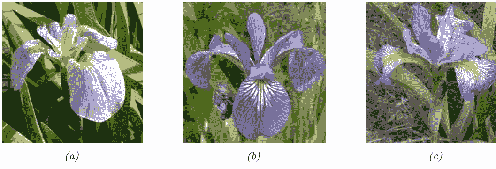

表 1.1: 鸢尾花设计矩阵的一个子集。特征包括：花萼长度、花萼宽度、花瓣长度、花瓣宽度。每个类别有50个示例。

| 索引 | sl | sw | pl | pw | 标签 |
|---|---|---|---|---|---|
| 0 | 5.1 | 3.5 | 1.4 | 0.2 | 山鸢尾 |
| 1 | 4.9 | 3.0 | 1.4 | 0.2 | 山鸢尾 |
| ... | ... | ... | ... | ... | ... |
| 50 | 7.0 | 3.2 | 4.7 | 1.4 | 变色鸢尾 |
| ... | ... | ... | ... | ... | ... |
| 149 | 5.9 | 3.0 | 5.1 | 1.8 | 维吉尼亚鸢尾 |

在图像分类中，输入空间\(\mathcal{X}\)是图像的集合，它是一个非常高维的空间：对于具有\(C=3\)个通道（例如RGB）和\(D_1 \times D_2\)像素的彩色图像，我们有\(\mathcal{X}=\mathbb{R}^D\)，其中\(D=C \times D_1 \times D_2\)。（在实践中，我们用整数表示每个像素的强度，通常范围在\(\{0, 1, \dots, 255\}\)，但为了简洁起见，我们假设输入是实值。）从图像到标签的映射\(f: \mathcal{X} \rightarrow \mathcal{Y}\)的学习是非常具有挑战性的，如图1.2所示。然而，可以使用某些类型的函数来解决这个问题，例如卷积神经网络（CNN），我们将在第14.1节中讨论。

幸运的是，一些植物学家已经确定了4个简单但信息丰富的数值特征——萼片长度、萼片宽度、花瓣长度、花瓣宽度——可以用来区分三种鸢尾花。在本节中，为了简单起见，我们将使用这个维度较低的输入空间，\(\mathcal{X} = \mathbb{R}^4\)。鸢尾花数据集是一个包含150个带标签的鸢尾花示例的集合，每种类型有50个示例，由这4个特征描述。它被广泛用作示例，因为它小而简单易懂。（我们将在本书后面讨论更大更复杂的数据集。）当我们有少量特征的小数据集时，通常将它们存储在一个\(N \times D\)矩阵中，其中每一行代表一个示例，每一列代表一个特征。这被称为设计矩阵；请参见表1.1中的示例。

鸢尾花数据集是一个表格数据的例子。当输入的大小是可变的（例如，单词序列或社交网络），而不是固定长度的向量时，数据通常被存储。这个特定的设计矩阵具有 \(N= 150行和 \(D= 4列，因此具有高而瘦的形状，因为 \(N \gg D\)。相比之下，一些数据集（例如基因组学）的特征比示例更多， \(D \gg N\); 它们的设计矩阵是短而胖的。术语“大数据”通常意味着 \(N\)很大，而术语“宽数据”意味着 \(D\)很大（相对于 \(N\)）。以设计矩阵的形式呈现，而不是其他格式。然而，这种数据通常会被转换为固定大小的特征表示（称为特征化过程），从而隐式地创建一个设计矩阵以供进一步处理。我们在第1.5.4.1节中给出了一个例子，讨论了序列数据的“词袋”表示。

#### 1.2.1.2 探索性数据分析

在使用机器学习解决问题之前，通常最好进行探索性数据分析，以查看是否存在明显的模式（这可能会提示选择哪种方法），或者数据是否存在明显的问题（例如，标签噪声或异常值）。

对于具有少量特征的表格数据，通常会制作一个成对图，在该图中，面板 $(i, j)$ 显示变量 $i$ 和 $j$ 的散点图，对角线条目 $(i, i)$ 显示变量 $i$ 的边际density；所有的图都可以选择按类别标签进行颜色编码 —— 请参见图1.3的示例。

对于高维数据，通常先进行降维，然后用于在2D或3D中可视化数据。我们在第20章讨论了降维方法。

#### 1.2.1.3 学习分类器

从图1.3可以看出，Setosa类很容易与其他两个类区分开来。

例如，假设我们创建以下决策规则：

```
f(x;θ) = \begin{cases} \text{如果花瓣长度} < 2.45, \text{则为Setosa;} \\ \text{否则为Versicolor或Virginica。} \end{cases} (1.1)
```

这是一个非常简单的分类器示例，我们将输入空间分为两个区域，由一维（1D）决策边界在 x_petal length= 2.45处定义。位于该边界左侧的点被分类为Setosa；位于右侧的点则是Versicolor或Virginica。

我们可以看到这个规则完美地对Setosa样本进行了分类，但对Virginica和Versicolor样本没有进行分类。为了提高性能，我们可以通过递归地划分空间来分割分类器错误的区域。例如，我们可以添加另一个决策规则，应用于未通过第一个测试的输入，以检查花瓣宽度是否小于1.75厘米（在这种情况下，我们预测Versicolor），或者是否大于1.75厘米（在这种情况下，我们预测Virginica）。我们可以将这些嵌套规则排列成树状结构。

真实值 \ 预测 | Setosa | Versicolor | Virginica
--- | --- | --- | ---
Setosa | 0 | 1 | 1
Versicolor | 1 | 0 | 1
Virginica | 10 | 10 | 0

*表1.2: 虹膜分类的假设非对称损失矩阵。*

称为决策树，如图1.4a所示，这导致了图1.4b中显示的2D决策面。

我们可以通过存储每个内部节点使用的特征索引以及相应的阈值来表示树。我们用 $\theta$ 表示所有这些参数。我们在第18.1节中讨论如何学习这些参数。

## 1.2.1.4 经验风险最小化

有监督学习的目标是自动创建分类模型，如图1.4a所示，以可靠地预测任何给定输入的标签。衡量这个任务的常见方法是基于训练集上的误分类率：

$$ \mathcal{L}(\boldsymbol{\theta}) \triangleq \frac{1}{N} \sum_{n=1}^{N} \mathbb{I}(y_n = f(\boldsymbol{x}_n; \boldsymbol{\theta})) \qquad \qquad \qquad (1.2) $$

其中 $\mathbb{I}(e)$ 是二进制指示函数，当条件 $e$ 为真时返回1，否则返回0，即

$$ \mathbb{I}(e) = \begin{cases} 1 & \text{if } e \text{ is true} \\ 0 & \text{if } e \text{ is false} \end{cases} \qquad \qquad \qquad (1.3) $$

这假设所有的错误都是相等的。然而，有可能有一些错误比其他错误更加昂贵。例如，假设我们在野外觅食，发现了一些鸢尾花。此外，假设Setosa和Versicolor是可口的，但Virginica是有毒的。在这种情况下，我们可以使用表1.2中所示的非对称损失函数$\ell(y,\hat{y})$。

然后，我们可以将经验风险定义为预测器在训练集上的平均损失：

$$ \mathcal{L}(\boldsymbol{\theta}) \triangleq \frac{1}{N} \sum_{n=1}^{N} \ell(y_n, f(\boldsymbol{x}_n; \boldsymbol{\theta})) \qquad \qquad \qquad (1.4) $$

我们可以看到，当我们使用零一损失函数来比较真实标签和预测时，误分类率方程（1.2）等于经验风险：

$$ \ell_{01}(y, \hat{y}) = \mathbb{I}(y = \hat{y}) \qquad \qquad \qquad (1.5) $$

更多细节请参见第5.1节。

## 1.2. 监督学习

定义模型拟合或训练问题的一种方法是找到使训练集上的经验风险最小化的参数设置：

$$ \hat{\theta} = \underset{\theta}{\text{argmin}} \ \mathcal{L}(\theta) = \underset{\theta}{\text{argmin}} \ \frac{1}{N} \sum_{n=1}^{N} \ell(y_n, f(\boldsymbol{x}_n; \theta)) \quad (1.6) $$

这被称为经验风险最小化。然而，我们真正的目标是在我们尚未看到的未来数据上最小化期望损失。也就是说，我们希望进行泛化，而不仅仅在训练集上表现良好。我们在1.2.3节中讨论了这一重要点。

### 1.2.1.5 不确定性

> 我们必须避免因对世界的概率性质一无所知而产生的错误自信，避免在应该看到灰色的地方只看到黑白。——伊曼纽尔·康德，由玛丽亚·康尼科娃（Maria Konnikova）改编自[Kon20]。

在许多情况下，由于对输入输出映射的知识不足（这被称为认识不确定性或模型不确定性）和/或映射中的固有（不可约）随机性（这被称为随机不确定性或数据不确定性），我们将无法完美地预测给定输入的确切输出。

在我们的预测中表示不确定性对于各种应用非常重要。例如，让我们回到我们的有毒花的例子，其损失矩阵如表1.2所示。如果我们高概率地预测花是维吉尼亚，则我们不应该吃这朵花。或者，我们可以执行信息收集行动，例如进行诊断测试，以减少我们的不确定性。有关如何在存在不确定性的情况下做出最优决策的更多信息，请参见第5.1节。

我们可以使用以下条件概率分布来捕捉我们的不确定性：

$$ p(y = c|\boldsymbol{x}; \theta) = f_c(\boldsymbol{x}; \theta) \quad (1.7) $$

其中 $f: \mathcal{X} \to [0,1]^C$将输入映射到可能的输出标签的概率分布。由于 $f_c(\boldsymbol{x}; \theta)$返回类别标签 $c$的概率，我们要求对于每个 $c$，有 $0 \leq f_c \leq 1$，并且 $\sum_{c=1}^C f_c = 1$。为了避免这个限制，通常要求模型返回未归一化的对数概率。然后我们可以使用softmax函数将其转换为概率，该函数定义如下

$$ \text{softmax}(\boldsymbol{a}) \triangleq \left[ \frac{e^{a_1}}{\sum_{c'=1}^C e^{a_{c'}}}, \dots, \frac{e^{a_C}}{\sum_{c'=1}^C e^{a_{c'}}} \right] \quad (1.8) $$

这将 $\mathbb{R}^C$映射到 $[0,1]^C$，并满足 $0 \leq \text{softmax}(\boldsymbol{a})_c \leq 1$和 $\sum_{c=1}^C \text{softmax}(\boldsymbol{a})_c =1$的约束条件。softmax的输入， $\boldsymbol{a} = f(\boldsymbol{x}; \theta)$，被称为logits。详见第2.5.2节。因此，我们如下定义整体模型：

$$ p(y = c|\boldsymbol{x}; \theta) = \text{softmax}_c(f(\boldsymbol{x}; \theta)) \quad (1.9) $$

这种情况的一个常见特例是 $f$ 是一个形式为的仿射函数

$$ f(x;\theta) = b + w^\top x = b + w_1 x_1 + w_2 x_2 + \cdots + w_D x_D \qquad (1.10) $$

其中 $\theta=(b, w)$ 是模型的参数。这个模型被称为逻辑回归，并且将在第10章中详细讨论。

在统计学中，$w$ 参数通常被称为回归系数（通常用 $\beta$ 表示），$b$ 被称为截距。在机器学习中，$w$ 参数被称为权重，$b$ 被称为偏置。这个术语源自电气工程，在这里我们将函数 $f$ 视为一个接受 $x$ 并返回 $f(x)$ 的电路。每个输入都通过“线”馈送到电路中，这些线具有权重 $w$。电路计算其输入的加权和，并添加一个常数偏置或偏移项 $b$。（这里对“偏置”的使用不应与第4.7.6.1节中讨论的统计概念的偏差概念混淆。）

为了减少符号混乱，通常将偏置项 $b$ 合并到权重 $w$ 中，通过定义

$$ \tilde{w} = [b, w_1, \dots, w_D] \quad \text{和} \quad \tilde{x} = [1, x_1, \dots, x_D] $$

这样

$$ \tilde{w}^\top \tilde{x} = b + w^\top x \qquad (1.11) $$

这将把仿射函数转换为线性函数。我们通常假设已经完成了这一步骤，因此我们可以将预测函数写成如下形式：

$$ f(x;w) = w^\top x \qquad (1.12) $$

### 1.2.1.6 最大似然估计

在拟合概率模型时，通常使用负对数概率作为损失函数：

$$ \ell(y, f(x;\theta)) = -\log p(y|f(x;\theta)) \qquad (1.13) $$

这个原因在5.1.6.1节中有解释，但直觉是一个好的模型（具有低损失）是指对于每个相应的输入 $x$，为真实输出 $y$ 分配高概率的模型。训练集的平均负对数概率由以下公式给出

$$ \text{NLL}(\theta) = -\frac{1}{N} \sum_{n=1}^N \log p(y_n|f(x_n;\theta)) \qquad (1.14) $$

这被称为负对数似然。如果我们最小化这个值，我们可以计算出最大似然估计或MLE：

$$ \hat{\theta}_{\text{mle}} = \underset{\theta}{\text{argmin}}\; \text{NLL}(\theta) \qquad (1.15) $$

这是一种非常常见的将模型拟合到数据的方法，我们将会看到。

### 1.2.2 回归

现在假设我们想要预测一个实值 $y \in \mathbb{R}$ 而不是一个类别标签 $y \in \{1, \dots, C\}$；这被称为回归。例如，在鸢尾花的情况下，$y$ 可能是如果花被吃掉的毒性程度，或者是植物的平均高度。

回归问题与分类问题非常相似。然而，由于输出是实值，我们需要使用不同的损失函数。对于回归问题，最常见的选择是使用二次损失，或者ℓ2损失：

$$ \ell_2(y, \hat{y}) = (y - \hat{y})^2 \tag{1.16} $$

这会对大的残差 $y - \hat{y}$进行更大的惩罚，而对小的残差进行较小的惩罚。使用二次损失时的经验风险等于均方误差或者MSE：

$$ \text{MSE}(\boldsymbol{\theta}) = \frac{1}{N} \sum_{n=1}^{N} (y_n - f(\boldsymbol{x}_n; \boldsymbol{\theta}))^2 \tag{1.17} $$

根据第1.2.1.5节的讨论，我们还应该对我们的预测建模不确定性。在回归问题中，常常假设输出分布是一个高斯分布或者正态分布。正如我们在第2.6节中解释的那样，这个分布由以下定义：

$$ \mathcal{N}(y|\mu, \sigma^2) \triangleq \frac{1}{\sqrt{2\pi\sigma^2}} e^{-\frac{1}{2\sigma^2}(y-\mu)^2} \tag{1.18} $$

其中 $\mu$是均值，$\sigma^2$是方差，而 $\sqrt{2\pi\sigma^2}$是确保密度积分为1的归一化常数。在回归的背景下，我们可以通过定义 $\mu = f(\boldsymbol{x}_n; \boldsymbol{\theta})$使均值依赖于输入。因此，我们得到以下条件概率分布：

$$ p(y|\boldsymbol{x}; \boldsymbol{\theta}) = \mathcal{N}(y|f(\boldsymbol{x}; \boldsymbol{\theta}), \sigma^2) \tag{1.19} $$

如果我们假设方差 $\sigma^2$是固定的（为了简单起见），相应的平均（每个样本）负对数似然变为

$$ \begin{aligned} \text{NLL}(\boldsymbol{\theta}) &= -\frac{1}{N} \sum_{n=1}^{N} \log\left[ \left( \frac{1}{2\pi\sigma^2} \right)^{\frac{1}{2}} \exp\left( -\frac{1}{2\sigma^2} (y_n - f(\boldsymbol{x}_n; \boldsymbol{\theta}))^2 \right) \right] \tag{1.20} \\ &= \frac{1}{2\sigma^2} \text{MSE}(\boldsymbol{\theta}) + \text{const} \tag{1.21} \end{aligned} $$

我们可以看到，负对数似然与均方误差成正比。因此，计算参数的最大似然估计将导致最小化平方误差，这似乎是一种合理的模型拟合方法。

### 1.2.2.1 线性回归

作为回归模型的一个例子，考虑图1.5a中的一维数据。我们可以使用形式为的简单线性回归模型来拟合这些数据

$$ f(\boldsymbol{x}; \boldsymbol{\theta}) = b + w x \tag{1.22} $$

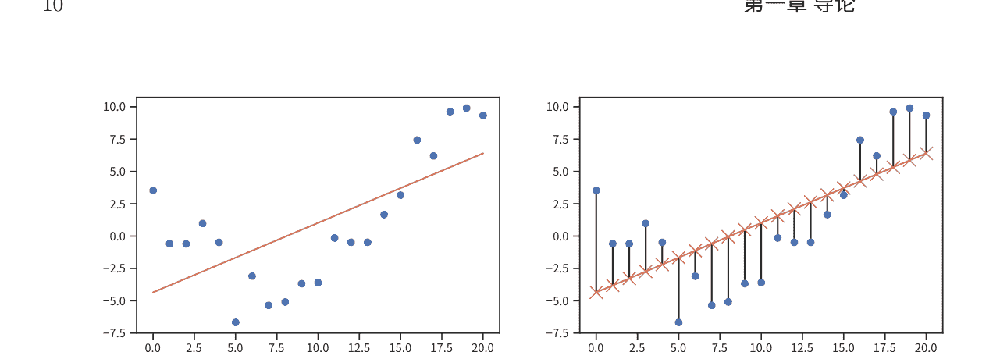

图1.5: (a)对一些一维数据进行线性回归。(b)垂直线表示每个输入的观察输出值（蓝色圆圈）与其预测值（红色十字）之间的残差。最小二乘回归的目标是选择一条最小化平方残差和的线。由lin-reg_residuals_plot.ipynb生成。

其中 w是斜率，b是偏移，而 θ=(w,b)是模型的所有参数。通过调整θ，我们可以最小化平方误差的总和，如图1.5b中的垂直线所示，直到找到最小二乘解。

$$ \hat{\theta} = \arg\min_{\theta} \text{均方误差} (\theta) $$

详见第11.2.2.1节。

如果我们有多个输入特征，我们可以写成

$$ f(\mathbf{x};\theta) = b + w_1 x_1 + \cdots + w_D x_D = b + \mathbf{w}^\top \mathbf{x} $$

其中 θ=(w,b)。这被称为多元线性回归。例如，考虑预测温度作为房间中2D位置的函数的任务。图1.6(a)绘制了以下形式的线性模型的结果：

$$ f(\mathbf{x};\theta) = b + w_1 x_1 + w_2 x_2 $$

我们可以扩展这个模型使用D > 2个输入特征（例如时间），但这样就更难可视化了。

### 1.2.2.2 多项式回归

图1.5a中的线性模型显然不是很适合数据。我们可以通过使用 D次多项式回归模型来改善拟合。这个模型的形式为 f(x;w) = wᵀφ(x)，其中 φ(x)是从输入派生的特征向量，具有以下形式：

$$ \phi(x) = [1, x, x^2, \ldots, x^D] $$

这是一个简单的示例特征预处理，也称为特征工程。

在图1.7a中，我们可以看到使用 $D=2$ 会得到更好的拟合结果。我们可以继续增加 $D$，从而增加模型中的参数数量，直到 $D = N - 1$；在这种情况下，我们每个数据点都有一个参数，因此我们可以完美地插值数据。得到的模型的均方误差为0，如图1.7c所示。然而，直观上看，得到的函数不会是一个很好的未来输入的预测器，因为它太‘抖动’。我们在第1.2.3节中详细讨论了这个问题。我们还可以将多维输入应用于多项式回归。例如，图1.6(b)绘制了在对输入进行二次扩展后温度模型的预测结果。

$$ f(\boldsymbol{x};\boldsymbol{w}) = w_0 + w_1x_1 + w_2x_2 + w_3x_1^2 + w_4x_2^2 \qquad (1.27) $$

二次形状比线性模型更适合数据，因为它捕捉到了房间中间更热的事实。我们还可以添加交叉项，例如 $x_1x_2$，以捕捉交互效应。详见第1.5.3.2节。

需要注意的是，上述模型仍然使用参数 $\boldsymbol{w}$ 的线性预测函数，尽管它是原始输入 $\boldsymbol{x}$ 的非线性函数。这一点的重要性在于，线性模型引导了一个具有唯一全局最优解的均方误差损失函数 $\mathrm{MSE}(\boldsymbol{\theta})$，详见第11.2.2.1节的解释。

### 1.2.2.3 深度神经网络

在第1.2.2.2节中，我们手动指定了输入特征的转换，即多项式扩展 $\phi(\boldsymbol{x}) = [1, x_1, x_2, x_1^2, x_2^2, ...]$。通过学习自动进行这种非线性特征提取，我们可以创建更强大的模型。如果我们让 $\phi(\boldsymbol{x})$ 有自己的一组参数，比如 $\mathbf{V}$，那么整体模型的形式为

$$ f(\boldsymbol{x};\boldsymbol{w}, \mathbf{V}) = \boldsymbol{w}^\top \phi(\boldsymbol{x}; \mathbf{V}) \qquad (1.28) $$

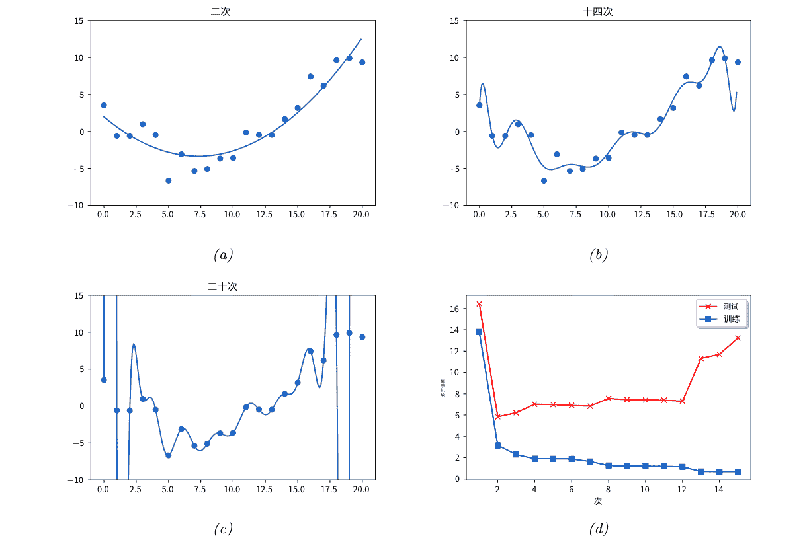

图1.7: (a-c) 二次、十四次和二十次拟合到21个数据点的多项式（与图1.5中的数据相同）。(d) 均方误差 vs 次数。由linreg_poly_vs_degree.ipynb生成。

我们可以将特征提取器 φ(x; V) 递归地分解为更简单的函数的组合。得到的模型变成了一个堆叠的 L 个嵌套函数：

$$ f(\boldsymbol{x}; \boldsymbol{\theta}) = f_{L}(f_{L-1}(\cdots (f_{1}(\boldsymbol{x}))\cdots)) $$

其中 f_l(x) = f(x; θ_l) 是第 ℓ 层的函数。最后一层是线性的，形式为 f_L(x) = w_L^T x，所以 f(x; θ) = w_L^T f_{1:L-1}(x)，其中 f_{1:L-1}(x) = f_{L-1}(\cdots (f_1(x))\cdots) 是学习得到的特征提取器。这是深度神经网络或DNN的关键思想，包括图像的常见变体，如卷积神经网络（CNNs），以及序列的循环神经网络（RNNs）。详细信息请参见第三部分。

### 1.2.3 过拟合和泛化

我们可以用以下等价的方式重写方程 (1.4) 中的经验风险：

$$ \mathcal{L}(\boldsymbol{\theta}; \mathcal{D}_{\text{train}}) = \frac{1}{|\mathcal{D}_{\text{train}}|} \sum_{(\boldsymbol{x}, y) \in \mathcal{D}_{\text{train}}} \ell(y, f(\boldsymbol{x}; \boldsymbol{\theta})) $$

《概率机器学习：导论》草稿。2023年6月22日其中 $|\mathcal{D}_{\text{train}}|$ 是训练集 $\mathcal{D}_{\text{train}}$ 的大小。这个表达式很有用，因为它明确了损失函数是在哪个数据集上评估的。

通过使用一个适当灵活的模型，我们可以将训练损失驱使到零（假设没有标签噪声），只需简单地记住每个输入的正确输出。例如，图1.7(c)完美地插值了训练数据（除了最右边的一个点）。但是我们关心的是对新数据的预测准确性，这些数据可能不属于训练集。一个完美地拟合训练数据但过于复杂的模型被称为过拟合。

为了检测模型是否过拟合，让我们假设（暂时）我们可以访问用于生成训练集的真实（但未知）分布 $p^*(x, y)$。然后，我们不再计算经验风险，而是计算理论期望损失或总体风险

$$
\mathcal{L}(\theta; p^*) \triangleq \mathbb{E}_{p^*(x,y)} [\ell(y, f(x; \theta))]
$$

差异 $\mathcal{L}(\theta; p^*) - \mathcal{L}(\theta; \mathcal{D}_{\text{train}})$ 被称为泛化间隙。如果模型存在较大的泛化间隙（即，低经验风险但高总体风险），则表示它过拟合。

在实践中，我们不知道 $p^*$。然而，我们可以将现有数据分成两个子集，即训练集和测试集。然后，我们可以使用测试风险来近似总体风险：

$$
\mathcal{L}(\theta; \mathcal{D}_{\text{test}}) \triangleq \frac{1}{|\mathcal{D}_{\text{test}}|} \sum_{(x,y)\in\mathcal{D}_{\text{test}}} \ell(y, f(x; \theta))
$$

例如，在图1.7d中，我们绘制了多项式回归的训练误差和测试误差作为 $D$ 的函数。我们可以看到，随着模型变得更加复杂，训练误差趋近于0。然而，测试误差具有特征性的U形曲线：在左侧，当 $D=1$ 时，模型欠拟合；在右侧，当 $D\gg1$ 时，模型过拟合；当 $D=2$ 时，模型复杂度刚刚好。

我们如何选择合适复杂度的模型？如果我们使用训练集来评估不同的模型，我们将始终选择最复杂的模型，因为它具有最多的自由度，从而具有最小的损失。因此，我们应该选择具有最小测试损失的模型。

在实践中，我们需要将数据分成三组，即训练集、测试集和验证集；后者用于模型选择，我们只使用测试集来估计未来的性能（总体风险），即测试集不用于模型拟合或模型选择。详细信息请参见第4.5.4节。

### 1.2.4 没有免费午餐定理

所有模型都是错误的，但有些模型是有用的。 — George Box [BD87, p424]。

选择合适的模型的一种方法是基于领域知识和/或试错（即使用模型选择技术，如交叉验证（第4.5.4节）或贝叶斯方法（第5.2.2节和第5.2.6节））。因此，拥有许多模型和算法技术是很重要的。

## 1.3 无监督学习

在监督学习中，我们假设训练集中的每个输入示例 $x$ 都有一个关联的输出目标集合 $y$，我们的目标是学习输入输出映射。 尽管这很有用，但也可能很困难，监督学习本质上只是“光鲜的曲线拟合”[Pea18]。

一个可能更有趣的任务是尝试“理解”数据，而不仅仅是学习映射关系。 也就是说，我们只获得观察到的“输入” $\mathcal{D} = \{\boldsymbol{x}_n : n = 1 : N\}$，没有任何对应的“输出” $y_n$。 这被称为无监督学习。

从概率的角度来看，我们可以将无监督学习的任务视为拟合一个形式为 $p(\boldsymbol{x})$ 的无条件模型，该模型可以生成新的数据 $\boldsymbol{x}$，而有监督学习则涉及拟合一个条件模型 $p(y|\boldsymbol{x})$，该模型指定了给定输入时的输出（分布）。^6

无监督学习避免了收集大量标记数据集进行训练的需要，这通常是耗时且昂贵的（想象一下要求医生标记医学图像）。

无监督学习还避免了学习如何将世界分成通常是任意的类别的需要。 例如，考虑在视频中标记“喝水”或“抿嘴”的动作的任务。 是当人拿起玻璃杯时，还是当玻璃杯第一次接触嘴巴时，或者是当液体倒出时？ 如果他们倒出一些液体，然后暂停，然后再倒出——这是两个动作还是一个动作？ 人们在这些问题上经常意见不一致[Idr+17]，这意味着任务没有明确定义。 因此，期望机器学习这样的映射是不合理的。^7最后，无监督学习迫使模型“解释”高维输入，而不仅仅是低维输出。 这使我们能够学习更丰富的“世界运作方式”模型。

> 正如著名的多伦多大学机器学习教授Geoff Hinton所说：
> 当我们学习看东西时，没有人告诉我们正确答案，我们只是看。
> 偶尔，你的母亲会说“那是一只狗”，但这是非常少的信息。 如果你能每秒获得几个比特的信息，甚至每秒获得一个比特，那就算你幸运了。大脑的视觉系统有 $O(10^{14})$个神经连接。 而你只能活 $O(10^9)$秒。 所以每秒学习一个比特是没有用的。 你需要每秒获得更多像 $O(10^5)$比特的信息。 而且只有一个地方可以获得这么多的信息：来自输入本身。 —— Geoffrey Hinton，1996年（引自[Gor06]）。

### 1.3.1 聚类

无监督学习的一个简单例子是在数据中寻找簇的问题。 目标是将输入划分为包含“相似”点的区域。举个例子，考虑一个二维版本

6. 在统计学界，通常使用 $x$ 来表示不被建模但作为输入的外生变量。 因此，一个无条件模型将被表示为 $p(y)$ 而不是 $p(\boldsymbol{x})$。

7. 一个更合理的方法是尝试捕捉由“众包”注释者产生的标签的概率分布（参见例如[Dum+18; Aro+19]）。这体现了任务本身的歧义性，一个给定输入可能有多个“正确”标签的事实。

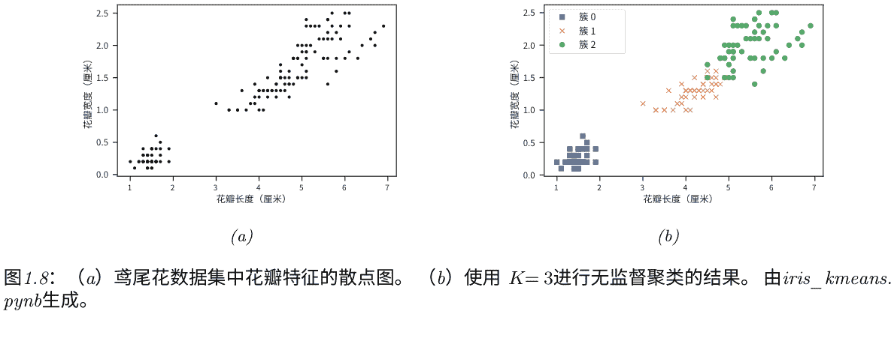

图1.8: (a) 鸢尾花数据集中花瓣特征的散点图。 (b) 使用 $K=3$ 进行无监督聚类的结果。由 `iris_kmeans.ipynb` 生成。

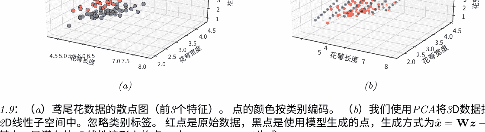

图1.9: (a) 鸢尾花数据的散点图 (前3个特征)。点的颜色按类别编码。 (b) 我们使用 $PCA$ 将3D数据拟合到2D线性子空间中。忽略类别标签。红点是原始数据，黑点是使用模型生成的点，生成方式为 $\hat{x} = \mathbf{W} z + \mu$ ，其中 $z$ 是潜在的2D线性流形上的点。由 `iris_pca.ipynb` 生成。

鸢尾花数据集的一部分。在图1.8a中，我们展示了没有任何类别标签的点。直观地说，数据中至少有两个簇，一个在左下角，一个在右上角。此外，如果我们假设“好”的簇集应该相当紧凑，那么我们可能希望将右上角分成（至少）两个子簇。图1.8b显示了将数据分成三个簇的结果。（注意，没有正确的簇数；相反，我们需要考虑模型复杂度和对数据的拟合之间的权衡。我们在第21.3.7节讨论了如何进行这种权衡。）

### 1.3.2 发现潜在的“变化因素”

当处理高维数据时，通常可以通过将其投影到一个较低维度的子空间来降低维度，该子空间捕捉了数据的“本质”。解决这个问题的一种方法是假设每个观测到的高维输出 $x_n \in \mathbb{R}^D$ 是由一组生成的隐藏或未观察到的低维潜在因素 $z_n \in \mathbb{R}^K$ 的存在。我们可以用模型图表示如下： $z_n \to x_n$，箭头表示因果关系。由于我们不知道潜在因素 $z_n$，通常假设一个简单的先验概率模型 $p(z_n)$，比如高斯分布，它表示每个因素是一个随机的 $K$ 维向量。如果数据是实值的，我们也可以使用高斯似然函数。

最简单的例子是当我们使用线性模型时， $p(x_n|z_n;\theta) = \mathcal{N}(x_n|\mathbf{W}z_n + \mu, \Sigma)$。得到的模型被称为因子分析(FA)。它类似于线性回归，只是我们只观察到输出 $x_n$，而不是输入 $z_n$。在特殊情况下， $\Sigma = \sigma^2\mathbf{I}$，这就简化为一个称为概率主成分分析（PCA）的模型，我们将在第20.1节中解释。在图1.9中，我们给出了这种方法如何在一些简单的3d数据上找到一个2d线性子空间的示例。

当然，假设从 $z_n$ 到 $x_n$ 的线性映射是非常限制的。然而，我们可以通过定义 $p(x_n|z_n;\theta) = \mathcal{N}(x_n|f(z_n;\theta), \sigma^2\mathbf{I})$ 来创建非线性扩展，其中 $f(z;\theta)$ 是一个非线性模型，例如深度神经网络。这样的模型（即估计参数 $\theta$）变得更加困难，因为神经网络的输入必须被推断出来，以及模型的参数。然而，有各种近似方法，例如变分自编码器，可以应用（见第20.3.5节）。

### 1.3.3 自监督学习

一种近期流行的无监督学习方法被称为自监督学习。在这种方法中，我们从无标签数据中创建代理监督任务。例如，我们可以尝试从灰度图像预测彩色图像，或者在一个句子中屏蔽单词，然后尝试根据周围的上下文预测它们。希望得到的预测器 $\hat{x}_1 = f(x_2;\theta)$，其中 $x_2$ 是观察到的输入， $\hat{x}_1$ 是预测的输出，将从数据中学习有用的特征，然后可以在标准的下游监督任务中使用。这避免了试图推断观察数据背后的“真实潜在因素” $z$ 的困难问题，而是依赖于标准的监督学习方法。我们在第19.2节中更详细地讨论了这种方法。

### 1.3.4 评估无监督学习

虽然无监督学习很有吸引力，但很难评估无监督学习方法的输出质量，因为没有地面真相可供比较[TOB16]。评估无监督模型的常见方法是测量模型对未见过的测试样本分配的概率。我们可以通过计算数据的（无条件）负对数似然来实现这一点：

$$
\mathcal{L}(\theta;\mathcal{D}) = -\frac{1}{|\mathcal{D}|} \sum_{x \in \mathcal{D}} \log p(x|\theta) \quad (1.33)
$$

这将无监督学习问题视为密度估计问题。这个想法是，一个好的模型不会对实际数据样本感到“惊讶”（即，会给它们分配高概率）。此外，由于概率必须总和为1.0，如果模型给数据样本所在的数据空间区域分配高概率，它隐含地给数据不来自的区域分配低概率。因此，模型已经学会捕捉数据中的典型模式。这可以在数据压缩算法中使用。

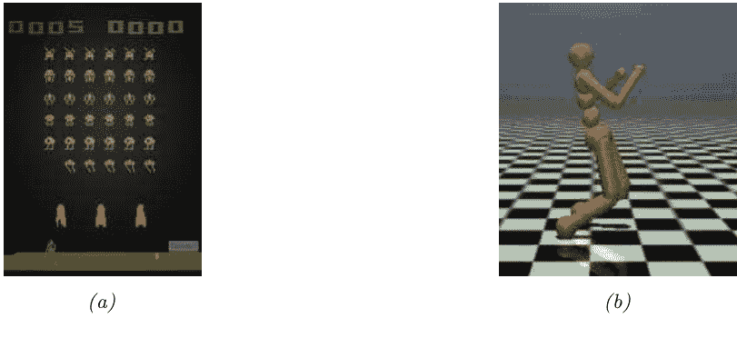

图1.10: 一些控制问题的示例。（a）太空侵略者 Atari 游戏。来自 https://gymnasium.farama.org/environments/atari/space_invaders/。（b）在 MuJuCo 模拟器中控制一个人形机器人，使其尽可能快地行走而不摔倒。来自 https://gymnasium.farama.org/environments/mujoco/humanoid/。

不幸的是，密度估计是困难的，特别是在高维空间中。此外，一个将高概率分配给数据的模型可能没有学到有用的高级模式（毕竟，模型可以只是记住所有的训练样本）。

另一种评估指标是使用学到的无监督表示作为特征或输入到下游的有监督学习方法中。如果无监督方法发现了有用的模式，那么可以使用这些模式来执行有监督学习，而只需要比使用原始特征更少的标记数据。例如，在第1.2.1.1节中，我们看到鸢尾花的4个手动定义的特征包含了执行分类所需的大部分信息。因此，我们能够只使用150个示例来训练一个几乎完美性能的分类器。如果输入是原始像素，我们需要更多的示例才能达到相似的性能（参见第14.1节）。也就是说，我们可以通过首先学习一个好的表示来提高学习的样本效率（即减少需要获得良好性能的标记示例的数量）。

增加样本效率是一个有用的评估指标，但在许多应用中，特别是在科学领域，无监督学习的目标是获得理解，而不是改善某个预测任务的性能。这需要使用可解释的模型，但这些模型也可以生成或“解释”数据中的大部分观察到的模式。用柏拉图的话来说，目标是发现如何“切割自然的关节”。当然，评估我们是否成功地发现了某个数据集背后的真实潜在结构通常需要进行实验，并与世界进行交互。我们在第1.4节中进一步讨论这个话题。

## 1.4 强化学习

除了监督学习和无监督学习之外，还有一种被称为强化学习的第三种机器学习方法（RL）。在这类问题中，系统或代理需要学习如何与其环境进行交互。这可以通过一个策略来编码，即 $\boldsymbol{a} = \pi(\boldsymbol{x})$，它指定对每个可能的输入 $\boldsymbol{x}$（从环境状态派生）采取的动作。

例如，考虑一个学习玩视频游戏的代理，比如 Atari Space Invaders（见

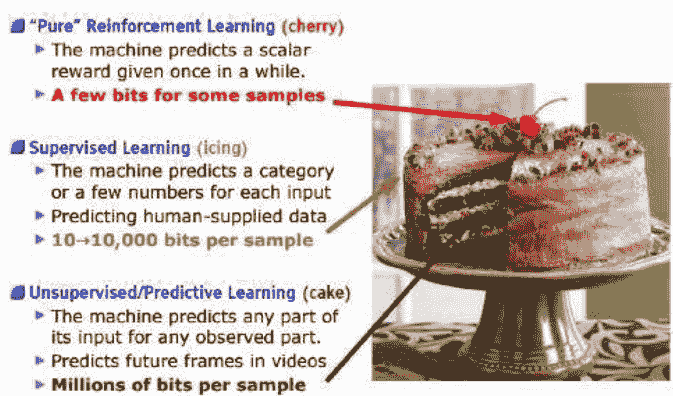

图1.11：将机器学习分为三种类型，可视化为巧克力蛋糕的层次。这个图（原始来源：https://bit.ly/2m65Vs1）是Yann LeCun在NIPS'16的演讲中使用的，并且获得了他的友好许可。

图1.10(a)。在这种情况下，输入$x$是图像（或过去图像的序列），输出$a$是移动方向（左或右）以及是否发射导弹。作为一个更复杂的例子，考虑一个机器人学习走路的问题（见图1.10(b)）。在这种情况下，输入$x$是所有关节位置和角度的集合，输出$a$是一组激励或电机控制信号。

与监督学习（SL）的不同之处在于系统不会被告知哪个动作是最佳选择（即对于给定的输入应该产生哪个输出）。相反，系统只是偶尔接收到对其所采取的行动的奖励（或惩罚）信号。这就像与一个评论家一起学习，他偶尔会给出赞或踩的评价，而不是与一个老师一起学习，后者会告诉你每一步该做什么。

强化学习（RL）近年来变得越来越受欢迎，因为它具有广泛的适用性（因为代理试图优化的奖励信号可以是任何感兴趣的指标）。然而，相对于监督学习或无监督学习，使强化学习起作用可能更加困难，原因有很多。一个关键的困难是奖励信号可能只偶尔给出（例如，如果代理最终达到了期望的状态），即使在这种情况下，代理也可能不清楚它的许多行动中哪些是导致获得奖励的。（想象一下玩象棋这样的游戏，在游戏结束时只有一个胜负信号。）

为了弥补来自奖励信号的最小信息量，通常会使用其他信息源，例如专家演示，可以在监督方式下使用，或者无标签数据，可以由无监督学习系统用于发现环境的潜在结构。这可以使得从有限数量的试验（与环境的交互）中学习成为可能。正如Yann LeCun在2016年NIPS会议的邀请演讲中所说：“如果智能是一个蛋糕，无监督学习就是巧克力海绵蛋糕，监督学习就是糖霜，而强化学习就是樱桃。”这在图1.11中有所说明。

8. NIPS代表“神经信息处理系统”。它是一次重要的机器学习会议。最近它已经改名为NeurIPS。

《概率机器学习：导论》草稿。2023年6月22日

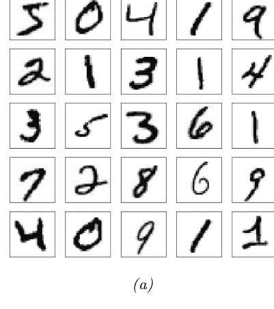

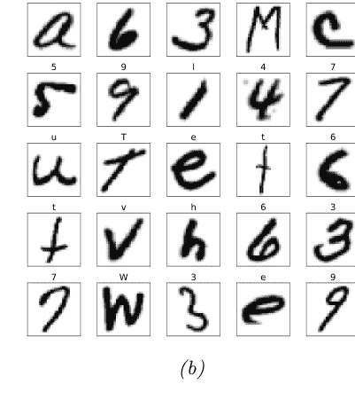

图1.12: (a) MNIST数据集的可视化。每个图像为 $28 \times 28$。 有60k个训练样本和10k个测试样本。 我们展示了训练集中的前25个图像。由 `mnist_viz_t.ipynb` 生成。(b) EMNIST数据集的可视化。 有697,932个训练样本和116,323个测试样本，每个大小为 $28 \times 28$。 有62个类别 (a-z, A-Z, 0-9)。 我们展示了训练集中的前25个图像。由 `emnist_viz_jax.ipynb` 生成。

## 1.5 数据

机器学习关注使用各种算法将模型拟合到数据上。尽管我们专注于建模和算法方面，但训练数据的性质和质量对于任何学习模型的成功也起着至关重要的作用。

在本节中，我们简要描述了一些常见的图像和文本数据集，这些数据集将在本书中使用。 我们还简要讨论了数据预处理的主题。

### 1.5.1 一些常见的图像数据集

在本节中，我们简要讨论了一些将在本书中使用的图像数据集。

#### 1.5.1.1 小型图像数据集

其中最简单且广泛使用的之一是 MNIST[LeC+98; YB19]。^9 这是一个包含60k个训练图像和10k个测试图像的数据集，每个图像的大小为28×28(灰度)，展示了10个类别的手写数字。 每个像素都是范围在 $\{0, 1, ..., 255\}$ 的整数；通常将其重新缩放到 $[0, 1]$，以表示像素强度。 我们可以选择通过阈值处理将其转换为二进制图像。 请参见图1.12a进行说明。

9. 术语“MNIST”代表“修改后的国家标准研究所”；术语“修改后”是因为图像经过预处理，以确保数字大多数位于图像中心。

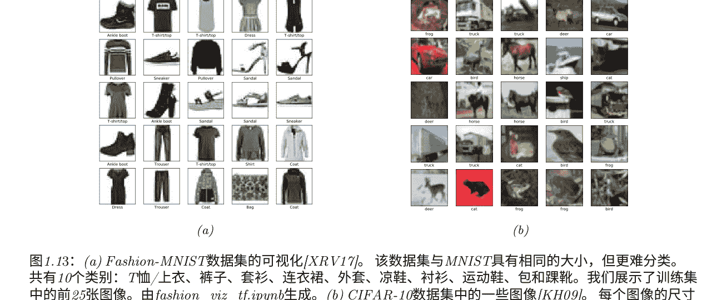

图1.13: (a) Fashion-MNIST数据集的可视化[XRV17]。该数据集与MNIST具有相同的大小，但更难分类。共有10个类别：T恤/上衣、裤子、套衫、连衣裙、外套、凉鞋、衬衫、运动鞋、包和踝靴。我们展示了训练集中的前25张图像。由 `fashion_viz_tf.ipynb` 生成。(b) CIFAR-10数据集中的一些图像[KH09]。每个图像的尺寸为32×32×3，其中最后一个尺寸3表示RGB。训练集有50k个示例，测试集有10k个示例。共有10个类别：飞机、汽车、鸟、猫、鹿、狗、青蛙、马、船和卡车。我们展示了训练集中的前25张图像。由 `cifar_viz_tf.ipynb` 生成。

MNIST在机器学习社区中被广泛使用，以至于著名的机器学习研究员Geoff Hinton将其称为“机器学习的果蝇”，因为如果我们不能使一种方法在MNIST上表现良好，那么它很可能在更难的数据集上也不会表现良好。然而，现在MNIST分类被认为是“太容易了”，因为只需查看一个像素就可以区分大多数数字对。

已经提出了各种扩展。

在[Coh+17]中，他们提出了扩展的MNIST（EMNIST），其中还包括大小写字母。请参见图1.12b进行可视化。这个数据集比MNIST要难得多，因为有62个类别，其中几个类别非常模糊（例如数字1与小写字母l）。

在[XRV17]中，他们提出了时尚MNIST，它与MNIST具有完全相同的大小和形状，但每个图像都是一件服装的图片，而不是手写数字。请参考图1.13a进行可视化。

对于小尺寸彩色图像，最常见的数据集是CIFAR[KH09]。这是一个包含60k个图像的数据集，每个图像的尺寸为32×32×3，代表了来自10或100个类别的日常物品；请参考图1.13b进行说明。

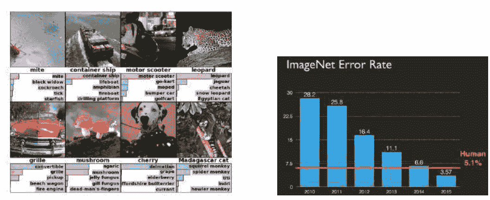

图1.14: (a)来自 ImageNet数据集[Rus+15]的样本图像。 该子集包含1.3M个彩色训练图像，每个图像的尺寸为256 × 256像素。 共有1000个可能的标签，每个图像对应一个标签，任务是将前5个最有可能的预测中的正确标签最小化错误率。 在每个图像下面，我们展示了真实标签和前5个预测标签的分布。 如果真实标签在前5个中，其概率条将被标为红色。预测是由一个名为“AlexNet”的卷积神经网络(CNN)生成的（第14.3.2节）。来自[KSH12]的图4。 在ImageNet竞赛中，误分类率（前5个）随时间变化的情况。 获得Andrzej Karpathy的友情许可使用。

## 1.5.1.2 ImageNet

小型数据集对于原型设计想法很有用，但在图像大小和标记示例数量方面，测试方法在更大的数据集上也很重要。 这种类型最广泛使用的数据集被称为 ImageNet[Rus+15]。 这是一个包含大约14百万张尺寸为256×256×3的图像的数据集，展示了来自2万个类别的各种对象；请参见图1.14a中的一些示例。

ImageNet数据集被用作ImageNet大规模视觉识别挑战（ILSVRC）的基础，该挑战从2010年持续到2018年。 这使用了来自1000个类别的130万张图像的子集。 在比赛过程中，社区取得了显著的进展，如图1.14b所示。特别是，2015年标志着CNN首次能够在ImageNet上的图像分类任务中超越人类（或者至少超越了一个人类，即Andrej Karpathy）。请注意，这并不意味着CNN在视觉方面比人类更好（例如，[YL21]中列举了一些常见的失败模式）。相反，这很可能反映了数据集对于进行细粒度分类区分（例如‘老虎’和‘虎猫’之间的区别）对人类来说很难理解；相比之下，足够灵活的CNN可以学习任意模式，包括随机标签[Zha+17a]。

尽管ImageNet作为一个分类基准比MNIST和CIFAR要难得多，但它几乎已经“饱和”[Bey+20]。然而，方法在ImageNet上的相对性能通常是在其他不相关的图像分类任务上性能的一个令人惊讶的好预测指标（参见例如[Rec+19]），因此它仍然被广泛使用。

### 1.5.2 一些常见的文本数据集

机器学习经常应用于文本以解决各种任务。这被称为自然语言处理或NLP（详见例如[JM20]）。下面我们简要介绍一些在本书中将使用的文本数据集。

### 1.5.2.1 文本分类

一个简单的自然语言处理任务是文本分类，可以用于电子邮件垃圾分类、情感分析（例如电影或产品评论是积极的还是消极的）等。评估这些方法的常见数据集是来自[Maa+11]的IMDB电影评论数据集。（IMDB代表“互联网电影数据库”）。该数据集包含25k个标记的训练示例和25k个测试示例。每个示例都有一个二进制标签，表示积极或消极评分。请参见表1.3中的一些示例句子。

表1.3：我们展示了来自IMDB电影评论数据集的前两个句子的片段。第一个例子是标记为正面的，第二个是负面的。（<UNK>表示未知标记。）

-   1. 这部电影非常精彩，演员阵容、拍摄地点、故事情节、导演都非常合适，罗伯特<UNK>是一位了不起的演员...
-   2. 大发型、大胸部、糟糕的音乐和一个巨大的安全别针，这些词最能描述这部糟糕的电影。我喜欢俗气的恐怖电影，我看过成百上千部...

### 1.5.2.2 机器翻译

一个更困难的自然语言处理任务是学习将一个语言中的句子x映射到另一个语言中的“语义等价”的句子y，这被称为机器翻译。训练这样的模型需要对齐的（x，y）对。幸运的是，存在几个这样的数据集，例如来自加拿大议会的（英法对）和欧盟（Europarl）的数据集。后者的一个子集，被称为WMT数据集（机器翻译研讨会），包含英德对，并被广泛用作基准数据集。

### 1.5.2.3 其他seq2seq任务

机器翻译的一个推广是学习从一个序列 x到任何其他序列 y的映射。这被称为seq2seq模型，可以看作是一种高维分类的形式（详见第15.2.3节）。这种问题的框架非常通用，包括许多任务，如文档摘要、问答等。例如，表1.4展示了如何将问答问题形式化为seq2seq问题：输入是文本T和问题Q，输出是答案A，它是一组单词，可能从输入中提取出来。

T: 在气象学中，降水是大气水蒸气凝结的任何产物，受到重力的影响。降水的主要形式包括毛毛雨、雨、雨夹雪、雪、霰和冰雹...降水形成是通过与云中的其他雨滴或冰晶碰撞而形成的较小的水滴的凝聚。分散地区的短暂而强烈的降雨称为“阵雨”。

表1.4：SQuAD数据集中一个样本段落的问题-答案对。每个答案都是来自段落的一部分文本。可以使用句子对标记来解决这个问题。输入是段落文本T和问题Q。输出是对T中回答Q的相关单词的标记。来自[Raj+16]的图1。获得Percy Liang的友情许可后使用。

-   - Q1: 降水是由什么引起的？ A1: 重力
-   - Q2: 除了毛毛雨、雨、雪、雨夹雪和冰雹之外，还有哪种主要降水形式？ A2: 霰
-   - Q3: 水滴在哪里与冰晶碰撞形成降水？ A3: 在云内

### 1.5.2.4 语言建模

相当宏大的术语“语言建模”指的是创建文本序列的无条件生成模型$p(x_1, \dots, x_T)$的任务。这只需要输入句子$x$，没有相应的“标签”$y$。因此，我们可以将其视为一种无监督学习的形式，在第1.3节中讨论。如果语言模型根据输入生成输出，如seq2seq中的情况，我们可以将其视为一种条件生成模型。

### 1.5.3 预处理离散输入数据

许多机器学习模型假设数据由实值特征向量组成，$x \in \mathbb{R}^D$。然而，有时输入可能包含离散输入特征，例如种族和性别等分类变量，或者来自某个词汇表的单词。在下面的章节中，我们将讨论一些预处理这种数据以将其转换为向量形式的方法。这是一种常见的操作，适用于许多不同类型的模型。

#### 1.5.3.1 独热编码

当我们有分类特征时，我们需要将它们转换为数值尺度，以便计算输入的加权组合有意义。预处理这种分类变量的标准方法是使用独热编码，也称为虚拟编码。如果变量$x$有$K$个值，我们将其虚拟编码表示如下：one-hot$(x) = [\mathbb{I}(x=1), \dots, \mathbb{I}(x=K)]$。例如，如果有3种颜色（红色、绿色和蓝色），相应的独热向量将是one-hot(red) = [1, 0, 0], one-hot(green) = [0, 1, 0], 和 one-hot(blue) = [0, 0, 1]。

#### 1.5.3.2 特征交叉

使用虚拟编码的线性模型可以捕捉每个分类变量的主要效应，但无法捕捉它们之间的交互效应。例如，假设我们要预测一个车辆的燃油效率，给定两个分类输入变量：类型（例如SUV、卡车或家用车）和原产国（例如美国或日本）。如果我们将三元和二元特征的独热编码连接起来，我们得到以下输入编码：

$$\phi(x) = [1, \mathbb{I}(x_1 = S), \mathbb{I}(x_1 = T), \mathbb{I}(x_1 = F), \mathbb{I}(x_2 = U), \mathbb{I}(x_2 = J)] \qquad (1.34)$$

其中 $x_1$是类型， $x_2$是原产国。 这个模型无法捕捉特征之间的依赖关系。例如，我们预期卡车的燃油效率较低，但也许来自美国的卡车比来自日本的卡车效率更低。这不能通过方程（1.34）中的线性模型来捕捉，因为原产国的贡献与车型无关。

我们可以通过计算明确的特征交叉来解决这个问题。例如，我们可以定义一个新的复合特征，具有$3\times2$个可能的值，以捕捉类型和原产国的交互作用。新模型变为

$$\begin{aligned} f(x; w) &= w^\top \phi(x) \\ &= w_0 + w_1\mathbb{I}(x_1 = S) + w_2\mathbb{I}(x_1 = T) + w_3\mathbb{I}(x_1 = F) \\ &\quad + w_4\mathbb{I}(x_2 = U) + w_5\mathbb{I}(x_2 = J) \\ &\quad + w_6\mathbb{I}(x_1 = S, x_2 = U) + w_7\mathbb{I}(x_1 = T, x_2 = U) + w_8\mathbb{I}(x_1 = F, x_2 = U) \\ &\quad + w_9\mathbb{I}(x_1 = S, x_2 = J) + w_{10}\mathbb{I}(x_1 = T, x_2 = J) + w_{11}\mathbb{I}(x_1 = F, x_2 = J) \qquad (1.36) \end{aligned}$$

我们可以看到，特征交叉的使用将原始数据集转换为宽格式，具有更多的列。

### 1.5.4 文本数据预处理

在1.5.2节中，我们简要讨论了文本分类和其他自然语言处理任务。为了将文本数据输入到分类器中，我们需要解决各种问题。首先，文档的长度是可变的，因此不像许多模型所假设的那样是固定长度的特征向量。其次，单词是具有许多可能值的分类变量（与词汇表的大小相等），因此相应的独热编码将具有非常高的维度，没有自然的相似性概念。第三，我们可能在测试时遇到在训练过程中没有见过的单词（所谓的out-of-vocabulary or OOV单词）。我们在下面讨论了一些解决这些问题的方法。更多细节可以在例如[BKL10; MRS08; JM20]中找到。

#### 1.5.4.1 词袋模型

处理可变长度文本文档的一种简单方法是将其解释为一个词袋，其中我们忽略单词的顺序。为了将其转换为来自固定输入空间的向量，我们首先将每个单词映射到某个词汇表中的标记。

为了减少标记的数量，我们经常使用各种预处理技术，例如以下操作：删除标点符号，将所有单词转换为小写；删除常见但无信息量的单词，例如"and"和"the"（这称为停用词移除）；用其基本形式替换单词，例如用“run”替换“running”和“runs”（这称为词干提取）；等等。有关详细信息，请参见例如[BL12]，有关一些示例代码，请参见text\_preproc\_jax.ipynb。

让 $x_{nt}$ 在第 $n$ 个文档中的位置 $t$ 处的标记。如果词汇表中有 $D$ 个唯一标记，则我们可以将第 $n$ 个文档表示为一个 $D$ 维向量 $\tilde{x}_n$，其中 $\tilde{x}_{nv}$ 是单词 $v$ 在文档 $n$ 中出现的次数：

$$\tilde{x}_{nv} = \sum_{t=1}^T \mathbb{I}(x_{nt} = v) \qquad (1.37)$$

其中 $T$ 是文档 $n$ 的长度。现在我们可以将文档解释为 $\mathbb{R}^D$ 中的向量。这被称为文本的向量空间模型[SWY75; TP10]。

我们通常将输入数据存储在一个 $N \times D$ 的设计矩阵 $\mathbf{X}$ 中，其中 $D$ 是特征的数量。在向量空间模型的背景下，更常见的是将输入数据表示为一个 $D \times N$ 的词频矩阵，其中 $\text{TF}_{ij}$ 是词项 $i$ 在文档 $j$ 中的频率。请参见图 1.15 进行说明。

#### 1.5.4.2 TF-IDF

将文档表示为词频向量的一个问题是，常见词可能会有不适当的影响，仅仅因为它们的词频较高，即使它们并不携带太多的语义内容。解决这个问题的常见方法是通过取对数来转换计数，这样可以减少在单个文档中多次出现的词的影响。

为了减少在整个文档中多次出现的词的影响，我们计算一个称为逆文档频率的量，定义如下：$\text{IDF}_i = \log \frac{1+\text{DF}_i}{\text{DF}_i}$，其中 $\text{DF}_i$ 是包含词项 $i$ 的文档数量。我们可以结合这些转换来计算TF-IDF矩阵，如下所示：

$$\text{TFIDF}_{ij} = \log(\text{TF}_{ij} + 1) \times \text{IDF}_i \qquad (1.38)$$

（我们通常还会对每一行进行归一化。）这提供了更有意义的文档表示，并可以作为许多机器学习算法的输入。请参阅`tfidf_demo.ipynb`中的示例。

作者：Kevin P. Murphy。(C) MIT Press. CC-BY-NC-ND许可证

#### 1.5.4.3 词嵌入

尽管TF-IDF转换通过对“信息量大”的词语给予更多权重，对“信息量小”的词语给予较少权重，改进了原始计数向量的问题，但它并没有解决由独热编码（计数向量的来源）引起的根本问题，即语义上相似的词语（如“男人”和“女人”）在向量空间中可能并不比语义上不相似的词语（如“男人”和“香蕉”）更接近。因此，大多数预测模型隐含地假设在输入空间中相近的点应该具有相似的输出，这个假设是无效的。

解决这个问题的标准方法是使用词嵌入，其中我们将每个稀疏的独热向量，$x_{nt} \in \{0,1\}^V$，映射到一个低维稠密向量，$e_{nt} \in \mathbb{R}^K$，使用$e_{nt} = \mathbf{E} x_{nt}$，其中$\mathbf{E} \in \mathbb{R}^{K \times V}$是通过学习得到的，使得语义上相似的词语被放置在靠近的位置。有许多学习这种嵌入的方法，我们在第20.5节中进行讨论。

一旦我们有了嵌入矩阵，我们可以将可变长度的文本文档表示为一组词嵌入。然后，我们可以通过求和（或平均）嵌入来将其转换为固定长度的向量：

$$\bar{e}_n = \sum_{t=1}^{T} e_{nt} = \mathbf{E} \tilde{x}_n \qquad (1.39)$$

其中$\tilde{x}_n$是方程（1.37）中的词袋表示。然后，我们可以在逻辑回归分类器中使用这个表示，我们在1.2.1.5节中简要介绍过。整体模型的形式为

$$p(y = c | \mathbf{x}_n, \theta) = \text{softmax}_c(\mathbf{W} \mathbf{E} \tilde{x}_n) \qquad (1.40)$$

我们经常使用一个pre-trained word embedding matrix $\mathbf{E}$，这种情况下模型在$\mathbf{W}$中是线性的，这简化了参数估计（见第10章）。另请参阅第15.7节，了解对上下文词嵌入的讨论。

#### 1.5.4.4 处理新词

在测试时，模型可能会遇到一个完全不熟悉的单词。这被称为词汇外或OOV问题。这样的新词是不可避免的，因为单词的集合是一个开放类。例如，专有名词（人名和地名）的集合是无限的。

解决这个问题的一个常见启发式方法是用特殊符号UNK替换所有新词，UNK代表“未知”。然而，这样会丢失信息。例如，如果我们遇到单词“athazagoraphobia”，我们可能会猜测它的意思是“对某事的恐惧”，因为phobia是英语中常见的后缀，表示“恐惧”。（事实证明，athazagoraphobia的意思是“对被遗忘或被忽视的恐惧”。）

我们可以在字符级别上工作，但这需要模型学习如何将常见的字母组合成词。更好的方法是利用单词的子结构，然后将子词单元或词片段作为输入[SHB16; Wu+16]；这些通常是使用一种称为字节对编码的方法创建的[Gag94]，它是一种数据压缩形式，用于创建表示常见子字符串的新符号。

### 1.5.5 处理缺失数据

有时候，我们可能会有缺失数据，其中输入的一部分 $x$ 或输出的一部分 $y$ 可能是未知的。如果在训练过程中输出是未知的，那么这个例子是无标签的；我们在第19.3节中考虑这种半监督学习的情况。因此，我们关注的是一些输入特征可能在训练或测试时缺失，或者两者都缺失的情况。

为了对此建模，让 $\mathbf{M}$ 成为一个 $N \times D$ 的二进制变量矩阵，其中 $M_{nd} = 1$ 表示特征 $d$ 在示例 $n$ 中缺失，而 $M_{nd} = 0$ 表示特征 $d$ 不缺失。让 $\mathbf{X}_v$ 成为输入特征矩阵的可见部分，对应 $M_{nd} = 0$，而 $\mathbf{X}_h$ 成为缺失部分，对应 $M_{nd} = 1$。让 $\mathbf{Y}$ 成为输出标签矩阵，我们假设它是完全观察到的。如果我们假设 $p(\mathbf{M} | \mathbf{X}_v, \mathbf{X}_h, \mathbf{Y}) = p(\mathbf{M})$，我们称数据是完全随机缺失或 MCAR，因为缺失不依赖于隐藏或观察到的特征。如果我们假设 $p(\mathbf{M} | \mathbf{X}_v, \mathbf{X}_h, \mathbf{Y}) = p(\mathbf{M} | \mathbf{X}_v, \mathbf{Y})$，我们称数据是随机缺失或 MAR，因为缺失不依赖于隐藏特征，但可能依赖于可见特征。如果这两个假设都不成立，我们称数据是非随机缺失或 NMAR。

在MCAR和MAR情况下，我们可以忽略缺失机制，因为它对隐藏特征没有任何信息。然而，在NMAR情况下，我们需要建模缺失数据机制，因为信息的缺乏可能是有意义的。例如，某人在调查中没有回答一个敏感问题（例如，“你是否感染COVID-19？”）可能对潜在值具有信息性。有关缺失数据模型的更多信息，请参见[LR87; Mar08]。

在本书中，我们将始终做出MAR假设。然而，即使在这个假设下，当我们有缺失的输入特征时，我们也不能直接使用判别模型，如DNN，因为输入 $x$ 将具有一些未知值。

一种常见的启发式方法被称为均值插补，其中缺失值被替换为它们的经验均值。更一般地，我们可以对输入拟合一个生成模型，并使用该模型来填补缺失值。我们在第20章中简要讨论了一些适合的生成模型，并在本书的续篇[Mur23]中详细介绍。

## 1.6 讨论

在本节中，我们将将机器学习和本书置于更大的背景中。

### 1.6.1 机器学习与其他领域的关系

有几个子社区致力于机器学习相关的主题，每个子社区都有不同的名称。预测分析领域与监督学习（特别是分类和回归）类似，但更注重商业应用。数据挖掘涵盖了监督和无监督机器学习，但更注重结构化数据，通常存储在大型商业数据库中。数据科学使用了机器学习和统计学的技术，但也强调其他主题，如数据集成、数据可视化和与领域专家的合作，通常在一个迭代的反馈循环中进行（参见[BS17]）。这些领域之间的区别通常只是术语上的区别。

机器学习也与统计学密切相关。事实上，斯坦福大学著名统计学教授杰里·弗里德曼说：

> 如果统计学领域从一开始就纳入了计算方法作为一种基本工具，而不仅仅是一种应用现有工具的便捷方式，许多其他与数据相关的领域（如机器学习）就不需要存在——它们本应是统计学的一部分。
>
> —— 杰里·弗里德曼 [Fri97b]

机器学习也与人工智能（AI）相关。从历史上看，人工智能领域假设我们可以通过手工编程来实现“智能”（参见例如，[RN10; PM17]），但这种方法在很大程度上未能达到预期，主要是因为明确编码这些系统所需的所有知识太困难了。因此，人们对使用机器学习来帮助人工智能系统获取自己的知识产生了新的兴趣。（事实上，这两者之间的联系如此紧密，以至于有时会互换使用术语“ML”和“AI”，尽管这可能会引起误导[Pre21]。）

### 1.6.2 本书的结构

我们已经看到机器学习与数学、统计学、计算机科学等许多其他学科密切相关。很难知道从哪里开始。

在本书中，我们以概率论作为统一的视角，沿着这个相互关联的领域中的一条特定路径进行讲解。

- 我们在第一部分介绍了统计基础知识。
- 在第二部分至第四部分介绍了监督学习。
- 在第五部分介绍了无监督学习。

有关这些（以及其他）主题的更多信息，请参阅本书的续集[Mur23]。

除了本书，您还可以找到与本书配套的在线Python笔记本很有帮助。详细信息请参见probml.github.io/book1。

### 1.6.3 注意事项

在本书中，我们将看到如何使用机器学习来创建能够（尝试）根据输入预测输出的系统。然后可以利用这些预测结果选择行动，以最小化预期损失。在设计这样的系统时，很难设计一个能够正确指定所有偏好的损失函数；这可能导致“奖励欺骗”，即机器优化了我们给定的奖励函数，但我们意识到该函数没有捕捉到我们忘记指定的各种约束或偏好[Wei76; Amo+16; D’A+20]。（当需要在多个目标之间进行权衡时，这一点尤为重要。）

奖励欺骗是一个更大问题的例子，被称为“对齐问题”[Chr20]，它指的是我们要求算法优化的内容与我们实际希望算法为我们完成的内容之间的潜在差异；这在AI伦理学和AI安全性方面引起了各种担忧（参见，例如，[KR19; Lia20; Spe+22]）。Russell [Rus19]提出通过不明确指定奖励函数，而是强制机器通过观察人类行为来推断奖励的方法来解决这个问题，这种方法被称为逆向强化学习。然而，过于模仿当前或过去的人类行为可能是不可取的，并且可能会受到用于训练的数据的偏见影响（参见，例如，[Pau+20]）。

许多人认为，AI的上述观点，即“智能”系统在没有人参与的情况下做出决策，是通往“人工通用智能”或 AGI 的路径。另一种方法是将AI视为“增强智能”（有时称为智能增强或 IA）。在这种范式中，AI是创建“智能工具”的过程，例如自适应巡航控制或搜索引擎中的自动完成；这些工具保持人类处于决策循环中。在这种框架中，具有AI/ML组件的系统与其他复杂的、半自主的人类工艺品（例如带有自动驾驶仪的飞机、在线交易平台或医疗诊断系统）并没有太大的区别（参见[Jor19; Ace]）。当然，随着AI工具变得越来越强大，它们可以自行完成越来越多的工作，使这种方法类似于AGI。然而，在增强智能中，目标不是模拟或超越人类在某些任务上的行为，而是帮助人类更轻松地完成工作；这就是我们对待大多数其他技术的方式[Kap16]。

## 第一部分

## 基础

# 2 概率：单变量模型

## 2.1 引言

在本章中，我们简要介绍了概率论的基础知识。有很多好书可以深入了解，例如[GS97; BT08; Cha21]。

### 2.1.1 什么是概率？

> 概率论不过是将常识化为计算而已。
>
> ——皮埃尔·拉普拉斯，1812年

我们都很容易说一个（公平的）硬币正面朝上的概率是50%。但是，这是什么意思呢？实际上，概率有两种不同的解释。一种被称为频率派解释。在这种观点中，概率表示可以发生多次的事件的长期频率。例如，上述陈述意味着，如果我们多次抛硬币，我们预计它大约有一半的时间朝上。

另一种解释被称为贝叶斯解释概率。在这种观点中，概率用于量化我们对某事物的不确定性或无知，因此它与信息而不是重复试验密切相关[Jay03; Lin06]。在贝叶斯观点中，上述陈述意味着我们相信硬币在下一次投掷时正反面出现的可能性相等。

贝叶斯解释的一个重要优势是可以用来建模我们对没有长期频率的一次性事件的不确定性。例如，我们可能想要计算到2030年北极冰盖融化的概率。这个事件将会发生零次或一次，但不会重复发生。尽管如此，我们应该能够量化我们对这个事件的不确定性；根据我们认为这个事件的可能性有多大，我们可以决定如何采取最优行动，如第5章所讨论的。因此，在本书中我们将采用贝叶斯解释。

幸运的是，无论采用哪种解释，概率论的基本规则都是相同的。

### 2.1.2 不确定性的类型

我们预测的不确定性可能出现两个根本不同的原因。第一个原因是我们对生成数据的潜在隐藏原因或机制的无知。这是

> 1. 实际上，斯坦福大学的统计学家（也是前职业魔术师）Persi Diaconis已经证明，由于问题的物理特性，硬币有大约51%的可能性以与起始时相同的方式朝上。

被称为认识论不确定性，因为认识论是用来描述知识的哲学术语。然而，对于这个的一个更简单的术语是模型不确定性。第二种不确定性来源于内在的变异性，即使我们收集更多的数据也无法减少。这有时被称为aleatoric不确定性[Hac75; KD09]，源自拉丁词“dice”，尽管一个更简单的术语是数据不确定性。作为一个具体的例子，考虑抛掷一个公平的硬币。我们可能确切地知道正面的概率是 \(p = 0.5\)，所以没有认识不确定性，但我们仍然无法完全预测结果。

这种区别对于主动学习等应用非常重要。一个典型的策略是查询使得 \(\mathbb{H}(p(y|x, \mathcal{D}))\)较大的示例（其中 \(\mathbb{H}(p)\)是熵，在第6.1节中讨论）。然而，这可能是由于参数的不确定性，即较大的 \(\mathbb{H}(p(\theta|\mathcal{D}))\)，或者仅仅是由于结果的固有变异性，对应于 \(H(p(y|x, \theta))\)的较大熵。在后一种情况下，收集更多样本将没有太多用处，因为我们的不确定性不会减少。

参见 [Osb16] 进一步讨论这一点。

### 2.1.3 概率作为逻辑的扩展

在本节中，我们按照 [Jay03] 的介绍，回顾概率的基本规则，将概率视为布尔逻辑的扩展。

##### 2.1.3.1 事件的概率

我们将一个事件定义为二进制变量 \(A\)，表示世界的某种状态，要么存在，要么不存在。例如，\(A\)可能是“明天会下雨”事件，或者“昨天下雨了”事件，或者“标签为 \(y=1\)”事件，或者“参数 \(\theta\)在1.5和2.0之间”等等。表达式 \(\text{Pr}(A)\)表示你相信事件 \(A\)为真的概率（或者事件 \(A\)发生的长期次数的比例）。我们要求 \(0 \le \text{Pr}(A) \le 1\)，其中 \(\text{Pr}(A) = 0\)表示事件肯定不会发生，而 \(\text{Pr}(A) = 1\)表示事件肯定会发生。我们用 \(\text{Pr}(\neg A)\)表示事件 \(A\)不发生的概率；这被定义为 \(\text{Pr}(\neg A) = 1 - \text{Pr}(A)\)。

##### 2.1.3.2 两个事件的联合概率

我们将事件 \(A\)和 \(B\)同时发生的联合概率表示如下：

$$\text{Pr}(A \wedge B) = \text{Pr}(A, B) \tag{2.1}$$

如果 \(A\)和 \(B\)是独立事件，我们有

$$\text{Pr}(A, B) = \text{Pr}(A) \text{Pr}(B) \tag{2.2}$$

例如，假设从集合 \(X = \{1, 2, 3, 4\}\)中随机均匀选择 \(x\)和 \(Y\)。设事件 \(A\)为 \(x \in \{1, 2\}\)，事件 \(B\)为 \(Y \in \{3\}\)。那么我们有 \(\text{Pr}(A, B) = \text{Pr}(A)\text{Pr}(B) = \frac{1}{2} \cdot \frac{1}{4}\)。

##### 2.1.3.3 两个事件的并集概率

如果事件是互斥的（即它们不能同时发生），我们有

$$\text{Pr}(A \vee B) = \text{Pr}(A) + \text{Pr}(B) \tag{2.4}$$

例如，假设从集合 \(X = \{1,2,3,4\}\)中随机均匀选择 \(X\)。设 \(A\)为 \(X\in\{1,2\}\)的事件， \(B\)为 \(X\in\{3\}\)的事件。那么我们有 \(\text{Pr}(A \vee B) = 2/4 + 1/4\)。

##### 2.1.3.4 给定另一个事件的条件概率

我们定义事件 \(B\)在事件 \(A\)发生的条件概率如下：

$$\text{Pr}(B|A) \triangleq \text{Pr}(A, B)/\text{Pr}(A) \tag{2.5}$$

如果 \(\text{Pr}(A) = 0\)，这是没有定义的，因为我们不能对一个不可能发生的事件进行条件概率计算。

##### 2.1.3.5 事件的独立性

如果事件 \(A\)与事件 \(B\)独立，则我们称事件 \(A\)是 \(B\)的独立事件。

$$\text{Pr}(A, B) = \text{Pr}(A) \text{Pr}(B) \tag{2.6}$$

##### 2.1.3.6 事件的条件独立性

如果在事件 \(C\)发生的条件下，事件 \(A\)和事件 \(B\)是条件独立的，则我们称事件 \(A\)和事件 \(B\)是在事件 \(C\)的条件下条件独立的。

$$\text{Pr}(A, B|C) = \text{Pr}(A|C) \text{Pr}(B|C) \tag{2.7}$$

这可以写作 \(A \perp B|C\)。事件通常是相互依赖的，但如果我们相关的中间变量上进行条件概率计算，它们可能变得独立，我们将在本章后面详细讨论。

## 2.2 随机变量

假设 \(X\)代表一些未知的感兴趣的数量，比如当我们掷骰子时它会落在哪一面，或者当前时间外面的温度。如果 \(X\)的值是未知的并且/或者可能会改变，我们称之为随机变量或者rv。可能的取值集合，表示为 \(\mathcal{X}\)，被称为样本空间或者状态空间。一个事件是给定样本空间中的一组结果。例如，如果 \(X\)表示掷骰子的结果，所以 \(\mathcal{X} = \{1,2,...,6\}\)，“看到1”的事件表示为 \(X=1\)，“看到奇数”的事件表示为 \(X\in\{1,3,5\}\)，“看到1到3之间的数”的事件表示为 \(1 \le X \le 3\)，等等。

### 2.2.1 离散随机变量

如果样本空间 \(\mathcal{X}\)是有限的或可数无限的，则 \(X\)被称为离散随机变量。在这种情况下，我们用 \(\text{Pr}( X = x)\)表示X取值为 \(x\)的事件的概率。我们定义概率质量函数或 pmf 作为一个函数，计算将随机变量设置为每个可能值的事件的概率：

$$p(x) \triangleq \mathrm{Pr}(X=x) \tag{2.8}$$

概率质量函数满足性质 \(0 \le p(x) \le 1\) 和 \(\sum_{x \in \mathcal{X}} p(x) = 1\)。

如果 \(X\) 有有限个值，比如 \(K\)，概率质量函数可以表示为一个 \(K\) 个数字的列表，我们可以将其绘制成直方图。例如，图2.1显示了两个定义在 \(\mathcal{X} = \{1,2,3,4\}\) 上的概率质量函数。左边是均匀分布， \(p(x)=1/4\)，右边是退化分布， \(p(x) = \mathbb{I}(x=1)\)，其中 \(\mathbb{I}()\) 是二元指示函数。因此，图2.1(b)中的分布表示 \(X\) 始终等于值1。（因此我们可以看到随机变量也可以是常数。）

### 2.2.2 连续随机变量

如果 \(X \in \mathbb{R}\) 是一个实数值，它被称为连续随机变量。在这种情况下，我们无法创建一个有限（或可数）的不同可能取值的集合。然而，我们可以将实数线划分为可数个区间。如果我们将事件与 \(X\) 在每个区间中的取值关联起来，我们可以使用上面讨论的离散随机变量的方法。简单来说，我们可以通过让区间的大小趋近于零来表示 \(X\) 取特定实值的概率，如下所示。

##### 2.2.2.1 累积分布函数 (cdf)

定义事件 \(A=(X \le a)\), \(B=(X \le b)\) 和 \(C=(a < X \le b)\)，其中 \(a < b\)。我们有 \(B = A \vee C\)，由于 \(A\) 和 \(C\) 是互斥的，和规则给出

$$\mathrm{Pr}(B) = \mathrm{Pr}(A) + \mathrm{Pr}(C) \tag{2.9}$$

因此，处于区间 \(C\) 的概率由以下给出

$$\mathrm{Pr}(C) = \mathrm{Pr}(B) - \mathrm{Pr}(A) \tag{2.10}$$

##### 2.2.2.2 概率密度函数 (pdf)

一般来说，我们将随机变量X的累积分布函数或cdf定义如下：
$$P(x) \triangleq \operatorname{Pr}(X \leq x) \tag{2.11}$$
（注意我们使用大写字母P表示累积分布函数。）利用这个，我们可以计算在任何区间内的概率如下：
$$\operatorname{Pr}(a < X \leq b) = P(b) - P(a) \tag{2.12}$$

累积分布函数是单调非减函数。请参见图2.2a的示例，我们展示了标准正态分布的累积分布函数， \(\mathcal{N}(x|0,1)\)；有关详细信息，请参见第2.6节。

我们将概率密度函数或pdf定义为累积分布函数的导数：
$$p(x) \triangleq \frac{d}{d x} P(x) \tag{2.13}$$

（请注意，这个导数并不总是存在，此时概率密度函数未定义。）见图2.2b作为示例，我们展示了一维高斯分布的概率密度函数（详见第2.6节）。给定一个概率密度函数，我们可以计算连续变量在有限区间内的概率如下：
$$\operatorname{Pr}(a < X \leq b)=\int_{a}^{b} p(x) d x=P(b)-P(a) \tag{2.14}$$

当区间的大小变得更小时，我们可以写成
$$\operatorname{Pr}(x<X \leq x+d x) \approx p(x) d x \tag{2.15}$$
直观地说，这表示 \(X\) 在 \(x\) 附近一个小区间内的概率等于 \(x\) 处的概率密度乘以区间的宽度。

##### 2.2.2.3 分位数

如果累积分布函数 \(P\) 严格单调递增，则它有一个反函数，称为反向累积分布函数，或百分点函数 (ppf)，或分位数函数。
如果 \(P\) 是 \(X\) 的累积分布函数，则 \(P^{-1}(q)\) 是值 \(x_q\)，使得 \(\mathrm{Pr}(X \leq x_q) = q\)；这被称为 \(q\) 的分位数。值 \(P^{-1}(0.5)\) 是分布的中位数，左侧和右侧的概率质量各占一半。值 \(P^{-1}(0.25)\) 和 \(P^{-1}(0.75)\) 分别是下四分位数和上四分位数。

例如，设 \(\Phi\) 为高斯分布 \(\mathcal{N}(0,1)\) 的累积分布函数， \(\Phi^{-1}\) 为反向累积分布函数。那么，左侧的点 \(\Phi^{-1}(\alpha/2)\) 包含 \(\alpha/2\) 的概率质量，如图2.2b所示。根据对称性，右侧的点 \(\Phi^{-1}(1-\alpha/2)\) 也包含 \(\alpha/2\) 的概率质量。因此，中心区间 \((\Phi^{-1}(\alpha/2), \Phi^{-1}(1-\alpha/2))\) 包含 \(1-\alpha\) 的概率质量。如果我们设置 \(\alpha=0.05\)，中心95%区间由范围覆盖
$$(\Phi^{-1}(0.025), \Phi^{-1}(0.975)) = (-1.96, 1.96)$$
如果分布是 \(\mathcal{N}(\mu, \sigma^2)\)，那么95%的区间变为 \((\mu - 1.96\sigma, \mu+ 1.96\sigma)\)。通常可以用 \(\mu \pm 2\sigma\) 来近似表示。

#### 2.2.3 相关随机变量集合

在本节中，我们讨论与相关随机变量集合相关的分布。

假设，首先，我们有两个随机变量，\(X\) 和 \(Y\)。我们可以使用 \(p(x, y) = p(X =x, Y = y)\) 来定义两个随机变量的联合分布，对于所有可能的 \(X\) 和 \(Y\)。如果两个变量都具有有限的基数，我们可以将联合分布表示为一个二维表，其中所有条目的和为一。例如，考虑以下具有两个二进制变量的示例：

| \(p(X, Y)\) | \(Y = 0\) | \(Y = 1\) |
| :--- | :--- | :--- |
| \(X = 0\) | 0.2 | 0.3 |
| \(X = 1\) | 0.3 | 0.2 |

如果两个变量是独立的，我们可以将联合表示为两个边际的乘积。如果两个变量都具有有限的基数，我们可以将2维联合表分解为两个1维向量的乘积，如图2.3所示。

给定一个联合分布，我们定义一个随机变量的边际分布如下：

$$p(X = x) = \sum_{y} p(X = x, Y = y)$$

其中我们对 \(Y\) 的所有可能状态求和。这有时被称为求和规则或总概率规则。我们类似地定义 \(p(Y = y)\)。例如，从上述2维表中，我们可以看到 \(p(X=0) = 0.2 + 0.3 = 0.5\) 和 \(p(Y = 0) = 0.2 + 0.3 = 0.5\)。（“边际”一词来自于会计实践中在表的一侧或边际上写行和列的总和。）我们使用以下方式定义一个随机变量的条件分布：

$$p(Y = y | X = x) = \frac{p(X =x, Y = y)}{p(X = x)}$$

我们可以重新排列这个方程得到

$$p(x, y) = p(x)p(y|x)$$

这被称为乘法规则。

通过将乘法规则扩展到 \(D\) 个变量，我们得到了概率链规则：

$$p(\boldsymbol{x}_{1:D}) = p(x_1)p(x_2|x_1)p(x_3|x_1, x_2)p(x_4|x_1, x_2, x_3) \ldots p(x_D|\boldsymbol{x}_{1:D-1}) \tag{2.20}$$

这提供了一种从一组条件分布创建高维联合分布的方法。我们在第3.6节中详细讨论这个问题。

### 2.2.4 独立性和条件独立性

如果我们可以将联合分布表示为两个边缘分布的乘积（参见图2.3），我们称 \(X\) 和 \(Y\) 为无条件独立或边际独立，表示为 \(X \perp Y\)，即

$$X \perp Y \iff p(X, Y) = p(X)p(Y) \tag{2.21}$$

一般来说，我们说一组变量 \(X_1, \ldots, X_n\) 是（相互）独立的，如果联合分布可以写成所有子集 \(\{X_1, \ldots, X_m\} \subseteq \{X_1, \ldots, X_n\}\) 的边缘分布的乘积：即，

$$p(X_1, \ldots, X_m) = \prod_{i=1}^m p(X_i) \tag{2.22}$$

例如，我们说 \(X_1, X_2, X_3\) 是相互独立的，如果满足以下条件：\(p(X_1, X_2, X_3)=p(X_1)p(X_2)p(X_3), p(X_1, X_2) = p(X_1)p(X_2), p(X_2, X_3) = p(X_2)p(X_3)\)，且 \(p(X_1, X_3) = p(X_1)p(X_3)\)。不幸的是，无条件独立性很少见，因为大多数变量可以影响大多数其他变量。然而，通常这种影响是通过其他变量来传递的，而不是直接的。

因此，我们说 \(X\) 和 \(Y\) 在给定 \(Z\) 的条件下是独立的（CI），当且仅当条件联合可以写成条件边际的乘积：

$$X \perp Y \mid Z \iff p(X, Y|Z) = p(X|Z)p(Y|Z) \tag{2.23}$$

> 有关详细讨论，请参见https://github.com/probml/pml-book/issues/353#issuecomment-1120327442。

我们可以将这个假设写成一个图 $X - Z - Y$，它捕捉到了所有 $X$ 和 $Y$ 之间的依赖关系都是通过 $Z$ 中介的直觉。通过使用更大的图，我们可以定义复杂的联合分布；这些被称为图模型，并在第3.6节中讨论。

### 2.2.5 分布的矩

在本节中，我们描述了可以从概率分布（无论是概率密度函数还是概率质量函数）中导出的各种摘要统计量。

### 2.2.5.1 分布的均值

分布最熟悉的特性是其均值，或期望值，通常用 $\mu$ 表示。

对于连续随机变量，均值定义如下：
$$ \mathbb{E}[X] \triangleq \int_{\mathcal{X}} x p(x) dx \tag{2.24} $$
如果积分不是有限的，均值就没有定义；我们稍后会看到一些例子。

对于离散随机变量，均值定义如下：
$$ \mathbb{E}[X] \triangleq \sum_{x \in \mathcal{X}} x p(x) \tag{2.25} $$
然而，这只有在 $x$ 的值以某种方式排序时才有意义（例如，如果它们表示整数计数）。

由于均值是一个线性算子，我们有
$$ \mathbb{E}[aX + b] = a\mathbb{E}[X] + b \tag{2.26} $$
这被称为期望的线性性。

对于一组随机变量的和，可以证明其期望如下：
$$ \mathbb{E}\left[\sum_{i=1}^n X_i\right] = \sum_{i=1}^n \mathbb{E}[X_i] \tag{2.27} $$
如果它们是独立的，它们的乘积的期望值为
$$ \mathbb{E}\left[\prod_{i=1}^n X_i\right] = \prod_{i=1}^n \mathbb{E}[X_i] \tag{2.28} $$

### 2.2.5.2 分布的方差

方差是分布“扩展”的度量，通常用 $\sigma^2$ 表示。这被定义如下：
$$ \mathbb{V}[X] \triangleq \mathbb{E}\left[(X - \mu)^2\right] = \int (x - \mu)^2 p(x) dx \tag{2.29} $$
$$ = \int x^2 p(x) dx + \mu^2 \int p(x) dx - 2\mu \int x p(x) dx = \mathbb{E}\left[X^2\right] - \mu^2 \tag{2.30} $$

从中我们得出有用的结果
$$ \mathbb{E}[X^2] = \sigma^2 + \mu^2 $$
标准差被定义为
$$ \text{std}[X] \triangleq \sqrt{\mathbb{V}[X]} = \sigma $$
这很有用，因为它与 $X$ 本身具有相同的单位。

一个随机变量的平移和缩放版本的方差由以下公式给出
$$ \mathbb{V}[aX + b] = a^2 \mathbb{V}[X] $$
如果我们有一组 $N$ 个独立的随机变量，它们的和的方差由它们各自方差的总和给出：
$$ \mathbb{V}\left[\sum_{i=1}^n X_i\right] = \sum_{i=1}^n \mathbb{V}[X_i] $$
它们的乘积的方差也可以通过以下方式推导得出：
$$ \begin{aligned} \mathbb{V}\left[\prod_{i=1}^n X_i\right] &= \mathbb{E}\left[\left(\prod_{i=1}^n X_i\right)^2\right] - \left(\mathbb{E}\left[\prod_{i=1}^n X_i\right]\right)^2 \\ &= \mathbb{E}\left[\prod_{i=1}^n X_i^2\right] - \left(\prod_{i=1}^n \mathbb{E}[X_i]\right)^2 \\ &= \prod_{i=1}^n \mathbb{E}[X_i^2] - \prod_{i=1}^n (\mathbb{E}[X_i])^2 \\ &= \prod_{i=1}^n (\mathbb{V}[X_i] + (\mathbb{E}[X_i])^2) - \prod_{i=1}^n (\mathbb{E}[X_i])^2 \\ &= \prod_{i=1}^n (\sigma_i^2 + \mu_i^2) - \prod_{i=1}^n \mu_i^2 \end{aligned} $$

### 2.2.5.3 分布的众数

分布的众数是具有最高概率质量或概率密度的值：
$$ x^* = \arg\max_x p(x) $$
如果分布是多峰的，这个值可能不唯一，如图2.4所示。此外，即使存在唯一的众数，这个点可能不是分布的一个好的概括。

### 2.2.5.4 条件矩

当我们有两个或更多相关的随机变量时，我们可以在已知另一个变量的情况下计算其中一个变量的矩。例如，迭代期望定律，也称为总体期望定律，告诉我们
$$ \mathbb{E}[X] = \mathbb{E}_Y [\mathbb{E}[X|Y]] $$

为了证明这一点，让我们假设，为了简单起见，$X$ 和 $Y$ 都是离散随机变量。那么我们有
$$ \mathbb{E}_Y [\mathbb{E}[X|Y]] = \mathbb{E}_Y \left[ \sum_{x} x \ p(X = x|Y) \right] \quad\quad (2.42) $$
$$ = \sum_{y} \left[ \sum_{x} x \ p(X = x|Y = y) \right] p(Y = y) = \sum_{x,y} x p(X = x, Y = y) = \mathbb{E}[X] \quad\quad (2.43) $$

为了给出更直观的解释，考虑以下简单的例子。³ 让 $X$ 表示灯泡的寿命，让 $Y$ 表示生产灯泡的工厂。假设 $\mathbb{E}[X|Y=1] = 5000$ 和 $\mathbb{E}[X|Y=2] = 4000$，表示工厂1生产的灯泡寿命更长。假设工厂1提供60%的灯泡，因此 $p(Y=1) = 0.6$ 和 $p(Y=2) = 0.4$。那么随机灯泡的预期寿命为
$$ \mathbb{E}[X] = \mathbb{E}[X|Y=1] p(Y=1) + \mathbb{E}[X|Y=2] p(Y=2) = 5000 \times 0.6 + 4000 \times 0.4 = 4600 \quad\quad (2.44) $$
方差也有类似的公式。特别地，总方差定律，也称为条件方差公式，告诉我们
$$ \mathbb{V}[X] = \mathbb{E}_Y [\mathbb{V}[X|Y]] + \mathbb{V}_Y [\mathbb{E}[X|Y]] \quad\quad (2.45) $$

为了证明这一点，让我们定义条件矩，$\mu_{X|Y} = \mathbb{E}[X|Y]$，$s_{X|Y} = \mathbb{E}[X^2|Y]$，以及 $\sigma^2_{X|Y} = \mathbb{V}[X|Y] = s_{X|Y} - \mu^2_{X|Y}$，这些都是 $Y$ 的函数（因此是随机量）。然后我们有
$$ \mathbb{V}[X] = \mathbb{E}\left[X^2\right] - (\mathbb{E}[X])^2 = \mathbb{E}_Y \left[ s_{X|Y} \right] - \left( \mathbb{E}_Y \left[ \mu_{X|Y} \right] \right)^2 \quad\quad (2.46) $$
$$ = \mathbb{E}_Y \left[ \sigma^2_{X|Y} \right] + \mathbb{E}_Y \left[ \mu^2_{X|Y} \right] - \left( \mathbb{E}_Y \left[ \mu_{X|Y} \right] \right)^2 \quad\quad (2.47) $$
$$ = \mathbb{E}_Y [\mathbb{V}[X|Y]] + \mathbb{V}_Y [\mu_{X|Y}] \quad\quad (2.48) $$

为了对这些公式有一些直观的理解，考虑一个 $K$ 个单变量高斯分布的混合。令 $Y$ 为隐藏的指示变量，指定我们使用的混合成分，然后在图2.4中，我们有 $\pi_1 = \pi_2 = 0.5, \mu_1 = 0, \mu_2 = 2, \sigma_1 = \sigma_2 = 0.5$。因此

$\mathbb{E}[\mathbb{V}[X|Y]] = \pi_1 \sigma_1^2 + \pi_2 \sigma_2^2 = 0.25$ (2.49)

$\mathbb{V}[\mathbb{E}[X|Y]] = \pi_1 (\mu_1 - \bar{\mu})^2 + \pi_2 (\mu_2 - \bar{\mu})^2 = 0.5(0 - 1)^2 + 0.5(2 - 1)^2 = 0.5 + 0.5 = 1$ (2.50)

因此，我们得到了直观的结果，即 $X$ 的方差受到它所属的质心的支配（即，均值之间的差异），而不是每个质心周围的局部方差。

### 2.2.6 摘要统计的局限性 *

尽管通常使用简单的统计量（如均值和方差）来总结概率分布（或从分布中采样的点），但这可能会丢失很多信息。一个引人注目的例子是安斯库姆四重奏[Ans73]，如图2.5所示。这显示了4个不同的数据集 $(x, y)$ 对，它们的均值、方差和相关系数 $\rho$（在第3.1.2节中定义）都是相同的：$\mathbb{E}[x] = 9, \mathbb{V}[x] = 11, \mathbb{E}[y] = 7.50, \mathbb{V}[y] = 4.12$，以及 $\rho = 0.816$。⁴ 然而，这些点被采样的联合分布 $p(x, y)$ 显然是非常不同的。

Anscombe发明了这些数据集，每个数据集包含10个数据点，以反驳统计学家对数值摘要优于数据可视化的印象[Ans73]。

这种现象的一个更引人注目的例子显示在图2.6中。它包括一个看起来像恐龙的数据集⁵，以及其他11个具有相同低阶统计量的数据集。这个数据集合被称为Datasaurus Dozen[MF17]。$(x, y)$点的确切值可在网上找到。⁶ 它们是使用模拟退火计算得出的，这是一种无导数优化方法，我们将在本书的后续部分中讨论[Mur23]。（目标被优化的函数测量与原始恐龙的目标摘要统计的偏差，以及与特定目标形状的距离。

相同的模拟退火方法可以应用于1D数据集，如图2.7所示。我们可以看到所有数据集都非常不同，但它们的中位数和四分位距（由中间的阴影部分的箱线图显示）是相同的。更好的可视化方法被称为小提琴图，如右图所示。这显示了（两个副本的）垂直轴上分布的1D核密度估计（第16.3节），以及中位数和IQR标记。这种可视化方法能够更好地区分分布的差异。然而，该技术仅适用于1D数据。

## 2.3 贝叶斯规则

> > 贝叶斯定理对于概率理论来说就像勾股定理对于几何学来说一样。
> 
> ——哈罗德·杰弗里斯爵士，1973年[Jef73]。

在本节中，我们讨论贝叶斯推断的基础。根据韦氏词典的定义，推断一词意味着“从样本数据到一般性推断的过程，通常伴随着计算出的确定度”。术语“贝叶斯”用于指代推断方法。使用概率论表示“确定度”，并利用贝叶斯规则来根据数据更新确定度。

贝叶斯规则本身非常简单：它只是一个用于计算给定一些观测数据 $Y = y$ 的未知（或隐藏）数量 $H$ 的概率分布的公式：
$$ p(H=h|Y=y) = \frac{p(H=h)p(Y=y|H=h)}{p(Y=y)} \quad (2.51) $$
这是根据恒等式自动得出的
$$ p(h|y)p(y) = p(h)p(y|h) = p(h, y) \quad (2.52) $$
这是根据概率的乘法规则得出的。

在方程（2.51）中，术语 $p(H)$ 表示我们在看到任何数据之前对 $H$ 可能值的了解；这被称为先验分布。（如果 $H$ 有 $K$ 个可能值，则 $p(H)$ 是一个概率和为1的 $K$ 维向量。）术语 $p(Y|H=h)$ 表示我们期望看到的可能结果 $Y$ 的分布，如果 $H = h$；这被称为观测分布。

当我们在对应于实际观测的点上评估时，我们得到函数 $p(Y = y| H = h)$，这被称为似然函数。（注意这是一个关于 $h$ 的函数，因为 $y$ 是固定的，但它不是一个概率分布，因为它不等于一。）将先验分布 $p(H = h)$ 与似然函数 $p(Y = y|H = h)$ 相乘，对每个 $h$ 得到未归一化的联合分布 $p(H =h, Y = y)$。我们可以通过除以 $p(Y = y)$ 将其转换为归一化分布，这被称为边缘似然，因为它是通过边缘化计算得到的未知 $H$ 上的：
$$ p(Y = y) = \sum_{h' \in \mathcal{H}} p(H = h')p(Y = y|H = h') = \sum_{h' \in \mathcal{H}} p(H = h', Y = y) \quad (2.53) $$
通过计算 $p(H = h, Y = y)/p(Y = y)$ 来归一化联合分布，对于每个 $h$，得到后验分布 $p(H = h|Y = y)$；这代表了我们对 $H$ 可能值的新的信念状态。

我们可以用文字总结贝叶斯规则如下：
后验分布 $\propto$ 先验分布 $\times$ 似然函数 (2.54)
这里我们使用符号 $\propto$ 表示“与之成比例”，因为我们忽略了分母，它只是一个与 $H$ 无关的常数。使用贝叶斯规则根据相关观测数据更新对未知量的分布，被称为贝叶斯推断或后验推断。它也可以简称为概率推断。

下面我们给出一些贝叶斯推断的简单示例。在本书的后面，我们将看到更多有趣的示例。

### 2.3.1 例子：COVID-19测试

假设你认为自己可能感染了 COVID-19，这是一种由 SARS-CoV-2病毒引起的传染病。你决定进行一项诊断测试，并希望利用测试结果来判断自己是否感染。

设 $H = 1$ 表示你被感染的事件，$H = 0$ 表示你未被感染的事件。设 $Y = 1$ 表示测试结果为阳性，$Y = 0$ 表示测试结果为阴性。我们想计算 $p(H = h|Y = y)$，其中 $h \in \{0,1\}$，$y$ 是观察到的测试结果。（为了简洁起见，我们将值的分布写为 $[p(H=0|Y=y), p(H=1|Y=y)]$，记作 $p(H|y)$。）我们可以将其看作是一种二分类问题，其中 $H$ 是未知的类别标签，$y$ 是特征向量。

首先，我们必须指定似然函数。这个数量显然取决于测试的可靠性。有两个关键参数。灵敏度（也称为真正例率）被定义为 $p(Y=1 | H=1)$，即在真实为正例的情况下，测试为正例的概率。假阴性率定义为 1 减去灵敏度。特异性（也称为真负例率）被定义为 $p(Y=0 | H=0)$，即在真实为负例的情况下，测试为负例的概率。假阳性率定义为 1 减去特异性。我们在表2.1中总结了所有这些数量。（更多细节请参见第5.1.3.1节。）根据 https://nyti.ms/31MTZgV，我们将灵敏度设置为87.5%，特异性设置为97.5%。

接下来，我们必须指定先验。数量 $p(H=1)$ 表示你所在地区的疾病的prevalence。我们将其设置为 $p(H=1) = 0.1$(即10%)，这是2020年春季纽约市的患病率。（此示例选择与 https://nyti.ms/31MTZgV中的数字匹配。）

| 真相\观察 | 0 | 1 |
| --- | --- | --- |
| 0 | TNR=特异度=0.975 | FPR=1-TNR=0.025 |
| 1 | FNR=1-TPR=0.125 | TPR=敏感度=0.875 |

表 2.1: 似然函数 $p(Y|H)$ 对于二进制观察 $Y$ 给定两个可能的隐藏状态 $H$。每行总和为一。缩写：TNR 为真阴性率，TPR 为真阳性率，FNR 为假阴性率，FPR 为假阳性率。

> ³ 这个例子来自于 https://en.wikipedia.org/wiki/Law_of_total_expectation，但使用了修改后的符号。
> ⁴ 方程（4.36）中方差的最大似然估计与方程（4.38）中的无偏估计不同。对于前者，我们有 $\mathbb{V}[x] = 10.00, \mathbb{V}[y] = 3.75$，对于后者，我们有 $\mathbb{V}[x] = 11.00, \mathbb{V}[y] = 4.12$。
> ⁵ 这个数据集是由Alberto Cairo创建的，可以在 http://www.thefunctionalart.com/2016/08/download-datasaurus-never-trust-summary.html 上获取。
> ⁶ https://www.autodesk.com/research/publications/same-stats-different-graphs。实际上总共有13个数据集，包括恐龙。为了视觉清晰起见，我们省略了“away”数据集。

## 2.3. 贝叶斯规则

现在假设你的测试结果为阳性。我们有

$$ p(H=1|Y=1) = \frac{p(Y=1|H=1)p(H=1)}{p(Y=1|H=1)p(H=1) + p(Y=1|H=0)p(H=0)} \quad (2.55) $$

$$ = \frac{\text{TPR} \times \text{先验}}{\text{TPR} \times \text{先验} + \text{FPR} \times (1 - \text{先验})} \quad (2.56) $$

$$ = \frac{0.875 \times 0.1}{0.875 \times 0.1 + 0.025 \times 0.9} = 0.795 \quad (2.57) $$

所以你被感染的概率是79.5%。

现在假设你的检测结果是阴性。你被感染的概率由以下公式给出：

$$ p(H=1|Y=0) = \frac{p(Y=0|H=1)p(H=1)}{p(Y=0|H=1)p(H=1) + p(Y=0|H=0)p(H=0)} \quad (2.58) $$

$$ = \frac{\text{FNR} \times \text{先验}}{\text{FNR} \times \text{先验} + \text{TNR} \times (1 - \text{先验})} \quad (2.59) $$

$$ = \frac{0.125 \times 0.1}{0.125 \times 0.1 + 0.975 \times 0.9} = 0.014 \quad (2.60) $$

所以你被感染的概率只有1.4%。

现在COVID-19的流行率要低得多。假设我们使用1%的基础概率重新计算，现在后验概率分别为26%和0.13%。

事实上，即使在阳性测试后，你只有26%的感染COVID-19的几率，这是非常反直觉的。原因是单个阳性测试更有可能是假阳性，而不是由于疾病引起，因为疾病很罕见。为了看清楚这一点，假设我们有一个人口为100,000的群体，其中有1000人感染了疾病。在感染者中，875 = 0.875 × 1000个人测试呈阳性，在未感染者中，2475 = 0.025 × 99,000个人测试呈阳性。因此，阳性结果的总数为3350 = 875 + 2475，因此在阳性测试的情况下被感染的后验概率为875/3350 = 0.26。

当然，上述计算假设我们知道测试的敏感性和特异性。有关如何在这些参数存在不确定性的情况下应用贝叶斯规则进行诊断测试，请参阅[GC20]。

### 2.3.2 例子：蒙提霍尔问题

在本节中，我们考虑贝叶斯规则的一个更“轻松”的应用。具体而言，我们将其应用于著名的蒙提霍尔问题。

想象一个游戏节目，遵循以下规则：有三扇门，标有1、2、3。一个奖品（例如一辆汽车）被隐藏在其中一扇门后面。你可以选择一扇门。然后，游戏节目主持人打开另外两扇门中的一扇（不是你选择的那扇），以不透露奖品位置的方式。此时，你将被要求重新选择一扇门：你可以坚持你的第一次选择，或者你可以换到另一扇关闭的门。然后，所有的门将被打开，你将得到你最终选择的门后面的东西。

- 你应该：
- a) 坚持门1
- b) 换到门2
- c) 没有任何区别

| 门1 | 门2 | 门3 | 开关 | 坚持 |
|---|---|---|---|---|
| 汽车 | - | - | 输 | 赢 |
| - | 汽车 | - | 赢 | 输 |
| - | - | 汽车 | 赢 | 输 |

表2.2: 蒙蒂霍尔游戏的3种可能状态，显示换门比坚持原始选择好两倍（平均而言）。改编自[PM18]的表6.1。

直观上看，它似乎不会有任何区别，因为你最初选择的门不会影响奖品的位置。然而，主持人打开第3号门告诉我们一些关于奖品位置的信息，因为他的选择是基于真实位置和你的选择的知识。正如我们下面所示，如果你换到第2号门，你赢得奖品的可能性实际上是原来的两倍。

为了证明这一点，我们将使用贝叶斯定理。让 $H_i$ 表示奖品在门 $i$ 后面的假设。我们做出以下假设：三个假设 $H_1$， $H_2$ 和 $H_3$ 是先验等概的，即

$$ P(H_1) = P(H_2) = P(H_3) = \frac{1}{3}. \tag{2.61} $$

我们选择门1后，收到的数据要么是 $Y=3$ 和 $Y=2$ (分别表示打开门3或2)。我们假设这两种可能的结果具有以下概率。如果奖品在门1后面，主持人会在 $Y=2$ 和 $Y=3$ 之间随机选择。否则，主持人的选择是强制性的，概率为0和1。

$$ \left| \begin{array}{l} P(Y = 2|H_1) = \frac{1}{2} \\ P(Y = 3|H_1) = \frac{1}{2} \end{array} \right| \left| \begin{array}{l} P(Y = 2|H_2) = 0 \\ P(Y = 3|H_2) = 1 \end{array} \right| \left| \begin{array}{l} P(Y = 2|H_3) = 1 \\ P(Y = 3|H_3) = 0 \end{array} \right| \tag{2.62} $$

现在，使用贝叶斯定理，我们评估假设的后验概率：

$$ P(H_i|Y = 3) = \frac{P(Y = 3|H_i) P(H_i)}{P(Y = 3)} \tag{2.63} $$

$$ \left| P(H_1|Y = 3) = \frac{(1/2)(1/3)}{P(Y=3)} \right| \left| P(H_2|Y = 3) = \frac{(1)(1/3)}{P(Y=3)} \right| \left| P(H_3|Y = 3) = \frac{(0)(1/3)}{P(Y=3)} \right| \tag{2.64} $$

分母 $P(Y=3)$ 是 $P(Y=3) = \frac{1}{6} + \frac{1}{3} = \frac{1}{2}$. 所以

$$ \left| P(H_1|Y = 3) \quad = \quad \frac{1}{3} \right| \left| P(H_2|Y = 3) \quad = \quad \frac{2}{3} \right| \left| P(H_3|Y = 3) \quad = \quad 0. \right| \tag{2.65} $$

所以参赛者应该选择第2扇门，以获得最大的中奖机会。

请参考表2.2中的示例。

许多人对这个结果感到惊讶。一种使其更直观的方法是进行一次思维实验，即用一百万扇门进行游戏。现在的规则是，参赛者选择一扇门，然后游戏节目主持人以不透露奖品的方式打开999,998扇门，只留下参赛者选择的门和另一扇门关闭。参赛者现在可以坚持选择或者换门。想象一下参赛者面对一百万扇门，其中门1和门234,598还没有被打开，门1是参赛者最初的猜测。你认为奖品在哪里？

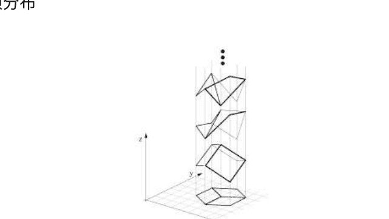

### 2.3.3 逆问题 *

概率论关注的是在了解（或假设）世界状态的情况下，对结果的分布进行预测。 相反地，逆概率关注的是根据观测结果推断世界的状态。 我们可以将其视为将 $h \rightarrow y$ 的映射反转。

例如，考虑从二维图像 $y$ 中推断三维形状 $h$，这是一个经典的视觉场景理解问题。 不幸的是，这是一个基本上不适定的问题，如图2.8所示，因为存在多个可能的隐藏 $h$ 与相同的观测 $y$ 一致（参见例如[Piz01]）。 类似地，我们可以将自然语言理解视为一个不适定的问题，听者必须从（常常模棱两可的）说话者的话语中推断出意图（参见例如[Sab21]）。

为了解决这样的逆问题，我们可以使用贝叶斯规则计算后验概率 $p(h|y)$，它给出了可能的世界状态的分布。 这需要指定前向模型 $p(y|h)$，以及先验概率 $p(h)$，它可以用来排除（或降低权重）不合理的世界状态。 我们将在本书的后续部分中详细讨论这个主题，[Mur23]。

## 2.4 伯努利分布和二项分布

也许最简单的概率分布是伯努利分布，它可以用来建模二元事件，我们将在下面讨论。

### 2.4.1 定义

考虑抛硬币，事件“正面朝上”发生的概率为 $0 \leq \theta \leq 1$。 令 $Y = 1$ 表示这个事件，令 $Y = 0$ 表示硬币反面朝上的事件。 因此，我们假设 $p(Y = 1) = \theta$ 和 $p(Y = 0) = 1 - \theta$。 这被称为伯努利分布，可以写成如下形式

$$ Y \sim \text{Ber}(\theta) $$

符号 ~ 表示“从中抽样”或“分布为”， Ber 表示伯努利。该分布的概率质量函数（pmf）定义如下：

$$\text{Ber}(y|\theta) = \begin{cases} 1 - \theta & \text{if } y = 0 \\ \theta & \text{if } y = 1 \end{cases}$$  (2.67)

（有关pmf的详细信息，请参见第2.2.1节。）我们可以更简洁地写成如下形式：

$$\text{Ber}(y|\theta) \triangleq \theta^y (1-\theta)^{1-y}$$  (2.68)

伯努利分布是二项分布的一种特殊情况。为了解释这个，假设我们观察到一组 N 个伯努利试验，表示为 $y_n \sim \text{Ber}(\cdot|\theta)$，其中 $n = 1 : N$。具体来说，想象一下抛掷一枚硬币 N 次。让我们定义总数为头的次数为 s， $\sum_{n=1}^{N} \mathbb{I}(y_n=1)$。头的分布由二项分布给出：

$$\text{Bin}(s|N, \theta) \triangleq \binom{N}{s} \theta^s (1-\theta)^{N-s}$$  (2.69)

其中

$$\binom{N}{k} \triangleq \frac{N!}{(N-k)! k!}$$  (2.70)

是从 N 中选择 k 个项的方法数（这被称为二项式系数，并且发音为“N choose k”）。请参见图2.9，了解一些二项分布的示例。如果 N=1，那么二项分布就变成了伯努利分布。

### 2.4.2 Sigmoid（逻辑）函数

当我们想要预测一个二元变量 $y \in \{0, 1\}$ 给定一些输入 $x \in \mathcal{X}$ 时，我们需要使用一个形式的条件概率分布

$$p(y|\boldsymbol{x}, \boldsymbol{\theta}) = \text{Ber}(y|f(\boldsymbol{x}; \boldsymbol{\theta}))$$  (2.71)

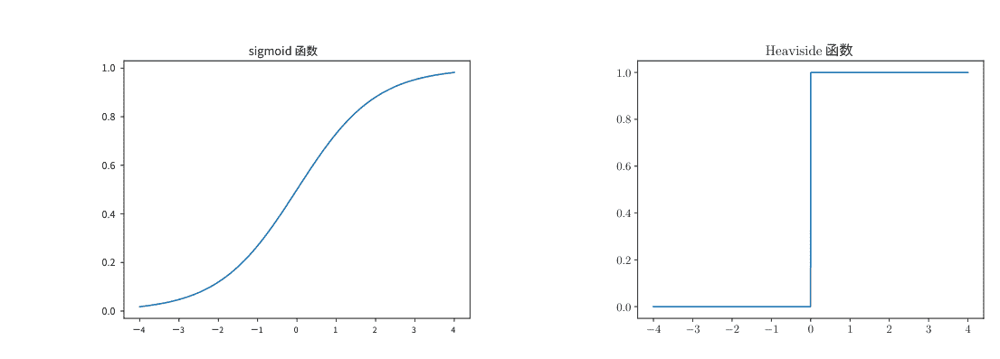

> 图2.10: (a) sigmoid (逻辑)函数 σ(a) = (1 + e^{-a})^{-1}. (b) Heaviside函数 I(a > 0). 由 activation_fun_plot.ipynb 生成。

表2.3: Sigmoid (逻辑)和相关函数的一些有用属性。请注意，logit函数是sigmoid函数的反函数，其定义域为[0,1]。

| | |
|---|---|
| σ(x) ≜ 1/(1+e^{-x}) = e^x/(1+e^x) | (2.72) |
| d/dx σ(x) = σ(x)(1 - σ(x)) | (2.73) |
| 1 - σ(x) = σ(-x) | (2.74) |
| σ^{-1}(p) = log(p/(1-p)) ≜ logit(p) | (2.75) |
| σ_{+}(x) ≜ log(1 + e^x) ≜ softplus(x) | (2.76) |
| d/dx σ_{+}(x) = σ(x) | (2.77) |

其中 f(x; θ)是预测输出分布的均值参数的某个函数。在第二部分至第四部分中，我们将考虑许多不同类型的函数 f。

为了避免对 f(x; θ)的要求 $0 \leq f(x;\theta) \leq 1$，我们可以让f成为一个无约束的函数，并使用以下模型：

$$p(y|x, \theta) = \text{Ber}(y | \sigma(f(x; \theta))) \quad (2.78)$$

这里 $\sigma()$是sigmoid函数或逻辑函数，定义如下：

$$\sigma(a) \triangleq 1/(1 + e^{-a}) \quad (2.79)$$

术语“sigmoid”表示S形：参见图2.10a的绘图。我们可以看到它

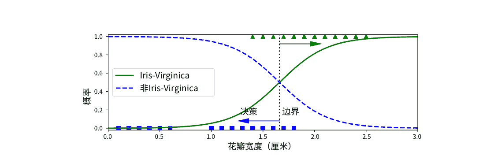

图2.11: 逻辑回归应用于Iris数据集的一维、二分类版本。由iris_logreg.ipynb生成。改编自[Gér19]的图4.23。

将整个实数线映射到 $[0, 1]$，这对于输出被解释为概率（因此是伯努利参数 $\theta$的有效值）是必要的。sigmoid函数可以被看作是阶跃函数的“软”版本，定义如下：

$$H(a) \triangleq \mathbb{I}(a > 0)$$

如图2.10b所示。

将sigmoid函数的定义代入方程(2.78)，我们得到

$$p(y = 1|\boldsymbol{x}, \boldsymbol{\theta}) = \frac{1}{1 + e^{-a}} = \frac{e^a}{1 + e^a} = \sigma(a)$$

$$p(y = 0|\boldsymbol{x}, \boldsymbol{\theta}) = 1 - \frac{1}{1 + e^{-a}} = \frac{e^{-a}}{1 + e^{-a}} = \frac{1}{1 + e^{a}} = \sigma(-a)$$

该数量 a等于log odds, $\log\left(\frac{p}{1-p}\right)$，其中 $p = p(y = 1|\boldsymbol{x}; \boldsymbol{\theta})$。要理解这一点，注意到

$$\log\left(\frac{p}{1-p}\right) = \log\left(\frac{e^a}{1+e^a} \cdot \frac{1+e^a}{1}\right) = \log(e^a) = a$$

逻辑函数或Sigmoid函数将对数几率映射到概率p:

$$p = \text{logistic}(a) = \sigma(a) \triangleq \frac{1}{1 + e^{-a}} = \frac{e^a}{1 + e^a}$$

其逆函数称为logit函数，将概率p映射到对数几率a:

$$a = \text{logit}(p) = \sigma^{-1}(p) \triangleq \log\left(\frac{p}{1 - p}\right)$$

有关这些函数的一些有用属性，请参见表2.3。

### 2.4.3 二元逻辑回归

在本节中，我们使用条件伯努利模型，其中线性预测器的形式为$f(\boldsymbol{x}; \boldsymbol{\theta}) = \boldsymbol{w}^{\top}\boldsymbol{x} + b$。因此，模型的形式为

$$p(y|\boldsymbol{x}; \boldsymbol{\theta}) = \text{Ber}(y|\sigma(\boldsymbol{w}^{\top}\boldsymbol{x} + b))$$

换句话说，

$$p(y=1|\boldsymbol{x};\boldsymbol{\theta}) = \sigma(\boldsymbol{w}^\top \boldsymbol{x} + b) = \frac{1}{1 + e^{-(\boldsymbol{w}^\top \boldsymbol{x} + b)}}$$

这被称为逻辑回归。

例如，考虑一个一维、两类的鸢尾花数据集，其中正类是“维吉尼亚”而负类是“非维吉尼亚”，我们使用的特征 $x$ 是花瓣宽度。我们对此进行逻辑回归模型拟合，并在图2.11中展示结果。决策边界对应于值 $x^*$，其中 $p(y=1|x = x^*,\boldsymbol{\theta}) = 0.5$。我们可以看到，在这个例子中，$x^* \approx 1.7$。当 $x$ 远离这个边界时，分类器对于类别标签的预测变得更加自信。

从这个例子中可以清楚地看出，对于一个（二元）分类问题，使用线性回归是不合适的。在这样的模型中，随着我们向右移动，概率会增加超过1，而向左移动，概率会降低到0以下。

有关逻辑回归的更多细节，请参阅第10章。

## 2.5 分类和多项式分布

为了表示对有限标签集的分布，我们可以使用分类分布，它将伯努利分布推广到 $C > 2$ 个值。

### 2.5.1 定义

分类分布是一个离散概率分布，每个类别有一个参数：

$$\text{Cat}(y|\boldsymbol{\theta}) \triangleq \prod_{c=1}^{C} \theta_c^{\mathbb{I}(y=c)}$$

换句话说，$p(y = c|\boldsymbol{\theta}) = \theta_c$。请注意，参数受到约束，使得 $0 \leq \theta_c \leq 1$，并且 $\sum_{c=1}^{C} \theta_c = 1$；因此只有 $C - 1$ 个独立参数。

我们可以通过将离散变量 $y$ 转换为一个具有 $C$ 个元素的独热向量来以另一种方式表示分类分布，其中除了对应于类别标签的条目之外，所有条目都为0。（“独热”一词源自电气工程，其中二进制向量被编码为一组导线上的电流，可以是活动的（“热”的）或非活动的（“冷”的）。）例如，如果 $C = 3$，我们将类别1、2和3编码为 $(1,0,0)$，$(0,1,0)$ 和 $(0,0,1)$。更一般地，我们可以使用单位向量来编码类别，其中除了维度 $c$ 之外，所有维度都为0。（这也被称为 dummyencoding。）使用独热编码，我们可以将分类分布表示如下：

$$\text{Cat}(\boldsymbol{y}|\boldsymbol{\theta}) \triangleq \prod_{c=1}^{C} \theta_c^{y_c}$$

分类分布是多项式分布的特例。为了解释这个，假设我们观察到 $N$ 个分类试验，$y_n \sim \text{Cat}(\cdot|\boldsymbol{\theta})$，对于 $n = 1 : N$。具体来说，想象一下掷 $N$ 次 $C$ 面骰子。让我们定义 $\boldsymbol{y}$ 为一个向量，它计算每个面出现的次数。

图2.12: Softmax分布 \( \text{softmax}(\mathbf{a}/T) \)，其中 \( \mathbf{a}=(3,0,1) \)，在温度为 \( T=100 \)， \( T=2 \) 和 \( T=1 \) 时。当温度较高时（左边），分布是均匀的，而当温度较低时（右边），分布是‘尖峰’，大部分质量集中在最大元素上。由 `softmax_plot.ipynb` 生成。

现在 \( \mathbf{y} \) 不再是 one-hot，而是‘multi-hot’，因为它对于在所有 \( N \) 次试验中观察到的 \( c \) 的每个值都有一个非零的条目。 \( \mathbf{y} \) 的分布由多项式分布给出：

\[
\mathcal{M}(\mathbf{y}|N, \boldsymbol{\theta}) \triangleq \binom{N}{y_1 \ldots y_C} \prod_{c=1}^C \theta_c^{y_c} = \binom{N}{N_1 \ldots N_C} \prod_{c=1}^C \theta_c^{N_c}
\]

其中 \( \theta_c \) 是类别 \( c \) 出现的概率，而

\[
\binom{N}{N_1 \ldots N_C} \triangleq \frac{N!}{N_1! N_2! \ldots N_C!}
\]

是多项式系数，它是将大小为 \( N = \sum_{c=1}^C N_c \) 的集合分成大小为 \( N_1 \) 到 \( N_C \) 的子集的方式数。如果 \( N=1 \)，多项式分布就变成了分类分布。

## 2.5.2 软最大值函数

在条件情况下，我们可以定义

\[
p(y|\mathbf{x}, \boldsymbol{\theta}) = \text{Cat}(y|f(\mathbf{x}; \boldsymbol{\theta}))
\]

我们也可以写成

\[
p(y|\mathbf{x}, \boldsymbol{\theta}) = \mathcal{M}(y|1, f(\mathbf{x}; \boldsymbol{\theta}))
\]

我们要求 \( 0 \le f_c(\mathbf{x}; \boldsymbol{\theta}) \le 1 \) 且 \( \sum_{c=1}^C f_c(\mathbf{x}; \boldsymbol{\theta}) = 1 \)。为了避免 \( f \) 直接预测概率向量的要求，通常将 \( f \) 的输出传递给 softmax 函数 \[[Bri90]\]，也称为多项式逻辑回归。它的定义如下：

\[
\text{softmax}(\mathbf{a}) \triangleq \left[ \frac{e^{a_1}}{\sum_{c'=1}^C e^{a_{c'}}}, \ldots, \frac{e^{a_C}}{\sum_{c'=1}^C e^{a_{c'}}} \right]
\]

这将 \( \mathbb{R}^C \) 映射到 \( [0,1]^C \)，并满足 \( 0 \le \text{softmax}(\mathbf{a})_c \le 1 \) 和 \( \sum_{c=1}^C \text{softmax}(\mathbf{a})_c = 1 \) 的约束条件。softmax的输入， \( \mathbf{a} = f(\mathbf{x}; \boldsymbol{\theta}) \)，被称为logits，它们是对数几率的一般化。softmax函数之所以被称为softmax，是因为它有点像argmax函数。为了看到这一点，让我们将每个元素除以一个叫做temperature的常数 \( T \)。当 \( T \to 0 \) 时，我们发现

\[
\text{softmax}(\mathbf{a}/T)_c = \begin{cases} 1.0 & \text{if } c = \argmax_{c'} a_{c'} \\ 0.0 & \text{otherwise} \end{cases} \tag{2.95}
\]

换句话说，在低温下，分布将大部分概率质量放在最可能的状态中（这被称为胜者通吃），而在高温下，它将概率质量均匀分布。参见图2.12进行说明。

## 2.5.3 多类别逻辑回归

如果我们使用形式为 \( f(\mathbf{x}; \boldsymbol{\theta}) = \mathbf{W}\mathbf{x} + \mathbf{b} \) 的线性预测器，其中 \( \mathbf{W} \) 是一个 \( C \times D \) 矩阵， \( \mathbf{b} \) 是一个 \( C \) 维偏置向量，则最终模型变为

\[
p(y|\mathbf{x}; \boldsymbol{\theta}) = \text{Cat}(y|\text{softmax}(\mathbf{W}\mathbf{x} + \mathbf{b})) \tag{2.96}
\]

令 \( \mathbf{a} = \mathbf{W}\mathbf{x} + \mathbf{b} \) 为 \( C \) 维的logits向量。然后我们可以将上述重写为：

\[
p(y = c|\mathbf{x}; \boldsymbol{\theta}) = \frac{e^{a_c}}{\sum_{c'=1}^C e^{a_{c'}}} \tag{2.97}
\]

这被称为多项式逻辑回归。如果我们只有两个类别，这就变成了二元逻辑回归。要看到这一点，注意到

\[
\text{softmax}(\mathbf{a})_0 = \frac{e^{a_0}}{e^{a_0} + e^{a_1}} = \frac{1}{1 + e^{a_1 - a_0}} = \sigma(a_0 - a_1) \tag{2.98}
\]

所以我们可以训练模型来预测 \( a = a_1 - a_0 \)。这可以通过一个单一的权重向量 \( \mathbf{w} \) 来实现；如果我们使用多类别的形式，我们将有两个权重向量， \( \mathbf{w}_0 \) 和 \( \mathbf{w}_1 \)。这样的模型是over-parameterized的，这可能会影响解释性，但预测结果将是相同的。

> 8. 这个术语来自统计物理领域。Boltzmann分布是一种与softmax函数具有相同形式的状态分布。我们在第10.3节中会详细讨论这个问题。

现在，我们只给一个例子。图2.13展示了当我们使用只有2个特征的3类鸢尾花数据集来拟合这个模型时会发生什么。我们可以看到每个类别之间的决策边界是线性的。我们可以通过转换特征（例如使用多项式）来创建非线性边界，这在第10.3.1节中讨论。

## 2.5.4 对数和指数的技巧

在本节中，我们讨论了在使用softmax分布时需要注意的一个重要实际细节。假设我们想要计算归一化概率 \( p_c = p(y = c|\mathbf{x}) \)，这可以表示为

\[
p_c = \frac{e^{a_c}}{Z(\mathbf{a})} = \frac{e^{a_c}}{\sum_{c'=1}^C e^{a_{c'}}} \quad (2.99)
\]

其中 \( \mathbf{a} = f(\mathbf{x};\boldsymbol{\theta}) \) 是logits。在计算分区函数 \( Z \) 时，我们可能会遇到数值问题。例如，假设我们有3个类别，logits为 \( \mathbf{a} = (0, 1, 0) \)。然后我们发现 \( Z = e^0 + e^1 + e^0 = 4.71 \)。但是现在假设 \( \mathbf{a} = (1000, 1001, 1000) \)；我们发现 \( Z = \infty \)，因为在计算机上，即使使用64位精度， \( \text{np.exp}(1000) = \inf \)。类似地，假设 \( \mathbf{a} = (-1000, -999, -1000) \)；现在我们发现 \( Z = 0 \)，因为 \( \text{np.exp}(-1000) = 0 \)。为了避免数值问题，我们可以使用以下恒等式：

\[
\log \sum_{c=1}^C \exp(a_c) = m + \log \sum_{c=1}^C \exp(a_c - m) \quad (2.100)
\]

这对于任何 \( m \) 都成立。通常使用 \( m = \max_c a_c \)，这样可以确保指数运算的最大值为零，因此不会发生溢出，即使发生下溢，答案也是合理的。这被称为log-sum-exp trick。在实现lse函数时，我们使用这个技巧：

\[
\text{lse}(\mathbf{a}) \triangleq \log \sum_{c=1}^C \exp(a_c) \quad (2.101)
\]

我们可以使用这个方法来计算从logits到概率的转换：

\[
p(y = c|\mathbf{x}) = \exp(a_c - \text{lse}(\mathbf{a})) \quad (2.102)
\]

然后我们可以将其传递给交叉熵损失函数，该函数在方程（5.41）中定义。 然而，为了节省计算量并保证数值稳定性，通常会修改交叉熵损失函数，使其以logits \( \mathbf{a} \) 作为输入，而不是概率向量 \( \mathbf{p} \)。例如，考虑二分类情况。一个示例的交叉熵损失为

\[
\mathcal{L} = -[\mathbb{I}(y=0) \log p_0 + \mathbb{I}(y=1) \log p_1] \quad (2.103)
\]

其中

\[
\log p_1 = \log\left( \frac{1}{1 + \exp(-a)} \right) = \log(1) - \log(1 + \exp(-a)) = 0 - \text{lse}([0, -a]) \quad (2.104)
\]

\[
\log p_0 = 0 - \text{lse}([0, +a]) \quad (2.105)
\]

## 2.6 单变量高斯（正态）分布

实值随机变量 $y \in \mathbb{R}$ 的最常用分布是高斯分布，也称为正态分布（有关这些名称的讨论请参见第2.6.4节）。

### 2.6.1 累积分布函数

我们定义连续随机变量 $Y$ 的累积分布函数或 cdf如下：

\[
P(y) \triangleq \mathrm{Pr}(Y \leq y) \quad (2.106)
\]

（注意我们使用大写字母 $P$ 表示累积分布函数。） 使用这个，我们可以计算在任何区间内的概率如下：

\[
\mathrm{Pr}(a < Y \leq b) = P(b) - P(a) \quad (2.107)
\]

累积分布函数是单调非递减的函数。

高斯分布的累积分布函数定义如下：

\[
\Phi(y; \mu, \sigma^2) \triangleq \int_{-\infty}^{y} \mathcal{N}(z|\mu, \sigma^2) dz \quad (2.108)
\]

请参见图2.2a进行绘制。 请注意，高斯分布的累积分布函数通常使用 $\Phi(y; \mu, \sigma^2) = \frac{1}{2}[1 + \mathrm{erf}(z/\sqrt{2})]$, 其中 $z = (y-\mu)/\sigma$, $\mathrm{erf}(u)$ 是误差函数，定义为

\[
\mathrm{erf}(u) \triangleq \frac{2}{\sqrt{\pi}} \int_{0}^{u} e^{-t^2} dt \quad (2.109)
\]

参数 $\mu$ 编码了分布的均值；对于高斯分布来说，这也是众数。 参数 $\sigma^2$ 编码了方差。（有时我们谈论高斯分布的精度，即逆方差，表示为 $\lambda = 1/\sigma^2$。）当 $\mu=0$ 且 $\sigma=1$ 时，高斯分布被称为标准正态分布。

如果 $P$ 是 $Y$ 的累积分布函数，则 $P^{-1}(q)$ 是值 $y_q$, 使得 $P(Y \leq y_q) = q$; 这被称为 $q$ 分位数 of $P$。值 $P^{-1}(0.5)$ 是分布的中位数，左侧和右侧的概率质量各占一半。值 $P^{-1}(0.25)$ 和 $P^{-1}(0.75)$ 是下四分位数和上四分位数。

例如，让 $\Phi$ 是高斯分布 $\mathcal{N}(0,1)$ 的累积分布函数(cdf)， $\Phi^{-1}$ 是逆累积分布函数(也称为probit函数)。那么，左边的 $\Phi^{-1}(\alpha/2)$ 的点包含了 $\alpha/2$ 的概率质量，如图2.2b所示。根据对称性，右边的 $\Phi^{-1}(1-\alpha/2)$ 的点也包含了 $\alpha/2$ 的质量。 因此，中心区间 $(\Phi^{-1}(\alpha/2), \Phi^{-1}(1-\alpha/2))$ 包含了 $1-\alpha$ 的质量。如果我们设置 $\alpha=0.05$, 中心95%的区间被覆盖在范围内。

\[
(\Phi^{-1}(0.025), \Phi^{-1}(0.975)) = (-1.96, 1.96) \quad (2.110)
\]

如果分布是 $\mathcal{N}(\mu, \sigma^2)$, 那么95%的区间变为 $(\mu - 1.96\sigma, \mu + 1.96\sigma)$。通常用 $\mu \pm 2\sigma$ 来近似表示。

### 2.6.2 概率密度函数

我们将概率密度函数或pdf定义为累积分布函数的导数：

\[
p(y) \triangleq \frac{d}{dy} P(y) \quad (2.111)
\]

高斯分布的概率密度函数为

\[
\mathcal{N}(y|\mu, \sigma^2) \triangleq \frac{1}{\sqrt{2\pi\sigma^2}} e^{-\frac{1}{2\sigma^2}(y-\mu)^2} \quad (2.112)
\]

其中 $\sqrt{2\pi\sigma^2}$ 是为了确保密度函数积分为1而需要的归一化常数（见练习2.12）。参见图2.2b。

给定一个概率密度函数，我们可以计算连续变量在有限区间内的概率如下：

\[
\Pr(a < Y \leq b) = \int_{a}^{b} p(y) dy = P(b) - P(a) \quad (2.113)
\]

当区间的大小变得更小时，我们可以写成

\[
\Pr(y \leq Y \leq y + dy) \approx p(y) dy \quad (2.114)
\]

直观地说，这表示 $Y$ 在 $y$ 周围的一个小区间内的概率是密度乘以区间的宽度。上述结果的一个重要推论是，一个点的概率密度函数可以大于1。例如，$\mathcal{N}(0|0,0.1) = 3.99$。

我们可以使用概率密度函数计算分布的均值或期望值：

\[
\mathbb{E}[Y] \triangleq \int_{\mathcal{Y}} y p(y) dy \quad (2.115)
\]

对于高斯分布，我们有熟悉的结果 $\mathbb{E} \left[ \mathcal{N}(\cdot|\mu, \sigma^2) \right] = \mu$。 (注意，然而，对于某些分布，这个积分是无限的，因此均值未定义。)

我们还可以使用概率密度函数计算分布的方差。这是一种度量“扩展程度”的方法，通常用 $\sigma^2$ 表示。方差的定义如下：

\[
\mathbb{V}[Y] \triangleq \mathbb{E}\left[ (Y - \mu)^2 \right] = \int (y - \mu)^2 p(y) dy \quad (2.116)
\]

\[
= \int y^2 p(y) dy + \mu^2 \int p(y) dy - 2\mu \int y p(y) dy = \mathbb{E}\left[ Y^2 \right] - \mu^2 \quad (2.117)
\]

从中我们得出有用的结果

\[
\mathbb{E}\left[ Y^2 \right] = \sigma^2 + \mu^2 \quad (2.118)
\]

标准差被定义为

\[
\text{std}[Y] \triangleq \sqrt{\mathbb{V}[Y]} = \sigma \quad (2.119)
\]

(标准差比方差更易解释，因为它与 $Y$ 本身具有相同的单位。) 对于高斯分布，我们有熟悉的结果 $\text{std} \left[ \mathcal{N}(\cdot|\mu, \sigma^2) \right] = \sigma$。

### 2.6.3 回归

到目前为止，我们一直在考虑无条件的高斯分布。在某些情况下，将高斯分布的参数作为一些输入变量的函数是有帮助的，即，我们想要创建一个形式为条件密度模型的模型

\[
p(y|x; \boldsymbol{\theta}) = \mathcal{N}(y|f_{\mu}(x; \boldsymbol{\theta}), f_{\sigma}(x; \boldsymbol{\theta})^2) \quad (2.120)
\]

其中 \(f_{\mu}(x; \boldsymbol{\theta}) \in \mathbb{R}\) 预测均值，而 \(f_{\sigma}(x; \boldsymbol{\theta})^2 \in \mathbb{R}_+\) 预测方差。

通常假设方差是固定的，并且与输入无关。这被称为同方差回归。此外，通常假设均值是输入的线性函数。得到的模型被称为线性回归：

\[
p(y|x; \boldsymbol{\theta}) = \mathcal{N}(y|\mathbf{w}^{\top}\mathbf{x} + b, \sigma^2) \quad (2.121)
\]

其中 \(\boldsymbol{\theta} = (\mathbf{w}, b, \sigma^2)\)。请参见图2.14(a)，了解该模型在1维中的示例。以及第11.2节，了解更多关于该模型的细节。

然而，我们也可以使方差依赖于输入；这被称为异方差回归。在线性回归设置中，我们有

\[
p(y|x; \boldsymbol{\theta}) = \mathcal{N}(y|\mathbf{w}_{\mu}^{\top}\mathbf{x} + b, \sigma_{+}(\mathbf{w}_{\sigma}^{\top}\mathbf{x})) \quad (2.122)
\]

其中 \(\boldsymbol{\theta} = (\mathbf{w}_{\mu}, \mathbf{w}_{\sigma})\) 是两种形式的回归权重，以及

\[
\sigma_{+}(a) = \log(1 + e^{a}) \quad (2.123)
\]

是 softplus 函数，它将从 \(\mathbb{R}\) 映射到 \(\mathbb{R}_+\)，以确保预测的标准差是非负的。请参见图2.14(b)，了解1d中该模型的示例。

请注意，图2.14绘制了95%的预测区间，\([\mu(x) - 2\sigma(x), \mu(x) + 2\sigma(x)]\)。这是给定 \(x\) 的预测观测 \(y\) 的不确定性，并捕捉了蓝色点的变异性。

相比之下，底层（无噪声）函数的不确定性由表示 \(\nabla [f_{\mu}(x; \boldsymbol{\theta})]\)，它不涉及 \(\sigma\) 项；现在不确定性是关于参数 \(\boldsymbol{\theta}\) 的，而不是输出 \(y\) 的。有关如何建模参数不确定性的详细信息，请参见第11.7节。

### 2.6.4 为什么高斯分布被广泛使用？

高斯分布是统计学和机器学习中最广泛使用的分布。这有几个原因。首先，它有两个易于解释的参数，可以捕捉分布的一些最基本的属性，即均值和方差。其次，中心极限定理（第2.8.6节）告诉我们，独立随机变量的和近似服从高斯分布，这使得它成为建模残差误差或“噪声”的良好选择。

第三，高斯分布在具有指定均值和方差的约束条件下，做出了最少的假设（具有最大熵），如我们在第3.4.4节中所示；这使得它在许多情况下成为一个很好的默认选择。最后，它具有简单的数学形式，这导致了易于实现但通常非常有效的方法，正如我们将在第3.2节中看到的那样。从历史的角度来看，值得注意的是，“高斯分布”这个术语有点误导，因为正如Jaynes [Jay03, p241]所指出的：“这个分布的基本性质和主要特点是在高斯六岁时被拉普拉斯注意到的；而分布本身在拉普拉斯出生之前就被德莫佛尔发现了。”然而，高斯在19世纪推广了这种分布的使用，而“高斯”这个术语现在在科学和工程中被广泛使用。

“正态分布”这个名称似乎是与线性回归中的正态方程有关的（参见第11.2.2.2节）。然而，我们更喜欢避免使用“正态”这个术语，因为它暗示其他分布是“异常”的，而正如Jaynes [Jay03]指出的那样，高斯分布在某种意义上是异常的，因为它具有许多特殊属性，这些属性在一般分布中是不典型的。

### 2.6.5 狄拉克δ函数作为极限情况

当高斯分布的方差趋近于0时，分布在均值处逼近一个无限窄但无限高的“尖峰”。我们可以写成如下形式：

$$\lim_{\sigma \to 0} \mathcal{N}(y|\mu, \sigma^2) \to \delta(y - \mu)$$ (2.124)

其中 $\delta$ 是狄拉克δ函数，定义为

$$\delta(x) = \begin{cases} +\infty & \text{if } x = 0 \\ 0 & \text{if } x \neq 0 \end{cases}$$ (2.125)

其中

$$\int_{-\infty}^{\infty} \delta(x) dx = 1$$ (2.126)

这个的一个小变种是定义

$$\delta_y(x) = \begin{cases} +\infty & \text{if } x = y \\ 0 & \text{if } x \neq y \end{cases}$$ (2.127)

请注意我们有

$$\delta_y(x) = \delta(x - y)$$ (2.128)

δ函数分布满足以下筛选性质，我们稍后会用到：

$$\int_{-\infty}^{\infty} f(y)\delta(x-y)dy = f(x)$$ (2.129)

## 2.7 其他常见的单变量分布 *

在本节中，我们简要介绍一些其他单变量分布，这些分布将在本书中使用。

### 2.7.1 学生 t 分布

高斯分布对异常值非常敏感。高斯分布的一个鲁棒性替代品是学生 t 分布，我们简称为学生分布。其概率密度函数如下：

$$T(y|\mu, \sigma^2, \nu) \propto \left[1 + \frac{1}{\nu}\left(\frac{y-\mu}{\sigma}\right)^2\right]^{-\frac{\nu+1}{2}}$$ (2.130)

其中 $\mu$ 是均值，$\sigma > 0$ 是尺度参数（不是标准差），而 $\nu > 0$ 被称为自由度（虽然更好的术语应该是正态度[Kru13]，因为较大的 $\nu$ 使分布表现得像高斯分布）。

这个分布有一个丰富多彩的词源。它最早由威廉·西利·高斯特（William Sealy Gosset）于1908年在爱尔兰都柏林的吉尼斯酿酒厂发表。由于他的雇主不允许他使用自己的名字，所以他称之为“学生”分布。这个术语 t 的起源似乎是在发展经典统计推断基础时，费舍尔使用学生分布表时产生的。更多历史细节请参见 http://jeff560.tripod.com/s.html。

我们可以看到，概率密度随离中心的平方距离的多项式函数衰减，而不是指数函数，因此尾部具有更多的概率质量，与高斯分布不同，如图2.15所示。我们称学生分布具有重尾特性，这使得它对异常值具有鲁棒性。

为了说明学生分布的鲁棒性，考虑图2.16。在左侧，我们展示了拟合到一些无异常值数据的高斯和学生分布。在右侧，我们添加了一些异常值。我们可以看到，高斯分布受影响很大，而学生分布几乎没有变化。我们在第11.6.2节讨论如何使用学生分布进行鲁棒线性回归。为了后续参考，我们注意到学生分布具有以下特性：

> 均值 = $\mu$，众数 = $\mu$，方差 = $\frac{\nu \sigma^2}{(\nu - 2)}$

只有在 $\nu > 1$ 时，均值才有定义。只有在 $\nu > 2$ 时，方差才有定义。对于 $\nu \gg 5$，学生分布迅速接近高斯分布并丧失其鲁棒性质。通常使用 $\nu = 4$，在一系列问题中能够获得良好的性能[LLT89]。

### 2.7.2 柯西分布

如果 $\nu = 1$，学生分布被称为柯西或洛伦兹分布。其概率密度函数定义为

> $$\mathcal{C}(x|\mu, \gamma) = \frac{1}{\gamma \pi} \left[ 1 + \left( \frac{x - \mu}{\gamma} \right)^2 \right]^{-1}$$

与高斯分布相比，该分布的尾部非常重。例如，标准正态分布的95%值位于-1.96和1.96之间，而标准柯西分布的值位于-12.7和12.7之间。实际上，尾部非常重，以至于定义均值的积分不收敛。

半柯西分布是柯西分布（其中 $\mu = 0$）的一个版本，它在自身上“折叠”，因此其概率密度全部在正实数上。因此，它的形式为

$$C_{+}(x|\gamma) \triangleq \frac{2}{\pi\gamma} \left[1 + \left(\frac{x}{\gamma}\right)^2\right]^{-1}$$

这在贝叶斯建模中非常有用，我们希望使用一个在正实数上具有重尾但在原点处具有有限密度的分布。

### 2.7.3 拉普拉斯分布

另一个具有重尾的分布是拉普拉斯分布$^{10}$，也被称为双边指数分布。它的概率密度函数如下：

$$\text{Laplace}(y|\mu, b) \triangleq \frac{1}{2b} \exp\left(-\frac{|y-\mu|}{b}\right)$$

请参见图2.15进行绘制。这里 $\mu$ 是位置参数，$b > 0$ 是尺度参数。该分布具有以下特性：均值 = $\mu$，众数 = $\mu$，方差 = $2b^2$。

在第11.6.1节中，我们讨论了如何使用拉普拉斯分布进行鲁棒线性回归，在第11.4节中，我们讨论了如何使用拉普拉斯分布进行稀疏线性回归。

### 2.7.4 Beta分布

Beta分布在区间 $[0,1]$ 上有支持，并且定义如下：

$$\text{Beta}(x|a, b) = \frac{1}{B(a, b)} x^{a-1} (1-x)^{b-1}$$

其中 $B(a, b)$ 是 beta函数，定义如下

$$B(a, b) \triangleq \frac{\Gamma(a)\Gamma(b)}{\Gamma(a+b)}$$

其中 $\Gamma(a)$ 是由Gamma函数定义的

$$\Gamma(a) \triangleq \int_{0}^{\infty} x^{a-1} e^{-x} dx$$

请参见图2.17a，其中显示了一些贝塔分布的图形。我们要求 $a, b > 0$ 以确保分布是可积的（即确保 $B(a,b)$ 存在）。如果 $a = b = 1$，我们得到均匀分布。如果 $a$ 和 $b$ 都小于1，我们得到一个双峰分布，在0和1处有“尖峰”；如果 $a$ 和 $b$ 都大于1，则分布是单峰的。为了以后参考，我们注意到该分布具有以下特性（练习2.8）：

$$\text{均值} = \frac{a}{a+b}, \quad \text{众数} = \frac{a-1}{a+b-2}, \quad \text{方差} = \frac{ab}{(a+b)^2(a+b+1)}$$

### 2.7.5 伽玛分布

伽玛分布是一种适用于正实数随机变量的灵活分布， $x > 0$。它是通过两个参数来定义的，称为形状参数 $a > 0$ 和速率参数 $b > 0$：

$$\text{Ga}(x|\text{shape} = a, \text{rate} = b) \triangleq \frac{b^a}{\Gamma(a)} x^{a-1} e^{-xb}$$

有时，该分布以形状参数 $a$ 和尺度参数 $s = 1/b$ 进行参数化：

$$\text{Ga}(x|\text{shape} = a, \text{scale} = s) \triangleq \frac{1}{s^a \Gamma(a)} x^{a-1} e^{-x/s}$$

请参见图2.17b，其中显示了伽玛概率密度函数的一些图形。作为参考，我们注意到该分布具有以下特性：

$$\text{均值} = \frac{a}{b}, \quad \text{众数} = \frac{a-1}{b}, \quad \text{方差} = \frac{a}{b^2}$$

有几种分布只是Gamma的特殊情况，我们在下面讨论。

- **指数分布。** 这是由
$$\text{Expon}(x|\lambda) \triangleq \text{Ga}(x|\text{shape}= 1, \text{rate} = \lambda)$$
定义的。该分布描述了泊松过程中事件之间的时间，即以恒定的平均速率 $\lambda$ 连续独立发生的过程。

- **卡方分布。** 这是由
$$\chi_{\nu}^{2}(x) \triangleq \mathrm{Ga}(x | \mathrm{shape}=\frac{\nu}{2}, \mathrm{rate}=\frac{1}{2}) \tag{2.144}$$
定义的。其中 $\nu$ 被称为自由度。这是高斯随机变量平方和的分布。更准确地说，如果 $Z_{i} \sim \mathcal{N}(0,1)$，并且 $S=\sum_{i=1}^{\nu} Z_{i}^{2}$，则 $S \sim \chi_{\nu}^{2}$。

- **逆伽玛分布** 定义如下：
$$\operatorname{IG}(x | \text{形状}=a, \text{尺度}=b) \triangleq \frac{b^{a}}{\Gamma(a)} x^{-(a+1)} e^{-b / x} \tag{2.145}$$
该分布具有以下特性
$$\text{均值}=\frac{b}{a-1}, \quad \text{众数}=\frac{b}{a+1}, \quad \text{方差}=\frac{b^{2}}{(a-1)^{2}(a-2)} \tag{2.146}$$
只有当 $a>1$ 时，均值存在。只有当 $a>2$ 时，方差存在。注意：如果 $X \sim \mathrm{Ga}(\text{形状}=a, \text{速率}=b)$，则 $1 / X \sim \mathrm{IG}(\text{形状}=a, \text{尺度}=b)$。（注意，在这种情况下，$b$ 扮演两个不同的角色。）

### 2.7.6 经验分布

假设我们有一个样本集 $\mathcal{D}=\left\{x^{(1)}, \ldots, x^{(N)}\right\}$，来自分布 $p(X)$，其中 $X \in \mathbb{R}$。我们可以使用一组 delta 函数（第 2.6.5 节）或“尖峰”来近似概率密度函数，这些尖峰以这些样本为中心：

$$\hat{p}_{N}(x)=\frac{1}{N} \sum_{n=1}^{N} \delta_{x^{(n)}}(x) \tag{2.147}$$

这被称为数据集 $\mathcal{D}$ 的经验分布。一个例子是 $N=5$，如图2.18(a)所示。相应的累积分布函数为

$$\hat{P}_N(x) = \frac{1}{N} \sum_{n=1}^N \mathbb{I}(x^{(n)} \leq x) = \frac{1}{N} \sum_{n=1}^N u_{x^{(n)}}(x)$$

其中
$$u_y(x) = \begin{cases} 1 & \text{if } x \geq y \\ 0 & \text{if } x < y \end{cases}$$
这可以被视为一个“阶梯”，如图2.18(b)所示，在每个样本处都会发生高度为 $1/N$ 的跳跃。

## 2.8 随机变量的转换 *

假设 $x \sim p()$ 是某个随机变量，而 $y = f(x)$ 是对其进行的某种确定性转换。在本节中，我们将讨论如何计算 $p(y)$。

### 2.8.1 离散情况

如果 $X$ 是一个离散随机变量，我们可以通过简单地对所有满足 $f(x) = y$ 的 $x$ 的概率质量进行求和来推导 $Y$ 的概率质量函数：

$$p_y(y) = \sum_{x: f(x)=y} p_x(x)$$

例如，如果 $f(X) = 1$ 当 $X$ 为偶数时，$f(X) = 0$ 否则，且 $p_x(X)$ 在集合 $\{1,...,10\}$ 上均匀分布，则 $p_y(1) = \sum_{x\in\{2,4,6,8,10\}} p_x(x) = 0.5$，因此 $p_y(0) = 0.5$ 也是。请注意，在这个例子中，$f$ 是一个多对一的函数。

### 2.8.2 连续情况

如果 $X$ 是连续的，我们不能使用方程（2.150），因为 $p_x(x)$ 是一个密度函数，而不是概率质量函数，我们不能对密度函数求和。相反，我们使用累积分布函数（cdf），如下所示：

$$P_y(y) \triangleq \text{Pr}(Y \leq y) = \text{Pr}(f(X) \leq y) = \text{Pr}(X \in \{x | f(x) \leq y\})$$

如果 $f$ 是可逆的，我们可以通过微分cdf来推导出 $y$ 的概率密度函数，如下所示。如果 $f$ 不可逆，我们可以使用数值积分或蒙特卡洛近似。

### 2.8.3 可逆变换（双射）

在本节中，我们考虑单调且可逆函数的情况。（注意，一个函数是可逆的当且仅当它是双射的）。在这个假设下，y的概率密度函数有一个简单的公式，我们将会看到。（这个公式可以推广到可逆但非单调的函数，但我们忽略这种情况。）

#### 2.8.3.1 变量的变化：标量情况

我们从一个例子开始。假设 $x \sim \text{Unif}(0,1)$，且 $y = f(x) = 2x+1$。这个函数会拉伸并平移概率分布，如图2.19(a)所示。现在让我们放大一个点 $x$ 和一个无限接近的点，即 $x+dx$。我们可以看到这个区间被映射到了 $(y, y+dy)$。这些区间中的概率质量必须相同，因此 $p(x)dx = p(y)dy$，所以 $p(y) = p(x)dx/dy$。然而，由于在概率保持方面无论 $dx/dy > 0$ 还是 $dx/dy < 0$ 都没有关系，我们得到

$$p_y(y) = p_x(x) \left| \frac{dx}{dy} \right|$$ (2.152)

现在考虑一般情况下的任意 $p_x(x)$ 和任意单调函数 $f: \mathbb{R} \to \mathbb{R}$。如果我们假设 $f: \mathbb{R} \to \mathbb{R}$ 是单调递增的，我们得到

$$P_y(y) = \Pr(f(X) \leq y) = \Pr(X \leq f^{-1}(y)) = P_x(f^{-1}(y)) = P_x(g(y))$$ (2.153)

对其进行导数运算，我们得到

$$p_y(y) \triangleq \frac{d}{dy} P_y(y) = \frac{d}{dy} P_x(x) = \frac{dx}{dy} \frac{d}{dx} P_x(x) = \frac{dx}{dy} p_x(x)$$ (2.154)

我们可以推导出类似的表达式（但符号相反）适用于 $f$ 单调递减的情况。为了处理一般情况，我们取绝对值得到

$$p_y(y) = p_x(g(y)) \left| \frac{d}{dy} g(y) \right|$$ (2.155)

这被称为变量变换公式。

## 2.8.3.2 变量变换：多元情况

我们可以将之前的结果推广到多元分布如下。设 $f$ 是一个将 $\mathbb{R}^n$ 映射到 $\mathbb{R}^n$ 的可逆函数，其逆函数为 $g$。假设我们想要计算 $\boldsymbol{y} = \boldsymbol{f}(\boldsymbol{x})$ 的概率密度函数。通过与标量情况类比，我们有

$$p_{\boldsymbol{y}}(\boldsymbol{y}) = p_{\boldsymbol{x}}(\boldsymbol{g}(\boldsymbol{y})) \left| \det \left[ \mathbf{J}_{\boldsymbol{g}}(\boldsymbol{y}) \right] \right| \tag{2.156}$$

其中 $\mathbf{J}_{\boldsymbol{g}} = \frac{d\boldsymbol{g}(\boldsymbol{y})}{d\boldsymbol{y}^T}$ 是 $\boldsymbol{g}$ 的雅可比矩阵，而 $\left| \det \mathbf{J}(\boldsymbol{y}) \right|$ 是在 $\boldsymbol{y}$ 处求得的行列式的绝对值。(详见第7.8.5节关于雅可比矩阵的讨论。在练习3.6中，您将使用这个公式推导多元高斯分布的归一化常数。) 图2.20以2d的情况说明了这个结果，其中 $\boldsymbol{f}(\boldsymbol{x}) = \boldsymbol{A}\boldsymbol{x} + \boldsymbol{b}$，其中 $\boldsymbol{A} = \begin{pmatrix} a & b \\ c & d \end{pmatrix}$，并且

$$\det(\boldsymbol{A}) = ad - bc$$

我们可以看到单位正方形的面积变化因子为 $\det(\boldsymbol{A}) = ad - bc$，这是平行四边形的面积。

作为另一个例子，考虑将密度从笛卡尔坐标 $\boldsymbol{x} = (x_1, x_2)$ 转换为极坐标 $\boldsymbol{y} = \boldsymbol{f}(x_1, x_2)$，即 $\boldsymbol{g}(r, \theta) = (r \cos\theta, r \sin\theta)$。然后

$$\mathbf{J}_{\boldsymbol{g}} = \begin{pmatrix} \frac{\partial x_1}{\partial r} & \frac{\partial x_1}{\partial \theta} \\ \frac{\partial x_2}{\partial r} & \frac{\partial x_2}{\partial \theta} \end{pmatrix} = \begin{pmatrix} \cos\theta & -r \sin\theta \\ \sin\theta & r \cos\theta \end{pmatrix} \tag{2.157}$$

$$\left| \det(\mathbf{J}_{\boldsymbol{g}}) \right| = \left| r \cos^2\theta + r \sin^2\theta \right| = \left| r \right| \tag{2.158}$$

因此

$$p_{r,\theta}(r, \theta) = p_{x_1,x_2}(r \cos\theta, r \sin\theta) r \tag{2.159}$$

从几何上看，注意到图2.21中阴影区域的面积由以下给出

$$\Pr(r \leq R \leq r + dr, \theta \leq \Theta \leq \theta + d\theta) = p_{r,\theta}(r, \theta) dr d\theta \tag{2.160}$$

在极限情况下，这等于补丁中心的密度乘以补丁的大小，即 $r dr d\theta$。因此

$$p_{r,\theta}(r, \theta) dr d\theta = p_{x_1,x_2}(r \cos\theta, r \sin\theta) r dr d\theta \tag{2.161}$$

图2.21: 从极坐标到笛卡尔坐标的变量转换。阴影补丁的面积为 $r dr d\theta$。 改编自[Ric95]的图3.16。

### 2.8.4 线性变换的矩

假设 $f$ 是一个仿射函数，那么 $\boldsymbol{y} = \boldsymbol{A} \boldsymbol{x} + \boldsymbol{b}$。在这种情况下，我们可以很容易地推导出 $\boldsymbol{y}$ 的均值和协方差。首先，对于均值，我们有

$$\mathbb{E}[\boldsymbol{y}] = \mathbb{E}[\boldsymbol{A}\boldsymbol{x} + \boldsymbol{b}] = \boldsymbol{A}\boldsymbol{\mu} + \boldsymbol{b} \tag{2.162}$$

其中 $\boldsymbol{\mu} = \mathbb{E}[\boldsymbol{x}]$。如果 $f$ 是一个标量函数， $f(\boldsymbol{x}) = \boldsymbol{a}^T \boldsymbol{x} + b$，相应的结果是

$$\mathbb{E}[\boldsymbol{a}^T \boldsymbol{x} + b] = \boldsymbol{a}^T \boldsymbol{\mu} + b \tag{2.163}$$

对于协方差，我们有

$$\operatorname{Cov}[\boldsymbol{y}] = \operatorname{Cov}[\boldsymbol{A}\boldsymbol{x} + \boldsymbol{b}] = \boldsymbol{A}\boldsymbol{\Sigma}\boldsymbol{A}^T \tag{2.164}$$

其中 $\boldsymbol{\Sigma} = \operatorname{Cov}[\boldsymbol{x}]$。我们将这个证明作为一个练习留给读者。作为一个特例，如果 $y = \boldsymbol{a}^T \boldsymbol{x} + b$，我们得到

$$\mathbb{V}[y] = \mathbb{V}[\boldsymbol{a}^T \boldsymbol{x} + b] = \boldsymbol{a}^T \boldsymbol{\Sigma} \boldsymbol{a} \tag{2.165}$$

例如，要计算两个标量随机变量之和的方差，我们可以设置 $\boldsymbol{a} = [1, 1]^T$ 得到

$$\mathbb{V}[x_1 + x_2] = (1 \quad 1) \begin{pmatrix} \Sigma_{11} & \Sigma_{12} \\ \Sigma_{21} & \Sigma_{22} \end{pmatrix} \begin{pmatrix} 1 \\ 1 \end{pmatrix} \tag{2.166}$$

$$= \Sigma_{11} + \Sigma_{22} + 2\Sigma_{12} = \mathbb{V}[x_1] + \mathbb{V}[x_2] + 2\operatorname{Cov}[x_1, x_2] \tag{2.167}$$

然而，请注意，尽管某些分布（如高斯分布）完全由其均值和协方差特征化，但通常我们必须使用上述描述的技术来推导出 $\boldsymbol{y}$ 的完整分布。

### 2.8.5 卷积定理

设 $y = x_1 + x_2$，其中 $x_1$ 和 $x_2$ 是独立的随机变量。如果这些是离散随机变量，我们可以计算它们的概率质量函数（pmf）如下：

$$p(y = j) = \sum_{k} p(x_1 = k) p(x_2 = j - k) \tag{2.168}$$

对于 $j = \ldots, -2, -1, 0, 1, 2, \ldots$。如果 $x_1$ 和 $x_2$ 有概率密度函数 $p_1(x_1)$ 和 $p_2(x_2)$，那么 $y$ 的分布是什么？$y$ 的累积分布函数为

$$P_y(y^*) = \Pr(y \leq y^*) = \int_{-\infty}^{\infty} p_1(x_1) \left[ \int_{-\infty}^{y^* - x_1} p_2(x_2) dx_2 \right] dx_1 \tag{2.169}$$

在我们积分的区域 $R$ 定义为 $x_1 + x_2 < y^*$。因此 $y$ 的概率密度函数为

$$p(y) = \left[ \frac{d}{dy^*} P_y(y^*) \right]_{y^* = y} = \int p_1(x_1) p_2(y - x_1) dx_1 \tag{2.170}$$

其中我们使用了微分符号下的积分法则：

$$\frac{d}{dx} \int_{a(x)}^{b(x)} f(t) dt = f(b(x)) \frac{db(x)}{dx} - f(a(x)) \frac{da(x)}{dx} \tag{2.171}$$

我们可以将方程(2.170)写成如下形式：

$$p = p_1 \circledast p_2 \tag{2.172}$$

其中 $\circledast$ 表示卷积运算符。对于有限长度的向量，积分变成了求和，并且卷积可以被看作是一种“翻转和拖动”的操作，如表2.4所示。因此，方程(2.170)被称为卷积定理。

表2.4：将 $x = [1, 2, 3, 4]$ 与 $y = [5, 6, 7]$ 进行离散卷积得到 $z = [5, 16, 34, 52, 45, 28]$。一般来说，$z_n = \sum_{m} x_m y_{n-m}$。我们可以看到，这个操作包括“翻转”$y$ 然后将其“拖动”到 $x$ 上，逐元素相乘，并将结果相加。

| - | - | 1 | 2 | 3 | 4 | - | - | |
| :---: | :---: | :---: | :---: | :---: | :---: | :---: | :---: | :--- |
| 7 | 6 | 5 | - | - | - | - | - | $z_0 = x_0 y_0 = 5$ |
| - | 7 | 6 | 5 | - | - | - | - | $z_1 = x_0 y_1 + x_1 y_0 = 16$ |
| - | - | 7 | 6 | 5 | - | - | - | $z_2 = x_0 y_2 + x_1 y_1 + x_2 y_0 = 34$ |
| - | - | - | 7 | 6 | 5 | - | - | $z_3 = x_1 y_2 + x_2 y_1 + x_3 y_0 = 52$ |
| - | - | - | - | 7 | 6 | 5 | - | $z_4 = x_2 y_2 + x_3 y_1 = 45$ |
| - | - | - | - | - | 7 | 6 | 5 | $z_5 = x_3 y_2 = 28$ |

例如，假设我们掷两个骰子，所以 $p_1$ 和 $p_2$ 都是离散均匀分布在 $\{1,2, \ldots, 6\}$ 上。令 $y = x_1 + x_2$ 为骰子的和。我们有

$$p(y=2) = p(x_1=1)p(x_2=1) = \frac{1}{6}\frac{1}{6} = \frac{1}{36} \tag{2.173}$$

$$p(y=3) = p(x_1=1)p(x_2=2) + p(x_1=2)p(x_2=1) = \frac{1}{6}\frac{1}{6} + \frac{1}{6}\frac{1}{6} = \frac{2}{36} \tag{2.174}$$

继续这样进行，我们发现 $p(y=4) = 3/36$, $p(y=5) = 4/36$, $p(y=6) = 5/36$, $p(y=7) = 6/36$, $p(y=8) = 5/36$, $p(y=9) = 4/36$, $p(y=10) = 3/36$, $p(y=11) = 2/36$ 和 $p(y=12) = 1/36$。参见图2.22的绘图。我们可以看到分布类似于高斯分布；我们在第2.8.6节中解释了原因。

我们还可以计算两个连续随机变量之和的概率密度函数。例如，在高斯分布的情况下，其中 $x_1 \sim \mathcal{N}(\mu_1, \sigma_1^2)$ 和 $x_2 \sim \mathcal{N}(\mu_2, \sigma_2^2)$，可以证明 (练习2.4) 如果 $y = x_1+x_2$ 那么

$$p(y) = \mathcal{N}(x_1|\mu_1, \sigma_1^2) \circledast \mathcal{N}(x_2|\mu_2, \sigma_2^2) = \mathcal{N}(y|\mu_1 + \mu_2, \sigma_1^2 + \sigma_2^2) \tag{2.176}$$

因此，两个高斯分布的卷积是一个高斯分布。

### 2.8.6 中心极限定理

现在考虑 $N$ 个具有概率密度函数 (不一定是高斯分布) $p(x)$ 的随机变量，每个变量的均值为 $\mu$ 和方差 $\sigma^2$。我们假设每个变量都是独立同分布或简称为 iid，这意味着 $X_n \sim p(X)$ 是来自同一分布的独立样本。令 $S_N = \sum_{n=1}^N X_n$ 为这些随机变量的和。可以证明，随着 $N$ 的增加，这个和的分布趋近于

$$p(S_N = u) = \frac{1}{\sqrt{2\pi N \sigma^2}} \exp\left( -\frac{(u - N \mu)^2}{2N \sigma^2} \right) \tag{2.177}$$

因此，数量的分布

$$Z_N \triangleq \frac{S_N - N\mu}{\sigma\sqrt{N}} = \frac{\overline{X} - \mu}{\sigma/\sqrt{N}} \tag{2.178}$$

收敛到标准正态分布，其中 $\overline{X} = S_N/N$ 是样本均值。这被称为中心极限定理。参见例如，[Jay03, p222]或[Ric95, p169]的证明。在图2.23中，我们给出了一个例子，计算从一个beta分布中抽取的随机变量的样本均值。我们看到这个均值的抽样分布迅速收敛到一个高斯分布。

### 2.8.7 蒙特卡洛近似

假设 $x$ 是一个随机变量， $y = f(x)$ 是 $x$ 的某个函数。通常很难解析地计算引发的分布 $p(y)$。一个简单但强大的替代方法是从 $x$ 的分布中抽取大量样本，然后使用这些样本（而不是分布）来近似 $p(y)$。

例如，假设 $x \sim \text{Unif}(-1,1)$ 和 $y = f(x) = x^2$。我们可以通过从 $p(x)$ 中抽取许多样本（使用均匀分布的随机数生成器），对它们进行平方，并计算得到的经验分布来近似 $p(y)$。

$$p_S(y) \triangleq \frac{1}{N_s}\sum_{s=1}^{N_s} \delta(y - y_s) \tag{2.179}$$

这只是一个等权重的“尖峰之和”，每个尖峰都以一个样本为中心（详见第2.7.6节）。通过使用足够多的样本，我们可以很好地近似 $p(y)$。请参见图2.24以了解示例。这种方法被称为蒙特卡洛近似分布。（“蒙特卡洛”一词来自摩纳哥的一个著名赌场的名字。）蒙特卡洛技术被广泛应用于统计学和机器学习。更多细节可以在本书的续集[Mur23]中找到，以及关于该主题的专业书籍，如[Liu01; RC04; KTB11; BZ20]。

## 2.9 练习

### 练习 2.1 条件独立 *

(来源: Koller。)

a. 假设 $H \in \{1,\ldots,K\}$ 是一个离散随机变量， $e_1$ 和 $e_2$ 是另外两个随机变量 $E_1$ 和 $E_2$ 的观测值。假设我们想要计算向量

$$\vec{P}(H|e_1, e_2) = (P(H = 1|e_1, e_2), ..., P(H = K|e_1, e_2))$$

以下哪组数字足以进行计算？

i. $P(e_1, e_2), P(H), P(e_1|H), P(e_2|H)$
ii. $P(e_1, e_2), P(H), P(e_1, e_2|H)$
iii. $P(e_1|H), P(e_2|H), P(H)$

b. 现在假设我们假设 $E_1 \perp E_2 | H$ (即，在给定 $H$ 的条件下， $E_1$ 和 $E_2$ 是条件独立的)。现在哪个集合是足够的呢？

展示你的计算并给出最终结果。提示：使用贝叶斯规则。

### 练习 2.2 成对独立不意味着互相独立

如果两个随机变量成对独立，我们称它们是成对独立的

$$p(X_2|X_1) = p(X_2) \tag{2.180}$$

因此

$$p(X_2, X_1) = p(X_1)p(X_2|X_1) = p(X_1)p(X_2) \tag{2.181}$$

如果随机变量 $X_i$ 在给定 $X_S$ 的条件下满足条件独立，则我们称这些随机变量是互相独立的

$$p(X_i|X_S) = p(X_i) \quad \forall S \subseteq \{1, \ldots, n\} \setminus \{i\}$$

因此

$$p(X_{1:n}) = \prod_{i=1}^n p(X_i)$$

证明对于所有变量对之间的成对独立性并不一定意味着互相独立。提供一个反例即可。

### 练习 2.3 条件独立性当且仅当联合因子分解 *

在文本中我们说 $X \perp Y | Z$ 当且仅当

$$p(x, y|z) = p(x|z)p(y|z)$$

对于所有的 $x, y, z$ 使得 $p(z) > 0$。现在证明以下替代定义： $X \perp Y | Z$ 当且仅当存在函数 $g$ 和 $h$ 使得

$$p(x, y|z) = g(x, z)h(y, z)$$

对于所有的 $x, y, z$, 使得 $p(z)>0$。

### 练习 2.4 两个高斯分布的卷积是一个高斯分布

证明两个高斯分布的卷积是一个高斯分布，即

$$p(y) = \mathcal{N}(x_1|\mu_1, \sigma_1^2) \circledast \mathcal{N}(x_2|\mu_2, \sigma_2^2) = \mathcal{N}(y|\mu_1+\mu_2, \sigma_1^2+\sigma_2^2)$$

其中 $y=x_1+x_2$, $x_1 \sim \mathcal{N}(\mu_1, \sigma_1^2)$ 和 $x_2 \sim \mathcal{N}(\mu_2, \sigma_2^2)$ 是独立的随机变量。

### 练习 2.5 两个随机变量的最小值的期望值 *

假设 $X, Y$ 是从区间 $[0, 1]$ 中独立均匀抽样的两个点。最左边点的期望位置是什么？

### 练习 2.6 和的方差

证明和的方差为

$$\mathbb{V}[X + Y] = \mathbb{V}[X] + \mathbb{V}[Y] + 2 \operatorname{Cov}[X, Y]$$

其中 $\operatorname{Cov}[X, Y]$ 是 $X$ 和 $Y$ 之间的协方差。

### 练习 2.7 推导逆伽玛分布 *

设 $X \sim \text{Ga}(a, b)$, 且 $Y = 1/X$。推导 $Y$ 的分布。

### 练习 2.8 贝塔分布的均值、众数和方差

假设 $\theta \sim \text{Beta}(a, b)$。证明均值、众数和方差分别为

$$\mathbb{E}[\theta] = \frac{a}{a + b}$$

$$\mathbb{V}[\theta] = \frac{ab}{(a + b)^2 (a + b + 1)}$$

$$\text{模式}[\theta] = \frac{a - 1}{a + b - 2}$$

## 练习2.9 [医学诊断的贝叶斯规则 *]

在你每年的体检后，医生有好消息和坏消息。坏消息是你的检测结果呈阳性，而且这个测试的准确率是99%（即，在你患病的情况下，测试结果呈阳性的概率为0.99，而在你没有患病的情况下，测试结果呈阴性的概率也是0.99）。好消息是这是一种罕见的疾病，只有一万分之一的人会患上。你真正患病的几率是多少？（展示你的计算过程并给出最终结果。）

## 练习2.10 [法律推理]

> （来源：彼得·李。）

假设发生了一起犯罪。在现场发现了一滩无法解释的血迹。这种血迹在人群中占1%。

-   a. 检察官声称：“如果被告无辜，他有1%的可能性具有犯罪血型。因此，他有99%的可能性有罪。”这被称为检察官的谬误。
    这个论点有什么问题？
-   b. 辩护人声称：“犯罪发生在一个有80万人口的城市。大约有8000人的血型会被发现。证据只提供了被告有罪的8000分之一的概率，因此没有相关性。”这被称为辩护人的谬误。这个论点有什么问题？

## 练习2.11 [概率对于生成答案的问题形式是敏感的 *]

> （来源：Minka。）

我的邻居有两个孩子。假设一个孩子的性别就像抛硬币一样，先验概率上，我的邻居有一个男孩和一个女孩的可能性最大，概率为1/2。其他可能性——两个男孩或两个女孩——的概率分别为1/4和1/4。

-   a. 假设我问他是否有孩子，他说有。那么一个孩子是女孩的概率是多少？
-   b. 假设相反地，我碰巧看到他的一个孩子跑过，而且是个男孩。那么另一个孩子是女孩的概率是多少？

## 练习2.12 [一维高斯分布的归一化常数]

零均值高斯分布的归一化常数为

$$ Z = \int_a^b \exp \left( -\frac{x^2}{2\sigma^2} \right) dx $$

要计算这个值，考虑它的平方

$$ Z^2 = \int_a^b \int_a^b \exp \left( -\frac{x^2+y^2}{2\sigma^2} \right) dxdy $$

让我们从笛卡尔坐标 \((x,y)\) 转换到极坐标 \((r,\theta)\)，使用 \(x = r \cos \theta\) 和 \(y = r \sin \theta\)。由于 \(dxdy = rdrd\theta\)，且 \(\cos^2 \theta + \sin^2 \theta = 1\)，我们有

$$ Z^2 = \int_0^{2\pi} \int_0^{\infty} r \exp \left( -\frac{r^2}{2\sigma^2} \right) drd\theta $$

计算这个积分，然后证明 \(Z = \sqrt{\frac{\dots}{\dots}}\)。
提示1：将积分分解为两个项的乘积，第一个项（涉及 \(d\theta\)）是常数，所以很容易。
提示2：如果 \(u = e^{-r^2/2\sigma^2}\)，则 \(du/dr = -\frac{1}{\sigma^2}r e^{-r^2/2\sigma^2}\)，所以第二个积分也很容易（因为 \(\int u'(r)dr = u(r)\)）。

# 3 概率：多变量模型

## 3.1 多个随机变量的联合分布

在本节中，我们讨论了衡量一个或多个变量之间依赖关系的各种方法。

### 3.1.1 协方差

两个随机变量 \(X\) 和 \(Y\) 之间的协方差衡量了 \(X\) 和 \(Y\) 之间的（线性）相关程度。协方差的定义如下：

$$ \text{Cov}[X, Y] \triangleq \mathbb{E}[(X - \mathbb{E}[X])(Y - \mathbb{E}[Y])] = \mathbb{E}[XY] - \mathbb{E}[X]\mathbb{E}[Y] \quad (3.1) $$

如果 \(\boldsymbol{x}\) 是一个 \(D\) 维随机向量，它的协方差矩阵被定义为以下对称的、半正定的矩阵：

$$ \text{Cov}[\boldsymbol{x}] \triangleq \mathbb{E}[(\boldsymbol{x} - \mathbb{E}[\boldsymbol{x}])(\boldsymbol{x} - \mathbb{E}[\boldsymbol{x}])^\top] \triangleq \boldsymbol{\Sigma} \quad (3.2) $$

$$ = \begin{pmatrix} \mathbb{V}[X_1] & \text{Cov}[X_1, X_2] & \cdots & \text{Cov}[X_1, X_D] \\ \text{Cov}[X_2, X_1] & \mathbb{V}[X_2] & \cdots & \text{Cov}[X_2, X_D] \\ \vdots & \vdots & \ddots & \vdots \\ \text{Cov}[X_D, X_1] & \text{Cov}[X_D, X_2] & \cdots & \mathbb{V}[X_D] \end{pmatrix} \quad (3.3) $$

从中我们得到了重要的结果

$$ \mathbb{E}[\boldsymbol{x}\boldsymbol{x}^\top] = \boldsymbol{\Sigma} + \boldsymbol{\mu}\boldsymbol{\mu}^\top \quad (3.4) $$

另一个有用的结果是线性变换的协方差由以下给出

$$ \text{Cov}[\boldsymbol{A}\boldsymbol{x} + \boldsymbol{b}] = \boldsymbol{A}\text{Cov}[\boldsymbol{x}]\boldsymbol{A}^\top \quad (3.5) $$

如练习3.4所示。

两个随机向量之间的交叉协方差定义为

$$ \text{Cov}[\boldsymbol{x}, \boldsymbol{y}] = \mathbb{E}[(\boldsymbol{x} - \mathbb{E}[\boldsymbol{x}])(\boldsymbol{y} - \mathbb{E}[\boldsymbol{y}])^\top] \quad (3.6) $$

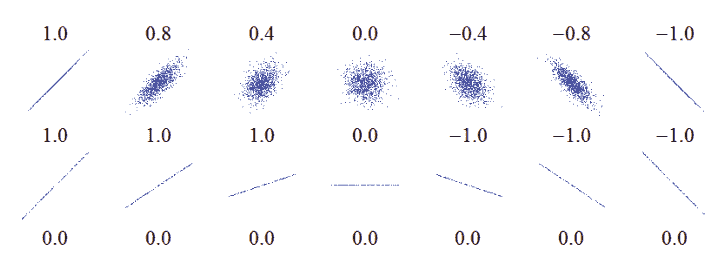

### 3.1.2 相关性

协方差可以在负无穷到正无穷之间。有时候使用归一化的度量更方便，有一个有限的下界和上界。(皮尔逊)相关系数在X和Y之间定义为ρ，corr [X, Y] = Cov [X, Y] / √[V[X] V[Y]]

$$ \mathrm{corr}\left[X, Y\right] \triangleq \frac{\mathrm{Cov}\left[X, Y\right]}{\sqrt{\mathbb{V}[X] \mathbb{V}[Y]}} \qquad (3.7) $$

可以证明（练习3.2）-1 ≤ ρ ≤ 1。

还可以证明，如果 Y = a X + b（其中 a > 0）对于一些参数 a 和 b，即存在 X 和 Y 之间的线性关系（参见练习3.3），则 corr [X, Y] = 1。直观上，人们可能期望相关系数与回归线的斜率有关，即表达式 Y = a X + b 中的系数 a。然而，正如我们在方程（11.27）中所示，回归系数实际上由 a = Cov [X, Y] / V[X] 给出。在图3.1中，我们展示了相关系数可以为0，但是对于强非线性关系。（与图6.6进行比较。）因此，更好地理解相关系数是作为线性程度的一种度量。（请参见 correlation2d.ipynb 以演示这个想法。）

> 对于一组相关随机变量的向量 x，相关矩阵由以下给出

$$ \operatorname{corr}(\boldsymbol{x})=\left(\begin{array}{cccc} 1 & \frac{\mathbb{E}\left[\left(X_{1}-\mu_{1}\right)\left(X_{2}-\mu_{2}\right)\right]}{\sigma_{1} \sigma_{2}} & \cdots & \frac{\mathbb{E}\left[\left(X_{1}-\mu_{1}\right)\left(X_{D}-\mu_{D}\right)\right]}{\sigma_{1} \sigma_{D}} \\ \frac{\mathbb{E}\left[\left(X_{2}-\mu_{2}\right)\left(X_{1}-\mu_{1}\right)\right]}{\sigma_{2} \sigma_{1}} & 1 & \cdots & \frac{\mathbb{E}\left[\left(X_{2}-\mu_{2}\right)\left(X_{D}-\mu_{D}\right)\right]}{\sigma_{2} \sigma_{D}} \\ \vdots & \vdots & \ddots & \vdots \\ \frac{\mathbb{E}\left[\left(X_{D}-\mu_{D}\right)\left(X_{1}-\mu_{1}\right)\right]}{\sigma_{D} \sigma_{1}} & \frac{\mathbb{E}\left[\left(X_{D}-\mu_{D}\right)\left(X_{2}-\mu_{2}\right)\right]}{\sigma_{D} \sigma_{2}} & \cdots & 1 \end{array}\right) \qquad (3.8) $$

这可以更简洁地写成

$$ \operatorname{corr}(\boldsymbol{x})=\left(\operatorname{diag}\left(\mathbf{K}_{x x}\right)\right)^{-\frac{1}{2}} \mathbf{K}_{x x}\left(\operatorname{diag}\left(\mathbf{K}_{x x}\right)\right)^{-\frac{1}{2}} \qquad (3.9) $$

### 3.1.3 无相关不意味着独立

如果 X 和 Y 是独立的，即 $p(X, Y) = p(X)p(Y)$，则 $\mathrm{Cov}[X, Y] = 0$，因此 $\mathrm{corr}[X, Y] = 0$。因此独立意味着无相关。然而，反之不成立：无相关不意味着独立。例如，设 $X \sim U(-1,1)$ 且 $Y = X^2$。显然 $Y$ 依赖于 $X$（实际上，$Y$ 由 $X$ 唯一确定），然而可以证明（练习3.1）$\mathrm{corr}[X, Y] = 0$。

一些引人注目的例子在图3.1中展示了这个事实。这显示了几个数据集，在这些数据集中，X和Y之间存在明显的依赖关系，然而相关系数为0。随机变量之间更一般的依赖度量是互信息，在第6.3节中讨论。只有在变量真正独立的情况下，互信息才为零。

### 3.1.4 相关性不意味着因果关系

众所周知，“相关性不意味着因果关系”。例如，考虑图3.2。我们以红色绘制 $x_{1:T}$，其中 $x_t$ 是每月销售的冰淇淋数量。我们以黄色绘制 $y_{1:T}$，其中 $y_t$ 是每月的暴力犯罪率。（为了使图形重叠，数量已经重新缩放。）我们可以看到这些信号之间存在强烈的的相关性。事实上，有时候会声称“吃冰淇淋会导致谋杀”[Pe13]。当然，这只是一种虚假的相关性，由于一个隐藏的共同原因，即天气。炎热的天气会增加冰淇淋的销售量，这是显而易见的。炎热的天气也会增加暴力犯罪；这个原因存在激烈的争议；一些人声称这是由于愤怒的增加[And01]，但其他人声称这仅仅是因为更多的人在户外[Ash18]，而大多数谋杀案发生在户外。

另一个著名的例子涉及出生率与鹳鸟（一种鸟类）的存在之间的正相关关系。这引发了一个城市传说，即鹳鸟（一种鸟类）会送来婴儿[Mat00]。当然，相关性的真正原因更可能是由于隐藏的因素，比如提高的生活水平和更多的食物。在[Vig15]中可以找到更多有趣的这种虚假相关性的例子。

这些例子作为一个“警示信号”，告诉我们不应该把x对y的预测能力视为x导致y的指标。

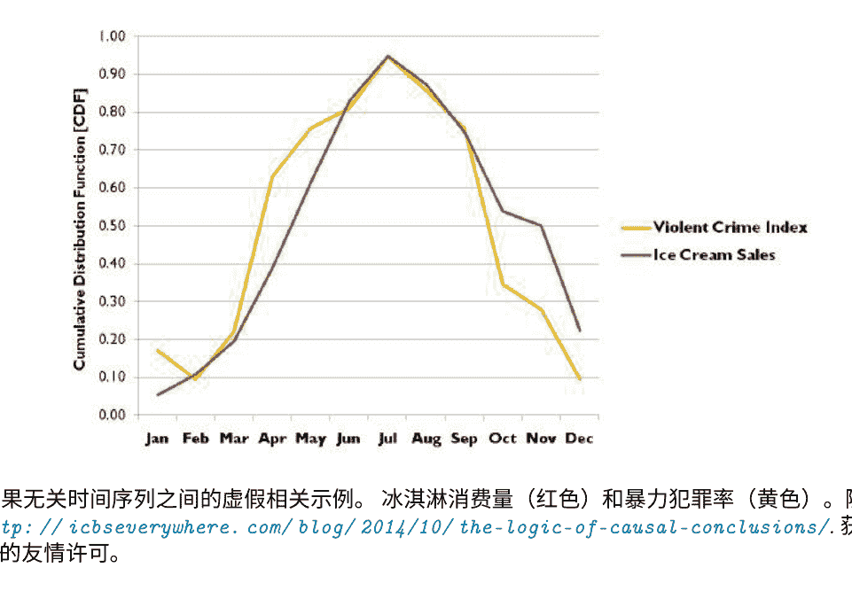

### 3.1.5 辛普森悖论

辛普森悖论指的是在多个数据组合中出现的统计趋势或关系，在这些组合合并时可能会消失或反转。如果我们错误地将统计依赖的声明解释为因果关系，这将导致令人费解的行为。图3.3展示了这个悖论的可视化效果。总体上，我们可以看到y随着x的减少而减少，但在每个子群体中，y随着x的增加而增加。

以COVID-19为背景的辛普森悖论的最新实例，请参考图3.4(a)。这显示了意大利每个年龄组的COVID-19病死率（CFR）低于中国，但总体上更高。这是因为意大利有更多的老年人，如图3.4(b)所示。换句话说，图3.4(a)显示了 $p(F=1|A, C)$，其中A是年龄，C是国家，F=1表示某人死于COVID-19，而图3.4(b)显示了 $p(A|C)$，即某人在国家C的年龄段A的概率。结合这些，我们发现 $p(F=1|C=意大利) > p(F=1|C=中国)$。更多细节请参见[KGS20]。

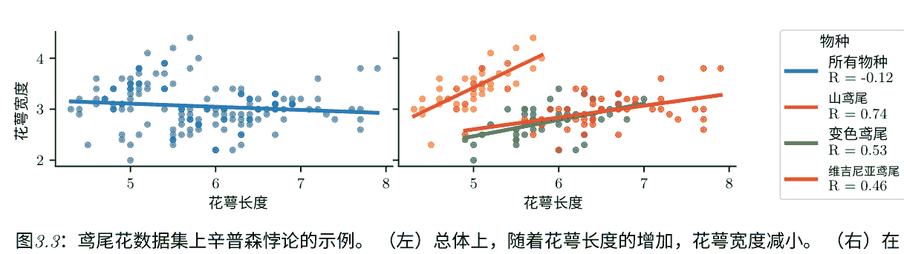

## 3.2 多元高斯（正态）分布

对于连续随机变量，最常用的联合概率分布是多元高斯或多元正态分布（MVN）。这主要是因为在数学上很方便，而且高斯假设在许多情况下是相当合理的（见第2.6.4节的讨论）。

### 3.2.1 定义

MVN密度由以下定义：

$$ \mathcal{N}(\boldsymbol{y}|\boldsymbol{\mu}, \boldsymbol{\Sigma}) \triangleq \frac{1}{(2\pi)^{D/2} |\boldsymbol{\Sigma}|^{1/2}} \exp\left[-\frac{1}{2}(\boldsymbol{y} - \boldsymbol{\mu})^{\top} \boldsymbol{\Sigma}^{-1} (\boldsymbol{y} - \boldsymbol{\mu})\right] $$

其中 $\boldsymbol{\mu} = \mathbb{E}[\boldsymbol{y}] \in \mathbb{R}^D$ 是均值向量， $\boldsymbol{\Sigma} = \text{Cov}[\boldsymbol{y}]$ 是 $D \times D$ 协方差矩阵，定义如下：

$$ \text{Cov}[\boldsymbol{y}] \triangleq \mathbb{E}\left[(\boldsymbol{y} - \mathbb{E}[\boldsymbol{y}])(\boldsymbol{y} - \mathbb{E}[\boldsymbol{y}])^{\top}\right] $$

$$ = \begin{pmatrix} \mathbb{V}[Y_1] & \text{Cov}[Y_1, Y_2] & \cdots & \text{Cov}[Y_1, Y_D] \\ \text{Cov}[Y_2, Y_1] & \mathbb{V}[Y_2] & \cdots & \text{Cov}[Y_2, Y_D] \\ \vdots & \vdots & \ddots & \vdots \\ \text{Cov}[Y_D, Y_1] & \text{Cov}[Y_D, Y_2] & \cdots & \mathbb{V}[Y_D] \end{pmatrix} $$

其中

$$ \text{Cov}[Y_i, Y_j] \triangleq \mathbb{E}[(Y_i - \mathbb{E}[Y_i])(Y_j - \mathbb{E}[Y_j])] = \mathbb{E}[Y_i Y_j] - \mathbb{E}[Y_i]\mathbb{E}[Y_j] $$

和 $\mathbb{V}[Y_i] = \text{Cov}[Y_i, Y_i]$。从方程 (3.12) 中，我们得到重要的结果

$$ \mathbb{E}[\boldsymbol{y}\boldsymbol{y}^{\top}] = \boldsymbol{\Sigma} + \boldsymbol{\mu}\boldsymbol{\mu}^{\top} $$

方程 (3.11) 中的归一化常数 $Z = (2\pi)^{D/2} |\boldsymbol{\Sigma}|^{1/2}$ 只是确保概率密度函数积分为1 (参见练习3.6)。

在二维中，MVN被称为双变量高斯分布。它的概率密度函数可以表示为 $\boldsymbol{y} \sim \mathcal{N}(\boldsymbol{\mu}, \boldsymbol{\Sigma})$, 其中 $\boldsymbol{y} \in \mathbb{R}^2, \boldsymbol{\mu} \in \mathbb{R}^2$ 和

$$ \boldsymbol{\Sigma} = \begin{pmatrix} \sigma_1^2 & \sigma_{12}^2 \\ \sigma_{21}^2 & \sigma_2^2 \end{pmatrix} = \begin{pmatrix} \sigma_1^2 & \rho\sigma_1\sigma_2 \\ \rho\sigma_1\sigma_2 & \sigma_2^2 \end{pmatrix} $$

作者：Kevin P. Murphy。 (C) MIT Press. CC-BY-NC-ND许可证图3.5: 将2D高斯密度可视化为曲面图。 (a) 使用完整协方差矩阵的分布可以以任意角度定向。 (b) 使用对角协方差矩阵的分布必须与轴平行。 (c) 使用球形协方差矩阵的分布必须具有对称形状。由 gauss_plot_2d.ipynb 生成。

图3.6: 以常数概率密度的等值线形式可视化的2D高斯密度。(a) 完整的协方差矩阵具有椭圆形轮廓。(b) 对角协方差矩阵是一个轴对齐的椭圆。(c) 球形协方差矩阵具有圆形形状。由 gauss_plot_2d.ipynb 生成。

其中 ρ 是相关系数，由

$$\text{corr}[Y_1, Y_2] \triangleq \frac{\text{Cov}[Y_1, Y_2]}{\sqrt{\mathbb{V}[Y_1]\mathbb{V}[Y_2]}} = \frac{\sigma_{12}^2}{\sigma_1\sigma_2}$$ (3.17)

可以证明 (练习3.2) $-1 \leq \text{corr}[Y_1, Y_2] \leq 1$。在2D情况下展开概率密度函数得到以下看起来相当复杂的结果：

$$p(y_1, y_2) = \frac{1}{2\pi\sigma_1\sigma_2 \sqrt{1-\rho^2}} \exp\left( -\frac{1}{2(1-\rho^2)} \left[ \frac{(y_1-\mu_1)^2}{\sigma_1^2} + \frac{(y_2-\mu_2)^2}{\sigma_2^2} - 2\rho\frac{(y_1-\mu_1)}{\sigma_1}\frac{(y_2-\mu_2)}{\sigma_2} \right] \right)$$ (3.18)

图3.5和图3.6展示了三种不同协方差矩阵的二维MVN密度。一个完全协方差矩阵有 D(D+1)/2 个参数，我们除以2是因为 Σ 是对称的。（椭圆形状的原因在第7.4.4节中解释，我们在那里讨论了二次形式的几何）一个对角协方差矩阵有D个参数，并且在非对角项上有0。一个球形协方差矩阵，也称为各向同性协方差矩阵，具有 $\Sigma = \sigma^2 I_D$ 的形式，因此它只有一个自由参数，即 $\sigma^2$。

### 3.2.2 马氏距离

在本节中，我们尝试对高斯概率密度函数在多个维度中的几何形状进行一些洞察。为了做到这一点，我们将考虑常数(log)概率的等高线的形状。

在特定点 $y$ 处的对数概率为

$$\log p(\mathbf{y} | \boldsymbol{\mu}, \mathbf{\Sigma}) = -\frac{1}{2}(\mathbf{y} - \boldsymbol{\mu})^\top \mathbf{\Sigma}^{-1} (\mathbf{y} - \boldsymbol{\mu}) + \text{常数}$$ (3.19)

对 $\mathbf{y}$ 的依赖可以用马氏距离 $\Delta$ 来表示，其平方定义如下：

$$\Delta^2 \triangleq (\mathbf{y} - \boldsymbol{\mu})^\top \mathbf{\Sigma}^{-1} (\mathbf{y} - \boldsymbol{\mu})$$ (3.20)

因此，常数(log)概率的等高线等同于常数马氏距离的等高线。

为了了解常数马哈拉诺比斯距离的轮廓，我们利用了 $\mathbf{\Sigma}$ 和 $\mathbf{\Lambda} = \mathbf{\Sigma}^{-1}$ 都是正定矩阵（根据假设）。考虑以下 $\mathbf{\Sigma}$ 的特征分解（第7.4节）：

$$\mathbf{\Sigma} = \sum_{d=1}^D \lambda_d \mathbf{u}_d \mathbf{u}_d^\top$$ (3.21)

我们可以类似地写成

$$\mathbf{\Sigma}^{-1} = \sum_{d=1}^D \frac{1}{\lambda_d} \mathbf{u}_d \mathbf{u}_d^\top$$ (3.22)

然后我们可以将马哈拉诺比斯距离重写为以下形式：

$$(\mathbf{y} - \boldsymbol{\mu})^\top \mathbf{\Sigma}^{-1} (\mathbf{y} - \boldsymbol{\mu}) = (\mathbf{y} - \boldsymbol{\mu})^\top \left( \sum_{d=1}^D \frac{1}{\lambda_d} \mathbf{u}_d \mathbf{u}_d^\top \right) (\mathbf{y} - \boldsymbol{\mu})$$ (3.23)

$$= \sum_{d=1}^D \frac{1}{\lambda_d} (\mathbf{y} - \boldsymbol{\mu})^\top \mathbf{u}_d \mathbf{u}_d^\top (\mathbf{y} - \boldsymbol{\mu}) = \sum_{d=1}^D \frac{z_d^2}{\lambda_d}$$ (3.24)

正如我们在第7.4.4节中讨论的那样，这意味着我们可以将马氏距离解释为在一个新的坐标框架中的欧几里德距离，其中我们通过 $\mathbf{U}$ 旋转 $\mathbf{y}$ 并通过 $\mathbf{\Lambda}$ 缩放。

例如，在2d中，让我们考虑满足这个方程的点集 (z₁, z₂):

$$\frac{z_1^2}{\lambda_1} + \frac{z_2^2}{\lambda_2} = r \tag{3.25}$$

由于这些点具有相同的马氏距离，它们对应于相等概率的点。因此，我们可以看到2d高斯分布的等概率密度轮廓沿着椭圆形状。这在图7.6中有所说明。特征向量确定椭圆的方向，而特征值确定其拉伸程度。

## 3.2.3 多元正态分布的边缘概率和条件概率 *

假设 y = (y₁, y₂) 是具有联合高斯分布的参数

$$\boldsymbol{\mu} = \begin{pmatrix} \mu_1 \\ \mu_2 \end{pmatrix}, \quad \boldsymbol{\Sigma} = \begin{pmatrix} \Sigma_{11} & \Sigma_{12} \\ \Sigma_{21} & \Sigma_{22} \end{pmatrix}, \quad \boldsymbol{\Lambda} = \boldsymbol{\Sigma}^{-1} = \begin{pmatrix} \Lambda_{11} & \Lambda_{12} \\ \Lambda_{21} & \Lambda_{22} \end{pmatrix} \tag{3.26}$$

其中 $\boldsymbol{\Lambda}$ 是精度矩阵。那么边缘概率为

$$\begin{aligned} p(y_1) &= \mathcal{N}(y_1 \mid \mu_1, \Sigma_{11}) \\ p(y_2) &= \mathcal{N}(y_2 \mid \mu_2, \Sigma_{22}) \end{aligned} \tag{3.27}$$

而后验条件概率为

$$\begin{aligned} p(y_1 \mid y_2) &= \mathcal{N}(y_1 \mid \boldsymbol{\mu}_{1 \mid 2}, \boldsymbol{\Sigma}_{1 \mid 2}) \\ \boldsymbol{\mu}_{1 \mid 2} &= \boldsymbol{\mu}_1 + \boldsymbol{\Sigma}_{12} \boldsymbol{\Sigma}_{22}^{-1} (y_2 - \boldsymbol{\mu}_2) \\ &= \boldsymbol{\mu}_1 - \boldsymbol{\Lambda}_{11}^{-1} \boldsymbol{\Lambda}_{12} (y_2 - \boldsymbol{\mu}_2) \\ &= \boldsymbol{\Sigma}_{1 \mid 2} (\boldsymbol{\Lambda}_{11} \boldsymbol{\mu}_1 - \boldsymbol{\Lambda}_{12} (y_2 - \boldsymbol{\mu}_2)) \\ \boldsymbol{\Sigma}_{1 \mid 2} &= \boldsymbol{\Sigma}_{11} - \boldsymbol{\Sigma}_{12} \boldsymbol{\Sigma}_{22}^{-1} \boldsymbol{\Sigma}_{21} = \boldsymbol{\Lambda}_{11}^{-1} \end{aligned} \tag{3.28}$$

这些方程在本书中非常重要，我们用一个框将它们括起来，这样你以后可以很容易地找到它们。对于这些结果的推导（依赖于计算舒尔补 $\boldsymbol{\Sigma} / \boldsymbol{\Sigma}_{22} = \boldsymbol{\Sigma}_{11} - \boldsymbol{\Sigma}_{12} \boldsymbol{\Sigma}_{22}^{-1} \boldsymbol{\Sigma}_{21}$），请参见第7.3.5节。

我们可以看到边缘分布和条件分布都是高斯分布。对于边缘分布，我们只需提取与 $y_1$ 或 $y_2$ 对应的行和列。对于条件分布，我们需要做更多的工作。然而，这并不复杂：条件均值只是 $y_2$ 的线性函数，条件协方差只是一个与 $y_2$ 无关的常数矩阵。我们给出了后验均值的三种不同（但等价）表达式，以及后验协方差的两种不同（但等价）表达式；每种表达式在不同情况下都很有用。

## 3.2.4 例子：对2D高斯进行条件约束

让我们考虑一个2D的例子。协方差矩阵是

$$\Sigma = \begin{pmatrix} \sigma_1^2 & \rho \sigma_1 \sigma_2 \\ \rho \sigma_1 \sigma_2 & \sigma_2^2 \end{pmatrix}$$ (3.29)

边缘概率分布 \( p(y_1) \) 是一个一维高斯分布，通过将联合分布投影到 \( y_1 \) 轴上获得：

$$p(y_1) = \mathcal{N}(y_1|\mu_1, \sigma_1^2)$$ (3.30)

假设我们观察到 \( Y_2 = y_2 \)；条件概率分布 \( p(y_1|y_2) \) 通过“切片”联合分布通过 \( Y_2 = y_2 \) 轴获得：

$$p(y_1|y_2) = \mathcal{N}\left( y_1|\mu_1 + \frac{\rho\sigma_1\sigma_2}{\sigma_2^2}(y_2 - \mu_2), \sigma_1^2 - \frac{(\rho\sigma_1\sigma_2)^2}{\sigma_2^2} \right)$$ (3.31)

如果 \( \sigma_1 = \sigma_2 = \sigma \)，我们得到

$$p(y_1|y_2) = \mathcal{N}\left( y_1|\mu_1 + \rho(y_2 - \mu_2), \sigma^2(1 - \rho^2) \right)$$ (3.32)

例如，假设 \( \rho = 0.8, \sigma_1 = \sigma_2 = 1, \mu_1 = \mu_2 = 0 \)，并且 \( y_2 = 1 \)。我们可以看到 \( \mathbb{E}[y_1|y_2=1] = 0.8 \)，这是有道理的，因为 \( \rho = 0.8 \) 意味着我们相信如果 \( y_2 \) 增加1（超过其均值），那么 \( y_1 \) 增加0.8。我们还可以看到 \( \mathbb{V}[y_1|y_2=1] = 1 - 0.8^2 = 0.36 \)。这也是有道理的：我们对 \( y_1 \) 的不确定性降低了，因为我们通过观察 \( y_2 \) 间接地了解了一些关于 \( y_1 \) 的信息。如果 \( \rho = 0 \)，我们得到 \( p(y_1|y_2) = \mathcal{N}(y_1|\mu_1, \sigma_1^2) \)，因为 \( y_2 \) 如果它们是不相关的（因此独立），则不提供关于 \( y_1 \) 的任何信息。

## 3.2.5 示例：填补缺失值 *

作为上述结果的一个示例应用，假设我们观察到 \( \boldsymbol{y} \) 的一些部分（维度），其余部分缺失或未观察到。我们可以利用维度之间的相关性（由协方差矩阵编码）来推断缺失的条目；这被称为缺失值插补。

图3.7显示了一个简单的例子。我们从一个 \( D=8 \) 维高斯分布中抽取了 \( N=10 \) 个向量，然后故意在每个样本（行）中“隐藏”了50%的数据。然后，我们根据观察到的条目和真实的模型参数推断出缺失的条目。更准确地说，对于数据矩阵的每一行 \( n \)，我们计算 \( p(\boldsymbol{y}_{n,h} | \boldsymbol{y}_{n,v}, \boldsymbol{\theta}) \)，其中 \( \boldsymbol{v} \) 是该行可见条目的索引，\( \boldsymbol{h} \) 是隐藏条目的其余索引，\( \boldsymbol{\theta} = (\boldsymbol{\mu}, \boldsymbol{\Sigma}) \)。从中，我们计算出每个缺失变量 \( i \in \boldsymbol{h} \) 的边缘分布 \( p(y_{n,i} | \boldsymbol{y}_{n,v}, \boldsymbol{\theta}) \)。从边缘分布中，我们计算出后验均值 \( \bar{y}_{n,i} = \mathbb{E}[y_{n,i} | \boldsymbol{y}_{n,v}, \boldsymbol{\theta}] \)。

后验均值代表了我们对该条目真实值的“最佳猜测”，在某种意义上，它最小化了我们的期望平方误差，如第5章所解释的。我们可以使用 \( \mathbb{V}[y_{n,i} | \boldsymbol{y}_{n,v}, \boldsymbol{\theta}] \) 作为对这个猜测的置信度度量，尽管这没有显示出来。或者，我们可以从 \( p(\boldsymbol{y}_{n,h} | \boldsymbol{y}_{n,v}, \boldsymbol{\theta}) \) 中抽取多个后验样本；这被称为多重插补，并为消耗“填充数据”的下游算法提供了更稳健的估计。

- 在实践中，我们需要从部分观测数据中估计参数。不幸的是，MLE结果在4.2.6节中不再适用，但我们可以使用EM算法来推导出在缺失数据存在的情况下的近似MLE。有关详细信息，请参阅本书的续集。

图3.7: 使用MVN进行数据填补的示例。(a) 可视化大小为N=10, D=8的数据矩阵。空白条目是缺失的(未观察到的)。蓝色是正数，绿色是负数。正方形的面积与值成比例。(这被称为Hinton图，以Geoff Hinton,一位著名的机器学习研究者命名。)(b) 真实数据矩阵(隐藏的)。(c) 基于部分观察到的数据行, 使用真实模型参数计算的后验预测分布的均值。由gauss_imputation_known_params_demo.ipynb生成。

## 3.3 线性高斯系统 *

在第3.2.3节中，我们在噪声-free观测的条件下推断高斯随机向量的隐藏部分的后验分布。在本节中，我们扩展这种方法来处理有噪声的观测。设 z ∈ R^L 为一个未知的值向量， y ∈ R^D 为 z 的一些带噪声的测量。我们假设这些变量之间存在以下联合分布关系：

$$p(z) = \mathcal{N}(z | \mu_z, \Sigma_z)$$
$$p(y|z) = \mathcal{N}(y | Wz + b, \Sigma_y)$$

其中 W是一个大小为 D × L的矩阵。这是一个线性高斯系统的例子。相应的联合分布， p(z, y) = p(z)p(y|z)，是一个 L + D维的高斯分布，其均值和协方差矩阵为：

$$\mu = \begin{pmatrix} \mu_z \\ W\mu_z + b \end{pmatrix}$$
$$\Sigma = \begin{pmatrix} \Sigma_z & \Sigma_z W^T \\ W\Sigma_z & \Sigma_y + W\Sigma_z W^T \end{pmatrix}$$

通过将高斯条件公式应用于联合分布 p(y, z)我们可以计算后验分布 p(z|y)，如下所述。这可以解释为从潜变量到观测变量的生成模型中的 z → yarrow的反演。

### 3.3.1 高斯贝叶斯规则

潜变量的后验分布为

> $$
\begin{aligned}
p(\boldsymbol{z}|\boldsymbol{y}) &= \mathcal{N}(\boldsymbol{z}|\boldsymbol{\mu}_{\boldsymbol{z}|\boldsymbol{y}}, \mathbf{\Sigma}_{\boldsymbol{z}|\boldsymbol{y}}) \\
\mathbf{\Sigma}_{\boldsymbol{z}|\boldsymbol{y}}^{-1} &= \mathbf{\Sigma}_{\boldsymbol{z}}^{-1} + \mathbf{W}^T\mathbf{\Sigma}_{\boldsymbol{y}}^{-1}\mathbf{W} \\
\boldsymbol{\mu}_{\boldsymbol{z}|\boldsymbol{y}} &= \mathbf{\Sigma}_{\boldsymbol{z}|\boldsymbol{y}}[\mathbf{W}^T\mathbf{\Sigma}_{\boldsymbol{y}}^{-1}(\boldsymbol{y} - \boldsymbol{b}) + \mathbf{\Sigma}_{\boldsymbol{z}}^{-1}\boldsymbol{\mu}_{\boldsymbol{z}}]
\end{aligned}
$$ (3.37)

这被称为高斯贝叶斯规则。此外，后验的归一化常数为

> $$p(\boldsymbol{y}) = \int \mathcal{N}(\boldsymbol{z}|\boldsymbol{\mu}_{\boldsymbol{z}}, \mathbf{\Sigma}_{\boldsymbol{z}})\mathcal{N}(\boldsymbol{y}|\mathbf{W}\boldsymbol{z} + \boldsymbol{b}, \mathbf{\Sigma}_{\boldsymbol{y}})d\boldsymbol{z} = \mathcal{N}(\boldsymbol{y}|\mathbf{W}\boldsymbol{\mu}_{\boldsymbol{z}} + \boldsymbol{b}, \mathbf{\Sigma}_{\boldsymbol{y}} + \mathbf{W}\mathbf{\Sigma}_{\boldsymbol{z}}\mathbf{W}^T)$$ (3.38)

我们可以看到，高斯先验 $p(\boldsymbol{z})$ 和高斯似然 $p(\boldsymbol{y}|\boldsymbol{z})$ 相结合，得到了一个高斯后验 $p(\boldsymbol{z}|\boldsymbol{y})$。因此，高斯分布在贝叶斯条件下是封闭的。更一般地说，我们说高斯先验是高斯似然的共轭先验，因为后验分布与先验具有相同的类型。我们将在第4.6.1节中更详细地讨论共轭先验的概念。

在下面的章节中，我们给出了这个结果的各种应用。但首先，我们给出推导过程。

### 3.3.2 推导 *

我们现在推导方程3.37。基本思想是推导联合分布， $p(\boldsymbol{z}, \boldsymbol{y}) = p(\boldsymbol{z})p(\boldsymbol{y}|\boldsymbol{z})$，然后利用第3.2.3节的结果计算 $p(\boldsymbol{z}|\boldsymbol{y})$。更详细地说，我们按照以下步骤进行。联合分布的对数如下（忽略不相关的常数）：

> $$\log p(\boldsymbol{z}, \boldsymbol{y}) = -\frac{1}{2}(\boldsymbol{z} - \boldsymbol{\mu}_{\boldsymbol{z}})^T \mathbf{\Sigma}_{\boldsymbol{z}}^{-1} (\boldsymbol{z} - \boldsymbol{\mu}_{\boldsymbol{z}}) - \frac{1}{2}(\boldsymbol{y} - \mathbf{W}\boldsymbol{z} - \boldsymbol{b})^T \mathbf{\Sigma}_{\boldsymbol{y}}^{-1} (\boldsymbol{y} - \mathbf{W}\boldsymbol{z} - \boldsymbol{b})$$ (3.39)

这显然是一个联合高斯分布，因为它是一个二次形式的指数。展开涉及 $\boldsymbol{z}$ 和 $\boldsymbol{y}$ 的二次项，并忽略线性和常数项，我们有

> $$Q = -\frac{1}{2} \boldsymbol{z}^T \mathbf{\Sigma}_{\boldsymbol{z}}^{-1} \boldsymbol{z} - \frac{1}{2} \boldsymbol{y}^T \mathbf{\Sigma}_{\boldsymbol{y}}^{-1} \boldsymbol{y} - \frac{1}{2} (\mathbf{W}\boldsymbol{z})^T \mathbf{\Sigma}_{\boldsymbol{y}}^{-1} (\mathbf{W}\boldsymbol{z}) + \boldsymbol{y}^T \mathbf{\Sigma}_{\boldsymbol{y}}^{-1} \mathbf{W}\boldsymbol{z}$$ (3.40)

$$= -\frac{1}{2} \begin{pmatrix} \boldsymbol{z} \\ \boldsymbol{y} \end{pmatrix}^T \begin{pmatrix} \mathbf{\Sigma}_{\boldsymbol{z}}^{-1} + \mathbf{W}^T\mathbf{\Sigma}_{\boldsymbol{y}}^{-1}\mathbf{W} & -\mathbf{W}^T\mathbf{\Sigma}_{\boldsymbol{y}}^{-1} \\ -\mathbf{\Sigma}_{\boldsymbol{y}}^{-1}\mathbf{W} & \mathbf{\Sigma}_{\boldsymbol{y}}^{-1} \end{pmatrix} \begin{pmatrix} \boldsymbol{z} \\ \boldsymbol{y} \end{pmatrix}$$ (3.41)

$$= -\frac{1}{2} \begin{pmatrix} \boldsymbol{z} \\ \boldsymbol{y} \end{pmatrix}^T \mathbf{\Sigma}^{-1} \begin{pmatrix} \boldsymbol{z} \\ \boldsymbol{y} \end{pmatrix}$$ (3.42)

联合的精度矩阵定义为

> $$\mathbf{\Sigma}^{-1} = \begin{pmatrix} \mathbf{\Sigma}_{\boldsymbol{z}}^{-1} + \mathbf{W}^T\mathbf{\Sigma}_{\boldsymbol{y}}^{-1}\mathbf{W} & -\mathbf{W}^T\mathbf{\Sigma}_{\boldsymbol{y}}^{-1} \\ -\mathbf{\Sigma}_{\boldsymbol{y}}^{-1}\mathbf{W} & \mathbf{\Sigma}_{\boldsymbol{y}}^{-1} \end{pmatrix} \triangleq \mathbf{\Lambda} = \begin{pmatrix} \mathbf{\Lambda}_{zz} & \mathbf{\Lambda}_{zy} \\ \mathbf{\Lambda}_{yz} & \mathbf{\Lambda}_{yy} \end{pmatrix}$$ (3.43)

从方程3.28出发，并利用 $\mu_y = \mathbf{W}\mu_z + \mathbf{b}$ 的事实，我们有

$$
p(z|\mathbf{y}) = \mathcal{N}(\mu_{z|y}, \Sigma_{z|y}) \quad (3.44)
$$

$$
\Sigma_{z|y} = \Lambda_{zz}^{-1} = (\Sigma_z^{-1} + \mathbf{W}^T \Sigma_y^{-1} \mathbf{W})^{-1} \quad (3.45)
$$

$$
\mu_{z|y} = \Sigma_{z|y} \left(\Lambda_{zz} \mu_z - \Lambda_{zy}(y - \mu_y)\right) \quad (3.46)
$$

$$
= \Sigma_{z|y} \left(\Sigma_z^{-1} \mu_z + \mathbf{W}^T \Sigma_y^{-1} \mathbf{W} \mu_z + \mathbf{W}^T \Sigma_y^{-1} (y - \mu_y)\right) \quad (3.47)
$$

$$
= \Sigma_{z|y} \left(\Sigma_z^{-1} \mu_z + \mathbf{W}^T \Sigma_y^{-1} (\mathbf{W} \mu_z + y - \mu_y)\right) \quad (3.48)
$$

$$
= \Sigma_{z|y} \left(\Sigma_z^{-1} \mu_z + \mathbf{W}^T \Sigma_y^{-1} (y - \mathbf{b})\right) \quad (3.49)
$$

### 3.3.2.1 完成平方

在处理线性高斯系统时，通常使用一种称为完成平方的代数技巧。在标量情况下，这意味着我们可以写成以下形式的二次函数

$$
f(x) = ax^2 + bx + c
$$

如下所示：

$$
ax^2 + bx + c = a(x - h)^2 + k
$$

$$
h = -\frac{b}{2a}
$$

$$
k = c - \frac{b^2}{4a}
$$

在向量情况下，这意味着我们可以写成以下形式的二次函数

$$
f(\mathbf{x}) = \mathbf{x}^T \mathbf{A} \mathbf{x} + \mathbf{x}^T \mathbf{b} + c
$$

如下所示：

$$
\mathbf{x}^T \mathbf{A} \mathbf{x} + \mathbf{x}^T \mathbf{b} + c = (\mathbf{x} - \mathbf{h})^T \mathbf{A} (\mathbf{x} - \mathbf{h}) + k
$$

$$
\mathbf{h} = -\frac{1}{2} \mathbf{A}^{-1} \mathbf{b}
$$

$$
k = c - \frac{1}{4} \mathbf{b}^T \mathbf{A}^{-1} \mathbf{b}
$$

这个技巧将在更高级的推导中使用。

### 3.3.3 示例：推断未知标量

假设我们对某个基础量 $z$ 进行 $N$ 个有噪声的测量 $y_i$；让我们假设测量噪声具有固定精度 $\lambda_y = 1/\sigma^2$，因此似然函数为 $p(y_i|z) = \mathcal{N}(y_i|z, \lambda_y^{-1})$ (3.50)

## 3.3. 线性高斯系统 *

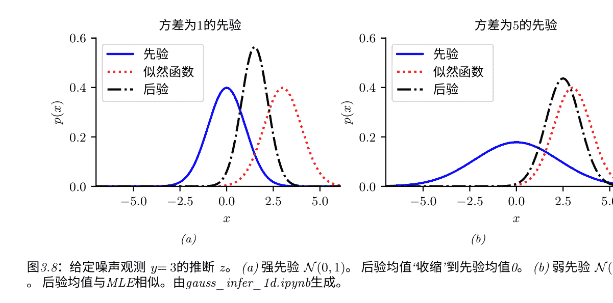

现在让我们对未知源的值使用高斯先验：

$p(z) = \mathcal{N}(z|\mu_0, \lambda_0^{-1})$ （3.51）

我们想要计算 $p(z|y_1, \dots, y_N, \sigma^2)$。我们可以通过定义 $\boldsymbol{y}=(y_1, \dots, y_N)$, $\boldsymbol{W} = \mathbf{1}_N$ （一个 $N \times 1$ 列向量，全为1），以及 $\boldsymbol{\Sigma}_y^{-1} = \text{diag}(\lambda_y \boldsymbol{I})$。然后我们得到

$p(z|\boldsymbol{y}) = \mathcal{N}(z|\mu_N, \lambda_N^{-1})$ （3.52）

$\lambda_N = \lambda_0 + N \lambda_y$ （3.53）

$\mu_N = \frac{N \lambda_y \bar{y} + \lambda_0 \mu_0}{\lambda_N} = \frac{N \lambda_y}{N \lambda_y + \lambda_0} \bar{y} + \frac{\lambda_0}{N \lambda_y + \lambda_0} \mu_0$ （3.54）

这些方程非常直观：后验精度$\lambda_N$是先验精度$\lambda_0$加上$N$个测量精度$\lambda_y$的单位。此外，后验均值$\mu_N$是最大似然估计MLE和先验均值$\mu_0$的凸组合。这表明后验均值是MLE和先验之间的折衷。如果先验相对于信号强度（$\lambda_0$相对于$\lambda_y$很小）较弱，我们会更加重视MLE。如果先验相对于信号强度（$\lambda_0$相对于$\lambda_y$很大）较强，我们会更加重视先验。这在图3.8中有所说明。

请注意，后验均值是用 $N\lambda_y$ 表示的，因此每个具有$\lambda_y$精度的测量相当于一个具有值 $\bar{y}$ 和精度 $N\lambda_y$ 的测量。

我们可以将结果重新表达为后验方差，而不是后验精度，如下所示：

如下:

$$
p(z|\mathcal{D}, \sigma^2) = \mathcal{N}(z|\mu_N, \tau_N^2)
$$

$$
\tau_N^2 = \frac{1}{\frac{N}{\sigma^2} + \frac{1}{\tau_0^2}} = \frac{\sigma^2 \tau_0^2}{N \tau_0^2 + \sigma^2}
$$

$$
\mu_N = \tau_N^2 \left( \frac{\mu_0}{\tau_0^2} + \frac{N \bar{y}}{\sigma^2} \right) = \frac{\sigma^2}{N \tau_0^2 + \sigma^2} \mu_0 + \frac{N \tau_0^2}{N \tau_0^2 + \sigma^2} \bar{y}
$$

其中 $\tau_0^2 = 1/\lambda_0$ 是先验方差，$\tau_N^2 = 1/\lambda_N$ 是后验方差。

我们还可以按顺序计算后验，每次观察后更新。如果 $N=1$，我们可以将观察到的单个观测后的后验重新表达如下（其中我们定义 $\Sigma_y = \sigma^2$，$\Sigma_0 = \tau_0^2$ 和 $\Sigma_1 = \tau_1^2$ 为似然、先验和后验的方差）:

$$
p(z|y) = \mathcal{N}(z|\mu_1, \Sigma_1)
$$

$$
\Sigma_1 = \left( \frac{1}{\Sigma_0} + \frac{1}{\Sigma_y} \right)^{-1} = \frac{\Sigma_y \Sigma_0}{\Sigma_0 + \Sigma_y}
$$

$$
\mu_1 = \Sigma_1 \left( \frac{\mu_0}{\Sigma_0} + \frac{y}{\Sigma_y} \right)
$$

我们可以用三种不同的方式重新表达后验均值:

$$
\mu_1 = \frac{\Sigma_y}{\Sigma_y + \Sigma_0} \mu_0 + \frac{\Sigma_0}{\Sigma_y + \Sigma_0} y
$$

$$
= \mu_0 + (y - \mu_0) \frac{\Sigma_0}{\Sigma_y + \Sigma_0}
$$

$$
= y - (y - \mu_0) \frac{\Sigma_y}{\Sigma_y + \Sigma_0}
$$

第一个方程是先验和数据的凸组合。第二个方程是先验均值向数据调整。第三个方程是数据向先验均值调整；这被称为收缩。这些都是表达似然和先验之间权衡的等效方式。如果 $\Sigma_0$ 相对于 $\Sigma_y$ 较小，表示有一个强先验，那么收缩的程度很大（见图3.8(a)）；而如果 $\Sigma_0$ 相对于 $\Sigma_y$ 较大，表示有一个弱先验，那么收缩的程度很小（见图3.8(b)）。

另一种量化收缩程度的方法是通过信噪比来衡量，其定义如下:

$$
\text{信噪比} \triangleq \frac{\mathbb{E}[Z^2]}{\mathbb{E}[\epsilon^2]} = \frac{\Sigma_0 + \mu_0^2}{\Sigma_y}
$$

其中 $z \sim \mathcal{N}(\mu_0, \Sigma_0)$ 是真实信号，$y = z + \epsilon$ 是观测信号，$\epsilon \sim \mathcal{N}(0, \Sigma_y)$ 是噪声项。

### 3.3.4 示例：推断未知向量

假设我们有一个未知的兴趣量，$z \in \mathbb{R}^D$，我们给它一个高斯先验分布，$p(z) = \mathcal{N}(\mu_z, \Sigma_z)$。如果我们对 $z$ 一无所知，我们可以将 $\Sigma_z = \infty \mathbf{I}$, 这意味着我们对于 $z$的值完全不确定。（在实践中，我们可以使用一个大但有限的协方差值。） 根据对称性，将 $\mu_z$设置为0似乎是合理的。

现在假设我们对 $z$和 $y_n$进行了 $N$个有噪声但独立的测量，每个测量的大小为 $D$。 可以证明，通过在它们的平均值处缩小协方差 $1/N$来补偿增加的测量精度，我们可以用一个高斯分布在 $N$个观测值上表示似然，即

$$
p(\mathcal{D}|z) = \prod_{n=1}^{N} \mathcal{N}(y_n|z, \Sigma_y) \propto \mathcal{N}(\overline{y}|z, \frac{1}{N}\Sigma_y) \tag{3.65}
$$

要理解为什么这是正确的，考虑两个测量的情况。 然后可以使用规范参数将对数似然写成如下形式：

$$
\begin{align*}
\log(p(y_1|z)p(y_2|z)) &= K_1 - \frac{1}{2} \left( z^\top \Sigma_y^{-1}z - 2z^\top \Sigma_y^{-1} y_1 \right) - \frac{1}{2} \left( z^\top \Sigma_y^{-1}z - 2z^\top \Sigma_y^{-1} y_2 \right) \\
&= K_1 - \frac{1}{2} \left( z^\top 2\Sigma_y^{-1}z - 2z^\top \Sigma_y^{-1} (y_1 + y_2) \right) \\
&= K_1 - \frac{1}{2} \left( z^\top 2\Sigma_y^{-1}z - 2z^\top 2\Sigma_y^{-1} \overline{y} \right) \\
&= K_2 + \log \mathcal{N}(z|\overline{y}, \frac{\Sigma_y}{2}) = K_2 + \log \mathcal{N}(\overline{y}|z, \frac{\Sigma_y}{2})
\end{align*}
$$

其中 $K_1$和 $K_2$是与 $z$无关的常数。

使用这个，并设置 $\mathbf{W} = \mathbf{I}, b = 0$，然后我们可以使用高斯贝叶斯规则计算后验概率 $z$:

$$
p(z|y_1, \ldots, y_N) = \mathcal{N}(z| \hat{\mu}, \hat{\Sigma}) \tag{3.66}
$$

$$
\hat{\Sigma}^{-1} = \Sigma_z^{-1} + N\Sigma_y^{-1} \tag{3.67}
$$

$$
\hat{\mu} = \hat{\Sigma} \left( \Sigma_y^{-1}(N\overline{y}) + \Sigma_z^{-1} \mu_z \right) \tag{3.68}
$$

其中 $\hat{\mu}$和 $\hat{\Sigma}$是后验的参数。

图3.9给出了一个二维的例子。 我们可以将 $z$看作是代表真实但未知的物体在二维空间中的位置，例如导弹或飞机，而 $y_n$则是噪声观测，例如雷达“信号”。 随着我们接收到更多的信号，我们能够更好地定位来源。（在本书的续篇中，[Mur23]，我们讨论了Kalman滤波器算法，它将这个思想扩展到了时间序列的观测中。）

每个 $z$位置向量的后验不确定性取决于传感器在每个维度上的可靠性。 在上面的例子中，维度1的测量噪声比维度2高，因此我们对 $z_1$（水平轴）的后验不确定性更大，而对 $z_2$（垂直轴）的后验不确定性较小。

2. 这个推导是由Joaquin Rapela提供的。请参阅https://github.com/probml/pml-book/issues/512。

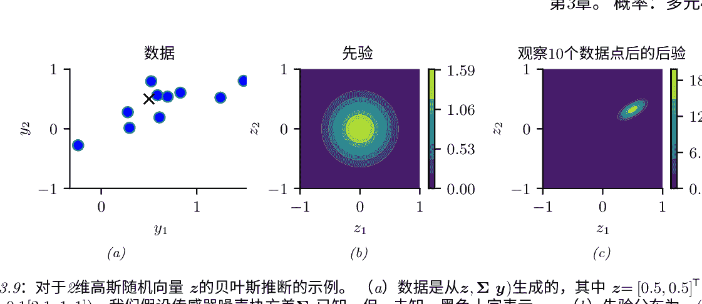

### 3.3.5 示例：传感器融合

在本节中，我们扩展了第3.3.4节，考虑了具有不同可靠性的多个传感器的多个测量值的情况。也就是说，模型的形式为

$$
p(\boldsymbol{z}, \boldsymbol{y}) = p(\boldsymbol{z}) \prod_{m=1}^{M} \prod_{n=1}^{N_m} \mathcal{N}(\boldsymbol{y}_{n,m}|\boldsymbol{z}, \boldsymbol{\Sigma}_m) \tag{3.69}
$$

其中 $M$ 是传感器（测量设备）的数量，$N_m$ 是来自传感器 $m$ 的观测数量，$\boldsymbol{y} = \boldsymbol{y}_{1:N, 1:M} \in \mathbb{R}^K$。我们的目标是将证据组合在一起，计算出 $p(\boldsymbol{z}|\boldsymbol{y})$。这被称为传感器融合。

现在我们给出一个简单的例子，只有两个传感器，所以 $\boldsymbol{y}_1 \sim \mathcal{N}(\boldsymbol{z}, \boldsymbol{\Sigma}_1)$ 和 $\boldsymbol{y}_2 \sim \mathcal{N}(\boldsymbol{z}, \boldsymbol{\Sigma}_2)$。从图上看，我们可以将这个例子表示为 $\boldsymbol{y}_1 \leftarrow \boldsymbol{z} \rightarrow \boldsymbol{y}_2$。我们可以将 $\boldsymbol{y}_1$ 和 $\boldsymbol{y}_2$ 合并成一个向量 $\boldsymbol{y}$，因此模型可以表示为 $\boldsymbol{z} \rightarrow [\boldsymbol{y}_1, \boldsymbol{y}_2]$，其中 $p(\boldsymbol{y}|\boldsymbol{z}) = \mathcal{N}(\boldsymbol{y}|\mathbf{W}\boldsymbol{z}, \boldsymbol{\Sigma}_y)$，其中 $\mathbf{W} = [\mathbf{I}; \mathbf{I}]$ 和 $\boldsymbol{\Sigma}_y = [\boldsymbol{\Sigma}_1, \mathbf{0}; \mathbf{0}, \boldsymbol{\Sigma}_2]$ 是分块矩阵。然后我们可以应用高斯贝叶斯规则来计算 $p(\boldsymbol{z}|\boldsymbol{y})$。

图3.10(a) 给出了一个二维示例，其中我们设置 $\boldsymbol{\Sigma}_1 = \boldsymbol{\Sigma}_2 = 0.01\mathbf{I}_2$，因此两个传感器的可靠性相同。在这种情况下，后验均值位于两个观测值之间，$\boldsymbol{y}_1$ 和 $\boldsymbol{y}_2$。在图3.10(b) 中，我们设置 $\boldsymbol{\Sigma}_1 = 0.05\mathbf{I}_2$ 和 $\boldsymbol{\Sigma}_2 = 0.01\mathbf{I}_2$，因此传感器2比传感器1更可靠。在这种情况下，后验均值更接近 $\boldsymbol{y}_2$。在图3.10(c) 中，我们设置

$$
\boldsymbol{\Sigma}_1 = 0.01 \begin{pmatrix} 10 & 1 \\ 1 & 1 \end{pmatrix}, \quad \boldsymbol{\Sigma}_2 = 0.01 \begin{pmatrix} 1 & 1 \\ 1 & 10 \end{pmatrix} \tag{3.70}
$$

因此传感器1在第二个分量（垂直方向）更可靠，传感器2在第一个分量（水平方向）更可靠。在这种情况下，后验均值使用 $\boldsymbol{y}_1$ 的垂直分量和 $\boldsymbol{y}_2$ 的水平分量。

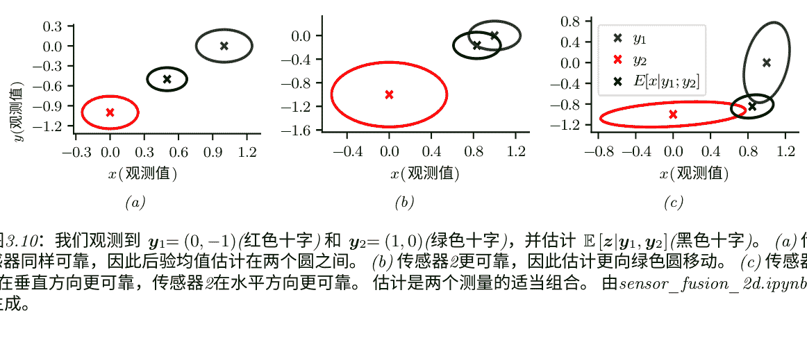

## 3.4 指数族 *

在这一部分中，我们定义了指数族，其中包括许多常见的概率分布。指数族在统计学和机器学习中起着关键作用。在本书中，我们主要将其用于广义线性模型的背景下，这将在第12章中讨论。

我们将在本书的后续部分中看到指数族的更多应用[Mur23]。

### 3.4.1 定义

考虑一个由参数 $\boldsymbol{\eta} \in \mathbb{R}^K$ 固定支持的概率分布族，其定义域为 $\mathcal{Y}^D \subseteq \mathbb{R}^D$。如果概率分布 $p(\boldsymbol{y}|\boldsymbol{\eta})$ 属于指数族，则其密度函数可以写成以下形式：

$$
p(\boldsymbol{y}|\boldsymbol{\eta}) \triangleq \frac{1}{Z(\boldsymbol{\eta})} h(\boldsymbol{y}) \exp[\boldsymbol{\eta}^{\top} \mathcal{T}(\boldsymbol{y})] = h(\boldsymbol{y}) \exp[\boldsymbol{\eta}^{\top} \mathcal{T}(\boldsymbol{y}) - A(\boldsymbol{\eta})] \tag{3.71}
$$

其中 $h(\boldsymbol{y})$ 是一个缩放常数（也称为基本测度，通常为1）， $\mathcal{T}(\boldsymbol{y}) \in \mathbb{R}^K$ 是充分统计量， $\boldsymbol{\eta}$ 是自然参数或规范参数， $Z(\boldsymbol{\eta})$ 是一个归一化常数，称为分区函数，而 $A(\boldsymbol{\eta}) = \log Z(\boldsymbol{\eta})$ 是对数分区函数。我们可以证明 $A$ 是凸函数，定义在凸集 $\Omega$ 上， $\{\boldsymbol{\eta} \in \mathbb{R}^K : A(\boldsymbol{\eta}) < \infty\}$。如果自然参数彼此独立，则非常方便。严格来说，我们说指数族是最小的，如果不存在 $\boldsymbol{\eta} \in \mathbb{R}^K \setminus \{0\}$ 使得 $\boldsymbol{\eta}^{\top} \mathcal{T}(\boldsymbol{y}) = 0$。在多项式分布的情况下，最后一个条件可能不满足，因为参数受到总和为一的约束；然而，我们可以通过使用 $K-1$ 个独立参数来重新参数化分布，如下所示。

方程 (3.71) 可以通过定义 $\boldsymbol{\eta} = f(\boldsymbol{\phi})$ 来进行概括，其中 $\boldsymbol{\phi}$ 是另一组可能更小的参数。在这种情况下，分布的形式为

$$
p(\boldsymbol{y}|\boldsymbol{\phi}) = h(\boldsymbol{y}) \exp[f(\boldsymbol{\phi})^{\top} \mathcal{T}(\boldsymbol{y}) - A(f(\boldsymbol{\phi}))] \tag{3.72}
$$

作者：Kevin P. Murphy。(C) MIT Press. CC-BY-NC-ND许可证

如果从 φ 到 η 的映射是非线性的，我们称之为曲线指数族。如果 η = f (φ) = φ，那么模型被称为规范形式。如果此外， T ( y ) = y ，我们称之为自然指数族或 NEF。在这种情况下，可以写成

$p(\mathbf{y}|\boldsymbol{\eta}) = h(\mathbf{y}) \exp[\boldsymbol{\eta}^{\top} \mathbf{y} - A(\boldsymbol{\eta})]$  (3.73)

### 3.4.2 示例

作为一个简单的例子，让我们考虑伯努利分布。我们可以将其写成指数族形式如下：

$$
\begin{aligned}
\text{Ber}(y|\mu) &= \mu^y (1-\mu)^{1-y} \quad (3.74) \\
&= \exp[y \log(\mu) + (1-y) \log(1-\mu)] \quad (3.75) \\
&= \exp[\mathcal{T}(y)^{\top} \boldsymbol{\eta}] \quad (3.76)
\end{aligned}
$$

其中 T (y) = [I(y=1), I(y=0)], η= [log(μ), log(1-μ)], 而 μ是均值参数。然而，这是一个超完备的表示，因为特征之间存在线性依赖关系。我们可以如下看到：

$1^{\top} \mathcal{T}(y) = \mathbb{I}(y=0) + \mathbb{I}(y=1) = 1$  (3.77)

如果表示过完备， η不是唯一可识别的。通常使用最小的表示，这意味着与分布相关的 η是唯一的。在这种情况下，我们只需定义

$\text{Ber}(y|\mu) = \exp \left[ y \log \left( \frac{\mu}{1-\mu} \right) + \log(1-\mu) \right]$  (3.78)

我们可以通过定义将其转化为指数族形式

$$
\begin{aligned}
\eta &= \log \left( \frac{\mu}{1-\mu} \right) \quad (3.79) \\
\mathcal{T}(y) &= y \quad (3.80) \\
A(\eta) &= -\log(1-\mu) = \log(1 + e^{\eta}) \quad (3.81) \\
h(y) &= 1 \quad (3.82)
\end{aligned}
$$

我们可以通过规范参数 η恢复均值参数 μ，使用

$\mu = \sigma(\eta) = \frac{1}{1 + e^{-\eta}}$  (3.83)

我们将其识别为逻辑（sigmoid）函数。有关更多示例，请参阅本书的续集[Mur23]。

### 3.4.3 对数分区函数是累积生成函数

分布的第一和第二累积量是其均值𝔼[Y]和方差𝕍[Y]，而第一和第二矩是𝔼[Y]和𝔼[Y^2]。我们还可以计算更高阶的累积量（和矩）。指数族的一个重要性质是，对数分区函数的导数可以用来生成所有的累积量充分统计量。特别地，第一和第二累积量由以下给出

$$
\nabla A(\eta) = \mathbb{E}[T(y)]  \quad (3.84)
$$

$$
\nabla^2 A(\eta) = \text{Cov}[T(y)]  \quad (3.85)
$$

从上述结果可以看出，Hessian矩阵是正定的，因此A(η)在η中是凸的。由于对数似然函数具有形式log p(y|η) = ηᵀT(y) - A(η) + const，我们可以看出它是凹的，因此MLE具有唯一的全局最大值。

## 3.4.4 最大熵推导的指数族

假设我们想要找到一个分布p(x)来描述一些数据，我们所知道的只有某些特征或函数f_k(x)的期望值(F_k):

$$
\int dx p(x) f_k(x) = F_k  \quad (3.86)
$$

例如，f_1可能计算x，f_2可能计算x^2，使F_1成为经验均值，F_2成为经验二阶矩。我们对分布的先验信念是q(x)。为了明确我们所说的“最少的假设数量”，我们将寻找一个分布，它尽可能接近我们的先验q(x)，从KL散度的角度来看（第6.2节），同时满足我们的约束条件：

$$
p = \text{argmin}_p D_{\text{KL}}(p \| q) \quad \text{受限制}  \quad (3.87)
$$

如果我们使用均匀先验分布，最小化KL散度等价于最大化熵（第6.1节）：

$$
p = \text{argmax}_p \mathbb{H}(p) \quad \text{受限制}  \quad (3.88)
$$

结果被称为最大熵模型。为了最小化KL散度，满足方程（3.86）中的约束条件，以及p(x) ≥ 0和∑_x p(x)=1，我们将使用拉格朗日乘子（见第8.5.1节）。拉格朗日函数为

$$
J(p, \lambda) = -\sum_x p(x) \log(p(x)/q(x)) + \lambda_0(1 - \sum_x p(x)) + \sum_k \lambda_k(F_k - \sum_x p(x)f_k(x))  \quad (3.89)
$$

我们可以使用变分法来对函数p求导数，但是我们将采用一种更简单的方法，将p视为一个固定长度的向量（因为我们假设x是离散的）。然后我们有

$$
\partial J/\partial p_c = -1 - \log(p(x=c)/q(x=c)) - \lambda_0 - \sum_k \lambda_k f_k(x=c)  \quad (3.90)
$$

设定 $\frac{\partial J}{\partial p_c} = 0$ 对于每个 $c$ 得到

$p(\boldsymbol{x}) = \frac{q(\boldsymbol{x})}{Z} \exp\left( -\sum_k \lambda_k f_k(\boldsymbol{x}) \right) \quad \text{(3.91)}$

在这里我们定义了 $Z \triangleq e^{1+\lambda_0}$。利用总和为一的约束条件，我们有

$1 = \sum_{\boldsymbol{x}} p(\boldsymbol{x}) = \frac{1}{Z} \sum_{\boldsymbol{x}} q(\boldsymbol{x}) \exp\left( -\sum_k \lambda_k f_k(\boldsymbol{x}) \right) \quad \text{(3.92)}$

因此，归一化常数由以下给出

$Z = \sum_{\boldsymbol{x}} q(\boldsymbol{x}) \exp\left( -\sum_k \lambda_k f_k(\boldsymbol{x}) \right) \quad \text{(3.93)}$

这正好具有指数族的形式，其中 $f(\boldsymbol{x})$ 是充分统计量的向量，$-\boldsymbol{\lambda}$ 是自然参数，而 $q(\boldsymbol{x})$ 是我们的基本测度。例如，如果特征是 $f_1(x)=x$ 和 $f_2(x)=x^2$，并且我们想要匹配第一和第二阶矩，我们得到高斯分布。

## 3.5 混合模型

创建更复杂的概率模型的一种方法是采用简单分布的凸组合。这被称为混合模型。其形式为

$p(\boldsymbol{y}|\boldsymbol{\theta}) = \sum_{k=1}^K \pi_k p_k(\boldsymbol{y}) \quad \text{(3.94)}$

其中 $p_k$ 是第 $k$ 个混合成分，$\pi_k$ 是满足 $0 \leq \pi_k \leq 1$ 和 $\sum_{k=1}^K \pi_k = 1$ 的混合权重。我们可以将这个模型重新表达为一个分层模型，其中我们引入离散的潜在变量 $z \in \{1, \dots, K\}$，它指定用于生成输出 $\boldsymbol{y}$ 的分布。这个潜在变量的先验分布是 $p(z=k|\boldsymbol{\theta}) = \pi_k$，条件分布是 $p(\boldsymbol{y}|z=k, \boldsymbol{\theta}) = p_k(\boldsymbol{y}) = p(\boldsymbol{y}|\boldsymbol{\theta}_k)$。也就是说，我们定义了以下联合模型：

$p(z|\boldsymbol{\theta}) = \text{Cat}(z|\boldsymbol{\pi}) \quad \text{(3.95)}$

$p(\boldsymbol{y}|z=k, \boldsymbol{\theta}) = p(\boldsymbol{y}|\boldsymbol{\theta}_k) \quad \text{(3.96)}$

其中 $\boldsymbol{\theta} = (\pi_1, \dots, \pi_K, \boldsymbol{\theta}_1, \dots, \boldsymbol{\theta}_K)$ 是所有模型参数。数据的生成故事是我们首先采样一个特定的分量 $z$，然后根据 $z$ 的值选择参数生成观测值 $\boldsymbol{y}$。通过边缘化 $z$，我们得到方程（3.94）：

$p(\boldsymbol{y}|\boldsymbol{\theta}) = \sum_{k=1}^K p(z=k|\boldsymbol{\theta}) p(\boldsymbol{y}|z=k, \boldsymbol{\theta}) = \sum_{k=1}^K \pi_k p(\boldsymbol{y}|\boldsymbol{\theta}_k) \quad \text{(3.97)}$

我们可以通过改变基本分布 $p_k$ 来创建不同种类的混合模型，如下所示。

### 3.5.1 高斯混合模型

高斯混合模型（GMM）或称为高斯混合（MoG）定义如下：

$$p(y|\theta)=\sum_{k=1}^{K}\pi_k\mathcal{N}(y|\mu_k, \Sigma_k)$$

在图3.11中，我们展示了一个二维高斯混合模型定义的密度。每个混合成分由不同的椭圆轮廓表示。如果我们让混合成分的数量足够大，高斯混合模型可以近似表示任何平滑分布在$\mathbb{R}^D$上的分布。高斯混合模型经常用于无监督聚类实值数据样本$y_n \in \mathbb{R}^D$。这个过程分为两个阶段。首先，我们拟合模型，例如通过计算最大似然估计$\hat{\theta}=\mathrm{argmax} \log p(\mathcal{D}|\theta)$，其中

（图3.11和3.12的图片描述）

（图3.13的图片描述）
图3.13：我们将20个伯努利分布拟合到二值化的MNIST数字数据上。我们可视化估计的聚类均值 $\hat{\mu}_k$。每个图像上方的数字表示估计的混合权重 $\hat{\pi}_k$。在训练模型时没有使用标签。由 `mix_bernoulli_em_mnist.ipynb` 生成。

（我们在第8.7.3节中讨论了如何计算这个MLE。）然后，我们将每个数据点 $y_n$ 与一个离散的潜在变量 $z_n$ 关联起来， $z_n \in \{1, \dots, K\}$，它指定了用于生成 $y_n$ 的混合成分或聚类的身份。这些潜在身份是未知的，但我们可以使用贝叶斯规则计算它们的后验概率：

$$r_{nk} \triangleq p(z_n=k|y_n;\theta) = \frac{p(z_n=k|\theta)p(y_n|z_n=k,\theta)}{\sum_{k'=1}^K p(z_{n}=k'|\theta) p(y_{n}|z_{n}=k',\theta)} \tag{3.99}$$

数量 $r_{nk}$ 被称为数据点 $n$ 对于聚类 $k$ 的责任。给定责任，我们可以计算最可能的聚类分配如下：

$$\hat{z}_n = \arg \max_k r_{nk} = \arg \max_k [\log p(y_n|z_n = k, \theta) + \log p(z_n = k|\theta)] \tag{3.100}$$

这被称为硬聚类。（如果我们使用责任将每个数据点分配给不同的聚类，这被称为软聚类。）参见图3.12的示例。如果我们对 $z_n$ 有均匀先验，并且使用 $\Sigma_k = I$ 的球形高斯分布，硬聚类问题简化为

$$\hat{z}_n = \argmin_k \|y_n - \hat{\mu}_k\|^2 \tag{3.101}$$

换句话说，我们根据欧几里德距离将每个数据点分配给其最近的质心。这是K-means聚类算法的基础，我们在第21.3节中讨论。

### 3.5.2 伯努利混合模型

如果数据是二进制值，我们可以使用伯努利混合模型或 BMM（也称为伯努利混合），其中每个混合成分具有以下形式：

$$p(y|z = k, \theta) = \prod_{d=1}^D \text{Ber}(y_d|\mu_{dk}) = \prod_{d=1}^D \mu_{dk}^{y_d} (1 - \mu_{dk})^{1-y_d} \tag{3.102}$$

（图3.14的图片描述）
图3.14：带有相应二进制条件概率表的水洒PGM。T和F分别代表真和假。

这里 μ_{dk}是位 d在簇 k中打开的概率。
作为一个例子，我们使用 K= 20个组件对MNIST数据集进行拟合（第3.5.2节）。（我们使用EM算法进行拟合，这类似于第8.7.3节中讨论的GMM的EM算法；但是我们也可以使用SGD来拟合模型，这对于大型数据集更高效。）每个混合组件的结果参数（即 μ_k 和 π_k）显示在图3.1中。我们可以看到模型已经“发现”了每种数字的表示。（由于模型不知道“真实”类别的数量，因此某些数字可能会被多次表示。有关如何选择混合组件数量 K 的更多信息，请参见第21.3.7节。）

## 3.6 概率图模型

> 我基本上知道处理复杂系统的两个原则：第一个是模块化原则，第二个是抽象原则。我是机器学习中计算概率的辩护者，因为我相信概率论通过因子分解和平均化这两个深奥而有趣的方式实现了这两个原则。在机器学习中，充分利用这两种机制似乎是前进的方向。 —— Michael Jordan, 1997年 (引自[Fre98])。

我们现在介绍了一些简单的概率建模块。在第3.3节中，我们展示了一种将一些高斯建模块组合起来构建高维分布 p(y)的方法，这些高斯建模块由更简单的部分组成，即边缘分布 p(y1)和条件分布 p(y2|y1)。这个想法可以扩展到定义多个随机变量集合的联合分布。我们将做出的关键假设是某些变量在给定其他变量的条件下是独立的。我们将使用图形来表示我们的独立性假设，下面我们简要解释一下。（有关更多信息，请参阅本书的续集[Mur23]。）

### 3.6.1 表示

概率图模型或 PGM是使用图结构编码条件独立性假设的联合概率分布。当图是一个有向无环图或DAG时，该模型有时被称为贝叶斯网络，尽管这些模型本质上与贝叶斯无关。

PGM中的基本思想是图中的每个节点表示一个随机变量，每个边表示一个直接依赖关系。更准确地说，每个缺少的边表示一个条件独立性。在DAG情况下，我们可以按照拓扑顺序对节点进行编号 (父节点在子节点之前)，然后连接它们，使得每个节点在给定其父节点的情况下与其所有前驱节点条件独立：

$$
Y_i \perp \mathbf{Y}_{\text{pred}(i)\setminus\text{pa}(i)} | \mathbf{Y}_{\text{pa}(i)}
$$

其中 pa(i)是节点 i的父节点，而 pred(i)是节点 i在排序中的前驱节点。(这被称为有序马尔可夫性质。) 因此，我们可以将联合分布表示为如下：

$$
p(\mathbf{Y}_{1:N_G}) = \prod_{i=1}^{N_G} p(Y_i | \mathbf{Y}_{\text{pa}(i)})
$$

其中 $N_G$是图中节点的数量。

#### 3.6.1.1 示例：洒水器网络

假设我们想要建模4个随机变量之间的依赖关系： C (天气是否多云季节)， R (是否下雨)， S (水洒器是否打开)，以及 W (草地是否湿润)。我们知道多云季节会增加下雨的可能性，因此我们添加了一个 C → R的弧。我们知道多云季节会减少打开水洒器的可能性，因此我们添加了一个 C → S的弧。最后，我们知道下雨或水洒器都可能导致草地湿润，因此我们添加了 S → W和 R → W的边。

从形式上讲，这定义了以下联合分布：

$$
p(C, S, R, W) = p(C)p(S|C)p(R|C, S)p(W|S, R)
$$

我们划掉了由于模型的条件独立性质而不需要的项。

每个项 $p(Y_i|\mathbf{Y}_{\text{pa}(i)})$被称为节点i的条件概率分布或CPD。这可以是我们喜欢的分布。在图3.14中，我们假设每个CPD都是一个条件分类分布，可以表示为条件概率表或CPT。我们可以将第 i个CPT表示如下：

$$
\theta_{ijk} \triangleq p(Y_i = k | \mathbf{Y}_{\text{pa}(i)} = j)
$$

这满足性质 $0 \le \theta_{ijk} \le 1$和 $\sum_{k=1}^{K_i} \theta_{ijk} = 1$对于每一行 $j$。这里索引节点, $i \in [N_G]$; k索引节点状态, $k \in [K_i]$, 其中 $K_i$是节点 i的状态数; 而 j索引联合父状态, $j \in [J_i]$, 其中 $J_i = \prod_{i \in \text{pa}(i)} K_i$。例如，湿草节点有2个父节点，因此有4个父状态。

## 3.6.1.2 示例：马尔可夫链

假设我们想要创建一个变长序列的联合概率分布，\(p(y_{1:T})\)。如果每个变量 \(y_t\) 表示来自具有 \(K\) 可能值的词汇表的单词，所以 \(y_t \in \{1, ..., K\}\)，得到的模型表示长度为 \(T\) 的可能句子的分布；这通常被称为语言模型。

通过概率的链式法则，我们可以将任何关于 \(T\) 个变量的联合分布表示如下：

\(p(y_{1:T}) = p(y_1)p(y_2|y_1)p(y_3|y_2, y_1)p(y_4|y_3, y_2, y_1) \dots = \prod_{t=1}^{T} p(y_t|y_{1:t-1})\)    (3.107)

不幸的是，表示每个条件分布 \(p(y_t|y_{1:t-1})\) 所需的参数数量随着 \(t\) 的增加呈指数增长。然而，假设我们做出条件独立的假设，即未来的 \(y_{t+1:T}\) 在给定现在的情况下，与过去的 \(y_{1:t-1}\) 无关。这被称为 first-order Markov condition，并且由图3.15(a)中的PGM表示。在这个假设下，我们可以将联合分布写成如下形式：

\(p(y_{1:T}) = p(y_1)p(y_2|y_1)p(y_3|y_2)p(y_4|y_3) \dots = p(y_1)\prod_{t=2}^{T} p(y_t|y_{t-1})\)    (3.108)

这被称为马尔可夫链，马尔可夫模型或自回归模型一阶。函数 \(p(y_t|y_{t-1})\) 被称为转移函数，转移核或马尔可夫核。这只是在时间 \(t\) 给定时间 \(t-1\) 的状态的条件分布，因此它满足条件 \(p(y_t|y_{t-1}) \geq 0\) 和 \(\sum_{k=1}^{K} p(y_t = k|y_{t-1}=j) = 1\)。我们可以将这个条件概率表表示为一个随机矩阵，其中每一行的和为1。这被称为状态转移矩阵。我们假设这个矩阵对所有时间步都是相同的，因此模型被称为齐次、平稳或时不变。这是参数绑定的一个例子，因为同一个参数被多个变量共享。这个假设允许我们使用固定数量的参数来建模任意数量的变量。

一阶马尔可夫假设相当强。幸运的是，我们可以很容易地将一阶模型推广到依赖于最后 \(M\) 个观测值的模型，从而创建一个 \(M\) 阶（记忆长度）的模型：

\(p(y_{1:T}) = p(y_{1:M}) \prod_{t=M+1}^{T} p(y_t|y_{t-M:t-1})\)    (3.109)

这被称为 \(M\) 阶马尔可夫模型。例如，如果 \(M=2\)，\(y_t\) 依赖于 \(y_{t-1}\) 和 \(y_{t-2}\)，如图3.15(b)所示。这被称为三元模型，因为它模拟了词组的分布。

作者：Kevin P. Murphy。(C) MIT Press. CC-BY-NC-ND许可证

在词组三元组上。 如果如果我们使用 \(M= 1\)，我们得到一个二元模型，它模拟了词对的分布。

对于大词汇量的情况，为了估计大 \(M\) 的 \(M\)-gram模型的条件分布，所需的参数数量可能变得很大，从而变得难以实现。 在这种情况下，我们需要在条件独立性之外做出额外的假设。 例如，我们可以假设 \(p(y_t|y_{t-M:t-1})\) 可以表示为一个低秩矩阵，或者用某种神经网络表示。 这被称为神经语言模型。 详细内容请参见第15章。

### 3.6.2 推断

PGM定义了一个联合概率分布。 因此，我们可以使用边缘化和条件化的规则来计算对于任意变量集 \(\boldsymbol{i}\) 和 \(\boldsymbol{j}\)， \(p(\mathbf{Y}_i |\mathbf{Y}_j = \boldsymbol{y}_j)\)。 本书的后续部分将讨论执行此计算的高效算法[Mur23]。

例如，考虑图3.14中的水喷洒器示例。 我们对它下雨的先验信念为 \(p(R= 1) = 0.5\)。 如果我们看到草地是湿的，那么我们对它下雨的后验信念将变为 \(p(R= 1|W= 1) = 0.7079\)。 现在假设我们还注意到水喷洒器被打开了：我们对它下雨的信念下降到 \(p(R= 1|W= 1, S= 1) = 0.3204\)。 这种多个观测原因之间的负相互作用被称为解释消除效应，也被称为伯克森悖论。 （有关重新计算这些计算的一些代码，请参见 sprinkler_pgm.ipynb。）

### 3.6.3 学习

如果CPD的参数未知，我们可以将其视为额外的随机变量，将其添加为图中的节点，然后将其视为需要推断的隐藏变量。 图3.16(a)展示了一个简单的例子，其中我们有 \(N\) 个独立同分布的随机变量 \(y_n\)， 都是从具有共同参数 \(\theta\) 的相同分布中抽取的。 （阴影节点表示观测值，而未阴影（空心）节点表示潜在变量或参数。 ） 更准确地说，该模型对数据编码了以下“生成故事”：

$$
\begin{aligned}
\theta &\sim p(\theta) & (3.110) \\
y_n &\sim p(y|\theta) & (3.111)
\end{aligned}
$$

其中 \(p(\theta)\) 是参数的某个（未指定的）先验分布，而 \(p(y|\theta)\) 是某个指定的似然函数。 相应的联合分布具有以下形式

$$
p(\mathcal{D}, \theta) = p(\theta)p(\mathcal{D}|\theta) \qquad\qquad (3.112)
$$

其中 \(\mathcal{D}= (y_1, \ldots, y_N)\)。 由于独立同分布假设，似然函数可以重写如下：

$$
p(\mathcal{D}|\theta) = \prod_{n=1}^{N} p(y_n|\theta) \qquad\qquad (3.113)
$$

请注意，对于定义该模型来说，数据向量的顺序并不重要，即我们可以重新排列PGM中叶节点的编号。 当满足这个性质时，我们称数据是可交换的。

图3.16: 左侧：给定 \( \theta \)，数据点 \( y_n \) 在条件下是独立的。右侧：相同的模型，使用盘符表示。这表示与左侧相同的模型，除了重复的 \( y_n \) 节点位于一个盒子内，称为盘符；右下角的数字 \( N \) 指定了 \( y_n \) 节点的重复次数。

### 3.6.3.1 板符号

在图3.16(a)中，我们可以看到节点被重复 \( N \) 次。为了避免视觉混乱，通常使用一种叫做“板符号”的语法糖。这是一种符号约定，我们在重复的变量周围画一个小框，理解为模型展开时框内的节点会被重复。我们经常在框的右下角写上副本或重复的数量。图3.16(b)中有示例。这种符号约定被广泛用于表示某些类型的贝叶斯模型。

图3.17展示了一个更有趣的例子，我们将GMM（第3.5.1节）表示为一个图形模型。我们可以看到这表示了联合分布

$$
p(y_{1:N}, z_{1:N}, \theta) = p(\pi) \left[ \prod_{k=1}^K p(\mu_k) p(\Sigma_k) \right] \left[ \prod_{n=1}^N p(z_n | \pi) p(y_n | z_n, \mu_{1:K}, \Sigma_{1:K}) \right] \quad (3.114)
$$

我们可以看到潜在变量 \( z_n \) 以及未知参数 \( \theta = (\pi, \mu_{1:K}, \Sigma_{1:K}) \) 都被表示为未着色的节点。

## 3.7 练习题

练习3.1 [不相关并不意味着独立 *]

显然 \( Y \) 依赖于 \( X \) (实际上，\( Y \) 由 \( X \) 唯一确定)。

然而，证明 \( \rho(X, Y) = 0 \)。提示：如果 \( X \sim U(a, b) \)，则 \( E[X] = (a + b)/2 \)，\( \mathbb{V}[X] = (b - a)^2/12 \)。

练习3.2 [相关系数介于-1和+1之间]

证明 \( -1 \leq \rho(X, Y) \leq 1 \)

练习3.3 [线性相关变量的相关系数为 \( \pm 1 \) *]

证明，如果 \( Y = aX + b \)，其中 \( a > 0 \) 和 \( b \) 是一些参数，则 \( \rho(X, Y) = 1 \)。类似地，如果 \( a < 0 \)，则 \( \rho(X, Y) = -1 \)。

练习3.4 [随机变量的线性组合]

设 \(\mathbf{x}\) 是一个具有均值 \(\mathbf{m}\) 和协方差矩阵 \(\mathbf{\Sigma}\) 的随机向量。设 \(\mathbf{A}\) 和 \(\mathbf{B}\) 是矩阵。

a. 推导 \(\mathbf{A}\mathbf{x}\) 的协方差矩阵。
b. 证明 \(\text{tr}(\mathbf{A}\mathbf{B}) = \text{tr}(\mathbf{B}\mathbf{A})\)。
c. 推导 \(\mathbb{E} \left[ \mathbf{x}^T \mathbf{A}\mathbf{x} \right]\)。

练习 3.5 [高斯 vs 联合高斯]

设 \(X \sim \mathcal{N}(0, 1)\)，且 \(Y = WX\)，其中 \(p(W = -1) = p(W = 1) = 0.5\)。显然 \(X\) 和 \(Y\) 不是独立的，因为 \(Y\) 是 \(X\) 的函数。

a. 证明 \(Y \sim \mathcal{N}(0, 1)\)。
b. 证明 \(\text{Cov}[X, Y] = 0\)。因此 \(X\) 和 \(Y\) 是不相关但依赖的，尽管它们是高斯的。

提示：使用协方差的定义
$$\text{Cov}[X, Y] = \mathbb{E}[XY] - \mathbb{E}[X]\mathbb{E}[Y] \qquad (3.115)$$
和迭代期望的规则
$$\mathbb{E}[XY] = \mathbb{E}[\mathbb{E}[XY|W]] \qquad (3.116)$$

练习3.6 [多维高斯分布的归一化常数]

证明多维高斯分布的归一化常数为
$$(2\pi)^{d/2}|\mathbf{\Sigma}|^{\frac{1}{2}} = \int \exp\left(-\frac{1}{2}(\mathbf{x} - \boldsymbol{\mu})^T \mathbf{\Sigma}^{-1}(\mathbf{x} - \boldsymbol{\mu})\right) d\mathbf{x} \qquad (3.117)$$

提示：对Σ进行对角化，并使用联合概率密度函数写成一个转换坐标系中的一维高斯分布的乘积。（你将需要变量变换公式。）最后，使用一维高斯分布的归一化常数。

练习3.7 [传感器融合]

假设我们有两个传感器，已知（且不同）方差 \(v_1\) 和 \(v_2\)，但未知（且相同）均值 \(\mu\)。假设我们从第一个传感器观察到 \(n_1\) 个观测值 \(y_1^{(1)} \sim \mathcal{N}(\mu, v_1)\)，并从第二个传感器观察到 \(n_2\) 个观测值 \(y_2^{(2)} \sim \mathcal{N}(\mu, v_2)\)。（例如，假设 \(\mu\) 是真实的室外温度，传感器1是一个精确（低方差）的数字温度传感器，传感器2是一个不精确（高方差）的水银温度计。）令 \(\mathcal{D}\) 表示来自两个传感器的所有数据。在假设 \(\mu\) 的先验分布为非信息性先验（我们可以使用精度为0的高斯分布进行模拟）的情况下，后验分布 \(p(\mu|\mathcal{D})\) 是什么？给出后验均值和方差的显式表达式。

练习3.8 [证明学生分布可以写成高斯比例混合]

证明学生分布可以写成高斯比例混合，其中我们使用了一个Gamma混合分布来表示精度 \(\alpha\)，即

$$
p(x|\mu, a, b) = \int_0^\infty \mathcal{N}(x|\mu, \alpha^{-1})\text{Ga}(\alpha|a, b)d\alpha \tag{3.118}
$$

这可以看作是一个无限高斯混合的视角，具有不同的精度。

# 4 统计学

## 4.1 引言

在第2章-第3章中，我们假设所有概率模型的参数 \(\theta\) 都是已知的。在本章中，我们讨论如何从数据中学习这些参数。

从 \(\mathcal{D}\) 中估计 \(\theta\) 的过程被称为模型拟合或训练，是机器学习的核心。有许多方法可以产生这样的估计，但大多数都归结为一个优化问题的形式

$$
\hat{\theta} = \arg\min_{\theta} \mathcal{L}(\theta)
$$

其中 \(\mathcal{L}(\theta)\) 是某种损失函数或目标函数。在本章中，我们讨论了几种不同的损失函数。在某些情况下，我们还讨论了如何通过闭式形式解决优化问题。然而，通常情况下，我们需要使用某种通用的优化算法，这将在第8章中讨论。

除了计算一个点估计 \(\hat{\theta}\) 之外，我们还讨论了如何对这个估计的不确定性或置信度进行建模。在统计学中，从有限的数据样本中估计未知量的不确定性的过程被称为推断。我们将讨论贝叶斯和频率主义方法的推断。

## 4.2 最大似然估计（MLE）

参数估计的最常见方法是选择使训练数据具有最高概率的参数；这被称为最大似然估计或MLE。我们在下面给出更多细节，然后给出一系列的实例。

### 4.2.1 定义

我们将MLE定义如下：

$$
\hat{\theta}_{\text{mle}} \triangleq \arg\max_{\theta} p(\mathcal{D}|\theta)
$$

1. 在深度学习社区中，“推断”一词指的是我们所称的“预测”，即计算 \(p(y|x, \hat{\theta})\)。

我们通常假设训练样本是从同一分布中独立采样的，因此（条件）似然函数变为

$$
p(\mathcal{D}|\boldsymbol{\theta}) = \prod_{n=1}^{N} p(\boldsymbol{y}_n|\boldsymbol{x}_n, \boldsymbol{\theta}) \qquad\qquad\qquad\qquad\qquad\qquad\qquad\qquad\qquad(4.3)
$$

这被称为独立同分布（iid）假设。我们通常使用对数似然函数，其表示为

$$
\ell(\boldsymbol{\theta}) \triangleq \log p(\mathcal{D}|\boldsymbol{\theta}) = \sum_{n=1}^{N} \log p(\boldsymbol{y}_n|\boldsymbol{x}_n, \boldsymbol{\theta}) \qquad\qquad\qquad\qquad\qquad\qquad\qquad\qquad\qquad(4.4)
$$

这个可以分解成一系列项，每个样本对应一项。因此，最大似然估计由以下公式给出

$$
\hat{\boldsymbol{\theta}}_{\mathrm{mle}} = \mathop{\mathrm{argmax}}_{\boldsymbol{\theta}} \sum_{n=1}^{N} \log p(\boldsymbol{y}_n|\boldsymbol{x}_n, \boldsymbol{\theta}) \qquad\qquad\qquad\qquad\qquad\qquad\qquad\qquad\qquad(4.5)
$$

由于大多数优化算法（如第8章中讨论的算法）都是设计用来最小化成本函数的，我们可以重新定义目标函数为（条件）负对数似然或 NLL:

$$
\mathrm{NLL}(\boldsymbol{\theta}) \triangleq -\log p(\mathcal{D}|\boldsymbol{\theta}) = -\sum_{n=1}^{N} \log p(\boldsymbol{y}_n|\boldsymbol{x}_n, \boldsymbol{\theta}) \qquad\qquad\qquad\qquad\qquad\qquad\qquad\qquad\qquad(4.6)
$$

最小化这个函数将给出最大似然估计。如果模型是无条件的（无监督的），最大似然估计变为

$$
\hat{\boldsymbol{\theta}}_{\mathrm{mle}} = \mathop{\mathrm{argmin}}_{\boldsymbol{\theta}} -\sum_{n=1}^{N} \log p(\boldsymbol{y}_n|\boldsymbol{\theta}) \qquad\qquad\qquad\qquad\qquad\qquad\qquad\qquad\qquad(4.7)
$$

因为我们有输出 \(\boldsymbol{y}_n\) 但没有输入 \(\boldsymbol{x}_n\)。\(^\text{2}\)

或者我们可能希望最大化输入和输出的联合似然。在这种情况下，最大似然估计变为

$$
\hat{\boldsymbol{\theta}}_{\mathrm{mle}} = \mathop{\mathrm{argmin}}_{\boldsymbol{\theta}} -\sum_{n=1}^{N} \log p(\boldsymbol{y}_n, \boldsymbol{x}_n|\boldsymbol{\theta}) \qquad\qquad\qquad\qquad\qquad\qquad\qquad\qquad\qquad(4.8)
$$

#### 4.2.2 最大似然估计的理论基础

有几种方法可以证明最大似然估计的方法。一种方法是将其视为对贝叶斯后验概率 \(p(\boldsymbol{\theta}|\mathcal{D})\) 的简单点估计，使用均匀先验分布，详见第4.6.7.1节。

2. 在统计学中，通常使用 \(\boldsymbol{y}\) 来表示我们选择建模的生成分布的变量，使用 \(\boldsymbol{x}\) 来表示给定但不是生成的外生输入。因此，监督学习涉及拟合条件模型 \(p(\boldsymbol{y}|\boldsymbol{x})\)，而无监督学习是特殊情况，其中 \(\boldsymbol{x} = \varnothing\)，因此我们只是拟合无条件分布 \(p(\boldsymbol{y})\)。在机器学习文献中，监督学习将 \(\boldsymbol{y}\) 视为生成的变量，\(\boldsymbol{x}\) 视为给定的变量，在无监督情况下，通常会切换使用 \(\boldsymbol{x}\) 来表示生成的变量。

## 4.2. 最大似然估计（MLE）

特别地，假设我们通过一个delta函数来近似后验概率，$p(\boldsymbol{\theta}|\mathcal{D}) = \delta(\boldsymbol{\theta} - \hat{\boldsymbol{\theta}}_{\text{map}})$，其中 $\hat{\boldsymbol{\theta}}_{\text{map}}$ 是后验概率的模式，由以下给出

$$\hat{\boldsymbol{\theta}}_{\text{map}} = \underset{\boldsymbol{\theta}}{\text{argmax}} \log p(\boldsymbol{\theta}|\mathcal{D}) = \underset{\boldsymbol{\theta}}{\text{argmax}} \log p(\mathcal{D}|\boldsymbol{\theta}) + \log p(\boldsymbol{\theta}) \tag{4.9}$$

如果我们使用均匀先验分布，$p(\boldsymbol{\theta}) \propto 1$，则MAP估计等于MLE估计，$\hat{\boldsymbol{\theta}}_{\text{map}} = \hat{\boldsymbol{\theta}}_{\text{mle}}$。

另一种证明使用MLE的方法是，所得到的预测分布 $p(y|\hat{\boldsymbol{\theta}}_{\text{mle}})$ 尽可能接近（在下面定义的意义上）数据的经验分布。在无条件情况下，经验分布定义为

$$p_{\mathcal{D}}(\boldsymbol{y}) \triangleq \frac{1}{N} \sum_{n=1}^{N} \delta(\boldsymbol{y} - \boldsymbol{y}_n) \tag{4.10}$$

我们可以看到经验分布是一系列在观测训练点上的$\delta$函数或“尖峰”。我们希望创建一个模型，其分布 $q(\boldsymbol{y}) = p(\boldsymbol{y}|\boldsymbol{\theta})$ 与 $p_{\mathcal{D}}(\boldsymbol{y})$ 相似。

衡量概率分布 $p$ 和 $q$ 之间的（不）相似性的一种标准方法是库尔巴克-莱布勒散度，或KL散度。我们在第6.2节中给出了详细信息，但简要来说，这被定义为

$$D_{\text{KL}}(p \| q) = \sum_{\boldsymbol{y}} p(\boldsymbol{y}) \log \frac{p(\boldsymbol{y})}{q(\boldsymbol{y})} \tag{4.11}$$

$$= \underbrace{\sum_{\boldsymbol{y}} p(\boldsymbol{y}) \log p(\boldsymbol{y})}_{-\mathbb{H}(p)} - \underbrace{\sum_{\boldsymbol{y}} p(\boldsymbol{y}) \log q(\boldsymbol{y})}_{\mathbb{H}_{ce}(p,q)} \tag{4.12}$$

其中 $\mathbb{H}(p)$ 是 $p$ 的熵（见第6.1节），$\mathbb{H}_{ce}(p, q)$ 是 $p$ 和 $q$ 的交叉熵（见第6.1.2节）。可以证明 $D_{\text{KL}}(p \| q) \geq 0$，当且仅当 $p = q$ 时等号成立。如果我们定义 $q(\boldsymbol{y}) = p(\boldsymbol{y}|\boldsymbol{\theta})$，并设置 $p(\boldsymbol{y}) = p_{\mathcal{D}}(\boldsymbol{y})$，则KL散度变为

$$D_{\text{KL}}(p_{\mathcal{D}} \| q) = \sum_{\boldsymbol{y}} [p_{\mathcal{D}}(\boldsymbol{y}) \log p_{\mathcal{D}}(\boldsymbol{y}) - p_{\mathcal{D}}(\boldsymbol{y}) \log q(\boldsymbol{y})] \tag{4.13}$$

$$= -\mathbb{H}(p_{\mathcal{D}}) - \frac{1}{N} \sum_{n=1}^{N} \log p(\boldsymbol{y}_n|\boldsymbol{\theta}) \tag{4.14}$$

$$= \text{const} + \text{NLL}(\boldsymbol{\theta}) \tag{4.15}$$

第一项是一个常数，我们可以忽略它，只剩下NLL。因此，最小化KL等价于最小化NLL，这等价于计算MLE，如方程（4.7）所示。我们可以通过使用以下经验分布来推广上述结果到有监督（条件）设置：

$$p_{\mathcal{D}}(\boldsymbol{x}, \boldsymbol{y}) = p_{\mathcal{D}}(\boldsymbol{y}|\boldsymbol{x})p_{\mathcal{D}}(\boldsymbol{x}) = \frac{1}{N} \sum_{n=1}^{N} \delta(\boldsymbol{x} - \boldsymbol{x}_n)\delta(\boldsymbol{y} - \boldsymbol{y}_n) \tag{4.16}$$

期望KL则变为

$$\mathbb{E}_{p_{\mathcal{D}}(\boldsymbol{x})}\left[D_{\mathrm{KL}}\left(p_{\mathcal{D}}(Y \mid \boldsymbol{x}) \| q(Y \mid \boldsymbol{x})\right)\right]=\sum_{\boldsymbol{x}} p_{\mathcal{D}}(\boldsymbol{x})\left[\sum_{\boldsymbol{y}} p_{\mathcal{D}}(\boldsymbol{y} \mid \boldsymbol{x}) \log \frac{p_{\mathcal{D}}(\boldsymbol{y} \mid \boldsymbol{x})}{q(\boldsymbol{y} \mid \boldsymbol{x})}\right] \quad (4.17)$$

$$=\text{const} -\sum_{\boldsymbol{x}, \boldsymbol{y}} p_{\mathcal{D}}(\boldsymbol{x}, \boldsymbol{y}) \log q(\boldsymbol{y} \mid \boldsymbol{x}) \quad (4.18)$$

$$=\text{const} -\frac{1}{N} \sum_{n=1}^{N} \log p(\boldsymbol{y}_{n} \mid \boldsymbol{x}_{n}, \boldsymbol{\theta}) \quad (4.19)$$

将其最小化等价于将方程 (4.6) 中的条件NLL最小化。

### 4.2.3 示例：伯努利分布的MLE

假设 $Y$ 是表示抛硬币的随机变量，其中事件 $Y=1$ 对应于正面，$Y=0$ 对应于反面。设 $\theta = p(Y=1)$ 为正面的概率。该随机变量的概率分布是伯努利分布，在第2.4节中介绍过。伯努利分布的NLL由以下公式给出：

$$\mathrm{NLL}(\theta) = -\log \prod_{n=1}^{N} p(y_n|\theta) \quad (4.20)$$

$$= -\log \prod_{n=1}^{N} \theta^{\mathbb{I}(y_n=1)} (1-\theta)^{\mathbb{I}(y_n=0)} \quad (4.21)$$

$$= -\sum_{n=1}^{N} \left[ \mathbb{I}(y_n=1) \log \theta + \mathbb{I}(y_n=0) \log(1-\theta) \right] \quad (4.22)$$

$$= -[N_1 \log \theta + N_0 \log(1-\theta)] \quad (4.23)$$

其中我们定义 $N_1 = \sum_{n=1}^{N} \mathbb{I}(y_n=1)$ 和 $N_0 = \sum_{n=1}^{N} \mathbb{I}(y_n=0)$，表示正面和反面的数量。（对于二项式分布，NLL与伯努利分布相同，除了一个与$\theta$无关的不相关项）这两个数字被称为数据的充分统计量，因为它们总结了我们需要了解的关于$\theta$的一切。总计数，$N = N_0 + N_1$，被称为样本大小。

通过求解 $\frac{d}{d\theta} \mathrm{NLL}(\theta) = 0$ 可以找到MLE。NLL的导数是

$$\frac{d}{d\theta} \mathrm{NLL}(\theta) = \frac{-N_1}{\theta} + \frac{N_0}{1-\theta} \quad (4.24)$$

因此，MLE由以下给出

$$\hat{\theta}_{\mathrm{mle}} = \frac{N_1}{N_0 + N_1} \quad (4.25)$$

我们可以看到这只是头部的经验分数，这是一个直观的结果。

### 4.2.4 示例：分类分布的MLE

假设我们掷一个 K 面的骰子 N 次。令 $Y_n \in \{1, \dots, K\}$ 为第 n 次的结果，其中 $Y_n \sim \text{Cat}(\boldsymbol{\theta})$。我们想要从数据集 $\mathcal{D} = \{y_n : n = 1:N\}$ 中估计概率 $\boldsymbol{\theta}$。NLL由以下给出

$$\text{NLL}(\boldsymbol{\theta}) = - \sum_k N_k \log \theta_k$$

其中 $N_k$ 是事件 $Y = k$ 被观察到的次数。（多项式的NLL是相同的，只是与无关的比例因子有关。）

为了计算MLE，我们必须在约束条件 $\sum_{k=1}^K \theta_k = 1$ 下最小化NLL。为了做到这一点，我们将使用拉格朗日乘数法（见第8.5.1节）。拉格朗日函数如下：

$$\mathcal{L}(\boldsymbol{\theta}, \lambda) \triangleq - \sum_k N_k \log \theta_k - \lambda \left(1 - \sum_k \theta_k\right)$$

对 $\lambda$ 求导得到原始约束条件：

$$\frac{\partial \mathcal{L}}{\partial \lambda} = 1 - \sum_k \theta_k = 0$$

对 $\theta_k$ 求导得到

$$\frac{\partial \mathcal{L}}{\partial \theta_k} = -\frac{N_k}{\theta_k} + \lambda = 0 \implies N_k = \lambda \theta_k$$

我们可以使用总和为一的约束条件来解出 $\lambda$：

$$\sum_k N_k = N = \lambda \sum_k \theta_k = \lambda$$

因此，最大似然估计为

$$\hat{\theta}_k = \frac{N_k}{\lambda} = \frac{N_k}{N}$$

这只是事件 k 发生的经验比例。

### 4.2.5 示例：单变量高斯分布的最大似然估计

假设 $Y \sim \mathcal{N}(\mu, \sigma^2)$ 并且 $\mathcal{D} = \{y_n : n = 1:N\}$ 是一个大小为 N 的独立同分布样本。我们可以使用最大似然估计来估计参数 $\boldsymbol{\theta} = (\mu, \sigma^2)$。首先，我们推导出负对数似然函数（NLL），其表达式为

$$\text{NLL}(\mu, \sigma^2) = -\sum_{n=1}^{N} \log \left[ \left(\frac{1}{2\pi\sigma^2}\right)^{\frac{1}{2}} \exp\left(-\frac{1}{2\sigma^2}(y_n - \mu)^2\right) \right]$$

$$= \frac{1}{2\sigma^2} \sum_{n=1}^{N} (y_n - \mu)^2 + \frac{N}{2} \log(2\pi\sigma^2)$$

这个函数的最小值必须满足以下条件，我们在第8.1.1.1节中解释：

$$\frac{\partial}{\partial \mu} \text{NLL}(\mu, \sigma^2) = 0, \quad \frac{\partial}{\partial \sigma^2} \text{NLL}(\mu, \sigma^2) = 0$$

所以我们只需要找到这个驻点。一些简单的微积分（练习4.1）表明解为以下形式：

$$\hat{\mu}_{\text{mle}} = \frac{1}{N} \sum_{n=1}^N y_n = \bar{y}$$

$$\hat{\sigma}^2_{\text{mle}} = \frac{1}{N} \sum_{n=1}^N (y_n - \hat{\mu}_{\text{mle}})^2 = \frac{1}{N} \sum_{n=1}^N [y_n^2 + \hat{\mu}_{\text{mle}}^2 - 2 y_n \hat{\mu}_{\text{mle}}] = s^2 - \bar{y}^2$$

其中 $s^2 \triangleq \frac{1}{N} \sum_{n=1}^N y_n^2$。

这些量 $\bar{y}$ 和 $s^2$ 被称为数据的充分统计量，因为它们足以计算MLE，而不会丢失与使用原始数据本身相对应的信息。

请注意，您可能习惯于将方差的估计写为

$$\hat{\sigma}^2_{\text{unb}} = \frac{1}{N-1} \sum_{n=1}^N (y_n - \hat{\mu}_{\text{mle}})^2$$

在这里我们除以 $N - 1$。这不是MLE，而是一种不同类型的估计，它恰好是无偏的（与MLE不同）；有关详细信息，请参见第4.7.6.1节。

### 4.2.6 示例：多元高斯的最大似然估计

在本节中，我们推导多元高斯参数的最大似然估计。

首先，让我们写出对数似然函数，忽略不相关的常数：

$$\ell(\boldsymbol{\mu}, \boldsymbol{\Sigma}) = \log p(\mathcal{D}|\boldsymbol{\mu}, \boldsymbol{\Sigma}) = \frac{N}{2} \log |\boldsymbol{\Lambda}| - \frac{1}{2} \sum_{n=1}^N (\mathbf{y}_n - \boldsymbol{\mu})^\top \boldsymbol{\Lambda} (\mathbf{y}_n - \boldsymbol{\mu})$$

其中 $\boldsymbol{\Lambda} = \boldsymbol{\Sigma}^{-1}$ 是精度矩阵（逆协方差矩阵）。

4. 请注意，在Python中，numpy默认使用MLE，但Pandas默认使用无偏估计，详细解释请参考 https://stackoverflow.com/questions/24984178/different-std-in-pandas-vs-numpy/。

#### 4.2.6.1 均值的最大似然估计

使用替换 $\mathbf{z}_n = \mathbf{y}_n - \boldsymbol{\mu}$，二次型的导数（方程（7.264））和微积分的链式法则，我们有

$$\frac{\partial}{\partial \boldsymbol{\mu}} (\mathbf{y}_n - \boldsymbol{\mu})^\top \boldsymbol{\Sigma}^{-1} (\mathbf{y}_n - \boldsymbol{\mu}) = \frac{\partial}{\partial \mathbf{z}_n} \mathbf{z}_n^\top \boldsymbol{\Sigma}^{-1} \mathbf{z}_n \frac{\partial \mathbf{z}_n}{\partial \boldsymbol{\mu}^\top} \tag{4.40}$$

$$= -(\boldsymbol{\Sigma}^{-1} + \boldsymbol{\Sigma}^{-\top}) \mathbf{z}_n \tag{4.41}$$

因为 $\frac{\partial \mathbf{z}_n}{\partial \boldsymbol{\mu}^\top} = -\mathbf{I}$。因此

$$\frac{\partial}{\partial \boldsymbol{\mu}} \ell(\boldsymbol{\mu}, \boldsymbol{\Sigma}) = -\frac{1}{2} \sum_{n=1}^N -2\boldsymbol{\Sigma}^{-1} (\mathbf{y}_n - \boldsymbol{\mu}) = \boldsymbol{\Sigma}^{-1} \sum_{n=1}^N (\mathbf{y}_n - \boldsymbol{\mu}) = 0 \tag{4.42}$$

$$\hat{\boldsymbol{\mu}} = \frac{1}{N} \sum_{n=1}^N \mathbf{y}_n = \overline{\mathbf{y}} \tag{4.43}$$

因此 $\boldsymbol{\mu}$ 的最大似然估计值就是经验均值。

#### 4.2.6.2 协方差矩阵的极大似然估计

我们可以使用迹技巧（方程（7.36））将对数似然函数重新表示为精度矩阵 $\boldsymbol{\Lambda} = \boldsymbol{\Sigma}^{-1}$，如下所示：

$$\ell(\boldsymbol{\mu}, \boldsymbol{\Lambda}) = \frac{N}{2} \log |\boldsymbol{\Lambda}| - \frac{1}{2} \sum_n \text{tr} [(\mathbf{y}_n - \hat{\boldsymbol{\mu}})(\mathbf{y}_n - \hat{\boldsymbol{\mu}})^\top \boldsymbol{\Lambda}] \tag{4.44}$$

$$= \frac{N}{2} \log |\boldsymbol{\Lambda}| - \frac{1}{2} \text{tr} [\mathbf{S}_{\overline{\mathbf{y}}} \boldsymbol{\Lambda}] \tag{4.45}$$

其中 $\mathbf{S}_{\overline{\mathbf{y}}} \triangleq \sum_{n=1}^N (\mathbf{y}_n - \overline{\mathbf{y}})(\mathbf{y}_n - \overline{\mathbf{y}})^\top = \left( \sum_n \mathbf{y}_n \mathbf{y}_n^\top \right) - N \overline{\mathbf{y}} \overline{\mathbf{y}}^\top \tag{4.46}$。

其中 $\mathbf{S}_{\overline{\mathbf{y}}}$ 是以 $\mathbf{y}$ 为中心的散布矩阵。

我们可以将散布矩阵重新表示为更紧凑的形式，如下所示：

$$\mathbf{S}_{\overline{\mathbf{y}}} = \tilde{\mathbf{Y}}^\top \tilde{\mathbf{Y}} = \mathbf{Y}^\top \mathbf{C}_N^\top \mathbf{C}_N \mathbf{Y} = \mathbf{Y}^\top \mathbf{C}_N \mathbf{Y} \tag{4.47}$$

其中

$$\mathbf{C}_N \triangleq \mathbf{I}_N - \frac{1}{N} \mathbf{1}_N \mathbf{1}_N^\top \tag{4.48}$$

是中心矩阵，通过减去均值将 $\mathbf{Y}$ 转换为 $\tilde{\mathbf{Y}} = \mathbf{C}_N \mathbf{Y}$。

### 4.2.7 示例：线性回归的MLE

我们在第2.6.3节中简要提到了线性回归。回想一下，它对应于以下模型：

$$ p(y|\mathbf{x}; \theta) = \mathcal{N}(y|\mathbf{w}^{\mathsf{T}} \mathbf{x}, \sigma^2) \quad (4.53) $$

其中 $\boldsymbol{\theta} = (\boldsymbol{w}, \sigma^2)$。暂时假设 $\sigma^2$ 固定不变，重点关注估计权重 $\boldsymbol{w}$。

负对数似然或NLL由以下公式给出：

$$ \text{NLL}(\boldsymbol{w}) = -\sum_{n=1}^{N} \log \left[ \left( \frac{1}{2\pi\sigma^2} \right)^{\frac{1}{2}} \exp \left( -\frac{1}{2\sigma^2} (y_n - \boldsymbol{w}^T \boldsymbol{x}_n)^2 \right) \right] \quad (4.54) $$

去掉不相关的加法常数后，得到以下简化目标，称为残差平方和或RSS：

$$ \text{RSS}(\boldsymbol{w}) \triangleq \sum_{n=1}^{N} (y_n - \boldsymbol{w}^T \boldsymbol{x}_n)^2 = \sum_{n=1}^{N} r_n^2 \quad (4.55) $$

其中 $r_n$ 是第$n$个残差误差。通过样本的数量 $N$ 进行缩放，得到均方误差或MSE：

$$ \text{MSE}(\boldsymbol{w}) = \frac{1}{N} \text{RSS}(\boldsymbol{w}) = \frac{1}{N} \sum_{n=1}^{N} (y_n - \boldsymbol{w}^T \boldsymbol{x}_n)^2 \quad (4.56) $$

最后，取平方根得到均方根误差或RMSE：

$$ \text{RMSE}(\boldsymbol{w}) = \sqrt{\text{MSE}(\boldsymbol{w})} = \sqrt{\frac{1}{N} \sum_{n=1}^{N} (y_n - \boldsymbol{w}^T \boldsymbol{x}_n)^2} \quad (4.57) $$

我们可以通过最小化NLL、RSS、MSE或RMSE来计算MLE。所有这些目标函数都会给出相同的结果，因为这些目标函数在无关紧要的常数上都是相同的。让我们专注于RSS目标。它可以用矩阵表示如下：

$$ \text{RSS}(\boldsymbol{w}) = \sum_{n=1}^{N} (y_n - \boldsymbol{w}^T \boldsymbol{x}_n)^2 = \| \boldsymbol{X} \boldsymbol{w} - \boldsymbol{y} \|_2^2 = (\boldsymbol{X} \boldsymbol{w} - \boldsymbol{y})^T (\boldsymbol{X} \boldsymbol{w} - \boldsymbol{y}) \quad (4.58) $$

在第11.2.2.1节中，我们证明了最优解出现在 $\nabla_{\boldsymbol{w}} \text{RSS}(\boldsymbol{w}) = \mathbf{0}$ 的地方，满足以下方程：

$$ \hat{\boldsymbol{w}}_{\text{mle}} \triangleq \underset{\boldsymbol{w}}{\text{argmin}} \, \text{RSS}(\boldsymbol{w}) = (\boldsymbol{X}^T \boldsymbol{X})^{-1} \boldsymbol{X}^T \boldsymbol{y} \quad (4.59) $$

这被称为普通最小二乘法或 **OLS** 估计，等同于MLE。

## 4.3 经验风险最小化（ERM）

我们可以通过在方程（4.6）中替换（条件）对数损失项 $\ell(y_n, \boldsymbol{\theta}; \boldsymbol{x}_n) = -\log p(y_n | \boldsymbol{x}_n, \boldsymbol{\theta})$，使用任何其他损失函数来推广MLE，以获得

$$ \mathcal{L}(\boldsymbol{\theta}) = \frac{1}{N} \sum_{n=1}^{N} \ell(y_n, \boldsymbol{\theta}; \boldsymbol{x}_n) \quad (4.60) $$

这被称为经验风险最小化或 **ERM**，因为它是期望损失，其中期望是根据经验分布计算的。更多细节请参见第5.4节。

### 4.3.1 示例：最小化误分类率

如果我们正在解决一个分类问题，我们可能想使用0-1损失：

$$ \ell_{01}(y_n, \theta; x_n) = \begin{cases} 0 & \text{if } y_n = f(x_n; \theta) \\ 1 & \text{if } y_n \neq f(x_n; \theta) \end{cases} \tag{4.61} $$

其中 $f(x;\theta)$ 是某种预测器。经验风险变为

$$ \mathcal{L}(\theta) = \frac{1}{N} \sum_{n=1}^{N} \ell_{01}(y_n, \theta; x_n) \tag{4.62} $$

这只是训练集上的经验误分类率。请注意，对于二元问题，我们可以用以下符号重新表示误分类率。

设 $\tilde{y} \in \{-1, +1\}$ 为真实标签，$\hat{y} \in \{-1, +1\} = f(x; \theta)$ 为我们的预测。我们将0-1损失定义如下：

$$ \ell_{01}(\tilde{y}, \hat{y}) = \mathbb{I}(\tilde{y} \neq \hat{y}) = \mathbb{I}(\tilde{y} \hat{y} < 0) \tag{4.63} $$

相应的经验风险变为

$$ \mathcal{L}(\theta) = \frac{1}{N} \sum_{n=1}^{N} \ell_{01}(y_n, \hat{y}_n) = \frac{1}{N} \sum_{n=1}^{N} \mathbb{I}(\tilde{y}_n \hat{y}_n < 0) \tag{4.64} $$

其中对 $x_n$ 和 $\theta$ 的依赖是隐含的。

### 4.3.2 替代损失

不幸的是，在第4.3.1节中使用的0-1损失是一个非光滑的阶跃函数，如图4.2所示，这使得优化变得困难。（事实上，它是NP难问题[BDEL03]。）在本节中，我们考虑使用替代损失函数[BJM06]。通常选择替代损失函数为最大紧凑的凸上界，这样就容易最小化。

例如，考虑一个概率二元分类器，它产生以下标签分布：

$$ p(\tilde{y} | x, \theta) = \sigma(\tilde{y} \eta) = \frac{1}{1 + e^{-\tilde{y} \eta}} \tag{4.65} $$

其中 $\eta = f(x; \theta)$ 是对数几率。因此，对数损失由以下公式给出

$$ \ell_{ll}(\tilde{y}, \eta) = -\log p(\tilde{y} | \eta) = \log(1 + e^{-\tilde{y} \eta}) \tag{4.66} $$

图4.2显示这是0-1损失的一个平滑上界，我们绘制了损失与数量 $\tilde{y} \eta$ 之间的关系，称为边际，因为它定义了与阈值0的“安全边际”相距多远。因此，我们可以看出，最小化负对数似然等价于最小化对经验0-1损失的一个（相当紧的）上界。

另一个凸上界到0-1损失是hinge损失，其定义如下：

$$ \ell_{\text{hinge}}(\tilde{y}, \eta) = \max(0, 1 - \tilde{y} \eta) \triangleq (1 - \tilde{y} \eta)_+ \tag{4.67} $$

这在图4.2中绘制出来；我们可以看到它的形状像是一个部分打开的门铰链。这是凸上界到0-1损失，尽管它只是分段可微分的，而不是处处可微分的。

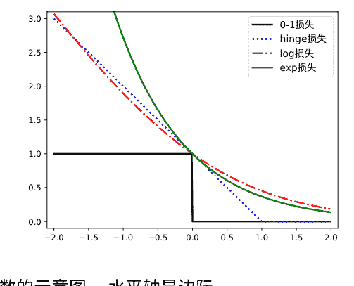

图4.2: 二元分类的各种损失函数的示意图。水平轴是边际 $z = \hat{y}\eta$，垂直轴是损失。0-1损失是 $I(z < 0)$。Hinge损失是 $\max(0, 1 - z)$。Log损失是 $\log_2(1 + e^{-z})$。指数损失是 $e^{-z}$。由 hinge_loss_plot.ipynb 生成。

## 4.4 其他估计方法 *

### 4.4.1 矩方法

计算MLE需要解方程 $\nabla_\theta \text{NLL}(\theta) = 0$。有时这在计算上很困难。在这种情况下，我们可以使用一种更简单的方法，称为矩方法(MOM)。在这种方法中，我们将分布的理论矩等同于经验矩，并解决得到的一组 $K$ 个同时方程，其中 $K$ 是参数的数量。理论矩由 $\mu_k = \mathbb{E}[Y^k]$ 给出，对于 $k = 1 : K$，经验矩由

$$ \hat{\mu}_k = \frac{1}{N} \sum_{n=1}^{N} y_n^k $$

因此，我们只需要解 $\mu_k = \hat{\mu}_k$ 对于每个 $k$。下面给出一些例子。

矩估计法简单，但在理论上不如最大似然估计法，因为它可能没有充分有效地使用所有数据。（有关这些理论结果的详细信息，请参见[CB02]等。）此外，它有时可能产生不一致的结果（见第4.4.1.2节）。然而，当它产生有效的估计时，它可以用于初始化用于优化NLL的迭代算法（例如，[AHK12]），从而结合了MOM的计算效率和MLE的统计准确性。

#### 4.4.1.1 示例：一元高斯的矩估计法

例如，考虑一元高斯分布的情况。根据第4.2.5节，我们有

$$ \mu_1 = \mu = \bar{y} $$

$$ \mu_2 = \sigma^2 + \mu^2 = s^2 $$

### 4.4.1.2 示例：均匀分布的MOM

在本节中，我们给出了应用于均匀分布的MOM的示例。我们的演示遵循维基百科页面。让 $Y \sim \mathrm{Unif}(\theta_1, \theta_2)$ 是一个均匀随机变量，所以

$$ p(y|\theta) = \frac{1}{\theta_2 - \theta_1} \mathbb{I}(\theta_1 \leq y \leq \theta_2) \quad (4.71) $$

前两个矩是

$$ \mu_1 = \mathbb{E}[Y] = \frac{1}{2}(\theta_1 + \theta_2) \quad (4.72) $$
$$ \mu_2 = \mathbb{E}[Y^2] = \frac{1}{3}(\theta_1^2 + \theta_1\theta_2 + \theta_2^2) \quad (4.73) $$

反转这些方程得到

$$ (\theta_1, \theta_2) = \left( \mu_1 - \sqrt{3(\mu_2 - \mu_1^2)}, 2\mu_1 - \theta_1 \right) \quad (4.74) $$

不幸的是，这个估计器有时会给出无效的结果。例如，假设 $\mathcal{D} = \{0, 0, 0, 0, 1\}$。经验矩是 $\hat{\mu}_1 = \frac{1}{5}$ 和 $\hat{\mu}_2 = \frac{1}{5}$，因此估计的参数为 $\hat{\theta}_1 = \frac{1}{5} - \frac{2\sqrt{3}}{5} = -0.493$ 和 $\hat{\theta}_2 = \frac{1}{5} + \frac{2\sqrt{3}}{5} = 0.893$。然而，这些不可能是正确的参数，因为如果 $\theta_2 = 0.893$，我们无法生成一个大小为1的样本。

相比之下，考虑最大似然估计。令 $y_{(1)} \leq y_{(2)} \leq \dots \leq y_{(N)}$ 为数据的排序统计量（即按升序排序的值）。令 $\theta = \theta_2 - \theta_1$。然后，似然函数由以下给出

$$ p(\mathcal{D}|\theta) = (\theta)^{-N} \mathbb{I} \left(y_{(1)} \geq \theta_1 \right) \mathbb{I} \left(y_{(N)} \leq \theta_2 \right) \quad (4.75) $$

在 $\theta$ 的允许范围内，对数似然函数的导数为

$$ \frac{d}{d\theta} \log p(\mathcal{D}|\theta) = -\frac{N}{\theta} < 0 \quad (4.76) $$

因此，似然函数是 $\theta$ 的递减函数，所以我们应该选择

$$ \hat{\theta}_1 = y_{(1)}, \hat{\theta}_2 = y_{(N)} \quad (4.77) $$

在上面的例子中，我们得到 $\hat{\theta}_1 = 0$ 和 $\hat{\theta}_2 = 1$，正如我们所预期的那样。

5. https://en.wikipedia.org/wiki/Method_of_moments_(statistics).

### 4.4.2 在线（递归）估计

如果整个数据集 $\mathcal{D}$ 在训练开始之前可用，我们称之为批量学习。 然而，在某些情况下，数据集以顺序方式到达，因此 $\mathcal{D} = \{\boldsymbol{y}_1, \boldsymbol{y}_2, \dots\}$ 以无界流的形式。 在这种情况下，我们希望进行在线学习。

让 $\hat{\boldsymbol{\theta}}_{t-1}$ 成为我们的估计（例如，MLE），给定 $\mathcal{D}_{1:t-1}$。 为了确保我们的学习算法每次更新都需要恒定的时间，我们需要找到一个形式为的学习规则
$$ \boldsymbol{\theta}_t = f(\hat{\boldsymbol{\theta}}_{t-1}, \boldsymbol{y}_t) \tag{4.78} $$
这被称为递归更新。 下面我们给出一些这样的在线学习方法的例子。

#### 4.4.2.1 示例：高斯分布均值的递归MLE

让我们重新考虑第4.2.5节中的示例，我们计算了单变量高斯分布的MLE。 我们知道均值的批量估计值为
$$ \hat{\mu}_t = \frac{1}{t} \sum_{n=1}^t y_n \tag{4.79} $$
这只是数据的一个累加和，因此我们可以轻松地将其转换为递归估计，如下所示：

$$ \hat{\mu}_t = \frac{1}{t} \sum_{n=1}^t y_n = \frac{1}{t} \left( (t-1)\hat{\mu}_{t-1} + y_t \right) \tag{4.80} $$
$$ = \hat{\mu}_{t-1} + \frac{1}{t} (y_t - \hat{\mu}_{t-1}) \tag{4.81} $$
这被称为移动平均。

从方程式(4.81)中我们可以看出，新的估计值是旧的估计值加上一个修正项。 随着样本数量的增加，修正的大小会逐渐减小。 然而，如果分布发生变化，我们希望更重视最近的数据示例。 我们将在第4.4.2.2节中讨论如何做到这一点。

#### 4.4.2.2 指数加权移动平均

方程式(4.81)展示了如何计算信号的移动平均值。在本节中，我们将展示如何调整这个计算方法，以便更重视最近的示例。 具体而言，我们将计算以下指数加权移动平均值或EWMA，也称为指数移动平均值或EMA：

$$ \hat{\mu}_t = \beta \hat{\mu}_{t-1} + (1-\beta) y_t \tag{4.82} $$
其中 $0 < \beta < 1$。过去 $k$ 步的数据点的贡献由 $\beta^k (1-\beta)$ 加权。 因此，旧数据的贡献呈指数下降。具体而言，我们有

$$ \hat{\mu}_t = \beta \hat{\mu}_{t-1} + (1-\beta) y_t \tag{4.83} $$
$$ = \beta^2 \hat{\mu}_{t-2} + \beta (1-\beta) y_{t-1} + (1-\beta) y_t \tag{4.84} $$
$$ = \beta^t y_0 + (1-\beta) \beta^{t-1} y_1 + \cdots + (1-\beta) \beta y_{t-1} + (1-\beta) y_t \tag{4.85} $$

作者：Kevin P. Murphy。 (C) MIT Press. CC-BY-NC-ND许可证

图4.3: 带有和不带有偏差校正的指数加权移动平均的示意图。(a)短期记忆: β=0.9，(b)长期记忆: β=0.99。由ema_demo.ipynb生成。

几何级数的和为

$$
\beta^t + \beta^{t-1} + \cdots + \beta^1 + \beta^0 = \frac{1 - \beta^{t+1}}{1 - \beta}
$$ (4.86)

因此

$$
(1 - \beta) \sum_{k=0}^{t} \beta^k = (1 - \beta) \frac{1 - \beta^{t+1}}{1 - \beta} = 1 - \beta^{t+1}
$$ (4.87)

由于 0 < β < 1，当 t → ∞ 时，我们有 β^{t+1} → 0，因此较小的 β 更快地忘记过去，并更快地适应最近的数据。这在图4.3中有所说明。

由于初始估计从 \hat{\mu}_0 = 0 开始，存在初始偏差。可以通过以下方式进行缩放来纠正这个问题 [KB15]：

$$
\tilde{\mu}_t = \frac{\hat{\mu}_t}{1 - \beta^t}
$$ (4.88)

(请注意，在方程 (4.82) 中的更新仍然应用于未经校正的EMA，\hat{\mu}_{t-1}，在校正为当前时间步之前。) 这样做的好处在图4.3中有所说明。

## 4.5 正则化

MLE和ERM的一个基本问题是，它们会尝试选择使训练集上损失最小化的参数，但这可能不会导致模型在未来数据上具有较低的损失。这被称为过拟合。

举个简单的例子，假设我们想预测抛硬币时出现正面的概率。我们抛硬币 N=3 次，观察到3次正面。MLE是 \hat{\theta}_{mle} = N_1/(N_0 + N_1) = 3/(3 + 0) = 1 (见第4.2.3节)。然而，如果我们使用 Ber(y|\hat{\theta}_{mle})进行预测，我们将预测所有未来的硬币抛掷都是正面，这似乎相当不可能。

问题的核心是模型具有足够的参数来完美拟合观测到的训练数据，因此它可以完美匹配经验分布。然而，在大多数情况下，经验分布与真实分布不同，因此将所有概率质量放在观测到的N个示例上将不会留下任何概率用于未来的新数据。也就是说，模型可能无法泛化。

解决过拟合的主要方法是使用正则化，这意味着向NLL（或经验风险）中添加惩罚项。因此，我们优化的目标形式为

$$
\mathcal{L}(\boldsymbol{\theta}; \lambda) = \left[ \frac{1}{N} \sum_{n=1}^{N} \ell(\boldsymbol{y}_n, \boldsymbol{\theta}; \boldsymbol{x}_n) \right] + \lambda C(\boldsymbol{\theta})
$$ (4.89)

其中 $\lambda \geq 0$ 是正则化参数，$C(\boldsymbol{\theta})$ 是某种形式的复杂度惩罚。常见的复杂度惩罚是使用 $C(\boldsymbol{\theta}) = -\log p(\boldsymbol{\theta})$，其中 $p(\boldsymbol{\theta})$ 是 $\boldsymbol{\theta}$ 的先验分布。如果 $\ell$ 是对数损失函数，则正则化目标变为

$$
\mathcal{L}(\boldsymbol{\theta}; \lambda) = -\frac{1}{N} \sum_{n=1}^{N} \log p(\boldsymbol{y}_n|\boldsymbol{x}_n, \boldsymbol{\theta}) - \lambda \log p(\boldsymbol{\theta})
$$ (4.90)

通过设置 $\lambda = 1$ 并适当缩放 $p(\boldsymbol{\theta})$，我们可以等效地最小化以下内容：

$$
\mathcal{L}(\boldsymbol{\theta}; \lambda) = -\left[ \sum_{n=1}^{N} \log p(\boldsymbol{y}_n|\boldsymbol{x}_n, \boldsymbol{\theta}) + \log p(\boldsymbol{\theta}) \right] = -[\log p(\mathcal{D}|\boldsymbol{\theta}) + \log p(\boldsymbol{\theta})]
$$ (4.91)

最小化这个等价于最大化对数后验概率：

$$
\hat{\boldsymbol{\theta}} = \arg\max_{\boldsymbol{\theta}} \log p(\boldsymbol{\theta}|\mathcal{D}) = \arg\max_{\boldsymbol{\theta}} [\log p(\mathcal{D}|\boldsymbol{\theta}) + \log p(\boldsymbol{\theta}) - \text{const}]
$$ (4.92)

这被称为MAP估计，即最大后验估计。

### 4.5.1 例子：伯努利分布的MAP估计

再次考虑抛硬币的例子。如果我们只观察到一个正面，最大似然估计是 $\theta_{\text{mle}} = 1$，这预测未来的硬币抛掷也会出现正面。为了避免过拟合，我们可以对 $\theta$ 添加惩罚，以阻止“极端”值，例如 $\theta = 0$ 或 $\theta = 1$。我们可以通过使用贝塔分布作为我们的先验分布，$p(\theta) = \text{Beta}(\theta|a, b)$，其中 $a, b > 1$ 鼓励 $\theta$ 接近 $a/(a+b)$（详见第2.7.4节）。对数似然加上对数先验变为

$$
\ell(\theta) = \log p(\mathcal{D}|\theta) + \log p(\theta)
$$ (4.93)
$$
= [N_1 \log \theta + N_0 \log (1-\theta)] + [(a-1) \log(\theta) + (b-1) \log(1-\theta)]
$$ (4.94)

使用4.2.3节中的方法，我们发现MAP估计是

$$
\theta_{\text{map}} = \frac{N_1 + a - 1}{N_1 + N_0 + a + b - 2}
$$ (4.95)

如果我们设置 \(a = b = 2\)（这有利于 \(\theta\)接近0.5的值），估计结果为

$$
\theta_{\text{map}} = \frac{N_1 + 1}{N_1 + N_0 + 2}
$$ (4.96)

这被称为加一平滑，是一种简单但广泛使用的技术，用于避免零计数问题。（另见4.6.2.9节。）

零计数问题，以及过度拟合问题，类似于哲学中的一个问题，称为黑天鹅悖论。这基于古代西方的观念，认为所有的天鹅都是白色的。在那个背景下，黑天鹅是指那些不可能存在的事物的隐喻。（黑天鹅在17世纪由欧洲探险家在澳大利亚发现。）“黑天鹅悖论”一词最早由著名的科学哲学家卡尔·波普尔提出；这个术语也被用作最近一本流行书的标题[Tal07]。这个悖论被用来说明归纳问题，即如何从过去的具体观察中得出关于未来的一般结论的问题。解决这个悖论的方法是承认归纳一般上是不可能的，我们所能做的最好的就是通过将经验数据与先验知识相结合，对未来可能发生的事情进行合理的猜测。

### 4.5.2 示例：多元高斯分布的MAP估计 *

在第4.2.6节中，我们展示了MVN均值的MLE是经验均值，\(\hat{\mu}_{\text{mle}} = \bar{\mathbf{y}}\)。我们还展示了协方差的MLE是经验协方差，\(\hat{\mathbf{\Sigma}} = \frac{1}{N} \mathbf{S}_{\bar{\mathbf{y}}}\)。
在高维情况下，对 \(\mathbf{\Sigma}\)的估计很容易变成奇异的。解决这个问题的一种方法是进行MAP估计，如下所述。

#### 4.5.2.1 收缩估计

用于 \(\mathbf{\Sigma}\)的方便先验是逆Wishart先验。这是一个正定矩阵的分布，其中参数是用先验散布矩阵 \(\mathbf{S}\)和先验样本大小或强度 \(\breve{N}\)来定义的。可以证明得到的MAP估计为

$$
\hat{\mathbf{\Sigma}}_{\text{map}} = \frac{\mathbf{S} + \mathbf{S}_{\bar{\mathbf{y}}}}{\breve{N} + N} = \frac{\breve{N}}{\breve{N} + N} \frac{\mathbf{S}}{\breve{N}} + \frac{N}{\breve{N} + N} \frac{\mathbf{S}_{\bar{\mathbf{y}}}}{N} = \lambda \mathbf{\Sigma}_0 + (1-\lambda)\hat{\mathbf{\Sigma}}_{\text{mle}}
$$ (4.97)

其中 \(\lambda = \frac{\breve{N}}{\breve{N} + N}\)控制正则化的程度。

常见的选择（见例如，[FR07， p6]）是使用先验散射矩阵 \(\mathbf{S} = \breve{N} \text{diag}(\hat{\mathbf{\Sigma}}_{\text{mle}})\)。
根据这个选择，我们发现 \(\mathbf{\Sigma}\)的MAP估计值为

$$
\hat{\mathbf{\Sigma}}_{\text{map}}(i, j) = \begin{cases} \hat{\mathbf{\Sigma}}_{\text{mle}}(i, j) & \text{如果 } i = j \\ (1-\lambda) \hat{\mathbf{\Sigma}}_{\text{mle}}(i, j) & \text{otherwise} \end{cases}
$$ (4.98)

因此，我们可以看到对角线元素等于它们的最大似然估计值，而非对角线元素则被“收缩”到0附近。因此，这种技术被称为收缩估计。

我们需要设置的另一个参数是\(\lambda\)，它控制着正则化的程度（向MLE收缩）。通常通过交叉验证（第4.5.5节）来设置\(\lambda\)。或者，我们可以使用[LW04a; LW04b; SS05]中提供的闭式公式，这是最优的。

如果我们使用平方损失，那么这是频率估计。这在sklearn函数中实现https://scikit-learn.org/stable/modules/generated/sklearn.covariance.LedoitWolf.html。

这种方法的益处在图4.4中说明。我们考虑将50维高斯分布拟合到 N= 100, N= 50和 N= 25个数据点。我们看到MAP估计总是良好条件的，不像MLE（有关条件数的讨论请参见第7.1.4.4节）。特别是，我们看到MAP估计的特征值谱与真实矩阵的特征值谱更接近，而MLE的特征值谱则不是。然而，特征向量不受影响。

### 4.5.3 示例：权重衰减

在图1.7中，我们看到使用过高次数的多项式回归会导致过拟合。一种解决方法是降低多项式的次数。然而，一种更一般的解决方法是对权重（回归系数）的大小进行惩罚。我们可以通过使用零均值的高斯先验 p(w)来实现这一点。得到的MAP估计如下所示

$$
\hat{w}_{\text{map}} = \underset{w}{\text{argmin}} \ \text{NLL}(w) + \lambda ||w||_2^2
$$ (4.99)

(我们使用w而不是 θ，因为只有对权重向量的大小进行惩罚才有意义，而不是其他参数，如偏置项或噪声方差。) 方程 (4.99) 被称为 ℓ₂正则化或权重衰减。λ的值越大，参数被惩罚得越多，因为它们“大”（偏离零均值先验），因此模型的灵活性越小。

在线性回归的情况下，这种惩罚方案被称为岭回归。例如，考虑第1.2.2.2节中的多项式回归示例，其中预测变量的形式为

$$
f(x; w) = \sum_{d=0}^{D} w_d x^d = w^\top [1, x, x^2, \ldots, x^D]
$$ (4.100)

> 作者: Kevin P. Murphy. (C) MIT Press. CC-BY-NC-ND许可证

图4.5: (a-c) 应用于21个数据点的14次多项式拟合的岭回归。(d) MSE vs 正则化器强度。正则化的程度从左到右递增，因此模型复杂度从左到右递减。由linreg_poly_ridge.ipynb生成。

假设我们使用高次多项式，比如 D= 14，即使我们只有一个小数据集，只有 N= 21个例子。对于参数的最大似然估计将使模型能够非常好地拟合数据，通过仔细调整权重，但是得到的函数非常“抖动”，从而导致过拟合。图4.5说明了增加 λ可以减少过拟合的情况。有关岭回归的更多细节，请参见第11.3节。

### 4.5.4 使用验证集选择正则化器

在使用正则化时一个关键问题是如何选择正则化器的强度 λ：一个小的值意味着我们将专注于最小化经验风险，这可能导致过拟合，而一个大的值意味着我们将专注于保持接近先验，这可能导致欠拟合。

在本节中，我们描述了一种简单但非常广泛使用的选择 λ的方法。基本思想是将数据分为两个不相交的集合，训练集 D_train和验证集 D_valid（也称为开发集）。（通常我们将约80%的数据用于训练集，和20%用于验证集。我们在D_train上拟合模型（对于每个λ的设置），然后评估其在D_valid上的性能。然后我们选择导致最佳验证性能的λ的值。（这种优化方法是网格搜索的一个一维示例，详见第8.8节）。为了更详细地解释该方法，我们需要一些符号表示。让我们定义数据集上的正则化经验风险如下：

$$
R_{\lambda}(\boldsymbol{\theta}, \mathcal{D}) = \frac{1}{|\mathcal{D}|} \sum_{(\mathbf{x}, y) \in \mathcal{D}} \mathrm{L}(y, f(\mathbf{x}; \boldsymbol{\theta})) + \lambda C(\boldsymbol{\theta})
$$ (4.101)

对于每个λ，我们计算参数估计

$$
\hat{\boldsymbol{\theta}}_{\lambda}(\mathcal{D}_{\text{train}}) = \arg\min_{\boldsymbol{\theta}} R_{\lambda}(\boldsymbol{\theta}, \mathcal{D}_{\text{train}})
$$ (4.102)

然后我们计算 验证风险 ：

$$
R_{\lambda}^{\text{val}} \triangleq R_{0}(\hat{\boldsymbol{\theta}}_{\lambda}(\mathcal{D}_{\text{train}}), \mathcal{D}_{\text{valid}})
$$ (4.103)

这是对总体风险的估计，总体风险是在真实分布下的期望损失$p^{*}(\mathbf{x}, y)$。最后我们选择

$$
\lambda^{*} = \arg\min_{\lambda \in S} R_{\lambda}^{\text{val}}
$$ (4.104)

（这需要对每个 λ在 S的值进行一次模型拟合，尽管在某些情况下，这可以更高效地完成。）

在选择 λ* 之后，我们可以重新拟合整个数据集的模型， $\mathcal{D} = \mathcal{D}_{\text{train}} \cup \mathcal{D}_{\text{valid}}$，以获得

$$
\hat{\boldsymbol{\theta}}^{*} = \arg\min_{\boldsymbol{\theta}} R_{\lambda^{*}}(\boldsymbol{\theta}, \mathcal{D})
$$ (4.105)

### 4.5.5 交叉验证

上述技术在第4.5.4节中可以很好地工作。然而，如果训练集的大小较小，将20%留作验证集可能会导致模型参数的不可靠估计。

解决这个问题的一个简单但流行的方法是使用交叉验证（CV）。其思想如下：我们将训练数据分成$K$个折叠；然后，对于每个折叠$k∈\{1,…,K\}$，我们在除了第$k$个折叠之外的所有折叠上进行训练，并在第$k$个折叠上进行测试，以循环方式进行，如图4.6所示。形式上，我们有

$$
R_\lambda^{cv} \triangleq \frac{1}{K} \sum_{k=1}^{K} R_0(\hat{\theta}_\lambda(D_{-k}), D_k)
$$ (4.106)

其中$D_k$是第$k$个折叠中的数据，$D_{-k}$是其他所有数据。这被称为交叉验证风险。图4.6说明了$K=5$的这个过程。如果我们设置$K=N$，我们得到一种称为留一法交叉验证的方法，因为我们总是在$N-1$个样本上进行训练，并在剩下的一个样本上进行测试。

我们可以在优化过程中使用CV估计作为目标，以选择最优的超参数 $\hat{\lambda} = \arg\min_\lambda R_\lambda^{cv}$。最后，我们将所有可用的数据（训练和验证）组合起来，并使用 $\hat{\theta} = \arg\min_\theta \hat{R}_\lambda(\theta, \mathcal{D})$重新估计模型参数。

详细信息请参见第5.4.3节。

#### 4.5.5.1 一标准误差规则

CV提供了 $\hat{R}_\lambda$的估计，但不提供任何不确定性的度量。估计的标准频率论不确定性度量是均值的标准误差，它是估计的抽样分布的均值（参见第4.7.1节）。我们可以按以下方式计算它。首先，让 $L_n = \ell(y_n, f(x_n; \hat{\theta}_\lambda(\mathcal{D}_{-n})))$ 为第$n$个示例的损失，其中我们使用了使用排除$n$的任何训练折叠估计的参数。（注意 $L_n$取决于 $\lambda$，但我们在符号中省略了这一点。）接下来，让 $\hat{\mu} = \frac{1}{N} \sum_{n=1}^{N} L_n$ 是经验均值， $\hat{\sigma}^2 = \frac{1}{N} \sum_{n=1}^{N} (L_n - \hat{\mu})^2$ 是经验方差。基于此，我们定义我们的估计为 $\hat{\mu}$，并且该估计的标准误差为 $\text{se}(\hat{\mu}) = \frac{\hat{\sigma}}{\sqrt{N}}$。注意，$\hat{\sigma}$ 衡量了样本之间的固有变异性，而 $\text{se}(\hat{\mu})$ 衡量了我们对均值 $\hat{\mu}$ 的不确定性。

假设我们将CV应用于一组模型，并计算其估计风险的均值和标准误差。从这些嘈杂的估计中选择一个模型的常见启发式方法是选择对应于最简单模型的值，其风险不超过最佳模型的一个标准误差；这被称为one-standard error rule[HTF01, p216]。

#### 4.5.5.2 示例：岭回归

举个例子，考虑在第4.5.3节中选择岭回归问题的正则化强度 $\ell_2$。在图4.7a中，我们绘制了训练集上的误差与 $\log(\lambda)$ 的关系（蓝色曲线）以及测试集上的误差与 $\log(\lambda)$ 的关系（红色曲线）。我们可以看到测试误差呈现出U形曲线，随着正则化项的增加而减小，然后在欠拟合时增大。在图4.7b中，我们绘制了5折交叉验证估计的测试均方误差与 $\log(\lambda)$ 的关系。我们可以看到最小的交叉验证误差接近测试集的最优值（尽管由于样本量较小，它低估了大lambda值下测试误差的峰值）。

### 4.5.6 提前停止

一种非常简单的正则化形式，在实践中通常非常有效（特别是对于复杂模型），被称为提前停止。这利用了优化算法的特性。

图4.7: 对21个数据点在图4.5中展示的14次多项式拟合应用岭回归对不同的正则化参数 λ进行拟合。正则化的程度从左到右递增，因此模型的复杂度从左到右递减。(a) 训练集均方误差（蓝色）和测试集均方误差（红色）与 log(λ)的关系。(b) 5折交叉验证估计的测试集均方误差；误差条表示均值的标准误差。垂直线是根据一标准误差规则选择的点。由polyfitRidgeCV.ipynb生成。

迭代的过程需要很多步骤才能远离初始参数估计。如果我们检测到过拟合的迹象（通过监控验证集上的性能），我们可以停止优化过程，以防止模型过多地记住训练集的信息。请参见图4.8进行说明。

### 4.5.7 使用更多数据

随着数据量的增加，过拟合的机会（对于固定复杂度的模型）会减少（假设数据包含适当信息的示例，并且不太冗余）。这在图4.9中有所说明。我们展示了四个不同模型（递增次数的多项式）在训练集和测试集上的均方误差（MSE）随训练集大小 N的变化。（错误率与训练集大小的图称为学习曲线。）水平的黑线代表贝叶斯错误率，即由于固有噪声而产生的最佳预测器（真实模型）的错误率。（在这个例子中，真实模型是一个二次多项式，噪声的方差为 σ²= 4；这被称为噪声底线，因为我们无法降低它。）

我们注意到几个有趣的事情。首先，一阶的测试误差仍然很高，即使 N增加，因为模型过于简单无法捕捉真实情况；这被称为欠拟合。其他模型的测试误差降低到最佳水平（噪声底线），但对于简单模型来说，它们的降低速度更快，因为它们需要估计的参数更少。随着 N的增长，更复杂的模型的测试误差和训练误差之间的差距变大，但随着N的增长，这个差距减小。

我们还可以注意到另一个有趣的事情，即训练误差（蓝线）最初随着N的增加而增加，至少对于足够灵活的模型来说是如此。原因如下：随着数据集的增大，我们观察到更多不同的输入-输出模式组合，因此拟合数据的任务变得更加困难。然而，最终训练集将与测试集相似，而

图4.8: 文本分类器（使用平均池化应用于词袋嵌入的神经网络）在IMDB电影情感数据集上的训练轮次与性能对比。蓝色=训练，红色=验证。(a) 交叉熵损失。大约在第25轮次时触发了早停。(b) 分类准确率。由imdb_mlp_bow_tf.ipynb生成。

图4.9: 训练集和测试集的均方误差与训练集大小的关系，数据由具有方差 σ²=4 的二次多项式生成。我们对这些数据拟合了不同次数的多项式模型。由linreg_poly_vs_n.ipynb生成。

## 4.6 贝叶斯统计学 *

到目前为止，我们已经讨论了几种从数据中估计参数的方法。然而，这些方法忽略了估计值的不确定性，在某些应用中可能很重要，比如主动学习、避免过拟合，或者只是想知道对某个科学意义的估计有多少信任。在统计学中，使用概率分布来建模参数的不确定性（而不仅仅是计算一个点估计）被称为推断。

在本节中，我们使用后验分布来表示我们的不确定性。这是贝叶斯统计学领域采用的方法。我们在这里简要介绍一下，但更详细的内容可以在本书的续集[Mur23]以及其他好书中找到，比如[Lam18; Kru15; McE20; Gel+14; MKL21; MFR20]。

为了计算后验概率，我们从先验分布 p(θ)开始，它反映了我们在看到数据之前的知识。然后我们定义一个似然函数 p(D|θ)，它反映了在每个参数设置下我们期望看到的数据。然后我们使用贝叶斯规则将先验条件化为观察到的数据，计算后验概率 p(θ|D)如下：

$$p(θ|D) = \frac{p(θ)p(D|θ)}{p(D)} = \frac{p(θ)p(D|θ)}{\int p(θ')p(D|θ')dθ'}$$

分母 p(D)被称为边际似然，因为它通过对未知参数 θ进行边际化（或积分）来计算。这可以解释为数据的平均概率，其中平均是相对于先验的。然而，请注意 p(D)是一个常数，与θ无关，因此当我们只想推断θ值的相对概率时，我们经常忽略它。

公式 (4.107) 类似于第2.3.1节中用于COVID-19测试的贝叶斯规则的使用。不同之处在于未知数对应于统计模型的参数，而不是患者的未知疾病状态。此外，我们通常会对一组观测条件进行条件约束 D，而不是单个观测（例如单个测试结果）。特别是对于有监督或条件模型，观测数据的形式为 D = {(x_n, y_n) : n = 1 : N}。对于无监督或无条件模型，观测数据的形式为 D = {(y_n) : n = 1 : N}。

一旦我们计算出参数的后验概率，我们可以通过对未知参数进行边际化来计算给定输入的后验预测分布的输出。在有监督/条件情况下，这变成了

$$p(y|x, D) = \int p(y|x, θ)p(θ|D)dθ$$

这可以被看作是一种贝叶斯模型平均 (BMA) 的形式，因为我们使用了一个无限集合的模型 (参数值) 进行预测，每个模型的权重由其可能性决定。使用BMA可以降低过拟合的风险 (第1.2.3节)，因为我们不仅仅使用最佳模型。

### 4.6.1 共轭先验

在本节中，我们考虑一组（先验，似然）对，可以通过闭式计算后验概率。特别地，我们将使用与似然函数“共轭”的先验。我们说

如果后验概率与先验在相同的参数化族中，即 $p(\boldsymbol{\theta}|\mathcal{D}) \in \mathcal{F}$，则先验 $p(\boldsymbol{\theta})\in\mathcal{F}$ 是似然函数 $p(\mathcal{D}|\boldsymbol{\theta})$ 的共轭先验。换句话说，$\mathcal{F}$ 在贝叶斯更新下是封闭的。如果族 $\mathcal{F}$ 对应于指数族（在第3.4节中定义），则计算可以以闭式形式进行。

在下面的章节中，我们给出了一些常见的例子，这些例子我们将在本书中后面使用。为了简单起见，我们将重点放在无条件模型上（即只有结果或目标 $y$，没有输入或特征 $\boldsymbol{x}$）；我们在第4.6.7节中放宽了这个假设。

### 4.6.2 二项分布模型

假设我们投掷一枚硬币 $N$ 次，并且想要推断出正面的概率。令 $y_n=1$ 表示第 $n$ 次试验是正面，$y_n=0$ 表示第 $n$ 次试验是反面，令 $\mathcal{D}=\{y_n; n=1:N\}$ 表示所有的数据。我们假设 $y_n \sim \text{Ber}(\theta)$，其中 $\theta \in [0,1]$ 是速率参数（正面的概率）。在本节中，我们讨论如何计算 $p(\theta|\mathcal{D})$。

### 4.6.2.1 伯努利似然

我们假设数据是独立同分布的或独立同分布的。因此，似然函数具有以下形式

$$p(\mathcal{D}|\theta) = \prod_{n=1}^{N} \theta^{y_n} (1-\theta)^{1-y_n} = \theta^{N_1} (1-\theta)^{N_0}$$ (4.109)

其中我们定义 $N_1 = \sum_{n=1}^{N} \mathbb{I}(y_n=1)$ 和 $N_0 = \sum_{n=1}^{N} \mathbb{I}(y_n=0)$，表示正面和反面的数量。这些计数被称为数据的充分统计量，因为这是我们关于 $\mathcal{D}$ 需要知道的全部信息来推断 $\theta$。总计数，$N = N_0 + N_1$，被称为样本大小。

### 4.6.2.2 二项式似然

请注意，我们还可以考虑一个二项式似然模型，在该模型中，我们进行 $N$ 次试验并观察到正面朝上的次数，$y$，而不是观察到一系列硬币抛掷结果。现在似然函数的形式如下：

$$p(\mathcal{D}|\theta) = \text{Bin}(y|N, \theta) = \binom{N}{y} \theta^{y} (1-\theta)^{N-y}$$ (4.110)

缩放因子 $\binom{N}{y}$ 与 $\theta$ 无关，所以我们可以忽略它。因此，这个似然函数与方程（4.109）中的伯努利似然函数成比例，因此我们对 $\theta$ 的推断对于两个模型都是相同的。

### 4.6.2.3 先验

为了简化计算，我们假设先验分布 $p(\theta) \in \mathcal{F}$ 是似然函数 $p(\mathbf{y}|\theta)$ 的共轭先验。这意味着后验分布与先验分布属于同一参数化族，即 $p(\theta|\mathcal{D}) \in \mathcal{F}$。

图4.10: 使用具有足够统计量的伯努利似然更新 $Beta$先验 $N_1= 4$, $N_0= 1$. (a) $Beta(2,2)$先验. (b)均匀 $Beta(1,1)$ 先验. 由 `beta_binom_post_plot.ipynb` 生成.

为了确保在使用伯努利（或二项式）似然时具有这种属性，我们应该使用以下形式的先验:

$$p(\theta) \propto \theta^{\check{\alpha}-1}(1-\theta)^{\check{\beta}-1} \propto Beta(\theta|\check{\alpha}, \check{\beta})$$

我们将其识别为贝塔分布的概率密度函数（参见第2.7.4节）。

### 4.6.2.4 后验

如果我们将方程 (4.109) 中的伯努利似然函数与方程 (2.136) 中的贝塔先验相乘, 我们得到一个贝塔后验:

$$\begin{aligned}
p(\theta|\mathcal{D}) &\propto \theta^{N_1}(1-\theta)^{N_0} \theta^{\check{\alpha}-1}(1-\theta)^{\check{\beta}-1} && (4.112)\\
&\propto Beta(\theta|\check{\alpha}+N_1, \check{\beta}+N_0) && (4.113)\\
&= Beta(\theta|\widehat{\alpha}, \widehat{\beta}) && (4.114)
\end{aligned}$$

其中 $\widehat{\alpha}\triangleq\check{\alpha}+N_1$和 $\widehat{\beta}\triangleq\check{\beta}+N_0$是后验的参数。由于后验与先验具有相同的函数形式，我们称贝塔分布是伯努利似然函数的共轭先验。

先验参数被称为超参数. 很明显 (在这个例子中) 超参数起到了类似于充分统计量的作用; 因此它们经常被称为伪计数. 我们可以通过将观测计数 (来自似然) 加上伪计数 (来自先验) 来计算后验.

先验的强度由 $\check{N}=\check{\alpha}+\check{\beta}$控制; 这被称为等效样本大小, 因为它起到了类似于观测样本大小的作用 $N = N_0 + N_1$.

使用这个先验的效果在图4.10a中有所展示。我们可以看到后验概率（蓝线）是先验概率（红线）和似然函数（黑线）的“折中”。如果我们设置 $\check{\alpha}=\check{\beta}=1$，相应的先验概率就变成了均匀分布：

$$p(\theta) = \text{Beta}(\theta|1,1) \propto \theta^0(1-\theta)^0 = \text{Unif}(\theta|0,1) \qquad (4.115)$$

使用这个先验的效果在图4.10b中有所展示。我们可以看到后验概率与似然函数具有完全相同的形状，因为先验概率是“不具信息性的”。

### 4.6.2.6 后验模式 (MAP估计)

参数的最可能值由MAP估计给出

$$\begin{aligned}
\hat{\theta}_{\text{map}} &= \arg \max_{\theta} p(\theta|\mathcal{D}) \qquad (4.116)\\
&= \arg \max_{\theta} \log p(\theta|\mathcal{D}) \qquad (4.117)\\
&= \arg \max_{\theta} \log p(\theta) + \log p(\mathcal{D}|\theta) \qquad (4.118)
\end{aligned}$$

使用微积分，可以证明这是由

$$\hat{\theta}_{\text{map}} = \frac{\check{\alpha}+N_1-1}{\check{\alpha}+N_1-1+\check{\beta}+N_0-1} \qquad (4.119)$$

如果我们使用 $\text{Beta}(\theta|2,2)$先验，这相当于add-one smoothing:

$$\hat{\theta}_{\text{map}} = \frac{N_1+1}{N_1+1+N_0+1} = \frac{N_1+1}{N+2} \qquad (4.120)$$

如果我们使用均匀先验，$p(\theta) \propto 1$，MAP估计变为MLE，因为$\log p(\theta)=0$:

$$\hat{\theta}_{\text{mle}} = \arg \max_{\theta} \log p(\mathcal{D}|\theta) \qquad (4.121)$$

当我们使用Beta先验时，均匀分布为 $\check{\alpha}=\check{\beta}=1$。在这种情况下，MAP估计缩减为MLE:

$$\hat{\theta}_{\text{mle}} = \frac{N_1}{N_1+N_0} = \frac{N_1}{N} \qquad (4.122)$$

如果 $N=0$，我们将估计 $p(Y=1)=0.0$，这意味着我们不预测任何未来观测值为1。这是一个非常极端的估计，可能是由于数据不足造成的。我们可以使用更强的先验进行MAP估计来解决这个问题，或者使用完全贝叶斯方法，在其中我们对 $\theta$进行边缘化而不是估计它，如第4.6.2.9节所解释的。

### 4.6.2.7 后验均值

后验模式可能是后验的一个糟糕的摘要，因为它对应于一个单点。后验均值是一个更稳健的估计，因为它整合了整个空间。

如果先验分布为Beta($\theta| \widehat{\alpha}, \widehat{\beta}$)，那么后验均值为

$\overline{\theta} \triangleq \mathbb{E}[\theta|\mathcal{D}] = \frac{\widehat{\alpha}}{\widehat{\beta} + \widehat{\alpha}} = \frac{\widehat{\alpha}}{\widehat{N}}$

其中 $\widehat{N}=\widehat{\beta} + \widehat{\alpha}$是后验的强度（等效样本大小）。

我们将证明后验均值是先验均值和MLE的凸组合: $\hat{\theta}_{\text{mle}} = N_1 / N$

$\mathbb{E}[\theta|\mathcal{D}] = \frac{\widehat{\alpha} + N_1}{\widehat{\alpha} + N_1 + \widehat{\beta} + N_0} = \frac{\breve{N} m + N_1}{N + \breve{N}} = \frac{\breve{N}}{N + \breve{N}} m + \frac{N}{N + \breve{N}} \frac{N_1}{N} = \lambda m + (1 - \lambda)\hat{\theta}_{\text{mle}}$

其中 $\lambda = \widehat{N} / \breve{N}$ 是先验与后验等效样本量的比率。因此，先验越弱，$\lambda$越小，因此后验均值越接近MLE。

### 4.6.2.8 后验方差

为了捕捉我们估计的不确定性，一种常见的方法是计算估计的标准误差，即后验标准差：

$\text{se}(\theta) = \sqrt{\mathbb{V}[\theta|\mathcal{D}]}$

在伯努利模型的情况下，我们证明了后验是一个贝塔分布。贝塔后验的方差由以下公式给出：

$\mathbb{V}[\theta|\mathcal{D}] = \frac{\widehat{\alpha}\widehat{\beta}}{(\widehat{\alpha} + \widehat{\beta})^2(\widehat{\alpha} + \widehat{\beta} + 1)} = \mathbb{E}[\theta|\mathcal{D}]^2 \frac{\widehat{\beta}}{\widehat{\alpha}(1+ \widehat{\alpha} + \widehat{\beta})}$

如果$N \gg \widehat{\alpha} + \widehat{\beta}$，这简化为

$\mathbb{V}[\theta|\mathcal{D}] \approx \frac{N_1 N_0}{N^3} = \frac{\hat{\theta}(1 - \hat{\theta})}{N}$

其中 $\hat{\theta} $是MLE。因此，标准误差由以下给出

$\sigma = \sqrt{\mathbb{V}[\theta|\mathcal{D}]} \approx \sqrt{\frac{\hat{\theta}(1 - \hat{\theta})}{N}}$

我们看到不确定性以 1/N的速率下降。 $\sqrt{\frac{1}{N}}$ 我们还看到不确定性（方差）在 $\hat{\theta}=0.5$时达到最大值，并在 $\hat{\theta}$接近0或1时达到最小值。这是有道理的，因为确定一个硬币是否有偏差比确定它是否公平要容易。

### 4.6.2.9 后验预测

假设我们想要预测未来的观测结果。一个非常常见的方法是首先基于训练数据计算参数的估计值 $\hat{\theta}(D)$，然后将该参数插入模型中并使用条件概率 $p(y|\hat{\theta})$来预测未来的结果；这被称为插值近似。然而，这可能导致过拟合。举个极端的例子，假设我们连续观测到 $N=3$个正面。最大似然估计值为 $\hat{\theta}=3/3=1$。然而，如果我们使用这个估计值，我们会预测出现反面是不可能的。

解决这个问题的一种方法是计算最大后验估计值，并将其插入模型中，正如我们在第4.5.1节中讨论的那样。在这里，我们讨论一种完全贝叶斯的解决方案，即对 $\theta$进行边缘化。

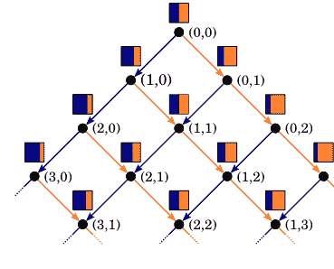

图4.11：顺序贝叶斯更新的beta-Bernoulli模型示例。每个彩色框代表预测分布 $p(x_t|h_t)$，其中 $h_t=(N_{1,t}, N_{0,t})$是从观测历史中得出的充分统计量，即正面和反面的总数。正面的概率（蓝色柱状图）由 $p(x_t=1|h_t)=(N_{t,1}+1)/(t+2)$给出，假设我们从均匀分布 $Beta(\theta|1,1)$开始。

> 来自[Ort+19]的图3。在Pedro Ortega的友好许可下使用。

## 伯努利模型

对于伯努利模型，得到的后验预测分布的形式为

$$
\begin{aligned}
p(y=1|\mathcal{D}) &= \int_0^1 p(y=1|\theta)p(\theta|\mathcal{D}) d\theta & (4.129) \\
&= \int_0^1 \theta\; \text{Beta}(\theta|\widehat{\alpha}, \widehat{\beta}) d\theta = \mathbb{E}[\theta|\mathcal{D}] = \frac{\widehat{\alpha}}{\widehat{\alpha}+\widehat{\beta}} & (4.130)
\end{aligned}
$$

在第4.5.1节中，我们不得不使用Beta(2,2)先验来恢复加一平滑，这是一个相当不自然的先验。在贝叶斯方法中，我们可以使用均匀先验 $p(\theta)=Beta(\theta|1,1)$来获得相同的效果，因为预测分布变为

$$
\begin{aligned}
p(y=1|\mathcal{D}) &= \frac{N_1+1}{N_1+N_0+2} & (4.131)
\end{aligned}
$$

这被称为拉普拉斯的继承规则。请参见图4.11，以了解在顺序设置中的示例。

## 二项模型

现在假设我们有兴趣预测 $M>1$ 未来抛硬币的次数试验，即我们使用二项模型而不是伯努利模型。在 $\theta$ 上的后验与之前相同，但后验预测分布不同：

$$
\begin{aligned}
p(y|\mathcal{D}, M) &= \int_0^1 \text{Bin}(y|M, \theta)\text{Beta}(\theta|\widehat{\alpha}, \widehat{\beta}) d\theta & (4.132) \\
&= \binom{M}{y} \frac{1}{B(\widehat{\alpha}, \widehat{\beta})} \int_0^1 \theta^y (1-\theta)^{M-y} \theta^{\widehat{\alpha}-1}(1-\theta)^{\widehat{\beta}-1} d\theta & (4.133)
\end{aligned}
$$

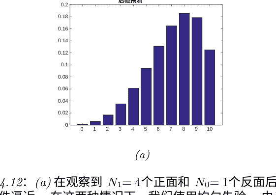

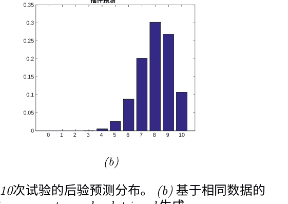

图4.12: (a)在观察到 $N_1= 4$个正面和 $N_0= 1$个反面后的未来10次试验的后验预测分布。(b) 基于相同数据的插件逼近。在这两种情况下，我们使用均匀先验。由beta_binom_post_pred_plot.ipynb生成。

我们将积分识别为 $\text{Beta}(\hat{\alpha} + y, M - y + \hat{\beta})$分布的归一化常数。因此

$$\int_{0}^{1} \theta^{y+\hat{\alpha}-1}(1-\theta)^{M-y+\hat{\beta}-1}d\theta = B(y+\hat{\alpha}, M-y+\hat{\beta}) \tag{4.134}$$

因此，我们发现后验预测由以下分布给出，被称为(复合)beta-二项式分布:

$$Bb(x|M,\hat{\alpha},\hat{\beta}) \triangleq \binom{M}{x} \frac{B(x+\hat{\alpha}, M-x+\hat{\beta})}{B(\hat{\alpha},\hat{\beta})} \tag{4.135}$$

在图4.12(a)中，我们绘制了在观察到 $N_1= 4$个正面和 $N_0= 1$个反面后，使用均匀Beta(1,1)先验的情况下， $M= 10$的后验预测密度。在图4.12(b)中，我们绘制了插值近似，给出的是

$$p(\theta|\mathcal{D}) \approx \delta(\theta - \hat{\theta}) \tag{4.136}$$

$$p(y|\mathcal{D}, M) = \int_{0}^{1} \mathrm{Bin}(y|M, \theta)p(\theta|\mathcal{D})d\theta = \mathrm{Bin}(y|M, \hat{\theta}) \tag{4.137}$$

其中 $\hat{\theta}$是MAP估计。从图4.12中可以看出，贝叶斯预测具有更长的尾部，将其概率质量更广泛地分布，因此不容易过拟合和出现黑天鹅类型的悖论。(请注意，在这两种情况下我们使用均匀先验，因此差异不是由于先验的使用; 相反，它是因为贝叶斯方法在进行预测时对未知参数进行了积分。)

## 4.6.2.10 边际似然

模型 $\mathcal{M}$ 的边际似然或证据定义为

$$p(\mathcal{D}|\mathcal{M}) = \int p(\boldsymbol{\theta}|\mathcal{M})p(\mathcal{D}|\boldsymbol{\theta}, \mathcal{M})d\boldsymbol{\theta} \tag{4.138}$$

当对特定模型的参数进行推断时，我们可以忽略这个项，因为它对 $\theta$ 是常数。然而，在选择不同模型时，这个量在其中起着重要作用，正如我们在第5.2.2节中讨论的那样。它还可以用于从数据中估计超参数（一种称为经验贝叶斯的方法），正如我们在第4.6.5.3节中讨论的那样。

一般来说，计算边际似然可能很困难。然而，在贝塔-伯努利模型的情况下，边际似然与后验归一化常数与先验归一化常数的比例成正比。为了看到这一点，回想一下贝塔二项式模型的后验概率为 $p(\theta|\mathcal{D}) = \text{Beta}(\theta|a', b')$，其中 $a' = a + N_1$ 且 $b' = b + N_0$。我们知道后验的归一化常数为 $B(a', b')$。因此

$$
\begin{aligned}
p(\theta|\mathcal{D}) &= \frac{p(\mathcal{D}|\theta)p(\theta)}{p(\mathcal{D})} && (4.139) \\
&= \frac{1}{p(\mathcal{D})} \left[ \frac{1}{B(a, b)} \theta^{a-1}(1-\theta)^{b-1} \right] \left[ \binom{N}{N_1} \theta^{N_1}(1-\theta)^{N_0} \right] && (4.140) \\
&= \binom{N}{N_1} \frac{1}{p(\mathcal{D})} \frac{1}{B(a, b)} \left[ \theta^{a+N_1-1}(1-\theta)^{b+N_0-1} \right] && (4.141)
\end{aligned}
$$
所以
$$
\begin{aligned}
\frac{1}{B(a + N_1, b + N_0)} &= \binom{N}{N_1} \frac{1}{p(\mathcal{D})} \frac{1}{B(a, b)} && (4.142) \\
p(\mathcal{D}) &= \binom{N}{N_1} \frac{B(a + N_1, b + N_0)}{B(a, b)} && (4.143)
\end{aligned}
$$

$\binom{N}{N_1}$ 项。

## 4.6.2.11 共轭先验的混合

贝塔分布是二项式似然的共轭先验，使我们能够轻松地以闭合形式计算后验，正如我们所见。然而，这个先验相当限制性。例如，假设我们想要预测在赌场中抛硬币的结果，并且我们相信这个硬币可能是公平的，但也可能偏向正面。这个先验不能用贝塔分布表示。幸运的是，它可以表示为贝塔分布的混合。

例如，我们可以使用
$$p(\theta) = 0.5 \text{Beta}(\theta|20, 20) + 0.5 \text{Beta}(\theta|30, 10) \quad (4.144)$$
如果 $\theta$来自第一个分布，硬币是公平的，但如果来自第二个分布，它就偏向正面。

我们可以通过引入一个潜在的指示变量 $h$来表示混合，其中 $h = k$表示$\theta$来自混合成分 $k$。先验的形式为
$$p(\theta) = \sum_k p(h = k)p(\theta|h = k) \quad (4.145)$$

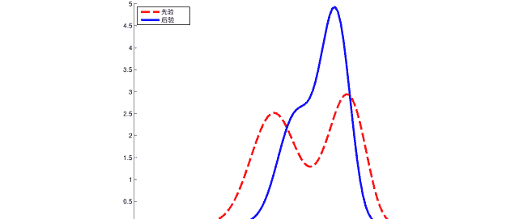

图4.13：两个Beta分布的混合。由mixbetademo.ipynb生成。

其中每个 $p(\theta|h = k)$都是共轭的，而 $p(h = k)$被称为（先验）混合权重。可以证明（练习4.6），后验也可以写成共轭分布的混合形式，如下所示：

$p(\theta|\mathcal{D}) = \sum_k p(h = k|\mathcal{D})p(\theta|\mathcal{D}, h = k) \tag{4.146}$

其中 $p(h = k|\mathcal{D})$是给定的后验混合权重

$p(h = k|\mathcal{D}) = \frac{p(h = k)p(\mathcal{D}|h = k)}{\sum_{k'} p(h = k')p(\mathcal{D}|h = k')} \tag{4.147}$

这里的数量 $p(\mathcal{D}|h = k)$是混合成分 $k$的边际似然（见第4.6.2.10节）。回到我们上面的例子，如果我们有方程（4.144）中的先验，并且我们观察到 $N_1 = 20$个正面和 $N_0 = 10$个反面，那么使用方程（4.143），后验概率变为

$p(\theta|\mathcal{D}) = 0.346 \text{ Beta}(\theta|40,30) + 0.654 \text{ Beta}(\theta|50,20) \tag{4.148}$

参见图4.13进行说明。我们可以计算出硬币偏向正面的后验概率如下：

$\Pr(\theta > 0.5|\mathcal{D}) = \sum_k \Pr(\theta > 0.5|\mathcal{D}, h = k)p(h = k|\mathcal{D}) = 0.9604 \tag{4.149}$

如果我们只使用一个Beta(20,20)先验，我们将得到一个稍小的 $\Pr(\theta > 0.5|\mathcal{D}) = 0.8858$. 因此，如果我们最初“怀疑”赌场可能在使用一个有偏的硬币，我们的担忧会比我们从一开始就持开放态度更快地得到证实。

## 4.6.3 狄利克雷-多项式模型

在本节中，我们将从二元变量（例如硬币）推广到 $K$-ary变量（例如骰子）的结果。

## 4.6.3.1 似然函数

设 $Y \sim \text{Cat}(\boldsymbol{\theta})$为从分类分布中抽取的离散随机变量。似然函数的形式为

$$p(\mathcal{D}|\boldsymbol{\theta}) = \prod_{n=1}^{N} \text{Cat}(y_n|\boldsymbol{\theta}) = \prod_{n=1}^{N}\prod_{c=1}^{C} \theta_c^{\mathbb{I}(y_n=c)} = \prod_{c=1}^{C} \theta_c^{N_c} \quad \quad (4.150)$$

其中 $N_c = \sum_n \mathbb{I}(y_n = c)$。

## 4.6.3.2 先验

对于分类分布的共轭先验是Dirichlet分布，它是beta分布的多元推广。它在概率单纯形上有支持，由以下定义：

$$S_K = \{\boldsymbol{\theta}: 0 \leq \theta_k \leq 1, \sum_{k=1}^{K} \theta_k = 1\} \quad \quad (4.151)$$

Dirichlet的概率密度函数定义如下：

$$\text{Dir}(\boldsymbol{\theta}|\check{\boldsymbol{\alpha}}) \triangleq \frac{1}{B(\check{\boldsymbol{\alpha}})} \prod_{k=1}^{K} \theta_k^{\check{\alpha}_k-1} \mathbb{I}(\boldsymbol{\theta} \in S_K) \quad \quad (4.152)$$

其中 $B(\check{\boldsymbol{\alpha}})$是多元beta函数，

$$B(\check{\boldsymbol{\alpha}}) \triangleq \frac{\prod_{k=1}^{K} \Gamma(\check{\alpha}_k)}{\Gamma\left(\sum_{k=1}^{K} \check{\alpha}_k\right)} \quad \quad (4.153)$$

图4.14展示了当 $K = 3$时的狄利克雷分布的一些图形。我们可以看到 $\check{\alpha}_0 = \sum_k \check{\alpha}_k$控制着分布的强度（峰值有多高），而 $\check{\alpha}_k$控制着峰值出现的位置。例如，Dir(1, 1, 1)是一个均匀分布，Dir(2, 2, 2)是一个以 (1/3, 1/3, 1/3)为中心的宽泛分布，而 Dir(20, 20, 20)是一个以 (1/3, 1/3, 1/3)为中心的狭窄分布。Dir(3, 3, 20)是一个不对称的分布，将更多的密度放在一个角落。如果对于所有的 $k$， $\check{\alpha}_k < 1$，我们在单纯形的角落处得到“尖峰”。当 $\check{\alpha}_k < 1$时，从分布中采样得到的样本将是稀疏的，如图4.15所示。

## 4.6.3.3 后验

我们可以将多项式似然和狄利克雷先验结合起来计算后验，如下所示：

$$p(\boldsymbol{\theta}|\mathcal{D}) \propto p(\mathcal{D}|\boldsymbol{\theta})\text{Dir}(\boldsymbol{\theta}|\check{\boldsymbol{\alpha}}) \quad \quad (4.154)$$

$$= \left[ \prod_k \theta_k^{N_k} \right] \left[ \prod_k \theta_k^{\check{\alpha}_k-1} \right] \quad \quad (4.155)$$

$$= \text{Dir}(\boldsymbol{\theta}|\check{\alpha}_1+N_1, \dots, \check{\alpha}_K+N_K) \quad \quad (4.156)$$

$$= \text{Dir}(\boldsymbol{\theta}|\widehat{\boldsymbol{\alpha}}) \quad \quad (4.157)$$

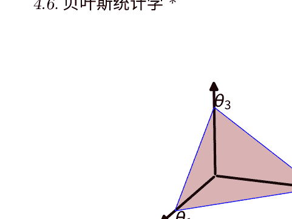

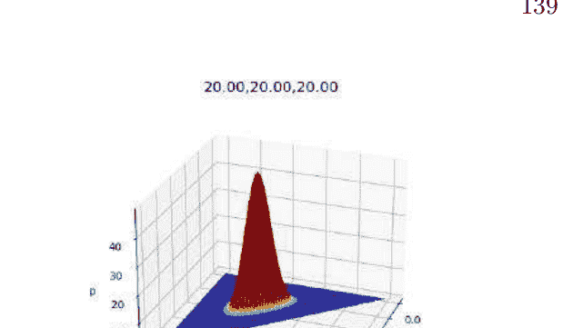

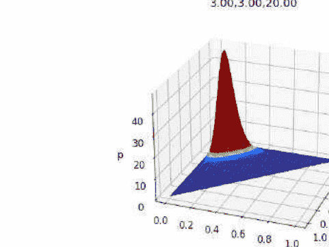

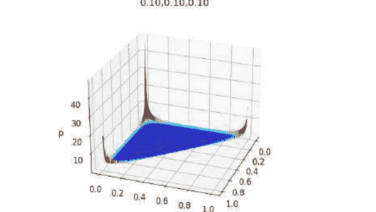

图4.14: (a) 当 K=3 时，狄利克雷分布定义了一个在三角形表面上的分布，可以用三角形表面来表示。这个表面上的点满足 0 ≤ θ_k ≤ 1 和 ∑_{k=1}^3 θ_k = 1。由 dirichlet_3d_triangle_plot.ipynb 生成。 (b) 对于 $\breve{\alpha} = (20,20,20)$ 的狄利克雷密度的绘图。 (c) 对于 $\breve{\alpha} = (3,3,20)$ 的狄利克雷密度的绘图。 (d) 对于 $\breve{\alpha} = (0.1,0.1,0.1)$ 的狄利克雷密度的绘图。由 dirichlet_3d_spiky_plot.ipynb 生成。

其中 $\widehat{\alpha}_k = \breve{\alpha}_k + N_k$ 是后验的参数。所以我们可以通过将经验计数加到先验计数中来计算后验。

> 后验均值为
$$\bar{\theta}_k = \frac{\widehat{\alpha}_k}{\sum_{k'=1}^K \widehat{\alpha}_{k'}} \tag{4.158}$$

> 后验模式，对应于MAP估计，为
$$\hat{\theta}_k = \frac{\widehat{\alpha}_k - 1}{\sum_{k'=1}^K (\widehat{\alpha}_{k'} - 1)} \tag{4.159}$$

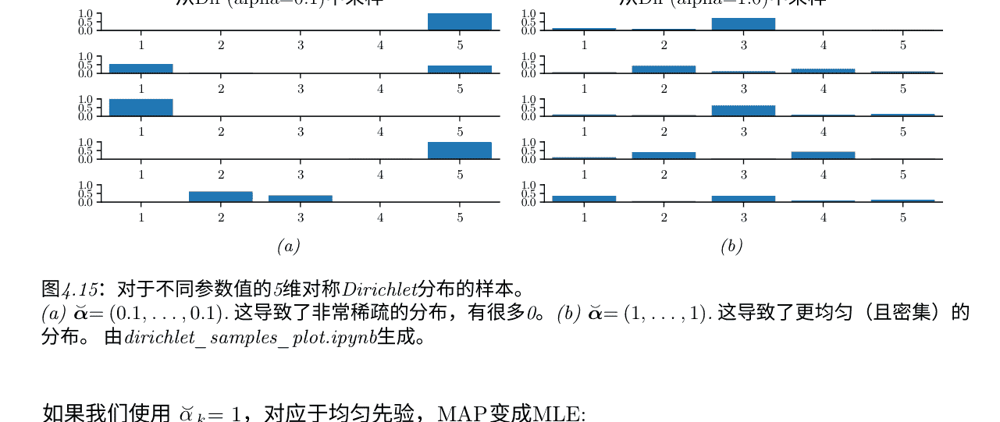

**图4.15：** 对于不同参数值的5维对称Dirichlet分布的样本。
(a) $\breve{\boldsymbol{\alpha}} = (0.1, ..., 0.1)$。这导致了非常稀疏的分布，有很多0。
(b) $\breve{\boldsymbol{\alpha}} = (1, ..., 1)$。这导致了更均匀（且密集）的分布。由`dirichlet_samples_plot.ipynb`生成。

如果我们使用 $\breve{\alpha}_k = 1$，对应于均匀先验，MAP变成MLE：

$$\hat{\theta}_k = N_k / N \tag{4.160}$$

（有关此结果的更直接推导，请参见第4.2.4节。）

## 4.6.3.4 后验预测

后验预测分布由以下给出

$$\begin{aligned}
p(y=k|\mathcal{D}) &= \int p(y=k|\boldsymbol{\theta})p(\boldsymbol{\theta}|\mathcal{D})d\boldsymbol{\theta} \qquad \qquad \qquad \qquad \qquad \qquad (4.161) \\
&= \int \theta_k p(\theta_k|\mathcal{D})d\theta_k = \mathbb{E}[\theta_k|\mathcal{D}] = \frac{\widehat{\alpha}_k}{\sum_{k'} \widehat{\alpha}_{k'}} \qquad \qquad \qquad \qquad (4.162)
\end{aligned}$$

换句话说，后验预测分布由以下给出
$$p(y|\mathcal{D}) = \text{Cat}(y|\breve{\boldsymbol{\theta}})$$
其中 $\breve{\boldsymbol{\theta}} \triangleq \mathbb{E}[\boldsymbol{\theta}|\mathcal{D}]$ 是后验均值参数。如果我们使用MAP估计代替，我们将遇到零计数问题。要获得与加一平滑相同的效果，唯一的方法是使用 $\breve{\alpha}_c = 2$ 的MAP估计。

方程（4.162）给出了一个单个未来事件的概率，以过去的观察为条件 $\boldsymbol{y} = (y_1, \ldots, y_N)$。在某些情况下，我们想要知道观察到一批未来数据的概率，比如 $\tilde{\boldsymbol{y}} = (\tilde{y}_1, \ldots, \tilde{y}_M)$。我们可以按以下方式计算：

$$p(\tilde{\boldsymbol{y}}|\boldsymbol{y}) = \frac{p(\tilde{\boldsymbol{y}}, \boldsymbol{y})}{p(\boldsymbol{y})} \tag{4.164}$$

分母是训练数据的边际似然，分子是训练和未来测试数据的边际似然。我们在第4.6.3.5节中讨论如何计算这样的边际似然。

《概率机器学习：导论》草稿。2023年6月22日

## 4.6.3.5 边际似然

通过与第4.6.2.10节相同的推理，可以证明狄利克雷-分类模型的边际似然为

$$
p(\mathcal{D}) = \frac{B(\mathbf{N} + \boldsymbol{\alpha})}{B(\boldsymbol{\alpha})} \qquad (4.165)
$$

其中

$$
B(\boldsymbol{\alpha}) = \frac{\prod_{k=1}^K \Gamma(\alpha_k)}{\Gamma(\sum_k \alpha_k)} \qquad (4.166)
$$

因此，我们可以将上述结果重写为通常在文献中呈现的以下形式：

$$
p(\mathcal{D}) = \frac{\Gamma(\sum_k \alpha_k)}{\Gamma(N + \sum_k \alpha_k)} \prod_k \frac{\Gamma(N_k + \alpha_k)}{\Gamma(\alpha_k)} \qquad (4.167)
$$

### 4.6.4 高斯-高斯模型

在本节中，我们推导了高斯分布参数的后验分布。为了简化起见，我们假设方差是已知的。（一般情况在本书的后续部分[Mur23]以及其他关于贝叶斯统计的标准参考资料中进行了讨论。）

### 4.6.4.1 一元情况

如果 $\sigma^2$ 是已知常数，则 $\mu$ 的似然函数具有以下形式

$$
p(\mathcal{D}|\mu) \propto \exp\left( -\frac{1}{2\sigma^2} \sum_{n=1}^N (y_n - \mu)^2 \right) \qquad (4.168)
$$

可以证明，共轭先验是另一个高斯分布，$\mathcal{N}(\mu | m, \tau^2)$。应用贝叶斯规则来计算高斯分布，就像在第4.6.4.1节中所述，我们发现相应的后验概率为

$$
p(\mu | \mathcal{D}, \sigma^2) = \mathcal{N}(\mu | \hat{m}, \hat{\tau}^2) \qquad (4.169)
$$

$$
\hat{\tau}^2 = \frac{1}{\frac{N}{\sigma^2} + \frac{1}{\tau^2}} = \frac{\sigma^2 \tau^2}{N \tau^2 + \sigma^2} \qquad (4.170)
$$

$$
\hat{m} = \hat{\tau}^2 \left( \frac{m}{\tau^2} + \frac{N \bar{y}}{\sigma^2} \right) = \frac{\sigma^2}{N \tau^2 + \sigma^2} m + \frac{N \tau^2}{N \tau^2 + \sigma^2} \bar{y} \qquad (4.171)
$$

其中 $\bar{y} \triangleq \frac{1}{N} \sum_{n=1}^N y_n$ 是经验均值。

如果我们用精度参数来工作，这个结果就更容易理解，精度参数就是逆方差。具体来说，让 $\kappa = 1/\sigma^2$ 成为观测精度，$\lambda = 1/\tau^2$ 成为先验的精度。然后我们可以将后验概率重写为：

$$
p(\mu|\mathcal{D}, \kappa) = \mathcal{N}(\mu|\hat{m}, \hat{\lambda}^{-1}) \qquad (4.172)
$$

$$
\hat{\lambda} = \breve{\lambda} + N \kappa \qquad (4.173)
$$

$$
\hat{m} = \frac{N \kappa \bar{y} + \breve{\lambda} \breve{m}}{\hat{\lambda}} = \frac{N \kappa}{N \kappa + \breve{\lambda}} \bar{y} + \frac{\breve{\lambda}}{N \kappa + \breve{\lambda}} \breve{m} \qquad (4.174)
$$

这些方程非常直观：后验精度 $\hat{\lambda}$ 是先验精度 $\breve{\lambda}$ 加上 $N$ 个测量精度 $\kappa$。此外，后验均值 $\hat{m}$ 是经验均值 $\bar{y}$ 和先验均值 $\breve{m}$ 的凸组合。这使得后验均值是经验均值和先验均值之间的折中。如果先验相对于信号强度较弱（$\breve{\lambda}$ 相对较小，小于 $\kappa$），我们会更加重视经验均值。如果先验相对于信号强度较强（$\breve{\lambda}$ 相对较大，大于 $\kappa$），我们会更加重视先验均值。这在图4.16中有所说明。还要注意后验均值是用 $N\kappa\bar{y}$ 来表示的，因此每个具有精度 $\kappa$ 的 $N$ 个测量就相当于一个具有值 $\bar{y}$ 和精度 $N\kappa$ 的测量。

## 看到 $N=1$ 个例子后的后验概率

为了进一步了解这些方程，考虑看到单个数据点 $y$ 后的后验概率（所以 $N=1$）。然后后验均值可以用以下等价的方式表示：

$$
\hat{m} = \frac{\breve{\lambda}}{\hat{\lambda}} \breve{m} + \frac{\kappa}{\hat{\lambda}} y \qquad (4.175)
$$

$$
= \breve{m} + \frac{\kappa}{\hat{\lambda}} (y - \breve{m}) \qquad (4.176)
$$

$$
= y - \frac{\breve{\lambda}}{\hat{\lambda}} (y - \breve{m}) \qquad (4.177)
$$

第一个方程是先验均值和数据的凸组合。第二个方程是先验均值向数据调整的结果。第三个方程是数据向先验均值调整的结果。这被称为收缩估计。如果我们定义权重 $w=\breve{\lambda}/\hat{\lambda}$，即先验与后验精度的比率，那么我们有

$$
\hat{m} = y - w(y-\breve{m}) = (1-w)y + w\breve{m} \qquad (4.178)
$$

请注意，对于高斯分布，后验均值和后验模式是相同的。因此，我们可以使用上述方程进行最大后验估计。请参见练习4.2中的一个简单示例。

## 后验方差

除了后验均值或模式 $\mu$ 之外，我们可能对后验方差也感兴趣，它给我们提供了对估计的置信度的度量。其平方根被称为均值的标准误差：

$$
\mathrm{se}(\mu) \triangleq \sqrt{\mathbb{V}[\mu|\mathcal{D}]} \qquad (4.179)
$$

假设我们对 $\mu$ 使用一个无信息先验，通过设置 $\breve{\lambda}=0$（见第4.6.5.1节）。在这种情况下，后验均值等于 MLE，$\hat{m} = \bar{y}$。此外，假设我们通过近似 $\sigma^2$ 来估计样本方差

$$
s^2 \triangleq \frac{1}{N}\sum_{n=1}^{N}(y_n - \bar{y})^2 \qquad (4.180)
$$

因此 $\hat{\lambda} = N\hat{\kappa} = N/s^2$，所以 SEM 变为

$$
\mathrm{se}(\mu) = \sqrt{\mathbb{V}[\mu|\mathcal{D}]} = \frac{1}{\sqrt{\hat{\lambda}}} = \frac{s}{\sqrt{N}} \qquad (4.181)
$$

因此我们可以看到 $\mu$ 的不确定性以 $1/N$ 的速率减少。此外，我们可以利用高斯分布中 95% 的数据落在均值的 2 个标准差内的事实，来近似计算 $\mu$ 的 95% 可信区间，使用

$$
I_{.95}(\mu|\mathcal{D}) = \bar{y} \pm 2\frac{s}{\sqrt{N}} \qquad (4.182)
$$

### 4.6.4.2 多变量情况

对于 $D$ 维数据，似然函数的形式如下（我们省略了与 $\mu$ 无关的项）：

$$
p(\mathcal{D}|\boldsymbol{\mu}) = \prod_{n=1}^{N}\mathcal{N}(\mathbf{y}_n|\boldsymbol{\mu}, \boldsymbol{\Sigma}) \qquad (4.183)
$$

$$
= \left(\frac{1}{(2\pi)^{D/2}|\boldsymbol{\Sigma}|^{\frac{1}{2}}}\right)^{N} \exp\left[-\frac{1}{2}\sum_{n=1}^{N}(\mathbf{y}_n - \boldsymbol{\mu})^{\mathrm{T}}\boldsymbol{\Sigma}^{-1}(\mathbf{y}_n - \boldsymbol{\mu})\right] \qquad (4.184)
$$

$$
\propto \mathcal{N}(\bar{\mathbf{y}}|\boldsymbol{\mu}, \frac{1}{N}\boldsymbol{\Sigma}) \qquad (4.185)
$$

其中 $\bar{\mathbf{y}} = \frac{1}{N} \sum_{n=1}^N \mathbf{y}_n$（最后一个方程的证明在方程（3.65）之后给出。）因此，我们用它们的均值替换观测值集合，并将协方差缩小 $N$ 倍。为了简化起见，我们将使用一个共轭先验，即高斯分布。

$$
p(\boldsymbol{\mu}) = \mathcal{N}(\boldsymbol{\mu} | \breve{\mathbf{m}}, \breve{\mathbf{V}}) \qquad (4.186)
$$

根据第3.3.1节的结果，我们可以得到 $\boldsymbol{\mu}$ 的高斯后验分布。我们得到

$$
p(\boldsymbol{\mu}|\mathcal{D}, \boldsymbol{\Sigma}) = \mathcal{N}(\boldsymbol{\mu} | \hat{\mathbf{m}}, \hat{\mathbf{V}}) \qquad (4.187)
$$

$$
\hat{\mathbf{V}}^{-1} = \breve{\mathbf{V}}^{-1} + N\boldsymbol{\Sigma}^{-1} \qquad (4.188)
$$

$$
\hat{\mathbf{m}} = \hat{\mathbf{V}} (\boldsymbol{\Sigma}^{-1}(N\bar{\mathbf{y}}) + \breve{\mathbf{V}}^{-1}\breve{\mathbf{m}}) \qquad (4.189)
$$

图4.17给出了这些结果的一个二维示例。

### 4.6.5 超越共轭先验

我们已经看到了各种共轭先验的例子，所有这些例子都来自指数族（参见第3.4节）。这些先验的优点是易于解释（通过虚拟先验数据集的充分统计量），并且易于计算。然而，对于大多数模型来说，指数族中没有与似然函数共轭的先验分布。此外，即使存在共轭先验，共轭性的假设可能过于限制。因此，在下面的章节中，我们简要讨论了各种其他类型的先验分布。

### 4.6.5.1 无信息先验

当我们缺乏领域特定的知识时，使用无信息先验、非信息先验或客观先验是可取的，以“让数据自己说话”。例如，如果我们想要推断一个实值量，比如一个位置参数 $\mu \in \mathbb{R}$，我们可以使用一个平坦先验 $p(\mu) \propto 1$。这可以被视为“无限宽”的高斯。

不幸的是，没有唯一的方法来定义无信息先验，它们都编码了一些知识。因此，最好使用术语扩散先验、最小信息先验或默认先验。有关详细信息，请参阅本书的续集[Mur23]。

### 4.6.5.2 分层先验

贝叶斯模型需要为参数指定先验分布 $p(\theta)$。先验的参数被称为超参数，并用 $\xi$ 表示。如果这些是未知的，我们可以对它们指定先验分布；这定义了一个分层贝叶斯模型或多层模型，可以可视化为 $\xi \rightarrow \theta \rightarrow \mathcal{D}$。我们假设超参数的先验是固定的（例如，我们可以使用某种最小信息先验），因此联合分布具有以下形式

$$
p(\xi, \theta, \mathcal{D}) = p(\xi)p(\theta|\xi)p(\mathcal{D}|\theta) \tag{4.190}
$$

希望我们可以通过将参数本身视为数据点来学习超参数。当我们需要估计多个相关参数时（例如，来自不同的子群体或多个任务），这是非常有用的；这为模型的顶层提供了学习信号。有关详细信息，请参阅本书的续集[Mur23]。

### 4.6.5.3 经验先验

在第4.6.5.2节中，我们讨论了层次贝叶斯作为从数据中推断参数的方法。不幸的是，这种模型中的后验推断可能具有计算上的挑战。在本节中，我们讨论了一种计算方便的近似方法，首先计算超参数的点估计 $\hat{\xi}$，然后计算条件后验 $p(\theta| \hat{\xi}, \mathcal{D})$ 而不是联合后验概率 $p(\theta, \xi|\mathcal{D})$。为了估计超参数，我们可以最大化边际似然：

$$
\hat{\xi}_{\text{mml}}(\mathcal{D}) = \underset{\xi}{\text{argmax}} \, p(\mathcal{D}|\xi) = \underset{\xi}{\text{argmax}} \int p(\mathcal{D}|\theta)p(\theta|\xi)d\theta \tag{4.191}
$$

这种技术被称为类型II最大似然，因为我们优化的是超参数，而不是参数。一旦我们估计出 $\hat{\xi}$，我们可以按照通常的方式计算后验概率 $p(\theta|\hat{\xi}, \mathcal{D})$。由于我们是从数据中估计先验参数，这种方法被称为经验贝叶斯（EB）[CL96]。这违反了先验应该独立于数据选择的原则。然而，我们可以将其视为完整层次贝叶斯模型中推理的计算廉价近似，就像我们将 MAP 估计视为一级模型中推理的近似一样 $\theta \rightarrow \mathcal{D}$。事实上，我们可以构建一个层次结构，其中进行的积分越多，就越“贝叶斯”，如下所示。

| 方法 | 定义 |
| :--- | :--- |
| 最大似然 | $\hat{\theta} = \text{argmax}_{\theta} \, p(\mathcal{D}|\theta)$ |
| MAP估计 | $\hat{\theta}(\xi) = \text{argmax}_{\theta} \, p(\mathcal{D}|\theta)p(\theta|\xi)$ |
| ML-II (经验贝叶斯) | $\hat{\xi} = \text{argmax}_{\xi} \, \int p(\mathcal{D}|\theta)p(\theta|\xi)d\theta$ |
| MAP-II | $\hat{\xi} = \text{argmax}_{\xi} \, \int p(\mathcal{D}|\theta)p(\theta|\xi)p(\xi)d\theta$ |
| 全贝叶斯 | $p(\theta, \xi|\mathcal{D}) \propto p(\mathcal{D}|\theta)p(\theta|\xi)p(\xi)$ |

请注意，相对于“常规”最大似然，ML-II更不容易过拟合，因为通常超参数 $\xi$ 比参数 $\theta$ 少。有关详细信息，请参阅本书的续集[Mur23]。

### 4.6.6 可信区间

后验分布通常是一个难以可视化和处理的高维对象。总结这种分布的常见方法是计算一个点估计，如后验均值或模式，然后计算一个可信区间，用于量化与该估计相关的不确定性。（可信区间与置信区间不同，置信区间是频率主义统计学中的概念，在第4.7.4节中讨论。）

更准确地说，我们定义一个 $100(1-\alpha)\%$ 的可信区间为一个（连续的）区域 $C= (\ell, u)$（表示下限和上限），其中包含后验概率质量的 $1-\alpha$。

$$
C_{\alpha}(\mathcal{D}) = \{(\ell, u) : P(\ell \leq \theta \leq u|\mathcal{D}) = 1 - \alpha\} \qquad (4.192)
$$

可能有很多满足方程 (4.192) 的区间，所以我们通常选择一个这样的区间，使得每个尾部都有 $(1-\alpha)/2$ 的质量；这被称为中心区间。如果后验具有已知的函数形式，我们可以使用 $\ell = F^{-1}(\alpha/2)$ 和 $u = F^{-1}(1-\alpha/2)$ 计算后验的中心区间，其中 $F$ 是后验的累积分布函数， $F^{-1}$ 是反函数。例如，如果后验是高斯分布，$p(\theta|\mathcal{D}) = \mathcal{N}(0,1)$，且 $\alpha=0.05$，则我们有 $\ell= \Phi^{-1}(\alpha/2) = -1.96$， $u= \Phi^{-1}(1-\alpha/2) = 1.96$，其中 $\Phi$ 表示高斯分布的累积分布函数。这在图2.2b中有所说明。这证明了以 $\mu \pm 2\sigma$ 的形式引用可信区间的常见做法，其中 $\mu$ 表示后验均值， $\sigma$ 表示后验标准差，2是对1.96的良好近似。一般来说，计算后验的反函数通常很困难。在这种情况下，一个简单的替代方法是从后验中抽取样本，然后使用蒙特卡洛近似来计算后验分位数：我们只需对 $S$ 个样本进行排序，找到在排序列表中位于位置 $\alpha S$ 的样本。当 $S \to \infty$ 时，这将收敛到真实的分位数。请参阅 beta\_credible\_int\_demo.ipynb 以查看演示。

中心区间的一个问题是可能存在在中心区间之外的点，其概率比在内部的点更高，如图4.18(a)所示。这激发了最高后验密度（HPD）区间的概念，它定义为所有满足 $p(\theta|\mathcal{D}) \geq k$ 的 $\theta$ 的集合，其中 $k$ 被选择为使得区间的概率质量为 $1-\alpha$。对于单峰后验，HPD区间是最短的区间。对于多峰后验，HPD可能是非连续的，由多个区域组成，如图4.18(b)所示。可以使用各种算法来计算 HPD 区间，例如使用核密度估计从后验样本中估计分位数。

作者: Kevin P. Murphy。 (C) MIT Press. CC-BY-NC-ND许可证一种替代的量被称为最高后验密度或HPD区域，它是具有高于某个阈值的概率的点的集合。更准确地说，我们找到pdf上的阈值 $p^*$，使得

$1 - \alpha = \int_{\theta:p(\theta|\mathcal{D})>p^*} p(\theta|\mathcal{D}) d\theta$

然后定义HPD为

$C_{\alpha}(\mathcal{D}) = \{\theta : p(\theta|\mathcal{D}) \geq p^*\}$

在一维情况下，HPD区域有时被称为最高密度区间或HDI。例如，图4.18(b)显示了Beta(3,9)分布的95% HDI，即(0.04, 0.48)。我们可以看到，尽管这个区间仍然包含95%的质量，但它比中心区间更窄；此外，它内部的每个点的密度都高于外部的每个点。

对于单峰分布，HDI将是包含模态的最窄区间，其中包含95%的质量。要理解这一点，想象一下“逆向注水”，我们将水位降低，直到露出95%的质量，只有5%被淹没。这为计算一维情况下的HDI提供了一个简单的算法：只需搜索包含95%质量并具有最小宽度的点。如果我们知道分布的反向CDF，可以通过一维数值优化来完成，或者如果我们有一组样本数据，则可以通过对排序后的数据点进行搜索来完成（请参阅betaHPD.ipynb中的一些代码）。

如果后验分布是多峰的，HDI可能甚至不是一个连通的区域：参见图4.19(b)的例子。然而，总结多峰后验分布总是困难的。

### 4.6.7 贝叶斯机器学习

到目前为止，我们已经专注于形式为 $p(\mathbf{y}|\boldsymbol{\theta})$的无条件模型。在监督机器学习中，我们使用形式为 $p(\mathbf{y}|\mathbf{x}, \boldsymbol{\theta})$的条件模型。参数的后验分布现在是 $p(\boldsymbol{\theta}|\mathcal{D})$，其中 $\mathcal{D} = \{(\mathbf{x}_n, \mathbf{y}_n) : n = 1:N\}$。计算这个后验分布可以使用我们已经讨论过的原则。这种方法被称为贝叶斯机器学习，因为我们对模型参数“贝叶斯化”。

### 4.6.7.1 插件近似

一旦我们计算出参数的后验概率，我们可以通过边际化未知参数来计算给定输入的后验预测分布：

$$p(y|x, \mathcal{D}) = \int p(y|x, \theta) p(\theta|\mathcal{D}) d\theta \quad (4.195)$$

当然，计算这个积分通常是困难的。一个非常简单的近似是假设只有一个最佳模型，如MLE。这相当于将后验概率近似为在所选值处无限窄但无限高的“尖峰”。我们可以写成如下形式：

$$p(\theta|\mathcal{D}) = \delta(\theta - \hat{\theta}) \quad (4.196)$$

其中 $\delta$ 是Dirac delta函数（见第2.6.5节）。如果我们使用这个近似，那么预测分布可以通过将点估计插入似然函数中来获得：

$$p(y|x, \mathcal{D}) = \int p(y|x, \theta) p(\theta|\mathcal{D}) d\theta \approx \int p(y|x, \theta) \delta(\theta - \hat{\theta}) d\theta = p(y|x, \hat{\theta}) \quad (4.197)$$

> 这是由于$\delta$函数的筛选特性（方程（2.129））得出的。

方程（4.197）中的方法被称为插件逼近。这种方法等同于大多数机器学习中使用的标准方法，即首先拟合模型（即计算一个点估计$\hat{\theta}$），然后使用它进行预测。然而，标准（插件）方法可能会出现过拟合和过度自信的问题，正如我们在1.2.3节中讨论的那样。完全贝叶斯方法通过边缘化参数来避免这个问题，但可能会很昂贵。

幸运的是，即使是简单的逼近方法，即对几个合理的参数值进行平均，也可以提高性能。我们在下面给出一些例子。

### 4.6.7.2 示例：标量输入，二进制输出

假设我们想要进行二元分类，所以 $y \in \{0, 1\}$。我们将使用以下形式的模型

$$p(y|x; \theta) = \text{Ber}(y|\sigma(w^T x + b)) \quad (4.198)$$

其中

$$\sigma(a) \triangleq \frac{e^a}{1 + e^a} \quad (4.199)$$

是 sigmoid 或 logistic 函数，它将 $\mathbb{R}$ 映射到 $[0, 1]$，而 $\text{Ber}(y|\mu)$ 是伯努利分布的均值为 $\mu$ (详见第2.4节)。换句话说，

$$p(y = 1|x; \theta) = \sigma(w^T x + b) = \frac{1}{1 + e^{-(w^T x + b)}} \quad (4.200)$$

这个模型被称为logistic回归. (我们在第10章中会详细讨论这个问题。)

图4.20: (a)用于将鸢尾花分类为变色鸢尾花 ($y=1$) 或山鸢尾花 ($y=0$)的逻辑回归，使用一个与花萼长度对应的输入特征 $x$。 标记的点已经（垂直）抖动以避免过多重叠。 垂直线是决策边界。 由`logreg_iris_1d.ipynb`生成。(b)与(a)相同，但显示后验分布。 改编自[Mar18]的图4.4。 由`logreg_iris_bayes_1d_pymc3.ipynb`生成。

让我们将这个模型应用于确定鸢尾花是Setosa还是Versicolor类型的任务，其中 $y_n \in \{0,1\}$，给定关于萼片长度的信息，$x_n$。 (有关鸢尾花数据集的描述，请参见第1.2.1.1节。)

我们首先拟合一个以下形式的一维逻辑回归模型

$$p(y=1|x;\theta)=\sigma(b+wx) \quad (4.201)$$

使用最大似然估计将数据集 $D = \{(x_n, y_n)\}$拟合到模型中。 (有关如何计算该模型的MLE的详细信息，请参见第10.2.3节。) 图4.20a显示了对于后验预测的插件近似，其中$\hat{\theta}$是参数的MLE。 我们可以看到，随着萼片长度的增加，我们对花是Versicolor类型的确信度越来越高，这由S形的逻辑函数表示。

决策边界被定义为输入值 $x^*$, 其中 $p(y=1|x^*; \hat{\theta}) = 0.5$。 我们可以通过以下方式解决这个值:

$$\sigma(b+wx^*) = \frac{1}{1+e^{-(b+wx^*)}} = \frac{1}{2} \quad (4.202)$$
$$b+wx^* = 0 \quad (4.203)$$
$$x^* = -\frac{b}{w} \quad (4.204)$$

从图4.20a中，我们可以看到 $x^* \approx 5.5$ cm。

然而，上述方法没有对参数估计的不确定性建模，因此忽略了输出概率和决策边界的不确定性。 为了捕捉这种额外的不确定性，我们可以使用贝叶斯方法进行近似。

图4.21: 两家不同航运公司到达时间的分布。 ETA是预计到达时间。 A公司的分布具有更大的不确定性，可能过于冒险。来自https://bit.ly/39bc4XL的友情许可。 获得Brendan Hasz的友情许可使用。

后验概率 p(θ|D)。 （详见第10.5节） 在此基础上，我们可以使用蒙特卡洛近似来近似后验预测分布 :

$$p(y=1|x, D) \approx \frac{1}{S} \sum_{s=1}^{S} p(y=1|x, \theta^s)$$

其中 $\theta^s \sim p(\theta|D)$ 是一个后验样本。 图4.20b绘制了该函数的均值和95%可信区间。 我们可以看到每个输入现在有一系列预测概率。 我们还可以使用蒙特卡洛近似计算决策边界的位置分布。

$$p(x^*|D) \approx \frac{1}{S} \sum_{s=1}^{S} \delta\left( x^* - \left(-\frac{b^s}{w^s}\right) \right)$$

这个分布的95%可信区间在图4.20b中用“粗”垂直线表示。

尽管在这个应用中精确建模我们的不确定性可能并不重要，但在风险敏感的应用中，比如医疗保健和金融领域，它可能非常重要，我们将在第5章中讨论这个问题。

### 4.6.7.3 示例：二进制输入，标量输出

现在假设我们想要预测由公司A与B运送的包裹的交货时间， $y \in \mathbb{R}$。 我们可以使用二进制特征 $x \in \{0,1\}$来编码公司ID，其中 $x=0$表示公司A， $x=1$表示公司B。 我们将使用以下判别模型解决这个问题：

$$p(y|x, \theta) = \mathcal{N}(y|\mu_x, \sigma_x^2)$$

其中 $\mathcal{N}(y|\mu, \sigma^2)$是高斯分布

$$\mathcal{N}(y|\mu, \sigma^2) \triangleq \frac{1}{\sqrt{2\pi\sigma^2}} e^{-\frac{1}{2\sigma^2}(y-\mu)^2}$$

### 4.6.7.4 扩展

上述例子都非常简单，涉及1维输入和1维输出，只有2-4个参数。大多数实际问题涉及高维输入，有时还涉及高维输出，因此使用具有大量参数的模型。不幸的是，在这种情况下计算后验概率p(θ|D)和后验预测概率p(y|x, D)可能具有计算上的挑战。
我们在第4.6.8节中讨论了这个问题。

### 4.6.8 计算问题

给定似然 $p(\mathcal{D}|\theta)$和先验 $p(\theta)$，我们可以使用贝叶斯规则计算后验 $p(\theta|\mathcal{D})$。
然而，实际进行这种计算通常是棘手的，除了简单的特殊情况，如共轭模型（第4.6.1节）或所有潜在变量来自一个小的有限可能值集合的模型。因此，我们需要近似后验。有很多种方法可以进行近似后验推断，这些方法在准确性、简单性和速度之间进行权衡。我们在本书的后续部分简要讨论了其中一些算法，但在[Mur23]中更详细地介绍。（另请参阅[MFR20]，了解各种近似推断方法的综述，从贝叶斯在1763年提出的方法开始。）

$$p(\theta|\mathcal{D}) \propto \left[ \prod_{n=1}^{N} \mathrm{Bin}(y_n|\theta) \right] \mathrm{Beta}(\theta|1,1) \tag{4.209}$$

作为一个运行示例，我们将使用近似贝塔-伯努利模型的后验问题。具体来说，目标是近似
其中 $\mathcal{D}$包括10个正面和1个反面（因此观测总数为 $N= 11$），我们使用均匀先验。尽管我们可以精确计算这个后验概率（见图4.22），但使用

在第4.6.2节讨论的方法中，这是一个有用的教学示例，因为我们可以将近似结果与精确答案进行比较。此外，由于目标分布只是1维的，所以很容易将结果可视化。（注意，然而，这个问题并不完全简单，因为后验概率高度倾斜，这是由于使用了一个不平衡的样本，10个正面和1个反面。）

### 4.6.8.1 网格逼近

近似后验推断的最简单方法是将未知变量的可能值空间划分为有限的一组可能性，称之为 $\theta_1, \ldots, \theta_K$，然后通过枚举的方式近似后验分布，具体如下：

$$ p(\boldsymbol{\theta} = \boldsymbol{\theta}_k | \mathcal{D}) \approx \frac{p(\mathcal{D} | \boldsymbol{\theta}_k) p(\boldsymbol{\theta}_k)}{p(\mathcal{D})} = \frac{p(\mathcal{D} | \boldsymbol{\theta}_k) p(\boldsymbol{\theta}_k)}{\sum_{k'=1}^K p(\mathcal{D}, \boldsymbol{\theta}_{k'})} \tag{4.210} $$

这被称为网格逼近。在图4.22a中，我们展示了该方法应用于我们的一维问题。我们可以看到它能够很容易地捕捉到偏斜的后验分布。不幸的是，这种方法在超过2或3个维度的问题中无法扩展，因为网格点的数量随着维度的增加呈指数增长。

### 4.6.8.2 二次（拉普拉斯）近似

在本节中，我们讨论一种使用多元高斯来近似后验概率的简单方法；这被称为拉普拉斯近似或二次近似（参见例如，[TK86; RMC09]）。

为了推导这个，假设我们将后验概率写成如下形式：

$$ p(\boldsymbol{\theta} | \mathcal{D}) = \frac{1}{Z} e^{-\mathcal{E}(\boldsymbol{\theta})} \tag{4.211} $$

其中 $\mathcal{E}(\boldsymbol{\theta}) = -\log p(\boldsymbol{\theta}, \mathcal{D})$ 被称为能量函数，$Z = p(\mathcal{D})$ 是归一化常数。

在模态 $\hat{\boldsymbol{\theta}}$（即最低能量状态）周围进行泰勒级数展开，我们得到

$$ \mathcal{E}(\boldsymbol{\theta}) \approx \mathcal{E}(\hat{\boldsymbol{\theta}}) + (\boldsymbol{\theta} - \hat{\boldsymbol{\theta}})^T \mathbf{g} + \frac{1}{2} (\boldsymbol{\theta} - \hat{\boldsymbol{\theta}})^T \mathbf{H} (\boldsymbol{\theta} - \hat{\boldsymbol{\theta}}) \tag{4.212} $$

其中 $\mathbf{g}$是模态的梯度， $\mathbf{H}$是海森矩阵。由于 $\hat{\boldsymbol{\theta}}$是模态，梯度项为零。因此

$$\hat{p}(\boldsymbol{\theta}, \mathcal{D}) = e^{-\mathcal{E}(\hat{\boldsymbol{\theta}})} \exp\left[-\frac{1}{2}(\boldsymbol{\theta} - \hat{\boldsymbol{\theta}})^T \mathbf{H} (\boldsymbol{\theta} - \hat{\boldsymbol{\theta}})\right] \quad\quad (4.213)$$
$$\hat{p}(\boldsymbol{\theta}|\mathcal{D}) = \frac{1}{Z} \hat{p}(\boldsymbol{\theta}, \mathcal{D}) = \mathcal{N}(\boldsymbol{\theta}|\hat{\boldsymbol{\theta}}, \mathbf{H}^{-1}) \quad\quad\quad\quad\quad (4.214)$$
$$Z = e^{-\mathcal{E}(\hat{\boldsymbol{\theta}})} (2\pi)^{D/2} |\mathbf{H}|^{-\frac{1}{2}} \quad\quad\quad\quad (4.215)$$

最后一行是多元高斯分布的归一化常数。

拉普拉斯近似很容易应用，因为我们可以利用现有的优化算法来计算MAP估计，然后只需计算模态处的海森矩阵。 （在高维空间中，我们可以使用对角线近似。）

在图4.22b中，我们展示了这种方法应用于我们的一维问题。 不幸的是，我们发现这不是一个特别好的近似。 这是因为后验分布是倾斜的，而高斯分布是对称的。 此外，感兴趣的参数位于约束区间 $\theta \in [0, 1]$，而高斯分布假设在无约束空间 $\theta \in \mathbb{R}$。 幸运的是，我们可以通过变量变换来解决后一个问题。 例如，在这种情况下，我们可以对$\alpha = \text{logit}(\theta)$应用拉普拉斯近似。 这是简化推断工作的常见技巧。

### 4.6.8.3 变分近似

在第4.6.8.2节中，我们讨论了拉普拉斯近似，它使用优化过程找到MAP估计，并基于海森矩阵近似后验分布的曲率。在本节中，我们讨论了变分推断（VI），这是另一种基于优化的后验推断方法，具有更多的建模灵活性（因此可以给出更准确的近似）。

VI试图近似一个难以计算的概率分布，例如 $p(\theta|\mathcal{D})$，用一个易于计算的分布 $q(\theta)$来最小化两个分布之间的差异 $D$:

$$q^* = \underset{q \in \mathcal{Q}}{\text{argmin}} \ D(q, p) \quad\quad\quad\quad (4.216)$$

其中 $\mathcal{Q}$是一些易于计算的分布族（例如，多元高斯分布）。 如果我们定义 $D$为KL散度（见第6.2节），那么我们可以推导出对数边际似然的一个下界；这个数量被称为证据下界或ELBO。通过最大化ELBO，我们可以提高后验近似的质量。 有关详细信息，请参阅本书的续集[Mur23]。

### 4.6.8.4 马尔可夫链蒙特卡洛（MCMC）近似

虽然VI是一种快速的基于优化的方法，但它可能会给出对后验的有偏近似，因为它受限于特定的函数形式 $q \in \mathcal{Q}$。 一种更灵活的方法是使用一组样本的非参数近似， $q(\theta) \approx \frac{1}{S} \sum_{s=1}^S \delta(\theta - \theta_s)$， 这被称为蒙特卡洛近似后验。 关键问题是如何高效地创建后验样本 $\theta_s \sim p(\theta|\mathcal{D})$，而不必评估归一化常数 $p(\mathcal{D}) = \int p(\theta, \mathcal{D}) d\theta$。

解决这个问题的常见方法被称为马尔可夫链蒙特卡洛或 MCMC。 如果我们使用基于梯度的信息来改进这个算法，该信息是从 $\nabla \log p(\theta, \mathcal{D})$导出的，我们可以## 4.7 频率统计学 *

我们在第4.6节中描述的统计推断方法被称为贝叶斯统计学。它将模型参数视为任何其他未知随机变量，并应用概率论规则从数据中推断它们。已经尝试过设计避免将参数视为随机变量的统计推断方法，从而避免使用先验概率和贝叶斯规则。这种替代方法被称为频率主义统计学、经典统计学或正统统计学。

基本思想（在第4.7.1节中形式化）是通过计算从数据中估计的数量（如参数或预测标签）在数据改变时会如何变化来表示不确定性。正是频率主义方法使用了重复试验中的变化概念来建模不确定性。相比之下，贝叶斯方法将概率视为信息而不是重复试验。这使得贝叶斯可以计算一次性事件的概率，正如我们在第2.1.1节中讨论的那样。更重要的是，贝叶斯方法避免了频率主义方法中的某些悖论（参见第4.7.5节和第5.5.4节）。这些病态现象导致著名统计学家乔治·博克斯说：

> 我相信说服一个聪明人相信当前的[频率主义]统计实践是明智的是非常困难的，但是通过似然和贝叶斯定理的方法则会容易得多。—— George Box, 1962年（引自[Jay76]）。

然而，熟悉频率主义统计学是有用的，因为它被广泛使用，并且具有一些对贝叶斯派也有用的关键概念[Rub84]。

显著加快方法的速度；这被称为哈密顿蒙特卡洛或 HMC。有关详细信息，请参阅本书的续集[Mur23]。

### 4.7.1 抽样分布

在频率主义统计学中，不确定性不是由随机变量的后验分布表示的，而是由估计量的抽样分布表示的。

术语“估计量”在第5.1节的决策理论部分中有定义，但简而言之，估计量 δ: D → A 是一种决策过程，它指定在给定一些观察数据时应采取什么行动。行动可以是预测一个类别标签，或者下一个观测值，或者预测未知参数。在后一种情况下，估计量通常用 θ 表示，但这种表示是有歧义的，因为它看起来像是表示一个参数向量而不是一个函数。因此，我们将使用符号 Θ 来表示。这个函数可以计算最大似然估计或矩估计等。当应用于特定大小的数据集 N 时，该函数的输出表示为 θ̂ = Θ(D)，其中 D = {x1, …, xN}。

在频率主义统计学中，关键思想是将数据 D 视为随机变量，将从中抽取数据的参数 θ* 视为固定但未知的常数。因此，θ̂ = Θ(D) 是一个随机变量，其分布被称为估计量的抽样分布。为了理解这个概念，假设我们创建了 S 个不同的数据集，每个数据集的形式如下

```
D^{(s)} = \{ x_n \sim p(x_n|\theta^*): n = 1:N \}    (4.217)
```

为了简洁起见，我们用 $\mathcal{D}^{(s)} \sim \theta^*$ 表示这一点。现在我们对每个 $\mathcal{D}^{(s)}$ 应用估计量，得到一组估计值，$\{\hat{\theta}^{(\mathcal{D}^{(s)})}\}$。当 $S \to \infty$ 时，由这个集合引起的分布就是估计量的抽样分布。更准确地说，我们有

```
$SamplingDist(\hat{\Theta}, \theta^*) = PushThrough(p(\tilde{D}|\theta^*), \hat{\Theta})$
```

我们通过估计函数将数据分布传递，从而引发估计的分布。在某些情况下，我们可以通过解析方法计算采样分布，如我们在第4.7.2节中讨论的那样，尽管通常我们需要通过蒙特卡洛方法来近似计算，如我们在第4.7.3节中讨论的那样。

### 4.7.2 最大似然估计的采样分布的高斯近似

最常见的估计器是最大似然估计。当样本量变大时，某些模型的最大似然估计的采样分布变为高斯分布。这被称为采样分布的渐近正态性。更正式地说，我们有以下结果：

**定理 4.7.1.** 如果参数是可辨识的，那么

```
$SamplingDist(\hat{\Theta}^{\text{mle}}, \theta^*) \to \mathcal{N}(\theta^*, (N F(\theta^*))^{-1})$
```

其中 $F(\theta^*)$ 是费舍尔信息矩阵，在方程 (4.220) 中定义。等价地，上述结果表明分布 $\lceil N F(\theta^*)\rceil^{(1/2)} (\hat{\theta} - \theta^*)$ 趋近于 $\mathcal{N}(\mathbf{0}, \mathbf{I})$, 其中 $\hat{\theta} = \hat{\Theta}^{\text{mle}}(\mathcal{D})$。费舍尔信息矩阵测量了对数似然曲面在其峰值处的曲率，如下所示。更正式地说，费舍尔信息矩阵 (FIM)被定义为对数似然梯度的协方差 (也称为得分函数):

```
$F(\theta) \triangleq \mathbb{E}_{x \sim p(x|\theta)} \left[ \nabla \log p(x|\theta) \nabla \log p(x|\theta)^T \right]$
```

因此，第 $(i, j)$ 个元素的形式为

```
$F_{ij} = \mathbb{E}_{x \sim \theta} \left[ \left( \frac{\partial}{\partial \theta_i} \log p(x|\theta) \right) \left( \frac{\partial}{\partial \theta_j} \log p(x|\theta) \right) \right]$
```

我们可以证明以下结果。

**定理 4.7.2.** 如果 $\log p(x|\theta)$ 是二次可微的，并且在一定的正则条件下， FIM等于NLL的期望Hessian，即，

```
$F_{ij} = -\mathbb{E}_{x \sim \theta} \left[ \frac{\partial^2}{\partial \theta_i \partial \theta_j} \log p(x|\theta) \right]$
```

因此，我们可以将FIM解释为NLL的Hessian。这有助于我们理解方程 (4.219) 中的结果：具有高曲率 (大Hessian) 的对数似然函数将导致估计的方差较低，因为参数通过数据‘确定’，因此对重复采样具有鲁棒性。

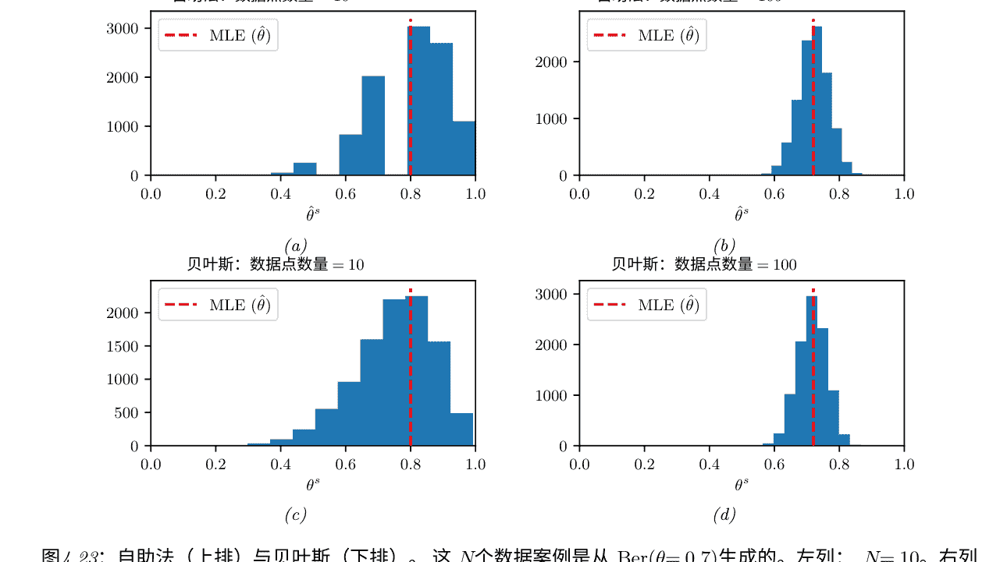

在标量情况下，我们有 $\mathbb{V}\left[\hat{\theta}-\theta^{*}\right] \rightarrow$ 估计量的抽样分布的方差的平方根被称为其标准误差或 se。因此，我们可以说 $\hat{\theta}-\theta_{*}$ 的分布 $\frac{\hat{\theta}-\theta_{*}}{\text { se }}$ 趋近于 $\mathcal{N}(0,1)$。实际上，se是未知的，但可以从数据中估计出来。例如，假设 $X_{n} \sim \operatorname{Ber}\left(\theta^{*}\right)$，令 $\hat{\theta}=\frac{1}{N} \sum_{n=1}^{N} X_{n}$ 为MLE。标准误差为 $\mathrm{se}=\sqrt{\mathbb{V}\left[\hat{\theta}\right]}=\sqrt{\theta^{*}\left(1-\theta^{*}\right) / N}$，因此估计的标准误差为 $\widehat{\mathrm{se}}=\sqrt{\hat{\theta}(1-\hat{\theta}) / N}$。

### 4.7.3 引导法近似任何估计量的抽样分布

在估计器是数据的复杂函数（例如，不仅仅是MLE）或样本量较小的情况下，我们可以使用一种称为蒙特卡洛技术的自助法来近似其抽样分布。

这个想法很简单。如果我们知道真实参数 $\theta^{*}$，我们可以从真实分布中使用 $\widetilde{\mathcal{D}}^{(s)}=\left\{\boldsymbol{x}_{n} \sim p\left(\boldsymbol{x}_{n} \mid \theta^{*}\right): n=1: N\right\}$ 生成许多（比如 $S$ 个）大小为 $N$ 的伪数据集。然后，我们可以从每个样本中计算我们的估计值 $\hat{\theta}^{s}=\Theta\left(\hat{\mathcal{D}}^{(s)}\right)$，并使用所得 $\hat{\theta}^{s}$ 的经验分布作为我们对抽样分布的估计，如公式（4.218）中所示。由于 $\theta^{*}$ 是未知，我们可以将数据集本身用作对 $p(\mathbf{x}_n|\theta^*)$ 的经验近似。更准确地说，的想法是从原始数据集中有放回地抽取 $N$个数据点来生成每个 $\mathcal{D}^{(s)}$。

图4.23(a-b)展示了使用自助法计算伯努利分布的最大似然估计的抽样分布的示例。当 $N= 10$时，我们可以看到抽样分布是非对称的，因此与高斯分布相差很远，但当 $N= 100$时，分布更接近高斯分布，正如理论所预示的（参见第4.7.2节）。

自助法样本中唯一数据点的数量平均为 $0.632 \times N$。（要看到这一点，注意一个项目被至少选中一次的概率是 $(1 - (1-1/N)^N)$，对于大的 $N$，这接近于$1 - e^{-1} \approx 0.632$。然而，还有更复杂的自助法版本可以改进这一点（参见例如[Efr87; EH16]）。

#### 4.7.3.1 Bootstrap是一种“穷人”的后验

一个自然的问题是：参数估计 $\hat{\theta}^{s} = \Theta(\mathcal{D}^{(s)})$通过bootstrap计算得到的与从后验中采样的参数值 $\theta^{s} \sim p(\theta|\mathcal{D})$之间的联系是什么？从概念上讲，它们是非常不同的。但在估计量是MLE且先验不是很强的常见情况下，它们可能非常相似。例如，图4.23(c-d)展示了一个使用均匀Beta(1,1)先验计算后验，并从中进行采样的示例。我们可以看到后验和采样分布非常相似。因此，可以将bootstrap分布看作是一种“穷人”的后验[HTF01, p235]。

然而，令人惊讶的是，bootstrap可能比后验采样慢。原因是bootstrap必须生成 $S$个采样数据集，然后对每个数据集拟合模型。相比之下，在后验采样中，我们只需要给定一个数据集，就可以“拟合”一次模型。（关于如何加速应用于大规模数据集的bootstrap的一些方法在[Kle+11]中进行了讨论。）

### 4.7.4 置信区间

在频率统计学中，我们使用抽样分布引起的变异性来估计参数估计的不确定性。

特别地，我们定义参数$\theta$的$100(1-\alpha)\%$置信区间为一个估计器，它返回一个至少以概率$1-\alpha$捕获真实参数的区间。将估计器表示为$I(\mathcal{D}) = (\ell(\mathcal{D}), \mathfrak{u}(\mathcal{D}))$。该估计器的抽样分布是通过抽样$\mathcal{D} \sim \tilde{\theta}^*$然后计算$I(\mathcal{D})$引起的分布。我们要求

$$\Pr(\theta^* \in I(\mathcal{D}) | \mathcal{D} \sim \tilde{\theta}^*) \ge 1-\alpha$$ (4.223)

通常将 $\alpha$设置为 $0.05$，这样可以得到一个$95\%$的置信区间。这意味着，如果我们重复抽样数据，并计算每个数据集的 $I(\mathcal{D})$，那么大约有$95\%$的区间将包含真实参数 $\theta$。

让我们举个例子。假设 $\hat{\theta} = \Theta(\mathcal{D})$是某个参数的估计量，其真实但未知的值为 $\theta^*$。此外，假设 $\Delta = \theta^* - \hat{\theta}$的抽样分布是已知的。令 $\underline{\delta}$ 和 $\bar{\delta}$ 表示其 $\alpha/2$ 和 $1-\alpha/2$ 分位数，所以

$$\Pr(\underline{\delta} \leq \Delta \leq \bar{\delta}) = \Pr(\underline{\delta} \leq \theta^* - \hat{\theta} \leq \bar{\delta}) = 1-\alpha \quad\quad\quad\quad\quad\quad\quad (4.224)$$

重新排列得到

$$\Pr(\hat{\theta} + \underline{\delta} \leq \theta^* \leq \hat{\theta} + \bar{\delta}) = 1-\alpha \quad\quad\quad\quad\quad\quad\quad (4.225)$$

因此，我们可以按照以下方式构建一个 $100(1-\alpha)\%$ 置信区间：

$$I(\mathcal{D}) = (L, U) = (\hat{\theta}(\mathcal{D}) + \underline{\delta}(\mathcal{D}), \hat{\theta}(\mathcal{D}) + \bar{\delta}(\mathcal{D})) \quad\quad\quad\quad\quad\quad\quad (4.226)$$

在某些情况下，我们可以分析计算上述区间的抽样分布。然而，更常见的是假设抽样分布的高斯近似，如第4.7.2节所述。在这种情况下，我们有 $\hat{\theta} \approx \mathcal{N}(\theta^*, \mathrm{se}^2)$。因此，我们可以使用以下方法计算近似的置信区间

$$I = (\hat{\theta} - z_{\alpha/2} \widehat{\mathrm{se}}, \hat{\theta} + z_{\alpha/2} \widehat{\mathrm{se}}) \quad\quad\quad\quad\quad\quad\quad (4.227)$$

其中 $z_{\alpha/2}$ 是高斯分布的 $\alpha/2$ 分位数。如果我们设置 $\alpha=0.05$，我们有 $z_{\alpha/2}=1.96$，这证明了常见的近似 $\hat{\theta} \pm 2\widehat{\mathrm{se}}$。

如果高斯近似不好，我们可以使用自助法近似（见第4.7.3节）。特别地，我们从 $\hat{\theta}(\mathcal{D})$ 中采样 $S$ 个数据集，并对每个数据集应用估计器得到 $\hat{\theta}(\mathcal{D}^{(s)})$；然后我们使用 $\hat{\theta}(\mathcal{D}) - \hat{\theta}(\mathcal{D}^{(s)})$ 的经验分布作为 $\Delta$ 的近似抽样分布。然后我们可以使用该分布的 $\alpha/2$ 和 $1-\alpha/2$ 分位数来推导置信区间（详见[Was04, p110]）。

这被称为非参数自助法。还有另一种变体，称为参数自助法，在这种方法中，我们从 $p(\mathbf{x}_n|\Theta(\mathcal{D}))$中对每个 $\tilde{\mathcal{D}}^{(s)}$进行抽样；这需要一个数据的参数模型。

### 4.7.5 注意：置信区间不可信

人们普遍认为，对于给定数据 $\mathcal{D}$ 的参数估计 $\theta$ 的95%置信区间 $I$ 意味着真实参数在该区间内的概率为0.95，即 $p(\theta^* \in I|\mathcal{D}) = 0.95$。然而，这个数量是贝叶斯可信区间计算的内容（第4.6.6节），而不是频率主义置信区间计算的内容。相反，频率主义方法只是意味着生成置信区间的过程将在95%的情况下包含真实值。也就是说，如果我们反复从 $\theta^*$ 中抽取数据集 $\mathcal{D}$，并计算它们的置信区间以获得 $I(\mathcal{D})$，则我们有 $\Pr(\theta^* \in I(\mathcal{D})) = 0.95$，正如我们在第4.7.4节中解释的那样。因此，我们可以看到这些概念是相当不同的：在频率主义方法中，$\theta$ 被视为一个未知的固定常数，而数据被视为随机的。在贝叶斯方法中，我们将数据视为固定的（因为它是已知的），将参数视为随机的（因为它是未知的）。

这种反直觉的置信区间定义可能导致奇怪的结果。考虑以下来自[Ber85, p11]的例子。假设我们从中抽取两个整数 $\mathcal{D} = (y_1, y_2)$

$$p(y|\theta) = \begin{cases} 0.5 & \text{如果 } y = \theta, \\ 0.5 & \text{如果 } y = \theta + 1, \\ 0 & \quad \quad \quad \quad \text{否则} \end{cases} \quad\quad\quad\quad\quad\quad\quad (4.228)$$

如果 $\theta = 39$，则我们预期以下结果的概率均为0.25：

$$(39, 39), (39, 40), (40, 39), (40, 40) \quad\quad\quad\quad\quad\quad\quad (4.229)$$

### 4.7.6 偏差-方差权衡

估计器是应用于数据的过程，返回一个估计量。设 $\hat{\theta}()$ 为估计器， $\hat{\theta}(D)$ 为估计量。在频率派统计中，我们将数据视为从某个真实但未知的分布中抽取的随机变量， $p^*(D)$；这导致了对估计量的分布， $p^*(\hat{\theta}(D))$，称为抽样分布（见第4.7.1节）。在本节中，我们讨论该分布的两个关键属性，即偏差和方差，下面进行定义。

### 4.7.6.1 估计量的偏差

估计量的偏差定义为

$$\operatorname{bias}(\hat{\theta}(\cdot)) \triangleq \mathbb{E}\left[\hat{\theta}(\mathcal{D)}\right]-\theta^{*}$$ (4.232)

其中 $\theta^{*}$ 是真实参数值，期望是关于“自然分布” $p(\mathcal{D}|\theta^{*})$ 的。如果偏差为零，则估计量称为无偏的。例如，高斯均值的最大似然估计是无偏的：

$$偏差(\hat{\mu}) = \mathbb{E}[\bar{x}] - \mu = \mathbb{E}\left[\frac{1}{N}\sum_{n=1}^N x_n\right] - \mu = \frac{N\mu}{N} - \mu = 0$$

其中 $\bar{x}$ 是样本均值。

然而，高斯方差的最大似然估计，$\sigma^2_{\text{mle}} = \frac{1}{N}\sum_{n=1}^N(x_n - \bar{x})^2$，不是 $\sigma^2$ 的无偏估计量。事实上，可以证明（练习4.7）

$$\mathbb{E}[\sigma^2_{\text{mle}}] = \frac{N-1}{N}\sigma^2$$

因此，最大似然估计器稍微低估了方差。直观地说，这是因为我们‘消耗’了一个数据点来估计均值，所以如果样本大小为1，我们将估计方差为0。然而，如果 $\mu$ 已知，则最大似然估计器是无偏的（参见练习4.8）。现在考虑以下估计器

$$\sigma^2_{\text{unb}} \triangleq \frac{1}{N-1}\sum_{n=1}^N(x_n - \bar{x})^2 = \frac{N}{N-1}\sigma^2_{\text{mle}}$$

这是一个无偏估计器，我们可以轻松证明如下：

$$\mathbb{E}[\sigma^2_{\text{unb}}] = \frac{N}{N-1}\mathbb{E}[\sigma^2_{\text{mle}}] = \frac{N}{N-1}\frac{N-1}{N}\sigma^2 = \sigma^2$$

## 4.7.6.2 估计器的方差

直观上讲，我们希望我们的估计器是无偏的。然而，仅仅无偏是不够的。例如，假设我们想要从 $\mathcal{D} = \{x_1,\ldots,x_N\}$ 估计高斯分布的均值。

仅仅观察第一个数据点的估计器，$\hat{\theta}(\mathcal{D}) = x_1$，是一个无偏估计器，但通常会比经验均值 $\bar{x}$（也是无偏的）更远离 $\theta^*$。因此，估计器的方差也很重要。

我们定义估计器的方差如下：

$$\mathbb{V}[\hat{\theta}] \triangleq \mathbb{E}[\hat{\theta}^2] - \left( \mathbb{E}[\hat{\theta}] \right)^2$$

其中期望是关于 $p(\mathcal{D}|\theta^*)$ 取的。这衡量了我们的估计会随着数据的变化而变化的程度。我们可以将其扩展为向量值估计器的协方差矩阵。

直观上，我们希望估计器的方差尽可能小。因此，一个自然的问题是：方差能有多低？一个著名的结果，称为Cramer-Rao下界，提供了任何无偏估计器方差的下界。更准确地说，设 $X_1,\ldots,X_N \sim p(X|\theta^*)$ 和 $\hat{\theta} = \hat{\theta}(x_1,\ldots,x_N)$ 是 $\theta^*$ 的无偏估计器。然后，在对 $p(X|\theta^*)$ 的各种光滑性假设下，我们有 $\mathbb{V}[\hat{\theta}] \geq \frac{1}{N I(\theta^*)}$，其中 $I(\theta^*)$ 是费舍尔信息矩阵（第4.7.2节）。证明可以在[Ric95, p275]中找到。

可以证明，MLE达到了Cramer-Rao下界，因此具有最小的渐近方差，是任何无偏估计量中最优的。因此，MLE被称为渐近最优的。

## 4.7.6.3 偏差-方差权衡

在本节中，我们讨论了在选择参数估计方法时需要进行的基本权衡，假设我们的目标是最小化估计的均方误差（MSE）。令 $\hat{\theta} = \hat{\theta}(\mathcal{D})$ 表示估计值，$\bar{\theta} = \mathbb{E}[\hat{\theta}]$ 表示估计值的期望值（当我们改变 $\mathcal{D}$ 时）。（所有期望和方差都是关于 $\mathcal{D}|\theta^*$ 的，但为了简洁起见，我们省略了显式的条件。）然后我们有

$$\mathbb{E}[(\hat{\theta} - \theta^*)^2] = \mathbb{E}[(\hat{\theta} - \bar{\theta}) + (\bar{\theta} - \theta^*)]^2] \tag{4.238}$$
$$= \mathbb{E}[(\hat{\theta} - \bar{\theta})^2] + 2(\bar{\theta} - \theta^*)\mathbb{E}[\hat{\theta} - \bar{\theta}] + (\bar{\theta} - \theta^*)^2 \tag{4.239}$$
$$= \mathbb{E}[(\hat{\theta} - \bar{\theta})^2] + (\bar{\theta} - \theta^*)^2 \tag{4.240}$$
$$= \mathbb{V}[\hat{\theta}] + \text{偏差}^2(\hat{\theta}) \tag{4.241}$$

用文字来说，

$$\text{MSE} = \text{方差} + \text{偏差}^2 \tag{4.242}$$

这被称为偏差-方差折衷(见例如，[GBD92])。这意味着，如果通过减小方差的平方大于偏差的平方来最小化平方误差，那么使用一个有偏估计可能是明智的。

## 4.7.6.4 例子：高斯均值的MAP估计

让我们举个例子，基于[Hof09, p79]。假设我们想要从 $\mathbf{x} = (x_1, ..., x_N)$ 中估计高斯分布的均值。我们假设数据是从 $x_n \sim \mathcal{N}(\theta^* = 1, \sigma^2)$ 中采样的。一个明显的估计是MLE。它的偏差为0，方差为

$$\mathbb{V}[\bar{x}|\theta^*] = \frac{\sigma^2}{N} \tag{4.243}$$

但我们也可以使用MAP估计。在第4.6.4.2节中，我们证明了在形式为 $\mathcal{N}(\theta_0, \sigma^2 / \kappa_0)$ 的高斯先验下，MAP估计由以下给出

$$\tilde{x} \triangleq \left( \frac{N}{N + \kappa_0} \right) \bar{x} + \left( \frac{\kappa_0}{N + \kappa_0} \right) \theta_0 = w\bar{x} + (1 - w)\theta_0 \tag{4.244}$$

其中 $0 \leq w \leq 1$ 控制我们对MLE和先验的信任程度。偏差和方差由以下给出

$$\mathbb{E}[\tilde{x}] - \theta^* = w\theta^* + (1 - w)\theta_0 - \theta^* = (1 - w)(\theta_0 - \theta^*) \tag{4.245}$$
$$\mathbb{V}[\tilde{x}] = w^2 \frac{\sigma^2}{N} \tag{4.246}$$

因此，尽管MAP估计是有偏的（假设 $w < 1$），但它具有较低的方差。

让我们假设我们的先验略微错误，所以我们使用 $\theta_0=0$，而真相是 $\theta^*=1$。在图4.24(a)中，我们可以看到对于 $\kappa_0 > 0$的MAP估计的抽样分布是有偏的，远离真相，但方差较低（更窄）比MLE的方差小。在图4.24(b)中，我们绘制了 $\text{mse}(\tilde{x})/\text{mse}(\bar{x})$ vs $N$。我们可以看到，对于 $\kappa_0 \in \{1,2\}$，MAP估计的均方误差较小MLE。当 $\kappa_0=0$时，对应于MLE，而当 $\kappa_0=3$时，对应于强先验，这会损害性能，因为先验均值是错误的。因此，我们可以看到，只要先验强度被适当地“调整”，MAP估计可以在最小化均方误差方面胜过MLE估计。

## 4.7.6.5 示例：线性回归的MAP估计器

偏差-方差权衡的另一个重要例子出现在岭回归中，我们在第11.3节中讨论。简而言之，这对应于高斯先验下的线性回归的MAP估计， $p(\mathbf{w}) = \mathcal{N}(\mathbf{w}|\mathbf{0}, \lambda^{-1}\mathbf{I})$零均值先验鼓励权重较小，从而减少过拟合；精度项，$\lambda$，控制此先验的强度。设置 $\lambda=0$会得到MLE；使用 $\lambda>0$会得到一个有偏估计。为了说明方差的影响，考虑一个简单的例子，我们使用2个不同的 $\lambda$值来拟合一个1维岭回归模型。图4.25左侧绘制了每个单独的拟合曲线，右侧绘制了平均拟合曲线。我们可以看到，随着正则化强度的增加，方差减小，但偏差增加。

参见图4.26，在模型复杂性方面，我们给出了偏差方差权衡的卡通草图。

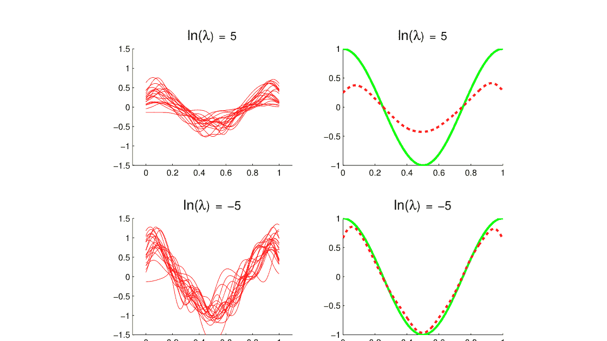

图4.25: 岭回归的偏差-方差权衡的示意图。我们从真实函数中生成了100个数据集，实线表示。左图：我们绘制了20个不同数据集的正则化拟合。我们使用带有高斯RBF扩展的线性回归，其中25个中心均匀分布在[0, 1]区间。右图：我们绘制了所有100个数据集的平均拟合。顶行：强正则化：我们可以看到各个拟合之间相似（低方差），但平均值与真实值相差较大（高偏差）。底行：轻度正则化：我们可以看到各个拟合之间差异较大（高方差），但平均值接近真实值（低偏差）。改编自[Bis06]图3.5。由biasVarModelComplexity3.ipynb生成。

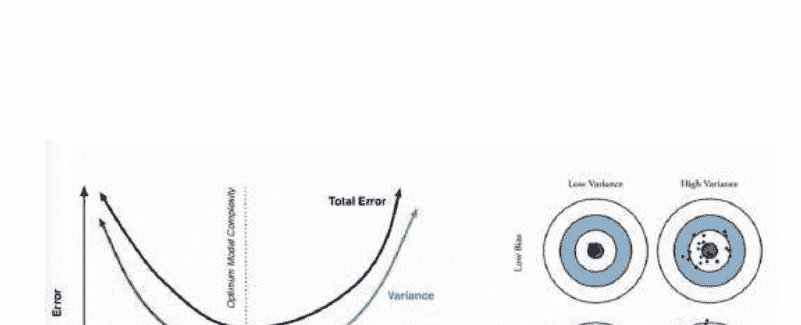

图4.26: 偏差方差权衡的卡通插图。来自http://scott.fortmann-roe.com/docs/BiasVariance.html。在Scott Fortmann-Roe的友好许可下使用。

作者：Kevin P. Murphy。 (C) MIT Press. CC-BY-NC-ND许可证

## 4.7.6.6 分类的偏差-方差权衡

如果我们使用0-1损失而不是平方误差，频率风险就不再能表示为平方偏差加方差。 事实上，可以证明（[HTF09]的练习7.2）偏差和方差是乘法组合的。 如果估计值在决策边界的正确一侧，则偏差为负，减小方差将降低误分类率。 但是，如果估计值在决策边界的错误一侧，则偏差为正，因此增加方差是有益的[Fri97a]。 这个鲜为人知的事实说明偏差-方差权衡对于分类问题并不是非常有用。更好的做法是关注期望损失，而不是直接关注偏差和方差。 我们可以使用交叉验证来近似计算期望损失，如我们在第4.5.5节中讨论的。

## 4.8 练习题

### 练习题 4.1 [单变量高斯分布的最大似然估计 *]

证明单变量高斯分布的最大似然估计为

$$\hat{\mu} = \frac{1}{N} \sum_{n=1}^{N} y_n$$

$$\hat{\sigma}^2 = \frac{1}{N} \sum_{n=1}^{N} (y_n - \hat{\mu})^2$$

### 练习题 4.2 [一维高斯分布的MAP估计 *]

(来源： Jaakkola) 考虑样本 $x_1, \ldots, x_n$ 来自己知方差 $\sigma^2$ 和未知均值 $\mu$ 的高斯随机变量。我们进一步假设均值的先验分布（也是高斯分布）为 $\mu \sim \mathcal{N}(m, s^2)$，其中均值 $m$ 和方差 $s^2$ 是固定的。因此，唯一未知的是 $\mu$。

- a. 计算MAP估计 $\hat{\mu}_{MAP}$。你可以在不证明的情况下给出结果。 或者，通过更多的工作，你可以计算对数后验的导数，将其置零并求解。

- b. 当样本数量增加时，MAP估计收敛到最大似然估计。

- c. 假设 $n$ 很小且固定。 如果我们增加先验方差 $s^2$，MAP估计器会收敛到什么？

- d. 假设 $n$ 很小且固定。 如果我们减小先验方差 $s^2$，MAP估计器会收敛到什么？

### 练习4.3 [高斯后验可信区间]

(来源： DeGroot) 假设 $X \sim \mathcal{N}(\mu, \sigma^2=4)$，其中 $\mu$ 是未知的，但有先验分布 $\mu \sim \mathcal{N}(\mu_0, \sigma_0^2=9)$。在观察到 $n$ 个样本后的后验分布是 $\mu \sim \mathcal{N}(\mu_n, \sigma_n^2)$。（这被称为可信区间，是贝叶斯的置信区间的类比。）为了确保多大的 $n$ 可以保证

$$p(\ell \leq \mu_n \leq u|\mathcal{D}) \geq 0.95$$

其中 $(\ell, u)$ 是一个宽度为1的区间（以 $\mu_n$ 为中心），$\mathcal{D}$ 是数据？ 提示：请记住，高斯分布的95%概率质量在均值的 $\pm 1.96\sigma$ 内。

### 练习 4.4 [高斯分布的BIC *]

(来源：Jaakkola。)

贝叶斯信息准则（BIC）是一种带惩罚项的对数似然函数，可用于模型选择。它的定义如下：

$$\text{BIC} = \log p(\mathcal{D}|\hat{\theta}_{ML}) - \frac{d}{2} \log(N)$$

其中 d 是模型中的自由参数数量，N 是样本数量。在这个问题中，我们将看到如何使用BIC来选择完全协方差高斯分布和对角协方差高斯分布之间的差异。显然，完全协方差高斯分布具有更高的似然度，但如果相对于对角协方差矩阵的改进太小，它可能不值得额外的参数。因此，我们使用BIC分数来选择模型。

我们可以写

$$\log p(\mathcal{D}|\hat{\Sigma}, \hat{\mu}) = -\frac{N}{2} \text{tr} \left( \hat{\Sigma}^{-1} \hat{\mathbf{S}} \right) - \frac{N}{2} \log(|\hat{\Sigma}|)$$

$$\hat{\mathbf{S}} = \frac{1}{N} \sum_{i=1}^N (\mathbf{x}_i - \overline{\mathbf{x}})(\mathbf{x}_i - \overline{\mathbf{x}})^T$$

其中 $\hat{\mathbf{S}}$ 是散布矩阵（经验协方差），矩阵的迹是其对角线元素的和，我们使用了迹技巧。

- a. 推导具有完整协方差矩阵的 D 维高斯分布的BIC分数。尽可能简化你的答案，利用MLE的形式。请确保指定自由参数的数量 d。

- b. 推导具有对角协方差矩阵的 D 维高斯分布的BIC分数。请确保指定自由参数的数量 d。 提示：对于对角情况，Σ的MLE估计与 $\hat{\Sigma}_{ML}$ 相同，只是其非对角线项为零：$\hat{\Sigma}_{diag} = \text{diag}(\hat{\Sigma}_{ML}(1,1), \ldots, \hat{\Sigma}_{ML}(D, D))$

### 练习 4.5 [2D离散分布的BIC]

(来源：Jaakkola。)

设 $x \in \{0,1\}$ 表示一次抛硬币的结果（$x=0$ 表示反面， $x=1$ 表示正面）。这枚硬币可能有偏差，正面出现的概率为 $\theta_1$。假设有人观察了硬币的翻转并向你报告了结果 y。 但是这个人不可靠，只有以概率 $\theta_2$ 正确报告结果； 即， $p(y|x, \theta_2)$ 由以下给出

|   | y = 0 | y = 1 |
|---|---|---|
| x = 0 | $\theta_2$ | $1 - \theta_2$ |
| x = 1 | $1 - \theta_2$ | $\theta_2$ |

假设 $\theta_2$ 与 x 和 $\theta_1$ 独立。

- a. 将联合概率分布 $p(x, y|\theta)$ 写成一个 $2 \times 2$ 的表格，其中 $\theta = (\theta_1, \theta_2)$。

- b. 假设有以下数据集: $\mathbf{x} = (1, 1, 0, 1, 1, 0, 0)$, $\mathbf{y} = (1, 0, 0, 0, 1, 0, 1)$。求解 $\theta_1$ 和 $\theta_2$ 的最大似然估计值(MLE)? 请解释你的答案。 提示: 注意似然函数的分解形式, $p(x, y|\theta) = p(y|x, \theta_2) p(x|\theta_1)$ 计算 $M_2$ 模型下的概率 $p(\mathcal{D}|\hat{\theta}, M_2)$是多少? (如果你愿意，你可以用分数形式回答。)

- c. 现在考虑一个具有4个参数的模型，$\boldsymbol{\theta} = (\theta_{0,0}, \theta_{0,1}, \theta_{1,0}, \theta_{1,1})$，表示 $p(x, y|\boldsymbol{\theta}) = \theta_{x,y}$。（只有这些参数中的3个是自由变量，因为它们必须加起来等于一。）$\theta$的最大似然估计是什么？当M4表示这个4参数模型时，$p(\mathcal{D}|\hat{\boldsymbol{\theta}}, M_4)$是多少？

- d. 假设我们不确定哪个模型是正确的。我们计算2参数模型和4参数模型的留一交叉验证对数似然如下：

$$L(m) = \sum_{i=1}^{n} \log p(x_i, y_i | m, \hat{\theta}(\mathcal{D}_{-i})) \tag{4.255}$$

并且 $\hat{\theta}(\mathcal{D}_{-i}))$ 表示在排除第 $i$ 行的 $\mathcal{D}$ 上计算的MLE。CV会选择哪个模型以及为什么？提示：注意当你每次省略一个训练案例时，计数表如何变化。

- e. 回想一下，CV的替代方法是使用BIC分数，定义为

$$\mathrm{BIC}(M, \mathcal{D}) \triangleq \log p(\mathcal{D}|\hat{\boldsymbol{\theta}}_{MLE}) - \frac{\mathrm{dof}(M)}{2} \log N \tag{4.256}$$

其中 $\mathrm{dof}(M)$ 是模型中的自由参数数量，计算两个模型的BIC分数（使用以 $e$ 为底的对数）。BIC更喜欢哪个模型？

### 练习4.6 [共轭先验的混合是共轭的 *]

考虑一个混合先验

$$p(\theta) = \sum_{k} p(z=k) p(\theta|z=k) \tag{4.257}$$

其中每个 $p(\theta|z=k)$ 对于似然函数是共轭的。证明这是一个共轭先验。

### 练习4.7 [ML估计器 $\hat{\sigma}_{\mathrm{mle}}^{2}$ 是有偏的]

证明 $\hat{\sigma}_{MLE}^{2}=\frac{1}{N}\sum_{n=1}^{N}(x_{n}-\hat{\mu})^{2}$ 是 $\sigma^{2}$ 的有偏估计器，即证明 $\mathbf{E}_{X_1,\dots,X_n\sim\mathcal{N}(\mu,\sigma)}[\hat{\sigma}^2(X_1,\dots,X_n)] = \sigma^2$

### 练习4.8 [当 $\mu$ 已知时 *] 估计 $\sigma^2$

# 5 决策理论

## 5.1 贝叶斯决策理论

贝叶斯推断提供了更新我们对隐藏量 H 的信念的最佳方法，给定观察数据 X = x，通过计算后验概率 p(H|x). 然而，最终我们需要将信念转化为我们可以在世界中执行的行动. 我们如何决定哪个行动是最好的？ 这就是贝叶斯决策理论的作用。在本章中，我们简要介绍一下。更多细节请参见

> [ DeG70; KWW22]

### 5.1.1 基础知识

在决策理论中，我们假设决策者或者 agent有一组可能的行动， A，可以选择。 例如，考虑一个假设的医生治疗可能患有COVID-19的患者的情况。假设行动是什么都不做，或者给患者使用一种有副作用的昂贵药物，但可以挽救他们的生命。

这些行动都有成本和收益，这将取决于潜在的自然状态H∈ H。 我们可以将这些信息编码到一个损失函数 $\ell(h, a)$中，该函数指定了我们在状态为 $h\in \mathcal{H}$时采取行动 $a\in \mathcal{A}$时所承担的损失。

例如，假设状态由患者的年龄（年轻 vs 老年）和是否患有COVID-19来定义。注意年龄可以直接观察到，但疾病状态必须从嘈杂的观测中推断出来，正如我们在第2.3节中讨论的那样。因此，状态是部分观察到的。

让我们假设无论患者的状态如何，给药的成本都是相同的。然而，效益会有所不同。 如果患者年轻，我们预计他们会活很长时间，所以如果他们患有COVID-19而不给予药物的成本很高；但如果患者年纪大，他们的寿命较短，所以如果他们患有COVID-19而不给予药物的成本可能较低（尤其是考虑到副作用）。 在医学界，成本的常见单位是质量调整寿命年或 QALY。 假设年轻人的预期QALY为60，而老年人的预期QALY为10。 让我们假设由于引起的疼痛和副作用而导致的药物成本相当于8个QALY。 然后我们得到了表5.1中显示的损失矩阵。

这些数字反映了相对成本和收益，并且会受到许多因素的影响。 这些数字可以通过询问决策者对不同可能结果的偏好来得出。 决策理论的一个定理是，任何一致的偏好集都可以转化为序数成本尺度。

| 状态 | 无药物 |
|------|--------|
| 无COVID-19，年轻 | 0 |
| COVID-19，年轻 | 60 |
| 无COVID-19，年长 | 0 |
| COVID-19，年长 | 10 |

表5.1：一个决策者的假设损失矩阵，其中有4个自然状态和2个可能的行动。

| 测试年龄 | pr(covid) | 成本-无操作 | 成本-药物 | 行动 |
|----------|-----------|-------------|-----------|------|
| 0        | 0         | 0.01        | 0.84      | 8.00 | 0 |
| 0        | 1         | 0.01        | 0.14      | 8.00 | 0 |
| 1        | 0         | 0.80        | 47.73     | 8.00 | 1 |
| 1        | 1         | 0.80        | 7.95      | 8.00 | 0 |

表5.2：治疗COVID-19患者的最优策略对应每个可能的观察。

对于每个可能的动作 \( a \)，在给定所有相关证据的情况下，这可能是一个单一的数据 \( x \) 或整个数据集 \( \mathcal{D} \)，这取决于问题：

\[
\rho(a|\boldsymbol{x}) \triangleq \mathbb{E}_{p(h|\boldsymbol{x})} [\ell(h, a)] = \sum_{h \in \mathcal{H}} \ell(h, a)p(h|\boldsymbol{x})
\]

(5.1)

最优策略 \( \pi^*(\boldsymbol{x}) \)，也称为贝叶斯估计器或贝叶斯决策规则 \( \delta^*(\boldsymbol{x}) \)，指定在给定证据 \( \boldsymbol{x} \) 时采取的行动以最小化风险：

\[
\pi^*(\boldsymbol{x}) = \underset{a \in \mathcal{A}}{\text{argmin}} \, \mathbb{E}_{p(h|\boldsymbol{x})} [\ell(h, a)]
\]

(5.2)

另一种等价的陈述方式如下。让我们定义一个效用函数 \( U(h, a) \)，表示每个可能状态下每个可能动作的可取性。如果我们设置 \( U(h, a) = -\ell(h, a) \)，则最优策略如下：

\[
\pi^*(\boldsymbol{x}) = \underset{a \in \mathcal{A}}{\text{argmax}} \, \mathbb{E}_{h} [U(h, a)]
\]

(5.3)

这被称为最大期望效用原则。

让我们回到我们的COVID-19例子。观察结果 \( \boldsymbol{x} \) 包括年龄（年轻或年老）和测试结果（阳性或阴性）。使用第2.3.1节关于COVID-19诊断的贝叶斯规则的结果，我们可以将测试结果转换为疾病状态的分布（即计算患者是否患有COVID-19的概率）。在给定这个信念状态和表5.1中的损失矩阵的情况下，我们可以计算每个可能的观察的最优策略，如表5.2所示。

从表5.2中我们可以看出，药物只应该给予测试结果为阳性的年轻人。然而，如果我们将药物的成本从8个单位降低到5个单位，那么最优策略将发生变化：在这种情况下，我们应该给予所有测试结果为阳性的人药物。策略也可能会根据情况而变化。

### 5.1.2 分类问题

在本节中，我们使用贝叶斯决策理论来决定给定观察输入 $x \in \mathcal{X}$ 时的最佳类别标签预测。

### 5.1.2.1 零一损失

假设自然状态对应于类别标签，因此 $\mathcal{H} = \mathcal{Y} = \{1, \dots, C\}$。此外，假设行动也对应于类别标签，因此 $\mathcal{A} = \mathcal{Y}$。在这种情况下，一个非常常用的损失函数是零一损失 $\ell_{01}(y^*, \hat{y})$，定义如下：

|          | $\hat{y} = 0$ | $\hat{y} = 1$ |
|----------|--------------|--------------|
| $y^* = 0$ | 0            | 1            |
| $y^* = 1$ | 1            | 0            |

我们可以更简洁地写成如下形式：

$$\ell_{01}(y^*, \hat{y}) = \mathbb{I}(y^* \neq \hat{y}) \tag{5.5}$$

在这种情况下，后验期望损失是

$$\rho(\hat{y}|\mathbf{x}) = p(\hat{y} \neq y^*|\mathbf{x}) = 1 - p(y^* = \hat{y}|\mathbf{x}) \tag{5.6}$$

因此，最小化期望损失的行动是选择最可能的标签：

$$\pi(\mathbf{x}) = \underset{y \in \mathcal{Y}}{\mathrm{argmax}} \ p(y|\mathbf{x}) \tag{5.7}$$

这对应于后验分布的模式，也称为最大后验估计或MAP估计。

### 5.1.2.2 成本敏感分类

考虑一个二分类问题，损失函数为 $\ell(y^*, \hat{y})$ 如下所示：

$$\begin{pmatrix} \ell_{00} & \ell_{01} \\ \ell_{10} & \ell_{11} \end{pmatrix} \tag{5.8}$$

因此，我们应该选择标签 \(\hat{y}=0\) 当且仅当

\[ \ell_{00} p_0 + \ell_{10} p_1 < \ell_{01} p_0 + \ell_{11} p_1 \] (5.9)

如果 \( \ell_{00} = \ell_{11} = 0 \)，则简化为

\[ p_1 < \frac{\ell_{01}}{\ell_{01} + \ell_{10}} \] (5.10)

现在假设 \( \ell_{10} = c \ell_{01} \)，所以一个假阴性的代价是一个假阳性的 \( c \) 倍。决策规则进一步简化为以下内容：选择 \( a = 0 \) 当且仅当 \( p_1 < 1/(1 + c) \)。例如，如果一个假阴性的代价是假阳性的两倍，即 \( c = 2 \)，则在声明为正面之前，我们使用决策阈值 \( 1/3 \)。

### 5.1.2.3 使用“拒绝”选项进行分类

在某些情况下，我们可以选择说“我不知道”而不是返回一个我们真正不信任的答案；这被称为选择拒绝选项（参见例如，[BW08]）。这在医学和金融等领域尤为重要，因为我们可能是风险厌恶的。

我们可以将拒绝选项形式化如下。假设自然状态为 \(\mathcal{H} = \mathcal{Y} = \{1,\ldots,C\}\)，而行动为 \(\mathcal{A} = \mathcal{Y} \cup \{0\}\)，其中行动0代表拒绝行动。现在定义如下的损失函数：

\[ \ell(y^*, a) = \begin{cases} 0 & \text{if } y^* = a \text{ 且 } a \in \{1,\ldots,C\} \\ \lambda_r & \text{if } a = 0 \\ \lambda_e & \text{否则} \end{cases} \] (5.11)

其中 \(\lambda_r\) 是拒绝行动的成本，\(\lambda_e\) 是分类错误的成本。练习5.1要求你证明如果最可能的类别的概率低于 \(\lambda^* = 1 - \frac{\lambda_r}{\lambda_e}\)，则最优的行动是选择拒绝行动。

\[ a^* = \begin{cases} y^* & \text{如果 } p^* > \lambda^* \\ \text{则拒绝} & \end{cases} \] (5.12)

其中

\[ y^* = \underset{y \in \{1,\ldots,C\}}{\arg\max} \, p(y|x) \] (5.13)

\[ p^* = p(y^*|x) = \underset{y \in \{1,\ldots,C\}}{\max} \, p(y|x) \] (5.14)

\[ \lambda^* = 1 - \frac{\lambda_r}{\lambda_e} \] (5.15)

请参见图5.1进行说明。拒绝选项的一个有趣应用是在玩电视游戏节目Jeopardy时出现的。在这个游戏中，参赛者必须解决各种文字谜题和回答各种琐事问题，但如果他们回答错误，他们会失去金钱。2011年，IBM推出了一款名为Watson的计算机系统，它击败了顶级人类Jeopardy冠军。 Watson使用了多种有趣的技术[Fer+10], 但对于我们目前的讨论来说, 最相关的是它包含了一个模块来估计自己答案的置信度。 只有在足够自信答案正确的情况下, 系统才选择“嗡嗡声”回答。

对于其他方法和应用, 请参见[Cor+16; GEY19]。

### 5.1.3 ROC曲线

在第5.1.2.2节中, 我们展示了在二元分类问题中可以通过使用从假阳性和假阴性的相对成本导出的值τ来通过阈值将最优标签选择出来。 我们可以考虑使用一组不同的阈值, 并比较结果的性能, 如下所讨论的。

|        | 估计 0 | 估计 1 | 行求和 |
|--------|--------|--------|--------|
| 真实值 0 | TN     | FP     | N      |
| 真实值 1 | FN     | TP     | P      |
| 列求和   | $\hat{N}$ | $\hat{P}$ |        |

表5.3：二分类问题的类别混淆矩阵。 TP是真正例的数量，FP是假正例的数量，TN是真反例的数量，FN是假反例的数量，P是真正例的实际数量，$\hat{P}$是预测的正例数量，N是真反例的实际数量，$\hat{N}$是预测的反例数量。

|        | 0 | 1 |
|--------|---|---|
| 真相 0 | TN/N=TNR=特异度 | FP/N=FPR=第一类错误=漏报率 |
| 真相 1 | FN/P=FNR=第二类错误=误报率 | TP/P=TPR=敏感度=召回率 |

表5.4：二元分类问题的类别混淆矩阵，按行归一化以获得 \(p(\hat{y}|y)\)。
缩写： \(TNR\) = 真阴性率， \(Spec\) = 特异性， \(FPR\) = 假阳性率， \(FNR\) = 假阴性率， \(Miss\) = 漏报率， \(TPR\) = 真阳性率， \(Sens\) = 敏感性。 注意 \(FNR=1-TPR\) 和 \(FPR=1-TNR\)。

|        | 0 | 1 |
|--------|---|---|
| 真相 0 | TN/\hat{N}=NPV | FP/\hat{P}=FDR |
| 真相 1 | FN/\hat{N}=FOR | TP/\hat{P}=Prec=PPV |

表5.5：二分类问题的类混淆矩阵，按列归一化以获得 \(p(y|\hat{y})\)。
缩写： \(NPV\) = 阴性预测值， \(FDR\) = 假发现率， \(FOR\) = 假遗漏率， \(PPV\) = 正预测值， \(Prec\) = 精确度。 注意 \(FOR=1-NPV\) 和 \(FDR=1-PPV\)。

### 5.1.3.1 类混淆矩阵

对于任意固定的阈值 \(\tau\)，我们考虑以下决策规则：

$$\hat{y}_\tau(\mathbf{x}) = \mathbb{I}(p(y=1|\mathbf{x}) \geq 1-\tau)$$ (5.16)

我们可以按照以下方式计算使用该策略在一组 \(N\) 个标记示例上产生的误报数（FP）：

$$FP_\tau = \sum_{n=1}^{N} \mathbb{I}(\hat{y}_\tau(\mathbf{x}_n) = 1, y_n = 0)$$ (5.17)

同样，我们可以计算出误拒数（FN）、真阳数（TP）和真阴数（TN）的经验数。我们可以将这些结果存储在一个 \(2 \times 2\) 类别混淆矩阵 \(C\) 中，其中 \(C_{ij}\) 是真实类别标签 \(i\) 被（误）分类为标签 \(j\) 的次数。对于二元分类问题，得到的矩阵将如表5.3所示。

从这个表中，我们可以计算 \(p(\hat{y}|y)\) 或 \(p(y|\hat{y})\)，取决于我们是在行还是列上进行归一化。我们可以从这些分布中推导出各种摘要统计量，如表5.4和表5.5所总结的。例如，真正例率（TPR），也称为敏感性、召回率或命中率，定义为

$$TPR_\tau = p(\hat{y}=1|y=1, \tau) = \frac{TP_\tau}{TP_\tau + FN_\tau}$$ (5.18)

而假正例率（FPR），也称为误报率或第一类错误率，定义为

$$FPR_\tau = p(\hat{y}=1|y=0, \tau) = \frac{FP_\tau}{FP_\tau + TN_\tau}$$ (5.19)

我们现在可以将TPR与FPR作为τ的隐式函数绘制出来。这被称为接收器操作特性（ROC）曲线。请参见图5.2（a）的示例。

### 5.1.3.2 将ROC曲线总结为一个标量

ROC曲线的质量通常用曲线下面积（AUC）来总结为一个单一的数字。较高的AUC得分更好；最大值显然为1。另一个常用的总结统计量是等错误率（EER），也称为交叉错误率（cross-over rate），定义为满足FPR = FNR的值。由于FNR=1-TPR，我们可以通过从左上角到右下角绘制一条直线并观察其与ROC曲线的交点（参见图5.2(a)中的点A和B）来计算EER。较低的EER得分更好；最小值显然为0（对应于左上角）。

### 5.1.3.3 类别不平衡

在某些问题中，存在严重的类别不平衡。例如，在信息检索中，负例（不相关项）通常比正例（相关项）要多得多。ROC曲线不受类别不平衡的影响，因为TPR和FPR分别是正例和负例中的比例。然而，在这种情况下，ROC曲线的有用性可能会降低，因为虽然假阳性的绝对数量发生了很大变化，但假阳性率的变化不会很大，因为FPR被FP+TN除（参见例如[SR15]进行讨论）。因此，所有的‘动作’都发生在曲线的极左部分。在这种情况下，我们可以选择使用其他方式来总结类别混淆矩阵，例如精确率-召回率曲线，在第5.1.4节中进行讨论。

### 5.1.4 精确率-召回率曲线

在某些问题中，“负面”的概念并不明确。 例如，考虑在图像中检测对象： 如果检测器通过对补丁进行分类来工作，则检查的补丁数量 - 也就是真负例的数量 - 是算法的一个参数，而不是问题定义的一部分。 同样，信息检索系统通常可以选择初始的候选项集，然后对其进行相关性排序；通过指定一个截断值，我们可以将其划分为正面和负面集合，但请注意，负面集合的大小取决于检索到的总项数，这是算法的一个参数，而不是问题的规范的一部分。

在这些情况下，我们可以选择使用一个精确率-召回率曲线来总结我们系统的性能，如下所述。 (有关ROC曲线和PR曲线之间关系的更详细讨论，请参见[DG06]。)

### 5.1.4.1 计算精确度和召回率

关键思想是用一个仅从正例计算得到的量来替代FPR，即精确度：

$$P(τ) ≜ p(y = 1 | ŷ = 1, τ) = \frac{TP_τ}{TP_τ + FP_τ}$$

(5.20)

精确度衡量了我们检测到的正例的比例。 我们可以将其与召回率（与TPR相同）进行比较，召回率衡量了我们实际检测到的正例的比例：

$$R(τ) ≜ p(ŷ = 1 | y = 1, τ) = \frac{TP_τ}{TP_τ + FN_τ}$$

(5.21)

如果 $ŷ_n ∈ \{0, 1\}$ 是预测标签，而 $y_n ∈ \{0, 1\}$ 是真实标签，我们可以使用以下方法估计精确度和召回率：

$$P(τ) = \frac{\sum_n y_n ŷ_n}{\sum_n ŷ_n}$$

(5.22)

$$R(τ) = \frac{\sum_n y_n ŷ_n}{\sum_n y_n}$$

(5.23)

我们现在可以根据阈值 $τ$ 的变化绘制精确度与召回率的图表。 参见图5.2(b)。 靠近右上角是最好的结果。

### 5.1.4.2 将PR曲线总结为一个标量

PR曲线可以通过几种方式总结为一个单一的数值。 首先，我们可以引用在固定召回率水平下的精确度，例如前 $K=10$ 个实体的精确度。 这被称为K处的精确度得分。 或者，我们可以计算PR曲线下的面积。

然而，精确度可能不会随着召回率的增加而单调下降。 例如，假设一个分类器在10%的召回率下有90%的精确度，在20%的召回率下有96%的精确度。 在这种情况下，我们应该测量在至少10%的召回率下可以达到的最大精确度（即96%），而不是在10%的召回率处的精确度。 这被称为插值精确率。

## 5.1.4.3 F分数

对于固定的阈值，对应于PR曲线上的一个点，我们可以计算出一个单一的精确度和召回率值，分别表示为 $P$ 和 $R$。这些经常被合并成一个称为 $F_{\beta}$ 的单一统计量，定义如下：^2

```
$$\frac{1}{F_{\beta}} = \frac{1}{1+\beta^2} \frac{1}{P} + \frac{\beta^2}{1+\beta^2} \frac{1}{R}$$
```

或者等价地

```
$$F_{\beta} \triangleq (1+\beta^2) \frac{P \cdot R}{\beta^2 P + R} = \frac{(1+\beta^2) TP}{(1+\beta^2) TP + \beta^2 FN + FP}$$
```

如果我们设置 $\beta=1$，我们得到精确度和召回率的调和平均数：

```
$$\frac{1}{F_1} = \frac{1}{2}\left( \frac{1}{P} + \frac{1}{R} \right)$$
$$F_1 = \frac{2}{1/R + 1/P} = 2\frac{P \cdot R}{P + R} = \frac{TP}{TP + \frac{1}{2}(FP + FN)}$$
```

为了理解为什么我们使用调和平均数而不是算术平均数，考虑以下情况。假设我们回收所有条目，所以 $\hat{y}_n=1$ 对于所有 $n$，且 $R=1$。在这种情况下，精确度 $P$ 将由流行度， $p(y=1) = \frac{\sum_n \mathbb{I}(y_n=1)}{N}$。假设流行度很低，比如 $p(y=1) = 10^{-4}$。精确度和召回率的算术平均数由 $(P + R)/2 = (10^{-4} + 1)/2 \approx 50\%$。相比之下，这种策略的调和平均值仅为 $\frac{2 \times 10^{-4} \times 1}{10^{-4} + 1} \approx 0.02\%$。一般而言，调和平均值更为保守，需要精确度和召回率都较高。使用 $F_1$ 得分同等权重地衡量精确度和召回率。然而，如果召回率更重要，我们可以使用 $\beta=2$，如果精确度更重要，我们可以使用 $\beta=0.5$。

## 5.1.4.4 类别不平衡

ROC曲线对类别不平衡不敏感，但PR曲线不是，正如[Wil20]中所指出的。为了看清楚这一点，让数据集中的正例比例为 $\pi = P/(P+N)$，定义比率 $r = P/N = \pi/(1-\pi)$。令 $n = P + N$ 为总体大小。ROC曲线不受 $r$ 的变化影响，因为TPR被定义为正例中的比率，而FPR被定义为负例中的比率。这意味着我们定义哪个类为正例，哪个类为负例并不重要。

现在考虑PR曲线。精确率可以写为

```
$$\text{Prec} = \frac{TP}{TP + FP} = \frac{P \cdot TPR}{P \cdot TPR + N \cdot FPR} = \frac{TPR}{TPR + \frac{1}{r} FPR}$$
```

因此，当 π → 1且 r→ ∞时，Prec → 1; π → 0且 r → 0时，Prec → 0。例如，如果我们从一个平衡的问题（其中 r= 0.5）转变为一个不平衡的问题（其中 r= 0.1，即正例更稀少），每个阈值下的精确率将下降，而召回率（也称为TPR）将保持不变，因此整体PR曲线将更低。因此，如果我们有多个具有不同流行度的二元问题（例如，常见或罕见对象的目标检测），在对它们的精确率进行平均时应该小心[HCD12]。

F-分数也受到类别不平衡的影响。为了看到这一点，注意我们可以将F-分数重写为：

```
$$\frac{1}{F_\beta} = \frac{1}{1 + \beta^2} \frac{1}{P} + \frac{\beta^2}{1 + \beta^2} \frac{1}{R}$$
$$= \frac{1}{1 + \beta^2} \frac{TPR + \frac{N}{P} FPR}{TPR} + \frac{\beta^2}{1 + \beta^2} \frac{1}{TPR}$$
$$F_\beta = \frac{(1 + \beta^2) TPR}{TPR + \frac{1}{r} FPR + \beta^2}$$
```

### 5.1.5 回归问题

到目前为止，我们考虑了有限数量的动作 $\mathcal{A}$和自然状态 $\mathcal{H}$的情况。在本节中，我们考虑动作和状态集合都等于实数线的情况，$\mathcal{A} = \mathcal{H} = \mathbb{R}$。我们将为这种情况指定各种常用的损失函数（可以通过逐元素计算来扩展到 $\mathbb{R}^D$的损失）。得到的决策规则可以用于计算估计器返回的最优参数，或者机器人采取的最优动作等。

### 5.1.5.1 L2损失

连续状态和动作最常见的损失是 $\ell_2$损失，也称为平方误差或二次损失，定义如下：

```
$$\ell_2(h, a) = (h - a)^2$$
```

在这种情况下，风险由以下公式给出

```
$$\rho(a|\mathbf{x}) = \mathbb{E}[(h - a)^2 | \mathbf{x}] = \mathbb{E}[h^2 | \mathbf{x}] - 2a \mathbb{E}[h | \mathbf{x}] + a^2$$
```

最优动作必须满足风险的导数（在该点）为零的条件（如第8章所述）。因此，最优动作是选择后验均值：

```
$$\frac{\partial}{\partial a} \rho(a|\mathbf{x}) = -2\mathbb{E}[h|\mathbf{x}] + 2a = 0 \Rightarrow \pi(\mathbf{x}) = \mathbb{E}[h|\mathbf{x}] = \int h \, p(h|\mathbf{x}) \, dh$$
```

这通常被称为最小均方误差估计或MMSE估计。

## 5.1. 贝叶斯决策理论

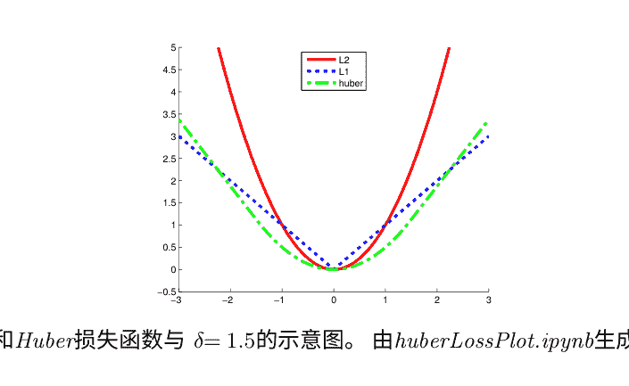

### 5.1.5.2 L1损失

ℓ₂损失对真实值的偏差进行二次惩罚，因此对离群值敏感。一种更健壮的选择是绝对值或ℓ₁损失

```
ℓ₁(h, a) = |h - a|
```

这在图5.3中有示意图。练习5.4要求你证明最优估计是后验中位数，即满足 Pr(h < a|x) = Pr(h ≥ a |x) = 0.5的值 a。 我们可以将其用于在第11.6.1节中讨论的健壮回归。

### 5.1.5.3 Huber损失

另一个鲁棒损失函数是Huber损失[Hub64]，定义如下：

```
ℓδ(h, a) = { r²/2 如果 |r| ≤ δ; δ|r| - δ²/2 if |r| > δ
```

这相当于对于小于 δ的错误，等价于 ℓ₂，对于较大的错误，等价于 ℓ₁ 请参见图5.3进行绘制。 我们可以将其用于鲁棒回归，如第11.6.3节所讨论的。

### 5.1.6 概率预测问题

在第5.1.2节中，我们假设可能的行动是选择一个单一的类别标签（或可能的“拒绝”或“不知道”行动）。 在第5.1.5节中，我们假设可能的行动是选择一个实值标量。 在本节中，我们假设可能的行动是选择一个概率分布over某个感兴趣的值。 也就是说，我们想要进行概率预测或概率预测，而不是预测一个具体的值。 更准确地说，我们假设真实的“自然状态”是一个分布， h = p(Y|x)，行动是另一个分布， a = q(Y|x)，我们希望选择 q以最小化给定 x的 E[ℓ(p, q)]。 我们在下面讨论各种可能的损失函数。

作者： Kevin P. Murphy。 (C) MIT Press. CC-BY-NC-ND许可证

### 5.1.6.1 KL，交叉熵和对数损失

比较两个分布的常见损失函数是Kullback-Leibler散度或KL散度，其定义如下：

```
D_{\text{KL}}(p \parallel q) \triangleq \sum_{y \in \mathcal{Y}} p(y) \log \frac{p(y)}{q(y)} \quad (5.37)
```

（我们假设变量 y是离散的，为了简洁起见，但这可以推广到实值变量。）在第6.2节中，我们将展示KL散度满足以下性质：D_{\text{KL}}(p \parallel q) \geq 0当且仅当 p = q时等号成立。请注意，它是其参数的一个非对称函数。

我们可以展开KL散度如下：

```
D_{\text{KL}}(p \parallel q) = \sum_{y \in \mathcal{Y}} p(y) \log p(y) - \sum_{y \in \mathcal{Y}} p(y) \log q(y) \quad (5.38)
```

```
= - H(p) + H_{ce}(p, q) \quad (5.39)
```

```
H(p) \triangleq - \sum_{y} p(y) \log p(y) \quad (5.40)
```

```
H_{ce}(p, q) \triangleq - \sum_{y} p(y) \log q(y) \quad (5.41)
```

H(p)项被称为熵。这是不确定性或方差的度量 p；如果 p是均匀的，则熵最大，如果 p是退化的或确定性的，熵为0。熵经常在信息论领域中使用，该领域关注压缩和传输数据的最佳方法（参见第6章）。最佳编码方案将为更频繁的符号（即 p(y)较大的值）分配较少的位，而为较不频繁的符号分配更多的位。一个关键结果表明，用分布 p生成的数据集压缩所需的位数至少为 H(p)；因此，熵为我们在不丢失信息的情况下压缩数据的程度提供了一个下界。H_{ce}(p, q)项被称为交叉熵。如果我们使用分布 q来设计我们的编码，这个量度是我们压缩来自分布 p的数据集所需使用的平均位数。因此，KL是由于使用不正确的分布 q而需要使用的额外位数来压缩数据。如果KL为零，这意味着我们可以正确预测所有可能的未来事件的概率，因此我们已经学会像一个有真实分布 p访问权限的“神谕”一样预测未来。

为了找到在预测未来数据时使用的最优分布，我们可以最小化 D_{\text{KL}}(p \parallel q)。由于 H(p)相对于 q是一个常数，可以忽略，因此我们可以等效地最小化交叉熵：

```
q^*(Y|x) = \text{argmin}_q H_{ce}(q(Y|x), p(Y|x)) \quad (5.42)
```

现在考虑真实状态是一个退化分布的特殊情况，它将所有的质量都集中在一个单一的结果上，比如说 c，即 H = p(Y|x) = I(Y = c)。这通常被称为“独热”分布，因为它将向量的 c'th元素“打开”，并保持其他元素不变。

元素‘off’，如图2.1所示。在这种情况下，交叉熵变为
$$
\mathbb{H}_{ce}(\delta(Y = c), q) = -\sum_{y \in \mathcal{Y}} \delta(y = c) \log q(y) = -\log q(c)
$$ (5.43)
这被称为预测分布 $q$ 的对数损失，当给定目标标签 $c$ 时。

### 5.1.6.2 适当的评分规则

交叉熵损失是概率预测中非常常见的选择，但不是唯一可能的指标。我们希望的关键属性是，当决策者选择与真实分布 $p$ 匹配的分布 $q$ 时，损失函数最小化，即 $\ell(p, p) \leq \ell(p, q)$，当且仅当 $p = q$ 时等号成立。这样的损失函数 $\ell$ 被称为适当的评分规则 [GR07]。

我们可以通过以下事实来证明交叉熵损失是一个适当的评分规则：$D_{\mathrm{KL}}(p \parallel p) \leq D_{\mathrm{KL}}(p \parallel q)$。然而，对于低概率事件，$\log p(y)/q(y)$ 项可能非常敏感 [QC+06]。一个常见的替代方法是使用Brier得分[Bri50]，其定义如下（对于具有 $C$ 个值的离散分布）：
$$
\ell(p, q) \triangleq \frac{1}{C} \sum_{c=1}^{C} (q(y=c|x) - p(y=c|x))^2
$$ (5.44)
当将预测分布视为向量时，这只是预测分布与真实分布之间的平方误差。由于它基于平方误差，Brier得分对于极为罕见或极为常见的类别不太敏感。幸运的是，它也是一个适当的评分规则。

## 5.2 选择“正确”的模型

在本节中，我们考虑的情况是我们有几个候选（参数化）模型（例如，具有不同层数的神经网络），我们想要选择“正确”的模型。这可以使用贝叶斯决策理论的工具来解决。

### 5.2.1 贝叶斯假设检验

假设我们有两个假设或模型，通常称为零假设 $M_0$ 和备择假设 $M_1$，我们想要知道哪个更有可能是真实的。这被称为假设检验。

如果我们使用0-1损失，最优决策是选择备择假设当且仅当 $p(M_1|\mathcal{D}) > p(M_0|\mathcal{D})$，或者等价地，如果 $p(M_1|\mathcal{D})/p(M_0|\mathcal{D}) > 1$。如果我们使用均匀先验，$p(M_0) = p(M_1) = 0.5$，决策规则变为：选择 $M_1$ 当且仅当 $p(\mathcal{D}|M_1)/p(\mathcal{D}|M_0) > 1$。这个数量，即两个模型的边际似然比，被称为贝叶斯因子：
$$
B_{1,0} \triangleq \frac{p(\mathcal{D}|M_1)}{p(\mathcal{D}|M_0)}
$$ (5.45)
这类似于似然比，只是我们积分掉了参数，这样我们可以比较不同复杂度的模型，这是由贝叶斯奥卡姆剃刀效应在5.2.3节中解释的。

| 贝叶斯因子 $BF(1,0)$ | 解释 |
| :--- | :--- |
| $BF < \frac{1}{100}$ | 对于 $M_0$ 有决定性的证据 |
| $BF < \frac{1}{10}$ | 对于 $M_0$ 有强有力的证据 |
| $\frac{1}{10} < BF < \frac{1}{3}$ | 对于 $M_0$ 有中等的证据 |
| $\frac{1}{3} < BF < 1$ | 对于 $M_0$ 有弱证据 |
| $1 < BF < 3$ | 对于 $M_1$ 有弱证据 |
| $3 < BF < 10$ | 对于 $M_1$ 有中等的证据 |
| $BF > 10$ | 对于 $M_1$ 有强有力的证据 |
| $BF > 100$ | 对于 $M_1$ 有决定性的证据 |

*表5.6: 解释贝叶斯因子的Jeffreys证据规模。*

如果 $B_{1,0} > 1$，那么我们更喜欢模型1，否则我们更喜欢模型0。当然，可能 $B_{1,0}$ 只是略大于1。在这种情况下，我们对模型1更好的信心不是很高。Jeffreys[Jef61]提出了一种解释贝叶斯因子大小的证据规模，如表5.6所示。这是频率主义概念p值的贝叶斯替代方法（见5.5.3节）。我们在5.2.1.1节中给出了如何计算贝叶斯因子的实例。

### 5.2.1.1 例子：测试硬币是否公平

举个例子，假设我们观察到一些抛硬币的结果，并且想要确定数据是由一个公平的硬币生成的，$\theta = 0.5$，或者是一个可能有偏差的硬币，其中$\theta$可以是$[0, 1]$中的任何值。我们用$M_0$表示第一个模型，用$M_1$表示第二个模型。在$M_0$下的边际似然是简单的

```
$$p(\mathcal{D}|M_0) = \left(\frac{1}{2}\right)^N \tag{5.46}$$
```

其中$N$是抛硬币的次数。根据方程(4.143)，在$M_1$下的边际似然，使用Beta先验，是

```
$$p(\mathcal{D}|M_1) = \int p(\mathcal{D}|\theta)p(\theta)d\theta = \frac{B(\alpha_1 + N_1, \alpha_0 + N_0)}{B(\alpha_1, \alpha_0)} \tag{5.47}$$
```

在图5.4(a)中，我们绘制了$\log p(\mathcal{D}|M_1)$与正面朝上的次数$N_1$的关系，假设$N=5$和均匀先验，$\alpha_1 = \alpha_0 = 1$。（曲线的形状对$\alpha$不太敏感。）并且$\alpha_0$，只要先验是对称的，所以$\alpha_0 = \alpha_1$。如果我们观察到2或3个正面，那么无偏硬币假设$M_0$比$M_1$更有可能，因为$M_0$是一个更简单的模型（它没有自由参数）-如果硬币有偏差但恰好产生几乎完全的50/50正面/反面，那将是一个可疑的巧合。然而，随着计数变得更极端，我们更倾向于有偏硬币假设。注意，如果我们绘制对数贝叶斯因子$\log B_{1,0}$，它的形状将完全相同，因为$\log p(\mathcal{D}|M_0)$是一个常数。

### 5.2.2 贝叶斯模型选择

现在假设我们有一个集合$\mathcal{M}$ of超过2个模型，并且我们想选择最有可能的。这被称为模型选择。我们可以将其视为一个决策理论问题，其中行动空间

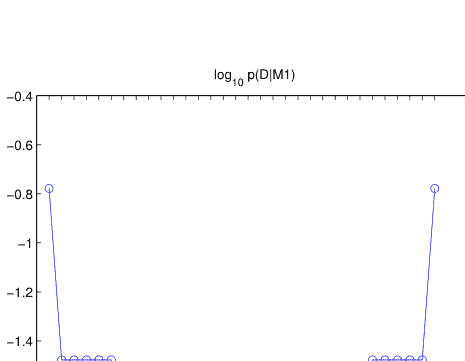

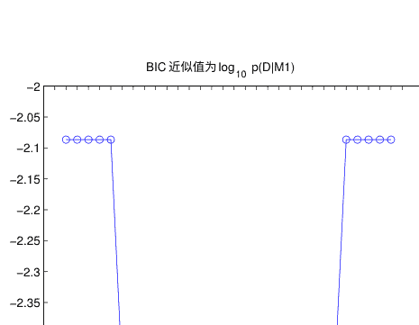

图5.4: (a)对于抛硬币示例，对数边际似然与正面次数的关系。(b)BIC近似值。(垂直刻度是任意的，因为我们保持 $N$固定。)由coins_model_sel_demo.ipynb生成。

需要选择一个模型， $m \in \mathcal{M}$。如果我们有一个0-1损失，最优的行动是选择最可能的模型：

$$\hat{m} = \arg\max_{m\in\mathcal{M}} p(m|\mathcal{D}) \tag{5.48}$$

其中

$$p(m|\mathcal{D}) = \frac{p(\mathcal{D}|m)p(m)}{\sum_{m\in\mathcal{M}} p(\mathcal{D}|m)p(m)} \tag{5.49}$$

是模型的后验概率。 如果模型的先验概率是均匀的， $p(m) = 1/|\mathcal{M}|$，那么最大后验模型给定为

$$\hat{m} = \arg\max_{m\in\mathcal{M}} p(\mathcal{D}|m) \tag{5.50}$$

数量 $p(\mathcal{D}|m)$ 由以下给出

$$p(\mathcal{D}|m) = \int p(\mathcal{D}|\boldsymbol{\theta}, m)p(\boldsymbol{\theta}|m)d\boldsymbol{\theta} \tag{5.51}$$

这被称为边际似然，或者模型 $m$的证据。 直观地说，它是数据在所有可能的参数值上的平均似然，乘以先验概率 $p(\boldsymbol{\theta}|m)$加权。 如果 $\boldsymbol{\theta}$的所有设置都对数据赋予高概率，那么这可能是一个好的模型。

#### 5.2.2.1 示例：多项式回归

作为贝叶斯模型选择的一个例子，我们将考虑一维多项式回归。 图5.5显示了三个不同模型的后验概率，对应于1、2和3次多项式拟合。

对N=5个数据点，我们对模型使用均匀先验，并使用经验贝叶斯估计回归权重的先验分布(见第11.7.7节)。然后计算每个模型的证据(详见第11.7节如何进行此操作)。我们发现没有足够的数据来证明一个复杂模型的合理性，因此MAP模型为m=1。图5.6显示了N=30个数据点的类似图。现在我们可以看到MAP模型为m=2；更大的样本量意味着我们可以安全地选择一个更复杂的模型。

### 5.2.3 奥卡姆剃刀

考虑两个模型，一个简单的模型m_1和一个更复杂的模型m_2。假设两个模型都可以通过适当优化其参数来解释数据，即对于这些参数优化，p(D|θ̂_1,m_1)和p(D|θ̂_2,m_2)都很大。直观上，我们应该更喜欢简单的模型m_1，因为它既简单又与m_2一样好。这个原则被称为奥卡姆剃刀。

现在让我们看看如何基于边际似然对排名模型进行排序，这涉及到对先验进行似然平均，从而导致这种行为。复杂模型将在解释数据的“好”参数上放置较少的先验概率θ_2，因为先验必须在整个参数空间上积分为1.0。因此，它将在似然较低的参数空间部分进行平均。相比之下，简单模型具有较少的参数，因此先验集中在较小的体积上。在较小的体积上生成；因此，它的平均值大部分在参数空间的好部分附近θ̂_1。因此，我们可以看到边际似然更倾向于简单的模型。这被称为贝叶斯奥卡姆剃刀效应[Mac95; MG05]。

理解贝叶斯奥卡姆剃刀效应的另一种方式是比较简单模型和复杂模型的相对预测能力。由于概率必须总和为一，我们有 ∑_{𝒟'} p(𝒟'|m) = 1，其中求和是对所有可能的数据集进行的。复杂模型可以预测许多事物，必须将其预测的概率分布得很稀疏，因此对于任何给定的数据集，它都不会获得像简单模型那样大的概率。这有时被称为概率守恒质量原则，并在图5.7中进行了说明。在水平轴上，我们按照递增复杂性（以某种抽象的方式测量）的顺序绘制所有可能的数据集。在垂直轴上，我们绘制了3个可能模型的预测：一个简单模型，M_1；一个中等模型，M_2；和一个复杂模型，M_3。我们还通过一条垂直线表示实际观察到的数据𝒟_0。模型1过于简单，对𝒟_0赋予了较低的概率。模型3也对𝒟_0赋予了相对较低的概率，因为它可以预测许多数据集，因此它将其概率分布得很广泛且稀疏。模型2是“刚刚好的”：它以合理的置信度预测观察到的数据，但不会预测太多其他事物。因此，模型2是最有可能的模型。

## 5.2.4 交叉验证和边际似然之间的关系

我们已经看到边际似然如何帮助我们选择“合适”复杂度的模型。在非贝叶斯模型选择方法中，通常使用交叉验证（第4.5.5节）来实现这一目的。

事实证明，边际似然与留一交叉验证（LOO-CV）估计密切相关，接下来我们将展示这一点。我们从模型 m 的边际似然开始，将其顺序形式写为以下形式：

$$p(\mathcal{D}|m) = \prod_{n=1}^{N} p(y_n|y_{1:n-1}, \boldsymbol{x}_{1:N}, m) = \prod_{n=1}^{N} p(y_n|\boldsymbol{x}_n, \mathcal{D}_{1:n-1}, m) \tag{5.52}$$

其中

$$p(y|\boldsymbol{x}, \mathcal{D}_{1:n-1}, m) = \int p(y|\boldsymbol{x}, \boldsymbol{\theta}) p(\boldsymbol{\theta}|\mathcal{D}_{1:n-1}, m) d\boldsymbol{\theta} \tag{5.53}$$

假设我们使用插件近似来获得上述分布

$$p(y|\boldsymbol{x}, \mathcal{D}_{1:n-1}, m) \approx \int p(y|\boldsymbol{x}, \boldsymbol{\theta}) \delta(\boldsymbol{\theta} - \hat{\boldsymbol{\theta}}_m(\mathcal{D}_{1:n-1})) d\boldsymbol{\theta} = p(y|\boldsymbol{x}, \hat{\boldsymbol{\theta}}_m(\mathcal{D}_{1:n-1})) \tag{5.54}$$

然后我们得到

$$\log p(\mathcal{D}|m) \approx \sum_{n=1}^{N} \log p(y_n|\boldsymbol{x}_n, \hat{\boldsymbol{\theta}}_m(\mathcal{D}_{1:n-1})) \tag{5.55}$$

这类似于留一法交叉验证估计的似然函数，其形式为 $\frac{1}{N} \sum_{n=1}^{N} \log p(y_n|\boldsymbol{x}_n, \hat{\boldsymbol{\theta}}_m(\mathcal{D}_{1:n-1,n+1:N}))$，除了我们忽略 $\mathcal{D}_{n+1:N}$。连接背后的直觉是：过于复杂的模型会过度拟合“早期”示例，然后会预测剩余的示例较差，因此也会得到较低的交叉验证分数。有关这些性能指标之间关系的更详细讨论，请参见[FH20]。

### 5.2.5 信息准则

边际似然函数，$p(\mathcal{D}|m) = \int p(\mathcal{D}|\boldsymbol{\theta}, m) p(\boldsymbol{\theta}) d\boldsymbol{\theta}$，这在贝叶斯模型选择中是必需的，如5.2.2节所讨论的，但计算起来可能很困难，因为它需要对整个参数空间进行边缘化。此外，结果对先验选择非常敏感。在本节中，我们讨论了一些与模型选择相关的其他指标，称为信息准则。我们只进行了简要讨论；更多细节请参见[GHV14]。

### 5.2.5.1 贝叶斯信息准则（BIC）

贝叶斯信息准则（BIC）[Sch78]可以看作是对对数边际似然的简单近似。特别地，如果我们对后验进行高斯近似，如4.6.8.2节所讨论的，我们可以得到（从方程（4.215））以下结果：

$$\log p(\mathcal{D}|m) \approx \log p(\mathcal{D}|\hat{\boldsymbol{\theta}}_{\text{map}}) + \log p(\hat{\boldsymbol{\theta}}_{\text{map}}) - \frac{1}{2} \log |\mathbf{H}| \quad (5.56)$$

其中 $\mathbf{H}$ 是负对数联合的海森矩阵，即在MAP估计 $\hat{\boldsymbol{\theta}}_{\text{map}}$ 处评估的 $-\log p(\mathcal{D}, \boldsymbol{\theta})$。我们可以看到方程式(5.56)是对数似然加上一些惩罚项。如果我们有一个均匀先验分布，$p(\boldsymbol{\theta}) \propto 1$，我们可以去掉先验项，并用MLE替换MAP估计值 $\hat{\boldsymbol{\theta}}$，得到

$$\log p(\mathcal{D}|m) \approx \log p(\mathcal{D}|\hat{\boldsymbol{\theta}}) - \frac{1}{2} \log |\mathbf{H}| \quad (5.57)$$

现在我们专注于近似计算 $\log |\mathbf{H}|$ 项，有时也称为Occam因子，因为它是模型复杂性（后验分布的体积）的度量。我们有 $\mathbf{H} = \sum_{i=1}^N \mathbf{H}_i$。让我们用一个固定的矩阵 $\hat{\mathbf{H}}$ 来近似每个 $\mathbf{H}_i$。然后我们有

$$\log |\mathbf{H}| = \log |N\hat{\mathbf{H}}| = \log(N^D |\hat{\mathbf{H}}|) = D \log N + \log |\hat{\mathbf{H}}| \quad (5.58)$$

其中 $D = \dim(\boldsymbol{\theta})$并且我们假设 $\mathbf{H}$ 是满秩的。我们可以忽略 $\log |\hat{\mathbf{H}}|$ 项，因为它与 $N$ 无关，因此会被似然函数所压倒。将所有的部分放在一起，我们得到了我们想要最大化的BIC分数：

$$J_{\text{BIC}}(m) = \log p(\mathcal{D}|m) \approx \log p(\mathcal{D}|\hat{\boldsymbol{\theta}}, m) - \frac{D_m}{2} \log N \quad (5.59)$$

我们还可以通过乘以-2来定义BIC损失，我们希望最小化：

$$\mathcal{L}_{\text{BIC}}(m) = -2 \log p(\mathcal{D}|\hat{\boldsymbol{\theta}}, m) + D_m \log N \quad (5.60)$$

(选择2作为比例因子是为了在使用具有高斯似然函数的模型时简化表达式。)

### 5.2.5.2 赤池信息准则

赤池信息准则[Aka74]与BIC密切相关。它的形式为

$$\mathcal{L}_{\text{AIC}}(m) = -2 \log p(\mathcal{D}|\hat{\boldsymbol{\theta}}, m) + 2D \quad (5.61)$$

与BIC不同，这个惩罚复杂模型的程度较轻，因为正则化项与 $N$ 无关。这个估计量可以从频率学派的角度推导出来。

### 5.2.5.3 最小描述长度 (MDL)

我们可以从信息论的角度来思考评分不同模型的问题（第6章）。目标是让发送者将数据传达给接收者。首先，发送者需要指定使用哪个模型；这需要 $C(m) = -\log p(m)$ 位（见第6.1节）。然后，接收者可以通过计算 $\hat{\theta}_m$ 来拟合模型，并且可以近似地重构数据。为了完全重构数据，发送者需要发送不能被模型解释的残差错误；这需要 $-L_{(m)} = -\log p(\mathcal{D}|\hat{\theta}, m) = -\sum_{n} \log p(y_n|\hat{\theta}, m)$ 位。总成本为

$$\mathcal{L}_{\text{MDL}}(m) = -\log p(\mathcal{D}|\hat{\theta}, m) + C(m) \quad (5.62)$$

我们看到这与BIC/AIC具有相同的基本形式。选择使此目标最小化的模型被称为最小描述长度或MDL原则。详见[HY01b]以获取详细信息。

## 5.2.6 后验推断和贝叶斯显著性检验的效应大小

在第5.2.1节中讨论的假设检验方法依赖于计算零假设与备择模型的贝叶斯因子，即 $p(\mathcal{D}|H_0)/p(\mathcal{D}|H_1)$。不幸的是，计算所需的边际似然可能具有计算上的困难，并且结果可能对先验选择敏感。此外，我们通常更关注估计效应大小，即两个参数之间的差异大小，而不是决定效应大小是否为 $0$（零假设）或不为 $0$（备择假设）——后者被称为点零假设，并且通常被视为无关的‘稻草人’（详见[Mak+19]及其引用文献）。

例如，假设我们有两个分类器，$m_1$ 和 $m_2$，并且我们想知道哪个更好。也就是说，我们想要进行分类器的比较。令 $\mu_1$ 和 $\mu_2$ 分别表示它们的平均准确率，令 $\Delta = \mu_1 - \mu_2$ 表示它们准确率的差异。模型 $1$ 平均上比模型 $2$ 更准确的概率由 $p(\Delta > 0 \mid \mathcal{D})$ 给出。然而，即使这个概率很大，改进可能并不实际上显著。因此，最好计算一个概率，例如 $p(\Delta > \epsilon \mid \mathcal{D})$ 或 $p(|\Delta| > \epsilon \mid \mathcal{D})$，其中 $\epsilon$ 表示对于手头问题有意义的最小效应大小。这被称为单侧检验或双侧检验。

更一般地，令 $R = [-\epsilon, \epsilon]$ 表示一个实际等价区域或ROPE [Kru15; KL17]。我们可以定义3个感兴趣的事件：零假设 $H_0: \Delta \in R$，即两种方法在实际上是相同的（这比 $H_0: \Delta = 0$ 更现实的假设）；$H_A: \Delta > \epsilon$，即 $m_1$ 比 $m_2$ 更好；以及 $H_B: \Delta < -\epsilon$，即 $m_2$ 比 $m_1$ 更好。为了在这3个假设中进行选择，我们只需要计算 $p(\Delta|\mathcal{D})$，这样就避免了计算贝叶斯因子的需要。

在下面的章节中，我们将讨论如何使用两种不同类型的模型来计算这个数量。

### 5.2.6.1 贝叶斯t检验用于均值差异

假设我们有两个分类器，$m_1$ 和 $m_2$，它们在相同的 $N$ 个测试样例上进行评估。设 $e_i^m$ 为方法 $m$ 在测试样例 $i$ 上的误差。（或者这可以是条件对数似然，$e_i^m = \log p^m(y_i|x_i)$。）由于分类器应用于相同的数据，我们可以使用配对检验来比较它们，这比查看平均性能更敏感，因为使一个样例易于分类或难以分类的因素（例如，由于标签噪声）将被两种方法共享。

因此，我们将使用差异，$d_i = e_i^1 - e_i^2$。我们假设 $d_i \sim \mathcal{N}(\Delta, \sigma^2)$。我们对 $p(\Delta|\boldsymbol{d})$ 感兴趣，其中 $\boldsymbol{d} = (d_1, \dots, d_N)$。

如果我们对未知参数 $(\Delta, \sigma)$ 使用一个无信息先验，可以证明均值的后验边际分布服从学生分布：

$$p(\Delta | \boldsymbol{d}) = \mathcal{T}_{N-1}(\Delta | \mu, s^2/N)$$

其中 $\mu = \frac{1}{N} \sum_{i=1}^N d_i$ 是样本均值，而 $s^2 = \frac{1}{N-1} \sum_{i=1}^N (d_i - \mu)^2$ 是方差的无偏估计。因此，我们可以轻松计算出 $p(|\Delta| > \epsilon | \boldsymbol{d})$，其中 ROPE 为 $\epsilon=0.01$ (例如)。这被称为贝叶斯 t 检验[Ben+17]。(另请参阅 [Rou+09]，基于贝叶斯因子的贝叶斯 t 检验，以及 [Die98]，用于比较分类器的非贝叶斯方法。)

与正式测试的另一种选择是仅绘制后验概率 $p(\Delta | \boldsymbol{d})$。如果这个分布紧密地集中在0上，我们可以得出结论，这些方法之间没有显著差异。(事实上，甚至更简单的方法是只需绘制数据的箱线图 $\{d_i\}$，这样就避免了任何正式的统计分析的需要。)

请注意，这种问题在许多应用中都会出现，不仅仅是评估分类器。例如，假设我们有一组 $N$ 人，每个人都接受两种药物的暴露；当人 $i$ 接受药物 $m$ 时，结果（例如，疾病程度）为 $e^{mi}$，并且令 $d^{mi} = e_i^1 - e_i^2$ 为响应的差异。然后，我们可以通过计算 $p(\Delta | \boldsymbol{d})$ 来分析药物的效果，就像我们上面讨论的那样。

### 5.2.6.2 贝叶斯 $\chi^2$ 检验比率差异

现在假设我们有两个分类器，它们在不同的测试集上进行评估。设 $y_m$ 为方法 $m \in \{1,2\}$ 中正确示例的数量，共进行 $N_m$ 次试验，因此准确率为 $y_m/N_m$。我们假设 $y_m \sim \text{Bin}(N_m, \theta_m)$，因此我们对 $p(\Delta | \mathcal{D})$ 感兴趣，其中 $\Delta = \theta_1 - \theta_2$，且 $\mathcal{D}= (y_1, N_1, y_2, N_2)$ 是所有数据。

如果我们对 $\theta_1$ 和 $\theta_2$ 使用均匀先验（即 $p(\theta_j) = \text{Beta}(\theta_j | 1,1)$），则后验概率为

$$p(\theta_1, \theta_2 | \mathcal{D}) = \text{Beta}(\theta_1 | y_1 + 1, N_1 - y_1 + 1) \text{Beta}(\theta_2 | y_2 + 1, N_2 - y_2 + 1)$$

对于 $\Delta$ 的后验概率为

$$p(\Delta | \mathcal{D}) = \int_0^1 \int_0^1 \mathbb{I}(\Delta = \theta_1 - \theta_2) p(\theta_1 | \mathcal{D}_1) p(\theta_2 | \mathcal{D}_2)$$
$$= \int_0^1 \text{Beta}(\theta_1 | y_1 + 1, N_1 - y_1 + 1) \text{Beta}(\theta_1 - \Delta | y_2 + 1, N_2 - y_2 + 1) d\theta_1$$

我们可以对我们选择的任何 $\Delta$ 的值进行评估。例如，我们可以计算

$$p(\Delta > \epsilon | \mathcal{D}) = \int_{\epsilon}^{\infty} p(\Delta | \mathcal{D}) d\Delta \tag{5.63}$$

(我们可以使用一维数值积分或解析方法计算这个值[Coo05]。) 这被称为贝叶斯 $\chi^2$ 检验。

请注意，这种问题在许多应用中都会出现，不仅仅是评估分类器。例如，假设这两个组是在亚马逊上销售相同产品的不同公司，而 $y_m$ 是商家 $m$ 的正面评价数量。或者假设这两个组对应男性和女性，而 $y_m$ 是组 $m$ 中左撇子的人数，而 $N_m - y_m$ 则表示右撇子的人数。

|      | LH | RH |        |
| ---- | -- | -- | ------ |
| 男性 | 9  | 43 | $N_1 = 52$ |
| 女性 | 4  | 44 | $N_2 = 48$ |
| 总计 | 13 | 87 | 100      |

表5.7: 来自 http://en.wikipedia.org/wiki/Contingency_table 的一个 $2 \times 2$ 列联表。男性和女性的左撇子率的最大似然估计值分别为 $\hat{\theta}_1 = 9/52 = 0.1731$ 和 $\hat{\theta}_2 = 4/48 = 0.0417$。

右撇子的人数。³ 我们可以将数据表示为一个 $2 \times 2$ 的列联表，如表5.7所示。

男性和女性左撇子比率的最大似然估计值分别为 $\hat{\theta}_1 = 9/52 = 0.1731$ 和 $\hat{\theta}_2 = 4/48 = 0.0417$。看起来似乎存在差异，但样本量较小，所以我们不能确定。因此，我们将通过计算 $p(\Delta | \mathcal{D})$ 来表示我们的不确定性，其中 $\Delta = \theta_1 - \theta_2$，而 $\mathcal{D}$ 是计数表。我们发现 $p(\theta_1 > \theta_2 | \mathcal{D}) = \int_{\theta_1 > \theta_2} p(\Delta | \mathcal{D}) = 0.901$，这表明左撇子在男性中更常见，与其他研究一致[PP+20]。

## 5.3 频率派决策理论

在本节中，我们讨论频率派决策理论。在这种方法中，我们将未知的自然状态（通常用 $\theta$ 而不是 $h$ 表示）视为固定但未知的数量，并将数据 $x$ 视为随机的。因此，我们不是根据 $x$ 进行条件计算，而是对其进行平均，以计算我们在将决策程序（估计器）应用于许多不同数据集时预期承担的损失。我们在下面给出详细信息。

### 5.3.1 计算估计器的风险

我们定义了频率派估计器 $\delta$ 在未知的自然状态 $\theta$ 下的风险为将该估计器应用于数据 $x$ 时的期望损失，其中期望是对从分布 $p(x | \theta)$ 中采样的数据进行的：

$$R(\boldsymbol{\theta}, \delta) \triangleq \mathbb{E}_{p(x|\boldsymbol{\theta})} [\ell(\boldsymbol{\theta}, \delta(x))]$$

我们在第5.3.1.1节中给出了一个例子。

#### 5.3.1.1 例子

在本节中，我们考虑估计高斯分布的均值的问题。我们假设数据从 $\mathcal{N}(\theta^{*}, \sigma^2=1)$ 中采样，我们令 $x = (x_1, \dots, x_N)$。如果我们使用二次损失函数，$\ell_2(\theta, \hat{\theta}) = (\theta - \hat{\theta})^2$，相应的风险函数是均方误差。现在我们考虑计算 $\theta$ 的5种不同估计器：

-   $\delta_1(\boldsymbol{x}) = \bar{x}$，样本均值。
-   $\delta_2(\boldsymbol{x}) = \text{中位数}(\boldsymbol{x})$，样本中位数。
-   $\delta_3(\boldsymbol{x}) = \theta_0$，一个固定值
-   $\delta_{\kappa}(\boldsymbol{x})$，是一个 $\mathcal{N}(\theta|\theta_0, \sigma^2/\kappa)$ 先验下的后验均值：
    $$ \delta_{\kappa}(\boldsymbol{x}) = \frac{N}{N+\kappa}\overline{x} + \frac{\kappa}{N+\kappa}\theta_0 = w\overline{x} + (1-w)\theta_0 $$ (5.65)

对于 $\delta_{\kappa}$，我们使用 $\theta_0=0$，并考虑一个弱先验，$\kappa=1$，和一个强先验，$\kappa=5$。令 $\hat{\theta} = \hat{\theta}(\boldsymbol{x}) = \delta(\boldsymbol{x})$ 是估计的参数。这个估计器的风险由MSE给出。在第4.7.6.3节中，我们展示了MSE可以分解为平方偏差加方差：

$$ \text{MSE}(\hat{\theta}|\theta^*) = \mathbb{V}\left[\hat{\theta}\right] + \text{偏差}^2(\hat{\theta}) $$ (5.66)

其中偏差定义为 $\text{bias}(\hat{\theta}) = \mathbb{E}\left[\hat{\theta} - \theta^*\right]$。现在我们使用这个表达式来推导每个估计器的风险。

$\delta_1$ 是样本均值。这是无偏的，所以它的风险是

$$ \text{MSE}(\delta_1|\theta^*) = \mathbb{V}[\overline{x}] = \frac{\sigma^2}{N} $$ (5.67)

$\delta_2$ 是样本中位数。这也是无偏的。此外，可以证明其方差约为 $\pi/(2N)$ (其中 $\pi=3.14$)，所以风险是

$$ \text{MSE}(\delta_2|\theta^*) = \frac{\pi}{2N} $$ (5.68)

图5.8: 估计高斯分布均值的风险函数。每条曲线表示 $R(\hat{\theta}_i(\cdot), \theta^*)$ 相对于 $\theta^*$的变化，其中 $i$ 索引估计器。每个估计器应用于从 $\mathcal{N}(\theta^*, \sigma^2=1)$ 中抽取的 $N$ 个样本。深蓝色水平线是样本均值（MLE）；红色水平线是样本中位数；黑色曲线是估计器 $\hat{\theta}=\theta_0=0$；绿色曲线是当 $\kappa=1$ 时的后验均值；浅蓝色曲线是当 $\kappa=5$ 时的后验均值。(a) $N=5$个样本。(b) $N=20$个样本。改编自[BS94]的图B.1。由 riskFnGauss.ipynb 生成。

$\delta_3$返回常数 $\theta_0$，所以它的偏差是 $(\theta^* - \theta_0)$，方差为零。因此，风险是
$$ \text{MSE}(\delta_3|\theta^*) = (\theta^* - \theta_0)^2 $$ (5.69)

最后，$\delta_{\kappa}$是在高斯先验下的后验均值。我们可以推导出它的均方误差如下：
$$ \text{MSE}(\delta_{\kappa}|\theta^*) = \mathbb{E}\left[ (w\bar{x} + (1-w)\theta_0 - \theta^*)^2 \right] $$ (5.70)
$$ = \mathbb{E}\left[ (w(\bar{x} - \theta^*) + (1-w)(\theta_0 - \theta^*))^2 \right] $$ (5.71)
$$ = w^2 \frac{\sigma^2}{N} + (1-w)^2 (\theta_0 - \theta^*)^2 $$ (5.72)
$$ = \frac{1}{(N + \kappa)^2} \left( N \sigma^2 + \kappa^2 (\theta_0 - \theta^*)^2 \right) $$ (5.73)

这些函数在图5.8中绘制出来，其中 $N \in \{5,20\}$。我们可以看到，一般来说，最好的估计器取决于 $\theta^*$的值，而这个值是未知的。如果 $\theta^*$非常接近 $\theta_0$，那么最好的估计器是 $\delta_3$（只是预测$\theta_0$）。如果 $\theta^*$在 $\theta_0$周围的某个合理范围内，那么后验均值，它将先验猜测的 $\theta_0$与实际数据结合起来，是最好的。如果 $\theta^*$远离 $\theta_0$，则最大似然估计是最好的。

作者：Kevin P. Murphy。(C) MIT Press. CC-BY-NC-ND许可证

#### 5.3.1.2 贝叶斯风险

一般来说，生成数据的真实状态未知，即$\theta$未知，因此我们无法计算方程（5.64）中给出的风险。解决这个问题的一种方法是假设一个先验概率$\pi_0$给$\theta$，并对其进行平均。这给出了贝叶斯风险，也称为综合风险：
$$ R_{\pi_0}(\delta) \triangleq \mathbb{E}_{\pi_0(\theta)}[R(\theta, \delta)] = \int d\theta \, dx \, \pi_0(\theta) p(x|\theta) \ell(\theta, \delta(x)) $$ (5.74)

最小化贝叶斯风险的决策规则被称为贝叶斯估计器。这相当于贝叶斯决策理论在方程（5.2）中推荐的最优策略。
$$ \delta(x) = \underset{a}{\text{argmin}} \int d\theta \, \pi_0(\theta) p(x|\theta) \ell(\theta, a) = \underset{a}{\text{argmin}} \int d\theta \, p(\theta|x) \ell(\theta, a) $$ (5.75)

因此，我们可以看到，在逐案例选择最优行动的情况下（如贝叶斯方法），平均而言是最优的（如频率主义方法）。换句话说，贝叶斯方法提供了实现频率主义目标的好方法。详细讨论这一点，请参见[BS94, p448]。

#### 5.3.1.3 最大风险

当然，在频率主义统计的背景下使用先验可能看起来不太理想。因此，我们可以将最大风险定义如下：
$$ R_{\text{max}}(\delta) \triangleq \sup_{\theta} R(\theta, \delta) $$ (5.76)

将最小化最大风险的决策规则称为最小最大估计器，表示为$\delta_{MM}$。例如，在图5.9中，我们可以看到 $\delta_1$在所有可能的 $\theta$值范围内具有较低的最坏情况风险，因此它是最小最大估计器。

图5.9: 两个决策程序的风险函数，$\delta_1$和$\delta_2$。由于$\delta_1$具有较低的最坏情况风险，它是最小最大估计器，即使$\delta_2$在大多数$\theta$值上具有较低的风险。因此，最小最大估计器过于保守。

最小最大估计器具有一定的吸引力。然而，计算它们可能很困难。而且，它们非常悲观。实际上，可以证明所有最小最大估计器在最不利先验下等同于贝叶斯估计器。在大多数统计情况下（排除博弈论情况），假设自然界是对手是不合理的假设。

### 5.3.2 一致估计量

假设我们有一个数据集 $ x = \{x_n : n=1:N\} $ 其中样本 $ x_n \in \mathcal{X} $ 是从分布 $ p(\mathbf{x}|\theta^*) $ 独立同分布生成的，其中 $ \theta^* \in \Theta $ 是真实参数。此外，假设参数是可识别的，即对于任何数据集 $ x $，有 $ p(x|\theta) = p(x|\theta') $ 当且仅当 $ \theta = \theta' $。那么我们称估计量 $ \delta : \mathcal{X}^N \to \Theta $ 为一致估计量，如果 $ \hat{\theta}(x) \to \theta^* $ 当 $ N \to \infty $（箭头表示概率收敛）。换句话说，在无限数据的极限下，过程 $ \delta $ 恢复了真实参数（或其子集）。这等价于最小化0-1损失， $ \mathcal{L}(\theta^*, \hat{\theta}) = \mathbb{I} \left( \theta^* = \hat{\theta} \right) $。

一致估计量的一个例子是最大似然估计量（MLE）。

请注意，估计量可以是无偏的但不一致。例如，考虑估计量 $ \delta(x) = \delta(\{x_1, \dots, x_N\}) = x_N $。这是真实均值 $ \mu $ 的无偏估计量，因为 $ \mathbb{E}[\delta(x)] = \mathbb{E}[x_N] = \mu $。但是 $ \delta(x) $ 的抽样分布不会收敛到一个固定值，因此它不能收敛到点 $ \theta^* $。

尽管一致性是一个理想的属性，但在实践中它的用处有限，因为大多数真实数据集不来自我们选择的模型族（即不存在 $ \theta^* $ 使得 $ p(\cdot|\theta^*) $ 生成观测数据 $ x $）。在实践中，更有用的是找到使经验分布和估计分布之间某种差异度量最小化的估计量。如果我们使用KL散度作为差异度量，我们的估计量就变成了MLE。

### 5.3.3 可接受的估计量

如果对于所有的 $ \theta $, $ R(\theta, \delta_1) \leq R(\theta, \delta_2) $，我们说 $ \delta_1 $ 支配 $ \delta_2 $。如果不等式对于某些 $ \theta^* $ 是严格的，那么支配被称为严格的。如果一个估计量不被任何其他估计量严格支配，那么它被称为可接受的。有趣的是，[Wal47]证明了所有可接受的决策规则在某些技术条件下等价于某种贝叶斯决策规则。（参见[DR21]以获取更一般的结果。）

例如，在图5.8中，我们可以看到样本中位数（虚线红线）始终比样本均值（实线蓝线）具有更高的风险。因此，样本中位数不是一个可接受的估计量。

对于均值来说。更令人惊讶的是，即使在具有平方误差损失的高斯似然模型下（这被称为斯坦恩悖论[Ste56]），样本均值也不总是一个可接受的估计量。

然而，可接受性的概念在某种程度上具有有限的价值。例如，假设 $X\sim\mathcal{N}(\theta,1)$，并考虑在平方损失下估计 $\theta$。考虑估计器 $\delta_1(x)=\theta_0$，其中 $\theta_0$是与数据无关的常数。我们现在证明这是一个可接受的估计器。

为了看到这一点，假设它不是真的。那么就会有另一个风险更小的估计器 $\delta_2$，使得 $R(\theta^*,\delta_2)\leq R(\theta^*,\delta_1)$，其中不等式对于某些 $\theta^*$必须是严格的。考虑在$\theta^*=\theta_0$时的风险。我们有 $R(\theta_0,\delta_1)=0$，并且

$$ R(\theta_0,\delta_2) = \int (\delta_2(x) - \theta_0)^2 p(x|\theta_0) dx \quad (5.77) $$

由于 $0\leq R(\theta^*,\delta_2)\leq R(\theta^*,\delta_1)$对于所有的 $\theta^*$成立，且 $R(\theta_0,\delta_1)=0$，我们有 $R(\theta_0,\delta_2)=0$，因此 $\delta_2(x)=\theta_0=\delta_1(x)$。因此，$\delta_2$避免在 $\theta_0$处具有比 $\delta_1$更高的风险的唯一方法是等于 $\delta_1$。因此，没有其他具有严格较低风险的估计器 $\delta_2$，所以 $\delta_2$是可接受的。

因此，我们可以看到估计器 $\delta_1(x)=\theta_0$是可接受的，即使它忽略了数据，所以作为估计器是无用的。相反，我们可以构建有用的估计器，但它们不是可接受的（参见例如，[Jay03，第13.7节]）。

## 5.4 经验风险最小化

在本节中，我们考虑如何在监督学习的背景下应用频率派决策理论。

### 5.4.1 经验风险

在统计学教材中使用的频率派决策理论的标准解释中，存在一个未知的“自然状态”，对应于某个模型的未知参数 $\theta^*$，我们将风险定义为方程（5.64）中的 $R(\delta,\theta^*)=\mathbb{E}_{p(\mathcal{D}|\theta^*)}[\ell(\theta^*,\delta(\mathcal{D}))]$。

在监督学习中，对于每个输入 $\boldsymbol{x}$，我们有一个不同的未知自然状态（即输出 $y$），而我们的估计器 $\delta$是一个预测函数 $\hat{y}=f(\boldsymbol{x})$，而自然状态是真实分布 $p^*(\boldsymbol{x},y)$。因此，估计器的风险如下：

$$ R(f, p^*) = R(f) \triangleq \mathbb{E}_{p^*(\boldsymbol{x})p^*(y|\boldsymbol{x})} [\ell(y, f(\boldsymbol{x}))] \quad (5.78) $$

这被称为population risk，因为期望是根据真实联合分布 $p^*(\boldsymbol{x},y)$取的。当然，$p^*$是未知的，但我们可以使用具有 $N$个样本的经验分布来近似它：

$$ p_{\mathcal{D}}(\boldsymbol{x}, y|\mathcal{D}) \triangleq \frac{1}{|\mathcal{D}|} \sum_{(\boldsymbol{x}_n, y_n) \in \mathcal{D}} \delta(\boldsymbol{x} - \boldsymbol{x}_n) \delta(y - y_n) \quad (5.79) $$

将其代入得到empirical risk：

$$ R(f, \mathcal{D}) \triangleq \mathbb{E}_{p_{\mathcal{D}}(\boldsymbol{x}, y)} [\ell(y, f(\boldsymbol{x}))] = \frac{1}{N} \sum_{n=1}^{N} \ell(y_n, f(\boldsymbol{x}_n)) \quad (5.80) $$

## 5.4. 经验风险最小化

注意 $R(f, \mathcal{D})$ 是一个随机变量，因为它取决于训练集。选择预测器的一种自然方法是使用

$$\hat{f}_{\mathrm{ERM}}=\underset{f \in \mathcal{H}}{\operatorname{argmin}} R(f, \mathcal{D})=\underset{f \in \mathcal{H}}{\operatorname{argmin}} \frac{1}{N} \sum_{n=1}^{N} \ell\left(\boldsymbol{y}_{n}, f\left(\boldsymbol{x}_{n}\right)\right) \quad (5.81)$$

在一个特定的假设空间 $\mathcal{H}$ 的函数上进行优化。这被称为**empirical risk minimization (ERM)**。

### 5.4.1.1 近似误差 vs 估计误差

在本节中，我们分析使用ERM原则拟合的函数的理论性能。令 $f^{**} = \operatorname{argmin}_f R(f)$ 是实现最小可能总体风险的函数，其中我们优化所有可能的函数。当然，我们无法考虑所有可能的函数，所以让我们也定义 $f^* = \operatorname{argmin}_{f \in \mathcal{H}} R(f)$ 是我们假设空间 $\mathcal{H}$ 中的最佳函数。不幸的是，我们无法计算 $f^*$，因为我们无法计算总体风险，所以让我们最后定义在我们的假设空间中最小化经验风险的预测函数：

$$f_{N}^{*}=\underset{f \in \mathcal{H}}{\operatorname{argmin}} R(f, \mathcal{D})=\underset{f \in \mathcal{H}}{\operatorname{argmin}} \mathbb{E}_{p_{\text {tr }}}[\ell(\boldsymbol{y}, f(\boldsymbol{x}))] \quad (5.82)$$

可以证明[BB08]，我们选择的预测器的风险与最佳预测器相比可以分解为两个项，如下所示：

$$\mathbb{E}_{p^{*}}\left[R\left(f_{N}^{*}\right)-R\left(f^{**}\right)\right]=\underbrace{R\left(f^{*}\right)-R\left(f^{**}\right)}_{\mathcal{E}_{\mathrm{app}}(\mathcal{H})}+\underbrace{\mathbb{E}_{p^{*}}\left[R\left(f_{N}^{*}\right)-R\left(f^{*}\right)\right]}_{\mathcal{E}_{\mathrm{est}}(\mathcal{H}, N)} \quad (5.83)$$

第一项，$\mathcal{E}_{\mathrm{app}}(\mathcal{H})$，是近似误差，它衡量了 $\mathcal{H}$ 能够模拟真实最优函数 $f^{**}$ 的程度。第二项，$\mathcal{E}_{\mathrm{est}}(\mathcal{H}, N)$，是估计误差或泛化误差，它衡量了由于有限的训练集而产生的估计风险的差异。我们可以通过训练集误差和测试集误差之间的差异来近似计算，使用从 $p^{*}$ 中抽取的两个经验分布。

$$\mathbb{E}_{p^{*}}\left[R\left(f_{N}^{*}\right)-R\left(f^{*}\right)\right] \approx \mathbb{E}_{p_{\text {tr }}}\left[\ell\left(\boldsymbol{y}, f_{N}^{*}(\boldsymbol{x})\right)\right]-\mathbb{E}_{p_{\text {te }}}\left[\ell\left(\boldsymbol{y}, f_{N}^{*}(\boldsymbol{x})\right)\right] \quad (5.84)$$

这种差异通常被称为泛化差距。

我们可以通过使用更具表达力的函数族 $\mathcal{H}$ 来减小近似误差，但是这通常会增加泛化误差，因为会过拟合。我们将在下面讨论解决这种权衡的方法。

### 5.4.1.2 正则化风险

为了避免过拟合的可能性，通常在目标函数中添加一个复杂度惩罚项，得到正则化经验风险：

$$R_{\lambda}(f, \mathcal{D})=R(f, \mathcal{D})+\lambda C(f) \quad (5.85)$$

其中 C(f) 衡量了预测函数 f(x; θ) 的复杂度，而 λ ≥ 0，被称为超参数，控制着复杂度惩罚的强度。（我们将在第5.4.2节讨论如何选择 λ。）

在实践中，我们通常使用参数化函数，并将正则化器应用于参数本身。这导致了目标的以下形式：

$$R_{\lambda}(\theta, \mathcal{D}) = R(\theta, \mathcal{D}) + \lambda C(\theta) \quad (5.86)$$

请注意，如果损失函数是对数损失，而正则化器是负对数先验，则正则化风险由以下公式给出：

$$R_{\lambda}(\theta, \mathcal{D}) = -\frac{1}{N} \sum_{n=1}^{N} \log p(y_n|x_n, \theta) - \lambda \log p(\theta) \quad (5.87)$$

最小化这个等价于MAP估计。

### 5.4.2 结构风险

估计超参数的一种自然方法是最小化最低可达的经验风险：

$$\hat{\lambda} = \arg \min_{\lambda} \min_{\theta} R_{\lambda}(\theta, \mathcal{D}) \quad (5.88)$$

（这是一个双层优化的例子，也称为嵌套优化。）不幸的是，这种技术不起作用，因为它总是选择最小量的正则化，即 $\hat{\lambda} = 0$。

要看到这一点，请注意

$$\arg \min_{\lambda} \min_{\theta} R_{\lambda}(\theta, \mathcal{D}) = \arg \min_{\lambda} \min_{\theta} R(\theta, \mathcal{D}) + \lambda C(\theta) \quad (5.89)$$

通过设置 λ=0 来最小化该问题。问题在于经验风险低估了总体风险，在选择 λ 时导致过拟合。这被称为训练误差的乐观估计。

如果我们知道正则化总体风险 $R_{\lambda}(\theta)$，而不是正则化经验风险 $R_{\lambda}(\theta, \mathcal{D})$，我们可以使用它来选择合适复杂度的模型（例如 λ 的值）。这被称为结构风险最小化[Vap98]。估计给定模型（λ 的值）的总体风险有两种主要方法，即交叉验证（第5.4.3节）和统计学习理论（第5.4.4节），我们将在下面讨论。

### 5.4.3 交叉验证

在本节中，我们讨论了一种估计监督学习设置下总体风险的简单方法。我们只需将数据集分为两部分，一部分用于训练模型，另一部分称为验证集或保留集，用于评估风险。我们可以在训练集上拟合模型，并将其在验证集上的性能作为总体风险的近似。

为了更详细地解释该方法，我们需要一些符号。首先，我们将经验风险对数据集的依赖性更明确地表示如下：

$$R_{\lambda}(\theta, \mathcal{D}) = \frac{1}{|\mathcal{D}|} \sum_{(x,y)\in\mathcal{D}} L(y, f(x;\theta)) + \lambda C(\theta) \quad (5.90)$$

我们还定义了 $\hat{\theta}_{\lambda}(\mathcal{D}) = \arg\min_{\theta} R_{\lambda}(\theta, \mathcal{D})$。最后，让 $\mathcal{D}_{\text{train}}$ 和 $\mathcal{D}_{\text{valid}}$ 是 $\mathcal{D}$ 的一个划分。（通常我们将大约80%的数据用于训练集，20%用于验证集。）对于每个模型 $\lambda$，我们将其拟合到训练集以获得 $\hat{\theta}_{\lambda}(\mathcal{D}_{\text{train}})$。然后，我们使用验证集上的非正则化经验风险作为总体风险的估计。这被称为验证风险：

$$R_{\lambda}^{\text{val}} \triangleq R_0(\hat{\theta}_{\lambda}(\mathcal{D}_{\text{train}}), \mathcal{D}_{\text{valid}}) \quad (5.91)$$

请注意，我们使用不同的数据来训练和评估模型。上述技术可以很好地工作。然而，如果训练案例的数量很少，这种技术会遇到问题，因为模型没有足够的数据进行训练，我们也没有足够的数据来可靠地估计未来的性能。

解决这个问题的一个简单但流行的方法是使用交叉验证（CV）。其思想如下：我们将训练数据分成 $K$ 个折叠；然后，对于每个折叠 $k\in\{1, \dots, K\}$，我们在除了第 $k$ 个折叠之外的所有折叠上进行训练，并在第 $k$ 个折叠上进行测试，以循环方式进行，如图4.6所示。形式上，我们有

$$R_{\lambda}^{\text{cv}} \triangleq \frac{1}{K} \sum_{k=1}^K R_0(\hat{\theta}_{\lambda}(\mathcal{D}_{-k}), \mathcal{D}_k) \quad (5.92)$$

其中 $\mathcal{D}_k$ 是第 $k$ 个折叠中的数据，$\mathcal{D}_{-k}$ 是其他所有数据。这被称为交叉验证风险。图4.6说明了 $K=5$ 的这个过程。如果我们设置 $K=N$，我们得到一种称为留一法交叉验证的方法，因为我们总是在 $N-1$ 个样本上进行训练，并在剩下的一个样本上进行测试。

我们可以将CV估计作为优化过程中的目标，以选择最优的超参数，即 $\hat{\lambda} = \arg\min_{\lambda} R_{\lambda}^{\text{cv}}$。最后，我们将所有可用的数据（训练和验证）组合起来，并使用 $\hat{\theta} = \arg\min_{\theta} R_{\lambda}(\theta, \mathcal{D})$ 重新估计模型参数。

## 5.4.4 统计学习理论 *

交叉验证的主要问题是速度较慢，因为我们需要多次拟合模型。这激发了计算总体风险的解析近似或上界的愿望。这是在统计学习理论（SLT）领域中研究的（参见例如，[Vap98]）。

更准确地说，SLT的目标是用一定的概率上界来限制泛化误差。如果满足了这个上界，那么我们可以相信通过最小化经验风险选择的假设将具有较低的总体风险。对于二元分类器来说，这意味着假设将做出正确的预测；在这种情况下，我们称之为“可能近似正确”，并且假设类是“PAC可学习”的（详见[KV94]）。

### 5.4.4.1 限制泛化误差

在本节中，我们建立了一些条件，可以证明假设类是PAC可学习的。让我们首先考虑假设空间是有限的情况，其大小为 dim(H) = |H|。换句话说，我们从一个有限的列表中选择一个假设，而不是优化实值参数。在这种情况下，我们可以证明以下结论。

定理5.4.1. 对于任意数据分布 p*，以及任意大小为 N 的数据集 D 从 p* 中抽取，二元分类器的泛化误差超过 ε 的概率，在最坏情况下，上界如下所示：

$$\mathbb{P} \left( \max_{h \in \mathcal{H}} |R(h) - R(h, \mathcal{D})| > \varepsilon \right) \leq 2 |\mathcal{H}| e^{-2N \varepsilon^2}$$

其中 $R(h, \mathcal{D}) = \frac{1}{N} \sum_{i=1}^{N} I(h(x_i) = y_i^*)$ 是经验风险，而 $R(h) = \mathbb{E}[I(h(x) = y^*)]$ 是总体风险。

证明。在我们证明这个之前，我们先介绍两个有用的结果。首先，霍夫丁不等式，它说明如果 $E_1, ..., E_N \sim \text{Ber}(\theta)$，那么对于任意 $\varepsilon > 0$，

$$\mathbb{P}(|\bar{E} - \theta| > \varepsilon) \leq 2e^{-2N \varepsilon^2}$$

其中 $\bar{E} = \frac{1}{N} \sum_{i=1}^{N} E_i$ 是经验错误率，而 $\theta$ 是真实错误率。其次，联合界定，它表示如果 $A_1, ..., A_d$ 是一组事件，则 $\mathbb{P}(\cup_{i=1}^{d} A_i) \leq \sum_{i=1}^{d} \mathbb{P}(A_i)$。利用这些结果，我们有

$$\begin{aligned}
\mathbb{P} \left( \max_{h \in \mathcal{H}} |R(h) - R(h, \mathcal{D})| > \varepsilon \right) &= \mathbb{P} \left( \bigcup_{h \in \mathcal{H}} \left\{ |R(h) - R(h, \mathcal{D})| > \varepsilon \right\} \right) \\
&\leq \sum_{h \in \mathcal{H}} \mathbb{P} \left( |R(h) - R(h, \mathcal{D})| > \varepsilon \right) \\
&\leq \sum_{h \in \mathcal{H}} 2e^{-2N \varepsilon^2} = 2 |\mathcal{H}| e^{-2N \varepsilon^2}
\end{aligned}$$

这个界定告诉我们，训练错误的乐观性随着 $|\mathcal{H}|$ 的增加而增加，但随着 $N = |\mathcal{D}|$ 的增加而减少，这是可以预料的。

### 5.4.4.2 VC维度

如果假设空间 $\mathcal{H}$ 是无限的（例如，我们有实值参数），我们不能使用 $|\mathcal{H}|$。相反，我们可以使用一个称为假设类的VC维度的数量，以Vapnik和Chervonenkis命名；这个度量了假设类的自由度（有效参数的数量）。详见，例如，[Vap98]的细节。

不幸的是，对于许多有趣的模型，计算VC维度很困难，上界通常非常宽松，使得这种方法的实际价值有限。然而，最近已经提出了各种其他更实用的泛化误差估计方法，特别是对于深度神经网络，如[Jia+20]。

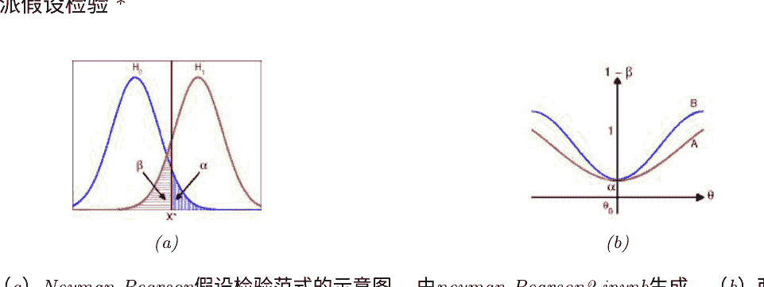

## 5.5 频率派假设检验 *

在这一部分中，我们讨论了确定一个假设（模型）是否合理的方法，在数据 $\mathcal{D}$ 的光照下。

### 5.5.1 似然比检验

当决定一个模型是否对一些数据进行良好描述时，询问“相对于什么”总是有用的。为了具体说明，假设我们有两个假设，分别称为零假设 $H_0$ 和备择假设 $H_1$，我们想选择我们认为更有可能的那个。我们可以将其视为一个二元分类问题，其中 $H \in \{0,1\}$ 表示“真实”模型的身份。一种自然的方法是使用贝叶斯模型选择，正如我们在5.2.1节中讨论的那样，来计算 $p(H|\mathcal{D})$，然后选择最可能的模型。在这里我们讨论一种频率主义方法。

假设我们有一个均匀先验，所以 $p(H = 0) = p(H = 1) = 0.5$，并且我们使用0-1损失。那么最优的决策规则是接受 $H_0$ 当且仅当 $p(\mathcal{D}|H_0) > p(\mathcal{D}|H_1)$。这被称为似然比检验。我们给出一些示例如下。

#### 5.5.1.1 示例：比较高斯均值

假设我们有兴趣测试一些数据是否来自均值为 $\mu_0$ 的高斯分布或者来自均值为 $\mu_1$ 的高斯分布。（我们假设已知共享方差 $\sigma^2$。）这在图5.10a中有所说明，我们绘制了 $p(x|H_0)$ 和 $p(x|H_1)$。我们可以如下推导出似然比：

$$\frac{p(\mathcal{D}|H_0)}{p(\mathcal{D}|H_1)} = \frac{\exp\left(-\frac{1}{2\sigma^2}\sum_{n=1}^N (x_n - \mu_0)^2\right)}{\exp\left(-\frac{1}{2\sigma^2}\sum_{n=1}^N (x_n - \mu_1)^2\right)} = \exp\left(\frac{1}{2\sigma^2}(2N\bar{x}(\mu_0 - \mu_1) + N\mu_1^2 - N\mu_0^2)\right)$$

我们可以看到，这个比率只取决于观测数据的均值，即 $\bar{x}$。从图5.10a中，我们可以看到 $\frac{p(\mathcal{D}|H_0)}{p(\mathcal{D}|H_1)} > 1$ 当且仅当 $x < x^*$，其中 $x^*$ 是两个概率密度函数相交的点（我们假设这个点是唯一的）。

#### 5.5.1.2 简单假设与复合假设

在第5.5.1.1节中，零假设和备择假设的参数要么是完全指定的($\mu_0$ 和 $\mu_1$)，要么是共享的($\sigma^2$)。这被称为一个简单假设检验。一般来说，一个假设可能不完全指定所有的参数；这被称为一个复合假设。在这种情况下，我们可以积分掉这些未知参数，就像贝叶斯方法中那样，因为具有更多参数的假设总是具有更高的似然度。然而，这可能在计算上很困难，并且容易出现由于先验错误规定而引起的问题。作为一种替代方法，我们可以“最大化”参数，这给我们提供了最大似然比检验：

$$\frac{\max_{\theta \in \Theta_0} p(\mathcal{D}|\theta)}{\max_{\theta \in \Theta_1} p(\mathcal{D}|\theta)} \qquad \text{(5.100)}$$

### 5.5.2 类型I与类型II错误和Neyman-Pearson引理

假设检验是一种二元分类问题。正如我们在第5.1.3节中讨论的那样，我们可以犯两种错误，即假阴性或类型I错误，这意味着在零假设H₀为真时错误地拒绝它，以及假阳性或类型II错误，这意味着在备择假设为真时错误地接受零假设。类型I错误率$\alpha$被称为检验的显著性。在我们的高斯均值示例中，从图5.10a中我们可以看到类型I错误率是垂直阴影蓝色区域：

$$\alpha(\mu_0) = p(\text{类型 I 错误}) = p(\text{拒绝 } H_0 | H_0 \text{ 为真}) \qquad \text{(5.101)}$$

$$= p(\overline{X}(\tilde{\mathcal{D}}) > x^* | \tilde{\mathcal{D}} \sim H_0) \qquad \text{(5.102)}$$

$$= p\left( \frac{\overline{X} - \mu_0}{\sigma / \sqrt{N}} > \frac{x^* - \mu_0}{\sigma / \sqrt{N}} \right) \qquad \text{(5.103)}$$

因此 $x^* = z_{\alpha}\sigma / \sqrt{N} + \mu_0$，其中 $z_{\alpha}$是标准正态分布的上 $\alpha$分位数。第二类错误率用 $\beta$表示，给出如下

$$\beta(\mu_1) = p(\text{类型 II 错误}) = p(\text{接受 } H_0 | H_1 \text{ 为真}) = p(\overline{X}(\tilde{\mathcal{D}}) < x^* | \tilde{\mathcal{D}} \sim H_1) \qquad \text{(5.104)}$$

这在图5.10a中以水平阴影红色区域显示。

我们定义测试的功效为 $1-\beta(\mu_1)$；这是我们拒绝 H₀的概率，假设 H₁为真。换句话说，它是正确识别零假设错误的能力。显然，如果 $\mu_1 = \mu_0$（曲线重叠），则功效最小；在这种情况下，我们有 $1-\beta(\mu_1)=\alpha(\mu_0)$。当$\mu_1$ 和 $\mu_0$相距越远时，功效趋近于1（因为阴影红色区域变小，$\beta \to 0$）。如果我们有两个测试，A和 B，其中功效(B)≥功效(A)，且相同的I型错误率，我们说 B优于 A。见图5.10b。在 $H_1$下具有最高功效的测试中，具有显著性水平 $\alpha$的测试称为最有力的测试。事实证明，似然比检验是一种最有力的测试，这个结果被称为Neyman-Pearson引理。

### 5.5.3 零假设显著性检验（NHST）和p值

在上述决策论（或Neyman-Pearson）方法中，我们需要指定一个零假设 $H_0$以及一个备择假设 $H_1$，以便我们可以计算 $\mathcal{D}|H_0$的概率 $p(\mathcal{D}|H_0)$在某些情况下，很难定义一个备择假设，我们只想测试一个简单的零假设在给定一些数据的情况下是否“合理”。为了做到这一点，我们可以定义一个检验统计量 test(D)，然后我们可以将其观察值与我们从零假设中期望的值 test(\tilde{D})进行比较，其中\tilde{D} ~ H0。如果观察值在给定 H0的情况下是意外的，我们会拒绝零假设。为了量化这一点，我们计算在零假设下观察到一个与观察值一样大或更大的检验值的概率（假设更大的值使 H1更有可能）。更准确地说，我们将 p值定义为在零假设下观察到一个与实际观察到的检验统计量一样大或更大的概率：

$$\text{pval} \triangleq \Pr(\text{test}(\tilde{\mathcal{D}}) \geq \text{test}(\mathcal{D}) | \tilde{\mathcal{D}} \sim H_0) \quad (5.105)$$

换句话说，p值 = Pr(检验(零假设数据) ≥ 观察到的检验值)，其中观察到的检验值 = test(D)，而零假设下的检验值 = test(\tilde{D})，其中\tilde{D} ~ H0是假设的未来数据。较小的值对应于更强的反对 H0的证据。传统上，如果p值小于 α=0.05，我们拒绝零假设；这被称为检验的显著水平，整个方法被称为零假设显著性检验或 NHST。通过构造，这样的检验将具有类型I错误率（在零假设真实的情况下错误地拒绝零假设）为 α的值。请注意，此决策规则对应于选择决策阈值 t*，使得 Pr(检验(\tilde{D}) ≥ t* | H0) = α。如果我们设置 t* = 检验(D)，则 α将等于观察到的p值。因此，p值是我们可以拒绝 H0的最小 α值。我们可以使用 p值 = 1 - Φ(检验(D))来计算p值，其中 Φ是检验统计量的抽样分布的累积分布函数。这被称为单侧p值。在某些情况下，使用双侧p值可能更合适，形式为 p值 = Pr(检验(\tilde{D}) ≥ 检验(D)|\tilde{D} ~ H0) + Pr(检验(\tilde{D}) ≤ 检验(D)|\tilde{D} ~ H0)。例如，假设我们使用检验(\tilde{D}) = (\hat{\theta}(\tilde{D}) - θ0)/se(\hat{D})，其中 θ0是给定 H0的 θ*的值，而 \hat{θ} 是MLE；这被称为Wald统计量。

根据在第4.7.2节中讨论的MLE的渐近正态性，我们有 pval = Pr(|test(\tilde{D})| > |test(D)| | H0) ≈ Pr(|Z| > |test(D)|) = 2Φ(-|test(D)|)，其中 Z ~ N(0,1)。我们可以看到，为了计算p值，我们需要计算在零假设下的检验统计量的抽样分布。通常我们使用大样本（高斯近似），如上所示。然而，在我们想要测试两个分布是否相同的情况下，我们可以使用非参数的排列检验，它对分布不做任何假设。例如，假设我们有 m个样本 X_i来自 P_X和 n个样本 Y_i来自 P_y并且零假设是 P_x = P_y。定义检验统计量 test(X_1, ..., X_m, Y_1, ..., Y_n) = |\bar{X} - \bar{Y}|。

如果我们对样本的顺序进行排列，那么在零假设 H0下，这个统计量不应该改变。因此，我们可以对随机排列进行采样，以近似计算 p(test(\tilde{D})|\tilde{D} ~ H0)，从而可以计算出使用未洗牌数据计算的检验(D)的尾部概率。更多细节，请参见例如[Was04, 第162页]。

请注意，p值为0.05并不意味着备择假设 H1以0.95的概率成立。实际上，即使大多数科学家也会误解p值。大多数人想要计算的数量是贝叶斯后验概率 p(H|D)。有关这个重要区别的更多信息，请参见第5.5.4节。

## 5.5.4 p值被认为是有害的

p值通常被解释为在零假设下数据的可能性，因此小的值被解释为 H0不太可能，因此 H1很可能。推理大致如下：

无效的有效
| | | | |
| --- | --- | --- | --- |
| “不显著” | 171 | 4 | 175 |
| “显著” | 9 | 16 | 25 |
| | 180 | 20 | 200 |

表5.8：一个假设临床试验的一些统计数据。来源：[SAM04, p74]。

如下所示：

> 如果 H₀为真，则这个检验统计量可能不会出现。这个统计量确实出现了。
> 因此 H₀很可能是错误的。

然而，这是无效的推理。为了看到为什么，考虑以下例子（来自[Coh94]）：

> 如果一个人是美国人，那么他很可能不是国会的成员。这个人是国会的成员。因此，他很可能不是美国人。

这显然是错误的推理。相比之下，以下逻辑论证是有效的推理：

> 如果一个人是火星人，那么他不是国会的成员。这个人是国会的成员。因此，他不是火星人。

这两种情况的区别在于，火星的例子是使用演绎，即从逻辑定义向前推理到它们的结果。更准确地说，这个例子使用了逻辑中的一条规则：否定推理，当我们观察到 ¬Q时，我们可以得出结论 ¬P。相比之下，美国的例子涉及归纳，即从观察到的证据向后推理到可能的（但不一定是真实的）原因，使用的是统计规律，而不是逻辑定义。

为了进行归纳，我们需要使用概率推理（详细解释见[Jay03]）。特别地，为了计算零假设的概率，我们应该使用贝叶斯规则，如下所示：

$$p(H_0|D) = \frac{p(D|H_0)p(H_0)}{p(D|H_0)p(H_0) + p(D|H_1)p(H_1)} \tag{5.106}$$

如果先验概率是均匀的，即 p(H_0) = p(H_1) = 0.5，那么可以用似然比 LR = p(D|H_0)/p(D|H_1)来重新表示如下：

$$p(H_0|D) = \frac{似然比}{似然比 + 1} \tag{5.107}$$

在美国国会的例子中，D是观察到的人是国会成员的事实。H₀是人是美国人的零假设，H₁是人不是美国人的备择假设。我们假设 p(D|H₀)很低，因为大多数美国人不是国会成员。然而，p(D|H₁)也很低 — 实际上，在这个例子中，它是0，因为只有美国人才能成为国会成员。因此，LR = ∞，所以 p(H₀|D) = 1.0，正如直觉所示。然而，请注意，NHST忽略了 p(D|H₁)以及先验概率 p(H₀)，因此它给出了错误的结果 — 不仅在这个问题中，在许多问题中都是如此。

一般来说，p值和 $p(H_0|\mathcal{D})$ 之间可能存在巨大差异。 特别是，[SBB01]表明，即使p值低至0.05，零假设 $H_0$ 的后验概率可能高达30%或更高，即使先验分布是均匀的。

考虑一下[SAM04, p74]中的具体例子。 假设进行了200次临床试验某种药物，并且我们得到了表5.8中的数据。假设我们对药物是否具有显著效应进行了统计检验。该检验的第一类错误率为 $\alpha = 9/180 = 0.05$，第二类错误率为 $\beta = 4/20 = 0.2$。

我们可以计算在结果被认为“显著”时，药物无效的概率如下：

$$p(H_0|\text{'significant'}) = \frac{p(\text{'significant'}|H_0)p(H_0)}{p(\text{'significant'}|H_0)p(H_0) + p(\text{'significant'}|H_1)p(H_1)} \quad (5.108)$$
$$= \frac{p(\text{类型 I 错误})p(H_0)}{p(\text{类型 I 错误})p(H_0) + (1 - p(\text{类型 II 错误}))p(H_1)} \quad (5.109)$$
$$= \frac{\alpha p(H_0)}{\alpha p(H_0) + (1 - \beta)p(H_1)} \quad (5.110)$$

如果我们有先验知识，根据过去的经验，大多数（比如90%）药物是无效的，那么我们发现 $p(H_0|\text{'significant'}) = 0.36$，这远远超过人们通常将p值与 $\alpha = 0.05$ 关联的5%的概率。

因此，如果违反我们的先验知识，我们应该怀疑统计显著性的声明。

## 为什么不是每个人都是贝叶斯派？

在第4.7.5节和第5.5.4节中，我们已经看到基于频率主义原则的推理可能会展示出各种形式的违反直觉的行为，有时可能与常识相矛盾，正如多篇文章所指出的（参见例如，[Mat98; MS11; Kru13; Gel16; Hoe+14; Lyu+20; Cha+19b; Cla21]）。

这些问题的根本原因是频率主义推理违反了似然原则[BW88]，似然原则认为推理应该基于观察数据的似然性，而不是基于你尚未观察到的假设未来数据。 贝叶斯方法显然满足似然原则，因此不会遭受这些病理问题。

鉴于频率统计学的这些基本缺陷，以及贝叶斯方法没有这些缺陷，一个显而易见的问题是：“为什么不是每个人都是贝叶斯派？”频率统计学家布拉德利·埃夫隆 (Bradley Efron) 写了一篇题为《为什么不是每个人都是贝叶斯派？》的论文[Efr86]。对于任何对这个主题感兴趣的人来说，他的短文都是值得一读的。 下面我们引用他的开篇部分：

> > 这个标题至少有两个合理的问题。 首先，每个人过去都是贝叶斯派。拉普拉斯全力支持贝叶斯对推理问题的表述，大多数19世纪的科学家也是如此。 这其中包括高斯，他的统计工作通常以频率统计学的术语来呈现。
>
> 第二个更重要的观点是贝叶斯论证的说服力。 现代统计学家们在Savage和de Finetti的引领下，提出了强有力的理论论证，支持贝叶斯推断。 这项工作的副产品是对频率主义观点中的不一致性的令人不安的目录。


图5.11：卡通插图，说明频率派和贝叶斯派之间的区别。（关于 $p<0.05$ 的评论在第5.5.4节中有解释。下注评论是对荷兰书定理的引用，该定理基本上证明了贝叶斯方法在赌博（和其他决策理论问题）中是最优的，详见[Háj08]。）来自https://xkcd.com/1132/。在Rundall Munroe（xkcd的作者）的友好许可下使用。

然而，并不是每个人都是贝叶斯派。当前时代（1986年）是统计学被广泛用于科学报告的第一个世纪，事实上，20世纪的统计学主要是非贝叶斯派的。然而，林德利（1975年）预测21世纪会发生变化。

时间会告诉我们林德利是否正确。然而，趋势似乎朝着这个方向发展。例如，一些期刊已经禁止使用p值[TM15; AGM19]，而由美国统计协会出版的期刊《美国统计学家》则发表了一整个专题警告使用p值和NHST[WSL19]。

传统上，计算一直是使用贝叶斯方法的障碍，但是由于计算机速度更快和算法更好（我们将在本书的后续部分讨论），这个问题在当今已经不再是一个问题。[Mur23]另一个更基本的问题是，贝叶斯方法的正确性取决于其建模假设的正确性。然而，这个批评也适用于频率主义方法，因为估计量的抽样分布必须使用关于数据生成机制的假设来推导。事实上，[BT73]表明，在常见模型中，最大似然估计的抽样分布与非信息先验下的后验分布是相同的。幸运的是，我们可以使用交叉验证（第4.5.5节）、校准和贝叶斯模型检验来经验性地检查建模假设。我们将在本书的后续部分讨论这些主题。[Mur23]

总结一下，值得引用唐纳德·鲁宾（Donald Rubin）的一篇论文[Rub84]，名为“贝叶斯合理和相关的频率计算对应用统计学家来说是合理的”。在这篇论文中，他写道：

应用统计学家在原则上应该是贝叶斯派的，并且在实践中要与现实世界保持一致。[他们]应该尽量使用能够在合理偏差下导致近似校准程序的规范。[他们]应该避免与观察数据在相关方面相矛盾的模型——针对假设复制的频率计算可以模拟模型的适应性并帮助提出更合适的模型。

## 5.6 练习

### 练习5.1 [在分类器中拒绝选项]

(来源: [DHS01, Q2.13]) 在许多分类问题中，你可以选择将x分配给类别j，或者如果你不确定，可以选择拒绝选项。如果拒绝的成本小于错误分类对象的成本，那么这可能是最优的行动。让α_i表示你选择行动i，对于i=1: C+1，其中C是类别的数量，C+1是拒绝行动。让Y = j表示真实（但未知的）自然状态。将损失函数定义如下：

$$
\lambda(\alpha_i | Y = j) = 
\begin{cases} 
0 & \text{if } i = j \text{ and } i, j \in \{1, \dots, C\} \\
\lambda_r & \text{if } i = C + 1 \\
\lambda_s & \text{否则}
\end{cases}
$$
(5.111)

- a. 证明如果对于所有的k（即j是最可能的类别），我们决定Y = j当且仅当p(Y = j|x) ≥ p(Y = k|x)时，最小风险是可以得到的，并且如果p(Y = j|x) ≥ \lambda_r/\lambda_s；否则我们决定拒绝。
- b. 当λ_r/λ_s从0增加到1时（即，拒绝的相对成本增加），请定性地描述会发生什么。

### 练习5.2 [新闻供应商问题 *]

考虑决策理论/经济学中的以下经典问题。假设您正在尝试决定购买多少数量Q某种产品（例如，报纸）以最大化利润。最佳数量将取决于您认为对您的产品有多少需求D，以及它对您的成本C和销售价格P。假设D是未知的，但具有概率密度函数f(D)和累积分布函数F(D)。我们可以通过考虑两种情况来评估预期利润：如果D>Q，则我们销售所有Q个物品，并获得利润π = (P - C)Q；但如果D<Q，则我们只销售D个物品，利润为(P - C)D，但浪费了C(Q - D)在未售出的物品上。因此，如果我们购买数量Q，则预期利润为：

$$
E\pi(Q) = \int_Q^\infty (P - C)Qf(D)dD + \int_0^Q (P - C)Df(D)dD - \int_0^Q C(Q - D)f(D)dD
$$
(5.112)

简化这个表达式，然后对Q求导，以展示最优数量Q*（最大化预期利润）满足的条件：

$$
F(Q^*) = \frac{P - C}{P}
$$
(5.113)

### 练习5.3 [贝叶斯因子和ROC曲线 *]

设B = p(D|H1)/p(D|H0)为支持模型1的贝叶斯因子。假设我们绘制两条ROC曲线，一条通过阈值化B计算，另一条通过阈值化p(H1|D)计算。它们会相同还是不同？请解释原因。

### 练习5.4 [后验中位数是L1损失下的最优估计]

证明后验中位数是L1损失下的最优估计。

# 6 信息论

在本章中，我们介绍了信息论领域的一些基本概念。 更多细节可以在其他书籍中找到，例如[Mac03; CT06]，以及本书的续集[Mur23]。

## 6.1 熵

概率分布的熵可以解释为从给定分布中抽取的随机变量的不确定性或缺乏可预测性的度量，如下所述。

我们还可以使用熵来定义数据源的信息内容。 例如，假设我们观察到从分布 \(p\) 生成的符号序列 \(X_n \sim p\)。 如果分布 \(p\) 具有高熵，那么预测每个观察值 \(X_n\) 的值将会很困难。 因此，我们说数据集\(\mathcal{D}= (X_1, \ldots, X_n)\) 具有高信息内容。 相反，如果分布 \(p\) 是一个退化分布，熵为0（最小值），那么每个观察值 \(X_n\) 都将相同，所以 \(\mathcal{D}\) 不包含太多信息。

（所有这些都可以用数据压缩的术语来形式化，我们将在本书的后续部分讨论。）

### 6.1.1 离散随机变量的熵

具有分布\(p\)和\(K\)个状态的离散随机变量\(X\)的熵定义为：

\[\mathrm{H}(X) = -\sum_{k=1}^{K} p(X=k) \log_{2} p(X=k) = -\mathbb{E}_{X}[\log p(X)] \tag{6.1}\]

（请注意，我们使用符号\(\mathrm{H}(X)\)表示具有分布\(p\)的随机变量的熵，就像人们写\(\mathbb{V}[X]\)表示与\(X\)相关的分布的方差一样；我们也可以写作\(\mathrm{H}(p)\)。通常我们使用以2为底的对数，这种情况下单位被称为比特（二进制位）。 例如，如果\(X\in\{1, \ldots, 5\}\)具有直方图分布\(p= [0.25, 0.25, 0.2, 0.15, 0.15]\)，我们得到\(\mathrm{H}= 2.29\)比特。 如果我们使用以自然对数为底的对数，单位称为纳特。）

具有最大熵的离散分布是均匀分布。 因此，对于一个 \(K\) 元随机变量，如果 \(p(x = k) = 1/K\)，则熵达到最大值；在这种情况下， \(\mathrm{H}(X) = \log_{2} K\)。 要理解这一点，请注意：

\[\mathrm{H}(X) = -\sum_{k=1}^{K} \frac{1}{K} \log(1/K) = -\log(1/K) = \log(K) \tag{6.2}\]

相反，熵最小的分布（为零）是将其全部质量放在一个状态上的任何δ函数。这样的分布没有不确定性。

对于二进制随机变量的特殊情况， $X\in \{0, 1\}$，我们可以写成 $p(X=1)=\theta$ 和 $p(X=0)=1-\theta$。因此，熵变为：

$$ \mathbb{H}(X) = -[p(X=1) \log_2 p(X=1) + p(X=0) \log_2 p(X=0)] \quad(6.3)$$
$$ = -[\theta \log_2 \theta + (1-\theta) \log_2 (1-\theta)] \quad(6.4)$$

这被称为二进制熵函数，也可以写成 $\mathbb{H}(\theta)$。我们在图6.1中绘制了这个函数。我们可以看到，当分布是均匀的时候，最大值为1比特，即 $\theta=0.5$。一个公平的硬币只需要一个是/否问题来确定其状态。

##### 6.1.1.1 应用：DNA序列标志

作为熵的一个有趣应用，考虑表示DNA序列模体的问题，这是一个对短DNA字符串的分布。我们可以通过对齐一组DNA序列（例如来自不同物种的序列），然后估计每个位置 $t$ 中4个字母字母表 $X\sim \{A, C, G, T\}$ 的经验分布来估计这个分布。

序列如下：

$$\mathbf{N}_t = \left( \sum_{i=1}^{N} \mathbb{I}(X_{it}=A), \sum_{i=1}^{N} \mathbb{I}(X_{it}=C), \sum_{i=1}^{N} \mathbb{I}(X_{it}=G), \sum_{i=1}^{N} \mathbb{I}(X_{it}=T) \right) \quad (6.5)$$

$$\hat{\theta}_t = \mathbf{N}_t / N, \quad (6.6)$$

这个 $\mathbf{N}_t$ 是一个长度为四的向量，计算每个位置上每个字母出现的次数在序列集合中。这个 $\hat{\theta}_t$ 分布被称为一个位置权重矩阵或序列模体。我们可以将其可视化如图6.2b所示。在这里，我们绘制字母A、C、G和T，其中字母 $k$ 在位置 $t$ 的大小与经验频率 $\theta_{tk}$ 成比例。

一种替代的可视化方法，称为序列标志，在图6.2c中显示。每一列都按 $R_t = 2 - H_t$ 进行缩放，其中 $H_t$ 是 $\hat{\theta}_t$ 的熵，而 $2 = \log_2(4)$ 是分布在4个字母上的最大可能熵。因此，确定性分布的熵为0，因此具有最大信息内容，高度为2。这些信息丰富的位置在进化中高度保守，通常是因为它们是基因编码区的一部分。我们还可以计算每个位置中最可能的字母，而不考虑不确定性；这被称为共识序列。

## 6.1.1.2 估计熵

估计具有许多可能状态的随机变量的熵需要估计其分布，这可能需要大量数据。例如，想象一下，如果 $X$ 表示英文文档中一个单词的身份。由于存在大量罕见单词，并且由于新单词不断被发明，可靠地估计 $p(X)$ 和因此 $\mathbb{H}(X)$ 可能很困难。关于此问题的一个可能解决方案，请参见[VV13]。

### 6.1.2 交叉熵

分布 $p$ 和 $q$ 之间的交叉熵定义为

$$\mathbb{H}_{ce}(p, q) \triangleq -\sum_{k=1}^{K} p_k \log q_k \quad (6.7)$$

可以证明，交叉熵是需要压缩一些从分布 $p$ 中抽取的数据样本所需的预期比特数，使用基于分布 $q$ 的编码。这可以通过设置 $q = p$ 来最小化，此时最优编码的预期比特数为 $\mathbb{H}_{ce}(p, p) = \mathbb{H}(p)$。这被称为Shannon的源编码定理(参见例如，[CT06])。

### 6.1.3 联合熵

两个随机变量 $X$ 和 $Y$ 的联合熵定义为

$$\mathbb{H}(X, Y) = -\sum_{x, y} p(x, y) \log_2 p(x, y) \quad (6.8)$$

例如，考虑从1到8选择一个整数， $n \in \{1, \ldots, 8\}$。如果$n$是偶数，则 $X(n) = 1$，如果n是质数，则 $Y(n) = 1$：

| $n$ | 1 | 2 | 3 | 4 | 5 | 6 | 7 | 8 |
|---|---|---|---|---|---|---|---|---|
| $X$ | 0 | 1 | 0 | 1 | 0 | 1 | 0 | 1 |
| $Y$ | 0 | 1 | 1 | 0 | 1 | 0 | 1 | 0 |

联合分布为

| $p(X, Y)$ | $Y=0$ | $Y=1$ |
|-----------|-------|-------|
| $X=0$     | $\frac{1}{8}$ | $\frac{3}{8}$ |
| $X=1$     | $\frac{3}{8}$ | $\frac{1}{8}$ |

因此，联合熵由以下公式给出

$$\mathbb{H}(X, Y) = -\left[ \frac{1}{8} \log_2 \frac{1}{8} + \frac{3}{8} \log_2 \frac{3}{8} + \frac{3}{8} \log_2 \frac{3}{8} + \frac{1}{8} \log_2 \frac{1}{8} \right] = 1.81\text{比特} \quad (6.9)$$

显然，边缘概率是均匀的：$p(X=1) = p(X=0) = p(Y=0) = p(Y=1) = 0.5$，因此 $\mathbb{H}(X) = \mathbb{H}(Y) = 1$。因此 $\mathbb{H}(X, Y) = 1.81\text{比特} < \mathbb{H}(X) + \mathbb{H}(Y) = 2\text{比特}$。事实上，这个联合熵的上界在一般情况下成立。如果 $X$和$Y$是独立的，则$\mathbb{H}(X, Y) = \mathbb{H}(X) + \mathbb{H}(Y)$，因此上界是紧的。这在直观上是有意义的：当部分之间以某种方式相关时，它减少了系统的“自由度”，从而降低了整体熵。

对于 $\mathbb{H}(X, Y)$的下界是多少？如果 $Y$是 $X$的确定性函数，则 $\mathbb{H}(X, Y) = \mathbb{H}(X)$。所以

$$\mathbb{H}(X, Y) \geq \max\{\mathbb{H}(X), \mathbb{H}(Y)\} \geq 0 \quad (6.10)$$

直观地说，这意味着将变量组合在一起不会降低熵：你不能仅通过向问题中添加更多未知数来减少不确定性，你需要观察一些数据，这是我们在第6.1.4节中讨论的一个主题。

我们可以以明显的方式将联合熵的定义从两个变量扩展到 $n$。

### 6.1.4 条件熵

给定 $X$后，$Y$的条件熵是我们在看到 $X$后对 $Y$的不确定性，对 $X$的可能值进行平均：

### 6.1.5 困惑度

离散概率分布 $p$ 的困惑度定义为

$$\text{困惑度}(p) \triangleq 2^{\mathbb{H}(p)}$$

通常将其解释为可预测性的度量。例如，假设 $p$ 是一个均匀分布在 $K$ 个状态上的分布。在这种情况下，困惑度为 $K$。显然，困惑度的下界是 $2^{0}=1$，如果分布能够完美地预测结果，则可以达到该下界。

现在假设我们有一个基于数据 $\mathcal{D}$ 的经验分布：

$$p_{\mathcal{D}}(x|\mathcal{D}) = \frac{1}{N} \sum_{n=1}^{N} \delta(x - x_n)$$

我们可以通过计算困惑度$(p_{\mathcal{D}}, p)$,$2^{\mathbb{H}_{ce}( p_{\mathcal{D}},p)}$来衡量 $p$ 对 $\mathcal{D}$ 的预测能力。

$$\text{困惑度}(p_{\mathcal{D}}, p) \triangleq 2^{\mathbb{H}_{ce}(p_{\mathcal{D}},p)}$$

困惑度经常用来评估统计语言模型的质量，它是一种生成令牌序列的模型。假设数据是一个长度为$N$的单个长文档 $x$，并且假设 $p$ 是一个简单的一元模型。在这种情况下，交叉熵项由以下公式给出

$$H = -\frac{1}{N} \sum_{n=1}^{N} \log p(x_n)$$

因此，困惑度由以下公式给出

$$\text{困惑度}(p_{\mathcal{D}}, p) = 2^{H} = 2^{-\frac{1}{N} \log(\prod_{n=1}^{N} p(x_n))} = \sqrt[N]{\prod_{n=1}^{N} \frac{1}{p(x_n)}}$$

有时称为指数化交叉熵。我们可以看到这是逆预测概率的几何平均值。

在语言模型的情况下，我们通常在预测下一个单词时以前面的单词为条件。例如，在二元模型中，我们使用形式为 \( p(x_i|x_{i-1}) \) 的一阶马尔可夫模型。我们将语言模型的分支因子定义为任何给定单词后可能出现的单词数量。因此，我们可以将困惑度解释为加权平均分支因子。例如，假设模型预测每个单词的概率相等，不考虑上下文，因此 \( p(x_i|x_{i-1}) = 1/K \)。那么困惑度为 \( (1/K)^N)^{-1/N} = K \)。如果某些符号比其他符号更有可能出现，并且模型正确反映了这一点，那么它的困惑度将低于 \( K \)。然而，正如我们在第6.2节中所示，我们有 \( \mathbb{H}(p^*) \leq \mathbb{H}_{ce}(p^*, p) \)，因此我们永远无法将困惑度降低到底层随机过程的熵 \( p^* \) 以下。

> 参见[JM08, p96]，进一步讨论困惑度及其在语言模型中的应用。

## 6.1.6 连续随机变量的差分熵 *

如果 \( X \) 是一个具有概率密度函数 \( p(x) \) 的连续随机变量，则我们将其差分熵定义为

$$h(X) \triangleq - \int_{\mathcal{X}} p(x) \log p(x) \, dx \quad (6.24)$$

假设这个积分存在。例如，假设 \( X \sim U(0, a) \)。那么

$$h(X) = - \int_{0}^{a} dx \, \frac{1}{a} \log \frac{1}{a} = \log a \quad (6.25)$$

请注意，与离散情况不同，差分熵可以是负值。这是因为概率密度函数可以大于1。例如，如果 \( X \sim U(0, 1/8) \)，我们有 \( h(X) = \log_2(1/8) = -3 \)。

理解微分熵的一种方法是意识到所有实值量只能以有限的精度表示。可以证明[CT91, p228]，连续随机变量 \( X \) 的 \( n \) 位量化的熵近似等于 \( h(X) + n \)。例如，假设 \( X \sim U(0, 1/8) \)。

那么在 \( X \) 的二进制表示中，小数点右边的前3位必须为0（因为该数 \( \leq 1/8 \)）。因此，只需要 \( n - 3 \) 位来描述 \( X \) 的 \( n \) 位精度，这与上面计算的 \( h(X) = -3 \) 一致。

### 6.1.6.1 示例：高斯分布的熵

一个 \( d \) 维高斯分布的熵是

$$h(\mathcal{N}(\mu, \Sigma)) = \frac{1}{2} \ln |2\pi e \Sigma| = \frac{1}{2} \ln[(2\pi e)^d |\Sigma|] = \frac{d}{2} + \frac{d}{2} \ln(2\pi) + \frac{1}{2} \ln |\Sigma| \quad (6.26)$$

在一维情况下，这变成了

$$h(\mathcal{N}(\mu, \sigma^2)) = \frac{1}{2} \ln \left[ 2\pi e \sigma^2 \right] \quad (6.27)$$

### 6.1.6.2 方差的关联

高斯分布的熵随方差的增加而单调增加。 然而，这并不总是成立。 例如，考虑一个由两个以-1和+1为中心的一维高斯分布混合而成的分布。 当我们将均值进一步分开，比如到-10和+10， 方差增加了（因为整体均值到样本均值的平均距离变大了）。 然而，熵保持大致相同，因为我们仍然不确定样本可能落在哪里，即使我们知道它会接近-10或+10。 （计算 GMM 的精确熵很困难，但在 [Hub+08] 中介绍了计算上下界的方法。）

### 6.1.6.3 离散化

一般来说，计算连续随机变量的微分熵是困难的。 一个简单的近似方法是将变量离散化或量化。 有各种方法可以实现这一点（参见例如，[DKS95; KK06] 的总结），但一个简单的方法是根据其经验分位数对分布进行分箱。 关键问题是要使用多少个箱子[LM04]。 Scott [Sco79] 提出了以下启发式方法：

$$B = N^{1/3} \frac{\max(D) - \min(D)}{3.5 \sigma(D)} \quad \quad (6.28)$$

其中 $\sigma(D)$是数据的经验标准差， $N = |D|$是经验分布中的数据点数。 然而，如果 $X$是一个多维随机向量，离散化技术的可扩展性不好，因为维度的诅咒。

## 6.2 相对熵 (KL散度) *

给定两个分布 $p$和 $q$，定义一个距离度量来衡量它们的“接近程度”或“相似程度”通常是很有用的。事实上，我们将更加一般化，考虑一个散度度量 $D(p,q)$来量化 $q$离 $p$有多远，而不要求 $D$是一个度量。更准确地说，我们说 $D$是一个散度，如果 $D(p,q) \ge 0$且仅当 $p = q$时等号成立，而度量还要求 $D$是对称的并满足三角不等式，即 $D(p,r) \le D(p,q) + D(q,r)$。我们可以使用许多可能的散度度量。在本节中，我们将重点关注**Kullback-Leibler**散度或**KL散度**，也称为信息增益或相对熵，它衡量两个分布 $p$和 $q$之间的差异。

### 6.2.1 定义

对于离散分布，KL散度定义如下：

$$D_{\text{KL}}(p \| q) \triangleq \sum_{k=1}^K p_k \log \frac{p_k}{q_k} \quad \quad (6.29)$$

这自然地扩展到连续分布：

$$D_{\text{KL}}(p \| q) \triangleq \int dx \, p(x) \log \frac{p(x)}{q(x)} \quad \quad (6.30)$$

### 6.2.2 解释

我们可以将KL重新写成如下形式：

$$D_{\text{KL}}(p \| q) = \sum_{k=1}^{K} p_k \log p_k - \sum_{k=1}^{K} p_k \log q_k = \underbrace{-\mathbb{H}(p)}_{\text{负熵}} + \underbrace{\mathbb{H}_{ce}(p,q)}_{\text{交叉熵}}$$

我们将第一项识别为负熵，第二项识别为交叉熵。 可以证明，交叉熵 $\mathbb{H}_{ce}(p, q)$是从分布 $p$压缩数据所需的比特数的下界，如果你的编码方案基于分布 $q$设计，那么KL散度可以解释为在压缩数据样本时，与真实分布 $p$相比，使用不正确的分布 $q$作为编码方案基础时需要支付的“额外比特数”。

KL散度有各种其他解释。 请参阅本书的续集[Mur23]，了解更多信息。

### 6.2.3 示例：两个高斯分布之间的KL散度

例如，可以证明两个多元高斯分布之间的KL散度为

$$D_{\text{KL}}(\mathcal{N}(\boldsymbol{x}|\boldsymbol{\mu}_1, \mathbf{\Sigma}_1) \parallel \mathcal{N}(\boldsymbol{x}|\boldsymbol{\mu}_2, \mathbf{\Sigma}_2)) = \frac{1}{2} \left[ \text{tr}(\mathbf{\Sigma}_2^{-1} \mathbf{\Sigma}_1) + (\boldsymbol{\mu}_2 - \boldsymbol{\mu}_1)^\top \mathbf{\Sigma}_2^{-1} (\boldsymbol{\mu}_2 - \boldsymbol{\mu}_1) - D + \log \left( \frac{\det(\mathbf{\Sigma}_2)}{\det(\mathbf{\Sigma}_1)} \right) \right]$$

在标量情况下，这变为

$$D_{\text{KL}}(\mathcal{N}(x|\mu_1, \sigma_1) \parallel \mathcal{N}(x|\mu_2, \sigma_2)) = \log \frac{\sigma_2}{\sigma_1} + \frac{\sigma_1^2 + (\mu_1 - \mu_2)^2}{2\sigma_2^2} - \frac{1}{2}$$

### 6.2.4 KL的非负性

在本节中，我们证明KL散度始终是非负的。

为了做到这一点，我们使用Jensen不等式。 这表明，对于任何凸函数 $f$，我们有

$$f\left(\sum_{i=1}^{n} \lambda_i \boldsymbol{x}_i\right) \leq \sum_{i=1}^{n} \lambda_i f(\boldsymbol{x}_i)$$

换句话说，这个结果表明平均值的 $f$小于平均值的 $f$。 对于 $n= 2$，这显然是正确的，因为凸函数在两个端点之间的直线上方弯曲（参见第8.1.3节）。 为了证明一般情况下的 $n$，我们可以使用归纳法。

例如，如果 $f(x) = \log(x)$，这是一个凹函数，我们有

$$\log(\mathbb{E}_x g(x)) \geq \mathbb{E}_x \log(g(x))$$

我们在下面使用这个结果。

## 定理 6.2.1. (信息不等式) $D_{\text{KL}} (p \parallel q) \geq 0$ 当且仅当 $p = q$ 时成立。

证明。我们现在根据[CT06, p28]证明定理。令 $A = \{ x : p(x) > 0 \}$ 为 $p(x)$ 的支持。利用对数函数的凹性和Jensen不等式（第6.2.4节），我们有

$$-D_{\text{KL}} (p \parallel q) = -\sum_{x \in A} p(x) \log \frac{p(x)}{q(x)} = \sum_{x \in A} p(x) \log \frac{q(x)}{p(x)} \quad (6.36)$$

$$ \leq \log \sum_{x \in A} p(x) \frac{q(x)}{p(x)} = \log \sum_{x \in A} q(x) \quad (6.37)$$

$$ \leq \log \sum_{x \in \mathcal{X}} q(x) = \log 1 = 0 \quad (6.38)$$

由于 $\log(x)$ 是严格凹函数（$-\log(x)$ 是凸函数），当且仅当存在某个常数 $c$ 使得 $\frac{q(x)}{p(x)} = c$ 对所有 $x \in A$ 成立时，在方程 (6.37) 中我们有等式。当且仅当 $\sum_{x \in A} q(x) = \sum_{x \in \mathcal{X}} q(x) = 1$，这意味着 $c=1$。因此 $D_{\text{KL}} (p \parallel q) = 0$ 当且仅当 $p(x) = q(x)$ 对于所有的 $x$。

这个定理有许多重要的含义，我们将在本书中看到。例如，我们可以证明均匀分布是使熵最大化的分布：

## 推论 6.2.1. (均匀分布使熵最大化) $ \mathbb{H}(X) \leq \log |\mathcal{X}| $，其中 $|\mathcal{X}|$ 是 $X$ 的状态数，当且仅当 $p(x)$ 是均匀分布时等号成立。

证明。令 $u(x) = 1/|\mathcal{X}|$。那么

$$ 0 \leq D_{\text{KL}} (p \parallel u) = \sum_{x} p(x) \log \frac{p(x)}{u(x)} = \log |\mathcal{X}| - \mathbb{H}(X) \quad (6.39)$$

### 6.2.5 KL散度和MLE

假设我们想要找到与 $p$ 最接近的分布 $q$，通过KL散度来衡量：

$$ q^* = \arg \min_{q} D_{\text{KL}} (p \parallel q) = \arg \min_{q} \int p(x) \log p(x) dx - \int p(x) \log q(x) dx \quad (6.40)$$

现在假设 $p$ 是经验分布，它在观测到的训练数据上放置一个概率原子，并在其他地方没有质量：

$$ p_{\mathcal{D}}(x) = \frac{1}{N} \sum_{n=1}^{N} \delta(x - x_n) \quad (6.41)$$使用delta函数的筛选性质，我们得到

$$D_{\mathrm{KL}} (p_{\mathcal{D}} \parallel q) = - \int p_{\mathcal{D}} (x) \log q(x) dx + C$$ (6.42)

$$= - \int \left[ \frac{1}{N} \sum_n \delta(x - x_n) \right] \log q(x) dx + C$$ (6.43)

$$= -\frac{1}{N} \sum_n \log q(x_n) + C$$ (6.44)

其中 $C = \int p(x) \log p(x) dx$ 是与 $q$ 无关的常数。这被称为交叉熵目标函数，等于训练集上负对数似然的平均值。因此，我们可以看到，最小化与经验分布的KL散度等价于最大化似然。

这个观点指出了基于似然的训练的缺陷，即它过于依赖于训练集。在大多数应用中，我们并不真正相信经验分布是真实分布的良好表示，因为它只在有限的点上有“尖峰”，而在其他地方密度为零。即使数据集很大（比如1M张图片），从中采样的宇宙通常更大（例如，“所有自然图像”的集合比1M张图片要大得多）。我们可以使用核密度估计（第16.3节）来平滑经验分布，但这需要在图像空间上使用类似的核函数。另一种算法方法是使用数据增强，这是一种扰动观察到的数据样本的方式，我们相信这反映了合理的“自然变化”。在这个增强的数据集上应用MLE通常会产生更好的结果，特别是在拟合具有许多参数的模型时（参见第19.1节）。

## 6.2.6 正向KL与反向KL

假设我们想要用一个简单的分布 $q$ 来近似一个分布 $p$。我们可以通过最小化 $D_{\mathrm{KL}} (q \parallel p)$ 或 $D_{\mathrm{KL}} (p \parallel q)$ 来实现这一点。这会导致不同的行为，我们将在下面讨论。

首先，我们考虑正向KL，也称为包容KL，定义如下：

$$D_{\mathrm{KL}} (p \parallel q) = \int p(x) \log \frac{p(x)}{q(x)} dx$$ (6.45)

最小化这个关于 $q$ 的函数被称为M-投影或矩投影。

通过考虑对于某些输入 $x$，使得 $p(x) > 0$ 但是 $q(x) = 0$，我们可以了解最优$q$。在这种情况下，项 $\log p(x)/q(x)$ 将会是无穷大。因此，最小化KL将会强制 $q$ 包含所有 $p$ 具有非零概率的空间区域。换句话说，$q$ 将会避免为零或覆盖模式，并且通常会过估计 $p$ 的支持。图6.3(a)展示了模式覆盖，其中 $p$ 是一个双峰分布，但 $q$ 是单峰的。现在考虑反向KL，也称为排他KL：

$$D_{\mathrm{KL}} (q \parallel p) = \int q(x) \log \frac{q(x)}{p(x)} dx$$ (6.46)

对于 $q$ 的最小化被称为I-投影或信息投影。

我们可以通过考虑输入 $x$ 使得 $p(x)=0$ 但是 $q(x)>0$ 来了解最优 $q$ 的情况。在这种情况下，项 $\log q(x)/p(x)$ 将是无限的。因此，最小化独占KL将会迫使 $q$ 排除所有 $p$ 概率为零的空间区域。一种方法是让 $q$ 在很少的空间部分中具有概率质量；这被称为零强制或模式寻求行为。在这种情况下，$q$ 通常会低估 $p$ 的支持。我们在图6.3(b-c)中展示了当 $p$ 是双峰的而 $q$ 是单峰的时的模式寻求行为。

## 6.3 互信息 *

KL散度给我们提供了一种衡量两个分布相似程度的方法。我们应该如何衡量两个随机变量的依赖程度？我们可以将衡量两个随机变量依赖程度的问题转化为衡量它们分布相似性的问题。这引出了两个随机变量之间的互信息（MI）的概念，我们在下面进行定义。

### 6.3.1 定义

随机变量 X 和 Y 之间的互信息定义如下：

$$I(X; Y) \triangleq D_{\mathrm{KL}}(p(x, y) \parallel p(x)p(y)) = \sum_{y \in Y} \sum_{x \in X} p(x, y) \log \frac{p(x, y)}{p(x) p(y)} \tag{6.47}$$

（我们写作 I(X; Y) 而不是 I(X, Y)，以表示 X 和/或 Y 表示变量集合；例如，我们可以写作 I(X; Y, Z) 表示 X 和 (Y, Z) 之间的互信息。对于连续随机变量，我们只需用积分替换求和。）

很容易看出，互信息始终是非负的，即使对于连续随机变量也是如此，因为

$$I(X; Y) = D_{\mathrm{KL}}(p(x, y) \parallel p(x)p(y)) \geq 0 \tag{6.48}$$

当且仅当 \( p(x, y) = p(x)p(y) \) 时，我们达到了0的界限。

### 6.3.2 解释

知道互信息是联合分布和分解边缘分布之间的KL散度，告诉我们如果我们从将两个变量视为独立的模型更新到模拟它们真实的联合密度 \( p(x, y) \)，那么互信息度量的是信息增益。

为了进一步理解互信息的含义，有助于将其重新表达为联合熵和条件熵，如下所示：

$$I(X;Y) = H(X) - H(X|Y) = H(Y) - H(Y|X) \tag{6.49}$$

因此，我们可以将 \( X \) 和 \( Y \) 之间的互信息解释为观察 \( Y \) 后关于 \( X \) 的不确定性的减少，或者根据对称性，观察 \( X \) 后关于 \( Y \) 的不确定性的减少。顺便说一下，这个结果给出了条件概率平均降低熵的另一种证明。特别地，我们有 \( 0 \leq I(X;Y) = H(X) - H(X|Y) \)，因此 \( H(X|Y) \leq H(X) \)。我们还可以得到另一种解释。可以证明

$$I(X;Y) = H(X,Y) - H(X|Y) - H(Y|X) \tag{6.50}$$

最后，可以证明

$$I(X;Y) = H(X) + H(Y) - H(X,Y) \tag{6.51}$$

参见图6.4，以信息图的形式总结这些方程。（严格来说，这是一种将集合表达式映射到其信息论对应物的有符号测度[Yeu91]。）

### 6.3.3 例子

作为一个例子，让我们重新考虑第6.1.3节中关于质数和偶数的例子。回想一下 \( H(X) = H(Y) = 1 \)。条件分布 \( p(Y|X) \) 通过对每一行进行归一化得到：

| \( X \) | \( Y=0 \) | \( Y=1 \) |
| :--- | :--- | :--- |
| \( X=0 \) | \( \frac{1}{4} \) | \( \frac{3}{4} \) |
| \( X=1 \) | \( \frac{3}{4} \) | \( \frac{1}{4} \) |

因此条件熵为

$$H(Y|X) = - \left[ \frac{1}{8} \log_2 \frac{1}{4} + \frac{3}{8} \log_2 \frac{3}{4} + \frac{3}{8} \log_2 \frac{3}{4} + \frac{1}{8} \log_2 \frac{1}{4} \right] = 0.81 \text{比特} \tag{6.52}$$

而互信息为

$$I(X;Y) = H(Y) - H(Y|X) = (1 - 0.81)\text{比特} = 0.19\text{比特} \tag{6.53}$$

你可以轻松验证

$$H(X,Y) = H(X|Y) + I(X;Y) + H(Y|X) = (0.81 + 0.19 + 0.81)\text{比特} = 1.81\text{比特} \tag{6.54}$$

### 6.3.4 条件互信息

我们可以以明显的方式定义条件互信息

$$
\begin{aligned}
I(X; Y|Z) &\triangleq \mathbb{E}_{p(z)} [I(X; Y)|Z] \\
&= \mathbb{E}_{p(x,y,z)} \left[ \log \frac{p(x, y|z)}{p(x|z)p(y|z)} \right] \\
&= H(X|Z) + H(Y|Z) - H(X, Y|Z) \\
&= H(X|Z) - H(X|Y, Z) = H(Y|Z) - H(Y|X, Z) \\
&= H(X, Z) + H(Y, Z) - H(Z) - H(X, Y, Z) \\
&= I (Y; X, Z)  - I (Y;  Z)
\end{aligned}
$$

最后一个方程告诉我们，条件互信息是 X 告诉我们关于 Y 的额外（剩余）信息，不包括我们已经知道的关于 Y 在 Z 的情况下。

我们可以将方程（6.61）重写为以下形式：

$$ I (Z, Y;  X) = I (Z;  X) + I (Y;  X|Z) $$

推广到 N 个变量，我们得到互信息的链式法则：

$$ I (Z_1, ..., Z_N;  X) = \sum_{n=1}^{N} I (Z_n;  X | Z_1, ..., Z_{n-1}) $$

### 6.3.5 互信息作为‘广义相关系数’

假设 (x, y) 是联合高斯分布：

$$
\begin{pmatrix} x \\ y \end{pmatrix} \sim \mathcal{N} \left( \mathbf{0}, \begin{pmatrix} \sigma^2 & \rho \sigma^2 \\ \rho \sigma^2 & \sigma^2 \end{pmatrix} \right)
$$

我们现在展示如何计算 X 和 Y 之间的互信息。使用方程 (6.26)，我们发现熵为

$$
h(X, Y) = \frac{1}{2} \log \left[ (2\pi e)^2 \det \Sigma \right] = \frac{1}{2} \log \left[ (2\pi e)^2 \sigma^4 (1 - \rho^2) \right]
$$

由于 X 和 Y 分别服从方差为 σ² 的正态分布，我们有

$$
h(X) = h(Y) = \frac{1}{2} \log \left[ 2\pi e \sigma^2 \right]
$$

因此

$$
\begin{aligned}
I(X, Y) &= h(X) + h(Y) - h(X, Y) \\
&= \log[2\pi e \sigma^2] - \frac{1}{2} \log[(2\pi e)^2 \sigma^4 (1 - \rho^2)] \\
&= \frac{1}{2} \log[(2\pi e \sigma^2)^2] - \frac{1}{2} \log[(2\pi e \sigma^2)^2 (1 - \rho^2)] \\
&= \frac{1}{2} \log \frac{1}{1 - \rho^2} = -\frac{1}{2} \log[1 - \rho^2]
\end{aligned}
$$

我们现在讨论一些有趣的特殊情况。

- 1. ρ=1. 在这种情况下， X=Y， 且 I(X, Y)=∞， 这是有意义的。 观察 Y 告诉我们关于 X 的无限信息（因为我们确切地知道它的实际值）。
- 2. ρ=0. 在这种情况下， X 和 Y 是独立的， 且 I(X, Y)=0， 这是有意义的。 观察 Y 对于 X 没有任何信息。
- 3. ρ=-1. 在这种情况下， X=-Y， 且 I(X, Y)=∞， 这同样是有意义的。 观察 Y 使我们能够以无限的精度预测 X。

现在考虑一种情况，其中 X 和 Y 是标量，但不是联合高斯的。一般来说，计算连续随机变量之间的互信息可能很困难，因为我们必须估计联合密度 p(X, Y)。 对于标量变量，一个简单的近似方法是将它们离散化或量化，通过将每个变量的范围划分为区间，并计算落入每个直方图区间的值的数量[Sco79]。 然后，我们可以使用经验概率质量函数轻松计算互信息。不幸的是，使用的区间数量和区间边界的位置可能会对结果产生显著影响。 避免这种情况的一种方法是使用 K 最近邻距离以非参数自适应的方式估计密度。这是[KSG04]中提出的互信息的KSG估计器的基础。 这在sklearn.feature_selection.mutual_info_regression函数中实现。 有关此估计器的相关论文，请参见[GOV18; HN19]。

### 6.3.6 归一化互信息

对于一些应用，拥有一个在0和1之间的归一化的依赖度量是很有用的。我们现在讨论一种构建这样一个度量的方法。

首先，注意到

$$0 \leq I(X; Y) \leq \min(H(X), H(Y)) \tag{6.73}$$

因此我们可以定义归一化互信息如下：

$$NMI(X, Y) = \frac{I(X; Y)}{\min(H(X), H(Y))} \leq 1 \tag{6.74}$$

这个归一化互信息的范围是从0到1。当NMI(X, Y) = 0时，我们有I(X; Y) = 0，所以 X和Y是独立的。当NMI(X, Y) = 1，并且 H(X) < H(Y)时，我们有

$$I(X; Y) = H(X) - H(X|Y) = H(X) \Rightarrow H(X|Y) = 0 \tag{6.75}$$

所以 X是 Y的确定性函数。例如，假设 X是一个离散随机变量具有概率质量函数 [0.5, 0.25, 0.25]。我们有MI(X, X) = 1.5(使用以2为底的对数)，并且 H(X) = 1.5，所以归一化互信息为1，这是可以预期的。

对于连续随机变量来说，规范化互信息更加困难，因为需要估计微分熵，而微分熵对量化水平非常敏感。详见第6.3.7节进一步讨论。

### 6.3.7 最大信息系数

正如我们在第6.3.6节中讨论的那样，对于实值数据，有一个规范化的互信息估计是有用的，但是计算起来可能会有些棘手。一种方法，称为最大信息系数（MIC）[Res+11]，是定义以下数量：

$$MIC(X, Y) = \max_G \frac{ I((X, Y)|_G) }{ \log\min(G_x, G_y) } \tag{6.76}$$

其中 G是2d网格的集合，而 (X, Y)|_G表示将变量离散化到该网格上， $G_x$ 和 $G_y$ 分别是x和y方向上的网格单元数。（最大网格分辨率取决于样本大小 n；他们建议限制网格使得 $G_xG_y \leq B(n)$，其中 $B(n) = n^\alpha$，而 $\alpha=0.6$。）分母是均匀联合分布的熵；除以这个值确保 $0 \leq MIC \leq 1$。

这个统计量背后的直觉是：如果 X和 Y之间存在关系，那么应该有一些离散的二维输入空间的网格化来捕捉这种关系。由于我们不知道要使用的正确网格，MIC会在不同的网格分辨率（例如2x2、2x3等）和网格边界位置上进行搜索。给定一个网格，很容易对数据进行量化和计算MI。我们定义特征矩阵 M(k, l)为任何大小为 (k, l)的网格所能达到的最大互信息，归一化后除以 log (min(k, l))。 MIC则是该矩阵中的最大值，即 $\max_{k,l \leq B(n)} M(k, l)$。 请参见图6.5以了解该过程的可视化。

在[Res+11]中，他们展示了这个量具有一种被称为公平性的特性，这意味着它对于同样嘈杂的关系给出相似的分数，无论关系的类型如何（例如，线性的、非线性的、非函数的）。

在[Res+16]中，他们提出了一种改进的估计器，称为MICe，它计算效率更高，只需要在1维网格上进行优化，可以使用动态规划在 $O(n)$ 时间内完成。 他们还提出了另一个量，称为TICe（总信息内容），它能够从小样本量中检测到更多的关系，但公平性较低。 这被定义为 $\sum_{k,l \leq B(n)} M(k, l)$。他们建议使用TICe来筛选大量的候选关系，然后使用MICe来量化关系的强度。 关于这两个度量的高效实现，请参见[Alb+18]。

我们可以将MIC为0解释为变量之间没有关系，将MIC为1解释为任何形式的无噪声关系。 这在图6.6中有所说明。与相关系数不同，MIC不限于寻找线性关系。 因此，MIC被称为“21世纪的相关性”[Spe11]。

在图6.7中，我们给出了一个更有趣的例子，来自[Res+11]。 数据包括由世界卫生组织（WHO）收集的357个变量，衡量各种社会、经济、健康和政治指标。 在图的左侧，我们可以看到所有63,546个变量对的相关系数（CC）与MIC的关系。 在图的右侧，我们可以看到特定变量对的散点图，现在我们来讨论一下：

- 标记为C的点（在图上靠近0,0的位置） 具有较低的CC和MIC。相应的散点图清楚地表明这两个变量（受伤导致的生命损失百分比和人口中牙医的密度）之间没有关系。
- 标记为D和H的点具有较高的CC（绝对值）和MIC，因为它们代表几乎线性关系。
- 标记为E、F和G的点具有较低的CC但较高的MIC。这是因为它们对应于变量之间的非线性关系（有时，如E和F的情况，是非功能性的，即一对多的关系）。

### 6.3.8 数据处理不等式

假设我们有一个未知变量 X，我们观察到它的一个带噪声的函数，称之为 Y。如果我们以某种方式处理带噪声的观测结果，创建一个新的变量 Z，直观上很明显我们不能增加对未知量 X 的信息量。这被称为数据处理不等式。现在我们更正式地陈述这一点，然后证明它。

**定理 6.3.1.** 假设 $X \to Y \to Z$ 形成一个马尔可夫链，即 $X \perp\!\!\!\perp Z|Y$。那么 $I(X;Y) \geq I(X;Z)$。

**证明.** 根据互信息的链式法则（方程（6.62）），我们可以用两种不同的方式展开互信息：

$$
\begin{aligned}
I(X;Y,Z) &= I(X;Z) + I(X;Y|Z) \tag{6.77} \\
&= I(X;Y) + I(X;Z|Y) \tag{6.78}
\end{aligned}
$$

由于 $X \perp\!\!\!\perp Z|Y$，所以我们有 $I(X;Z|Y) = 0$，因此

$$I(X;Z) + I(X;Y|Z) = I(X;Y) \tag{6.79}$$

类似地，我们可以证明 $I(Y;Z) \geq I(X;Z)$。

作者：Kevin P. Murphy。(C) MIT Press. CC-BY-NC-ND许可证

### 6.3.9 充分统计量

DPI的一个重要结果是以下内容。 假设我们有链 θ → D → s(D)。 那么

$$I(θ; s(D)) ≤ I(θ; D) \quad (6.80)$$

如果这个等式成立，那么我们说 s(D)是数据 D推断 θ的一个充分统计量。在这种情况下，我们可以等价地写作 θ → s(D)→ D，因为我们可以从知道 s(D)中恢复数据，就像从知道 θ中一样准确。

一个充分统计量的例子是数据本身， s(D) = D，但这并不是很有用，因为它根本没有总结数据。因此，我们定义一个最小充分统计量 s(D)，它既是充分的，又不包含关于 θ的额外信息；因此，s(D)最大程度地压缩了数据 D，而不会丢失与预测 θ相关的信息。更正式地说，我们说 s是数据 D的一个最小充分统计量，如果对于所有的充分统计量 s′(D)，存在某个函数 f使得 s(D) = f(s′(D))。我们可以总结如下情况：

$$θ → s(D) → s′(D) → D \quad (6.81)$$

这里的 s′(D)获取 s(D)并添加冗余信息，从而创建一个一对多的映射。 例如，对于一组 N个伯努利试验的最小充分统计量只是 N和 N1 = ∑_{n=1}^N Ⅱ(X_n = 1)，即成功的次数。换句话说，我们不需要跟踪整个正面和反面序列及其顺序，我们只需要跟踪正面和反面的总数。同样，对于推断具有已知方差的高斯分布的均值，我们只需要知道经验均值和样本数量。

### 6.3.10 范诺不等式 *

一种常见的特征选择方法是选择与响应变量 $Y$ 具有高互信息的输入特征 $X_d$。下面我们将解释为什么这样做是合理的。特别地，我们陈述一个结果，称为Fano不等式，它用特征 $X$ 和类标签 $Y$ 之间的互信息来界定（对于任何方法）误分类的概率。

**定理 6.3.2.** (Fano不等式) 考虑一个估计器 $\hat{Y} = f(X)$，使得 $Y \to X \to \hat{Y}$ 形成一个马尔可夫链。设 $E$ 为事件 $\hat{Y} \neq Y$，表示发生了错误，设 $P_e = P(Y \neq \hat{Y})$ 为错误的概率。那么我们有

$$\mathbb{H}(Y|X) \leq \mathbb{H}\left(Y|\hat{Y}\right) \leq \mathbb{H}(E) + P_e \log |\mathcal{Y}| \qquad \qquad \qquad \qquad \qquad \qquad (6.82)$$

由于 $\mathbb{H}(E) \leq 1$，正如我们在图6.1中看到的，我们可以弱化这个结果得到

$$1 + P_e \log |\mathcal{Y}| \geq \mathbb{H}(Y|X) \qquad \qquad \qquad \qquad \qquad \qquad (6.83)$$

因此

$$P_e \geq \frac{\mathbb{H}(Y|X) - 1}{\log |\mathcal{Y}|} \qquad \qquad \qquad \qquad \qquad \qquad (6.84)$$

因此，最小化 $\mathbb{H}(Y|X)$ （可以通过最大化 $I(X;Y)$ 来实现）也将最小化 $P_e$ 的下界。

证明。（来自[CT06, 第38页]。）使用熵的链式法则，我们有

$$\begin{aligned}
\mathbb{H}\left(E, Y|\hat{Y}\right) &= \mathbb{H}\left(Y|\hat{Y}\right) + \underbrace{\mathbb{H}\left(E|Y, \hat{Y}\right)}_{=0} \\
&= \mathbb{H}\left(E|\hat{Y}\right) + \mathbb{H}\left(Y|E, \hat{Y}\right) \qquad \qquad \qquad \qquad \qquad \qquad (6.86)
\end{aligned}$$

由于条件减少了熵（参见第6.2.4节），我们有 $\mathbb{H}\left(E|\hat{Y}\right) \leq \mathbb{H}(E)$。最终项可以如下界定：

$$\begin{aligned}
\mathbb{H}\left(Y|E, \hat{Y}\right) &= P(E=0) \mathbb{H}\left(Y|\hat{Y}, E=0\right) + P(E=1) \mathbb{H}\left(Y|\hat{Y}, E=1\right) \qquad \qquad \qquad (6.87) \\
&\leq (1 - P_e) \cdot 0 + P_e \log |\mathcal{Y}| \qquad \qquad \qquad \qquad \qquad \qquad (6.88)
\end{aligned}$$

因此

$$\begin{aligned}
\mathbb{H}\left(Y|\hat{Y}\right) &\leq \underbrace{\mathbb{H}\left(E|\hat{Y}\right)}_{\leq \mathbb{H}(E)} + \underbrace{\mathbb{H}\left(Y|E, \hat{Y}\right)}_{\leq P_e \log |\mathcal{Y}|} \qquad \qquad \qquad \qquad \qquad \qquad (6.89)
\end{aligned}$$

最后，根据数据处理不等式，我们有 $I(Y; \hat{Y}) \leq I(Y; X)$，所以 $\mathbb{H}(Y|X) \leq \mathbb{H}\left(Y|\hat{Y}\right)$，从而建立了方程式 (6.82)。 $\qquad \qquad \qquad \qquad \qquad \qquad \qquad \qquad \qquad \qquad \qquad \square$

作者：Kevin P. Murphy。 (C) MIT Press. CC-BY-NC-ND许可证

## 6.4 练习

### 练习 6.1[用熵的术语表示互信息 *]

证明以下等式：

$$I(X; Y) = H(X) - H(X|Y) = H(Y) - H(Y|X)$$

和

$$H(X, Y) = H(X|Y) + H(Y|X) + I(X; Y)$$

### 练习 6.2[ D(p‖q)和 χ²统计量之间的关系 ]

> (来源: [CT91, Q12.2].)

证明，如果 $p(x) \approx q(x)$，那么

$$D_{\text{KL}} (p \| q) \approx \frac{1}{2} \chi^2$$

其中

$$\chi^2 = \sum_x \frac{(p(x) - q(x))^2}{q(x)}$$

提示：写下

$$p(x) = \Delta(x) + q(x)$$

$$\frac{p(x)}{q(x)} = 1 + \frac{\Delta(x)}{q(x)}$$

并使用$\log(1 + x)$的泰勒级数展开式。

$$\log(1 + x) = x - \frac{x^2}{2} + \frac{x^3}{3} - \frac{x^4}{4} \cdots$$

对于 $-1 < x \leq 1$。

### 练习6.3[有趣的熵 *]

> (来源: 麦凯。)

考虑联合分布 $p(X, Y)$

| y\\x | 1 | 2 | 3 | 4 |
|------|---|---|---|---|
| 1    | 1/8 | 1/16 | 1/32 | 1/32 |
| 2    | 1/16 | 1/8 | 1/32 | 1/32 |
| 3    | 1/16 | 1/16 | 1/16 | 1/16 |
| 4    | 1/4 | 0 | 0 | 0 |

- a. 联合熵 $H(X, Y)$是多少？
- b. 边缘熵 $H(X)$和 $H(Y)$分别是多少？
- c. 在给定 $y$的特定值的条件下， $X$的熵被定义为

$$H(X|Y = y) = - \sum_x p(x|y) \log p(x|y)$$

计算每个$y$值下的 $H(X| y)$。在观察到 $Y$的情况下， $X$的后验熵是否会增加？
- d. 条件熵被定义为

$$H(X|Y) = \sum_y p(y) H(X|Y = y)$$

计算这个。在可能的 Y值上平均时， X的后验熵是增加还是减少？
- e. X和Y之间的互信息是多少？

### 练习6.4[正向KL散度与反向KL散度]

(来源： [Mac03]的练习33.7) 考虑一个分解的近似 $q(x, y) = q(x)q(y)$到一个联合分布 $p(x, y)$的情况。 证明为了最小化正向KL散度 $D_{KL} (p ∥ q)$，我们应该设置 $q(x) = p(x)$和 $q(y) = p(y)$，即，最优的近似是边缘概率的乘积。

现在考虑以下联合分布，其中行表示 y和列表示 x。

|   | 1   | 2   | 3   | 4   |
|---|-----|-----|-----|-----|
| 1 | 1/8 | 1/8 | 0   | 0   |
| 2 | 1/8 | 1/8 | 0   | 0   |
| 3 | 0   | 0   | 1/4 | 0   |
| 4 | 0   | 0   | 0   | 1/4 |

证明此 p的反向散度$D_{KL} (q ∥ p)$具有三个不同的极小值。 确定这些极小值并评估 $D_{KL} (q ∥ p)$在每个极小值处的值。 如果我们设置$q(x, y) = p(x) p(y)$，那么 $D_{KL}( q ∥p)$的值是多少？

<!-- no content -->

# 7 线性代数

本章与Zico Kolter合著。

## 7.1 引言

线性代数是研究矩阵和向量的学科。在本章中，我们总结了整本书中需要的关键材料。更多信息可以在其他来源中找到，例如[Str09; Ips09; Kle13; Mol04; TB97; Axl15; Tho17; Agg20]。

### 7.1.1 符号表示

在本节中，我们定义一些符号。

#### 7.1.1.1 向量

一个向量 $x \in \mathbb{R}^n$ 是一个由 $n$ 个数字组成的列表，通常写成列向量

$$x = \begin{bmatrix} x_1 \\ x_2 \\ \vdots \\ x_n \end{bmatrix}. \tag{7.1}$$

全1向量表示为 $\mathbf{1}$。全0向量表示为 $\mathbf{0}$。
单位向量 $\mathbf{e}_i$ 是一个所有元素为0的向量，除了第 $i$ 个元素为1：
$\mathbf{e}_i = (0, \ldots, 0, 1, 0, \ldots, 0)$
(7.2)
这也被称为**one-hot**向量。

#### 7.1.1.2 矩阵

一个矩阵 $\mathbf{A} \in \mathbb{R}^{m \times n}$，有 $m$ 行和 $n$ 列，是一个二维数组，排列如下：

$$\mathbf{A} = \begin{bmatrix} a_{11} & a_{12} & \cdots & a_{1n} \\ a_{21} & a_{22} & \cdots & a_{2n} \\ \vdots & \vdots & \ddots & \vdots \\ a_{m1} & a_{m2} & \cdots & a_{mn} \end{bmatrix}. \tag{7.3}$$

如果 m = n，则矩阵被称为方阵。

我们使用记号 A_{ij} 或 A_{i,j} 表示 A 的第 i 行和第 j 列的元素。我们使用记号 A_{i,:} 表示第 i 行，A_{:,j} 表示第 j 列。默认情况下，我们将所有向量视为列向量（因此 A_{i,:} 被视为具有 n 个元素的列向量）。我们使用粗体大写字母表示矩阵，粗体小写字母表示向量，非粗体字母表示标量。

我们可以将矩阵视为沿水平轴堆叠的一组列：

$$\mathbf{A} = \left[ \begin{array}{c|c|c|c} \mathbf{A}_{:,1} & \mathbf{A}_{:,2} & \cdots & \mathbf{A}_{:,n} \end{array} \right] . \tag{7.4}$$

为了简洁起见，我们将用此表示

$$\mathbf{A} = [ \mathbf{A}_{:,1}, \mathbf{A}_{:,2}, \dots, \mathbf{A}_{:,n} ] . \tag{7.5}$$

我们还可以将矩阵视为沿垂直轴堆叠的一组行：

$$\mathbf{A} = \left[ \begin{array}{c} - \mathbf{A}_{1,:}^\top - \\ - \mathbf{A}_{2,:}^\top - \\ \vdots \\ - \mathbf{A}_{m,:}^\top - \end{array} \right] . \tag{7.6}$$

为了简洁起见，我们将用此表示

$$\mathbf{A} = [ \mathbf{A}_{1,:}; \mathbf{A}_{2,:}; \dots ; \mathbf{A}_{m,:} ] . \tag{7.7}$$

（注意使用分号。）矩阵的转置是通过“翻转”行和列得到的。给定一个矩阵 $\mathbf{A} \in \mathbb{R}^{m \times n}$，其转置，记作 $\mathbf{A}^\top \in \mathbb{R}^{n \times m}$，定义为

$$(\mathbf{A}^\top)_{ij} = A_{ji} \tag{7.8}$$

转置的以下属性很容易验证：

$$(\mathbf{A}^\top)^\top = \mathbf{A} \tag{7.9}$$

$$(\mathbf{A}\mathbf{B})^\top = \mathbf{B}^\top \mathbf{A}^\top \tag{7.10}$$

$$(\mathbf{A} + \mathbf{B})^\top = \mathbf{A}^\top + \mathbf{B}^\top \tag{7.11}$$

如果一个方阵满足 $\mathbf{A} = \mathbf{A}^\top$，则称其为对称的。我们将大小为 n 的所有对称矩阵的集合表示为 $\mathbb{S}^n$。

#### 7.1.1.3 张量

在机器学习术语中，张量只是对二维数组进行了更高维度的泛化，如图7.1所示。例如，一个三维张量的元素用 $\mathbf{A}_{ijk}$ 表示。

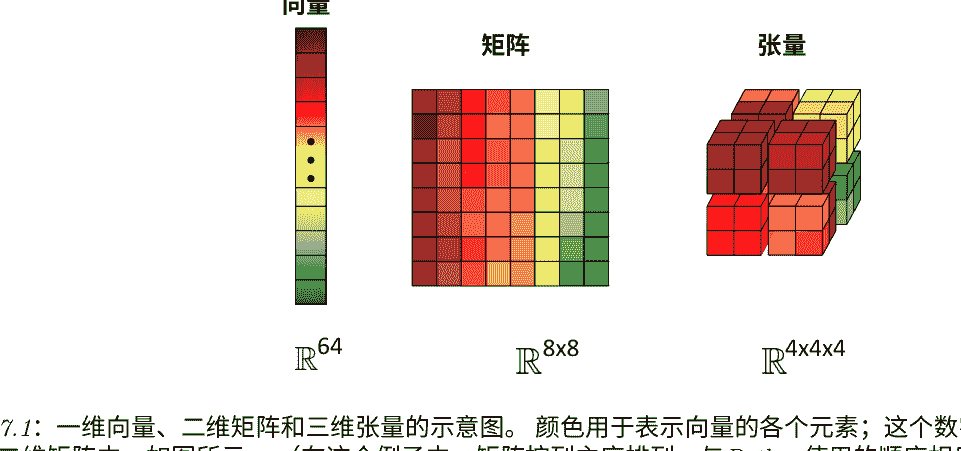

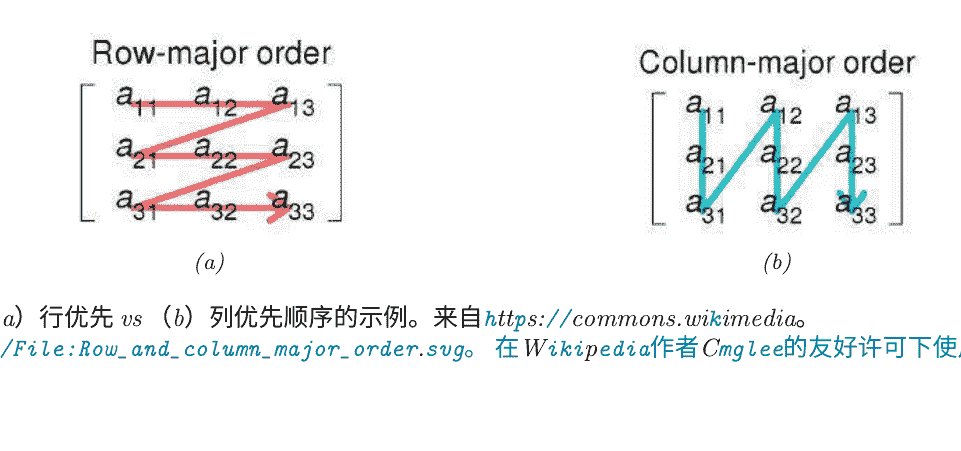

维度的数量被称为张量的阶或秩。¹在数学中，张量可以被视为定义多线性映射的一种方式，就像矩阵可以用来定义线性函数一样，尽管我们不需要使用这种解释。我们可以通过将矩阵的列堆叠在一起来将其重塑为向量，如图7.1所示。这被表示为

$$vec(A) = [A_{:,1}; \cdots; A_{:,n}] \in \mathbb{R}^{mn\times 1} \tag{7.12}$$

相反地，我们可以将一个向量重塑为一个矩阵。有两种选择的方法来做这个，即行主序（Python和C++等语言使用）和列主序（Julia、Matlab、R和Fortran等语言使用）。请参见图7.2以了解其区别的示例。

1. 然而，请注意，2D矩阵的秩是一个不同的概念，如第7.1.4.3节所讨论的。

作者：Kevin P. Murphy。(C) MIT Press. CC-BY-NC-ND许可证

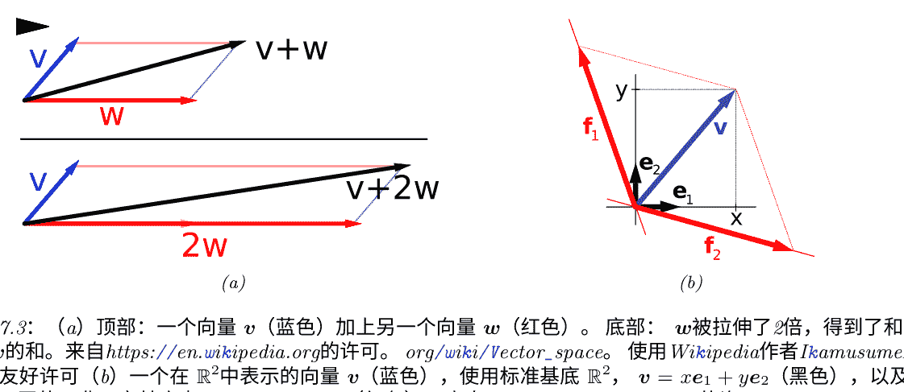

### 7.1.2 向量空间

在本节中，我们讨论线性代数中的一些基本概念。

#### 7.1.2.1 向量加法和缩放

我们可以将向量 $x \in \mathbb{R}^n$ 视为在 $n$ 维欧几里德空间中定义的点。向量空间是这样一组向量的集合，可以将它们相加，并通过标量（1维数字）进行缩放，以创建新的点。这些操作被定义为逐元素操作，以显而易见的方式进行，即 $x+y=(x_1+y_1, \ldots, x_n+y_n)$ 和 $cx=(cx_1, \ldots, cx_n)$，其中 $c \in \mathbb{R}$。请参见图7.3a进行说明。

#### 7.1.2.2 线性独立性、张成和基集

如果没有一个向量可以表示为其余向量的线性组合，则向量集合 $\{x_1, x_2, \ldots, x_n\}$ 被称为(线性)独立的。相反，如果一个向量可以表示为其余向量的线性组合，则该向量被称为(线性)相关的。例如，如果

$$x_n = \sum_{i=1}^{n-1} \alpha_i x_i \tag{7.13}$$

对于一些 $\{\alpha_1, \ldots, \alpha_{n-1}\}$，如果存在这样的向量 $\{x_1, \ldots, x_{n-1}\}$，则 $x_n$ 依赖于 $\{x_1, \ldots, x_{n-1}\}$；否则，它与 $\{x_1, \ldots, x_{n-1}\}$ 是独立的。向量集合 $\{x_1, x_2, \ldots, x_n\}$ 的张量是可以表示为 $\{x_1, \ldots, x_n\}$ 的所有向量的集合。也就是说，

$$\text{span}(\{x_1, \ldots, x_n\}) \triangleq \left\{ v : v = \sum_{i=1}^{n} \alpha_i x_i, \; \alpha_i \in \mathbb{R} \right\}. \tag{7.14}$$

可以证明，如果 \(\{x_1, ..., x_n\}\)是一组线性无关的向量，其中每个 \(x_i \in \mathbb{R}^n\)，那么 \(\text{span}(\{x_1, ..., x_n\}) = \mathbb{R}^n\)。换句话说，任何 \(\mathbb{R}^n\) 中的向量 \(v\) 都可以写成 \(x_1\) 到 \(x_n\) 的线性组合。

基 \(B\) 是一组线性无关的向量，它们覆盖整个空间，意味着 \(\text{span}(B) = \mathbb{R}^n\)。通常有多个基可以选择，如图7.3b所示。标准基使用坐标向量 \(e_1 = (1,0, ...,0)\)，直到 \(e_n = (0,0, ...,0,1)\)。这使我们可以在 \(\mathbb{R}^2\) 中将一个向量同时视为“平面上的箭头”，以原点为根，或者视为一个有序数列（对应于每个基向量的系数）。

## 7.1.2.3 线性映射和矩阵

线性映射或线性变换是任何函数 \(f: \mathcal{V} \rightarrow \mathcal{W}\)，满足 \(f(v + w) = f(v) + f(w)\) 和 \(f(a v) = a f(v)\) 对于所有的 \(v, w \in \mathcal{V}\)。一旦选择了 \(\mathcal{V}\) 的基，线性映射 \(f: \mathcal{V} \rightarrow \mathcal{W}\) 就完全由指定基向量的映射确定，因为 \(\mathcal{V}\) 的任何元素都可以唯一地表示为它们的线性组合。

我们可以计算 \(\mathcal{V}\) 中每个基向量的映射 \(f(v_i) \in \mathbb{R}^m\)，并将其存储在一个 \(m \times n\) 矩阵 \(A\) 的列中。然后，我们可以按如下方式计算任意 \(x \in \mathbb{R}^n\) 的映射 \(y = f(x) \in \mathbb{R}^m\)：

$$y = \left( \sum_{j=1}^{n} a_{1j} x_j, ..., \sum_{j=1}^{n} a_{mj} x_j \right)$$

这相当于将向量 \(x\) 乘以矩阵 \(A\)：

$$y = Ax$$

更多细节请参见第7.2节。

如果函数是可逆的，我们可以写成

$$x = A^{-1}y$$

更多细节请参见第7.3节。

## 7.1.2.4 矩阵的范围和零空间

假设我们将矩阵 \(A \in \mathbb{R}^{m \times n}\) 视为 \(\mathbb{R}^m\) 中的一组向量。这个矩阵的范围（有时也称为列空间）是 \(A\) 的列的张成。换句话说，

$$\text{range}(A) \triangleq \{v \in \mathbb{R}^m : v = Ax, x \in \mathbb{R}^n\}.$$

这可以被看作是可以被 \(A\) “到达”或“生成”的向量的集合；它是 \(\mathbb{R}^m\) 的一个子空间，其维度由 \(A\) 的秩确定（参见第7.1.4.3节）。矩阵 \(A \in \mathbb{R}^{m \times n}\) 的零空间是当乘以 \(A\) 时映射到零向量的所有向量的集合，即

$$\text{零空间}(A) \triangleq \{x \in \mathbb{R}^n : Ax = \mathbf{0}\}.$$

矩阵 A 的行空间是 A 的零空间的补集。请参见图7.4，了解矩阵的值域和零空间的示意图。 我们将在下面的第7.5.4节中讨论如何数值计算矩阵的值域和零空间。

## 7.1.2.5 线性投影

向量 \(y \in \mathbb{R}^m\) 在 \(\{x_1, \ldots, x_n\}\) 的张成空间上的投影（这里假设 \(x_i \in \mathbb{R}^m\)）是一个向量 \(v \in \text{span}(\{x_1, \ldots, x_n\})\)，使得 \(v\) 与 \(y\) 的欧几里得范数 \(\|v - y\|_2\) 尽可能接近。 我们将这个投影表示为 \(\text{Proj}(y; \{x_1, \ldots, x_n\})\)，并可以正式定义如下

\[\text{Proj}(y; \{x_1, \ldots, x_n\}) = \text{argmin}_{v \in \text{span}(\{x_1,\ldots,x_n\})} \|y - v\|_2. \tag{7.20}\]

给定一个（满秩）矩阵 \(A \in \mathbb{R}^{m \times n}\)，其中 \(m \geq n\)，我们可以定义向量 \(y \in \mathbb{R}^m\) 在 A 的范围上的投影如下：

\[\text{Proj}(y; A) = \text{argmin}_{v \in \mathcal{R}(A)} \|v - y\|_2 = A(A^\top A)^{-1}A^\top y. \tag{7.21}\]

这与第11.2.2.2节中的正规方程相同。

### 7.1.3 向量和矩阵的范数

在本节中，我们讨论衡量向量和矩阵“大小”的方法。

### 7.1.3.1 向量范数

向量 \(\|x\|\) 的范数，简单来说，是向量的“长度”的度量。更正式地说，范数是满足4个性质的任何函数 \(f: \mathbb{R}^n \rightarrow \mathbb{R}\)。

- 对于所有的 \(x \in \mathbb{R}^n\)， \(f(x) \geq 0\)（非负性）。
- \(f(x)=0\)当且仅当\(x=0\)（正定性）。
- 对于所有的\(x\in\mathbb{R}^{n}\)，\(t\in\mathbb{R}\)，\(f(tx)=|t|f(x)\)（绝对值齐次性）。
- 对于所有的\(x\)，\(y\in\mathbb{R}^{n}\)，\(f(x+y)\leq f(x) + f(y)\)（三角不等式）。

考虑以下常见例子：

p-范数\(\|x\|_{p}=\left(\sum_{i=1}^{n}|x_{i}|^{p}\right)^{1 / p}\)，for \(p \geq 1\)。

2-范数\(\|x\|_{2}=\sqrt{\sum_{i=1}^{n} x_{i}^{2}}\)，也称为欧几里德范数。请注意\(\|x\|_{2}^{2} =x^{\mathrm{T}} x\)。

1范数\(\|x\|_{1}=\sum_{i=1}^{n}|x_{i}|\)。

最大范数\(\|x\|_{\infty}=\max |x_{i}|\)。

0范数\(\|x\|_{0}=\sum_{i=1}^{n} \mathbb{I}(x_i \neq 0)\) 这是一个伪范数，因为它不满足齐次性。它计算\(x\)中非零元素的数量。如果我们定义\(0^{0}=0\)，我们可以将其写为\(\|x\|_{0}=\sum_{i=1}^{n} x_{i}^{0}\)。

### 7.1.3.2 矩阵范数

假设我们将矩阵\(\mathbf{A} \in \mathbb{R}^{m \times n}\)视为定义线性函数\(f(\boldsymbol{x}) = \mathbf{A}\boldsymbol{x}\)。我们将A的诱导范数定义为\(f\)可以使任何单位范数输入增加的最大量：

\[\|\mathbf{A}\|_{p}=\max_{\|\boldsymbol{x}\|_p=1} \frac{\|\mathbf{A}\boldsymbol{x}\|_{p}}{\|\boldsymbol{x}\|_{p}}=\max _{\|\boldsymbol{x}\|_p=1}\|\mathbf{A}\boldsymbol{x}\|_{p}\quad\quad(7.22)\]

通常情况下\(p=2\)，此时

\[\|\mathbf{A}\|_{2}=\sqrt{\lambda_{\max }\left(\mathbf{A}^{\mathrm{T}} \mathbf{A}\right)}=\max _{i} \sigma_{i}\quad\quad(7.23)\]

其中\(\lambda_{\max }(\mathbf{M})\)是\(\mathbf{M}\)的最大特征值，\(\sigma_{i}\)是第\(i\)个奇异值。核范数，也称为迹范数，定义为

\[\|\mathbf{A}\|_{*}=\operatorname{tr}(\sqrt{\mathbf{A}^{\mathrm{T}} \mathbf{A}})=\sum_{i} \sigma_{i}\quad\quad(7.24)\]

其中\(\sqrt{\mathbf{A}^{\mathrm{T}} \mathbf{A}}\)是矩阵的平方根。由于奇异值始终为非负数，我们有

\[\|\mathbf{A}\|_{*}=\sum_{i}\left|\sigma_{i}\right|=\|\boldsymbol{\sigma}\|_{1}\quad\quad(7.25)\]

使用这个作为正则化项可以鼓励许多奇异值变为零，从而得到一个低秩矩阵。更一般地，我们可以定义\(\operatorname{Schatten} p\)-范数为

\[\|\mathbf{A}\|_{p}=\left(\sum_{i} \sigma_{i}^{p}(\mathbf{A})\right)^{1 / p}\quad\quad(7.26)\]

如果我们将矩阵视为向量，我们可以通过向量范数来定义矩阵范数，
$$\|\mathbf{A}\| = \|\text{vec}(\mathbf{A})\|$$。
如果向量范数是2范数，相应的矩阵范数是 **Frobenius范数**：

$$\|\mathbf{A}\|_F = \sqrt{\sum_{i=1}^{m} \sum_{j=1}^{n} a_{ij}^2} = \sqrt{\text{tr}(\mathbf{A}^\top\mathbf{A})} = \|\text{vec}(\mathbf{A})\|_2$$

如果 \(\mathbf{A}\) 的计算代价很高，但 \(\mathbf{A}v\) 的计算代价很低（对于一个随机向量 \(v\)），我们可以使用方程 (7.37) 中的Hutchinson迹估计器来创建对Frobenius范数的随机近似，如下所示：

$$\|\mathbf{A}\|_F^2 = \text{tr}(\mathbf{A}^\top\mathbf{A}) = \mathbb{E}\left[v^\top\mathbf{A}^\top\mathbf{A}v\right] = \mathbb{E}\left[\|\mathbf{A}v\|_2^2\right]$$

其中 \(v \sim \mathcal{N}(\mathbf{0}, \mathbf{I})\)。

### 7.1.4 矩阵的性质

在本节中，我们讨论矩阵的各种标量性质。

### 7.1.4.1 方阵的迹

方阵 \(\mathbf{A} \in \mathbb{R}^{n \times n}\) 的迹，表示为 \(\text{tr}(\mathbf{A})\)，是矩阵对角线元素的和：

$$\text{tr}(\mathbf{A}) \triangleq \sum_{i=1}^{n} A_{ii}.$$

迹具有以下性质，其中 \(c \in \mathbb{R}\) 是标量，\(\mathbf{A}, \mathbf{B} \in \mathbb{R}^{n \times n}\) 是方阵：

- \(\text{tr}(\mathbf{A}) = \text{tr}(\mathbf{A}^\top)\)
- \(\text{tr}(\mathbf{A} + \mathbf{B}) = \text{tr}(\mathbf{A}) + \text{tr}(\mathbf{B})\)
- \(\text{tr}(c\mathbf{A}) = c\,\text{tr}(\mathbf{A})\)
- \(\text{tr}(\mathbf{A}\mathbf{B}) = \text{tr}(\mathbf{B}\mathbf{A})\)
- \(\text{tr}(\mathbf{A}) = \sum_{i=1}^{n} \lambda_i \quad \text{其中} \; \lambda_i \; \text{是} \; \mathbf{A} \; \text{的特征值}\)

我们还有以下重要的循环置换性质：对于 \(\mathbf{A}\)，\(\mathbf{B}\)，\(\mathbf{C}\) 满足 \(\mathbf{ABC}\) 是方阵，

$$\text{tr}(\mathbf{ABC}) = \text{tr}(\mathbf{BCA}) = \text{tr}(\mathbf{CAB})$$

由此，我们可以推导出迹技巧，将标量内积 \(\mathbf{x}^\top \mathbf{A} \mathbf{x}\) 重写为以下形式

$$\mathbf{x}^\top \mathbf{A} \mathbf{x} = \text{tr}(\mathbf{x}^\top \mathbf{A} \mathbf{x}) = \text{tr}(\mathbf{x}\mathbf{x}^\top \mathbf{A})$$

在某些情况下，评估矩阵 \(\mathbf{A}\) 可能很昂贵，但我们可能能够廉价地评估矩阵-向量乘积 \(\mathbf{A}v\)。假设 \(v\) 是一个随机向量，使得 \(\mathbb{E}\left[ vv^\top \right] = \mathbf{I}\)。在这种情况下，我们可以使用以下恒等式创建 \(\text{tr}(\mathbf{A})\) 的蒙特卡洛近似：

\[\text{tr}(\mathbf{A}) = \text{tr}(\mathbf{A}\mathbb{E}[\mathbf{vv}^\top]) = \mathbb{E}[\text{tr}(\mathbf{A}\mathbf{vv}^\top)] = \mathbb{E}[\text{tr}(\mathbf{v}^\top \mathbf{A}\mathbf{v})] = \mathbb{E}[\mathbf{v}^\top \mathbf{A}\mathbf{v}] \quad (7.37)\]

这被称为 **Hutchinson** 迹估计器 [Hut90]。

### 7.1.4.2 方阵的行列式

方阵的行列式，表示为 \(\det(\mathbf{A})\) 或 \(|\mathbf{A}|\)，是将单位体积视为线性变换时它改变的程度的度量。（正式定义相当复杂，这里不需要。）

行列式运算符满足以下性质，其中 \(\mathbf{A}, \mathbf{B} \in \mathbb{R}^{n\times n}\)

\[|\mathbf{A}| = |\mathbf{A}^\top| \quad (7.38)\]
\[|c\mathbf{A}| = c^n|\mathbf{A}| \quad (7.39)\]
\[|\mathbf{AB}| = |\mathbf{A}||\mathbf{B}| \quad (7.40)\]
\[|\mathbf{A}| = 0 \text{当且仅当 } \mathbf{A} \text{是奇异的} \quad (7.41)\]
\[|\mathbf{A}^{-1}| = 1/|\mathbf{A}| \text{如果 } \mathbf{A} \text{不是奇异的} \quad (7.42)\]
\[|\mathbf{A}| = \prod_{i=1}^n \lambda_i \text{其中 } \lambda_i \text{是 } \mathbf{A} \text{的特征值} \quad (7.43)\]

对于一个正定矩阵 \(\mathbf{A}\)，我们可以将其写成 \(\mathbf{A} = \mathbf{LL}^\top\) 的形式，其中 \(\mathbf{L}\) 是下三角形式的 Cholesky 分解。在这种情况下，我们有

\[\det(\mathbf{A}) = \det(\mathbf{L}) \det(\mathbf{L}^\top) = \det(\mathbf{L})^2 \quad (7.44)\]

所以

\[\log \det(\mathbf{A}) = 2 \log \det(\mathbf{L}) = 2 \log \prod_i L_{ii} = 2 \text{tr}(\log(\text{diag}(\mathbf{L}))) \quad (7.45)\]

### 7.1.4.3 矩阵的秩

矩阵 \(\mathbf{A}\) 的列秩是由其列张成的空间的维度，而行秩是由其行张成的空间的维度。这是线性代数的一个基本事实（可以通过 SVD 在第 7.5 节中讨论来证明），对于任意矩阵 \(\mathbf{A}\)，列秩(\(\mathbf{A}\)) = 行秩(\(\mathbf{A}\))，因此这个数量被简称为矩阵 \(\mathbf{A}\) 的秩，表示为 \(\text{rank}(\mathbf{A})\)。以下是秩的一些基本性质：

如果 \(\text{rank}(\mathbf{A}) = \min(m, n)\)，那么 \(\mathbf{A}\) 被称为满秩，否则被称为秩不足。

- 对于 \(\mathbf{A} \in \mathbb{R}^{m \times n}\)，\(\text{rank}(\mathbf{A}) = \text{rank}(\mathbf{A}^\top) = \text{rank}(\mathbf{A}^\top \mathbf{A}) = \text{rank}(\mathbf{A} \mathbf{A}^\top)\)。
- 对于 \(\mathbf{A} \in \mathbb{R}^{m \times n}\)，\(\mathbf{B} \in \mathbb{R}^{n \times p}\)，\(\text{rank}(\mathbf{AB}) \leq \min(\text{rank}(\mathbf{A}), \text{rank}(\mathbf{B}))\)。

作者：Kevin P. Murphy。(C) MIT Press. CC-BY-NC-ND许可证- 对于 $\mathbf{A}, \mathbf{B} \in \mathbb{R}^{m \times n}$, $\operatorname{rank}(\mathbf{A}+\mathbf{B}) \leq \operatorname{rank}(\mathbf{A})+\operatorname{rank}(\mathbf{B})$。

可以证明，一个方阵是可逆的当且仅当它是满秩的。

## 7.1.4.4 条件数

矩阵 $\mathbf{A}$ 的条件数是衡量涉及 $\mathbf{A}$ 的任何计算在数值上稳定性的度量。它的定义如下：$\kappa(\mathbf{A}) \triangleq\|\mathbf{A}\| \cdot\|\mathbf{A}^{-1}\|$ (7.46)

其中 $\|\mathbf{A}\|$ 是矩阵的范数。我们可以证明 $\kappa(\mathbf{A}) \geq 1$。(条件数取决于我们使用的范数；除非另有说明，我们将假设使用 $\ell_{2}$-范数。)

如果 $\kappa(\mathbf{A})$ 很小（接近1），我们称 $\mathbf{A}$ 是良好条件的；如果 $\kappa(\mathbf{A})$ 很大，我们称 $\mathbf{A}$ 是病态的。较大的条件数意味着 $\mathbf{A}$ 接近奇异。这是衡量接近奇异性的更好指标，而不是行列式的大小。例如，假设 $\mathbf{A}=0.1 \mathbf{I}_{100 \times 100}$。那么 $\operatorname{det}(\mathbf{A})=10^{-100}$，这表明 $\mathbf{A}$ 接近奇异，但 $\kappa(\mathbf{A})=1$，这意味着 $\mathbf{A}$ 是良好条件的，反映了 $\mathbf{A} \boldsymbol{x}$ 只是将 $\boldsymbol{x}$ 的分量缩放 $0.1$ 倍的事实。

为了更好地理解条件数，考虑线性方程组 $\mathbf{A} \boldsymbol{x}=\boldsymbol{b}$。如果 $\mathbf{A}$ 是非奇异的，唯一解为 $\boldsymbol{x}=\mathbf{A}^{-1} \boldsymbol{b}$。假设我们将 $\boldsymbol{b}$ 改变为 $\boldsymbol{b}+\Delta \boldsymbol{b}$；那么对 $\boldsymbol{x}$ 会产生什么影响？新的解必须满足

$\mathbf{A}(\boldsymbol{x}+\Delta \boldsymbol{x})=\boldsymbol{b}+\Delta \boldsymbol{b}$ (7.47)

其中

$\Delta \boldsymbol{x}=\mathbf{A}^{-1} \Delta \boldsymbol{b}$ (7.48)

如果小的 $\Delta \boldsymbol{b}$ 导致小的 $\Delta \boldsymbol{x}$，则我们称 $\mathbf{A}$ 为良好条件的；否则我们称 $\mathbf{A}$ 为病态的。

例如，假设

$\mathbf{A}=\frac{1}{2}\left(\begin{array}{cc}1 & 1 \\ 1+10^{-10} & 1-10^{-10}\end{array}\right), \quad \mathbf{A}^{-1}=\left(\begin{array}{cc}1-10^{10} & 10^{10} \\ 1+10^{10} & -10^{10}\end{array}\right)$ (7.49)

当 $\boldsymbol{b}=(1,1)$ 时，解为 $\boldsymbol{x}=(1,1)$。如果我们将 $\boldsymbol{b}$ 改变为 $\Delta \boldsymbol{b}$，解将变为

$\Delta \boldsymbol{x}=\mathbf{A}^{-1} \Delta \boldsymbol{b}=\left(\begin{array}{c}\Delta b_{1}-10^{10}\left(\Delta b_{1}-\Delta b_{2}\right) \\ \Delta b_{1}+10^{10}\left(\Delta b_{1}-\Delta b_{2}\right)\end{array}\right)$ (7.50)

所以 $\boldsymbol{b}$ 的微小变化可能导致 $\boldsymbol{x}$ 的极大变化，因为 $\mathbf{A}$ 是病态的 ($\kappa(\mathbf{A})=2 \times 10^{10}$ )。

对于 $\ell_{2}$ -范数，条件数等于最大奇异值与最小奇异值的比值（在第7.5节中定义）；此外，$\mathbf{A}$ 的奇异值是 $\mathbf{A}^{\top} \mathbf{A}$ 的特征值的平方根，因此

$\kappa(\mathbf{A})=\sigma_{\max } / \sigma_{\min }=\sqrt{\frac{\lambda_{\max }}{\lambda_{\min }}}$ (7.51)

通过考虑一个二次目标函数$f(x) = x^T \mathbf{A} x$，我们可以进一步了解条件数。如果我们绘制这个函数的等高线图，它将呈椭圆形，如第7.4.4节所示。当我们增加 $\mathbf{A}$ 的条件数时，椭圆形沿着某些方向变得越来越细长，对应于函数空间中的一个非常狭窄的山谷。如果 $\kappa = 1$（最小可能值），等高线图将是圆形的。

### 7.1.5 特殊类型的矩阵

在本节中，我们将列举一些具有不同结构形式的常见矩阵。

### 7.1.5.1 对角矩阵

对角矩阵是一个所有非对角元素都为0的矩阵。通常用

$$\mathbf{D} = \text{diag}(d_1, d_2, \ldots, d_n) \text{表示，其中} \mathbf{D} = \begin{pmatrix} d_1 & & & \\ & d_2 & & \\ & & \ddots & \\ & & & d_n \end{pmatrix} \quad (7.52)$$

单位矩阵，记作 $\mathbf{I} \in \mathbb{R}^{n \times n}$，是一个对角线上为1，其他位置为0的方阵， $\mathbf{I} = \text{diag}(1,1,\ldots,1)$。它具有对于所有 $\mathbf{A} \in \mathbb{R}^{n \times n}$ 的性质，

$$\mathbf{A} \mathbf{I} = \mathbf{A} = \mathbf{I} \mathbf{A} \quad (7.53)$$

其中 $\mathbf{I}$ 的大小由 $\mathbf{A}$ 的维度决定，以便进行矩阵乘法。

我们可以使用 $d = \text{diag}(\mathbf{D})$ 从矩阵中提取对角向量。我们可以通过写作 $\mathbf{D} = \text{diag}(d)$ 将一个向量转换为对角矩阵。

块对角矩阵是指在其主对角线上包含矩阵，并且其他位置为0的矩阵，例如，

$$\begin{pmatrix} \mathbf{A} & \mathbf{0} \\ \mathbf{0} & \mathbf{B} \end{pmatrix} \quad (7.54)$$

带状对角矩阵只在对角线上以及距离对角线 $k$ 个位置上具有非零元素，其中 $k$ 是带宽。例如，一个三对角的 $6 \times 6$ 矩阵如下所示：

$$\begin{bmatrix} A_{11} & A_{12} & 0 & \cdots & \cdots & 0 \\ A_{21} & A_{22} & A_{23} & \ddots & \ddots & \vdots \\ 0 & A_{32} & A_{33} & A_{34} & \ddots & \vdots \\ \vdots & \ddots & A_{43} & A_{44} & A_{45} & 0 \\ \vdots & \ddots & \ddots & A_{54} & A_{55} & A_{56} \\ 0 & \cdots & \cdots & 0 & A_{65} & A_{66} \end{bmatrix} \quad (7.55)$$

### 7.1.5.2 三角矩阵

一个上三角矩阵只在对角线及以上位置有非零元素。一个下三角矩阵只在对角线及以下位置有非零元素。

三角矩阵具有一个有用的性质，即 A 的对角线元素是A的特征值，因此行列式是对角线元素的乘积：$\det(A) = \prod_i A_{ii}$。

### 7.1.5.3 正定矩阵

给定一个方阵 $A \in \mathbb{R}^{n \times n}$ 和一个向量 $x \in \mathbb{R}^n$，标量值 $x^T A x$ 被称为二次型。明确写出来，我们可以看到

$$x^T A x = \sum_{i=1}^n \sum_{j=1}^n A_{ij} x_i x_j. \quad (7.56)$$

请注意，

$$x^T A x = (x^T A x)^T = x^T A^T x = x^T \left(\frac{1}{2}A + \frac{1}{2}A^T\right) x \quad (7.57)$$

因此，我们通常隐含地假设出现在二次形式中的矩阵是对称的。

我们给出以下定义：

- 对称矩阵 $A \in \mathbb{S}^n$ 是正定的，当且仅当对于所有非零向量 $x \in \mathbb{R}^n$， $x^T A x > 0$。通常用 $A \succ 0$（或仅用 $A > 0$）来表示。如果可能有 $x^T A x = 0$，我们称该矩阵为正半定矩阵或 psd。我们用 $\mathbb{S}^n_{++}$ 表示所有正定矩阵的集合。
- 一个对称矩阵 $A \in \mathbb{S}^n$ 是负定的，记作 $A \prec 0$（或简写为 $A < 0$），当且仅当对于所有非零的 $x \in \mathbb{R}^n$， $x^T A x < 0$。如果存在 $x^T A x = 0$，我们称该矩阵为负半定的。
- 一个对称矩阵 $A \in \mathbb{S}^n$ 是不定的，如果它既不是正半定的也不是负半定的——即存在 $x_1, x_2 \in \mathbb{R}^n$ 使得 $x_1^T A x_1 > 0$ 且 $x_2^T A x_2 < 0$。

显然，如果 $A$ 是正定的，则 $-A$ 是负定的，反之亦然。同样，如果 $A$ 是半正定的，那么 $-A$ 就是负半定的，反之亦然。如果 $A$ 是不定的，那么 $-A$ 也是不定的。还可以证明，正定矩阵和负定矩阵总是可逆的。

在第7.4.3.1节中，我们证明了对称矩阵是正定的当且仅当其特征值是正的。请注意，如果 $A$ 的所有元素都是正的，这并不意味着 $A$ 一定是正定的。

例如， $A = \begin{pmatrix} 4 & 3 \\ 3 & 2 \end{pmatrix}$ 不是正定的。反过来，一个正定矩阵可以有负的元素，例如， $A = \begin{pmatrix} 2 & -1 \\ -1 & 2 \end{pmatrix}$

比该行中所有其他（非对角线）条目的大小之和更大。更准确地说，

$$|a_{ii}| > \sum_{j \neq i} |a_{ij}| \quad \text{对于所有 } i \qquad (7.58)$$

在2D中，任何实数对称 $2 \times 2$ 矩阵 $\begin{pmatrix} a & b \\ b & d \end{pmatrix}$ 当且仅当 $a>0$，$d>0$ 和 $ad>b^2$ 时，它是正定的。

最后，有一种类型的正定矩阵经常出现，因此值得特别提及。给定任意矩阵 $\mathbf{A} \in \mathbb{R}^{m \times n}$（不一定对称甚至是方阵），Gram矩阵 $\mathbf{G} = \mathbf{A}^T \mathbf{A}$ 始终是正半定的。此外，如果 $m \geq n$（我们方便起见假设 $\mathbf{A}$ 是满秩的），那么 $\mathbf{G} = \mathbf{A}^T \mathbf{A}$ 是正定的。

### 7.1.5.4 正交矩阵

如果两个向量 $\boldsymbol{x}, \boldsymbol{y} \in \mathbb{R}^n$ 正交，则 $\boldsymbol{x}^T \boldsymbol{y}=0$。如果一个向量 $\boldsymbol{x} \in \mathbb{R}^n$ 被归一化，则 $\|\boldsymbol{x} \|_2 = 1$。一组两两正交且归一化的向量被称为正交归一化的。如果一个方阵 $\mathbf{U} \in \mathbb{R}^{n \times n}$ 的所有列都是正交归一化的，则它是正交的。（注意在讨论向量和矩阵时，术语正交的含义不同。）如果 $\mathbf{U}$ 的元素是复数，则我们使用 unitary 来代替正交。

根据正交和归一化的定义，$\mathbf{U}$ 是正交的当且仅当

$$\mathbf{U}^T \mathbf{U} = \mathbf{I} = \mathbf{U} \mathbf{U}^T. \qquad (7.59)$$

换句话说，正交矩阵的逆矩阵是它的转置。请注意，如果 $\mathbf{U}$ 不是方阵 — 即，$\mathbf{U} \in \mathbb{R}^{m \times n}$, $n < m$ — 但它的列仍然是正交归一化的，则 $\mathbf{U}^T \mathbf{U} = \mathbf{I}$，但 $\mathbf{U} \mathbf{U}^T = \mathbf{I}_n$。通常我们只用术语正交来描述前一种情况，即 $\mathbf{U}$ 是方阵。

正交矩阵的一个例子是旋转矩阵（参见练习7.1）。例如，绕 $z$ 轴旋转角度为 $\alpha$ 的三维旋转可以表示为

$$\mathbf{R}(\alpha) = \begin{pmatrix} \cos(\alpha) & -\sin(\alpha) & 0 \\ \sin(\alpha) & \cos(\alpha) & 0 \\ 0 & 0 & 1 \end{pmatrix} \qquad (7.60)$$

如果 $\alpha = 45^\circ$，则变为

$$\mathbf{R}(45) = \begin{pmatrix} \frac{1}{\sqrt{2}} & -\frac{1}{\sqrt{2}} & 0 \\ \frac{1}{\sqrt{2}} & \frac{1}{\sqrt{2}} & 0 \\ 0 & 0 & 1 \end{pmatrix} \qquad (7.61)$$

其中 $\frac{1}{\sqrt{2}} = 0.7071$。我们可以看到 $\mathbf{R}(-\alpha) = \mathbf{R}(\alpha)^{-1} = \mathbf{R}(\alpha)^T$，因此这是一个正交矩阵。

正交矩阵的一个好处是，用正交矩阵作用于一个向量不会改变其欧几里德范数，即

$$\|\mathbf{U} \boldsymbol{x}\|_2 = \|\boldsymbol{x}\|_2 \qquad (7.62)$$

对于任何非零的 $\boldsymbol{x} \in \mathbb{R}^n$，以及正交的 $\mathbf{U} \in \mathbb{R}^{n \times n}$。

类似地，可以证明两个向量之间的角度在它们被正交矩阵转换后保持不变。向量 $\boldsymbol{x}$ 和 $\boldsymbol{y}$ 之间的夹角的余弦值为

$$\cos(\alpha(\boldsymbol{x}, \boldsymbol{y})) = \frac{\boldsymbol{x}^{\top} \boldsymbol{y}}{\|\boldsymbol{x}\| \|\boldsymbol{y}\|} \quad (7.63)$$

所以

$$\cos(\alpha(\boldsymbol{U}\boldsymbol{x}, \boldsymbol{U}\boldsymbol{y})) = \frac{(\boldsymbol{U}\boldsymbol{x})^{\top} (\boldsymbol{U}\boldsymbol{y})}{\|\boldsymbol{U}\boldsymbol{x}\| \|\boldsymbol{U}\boldsymbol{y}\|} = \frac{\boldsymbol{x}^{\top} \boldsymbol{y}}{\|\boldsymbol{x}\| \|\boldsymbol{y}\|} = \cos(\alpha(\boldsymbol{x}, \boldsymbol{y})) \quad (7.64)$$

总之，通过正交矩阵进行的变换是旋转（如果 $\det(\boldsymbol{U}) = 1$）和反射（如果 $\det(\boldsymbol{U}) = -1$）的推广，因为它们保持长度和角度。

请注意，有一种称为Gram-Schmidt正交化的技术，可以使任何方阵正交化，但我们在这里不涉及它。

## 7.2 矩阵乘法

两个矩阵的乘积 $\boldsymbol{A} \in \mathbb{R}^{m \times n}$ 和 $\boldsymbol{B} \in \mathbb{R}^{n \times p}$ 是矩阵

$$\boldsymbol{C} = \boldsymbol{AB} \in \mathbb{R}^{m \times p}, \quad (7.65)$$

其中

$$C_{ij} = \sum_{k=1}^{n} A_{ik} B_{kj}. \quad (7.66)$$

请注意，为了使矩阵乘积存在，矩阵 $\boldsymbol{A}$ 的列数必须等于矩阵 $\boldsymbol{B}$ 的行数。

矩阵乘法通常需要 $O(mnp)$ 的时间，尽管存在更快的方法。此外，可以利用专用硬件（如GPU和TPU）通过并行处理行（或列）来显著加快矩阵乘法的速度。

- 矩阵乘法是结合律: $(\boldsymbol{AB})\boldsymbol{C} = \boldsymbol{A}(\boldsymbol{BC})$。
- 矩阵乘法是分配律: $\boldsymbol{A}(\boldsymbol{B} + \boldsymbol{C}) = \boldsymbol{AB} + \boldsymbol{AC}$。
- 矩阵乘法通常不满足交换律; 也就是说，可能存在 $\boldsymbol{AB} = \boldsymbol{BA}$ 的情况。（在上述每种情况下，我们假设维度匹配。）矩阵乘法有许多重要的特殊情况，我们将在下面讨论。

### 7.2.1 向量-向量乘积

给定两个向量 $\boldsymbol{x}, \boldsymbol{y} \in \mathbb{R}^{n}$, 向量的内积、点积或标量积是一个实数，表示为 $\boldsymbol{x}^{\top} \boldsymbol{y}$, 计算公式如下

$$\langle \boldsymbol{x}, \boldsymbol{y} \rangle \triangleq \boldsymbol{x}^{\top} \boldsymbol{y} = \sum_{i=1}^{n} x_i y_i. \quad (7.67)$$

## 7.2. 矩阵乘法

注意，对于任意向量 $x$ 和 $y$，总有 $x^\mathrm{T} y = y^\mathrm{T} x$。
给定向量 $x \in \mathbb{R}^m$ 和 $y \in \mathbb{R}^n$（它们的大小可以不同），$xy^\mathrm{T}$ 称为向量的外积。外积是一个矩阵，其元素由 $(xy^\mathrm{T})_{ij} = x_i y_j$ 给出，即

$$
xy^\mathrm{T} \in \mathbb{R}^{m \times n} = \begin{bmatrix}
x_1y_1 & x_1y_2 & \cdots & x_1y_n \\
x_2y_1 & x_2y_2 & \cdots & x_2y_n \\
\vdots & \vdots & \ddots & \vdots \\
x_my_1 & x_my_2 & \cdots & x_my_n
\end{bmatrix}.
$$

### 7.2.2 矩阵-向量乘积

给定一个矩阵 $\mathbf{A} \in \mathbb{R}^{m \times n}$ 和一个向量 $x \in \mathbb{R}^n$，它们的乘积是一个向量 $y = \mathbf{A}x \in \mathbb{R}^m$。有几种看待矩阵-向量乘法的方式，我们将同时看待它们。
如果我们按行写 $\mathbf{A}$，那么我们可以表示 $y = \mathbf{A}x$ 如下：

$$
y = \mathbf{A}x = \begin{bmatrix}
\rule[-0.5ex]{1em}{0.4pt} \, a_1^\mathrm{T} \, \rule[-0.5ex]{1em}{0.4pt} \\[0.5ex]
\rule[-0.5ex]{1em}{0.4pt} \, a_2^\mathrm{T} \, \rule[-0.5ex]{1em}{0.4pt} \\[0.5ex]
\vdots \\[0.5ex]
\rule[-0.5ex]{1em}{0.4pt} \, a_m^\mathrm{T} \, \rule[-0.5ex]{1em}{0.4pt}
\end{bmatrix} x = \begin{bmatrix}
a_1^\mathrm{T}x \\[0.5ex]
a_2^\mathrm{T}x \\[0.5ex]
\vdots \\[0.5ex]
a_m^\mathrm{T}x
\end{bmatrix}.
$$

换句话说，$y$ 的第 $i$ 个元素等于 $\mathbf{A}$ 的第 $i$ 行和 $x$ 的内积，$y_i = a_i^\mathrm{T} x$。
或者，我们可以将 $\mathbf{A}$ 写成列的形式。在这种情况下，我们可以看到

$$
y = \mathbf{A}x = \begin{bmatrix}
| & | & & | \\[0.5ex]
a_1 & a_2 & \cdots & a_n \\[0.5ex]
| & | & & |
\end{bmatrix} \begin{bmatrix}
x_1 \\[0.5ex]
x_2 \\[0.5ex]
\vdots \\[0.5ex]
x_n
\end{bmatrix} = \begin{bmatrix}
| \\[0.5ex]
a_1 \\[0.5ex]
|
\end{bmatrix} x_1 + \begin{bmatrix}
| \\[0.5ex]
a_2 \\[0.5ex]
|
\end{bmatrix} x_2 + \dots + \begin{bmatrix}
| \\[0.5ex]
a_n \\[0.5ex]
|
\end{bmatrix} x_n.
$$

换句话说，$y$ 是 $\mathbf{A}$ 的列的线性组合，其中线性组合的系数由 $x$ 的元素给出。我们可以将 $\mathbf{A}$ 的列视为定义线性子空间的一组基向量。我们可以通过取基向量的线性组合来构造这个子空间中的向量。
详细信息请参见第7.1.2节。

### 7.2.3 矩阵-矩阵乘积

下面我们来看四种不同（但当然等价）的矩阵-矩阵乘法视角。
首先，我们可以将矩阵-矩阵乘法视为一组向量-向量乘积。最明显的视角是根据定义立即得出的，即 $\mathbf{C}$ 的第 $i$, $j$ 个元素等于 $\mathbf{A}$ 的第 $i$ 行与 $\mathbf{B}$ 的第 $j$ 列的内积。符号上，可以表示为以下形式：

$$
\mathbf{C} = \mathbf{A}\mathbf{B} = \begin{bmatrix}
\rule[-0.5ex]{1em}{0.4pt} \, a_1^\mathrm{T} \, \rule[-0.5ex]{1em}{0.4pt} \\[0.5ex]
\rule[-0.5ex]{1em}{0.4pt} \, a_2^\mathrm{T} \, \rule[-0.5ex]{1em}{0.4pt} \\[0.5ex]
\vdots \\[0.5ex]
\rule[-0.5ex]{1em}{0.4pt} \, a_m^\mathrm{T} \, \rule[-0.5ex]{1em}{0.4pt}
\end{bmatrix} \begin{bmatrix}
| & | & & | \\[0.5ex]
b_1 & b_2 & \cdots & b_p \\[0.5ex]
| & | & & |
\end{bmatrix} = \begin{bmatrix}
a_1^\mathrm{T}b_1 & a_1^\mathrm{T}b_2 & \cdots & a_1^\mathrm{T}b_p \\[0.5ex]
a_2^\mathrm{T}b_1 & a_2^\mathrm{T}b_2 & \cdots & a_2^\mathrm{T}b_p \\[0.5ex]
\vdots & \vdots & \ddots & \vdots \\[0.5ex]
a_m^\mathrm{T}b_1 & a_m^\mathrm{T}b_2 & \cdots & a_m^\mathrm{T}b_p
\end{bmatrix}.
$$

请记住，由于 A ∈ ℝ^{m×n} 和 B ∈ ℝ^{n×p}，a_i ∈ ℝ^n 和 b_j ∈ ℝ^n，因此这些内积都是有意义的。当我们将 A 按行表示，将 B 按列表示时，这是最“自然”的表示方式。请参见图7.5以了解示例。

或者，我们可以将 A 按列表示，将 B 按行表示，这将导致 AB 被解释为外积的和。符号上，

$$C = AB = \begin{bmatrix} a_1 & a_2 & \cdots & a_n \end{bmatrix} \begin{bmatrix} - & b_1^T & - \\ - & b_2^T & - \\ & \vdots & \\ - & b_n^T & - \end{bmatrix} = \sum_{i=1}^{n} a_i b_i^T. \quad (7.72)$$

换句话说，AB 等于 A 的第 i 列与 B 的第 i 行的外积之和。由于在这种情况下，a_i ∈ ℝ^m 且 b_i ∈ ℝ^p，外积 a_i b_i^T 的维度为 m × p，与 C 的维度相同。

我们还可以将矩阵乘法视为一组矩阵-向量乘积。具体来说，如果我们将 B 表示为列向量，则 C 的列可以视为 A 与 B 的列之间的矩阵-向量乘积。符号上，

$$C = AB = A \begin{bmatrix} b_1 & b_2 & \cdots & b_p \end{bmatrix} = \begin{bmatrix} Ab_1 & Ab_2 & \cdots & Ab_p \end{bmatrix}. \quad (7.73)$$

这里，C 的第 i 列由右侧向量的矩阵-向量乘积给出，c_i = Ab_i。这些矩阵-向量乘积可以用前一小节中给出的两种观点来解释。

最后，我们有类似的观点，其中我们通过行来表示 A，并将 C 的行视为 A 的行和矩阵 B 之间的矩阵-向量乘积。符号上，

$$C = AB = \begin{bmatrix} - & a_1^T & - \\ - & a_2^T & - \\ & \vdots & \\ - & a_m^T & - \end{bmatrix} B = \begin{bmatrix} - & a_1^T B & - \\ - & a_2^T B & - \\ & \vdots & \\ - & a_m^T B & - \end{bmatrix}. \quad (7.74)$$

在这里，C的第i行由左侧向量的矩阵-向量乘积给出，$c_i^T = a_i^T B$。从这一节开始，从我们最初给出的定义（大约一行数学）中，所有这些观点都可以立即得出，可能会觉得分析矩阵乘法如此详细有些多余。然而，几乎所有的线性代数都涉及到某种形式的矩阵乘法，花一些时间来发展对这里提出的观点的直观理解是值得的。

最后，关于符号的一点说明。我们将 $A^2$ 写作 $AA$ 的简写形式，表示矩阵乘积。为了表示矩阵元素的平方，我们将 $A^2$ 写作 $[A_{ij}^2]$。（如果$A$是对角矩阵，则 $A^2 = A^{\circ 2}$。）

我们还可以使用矩阵平方根来定义$A^2$的逆：我们说 $A = \sqrt{M}$ 如果 $A^2 = M$。表示矩阵元素的平方根，我们写作 $[\sqrt{M_{ij}}]$。

### 7.2.4 应用：操作数据矩阵

作为上述结果的一个应用，考虑 $X$ 是 $N \times D$ 设计矩阵的情况，其行是数据案例。我们对这个矩阵应用各种常见的预处理操作，下面我们进行总结。（将这些操作以矩阵形式写出很有用，因为它在符号上更紧凑，并且可以使用快速矩阵代码快速实现这些方法。）

#### 7.2.4.1 对矩阵的切片求和

假设 $X$ 是一个 $N \times D$ 矩阵。我们可以通过预乘以一个 $1 \times N$ 矩阵的全1向量来对行进行求和，从而创建一个 $1 \times D$ 矩阵：

$$\mathbf{1}_N^T \mathbf{X} = \left( \sum_n x_{n1} \quad \cdots \quad \sum_n x_{nD} \right) \quad (7.75)$$

因此，数据向量的均值为

$$\bar{\mathbf{x}}^T = \frac{1}{N} \mathbf{1}_N^T \mathbf{X} \quad (7.76)$$

我们可以通过后乘以一个 $D \times 1$ 全1向量的矩阵来对列进行求和，从而创建一个 $N \times 1$ 矩阵：

$$\mathbf{X} \mathbf{1}_D = \begin{pmatrix} \sum_d x_{1d} \\ \vdots \\ \sum_d x_{Nd} \end{pmatrix} \quad (7.77)$$

我们可以通过前后乘以一个全1向量的向量来对矩阵的所有元素求和：

$$\mathbf{1}_N^T \mathbf{X} \mathbf{1}_D = \sum_{ij} X_{ij} \quad (7.78)$$

因此，总体均值为

$$\bar{x} = \frac{1}{ND} \mathbf{1}_N^T \mathbf{X} \mathbf{1}_D \quad (7.79)$$

#### 7.2.4.2 对矩阵的行和列进行缩放

我们经常希望对数据矩阵的行或列进行缩放（例如，标准化）。我们现在展示如何用矩阵符号来表示这个过程。
如果我们用对角矩阵 S = diag(s) （其中 s 是一个 N 维向量）对 X 进行前乘，那么我们只需将 X 的每一行按照对应的缩放因子在 s 中进行缩放：

$$\text{diag}(s)X = \begin{pmatrix} s_1 & \cdots & 0 \\ & \ddots & \\ 0 & \cdots & s_N \end{pmatrix} \begin{pmatrix} x_{1,1} & \cdots & x_{1,D} \\ & \ddots & \\ x_{N,1} & \cdots & x_{N,D} \end{pmatrix} = \begin{pmatrix} s_1x_{1,1} & \cdots & s_1x_{1,D} \\ & \ddots & \\ s_Nx_{N,1} & \cdots & s_Nx_{N,D} \end{pmatrix} \qquad (7.80)$$

如果我们用对角矩阵 S = diag(s) （其中 s 是一个 D 维向量）对 X 进行后乘，那么我们只需将 X 的每一列按照 s 中对应的元素进行缩放。

$$X\text{diag}(s) = \begin{pmatrix} x_{1,1} & \cdots & x_{1,D} \\ & \ddots & \\ x_{N,1} & \cdots & x_{N,D} \end{pmatrix} \begin{pmatrix} s_1 & \cdots & 0 \\ & \ddots & \\ 0 & \cdots & s_D \end{pmatrix} = \begin{pmatrix} s_1x_{1,1} & \cdots & s_Dx_{1,D} \\ & \ddots & \\ s_1x_{N,1} & \cdots & s_Dx_{N,D} \end{pmatrix} \qquad (7.81)$$

因此，我们可以将第10.2.8节中的标准化操作重新写成矩阵形式，如下所示：

$$\text{standardize}(X) = (X - \mathbf{1}_N \mu^T)\text{diag}(\sigma)^{-1} \qquad (7.82)$$

其中 $\mu = \bar{x}$ 是经验均值，$\sigma$ 是经验标准差的向量。

#### 7.2.4.3 平方和和散布矩阵

平方和矩阵是一个 D × D 矩阵，定义如下：

$$\mathbf{S}_0 \triangleq \mathbf{X}^T\mathbf{X} = \sum_{n=1}^N \boldsymbol{x}_n\boldsymbol{x}_n^T = \sum_{n=1}^N \begin{pmatrix} x_{n,1}^2 & \cdots & x_{n,1}x_{n,D} \\ & \ddots & \\ x_{n,D}x_{n,1} & \cdots & x_{n,D}^2 \end{pmatrix} \qquad (7.83)$$

散点矩阵是一个 D × D 的矩阵，定义如下

$$\mathbf{S}_{\bar{x}} \triangleq \sum_{n=1}^N (\boldsymbol{x}_n - \bar{\boldsymbol{x}})(\boldsymbol{x}_n - \bar{\boldsymbol{x}})^T = \left(\sum_{n} \boldsymbol{x}_n\boldsymbol{x}_n^T\right) - N\bar{\boldsymbol{x}}\bar{\boldsymbol{x}}^T \qquad (7.84)$$

我们可以看到这是对均值中心化数据应用的平方和矩阵。更准确地说，定义 $\mathbf{\tilde{X}}$ 为减去均值的版本 $\mathbf{X}$， 其中 $\tilde{\boldsymbol{x}} = \mathbf{X} - \frac{1}{N}\mathbf{X}^T\mathbf{1}_N$ 从每一行中减去均值。因此我们可以使用以下方式计算中心化数据矩阵：

$$\mathbf{\tilde{X}} = \mathbf{X} - \mathbf{1}_N\bar{\boldsymbol{x}}^T = \mathbf{X} - \frac{1}{N}\mathbf{1}_N\mathbf{1}_N^T\mathbf{X} = \mathbf{C}_N\mathbf{X} \qquad (7.85)$$

其中

$$\mathbf{C}_N \triangleq \mathbf{I}_N - \frac{1}{N}\mathbf{J}_N \qquad (7.86)$$

是中心化矩阵，$J_N = \mathbf{1}_N\mathbf{1}_N^T$是一个全1矩阵。现在可以按以下方式计算散点矩阵：

$$\mathbf{S}_X = \tilde{\mathbf{X}}^T \tilde{\mathbf{X}} = \mathbf{X}^T \mathbf{C}_N^T \mathbf{C}_N \mathbf{X} = \mathbf{X}^T \mathbf{C}_N \mathbf{X} \quad (7.87)$$

我们利用了 $\mathbf{C}_N$ 是对称和幂等的事实，即 $\mathbf{C}_N^k = \mathbf{C}_N$ 对于 $k=1,2,...$ (因为一旦我们减去均值，再次减去没有影响)。

#### 7.2.4.4 Gram矩阵

矩阵 $\mathbf{X}\mathbf{X}^T$ 是一个内积矩阵，称为Gram矩阵：

$$\mathbf{K} \triangleq \mathbf{X}\mathbf{X}^T = \begin{pmatrix} \mathbf{x}_1^T \mathbf{x}_1 & \cdots & \mathbf{x}_1^T \mathbf{x}_N \\ \vdots & \ddots & \vdots \\ \mathbf{x}_N^T \mathbf{x}_1 & \cdots & \mathbf{x}_N^T \mathbf{x}_N \end{pmatrix} \quad (7.88)$$

有时候我们想要计算去均值的数据向量的内积，$\tilde{\mathbf{K}} = \tilde{\mathbf{X}} \tilde{\mathbf{X}}^T$。然而，如果我们使用特征相似性矩阵而不是原始特征，我们只能访问 $\mathbf{K}$，而不是 $\mathbf{X}$。(我们将在第20.4.4节和第20.4.6节中看到这方面的例子。)幸运的是，我们可以使用双中心技巧从 $\mathbf{K}$计算 $\tilde{\mathbf{K}}$：

$$\tilde{\mathbf{K}} = \tilde{\mathbf{X}}\tilde{\mathbf{X}}^T = \mathbf{C}_N \mathbf{K} \mathbf{C}_N = \mathbf{K} - \frac{1}{N} \mathbf{J}_N \mathbf{K} - \frac{1}{N} \mathbf{K} \mathbf{J}_N + \frac{1}{N^2} \mathbf{1}_N^T \mathbf{K} \mathbf{1}_N \quad (7.89)$$

这从 $\mathbf{K}$中减去行均值和列均值，并将被减去两次的全局均值加回去，以使 $\tilde{\mathbf{K}}$的行均值和列均值都为零。

为了看到方程 (7.89) 为什么成立，考虑标量形式：

$$\tilde{K}_{ij} = \tilde{\mathbf{x}}_i^T \tilde{\mathbf{x}}_j = (\mathbf{x}_i - \frac{1}{N} \sum_{k=1}^N \mathbf{x}_k)(\mathbf{x}_j - \frac{1}{N} \sum_{l=1}^N \mathbf{x}_l) \quad (7.90)$$

$$= \mathbf{x}_i^T \mathbf{x}_j - \frac{1}{N} \sum_{k=1}^N \mathbf{x}_i^T \mathbf{x}_k - \frac{1}{N} \sum_{k=1}^N \mathbf{x}_j^T \mathbf{x}_k + \frac{1}{N^2} \sum_{k=1}^N \sum_{l=1}^N \mathbf{x}_k^T \mathbf{x}_l \quad (7.91)$$

#### 7.2.4.5 距离矩阵

设 $\mathbf{X}$为 $N_x \times D$的数据矩阵，$\mathbf{Y}$为另一个 $N_y \times D$的数据矩阵。我们可以使用以下方法计算它们之间的平方欧氏距离：

$$D_{ij} = (\mathbf{x}_i - \mathbf{y}_j)^T (\mathbf{x}_i - \mathbf{y}_j) = ||\mathbf{x}_i||^2 - 2\mathbf{x}_i^T \mathbf{y}_j + ||\mathbf{y}_j||^2 \quad (7.92)$$

现在让我们以矩阵形式来写出这个。令 $\hat{\mathbf{x}} = [||\mathbf{x}_1||^2, \dots, ||\mathbf{x}_{N_x}||^2] = \text{diag}(\mathbf{X}\mathbf{X}^T)$是一个向量，其中每个元素是 $\mathbf{X}$中示例的平方范数，并类似地定义 $\hat{\mathbf{y}}$。然后我们有：

$$\mathbf{D} = \hat{\mathbf{x}} \mathbf{1}_{N_y}^T - 2\mathbf{X}\mathbf{Y}^T + \mathbf{1}_{N_x} \hat{\mathbf{y}}^T \quad (7.93)$$

在 $\mathbf{X} = \mathbf{Y}$的情况下，我们有

$$\mathbf{D} = \hat{\mathbf{x}} \mathbf{1}_{N_x}^T - 2\mathbf{X}\mathbf{X}^T + \mathbf{1}_{N_x} \hat{\mathbf{x}}^T \quad (7.94)$$

这种向量化计算通常比使用循环更快。

### 7.2.5 克罗内克积 *

如果 \( \mathbf{A} \) 是一个 \( m \times n \) 矩阵，而 \( \mathbf{B} \) 是一个 \( p \times q \) 矩阵，那么克罗内克积 \( \mathbf{A} \otimes \mathbf{B} \) 是一个 \( mp \times nq \) 分块矩阵。

\[
\mathbf{A} \otimes \mathbf{B} = \begin{bmatrix} a_{11}\mathbf{B} & \cdots & a_{1n}\mathbf{B} \\ \vdots & \ddots & \vdots \\ a_{m1}\mathbf{B} & \cdots & a_{mn}\mathbf{B} \end{bmatrix}
\]

例如，

\[
\begin{bmatrix} a_{11} & a_{12} \\ a_{21} & a_{22} \\ a_{31} & a_{32} \end{bmatrix} \otimes \begin{bmatrix} b_{11} & b_{12} & b_{13} \\ b_{21} & b_{22} & b_{23} \end{bmatrix} = \begin{bmatrix} a_{11}b_{11} & a_{11}b_{12} & a_{11}b_{13} & a_{12}b_{11} & a_{12}b_{12} & a_{12}b_{13} \\ a_{11}b_{21} & a_{11}b_{22} & a_{11}b_{23} & a_{12}b_{21} & a_{12}b_{22} & a_{12}b_{23} \\ a_{21}b_{11} & a_{21}b_{12} & a_{21}b_{13} & a_{22}b_{11} & a_{22}b_{12} & a_{22}b_{13} \\ a_{21}b_{21} & a_{21}b_{22} & a_{21}b_{23} & a_{22}b_{21} & a_{22}b_{22} & a_{22}b_{23} \\ a_{31}b_{11} & a_{31}b_{12} & a_{31}b_{13} & a_{32}b_{11} & a_{32}b_{12} & a_{32}b_{13} \\ a_{31}b_{21} & a_{31}b_{22} & a_{31}b_{23} & a_{32}b_{21} & a_{32}b_{22} & a_{32}b_{23} \end{bmatrix}
\]

以下是一些有用的恒等式：

\[
(\mathbf{A} \otimes \mathbf{B})^{-1} = \mathbf{A}^{-1} \otimes \mathbf{B}^{-1}
\]

\[
(\mathbf{A} \otimes \mathbf{B})\mathrm{vec}(\mathbf{C}) = \mathrm{vec}(\mathbf{B}\mathbf{C}\mathbf{A}^\mathsf{T})
\]

其中 \( \mathrm{vec}(\mathbf{M}) \) 将 \( \mathbf{M} \) 的列堆叠在一起。（如果我们沿着行堆叠，我们得到 \( (\mathbf{A} \otimes \mathbf{B})\mathrm{vec}(\mathbf{C}) = \mathrm{vec}(\mathbf{A}\mathbf{C}\mathbf{B}^\mathsf{T}) \)。）参见 [Loa00] 以获取其他有用的性质列表。

### 7.2.6 爱因斯坦求和 *

爱因斯坦求和，或简称为 **einsum**，是处理张量的一种简便记法。这个约定是由爱因斯坦 [Ein16, 第5节] 引入的，他后来对一个朋友开玩笑说：“我在数学上做了一个伟大的发现；我每次必须对出现两次的指标进行求和时，都省略了求和符号...”[Pai05, p.216]。例如，矩阵乘法可以写成 \( C_{ij} = \sum_k A_{ik}B_{kj} \)，我们可以将其写为 \( C_{ij} = A_{ik}B_{kj} \)，其中我们省略了 \( \sum_k \)。作为一个更复杂的例子，假设我们有一个3维张量 \( S_{ntk} \)，其中 \( n \) 索引批次中的示例，\( t \) 索引序列中的位置，\( k \) 索引独热表示中的单词。让 \( W_{kd} \) 成为一个将稀疏独热向量 \( \mathbb{R}^k \) 映射到稠密向量 \( \mathbb{R}^d \) 的嵌入矩阵。我们可以将一批序列的独热向量转换为一批嵌入序列，如下所示：

\[
E_{ntd} = \sum_k S_{ntk} W_{kd}
\]

## 7.3 矩阵求逆

在本节中，我们讨论如何求逆不同类型的矩阵。

### 7.3.1 方阵的逆

方阵 \( \mathbf{A} \in \mathbb{R}^{n \times n} \) 的逆矩阵 \( \mathbf{A}^{-1} \)，是唯一的矩阵，满足以下条件：

\[
\mathbf{A}^{-1}\mathbf{A} = \mathbf{I} = \mathbf{A}\mathbf{A}^{-1}。\qquad \qquad (7.102)
\]

注意，只有当 \( \mathbf{A} \) 的行列式不等于0时，逆矩阵 \( \mathbf{A}^{-1} \) 存在。如果 \( \mathbf{A} \) 的行列式等于0，则称其为奇异矩阵。

以下是逆矩阵的性质；所有性质都假设 \( \mathbf{A} \) 和 \( \mathbf{B} \in \mathbb{R}^{n \times n} \) 为非奇异矩阵：

\[
(\mathbf{A}^{-1})^{-1} = \mathbf{A} \qquad \qquad (7.103)
\]

\[
(\mathbf{AB})^{-1} = \mathbf{B}^{-1}\mathbf{A}^{-1} \qquad \qquad (7.104)
\]

\[
(\mathbf{A}^{-1})^\top = (\mathbf{A}^\top)^{-1} \triangleq \mathbf{A}^{-\top} \qquad \qquad (7.105)
\]

对于 \( 2 \times 2 \) 矩阵的情况， \( \mathbf{A}^{-1} \) 的表达式足够简单，可以明确给出。我们有

\[
\mathbf{A} = \begin{pmatrix} a & b \\ c & d \end{pmatrix}, \quad \mathbf{A}^{-1} = \frac{1}{|\mathbf{A}|} \begin{pmatrix} d & -b \\ -c & a \end{pmatrix} \qquad \qquad (7.106)
\]

对于分块对角矩阵，逆矩阵可以通过分别求解每个块的逆矩阵来获得，例如，

\[
\begin{pmatrix} \mathbf{A} & \mathbf{0} \\ \mathbf{0} & \mathbf{B} \end{pmatrix}^{-1} = \begin{pmatrix} \mathbf{A}^{-1} & \mathbf{0} \\ \mathbf{0} & \mathbf{B}^{-1} \end{pmatrix} \qquad \qquad (7.107)
\]

### 7.3.2 Schur补 *

在本节中，我们回顾一些关于分块结构矩阵的有用结果。

定理 7.3.1（分块矩阵的逆矩阵）。考虑一个一般的分块矩阵

\[
\mathbf{M} = \begin{pmatrix} \mathbf{E} & \mathbf{F} \\ \mathbf{G} & \mathbf{H} \end{pmatrix} \quad (7.108)
\]

在这里我们假设 \( \mathbf{E} \) 和 \( \mathbf{H} \) 是可逆的。我们有

\[
\mathbf{M}^{-1} = \begin{pmatrix} (\mathbf{M/H})^{-1} & -(\mathbf{M/H})^{-1}\mathbf{F}\mathbf{H}^{-1} \\ -\mathbf{H}^{-1}\mathbf{G}(\mathbf{M/H})^{-1} & \mathbf{H}^{-1} + \mathbf{H}^{-1}\mathbf{G}(\mathbf{M/H})^{-1}\mathbf{F}\mathbf{H}^{-1} \end{pmatrix} \quad (7.109)
\]

\[
= \begin{pmatrix} \mathbf{E}^{-1} + \mathbf{E}^{-1}\mathbf{F}(\mathbf{M/E})^{-1}\mathbf{G}\mathbf{E}^{-1} & -\mathbf{E}^{-1}\mathbf{F}(\mathbf{M/E})^{-1} \\ -(\mathbf{M/E})^{-1}\mathbf{G}\mathbf{E}^{-1} & (\mathbf{M/E})^{-1} \end{pmatrix} \quad (7.110)
\]

其中

\[
\mathbf{M/H} \triangleq \mathbf{E} - \mathbf{F}\mathbf{H}^{-1}\mathbf{G} \quad (7.111)
\]

\[
\mathbf{M/E} \triangleq \mathbf{H} - \mathbf{G}\mathbf{E}^{-1}\mathbf{F} \quad (7.112)
\]

我们说 \( \mathbf{M/H} \) 是 \( \mathbf{M} \) 相对于 \( \mathbf{H} \) 的舒尔补，而 \( \mathbf{M/E} \) 是 \( \mathbf{M} \) 相对于 \( \mathbf{E} \) 的舒尔补。

方程 (7.109) 和方程 (7.110) 被称为分块逆公式。

证明。如果我们能够对 \( \mathbf{M} \) 进行分块对角化，那么求逆将会更容易。为了将 \( \mathbf{M} \) 的右上方块清零，我们可以进行如下的预乘操作

\[
\begin{pmatrix} \mathbf{I} & -\mathbf{F}\mathbf{H}^{-1} \\ \mathbf{0} & \mathbf{I} \end{pmatrix} \begin{pmatrix} \mathbf{E} & \mathbf{F} \\ \mathbf{G} & \mathbf{H} \end{pmatrix} \begin{pmatrix} \mathbf{I} & \mathbf{0} \\ -\mathbf{H}^{-1}\mathbf{G} & \mathbf{I} \end{pmatrix} = \begin{pmatrix} \mathbf{E} - \mathbf{F}\mathbf{H}^{-1}\mathbf{G} & \mathbf{0} \\ \mathbf{0} & \mathbf{H} \end{pmatrix} \quad (7.115)
\]

对两边取逆得到

\[
\mathbf{Z}^{-1}\mathbf{M}^{-1}\mathbf{X}^{-1} = \mathbf{W}^{-1} \quad (7.116)
\]

\[
\mathbf{M}^{-1} = \mathbf{Z}\mathbf{W}^{-1}\mathbf{X} \quad (7.117)
\]

代入定义，我们得到

\[
\begin{pmatrix} \mathbf{E} & \mathbf{F} \\ \mathbf{G} & \mathbf{H} \end{pmatrix}^{-1} = \begin{pmatrix} \mathbf{I} & \mathbf{0} \\ -\mathbf{H}^{-1}\mathbf{G} & \mathbf{I} \end{pmatrix} \begin{pmatrix} (\mathbf{M/H})^{-1} & \mathbf{0} \\ \mathbf{0} & \mathbf{H}^{-1} \end{pmatrix} \begin{pmatrix} \mathbf{I} & -\mathbf{F}\mathbf{H}^{-1} \\ \mathbf{0} & \mathbf{I} \end{pmatrix} \quad (7.118)
\]

\[
= \begin{pmatrix} (\mathbf{M/H})^{-1} & \mathbf{0} \\ -\mathbf{H}^{-1}\mathbf{G}(\mathbf{M/H})^{-1} & \mathbf{H}^{-1} \end{pmatrix} \begin{pmatrix} \mathbf{I} & -\mathbf{F}\mathbf{H}^{-1} \\ \mathbf{0} & \mathbf{I} \end{pmatrix} \quad (7.119)
\]

\[
= \begin{pmatrix} (\mathbf{M/H})^{-1} & -(\mathbf{M/H})^{-1}\mathbf{F}\mathbf{H}^{-1} \\ -\mathbf{H}^{-1}\mathbf{G}(\mathbf{M/H})^{-1} & \mathbf{H}^{-1} + \mathbf{H}^{-1}\mathbf{G}(\mathbf{M/H})^{-1}\mathbf{F}\mathbf{H}^{-1} \end{pmatrix} \quad (7.120)
\]

或者，我们可以将矩阵 \( \mathbf{M} \) 分解为 \( \mathbf{E} \) 和 \( \mathbf{M/E} = (\mathbf{H} - \mathbf{G}\mathbf{E}^{-1}\mathbf{F}) \)，得到

\[
\begin{pmatrix} \mathbf{E} & \mathbf{F} \\ \mathbf{G} & \mathbf{H} \end{pmatrix}^{-1} = \begin{pmatrix} \mathbf{E}^{-1} + \mathbf{E}^{-1}\mathbf{F}(\mathbf{M/E})^{-1}\mathbf{G}\mathbf{E}^{-1} & -\mathbf{E}^{-1}\mathbf{F}(\mathbf{M/E})^{-1} \\ -(\mathbf{M/E})^{-1}\mathbf{G}\mathbf{E}^{-1} & (\mathbf{M/E})^{-1} \end{pmatrix} \quad (7.121)
\]

### 7.3.3 矩阵求逆引理 *

将方程 (7.119) 中第一个矩阵的左上角块与方程 (7.121) 中的矩阵的左上角块相等

\[
(\mathbf{M/H})^{-1} = (\mathbf{E} - \mathbf{F}\mathbf{H}^{-1}\mathbf{G})^{-1} = \mathbf{E}^{-1} + \mathbf{E}^{-1}\mathbf{F}(\mathbf{H} - \mathbf{G}\mathbf{E}^{-1}\mathbf{F})^{-1}\mathbf{G}\mathbf{E}^{-1} \quad (7.122)
\]

这被称为矩阵求逆引理或 Sherman-Morrison-Woodbury 公式。

机器学习中的一个典型应用是以下情况。设 \( \mathbf{X} \) 为一个 \( N \times D \) 数据矩阵，\( \mathbf{\Sigma} \) 为一个 \( N \times N \) 对角矩阵。然后我们有（使用替换 \( \mathbf{E} = \mathbf{\Sigma} \)，\( \mathbf{F} = \mathbf{G}^\top = \mathbf{X} \)，和 \( \mathbf{H}^{-1} = -\mathbf{I} \)）以下结果：

\[
(\mathbf{\Sigma} + \mathbf{X}\mathbf{X}^\top)^{-1} = \mathbf{\Sigma}^{-1} - \mathbf{\Sigma}^{-1}\mathbf{X}(\mathbf{I} + \mathbf{X}^\top\mathbf{\Sigma}^{-1}\mathbf{X})^{-1}\mathbf{X}^\top\mathbf{\Sigma}^{-1} \quad (7.123)
\]

计算 LHS 需要 \( O(N^3) \) 时间，计算 RHS 需要 \( O(D^3) \) 时间。

另一个应用涉及计算逆矩阵的秩一更新。设 \( \mathbf{E} = \mathbf{A} \)，\( \mathbf{F} = \mathbf{u} \)，\( \mathbf{G} = \mathbf{v}^\top \)，和 \( \mathbf{H} = -1 \)。然后我们有

\[
(\mathbf{A} + \mathbf{u}\mathbf{v}^\top)^{-1} = \mathbf{A}^{-1} + \mathbf{A}^{-1}\mathbf{u}(-1 - \mathbf{v}^\top\mathbf{A}^{-1}\mathbf{u})^{-1}\mathbf{v}^\top\mathbf{A}^{-1} \quad (7.124)
\]

\[
= \mathbf{A}^{-1} - \frac{\mathbf{A}^{-1}\mathbf{u}\mathbf{v}^\top\mathbf{A}^{-1}}{1 + \mathbf{v}^\top\mathbf{A}^{-1}\mathbf{u}} \quad (7.125)
\]

这被称为 Sherman-Morrison 公式。

### 7.3.4 矩阵行列式引理 *

现在我们使用上述结果推导出计算块状矩阵行列式的高效方法。

根据方程（7.115），我们有

\[
|\mathbf{X}||\mathbf{M}||\mathbf{Z}| = |\mathbf{W}| = |\mathbf{E} - \mathbf{F}\mathbf{H}^{-1}\mathbf{G}||\mathbf{H}|
\]

\[
\left|\begin{pmatrix} \mathbf{E} & \mathbf{F} \\ \mathbf{G} & \mathbf{H} \end{pmatrix}\right| = |\mathbf{E} - \mathbf{F}\mathbf{H}^{-1}\mathbf{G}||\mathbf{H}|
\]

\[
|\mathbf{M}| = |\mathbf{M/H}||\mathbf{H}|
\]

\[
|\mathbf{M/H}| = \frac{|\mathbf{M}|}{|\mathbf{H}|}
\]

因此我们可以看到 \( \mathbf{M/H} \) 的作用有点像除法运算符（因此有这种表示法）。此外，我们还有

\[
|\mathbf{M}| = |\mathbf{M/H}||\mathbf{H}| = |\mathbf{M/E}||\mathbf{E}|
\]

\[
|\mathbf{M/H}| = \frac{|\mathbf{M/E}||\mathbf{E}|}{|\mathbf{H}|}
\]

\[
|\mathbf{E} - \mathbf{F}\mathbf{H}^{-1}\mathbf{G}| = |\mathbf{H} - \mathbf{G}\mathbf{E}^{-1}\mathbf{F}||\mathbf{H}^{-1}||\mathbf{E}|
\]

因此（设置 \( \mathbf{E} = \mathbf{A} \), \( \mathbf{F} = -\mathbf{u} \), \( \mathbf{G} = \mathbf{v}^\top \), \( \mathbf{H} = 1 \)），我们有

\[
|\mathbf{A} + \mathbf{u}\mathbf{v}^\top| = (1 + \mathbf{v}^\top \mathbf{A}^{-1} \mathbf{u})|\mathbf{A}|
\]

这被称为矩阵行列式引理。

### 7.3.5 应用：推导多元正态分布的条件概率 *

考虑一个形式为 \( p(\mathbf{x}_1, \mathbf{x}_2) = \mathcal{N}(\mathbf{x}|\boldsymbol{\mu}, \mathbf{\Sigma}) \) 的联合高斯分布，其中

\[
\boldsymbol{\mu} = \begin{pmatrix} \boldsymbol{\mu}_1 \\ \boldsymbol{\mu}_2 \end{pmatrix}, \quad \mathbf{\Sigma} = \begin{pmatrix} \mathbf{\Sigma}_{11} & \mathbf{\Sigma}_{12} \\ \mathbf{\Sigma}_{21} & \mathbf{\Sigma}_{22} \end{pmatrix}
\]

在第 3.2.3 节中，我们声称

\[
p(\mathbf{x}_1|\mathbf{x}_2) = \mathcal{N}(\mathbf{x}_1|\boldsymbol{\mu}_1 + \mathbf{\Sigma}_{12}\mathbf{\Sigma}_{22}^{-1}(\mathbf{x}_2 - \boldsymbol{\mu}_2), \mathbf{\Sigma}_{11} - \mathbf{\Sigma}_{12}\mathbf{\Sigma}_{22}^{-1}\mathbf{\Sigma}_{21})
\]

在本节中，我们使用舒尔补推导出这个结果。

让我们将联合概率 \( p(\mathbf{x}_1, \mathbf{x}_2) \) 分解为 \( p(\mathbf{x}_2) p(\mathbf{x}_1|\mathbf{x}_2) \) 如下：

\[
p(\mathbf{x}_1, \mathbf{x}_2) \propto \exp \left\{ -\frac{1}{2} \begin{pmatrix} \mathbf{x}_1 - \boldsymbol{\mu}_1 \\ \mathbf{x}_2 - \boldsymbol{\mu}_2 \end{pmatrix}^T \begin{pmatrix} \mathbf{\Sigma}_{11} & \mathbf{\Sigma}_{12} \\ \mathbf{\Sigma}_{21} & \mathbf{\Sigma}_{22} \end{pmatrix}^{-1} \begin{pmatrix} \mathbf{x}_1 - \boldsymbol{\mu}_1 \\ \mathbf{x}_2 - \boldsymbol{\mu}_2 \end{pmatrix} \right\}
\]

使用方程（7.118），上述指数变为
$$ p(\boldsymbol{x}_1, \boldsymbol{x}_2) \propto \exp \left\{ -\frac{1}{2} \begin{pmatrix} \boldsymbol{x}_1 - \boldsymbol{\mu}_1 \\ \boldsymbol{x}_2 - \boldsymbol{\mu}_2 \end{pmatrix}^\top \begin{pmatrix} \mathbf{I} & \mathbf{0} \\ -\boldsymbol{\Sigma}_{22}^{-1} \boldsymbol{\Sigma}_{21} & \mathbf{I} \end{pmatrix} \begin{pmatrix} (\boldsymbol{\Sigma}/\boldsymbol{\Sigma}_{22})^{-1} & \mathbf{0} \\ \mathbf{0} & \boldsymbol{\Sigma}_{22}^{-1} \end{pmatrix} \times \begin{pmatrix} \mathbf{I} & -\boldsymbol{\Sigma}_{12} \boldsymbol{\Sigma}_{22}^{-1} \\ \mathbf{0} & \mathbf{I} \end{pmatrix} \begin{pmatrix} \boldsymbol{x}_1 - \boldsymbol{\mu}_1 \\ \boldsymbol{x}_2 - \boldsymbol{\mu}_2 \end{pmatrix} \right\} $$
$$ = \exp \left\{ -\frac{1}{2} (\boldsymbol{x}_1 - \boldsymbol{\mu}_1 - \boldsymbol{\Sigma}_{12} \boldsymbol{\Sigma}_{22}^{-1} (\boldsymbol{x}_2 - \boldsymbol{\mu}_2))^\top (\boldsymbol{\Sigma}/\boldsymbol{\Sigma}_{22})^{-1} (\boldsymbol{x}_1 - \boldsymbol{\mu}_1 - \boldsymbol{\Sigma}_{12} \boldsymbol{\Sigma}_{22}^{-1} (\boldsymbol{x}_2 - \boldsymbol{\mu}_2)) \right\} \times \exp \left\{ -\frac{1}{2} (\boldsymbol{x}_2 - \boldsymbol{\mu}_2)^\top \boldsymbol{\Sigma}_{22}^{-1} (\boldsymbol{x}_2 - \boldsymbol{\mu}_2) \right\} $$

这是形式为
$$ \exp(\text{二次形式在} \boldsymbol{x}_1, \boldsymbol{x}_2) \times \exp(\text{二次形式在} \boldsymbol{x}_2) $$

因此，我们成功地将联合因子化为
$$ p(\boldsymbol{x}_1, \boldsymbol{x}_2) = p(\boldsymbol{x}_1 | \boldsymbol{x}_2) p(\boldsymbol{x}_2) $$
$$ = \mathcal{N}(\boldsymbol{x}_1 | \boldsymbol{\mu}_{1|2}, \boldsymbol{\Sigma}_{1|2}) \mathcal{N}(\boldsymbol{x}_2 | \boldsymbol{\mu}_2, \boldsymbol{\Sigma}_{22}) $$

条件分布的参数可以从上述方程中读取
$$ \boldsymbol{\mu}_{1|2} = \boldsymbol{\mu}_1 + \boldsymbol{\Sigma}_{12} \boldsymbol{\Sigma}_{22}^{-1} (\boldsymbol{x}_2 - \boldsymbol{\mu}_2) $$
$$ \boldsymbol{\Sigma}_{1|2} = \boldsymbol{\Sigma}/\boldsymbol{\Sigma}_{22} = \boldsymbol{\Sigma}_{11} - \boldsymbol{\Sigma}_{12} \boldsymbol{\Sigma}_{22}^{-1} \boldsymbol{\Sigma}_{21} $$

我们还可以使用 |M| = |M/H||H| 来检查归一化常数是否正确：
$$ (2\pi)^{(d_1+d_2)/2} |\boldsymbol{\Sigma}|^{\frac{1}{2}} = (2\pi)^{(d_1+d_2)/2} (|\boldsymbol{\Sigma}/\boldsymbol{\Sigma}_{22}| |\boldsymbol{\Sigma}_{22}|)^{\frac{1}{2}} $$
$$ = (2\pi)^{d_1/2} |\boldsymbol{\Sigma}/\boldsymbol{\Sigma}_{22}|^{\frac{1}{2}} (2\pi)^{d_2/2} |\boldsymbol{\Sigma}_{22}|^{\frac{1}{2}} $$

其中 d_1 = dim(x_1) 且 d_2 = dim(x_2)。

## 7.4 特征值分解 (EVD)

在本节中，我们回顾一些关于特征值分解或EVD的标准材料，用于方阵（实值）矩阵。

### 7.4.1 基础知识

给定一个方阵 A ∈ ℝ^{n×n}，如果 λ ∈ ℝ 是 A 的特征值，并且 u ∈ ℝ^n 是相应的特征向量，则我们说
$$ \mathbf{A} \boldsymbol{u} = \lambda \boldsymbol{u}, \quad \boldsymbol{u} \neq \mathbf{0}. $$

直观地说，这个定义意味着将矩阵 \(\mathbf{A}\) 与向量 \(\mathbf{u}\) 相乘会得到一个新的向量，该向量与 \(\mathbf{u}\) 指向相同的方向，但是按比例缩放了一个因子 \(\lambda\)。例如，如果 \(\mathbf{A}\) 是一个旋转矩阵，那么 \(\mathbf{u}\) 就是旋转轴，\(\lambda = 1\)。

请注意，对于任意的特征向量 \(\mathbf{u} \in \mathbb{R}^n\) 和标量 \(c \in \mathbb{R}\)，有 \(\mathbf{A}(c\mathbf{u}) = c\mathbf{A}\mathbf{u} = c\lambda\mathbf{u} = \lambda(c\mathbf{u})\)。因此 \(c\mathbf{u}\) 也是一个特征向量。因此，当我们谈论与 \(\lambda\) 相关的“特征向量”时，通常假设特征向量被归一化为长度为1（这仍然会产生一些歧义，因为 \(\mathbf{u}\) 和 \(-\mathbf{u}\) 都将是特征向量，但我们必须接受这一点）。我们可以重写上面的方程，将其表述为 \((\lambda, \mathbf{u})\) 是 \(\mathbf{A}\) 的特征值-特征向量对，如果
\[(\lambda\mathbf{I} - \mathbf{A})\mathbf{u} = \mathbf{0}, \quad \mathbf{u} \neq \mathbf{0}. \tag{7.150}\]

现在 \((\lambda\mathbf{I} - \mathbf{A})\mathbf{u} = \mathbf{0}\) 有一个非零解 \(\mathbf{u}\)，当且仅当 \((\lambda\mathbf{I} - \mathbf{A})\) 有一个非空零空间，这只有在 \((\lambda\mathbf{I} - \mathbf{A})\) 是奇异的情况下才成立，即
\[\det(\lambda\mathbf{I} - \mathbf{A}) = 0. \tag{7.151}\]

这被称为 \(\mathbf{A}\) 的特征方程。（见练习7.2。）这个方程的解是 \(\lambda_i\) 的（可能是复数）特征值，\(\mathbf{u}_i\) 是相应的特征向量。按照特征值的大小对特征向量进行排序是标准的做法，将具有最大幅度的特征向量放在前面。

以下是特征值和特征向量的性质。

+   * 矩阵的迹等于其特征值的和，
    \[\operatorname{tr}(\mathbf{A}) = \sum_{i=1}^{n} \lambda_i. \tag{7.152}\]
*   矩阵 \(\mathbf{A}\) 的行列式等于其特征值的乘积，
    \[\det(\mathbf{A}) = \prod_{i=1}^{n} \lambda_i. \tag{7.153}\]
*   矩阵 \(\mathbf{A}\) 的秩等于非零特征值的个数。
*   如果矩阵 \(\mathbf{A}\) 是非奇异的，则 \(1/\lambda_i\) 是矩阵 \(\mathbf{A}^{-1}\) 的特征值，对应的特征向量为 \(\mathbf{u}_i\)，即 \(\mathbf{A}^{-1}\mathbf{u}_i = (1/\lambda_i)\mathbf{u}_i\)。
*   对角矩阵或上三角矩阵的特征值就是其对角线上的元素。

### 7.4.2 对角化

我们可以同时写出所有特征向量方程
\[\mathbf{A}\mathbf{U} = \mathbf{U}\boldsymbol{\Lambda} \tag{7.154}\]
其中 U ∈ ℝ^{n×n} 的列是矩阵 A 的特征向量， Λ 是一个对角矩阵，其元素是矩阵 A 的特征值，即
$$ \mathbf{U} \in \mathbb{R}^{n \times n} = \begin{bmatrix} \boldsymbol{u}_1 & \boldsymbol{u}_2 & \cdots & \boldsymbol{u}_n \end{bmatrix}, \quad \boldsymbol{\Lambda} = \text{diag}(\lambda_1, \ldots, \lambda_n) $$

如果 A 的特征向量线性无关，则矩阵 U 可逆，因此
$$ \mathbf{A} = \mathbf{U} \boldsymbol{\Lambda} \mathbf{U}^{-1} $$

可以用这种形式表示的矩阵称为可对角化的。

### 7.4.3 对称矩阵的特征值和特征向量

当 A 是实对称矩阵时，可以证明所有特征值都是实数，特征向量是正交的，即 u_i^T u_j = 0 如果 i ≠ j，且 u_i^T u_i = 1，其中 u_i 是特征向量。以矩阵形式，这变成 U^T U = U U^T = I；因此我们可以看到 U 是一个正交矩阵。因此，我们可以表示 A 为
$$ \mathbf{A} = \mathbf{U} \boldsymbol{\Lambda} \mathbf{U}^\top = \begin{bmatrix} \boldsymbol{u}_1 & \boldsymbol{u}_2 & \cdots & \boldsymbol{u}_n \end{bmatrix} \begin{bmatrix} \lambda_1 & & & \\ & \lambda_2 & & \\ & & \ddots & \\ & & & \lambda_n \end{bmatrix} \begin{bmatrix} - \boldsymbol{u}_1^\top - \\ - \boldsymbol{u}_2^\top - \\ \vdots \\ - \boldsymbol{u}_n^\top - \end{bmatrix} $$
$$ = \lambda_1 \begin{bmatrix} \boldsymbol{u}_1 \end{bmatrix} \begin{bmatrix} - \boldsymbol{u}_1^\top - \end{bmatrix} + \cdots + \lambda_n \begin{bmatrix} \boldsymbol{u}_n \end{bmatrix} \begin{bmatrix} - \boldsymbol{u}_n^\top - \end{bmatrix} = \sum_{i=1}^n \lambda_i \boldsymbol{u}_i \boldsymbol{u}_i^\top $$

因此，将任何对称矩阵 A 乘以一个矩阵可以解释为乘以一个旋转矩阵 U^T，一个缩放矩阵 Λ，然后再乘以一个逆旋转矩阵 U。一旦我们对一个矩阵进行对角化，它很容易求逆。由于 A = UΛU^T，其中 U^T = U^{-1}，我们有
$$ \mathbf{A}^{-1} = \mathbf{U} \boldsymbol{\Lambda}^{-1} \mathbf{U}^\top = \sum_{i=1}^n \frac{1}{\lambda_i} \boldsymbol{u}_i \boldsymbol{u}_i^\top $$

这相当于旋转、缩放，然后再旋转回来。

### 7.4.3.1 检查正定性

我们还可以使用对角化性质来证明对称矩阵是正定的当且仅当它的所有特征值都是正的。为了看到这一点，注意到
$$ \boldsymbol{x}^\top \mathbf{A} \boldsymbol{x} = \boldsymbol{x}^\top \mathbf{U} \boldsymbol{\Lambda} \mathbf{U}^\top \boldsymbol{x} = \boldsymbol{y}^\top \boldsymbol{\Lambda} \boldsymbol{y} = \sum_{i=1}^n \lambda_i y_i^2 $$

因为 y_i^2 始终非负，这个表达式的符号完全取决于 λ_i 的值。如果所有 λ_i > 0，则矩阵是正定的；如果所有 λ_i ≥ 0，则它是正半定的。同样，如果所有 λ_i < 0 或 λ_i ≤ 0，则 A 分别是负定的或负半定的。最后，如果 A 既有正特征值又有负特征值，则它是不定的。

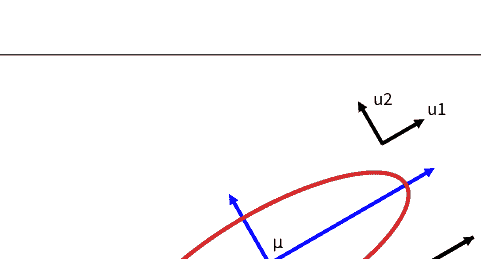

图7.6: 二次形式的等值集的可视化 \((\boldsymbol{x} - \boldsymbol{\mu})^\top \mathbf{A} (\boldsymbol{x} - \boldsymbol{\mu})\) in 2d。椭圆的主轴和次轴由 \(\mathbf{A}\) 的前两个特征向量定义，即 \(\boldsymbol{u}_1\) 和 \(\boldsymbol{u}_2\)。改编自[Bis06]的图2.7。由gaussEvec.ipynb生成。

### 7.4.4 二次形式的几何

一个二次形式是一个可以写成 \( f(\boldsymbol{x}) = \boldsymbol{x}^\top \mathbf{A} \boldsymbol{x} \) 的函数，其中 \(\boldsymbol{x} \in \mathbb{R}^n\) 且 \(\mathbf{A}\) 是一个正定的、对称的 \(n \times n\) 矩阵。设 \(\mathbf{A} = \mathbf{U} \mathbf{\Lambda} \mathbf{U}^\top\) 是 \(\mathbf{A}\) 的对角化（见第7.4.3节）。因此我们可以写成
$$ f(\boldsymbol{x}) = \boldsymbol{x}^\top \mathbf{A} \boldsymbol{x} = \boldsymbol{x}^\top \mathbf{U} \mathbf{\Lambda} \mathbf{U}^\top \boldsymbol{x} = \boldsymbol{y}^\top \mathbf{\Lambda} \boldsymbol{y} = \sum_{i=1}^n \lambda_i y_i^2 $$
其中 \(y_i = \boldsymbol{u}_i^\top \boldsymbol{x}\) 且 \(\lambda_i > 0\)（因为 \(\mathbf{A}\) 是正定的）。函数 \(f(\boldsymbol{x})\) 的等级集定义了超椭球。

例如，在二维中，我们有
$$ \lambda_1 y_1^2 + \lambda_2 y_2^2 = r $$
这是一个二维椭圆的方程。这在图7.6中有所说明。特征向量确定了椭圆的方向，特征值确定了其形状的拉伸程度。特别地，椭圆的主轴和次轴满足 \(a^{-2} = \lambda_1\) 和 \(b^{-2} = \lambda_2\)。对于高斯分布，我们有 \(\mathbf{A} = \mathbf{\Sigma}^{-1}\)，因此 \(\lambda_i\) 的较小值对应于后验具有低精度和高方差的方向。

### 7.4.5 标准化和白化数据

假设我们有一个数据集 \(\mathbf{X} \in \mathbb{R}^{N \times D}\)。通常对数据进行预处理，使得每一列的均值为零，方差为一。这被称为标准化数据，在第10.2.8节中讨论。尽管标准化强制方差为1，但并不消除列之间的相关性。为了做到这一点，我们必须对数据进行白化处理。为了定义这个，让经验协方差矩阵为 \(\boldsymbol{\Sigma} = \frac{1}{N} \mathbf{X}^{\mathrm{T}} \mathbf{X}\)，并且让 \(\boldsymbol{\Sigma} = \mathbf{E} \mathbf{D} \mathbf{E}^{\mathrm{T}}\) 为其对角化。等价地，让 \([\mathbf{U}, \mathbf{S}, \mathbf{V}]\) 为 \(\mathbf{X}\) 的奇异值分解（因此 \(\mathbf{E} = \mathbf{V}\) 且 \(\mathbf{D} = \mathbf{S}^{2}\)，正如我们在第20.1.3.3节中讨论的那样）。现在定义
$$ \mathbf{W}_{\text{pca}} = \mathbf{D}^{-\frac{1}{2}} \mathbf{E}^{\mathrm{T}} $$
这被称为PCA白化矩阵。（我们在第20.1节中讨论PCA。）让 \(\boldsymbol{y} = \mathbf{W}_{\text{pca}} \boldsymbol{x}\) 为一个转换后的向量。我们可以通过以下方式检查其协方差是否为白色：
$$ \text{Cov}[\boldsymbol{y}] = \mathbf{W} \mathbb{E}\left[\boldsymbol{x} \boldsymbol{x}^{\mathrm{T}}\right] \mathbf{W}^{\mathrm{T}} = \mathbf{W} \boldsymbol{\Sigma} \mathbf{W}^{\mathrm{T}} = \left(\mathbf{D}^{-\frac{1}{2}} \mathbf{E}^{\mathrm{T}}\right)\left(\mathbf{E} \mathbf{D} \mathbf{E}^{\mathrm{T}}\right)\left(\mathbf{E} \mathbf{D}^{-\frac{1}{2}}\right) = \mathbf{I} $$

白化矩阵不是唯一的，因为对它进行任何旋转， \(\mathbf{W} = \mathbf{R} \mathbf{W}_{\text{pca}}\)，仍然保持白化特性，即 \(\mathbf{W}^{\mathrm{T}} \mathbf{W} = \boldsymbol{\Sigma}^{-1}\)。例如，如果我们取 \(\mathbf{R} = \mathbf{E}\)，我们得到
$$ \mathbf{W}_{\text{zca}} = \mathbf{E} \mathbf{D}^{-\frac{1}{2}} \mathbf{E}^{\mathrm{T}} = \boldsymbol{\Sigma}^{-\frac{1}{2}} = \mathbf{V} \mathbf{S}^{-1} \mathbf{V}^{\mathrm{T}} $$这被称为马哈拉诺比斯白化或 ZCA。（ZCA代表“零相位分量分析”，并在[BS97]中引入。）ZCA白化相对于PCA白化的优势在于，所得到的转换数据尽可能接近原始数据（在最小二乘意义上）[Amo17]。这在图7.7中有所说明。当应用于图像时，ZCA转换后的数据向量仍然看起来像图像。当该方法在深度学习系统内部使用时，这是很有用的[KH09]。

### 7.4.6 幂法

我们现在描述一种简单的迭代方法来计算实对称矩阵的最大特征值对应的特征向量；这被称为幂法。当矩阵非常大但稀疏时，这可能很有用。例如，它被Google的PageRank用于计算全球网络的转移矩阵的稳定分布（一个大约30亿乘30亿的矩阵！）。在第7.4.7节中，我们将看到如何使用该方法计算后续的特征向量和特征值。

设 A 为具有正交特征向量 u_i 和特征值 |λ_1| > |λ_2| ≥ ... ≥ |λ_m| ≥ 0 的矩阵，则 A = UΛU^T。设 v_(0) 为 A 的任意向量，使得 Ax = v_(0) 对于某个 x。因此，我们可以将 v_(0) 写成

$$ v_0 = \mathbf{U}(\mathbf{\Lambda} \mathbf{U}^{\top} \mathbf{x}) = a_1 \mathbf{u}_1 + \cdots + a_m \mathbf{u}_m $$

其中 a_i 为常数。现在，我们可以重复将 v 乘以 A 并进行归一化:

$$ v_t \propto \mathbf{A} v_{t-1} $$

(我们在每次迭代时进行归一化以保持数值稳定性。)

由于 v_t 是 A^t v_0 的倍数，我们有

$$ v_t \propto a_1 \lambda_1^t \mathbf{u}_1 + a_2 \lambda_2^t \mathbf{u}_2 + \cdots + a_m \lambda_m^t \mathbf{u}_m $$
$$ = \lambda_1^t \left( a_1 \mathbf{u}_1 + a_1 (\lambda_2/\lambda_1)^t \mathbf{u}_2 + \cdots + a_m (\lambda_m/\lambda_1)^t \mathbf{u}_m \right) $$
$$ \to \lambda_1^t a_1 \mathbf{u}_1 $$

since |\lambda_k/\lambda_1| < 1 for k > 1 (assuming the eigenvalues are sorted in descending order). 所以我们看到这收敛到 u_1，尽管不是很快（每次迭代误差大约减少 |\lambda_2/\lambda_1|）。唯一的要求是初始猜测满足 v_0^T u_1 = 0，这对于一个随机的 v_0来说是正确的，概率很高。

我们现在讨论如何计算相应的特征值, λ_1。定义瑞利商为

$$ R(\mathbf{A}, \mathbf{x}) \triangleq \frac{\mathbf{x}^{\top} \mathbf{A} \mathbf{x}}{\mathbf{x}^{\top} \mathbf{x}} $$

因此

$$ R(\mathbf{A}, \mathbf{u}_i) = \frac{\mathbf{u}_i^{\top} \mathbf{A} \mathbf{u}_i}{\mathbf{u}_i^{\top} \mathbf{u}_i} = \frac{\lambda_i \mathbf{u}_i^{\top} \mathbf{u}_i}{\mathbf{u}_i^{\top} \mathbf{u}_i} = \lambda_i $$

因此，我们可以通过 u_1 和 A 轻松计算出 λ_1。请参阅 power_method_demo.ipynb 进行演示。

### 7.4.7 缩减

假设我们通过幂法计算出了第一个特征向量和特征值 u1, λ1。我们现在描述如何计算后续的特征向量和特征值。由于特征向量是正交的，特征值是实数，我们可以从矩阵中投影出 u1分量，如下所示：

$$ A^{(2)} = (I - u1 u1^T) A^{(1)} = A^{(1)} - u1 u1^T A^{(1)} = A^{(1)} - \lambda1 u1 u1^T \quad (7.174) $$

这被称为矩阵缩减。 然后我们可以对 A^{(2)}应用幂法，它将在与 u1正交的子空间中找到最大的特征向量/值。

在第20.1.2节中，我们证明了PCA模型（在第20.1节中描述）的最优估计 Ŵ 由经验协方差矩阵的前 K个特征向量给出。 因此，缩减可以用于实现PCA。它还可以修改为实现稀疏PCA [Mac09]。

### 7.4.8 特征向量优化二次形式

我们可以使用矩阵微积分来解决优化问题，从而直接导致特征值/特征向量分析。 考虑以下等式约束优化问题：

$$ \max_{x \in \mathbb{R}^n} x^{\top} A x \quad \text{subject to} \quad \|x\|_2^2 = 1 \quad (7.175) $$

对于一个对称矩阵 A ∈ S^n。通过构建拉格朗日函数，我们可以以标准方式解决带有等式约束的优化问题（参见第8.5.1节）。在这种情况下，拉格朗日函数可以表示为

$$ L(x, \lambda) = x^{\top} A x + \lambda(1 - x^{\top} x) \quad (7.176) $$

其中 λ被称为与等式约束相关的拉格朗日乘子。 可以证明，对于 x*是问题的最优点，拉格朗日函数的梯度在 x*处为零（这不是唯一的条件，但是必需的）。也就是说，

$$ \nabla_x L(x, \lambda) = 2A^{\top} x - 2\lambda x = 0. \quad (7.177) $$

注意这只是线性方程 A x = \lambda x。这表明只有可能最大化（或最小化） x^{\top} A x假设 x^{\top} x= 1的点是 A 的特征向量。

## 7.5 奇异值分解 (SVD)

我们现在讨论SVD，它将EVD推广到矩形矩阵。

### 7.5.1 基础知识

任何（实数）m × n矩阵 A都可以分解为

$$ A = U S V^{\top} = \sigma_1 \begin{pmatrix} | \\ u_1 \\ | \end{pmatrix} \begin{pmatrix} - & v_1^{\top} & - \end{pmatrix} + \cdots + \sigma_r \begin{pmatrix} | \\ u_r \\ | \end{pmatrix} \begin{pmatrix} - & v_r^{\top} & - \end{pmatrix} \quad (7.178) $$

其中 U是一个正交的 $m \times m$矩阵（所以 U的转置$U^{\top} U = I_m$）， V是一个正交的 $n \times n$矩阵（所以 V的转置$V^{\top} V = VV^{\top} = I_n$）， S是一个包含在主对角线上的 $m \times n$矩阵，其余部分填充为0的奇异值 $\sigma_i \geq 0$。 U的列是左奇异向量， V的列是右奇异向量。 这被称为矩阵的奇异值分解（SVD）。 请参见图7.8的示例。

从图7.8a中可以看出，如果$m > n$，则最多有 $m$个奇异值，因此 U的最后$m - n$列是无关的（因为它们将乘以0）。 经济尺寸的奇异值分解（economy sized SVD），也称为精简奇异值分解（thin SVD），避免计算这些不必要的元素。 换句话说，如果我们将 U矩阵写为 $U = [U_1, U_2]$，我们只计算 $U_1$。 图7.8b显示了相反的情况，即$m < n$，其中我们表示 $V = [V_1; V_2]$，并且只计算 $V_1$。

计算SVD的成本是 $O(\min(mn^2, m^2 n))$. 关于它的工作原理的详细信息可以在标准线性代数教材中找到。

### 7.5.2 SVD和EVD之间的联系

如果 A是实数、对称和正定的，则奇异值等于特征值，左奇异向量和右奇异向量等于特征向量（除了符号变化）：

$A = USV^{\top} = USU^{\top} = USU^{-1}$ \quad (7.179)

然而，请注意，NumPy始终按降序返回奇异值，而特征值不一定排序。

一般来说，对于任意的实矩阵 A，如果 $A = USV^{\top}$，我们有

$A^{\top} A = V S^{\top} U^{\top} USV^{\top} = V (S^{\top} S) V^{\top}$ \quad (7.180)

因此

$(A^{\top} A) V = V D_n$ \quad (7.181)

因此 $A^{\top} A$的特征向量等于 V，即 A的右奇异向量，而$A^{\top} A$的特征值等于 $D_n = S^{\top} S$，它是一个包含奇异值平方的对角矩阵。 类似地

$AA^{\top} = USV^{\top} VS^{\top} U^{\top} = U (SS^{\top}) U^{\top}$ \quad (7.182)

$(AA^{\top}) U = U D_m$ \quad (7.183)

因此 $AA^{\top}$的特征向量等于 $U$，即 $A$的左奇异向量，而$AA^{\top}$的特征值等于 $D_m = SS^{\top}$，它是一个包含奇异值平方的 $m \times m$ 对角矩阵。总结起来，

$$ U = \text{evec}(AA^{\top}), \; V = \text{evec}(A^{\top}A), \; D_m = \text{eval}(AA^{\top}), \; D_n = \text{eval}(A^{\top}A) $$

如果我们只使用经过计算的（非零）部分来进行经济规模的奇异值分解，那么我们可以定义

$$ D = S^2 = S^{\top}S = SS^{\top} $$

还要注意的是，即使对于方阵 $A$，特征值分解也不一定存在，而奇异值分解总是存在的。

### 7.5.3 伪逆

$A$的摩尔-彭罗斯伪逆，用 $A^\dagger$表示，被定义为满足以下4个性质的唯一矩阵：

$$ AA^\dagger A = A, \; A^\dagger AA^\dagger = A^\dagger, \; (AA^\dagger)^{\top} = AA^\dagger, \; (A^\dagger A)^{\top} = A^\dagger A $$

如果 $A$是方阵且非奇异的，则 $A^\dagger = A^{-1}$。

如果$m > n$(高瘦型) 并且 $A$的列线性独立（所以 $A$是满秩的），那么

$$ A^\dagger = (A^{\top}A)^{-1}A^{\top} $$

这与正规方程中的表达式相同（见第11.2.2.1节）。在这种情况下，$A^\dagger$是 $A$的左逆，因为

$$ A^\dagger A = (A^{\top}A)^{-1}A^{\top}A = I $$

但不是$A$的右逆，因为

$$ AA^\dagger = A(A^{\top}A)^{-1}A^{\top} $$

只有秩为 $n$，所以不能是 $m \times m$的单位矩阵。

如果$m < n$(矮胖型) 并且 $A$的行线性独立（所以 $A^{\top}$是满秩的），那么伪逆是

$$ A^\dagger = A^{\top}(AA^{\top})^{-1} $$

### 7.5.4 SVD和矩阵的范围和零空间 *

在本节中，我们将展示左奇异向量和右奇异向量构成了范围和零空间的正交基。

从方程（7.178）我们有

$$ \boldsymbol{A} \boldsymbol{x} = \sum_{j: \sigma_j > 0} \sigma_j (\boldsymbol{v}_j^{\top} \boldsymbol{x}) \boldsymbol{u}_j = \sum_{j=1}^{r} \sigma_j (\boldsymbol{v}_j^{\top} \boldsymbol{x}) \boldsymbol{u}_j \quad \text{(7.193)} $$

其中 $r$ 是 $\boldsymbol{A}$ 的秩。 因此，任何 $\boldsymbol{A} \boldsymbol{x}$ 都可以写成左奇异向量 $\boldsymbol{u}_1, \ldots$ 的线性组合，$\boldsymbol{u}_r$, 所以 $\boldsymbol{A}$ 的范围由以下给出

$$ \text{range}(\boldsymbol{A}) = \text{span} (\{\boldsymbol{u}_j : \sigma_j > 0\}) \quad \text{(7.194)} $$

具有维度 $r$.

为了找到零空间的基，让我们现在定义第二个向量 $\boldsymbol{y} \in \mathbb{R}^n$，它是仅由零奇异值对应的右奇异向量的线性组合，

$$ \boldsymbol{y} = \sum_{j: \sigma_j = 0} c_j \boldsymbol{v}_j = \sum_{j=r+1}^{n} c_j \boldsymbol{v}_j \quad \text{(7.195)} $$

由于 $\boldsymbol{v}_j$ 是正交的，我们有

$$ \boldsymbol{A} \boldsymbol{y} = \boldsymbol{U} \begin{pmatrix} \sigma_1 \boldsymbol{v}_1^{\top} \boldsymbol{y} \\ \vdots \\ \sigma_r \boldsymbol{v}_r^{\top} \boldsymbol{y} \\ \sigma_{r+1} \boldsymbol{v}_{r+1}^{\top} \boldsymbol{y} \\ \vdots \\ \sigma_n \boldsymbol{v}_n^{\top} \boldsymbol{y} \end{pmatrix} = \boldsymbol{U} \begin{pmatrix} \sigma_1 \cdot 0 \\ \vdots \\ \sigma_r \cdot 0 \\ 0 \cdot \boldsymbol{v}_{r+1}^{\top} \boldsymbol{y} \\ \vdots \\ 0 \cdot \boldsymbol{v}_n^{\top} \boldsymbol{y} \end{pmatrix} = \boldsymbol{U} \boldsymbol{0} = \boldsymbol{0} \quad \text{(7.196)} $$

因此，右奇异向量形成了零空间的正交基：

$$ \text{nullspace}(\boldsymbol{A}) = \text{span} (\{\boldsymbol{v}_j : \sigma_j = 0\}) \quad \text{(7.197)} $$

具有维度 $n - r$。 我们可以看到

$$ \text{dim}(\text{range}(\boldsymbol{A})) + \text{dim}(\text{nullspace}(\boldsymbol{A})) = r + (n - r) = n \quad \text{(7.198)} $$

换句话说，通常写作

$$ \text{秩} + \text{零空间} = n \quad \text{(7.199)} $$

图7.9：对图像的低秩近似。左上角：原始图像的大小为 200 × 320，因此其秩为200。后续图像的秩分别为2、5和20。由svd_image_demo.ipynb生成。

图7.10：小丑图像的前100个对数奇异值（红线）和通过随机重排像素获得的数据矩阵的对数奇异值（蓝线）。由svd_image_demo.ipynb生成。改编自[HTF09]的图14.24。

### 7.5.5 截断奇异值分解

设 A = USV^{\top}为 A的奇异值分解，令 \hat{A}_K = U_K S_K V_K^{\top}，其中我们使用 U和 V的前 K列。可以证明，这是最优的秩 K近似，即它最小化了\|A - \hat{A}_K\|_F^2。

如果 K = r = rank(A)，这个分解不会引入误差。但是如果 K < r，我们会产生一些误差。这被称为截断奇异值分解。如果奇异值迅速衰减，这在自然数据中是常见的（参见图7.10），误差将会很小。使用秩 K近似表示一个 N × D矩阵所需的总参数数量为

$$ N K + K D + K = K(N + D + 1) $$

举个例子，考虑图7.9（左上角）中的 200 × 320像素图像。这个图像中有64,000个数字。我们可以看到，仅使用(200 + 320 + 1) × 20 = 10,420个数字的秩20近似是一个非常好的近似。

可以证明，这个秩-K近似的误差由以下公式给出

$$ \|A - \hat{A}\|_F = \sum_{k=K+1}^{r} \sigma_k $$

其中 \sigma_k是 A的第 k个奇异值。

## 7.6 其他矩阵分解 *

在本节中，我们简要回顾一些其他有用的矩阵分解方法。

### 7.6.1 LU分解

我们可以将任何方阵 A分解为一个下三角矩阵 L和一个上三角矩阵 U的乘积。例如，

$$ \begin{bmatrix} a_{11} & a_{12} & a_{13} \\ a_{21} & a_{22} & a_{23} \\ a_{31} & a_{32} & a_{33} \end{bmatrix} = \begin{bmatrix} l_{11} & 0 & 0 \\ l_{21} & l_{22} & 0 \\ l_{31} & l_{32} & l_{33} \end{bmatrix} \begin{bmatrix} u_{11} & u_{12} & u_{13} \\ 0 & u_{22} & u_{23} \\ 0 & 0 & u_{33} \end{bmatrix} $$

一般情况下，在创建这个分解之前，我们可能需要对矩阵中的条目进行排列。为了看清楚这一点，假设 a_{11} = 0。由于 a_{11} = l_{11} u_{11}，这意味着 l_{11}或 u_{11}或两者都必须为零，但这将意味着 L或 U是奇异的。为了避免这种情况，算法的第一步可以简单地重新排列行，使得第一个元素不为零。这个过程会在后续步骤中重复。我们可以通过以下方式表示这个过程

$$ P A = L U $$

其中 P是一个置换矩阵，即一个方形二进制矩阵，其中 P_{ij} = 1如果行 j被置换到行 i。这被称为部分主元选取。

### 7.6.2 QR分解

假设我们有 \( A \in \mathbb{R}^{m \times n} \) 表示一组线性独立的基向量 (因此 \( m \geq n \))，并且我们想要找到一系列正交向量 \( q_1, q_2, \ldots \) 它们跨越连续的子空间 \( \text{span}(a_1) \)， \( \text{span}(a_1, a_2) \) 等。换句话说，我们想要找到向量 \( q_j \) 和系数 \( r_{ij} \) 使得

$$
\begin{pmatrix}
| & | & & | \\
a_1 & a_2 & \cdots & a_n
\end{pmatrix}
=
\begin{pmatrix}
| & | & & | \\
q_1 & q_2 & \cdots & q_n
\end{pmatrix}
\begin{pmatrix}
r_{11} & r_{12} & \cdots & r_{1n} \\
& r_{22} & \cdots & r_{2n} \\
& & \ddots & \\
& & & r_{nn}
\end{pmatrix}
\quad (7.204)
$$

我们可以这样写

- \( a_1 = r_{11} q_1 \quad (7.205) \)
- \( a_2 = r_{12} q_1 + r_{22} q_2 \quad (7.206) \)
- \( \vdots \)
- \( a_n = r_{1n} q_1 + \cdots + r_{nn} q_n \quad (7.207) \)

所以我们看到 \( q_1 \) 跨越了 \( a_1 \) 的空间，\( q_1 \) 和 \( q_2 \) 跨越了 \( \{a_1, a_2\} \) 的空间，等等。在矩阵表示中，我们有

$$
A = \hat{Q} \hat{R} \quad (7.208)
$$

其中 \( \hat{Q} \) 是 \( m \times n \) 的正交列矩阵， \( \hat{R} \) 是 \( n \times n \) 的上三角矩阵。这被称为A的降维QR分解或经济尺寸QR分解；参见图7.11。

完整的QR分解将额外添加 \( m - n \) 正交列到 \( \hat{Q} \) 中，使其成为一个方阵，满足 \( QQ^T = Q^TQ = I \)。此外，我们在 \( \hat{R} \) 中添加由零组成的行，使其成为一个 \( m \times n \) 上三角矩阵，称为 \( R \)：参见图7.11。在 \( R \) 中的零元素“消除”了 \( Q \) 中的新列，因此结果与 \( \hat{Q}\hat{R} \) 相同。QR分解通常用于解线性方程组，我们在第11.2.2.3节中讨论。

### 7.6.3 Cholesky分解

任何对称正定矩阵都可以分解为 \(\mathbf{A} = \mathbf{R}^{\top} \mathbf{R}\)，其中 \(\mathbf{R}\) 是上三角矩阵具有实数和正对角元素。（这也可以写成 \(\mathbf{A} = \mathbf{L} \mathbf{L}^{\top}\)，其中 \(\mathbf{L} = \mathbf{R}^{\top}\) 是下三角矩阵。）这被称为Cholesky分解或矩阵平方根。在NumPy中，可以通过`np.linalg.cholesky`实现。这个操作的计算复杂度为 \(O(V^{3})\)，其中 \(V\) 是变量的数量，但对于稀疏矩阵可能会更少。下面我们给出一些该分解的应用。

### 7.6.3.1 应用：从多元正态分布中抽样

协方差矩阵的乔列斯基分解可以用来从多元高斯分布中抽样。设 \(\mathbf{y} \sim \mathcal{N}(\boldsymbol{\mu}, \boldsymbol{\Sigma})\)，且 \(\boldsymbol{\Sigma} = \mathbf{L} \mathbf{L}^{\top}\)。我们首先从标准正态分布中抽样 \(\mathbf{x} \sim \mathcal{N}(\mathbf{0}, \mathbf{I})\)，这很容易，因为它只需要从 \(d\) 个独立的一维高斯分布中抽样。然后我们设置 \(\mathbf{y} = \mathbf{L} \mathbf{x} + \boldsymbol{\mu}\)。这是合理的，因为

$$
\operatorname{Cov}[\mathbf{y}] = \mathbf{L} \operatorname{Cov}[\mathbf{x}] \mathbf{L}^{\top} = \mathbf{L} \mathbf{I} \mathbf{L}^{\top} = \boldsymbol{\Sigma} \quad (7.209)
$$

请参考 `cholesky_demo.ipynb` 中的一些代码。

## 7.7 解线性方程组 \(\ast\)

线性代数的一个重要应用是研究线性方程组。例如，考虑以下一组3个方程：

$$
3 x_{1}+2 x_{2}-x_{3}=1 \quad (7.210)
$$
$$
2 x_{1}-2 x_{2}+4 x_{3}=-2 \quad (7.211)
$$
$$
-x_{1}+\frac{1}{2} x_{2}-x_{3}=0 \quad (7.212)
$$

我们可以将其表示为矩阵-向量形式如下：

$$
\mathbf{A} \mathbf{x}=\boldsymbol{b} \quad (7.213)
$$

其中

$$
\mathbf{A}=\left(\begin{array}{rrr}
3 & 2 & -1 \\
2 & -2 & 4 \\
-1 & \frac{1}{2} & -1
\end{array}\right), \quad \boldsymbol{b}=\left(\begin{array}{r}
1 \\
-2 \\
0
\end{array}\right) \quad (7.214)
$$

解为 \(\mathbf{x}=[1,-2,-2]\)。

一般而言，如果我们有 \(m\) 个方程和 \(n\) 个未知数，则 \(\mathbf{A}\) 将是一个 \(m \times n\) 矩阵，而 \(\boldsymbol{b}\) 将是一个 \(m \times 1\) 向量。如果 \(m=n\)（且 \(\mathbf{A}\) 是满秩的），则存在唯一解。如果 \(m<n\)，则系统是欠定的，因此不存在唯一解。如果 \(m>n\)，则系统是超定的，因为约束条件多于未知数，而且并非所有线都在同一点相交。请参见图7.12进行说明。我们将在下面讨论如何计算这些情况下的解决方案。

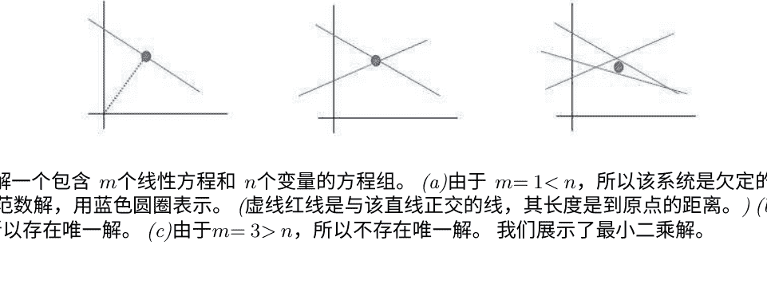

图7.12: 解一个包含m个线性方程和n个变量的方程组。(a)由于m=1 < n，所以该系统是欠定的。我们展示了最小范数解，用蓝色圆圈表示。(虚线红线是与该直线正交的线，其长度是到原点的距离。)(b)由于m=n=2，所以存在唯一解。(c)由于m=3 > n，所以不存在唯一解。我们展示了最小二乘解。

### 7.7.1 解方阵系统

在m=n的情况下，我们可以通过计算LU分解，A=LU，然后按照以下步骤进行求解x:

$$
A x = b \quad (7.215)
$$
$$
LU x = b \quad (7.216)
$$
$$
U x = L^{-1} b \triangleq y \quad (7.217)
$$
$$
x = U^{-1} y \quad (7.218)
$$

关键点在于L和U都是上三角矩阵，因此我们可以避免求矩阵的逆，而是使用一种称为回代法的方法。

特别地，我们可以按照以下步骤解y = L^{-1}b而不需要求逆。首先我们写成

$$
\begin{pmatrix} L_{11} & & \\ L_{21} & L_{22} & \\ \vdots & & \ddots \\ L_{n1} & L_{n2} & \cdots & L_{nn} \end{pmatrix} \begin{pmatrix} y_1 \\ \vdots \\ y_n \end{pmatrix} = \begin{pmatrix} b_1 \\ \vdots \\ b_n \end{pmatrix} \quad (7.219)
$$

我们首先解L_{11} y_1 = b_1得到y_1，然后将其代入解

$$
L_{21} y_1 + L_{22} y_2 = b_2 \quad (7.220)
$$

得到y_2。我们递归地重复这个过程。这个过程通常用反斜杠运算符表示，即y = L \ b。一旦我们有了y，我们可以类似地使用回代法解x = U^{-1} y。

### 7.7.2 解决欠定系统（最小范数估计）

在本节中，我们考虑欠定设置，其中m < n。3我们假设行是线性独立的，所以A是满秩的。

> 3. 我们的介绍部分基于Stephen Boyd在http://ee263.stanford.edu/lectures/min-norm.pdf的讲义。

当$m < n$时，存在多个可能的解，其形式为

$$
\{x : Ax = b\} = \{x_p + z : z \in \text{nullspace}(A)\}
$$

其中$x_p$是任意特解。通常选择具有最小$\ell_2$范数的特解，即

$$
\hat{x} = \argmin_{x} \|x\|_2^2 \quad \text{s.t.} \quad Ax = b
$$

我们可以使用right伪逆计算最小范数解：

$$
x_{\text{pinv}} = A^T(AA^T)^{-1}b
$$

(更多细节请参见第7.5.3节。)

为了看到这一点，假设$x$是另一个解，所以$Ax = b$，并且$A(x - x_{\text{pinv}}) = 0$。因此

$$
(x - x_{\text{pinv}})^T x_{\text{pinv}} = (x - x_{\text{pinv}})^T A^T(AA^T)^{-1}b = (A(x - x_{\text{pinv}}))^T(AA^T)^{-1}b = 0
$$

因此$(x - x_{\text{pinv}}) \perp x_{\text{pinv}}$。根据毕达哥拉斯定理，$x$的范数是

$$
\|x\|^2 = \|x_{\text{pinv}} + x - x_{\text{pinv}}\|^2 = \|x_{\text{pinv}}\|^2 + \|x - x_{\text{pinv}}\|^2 \geq \|x_{\text{pinv}}\|^2
$$

因此除了$x_{\text{pinv}}$有更大的范数之外，任何解都可以。

我们还可以通过最小化以下无约束目标来解决方程(7.222)中的约束优化问题

$$
\mathcal{L}(x, \lambda) = x^T x + \lambda^T(Ax - b)
$$

从第8.5.1节可以得出最优条件

$$
\nabla_x \mathcal{L} = 2x + A^T \lambda = 0, \quad \nabla_{\lambda} \mathcal{L} = Ax - b = 0
$$

从第一个条件我们有$x = -A^T \lambda/2$。将其代入第二个条件我们得到

$$
Ax = -\frac{1}{2} AA^T \lambda = b
$$

这意味着$\lambda = -2(AA^T)^{-1}b$。因此$x = A^T(AA^T)^{-1}b$，这是正确的伪逆解。

### 7.7.3 解决过约束系统（最小二乘估计）

如果$m > n$，我们有一个过约束解，通常没有精确解，但我们将尽力找到尽可能接近满足所有约束条件的解由$Ax = b$指定。我们可以通过最小化以下成本函数来实现，称为最小二乘目标：

$$
f(x) = \frac{1}{2} \|Ax - b\|_2^2
$$

使用第7.8节的矩阵微积分结果，我们得到梯度为

$$ g(x) = \frac{\partial}{\partial x} f(x) = \mathbf{A}^\top \mathbf{A} x - \mathbf{A}^\top \mathbf{b} \quad (7.234) $$

通过求解 $g(x) = 0$ 可以找到最优解。这给出了

$$ \mathbf{A}^\top \mathbf{A} x = \mathbf{A}^\top \mathbf{b} \quad (7.235) $$

这些被称为正规方程，因为在最优解处，$b - A x$ 与 A 的范围正交（垂直），我们在第11.2.2.2节中解释了这一点。相应的解 $x$ 是普通最小二乘 (OLS) 解，给出了

$$ \hat{x} = (\mathbf{A}^\top \mathbf{A})^{-1} \mathbf{A}^\top \mathbf{b} \quad (7.236) $$

量 $\mathbf{A}^\dagger = (\mathbf{A}^\top \mathbf{A})^{-1} \mathbf{A}^\top$ 是矩阵 A（非方阵）的左伪逆矩阵（详见第7.5.3节）。

我们可以通过证明海森矩阵是正定的来检查解的唯一性。在这种情况下，海森矩阵给出

$$ \mathbf{H}(x) = \frac{\partial^2}{\partial x^2} f(x) = \mathbf{A}^\top \mathbf{A} \quad (7.237) $$

如果 A 是满秩的（即 A 的列线性无关），那么 H 是正定的，因为对于任意的 $v > 0$，我们有

$$ v^\top (\mathbf{A}^\top \mathbf{A}) v = (\mathbf{A} v)^\top (\mathbf{A} v) = \|\mathbf{A} v\|^2 > 0 \quad (7.238) $$

因此，在满秩情况下，最小二乘目标函数具有唯一的全局最小值。

## 7.8 矩阵微积分

微积分的主题涉及到在改变函数的输入时计算函数的“变化率”。它对于机器学习以及几乎所有其他数值学科都非常重要。在本节中，我们回顾一些标准结果。在某些情况下，我们使用了一些矩阵代数的概念和符号，这些内容在第7章中介绍。有关这些结果的更多详细信息，可以参考[PH18]中的深度学习视角。

### 7.8.1 导数

考虑一个标量参数函数 $f : \mathbb{R} \to \mathbb{R}$. 我们定义它在点 $x$ 处的导数为量

$$ f'(x) \triangleq \lim_{h \to 0} \frac{f(x+h) - f(x)}{h} \quad (7.239) $$

假设极限存在。这衡量了当我们在输入空间中离开 $x$ 一个小的距离时输出的变化速度（即函数的“变化率”）。我们可以将 $f'(x)$ 解释为在 $f(x)$ 处的切线的斜率，因此 $f(x+h) \approx f(x) + f'(x)h$

$$ f(x+h) \approx f(x) + f'(x)h \quad (7.240) $$

对于小的 $h$。
我们可以通过使用一个有限的步长 $h$ 来计算对导数的有限差分近似，如下所示：

$$
f'(x) \equiv \lim_{h\to 0}\frac{f(x+h)-f(x)}{h} \underset{\text{前向差分}}{=} \lim_{h\to 0}\frac{f(x+h/2)-f(x-h/2)}{h} \underset{\text{中心差分}}{=} \lim_{h\to 0}\frac{f(x)-f(x-h)}{h} \underset{\text{后向差分}}{} \quad (7.241)
$$

步长 $h$ 越小，估计越准确，但如果 $h$ 太小，可能会因为数值抵消而产生误差。

我们可以将微分视为将函数映射到函数的运算符，$D(f) = f'$，其中 $f'(x)$ 计算在 $x$ 处的导数（假设该点处的导数存在）。使用撇号符号 $f'$ 表示导数的记法称为拉格朗日记法。第二阶导数函数，用于衡量梯度变化的速度，用 $f''$ 表示。第 $n$ 阶导数函数表示为 $f^{(n)}$。

或者，我们可以使用莱布尼兹符号，其中我们用 $y = f(x)$ 表示函数，用其导数表示为 $\frac{dy}{dx}$ 或者为了表示在某一点 $a$ 处的导数计算，我们写作 $\frac{df}{dx}\Big|_{x=a}$。

### 7.8.2 梯度

我们可以扩展导数的概念来处理向量参数函数 $f: \mathbb{R}^n \rightarrow \mathbb{R}$，通过定义对于 $x_i$ 的偏导数 of $f$ 为

$$
\frac{\partial f}{\partial x_i} = \lim_{h\to 0} \frac{f(\boldsymbol{x}+h\boldsymbol{e}_i)-f(\boldsymbol{x})}{h} \quad (7.242)
$$

其中 $\boldsymbol{e}_i$ 是第 $i$ 个单位向量。
函数在点 $\boldsymbol{x}$ 处的梯度是其偏导数的向量：

$$
\boldsymbol{g} = \frac{\partial f}{\partial \boldsymbol{x}} = \nabla f = \begin{pmatrix} \frac{\partial f}{\partial x_1} \\ \vdots \\ \frac{\partial f}{\partial x_n} \end{pmatrix} \quad (7.243)
$$

为了强调梯度计算的点，我们可以写成

$$
\boldsymbol{g}(\boldsymbol{x}^{*}) \triangleq \frac{\partial f}{\partial \boldsymbol{x}}\bigg|_{\boldsymbol{x}^{*}} \quad (7.244)
$$

我们可以看到，算子 $\nabla$（读作“nabla”）将一个函数 $f: \mathbb{R}^n \rightarrow \mathbb{R}$ 映射到另一个函数$g: \mathbb{R}^n \rightarrow \mathbb{R}^n$。由于 $g(\cdot)$ 是一个向量值函数，它被称为一个向量场。相比之下，导数函数 $f'$ 是一个标量场。

### 7.8.3 方向导数

方向导数衡量了函数 $f: \mathbb{R}^n \rightarrow \mathbb{R}$ 沿着一个方向 $\boldsymbol{v}$ 在空间中的变化程度。它的定义如下

$$
D_{\boldsymbol{v}}f(\boldsymbol{x}) = \lim_{h\to 0} \frac{f(\boldsymbol{x}+h\boldsymbol{v})-f(\boldsymbol{x})}{h} \quad (7.245)
$$我们可以通过2个函数调用数值近似计算 f，而不管 n 的值。相比之下，对标准梯度向量的数值近似需要 n+1 个调用（或者使用中心差分则需要 2n 个调用）。

注意，沿着 v 的方向导数是梯度 g 和向量 v 的点积：

$$D_{v} f(x) = \nabla f(x) \cdot v \tag{7.246}$$

## 7.8.4 总导数 *

假设函数的一些参数彼此依赖。具体而言，假设函数具有形式 f(t, x(t), y(t))。我们定义 f 对 t 的总导数如下：

$$\frac{df}{dt} = \frac{\partial f}{\partial t} + \frac{\partial f}{\partial x} \frac{dx}{dt} + \frac{\partial f}{\partial y} \frac{dy}{dt} \tag{7.247}$$

如果我们将两边乘以微分 dt，我们得到总微分。

$$df = \frac{\partial f}{\partial t} dt + \frac{\partial f}{\partial x} dx + \frac{\partial f}{\partial y} dy \tag{7.248}$$

这衡量了当我们改变 t 时 f 的变化程度，既通过 t 对 f 的直接影响，也通过 t 对 x 和 y 的间接影响。

### 7.8.5 雅可比矩阵

考虑一个将向量映射到另一个向量的函数，f : ℝⁿ → ℝᵐ。这个函数的雅可比矩阵是一个 m×n 的偏导数矩阵：

$$\mathbf{J}_f(x) = \frac{\partial f}{\partial x^{\mathrm{T}}} \triangleq \begin{pmatrix} \frac{\partial f_1}{\partial x_1} & \cdots & \frac{\partial f_1}{\partial x_n} \\ \vdots & \ddots & \vdots \\ \frac{\partial f_m}{\partial x_1} & \cdots & \frac{\partial f_m}{\partial x_n} \end{pmatrix} = \begin{pmatrix} \nabla f_1(x)^{\mathrm{T}} \\ \vdots \\ \nabla f_m(x)^{\mathrm{T}} \end{pmatrix} \tag{7.249}$$

请注意，我们以与输出 f 相同的方向排列结果；这有时被称为分子布局或雅可比公式。[^5]

### 7.8.5.1 乘法雅可比矩阵和向量

雅可比向量积或 JVP 被定义为将雅可比矩阵 J ∈ ℝᵐˣⁿ 右乘以向量 v ∈ ℝⁿ 的操作：

$$\mathbf{J}_f(x) v = \begin{pmatrix} \nabla f_1(x)^{\mathrm{T}} \\ \vdots \\ \nabla f_m(x)^{\mathrm{T}} \end{pmatrix} v = \begin{pmatrix} \nabla f_1(x)^{\mathrm{T}} v \\ \vdots \\ \nabla f_m(x)^{\mathrm{T}} v \end{pmatrix} \tag{7.250}$$

所以我们可以看到，我们可以通过只调用2次 \( f \) 来进行数值近似。向量雅可比积或 VJP 被定义为将雅可比矩阵 \( \mathbf{J} \in \mathbb{R}^{m \times n} \) 左乘以向量 \( u \in \mathbb{R}^m \) 的操作：

$$\mathbf{u}^\mathrm{T} \mathbf{J}_f(\mathbf{x}) = \mathbf{u}^\mathrm{T} \left( \frac{\partial f}{\partial x_1}, \cdots, \frac{\partial f}{\partial x_n} \right) = \left( \mathbf{u} \cdot \frac{\partial f}{\partial x_1}, \cdots, \mathbf{u} \cdot \frac{\partial f}{\partial x_n} \right) \tag{7.251}$$

如果 \( m \geq n \)，则 JVP 更高效；如果 \( m \leq n \)，则 VJP 更高效。有关如何在计算图（如 DNN）中执行自动微分的详细信息，请参见第 13.3 节。

### 7.8.5.2 复合函数的雅可比矩阵

有时候，对于两个函数的复合函数，计算其雅可比矩阵是很有用的。 设 \( h(\boldsymbol{x}) = g(f(\boldsymbol{x})) \)。根据微积分的链式法则，我们有

$$\mathbf{J}_h(\boldsymbol{x}) = \mathbf{J}_g(f(\boldsymbol{x})) \mathbf{J}_f(\boldsymbol{x}) \tag{7.252}$$

例如，假设 \( f : \mathbb{R} \to \mathbb{R}^2 \)，\( g : \mathbb{R}^2 \to \mathbb{R}^2 \)。我们有

$$\frac{\partial \mathbf{g}}{\partial x} = \begin{pmatrix} \frac{\partial}{\partial x} g_1(f_1(x), f_2(x)) \\ \frac{\partial}{\partial x} g_2(f_1(x), f_2(x)) \end{pmatrix} = \begin{pmatrix} \frac{\partial g_1}{\partial f_1} \frac{\partial f_1}{\partial x} + \frac{\partial g_1}{\partial f_2} \frac{\partial f_2}{\partial x} \\ \frac{\partial g_2}{\partial f_1} \frac{\partial f_1}{\partial x} + \frac{\partial g_2}{\partial f_2} \frac{\partial f_2}{\partial x} \end{pmatrix} \tag{7.253}$$

$$= \frac{\partial \mathbf{g}}{\partial \mathbf{f}^\mathrm{T}} \frac{\partial \mathbf{f}}{\partial x} = \begin{pmatrix} \frac{\partial g_1}{\partial f_1} & \frac{\partial g_1}{\partial f_2} \\ \frac{\partial g_2}{\partial f_1} & \frac{\partial g_2}{\partial f_2} \end{pmatrix} \begin{pmatrix} \frac{\partial f_1}{\partial x} \\ \frac{\partial f_2}{\partial x} \end{pmatrix} \tag{7.254}$$

## 7.8.6 Hessian

对于一个二次可微的函数 \( f : \mathbb{R}^n \to \mathbb{R} \)，我们将 Hessian 矩阵定义为二阶偏导数的（对称的） \( n \times n \) 矩阵：

$$\mathbf{H}_f = \frac{\partial^2 f}{\partial \boldsymbol{x}^2} = \nabla^2 f = \begin{pmatrix} \frac{\partial^2 f}{\partial x_1^2} & \cdots & \frac{\partial^2 f}{\partial x_1 \partial x_n} \\ \vdots & \ddots & \vdots \\ \frac{\partial^2 f}{\partial x_n \partial x_1} & \cdots & \frac{\partial^2 f}{\partial x_n^2} \end{pmatrix} \tag{7.255}$$

我们可以看到 Hessian 矩阵是梯度的 Jacobian 矩阵。

### 7.8.7 常用函数的梯度

在本节中，我们列出了一些广泛使用的函数的梯度，但没有给出证明。

### 7.8.7.1 将标量映射到标量的函数

考虑一个可微函数 \( f : \mathbb{R} \to \mathbb{R} \)。下面是一些标量微积分中常用的恒等式，你应该已经熟悉了。

$$\frac{d}{dx} cx^n = cnx^{n-1} \tag{7.256}$$

$$\frac{d}{dx} \log(x) = 1/x \tag{7.257}$$

$$\frac{d}{dx} \exp(x) = \exp(x) \tag{7.258}$$

$$\frac{d}{dx} [f(x) + g(x)] = \frac{df(x)}{dx} + \frac{dg(x)}{dx} \tag{7.259}$$

$$\frac{d}{dx} [f(x)g(x)] = f(x)\frac{dg(x)}{dx} + g(x)\frac{df(x)}{dx} \tag{7.260}$$

$$\frac{d}{dx} f(u(x)) = \frac{du}{dx}\frac{df(u)}{du} \tag{7.261}$$

方程 (7.261) 被称为微积分的链式法则。

### 7.8.7.2 将向量映射到标量的函数

考虑一个可微函数 \( f: \mathbb{R}^n \to \mathbb{R} \)。以下是一些有用的恒等式：[^6]

$$\frac{\partial (\boldsymbol{a}^\top \boldsymbol{x})}{\partial \boldsymbol{x}} = \boldsymbol{a} \tag{7.262}$$

$$\frac{\partial (\boldsymbol{b}^\top \mathbf{A} \boldsymbol{x})}{\partial \boldsymbol{x}} = \mathbf{A}^\top \boldsymbol{b} \tag{7.263}$$

$$\frac{\partial (\boldsymbol{x}^\top \mathbf{A} \boldsymbol{x})}{\partial \boldsymbol{x}} = (\mathbf{A} + \mathbf{A}^\top)\boldsymbol{x} \tag{7.264}$$

通过展开二次型并应用标量微积分，很容易证明这些恒等式。

### 7.8.7.3 将矩阵映射到标量的函数

考虑一个函数 \( f : \mathbb{R}^{m \times n} \to \mathbb{R} \)，它将一个矩阵映射到一个标量。我们使用以下的自然布局来表示导数矩阵：

$$\frac{\partial f}{\partial \mathbf{X}} = \begin{pmatrix} \frac{\partial f}{\partial x_{11}} & \cdots & \frac{\partial f}{\partial x_{1n}} \\ \vdots & & \vdots \\ \frac{\partial f}{\partial x_{m1}} & \cdots & \frac{\partial f}{\partial x_{mn}} \end{pmatrix} \tag{7.265}$$

以下是一些有用的恒等式。

#### 涉及二次型的恒等式

可以证明以下结果。

$$\frac{\partial}{\partial \mathbf{X}} (\mathbf{a}^T \mathbf{X} \mathbf{b}) = \mathbf{a} \mathbf{b}^T$$

$$\frac{\partial}{\partial \mathbf{X}} (\mathbf{a}^T \mathbf{X}^T \mathbf{b}) = \mathbf{b} \mathbf{a}^T$$

#### 涉及矩阵迹的恒等式

可以证明以下结果。

$$\frac{\partial}{\partial \mathbf{X}} \mathrm{tr}(\mathbf{A}\mathbf{X}\mathbf{B}) = \mathbf{A}^T \mathbf{B}^T$$

$$\frac{\partial}{\partial \mathbf{X}} \mathrm{tr}(\mathbf{X}^T \mathbf{A}) = \mathbf{A}$$

$$\frac{\partial}{\partial \mathbf{X}} \mathrm{tr}(\mathbf{X}^{-1} \mathbf{A}) = -\mathbf{X}^{-T} \mathbf{A}^T \mathbf{X}^{-T}$$

$$\frac{\partial}{\partial \mathbf{X}} \mathrm{tr}(\mathbf{X}^T \mathbf{A} \mathbf{X}) = (\mathbf{A} + \mathbf{A}^T)\mathbf{X}$$

#### 涉及矩阵行列式的恒等式

可以证明以下结果。

$$\frac{\partial}{\partial \mathbf{X}} \det(\mathbf{A}\mathbf{X}\mathbf{B}) = \det(\mathbf{A}\mathbf{X}\mathbf{B}) \mathbf{X}^{-T}$$

$$\frac{\partial}{\partial \mathbf{X}} \log(\det(\mathbf{X})) = \mathbf{X}^{-T}$$

## 7.9 练习

### 练习 7.1 [正交矩阵]

a. 绕 \(z\) 轴旋转角度为 \(\alpha\) 的三维旋转由以下矩阵给出：

$$\mathbf{R}(\alpha) = \begin{pmatrix} \cos(\alpha) & -\sin(\alpha) & 0 \\ \sin(\alpha) & \cos(\alpha) & 0 \\ 0 & 0 & 1 \end{pmatrix}$$

证明 \(\mathbf{R}\) 是一个正交矩阵，即 \(\mathbf{R}^T\mathbf{R} = \mathbf{I}\)，对于任意的 \(\alpha\)。

b. 仅有的特征向量 \(v\) 满足特征值为1.0且单位范数（即 \(\|v\|_2^2=1\)）是什么？（你的答案对于任意的 \(\alpha\) 应该是相同的。）提示：思考特征向量的几何解释。

### 练习 7.2 [手动计算特征向量 *]

找出以下矩阵的特征值和特征向量

$$A = \begin{pmatrix} 2 & 0 \\ 0 & 3 \end{pmatrix}$$

手动计算结果并用 Python 进行检查。

# 8 优化

本章的部分内容由 Frederik Kunstner、Si Yi Meng、Aaron Mishkin、Sharan Vaswani 和 Mark Schmidt 撰写。

## 8.1 导论

我们在第4章中看到，机器学习的核心问题是参数估计（也称为模型拟合）。这需要解决一个优化问题，我们试图找到一组变量 \(\theta \in \Theta\) 的值，使得一个标量值损失函数或成本函数 \(L: \Theta \to \mathbb{R}\) 最小：

$$\theta^* \in \operatorname*{argmin}_{\theta \in \Theta} L(\theta) \tag{8.1}$$

我们将假设参数空间由 \(\Theta \subseteq \mathbb{R}^D\) 给出，其中 \(D\) 是正在优化的变量数。因此，我们关注的是连续优化，而不是离散优化。

如果我们想要最大化一个得分函数或奖励函数 \(R(\theta)\)，我们可以等价地最小化 \(L(\theta) = -R(\theta)\)。我们将使用术语**目标函数**来泛指我们想要最大化或最小化的函数。能够找到目标函数最优解的算法通常被称为**求解器**。

在本章的其余部分，我们将讨论不同类型的目标函数的不同求解器，重点关注机器学习社区中使用的方法。有关优化的更多细节，请参考一些优秀的教材，如[KW19b; BV04; NW06; Ber15; Ber16]以及各种综述文章，如[BCN18; Sun+19b; PPS18; Pey20]。

### 8.1.1 本地与全局优化

满足方程 (8.1) 的点被称为**全局最优点**。寻找这样的点被称为**全局优化**。

一般来说，找到全局最优点在计算上是难以处理的[Neu04]。在这种情况下，我们只会尝试找到一个**局部最优点**。对于连续问题，这被定义为一个点 \(\theta^*\)，它的成本比“附近”点更低（或相等）。形式上，我们说 \(\theta^*\) 是局部最小值，如果

$$\|\theta - \theta^*\| < \delta, \quad L(\theta^*) \leq L(\theta) \tag{8.2}$$

一个局部最小值可能被具有相同目标值的其他局部最小值所包围；这被称为**平坦局部最小值**。如果一个点的成本严格低于邻近点的成本，则称该点为**严格局部最小值**：

$$\exists \delta > 0, \forall \boldsymbol{\theta} \in \Theta, \boldsymbol{\theta} \neq \boldsymbol{\theta}^* : \|\boldsymbol{\theta} - \boldsymbol{\theta}^*\| < \delta, \mathcal{L}(\boldsymbol{\theta}^*) < \mathcal{L}(\boldsymbol{\theta}) \tag{8.3}$$

我们可以类似地定义(严格)局部最大值。参见图8.1a进行说明。
关于术语的最后说明；如果一个算法保证从任意起始点收敛到一个稳定点，那么它被称为**全局收敛**。然而，这并不意味着它会收敛到全局最优解；相反，它只是意味着它会收敛到某个稳定点。

#### 8.1.1.1 局部最优与全局最优的最优性条件

对于连续、二次可微函数，我们可以精确地描述对应于局部最小值的点。设 \(g(\boldsymbol{\theta}) = \nabla \mathcal{L}(\boldsymbol{\theta})\) 为梯度向量， \(\mathbf{H}(\boldsymbol{\theta}) = \nabla^2 \mathcal{L}(\boldsymbol{\theta})\) 为 Hessian 矩阵。(如果需要，可以参考第7.8节对这些概念进行复习。) 考虑一个点\(\boldsymbol{\theta}^* \in \mathbb{R}^D\)，设 \(g^* = g(\boldsymbol{\theta})|_{\boldsymbol{\theta}^*}\) 为该点处的梯度， \(\mathbf{H}^* = \mathbf{H}(\boldsymbol{\theta})|_{\boldsymbol{\theta}^*}\) 为相应的 Hessian 矩阵。可以证明以下条件描述了每个局部最小值：

- 必要条件：如果 \(\boldsymbol{\theta}^*\) 是一个局部最小值，则我们必须有 \(g^* = \mathbf{0}\) (即 \(\boldsymbol{\theta}^*\) 必须是一个静止点)，且 \(\mathbf{H}^*\) 必须是半正定的。
- 充分条件：如果 \(g^* = \mathbf{0}\) 且 \(\mathbf{H}^*\) 是正定的，则 \(\boldsymbol{\theta}^*\) 是一个局部最优解。

为了看到第一个条件为什么是必要的，假设我们处于一个梯度非零的点 \(\boldsymbol{\theta}^*\)：在这样的点上，我们可以通过沿着负梯度的方向走一小段距离来减小函数值，因此这不是最优的。所以梯度必须为零。(在非光滑函数的情况下，我们将在第8.4节中看到类似的条件。)

[^5]: 有关符号的更详细讨论，请参见https://en.wikipedia.org/wiki/Matrix_calculus。
[^6]: 原文此处为脚注标记，但未提供具体注释内容。

《概率机器学习：导论》草稿。 2023年6月22日

必要条件是零是最小值处的局部次梯度。）为了看到为什么零梯度不足够，注意静止点可以是局部最小值、最大值或者鞍点，即某些方向下坡，某些方向上坡（见图8.1b）。更准确地说，在鞍点处，Hessian矩阵的特征值既有正值又有负值。然而，如果某点的Hessian矩阵是半正定的，则某些方向可能上坡，而其他方向是平坦的。此外，如果Hessian矩阵是严格正定的，则我们处于一个“碗”的底部，所有方向都是上坡的，这足以使其成为最小值。

## 8.1.2 约束优化与非约束优化

在非约束优化中，我们将优化任务定义为在参数空间 Θ中找到使损失最小化的任意值。然而，我们通常对可允许的值集合有一组约束。将约束集合 C 标准分为不等式约束 g_j(θ) ≤ 0（对于 j ∈ I）和等式约束 h_k(θ) = 0（对于 k ∈ E）。例如，我们可以将一个等于一的约束表示为一个等式约束 h(θ) = (1 - ∑_{i=1}^{D} θ_i) = 0，并且我们可以使用不等式约束 g_i(θ) = -θ_i ≤ 0来表示参数的非负约束。

我们将可行集定义为满足约束条件的参数空间的子集：

$$C = \{ \theta : g_j(\theta) \leq 0 : j \in I, h_k(\theta) = 0 : k \in E \} \subseteq \mathbb{R}^D$$
(8.4)

我们的约束优化问题现在变成了

$$\theta^* \in \underset{\theta \in C}{\text{argmin}} \mathcal{L}(\theta)$$
(8.5)

如果 $C = \mathbb{R}^D$，则称为无约束优化。
添加约束条件可以改变函数的最优解数量。例如，当我们添加约束条件时，之前无界的函数（因此没有明确定义的全局最大值或最小值）可以“获得”多个最大值或最小值，如图8.2所示。然而，如果我们添加太多的约束条件，可能会发现可行集变为空。在可行集中找到任何点（无论其成本如何）的任务称为可行性问题；这本身可能是一个困难的子问题。

解决约束问题的常见策略是创建衡量我们违反每个约束程度的惩罚项。然后将这些项添加到目标函数中，并解决一个无约束优化问题。拉格朗日函数是这种组合目标的特例（详见第8.5节）。

## 8.1.3 凸优化与非凸优化

在凸优化中，我们要求目标函数是在凸集上定义的凸函数（我们将在下面定义这些术语）。在这种问题中，每个局部最小值也是全局最小值。因此，许多模型的训练目标被设计为凸函数。

### 8.1.3.1 凸集

我们说 $S$ 是一个凸集，如果对于任意的 $x, x' \in S$，我们有 $\lambda$

$$x + (1-\lambda)x' \in S, \quad \forall \lambda \in [0,1].$$
(8.6)

也就是说，如果我们从 $x$ 到 $x'$ 画一条线，线上的所有点都在集合内。请参见图8.3，了解一些凸集和非凸集的示例。

## 8.1.3.2 凸函数

如果函数的上境图（在图8.4a中表示为函数上方的点的集合）定义了一个凸集，则我们称其为凸函数。等价地，如果函数 $f(x)$ 在一个凸集上定义，并且对于任意的 $x, y \in S$ 和任意的 $0 \leq \lambda \leq 1$，我们有

$$f(\lambda x + (1 - \lambda)y) \leq \lambda f(x) + (1 - \lambda)f(y)$$
(8.7)

请参见图8.5(a)，这是一个凸函数的一维示例。如果不等式严格成立，则称函数为严格凸函数。如果 $-f(x)$ 是凸函数，则函数 $f(x)$ 是凹函数；如果 $-f(x)$ 是严格凸函数，则函数 $f(x)$ 是严格凹函数。请参见图8.5(b)，这是一个既不是凸函数也不是凹函数的一维函数的示例。

图8.4: (a) 函数的上境图的示意图。 (b) 对于凸函数 $f(x)$，它的上境图可以表示为由线性下界定义的半空间的交集，这些下界是由共轭函数 $f^*(\lambda) = \max_x \lambda x - f(x)$得到的。

图8.5: (a) 凸函数的示意图。 我们可以看到连接点 $(x, f(x))$ 和 $(y, f(y))$ 的弦在函数上方。 (b) 一个既不是凸函数也不是凹函数的函数。A是局部最小值，B是全局最小值。

下面是一些一维凸函数的例子：

- $x^2$
- $x$
- $- \log x$
- $x^a, a > 1, x > 0$
- $|x|^a, a \geq 1$
- $x \log x, x > 0$

## 8.1.3.3 凸函数的特征

直观上，凸函数的形状像一个碗。严格来说，可以证明以下重要结果：

图8.6: 二维中的二次型 $f(x) = x^{\mathbf{T}} \mathbf{A} x$。 (a) $\mathbf{A}$是正定的，所以$f$是凸函数。 (b) $\mathbf{A}$是负定的，所以$f$是凹函数。 (c) $\mathbf{A}$是正半定的但是奇异的，所以$f$是凸函数，但不是严格凸函数。注意中间的恒定高度的山谷。 (d) $\mathbf{A}$是不定的，所以$f$既不是凸的也不是凹的。表面中间的稳定点是一个鞍点。来自[She94]的图5。

## 定理 8.1.1

假设 $f: \mathbb{R}^n \to \mathbb{R}$ 在其定义域上二次可微。那么对于所有 $x \in \operatorname{dom}(f)$, $\mathbf{H} = \nabla^2 f(x)$ 是半正定的（第7.1.5.3节）。此外，如果 $\mathbf{H}$ 是正定的，则 $f$ 是严格凸的。

例如，考虑二次形式

$f(x) = x^{\mathbf{T}} \mathbf{A} x$

如果 $\mathbf{A}$ 是半正定的，则它是凸的，如果 $\mathbf{A}$ 是正定的，则它是严格凸的。如果 $\mathbf{A}$ 具有混合符号的特征值，则它既不是凸的也不是凹的。参见图8.6。

## 8.1.3.4 强凸函数

我们说一个函数 $f$ 在参数 $m > 0$ 下是强凸的，如果对于所有的 $x, y$ 在 $f$ 的定义域中，以下条件成立：

$(\nabla f(x) - \nabla f(y))^{\mathbf{T}} (x - y) \ge m \|x - y\|^2_2$

强凸函数也是严格凸函数，但反之不成立。

如果函数 $f$ 是二次连续可微的，则当且仅当对于定义域中的所有 $x$, $\nabla^2 f(x) \succeq m \mathbf{I}$ 成立时，它是强凸的，其中 $\mathbf{I}$ 是单位矩阵， $\nabla^2 f$ 是Hessian矩阵，而不等式 $\succeq$ 表示 $\nabla^2 f(x) - m \mathbf{I}$ 是正半定的。这是等价的。

图8.7: (a) 平滑的一维函数。 (b) 非平滑的一维函数。 (原点处存在不连续点。) 由smooth-vs-nonsmooth-1d.ipynb生成。

要求对于所有的x，∇²f(x)的最小特征值至少为m。如果定义域只是实数线，则∇²f(x)就是函数的二阶导数f''(x)，所以条件变为f''(x) ≥ m。如果m=0，则意味着Hessian矩阵是正半定的(或者如果定义域是实数线，则意味着f''(x) ≥ 0)，这意味着函数是凸函数，可能是严格凸函数，但不是强凸函数。

凸、严格凸和强凸之间的区别相当微妙。为了更好地理解这一点，考虑函数f在实数线上两次连续可微，并且定义域是实数线的情况。然后我们可以如下刻画它们的差异：

- 如果对于所有的x，函数f''(x) ≥ 0，则f是凸函数。
- 如果对于所有的x，函数f''(x) > 0 (注意: 这是充分但不必要的条件)，则f是严格凸函数。
- 如果对于所有的x，函数f''(x) ≥ m > 0，则f是强凸函数。
需要注意的是，可以证明函数f是具有参数m的强凸函数，当且仅当函数

J(x) = f(x) - \frac{m}{2}\|x\|^2\hfill (8.10)

是凸的。

### 8.1.4 平滑 vs 非平滑优化

在平滑优化中，目标函数和约束是连续可微的函数。
对于平滑函数，我们可以使用Lipschitz常数来量化平滑程度。在一维情况下，这被定义为任何常数L ≥ 0，使得对于所有实数x₁和x₂，我们有

|f(x₁) - f(x₂)| ≤ L|x₁ - x₂|\hfill (8.11)

这在图8.8中有所说明: 对于给定的常数L，如果我们将函数输入改变1个单位，函数输出的变化不会超过L。这可以通过使用适当的范数将其推广到向量输入。

在非平滑优化中，至少存在一些点，目标函数或约束的梯度未定义。请参见图8.7中的示例。在一些优化问题中，我们可以将目标函数分为只包含平滑项的部分和包含非平滑项的部分：

ℒ(θ) = ℒ_s(θ) + ℒ_r(θ) (8.12)其中 ℒ_s是平滑的（可微分）函数，ℒ_r是非平滑的（“粗糙”）函数。这通常被称为复合目标。在机器学习应用中，ℒ_s通常是训练集损失，而ℒ_r是正则化项，例如 θ 的 ℓ₁ 范数。这种复合结构可以被各种算法利用。

### 8.1.4.1 子梯度

在本节中，我们将推广导数的概念，以处理具有局部不连续性的函数。特别地，对于一个多变量的凸函数， f : ℝⁿ → ℝ，我们称 g ∈ ℝⁿ 为 f 在 x ∈ dom(f) 处的子梯度，如果对于所有 z ∈ dom(f)， f(z) ≥ f(x) + gᵀ(z - x) (8.13)

注意，即使 f 在某一点上不可微，仍然可以存在一个子梯度，如图8.9所示。如果在 x 处至少存在一个子梯度，则称函数 f 在 x 处可子微分。这样的子梯度集合被称为 f 在 x 处的子微分，并且用 ∂f(x) 表示。

例如，考虑绝对值函数 f(x) = |x|。它的次微分由以下给出 ∂f(x) = \begin{cases} \{-1\} & \text{if } x < 0 \\ [-1, 1] & \text{if } x = 0 \\ \{+1\} & \text{if } x > 0 \end{cases} (8.14) 其中符号 [-1, 1] 表示-1到1之间的任意值。请参见图8.10以进行说明。

## 8.2 一阶方法

在本节中，我们考虑利用一阶导数的迭代优化方法，即计算指向“下坡”的方向，但忽略曲率信息。 所有这些算法都要求用户指定一个起始点 θ_0。 然后在每次迭代 t 时，它们执行以下形式的更新：

θ_{t+1} = θ_t + η_t d_t

其中 η_t 被称为步长或学习率，而 d_t 是一个下降方向，例如梯度的负数，由 g_t = ∇_θ L(θ)|_{θ_t}。这些更新步骤会一直进行，直到方法达到一个稳定点，即梯度为零的点。

### 8.2.1 下降方向

如果存在足够小（但非零）的量 η，我们可以沿着方向 d 移动，并保证函数值会减小，则我们称方向 d 为下降方向。严格来说，我们要求存在一个 η_max > 0，使得对于所有 0 < η < η_max，都有 ℒ(θ + ηd) < ℒ(θ) (8.16)

当前迭代的梯度，θ_t，由以下公式给出 g_t ≜ ∇ℒ(θ)|_{θ_t} = ∇ℒ(θ_t) = g(θ_t) (8.17)

这指向 f 增加最大的方向，因此负梯度是一个下降方向。可以证明，如果方向 d 也是一个下降方向，那么角度 θ 在 d 和 -g_t 之间小于90度，并且满足 dᵀ g_t = ||d|| ||g_t|| cos(θ) < 0 (8.18)

看起来最好的选择是选择 d_t = -g_t。这被称为最陡下降的方向。然而，这可能会非常慢。我们稍后考虑更快的版本。

### 8.2.2 步长（学习率）

在机器学习中，步长序列 {η_t} 被称为学习率调度。有几种广泛使用的方法来选择这个步长，我们将在下面讨论其中一些。（另请参见第8.4.3节，我们在那里讨论随机优化的调度。）

### 8.2.2.1 常数步长

最简单的方法是使用恒定的步长，η_t = η。然而，如果步长太大，方法可能无法收敛；如果步长太小，方法会收敛，但速度非常慢。例如，考虑凸函数 ℒ(θ) = 0.5(θ₁² - θ₂)² + 0.5(θ₁ - 1)² (8.19) 让我们选择下降方向为 d_t = -g_t。图8.11显示了如果我们使用这个下降方向和固定步长从 (0, 0) 开始会发生什么。在图8.11(a)中，我们使用了一个小的步长 η= 0.1；我们可以看到迭代在山谷中缓慢移动。在图8.11(b)中，我们使用了一个较大的步长 η= 0.6；我们可以看到迭代开始在山谷的两侧上下振荡，永远不会收敛到最优解，尽管这是一个凸问题。

在某些情况下，我们可以推导出我们可以使用的最大步长的理论上限。例如，考虑一个二次目标函数，ℒ(θ) = ½θᵀ Aθ + bᵀ θ + c，其中 A ≽ 0。可以证明，只有当步长满足条件时，最速下降法才会全局收敛 η < 2 / λ_max(A) (8.20) 其中 λ_max(A) 是 A 的最大特征值。这个直观的原因可以通过将球滚下山谷来理解。我们希望确保它不会迈出比最陡方向的斜率更大的步子，这正是最大特征值所衡量的（见第3.2.2节）。

图8.11：从 $(0, 0)$开始，在一个简单的凸函数上进行最速下降，进行20步，使用固定步长。全局最小值在 $(1, 1)$处。$(a)$ $\eta=0.1$。$(b)$ $\eta=0.6$。由steepDescentDemo.ipynb生成。

更一般地，设置 $\eta < 2/L$，其中 $L$是梯度的Lipschitz常数（第8.1.4节），确保收敛。由于这个常数通常是未知的，我们通常需要调整步长，如下所讨论。

### 8.2.2.2 线搜索

最优步长可以通过解决一维最小化问题，在所选择的方向上找到最大程度降低目标的值来找到。

$$ \eta_t = \arg\min_{\eta > 0} \phi_t(\eta) = \arg\min_{\eta > 0} \mathcal{L}(\boldsymbol{\theta}_t + \eta \boldsymbol{d}_t) \qquad \qquad (8.21) $$

这被称为线搜索，因为我们沿着由 $\boldsymbol{d}_t$定义的直线进行搜索。如果损失是凸的，这个子问题也是凸的，因为对于固定的$\boldsymbol{\theta}_t$和$\boldsymbol{d}_t$， $\phi_t(\eta) = \mathcal{L}(\boldsymbol{\theta}_t + \eta \boldsymbol{d}_t)$是 $\eta$的仿射函数的凸函数。例如，考虑二次损失

$$ \mathcal{L}(\boldsymbol{\theta}) = \frac{1}{2} \boldsymbol{\theta}^{\top} \mathbf{A} \boldsymbol{\theta} + \boldsymbol{b}^{\top} \boldsymbol{\theta} + c \qquad \qquad (8.22) $$

计算 $\phi$的导数得到

$$ \begin{aligned} \frac{d\phi(\eta)}{d\eta} &= \frac{d}{d\eta} \left[ \frac{1}{2} (\boldsymbol{\theta} + \eta \boldsymbol{d})^{\top} \mathbf{A} (\boldsymbol{\theta} + \eta \boldsymbol{d}) + \boldsymbol{b}^{\top} (\boldsymbol{\theta} + \eta \boldsymbol{d}) + c \right] \qquad & (8.23) \\ &= \boldsymbol{d}^{\top} \mathbf{A} (\boldsymbol{\theta} + \eta \boldsymbol{d}) + \boldsymbol{d}^{\top} \boldsymbol{b} \qquad & (8.24) \\ &= \boldsymbol{d}^{\top} (\mathbf{A} \boldsymbol{\theta} + \boldsymbol{b}) + \eta \boldsymbol{d}^{\top} \mathbf{A} \boldsymbol{d} \qquad & (8.25) \end{aligned} $$

解方程 $\frac{d\phi(\eta)}{d\eta} = 0$ 得到

$$ \eta = -\frac{\boldsymbol{d}^{\top} (\mathbf{A} \boldsymbol{\theta} + \boldsymbol{b})}{\boldsymbol{d}^{\top} \mathbf{A} \boldsymbol{d}} \qquad \qquad (8.26) $$

### 8.2.3 收敛速度

我们希望找到能够快速收敛到（局部）最优解的优化算法。对于某些凸问题，如果梯度具有有界的Lipschitz常数，可以证明梯度下降以线性速度收敛。这意味着存在一个数 $0 < \mu < 1$，使得
$$
|\mathcal{L}(\theta_{t+1}) - \mathcal{L}(\theta_*)| \leq \mu |\mathcal{L}(\theta_t) - \mathcal{L}(\theta_*)|  \qquad (8.28)
$$
这里 $\mu$ 被称为收敛速度。

对于一些简单的问题，我们可以明确地推导出收敛速度。例如，考虑一个二次目标 $\mathcal{L}(\theta) = \frac{1}{2} \theta^T A \theta + b^T \theta + c$，其中 $A \succ 0$。假设我们使用最陡下降法进行精确线搜索。可以证明（参见例如，[Ber15]）收敛速度由以下给出
$$
\mu = \left( \frac{\lambda_{\text{max}} - \lambda_{\text{min}}}{\lambda_{\text{max}} + \lambda_{\text{min}}} \right)^2 \qquad (8.29)
$$
其中 $\lambda_{\text{max}}$ 是 $A$ 的最大特征值，$\lambda_{\text{min}}$ 是最小特征值。我们可以将其重写为 $\mu = \left( \frac{\kappa - 1}{\kappa + 1} \right)^2$，其中 $\kappa = \frac{\lambda_{\text{max}}}{\lambda_{\text{min}}}$ 是 $A$ 的条件数。直观地，条件数衡量了空间的“倾斜程度”，即远离对称的“碗”。（有关条件数的更多信息，请参见第7.1.4.4节。）

图8.12展示了条件数对收敛速度的影响。在左边，我们展示了一个例子，其中 $A = [20, 5; 5, 2]$，$b = [-14; -6]$ 和 $c = 10$，所以 $\kappa(A) = 30.234$。在右边，我们展示了一个例子，其中 $A = [20, 5; 5, 16]$，$b = [-14; -6]$ 和 $c = 10$，所以 $\kappa(A) = 1.8541$。我们可以看到，对于条件数较小的问题，最速下降法的收敛速度要快得多。

在非二次函数的更一般情况下，目标函数在局部最优点附近通常是局部二次的。因此，收敛速度取决于该点的Hessian矩阵的条件数，即$\kappa(H)$。我们经常可以通过在每一步优化一个接近目标函数Hessian矩阵的Hessian的代理目标函数（或模型）来提高收敛速度，这在第8.3节中讨论。

虽然线性搜索效果不错，但从图8.12中可以看出，具有精确线性搜索的最陡下降路径表现出一种特征的之字形行为，这是低效的。可以通过一种称为共轭梯度下降的方法来克服这个问题（参见例如，[She94]）。

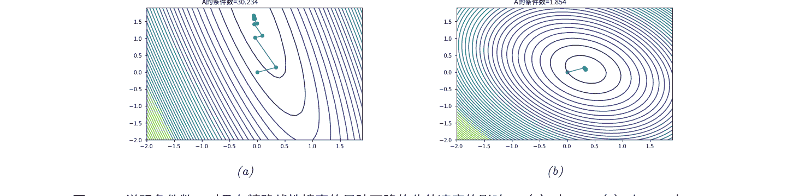

图8.12：说明条件数 κ对具有精确线性搜索的最陡下降的收敛速度的影响。（a）大 κ。（b）小 κ。由lineSearchConditionNum.ipynb生成。

## 8.2.4 动量方法

梯度下降在损失函数空间的平坦区域中移动速度非常慢，如我们在图8.11中所示。我们将在下面讨论一些解决方案。

### 8.2.4.1 动量

一个简单的启发式方法，被称为heavy ball或者 momentum方法[Ber99]，是沿着之前好的方向更快地移动，并且在梯度突然改变的方向上减慢速度，就像球沿着山坡滚动一样。可以按照以下方式实现：
$$
m_t = \beta m_{t-1} + g_{t-1}
$$
$$
\theta_t = \theta_{t-1} - \eta_t m_t
$$
其中 m_t是动量（质量乘以速度），且 $0< \beta <1$。典型的 $\beta$ 值为0.9。对于 $\beta=0$，该方法变为梯度下降。

我们可以看到 $m_t$ 就像是过去梯度的指数加权移动平均（参见第4.4.2.2节）：
$$
m_t = \beta m_{t-1} + g_{t-1} = \beta^2 m_{t-2} + \beta g_{t-2} + g_{t-1} = \cdots = \sum_{\tau=0}^{t-1} \beta^{\tau} g_{t-\tau-1}
$$
如果过去的梯度都是一个常数，比如说 g，那么这就简化为
$$
m_t = g \sum_{\tau=0}^{t-1} \beta^{\tau}
$$
缩放因子是一个几何级数，其无限和为
$$
1 + \beta + \beta^2 + \cdots = \sum_{i=0}^{\infty} \beta^{i} = \frac{1}{1-\beta}
$$
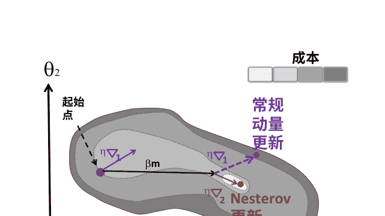

因此，在极限情况下，我们将梯度乘以 $1/(1-\beta)$。例如，如果 $\beta=0.9$，我们将梯度放大10倍。

由于我们使用梯度平均值 $\boldsymbol{m}_{t-1}$ 来更新参数，而不仅仅是最近的梯度 $\boldsymbol{g}_{t-1}$，所以过去的梯度对当前的影响是有一定的影响的。此外，当动量与SGD相结合时，讨论在第8.4节中，我们将看到它可以模拟更大的小批量的效果，而不需要计算成本。

### 8.2.4.2 Nesterov动量

标准动量方法的一个问题是在山谷底部可能不会减速足够，导致振荡。[Nes04]的Nesterov加速梯度方法改变了梯度下降，加入了外推步骤，具体如下：
$$
\begin{aligned}
\tilde{\theta}_{t+1} &= \theta_t + \beta (\theta_t - \theta_{t-1}) && (8.35) \\
\theta_{t+1} &= \tilde{\theta}_{t+1} - \eta_t \nabla \mathcal{L}(\tilde{\theta}_{t+1}) && (8.36)
\end{aligned}
$$
这本质上是一种一步“向前看”的形式，可以减少振荡的数量，如图8.13所示。

Nesterov加速梯度也可以以与标准动量相同的格式重写。在这种情况下，动量项使用预测新位置的梯度进行更新。
$$
\begin{aligned}
\boldsymbol{m}_{t+1} &= \beta \boldsymbol{m}_t - \eta_t \nabla \mathcal{L}(\theta_t + \beta \boldsymbol{m}_t) && (8.37) \\
\theta_{t+1} &= \theta_t + \boldsymbol{m}_{t+1} && (8.38)
\end{aligned}
$$
这解释了为什么Nesterov加速梯度方法有时被称为Nesterov动量。它还展示了这种方法如何比标准动量更快：动量向量已经大致指向正确的方向，因此在新位置测量梯度，$\theta_t + \beta \boldsymbol{m}_t$，而不是当前位置，$\theta_t$，可能更准确。当 $\beta$ 和 $\eta_t$ 适当选择时，Nesterov加速梯度方法在凸函数上的收敛速度可证明比最陡下降法更快。之所以称之为“加速”，是因为这种改进。

## 8.3 二阶方法

只使用梯度的优化算法被称为一阶方法。 它们的优点是梯度计算和存储成本低，但是它们不对空间的曲率建模，因此收敛速度可能较慢，如图8.12所示。 二阶优化方法以不同的方式引入曲率（例如通过Hessian矩阵），可能会导致更快的收敛。 我们在下面讨论其中一些方法。

### 8.3.1 牛顿法

经典的二阶方法是牛顿法。 它的更新形式如下
$$
\boldsymbol{\theta}_{t+1} = \boldsymbol{\theta}_t - \eta_t \mathbf{H}_t^{-1} \boldsymbol{g}_t \qquad\qquad (8.39)
$$
其中
$$
\mathbf{H}_t \triangleq \nabla^2 \mathcal{L}(\boldsymbol{\theta})\big|_{\boldsymbol{\theta}_t} = \nabla^2 \mathcal{L}(\boldsymbol{\theta}_t) = \mathbf{H}(\boldsymbol{\theta}_t) \qquad\qquad (8.40)
$$
假设为正定以确保更新是良定义的。 牛顿法的伪代码在算法8.1中给出。 比梯度下降更快的直观原因是矩阵逆 $\mathbf{H}^{-1}$“撤销”了局部曲率的扭曲，将类似于图8.12a的拓扑结构转换为类似于图8.12b的结构。

**算法8.1: 最小化函数的牛顿法**
1. 初始化 $\boldsymbol{\theta}_0$
2. 对于 $t = 1, 2, \ldots$ 直到收敛为止执行
3. $\quad$ 计算 $\boldsymbol{g}_t = \nabla \mathcal{L}(\boldsymbol{\theta}_t)$
4. $\quad$ 计算 $\mathbf{H}_t = \nabla^2 \mathcal{L}(\boldsymbol{\theta}_t)$
5. $\quad$ 解 $\mathbf{H}_t \boldsymbol{d}_t = -\boldsymbol{g}_t$ 得到 $\boldsymbol{d}_t$
6. $\quad$ 使用线搜索找到步长 $\eta_t$ 沿着 $\boldsymbol{d}_t$
7. $\quad$ $\boldsymbol{\theta}_{t+1} = \boldsymbol{\theta}_t + \eta_t \boldsymbol{d}_t$

该算法可以如下推导得到。 考虑围绕 $\boldsymbol{\theta}_t$ 进行二阶泰勒级数近似的 $\mathcal{L}( \boldsymbol{\theta})$:
$$
\mathcal{L}_{\text{quad}}(\boldsymbol{\theta}) = \mathcal{L}(\boldsymbol{\theta}_t) + \boldsymbol{g}_t^\top (\boldsymbol{\theta} - \boldsymbol{\theta}_t) + \frac{1}{2}(\boldsymbol{\theta} - \boldsymbol{\theta}_t)^\top \mathbf{H}_t (\boldsymbol{\theta} - \boldsymbol{\theta}_t) \qquad\qquad (8.41)
$$
最小值 $\mathcal{L}_{\text{quad}}$ 在
$$
\boldsymbol{\theta} = \boldsymbol{\theta}_t - \mathbf{H}_t^{-1} \boldsymbol{g}_t \qquad\qquad (8.42)
$$
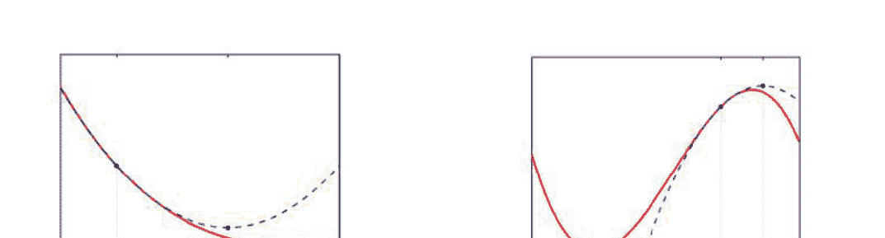

我们围绕当前点拟合一个二次函数 $ \theta_t $，并移动到其稳定点， $ \theta_{t+1} = \theta_t + d_{t} $。不幸的是，这将使我们接近 $ f $ 的局部最大值，而不是最小值。这意味着我们需要小心处理我们的二次逼近的范围。改编自[Van06]的图13.11。由newtonsMethodNonConvex.ipynb生成。

因此，如果二次逼近是好的，我们应该选择 $ d_t = -\mathbf{H}_t^{-1} g_t $ 作为我们的下降方向。请参见图8.14(a)进行说明。请注意，在“纯”牛顿法中，我们使用 $ \eta_t = 1 $ 作为我们的步长。然而，我们也可以使用线搜索来找到最佳的步长；这往往更加稳健，因为使用 $ \eta_t = 1 $ 可能不总是全局收敛。

如果我们将这种方法应用于线性回归，我们可以在一步中达到最优解，因为（如我们在第11.2.2.1节中所示）我们有 $ \mathbf{H} = \mathbf{X}^\top \mathbf{X} $ 和 $ g = \mathbf{X}^\top \mathbf{X} w - \mathbf{X}^\top y $，所以牛顿更新变为
$$
w_1 = w_0 - \mathbf{H}^{-1} g = w_0 - (\mathbf{X}^\top \mathbf{X})^{-1}(\mathbf{X}^\top \mathbf{X} w_0 - \mathbf{X}^\top y) = w_0 - w_0 + (\mathbf{X}^\top \mathbf{X})^{-1} \mathbf{X}^\top y \qquad (8.43)
$$
这是OLS估计。然而，当我们将这种方法应用于逻辑回归时，可能需要多次迭代才能收敛到全局最优解，正如我们在第10.2.6节中讨论的那样。

### 8.3.2 BFGS和其他拟牛顿方法

拟牛顿方法，有时称为变量度量方法，通过在每一步中利用梯度向量的信息来逐步构建Hessian的近似。最常见的方法是称为BFGS（以其同时发明者Broyden、Fletcher、Goldfarb和Shanno命名），它通过以下方式更新对Hessian的近似 $ \mathbf{B}_t \approx \mathbf{H}_t $：
$$
\mathbf{B}_{t+1} = \mathbf{B}_t + \frac{y_t y_t^\top}{y_t^\top s_t} - \frac{(\mathbf{B}_t s_t)(\mathbf{B}_t s_t)^\top}{s_t^\top \mathbf{B}_t s_t} \qquad (8.44)
$$
$$
s_t = \theta_t - \theta_{t-1} \qquad (8.45)
$$
$$
y_t = g_t - g_{t-1} \qquad (8.46)
$$
这是对矩阵的二阶更新。如果 $ \mathbf{B}_0 $ 是正定的，并且步长 $ \eta $ 通过满足方程（8.27）中的Armijo条件和以下曲率的线搜索选择

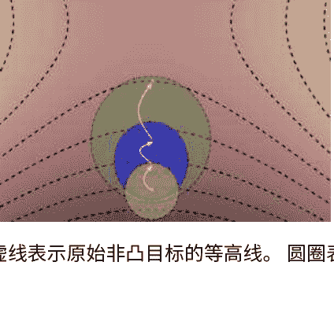

图8.15: 信任区域方法的示意图。虚线表示原始非凸目标的等高线。圆圈表示连续的二次近似。来自[Pas14]的图4.2。
获得Razvan Pascanu的友好许可。

条件
$$
\nabla\mathcal{L}(\theta_t + \eta \boldsymbol{d}_t) \geq c_2 \eta \boldsymbol{d}_t^T \nabla\mathcal{L}(\theta_t) \quad (8.47)
$$
然后 $\mathbf{B}_{t+1}$ 将保持正定。常数 $c_2$ 在方程 (8.27) 中选择在 $(c, 1)$ 之间，其中 $c$ 是方程中的可调参数。这两个步长条件一起被称为Wolfe条件。通常我们从对角线近似开始， $\mathbf{B}_0 = \mathbf{I}$。因此，BFGS可以被看作是对Hessian的“对角线加低秩”近似。

或者，BFGS可以通过迭代更新对Hessian的逆近似， $\mathbf{C}_t \approx \mathbf{H}_t^{-1}$，如下所示：
$$
\mathbf{C}_{t+1} = \left(\mathbf{I} - \frac{\mathbf{s}_t \mathbf{y}_t^T}{\mathbf{y}_t^T \mathbf{s}_t}\right) \mathbf{C}_t \left(\mathbf{I} - \frac{\mathbf{y}_t \mathbf{s}_t^T}{\mathbf{y}_t^T \mathbf{s}_t}\right) + \frac{\mathbf{s}_t \mathbf{s}_t^T}{\mathbf{y}_t^T \mathbf{s}_t} \quad (8.48)
$$

由于存储Hessian近似仍然需要 $O(D^2)$ 空间，对于非常大的问题，可以使用有限内存BFGS，或者L-BFGS，通过仅使用最近的 $M$ 个 $(\mathbf{s}_t, \mathbf{y}_t)$ 对来控制近似的秩，而忽略旧的信息。我们不直接存储 $\mathbf{B}_t$，而是将这些向量存储在内存中，然后通过与存储的 $(\mathbf{s}_t, \mathbf{y}_t)$ 向量进行一系列内积来近似 $\mathbf{H}_t^{-1} \mathbf{g}_t$。因此，存储要求为 $O(MD)$。通常选择 $M$ 在5-20之间可以获得良好的性能[NW06, p177]。
请注意，sklearn在逻辑回归中使用LBFGS作为默认求解器。

### 8.3.3 信任区域方法

如果目标函数是非凸的，则Hessian矩阵 $\mathbf{H}_t$ 可能不是正定的，因此 $\boldsymbol{d}_t = -\mathbf{H}_t^{-1} \boldsymbol{g}_t$ 可能不是一个下降方向。这在图8.14(b)的1d中有所说明，它显示了牛顿法可能会陷入局部最大值而不是局部最小值。
一般来说，只要牛顿法的二次近似变得无效，我们就会遇到麻烦。然而，通常在当前迭代点周围有一个局部区域，我们可以安全地通过二次函数来近似目标。让我们将这个区域称为 $\mathcal{R}_t$，并将 $M(\delta)$称为模型（或近似）目标函数，其中 $\delta = \boldsymbol{\theta} - \boldsymbol{\theta}_t$。然后在每一步中，我们可以求解$\delta^* = \text{argmin}_{\delta \in \mathcal{R}_t} M_t(\delta)$ 这被称为信任区域优化。（这可以看作是线搜索的“相反”，因为我们选择一个我们想要前进的距离，由 $\mathcal{R}_t$确定，并且然后解决最优方向，而不是选择方向然后解决最优距离。）我们通常假设 $M_t(\delta)$ 是一个二次近似：

$$ M_t(\delta) = \mathcal{L}(\boldsymbol{\theta}_t) + \boldsymbol{g}_t^\top \delta + \frac{1}{2} \delta^\top \mathbf{H}_t \delta $$

其中 $\boldsymbol{g}_t = \nabla_{\boldsymbol{\theta}} \mathcal{L}(\boldsymbol{\theta})|_{\boldsymbol{\theta}_t}$ 是梯度，而 $\mathbf{H}_t = \nabla^2_{\boldsymbol{\theta}} \mathcal{L}(\boldsymbol{\theta})|_{\boldsymbol{\theta}_t}$ 是海森矩阵。此外，常常假设 $\mathcal{R}_t$ 是一个半径为 $r$ 的球，即 $\mathcal{R}_t = \{\delta : \|\delta\|_2 \leq r\}$。利用这一点，我们可以将约束问题转化为无约束问题，如下所示：

$$ \delta^* = \text{argmin}_{\delta} M(\delta) + \lambda\|\delta\|_2^2 = \text{argmin}_{\delta} \boldsymbol{g}^\top \delta + \frac{1}{2} \delta^\top (\mathbf{H} + \lambda \mathbf{I}) \delta $$

对于某个拉格朗日乘子$\lambda > 0$，它取决于半径 $r$（参见第8.5.1节对拉格朗日乘子的讨论）。我们可以通过以下方式解决这个问题

$$ \delta = -(\mathbf{H} + \lambda \mathbf{I})^{-1} \boldsymbol{g} $$

这被称为Tikhonov阻尼或Tikhonov正则化。请参见图8.15进行说明。 请注意，添加足够大的 $\lambda \mathbf{I}$ 到 $\mathbf{H}$ 可以确保结果矩阵始终是正定的。 当 $\lambda \to 0$ 时，这种迭代方法变为牛顿法，但对于足够大的 $\lambda$，它将使所有负特征值变为正（并且所有0特征值变为 $\lambda$）。

## 8.4 随机梯度下降

在本节中，我们考虑随机优化，目标是最小化函数的平均值：

$$ \mathcal{L}(\boldsymbol{\theta}) = \mathbb{E}_{q(\boldsymbol{z})} [\mathcal{L}(\boldsymbol{\theta}, \boldsymbol{z})] $$

其中 $\boldsymbol{z}$ 是目标函数的随机输入。这可以是来自环境的“噪声”项，也可以是从训练集中随机抽取的训练样本，我们将在下面解释。 在每次迭代中，我们假设观察到 $\mathcal{L}_t(\boldsymbol{\theta}) = \mathcal{L}(\boldsymbol{\theta}, \boldsymbol{z}_t)$，其中 $\boldsymbol{z}_t \sim q$。我们还假设有一种方法来计算 $\mathcal{L}$ 的无偏梯度估计。如果分布 $q(\boldsymbol{z})$ 与我们正在优化的参数无关，我们可以使用 $\boldsymbol{g}_t = \nabla_{\boldsymbol{\theta}} \mathcal{L}_t(\boldsymbol{\theta}_t)$。在这种情况下，得到的算法可以写成如下形式：

$$ \boldsymbol{\theta}_{t+1} = \boldsymbol{\theta}_t - \eta_t \nabla \mathcal{L}(\boldsymbol{\theta}_t, \boldsymbol{z}_t) = \boldsymbol{\theta}_t - \eta_t \boldsymbol{g}_t $$

这种方法被称为随机梯度下降或 SGD。只要梯度估计是无偏的，那么只要我们以一定的速率衰减步长 $\eta_t$，这种方法就会收敛到一个稳定点，我们在第8.4.3节中讨论。

### 8.4.1 应用于有限和问题

SGD在机器学习中被广泛使用。 为了理解为什么，回顾一下第4.3节中提到的许多模型拟合过程是基于经验风险最小化，涉及最小化以下损失：

$$\mathcal{L}(\boldsymbol{\theta}_t) = \frac{1}{N} \sum_{n=1}^{N} \ell(\boldsymbol{y}_n, f(\boldsymbol{x}_n; \boldsymbol{\theta}_t)) = \frac{1}{N} \sum_{n=1}^{N} \mathcal{L}_n(\boldsymbol{\theta}_t)$$
(8.55)

这被称为一个有限和问题。 这个目标的梯度具有以下形式

$$\boldsymbol{g}_t = \frac{1}{N} \sum_{n=1}^{N} \nabla_{\boldsymbol{\theta}} \mathcal{L}_n(\boldsymbol{\theta}_t) = \frac{1}{N} \sum_{n=1}^{N} \nabla_{\boldsymbol{\theta}} \ell(\boldsymbol{y}_n, f(\boldsymbol{x}_n; \boldsymbol{\theta}_t))$$
(8.56)

如果 N很大，这就需要对所有 N个训练样本求和，因此可能会很慢。 幸运的是，我们可以通过对一个小批量样本进行采样来近似计算。

$$\boldsymbol{g}_t \approx \frac{1}{|\mathcal{B}_t|} \sum_{n \in \mathcal{B}_t} \nabla_{\boldsymbol{\theta}} \mathcal{L}_n(\boldsymbol{\theta}_t) = \frac{1}{|\mathcal{B}_t|} \sum_{n \in \mathcal{B}_t} \nabla_{\boldsymbol{\theta}} \ell(\boldsymbol{y}_n, f(\boldsymbol{x}_n; \boldsymbol{\theta}_t))$$
(8.57)

其中 $\mathcal{B}_t$是一组随机选择的样本，在迭代 t时使用。 ²这是对方程式 (8.56) 中经验平均值的无偏估计的近似。 因此，我们可以安全地在SGD中使用这个近似值。 尽管SGD的理论收敛速度比批量梯度下降 (BGD) 慢 (特别是，SGD具有次线性收敛速度) ，但在实践中，SGD通常更快，因为每步的时间要少得多[BB08; BB11]。 为了看到为什么SGD可以比完全批量梯度下降更快地取得进展，假设我们有一个由一个重复 K次的示例组成的数据集。 批量训练至少会比SGD慢 K倍，因为它会浪费时间计算重复示例的梯度。 即使没有重复，批量训练也可能是浪费的，因为在训练初期，参数估计不好，所以仔细评估梯度是不值得的。

### 8.4.2 示例：用SGD拟合线性回归

在本节中，我们展示了如何使用SGD来拟合线性回归模型。 回顾一下第4.2.7节目标函数的形式

$$\mathcal{L}(\boldsymbol{\theta}) = \frac{1}{2N} \sum_{n=1}^{N} (\boldsymbol{x}_n^{\mathrm{T}} \boldsymbol{\theta} - y_n)^2 = \frac{1}{2N} \|\boldsymbol{X}\boldsymbol{\theta} - \boldsymbol{y}\|_2^2$$
(8.58)

梯度是

$$\boldsymbol{g}_t = \frac{1}{N} \sum_{n=1}^{N} (\boldsymbol{\theta}_t^{\mathrm{T}} \boldsymbol{x}_n - y_n) \boldsymbol{x}_n$$
(8.59)

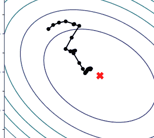

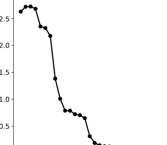

图8.16: LMS算法的示意图。左侧: 我们从 θ=(-0.5, 2)开始，慢慢收敛到最小二乘解 \(\hat{\theta} = (1.45, 0.93)\) (红色十字)。右侧: 随时间变化的目标函数图。请注意它不是单调递减的。由 lms\_demo.ipynb 生成。

现在考虑使用小批量大小为 B=1 的SGD。更新变为

\(\theta_{t+1} = \theta_t - \eta_t (\theta_t^{\mathrm{T}} x_n - y_n)x_n\)

其中 \(n = n(t)\) 是在迭代 t 中选择的示例的索引。整体算法称为最小均方 (LMS)算法，也被称为delta规则或 Widrow-Hoff规则。

图8.16显示了将该算法应用于图11.2中显示的数据的结果。我们从 θ=(-0.5, 2)开始，并在大约26次迭代中收敛 (即 \(\|\theta_t - \theta_{t-1}\|^2\) 下降到小于阈值 \(10^{-2}\))。请注意，SGD (因此也是LMS) 可能需要多次通过数据来找到最优解。

### 8.4.3 选择步长（学习率）

在使用SGD时，我们需要小心选择学习率以实现收敛。例如，在图8.17中，当我们将SGD应用于深度神经网络分类器时 (详见第13章)，我们绘制了损失与学习率的关系。我们可以看到一个U形曲线，过小的学习率导致欠拟合，过大的学习率导致模型不稳定 (参见图8.11(b))；在这两种情况下，我们都无法收敛到局部最优解。

一种选择良好学习率的启发式方法是在[Smi18]中提出的，即从一个小的学习率开始逐渐增加，并使用少量的小批量数据评估性能。然后，我们制作一个类似于图8.17的图表，并选择损失最低的学习率。(实际上，最好选择一个略小于具有最低损失的学习率的学习率，以确保稳定性。)

与其选择一个固定的学习率，我们可以使用一个学习率调度，在时间上调整步长。从理论上讲，SGD实现的一个充分条件是

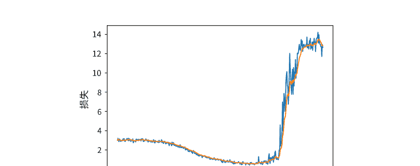

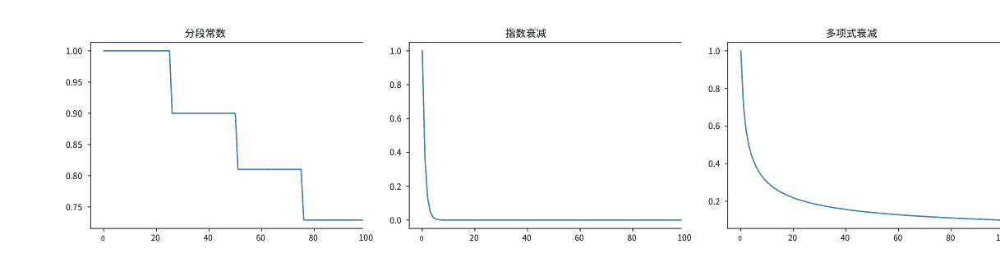

如果学习率调度满足Robbins-Monro条件，则收敛性成立:

$$ \eta_t \to 0, \quad \frac{\sum_{t=1}^\infty \eta_t^2}{\sum_{t=1}^\infty \eta_t} \to 0 $$ \hfill (8.61)

一些常见的学习率调度示例如下:

-   $$ \eta_t = \eta_i \quad \text{如果} \quad t_i \le t \le t_{i+1} \quad \text{分段常数} $$ \hfill (8.62)
-   $$ \eta_t = \eta_0 e^{-\lambda t} \quad \text{指数衰减} $$ \hfill (8.63)
-   $$ \eta_t = \eta_0 (\beta t + 1)^{-\alpha} \quad \text{多项式衰减} $$ \hfill (8.64)

在分段常数调度中，$t_i$是一组时间点，在这些时间点上我们将学习率调整为指定的值。例如，我们可以设置$\eta_i = \eta_0\gamma^i$，这样每次通过一个阈值（或里程碑）时，初始学习率就会减少$\gamma$倍。图8.18a以$\eta_0=1$为例进行了说明

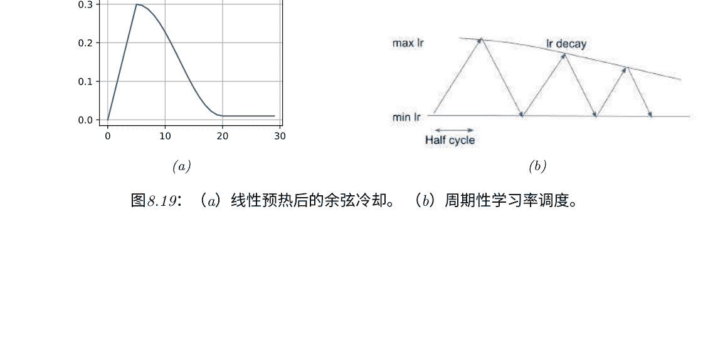

这被称为步长衰减。 有时阈值时间是自适应计算的，通过估计训练或验证损失何时停滞不前；这被称为减少停滞。指数衰减通常太快，如图8.18b所示。常见的选择是多项式衰减，其中 α=0.5 和 β=1，如图8.18c所示；这对应于一个平方根调度， η_t = η_0 \frac{1}{\sqrt{t+1}}。

在深度学习社区中，另一种常见的调度是快速增加学习率然后再逐渐降低，如图8.19a所示。这被称为学习率预热，或单周期学习率调度[Smi18]。 这样做的动机是：最初参数可能处于条件较差的损失空间的一部分，因此步长过大会导致“跳跃”太多（参见图8.11(b)) 并且无法向下进展。然而，通过较慢的学习率，算法可以发现空间中更平坦的区域，可以使用更大的步长。一旦到达那里，可以快速取得进展。然而，为了确保收敛到一个点，我们必须将学习率降低到0。有关更多细节，请参阅[Got+19; Gil+21]。

还可以通过循环的方式多次增加和减少学习率。这被称为循环学习率[Smi18]，并且是由 fast.ai 课程推广的。 请参见图8.19b，以三角形形状进行说明。这种方法的动机是为了避免局部最小值。 最小和最大学习率可以根据上述初始的“干跑”来确定，并且半周期可以根据您希望使用的重新启动次数来选择。一种相关的方法，称为带有热重启的随机梯度下降，是在[LH17]中提出的；他们建议在每次冷却后存储访问的所有检查点，并将它们全部用作模型集合的成员。（有关集成学习的讨论，请参见第18.2节。）

估计学习率的另一种方法是使用线性搜索（第8.2.2.2节）。这在使用SGD时很棘手，因为噪声梯度使得计算Armijo条件变得困难[CS20]。然而，[Vas+19]表明，如果梯度噪声的方差随时间趋近于零，它可以工作。如果模型足够灵活，可以完美地插值训练集，那么这种情况可能发生。

### 8.4.4 迭代平均

随机梯度下降（SGD）产生的参数估计在时间上可能非常不稳定。为了减少估计的方差，我们可以计算平均值

$$ \overline{\theta}_t = \frac{1}{t} \sum_{i=1}^{t} \theta_i = \frac{1}{t} \theta_t + \frac{t-1}{t} \overline{\theta}_{t-1} $$ \hfill (8.65)

其中 $\theta_t$ 是通常的SGD迭代。这被称为迭代平均或Polyak-Ruppert平均[Rup88]。

在[PJ92]中，他们证明了估计 $\theta_t$在SGD算法中实现了最佳的渐近收敛速度，与使用二阶信息（如Hessian矩阵）的变体相匹配。这种平均还可以具有统计上的好处。例如，在[NR18]中，他们证明，在线性回归的情况下，这种方法等同于 $\ell_2$正则化（即岭回归）。

与SGD迭代的指数移动平均相比，随机权重平均（SWA）[Izm+18]使用等权平均和修改后的学习率计划。与为了更快的收敛速度而提出的标准Polyak-Ruppert平均相反，SWA利用用于训练深度神经网络的目标函数的平坦性，以找到提供更好泛化性能的解决方案。

### 8.4.5 方差减少 *

在本节中，我们讨论了减少随机梯度下降（SGD）中方差的各种方法。在某些情况下，这可以将理论收敛速度从次线性提高到线性（即与全批量梯度下降相同）[SLRB17; JZ13; DBLJ14]。这些方法减少的是梯度的方差，而不是参数本身，并且设计用于有限和问题。

### 8.4.5.1 SVRG

随机方差减少梯度（SVRG）[JZ13]的基本思想是使用控制变量，其中我们根据完整批次估计梯度的基准值，然后将其与随机梯度进行比较。

更准确地说，每隔一段时间（例如，每个时期），我们在模型参数的“快照” $\tilde{\theta}$处计算完整梯度；因此，相应的“精确”梯度为 $\nabla \mathcal{L}(\tilde{\theta})$。在第 $t$步，我们计算当前参数的常规随机梯度 $\nabla \mathcal{L}_t(\theta_t)$，但也计算快照参数的梯度 $\nabla \mathcal{L}_t(\tilde{\theta})$，并将其用作基准。然后，我们可以使用以下改进的梯度估计

$$ g_t = \nabla \mathcal{L}_t(\theta_t) - \nabla \mathcal{L}_t(\tilde{\theta}) + \nabla \mathcal{L}(\tilde{\theta}) $$ \hfill (8.66)

计算 $\theta_{t+1}$。这是无偏的，因为 $\mathbb{E} \left[ \nabla \mathcal{L}_t(\tilde{\theta}) \right]$。此外，更新仅涉及两个梯度计算，因为我们可以每个时期计算一次 $\nabla \mathcal{L}(\tilde{\theta})$。在时期结束时，我们根据最新的$\theta_t$的值或迭代的运行平均值更新快照参数 $\tilde{\theta}$，并更新预期的基线。（我们可以较少频繁地计算快照，但是基线将与目标不相关，并可能损害性能，如[DB18]所示。）

SVRG的迭代比全批量梯度下降法更快，但SVRG仍然可以达到梯度下降法的理论收敛速度。

### 8.4.5.2 SAGA

在本节中，我们描述了随机平均梯度加速（SAGA）算法[DBLJ14]。与SVRG不同，它只需要在算法开始时进行一次完整批量梯度计算。然而，为了节省时间，它需要使用更多的内存。特别地，它必须存储N个梯度向量。这使得该方法能够通过从总和中删除旧的局部梯度并用新的局部梯度替换它来维持全局梯度的近似。这被称为聚合梯度方法。

更准确地说，我们首先通过计算g_local^n = ∇L_n(θ_0)来进行初始化对于所有的n，并且求平均值，g_avg = (1/N)Σ_{n=1}^N g_local^n。然后，在迭代t中，我们使用梯度估计

g_t = ∇L_n(θ_t) - g_local^n + g_avg （8.67）
其中n ~ Unif{1, ..., N}是在迭代t中采样的示例索引。然后我们更新g_local^n = ∇L_n(θ_t)和g_avg通过替换旧的g_本地用它的新值。

这比SVRG有一个优势，因为它只需要在开始时进行一次完整的批处理扫描。（实际上，初始扫描是不必要的，因为我们可以通过只合并到目前为止看到的梯度来‘懒惰’地计算g_avg。）缺点是额外的大内存成本。然而，如果特征（和梯度）是稀疏的，内存成本可以合理。事实上，当N很大且x是稀疏时，建议在sklearn逻辑回归代码中使用SAGA算法。³

### 8.4.5.3 应用于深度学习

方差缩减方法广泛用于拟合具有凸目标的机器学习模型，例如线性模型。然而，使用传统的深度学习训练方法与SVRG存在各种困难。例如，批量归一化（第14.2.4.1节），数据增强（第19.1节）和随机失活（第13.5.4节）都会破坏该方法的假设，因为损失将以随机方式发生变化，这种变化不仅取决于参数和数据索引n。更多细节，请参见例如[DB18; Arn+19]。

### 8.4.6 预处理的SGD

在本节中，我们考虑预处理的SGD，其更新如下：

θ_{t+1} = θ_t - η_t M_t^{-1} g_t, （8.68）
其中M_t是一个预处理矩阵，或者简单地称为预处理器，通常选择为正定的。不幸的是，梯度估计中的噪声使得可靠地估计海森矩阵变得困难，这使得难以使用第8.3节中的方法。此外，使用完整的预处理矩阵求解更新方向是昂贵的。因此，大多数从业者使用对角线预处理器M_t。这种预处理器不一定使用二阶信息，但通常比普通的随机梯度下降算法快。另见[Roo+21]

³ 请参阅https://scikit-learn.org/stable/modules/linear_model.html#logistic-regression。

《概率机器学习：导论》草稿。2023年6月22日

## 8.4.6.1 ADAGRAD

ADAGRAD（自适应梯度）方法[DHS11]最初设计用于优化凸目标函数，其中梯度向量的许多元素为零；这些元素可能对应于输入中很少出现的特征，如罕见的单词。更新的形式如下

$$\theta_{t+1,d} = \theta_{t,d} - \eta_t \frac{1}{\sqrt{s_{t,d} + \epsilon}} g_{t,d}$$ (8.69)

其中 $d = 1: D$ 索引参数向量的维度，并且

$$s_{t,d} = \sum_{i=1}^{t} g_{i,d}^2$$ (8.70)

是平方梯度的和，$\epsilon > 0$ 是一个小的项，以避免除以零。等价地，我们可以将更新写成向量形式如下：

$$\Delta\boldsymbol{\theta}_t = -\eta_t \frac{1}{\sqrt{\mathbf{s}_t + \epsilon}} \mathbf{g}_t.$$ (8.71)

其中平方根和除法是逐元素执行的。将其视为预处理的SGD，等价于取 $\mathbf{M}_t = \mathrm{diag}(\mathbf{s}_t + \epsilon)^{1/2}$。这是自适应学习率的一个例子；整体步长 $\eta_t$ 仍然需要选择，但与传统的GD相比，结果对其不太敏感。特别地，我们通常固定 $\eta_t = \eta_0$。

## 8.4.6.2 RMSPROP 和 ADADELTA

ADAGRAD的一个定义特征是分母的项随时间增大，因此有效学习率下降。虽然确保收敛是必要的，但是当分母增长过快时，可能会影响性能。

另一种选择是使用过去平方梯度的指数加权移动平均（EWMA，第4.4.2.2节），而不是它们的总和：

$$s_{t+1,d} = \beta s_{t,d} + (1 - \beta) g_{t,d}^2$$ (8.72)

在实践中，我们通常使用 $\beta \sim 0.9$，这样可以更加重视最近的例子。在这种情况下，

$$\sqrt{s_{t,d}} \approx \mathrm{RMS}(\mathbf{g}_{1:t,d}) = \sqrt{\frac{1}{t} \sum_{\tau=1}^t g_{\tau,d}^2}$$ (8.73)

其中RMS代表“均方根”。因此，这种方法（基于[RB93]的早期RPROP方法）被称为 RMSPROP[Hin14]。RMSProp的整体更新是

$$\Delta\boldsymbol{\theta}_t = -\eta_t \frac{1}{\sqrt{\mathbf{s}_t + \epsilon}} \mathbf{g}_t.$$ (8.74)

AdaDELTA方法在[Zei12]中独立引入，与RMSprop类似。然而，除了在s中累积梯度的EWMA之外，它还保持了更新的EWMA形式的更新 $\delta_t$

$$\Delta \boldsymbol{\theta}_t = -\eta_t \frac{\sqrt{\delta_{t-1} + \epsilon}}{\sqrt{s_t + \epsilon}} \mathbf{g}_t$$ (8.75)

其中

$$\delta_t = \beta \delta_{t-1} + (1-\beta)(\Delta \boldsymbol{\theta}_t)^2$$ (8.76)

并且 $s_t$ 与RMSProp中的相同。这样做的好处是分子和分母的“单位”可以相互抵消，因此我们只需将梯度与标量相乘。这消除了调整学习率 $\eta_t$ 的需要，这意味着可以简单地将 $\eta_t$ 设置为1，尽管AdaDelta的流行实现仍将 $\eta_t$ 保持为可调的超参数。然而，由于这些自适应学习率不需要随时间减小（除非我们明确选择 $\eta_t$ 这样做），这些方法不能保证收敛到解。

## 8.4.6.3 亚当

可以将 RMSProp 与动量结合起来。特别地，让我们计算梯度的EWMA（如动量中所示）和平方梯度的EWMA（如 RMSProp中所示）

$$\mathbf{m}_t = \beta_1 \mathbf{m}_{t-1} + (1-\beta_1) \mathbf{g}_t$$ (8.77)
$$\mathbf{s}_t = \beta_2 \mathbf{s}_{t-1} + (1-\beta_2) \mathbf{g}_t^2$$ (8.78)

然后我们进行以下更新：

$$\Delta \boldsymbol{\theta}_t = -\eta_t \frac{1}{\sqrt{\mathbf{s}_t + \epsilon}} \mathbf{m}_t$$ (8.79)

得到的方法被称为亚当，代表“自适应矩估计”[KB15]。各个常数的标准值为 $\beta_1=0.9$, $\beta_2=0.999$ 和 $\epsilon=10^{-6}$。（如果我们设置 $\beta_1=0$ 且没有进行偏差校正，我们将得到 RMSProp，它不使用动量。）对于整体学习率，通常使用固定值，如 $\eta_t=0.001$。同样，由于自适应学习率可能不会随时间降低，收敛性不能保证（参见第8.4.6.4节）。如果我们初始化为 $\mathbf{m}_0 = \mathbf{s}_0 = \mathbf{0}$，则初始估计将偏向于较小的值。因此，作者建议使用经过偏差校正的矩估计，在优化过程的早期增加值。这些估计值为

$$\hat{\mathbf{m}}_t = \mathbf{m}_t / (1 - \beta_1^t)$$ (8.80)
$$\hat{\mathbf{s}}_t = \mathbf{s}_t / (1 - \beta_2^t)$$ (8.81)

偏差校正的优势在图4.3中显示。

## 8.4.6.4 自适应学习率的问题

在使用对角缩放方法时，整体学习率由 $\eta_0 \mathbf{M}_t^{-1}$ 决定，该学习率随时间变化。因此，这些方法通常被称为自适应学习率方法。然而，它们仍然需要设置基本学习率 $\eta_0$。

由于EWMA方法通常用于梯度估计有噪声的随机设置中，它们的学习率调整可能导致即使在凸问题上也无法收敛[RKK18]。针对这个问题提出各种解决方案，包括 AMSGRAD[RKK18]，PADAM[CG18; Zho+18]和 YOGI[Zah+18]。例如， YOGI更新通过替换 ADAM来修改

$$ \mathbf{s}_t = \beta_2 \mathbf{s}_{t-1} + (1 - \beta_2) \mathbf{g}_t^2 = \mathbf{s}_{t-1} + (1 - \beta_2)(\mathbf{g}_t^2 - \mathbf{s}_{t-1}) \quad (8.82) $$

使用

$$ \mathbf{s}_t = \mathbf{s}_{t-1} + (1 - \beta_2) \mathbf{g}_t^2 \quad \text{sgn}(\mathbf{g}_t^2 - \mathbf{s}_{t-1}) \quad (8.83) $$

然而，更近期的研究[Zha+22]表明，只要根据每个数据集调整 $\beta_1$ 和 $\beta_2$ 参数，普通的Adam算法就可以始终收敛。（实际上，通常固定 $\beta_1= 0.9$，只调整 $\beta_2$。）

## 8.4.6.5 非对角预处理矩阵

虽然我们上面讨论的方法可以调整每个参数的学习率，但它们并没有解决参数相关性导致的病态问题，因此并不总是比普通的SGD提供更快的速度提升。

获得更快收敛的一种方法是使用以下预处理矩阵，称为全矩阵Adagrad [DHS11]:

$$ \mathbf{M}_t = [(\mathbf{G}_t \mathbf{G}_t^T)^{\frac{1}{2}} + \epsilon \mathbf{I}_D]^{-1} \quad (8.84) $$

其中

$$ \mathbf{G}_t = [\mathbf{g}_t, \ldots, \mathbf{g}_1] \quad (8.85) $$

这里 $\mathbf{g}_i = \nabla_{\boldsymbol{\psi}} c(\boldsymbol{\psi}_i)$ 是在第 $i$ 步计算得到的 $D$ 维梯度向量。不幸的是， $\mathbf{M}_t$ 是一个 $D \times D$ 矩阵，存储和求逆的成本很高。

Shampoo算法[GKS18]对 $\mathbf{M}$ 进行了分块对角近似，每个模型层都有一个，然后利用Kronecker乘积结构高效求逆。（它被称为“shampoo”是因为它使用了一种调节剂。）最近，[Ani+20]将这种方法扩展到了非常大的深度模型，创造了记录时间。

## 8.5 约束优化

在本节中，我们考虑以下约束优化问题:

$$ \boldsymbol{\theta}^* = \arg \min_{\boldsymbol{\theta} \in C} \mathcal{L}(\boldsymbol{\theta}) \quad (8.86) $$

其中可行集或约束集为

$$ C = \{\boldsymbol{\theta} \in \mathbb{R}^D : h_i(\boldsymbol{\theta}) = 0, i \in \mathcal{E}, g_j(\boldsymbol{\theta}) \leq 0, j \in \mathcal{J}\} \quad (8.87) $$

其中 $\mathcal{E}$ 是等式约束的集合，$\mathcal{J}$ 是不等式约束的集合。

例如，假设我们有一个二次目标函数，$\mathcal{L}(\boldsymbol{\theta}) = \theta_1^2 + \theta_2^2$，受到一个线性等式约束的限制，$h(\boldsymbol{\theta}) = 1 - \theta_1 - \theta_2 = 0$。图8.20(a)绘制了 $\mathcal{L}$ 的等高线，以及约束面。我们试图找到生活在直线上但离原点最近的点 $\boldsymbol{\theta}^*$。从几何上可以明显看出，最优解是 $\boldsymbol{\theta} = (0.5, 0.5)$，由实心黑点表示。

在接下来的章节中，我们简要介绍了一些约束优化的理论和算法。更多细节可以在其他书籍中找到，例如[BV04; NW06; Ber15;Ber16]。

## 8.5.1 拉格朗日乘子

在本节中，我们讨论如何解决等式约束优化问题。我们最初假设只有一个等式约束，$h(\boldsymbol{\theta}) = 0$。

首先注意，对于约束面上的任意一点，$\nabla h(\boldsymbol{\theta})$ 将与约束面垂直。为了理解这一点，考虑另一个附近的点，$\boldsymbol{\theta} + \boldsymbol{\epsilon}$，它也位于该曲面上。如果我们围绕 $\boldsymbol{\theta}$ 进行一阶泰勒展开，我们有

$$ h(\boldsymbol{\theta} + \boldsymbol{\epsilon}) \approx h(\boldsymbol{\theta}) + \boldsymbol{\epsilon}^T \nabla h(\boldsymbol{\theta}) \quad (8.88) $$

由于 $\boldsymbol{\theta}$ 和 $\boldsymbol{\theta} + \boldsymbol{\epsilon}$ 都在约束面上，我们必须有 $h(\boldsymbol{\theta}) = h(\boldsymbol{\theta} + \boldsymbol{\epsilon})$，因此 $\boldsymbol{\epsilon}^T \nabla h(\boldsymbol{\theta}) \approx 0$。由于 $\boldsymbol{\epsilon}$ 与约束面平行，$\nabla h(\boldsymbol{\theta})$ 必须垂直于它。我们寻找一个在约束面上的点 $\boldsymbol{\theta}^*$，使得 $\mathcal{L}(\boldsymbol{\theta})$ 最小化。我们刚刚证明了它必须满足 $\nabla h(\boldsymbol{\theta}^*)$ 与约束面垂直的条件。此外，这样一个点必须具有 $\nabla\mathcal{L}(\boldsymbol{\theta})$ 也与约束面垂直的性质，否则我们可以沿着约束面移动一小段距离来减小 $\mathcal{L}(\boldsymbol{\theta})$。由于 $\nabla h(\boldsymbol{\theta}^*)$ 并且 $\nabla\mathcal{L}(\boldsymbol{\theta})$ 在 $\boldsymbol{\theta}^*$ 处与约束面正交，它们必须是平行的（或反平行的）。因此必然存在一个常数 $\lambda^* \in \mathbb{R}$，使得

$$ \nabla\mathcal{L}(\boldsymbol{\theta}^*) = \lambda^* \nabla h(\boldsymbol{\theta}^*) \quad\quad (8.89) $$

（我们不能简单地将梯度向量等同起来，因为它们可能具有不同的大小。）这个常数 $\lambda^*$ 被称为拉格朗日乘子，可以是正数、负数或零。当 $\nabla\mathcal{L}(\boldsymbol{\theta}^*)=0$ 时，就会出现这种情况。

我们可以将方程（8.89）转化为一个目标，称为拉格朗日函数，我们应该找到以下函数的驻点：

$$ L(\boldsymbol{\theta}, \lambda) \triangleq \mathcal{L}(\boldsymbol{\theta}) + \lambda h(\boldsymbol{\theta}) \quad\quad (8.90) $$

在拉格朗日函数的稳定点，我们有

$$ \nabla_{\boldsymbol{\theta},\lambda} L(\boldsymbol{\theta}, \lambda) = \mathbf{0} \iff \lambda \nabla_{\boldsymbol{\theta}} h(\boldsymbol{\theta}) = \nabla \mathcal{L}(\boldsymbol{\theta}), \; h(\boldsymbol{\theta}) = 0 \quad\quad (8.91) $$

这被称为临界点，并满足原始约束 $h(\boldsymbol{\theta}) = 0$ 和方程式 (8.89)。

如果我们有 $m > 1$ 个约束条件，我们可以通过相加形成一个新的约束函数，如下所示：

$$ L(\boldsymbol{\theta}, \boldsymbol{\lambda}) = \mathcal{L}(\boldsymbol{\theta}) + \sum_{j=1}^{m} \lambda_j h_j(\boldsymbol{\theta}) \quad\quad (8.92) $$

现在我们在 $D+m$ 个未知数中有 $D+m$ 个方程式，我们可以使用标准的无约束优化方法来找到一个稳定点。下面我们给出一些例子。

### 8.5.1.1 示例：具有一个线性等式约束的二次目标函数

考虑最小化 $\mathcal{L}(\boldsymbol{\theta}) = \theta_1^2 + \theta_2^2$ 在约束条件 $\theta_1 + \theta_2 = 1$ 下。（这是图8.20(a)中所示的问题。）拉格朗日函数为

$$ L(\theta_1, \theta_2, \lambda) = \theta_1^2 + \theta_2^2 + \lambda(\theta_1 + \theta_2 - 1) \quad\quad (8.93) $$

我们有以下关于稳定点的条件：

$$ \frac{\partial}{\partial \theta_1} L(\theta_1, \theta_2, \lambda) = 2\theta_1 + \lambda = 0 \quad\quad (8.94) $$

$$ \frac{\partial}{\partial \theta_2} L(\theta_1, \theta_2, \lambda) = 2\theta_2 + \lambda = 0 \quad\quad (8.95) $$

$$ \frac{\partial}{\partial \lambda} L(\theta_1, \theta_2, \lambda) = \theta_1 + \theta_2 - 1 = 0 \quad\quad (8.96) $$

从方程8.94和8.95我们发现 $2\theta_1 = -\lambda = 2\theta_2$，所以 $\theta_1 = \theta_2$。此外，根据方程(8.96)，我们发现 $2\theta_1 = 1$。所以 $\boldsymbol{\theta}^* = (0.5, 0.5)$，正如我们之前所述。此外，这是全局最小值，因为目标函数是凸函数，约束是仿射的。

### 8.5.2 KKT条件

在本节中，我们将拉格朗日乘数的概念推广到处理不等式约束。

首先考虑只有一个不等式约束的情况 $g(\boldsymbol{\theta}) \leq 0$。为了找到最优解，一种方法是将问题转化为一个无约束问题，然后将惩罚项作为一个无限阶跃函数添加进去：

$$ \hat{\mathcal{L}}(\boldsymbol{\theta}) = \mathcal{L}(\boldsymbol{\theta}) + \infty \mathbb{I}(g(\boldsymbol{\theta}) > 0) $$

然而，这是一个不连续的函数，很难进行优化。

相反，我们可以创建一个形式为 $\mu g(\boldsymbol{\theta})$ 的下界，其中 $\mu \geq 0$。这给出了以下的拉格朗日函数：

$$ L(\boldsymbol{\theta}, \mu) = \mathcal{L}(\boldsymbol{\theta}) + \mu g(\boldsymbol{\theta}) $$

注意，可以通过以下方式恢复阶跃函数：

$$ \hat{\mathcal{L}}(\boldsymbol{\theta}) = \max_{\mu \geq 0} L(\boldsymbol{\theta}, \mu) = \begin{cases} \infty & \text{如果 } g(\boldsymbol{\theta}) > 0, \\ \mathcal{L}(\boldsymbol{\theta}) & \text{否则} \end{cases} $$

因此我们的优化问题变为

$$ \min_{\boldsymbol{\theta}} \max_{\mu \geq 0} L(\boldsymbol{\theta}, \mu) $$

现在考虑一般情况，我们有多个不等式约束， $g_i(\boldsymbol{\theta}) \leq 0$，并且多个等式约束， $h_j(\boldsymbol{\theta}) = 0$。广义拉格朗日函数变为

$$ L(\boldsymbol{\theta}, \boldsymbol{\mu}, \boldsymbol{\lambda}) = \mathcal{L}(\boldsymbol{\theta}) + \sum_{i} \mu_i g_i(\boldsymbol{\theta}) + \sum_{j} \lambda_j h_j(\boldsymbol{\theta}) $$

(我们可以自由地将 $-\lambda_j h_j$ 改为 $+\lambda_j h_j$，因为符号是任意的。)我们的优化问题变为

$$ \min_{\boldsymbol{\theta}} \max_{\boldsymbol{\mu} \geq \mathbf{0}, \boldsymbol{\lambda}} L(\boldsymbol{\theta}, \boldsymbol{\mu}, \boldsymbol{\lambda}) $$

当 $\mathcal{L}$ 和 $g_i$ 是凸函数时，这个问题的所有临界点必须满足以下条件 (在一些条件下[BV04, Sec.5.2.3]) ：

- 所有约束都得到满足 (这被称为可行性) ：
  $$ g_i(\boldsymbol{\theta}) \leq 0, \; h_j(\boldsymbol{\theta}) = 0 $$

- 解是一个稳定点：
  $$ \nabla\mathcal{L}(\boldsymbol{\theta}^*) + \sum_{i} \mu_i \nabla g_i(\boldsymbol{\theta}^*) + \sum_{j} \lambda_j \nabla h_j(\boldsymbol{\theta}^*) = \mathbf{0} $$

图8.21: (a) 在2D中由线性约束的交集定义的凸多面体。(b) 可行集和线性目标函数的描述。红线是目标函数的等高线，箭头指示了它改善的方向。我们可以看到最优解位于多面体的一个顶点上。

-   不等式约束的惩罚指向正确的方向（这被称为对偶可行性）：
    $$\mu \geq 0$$ (8.105)

-   拉格朗日乘数在非活动约束中补偿任何松弛，即 $\mu_i = 0$ 或 $g_i(\theta^*) = 0$，所以
    $$\mu_i \cdot g_i(\theta^*) = 0$$ (8.106)
    这被称为互补松弛。

为了看到为什么最后一个条件成立，考虑（为简单起见）单个不等式约束的情况，$g(\theta) \leq 0$。要么它是活动的，意味着 $g(\theta) = 0$，要么它是非活动的，意味着 $g(\theta) < 0$。在活动的情况下，解位于约束边界上，$g(\theta) = 0$ 变成一个等式约束；然后我们有 $\nabla \mathcal{L} = \mu \nabla g$ 对于某个常数 $\mu \geq 0$，因为方程 (8.89)。在非活动的情况下，解不在约束边界上；我们仍然有 $\nabla \mathcal{L} = \mu \nabla g$，但现在 $\mu = 0$。

这些被称为 Karush-Kuhn-Tucker (KKT) 条件。如果 $\mathcal{L}$ 是一个凸函数，并且约束定义了一个凸集，那么 KKT 条件对于（全局）最优性是充分的，也是必要的。

### 8.5.3 线性规划

考虑在线性约束条件下优化线性函数。当以标准形式写出时，可以表示为
$$\min_{\theta} \mathbf{c}^{T} \theta \quad \text{s.t.} \quad \mathbf{A} \theta \leq \mathbf{b}, \quad \theta \geq 0 \quad (8.107)$$
可行解集定义了一个凸多面体，它是由半空间的交集定义的凸集。请参见图8.21(a)中的2D示例。图8.21(b)显示了一个线性成本函数，它随着我们向右下移动，它逐渐减小。我们可以看到可行集中最低点是一个顶点。事实上，可以证明最优点总是出现在多面体的一个顶点上，假设解是唯一的。如果存在多个解，直线将与一个面平行。在可行解集内也可能没有最优解；在这种情况下，问题被称为不可行。

### 8.5.3.1 单纯形算法

可以证明，LP的最优解出现在定义可行解集的多面体的顶点上（参见图8.21(b)的示例）。单纯形算法通过从顶点移动到顶点来解决LP问题，每次寻找最大改善目标的边。

在最坏情况下，单纯形算法的时间复杂度可以指数级增长，尽管在实践中通常非常高效。还有各种多项式时间算法，例如内点法，尽管在实践中通常较慢。

### 8.5.3.2 应用

线性规划在科学、工程和商业中有许多应用。它在一些机器学习问题中也很有用。例如，第11.6.1.1节展示了如何使用它来解决鲁棒线性回归问题。它在图形模型中的状态估计中也很有用（参见例如，[SGJ11]）。

### 8.5.4 二次规划

考虑在线性等式和不等式约束条件下最小化一个二次目标函数。这种问题被称为二次规划或者QP，可以写成如下形式：
$$\min_{\theta} \frac{1}{2} \theta^{\top} \mathbf{H} \theta + \mathbf{c}^{\top} \theta \quad \text{s.t.} \quad \mathbf{A} \theta \leq b, \mathbf{C} \theta = d \tag{8.108}$$
如果$\mathbf{H}$是半正定的，那么这是一个凸优化问题。

### 8.5.4.1 例子：带有线性不等式约束的二维二次目标函数

作为一个具体的例子，假设我们想要最小化
$$\mathcal{L}(\theta) = \left( \theta_1 - \frac{3}{2} \right)^2 + \left( \theta_2 - \frac{1}{8} \right)^2 = \frac{1}{2} \theta^{\top} \mathbf{H} \theta + \mathbf{c}^{\top} \theta + \text{常数} \tag{8.109}$$
其中$\mathbf{H} = 2 \mathbf{I}$和$\mathbf{c} = -(3, 1/4)$，满足
$$|\theta_1| + |\theta_2| \leq 1 \tag{8.110}$$
参见图8.20(b)进行说明。
我们可以将约束条件重写为
$$\theta_1 + \theta_2 \leq 1, \quad \theta_1 - \theta_2 \leq 1, \quad -\theta_1 + \theta_2 \leq 1, \quad -\theta_1 - \theta_2 \leq 1 \tag{8.111}$$
我们可以更简洁地写成
$$\mathbf{A} \theta \leq b \tag{8.112}$$
其中 $\boldsymbol{b} = 1$ 和
$$
\mathbf{A} = \begin{pmatrix}
1 & 1 \\
1 & -1 \\
-1 & 1 \\
-1 & -1
\end{pmatrix}
\quad (8.113)
$$
现在这符合标准的QP形式。

从问题的几何性质，如图8.20(b)所示，我们可以看到与两个左侧面(菱形的左侧面)对应的约束是非活动的(因为我们试图尽可能靠近圆的中心，而圆的中心在约束可行区域的外部且右侧)。将不等式约束表示为行 $i$ of $\mathbf{A}$ 的 $g_i(\boldsymbol{\theta})$，这意味着 $g_3(\boldsymbol{\theta}^*) > 0$ 和 $g_4(\boldsymbol{\theta}^*) > 0$，因此，根据互补性，$\mu_3^* = \mu_4^* = 0$。因此，我们可以删除这些非活动约束。

从KKT条件我们知道
$$
\mathbf{H}\boldsymbol{\theta} + \boldsymbol{c} + \mathbf{A}^\top \boldsymbol{\mu} = \boldsymbol{0} \quad (8.114)
$$
使用这些来解决主动约束子问题，我们得到
$$
\begin{pmatrix}
2 & 0 & 1 & 1 \\
0 & 2 & 1 & -1 \\
1 & 1 & 0 & 0 \\
1 & -1 & 0 & 0
\end{pmatrix}
\begin{pmatrix}
\theta_1 \\
\theta_2 \\
\mu_1 \\
\mu_2
\end{pmatrix}
=
\begin{pmatrix}
3 \\
1/4 \\
1 \\
1
\end{pmatrix}
\quad (8.115)
$$
因此解为
$$
\boldsymbol{\theta}_* = (1, 0)^\top, \boldsymbol{\mu}_* = (0.625, 0.375, 0, 0)^\top \quad (8.116)
$$
注意到 $\boldsymbol{\theta}$的最优值出现在“球”（菱形）的顶点之一。

### 8.5.4.2 应用

在机器学习中，二次规划有几个应用。例如，在第11.4节中，我们讨论了用于稀疏线性回归的套索方法，它等同于优化 $\mathcal{L}(\boldsymbol{w}) = \|\mathbf{X}\boldsymbol{w} - \boldsymbol{y}\|_2^2 + \lambda\|\boldsymbol{w}\|_1$，可以重新表述为一个二次规划问题。而在第17.3节中，我们展示了如何使用二次规划来解决支持向量机（SVM）问题。

### 8.5.5 混合整数线性规划 *

整数线性规划或 ILP 对应于最小化一个线性目标函数，受到线性约束的限制，其中优化变量是离散整数而不是实数。在标准形式下，问题如下所示：
$$
\min_{\boldsymbol{\theta}} \boldsymbol{c}^\top \boldsymbol{\theta} \quad \text{s.t.} \quad \mathbf{A}\boldsymbol{\theta} \leq \boldsymbol{b}, \boldsymbol{\theta} \geq 0, \boldsymbol{\theta} \in \mathbb{Z}^D \quad (8.117)
$$
其中 $\mathbb{Z}$是整数集。如果一些优化变量是实数值，那么它被称为混合ILP，通常简称为MIP。（如果所有变量都是实数值，它变成了标准LP。）

MIP在车辆路径规划、调度和装箱等许多应用中都有广泛的应用。它们还对一些机器学习应用非常有用，例如正式验证某些深度神经网络的行为[And+18]，以及证明DNN对于对抗性（最坏情况）扰动的鲁棒性属性[TXT19]。

## 8.6 近端梯度法*

我们通常对形式为的目标进行优化
$$\mathcal{L}(\boldsymbol{\theta}) = \mathcal{L}_{s}(\boldsymbol{\theta}) + \mathcal{L}_{r}(\boldsymbol{\theta}) \qquad\qquad (8.118)$$
其中 $\mathcal{L}_{s}$ 是可微的（平滑），而 $\mathcal{L}_{r}$ 是凸的但不一定可微（即可能是非平滑或“粗糙”的）。例如， $\mathcal{L}_{s}$ 可能是负对数似然（NLL），而 $\mathcal{L}_{r}$ 可能是一个指示函数，如果违反约束则为无穷大（参见第8.6.1节），或者 $\mathcal{L}_{r}$ 可能是某些参数的 $\ell_{1}$ norm（参见第8.6.2节），或者 $\mathcal{L}_{r}$ 可能衡量参数与一组允许的量化值之间的距离（参见第8.6.3节）。

解决这类问题的一种方法是使用近端梯度法（参见例如，[PB+14;PSW15]）。粗略地说，这需要在梯度方向上采取大小为 $\eta$ 的步长，然后将得到的参数更新投影到尊重 $\mathcal{L}_{r}$ 的空间中。更准确地说，更新如下
$$\boldsymbol{\theta}_{t+1} = \text{prox}_{\eta_{t}\mathcal{L}_{r}} \left( \boldsymbol{\theta}_{t} - \eta_{t}\nabla \mathcal{L}_{s}(\boldsymbol{\theta}_{t}) \right) \qquad\qquad (8.119)$$
其中 $\text{prox}_{\eta\mathcal{L}_{r}}(\boldsymbol{\theta})$ 是 $\mathcal{L}_{r}$ 的 proximal operator of (scaled by $\eta$) 在 $\boldsymbol{\theta}$ 处的值：
$$\text{prox}_{\eta\mathcal{L}_{r}}(\boldsymbol{\theta}) \triangleq \underset{\mathbf{z}}{\text{argmin}} \left( \mathcal{L}_{r}(\mathbf{z}) + \frac{1}{2\eta}||\mathbf{z} - \boldsymbol{\theta}||_{2}^{2} \right) \qquad\qquad (8.120)$$
(因子 $\frac{1}{2}$ 是任意约定的。）我们可以将 proximal operator 重新写成求解一个约束优化问题，如下所示：
$$\text{prox}_{\eta\mathcal{L}_{r}}(\boldsymbol{\theta}) = \underset{\mathbf{z}}{\text{argmin}} \mathcal{L}_{r}(\mathbf{z}) \quad \text{s.t.} \quad ||\mathbf{z} - \boldsymbol{\theta}||_{2} \leq \rho \qquad\qquad (8.121)$$
其中的界 $\rho$ 取决于缩放因子 $\eta$。因此我们可以看到，proximal projection 在保持接近（即 proximal to）当前迭代的同时最小化函数。下面我们给出一些例子。

### 8.6.1 投影梯度下降

假设我们想要解决这个问题
$$\underset{\boldsymbol{\theta}}{\text{argmin}} \mathcal{L}_{s}(\boldsymbol{\theta}) \quad \text{s.t.} \quad \boldsymbol{\theta} \in \mathcal{C} \qquad\qquad (8.122)$$
其中 $\mathcal{C}$ 是一个凸集。例如，我们可以有盒约束 $\mathcal{C} = \{\boldsymbol{\theta}: \boldsymbol{l} \leq \boldsymbol{\theta} \leq \boldsymbol{u}\}$，其中我们对每个元素指定下界和上界。对于某些情况，这些界限可以是无限的。例如，如果我们只想确保参数是非负的，我们设置$l_d=0$和$u_d=\infty$对于每个维度$d$。我们可以通过在原始目标函数中添加一个惩罚项将约束优化问题转化为无约束问题：
$$\mathcal{L}(\boldsymbol{\theta}) = \mathcal{L}_s(\boldsymbol{\theta}) + \mathcal{L}_r(\boldsymbol{\theta}) \quad (8.123)$$
其中$\mathcal{L}_r(\boldsymbol{\theta})$是凸集$\mathcal{C}$的指示函数，即
$$\mathcal{L}_r(\boldsymbol{\theta}) = I_{\mathcal{C}}(\boldsymbol{\theta}) = \begin{cases} 0 & \text{if } \boldsymbol{\theta} \in \mathcal{C} \\ \infty & \text{if } \boldsymbol{\theta} \notin \mathcal{C} \end{cases} \quad (8.124)$$
我们可以使用近端梯度下降法来解决方程式 (8.123)。指示函数的近端算子等同于投影到集合$\mathcal{C}$上：
$$\text{proj}_{\mathcal{C}}(\boldsymbol{\theta}) = \underset{\boldsymbol{\theta}' \in \mathcal{C}}{\text{argmin}} ||\boldsymbol{\theta}' - \boldsymbol{\theta}||_2 \quad (8.125)$$
这种方法被称为投影梯度下降。请参见图8.22进行说明。
例如，考虑约束条件$\mathcal{C} = \{\boldsymbol{\theta} : \boldsymbol{l} \leq \boldsymbol{\theta} \leq \boldsymbol{u}\}$。在这种情况下，投影算子可以通过在边界处进行简单的阈值处理来逐元素计算：
$$\text{proj}_{\mathcal{C}}(\boldsymbol{\theta})_d = \begin{cases} l_d & \text{如果 } \theta_d \leq l_d \\ \theta_d & \text{if } l_d \leq \theta_d \leq u_d \\ u_d & \text{if } \theta_d \geq u_d \end{cases} \quad (8.126)$$
例如，如果我们想要确保所有元素都是非负的，我们可以使用
$$\text{proj}_{\mathcal{C}}(\boldsymbol{\theta}) = \boldsymbol{\theta}_+ = [\max(\theta_1, 0), \ldots, \max(\theta_D, 0)] \quad (8.127)$$
请参阅第11.4.9.2节，了解将此方法应用于稀疏线性回归的应用。

### 8.6.2 ℓ₁-范数正则化器的近端算子

考虑一个形式为 $f(\boldsymbol{x};\boldsymbol{\theta}) = \sum_{d=1}^{D} \theta_d x_d$ 的线性预测器。如果我们对于任何维度 $d$ 有 $\theta_d=0$，我们会忽略相应的特征 $x_d$。这是一种特征选择的形式，既可以作为减少过拟合的方法，也可以作为改善模型可解释性的方法。我们可以通过对 $\ell_1$ 范数进行惩罚来鼓励权重为零（而不仅仅是‘很小’）。
$$||\boldsymbol{\theta}||_1 = \sum_{d=1}^{D} |\theta_d| \qquad\qquad\qquad\qquad (8.128)$$
这被称为稀疏诱导正则化项。为了看到为什么这会引起稀疏性，考虑两个可能的参数向量，一个是稀疏的，$\boldsymbol{\theta}=(1,0)$，一个是非稀疏的，$\boldsymbol{\theta}'=(1/\sqrt{2}, 1/\sqrt{2})$。两者具有相同的 $\ell_2$ 范数。
$$|| (1,0) ||_2^2 = || (1/\sqrt{2}, 1/\sqrt{2}) ||_2^2 = 1 \qquad\qquad\qquad\qquad (8.129)$$
因此 $\ell_2$ 正则化（第4.5.3节）不会偏向于稀疏解而不是密集解。然而，当使用 $\ell_1$ 正则化时，稀疏解更便宜，因为
$$|| (1,0) ||_1 = 1 < || (1/\sqrt{2}, 1/\sqrt{2}) ||_1 = \sqrt{2} \qquad\qquad\qquad\qquad (8.130)$$
更多关于稀疏回归的详细信息，请参见第11.4节。

如果我们将这个正则化器与我们的平滑损失结合起来，我们得到
$$\mathcal{L}(\boldsymbol{\theta}) = \mathrm{NLL}(\boldsymbol{\theta}) + \lambda||\boldsymbol{\theta}||_1 \qquad\qquad\qquad\qquad (8.131)$$
我们可以使用近端梯度下降法来优化这个目标。关键问题是如何计算函数 $f(\boldsymbol{\theta}) = ||\boldsymbol{\theta}||_1$ 的近端算子。由于这个函数在维度 $d$ 上分解，近端投影可以逐分量计算。根据方程（8.120），当 $\eta=1$ 时，我们有
$$\mathrm{prox}_{\lambda f}(\theta) = \underset{z}{\mathrm{argmin}}\ |z| + \frac{1}{2\lambda}(z-\theta)^2 = \underset{z}{\mathrm{argmin}}\ \lambda|z| + \frac{1}{2}(z-\theta)^2 \qquad\qquad\qquad\qquad (8.132)$$
在第11.4.3节中，我们展示了解决方案是
$$\mathrm{prox}_{\lambda f}(\theta) = \begin{cases} \theta - \lambda & \mathrm{if}\ \theta \geq \lambda \\ 0 & \mathrm{if}\ |\theta| \leq \lambda \\ \theta + \lambda & \mathrm{if}\ \theta \leq -\lambda \end{cases} \qquad\qquad\qquad\qquad (8.133)$$
这被称为软阈值运算符，因为绝对值小于 $\lambda$ 的值被设为0（阈值），但以连续的方式。注意，软阈值运算符可以更简洁地表示为
$$\mathrm{SoftThreshold}(\theta, \lambda) = \mathrm{sign}(\theta)\ (|\theta| - \lambda)_+ \qquad\qquad\qquad\qquad (8.134)$$
其中 $\theta_+ = \mathrm{max}(\theta, 0)$ 是 $\theta$ 的正部分。在向量情况下，我们逐元素执行此操作：
$$\mathrm{SoftThreshold}(\boldsymbol{\theta}, \lambda) = \mathrm{sign}(\boldsymbol{\theta})\ (|\boldsymbol{\theta}| - \lambda)_+ \qquad\qquad\qquad\qquad (8.135)$$
请参阅第11.4.9.3节，了解将此方法应用于稀疏线性回归的示例。

## 8.6.3 量化的近似算子

在某些应用中（例如，在训练深度神经网络以在内存受限的边缘设备上运行时），我们希望确保参数被量化。例如，在每个参数只能是-1或+1的极端情况下，状态空间变为 $C = \{-1, +1\}^D$。

让我们定义一个正则化器，用于衡量到参数向量的最近量化版本的距离：

$$\mathcal{L}_r(\boldsymbol{\theta}) = \inf_{\boldsymbol{\theta}_0 \in C} \| \boldsymbol{\theta} - \boldsymbol{\theta}_0 \|_1$$  (8.136)

（我们也可以使用 $\ell_2$ 范数。）对于 $C = \{-1, +1\}^D$，这变成了

$$\mathcal{L}_r(\boldsymbol{\theta}) = \sum_{d=1}^{D} \inf_{[\boldsymbol{\theta}_0]_d \in \{\pm 1\}} |\theta_d - [\boldsymbol{\theta}_0]_d| = \sum_{d=1}^{D} \min\{|\theta_d - 1|, |\theta_d + 1|\} = \| \boldsymbol{\theta} - \text{sign}(\boldsymbol{\theta}) \|_1$$  (8.137)

让我们定义相应的量化运算符为

$$q(\boldsymbol{\theta}) = \text{proj}_C(\boldsymbol{\theta}) = \underset{\boldsymbol{\theta}_0 \in C}{\text{argmin}}\, \mathcal{L}_r(\boldsymbol{\theta}) = \text{sign}(\boldsymbol{\theta})$$  (8.138)

量化学习的核心困难在于量化不是一个可微分的操作。一种流行的解决方案是使用 straight-through estimator，它使用近似方法

$$\frac{\partial \mathcal{L}}{\partial q(\boldsymbol{\theta})} \approx \frac{\partial \mathcal{L}}{\partial \boldsymbol{\theta}}$$（见例如，[Yin+19]）。相应的更新可以分为两步完成：首先计算当前参数的量化版本的梯度向量，然后使用这个近似梯度更新无约束参数：

$$\tilde{\boldsymbol{\theta}}_t = \text{proj}_C(\boldsymbol{\theta}_t) = q(\boldsymbol{\theta}_t)$$  (8.139)

$$\boldsymbol{\theta}_{t+1} = \boldsymbol{\theta}_t - \eta_t \nabla \mathcal{L}_s(\tilde{\boldsymbol{\theta}}_t)$$  (8.140)

当应用于 $C = \{-1, +1\}^D$ 时，这被称为二进制连接方法[CBD15]。

我们可以通过使用近端梯度下降法获得更好的结果，其中我们将量化视为一种正则化器，而不是一个硬约束；这被称为 **ProxQuant** [BWL19]。更新变为：

$$\tilde{\boldsymbol{\theta}}_t = \text{prox}_{\lambda \mathcal{L}_r}(\boldsymbol{\theta}_t - \eta_t \nabla \mathcal{L}_s(\boldsymbol{\theta}_t))$$  (8.141)

在 $C = \{-1, +1\}^D$ 的情况下，可以证明近端算子是方程(8.135)中软阈值算子的一般化：

$$\text{prox}_{\lambda \mathcal{L}_r}(\boldsymbol{\theta}) = \text{软阈值}(\boldsymbol{\theta}, \lambda, \text{sign}(\boldsymbol{\theta})) = \text{sign}(\boldsymbol{\theta}) + \text{sign}(\boldsymbol{\theta} - \text{sign}(\boldsymbol{\theta})) \, (|\boldsymbol{\theta} - \text{sign}(\boldsymbol{\theta})| - \lambda)_+$$  (8.142)

(8.143)

这可以推广到其他形式的量化；详见[Yin+19]。

## 8.6.4 增量(在线)近端方法

许多机器学习问题的目标函数是损失的总和，每个样本一个。这类问题可以逐步解决；这是在线学习的一个特例。可以将近端方法扩展到这种情况。关于这类方法的概率视角（以卡尔曼滤波为基础），请参阅[AEM18; Aky+19]。

## 8.7 界限优化 *

在本节中，我们考虑一类被称为界限优化或MM算法的算法。在最小化的背景下，MM代表主要化最小化。在最大化的背景下，MM代表次要化最大化。我们将在8.7.2节中讨论MM的一个特殊情况，即期望最大化或EM。

### 8.7.1 通用算法

在本节中，我们简要概述MM方法。（更多细节可以在例如[HL04; Mai15; SBP17; Nad+19]中找到。）为了与文献保持一致，我们假设我们的目标是最大化某个函数ℓ(θ)，例如对其参数θ进行对数似然的最大化。MM算法中的基本方法是构建一个紧密下界函数 $Q(\theta,\theta^t)$，使得 $Q(\theta,\theta^t) \leq \ell(\theta)$ 且 $Q(\theta^t,\theta^t) = \ell(\theta^t)$。如果满足这些条件，我们称 $Q$次要化了 $\ell$。

然后我们在每一步执行以下更新：

$$\theta^{t+1} = \arg\max_{\theta} Q(\theta, \theta^{t}) \tag{8.144}$$

这保证了原始目标的单调增加：

$$\ell(\theta^{t+1}) \geq Q(\theta^{t+1}, \theta^{t}) \geq Q(\theta^{t}, \theta^{t}) = \ell(\theta^{t}) \tag{8.145}$$

其中第一个不等式成立是因为对于任何θ'，$Q(\theta^{t+1},\theta')$ 是 $\ell(\theta^{t+1})$ 的一个下界；第二个不等式来自于方程(8.144)；最后一个等式来自于紧致性质。作为一个结果，如果你没有观察到目标的单调增加，那么你的数学和/或代码中一定有错误。这是一个令人惊讶的强大的调试工具。

这个过程在图8.23中概述。虚线红曲线是原始函数（例如，观测数据的对数似然）。实线蓝曲线是下界，在θ^t处评估；它在θ^t处与目标函数相切。然后我们将θ^{t+1}设置为下界（蓝曲线）的最大值，并在该点拟合一个新的下界（虚线绿曲线）。这个新下界的最大值变为θ^{t+2}，依此类推。

如果Q是一个二次下界，整体方法类似于牛顿法，它反复拟合并优化二次逼近，如图8.14(a)所示。不同之处在于，优化Q保证会改善目标，即使它不是凸的，而牛顿法可能会过冲或导致目标减少，如图8.24所示，因为它使用的是二次逼近而不是下界。

### 8.7.2 EM算法

在本节中，我们讨论了期望最大化（EM）算法[DLR77; MK97]，它是一种用于计算具有缺失数据和/或隐藏变量的概率模型的MLE或MAP参数估计的约束优化算法。我们将可见数据记为 $\mathbf{y}_n$，示例 $n$ 的隐藏数据记为 $z_n$。

EM背后的基本思想是在E步（期望步骤）期间估计隐藏变量（或缺失值），然后使用完全观察到的数据在M步（最大化步骤）期间计算MLE。当然，我们需要迭代这个过程，因为期望值取决于参数，而参数又取决于期望值。


在第8.7.2.1节中，我们展示了EM是一个MM算法，这意味着这个迭代过程将收敛到对数似然的局部最大值。收敛速度取决于缺失数据的数量，这会影响界限的紧密程度[XJ96; MD97; SRG03; KKS20]。

### 8.7.2.1 下界

EM的目标是最大化观测数据的对数似然：

$$ \ell(\boldsymbol{\theta}) = \sum_{n=1}^{N} \log p(\mathbf{y}_n | \boldsymbol{\theta}) = \sum_{n=1}^{N} \log \left[ \sum_{z_n} p(\mathbf{y}_n, z_n | \boldsymbol{\theta}) \right] \quad \text{(8.146)} $$

其中 $\mathbf{y}_n$是可见变量， $z_n$是隐藏变量。不幸的是，这很难进行优化，因为对数不能被推到求和符号内部。

作者：Kevin P. Murphy。 (C) MIT Press. CC-BY-NC-ND许可证

EM通过以下方式解决了这个问题。首先，考虑一组任意分布 $q_n(z_n)$ over each hidden variable $z_n$. 观测数据的对数似然可以写成以下形式：

$$\ell(\theta) = \sum_{n=1}^{N} \log \left[ \sum_{z_n} q_n(z_n) \frac{p(y_n, z_n|\theta)}{q_n(z_n)} \right]$$

使用Jensen不等式（方程（6.34）），我们可以将对数（一个凹函数）推到期望内部，得到对数似然的下界如下：

$$\ell(\theta) \geq \sum_n \sum_{z_n} q_n(z_n) \log \frac{p(y_n, z_n|\theta)}{q_n(z_n)}$$

$$= \sum_n \mathbb{E}_{q_n} [\log p(y_n, z_n|\theta)] + \mathbb{H}(q_n)$$

$$= \sum_n \mathbb{L}(\theta, q_n) \triangleq \mathbb{L}(\theta, \{q_n\}) = \mathbb{L}(\theta, q_{1:N})$$

其中 $\mathbb{H}(q)$是概率分布 $q$的熵，而$\mathbb{L}(\theta, \{q_n\})$被称为证据下界或ELBO，因为它对数边际似然的下界， $\log p(y_{1:N}|\theta)$，也被称为证据。优化这个下界是变分推断的基础，我们在第4.6.8.3节中讨论。

### 8.7.2.2 E步

我们看到下界是 $N$项的和，每一项的形式如下：

$$\mathbb{L}(\theta, q_n) = \sum_{z_n} q_n(z_n) \log \frac{p(y_n, z_n|\theta)}{q_n(z_n)}$$

$$= \sum_{z_n} q_n(z_n) \log \frac{p(z_n|y_n, \theta) p(y_n|\theta)}{q_n(z_n)}$$

$$= \sum_{z_n} q_n(z_n) \log \frac{p(z_n|y_n, \theta)}{q_n(z_n)} + \sum_{z_n} q_n(z_n) \log p(y_n|\theta)$$

$$= -D_{\text{KL}} (q_n(z_n) \| p(z_n|y_n, \theta)) + \log p(y_n|\theta)$$

其中 $D_{\text{KL}}(q \| p) \triangleq \sum_z q(z) \log \frac{q(z)}{p(z)}$是Kullback-Leibler散度（或简称KL散度）概率分布 $q$和 $p$之间的差异。我们在第6.2节中详细讨论了这一点，但我们需要的关键性质是 $D_{\text{KL}}(q \| p) \geq 0$且 $D_{\text{KL}}(q \| p) = 0$当且仅当 $q = p$。因此，我们可以通过将每个值设置为 $q_n^* = p(z_n|y_n, \theta)$ 来最大化下界 $\mathbb{L}(\theta, \{q_n\})$。这被称为 E步骤。这确保了ELBO是一个紧密的下界：

$$\mathbb{L}(\theta, \{q_n^*\}) = \sum_n \log p(y_n|\theta) = \ell(\theta)$$

为了看到这与边界优化的联系，让我们定义

$$Q(\theta, \theta^t) = \mathbb{L}(\theta, \{p(z_n|y_n; \theta^t)\})$$

然后我们有 $Q(\boldsymbol{\theta}, \boldsymbol{\theta}^{t}) \leq \ell(\boldsymbol{\theta})$ 和 $Q(\boldsymbol{\theta}^{t}, \boldsymbol{\theta}^{t}) = \ell(\boldsymbol{\theta}^{t})$，如所需。
然而，如果我们无法精确计算后验概率 $p(\boldsymbol{z}_n|\boldsymbol{y}_n; \boldsymbol{\theta}^{t})$，我们仍然可以使用近似分布 $q(\boldsymbol{z}_n|\boldsymbol{y}_n; \boldsymbol{\theta}^{t})$；这将产生对对数似然的非紧密下界。这个广义的EM版本被称为变分EM[NH98]。有关详细信息，请参阅本书的续集[Mur23]。

### 8.7.2.3 M步

在M步中，我们需要最大化 $\mathbb{L}(\boldsymbol{\theta}, \{q_{n_t}\})$ wrt $\boldsymbol{\theta}$，其中 $q_{n_t}$ 是在迭代 $t$ 的E步中计算的分布。由于熵项 $\mathbb{H}(q_n)$ 相对于 $\boldsymbol{\theta}$ 是常数，所以我们可以在M步中忽略它们。我们剩下的是

$$\ell^{t}(\boldsymbol{\theta}) = \sum_{n} \mathbb{E}_{q_{n}^{t}(\boldsymbol{z}_n)} [\log p(\boldsymbol{y}_n, \boldsymbol{z}_n|\boldsymbol{\theta})] \tag{8.157}$$

这被称为期望完全数据对数似然。如果联合概率属于指数族（第3.4节），我们可以将其重写为

$$\ell^{t}(\boldsymbol{\theta}) = \sum_{n} \mathbb{E} \left[ \mathcal{T}(\boldsymbol{y}_n, \boldsymbol{z}_n)^{\top}\boldsymbol{\theta} - A(\boldsymbol{\theta}) \right] = \sum_{n} \left(\mathbb{E} [\mathcal{T}(\boldsymbol{y}_n, \boldsymbol{z}_n)]^{\top}\boldsymbol{\theta} - A(\boldsymbol{\theta})\right) \tag{8.158}$$

其中 $\mathbb{E} [\mathcal{T}(\boldsymbol{y}_n, \boldsymbol{z}_n)]$ 被称为期望充分统计量。
在M步中，我们最大化期望完全数据对数似然以获得

$$\boldsymbol{\theta}^{t+1} = \arg\max_{\boldsymbol{\theta}} \sum_{n} \mathbb{E}_{q_{n}^{t}} [\log p(\boldsymbol{y}_n, \boldsymbol{z}_n|\boldsymbol{\theta})] \tag{8.159}$$

对于指数族的情况，最大化可以通过匹配期望充分统计量的矩的闭式解来解决。
从上面我们可以看出，E步实际上不需要返回完整的后验分布集合 $\{q(\boldsymbol{z}_n)\}$，而只需要返回期望充分统计量的总和 $\sum_n \mathbb{E}_{q(\boldsymbol{z}_n)}$。在下面的例子中，这一点将变得更加清晰。

### 8.7.3 例子：高斯混合模型的EM算法

在本节中，我们将展示如何使用EM算法计算高斯混合模型（GMM）的MLE和MAP估计的参数。

### 8.7.3.1 E步

E步骤简单地计算生成数据点 $n$ 的聚类 $k$ 的责任，根据当前参数估计 $\boldsymbol{\theta}^{(t)}$：

$$r_{nk}^{(t)} = p^{*}(z_n = k|\boldsymbol{y}_n, \boldsymbol{\theta}^{(t)}) = \frac{\pi_k^{(t)} p(\boldsymbol{y}_n|\boldsymbol{\theta}_k^{(t)})}{\sum_{k'} \pi_{k'}^{(t)} p(\boldsymbol{y}_n|\boldsymbol{\theta}_{k'}^{(t)})} \tag{8.160}$$

### 8.7.3.2 M步

M步最大化期望的完整数据对数似然，由以下公式给出

$$\ell^t(\boldsymbol{\theta}) = \mathbb{E}\left[\sum_{n}\log p(z_n|\boldsymbol{\pi}) + \sum_{n}\log p(\boldsymbol{y}_n|z_n, \boldsymbol{\theta})\right] \tag{8.161}$$

$$= \mathbb{E}\left[\sum_{n}\log\left(\prod_{k}\pi_k^{z_{nk}}\right) + \sum_{n}\log\left(\prod_{k}\mathcal{N}(\boldsymbol{y}_n|\boldsymbol{\mu}_k, \boldsymbol{\Sigma}_k)^{z_{nk}}\right)\right] \tag{8.162}$$

$$= \sum_{n}\sum_{k}\mathbb{E}[z_{nk}]\log\pi_k + \sum_{n}\sum_{k}\mathbb{E}[z_{nk}]\log\mathcal{N}(\boldsymbol{y}_n|\boldsymbol{\mu}_k, \boldsymbol{\Sigma}_k) \tag{8.163}$$

$$= \sum_{n}\sum_{k}r_{nk}^{(t)}\log(\pi_k) - \frac{1}{2}\sum_{n}\sum_{k}r_{nk}^{(t)}\left[\log|\boldsymbol{\Sigma}_k| + (\boldsymbol{y}_n-\boldsymbol{\mu}_k)^{\top}\boldsymbol{\Sigma}_k^{-1}(\boldsymbol{y}_n-\boldsymbol{\mu}_k)\right] + \text{const} \tag{8.164}$$

其中 \(z_{nk} = \mathbb{I}(z_n = k)\)是对分类值 \(z_n\)进行的一位独热编码。 这个目标函数只是计算MVN的MLEs的加权版本 (参见4.2.6节) 。可以证明新的参数估计值为

$$\boldsymbol{\mu}_k^{(t+1)} = \frac{\sum_n r_{nk}^{(t)}\boldsymbol{y}_n}{r_k^{(t)}} \tag{8.165}$$

$$\boldsymbol{\Sigma}_k^{(t+1)} = \frac{\sum_n r_{nk}^{(t)}(\boldsymbol{y}_n-\boldsymbol{\mu}_k^{(t+1)})(\boldsymbol{y}_n-\boldsymbol{\mu}_k^{(t+1)})^{\top}}{r_k^{(t)}}$$
$$= \frac{\sum_n r_{nk}^{(t)}\boldsymbol{y}_n\boldsymbol{y}_n^{\top}}{r_k^{(t)}} - \boldsymbol{\mu}_k^{(t+1)}(\boldsymbol{\mu}_k^{(t+1)})^{\top} \tag{8.166}$$

其中 \(r_k^{(t)} \triangleq \sum_n r_{nk}^{(t)}\)是分配给簇 \(k\)的加权点数。 簇 \(k\)的均值只是分配给簇 \(k\)的所有点的加权平均值，而协方差与加权经验散布矩阵成比例。

混合权重的M步骤只是通常MLE的加权形式：

$$\pi_k^{(t+1)} = \frac{1}{N}\sum_n r_{nk}^{(t)} = \frac{r_k^{(t)}}{N} \tag{8.167}$$

### 8.7.3.3 示例

算法的一个示例如图8.25所示，我们使用2个分量的GMM拟合一些2D数据。数据集来自[Bis06]，是从黄石国家公园的老忠实间歇泉的测量结果得出的。特别地，我们绘制了下一次喷发的时间（以分钟为单位）与喷发持续时间（以分钟为单位）的关系。在处理之前，数据已经进行了标准化，即去除均值并除以标准差；这通常有助于收敛。然后我们展示了各个迭代中的簇分配和相应的混合成分。

有关应用GMM进行聚类的更多细节，请参阅第21.4.1节。

## 8.7.3.4 MAP估计

计算GMM的MLE经常遇到数值问题和过拟合。为了看清楚原因，假设简单起见，对于所有的 $k$， $\Sigma_k=\sigma_k^2\mathbf{I}$。通过将其中一个中心点，比如 $\mu_k$，分配给一个数据点，比如 $y_n$，可以得到无限的似然性，因为那个数据点的似然性为

$$
\mathcal{N}(y_n|\mu_k=y_n, \sigma_k^2\mathbf{I})=\frac{1}{\sqrt{2\pi\sigma_k^2}}e^0 \tag{8.168}
$$

因此，通过让 $\sigma_k\to0$，我们可以使这个项趋向无穷大，如图8.26(a)所示。我们称之为“坍缩方差问题”。

解决这个问题的简单方法是进行MAP估计。幸运的是，我们仍然可以使用EM算法来找到这个MAP估计。我们的目标是最大化期望完整数据对数似然加上对数先验：

$$
\ell^t(\boldsymbol{\theta})=\left[\sum_n\sum_k r_{nk}^{(t)}\log\pi_{nk}+\sum_n\sum_k r_{nk}^{(t)}\log p(\boldsymbol{y}_n|\boldsymbol{\theta}_k)\right]+\log p(\boldsymbol{\pi})+\sum_k\log p(\boldsymbol{\theta}_k) \tag{8.169}
$$

需要注意的是，E步骤保持不变，但是M步骤需要进行修改，我们将在下面解释。

对于混合权重的先验，使用Dirichlet先验（第4.6.3.2节）是很自然的选择，$\boldsymbol{\pi}\sim\mathrm{Dir}(\boldsymbol{\alpha})$，因为它是分类分布的共轭先验。MAP估计由以下公式给出：

$$
\hat{\pi}_k^{(t+1)}=\frac{r_k^{(t)}+\alpha_k-1}{N+\sum_k\alpha_k-K} \tag{8.170}
$$

如果我们使用均匀先验分布，$\alpha_k=1$，这将简化为最大似然估计（MLE）。

图8.26: (a) 说明GMM的似然函数中可能出现奇点的情况。这里 K=2，但第一个混合成分是一个窄尖峰（σ1≈0），位于一个数据点 x1上。改编自[Bis06]的图9.7。由 mix_gauss_singularity.ipynb生成。 (b) 说明在拟合高斯混合模型时，MAP估计与MLE估计的好处。我们绘制了每种方法在问题维度上遇到数值问题的比例（在5次随机试验中），对于 N=100个样本。实线红色（上曲线）：MLE。虚线黑色（下曲线）：MAP。由 mix_gauss_mle_vs_map.ipynb生成。

对于混合成分的先验，让我们考虑一个形式为共轭先验的先验

| $p(\boldsymbol{\mu}_k, \boldsymbol{\Sigma}_k) = \text{NIW}(\boldsymbol{\mu}_k, \boldsymbol{\Sigma}_k | \tilde{\boldsymbol{m}}, \tilde{\kappa}, \tilde{\nu}, \tilde{\mathbf{S}})$ |
| :--- |

这被称为正态逆-Wishart分布（详见本书的续篇[Mur23]，了解详情。） 假设我们将超参数设置为 $\tilde{\kappa}=0$，因此 $\boldsymbol{\mu}_k$ 没有正则化；因此先验只会影响我们对 $\boldsymbol{\Sigma}_k$ 的估计。在这种情况下，MAP估计值为

| $\hat{\boldsymbol{\mu}}_k^{(t+1)} = \hat{\boldsymbol{\mu}}_k^{(t+1)}$ |
| :--- |
| $\hat{\boldsymbol{\Sigma}}_k^{(t+1)} = \frac{\tilde{\mathbf{S}} + \hat{\boldsymbol{\Sigma}}_k^{(t+1)}}{\tilde{\nu} + r_k^{(t)} + D + 2}$ |

其中 $\hat{\boldsymbol{\mu}}_k$ 是方程 (8.165) 中 $\boldsymbol{\mu}_k$ 的最大似然估计， $\hat{\boldsymbol{\Sigma}}_k$ 是方程 (8.166) 中 $\boldsymbol{\Sigma}_k$ 的最大似然估计。现在我们讨论如何设置先验协方差 $\tilde{\mathbf{S}}$。一种可能性（在[FR07, p163]中建议）是使用

| $\tilde{\mathbf{S}} = \frac{1}{K^{2/D}} \text{diag}(s_1^2, \ldots, s_D^2)$ |
| :--- |

其中 $s_d^2 = (1/N) \sum_{n=1}^N (x_{nd} - \bar{x}_d)^2$ 是维度 d 的汇总方差。参数 $\tilde{\nu}$ 控制我们对先验的强度。我们可以使用最弱的先验，同时仍然是合适的，即设置 $\tilde{\nu} = D + 2$，这是一个常见的选择。

我们现在将在GMM的背景下，通过应用EM算法到一些合成数据中，展示使用MAP估计而不是ML估计的好处。我们使用ML或MAP估计，对具有 N=100个样本和 D维度的合成数据进行实验。如果涉及奇异矩阵的数值问题，我们将把试验视为“失败”。对于每个维度，我们进行5次随机试验。结果如图8.26(b)所示。我们可以看到，一旦 D变得相当大，ML估计就会崩溃，而具有适当先验估计的MAP估计很少遇到数值问题。

## 8.7.3.5 负对数似然函数的非凸性

混合模型的似然函数为

$$
\ell(\theta) = \sum_{n=1}^{N} \log \left[ \sum_{z_n=1}^{K} p(y_n, z_n | \theta) \right] \tag{8.175}
$$

一般来说，这个函数会有多个模式，因此不会有唯一的全局最优解。图8.27展示了一个一维高斯混合模型的情况。我们可以看到，有两个同样好的全局最优解，对应着两种不同的聚类标签，一种是左峰对应 z= 1，另一种是左峰对应 z= 2。这被称为标签切换问题，详见第21.4.1.2节。

关于似然函数有多少个模式的问题很难回答。有 K! 种可能的标签组合，但是一些峰值可能会合并，这取决于 $\mu_k$ 的距离。尽管如此，可能存在指数级数量的模式。因此，寻找任何全局最优解都是NP难问题[Alo+09; Dri+04]。因此，我们只能满足于找到一个局部最优解。为了找到一个好的局部最优解，我们可以使用Kmeans++算法（第21.3.4节）来初始化EM算法。

## 8.8 黑盒和无导数优化

在一些优化问题中，目标函数是一个黑盒，意味着其函数形式是未知的。这意味着我们不能使用基于梯度的方法来优化它。相反，解决这类问题需要黑盒优化（BBO）方法，也称为无导数优化（DFO）。

在机器学习中，当进行模型选择时经常出现这种问题。例如，假设我们有一些超参数，$\lambda \in \Lambda$，它们控制模型的类型或复杂度。我们经常将目标函数 $L (\lambda)$ 定义为验证集上的损失（见第4.5.4节）。由于验证损失取决于最优模型参数，而这些参数是使用复杂的方法计算得到的，在这个算法中，这个目标函数实际上是一个黑盒。<sup>4</sup> 解决这类问题的一种简单方法是使用网格搜索，在参数空间中评估每个点，并选择具有最低损失的点。不幸的是，这在高维度上无法扩展，因为存在维度灾难。此外，即使在低维度下，如果评估黑盒目标很昂贵（例如，如果它首先需要训练模型才能计算验证损失），这也可能很昂贵。针对这个问题已经提出了各种解决方案。有关详细信息，请参阅本书的续集[Mur23]。

## 8.9 练习

### 练习8.1 [铰链损失函数的次导数 *]
设 $f(x) = (1 - x)_+$ 为铰链损失函数，其中 $(z)_+ = \max(0, z)$。求 $\partial f(0)$， $\partial f(1)$ 和 $\partial f(2)$ 的值?

### 练习8.2 [学生分布的EM算法]
推导多元学生分布的最大似然估计的EM方程。考虑自由度参数分别已知和未知的情况。提示：将学生分布写成高斯分布的尺度混合形式。

## 第二部分

## 线性模型

# 9 线性判别分析

## 9.1 引言

在本章中，我们考虑以下形式的分类模型：

$$
p(y=c|\boldsymbol{x}, \boldsymbol{\theta}) = \frac{p(\boldsymbol{x}|y=c, \boldsymbol{\theta}) p(y=c|\boldsymbol{\theta})}{\sum_{c'} p(\boldsymbol{x}|y=c', \boldsymbol{\theta}) p(y=c'|\boldsymbol{\theta})} \tag{9.1}
$$

术语 $p(y = c|\boldsymbol{\theta})$ 是类别标签的先验概率，术语 $p(\boldsymbol{x}|y = c, \boldsymbol{\theta})$ 被称为类别 $c$ 的条件密度。

整体模型被称为生成分类器，因为它指定了一种从 $p(\boldsymbol{x}|y = c, \boldsymbol{\theta})$ 中对每个类别 $c$ 生成特征$\boldsymbol{x}$的方法。相比之下，判别分类器直接建模类别后验概率 $p(y|\boldsymbol{x}, \boldsymbol{\theta})$。我们在第9.4节讨论这两种分类方法的优缺点。

如果我们以一种特殊的方式选择类条件密度，我们将看到结果后验在类别上是一个线性函数 $\boldsymbol{x}$，即 $\log p(y = c|\boldsymbol{x}, \boldsymbol{\theta}) = \boldsymbol{w}^{\top} \boldsymbol{x} + \text{const}$，其中 $\boldsymbol{w}$ 是从 $\boldsymbol{\theta}$ 派生的。因此，整体方法被称为线性判别分析或 **LDA**。

## 9.2 高斯判别分析

在本节中，我们考虑了一个生成式分类器，其中类条件密度是多元高斯分布：

$$
p(\boldsymbol{x}|y = c, \boldsymbol{\theta}) = \mathcal{N}(\boldsymbol{x}|\boldsymbol{\mu}_c, \boldsymbol{\Sigma}_c) \tag{9.2}
$$

因此，相应的类后验具有以下形式

$$
p(y = c|\boldsymbol{x}, \boldsymbol{\theta}) \propto \pi_c \mathcal{N}(\boldsymbol{x}|\boldsymbol{\mu}_c, \boldsymbol{\Sigma}_c) \tag{9.3}
$$

其中 $\pi_c = p(y = c|\boldsymbol{\theta})$ 是标签 $c$ 的先验概率。（注意，我们可以忽略后验的分母中的归一化常数，因为它与 $c$ 无关。）我们将这个模型称为高斯判别分析或**GDA**。

图9.1: (a) 来自3个不同类别的一些2D数据。 (b) 对每个类别拟合2D高斯分布。由 `discrim_analysis_dboundaries_plot2.ipynb` 生成。

图9.2: 高斯判别分析适应图9.1中的数据。(a) 无约束协方差导致二次决策边界。(b) 绑定协方差导致线性决策边界。由 `discrim_analysis_dboundaries_plot2.ipynb` 生成。

### 9.2.1 二次决策边界

根据方程 (9.3)，我们可以看到类别标签的对数后验概率为

$$
\log p(y = c|x, \boldsymbol{\theta}) = \log \pi_c - \frac{1}{2} \log |2\pi \boldsymbol{\Sigma}_c| - \frac{1}{2} (x - \boldsymbol{\mu}_c)^{\top} \boldsymbol{\Sigma}_c^{-1} (x - \boldsymbol{\mu}_c) + \text{常数} \tag{9.4}
$$

这被称为判别函数。我们可以看到任意两个类别之间的决策边界，比如 $c$ 和 $c'$，将是 $x$ 的二次函数。因此，这被称为二次判别分析 (QDA)。

例如，考虑图9.1a中来自3个不同类别的2维数据。我们使用在第9.2.4节中解释的方法拟合完全协方差的高斯类条件概率，并在图9.1b中绘制结果。我们可以看到蓝色类别的特征有一定的相关性，而绿色类别的特征是独立的，红色类别的特征是独立且各向同性（球形协方差）。在图9.2a中，我们可以看到得到的决策边界是关于 $x$ 的二次函数。

图9.3: LDA在2类情况下的几何形状，其中 Σ1 = Σ2 = I。

### 9.2.2 线性决策边界

现在我们考虑高斯判别分析的一种特殊情况，即协方差矩阵在类别之间是相同的或共享的，因此 $\Sigma_c = \Sigma$。 如果 $\Sigma$ 与 $c$ 独立，我们可以将方程 (9.4) 简化为以下形式：

$$
\log p(y=c|x,\theta) = \log \pi_c - \frac{1}{2}(x - \mu_c)^T\Sigma^{-1}(x - \mu_c) + \text{常数}
$$

$$
= \log \pi_c - \frac{1}{2}\mu_c^T\Sigma^{-1}\mu_c + x^T\Sigma^{-1}\mu_c + \text{常数} - \frac{1}{2}x^T\Sigma^{-1}x
$$

$$
= \gamma_c + x^T\beta_c + \kappa
$$

最终项与 $c$ 无关，因此是一个可以忽略的无关的加法常数。因此我们可以看到判别函数是 $x$ 的线性函数，因此决策边界将是线性的。 因此，这种方法被称为线性判别分析或LDA。 参见图9.2b的示例。

#### 9.2.3 线性判别分析和逻辑回归之间的联系

在本节中，我们推导出LDA和逻辑回归之间的有趣联系，这在第2.5.3节中介绍过。 从方程 (9.7) 我们可以写成

$$
p(y=c|x,\theta) = \frac{e^{\beta_c^T x + \gamma_c}}{\sum_{c'} e^{\beta_{c'}^T x + \gamma_{c'}}} = \frac{e^{w_c^T [1;x]}}{\sum_{c'} e^{w_{c'}^T [1;x]}}
$$

我们看到方程 (9.8) 与多项式逻辑回归模型具有相同的形式。 关键的区别在于，在LDA中，我们首先拟合高斯分布 (和类别先验) 以最大化联合似然 p(x, y|θ)，如第9.2.4节所讨论的，然后我们从 θ推导出 w。相比之下，在逻辑回归中，我们直接估计 w以最大化条件似然 p(y|x, w)。 一般来说，这些可能会得到不同的结果 (参见练习10.3) 。为了进一步了解方程 (9.8) ，让我们考虑二进制情况。在这种情况下，

### 后验概率由以下给出

$$p(y=1|\boldsymbol{x},\boldsymbol{\theta}) = \frac{e^{\boldsymbol{\beta}_1^\top\boldsymbol{x}+\gamma_1}}{e^{\boldsymbol{\beta}_1^\top\boldsymbol{x}+\gamma_1} + e^{\boldsymbol{\beta}_0^\top\boldsymbol{x}+\gamma_0}} = \frac{1}{1+e^{(\boldsymbol{\beta}_0-\boldsymbol{\beta}_1)^\top\boldsymbol{x}+(\gamma_0-\gamma_1)}} \tag{9.9}$$

$$= \sigma\left( (\boldsymbol{\beta}_1 - \boldsymbol{\beta}_0)^\top\boldsymbol{x} + (\gamma_1 - \gamma_0) \right) \tag{9.10}$$

其中 $\sigma(\eta)$表示sigmoid函数。

现在

$$\gamma_1 - \gamma_0 = -\frac{1}{2}\boldsymbol{\mu}_1^\top\boldsymbol{\Sigma}^{-1}\boldsymbol{\mu}_1 + \frac{1}{2}\boldsymbol{\mu}_0^\top\boldsymbol{\Sigma}^{-1}\boldsymbol{\mu}_0 + \log(\pi_1/\pi_0) \tag{9.11}$$
$$= -\frac{1}{2}(\boldsymbol{\mu}_1 - \boldsymbol{\mu}_0)^\top\boldsymbol{\Sigma}^{-1}(\boldsymbol{\mu}_1 + \boldsymbol{\mu}_0) + \log(\pi_1/\pi_0) \tag{9.12}$$

因此，如果我们定义

$$\boldsymbol{w} = \boldsymbol{\beta}_1 - \boldsymbol{\beta}_0 = \boldsymbol{\Sigma}^{-1}(\boldsymbol{\mu}_1 - \boldsymbol{\mu}_0) \tag{9.13}$$
$$\boldsymbol{x}_0 = \frac{1}{2}(\boldsymbol{\mu}_1 + \boldsymbol{\mu}_0) - (\boldsymbol{\mu}_1 - \boldsymbol{\mu}_0)\frac{\log(\pi_1/\pi_0)}{(\boldsymbol{\mu}_1 - \boldsymbol{\mu}_0)^\top\boldsymbol{\Sigma}^{-1}(\boldsymbol{\mu}_1 - \boldsymbol{\mu}_0)} \tag{9.14}$$

那么我们有 $\boldsymbol{w}^\top\boldsymbol{x}_0 = -(\gamma_1 - \gamma_0)$，因此

$$p(y=1|\boldsymbol{x},\boldsymbol{\theta}) = \sigma(\boldsymbol{w}^\top(\boldsymbol{x} - \boldsymbol{x}_0)) \tag{9.15}$$

这与二元逻辑回归具有相同的形式。因此，MAP决策规则是

$$\hat{y}(\boldsymbol{x}) = 1 \quad \text{iff} \quad \boldsymbol{w}^\top\boldsymbol{x} > c \tag{9.16}$$

其中 $c = \boldsymbol{w}^\top\boldsymbol{x}_0$。如果 $\pi_0 = \pi_1= 0.5$，则阈值简化为 $c = \frac{1}{2}\boldsymbol{w}^\top(\boldsymbol{\mu}_1 + \boldsymbol{\mu}_0)$。

为了几何地解释这个方程，假设 $\boldsymbol{\Sigma} = \sigma^2\mathbf{I}$。在这种情况下，$\boldsymbol{w} = \sigma^{-2}(\boldsymbol{\mu}_1 - \boldsymbol{\mu}_0)$，它与连接两个质心 $\boldsymbol{\mu}_0$ 和 $\boldsymbol{\mu}_1$ 的直线平行。因此，我们可以通过将点投影到这条直线上，然后检查投影点是更靠近 $\boldsymbol{\mu}_0$ 还是 $\boldsymbol{\mu}_1$ 来进行分类，如图9.3所示。关于它必须有多接近的问题取决于类别的先验概率。如果 $\pi_1 = \pi_0$，则 $\boldsymbol{x}_0 = \frac{1}{2}(\boldsymbol{\mu}_1 + \boldsymbol{\mu}_0)$，这是两个均值之间的中点。如果我们使 $\pi_1> \pi_0$，我们必须更接近 $\boldsymbol{\mu}_0$ 比中点更靠近才能选择类别0。反之，如果 $\pi_0> \pi_1$。因此，我们可以看到类别先验只改变了决策阈值，而不改变决策边界的整体形状。（在多类别情况下，类似的论证也适用。）

### 9.2.4 模型拟合

我们现在讨论如何使用最大似然估计来拟合GDA模型。似然函数如下

$$p(\mathcal{D}|\boldsymbol{\theta}) = \prod_{n=1}^N \text{Cat}(y_n|\boldsymbol{\pi}) \prod_{c=1}^C \mathcal{N}(\boldsymbol{x}_n|\boldsymbol{\mu}_c, \boldsymbol{\Sigma}_c)^{\mathbb{I}(y_n=c)} \tag{9.17}$$

## 9.2. 高斯判别分析

因此，对数似然函数为

$$\log p(\mathcal{D}|\boldsymbol{\theta}) = \left[ \sum_{n=1}^N \sum_{c=1}^C \mathbb{I}(y_n = c) \log \pi_c + \sum_{c=1}^C \sum_{n: y_n = c} \log \mathcal{N}(\boldsymbol{x}_n | \boldsymbol{\mu}_c, \boldsymbol{\Sigma}_c) \right]$$ (9.18)

因此，我们可以分别优化$\boldsymbol{\pi}$和$(\boldsymbol{\mu}_c, \boldsymbol{\Sigma}_c)$项。根据第4.2.4节，我们得到类先验的最大似然估计为$\hat{\pi}_c = \frac{N_c}{N}$。利用第4.2.6节的结果，我们可以推导出高斯分布的最大似然估计如下：

$$\hat{\boldsymbol{\mu}}_c = \frac{1}{N_c} \sum_{n: y_n = c} \boldsymbol{x}_n$$ (9.19)

$$\hat{\boldsymbol{\Sigma}}_c = \frac{1}{N_c} \sum_{n: y_n = c} (\boldsymbol{x}_n - \hat{\boldsymbol{\mu}}_c)(\boldsymbol{x}_n - \hat{\boldsymbol{\mu}}_c)^T$$ (9.20)

不幸的是，如果$N_c$相对于输入特征的维度$D$较小，那么$\hat{\boldsymbol{\Sigma}}_c$的最大似然估计很容易过拟合（即估计可能不是良好条件的）。我们将在下面讨论一些解决方案。

### 9.2.4.1 绑定协方差

如果我们强制将$\boldsymbol{\Sigma}_c = \boldsymbol{\Sigma}$绑定，我们将得到线性决策边界，正如我们所见。这通常也会导致更可靠的参数估计，因为我们可以汇总所有类别的样本：

$$\hat{\boldsymbol{\Sigma}} = \frac{1}{N} \sum_{c=1}^C \sum_{n: y_n = c} (\boldsymbol{x}_n - \hat{\boldsymbol{\mu}}_c)(\boldsymbol{x}_n - \hat{\boldsymbol{\mu}}_c)^T$$ (9.21)

### 9.2.4.2 对角协方差

如果我们强制将$\boldsymbol{\Sigma}_c$设为对角线，我们将把参数数量从$O(CD^2)$减少到$O(CD)$，从而避免过拟合问题。然而，这会失去捕捉特征之间相关性的能力。尽管存在这个近似，但这种方法在高维度下具有良好的可扩展性。

我们可以通过使用共享（绑定）对角协方差矩阵进一步限制模型容量。这被称为“对角线LDA”[BL04]。

### 9.2.4.3 最大后验估计

将协方差矩阵强制为对角矩阵是一个相当强的假设。一种替代方法是对（共享的）完整协方差高斯进行最大后验估计，而不是使用最大似然估计。根据第4.5.2节的结果，我们发现最大后验估计是

$$\hat{\boldsymbol{\Sigma}}_{\text{map}} = \lambda \text{diag}(\hat{\boldsymbol{\Sigma}}_{\text{mle}}) + (1 - \lambda) \hat{\boldsymbol{\Sigma}}_{\text{mle}}$$ (9.22)

其中$\lambda$控制正则化的程度。这种技术被称为正则化判别分析或RDA [HTF09, p656]。

作者：Kevin P. Murphy。（C）MIT Press. CC-BY-NC-ND许可证

### 9.2.5 最近质心分类器

如果我们假设类别的先验概率是均匀的，我们可以计算最可能的类别标签如下：

$$\hat{y}(\boldsymbol{x}) = \underset{c}{\text{argmax}} \log p(y = c|\boldsymbol{x}, \boldsymbol{\theta}) = \underset{c}{\text{argmin}} (\boldsymbol{x} - \boldsymbol{\mu}_c)^{\text{T}} \boldsymbol{\Sigma}^{-1} (\boldsymbol{x} - \boldsymbol{\mu}_c)$$ (9.23)

这被称为最近质心分类器，或最近类均值分类器（NCM），因为我们将$\boldsymbol{x}$分配给最接近的$\boldsymbol{\mu}_c$类，其中距离使用（平方）马氏距离测量。

我们可以用任何其他距离度量替换它以获得决策规则。

$$\hat{y}(\boldsymbol{x}) = \underset{c}{\text{argmin}} d^2(\boldsymbol{x}, \boldsymbol{\mu}_c)$$ (9.24)

我们在第16.2节讨论了如何学习距离度量，但一个简单的方法是使用

$$d^2(\boldsymbol{x}, \boldsymbol{\mu}_c) = \|\boldsymbol{x} - \boldsymbol{\mu}_c\|^2_{\mathbf{W}} = (\boldsymbol{x} - \boldsymbol{\mu}_c)^{\text{T}} (\mathbf{W} \mathbf{W}^{\text{T}}) (\boldsymbol{x} - \boldsymbol{\mu}_c) = \|\mathbf{W}(\boldsymbol{x} - \boldsymbol{\mu}_c)\|^2$$ (9.25)

相应的类后验概率变为

$$p(y = c|\boldsymbol{x}, \boldsymbol{\mu}, \mathbf{W}) = \frac{\exp\left(-\frac{1}{2} \|\mathbf{W}(\boldsymbol{x} - \boldsymbol{\mu}_c)\|^2\right)}{\sum_{c'=1}^{C} \exp\left(-\frac{1}{2} \|\mathbf{W}(\boldsymbol{x} - \boldsymbol{\mu}_{c'})\|^2\right)}$$ (9.26)

我们可以使用梯度下降来优化$\mathbf{W}$，应用于判别损失函数。这被称为最近类均值度量学习[Men+12]。这种技术的优点是，它可以用于一次性学习新类别，因为我们只需要看到每个类别的一个标记的原型$\boldsymbol{\mu}_c$（假设我们已经学习到了一个好的$\mathbf{W}$）。

### 9.2.6 Fisher线性判别分析 *

判别分析是一种生成式分类方法，需要对特征进行MVN拟合。正如我们所讨论的，这在高维度下可能会有问题。另一种方法是降低特征的维度$\boldsymbol{x} \in \mathbb{R}^D$，然后对结果进行MVN拟合$\boldsymbol{z} \in \mathbb{R}^K$。最简单的方法是使用线性投影矩阵$\boldsymbol{z} = \mathbf{W} \boldsymbol{x}$，其中$\mathbf{W}$是一个$K \times D$矩阵。找到$\mathbf{W}$的一种方法是使用主成分分析或PCA（第20.1节）。然而，PCA是一种无监督技术，不考虑类别标签。因此，得到的低维特征不一定对分类最优，如图9.4所示。

另一种方法是使用基于梯度的方法来优化从低维空间中的类后验派生的对数似然，正如我们在第9.2.5节中讨论的那样。第三种方法（不依赖于基于梯度的优化器，而是依赖于特征值分解）是找到矩阵$\mathbf{W}$，使得低维数据可以使用高斯类条件密度模型进行尽可能好的分类。高斯性的假设是合理的，因为我们正在计算（可能是非高斯的）特征的线性组合。这种方法被称为费舍尔线性判别分析，或FLDA。

FLDA是一种有趣的判别和生成技术的混合体。这种技术的缺点是，无论$D$如何，它都限制在使用$K \leq C - 1$维度，原因将在下面解释。在两类情况下，这意味着我们正在寻找一个单一的向量$\boldsymbol{w}$，可以将数据投影到该向量上。下面我们推导出两类情况下的最优$\boldsymbol{w}$。然后我们推广到多类情况，并最终给出这种技术的概率解释。

### 9.2.6.1 最优一维投影的推导

现在我们推导出这个最优方向 $w$，对于两类情况，按照[Bis06， Sec 4.1.4]的介绍。定义类条件均值为

$$\mu_1 = \frac{1}{N_1} \sum_{n:y_n=1} x_n, \quad \mu_2 = \frac{1}{N_2} \sum_{n:y_n=2} x_n \quad (9.27)$$

让 $m_k = w^\top \mu_k$ 是每个均值在线上 $w$ 上的投影。同时，让 $z_n = w^\top x_n$ 是数据在线上的投影。投影点的方差与

$$s_k^2 = \sum_{n:y_n=k} (z_n - m_k)^2 \quad (9.28)$$

目标是找到 $w$ such 使得我们最大化均值之间的距离，$m_2 - m_1$，同时也确保投影的簇“紧密”，我们可以通过最小化它们的方差来实现。这提示了以下目标：

$$J(w) = \frac{(m_2 - m_1)^2}{s_1^2 + s_2^2} \quad (9.29)$$

我们可以将上述右侧重写为 w 的形式如下

$$J(w) = \frac{w^T S_B w}{w^T S_W w}$$

其中 S_B 是给定的类间散布矩阵，由

$$S_B = (\mu_2 - \mu_1)(\mu_2 - \mu_1)^T$$

而 S_W 是给定的类内散布矩阵，由

$$S_W = \sum_{n:y_n=1} (x_n - \mu_1)(x_n - \mu_1)^T + \sum_{n:y_n=2} (x_n - \mu_2)(x_n - \mu_2)^T$$

要看到这一点，请注意

$$w^T S_B w = w^T (\mu_2 - \mu_1)(\mu_2 - \mu_1)^T w = (m_2 - m_1)(m_2 - m_1)$$

并且

$$w^T S_W w = \sum_{n:y_n=1} w^T (x_n - \mu_1)(x_n - \mu_1)^T w + \sum_{n:y_n=2} w^T (x_n - \mu_2)(x_n - \mu_2)^T w$$

$$= \sum_{n:y_n=1} (z_n - m_1)^2 + \sum_{n:y_n=2} (z_n - m_2)^2$$

方程式 (9.30) 是两个标量的比值；我们可以对 w 求导并令其等于零。可以证明 (习题9.1) 当 J(w)最大化时， S_B w = \lambda S_W w

$$S_B w = \lambda S_W w$$

其中

$$\lambda = \frac{w^T S_B w}{w^T S_W w}$$

7) 方程式 (9.36) 被称为广义特征值问题。如果 S_W 可逆，我们可以将其转化为一个常规特征值问题：

$$S_W^{-1} S_B w = \lambda w$$

然而，在两类情况下，有一个更简单的解决方案。特别地，由于

$$S_B w = (\mu_2 - \mu_1)(\mu_2 - \mu_1)^T w = (\mu_2 - \mu_1)(m_2 - m_1)$$

然后，根据方程 (9.38) ，我们有

$$\lambda w = S_W^{-1} (\mu_2 - \mu_1)(m_2 - m_1)$$

$$w \propto S_W^{-1} (\mu_2 - \mu_1)$$

## 9.2. 高斯判别分析

由于我们只关心方向性，而不关心比例因子，所以我们可以直接设置

$$w = \mathbf{S}_W^{-1}(\boldsymbol{\mu}_2 - \boldsymbol{\mu}_1)$$

这是两类情况下的最优解。如果 $\mathbf{S}_W \propto \mathbf{I}$，意味着汇总协方差矩阵是各向同性的，那么 $w$ 与连接类均值的向量成比例。这是一个直观合理的投影方向，如图9.3所示。

### 9.2.6.2 扩展到更高维度和多类情况

我们可以通过找到一个从 $D$ 到 $K$ 的投影矩阵 $\mathbf{W}$ 来将上述思想扩展到多类和更高维子空间。设 $z_n = \mathbf{W} x_n$ 为第 $n$ 个数据点的低维投影。设 $m_c = \frac{1}{N_c} \sum_{n: y_n=c} z_n$ 为第 $c$ 类的相应均值，且 $m = \frac{1}{N} \sum_{c=1}^C N_c m_c$ 是总体均值，在低维空间中。我们定义以下散布矩阵：

$$\tilde{\mathbf{S}}_W = \sum_{c=1}^{C} \sum_{n: y_n=c} (z_n - m_c)(z_n - m_c)^{\mathrm{T}}$$

$$\tilde{\mathbf{S}}_B = \sum_{c=1}^{C} N_c (m_c - m)(m_c - m)^{\mathrm{T}}$$

最后，我们将目标函数定义为最大化以下内容：$^2$

$$J(\mathbf{W}) = \frac{|\tilde{\mathbf{S}}_B|}{|\tilde{\mathbf{S}}_W|} = \frac{|\mathbf{W}^{\mathrm{T}}\mathbf{S}_B\mathbf{W}|}{|\mathbf{W}^{\mathrm{T}}\mathbf{S}_W\mathbf{W}|}$$

> 2. 有时候也会使用另一种准则[Fuk90]: $J(\mathbf{W}) = \mathrm{tr} \left\{ \tilde{\mathbf{S}}_W^{-1} \tilde{\mathbf{S}}_B \right\} = \mathrm{tr} \left\{ (\mathbf{W}\mathbf{S}_W\mathbf{W}^{\mathrm{T}})^{-1}(\mathbf{W}\mathbf{S}_B\mathbf{W}^{\mathrm{T}}) \right\}$.

作者: Kevin P. Murphy。 (C) MIT Press. CC-BY-NC-ND许可证

其中 $\mathbf{S}_W$ 和 $\mathbf{S}_B$ 在原始高维空间中以明显的方式定义（即使用 $\mathbf{x}_n$ 代替 $\mathbf{z}_n$，$\boldsymbol{\mu}_c$ 代替 $\mathbf{m}_c$，以及 $\boldsymbol{\mu}$ 代替 $\mathbf{m}$）。解决方案可以显示为 [DHS01]: $\mathbf{W} = \mathbf{S}_W^{-\frac{1}{2}} \mathbf{U}$，其中 $\mathbf{U}$ 是 $\mathbf{S}_W^{-\frac{1}{2}} \mathbf{S}_B \mathbf{S}_W^{-\frac{1}{2}}$ 的前 $K$ 个特征向量，假设 $\mathbf{S}_W$ 是非奇异的。（如果它是奇异的，我们可以先对所有数据执行PCA。）

图9.5给出了将该方法应用于一些 $D=10$ 维语音数据的示例，代表 $C=11$ 个不同的元音音素。我们投影到 $K=2$ 维度以便可视化数据。我们可以看到FLDA比PCA提供更好的类别分离。

请注意，FLDA仅限于寻找最多 $K \leq C-1$ 维线性子空间，无论 $D$ 有多大，因为类间散布矩阵 $\mathbf{S}_B$ 的秩为 $C-1$。（-1项是由于 $\boldsymbol{\mu}$ 项引起的，该项是 $\boldsymbol{\mu}_c$ 的线性函数。这是一个相当严格的限制，限制了FLDA的实用性。

## 9.3 朴素贝叶斯分类器

在本节中，我们讨论了一种简单的生成方法来进行分类，其中我们假设特征在给定类别标签的条件下是独立的。这被称为朴素贝叶斯假设。该模型被称为“朴素”，因为我们不期望特征在给定类别标签的条件下是独立的。然而，即使朴素贝叶斯假设不成立，它通常也会产生良好的分类器 [DP97; HY01a]。其中一个原因是该模型非常简单（只有 $C$ 个类别和 $D$ 个特征的 $O(CD)$ 参数），因此相对不容易过拟合。更准确地说，朴素贝叶斯假设对应于使用以下形式的类条件密度：

$$p(\boldsymbol{x}|y=c, \boldsymbol{\theta}) = \prod_{d=1}^D p(x_d | y=c, \boldsymbol{\theta}_{dc}) \qquad (9.46)$$

其中 $\boldsymbol{\theta}_{dc}$ 是类别 $c$ 和特征 $d$ 的类条件密度的参数。因此，类别标签的后验概率为

$$p(y=c|\boldsymbol{x}, \boldsymbol{\theta}) = \frac{p(y=c|\boldsymbol{\pi}) \prod_{d=1}^D p(x_d|y=c, \boldsymbol{\theta}_{dc})}{\sum_{c'} p(y=c'|\boldsymbol{\pi}) \prod_{d=1}^D p(x_d|y=c', \boldsymbol{\theta}_{dc'})} \qquad (9.47)$$

其中 $\pi_c$ 是类别 $c$ 的先验概率，$\boldsymbol{\theta}=(\boldsymbol{\pi}, \{\boldsymbol{\theta}_{dc}\})$ 是所有参数。这被称为朴素贝叶斯分类器或NBC。

### 9.3.1 示例模型

我们仍然需要在方程（9.46）中指定概率分布的形式。这取决于特征的类型 $x_d$。我们以下面的一些示例来说明：

- 对于二进制特征，$x_d \in \{0, 1\}$，我们可以使用伯努利分布：$p(\boldsymbol{x}|y=c, \boldsymbol{\theta}) = \prod_{d=1}^D \text{Ber}(x_d | \theta_{dc})$，其中 $\theta_{dc}$ 是 $x_d=1$ 在类别 $c$ 中的概率。有时候这被称为多元伯努利朴素贝叶斯模型。例如，图9.6显示了当我们将该模型拟合到MNIST的二值化版本时，每个类别的估计参数。这种方法表现出乎意料地好，测试集准确率为84.3%。（请参见图9.7以获取一些样本预测。）

### 9.3.2 模型拟合

在分类特征的情况下， $x_d \in \{1, \ldots, K\}$，我们可以使用分类分布：
$p(\boldsymbol{x}|y=c, \boldsymbol{\theta}) = \prod_{d=1}^{D} \text{Cat}(x_d|\boldsymbol{\theta}_{dc})$，其中 $\theta_{dck}$ 是 $x_d = k$ 给定 $y = c$ 的概率。

- 对于实值特征， $x_d \in \mathbb{R}$，我们可以使用单变量高斯分布： $p(\boldsymbol{x}|y=c, \boldsymbol{\theta}) = \prod_{d=1}^{D} \mathcal{N}(x_d|\mu_{dc}, \sigma_{dc}^{2})$ ，其中 $\mu_{dc}$ 是特征 $d$ 在类别标签为 $c$ 时的均值，而 $\sigma_{dc}^{2}$ 是其方差。（这相当于使用对角协方差矩阵的高斯判别分析。）

在本节中，我们讨论如何使用最大似然估计来拟合朴素贝叶斯分类器。我们可以将似然函数写成如下形式：

$$
p(\mathcal{D}|\boldsymbol{\theta}) = \prod_{n=1}^{N} \left[ \text{Cat}(y_n|\boldsymbol{\pi}) \prod_{d=1}^{D} p(x_{nd}|y_n, \boldsymbol{\theta}_d) \right]
$$

$$
= \prod_{n=1}^{N} \left[ \text{Cat}(y_n|\boldsymbol{\pi}) \prod_{d=1}^{D} \prod_{c=1}^{C} p(x_{nd}|\boldsymbol{\theta}_{dc})^{\mathbb{I}(y_n=c)} \right]
$$

因此，对数似然由以下给出

$$
\log p(\mathcal{D}|\boldsymbol{\theta}) = \left[ \sum_{n=1}^{N} \sum_{c=1}^{C} \mathbb{I}(y_n=c) \log \pi_c \right] + \sum_{c=1}^{C} \sum_{d=1}^{D} \left[ \sum_{n: y_n=c} \log p(x_{nd}|\boldsymbol{\theta}_{dc}) \right]
$$

我们可以看到，这可以分解为一个关于 $\pi$ 的项，以及每个 $\boldsymbol{\theta}_{dc}$ 的 $CD$ 项：

$$
\log p(\mathcal{D}|\boldsymbol{\theta}) = \log p(\mathcal{D}_y|\boldsymbol{\pi}) + \sum_{c} \sum_{d} \log p(\mathcal{D}_{dc}|\boldsymbol{\theta}_{dc})
$$

其中 $\mathcal{D}_y = \{y_n : n=1:N\}$ 是所有标签，而 $\mathcal{D}_{dc} = \{x_{nd} : y_n = c\}$ 是来自类别 $c$ 的示例的特征值 $d$ 的所有值。因此，我们可以分别估计这些参数。

在第4.2.4节中，我们展示了 $\pi$ 的最大似然估计是经验计数 $N_c$ 的比例。特征 $d$ 的类条件密度的MLE取决于选择。我们在下面讨论一些常见的选择。

- 在离散特征的情况下，我们可以使用分类分布。直接扩展第4.2.4节中的结果，得到MLE的以下表达式：
  $$\hat{\theta}_{dck} = \frac{N_{dck}}{\sum_{k'=1}^K N_{dck'}} = \frac{N_{dck}}{N_c} \quad (9.52)$$
  其中 $N_{dck} = \sum_{n=1}^N \mathbb{I}(x_{nd}=k, y_n = c)$ 是特征 $d$ 在类别 $c$ 的示例中值为 $k$ 的次数。

- 在二进制特征的情况下，分类分布变为伯努利分布，MLE变为
  $$\hat{\theta}_{dc} = \frac{N_{dc}}{N_c} \quad (9.53)$$
  这是特征 $d$ 在类别 $c$ 的示例中处于开启状态的经验比例。

- 在实值特征的情况下，我们可以使用高斯分布。直接扩展第4.2.5节中的结果，得到MLE的以下表达式：
  $$\hat{\mu}_{dc} = \frac{1}{N_c} \sum_{n: y_n=c} x_{nd} \quad (9.54)$$
  $$\hat{\sigma}_{dc}^2 = \frac{1}{N_c} \sum_{n: y_n=c} (x_{nd} - \hat{\mu}_{dc})^2 \quad (9.55)$$
  因此，我们可以看到拟合朴素贝叶斯分类器非常简单和高效。

### 9.3.3 贝叶斯朴素贝叶斯

在本节中，我们从第9.3.2节扩展了对朴素贝叶斯分类器的MLE估计的讨论，以计算参数的后验分布。为了简单起见，让我们假设我们有分类特征，因此 $p(x_d|\boldsymbol{\theta}_{dc}) = \text{Cat}(x_d|\boldsymbol{\theta}_{dc})$，其中 $\theta_{dck} = p(x_d = k|y = c)$。在第4.6.3.2节中，我们展示了分类似然的共轭先验是Dirichlet分布，$p(\boldsymbol{\theta}_{dc}) =\text{Dir}(\boldsymbol{\theta}_{dc}|\boldsymbol{\beta}_d)$，其中 $\beta_{dck}$ 可以解释为一组“伪计数”，对应于来自先验数据的计数 $N_{dck}$。类似地，我们对标签频率使用Dirichlet先验，$p(\boldsymbol{\pi}) = \text{Dir}(\boldsymbol{\pi}|\boldsymbol{\alpha})$。通过使用共轭先验，我们可以闭式计算后验，如我们在第4.6.3节中解释的那样。

$$p(\boldsymbol{\theta}|\mathcal{D}) = \text{Dir}(\boldsymbol{\pi}|\hat{\boldsymbol{\alpha}}) \prod_{d=1}^D \prod_{c=1}^C \text{Dir}(\boldsymbol{\theta}_{dc}|\hat{\boldsymbol{\beta}}_{dc}) \quad (9.56)$$
其中 $\hat{\alpha}_c = \check{\alpha}_c + N_c$ 和 $\hat{\beta}_{dck} = \check{\beta}_{dck} + N_{dck}$。

利用第4.6.3.4节的结果，我们可以推导出后验预测分布如下。对于标签先验（在看到 $x$ 之前，但在看到 $\mathcal{D}$ 之后），我们有 $p(y|\mathcal{D}) = \text{Cat}(y|\boldsymbol{\pi})$，其中 $\pi_c = \breve{\alpha}_c / \sum_{c'} \breve{\alpha}_{c'}$。对于特征似然 $x$（在给定 $y$ 和 $\mathcal{D}$ 的情况下），我们有 $p(x_d = k | y = c, \mathcal{D}) = \theta_{dck}$，其中

$$
\bar{\theta}_{dck} = \frac{\breve{\beta}_{dck}}{\sum_{k'=1}^K \breve{\beta}_{dck'}} = \frac{\breve{\beta}_{dck} + N_{dck}}{\sum_{k'=1}^K \breve{\beta}_{dck'} + N_{dck'}}
$$

是参数的后验均值。（注意， $\sum_{k=1}^{K_k} N_{dck} = N_{dc} = N_c$ 是类别 $c$ 的示例数。）

如果 $\breve{\beta}_{dck}=0$，这将简化为方程（9.52）中的MLE。相反，如果我们设置 $\breve{\beta}_{dck}=1$，在归一化之前，我们会在所有经验计数上加1。这被称为加一平滑或拉普拉斯平滑。例如，在二进制情况下，这给出

$$
\bar{\theta}_{dc} = \frac{\breve{\beta}_{dc1} + N_{dc1}}{\breve{\beta}_{dc0} + N_{dc0} + \breve{\beta}_{dc1} + N_{dc1}} = \frac{1 + N_{dc1}}{2 + N_{dc}}
$$

我们可以通过以下方式计算标签的后验预测分布：

$$
p(y = c|\boldsymbol{x}, \mathcal{D}) \propto p(y = c|\mathcal{D}) \prod_d p(x_d|y = c, \mathcal{D}) = \pi_c \prod_d \prod_k \bar{\theta}_{dck}^{\mathbb{I}(x_d = k)}
$$

这给我们提供了一个完全贝叶斯的朴素贝叶斯形式，其中我们已经积分掉了所有的参数。（在这种情况下，预测分布可以仅通过插入后验均值参数来获得。）

### 9.3.4 朴素贝叶斯和逻辑回归之间的联系

在本节中，我们展示了NBC模型的类后验概率 $p(y|\boldsymbol{x}, \boldsymbol{\theta})$ 具有与多项式逻辑回归相同的形式。为简单起见，我们假设特征都是离散的，并且每个特征都有 $K$ 个状态，尽管结果对于指数族中的任意特征分布都成立。

令 $x_{dk} = \mathbb{I}(x_d = k)$，所以 $\boldsymbol{x}_d$ 是特征 $d$ 的一位独热编码。那么类条件密度可以写成如下形式：

$$
p(\boldsymbol{x}|y = c, \boldsymbol{\theta}) = \prod_{d=1}^D \text{Cat}(x_d|y = c, \boldsymbol{\theta}) = \prod_{d=1}^D \prod_{k=1}^K \theta_{dck}^{x_{dk}}
$$

因此，类别的后验概率可以表示为

$$
p(y = c|\boldsymbol{x}, \boldsymbol{\theta}) = \frac{\pi_c \prod_d \prod_k \theta_{dck}^{x_{dk}}}{\sum_{c'} \pi_{c'} \prod_d \prod_k \theta_{dc'k}^{x_{dk}}} = \frac{\exp[\log \pi_c + \sum_d \sum_k x_{dk} \log \theta_{dck}]}{\sum_{c'} \exp[\log \pi_{c'} + \sum_d \sum_k x_{dk} \log \theta_{dc'k}]}
$$

这可以写成一个softmax函数

$$
p(y = c|\boldsymbol{x}, \boldsymbol{\theta}) = \frac{e^{\boldsymbol{\beta}_c^T \boldsymbol{x} + \gamma_c}}{\sum_{c'=1}^C e^{\boldsymbol{\beta}_{c'}^T \boldsymbol{x} + \gamma_{c'}}}
$$

通过适当定义 $\boldsymbol{\beta}_c$ 和 $\gamma_c$，可以得到相同形式的多项式逻辑回归。这与第2.5.3节中的多项式逻辑回归完全相同，不同之处在于朴素贝叶斯优化的是联合似然函数 $\prod_n p(y_n, \boldsymbol{x}_n|\boldsymbol{\theta})$，而逻辑回归则优化条件似然 $\prod_n p(y_n|\boldsymbol{x}_n, \boldsymbol{\theta})$。一般来说，这些可能会得到不同的结果（参见练习10.3）。

## 9.4 生成式与判别式分类器

形式为 p(x, y) = p(y)p(x|y)的模型被称为生成式分类器，因为它可以用来从每个类别 y生成示例 x 。 相比之下，形式为 p(y|x)的模型被称为判别式分类器，因为它只能用于区分不同的类别。 下面我们讨论生成式和判别式分类方法的各种优缺点。

> （参见[BT04; UB05; LBM06; BL07a; Rot+18]。）

### 9.4.1 判别式分类器的优点

判别式分类器的主要优点如下：

- 更好的预测准确性。判别式分类器通常比生成式分类器[NJ02]更准确。原因是条件分布 p(y|x) 通常比联合分布 p(y, x)简单得多（因此更容易学习），如图9.8所示。特别是，判别式模型不需要“浪费精力”对输入特征的分布进行建模。
- 可以处理特征预处理。判别式方法的一个重要优势是可以以任意方式预处理输入。例如，我们可以对输入特征进行多项式扩展，还可以用嵌入向量替换一串单词（参见第20.5节）。在这样的预处理数据上定义生成式模型通常很困难，因为新特征可能以复杂的方式相关联，难以建模。
- 良好校准的概率。一些生成分类器，例如朴素贝叶斯（在第9.3节中描述），做出了通常不成立的强独立性假设。这可能导致非常极端的后验类别概率（非常接近0或1）。判别模型，例如逻辑回归，在概率估计方面通常更好校准，尽管有时也需要调整（参见例如[NMC05]）。

### 9.4.2 生成分类器的优势

生成分类器的主要优势如下：

- 易于拟合。生成分类器通常非常容易拟合。例如，在第9.3.2节中，我们展示了如何通过简单计数和平均来拟合朴素贝叶斯分类器。相比之下，逻辑回归需要解决一个凸优化问题（详见第10.2.3节的细节），神经网络需要解决一个非凸优化问题，两者都要慢得多。
- 可以轻松处理缺失的输入特征。有时候一些输入（x的组成部分）没有被观察到。在生成式分类器中，有一种简单的方法来处理这个问题，我们在第1.5.5节中展示。然而，在判别式分类器中，没有一个原则性的解决方案来解决这个问题，因为模型假设x始终可用于条件约束。
- 可以分别拟合类别。在生成式分类器中，我们独立地估计每个类别的参数条件密度（如我们在第9.3.2节中展示的），因此当我们添加更多类别时，我们不需要重新训练模型。相比之下，在判别模型中，所有参数相互作用，因此如果我们添加一个新类别，整个模型必须重新训练。
- 可以处理无标签的训练数据。使用生成模型进行半监督学习很容易，我们将标记数据 $D_{xy} = \{(x_n, y_n)\}$ 和无标签数据 $D_x = \{x_n\}$ 组合起来。
然而，对于判别模型来说，这样做更加困难，因为没有一种唯一的最优方法来利用 $D_x$。
- 可能对于虚假特征更加稳健。判别模型 $p(y\vert x)$ 可能会捕捉到输入 $x$ 的特征，这些特征可以区分训练集中不同的 $y$ 值，但是这些特征不具有鲁棒性，不能推广到训练集之外。这些特征被称为虚假特征（参见例如，[Arj21; Zho+21]）。相比之下，生成模型 $p(x\vert y)$ 可能更能够捕捉底层数据生成过程的因果机制；这样的因果模型可以更加鲁棒地应对分布偏移（参见例如，[Sch19; LBS19; LN81]）。

### 9.4.3 处理缺失特征

有时在训练和/或测试过程中，我们会缺少输入 $x$ 的部分内容。在生成分类器中，我们可以通过边缘化缺失值来处理这种情况。（我们假设特征的缺失与其潜在值无关。）相比之下，当使用判别模型时，处理缺失输入没有唯一的最佳方法，我们将在第1.5.5节中讨论。

例如，假设我们缺失了 $x_1$ 的值。我们只需要计算

$$p(y = c\vert\boldsymbol{x}_{2:D}, \boldsymbol{\theta}) \propto p(y = c\vert\boldsymbol{\pi})p(\boldsymbol{x}_{2:D}\vert y = c, \boldsymbol{\theta})$$
$$= p(y = c\vert\boldsymbol{\pi}) \sum_{x_1} p(x_1, \boldsymbol{x}_{2:D}\vert y = c, \boldsymbol{\theta})$$

在高斯判别分析中，我们可以通过第3.2.3节的方程式对 $x_1$ 进行边缘化处理。

如果我们做出朴素贝叶斯的假设，事情会更简单，因为我们可以忽略 \(x_1\) 的似然项。这是因为

$$\sum_{x_1} p(x_1, x_{2:D}|y=c, \theta) = \left[ \sum_{x_1} p(x_1|\theta_{1c}) \right] \prod_{d=2}^{D} p(x_d|\theta_{dc}) = \prod_{d=2}^{D} p(x_d|\theta_{dc}) \quad (9.65)$$

我们利用了这样一个事实，即 \(p(x_d|y=c, \theta) = p(x_d|\theta_{dc})\) and \(\sum_{x_1} p(x_1|\theta_{1c}) = 1.\)

## 9.5 练习

### 练习 9.1 费舍尔线性判别的推导

证明 \(J(w) = \frac{w^T S_B w}{w^T S_W w}\) 的最大值为 \(S_B w = \lambda S_W w\) 其中 \(\lambda = \frac{w^T S_B w}{w^T S_W w}\) 提示：回忆一下，两个标量比值的导数为 \(\frac{d}{dx} \frac{f(x)}{g(x)} = \frac{f' g - f g'}{g^2}\)，

其中 \(f' = \frac{d}{dx} f(x)\) 和 \(g' = \frac{d}{dx} g(x)\)。另外，回想一下 \(\frac{d}{dx} x^T A x = (A + A^T) x\)。

# 10 逻辑回归

## 10.1 引言

逻辑回归是一种广泛使用的判别分类模型 \( p(y|\boldsymbol{x}; \boldsymbol{\theta}) \)，其中 \( \boldsymbol{x} \in \mathbb{R}^D \) 是一个固定维度的输入向量，\( y \in \{1, \ldots, C\} \) 是类别标签，\( \boldsymbol{\theta} \) 是参数。如果 \( C = 2 \)，则称为二元逻辑回归，如果 \( C > 2 \)，则称为多项式逻辑回归，或者称为多类逻辑回归。我们在下面给出详细信息。

## 10.2 二元逻辑回归

二元逻辑回归对应于以下模型

$$p(y|\boldsymbol{x}, \boldsymbol{\theta}) = \text{Ber}(y|\sigma(\boldsymbol{w}^{\top}\boldsymbol{x} + b)) \tag{10.1}$$

其中 \( \sigma \) 是在第2.4.2节中定义的sigmoid函数，\( \boldsymbol{w} \) 是权重，\( b \) 是偏差，而 \( \boldsymbol{\theta} = (\boldsymbol{w}, b) \) 是所有参数。换句话说，

$$p(y=1|\boldsymbol{x}, \boldsymbol{\theta}) = \sigma(a) = \frac{1}{1 + e^{-a}} \tag{10.2}$$

其中 \( a = \boldsymbol{w}^{\top}\boldsymbol{x} + b = \log\left(\frac{p}{1-p}\right) \)，是对数几率，而 \( p = p(y=1|\boldsymbol{x}, \boldsymbol{\theta}) \)。（在机器学习中，数量 \( a \) 通常被称为对数几率或预激活。）

有时我们选择使用标签 \( \tilde{y} \in \{-1, +1\} \) 而不是 \( y \in \{0, 1\} \)。我们可以计算这些替代标签的概率使用

$$p(\tilde{y}|\boldsymbol{x}, \boldsymbol{\theta}) = \sigma(\tilde{y}a) \tag{10.3}$$

因为 \( \sigma(-a) = 1 - \sigma(a) \)。这种稍微更紧凑的表示法在机器学习文献中被广泛使用。

### 10.2.1 线性分类器

Sigmoid函数给出了类别标签为 \( y=1 \) 的概率。如果每个类别的误分类损失相同，则最优决策规则是在类别1比类别0更有可能时预测 \( y=1 \)，正如我们在5.1.2.2节中解释的那样。因此

$$f(\boldsymbol{x}) = \mathbb{I}(p(y=1|\boldsymbol{x}) > p(y=0|\boldsymbol{x})) = \mathbb{I}\left(\log \frac{p(y=1|\boldsymbol{x})}{p(y=0|\boldsymbol{x})} > 0\right) = \mathbb{I}(a > 0) \tag{10.4}$$

其中 \( a = \mathbf{w}^\top \mathbf{x} + b \)。 因此，我们可以将预测函数写为以下形式：

$$f(\mathbf{x}; \boldsymbol{\theta}) = b + \mathbf{w}^\top \mathbf{x} = b + \sum_{d=1}^{D} w_d x_d \quad (10.5)$$

其中 \( \mathbf{w}^\top \mathbf{x} = \langle \mathbf{w}, \mathbf{x} \rangle \) 是权重向量 \( \mathbf{w} \) 和特征向量 \( \mathbf{x} \) 之间的内积。 该函数定义了一个线性超平面，其法向量 \( \mathbf{w} \in \mathbb{R}^D \) 和偏移量 \( b \in \mathbb{R} \) 从原点开始。 通过观察图10.1a，我们可以理解方程(10.5)。在这里，我们展示了一个在3D特征空间中通过点 \( \mathbf{x}_0 \) 的平面，其表面法向量为 \( \mathbf{w} \)。表面上的点满足 \( \mathbf{w}^\top (\mathbf{x} - \mathbf{x}_0) = 0 \)。如果我们定义 \( b = -\mathbf{w}^\top \mathbf{x}_0 \)，我们可以将其重写为 \( \mathbf{w}^\top \mathbf{x} + b = 0 \)。这个平面将3D空间分成两个半空间。这个线性平面被称为决策边界。如果我们能够通过这样一个线性边界完全分开训练样本（在训练集上没有进行任何分类错误），我们称数据是线性可分的。 从图10.1b中，我们可以看到鸢尾花数据集的两类、两个特征版本不是线性可分的。

![图10.1: (a) 在三维空间中可视化二维平面，其表面法向量为 \( \mathbf{w} \) 通过点 \( \mathbf{x}_0 = (x_0, y_0, z_0) \)。详见正文。(b) 在鸢尾花数据集的二分类、两特征版本上，逻辑回归引导出的最优线性决策边界的可视化。由 `iris_logreg.ipynb` 生成。改编自 [Ger19] 的图 4.24。](img/ac28a2231b9ec5c744baf6b08c1bc637_367_0.png)

一般来说，对于正确的类别标签会存在不确定性，因此我们需要预测标签的概率分布，而不仅仅是决定我们处于决策边界的哪一侧。在图10.2中，我们绘制了不同权重向量 \( \mathbf{w} \) 下的概率 \( p(y=1|(x_1, x_2), \mathbf{w}) = \sigma(w_1 x_1 + w_2 x_2) \)。 向量 \( \mathbf{w} \) 定义了决策边界的方向，其大小为 \( \|\mathbf{w}\| = \sqrt{\sum_{d=1}^{D} w_d^2} \)，控制了 sigmoid 函数的陡峭程度，从而影响了预测的置信度。

### 10.2.2 非线性分类器

我们通常可以通过适当的预处理方式使问题线性可分。特别地，假设 \( \phi(\mathbf{x}) \) 是输入特征向量的转换版本。例如，假设我们使用 \( \phi(x_1, x_2) = [1, x_1^2, x_2^2] \)，并且我们取 \( \mathbf{w} = [-R^2, 1, 1] \)。那么 \( \mathbf{w}^\top \phi(\mathbf{x}) = x_1^2 + x_2^2 - R^2 \)，因此决策边界（其中 \( f(\mathbf{x}) = 0 \)）定义了一个半径为 \( R \) 的圆，如图10.3所示。

![图10.2: σ(w1x1 + w2x2)的绘图。这里 w = (w1, w2)定义了决策边界的法向量。位于决策边界右侧的点满足 σ(w^T x) > 0.5，而位于左侧的点满足 σ(w^T x) < 0.5。改编自[Mac03]的图39.3。由sigmoid_2d_plot.ipynb生成。](img/ac28a2231b9ec5c744baf6b08c1bc637_368_0.png)

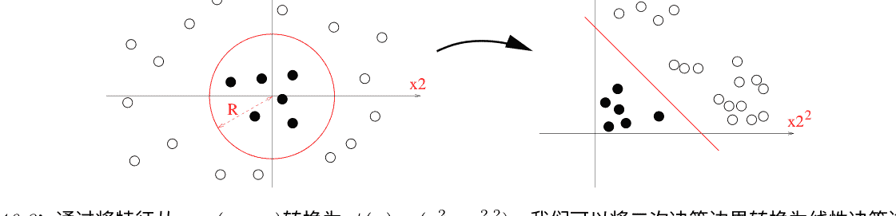

结果函数 \( f \) 在参数 \( \mathbf{w} \) 中仍然是线性的，这对于简化学习问题非常重要，我们将在第10.2.3节中看到。然而，通过学习特征提取器 \( \phi(\mathbf{x}) \) 的参数 \( \mathbf{w} \)，我们可以获得更多的能力；我们将在第三部分讨论如何做到这一点。在图10.3中，我们使用了特征的二次展开。我们还可以使用更高阶的多项式，就像在第1.2.2.2节中一样。在图1.7中，我们展示了在2维逻辑回归问题上使用多项式展开到 \( K \) 阶的效果。就像图1.7中一样，我们可以看到随着参数数量的增加，模型变得更加复杂，并最终导致过拟合。我们在第10.2.7节中讨论了减少过拟合的方法。

### 10.2.3 最大似然估计

在本节中，我们讨论如何使用最大似然估计来估计逻辑回归模型的参数。

#### 10.2.3.1 目标函数

负对数似然（乘以数据集大小 \( N \)）由以下公式给出（我们假设偏置项 \( b \) 被吸收到权重向量 \( \mathbf{w} \) 中）：

$$
\begin{aligned}
\text{NLL}(\mathbf{w}) &= -\frac{1}{N} \log p(\mathcal{D}|\mathbf{w}) = -\frac{1}{N} \log \prod_{n=1}^{N} \mathrm{Ber}(y_n|\mu_n) \\
&= -\frac{1}{N} \sum_{n=1}^{N} \log[\mu_n^{y_n} \times (1-\mu_n)^{1-y_n}] \\
&= -\frac{1}{N} \sum_{n=1}^{N} [y_n \log \mu_n + (1-y_n) \log(1-\mu_n)] \quad (10.8)\\
&= \frac{1}{N} \sum_{n=1}^{N} \mathbb{H}_{ce}(y_n, \mu_n) \quad (10.9)
\end{aligned}
$$

其中 \( \mu_n = \sigma(a_n) \) 是类别1的概率，\( a_n = \mathbf{w}^\top \mathbf{x}_n \) 是 logit，而 \( \mathbb{H}_{ce}(y_n, \mu_n) \) 是二元交叉熵的定义。

$$\mathbb{H}_{ce}(p, q) = -[p \log q + (1-p) \log(1-q)] \quad (10.10)$$

如果我们使用 \( \tilde{y}_n \in \{-1, +1\} \) 代替 \( y_n \in \{0, 1\} \)，那么我们可以将其重写为：

$$
\begin{aligned}
\text{NLL}(\mathbf{w}) &= -\frac{1}{N} \sum_{n=1}^{N} [\mathbb{I}(\tilde{y}_n = 1) \log(\sigma(a_n)) + \mathbb{I}(\tilde{y}_n = -1) \log(\sigma(-a_n))] \\
&= -\frac{1}{N} \sum_{n=1}^{N} \log(\sigma(\tilde{y}_n a_n)) \quad (10.12)\\
&= \frac{1}{N} \sum_{n=1}^{N} \log(1 + \exp(-\tilde{y}_n a_n)) \quad (10.13)
\end{aligned}
$$

然而，在本书中，我们将主要使用 \( y_n \in \{0, 1\} \) 表示法，因为它更容易推广到多类情况（第10.3节），并且更容易理解与交叉熵的关联。

#### 10.2.3.2 优化目标

为了找到MLE，我们必须解决

$$\nabla_{\mathbf{w}} \mathrm{NLL}(\mathbf{w}) = \mathbf{g}(\mathbf{w}) = \mathbf{0} \quad (10.14)$$

我们可以使用任何基于梯度的优化算法来解决这个问题，比如我们在第8章中讨论的那些算法。我们在第10.2.4节中给出一个具体的例子。但是首先我们必须推导出梯度，如下所述。

#### 10.2.3.3 推导梯度

虽然我们可以使用自动微分方法（第13.3节）来计算NLL的梯度，但我们也可以明确地进行计算，如下所示。幸运的是，得到的方程具有简单直观的解释，可以用来推导其他方法，我们将会看到。
首先，注意到

$$\frac{d\mu_n}{da_n} = \sigma(a_n)(1 - \sigma(a_n))$$

因此，根据链式法则（以及向量微积分的规则，在第7.8节中讨论），我们有

$$\frac{\partial}{\partial w_d} \mu_n = \frac{\partial}{\partial w_d} \sigma(\mathbf{w}^{\top} \mathbf{x}_n) = \frac{\partial}{\partial a_n} \sigma(a_n) \frac{\partial a_n}{\partial w_d} = \mu_n (1 - \mu_n) x_{nd}$$

通过在上述方程中使用输入 \( x_{n0}= 1 \)，可以以相同的方式推导出偏置项的梯度。然而，为了简单起见，我们将忽略偏置项。因此

$$\nabla_{\mathbf{w}} \log(\mu_n) = \frac{1}{\mu_n} \nabla_{\mathbf{w}} \mu_n = (1 - \mu_n) \mathbf{x}_n \quad (10.17)$$

同样地，

$$\nabla_{\mathbf{w}} \log(1 - \mu_n) = \frac{-\mu_n}{1 - \mu_n} \nabla_{\mathbf{w}} \mu_n = -\mu_n \mathbf{x}_n \quad (10.18)$$

因此，负对数似然函数的梯度向量为

$$
\begin{aligned}
\nabla_{\mathbf{w}} \text{NLL}(\mathbf{w}) &= -\frac{1}{N} \sum_{n=1}^{N} [y_n (1 - \mu_n) \mathbf{x}_n - (1 - y_n) \mu_n \mathbf{x}_n] \quad (10.19)\\
&= -\frac{1}{N} \sum_{n=1}^{N} [y_n \mathbf{x}_n - \mu_n \mathbf{x}_n] \quad (10.20)\\
&= \frac{1}{N} \sum_{n=1}^{N} (\mu_n - y_n) \mathbf{x}_n \quad (10.21)
\end{aligned}
$$

如果我们将 \( e_n = \mu_n - y_n \) 解释为一个错误信号，我们可以看到梯度通过加权每个输入 \( \mathbf{x}_n \) 的错误，并对结果进行平均。请注意，我们可以将梯度以矩阵形式重写如下：

$$\nabla_{\mathbf{w}} \text{NLL}(\mathbf{w}) = \frac{1}{N} \mathbf{1}_N^T (\text{diag}(\boldsymbol{\mu} - \mathbf{y}) \mathbf{X}) \quad (10.22)$$

其中 \( \mathbf{X} \) 是包含每行示例 \( \mathbf{x}_n \) 的 \( N \times D \) 设计矩阵。

#### 10.2.3.4 推导Hessian

基于梯度的优化器将找到一个使得 \( \mathbf{g}(\mathbf{w}) = \mathbf{0} \) 的稳定点。这可能是全局最优解，也可能是局部最优解。为了确保稳定点是全局最优解，我们必须证明目标函数是凸的，原因我们在8.1.1.1节中解释。直观上，这意味着NLL具有一个碗状形状，有一个唯一的最低点，这确实是事实，如图10.5b所示。

更正式地说，我们必须证明Hessian矩阵是半正定的，现在我们来证明。(有关线性代数的相关背景信息，请参见第7章。)可以证明Hessian矩阵由以下给出

$$\mathbf{H}(\mathbf{w}) = \nabla_{\mathbf{w}} \nabla_{\mathbf{w}}^\top \text{NLL}(\mathbf{w}) = \frac{1}{N} \sum_{n=1}^{N} \mu_n (1 - \mu_n) \mathbf{x}_n \mathbf{x}_n^\top = \frac{1}{N} \mathbf{X}^\top \mathbf{S} \mathbf{X} \quad (10.23)$$

其中

$$\mathbf{S} \triangleq \text{diag}(\mu_1 (1 - \mu_1), \ldots, \mu_N (1 - \mu_N)) \quad (10.24)$$

我们可以看到 \( \mathbf{H} \) 是正定的，因为对于任何非零向量 \( \boldsymbol{v} \)，我们有

$$
\boldsymbol{v}^{\top}\mathbf{X}^{\top}\mathbf{S}\mathbf{X}\boldsymbol{v} = (\boldsymbol{v}^{\top}\mathbf{X}^{\top}\mathbf{S}^{\frac{1}{2}})(\mathbf{S}^{\frac{1}{2}}\mathbf{X}\boldsymbol{v}) = \lVert \boldsymbol{v}^{\top}\mathbf{X}^{\top}\mathbf{S}^{\frac{1}{2}} \rVert_2^2 > 0 \quad \quad (10.25)
$$

这是因为 \( \mu_n > 0 \) 对于所有的 \( n \)，因为使用了*sigmoid*函数。因此，*NLL*是严格凸的。然而，在实践中，接近0或1的 \( \mu_n \) 的值可能导致*Hessian*矩阵接近奇异。我们可以通过使用 \( \ell_2 \) 正则化来避免这个问题，我们在第10.2.7节中讨论。

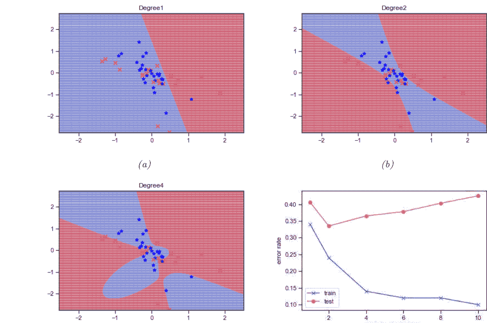

### 10.2.4 随机梯度下降

我们的目标是解决以下优化问题

$$\hat{\boldsymbol{w}} \triangleq \underset{\boldsymbol{w}}{\text{argmin}} \ \mathcal{L}(\boldsymbol{w}) \quad (10.26)$$

其中 \( \mathcal{L}(\boldsymbol{w}) \) 是损失函数，在这种情况下是负对数似然函数：

$$\text{NLL}(\boldsymbol{w}) = -\frac{1}{N}\sum_{n=1}^{N}[y_n \log \mu_n + (1 - y_n) \log(1-\mu_n)] \quad (10.27)$$

其中 \( \mu_n = \sigma(a_n) \) 是类别1的概率，而 \( a_n = \boldsymbol{w}^{\top}\boldsymbol{x}_n \) 是对数几率。有许多算法可以用来解决方程(10.26)，我们在第8章中讨论。也许最简单的方法是使用随机梯度下降（第8.4节）。如果我们使用大小为1的小批量，那么我们得到以下简单的更新方程：

$$\boldsymbol{w}_{t+1} = \boldsymbol{w}_t - \eta_t \nabla_{\boldsymbol{w}}\text{NLL}(\boldsymbol{w}_t) = \boldsymbol{w}_t - \eta_t(\mu_n - y_n)\boldsymbol{x}_n \quad (10.28)$$

| 作者 | Kevin P. Murphy。 |
| :--- | :--- |
| 版权所有 | (C) MIT Press. |
| 许可证 | CC-BY-NC-ND许可证 |

## 10.2.5 感知机算法

一个感知机，最早由[Ros58]引入，是以下形式的确定性二元分类器：

$ f(\boldsymbol{x}_{n} ; \boldsymbol{\theta})=\mathbb{I}\left(\boldsymbol{w}^{\top} \boldsymbol{x}_{n}+b>0\right) \quad (10.29) $

可以看出，这是二元逻辑回归分类器的一个极限情况，在该情况下，sigmoid函数 $ \sigma(a) $ 被阶跃函数 $ H(a) \triangleq \mathbb{I}(a>0) $ 所取代。请参见图2.10，对这两个函数进行比较。

由于阶跃函数不可微分，我们无法使用基于梯度的优化方法来拟合这个模型。然而，Rosenblatt提出了感知机学习算法来替代。基本思想是从随机权重开始，然后在模型犯下预测错误时迭代更新它们。更准确地说，我们使用以下方式更新权重：

$ \boldsymbol{w}_{t+1}=\boldsymbol{w}_{t}-\eta_{t}\left(\hat{y}_{n}-y_{n}\right) \boldsymbol{x}_{n} \quad (10.30) $

其中 $ (\boldsymbol{x}_{n}, y_{n}) $ 是在迭代 $ t $ 中采样的标记示例，$ \eta_{t} $ 是学习率或步长。（我们可以将步长设置为1，因为权重的大小不会影响决策边界。）请参阅 perceptron_demo_2d.ipynb，了解该算法的简单实现。感知机更新规则在方程（10.30）中具有直观的解释：如果预测是正确的，则不进行任何更改，否则我们将权重朝着使正确答案更有可能的方向移动。更准确地说，如果 $ y_{n}=1 $ 且 $ \hat{y}_{n}=0 $，我们有 $ \boldsymbol{w}_{t+1}=\boldsymbol{w}_{t}+\boldsymbol{x}_{n} $，如果 $ y_{n}=0 $ 且 $ \hat{y}_{n}=1 $，我们有 $ \boldsymbol{w}_{t+1}=\boldsymbol{w}_{t}-\boldsymbol{x}_{n} $。

通过将方程（10.30）与方程（10.28）进行比较，我们可以看到感知机更新规则等价于使用近似值的二元逻辑回归的SGD更新规则，其中我们用硬标签 $ \hat{y}_{n}=f\left(\boldsymbol{x}_{n}\right) $ 替换了软概率 $ \mu_{n}=p\left(y_{n}=1 \mid \boldsymbol{x}_{n}\right) $。感知机方法的优点是我们不需要计算概率，这在标签空间非常大时非常有用。缺点是该方法只在数据线性可分时收敛[Nov62]，而用于最小化逻辑回归的NLL的SGD将始终收敛到全局最优MLE，即使数据不是线性可分的。

在第13.2节中，我们将感知机推广到非线性函数，从而显著增强其实用性。

### 10.2.6 迭代重新加权最小二乘法

梯度下降是一种一阶优化方法，这意味着它只使用一阶梯度来在损失空间中导航。这可能会很慢，特别是当空间的某些方向陡然下降，而其他方向的梯度较浅时，就像图10.5a中的情况一样。在这种问题中，使用二阶优化方法可以更快地考虑空间的曲率。

我们在第8.3节中更详细地讨论这些方法。在这里，我们只考虑适用于逻辑回归的简单二阶方法。我们专注于完整批处理设置（因此我们假设 N很小），因为在随机设置中很难使二阶方法起作用（参见例如[Byr+16; Liu+18b]中的一些方法）。

经典的二阶方法是牛顿法。它的更新形式如下

$$ w_{t+1} = w_t - \eta_t \mathbf{H}_t^{-1} g_t $$

其中

$$ \mathbf{H}_t \triangleq \nabla^2 \mathcal{L}(w)|_{w_t} = \nabla^2 \mathcal{L}(w_t) = \mathbf{H}(w_t) $$

假设为正定以确保更新是良定义的。如果海森矩阵是精确的，我们可以将步长设置为 $\eta_t=1$。

现在我们将这种方法应用于逻辑回归。回顾第10.2.3.3节中给出的梯度和海森矩阵

$$ \nabla_{\boldsymbol{w}} \mathrm{NLL}(\boldsymbol{w}) = \frac{1}{N} \sum_{n=1}^{N} (\mu_n - y_n) \boldsymbol{x}_n $$

$$ \mathbf{H} = \frac{1}{N} \mathbf{X}^\mathsf{T} \mathbf{S} \mathbf{X} $$

$$ \mathbf{S} \triangleq \mathrm{diag}(\mu_1(1-\mu_1), \ldots, \mu_N(1-\mu_N)) $$

因此，牛顿更新的形式为

$$ \boldsymbol{w}_{t+1} = \boldsymbol{w}_t - \mathbf{H}^{-1} \boldsymbol{g}_t \\ = \boldsymbol{w}_t + (\mathbf{X}^\mathsf{T} \mathbf{S}_t \mathbf{X})^{-1} \mathbf{X}^\mathsf{T} (\boldsymbol{y} - \boldsymbol{\mu}_t) \\ = (\mathbf{X}^\mathsf{T} \mathbf{S}_t \mathbf{X})^{-1} [(\mathbf{X}^\mathsf{T} \mathbf{S}_t \mathbf{X}) \boldsymbol{w}_t + \mathbf{X}^\mathsf{T} (\boldsymbol{y} - \boldsymbol{\mu}_t)] \\ = (\mathbf{X}^\mathsf{T} \mathbf{S}_t \mathbf{X})^{-1} \mathbf{X}^\mathsf{T} [\mathbf{S}_t \mathbf{X} \boldsymbol{w}_t + \boldsymbol{y} - \boldsymbol{\mu}_t] \\ = (\mathbf{X}^\mathsf{T} \mathbf{S}_t \mathbf{X})^{-1} \mathbf{X}^\mathsf{T} \mathbf{S}_t \boldsymbol{z}_t $$

其中我们定义了 working response 为

$$ \boldsymbol{z}_t \triangleq \mathbf{X} \boldsymbol{w}_t + \mathbf{S}_t^{-1} (\boldsymbol{y} - \boldsymbol{\mu}_t) $$

并且 $\mathbf{S}_t = \mathrm{diag}(\mu_{t,n}(1-\mu_{t,n}))$。由于 $\mathbf{S}_t$ 是一个对角矩阵，我们可以将目标重新表示为组件形式，如下所示：

$$ z_{t,n} = \boldsymbol{w}_t^\mathsf{T} \boldsymbol{x}_n + \frac{y_n - \mu_{t,n}}{\mu_{t,n}(1-\mu_{t,n})} $$

方程 (10.40) 是加权最小二乘问题的一个示例（第11.2.2.4节），它最小化

$$ \sum_{n=1}^{N} s_{t,n} (z_{t,n} - \boldsymbol{w}_t^\mathsf{T} \boldsymbol{x}_n)^2 $$

## 算法10.1: 迭代重新加权最小二乘法 (IRLS)

```
1 \(\boldsymbol{w} = \mathbf{0}\)
2 重复
3   对于 \(n = 1:N\) 执行
4     \(a_n = \boldsymbol{w}^\top \boldsymbol{x}_n\)
5     \(\mu_n = \sigma(a_n)\)
6     \(s_n = \mu_n(1 - \mu_n)\)
7     \(z_n = a_n + \frac{y_n - \mu_n}{s_n}\)
8   \(\mathbf{S} = \text{diag}(s_{1:N})\)
9   \(\boldsymbol{w} = (\mathbf{X}^\top\mathbf{S}\mathbf{X})^{-1}\mathbf{X}^\top\mathbf{S}\boldsymbol{z}\)
10 直到收敛
```

因此，整体方法被称为迭代重新加权最小二乘法（IRLS）算法，因为在每次迭代中，我们解决一个加权最小二乘问题，其中权重矩阵 $\mathbf{S}_t$ 在每次迭代中发生变化。请参见算法10.1的伪代码。

请注意，**Fisher scoring** 与IRLS相同，只是我们用期望替换了实际对数似然函数的 **Hessian** 矩阵，即我们使用 **Fisher** 信息矩阵（第4.7.2节）而不是 **H** 矩阵。由于 **Fisher** 信息矩阵与数据无关，可以预先计算，而 **Hessian** 矩阵必须在每次迭代中重新评估。对于参数较多的问题，这样做可能更快。

### 10.2.7 最大后验估计

在图10.4中，我们看到当参数比训练样本多时，逻辑回归可能会过拟合。这是最大似然估计能够找到使决策边界“摆动”以便围绕示例曲线的权重的能力的结果。为了实现这种行为，通常需要将权重设置为较大的值。例如，在图10.4中，当我们使用 $K = 1$ 时，忽略偏差，我们发现两个输入权重的最大似然估计为
$$ \hat{\boldsymbol{w}} = [0.51291712, 0.11866937] \tag{10.44} $$

当我们使用 $K = 2$ 时，我们得到
$$ \hat{\boldsymbol{w}} = [2.27510513, 0.05970325, 11.84198867, 15.40355969, 2.51242311] \tag{10.45} $$

而当 $K = 4$ 时，我们得到
$$ \hat{\boldsymbol{w}} = [-3.07813766, \cdots, -59.03196044, 51.77152431, 10.25054164] \tag{10.46} $$

减少过拟合的一种方法是防止权重变得过大。我们可以通过使用零均值的高斯先验分布，$p(\boldsymbol{w}) = \mathcal{N}(\boldsymbol{w}|\mathbf{0}, c\mathbf{I})$，然后使用MAP估计，如我们在第4.5.3节中讨论的那样。新的训练目标变为
$$ \mathcal{L}(\boldsymbol{w}) = \text{NLL}(\boldsymbol{w}) + \lambda\|\boldsymbol{w}\|_2^2 \tag{10.47} $$

这被称为 $\ell_2$ 正则化或权重衰减。 $\lambda$ 的值越大，参数被惩罚得越多，因为它们“大”（偏离零均值先验），因此模型的灵活性越小。 有关说明，请参见图10.6。我们可以通过稍微修改上述基于梯度的优化算法的输入来计算MAP估计。 惩罚的负对数似然的梯度和Hessian矩阵具有以下形式：

$$ \text{PNLL}(\boldsymbol{w}) = \text{NLL}(\boldsymbol{w}) + \lambda \boldsymbol{w}^{\top}\boldsymbol{w} \tag{10.48} $$
$$ \nabla_{\boldsymbol{w}}\text{PNLL}(\boldsymbol{w}) = \boldsymbol{g}(\boldsymbol{w}) + 2\lambda\boldsymbol{w} \tag{10.49} $$
$$ \nabla^{2}_{\boldsymbol{w}}\text{PNLL}(\boldsymbol{w}) = \mathbf{H}(\boldsymbol{w}) + 2\lambda\mathbf{I} \tag{10.50} $$

其中 $\boldsymbol{g}(\boldsymbol{w})$ 是未惩罚的NLL的梯度， $\mathbf{H}(\boldsymbol{w})$ 是未惩罚的NLL的Hessian矩阵。
对于与 $\ell_2$ 正则化逻辑回归相关的有趣练习，请参见练习10.2。

图10.6: 应用方差 $C$ 的权重衰减到二分类、二维逻辑回归问题的多项式4次方。 (a) $C= 1$. (b) $C= 316$. (c) $C= 100,000$. (d) 训练和测试误差 vs $C$。由 `logreg_poly_demo.ipynb` 生成。

### 10.2.8 标准化

在第10.2.7节中，我们使用各向同性先验 $\mathcal{N}(\boldsymbol{w}|\boldsymbol{0}, \lambda^{-1}\mathbf{I})$ 来防止过拟合。 这隐含地表达了我们期望所有权重具有相似的大小的假设，进而隐含地表达了我们期望所有输入特征具有相似的大小的假设。 然而，在许多数据集中，输入特征具有不同的尺度。 在这种情况下，通常会对数据进行标准化，以确保每个特征的均值为0，方差为1。 我们可以通过减去均值并除以每个特征的标准差来实现这一点，如下所示：

标准化
$$ x_{nd}^{\text{new}} = \frac{x_{nd} - \hat{\mu}_d}{\hat{\sigma}_d} \tag{10.51} $$
$$ \hat{\mu}_d = \frac{1}{N} \sum_{n=1}^{N} x_{nd} \tag{10.52} $$
$$ \hat{\sigma}_d^2 = \frac{1}{N} \sum_{n=1}^{N} (x_{nd} - \hat{\mu}_d)^2 \tag{10.53} $$

另一种方法是使用最小-最大缩放，将输入重新缩放到区间[0, 1]。 这两种方法都确保特征的数量级是可比较的，即使我们不使用MAP估计，也可以帮助模型拟合和推断。（详见第11.7.5节对此问题的讨论。）

## 10.3 多项式逻辑回归

多项式逻辑回归是以下形式的判别分类模型：
$$ p(y|\boldsymbol{x}, \boldsymbol{\theta}) = \text{Cat}(y|\text{softmax}(\mathbf{W}\boldsymbol{x} + \boldsymbol{b})) \tag{10.54} $$

其中 $\boldsymbol{x} \in \mathbb{R}^D$ 是输入向量， $y \in \{1, \ldots, C\}$ 是类别标签， $\text{softmax}()$ 是softmax函数（第2.5节）， $\mathbf{W}$ 是一个 $C \times D$ 权重矩阵， $\boldsymbol{b}$ 是一个 $C$ 维偏置向量， $\boldsymbol{\theta} = (\mathbf{W}, \boldsymbol{b})$ 是所有参数。（我们将假设我们已经在每个 $\boldsymbol{x}$ 之前添加了一个1，并将 $\boldsymbol{b}$ 添加到 $\mathbf{W}$ 的第一列，因此这简化为 $\boldsymbol{\theta} = \mathbf{W}$。）

如果我们让 $\boldsymbol{a} = \mathbf{W}\boldsymbol{x}$ 成为 $C$ 维向量的logits，那么我们可以将上述重写为：
$$ p(y=c|\boldsymbol{x}, \boldsymbol{\theta}) = \frac{e^{a_c}}{\sum_{c'=1}^{C} e^{a_{c'}}} \tag{10.55} $$

由于归一化条件 $\sum_{c=1}^{C} p(y_n=c|\boldsymbol{x}_n, \boldsymbol{\theta}) = 1$，我们可以设置 $\boldsymbol{w}^C = \boldsymbol{0}$。（例如，在二元逻辑回归中，其中 $C = 2$，我们只学习一个单一的权重向量。）因此，参数 $\boldsymbol{\theta}$ 对应于一个大小为 $(C-1) \times D$ 的权重矩阵 $\mathbf{W}$，其中 $\boldsymbol{x}_n \in \mathbb{R}^D$。注意，该模型假设标签是互斥的，即只有一个真实标签。对于某些应用（例如图像标记），我们希望预测一个或多个输入的标签；在这种情况下，输出空间是集合 $\{1, \ldots, C\}$ 的子集。这被称为多标签分类，与多类分类相对。这可以看作是一个位向量， $\mathcal{Y} = \{0, 1\}^C$，其中第 $c$ 个输出设置为1，如果第 $c$ 个标签存在。我们可以使用修改版本的方法来解决这个问题

## 具有多个输出的二元逻辑回归:

$$ p(y|\boldsymbol{x}, \boldsymbol{\theta}) = \prod_{c=1}^{C} \text{Ber}(y_c|\sigma(\boldsymbol{w}_c^\top \boldsymbol{x})) \quad (10.56) $$

### 10.3.1 线性和非线性分类器

逻辑回归在输入空间中计算线性决策边界，如图10.7(a)所示，其中 $\boldsymbol{x} \in \mathbb{R}^2$ 并且我们有 $C= 3$ 个类别。 然而，我们总是可以以某种方式转换输入，以创建非线性边界。 例如，假设我们用 $\boldsymbol{x}=(x_1, x_2)$ 替换

$$ \phi(\boldsymbol{x}) = [1, x_1, x_2, x_1^2, x_2^2, x_1 x_2] \quad (10.57) $$

这使我们能够创建二次决策边界，如图10.7(b)所示。

### 10.3.2 最大似然估计

在本节中，我们讨论如何通过最小化负对数似然（NLL）来计算最大似然估计（MLE）。

### 10.3.2.1 目标

负对数似然（NLL）由以下公式给出

$$ \text{NLL}(\boldsymbol{\theta}) = -\frac{1}{N} \log \prod_{n=1}^{N} \prod_{c=1}^{C} \mu_{nc}^{y_{nc}} = -\frac{1}{N} \sum_{n=1}^{N} \sum_{c=1}^{C} y_{nc} \log \mu_{nc} = \frac{1}{N} \sum_{n=1}^{N} \mathbb{H}_{ce}(\boldsymbol{y}_n, \boldsymbol{\mu}_n) \quad (10.58) $$其中 $\mu_{nc} = p(y_{nc}=1|\boldsymbol{x}_n, \boldsymbol{\theta}) = \text{softmax}(f(\boldsymbol{x}_n, \boldsymbol{\theta}))_c$, $\boldsymbol{y}_n$是标签的独热编码（所以 $y_{nc} = \mathbb{I}(y_n = c)$），$\mathbb{H}_{ce}(\boldsymbol{y}_n, \boldsymbol{\mu}_n)$是交叉熵：

$$\mathbb{H}_{ce}(\boldsymbol{p}, \boldsymbol{q}) = -\sum_{c=1}^C p_c \log q_c$$

### 10.3.2.2 优化目标

为了找到最优解，我们需要解决 $\nabla_w \text{NLL}(w) = 0$的问题，其中 $w$是权重矩阵 $\mathbf{W}$的向量化版本，为了简化符号，我们忽略了偏置项。我们可以使用任何基于梯度的优化器找到这样的稳定点；下面给出一些示例。但首先我们需要推导出梯度和海森矩阵，并证明目标函数是凸函数。

### 10.3.2.3 推导梯度

为了推导出负对数似然函数的梯度，我们需要使用softmax函数的雅可比矩阵，如下所示（参见练习10.1的证明）：

$$\frac{\partial \mu_c}{\partial a_j} = \mu_c (\delta_{cj} - \mu_j)$$

例如，如果我们有3个类别，那么雅可比矩阵为

$$\begin{bmatrix} \frac{\partial \mu_c}{\partial a_j} \end{bmatrix}_{cj} = \begin{pmatrix} \mu_1(1-\mu_1) & -\mu_1\mu_2 & -\mu_1\mu_3 \\ -\mu_2\mu_1 & \mu_2(1-\mu_2) & -\mu_2\mu_3 \\ -\mu_3\mu_1 & -\mu_3\mu_2 & \mu_3(1-\mu_3) \end{pmatrix}$$

以矩阵形式，可以写成

$$\frac{\partial \boldsymbol{\mu}}{\partial \boldsymbol{a}} = (\boldsymbol{\mu} \mathbf{1}^{\top}) \odot (\mathbf{I} - \mathbf{1} \boldsymbol{\mu}^{\top})$$

其中，$\odot$表示逐元素乘积，$\boldsymbol{\mu} \mathbf{1}^{\top}$将 $\boldsymbol{\mu}$复制到每一列，$\mathbf{1} \boldsymbol{\mu}^{\top}$将 $\boldsymbol{\mu}$复制到每一行。

现在我们推导出单个示例（由索引 $n$标记）的NLL梯度。为此，我们将 $D \times C$权重矩阵展平为大小为 $CD$的向量 $\boldsymbol{w}$（如果我们将其中一个类别的权重设为零，则为 $(C-1)D$），通过连接行，然后转置为列向量。我们用 $w_j$表示与类别 $j$相关联的权重向量。对于这个向量的梯度由以下给出。

## 10.3. 多项式逻辑回归

以下是我们使用Kronecker delta符号 \( \delta_{jc} \)的情况，其中 \( j = c \)时等于1，否则等于0：

$$ \nabla_{w_j} \text{NLL}_n = \sum_c \frac{\partial \text{NLL}_n}{\partial \mu_{nc}} \frac{\partial \mu_{nc}}{\partial a_{nj}} \frac{\partial a_{nj}}{\partial w_j}  \quad (10.63) $$

$$ = -\sum_c \frac{y_{nc}}{\mu_{nc}} \mu_{nc}(\delta_{jc} - \mu_{nj}) x_n \quad (10.64) $$

$$ = \sum_c y_{nc}(\mu_{nj} - \delta_{jc}) x_n \quad (10.65) $$

$$ = (\sum_c y_{nc}) \mu_{nj} x_n - \sum_c \delta_{jc} y_{nj} x_n \quad (10.66) $$

$$ = (\mu_{nj} - y_{nj}) x_n \quad (10.67) $$

我们可以对每个类别重复这个计算，得到完整的梯度向量。整体NLL的梯度通过对示例求和得到，得到 \( D \times C \)矩阵

$$ g(w) = \frac{1}{N} \sum_{n=1}^N x_n (\mu_n - y_n)^T \quad (10.68) $$

这与二元逻辑回归情况下的形式相同，即一个误差项乘以输入。

### 10.3.2.4 推导 Hessian

练习10.1要求你证明多项式逻辑回归的NLL的Hessian矩阵是给定的

$$ \mathbf{H}(w) = \frac{1}{N} \sum_{n=1}^N (\text{diag}(\boldsymbol{\mu}_n) - \boldsymbol{\mu}_n \boldsymbol{\mu}_n^T) \otimes (x_n x_n^T) \quad (10.69) $$

其中 \( \mathbf{A} \otimes \mathbf{B} \)是Kronecker积（第7.2.5节）。换句话说，块 \( c, c' \)子矩阵是给定的

$$ \mathbf{H}_{c,c'}(w) = \frac{1}{N} \sum_n \mu_{nc} (\delta_{c,c'} - \mu_{n,c'}) x_n x_n^T \quad (10.70) $$

例如，如果我们有3个特征和2个类别，那么这将变为

$$ \mathbf{H}(w) = \frac{1}{N} \sum_n \begin{pmatrix} \mu_{n1} - \mu_{n1}^2 & -\mu_{n1} \mu_{n2} \\ -\mu_{n1} \mu_{n2} & \mu_{n2} - \mu_{n2}^2 \end{pmatrix} \otimes \begin{pmatrix} x_{n1}x_{n1} & x_{n1}x_{n2} & x_{n1}x_{n3} \\ x_{n2}x_{n1} & x_{n2}x_{n2} & x_{n2}x_{n3} \\ x_{n3}x_{n1} & x_{n3}x_{n2} & x_{n3}x_{n3} \end{pmatrix} \quad (10.71) $$

$$ = \frac{1}{N} \sum_n \begin{pmatrix} (\mu_{n1} - \mu_{n1}^2)\mathbf{X}_n & -\mu_{n1} \mu_{n2} \mathbf{X}_n \\ -\mu_{n1} \mu_{n2} \mathbf{X}_n & (\mu_{n2} - \mu_{n2}^2)\mathbf{X}_n \end{pmatrix} \quad (10.72) $$

练习10.1还要求您证明这是一个正定矩阵，因此目标是凸的。

### 10.3.3 基于梯度的优化

使用第10.3.2.3节中的梯度很容易推导出SGD算法。同样地，我们可以使用第10.3.2.4节中的Hessian推导出二阶优化方法。然而，计算Hessian矩阵可能很昂贵，因此常常使用拟牛顿方法来近似计算，例如有限内存BFGS。（BFGS代表Broyden，Fletcher，Goldfarb和Shanno。）详见第8.3.2节。另一种方法，类似于IRLS，见第10.3.4节。所有这些方法都依赖于计算对数似然的梯度，而计算梯度又需要计算归一化概率，可以使用logits向量 $a = Wx$ 来计算。

$$ p(y = c|\boldsymbol{x}) = \exp(a_c - \text{lse}(\boldsymbol{a})) \tag{10.73} $$

其中lse是在第2.5.4节中定义的对数和指数函数。因此，许多软件库定义了一个以未归一化的logits作为输入的交叉熵损失的版本。

### 10.3.4 边界优化

在本节中，我们考虑了一种使用一类称为边界优化的算法来拟合逻辑回归的方法，我们在第8.7节中进行了描述。基本思想是迭代地构建一个对要最大化的函数的下界，然后更新该下界，使其对真实函数产生“推动”。优化边界通常比直接更新函数更容易。

如果 $\ell(\boldsymbol{\theta})$ 是一个我们想要最大化的凹函数，那么获得一个有效的下界的一种方法是使用它的Hessian的一个边界，即找到一个负定的矩阵 $\mathbf{B}$，使得 $\mathbf{H}(\boldsymbol{\theta}) \succ \mathbf{B}$。在这种情况下，可以证明

$$ \ell(\boldsymbol{\theta}) \geq \ell(\boldsymbol{\theta}^t) + (\boldsymbol{\theta} - \boldsymbol{\theta}^t)^\top \boldsymbol{g}(\boldsymbol{\theta}^t) + \frac{1}{2} (\boldsymbol{\theta} - \boldsymbol{\theta}^t)^\top \mathbf{B} (\boldsymbol{\theta} - \boldsymbol{\theta}^t) \tag{10.74} $$

将方程 (10.74) 的右侧定义为 $Q(\boldsymbol{\theta}, \boldsymbol{\theta}^t)$，更新变为

$$ \boldsymbol{\theta}^{t+1} = \boldsymbol{\theta}^t - \mathbf{B}^{-1} \boldsymbol{g}(\boldsymbol{\theta}^t) \tag{10.75} $$

这类似于牛顿更新，只是我们使用固定矩阵B，而不是在每次迭代中改变的 $\mathbf{H}(\boldsymbol{\theta}^t)$。这可以在较低的计算成本下给我们一些二阶方法的优势。

现在让我们将其应用于逻辑回归，参考[Kri+05]，令 $\boldsymbol{\mu}_n(\boldsymbol{w}) = [p(y_n=1|\boldsymbol{x}_n,\boldsymbol{w}), \ldots, p(y_n=C|\boldsymbol{x}_n,\boldsymbol{w})]$ 和 $\boldsymbol{y}_n = [\mathbb{I}(y_n=1), \ldots, \mathbb{I}(y_n=C)]$。我们想要最大化对数似然函数，如下所示:

$$ \ell(\boldsymbol{w}) = \sum_{n=1}^N \left[ \sum_{c=1}^C y_{nc} \boldsymbol{w}_c^\top \boldsymbol{x}_n - \log \sum_{c=1}^C \exp(\boldsymbol{w}_c^\top \boldsymbol{x}_n) \right] \tag{10.76} $$

梯度由以下公式给出（详见第10.3.2.3节的推导）：

$$ \boldsymbol{g}(\boldsymbol{w}) = \sum_{n=1}^N (\boldsymbol{y}_n - \boldsymbol{\mu}_n(\boldsymbol{w})) \otimes \boldsymbol{x}_n \tag{10.77} $$

其中 ⊗ 表示克罗内克积（在这种情况下，它只是两个向量的外积）。海森矩阵由以下公式给出（详见第10.3.2.4节中的推导细节）：

$$ \mathbf{H}(\mathbf{w}) = -\sum_{n=1}^{N} \left( \text{diag}(\boldsymbol{\mu}_n(\mathbf{w})) - \boldsymbol{\mu}_n(\mathbf{w}) \boldsymbol{\mu}_n(\mathbf{w})^{\top} \right) \otimes (\mathbf{x}_n \mathbf{x}_n^{\top}) \quad (10.78) $$

我们可以构建海森矩阵的一个下界，如[Boh92]所示：

$$ \mathbf{H}(\mathbf{w}) \succcurlyeq -\frac{1}{2} \left[ \mathbf{I} - \mathbf{1}\mathbf{1}^{\top}/C \right] \otimes \left( \sum_{n=1}^{N} \mathbf{x}_n \mathbf{x}_n^{\top} \right) \triangleq \mathbf{B} \quad (10.79) $$

其中 I 是一个 C维单位矩阵，1 是一个 C维全1向量。在二进制情况下，这变为

$$ \mathbf{H}(\mathbf{w}) \succcurlyeq -\frac{1}{2} \left( 1 - \frac{1}{2} \right) \left( \sum_{n=1}^{N} \mathbf{x}_n \mathbf{x}_n^{\top} \right) = -\frac{1}{4} \mathbf{X}^{\top} \mathbf{X} \quad (10.80) $$

这是因为 μ_n ≤ 0.5 所以 - (μ_n - μ_n^2) ≥ -0.25。我们可以使用这个下界来构建一个MM算法来找到MLE。更新变为

$$ \mathbf{w}^{t+1} = \mathbf{w}^t - \mathbf{B}^{-1} \mathbf{g}(\mathbf{w}^t) \quad (10.81) $$

这个迭代可以比IRLS（第10.2.6节）更快，因为我们可以预先计算 B^{-1} 而不是在每次迭代中都要求解Hessian矩阵。例如，让我们考虑二进制情况，所以 g^t = ∇ℓ(w^t) = X^T (y - μ^t), 其中 μ^t = [p_n(w^t), (1 - p_n(w^t))]^N_{n=1}. 更新变为

$$ \mathbf{w}^{t+1} = \mathbf{w}^t - 4 (\mathbf{X}^{\top} \mathbf{X})^{-1} \mathbf{g}^t \quad (10.82) $$

将此与方程（10.37）进行比较，其形式如下：

$$ \mathbf{w}^{t+1} = \mathbf{w}^t - \mathbf{H}^{-1} \mathbf{g}(\mathbf{w}^t) = \mathbf{w}^t - (\mathbf{X}^{\top} \mathbf{S}^t \mathbf{X})^{-1} \mathbf{g}^t \quad (10.83) $$

其中 S^t = diag(μ^t (1 - μ^t)). 我们可以看到方程（10.82）的计算速度更快，因为我们可以预先计算常数矩阵 (X^T X)^{-1}.

### 10.3.5 最大后验估计

在第10.2.7节中，我们讨论了二元逻辑回归的 ℓ_2 正则化的好处。这些好处在多类情况下也成立。然而，还有一个额外的、令人惊讶的好处与参数的可识别性有关，正如[HTF09, Ex.18.3]中指出的那样。（我们说参数是可识别的，如果存在一个唯一的值使得似然函数最大化；等价地，我们要求NLL是严格凸的。）

为了理解为什么可辨识性是一个问题，回想一下多类别逻辑回归的形式

> $$p(y = c|\boldsymbol{x}, \mathbf{W}) = \frac{\exp(\boldsymbol{w}_{c}^{T}\boldsymbol{x})}{\sum_{k=1}^{C} \exp(\boldsymbol{w}_{k}^{T}\boldsymbol{x})}$$
(10.84)

其中 $\mathbf{W}$ 是一个 $C \times D$ 的权重矩阵。我们可以任意定义 $\boldsymbol{w}_{c}=\mathbf{0}$ 为其中一个类别，比如说 $c=C$，因为 $p(y=C|\boldsymbol{x}, \mathbf{W}) = 1 - \sum_{c=1}^{C-1} p(y=c|\boldsymbol{x}, \boldsymbol{w})$。在这种情况下，模型的形式为

> $$p(y = c|\boldsymbol{x}, \mathbf{W}) = \frac{\exp(\boldsymbol{w}_{c}^{T}\boldsymbol{x})}{1 + \sum_{k=1}^{C-1} \exp(\boldsymbol{w}_{k}^{T}\boldsymbol{x})}$$
(10.85)

如果我们不将其中一个向量“固定”为某个常数值，参数将无法辨识。
然而，假设我们不夹紧 $\boldsymbol{w}$ 和 $\boldsymbol{c}=0$，所以我们使用方程10.84，但我们通过优化来添加 $L_{2}$ 个正则化

> $$\text{PNLL}(\mathbf{W}) = -\sum_{n=1}^{N}\log p(y|\boldsymbol{x}_{n}, \mathbf{W}) + \lambda\sum_{c=1}^{C}\|\boldsymbol{w}_{c}\|_{2}^{2}$$
(10.86)

其中我们已经将 $1/N$ 项吸收到 $\lambda$ 中。在最优解处，我们有 $\sum_{c=1}^{C} \hat{\boldsymbol{w}}_{c}\boldsymbol{j}=0$ for $j=1:D$，因此权重自动满足零和约束，从而使它们唯一可识别。
为了看清楚为什么，在最优解处我们有

> $$\nabla\text{NLL}(\boldsymbol{w}) + 2\lambda\boldsymbol{w} = \mathbf{0}$$
(10.87)
> $$\sum_{n}(\boldsymbol{y}_{n}-\boldsymbol{\mu}_{n})\otimes\boldsymbol{x}_{n}=\lambda\boldsymbol{w}$$
(10.88)

因此，对于任何特征维度 $j$，我们有

> $$\lambda\sum_{c}w_{cj} = \sum_{n}\sum_{c}(y_{nc} - \mu_{nc})x_{nj} = \sum_{n}(\sum_{c}y_{nc} - \sum_{c}\mu_{nc})x_{nj} = \sum_{n}(1-1)x_{nj} = 0$$
(10.89)

因此，如果 $\lambda > 0$，我们有 $\sum_{c}\hat{w}_{cj}=0$，因此每个特征维度上的权重在各个类别中总和为零。

### 10.3.6 最大熵分类器

回想一下，多项式逻辑回归模型可以写成

> $$p(y = c|\boldsymbol{x}, \mathbf{W}) = \frac{\exp(\boldsymbol{w}_{c}^{T}\boldsymbol{x})}{Z(\boldsymbol{w}, \boldsymbol{x})} = \frac{\exp(\boldsymbol{w}_{c}^{T}\boldsymbol{x})}{\sum_{c'=1}^{C}\exp(\boldsymbol{w}_{c'}^{T}\boldsymbol{x})}$$
(10.90)

其中 $Z(\boldsymbol{w}, \boldsymbol{x}) = \sum_{c}\exp(\boldsymbol{w}_{c}^{T}\boldsymbol{x})$ 是分区函数（归一化常数）。这使用了相同的特征，但对于每个类别使用了不同的权重向量。这个模型的一个小扩展允许我们使用与类别相关的特征。这个模型可以写成

> $$p(y = c|\boldsymbol{x}, \boldsymbol{w}) = \frac{1}{Z(\boldsymbol{w}, \boldsymbol{x})}\exp(\boldsymbol{w}^{T}\phi(\boldsymbol{x}, c))$$
(10.91)其中 $\phi(x, c)$ 是类别 $c$ 的特征向量。这被称为最大熵分类器，简称为最大熵分类器。（这个术语的起源在第3.4.4节中有解释。）最大熵分类器包括多项式逻辑回归作为一种特殊情况。为了看到这一点，让 $w = [w_1, ..., w_C]$，并定义特征向量如下：

$$
\phi(\boldsymbol{x}, c) = [\boldsymbol{0}, ..., \boldsymbol{x}, ..., \boldsymbol{0}]
\qquad\qquad (10.92)
$$

其中 $\boldsymbol{x}$ 嵌入在第 $c$ 个块中，其余块为零。在这种情况下， $w^{\top} \phi(\boldsymbol{x}, c) = w_c^{\top} \boldsymbol{x}$，因此我们恢复了多项式逻辑回归。

最大熵分类器在自然语言处理领域被广泛使用。例如，考虑语义角色标注问题，我们将一个词 $\boldsymbol{x}$ 分类为一个语义角色 $y$，例如人物、地点或物品。我们可以定义（二进制）特征如下：

$$
\begin{aligned}
\phi_1(\boldsymbol{x}, y) &= \mathbb{I}(y = \text{person} \wedge \boldsymbol{x} \text{ 出现在“Mr.”或“Mrs.”之后 } ) & \qquad& (10.93) \\
\phi_2(\boldsymbol{x}, y) &= \mathbb{I}(y = \text{person} \wedge \boldsymbol{x} \text{在常见名字白名单中}) & \qquad& (10.94) \\
\phi_3(\boldsymbol{x}, y) &= \mathbb{I}(y = \text{place} \wedge \boldsymbol{x} \text{ is in Google maps}) & \qquad& (10.95) \\
&\vdots & &
\end{aligned}
$$

我们看到我们使用的特征取决于标签。

创建这些特征有两种主要方法。第一种方法是手动指定许多可能有用的特征，使用各种模板，然后使用特征选择算法，例如第11.4.7节的组套索方法。第二种方法是逐步向模型添加特征，使用启发式特征生成方法。

### 10.3.7 分层分类

有时，可能的标签集可以被组织成一个层次结构或分类法。例如，我们可能想要预测图像中是什么类型的动物：它可能是一只狗或一只猫；如果是一只狗，它可能是一只金毛寻回犬或一只德国牧羊犬等。直观上讲，我们应该尽量预测我们有信心的最精确的标签[Den+12]，也就是说，系统应该“保留自己的选择”。

一种简单的实现方法是在[RF17]中提出的。首先，在树中的每个可能节点上创建一个具有二进制输出标签的模型。在训练模型之前，我们将使用标签扩散，使得标签传播到其所有父节点（上位词）。例如，如果一张图片被标记为“金毛寻回犬”，我们也会将其标记为“狗”。如果我们在这样扩散的数据上训练一个多标签分类器（产生一个二进制标签的向量 p(y|x)），它将执行分层分类，预测不同抽象层次上的一组标签。

然而，这种方法可能会以1.0的概率预测“金毛寻回犬”、“猫”和“鸟”，因为模型没有捕捉到一些标签是互斥的事实。为了防止这种情况，我们可以在兄弟节点之间添加互斥约束，如图10.8所示。例如，该模型强制要求 p(哺乳动物|x) + p(鸟类|x) = 1，因为这两个标签是根节点的子节点。我们还可以将哺乳动物的概率进一步分为狗和猫，所以我们有 p(狗|x) + p(猫|x) = p(哺乳动物|x)。

[Den+14; Din+15]通过使用条件图模型推广了上述方法，其中图结构可以比树更复杂。此外，它们允许在标签之间存在软约束，而不仅仅是硬约束。

### 10.3.8 处理大量类别

在本节中，我们讨论了当存在大量潜在标签时出现的一些问题，例如，如果标签对应于语言中的单词。

### 10.3.8.1 分层softmax

在常规softmax分类器中，计算归一化常数（用于计算对数似然梯度）需要 O(C)时间，如果 C很大，这可能成为瓶颈。然而，如果我们将标签结构化为树，我们可以通过将根到叶子路径上每个边的概率相乘，在 O(log C)时间内计算任何标签的概率。例如，考虑图10.9中的树。我们有

$$p(y = \text{我} | C) = 0.57 × 0.68 × 0.72 = 0.28 				 (10.96)$$

因此，我们用一个树状的二进制分类器序列来替换“平坦”的输出softmax。这被称为分层softmax[Go01; MB05]。构建这样一棵树的一个好方法是使用霍夫曼编码，其中最频繁的标签被放置在树的顶部，正如[Mik+13a]中所建议的。（对于一种不同的方法，基于将最常见的标签聚类在一起，请参见[Gra+17]。而对于另一种基于标签采样的方法，请参见[Tit16]。）

### 10.3.8.2 类别不平衡和长尾

当存在大量类别时，经常出现的问题是对于大多数类别，我们可能只有很少的样本。更准确地说，如果 N_c是类别 c的样本数，则经验分布 p(N_1, ..., N_C)可能具有一个长尾。结果是一种极端形式的类别不平衡（参见例如，[ASR15]）。由于罕见类别对整体损失的影响较小，模型可能会“集中注意力”于常见类别。

一种可以帮助的方法是设置偏置项 $b$，使得 $softmax(b)_c = N_c/N$；这样的模型在使用权重 $w = 0$时也能匹配经验标签先验。 然后，我们可以通过使用logit调整[Men+21]来“减去”先验项，以确保在所有组中都有良好的性能。

另一种常见的方法是在训练之前（或期间）重新采样数据，使其更加平衡。 特别地，假设我们以概率从类别 $c$中采样一个数据点

$$p_c = \frac{N_c^q}{\sum_i N_i^q} \qquad (10.97)$$

如果我们设置 $q=1$，我们就得到了标准的实例平衡采样，其中 $p_c \propto N_c$；常见的类别将被采样得比稀有类别更多。 如果我们设置 $q=0$，我们就得到了类别平衡采样，其中 $p_c=1/C$；可以将其视为首先随机均匀采样一个类别，然后从该类别中采样一个实例。 最后，我们可以考虑其他选项，例如 $q = 0.5$，这被称为平方根采样[Mah+18]。

另一种简单且可以轻松处理长尾问题的方法是使用最近类别均值分类器。其形式为

$$f(x) = \argmin_c \|x - μ_c\|_2^2 \qquad (10.98)$$

其中  $μ_c = \frac{1}{N_c} \sum_{n: y_n=c} x_n$是属于类别 $c$的特征的均值。 这会产生一个softmax后验概率，正如我们在第9.2.5节中讨论的那样。如果我们首先使用神经网络（参见第三部分）来学习好的特征，通过在原始不平衡数据上训练一个具有交叉熵损失的DNN分类器，我们可以获得更好的结果。 然后我们在方程 (10.98) 中用 $\phi( x)$替换$x$。这种简单的方法在长尾分布[Kan+20]上可以获得非常好的性能。

图10.10： (a) 对一些带有异常值（用x表示）的数据进行逻辑回归。为了避免过多重叠，训练点已经（垂直）抖动。垂直线是决策边界及其后验可信区间。(b) 与(a)相同，但使用鲁棒模型，具有混合似然。改编自[Mar18]的图4.13。由logreg_iris_bayes_robust_1d_pymc3.ipynb生成。

## 10.4 鲁棒逻辑回归 *

有时候我们的数据中会有异常值，这通常是由于标签错误引起的，也被称为标签噪声。为了防止模型受到这种污染的不利影响，我们将使用鲁棒逻辑回归。在本节中，我们将讨论一些解决这个问题的方法。（注意这些方法也可以应用于深度神经网络。有关标签噪声的更全面调查以及它如何影响深度学习，请参见[Han+20]。）

### 10.4.1 似然的混合模型

定义鲁棒逻辑回归模型的一种最简单的方法是修改似然函数，使其预测每个输出标签 y 以概率 π 均匀随机生成，否则使用常规的条件模型生成。在二元情况下，这变为

$$p(y|x) = \pi\text{Ber}(y|0.5) + (1 - \pi)\text{Ber}(y|\sigma(w^{\top}x)) \qquad (10.99)$$

使用混合模型作为观测模型的方法可以使其更加鲁棒，可以应用于许多不同的模型（例如，DNNs）。

我们可以使用标准方法（如SGD或贝叶斯推断方法，如MCMC）来拟合这个模型。例如，让我们创建一个“受污染”的1维、两类鸢尾花数据集的版本，我们在第4.6.7.2节中讨论过。我们将添加6个类别1（Versicolor）的示例，其萼片长度异常低。在图10.10a中，我们展示了将标准（贝叶斯）逻辑回归模型拟合到这个数据集的结果。在图10.10b中，我们展示了拟合上述鲁棒模型的结果。在后一种情况下，我们可以看到决策边界与我们从非受污染数据中推断出的边界相似，如图4.20b所示。我们还可以看到使用鲁棒模型时，关于决策边界位置的后验不确定性较小。

### 10.4.2 双温损失

在本节中，我们介绍了一种鲁棒逻辑回归的方法，该方法是在[Ami+19]中提出的。第一个观察结果是，远离决策边界但被错误标记的示例，如果损失函数是凸的，将对模型产生不适当的负面影响[LS10]。这可以通过将通常的交叉熵损失替换为“温和”版本来克服，该版本使用一个温度参数 $0 \leq t_1 < 1$ 来确保异常值的损失受到限制。特别是，考虑标准的相对熵损失函数：

$$\mathcal{L}(y, \hat{y}) = \mathbb{H}_{ce}(y, \hat{y}) = \sum_c y_c \log \hat{y}_c \quad (10.100)$$

其中 $y$ 是真实的标签分布（通常是独热编码）， $\hat{y}$ 是预测的分布。 我们定义温和交叉熵损失如下：

$$\mathcal{L}(y, \hat{y}) = \sum_c \left[ y_c (\log_{t_1} y_c - \log_{t_1} \hat{y}_c) - \frac{1}{2-t_1} (y_c^{2-t_1} - \hat{y}_c^{2-t_1}) \right] \quad (10.101)$$

当真实分布 $y$ 是 one-hot 时，简化为以下形式：

$$\mathcal{L}(c, \hat{y}) = - \log_{t_1} \hat{y}_c - \frac{1}{2-t_1} \left( 1 - \sum_{c'=1}^C \hat{y}_{c'}^{2-t_1} \right) \quad (10.102)$$

这里 $\log_t$ 是对数函数的温和版本：

$$\log_t(x) \triangleq \frac{1}{1-t} (x^{1-t} - 1) \quad (10.103)$$

这是单调递增且凹的，并且在 $t=1$ 时，它会变为标准（自然）对数函数。（类似地，温和的交叉熵在 $t=1$ 时会变为标准交叉熵。）然而，温和的对数函数在 $0 \leq t < 1$ 时从下方被 $-1/(1-t)$ 所限制，因此交叉熵损失从上方被限制（参见图10.11）。

第二个观察结果是，靠近决策边界但被错误标记的示例需要使用一个传输函数（将激活映射到概率 $[0,1]^C$ ）比 softmax 函数具有更重的尾部，softmax 函数基于指数，因此它可以“超越”即时示例的邻域。特别地，标准 softmax 函数定义为

$$\hat{y}_c = \frac{\exp(a_c)}{\sum_{c'=1}^C \exp(a_{c'})} = \exp \left[ a_c - \log \sum_{c'=1}^C \exp(a_{c'}) \right] \quad (10.104)$$

其中 $\mathbf{a}$ 是 logits 向量。我们可以通过使用温和的 softmax 函数来得到一个重尾版本，该函数使用温度参数 $t_2 > 1 > t_1$，如下所示：

$$\hat{y}_c = \exp_{t_2}(a_c - \lambda_{t_2}(\mathbf{a})) \quad (10.105)$$

其中

$$\exp_t(x) \triangleq [1 + (1-t)x]_+^{1/(1-t)} \quad (10.106)$$

图10.11: (a) 逻辑回归和温和逻辑回归损失的示意图 t1=0.8. (b) Sigmoid函数和温和Sigmoid函数的示意图 t2 = 2.0. 来自https://ai.googleblog.com/2019/08/bi-tempered-logistic-loss-for-training.html. 获得Ehsan Amid的友情许可使用。

是指指数函数的温和版本。（当 t → 1时，这将简化为标准指数函数。）在图10.11（右侧），我们展示了温和Softmax函数（在两类情况下）具有更重的尾部，这是期望的。

唯一剩下的问题是如何计算 $\lambda_{t_2}(\mathbf{a})$。这必须满足以下固定点方程：

$$\sum_{c=1}^{C} \exp_{t_2}(a_c - \lambda(\mathbf{a})) = 1 \qquad (10.107)$$

我们可以使用二分搜索来解决 $\lambda$，或者使用算法10.2中的迭代过程来解决。

**算法10.2: 计算方程 (10.107) 中的 $\lambda$的迭代算法。来自[AWS19]。**
1 输入: logits $\mathbf{a}$, 温度 $t > 1$
2 $\mu := \max(\mathbf{a})$, $\mathbf{a} := \mathbf{a} - \mu$
3 当 $\mathbf{a}$ 未收敛时
4 &nbsp;&nbsp;&nbsp;&nbsp;$Z(\mathbf{a}) := \sum_{c=1}^{C} \exp_{t}(a_c)$
5 &nbsp;&nbsp;&nbsp;&nbsp;$a_c := Z(\mathbf{a})^{1-t}(a_c - \mu)$
6 返回 $-\frac{1}{t-1} \log Z(\mathbf{a}) + \mu$

将温度softmax与温度交叉熵相结合，得到一种称为双温度逻辑回归的方法。在图10.12中，我们展示了一个二维示例。顶部行是标准逻辑回归，底部行是双温度。第一列是干净的数据。

第二列在边界附近存在标签噪声。鲁棒版本使用 t1=1（标准交叉熵），但 t2=4（具有重尾的温和softmax）。第三列存在远离边界的标签噪声

图10.12： 逻辑回归（上）和双温逻辑回归（下）对标签噪声的鲁棒性比较。
（清洁数据）（边界附近的噪声）（远离边界的噪声）（两种噪声）
来自[Ami+19]的图1。经许可使用。

从边界处。鲁棒版本使用 $t_1 = 0.2$ (具有有界损失的温和交叉熵) 但 $t_2 = 1$ (标准softmax)。第四列同时存在两种噪声；在这种情况下，鲁棒版本使用 $t_1 = 0.2$ 和 $t_2 = 4$。

## 10.5 贝叶斯逻辑回归 *

到目前为止，我们专注于参数的点估计，即MLE或MAP估计。然而，在某些情况下，我们希望计算后验概率 $p(w|\mathcal{D})$，以捕捉我们的不确定性。这在数据较少且选择错误决策可能代价高昂的情况下特别有用。

与线性回归不同，对于逻辑回归模型，无法精确计算后验概率。可以使用各种近似算法。在本节中，我们使用最简单的一种，称为拉普拉斯近似 (第4.6.8.2节)。有关更高级的近似方法，请参阅本书的续集[Mur23]。

### 10.5.1 拉普拉斯近似

正如我们在第4.6.8.2节中讨论的那样，拉普拉斯近似使用高斯分布来近似后验概率。高斯分布的均值等于MAP估计 $\hat{w}$，协方差等于在MAP估计处计算的逆Hessian矩阵 $\mathbf{H}^{-1}$，即 $p(w|\mathcal{D}) \approx \mathcal{N}(w|\hat{w}, \mathbf{H}^{-1})$。我们可以使用标准优化方法找到模式 (参见第10.2.7节)，然后使用结果。

图10.13: (a)数据的示意图。(b)逻辑回归模型的对数似然。该线从原点沿着MLE的方向绘制（位于无穷远处）。这些数字对应于参数空间中的4个点，对应于(a)中的线条。(c)非归一化对数后验（假设模糊的球形先验）。(d)拉普拉斯近似后验。由Mark Girolami的图修改而来。由logreg_laplace_demo.ipynb生成。

从第10.2.3.4节计算模态处的Hessian矩阵。

以图10.13(a)中所示的数据为例。有许多参数设置与完全分离训练数据的线相对应；我们展示了4条示例线。图10.13(b)显示了似然曲面。对角线连接原点与具有最大似然的网格点，$\hat{w}^{mle} = (8.0, 3.4)$。（无约束的MLE具有$||w||=\infty$，如我们在第10.2.7节中讨论的；可以通过无限远地沿着对角线向右移动来获得该点。）

对于图10.13(a)中的每个决策边界，我们在图10.13(b)中绘制相应的参数向量。这些参数值为$w_1 = (3, 1), w_2 = (4, 2), w_3 = (5, 3)$和$w_4 = (7, 3)$。

这些点都大致满足$w_i(1)/w_i(2)≈\hat{w}^{mle}(1)/\hat{w}^{mle}(2)$，因此它们接近于最大似然决策边界的方向。点按增加的权重范数排序（3.16、4.47、5.83和7.62）。

为了确保唯一解，我们使用以原点为中心的（球形）高斯先验分布，$\mathcal{N}(\boldsymbol{w}|\boldsymbol{0}, \sigma^2 \mathbf{I})$。$\sigma^2$的值控制先验的强度。如果我们设置$\sigma^2 = 0$，我们强制MAP估计为$\boldsymbol{w} = \boldsymbol{0}$；这将导致最大不确定性的预测，因为所有点$\boldsymbol{x}$将产生形式为$p(y=1|\boldsymbol{x}) = 0.5$的预测分布。如果我们设置$\sigma^2 = \infty$，先验变得无信息，MAP估计变为MLE，导致最小不确定性的预测。（特别地，所有正标记的点将有$p(y=1|\boldsymbol{x}) = 1.0$，所有负标记的点将有$p(y=1|\boldsymbol{x}) = 0.0$，因为数据是可分离的。）为了妥协（以便进行良好的说明），我们选择$\sigma^2 = 100$。

将先验乘以似然得到未归一化的后验，如图所示-

作者：Kevin P. Murphy。(C) MIT Press. CC-BY-NC-ND许可证

ure 10.13(c)。红点表示MAP估计值。对于这个后验的拉普拉斯近似如图10.13(d)所示。我们可以看到，它正确地得到了模式（通过构造），但是后验的形状有些扭曲。（西南-东北方向捕捉到关于 \(w\) 大小的不确定性，而东南-西北方向捕捉到关于决策边界方向的不确定性。）

在图10.14中，我们展示了后验预测分布的等高线。图10.14(a)展示了使用MAP估计的插件近似。我们可以看到，尽管我们对标签生成概率预测，但是对于决策边界没有任何不确定性。图10.14(b)展示了当我们从高斯后验中插入样本时会发生什么。现在我们可以看到关于“最佳”决策边界的方向存在相当大的不确定性。图10.14(c)展示了这些样本的平均值。通过对多个预测进行平均，我们可以看到决策边界的不确定性在远离训练数据时“展开”。图10.14(d)显示了probit近似给出了与蒙特卡洛近似非常相似的结果。

### 10.5.2 近似后验预测

后验分布 \(p(w|\mathcal{D})\) 告诉我们关于模型参数的所有信息，给定数据。然而，在机器学习应用中，主要的兴趣通常是根据输入 \(x\) 预测输出 \(y\)，而不是试图理解我们模型的参数。因此，我们需要计算后验预测分布

$$p(y|x, \mathcal{D}) = \int p(y|x, w)p(w|\mathcal{D})dw \quad \quad (10.108)$$

正如我们在4.6.7.1节中讨论的，一种简单的方法是首先计算参数的点估计 \(\hat{w}\)，如MLE或MAP估计，然后忽略所有后验不确定性，假设 \(p(w|\mathcal{D}) = \delta(w - \hat{w})\)。在这种情况下，上述积分简化为以下插值近似：

$$p(y|x, \mathcal{D}) \approx \int p(y|x, w)\delta(w - \hat{w})dw = p(y|x, \hat{w}) \quad \quad (10.109)$$

然而，如果我们想要计算预测的不确定性，我们应该使用一个非退化的后验分布。通常使用高斯后验分布，正如我们将看到的。但是我们仍然需要近似计算方程（10.108）中的积分。我们将在下面讨论一些方法。

### 10.5.2.1 蒙特卡洛近似

最简单的方法是使用蒙特卡洛近似来计算积分。这意味着我们从后验分布中抽取\(S\)个样本，即 \(w \sim p(w|\mathcal{D})\)，然后计算

$$p(y = 1|x, \mathcal{D}) \approx \frac{1}{S} \sum_{s=1}^{S} \sigma(w_s^\top x) \quad \quad (10.110)$$

### 10.5.2.2 Probit近似

尽管蒙特卡洛逼近方法很简单，但是由于我们需要在测试时为每个输入 \(x\) 绘制 \(S\) 个样本，所以速度可能较慢。幸运的是，如果 \(p(w|\mathcal{D}) = \mathcal{N}(w|\mu, \Sigma)\)，那么有一个简单而准确的方法——确定性逼近，最初在[SL90]中提出。为了解释这个逼近方法，我们遵循[Bis06, p219]的介绍。关键观察是sigmoid函数 \(\sigma(a)\) 在形状上类似于高斯累积分布函数（参见第2.6.1节）\(\Phi(a)\)。特别地，我们有 \(\sigma(a) \approx \Phi(\lambda a)\)，其中 \(\lambda^2 = \pi/8\) 确保这两个函数在原点处具有相同的斜率。这是有用的，因为我们可以精确地对高斯概率密度函数进行高斯累积分布函数的积分：

$$\int \Phi(\lambda a) \mathcal{N}(a|m, v) da = \Phi\left(\frac{m}{(\lambda^{-2} + v)^{\frac{1}{2}}}\right) = \Phi\left(\frac{\lambda m}{(1 + \lambda^2 v)^{\frac{1}{2}}}\right) \approx \sigma(\kappa(v)m) \qquad\qquad (10.111)$$

我们定义了

$$\kappa(v) \triangleq (1 + \pi v / 8)^{-\frac{1}{2}} \qquad\qquad (10.112)$$

因此，如果我们定义 \(a = \boldsymbol{x}^\top \boldsymbol{w}\)，我们有

$$p(y=1|\boldsymbol{x}, \mathcal{D}) \approx \sigma(\kappa(v)m) \qquad\qquad (10.113)$$
$$m = \mathbb{E}[a] = \boldsymbol{x}^\top \boldsymbol{\mu} \qquad\qquad (10.114)$$
$$v = \mathbb{V}[a] = \mathbb{V}[\boldsymbol{x}^\top \boldsymbol{w}] = \boldsymbol{x}^\top \boldsymbol{\Sigma} \boldsymbol{x} \qquad\qquad (10.115)$$

在最后一行中，我们使用了方程（2.165）。由于 \(\Phi\) 是概率函数的反函数，我们将其称为概率逼近。

使用方程（10.113）得出的预测结果在置信度方面较为温和，比插值估计要小。为了看到这一点，注意到 \(0 < \kappa(v) < 1\)，因此 \(\kappa(v)m < m\)，所以 \(\sigma(\kappa(v)m)\) 比 \(\sigma(m)\) 更接近0.5。然而，决策边界本身不会受到影响。为了看到这一点，注意到决策边界是满足条件 \(p(y=1|\boldsymbol{x}, \mathcal{D}) = 0.5\) 的点集 \(\boldsymbol{x}\)。这意味着 \(\kappa(v)m = 0\)，这意味着 \(m = \boldsymbol{w}^\top \boldsymbol{x} = 0\)；但这与插值估计得到的决策边界相同。因此，“贝叶斯化”并不会改变误分类率（在这种情况下），但它确实会改变模型的置信度估计，这在第10.5.1节中我们会进行说明。

在多类情况下，我们可以使用广义Probit近似 [Gib97]：

$$p(y=c|\boldsymbol{x}, \mathcal{D}) \approx \frac{\exp(\kappa(v_c)m_c)}{\sum_{c'} \exp(\kappa(v_{c'})m_{c'})} \qquad\qquad (10.116)$$
$$m_c = \boldsymbol{m}_c^\top \boldsymbol{x} \qquad\qquad (10.117)$$
$$v_c = \boldsymbol{x}^\top \mathbf{V}_{c,c} \boldsymbol{x} \qquad\qquad (10.118)$$

其中 \(\kappa\) 在方程式(10.112)中定义。与二元情况不同，考虑后验协方差会得出与插值方法不同的预测结果（参见[RW06]的练习3.10.3）。

有关高斯积分与sigmoid和softmax函数的进一步近似，请参见[Dau17]。

## 10.6 练习

**练习10.1 [多项式逻辑回归的梯度和海森矩阵]**

a. 让 \(\mu_{ik} = \text{softmax}(\boldsymbol{\eta}_i)_k\)，其中 \(\boldsymbol{\eta}_i = \boldsymbol{w}^T \boldsymbol{x}_{i}\)。证明softmax函数的雅可比矩阵为

$$\frac{\partial \mu_{ik}}{\partial \eta_{ij}} = \mu_{ik}(\delta_{kj} - \mu_{ij}) \qquad\qquad (10.119)$$

其中 \(\delta_{kj} = I(k = j)\)。

b. 因此证明负对数似然函数的梯度为

$$\nabla_{w_c} \ell = \sum_i (y_{ic} - \mu_{ic}) x_i$$

提示：使用链式法则和 \(\sum_c y_{ic} = 1\) 的事实。

c. 证明类别 \(c\) 和 \(c'\) 的Hessian矩阵的分块子矩阵为

$$H_{c,c'} = - \sum_i \mu_{ic} (\delta_{c,c'} - \mu_{i,c'}) x_i x_i^T$$

因此证明负对数似然函数的Hessian矩阵是正定的。

**练习10.2 | 对2D逻辑回归中的单独项进行正则化 ***|

> (来源：Jaakkola。)

a. 考虑图10.15a中的数据，我们拟合模型 \(p(y=1|\mathbf{x}, \mathbf{w}) = \sigma(w_0 + w_1 x_1 + w_2 x_2)\)。假设我们通过最大似然法拟合模型，即最小化 $$J(\mathbf{w}) = -\ell(\mathbf{w}, \mathcal{D}_{\text{train}})$$ 其中 \(\ell(\mathbf{w}, \mathcal{D}_{\text{train}})\) 是训练集上的对数似然。草拟一个可能的决策边界，对应于 \(\hat{\mathbf{w}}\)。(首先复制图表 (粗略草图即可)，然后在复制品上叠加你的答案，因为你将需要多个版本的这个图表)。你的答案 (决策边界) 是唯一的吗？你的方法在训练集上有多少个分类错误？

b. 现在假设我们只对 \(w_0\) 参数进行正则化，即最小化 $$J_0(\mathbf{w}) = -\ell(\mathbf{w}, \mathcal{D}_{\text{train}}) + \lambda w_0^2$$ 假设 \(\lambda\) 是一个非常大的数，所以我们将 \(w_0\) 正则化到0，但是其他所有参数都没有正则化。画出可能的决策边界。你的方法在训练集上有多少分类错误？提示：考虑简单线性回归的行为，当 \(x_1 = x_2 = 0\) 时，\(w_0 + w_1 x_1 + w_2 x_2\) 的情况。

c. 现在假设我们对 \(w_1\) 参数进行强烈的正则化，即最小化 $$J_1(\mathbf{w}) = -\ell(\mathbf{w}, \mathcal{D}_{\text{train}}) + \lambda w_1^2$$ 勾画一个可能的决策边界。你的方法在训练集上有多少分类错误？

d. 现在假设我们只对 \(w_2\) 参数进行强正则化。勾画一个可能的决策边界。你的方法在训练集上有多少分类错误？

**练习10.3 | 逻辑回归 vs LDA/QDA ***|

> (来源：Jaakkola。) 假设我们通过最大似然训练以下二元分类器。

a. Gauss1: 一种生成分类器，其中类条件密度为高斯分布，协方差矩阵都设置为 I(单位矩阵)，即 \(p(\mathbf{x}|y=c) = \mathcal{N}(\mathbf{x}|\mu_c, \mathbf{I})\)。我们假设 \(p(y)\) 是均匀分布的。

b. GaussX: 与Gauss1相同，但协方差矩阵没有限制，即 \(p(\mathbf{x}|y=c) = \mathcal{N}(\mathbf{x}|\mu_c, \Sigma_c)\)。

c. LinLog: 具有线性特征的逻辑回归模型。

d. QuadLog：使用线性和二次特征（即二次基函数扩展）的逻辑回归模型。

训练后，我们计算每个模型 \(M\) 在训练集上的性能如下：

$$L(M) = \frac{1}{n} \sum_{i=1}^n \log p(y_i|x_i, \hat{\theta}, M) \quad (10.125)$$

(注意，这是条件对数似然函数 \(p(y|x, \hat{\theta})\)，而不是联合对数似然函数 \(p(y, x|\hat{\theta})\)。) 现在，我们想要比较每个模型的性能。如果模型\(M\)在任何训练集上的对数似然函数（训练集上）低于或等于模型\(M'\)的对数似然函数，则我们将写作 \(L(M) \leq L(M')\) (换句话说，\(M\)比\(M'\)更差，至少在训练集的对数似然函数方面)。对于以下每对模型，请说明是否有\(L(M) < L(M')\)、\(L(M) \geq L(M')\)的说法，或者是否无法作出这样的说法（即，\(M\)有时可能比\(M'\)更好，有时可能更差）；此外，对于每个问题，请简要解释原因（1-2句）。

a. 高斯I，线性对数。
b. 高斯X，四次对数。
c. 线性对数，四次对数。
d. 高斯I，四次对数。
e. 现在假设我们以训练集上的平均误分类率来衡量性能：

$$R(M) = \frac{1}{n} \sum_{i=1}^n I(y_i = \hat{y}(x_i)) \quad (10.126)$$

一般来说，是否 \(L(M)> L(M')\) 意味着 \(R(M)< R(M')\)？请解释为什么或为什么不。

# 11 线性回归

## 11.1 导言

在本章中，我们讨论线性回归，这是一种非常广泛使用的预测方法，用于预测一个实值输出（也称为因变量或目标） \(y \in \mathbb{R}\)，给定一个实值输入向量（也称为自变量，解释变量或协变量） \(\mathbf{x} \in \mathbb{R}^D\)。该模型的关键特性是假设输出的期望值是输入的线性函数， \(\mathbb{E}[y|\mathbf{x}] = \mathbf{w}^\top\mathbf{x}\)，这使得模型易于解释和拟合数据。我们将在本书的后面讨论非线性扩展。

## 11.2 最小二乘线性回归

在本节中，我们讨论最常见的线性回归模型形式。

### 11.2.1 术语

术语“线性回归”通常指以下形式的模型：

$$ p(y|\mathbf{x}, \boldsymbol{\theta}) = \mathcal{N}(y|w_0 + \mathbf{w}^\top\mathbf{x}, \sigma^2) \quad (11.1) $$

其中 \(\boldsymbol{\theta} = (w_0, \mathbf{w}, \sigma^2)\) 是模型的所有参数。（在统计学中，参数 \(w_0\) 和 \(\mathbf{w}\) 通常用 \(\beta_0\) 和 \(\beta\) 表示。）

参数向量 \(\mathbf{w}_{1:D}\) 被称为权重或回归系数。每个系数 \(w_d\) 指定了如果我们改变相应的输入特征 \(x_d\) 一个单位，我们预期的输出变化。例如，假设 \(x_1\) 是一个人的年龄， \(x_2\) 是他们的教育水平（表示为连续数字）， \(y\) 是他们的收入。因此， \(w_1\) 对应于我们预期的收入随着一个人年龄增长（因此获得更多经验）而增加的量， \(w_2\) 对应于我们预期的收入随着一个人的教育水平增加一个水平而增加的量。

术语 \(w_0\) 是偏移或偏置项，如果所有输入都为0，则指定输出值。这捕捉到响应的无条件均值， \(w_0 = \mathbb{E}[y]\)，并充当基准。我们通常假设 \(\mathbf{x}\) 写成 \([1, x_1, \ldots, x_D]\)，因此我们可以将偏移项 \(w_0\) 吸收到权重向量 \(\mathbf{w}\) 中。

如果输入是一维的（因此 \(D=1\)），模型的形式为 \(f(\mathbf{x}; \mathbf{w}) = a x + b\)，其中 \(b = w_0\) 是截距， \(a = w_1\) 是斜率。这被称为简单线性回归。如果输入是多维的， \(\mathbf{x} \in \mathbb{R}^D\) 其中 \(D > 1\)，则该方法称为多元线性回归。如果输出也是多维的，\(y \in \mathbb{R}^J\)，其中\(J > 1\)，称为多元线性回归。

$$p(\mathbf{y} | \mathbf{x}, \mathbf{W}) = \prod_{j=1}^J \mathcal{N}(y_j | \mathbf{w}_j^T \mathbf{x}, \sigma_j^2)$$

参见练习11.1中的一个简单数值示例。

一般来说，一条直线不能很好地拟合大多数数据集。然而，我们总是可以对输入特征应用非线性变换，通过将\(\mathbf{x}\)替换为\(\phi(\mathbf{x})\)来得到

$$p(y | \mathbf{x}, \boldsymbol{\theta}) = \mathcal{N}(y | \mathbf{w}^T \phi(\mathbf{x}), \sigma^2)$$

只要特征提取器\(\phi\)的参数固定，即使在输入上不是线性的，模型仍然保持线性。（我们将在第三部分讨论学习特征提取器和最终线性映射的方法。）

作为非线性变换的一个简单示例，考虑多项式回归的情况，我们在第1.2.2.2节中介绍过。如果输入是一维的，并且我们使用一个阶数为\(d\)的多项式展开，我们得到\(\phi(x) = [1, x, x^2, ..., x^d]\)。请参见图11.1的示例。（另请参见第11.5节，我们将讨论样条。）

### 11.2.2 最小二乘估计

为了将线性回归模型拟合到数据中，我们将最小化训练集上的负对数似然。目标函数为

$$\text{NLL}(\mathbf{w}, \sigma^2) = -\sum_{n=1}^N \log \left[ \left( \frac{1}{2\pi\sigma^2} \right)^{\frac{1}{2}} \exp \left( -\frac{1}{2\sigma^2} (y_n - \mathbf{w}^T \mathbf{x}_n)^2 \right) \right] = \frac{1}{2\sigma^2} \sum_{n=1}^N (y_n - \hat{y}_n)^2 + \frac{N}{2} \log(2\pi\sigma^2)$$其中我们定义了预测响应 $\hat{y}_n \triangleq w^\top x_n$。MLE是使得 $\nabla_{w,\sigma} \text{NLL}(w, \sigma^2) = 0$的点。我们可以先优化 $w$，然后求解最优 $\sigma$。在本节中，我们只关注于估计权重 $w$。在这种情况下，NLL等于（忽略不相关的常数）残差平方和，即

$$\text{RSS}(w) = \frac{1}{2} \sum_{n=1}^N (y_n - w^\top x_n)^2 = \frac{1}{2} \|Xw - y\|_2^2 = \frac{1}{2} (Xw - y)^\top (Xw - y) \tag{11.6}$$

我们将讨论如何在下面进行优化。

### 11.2.2.1 普通最小二乘法

从方程 (7.264) 我们可以证明梯度为

$$\nabla_w \text{RSS}(w) = X^\top X w - X^\top y \tag{11.7}$$

将梯度设为零并求解得到

$$X^\top X w = X^\top y \tag{11.8}$$

这些被称为正规方程，因为在最优解处，$y - Xw$与 $X$ 的范围正交（垂直），我们在第11.2.2.2节中解释。相应的解 $\hat{w}$ 是普通最小二乘法（OLS）解，给出

$$\hat{w} = (X^\top X)^{-1} X^\top y \tag{11.9}$$

量 $\mathbf{X}^\dagger = (X^\top X)^{-1} X^\top$是矩阵 $X$（非方阵）的（左）伪逆（详见第7.5.3节）。

我们可以通过证明Hessian矩阵是正定的来检查解的唯一性。在这种情况下，Hessian矩阵给出

$$\mathbf{H}(\omega) = \frac{\partial^2}{\partial \omega^2} \text{RSS}(\omega) = X^\top X \tag{11.10}$$

如果 $X$是满秩的（即 $X$的列线性独立），那么 $\mathbf{H}$是正定的，因为对于任意的 $v > 0$，我们有

$$v^\top (X^\top X) v = (X v)^\top (X v) = \|X v\|^2 > 0 \tag{11.11}$$

因此，在满秩的情况下，最小二乘目标函数具有唯一的全局最小值。请参见图11.2进行说明。

### 11.2.2.2 最小二乘法的几何解释

正规方程具有一个优雅的几何解释，源自第7.7节，我们现在解释一下。我们将假设 $N > D$，因此观测值比未知数更多。（这是已知的作为一个超定系统。）我们寻找一个属于由X张成的线性子空间的向量$\hat{\boldsymbol{y}} \in \mathbb{R}^{N}$，并且尽可能接近$\boldsymbol{y}$，即我们想要找到

$$\underset{\hat{\boldsymbol{y}} \in \operatorname{span}(\{\boldsymbol{x}_{1}, ..., \boldsymbol{x}_{d}\})}{\operatorname{argmin}} \|\boldsymbol{y} - \hat{\boldsymbol{y}}\|_{2} \tag{11.12}$$

其中$\boldsymbol{x}_{:,d}$是$\boldsymbol{X}$的第$d$列。由于$\hat{\boldsymbol{y}} \in \operatorname{span}(\boldsymbol{X})$，存在一些权重向量$\boldsymbol{w}$使得

$$\hat{\boldsymbol{y}} = w_{1}\boldsymbol{x}_{:,1} + \cdots + w_{D}\boldsymbol{x}_{:,D} = \boldsymbol{X}\boldsymbol{w} \tag{11.13}$$

为了最小化残差的范数，我们希望残差向量与$\boldsymbol{X}$的每一列都正交。因此

$$\boldsymbol{x}_{:,d}^{\top}(\boldsymbol{y} - \hat{\boldsymbol{y}}) = 0 \Rightarrow \boldsymbol{X}^{\top}(\boldsymbol{y} - \boldsymbol{X}\boldsymbol{w}) = 0 \Rightarrow \boldsymbol{w} = (\boldsymbol{X}^{\top}\boldsymbol{X})^{-1}\boldsymbol{X}^{\top}\boldsymbol{y} \tag{11.14}$$

因此我们对 $y$ 的投影值为

$$\hat{y} = \mathbf{X} \mathbf{w} = \mathbf{X} (\mathbf{X}^\top \mathbf{X})^{-1} \mathbf{X}^\top \mathbf{y} \quad (11.15)$$

这对应于 $\mathbf{X}$的列空间上的正交投影 of $\mathbf{y}$。例如，考虑我们有 $N = 3$个训练样本的情况，每个样本的维度为 $D= 2$。训练数据定义了一个二维线性子空间，由 $\mathbf{X}$的两列定义，每列都是三维空间中的一个点。我们将 $\mathbf{y}$，也是三维空间中的一个点，投影到这个二维子空间中，如图11.3所示。投影矩阵

$$\mathrm{Proj}(\mathbf{X}) = \mathbf{X} (\mathbf{X}^\top \mathbf{X})^{-1} \mathbf{X}^\top \quad (11.16)$$

有时称为投影矩阵，因为 $\hat{\mathbf{y}} = \mathrm{Proj}(\mathbf{X}) \mathbf{y}$。在特殊情况下， $\mathbf{X} = \mathbf{x}$是一个列向量， $\mathbf{y}$在线段 $\mathbf{x}$上的正交投影变为

$$\mathrm{Proj}(\mathbf{x}) \mathbf{y} = \mathbf{x} \frac{\mathbf{x}^\top \mathbf{y}}{\mathbf{x}^\top \mathbf{x}} \quad (11.17)$$

### 11.2.2.3 算法问题

回想一下，OLS解是

$$\hat{\mathbf{w}} = \mathbf{X}^\dagger \mathbf{y} = (\mathbf{X}^\top \mathbf{X})^{-1} \mathbf{X}^\top \mathbf{y} \quad (11.18)$$

然而，即使在理论上可以通过求逆 $\mathbf{X}^\top \mathbf{X}$来计算伪逆，由于 $\mathbf{X}^\top \mathbf{X}$可能病态或奇异，我们不应该这样做。

更好（也更通用）的方法是使用SVD计算伪逆。实际上，如果你查看函数`sklearn.linear_model.fit`的源代码，你会发现它使用了`scipy.linalg.lstsq`函数，而这个函数又调用了DGELSD，它是一个基于SVD的求解器，由Fortran编写的LAPACK库实现。¹

然而，如果 $\mathbf{X}$是高而瘦的（即 $N \gg D$），使用QR分解可能更快（第7.6.2节）。为此，让 $\mathbf{X} = \mathbf{Q}\mathbf{R}$，其中 $\mathbf{Q}^\top \mathbf{Q} = \mathbf{I}$。在第7.7节中，我们展示了OLS等价于以最小化 $\|\mathbf{X}\mathbf{w} - \mathbf{y}\|^2$ 的方式解决线性方程组$\mathbf{X}\mathbf{w} = \mathbf{y}$。（如果 $N = D$ 且 $\mathbf{X}$是满秩的，方程组有唯一解，误差将为0。）使用QR分解，我们可以将这个方程组重写为以下形式：

$$( \mathbf{Q}\mathbf{R} ) \mathbf{w} = \mathbf{y} \quad (11.19)$$

$$\mathbf{Q}^\top \mathbf{Q} \mathbf{R} \mathbf{w} = \mathbf{Q}^\top \mathbf{y} \quad (11.20)$$

$$\mathbf{w} = \mathbf{R}^{-1} (\mathbf{Q}^\top \mathbf{y}) \quad (11.21)$$

由于 $\mathbf{R}$是上三角矩阵，我们可以使用回代法解这组方程，从而避免矩阵求逆。请参阅`linsys_solve_demo.ipynb`进行演示。除了基于矩阵分解（如SVD和QR）的直接方法之外，另一种选择是使用迭代求解器，例如共轭梯度法（假设 $\mathbf{X}$是对称正定的），以及 GMRES(广义最小残差法)，适用于一般情况下X。（在SciPy中，这是通过sparse.linalg.gmres实现的。）这些方法只需要能够执行矩阵-向量乘法（即线性算子的实现），因此非常适用于 X稀疏或结构化的问题。详细信息请参见例如, [TB97]。

最后一个重要问题是，在拟合模型之前通常需要对输入特征进行标准化，以确保它们具有零均值和单位方差。我们可以使用方程 (10.51) 来实现这一点。

### 11.2.2.4 加权最小二乘法

在某些情况下，我们希望为每个示例关联一个权重。例如，在异方差回归中，方差取决于输入，因此模型的形式为

$$ p(y|x; \theta) = \mathcal{N}(y|w^\top x, \sigma^2(x)) = \frac{1}{\sqrt{2\pi\sigma^2(x)}} \exp \left( -\frac{1}{2\sigma^2(x)} (y - w^\top x)^2 \right) \quad\quad\quad (11.22) $$

因此

$$ p(y|x; \theta) = \mathcal{N}(y|Xw, \Lambda^{-1}) \quad\quad\quad (11.23) $$

其中 $\Lambda = \text{diag}(1/\sigma^2(x_n))$。这被称为加权线性回归。可以证明，MLE由以下公式给出

$$ \hat{w} = (X^\top \Lambda X)^{-1} X^\top \Lambda y \quad\quad\quad (11.24) $$

这被称为加权最小二乘估计。

### 11.2.3 计算MLE的其他方法

在本节中，我们讨论计算MLE的其他方法。

#### 11.2.3.1 解决偏移和斜率分别

通常我们使用以下形式的模型 $p(y|x, \theta) = \mathcal{N}(y|w_0 + w^\top x, \sigma^2)$，其中 $w_0$是一个偏移或‘偏差’项。我们可以同时计算 ($w_0, w$)通过在 X中添加一列1s，并进行如上所述的MLE计算。或者，我们可以分别解决 $w$和 $w_0$。（这将在后面有用。）特别地，可以证明

$$ \hat{w} = (X_c^\top X_c)^{-1} X_c^\top y_c = \left[ \sum_{i=1}^N (x_n - \overline{x})(x_n - \overline{x})^\top \right]^{-1} \left[ \sum_{i=1}^N (y_n - \overline{y})(x_n - \overline{x}) \right] \quad\quad\quad (11.25) $$

$$ \hat{w}_0 = \frac{1}{N} \sum_n y_n - \frac{1}{N} \sum_n x_n^\top \hat{w} = \overline{y} - \overline{x}^\top \hat{w} \quad\quad\quad (11.26) $$

其中 $X_c$是包含 $x^c_n = x_n - x$的中心化输入矩阵，$y_c = y - \overline{y}$是中心化输出向量。因此，我们可以先在中心化数据上计算 $\hat{w}$，然后估计 $w_0$使用$y - x^\top \hat{w}$。

注意，如果我们将模型写成 $\hat{y} = \beta_0 + \beta^\top (x - x)$的形式，那么我们有 $\hat{\beta} = \hat{w}$ 和 $\hat{w}_0= \beta_0 - \hat{\beta}^\top \overline{x}$，所以 $\beta_0= y$。

#### 11.2.3.2 简单线性回归（1d输入）

对于1d（标量）输入的情况，来自第11.2.3.1节的结果简化为以下简单的形式，这可能在基础统计课程中很熟悉：

$$\hat{w}_1 = \frac{\sum_n (x_n - \bar{x})(y_n - \bar{y})}{\sum_n (x_n - \bar{x})^2} = \frac{C_{xy}}{C_{xx}} = \rho_{xy} \frac{\sigma_y}{\sigma_x} \tag{11.27}$$
$$\hat{w}_0 = \bar{y} - \hat{w}_1 \bar{x} \tag{11.28}$$

其中 $C_{xx} = \text{Cov}[X, X] = \mathbb{V}[X] = \sigma_x^2$，$C_{yy} = \text{Cov}[Y, Y] = \mathbb{V}[Y] = \sigma_y^2$，$C_{xy} = \text{Cov}[X, Y]$，and $\rho_{xy} = \frac{C_{xy}}{\sigma_x \sigma_y}$。我们将在下面使用这个结果。

#### 11.2.3.3 部分回归

根据方程（11.27），我们可以计算 $Y$ 对 $X$ 的回归系数如下：

$$R_{YX} \triangleq \frac{\partial}{\partial x} E[Y|X=x] = w_1 = \frac{C_{xy}}{C_{xx}} \tag{11.29}$$

这是给定 $X$ 的 $Y$ 线性预测的斜率。

现在考虑有2个输入的情况，所以 $Y = w_0 + w_1 X_1 + w_2 X_2 + \epsilon$，其中 $E[\epsilon] = 0$。可以证明，$w_1$ 的最优回归系数由 $R_{Y\cdot X_1\cdot X_2}$ 给出，这是 $Y$ 对 $X_1$ 的部分回归系数，在保持 $X_2$ 恒定的情况下：

$$w_1 = R_{Y X_1\cdot X_2} = \frac{\partial}{\partial x} E[Y|X_1=x, X_2] \tag{11.30}$$

请注意，这个数量对于我们所条件的 $X_2$ 的具体值是不变的。

我们可以以类似的方式推导出 $w_2$。事实上，我们可以将这个推广到多个输入变量。在每种情况下，我们发现最优系数等于偏回归系数。这意味着我们可以将第 $j$ 个系数 $\hat{w}_j$ 解释为在输入变量 $x_j$ 单位变化时我们期望的输出变化，同时保持其他输入不变。

#### 11.2.3.4 递归计算MLE

OLS是一种用于计算MLE的批处理方法。在某些应用中，数据以连续的方式到达，因此我们希望在线上或递归地计算估计值，正如我们在4.4.2节中讨论的那样。在本节中，我们将展示如何在简单（1d）线性回归的情况下进行这样的计算。

回顾一下11.2.3.2节中，简单线性回归的批量最大似然估计为

$$\hat{w}_1 = \frac{\sum_n (x_n - \bar{x})(y_n - \bar{y})}{\sum_n (x_n - \bar{x})^2} = \frac{C_{xy}}{C_{xx}} \tag{11.31}$$
$$\hat{w}_0 = \bar{y} - \hat{w}_1 \bar{x} \tag{11.32}$$

其中 $C_{xy} = \text{Cov}[X, Y]$ 和 $C_{xx} = \text{Cov}[X, X] = \mathbb{V}[X]$。

现在我们讨论如何以递归的方式计算这些结果。为了做到这一点，让我们定义以下充分统计量：

$$\bar{x}^{(n)} = \frac{1}{n} \sum_{i=1}^{n} x_i, \quad \bar{y}^{(n)} = \frac{1}{n} \sum_{i=1}^{n} y_i \tag{11.33}$$

$$C_{xx}^{(n)} = \frac{1}{n} \sum_{i=1}^{n} (x_i - \bar{x})^2, \quad C_{xy}^{(n)} = \frac{1}{n} \sum_{i=1}^{n} (x_i - \bar{x})(y_i - \bar{y}), \quad C_{yy}^{(n)} = \frac{1}{n} \sum_{i=1}^{n} (y_i - \bar{y})^2 \tag{11.34}$$

我们可以在线更新均值

$$\bar{x}^{(n+1)} = \bar{x}^{(n)} + \frac{1}{n+1} (x_{n+1} - \bar{x}^{(n)}), \quad \bar{y}^{(n+1)} = \bar{y}^{(n)} + \frac{1}{n+1} (y_{n+1} - \bar{y}^{(n)}) \tag{11.35}$$

要更新协方差项，让我们首先将 $C_{xy}^{(n)}$ 重写为：

$$\begin{aligned}
C_{xy}^{(n)} &= \frac{1}{n} \left[ \left( \sum_{i=1}^{n} x_i y_i \right) + \left( \sum_{i=1}^{n} \bar{x}^{(n)} \bar{y}^{(n)} \right) - \bar{x}^{(n)} \left( \sum_{i=1}^{n} y_i \right) - \bar{y}^{(n)} \left( \sum_{i=1}^{n} x_i \right) \right] \tag{11.36} \\
&= \frac{1}{n} \left[ \left( \sum_{i=1}^{n} x_i y_i \right) + n \bar{x}^{(n)} \bar{y}^{(n)} - \bar{x}^{(n)} n \bar{y}^{(n)} - \bar{y}^{(n)} n \bar{x}^{(n)} \right] \tag{11.37} \\
&= \frac{1}{n} \left[ \left( \sum_{i=1}^{n} x_i y_i \right) - n \bar{x}^{(n)} \bar{y}^{(n)} \right] \tag{11.38}
\end{aligned}$$

因此

$$\sum_{i=1}^{n} x_i y_i = n C_{xy}^{(n)} + n \bar{x}^{(n)} \bar{y}^{(n)} \tag{11.39}$$

所以

$$C_{xy}^{(n+1)} = \frac{1}{n+1} \left[ x_{n+1} y_{n+1} + n C_{xy}^{(n)} + n \bar{x}^{(n)} \bar{y}^{(n)} - (n+1) \bar{x}^{(n+1)} \bar{y}^{(n+1)} \right] \tag{11.40}$$

我们可以推导出 $C_{xx}^{(n+1)}$ 的更新以类似的方式。请参见图11.4，了解这些方程在1d回归模型中的简单示例。要将上述分析扩展到 $D$ 维输入，最简单的方法是使用SGD。得到的算法称为最小均方算法；有关详细信息，请参见第8.4.2节。

#### 11.2.3.5 从生成角度推导MLE

线性回归是一个判别模型，形式为 $p(y|x)$。然而，我们也可以使用生成模型进行回归，类似于我们在第9章中使用生成模型进行分类的方式，目标是计算条件期望。

$$f(\boldsymbol{x}) = \mathbb{E}[y|\boldsymbol{x}] = \int y \, p(y|\boldsymbol{x}) \, dy = \frac{\int y \, p(\boldsymbol{x}, y) \, dy}{\int p(\boldsymbol{x}, y) \, dy} \tag{11.41}$$

## 11.2. 最小二乘线性回归

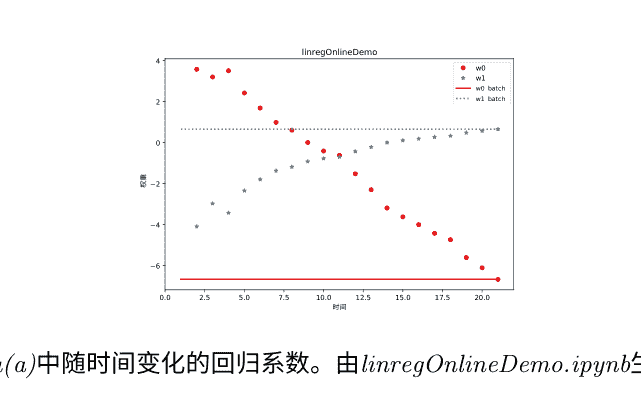

图11.4: 一维模型在图1.7(a)中随时间变化的回归系数。由linregOnlineDemo.ipynb生成。

假设我们使用多元正态分布（MVN）拟合 \(p(x, y)\)。联合分布的参数的最大似然估计是经验均值和协方差（详见第4.2.6节的证明）:

\[\mu_{x} = \frac{1}{N} \sum_{n} x_{n}\] (11.42)

\[\mu_{y} = \frac{1}{N} \sum_{n} y_{n}\] (11.43)

\[\Sigma_{xx} = \frac{1}{N} \sum_{n} (x_{n} - \bar{x})(x_{n} - \bar{x})^{\top} = \frac{1}{N} \mathbf{X}_{c}^{\top} \mathbf{X}_{c}\] (11.44)

\[\Sigma_{xy} = \frac{1}{N} \sum_{n} (x_{n} - \bar{x})(y_{n} - \bar{y}) = \frac{1}{N} \mathbf{X}_{c}^{\top} \mathbf{y}_{c}\] (11.45)

因此，根据方程（3.28），我们有

\[\mathbb{E}[y|x] = \mu_{y} + \Sigma_{xy}^{\top} \Sigma_{xx}^{-1} (x - \mu_{x})\] (11.46)

我们可以将其重写为 \(\mathbb{E}[y|x] = w_{0} + \boldsymbol{w}^{\top} \boldsymbol{x}\) 通过定义

\[w_{0} = \mu_{y} - \boldsymbol{w}^{\top} \boldsymbol{\mu}_{x} = \bar{y} - \boldsymbol{w}^{\top} \bar{\boldsymbol{x}}\] (11.47)

\[\boldsymbol{w} = \Sigma_{xx}^{-1} \Sigma_{xy} = (\mathbf{X}_{c}^{\top} \mathbf{X}_{c})^{-1} \mathbf{X}_{c}^{\top} \mathbf{y}_{c}\] (11.48)

这与我们在第11.2.3.1节中展示的判别模型的最大似然估计相匹配。因此，我们看到拟合联合模型，然后对其进行条件化，得到的结果与拟合条件模型相同。然而，这仅对高斯模型成立（详见第9.4节对此问题的进一步讨论）。

## 11.2.3.6 推导 \(\sigma^{2}\)的最大似然估计

在使用上述方法之一估计 \(\hat{w}_{\mathrm{mle}}\)之后，我们可以估计噪声方差。很容易证明最大似然估计为

\[\hat{\sigma}_{\mathrm{mle}}^{2} = \operatorname*{argmin}_{\sigma^{2}} \mathrm{NLL}(\hat{\boldsymbol{w}}, \sigma^{2}) = \frac{1}{N} \sum_{n=1}^{N} (y_{n} - \boldsymbol{x}_{n}^{\top} \hat{\boldsymbol{w}})^{2}\] (11.49)

这只是残差的均方误差，这是一个直观的结果。

## 11.2.4 评估拟合优度

在本节中，我们讨论一些简单的方法来评估回归模型对数据的拟合程度（也称为拟合优度）。

### 11.2.4.1 残差图

对于一维输入，我们可以通过绘制残差图来检查模型的合理性，其中残差 \(r_n = y_n - \hat{y}_n\) 与输入 \(x_n\) 相对比。这被称为残差图。模型假设残差服从\(\mathcal{N}(0, \sigma^2)\)分布，因此残差图应该是一团点云，大致均匀地分布在0水平线上下，没有明显的趋势。

例如，在图11.5(a)中，我们绘制了图1.7(a)中线性模型的残差。我们可以看到残差呈现出一些曲线结构，表明拟合不足。在图11.5(b)中，我们绘制了图1.7(b)中二次模型的残差。我们可以看到拟合效果更好。

要将这种方法扩展到多维输入，我们可以绘制预测值 \(\hat{y}_n\) 与真实输出 \(y_n\) 之间的图，而不是与 \(x_n\) 之间的图。一个好的模型会使得点位于对角线上。请参见图11.6中的一些示例。

### 11.2.4.2 预测准确率和 \(R^2\)

我们可以通过计算数据集上的残差平方和 (RSS) 来定量评估拟合情况：\(\text{RSS}(\mathbf{w}) = \sum_{n=1}^N (y_n - \mathbf{w}^\top \mathbf{x}_n)^2\)。较低的RSS值表示模型更好地拟合了数据。另一个常用的度量是均方根误差 (RMSE) ：

\[\text{RMSE}(\mathbf{w}) \triangleq \sqrt{\frac{1}{N} \text{RSS}(\mathbf{w})} \tag{11.50}\]

可以使用决定系数 (\(R^2\)) 来计算更具解释性的度量：

\[R^2 \triangleq 1 - \frac{\sum_{n=1}^N (\hat{y}_n - y_n)^2}{\sum_{n=1}^N (\bar{y} - y_n)^2} = 1 - \frac{\text{RSS}}{\text{TSS}} \tag{11.51}\]

其中 \(\bar{y} = \frac{1}{N} \sum_{n=1}^N y_n\) 是响应的经验均值，\(\text{RSS} = \sum_{n=1}^N (y_n - \hat{y}_n)^2\) 是残差平方和，而 \(\text{TSS} = \sum_{n=1}^N (y_n - \bar{y})^2\) 是总平方和。因此，我们可以看到 \(R^2\) 衡量了预测结果相对于简单常数预测 \(\hat{y}_n = \bar{y}\) 的方差。如果一个模型在预测方面不比使用输出的均值更好，那么 \(R^2 = 0\)。如果模型完全拟合数据，则RSS将为0，因此 \(R^2 = 1\)。一般来说，较大的值意味着方差减小得更多（拟合更好）。这在图11.6中有所说明。

## 11.3 岭回归

最大似然估计可能导致过拟合，正如我们在1.2.2.2节中讨论的那样。解决这个问题的一个简单方法是使用具有零均值高斯先验的MAP估计，\(p(\mathbf{w}) = \mathcal{N}(\mathbf{w} | \mathbf{0}, \lambda^{-1} \mathbf{I})\)，正如我们在4.5.3节中讨论的那样。这被称为岭回归。

更详细地说，我们计算MAP估计如下：

\[\hat{\mathbf{w}}_{\text{map}} = \text{argmin} \frac{1}{2\sigma^2} (\mathbf{y} - \mathbf{X}\mathbf{w})^\top (\mathbf{y} - \mathbf{X}\mathbf{w}) + \frac{1}{2\tau^2} \mathbf{w}^\top \mathbf{w} \tag{11.52}\]

\[= \text{argmin} \, \text{RSS}(\mathbf{w}) + \lambda \|\mathbf{w}\|_2^2 \tag{11.53}\]

其中 \(\lambda \triangleq \frac{\sigma^2}{\tau^2}\) 与先验的强度成比例，以及

\[\|\mathbf{w}\|_2 \triangleq \sqrt{\sum_{d=1}^D |w_d|^2} = \sqrt{\mathbf{w}^\top \mathbf{w}} \tag{11.54}\]

是向量 \(\mathbf{w}\) 的 \(\ell_2\) 范数。因此，我们惩罚那些绝对值过大的权重。

一般来说，这种技术被称为 \(\ell_2\) 正则化或权重衰减，并且被广泛使用。请参见图4.5以进行说明。

请注意，我们不对偏移项 \(w_0\) 进行惩罚，因为它只影响输出的全局均值，并且不会导致过拟合。请参见练习11.2。

## ### 11.3.1 计算MAP估计

在本节中，我们讨论计算MAP估计的算法。

MAP估计对应于最小化以下惩罚目标：

\[J(w) = (y - Xw)^T (y - Xw) + \lambda \|w\|_2^2 \tag{11.55}\]

其中 \(\lambda = \sigma^2 / \tau^2\) 是正则化器的强度。导数由以下给出

\[\nabla_w J(w) = 2 \left( X^T X w - X^T y + \lambda w \right) \tag{11.56}\]

因此

\[\hat{w}_{\text{map}} = (X^T X + \lambda I_D)^{-1} X^T y = \left( \sum_n x_n x_n^T + \lambda I_D \right)^{-1} \left( \sum_n y_n x_n \right) \tag{11.57}\]

#### 11.3.1.1 使用QR求解

通过矩阵求逆来计算原始估计 \(w = (X^T X + \lambda I)^{-1} X^T y\) 是一个不好的主意，因为它可能很慢且数值不稳定。在本节中，我们将描述一种将问题转化为标准最小二乘问题的方法，然后可以应用QR分解，如第11.2.2.3节所讨论的。

我们假设先验分布的形式为 \(p(w) = \mathcal{N}(0, \Lambda^{-1})\)，其中 \(\Lambda\) 是精度矩阵。在岭回归的情况下， \(\Lambda = (1/\tau^2)I\)。我们可以通过向训练集添加“虚拟数据”来模拟这个先验分布，得到

\[\tilde{X} = \begin{pmatrix} X/\sigma \\ \sqrt{\Lambda} \end{pmatrix}, \quad \tilde{y} = \begin{pmatrix} y/\sigma \\ 0_{D \times 1} \end{pmatrix} \tag{11.58}\]

其中 \(\Lambda = \sqrt{\Lambda} \sqrt{\Lambda}^T\) 是 \(\Lambda\) 的Cholesky分解。我们可以看到 \(\tilde{X}\) 是 \((N + D) \times D\) 的，其中额外的行代表来自先验的伪数据。

我们现在证明在这个扩展数据上的RSS等价于原始数据上的带惩罚项的RSS：

\[f(w) = (\tilde{y} - \tilde{X} w)^T (\tilde{y} - \tilde{X} w) \tag{11.59}\]

\[= \left( \begin{pmatrix} y/\sigma \\ 0 \end{pmatrix} - \begin{pmatrix} X/\sigma \\ \sqrt{\Lambda} \end{pmatrix} w \right)^T \left( \begin{pmatrix} y/\sigma \\ 0 \end{pmatrix} - \begin{pmatrix} X/\sigma \\ \sqrt{\Lambda} \end{pmatrix} w \right) \tag{11.60}\]

\[= \begin{pmatrix} \frac{1}{\sigma}(y - X w) \\ -\sqrt{\Lambda} w \end{pmatrix}^T \begin{pmatrix} \frac{1}{\sigma}(y - X w) \\ -\sqrt{\Lambda} w \end{pmatrix} \tag{11.61}\]

\[= \frac{1}{\sigma^2} (y - X w)^T (y - X w) + (\sqrt{\Lambda} w)^T (\sqrt{\Lambda} w) \tag{11.62}\]

\[= \frac{1}{\sigma^2} (y - X w)^T (y - X w) + w^T \Lambda w \tag{11.63}\]

因此，MAP估计由以下给出

\[\hat{w}_{\text{map}} = (\tilde{X}^T \tilde{X})^{-1} \tilde{X}^T \tilde{y} \tag{11.64}\]

可以使用标准OLS方法解决。特别地，我们可以计算 \(\tilde{X}\) 的QR分解，然后按照第11.2.2.3节的步骤进行。这需要 \(O((N + D) D^2)\) 时间。

#### 11.3.1.2 使用SVD求解

在本节中，我们假设 D > N，这是使用岭回归时的常见情况。在这种情况下，使用SVD比QR更快。为了了解其工作原理，假设 \(X = USV^T\) 是 \(X\) 的SVD，其中 \(V^TV = I\)， \(U^TU = I\)， \(S\) 是一个对角线 \(N \times N\) 矩阵。现在，让 \(R = US\) 是一个 \(N \times N\) 矩阵。可以证明（参见[HTF09]的练习18.4）

\[ \hat{w}_{\text{map}} = \mathbf{V}(\mathbf{R}^T\mathbf{R} + \lambda \mathbf{I}_N)^{-1}\mathbf{R}^T\mathbf{y} \quad (11.65) \]

换句话说，我们可以用 N维向量 \(r_i\) 替换 D维向量 \(x_i\)，并且像以前一样进行惩罚拟合。总时间现在是 \(O(DN^2)\) 操作，如果 D > N，则小于 \(O(D^3)\)。

## ### 11.3.2 岭回归和主成分分析之间的联系

在本节中，我们讨论岭回归和主成分分析之间的有趣联系（我们在第20.1节中描述），以便更深入地了解为什么岭回归效果好。我们的讨论基于[HTF09, p66]。

设 \(X = USV^T\) 为 \(X\) 的奇异值分解，其中 \(V^TV = I\)， \(U^TU = I\)， \(S\) 是一个对角 \(N \times N\) 矩阵。使用方程 (11.65)，我们可以看到训练集上的岭回归预测为

\[ \hat{y} = \mathbf{X}\hat{w}_{\text{map}} = \mathbf{USV}^T\mathbf{V}(\mathbf{S}^2 + \lambda \mathbf{I})^{-1}\mathbf{SU}^T\mathbf{y} \quad (11.66) \]

\[ = \mathbf{U}\tilde{\mathbf{S}}\mathbf{U}^T\mathbf{y} = \sum_{j=1}^{N} \mathbf{u}_j \tilde{S}_{jj} \mathbf{u}_j^T\mathbf{y} \quad (11.67) \]

其中

\[ \tilde{S}_{jj} \triangleq [\mathbf{S}(\mathbf{S}^2 + \lambda \mathbf{I})^{-1}\mathbf{S}]_{jj} = \frac{\sigma_j^2}{\sigma_j^2 + \lambda} \quad (11.68) \]

和 \(\sigma_j\) 是 \(X\) 的奇异值。因此

\[ \hat{y} = \mathbf{X}\hat{w}_{\text{map}} = \sum_{j=1}^{N} \mathbf{u}_j \frac{\sigma_j^2}{\sigma_j^2 + \lambda} \mathbf{u}_j^T\mathbf{y} \quad (11.69) \]

相比之下，最小二乘预测是

\[ \hat{y} = \mathbf{X}\hat{w}_{\text{mle}} = (\mathbf{USV}^T)(\mathbf{VS}^{-1}\mathbf{U}^T\mathbf{y}) = \mathbf{UU}^T\mathbf{y} = \sum_{j=1}^{N} \mathbf{u}_j\mathbf{u}_j^T\mathbf{y} \quad (11.70) \]

如果 \(\sigma_j^2\) 相对于 \(\lambda\) 较大，则 \(\sigma_j^2/(\sigma_j^2 + \lambda) \approx 1\)，因此方向 \(u_j\) 不受影响，但如果 \(\sigma_j^2\) 相对于 \(\lambda\) 较小，并且 \(\lambda\) 较大，则 \(\sigma_j^2/(\sigma_j^2 + \lambda) \approx 0\)，因此方向 \(u_j\) 将被降权。鉴于此，我们定义模型的有效自由度如下：

\[ \text{dof}(\lambda) = \sum_{j=1}^{N} \frac{\sigma_j^2}{\sigma_j^2 + \lambda} \quad (11.71) \]

当 \(\lambda=0\)时，\(\text{dof}(\lambda) = N\)，当 \(\lambda\to\infty\)时，\(\text{dof}(\lambda) \to 0\)。

让我们试着理解为什么这种行为是可取的。在第11.7节中，我们证明了如果我们对w使用均匀先验，那么\(\text{Cov} [ w|D] \propto (X^T X)^{-1}\)。因此，我们对 w最不确定的方向由 \((X^T X)^{-1}\)的特征向量确定，这些特征向量具有最大的特征值，如图7.6所示。这些方向对应于 \(X^T X\)的特征向量，其特征值最小，因此（根据第7.5.2节）最小的奇异值。因此，如果 \(\sigma_j^2\)相对于 \(\lambda\)较小，岭回归将减小方向 \(u_j\)的权重。

这个过程在图11.7中有所说明。水平参数 \(w_1\) 由数据决定不确定性较高（具有较高的后验方差），但是垂直参数 \(w_2\) 是确定的。因此，\(w_{\text{map}}(2)\)接近于 \(w_{\text{mle}}(2)\)，但是 \(w_{\text{map}}(1)\)明显向先验均值偏移，即0。通过这种方式，不确定的参数会逐渐趋近于0。这被称为收缩。

还有一种相关但不同的技术，称为主成分回归，它是PCA的有监督版本，在第20.1节中我们会解释。其思想是：首先使用PCA将维度降低到 K维，然后将这些低维特征作为回归的输入。然而，从预测准确性的角度来看，这种技术并不像岭回归那样有效[HTF01, p70]。原因在于，在主成分回归中，只有前 K个（派生的）维度被保留，而剩余的 D – K维度完全被忽略。相比之下，岭回归对所有维度使用“软”加权。

## 11.3.3 选择正则化器的强度

为了找到最优的 \(\lambda\)值，我们可以尝试有限个不同的值，并使用交叉验证来估计它们的期望损失，如第4.5.5.2节所讨论的。请参见图4.5d的示例。

如果我们有很多值可供选择，这种方法可能会非常昂贵。幸运的是，我们通常可以通过使用 \(\hat{w}(\lambda_k)\)的值作为 \(\hat{w}(\lambda_{k+1})\)的初始化器来热启动优化过程，其中 \(\lambda_{k+1} < \lambda_k\)；换句话说，我们从一个高度受限的模型（强正则化器）开始，然后逐渐放松约束（减少正则化的程度）。我们以这种方式扫描出的参数集合\(\hat{w}_k\)被称为正则化路径。请参见图11.10(a)的示例。

我们还可以使用经验贝叶斯方法来选择 \(\lambda\)。特别地，我们通过计算 \(\hat{\lambda} = \text{argmax}_\lambda \log p(D|\lambda)\)来选择超参数，其中 \(p(D|\lambda)\)是边际似然或证据。

图4.7b显示这与CV估计基本相同。然而，贝叶斯方法有几个优点：计算 $p(\mathcal{D}|\lambda)$可以通过拟合单个模型来完成，而CV必须拟合相同的模型 $K$次；而 $p(\mathcal{D}|\lambda)$是 $\lambda$的平滑函数，因此我们可以使用基于梯度的优化而不是离散搜索。

## 11.4 套索回归

在第11.3节中，我们在拟合线性回归模型时假设回归系数服从高斯先验分布。这通常是一个不错的选择，因为它鼓励参数保持较小，从而防止过拟合。然而，有时我们希望参数不仅仅是小，而是确切地为零，即我们希望 $w$ 是稀疏的，以便最小化 L0范数：

$$||w||_0 = \sum_{d=1}^{D} \mathbb{I}(|w_d| > 0)$$

这是有用的，因为它可以用来进行特征选择。为了看到这一点，注意到预测的形式 $f(x; w) = \sum_{d=1}^{D} w_d x_d$，所以如果任何 $w_d = 0$，我们忽略相应的特征 $x_d$。（相同的想法可以应用于非线性模型，如DNNs，通过鼓励第一层权重稀疏。）

### 11.4.1 具有拉普拉斯先验的MAP估计（ℓ1正则化）

有很多方法可以计算这样的稀疏估计（参见例如，[Bha+19]）。在本节中，我们重点讨论使用拉普拉斯分布（我们在第11.6.1节中讨论过）作为先验的MAP估计：

$$p(w|\lambda) = \prod_{d=1}^{D} \text{Laplace}(w_d|0, 1/\lambda) \propto \prod_{d=1}^{D} e^{-\lambda |w_d|}$$

其中 $\lambda$是稀疏参数，而

$$\text{Laplace}(w|\mu, b) \triangleq \frac{1}{2b} \exp\left( -\frac{|w - \mu|}{b} \right)$$

这里 $\mu$是位置参数，$b > 0$是尺度参数。图2.15显示，即使我们将方差固定为相同， $\text{Laplace}(w|0, b)$在0上的密度也比 $\mathcal{N}(w|0, \sigma^2)$更高。

要使用这个先验进行线性回归模型的MAP估计，我们只需要最小化以下目标函数：

$$\text{PNLL}(w) = -\log p(\mathcal{D}|w) - \log p(w|\lambda) = ||Xw - y||_2^2 + \lambda ||w||_1$$

其中 $||w||_1 \triangleq \sum_{d=1}^{D} |w_d|$是 $\ell_1$范数 $w$的定义。这种方法被称为套索，它代表“最小绝对收缩和选择算子”[Tib96]。（我们将在下面解释这个名字的原因。）更一般地说，使用拉普拉斯先验的MAP估计被称为 $\ell_1$正则化。


还要注意，我们可以使用其他范数来表示权重向量。一般来说， $q$-范数定义如下：

$$\|\boldsymbol{w}\|_q = \left( \sum_{d=1}^D |w_d|^q \right)^{1/q}$$

对于 $q < 1$，我们可以得到更稀疏的解。当 $q=0$时，我们得到 $\ell_0$-范数：

$$\|\boldsymbol{w}\|_0 = \sum_{d=1}^D \mathbb{I}(|w_d| > 0)$$

然而，可以证明对于任意$q < 1$，问题变得非凸（参见例如，[HTW15]）。因此，$\ell_1$-范数是$\ell_0$-范数的最紧凸松弛。

### 11.4.2 为什么$\ell_1$正则化会产生稀疏解？

我们现在解释为什么$\ell_1$正则化会产生稀疏解，而$\ell_2$正则化则不会。我们重点讨论线性回归的情况，尽管类似的论证也适用于其他模型。Lasso目标是以下非光滑目标（有关平滑性的讨论，请参见第8.1.4节）：

$$\min_{\boldsymbol{w}} \mathrm{NLL}(\boldsymbol{w}) + \lambda \|\boldsymbol{w}\|_1$$

这是以下二次规划的Lagrange函数（请参见第8.5.4节）：

$$\min_{\boldsymbol{w}} \mathrm{NLL}(\boldsymbol{w}) \quad \text{s.t.} \quad \|\boldsymbol{w}\|_1 \leq B$$

其中 $B$是权重的 $\ell_1$-范数的上界：小（紧）的界 $B$对应于较大的惩罚 $\lambda$，反之亦然。

类似地，我们可以将岭回归目标写成约束形式 $\min_{\boldsymbol{w}} \mathrm{NLL}(\boldsymbol{w}) + \lambda \|\boldsymbol{w}\|_2^2$：

$$\min_{\boldsymbol{w}} \mathrm{NLL}(\boldsymbol{w}) \quad \text{s.t.} \quad \|\boldsymbol{w}\|_2^2 \leq B$$

在图11.8中，我们绘制了NLL目标函数的等高线，以及$\ell_2$和$\ell_1$约束曲面的等高线。根据约束优化理论（第8.5节），我们知道最优解出现在目标函数的最低级别集与约束曲面相交的点上（假设约束是活动的）。几何上很明显，当我们放松约束$B$时，我们“扩大”了$\ell_1$“球”，直到它与目标相交；球的角点更有可能与椭圆相交，而不是其中一侧，特别是在高维情况下，因为角点“突出”得更多。角点对应于稀疏解，位于坐标轴上。相比之下，当我们扩大$\ell_2$球时，它可以在任意点与目标相交；没有“角点”，因此对稀疏性没有偏好。

### 11.4.3 硬阈值与软阈值

套索目标函数的形式为 $\mathcal{L}(w) = \text{NLL}(w) + \lambda \|w\|_1$。可以证明（练习11.3）平滑NLL部分的梯度为

$$
\frac{\partial}{\partial w_d} \text{NLL}(w) = a_d w_d - c_d \quad (11.81)
$$

$$
a_d = \sum_{n=1}^N x_{nd}^2 \quad (11.82)
$$

$$
c_d = \sum_{n=1}^N x_{nd}(y_n - w_{-d}^\top x_{n,-d}) \quad (11.83)
$$

其中 $w_{-d}$ 是 $w$ 去除了分量 $d$ 后的向量，同样地，$x_{n,-d}$ 是特征向量 $x_n$ 去除了分量 $d$ 后的向量。我们可以看到 $c_d$ 与特征 $d$ 的相关性成比例，$x_{:,d}$ 的第 $d$ 列，以及使用其他所有特征进行预测时得到的残差误差，$r_{-d} = y - X_{:,-d} w_{-d}$。因此，$c_d$ 的大小表明特征 $d$ 相对于其他特征和当前参数来预测 $y$ 的相关性。将梯度设为0可以得到最优的 $w_d$ 更新，保持其他权重不变：

$$
w_d = c_d / a_d = \frac{x_{:,d}^\top r_{-d}}{\|x_{:,d}\|_2^2} \quad (11.84)
$$

相应的新预测 $r_{-d}$ 变为 $\hat{r}_{-d} = w_d x_{:,d}$，这是残差在列向量 $x_{:,d}$ 上的正交投影，与方程（11.15）一致 。现在我们加入 $\ell_1$ 项。不幸的是，当 $w_d = 0$ 时，$\|w\|_1$ 项是不可微的。幸运的是，我们仍然可以在这一点计算一个次梯度。使用方程（8.14），我们发现

$$
\partial_{w_d} \mathcal{L}(w) = (a_d w_d - c_d) + \lambda \partial_{w_d} \|w\|_1 \quad (11.85)
$$

$$
= \begin{cases} 
\{a_d w_d - c_d - \lambda\} & \text{如果 } w_d < 0 \\
[-c_d - \lambda, -c_d + \lambda] & \text{如果 } w_d = 0 \\
\{a_d w_d - c_d + \lambda\} & \text{如果 } w_d > 0 
\end{cases} \quad (11.86)
$$

根据 $c_d$ 的值，$\partial_w$ 的解有所不同 $\partial_w \mathcal{L}(w)=0$ 可能在三个不同的 $w_d$ 值处出现，如下所示：

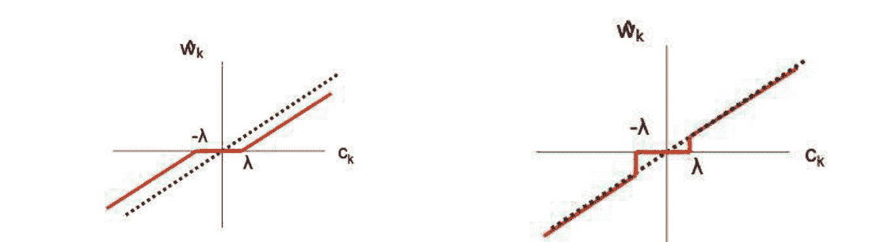

图11.9: 左图: 软阈值。右图: 硬阈值。在这两种情况下，水平轴表示使用除 $w_k$之外的所有系数进行预测所产生的残差误差，垂直轴表示最小化这个惩罚残差的估计系数 $\hat{w}_k$。中间的平坦区域是区间$[-\lambda, +\lambda]$。

- 1. 如果 $c_d < -\lambda$，那么该特征与残差强烈负相关，那么子梯度在 $\hat{w}_d = \frac{c_d + \lambda}{a_d}$处为零 $< 0$。
- 2. 如果 $c_d \in [-\lambda, \lambda]$，那么该特征与残差只有弱相关，那么子梯度在 $\hat{w}_d = 0$处为零。
- 3. 如果 $c_d > \lambda$，那么该特征与残差强烈正相关，那么子梯度在 $\hat{w}_d = \frac{c_d - \lambda}{a_d}$处为零 $> 0$。

总结一下，我们有

$$
\hat{w}_d(c_d) = 
\begin{cases} 
(c_d + \lambda)/a_d & \text{如果 } c_d < -\lambda \\
0 & \text{如果 } c_d \in [-\lambda, \lambda] \\
(c_d - \lambda)/a_d & \text{如果 } c_d > \lambda 
\end{cases}
\quad (11.87)
$$

我们可以写成如下形式:

$$\hat{w}_d = \text{软阈值函数}(c_d a_d, \lambda / a_d) \quad (11.88)$$

其中

$$\text{软阈值函数}(x, \delta) \triangleq \text{sign}(x) (|x| - \delta)_+ \quad (11.89)$$

并且 $x_+ = \max(x, 0)$ 是 $x$ 的正部分。这被称为软阈值函数（见第8.6.2节）。图11.9(a)中展示了这一点，我们绘制了 $\hat{w}_d$ vs $c_d$。虚线黑线是最小二乘拟合对应的直线 $w_d = c_d / a_d$。实线红线代表正则化估计 $\hat{w}_d$，它将虚线向下（或向上）平移 $\lambda$，除非 $-\lambda \leq c_d \leq \lambda$，在这种情况下，它将 $w_d$ 设置为0。

相比之下，在图11.9(b)中，我们展示了硬阈值化。如果 $-\lambda \leq c_d \leq \lambda$，则将 $w_d$ 的值设置为0，但它不会收缩 $w_d$ 在此区间之外的值。软阈值化的斜率

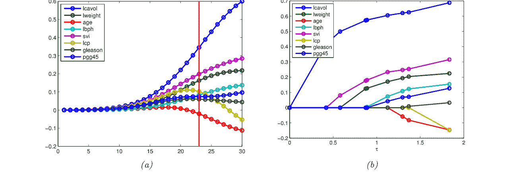

图11.10: (a) 前列腺癌例子的岭回归系数的轮廓与 B 的 ℓ₂norm的界限相比，所以小的 B(大的 λ)在左边。垂直线是使用1标准误差规则通过5折交叉验证选择的值。改编自[HTF09]的图3.8。由ridgePathProstate.ipynb生成。(b) 与(a)相同，但使用 ℓ₁norm的 w。x轴显示了 λ=1/B的临界值，正则化路径是不连续的。改编自[HTF09]的图3.10。由lassoPathProstate.ipynb生成。

阈值线与对角线不重合，这意味着即使是大的系数也会被收缩到零附近。这就是为什么lasso代表“最小绝对选择和收缩算子”。因此，lasso是一个有偏估计器（见第4.7.6.1节）。

解决有偏估计问题的一个简单方法，被称为去偏估计，是使用两阶段估计过程：首先使用lasso估计权重向量的支持（即确定哪些元素是非零的），然后使用最小二乘法重新估计选择的系数。关于这个问题的一个示例，请参见图11.13。

### 11.4.4 正则化路径

如果 λ=0，我们得到OLS解，它将是稠密的。随着 λ的增加，解向量 \hat{w}(λ)将趋向于更加稀疏。如果 λ大于某个临界值，我们得到 \hat{w} = 0。这个临界值是通过负对数似然的梯度与惩罚项的梯度相互抵消时获得的：

$$ \lambda_{\max} = \max_d |\nabla_{w_d} \text{NLL}(0)| = \max_d |c_d(w = 0)| = \max_d |\mathbf{y}^T \mathbf{x}_{:,d}| = \|\mathbf{X}^T \mathbf{y}\|_\infty \quad (11.90)$$

或者，我们可以使用 B上的界限进行工作 ℓ₁范数。当 B=0时，我们得到ω = 0。随着 B的增加，解变得更加密集。对于任何分量为零的最大 B值由 B_max = ||ω_{mle}||_1给出。

随着 λ的增加，解向量ω变得更加稀疏，尽管不一定是单调的。我们可以绘制每个特征_d的值 ω_d vs λ（或者与界限 B相对）；这被称为正则化路径。这在图11.10(b)中有所说明，我们将lasso应用于来自[HTF09]的前列腺癌回归数据集。（我们将 gleason和 svi特征视为数值而不是分类。）在左边，


表11.1：当我们改变正则器的强度时，线性回归模型拟合前列腺癌数据集的系数值如下：这些数字在图11.10(b)中绘制。

当 B=0时，所有系数都为零。当我们增加 B时，系数逐渐“打开”。<sup>2</sup>岭回归的类似结果显示在图11.10(a)中。对于岭回归，我们可以看到所有系数都是非零的（假设λ >0），因此解不是稀疏的。

令人惊讶的是，可以证明套索解路径是 λ的分段线性函数[Efr+04; GL15]。也就是说，存在一组关键值 λ，在这些关键值处非零系数的活动集发生变化。对于这些关键值之间的 λ值，每个非零系数都以线性方式增加或减少。这在图11.10(b)中有所说明。此外，可以通过解析方法求解这些关键值[Efr+04]。在表11.1中，我们显示了在正则化路径的每个关键步骤中的实际系数值（最后一行是最小二乘解）。

通过将 λ从 λ<sub>max</sub>更改为 0，我们可以从所有权重为零的解转变为所有权重非零的解。不幸的是，并非所有的子集大小都可以通过套索实现。特别地，可以证明，如果D > N，则最优解中最多可以有 N个变量，在达到对应于最小 ℓ<sub>1</sub>norm的OLS解之前。在第11.4.8节中，我们将看到通过使用 ℓ<sub>2</sub>正则器和 ℓ<sub>1</sub>正则器（一种被称为弹性网的方法），我们可以获得包含比训练案例更多变量的稀疏解。这使我们可以探索介于 N和 D之间的模型大小。

### 11.4.5 最小二乘法、套索、岭回归和子集选择的比较

在本节中，我们比较最小二乘法、套索、岭回归和子集选择。为简单起见，我们假设 X的所有特征都是正交的，因此 X<sup>T</sup>X = I。在这种情况下，NLL由以下给出

$$
\text{NLL}(\mathbf{w}) = \|\mathbf{y} - \mathbf{X}\mathbf{w}\|^2 = \mathbf{y}^T\mathbf{y} + \mathbf{w}^T\mathbf{X}^T\mathbf{X}\mathbf{w} - 2\mathbf{w}^T\mathbf{X}^T\mathbf{y} \qquad (11.91)
$$

$$
= \text{常数} + \sum_d w_d^2 - 2\sum_d\sum_n w_d x_{nd}y_n \qquad (11.92)
$$

因此，我们可以将其分解为每个维度的项之和。因此，我们可以分别对每个 w<sub>d</sub>写出MAP和ML估计的解析表达式，如下所示。

- **MLE** 从方程（11.85）中，OLS解为

$$\hat{w}_d^{\text{mle}} = c_d/a_d = \mathbf{x}_{:d}^T\mathbf{y} \qquad (11.93)$$

其中 \(\mathbf{x}_{:d}\)是 \(\mathbf{X}\)的第 d列。

- **岭回归** 可以证明岭估计由以下公式给出

$$\hat{w}_d^{\text{ridge}} = \frac{\hat{w}_d^{\text{mle}}}{1 + \lambda} \quad (11.94)$$

- **套索回归** 从方程（11.88）出发，并利用 \(\hat{w}_d^{\text{mle}} = c_d/a_d\)，我们有

$$\hat{w}_d^{\text{lasso}} = \text{sign}(\hat{w}_d^{\text{mle}}) \left( |\hat{w}_d^{\text{mle}}| - \lambda \right)_+ \quad (11.95)$$

这对应于软阈值处理，如图11.9(a)所示。

- **子集选择** 如果我们使用子集选择选择最佳 \(K\) 个特征，则参数估计如下

$$\hat{w}_d^{\text{ss}} = \begin{cases} \hat{w}_d^{\text{mle}} & \text{if rank}(|\hat{w}_d^{\text{mle}}|) \leq K \\ 0 & \text{否则} \end{cases} \quad (11.96)$$

其中rank指的是权重大小排序列表中的位置。这对应于硬阈值处理，如图11.9(b)所示。

我们现在在前列腺癌回归数据集[HTF09]上实验比较这些方法的预测性能。（我们将特征gleason和svi视为数值，而不是分类变量。）图11.11显示了在交叉验证选择的 \(\lambda\)（或 \(K\)）值处的估计系数；我们可以看到子集方法是最稀疏的，然后是lasso。就预测性能而言，所有方法都非常相似，如图11.12所示。

| 术语 | OLS | 最佳子集 | 岭回归 | 套索 |
| :--- | :--- | :--- | :--- | :--- |
| 截距 | 2.465 | 2.477 | 2.467 | 2.465 |
| lcalvol | 0.676 | 0.736 | 0.522 | 0.548 |
| lweight | 0.262 | 0.315 | 0.255 | 0.224 |
| 年龄 | -0.141 | 0.000 | -0.089 | 0.000 |
| lbph | 0.209 | 0.000 | 0.186 | 0.129 |
| svi | 0.304 | 0.000 | 0.259 | 0.186 |
| lcp | -0.287 | 0.000 | -0.095 | 0.000 |
| gleason | -0.021 | 0.000 | 0.025 | 0.000 |
| pgg45 | 0.266 | 0.000 | 0.169 | 0.083 |
| 测试误差 | 0.521 | 0.492 | 0.487 | 0.457 |
| 标准误差 | 0.176 | 0.141 | 0.157 | 0.146 |

图11.11：不同方法在前列腺癌数据上的结果，该数据具有8个特征和67个训练案例。方法包括：OLS = 普通最小二乘法，Subset = 最佳子集回归，Ridge，Lasso。行表示系数；我们可以看到子集回归和套索给出了解。底部行是测试集（30个案例）上的均方误差。改编自[HTF09]的表3.3。由prostate_comparison.ipynb生成。

<sup>2</sup> 通常绘制解决方案与收缩因子的关系图，定义为 s(B) = B/B<sub>max</sub>，而不是与 B的关系图。这只是影响水平轴的比例，而不影响曲线的形状。

### 11.4.6 变量选择一致性

通常使用 $\ell_1$ 正则化来估计相关变量的集合，这个过程称为变量选择。在 $N\to\infty$ 极限下，能够恢复真实相关变量集合（即 $w^*$ 的支持）的方法被称为模型选择一致。（这是一个理论概念，假设数据来自模型。）

让我们举个例子。我们首先生成一个大小为4096的稀疏信号 $w^*$，其中包含160个随机放置的 $\pm1$ 峰值。接下来，我们生成一个大小为 $N \times D$ 的随机设计矩阵 $\mathbf{X}$，其中 $N=1024$。最后，我们生成一个带噪声的观测值 $\boldsymbol{y} = \mathbf{X}w^* + \boldsymbol{\epsilon}$，其中 $\boldsymbol{\epsilon}_n \sim \mathcal{N}(0, 0.01^2)$。然后，我们从 $\boldsymbol{y}$ 和 $\mathbf{X}$ 中估计 $\boldsymbol{w}$。原始的 $w^*$ 在图11.13的第一行中显示。第二行是使用 $\lambda= 0.1\lambda_{\text{max}}$ 进行 $\ell_1$ 估计 $\hat{\boldsymbol{w}}_{L1}$ 的结果。我们可以看到这个估计结果在正确的位置上有“峰值”，因此它正确地识别了相关变量。然而，尽管我们看到 $\hat{\boldsymbol{w}}_{L1}$ 正确地识别了非零分量，但它们太小了，这是由于收缩引起的。在第三行中，我们展示了在第11.4.3节中讨论的去偏技术的结果。这表明我们可以恢复原始的权重向量。相比之下，最后一行显示了OLS估计，它是密集的。此外，从视觉上可以明显看出，我们无法应用单一的阈值来恢复正确的稀疏权重向量。

为了使用套索进行变量选择，我们必须选择 $\lambda$。通常使用交叉验证来选择正则化路径上的最优值。然而，需要注意的是，交叉验证选择的 $\lambda$ 值会导致良好的预测准确性。这通常不是恢复“真实”模型的值。为了理解原因，回想一下 $\ell_1$ 正则化执行选择和收缩，也就是说，选择的系数会被拉近到0。为了防止相关系数被这种方式收缩，交叉验证倾向于选择一个不太大的 $\lambda$ 值。当然，这会导致一个包含不相关变量（假阳性）的稀疏模型。事实上，[MB06]证明了预测最优 $\lambda$ 值不会导致模型选择的一致性。然而，已经提出了各种基本方法的扩展，这些扩展具有模型选择的一致性（参见例如，[BG11; HTW15]）。

图11.13：使用Lasso恢复稀疏信号的示例。详细信息请参阅正文。改编自[FNW07]的图1。由sparse_sensing_demo.ipynb生成。

### 11.4.7 组Lasso

在标准 $\ell_1$ 正则化中，我们假设参数和变量之间存在一对一的对应关系，因此如果 $\hat{w}_d= 0$，我们解释为变量 $d$ 被排除。但在更复杂的模型中，可能会有许多与给定变量相关联的参数。特别地，每个变量 $d$ 可能有一个与之相关的权重向量 $w_d$，因此整体权重向量具有块结构 $\boldsymbol{w}= [\boldsymbol{w}_1, \boldsymbol{w}_2, \dots, \boldsymbol{w}_D]$。如果我们想排除变量 $d$，我们必须强制整个子向量 $\boldsymbol{w}_d$ 变为零。这被称为组稀疏。

#### 11.4.7.1 应用

- 具有分类输入的线性回归：如果第 $d$ 个变量是具有 $K$ 个可能级别的分类变量（第1.5.3.1节），则它将被表示为长度为 $K$ 的独热向量，因此要排除变量 $d$，我们必须将整个传入权重向量设置为0。
- 多项式逻辑回归：第 $d$ 个变量将与 $C$ 个不同的权重相关联（第10.3节），因此要排除变量 $d$，我们必须将整个传出权重向量设置为0。
- 神经网络：第 $k$ 个神经元将具有多个输入，因此如果我们想要“关闭神经元”，我们必须将所有传入权重设置为零。这使我们能够使用群稀疏性来学习神经网络结构（详见[GEH19]等）。
- 多任务学习：每个输入特征与 $C$ 不同的权重相关联，每个输出任务有一个权重。如果我们想要将一个特征用于所有任务或不用于任何任务，我们应该在组级别上选择权重[OTJ07]。

#### 11.4.7.2 对二范数进行惩罚

为了鼓励组稀疏性，我们将参数向量分成 $G$ 组， $\boldsymbol{w} = [\boldsymbol{w}_1, \ldots, \boldsymbol{w}_G]$。然后我们最小化以下目标函数

$$ \text{PNLL}(\boldsymbol{w}) = \text{NLL}(\boldsymbol{w}) + \lambda \sum_{g=1}^G \|\boldsymbol{w}_g\|_2 \quad\quad (11.97) $$

其中 $\|\boldsymbol{w}_g\|_2 = \sqrt{\sum_{d \in g} w_d^2}$ 是组权重向量的2范数。如果NLL是最小二乘法，则该方法称为组套索[YL06; Kyu+10]。

请注意，如果我们在方程（11.97）中使用了平方和的2-范数，则模型将变为岭回归，因为

$$ \sum_{g=1}^G \|\boldsymbol{w}_g\|_2^2 = \sum_g \sum_{d \in g} w_d^2 = \|\boldsymbol{w}\|_2^2 \quad\quad (11.98) $$

通过使用平方根，我们对包含该组权重向量的球的半径进行惩罚：只有当所有元素都很小时，半径才会很小。

从另一个角度看，为什么平方根版本在组级别上实施稀疏性是通过考虑目标函数的梯度。假设只有一个包含两个变量的组，那么惩罚的形式为

$$ \frac{\partial}{\partial w_1} (w_1^2 + w_2^2)^{\frac{1}{2}} = \frac{w_1}{\sqrt{w_1^2 + w_2^2}} \quad\quad (11.99) $$

如果 $w_2$ 接近零，则导数趋近于1，$w_1$ 也被驱使为零，其力量与 $\lambda$ 成比例。然而，如果 $w_2$ 很大，导数趋近于0，$w_1$ 也可以保持很大。因此，组中的所有系数大小相似。

#### 11.4.7.3 惩罚无穷范数

这种技术的一个变体将2范数替换为无穷范数[TVW05; ZRY05]：

$$ \|\boldsymbol{w}_g\|_\infty = \max_{d \in g} |w_d| \quad\quad (11.100) $$

很明显，这也会导致组稀疏性，因为如果强制将组中最大的元素置零，所有较小的元素也将被置零。

#### 11.4.7.4 示例

这些技术的示例见图11.14和图11.15。我们有一个真实信号 $\boldsymbol{w}$ 大小 $D = 2^{12} = 4096$，分为64个大小为64的组。我们随机选择8个组 of $w$ 并为它们分配非零值。在图11.14中，这些值是从一个 $\mathcal{N}(0,1)$ 中绘制的；在图11.15中，这些值都被设置为1。然后，我们随机采样一个大小为 $N \times D$ 的设计矩阵 $\mathbf{X}$，其中 $N = 2^{10} = 1024$。最后，我们生成 $\mathbf{y} = \mathbf{Xw} + \epsilon$，其中 $\epsilon \sim \mathcal{N}(\mathbf{0}, 10^{-4}\mathbf{I}_N)$。在给定这些数据的情况下，我们使用 $\ell_1$ 或分组 $\ell_1$ 来估计 $w$ 的支持，并使用最小二乘法估计非零值（去偏估计）。

从图中我们可以看出，分组套索比普通套索做得更好，因为它尊重已知的分组结构。我们还可以看到 $\ell_{\infty}$ 范数倾向于使块内的所有元素具有相似的大小。这在第二个例子中是合适的，但不适用于第一个例子。（$\lambda$ 的值在所有示例中都相同，并且是手动选择的。）

图11.14：组套索的示例，其中原始信号是分段高斯分布。(a) 原始信号。(b) 普通套索估计。(c) 使用块上的 $\ell_2$ norm的组套索估计。(d) 使用块上的 $\ell_{\infty}$ norm的组套索估计。改编自 [WNF09] 的图3-4。由 groupLassoDemo.ipynb 生成。

图11.15：与图11.14相同，只是原始信号是分段常数。由groupLassoDemo.ipynb生成。

### 11.4.8 弹性网络（岭回归和套索的结合）

在群体套索中，我们需要提前指定群体结构。对于某些问题，我们不知道群体结构，但我们仍然希望高度相关的系数被视为隐式群体。实现这种效果的一种方法是在[ZH05]中提出的弹性网，它是套索和岭回归的混合。这对应于最小化以下目标：

$$ \mathcal{L}(\boldsymbol{w}, \lambda_1, \lambda_2) = \|\boldsymbol{y} - \boldsymbol{X}\boldsymbol{w}\|^2 + \lambda_2\|\boldsymbol{w}\|_2^2 + \lambda_1\|\boldsymbol{w}\|_1 \quad\quad (11.101) $$

这个惩罚函数是严格凸的（假设 $\lambda_2 > 0$），所以存在唯一的全局最小值，即使如果 $\boldsymbol{X}$ 不是满秩的。可以证明[ZH05]，任何对 $\boldsymbol{w}$ 严格凸的惩罚都会表现出一种分组效应，即高度相关变量的回归系数倾向于一起被选中或排除。使用弹性网络，高度相关的变量倾向于被一起选中。

相反，使用套索，我们可能会有 $\hat{w_j}=0$ 和 $\hat{w_k}=0$ 或者反之亦然，导致估计结果不稳定。除了其软分组行为外，弹性网络还具有其他优点。特别是，如果 $D>N$，可以选择的非零元素的最大数量（不包括MLE，MLE具有 $D$ 个非零元素）是 $N$。相比之下，弹性网络可以选择超过 $N$ 个非零变量，以获得密集估计，从而探索更多可能的变量子集。

### 11.4.9 优化算法

已经提出了各种各样的算法来解决套索问题和其他 $\ell_1$-正则化凸目标。在本节中，我们简要介绍一些最流行的方法。

#### 11.4.9.1 坐标下降

有时候同时优化所有变量很困难，但是逐个优化它们很容易。特别是，我们可以通过将其他变量固定为常数来解决 $w_j$ 的系数如下：

$$ w_j^* = \underset{\eta}{\text{argmin }} \mathcal{L}(w + \eta e_j) \quad\quad (11.102) $$

其中 $e_j$ 是第 $j$ 个单位向量。这被称为坐标下降。我们可以以确定性的方式循环遍历坐标，也可以随机抽样，或者选择梯度最陡的坐标进行更新。

如果每个一维优化问题都可以解析地求解，那么这种方法特别有吸引力，就像 lasso 一样（参见方程（11.87））。这被称为射击算法[Fu98; WL08]。（“射击”一词是受到“lasso”一词启发的牛仔主题的参考。）详见算法11.1。

这种坐标下降方法已经推广到广义线性模型的情况[FHT10]，并成为流行的glmnet软件库的基础。

**算法11.1：lasso的坐标下降（也称为射击算法)**

1.  初始化 $w = (X^\top X + \lambda I)^{-1}X^\top y$
2.  重复
3.    对于 $d=1, \dots, D$ do
4.      $a_d = \sum_{n=1}^N x_{nd}^2$
5.      $c_d = \sum_{n=1}^N x_{nd}(y_n - w^\top x_n + w_d x_{nd})$
6.      $w_d = \text{软阈值}(c_d / a_d, \lambda / a_d)$
7.  直到收敛

#### 11.4.9.2 投影梯度下降

在本节中，我们将不可微分的 $\ell_1$ 惩罚项转化为平滑的正则化项。为了做到这一点，我们首先使用分割变量技巧来定义 $w = w^+ - w^-$，其中 $w^+ = \max\{w, 0\}$ 和 $w^- = \max\{-w, 0\}$。现在我们可以用 $\sum_{d=1}^D (w_d^+ + w_d^-)$ 来替换 $\|w\|_1$。我们还必须用 NLL($w$) 替换为 NLL($w^+ - w^-$)。因此，我们得到以下平滑但受限的优化问题：

$$ \min_{w^+\ge0,w^-\ge0} \text{NLL}(w^+ - w^-) + \lambda \sum_{d=1}^D (w_d^+ + w_d^-) \quad (11.103) $$

在这种情况下，高斯似然度的NLL变成了最小二乘损失，目标函数变成了一个二次规划问题（第8.5.4节）。解决这类问题的一种方法是使用投影梯度下降（第8.6.1节）。具体而言，我们可以通过投影到正半轴来强制执行约束条件，我们可以使用 $w_d := \max(w_d, 0)$ 来实现；这个操作用 $P_+$ 表示。因此，投影梯度更新的形式如下：

$$ \begin{pmatrix} w_{t+1}^+ \\ w_{t+1}^- \end{pmatrix} = P_+ \left( \begin{bmatrix} w_t^+ - \eta_t \nabla \text{NLL}(w_t^+ - w_t^-) - \eta_t \lambda e \\ w_t^- + \eta_t \nabla \text{NLL}(w_t^+ - w_t^-) - \eta_t \lambda e \end{bmatrix} \right) \quad (11.104) $$

其中 $e$ 是全为1的单位向量。

#### 11.4.9.3 近端梯度下降

在第8.6节中，我们介绍了近端梯度下降，它可以用来优化具有非光滑惩罚项的平滑函数，例如 $\ell_1$。在第8.6.2节中，我们展示了 $\ell_1$ 惩罚项的近端算子对应于软阈值。因此，近端梯度下降的更新可以写成

$$ w_{t+1} = \text{软阈值}( w_t - \eta_t \nabla \text{NLL}(w_t), \eta_t \lambda ) \quad (11.105) $$

其中软阈值运算符（方程 (8.134) ）逐元素应用。这被称为迭代软阈值算法或ISTA [DDDM04; Don95]。如果我们将它与Nesterov加速相结合，我们得到被广泛用于拟合稀疏线性模型的方法，即“快速ISTA”或FISTA [BT09]。

#### 11.4.9.4 LARS

在本节中，我们讨论可以为不同的 $\lambda$ 值生成一组解的方法，从空集开始，即它们计算完整的正则化路径（第11.4.4节）。这些算法利用了一个事实，即如果 $\lambda_k \approx \lambda_{k-1}$，我们可以快速计算 $\hat{w}(\lambda_k)$ 从 $\hat{w}(\lambda_{k-1})$；这被称为热启动。实际上，即使我们只想要单个 $\lambda$ 值的解，称为 $\lambda_*$，有时通过使用热启动计算一组解，从 $\lambda_{\text{max}}$ 向下到 $\lambda_*$，在计算上可能更高效；这被称为连续方法或同伦方法。这通常比直接在 $\lambda_*$ 处“冷启动”要快得多；如果 $\lambda_*$ 很小，尤其如此。

LARS算法[Efr+04]，它代表“最小角度回归和收缩”，是套索问题的一种同伦方法的例子。这可以以高效的方式计算出所有可能值 $\lambda$ 的 $\hat{w}(\lambda)$。（类似的算法在[OPT00b; OPT00a]中独立发明）。LARS的工作原理如下。它从一个较大的 $\lambda$ 值开始，只选择与响应向量 $y$ 最相关的变量。然后 $\lambda$ 逐渐减小，直到找到第二个变量，其与当前残差具有相同的相关性（按大小计算），其中路径上第 $k$ 步的残差定义为 $\mathbf{r}_k = \mathbf{y} - \mathbf{X}_{:,F_k} \mathbf{w}_k$，其中 $F_k$ 是当前的活动集（参见方程 (11.83)）。令人惊讶的是，可以通过使用几何论证（因此称为“最小角度”）解析地求解这个新的 $\lambda$ 值。这使得算法能够快速地“跳转”到正则化路径上一个活动集发生变化的点。这个过程重复进行，直到所有变量都被添加。

如果我们希望解的序列对应于套索的正则化路径，即使我们增加 $\lambda$，也需要允许变量从当前活动集中被移除。如果我们不允许变量移除，我们将得到一个稍微不同的算法，称为最小角回归或 LAR。LAR 非常类似于贪婪前向选择，以及一种称为最小二乘提升的方法（参见[HTW15]）。

## 11.5 回归样条 *

我们已经看到如何使用多项式基函数从输入到输出创建非线性映射，尽管模型在参数上仍然是线性的。多项式的一个问题是它们对函数进行全局逼近。通过使用一系列局部逼近，我们可以实现更大的灵活性。为此，我们只需要定义一组具有局部支持的基函数。在高维输入空间中，"局部性"的概念很难定义，因此在本节中，我们将限制自己在1维输入上。然后，我们可以使用近似函数

$$ f(x;\boldsymbol{\theta}) = \sum_{i=1}^{m} w_i B_i(x) \quad (11.106) $$

其中 $B_i$ 是第 $i$ 个基函数。

一种常见的定义这样的基函数的方法是使用 B 样条。（“B”代表“基础”，而“样条”是指艺术家用来绘制曲线的一种灵活的材料。）我们在第11.5.1节中详细讨论这个问题。

### 11.5.1 B样条基函数

样条是一个分段多项式，其次数为 $D$，其中分段的位置由一组结点定义，$t_1 < \dots < t_m$。更准确地说，多项式在每个区间 $(-\infty, t_1), [t_1, t_2], \dots, [t_m, \infty)$ 上定义。该函数是连续的，并且在其结点处具有一阶、二阶连续的导数。通常使用三次样条，其中 $D=3$。这确保函数在每个结点处连续，并且具有连续的一阶和二阶导数。

我们将跳过关于如何计算B样条的细节，因为这与我们的目的无关。可以说，我们可以调用 `patsy.bs` 函数将数据矩阵 $\mathbf{X}$ 转换为 $N \times (K + D + 1)$ 设计矩阵 $\mathbf{B}$，其中 $K$ 是节点的数量，$D$ 是度数。（或者，您可以指定所需的基函数数量，并让patsy计算节点的数量和位置。）

图11.16说明了这种方法，我们使用了0、1和3阶的B样条，并有3个节点。通过对这些基函数进行加权组合，我们可以得到越来越平滑的函数，如底部行所示。

从图11.16中我们可以看到，每个单独的基函数具有局部支持。在任何给定的输入点 $x$ 上，只有 $D + 1$ 个基函数将是“活动的”。如果我们绘制设计矩阵，这更加明显。

图11.16: 0、1和3阶B样条的示意图。顶行：未加权的基函数。点标记内部节点的位置为 [0.25,0.5,0.75]。底行：使用随机权重的基函数的加权组合。由splines_basis_weighted.ipynb生成。改编自[MKL11]的图5.4。获得Osvaldo Martin的友情许可后使用。

图11.17: 0、1和3阶B样条的设计矩阵 (a) 0、 (b) 1和 (c) 3。我们在从0到1的20个输入上评估样条。由splines_basis_heatmap.ipynb生成。改编自[MKL11]的图5.6。获得Osvaldo Martin的友情许可后使用。

B本身。首先让我们考虑分段常数样条，如图11.17(a)所示。第一个B样条（列1）在前5个观测值上为1，其他情况下为0。第二个B样条（列0）在前5个观测值上为0，在接下来的5个观测值上为1，然后再次为0。依此类推。现在考虑线性样条，如图11.17(b)所示。第一个B样条（列0）从1到0，接下来的三个样条从0到1再到0；最后一个样条（列4）从0到1；这反映了图11.16顶部中间面板中显示的三角形形状。最后考虑三次样条，如图11.17(c)所示。这里的激活模式更加平滑，得到的模型拟合也会更加平滑。

### 11.5.2 使用样条基函数拟合线性模型

一旦我们计算出设计矩阵 B，我们可以使用最小二乘法或岭回归来拟合线性模型。（通常最好使用一些正则化。）作为示例，我们考虑来自[McE20，第4.5节]的数据集，该数据集记录了日本樱花季节开始的第一天和相应的温度。（我们使用这个数据集因为它具有有趣的半周期结构。）我们使用三次样条拟合数据。我们选择15个节点，根据数据的分位数进行间隔。结果如图11.18所示。我们可以看到拟合结果是合理的。使用更多的节点可以提高拟合质量，但最终会导致过拟合。我们可以使用模型选择方法（例如网格搜索加交叉验证）来选择节点的数量。

### 11.5.3 平滑样条

平滑样条与回归样条相关，但使用 N个节点，其中 N是数据点的数量。也就是说，它们是非参数模型，因为参数的数量随着数据的大小而增长，而不是事先固定的。为了避免过拟合，平滑样条依赖于 ℓ₂正则化。这种技术与高斯过程回归密切相关，我们在第17.2节中讨论。

### 11.5.4 广义可加模型

广义可加模型或GAM将样条回归推广到多维输入的情况[HT90]。它通过忽略输入之间的相互作用，并假设函数具有以下可加形式：

$$
f(x; \theta) = \alpha + \sum_{d=1}^{D} f_d(x_d)
$$

其中每个 $f_d$ 是回归或平滑样条。可以使用 backfitting 拟合该模型，该方法通过迭代地将每个 $f_d$ 拟合到其他项生成的偏差项上。我们可以通过使用链接函数将GAMs扩展到回归以外的情况（例如分类），就像广义线性模型（第12章）中一样。

## 11.6 鲁棒线性回归 *

在回归模型中，很常见使用具有零均值和恒定方差的高斯分布来建模噪声，即 $r_n \sim \mathcal{N}(0, \sigma^2)$，其中 $r_n = y_n - w^T x_n$。在这种情况下，最大化似然等价于最小化残差平方和，正如我们所见。然而，如果我们的数据中存在异常值，这可能导致拟合效果不佳，如图11.19 (a) 所示。（图中底部的点是异常值。）这是因为平方误差对偏离线性的点进行二次惩罚，因此远离线性的点对拟合的影响更大。

实现对异常值的鲁棒性的一种方法是用具有重尾分布的分布替换响应变量的高斯分布。这样的分布将更有可能分配给异常值，而无需扰动直线来‘解释’它们。我们在下面讨论了几种可能的响应变量的替代概率分布；请参见表11.2以获取摘要。

### 11.6.1 拉普拉斯似然

在第2.7.3节中，我们指出拉普拉斯分布对异常值也具有鲁棒性。如果我们将其作为回归的观测模型，我们得到以下似然：

$$
p(y|x, w, b) = \text{拉普拉斯}(y|w^T x, b) \propto \exp(-\frac{1}{b}|y - w^T x|) \tag{11.108}
$$

这种鲁棒性来自于使用 $|y - w^T x|$ 而不是 $(y - w^T x)^2$。图11.19(a)展示了该方法的一个示例。

表11.2: 线性回归中使用的各种似然函数、先验和后验的总结。似然函数指的是 $p(y|x, w, \sigma^2)$ 的分布形式，先验指的是 $p(w)$ 的分布形式。后验指的是 $p(w|\mathcal{D})$ 的分布形式。 “点”表示退化分布 $\delta(w - \hat{w})$，其中 $\hat{w}$ 是MAP估计。 MLE等价于使用点后验和均匀先验。

| 似然 | 先验 | 后验 | 姓名 | 部分 |
|------|------|------|------|------|
| 高斯 | 均匀 | 点 | 最小二乘 | 11.2.2 |
| 学生 | 均匀 | 点 | 鲁棒回归 | 11.6.2 |
| 拉普拉斯 | 均匀 | 点 | 鲁棒回归 | 11.6.1 |
| 高斯 | 高斯 | 点 | 岭回归 | 11.3 |
| 高斯 | 拉普拉斯 | 点 | Lasso | 11.4 |
| 高斯 | 高斯-伽玛 | 高斯-伽玛 | 贝叶斯线性回归 | 11.7 |

#### 11.6.1.1 使用线性规划计算MLE

我们可以使用线性规划计算这个模型的MLE。正如我们在第8.5.3节中解释的那样，这是解决形式为约束优化问题的一种方法

$$
\argmin_{v} c^T v \quad \text{s.t.} \quad A v \leq b \tag{11.109}
$$

其中 $v \in \mathbb{R}^n$ 是未知参数的集合，$c^T v$ 是我们想要最小化的线性目标函数，$a_i^T v \leq b_i$ 是一组我们必须满足的线性约束。为了将其应用到我们的问题中，让我们定义 $v = (w_1, \ldots, w_D, e_1, \ldots, e_N) \in \mathbb{R}^{D+N}$，其中 $e_i = |y_i - \hat{y}_i|$ 是示例 $i$ 的残差误差。我们希望最小化残差的总和，因此我们定义 $c = (0, \ldots, 0, 1, \cdots, 1) \in \mathbb{R}^{D+N}$，其中前 $D$ 个元素为0，后 $N$ 个元素为1。

我们需要强制执行约束条件 $e_i = |y_i - \hat{y}_i|$。事实上，只需强制执行约束条件 $|w^T x_i - y_i| \leq e_i$，因为最小化 $e_i$ 的总和将“压缩”这个约束条件。由于 $|a| \leq b \implies -b \leq a \leq b$，我们可以将 $|w^T x_i - y_i| \leq e_i$ 编码为两个线性约束：

$$
e_i \geq w^T x_i - y_i \tag{11.110}
$$
$$
e_i \geq -(w^T x_i - y_i) \tag{11.111}
$$

我们可以将方程 (11.110) 写成

$$
\begin{pmatrix} x_i, 0, \cdots, 0, -1, 0, \cdots, 0 \end{pmatrix}^T v \leq y_i \tag{11.112}
$$

其中前 $D$ 个条目填充为 $x_i$，而向量的第 $-1$ 个条目在第 $(D + i)$ 个位置上。同样，我们可以将方程 (11.111) 写成

$$
\begin{pmatrix} -x_i, 0, \cdots, 0, -1, 0, \cdots, 0 \end{pmatrix}^T v \leq -y_i \tag{11.113}
$$

我们可以将这些约束以以下形式 $\mathbf{A} \mathbf{v} \leq \mathbf{b}$ 的方式定义 $\mathbf{A} \in \mathbb{R}^{2 N \times(N+D)}$:

$$
\mathbf{A}=\left(\begin{array}{ccccccc} \boldsymbol{x}_{1} & -1 & 0 & 0 & \cdots & 0 \\ -\boldsymbol{x}_{1} & -1 & 0 & 0 & \cdots & 0 \\ \boldsymbol{x}_{2} & 0 & -1 & 0 & \cdots & 0 \\ -\boldsymbol{x}_{2} & 0 & -1 & 0 & \cdots & 0 \\ & & & \vdots & & \end{array}\right)
$$

并定义 $\boldsymbol{b} \in \mathbb{R}^{2 N}$ 为

$$
\boldsymbol{b}=\left(y_{1},-y_{1}, y_{2},-y_{2}, \cdots, y_{N},-y_{N}\right)
$$

### 11.6.2 学生 - $t$ 似然

在第2.7.1节中，我们讨论了学生分布的鲁棒性质。要在回归环境中使用这个，我们可以将均值设为输入的线性函数，如[Zel76]中所提出的:

$$
p(y|\boldsymbol{x}, \boldsymbol{w}, \sigma^{2}, \nu)=\mathcal{T}\left(y|\boldsymbol{w}^{\mathrm{T}} \boldsymbol{x}, \sigma^{2}, \nu\right)
$$

我们可以使用SGD或EM来拟合这个模型（详见[Mur23]）。

### 11.6.3 Huber损失

使用拉普拉斯或学生似然最小化NLL的替代方法是使用 Huber损失，其定义如下:

$$
\ell_{\text {huber }}(r, \delta)=\left\{\begin{array}{ll} r^{2} / 2 & \text { 如果 }|r| \leq \delta \\ \delta|r|-\delta^{2} / 2 & \text { 如果 }|r|>\delta \end{array}\right.
$$

这相当于对于小于 $\delta$ 的错误，等价于 $\ell_{2}$ 并且对于较大的错误，等价于 $\ell_{1}$。
请参见图5.3以获取绘图。
这个损失函数的优点是它在任何地方都是可微的。因此，优化Huber损失比使用拉普拉斯似然函数要快得多，因为我们可以使用标准的平滑优化方法（如SGD）而不是线性规划。图11.19展示了Huber损失函数的示例。结果在定性上与拉普拉斯和学生方法相似。

参数 $\delta$，用于控制鲁棒性的程度，通常是手动设置或通过交叉验证设置。然而，[Bar19]展示了如何近似Huber损失函数，以便我们可以通过梯度方法优化 $\delta$。

### 11.6.4 RANSAC

在计算机视觉社区中，鲁棒回归的常见方法是使用 RANSAC，它代表“随机抽样一致性”[FB81]。其工作原理如下: 我们随机抽样一小组初始点，对其进行模型拟合，根据大残差识别异常值，然后移除异常值，并重新对内点进行模型拟合。我们对许多随机初始集重复此过程，并选择最佳模型。

RANSAC的确定性替代方案是以下迭代方案：最初我们假设所有数据点都是内点，并拟合模型以计算 $\hat{w}_0$；然后，对于每个迭代 $t$，我们根据模型 $\hat{w}_t$ 下的大残差识别异常点，将其移除，并重新对剩余点进行模型拟合以获得 $\hat{w}_{t+1}$。尽管这种硬阈值方案使问题变得非凸，但在一些合理的假设下，这个简单的方案可以被证明会快速收敛到最优估计值[Muk+19; Sug+19]。

## 11.7 贝叶斯线性回归 *

我们已经看到了如何在不同的先验条件下计算线性回归模型的最大似然估计和最大后验估计。在本节中，我们将讨论如何计算参数的后验概率分布 $p(\theta|\mathcal{D})$。为了简化起见，我们假设方差已知，因此我们只需要计算条件概率分布 $p(\mathbf{w}|\mathcal{D},\sigma^2)$。有关一般情况，请参阅本书的续集[Mur23]。

### 11.7.1 先验

为了简化起见，我们将使用高斯先验分布：

$$
p(\mathbf{w}) = \mathcal{N}(\mathbf{w}|\tilde{\mathbf{w}}, \tilde{\Sigma})
$$

这是我们在岭回归（第11.3节）中使用的先验分布的一个小的推广。有关其他先验分布的讨论，请参阅本书的续集[Mur23]。

### 11.7.2 后验

我们可以将似然函数重新写成MVN的形式如下：

$$
p(\mathcal{D}|\mathbf{w},\sigma^2) = \prod_{n=1}^N p(y_n|\mathbf{w}^\top \mathbf{x}_n, \sigma^2) = \mathcal{N}(\mathbf{y}|\mathbf{X}\mathbf{w}, \sigma^2\mathbf{I}_N)
$$

其中 $\mathbf{I}_N$ 是 $N \times N$ 的单位矩阵。然后我们可以使用高斯贝叶斯规则（方程（3.37））来推导后验概率，如下所示：

$$
p(\mathbf{w}|\mathbf{X},\mathbf{y},\sigma^2) \propto \mathcal{N}(\mathbf{w}|\tilde{\mathbf{w}}, \tilde{\Sigma})\mathcal{N}(\mathbf{y}|\mathbf{X}\mathbf{w}, \sigma^2\mathbf{I}_N) = \mathcal{N}(\mathbf{w}|\hat{\mathbf{w}}, \hat{\Sigma})
$$

$$
\hat{\mathbf{w}} \triangleq \hat{\Sigma} (\tilde{\Sigma}^{-1} \tilde{\mathbf{w}} + \frac{1}{\sigma^2} \mathbf{X}^\top \mathbf{y})
$$

$$
\hat{\Sigma} \triangleq (\tilde{\Sigma}^{-1} + \frac{1}{\sigma^2} \mathbf{X}^\top \mathbf{X})^{-1}
$$

其中 $\hat{\mathbf{w}}$ 是后验均值，$\hat{\Sigma}$ 是后验协方差。

如果 $\tilde{\mathbf{w}} = \mathbf{0}$ 且 $\tilde{\Sigma} = \tau^2 \mathbf{I}$，则后验均值变为 $\hat{\mathbf{w}} = \frac{1}{\sigma^2} \hat{\Sigma} \mathbf{X}^\top \mathbf{y}$。如果我们定义 $\lambda = \frac{\sigma^2}{\tau^2}$，我们可以得到岭回归估计值 $\hat{\mathbf{w}} = (\lambda \mathbf{I} + \mathbf{X}^\top \mathbf{X})^{-1} \mathbf{X}^\top \mathbf{y}$，与方程（11.57）相符。

### 11.7.3 示例

假设我们有一个形式为 $f(x; w) = w_0 + w_1x_1$ 的一维回归模型，其中真实参数为 $w_0 = -0.3$ 和 $w_1=0.5$。 现在我们进行推断 $p(w|\mathcal{D})$ 并可视化随着训练集大小 $N$ 的增加而变化的二维先验和后验。

特别是 在图11.20中（启发了本书封面），我们绘制了似然函数、后验概率和后验预测分布的近似值。每行都展示了随着训练数据量的增加，这些分布的变化情况， $N$。现在我们来解释每一行：

- 在第一行中， $N=0$，因此后验概率与先验概率相同。 在这种情况下，我们的预测结果“到处都是”，因为我们的先验概率基本上是均匀的。
- 在第二行中， $N=1$，所以我们已经看到了一个数据点（图中第三列的蓝色圆圈）。 我们的后验概率受到相应似然函数的限制，我们的预测结果接近观测数据。 然而，我们可以看到后验概率呈现出脊状形状，反映出存在许多可能的解决方案，具有不同的斜率/截距。 这是有道理的，因为我们无法从一个观测中唯一地推断出两个参数（$w_0$ 和 $w_1$）。
- 在第三行， $N=2$。 在这种情况下，由于我们从似然中得到了两个约束条件，后验变得更窄。 我们对未来的预测现在都更接近于训练数据。
- 在第四（最后）行， $N=100$。 现在后验基本上是一个以真实值 $w_\star=(-0.3,0.5)$ 为中心的δ函数，在第一和第二列的图中用白色十字表示。 我们的预测变化是由于固有的高斯噪声造成的，其幅度为$\sigma^2$。

这个例子说明，随着数据量的增加，后验均值估计值 $\hat{\mu} = \mathbb{E}[w|\mathcal{D}]$，收敛到生成数据的真实值 $w_\star$。 因此，我们说贝叶斯估计是一致估计量（详见第5.3.2节）。 我们还看到我们的后验不确定性随时间减少。 这就是当我们看到更多数据时所说的“学习”参数的意思。

### 11.7.4 计算后验预测

我们已经讨论了如何计算模型参数的不确定性， $p(w|\mathcal{D})$。但是我们对未来输出的预测的不确定性呢？ 使用方程式 (3.38)，我们可以证明测试点 $x$ 的后验预测分布也是高斯分布：

$$
p(y|x, \mathcal{D}, \sigma^2) = \int \mathcal{N}(y|x^\top w, \sigma^2) \mathcal{N}(w| \hat{\mu}, \hat{\Sigma}) dw
= \mathcal{N}(y| \hat{\mu}^\top x, \hat{\sigma}^2(x)) \tag{11.123}
$$

4. 为了近似计算，我们从后验分布中抽取一些样本， $w_s \sim \mathcal{N}(\mu, \Sigma)$，然后对每个抽样的参数值，在 $[-1,1]$ 范围内绘制线条 $\mathbb{E}[y|x, w_s]$。

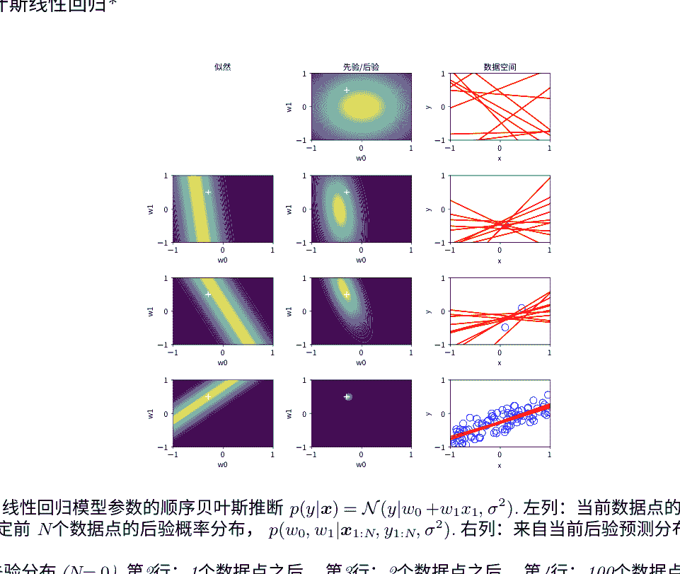

图11.20：线性回归模型参数的顺序贝叶斯推断 $p(y|x) = \mathcal{N}(y|w_0 + w_1 x_1, \sigma^2)$。左列：当前数据点的似然函数。中列：给定前 $N$ 个数据点的后验概率分布，$p(w_0, w_1|x_{1:N}, y_{1:N}, \sigma^2)$。右列：来自当前后验预测分布的样本。

第1行：先验分布 ($N=0$)。第2行：1个数据点之后。第3行：2个数据点之后。第4行：100个数据点之后。第1列和第2列的白色十字表示真实参数值；我们可以看到后验分布的模态迅速收敛到该点。第3列的蓝色圆圈是观测数据点。

改编自[Bis06]的图3.7。由linreg_2d_bayes_demo.ipynb生成。

其中 $\hat{\sigma}^2 (x) \triangleq \sigma^2 + x^{\top} \hat{\Sigma} x$ 是在观察到 $N$ 个训练样本后点 $x$ 的后验预测分布的方差。预测方差取决于两个因素：观测噪声的方差 $\sigma^2$ 和参数的方差 $\hat{\Sigma}$。后者表示观测值的方差，其取决于 $x$ 与训练数据 $\mathcal{D}$ 的接近程度。这在图11.21(b)中有所说明，我们可以看到随着离开训练点越远，误差条变得越大，表示不确定性增加。这对于某些应用非常重要，比如主动学习，我们可以选择在哪里收集训练数据（参见第19.4节）。在某些情况下，计算参数后验分布 $p(w|\mathcal{D})$ 是计算上不可行的。在这种情况下，我们可以选择使用一个点估计值 $\hat{w}$，并使用插值近似方法。

这给出

$$
p(y|x, \mathcal{D}, \sigma^2) = \int \mathcal{N}(y|x^{\top} w, \sigma^2)\delta(w - \hat{w})dw = p(y|x^{\top} \hat{w}, \sigma^2). \tag{11.125}
$$

我们可以看到后验预测方差是恒定的，并且与数据无关，如图11.21(a)所示。如果我们从这个后验中采样一个参数，我们将始终得到一个单一的函数，如图11.21(c)所示。相比之下，如果我们从真实的后验中采样，$w_s \sim p(w|\mathcal{D}, \sigma^2)$，我们将得到一系列不同的函数，如图11.21(d)所示，这更准确地反映了我们的不确定性。

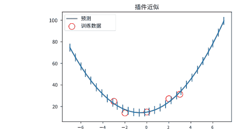

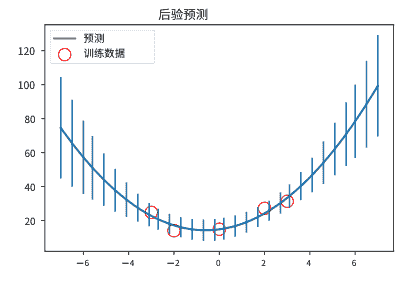

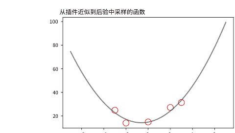

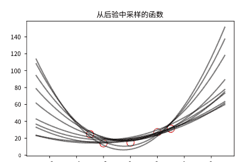

图11.21: (a) 在拟合一维数据的二次多项式时，使用参数的最大似然估计进行预测密度的插值近似。(b) 后验预测密度，通过积分消除参数得到。黑色曲线是后验均值，误差条是后验预测密度的2个标准差。(c) 从插值近似的后验预测分布中抽取的10个样本。(d) 从真实后验预测分布中抽取的10个样本。由linreg_post_pred_plot.ipynb生成。

### 11.7.5 中心化的优势

敏锐的读者可能会注意到，图11.20中的二维后验形状是一个拉长的椭圆（当 N→∞ 时最终会收缩成一个点）。这意味着两个参数之间存在大量的后验相关性，这可能导致计算困难。

要理解为什么会发生这种情况，请注意每个数据点引发了一个通过该数据点的直线的似然函数。当我们将所有数据一起考虑时，我们发现最大似然预测必须对应于通过数据的均值的直线，即 (x, y)。有许多这样的直线，但如果我们增加斜率，就必须减小截距。

因此，我们可以将高概率线的集合想象成围绕数据均值旋转的轮盘。这种 w₀ 和 w₁ 之间的相关性是后验概率具有对角线形式的原因。（高斯先验将其转化为一个细长的椭圆，但后验相关性仍然存在，直到样本大小导致后验收缩为一个点。）

计算这种细长后验可能很困难。一个简单的解决方案是将输入数据居中，即通过使用 x'ₙ = xₙ - x̄。现在，这些线可以围绕原点旋转，从而减小后验概率。

> 5。这个类比来自于[Mar18, p96]。

## 11.7. 贝叶斯线性回归*

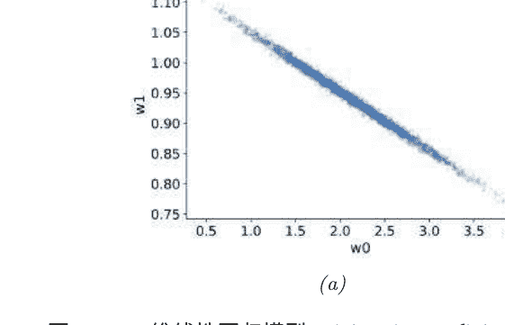

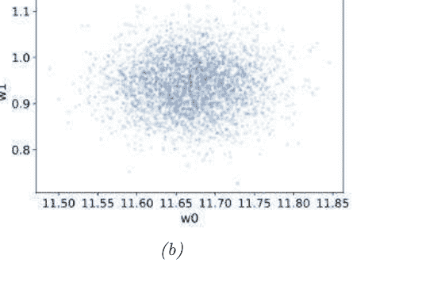

图11.22: 1维线性回归模型 $p(y|x,\theta) = \mathcal{N}(y|w_0 + w_1x,\sigma^2)$ 的后验样本 $p(w_0, w_1|D)$。 (a) 原始数据。(b) 居中数据。由*lin-reg_2d_bayes_centering_pymc3.ipynb*生成。

$w_0$和$w_1$之间的相关性。请参见图11.22进行说明。(我们也可以选择将每个特征的$x_n$除以该特征的标准差，如第10.2.8节所讨论的。) 请注意，我们可以通过注意到从拟合到居中数据得到的后验概率，将其转换回原始坐标系。

$y' = w'_0 + w'_1 x' = w'_0 + w'_1 (x - \overline{x}) = (w'_0 - w'_1 \overline{x}) + w'_1 x$ \quad\quad\quad (11.126)

因此，未居中数据上的参数为 $w_0 = w'_0 - w'_1 \overline{x}$ 和 $w_1 = w'_1$。

### 11.7.6 处理多重共线性

在许多数据集中，输入变量之间可能高度相关。包括所有这些变量通常不会对预测准确性造成伤害(前提是使用适当的先验或正则化项来防止过拟合)。然而，这可能会使系数的解释更加困难。为了说明这一点，我们使用了来自|McE20， 第6.1节|的一个玩具示例。假设我们有一个记录了$N$个人的身高 $h_i$、左腿长 $l_i$和右腿长 $r_i$的数据集。假设 $h_i \sim \mathcal{N}(10, 2)$，因此平均身高为 $h=10$ (单位未指定)。假设腿的长度是身高的一些比例 $\rho_i \sim \mathrm{Unif}(0.4,0.5)$，再加上一点高斯噪声，具体地说 $l_i \sim \mathcal{N}(\rho_i h_i, 0.02)$和 $r_i \sim \mathcal{N}(\rho_i h_i, 0.02)$。

现在假设我们想要根据腿长的测量来预测一个人的身高。(我提到这只是一个玩具例子！) 由于左腿和右腿都是未知量的嘈杂测量，使用它们是有用的。所以我们使用线性回归来拟合$p(h|l, r) = \mathcal{N}(h|\alpha + \beta_l l + \beta_r r, \sigma^2)$。我们使用模糊先验，$\alpha, \beta_l, \beta_r \sim \mathcal{N}(0, 100)$, 和 $\sigma \sim \mathrm{Expon}(1)$。由于平均腿长是 $l = 0.45 h = 4.5$，我们可能期望每个 $\beta$ 系数大约为$h/l = 10/4.5 = 2.2$。然而，图11.23中显示的后验边缘概率告诉了一个不同的故事：我们可以看到$\beta_l$的后验均值接近2.6，但$\beta_r$接近-0.6。因此，似乎右腿特征是不需要的。这是因为特征$j$的回归系数编码了在已知所有其他特征$x_{-j}$的情况下，知道$x_j$的价值，正如我们在第11.2.2.1节中讨论的那样。如果我们已经知道左腿，那么也知道右腿的边际价值很小。然而，如果我们

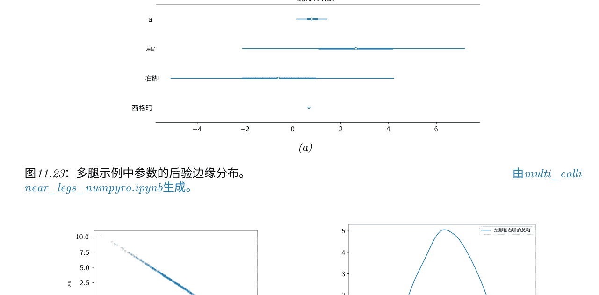

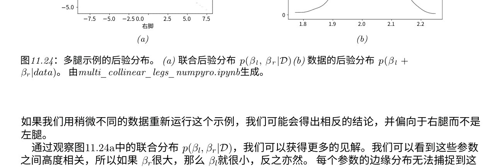

如果我们用稍微不同的数据重新运行这个示例，我们可能会得出相反的结论，并偏向于右腿而不是左腿。
通过观察图11.24a中的联合分布 \(p(\beta_l, \beta_r|D)\)，我们可以获得更多的见解。我们可以看到这些参数之间高度相关，所以如果 \(\beta_r\) 很大，那么 \(\beta_l\) 就很小，反之亦然。每个参数的边缘分布无法捕捉到这一点。然而，它确实显示了每个参数存在很大的不确定性，表明它们是不可识别的。

然而，它们的总和是确定的，可以从图11.24b中看出，我们绘制了 \(p(\beta_l + \beta_r|D)\)；这个值的中心是2.2，正如我们所预期的。
这个例子表明，在模型中，我们必须小心解释单个系数估计的意义，因为它们在孤立状态下没有太多意义。

### 11.7.7 自动相关性确定（ARD）*

考虑一个具有已知观测噪声但未知回归权重的线性回归模型，\(N(y|Xw, \sigma^2I)\)。假设我们对权重使用高斯先验分布，\(w_j \sim N(0, 1/\alpha_j)\)，其中 \(\alpha_j\) 是第 $j$ 个参数的精度。现在假设我们按照以下方式估计先验精度：

$$ \hat{\alpha} = \argmax_{\alpha} p(\boldsymbol{y}|\mathbf{X}, \alpha) \tag{11.127} $$

其中

$$ p(\boldsymbol{y}|\mathbf{X}, \alpha) = \int p(\boldsymbol{y}|\mathbf{X}\boldsymbol{w}, \sigma^2)p(\boldsymbol{w}|\boldsymbol{0}, \mathrm{diag}(\alpha)^{-1})d\boldsymbol{w} \tag{11.128} $$

是边际似然。这是经验贝叶斯的一个例子，因为我们是从数据中估计先验。我们可以将其视为完全贝叶斯方法的计算快捷方式。然而，还有其他优点。特别是，假设在估计 $\alpha$ 之后，我们计算MAP估计

$$ \hat{\boldsymbol{w}} = \argmax_{\boldsymbol{w}} \mathcal{N}(\boldsymbol{w}|\boldsymbol{0}, \hat{\alpha}^{-1}) \tag{11.129} $$

这导致了对 $\hat{\boldsymbol{w}}$ 的稀疏估计，这可能令人惊讶，因为对于 $\boldsymbol{w}$ 的高斯先验并不促进稀疏性。这本书的续篇中解释了其中的原因。

这种技术被称为稀疏贝叶斯学习[Tip01]或自动相关性决定（ARD）[Mac95; Nea96]。它最初是为神经网络开发的（其中稀疏性应用于第一层权重），但在这里我们将其应用于线性模型。另请参阅第17.4.1节，在那里我们将其应用于核化线性模型。

## 11.8 练习

练习 11.1[多输出线性回归 *]
（来源：Jaakkola。）

考虑一个具有2维响应向量 $\boldsymbol{y}_i \in \mathbb{R}^2$ 的线性回归模型。假设我们有一些二进制输入数据，$x_i \in \{0,1\}$。训练数据如下：

| x | y |
|---|----|
| 0 | $(-1,-1)^T$ |
| 0 | $(-1,-2)^T$ |
| 0 | $(-2,-1)^T$ |
| 1 | $(1,1)^T$ |
| 1 | $(1,2)^T$ |
| 1 | $(2,1)^T$ |

让我们使用以下基函数将每个 $x_i$ 嵌入到2d中：

$$ \phi(0) = (1, 0)^T, \quad \phi(1) = (0, 1)^T \tag{11.130} $$

模型变为

$$ \hat{\boldsymbol{y}} = \mathbf{W}^T \phi(x) \tag{11.131} $$

其中 $\mathbf{W}$ 是一个 $2 \times 2$ 矩阵。从上述数据中计算 $\mathbf{W}$ 的最大似然估计值。

练习11.2[居中和岭回归]

假设 $x = 0$，因此输入数据已经居中。证明

$$ J(\boldsymbol{w}, w_0) = (\boldsymbol{y} - \mathbf{X}\boldsymbol{w} - w_0\mathbf{1})^T(\boldsymbol{y} - \mathbf{X}\boldsymbol{w} - w_0\mathbf{1}) + \lambda \boldsymbol{w}^T \boldsymbol{w} \tag{11.132} $$

是

$$\hat{w}_0 = \bar{y} \tag{11.133}$$

$$w = (X^T X + \lambda I)^{-1} X^T y \tag{11.134}$$

### 练习11.3[残差平方和的偏导数 *]

设 $RSS(w) = ||Xw - y||^2$ 为残差平方和。

+   a. 证明

$$\frac{\partial}{\partial w_k} RSS(w) = a_k w_k - c_k \tag{11.135}$$

$$a_k = 2 \sum_{i=1}^n x_{ik}^2 = 2 ||x_{:,k}||^2 \tag{11.136}$$

$$c_k = 2 \sum_{i=1}^n x_{ik}(y_i - w_{-k}^T x_{i,-k}) = 2 x_{:,k}^T r_k \tag{11.137}$$

其中 $w_{-k} = w$ 去除分量 $k$， $x_{i,-k}$ 是去除分量 $k$ 的 $x_i$，而 $r_k = y - w_{-k}^T x_{i,-k}$ 是使用除了特征 $k$ 之外的所有特征导致的残差。提示：将权重分为涉及 $k$ 的部分和不涉及 $k$ 的部分。

+   b. 证明如果

$$\frac{\partial}{\partial w_k} RSS(w) = 0, 那么$$

$$\hat{w}_k = \frac{x_{:,k}^T r_k}{||x_{:,k}||^2} \tag{11.138}$$

因此，当我们逐步添加特征时，特征 $k$ 的最优权重通过计算将 $x_{:,k}$ 正交投影到当前残差上来计算。

### 练习11.4[将弹性网降为套索]定义

$$J_1(w) = ||y - Xw||^2 + \lambda_2 ||w||_2^2 + \lambda_1 ||w||_1 \tag{11.139}$$

和

$$J_2(w) = ||\tilde{y} - \tilde{X}w||^2 + c \lambda_1 ||w||_1 \tag{11.140}$$

其中 $||w||^2 = ||w||_2^2 = \sum_i w_i^2$ 是平方2范数， $||w||_1 = \sum_i |w_i|$ 是1范数， $c = (1 + \lambda_2)^{-1}$， 而

$$\tilde{X} = \begin{pmatrix} X \\ \sqrt{\lambda_2} I_d \end{pmatrix}, \quad \tilde{y} = \begin{pmatrix} y \\ 0_{d \times 1} \end{pmatrix} \tag{11.141}$$

展示

$$\text{argmin} J_1(w) = c (\text{argmin} J_2(w)) \tag{11.142}$$

即

$$J_1(cw) = J_2(w) \tag{11.143}$$

因此可以使用修改后的数据在套索求解器上解决弹性网络问题。

### 练习11.5[线性回归中的收缩 *]

(来源: Jaakkola。) 考虑使用正交设计矩阵进行线性回归，因此 $||\boldsymbol{x}_{:,k}||_2^2 = 1$ 对于每个列 (特征) $k$，且 $\boldsymbol{x}_{:,k}^T\boldsymbol{x}_{:,j} = 0$，因此我们可以分别估计每个参数 $w_k$。

图10.15b绘制了 $\hat{w}_k$ vs $c_k = 2\boldsymbol{y}^T\boldsymbol{x}_{:,k}$，特征 $k$ 与响应的相关性，对应于3种不同的估计方法：普通最小二乘法 (OLS)，带参数 $\lambda_2$ 的岭回归和带参数 $\lambda_1$ 的套索回归。

+   a. 不幸的是，我们忘记给图表贴标签了。实线 (1)，虚线 (2) 和点线 (3) 分别对应于哪种方法?
b. 参数 $\lambda_1$ 的值是多少?
c. 参数 $\lambda_2$ 的值是多少?

### 练习11.6[混合线性回归专家的EM算法]

推导拟合混合线性回归专家的EM方程。

## 12 广义线性模型 *

## 12.1 导论

在第10章中，我们讨论了逻辑回归，在二元情况下，对应于模型 $p(y|x, w) = \mathrm{Ber}(y|\sigma(w^\top x))$。在第11章中，我们讨论了线性回归，对应于模型 $p(y|x, w) = \mathcal{N}(y|w^\top x, \sigma^2)$。这些显然非常相似。特别地，输出的均值 $\mathbb{E}[y|x, w]$，在这两种情况下都是输入 $x$ 的线性函数。

事实证明，有一大类具有这种特性的模型，被称为广义线性模型或GLMs[MN89]。

GLM是指输入的自然参数是输入的线性函数的指数族分布的条件版本（第3.4节）。更准确地说，该模型具有以下形式：

$$p(y|\boldsymbol{x}_n, \boldsymbol{w}, \sigma^2) = exp \left[ \frac{y_n\eta_n - A(\eta_n)}{\sigma^2} + \log h(y_n, \sigma^2) \right] \tag{12.1}$$

其中 $\eta_n \triangleq \boldsymbol{w}^\top \boldsymbol{x}_n$ 是（与输入相关的）自然参数，$A(\eta_n)$ 是对数归一化器，$^\top (y_n) = y_n$ 是充分统计量，$\sigma^2$ 是离散项。$^1$ 我们将使用 $\mu_n = \ell(\eta_n)$ 来表示从线性输入到输出均值的映射，其中函数 $\ell$ 被称为链接函数，$\ell^{-1}$ 被称为均值函数。根据第3.4.3节的结果，我们可以证明响应变量的均值和方差如下：

$$\mathbb{E} \left[ y_n | \boldsymbol{x}_n, \boldsymbol{w}, \sigma^2 \right] = A'(\eta_n) \triangleq \ell^{-1}(\eta_n) \tag{12.2}$$

$$\mathbb{V} \left[ y_n | \boldsymbol{x}_n, \boldsymbol{w}, \sigma^2 \right] = A''(\eta_n)\sigma^2 \tag{12.3}$$

### 12.2 例子

在本节中，我们给出一些广泛使用的GLM的例子。

+   1. 从技术上讲，GLM使用了自然指数族的一个轻微扩展，被称为指数分散族。对于标量变量，它的形式为 $p(y|\eta, \sigma^2) = h(y, \sigma^2) exp \left[ \frac{\eta y - A(\eta)}{\sigma^2} \right]$。这里 $\sigma^2$ 被称为离散参数。对于固定的 $\sigma^2$，这是一个自然指数族。

### 12.2.1 线性回归

回想一下，线性回归的形式为

```
p(y_n|x_n, w, \sigma^2) = \frac{1}{\sqrt{2\pi\sigma^2}} \exp(-\frac{1}{2\sigma^2}(y_n - w^T x_n)^2)
```

因此

```
\log p(y_n|x_n, w, \sigma^2) = -\frac{1}{2\sigma^2}(y_n - \eta_n)^2 - \frac{1}{2}\log(2\pi\sigma^2)
```

其中 \(\eta_n = w^T x_n\)。我们可以将其写成广义线性模型的形式如下：

```
\log p(y_n|x_n, w, \sigma^2) = \frac{y_n\eta_n - \frac{\eta_n^2}{2}}{\sigma^2} - \frac{1}{2}\left(\frac{y_n^2}{\sigma^2} + \log(2\pi\sigma^2)\right)
```

我们可以看到 \(A(\eta_n) = \eta_n^2/2\)，因此

```
\mathbb{E}[y_n] = \eta_n = w^T x_n
```

```
\mathbb{V}[y_n] = \sigma^2
```

### 12.2.2 二项回归

如果响应变量是在 \(N_n\)次试验中成功的次数， \(y_n \in \{0, \ldots, N_n\}\)，我们可以使用二项回归，其定义为

```
p(y_n|x_n, N_n, w) = \text{Bin}(y_n|\sigma(w^T x_n), N_n)
```

我们可以看到，当 \(N_n = 1\)时，二元逻辑回归是特殊情况。
对数概率密度函数为

```
\log p(y_n|x_n, N_n, w) = y_n \log \mu_n + (N_n - y_n) \log(1 - \mu_n) + \log \binom{N_n}{y_n}
```

```
= y_n \log\left(\frac{\mu_n}{1 - \mu_n}\right) + N_n \log(1 - \mu_n) + \log \binom{N_n}{y_n}
```

为了将其重写为GLM形式，让我们定义

```
\eta_n \triangleq \log \left[\frac{\mu_n}{(1 - \mu_n)}\right] = \log \left[\frac{1}{1 + e^{-w^T x_n}} \frac{1 + e^{-w^T x_n}}{e^{-w^T x_n}}\right] = \log \frac{1}{e^{-w^T x_n}} = w^T x_n
```

因此，我们可以将二项回归写成GLM形式如下

```
\log p(y_n|x_n, N_n, w) = y_n\eta_n - A(\eta_n) + h(y_n)
```

其中 \(h(y_n) = \log \binom{N_n}{y_n}\) 和

```
A(\eta_n) = -N_n \log(1 - \mu_n) = N_n \log(1 + e^{\eta_n})
```

因此

$\mathbb{E}[y_n] = \frac{dA}{d\eta_n} = \frac{N_n e^{\eta_n}}{1 + e^{\eta_n}} = \frac{N_n}{1 + e^{-\eta_n}} = N_n \mu_n$ (12.15)

和

$\mathbb{V}[y_n] = \frac{d^2 A}{d\eta_n^2} = N_n \mu_n (1 - \mu_n)$ (12.16)

### 12.2.3 泊松回归

如果响应变量是整数计数，$y_n \in \{0, 1, \dots\}$，我们可以使用泊松回归，定义如下

$p(y_n|\mathbf{x}_n, \mathbf{w}) = \mathrm{Poi}(y_n | \exp(\mathbf{w}^\top \mathbf{x}_n))$ (12.17)

其中

$\mathrm{Poi}(y|\mu) = e^{-\mu} \frac{\mu^y}{y!}$ (12.18)

是泊松分布。泊松回归广泛应用于生物统计学应用中，其中$y_n$可能表示给定个人或地点的疾病数量，或者在高通量测序环境中基因组位置的读数数量（参见例如，[Kua+09]）。

对数概率密度函数为

$\log p(y_n|\mathbf{x}_n, \mathbf{w}) = y_n \log \mu_n - \mu_n - \log(y_n!)$ (12.19)

其中 $\mu_n = \exp(\mathbf{w}^\top \mathbf{x}_n)$。因此，在GLM形式中，我们有

$\log p(y_n|\mathbf{x}_n, \mathbf{w}) = y_n \eta_n - A(\eta_n) + h(y_n)$ (12.20)

其中 $\eta_n = \log(\mu_n) = \mathbf{w}^\top \mathbf{x}_n$, $A(\eta_n) = \mu_n = e^{\eta_n}$，而 $h(y_n) = -\log(y_n!)$。因此

$\mathbb{E}[y_n] = \frac{dA}{d\eta_n} = e^{\eta_n} = \mu_n$ (12.21)

和

$\mathbb{V}[y_n] = \frac{d^2 A}{d\eta_n^2} = e^{\eta_n} = \mu_n$ (12.22)

## 12.3 具有非规范链接函数的GLMs

我们已经看到输出分布的均值参数由 $\mu = \ell^{-1}(\eta)$给出，其中函数 $\ell$是链接函数。现在我们讨论几种选择这个函数的方法。

这是我们迄今为止所假设的。例如，对于伯努利分布，规范参数是对数几率 \(\theta= \log(\mu/(1- \mu))\)，由对数几率变换给出

```
\(\theta = \ell(\mu) = \text{logit}(\mu) = \log \left( \frac{\mu}{1-\mu} \right)\) (12.24)
```

其逆函数是sigmoid或logistic函数 \(\mu = \sigma(\theta) = 1/(1 + e^{-\theta})\)。
然而，我们可以自由选择其他类型的链接函数。例如，probit链接函数的形式为

```
\(\eta = \ell(\mu) = \Phi^{-1}(\mu)\) (12.25)
```

有时用于二元响应的另一个链接函数是互补对数-对数函数

```
\(\eta = \ell(\mu) = \log(- \log(1 - \mu))\) (12.26)
```

这在我们观察到0个事件（用 \(y= 0\) 表示）或一个或多个事件（用 \(y= 1\) 表示）的应用中使用，事件被假设服从速率为 \(\lambda\) 的泊松分布。
设 \(E\) 为事件的数量。泊松假设意味着 \(p(E= 0) = \exp(-\lambda)\)，因此

```
\(p(y = 0) = (1 - \mu) = p(E = 0) = \exp(-\lambda)\) (12.27)
```

因此 \(\lambda = - \log(1 - \mu)\)。当 \(\lambda\) 是协变量的函数时，我们需要确保它是正的，所以我们使用 \(\lambda = e^{\eta}\)，因此

```
\(\eta = \log(\lambda) = \log(- \log(1 - \mu))\) (12.28)
```

## 12.4 最大似然估计

广义线性模型可以使用类似于拟合逻辑回归的方法进行拟合。特别地，负对数似然函数的形式如下（忽略常数项）：

```
\(\text{NLL}(\mathbf{w}) = -\log p(\mathcal{D}|\mathbf{w}) = -\frac{1}{\sigma^2} \sum_{n=1}^{N} \ell_n\) (12.29)
```

其中

```
\(\ell_n \triangleq \eta_n y_n - A(\eta_n)\) (12.30)
```

其中 \(\eta_n = \mathbf{w}^\top \mathbf{x}_n\)。为了简化符号，我们将假设 \(\sigma^2= 1\)。
我们可以计算单个项的梯度如下：

```
\(\mathbf{g}_n \triangleq \frac{\partial \ell_n}{\partial \mathbf{w}} = \frac{\partial \ell_n}{\partial \eta_n} \frac{\partial \eta_n}{\partial \mathbf{w}} = (y_n - A'(\eta_n))\mathbf{x}_n = (y_n - \mu_n)\mathbf{x}_n\) (12.31)
```

其中 \(\mu_n = f(\mathbf{w}^\top \mathbf{x})\)， \(f\) 是从规范参数到均值参数的反函数。例如，在逻辑回归的情况下， \(f(\eta_n) = \sigma(\eta_n)\)，因此我们恢复到方程 (10.21) 。这个梯度表达式可以在SGD中使用，或者在其他梯度方法中以明显的方式使用。Hessian矩阵由以下给出

```
$$\mathbf{H} = \frac{\partial^2}{\partial \mathbf{w} \partial \mathbf{w}^\top} \mathrm{NLL}(\mathbf{w}) = - \sum_{n=1}^N \frac{\partial g_n}{\partial \mathbf{w}^\top}$$
```

其中

```
$$\frac{\partial g_n}{\partial \mathbf{w}^\top} = \frac{\partial g_n}{\partial \mu_n} \frac{\partial \mu_n}{\partial \mathbf{w}^\top} = -\mathbf{x}_n f'(\mathbf{w}^\top \mathbf{x}_n) \mathbf{x}_n^\top$$
```

因此

```
$$\mathbf{H} = \sum_{n=1}^N f'(\eta_n) \mathbf{x}_n \mathbf{x}_n^\top$$
```

例如，在逻辑回归的情况下， $f(\eta_n) = \sigma(\eta_n)$ ，而 $f'(\eta_n) = \sigma(\eta_n)(1 - \sigma(\eta_n))$ ，因此我们恢复了方程 (10.23) 。一般来说，我们可以看到海森矩阵是正定的，因为 $f'(\eta_n) > 0$ ；因此负对数似然是凸的，因此广义线性模型的最大似然估计是唯一的（假设 $f(\eta_n) > 0$ 对于所有的 $n$ ）。

基于上述结果，我们可以使用基于梯度的求解器拟合广义线性模型（GLMs），这与我们拟合逻辑回归模型的方式非常相似。

## 12.5 工作示例：预测保险索赔

在本节中，我们通过线性回归和泊松回归的例子来预测保险索赔。$^2$ 目标是预测车祸后每年的预期保险索赔次数。数据集包含678k个示例，具有9个特征，如驾驶员年龄、车龄、车辆功率等。

> 2. 此示例来自https://scikit-learn.org/stable/auto_examples/linear_model/plot_poisson_regression_non_normal_loss.html

| 姓名 | MSE | MAE | 偏差 |
|------|-----|-----|------|
| 虚拟 | 0.564 | 0.189 | 0.625 |
| 岭回归 | 0.560 | 0.177 | 0.601 |
| 泊松回归 | 0.560 | 0.186 | 0.594 |

表12.1: 测试集上的性能指标。MSE = 均方误差。MAE = 平均绝对误差。偏差 = 泊松偏差。

等等。目标是索赔频率，即每个保单的索赔次数除以曝光（即保单的年限）。我们在图12.1(a)中绘制了测试集。我们可以看到，94%的保单没有索赔，因此数据中有很多0，这在计数和比率数据中是典型的。索赔的平均频率为10%。这可以转换为一个虚拟模型，它总是预测这个常数。这导致了图12.1(b)中显示的预测结果。目标是做得比这更好。

一个简单的方法是使用线性回归，结合一些简单的特征工程（对连续值进行分箱处理，并对分类变量进行独热编码）。（我们使用了一小部分 $\ell_2$ 正则化，所以从技术上讲这是岭回归。）这给出了图12.1(c)中显示的结果。这比基准要好，但仍然不太好。特别是，它可以预测负面结果，并且无法捕捉到长尾。

我们可以使用泊松回归来取得更好的效果，使用相同的特征，但使用对数链接函数。结果显示在图12.1(d)中。我们可以看到预测结果要好得多。

一个有趣的问题是如何量化这种问题的性能。如果我们使用均方误差或平均绝对误差，我们可能会从表12.1中得出岭回归比泊松回归更好的结论，但这显然是不正确的，如图12.1所示。相反，更常见的做法是使用偏差来衡量性能，其定义为

> $D(\mathbf{y}, \hat{\boldsymbol{\mu}}) = 2 \sum_i (\log p(y_i | \mu_i^*) - \log p(y_i | \mu_i))$
(12.35)

其中 $\mu_i$ 是第 $i$ 个示例的预测参数（基于输入特征 $x_i$ 和训练集 $\mathcal{D}$），而 $\mu_i^*$ 是通过将模型拟合到真实输出 $y_i$ 来估计的最优参数。（这就是所谓的饱和模型，完全适配测试集。）在泊松回归的情况下，我们有 $\mu_i^* = y_i$。因此

> $D(\mathbf{y}, \boldsymbol{\mu}) = 2 \sum_i \left[ (y_i \log y_i - y_i - \log(y_i!)) - (y_i \log \hat{\mu}_i - \hat{\mu}_i - \log(y_i!)) \right]$
(12.36)
$= 2 \sum_i \left[ y_i \log \frac{y_i}{\hat{\mu}_i} + \hat{\mu}_i - y_i \right]$
(12.37)

根据这个指标，泊松模型明显更好（见表12.1的最后一列）。我们还可以计算一个校准图，该图绘制了实际频率与预测频率之间的关系。为了计算这个，我们将预测结果分成区间，然后计算落入每个区间的所有示例的经验频率。结果显示在图12.2中。我们可以看到，恒定的基准是校准良好的，但当然不是很准确。岭回归模型在低频率区域中校准不准确。特别是，

低估了测试集中的总索赔数为10,693，而实际上是11,935。泊松模型更好地校准（即当它预测示例将具有高索赔率时，实际上确实具有高索赔率），并且它预测总索赔数为11,930。

# 第三部分
深度神经网络

# 13 用于表格数据的神经网络

## 13.1 导论

在第二部分中，我们讨论了用于回归和分类的线性模型。特别是在第10章中，我们讨论了逻辑回归，在二元情况下对应于模型 p(y|x, w) = Ber(y|σ(w^T x))，在多类情况下对应于模型 p(y|x, W) = Cat(y|softmax(Wx))。在第11章中，我们讨论了线性回归，对应于模型 p(y|x, w) = N(y|w^T x, σ^2)。而在第12章中，我们讨论了广义线性模型，它将这些模型推广到其他类型的输出分布，例如泊松分布。然而，所有这些模型都假设输入输出映射是线性的。

增加这些模型灵活性的一种简单方法是通过特征转换来实现，通过用 φ(x) 替换 x。例如，我们可以使用多项式变换，在一维情况下为 φ(x) = [1, x, x^2, x^3, ...]，正如我们在1.2.2.2节中讨论的那样。有时候这被称为基函数扩展。模型现在变成了

```
f(x; θ) = W φ(x) + b
```

这仍然是参数 θ = (W, b) 的线性模型，这使得模型拟合变得容易（因为负对数似然是凸的）。然而，手动指定特征转换非常有限。

一个自然的扩展是赋予特征提取器自己的参数 θ₂，以获得

```
f(x; θ) = W φ(x; θ₂) + b
```

我们可以明显地递归地重复这个过程，以创建更多和更复杂的函数。如果我们组合 L 个函数，我们得到

```
f(x; θ) = f_L(f_{L-1}(…(f_1(x))…))
```

其中 f_ℓ(x) = f(x; θ_ℓ) 是第 ℓ 层的函数。这是深度神经网络或 DNN 的关键思想。

术语“DNN”实际上包括一个更大的模型家族，其中我们将可微分的函数组合成任何类型的DAG（有向无环图），将输入映射到输出。方程（13.3）是DAG是链的最简单的例子。这被称为前馈神经网络（FFNN）或多层感知机（MLP）。

MLP假设输入是一个固定维度的向量，假设为 x ∈ ℝ^D。通常将这样的数据称为“结构化数据”或“表格数据”，因为数据通常存储在一个 N × D 的表格中。

| $x_1$ | $x_2$ | $y$ |
|---|---|---|
| 0 | 0 | 0 |
| 0 | 1 | 1 |
| 1 | 0 | 1 |
| 1 | 1 | 0 |

表13.1: $XOR$（异或）函数的真值表，$y = x_1 \veebar x_2$。

设计矩阵，其中每一列（特征）都有特定的含义，例如身高、体重、年龄等。在后面的章节中，我们将讨论其他类型的DNN，这些DNN更适合处理“非结构化数据”，例如图像和文本，其中输入数据的大小可变，并且每个单独的元素（例如像素或单词）本身通常没有意义。¹ 特别是在第14章中，我们讨论卷积神经网络（CNN），这些网络专门用于处理图像；在第15章中，我们讨论循环神经网络（RNN）和Transformer，这些网络专门用于处理序列；在第23章中，我们讨论图神经网络（GNN），这些网络专门用于处理图形。

虽然深度神经网络(DNNs)可以工作得很好，但通常需要解决许多工程细节才能获得良好的性能。这些细节在本书的补充材料中有所讨论，可在probml.ai上获得。还有其他一些涵盖这个主题更深入的书籍（例如，[Zha+20; Cho21; Gér19; GBC16; Raf22]），以及大量的在线课程。要进行更多的理论处理，请参阅例如[Ber+21; Cal20; Aro+21; RY21]。

### 13.2 多层感知器 (MLPs)

在第10.2.5节中，我们解释了感知器是逻辑回归的确定性版本。具体而言，它是以下形式的映射：

```
$$f(\boldsymbol{x}; \boldsymbol{\theta}) = \mathbb{I}\left(\boldsymbol{w}^{\top} \boldsymbol{x}+b \geq 0\right)=H\left(\boldsymbol{w}^{\top} \boldsymbol{x}+b\right)$$
```

其中$H(a)$是阶跃函数，也被称为线性阈值函数。由于感知器表示的决策边界是线性的，它们在表示能力上非常有限。1969年，马文·明斯基和西摩·帕帕特出版了一本著名的书，名为《感知器》[MP69]，其中给出了许多感知器无法解决的模式识别问题的例子。在讨论如何解决问题之前，我们先给出一个具体的例子。

### 13.2.1 XOR问题

《感知机》一书中最著名的例子之一是**XOR问题**。这里的目标是学习一个函数，计算其两个二进制输入的异或。这个函数的真值表在表13.1中给出。我们在图13.1a中可视化这个函数。很明显，数据不是线性可分的，所以感知机无法表示这个映射。

然而，我们可以通过将多个感知机叠加在一起来解决这个问题。这被称为多层感知机（MLP）。例如，为了解决XOR问题，我们可以使用图13.1b中显示的MLP。它由3个感知机组成，分别表示为$h_1$、$h_2$和$y$。标记为$x$的节点是输入，标记为$_1$的节点是常数项。标记为$h_1$和$h_2$的节点被称为隐藏单元，因为它们的值在训练数据中不可观测。

第一个隐藏单元通过适当设置的权重计算 $h_1 = x_1 \land x_2$。（这里 $\land$ 是AND操作）。特别地，它从 $x_1$ 和 $x_2$ 接收输入，两者的权重都为1.0，但有一个偏差项为-1.5（这是通过一个权重为-1.5的“线”来实现的，该线来自一个固定值为1的虚拟节点）。因此，只有当 $x_1$ 和 $x_2$ 都为真时，$h_1$ 才会激活，因为那时

$$
\boldsymbol{w}_1^{\top} \boldsymbol{x} - b_1 = [1.0, 1.0]^{\top}[1,1]-1.5=0.5>0 \tag{13.5}
$$

术语“非结构化数据”有点误导，因为图像和文本都有结构。例如，图像中的相邻像素高度相关，句子中的相邻单词也是如此。事实上，正是这种结构被CNN和RNN所利用。相比之下，MLP对其输入不做任何假设。这对于诸如表格数据的应用非常有用，因为结构（列之间的依赖关系）通常不明显，因此需要学习。我们也可以将MLP应用于图像和文本，正如我们将看到的，但通常性能会比专门的模型（如CNN和RNN）差。（有一些例外，例如[Tol+21]中的MLP-mixer模型，它是一个非结构化模型，可以学习在图像和文本数据上表现良好，但这样的模型需要大规模的数据集来克服它们缺乏归纳偏差的问题。）

作者：Kevin P. Murphy。 (C) MIT Press. CC-BY-NC-ND许可证

类似地，第二个隐藏单元计算 $h_2 = x_1 \vee x_2$，其中 $\vee$ 是OR运算，第三个隐藏单元计算输出 $y = h_1 \wedge h_2$，其中 $h = \neg h$ 是NOT（逻辑否定）运算。因此 $y$ 计算

$$
y = f(x_1, x_2) = (\overline{x_1 \wedge x_2}) \wedge (x_1 \vee x_2)
$$

这等价于XOR函数。

通过推广这个例子，我们可以证明MLP可以表示任何逻辑函数。然而，我们显然希望避免手动指定权重和偏差。在本章的其余部分，我们讨论从数据中学习这些参数的方法。

## 13.2.2 可微分的MLP

我们在第13.2.1节中讨论的MLP被定义为感知机的堆叠，每个感知机都涉及非可微的Heaviside函数。这使得这样的模型难以训练，这就是为什么它们从未被广泛使用的原因。然而，假设我们用可微的激活函数 $\varphi: \mathbb{R} \rightarrow \mathbb{R}$ 替换Heaviside函数 $H: \mathbb{R} \rightarrow \{0,1\}$。更准确地说，我们定义每一层的隐藏单元 $z_l$ 为上一层隐藏单元的线性变换，通过这个激活函数逐元素传递：

$$
z_l = f_l(z_{l-1}) = \varphi_l (b_l + \mathbf{W}_l z_{l-1})
$$

或者，以标量形式表示，

$$
z_{kl} = \varphi_l \left( b_{kl} + \sum_{j=1}^{K_{l-1}} w_{lkj} z_{jl-1} \right)
$$

传递给激活函数的量被称为预激活：

$$
a_l = b_l + \mathbf{W}_l z_{l-1}
$$

因此，$z_l = \varphi_l(a_l)$。如果我们现在将这些函数组合在一起，如式（13.3）所示，我们可以使用链式法则计算每层参数对输出的梯度，这也被称为反向传播，正如我们在第13.3节中所解释的。（这对于任何可微分的激活函数都是正确的，尽管某些类型的激活函数效果更好，正如我们在第13.2.3节中所讨论的。）然后，我们可以将梯度传递给优化器，从而最小化一些训练目标，正如我们在第13.4节中所讨论的。因此，术语“MLP”几乎总是指这种可微分形式的模型，而不是具有不可微分线性阈值单元的历史版本。

### 13.2.3 激活函数

我们可以自由地在每一层使用任何可微的激活函数。然而，如果我们使用线性激活函数，$\varphi(a) = c a$，那么整个模型就简化为一个普通的线性模型。为了看到这一点，注意到方程（13.3）变为

$$
f(x; \theta) = \mathbf{W}_L c_L (\mathbf{W}_{L-1} c_{L-1}( \cdots (\mathbf{W}_1 x) \cdots )) \propto \mathbf{W}_L \mathbf{W}_{L-1} \cdots \mathbf{W}_1 x = \mathbf{W}' x
$$

为了符号简洁起见，我们省略了偏置项。因此，使用非线性激活函数非常重要。

在神经网络的早期阶段，常见的选择是使用 sigmoid（逻辑）函数，它可以看作是感知器中使用的海维赛德函数的平滑近似：

$$
\sigma(a)=\frac{1}{1+e^{-a}} \qquad\qquad\qquad\qquad\qquad\qquad(13.11)
$$

然而，如图13.2a所示，sigmoid 函数在大正输入时饱和为1，在大负输入时饱和为0。另一个常见的选择是 tanh 函数，它具有类似的形状，但在-1和+1处饱和。见图13.2b。

在饱和区域，输出相对于输入的梯度接近于零，因此来自更高层的梯度信号无法传播回较早的层。这被称为梯度消失问题，使得使用梯度下降训练模型变得困难（详见第13.4.2节）。能够训练非常深的模型的关键之一是使用非饱和的激活函数。已经提出了几种不同的函数。最常见的是修正线性单元（ReLU），在[GBB11; KSH12]中提出。它的定义如下：

$$
ReLU(a)=\max(a,0)=a\mathbb{I}(a>0) \qquad\qquad\qquad(13.12)
$$

ReLU 函数简单地“关闭”负输入，并保持正输入不变：参见图13.2b进行绘制，以及第13.4.3节进行更多细节说明。

当神经网络用于表示在连续输入空间上定义的函数时——例如时间点 $f(t)$，或者在3D空间中 $f(x, y, z)$——它们通常被称为神经隐式表示或基于坐标的表示底层信号。在这种情况下，捕捉高频率以忠实地表示信号往往很重要。不幸的是，MLP对低频函数有固有偏差[Tan+20; RML22]。一个简单的解决方案是使用正弦函数 $\sin(a)$ 作为非线性函数，而不是 ReLU，如[Sit+20]中所解释的。

² 对于一些简单的例子，正弦激活函数在学习函数方面具有令人惊讶的能力

图13.3：应用于来自2个类别的2D点集的具有2个隐藏层的MLP，显示在左上角。与每个隐藏单元相关的可视化显示了网络中该部分的决策边界。最终输出显示在右侧。输入为$x \in \mathbb{R}^2$，第一层激活为$z_1 \in \mathbb{R}^4$，第二层激活为$z_2 \in \mathbb{R}^2$，最终的逻辑回归为$a_3 \in \mathbb{R}$，使用sigmoid函数将其转换为概率。这是来自http://playground.tensorflow.org的交互演示的截图。

### 13.2.4 示例模型

MLPs可以用于对许多种类的数据进行分类和回归。我们在下面给出一些例子。

### 13.2.4.1 MLP用于将2D数据分类为2个类别

图13.3给出了一个应用于2D输入向量的MLP的示例，对应于平面上来自两个同心圆的点。该模型具有以下形式：

$$
p(y|\boldsymbol{x}; \boldsymbol{\theta}) = \mathrm{Ber}(y|\sigma(a_3))
$$

$$
a_3 = \boldsymbol{w}_3^{\mathsf{T}} \boldsymbol{z}_2 + b_3
$$

$$
\boldsymbol{z}_2 = \varphi(\mathbf{W}_2 \boldsymbol{z}_1 + \boldsymbol{b}_2)
$$

$$
\boldsymbol{z}_1 = \varphi(\mathbf{W}_1 \boldsymbol{x} + \boldsymbol{b}_1)
$$

这里$a_3$是最终的逻辑分数，通过sigmoid（逻辑）函数转换为概率。值$a_3$通过使用第2层中2个隐藏单元的线性组合来计算。

> 对于低维输入空间，请参见 https://nipunbatra.github.io/blog/posts/siren-paper.html 和 https://nipunbatra.github.io/blog/posts/siren-paper.html。

《概率机器学习：导论》草稿。2023年6月22日

反过来，通过使用 $z_2 = \varphi(\mathbf{W}_2 z_1 + b_2)$，计算第2层，其中$\varphi$是非线性组合，$z_1$是第1层的4个隐藏单元的非线性组合，$\mathbf{W}_2$是权重，$b_2$是偏差。最后，通过使用$z_1 = \varphi(\mathbf{W}_1\mathbf{x} + b_1)$，计算第1层，其中$\varphi$是非线性组合，$z_1$是2个输入单元的非线性组合，$\mathbf{W}_1$是权重，$b_1$是偏差。通过调整参数 $\theta= (\mathbf{W}_1, b_1,\mathbf{W}_2,b_2, \mathbf{w}_3, b_3)$，以最小化负对数似然，我们可以很好地拟合训练数据，尽管决策边界具有高度非线性的特性。（您可以在http://playground.tensorflow.org找到此图的交互版本。）

### 13.2.4.2 用于图像分类的MLP

要将MLP应用于图像分类，我们需要将2D输入“展平”为1D向量。然后，我们可以使用类似于第13.2.4.1节中描述的前馈架构。例如，考虑构建一个MLP来分类MNIST数字（第3.5.2节）。这些是 $28 \times 28 = 784$维的。如果我们使用2个具有128个单元的隐藏层，然后是一个最终的10路softmax层，我们得到的模型如表13.2所示。

我们在图13.4中展示了该模型的一些预测结果。我们仅对其进行了两个“epochs”（对数据集的遍历），但模型的表现已经相当不错，测试集准确率达到了97.1%。此外，错误似乎是合理的，例如将9误认为是3。进行更多的epochs训练可以进一步提高测试准确率。

在第14章中，我们讨论了一种不同类型的模型，称为卷积神经网络，它更适用于图像。通过利用关于图像空间结构的先验知识，这种方法可以获得更好的性能并使用更少的参数。相比之下，对于多层感知器（MLP），我们可以随机地对像素进行洗牌（排列），而不会影响输出（假设我们对所有输入使用相同的随机排列）。

表13.2: 用于MNIST分类的MLP结构。请注意，100,480 = (784 + 1) × 128，以及16,512 = (128 + 1) × 128。mlp_mnist_tf.ipynb。

| 层 (类型) | 输出形状 | 参数 # |
|---|---|---|
| flatten (扁平化) | (None, 784) | 0 |
| dense (稠密) | (None, 128) | 100480 |
| dense_1 (稠密) | (None, 128) | 16512 |
| dense_2 (稠密) | (None, 10) | 1290 |
| 总参数数： | 118,282 |
| 可训练参数数： | 118,282 |
| 不可训练参数数： | 0 |

图13.4: 将多层感知器（具有2个隐藏层，每个隐藏层有128个单元和1个输出层，有10个单元）应用于一些MNIST图像（选择了一些错误的图像）。红色表示错误，蓝色表示正确。（a）经过1个时期的训练后。（b）经过2个时期的训练后。由mlp_mnist_tf.ipynb生成。

### 13.2.4.3 文本分类的多层感知器（MLP）

要将MLP应用于文本分类，我们需要将变长的单词序列 $v_1, \ldots, v_T$（其中每个 $v_t$ 是长度为 $V$ 的独热向量，其中 $V$ 是词汇量的大小）转换为一个固定维度的向量 $x$。最简单的方法是如下所示。首先，我们将输入视为一个无序的词袋（第1.5.4.1节），$\{v_t\}$。模型的第一层是一个 $E \times V$ 嵌入矩阵 $\mathbf{W}_1$，它将每个稀疏的 $V$ 维向量转换为一个稠密的 $E$ 维嵌入向量，$e_t = \mathbf{W}_1 v_t$（有关词嵌入的更多细节，请参见第20.5节）。然后，我们使用全局平均池化将这组 $TE$ 维嵌入转换为一个固定大小的向量， $e = \bar{e}$。

然后可以将其作为输入传递给MLP。例如，如果我们使用一个隐藏层和一个逻辑输出（用于二元分类），我们得到

$$
e = \frac{1}{T} \sum_{t=1}^{T} e_t.
$$

$$
p(y|\mathbf{x}; \boldsymbol{\theta}) = \mathrm{Ber}(y|\sigma(\mathbf{w}_3^{\top} \mathbf{h} + b_3)) \tag{13.17}
$$

$$
\mathbf{h} = \varphi(\mathbf{W}_2 \bar{\mathbf{e}} + \mathbf{b}_2) \tag{13.18}
$$

$$
\bar{\mathbf{e}} = \frac{1}{T} \sum_{t=1}^{T} \mathbf{e}_t \tag{13.19}
$$

$$
\mathbf{e}_t = \mathbf{W}_1 \mathbf{v}_t \tag{13.20}
$$

如果我们使用词汇量 $V = 10,000$，嵌入大小 $E = 16$，和隐藏层大小16，我们得到表13.3中显示的模型。如果我们将其应用于IMDB电影评论情感分类数据集（在第1.5.2.1节中讨论），我们在验证集上得到86%的准确率。从表13.3中我们可以看到模型有很多参数，这可能导致过拟合，因为IMDB训练集只有25k个样本。 然而，我们还可以看到大部分参数都在嵌入矩阵中，所以我们可以通过无监督的预训练词嵌入模型的方式来学习这些参数，正如我们在第20.5节中讨论的那样。如果嵌入矩阵 $\mathbf{W}_1$ 是固定的，我们只需要对第2层和第3层的参数进行微调，这需要更少的数据。（另请参阅第19章，我们在其中讨论了有限标记数据的一般技术。）

表13.3: 用于IMDB评论分类的MLP结构。 我们使用词汇量大小为 $V=10,000$, 嵌入大小为 $E=16$, 隐藏层大小为 16。 嵌入矩阵 $\mathbf{W}_1$ 大小为 $10,000 \times 16$, 隐藏层 (标记为“dense”) 的权重矩阵 $\mathbf{W}_2$ 大小为 $16 \times 16$, 偏置 $\mathbf{b}_2$ 大小为 16 (注意 $16 \times 16 + 16 = 272$ ), 最后一层 (标记为“dense_1”) 的权重向量 $\mathbf{w}_3$ 大小为 16, 偏置 $b_3$ 大小为 $1$。 全局平均池化层没有自由参数。 $mlp\_imdb\_tf.ipynb$。

模型: "sequential"

| 层 (类型) | 输出形状 | 参数 # |
| :--- | :--- | :--- |
| 嵌入 (Embedding) | (无, 无, 16) | 160000 |
| 全局平均池化1d (Gl | (无, 16) | 0 |
| dense (稠密) | (无, 16) | 272 |
| dense_1 (稠密) | (无, 1) | 17 |
| 总参数: | 160,289 |
| 可训练参数: | 160,289 |
| 不可训练参数: | 0 |

### 13.2.4.4 用于异方差回归的MLP

我们也可以使用MLP进行回归。 图13.5展示了我们如何构建一个用于异方差非线性回归的模型。 (“异方差”一词意味着预测的输出方差与输入相关，如第2.6.3节所讨论。 ) 该函数有两个输出，计算 $f_{\mu}(\mathbf{x}) = \mathbb{E}[y|\mathbf{x}, \theta]$ 和 $f_{\sigma}(\mathbf{x}) = $。 我们可以通过使用共同的“骨干”和两个输出“头部”来共享大部分层 (因此参数) ， 如图13.5所示。 对于 $\mu$ 头部， 我们使用线性激活函数， $\varphi(a) = a$。 对于 $\sigma$ 头部，我们使用softplus函数。

激活函数 φ(a) = σ+(a) = log(1 + e^a)。如果我们使用线性头和非线性主干，整体模型如下所示

$$
p(y|x, \theta) = \mathcal{N} \left( y | w_{\mu}^{\top} f(x; w_{\text{shared}}), \sigma_+ (w_{\sigma}^{\top} f(x; w_{\text{shared}})) \right) \qquad (13.21)
$$

图13.6展示了这种模型在一个数据集上的优势，其中均值随时间线性增长，具有季节性振荡，方差呈二次增加。(这是一个简单的随机波动模型的例子；它可以用来建模金融数据，以及地球的全球温度（由于气候变化）在均值和方差上的增加。) 我们可以看到，将输出方差σ^2视为固定（与输入无关）参数的回归模型有时会过于自信，因为它需要调整到整体噪声水平，并且无法适应输入空间中每个点的噪声水平。

图13.6：使用MLE拟合的MLP对带有不断增加噪声的1d回归数据集的预测示例。(a) 输出方差与输入相关，如图13.5所示。(b) 均值使用与(a)相同的模型计算，但输出方差被视为固定参数σ²，在训练后通过MLE估计，如第11.2.3.6节所述。由mlp_1d_regression_hetero_tfp.ipynb生成。

### 13.2.5 深度的重要性

可以证明，具有一个隐藏层的多层感知机是一个通用函数逼近器，意味着它可以以任意精度模拟任何适当平滑的函数，只要有足够多的隐藏单元[HSW89; Cyb89; Hor91]。直观地说，这是因为每个隐藏单元可以指定一个半平面，而足够多这样的组合可以“切割”空间中的任何区域，我们可以将任何响应与之关联（使用分段线性激活函数时最容易看到，如图13.7所示）。

然而，各种实验和理论论证（例如，[Has87; Mon+14; Rag+17; Pog+17]）表明，深度网络比浅层网络效果更好。原因是后面的层可以利用前面层学到的特征；也就是说，函数是以组合或层次化的方式定义的。例如，假设我们想要对DNA字符串进行分类，正类与字符串*AA??CGCG??AA*相关联，其中?表示任意单个字符，而*表示任意字符序列（可能长度为0）。是一个通配符，表示任意单个字符，而*是一个通配符，表示任意字符序列（可能长度为0）。

虽然我们可以用单隐藏层模型来拟合这个问题，但直观上来说，如果模型首先通过第一层的隐藏单元学习检测AA和CG的“模式”，然后再使用这些模式来学习，会更容易学习。

图13.7: 通过具有ReLU激活函数的MLP将 \(\mathbb{R}^2\) 分解为一组有限的线性决策区域，其中(a)是具有25个隐藏单元的一层隐藏层，(b)是具有两层隐藏层的情况。来自[HAB19]的图1。获得Maksym Andriushchenko的友情许可使用。

使用这些特征来定义第二层的简单线性分类器，类似于我们在第13.2.1节中解决XOR问题的方法。

### 13.2.6 “深度学习革命”

尽管DNN的思想可以追溯到几十年前，但直到2010年代才开始广泛使用。第一个采用这些方法的领域是自动语音识别 (ASR)，基于[Dah+11]的突破性成果。这种方法迅速成为标准范式，并在学术界和工业界广泛采用[Hin+12]。

然而，最引人注目的时刻是[KSH12]展示了深度CNN在具有挑战性的ImageNet图像分类基准测试中可以显著提高性能，将错误率从26%降低到16%，仅用了一年的时间（见图1.14b）；这是一个巨大的飞跃，相比之前每年约2%的进展速度。

深度神经网络(DNNs)的使用“爆炸”有几个原因。其中一个原因是廉价GPU的可用性；这些最初是为了加速视频游戏的图像渲染而开发的，但它们也可以大大减少拟合大型CNNs所需的时间，这涉及类似的矩阵-向量计算。另一个原因是大型标记数据集的增长，这使我们能够拟合具有许多参数的复杂函数逼近器，而不会过度拟合。（例如，ImageNet有130万个标记图像，并用于拟合具有数百万个参数的模型。）事实上，如果将深度学习系统视为“火箭”，那么大型数据集被称为燃料。³

受到DNNs的卓越经验成功的启发，各个公司开始对这项技术产生兴趣。这导致了高质量的开源软件库的开发，例如由Google开发的Tensorflow，由Facebook开发的PyTorch，以及由Amazon开发的MXNet。这些库支持复杂可微函数的自动微分（参见第13.3节）和可扩展的基于梯度的优化（参见第8.4节）。我们将使用一些

3. 这个流行的类比是由安德鲁·吴提出的，在2015年的GPU技术大会(GTC)上提到过。他的幻灯片可以在[https://bit.ly/38RTxzH](https://bit.ly/38RTxzH)上找到。

作者：Kevin P. Murphy。 (C) MIT Press. CC-BY-NC-ND许可证

本书在各个地方使用这些库来实现各种模型，不仅仅是DNNs。⁴
更多关于‘深度学习革命’历史的细节可以在例如[Sej18; Met21]中找到。

### 13.2.7 与生物学的联系

在这一部分中，我们讨论了我们之前所讨论的神经网络类型（称为人工神经网络或ANN）与真实神经网络之间的联系。真实生物大脑的工作细节非常复杂（参见例如[Kan+12]），但我们可以给出一个简单的‘卡通’描述。

我们首先考虑一个单个神经元的模型。初步估计，我们可以说神经元\(k\)的激活（表示为\(h_k \in \{0,1\}\)）取决于其输入的活动（表示为\(x \in \mathbb{R}^D\)）以及传入连接的强度（表示为\(w_k \in \mathbb{R}^D\)）。我们可以使用\(a_k = w_k^{\top} x\)计算输入的加权和。这些权重可以被看作是连接输入\(x\)到神经元\(h_k\)的‘线路’，类似于真实神经元中的树突（参见图13.8）。然后，将这个加权和与阈值\(b_k\)进行比较，如果激活超过阈值，神经元就会激活，类似于神经元发出电信号或动作电位。因此，我们可以使用\(h_k(x) = H(w_k^{\top} x - b_k)\)来模拟神经元的行为，其中\(H(a) = \mathbb{I}(a > 0)\)是海维赛德函数。这被称为McCulloch-Pitts模型的神经元，并于1943年提出[MP43]。

我们可以将多个这样的神经元组合在一起，形成一个ANN。结果有时候是

4. 然而，需要注意的是，一些人争论（参见例如，[BI19]）当前的库过于僵化，并过于强调基于密集矩阵-向量乘法的方法，而不是更一般的算法原语。

被视为大脑的一个模型。然而，人工神经网络在许多方面与生物大脑不同，包括以下几点：

- 大多数人工神经网络使用反向传播来修改它们之间连接的强度（参见第13.3节）。然而，真实的大脑不使用反向传播，因为没有办法沿轴突向后发送信息[Ben+15b; BS16; KH19]。相反，它们使用本地更新规则来调整突触强度。
- 大多数人工神经网络是严格前馈的，但真实的大脑有许多反馈连接。人们认为这种反馈起到了先验的作用，可以与来自感觉系统的自底向上的似然结合起来计算出世界隐藏状态的后验概率，然后可以用于最优决策（参见例如[Doy+07]）。
- 大多数人工神经网络使用简化的神经元，由加权和通过非线性函数传递，但真实的生物神经元具有复杂的树突结构（参见图13.8），具有复杂的时空动力学。
- 大多数人工神经网络（ANNs）的大小和连接数量都比生物大脑小（见图13.9）。当然，ANNs每周都在变得更大，得益于各种新的硬件加速器，如GPU和TPU（张量处理单元）等。然而，即使ANNs在单位数量上与生物大脑相匹配，比较也是误导性的，因为生物神经元的处理能力远高于人工神经元（见上述观点）。

大多数人工神经网络被设计成模拟单一功能，例如将图像映射到标签，或将一系列单词映射到另一系列单词。相比之下，生物大脑是非常复杂的系统，由多个专门的相互作用模块组成，实现不同类型的功能或行为，如感知、控制、记忆、语言等（见例如，[Sha88; Kan+12]）。

当然，有努力制作生物大脑的真实模型（例如，蓝脑计划[Mar06; Yon19]）。然而，一个有趣的问题是，在这个详细级别上研究大脑是否对“解决人工智能”有用。人们普遍认为，如果我们的目标是构建“智能机器”，生物大脑的低级细节并不重要，就像飞机不会拍动翅膀一样。然而，可以推测，“人工智能”将遵循与智能生物代理相似的“智能法则”，就像飞机和鸟类遵循空气动力学的相同法则一样。

不幸的是，我们还不知道“智能的法则”是什么，或者是否存在这样的法则。在本书中，我们假设任何智能代理都应该遵循信息处理和贝叶斯决策理论的基本原则，这被认为是在不确定性下做出决策的最佳方式（参见第5.1节）。

实际上，最优的贝叶斯方法通常在计算上是难以处理的。在自然界中，生物代理已经演化出各种算法上的“捷径”来接近最优解；这可以解释人们在日常推理中使用的许多启发式方法[KST82; GTA00; Gri20]。随着我们希望我们的机器解决的任务变得更加困难，我们可能能够从神经科学和认知科学中获得洞察力，以便以近似的方式解决这些任务（参见例如[MWK16; Has+17; Lak+17; HG21]）。然而，我们还应该记住，AI/ML系统越来越多地被用于安全关键应用，我们可能希望并期望机器比人类做得更好。在这种情况下，我们可能希望不仅仅是经常有效的启发式解决方案；相反，我们可能希望有可靠的方法，类似于其他工程领域（有关详细讨论，请参见第1.6.3节）。

## 13.3 反向传播

本节与Mathieu Blondel合著。

在本节中，我们描述了著名的反向传播算法，该算法可用于计算网络输出对参数中每一层的损失函数的梯度。然后，可以将该梯度传递给基于梯度的优化算法，如第13.4节所讨论的。

反向传播算法最初是在[BH69]和[Wer74]中独立发现的。然而，是[RHW86]将该算法引起了“主流”机器学习社区的关注。有关更多历史细节，请参阅维基百科页面⁵。

我们最初假设计算图是一个简单的线性层叠链，就像在MLP中一样。在这种情况下，反向传播等同于重复应用微积分的链式法则（参见方程（7.261））。然而，该方法可以推广到任意有向无环图（DAGs），如第13.3.4节所讨论的。这个通用过程通常被称为自动微分或autodiff。

### 13.3.1 前向与反向模式的微分

考虑一个形式为 $ o = f(x) $ 的映射，其中 $ x \in \mathbb{R}^n $ 且 $ o \in \mathbb{R}^m $。我们假设 $ f $ 被定义为以下函数的组合：

$$ f = f_4 \circ f_3 \circ f_2 \circ f_1 \quad (13.22) $$

计算 \(o = f(x)\) 所需的中间步骤为 \(x_2 = f_1(x)\), \(x_3 = f_2(x_2)\), \(x_4 = f_3(x_3)\), 以及 \(o = f_4(x_4)\)。

我们可以使用链式法则计算雅可比矩阵 \(\mathbf{J}_f(x) = \frac{\partial o}{\partial x} \in \mathbb{R}^{m \times n}\) 使用链式法则：

$$ \frac{\partial o}{\partial x} = \frac{\partial o}{\partial x_4} \frac{\partial x_4}{\partial x_3} \frac{\partial x_3}{\partial x_2} \frac{\partial x_2}{\partial x} = \frac{\partial f_4(x_4)}{\partial x_4} \frac{\partial f_3(x_3)}{\partial x_3} \frac{\partial f_2(x_2)}{\partial x_2} \frac{\partial f_1(x)}{\partial x} \quad (13.23) $$
$$ = \mathbf{J}_{f_4}(x_4) \mathbf{J}_{f_3}(x_3) \mathbf{J}_{f_2}(x_2) \mathbf{J}_{f_1}(x) \quad (13.24) $$

现在我们讨论如何高效地计算雅可比矩阵 \(\mathbf{J}_f(x)\)。回想一下

$$ \mathbf{J}_f(x) = \frac{\partial f(x)}{\partial x} = \begin{pmatrix} \frac{\partial f_1}{\partial x_1} & \cdots & \frac{\partial f_1}{\partial x_n} \\ \vdots & \ddots & \vdots \\ \frac{\partial f_m}{\partial x_1} & \cdots & \frac{\partial f_m}{\partial x_n} \end{pmatrix} = \begin{pmatrix} \nabla f_1(x)^\top \\ \vdots \\ \nabla f_m(x)^\top \end{pmatrix} = \left( \frac{\partial f}{\partial x_1}, \cdots, \frac{\partial f}{\partial x_n} \right) \in \mathbb{R}^{m \times n} \quad (13.25) $$

其中 \(\nabla f_i(x)^\top \in \mathbb{R}^{1 \times n}\) 是第 \(i\) 行（对于 \(i = 1 : m\)），而 \(\frac{\partial f}{\partial x_j} \in \mathbb{R}^m\) 是第 \(j\) 列（对于 \(j = 1 : n\)）。

请注意，在我们的符号表示中，当 \(m=1\) 时，梯度，表示为 \(\nabla f(x)\)，与 \(x\) 具有相同的形状。因此，它是一个列向量，而 \(\mathbf{J}_f(x)\) 是一个行向量。在这种情况下，我们技术上有 \(\nabla f(x) = \mathbf{J}_f(x)^\top\)。

我们可以使用形式为 \(e_i^\top \mathbf{J}_f(x)\) 的向量雅可比乘积 (VJP) 从 \(\mathbf{J}_f(x)\) 中提取第 \(i\) 行，其中 \(e_i \in \mathbb{R}^m\) 是单位基向量。类似地，我们可以使用形式为 \(\mathbf{J}_f(x) e_j\) 的雅可比向量乘积 (JVP) 从 \(\mathbf{J}_f(x)\) 中提取第 \(j\) 列，其中 \(e_j \in \mathbb{R}^n\)。这表明计算 \(\mathbf{J}_f(x)\) 可以简化为 JVPs 或 mVJPs。

如果 \(n < m\)，则按从右到左的顺序使用 JVPs 计算每列 \(j = 1 : n\) 的 \(\mathbf{J}_f(x)\) 更高效。与列向量 \(v\) 的右乘是

$$ \mathbf{J}_f(x) v = \mathbf{J}_{f_4}(x_4) \mathbf{J}_{f_3}(x_3) \mathbf{J}_{f_2}(x_2) \mathbf{J}_{f_1}(x_1) v \quad (13.26) $$

这可以使用正向模式微分计算；请参见伪代码的算法 13.1。

假设 \(m = 1\) 和 \(n = m_1 = m_2 = m_3\)，则计算 \(\mathbf{J}_f(x)\) 的成本为 \(O(n^2)\)。

如果 \(n > m\)（例如，如果输出是标量），则按从左到右的顺序使用 VJPs 计算每行 \(i = 1 : m\) 的 \(\mathbf{J}_f(x)\) 更高效。与行向量 \(u^\top\) 的左乘是

$$ u^\top \mathbf{J}_f(x) = u^\top \mathbf{J}_{f_4}(x_4) \mathbf{J}_{f_3}(x_3) \mathbf{J}_{f_2}(x_2) \mathbf{J}_{f_1}(x_1) \quad (13.27) $$

可以使用反向模式微分来实现；请参见伪代码的算法 13.2。假设 m = 1 和 n = m_1 = m_2 = m_3，则计算 J_f(x) 的成本为 O(n^2)。

算法 13.1：前向模式微分
```
1  x_1 := x
2  v_j := e_j ∈ ℝ^n for j = 1 : n
3  for k = 1 : K do
4    x_{k+1} = f_k(x_k)
5    v_j := J_{f_k}(x_k) v_j for j = 1 : n
6  返回 o = x_{K+1}, [J_f(x)]_{:,j} = v_j for j = 1 : n
```

算法 13.2：反向模式微分
```
1  x_1 := x
2  for k = 1 : K do
3    x_{k+1} = f_k(x_k)
4  u_i := e_i ∈ ℝ^m for i = 1 : m
5  for k = K : 1 do
6    u_i^T := u_i^T J_{f_k}(x_k) for i = 1 : m
7  返回 o = x_{K+1}, [J_f(x)]_{i,:} = u_i^T for i = 1 : m
```

算法13.1和13.2都可以适应计算JVPs和VJPs对于任何输入向量的集合，通过接受 \(\{v_j\}_{j=1,...,n}\) 和 \(\{u_i\}_{i=1,...,m}\) 作为相应的输入。将这些向量初始化为标准基是有用的，特别是为了产生完整的雅可比矩阵作为输出。

## 13.3.2 反向模式微分对于多层感知机

在前一节中，我们考虑了一个简单的线性链前馈模型，其中每一层都没有可学习的参数。在本节中，每一层现在可以有（可选的）参数 \(\theta_1, ..., \theta_o\)。请参见图13.10进行说明。我们重点关注映射具有形式 \(L: \mathbb{R}^n \rightarrow \mathbb{R}\) 的情况，因此输出是一个标量。例如，考虑一个具有一个隐藏层的MLP的 \(L_2\) 损失：

> \( \mathcal{L}((x, y), \theta) = 1/2 \| y - W_2 \varphi(W_1 x) \|_2^2 \)  (13.28)

我们可以将其表示为以下前馈模型：

$$\begin{aligned}
\mathcal{L} &= f_4 \circ f_3 \circ f_2 \circ f_1 & (13.29)\\
\mathbf{x}_2 &= \boldsymbol{f}_1(\mathbf{x}, \boldsymbol{\theta}_1) = \mathbf{W}_1\mathbf{x} & (13.30)\\
\mathbf{x}_3 &= \boldsymbol{f}_2(\mathbf{x}_2, \emptyset) = \varphi(\mathbf{x}_2) & (13.31)\\
\mathbf{x}_4 &= \boldsymbol{f}_3(\mathbf{x}_3, \boldsymbol{\theta}_3) = \mathbf{W}_2\mathbf{x}_3 & (13.32)\\
\mathcal{L} &= f_4(\mathbf{x}_4, \mathbf{y}) = \frac{1}{2}||\mathbf{x}_4 - \mathbf{y}||^2 & (13.33)
\end{aligned}$$

我们使用符号 \(f_k(\mathbf{x}_k, \boldsymbol{\theta}_k)\) 来表示第 \(k\) 层的函数，其中 \(\mathbf{x}_k\) 是前一层的输出而 \(\boldsymbol{\theta}_k\) 是该层的可选参数。在这个例子中，最后一层返回一个标量，因为它对应于一个损失函数 \(\mathcal{L} \in \mathbb{R}\)。因此，使用反向模式微分计算梯度向量更加高效。

我们首先讨论如何计算每一层参数对标量输出的梯度。

我们可以轻松地计算对最后一层预测的梯度 \(\frac{\partial \mathcal{L}}{\partial \mathbf{x}_4}\)。对于早期层的参数梯度，我们可以使用链式法则得到

$$\begin{aligned}
\frac{\partial \mathcal{L}}{\partial \boldsymbol{\theta}_3} &= \frac{\partial \mathcal{L}}{\partial \mathbf{x}_4} \frac{\partial \mathbf{x}_4}{\partial \boldsymbol{\theta}_3} & (13.34)\\
\frac{\partial \mathcal{L}}{\partial \boldsymbol{\theta}_2} &= \frac{\partial \mathcal{L}}{\partial \mathbf{x}_4} \frac{\partial \mathbf{x}_4}{\partial \mathbf{x}_3} \frac{\partial \mathbf{x}_3}{\partial \boldsymbol{\theta}_2} & (13.35)\\
\frac{\partial \mathcal{L}}{\partial \boldsymbol{\theta}_1} &= \frac{\partial \mathcal{L}}{\partial \mathbf{x}_4} \frac{\partial \mathbf{x}_4}{\partial \mathbf{x}_3} \frac{\partial \mathbf{x}_3}{\partial \mathbf{x}_2} \frac{\partial \mathbf{x}_2}{\partial \boldsymbol{\theta}_1} & (13.36)
\end{aligned}$$

其中每个 \(\frac{\partial \mathcal{L}}{\partial \boldsymbol{\theta}_k} = (\nabla_{\boldsymbol{\theta}_k} \mathcal{L})^\top\) 是一个 \(d_k\) 维梯度行向量，其中 \(d_k\) 是第 \(k\) 层的参数数量。我们可以通过递归计算来得到这些，即将第 \(k\) 层的梯度行向量乘以雅可比矩阵 \(\frac{\partial \mathbf{x}_k}{\partial \mathbf{x}_{k-1}}\)，这是一个 \(n_k \times n_{k-1}\) 矩阵，其中 \(n_k\) 是第 \(k\) 层的隐藏单元数量。请参考算法13.3中的伪代码。该算法计算了每一层参数对损失的梯度。它还计算了损失对输入的梯度，\(\nabla_{\mathbf{x}} \mathcal{L} \in \mathbb{R}^n\)，其中 \(n\) 是输入的维度。对于参数学习来说，后一种数量是不需要的，但对于生成模型输入可能会有用（参见第14.6节的一些应用）。

剩下的就是指定如何计算所有支持的层的向量雅可比乘积（VJP）。这取决于每个层的函数形式的细节。我们在下面讨论一些例子。

### 13.3.3 常见层的向量雅可比乘积

回想一下，形式为 \(\boldsymbol{f}: \mathbb{R}^n \rightarrow \mathbb{R}^m\) 的层的雅可比矩阵定义为

$$ \mathbf{J}_{\boldsymbol{f}}(\mathbf{x}) = \frac{\partial \boldsymbol{f}(\mathbf{x})}{\partial \mathbf{x}} = \begin{pmatrix}
\frac{\partial f_1}{\partial x_1} & \cdots & \frac{\partial f_1}{\partial x_n} \\
\vdots & \ddots & \vdots \\
\frac{\partial f_m}{\partial x_1} & \cdots & \frac{\partial f_m}{\partial x_n}
\end{pmatrix} = \begin{pmatrix}
\nabla f_1(\mathbf{x})^\top \\
\vdots \\
\nabla f_m(\mathbf{x})^\top
\end{pmatrix} = \left(\frac{\partial \boldsymbol{f}}{\partial x_1}, \cdots, \frac{\partial \boldsymbol{f}}{\partial x_n}\right) \in \mathbb{R}^{m \times n} \qquad (13.37) $$

其中 \(\nabla f_i(\mathbf{x})^\top \in \mathbb{R}^n\) 是第 \(i\) 行（对于 \(i=1:m\)），而 \(\frac{\partial \boldsymbol{f}}{\partial x_j} \in \mathbb{R}^m\) 是第 \(j\) 列（对于 \(j=1:n\)）。在本节中，我们描述了如何计算常见层的VJP \(\mathbf{u}^\top \mathbf{J}_{\boldsymbol{f}}(\mathbf{x})\)。

## 13.3 多层感知机的反向传播

```
算法 13.3：具有 \(K\) 层的多层感知机的反向传播

1 // 前向传播
2 \(\boldsymbol{x}_1 := \boldsymbol{x}\)
3 对于 \(k=1:K\)，执行以下操作
4 \(\quad \boldsymbol{x}_{k+1} = \boldsymbol{f}_k(\boldsymbol{x}_k, \boldsymbol{\theta}_k)\)
5 // 反向传播
6 \(\boldsymbol{u}_{K+1} := 1\)
7 for \(k = K : 1\) **do**
8 \(\quad \boldsymbol{g}_k := \boldsymbol{u}_{k+1}^\top \frac{\partial \boldsymbol{f}_k(\boldsymbol{x}_k, \boldsymbol{\theta}_k)}{\partial \boldsymbol{\theta}_k}\)
9 \(\quad \boldsymbol{u}_k^\top := \boldsymbol{u}_{k+1}^\top \frac{\partial \boldsymbol{f}_k(\boldsymbol{x}_k, \boldsymbol{\theta}_k)}{\partial \boldsymbol{x}_k}\)
10 // 输出
11 返回 \(\mathcal{L} = \boldsymbol{x}_{K+1}, \nabla_{\boldsymbol{x}} \mathcal{L} = \boldsymbol{u}_1, \{\nabla_{\boldsymbol{\theta}_k} \mathcal{L} = \boldsymbol{g}_k : k = 1 : K\}\)
```

### 13.3.3.1 交叉熵层

考虑一个交叉熵损失层，以逻辑值 \(\boldsymbol{x}\) 和目标标签 \(\boldsymbol{y}\) 作为输入，并返回一个标量：

\[z = f(\boldsymbol{x}) = \text{CrossEntropyWithLogits}(\boldsymbol{y}, \boldsymbol{x}) = - \sum_c y_c \log(\text{softmax}(\boldsymbol{x})_c) = - \sum_c y_c \log p_c \tag{13.38}\]

其中 \(\boldsymbol{p} = \text{softmax}(\boldsymbol{x}) = \frac{e^{x_c}}{\sum_{c'=1}^C e^{x_{c'}}}\) 是预测类别的概率，而 \(\boldsymbol{y}\) 是真实分布（通常是一个独热向量）。关于输入的雅可比矩阵是

\[\mathbf{J} = \frac{\partial z}{\partial \boldsymbol{x}} = (\boldsymbol{p} - \boldsymbol{y})^\top \in \mathbb{R}^{1 \times C} \tag{13.39}\]

为了看到这一点，假设目标标签是类别 \(c\)。我们有

\[z = f(\boldsymbol{x}) = - \log(p_c) = - \log\left(\frac{e^{x_c}}{\sum_j e^{x_j}}\right) = \log\left(\sum_j e^{x_j}\right) - x_c \tag{13.40}\]

因此

\[\frac{\partial z}{\partial x_i} = \frac{\partial}{\partial x_i} \log \sum_j e^{x_j} - \frac{\partial}{\partial x_i} x_c = \frac{e^{x_i}}{\sum_j e^{x_j}} - \frac{\partial}{\partial x_i} x_c = p_i - \mathbb{I}(i = c) \tag{13.41}\]

如果我们定义 \(\boldsymbol{y}= [\mathbb{I}(i = c)]\)，我们就可以得到方程 (13.39)。注意，这一层的雅可比矩阵是一行向量，因为输出是一个标量。

### 13.3.3.2 逐元素非线性

考虑一个应用逐元素非线性的层， \(z = f(x) = \varphi(x)\)，所以 \(z_i = \varphi(x_i)\)。雅可比矩阵的 \((i, j)\)元素由以下给出

$$\frac{\partial z_i}{\partial x_j} = \begin{cases} \varphi'(x_i) & \text{if } i = j \\ 0 & \text{否则} \end{cases}$$

其中 \(\varphi'(a) = \frac{\partial \varphi(a)}{\partial a}\)。换句话说，对输入的雅可比矩阵是

$$\mathbf{J} = \frac{\partial f}{\partial \mathbf{x}} = \text{diag}(\varphi'(\mathbf{x}))$$

对于任意向量 \(\mathbf{u}\)，我们可以通过对角元素的逐元素乘法计算 \(\mathbf{u}^\top \mathbf{J}\)。例如，如果

$$\varphi(a) = \text{ReLU}(a) = \max(a, 0)$$

我们有

$$\varphi'(a) = \begin{cases} 0 & a < 0 \\ 1 & a > 0 \end{cases}$$

子导数（第8.1.4.1节）在 \(a=0\)处的任何值都在 \([0,1]\)之间。通常被认为是0。因此

$$\text{ReLU}'(a) = H(a)$$

其中 \(H\)是海维赛德阶跃函数。

### 13.3.3.3 线性层

现在考虑一个线性层， \(z = f(\mathbf{x}, \mathbf{W}) = \mathbf{W} \mathbf{x}\)，其中 \(\mathbf{W} \in \mathbb{R}^{m \times n}\)，所以 \(\mathbf{x} \in \mathbb{R}^{n}\)， \(z \in \mathbb{R}^{m}\)。我们可以计算相对于输入向量的雅可比矩阵， \(\mathbf{J} = \frac{\partial z}{\partial \mathbf{x}} \in \mathbb{R}^{m \times n}\)，如下所示。请注意

$$z_i = \sum_{k=1}^{n} W_{ik} x_k$$

所以雅可比矩阵的\((i, j)\)元素将会是

$$\frac{\partial z_i}{\partial x_j} = \frac{\partial}{\partial x_j} \sum_{k=1}^{n} W_{ik} x_k = \sum_{k=1}^{n} W_{ik} \frac{\partial}{\partial x_j} x_k = W_{ij}$$

因为 \(\frac{\partial}{\partial x_j} x_k = \delta_{jk}\)。因此，对于输入的雅可比矩阵是

$$\mathbf{J} = \frac{\partial z}{\partial \mathbf{x}} = \mathbf{W}$$

VJP在 \(u^T \in \mathbb{R}^{1 \times m}\) 和 \(\mathbf{J} \in \mathbb{R}^{m \times n}\) 之间是

> $u^T \frac{\partial z}{\partial x} = u^T \mathbf{W} \in \mathbb{R}^{1 \times n}$ (13.50)

现在考虑对于权重矩阵的雅可比矩阵， \(\mathbf{J} = \frac{\partial \mathbf{z}}{\partial \mathbf{W}}\)。这可以表示为一个 \(m \times (m \times n)\) 矩阵，处理起来比较复杂。所以，我们将专注于计算对于单个权重 \(W_{ij}\) 的梯度。 这样计算起来更容易，因为 \(\frac{\partial z}{\partial W_{ij}}\) 是一个向量。 要计算这个，注意

> $z_k = \sum_{l=1}^{n} W_{kl} x_l$ (13.51)

> $\frac{\partial z_k}{\partial W_{ij}} = \sum_{l=1}^{n} x_l \frac{\partial}{\partial W_{ij}} W_{kl} = \sum_{l=1}^{n} x_l \mathbb{I}(i = k \text{ and } j = l)$ (13.52)

因此

> $\frac{\partial z}{\partial W_{ij}} = \begin{pmatrix} 0 & \cdots & 0 & x_j & 0 & \cdots & 0 \end{pmatrix}^\top$ (13.53)

其中非零元素出现在位置 \(i\)。 在 \(u^T \in \mathbb{R}^{1 \times m}\) 和 \(\frac{\partial z}{\partial \mathbf{W}}\) 之间的JP可以表示为形状为 \(1 \times (m \times n)\) 的矩阵。注意

> $u^T \frac{\partial z}{\partial W_{ij}} = \sum_{k=1}^{m} u_k \frac{\partial z_k}{\partial W_{ij}} = u_i x_j$ (13.54)

因此

> $\left[ u^T \frac{\partial z}{\partial \mathbf{W}} \right]_{1,:} = u x^\top \in \mathbb{R}^{m \times n}$ (13.55)

### 13.3.3.4 将所有内容放在一起

要将所有这些内容整合在一起的练习，请参见练习13.1。

### 13.3.4 计算图

MLP是一种简单的DNN，每个层直接连接到下一层，形成一个链式结构，如图13.10所示。然而，现代DNN可以以更复杂的方式组合可微分组件，创建一个计算图，类似于程序员如何组合基本函数以创建更复杂的函数。 （实际上，有人建议将“深度学习”称为“可微分编程”。）唯一的限制是生成的计算图对应于一个有向无环图（DAG），其中每个节点都是其所有输入的可微分函数。

例如，考虑函数

> $f(x_1, x_2) = x_2 e^{x_1} \sqrt{x_1 + x_2 e^{x_1}}$ (13.56)

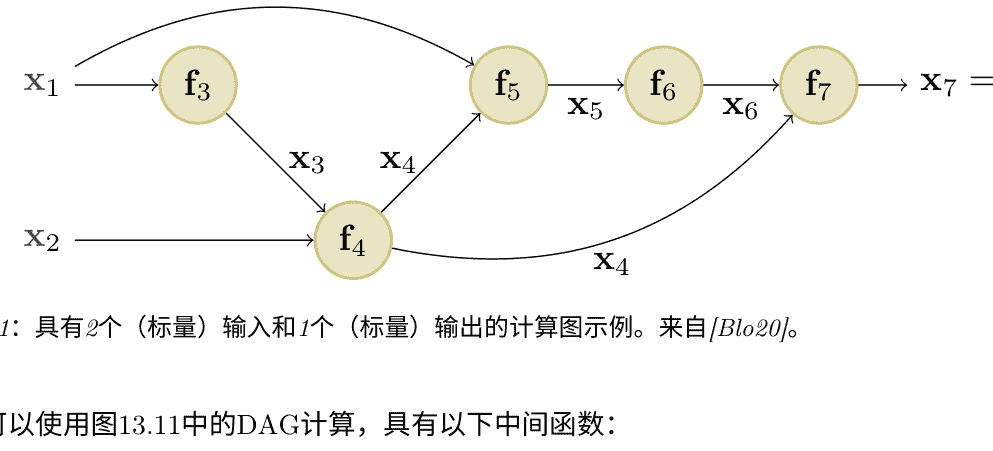

我们可以使用图13.11中的DAG计算，具有以下中间函数：
$$x_3 = f_3(x_1) = e^{x_1} \tag{13.57}$$
$$x_4 = f_4(x_2, x_3) = x_2 x_3 \tag{13.58}$$
$$x_5 = f_5(x_1, x_4) = x_1 + x_4 \tag{13.59}$$
$$x_6 = f_6(x_5) = \sqrt{x_5} \tag{13.60}$$
$$x_7 = f_7(x_4, x_6) = x_4 x_6 \tag{13.61}$$

请注意，我们按照拓扑顺序对节点进行了编号（父节点在子节点之前）。在反向传播过程中，由于图不再是一个链，我们可能需要沿多条路径求和梯度。例如，由于 \(x_4\) 影响 \(x_5\) 和 \(x_7\)，我们有
$$\frac{\partial o}{\partial x_4} = \frac{\partial o}{\partial x_5} \frac{\partial x_5}{\partial x_4} + \frac{\partial o}{\partial x_7} \frac{\partial x_7}{\partial x_4} \tag{13.62}$$

我们可以通过以逆拓扑顺序工作来避免重复计算。例如，
$$\frac{\partial o}{\partial x_7} = \frac{\partial x_7}{\partial x_7} = 1 \tag{13.63}$$
$$\frac{\partial o}{\partial x_6} = \frac{\partial o}{\partial x_7} \frac{\partial x_7}{\partial x_6} \tag{13.64}$$
$$\frac{\partial o}{\partial x_5} = \frac{\partial o}{\partial x_6} \frac{\partial x_6}{\partial x_5} \tag{13.65}$$
$$\frac{\partial o}{\partial x_4} = \frac{\partial o}{\partial x_5} \frac{\partial x_5}{\partial x_4} + \frac{\partial o}{\partial x_7} \frac{\partial x_7}{\partial x_4} \tag{13.66}$$
一般来说，我们使用
$$\frac{\partial o}{\partial x_j} = \sum_{k \in \text{Ch}(j)} \frac{\partial o}{\partial x_k} \frac{\partial x_k}{\partial x_j} \tag{13.67}$$

其中求和是在所有子节点 \(k\) of node \(j\)上进行的，如图13.12所示。 \(\frac{\partial o}{\partial x_k}\) 梯度向量已经计算出每个子节点 \(k\)的值；这个量被称为 **adjoint**。这个量乘以每个子节点的雅可比矩阵 \(\frac{\partial x_k}{\partial x_j}\)。

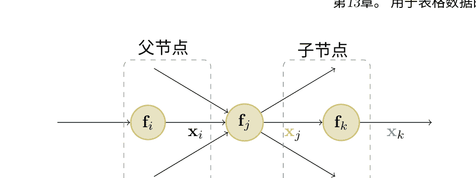

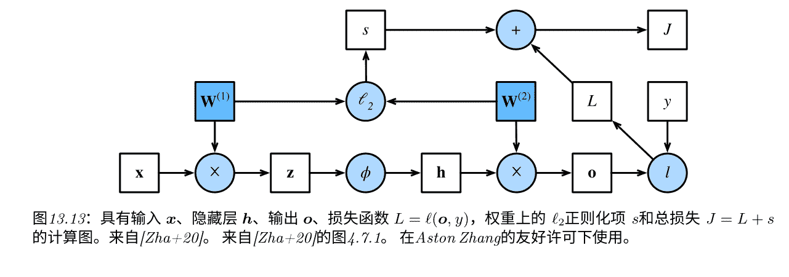

计算图可以提前计算，通过使用API来定义一个静态图。(这就是TensorFlow 1的工作原理。) 或者，可以‘即时计算’图，通过追踪函数在输入参数上的执行。(这是TensorFlow eager模式的工作原理，以及JAX和PyTorch。) 后一种方法更容易处理一个动态图，其形状可以根据函数计算的值而变化。

图13.13显示了一个具有一个隐藏层和权重衰减的MLP对应的计算图。更准确地说，模型计算线性预激活 \(z = W^{(1)}x\), 隐藏激活 \(h = \varphi(z)\), 线性输出 \(o = W^{(2)}h\), 损失 \(L = \ell(o, y)\), 正则化项 \(s = \frac{\lambda}{2}(\|W^{(1)}\|_F^2 + \|W^{(2)}\|_F^2)\), 总损失 \(J = L + s\)。

## 13.4 训练神经网络

在本节中，我们讨论如何将DNN拟合到数据中。标准方法是使用最大似然估计，通过最小化NLL:

$\mathcal{L}(\theta) = -\log p(\mathcal{D}|\theta) = -\sum_{n=1}^{N} \log p(y_n|x_n; \theta)$ (13.68)

通常还会添加正则化项（如负对数先验），我们在第13.5节中讨论。

### 13.4.1 调整学习率

调整学习率（步长）非常重要，以确保收敛到一个好的解。 我们在第8.4.3节中讨论这个问题。

### 13.4.2 梯度消失和梯度爆炸

当训练非常深的模型时，梯度往往变得非常小（这被称为梯度消失问题）或者非常大（这被称为梯度爆炸问题），因为误差信号通过一系列层传递，这些层要么放大或者减小它[Hoc+01]。（类似的问题也会在长序列的循环神经网络中出现，我们在第15.2.6节中解释。）为了更详细地解释这个问题，考虑损失函数对第\(l\)层节点的梯度：

$$ \frac{\partial \mathcal{L}}{\partial z_l} = \frac{\partial \mathcal{L}}{\partial z_{l+1}} \frac{\partial z_{l+1}}{\partial z_l} = \mathbf{J}_l g_{l+1} \qquad (13.69) $$

其中 \(\mathbf{J}_l = \frac{\partial z_{l+1}}{\partial z_l}\) 是雅可比矩阵，而 \(g_{l+1} = \frac{\partial \mathcal{L}}{\partial z_{l+1}}\) 是下一层的梯度。 如果 \(\mathbf{J}_l\) 在各层之间保持不变，那么从最后一层的梯度 \(g_L\) 到第 \(l\) 层的贡献将为 \(\mathbf{J}^{L-l} g_L\)。 因此，系统的行为取决于 \(\mathbf{J}\) 的特征向量。虽然 \(\mathbf{J}\) 是一个实值矩阵，但它通常不是对称的，因此它的特征值和特征向量可以是复数，其中虚部对应于振荡行为。 设 \(\lambda\) 为 \(\mathbf{J}\) 的谱半径，即特征值的绝对值的最大值。 如果这个值大于1，梯度可能会爆炸；如果小于1，梯度可能会消失。 （类似地，连接 \(z_l\) 和 \(z_{l+1}\) 的 \(\mathbf{W}\) 的谱半径决定了正向模式下动态系统的稳定性。）

梯度爆炸问题可以通过梯度剪裁来改善，即如果梯度变得过大，我们会将其限制在一个较小的范围内。 我们使用

$$ g' = \min\left(1, \frac{c}{\|g\|}\right)g \qquad (13.70) $$

这样，\(g'\) 的范数永远不会超过 \(c\)，但向量始终与 \(g\) 的方向相同。 然而，消失梯度问题更难解决。有各种解决方案，例如以下：

| 姓名 | 定义 | 值域 | 参考文献 |
|------|------|------|----------|
| Sigmoid | σ(a) = 1/(1+e^{-a}) | [0,1] | |
| 双曲正切 | tanh(a) = 2σ(2a) - 1 | [-1,1] | |
| Softplus | σ_+(a) = log(1 + e^a) | [0, ∞] | [GBB11] |
| 修正线性单元 | ReLU(a) = max(a,0) | [0, ∞] | [GBB11; KSH12] |
| Leaky ReLU | max(a,0) + α min(a,0) | [-∞, ∞] | [MHN13] |
| 指数线性单元 | max(a,0) + min(α(e^a - 1), 0) | [-∞, ∞] | [CUH16] |
| Swish | aσ(a) | [-∞, ∞] | [RZL17] |
| GELU | aΦ(a) | [-∞, ∞] | [HG16] |

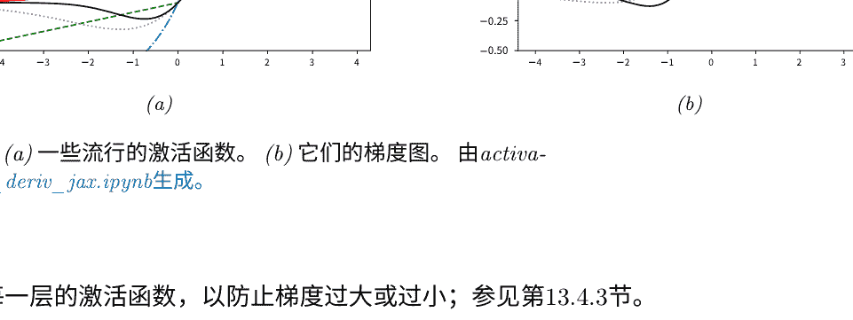

- 修改每一层的激活函数，以防止梯度过大或过小；参见第13.4.3节。
- 修改架构，使更新是加法而不是乘法；参见第13.4.4节。
- 修改架构，使每一层的激活标准化，以保持训练期间数据集上的激活分布恒定；参见第14.2.4.1节。
- 仔细选择参数的初始值；参见第13.4.5节。

### 13.4.3非饱和激活函数

在第13.2.3节中，我们提到Sigmoid激活函数在大负输入时饱和为0，在大正输入时饱和为1。事实证明，在这些区域中梯度信号为0，阻止了反向传播的工作。

为了看到梯度消失的原因，考虑一个计算 $z = \sigma(\mathbf{W}x)$ 的层，其中

$$\varphi(a) = \sigma(a) = \frac{1}{1 + \exp(-a)} \quad (13.71)$$

如果权重被初始化为较大的值（正数或负数），那么 $a = \mathbf{W}x$ 很容易取得较大的值，因此 $z$ 会饱和在 0 或 1 附近，因为Sigmoid函数会饱和，如图13.14a所示。

现在让我们考虑损失函数对输入 $x$（来自之前的层）和参数 $\mathbf{W}$ 的梯度。激活函数的导数为

$$\varphi'(a) = \sigma(a)(1 - \sigma(a)) \quad (13.72)$$

参见图13.14b的绘图。在第13.3.3节中，我们展示了损失函数对输入的梯度为

$$\frac{\partial \mathcal{L}}{\partial \mathbf{x}} = \mathbf{W}^{\top} \delta = \mathbf{W}^{\top} z(1 - z) \quad (13.73)$$

损失函数对参数的梯度是

$$\frac{\partial \mathcal{L}}{\partial \mathbf{W}} = \delta \mathbf{x}^{\top} = z(1 - z) \mathbf{x}^{\top} \quad (13.74)$$

因此，如果 $z$ 接近0或1，梯度将趋近于0。

训练非常深层模型的关键之一是使用非饱和激活函数。已经提出了几种不同的函数：请参阅表13.4进行总结，并访问https://mlfromscratch.com/activation-functions-explained获取更多详细信息。

### 13.4.3.1 ReLU

最常见的是修正线性单元（ReLU），在[GBB11; KSH12]中提出。其定义如下

$$\text{ReLU}(a) = \max(a, 0) = a\mathbb{I}(a > 0) \quad (13.75)$$

ReLU函数简单地“关闭”负输入，并保持正输入不变。梯度具有以下形式：

$$\text{ReLU}'(a) = \mathbb{I}(a > 0) \quad (13.76)$$

现在假设我们在一层中使用它来计算 $z = \text{ReLU}(\mathbf{W}x)$。在第13.3.3节中，我们展示了关于输入的梯度具有以下形式

$$\frac{\partial \mathcal{L}}{\partial \mathbf{x}} = \mathbf{W}^{\top} \mathbb{I}(z > 0) \quad (13.77)$$

关于参数的梯度具有以下形式

$$\frac{\partial \mathcal{L}}{\partial \mathbf{W}} = \mathbb{I}(z > 0) \mathbf{x}^{\top} \quad (13.78)$$

因此，只要 $z$ 是正的，梯度就不会消失。

不幸的是，如果权重被初始化为很大且为负数，那么 (some components of) $a = Wx$ 很容易取得很大的负值，因此 $z$ 会变为0。这将导致权重的梯度变为0。算法将永远无法摆脱这种情况，因此隐藏单元（$z$ 的组成部分）将永久关闭。这被称为“dead ReLU”问题[Lu+19]。

### 13.4.3.2 非饱和ReLU

死ReLU的问题可以通过使用非饱和ReLU的变体来解决。一个替代方法是泄漏ReLU，在[MHN13]中提出。这被定义为

$$LReLU(a; \alpha) = \max(\alpha a, a)$$

其中 $0 < \alpha < 1$。这个函数的斜率对于正输入为1，对于负输入为 $\alpha$，因此确保即使输入为负，也会向早期层传递一些信号。请参见图13.14b进行绘制。如果我们允许参数 $\alpha$ 被学习，而不是固定的，泄漏ReLU被称为参数ReLU[He+15]。

另一个流行的选择是ELU，在[CUH16]中提出。这被定义为

$$ELU(a; \alpha) = \begin{cases} \alpha(e^a - 1) & \text{if } a \leq 0 \\ a & \text{if } a > 0 \end{cases}$$

这比泄漏ReLU具有平滑函数的优势。⁶参见图13.14的绘图。

ELU的一个轻微变体，称为SELU（自标准化ELU），在[Kla+17]中提出。这具有以下形式

$$SELU(a; \alpha, \lambda) = \lambda ELU(a; \alpha)$$

令人惊讶的是，他们证明通过设置 $\alpha$ 和 $\lambda$ 为精心选择的值，该激活函数可以确保每个层的输出被标准化（前提是输入也被标准化），即使不使用批归一化等技术（第14.2.4.1节）。这可以有助于模型拟合。

### 13.4.3.3 其他选择

作为手动发现良好激活函数的替代方法，我们可以使用黑盒优化方法在功能形式空间中进行搜索。这种方法在[RZL17]中被使用，他们发现了一个他们称之为swish的函数，在一些图像分类基准测试中表现良好。它的定义如下：

$$swish(a; \beta) = a \sigma(\beta a)$$

（相同的函数，在[HG16]中独立提出，被称为SiLU（Sigmoid Linear Unit）。）请参见图13.14的绘图。

⁶ 只有当 $\alpha = 1$ 时，ELU才具有连续的一阶导数。

另一个流行的激活函数是GELU，它代表“高斯误差线性单元”[HG16]。其定义如下：

$$GELU(a) = a \Phi(a) \quad (13.83)$$

其中 $\Phi(a)$ 是标准正态分布的累积分布函数：

$$\Phi(a) = \Pr(\mathcal{N}(0,1) \leq a) = \frac{1}{2} \left(1 + \operatorname{erf}\left(\frac{a}{\sqrt{2}}\right)\right) \quad (13.84)$$

从图13.14中我们可以看出，与大多数其他激活函数不同，它不是一个凸函数或单调函数。

我们可以将GELU视为ReLU的“软”版本，因为它用高斯累积分布函数 $\Phi(a)$ 替代了阶跃函数 $\mathbb{I}(a > 0)$。另一种解释GELU的方式是将其视为自适应版本的dropout（第13.5.4节），其中我们将输入乘以一个二进制标量掩码 $m \sim \text{Ber}(\Phi(a))$，其中被丢弃的概率由 $1 - \Phi(a)$ 给出。因此，期望输出为

$$\mathbb{E}[a] = \Phi(a) \times a + (1 - \Phi(a)) \times 0 = a \Phi(a) \quad (13.85)$$

我们可以使用特定的参数设置，即使用swish来近似GELU

$$GELU(a) \approx a \sigma(1.702a) \quad (13.86)$$

## 13.4.4 残差连接

解决DNN中梯度消失问题的一种方法是使用残差网络或ResNet[He+16a]。这是一个前馈模型，每个层都具有残差块的形式，定义如下

$$\mathcal{F}'_l(x) = \mathcal{F}_l(x) + x \quad (13.87)$$

其中 $\mathcal{F}_l$ 是一个标准的浅层非线性映射（例如，线性-激活-线性）。内部 $\mathcal{F}_l$ 函数计算需要添加到输入 $x$ 中以生成所需输出的残差项或增量；学习生成输入的小扰动通常比直接预测输出更容易。（残差连接通常与CNN一起使用，如第14.3.4节所讨论的，但也可以在MLP中使用。）

具有残差连接的模型与没有残差连接的模型具有相同数量的参数，但更容易训练。原因是梯度可以直接从输出层流向更早的层，如图13.15b所示。要理解这一点，注意到输出层的激活可以用任何前一层的激活来表示，使用

$$z_L = z_l + \sum_{i=l}^{L-1} \mathcal{F}_i(z_i; \theta_i). \quad (13.88)$$

因此，我们可以计算损失对第 $l$ 层参数的梯度如下：

$$\begin{align*}
\frac{\partial \mathcal{L}}{\partial \theta_l} &= \frac{\partial z_l}{\partial \theta_l} \frac{\partial \mathcal{L}}{\partial z_l} \\
&= \frac{\partial z_l}{\partial \theta_l} \frac{\partial \mathcal{L}}{\partial z_L} \frac{\partial z_L}{\partial z_l} \\
&= \frac{\partial z_l}{\partial \theta_l} \frac{\partial \mathcal{L}}{\partial z_L} \left( 1 + \sum_{i=l}^{L-1} \frac{\partial \mathcal{F}_i(z_i; \theta_i)}{\partial z_l} \right) \\
&= \frac{\partial z_l}{\partial \theta_l} \frac{\partial \mathcal{L}}{\partial z_L} + \text{其他项}
\end{align*}$$

因此，我们可以看到第 $l$ 层的梯度直接取决于第 $L$ 层的梯度，而与网络的深度无关。

## 13.4.5 参数初始化

由于DNN训练的目标函数是非凸的，我们初始化DNN参数的方式可以在我们得到什么样的解以及函数的训练难度（即信息在模型中的前向和后向传播的效果）方面起到重要作用。

在本节的其余部分，我们介绍一些常用的启发式方法来初始化参数。

### 13.4.5.1 启发式初始化方案

在[GB10]中，他们表明从具有固定方差的标准正态分布中采样参数可能导致激活或梯度爆炸。为了理解原因，考虑一个没有激活函数的线性单元，给定为 $o_i = \sum_{j=1}^{n_{\text{in}}} w_{ij}x_j$；假设 $w_{ij} \sim \mathcal{N}(0, \sigma^2)$，且 $\mathbb{E}[x_j] = 0$ 和 $\mathbb{V}[x_j] = \gamma^2$，其中

我们假设 $x_j$ 和 $w_{ij}$ 是独立的。输出的均值和方差由以下给出

$$\mathbb{E}[o_i] = \sum_{j=1}^{n_{\text{in}}} \mathbb{E}[w_{ij} x_j] = \sum_{j=1}^{n_{\text{in}}} \mathbb{E}[w_{ij}] \mathbb{E}[x_j] = 0 \quad (13.93)$$

$$\mathbb{V}[o_i] = \mathbb{E}[o_i^2] - (\mathbb{E}[o_i])^2 = \sum_{j=1}^{n_{\text{in}}} \mathbb{E}[w_{ij}^2 x_j^2] - 0 = \sum_{j=1}^{n_{\text{in}}} \mathbb{E}[w_{ij}^2] \mathbb{E}[x_j^2] = n_{\text{in}} \sigma^2 \gamma^2 \quad (13.94)$$

为了防止输出方差爆炸，我们需要确保 $n_{\text{in}} \sigma^2 = 1$（或其他常数），其中 $n_{\text{in}}$ 是一个单元的 fan-in（入连接数）。

现在考虑反向传播。通过类似的推理，我们可以看到梯度的方差可能会爆炸，除非 $n_{\text{out}} \sigma^2 = 1$，其中 $n_{\text{out}}$ 是一个单元的 fan-out（出连接数）。

为了同时满足这两个要求，我们设置 $\frac{1}{2} (n_{\text{in}} + n_{\text{out}}) \sigma^2 = 1$，或者等价地

$$\sigma^2 = \frac{2}{n_{\text{in}} + n_{\text{out}}} \quad (13.95)$$

这被称为Xavier初始化或Glorot初始化，以第一作者 [GB10] 的名字命名。

如果我们使用 $\sigma^2 = 1/n_{\text{in}}$，这就是一个特殊情况；这被称为LeCun初始化，以Yann LeCun在1990年代提出的名字命名。当 $n_{\text{in}} = n_{\text{out}}$ 时，这等价于Glorot初始化。

如果我们使用 $\sigma^2 = 2/n_{\text{in}}$，这个方法被称为He初始化，以Kaiming He在[He+15]中提出的名字命名。

请注意，不必使用高斯分布。事实上，上述推导只涉及前两个矩（均值和方差），并不对高斯性做任何假设。例如，假设我们从均匀分布中采样权重，$w_{ij} \sim \text{Unif}(-a, a)$。

均值为0，方差为 $\sigma^2 = a^2/3$。因此我们应该设置 $a = \sqrt{6/(n_{\text{in}} + n_{\text{out}})}$。

尽管上述推导假设了线性输出单元，但该技术在非线性单元上的实证效果也很好。最佳的初始化方法选择取决于所使用的激活函数。对于线性、tanh、logistic和softmax函数，推荐使用Glorot方法。对于ReLU及其变种，推荐使用He方法。对于SELU函数，推荐使用LeCun方法。更多启发式方法可参考[Gér19]，一些理论可参考[HDR19]。

### 13.4.5.2 数据驱动的初始化

我们还可以采用数据驱动的方法来进行参数初始化。例如，[MM16]提出了一种简单但有效的方案，称为层序列单元方差（LSUV）初始化，其工作原理如下。首先，我们使用正交矩阵初始化每个（全连接或卷积）层的权重，如[SMG14]中所提出的。（这可以通过从 $\mathcal{N}(0, \mathbf{I})$ 中抽取 $\mathbf{w} \sim$，将 $\mathbf{w}$ 重塑为矩阵 $\mathbf{W}$，并使用QR或SVD分解计算正交基来实现。）然后，对于每一层 $l$，我们计算一个小批量中激活的方差 $v_l$，并使用 $\mathbf{W}_l := \mathbf{W}_l / \sqrt{v_l}$ 进行重新缩放。这个方案可以看作是正交初始化与仅在第一个小批量上执行批归一化的结合。这比完全批归一化更快，但有时效果也同样好。

## 13.4.6 并行训练

在大型数据集上训练大型模型可能会非常慢。加快这个过程的一种方法是使用专用硬件，例如图形处理单元（GPU）和张量处理单元（TPU），它们在执行矩阵乘法方面非常高效。如果我们有多个GPU，有时可以进一步加快速度。有两种主要方法：模型并行性，即在机器之间分割模型；数据并行性，即每台机器都有自己的模型副本，并将其应用于不同的数据集。

模型并行性可能非常复杂，因为它需要机器之间的紧密通信以确保计算出正确的答案。我们将不再进一步讨论此问题。数据并行性通常要简单得多，因为它是尴尬并行的。为了加速训练，我们在每个训练步骤 $t$ 中执行以下操作：1）将小批量数据集分割到 $K$ 台机器上以获得 $D_t^k$；2）每台机器 $k$ 计算自己的梯度，$g_t^k = \nabla_\theta \mathcal{L}(\theta; D_t^k)$；3）我们在中央机器上（例如设备0）收集所有本地梯度并将它们求和，得到 $g_t = \sum_{k=1}^{K} g_t^k$；4）我们将求和梯度广播回所有设备，因此 $\hat{g}_t^k = g_t$；5）每台机器使用 $\theta_t^k := \theta_t^k - \eta_t \hat{g}_t^k$ 更新自己的参数副本。有关示例代码，请参见图13.16和multi_gpu_training_jax.ipynb。

请注意，步骤3和4通常合并为一个原子步骤；这被称为全局归约操作（其中我们使用求和将（梯度）向量集合归约为一个）。如果每台机器在接收到集中聚合的梯度之前都会阻塞，该方法被称为同步训练。这将产生与使用一台机器进行训练（批量大小更大）相同的结果，只是更快（假设我们忽略任何批量归一化层）。如果我们让每台机器使用自己的局部梯度估计来更新其参数，并且不等待广播到来/自其他机器，该方法称为异步训练。这并不保证能够正常工作，因为不同的机器可能会失去同步，因此将会更新不同版本的参数；因此，这种方法被称为无序训练[Niu+11]。然而，如果更新是稀疏的，因此每台机器“触及”参数向量的不同部分，可以证明无序训练的行为类似于标准同步SGD。

## 13.5 正则化

在第13.4节中，我们讨论了与训练（大型）神经网络相关的计算问题。在本节中，我们讨论统计问题。特别是，我们关注避免过拟合的方法。这是至关重要的，因为大型神经网络很容易有数百万个参数。

### 13.5.1 提前停止

也许防止过拟合最简单的方法被称为提前停止，它指的是在验证集上的错误开始增加时停止训练过程（参见图4.8的示例）。这种方法有效是因为我们限制了优化算法从训练样本传递信息到参数的能力，如[AS19]中所解释的。

### 13.5.2 权重衰减

减少过拟合的常见方法是对参数施加先验，并使用MAP估计。通常使用高斯先验对权重 $\mathcal{N}(w|0, \alpha^2 \mathbf{I})$ 和偏置进行建模，$\mathcal{N}(b|0, \beta^2 \mathbf{I})$。这相当于对目标函数进行 $\ell_2$ 正则化。在神经网络文献中，这被称为权重衰减，因为它鼓励使用较小的权重，从而得到更简单的模型，就像岭回归（第11.3节）一样。

### 13.5.3 稀疏DNNs

由于神经网络中有许多权重，鼓励稀疏性通常是有帮助的。这样可以进行模型压缩，从而节省内存和时间。为了实现这一点，我们可以使用正则化（如第11.4节所述），或者使用ARD（如第11.7.7节所述），或者使用其他几种方法（参见例如[Hoe+21; Bha+20]的最新评论）。作为一个简单的例子，图13.17显示了一个5层的MLP，它使用权重的 $\ell_1$ 正则化器拟合了一些1d回归数据。我们可以看到生成的图拓扑是稀疏的。

尽管稀疏拓扑具有直观吸引力，但在实践中很少使用这些方法，因为现代GPU针对密集矩阵乘法进行了优化，并且稀疏权重矩阵很少有计算上的好处。然而，如果我们使用鼓励分组稀疏性的方法，我们可以剪枝整个模型的层。这将导致块稀疏权重矩阵，从而实现加速和节省内存（参见例如[Sca+17; Wen+16; MAV17; LUW17]）。

### 13.5.4 丢弃

假设我们以概率 $p$ 随机地（每个示例为基础）关闭每个神经元的所有输出连接，如图13.18所示。这种技术被称为丢弃[Sri+14]。

丢弃可以显著减少过拟合问题，并且被广泛使用。直观地说，丢弃的原因在于它防止了隐藏单元的复杂共适应。换句话说，每个单元都必须学会在一些其他单元随机缺失的情况下表现良好。这样可以防止图13.17: (a) 一个深度但稀疏的神经网络。使用 ℓ1 正则化对连接进行修剪。在每个层级上，编号为0的节点被固定为1，因此它们的输出权重对应于偏移/偏置项。(b) 模型在训练集上的预测。由 sparse_mlp.ipynb 生成。

图13.18: dropout的示意图。(a) 一个具有2个隐藏层的标准神经网络。(b) 通过应用 p=0.5 的 dropout 产生的一个稀疏网络的示例。已经被 dropout 的单元用 × 标记。来自 [Sri+14] 的图1。获得 Geoff Hinton 的友情许可后使用。

通过 dropout，可以使单元之间学习复杂但脆弱的依赖关系变得困难。关于高斯混合先验的更正式解释可以在 [NHLS19] 中找到。我们可以将 dropout 视为对权重的噪声估计，其中 θlji = wji ⊗ li，而 li ~ Ber(1−p) 是一个伯努利噪声项。（因此，如果我们采样 li = 0，则从第 l−1 层的单元 i 到第 l 层的任何单元 j 的所有权重都将被设置为0。在测试时，通常关闭噪声。）

发明了 dropout 的 Geoff Hinton 表示，他受到了一次关于性繁殖的演讲的启发，该演讲鼓励基因在个体上有用（或最多依赖少数其他基因），即使与随机的其他基因结合在一起。

为了确保权重在测试时与训练时具有相同的期望（因此神经元的输入激活平均相同），在测试时我们应该使用 wij = θij 𝔼[ϵij]。对于伯努利噪声，我们有 𝔼[ϵ] = 1 − p，因此在进行预测之前，我们应该将权重乘以保留概率，即 1 − p。

然而，如果需要，我们可以在测试时使用 dropout。结果是一组具有略有不同稀疏图结构的网络集合。这被称为蒙特卡洛 dropout [GG16; KG17]，其形式为

$$ p(y|x, \mathcal{D}) \approx \frac{1}{S} \sum_{s=1}^{S} p(y|x, \hat{W}\epsilon^s + \hat{b}) \quad (13.96) $$

其中 S 是样本数量，我们用 Ŵ ϵs 表示我们通过采样噪声向量来乘以所有估计的权重矩阵。这有时可以很好地近似贝叶斯后验预测分布 p(y|x, 𝒟)，特别是如果噪声率被优化 [GHK17]。

### 13.5.5 贝叶斯神经网络

现代深度神经网络通常使用（受惩罚的）最大似然目标进行训练，以找到一组参数的单一设置。然而，对于大型模型，往往存在比数据点更多的参数，因此可能存在多个同样适合训练数据的模型，但其泛化方式不同。捕捉后验预测分布中引起的不确定性通常是有用的。这可以通过对参数进行边缘化计算来实现。

$$ p(y|x, \mathcal{D}) = \int p(y|x, \theta)p(\theta|\mathcal{D})d\theta \quad (13.97) $$

结果被称为贝叶斯神经网络或 BNN。它可以被看作是一个无限的由不同权重的神经网络组成的集合。通过边缘化参数，我们可以避免过拟合 [Mac95]。贝叶斯边缘化对于大型神经网络来说是具有挑战性的，但也可以带来显著的性能提升 [WI20]。有关贝叶斯深度学习的更多细节，请参阅本书的续集 [Mur23]。

### 13.5.6 (随机)梯度下降的正则化效果 *

一些优化方法（特别是二阶批处理方法）能够找到“大海捞针”的“针”，即损失函数空间中的狭窄但深入的“洞”，对应于具有非常低损失的参数设置。这些被称为尖锐的极小值，见图13.19（右）。从最小化经验损失的角度来看，优化器做得很好。然而，这样的解决方案通常对应于过度拟合数据的模型。最好找到对应于平坦极小值的点，如图13.19（左）所示；这样的解决方案更具鲁棒性和更好的泛化能力。要理解为什么，注意到平坦极小值对应于参数空间中的区域，该区域存在大量的后验不确定性，因此来自该区域的样本不太能够精确地记忆训练集的无关细节 [AS17]。SGD 通常通过添加噪声来找到这样的平坦极小值，这样可以防止其“进入”损失函数空间的狭窄区域（参见例如 [SL18]）。这被称为隐式正则化。也可以明确地鼓励

图13.19: 平坦与尖锐的极小值。来自 [HS97a] 的图1和图2。获得 Jürgen Schmidhuber 的友情许可。

图13.20: 每条曲线显示了给定小批量的参数值上损失的变化。(a) 一个稳定的局部极小值。(b) 一个不稳定的局部极小值。由 sgd_minima_variance.ipynb 生成。改编自 https://bit.ly/3wTc1L6。

使用熵 SGD [Cha+17]、尖锐感知最小化 [For+21]、随机权重平均 (SWA) [Izm+18] 和其他相关技术来寻找这样的平坦极小值。

当然，损失景观不仅取决于参数值，还取决于数据。由于我们通常无法负担全批量梯度下降，我们将得到一组损失曲线，每个小批量对应一条曲线。如果这些曲线中的每一条都对应一个宽阔的盆地，如图13.20a所示，那么我们处于参数空间中的一个对扰动具有鲁棒性的点，并且很可能具有良好的泛化能力。

然而，如果整体宽盆地是通过对许多不同的窄盆地进行平均得到的，如图13.20b所示，那么得到的估计可能会泛化得更差。

这可以使用 [Smi+21; BD21] 中的分析来形式化。具体来说，他们考虑了连续时间梯度流，该流近似于 (S)GD 的行为。在 [BD21] 中，他们考虑了全批量 GD，并展示了流的形式 ẇ = −∇w L̃_GD(w)，其中

$$\tilde{\mathcal{L}}_{GD}(w) = \mathcal{L}(w) + \frac{\epsilon}{4} ||\nabla \mathcal{L}(w)||^2$$

其中 ℒ(w) 是原始损失，ϵ 是学习率，第二项是一个隐式正则化项，惩罚具有大梯度（高曲率）的解。

在 [Smi+21] 中，他们将这个分析扩展到了 SGD 情况。他们表明，流动的形式为 ẇ = −∇w L̃_SGD(w)，其中

$$ \tilde{\mathcal{L}}_{SGD}(w) = \mathcal{L}(w) + \frac{\epsilon}{4m} \sum_{k=1}^m \|\nabla \mathcal{L}_k(w)\|^2 $$

其中 m 是小批量的数量， ℒk(w) 是第 k 个小批量的损失。将其与全批量 GD 损失进行比较，我们可以看到

$$ \tilde{\mathcal{L}}_{SGD}(w) = \tilde{\mathcal{L}}_{GD}(w) + \frac{\epsilon}{4m} \sum_{k=1}^m \|\nabla \mathcal{L}_k(w) - \nabla \mathcal{L}(w)\|^2 $$

第二项估计了小批量梯度的方差，这是稳定性的度量，因此也是泛化能力的度量。

上述分析表明，SGD 不仅具有计算优势（因为它比全批量 GD 或二阶方法更快），而且具有统计优势。

## 13.6 其他类型的前馈网络 *

### 13.6.1 径向基函数网络

考虑一个1层神经网络，其中隐藏层由特征向量给出

$$ \phi(x) = [\mathcal{K}(x, \mu_1), \ldots, \mathcal{K}(x, \mu_K)] $$

其中 μk ∈ 𝒳 是一组 K 质心或样本点，而 𝒦(x, μ) ≥ 0 是一个核函数。我们在第17.1节详细介绍核函数。这里我们只给出一个例子，即高斯核

$$ \mathcal{K}_{\text{gauss}}(x, c) \triangleq \exp \left( -\frac{1}{2\sigma^2} \|c - x\|_2^2 \right) $$

参数 σ 被称为核函数的带宽。请注意，该核函数是平移不变的，意味着它只是距离 r = ‖x − c‖₂ 的函数，因此我们可以等价地写成

$$ \mathcal{K}_{\text{高斯}}(r) \triangleq \text{指数} \left( -\frac{1}{2\sigma^2} r^2 \right) $$

因此，这被称为径向基函数核函数或 RBF 核函数。一个一层神经网络，其中我们使用方程 (13.101) 作为隐藏层，使用 RBF 核函数，被称为 RBF 网络 [BL88]。其形式为

$$ p(y|x; \theta) = p(y| w^{\top} \phi(x)) $$

如果质心 μ 固定，我们可以通过（正则化的）最小二乘法求解最优权重 w，如第11章所讨论的。如果质心未知，我们可以使用无监督聚类方法（如 K-means，第21.3节）来估计它们。或者，我们

| x1 | x2 | y |
|---|---|---|
| 0 | 0 | 0 |
| 0 | 1 | 1 |
| 1 | 0 | 1 |
| 1 | 1 | 0 |

图13.21: (a) xor 真值表。(b) 使用10次多项式扩展拟合线性逻辑回归分类器。(c) 相同的模型，但使用由4个黑色十字指定的 RBF 核心。由 logregXorDemo.ipynb 生成。

可以将每个训练集数据点关联到一个质心，以获得 μn = xn，其中现在 K = N。这是一个非参数模型的例子，因为参数的数量（在这种情况下是线性增长）随着数据量的增加而增加，并且与 N 无关。如果 K = N，模型可以完美地插值数据，因此可能过拟合。然而，通过确保输出权重向量 w 是稀疏的，模型只会使用有限的输入示例子集；这被称为稀疏核机器，并将在第17.4.1节和第17.3节中详细讨论。避免过拟合的另一种方法是采用贝叶斯方法，通过积分掉权重 w；这产生了一个称为高斯过程的模型，将在第17.2节中详细讨论。

#### 13.6.1.1 RBF回归网络

我们可以通过定义 p(y|x, θ) = 𝒩(wᵀ φ(x), σ²) 来使用 RBF 网络进行回归。例如，图13.22展示了一个使用 K=10 均匀间隔的 RBF 原型拟合的一维数据集，但带宽从小到大变化。较小的值会导致非常起伏的函数，因为预测的函数值只在接近原型 μk 的点 x 上非零。如果带宽非常大，设计矩阵将变为一个全为1的常数矩阵，因为每个点都与每个原型等距离；因此相应的函数就是一条直线。

#### 13.6.1.2 RBF分类网络

我们可以通过定义二进制分类的 RBF 网络来使用概率机器学习，其中 p(y|x, θ) = Ber(σ(wᵀ φ(x)))。以异或函数产生的数据为例。这是一个由两个二进制输入决定的二进制值函数。其真值表如图13.21(a)所示。在图13.21(b)中，我们展示了一些由异或函数标记的数据，但我们对数据进行了抖动以使图像更清晰。我们可以看到，即使使用10次多项式也无法将数据分开。然而，使用 RBF 核和仅有4个原型很容易解决这个问题，如图13.21(c)所示。

> 图13.22：在1维中使用10个等间距的 RBF 基函数进行线性回归。左列：拟合函数。中列：在网格上评估的基函数。右列：设计矩阵。从上到下，我们展示了核函数的不同带宽：σ= 0.5, 10, 50。由 linregRbfDemo.ipynb 生成。

### 13.6.2 专家混合

在考虑回归问题时，常常假设输出分布是单峰的，例如高斯分布或学生分布，其中均值和方差是输入的某个函数，即

$$ p(y|x) = \mathcal{N}(y|f_\mu(x), \text{diag}(\sigma^2 + f_\sigma(x))) \quad (13.105) $$

其中 f 函数可以是 MLPs（可能带有一些共享的隐藏单元，如图13.5所示）。然而，这对于 one-to-many 函数不起作用，其中每个输入可以有多个可能的输出。

图13.23a 给出了一个简单的函数示例。我们可以看到在图的中间有一些特定的 x 值，对应着两个等可能的 y 值。现实世界中存在许多这种问题，例如从单张图像预测人物的3D姿势 [Bo+08]，将黑白图像上色 [Gua+17]，预测视频序列的未来帧 [VT17] 等。任何通过最大化似然来训练的模型，即使是灵活的非线性模型（如神经网络），在处理这类一对多函数时也会表现不佳，因为它只会产生模糊的平均输出。

为了避免回归到平均值的问题，我们可以使用条件混合模型。也就是说，我们假设输出是 K 个不同输出的加权混合，对应着不同的

图13.23: (a) 一个一对多函数的一些数据。水平轴是输入 x，垂直轴是目标 y = f(x)。(b) 每个专家对输入域的责任。(c) 每个专家的预测(彩色线条)叠加在训练数据上。(d) 整体预测。均值为红色十字，模式为黑色方块。改编自 [Bis06] 的图5.20和5.21。由 mixexpDemoOneToMany.ipynb 生成。

每个输入 x 的输出分布的模式。在高斯情况下，变为

$$ p(y|x) = \sum_{k=1}^{K} p(y|x, z=k) p(z=k|x) \quad (13.106) $$
$$ p(y|x, z=k) = \mathcal{N}(y|f_{\mu,k}(x), \text{diag}(f_{\sigma,k}(x))) \quad (13.107) $$
$$ p(z=k|x) = \text{Cat}(z|\text{softmax}(f_z(x))) \quad (13.108) $$

在这里， fμ,k 预测第 k 个高斯分布的均值， fσ,k 预测其方差项，而 fz 预测使用哪个混合成分。这个模型被称为专家混合模型（MoE）[Jac+91; JJ94; YWG12; ME14]。其思想是第 k 个子模型 p(y|x, z = k) 被认为是输入空间中某个区域的“专家”。函数 p(z = k|x) 被称为门控函数，根据输入值决定使用哪个专家。通过选择给定输入 x 最可能的专家，我们可以“激活”模型的一个子集。这是一个条件计算的例子，因为我们根据门控网络的先前计算结果决定要运行哪个专家 [Sha+17]。

我们可以使用 SGD 或 EM 算法（详见第8.7.3节）来训练这个模型。

图13.24：具有 m 个专家的深度 MoE，表示为神经网络。来自 [CGG17] 的图1。获得 Jacob Goldberger 的友情许可使用。

#### 13.6.2.1 线性专家的混合

在本节中，我们考虑一个简单的例子，其中我们使用线性回归专家和线性分类门控函数，即模型的形式为：

$$ p(y|\boldsymbol{x}, z=k, \boldsymbol{\theta}) = \mathcal{N}(y|\boldsymbol{w}_k^{\top}\boldsymbol{x}, \sigma_k^2) \quad (13.109) $$
$$ p(z=k|\boldsymbol{x}, \boldsymbol{\theta}) = \mathrm{Cat}(z|\mathrm{softmax}_k(\mathbf{V}\boldsymbol{x})) \quad (13.110) $$

其中 softmax k 是 softmax 函数的第 k 个输出。个体加权项 p(z = k|x) 被称为输入 x 的专家 k 的责任。在图 13.23b 中，我们可以看到门控网络如何在 K= 3 个专家之间对输入空间进行软分区。

每个专家 p(y|x, z = k) 对应具有不同参数的线性回归模型。这些在图 13.23c 中显示。

如果我们将专家的加权组合作为输出，我们得到图 13.23d 中的红色曲线，很明显是一个糟糕的预测器。相反，如果我们只使用最活跃的专家进行预测（即具有最高责任的专家），我们得到不连续的黑色曲线，这是一个更好的预测器。

#### 13.6.2.2 混合密度网络

门控函数和专家可以是任何类型的条件概率模型，不仅仅是线性模型。如果我们将它们都设置为深度神经网络，则得到的模型称为混合密度网络（MDN）[Bis94; ZS14] 或深度专家混合 [CGG17]。有关模型的草图，请参见图13.24。

作者：Kevin P. Murphy。 (C) MIT Press. CC-BY-NC-ND许可证

图13.25: 一个两层级的专家混合模型作为神经网络。顶部的门控网络在左右专家之间进行选择，由大框表示；左右专家本身在左右子专家之间进行选择。

#### 13.6.2.3 分层MOEs

如果每个专家本身都是一个 MoE 模型，那么得到的模型被称为分层混合专家 [JJ94]。请参见图13.25，了解具有两层级的模型的示例。具有 L 层级的 HME 可以被看作是一个深度为 L 的“软”决策树，其中每个示例通过树的每个分支，并且最终预测是加权平均。（我们在第18.1节讨论决策树。）

## 13.7 练习

### 练习13.1 [MLP的反向传播] (基于Kevin Clark的练习)

考虑以下具有一个隐藏层的分类 MLP：

$$ x = \text{输入} \in \mathbb{R}^D \quad (13.111) $$
$$ z = \mathbf{W} x + \mathbf{b}_1 \in \mathbb{R}^K \quad (13.112) $$
$$ h = \text{ReLU}(z) \in \mathbb{R}^K \quad (13.113) $$
$$ a = \mathbf{U} h + \mathbf{b}_2 \in \mathbb{R}^C \quad (13.114) $$
$$ \mathcal{L} = \text{交叉熵} \quad (y, \text{softmax}(a)) \in \mathbb{R} \quad (13.115) $$

其中 x ∈ ℝᴰ, b₁ ∈ ℝᴷ, W ∈ ℝᴷˣᴰ, b₂ ∈ ℝ𝘊, U ∈ ℝ𝘊ˣᴷ, 其中 D 是输入的大小, K 是隐藏单元的数量, 和 C 是类别的数量。证明参数和输入的梯度如下：$$
\nabla_{\mathbf{V}} \mathcal{L} = \left[ \frac{\partial \mathcal{L}}{\partial \mathbf{V}} \right]^T = \delta_1 \mathbf{h}^T \in \mathbb{R}^{C \times K} \quad (13.116)
$$

$$
\nabla_{\mathbf{b}_2} \mathcal{L} = \left( \frac{\partial \mathcal{L}}{\partial \mathbf{b}_2} \right)^T = \delta_1 \in \mathbb{R}^C \quad (13.117)
$$

$$
\nabla_{\mathbf{W}} \mathcal{L} = \left[ \frac{\partial \mathcal{L}}{\partial \mathbf{W}} \right]_{1,:}^T = \delta_2 \mathbf{x}^T \in \mathbb{R}^{K \times D} \quad (13.118)
$$

$$
\nabla_{\mathbf{b}_1} \mathcal{L} = \left( \frac{\partial \mathcal{L}}{\partial \mathbf{b}_1} \right)^T = \delta_2 \in \mathbb{R}^K \quad (13.119)
$$

$$
\nabla_{\mathbf{x}} \mathcal{L} = \left( \frac{\partial \mathcal{L}}{\partial \mathbf{x}} \right)^T = \mathbf{W}^T \delta_2 \in \mathbb{R}^D \quad (13.120)
$$

其中，对于两个层（logit和hidden）的损失梯度如下所示：

$$
\delta_1 = \nabla_{\mathbf{a}} \mathcal{L} = \left( \frac{\partial \mathcal{L}}{\partial \mathbf{a}} \right)^T = (\mathbf{p} - \mathbf{y}) \in \mathbb{R}^C \quad (13.121)
$$

$$
\delta_2 = \nabla_{\mathbf{z}} \mathcal{L} = \left( \frac{\partial \mathcal{L}}{\partial \mathbf{z}} \right)^T = (\mathbf{V}^T \delta_1) H(\mathbf{z}) \in \mathbb{R}^K \quad (13.122)
$$

其中 \( H \) 是Heaviside函数。请注意，在我们的符号表示中，当变量是向量时，梯度（与我们对其求导的变量具有相同形状）等于雅可比矩阵的转置；当变量是矩阵时，梯度等于雅可比矩阵的第一个切片。

# 14 图像的神经网络

## 14.1 导论

在第13章中，我们讨论了多层感知器（MLPs）作为学习将“非结构化”输入向量 $x \in \mathbb{R}^D$ 映射到输出的一种方法。在本章中，我们将这个概念扩展到输入 $x$ 具有2d空间结构的情况。（类似的思想也适用于1d时间结构或3d时空结构。）

为了看到为什么直接将MLPs应用于图像数据不是一个好主意，回想一下MLP在每个隐藏层中的核心操作是计算激活 $z = \varphi(\mathbf{W}x)$，其中 $x$ 是一个层的输入， $\mathbf{W}$ 是权重， $\varphi()$ 是非线性激活函数。因此，隐藏层的第 $j$ 个元素的值为 $z_j = \varphi(\mathbf{w}_j^T x)$。我们可以将这个内积操作看作是将输入 $x$ 与学习到的模板或模式 $\mathbf{w}_j$ 进行比较；如果匹配很好（大的正内积），该单元的激活将很大（假设使用ReLU非线性函数），表示输入中存在第 $j$ 个模式。

然而，如果输入是一个可变大小的图像，这种方法效果不好，其中 $x \in \mathbb{R}^{W \times H \times C}$，其中 $W$ 是宽度，$H$ 是高度，$C$ 是输入通道的数量（例如，对于RGB颜色，$C=3$）。问题在于，我们需要为每个输入图像大小学习一个不同大小的权重矩阵 $\mathbf{W}$。此外，即使输入是固定大小的，所需的参数数量对于合理大小的图像来说也是不可行的，因为权重矩阵的大小将为 $(W \times H \times C) \times D$，其中 $D$ 是输出（隐藏单元）的数量。最后一个问题是，在一个位置出现的模式在另一个位置出现时可能无法被识别 - 也就是说，模型可能不具有平移不变性 - 因为权重在不同位置之间不共享（见图14.1）。

为了解决这些问题，我们将使用卷积神经网络（CNN），其中我们用卷积操作替代矩阵乘法。我们在第14.2节中详细解释了这一点，但基本思想是将输入分成重叠的2D图像块，并将每个块与一组小权重矩阵或滤波器进行比较，这些矩阵代表对象的部分；如图14.2所示。我们可以将其看作是一种模板匹配的形式。我们将从数据中学习这些模板，如下所述。由于模板很小（通常只有3x3或5x5），参数的数量大大减少。由于我们使用卷积进行模板匹配，而不是矩阵乘法，所以模型具有平移不变性。这对于图像分类等任务非常有用，目标是分类对象是否存在，而不考虑其位置。

除了图像分类之外，CNN还有许多其他应用，我们将在本章后面讨论。它们也可以应用于1维输入（参见第15.3节）和3维输入；然而，我们主要本章重点讨论2D情况。

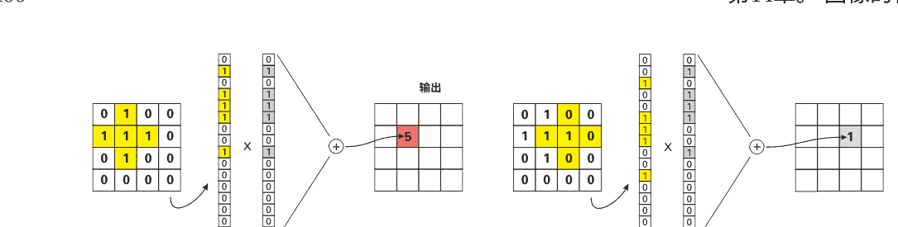

图14.1: 使用非结构化MLP在2D图像中检测模式效果不好，因为该方法不具有平移不变性。我们可以设计一个权重向量作为匹配滤波器来检测所需的十字形状。如果物体在左边，它将给出一个强烈的响应5，但如果物体向右移动，它将给出一个弱响应1。改编自[SAV20]的图7.16。

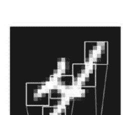

图14.2: 我们可以通过寻找出现在正确（相对）位置的某些有区别的特征（图像模板）来对数字进行分类。来自[Cho17]的图5.1。 获得Francois Chollet的友好许可使用。

## 14.2 常见层

在本节中，我们讨论卷积神经网络的基础知识。

### 14.2.1 卷积层

我们首先描述一维卷积的基础知识，然后是二维卷积，然后描述它们如何作为卷积神经网络的关键组件。

#### 14.2.1.1 一维卷积

两个函数之间的卷积，比如f，g: $\mathbb{R}^D \to \mathbb{R}$，定义为

$$
[f \circledast g](z) = \int_{\mathbb{R}^D} f(\boldsymbol{u}) g(z - \boldsymbol{u}) d \boldsymbol{u}
$$

现在假设我们用有限长度的向量替换函数，我们可以将其视为在有限点集上定义的函数。例如，假设f在点{-L, -L+1, . . . . . . . . . . . . . . . . 0, 1, . . . , L}以得到权重向量（也称为滤波器或核） $w_{-L} = f(-L)$直到 $w_L = f(L)$。现在让 $g$在点 $\{-N, . . . . . . . . . . . . . . . . . . , N\}$处评估，以得到特征向量 $x_{-N} = g(-N)$直到 $x_N = g(N)$。然后上述方程变为

$$[w \circledast x](i) = w_{-L}x_{i+L} + \cdots + w_{-1}x_{i+1} + w_0x_i + w_1x_{i-1} + \cdots + w_L x_{i-L} \quad (14.2)$$

(我们稍后讨论边界条件（边缘效应）。我们看到我们'翻转'权重向量 $w$（因为 $w$的索引是反向的），然后'拖动'它到 $x$向量上，在每个点上求和，如图14.3所示。

有一个非常密切相关的操作，我们不先翻转 $w$：

$$[w * x](i) = w_{-L}x_{i-L} + \cdots + w_{-1}x_{i-1} + w_0x_i + w_1x_{i+1} + \cdots + w_L x_{i+L} \quad (14.3)$$

这被称为交叉相关；如果权重向量是对称的，通常情况下，交叉相关和卷积是相同的。在深度学习文献中，术语'卷积'通常用于表示交叉相关；我们将遵循这个约定。

我们还可以在域 $\{0, 1, . . . . . . . . . . . . . . . . . . . . . . . . . . , L-1\}$上评估权重 $w$和在域 $\{0, 1, . . . . . . . . . . . . . . . . . . . . . . . . . . , N-1\}$上评估特征x，以消除负索引。然后上述方程变为

$$[w \circledast x](i) = \sum_{u=0}^{L-1} w_u x_{i+u} \quad (14.4)$$

请参见图14.4的示例。

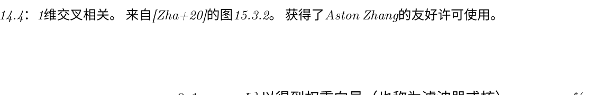

图14.3: 离散卷积，其中 $x=[1,2,3,4]$ 与 $w=[5,6,7]$ 相乘得到 $z=[5,16,34,52,45,28]$。我们看到这个操作包括'翻转'$w$然后在$x$上'拖动'，逐元素相乘，并将结果相加。


图14.4: 1维交叉相关。来自[Zha+20]的图15.3.2。获得了Aston Zhang的友好许可使用。

#### 14.2.1.2 2D卷积

在2D中，方程（14.4）变为

$$[\mathbf{W} \circledast \mathbf{X}](i, j) = \sum_{u=0}^{H-1} \sum_{v=0}^{W-1} w_{u,v} x_{i+u,j+v} \quad (14.5)$$

其中2D滤波器 $\mathbf{W}$ 的尺寸为 $H \times W$。例如，考虑将一个 $3 \times 3$ 的输入 $\mathbf{X}$ 与一个 $2 \times 2$ 的卷积核 $\mathbf{W}$ 进行卷积以计算一个 $2 \times 2$ 的输出 $\mathbf{Y}$:

$$\mathbf{Y} = \begin{pmatrix} w_1 & w_2 \\ w_3 & w_4 \end{pmatrix} \circledast \begin{pmatrix} x_1 & x_2 & x_3 \\ x_4 & x_5 & x_6 \\ x_7 & x_8 & x_9 \end{pmatrix} \quad (14.6)$$

$$= \begin{pmatrix} (w_1x_1 + w_2x_2 + w_3x_4 + w_4x_5) & (w_1x_2 + w_2x_3 + w_3x_5 + w_4x_6) \\ (w_1x_4 + w_2x_5 + w_3x_7 + w_4x_8) & (w_1x_5 + w_2x_6 + w_3x_8 + w_4x_9) \end{pmatrix} \quad (14.7)$$

请参考图14.5以了解此过程的可视化。我们可以将2D卷积视为模板匹配，因为在点 $(i, j)$ 处的输出将会很大，如果以 $(i, j)$ 为中心的相应图像块与 $\mathbf{W}$ 相似的话。如果模板 $\mathbf{W}$ 对应于一个有向边缘，那么与之卷积将导致输出热图在包含与该方向匹配的边缘的区域“亮起”，如图14.6所示。更一般地，我们可以将卷积视为一种特征检测的形式。因此，得到的输出 $\mathbf{Y} = \mathbf{W} \circledast \mathbf{X}$ 被称为特征图。

#### 14.2.1.3 将卷积表示为矩阵-向量乘法

由于卷积是一个线性算子，我们可以通过矩阵乘法来表示它。例如，考虑方程式 (14.7)。我们可以通过将2D矩阵 $\mathbf{X}$ 展平为1D向量 $\mathbf{x}$，并乘以从核心$\mathbf{W}$导出的类Toeplitz矩阵 $\mathbf{C}$，将其重写为矩阵-向量乘法，如下所示：

$$\mathbf{y} = \mathbf{C}\mathbf{x} = \begin{pmatrix} w_1 & w_2 & 0 & w_3 & w_4 & 0 & 0 & 0 & 0 \\ 0 & w_1 & w_2 & 0 & w_3 & w_4 & 0 & 0 & 0 \\ 0 & 0 & 0 & w_1 & w_2 & 0 & w_3 & w_4 & 0 \\ 0 & 0 & 0 & 0 & w_1 & w_2 & 0 & w_3 & w_4 \end{pmatrix} \begin{pmatrix} x_1 \\ x_2 \\ x_3 \\ x_4 \\ x_5 \\ x_6 \\ x_7 \\ x_8 \\ x_9 \end{pmatrix} \quad (14.8)$$

$$= \begin{pmatrix} w_1 x_1 + w_2 x_2 + w_3 x_4 + w_4 x_5 \\ w_1 x_2 + w_2 x_3 + w_3 x_5 + w_4 x_6 \\ w_1 x_4 + w_2 x_5 + w_3 x_7 + w_4 x_8 \\ w_1 x_5 + w_2 x_6 + w_3 x_8 + w_4 x_9 \end{pmatrix} \quad (14.9)$$

通过将 $4 \times 1$ 向量 $\mathbf{y}$ 重新调整形状，我们可以恢复 $2 \times 2$ 的输出 $\mathbf{Y}$。$^1$

因此，我们可以看到CNNs就像MLPs一样，其中权重矩阵具有特殊的稀疏结构，并且元素在空间位置上是相互关联的。这实现了平移不变性的思想，并且与MLPs中使用的标准全连接或密集层中的权重矩阵相比，大大减少了参数的数量。

#### 14.2.1.4 边界条件和填充

在方程 (14.7) 中，我们看到将一个 $3 \times 3$ 图像与一个 $2 \times 2$ 滤波器卷积得到一个 $2 \times 2$ 输出。一般来说，将一个 $f_h \times f_w$ 滤波器卷积到一个大小为 $x_h \times x_w$ 的图像上会产生一个大小为 $(x_h - f_h + 1) \times (x_w - f_w + 1)$ 的输出；这被称为有效卷积，因为我们只将滤波器应用于输入的“有效”部分，即我们不让它“滑出边界”。如果我们希望输出与输入具有相同的大小，我们可以使用零填充，这意味着我们在图像周围添加一个由0组成的边框，如图14.7所示。这被称为相同卷积。

$^1$ 请参阅 conv2d_jax.ipynb 进行演示。

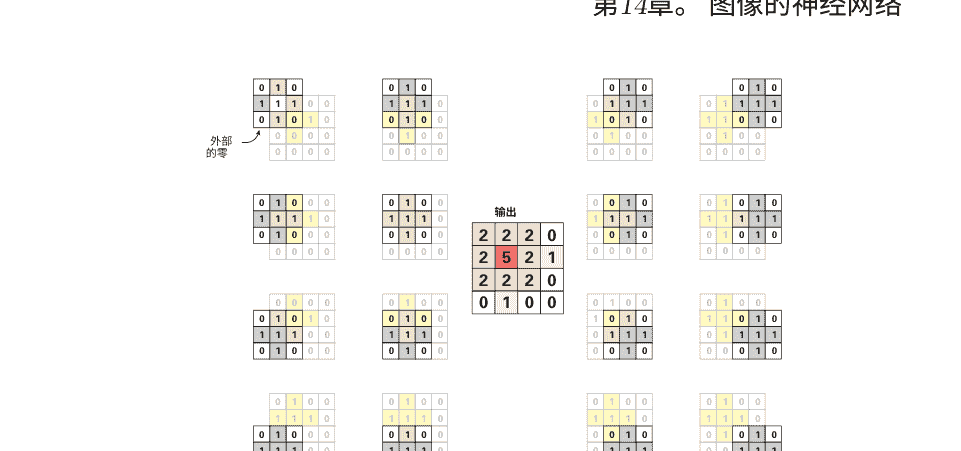

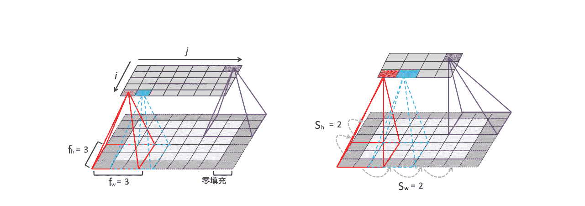

一般来说，如果输入的大小为$x_h \times x_w$，我们使用大小为$f_h \times f_w$的卷积核，在每一侧使用大小为$p_h$和$p_w$的零填充，那么输出的大小如下[DV16]：

$(x_h + 2p_h - f_h + 1) \times (x_w + 2p_w - f_w + 1) \quad (14.10)$

例如，考虑图14.8a。我们有$p=1, f=3, x_h=5$和$x_w=7$，所以输出的大小为

$(5 + 2 - 3 + 1) \times (7 + 2 - 3 + 1) = 5 \times 7 \quad (14.11)$

如果我们设置 $2p = f - 1$，则输出的大小与输入相同。

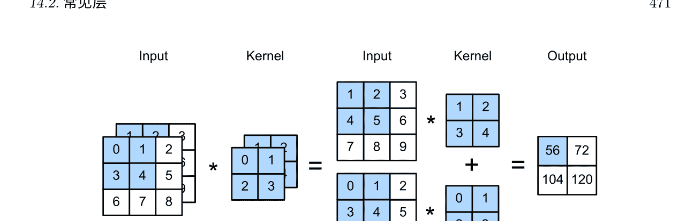

#### 14.2.1.5 分步卷积

由于每个输出像素是由其receptive field（基于滤波器的大小）中输入的加权组合生成的，相邻的输出在值上非常相似，因为它们的输入是重叠的。我们可以通过跳过每个 $s^{th}$ 输入来减少这种冗余（并加快计算）。这被称为 strided convolution。这在图14.8b中有所说明，我们将一个 $5 \times 7$ 图像与一个 $3 \times 3$ 的滤波器进行步长为2的卷积，得到一个 $3 \times 4$ 的输出。

一般来说，如果输入的大小为 $x_h \times x_w$，我们使用大小为 $f_h \times f_w$ 的核，我们在每一边使用大小为 $p_h$ 和 $p_w$ 的零填充，并且我们使用大小为 $s_h$ 和 $s_w$ 的步幅，那么输出的大小如下 [DV16]:

$$ \left\lfloor \frac{x_h + 2p_h - f_h + s_h}{s_h} \right\rfloor \times \left\lfloor \frac{x_w + 2p_w - f_w + s_w}{s_w} \right\rfloor \quad (14.12) $$

例如，考虑图14.8b，我们将步幅设置为 $s=2$。现在输出比输入小，大小为

$$ \left\lfloor \frac{5 + 2 - 3 + 2}{2} \right\rfloor \times \left\lfloor \frac{7 + 2 - 3 + 2}{2} \right\rfloor = \left\lfloor \frac{6}{2} \right\rfloor \times \left\lfloor \frac{4}{1} \right\rfloor = 3 \times 4 \quad (14.13) $$

#### 14.2.1.6 多输入和输出通道

在图14.6中，输入是一张灰度图像。一般来说，输入会有多个通道（例如，RGB或卫星图像的高光谱波段）。我们可以通过为每个输入通道定义一个卷积核来扩展卷积的定义；因此，现在 $\mathbf{W}$ 是一个3D权重矩阵或张量。我们通过将输入的通道 $c$ 与卷积核 $\mathbf{W}$ 进行卷积，然后对通道求和来计算输出：

$$ z_{i,j} = b + \sum_{u=0}^{H-1} \sum_{v=0}^{W-1} \sum_{c=0}^{C-1} x_{si+u, sj+v, c} w_{u,v,c} \quad (14.14) $$其中 s是步幅（为简单起见，我们假设高度和宽度的步幅相同）， b 是偏置项。这在图14.9中有所说明。每个权重矩阵可以检测一种特征。通常我们希望检测多种特征类型，如图14.2所示。我们可以通过将 W变成一个4维权重矩阵来实现。用于检测输入通道 c中特征类型 d的滤波器存储在 W_{:, :, c, d}中。我们将卷积的定义扩展到这种情况如下：

```
z_{i,j,d} = b_d + \sum_{u=0}^{H-1} \sum_{v=0}^{W-1} \sum_{c=0}^{C-1} x_{si+u, sj+v, c} w_{u,v,c,d} \quad (14.15)
```

这在图14.10中有所说明。每个垂直圆柱形列代表了给定位置的输出特征集合，即 z_{i,j,1:D}; 这有时被称为hypercolumn。每个元素是下一层特征图的感受野中 C特征的不同加权组合。

## 14.2.1.7 1 × 1（逐点）卷积

有时我们只想对给定位置的特征进行加权组合，而不是在各个位置之间进行组合。这可以使用1x1卷积来实现，也称为逐点卷积。

- 在Tensorflow中，2D CNN的滤波器形状为 (H, W, C, D)，特征图的小批量形状为（批量大小，图像高度，图像宽度，图像通道）；这被称为 NHWC格式。其他系统使用不同的数据布局。

图14.11: 使用大小为1×1×3×2的卷积滤波器将3个通道映射到2个通道。改编自[Zha+20]的图6.4.2。

图14.12: 使用2x2的滤波器和步长为1的最大池化的示意图。改编自[Zha+20]的图6.5.1。

这将改变通道数从 C到 D，而不改变空间维度：

```
z_{i,j,d} = b_d + \sum_{c=0}^{C-1} x_{i,j,c} w_{0,0,c,d}
```

这可以看作是对每个特征列并行应用的单层MLP。

### 14.2.2 池化层

卷积将保留有关输入特征位置的信息（模除降低的分辨率），这被称为等变性属性。在某些情况下，我们希望对位置不变。例如，在进行图像分类时，我们可能只想知道图像中是否存在感兴趣的对象（例如人脸）的存在。

实现这一目标的一种简单方法称为最大池化，它只是计算其输入值的最大值，如图14.12所示。另一种选择是使用平均池化，它用平均值替换最大值。无论哪种情况，输出神经元的响应都是相同的输入模式在其感受野内出现的位置。（请注意，我们独立地对每个特征通道应用池化。）

如果我们对特征图中的所有位置进行平均，该方法称为全局平均池化。因此，我们可以将一个 $H \times W \times D$ 特征图转换为一个 $1 \times 1 \times D$ 维特征图；这可以被重塑为一个 $D$ 维向量，然后可以传入一个全连接层将其映射到一个 $C$ 维向量，然后传入一个softmax输出。使用全局平均池化的好处是，我们可以将分类器应用于任意大小的图像，因为最终的特征图将始终被转换为一个固定的 $D$ 维向量，然后被映射到一个 $C$ 类别的分布。

图14.13: 用于图像分类的简单CNN。改编自https://blog.floydhub.com/building-your-first-convnet/。

## 14.2.3 将所有内容整合在一起

一种常见的设计模式是通过交替使用卷积层和最大池化层来创建一个CNN，最后在末尾添加一个线性分类层。这在图14.13中有所说明。（在这个例子中，我们省略了归一化层，因为模型相对较浅。）这种设计模式最初出现在福岛的neocognitron[Fuk75]中，受到了Hubel和Wiesel在人类视觉皮层中简单和复杂细胞模型的启发[HW62]。1998年，Yann LeCun在他的同名 LeNet模型[LeC+98]中使用了类似的设计，该模型使用反向传播和SGD来估计参数。这种设计模式在神经启发的视觉对象识别模型[RP99]以及各种实际应用中仍然很受欢迎（参见第14.3节和第14.5节）。

## 14.2.4 标准化层

图14.13中的基本设计对于浅层CNN效果很好，但是对于更深的模型来说，由于梯度消失或梯度爆炸的问题，很难扩展。这个问题的一个常见解决方案是向模型中添加额外的层，以标准化隐藏单元的统计特性（即确保它们的均值为零，方差为单位），就像我们对许多模型的输入做的那样。我们在下面讨论各种类型的标准化层。

### 14.2.4.1 批量标准化

最流行的标准化层被称为批量标准化（BN）[IS15]。这确保了一层中激活的分布在一个小批量样本中的平均值为零，方差为单位。更准确地说，我们用以下方式替换激活向量 \(z_n\)（有时也是预激活向量 \(a_n\)），例如在某一层中，用 \(\tilde{z}_n\) 计算如下：

```
\(\tilde{z}_n = \gamma \hat{z}_n + \beta\) (14.17)

\(\hat{z}_n = \frac{z_n - \mu_{\mathcal{B}}}{\sqrt{\sigma_{\mathcal{B}}^2 + \epsilon}}\) (14.18)

\(\mu_{\mathcal{B}} = \frac{1}{|\mathcal{B}|} \sum_{z \in \mathcal{B}} z\) (14.19)

\(\sigma_{\mathcal{B}}^2 = \frac{1}{|\mathcal{B}|} \sum_{z \in \mathcal{B}} (z - \mu_{\mathcal{B}})^2\) (14.20)
```

其中 \(\mathcal{B}\) 是包含示例 \(n\) 的小批量数据集³， \(\mu_{\mathcal{B}}\) 是该批次的激活均值， \(\sigma_{\mathcal{B}}^2\) 是相应的方差， \(\hat{z}_n\) 是标准化的激活向量， \(\tilde{z}_n\) 是移位和缩放的版本（BN层的输出）， \(\beta\) 和 \(\gamma\) 是该层的可学习参数， \(\epsilon > 0\) 是一个小常数。由于这个变换是可微的，我们可以轻松地将梯度传递回层的输入和BN参数 \(\beta\) 和 \(\gamma\)。

当应用于输入层时，批归一化等同于我们在第10.2.8节中讨论的常规标准化过程。请注意，由于数据是静态的，可以计算输入层的均值和方差一次。然而，内部层的经验均值和方差会随着参数的调整而不断变化。（有时被称为“内部协变量偏移”）这就是为什么我们需要在每个小批量上重新计算 \(\mu\) 和 \(\sigma^2\)。在测试时，我们可能只有一个输入，因此无法计算批次统计信息。解决这个问题的标准方法如下：训练后，计算训练集中所有示例的层 \(l\) 的 \(\mu_l\) 和 \(\sigma_l^2\)（即使用完整批次），然后“冻结”这些参数，并将它们添加到层的其他参数列表中，即 \(\beta_l\) 和 \(\gamma_l\)。在测试时，我们使用这些冻结的训练值作为 \(\mu_l\) 和 \(\sigma_l^2\)，而不是从测试批次计算统计信息。因此，在使用具有BN的模型时，我们需要指定我们是在推理还是训练中使用它。（有关一些示例代码，请参见`batchnorm_jax.ipynb`。）

为了速度，我们可以将一个冻结的批量归一化层与前一层结合起来。特别是假设前一层计算 \(\mathbf{X} \mathbf{W} + \mathbf{b}\)；将其与BN结合得到 \(\gamma (\mathbf{X} \mathbf{W} + \mathbf{b} - \mu) / \sigma + \beta\)。如果我们定义 \(\mathbf{W}' = \gamma \mathbf{W} / \sigma\) 和 \(\mathbf{b}' = \gamma (\mathbf{b} - \mu) / \sigma + \beta\)，那么我们可以将这些层组合写成 \(\mathbf{X} \mathbf{W}' + \mathbf{b}'\)。这被称为融合批量归一化。类似的技巧可以用来加速训练中的BN [Jun+19]。

批量归一化在训练速度和稳定性方面的好处可能非常显著，尤其对于深度CNN来说。具体原因尚不清楚，但是BN似乎使优化过程的路径更加平滑 [San+18b]。它还降低了对学习率的敏感性 [ALL18]。除了计算上的优势，它还具有统计上的优势。

3. 当应用于卷积层时，我们在空间位置和示例之间进行平均，但不在通道之间进行平均（因此 \(\mu\) 的长度是通道的数量）。当应用于全连接层时，我们只在示例之间进行平均（因此 \(\mu\) 的长度是层的宽度）。

特别是，BN的作用类似于正则化器；事实上，可以证明它等价于一种近似贝叶斯推断的形式[TAS18; Luo+19]。

然而，对于一个小批量数据的依赖会引起几个问题。特别是，在使用小批量大小进行训练时，可能会导致参数的估计不稳定，尽管该方法的一个更新版本，即批量重归一化[lof17]，在一定程度上解决了这个问题。我们在下面讨论一些其他替代批量归一化的方法。

## 14.2.4.2 其他类型的归一化层

在第14.2.4.1节中，我们讨论了批量归一化，它将给定特征通道中的所有激活标准化为零均值和单位方差。这可以显著帮助训练，并允许更大的学习率。（有关一些示例代码，请参见`batchnorm_jax.ipynb`。）尽管批量归一化效果很好，但在批量大小较小时会遇到困难，因为估计的均值和方差参数可能不可靠。一种解决方法是通过在张量的其他维度上汇总统计信息来计算均值和方差，但不包括批量中的示例。更准确地说，设 $z_i$ 表示张量的第 $i$ 个元素；对于2D图像的情况，索引 $i$ 具有4个分量，表示批量、高度、宽度和通道，$i=(i_N, i_H, i_W, i_C)$。我们按如下方式计算每个索引 $z_i$ 的均值和标准差：

```
$$\mu_i = \frac{1}{|\mathcal{S}_i|} \sum_{k \in \mathcal{S}_i} z_k, \quad \sigma_i = \sqrt{\frac{1}{|\mathcal{S}_i|} \sum_{k \in \mathcal{S}_i} (z_k - \mu_i)^2 + \epsilon} \qquad (14.21)$$
```

其中 $\mathcal{S}_i$ 是我们进行平均的元素集合。然后我们计算 $\hat{z}_i = (z_i - \mu_i) / \sigma_i$ 和 $\tilde{z}_i = \gamma_c \hat{z}_i + \beta_c$，其中 $c$ 是与索引 $i$ 对应的通道。

在批量归一化中，我们对批次、高度、宽度进行汇总，因此 $\mathcal{S}_i$ 是与 $i$ 的通道索引匹配的张量中的所有位置的集合。为了避免小批量的问题，我们可以对通道、高度和宽度进行汇总，但是匹配批次索引。这被称为层归一化[BKH16]。（请参阅`layer_norm_jax.ipynb`以获取一些示例代码。）或者，我们可以为批次中的每个示例和每个通道设置单独的归一化参数。这被称为实例归一化[UVL16]。

上述方法的一个自然推广被称为组归一化[WH18]，其中我们对所有与 i 的通道属于同一组的位置进行汇总。 这在图14.14中有所说明。层归一化是一种特殊情况，其中只有一个包含所有通道的组。

实例归一化是一种特殊情况，其中有 C 个组，每个通道一个组。在[WH18]中，他们通过实验证明，使用比单个通道大但小于所有通道的组可能更好（在训练速度、训练和测试准确性方面）。最近，[SK20]提出了滤波器响应归一化，它是批归一化的一种替代方法，即使在小批量大小为1的情况下也能很好地工作。这个想法是将每个组定义为具有单个通道和批样本的所有位置（就像实例归一化一样），但是只除以均方归一化而不是标准化。也就是说，如果输入（对于给定的通道和批次条目）为 \( z = \mathbf{Z}_{b,:,:,c} \in \mathbb{R}^N \)，我们计算 \( \hat{z} = z / \sqrt{\nu^2 + \epsilon} \)，其中 \( \nu^2 = \sum_{ij} z_{bijc}^2 / N \)，然后 \( \hat{z} = \gamma_c \hat{z} + \beta_{co} \)。由于没有均值居中，激活值可能会偏离0，这可能会产生不利影响，特别是对于 ReLU 激活函数。为了补偿这一点，作者提议在输出处添加一个带阈值的线性单元。这具有形式 \( y = \max(x, \tau) \)，其中 \(\tau\) 是一个可学习的偏移量。FRN和TLU的组合即使在批量大小为1的情况下，也能在图像分类和目标检测中取得良好的性能。

## 14.2.4.3 无归一化网络

最近，[Bro+21]提出了一种称为无归一化网络的方法，这是一种在训练深度残差网络时不使用批归一化或任何其他形式的归一化层的方式。关键是用自适应梯度剪裁来替换它，作为避免训练不稳定性的一种方式。也就是说，我们使用方程（13.70），但动态地调整剪裁强度。得到的模型训练速度更快，准确性更高，比使用批归一化的其他竞争模型要好。

## 14.3 图像分类的常见架构

通常使用CNN来进行图像分类，即估计函数 \( f : \mathbb{R}^{H \times W \times K} \rightarrow \{0, 1\}^C \)，其中 K 是输入通道的数量（例如，对于RGB图像，K = 3），而 C 是类别标签的数量。

在本节中，我们简要回顾了多年来开发的各种CNN来解决图像分类任务。有关CNN的更详细的回顾，请参见[Kha+20]，有关代码和模型的最新存储库，请参见https://github.com/rwightman/pytorch-image-models（使用PyTorch）。

### 14.3.1 LeNet

1998年创建的最早的卷积神经网络之一被称为 LeNet[LeC+98]，以其创造者Yann LeCun的名字命名。它被设计用于分类手写数字图像，并在第3.5.2节介绍的MNIST数据集上进行训练。该模型如图14.15所示（另请参见图14.16a，以获得更紧凑的模型表示）。该模型的一些预测结果如图14.17所示。仅经过1个时期，测试准确率已经达到98.8%。相比之下，在第13.2.4.2节中的多层感知器（MLP）在1个时期后的准确率为95.9%。更多的训练轮次可以进一步提高准确性，直到达到与标签噪声无法区分的程度。（请参见`lenet_jax.ipynb`中的一些示例代码。）

图14.15：LeNet5，用于分类手写数字的卷积神经网络。来自[Zha+20]的图6.6.1。获得了Aston Zhang的友情许可。

图14.16：(a) LeNet5。我们假设输入大小为1×28×28，这是MNIST的情况。来自[Zha+20]的图6.6.2。获得了Aston Zhang的友情许可。(b) AlexNet。我们假设输入大小为3×224×224，这是来自ImageNet的（裁剪和调整大小的）图像的情况。来自[Zha+20]的图7.1.2。在Aston Zhang的友情许可下使用。

当然，分类孤立的数字的适用性有限：在现实世界中，人们通常会写一串数字或其他字母。这需要同时进行分割和分类。LeCun和他的同事们设计了一种将卷积神经网络与类似于条件随机场的模型相结合来解决这个问题的方法。该系统由美国邮政服务部署。详细了解该系统，请参阅[LeC+98]。

### 14.3.2 AlexNet

尽管CNN已经存在多年，但直到2012年[KSH12]的论文中，主流计算机视觉研究人员才开始关注它们。在那篇论文中，作者展示了如何将ImageNet挑战（第1.5.1.2节）的（前5个）错误率从之前的26%降低到15%，这是一个巨大的改进。这个模型被称为AlexNet模型，以其创建者Alex Krizhevsky命名。

图14.16b(b)展示了架构。它与图14.16a中的LeNet非常相似，但有以下不同之处：它更深（有8层可调参数，即不包括池化层），它使用ReLU非线性函数而不是tanh（请参见第13.2.3节了解为什么这很重要），它使用dropout进行正则化而不是权重衰减，并且它将多个卷积层堆叠在一起，而不是严格交替使用卷积和池化。将多个卷积层堆叠在一起的好处是，一个层的输出被馈送到另一个层时，感受野变得更大（例如，连续三个3×3的滤波器将具有7×7的感受野尺寸）。这比使用具有更大感受野的单个层要好，因为多个层之间还有非线性函数。此外，三个3×3的滤波器比一个7×7的滤波器具有更少的参数。

请注意，AlexNet有60M个自由参数（远远超过1M个标记的示例），主要是由于输出处的三个全连接层。拟合这个模型依赖于使用两个GPU（由于当时GPU的内存有限），被广泛认为是一次工程之旅。^4图1.14a显示了模型对ImageNet中一些图像的一些预测。

图14.18：Inception模块。1 × 1卷积层减少了通道数，保持了空间维度不变。通过不同尺寸的卷积并行路径，模型可以学习每层使用哪个滤波器尺寸。最终的深度连接块将所有不同路径的输出组合在一起（所有路径的空间尺寸相同）。来自[Zha+20]的图7.4.1。获得Aston Zhang的友情许可使用。

图14.19：GoogLeNet（从原始版本稍作简化）。输入在左侧。来自[Zha+20]的图7.4.2。获得Aston Zhang的友情许可使用。

### 14.3.3 GoogLeNet (Inception)

Google开发了一个被称为 GoogLeNet的模型[Sze+15a]。（这个名字是Google和LeNet的双关语。）与之前的模型相比，GoogLeNet使用了一种新的块，称为inception block⁵，它使用多个并行路径，每个路径都有一个不同大小的卷积滤波器。请参见图14.18进行说明。这使得模型可以学习每个级别的最佳滤波器大小。整个模型由9个inception块后跟全局平均池化组成。请参见图14.19进行说明。自从这个模型首次发布以来，提出了各种扩展；详细信息可以在[IS15; Sze+15b; SIV17]中找到。

图14.20: CNN的残差块。左: 标准版本。右: 带有1x1卷积的版本，允许在块的输入和输出之间改变通道数。来自[Zha+20]的图7.6.3。获得阿斯顿·张的友情许可后使用。

图14.21: ResNet-18架构。每个虚线模块都是图14.20中显示的残差块。来自[Zha+20]的图7.6.4。获得阿斯顿·张的友情许可后使用。

### 14.3.4 ResNet

2015年ImageNet分类挑战的获胜者是微软团队，他们提出了一个名为ResNet的模型[He+16a]。关键思想是用φ( xl + Fl(xl))替换xl+1 =Fl(xl)。

xl+1 = φ(xl + Fl(xl)) (14.22)

这被称为残差块，因为 Fl 只需要学习该层输入和输出之间的残差或差异，这是一个更简单的任务。在[He+16a]中， F 的形式为conv-BN-relu-conv-BN，其中conv是卷积层，BN是批归一化层（第14.2.4.1节）。请参见图14.20（左）的示意图。

[CPS06]在CPU上实现了4倍的加速，然后[Cir+11]实现了60倍的加速。

5. 这个术语来自电影 Inception，其中有人说了“我们需要更深入”。这在2014年成为了一个流行的模因。

通过使用填充，我们可以确保卷积层的输出 $\mathcal{F}_l(x_l)$ 的空间维度与输入 $x_l$ 的空间维度相匹配。然而，如果我们希望卷积层的输出具有不同数量的通道，我们需要在跳跃连接上添加 $1 \times 1$ 卷积。请参见图14.20（右）的示意图。

使用残差块可以训练非常深的模型。之所以可能是因为梯度可以通过跳跃连接直接从输出流向较早的层，原因在第13.4.4节中解释。

在[He+16a]中，他们在ImageNet上训练了一个152层的ResNet。然而，通常使用较浅的模型。例如，图14.21显示了ResNet-18架构，它有18个可训练层：每个残差块中有2个3x3卷积层，共有8个这样的块，其中有一个初始的7x7卷积（步长为2）和一个最终的全连接层。符号上，我们可以如下定义模型：

（卷积：批归一化：最大值）：（R：R）：（R'：R）：（R'：R）：（R'：R）：平均值：全连接

其中R是一个残差块，R'是一个带有跳跃连接的残差块（由于通道数的变化）并且步长为2，FC是全连接（稠密）层，：表示连接。请注意，输入尺寸在空间上被减小了一个因子 $2^5=32$（每个R'块增加一个因子2，加上初始的Conv-7x7(2)和Max-pool），因此224x224的图像在进入全局平均池化层之前变成了一个7x7的图像。

一些用于拟合这些模型的代码可以在网上找到。6 在[He+16b]中，他们展示了如何通过对上述方案进行小的修改来训练具有多达1001层的模型。关键的洞察是由于在加法步骤之后使用非线性激活函数，跳跃连接上的信号仍然被衰减，即 $x_{l+1} = \varphi(x_l + \mathcal{F}(x_l))$。他们表明最好使用

```
$x_{l+1} = x_l + \varphi(\mathcal{F}_l(x_l))$ (14.23)
```

这被称为预激活残差网络或PreResnet。现在，网络很容易学习给定层的恒等函数：如果我们使用ReLU激活函数，我们只需要确保 $\mathcal{F}_l(x_l) = 0$，这可以通过将权重和偏置设置为0来实现。

使用非常深的模型的替代方法是使用非常“宽”的模型，每层有很多特征通道。这就是wide resnet模型的思想[ZK16]，它非常受欢迎。

### 14.3.5 DenseNet

在残差网络中，我们将每个函数的输出与其输入相加。另一种方法是将输出与输入连接起来，如图14.22a所示。如果我们堆叠一系列这样的块，我们可以得到类似于图14.22b的架构。这被称为DenseNets[Hua+17a]，因为每一层都密集地依赖于所有前一层。

因此，整体模型计算的是一个形式的函数

```
$x \rightarrow [x, f_1(x), f_2(x, f_1(x)), f_3(x, f_1(x), f_2(x, f_1(x))), \ldots]$ (14.24)
```

6. 笔记本resnet_jax.ipynb在FashionMNIST上拟合这个模型。笔记本cifar10_cnn_lightning.ipynb在更具挑战性的CIFAR-10数据集上拟合它。后面的代码使用各种技巧，在20个训练周期后，在CIFAR测试集上达到89%的top-1准确率。这些技巧包括数据增强（第19.1节），包括随机裁剪和水平翻转，并使用单周期学习率调度（第8.4.3节）。如果使用50个周期和随机权重平均（第8.4.4节），可以达到约94%的准确率。

图14.22: (a) 左边：残差块将输出添加到输入中。右边：稠密块将输出与输入进行连接。(b) 稠密块的示意图。来自[Zha+20]的图7.7.1-7.7.2。获得了Aston Zhang的友好许可。

稠密连接增加了参数的数量，因为通道在深度方向上堆叠。我们可以通过在中间添加1 × 1卷积层来补偿这一点。我们还可以添加步长为2的池化层来降低空间分辨率。（有关一些示例代码，请参见densenet_jax.ipynb。）

由于所有先前计算的特征直接可供输出层使用，DenseNets可以比ResNets表现更好。然而，它们可能更加计算密集。

### 14.3.6 神经架构搜索

我们已经看到许多CNN在设计上非常相似，只是以不同的拓扑结构重新排列各种构建块（如卷积或池化层），并调整各种参数设置（例如步长、通道数或学习率）。事实上，最近的ConvNeXt模型[Liu+22]（截至2022年4月）被认为是广泛视觉任务的最先进CNN架构，它是在标准ResNet架构的基础上通过组合多个这样的小改进而创建的。

我们可以使用黑盒（无导数）优化方法自动化这个设计过程，以找到最小化验证损失的架构。这被称为 AutoML（参见例如，[HKV19]）。在神经网络的背景下，它被称为神经架构搜索或 NAS [EMH19]。

在执行NAS时，我们可以同时优化多个目标，例如准确性、模型大小、训练或推理速度等（这就是如何创建EfficientNetv2[TL21]）。主要挑战在于计算目标的开销（因为它需要在模型空间中训练每个候选点）。减少对目标函数的调用次数的一种方法是使用贝叶斯优化（参见例如，[WNS19]）。另一种方法是创建可微分的损失近似（参见例如，[LSY19; Wan+21]），或将架构转换为核函数（使用神经切向核方法，第17.2.8节），然后分析其特征值的性质，这可以预测模型的性能而无需实际训练模型[CGW21]。NAS领域非常广阔且仍在不断发展。有关更详细的评论，请参见[EMH19]。

图14.23：使用1、2和3的速率的3x3滤波器的扩张卷积。来自[Cui+19]的图1。在Ximin Cui的友好许可下使用。

## 14.4 其他形式的卷积 *

我们在第14.2节中讨论了卷积的基础知识。在本节中，我们讨论一些扩展，这些扩展对于图像分割和图像生成等应用是必需的。

### 14.4.1 扩张卷积

卷积是一种将局部邻域中的像素值组合起来的操作。通过使用步幅，并将许多层的卷积堆叠在一起，我们可以扩大每个神经元的感受野，即每个神经元对输入空间的响应区域。然而，我们需要许多层才能给每个神经元足够的上下文来覆盖整个图像（除非我们使用非常大的滤波器，这样会很慢并且需要太多的参数）。

作为一种替代方法，我们可以使用带孔卷积[Mal99]，有时也被称为法国术语“à trous算法”，最近被重新命名为扩张卷积[YK16]。该方法在执行卷积时仅采用每个第r个输入元素，其中r被称为速率或扩张因子。例如，在1d中，使用速率r=2对滤波器w进行卷积等效于使用滤波器w~ = [w1, 0, w2, 0, w3]进行常规卷积，其中我们插入了0来扩展感受野（因此称为“带孔卷积”）。这使我们能够在不增加参数或计算量的情况下获得增加的感受野的好处。请参见图14.23进行说明。

更准确地说，2D膨胀卷积的定义如下：

> $$z_{i,j,d} = b_d + \sum_{u=0}^{H-1}\sum_{v=0}^{W-1}\sum_{c=0}^{C-1} x_{i+ru, j+rv, c} w_{u,v,c,d}$$
(14.25)

我们假设高度和宽度的速率 r 相同，为了简单起见。将此与方程（14.15）进行比较，其中步幅参数使用 x_{si+u, sj+v, c}。

### 14.4.2 转置卷积

在卷积中，我们通过对输入像素和卷积核 K 进行加权组合，将大输入 X 减小为小输出 Y。这在代码中最容易解释：

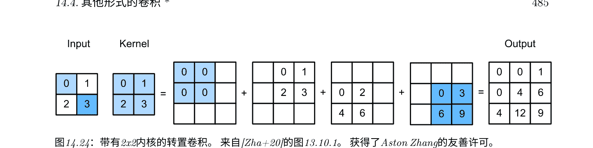

```
python
def conv(X, K):
    h, w = K.shape
    Y = zeros((X.shape[0] - h + 1, X.shape[1] - w + 1))
    for i in range(Y.shape[0]):
        for j in range(Y.shape[1]):
            Y[i, j] = (X[i:i + h, j:j + w] * K).sum()
    return Y

```

在转置卷积中，我们做相反的操作，以便从较小的输入产生较大的输出：

```
python
def trans_conv(X, K):
    h, w = K.shape
    Y = zeros((X.shape[0] + h - 1, X.shape[1] + w - 1))
    for i in range(X.shape[0]):
        for j in range(X.shape[1]):
            Y[i:i + h, j:j + w] += X[i, j] * K
    return Y

```

这相当于在输入图像的右下角填充 (h-1, w-1)个0，其中(h, w)是卷积核的大小，然后在每个输入位置上放置一个加权的卷积核副本，其中权重是相应的像素值，然后相加。这个过程在图14.24中有所说明。我们可以将卷积核看作是一个“模板”，用于生成输出，通过输入中的权重进行调制。

“转置卷积”一词来自于将卷积解释为矩阵乘法的观点，我们在14.2.1.3节中讨论过。如果 W是使用核 K通过方程式（14.9）中所示的过程得到的矩阵，那么可以证明 Y = transposed-conv(X, K)等价于 Y = reshape(W^T vec(X))。请参阅transposed_conv_jax.ipynb进行演示。

请注意，转置卷积有时也被称为反卷积，但这是一个不正确的术语用法：反卷积是使用已知滤波器（例如模糊滤波器）“撤销”卷积效果以恢复原始输入的过程，如图14.25所示。

### 14.4.3 深度可分离卷积

标准卷积使用大小为 H \times W \times C \times D 的滤波器，需要大量数据进行学习和计算。一种简化的卷积，称为深度可分离卷积，首先通过相应的2D滤波器 w 对每个输入通道进行卷积，然后使用 1 \times 1卷积 w' 将这些 C 通道映射到 D 通道：

```
z_{i,j,d} = b_d + \sum_{c=0}^{C-1} w'_{c,d} \left( \sum_{u=0}^{H-1} \sum_{v=0}^{W-1} x_{i+u, j+v, c} w_{u,v} \right) \qquad (14.26)
```

请参见图14.26进行说明。

为了看到这个优势，让我们考虑一个简单的数值例子。^7使用常规卷积对一个12 × 12 × 3的输入进行 5 × 5 × 3 × 256的滤波器卷积，得到一个 8 × 8 × 256的输出（假设有效卷积：12-5+1=8），如图14.13所示。使用可分离卷积，我们从 12 × 12 × 3的输入开始，通过一个 5 × 5 × 1 × 1的滤波器（跨空间但不跨通道）进行卷积，得到 8 × 8 × 3，然后通过一个 1 × 1 × 3 × 256的滤波器（跨通道但不跨空间）进行逐点卷积，得到一个 8 × 8 × 256的输出。因此，输出与之前的大小相同，但我们使用了更少的参数来定义该层，并且使用了更少的计算量。因此，可分离卷积经常在轻量级CNN模型中使用，例如 MobileNet模型[How+17; San+18a]和其他边缘设备。

## 14.5 用CNN解决其他判别式视觉任务 *

在本节中，我们简要讨论如何使用CNN解决各种其他视觉任务。每个任务还引入了一种新的架构创新，以补充我们已经了解的基本构建模块库。 有关计算机视觉中CNN的更多细节可以在[Bro19]中找到。

### 14.5.1 图像标记

图像分类将一个标签与整个图像关联起来，即假设输出是互斥的。 在许多问题中，可能存在多个对象，我们希望对它们进行标记。 这被称为图像标记，并且是多标签预测的应用。

在这种情况下，我们将输出空间定义为 \mathcal{Y} = \{0, 1\}^C，其中 C是标签类型的数量。 由于输出位是独立的（给定图像），我们应该用一组C个逻辑单元替换最终的softmax。

社交媒体网站的用户，比如 Instagram经常为他们的图片创建标签，因此这提供了一种“免费”的方式来创建大规模的有监督数据集。 当然，许多标签可能会被很少使用，并且它们的视觉意义可能不太明确。（例如，有人在进行COVID测试后拍摄自己的照片，并标记为“#covid”；然而，从视觉上看，它只是一个普通的人物照片。）因此，这种用户生成的标签通常认为是非常嘈杂的。 然而，正如[马赫+18]中所讨论的那样，它可以用於“预训练”。

最后，值得注意的是，图像标记通常比图像分类更合理，因为许多图像中有多个对象，很难知道应该标记哪一个。 事实上，安德烈·卡帕西，创建了“人类性能基准”在ImageNet上，指出了以下内容：

> 卷积神经网络（CNN）和人类都难以处理包含多个ImageNet类别（通常比五个多得多）的图像，很难确定图像的焦点是哪个对象。 这个错误只存在于分类设置中，因为每个图像都被限制为只有一个正确的标签。 总体上，我们将人类错误的16%归因于这个类别。

### 14.5.2 目标检测

在某些情况下，我们希望产生可变数量的输出，对应于图像中可能存在的感兴趣的对像的可变数量。（这是一个开放世界问题，其中对像的数量未知。）一个典型的例子是目标检测，在这种情况下，我们必须返回一组边界框，表示感兴趣的对像的位置，以及它们的类别标签。 这的一个特殊情况是人脸检测，其中只有一个感兴趣的类别。 这在图14.27a中有所说明。

+   8. 来源: https://bit.ly/3cFbALk
9. 请注意，人脸检测与人脸识别不同，人脸识别是一项分类任务，试图预测

解决这类检测问题的最简单方法是将其转化为一个封闭世界问题，在这个问题中，可能的位置（和方向）的数量是有限的。这些候选位置被称为锚框。我们可以在多个位置、尺度和长宽比上创建框，如图14.27b所示。对于每个框，我们训练系统来预测它包含的对象的类别（如果有的话）；我们还可以进行回归预测对象位置相对于锚点中心的偏移。（这些残差回归项允许子网格空间定位。）

抽象地说，我们正在学习一个形式为

```
$$f_{\theta}: \mathbb{R}^{H \times W \times K} \rightarrow [0, 1]^{A \times A} \times \{1, \ldots, C\}^{A \times A} \times (\mathbb{R}^{4})^{A \times A} \qquad (14.27)$$
```

其中，$K$是输入通道的数量，$A$是每个维度中的锚框数量，$C$是对象类型（类别标签）的数量。对于每个框的位置 $(i, j)$，我们预测三个输出：一个对象存在的概率 $p_{ij} \in [0, 1]$，一个对象的类别 $y_{ij} \in \{1, \ldots, C\}$，以及两个2D偏移向量 $\delta_{ij} \in \mathbb{R}^{4}$，可以添加到框的中心点以获得左上角和右下角的坐标。

已经提出了几种这种类型的模型，包括[Liu+16]的单次检测器模型和[Red+16]的YOLO（你只看一次）模型。多年来，已经提出了许多其他的目标检测方法。这些模型在速度、准确性、简单性等方面做出了不同的权衡。请参阅[Hua+17b]进行经验比较，以及[Zha+18]进行更近期的综述。

### 14.5.3 实例分割

在目标检测中，我们预测每个物体的标签和边界框。在实例分割中，目标是预测图像中每个物体实例的标签和2D形状掩码，如图14.28所示。这可以通过将语义分割模型应用于每个检测到的框来实现。

### 14.5.4 语义分割

在语义分割中，我们必须预测每个像素的类别标签 \(y_i \in \{1, \ldots, C\}\)，其中类别可以表示天空、道路、汽车等。与我们在第14.5.3节中讨论的实例分割相比，所有汽车像素都获得相同的标签，因此语义分割不区分对象。我们可以将“物体”（如天空、道路）的语义分割和“事物”（如汽车、人）的实例分割结合到一个连贯的框架中，称为“全景分割”[Kir+19]。

解决语义分割的常见方法是使用编码器-解码器架构，如图14.29所示。编码器使用标准卷积将输入映射到一个小的2D瓶颈，该瓶颈以粗糙的空间分辨率捕捉输入的高级属性。 （这通常使用一种称为扩张卷积的技术，我们在第14.4.1节中解释，以捕捉更大的感受野。## 14.5.5 人体姿势估计

我们可以训练一个物体检测器来检测人，并预测他们的2D形状，如掩码所表示的。然而，我们也可以训练模型来预测固定一组骨骼关键点的位置，例如头部或手的位置。这被称为人体姿势估计。请参见图14.32作为示例。有几种技术可以实现这一点，例如PersonLab [Pap+18]和OpenPose [Cao+18]。请参阅[Bab19]进行最新综述。

我们还可以预测每个检测到的对象的3D属性。主要限制是收集足够的标记训练数据的能力，因为人类注释者很难在3D中标记物体。然而，我们可以使用计算机图形引擎来创建具有无限地面真实3D注释的模拟图像（参见例如，[GNK18]）。

图14.32：使用OpenPose系统进行身体、手和脸部关键点检测的示意图。来自[Cao+18]的图8。获得Yaser Sheikh的好评许可后使用。

## 14.6 通过反转CNN生成图像 *

用于图像分类的CNN是一个判别模型，形式为 \(p(y|x)\)，它以图像作为输入，并返回一个概率分布，表示 \(C\) 个类别标签。在本节中，我们将讨论如何“反转”这个模型，将其转换为一个（条件）生成图像模型，形式为 \(p(x|y)\)。这将使我们能够生成属于特定类别的图像。（我们将在本书的后续部分中讨论更有原则的创建图像生成模型的方法，[Mur23]。）

### 14.6.1 将训练好的分类器转换为生成模型

我们可以使用 \(p(x, y) = p(x)p(y|x)\) 来定义图像和标签的联合分布，其中 \(p(y|x)\) 是CNN分类器，\(p(x)\) 是一些图像先验。如果我们将类别标签固定为特定值，我们可以使用 \(p(x|y) \propto p(x)p(y|x)\) 来创建条件生成模型。请注意，判别分类器 \(p(y|x)\) 被训练为“丢弃”信息，因此 \(p(y|x)\) 不是一个可逆的函数。因此，先验项 \(p(x)\) 在规范化这个过程中起着重要作用，我们将在第14.6.2节中看到。

从这个模型中采样的一种方法是使用Metropolis Hastings算法（第4.6.8.4节），将 \(\mathcal{E}_c(x) = \log p(y = c|x) + \log p(x)\) 作为能量函数。由于梯度信息是可用的，我们可以使用形式为 \(q(x'|x) = \mathcal{N}(\mu(x), \epsilon I)\) 的提议，其中 \(\mu(x) = x + \frac{\epsilon}{2} \nabla \log \mathcal{E}_c(x)\)。这被称为Metropolis-adjusted Langevin算法（MALA）。作为近似，我们可以忽略拒绝步骤，并接受每个提议。这被称为unadjusted Langevin算法，并在[Ngu+17]中用于条件图像生成。此外，我们可以进行缩放，使得先验梯度和似然梯度是独立的。因此，我们得到了一个关于图像空间的更新，看起来像是SGD的噪声版本，但我们是针对输入像素的导数（使用方程（13.50）），而不是参数：

```
x_{t+1} = x_t + \epsilon_1 \frac{\partial \log p(x_t)}{\partial x_t} + \epsilon_2 \frac{\partial \log p(y=c|x_t)}{\partial x_t} + \mathcal{N}(0, \epsilon_3^2 \mathbf{I}) \quad (14.28)
```

我们可以将方程中的每一项解释如下：第一个项确保图像在先验下是合理的，第二个项确保图像在似然下是合理的，第三个项是一个噪声项，用于生成多样的样本。如果我们设置 ε3=0，则该方法变成了一个确定性算法，用于（近似地）生成该类别的“最可能的图像”。

### 14.6.2 图像先验

在本节中，我们讨论了各种图像先验，可以用来规范反演分类器的不适定问题。这些先验与我们开始优化的图像一起，将决定我们生成的输出类型。

#### 14.6.2.1 高斯先验

仅仅指定类别标签是不够的信息来指定我们想要的图像类型。我们还需要一个关于什么构成“合理”图像的先验 p(x)。先验对最终图像的质量有很大影响，如下所示。

可以说最简单的先验是 \( p(x) = \mathcal{N}(x|0, \mathbf{I}) \)，如[SVZ14]中所建议的。（这假设图像像素已经居中。）这可以防止像素取极端值。在这种情况下，由于先验项的更新形式为

```
\nabla_X \log P(X|_t) = \nabla_X \left[ -\frac{1}{2} \|X|_t - 0\|^2 \right] = -X|_t \quad (14.29)
```

因此，整体更新（假设 ε2=1和 ε3=0）的形式为

```
X|_{t+1} = (1 - \epsilon_1) X|_t + \frac{\partial \log P(y=c|X|_t)}{\partial X_t} \quad (14.30)
```

请参见图14.33，其中显示了该方法生成的一些样本。

图14.33: 在简单的高斯先验下，最大化ImageNet类别‘鹅’和‘鸵鸟’的概率的图像。来自http://yosinski.com/deepvis。获得Jeff Clune的友好许可后使用。

#### 14.6.2.2 总变差（TV）先验

如果我们使用额外的正则化器，可以生成看起来更加逼真的图像。[MV15; MV16]建议计算图像的总变差或TV范数。这等于每个像素梯度的积分，可以近似如下：

```
\mathrm{TV}(x) = \sum_{ijk} (x_{ijk} - x_{i+1,j,k})^2 + (x_{ijk} - x_{i,j+1,k})^2 \quad (14.31)
```

其中 \( x_{ijk} \) 是第 \( i \) 行、第 \( j \) 列和第 \( k \) 通道的像素值（适用于RGB图像）。我们可以用水平和垂直的Sobel边缘检测器对每个通道进行重写：

```
\mathrm{TV}(x) = \sum_k \|\mathbf{H}(x_{:,:,k})\|_F^2 + \|\mathbf{V}(x_{:,:,k})\|_F^2 \quad (14.32)
```

请参考图14.34，了解这些边缘检测器的示意图。使用 \( p(\mathbf{x}) \propto \exp(-\mathrm{TV}(\mathbf{x})) \) 可以避免图像出现高频伪影。在[Yos+15]中，他们使用了高斯模糊代替了TV norm，但效果类似。

在图14.35中，我们展示了使用TV先验和CNN似然函数对不同类别标签 \( c \) 的 \(\log p(\mathbf{y}=c,\mathbf{x})\) 进行优化的一些结果，起始点是随机噪声。

图14.34: 总变差范数的示意图。(a)输入图像: 一只绿色海龟(获得维基媒体作者P. Lindgren的友好许可)。(b)水平增量。(c)垂直增量。改编自https://www.tensorflow.org/tutorials/generative/style_transfer。

图14.35: 在TV先验下，最大化某些ImageNet类别的概率的图像。来自https://research.googleblog.com/2015/06/inceptionism-going-deeper-into-neural.html。在Alexander Mordvintsev的友好许可下使用。

### 14.6.3 可视化卷积神经网络学到的特征

有趣的，我们可以问一下CNN中的“神经元”学到了什么。一种方法是从一个随机图像开始，然后优化输入像素，以使特定神经元的平均激活最大化。这被称为激活最大化(AM)，使用的技术与第14.6.1节中相同，但是将内部节点固定为特定值，而不是将输出类别标签固定。

图14.36展示了在应用于在ImageNet分类上训练的AlexNet CNN时，该方法的输出（使用TV先验）。我们可以看到，随着深度的增加，神经元学习识别简单的边缘/斑点，然后是纹理模式，然后是物体部分，最后是整个物体。这被认为与视觉皮层的分层结构大致相似（参见例如[Kan+12]）。

图14.36: 我们可视化了AlexNet架构中Conv 1、3、5和fc8层神经元的‘最佳刺激’。这些神经元是在ImageNet数据集上训练的。对于Conv5，我们还展示了检索到的产生类似激活的真实图像（在‘数据驱动’列下）。基于[MV16]中的方法。在Donglai Wei的友好许可下使用。

在像素空间中优化的替代方法是在训练集中搜索最大激活给定神经元的图像。如图14.36所示，这在Conv5层中进行了说明。有关特征可视化的更多信息，请参见[OMS17]。

### 14.6.4 深度梦境

到目前为止，我们专注于生成最大化类标签或其他感兴趣神经元的图像。在本节中，我们将处理更具艺术性的应用，即生成强调某些特征的输入图像的版本。

为此，我们将预训练的图像分类器视为特征提取器。根据第14.6.3节的结果，我们知道不同层中神经元的活动对应不同类型图像中的特征。假设我们对层 \( l \in \mathcal{L} \) 中的特征“放大”感兴趣。我们可以通过定义形式为 \( \mathcal{L}(x) = \sum_{l \in \mathcal{L}} \bar{\phi}_l(x) \) 的能量或损失函数来实现这一点，其中 \( \bar{\phi}_l = (1/(HWC)) \sum_{hwc} \phi_{lhwc}(x) \) 是层 \( l \) 的特征向量的平均值。现在我们可以使用梯度下降来优化这个能量。由此产生的过程被称为 DeepDream[MOT15]，因为该模型放大了原始图像中仅有的一些特征，然后创建了越来越多的具有这些特征的图像。¹⁰

图14.37显示了一个例子。我们从一张水母的图像开始，将其传入一个经过训练的CNN来分类ImageNet图像。经过几次迭代，我们生成了一些图像，它是输入图像和图14.33中看到的“幻觉”种类的混合；这些幻觉涉及到狗的部分，因为ImageNet的标签集中有很多种类的狗。有关详细信息，请参阅[Tho16]，以及 https://deepdreamgenerator.com 提供的有趣的基于Web的演示。

图14.37: 使用DeepDream算法处理后的水母图像。原始图像来自ImageNet。

### 14.6.5 神经风格迁移

图14.37中的DeepDream系统展示了CNN可以用来创建“艺术”的一种方式。然而，它相当令人毛骨悚然。在本节中，我们讨论一个相关的方法，它给用户更多的控制权。特别地，用户必须指定一个参考的“风格图像” \( \mathbf{x}_s \) 和“内容图像” \( \mathbf{x}_c \)。然后系统将尝试生成一个新的图像 \( \mathbf{x} \) 以 \( \mathbf{x}_s \) 的风格“重新渲染” \( \mathbf{x}_c \)。这被称为神经风格迁移，并在图14.38和图14.39中有所说明。这个技术最初在[GEB16]中提出，现在有很多关于这个主题的论文；最近的综述请参考[Jin+17]。

#### 14.6.5.1 它是如何工作的

风格迁移通过优化以下能量函数来实现：

```
\mathcal{L}(\mathbf{x}|\mathbf{x}_s, \mathbf{x}_c) = \lambda_{\mathrm{TV}} \mathcal{L}_{\mathrm{TV}}(\mathbf{x}) + \lambda_c \mathcal{L}_{\mathrm{content}}(\mathbf{x}, \mathbf{x}_c) + \lambda_s \mathcal{L}_{\mathrm{style}}(\mathbf{x}, \mathbf{x}_s) \qquad\qquad\qquad (14.33)
```

请参见图14.40，了解高层次的说明。

方程式（14.33）中的第一项是第14.6.2.2节中讨论的总变差先验。第二项通过比较预训练的CNN \(\phi(\mathbf{x})\)在相关的“内容层” \(\ell\)中的特征图来衡量 \(\mathbf{x}\)与\(\mathbf{x}_c\)的相似程度：

$$ \mathcal{L}_{\text{内容}} (\mathbf{x}, \mathbf{x}_c) = \frac{1}{C_\ell H_\ell W_\ell} \| \phi_\ell (\mathbf{x}) - \phi_\ell (\mathbf{x}_c) \|_2^2 \qquad (14.34) $$

最后，我们必须定义样式项。我们可以将视觉风格解释为某些图像特征的统计分布。这些特征在图像中的位置可能并不重要，但它们的共现确实重要。这在图14.41中有所说明。对于人类来说，很明显图像1在风格上与图像2更相似，而不是与图像3。直观上，这是因为图像1和图像2都有尖锐的绿色斑块，而图像3有尖锐的东西但不是绿色的。

为了捕捉共现统计信息，我们使用来自特定层的特征映射计算图像的格拉姆矩阵 \(\ell\):

$$ \mathbf{G}_{\ell}(\boldsymbol{x})_{c, d}=\frac{1}{H_{\ell} W_{\ell}} \sum_{h=1}^{H_{\ell}} \sum_{w=1}^{W_{\ell}} \phi_{\ell}(\boldsymbol{x})_{h, w, c} \phi_{\ell}(\boldsymbol{x})_{h, w, d} \qquad (14.35) $$

格拉姆矩阵是一个 \( C_{\ell} \times C_{\ell} \) 矩阵，它与在每个 \( H_{\ell} W_{\ell} \) 位置上采样的 \( C_{\ell} \) 维特征向量的非居中协方差成正比。

鉴于此，我们定义了层 \( \ell \) 的风格损失如下:

$$ \mathcal{L}_{\text {风格 }}^{\ell}\left(\boldsymbol{x}, \boldsymbol{x}_{s}\right)=\left\|\mathbf{G}_{\ell}(\boldsymbol{x})-\mathbf{G}_{\ell}\left(\boldsymbol{x}_{s}\right)\right\|_{F}^{2} \qquad (14.36) $$

最后，我们将整体风格损失定义为一组层损失的总和 \( S \) :

$$ \mathcal{L}_{\text {风格 }}\left(\boldsymbol{x}, \boldsymbol{x}_{s}\right)=\sum_{\ell \in S} \mathcal{L}_{\text {样式 }}^{\ell}\left(\boldsymbol{x}, \boldsymbol{x}_{s}\right) \qquad (14.37) $$

例如，在图14.40中，我们计算第1层和第3层的样式损失。（较低的层将捕捉视觉纹理，而较高的层将捕捉对象布局。）

图14.38: 神经风格迁移示例。内容图像是一张校园照片，风格图像是一幅星空油画。生成的图像以油画的风格重新绘制了校园场景。

图14.39: 不同风格图像下的风格迁移结果。内容图像相同（图14.38左），但采用了不同的艺术风格。

图14.40: 神经风格迁移的高层示意图。通过优化一个结合了内容损失、风格损失和总变差正则项的损失函数来生成最终图像。

图14.41: 风格相似性说明。图像1（左）和图像2（中）在风格上更接近，因为它们都有相似的尖锐绿色纹理，而图像3（右）虽然有尖锐特征但颜色不同。

#### 14.6.5.2 加速方法

在[GEB16]中，他们使用L-BFGS（第8.3.2节）来优化方程（14.33），从白噪声开始。如果我们使用Adam等优化器，从内容图像而不是白噪声初始化，我们可以获得更快的结果。然而，为每个新的样式和内容图像运行优化器是很慢的。一些论文（例如，[JAFF16; Uly+16; UVL16; LW16]）提出了训练神经网络直接预测此优化结果的方法，而不是为每个新的图像对解决它。（这可以看作是一种摊销优化的形式。）特别地，对于每个样式图像 \( \boldsymbol{x}_{s} \)，我们拟合一个模型 \( f_{s} \) 使得 \( f_{s}(\boldsymbol{x}_{c}) = \underset{\boldsymbol{x}}{\operatorname{argmin}} \mathcal{L}(\boldsymbol{x} | \boldsymbol{x}_{s}, \boldsymbol{x}_{c}) \)。然后，我们可以将这个模型应用于新的内容图像，而无需重新优化。

最近，[DSK16]展示了如何训练一个单一的网络，该网络接受内容和离散表示 \( s \) 的风格作为输入，并产生 \( f(\boldsymbol{x}_{c}, s) = \underset{\boldsymbol{x}}{\operatorname{argmin}} \mathcal{L}(\boldsymbol{x} | s, \boldsymbol{x}_{c}) \) 作为输出。这样可以避免为每种风格图像训练单独的网络。关键思想是使用特定风格的比例和偏移参数对给定层的特征进行标准化。具体而言，我们使用以下条件实例标准化变换:

$$ \mathrm{CIN}(\phi(\boldsymbol{x}_{c}), s) = \gamma_{s} \left( \frac{\phi(\boldsymbol{x}_{c}) - \mu(\phi(\boldsymbol{x}_{c}))}{\sigma(\phi(\boldsymbol{x}_{c}))} \right) + \beta_{s} \qquad (14.38) $$

## 14.6. 通过反转CNN生成图像 *

和 $\gamma_s = f_\gamma (\phi (x_s) )$, 我们同时学习参数 $\beta$ 和 $\gamma$ 以及其他所有参数。

模型变为 AIN $(\phi (x_c) , \phi (x_s) ) = f_\gamma (\phi (x_c) ) \left( \frac{\phi(x_c) - \mu(\phi(x_c))}{\sigma(\phi(x_c))} \right) + f_\beta(\phi(x_s))$ (14.39)

他们将自己的方法称为自适应实例归一化。

# 15 序列的神经网络

## 15.1 导论

在本章中，我们讨论了各种用于处理序列的神经网络。 我们将考虑输入为序列、输出为序列或者两者都是序列的情况。 这种模型有许多应用，例如机器翻译、语音识别、文本分类、图像字幕等。 我们的介绍部分参考了[Zha+20]的内容，更多细节请参阅该文献。

### 15.2 循环神经网络（RNN）

循环神经网络（RNN）是一种将输入序列映射到输出序列的神经网络，其预测输出 $y_t$ 不仅取决于输入 $x_t$，还取决于系统的隐藏状态 $h_t$，随着序列的处理而更新。 这样的模型可以用于序列生成、序列分类和序列翻译，下面我们将进行解释。^1

#### 15.2.1 向量到序列（序列生成）

在本节中，我们讨论如何学习形式为 $f_{\theta}: \mathbb{R}^{D} \rightarrow \mathbb{R}^{N \times C}$ 的函数，其中 $D$ 是输入向量的大小，输出是长度任意的向量序列，每个向量的大小为 $C$。（注意，单词是离散的标记，但可以转换为实值向量，我们将在第1.5.4节中讨论。）我们将这些模型称为 vec2seq 模型，因为它们将一个向量映射到一个序列。输出序列 $y_{1:T}$ 是逐个标记生成的。 在每个步骤中，我们从模型的隐藏状态 $h_t$ 中采样 $\tilde{y}_t$，然后将其“反馈”到模型中以获得新的状态 $h_{t+1}$（也取决于输入 $x$）。 请参见图15.1进行说明。通过这种方式，模型定义了一个条件生成模型 $p(y_{1:T}|x)$，它捕捉了输出标记之间的依赖关系。 我们将在下面更详细地解释这一点。

##### 15.2.1.1 模型

为了简化符号，让 $T$ 为输出的长度 (理解为动态选择)。然后，RNN对应于以下条件生成模型:

$$p(\boldsymbol{y}_{1:T}|\boldsymbol{x}) = \sum_{\boldsymbol{h}_{1:T}} p(\boldsymbol{y}_{1:T}, \boldsymbol{h}_{1:T}|\boldsymbol{x}) = \sum_{\boldsymbol{h}_{1:T}} \prod_{t=1}^{T} p(\boldsymbol{y}_t|\boldsymbol{h}_t) p(\boldsymbol{h}_t|\boldsymbol{h}_{t-1}, \boldsymbol{y}_{t-1}, \boldsymbol{x})$$  (15.1)

其中 $\boldsymbol{h}_t$ 是隐藏状态，我们定义 $p(\boldsymbol{h}_1|\boldsymbol{h}_0, \boldsymbol{y}_0, \boldsymbol{x}) = p(\boldsymbol{h}_1|\boldsymbol{x})$ 作为初始隐藏状态分布 (通常是确定性的)。

输出分布通常由

$$p(\boldsymbol{y}_t|\boldsymbol{h}_t) = \mathrm{Cat}(\boldsymbol{y}_t|\mathrm{softmax}(\mathbf{W}_{hy}\boldsymbol{h}_t + \boldsymbol{b}_y))$$  (15.2)

其中 $\mathbf{W}_{hy}$ 是隐藏到输出的权重， $\boldsymbol{b}_y$ 是偏置项。 然而，对于实值输出，我们可以使用

$$p(\boldsymbol{y}_t|\boldsymbol{h}_t) = \mathcal{N}(\boldsymbol{y}_t|\mathbf{W}_{hy}\boldsymbol{h}_t + \boldsymbol{b}_y, \sigma^2\mathbf{I})$$  (15.3)

我们假设隐藏状态的计算如下所示:

$$p(\boldsymbol{h}_t|\boldsymbol{h}_{t-1}, \boldsymbol{y}_{t-1}, \boldsymbol{x}) = \mathbb{I}(\boldsymbol{h}_t = f(\boldsymbol{h}_{t-1}, \boldsymbol{y}_{t-1}, \boldsymbol{x}))$$  (15.4)

对于一些确定性函数 $f$。 更新函数 $f$ 通常由以下给出

$$\boldsymbol{h}_t = \varphi(\mathbf{W}_{xh}[\boldsymbol{x}; \boldsymbol{y}_{t-1}] + \mathbf{W}_{hh}\boldsymbol{h}_{t-1} + \boldsymbol{b}_h)$$  (15.5)

其中 $\mathbf{W}_{hh}$ 是隐藏到隐藏的权重， $\mathbf{W}_{xh}$ 是输入到隐藏的权重，和 $\boldsymbol{b}_h$ 是偏置项。 请参见图15.1进行说明，以及rnn_jax.ipynb进行一些代码。

时间旅行者手中拿着的东西是一个闪闪发光的金属框架，几乎比一个小时钟还要小，非常精致。里面有象牙，比贝蒂尔 · 塔霍恩更细的东西，那是如何在空间和时间的任何方向上都能旅行的维度。驱动程序决定了它的内容，他自己满足于笑声，但我有实验证明了，时间旅行者说。这对历史来说将是非常方便的。

图15.2: 给定前缀“the”时，从字符级RNN生成的长度为500的示例输出。我们使用贪婪解码，在每一步中计算出最有可能的字符，然后将其反馈到模型中。该模型是在H. G.威尔斯的书《时间机器》上进行训练的。由rnn_jax.ipynb生成。

然而，记忆长度由潜在状态的大小和参数的强度决定；详细讨论请参见第15.2.7节。

当我们从RNN生成时，我们从 $\tilde{y}_t \sim p(y_t|h_t)$ 中进行采样，然后将采样值“输入”到隐藏状态中，以确定性地计算 $h_{t+1} = f(h_t, \tilde{y}_t, x)$，然后从中采样 $\tilde{y}_{t+1} \sim p(y_{t+1}|h_{t+1})$ 等等。因此，系统中唯一的随机性来自于观测（输出）模型中的噪声，该噪声在每一步中被反馈给系统。（然而，有一种变体称为变分RNN [Chu+15]，它在观测噪声之外为 $h_t$ 的动态添加了随机性。）

##### 15.2.1.2 应用

RNNs 可以用来无条件地生成序列（通过设置 $x = \emptyset$）或者在 $x$ 的条件下生成。无条件序列生成通常被称为语言建模，指的是学习离散令牌序列的联合概率分布，即形如 $p(y_1, ..., y_T)$ 的模型。（另请参阅第3.6.1.2节，我们在其中讨论了使用马尔可夫链进行语言建模的方法。）图15.2显示了一个由简单RNN训练而成的序列，该RNN是在H. G. Wells的书《时间机器》上训练的。（这是一本短篇科幻小说，只有32,000个单词和170k个字符。）我们可以看到生成的序列看起来是合理的，尽管不是非常有意义。通过使用更复杂的RNN模型（如我们在第15.2.7.1节和第15.2.7.2节中讨论的模型），并通过在更多数据上进行训练，我们可以创建出在语言建模任务上具有最先进性能的RNNs [CNB17]。（在语言建模领域，性能通常通过困惑度来衡量，困惑度只是平均每个令牌的负对数似然的指数；有关更多信息，请参阅第6.1.5节。）

我们还可以使生成的序列依赖于某种输入向量 $x$。例如，考虑图像字幕的任务：在这种情况下，$x$ 是通过CNN计算的图像嵌入，如图15.3所示。有关图像字幕方法的综述，请参见[Hos+19; LXW19]，以及包含代码的教程https://bit.ly/2Wvs1GK。

还可以使用RNN生成实值特征向量的序列，例如手写字符的笔画[Gra13]和手绘形状[HE18]。这对于时间序列预测实值序列也很有用。

### 15.2.2 Seq2Vec（序列分类）

在本节中，我们假设我们有一个固定长度的输出向量 $y$，我们想要预测，给定一个可变长度的输入序列。因此，我们想要学习形式为 $f_\theta : \mathbb{R}^{T D} \rightarrow \mathbb{R}^C$ 的函数。我们将其称为 seq2vec模型。为了简化符号表示，我们将重点放在输出为类别标签的情况下，即 $y \in \{1, \ldots, C\}$。

最简单的方法是将RNN的最终状态作为分类器的输入:

$$p(y|\mathbf{x}_{1:T}) = \text{Cat}(y|\text{softmax}(\mathbf{W}h_T)) \tag{15.6}$$

参见图15.4a进行说明。

如果让RNN的隐藏状态依赖于过去和未来的上下文，通常可以获得更好的结果。为了实现这一点，我们创建了两个RNN，一个在正向方向递归计算隐藏状态，另一个在反向方向递归计算隐藏状态。这被称为双向RNN [SP97]。

更准确地说，该模型定义如下:

$$\boldsymbol{h}_{t}^{\rightarrow}=\varphi\left(\mathbf{W}_{x h}^{\rightarrow} \boldsymbol{x}_{t}+\mathbf{W}_{h h}^{\rightarrow} \boldsymbol{h}_{t-1}^{\rightarrow}+\boldsymbol{b}_{h}^{\rightarrow}\right)\tag{15.7}$$
$$\boldsymbol{h}_{t}^{\leftarrow}=\varphi\left(\mathbf{W}_{x h}^{\leftarrow} \boldsymbol{x}_{t}+\mathbf{W}_{h h}^{\leftarrow} \boldsymbol{h}_{t+1}^{\leftarrow}+\boldsymbol{b}_{h}^{\leftarrow}\right)\tag{15.8}$$

然后我们可以定义$\boldsymbol{h}_{t}=\left[\boldsymbol{h}_{t}^{\rightarrow}, \boldsymbol{h}_{t}^{\leftarrow}\right]$作为在时间的状态表示，考虑到过去和未来的信息。最后，我们对这些隐藏状态进行平均池化，得到最终的分类器:

$$p\left(y \mid \boldsymbol{x}_{1: T}\right)=\mathrm{Cat}\left(y \mid \mathbf{W} \operatorname{softmax}(\bar{\boldsymbol{h}})\right)\tag{15.9}$$
$$\bar{\boldsymbol{h}}=\frac{1}{T} \sum_{t=1}^{T} \boldsymbol{h}_{t}\tag{15.10}$$

请参考图15.4b进行说明，以及rnn_sentiment_jax.ipynb中的一些代码。（这类似于第15.3.1节中的1D CNN文本分类器1。）

### 15.2.3 Seq2Seq（序列翻译）

在本节中，我们考虑形式为$f_{\theta}: \mathbb{R}^{T D} \rightarrow \mathbb{R}^{T^{\prime} C}$的学习函数。我们考虑两种情况：一种是$T^{\prime}=T$，即输入和输出序列具有相同的长度（因此对齐），另一种是$T^{\prime} \neq T$，即输入和输出序列具有不同的长度。这被称为一个seq2seq问题。

#### 15.2.3.1 对齐情况

在本节中，我们考虑输入和输出序列对齐的情况。我们也可以将其视为密集序列标记，因为我们预测每个位置的一个标签。将一个RNN修改为解决这个任务是直接的，如图15.5a所示。这对应于

$$p\left(\boldsymbol{y}_{1: T} \mid \boldsymbol{x}_{1: T}\right)=\sum_{\boldsymbol{h}_{1: T}} \prod_{t=1}^{T} p\left(\boldsymbol{y}_{t} \mid \boldsymbol{h}_{t}\right) \mathbb{I}\left(\boldsymbol{h}_{t}=f\left(\boldsymbol{h}_{t-1}, \boldsymbol{x}_{t}\right)\right)\tag{15.11}$$

其中我们定义 $\mathbf{h}_1 = f(\mathbf{h}_0, \mathbf{x}_1) = f_0(\mathbf{x}_1)$为初始状态。 注意 $\mathbf{y}_t$取决于 $\mathbf{h}_t$，而$\mathbf{h}_t$仅取决于过去的输入 $\mathbf{x}_{1:t}$。 如果我们让解码器不仅看过去的 $\mathbf{x}$，还能看到x的“未来”，我们可以获得更好的结果，这可以通过使用双向RNN来实现，如图15.5b所示。

我们可以通过在彼此之上堆叠多个隐藏链来创建更具表现力的模型，如图15.6所示。在时间 $t$的第 $l$层隐藏单元的计算方式为

$$h_t^l = \varphi_l(\mathbf{W}_{xh}^l \mathbf{h}_t^{l-1} + \mathbf{W}_{hh}^l \mathbf{h}_{t-1}^l + \mathbf{b}_h^l)$$

输出由以下给出

$$\mathbf{o}_t = \mathbf{W}_{ho} \mathbf{h}_t^L + \mathbf{b}_o$$

#### 15.2.3.2 不对齐的情况

在本节中，我们讨论如何从长度为 $T$的一个序列学习到长度为 $T'$的另一个序列的映射。 我们首先对输入序列进行编码，得到上下文向量 $\mathbf{c} = f_e(\mathbf{x}_{1:T})$，使用一个RNN的最后状态（或者是一个双向RNN的平均池化）。 然后我们使用一个RNN生成输出序列，这被称为编码器-解码器架构[SVL14; Cho+14a]。参见图15.7以进行说明。

这的一个重要应用是机器翻译。当使用RNN来解决这个问题时，它被称为神经机器翻译（与旧的称为统计机器翻译的方法不同，该方法不使用神经网络）。参见图15.8a以了解基本思想，并参考nmt_jax.ipynb获取更多详细信息的代码。有关NMT文献的综述，请参见[Luo16; Neu17]。

### 15.2.4 强制教学

在训练语言模型时，单词序列 $w_1, w_2, \ldots, w_T$ 的可能性由以下公式给出

$$p(\mathbf{w}_{1:T}) = \prod_{t=1}^{T} p(w_t|\mathbf{w}_{1:t-1}) \tag{15.14}$$

在RNN中，我们将输入设置为 $x_t = w_{t-1}$，并将输出设置为 $y_t = w_t$。请注意，我们是在过去的真实标签上进行条件约束的，即 $\mathbf{w}_{1:t-1}$，而不是模型生成的标签。这被称为教师强制，因为教师的值在每个步骤中被“强制”作为输入输入到模型中（即，$x_t$ 被设置为 $w_{t-1}$）。

不幸的是，教师强制有时会导致模型在测试时表现不佳。原因是模型只在“正确”的输入上进行了训练，因此如果在测试时遇到一个与训练中看到的不同的输入序列 $\mathbf{w}_{1:t-1}$，它可能不知道该怎么办。

解决这个问题的常见方法被称为计划采样[Ben+15a]。它开始时使用教师强制，但在随机的时间步骤中，改为从模型中提供样本；这种情况发生的时间比例逐渐增加。

另一种解决方案是使用其他类型的模型，如1D CNN（第15.3节）和Transformer（第15.5节），这些模型的MLE训练效果更好。

### 15.2.5 时序反向传播

我们可以通过求解$\theta^* = \text{argmax}_\theta p(\mathbf{y}_{1:T}|\mathbf{x}_{1:T},\theta)$来计算RNN参数的最大似然估计，其中我们假设只有一个训练序列以简化符号表示。为了计算MLE，我们必须计算损失对参数的梯度。

为了做到这一点，我们可以展开计算图，如图15.9所示，然后应用反向传播算法。这被称为时间反向传播（BPTT）[Wer90]。

更准确地说，考虑以下模型：

$$h_t = \mathbf{W}_{hx} \mathbf{x}_t + \mathbf{W}_{hh} \mathbf{h}_{t-1}$$
$$o_t = \mathbf{W}_{ho} \mathbf{h}_t$$

其中 $\mathbf{o}_t$ 是输出的逻辑值，我们为了简便起见省略了偏置项。我们假设 $y_t$ 是每个时间步的真实目标标签，因此我们定义损失为

$$L = \frac{1}{T} \sum_{t=1}^{T} \ell(y_t, o_t)$$

我们需要计算导数 $\frac{\partial L}{\partial \mathbf{W}_{hx}}$，$\frac{\partial L}{\partial \mathbf{W}_{hh}}$，以及 $\frac{\partial L}{\partial \mathbf{W}_{ho}}$。后一项很容易，因为它是每个时间步的局部项。然而，前两项依赖于隐藏状态，因此需要向时间的反方向工作。

作者：Kevin P. Murphy。 (C) MIT Press. CC-BY-NC-ND许可证我们通过定义简化符号

$$h_t = f(x_t, h_{t-1}, w_h)$$

$$o_t = g(h_t, w_o)$$

其中 \( w_h \) 是 \( \mathbf{W}_{hh} \) 和 \( \mathbf{W}_{hx} \) 的扁平化版本。我们重点关注计算。

根据链式法则，我们有

$$\frac{\partial L}{\partial w_h} = \frac{1}{T} \sum_{t=1}^{T} \frac{\partial \ell(y_t, o_t)}{\partial w_h} = \frac{1}{T} \sum_{t=1}^{T} \frac{\partial \ell(y_t, o_t)}{\partial o_t} \frac{\partial g(h_t, w_o)}{\partial h_t} \frac{\partial h_t}{\partial w_h}$$

我们可以展开最后一项如下：

$$\frac{\partial h_t}{\partial w_h} = \frac{\partial f(x_t, h_{t-1}, w_h)}{\partial w_h} + \frac{\partial f(x_t, h_{t-1}, w_h)}{\partial h_{t-1}} \frac{\partial h_{t-1}}{\partial w_h}$$

如果我们递归展开，我们会得到以下结果（参见[Zha+20，第8.7节]的推导）：

$$\frac{\partial h_t}{\partial w_h} = \frac{\partial f(x_t, h_{t-1}, w_h)}{\partial w_h} + \sum_{i=1}^{t-1} \left( \prod_{j=i+1}^{t} \frac{\partial f(x_j, h_{j-1}, w_h)}{\partial h_{j-1}} \right) \frac{\partial f(x_i, h_{i-1}, w_h)}{\partial w_h}$$

不幸的是，每个时间步骤计算的时间复杂度为 \( O(T) \)，总体计算时间复杂度为 \( O(T^2) \)。因此，通常将求和截断为最近的 \( K \) 项。可以自适应地选择适当的截断参数 \( K \)[AFF19]；然而，通常将其设置为当前小批量子序列的长度。

在使用截断BPTT时，我们可以使用短序列的批次来训练模型，通常是通过从原始序列中提取非重叠的子序列（窗口）来创建的。如果前一个子序列在时间 \( t-1 \) 结束，当前子序列在时间 \( t \) 开始，我们可以在训练期间跨批次更新时“传递”RNN的隐藏状态。然而，如果子序列是无序的，我们需要重置隐藏状态。请参阅`rnn_jax.ipynb`中的一些示例代码，以了解这些细节。

### 15.2.6 梯度消失和梯度爆炸

不幸的是，在RNN中，随着时间的推移，激活值可能会衰减或爆炸，因为我们在每个时间步骤上都要乘以权重矩阵 \( \mathbf{W}_{hh} \)。类似地，在RNN中，随着时间的倒退，梯度可能会衰减或爆炸，因为我们在每个时间步骤上都要乘以雅可比矩阵（详见第13.4.2节）。一个简单的启发式方法是使用梯度裁剪（方程（13.70））。更复杂的方法试图控制前向映射的谱半径 \( \lambda \) of，即 \( \mathbf{W}_{hh} \)，以及由雅可比矩阵 \( \mathbf{J}_{hh} \) 给出的后向映射。

控制谱半径的最简单方法是以一种随机初始化 \( \mathbf{W}_{hh} \) 的方式，以确保 \( \lambda \approx 1 \)，并将其固定（即，我们不学习 \( \mathbf{W}_{hh} \)）。在这种情况下，只需要学习输出矩阵 \( \mathbf{W}_{ho} \)，从而得到一个凸优化问题。这被称为回声状态网络[JH04]。一种密切相关的方法，称为液态机器[MNM02]，使用二值（脉冲）神经元而不是实值神经元。对于ESN和LSM的通用术语是储备计算[LJ09]。解决这个问题的另一种方法是使用约束优化来确保W_hh矩阵保持正交[Vor+17]。

一个替代方法是修改RNN架构本身，使用加法而不是乘法更新隐藏状态，我们在第15.2.7节中讨论。这显著提高了训练的稳定性。

### 15.2.7 门控和长期记忆

原则上，具有足够隐藏单元的RNN可以记住很久以前的输入。然而，在实践中，“原始”RNN由于梯度消失问题（第13.4.2节）而无法做到这一点。在本节中，我们提供了一种解决方案，即以加法方式更新隐藏状态，类似于残差网络（第14.3.4节）。

### 15.2.7.1 门控循环单元（GRU）

在本节中，我们讨论使用门控循环单元（GRU）的模型，正如[Cho+14a]中提出的。关键思想是通过使用门控单元来学习何时更新隐藏状态。当首次看到重要信息时，可以选择性地“记住”它们。该模型还可以学习何时重置隐藏状态，从而忘记不再有用的信息。

为了更详细地解释模型，我们按照[Zha+20，第8.8节]的介绍分为两个步骤。我们假设X_t是一个N × D矩阵，其中N是批量大小，D是词汇量大小。同样地，H_t是一个N × H矩阵，其中H是时间t时的隐藏单元数量。

### 15.2.7.2 长短期记忆 (LSTM)

在本节中，我们讨论了[HS97b]的长短期记忆（LSTM）模型，它是GRU的更复杂版本（比GRU早近20年）。有关更详细的介绍，请参阅https://colah.github.io/posts/2015-08-Understanding-LSTMs。基本思想是通过增加带有记忆单元$c_t$的隐藏状态$h_t$来增强模型。我们需要三个门来控制这个记忆单元：输出门$O_t$确定读出什么；输入门$I_t$确定读入什么；遗忘门$F_t$确定何时重置记忆单元。这些门的计算如下:

$$O_t = \sigma(X_t W_{xo} + H_{t-1} W_{ho} + b_o)$$
$$I_t = \sigma(X_t W_{xi} + H_{t-1} W_{hi} + b_i)$$
$$F_t = \sigma(X_t W_{xf} + H_{t-1} W_{hf} + b_f)$$

然后我们计算候选细胞状态:

$$\tilde{C}_t = \tanh(X_t W_{xc} + H_{t-1} W_{hc} + b_c)$$

细胞的实际更新要么是候选细胞（如果输入门打开），要么是旧细胞（如果非遗忘门打开）:

$$C_t = F_t \odot C_{t-1} + I_t \odot \tilde{C}_t$$

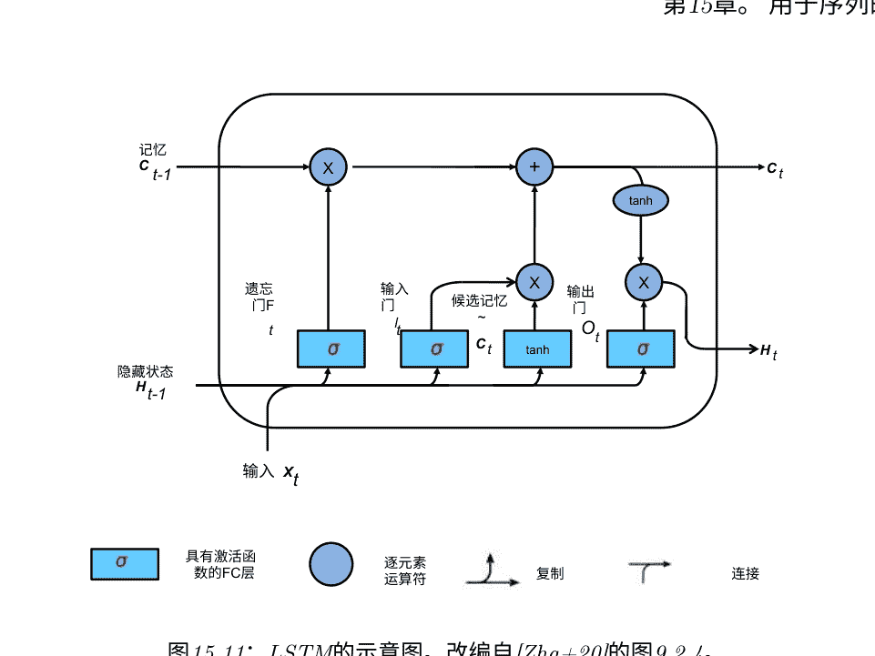

图15.11: LSTM的示意图。改编自[Zha+20]的图9.2.4。

如果 \( F_t = 1 \) 且 \( I_t = 0 \)，则可以记住长期记忆。

最后，我们计算隐藏状态作为细胞的转换版本，前提是输出门打开：

$$H_t = O_t \tanh(C_t)$$ (15.32)

注意，H_t既用作单元的输出，也用作下一个时间步的隐藏状态。这使得模型可以记住它刚刚输出的内容（短期记忆），而细胞 \( C_t \) 则充当长期记忆。有关整体模型的示意图，请参见图15.11，有关一些示例代码，请参见`lstm_jax.ipynb`。

有时我们会添加窥视孔连接，其中将细胞状态作为额外输入传递给门控单元。还提出了许多其他变体。事实上，[JZS15]使用遗传算法测试了超过10,000种不同的架构。其中一些比LSTM或GRU表现更好，但总体而言，LSTM在大多数任务中表现出色。在[Gre+17]中得出了类似的结论。最近，[ZL17]使用RNN控制器生成指定RNN架构的字符串，然后使用强化学习对控制器进行训练。这导致了一种新颖的细胞结构，优于LSTM。然而，它相当复杂，并未被学术界采用。

2. 在[JZS15]中指出的一个重要细节是，我们需要初始化遗忘门的偏置项 \( b_f \) 为较大的值，这样sigmoid函数接近于1。这确保了信息可以在时间上轻松通过 \( C \) 链传递。如果没有这个技巧，性能通常会差很多。

| Time step | 1 | 2 | 3 | 4 |
|---|---|---|---|---|
| A | 0.5 | 0.1 | 0.2 | 0.0 |
| B | 0.2 | 0.4 | 0.2 | 0.2 |
| C | 0.2 | 0.3 | 0.4 | 0.2 |
| <eos> | 0.1 | 0.2 | 0.2 | 0.6 |

| Time step | 1 | 2 | 3 | 4 |
|---|---|---|---|---|
| A | 0.5 | 0.1 | 0.1 | 0.1 |
| B | 0.2 | 0.4 | 0.6 | 0.2 |
| C | 0.2 | 0.3 | 0.2 | 0.1 |
| <eos> | 0.1 | 0.2 | 0.1 | 0.6 |

图15.12: 两个不同序列在每个步骤生成每个令牌的条件概率。来自[Zha+20]的图9.8.1-9.8.2。获得Aston Zhang的友好许可后使用。

## 15.2.8 束搜索

从RNN生成的最简单方法是使用贪婪解码，在每个步骤计算\(\hat{y}_t = \mathrm{argmax}_y p(y_t = y|\hat{y}_{1:t}, x)\)。我们可以重复这个过程，直到生成结束符号。参见图15.8b，了解将此方法应用于NMT的示例。不幸的是，贪婪解码无法生成MAP序列，该序列由 \( y_{1:T}^*=\mathrm{argmax}_y p(y|x) \) 定义。

原因是在步骤 \( t \) 的局部最优符号可能不在全局最优路径上。

举个例子，考虑图15.12a。我们贪婪地选择步骤1的MAP符号，即A。在此条件下，假设我们有 \( p(y_2|y_1 = A) = [0.1, 0.4, 0.3, 0.2] \)，如图所示。我们从中贪婪地选择MAP符号，即B。在此条件下，假设我们有 \( p(y_3|y_1 = A, y_2 = B) = [0.2, 0.2, 0.4, 0.2] \)，如图所示。我们从中贪婪地选择MAP符号，即C。在此条件下，假设我们有 \( p(y_4|y_1 = A, y_2 = B, y_3 = C) = [0.0, 0.2, 0.2, 0.6] \)，如图所示。我们从中贪婪地选择MAP符号，即<eos>（句子结束），所以我们停止生成。生成序列的整体概率为 \( 0.5 \times 0.4 \times 0.4 \times 0.6 = 0.048 \)。

现在考虑图15.12b。在第2步，假设我们选择第二个最有可能的标记，即C。在此条件下，假设我们有 \( p(y_3|y_1 = A, y_2 = C) = [0.1, 0.6, 0.2, 0.1] \)，如图所示。我们贪婪地选择这个MAP符号，即B。在此条件下，假设我们有 \( p(y_4|y_1 = A, y_2 =C, y_3 = B) = [0.1, 0.2, 0.1, 0.6] \)，如图所示。我们贪婪地从中选择这个MAP符号，即<eos>（句子结束），所以我们停止生成。生成序列的整体概率为 \( 0.5 \times 0.3 \times 0.6 \times 0.6 = 0.054 \)。因此，通过更少地贪婪，我们找到了一个整体可能性更高的序列。

对于隐马尔可夫模型，我们可以使用一种叫做维特比解码（这是一个动态规划的例子）的算法来计算全局最优序列，时间复杂度为 \( O(TV^2) \)，其中 \( V \) 是词汇表中的单词数。（详见[Mur23]）但对于循环神经网络，计算全局最优解需要 \( O(V^T) \)，因为隐藏状态不是数据的充分统计量。

波束搜索是一种更快的启发式方法。在这种方法中，我们在每一步计算出前 \( K \) 个候选输出；然后我们以所有 \( V \) 种可能的方式扩展每一个候选输出，生成\( V\times K \)个候选项，从中再次选择前 \( K \) 个。这个过程在图15.13中有所说明。还可以扩展算法以无重复地采样前 \( K \) 个序列。

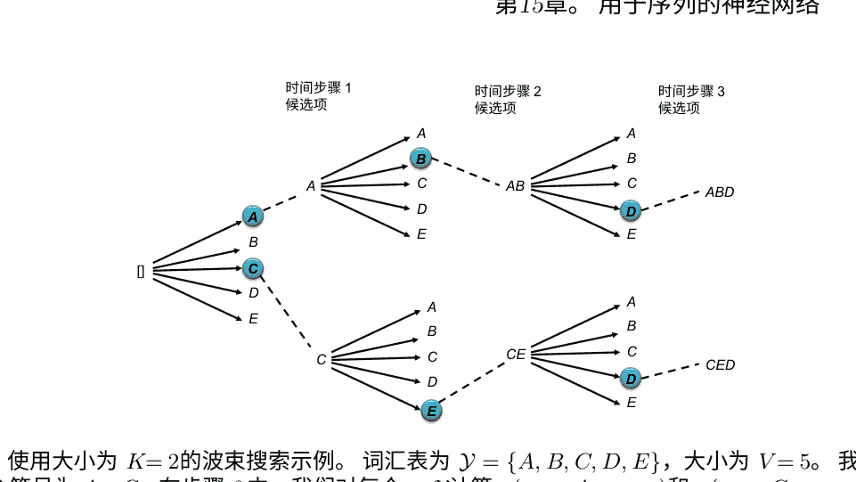

图 15.13: 使用大小为 K=2的波束搜索示例。词汇表为 \( \mathcal{Y} = \{A, B, C, D, E\} \)，大小为 V = 5。我们假设步骤1的前两个符号为 A、C。在步骤 2 中，我们对每个 \( y \in \mathcal{Y} \) 计算 \( p(y_1 = A, y_2 = y) \) 和 \( p(y_1 = C, y_2 = y) \)。这需要 \( O(KV) \) 时间。然后我们选择前两个部分路径，它们是 \( (y_1 = A, y_2 = B) \) 和 \( (y_1 = C, y_2 = E) \)，并以明显的方式继续。改编自 [Zha+20] 的图 9.8.3。

(即选择顶部的一个，重新归一化，选择新的顶部的一个等)，使用一种称为随机束搜索的方法。这会在每一步中用 Gumbel 噪声扰动模型的部分概率。详细信息请参见 [KHW19]。以及 [SB20] 作为一种顺序替代方法。这些采样方法可以提高输出的多样性。（另请参阅 [Vij+18] 的确定性多样束搜索方法。）

## 15.3 1d卷积神经网络

卷积神经网络（第14章）使用相同的权重计算每个输入的某个局部邻域的函数，并返回一个输出。它们通常用于2d输入，但也可以应用于1d情况，如下所讨论的。它们是RNN的有趣替代方案，训练起来更容易，因为它们不需要维护长期隐藏状态。

### 15.3.1 用于序列分类的 1d 卷积神经网络

在本节中，我们讨论了使用1d卷积神经网络学习从可变长度序列到固定长度输出的映射，即形式为 \( f_\theta: \mathbb{R}^{DT} \rightarrow \mathbb{R}^C \) 的函数，其中 T 是输入的长度，D 是每个输入的特征数量，C 是输出向量的大小（例如，类别的对数概率）。

对于一个1维序列，应用基本的卷积操作如图14.4所示。通常，输入序列将具有 D > 1 个输入通道（特征维度）。在这种情况下，我们可以分别对每个通道进行卷积，并将结果相加，使用不同的1维滤波器（核）来处理每个输入通道，得到 \( z_i = \sum_{d} x_{i-k:i+k,d}^T w_d \)，其中 k 是1维感受野的大小，w_d 是输入通道 d 的滤波器。这将产生一个1维向量 \( z \in \mathbb{R}^T \)，编码输入（忽略边界效应）。我们可以使用不同的权重向量为每个输出通道 c 创建一个位置的向量表示，得到 \( z_{i,c} = ... \) 这实现了从 \( TD \) 到 \( TC \) 的映射。为了将其减少为固定大小的向量，我们可以使用时间上的最大池化来得到 \( z \in \mathbb{R}^C \)，其中 \( z_c = \max_i z_{i,c} \)。

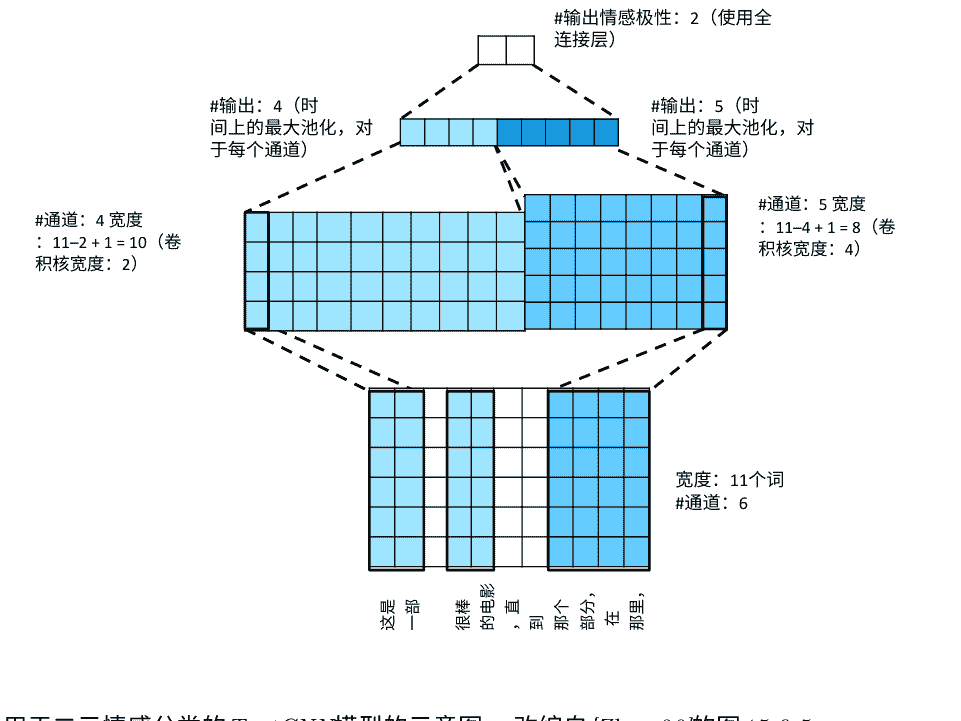

图15.14: 用于二元情感分类的TextCNN模型的示意图。改编自[Zha+20]的图15.3.5。

我们可以然后将其传递到softmax层。

在[Kim14]中，他们将该模型应用于序列分类。其思想是使用嵌入层嵌入每个单词，并使用不同宽度的1D卷积核计算各种特征，以捕捉不同长度尺度的模式。然后，我们对时间进行最大池化，并将结果连接起来，然后传递给全连接层。请参见图15.14进行说明，以及`cnn1d_sentiment_jax.ipynb`中的一些代码。

### 15.3.2 因果1D CNN用于序列生成

要在生成环境中使用1D CNN，我们必须将它们转换为因果CNN，其中每个输出变量仅依赖于先前生成的变量。（这也被称为卷积马尔可夫模型。）具体而言，我们定义模型如下：

$$ p(y) = \prod_{t=1}^{T} p(y_t | y_{1:t-1}) = \prod_{t=1}^{T} \text{Cat}(y_t | \text{softmax}(\varphi(\sum_{\tau=1}^{t-k} w^T y_{\tau:\tau+k}))) $$ (15.33)

其中 \( w \) 是大小为 \( k \) 的卷积滤波器，并且我们假设只有一个非线性 \( \varphi \) 和分类输出，为了简化符号。这类似于常规的一维卷积，只是我们‘屏蔽’了未来的输入，所以 \( y_t \) 只取决于过去的值，而不是过去和未来的值。

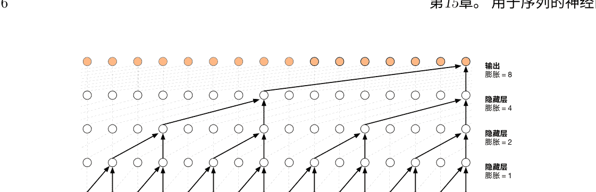

这被称为因果卷积。当然，我们可以使用更深的模型，并且可以根据输入特征 \( x \) 进行条件约束。

为了捕捉长程依赖关系，我们可以使用扩张卷积（第14.4.1节），如图15.15所示。这个模型已经成功地用于创建一种最先进的文本到语音（TTS）合成系统，被称为wavenet[Oor+16]。特别地，他们堆叠了10个因果1D卷积层，其扩张率为1、2、4等等。，256，512以获得具有1024个有效感受野的卷积块。（他们在每一层之前用与扩张率相等的零填充了输入序列，以使每一层具有相同的长度。）然后他们重复这个块3次以计算更深层次的特征。

在WaveNet中，条件信息 \( x \) 是从输入词序列中派生的一组语言特征；然后模型使用上述模型生成原始音频。还可以创建一个完全端到端的方法，从原始词语开始而不是语言特征（参见[Wan+17]）。

尽管WaveNet能够产生高质量的语音，但在生产系统中速度太慢。然而，它可以被“提炼”成一个并行生成模型[Oor+18]。我们在本书的后续部分讨论这些类型的并行生成模型[Mur23]。

## 15.4 注意力

在我们迄今考虑的所有神经网络中，隐藏激活是输入激活的线性组合，然后经过非线性函数：\( Z = \varphi(\mathbf{XW}) \)，其中 \( \mathbf{X} \in \mathbb{R}^{m \times v} \) 是隐藏特征向量，\( \mathbf{W} \in \mathbb{R}^{v \times v'} \) 是一组固定的权重，通过训练集学习以产生 \( \mathbf{Z} \in \mathbb{R}^{m \times v'} \) 输出。

然而，我们可以想象一个更灵活的模型，其中权重取决于输入，即\( \mathbf{Z} = \varphi(\mathbf{XW}(\mathbf{X})) \)。这种乘法交互被称为注意力。更一般地，我们可以写成 \( \mathbf{Z} = \varphi(\mathbf{VW}(\mathbf{Q}, \mathbf{K})) \)，其中 \( \mathbf{Q} \in \mathbb{R}^{m \times q} \) 是一组查询（从 \( \mathbf{X} \) 派生）用于描述每个输入正在寻找的内容，\( \mathbf{K} \in \mathbb{R}^{m \times q} \) 是一组键（从 \( \mathbf{X} \) 派生）用于描述每个输入向量包含的内容，\( \mathbf{V} \in \mathbb{R}^{m \times v} \) 是一组值（从 \( \mathbf{X} \) 派生）用于描述每个输入应如何传输到输出。（我们通常使用输入的线性投影来计算这些量，\( \mathbf{Q} = \mathbf{W}_q \mathbf{X} \)，\( \mathbf{K} = \mathbf{W}_k \mathbf{X} \)，\( \mathbf{V} = \mathbf{W}_v \mathbf{X} \)。）

当使用注意力来计算输出 \(z_j\) 时，我们使用相应的查询 \(q_j\) 并将其与每个键 \(k_i\) 进行比较以获得相似度得分 \(0 \leq \alpha_{ij} \leq 1\)，其中 \(\sum_i \alpha_{ij} = 1\); 然后我们设置 \(z_j = \sum_i \alpha_{ij} v_i\)。(我们假设 \(\varphi(u) = u\) 是恒等函数。) 例如，假设 \(\mathbf{V} = \mathbf{X}\)，并且查询 \(q_j\) 与键1和2都匹配，因此 \(\alpha_{1j} = \alpha_{2j} = 0.5\); 然后我们有 \(z_j = 0.5x_1 + 0.5x_2\)。因此，输出成为输入的动态加权组合，而不是固定的加权组合。与其学习权重矩阵，我们学习投影矩阵 \(\mathbf{W}_q\)，\(\mathbf{W}_k\) 和 \(\mathbf{W}_v\)。我们在下面详细解释这一点。

请注意，注意力最初是为自然语言序列模型开发的。然而，现在它被应用于各种模型，包括视觉模型。我们在以下章节中的演示基于[Zha+20， 第10章]。

## 15.4. 注意力

### 15.4.1 注意力作为软字典查找

我们将重点放在单个输出向量上，对应的查询向量为 \(q\)。我们可以将注意力视为字典查找，其中我们将查询 \(q\) 与每个键 \(k_i\) 进行比较，然后检索相应的值 \(v_i\)。为了使这个查找操作可微分，我们不是检索单个值 \(v_i\)，而是计算值的凸组合，如下所示:

\[\operatorname{Attn}(\boldsymbol{q}, (\boldsymbol{k}_1, \boldsymbol{v}_1), \ldots, (\boldsymbol{k}_m, \boldsymbol{v}_m)) = \operatorname{Attn}(\boldsymbol{q}, (\boldsymbol{k}_{1:m}, \boldsymbol{v}_{1:m})) = \sum_{i=1}^{m} \alpha_i(\boldsymbol{q}, \boldsymbol{k}_{1:m}) \boldsymbol{v}_i \in \mathbb{R}^v \quad\quad (15.34)\]

其中 \(\alpha_i(\boldsymbol{q}, \boldsymbol{k}_{1:m})\) 是第\(i\)个注意权重; 这些权重满足 \(0 \leq \alpha_i(\boldsymbol{q}, \boldsymbol{k}_{1:m}) \leq 1\) 对于每个 \(i\) 和 \(\sum_i \alpha_i(\boldsymbol{q}, \boldsymbol{k}_{1:m}) = 1\)。注意权重可以通过一个注意分数函数 \(a(\boldsymbol{q}, \boldsymbol{k}_i) \in \mathbb{R}\) 来计算，该函数计算查询 \(\boldsymbol{q}\) 与关键字 \(\boldsymbol{k}_i\) 之间的相似度。我们将在下面讨论几种这样的分数函数。给定分数，我们可以使用softmax函数计算注意权重:

\[\alpha_i(\boldsymbol{q}, \boldsymbol{k}_{1:m}) = \operatorname{softmax}_i([a(\boldsymbol{q}, \boldsymbol{k}_1), \ldots, a(\boldsymbol{q}, \boldsymbol{k}_m)]) = \frac{\exp(a(\boldsymbol{q}, \boldsymbol{k}_i))}{\sum_{j=1}^m \exp(a(\boldsymbol{q}, \boldsymbol{k}_j))} \quad\quad (15.35)\]

请参见图15.16以进行说明。 在某些情况下，我们希望将注意力限制在字典的子集上，对应于有效的条目。例如，我们可能希望将序列填充到固定长度（以进行高效的小批量处理），在这种情况下，我们应该“屏蔽”填充位置。这被称为屏蔽注意力。 我们可以通过将屏蔽条目的注意力分数设置为一个较大的负数，例如 $-10^6$，从而使相应的softmax权重为0，从而高效地实现这一点。（这类似于因果卷积，在第15.3.2节中讨论。）

### 15.4.2 核回归作为非参数化注意力

我们可以将注意力解释为核回归，这是一个非参数模型，我们在第16.3.5节中讨论。简而言之，这是一个模型，其中查询点 $\boldsymbol{x}$ 的预测输出是所有目标标签 $y_i$ 的加权组合，其中权重取决于查询点 $\boldsymbol{x}$ 与每个训练点 $\boldsymbol{x}_i$ 的相似性：

$f(\boldsymbol{x}) = \sum_{i=1}^n \alpha_i(\boldsymbol{x}, \boldsymbol{x}_{1:n}) y_i$ (15.36)

其中 $\alpha_i(\boldsymbol{x}, \boldsymbol{x}_{1:n}) \geq 0$ 衡量了测试输入 $\boldsymbol{x}$ 与训练输入 $\boldsymbol{x}_i$ 之间的归一化相似度。这个相似度度量通常通过以密度核函数（如高斯核）来定义注意力分数来计算：

$\mathcal{K}_\sigma(u) = \frac{1}{\sqrt{2\pi\sigma^2}} e^{-\frac{1}{2\sigma^2} u^2}$ (15.37)

其中 $\sigma$ 被称为带宽。然后我们定义 $a(\boldsymbol{x}, \boldsymbol{x}_i) = \mathcal{K}_\sigma(\boldsymbol{x} - \boldsymbol{x}_i)$。由于分数已经归一化，我们可以忽略这一项 $\frac{1}{\sqrt{2\pi\sigma^2}}$ 项。此外，我们将核函数重新写成 $\beta^2 = 1/\sigma^2$ 的形式，得到

$\mathcal{K}(u; \beta) = \exp\left(-\frac{\beta^2}{2} u^2\right)$ (15.38)

将其代入方程 (15.36) 中，我们得到

$f(\boldsymbol{x}) = \sum_{i=1}^n \alpha_i(\boldsymbol{x}, \boldsymbol{x}_{1:n}) y_i$ (15.39)  
$= \sum_{i=1}^n \frac{\exp\left[-\frac{1}{2}((\boldsymbol{x} - \boldsymbol{x}_i)\beta)^2\right]}{\sum_{j=1}^n \exp\left[-\frac{1}{2}((\boldsymbol{x} - \boldsymbol{x}_j)\beta)^2\right]} y_i$ (15.40)  
$= \sum_{i=1}^n \text{softmax}_i\left[-\frac{1}{2}((\boldsymbol{x} - \boldsymbol{x}_1)\beta)^2, \dots, -\frac{1}{2}((\boldsymbol{x} - \boldsymbol{x}_n)\beta)^2\right] y_i$ (15.41)

我们可以将其解释为一种非参数化注意力形式，其中查询是测试点$\boldsymbol{x}$，键是训练输入 $\boldsymbol{x}_i$，值是训练标签 $y_i$。如果我们设置 $\beta = 1$，则得到的注意力矩阵 $A_{ji} = \alpha_i(\boldsymbol{x}_j, \boldsymbol{x}_{1:n})$ 对于测试输入 $j$ 如图15.17a所示。结果预测曲线如图15.17b所示。

图15.17a中对角带的大小，以及注意机制的稀疏性，取决于参数 $\beta$。如果我们增加 $\beta$，即减小核带宽，带将变窄，但模型将开始过拟合。

### 15.4.3 参数化注意力

在第15.4.2节中，我们根据高斯核定义了注意力分数，将查询（测试点）与训练集中的每个值进行比较。然而，非参数化方法在大规模训练集或高维输入上不具有良好的可扩展性。因此，我们将把注意力（无意冒犯）转向参数化模型，在这种模型中，我们有一组固定的键和值，并在一个学习的嵌入空间中比较查询和键。

有几种方法可以做到这一点。在一般情况下，查询 q ∈ ℝ^q 和关键字 k ∈ ℝ^k 可能具有不同的大小。为了比较它们，我们可以将它们映射到一个大小为 h 的公共嵌入空间中，通过计算 W_q q 和 W_k k。然后，我们可以将它们传递到一个MLP中，以获得以下的加性注意力评分函数：

```
a(q, k) = w^T_v tanh(W_q q + W_k k) ∈ ℝ  (15.42)
```

一种更高效的方法是假设查询和关键字都具有长度 d，因此我们可以直接计算 q^T k。如果我们假设这些是具有0均值和单位方差的独立随机变量，则它们的内积的均值为0，方差为 d。（这是根据方程(2.34) 和方程(2.39) 得出的。）为了确保内积的方差在输入大小不同的情况下仍然为1，通常会除以 √d。这导致了缩放的点积注意力：

```
a(q, k) = q^T k / √d ∈ ℝ  (15.43)
```

在实践中，我们通常一次处理一批 n 个向量。让相应的查询、键和值的矩阵分别表示为 Q ∈ ℝ^{n×d}, K ∈ ℝ^{m×d}, V ∈ ℝ^{m×v}。然后我们可以按如下方式计算注意力加权输出：

```
Attn(Q, K, V) = softmax( Q K^T / √d ) V ∈ ℝ^{n×v}  (15.44)
```

其中softmax函数 softmax逐行应用。请参阅attention_jax.ipynb以获取一些示例代码。

### 15.4.4 带有注意力机制的Seq2Seq

回顾一下第15.2.3节中的seq2seq模型。它使用了形式为 $h^d_t = f_d(h^d_{t-1}, y_{t-1}, c)$ 的RNN解码器，其中 $c$ 是一个固定长度的上下文向量，表示输入 $x_{1:T}$ 的编码。通常我们设置 $c = h^e_T$，它是编码器RNN的最终状态（或者我们使用双向RNN与平均池化）。然而，对于机器翻译等任务，这可能导致性能不佳，因为输出没有直接访问输入单词本身。我们可以通过允许输出单词直接“查看”输入单词来避免这个瓶颈。但是它应该查看哪些输入呢？毕竟，单词顺序在不同语言中并不总是保持一致（例如，德语通常将动词放在句子末尾），所以我们需要推断源语言和目标语言之间的对齐。我们可以通过使用（软）注意力来解决这个问题（以可微分的方式），这是在[BCB15; LPM15]中首次提出的。特别地，我们可以用一个可变的上下文向量 $c$ 来替换解码器中的固定上下文向量。

动态上下文向量 $c_t$ 计算如下：

$$c_t = \sum_{i=1}^{T} \alpha_i(h_{t-1}^d, h_{1:T}^e)h_i^e$$ (15.45)

这里使用了注意力机制，其中查询是解码器在前一步的隐藏状态，$h_{t-1}^d$，键是来自编码器的所有隐藏状态，值也是来自编码器的隐藏状态。（当RNN具有多个隐藏层时，通常将编码器的顶层作为键和值，将解码器的顶层作为查询。）这个上下文向量与解码器的输入向量 $y_{t-1}$ 连接在一起，并与前一个隐藏状态 $h_{t-1}^d$ 一起输入解码器，以创建 $h_t^d$。请参见图15.18，了解整体模型的示意图。

我们可以按照通常的方式对句子对进行训练，然后使用它进行机器翻译。（请参见 `nmt_attention_jax.ipynb` 中的一些示例代码。）我们还可以可视化解码的每个步骤计算的注意力权重，以了解模型认为哪些输入部分对于生成相应输出最相关。图15.19中显示了一些示例。

### 15.4.5 带有注意力机制的Seq2vec（文本分类）

我们也可以在序列分类器中使用注意力机制。例如[Raj+18]将一个RNN分类器应用于预测患者是否会死亡的问题。输入是一组电子健康记录，其中包含结构化数据和非结构化文本（临床笔记）。注意力机制对于识别输入中的“相关”部分非常有用，如图15.20所示。

### 15.4.6 带有注意力机制的Seq+Seq2Vec（文本对分类）

假设我们看到句子“一个人骑马跳过一根木头”（称之为前提），然后我们后来读到“一个人在户外骑马”（称之为假设）。我们可以合理地说前提蕴含假设，这意味着在前提下假设更有可能发生。现在假设假设是“一个人在餐馆点了一个煎蛋卷”。在这种情况下，我们会说前提与假设相矛盾，因为在前提下假设发生的可能性较小。最后，假设假设是“一个人正在训练他的马参加比赛”。

在这种情况下，我们可以看到前提和假设之间的关系是中性的，因为假设可能或可能不会从前提中得出。将一个句子对分类为这三个类别的任务被称为文本蕴涵或“自然语言推理”。在这个领域中的一个标准基准是斯坦福自然语言推理或 SNLI语料库[Bow+15]。

这包括550,000个带有标签的句子对。

对于这个分类问题的一个有趣的解决方案是在[Par+16a]中提出的；当时，它是SNLI数据集上的最新技术。整体方法的概述如图15.21所示。设 $\mathbf{A}=(\boldsymbol{a}_1, \dots, \boldsymbol{a}_m)$ 为前提， $\mathbf{B}=(\boldsymbol{b}_1, \dots, \boldsymbol{b}_n)$ 为假设，其中 $\boldsymbol{a}_i, \boldsymbol{b}_j \in \mathbb{R}^E$ 是单词的嵌入向量。该模型有3个步骤。首先，对于前提中的每个单词， $\boldsymbol{a}_i$ 进行关注

> 3. 请注意，前提并不逻辑上意味着假设，因为人可以在室内骑马，但一般人都在户外骑马。此外，我们假设短语“一个人”在两个句子中指的是同一个人。

对于假设中的每个单词，计算注意权重$b_j$的函数$f(\mathbf{a}_i)^Tf(\mathbf{b}_j)$

$$
e_{ij} = f(\mathbf{a}_i)^T f(\mathbf{b}_j) \tag{15.46}
$$

其中$f : \mathbb{R}^E \rightarrow \mathbb{R}^D$是一个多层感知机（MLP）；然后我们计算假设中匹配单词的加权平均值。

$$
\beta_i = \sum_{j=1}^n \frac{\exp(e_{ij})}{\sum_{k=1}^n \exp(e_{ik})} b_j \tag{15.47}
$$

接下来，我们通过将它们的连接映射到一个隐藏空间使用MLP来比较 $\mathbf{a}_i$ 和 $\beta_i$:
$g : \mathbb{R}^{2E} \rightarrow \mathbb{R}^H$:

$$
\mathbf{v}_{A,i} = g([\mathbf{a}_i, \beta_i]), i = 1, \ldots, m \tag{15.48}
$$

最后，我们对比较结果进行聚合，以获得前提与假设的整体相似度：

$v_A = \sum_{i=1}^m v_{A,i}$

我们可以类似地使用假设与前提进行比较

$\alpha_j = \sum_{i=1}^m \frac{\exp(e_{ij})}{\sum_{k=1}^m \exp(e_{kj})} \alpha_i$

$v_{B,j} = g([b_j, \alpha_j]), j = 1, ..., n$

$v_B = \sum_{j=1}^n v_{B,j}$

最后，我们使用另一个MLP $h: \mathbb{R}^{2H} \rightarrow \mathbb{R}^3$来分类输出

$\hat{y} = h([v_A, v_B])$

请参阅entailment_attention_mlp_jax.ipynb以获取一些示例代码

我们可以修改这个模型以学习从句子对到输出标签的其他类型的映射

例如，在语义文本相似性任务中，目标是预测两个输入句子的语义相关性。这方面的一个标准数据集是STS Benchmark [Cer+17]，其中相关性范围从0（表示不相关）到5（表示最相关）

### 15.4.7 软注意力 vs 硬注意力

如果我们强制注意力热图稀疏化，使得每个输出只能关注一个输入位置，而不是加权组合所有输入，这种方法被称为硬注意力。我们

## 图15.22: 使用注意力的图像字幕生成。

(a) 软注意力。生成“一个女人在公园里扔飞盘”。(b) 硬注意力。生成“一个男人和一个女人在田野上玩飞盘”。来自[Xu+15]的图6。获得Kelvin Xu的友情许可后使用。

在图15.22中比较这两种方法用于图像字幕生成问题。不幸的是，硬注意力会导致不可微的训练目标，并且需要使用强化学习等方法来拟合模型。详细信息请参见[Xu+15]。

从上面的例子中可以看出，这些注意力热图可以“解释”模型为什么生成特定的输出。然而，注意力的可解释性存在争议（参见例如[JW19; WP19; SS19; Bru+19]的讨论）。

## 15.5 Transformer

Transformer 模型 [Vas+17] 是一个 seq2seq 模型，它在编码器和解码器中都使用了注意力机制，从而消除了对 RNN 的需求，我们将在下面解释。Transformer 已经被用于许多（条件）序列生成任务，例如机器翻译 [Vas+17]，成分解析 [Vas+17]，音乐生成 [Hua+18]，蛋白质序列生成 [Mad+20; Cho+20b]，摘要文本生成 [Zha+19a]，图像生成 [Par+18]（将图像视为栅格化的一维序列）等。

Transformer 是一个相当复杂的模型，它使用了几种新的构建块或层。我们在下面介绍这些新的构建块，然后讨论如何将它们组合在一起。⁴

### 15.5.1 自注意力

在第 15.4.4 节中，我们展示了 RNN 的解码器如何使用注意力机制来捕捉每个输入的上下文嵌入。然而，与其让解码器关注编码器，我们可以修改模型使编码器关注自身。这被称为自注意力机制[CDL16; Par+16b]。

更详细地说，给定一个输入令牌序列 \( x_1, \ldots, x_n \)，其中 \( x_i \in \mathbb{R}^d \)，自注意力可以使用生成相同大小的输出序列
```
\( y_i = \text{Attn}(x_i, (x_1, x_1), \ldots, (x_n, x_n)) \) \quad (15.54)
```
其中查询是 \(x_i\)，键和值都是所有（有效的）输入 \(x_1, \dots, x_n\)。
要在解码器中使用这个，我们可以设置 \(x_i = y_{i-1}\)，以及 \(n = i - 1\)，这样之前生成的所有输出都是可用的。在训练时，所有的输出都已知，所以我们可以并行地评估上述函数，克服使用RNN的顺序瓶颈。
除了提高速度，自注意力还可以提供更好的上下文表示。以英语句子“这只动物没有过马路，因为它太累”和“这只动物没有过马路，因为它太宽”为例。为了在法语中生成正确性别的代词，我们需要知道“它”指的是什么（这被称为共指消解）。在第一种情况下，“它”指的是动物。在第二种情况下，“它”现在指的是街道。

图15.23说明了自注意力应用于英文句子如何解决这个歧义。在第一句中，“it”的表示取决于先前对“animal”的表示，而在后一句中，它取决于先前对“street”的表示。

### 15.5.2 多头注意力

如果我们将注意力矩阵看作是一个核矩阵（如第15.4.2节所讨论的），自然而然地希望使用多个注意力矩阵来捕捉不同的相似性概念。这就是多头注意力（MHA）的基本思想。更详细地说，给定一个查询 \(\mathbf{q} \in \mathbb{R}^{d_q}\)，键 \(\mathbf{k}_j \in \mathbb{R}^{d_k}\)，和值 \(\mathbf{v}_j \in \mathbb{R}^{d_v}\)，我们定义第 \(i\) 个注意力头为
\[ \mathbf{h}_i = \text{Attn}(\mathbf{W}_i^{(q)} \mathbf{q}, \{\mathbf{W}_i^{(k)} \mathbf{k}_j, \mathbf{W}_i^{(v)} \mathbf{v}_j\}) \in \mathbb{R}^{p_v} \quad\quad (15.55)\]
其中 \(\mathbf{W}_i^{(q)} \in \mathbb{R}^{p_q \times d_q}\), \(\mathbf{W}_i^{(k)} \in \mathbb{R}^{p_k \times d_k}\), 并且 \(\mathbf{W}_i^{(v)} \in \mathbb{R}^{p_v \times d_v}\) 是投影矩阵。然后我们将头部堆叠在一起，并投影到 \(\mathbb{R}^{p_o}\) 使用
\[ \mathbf{h} = \text{MHA}(\mathbf{q}, \{\mathbf{k}_j, \mathbf{v}_j\}) = \mathbf{W}_o \begin{pmatrix} \mathbf{h}_1 \\ \vdots \\ \mathbf{h}_h \end{pmatrix} \in \mathbb{R}^{p_o} \quad\quad (15.56)\]
其中 \(\mathbf{h}_i\) 在方程式 (15.55) 中定义，而 \(\mathbf{W}_o \in \mathbb{R}^{p_o \times h p_v}\)。如果我们设置 \(p_q h = p_k h = p_v h = p_o\)，我们可以并行计算所有输出头部。请参阅 `multi_head_attention_jax.ipynb` 以获取一些示例代码。

### 15.5.3 位置编码

“纯粹”的自注意力的性能可能较低，因为注意力是置换不变的，因此忽略了输入单词的顺序。为了克服这个问题，我们可以将单词嵌入与位置嵌入连接起来，这样模型就知道单词出现的顺序。一种方法是用整数表示每个位置。然而，神经网络不能直接处理整数。为了克服这个问题，我们可以用二进制形式编码整数。例如，如果我们假设序列长度为$n=3$，那么对于每个位置，我们得到以下$d=3$维位向量的序列：$000$、$001$、$010$、$011$、$100$、$101$、$110$、$111$。我们可以看到最右边的索引最快切换（具有最高频率），而最左边的索引（最高有效位）切换最慢。（当然，我们也可以改变这个，使最左边的位最快切换。）我们可以将其表示为一个位置矩阵$\mathbf{P} \in \mathbb{R}^{n \times d}$。

我们可以将上述表示看作是使用一组基函数（对应于2的幂次），其中系数为0或1。我们可以通过使用不同的基函数集合和实值权重来获得更紧凑的代码。[Vas+17]建议使用正弦基函数，如下所示：
$$p_{i,2j} = \sin \left( \frac{i}{C^{2j/d}} \right), \quad p_{i,2j+1} = \cos \left( \frac{i}{C^{2j/d}} \right), \tag{15.57}$$
其中 $C=10,000$对应于某个最大序列长度。例如，如果 $d=4$，则第 $i$ 行为
$$\boldsymbol{p}_i = [\sin(\frac{i}{C^{0/4}}), \cos(\frac{i}{C^{0/4}}), \sin(\frac{i}{C^{2/4}}), \cos(\frac{i}{C^{2/4}})] \tag{15.58}$$
图15.25a显示了当 $n=60$和 $d=32$时的相应位置矩阵。在这种情况下，最左边的列切换最快。我们可以看到每行都有一个实值“指纹”，表示其在序列中的位置。图15.25b显示了维度6到9的一些基函数（列向量）。

这种表示的优点有两个。首先，它可以计算任意长度的输入（最多 \(T \le C\) ），而不像从整数到向量的学习映射。其次，给定它们的相对距离的知识，一个位置的表示可以线性预测任何其他位置。特别地，我们有 \(f(p_{t+\phi}) = (\sin(\omega_k(t+\phi)), \cos(\omega_k(t+\phi)))\)，其中 \(f\) 是一个线性变换。要看到这一点，注意到
\(\begin{pmatrix} \sin(\omega_k(t+\phi)) \\ \cos(\omega_k(t+\phi)) \end{pmatrix} = \begin{pmatrix} \sin(\omega_k t) \cos(\omega_k \phi) + \cos(\omega_k t) \sin(\omega_k \phi) \\ \cos(\omega_k t) \cos(\omega_k \phi) - \sin(\omega_k t) \sin(\omega_k \phi) \end{pmatrix} \quad\quad (15.59)\)
\(\quad\quad = \begin{pmatrix} \cos(\omega_k \phi) & \sin(\omega_k \phi) \\ -\sin(\omega_k \phi) & \cos(\omega_k \phi) \end{pmatrix} \begin{pmatrix} \sin(\omega_k t) \\ \cos(\omega_k t) \end{pmatrix} \quad\quad (15.60)\)
所以如果 \(\phi\) 很小，那么 \(p_{t+\phi} \approx p_t\)。这提供了一种有用的归纳偏差形式。一旦我们计算出位置嵌入 \(\mathbf{P}\)，我们需要使用以下方法将它们与原始的词嵌入 \(\mathbf{X}\) 结合起来：\(^{5}\)
\(POS(Embed(\mathbf{X})) = \mathbf{X} + \mathbf{P}\)。 \(\quad\quad\quad (15.61)\)

### 15.5.4 将其整合在一起

Transformer是一种使用自注意力机制而不是RNN的seq2seq模型。编码器使用一系列编码器块，每个块都使用多头注意力（第15.5.2节），残差连接（第13.4.4节），前馈层（第13.2节）和层归一化（第14.2.4.2节）。更准确地说，编码器块可以定义如下：
```
def 编码器块(X):
    Z = 层归一化(多头注意力(Q=X, K=X, V=X) + X)
    E = 层归一化(前馈网络(Z) + Z)
    return E
```
请注意，MHA层在序列中组合信息，而前馈层在每个位置的维度上并行组合信息。（大型Transformer模型的大多数参数存储在这些MLP中，有人猜测这是大部分“世界知识”存在的地方[Men+22]。）层归一化可以在模块之后应用（即 z = LN(module(x) + x)）或之前应用（即 z = module(LN(x) + x)）；这被称为后归一化和前归一化。

整体编码器通过对输入序列的嵌入应用位置编码来定义，然后应用 N个编码器块，其中 N控制块的深度：
```
def 编码器(X, N):
    E = POS(嵌入(X))
    for n in range(N):
        E = 编码器块(E)
    return E
```
参见图15.26的左手边进行说明。

解码器具有稍微复杂的结构。它通过另一个多头注意力块访问编码器。但它还可以访问先前生成的输出：这些输出被移位，然后与位置嵌入相结合，然后输入到一个掩码（因果）多头注意力模型中。最后，在每个位置上计算标记的输出分布。

| 层类型 | 复杂度 | 顺序操作 | 最大路径长度 |
|--------|--------|----------|--------------|
| 自注意力 | O(n^2 d) | O(1) | O(1) |
| 循环 | O(n d^2) | O(n) | O(n) |
| 卷积 | O(k n d^2) | O(1) | O(log_k n) |

表15.1：将Transformer与其他神经顺序生成模型进行比较。n是序列长度，d是输入特征的维度，k是卷积的核大小。基于[Vas+17]的表1。

并行地。

更详细地说，解码器块定义如下：
```
def 解码器块(Y, E):
    Z = 层归一化(多头注意力(Q=Y, K=Y, V=Y) + Y)
    Z' = 层归一化(多头注意力(Q=Z, K=E, V=E) + Z)
    D = 层归一化(前馈网络(Z') + Z')
    return D
```
整体解码器由 N个解码器块定义：
```
def 解码器(Y, E, N):
    D = 位置编码(嵌入(Y))
    for n in range(N):
        D = 解码器块(D, E)
    return D
```
请参见图15.26的右手边以进行说明。在训练时，解码器的所有输入 Y都是提前知道的，因为它们是从延迟的目标输出序列进行嵌入得到的。在推断（测试）时，我们需要按顺序解码，并使用掩码注意力，其中我们将生成的输出馈送到嵌入层，并将其添加到可以被关注的键/值集合中。（我们通过馈送起始序列标记进行初始化。）请参阅transformers_jax.ipynb以获取一些示例代码，并参阅[Rus18; Ala18]以获取有关此模型的详细教程。

### 15.5.5 比较Transformer、CNN和RNN

在图15.27中，我们对三种不同的架构进行了可视化比较，用于将一个序列x1:n映射到另一个序列y1:n：一维CNN、RNN和基于注意力的模型。每个模型在速度和表达能力方面都有不同的权衡，后者可以用任意两个输入之间的最大路径长度来量化。请参阅表15.1进行总结。

对于具有内核大小k和d特征通道的一维CNN，计算输出的时间为O(k n d^2)，可以并行完成。我们需要一个n/k层的堆栈，或者如果使用扩张卷积，则需要logk(n)层，以确保所有的配对都可以进行通信。例如，在图15.27中，我们可以看到x1和x5最初相距5，然后在第1层相距3，然后在第2层连接。

对于RNN，计算复杂度为 O(n d^2)，对于隐藏状态大小为 d，因为我们需要在每一步执行矩阵-向量乘法。这是一个固有的顺序操作。最大路径长度为 O(n)。

对于自注意力模型，每个输出直接连接到每个输入，因此最大路径长度为 $O(1)$。然而，计算成本为 $O(n^{2}d)$。对于短序列，我们通常有 $n \ll d$，所以这是可以接受的。对于较长的序列，我们在第15.6节中讨论了各种快速版本的注意力。

### 15.5.6 图像的Transformer *

卷积神经网络（第14章）是处理图像数据最常见的模型类型，因为它们具有有用的内置归纳偏差，例如局部性（由于小内核），等变性（由于权重绑定）和不变性（由于池化）。令人惊讶的是，已经发现Transformer在图像分类方面也表现出色[Rag+21]，至少在训练数据足够的情况下。（它们需要大量数据来克服它们缺乏相关归纳偏差的问题。）

这种类型的第一个模型被称为视觉Transformer（ViT）[Dos+21]，它将输入切分成16$x$16的补丁，将每个补丁投影到嵌入空间，然后将这组嵌入向量$x_{1:T}$传递给一个Transformer，类似于单词嵌入向量传递给Transformer的方式。输入还附加了一个特殊的[CLASS]嵌入向量，$x_{0}$。Transformer的输出是一组编码$e_{0:T}$；模型将编码$e_{0}$映射到目标类别标签$y$，并以监督方式进行训练。有关示意图，请参见图15.28。

在监督预训练之后，模型会在各种下游分类任务上进行微调，这种方法被称为迁移学习（详见第19.2节）。当在‘小型’数据集（例如具有1k类别和1.3M图像的ImageNet）上进行训练时，他们发现无法超越预训练的CNN ResNet模型（第14.3.4节）即BiT（大规模迁移）[Kol+20]。

然而，当在更大的数据集上进行训练时，比如ImageNet-21k（具有21k个类别和14M张图片），或者Google内部的JFT数据集（具有18k个类别和303M张图片），他们发现ViT在迁移学习方面表现更好。在这个规模上，ViT的训练成本也比ResNet要低。（然而，训练仍然很昂贵：在Google Cloud TPUv3上，ImageNet-21k上的大型ViT模型需要30天，使用8个核心！）

### 15.5.7 其他变种的Transformer *

在过去几年中，已经发表了许多Transformer的扩展。例如，Gshard论文[Lep+21]展示了如何通过将一些前馈密集层替换为专家混合（第13.6.2节）回归模块来扩展Transformer的参数规模。这样可以进行稀疏条件计算，即根据门控网络选择模型容量的子集来处理任何给定的输入。

作为另一个例子，这篇论文[Gul+20]展示了如何在Transformer架构中添加卷积层，这对于各种语音识别任务非常有帮助。

## 15.6 高效的Transformer *

本节由Krzysztof Choromanski撰写。

常规Transformer的时间和空间复杂度为O(N^2)，对于长度为N的序列来说，这使得它们在应用于长序列时不切实际。在过去的几年里，研究人员提出了几种更高效的Transformer变体，以绕过这个困难。在本节中，我们给出一个

4. 有关更详细的介绍，请参见 https://huggingface.co/course/chapter1。
5. 更明显的组合方案是连接 \(\mathbf{X}\) 和 \(\mathbf{P}\)，但是加法占用更少的空间。此外，由于 \(\mathbf{X}\) 嵌入是可学习的，模型可以通过将 \(\mathbf{X}\) 的前 \(K\) 维设置为0，将 \(\mathbf{P}\) 的后 \(D-K\) 维设置为0来模拟连接，其中 \(K\) 由稀疏模式隐式定义。有关更多讨论，请参见https://bit.ly/3rMG1at。
6. 更近期的研究，特别是[Liu+22]的ConvNeXt模型表明，CNN可以超越ViT。

图15.29：展示不同高效变换器架构分类的维恩图。来自[Tay+20b]。获得Yi Tay的友情许可后使用。

对这些方法进行简要调查（请参见图15.29进行总结）。更多细节请参见，例如，[Tay+20b; Tay+20a; Lin+21]。

### 15.6.1 固定的不可学习的局部注意模式

注意机制的最简单修改是将其限制在一个固定的不可学习的局部窗口内，换句话说，限制每个标记只能关注预先选择的一组其他标记。例如，如果每个序列被分成 $K$ 块，每块的长度为 $\frac{N}{K}$，且注意力仅在一个块内进行，那么空间/时间复杂度从 $O(N^2)$ 减少到 $\frac{N^2}{K}$。对于 $K \gg 1$，这构成了整体计算改进的重要部分。这种方法特别适用于[Qiu+19b; Par+18]中。注意力模式不需要以块的形式存在。其他方法涉及跨步/扩张窗口，或混合模式，其中多个固定的注意力模式结合在一起[Chi+19b; BPC20]。

## 15.6.2 可学习的稀疏注意力模式

上述方法的自然扩展是允许学习上述紧凑模式。注意力仍然限制在某个分区的单个标记对之间，但现在这些分区是经过训练的。在这类方法中，我们可以区分两种主要方法：基于哈希和聚类。在哈希场景中，所有标记都被哈希，因此不同的分区对应于不同的哈希桶。例如，在Reformer架构[KKL20]中就是这种情况，应用了局部敏感哈希（LSH）。这导致了注意力模块的时间复杂度为 O(N M² log(M)), 其中 M 表示标记嵌入的维度。

哈希方法要求查询集与键集完全相同。此外，精确分区所需的哈希数量（在上述表达式中被视为常数）可能是一个很大的常数。在聚类方法中，使用标准聚类算法（如K-means，第21.3节）对标记进行聚类；这被称为“聚类转换器”[Roy+20]。与块情况类似，如果使用K个等大小的聚类，则注意模块的空间复杂度将减少到O(N² / K)。在实践中，通常取K的阶数为K=Θ(√N), 然而，要求聚类大小相似在实践中是困难的。

## 15.6.3 内存和递归方法

在某些方法中，一个附加的内存模块可以同时访问多个标记。这种方法通常以全局内存算法的形式实现，如[Lee+19; Zah+20]中所使用的方法。另一种方法是通过递归连接不同的局部块。这种方法的一个典型例子是Transformer-XL方法类[Dai+19]。

### 15.6.4 低秩和核方法

在本节中，我们讨论使用低秩矩阵近似注意力的方法。在[She+18; Kat+20]中，他们直接通过低秩矩阵来近似注意力矩阵A，使得

$$A_{ij} = \phi(q_i)^T \phi(k_j) \quad (15.62)$$

其中$\phi(x) \in \mathbb{R}^M$是某个维度小于D的有限维向量。可以利用这种结构在O(N)时间内计算AV。不幸的是，对于softmax注意力，A不是低秩的。

在Linformer[Wan+20a]中，他们通过随机高斯投影来转换键和值。然后，他们应用Johnson-Lindenstrauss变换的理论来近似在这个较低维空间中的softmax注意力。

在Performer[Cho+20a; Cho+20b]中，他们展示了可以使用（正定的）核函数来计算注意力矩阵。我们在第17.1节中定义了核函数，但基本思想是K(q, k) ≥ 0是衡量q ∈ ℝ^D和k ∈ ℝ^D之间相似性的某种度量。例如，高斯核函数，也称为径向基函数核，具有以下形式

$$K_{\text{高斯}}(q, k) = \exp\left(-\frac{1}{2\sigma^2} \|q - k\|_2^2\right) \quad (15.63)$$

要了解如何使用这个来计算注意力矩阵，注意[Cho+20a]给出了以下内容：

作者：Kevin P. Murphy。(C) MIT Press. CC-BY-NC-ND许可证

获得 *Krzysztof Choromanski* 的友好许可后使用。

$$A_{i,j} = \exp \left( \frac{q_i^{\mathrm{T}} k_j}{\sqrt{D}} \right) = \exp \left( \frac{-\|q_i - k_j\|_2^2}{2\sqrt{D}} \right) \times \exp \left( \frac{\|q_i\|_2^2}{2\sqrt{D}} \right) \times \exp \left( \frac{\|k_j\|_2^2}{2\sqrt{D}} \right). \tag{15.64}$$

上述表达式中的第一项等于 \(\mathcal{K}_{\mathrm{gauss}}(q_i D^{-1/4}, k_j D^{-1/4})\)，其中 \(\sigma = 1\)，而其他两项只是独立的缩放因子。

到目前为止，我们在计算上没有获得任何好处。然而，在第17.2.9.3节中，我们将展示高斯核可以被写成一组随机特征的期望：

$$\mathcal{K}_{\mathrm{gauss}}(\boldsymbol{x}, \boldsymbol{y}) = \mathbb{E} \left[ \boldsymbol{\eta}(\boldsymbol{x})^{\mathrm{T}} \boldsymbol{\eta}(\boldsymbol{y}) \right] \tag{15.65}$$

其中 \(\boldsymbol{\eta}(\boldsymbol{x}) \in \mathbb{R}^M\) 是从 \(\boldsymbol{x}\) 派生的随机特征向量，可以基于三角函数方程式 (17.60) 或指数函数方程式 (17.61) 进行计算。（后者的优点是所有特征都是正数，这样可以得到更好的结果[Cho+20b]。）因此，对于常规的softmax注意力， \(A_{i,j}\) 可以重写为

$$A_{i,j} = \mathbb{E}[\boldsymbol{\phi}(\boldsymbol{q}_i)^{\mathrm{T}} \boldsymbol{\phi}(\boldsymbol{k}_j)] \tag{15.66}$$

其中 \(\boldsymbol{\phi}\) 的定义如下：

$$\boldsymbol{\phi}(\boldsymbol{x}) \triangleq \exp \left( \frac{\|\boldsymbol{x}\|_2^2}{2\sqrt{D}} \right) \boldsymbol{\eta} \left( \frac{\boldsymbol{x}}{D^{\frac{1}{4}}} \right). \tag{15.67}$$

我们可以将完整的注意力矩阵写成如下形式

$$\mathbf{A} = \mathbb{E}[\mathbf{Q}'(\mathbf{K}')^{\mathrm{T}}] \tag{15.68}$$

其中 \(\mathbf{Q}', \mathbf{K}' \in \mathbb{R}^{N \times M}\) 具有编码与查询和键对应的随机特征映射的行。（请注意，如果我们确保这些随机特征是正交的，我们可以获得更好的性能，请参阅[Cho+20a]中的详细信息。）请参见图15.30进行说明。

图15.31: 注意力矩阵 A的分解可以利用矩阵的关联性质来改进注意力计算。 要计算 AV，我们首先计算 G= (k')^T V，然后计算 q'G，从而在 N的空间和时间复杂度上是线性的。 获得Krzysztof Choromanski的友情许可使用。

我们可以通过使用随机特征 φ(q_i)和φ(k_j)的单个样本，并使用较小的值 M，例如 M = O(D log(D))，来创建对 A的近似。 然后，我们可以使用 O(N)时间来近似整个注意力运算符

$$\text{attention}(Q, K, V) = \text{diag}^{-1}(Q'((K')^T \mathbf{1}_N))(Q'((K')^T V)) \quad (15.69)$$

这被证明是对精确的softmax注意力运算符的无偏估计。 请参见图15.31进行说明。 （有关如何将其推广到掩码（因果）注意力的详细信息，请参见[Cho+20a]。 ）

## 15.7 语言模型和无监督表示学习

我们已经讨论了如何使用RNN和仅解码器的自回归变换器作为语言模型，这些模型是形式为 p(x_1, ..., x_T) = ∏_{t=1}^T p(x_t | x_{1:t-1})的生成序列模型，其中每个 x_t 是一个离散的标记，例如一个单词或词片段。（有关文本预处理方法的讨论，请参见第1.5.4节。） 然后，这些模型的潜在状态可以用作文本的连续矢量表示。 也就是说，我们不使用独热向量 x_t，或者对其进行学习的嵌入（例如第20.5节中讨论的嵌入），而是使用隐藏状态 h_t，它依赖于句子中的所有先前单词。 然后，这些向量可以用作上下文词嵌入，用于文本分类或seq2seq任务（有关综述，请参见[LKB20]）。

这种方法的优势在于我们可以在一个大型文本语料库上进行无监督的预训练语言模型，然后在一个小的标记任务特定数据集上进行有监督的模型微调。 （这种一般的方法被称为迁移学习，请参见第19.2节了解详情。）

如果我们的主要目标是计算用于迁移学习的有用表示，而不是生成文本，我们可以用非因果模型替换生成序列模型，这些模型可以计算一个句子的表示，但不能生成它。 这些模型的优势在于隐藏状态 h_t 可以依赖于过去 y_{1:t-1}、现在 y_t 和未来 y_{t+1:T}。这有时会导致更好的表示，因为它考虑了更多的上下文。

在下面的章节中，我们简要讨论了一些用于文本表示学习的无监督模型，包括因果和非因果模型。

### 15.7.1 ELMo

在[Pet+18]中，他们提出了一种称为 ELMo的方法，它是“来自语言模型的嵌入”的缩写。基本思想是拟合两个RNN语言模型，一个从左到右，一个从右到左，然后将它们的隐藏状态表示组合起来，得到每个单词的嵌入。与双向RNN（第15.2.2节）不同，ELMo以无监督的方式训练，以最小化输入句子x_{1:T}的负对数似然。

$$ \mathcal{L}(\theta) = -\sum_{t=1}^{T} [\log p(x_t | \boldsymbol{x}_{1:t-1}; \theta_e, \theta^{\rightarrow}, \theta_s) + \log p(x_t | \boldsymbol{x}_{t+1:T}; \theta_e, \theta^{\leftarrow}, \theta_s)] $$

其中 θ_e 是嵌入层的共享参数，θ_s 是softmax输出层的共享参数，θ^→ 和 θ^← 是两个RNN模型的参数。（他们使用LSTM RNNs，详见第15.2.7.2节。）请参见图15.32进行说明。

训练后，我们定义上下文表示为 r_t = [e_t, \overrightarrow{h}_{t,1:L}, \overleftarrow{h}_{t,1:L}]，其中 L 是LSTM中的层数。然后我们学习一个任务特定的线性权重，将其映射到每个标记的最终上下文特定嵌入： r_t^j = r_t^T w^j，其中 j 是任务ID。如果我们执行的是句法任务，如词性标注（即将每个词标记为名词、动词、形容词等），那么任务将学习在较低层上放置更多权重。 如果我们执行的是语义任务，如词义消歧（WSD），那么任务将学习在较高层上放置更多权重。 在这两种情况下，我们只需要少量的任务特定标记数据，因为我们只是学习一个从 r_{1:T} 到目标标签 y_{1:T} 的单一权重向量。

### 15.7.2 BERT

在本节中，我们描述了 BERT模型（双向编码器表示转换）[Dev+19]。与ELMo类似，这是一个非因果模型，可以用来创建文本表示，但不能生成文本。特别地，它使用一个变换器模型来映射一个修改后的版本

图15.33: (a) BERT和 (b) GPT的示意图。 $E_t$是位置 $t$处输入标记的嵌入向量， $T_t$是要预测的输出目标。来自[Dev+19]的图3。在明伟昌的友好许可下使用。

将序列的修改形式还原回未修改形式。 位置 $t$处的修改输入省略了除了第 $t$个单词之外的所有单词，任务是预测缺失的单词。 这被称为空或闭合任务。

#### 15.7.2.1 掩码语言模型任务

更准确地说，该模型被训练以最小化负对数伪似然：

$$\mathcal{L} = \mathbb{E}_{\boldsymbol{x} \sim \mathcal{D}} \mathbb{E}_{\boldsymbol{m}} \sum_{i \in \boldsymbol{m}} -\log p(x_i | \boldsymbol{x}_{-\boldsymbol{m}}) \quad (15.71)$$

其中 $\boldsymbol{m}$ 是一个随机二进制掩码。 例如，如果我们训练模型使用烹饪视频的转录，我们可以创建一个训练句子的形式

让我们做[MASK]鸡！ [SEP]它[MASK]搭配橙汁很好。

其中[SEP]是插入在两个句子之间的分隔符标记。 被掩码的单词的目标标签是“some”和“tastes”。 （此示例来自[Sun+19a]。）

条件概率是通过将softmax应用于位置 $i$ 处的最终层隐藏向量得到的：

$$p(x_i | \hat{\boldsymbol{x}}) = \frac{\exp(\boldsymbol{h}(\hat{\boldsymbol{x}})_i^{\top} \boldsymbol{e}(x_i))}{\sum_{x'} \exp(\boldsymbol{h}(\hat{\boldsymbol{x}})_i^{\top} \boldsymbol{e}(x'))} \quad (15.72)$$

其中 $\hat{\boldsymbol{x}} = \boldsymbol{x}_{-\boldsymbol{m}}$ 是被屏蔽的输入句子，而 $\boldsymbol{e}(x)$ 是标记 $x$ 的嵌入。 这用于计算屏蔽位置的损失；因此，这被称为屏蔽语言模型。（这类似于去噪自编码器，第20.3.2节）。 请参见图15.33a，了解模型的示意图。

#### 15.7.2.2 下一个句子预测任务

除了屏蔽语言模型目标外，原始的BERT论文还添加了一个额外的目标，即训练模型来分类一个句子是否跟随另一个句子。更具体地说，

图15.34：展示了输入序列对A和B在输入BERT之前如何编码的示意图。来自[Zha+20]的图14.8.2。获得了Aston Zhang的友好许可。

模型作为输入被馈送

$$\mathrm{CLS} A_1 A_2; \ldots A_m; \mathrm{SEP} B_1 B_2; \ldots; B_n \mathrm{SEP} \quad (15.73)$$

其中SEP是一个特殊的分隔符标记，而CLS是一个特殊的标记，用于标记类别。如果句子B在原始文本中跟在A后面，我们将目标标签设置为$y=1$，但如果B是一个随机选择的句子，我们将目标标签设置为$y=0$。这被称为下一个句子预测任务。这种预训练对于句对分类任务非常有用，例如文本蕴含或文本相似性，我们在第15.4.6节中讨论过。（注意，这种预训练被认为是无监督的，或者自监督的，因为目标标签是自动生成的。）在执行下一个句子预测时，模型的输入使用3种不同的嵌入来指定：每个标记一个，每个段落标签一个（句子A或B），以及每个位置一个（使用学习到的位置嵌入）。然后将它们相加。请参见图15.34以进行说明。

然后BERT使用一个转换器编码器来学习从这个输入嵌入序列到一个输出嵌入序列的映射，然后将其解码为单词标签（对于掩码位置）或类标签（对于CLS位置）

#### 15.7.2.3 用于NLP应用的BERT微调

在以无监督方式预训练BERT之后，我们可以通过进行有监督的微调来将其用于各种下游任务（有关这种迁移学习方法的更多背景，请参见第19.2节。）图15.35说明了我们如何通过简单地在最后一个隐藏层中添加一个或多个新的输出头来修改BERT模型以执行不同的任务。请参阅`bert_jax.ipynb`以获取一些示例代码。

在图15.35（a）中，我们展示了如何处理单句分类（例如情感分析）：我们只需取与虚拟CLS标记相关联的特征向量，并将其输入到MLP中。由于每个输出都与所有输入相关，这个隐藏向量将总结整个句子。

然后MLP学习将其映射到所需的标签空间。

在图15.35(b)中，我们展示了如何处理句对分类（例如，文本蕴涵，如第15.4.6节所讨论的）：我们只需输入两个输入句子，格式如方程式（15.73）所示，然后对CLS标记进行分类。

在图15.35(c)中，我们展示了如何处理单句标记，其中我们将一个句子与一个

图15.35: 说明BERT如何用于不同类型的监督NLP任务。 (a) 单句分类（例如，情感分析）; (b) 句对分类（例如，文本蕴涵）; (c) 单句标记（例如，浅层解析）; (d) 问答。来自[Dev+19]的图4。经Ming-Wei Chang友情授权使用。

为每个单词添加标签或标记，而不仅仅是整个句子。的一个常见应用是词性标注，我们将每个单词注释为名词、动词、形容词等。另一个应用是名词短语分块，也称为浅层解析，我们必须注释每个名词短语的范围。范围使用BIO标记进行编码，其中B表示实体的开始，I-x表示内部，O表示任何实体的外部。例如，考虑以下句子：

英国航空宣布退出UAI交易后，其股价上涨。

我们可以看到有3个名词短语，“英国航空”，“它的退出”和“UAI交易”。（我们要求B、I和O标签按顺序出现，因此这是一个可以包含在模型中的先验约束。）

我们还可以为每个名词短语关联类型，例如区分人、地点、组织和其他。因此，标签空间变为{B-Per, I-Per, B-Loc, I-Loc, B-Org, I-Org, Outside}。这被称为命名实体识别，是信息提取的关键步骤。例如，考虑以下句子：

[PERSON British Airways ] [ORGANIZATION UAL ] [ACTION announced ] its [ACTION acquired ] [ORGANIZATIONUAL ]。

格林夫人今天在纽约发表了讲话。格林负责财务委员会。

由此我们推断，第一句话有两个命名实体，即“格林夫人”（类型为人物）和“纽约”（类型为地点）。第二句话提到了另一个人，“格林”，很可能是同一个人，尽管这种跨句子的实体解析不是基本的命名实体识别任务的一部分。

最后，在图15.35(d)中，我们展示了如何解决问答问题。这里，第一个输入句子是问题，第二个是背景文本，输出需要指定包含答案的背景部分的起始和结束位置（见表1.4）。起始位置 s 和结束位置 e通过将背景文本的输出编码的汇总版本应用于2个不同的MLP来计算；MLP的输出是对所有位置的softmax。在测试时，我们可以提取跨度 (i, j)，使得得分总和最大 s_i + e_j 对于 i ≤ j。

BERT在许多自然语言处理任务上实现了最先进的性能。有趣的是，[TDP19]表明BERT隐含地重新发现了标准的自然语言处理流程，其中不同的层执行诸如词性标注、解析、命名实体关系检测、语义角色标注、共指消解等任务。有关自然语言处理的更多细节可以在[JM20]中找到。

### 15.7.3 GPT

在[Rad+18]中，他们提出了一个名为GPT的模型，它是“生成预训练转换器”的缩写。这是一个因果（生成）模型，使用掩码变换器作为解码器。请参见图15.33b进行说明。

在原始的GPT论文中，他们同时优化了一个大型无标签数据集和一个小型有标签数据集。在分类设置中，损失函数由 $L = L_{\text{cls}} + \lambda L_{\text{LM}}$ 给出，其中 $L_{\text{cls}} = - \sum_{(x,y) \in D_L} \log p(y|x)$ 是标记数据上的分类损失，而 $L_{\text{LM}} = - \sum_{x \in D_U} \sum_t p(x_t | x_{1:t-1})$ 是无标签数据上的语言建模损失。

在[Rad+19]中，他们提出了 GPT-2，这是GPT的一个更大版本，训练于一个名为 WebText 的大型网络语料库。他们还消除了任何任务特定的训练，而只是将其作为一个语言模型进行训练。GPT-3[Bro+20]模型是GPT-2的一个更大版本，但基于相同的原理。最近，OpenAI发布了 ChatGPT[Ope]，这是GPT-3的一个改进版本，通过使用一种称为人类反馈强化学习或 RLHF的技术，训练出具有交互式对话能力的模型，这种技术首次在InstructGPT paper [Ouy+22]中引入。这种方法使用强化学习技术对模型进行微调，以便生成更符合人类意图的回答，估计方法是使用一个在监督数据上进行预训练的排名模型。

## 15.7.3.1 GPT的应用

GPT可以根据初始输入 $\text{prompt}$ 生成文本。prompt可以指定一个任务；如果生成的回答能够“开箱即用”地完成任务，我们称该模型执行了零-shot任务转移（详见第19.6节）。例如，要对某个输入文本进行抽象概括（而不仅仅是选择输入词的子集），我们从 $p( \mathbf{x}_{T+1:T+100} | \mathbf{x}_{1:T}; \text{TL;DR})$ 中进行采样，其中 $\text{TL;DR}$ 是一个特殊的标记，添加到输入文本的末尾，告诉系统用户想要一个摘要。TL;DR代表“太长了；没时间读”，在网络文本中经常出现在人工创建的摘要之后。

通过将这个标记添加到输入中，用户希望“触发”变压器解码器进入总结模式。（这是“提示工程”的一个例子。）然而，告诉模型执行什么任务的一种更好的方法是在输入输出对上进行训练，如第15.7.4节所讨论的。

GPT也可以用于创建聊天机器人，例如ChatGPT [Ope]，以及用于代码生成（参见例如，[HBK23]）。

### 15.7.4 T5

许多模型是以无监督的方式进行训练，然后在特定任务上进行微调。还可以训练一个单一模型来执行多个任务，通过在输入句子中告诉系统执行什么任务，然后将其作为seq2seq模型进行训练，如图15.36所示。这是T5[Raf+20]中使用的方法，它代表“文本到文本转换变压器”。该模型是一个标准的seq2seq变压器，它在无监督的$(x', x'')$对上进行预训练，其中$x'$是$x$的掩码版本，$x''$是需要预测的缺失标记，然后在多个有监督的$(x, y)$对上进行微调。

无监督数据来自C4，即“巨大的干净爬取语料库”，一个750GB的网络文本语料库。这用于使用类似BERT的去噪目标进行预训练。例如，句子$x$ =“上周感谢你邀请我参加你的派对”可能会被转换为输入$x'$ =“感谢你$<X>$我参加你的派对$<Y>$周”和输出（目标）$x''$ =“$<X>$邀请$<Y>$上$<EOS>$”，其中$<X>$和$<Y>$是该示例特有的标记。

监督数据集是手动创建的，并且来自文献。最近发布了FLAN-T5模型[Chu+22]，它使用指令微调来处理1800多个这样的任务，包括语言翻译、文本分类和问题回答。由此产生的模型目前是许多自然语言处理任务的最先进模型。

### 15.7.5 讨论

大型语言模型或 LLMs，如BERT和GPT-3，最近引起了很多关注并且甚至已经进入了主流媒体。⁷然而，对于这样的系统是否以任何有意义的方式“理解”语言，除了重新排列在它们庞大的训练集中看到的单词模式之外，还存在一些疑问。例如，[NK19]表明BERT在论证推理理解任务上几乎与人类表现一样好，完全是通过利用数据集中的虚假统计线索来解释的。通过稍微调整数据集，性能可以降低到随机水平。关于这些模型的其他批评，请参见例如[BK20 ; Mar20; Dzi+23; Mah+23]。

# # 第四部分

## 非参数模型

# # 16 基于示例的方法

到目前为止，在本书中，我们主要关注的是参数模型，无论是无条件的 \( p(y|	heta) \) 还是条件的 \( p(y|x, 	heta) \) ，其中 \( 	heta \) 是一个固定维度的参数向量。参数是从一个可变大小的数据集 \( \mathcal{D} = \{(x_n, y_n) : n = 1 : N\} \) 中估计出来的，但在模型拟合之后，数据被丢弃。

在本节中，我们考虑各种类型的非参数模型，这些模型保留了训练数据。因此，模型的有效参数数量可以随着 \( |\mathcal{D}| \) 的增长而增加。我们重点关注可以通过测试输入 \( x \) 和每个训练输入 \( x_n \) 之间的相似性来定义的模型。或者，我们可以通过一个不相似度或距离函数 \( d(x, x_n) \) 来定义模型。由于这些模型在测试时保留了训练样本，我们称之为基于示例的模型。（这种方法也被称为基于实例的学习[AKA91]或基于记忆的学习。）

## 16.1 K最近邻（KNN）分类

在本节中，我们讨论一种最简单的分类器，称为K最近邻(KNN)分类器。思路如下：对于一个新的输入 \( x \)，我们在训练集中找到离 \( x \) 最近的 \( K \) 个示例，表示为 \( N_K(x, \mathcal{D}) \)，然后查看它们的标签，以推导出在 \( x \) 周围的局部区域内输出的分布。更准确地说，我们计算

```
$$ p(y = c|x, \mathcal{D}) = \frac{1}{K} \sum_{n \in N_K(x,\mathcal{D})} \mathbb{I}(y_n = c) $$
```

然后我们可以返回这个分布，或者是多数标签。

模型中的两个主要参数是邻域的大小， \( K \)，以及距离度量 \( d(x, x') \)。对于后者，通常使用马氏距离。

```
$$ d_M(x, \mu) = \sqrt{(x - \mu)^T M (x - \mu)} $$
```

其中 \( M \) 是一个正定矩阵。如果 \( M = I \)，这就变成了欧几里得距离。我们在第16.2节讨论如何学习距离度量。

尽管KNN分类器很简单，但可以证明这种方法在 \( N 	o \infty \) 时接近贝叶斯误差的两倍（贝叶斯误差衡量了最佳分类器的性能）[CH67; CD14]。（当然，实际上收敛到这种最优性能的速度可能很慢，原因我们在第16.1.2节中讨论。）

### 16.1.1 示例

我们在图16.1(a)中以2D形式展示了KNN分类器 K=5。测试点标记为“x”。5个最近邻中有3个标签为1，2个标签为0。因此，我们预测p(y= 1|x, D) = 3/5 = 0.6。

如果我们使用 K=1，我们只返回最近邻的标签，因此预测分布变成了一个δ函数。具有 K=1的KNN分类器会对点进行Voronoi tessellation（见图16.1(b)）。这是一个将空间划分为区域 V(x_n)的分割方式，其中每个点 x_n都比任何其他点更接近x_n。在每个区域内，预测的标签是相应训练点的标签。因此，当 K=1时，训练误差为0。然而，这样的模型通常会过度拟合训练集，如下所示。

图16.2给出了一个应用于2D数据集的KNN示例，其中有三个类别。我们看到，当 K=1时，该方法在训练集上没有错误。随着 K的增加，决策边界变得更加平滑（因为我们在更大的邻域上进行平均），因此训练误差增加，我们开始欠拟合。这在图16.2(d)中显示。测试误差显示了通常的U形曲线。

### 16.1.2 维度诅咒

KNN分类器的主要统计问题是它们在高维输入上效果不好，这是由于维度诅咒引起的。

基本问题是空间的体积随着维度的增长呈指数级增长，因此你可能需要在空间中寻找相当远的地方才能找到最近的邻居。为了更加精确地描述这一点，考虑一下[HTF09] p22中的这个例子。假设我们将KNN分类器应用于输入均匀分布在D维单位立方体中的数据。假设我们通过在测试点 x周围“增长”一个超立方体，直到它包含所需比例 p的数据点，来估计类别标签的密度。这个立方体的期望边长将是 e D(s), p^{1/D}; 这个函数在图16.3(b)中绘制。如果 D=10，并且我们想要基于10%的数据点进行估计

## 16.1. K最近邻（KNN）分类

数据，我们有 $e_{10}(0.1) = 0.8$，所以我们需要在每个维度上将立方体扩展80%。 $\boldsymbol{x}$即使我们只使用1%的数据，我们发现 $e_{10}(0.01) = 0.63$。由于数据的范围仅在每个维度上为0到1，我们可以看到该方法不再是非常局部的，尽管它被称为“最近邻”。观察到如此遥远的邻居的问题在于它们可能不是关于给定点处函数行为的良好预测器。

解决这个问题有两个主要方法：对函数的形式进行一些假设（即使用参数模型），和/或使用只关心一部分维度的度量（参见第16.2节）。

## 16.1.3 减少速度和内存需求

KNN分类器存储所有的训练数据。这显然非常浪费空间。已经提出了各种启发式剪枝技术，用于删除不影响决策边界的点，参见例如，[WM00]。在第17.4节中，我们讨论了一种基于稀疏先验的更有原则的方法；得到的方法被称为稀疏核机器，只保留一部分最有用的示例。

就运行时间而言，挑战是在少于 $O(N)$ 时间内找到 $K$ 个最近邻居，其中 $N$ 是训练集的大小。当空间的维度超过大约10维时，找到精确的最近邻居在计算上是不可行的，因此大多数方法都专注于找到近似的最近邻居。有两种主要的技术类别，基于将空间划分为区域或使用哈希。

对于分区方法，可以使用某种k-d树，将空间划分为轴平行区域，或者使用某种聚类方法，使用锚点。对于哈希方法，广泛使用的是局部敏感哈希（LSH）[GIM99]，尽管最近的方法更多地从数据中学习哈希函数（参见[Wan+15]）。有关哈希方法的良好介绍，请参见[LRU14]。

一个名为 FAISS的开源库，用于高效的精确和近似最近邻搜索（以及K-means聚类）的密集向量，可在 https://github.com/facebookresearch/faiss 上获得，并在[JDJ17]中进行了描述。

### 16.1.4 开放集识别

> 不要问这叫什么，问这像什么。- Moshe Bar.[Bar09]

在我们考虑的所有分类问题中，我们假设类别集合 $\mathcal{C}$ 是固定的。（这是封闭世界假设的一个例子，它假设存在固定数量的（类型的）事物。）然而，许多现实世界的问题涉及来自新类别的测试样本。这被称为开放集识别，我们将在下面讨论。

### 16.1.4.1 在线学习、OOD检测和开放集识别

例如，假设我们训练一个人脸识别系统，从一个固定的人脸图像集合或图库中预测一个人的身份。设 $\mathcal{D}_{t} = \{(\boldsymbol{x}_{n}, y_{n}) : \boldsymbol{x}_{n} \in \mathcal{X}, y_{n} \in \mathcal{C}_{t}, n = 1 : N_{t}\}$ 为时间 $t$ 的标记数据集，其中 $\mathcal{X}$ 是（人脸）图像集合，$\mathcal{C}_{t} = \{1, \ldots, C_{t}\}$ 是系统在时间 $t$ 已知的人的集合（其中 $C_{t} \leq t$）。在测试时，系统可能会遇到一个之前没有见过的新人。设 $\boldsymbol{x}_{t+1}$ 为这个新图像，$y_{t+1} = C_{t+1}$ 为其新标签。该系统需要识别输入来自一个新的类别，并且不会错误地将其分类为来自 $C_t$ 的一个标签。这被称为新颖性检测。在这种情况下，输入是从分布 $p(\boldsymbol{x}|y = C_{t+1})$ 生成的，其中 $C_{t+1} \in \mathcal{C}_t$ 是新的“类标签”。如果这个新图像的外观与 $\mathcal{D}_t$ 中的任何现有图像的外观相似，那么检测 $\boldsymbol{x}_{t+1}$ 来自一个新的类可能很困难。

如果系统成功地检测到 $\boldsymbol{x}_{t+1}$ 是新颖的，那么它可以询问这个新实例的id，称之为 $C_{t+1}$。然后，它可以将标记对 $(\boldsymbol{x}_{t+1}, C_{t+1})$ 添加到数据集中创建 $\mathcal{D}_{t+1}$，并通过将 $C_{t+1}$ 添加到 $\mathcal{C}_t$ 来扩展唯一类的集合（参见[JK13]）。这被称为增量学习、在线学习、终身学习或持续学习。在将来的时间点，系统可能会遇到从分布 $p(\boldsymbol{x}|y = c)$ 中采样的图像，其中 $c$ 是一个现有的类，或者 $c$ 是一个新的类，或者图像可能是从一些与人脸无关的完全不同类型的分布 $p'(\boldsymbol{x})$ 中采样的（例如，有人上传了一张他们的狗的照片）。（检测这种后一种事件被称为out-of-distribution或 OOD检测。）

在这个在线环境中，我们通常只能获得每个类别的几个（有时只有一个）示例。在这种情况下下的预测被称为少样本分类，并在第19.6节中详细讨论。KNN分类器非常适合这个任务。例如，我们可以将每个类别的所有实例存储在一个示例库中，就像我们上面解释的那样。在时间 $t+1$，当我们获得输入 $\boldsymbol{x}_{t+1}$ 时，与其通过将其与每个类别的某个参数模型进行比较来预测 $\boldsymbol{x}_{t+1}$ 的标签，我们只需找到示例库中与 $\boldsymbol{x}_{t+1}$ 最接近（最相似）的示例，称之为 $\boldsymbol{x}'$。然后，我们需要确定 $\boldsymbol{x}'$ 和 $\boldsymbol{x}_{t+1}$ 是否足够相似以构成匹配。（在人物分类的背景下，这被称为人物再识别或人脸验证，参见例如[WSH16]。）如果没有匹配，我们可以将输入声明为新颖或OOD。

所有上述问题的关键要素是输入之间的（不）相似度度量。我们在第16.2节中讨论了学习这一点的方法。

### 16.1.4.2 其他开放世界问题

开放集识别问题和增量学习问题只是需要开放世界假设的问题的示例，参见[Rus15]。还有许多其他类似的问题。

例如，考虑实体解析问题，即实体链接问题。在这个问题中，我们需要确定不同的字符串（例如，“John Smith”和“Jon Smith”）是否指的是同一个实体。详见[SHF15]。

另一个重要的应用是多目标跟踪。例如，当雷达系统检测到一个新的“点”，它是由正在被跟踪的现有导弹引起的，还是有一个新的目标进入了空域？一种处理这类问题的优雅数学框架被称为随机有限集，在[Mah07; Mah13; Vo+15]中有描述。

## 16.2 学习距离度量

能够计算一对点之间的“语义距离” $d(\boldsymbol{x}, \boldsymbol{x}') \in \mathbb{R}^+$，其中 $\boldsymbol{x}, \boldsymbol{x}' \in \mathcal{X}$，或者等价地计算它们的相似度 $s(\boldsymbol{x}, \boldsymbol{x}') \in \mathbb{R}^+$，对于最近邻分类（第16.1节）、自监督学习（第19.2.4.4节）、基于相似度的聚类（第21.5节）、基于内容的检索、视觉跟踪等任务非常重要。

当输入空间为 $\mathcal{X} = \mathbb{R}^D$ 时，最常见的距离度量是马氏距离 $d_{\mathbf{M}}(\boldsymbol{x}, \boldsymbol{x}') = \sqrt{(\boldsymbol{x} - \boldsymbol{x}')^\top\mathbf{M}(\boldsymbol{x} - \boldsymbol{x}')} \qquad (16.3)$。我们在第16.2.1节中讨论了一些学习矩阵 $\mathbf{M}$ 的方法。对于高维输入或结构化输入，最好先学习一个嵌入 $\boldsymbol{e} = f(\boldsymbol{x})$，然后在嵌入空间中计算距离。当 $f$ 是一个深度神经网络时，这被称为深度度量学习；我们在第16.2.2节中讨论这个问题。

### 16.2.1 线性和凸方法

在本节中，我们讨论一些尝试学习马氏距离矩阵 $\mathbf{M}$ 的方法，可以直接（作为一个凸问题）或间接通过线性投影来学习。关于度量学习的其他方法，请参见[Kul13; Kim19]以获取更多详细信息。

### 16.2.1.1 大边界最近邻

在[WS09]中，他们提出学习马氏矩阵 $\mathbf{M}$，以便所得到的距离度量在最近邻分类器中使用时效果良好。所得到的方法被称为大边界最近邻或LMNN。

具体工作如下。对于每个示例数据点 $i$，让 $N_i$ 是一组目标邻居；通常选择与该点在欧氏距离上最近的 $K$ 个具有相同类别标签的点。现在我们优化 $\mathbf{M}$，使得每个点 $i$ 与其所有目标邻居 $j \in N_i$ 之间的距离最小化：

$\mathcal{L}_{\text{pull}}(\mathbf{M}) = \sum_{i=1}^{N} \sum_{j \in N_i} d_{\mathbf{M}}(\boldsymbol{x}_i, \boldsymbol{x}_j)^2 \qquad (16.4)$

我们还希望确保具有错误标签的示例与其他点 $l$（所谓的 *impostors*）相比，更接近其目标邻居 $j$（通过一些边界 $m \geq 0$）。为了做到这一点，我们确保每个示例 $i$ 比与具有不同标签的其他点 $l$ 更接近其目标邻居 $j$（通过一些边界 $m \geq 0$）。我们可以通过最小化来实现这一点

$\mathcal{L}_{\text{push}}(\mathbf{M}) = \sum_{i=1}^{N} \sum_{j \in N_i} \sum_{l=1}^{N} \mathbb{I}(y_i \neq y_l) [m + d_{\mathbf{M}}(\boldsymbol{x}_i, \boldsymbol{x}_j)^2 - d_{\mathbf{M}}(\boldsymbol{x}_i, \boldsymbol{x}_l)^2]_+ \qquad (16.5)$

其中 $[z]_+ = \max(z, 0)$ 是铰链损失函数（第4.3.2节）。总体目标是 $\mathcal{L}(\mathbf{M}) = (1 - \lambda)\mathcal{L}_{\text{pull}}(\mathbf{M}) + \lambda\mathcal{L}_{\text{push}}(\mathbf{M})$，其中 $0 < \lambda < 1$。这是一个在凸集上定义的凸函数，可以使用半定规划来最小化。或者，我们可以使用 $\mathbf{M} = \mathbf{W}^\top\mathbf{W}$ 来参数化问题，然后使用无约束梯度方法来最小化 $\mathbf{W}$。

这不再是凸的，但是允许我们使用低维映射 $\mathbf{W}$。

对于大型数据集，我们需要解决计算方程（16.5）的 $O(N^3)$ 成本。我们在第16.2.5节中讨论了一些加速技巧。

### 16.2.1.2 邻域成分分析

学习线性映射 $\mathbf{W}$ 使得 $\mathbf{M} = \mathbf{W}^\top\mathbf{W}$ 的另一种方法被称为邻域成分分析或NCA[Gol+05]。这定义了样本 $\boldsymbol{x}_i$ 以 $\boldsymbol{x}_j$ 为邻居的概率

## 16.2. 学习距离度量

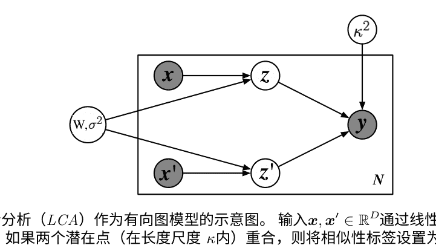

### 使用线性softmax函数的最近邻算法

$$p_{ij}^{\mathbf{W}} = \frac{\exp(-||\mathbf{W}x_i - \mathbf{W}x_j||_2^2)}{\sum_{l=1}^N \exp(-||\mathbf{W}x_i - \mathbf{W}x_l||_2^2)} \tag{16.6}$$

（这是第20.4.10.1节中讨论的随机邻域嵌入的有监督版本。）根据距离 $\mathbf{W}$，使用1NN分类器正确分类的预期样本数由 $J(\mathbf{W}) = \sum_{i=1}^{N} \sum_{j=1; y_j = y_i}^{N} p_{ij}^{\mathbf{W}}$。令 $\mathcal{L}(\mathbf{W}) = 1 - J(\mathbf{W})/N$ 为留一法误差。我们可以使用梯度方法最小化 $\mathcal{L}$ 对 $\mathbf{W}$ 进行优化。

### 16.2.1.3 潜在巧合分析

学习线性映射的另一种方法是潜在巧合分析（LCA）[DS12]，其中已知 $\mathbf{M} = \mathbf{W}^{\mathrm{T}}\mathbf{W}$。这定义了一个条件潜在变量模型，用于将一对输入 $x$ 和 $x'$ 映射到标签 $y\in\{0,1\}$，该标签指定输入是否相似（例如，具有相同的类别标签）或不相似。每个输入 $x\in\mathbb{R}^D$ 通过随机映射 $p(z|x)=\mathcal{N}(z|\mathbf{W}x, \sigma^2\mathbf{I})$ 和 $p(z'|x')=\mathcal{N}(z'|\mathbf{W}x', \sigma^2\mathbf{I})$ 映射到低维潜在点 $z\in\mathbb{R}^L$。（与第20.2节讨论的因子分析相比）然后，我们定义两个输入相似的概率为 $p(y=1|z,z')=\exp(-\frac{1}{2\kappa^2}||z-z'||^2)$。请参见图16.4以了解建模假设的说明。

我们可以最大化对数边缘似然 $\ell(\mathbf{W}, \sigma^2, \kappa)$，使用EM算法（第8.7.2节）来最大化 $\sum_n \log p(y_n|x_n, x'_n)$（我们可以设置 $\kappa=1$ WLOG，因为它只改变了 $\mathbf{W}$ 的尺度）。更准确地说，在E步骤中，我们计算后验概率 $p(z, z'|x, x', y)$（可以通过闭式解计算），在M步骤中，我们解决一个加权最小二乘问题（参见第13.6.2节）。EM算法将单调增加目标函数，并且不需要步长调整，不像NCA中使用的基于梯度的方法（第16.2.1.2节）。（还可以使用变分贝叶斯（第4.6.8.3节）来拟合该模型，以及各种稀疏和非线性扩展，如[ZMY19]中所讨论的。）

### 16.2.2 深度度量学习

当测量高维或结构化输入之间的距离时，首先学习将其嵌入到一个较低维度的“语义”空间中是非常有用的，其中距离更有意义，并且不受维度灾难的影响（第16.1.2节）。设 $e = f(x; \theta) \in \mathbb{R}^L$ 为输入的嵌入，它保留了输入的“相关”语义方面，设 $\hat{e} = e/\|e\|_2$ 为 $\ell_2$-归一化版本。这确保所有点都位于一个超球面上。然后，我们可以使用归一化欧氏距离来测量两个点之间的距离

$$d(x_i, x_j; \theta) = \|\hat{e}_i - \hat{e}_j\|_2^2 \tag{16.7}$$

其中较小的值表示更相似，或者是余弦相似度

$$d(x_i, x_j; \theta) = \hat{e}_i^T \hat{e}_j \tag{16.8}$$

其中较大的值表示更相似。（余弦相似度测量两个向量之间的角度，如图20.43所示。）这些量通过以下关系相关：

$$\|\hat{e}_i - \hat{e}_j\|_2^2 = (\hat{e}_i - \hat{e}_j)^T (\hat{e}_i - \hat{e}_j) = 2 - 2\hat{e}_i^T \hat{e}_j \tag{16.9}$$

这种整体方法被称为深度度量学习或DML。

DML中的基本思想是学习嵌入函数，使得相似的示例比不相似的示例更接近。更准确地说，我们假设我们有一个标记的数据集，$\mathcal{D} = \{(x_i, y_i) : i = 1:N\}$，从中我们可以得到一组相似的对，$\mathcal{S} = \{(i,j) : y_i = y_j\}$。如果 $(i,j) \in \mathcal{S}$ 但 $(i,k) \notin \mathcal{S}$，则我们假设 $x_i$ 和 $x_j$ 在嵌入空间中应该接近，而 $x_i$ 和 $x_k$ 应该远离。我们在下面讨论了实施这个属性的各种方法。请注意，这些方法在没有类标签的情况下也适用，只要我们有其他定义相似对的方式。例如，在第19.2.4.3节中，我们讨论了自监督的表示学习方法，它们自动创建语义上相似的对，并学习嵌入以使这些对比不相关的对更接近。

在更详细地讨论DML之前，值得一提的是，许多最近的DML方法并不像它们声称的那样好，正如[MBL20; Rot+20]所指出的那样。（这些论文中的一些声明经常是无效的，因为实验比较不当，这是当代机器学习研究中的一个常见缺陷，如[BLV19; LS19b]所讨论的。）因此，我们将重点放在（稍微）更旧和更简单的方法上，这些方法往往更加稳健。

### 16.2.3 分类损失

假设我们有带有 $C$ 个类别的标记数据。然后我们可以在 $O(NC)$ 时间内拟合一个分类模型，并将隐藏特征作为嵌入函数重复使用。（通常使用倒数第二层，因为它对新类别的泛化能力更好。）这种方法简单且可扩展。然而，它只学习将示例嵌入到决策边界的正确一侧，这不一定会导致相似的示例被放置在一起，而不相似的示例被放置在远处。此外，如果我们没有带有标签的训练数据，这种方法无法使用。

## 16.2. 学习距离度量

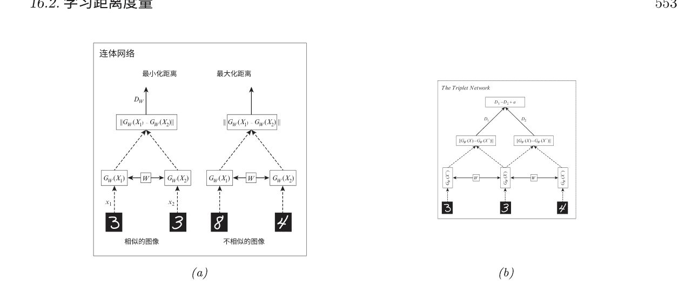

### 16.2.4 排名损失

在本节中，我们考虑最小化排序损失，以确保相似的示例比不相似的示例更接近。大多数这些方法不需要类别标签（尽管我们有时假设标签存在，作为一种符号简单的定义相似性的方式）。

### 16.2.4.1 对比损失和连体网络

从相似/不相似对中学习表示的最早方法之一是基于最小化以下对比损失[CHL05]:

$$\mathcal{L}(\theta; x_i, x_j) = \mathbb{I}(y_i = y_j) d(x_i, x_j)^2 + \mathbb{I}(y_i \neq y_j) [m - d(x_i, x_j)]_+^2$$

其中 $[z]_+ = \max(0, z)$ 是铰链损失，$m > 0$ 是边界参数。直观上，我们希望强制使正对（具有相同标签）接近，并使负对（具有不同标签）比某个最小安全间隔更远。我们在所有数据对上最小化这个损失。天真地说，这需要 $O(N^2)$ 时间；参见第16.2.5节中的一些加速方法。

请注意，我们对于输入 $x_i$ 和 $x_j$ 使用相同的特征提取器 $f(\cdot; \theta)$。在计算距离时，如图16.5a所示。因此，得到的网络被称为连体网络（以连体双胞胎命名）。

### 16.2.4.2 三元组损失

成对损失的一个缺点是正对的优化与负对的优化是独立的，这可能导致它们的大小不可比较。解决这个问题的方法是使用三元组损失[SKP15]。其定义如下。对于每个示例 $i$（称为锚点），我们找到一个相似的（正对）示例 $x_i^+$ 和一个不相似的（负对）示例 $x_i^-$。然后，我们最小化以下损失，对所有三元组进行平均:

$$\mathcal{L}(\theta; x_i, x_i^+, x_i^-) = [d_\theta(x_i, x_i^+)^2 - d_\theta(x_i, x_i^-)^2 + m]_+$$

### 16.2.4.3 N对损失

三元组损失的一个问题是每个锚点只与一个负例进行比较。这可能无法提供足够强的学习信号。解决这个问题的一个方法是创建一个多类分类问题，其中我们为每个锚点创建一个包含 $N - 1$ 个负例和1个正例的集合。这被称为N对损失[Soh16]。更准确地说，我们为每个集合定义以下损失函数：

$$\mathcal{L}(\theta; x, x^+, \{x_k^-\}_{k=1}^{N-1}) = \log \left(1 + \sum_{k=1}^{N-1} \exp(\hat{e}_\theta(x)^T \hat{e}_\theta(x_k^-) - \exp(\hat{e}_\theta(x)^T \hat{e}_\theta(x^+))\right)$$

$$= -\log \frac{\exp(\hat{e}_\theta(x)^T \hat{e}_\theta(x^+))}{\exp(\hat{e}_\theta(x)^T \hat{e}_\theta(x^+)) + \sum_{k=1}^{N-1} \exp(\hat{e}_\theta(x)^T \hat{e}_\theta(x_k^-))}$$

请注意，N对损失与CPC论文[OLV18]中使用的InfoNCE损失相同。在[Che+20a]中，他们提出了一种版本，其中他们通过温度项来缩放相似性；他们称之为NT-Xent（归一化温度缩放交叉熵）损失。我们可以将温度参数视为缩放数据所在的超球面的半径。

当 $N= 2$ 时，损失减少为逻辑损失

$$\mathcal{L}(\theta; x, x^+, x^-) = \log \left(1 + \exp(\hat{e}_\theta(x)^T \hat{e}_\theta(x^-) - \hat{e}_\theta(x)^T \hat{e}_\theta(x^+))\right)$$

将此与三元组学习中使用的边界损失进行比较（当 $m=1$ 时）：

$$\mathcal{L}(\theta; x, x^+, x^-) = \max \left(0, \hat{e}(x)^T \hat{e}(x^-) - \hat{e}(x)^T \hat{e}(x^+) + 1\right)$$

请参见图4.2以比较这两个函数。

## 16.2.5 加速排序损失优化

排序损失的主要缺点是计算损失函数的成本为 $O(N^2)$ 或 $O(N^3)$，因为需要比较所有的成对或三元组示例。在本节中，我们讨论各种加速技巧。

### 16.2.5.1 挖掘技术

一个关键的洞察是，我们不需要考虑每个锚点的所有负例，因为大多数负例都是无信息的（即，不会产生任何损失）。相反，我们可以将注意力集中在与锚点比其最近的正例更接近的负例上。这些被称为困难负例，对于加速三元组损失非常有用。

## 16.2. 学习距离度量

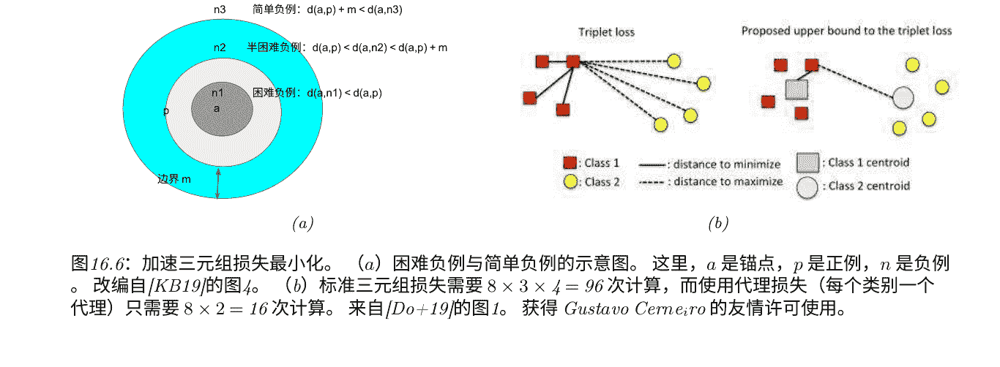

更准确地说，如果 $a$ 是一个锚点，$p$ 是它最近的正例，我们说 $n$ 是一个困难的负例（对于 $a$），如果 $distance(a, n) < distance(a, p)$ 并且 $label(n) \neq label(a)$。有时候一个锚点可能没有任何困难的负例。因此，我们可以通过考虑半困难的负例来增加候选人的数量，其中

$distance(a, n) < distance(a, p) < distance(a, n) + m$ (16.16)

其中参数 $m > 0$ 是一个边界参数。请参见图16.6a进行说明。这是Google的 **FaceNet** 模型[SKP15]使用的技术，它学习了一个用于人脸的嵌入函数，因此可以将相似的人脸聚集在一起，并且用户可以附加一个名称。

在实践中，困难的负样本通常从小批量中选择。因此，这需要大批量大小以确保足够的多样性。或者，我们可以有一个单独的过程，不断更新候选困难负样本集，因为距离度量在训练过程中演变。

### 16.2.5.2 代理方法

即使使用困难负样本挖掘（第16.2.5.1节），三元组损失最小化也是昂贵的。理想情况下，我们可以找到一种与分类损失一样的 $O(N)$ 时间复杂度的方法。

一种这样的方法，提出于[MA+17]，测量每个锚点与代表每个类别的一组 $P$ 代理之间的距离，而不是直接测量示例之间的距离。这些代理需要在学习过程中随着距离度量的演变而进行在线更新。整个过程的时间复杂度为 $O(N P^2)$，其中 $P \sim C$。

最近，[Qia+19]提出了使用多个原型来表示每个类别，同时仍然实现线性时间复杂度，使用软三元组损失。

### 16.2.5.3 优化上界

[Do+19] 提出了一种简单快速的方法来优化三元损失。关键思想是为每个类别定义一个固定的代理或质心，然后使用到代理的距离作为上界来计算三元损失。更准确地说，考虑一个简化形式的三元损失，不包含边界项：

$$\ell_t(\boldsymbol{x}_i, \boldsymbol{x}_j, \boldsymbol{x}_k) = ||\hat{\boldsymbol{e}}_i - \hat{\boldsymbol{e}}_j|| - ||\hat{\boldsymbol{e}}_i - \hat{\boldsymbol{e}}_k||$$

其中 $\hat{\boldsymbol{e}}_i = \hat{\boldsymbol{e}}_{\theta}(\boldsymbol{x}_i)$ 等。根据三角不等式，我们有

$$||\hat{\boldsymbol{e}}_i - \hat{\boldsymbol{e}}_j|| \leq ||\hat{\boldsymbol{e}}_i - \boldsymbol{c}_{y_i}|| + ||\hat{\boldsymbol{e}}_j - \boldsymbol{c}_{y_i}||$$

$$||\hat{\boldsymbol{e}}_i - \hat{\boldsymbol{e}}_k|| \geq ||\hat{\boldsymbol{e}}_i - \boldsymbol{c}_{y_k}|| - ||\hat{\boldsymbol{e}}_k - \boldsymbol{c}_{y_k}||$$

因此

$$\ell_t(\boldsymbol{x}_i, \boldsymbol{x}_j, \boldsymbol{x}_k) \leq \ell_u(\boldsymbol{x}_i, \boldsymbol{x}_j, \boldsymbol{x}_k) \triangleq ||\hat{\boldsymbol{e}}_i - \boldsymbol{c}_{y_i}|| - ||\hat{\boldsymbol{e}}_i - \boldsymbol{c}_{y_k}|| + ||\hat{\boldsymbol{e}}_j - \boldsymbol{c}_{y_i}|| + ||\hat{\boldsymbol{e}}_k - \boldsymbol{c}_{y_k}||$$

我们可以使用这个来推导出对三元损失的一个可行的上界，如下所示：

$$\mathcal{L}_t(\mathcal{D}, \mathcal{S}) = \sum_{(i,j) \in \mathcal{S}, (i,k) \notin \mathcal{S}, i,j,k \in \{1,...,N\}} \ell_t(\boldsymbol{x}_i, \boldsymbol{x}_j, \boldsymbol{x}_k) \leq \sum_{(i,j) \in \mathcal{S}, (i,k) \notin \mathcal{S}, i,j,k \in \{1,...,N\}} \ell_u(\boldsymbol{x}_i, \boldsymbol{x}_j, \boldsymbol{x}_k)$$

$$= C' \sum_{i=1}^{N} \left( ||\boldsymbol{x}_i - \boldsymbol{c}_{y_i}|| - \frac{1}{3(C-1)} \sum_{m=1, m \neq y_i}^{C} ||\boldsymbol{x}_i - \boldsymbol{c}_m|| \right) \triangleq \mathcal{L}_u(\mathcal{D}, \mathcal{S})$$

其中 $C' = 3(C-1)(\frac{N}{C}-1)\frac{N}{C}$ 是一个常数，我们假设对于每个 $c$，有 $\sum_{i=1}^{N} \mathbb{I}(y_i = c) = N/C$。很明显，$\mathcal{L}_u$ 可以在 $O(NC)$ 时间内计算。参见图16.6b以进行说明。

在[Do+19]中，他们证明 $0 \leq \mathcal{L}_t - \mathcal{L}_u \leq \frac{N^3}{C^2} K$，其中 $K$ 是一些依赖于质心分布的常数。为了确保上界是紧的，质心应该尽可能远离彼此，它们之间的距离应该尽可能相似。确保的一种简单方法是将 $\boldsymbol{c}_m$ 向量定义为独热向量，每个类别一个。这些向量已经具有单位范数，并且彼此正交。每对质心之间的距离是 $\sqrt{2}$，这确保了上界相当紧密。

这种方法的缺点是它假设嵌入层是 $L=C$ 维的。有两种解决方案。首先，在训练之后，我们可以添加一个线性投影层，将从 $C$ 映射到 $L=C$，或者我们可以采用嵌入网络的倒数第二层。第二种方法是在 $L$ 维单位超球面上采样大量点（我们可以通过从标准正态分布中采样，然后归一化[Mar72]），然后运行K均值聚类（第21.3节）与 $K = C$。在[Do+19]中报告的实验中，这两种方法给出了类似的结果。

有趣的是，在[Rot+20]中，他们表明增加 $\pi_{\text{intra}}/\pi_{\text{inter}}$ 会改善各种检索任务的下游性能，其中

$$\pi_{\text{intra}} = \frac{1}{Z_{\text{intra}}} \sum_{c=1}^{C} \sum_{i=j:y_i=y_j=c} d(\boldsymbol{x}_i, \boldsymbol{x}_j)$$

是平均类内距离，而

$$\pi_{\text{inter}} = \frac{1}{Z_{\text{inter}}} \sum_{c=1}^{C} \sum_{c'=1}^{C} d(\boldsymbol{\mu}_c, \boldsymbol{\mu}_{c'})$$

是平均类间距离。

是平均类间距离，其中 $\mu_c = (1/Z) \sum_{i:y_i=c} \hat{e}_i$ 是来自类别 $c$ 的示例的平均嵌入。这表明我们不仅应该保持质心之间的距离较远（以最大化分子），还应该防止示例与其质心过于接近（以最小化分母）；[Do+19]的方法没有捕捉到后一项。

## 16.2.6 其他DML训练技巧

除了第16.2.5节中的加速技巧外，还有很多其他细节对于确保良好的DML性能非常重要。其中许多细节在[MBL20;Rot+20]中有所讨论。在这里我们只简要提及一些。

一个重要问题是如何创建小批量。在分类问题中（至少对于平衡的类别），从训练集中随机选择样本通常就足够了。然而，对于DML，我们需要确保每个样本在小批量中有一些与之相似的样本，以及一些与之不相似的样本。一种方法是使用硬挖掘技术（第16.2.5.1节）。另一个想法是在先前学习的嵌入中应用coreset方法，以选择一个多样化的小批量[Sin+20]。然而，[Rot+20]表明以下简单策略也适用于创建每个批次：选择 $B/n$ 个类别，然后从每个类别中随机选择 $N_c=2$ 个样本，其中 $B$ 是批量大小，$N_c=2$ 是一个调整参数。

另一个重要问题是避免过拟合。由于DML文献中使用的大多数数据集都很小，因此通常使用图像分类器（例如GoogLeNet（第14.3.3节）或ResNet（第14.3.4节））进行标准化，该分类器已经在ImageNet上进行了预训练，然后使用DML损失对模型进行微调。（有关这种迁移学习的更多细节，请参见第19.2节。）此外，通常使用数据增强（请参见第19.1节）。（实际上，对于某些自监督学习方法，数据增强是创建相似对的唯一方法。）

在[ZLZ20]中，他们提出了添加球面嵌入约束（SEC）的建议，这是一个额外的批次正则化项，鼓励所有示例具有相同的范数。也就是说，正则化器只是该批次中（未归一化的）嵌入范数的经验方差。请参见图16.7以进行说明。可以将此正则化器添加到任何现有的DML损失中，以适度提高训练速度和稳定性，以及最终性能，类似于批量归一化（第14.2.4.1节）的使用方式。

## 16.3 核密度估计（KDE）

在本节中，我们考虑一种非参数密度估计的形式，称为核密度估计（KDE）。这是一种生成模型，因为它定义了一个可以逐点评估的概率分布 $p(x)$，并且可以从中采样生成新的数据。

### 16.3.1 密度核函数

在解释KDE之前，我们必须定义“核函数”的含义。这个术语在机器学习和统计学中有几个不同的含义。在本节中，我们使用一种特定类型的核函数，称为密度核函数。这是一个函数 $\mathcal{K}: \mathbb{R} \rightarrow \mathbb{R}_+$，满足归一化性质 $\int \mathcal{K}(x) dx = 1$，以及对称性 $\int x\mathcal{K}(x) dx = 0$，因此 $\int x\mathcal{K}(x - x_n) dx = x_n$

$$
\int x\mathcal{K}(x - x_n) dx = x_n \quad (16.25)
$$

这样一个核函数的简单例子是矩形窗函数，它是原点附近单位区间内的均匀分布：

$$
\mathcal{K}(x) \triangleq 0.5\mathbb{I}(|x| \leq 1) \quad (16.26)
$$

另一个例子是高斯核函数：

$$
\mathcal{K}(x) = \frac{1}{(2\pi)^{\frac{1}{2}}} e^{-x^2/2} \quad (16.27)
$$

我们可以通过引入一个带宽参数 $h$来控制核函数的宽度：

$$
\mathcal{K}_h(x) \triangleq \frac{1}{h}\mathcal{K}(\frac{x}{h}) \quad (16.28)
$$

我们可以通过定义一个径向基函数或 RBF核函数来推广到向量值输入：

$$
\mathcal{K}_h(\mathbf{x}) \propto \mathcal{K}_h(||\mathbf{x}||) \quad (16.29)
$$

对于高斯核函数，这变成了

$$
\mathcal{K}_h(\mathbf{x}) = \frac{1}{h^D(2\pi)^{D/2}} \prod_{d=1}^{D} \exp(-\frac{1}{2h^2}x_d^2) \quad (16.30)
$$

尽管高斯核很受欢迎，但它们具有无界支持。一些替代核函数，具有紧支持（计算速度更快），列在表16.1中。请参见图16.8以查看这些核函数的绘图。

### 16.3.2 Parzen 窗密度估计

为了解释如何使用核函数来定义非参数密度估计，回顾一下第3.5.1节中的高斯混合模型的形式。如果我们假设一个固定的球形高斯协方差和均匀混合权重，我们得到

$$
p(\boldsymbol{x}|\boldsymbol{\theta}) = \frac{1}{K} \sum_{k=1}^{K} \mathcal{N}(\boldsymbol{x}|\boldsymbol{\mu}_{k}, \sigma^2 \mathbf{I}) \qquad (16.31)
$$

这个模型的一个问题是需要指定聚类的数量 $K$，以及它们的位置 $\boldsymbol{\mu}_{k}$。估计这些参数的另一种方法是为每个数据点分配一个聚类中心。在这种情况下，模型变为

$$
p(\boldsymbol{x}|\boldsymbol{\theta}) = \frac{1}{N} \sum_{n=1}^{N} \mathcal{N}(\boldsymbol{x}|\boldsymbol{x}_n, \sigma^2 \mathbf{I}) \qquad (16.32)
$$

我们可以通过写出方程（16.32）来推广

$$
p(\boldsymbol{x}|\mathcal{D}) = \frac{1}{N} \sum_{n=1}^{N} \mathcal{K}_{h}(\boldsymbol{x}-\boldsymbol{x}_n) \qquad (16.33)
$$

其中 $\mathcal{K}_h$ 是一个密度核。这被称为Parzen窗口密度估计器，或核密度估计器（KDE）。

与参数模型相比，优势在于不需要模型拟合（除了选择$h$，见第16.3.3节），也不需要选择聚类中心的数量。缺点是模型占用大量内存（需要存储所有数据）和大量时间来进行评估。

图16.9以1d为例说明了两种核的KDE。在顶部，我们使用了一个矩形核；得到的模型只是计算落在每个 $x_n$ 周围大小为 $h$ 的区间内的数据点数量，从而得到分段常数密度。在底部，我们使用了一个高斯核，这会得到一个更平滑的密度。

### 16.3.3 如何选择带宽参数

从图16.9中我们可以看到带宽参数 $h$ 对学习到的分布有很大的影响。我们可以将其视为控制模型复杂度。

对于一维数据的情况，假设“真实”数据生成分布是高斯分布，可以证明[BA97a]高斯核函数的最优带宽（从均方误差的角度看）是 $h \approx 1.06 \sigma N^{-1/5}$，其中 $\sigma$ 是数据的标准差。对于多维数据，类似的启发式方法建议使用 $h \approx 1.06 \hat{\sigma} N^{-1/(D+4)}$，其中 $\hat{\sigma}$ 是数据的标准差（假设特征之间独立），$D$ 是维度。然而，在实践中，通常通过交叉验证来选择 $h$。

### 16.3.4 从KDE到KNN分类

在第16.1节中，我们讨论了K最近邻分类器作为一种启发式方法进行分类。有趣的是，我们可以将其推导为一种生成式分类器，其中类条件密度 $p(x|y = c)$ 使用KDE进行建模。我们不再使用固定的带宽并计算落在以数据点为中心的超立方体内的数据点数量，而是允许每个数据点的带宽或体积不同。具体来说，我们将在 $\boldsymbol{x}$周围“增加”一个体积，直到遇到 $K$个数据点，无论它们的类别标签如何。这被称为气球核密度估计器[TS92]。让生成的体积大小为 $V(\boldsymbol{x})$（先前为 $h^D$），并且在该体积中有 $N_c(\boldsymbol{x})$个来自类别 $c$的示例。然后我们可以如下估计类条件密度：

$$
p(\boldsymbol{x}|y = c, \mathcal{D}) = \frac{N_c(\boldsymbol{x})}{N_c V(\boldsymbol{x})} \quad (16.34)
$$

其中 $N_c$是整个数据集中类别 $c$的示例总数。如果我们将类别先验设为 $p(y = c) = N_c/N$，则类别后验由以下公式给出

$$
p(y = c|\boldsymbol{x}, \mathcal{D}) = \frac{ \frac{N_c(\boldsymbol{x})}{N_c V(\boldsymbol{x})} \frac{N_c}{N} }{ \sum_{c'} \frac{N_{c'}(\boldsymbol{x})}{N_{c'} V(\boldsymbol{x})} \frac{N_{c'}}{N} } = \frac{ N_c(\boldsymbol{x}) }{ \sum_{c'} N_{c'}(\boldsymbol{x}) } = \frac{N_c(\boldsymbol{x})}{K} = \frac{1}{K} \sum_{n \in N_K(\boldsymbol{x}, \mathcal{D})} \mathbb{I}(y_n = c) \quad (16.35)
$$

其中我们使用了 $\sum_c N_c(\boldsymbol{x}) = K$，因为我们选择了 $K$个点（不考虑类别）围绕每个点。这与方程（16.1）相符。

### 16.3.5 核回归

正如KDE可以用于生成分类器（见第16.1节），它也可以用于生成回归模型，如下所讨论的。

#### 16.3.5.1 Nadaraya-Watson均值估计器

在回归中，我们的目标是计算条件期望

$$
\mathbb{E}[y|\boldsymbol{x}, \mathcal{D}] = \int y \, p(y|\boldsymbol{x}, \mathcal{D}) dy = \frac{\int y \, p(\boldsymbol{x}, y|\mathcal{D}) dy}{\int p(\boldsymbol{x}, y|\mathcal{D}) dy} \quad (16.36)
$$

如果我们对 $p(y, \boldsymbol{x}|\mathcal{D})$使用MVN，我们得到的结果等同于线性回归，如我们在第11.2.3.5节中所示。然而，假设 $p(y, \boldsymbol{x}|\mathcal{D})$是高斯分布是相当限制的。我们可以使用KDE更准确地近似联合密度 $p(\boldsymbol{x}, y|\mathcal{D})$如下所示：

$$
p(y, \boldsymbol{x}|\mathcal{D}) \approx \frac{1}{N} \sum_{n=1}^N \mathcal{K}_h(\boldsymbol{x} - \boldsymbol{x}_n) \mathcal{K}_h(y - y_n) \quad (16.37)
$$

因此

$$
\mathbb{E}[y|\boldsymbol{x}, \mathcal{D}] = \frac{\frac{1}{N} \sum_{n=1}^N \mathcal{K}_h(\boldsymbol{x} - \boldsymbol{x}_n) \int y \mathcal{K}_h(y - y_n) dy}{\frac{1}{N} \sum_{n'=1}^N \mathcal{K}_h(\boldsymbol{x} - \boldsymbol{x}_{n'}) \int \mathcal{K}_h(y - y_{n'}) dy} \tag{16.38}
$$

我们可以利用以下事实简化分子部分：利用密度核积分为一的事实简化分母部分，即 $\int y \mathcal{K}_h(y - y_n) dy = y_n$ (来自方程(16.25))。我们可以 $\int \mathcal{K}_h(y - y_n) dy = 1$。因此

$$
\mathbb{E}[y|\boldsymbol{x}, \mathcal{D}] = \frac{\sum_{n=1}^N \mathcal{K}_h(\boldsymbol{x} - \boldsymbol{x}_n) y_n}{\sum_{n'=1}^N \mathcal{K}_h(\boldsymbol{x} - \boldsymbol{x}_{n'})} = \sum_{n=1}^N y_n w_n(\boldsymbol{x}) \tag{16.39}
$$

其中

$$
w_n(\boldsymbol{x}) \triangleq \frac{\mathcal{K}_h(\boldsymbol{x} - \boldsymbol{x}_n)}{\sum_{n'=1}^N \mathcal{K}_h(\boldsymbol{x} - \boldsymbol{x}_{n'})} \tag{16.40}
$$

我们可以看到，预测值只是训练点输出的加权和，其中权重取决于输入 $\boldsymbol{x}$ 与存储的训练点的相似程度。这种方法被称为核回归、核平滑或纳达拉-沃森（N-W）模型。请参见图16.10，其中我们使用了高斯核函数。

在第17.2.3节中，我们讨论了核回归和高斯过程回归之间的联系。

#### 16.3.5.2 方差估计器

有时候计算预测方差和预测均值都是有用的。我们可以通过注意到来实现这一点

$$
\mathbb{V}[y|\boldsymbol{x}, \mathcal{D}] = \mathbb{E} \left[ y^2 | \boldsymbol{x}, \mathcal{D} \right] - \mu(\boldsymbol{x})^2 \tag{16.41}
$$

其中 $\mu(\boldsymbol{x}) = \mathbb{E}[y|\boldsymbol{x}, \mathcal{D}]$是N-W估计。如果我们使用方差为 $\sigma^2$的高斯核函数，我们可以计算 $\mathbb{E}[y^2|\boldsymbol{x}, \mathcal{D}]$ 如下所示：

$$
\begin{aligned}
\mathbb{E}\left[y^{2}\mid \boldsymbol{x}, \mathcal{D}\right] &=\frac{\sum_{n=1}^{N} \mathcal{K}_{h}\left(\boldsymbol{x}-\boldsymbol{x}_{n}\right) \int y^{2} \mathcal{K}_{h}\left(y-y_{n}\right) d y}{\sum_{n^{\prime}=1}^{N} \mathcal{K}_{h}\left(\boldsymbol{x}-\boldsymbol{x}_{n^{\prime}}\right) \int \mathcal{K}_{h}\left(y-y_{n^{\prime}}\right) d y} \\
&=\frac{\sum_{n=1}^{N} \mathcal{K}_{h}\left(\boldsymbol{x}-\boldsymbol{x}_{n}\right)\left(\sigma^{2}+y_{n}^{2}\right)}{\sum_{n^{\prime}=1}^{N} \mathcal{K}_{h}\left(\boldsymbol{x}-\boldsymbol{x}_{n^{\prime}}\right)}
\end{aligned}
\tag{16.42, 16.43}
$$

其中我们使用了以下事实

$$
\int y^{2} \mathcal{N}\left(y| y_{n}, \sigma^{2}\right) d y=\sigma^{2}+y_{n}^{2} \tag{16.44}
$$

将方程(16.43)与方程(16.41)结合得到

$$
\mathbb{V}[y|\boldsymbol{x}, \mathcal{D}] = \sigma^{2}+\sum_{n=1}^{N} w_{n}(\boldsymbol{x}) y_{n}^{2}-\mu(\boldsymbol{x})^{2} \tag{16.45}
$$

这与[BA10]中的方程8相匹配（除了初始 $\sigma^2$项）。

#### 16.3.5.3 局部加权回归

我们可以从方程（16.39）中去掉归一化项，得到

$$
\mu(\boldsymbol{x}) = \sum_{n=1}^{N} y_{n} \mathcal{K}_{h}(\boldsymbol{x}-\boldsymbol{x}_{n}) \tag{16.46}
$$

这只是观测响应的加权和，其中权重取决于测试输入 $\boldsymbol{x}$与训练点 $\boldsymbol{x}_{n}$的相似程度。

与其仅仅插值存储的响应 $y_n$，我们可以在每个训练点周围拟合一个局部线性模型：

$$
\mu(\boldsymbol{x})=\min _{\boldsymbol{\beta}} \sum_{n=1}^{N}\left[y_{n}-\boldsymbol{\beta}^{\top} \phi\left(\boldsymbol{x}_{n}\right)\right]^{2} \mathcal{K}_{h}(\boldsymbol{x}-\boldsymbol{x}_{n}) \tag{16.47}
$$

其中 $\phi(\boldsymbol{x}) = [1, \boldsymbol{x}]$。这被称为局部线性回归（LRR）或局部加权散点平滑（LOWESS或LOESS）[CD88]。在注释散点图的局部趋势线时经常使用。

作者：Kevin P. Murphy。 (C) MIT Press. CC-BY-NC-ND许可证

**表16.1: 一维中一些常见的标准化核函数列表。Compact=1 表示函数在有限的输入范围内非零。Smooth=1 表示函数在其支持范围内可微分。Boundaries=1 表示函数在其支持边界处也可微分。**

| 姓名 | 定义 | 紧凑 | 平滑 | 边界 |
| :--- | :--- | :---: | :---: | :---: |
| 高斯 | $\mathcal{K}(x) = (2\pi)^{-\frac{1}{2}} e^{-x^2/2}$ | 0 | 1 | 1 |
| 矩形窗 | $\mathcal{K}(x) = \frac{1}{2} \mathbb{I}(|x| \le 1)$ | 1 | 0 | 0 |
| Epanechnikov 核函数 | $\mathcal{K}(x) = \frac{3}{4}(1-x^2)\mathbb{I}(|x| \le 1)$ | 1 | 1 | 0 |
| 三立方核函数 | $\mathcal{K}(x) = \frac{10}{81}(1-|x|^3)^3\mathbb{I}(|x| \le 1)$ | 1 | 1 | 1 |

## 17 核方法

在本章中，我们考虑回归和分类的非参数方法。这种方法不假设预测函数的固定参数形式，而是直接从数据中尝试估计函数本身（而不是参数）。关键思想是我们观察到在一组固定的 $N$ 点上的函数值，即 $f(\mathbf{x}_n)$ for $n=1:N$，其中 $f$ 是未知函数，因此要预测新点的函数值，比如 $\mathbf{x}_*$，我们只需要比较 $\mathbf{x}_*$ 与每个训练点 $\{\mathbf{x}_n\}$ 的“相似性”，然后我们可以预测 $f(\mathbf{x}_*)$ 是 $\{f(\mathbf{x}_n)\}$ 值的一种加权组合。因此，我们可能需要“记住”整个训练集 $\mathcal{D} = \{(\mathbf{x}_n, y_n)\}$，以便在测试时进行预测 - 我们不能将 $\mathcal{D}$ 压缩为固定大小的参数向量。

用于预测的权重由 $\mathbf{x}_*$ 和每个 $\mathbf{x}_n$ 之间的相似性确定，这是使用一种称为核函数的特殊函数计算的，$\mathcal{K}(\mathbf{x}_n, \mathbf{x}_*) \geq 0$，我们在第17.1节中解释。这种方法类似于RBF网络（第13.6.1节），只是我们使用数据点 $\{\mathbf{x}_n\}$ 本身作为“锚点”，而不是学习RBF质心 $\{\boldsymbol{\mu}_k\}$。

在第17.2节中，我们讨论了一种称为高斯过程的方法，它允许我们使用核函数来定义函数的先验分布，我们可以根据数据更新它以获得函数的后验分布。或者，我们可以使用同样的核函数和一种称为支持向量机的方法来计算函数的MAP估计，我们在第17.3节中解释。

## 17.1 Mercer核函数

非参数方法的关键在于我们需要一种方法来编码关于两个输入向量相似性的先验知识。如果我们知道 $\mathbf{x}_i$ 与 $\mathbf{x}_j$ 相似，那么我们可以鼓励模型使得在这两个位置的预测输出（即 $f(\mathbf{x}_i)$ 和 $f(\mathbf{x}_j)$）相似。

为了定义相似性，我们引入了核函数的概念。在数学中，“核”一词有许多不同的含义，包括密度核（第16.3.1节），马尔可夫链的转移核（第3.6.1.2节）和卷积核（第14.1节）。在这里，我们考虑一个Mercer核，也称为正定核。这是任何对称函数 $\mathcal{K}: \mathcal{X} \times \mathcal{X} \to \mathbb{R}^+$，满足

$$\sum_{i=1}^N \sum_{j=1}^N \mathcal{K}(\mathbf{x}_i, \mathbf{x}_j) c_i c_j \geq 0 \qquad (17.1)$$

对于任意一组 $N$ 个（唯一的）点 $\mathbf{x}_i \in \mathcal{X}$ 和任意一组数字 $c_i \in \mathbb{R}$。（我们假设 $\mathcal{K}(\mathbf{x}_i, \mathbf{x}_j) > 0$，所以只有当 $c_i = 0$ 时才能在上述方程中达到等号。）

理解这个条件的另一种方式是以下。给定一组N个数据点，让我们定义Gram矩阵为以下N×N相似度矩阵：

$$\mathbf{K} = \begin{pmatrix} \mathcal{K}(\mathbf{x}_1, \mathbf{x}_1) & \cdots & \mathcal{K}(\mathbf{x}_1, \mathbf{x}_N) \\ \vdots & \ddots & \vdots \\ \mathcal{K}(\mathbf{x}_N, \mathbf{x}_1) & \cdots & \mathcal{K}(\mathbf{x}_N, \mathbf{x}_N) \end{pmatrix} \quad (17.2)$$

我们说$\mathcal{K}$是一个Mercer核当且仅当对于任意一组（不同的）输入$\{\mathbf{x}_i\}_{i=1}^N$，Gram矩阵是正定的。

对于实值输入，最常用的核函数是平方指数核(SE)，也称为指数二次核(EQ)，高斯核或RBF核。它的定义如下

$$\mathcal{K}(\mathbf{x}, \mathbf{x}') = \exp\left( -\frac{\|\mathbf{x} - \mathbf{x}'\|^2}{2\ell^2} \right) \quad (17.3)$$

这里$\ell$对应于核函数的长度尺度，即我们期望差异有所影响的距离。这被称为带宽参数。RBF核通过（缩放的）欧氏距离来衡量两个向量在$\mathbb{R}^D$中的相似性。在第17.1.2节中，我们将讨论几种其他类型的核函数。

在第17.2节中，我们将展示如何使用核函数来定义函数的先验和后验。基本思想是：如果$\mathcal{K}(\mathbf{x}, \mathbf{x}')$很大，意味着输入相似，那么我们期望函数的输出也是相似的，即$f(\mathbf{x}) \approx f(\mathbf{x}')$。更准确地说，我们对$f(\mathbf{x})$学到的信息将帮助我们预测所有与$\mathbf{x}$相关的$f(\mathbf{x}')$，因此对于$\mathcal{K}(\mathbf{x}, \mathbf{x}')$较大的$\mathbf{x}'$也是如此。

在第17.3节中，我们展示了如何使用核函数从欧氏距离推广到更一般的距离概念，这样我们就可以在隐式特征空间而不是输入空间中使用几何方法，如线性判别分析。

### 17.1.1 Mercer定理

回顾一下第7.4节，任何正定矩阵$\mathbf{K}$都可以用形式为$\mathbf{K} = \mathbf{U}^\top \mathbf{\Lambda} \mathbf{U}$的特征分解表示，其中$\mathbf{\Lambda}$是一个包含特征值$\lambda_i > 0$的对角矩阵，$\mathbf{U}$是包含特征向量的矩阵。现在考虑$\mathbf{K}$的元素$(i, j)$：

$$k_{ij} = (\mathbf{\Lambda}^{1/2} \mathbf{U}_{:i})^\top (\mathbf{\Lambda}^{1/2} \mathbf{U}_{:j}) \quad (17.4)$$

其中$\mathbf{U}_{:i}$是$\mathbf{U}$的第$i$列。如果我们定义$\phi(\mathbf{x}_i) = \mathbf{\Lambda}^{1/2} \mathbf{U}_{:i}$，那么我们可以写成

$$k_{ij} = \phi(\mathbf{x}_i)^\top \phi(\mathbf{x}_j) = \sum_m \phi_m(\mathbf{x}_i) \phi_m(\mathbf{x}_j) \quad (17.5)$$

因此，我们可以通过计算一些由核矩阵的特征向量隐式定义的特征向量的内积来计算核矩阵中的条目。这个想法可以推广到应用于核函数，而不仅仅是核矩阵；这个结果被称为Mercer定理。

例如，考虑二次核$\mathcal{K}(\mathbf{x}, \mathbf{x}') = \langle \mathbf{x}, \mathbf{x}' \rangle^2$。在2维空间中，我们有

$$\mathcal{K}(\mathbf{x}, \mathbf{x}') = (x_1 x'_1 + x_2 x'_2)^2 = x_1^2 (x'_1)^2 + 2 x_1 x_2 x'_1 x'_2 + x_2^2 (x'_2)^2 \quad (17.6)$$

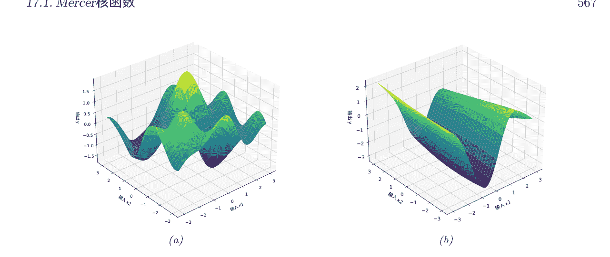

我们可以将其写为 $\mathcal{K}(x, x') = \phi(x)^T \phi(x')$ 如果我们定义 $\phi(x_1, x_2) = [x_1^2, \sqrt{2} x_1 x_2, x_2^2] \in \mathbb{R}^3$。所以我们将2维输入 $x$ 嵌入到3维特征空间 $\phi(x)$ 中。

现在考虑RBF核函数。在这种情况下，相应的特征表示是无限维的（详见第17.2.9.3节）。然而，通过使用核函数，我们可以避免处理无限维向量。

### 17.1.2 一些流行的Mercer核函数

在下面的章节中，我们描述了一些流行的Mercer核函数。更多细节可以在[Will14]和https://www.cs.toronto.edu/~duvenaud/cookbook/找到。

##### 17.1.2.1 用于实值向量的平稳核函数

对于实值输入，$\mathcal{X} = \mathbb{R}^D$，通常使用平稳核函数，其形式为$K(x, x') = K(||x-x'||)$；因此值仅取决于输入之间的逐元素差异。RBF核函数是一个平稳核函数。我们在下面给出一些其他示例。

###### ARD核函数

我们可以通过用马氏距离替换欧氏距离来推广RBF核函数，如下所示：

$$ K(r) = \sigma^2 \exp\left(-\frac{1}{2} r^T \Sigma^{-1} r\right) $$

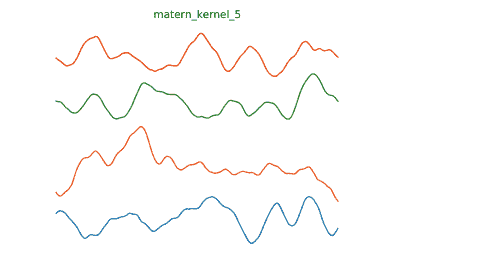

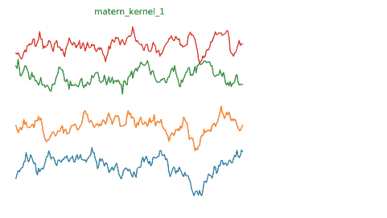

图17.2: 从具有Matern核函数的GP中采样的函数。(a) ν=5/2。(b) ν=1/2。由gpKernelPlot.ipy生成。

如果 $\Sigma$ 是对角矩阵，可以写成

$$\mathcal{K}(\mathbf{r}; \ell, \sigma^2) = \sigma^2 \exp \left( -\frac{1}{2} \sum_{d=1}^D \frac{1}{\ell_d^2} r_d^2 \right) = \prod_{d=1}^D \mathcal{K}(r_d; \ell_d, \sigma^{2/d}) \quad (17.8)$$

其中

$$\mathcal{K}(r; \ell, \tau^2) = \tau^2 \exp \left( -\frac{1}{2} \frac{1}{\ell^2} r^2 \right) \quad (17.9)$$

我们可以将 $\sigma^2$ 解释为总方差，并将 $\ell_d$ 解释为定义维度 $d$ 的特征长度尺度。如果 $d$ 是一个无关的输入维度，我们可以将 $\ell_d = \infty$ 设置为无穷大，从而忽略相应的维度。这被称为自动相关性确定或ARD (第11.7.7节)。因此，相应的核函数被称为ARD核。请参见图17.1，其中显示了使用此先验从GP中采样的一些2d函数的示例。

###### Matern核函数

SE核函数产生的函数是无限可微的，因此非常平滑。对于许多应用程序，最好使用Matern核函数，它产生‘更粗糙’的函数，可以更好地模拟局部‘波动’，而无需使整体长度尺度非常小。Matern核函数的形式如下:

$$\mathcal{K}(r; \nu, \ell) = \frac{2^{1-\nu}}{\Gamma(\nu)} \left( \frac{\sqrt{2\nu} r}{\ell} \right)^\nu K_\nu \left( \frac{\sqrt{2\nu} r}{\ell} \right) \quad (17.10)$$

其中 $K_\nu$ 是一个修改的贝塞尔函数，$\ell$ 是长度尺度。从这个GP中采样的函数在 $\nu > k$ 时是 $k$ 次可微的。当 $\nu \rightarrow \infty$ 时，这趋近于SE核函数。

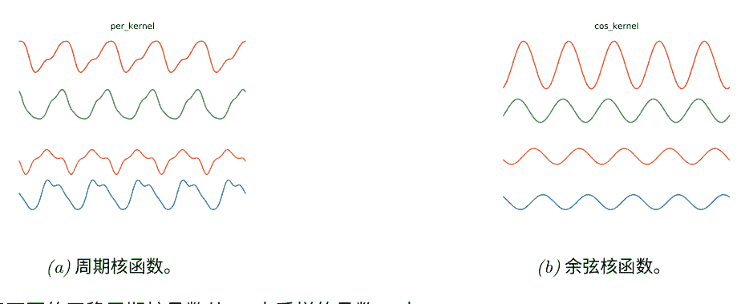

对于 $\nu \in \{½, ³⁄₂, ⁵⁄₂\}$，函数简化如下：

$$K(r; 1/2, \ell) = \exp(-r/ℓ) \quad (17.11)$$

$$K(r; 3/2, \ell) = (1 + (\sqrt{3} r)/\ell) \exp(-\sqrt{3} r / \ell) \quad (17.12)$$

$$K(r; 5/2, \ell) = (1 + (\sqrt{5} r)/\ell + (5 r^2)/(3 \ell^2)) \exp(-\sqrt{5} r / \ell) \quad (17.13)$$

数值 $\nu = ½$ 对应于奥恩斯坦-乌伦贝克过程，描述了一个粒子在布朗运动下的速度。相应的函数是连续的，但不可微分，因此非常“锯齿状”。参见图17.2b进行说明。

###### 周期核函数

周期核函数捕捉到重复结构，其形式为

$$K_{\text{per}}(r; \ell, p) = \exp(-2/\ell^2 \sin^2(\pi r / p)) \quad (17.14)$$

其中 $p$ 是周期。参见图17.3a进行说明。相关的核函数是余弦核函数：

$$K(r; p) = \cos(2\pi r / p) \quad (17.15)$$

参见图17.3b进行说明。

##### 17.1.2.2 从旧核函数创建新核函数

给定两个有效的核函数 $\mathcal{K}_1(x, x')$ 和 $\mathcal{K}_2(x, x')$，我们可以使用以下任何方法创建一个新的核函数：

- $\mathcal{K}(x, x') = c\mathcal{K}_1(x, x')$，对于任何常数 $c > 0$
- $\mathcal{K}(x, x') = f(x)\mathcal{K}_1(x, x')f(x')$，对于任何函数 $f$
- $\mathcal{K}(x, x') = q(\mathcal{K}_1(x, x'))$，对于任何具有非负系数的多项式函数 $q$
- $\mathcal{K}(x, x') = \exp(\mathcal{K}_1(x, x'))$
- $\mathcal{K}(x, x') = x^T \mathbf{A} x'$，对于任何半正定矩阵 $\mathbf{A}$

(17.20)例如，假设我们从线性核函数 $\mathcal{K}(x, x') = x^T x'$ 开始。我们知道这是一个有效的Mercer核函数，因为相应的Gram矩阵只是数据的（缩放后的）协方差矩阵。根据上述规则，我们可以看到多项式核函数 $\mathcal{K}(x, x') = (x^T x')^M$ 是一个有效的Mercer核函数。这包含了所有 $M$ 阶的单项式。例如，如果 $M=2$ 并且输入是2d的，我们有

$$(x^T x')^2 = (x_1 x'_1 + x_2 x'_2)^2 = (x_1 x'_1)^2 + (x_2 x'_2)^2 + 2(x_1 x'_1)(x_2 x'_2)$$

我们可以通过使用核函数 $\mathcal{K}(x, x') = (x^T x' + c)^M$ 来将其推广到包含 $M$ 阶的所有项。例如，如果 $M = 2$ 并且输入是2维的，我们有

$$(x^T x' + 1)^2 = (x_1 x'_1)^2 + (x_1 x'_1)(x_2 x'_2) + (x_1 x'_1) + (x_2 x'_2)(x_1 x'_1) + (x_2 x'_2)^2 + (x_2 x'_2) + (x_1 x'_1) + (x_2 x'_2) + 1$$

我们还可以使用上述规则来证明高斯核是一个有效的核函数。为了看到这一点，注意到

$$\|x - x'\|^2 = x^T x + (x')^T x' - 2x^T x'$$

因此

$$\mathcal{K}(x, x') = \exp(-\|x - x'\|^2 / 2\sigma^2) = \exp(-x^T x / 2\sigma^2) \exp(x^T x' / \sigma^2) \exp(-(x')^T x' / 2\sigma^2)$$

是一个有效的核函数。

##### 17.1.2.3 通过加法和乘法组合核函数

我们还可以通过加法或乘法来组合核函数：

- $\mathcal{K}(x, x') = \mathcal{K}_1(x, x') + \mathcal{K}_2(x, x')$
- $\mathcal{K}(x, x') = \mathcal{K}_1(x, x') \times \mathcal{K}_2(x, x')$

将两个正定核相乘总是会得到另一个正定核。
这是一种获取每个核的个别属性的合取的方法，如图17.4所示。

此外，将两个正定核相加总是会得到另一个正定核。这是一种获取每个核的个别属性的析取的方法，如图17.5所示。

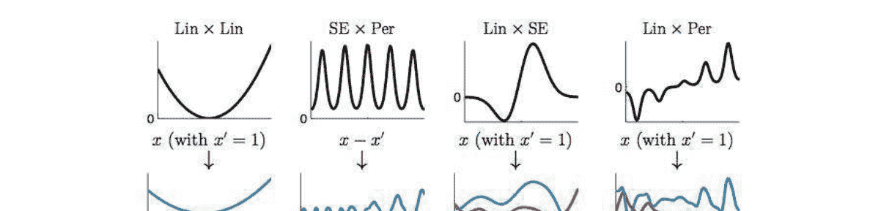

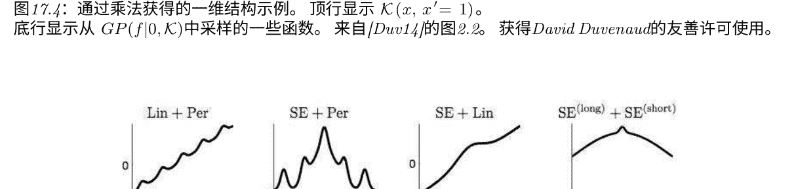

##### 17.1.2.4 用于结构化输入的核函数

当输入是结构化对象（如字符串和图形）时，核函数特别有用，因为往往很难对可变大小的输入进行“特征化”。例如，我们可以定义一个字符串核函数，它根据它们共有的n-gram数量来比较字符串[Lod+02; BC17]。我们还可以定义图形核函数[KJM19]。例如，随机游走核函数在两个图形上同时执行随机游走，然后计算同时产生的路径数量。如[Vis+10]中所讨论的那样，这可以高效地计算。有关图形核函数的更多详细信息，请参阅[KJM19]。

有关结构化对象上核函数的综述，请参见[Gär03]。

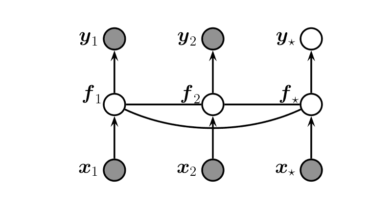

## 17.2 高斯过程

在本节中，我们讨论高斯过程，这是一种定义在函数上的分布形式为 $f: \mathcal{X} \rightarrow \mathbb{R}$，其中 $\mathcal{X}$ 是任意的定义域。关键假设是在一组 $M > 0$ 输入处的函数值， $\mathbf{f}= [f(x_1), \dots, f(x_M)]$，是联合高斯分布，均值为 $(\mu = m(x_1), \dots, m(x_M))$ 和协方差为 $\Sigma_{i,j} = K(x_i, x_j)$，其中 $m$ 是均值函数，$K$ 是正定（Mercer）核函数。由于我们假设这对于任何 $M > 0$ 都成立，这包括 $M = N + 1$ 的情况，其中包含 $N$ 个训练点 $x_n$ 和1个测试点 $x_*$。因此，我们可以通过操作联合高斯分布 $p( f(x_1), \dots, f(x_N), f(x_*))$ 来推断 $f(x_*)$ 的值，通过对 $f(x_1), \dots, f(x_n)$ 的知识进行处理。我们还可以将其扩展到观察到的带有噪声的函数 $f(x_n)$ 的情况，例如回归或分类问题。

### 17.2.1 无噪声观测

假设我们观察到一个训练集 $\mathcal{D} = \{(x_n, y_n): n=1:N\}$，其中 $y_n = f(x_n)$ 是在 $x_n$ 处评估函数的无噪声观测。如果我们要求高斯过程预测已经见过的x的 $f(x)$ 的值，我们希望高斯过程返回无不确定性的答案 $f(x)$。换句话说，它应该作为训练数据的插值器。

现在我们考虑预测可能不在 $\mathcal{D}$ 中的新输入的输出情况。具体而言，给定一个大小为 $N_* \times D$ 的测试集 $\mathbf{X}_*$，我们希望预测函数的输出 $\mathbf{f}_* = [f(\mathbf{x}_{*1}), \dots, f(\mathbf{x}_{*,N_*})]$。根据高斯过程的定义，联合分布 $p(\mathbf{f}_X, \mathbf{f}_*|\mathbf{X}, \mathbf{X}_*)$ 具有以下形式

$$\begin{pmatrix} \mathbf{f}_X \\ \mathbf{f}_* \end{pmatrix} \sim \mathcal{N} \left( \begin{pmatrix} \boldsymbol{\mu}_X \\ \boldsymbol{\mu}_* \end{pmatrix}, \begin{pmatrix} \mathbf{K}_{X,X} & \mathbf{K}_{X,*} \\ \mathbf{K}_{X,*}^T & \mathbf{K}_{*,*} \end{pmatrix} \right) \quad\quad (17.27)$$其中 $\boldsymbol{\mu}_X = [m(\boldsymbol{x}_1), \dots, m(\boldsymbol{x}_N)]$， $\boldsymbol{\mu}_* = [m(\boldsymbol{x}_1^*), \dots, m(\boldsymbol{x}_{N_*}^*)]$， $\mathbf{K}_{X,X} = \mathcal{K}(\mathbf{X}, \mathbf{X})$ 是 $N \times N$， $\mathbf{K}_{X,*} = \mathcal{K}(\mathbf{X}, \mathbf{X}_*)$ 是 $N \times N_*$，并且 $\mathbf{K}_{*,*} = \mathcal{K}(\mathbf{X}_*, \mathbf{X}_*)$ 是 $N_* \times N_*$。参见图17.6以进行说明。根据高斯条件概率的标准规则（第3.2.3节），后验具有以下形式

$$p(\boldsymbol{f}_*|\mathbf{X}_*, \mathcal{D}) = \mathcal{N}(\boldsymbol{f}_*|\boldsymbol{\mu}_*, \boldsymbol{\Sigma}_*) \quad (17.28)$$
$$\boldsymbol{\mu}_* = m(\mathbf{X}_*) + \mathbf{K}_{X,*}^\mathsf{T} \mathbf{K}_{X,X}^{-1} (\boldsymbol{f}_X - m(\mathbf{X})) \quad (17.29)$$
$$\boldsymbol{\Sigma}_* = \mathbf{K}_{*,*} - \mathbf{K}_{X,*}^\mathsf{T} \mathbf{K}_{X,X}^{-1} \mathbf{K}_{X,*} \quad (17.30)$$

这个过程在图17.7中有所说明。在左边，我们展示了先验分布的一些样本，$p(\boldsymbol{f})$，其中我们使用了一个RBF核函数（第17.1节）和一个零均值函数。在右边，我们展示了后验分布的样本，$p(\boldsymbol{f}|\mathcal{D})$。我们可以看到模型完美地插值了训练数据，并且随着我们远离观测数据，预测的不确定性增加。

### 17.2.2 有噪声观测

现在让我们考虑一种情况，我们观察到的是基础函数的噪声版本，$y_n = f(\boldsymbol{x}_n) + \epsilon_n$，其中 $\epsilon_n \sim \mathcal{N}(0, \sigma_y^2)$。在这种情况下，模型不需要插值数据，但它必须“接近”观察到的数据。观测到的噪声响应的协方差是

$$\mathrm{Cov} [y_i, y_j] = \mathrm{Cov} [f_i, f_j] + \mathrm{Cov} [\epsilon_i, \epsilon_j] = \mathcal{K}(\boldsymbol{x}_i, \boldsymbol{x}_j) + \sigma_y^2 \delta_{ij} \quad (17.31)$$

其中 $\delta_{ij} = \mathbb{I}(i = j)$。换句话说

$$\mathrm{Cov} [\boldsymbol{y} | \mathbf{X}] = \mathbf{K}_{\mathbf{X}, \mathbf{X}} + \sigma_y^2 \mathbf{I}_N \triangleq \mathbf{K}_{\sigma} \quad (17.32)$$

观测数据和测试点上的潜在无噪声函数的联合密度由以下给出

$$\begin{pmatrix} \boldsymbol{y} \\ \boldsymbol{f}_* \end{pmatrix} \sim \mathcal{N} \left( \begin{pmatrix} \boldsymbol{\mu}_X \\ \boldsymbol{\mu}_* \end{pmatrix}, \begin{pmatrix} \mathbf{K}_{\sigma} & \mathbf{K}_{\mathbf{X}, *} \\ \mathbf{K}_{\mathbf{X}, *}^{\top} & \mathbf{K}_{*, *} \end{pmatrix} \right) \quad (17.33)$$

因此，在一组测试点 $\mathbf{X}_*$ 上的后验预测密度为

$$p(\boldsymbol{f}_* | \mathcal{D}, \mathbf{X}_*) = \mathcal{N}(\boldsymbol{f}_* | \boldsymbol{\mu}_{*|X}, \boldsymbol{\Sigma}_{*|X}) \quad (17.34)$$
$$\boldsymbol{\mu}_{*|X} = \boldsymbol{\mu}_* + \mathbf{K}_{\mathbf{X}, *}^{\top} \mathbf{K}_{\sigma}^{-1} (\boldsymbol{y} - \boldsymbol{\mu}_X) \quad (17.35)$$
$$\boldsymbol{\Sigma}_{*|X} = \mathbf{K}_{*, *} - \mathbf{K}_{\mathbf{X}, *}^{\top} \mathbf{K}_{\sigma}^{-1} \mathbf{K}_{\mathbf{X}, *} \quad (17.36)$$

对于单个测试输入，简化如下

$$p(f_* | \mathcal{D}, \boldsymbol{x}_*) = \mathcal{N}(f_* | m_* + \boldsymbol{k}_*^{\top} \mathbf{K}_{\sigma}^{-1} (\boldsymbol{y} - \boldsymbol{\mu}_X), k_{**} - \boldsymbol{k}_*^{\top} \mathbf{K}_{\sigma}^{-1} \boldsymbol{k}_*)$$

如果均值函数为零，我们可以将后验均值写成如下形式：

$$\mu_{*|X} = \boldsymbol{k}_*^{\top} (\mathbf{K}_{\sigma}^{-1} \boldsymbol{y}) \triangleq \boldsymbol{k}_*^{\top} \boldsymbol{\alpha} = \sum_{n=1}^{N} \mathcal{K}(\boldsymbol{x}_*, \boldsymbol{x}_n) \alpha_n \quad (17.38)$$

这与方程 (17.108) 中的核岭回归的预测完全相同。

### 17.2.3 与核回归的比较

在第16.3.5节中，我们讨论了核回归，它是一种生成回归的方法，我们使用核密度估计来近似概率密度函数$p(y, \boldsymbol{x})$。特别地，方程 (16.39) 给出了我们的结果

$$\mathbb{E} [y | \boldsymbol{x}, \mathcal{D}] = \frac{\sum_{n=1}^{N} \mathcal{K}_h(\boldsymbol{x} - \boldsymbol{x}_n) y_n}{\sum_{n'=1}^{N} \mathcal{K}_h(\boldsymbol{x} - \boldsymbol{x}_{n'})} = \sum_{n=1}^{N} y_n w_n(\boldsymbol{x}) \quad (17.39)$$
$$w_n(\boldsymbol{x}) \triangleq \frac{\mathcal{K}_h(\boldsymbol{x} - \boldsymbol{x}_n)}{\sum_{n'=1}^{N} \mathcal{K}_h(\boldsymbol{x} - \boldsymbol{x}_{n'})} \quad (17.40)$$

这与方程 (17.38) 非常相似。然而，有一些重要的区别。

首先，在高斯过程中，我们使用正定（Mercer）核而不是密度核；Mercer核可以定义在结构化对象上，例如字符串和图形，这对于密度核来说更难做到。

其次，高斯过程是一个插值器（至少当 $\sigma^2=0$ 时），所以 $\mathbb{E}[y|x_n, \mathcal{D}] = y_n$。相比之下，核回归不是一个插值器（尽管可以通过迭代地拟合残差来使其成为插值器，如[KJ16]中所述）。

第三，高斯过程是一种贝叶斯方法，这意味着我们可以通过最大化边缘似然来估计超参数（核函数的参数）；相比之下，在核回归中，我们必须使用交叉验证来估计核参数，如带宽。

第四，计算核回归的权重 $w_n$ 需要 $O(N)$ 时间，其中 $N = |\mathcal{D}|$，而计算高斯过程回归的权重 $\alpha_n$ 需要 $O(N^3)$ 时间（尽管有近似方法可以将其减少到 $O(NM^2)$，我们将在第17.2.9节中讨论）。

## 17.2.4 权重空间 vs 函数空间

在本节中，我们展示了贝叶斯线性回归是高斯过程的一个特例。

考虑线性回归模型 $y = f(x) + \varepsilon$，其中 $f(x) = w^\top \phi(x)$，$\varepsilon \sim \mathcal{N}(0, \sigma^2)$。如果我们使用高斯先验 $p(w) = \mathcal{N}(w|0, \Sigma_w)$，那么后验分布如下（详见第11.7.2节推导）：

$$p(w|\mathcal{D}) = \mathcal{N}\left(w \middle| \frac{1}{\sigma^2_y} \mathbf{A}^{-1} \Phi^\top y, \mathbf{A}^{-1}\right)$$

其中 $\Phi$ 是 $N \times D$ 设计矩阵，而

$$\mathbf{A} = \sigma^{-2}_y \Phi^\top \Phi + \Sigma^{-1}_w$$

因此，对于 $f_* = f(x_*)$ 的后验预测分布是

$$p(f_*|\mathcal{D}, x_*) = \mathcal{N}\left(f_* \middle| \frac{1}{\sigma^2_y} \phi_*^\top \mathbf{A}^{-1} \Phi^\top y, \phi_*^\top \mathbf{A}^{-1} \phi_*\right)$$

这将问题的推断和预测视为权重空间中的问题。

我们现在证明，这等价于使用形式为 $K(x, x') = \phi(x)^\top \Sigma_w \phi(x')$ 的核函数进行的GP的预测。使用这个符号表示法和矩阵求逆引理，我们可以将方程（17.43）重写为以下形式

$$p(f_*|\mathcal{D}, x_*) = \mathcal{N}(f_*|\mu_{*|X}, \Sigma_{*|X})$$
$$\mu_{*|X} = \phi_*^\top \Sigma_w \Phi^\top (\mathbf{K} + \sigma^2_y \mathbf{I})^{-1} y = k_*^\top \mathbf{K}_\sigma^{-1} y$$
$$\Sigma_{*|X} = \phi_*^\top \Sigma_w \phi_* - \phi_*^\top \Sigma_w \Phi^\top (\mathbf{K} + \sigma^2_y \mathbf{I})^{-1} \Phi \Sigma_w \phi_* = k_{**} - k_*^\top \mathbf{K}_\sigma^{-1} k_*$$

这与方程(17.37)中的结果相匹配，假设 $m(x) = 0$。（通过将值为1的常数特征添加到 $\phi(x)$，可以捕捉到非零均值。）

因此，我们可以从贝叶斯线性回归推导出高斯过程。然而，请注意，线性回归假设 $\phi(x)$ 是一个有限长度的向量，而高斯过程允许我们直接使用核函数进行计算，这些核函数可能对应于无限长度的特征向量（参见第17.1.1节）。也就是说，高斯过程在函数空间中工作。

### 17.2.5 数值问题

在本节中，我们讨论在实现上述方程时出现的计算和数值问题。为了简化符号，我们假设先验均值为零，$m(x) = 0$。

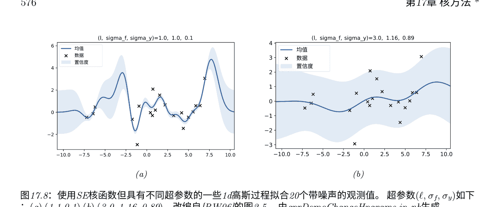

图17.8：使用SE核函数但具有不同超参数的一些1d高斯过程拟合20个带噪声的观测值。超参数($\ell$, $\sigma_f$, $\sigma_y$)如下：(a) (1, 1, 0.1) (b) (3.0, 1.16, 0.89)。改编自[RW06]的图2.5。由gprDemoChangeHparams.ipynb生成。

后验预测均值由 $\mu_* = \mathbf{k}_*^\top \mathbf{K}_\sigma^{-1} \mathbf{y}$ 给出。出于数值稳定性的原因，直接求逆 $\mathbf{K}_\sigma$ 是不明智的。一个更健壮的替代方法是计算Cholesky分解，$\mathbf{K}_\sigma = \mathbf{L} \mathbf{L}^\top$，这需要 $O(N^3)$ 时间。然后我们计算 $\alpha = \mathbf{L}^\top \setminus (\mathbf{L} \setminus \mathbf{y})$，其中我们使用反斜杠运算符表示回代（第7.7.1节）。有了这个，我们可以在 $O(N)$ 时间内计算每个测试案例的后验均值。

$$\mu_* = \mathbf{k}_*^\top \mathbf{K}_\sigma^{-1} \mathbf{y} = \mathbf{k}_*^\top \mathbf{L}^{-\top} (\mathbf{L}^{-1} \mathbf{y}) = \mathbf{k}_*^\top \boldsymbol{\alpha}$$

我们可以在 $O(N^2)$ 时间内计算每个测试案例的方差。

$$\sigma_*^2 = k_{**} - \mathbf{k}_*^\top \mathbf{L}^{-\top} \mathbf{L}^{-1} \mathbf{k}_* = k_{**} - \mathbf{v}^\top \mathbf{v}$$

其中 $\mathbf{v} = \mathbf{L} \setminus \mathbf{k}_*$。

最后，可以使用对数边际似然（用于核学习，第17.2.6节）来计算

$$\log p(\mathbf{y} | \mathbf{X}) = -\frac{1}{2} \mathbf{y}^\top \boldsymbol{\alpha} - \sum_{n=1}^{N} \log L_{nn} - \frac{N}{2} \log(2\pi)$$

### 17.2.6 估计核函数

大多数核函数都有一些自由参数，这些参数对模型的预测有很大影响。例如，假设我们使用具有RBF核函数的GP进行1d回归，其形式为

$$\mathcal{K}(x_p, x_q) = \sigma_f^2 \exp\left(-\frac{1}{2\ell^2} (x_p - x_q)^2\right)$$

这里 $\ell$ 是函数变化的水平尺度， $\sigma_f^2$ 控制函数的垂直尺度。我们假设观测噪声的方差为 $\sigma_y^2$。

我们从一个具有给定协方差的MVN中采样了20个观测值 $\Sigma = \mathcal{K}(x_i, x_j)$，然后添加了值为 $\sigma_y$ 的观测噪声。然后，我们使用具有相同核函数的GP来拟合这些数据，但使用了一系列超参数。图17.8展示了改变这些参数的效果。在图17.8(a)中，我们使用 $(\ell, \sigma_f, \sigma_y) = (1, 1, 0.1)$，结果拟合良好。在图17.8(b)中，我们将长度尺度增加到 $\ell=3$；现在函数看起来过于平滑。

### 17.2.6.1 经验贝叶斯

为了估计核参数 $\boldsymbol{\theta}$（有时称为超参数），我们可以使用穷举搜索离散值网格，以验证损失为目标，但这可能会相当慢。（这是非概率方法（如SVM（第17.3节））用于调整内核的方法。）在这里，我们考虑经验贝叶斯方法（第4.6.5.3节），这将允许我们使用基于梯度的优化方法，速度更快。特别地，我们将最大化边际似然

$$p(y|\mathbf{X}, \boldsymbol{\theta}) = \int p(y|\mathbf{f}, \mathbf{X})p(\mathbf{f}|\mathbf{X}, \boldsymbol{\theta}) d\mathbf{f}$$

（之所以称为边际似然，而不仅仅是似然，是因为我们已经边际化了潜在的高斯向量 $\mathbf{f}$。）为了简化符号，我们假设均值函数为0。由于 $p(\mathbf{f}|\mathbf{X}) = \mathcal{N}(\mathbf{f}|\mathbf{0}, \mathbf{K})$，以及 $p(\mathbf{y}|\mathbf{f}) = \prod_{n=1}^{N} \mathcal{N}(y_n|f_n, \sigma_y^2)$，边际似然由以下给出

$$\log p(y|\mathbf{X}, \boldsymbol{\theta}) = \log \mathcal{N}(\mathbf{y}|\mathbf{0}, \mathbf{K}_\sigma) = -\frac{1}{2}\mathbf{y}^\top\mathbf{K}_\sigma^{-1}\mathbf{y} - \frac{1}{2}\log|\mathbf{K}_\sigma| - \frac{N}{2}\log(2\pi)$$

其中 $\mathbf{K}_\sigma = \mathbf{K}_{X,X} + \sigma_y^2\mathbf{I}_N$ 对 $\boldsymbol{\theta}$ 的依赖是隐含的。第一项是数据拟合项，第二项是模型复杂度项，第三项只是一个常数。为了理解第一和第二项之间的权衡，考虑一个一维的SE核函数，当我们改变长度尺度 $\ell$ 并且保持 $\sigma_y^2$ 不变时。对于较短的长度尺度，拟合效果会很好，所以 $\mathbf{y}^\top\mathbf{K}_\sigma^{-1}\mathbf{y}$ 会很小。然而，模型复杂度会很高：$\mathbf{K}$ 几乎是对角线矩阵（如图13.22右上角所示），因为大多数点都不被认为“接近”其他点，所以 $\log|\mathbf{K}_\sigma|$ 项会很大。对于较长的长度尺度，拟合效果会很差，但模型复杂度会很低：$\mathbf{K}$ 几乎全为1（如图13.22右下角所示），所以 $\log|\mathbf{K}_\sigma|$ 会很小。

我们现在讨论如何最大化边际似然。可以证明

$$\frac{\partial}{\partial\theta_j} \log p(y|\mathbf{X}, \boldsymbol{\theta}) = \frac{1}{2}\mathbf{y}^\top\mathbf{K}_\sigma^{-1} \frac{\partial\mathbf{K}_\sigma}{\partial\theta_j} \mathbf{K}_\sigma^{-1}\mathbf{y} - \frac{1}{2}\text{tr}(\mathbf{K}_\sigma^{-1} \frac{\partial\mathbf{K}_\sigma}{\partial\theta_j}) = \frac{1}{2}\text{tr}\left( (\boldsymbol{\alpha}\boldsymbol{\alpha}^\top - \mathbf{K}_\sigma^{-1}) \frac{\partial\mathbf{K}_\sigma}{\partial\theta_j} \right)$$

计算 $\mathbf{K}_\sigma^{-1}$ 需要 $O(N^3)$ 时间，然后每个超参数计算梯度需要 $O(N^2)$ 时间。

$\frac{\partial\mathbf{K}_\sigma}{\partial\theta_j}$ 的形式取决于核函数的形式，以及我们对哪个参数进行导数。通常我们对超参数有约束条件，例如 $\sigma_y^2 \geq 0$。在这种情况下，我们可以定义 $\boldsymbol{\theta} = \log(\sigma_y^2)$，然后使用链式法则。

给定对数边际似然及其导数的表达式，我们可以使用任何标准的基于梯度的优化器来估计核参数。然而，由于目标函数不是凸函数，局部最小值可能是一个问题，正如我们下面所示，所以我们可能需要使用多次重启。

例如，考虑方程 (17.50) 中的RBF，其中 $\sigma_f^2 = 1$。在图17.9 (a) 中，我们绘制了当我们改变 $\ell$ 和 $\sigma_y^2$ 时的 $\log p(y|X, \ell, \sigma_y^2)$ (其中 $X$ 和 $y$ 是面板b和c中显示的7个数据点)。两个局部最优解用+表示。左下角的最优解对应于低噪声、短长度尺度的解决方案 (显示在面板b中)。右上角的最优解对应于高噪声、长长度尺度的解决方案 (显示在面板c中)。只有7个数据点，没有足够的证据来确定哪个更合理，尽管更复杂的模型 (面板b) 的边际似然比更简单的模型 (面板c) 高约60%。随着更多的数据，更复杂的模型将变得更加受欢迎。

图17.9展示了一些其他有趣 (且典型) 的特征。当噪声非常高时，区域 $\sigma_y^2 \approx 1$ (面板a的顶部) 对应于噪声非常高的情况；在这种情况下，边际似然对长度尺度不敏感 (由水平轮廓表示)，因为所有数据都被解释为噪声。当长度尺度非常短时，区域 $\ell \approx 0.5$ (面板a的左侧) 对应于长度尺度非常短的情况；在这种情况下，边际似然对噪声水平不敏感 (由垂直轮廓表示)，因为数据被完全插值。好的优化器不会选择这两个区域。

## 17.2.6.2 贝叶斯推断

当我们只有少量数据点时 (例如，在使用高斯过程进行贝叶斯优化时)，使用核参数的点估计可能会导致糟糕的结果[Bul11; WF14]。在这种情况下，我们可能希望近似核参数的后验分布。可以使用几种方法。例如，[MA10]展示了如何使用切片采样，[Hen+15]展示了如何使用哈密顿蒙特卡罗，[BBV11]展示了如何使用顺序蒙特卡罗。

图17.10: 使用单个输入特征（花萼长度）的Iris花（Setosa vs Versicolor）的二分类问题的GP分类器。粗垂直直线是决策边界的可信区间。
(a) SE核。
(b) SE加线性核。改编自[Mar18]的图7.11-7.12。由 gp_classify_iris_1d_pymc3.ipynb生成。

## 17.2.7 用于分类的GPs

到目前为止，我们专注于使用高斯似然函数进行回归的GPs。在这种情况下，后验也是一个GP，所有计算都可以通过解析方法进行。然而，如果似然函数是非高斯的，例如用于二分类的伯努利似然函数，我们无法精确计算后验。

我们可以进行各种近似，其中一些在本书的后续部分中讨论[Mur23]。在本节中，我们使用Hamiltonian Monte Carlo方法（第4.6.8.4节），同时对潜在的高斯函数 $f$ 和核超参数 $\theta$ 进行处理。基本思想是制定负对数联合分布

$$-\mathcal{E}(\boldsymbol{f}, \boldsymbol{\theta}) = \log p(\boldsymbol{f}, \boldsymbol{\theta} | \mathbf{X}, \boldsymbol{y}) = \log \mathcal{N}(\boldsymbol{f} | \mathbf{0}, \mathbf{K}(\mathbf{X}, \mathbf{X})) + \sum_{n=1}^{N} \log \mathrm{Ber}(y_n | f_n(\boldsymbol{x}_n)) + \log p(\boldsymbol{\theta}) \quad (17.55)$$

然后我们使用自动微分来计算 $\nabla_f \mathcal{E}(f, \theta)$ 和 $\nabla_\theta \mathcal{E}(f, \theta)$，并将这些梯度作为输入传递给一个高斯提议分布。

让我们考虑一个来自[Mar18]的一维示例。这类似于图4.20中的贝叶斯逻辑回归示例，目标是根据萼片长度，将鸢尾花分类为Setosa或Versicolor， $y_n \in \{0, 1\}$，给定关于萼片长度， $x_n$ 的信息。我们将使用一个长度为 $\ell$ 的SE核函数。我们在 $\ell$ 上放置一个 $\mathrm{Ga}(2, 0.5)$先验。

图17.10a展示了使用SE核的结果。这与线性逻辑回归的结果类似（见图4.20），只是在边缘（远离数据）处，概率曲线趋向于0.5。这是因为先验均值函数为 $m(x) = 0$，且 $\sigma(0) = 0.5$。我们可以通过使用更灵活的核函数来消除这种人为现象，该核函数编码了我们预期输出在输入上单调递增或递减的先验知识。我们可以使用线性核函数来实现这一点，

$$\mathcal{K}(x, x') = (x - c)(x' - c) \quad (17.56)$$

我们可以对SE核进行缩放和加法，以得到

$$\mathcal{K}(x, x') = \tau (x - c)(x' - c) + \exp[-(x - x')^2/(2\ell^2)] \quad (17.57)$$

结果显示在图17.10b中，看起来更合理。有人可能会想为什么我们要使用GP，当结果并不比简单的线性逻辑回归模型好时。原因是GP更加灵活，并且除了平滑性之外，它做出更少的先验假设。例如，假设数据看起来像图17.11a。在这种情况下，线性逻辑回归模型无法拟合数据。原则上，我们可以使用神经网络，但由于只有60个数据点，它可能效果不好。然而，GP非常适合处理小样本情况。在图17.11b中，我们展示了使用SE核对这些数据进行拟合的结果。

图17.11: (a) 虚构的“太空流感”二分类问题。(b) 使用SE核的高斯过程拟合。改编自[Mar18]的图7.13-7.14。由gp_classify_spaceflu_1d_pymc3.ipynb生成。

### 17.2.8 与深度学习的联系

事实证明，高斯过程（GPs）和深度神经网络之间存在许多有趣的联系和相似之处。例如，可以证明具有单个无限宽的RBF单元层的神经网络等价于具有RBF核的高斯过程（GP）。（这是因为RBF核可以表示为无限数量特征的内积。）实际上，许多种类的深度神经网络（在无限极限下）可以通过使用一种特定类型的神经切向核（neural tangent kernel）转换为等价的高斯过程（GP）[JGH18]。有关详细信息，请参阅本书的续集[Mur23]。

## 17.2.9 将高斯过程（GP）扩展到大型数据集

高斯过程（GP）（以及其他核方法，如支持向量机（SVM），我们在第17.3节中讨论）的主要缺点是求解 $N \times N$ 核矩阵的逆需要 $O(N^3)$ 时间，使得该方法过于耗时，对于大型数据集来说速度较慢。已经提出了许多不同的近似方案来加速高斯过程（参见，例如，[Liu+18a]进行综述）。在本节中，我们简要介绍其中一些。有关详细信息，请参阅本书的续集，[Mur23]。

### 17.2.9.1 稀疏（诱导点）近似

加速高斯过程推断的一种简单方法是使用较少的数据。更好的方法是尝试将 $N$ 个训练点 $\mathbf{X}$“总结”为 $M$ 个诱导点 $\mathbf{Z}$ 或伪输入 $\mathbf{Z}_0$。这样，我们可以用 $f_{\mathbf{Z}}$ 替换 $f_{\mathbf{X}}$，其中 $f_{\mathbf{X}} = \{ f(\mathbf{x}) : \mathbf{x} \in \mathbf{X} \}$ 是训练点处观测到的函数值向量，$f_{\mathbf{Z}} = \{ f(\mathbf{x}) : \mathbf{x} \in \mathbf{Z} \}$ 是诱导点处估计的函数值向量。通过优化 $(\mathbf{Z}, f_{\mathbf{Z}})$，我们可以学习将训练数据 $(\mathbf{X}, f_{\mathbf{X}})$“压缩”成一个“瓶颈” $(\mathbf{Z}, f_{\mathbf{Z}})$，从而将计算速度从 $O(N^3)$ 加速到 $O(M^3)$。这被称为稀疏高斯过程。使用变分推断的框架可以使整个过程变得严谨。

有关详细信息，请参阅本书的续集[Mur23]。

### 17.2.9.2 利用并行化和核矩阵结构

计算 $\mathbf{K}_{X,X}$ 的Cholesky分解需要 $O(N^3)$ 时间，这是解决线性系统 $\mathbf{K}_\sigma \alpha = y$ 和计算 $|\mathbf{K}_{X,X}|$ 所需的，其中 $\mathbf{K}_\sigma = \mathbf{K}_{X,X} + \sigma^2 \mathbf{I}_N$。Cholesky分解的替代方法是使用线性代数方法，通常称为Krylov子空间方法，它们仅基于矩阵向量乘法或MVM。这些方法通常更快，因为它们可以自然地利用核矩阵中的结构。此外，即使核矩阵没有特殊结构，矩阵乘法也很容易并行化，并且可以通过GPU大大加速，而不像基于Cholesky的方法那样主要是顺序的。这是流行的 GPyTorch软件包[Gar+18]的基础。有关详细信息，请参阅本书的续集[Mur23]。

### 17.2.9.3 随机特征近似

尽管核函数的优势在于避免使用特征化表示输入，但这些核化方法的时间复杂度为$O(N^3)$，以便求解Gram矩阵$\mathbf{K}$的逆。这可能使得在大规模数据上使用这些方法变得困难。幸运的是，我们可以使用随机选择的有限集合$M$来近似许多（平移不变的）核函数的特征映射，从而将成本降低到$O(NM + M^3)$。我们在下面简要讨论这个想法。更多细节，请参见[Liu+20]。

#### RBF核的随机特征

我们将重点关注高斯RBF核的情况。可以证明

$$\mathcal{K}(x, x') \approx \phi(x)^{\top} \phi(x') \quad (17.58)$$
$$\phi(x) \triangleq \frac{1}{\sqrt{T}} [ (\sin(\omega_1^{\top} x), \ldots, \sin(\omega_T^{\top} x), \cos(\omega_1^{\top} x), \ldots, \cos(\omega_T^{\top} x)) ] \quad (17.59)$$
$$= \frac{1}{\sqrt{T}} [\sin(\Omega x), \cos(\Omega x)] \quad (17.60)$$

其中 $T = M/2$，并且 $\boldsymbol{\Omega} \in \mathbb{R}^{T \times D}$ 是一个随机高斯矩阵，其中的元素是从 $\mathcal{N}(0, 1/\sigma^2)$ 中独立采样的，其中 $\sigma$ 是核带宽。随着我们增加 $M$，近似的偏差减小。在实践中，我们使用有限的 $M$，并通过抽取单个随机矩阵来计算对期望的单个蒙特卡洛近似。方程式(17.60)中的特征被称为随机傅里叶特征（RFF）[RR08]或“随机厨房水槽的加权和”[RR09]。

在某些应用中，我们还可以使用正随机特征，而不是三角随机特征，这在一些应用中可能更可取，例如使用注意力的模型（见第15.6.4节）。特别地，我们可以使用

$$\phi(x) \triangleq e^{-\|x\|^2 / 2} \frac{1}{\sqrt{M}} \left[\exp(\omega_1^\top x), \cdots, \exp(\omega_M^\top x)\right] \quad (17.61)$$

其中 $\omega_m$ 与之前一样进行采样。详细信息请参见[Cho+20b]。

无论我们使用三角函数特征还是正特征，通过确保 $\mathbf{Z}$ 的行是随机但正交的，我们可以获得更低的方差估计；这些被称为正交随机特征。这种采样可以通过Gram-Schmidt正交化来高效地进行，使用非结构化高斯矩阵[Yu+16]，或者一些更快的近似方法（见[CRW17; Cho+19]）。

#### 快餐近似

不幸的是，存储随机矩阵 $\boldsymbol{\Omega}$ 需要 $O(DM)$ 空间，并且计算 $\boldsymbol{\Omega}x$ 需要 $O(DM)$ 时间，其中 $D$ 是输入的维度，$M$ 是随机特征的数量。如果 $M \gg D$，这可能是禁止的，因为它可能需要以便获得比使用原始特征集更好的效果。幸运的是，我们可以使用快速哈达玛变换将内存从 $O(MD)$ 减少到 $O(M)$，并将时间从 $O(MD)$ 减少到 $O(M \log D)$。这种方法被称为快餐[LSS13]，参考了原始术语“厨房水槽”。

#### 极限学习机

我们可以使用随机特征近似来将高斯过程转换为线性模型，形式为

$$f(x; \theta) = \mathbf{W} \phi(x) = \mathbf{W} h(\mathbf{Z}x) \quad (17.62)$$

其中 $h(a) = \sqrt{1/M}[\sin(a), \cos(a)]$ 用于RBF核函数。这相当于一个具有随机（且固定）输入到隐藏权重的单层MLP。当 $M > N$ 时，这对应于一个过参数化的模型，可以完美地插值训练数据。

在[Cur+17]中，他们应用这种方法来拟合形式为 $f(x; \theta) = \mathbf{W}^\top h(\hat{\mathbf{Z}}x) + b$ 的逻辑回归模型，使用SGD；他们将得到的方法称为“McKernel”。我们也可以优化 $\mathbf{Z}$ 和 $\mathbf{W}$，如[Alb+17]中所讨论的，尽管现在问题不再是凸的。

或者，我们可以使用 $M < N$，但是将许多这样的随机非线性层堆叠在一起，并且只优化输出权重。这被称为极限学习机或ELM（参见，例如，[Hua14]），尽管这项工作存在争议。$^{1}$

> 1. 争议的原因是发明者Guang-Bin Huang被指责没有引用相关的先前工作，例如基于随机特征逼近核的等效方法。详细信息请参见 https://en.wikipedia.org/wiki/Extreme_learning_machine#Controversy.

图17.12: 大边界原则的示意图。左：具有大边界的分离超平面。右：具有小边界的分离超平面。

## 17.3 支持向量机 (SVM)

在本节中，我们讨论了一种形式的（非概率性的）分类和回归预测器，其形式为

$$f(\mathbf{x}) = \sum_{i=1}^{N} \alpha_i \mathcal{K}(\mathbf{x}, \mathbf{x}_i)$$

通过添加适当的约束，我们可以确保许多 $\alpha_i$ 系数为0，因此在测试时的预测仅取决于训练点的子集，称为“支持向量”。因此，得到的模型被称为支持向量机或 SVM。我们在下面简要总结一下。

更多细节可以在例如[VGS97; SS01]中找到。

### 17.3.1 大边界分类器

考虑一个形式为 $h(\mathbf{x}) = \mathrm{sign}(f(\mathbf{x}))$ 的二元分类器，其中决策边界由以下线性函数给出：

$$f(\mathbf{x}) = \mathbf{w}^\top \mathbf{x} + w_0$$

（在SVM文献中，通常假设类标签为 $-1$ 和 $+1$，而不是0和1。为了避免混淆，我们用 $\tilde{y}$ 表示这样的目标标签，而不是 $y$。）可能有许多条线来分隔数据。然而，直观上，我们希望选择具有最大间隔的那条线，这是最靠近决策边界的点的距离，因为这将给我们最稳健的解决方案。这个想法在图17.12中有所说明：左边的解决方案具有更大的间隔比右边的解决方案，因此它对数据的扰动更不敏感。

我们如何计算这样一个大边界分类器？首先，我们需要推导出一个表达式，来计算一个点到决策边界的距离。参考图17.13(a)，我们可以看到

图17.13: (a) 二维线性决策边界的几何示意图。如果一个点 x 被分类为属于决策区域 R₁，那么 f(x) > 0；否则，它属于决策区域 R₀；w 是垂直于决策边界的向量。术语 w₀ 控制着决策边界与原点的距离。x⊥ 是点 x 在决策边界上的正交投影。点 x 到决策边界的有符号距离由 f(x)/||w|| 给出。改编自[Bis06]的图4.1。(b) 带有圆圈的点是支持向量，并且具有 αₙ > 0 的对偶变量。在软间隔情况下，我们为每个示例关联一个松弛变量 ξₙ。如果 0 < ξₙ < 1，则该点在边界内，但位于决策边界的正确一侧。如果 ξₙ > 1，则该点位于边界的错误一侧。改编自[Bis06]的图7.3。

我们希望最大化 r，所以我们需要将其表示为 w 的函数。首先，注意到

$$f(x) = w^T x + w_0 = (w^T x_\perp + w_0) + r * (w^T w) / \|w\| = (w^T x_\perp + w_0) + r \|w\| \quad (17.66)$$

由于 $0 = f(x_\perp) = w^T x_\perp + w_0$，我们有 $f(x) = r \|w\|$，因此 $r = f(x) / \|w\|$。

由于我们希望确保每个点都在边界的正确一侧，我们还需要 $f(x_n) \tilde{y}_n > 0$。我们希望最大化最近点的距离，因此我们的最终目标变为

$$\max_{w, w_0} \frac{1}{\|w\|} \min_{n=1}^{N} [\tilde{y}_n (w^T x_n + w_0)] \quad (17.67)$$

请注意，通过使用 $w \to k w$ 和 $w_0 \to k w_0$ 重新调整参数，我们不会改变任何点到边界的距离，因为当我们除以 $\|w\|$ 时，$k$ 因子会被抵消掉。因此，让我们定义一个尺度因子，使得对于最靠近决策边界的点， $\tilde{y}_n f_n = 1$。

因此，我们要求对于所有的n， $\tilde{y}_n f_n \ge 1$。最后，注意最大化$1/\|w\|$等价于最小化$\|w\|^2$。因此，我们得到了新的目标函数

$$\min_{w,w_0} \frac{1}{2} \|w\|^2 \quad \text{s.t.} \quad \tilde{y}_n (w^T x_n + w_0) \ge 1, \ n=1:N \quad (17.68)$$

(为了方便起见，添加了因子1/2，不影响最优参数。) 约束条件表示我们希望所有点都在决策边界的正确一侧，至少有一个边界距离为1。

请注意，在使用SVM之前，重要的是对输入变量进行缩放，否则边界的边界距离将使用所有输入维度平等地测量。请参见图17.14进行说明。

### 17.3.2 对偶问题

方程（17.68）中的目标是一个标准的二次规划问题（第8.5.4节），因为我们有一个二次目标，受到线性约束的限制。这个问题有 $N + D+ 1$ 个变量，受到 $N$ 个约束条件的限制，被称为原始问题。

在凸优化中，对于每个原始问题，我们可以推导出一个对偶问题。设 $\alpha \in \mathbb{R}^N$ 为对偶变量，对应于强制执行 $N$ 个不等式约束的拉格朗日乘子。广义拉格朗日函数如下所示（有关约束优化的相关背景信息，请参见第8.5.2节）：

$$L(w, w_0, \alpha) = \frac{1}{2} w^T w - \sum_{n=1}^N \alpha_n (\tilde{y}_n (w^T x_n + w_0) - 1)$$

为了优化这个问题，我们必须找到一个满足条件的驻点。

$$(\hat{w}, \hat{w}_0, \hat{\alpha}) = \min_{w,w_0} \max_\alpha L(w, w_0, \alpha)$$我们可以通过计算对 $w$ 和 $w_0$ 的偏导数并将其设为零来实现这一点。我们有

$$
\nabla_{w} \mathcal{L}(w, w_0, \alpha) = w - \sum_{n=1}^N \alpha \tilde{y} x
$$

$$
\frac{\partial}{\partial w_0} \mathcal{L}(w, w_0, \alpha) = - \sum_{n=1}^N \alpha \tilde{y}
$$

因此

$$
\hat{w} = \sum_{n=1}^N \alpha \tilde{y} x
$$

$$
0 = \sum_{n=1}^N \alpha \tilde{y}
$$

将这些代入拉格朗日函数得到以下结果

$$
\mathcal{L}(\hat{w}, \hat{w}_0, \alpha) = \frac{1}{2} \hat{w}^\top \hat{w} - \sum_{n=1}^N \alpha \tilde{y} \hat{w}^\top x - \sum_{n=1}^N \alpha \tilde{y} \hat{w}_0 + \sum_{n=1}^N \alpha
$$

$$
= \frac{1}{2} \hat{w}^\top \hat{w} - \hat{w}^\top \hat{w} - 0 + \sum_{n=1}^N \alpha
$$

$$
= -\frac{1}{2} \sum_{i=1}^N \sum_{j=1}^N \alpha_i \alpha_j \tilde{y}_i \tilde{y}_j x_i^\top x_j + \sum_{n=1}^N \alpha
$$

这被称为目标的对偶形式。我们希望在满足以下约束条件的情况下最大化这个值：

$$
\sum_{n=1}^N \alpha_n \tilde{y}_n = 0 \quad \text{且} \quad 0 \le \alpha_n \quad \text{对于} \quad n=1, ..., N。
$$

上述目标是一个关于 $N$ 个变量的二次问题。标准的 QP 求解器需要 $O(N^3)$ 的时间。

然而，针对这个问题已经开发出了一些专门的算法，避免了使用通用的 QP 求解器，例如顺序最小优化或 SMO 算法[Pla98]，它的时间复杂度为 $O(N)$ 到 $O(N^2)$。

由于这是一个凸优化问题，解必须满足 KKT 条件（第 8.5.2 节），这些条件告诉我们以下性质成立：

$$
\alpha_n \ge 0
$$

$$
\tilde{y}_n f(x_n) - 1 \ge 0
$$

$$
\alpha_n (\tilde{y}_n f(x_n) - 1) = 0
$$

因此，要么 $\alpha_n = 0$（在这种情况下，计算 $\hat{w}$ 时忽略示例 $n$），要么约束条件 $\tilde{y}_n (\hat{w}^\top x_n + \hat{w}_0) = 1$ 是激活的。后一种条件意味着示例 $n$ 位于决策边界上；这些点被称为支持向量，如图 17.13(b) 所示。我们用 $S$ 表示支持向量的集合。

## 17.3. 支持向量机（SVM）

为了进行预测，我们使用

$$
f(\boldsymbol{x};\boldsymbol{w},\hat{w}_0)=\hat{\boldsymbol{w}}^{\top}\boldsymbol{x}+\hat{w}_0=\sum_{n\in\mathcal{S}}\alpha_n\tilde{y}_n\boldsymbol{x}_n^{\top}\boldsymbol{x}+\hat{w}_0
$$

为了求解 $\hat{w}_0$，我们可以利用任意支持向量的事实，即 $\tilde{y}_n f(\boldsymbol{x};\boldsymbol{w},\hat{w}_0)=1$。将两边都乘以 $\tilde{y}_n$，并利用 $\tilde{y}_n^2=1$ 的事实，我们得到 $\hat{w}_0=\tilde{y}_n-\hat{\boldsymbol{w}}^{\top}\boldsymbol{x}_{n}$。在实践中，通过对所有支持向量进行平均，我们可以获得更好的结果

$$
\hat{w}_0=\frac{1}{|\mathcal{S}|}\sum_{n\in\mathcal{S}}(\tilde{y}_n-\hat{\boldsymbol{w}}^{\top}\boldsymbol{x}_n)=\frac{1}{|\mathcal{S}|}\sum_{n\in\mathcal{S}}\left(\tilde{y}_n-\sum_{m\in\mathcal{S}}\alpha_m\tilde{y}_m\boldsymbol{x}_m^{\top}\boldsymbol{x}_n\right)
$$

### 17.3.3 软间隔分类器

如果数据不是线性可分的，那么对于所有的 $n$，就不会有可行解使得 $\tilde{y}_n f_n \ge 1$。因此，我们引入松弛变量 $\xi_n \ge 0$，并用软间隔约束替换硬约束，即 $\tilde{y}_n f_n \ge 1$ 变为 $\tilde{y}_n f_n \ge 1-\xi_n$。新的目标函数变为

$$
\min_{\boldsymbol{w},w_0,\boldsymbol{\xi}}\frac{1}{2}\|\boldsymbol{w}\|^2+C\sum_{n=1}^N\xi_n
$$

$$
\text{s.t.} \quad \xi_n \ge 0, \quad \tilde{y}_n(\boldsymbol{x}_n^{\top}\boldsymbol{w}+w_0) \ge 1 - \xi_n
$$

其中 $C \ge 0$ 是一个超参数，用于控制允许违反间隔约束的点的数量。（如果 $C=\infty$，我们就得到了未正则化的硬间隔分类器。）相应的拉格朗日函数为

$$
\mathcal{L}(\boldsymbol{w},w_0,\boldsymbol{\alpha},\boldsymbol{\xi},\boldsymbol{\mu})=\frac{1}{2}\boldsymbol{w}^{\top}\boldsymbol{w}+C\sum_{n=1}^N\xi_n-\sum_{n=1}^N\alpha_n(\tilde{y}_n(\boldsymbol{w}^{\top}\boldsymbol{x}_n+w_0)-1+\xi_n)-\sum_{n=1}^N\mu_n\xi_n
$$

其中 $\alpha_n \ge 0$ 和 $\mu_n \ge 0$ 是拉格朗日乘子。优化 $\boldsymbol{w}, w_0$ 和 $\boldsymbol{\xi}$ 得到对偶形式

$$
\mathcal{L}(\boldsymbol{\alpha})=\sum_{i=1}^N\alpha_i-\frac{1}{2}\sum_{i=1}^N\sum_{j=1}^N\alpha_i\alpha_j\tilde{y}_i\tilde{y}_j\boldsymbol{x}_i^{\top}\boldsymbol{x}_j
$$

这与硬间隔情况相同；然而，约束条件不同。特别地，KKT 条件暗示

$$
0 \le \alpha_n \le C
$$

$$
\sum_{n=1}^N \alpha_n \tilde{y}_n = 0
$$

如果 $\alpha_n = 0$，则忽略该点。如果 $0 < \alpha_n < C$，那么 $\xi_n = 0$，因此该点位于边界上。如果 $\alpha_n = C$，该点可以位于边界内部，并且如果 $\xi_n \le 1$，则可以被正确分类，如果 $\xi_n > 1$，则被错误分类。请参见图17.13(b)进行说明。因此 $\sum_n \xi_n$ 是错误分类点的上界。

与之前一样，可以使用偏置项计算

$$
\hat{w}_0 = \frac{1}{|\mathcal{M}|} \sum_{n \in \mathcal{M}} \left( \tilde{y}_n - \sum_{m \in \mathcal{S}} \alpha_m \tilde{y}_m \mathbf{x}_m^{\top} \mathbf{x}_n \right) \quad (17.88)
$$

其中 $\mathcal{M}$ 是具有 $0 < \alpha_n < C$ 的点集。

有一种被称为 $\nu$-SVM 分类器的软间隔SVM的替代公式 [Sch+00]。这涉及到最大化

$$
\mathcal{L}(\boldsymbol{\alpha}) = -\frac{1}{2} \sum_{i=1}^{N} \sum_{j=1}^{N} \alpha_i \alpha_j \tilde{y}_i \tilde{y}_j \mathbf{x}_i^{\top} \mathbf{x}_j \quad (17.89)
$$

在约束条件下

$$
0 \leq \alpha_n \leq 1/N \quad (17.90)
$$

$$
\sum_{n=1}^{N} \alpha_n \tilde{y}_n = 0 \quad (17.91)
$$

$$
\sum_{n=1}^{N} \alpha_n \geq \nu \quad (17.92)
$$

这样做的好处是，参数 $\nu$ 可以替代 $C$，并且可以解释为**margin errors**的上界（对于 $\xi_n > 0$ 的点），也可以解释为支持向量的下界。

### 17.3.4 核技巧

到目前为止，我们已经将大间隔二元分类问题转化为一个关于未知数 $N$ 的对偶问题 ($\boldsymbol{\alpha}$)，这个问题（一般情况下）需要 $O(N^3)$ 的时间来解决，速度较慢。然而，对偶问题的主要好处是我们可以用一个正定（Mercer）核函数 $\mathcal{K}(\mathbf{x},\mathbf{x}')$ 来替换所有内积运算 $\mathbf{x}^{\top} \mathbf{x}'$。这被称为核技巧。

特别是，我们可以将方程 (17.81) 中的预测函数重写为以下形式：

$$
f(\mathbf{x}) = \hat{\mathbf{w}}^{\top} \mathbf{x} + \hat{w}_0 = \sum_{n \in \mathcal{S}} \alpha_n \tilde{y}_n \mathbf{x}_n^{\top} \mathbf{x} + \hat{w}_0 = \sum_{n \in \mathcal{S}} \alpha_n \tilde{y}_n \mathcal{K}(\mathbf{x}_n, \mathbf{x}) + \hat{w}_0 \quad (17.93)
$$

我们还需要对偏置项进行核化处理。这可以通过将方程 (17.82) 进行核化处理来实现，具体如下：

$$
\hat{w}_0 = \frac{1}{|\mathcal{S}|} \sum_{i \in \mathcal{S}} \left( \tilde{y}_i - \left( \sum_{j \in \mathcal{S}} \hat{\alpha}_j \tilde{y}_j \mathbf{x}_j \right)^{\top} \mathbf{x}_i \right) = \frac{1}{|\mathcal{S}|} \sum_{i \in \mathcal{S}} \left( \tilde{y}_i - \sum_{j \in \mathcal{S}} \hat{\alpha}_j \tilde{y}_j \mathcal{K}(\mathbf{x}_j, \mathbf{x}_i) \right) \quad (17.94)
$$

核技巧使我们能够避免处理数据的显式特征表示，并且能够轻松地将分类器应用于结构化对象，如字符串和图形。

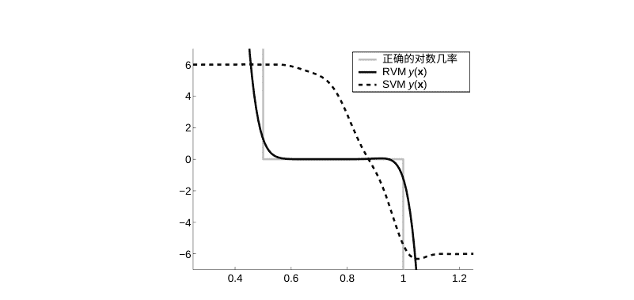

图17.15：对数几率与 x 的三种不同方法的比较。改编自[Tip01]的图10。在Mike Tipping的友好许可下使用。

### 17.3.5 将SVM输出转化为概率

SVM分类器产生一个硬标签， $\hat{y}(x) = \text{sign}(f(x))$。 然而，我们经常希望对我们的预测有一个置信度的度量。 一种启发式的方法是将 $f(x)$ 解释为对数几率比， $\log \frac{p(y=1|x)}{p(y=0|x)}$。然后，我们可以使用以下公式将SVM的输出转换为概率

$$
p(y=1|x, \boldsymbol{\theta}) = \sigma(a f(x) + b) \quad (17.95)
$$

其中 $a, b$ 可以通过在单独的验证集上使用最大似然估计来估计。(在训练集上估计 $a$ 和 $b$ 会导致严重过拟合。) 这种技术最早是在[Pla00]中提出的，被称为Platt缩放。

然而，由于SVM训练过程中没有任何理由将 $f(x)$ 解释为对数几率比，因此得到的概率并不特别校准。 为了说明这一点，考虑[Tip01]中的一个例子。 假设我们有一个一维数据，其中 $p(x|y=0) = \text{Unif}(0,1)$ 和 $p(x|y=1) = \text{Unif}(0.5,1.5)$。 由于类条件分布在 $[0.5, 1]$ 范围内重叠，因此在这个区域内，类别1相对于类别0的对数几率应该为零，在这个区域之外则为无穷大。 我们从模型中抽取了1000个点，然后拟合了一个概率核分类器 (一个RVM，在第17.4.1节中描述) 和一个带有高斯核宽度为0.1的SVM。 这两个模型都能完美地捕捉到决策边界，并在这个问题上实现了25%的泛化误差，这是贝叶斯最优的。 RVM的概率输出是对真实对数几率的很好近似，但是对于SVM来说并非如此，如图17.15所示。

### 17.3.6 与逻辑回归的连接

我们已经看到，位于决策边界正确一侧的数据点有 $\xi_n=0$；对于其他数据点，我们有 $\xi_n = 1 - \tilde{y}_n f(\boldsymbol{x}_n)$。 因此，我们可以将方程 (17.83) 中的目标重写为如下形式：

$$
\mathcal{L}(\boldsymbol{w}) = \sum_{n=1}^{N} \ell_{\text{hinge}}(\tilde{y}_n, f(\boldsymbol{x}_n))) + \lambda |\boldsymbol{w}|^2 \quad (17.96)
$$

其中 $\lambda = (2C)^{-1}$， 而 $\ell_{\text{hinge}}(y, \eta)$ 是由hinge损失函数定义的

$$
\ell_{\text{hinge}}(\tilde{y}, \eta) = \max(0, 1-\tilde{y}\eta) \quad (17.97)
$$

作者：Kevin P. Murphy。 (C) MIT Press. CC-BY-NC-ND许可证

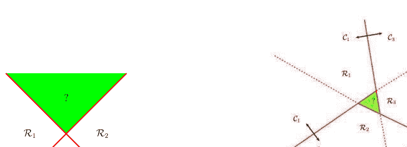

图17.16: (a)一对多方法。绿色区域被预测为类别1和类别2。(b)一对多方法。绿色区域的标签是模糊的。改编自[Bis06]的图4.2。

从图4.2中我们可以看到，这是一个凸的、分段可微的0-1损失的上界，形状类似于一个部分开放的门铰链。

$$
\mathcal{L}(\boldsymbol{w}) = \sum_{n=1}^{N} \ell_{ll}(\tilde{y}_n, f(\boldsymbol{x}_n))) + \lambda \|\boldsymbol{w}\|^2
$$

其中对数损失由以下公式给出

$$
\ell_{ll}(\tilde{y}, \eta) = -\log p(y|\eta) = \log(1 + e^{-\tilde{y}\eta})
$$

这也在图4.2中绘制出来。我们看到它与铰链损失相似，但有两个重要的区别。首先，铰链损失是分段线性的，所以我们不能使用常规的梯度方法来优化它。（但是，我们可以计算出子梯度在 $\tilde{y}\eta = 1$处。）其次，铰链损失在一个区域内严格为0；这导致了稀疏估计。

我们看到这两个函数都是0-1损失的凸上界，其表示为

$$
\ell_{01}(\tilde{y}, \hat{y}) = \mathbb{I}(\tilde{y} = \hat{y}) = \mathbb{I}(\tilde{y}\hat{y} < 0)
$$

这些上界更容易优化，并且可以看作是0-1损失的替代函数。详见第4.3.2节。

### 17.3.7 多类别分类与支持向量机

支持向量机本质上是一个二元分类器。将它们转换为多类别分类模型的一种方法是训练 $C$ 个二元分类器，其中类 $c$ 的数据被视为正例，而其他所有类的数据被视为负例。然后我们使用规则 $\hat{y}(\boldsymbol{x}) = \arg\max_c f_c(\boldsymbol{x})$ 来预测最终标签，其中 $f_c(x) = \log \frac{p(c=1|x)}{p(c=0|x)}$ 是分类器 c 给出的分数。这被称为 one-versus-the-rest方法（也称为one-vs-all）。

不幸的是，这种方法存在几个问题。首先，它可能导致输入空间中的区域具有模糊的标签。例如，在图17.16(a)的顶部的绿色区域被预测为类2和类1。第二个问题是 $f_c$ 的分数的大小没有进行校准，因此很难进行比较。最后，每个二元子问题很可能受到类不平衡问题的影响（第10.3.8.2节）。例如，假设我们有10个平均表示的类。当训练 $f_1$ 时，我们将有10%的正例和90%的负例，这可能会影响性能。

另一种方法是使用一对一或OVO方法，也称为全对，其中我们训练 $C(C-1)/2$ 个分类器来区分所有对 $f_{c,c'}$。然后我们将一个点分类到具有最高票数的类别中。然而，这也可能导致歧义，如图17.16(b)所示。此外，这需要拟合 $O(C^2)$ 个模型。

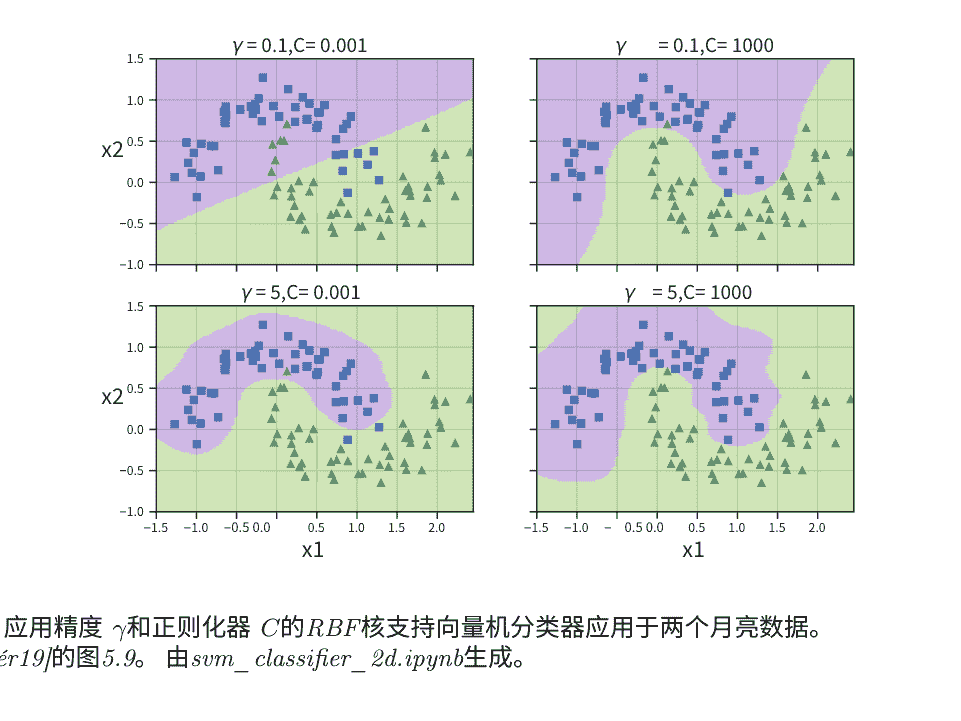

### 17.3.8 如何选择正则化参数 C

SVMs要求您指定核函数和参数 C。通常通过交叉验证来选择 C。然而，请注意 C 与核参数之间的相互作用非常强。例如，假设我们使用具有精度 $\gamma = \frac{1}{2\sigma^2}$ 的RBF核。如果 γ 很大，对应于窄核，我们可能需要较重的正则化，因此使用较小的 C。如果 γ 很小，则应使用较大的 C。因此，我们可以看到 γ 和 C 是紧密耦合的，如图17.17所示。libsvm的作者[HCL03]建议使用在值为 $C \in \{2^{-5}, 2^{-3}, ..., 2^{15}\}$ 的2D网格上进行交叉验证。

图17.18: (a) 使用RBF核的SVM分类器的0-1错误的交叉验证估计，具有不同的精度 γ= 1/(2σ²)和不同的正则化参数 λ= 1/C，应用于从两个高斯分布混合中绘制的合成数据集。(b) 对于 γ= 5，通过该曲面的切片。红色虚线是使用贝叶斯规则应用于生成数据的模型计算得出的贝叶斯最优错误。改编自[HTF09]的图12.6。由svm gammaC Demo.ipynb生成。

其中 γ∈ {2^{-15}, 2^{-13}, ..., 2^3}。参见图17.18，显示了0-1风险的CV估计作为 C和 γ的函数。

为了有效地选择C，可以开发一种路径跟踪算法，灵感来自于lars（第11.4.4节）。基本思想是从一个小的C开始，这样边界就很宽，因此所有的点都在里面，并且具有α_i=1。通过逐渐增加C，一小部分点将从边界内部移动到外部，并且它们的α_i值将从1变为0，因为它们不再是支持向量。

当C达到最大值时，边界变为空，不再存在支持向量。详细信息请参见[Has+04]。

### 17.3.9 核岭回归

回顾一下岭回归的方程（方程11.55）：

$$ \hat{w}_{map} = (\mathbf{X}^\top \mathbf{X} + \lambda \mathbf{I}_D)^{-1} \mathbf{X}^\top \mathbf{y} = (\sum_n \mathbf{x}_n \mathbf{x}_n^\top + \lambda \mathbf{I}_D)^{-1} (\sum_n y_n \mathbf{x}_n) $$ (17.101)

使用矩阵求逆引理（第7.3.3节），我们可以将岭估计重写如下

$$ w = \mathbf{X}^\top (\mathbf{X} \mathbf{X}^\top + \lambda \mathbf{I}_N)^{-1} \mathbf{y} = \sum_n \mathbf{x}_n ((\sum_m \mathbf{x}_m^\top \mathbf{x}_n + \lambda \mathbf{I}_N)^{-1} \mathbf{y})_n $$ (17.102)

让我们定义以下对偶变量：

$$ \alpha \triangleq (\mathbf{X} \mathbf{X}^\top + \lambda \mathbf{I}_N)^{-1} \mathbf{y} = (\sum_n \mathbf{x}_n^\top \mathbf{x}_n + \lambda \mathbf{I}_N)^{-1} \mathbf{y} $$ (17.103)

然后我们可以将原始变量重写如下

$$ w = \mathbf{X}^T \alpha = \sum_{n=1}^N \alpha_n \mathbf{x}_n $$ (17.104)

这告诉我们解向量只是 N个训练向量的线性和。当我们在测试时将其插入计算预测均值时，我们得到

$$ f(\mathbf{x}; \mathbf{w}) = \mathbf{w}^T \mathbf{x} = \sum_{n=1}^N \alpha_n \mathbf{x}_n^T \mathbf{x} $$ (17.105)

然后我们可以使用核技巧将其重写为

$$ f(\mathbf{x}; \mathbf{w}) = \sum_{n=1}^N \alpha_n \mathcal{K}(\mathbf{x}_n, \mathbf{x}) $$ (17.106)

其中

$$ \alpha = (\mathbf{K} + \lambda \mathbf{I}_N)^{-1} \mathbf{y} $$ (17.107)

换句话说，

$$ f(\mathbf{x}; \mathbf{w}) = \mathbf{k}^T (\mathbf{K} + \lambda \mathbf{I}_N)^{-1} \mathbf{y} $$ (17.108)

这被称为核岭回归。

上述方法的问题在于解向量 α不是稀疏的，因此在测试时的预测将花费 O(N)的时间。我们在第17.3.10节中讨论了解决方案。

### 17.3.10 用于回归的支持向量机

考虑以下 ℓ_2-正则化ERM问题：

$$ J(\mathbf{w}, \lambda) = \lambda ||\mathbf{w}||^2 + \sum_{n=1}^N \ell(\hat{y}_n, y_n) $$ (17.109)

如果我们使用二次损失函数 ℓ(y, ŷ) = (y - ŷ)^2，其中 y, ŷ ∈ ℝ，我们就得到了岭回归（第11.3节）。如果我们再应用核技巧，我们就得到了核岭回归（第17.3.9节）。

核岭回归的问题在于解决方案取决于所有的N个训练点，这使得计算上难以处理。然而，通过改变损失函数，我们可以使得最优的基函数系数α*变得稀疏，如下所示。

特别地，考虑以下变体的Huber损失函数（第5.1.5.3节）称为ε不敏感损失函数：

$$ L(y, \hat{y}) = \begin{cases} 0 & \text{如果 } |y - \hat{y}| < \varepsilon \\ |y - \hat{y}| - \varepsilon & \text{否则} \end{cases} $$ (17.110)

图17.19: (a)展示了L2、Huber和ε不敏感损失函数的示意图，其中ε=1.5。由huberLossPlot.ipynb生成。(b)展示了SVM回归中使用的ε-tube。位于tube上方的点满足ξ_i+>0和ξ_i-=0。位于tube内部的点满足ξ_i+=ξ_i-=0。改编自[Bis06]的图7.7。

这意味着任何位于预测周围的ε-管内的点都不会受到惩罚，如图17.19所示。

相应的目标函数通常以以下形式书写

$$J = \frac{1}{2}||w||^2 + C \sum_{n=1}^{N} L_\epsilon(\tilde{y}_n, \hat{y}_n)$$

其中 \(\hat{y}_n = f(x_n) = w^T x_n + w_0\), \(C=1/\lambda\)是一个正则化常数。这个目标函数是凸的，无约束的，但由于损失项中的绝对值函数而不可微分。就像在第11.4.9节中讨论套索问题一样，我们可以使用几种可能的算法。一种流行的方法是将问题表述为约束优化问题。

特别地，我们引入松弛变量来表示每个点位于管外的程度：

$$\tilde{y}_n \leq f(x_n) + \epsilon + \xi_n^+$$ (17.112)

$$\tilde{y}_n \geq f(x_n) - \epsilon - \xi_n^-$$ (17.113)

鉴于此，我们可以将目标重写如下：

$$J = \frac{1}{2}||w||^2 + C \sum_{n=1}^{N} (\xi_n^+ + \xi_n^-)$$ (17.114)

这是一个关于w的二次函数，并且必须在线性约束条件下最小化，如方程17.112-17.113所示，以及正性约束条件\(\xi_n^+ \geq 0\)和\(\xi_n^- \geq 0\)。这是一个标准的二次规划问题，涉及\(2N + D + 1\)个变量。

通过形成拉格朗日函数并进行优化，就像我们之前做的那样，可以证明最优解具有以下形式

$$\hat{w} = \sum_n \alpha_n x_n$$ (17.115)

其中 $\alpha_n \ge 0$是对偶变量。 （详见[SS02]）幸运的是， $\alpha$向量是稀疏的，意味着它的许多条目等于0。这是因为损失函数不关心小于 $\epsilon$的错误。稀疏程度由 $C$和 $\epsilon$控制。

对于 $\alpha_n > 0$的情况，它们被称为支持向量；这些点是误差位于或超出 $\epsilon$管道之外的点。这些是我们在测试时间需要保留的唯一训练样本，因为

$$f(\mathbf{x}) = \hat{w}_0 + \hat{\mathbf{w}}^\top \mathbf{x} = \hat{w}_0 + \sum_{n:\alpha_n>0} \alpha_n \mathbf{x}_n^\top \mathbf{x}$$ (17.116)

最后，我们可以使用核技巧来得到

$$f(\mathbf{x}) = \hat{w}_0 + \sum_{n:\alpha_n>0} \alpha_n \mathcal{K}(\mathbf{x}_n, \mathbf{x})$$ (17.117)

这种整体技术被称为支持向量机回归或简称为SVM回归，并在[VGS97]中首次提出。

在图17.20中，我们给出了一个使用RBF核函数和 $\gamma= 1$ 的示例。当 $C$较小时，模型受到严格的正则化；当 $C$较大时，模型的正则化程度较低，可以更好地拟合数据。我们还可以看到当 $\epsilon$较小时，管道较小，因此有更多的支持向量。

## 17.4 稀疏向量机

高斯过程是非常灵活的模型，但在预测时会产生 $O(N)$的时间成本，这可能是禁止的。支持向量机通过估计稀疏权重向量来解决这个问题。 然而，支持向量机不能给出校准的概率输出。

我们可以通过使用参数模型来兼顾两者的优点，其中特征向量是基于每个训练点的基函数定义的，如下所示：

$$\phi(\mathbf{x}) = [\mathcal{K}(\mathbf{x}, \mathbf{x}_1), \ldots, \mathcal{K}(\mathbf{x}, \mathbf{x}_N)]$$ (17.118)

其中 $\mathcal{K}$是任何相似性核函数，不一定是Mercer核函数。方程式 (17.118) 将 $\mathbf{x} \in \mathcal{X}$映射为 $\phi(\mathbf{x}) \in \mathbb{R}^N$。我们可以将这个新的特征向量插入到任何判别模型中，例如逻辑回归。由于我们有 $D = N$个参数，我们需要使用某种正则化方法来防止过拟合。如果我们使用 $\ell_2$正则化来拟合这样的模型（我们将其称为 **L2VM**，表示 $\ell_2$向量机），结果通常具有良好的预测性能，但权重向量 $\mathbf{w}$将是密集的，并且将依赖于所有 $N$个训练点。一个自然的解决方案是对 $\mathbf{w}$施加稀疏性先验，这样就不需要保留所有的示例。我们将这样的方法称为稀疏向量机。

图17.22: (a)展示了真实函数和训练数据。(b)展示了使用RBF核的SVM回归的预测，其中C=1，ε=0.1，γ=1。(c)展示了L1VM。(d)展示了RVM。由rvm_regression_1d.ipynb生成。

## 17.4.1 相关向量机（RVMs）

确保 $w$ 稀疏的最简单方法是使用 $\ell_1$ 正则化，就像第11.4节中所述。我们称之为L1VM或拉普拉斯向量机，因为这种方法等价于使用w的MAP估计具有拉普拉斯先验。

然而，有时候 $\ell_1$ 正则化不能在给定的准确性水平上产生足够的稀疏性。另一种方法基于ARD或自动相关性确定的使用，它使用类型II最大似然（也称为经验贝叶斯）来估计稀疏权重向量[Mac95; Nea96]。如果我们将这种技术应用于以核为基础的特征向量，如方程（17.118）中所定义的，我们得到一种称为相关向量机或RVM[Tip01; TF03]的方法。

### 17.4.2 稀疏和密集核方法的比较

在图17.21中，我们比较了L2VM、L1VM、RVM和使用RBF核的SVM在二分类问题上的表现。我们使用交叉验证来选择SVM的C值，即C = 1/λ（参见第17.3.8节）。

图17.21：使用带宽为σ=0.3的RBF核进行非线性二分类的示例。 (a) L2VM. (b) L1VM. (c) RVM. (d) SVM. 绿色圆圈表示支持向量。由kernelBinaryClassifDemo.ipynb生成。

然后对L2VM和L1VM使用相同的正则化器数值。我们发现所有的方法都给出了类似的预测性能。然而，我们发现RVM是最稀疏的模型，因此在运行时速度最快。

在图17.22中，我们比较了L2VM、L1VM、RVM和使用RBF核的SVM在一个一维回归问题上的表现。同样，我们发现预测结果非常相似，但RVM是最稀疏的，其次是L1VM，然后是SVM。这在图17.23中进一步说明。

除了这些小的经验性例子，我们在表17.1中提供了更一般的不同方法的总结。该表的列具有以下含义：

*   优化 w：一个关键问题是目标 L(w) = -log p(D|w) - log p(w)是否是凸的。L2VM、L1VM和SVM具有凸目标。RVM不具有。GPs是贝叶斯方法，它们将权重 w积分掉。

图17.23: 图17.22中模型的估计系数。由rvm_regression_1d.ipynb生成。

*   优化核函数：所有方法都要求我们“调整”核函数的参数，例如RBF核函数的带宽以及正则化的程度。 对于基于高斯先验的方法，包括L2VM、RVM和GPs，我们可以使用高效的基于梯度的优化器来最大化边缘似然。 对于SVM和L1VM，我们必须使用交叉验证，这会更慢（参见第17.3.8节）。
*   稀疏：L1VM、RVMs和SVMs是稀疏核方法，它们只使用训练样本的一个子集。 GPs和L2VM不是稀疏的：它们使用所有的训练样本。 稀疏性的主要优势是测试时的预测通常更快。 然而，这通常会导致对预测的过度自信。
*   概率性：除了SVMs之外的所有方法都会产生形式为 p(y|x)的概率输出。 SVMs会产生一个可以转换为概率的“置信度”值，但这些概率通常校准得很差（参见第17.3.5节）。
*   多类别：除了SVMs之外的所有方法都可以自然地在多类别环境中工作，通过使用分类分布而不是伯努利分布。SVM可以转变为多类别分类器，但这种方法存在各种困难，如第17.3.7节所讨论的。

表 17.1：不同核方法的比较。

| 方法 | Opt. w | 优化核 | 稀疏 | 概率 | 多类 | 非Mercer | 部分 | 章节 |
| :--- | :--- | :--- | :--- | :--- | :--- | :--- | :--- | :--- |
| SVM | 凸 | CV | 是 | 否 | 间接 | 否 | | 17.3 |
| L2VM | 凸 | EB | 否 | 是 | 是 | 是 | | 17.4.1 |
| L1VM | 凸 | CV | 是 | 是 | 是 | 是 | | 17.4.1 |
| RVM | 非凸 | EB | 是 | 是 | 是 | 是 | | 17.4.1 |
| GP | N/A | EB | 否 | 是 | 是 | 否 | | 17.2.7 |

*   Mercer核: SVM和GP要求核是正定的；其他技术不需要，因为方程（17.118）中的核函数可以是两个输入的任意函数。

## 17.5 练习

练习17.1 [手动拟合SVM分类器 *]

(来源: Jaakkola。) 考虑一个包含2个1维点的数据集： x1=0, 带有标签 y1=-1 和 x2=√2, 带有标签 y2=1。考虑使用特征向量 φ(x)=[1, √2x, x^2]^T. (这是等价于使用二阶多项式核函数。)最大间隔分类器的形式为

$$\min \|\mathbf{w}\|^2 \quad \text{s.t.} \quad (17.119)$$

$$y_1(\mathbf{w}^T \phi(\mathbf{x}_1) + w_0) \geq 1 \quad (17.120)$$

$$y_2(\mathbf{w}^T \phi(\mathbf{x}_2) + w_0) \geq 1 \quad (17.121)$$

a. 写下一个与最优向量 $\mathbf{w}$ 平行的向量。提示：从图17.12(a)中可以看出，$\mathbf{w}$ 垂直于3D特征空间中两个点之间的决策边界。

b. 这个 $\mathbf{w}$ 所实现的边界值是多少？提示：回想一下，边界值是从每个支持向量到决策边界的距离。提示2：思考一下空间中2个点的几何关系，其中一条线将它们分开。

c. 解出 $\mathbf{w}$，利用边界值等于 $1/\|\mathbf{w}\|$ 的事实。

d. 利用你得到的 $\mathbf{w}$ 的值和方程式17.119到17.121解出 $w_0$。提示：这些点将位于决策边界上，所以不等式将是紧密的。

e. 写出判别函数 $f(x) = w_0 + \mathbf{w}^T \phi(x)$ 的形式，作为 $x$ 的显式函数。

# 18 树、森林、装袋和提升

### 18.1 分类和回归树（CART）

分类和回归树或 CART模型[BFO84]，也被称为决策树[Qui86; Qui93]，通过递归地划分输入空间，并在每个结果区域中定义一个局部模型来定义。 整体模型可以用一棵树表示，每个区域对应一个叶子节点，下面我们会解释这一点。

### 18.1.1 模型定义

我们首先考虑回归树，其中所有输入都是实值。 树由一组嵌套的决策规则组成。 在每个节点 *i*处，将输入向量 *x*的特征维度 *d_i*与阈值 *t_i*进行比较，然后根据是否高于或低于阈值将输入传递到左侧或右侧分支。 在树的叶子节点上，模型指定了落入输入空间该部分的任何输入的预测输出。

例如，考虑图18.1(a)中的回归树。第一个节点询问是否 *x_1*小于某个阈值 *t_1*。 如果是，我们接着询问是否 *x_2*小于另一个阈值 *t_2*。 如果是，我们进入左下叶节点。 这对应于由以下条件定义的空间区域

$$R_1 = \{\boldsymbol{x} : x_1 \le t_1, x_2 \le t_2\}$$

我们可以将该区域与预测输出关联起来，比如说 *y = 2*。 以类似的方式，我们可以使用轴平行分割将整个输入空间划分为5个区域，如图18.1(b)所示。形式上，回归树可以定义为

$$f(\boldsymbol{x}; \boldsymbol{\theta}) = \sum_{j=1}^{J} w_j \mathbb{I}(\boldsymbol{x} \in R_j)$$

其中 *R_j*是第 *j*个叶节点指定的区域， *w_j*是该节点的预测输出，

$$w_j = \frac{\sum_{n=1}^{N} y_n \mathbb{I}(\boldsymbol{x}_n \in R_j)}{\sum_{n=1}^{N} \mathbb{I}(\boldsymbol{x}_n \in R_j)}$$

通过使用足够多的分割（即足够深的树），我们可以对决策边界进行分段线性逼近，从而得到更复杂形状的模型，但可能需要大量的数据来拟合这样的模型。

## 18.1. 分类和回归树 (CART)

图18.1: (a) 两个输入的回归树。(b) 对应的分段常数曲面，其中区域的高度分别为2、4、6、8和10。改编自[HTF09]的图9.2。由regtreeSurfaceDemo.ipynb生成。

图18.2: (a) 一组具有相应二进制标签的形状。特征包括：颜色（取值为“蓝色”、“红色”、“其他”）、形状（取值为“椭圆”、“其他”）和大小（实数值）。(b) 适用于这些数据的假设分类树。标记为 $(n_1, n_0)$ 的叶子表示此分区中有 $n_1$ 个正例和 $n_0$ 个负例。

以 $\theta = \{(R_j, w_j) : j = 1 : J\}$ 的形式，其中 $J$ 是节点数。区域本身由从根到叶子的路径上使用的特征维度和相应的阈值定义。例如，在图18.1(a)中，我们有 $R_1 = [(x_1 \le t_1), (x_2 \le t_2)]$, $R_4 = [(x_1 \le t_1), (x_2 > t_2), (x_3 \le t_3)]$ 等等。（对于分类输入，我们可以根据将特征 $x_i$ 与该特征的每个可能值进行比较来定义分割，而不是与数值阈值进行比较。）我们将在第18.1.2节讨论如何学习这些区域。

对于分类问题，叶子节点包含的是类别标签的分布，而不仅仅是均值响应。请参见图18.2，这是一个分类树的示例。

### 18.1.2 模型拟合

为了拟合模型，我们需要最小化以下损失：

$$ \mathcal{L}(\boldsymbol{\theta}) = \sum_{n=1}^{N} \ell(y_n, f(\boldsymbol{x}_n; \boldsymbol{\theta})) = \sum_{j=1}^{J} \sum_{\boldsymbol{x}_n \in R_j} \ell(y_n, w_j) $$

不幸的是，由于需要学习离散的树结构，这是不可微分的。事实上，找到数据的最优分割是NP完全问题[HR76]。标准做法是使用贪婪算法，我们逐步地一次添加一个节点来构建树。这种方法被CART [BFO84]、C4.5 [Qui93]和ID3 [Qui86]等三种流行的实现所采用。

思路如下。假设我们在节点 i处；令 $\mathcal{D}_i = \{(\boldsymbol{x}_n, y_n) \in N_i\}$为到达该节点的示例集合。我们将考虑如何将该节点分割为左分支和右分支，以使每个子树中的误差最小化。

如果第 j个特征是实值标量，则可以通过与阈值 t进行比较来对节点 i上的数据进行分区。特征_j的可能阈值集合 $\mathcal{T}_j$可以通过对 $\{x_{nj}\}$的唯一值进行排序获得。例如，如果特征1具有值 $\{4.5, -12, 7, 2, -12\}$，则我们设置 $\mathcal{T}_1 = \{-12, 4.5, 7, 2\}$。对于每个可能的阈值，我们定义左分割和右分割，$\mathcal{D}_i^L(j, t) = \{(\boldsymbol{x}_n, y_n) \in N_i : x_{n,j} \leq t\}$和 $\mathcal{D}_i^R(j, t) = \{(\boldsymbol{x}_n, y_n) \in N_i : x_{n,j} > t\}$。

如果第 j个特征是分类的，有 $K_j$个可能的取值，那么我们检查该特征是否等于这些值中的每一个。这定义了一组 $K_j$个可能的二分割点：$\mathcal{D}_i^L(j, t) = \{(\boldsymbol{x}_n, y_n) \in N_i : x_{n,j} = t\}$和 $\mathcal{D}_i^R(j, t) = \{(\boldsymbol{x}_n, y_n) \in N_i : x_{n,j} = t\}$。（或者，我们可以允许多路分割，如图18.2(b)所示。然而，这可能导致数据碎片化，即每个子树中的数据太少，导致过拟合。因此，更常见的做法是使用二分割。）

一旦我们计算出每个节点 i处的 $\mathcal{D}_i^L(j, t)$和 $\mathcal{D}_i^R(j, t)$，我们按照以下方式选择最佳特征 j_i进行分割，以及该特征的最佳值 t_i：

$$ (j_i, t_i) = \arg \min_{j \in \{1,...,D\}} \min_{t \in \mathcal{T}_j} \frac{|\mathcal{D}_i^L(j, t)|}{|\mathcal{D}_i|} c(\mathcal{D}_i^L(j, t)) + \frac{|\mathcal{D}_i^R(j, t)|}{|\mathcal{D}_i|} c(\mathcal{D}_i^R(j, t)) $$

我们现在讨论用于评估节点_i的成本函数 $c(\mathcal{D}_i)$。对于回归问题，我们可以使用均方误差

$$ \text{cost}(\mathcal{D}_i) = \frac{1}{|\mathcal{D}|} \sum_{n \in \mathcal{D}_i} (y_n - \bar{y})^2 $$

其中 $\bar{y} = \frac{1}{|\mathcal{D}|} \sum_{n \in \mathcal{D}_i} y_n$是达到节点 i的响应变量的均值。

对于分类问题，我们首先计算该节点上类别标签的经验分布：

$$ \hat{\pi}_{ic} = \frac{1}{|\mathcal{D}_i|} \sum_{n \in \mathcal{D}_i} \mathbb{I}(y_n = c) $$

鉴于此，我们可以计算Gini指数

$$ G_i = \sum_{c=1}^{C} \hat{\pi}_{ic}(1 - \hat{\pi}_{ic}) = \sum_{c} \hat{\pi}_{ic} - \sum_{c} \hat{\pi}_{ic}^2 = 1 - \sum_{c} \hat{\pi}_{ic}^2 $$

$$H_i = \mathbb{H}(\boldsymbol{\pi}_i) = -\sum_{c=1}^C \hat{\pi}_{ic} \log \hat{\pi}_{ic}$$

一个只有一个类别示例的节点是纯净的（即，只有一个类别的示例），其熵为0。
给定上述任一代价函数，我们可以使用方程（18.5）在每个节点上选择最佳特征和最佳阈值。然后，我们将数据进行分区，并对每个数据子集递归调用拟合算法。

### 18.1.3 正则化

如果我们让树变得足够深，它可以在训练集上实现0误差（假设没有标签噪声），通过将输入空间划分为足够小的区域，其中输出是恒定的。然而，这通常会导致过拟合。为了防止这种情况发生，有两种主要方法。第一种方法是根据某些启发式规则停止树的生长过程，例如节点上的示例数量过少或达到最大深度。第二种方法是将树生长到最大深度，无法再进行分割，然后通过将分割的子树合并回其父节点来修剪树（参见例如，[BA97b]）。这可以在一定程度上克服自上而下树生长的贪婪性质。（例如，考虑将自上而下的方法应用于图13.1中的异或数据：算法永远不会进行任何分割，因为每个特征本身没有预测能力。）然而，前向生长和后向修剪比贪婪的自上而下方法慢。

### 18.1.4 处理缺失的输入特征

一般来说，对于判别模型（如神经网络）来说，处理缺失的输入特征是困难的，正如我们在1.5.5节中讨论的那样。然而，对于决策树来说，有一些简单的启发式方法可以很好地工作。

处理决策树中缺失输入的标准启发式方法是寻找一系列“备用”变量，在任何给定的分割点上，这些变量可以引导出与所选变量类似的分区；在测试时，如果所选变量未被观察到，可以使用这些备用变量。这些被称为替代分割。这种方法可以找到高度相关的特征，并且可以被看作是学习输入的局部联合模型。与生成模型相比，这种方法的优势在于不对输入的整个联合分布进行建模，但缺点是完全是临时的。对于分类变量，一个更简单的方法是将“缺失”编码为一个新值，然后将数据视为完全观察到的数据。

## 18.1.5 优点和缺点

树模型之所以受欢迎有几个原因：

-   它们易于解释。
-   它们可以轻松处理混合的离散和连续输入。
-   它们对输入的单调变换不敏感（因为分割点基于数据点的排名），因此不需要对数据进行标准化。
-   它们执行自动变量选择。
-   它们对异常值相对稳健。
-   它们拟合速度快，并且在大数据集上具有良好的扩展性。
-   它们可以处理缺失的输入特征。

作者： Kevin P. Murphy。 (C) MIT Press. CC-BY-NC-ND许可证

然而，树模型也有一些缺点。主要的一个缺点是它们与其他类型的模型相比，预测不够准确。这部分是由于树构建算法的贪婪性质导致的。

相关问题是树的不稳定性：输入数据的微小变化可能对树的结构产生巨大影响，这是由于树生长过程的层次性质导致的，从而导致顶部的错误影响整个树的其余部分。例如，考虑图18.3b中的树。从训练集中省略一个数据点可能导致决策面发生戏剧性的变化，如图18.3c所示，这是由于使用轴平行分割。（省略特征也可能导致不稳定性。）在第18.3节和第18.4节中，我们将把这种不稳定性转化为优势。

## 18.2 集成学习

在第18.1节中，我们看到决策树可能非常不稳定，也就是说，如果训练数据发生扰动，它们的预测结果可能会有很大的变化。换句话说，决策树是一种高方差的估计器。减少方差的一种简单方法是对多个模型进行平均。这被称为集成学习。结果模型的形式为

$$f(y|x) = \frac{1}{|\mathcal{M}|} \sum_{m \in \mathcal{M}} f_m(y|x)$$ (18.10)

其中 $f_m$ 是第 $m$ 个基本模型。集成模型的偏差与基本模型相似，但方差较低，通常会导致整体性能的提升（详见第4.7.6.3节关于偏差-方差权衡的详细信息）。

平均是将回归模型的预测结果合理地结合起来的一种方式。对于分类器来说，有时候将输出结果进行多数投票可能会更好。（有时候这被称为委员会方法。）为了理解为什么这有助于改善性能，假设每个基本模型都是一个二元分类器，准确率为 $\theta$，假设类别1是正确的类别。令 $Y_m \in \{0,1\}$ 为第 $m$ 个模型的预测结果，令 $S = \sum_{m=1}^M Y_m$ 为类别1的投票数。我们将最终的预测结果定义为多数投票结果，即如果 $S > M/2$ 则为类别1，否则为类别0。集成模型选择类别1的概率为

$$p = \Pr(S > M/2) = 1 - B(M/2, M, \theta)$$ (18.11)

其中 $B(x, M, \theta)$ 是具有参数 $M$ 和 $\theta$ 的二项分布的累积分布函数，在 $x$ 处求值。对于 $\theta=0.51$ 和 $M=1000$，我们得到 $p=0.73$，对于 $M=10,000$，我们得到 $p=0.97$。投票方法的性能得到了显著改善，因为我们假设每个预测器都产生了独立的错误。在实践中，它们的错误可能是相关的，但只要我们集成足够多样化的模型，我们仍然可以取得优势。

### 18.2.1 堆叠

与使用无权平均或多数投票相比，另一种方法是通过学习如何组合基本模型来使用

$$f(y|x) = \sum_{m \in \mathcal{M}} w_m f_m(y|x)$$ (18.12)

这被称为堆叠，代表“堆叠泛化”[Wol92]。请注意，堆叠使用的组合权重需要在单独的数据集上进行训练，否则它们会将所有的质量放在表现最好的基本模型上。

### 18.2.2 集成不是贝叶斯模型平均

值得注意的是，模型集合不同于使用贝叶斯模型平均模型（第4.6节），如[Min00]所指出的那样。集合考虑了更大的假设类形式

$$p(y|\boldsymbol{x}, \boldsymbol{w}, \Theta) = \sum_{m \in \mathcal{M}} w_m p(y|\boldsymbol{x}, \boldsymbol{\theta}_m)$$ (18.13)

而BMA使用

$$p(y|\boldsymbol{x}, \mathcal{D}) = \sum_{m \in \mathcal{M}} p(m|\mathcal{D}) p(y|\boldsymbol{x}, m, \mathcal{D})$$ (18.14)

关键的区别在于，在BMA的情况下，权重$p(m|\mathcal{D})$总和为一，并且在无限数据的极限情况下，只会选择一个模型（即MAP模型）。相比之下，集合权重$w_m$是任意的，并且不会以这种方式坍缩为单个模型。

## 18.3 装袋

在本节中，我们讨论装袋[Bre96]，它代表“自助聚合”。这是一种简单的集成学习形式，我们对数据的不同随机抽样版本拟合M不同的基本模型；这鼓励不同的模型做出多样化的预测。数据集使用替换采样（一种称为自助采样的技术，第4.7.3节），因此一个给定的示例可能会出现多次，直到每个模型有N个示例（其中N是原始数据点的数量）。

自助法的缺点是每个基本模型只能平均看到唯一输入示例的63%。要了解原因，请注意在任何N次抽取中，从大小为N的集合中不选择单个项的机会是$(1-1/N)^N$。在大N的极限情况下，这变为$e^{-1} \approx 0.37$，这意味着只有$1-0.37=0.63$的数据点将被选择。

训练集中未被给定基模型使用的37%实例被称为袋外实例(oob)。我们可以使用基模型在这些袋外实例上的预测性能作为测试集性能的估计。这为交叉验证提供了一个有用的替代方法。

这适用于决策树，但不适用于其他模型，如最近邻分类器。对于神经网络，情况更加复杂。它们对于训练集可能不稳定。另一方面，如果它们只看到63%的数据，深度网络的性能会下降，因此袋装的深度神经网络通常效果不好[NTL20]。

## 18.4 随机森林

Bagging依赖于这样一个假设，即在数据的不同子集上重新运行相同的学习算法将产生足够多样化的基本模型。被称为随机森林的技术[Bre01]进一步通过学习基于随机选择的输入变量子集（在树的每个节点上）以及随机选择的数据案例子集的树来使基本学习器解相关。它通过修改方程（18.5），使特征分割维度 $j$ 在特征的随机子集 $S_i \subset \{1, ..., D\}$ 上进行优化。

例如，考虑电子邮件垃圾邮件数据集[HTF09, p301]。该数据集包含4601封电子邮件消息，每个消息被分类为垃圾邮件（1）或非垃圾邮件（0）。这些数据是由惠普（HP）实验室的乔治·福尔曼（George Forman）开源的。其中有57个定量（实值）特征，如下所示：

-   48个特征对应于电子邮件中与给定单词匹配的单词的百分比，例如“remove”或“labs”。
-   6个特征对应于电子邮件中与给定字符匹配的字符的百分比，即；. [ ! $ #
-   3个特征对应于大写字母连续不间断序列的平均长度、最大长度和总长度。（这些特征称为CAP AVE、CAPMAX和CAPTOT。）图18.5显示，随机森林比装袋决策树效果好得多，因为许多输入特征是无关的。（我们还看到，在第18.5节讨论的一种名为“提升”的方法效果更好；然而，这需要顺序拟合树，而随机森林可以并行拟合。）

## 18.5 提升

树的集成，无论是通过装袋法还是随机森林算法拟合，对应于一个模型 的形式

$$ f(x; \theta) = \sum_{m=1}^{M} \beta_m F_m(x; \theta_m) $$

其中 $F_m$是第 $m$棵树， $\beta_m$是相应的权重，通常设置为 $\beta_m=1/M$。 我们可以通过允许 $F_m$函数成为 一般的函数逼近器（如神经网络，而不仅仅是树）来推广这一点。 结果被称为加法模型[HTF09]。 我们可以将其视为具有自适应基函数的线性模型。 目标通常是最小化经验损失（带有可选的正则化 器）：

$$ \mathcal{L}(f) = \sum_{i=1}^{N} \ell(y_i, f(x_i)) $$

提升[Sch90; FS96]是一种顺序拟合加法模型的算法，其中每个 $F_m$ 是一个返回 $F_m \in \{-1, +1\}$的二元分类器。 特别地，我们首先在原始数据上拟合 $F_1$, 然后我们通过 $F_1$ 的错误来加权数据样本，所以错误分类的例子会得到更多的权重。接下来，我们对这个加权数据集进行拟合 $F_2$。我们不断重复这个过程，直到拟合出所需数量的组件 $M$。（$M$ 是一个控制整体模型复杂度的超参数，可以通过在验证集上监控性能并使用早停法来选择。）

可以证明，只要每个 $F_m$ 的准确率比机会准确率要高（即使在加权数据集上），那么最终的分类器集合的准确率将高于任何给定的组件。也就是说，如果 $F_m$ 是一个弱学习器（所以它的准确率只比50%稍微好一点），那么我们可以使用上述过程来提升它的性能，使最终的 $f$ 成为一个强学习器。（有关提升方法的学习理论方法的更多细节，请参见[SF12]。）请注意，提升通过拟合依赖于彼此的树来减少强学习器的偏差，而装袋和随机森林通过拟合独立的树来减少方差。在许多情况下，提升可以工作得更好。请参见图18.5的示例。

原始的增强算法专注于具有特定损失函数的二元分类，我们将在第18.5.3节中解释，并且是从PAC学习理论框架（参见第5.4.4节）推导出来的。在本节的其余部分中，我们将重点介绍一种更统计的增强版本，由[FHT00; Fri01]提出，该版本适用于任意损失函数，使该方法适用于回归、多类分类、排名等。我们的介绍基于[HTF09, ch10]和[BH07]，应进一步查阅以获取更多详细信息。

### 18.5.1 前向逐步加法建模

在本节中，我们讨论前向逐步加法建模，其中我们按顺序优化方程（18.16）中的目标，适用于一般（可微分）损失函数，其中f是方程（18.15）中的加法模型。也就是说，在第m次迭代中，我们计算

$$(\beta_m, \theta_m) = \argmin_{\beta,\theta} \sum_{i=1}^{N} \ell(y_i, f_{m-1}(\boldsymbol{x}_i) + \beta F(\boldsymbol{x}_i; \boldsymbol{\theta}))$$

然后我们设置

$$f_m(\boldsymbol{x}) = f_{m-1}(\boldsymbol{x}) + \beta_m F(\boldsymbol{x}; \boldsymbol{\theta}_m) = f_{m-1}(\boldsymbol{x}) + \beta_m F_m(\boldsymbol{x})$$

（注意，我们不调整先前添加的模型的参数。）如何执行此优化步骤的详细信息取决于我们选择的损失函数以及（在某些情况下）弱学习器 $F$ 的形式，我们将在下面讨论。

### 18.5.2 二次损失和最小二乘提升

假设我们使用平方误差损失，$\ell(y,\hat{y}) = (y - \hat{y})^2$。在这种情况下，第 $i$ 个步骤的目标函数变为

$$\ell(y_i, f_{m-1}(\boldsymbol{x}_i) + \beta F(\boldsymbol{x}_i; \boldsymbol{\theta})) = (y_i - f_{m-1}(\boldsymbol{x}_i) - \beta F(\boldsymbol{x}_i; \boldsymbol{\theta}))^2 = (r_{im} - \beta F(\boldsymbol{x}_i; \boldsymbol{\theta}))^2$$

其中 $r_{im} = y_i - f_{m-1}(\boldsymbol{x}_i)$ 是当前模型对第 $i$ 个观测的残差。我们可以通过将 $\beta= 1$，并拟合 $F$ 到残差误差来最小化上述目标。这被称为最小二乘提升 [BY03]。

图18.6：使用深度为2的回归树对1维数据集进行提升的示例。改编自[Gér19]的图7.9。由boosted_regr_trees.ipynb生成。

我们在图18.6中给出了这个过程的一个例子，其中我们使用深度为2的回归树作为弱学习器。在左边，我们展示了将弱学习器拟合到残差的结果，而在右边，我们展示了当前的强学习器。我们可以看到每个新的弱学习器加入到集成中都会纠正之前模型版本的错误。

## 18.5.3指数损失和AdaBoost

假设我们对二元分类感兴趣，即预测 \(\tilde{y}_i \in \{-1, +1\}\)。让我们假设弱学习器计算

$$ p(y=1|x) = \frac{e^{F(x)}}{e^{-F(x)} + e^{F(x)}} = \frac{1}{1 + e^{-2F(x)}} \quad (18.20) $$

所以 \(F(x)\) 返回一半的对数几率。我们从方程（10.13）知道负对数似然是由给出的

$$ \ell(\tilde{y}, F(x)) = \log(1 + e^{-2\tilde{y}F(x)}) \quad (18.21) $$

我们可以通过确保边际 $m(\boldsymbol{x}) = \tilde{y}F(\boldsymbol{x})$ 尽可能大来将其最小化。从图18.7中我们可以看到对数损失是0-1损失的平滑上界。我们还可以看到它比正边际更严重地惩罚负边际，这是期望的（因为正边际已经被正确分类）。

然而，我们也可以使用其他损失函数。在本节中，我们考虑指数损失

$$\ell(\tilde{y}, F(\boldsymbol{x})) = \exp(-\tilde{y}F(\boldsymbol{x})) \tag{18.22}$$

从图18.7中我们可以看出，这也是0-1损失的一个平滑上界。在人口设置中（样本大小为无穷大），指数损失的最优解与对数损失相同。为了证明这一点，我们只需将期望损失（对于每个 $\boldsymbol{x}$）的导数设为零：

$$\begin{aligned} \frac{\partial}{\partial F(\boldsymbol{x})} \mathbb{E} \left[ e^{-\tilde{y} f(\boldsymbol{x})} | \boldsymbol{x} \right] &= \frac{\partial}{\partial F(\boldsymbol{x})} \left[ p(\tilde{y}=1|\boldsymbol{x}) e^{-F(\boldsymbol{x})} + p(\tilde{y}=-1|\boldsymbol{x}) e^{F(\boldsymbol{x})} \right] \\ &= -p(\tilde{y}=1|\boldsymbol{x}) e^{-F(\boldsymbol{x})} + p(\tilde{y}=-1|\boldsymbol{x}) e^{F(\boldsymbol{x})} \\ &= 0 \Rightarrow \frac{p(\tilde{y}=1|\boldsymbol{x})}{p(\tilde{y}=-1|\boldsymbol{x})} = e^{2F(\boldsymbol{x})} \end{aligned} \tag{18.23, 18.24, 18.25}$$

然而，事实证明，在提升设置中，指数损失更容易优化，如下所示。（我们在第18.5.4节中考虑对数损失情况。）

现在我们讨论如何解决 $m$ 次弱学习器 $F_m$ 的问题，当我们使用指数损失时。我们假设基分类器 $F_m$ 返回一个二进制类标签；得到的算法称为离散AdaBoost[FHT00]。如果 $F_m$ 返回一个概率，可以使用一种修改后的算法，称为真实AdaBoost[FHT00]。

在步骤 $m$ 中，我们需要最小化

$$L_m(F) = \sum_{i=1}^N \exp[-\tilde{y}_i (f_{m-1}(\boldsymbol{x}_i) + \beta F(\boldsymbol{x}_i))] = \sum_{i=1}^N \omega_{i,m} \exp(-\beta \tilde{y}_i F(\boldsymbol{x}_i)) \tag{18.26}$$

其中 $\omega_{i,m} \triangleq \exp(-\tilde{y}_i f_{m-1}(\boldsymbol{x}_i))$ 是应用于数据点 $i$ 的权重，而 $\tilde{y}_i \in \{-1, +1\}$。 我们可以将这个目标重写为以下形式：

$$L_m = e^{-\beta} \sum_{\tilde{y}_i = F(\boldsymbol{x}_i)} \omega_{i,m} + e^{\beta} \sum_{\tilde{y}_i = F(\boldsymbol{x}_i)} \omega_{i,m} \tag{18.27}$$

$$= (e^{\beta} - e^{-\beta}) \sum_{i=1}^{N} \omega_{i,m} \mathbb{I}(\tilde{y}_i = F(\boldsymbol{x}_i)) + e^{-\beta} \sum_{i=1}^{N} \omega_{i,m} \tag{18.28}$$

因此，最佳的函数添加方式是

$$F_m = \arg\min_{F} \sum_{i=1}^{N} \omega_{i,m} \mathbb{I}(\tilde{y}_i = F(\boldsymbol{x}_i)) \tag{18.29}$$

这可以通过将弱学习器应用于数据集的加权版本来找到，其中权重为 $\omega_{i,m}$。

剩下的就是解决更新的大小， $\beta$。将 $F_m$ 代入 $L_m$ 并解决 $\beta$，我们得到

$$\beta_m = \frac{1}{2} \log \frac{1 - \text{err}_m}{\text{err}_m} \tag{18.30}$$

其中

$$\text{err}_m = \frac{\sum_{i=1}^{N} \omega_{i,m} \mathbb{I}(\tilde{y}_i = F_m(\boldsymbol{x}_i))}{\sum_{i=1}^{N} \omega_{i,m}} \tag{18.31}$$

因此，整体更新变为

$$f_m(\boldsymbol{x}) = f_{m-1}(\boldsymbol{x}) + \beta_m F_m(\boldsymbol{x}) \tag{18.32}$$

在更新强学习器之后，我们需要重新计算下一次迭代的权重，如下所示：

$$\omega_{i,m+1} = e^{-\tilde{y}_i f_m(\boldsymbol{x}_i)} = e^{-\tilde{y}_i f_{m-1}(\boldsymbol{x}_i) - \tilde{y}_i \beta_m F_m(\boldsymbol{x}_i)} = \omega_{i,m} e^{-\tilde{y}_i \beta_m F_m(\boldsymbol{x}_i)}$$

因此 $\tilde{y}_i F_m(\boldsymbol{x}_i) = 2\mathbb{I}(\tilde{y}_i = F_m(\boldsymbol{x}_o)) - 1$，所以更新变为

$$\omega_{i,m+1} = \omega_{i,m} e^{\beta_m (2\mathbb{I}(\tilde{y}_i = F_m(\boldsymbol{x}_i)) - 1)} = \omega_{i,m} e^{2\beta_m \mathbb{I}(\tilde{y}_i = F_m(\boldsymbol{x}_i))} e^{-\beta_m} \tag{18.34}$$

由于 $e^{-\beta_m}$ 在所有示例中都是常数，可以忽略。 如果我们定义 $\alpha_m = 2\beta_m$，则更新变为

$$\omega_{i,m+1} = \begin{cases} \omega_{i,m} e^{\alpha_m} & \text{如果 } \tilde{y}_i = F_m(\boldsymbol{x}_i) \\ \omega_{i,m} & \text{否则} \end{cases} \tag{18.35}$$

因此，我们可以指数级增加错误分类示例的权重。 所得到的算法在算法18.1中展示，并被称为AdaBoost.M1 [FS96]。

一种多类别的指数损失泛化，以及一种最小化该损失的类似Adaboost的算法，称为SAMME（使用多类别指数损失函数的逐步加法建模），在[Has+09]中描述。这在scikit-learn中实现（AdaBoostClassifier类）。

- **算法18.1: Adaboost.M1, 用指数损失进行二元分类**
1. 对于 \( m = 1: M \), \(\omega_i = 1/N\)
2. 使用权重 \( w \), 将分类器 \( F_m(\mathbf{x}) \) 拟合到训练集上
3. 计算错误率 \(\text{err}_m = \frac{\sum_{i=1}^N \omega_{i,m} \mathbb{I}(\tilde{y}_i = F_m(\mathbf{x}_i))}{\sum_{i=1}^N \omega_{i,m}}\)
4. 计算 \(\alpha_m = \log[(1 - \text{err}_m)/\text{err}_m]\)
5. 设置 \(\omega_i \leftarrow \omega_i \exp[\alpha_m \mathbb{I}(\tilde{y}_i = F_m(\mathbf{x}_i))]\)
6. 返回 \( f(\mathbf{x}) = \text{sgn}\left[\sum_{m=1}^M \alpha_m F_m(\mathbf{x})\right] \)

### 18.5.4 LogitBoost

指数损失的问题在于它对错误分类的示例施加了很大的权重，如图18.7左侧的指数爆炸所示。这使得该方法对异常值（错误标记的示例）非常敏感。此外， \( e^{-y f} \) 不是任何二元变量 \(\tilde{y} \in \{-1, +1\}\) 的对数概率质量函数；因此我们无法从 \( f(\mathbf{x}) \) 中恢复概率估计。

一个自然的替代方法是使用对数损失，正如我们在第18.5.3节中讨论的那样。这只是线性地惩罚错误，如图18.7所示。此外，这意味着我们将能够从最终学到的函数中提取概率，使用

\[ p(y=1|\mathbf{x}) = \frac{e^{f(\mathbf{x})}}{e^{-f(\mathbf{x})} + e^{f(\mathbf{x})}} = \frac{1}{1 + e^{-2f(\mathbf{x})}} \] (18.36)

目标是最小化期望的对数损失，由以下给出

\[ L_m(F) = \sum_{i=1}^N \log [1 + \exp (-2\tilde{y}_i (f_{m-1}(\mathbf{x}_i) + F(\mathbf{x}_i)))] \] (18.37)

通过对这个目标进行牛顿更新（类似于IRLS），可以得到算法如算法18.2所示。这被称为 **LogitBoost**[FHT00]。关键子程序是弱学习器 \( F \) 解决加权最小二乘问题的能力。这种方法可以推广到多类别设置，如[FHT00]中所解释的。

### 18.5.5 梯度提升

与其为每个不同的损失函数推导出新版本的提升算法，不如推导出一个通用版本，称为梯度提升[Fri01; Mas+00]。为了解释这一点，想象一下在函数空间中通过梯度下降来解决 \(\hat{f} = \text{argmin}_f \mathcal{L}(f)\) 的问题。由于函数是无限维的对象，我们将通过它们在训练集上的值来表示它们，即 \( \mathbf{f} = (f(\mathbf{x}_1), \dots, f(\mathbf{x}_N)) \)。在步骤 \( m \) 中，让 \( \mathbf{g}_m \) 为 \( \mathcal{L}(f) \) 在 \( f = f_{m-1} \) 处的梯度：

\[ g_{im} = \left[ \frac{\partial \ell(y_i, f(\mathbf{x}_i))}{\partial f(\mathbf{x}_i)} \right]_{f=f_{m-1}} \] (18.38)

- **算法18.2: LogitBoost, 用于二元分类的对数损失**
1. $\omega_i = 1/N$, $\pi_i = 1/2$
2. 对于 $m = 1 : M$执行以下操作
3. 计算工作响应 $z_i = \frac{y_i^* - \pi_i}{\pi_i(1-\pi_i)}$
4. 计算权重 $\omega_i = \pi_i(1-\pi_i)$
5. $F_m = \mathop{\text{argmin}}_F \sum_{i=1}^N \omega_i (z_i - F(x_i))^2$
6. 更新 $f(x) \leftarrow f(x) + \frac{1}{2} F_m(x)$
7. 计算 $\pi_i = 1/(1 + \exp(-2f(x_i)))$;
8. 返回 $f(x) = \text{sgn} \left[ \sum_{m=1}^M F_m(x) \right]$

| 姓名 | 损失 | $-\partial \ell(y_i, f(x_i)) / \partial f(x_i)$ |
| :--- | :--- | :--- |
| 平方误差 | $\frac{1}{2}(y_i - f(x_i))^2$ | $y_i - f(x_i)$ |
| 绝对误差 | $|y_i - f(x_i)|$ | $\text{sgn}(y_i - f(x_i))$ |
| 指数损失 | $\exp(-\tilde{y}_i f(x_i))$ | $-\tilde{y}_i \exp(-\tilde{y}_i f(x_i))$ |
| 二元对数损失 | $\log(1 + e^{-\tilde{y}_i f_i})$ | $y_i - \pi_i$ |
| 多类别对数损失 | $-\sum_c y_{ic} \log \pi_{ic}$ | $y_{ic} - \pi_{ic}$ |

表18.1: 一些常用的损失函数及其梯度。对于二分类问题，我们假设$y_i \in \{-1, +1\}$，且$\pi_i = \sigma(2f(x_i))$。对于回归问题，我们假设$y_i \in \mathbb{R}$。改编自[HTF09, p360]和[BH07, p483]。

一些常见损失函数的梯度在表18.1中给出。然后我们进行更新

$$\tilde{f}_m = \tilde{f}_{m-1} - \beta_m \tilde{g}_m \tag{18.39}$$

其中$\beta_m$是步长，由以下选择

$$\beta_m = \mathop{\text{argmin}}_\beta \mathcal{L}(\tilde{f}_{m-1} - \beta \tilde{g}_m) \tag{18.40}$$

目前的形式并不是很有用，因为它只优化了一组固定的$N$个点上的$f$，所以我们无法学习到一个可以泛化的函数。然而，我们可以通过拟合一个弱学习器来近似负梯度信号来修改算法。也就是说，我们使用以下更新

$$F_m = \mathop{\text{argmin}}_F \sum_{i=1}^N (-g_{im} - F(x_i))^2 \tag{18.41}$$

整体算法在算法18.3中总结。我们省略了对$\beta_m$的线性搜索步骤，这在[BH07]中已经被证明不是必需的。然而，我们引入了学习率或缩减因子$0 < \nu \leq 1$，以控制更新的大小，以实现正则化目的。

如果我们使用平方损失应用该算法，我们将得到L2Boosting，因为$-g_{im} = y_i - f_{m-1}(x_i)$只是残差误差。我们还可以将该算法应用于其他损失函数，例如绝对损失或Huber损失（第5.1.5.3节），这对于鲁棒回归问题很有用。

- **算法18.3: 梯度提升**
1. 初始化 $f_{0}(\boldsymbol{x})=\arg \min _{F} \sum_{i=1}^{N} L\left(y_{i}, F\left(\boldsymbol{x}_{i}\right)\right)$
2. for $m=1: M$ do
3. 使用 $r_{i m}=-$计算梯度残差 $\left.\left[\frac{\partial L\left(y_{i}, f\left(\boldsymbol{x}_{i}\right)\right)}{\partial f\left(\boldsymbol{x}_{i}\right)}\right]\right|_{f\left(\boldsymbol{x}_{i}\right)=f_{m-1}\left(\boldsymbol{x}_{i}\right)}$
4. 使用弱学习器计算 $F_{m}=\arg \min _{F} \sum_{i=1}^{N}\left(r_{i m}-F\left(\boldsymbol{x}_{i}\right)\right)^{2}$
5. 更新 $f_{m}(\boldsymbol{x})=f_{m-1}(\boldsymbol{x})+\nu F_{m}(\boldsymbol{x})$
6. 返回 $f(\boldsymbol{x})=f_{M}(\boldsymbol{x})$

对于分类问题，我们可以使用对数损失函数。 在这种情况下，我们得到了一种被称为Binomial Boost[BH07]的算法。 与LogitBoost相比，它的优势在于不需要能够进行加权拟合：它只需将任何黑盒回归模型应用于梯度向量。 要将其应用于多类分类问题，我们可以拟合 $C$个独立的回归树，使用形式为伪残差的值。

$$-g_{i c m}=\frac{\partial \ell\left(y_{i}, f_{1 m}\left(\boldsymbol{x}_{i}\right), \ldots, f_{C m}\left(\boldsymbol{x}_{i}\right)\right)}{\partial f_{c m}\left(\boldsymbol{x}_{i}\right)}=\mathbb{I}\left(y_{i}=c\right)-\pi_{i c} \tag{18.42}$$

尽管树是分别拟合的，但它们的预测通过softmax变换进行组合

$$p(y=c|\boldsymbol{x})=\frac{e^{f_{c}(\boldsymbol{x})}}{\sum_{c^{\prime}=1}^{C} e^{f_{c^{\prime}}(\boldsymbol{x})}} \tag{18.43}$$

当我们有大型数据集时，我们可以使用随机变体，在每次迭代中对数据进行无放回的随机子采样，然后传递给回归树。 这被称为随机梯度提升[Fri99]。 它不仅更快，而且还可以更好地泛化，因为对数据进行子采样是一种正则化形式。

## 18.5.5.1 梯度树提升

在实践中，梯度提升几乎总是假设弱学习器是回归树，即是以下形式的模型

$$F_{m}(\boldsymbol{x})=\sum_{j=1}^{J_{m}} w_{j m} \mathbb{I}\left(\boldsymbol{x} \in R_{j m}\right) \tag{18.44}$$

其中 $w_{j m}$是区域 $R_{j m}$的预测输出。 （一般来说，$w_{j m}$可以是一个向量。） 这种组合被称为梯度提升回归树，或者梯度树提升。 （一个相关的版本被称为MART，代表“多变量加法回归树”[FM03]。 ）为了在梯度提升中使用这个方法，我们首先使用标准回归树学习（参见第18.1节）在残差上找到好的区域 $R_{j m}$的树 $m$；然后通过求解以下问题来确定每个叶子的权重

$$\hat{w}_{j m}=\arg \min _{w} \sum_{\boldsymbol{x}_{i} \in R_{j m}} \ell\left(y_{i}, f_{m-1}\left(\boldsymbol{x}_{i}\right)+w\right) \tag{18.45}$$

## 18.5.5.2 XGBoost

XGBoost (https://github.com/dmlc/xgboost) 是“极端梯度提升”的缩写，是一种非常高效且广泛使用的梯度提升树实现，除了第18.5.5.1节中描述的一些改进外，还添加了一些其他改进。详细信息可以在[CG16]中找到，但简要来说，这些扩展包括：在树的复杂度上添加了正则化器，使用了损失的二阶近似（来自[FHT00]）而不仅仅是线性近似，对内部节点进行特征采样（与随机森林类似），并使用各种计算机科学方法（例如处理大型数据集的外存计算）来确保可扩展性。

更详细地说，XGBoost优化以下正则化目标

```
L(f) = \sum_{i=1}^{N} \ell(y_i, f(\mathbf{x}_i)) + \Omega(f) \tag{18.46}
```

其中

```
\Omega(f) = \gamma J + \frac{1}{2} \lambda \sum_{j=1}^{J} w_j^2 \tag{18.47}
```

是正则化项，其中 $J$是叶子节点的数量，而 $\gamma \geq 0$和 $\lambda \geq 0$是正则化系数。

在第 $m$步，损失函数为

```
\mathcal{L}_m(F_m) = \sum_{i=1}^{N} \ell(y_i, f_{m-1}(\mathbf{x}_i) + F_m(\mathbf{x}_i)) + \Omega(F_m) + \text{const} \tag{18.48}
```

我们可以计算出这个函数的二阶泰勒展开式如下：

```
\mathcal{L}_m(F_m) \approx \sum_{i=1}^{N} \left[ \ell(y_i, f_{m-1}(\mathbf{x}_i)) + g_{im} F_m(\mathbf{x}_i) + \frac{1}{2} h_{im} F_m^2(\mathbf{x}_i) \right] + \Omega(F_m) + \text{const} \tag{18.49}
```

其中 $h_{im}$ 是海森矩阵

```
h_{im} = \left[ \frac{\partial^2 \ell(y_i, f(\mathbf{x}_i))}{\partial f(\mathbf{x}_i)^2} \right]_{f=f_{m-1}} \tag{18.50}
```

对于回归树的情况，我们有 $F(\mathbf{x}) = w_{q(\mathbf{x})}$，其中 $q : \mathbb{R}^D \rightarrow \{1, . . . , J\}$指定了叶节点 $\mathbf{x}$所属的节点，并且 $\mathbf{w} \in \mathbb{R}^J$是叶节点的权重。因此，我们可以将方程（18.49）重写为如下所示，省略了与 $F_m$ 无关的项：

```
$$\mathcal{L}_m(q, w) \approx \sum_{i=1}^N \left[ g_{im} F_m(x_i) + \frac{1}{2} h_{im} F_m^2(x_i) \right] + \gamma J + \frac{1}{2} \lambda \sum_{j=1}^J w_j^2$$
```

```
$$= \sum_{j=1}^J \left[ \left( \sum_{i \in I_j} g_{im} \right) w_j + \frac{1}{2} \left( \sum_{i \in I_j} h_{im} + \lambda \right) w_j^2 \right] + \gamma J$$
```

其中 $I_j = \{i : q(x_i) = j\}$ 是分配给第 $j$ 个叶子节点的数据点索引集合。让我们定义 $G_{jm} = \sum_{i \in I_j} g_{im}$ 和 $H_{jm} = \sum_{i \in I_j} h_{im}$。然后上述简化为

```
$$\mathcal{L}_m(q, w) = \sum_{j=1}^J \left[ G_{jm} w_j + \frac{1}{2} (H_{jm} + \lambda) w_j^2 \right] + \gamma J$$
```

这是一个关于每个 $w_j$ 的二次方程，因此最优权重由以下给出

```
$$w_j^* = -\frac{G_{jm}}{H_{jm} + \lambda}$$
```

评估不同树结构 $q$ 的损失则变为

```
$$\mathcal{L}_m(q, w^*) = -\frac{1}{2} \sum_{j=1}^J \frac{G_{jm}^2}{H_{jm} + \lambda} + \gamma J$$
```

我们可以使用递归节点分割过程来贪婪地优化此问题，如第18.1节所述。具体来说，对于给定的叶子节点 $j$，我们考虑将其分割为左半部分和右半部分，$I = I_L \cup I_R$。我们可以计算这种分割的增益（损失减少）如下：

```
$$\text{增益} = \frac{1}{2} \left[ \frac{G_L^2}{H_L + \lambda} + \frac{G_R^2}{H_R + \lambda} - \frac{(G_L + G_R)^2}{(H_L + H_R) + \lambda} \right] - \gamma$$
```

其中 $G_L = \sum_{i \in I_L} g_{im}, G_R = \sum_{i \in I_R} g_{im}, H_L = \sum_{i \in I_L} h_{im},$ 并且 $H_R = \sum_{i \in I_R} h_{im}$。因此我们看到如果增益为负（即第一项小于 $\gamma$），则不值得分割节点。一种快速近似评估这个目标的方法是，不需要对特征进行排序（选择最佳分割阈值），在[CG16]中有描述。

## 18.6 解释树集合

树是受欢迎的，因为它们是可解释的。不幸的是，树的集合（无论是装袋法、随机森林还是提升）失去了这个特性。幸运的是，我们可以使用一些简单的方法来解释学到的函数。


图18.8：用于区分MNIST数字和类别0和8的随机森林分类器的特征重要性。改编自[Gér19]的图7.6。由rf_feature_importance_mnist.ipynb生成。

### 18.6.1 特征重要性

对于单个决策树 T，[BFO84]提出了以下衡量特征重要性的方法：

```
$$ R_k(T) = \sum_{j=1}^{J-1} G_j \mathbb{I}(v_j = k) $$
(18.57)
```

其中求和是在所有非叶节点（内部节点）上进行的， $G_j$ 是节点 $j$ 处的准确率增益（成本减少）， $v_j = k$ 表示节点 $j$ 使用特征 $k$。 通过对整个集合中的所有树进行平均，我们可以得到更可靠的估计：

```
$$ R_k = \frac{1}{M} \sum_{m=1}^{M} R_k(T_m) $$
(18.58)
```

计算这些分数后，我们可以对它们进行归一化，使最大值为100%。我们在下面给出一些例子。

图18.8给出了一个示例，用于估计一个分类器对于区分MNIST数字和类别0和8的特征重要性。我们可以看到它专注于图像中不同类别之间的部分。

在图18.9中，我们绘制了垃圾邮件数据集（第18.4节）中每个特征的相对重要性。毫不奇怪，我们发现最重要的特征是单词“george”（收件人的姓名）和“hp”（他所工作的公司），以及字符！和$。（请注意，这些特征的存在或缺失都可能具有信息量。）

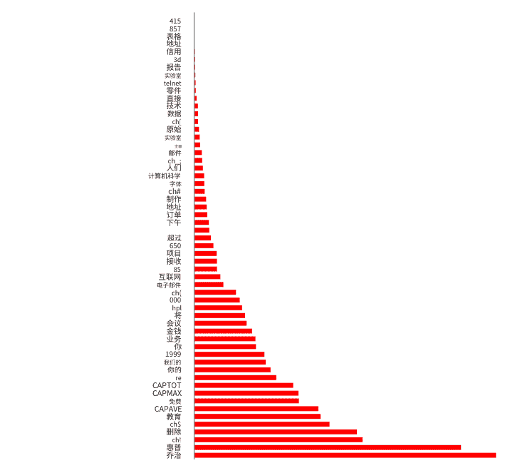

图18.9: 梯度提升分类器训练的特征重要性，用于区分垃圾邮件和非垃圾邮件电子邮件。该数据集有X个训练样本，具有Y个特征，对应于令牌频率。改编自[HTF09]的图10.6。由spam_tree_ensemble_interpret.ipynb生成。

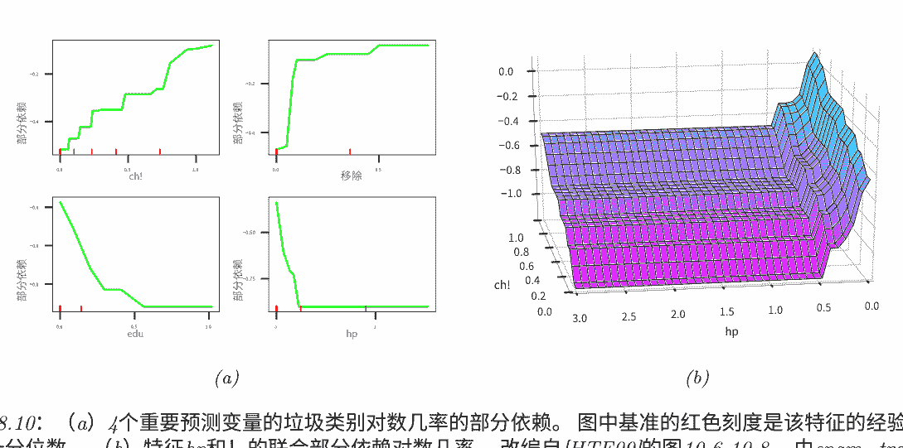

图18.10: (a) 4个重要预测变量的垃圾类别对数几率的部分依赖。图中基准的红色刻度是该特征的经验分布的十分位数。 (b) 特征hp和!的联合部分依赖对数几率。改编自[HTF09]的图10.6-10.8。由spam_tree_ensemble_interpret.ipynb生成。

### 18.6.2 部分依赖图

在确定了最相关的输入特征之后，我们可以尝试评估它们对输出的影响。特征k的部分依赖图是一种绘图方式

$$
\bar{f}_{k}(x_{k}) = \frac{1}{N} \sum_{n=1}^{N} f(\boldsymbol{x}_{n, -k}, x_{k})
$$ (18.59)

vs $x_{k}$。因此，我们将除 k 之外的所有特征边缘化。对于二元分类器，我们可以在绘图之前将其转换为对数几率，$\log p(y=1|x_{k})/p(y=0|x_{k})$。我们在图18.10a中以4个不同的特征为例说明这一点。我们可以看到，随着! 和“remove”的频率增加，垃圾邮件的概率也增加。相反，随着“edu”或“hp”的频率增加，垃圾邮件的概率减少。

我们还可以通过计算特征 j 和 k 之间的交互效应来捕捉

$$
\bar{f}_{j k}(x_{j}, x_{k}) = \frac{1}{N} \sum_{n=1}^{N} f(\boldsymbol{x}_{n, -j k}, x_{j}, x_{k})
$$ (18.60)

我们在图18.10b中以我们的垃圾邮件示例进行了说明，其中包括hp和!。我们可以看到，更高频率的! 使其更有可能是垃圾邮件，但如果单词‘hp’缺失，则更加如此。

## 第五部分
超越监督学习

## 19 使用较少标记的示例进行学习

许多机器学习模型，特别是神经网络，通常具有比我们拥有的标记训练示例更多的参数。例如，具有50层的ResNet CNN（第14.3.4节）有2300万个参数。Transformer模型（第15.5节）可能更大。当然，这些参数是高度相关的，因此它们不是独立的“自由度”。尽管如此，这样的大型模型训练速度较慢，并且更重要的是，它们很容易过拟合。当您没有大型标记训练集时，这尤其成为问题。在本章中，我们讨论了一些解决这个问题的方法，超越了我们在第13.5节中讨论的通用正则化技术，如提前停止、权重衰减和随机失活。

## 19.1 数据增强

假设我们只有一个小的标记数据集。在某些情况下，我们可以创建人工修改过的输入向量的版本，这些版本捕捉到我们在测试时期望看到的变化类型，同时保持原始标签不变。这被称为数据增强。我们下面给出一些例子，然后讨论为什么这种方法有效。

### 19.1.1 例子

对于图像分类任务，标准的数据增强方法包括随机裁剪、缩放和镜像翻转，如图19.1所示。[GVZ16]给出了一个更复杂的例子，他们以逼真的方式将文本字符渲染到图像上，从而创建了一个非常大的“野外”文本数据集。他们用这个来训练一个最先进的视觉文本定位和阅读系统。数据增强的其他例子包括在清洁语音信号中人工添加背景噪声，以及在文本文档中随机替换字符或单词。

如果我们能够使用不同版本的数据多次训练和测试模型，我们可以通过黑盒优化方法（例如，强化学习[参见[Cub+19]]或贝叶斯优化[参见[Lim+19]]）来学习哪些增强方法效果最好；这被称为自动增强。我们还可以学习如何将多个增强方法组合在一起；这被称为自动增强[Cub+19]。

关于自然语言处理中增强方法的一些示例，请参见[Fen+21]。

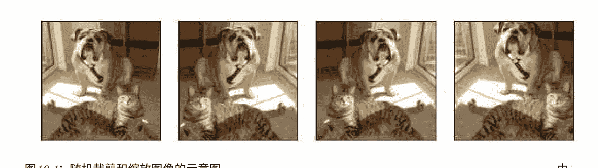

### 19.1.2 理论证明

数据增强通常显著提高性能（预测准确性、鲁棒性等）。起初，这可能看起来像是我们无中生有，因为我们没有提供额外的数据。然而，数据增强机制可以被视为一种算法上注入先验知识的方式。

为了理解这一点，回想一下在标准的ERM训练中，我们最小化经验风险

R(f) = \int \ell(f(\boldsymbol{x}), \boldsymbol{y}) p^*(\boldsymbol{x}, \boldsymbol{y}) d\boldsymbol{x} d\boldsymbol{y} \quad (19.1)

其中我们通过经验分布来近似 p^*(\boldsymbol{x}, \boldsymbol{y})

p_{\mathcal{D}}(\boldsymbol{x}, \boldsymbol{y}) = \frac{1}{N} \sum_{n=1}^N \delta(\boldsymbol{x} - \boldsymbol{x}_n) \delta(\boldsymbol{y} - \boldsymbol{y}_n) \quad (19.2)

我们可以将数据增强视为用以下算法平滑的分布替换经验分布

p_{\mathcal{D}}(\boldsymbol{x}, \boldsymbol{y}|A) = \frac{1}{N} \sum_{n=1}^N p(\boldsymbol{x}|\boldsymbol{x}_n, A) \delta(\boldsymbol{y} - \boldsymbol{y}_n) \quad (19.3)

其中 A是数据增强算法，它从训练点 \boldsymbol{x}_n 生成一个样本 \boldsymbol{x}，使得标签（“语义”）不改变。（一个非常简单的例子是高斯核， p(\boldsymbol{x}|\boldsymbol{x}_n, A) = \mathcal{N}(\boldsymbol{x}|\boldsymbol{x}_n, \sigma^2 \mathbf{I})。）这被称为邻近风险最小化[Cha+01]，因为我们在每个训练点 \boldsymbol{x} 的附近最小化风险。有关此观点的更多详细信息，请参见[Zha+17b; CDL19; Dao+19]。

## 19.2 迁移学习

本节与 Colin Raffel 合著。

### 19.2.1 迁移学习

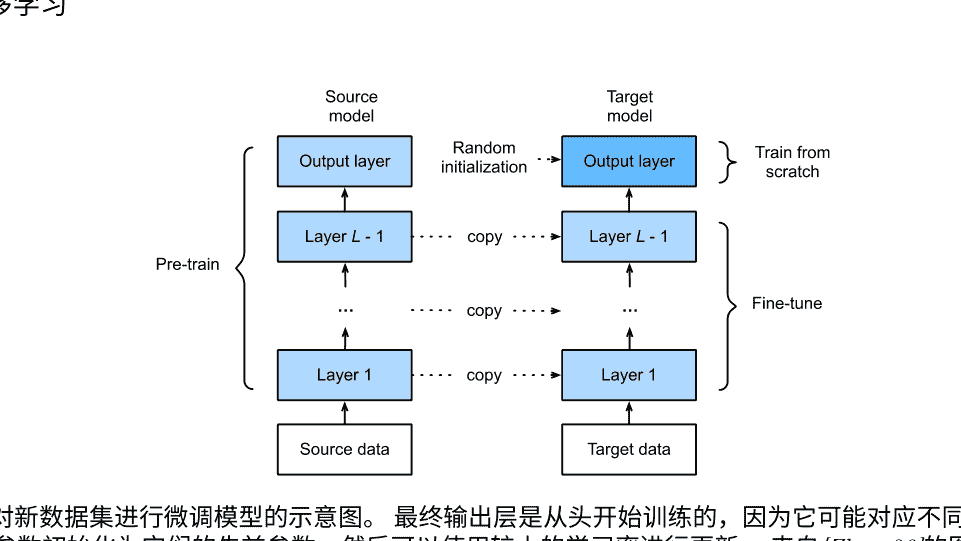

许多数据贫乏的任务与其他数据丰富的任务具有一些高层次的结构相似性。例如，考虑对濒危鸟类的细粒度视觉分类任务。鉴于濒危鸟类在定义上是稀有的，很少有大量多样化的标记图像存在。然而，鸟类在物种间有许多结构上的相似之处 - 例如，大多数鸟类都有翅膀、羽毛、喙、爪等。因此，我们可能期望先在一个大型的非濒危鸟类数据集上训练模型，然后继续在一个小型的濒危物种数据集上训练，这样可以比仅在小型数据集上训练获得更好的性能。

这被称为迁移学习，因为我们通过共享的参数将信息从一个数据集传输到另一个数据集。更准确地说，我们首先进行预训练阶段，在一个大型源数据集$\mathcal{D}$上训练具有参数$\theta$的模型；这可以是有标签的或无标签的。然后我们在感兴趣的小标记目标数据集$\mathcal{D}_q$上进行第二次微调阶段。我们将在下面更详细地讨论这两个阶段，但更多信息请参见最近的调查报告，例如[Tan+18; Zhu+21]。

### 19.2.2 微调

暂时假设我们已经有一个预训练的分类器$p(y|\boldsymbol{x}, \theta_p)$，例如CNN，它对于输入$\boldsymbol{x} \in \mathcal{X}_p$（例如自然图像）和输出$y \in \mathcal{Y}_p$（例如ImageNet标签）效果良好，其中数据来自于与训练中使用的分布$(x, y)$类似的分布。现在我们想要创建一个对于输入$\boldsymbol{x} \in \mathcal{X}_q$（例如鸟类图像）和输出$y \in \mathcal{Y}_q$（例如细粒度鸟类标签）效果良好的新模型$q(y | \boldsymbol{x}, \theta_q)$，其中数据来自于可能与$p$不同的分布$q(x, y)$。

我们将假设可能的输入集是相同的，所以$\mathcal{X}_q \approx \mathcal{X}_p$（例如，两者都是RGB图像），或者我们可以轻松地将输入从域$p$转换到域$q$（例如，我们可以通过丢弃色度通道并保留亮度来将RGB图像转换为灰度图像）。（如果不是这样的话，我们可能需要使用一种称为领域自适应的方法，该方法修改模型以在模态之间进行映射，如第19.2.5节所讨论的。

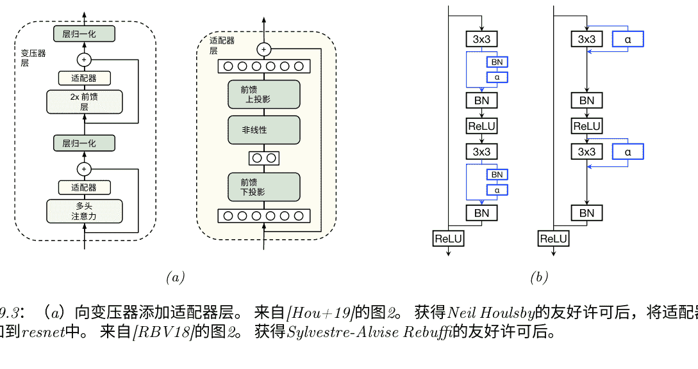

图19.3: (a) 向变压器添加适配器层。来自[Hou+19]的图2。 (b) 获得*Neil Houlsby*的友好许可后，将适配器层添加到resnet中。来自[RBV18]的图2。获得*Sylvestre-Alvise Rebuffi*的友好许可后。

然而，输出域通常是不同的，即 $\mathcal{Y}_q \neq \mathcal{Y}_p$。例如，$\mathcal{Y}_p$可能是Imagenet标签，$\mathcal{Y}_q$可能是医学标签（例如，糖尿病视网膜病变的类型[Arc+19]）。在这种情况下，我们需要将预训练模型的输出“转换”到新的域。对于神经网络来说，这很容易实现：我们只需“剪掉”原始模型的最后一层，并添加一个新的“头”来建模新的类别标签，如图19.2所示。例如，假设 $p(y|\boldsymbol{x}, \boldsymbol{\theta}_p) = \text{softmax}(y|\mathbf{W}_2 \boldsymbol{h}(\boldsymbol{x}; \boldsymbol{\theta}_1) + \boldsymbol{b}_2)$，其中 $\boldsymbol{\theta}_p = (\mathbf{W}_2, \boldsymbol{b}_2, \boldsymbol{\theta}_1)$。然后，我们可以构建$q(y|\boldsymbol{x}, \boldsymbol{\theta}_q) = \text{softmax}(y|\mathbf{W}_3 \boldsymbol{h}(\boldsymbol{x}; \boldsymbol{\theta}_1) + \boldsymbol{b}_3)$，其中 $\boldsymbol{\theta}_q = (\mathbf{W}_3, \boldsymbol{b}_3, \boldsymbol{\theta}_1)$，$\boldsymbol{h}(\boldsymbol{x}; \boldsymbol{\theta}_1)$是共享的非线性特征提取器。

在执行这个“模型手术”之后，我们可以用参数 $\boldsymbol{\theta}_q = (\boldsymbol{\theta}_1, \boldsymbol{\theta}_3)$来微调新模型，其中 $\boldsymbol{\theta}_1$参数化特征提取器，$\boldsymbol{\theta}_3$参数化将特征映射到新标签集的最终线性层。如果我们将 $\boldsymbol{\theta}_1$视为“冻结参数”，那么得到的模型 $q(y|\boldsymbol{x}, \boldsymbol{\theta}_q)$在其参数上是线性的，因此我们有一个凸优化问题，有许多简单且高效的拟合方法可用（参见第二部分）。这在长尾设置中特别有帮助，其中一些类别非常罕见[Kan+20]。然而，线性的“解码器”可能过于限制，所以我们也可以允许 $\boldsymbol{\theta}_1$进行微调，但使用较低的学习率，以防止值与 $\mathcal{D}_p$上估计的值相差太远。

### 19.2.3 适配器

微调预训练模型的所有模型参数的一个缺点是它可能会很慢，因为通常有很多参数，我们可能需要使用较小的学习率来防止低级特征提取器与其先前值相差太远。此外，每个新任务都需要训练一个新模型，这使得任务共享变得困难。另一种方法是保持预训练模型不变，但添加新参数来修改其内部行为以适应新任务。

为每个任务定制特征提取过程。这个想法被称为适配器，并在几篇论文中进行了探索（例如，[RB V17; RBV18; Hou+19]）。图19.3a说明了变换器网络（第15.5节）中的适配器，如[Hou+19]所提出的。基本思想是在每个变换器层内插入两个浅层瓶颈MLP，一个在多头注意力之后，一个在前馈层之后。请注意，这些MLP具有跳跃连接，因此它们可以初始化为实现恒等映射。如果变换器层具有维度为 D 的特征，并且适配器使用大小为 M的瓶颈，这将引入每层O(DM)个新参数。这些适配器MLP以及层归一化参数和最终输出头针对每个新任务进行训练，但所有其他参数都被冻结。

在几个自然语言处理基准测试中，实验证明这比微调性能更好，而且只需要原始参数的1-10%。

图19.3b展示了残差网络（第14.3.4节）的适配器，如[RBV17; RBV18]中所提出的。基本思想是在CNN的内部层中添加一个1x1卷积层 α，类似于变换器情况下的MLP适配器。这可以串行或并行添加，如图所示。如果我们用 ρ(x)表示适配器层，我们可以定义串行适配器为

```
ρ(x) = x + diag1(α) ⊗ x = diag1(I + α) ⊗ x
(19.4)
```

其中 diag1(α) ∈ R^{1×1×C×D}将矩阵 α ∈ R^{C×D}重新调整为可以并行应用于每个空间位置的矩阵。（为简单起见，我们省略了批量归一化。）如果我们在常规卷积层 f ⊗ x之后插入这个适配器，我们得到

```
y = ρ(f ⊗ x) = (diag1(I + α) ⊗ f) ⊗ x
(19.5)
```

这可以解释为对原始滤波器 f的低秩乘性扰动。并行适配器可以通过以下方式定义

```
y = f ⊗ x + diag1(α) ⊗ x = (f + diagL(α)) ⊗ x
(19.6)
```

这可以解释为对原始滤波器 f的低秩加性扰动。在这两种情况下，设置 α = 0可以确保适配器层可以初始化为恒等变换。此外，这两种方法每层需要 O(C^2)个参数。

### 19.2.3 监督预训练

预训练任务可以是有监督的或无监督的；主要要求是它能够教给模型关于问题领域的基本结构，并且它与下游微调任务足够相似。任务相似性的概念没有严格定义，但在实践中，预训练任务的领域通常比微调任务的领域更广泛（例如，在所有鸟类物种上进行预训练，然后在濒危物种上进行微调）。

迁移学习最直接的形式是在一个大型标记数据集适用于预训练的情况下。例如，使用ImageNet数据集（第1.5.1.2节）进行CNN的预训练非常常见，然后可以用于各种下游任务和数据集（参见，例如，[Kol+19]）。ImageNet有128万个自然图像，每个图像都与1000个类别之一的标签相关联。这些类别涵盖了各种不同的概念，包括动物、食物、建筑、乐器、服装等等。图像本身在某种意义上是多样的。这些对象从许多角度和各种大小以及各种背景中组成，这可能部分解释了为什么它已成为计算机视觉中的一项事实上的预训练任务。这种多样性和规模可能部分解释了为什么它已成为计算机视觉中的一项事实上的预训练任务，用于迁移学习。（有关一些示例代码，请参见finetune_cnn_jax.ipynb。）然而，已经证明ImageNet预训练在微调任务的领域与自然图像（例如医学图像[Rag+19]）相差很大时，帮助较少。在某些情况下，它是有帮助的（例如，训练目标检测系统），它似乎更像是一个加速技巧（通过在良好点上进行热启动优化），而不是一项必不可少的东西，意味着如果从头开始训练足够长的时间，可以在下游任务上实现可比较的性能[HGD19]。

在非视觉应用中，监督式预训练相对较少见。一个值得注意的例外是在自然语言推理数据上进行预训练（即判断一个句子是否暗示或与另一个句子相矛盾），以学习句子的向量表示[Con+17]，尽管这种方法在很大程度上已被无监督方法所取代（第19.2.4节）。在迁移学习中，另一个非视觉应用是在大规模英文标记语料库上预先训练语音识别，然后在低资源语言上进行微调[Ard+20]。

### 19.2.4 无监督预训练（自监督学习）

越来越常见的是使用无监督预训练，因为往往很容易获取无标签的数据，例如来自网络的无标签图像或文本文档。在短时间内，使用无监督目标（例如重构误差，如第20.3节所讨论的）在标记数据集上进行深度神经网络的预训练（即忽略标签），然后进行标准的监督式训练[HOT06; Vin+10b; Erh+10]是常见的。虽然这种技术也被称为无监督预训练，但它与我们在本节讨论的迁移学习的预训练形式有所不同，后者使用（大规模的）无标签数据集进行预训练，然后在不同（较小的）标记数据集上进行微调。

使用未标记数据的预训练任务通常被称为自监督学习，而不是无监督学习。之所以使用这个术语，是因为标签是由算法创建的，而不是像标准监督学习中那样由人提供的。监督学习和自监督学习都是判别任务，因为它们需要根据输入预测输出。相比之下，其他无监督方法（如第20章中讨论的一些方法）是生成任务，因为它们无条件地预测输出。

已经尝试过许多不同的自监督学习启发式方法（参见例如[GR18; JT19; Ren19]进行综述，以及https://github.com/jason718/awesome-self-supervised-learning提供的大量论文列表）。我们可以将其分为至少三个主要的广泛类别，我们将在下面讨论。

### 19.2.4.1 填补任务

自监督学习的一种方法是解决填补任务。在这种方法中，我们将输入向量 $x$ 分成两部分，$x = (x_h, x_v)$，然后尝试预测隐藏部分 $x_h$，给定剩余的可见部分 $x_v$，使用形式为 $\hat{x}_h = f(x_v, x_h = 0)$ 的模型。我们可以将其视为“填空题”任务；在自然语言处理社区中，这被称为闭合任务。请参见图19.4中的一些视觉示例，以及第15.7.2节中的一些自然语言处理示例。

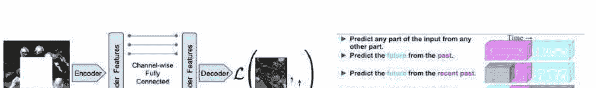

图19.4: (a) 自监督学习的上下文编码器。来自[Pat+16]。在Deepak Pathak的友好许可下使用。(b) 自监督学习的其他一些代理任务。来自[LeC18]。在Yann LeCun的友好许可下使用。

### 19.2.4.2 代理任务

SSL的另一种方法是解决代理任务，也称为前置任务。在这个设置中，我们创建输入对 (x1, x2)，并训练一个Siamese网络分类器 (图16.5a)，形式为 p(y|x1, x2) = p(y|r[f(x1), f(x2)])，其中 f(x)是执行“表示学习”的某个函数 [BCV13]，y是捕捉 x1 和 x2 之间关系的标签，由 r(f1, f2)预测。例如，假设 x1 是一个图像块，x2 = t(x1)是我们控制的 x1 的某种变换，比如随机旋转；然后我们定义 y为我们使用的旋转角度 [GSK18]。

### 19.2.4.3 对比任务

目前最流行的自监督学习方法是使用各种对比任务。基本思想是使用数据增强方法（第19.1节）创建语义上相似的示例对，然后确保它们的表示之间的距离（在嵌入空间中）比两个不相关示例之间的距离更近。

这正是深度度量学习（第16.2.2节）中使用的思想——唯一的区别是算法创建自己的相似对，而不是依赖外部提供的相似度度量，如标签。我们在第19.2.4.4节和第19.2.4.5节中给出了一些示例。

### 19.2.4.4 SimCLR

在本节中，我们讨论了 SimCLR，它代表“简单的对比学习视觉表示”[Che+20b; Che+20c]。它在迁移学习和半监督学习方面表现出了最先进的性能。基本思想如下。每个输入 x ∈ ℝ^D 被转换为两个增强的“视图” x1 = t1(x), x2 = t2(x)，它们是通过一些变换 t1, t2生成的“语义等价”版本。例如，如果 x 是一张图片，这些变换可以是对图片的小扰动，如第19.1节中讨论的随机裁剪。此外，我们从数据集中采样“负例” x1^-, ..., x_n^- ∈ N(x)，它们代表“语义上不同”的图像（实际上，它们是小批量中的其他示例）。接下来，我们定义一些特征映射 F: ℝ^D → ℝ^E，其中 D 是输入的大小，E 是嵌入的大小。

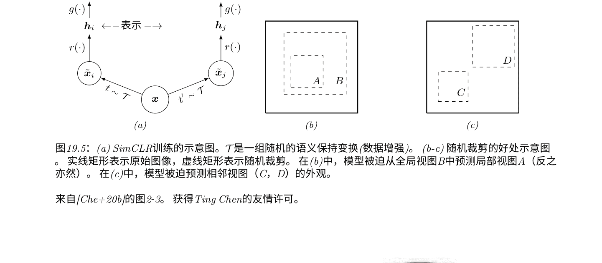

图19.5: (a) SimCLR训练的示意图。$\mathcal{T}$是一组随机的语义保持变换(数据增强)。(b-c)随机裁剪的好处示意图。实线矩形表示原始图像，虚线矩形表示随机裁剪。在(b)中，模型被迫从全局视图$B$中预测局部视图$A$（反之亦然）。在(c)中，模型被迫预测相邻视图（$C$，$D$）的外观。

> 来自[Che+20b]的图2-3。获得Ting Chen的友情许可。


图19.6: SimCLR训练的可视化。每个小批量输入图像都以两种不同的方式随机修改（使用裁剪（后跟调整大小），翻转和颜色失真），然后输入到一个Siamese网络中。来自同一图像派生的每对嵌入（最终层）被强制接近，而所有其他对的嵌入被强制远离。来自https://ai.googleblog.com/2020/04/advancing-self-supervised-and-semi.html。获得Ting Chen的友情许可。

然后我们尝试最大化相似视图的相似性，同时最小化不同视图的相似性，对于每个输入 $x$：

```
$$ J = F(t_1(x))^\top F(t_2(x)) - \log \sum_{x_i^- \in N(x)} \exp\left[ F(x_i^-)^\top F(t_1(x)) \right] \quad \text{(19.7)} $$
```

在实践中，我们使用余弦相似度，因此我们在计算内积之前对 $F$ 产生的表示进行 $2$-归一化，但在上述方程中省略了这一步。请参见图19.5a进行说明。（在这个图中，我们假设 $F(x) = g(r(x))$，其中中间表示 $= r(x)$ 将在后续的微调中使用，并且 $g$ 是在训练过程中应用的额外转换。）有趣的是，我们可以将其解释为一种条件能量模型的形式。

```
$$ p(x_2|x_1) = \frac{\exp[-\mathcal{E}(x_2|x_1)]}{Z(x_1)} \quad \text{(19.8)} $$
```

其中 $\quad \mathcal{E}(x_2|x_1) = -F(x_2)^\top F(x_1)$ 是能量，而

```
$$ Z(x) = \int \exp[-\mathcal{E}(x^-|x)]dx^- = \int \exp[F(x^-)^\top F(x)]dx^- \quad \text{(19.9)} $$
```

是归一化常数，被称为 **partition function**。在这个模型下的条件对数似然函数的形式为

```
$$ \log p(x_2|x_1) = F(x_2)^\top F(x_1) - \log \int \exp[F(x^-)^\top F(x_1)]dx^- \quad \text{(19.10)} $$
```

与方程 (19.7) 的唯一区别是，我们用从负样本中得出的蒙特卡罗上界替换了积分。因此，我们可以将对比学习视为条件能量基生成模型的近似最大似然估计[Gra+20]。关于这类模型的更多细节可以在本书的续集[Mur23]中找到。

SimCLR成功的关键因素是选择数据增强方法。通过随机裁剪，他们可以迫使模型从全局视图中预测局部视图，并预测同一图像的相邻视图（参见图19.5）。裁剪后，所有图像都被调整为相同的大小。此外，他们随机翻转图像的一部分时间。$^{2}$ 为了确保足够多样化的负样本集，SimCLR依赖于大批量训练。

当这不可能时，我们可以使用过去（负）嵌入的内存库，可以使用指数移动平均法进行更新（第4.4.2节）。这被称为动量对比学习或MoCo[He+20]。

### 19.2.4.5 CLIP

在本节中，我们描述了 **CLIP**，它代表“对比性语言-图像预训练”[Rad+]。这是一种对表示学习的对比方法，它使用了大规模的语料库

$^{2}$ 事实证明，仅基于颜色直方图就可以很容易地区分正样本（来自同一图像）和负样本（来自不同图像）。为了防止这种“作弊”，他们还应用了随机颜色扭曲，从而切断了这种“短路”。随机裁剪和颜色扭曲的组合比单独使用任一方法效果更好。

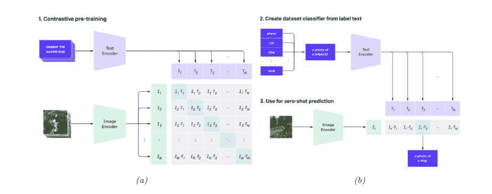

> 图19.7: CLIP模型的示意图。来自[Rad+]的图1。获得Alec Radford的友好许可。

从网络中提取的400M（图像，文本）对。让 $x_i$ 为第 $i$ 个图像， $y_i$ 为其匹配的文本。与其试图预测与图像相关的确切单词，不如只需确定 $y_i$ 与其他文本字符串$y_j$相比，是否更有可能是正确的文本。同样，模型可以尝试确定图像 $x_i$ 与给定文本 $y_i$ 相比，是否更有可能匹配而不是与图像 $x_j$ 匹配。

更准确地说，让 $f_I(x_i)$ 是图像的嵌入， $f_T(y_j)$ 是文本的嵌入， $\mathbf{I}_i = f_I(x_i)/\|f_I(x_i)\|_2$ 是图像嵌入的单位范数版本，而 $\mathbf{T}_j = f_T(y_j)/\|f_T(y_j)\|_2$ 是文本嵌入的单位范数版本。定义成对逻辑回归（相似度分数）的向量为

```
$L_{ij} = \mathbf{I}_i^T \mathbf{T}_j$
```

现在我们训练这两个嵌入函数 $f_I$ 和 $f_T$ 的参数，以最小化以下损失函数，对大小为 $N$ 的小批量数据进行平均:

```
$J = \frac{1}{2} \left[ \sum_{i=1}^{N} \text{CE}(\mathbf{L}_{i,:}, \mathbf{1}_i) + \sum_{j=1}^{N} \text{CE}(\mathbf{L}_{:,j}, \mathbf{1}_j) \right]$
```

其中CE是交叉熵损失

```
$\text{CE}(\mathbf{p}, \mathbf{q}) = -\sum_{k=1}^{K} p_k \log q_k$
```

而 $\mathbf{1}_i$ 是标签 $i$ 的独热编码。请参见图19.7a以进行说明。（在实践中，归一化嵌入还会通过一个温度参数进行缩放，该参数也是可学习的；这控制了softmax的锐度。）

在他们的论文中，他们考虑使用ResNet（第14.3.4节）和视觉变换器（第15.5.6节）作为函数 \( f_I \) 的输入，以及文本变换器（第15.5节）作为 \( f_T \) 的输入。他们使用了一个非常大的 \( N \sim 32k \) 的小批量数据，并在数百个GPU上进行了多天的训练。

模型训练完成后，可以按照以下方式对图像 \( x \) 进行零样本分类。首先，将给定数据集的 \( K \) 个可能的类标签转换为可能出现在网络上的文本字符串 \( y_k \)。 例如，“狗”变成了一张狗的照片”。 第二，我们计算归一化嵌入 \( I \propto f_I(x) \) 和 \( T_k \propto f_T(y_k) \)。 第三，我们计算softmax概率

```
$p(y = k | x) = \text{softmax}([I^T T_1, \dots, I^T T_k])_k$ (19.14)
```

请参见图19.7b以进行说明。（类似的方法也在视觉n-grams论文中采用 [Li+17]。）

令人惊讶的是，这种方法在诸如ImageNet分类等任务上可以表现得和标准监督学习一样好，而无需明确地在特定标记的数据集上进行训练。当然，ImageNet中的图像来自于网络，并且是通过基于文本的网络搜索找到的，因此模型之前已经见过类似的数据。然而，它对于新任务的泛化能力和对分布转移的鲁棒性非常令人印象深刻（请参阅论文中的示例）。

然而，该方法的一个缺点是它对于类别标签如何转换为文本形式非常敏感。例如，为了使模型在食物分类上工作，需要使用形如“一张照片中的鳄梨酱，一种食物”的文本字符串，等等。目前，这种消除歧义的短语如“一种食物”是手动添加的，基于每个数据集的情况。

这被称为提示工程，因为原始类名可能在数据集中（有时甚至在数据集内部）存在歧义。

## 19.2.5 领域适应

考虑一个问题，我们从不同的领域中获得输入，例如一个源领域 \( \mathcal{X}_s \) 和一个目标领域 \( \mathcal{X}_t \)，但有一个共同的输出标签集合 \( \mathcal{Y} \)。（这是“迁移学习”的“对偶”，因为输入领域不同，但输出领域相同。）例如，领域可能是计算机图形系统中的图像和真实图像，或者产品评论和电影评论。我们假设我们没有来自目标领域的标记示例。我们的目标是在源领域上拟合模型，然后修改其参数，使其适用于目标领域。

这被称为（无监督的）领域适应（参见例如，[KL21]进行综述）。

解决这个问题的一种常见方法是以这样的方式训练源分类器，使其无法区分输入是来自源分布还是目标分布；在这种情况下，它只能使用两个域中共同的特征。这被称为域对抗学习[Gan+16]。更正式地说，设 \( d_n \in \{s, t\} \) 是一个标签，指定数据示例 \( n \) 是来自域 \( s \) 还是 \( t \)。 我们希望优化

```
$\min_{\phi} \max_{\theta} \frac{1}{N_s + N_t} \sum_{n \in \mathcal{D}_s, \mathcal{D}_t} \ell(d_n, f_\theta(x_n)) + \frac{1}{N_s} \sum_{m \in \mathcal{D}_s} \ell(y_m, g_\phi(f_\theta(x_m)))$ (19.15)
```

其中 \( N_s = |\mathcal{D}_s|, N_t = |\mathcal{D}_t|, f \) maps \( \mathcal{X}_s \cup \mathcal{X}_t 	o \mathcal{H} \), and \( g \) maps \( \mathcal{H} 	o \mathcal{Y}_t \)。方程式（19.15）中的目标是最小化在分类 \( y \) 的期望任务上的损失，但是最大化在分类源域 \( d \) 的辅助任务上的损失。这可以通过梯度符号反转技巧来实现，并且与GAN（生成对抗网络）相关。参见例如，[Cu17; Wu+19]中的其他域自适应方法。

## 19.3 半监督学习

本节与 *Colin Raffel* 合著。

最近许多成功的机器学习应用都是在有监督学习的环境下进行的，即有大量标记样本可用于训练模型。然而，在许多实际应用中，获取这些标记数据是昂贵的。以自动语音识别为例：现代数据集包含数千小时的音频录音\[PAN+15; ARD+20]。在录音中注释所说的单词的过程比实时慢得多，可能导致长时间（和昂贵的）的注释过程。更糟糕的是，在某些应用中，数据必须由专家（如医学应用中的医生）进行标记，这可能进一步增加成本。

半监督学习可以通过利用未标记的数据来减轻对标记数据的需求。半监督学习的一般目标是允许模型从未标记的数据中学习数据分布的高层结构，并且仅依赖于标记数据来学习给定任务的细粒度细节。与标准监督学习不同，我们假设我们可以访问数据和标签的联合分布的样本 \(x, y \sim p(x, y)\)，半监督学习假设我们还可以访问数据的边缘分布的样本 \(x\)，即 \(x \sim p(x)\)，如图19.8所示。此外，通常假设我们有更多这些未标记样本，因为它们通常更容易获取。继续以自动语音识别为例，仅仅录制人们说话（这将产生未标记的数据）通常比转录录音更便宜。半监督学习非常适合已收集大量未标记数据的情况，并且从中学习而无需对所有数据进行标记。

### 19.3.1 自训练和伪标签

半监督学习的一种早期和直接的方法是自训练\[Scu65; Agr70; McL75]。自训练的基本思想是使用模型本身对未标记的数据进行预测，并将这些预测视为后续训练的标签。

数据，然后将这些预测视为后续训练的标签。自训练作为一种半监督学习方法一直存在，因为它简单且适用广泛；即适用于任何能够为未标记数据生成预测的模型。最近，人们通常将这种方法称为“伪标签”[Lee13]，因为对于未标记数据的推断标签与监督学习中使用的真实的、地面真值目标相比只是“伪正确”的。

从算法上讲，自训练通常遵循以下两种程序之一。在第一种方法中，首先对整个未标记数据集预测伪标签，然后使用标记数据和（伪标签的）未标记数据的组合重新训练模型（可能从头开始），直到收敛。然后，模型重新标记未标记数据，并重复这个过程，直到找到合适的解决方案。第二种方法是在随机选择的未标记数据批次上不断生成预测，并立即根据这些伪标签对模型进行训练。这两种方法目前在实践中很常见；第一种“离线”变体在利用大规模未标记数据集时被证明特别成功[Yal+19;Xie+20]，而“在线”方法通常作为更复杂的半监督学习方法的一部分[Soh+20]。没有一种变体比另一种更好。离线自训练可能导致模型在“陈旧”的伪标签上进行训练，因为它们只在模型收敛时更新。然而，在线伪标签化可能会导致更大的计算成本，因为它涉及不断地对未标记数据进行“重新标记”。

自训练可能会遇到一个明显的问题：如果模型对未标记的数据生成错误的预测，然后在这些错误的预测上重新训练，它可能会越来越糟糕，直到最终学习到一个完全无效的解决方案。
这个问题被称为确认偏差[TV17]，因为模型不断地确认自己（错误的）关于决策规则的偏见。

缓解确认偏差的常见方法是使用“选择度量”[RHS05]，这种方法试图启发式地只保留正确的伪标签。例如，假设模型对每个可能的类别输出概率，一个经常使用的选择度量是只保留最大类别概率超过阈值的伪标签[Yar95; RHS05]。如果模型的类别概率估计是良好校准的，那么这个选择度量将只保留高度可能正确的标签（至少根据模型来说）。根据问题领域可以设计更复杂的选择度量。

### 19.3.2 熵最小化

自训练隐含地鼓励模型输出低熵（即高置信度）的预测。这种效应在在线设置中最为明显，使用交叉熵损失函数，在无标签数据上模型最小化以下损失函数 $\mathcal{L}$：

$$\mathcal{L} = -\max_{c} \log p_{\theta}(y = c|x) \tag{19.16}$$

其中 $p_{\theta}(y|x)$是模型在给定输入 $x$的情况下的类别概率分布。当模型将其所有类别概率分配给单个类别 $c^*$时，即 $p(y = c^*|x) = 1$且$p(y = c|x) = 0$（对于$c \ne c^*$）时，该函数被最小化。

与之密切相关的半监督学习方法是熵最小化[GB05]，它最小化以下损失函数：

$$\mathcal{L} = -\sum_{c=1}^{C} p_{\theta}(y = c | \boldsymbol{x}) \log p_{\theta}(y = c | \boldsymbol{x}) \tag{19.17}$$

请注意，当模型将其所有类别概率分配给一个单一类别时，该函数也会被最小化。通过用一个“one-hot”向量替换方程 (19.17) 中的第一个 $p_{\theta}(y = c | \boldsymbol{x})$项，我们可以使熵最小化损失等价于方程 (19.16) 中的在线自训练损失，该向量为被分配最高概率的类别分配概率 1。换句话说，在线自训练最小化模型输出和“硬”目标$\arg \max p_{\theta}(y|\boldsymbol{x})$之间的交叉熵，而熵最小化使用“软”目标 $p_{\theta}(y|\boldsymbol{x})$。在这两个极端之间权衡的一种方法是通过将目标分布的每个概率提高到 $1/T$的幂并重新归一化来调整目标分布的“温度”；这是[Ber+19b; Ber+19a; Xie+19]的 **MixMatch**方法的基础。在 $T=1$时，这等价于熵最小化；当 $T \to 0$时，它变成了困难的在线自训练。图19.9显示了这些损失函数的比较。

#### 19.3.2.1 群集假设

为什么熵最小化是一个好主意？许多半监督学习方法的基本假设是类别之间的决策边界应该位于数据流形的低密度区域。这实际上假设不同类别的数据被聚集在一起。因此，一个好的决策边界不应该穿过聚类，而应该简单地将它们分开。使用未标记的数据来估计数据流形的形状，并将决策边界移离它的半监督学习方法可以被认为是使用“群集假设”。

熵最小化就是其中一种方法。为了理解为什么，首先假设两个类别之间的决策边界是“平滑”的，即模型在其定义域的任何地方都不会突然改变其类别预测。对于简单和/或正则化的模型来说，这在实践中是正确的。在这种情况下，如果决策边界穿过数据的高密度区域，它将必然为一些来自数据分布的样本产生高熵预测。因此，熵最小化将鼓励模型将其决策边界放置在输入空间的低密度区域中，以避免在可能存在数据采样的空间区域中从一个类别过渡到另一个类别。图19.10展示了这种行为的可视化。

#### 19.3.2.2 输入-输出互信息

Bridle、Heading和MacKay [BHM92]提出了熵最小化目标的另一种证明方法，其中显示它自然地从最大化数据和标签（即模型的输入和输出）之间的互信息（第6.3节）中产生。

将输入表示为$x$，目标表示为$y$，输入输出的互信息可以写为

$$
\begin{aligned}
\mathcal{I}(y; x) &= \iint p(y, x) \log \frac{p(y, x)}{p(y)p(x)} dy dx \quad (19.18) \\
&= \iint p(y|x) p(x) \log \frac{p(y, x)}{p(y)p(x)} dy dx \quad (19.19) \\
&= \int p(x) dx \int p(y|x) \log \frac{p(y|x)}{p(y)} dy \quad (19.20) \\
&= \int p(x) dx \int p(y|x) \log \frac{p(y|x)}{\int p(x) p(y|x) dx} dy \quad (19.21)
\end{aligned}
$$

注意，第一个积分等价于对$x$取期望，第二个积分等价于对类别$y$的所有可能值求和。利用这些关系，我们得到

$$\mathcal{I}(y; \boldsymbol{x}) = \mathbb{E}_{\boldsymbol{x}} \left[ \sum_{i=1}^{L} p(y_i|\boldsymbol{x}) \log \frac{p(y_i|\boldsymbol{x})}{\mathbb{E}_{\boldsymbol{x}}[p(y_i|\boldsymbol{x})]} \right] \tag{19.22}$$

$$= \mathbb{E}_{\boldsymbol{x}} \left[ \sum_{i=1}^{L} p(y_i|\boldsymbol{x}) \log p(y_i|\boldsymbol{x}) \right] - \mathbb{E}_{\boldsymbol{x}} \left[ \sum_{i=1}^{L} p(y_i|\boldsymbol{x}) \log \mathbb{E}_{\boldsymbol{x}}[p(y_i|\boldsymbol{x})] \right] \tag{19.23}$$

$$= \mathbb{E}_{\boldsymbol{x}} \left[ \sum_{i=1}^{L} p(y_i|\boldsymbol{x}) \log p(y_i|\boldsymbol{x}) \right] - \sum_{i=1}^{L} \mathbb{E}_{\boldsymbol{x}}[p(y_i|\boldsymbol{x})] \log \mathbb{E}_{\boldsymbol{x}}[p(y_i|\boldsymbol{x})] \tag{19.24}$$

由于我们最初寻求最大化互信息，并且通常最小化损失函数，我们可以通过取反来将其转换为适当的损失函数：

$$\mathcal{L} = -\mathbb{E}_{\boldsymbol{x}} \left[ \sum_{i=1}^{L} p(y_i|\boldsymbol{x}) \log p(y_i|\boldsymbol{x}) \right] + \sum_{i=1}^{L} \mathbb{E}_{\boldsymbol{x}}[p(y_i|\boldsymbol{x})] \log \mathbb{E}_{\boldsymbol{x}}[p(y_i|\boldsymbol{x})] \tag{19.25}$$

第一项恰好是期望中的熵最小化目标。第二项指定我们应该最大化期望类别预测的熵，即在训练集上的平均类别预测。这鼓励模型以相等的概率预测每个可能的类别，这仅在我们事先知道所有类别等可能时才合适。

### 19.3.3 协同训练

协同训练[BM98]也类似于自训练，但是额外假设存在两个互补的“视图”（即独立的特征集）来表示数据，这两个视图都可以单独用来训练一个合理的模型。在每个视图上分别训练两个模型后，使用每个模型对无标签数据进行分类，以获得候选伪标签。如果一个特定的伪标签从一个模型得到低熵预测（表示高置信度），而从另一个模型得到高熵预测（表示低置信度），那么该伪标记的数据点将被添加到低置信度模型的训练集中。然后，使用新的更大的训练数据集重复该过程。只有在其中一个模型有信心的情况下保留伪标签的过程理想地构建了带有正确标记数据的训练集。

协同训练做出了一个强烈的假设，即数据有两个信息丰富但相互独立的视角，这在许多问题中可能并不成立。Tri-Training算法[ZL05]通过使用三个模型来解决这个问题，这三个模型首先在独立采样的（有放回地）标记数据子集上进行训练。理想情况下，最初在不同的标记数据集上进行训练会得到不总是在预测上达成一致的模型。然后，每个模型独立地为未标记的数据生成伪标签。对于给定的未标记数据点，如果两个模型在伪标签上达成一致，它就会被添加到第三个模型的训练集中。这可以看作是一种选择度量，因为它只保留了两个（初始化不同的）模型在正确标签上达成一致的伪标签。然后，模型会在标记数据和新的伪标签的组合上进行重新训练，并且整个过程会迭代地重复。

### 19.3.4 图上的标签传播

如果两个数据点在某种有意义的方式上“相似”，我们可能期望它们共享一个标签。这个想法被称为流形假设。标签传播是一种半监督学习技术，利用流形假设为未标记的数据分配标签。标签传播首先构建一个图，其中节点是数据示例，边的权重表示相似度的程度。节点标签对应于标记数据的节点是已知的但对于未标记的数据是未知的。然后，标签传播通过图的边在节点的标签中传播已知的标签，以使给定节点的标签邻居之间的标签最小不一致。这为未标记的数据提供了标签猜测，然后可以像通常那样用于模型的监督训练。

更具体地说，基本的标签传播算法[ZG02]的步骤如下：首先，让 $w_{i,j}$ 表示两个（标记或未标记）数据点之间的非负边权重，提供了它们之间的相似度的度量。假设我们有 M 个标记的数据点和 N 个未标记的数据点，定义 (M + N) × (M + N) 转移矩阵 T 的条目为

$$ T_{i,j} = \frac{w_{i,j}}{\sum_k w_{k,j}} \quad (19.26) $$

$T_{i,j}$ 表示将标签从节点 j 传播到节点 i 的概率。此外，定义 (M + N) × C 标签矩阵 Y，其中 C 是可能的类别数。矩阵 Y 的第 i 行表示数据点 i 的类别概率分布。然后，重复以下步骤，直到 Y 中的值不再显著变化：首先，使用转移矩阵 T 通过设置 Y ← TY 来传播标签。然后，通过设置 $Y_{i,c} \leftarrow Y_{i,c} / \sum_k Y_{i,k}$ 来对 Y 的行进行重新归一化。最后，用标记数据点的独热表示替换 Y 对应的行（即，如果数据点 i 具有真实标签 c，则 $Y_{i,c}=1$，否则为 0）。收敛后，根据 Y 中每个数据点的最高类别概率选择猜测的标签。

该算法迭代地使用数据点的相似性（编码在用于构建转换矩阵的权重中）来将信息从（固定的）标签传播到未标记的数据。在每次迭代中，给定数据点的标签分布被计算为其连接数据点的所有标签分布的加权平均值，其中加权对应于 T 中的边权重。可以证明，该过程收敛到一个唯一的固定点，其计算成本主要涉及未标记到未标记转换概率矩阵的求逆。

整体方法可以看作是一种转导学习，因为它学习预测固定未标记数据集的标签，而不是学习泛化的模型。然而，鉴于其诱导的归纳性质，我们可以以通常的方式进行归纳学习。标签传播的成功在很大程度上取决于用于构建不同节点（数据点）之间权重的相似性概念。对于简单的数据，测量数据点之间的欧氏距离可能足够。然而，对于复杂和高维数据，欧氏距离可能无法有意义地反映两个数据点共享相同类别的可能性。相似性权重也可以根据问题特定的知识任意设置。有关构建相似性图的不同方法的一些示例，请参见Zhu [Zhu05，第3章]。有关将此方法与深度学习结合使用的一些最新论文，请参见[BRR18; Isc+19]。

### 19.3.5 一致性正则化

一致性正则化利用了这样一个简单的想法：扰动给定的数据点（或模型本身）不应该导致模型的输出发生剧烈变化。由于以这种方式测量一致性仅使用模型的输出（而不是地面真实标签），因此它可以轻松应用于无标签数据，从而可以用于创建半监督学习的适当损失函数。这个想法最初是在“伪集成学习”框架下提出的[BAP14]，随后出现了类似的变体[LA16; SJT16]。

在其最一般的形式中，模型 $p_{\theta}(y|x)$ 和应用于输入的变换都可以是随机的。例如，在计算机视觉问题中，我们可以通过使用数据增强技术，如随机旋转或给输入图像添加噪声来对输入进行变换，而网络可能包含像 dropout（第13.5.4节）或权重噪声[Gra11]这样的随机组件。一种常见且简单的一致性正则化形式首先对 $x^{\prime} \sim q(x^{\prime}|x)$（其中 $q(x^{\prime}|x)$ 是由随机输入变换引起的分布）进行采样，然后最小化损失 $\| p_{\theta}(y|x) - p_{\theta}(y|x^{\prime}) \|^{2}$。在实践中，第一项 $p_{\theta}(y|x)$ 通常被视为固定的（即不通过梯度传播）。在半监督设置中，对于一批标记数据 $(x_{1}, y_{1}), (x_{2}, y_{2}), \ldots, (x_{M}, y_{M})$ 和无标签数据 $x_{1}, x_{2}, \ldots, x_{N}$ 的组合损失函数是

$$\mathcal{L}(\theta) = -\sum_{i=1}^{M} \log p_{\theta}(y=y_{i}|x_{i}) + \lambda \sum_{j=1}^{N} \| p_{\theta}(y|x_{j}) - p_{\theta}(y|x_{j}^{\prime}) \|^{2} \tag{19.27}$$

其中 $\lambda$ 是一个标量超参数，用于平衡无标签数据上的损失的重要性，为了简单起见，我们用 $x_{j}^{\prime}$ 表示从 $q(x^{\prime}|x_{j})$ 中抽取的样本。

方程（19.27）中一致性正则化的基本形式揭示了许多设计选择，这些选择影响了半监督学习方法的成功。首先，选择的 $\lambda$ 超参数的值很重要。如果它太大，那么模型可能不会给予足够的权重来学习有监督的任务，而是开始加强自己的错误预测（就像自我训练中的确认偏差一样）。由于模型在训练开始时通常表现不佳，因为它还没有在大量标记数据上进行训练，所以在实践中常见的做法是将 $\lambda$ 设置为零，并在训练过程中逐渐增加其值。

第二个重要考虑因素是应用于输入的随机变换，即 $q(x^{\prime}|x)$。一般来说，这些变换应该设计成不改变 $x$ 的标签。如上所述，常见的选择是使用领域特定的数据增强。最近的研究表明，使用强大的数据增强可以产生特别强大的结果，这些增强会严重破坏输入（但是，可以说并不改变标签）[Xie+19; Ber+19a; Soh+20]。

使用数据增强需要专业知识来确定哪些变换是保留标签并适用于特定问题的。另一种技术称为虚拟对抗训练(VAT)，它使用解析找到的扰动来转换输入，以最大程度地改变模型的输出。具体而言，VAT计算一个扰动 $\delta$，近似于 $\delta = \text{argmax}_{\delta} D_{\text{KL}} \left( p_{\theta}(y|x) \parallel p_{\theta}(y|x+\delta) \right)$。这个近似是通过从多元高斯分布中采样 $d$，初始化 $\delta = d$，然后设置

$$\delta \leftarrow \nabla_{\delta} D_{\text{KL}} \left( p_{\theta}(y|x) \parallel p_{\theta}(y|x+\delta) \right)|_{\delta=\epsilon d} \tag{19.28}$$

这个可视化是针对一个二分类问题，假设模型对于未扰动的输入的输出为1。该图绘制了对于扰动输入的特定逻辑回归值（即输入到输出Sigmoid非线性函数之前的预激活值）所产生的损失。随着逻辑回归值趋向于正无穷，模型预测类别标签为1（与未扰动输入的预测一致）；随着逻辑回归值趋向于负无穷，模型预测类别为0。当模型以高概率预测某个类别时，平方误差损失会饱和（梯度为零），但KL散度会随着模型对类别0的预测置信度越来越高而无限增长。

其中，ξ是一个小常数，通常为10的负6次方。然后，VAT设置

$$x' = x + \eta \frac{\delta}{\|\delta\|_2}$$ (19.29)

然后按照通常的一致性正则化方法进行（如方程（19.27）中所示），其中γ是一个标量超参数，用于设置应用于x的扰动的L2范数。

一致性正则化还可以深刻地影响训练目标的几何特性和SGD的轨迹，从而使性能特别受益于非标准的训练过程。例如，使用一致性正则化的目标函数的权重在不同训练时期之间的欧氏距离明显较大。Athiwartkun等人[Ath+19]表明，一种变体的随机权重平均化（SWA）[Izm+18]可以通过利用一致正则化的几何特性在半监督学习任务上实现最先进的性能。

在使用一致性正则化时的最后一个考虑因素是用于衡量网络输出与无扰动情况下的差异的函数。方程（19.27）使用平方L2距离（也称为Brier分数），这是一个常见的选择[SJT16; TV17; LA16; Ber+19b]。类似地，常用KL散度 $D_{\text{KL}}(p_{\theta}(y|x) \| p_{\theta}(y|x'))$ 来进行类似于交叉熵损失（即用于标记示例的真实标签和预测之间的KL散度）的度量，这是常见的[Miy+18; Ber+19a; Xie+19]。当模型的预测在扰动和未扰动输入上越来越不稳定时，平方误差损失的梯度逐渐趋近于零，假设模型在输出上使用了softmax非线性函数。因此，使用平方误差损失的一个可能优势是当模型的预测非常不稳定时，模型不会被更新。然而，KL散度与用于标记数据的交叉熵损失具有相同的尺度，这使得对未标记损失超参数 λ进行更直观的调整。图19.11显示了这两个损失函数的比较。

### 19.3.6 深度生成模型 *

生成模型通过最小化边际分布的学习来自然地利用无标签数据，其中 $\mathcal{L}_U = - \sum$ 各种方法利用生成模型进行半监督学习，通过开发使用模型 $p_{\theta}(x_n)$ 来产生更好的监督模型。

### 19.3.6.1 变分自编码器

在第20.3.5节中，我们描述了变分自编码器（VAE），它定义了数据 $x$ 和潜在变量 $z$ 的联合分布的概率模型。假设数据首先通过抽样 $z \sim p(z)$ 然后抽样 $x \sim p(x|z)$ 生成。对于学习，VAE使用编码器 $q_{\phi}(z|x)$ 来近似后验分布，并使用解码器 $p_{\theta}(x|z)$ 来近似似然函数。编码器和解码器通常是深度神经网络。编码器和解码器的参数可以通过最大化数据的证据下界（ELBO）进行联合训练。

潜变量的边缘分布 $p(z)$ 通常选择为简单的分布，如对角协方差高斯分布。在实践中，这可以使潜变量 $z$ 更适合下游分类，因为 $z$ 通常比 $x$ 低维，并且 $z$ 是通过级联非线性变换构建的，并且潜变量的维度被设计为相互独立。换句话说，潜变量可以提供一个（学习得到的）表示，其中数据可能更容易分离。在[Kin+14]中，这种方法被称为 **M1**，实际上证明了当标签稀缺时，可以使用潜变量来训练更强大的模型。利用无监督学习表示来帮助下游分类任务的一般思想在第19.2.4节中进一步描述。

利用VAEs的另一种方法，也在[Kin+14]中提出，并称为 **M2**，其形式为

$$p_{\theta}(x, y) = p_{\theta}(y) p_{\theta}(x|y) = p_{\theta}(y) \int p_{\theta}(x|y, z) p_{\theta}(z) dz$$ (19.30)

其中 $z$ 是一个潜在变量，$p_{\theta}(z) = \mathcal{N}(z|\mu_{\theta}, \Sigma_{\theta})$ 是潜在先验（通常我们固定 $\mu_{\theta} = \mathbf{0}$ 和 $\Sigma_{\theta} = \mathbf{I}$），$p_{\theta}(y) = \mathrm{Cat}(y|\pi_{\theta})$ 是标签先验，而 $p_{\theta}(x|y, z) = p(x|f_{\theta}(y, z))$ 是似然函数，例如高斯分布，其参数由 $f$（一个深度神经网络）计算。这种方法的主要创新是假设数据是根据一个潜在类别变量 $y$ 和一个连续潜在变量 $z$ 生成的。类别变量 $y$ 对于有标签的数据是可观察的，对于无标签的数据是不可观察的。

为了计算标记数据的似然函数 $p_{\theta}(x, y)$，我们需要对 $z$ 进行边缘化处理，可以通过使用形式为的推理网络来实现

$$q_{\phi}(z|y, x) = \mathcal{N}(z|\mu_{\phi}(y, x), \mathrm{diag}(\sigma^2_{\phi}(x)))$$ (19.31)

然后我们使用以下变分下界

$$\log p_{\theta}(x, y) \geq \mathbb{E}_{q_{\phi}(z|x, y)} [\log p_{\theta}(x|y, z) + \log p_{\theta}(y) + \log p_{\theta}(z) - \log q_{\phi}(z|x, y)] = -\mathcal{L}(x, y)$$ (19.32)

作为VAEs的标准（参见第20.3.5节），唯一的区别是我们观察到两种类型的数据：$x$ 和 $y$。

为了计算未标记数据的似然函数 $p_{\theta}(\boldsymbol{x})$，我们需要对 $\boldsymbol{z}$ 和 $y$ 进行边缘化，这可以通过使用形式为 的推理网络来实现

$$\begin{aligned} q_{\phi}(\boldsymbol{z}, y|\boldsymbol{x}) &= q_{\phi}(\boldsymbol{z}|\boldsymbol{x}) q_{\phi}(y|\boldsymbol{x}) \quad &(19.33)\ q_{\phi}(\boldsymbol{z}|\boldsymbol{x}) &= \mathcal{N}(\boldsymbol{z}|\boldsymbol{\mu}_{\phi}(\boldsymbol{x}), \operatorname{diag}(\boldsymbol{\sigma}^2_{\phi}(\boldsymbol{x}))) \quad &(19.34)\ q_{\phi}(y|\boldsymbol{x}) &= \operatorname{Cat}(y|\boldsymbol{\pi}_{\phi}(\boldsymbol{x})) \quad &(19.35) \end{aligned}$$

请注意，$q_{\phi}(y|\boldsymbol{x})$ 的作用类似于一种判别分类器，用于填补缺失的标签。然后我们使用以下变分下界：

$$\begin{aligned} \log p_{\theta}(\boldsymbol{x}) &\geq \mathbb{E}_{q_{\phi}(\boldsymbol{z},y|\boldsymbol{x})}[\log p_{\theta}(\boldsymbol{x}|y,\boldsymbol{z}) + \log p_{\theta}(y) + \log p_{\theta}(\boldsymbol{z}) - \log q_{\phi}(\boldsymbol{z},y|\boldsymbol{x})] \quad &(19.36)\ &= - \sum_{y} q_{\phi}(y|\boldsymbol{x})\mathcal{L}(\boldsymbol{x},y) + \mathrm{H}(q_{\phi}(y|\boldsymbol{x})) = -\mathcal{U}(\boldsymbol{x}) \quad &(19.37) \end{aligned}$$

注意，判别分类器 $q_{\phi}(y|\boldsymbol{x})$ 仅用于计算未标记数据的对数似然，这是不可取的。因此，我们可以在有监督数据上添加额外的分类损失，得到以下整体目标函数：

$$\mathcal{L}(\boldsymbol{\theta}) = \mathbb{E}_{(\boldsymbol{x},y)\sim\mathcal{D}_{L}}[\mathcal{L}(\boldsymbol{x},y)] + \mathbb{E}_{\boldsymbol{x}\sim\mathcal{D}_{U}}[\mathcal{U}(\boldsymbol{x})] + \alpha \mathbb{E}_{(\boldsymbol{x},y)\sim\mathcal{D}_{L}}[-\log q_{\phi}(y|\boldsymbol{x})] \quad &(19.38)$$

其中 $\alpha$ 是一个超参数，用于控制生成和判别学习的相对权重。

当然，在M2中使用的概率模型只是分解观测数据、类标签和连续潜在变量之间依赖关系的众多方法之一。除了变分推断之外，还有许多其他近似推断的方法。最好的技术将取决于具体问题，但总体而言，生成方法的主要优势在于我们可以融入领域知识。例如，我们可以建模缺失数据机制，因为缺少标签可能对底层数据具有信息性（例如，如果人们身体不适，可能不愿意回答有关健康状况的调查问题）。

### 19.3.6.2 生成对抗网络

生成对抗网络(GANs)（在本书的后续部分中更详细地描述[Mur23]）是一种流行的生成模型类别，它学习数据分布的隐式模型。它们由一个生成器网络和一个评论家网络组成。生成器网络将来自简单潜在分布的样本映射到数据空间，评论家网络试图区分生成器的输出和真实数据分布的样本。生成器被训练成生成评论家将其分类为“真实”的样本。

由于标准GAN不会产生给定数据点的学习潜在表示，并且不会学习数据分布的显式模型，因此我们不能使用与VAEs相同的方法。相反，使用GAN的半监督学习通常通过修改评论家的输出，使其输出类别标签或“假”来完成[Sal+16;Ode16]。对于带标签的真实数据，评论家被训练输出相应的类别标签，对于未标记的真实数据，它被训练提高任何类别标签的概率。与标准GAN训练一样，评论家被训练将生成器的输出分类为假，生成器被训练欺骗评论家。

更详细地说，让 $p_{\theta}(y|x)$ 表示具有 $C+ 1$ 个输出的评论家，对应于 $C$ 个类别加上一个“假”类别，让 $G(z)$ 表示以先验分布 $p(z)$ 中的样本作为输入的生成器。 假设我们使用最初在[Goo+14]中提出的标准交叉熵GAN损失。 那么评论家的损失为

$$\[-\mathbb{E}_{x,y\sim p(x,y)} \log p_{\theta}(y|x)-\mathbb{E}_{x\sim p(x)}\log[1-p_{\theta}(y=C+1|x)]-\mathbb{E}_{z\sim p(z)}\log p_{\theta}(y=C+1|G(z)) \quad (19.39)\]$$

这试图最大化标记示例的正确类别的概率，最小化真实未标记示例的虚假类别的概率，并最大化生成示例的虚假类别的概率。 生成器的损失更简单，即

$$\[\mathbb{E}_{z\sim p(z)} \log p_{\theta}(y=C+1|G(z)) \quad (19.40)\]$$

图19.12显示了半监督GAN框架的示意图。

### 19.3.6.3 正则化流

正则化流（在本书的后续部分中更详细地描述，[Mur23]）是一种可行的定义深度生成模型的方法。更准确地说，它们通过参数 $\theta$ 从数据空间 $\mathcal{X}$ 到潜在空间 $\mathcal{Z}$ 定义了一个可逆映射 $f_{\theta}: \mathcal{X} \rightarrow \mathcal{Z}$。数据空间中的密度可以使用变量变换公式从潜在空间中的密度开始写成：

$$\[p(x) = p(f(x)) \cdot \left| \det \left( \frac{\partial f}{\partial x} \right) \right|. \quad (19.41)\]$$

我们可以将其扩展到半监督学习，正如[Izmar20]中提出的。对于类别标签 $y \in \{1 \ldots C\}$，我们可以指定在标签 $k$ 条件下的潜在分布为均值为高斯分布然后，$z$ 的边缘分布是一个高斯混合分布。有标签数据的似然函数为

$$\[p_{\mathcal{X}}(x|y = k) = \mathcal{N} \left( f(x) \middle| \mu_k, \Sigma_k \right) \cdot \left| \det \left( \frac{\partial f}{\partial x} \right) \right|, \quad (19.42)\]$$

对于具有未知标签的数据，其概率为 $p(x) = \sum_{k} p(x|y = k)p(y = k)$。对于半监督学习，我们可以最大化标记数据 $\mathcal{D}_l$ 和未标记数据 $\mathcal{D}_u$ 的联合概率：
$$p(\mathcal{D}_l, \mathcal{D}_u|\theta) = \prod_{(x_i,y_i)\in\mathcal{D}_l} p(x_i, y_i) \prod_{x_j\in\mathcal{D}_u} p(x_j), \tag{19.43}$$
通过学习一个贝叶斯分类器的密度模型的双射函数 $f$ 的参数 $\theta$，我们可以最大化其值。给定一个测试点 $x$，模型的预测分布为
$$p_\mathcal{X}(y = c|x) = \frac{p(x|y = c)p(y = c)}{p(x)} = \frac{p(x|y = c)p(y = c)}{\sum_{k=1}^C p(x|y = k)p(y = k)} = \frac{\mathcal{N}(f(x)|\mu_c, \Sigma_c)}{\sum_{k=1}^C \mathcal{N}(f(x)|\mu_k, \Sigma_k)}, \tag{19.44}$$
)在这里我们假设 $p(y = c) = 1/C$。我们可以使用贝叶斯决策规则对测试点 $x$ 进行预测 $y= \arg \max_{c \in \{1,...,C\}} p(y = c|x)$。

### 19.3.7 结合自监督和半监督学习

可以将自监督学习和半监督学习结合起来。例如，[Che+20c]使用SimCLR（第19.2.4.4节）对无标签数据进行自监督表示学习，然后在小型标记数据集上微调此表示（如转移学习，第19.2节），最后，他们将训练好的模型应用于原始无标签数据集，并将这个教师模型 $T$ 的预测蒸馏到一个学生模型 $S$ 中。（知识蒸馏是指训练一个模型使用另一个模型的预测，最初在[HVD14]中提出。）也就是说，在微调 $T$ 之后，他们通过最小化来训练 $S$
$$\mathcal{L}(T) = -\sum_{\boldsymbol{x}_i \in \mathcal{D}} \left[ \sum_y p^T(y|\boldsymbol{x}_i; \tau) \log p^S(y|\boldsymbol{x}_i; \tau) \right] \tag{19.45}$$
其中 T > 0 是应用于softmax输出的温度参数，用于执行标签平滑。如果 S 与 T 具有相同的形式，则称为自我训练，如第19.3.1节所讨论的那样。然而，通常学生 S 比教师 T 小。（例如，T 可能是一个高容量模型，而 S 是在手机上运行的轻量级版本。）请参见图19.13，了解整体方法的示例。

## 19.4 主动学习

在主动学习中，目标是通过尽可能少的查询（x, y）点来识别真实的预测映射 y = f(x)。有三种主要变体。在查询合成中，算法可以选择任何输入 x，并询问其相应的输出 y = f(x)。在基于池的主动学习中，有一个大型但固定的未标记数据点集，算法可以要求其中一个或多个点的标签。最后，在基于流的主动学习中，数据持续到达，算法必须选择是否要为当前输入请求标签。

有各种密切相关的问题。在贝叶斯优化中，目标是尽可能少地估计全局最优位置 x* = argmin_x f(x) 的位置；通常我们会对中间的查询 (x, y) 拟合一个代理（响应曲面）模型，以决定下一个要问的问题。在实验设计中，目标是使用精心选择的数据样本 D={x_1, ..., x_N} 来推断某个模型的参数向量 θ，即我们希望尽可能少地使用数据来估计 p(θ|D)。（这可以被视为无监督或广义的主动学习形式）在本节中，我们对基于池的主动学习方法进行简要回顾。有关详细信息，请参阅例如[Set12]的综述。

### 19.4.1 决策论方法

在决策论方法中，提出了一种主动学习的方法，我们将查询的效用定义为信息的价值。特别地，我们将发出查询的效用定义为

$$U(x) \triangleq \mathbb{E}_{p(y|x,\mathcal{D})} \left[ \min_a \left( \rho(a|\mathcal{D}) - \rho(a|\mathcal{D}, (x, y)) \right) \right] \quad (19.46)$$

其中 ρ(a|D) = E_{p(θ|D)} [ℓ(θ, a)] 是根据已观察到的数据 D 计算出的未来采取某种行动 a 的后验期望损失。不幸的是，对于每个 x 评估 U(x) 都非常昂贵，因为对于每个可能的响应 y，我们都必须根据 (x, y) 更新我们的信念，以查看它对我们未来决策的影响（类似于应用于信念状态的前瞻搜索技术）。

### 19.4.2 信息论方法

在信息论方法中，我们避免使用特定任务的损失函数，而是专注于尽可能好地学习我们的模型。特别地，[Lin56]提议根据参数 θ 的信息增益来定义关于查询 x 的效用，即熵的减少：

$$U(x) \triangleq \mathbb{H}(p(\theta|\mathcal{D})) - \mathbb{E}_{p(y|x,\mathcal{D})} [\mathbb{H}(p(\theta|\mathcal{D}, x, y))] \quad (19.47)$$

### 19.4.3 批量主动学习

（注意，第一项对于 x是常数，但我们为了后续方便而包含在内。） 练习19.1要求你证明这个目标与参数后验的期望变化是相同的，后验的期望变化由以下公式给出：

$$U'(x) \triangleq \mathbb{E}_{p(y|x,\mathcal{D})} [D_{\mathrm{KL}}(p(\theta|\mathcal{D}, x, y) \| p(\theta|\mathcal{D}))]$$

利用互信息的对称性，我们可以将方程（19.47）重写为：

$$\begin{aligned}
U(x) &= \mathrm{H}(p(\theta|\mathcal{D})) - \mathbb{E}_{p(y|x,\mathcal{D})} [\mathrm{H}(p(\theta|\mathcal{D}, x, y))] \\
&= \mathrm{I}(\theta, y|\mathcal{D}, x) \\
&= \mathrm{H}(p(y|x, \mathcal{D})) - \mathbb{E}_{p(\theta|\mathcal{D})} [\mathrm{H}(p(y|x, \theta))]
\end{aligned}$$

这种方法的优势在于我们现在只需要考虑对输出的预测分布的不确定性，而不是对参数的不确定性 θ。

方程（19.51）有一个有趣的解释。第一项更喜欢存在预测标签不确定性的示例 x。仅将此作为选择标准称为最大熵采样[SW87]。然而，这可能会导致本质上模糊或标记错误的示例出现问题。方程（19.51）中的第二项将阻止这种行为，因为它更喜欢一旦我们知道 θ，预测标签相当确定的示例 x；这将避免选择本质上难以预测的示例。换句话说，方程（19.51）将选择模型对其进行自信预测且多样性较高的示例x。因此，这种方法被称为贝叶斯主动学习通过不一致或 BALD[Hou+12]。

这种方法可以用于训练在获取专家标签困难的其他领域的分类器，例如医学图像或天文图像[Wal+20]。

到目前为止，我们假设采用贪婪或近视策略，选择单个示例 x，就好像它是最后一个要选择的数据点一样。但有时我们有一个预算来收集一组 B 样本，称为 (X, Y)。在这种情况下，信息增益准则变为 U(x)=H(p(θ|D)) - E_{p(Y|x,D)}[H(p(θ|Y, x, D))]。不幸的是，在horizon长度 B[KLQ95; KG05]中优化这个问题是NP难的。

幸运的是，在某些条件下，贪婪策略是近似最优的，现在我们来解释一下。让我们固定查询 x并定义 f(y) ≜ H(p(θ|D)) - H(p(θ|Y, x, D))作为信息增益函数，因此U(x) = E_y[f(y, x)]。很明显 f(∅)=0，并且 f是非递减的，这意味着 f(Y^large) ≥ f(Y^small)，这是因为“更多的信息永远不会有害”的原则。此外，[KG05]证明了f是 submodular的。因此，顺序贪婪方法在最优解的常数因子内。如果我们将这种贪婪技术与BALD目标相结合，我们就得到了一种称为BatchBALD的方法[KAG19]。

## 19.5 元学习

我们可以将学习算法看作是一个将数据映射到参数估计的函数 A，即 θ = A(D)。函数 A通常有自己的参数 - 我们称之为 φ - 例如 θ的初始值或学习率等。我们用 θ = A(D; φ)表示这一点。我们可以想象学习 φ本身，给定一组数据集 $\mathcal{D}_{1:J}$ 和一些元学习算法 $M$，即 $\phi = M(\mathcal{D}_{1:J})$。然后，我们可以将 $A(\cdot; \phi)$ 应用于某个新数据集 $\mathcal{D}_{J+1}$ 上学习参数 $\theta_{J+1}$。有许多元学习的技术 - 例如，最近的综述可参考 [Van18; HRP21]。下面我们讨论一种特别流行的方法。（注意，元学习也被称为学习如何学习[TP97]。）

### 19.5.1 模型无关的元学习（MAML）

元学习的一种自然方法是使用分层贝叶斯模型，如图19.14所示。假设每个任务的参数 $\boldsymbol{\theta}_j$ 来自一个共同的先验分布 $p(\boldsymbol{\theta}_j | \boldsymbol{\xi})$，这可以用来从多个数据稀缺的问题中汇集统计强度。元学习等同于学习先验分布 $\phi$。在这个模型中，不是进行完全的贝叶斯推断，而是使用以下经验贝叶斯（第4.6.5.3节）近似方法：

$$\boldsymbol{\xi}^* = \underset{\boldsymbol{\xi}}{\mathrm{argmax}} \frac{1}{J} \sum_{j=1}^J \log p(\mathcal{D}_{\mathrm{valid}}^j | \hat{\boldsymbol{\theta}}_j(\boldsymbol{\xi}, \mathcal{D}_{\mathrm{train}}^j)) \qquad (19.52)$$

其中 $\hat{\boldsymbol{\theta}}_j = \hat{\theta}(\boldsymbol{\xi}, \mathcal{D}_{\mathrm{train}}^j)$ 是基于 $\mathcal{D}_{\mathrm{train}}^j$ 和先验 $\boldsymbol{\xi}$ 的任务参数的点估计，我们使用交叉验证近似计算边际似然（第5.2.4节）。为了计算目标任务 $\hat{\boldsymbol{\theta}}_{J+1}$ 的参数点估计，我们使用 $K$ 步梯度上升过程，从 $\boldsymbol{\xi}$ 开始，学习率为 $\eta$。这被称为模型无关的元学习或 MAML[FAL17]。这可以被证明等同于使用以 $\boldsymbol{\xi}$ 为中心的高斯先验的近似MAP估计，其中先验的强度由梯度步数的数量控制[SAN96; GRA+18]。（这是从共享先验 $\boldsymbol{\xi}$ 开始的任务特定权重的快速调整的示例。）

## 19.6 少样本学习

人们可以从很少的标记示例中学习预测。这被称为少样本学习。在极端情况下，人或系统从每个类别的单个示例中学习，这被称为单样本学习，如果没有提供标记示例，则称为零样本学习。

评估少样本学习方法的常见方式是使用 C 分类 N 样本分类，系统仅使用每个类别的 N 个训练示例来学习分类 C 类别。通常情况下，N 和 C 都非常小，例如，图19.15展示了一个 C=3 个类别，每个类别有 N=2 个示例的情况。由于新领域（这里是鸭子、海豚和母鸡）的数据量非常小，我们不能指望从头开始学习。因此，我们转向元学习。在训练过程中，元算法 M 在来自第 j 组的标记支持集上进行训练，返回一个预测器 f_j，然后在来自第 j 组的不相交查询集上进行评估。我们优化 M 在所有 J 组上。最后，我们可以将 M 应用于我们的新标记支持集，得到 f_test，然后将其应用于测试领域的查询集。这在图19.15中有所说明。我们可以看到两个训练任务（{猫、羊、猪}和{狗、鲨鱼、狮子}）中的类别与测试任务（{鸭子、海豚、母鸡}）中的类别没有重叠。因此，算法 M 必须学会对图像类别进行普遍预测，而不是任何特定的标签集。

有很多方法可以进行少样本学习。我们在第19.6.1节中讨论了一种方法。更多方法请参见[Wan+20b]。

### 19.6.1 匹配网络

一种少样本学习的方法是在其他数据集上学习距离度量，然后在最近邻分类器中使用 θ(x, x')。本质上，这定义了一个半参数模型形式为 θ(y|x, S)，其中 S 是小型标记数据集（称为支持集），θ 是距离函数的参数。这种方法被广泛用于细粒度分类任务，其中有许多不同的视觉上相似的类别，例如来自画廊的人脸图像，或者来自目录的产品图像。

这种方法的扩展是学习形式为的函数

$$ p_{\theta}(y|x, \mathcal{S}) = \mathbb{I} \left( y = \sum_{n \in \mathcal{S}} a_{\theta}(x, x_n; \mathcal{S}) y_n \right) $$

其中 \(a_{\theta}(x, x_n; \mathcal{S}) \in \mathbb{R}^+\) 是某种自适应相似性核。例如，我们可以使用一个形式的注意力核

$$ a(x, x_n; \mathcal{S}) = \frac{\exp(c(f(x), g(x_n)))}{\sum_{n'=1}^{N} \exp(c(f(x), g(x_{n'})))} $$

其中 \(c(u, v)\) 是余弦距离。（如果需要，我们可以使 \(f\) 和 \(g\) 成为相同的函数。）直观上，注意力核将在所有标记示例的上下文中将 \(x\) 与 \(x_n\) 进行比较，这提供了关于哪些特征维度是相关的隐含信号。（我们在第15.4节中更详细地讨论注意力机制。）这被称为匹配网络[Vin+16]。请参见图19.16以进行说明。

我们可以使用多个小数据集来训练 \(f\) 和 \(g\) 函数，就像元学习（第19.5节）中那样。更准确地说，让 \(\mathcal{D}\) 成为一个大型标记数据集（例如ImageNet），让 \(p(\mathcal{L})\) 成为其标签的分布。我们通过从 \(\mathcal{D}\) 中随机抽取一小组标签（比如25个），\(\mathcal{L} \sim p(\mathcal{L})\)，然后从具有这些标签的D中随机抽取一小组支持集合，\(\mathcal{S} \sim \mathcal{L}\)，最后从具有相同标签的D中随机抽取一小组测试集合，\(\mathcal{T} \sim \mathcal{L}\)，来创建一个任务。然后，我们训练模型以预测给定支持集合的测试标签，即我们优化以下目标函数：

$$ \mathcal{L}(\theta; \mathcal{D}) = \mathbb{E}_{\mathcal{L} \sim p(\mathcal{L})} \left[ \mathbb{E}_{\mathcal{S} \sim \mathcal{L}, \mathcal{T} \sim \mathcal{L}} \left[ \sum_{(x,y) \in \mathcal{T}} \log p_{\theta}(y|x, \mathcal{S}) \right] \right] $$

训练后，我们冻结 \(\theta\)，并将方程（19.53）应用于测试支持集 \(\mathcal{S}\)。

## 19.7 弱监督学习

弱监督学习这个术语指的是在训练集中，我们没有与每个特征向量相关联的确切标签。

- 一种情况是，我们对每个案例的标签有一个分布，而不是一个单一的标签。幸运的是，我们仍然可以进行最大似然训练：我们只需要最小化交叉熵，

$$\mathcal{L}(\theta) = -\sum_{n} \sum_{y} p(y|x_n) \log q_{\theta}(y|x_n) \qquad (19.56)$$

其中 $p(y|x_n)$是案例 $n$的标签分布， $q_{\theta}(y|x_n)$是预测分布。 事实上，通常有用的是用“软”版本人工替换精确标签，在这个版本中，我们用一个分布来代替delta函数，该分布在观察到的标签上放置90%的质量，并将剩余的质量均匀分布在其他选择上。 这被称为标签平滑，是一种有用的正则化形式（参见例如，[MKH19]）。

- 另一种情况是当我们有一个实例的集合或者袋子， $x_n = \{ x_{n,1}, \ldots, x_{n,B} \}$，但我们只有整个袋子的标签， $y_n$，而不是袋子中的成员的标签， $y_{nb}$。我们经常假设如果袋子中的任何成员是正的，整个袋子就被标记为正，所以 $y_n = \bigvee_{b=1}^{B} y_{nb}$，但我们不知道哪个成员“导致”了正的结果。 然而，如果所有成员都是负的，整个袋子就是负的。 这被称为多实例学习[DLLP97]。（关于COVID-19风险评分学习的最新例子，请参见[MKS21]。）根据我们对每个袋子中标签之间的相关性以及我们期望看到的正成员的比例的假设，可以使用各种算法来解决MIL问题（参见例如[KF05]）。

- 另一个场景被称为远程监督[Min+09]，通常用于训练信息提取系统。 这个想法是，我们有一些事实，比如“Married(B,M)”，我们知道它是真实的（因为它存储在数据库中）。 我们使用这个事实来标记每个句子（在我们的未标记的训练语料库中），其中提到了实体B和M作为“Married”关系的正例。 例如，句子“B和M邀请了100个人参加他们的婚礼”将被标记为正例。 但是这个启发式方法可能会包含误报，例如“B和M出去吃饭”也会被标记为正例。 因此，得到的标签会有噪声。 我们在第10.4节讨论了一些处理标签噪声的方法。

## 19.8 练习

#### 练习 19.1 [信息增益方程]

考虑以下两个目标来评估在主动学习设置中查询数据点x的效用：

$$U(x) \triangleq \mathbb{H}(p(\theta|\mathcal{D})) - \mathbb{E}_{p(y|x, \mathcal{D})} [\mathbb{H}(p(\theta|\mathcal{D}, x, y))] \qquad (19.57)$$

$$U'(x) \triangleq \mathbb{E}_{p(y|x, \mathcal{D})} [D_{\mathrm{KL}}(p(\theta|\mathcal{D}, x, y) \| p(\theta|\mathcal{D}))] \qquad (19.58)$$

证明它们相等。

# 20 降维

无监督学习的一种常见形式是降维，我们从高维可见空间 x ∈ ℝ^D 学习到低维潜在空间 z ∈ ℝ^L 的映射。这个映射可以是一个参数模型 z = f(x; θ)，可以应用于任何输入，也可以是一个非参数映射，我们计算每个输入 x_n 在数据集中的嵌入 z_n，但不计算其他点的嵌入。后一种方法主要用于数据可视化，而前一种方法也可以作为其他类型学习算法的预处理步骤。

例如，我们可以先通过学习从 x 到 z 的映射来降低维度，然后通过将 z 映射到 y 上学习一个简单的线性分类器。

## 20.1 主成分分析（PCA）

最简单且最广泛使用的降维方法是主成分分析（PCA）。基本思想是找到高维数据 x ∈ ℝ^D 的线性正交投影，投影到低维子空间 z ∈ ℝ^L，使得低维表示在以下意义上是“良好的近似”原始数据：如果我们将 x 投影或编码得到 z = W^T x，然后将 z 反投影或解码得到 \hat{x} = W z，我们希望 \hat{x} 接近 x 在 ℓ_2 距离上。特别地，我们可以定义以下的重构误差或失真：

$$\mathcal{L}(\mathbf{W}) \triangleq \frac{1}{N} \sum_{n=1}^{N} \|x_n - \text{decode}(\text{encode}(x_n; \mathbf{W}); \mathbf{W})\|_2^2 \qquad (20.1)$$

其中编码和解码阶段都是线性映射，如下所述。

在第20.1.2节中，我们展示了通过设置 $\hat{\mathbf{W}} = \mathbf{U}_L$ 来最小化这个目标函数，其中 $\mathbf{U}_L$ 包含经验协方差矩阵的最大特征值对应的特征向量。

$$\hat{\boldsymbol{\Sigma}} = \frac{1}{N} \sum_{n=1}^{N} (x_n - \bar{x})(x_n - \bar{x})^T = \frac{1}{N} \mathbf{X}_c^T \mathbf{X}_c \qquad (20.2)$$

其中 $\mathbf{X}_c$ 是一个中心化的 N × D 设计矩阵。在第20.2.2节中，我们展示了这等价于最大化概率主成分分析中的潜在线性高斯模型的似然函数。

### 20.1.1 示例

在给出细节之前，我们先展示一些示例。

图20.1展示了一个非常简单的例子，我们将2D数据投影到1D线上。这个方向捕捉到了数据中大部分的变化。

在图20.2中，我们展示了将一些MNIST数字9的图像投影到2D空间的情况。尽管输入是高维的（具体来说是28×28=784维），但“有效自由度”的数量要少得多，因为像素之间存在相关性，而且许多数字看起来相似。因此，我们可以将每个图像表示为低维线性空间中的一个点。

一般来说，解释数据投影到潜在维度可能很困难。然而，通过观察沿着给定方向的几个投影点以及它们所派生的示例，我们可以看到第一个主成分（水平方向）似乎捕捉到了数字的方向，而第二个主成分（垂直方向）似乎捕捉到了线条的粗细。

在图20.3中，我们展示了PCA应用于另一个图像数据集，称为Olivetti人脸数据集。它是一组64×64灰度图像。我们将其投影到一个3D子空间。投影矩阵 $\mathbf{W}$ 的结果基向量（投影矩阵的列）在图20.3b中显示为图像；这些基向量被称为特征脸[Tur13]，原因将在第20.1.2节中解释。我们可以看到数据的主要变化模式与整体光照有关，然后是脸部眉毛区域的差异。如果我们使用足够的维度（但少于我们开始的4096个维度），我们可以将表示 $z = \mathbf{W}^T x$ 作为最近邻分类器的输入来进行人脸识别；这比在像素空间中工作更快更可靠[MWP98]。

### 20.1.2 算法的推导

假设我们有一个（未标记的）数据集 $\mathcal{D} = \{x_n : n=1:N\}$，其中 $x_n \in \mathbb{R}^D$。我们可以将其表示为一个 $N \times D$ 数据矩阵 $\mathbf{X}$。我们将假设 $\bar{x} = \frac{1}{N} \sum_{n=1}^N x_n = 0$，我们可以通过对数据进行居中处理来确保这一点。

我们希望用低维表示来近似每个 $x_n$，其中 $z_n \in \mathbb{R}^L$。我们假设每个 $x_n$ 可以用基函数的加权组合“解释”，其中 $w_1, \ldots, w_L$，其中每个 $w_k \in \mathbb{R}^D$，权重由 $z_n \in \mathbb{R}^L$ 给出，即，我们假设 $x_n \approx \sum_{k=1}^L z_{nk} w_k$。向量 $z_n$ 是 $x_n$ 的低维表示，被称为潜在向量，因为它包含了在数据中没有观察到的潜在或“隐藏”值。这些潜在变量的集合被称为潜在因子。

我们可以通过以下方式来衡量这个近似产生的误差：

$$\mathcal{L}(\mathbf{W}, \mathbf{Z}) = \frac{1}{N} \| \mathbf{X} - \mathbf{Z} \mathbf{W}^T \|_F^2 = \frac{1}{N} \| \mathbf{X}^T - \mathbf{W} \mathbf{Z}^T \|_F^2 = \frac{1}{N} \sum_{n=1}^N \| x_n - \mathbf{W} z_n \|^2 \qquad (20.3)$$

其中 $\mathbf{Z}$ 的行包含 $\mathbf{X}$ 的低维版本的行。这被称为（平均）重构误差，因为我们通过 $\mathbf{W} z_n$ 来近似每个 $x_n$。我们希望在 $\mathbf{W}$ 是正交矩阵的约束下最小化这个误差。下面我们展示了最优解是通过设置 $\mathbf{W} = \mathbf{U}_L$ 来获得的，其中 $\mathbf{U}_L$ 包含经验协方差矩阵的最大特征值对应的 $L$ 个特征向量。

## 20.1.2.1 基本情况

让我们从估计最佳的一维解开始，$\mathbf{w}_1 \in \mathbb{R}^D$。我们稍后会找到剩余的基向量 $\mathbf{w}_2, \mathbf{w}_3$ 等等。

让每个数据点与第一个基向量相关联的系数表示为
$\tilde{\mathbf{z}}_1 = [z_{11}, . . . , z_{N1}] \in \mathbb{R}^N$。重构误差由以下给出

$$
\mathcal{L}(\mathbf{w}_1, \tilde{\mathbf{z}}_1) = \frac{1}{N} \sum_{n=1}^N \|\mathbf{x}_n - z_{n1} \mathbf{w}_1\|^2 = \frac{1}{N} \sum_{n=1}^N (\mathbf{x}_n - z_{n1} \mathbf{w}_1)^\top (\mathbf{x}_n - z_{n1} \mathbf{w}_1) \tag{20.4}
$$

$$
= \frac{1}{N} \sum_{n=1}^N [\mathbf{x}_n^\top \mathbf{x}_n - 2 z_{n1} \mathbf{w}_1^\top \mathbf{x}_n + z_{n1}^2 \mathbf{w}_1^\top \mathbf{w}_1] \tag{20.5}
$$

$$
= \frac{1}{N} \sum_{n=1}^N [\mathbf{x}_n^\top \mathbf{x}_n - 2 z_{n1} \mathbf{w}_1^\top \mathbf{x}_n + z_{n1}^2] \tag{20.6}
$$

由于 $\mathbf{w}_1^\top \mathbf{w}_1 = 1$（根据正交性假设）对 $z_{n1}$ 求导并令其等于零

$$
\frac{\partial}{\partial z_{n1}} \mathcal{L}(\mathbf{w}_1, \tilde{\mathbf{z}}_1) = \frac{1}{N} [-2 \mathbf{w}_1^\top \mathbf{x}_n + 2 z_{n1}] = 0 \Rightarrow z_{n1} = \mathbf{w}_1^\top \mathbf{x}_n \tag{20.7}
$$

因此，通过将数据正交投影到 $\mathbf{w}_1$（见图20.1），可以获得最优嵌入。将其代入后得到权重的损失：

$$
\mathcal{L}(\mathbf{w}_1) = \mathcal{L}(\mathbf{w}_1, \tilde{\mathbf{z}}_1^*(\mathbf{w}_1)) = \frac{1}{N} \sum_{n=1}^N [\mathbf{x}_n^\top \mathbf{x}_n - z_{n1}^2] = \text{const} - \frac{1}{N} \sum_{n=1}^N z_{n1}^2 \tag{20.8}
$$

要解出 $\mathbf{w}_1$，注意

$$
\mathcal{L}(\mathbf{w}_1) = -\frac{1}{N} \sum_{n=1}^N z_{n1}^2 = -\frac{1}{N} \sum_{n=1}^N \mathbf{w}_1^\top \mathbf{x}_n \mathbf{x}_n^\top \mathbf{w}_1 = -\mathbf{w}_1^\top \hat{\Sigma} \mathbf{w}_1 \tag{20.9}
$$

其中 $\hat{\Sigma}$ 是经验协方差矩阵（因为我们假设数据已居中）。我们可以通过让 $\|\mathbf{w}_1\| \to \infty$ 来轻松优化这个问题，因此我们施加约束 $\|\mathbf{w}_1\| = 1$ 并且改为优化 $\tilde{\mathcal{L}}(\mathbf{w}_1) = \mathbf{w}_1^\top \hat{\Sigma} \mathbf{w}_1 - \lambda_1 (\mathbf{w}_1^\top \mathbf{w}_1 - 1)$

其中 $\lambda_1$ 是拉格朗日乘子（见第8.5.1节）。对其求导数并置零，我们得到

$$
\frac{\partial}{\partial \mathbf{w}_1} \tilde{\mathcal{L}}(\mathbf{w}_1) = 2 \hat{\Sigma} \mathbf{w}_1 - 2 \lambda_1 \mathbf{w}_1 = 0 \tag{20.11}
$$

$$
\hat{\Sigma} \mathbf{w}_1 = \lambda_1 \mathbf{w}_1 \tag{20.12}
$$

因此，我们应该将数据投影到协方差矩阵的特征向量上，以获得最优方向。左乘 $\mathbf{w}_1^\top$（并使用 $\mathbf{w}_1^\top \mathbf{w}_1 = 1$），我们发现 $\mathbf{w}_1^\top \hat{\Sigma} \mathbf{w}_1 = \lambda_1$

由于我们想要最大化这个量（最小化损失），我们选择对应于最大特征值的特征向量。

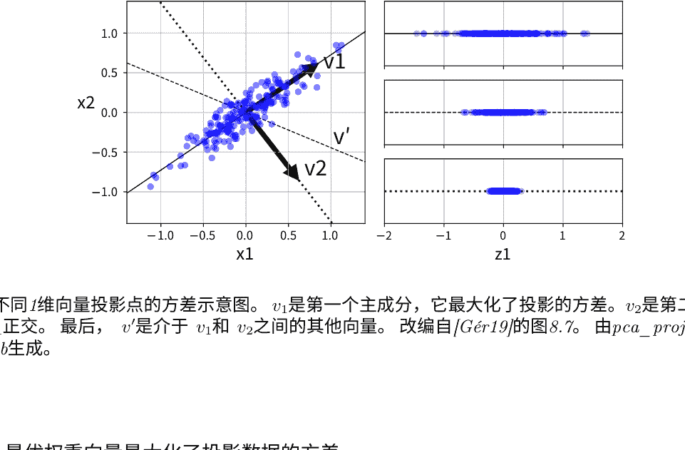

## 20.1.2.2 最优权重向量最大化了投影数据的方差

在继续之前，我们做出了一个有趣的观察。由于数据已经居中，我们有

$$
\mathbb{E}[z_{n1}] = \mathbb{E}[\mathbf{x}_n^\top \mathbf{w}_1] = \mathbb{E}[\mathbf{x}_n]^\top \mathbf{w}_1 = 0
$$

因此，投影数据的方差由以下给出

$$
\text{V}[\tilde{z}_1] = \mathbb{E}[\tilde{z}_1^2] - (\mathbb{E}[\tilde{z}_1])^2 = \frac{1}{N} \sum_{n=1}^{N} z_{n1}^2 - 0 = -\mathcal{L}(\mathbf{w}_1) + \text{const}
$$

由此可见，最小化重构误差等价于最大化投影数据的方差：

$$
\arg \min_{\mathbf{w}_1} \mathcal{L}(\mathbf{w}_1) = \arg \max_{\mathbf{w}_1} \text{V}[\tilde{z}_1(\mathbf{w}_1)]
$$

这就是为什么经常说PCA找到了最大方差的方向。（见图20.4作为示例。）然而，最小误差的表达更容易理解且更通用。

## 20.1.2.3 归纳步骤

现在让我们找到另一个方向 $\mathbf{w}_2$ 以进一步最小化重构误差，满足 $\mathbf{w}_1^\top \mathbf{w}_2 = 0$ 和 $\mathbf{w}_2^\top \mathbf{w}_2 = 1$。误差为

$$
\mathcal{L}(\mathbf{w}_1, \tilde{\mathbf{z}}_1, \mathbf{w}_2, \tilde{\mathbf{z}}_2) = \frac{1}{N} \sum_{n=1}^{N} \|\mathbf{x}_n - z_{n1} \mathbf{w}_1 - z_{n2} \mathbf{w}_2\|^2
$$

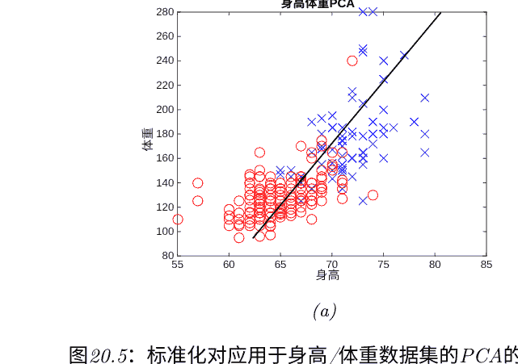

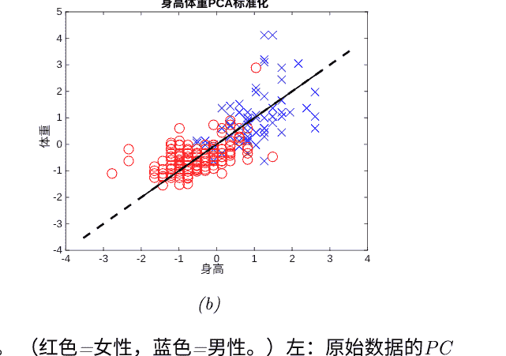

图20.5: 标准化对应用于身高/体重数据集的PCA的影响。 (红色=女性, 蓝色=男性。) 左: 原始数据的PCA。 右: 标准化数据的PCA。由pcaStandardization.ipynb生成。

优化关于 $\mathbf{w}_2$ 和 $z_{n2}$ 得到与之前相同的解。 练习 20.3 要求你展示 $\partial\mathcal{L}/\partial z_{n2} = 0$ 得到 $z_{n2} = \mathbf{w}_2^\top\mathbf{x}_n$。 代入得到

$$
\mathcal{L}(\mathbf{w}_2) = \frac{1}{N} \sum_{n=1}^{N} [\mathbf{x}_n^\top\mathbf{x}_n - \mathbf{w}_1^\top\mathbf{x}_n\mathbf{x}_n^\top\mathbf{w}_1 - \mathbf{w}_2^\top\mathbf{x}_n\mathbf{x}_n^\top\mathbf{w}_2] = \text{const} - \mathbf{w}_2^\top\hat{\Sigma}\mathbf{w}_2 \tag{20.18}
$$

去掉常数项, 插入最优 $\mathbf{w}_1$ 并添加约束条件得到

$$
\tilde{\mathcal{L}}(\mathbf{w}_2) = -\mathbf{w}_2^\top\hat{\Sigma}\mathbf{w}_2 + \lambda_2(\mathbf{w}_2^\top\mathbf{w}_2 - 1) + \lambda_{12}(\mathbf{w}_2^\top\mathbf{w}_1 - 0) \tag{20.19}
$$

练习20.3要求你展示解是由具有第二大特征值的特征向量给出的:

$$
\hat{\Sigma}\mathbf{w}_2 = \lambda_2\mathbf{w}_2 \tag{20.20}
$$

证明继续以这种方式展示 $\mathbf{W} = \mathbf{U}_L$。

### 20.1.3 计算问题

在本节中, 我们讨论与使用PCA相关的各种实际问题。

### 20.1.3.1 协方差矩阵 vs 相关矩阵

我们一直在处理协方差矩阵的特征分解。 然而, 最好使用相关矩阵。 原因是否则PCA可能会被测量尺度高的方向“误导”。 图20.5展示了一个例子。 在左边, 我们可以看到垂直轴使用的范围比水平轴大。 这导致第一主成分看起来有些“不自然”。 在右边, 我们展示了在标准化数据后进行PCA的结果(这相当于使用相关矩阵而不是协方差矩阵); 结果看起来好得多。

### 20.1.3.2 处理高维数据

我们将PCA表述为寻找 $D \times D$ 协方差矩阵 $\mathbf{X}^{T} \mathbf{X}$ 的特征向量的问题。 如果 $D > N$，使用 $N \times N$ 格拉姆矩阵 $\mathbf{X}\mathbf{X}^{T}$ 会更快。 现在我们来展示如何做到这一点。

首先，令 $\mathbf{U}$ 为包含 $\mathbf{X}\mathbf{X}^{\mathrm{T}}$ 的特征向量的正交矩阵，对应的特征值为 $\boldsymbol{\Lambda}$。 根据定义，我们有 $(\mathbf{X}\mathbf{X}^{\mathrm{T}})\mathbf{U} = \mathbf{U}\boldsymbol{\Lambda}$。 对其进行 $\mathbf{X}^{\mathrm{T}}$ 预乘得到

$$
(\mathbf{X}^{\mathrm{T}}\mathbf{X})(\mathbf{X}^{\mathrm{T}}\mathbf{U}) = (\mathbf{X}^{\mathrm{T}}\mathbf{U})\boldsymbol{\Lambda} \tag{20.21}
$$

由此可见， $\mathbf{X}^{\mathrm{T}}\mathbf{X}$ 的特征向量为 $\mathbf{V} = \mathbf{X}^{\mathrm{T}}\mathbf{U}$，其特征值由 $\boldsymbol{\Lambda}$ 给出，与之前相同。 然而，这些特征向量并没有归一化，因为 $\|\boldsymbol{v}_{j}\|^{2} = \boldsymbol{u}_{j}^{\mathrm{T}}\mathbf{X}\mathbf{X}^{\mathrm{T}}\boldsymbol{u}_{j} = \lambda_{j}\boldsymbol{u}_{j}^{\mathrm{T}}\boldsymbol{u}_{j} = \lambda_{j}$。归一化特征向量由以下给出

$$
\mathbf{V} = \mathbf{X}^{\mathrm{T}}\mathbf{U}\boldsymbol{\Lambda}^{-\frac{1}{2}} \tag{20.22}
$$

这提供了一种计算PCA基的替代方法。 它还允许我们使用核技巧，如第20.4.6节所讨论的。

### 20.1.3.3 使用SVD计算PCA

在本节中，我们展示了使用特征向量方法计算的PCA与截断SVD之间的等价性。

设 $\mathbf{U}_{\Sigma}\boldsymbol{\Lambda}_{\Sigma}\mathbf{U}_{\Sigma}^{\mathrm{T}}$ 为协方差矩阵 $\boldsymbol{\Sigma} \propto \mathbf{X}^{\mathrm{T}}\mathbf{X}$ 的前 $L$ 个特征分解（我们假设 $\mathbf{X}$ 已居中）。 回顾第20.1.2节，投影权重 $\mathbf{W}$ 的最优估计由前 $L$ 个特征向量给出，因此 $\mathbf{W} = \mathbf{U}_{\Sigma}$。

现在，设 $\mathbf{U}_{X}\mathbf{S}_{X}\mathbf{V}_{X}^{\mathrm{T}} \approx \mathbf{X}$ 为数据矩阵 $\mathbf{X}$ 的前 $L$ 个截断SVD近似。 根据方程（7.184），我们知道 $\mathbf{X}$ 的右奇异向量是 $\mathbf{X}^{\mathrm{T}}\mathbf{X}$ 的特征向量，因此 $\mathbf{V}_{X} = \mathbf{U}_{\Sigma} = \mathbf{W}$。 （此外，协方差矩阵的特征值与数据矩阵的奇异值之间有关系，即 $\lambda_{k} = s_{k}^{2}/N$。）

现在假设我们对投影点（也称为主成分或PC分数）感兴趣，而不是投影矩阵。我们有

$$
\mathbf{Z} = \mathbf{X}\mathbf{W} = \mathbf{U}_{X}\mathbf{S}_{X}\mathbf{V}_{X}^{\mathrm{T}}\mathbf{V}_{X} = \mathbf{U}_{X}\mathbf{S}_{X} \tag{20.23}
$$

最后，如果我们想要近似重构数据，我们有

$$
\hat{\mathbf{X}} = \mathbf{Z}\mathbf{W}^{\mathrm{T}} = \mathbf{U}_{X}\mathbf{S}_{X}\mathbf{V}_{X}^{\mathrm{T}} \tag{20.24}
$$

这与截断SVD逼近（第7.5.5节）完全相同。

因此，我们可以使用 $\boldsymbol{\Sigma}$ 的特征分解或 $\mathbf{X}$ 的SVD分解来执行PCA。 出于计算原因，后者通常更可取。 对于非常高维的问题，我们可以使用随机SVD算法，参见例如[HMT11; SKT14; DM16]。 例如，sklearn使用的随机求解器对于 $N$ 个示例和 $L$ 个主成分的时间复杂度为 $O(NL^{2}) + O(L^{3})$，而精确的SVD的时间复杂度为 $O(ND^{2}) + O(D^{3})$。

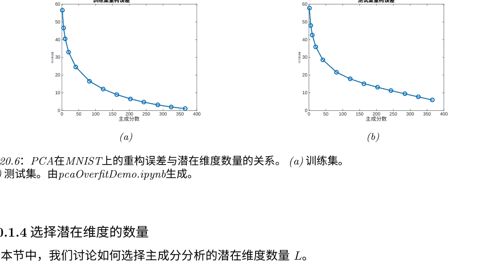

### 20.1.4 选择潜在维度的数量

在本节中，我们讨论如何选择主成分分析的潜在维度数量 $L$。

### 20.1.4.1 重构误差

让我们定义模型在使用 $L$ 维度时对某个数据集 $\mathcal{D}$ 产生的重构误差：

$$
\mathcal{L}_L = \frac{1}{|\mathcal{D}|} \sum_{n \in \mathcal{D}} \|\boldsymbol{x}_n - \hat{\boldsymbol{x}}_n\|^2 \tag{20.25}
$$

其中重构由 $\hat{\boldsymbol{x}}_n = \mathbf{W}\boldsymbol{z}_n + \boldsymbol{\mu}$ 给出，其中 $\boldsymbol{z}_n = \mathbf{W}^{\mathrm{T}}(\boldsymbol{x}_n - \boldsymbol{\mu})$，$\boldsymbol{\mu}$ 是经验均值，$\mathbf{W}$ 如上所述估计。图20.6(a)绘制了 $\mathcal{L}_L$ 与 $L$ 的关系在MNIST训练数据上。我们可以看到它很快下降，表明我们可以用少量的因子捕捉到大部分像素的经验相关性。

当然，如果我们使用 $L = \text{rank}(\mathbf{X})$，我们在训练集上得到零重构误差。为了避免过拟合，自然而然地在测试集上绘制重构误差。如图20.6(b)所示。在这里，我们可以看到即使模型变得更加复杂，误差仍然继续下降！因此，我们没有像通常在监督学习中所期望看到的U形曲线。

问题在于PCA不是数据的一个合适的生成模型：如果给它更多的潜在维度，它将能够更准确地逼近测试数据。(如果我们使用K-means聚类在测试集上绘制重构误差，也会出现类似的问题，如第21.3.7节所讨论的。)我们将在下面讨论一些解决方案。

### 20.1.4.2 Scree图

与绘制重构误差 vs $L$ 相比，常见的替代方法是使用一种称为 scree plot 的东西，它是按照特征值 $\lambda_j$ 的大小顺序绘制的。可以证明

(练习20.4) 这

$$
\mathcal{L}_L = \sum_{j=L+1}^{D} \lambda_j \tag{20.27}
$$

因此，随着维度的增加，特征值变小，重构误差也变小，如图20.7a所示。一个相关的量是解释的方差比例，定义为

$$
F_L = \frac{\sum_{j=1}^{L} \lambda_j}{\sum_{j'=1}^{L^{\max}} \lambda_{j'}}
$$

这捕捉到与scree绘图相同的信息，但随着 $L$ 的增加而增加 (见图20.7b)。

### 20.1.4.3 概率轮廓

尽管重建误差图中没有U形状，但曲线中有时会出现“膝盖”或“肘部”，在这个点上，误差突然从相对较大的误差变为相对较小的误差。这个想法是，对于 $L < L^*$，其中 $L^*$ 是“真实”的潜在维度（或聚类数），误差函数的下降速率将很高，而对于 $L > L^*$，收益将较小，因为模型已经足够复杂以捕捉真实分布。

自动检测曲线梯度变化的一种方法是计算概率轮廓，如[ZG06]中所提出的。其思想是这样的。设 $\lambda_L$ 为模型大小为 $L$ 时产生的误差度量，使得 $\lambda_1 \ge \lambda_2 \ge \cdots \ge \lambda_{L^{\max}}$。在PCA中，这些是特征值，但该方法也可以应用于来自K均值聚类的重建误差（见第21.3.7节）。现在考虑将这些值分成两组，取决于是否 $k < L$ 或 $k > L$，其中 $L$ 是我们将确定的阈值。为了衡量 $L$ 的质量，

> 2. 术语“scree plot”的原因是“图形看起来像一座山的侧面，‘scree’指的是从山上掉下来并堆积在山脚下的碎石”。(引自Kenneth Janda, https://bit.ly/2kqG1yW。)

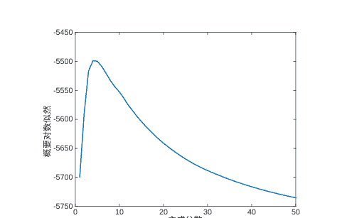

我们将使用一个简单的变点模型，其中 $\lambda_k \sim \mathcal{N}(\mu_1, \sigma^2)$ if $k \leq L$，并且 $\lambda_k \sim \mathcal{N}(\mu_2, \sigma^2)$ if $k > L$。（重要的是，$\sigma^2$在两个模型中是相同的，以防止一个区域的数据少于另一个区域时过拟合。）在这两个区域中，我们假设 $\lambda_k$ 是iid的，虽然这显然是不正确的，但对于我们目前的目的来说是足够的。我们可以对每个 $L=1: L^{\max}$ 拟合这个模型，通过分割数据并计算MLEs，使用方差的汇总估计：

$$
\mu_1(L) = \frac{\sum_{k \leq L} \lambda_k}{L} \tag{20.28}
$$

$$
\mu_2(L) = \frac{\sum_{k > L} \lambda_k}{L^{\max} - L} \tag{20.29}
$$

$$
\sigma^2(L) = \frac{\sum_{k \leq L} (\lambda_k - \mu_1(L))^2 + \sum_{k > L} (\lambda_k - \mu_2(L))^2}{L^{\max}} \tag{20.30}
$$

然后我们可以评估概率对数似然

$$
\ell(L) = \sum_{k=1}^{L} \log \mathcal{N}(\lambda_k | \mu_1(L), \sigma^2(L)) + \sum_{k=L+1}^{L^{\max}} \log \mathcal{N}(\lambda_k | \mu_2(L), \sigma^2(L)) \tag{20.31}
$$

这在图20.8中有所说明。我们可以看到峰值 $L^* = \mathrm{argmax} \ \ell(L)$ 是确定的。

## 20.2 因子分析 *

主成分分析（PCA）是一种计算数据线性低维表示的简单方法。在本节中，我们介绍了一种称为因子分析的PCA的推广方法。这是基于概率模型的，这意味着我们可以将其视为更复杂模型的构建块，例如第20.2.6节中的FA模型混合，或者第20.3.5节中的非线性FA模型。我们可以将PCA作为FA的一种特殊极限情况，如我们在第20.2.2节中讨论的那样。

## 20.2 因子分析

### 20.2.1 生成模型

因子分析对应于以下线性高斯潜变量生成模型：

$$p(z) = \mathcal{N}(z|\mu_0, \Sigma_0)$$ (20.32)

$$p(x|z, \theta) = \mathcal{N}(x|\mathbf{W}z + \mu, \Psi)$$ (20.33)

其中 W是一个 \(D \times L\)矩阵，被称为因子载荷矩阵，而 \(\Psi\)是一个对角线 \(D \times D\)协方差矩阵。

因子分析可以被看作是高斯分布的低秩版本。为了看到这一点，注意到引出的边际分布 \(p(x|\theta)\)是一个高斯分布（参见方程 (3.38) 的推导）：

$$p(x|\theta) = \int \mathcal{N}(x|\mathbf{W}z + \mu, \Psi)\mathcal{N}(z|\mu_0, \Sigma_0) dz$$ (20.34)

$$= \mathcal{N}(x|\mathbf{W}\mu_0 + \mu, \Psi + \mathbf{W}\Sigma_0\mathbf{W}^T)$$ (20.35)

从这个结果可以看出，我们可以设置 \(\mu_0 = 0\)而不会损失一般性，因为我们总是可以将 W \(\mu_0\)吸收到 \(\mu\)中。同样，我们可以设置 \(\Sigma_0 = \mathbf{I}\)而不会损失一般性，因为我们总是可以通过使用一个新的权重矩阵 \(\widetilde{\mathbf{W}} = \mathbf{W}\Sigma_0^{-1/2}\)来吸收相关的先验。经过这些简化，我们有 \(p(z) = \mathcal{N}(z|0, \mathbf{I})\)

$$p(x|z) = \mathcal{N}(x|\mathbf{W}z + \mu, \Psi)$$ (20.36)

$$p(x) = \mathcal{N}(x|\mu, \mathbf{W}\mathbf{W}^T + \Psi)$$ (20.38)

例如，假设 \(L=1\)，\(D=2\)和 \(\Psi = \sigma^2 \mathbf{I}\)。我们在图20.9中说明了生成过程。我们可以将其视为沿着由 \(wz + \mu\)定义的1d线条上滑动的各向同性高斯“喷雾罐”，表示似然 \(p(x|z)\)。这导致了一个拉长的（因此相关的）二维高斯分布。也就是说，引出的分布具有形式 \(p(x) = \mathcal{N}(x|\mu, ww^T + \sigma^2 \mathbf{I})\)。

一般来说，FA使用低秩分解来近似可见向量的协方差矩阵：

$$\mathbf{C} = \text{Cov}[x] = \mathbf{W}\mathbf{W}^T + \Psi$$ (20.39)

这只使用 \(O(LD)\)个参数，这允许在完全协方差高斯分布（\(O(D^2)\)个参数）和对角协方差（\(O(D)\)个参数）之间进行灵活的折中。

从方程 (20.39) 中，我们可以看出我们应该限制 \(\Psi\)为对角矩阵，否则我们可以设置 \(\mathbf{W} = 0\)，从而忽略潜在因素，同时仍然能够建模任何协方差。每个可见变量的边际方差由 \(\mathbb{V}[x_d] = \sum_{k=1}^L w_{dk}^2 + \psi_d\)给出，其中第一项是由于共同因素引起的方差，第二项 \(\psi_d\)被称为唯一性，是特定于该维度的方差项。

我们可以使用EM算法（见第20.2.3节）来估计FA模型的参数。一旦我们拟合了模型，我们可以使用概率潜在嵌入计算 \(p(z|x)\)。使用高斯贝叶斯规则，我们有

$$p(z|x) = \mathcal{N}(z|\mathbf{W}^T \mathbf{C}^{-1} (x - \mu), \mathbf{I} - \mathbf{W}^T \mathbf{C}^{-1} \mathbf{W})$$ (20.40)

其中 C在方程(20.39)中定义。

> 作者：Kevin P. Murphy。(C) MIT Press. CC-BY-NC-ND许可证

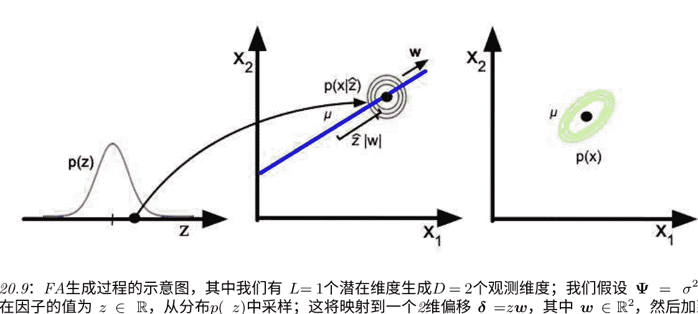

图20.9: FA生成过程的示意图，其中我们有 $L= 1$个潜在维度生成$D = 2$个观测维度；我们假设 $\mathbf{\Psi} = \sigma^2\mathbf{I}$。潜在因子的值为 $z \in \mathbb{R}$，从分布$p(z)$中采样；这将映射到一个$2$维偏移 $\delta = z\mathbf{w}$，其中 $\mathbf{w} \in \mathbb{R}^2$，然后加到 $\mathbf{\mu}$ 上定义一个高斯分布$p(\mathbf{x}|z) = \mathcal{N}(\mathbf{x}|\mathbf{\mu} + \delta, \sigma^2\mathbf{I})$。通过对$z$进行积分，我们沿着主成分轴 $\mathbf{w}$“滑动”这个圆形高斯“喷雾罐”，从而在以 $\mathbf{\mu}$为中心的 $\mathbf{x}$空间中引入椭圆形高斯轮廓。改编自[Bis06]的图12.9。

### 20.2.2 概率主成分分析

在本节中，我们考虑因子分析模型的一个特殊情况，其中 $\mathbf{W}$具有正交的列，并且 $\mathbf{\Psi} = \sigma^2\mathbf{I}$。这个模型被称为概率主成分分析（PPCA）[TB99]，或者称为合理的主成分分析（Row97）。可见变量的边缘分布具有以下形式

$$p(\mathbf{x}|\boldsymbol{\theta}) = \int \mathcal{N}(\mathbf{x}|\mathbf{W}\mathbf{z}, \sigma^2\mathbf{I})\mathcal{N}(\mathbf{z}|\mathbf{0}, \mathbf{I})d\mathbf{z} = \mathcal{N}(\mathbf{x}|\boldsymbol{\mu}, \mathbf{C})$$  (20.41)

其中

$$\mathbf{C} = \mathbf{W}\mathbf{W}^\top + \sigma^2\mathbf{I}$$  (20.42)

PPCA的对数似然函数为

$$\log p(\mathbf{X}|\boldsymbol{\mu}, \mathbf{W}, \sigma^2) = -\frac{ND}{2}\log(2\pi) - \frac{N}{2}\log|\mathbf{C}| - \frac{1}{2}\sum_{n=1}^N (\mathbf{x}_n - \boldsymbol{\mu})^\top\mathbf{C}^{-1}(\mathbf{x}_n - \boldsymbol{\mu})$$  (20.43)

$\boldsymbol{\mu}$ 的 MLE 是 $\overline{\mathbf{x}}$。代入后给出

$$\log p(\mathbf{X}|\boldsymbol{\mu}, \mathbf{W}, \sigma^2) = -\frac{N}{2}\left[D\log(2\pi) + \log|\mathbf{C}| + \operatorname{tr}(\mathbf{C}^{-1}\mathbf{S})\right]$$  (20.44)

其中 $\mathbf{S} = \frac{1}{N}\sum_{n=1}^N (\mathbf{x}_n - \overline{\mathbf{x}})(\mathbf{x}_n - \overline{\mathbf{x}})^\top$是经验协方差矩阵。在[TB99; Row97]中，他们证明了这个目标的最大值必须满足

$$\mathbf{W} = \mathbf{U}_L(\mathbf{L}_L - \sigma^2\mathbf{I})^{\frac{1}{2}}\mathbf{R}$$  (20.45)

其中 $\mathbf{U}_L$ 是一个 $D \times L$ 矩阵，其列由 $\mathbf{S}$ 的最大特征值对应的 $L$ 个特征向量给出，$\mathbf{L}_L$ 是 $L \times L$ 对角矩阵，$\mathbf{R}$ 是任意的 $L \times L$ 正交矩阵，我们可以取 $\mathbf{R} = \mathbf{I}$。 在无噪声的极限情况下，即 $\sigma^2 = 0$，我们可以看到

$$\mathbf{W}_{\text{mle}} = \mathbf{U}_L \mathbf{L}_L^{\frac{1}{2}}$$，与PCA解成比例。

观测方差的最大似然估计是

$$\sigma^2 = \frac{1}{D - L} \sum_{i=L+1}^{D} \lambda_i \tag{20.46}$$

这是与丢弃维度相关的平均失真。 如果 $L = D$，则估计的噪声为0，因为模型崩溃为 $z = x$。

要计算似然函数 $p(\mathbf{x}|\boldsymbol{\mu}, \mathbf{W}, \sigma^2)$，我们需要评估 $\mathbf{C}^{-1}$ 和 $\log |\mathbf{C}|$，其中 $\mathbf{C}$ 是一个 $D \times D$ 矩阵。 为了高效地做到这一点，我们可以使用矩阵求逆引理来写

$$\mathbf{C}^{-1} = \sigma^{-2} \left[ \mathbf{I} - \mathbf{W} \mathbf{M}^{-1} \mathbf{W}^{\mathsf{T}} \right] \tag{20.47}$$

其中 $L \times L$ 维矩阵 $\mathbf{M}$ 给出

$$\mathbf{M} = \mathbf{W}^{\mathsf{T}} \mathbf{W} + \sigma^2 \mathbf{I} \tag{20.48}$$

当我们将方程 (20.45) 中的 $\mathbf{W}$ 的最大似然估计 (使用 $\mathbf{R} = \mathbf{I}$) 代入时，我们发现

$$\mathbf{M} = \mathbf{U}_L (\mathbf{L}_L - \sigma^2 \mathbf{I}) \mathbf{U}_L^{\mathsf{T}} + \sigma^2 \mathbf{I} \tag{20.49}$$

因此

$$\mathbf{C}^{-1} = \sigma^{-2} \left[ \mathbf{I} - \mathbf{U}_L (\mathbf{L}_L - \sigma^2 \mathbf{I}) \boldsymbol{\Lambda}_L^{-1} \mathbf{U}_L^{\mathsf{T}} \right] \tag{20.50}$$

$$\log |\mathbf{C}| = (D - L) \log \sigma^2 + \sum_{j=1}^{L} \log \lambda_j \tag{20.51}$$

因此我们可以避免所有的矩阵求逆 (因为 $\boldsymbol{\Lambda}_L^{-1} = \text{diag}(1/\lambda_j)$) .

要将PPCA用作PCA的替代方法，我们需要计算后验均值 $\mathbb{E}[z|x]$，这相当于编码器模型。 使用高斯贝叶斯规则，我们有

$$p(z|x) = \mathcal{N}(z | \mathbf{M}^{-1} \mathbf{W}^{\mathsf{T}} (x - \mu), \sigma^2 \mathbf{M}^{-1}) \tag{20.52}$$

其中 $\mathbf{M}$ 在方程 (20.48) 中定义。 在 $\sigma^2 = 0$ 的极限情况下，使用MLE参数的后验均值变为

$$\mathbb{E}[z|x] = (\mathbf{W}^{\mathsf{T}} \mathbf{W})^{-1} \mathbf{W}^{\mathsf{T}} (x - \bar{x}) \tag{20.53}$$

这是数据在潜在空间中的正交投影，就像标准PCA一样。

### 20.2.3 FA/PPCA的EM算法

在本节中，我们基于[RT82; GH96]，描述了使用EM算法计算FA模型的MLE的一种方法。

#### 20.2.3.1 FA的EM算法

在E步骤中，我们计算后验嵌入

$p(z_i|x_i, \theta) = \mathcal{N}(z_i|m_i, \Sigma_i)$

$\Sigma_i \triangleq (\mathbf{I}_L + \mathbf{W}^T \mathbf{\Psi}^{-1} \mathbf{W})^{-1}$

$m_i \triangleq \Sigma_i (\mathbf{W}^T \mathbf{\Psi}^{-1} (x_i - \mu))$

在M步骤中，最容易同时估计 $\mu$ 和 $\mathbf{W}$，通过定义 $\hat{\mathbf{W}} = (\mathbf{W}, \mu)$, $\tilde{z} = (z, 1)$, 同时，定义

$b_i \triangleq \mathbb{E}[\tilde{z}|x_i] = [m_i; 1]$

$\mathbf{C}_i \triangleq \mathbb{E}[\tilde{z}\tilde{z}^T|x_i] = \begin{pmatrix} \mathbb{E}[zz^T|x_i] & \mathbb{E}[z|x_i] \\ \mathbb{E}[z|x_i]^T & 1 \end{pmatrix}$

然后M步骤如下：

$\hat{\mathbf{W}} = \left[ \sum_i x_i b_i^T \right] \left[ \sum_i \mathbf{C}_i \right]^{-1}$

$\hat{\mathbf{\Psi}} = \frac{1}{N} \text{diag} \left\{ \sum_i (x_i - \hat{\mathbf{W}} b_i) x_i^T \right\}$

请注意，这些更新是针对“纯粹”的EM算法。基于ECM的更快版本的算法在[ZY08]中有描述。

#### 20.2.3.2 EM用于（P）PCA

我们还可以使用EM来拟合PPCA模型，这提供了一种有用的替代方法来计算特征向量。这依赖于PCA的概率形式。然而，该算法在零噪声极限下仍然有效，如[Row97]所示。

特别地，让$\tilde{Z} = Z^T$是一个$L\times N$的矩阵，它存储了后验均值（低维表示）在其列上。类似地，让$\tilde{X} = X^T$存储原始数据在其列上。根据方程（20.52），当$\sigma^2 = 0$时，我们有

$\tilde{Z} = (\mathbf{W}^T\mathbf{W})^{-1}\mathbf{W}^T\tilde{X}$

这构成了E步骤。 注意这只是数据的正交投影。

根据方程20.59，M步骤给出

$\hat{\mathbf{W}} = \left[ \sum_i x_i \mathbb{E}[z_i]^T \right] \left[ \sum_i \mathbb{E}[z_i] \mathbb{E}[z_i]^T \right]^{-1}$

在这里我们利用了 $\Sigma = \text{Cov}[z_i|x_i, \theta] = 0\mathbf{I}$ 当 $\sigma^2 = 0$ 的事实。

值得比较这个表达式与多输出线性回归的MLE（方程11.2）的形式 $\mathbf{W} = (\sum_i y_i x_i^T)(\sum_i x_i x_i^T)^{-1}$。因此我们可以看到M步骤类似于线性回归，其中我们用潜在变量的期望值替换了观察到的输入。

总结起来，这就是整个算法：
$$\hat{\mathbf{Z}}=(\mathbf{W}^T\mathbf{W})^{-1}\mathbf{W}^T\hat{\mathbf{X}}\quad \text{(E步)}$$
$$\mathbf{W}=\hat{\mathbf{X}}\hat{\mathbf{Z}}^T(\hat{\mathbf{Z}}\hat{\mathbf{Z}}^T)^{-1}\quad \text{(M步)}$$

[TB99] 表明 EM 算法的唯一稳定的固定点是全局最优解。也就是说，EM 算法收敛到一个解，其中 $\mathbf{W}$ 与由前 $L$ 个特征向量定义的相同线性子空间相交。然而，如果我们希望 $\mathbf{W}$ 是正交的，并且按特征值降序包含特征向量，我们必须对结果矩阵进行正交化（这可以相对廉价地完成）。或者，我们可以修改 EM 算法直接给出主要基础[AO03]。

在 $D=2$ 和 $L=1$ 的情况下，该算法具有简单的物理类比[Row97]。考虑一些点在 $\mathbb{R}^2$ 上通过弹簧连接到一个刚性杆，其方向由向量 $\mathbf{w}$ 定义。让 $z_i$ 是第 $i$ 个弹簧连接到杆的位置。在 E 步中，我们固定杆，让连接点滑动以最小化弹簧能量（与平方残差的总和成比例）。在 M 步中，我们固定连接点，让杆旋转以最小化弹簧能量。请参见图20.10进行说明。

#### 20.2.3.3 优势

EM用于PCA相对于特征向量方法具有以下优势：

-   EM可能更快。特别是，假设$N, D \gg L$，EM的主要成本是E步骤中的投影操作，因此总时间为$O(TLND)$，其中 $T$ 是迭代次数。[Row97]的实验证明，迭代次数通常非常小（平均值为3.6），无论 $N$ 还是 $D$。（这个结果取决于经验协方差矩阵的特征值比例。）这比直接特征向量方法所需的 $O(\min(ND^2, DN^2))$ 时间要快得多，尽管更复杂的特征向量方法，如Lanczos算法，具有与EM相当的运行时间。
-   EM可以以在线方式实现，即我们可以随着数据流更新对 $\mathbf{W}$ 的估计。
-   EM可以简单地处理缺失数据（参见例如，[IR10; DJ15]）。
-   EM可以扩展以处理PPCA / FA模型的混合（参见第20.2.6节）。
-   EM可以修改为变分EM或变分贝叶斯EM以适应更复杂的模型（参见例如，第20.2.7节）。

### 20.2.4 参数的不可识别性

FA模型的参数是不可识别的。为了看到这一点，考虑一个具有权重 $\mathbf{W}$ 和观测协方差 $\mathbf{\Psi}$ 的模型。我们有
$$\text{Cov}[\mathbf{x}] = \mathbf{W} \mathbb{E}\left[\mathbf{z}\mathbf{z}^T\right]\mathbf{W}^T + \mathbb{E}\left[\boldsymbol{\epsilon}\boldsymbol{\epsilon}^T\right] = \mathbf{W}\mathbf{W}^T + \mathbf{\Psi}$$

图20.10: 当 $D=2$ 和 $L=1$ 时，对PCA的EM的说明。绿色星星是原始数据点，黑色圆圈是它们的重构。权重向量 $w$ 由蓝线表示。(a) 我们从一个随机的初始猜测 $w$ 开始。E步骤由正交投影表示。(b) 我们在M步骤中更新杆 $w$，在保持投影到杆上的位置（黑色圆圈）不变的情况下。(c) 另一个E步骤。黑色圆圈可以沿着杆滑动，但杆保持不变。(d) 另一个M步骤。改编自Bis06的图12.12。

由 pcaEmStepByStep.ipynb 生成。

现在考虑一个具有权重 $\tilde{\mathbf{W}} = \mathbf{W} \mathbf{R}$ 的不同模型，其中 $\mathbf{R}$ 是任意正交旋转矩阵，满足 $\mathbf{R} \mathbf{R}^\top = \mathbf{I}$。这具有相同的似然性，因为

$$\mathrm{Cov}[\mathbf{x}] = \tilde{\mathbf{W}} \mathbb{E}[\mathbf{z} \mathbf{z}^\top] \tilde{\mathbf{W}}^\top + \mathbb{E}[\boldsymbol{\epsilon} \boldsymbol{\epsilon}^\top] = \mathbf{W} \mathbf{R} \mathbf{R}^\top \mathbf{W}^\top + \boldsymbol{\Psi} = \mathbf{W} \mathbf{W}^\top + \boldsymbol{\Psi}$$ (20.66)

几何上，将 $\mathbf{W}$ 乘以一个正交矩阵就像在生成 $\mathbf{x}$ 之前旋转 $\mathbf{z}$；但是由于 $\mathbf{z}$ 是从各向同性高斯分布中抽取的，这对似然性没有影响。因此，我们无法唯一确定 $\mathbf{W}$，因此也无法唯一确定潜在因子。

为了打破这种对称性，可以使用几种解决方案，如下所讨论。

-   强制 W 具有正交列。解决可识别性问题的可能最简单的方法之一是强制 W 具有正交列。这是 PCA 采用的方法。因此，得到的后验估计将是唯一的，只是潜在维度的排列不同。
    （在主成分分析中，通过按照 W 的特征值降序排序来解决这种排序不确定性。）
-   强制 W 为下三角形。解决排列不可识别性的一种方法是在贝叶斯社区中很受欢迎的（例如，[L W04c]），确保第一个可见特征只由第一个潜在因子生成，第二个可见特征只由前两个潜在因子生成，依此类推。例如，如果 L=3 和 D=4，则相应的因子载荷矩阵为

    $$
    \mathbf{W} = \begin{pmatrix} w_{11} & 0 & 0 \\ w_{21} & w_{22} & 0 \\ w_{31} & w_{32} & w_{33} \\ w_{41} & w_{42} & w_{43} \end{pmatrix} \tag{20.67}
    $$

    我们还要求 $w_{kk} > 0$ 对于 $k=1:L$。这个受限制矩阵中的参数总数为 $D + DL - L(L-1)/2$，这与 FA 中的唯一可识别参数的数量相等。³这种方法的缺点是第一个 L 可见变量，即创始变量，会影响潜在因子的解释，因此必须谨慎选择。
-   稀疏促进权重的先验。不需要预先指定 W 中的哪些条目为零，我们可以通过 $\ell_1$ 正则化[ZHT06]、ARD[Bis99; AB08]或者尖峰-平板先验[Rat+09]来鼓励这些条目为零。这被称为稀疏因子分析。这并不一定保证唯一的 MAP 估计，但它确实鼓励可解释的解决方案。
-   选择一个信息丰富的旋转矩阵。有各种启发式方法尝试寻找旋转矩阵 R，可以用来修改 W（从而修改潜在因子），以增加可解释性，通常是通过鼓励它们（近似）稀疏。
    一种流行的方法被称为 varimax [Kai58]。
-   使用非高斯先验来处理潜在因子。如果我们用非高斯分布替换潜在变量的先验分布 $p(z)$，有时我们可以唯一地确定 W 以及潜在因子。详见[KKH20]。

### 20.2.5 非线性因子分析

FA模型假设观测数据可以被建模为从一个低维高斯因子集合的线性映射产生。放松这个假设的一种方法是让从 z 到 x 的映射成为一个非线性模型，比如神经网络。也就是说，模型变成了

$$
p(\mathbf{x}) = \int \mathcal{N}(\mathbf{x}|f(\mathbf{z};\theta), \Psi) \mathcal{N}(\mathbf{z}|\mathbf{0}, I) d\mathbf{z} \tag{20.68}
$$

这被称为非线性因子分析。 不幸的是，我们无法精确计算后验概率或最大似然估计，因此我们需要使用近似方法。 在第20.3.5节中，我们讨论变分自编码器，这是近似非线性FA模型的最常见方法。

### 20.2.6 因子分析器的混合模型

因子分析模型 (第20.2节) 假设观测数据可以建模为从低维高斯因子集合的线性映射产生。 放宽这个假设的一种方法是假设模型只是局部线性的，因此整体模型变成了 (加权) 组合FA模型的混合；这被称为混合因子分析器。 数据的整体模型是线性流形的混合，可以用来近似整体曲线流形。

更准确地说，让潜在指示器 $m_n \in \{1, \ldots, K\}$，指定我们应该使用哪个子空间 (簇) 来生成数据。 如果 $m_n = k$，我们从高斯先验中采样 $z_n$，并通过 $\mathbf{W}_k$ 矩阵传递并添加噪声，其中 $\mathbf{W}_k$ 从 $L$ 维子空间映射到 $D$ 维可见空间。$^4$更准确地说，模型如下：

$$
\begin{aligned}
p(\boldsymbol{x}_n | \boldsymbol{z}_n, m_n = k, \boldsymbol{\theta}) &= \mathcal{N}(\boldsymbol{x}_n | \boldsymbol{\mu}_k + \mathbf{W}_k \boldsymbol{z}_n, \boldsymbol{\Psi}_k) & (20.69) \\
p(\boldsymbol{z}_n | \boldsymbol{\theta}) &= \mathcal{N}(\boldsymbol{z}_n | \mathbf{0}, \mathbf{I}) & (20.70) \\
p(m_n | \boldsymbol{\theta}) &= \text{Cat}(m_n | \boldsymbol{\pi}) & (20.71)
\end{aligned}
$$

这被称为因子分析器的混合模型 (MFA) [GH96]。 在可见空间中对应的分布为

$$
p(\boldsymbol{x} | \boldsymbol{\theta}) = \sum_{k} p(c = k) \int dz \ p(\boldsymbol{z} | c) p(\boldsymbol{x} | \boldsymbol{z}, c) = \sum_{k} \pi_k \int dz \ \mathcal{N}(\boldsymbol{z} | \boldsymbol{\mu}_k, \mathbf{I}) \mathcal{N}(\boldsymbol{x} | \mathbf{W} \boldsymbol{z}, \sigma^2 \mathbf{I}) \qquad (20.72)
$$

在特殊情况下，当 $\boldsymbol{\Psi}_k = \sigma^2 \mathbf{I}$ 时，我们得到了混合PPCA模型 (尽管在这种情况下确保 $\mathbf{W}_k$ 的正交性是困难的)。 请参见图20.12，了解该方法应用于一些2D数据的示例。

我们可以将其视为高斯混合模型的低秩版本。特别地，这个模型需要 $O(KLD)$ 参数，而不是混合完全协方差高斯所需的 $O(KD^2)$ 参数。这可以减少过拟合。

$^4$ 如果我们允许 $z_n$ 依赖于 $m_n$，我们可以让每个子空间具有不同的维度，正如[KS15]中所建议的那样。

图20.12：拟合到2D数据集的PPCA混合模型，使用L=1潜在维度。(a) K=1混合组件。(b) K=10混合组件。由 mixPpcaDemo.ipynb 生成。

### 20.2.7 指数族因子分析

到目前为止，我们假设观测数据是实值的，即 $\mathbf{x}_n \in \mathbb{R}^D$。如果我们想对其他类型的数据进行建模（例如二进制或分类数据），我们可以简单地用指数族中适当的成员替换高斯输出分布，其中自然参数由 $\mathbf{z}_n$ 的线性函数给出。也就是说，我们使用

$$
p(\mathbf{x}_n|\mathbf{z}_n) = \exp(T(\mathbf{x})^\top \boldsymbol{\theta} + h(\mathbf{x}) - g(\boldsymbol{\theta})) \tag{20.73}
$$

其中，自然参数的 $N \times D$ 矩阵假设为低秩分解 $\boldsymbol{\Theta} = \mathbf{Z} \mathbf{W}$，其中 $\mathbf{Z}$ 为 $N \times L$，$\mathbf{W}$ 为 $L \times D$。得到的模型被称为指数族因子分析。与线性高斯因子分析不同，由于指数族似然函数和高斯先验之间缺乏共轭性，我们无法计算精确的后验概率 $p(\mathbf{z}_n|\mathbf{x}_n, \mathbf{W})$。此外，我们也无法计算精确的边际似然函数，这使得我们无法找到最优的最大似然估计。[CDS02]提出了一种坐标上升方法，用于确定性变体模型，称为指数族主成分分析。这个方法交替计算 $\mathbf{z}_n$ 和 $\mathbf{W}$ 的点估计。这可以看作是变分EM的退化版本，其中E步骤使用了 $\mathbf{z}_n$ 的delta函数后验分布。[GS08]提出了一种改进的算法，可以找到全局最优解，而[Ude+16]提出了一种称为广义低秩模型的扩展，涵盖了许多不同类型的损失函数。

然而，通常更倾向于使用模型的概率版本，而不是计算潜在因素的点估计。在这种情况下，我们必须使用非退化分布来表示后验，以避免过拟合，因为潜在变量的数量与数据点的数量成比例[WC S08]。幸运的是，我们可以通过优化变分下界来使用非退化后验，例如高斯分布。下面我们给出一些例子。

### 20.2.7.1 示例：二元PCA

考虑一个分解的伯努利似然：

$$
p(\mathbf{x}|\mathbf{z}) = \prod_d \text{Ber}(x_d|\sigma(\mathbf{w}_d^\top \mathbf{z})) \tag{20.74}
$$

图20.13: (a) 150个合成的16维位向量。 (b) 使用二元PCA学习的2维嵌入，使用变分EM拟合。我们按照生成它们的真实‘原型’的身份对点进行了彩色编码。 (c) 预测的概率为开启状态。 (d) 阈值预测。由 binary_fa_demo.ipynb 生成。

假设我们观察到 $N= 150$ 个长度为 $D= 16$ 的比特向量。 每个示例是通过选择三个二进制原型向量之一，并随机翻转比特位来生成的。 请参见图20.13(a)以获取数据。 我们可以使用变分EM算法来拟合 (详见[Tip98])。 我们使用 $L= 2$ 个潜在维度来可视化潜在空间。 在图20.13(b)中，我们绘制 $\mathbb{E} [ \mathbf{z}_n|\mathbf{x}_n, \hat{\mathbf{W}} ]$。 我们可以看到投影点分成了三个明显的聚类，这是可以预期的。 在图20.13(c)中，我们绘制了数据的重构版本，计算如下：

$$
p(\hat{x}_{nd} = 1|\mathbf{x}_n) = \int dz_n p(z_n|\mathbf{x}_n)p(\hat{x}_{nd}|z_n) \tag{20.75}
$$

如果我们将这些概率阈值设为0.5 (对应于MAP估计)，我们将得到图20.13(d)中数据的‘去噪’版本。

《概率机器学习：导论》草稿。 2023年6月22日

### 20.2.7.2 示例：分类PCA

我们可以通过使用以下似然函数来推广第20.2.7.1节中的模型以处理分类数据：

$$
p(\mathbf{x}|\mathbf{z}) = \prod_{d} \text{Cat}(x_d | \text{softmax}(\mathbf{W}_d \mathbf{z})) \quad (20.76)
$$

我们将其称为分类PCA（CatPCA）。 在[Kha+10]中描述了一种用于拟合此模型的变分EM算法。

## 20.2.8 成对数据的因子分析模型

在这一部分中，我们讨论当我们有两种观测变量时的线性高斯因子分析模型，即 $\mathbf{x} \in \mathbb{R}^{D_x}$ 和 $\mathbf{y} \in \mathbb{R}^{D_y}$，它们是成对出现的。 这些通常对应于不同的传感器或模态（例如图像和声音）。 我们遵循[Vin10]的介绍。

### 20.2.8.1 监督主成分分析

在 supervised PCA [Yu+06] 中，我们使用以下线性高斯模型对联合分布 $p(\mathbf{x}, \mathbf{y})$ 进行建模，使用共享的低维表示：

$$
\begin{aligned}
p(z_n) &= \mathcal{N}(z_n | \mathbf{0}, \mathbf{I}_L) \quad (20.77) \\
p(\mathbf{x}_n | z_n, \theta) &= \mathcal{N}(\mathbf{x}_n | \mathbf{W}_x z_n, \sigma_x^2 \mathbf{I}_{D_x}) \quad (20.78) \\
p(\mathbf{y}_n | z_n, \theta) &= \mathcal{N}(\mathbf{y}_n | \mathbf{W}_y z_n, \sigma_y^2 \mathbf{I}_{D_y}) \quad (20.79)
\end{aligned}
$$

这在图20.14a中以图形模型的形式进行了说明。直观上，$z_n$ 是一个共享的潜在子空间，它捕捉到了 $\mathbf{x}_n$ 和 $\mathbf{y}_n$ 共同具有的特征。方差项 $\sigma_x$ 和 $\sigma_y$ 控制着模型对这两个不同信号的重视程度。如果我们对参数 $\theta = (\mathbf{W}_x, \mathbf{W}_y, \sigma_x, \sigma_y)$ 进行先验设定，我们就可以得到[Wes03]中的贝叶斯因子回归模型。

我们可以对 $z_n$ 进行边缘化，得到 $p(\mathbf{y}_n|\mathbf{x}_n)$。如果 $\mathbf{y}_n$ 是一个标量，那么这就变成了

$$
p(y_n|\mathbf{x}_n, \boldsymbol{\theta}) = \mathcal{N}(y_n|\mathbf{x}_n^\top\mathbf{v}, \mathbf{w}_y^\top\mathbf{C}\mathbf{w}_y + \sigma_y^2) \quad (20.80)
$$

其中

$$
\mathbf{C} = (\mathbf{I} + \sigma_x^{-2}\mathbf{W}_x^\top\mathbf{W}_x)^{-1} \quad (20.81)
$$

$$
\mathbf{v} = \sigma_x^{-2}\mathbf{W}_x\mathbf{C}\mathbf{w}_y \quad (20.82)
$$

为了将其应用于分类设置，我们可以使用有监督的 ePCA [Guo09]，其中我们用逻辑回归模型替换了高斯分布 $p(\mathbf{y}|\mathbf{z})$。

该模型在 $\mathbf{x}$ 和 $\mathbf{y}$ 中完全对称。如果我们的目标是通过潜在的瓶颈 $\mathbf{z}$ 来预测 $\mathbf{y}$ 与 $\mathbf{x}$ 的关系，那么我们可能希望提高 $\mathbf{y}$ 的似然项权重，正如[Ris+08]中提出的那样。这给出

$$
p(\mathbf{X}, \mathbf{Y}, \mathbf{Z}|\boldsymbol{\theta}) = p(\mathbf{Y}|\mathbf{Z}, \mathbf{W}_y)p(\mathbf{X}|\mathbf{Z}, \mathbf{W}_x)^\alpha p(\mathbf{Z}) \quad (20.83)
$$

其中 $\alpha \leq 1$ 控制着对两个来源建模的相对重要性。可以通过交叉验证来选择 $\alpha$ 的值。

### 20.2.8.2 偏最小二乘法

在监督任务中，改进预测性能的另一种方法是允许输入 $\mathbf{x}$ 拥有自己的‘私有’噪声源，该噪声源与目标变量独立，因为并非所有的变化都与预测目的相关。我们可以通过引入一个额外的潜在变量 $z_{nx}$，专门用于输入，与 $z_{ns}$ 不同，后者是 $\mathbf{x}_n$ 和 $\mathbf{y}_n$ 之间共享的瓶颈。在高斯情况下，整体模型的形式为

$$
\begin{aligned}
p(\mathbf{z}_n) &= \mathcal{N}(z_n^s|\mathbf{0}, \mathbf{I})\mathcal{N}(z_n^x|\mathbf{0}, \mathbf{I}) \quad (20.84) \\
p(\mathbf{x}_n|\mathbf{z}_n, \boldsymbol{\theta}) &= \mathcal{N}(\mathbf{x}_n|\mathbf{W}_x\mathbf{z}_n^s + \mathbf{B}_x\mathbf{z}_n^x, \sigma_x^2\mathbf{I}) \quad (20.85) \\
p(\mathbf{y}_n|\mathbf{z}_n, \boldsymbol{\theta}) &= \mathcal{N}(\mathbf{y}_n|\mathbf{W}_y\mathbf{z}_n^s, \sigma_y^2\mathbf{I}) \quad (20.86)
\end{aligned}
$$

参见图20.14b。在这个模型中，MLE 对于 $\theta$ 的估计等同于偏最小二乘法（PLS）[Gus01; Nou+02; Sun+09]。

### 20.2.8.3 典型相关分析

在某些情况下，我们希望使用一个完全对称的模型，以便捕捉 $\mathbf{x}$ 和 $\mathbf{y}$ 之间的依赖关系，同时允许特定领域或‘私有’噪声源。我们可以通过引入一个仅用于 $\mathbf{x}_n$ 的潜在变量 $z_{nx}$，一个仅用于 $\mathbf{y}_n$ 的潜在变量 $z_{ny}$，以及一个共享的潜在变量 $z_{ns}$ 来实现这一点。在高斯情况下，整体模型的形式为

$$
\begin{aligned}
p(\mathbf{z}_n) &= \mathcal{N}(z_n^s|\mathbf{0}, \mathbf{I})\mathcal{N}(z_n^x|\mathbf{0}, \mathbf{I})\mathcal{N}(z_n^y|\mathbf{0}, \mathbf{I}) \quad (20.87) \\
& \quad \\
p(\mathbf{x}_n|\mathbf{z}_n, \boldsymbol{\theta}) &= \mathcal{N}(\mathbf{x}_n|\mathbf{W}_x\mathbf{z}_n^s + \mathbf{B}_x\mathbf{z}_n^x, \sigma_x^2\mathbf{I}) \quad (20.89) \\
p(\mathbf{y}_n|\mathbf{z}_n, \boldsymbol{\theta}) &= \mathcal{N}(\mathbf{y}_n|\mathbf{W}_y\mathbf{z}_n^s + \mathbf{B}_y\mathbf{z}_n^y, \sigma_y^2\mathbf{I}) \quad (20.90)
\end{aligned}
$$

其中 $\mathbf{W}_x$ 和 $\mathbf{W}_y$ 是 $L^s \times D$ 维度的，$\mathbf{B}_x$ 是 $L^x \times D$ 维度的，$\mathbf{B}_y$ 是 $L^y \times D$ 维度的。请参见图20.15的PGM。

如果我们消除所有潜在变量，我们得到以下可见变量的分布（其中我们假设 $\sigma_{x}=\sigma_{y}=\sigma$）：

$$p(x_{n}, y_{n})=\int d z_{n} p(z_{n}) p\left(x_{n}, y_{n} \mid z_{n}\right)=\mathcal{N}\left(x_{n}, y_{n} \mid \mu, \mathbf{W} \mathbf{W}^{\top}+\sigma^{2} \mathbf{I}\right)$$ (20.91)

因此，诱导协方差是以下低秩矩阵：

$$\mathbf{W} \mathbf{W}^{\top}=\left(\begin{array}{cc}\mathbf{W}_{x} \mathbf{W}_{x}^{\top} & \mathbf{W}_{x} \mathbf{W}_{y}^{\top} \\ \mathbf{W}_{y} \mathbf{W}_{x}^{\top} & \mathbf{W}_{y} \mathbf{W}_{y}^{\top}\end{array}\right)$$ (20.92)

[BJ05]表明，MLE对于这个模型等价于一个被称为canonical correlation analysis或 CCA[Hot 36]的经典统计方法。然而，PGM的观点使我们能够轻松地推广到多种观测类型（这被称为generalized CCA[Hor61]）或非线性模型（这被称为deep CCA[WLL16; SNM16]）或指数族CCA[KVK10]。有关CCA及其扩展的进一步讨论，请参见[Uur+17]。

## 20.3 自编码器

我们可以将PCA（第20.1节）和因子分析（第20.2节）视为学习一个（线性）映射从 $x \rightarrow z$，称为编码器，记为 $f_{e}$，并学习另一个（线性）映射 $z \rightarrow x$，称为解码器，记为 $f_{d}$。整体重构函数的形式为 $r(x) = f_{d}(f_{e}(x))$。该模型被训练以最小化 $\mathcal{L}(\theta)=\|r(x)-x\|^{2}$。更一般地，我们可以使用 $\mathcal{L}(\theta)=-\log p(x\mid r(x))$。

在这一部分中，我们考虑编码器和解码器是由神经网络实现的非线性映射的情况。这被称为自编码器。如果我们使用一个具有一个隐藏层的多层感知机（MLP），我们得到的模型如图20.16所示。我们可以将中间的隐藏单元看作是输入和其重构之间的低维瓶颈。

当然，如果隐藏层足够宽，这个模型就可以学习恒等函数。为了防止这种退化解，我们必须以某种方式限制模型。最简单的方法是使用一个窄的瓶颈层，具有$L$个隐藏单元和$D$个输出单元；这被称为欠完备表示。另一种方法是使用$L$个隐藏单元和$D$个输出单元，称为过完备表示，但要施加其他类型的正则化，例如向输入添加噪声，强制将隐藏单元的激活设置为稀疏，或对隐藏单元的导数施加惩罚。我们将在下面更详细地讨论这些选项。

### 20.3.1 瓶颈自编码器

我们首先考虑一个特殊情况，即一个线性自编码器，其中有一个隐藏层，隐藏单元使用 \(z = \mathbf{W}_1 x\) 计算，输出使用 \(\hat{x} = \mathbf{W}_2 z\) 重构，其中 \(\mathbf{W}_1\) 是一个 \(L \times D\) 矩阵，\(\mathbf{W}_2\) 是一个 \(D \times L\) 矩阵，且 \(L < D\)。因此，\(\hat{x} = \mathbf{W}_2 \mathbf{W}_1 x = \mathbf{W} x\) 是模型的输出。如果我们训练这个模型以最小化平方重构误差，\(L(\mathbf{W}) = \sum_{n=1}^N \|x_n - \mathbf{W} x_n\|_2^2\)，可以证明[BH89; KJ95]，\(\mathbf{W}\) 是数据的经验协方差矩阵的前 \(L\) 个特征向量的正交投影。因此，这等价于PCA。

如果我们在自编码器中引入非线性，我们得到一个比PCA更强大的模型，这在[JHG00]中得到了证明。这些方法可以学习到非常有用的低维数据表示。

考虑将自编码器应用于时尚MNIST数据集。我们考虑了一个MLP架构（具有2层和30个瓶颈节点）和一个基于CNN的架构（具有3层和64个通道的3D瓶颈）。我们使用伯努利似然模型和二元交叉熵作为损失函数。图20.17显示了一些测试图像及其重构图像。我们可以看到CNN模型比MLP模型更准确地重构了图像。然而，这两个模型都很小，只训练了5个时期；通过使用更大的模型和更长时间的训练，结果可以得到改善。

图20.18可视化了MLP-AE生成的前2个（共30个）潜在维度。更准确地说，我们绘制了tSNE嵌入（参见第20.4.10节），按类别标签进行了颜色编码。我们还展示了从数据集中提取嵌入的一些相应图像。我们可以看到这种方法以完全无监督的方式很好地分离了类别。我们还可以看到MLP和CNN模型的潜在空间非常相似（至少在这个2D投影中）。

图20.17: 将自编码器应用于时尚MNIST数据的结果。顶部行是验证集中的前5个图像，底部行是重构图像。(a) MLP模型（训练20个周期）。编码器是一个具有784-100-30架构的MLP。解码器是其镜像。(b) CNN模型（训练5个周期）。编码器是一个具有Conv2D(16, 3×3, same, selu)、MaxPool2D(2x2)、Conv2D(32, 3×3, same, selu)、MaxPool2D(2×2)、Conv2D(64, 3×3, same, selu)、MaxPool2D(2×2)架构的CNN模型。解码器是其镜像，使用转置卷积而不使用最大池化层。改编自[Gér19]的图17.4。由ae_mnist_tf.ipynb生成。

图20.18: 使用自编码器对时尚MNIST验证集的前2个潜在维度进行t-SNE绘图。(a) MLP。(b) CNN。改编自[Gér19]的图17.5。由ae_mnist_tf.ipynb生成。

### 20.3.2 去噪自编码器

控制自编码器容量的一种有用方法是向其输入添加噪声，然后训练模型重构原始输入的干净（未损坏）版本。这被称为去噪自编码器[Vin+10a]。

我们可以通过添加高斯噪声或使用伯努利丢弃来实现这一点。图20.19显示了使用DAE计算的一些损坏图像的重构。我们可以看到，模型能够“幻想”输入中缺失的细节，因为它之前已经见过类似的图像，并且可以将这些信息存储在模型的参数中。

假设我们使用高斯损坏和平方误差重建来训练一个DAE，即我们使用$p_c(\hat{x}|x) = \mathcal{N}(\hat{x}|x, \sigma^2\mathbf{I})$和$\ell(x, r(\hat{x})) = \|e\|^2$，其中$e(x) = r(\hat{x}) - x$是示例的残差误差。

作者：Kevin P. Murphy。(C) MIT Press. CC-BY-NC-ND许可证

$x$。然后可以证明[AB14]这个引人注目的结果是，当$\sigma \rightarrow 0$（并且具有足够强大的模型和足够的数据）时，残差近似于得分函数，即数据的对数概率，即$e(x) \approx \nabla_x \log p(x)$。也就是说，DAE学习了一个向量场，对应于对数数据密度的梯度。因此，接近数据流形的点将通过采样过程投影到它上面。请参见图20.20进行说明。

### 20.3.3 收缩自编码器

通过添加惩罚项的方式对自编码器进行正则化是一种不同的方法

$$\Omega(z, \boldsymbol{x}) = \lambda \left\| \frac{\partial f_{\boldsymbol{e}}(\boldsymbol{x})}{\partial \boldsymbol{x}} \right\|_F^2 = \lambda \sum_{k} \left\| \nabla_{\boldsymbol{x}} h_k(\boldsymbol{x}) \right\|_2^2 \qquad (20.93)$$

对于重建损失，其中$h_k$是第$k$个隐藏嵌入单元的值。也就是说，我们惩罚编码器雅可比矩阵的弗罗贝尼乌斯范数。这被称为收缩自编码器。

[Rif+11]。具有雅可比矩阵 J的线性算子称为收缩算子，如果对于所有单位范数的输入 x，有 ||J x|| ≤ 1。 为了理解为什么这很有用，请考虑图20.20。我们可以通过一系列局部线性流形来近似曲线低维流形。可以使用编码器在每个点处的雅可比矩阵来计算这些线性近似。通过鼓励这些近似是收缩的，我们确保模型将偏离流形的输入“推回”到流形上。对于CAEs的另一种思考方式如下。为了最小化惩罚项，模型希望确保编码器是一个常数函数。然而，如果它完全是常数，它将忽略其输入，从而产生高重建成本。因此，这两个术语共同鼓励模型学习一种表示，其中只有少数单元对输入的最显著变化做出响应。

一个可能的退化解决方案是编码器简单地学习将输入乘以一个小常数 ϵ（缩小雅可比矩阵），然后由一个除以 ϵ（完美重构）的解码器。为了避免这种情况，我们可以通过设置编码器和解码器的权重矩阵相互绑定，使得第 ℓ of f_d层的权重矩阵为第 ℓ of f_e层的转置，但使用非绑定的偏置项。不幸的是，CAE的训练速度较慢，因为计算雅可比矩阵的开销很大。

### 20.3.4 稀疏自编码器

正则化自编码器的另一种方法是对潜在激活添加稀疏惩罚项，形式为

$$Ω(z) = λ||z||₁$$

。（这被称为活动正则化。） 实现稀疏性的另一种替代方法是使用逻辑单元，然后计算每个单元 k在一个小批量内处于激活状态的预期时间比例（称为 q_k），并确保其接近所需的目标值 p，如[GBB11]中提出的。特别地，我们使用正则化项

$$Ω(z_{1:L,1:N}) = λ ∑_{k} D_{KL}(p || q_k)$$

用于潜在维度1:L和示例1:N，其中 p = (p, 1-p)是期望的目标分布，而 q_k = (q_k, 1 - q_k)是单元 k的经验分布，使用

$$q_k = \frac{1}{N} ∑_{n=1}^N I(z_{n,k} = 1)$$

图20.21显示了将AE-MLP（具有300个隐藏单元）拟合到时尚MNIST数据集时的结果。如果我们设置 λ=0（即，如果我们不施加稀疏惩罚），我们可以看到平均激活值约为0.4，大多数神经元大部分时间处于部分激活状态。通过 ℓ₁惩罚，我们可以看到大多数单元始终处于关闭状态，这意味着它们根本没有被使用。通过KL惩罚，我们可以看到大约70%的神经元平均处于关闭状态，但与 ℓ₁情况不同，我们没有看到单元被永久关闭（平均激活水平为0.1）。这种后一种稀疏激活模式类似于生物大脑中观察到的模式（参见例如，[Bey+19]）。

### 20.3.5 变分自编码器

在本节中，我们讨论变分自编码器（VAE）[KW14; RMW14; KW19a]，它可以被看作是确定性自编码器（第20.3节）的概率版本。其主要优势在于VAE是一个生成模型，可以创建新的样本，而自编码器只是计算输入向量的嵌入。 我们在本书的后续部分详细讨论VAE [Mur23]。然而，简要地说，VAE结合了两个关键思想。首先，我们创建了因子分析生成模型的非线性扩展，即

图20.21: 应用于时尚MNIST的自编码器的神经元活动（在瓶颈层）。我们展示了三个模型的结果，分别采用不同类型的稀疏惩罚：无惩罚（左列），ℓ₁ penalty（中列），KL惩罚（右列）。顶行：300个神经元激活（列）在100个示例（行）中的热图。中行：从该热图中得出的激活水平的直方图。底行：在验证集中所有示例上平均每个神经元的平均激活的直方图。改编自[Gér19]的图17.11。由ae_mnist_tf.ipynb生成。

用

$$p_θ(x|z) = N(x|f_d(z; θ), σ² I) 替换 p(x|z) = N(x|W)  (20.94)$$

其中 f_d 是解码器。对于二进制观测，我们应该使用伯努利似然函数：

$$p(x|z, θ) = ∏_{i=1}^{D} Ber(x_i|f_d(z; θ), σ² I)  (20.95)$$

其次，我们创建另一个模型 q(z|x)，称为识别网络或推理网络，与生成模型同时训练以进行近似后验推断。如果我们假设后验服从高斯分布，且具有对角协方差，我们得到

$$q_φ(z|x) = N(z|f_{e,μ}(x; φ), diag(f_{e,σ}(x; φ)))  (20.96)$$

其中 f_e 是编码器。请参见图20.22以获取草图。
训练一个推理网络来“反转”生成网络的思想，而不是运行优化算法来推断潜在代码，被称为摊销推理。这个想法最初是在Helmholtz机器[Day+95]中提出的。然而，那篇论文没有提出一个单一的推理和生成的统一目标函数，而是使用了wake sleep方法进行训练，该方法在优化生成模型和推理模型之间交替进行。相比之下，VAE优化了对数似然的变分下界，这更加有原则性，因为它是一个单一的统一目标。

## 20.3. 自编码器

图20.22: VAE的图模型。带圆圈的节点是随机变量，而带方框的节点是确定性参数。阴影节点是观测到的，而白色节点是潜在的。

### 20.3.5.1 训练VAEs

我们无法计算用于MLE训练所需的精确边际似然概率 p(x|θ)，因为在非线性FA模型中的后验推断是棘手的。然而，我们可以使用推理网络来计算近似后验概率 q(z|x)。然后我们可以使用这个来计算证据下界 ELBO。对于单个示例 x，这可以表示为

$$L(θ, φ|x) = E_{q_φ(z|x)}[log p_θ(x, z) - log q_φ(z|x)]  (20.97)$$
$$= E_{q(z|x, φ)}[log p(x|z, θ)] - D_KL(q(z|x, φ) || p(z))  (20.98)$$

这可以被解释为期望的对数似然，加上一个正则化项，惩罚后验概率与先验概率过于偏离。（这与第20.3.4节中的方法不同，在那里我们对每个小批量的聚合后验概率应用了KL惩罚。）

ELBO是对数边际似然（也称为证据）的下界，可以从Jensen不等式中看出：

$$L(θ, φ|x) = ∫ q_φ(z|x) log (p_θ(x, z) / q_φ(z|x)) dz  (20.99)$$
$$≤ log ∫ q_φ(z|x) (p_θ(x, z) / q_φ(z|x)) dz = log p_θ(x)  (20.100)$$

因此，对于固定的推断网络参数 $\boldsymbol{\phi}$，增加ELBO应该会增加数据的对数似然，类似于EM第8.7.2节。

### 20.3.5.2 重参数化技巧

在本节中，我们讨论如何计算ELBO及其梯度。为了简单起见，让我们假设推断网络估计了高斯后验的参数。由于 $q_{\boldsymbol{\phi}}(z|\boldsymbol{x})$ 是高斯分布，我们可以写成

$$z = f_{e,\mu}(\boldsymbol{x}; \boldsymbol{\phi}) + f_{e,\sigma}(\boldsymbol{x}; \boldsymbol{\phi}) \odot \boldsymbol{\epsilon}$$ (20.101)

其中 $\boldsymbol{\epsilon} \sim \mathcal{N}(\mathbf{0}, \mathbf{I})$。因此

$$\mathfrak{L}(\boldsymbol{\theta}, \boldsymbol{\phi}|\boldsymbol{x}) = \mathbb{E}_{\boldsymbol{\epsilon} \sim \mathcal{N}(\mathbf{0}, \mathbf{I})} [\log p_{\boldsymbol{\theta}}(\boldsymbol{x}|z = \mu_{\boldsymbol{\phi}}(\boldsymbol{x}) + \sigma_{\boldsymbol{\phi}}(\boldsymbol{x}) \odot \boldsymbol{\epsilon})] - D_{\mathrm{KL}} (q_{\boldsymbol{\phi}}(z|\boldsymbol{x}) \|\| p(z))$$ (20.102)

现在期望与模型参数无关，因此我们可以安全地将梯度推入并使用反向传播进行训练，通常的方式是通过最小化 $-\mathbb{E}_{\boldsymbol{x} \sim \mathcal{D}} [\mathfrak{L}(\boldsymbol{\theta}, \boldsymbol{\phi}|\boldsymbol{x})]$ wrt $\boldsymbol{\theta}$ and $\boldsymbol{\phi}$。这被称为重参数化技巧。请参见图20.23以进行说明。

ELBO中的第一项可以通过采样 $\boldsymbol{\epsilon}$ 来近似，将其乘以推理网络的输出来得到 $z$，然后使用解码器网络评估 $\log p(\boldsymbol{x}|z)$。

ELBO中的第二项是两个高斯分布的KL散度，具有闭式解。特别地，将 $p(z) = \mathcal{N}(z|\mathbf{0}, \mathbf{I})$ 和 $q(z) = \mathcal{N}(z|\boldsymbol{\mu}, \mathrm{diag}(\boldsymbol{\sigma}))$ 代入方程(6.33)，我们得到

$$D_{\mathrm{KL}}(q \|\| p) = \sum_{k=1}^{K} \left[\log\left(\frac{1}{\sigma_k}\right) + \frac{\sigma_k^2 + (\mu_k - 0)^2}{2 \cdot 1} - \frac{1}{2}\right] = -\frac{1}{2}\sum_{k=1}^{K} \left[\log \sigma_k^2 - \sigma_k^2 - \mu_k^2 + 1\right]$$ (20.103)

## 20.3.5.3 VAE和自编码器的比较

VAE和自编码器非常相似。特别是，生成模型 $p_\theta(x|z)$ 类似于解码器，推理网络 $q_\phi(z|x)$ 类似于编码器。两种模型的重建能力相似，可以通过比较图20.24a和图20.24b可以看出。VAE的主要优势在于它可以用于从随机噪声生成新数据。特别是，我们从高斯先验 $\mathcal{N}( z|0,I)$中采样$z$，然后通过解码器传递，得到 $\mathbb{E}[x|z] = f_d(z; \theta)$。 VAE的解码器被训练成将嵌入空间中的随机点（通过扰动输入编码生成）转换为合理的输出。相比之下，确定性自编码器的解码器只接收训练集的确切编码作为输入，因此它不知道如何处理超出其训练范围的随机输入。因此，标准自编码器无法创建新样本。通过比较图20.25a和图20.25b可以看出这种差异。

VAE之所以在样本生成方面更好，是因为它将图像嵌入到潜在空间中的高斯分布中，而AE将图像嵌入到类似于δ函数的点中。使用概率分布的优势是它鼓励局部平滑性，因为给定的图像可能映射到多个附近的位置，这取决于随机采样。

图20.26: 20维潜在空间的tSNE投影。(a) VAE。由vae_mnist_conv_lightning.ipynb生成。(b) 确定性AE。由ae_mnist_conv.ipynb生成。

图20.27: 20维潜在空间中左右图像的线性插值。(a) VAE。(b) 确定性AE。由vae_mnist_conv_lightning.ipynb生成。

潜在分布的一个优点是它鼓励局部平滑性，因为给定的图像可能映射到多个附近的位置，这取决于随机采样。 相比之下，在AE中，潜在空间通常不平滑，因此不同类别的图像经常相邻。 通过比较图20.26a和图20.26b可以看出这种差异。

我们可以利用潜在空间的平滑性来进行图像插值。 与其在像素空间中工作，我们可以在模型的潜在空间中工作。 具体来说，设 $x_1$ 和 $x_2$ 为两个图像，设 $z_1 = \mathbb{E}_{q(z|x_1)}[z]$ 和 $z_2 = \mathbb{E}_{q(z|x_2)}[z]$ 为它们的编码。 现在，我们可以通过计算 $z = \lambda z_1 + (1-\lambda)z_2$ 来生成介于这两个锚点之间的新图像，其中 $0 \le \lambda \le 1$，并通过计算 $\mathbb{E}[x|z]$ 来解码。 这被称为潜在空间插值。（采用线性插值的理由是，学习到的流形几乎具有零曲率，如[SKTF18]所示。）与自动编码器（AE）相比，变分自动编码器（VAE）在潜在空间插值方面更有用，因为其潜在空间更平滑，并且模型可以从潜在空间中的几乎任何点生成。 通过比较图20.27a和图20.27b可以看出这种差异。

## 20.4 流形学习 *

在本节中，我们讨论在高维数据集中恢复潜在低维结构的问题。通常假设这种结构是一个曲面流形（在第20.4.1节中解释），因此这个问题被称为流形学习或非线性降维。与自编码器（第20.3节）等方法的关键区别在于，我们将专注于非参数方法，即为训练集中的每个点计算一个嵌入，而不是学习一个可以嵌入任何输入向量的通用模型。也就是说，我们讨论的方法不（容易）支持样本外的泛化。然而，它们可能更容易拟合，并且非常灵活。这些方法对于无监督学习（知识发现）、数据可视化以及监督学习的预处理步骤非常有用。参见[AAB21]以获取该领域的最新综述。

### 20.4.1 什么是流形？

粗略地说，流形是局部上类似于欧几里德空间的拓扑空间。其中最简单的例子就是地球的表面，它是一个嵌入在三维空间中的曲面。在表面的每个局部点上，地球看起来是平的。

更正式地说，一个d维流形X是一个空间，其中每个点 $x \in X$ 都有一个邻域，该邻域在拓扑上等价于一个d维欧几里德空间，称为切空间，表示为 $T_x X$。这在图20.28中有所说明。

黎曼流形是一个可微流形，在每个切空间的每个点 $x$ 上关联一个内积算子；假设这个内积算子在位置 $x$ 上平滑变化。内积引出了距离、角度和体积的概念。这些内积的集合被称为黎曼度量。可以证明，任何充分光滑的黎曼流形都可以嵌入到一个可能更高维度的欧几里德空间中；然后，切空间中的黎曼内积就变成了该点的欧几里德内积。

### 20.4.2 流形假设

大多数“自然生成”的高维数据集都位于低维流形上。这被称为流形假设[FMN16]。例如，考虑图像的情况。图20.29a显示了一个尺寸为 64 × 57 的单个图像。 这是一个在3,648维空间中的向量，其中每个维度对应一个像素强度。假设我们尝试通过在这个空间中随机选择一个点来生成一张图像；它不太可能看起来像一个数字的图像，如图20.29b所示。然而，像素之间并不是相互独立的，因为它们是由某种较低维度的结构生成的，即数字6的形状。

图20.29: 图像流形的说明。 (a) USPS数据集中数字6的图像，尺寸为64 × 57 = 3,648。 (b) 将空间 $\{0,1\}^{3648}$ 随机重塑为图像的样本。 (c) 通过将原始图像旋转一度360次创建的数据集。 我们将这些数据投影到其前两个主成分上，以揭示底层的2D圆形流形。来自[Law12]的图1。在Neil Lawrence的友好许可下使用。

随着形状的变化，我们将生成不同的图像。 我们通常可以使用低维流形来描述形状变化的空间。这在图20.29c中有所说明，我们将PCA（第20.1节）应用于一个包含360个图像的数据集，每个图像都是数字6的稍微旋转的版本，并将其投影到一个2维空间中。 我们可以看到数据中的大部分变化都被一个底层的弯曲的2维流形所捕捉。 我们说数据的内在维度 $d$ 是2，即使环境维度 $D$ 是3,648。

### 20.4.3 流形学习方法

在本节的其余部分中，我们将讨论从数据中学习流形的方法。 已经提出了许多不同的算法，它们对流形的性质做出了不同的假设，并具有不同的计算特性。 我们将在下面的几节中讨论其中的一些方法。 更多细节请参见，例如，[Bur10]。

这些方法可以按照表20.1中所示进行分类。术语“非参数化”是指学习每个数据点 $x_i$ 的低维嵌入 $z_i$，但不学习可以应用于样本外数据点的映射函数。 （然而，[Ben+04b]讨论了如何通过学习核函数将许多这些方法扩展到训练集之外。）

在下面的章节中，我们将使用两个不同的数据集来比较其中一些方法：一个由从2维“瑞士卷”流形中采样的1000个3D点组成的集合，以及一个由从UCI数字数据集中采样的1797个64维点组成的集合。 请参见图20.30以了解数据的示例。 我们将学习一个2维流形，以便能够可视化数据。

| 方法 | 参数凸 | 部分 |
| --- | --- | --- |
| PCA / 经典MDS | N | Y（密集）第20.1节 |
| 核PCA | N | Y（密集）第20.4.6节 |
| Isomap | N | Y（密集）第20.4.5节 |
| LLE | N | Y（稀疏）第20.4.8节 |
| 拉普拉斯特征映射 | N | Y（稀疏）第20.4.9节 |
| tSNE | N | N 第20.4.10节 |
| 自编码器 | Y | N 第20.3节 |

表20.1：一些降维方法的列表。如果一个方法是凸的，我们在括号中指定它是否需要解决稀疏或密集的特征值问题。

### 20.4.4 多维缩放（MDS）

流形学习的最简单方法是多维缩放（MDS）。这试图找到一组低维向量 $\{z_i \in \mathbb{R}^L : i=1:N\}$，使得这些向量之间的成对距离尽可能与用户提供的成对不相似性集合 $D=\{d_{ij}\}$ 相似。MDS有几个变体，其中一个变体被证明与PCA等价，我们将在下面讨论。

#### 20.4.4.1 经典MDS

假设我们从一个 $N \times D$ 数据矩阵 $X$ 开始，其中行为 $x_i$。让我们定义中心化的Gram（相似性）矩阵如下：

$$\tilde{K}_{ij} = \langle \boldsymbol{x}_i - \bar{\boldsymbol{x}}, \boldsymbol{x}_j - \bar{\boldsymbol{x}} \rangle \qquad (20.104)$$

在矩阵表示中，我们有 $\tilde{K} = \tilde{X} \tilde{X}^T$，其中 $\tilde{X} = C_N X$，$C_N = I_N - \mathbf{1}_N \mathbf{1}_N^T / N$ 是居中矩阵。

现在定义一组嵌入的应变如下：

$$\mathcal{L}_{\text{应变}}(\mathbf{z}) = \sum_{i,j} (\tilde{K}_{ij} - \langle \tilde{z}_i, \tilde{z}_j \rangle)^2 = \| \tilde{K} - \tilde{\mathbf{Z}}\tilde{\mathbf{Z}}^T \|_F^2 \qquad (20.105)$$

其中 $\tilde{z}_i = z_i - \bar{z}$ 是居中的嵌入向量。直观地说，这衡量了高维数据空间中的相似性 $\tilde{K}_{ij}$ 是否与低维嵌入空间中的相似性 $\langle \tilde{z}_i, \tilde{z}_j \rangle$ 匹配。最小化这个损失被称为经典的 MDS。

我们从第7.5节知道，矩阵的最佳秩 $L$ 近似是其截断奇异值分解表示，$\hat{K} = USV^T$。由于 $\hat{K}$ 是半正定的，我们有 $V = U$。因此，最优嵌入满足

$$\tilde{\mathbf{Z}}\tilde{\mathbf{Z}}^T = USU^T = (US^{\frac{1}{2}})(S^{\frac{1}{2}}U^T) \qquad (20.106)$$

因此，我们可以将嵌入向量设置为 $\hat{\mathbf{Z}} = US^{\frac{1}{2}}$ 的行。

现在我们描述如何将经典MDS应用于仅具有欧几里德距离的数据集，而不是原始特征。首先，我们计算一个平方欧几里德距离矩阵，$D^{(2)} = D \circ D$，其具有以下条目：

$$D_{ij}^{(2)} = \| x_i - x_j \|^2 = \| x_i - \bar{x} \|^2 + \| x_j - \bar{x} \|^2 - 2 \langle x_i - \bar{x}, x_j - \bar{x} \rangle \qquad (20.107)$$

$$= \| x_i - \bar{x} \|^2 + \| x_j - \bar{x} \|^2 - 2 \tilde{K}_{ij} \qquad (20.108)$$

我们看到 $D^{(2)}$ 只与 $\tilde{K}$ 有一些行和列常数的差异（以及一个-2的因子）。因此，我们可以使用方程(7.89)对 $D^{(2)}$ 进行双重居中来计算 $\tilde{K}$，从而得到 $\tilde{K} = -\frac{1}{2} C_N D^{(2)} C_N$。换句话说，

$$\tilde{K}_{ij} = -\frac{1}{2} \left( d_{ij}^2 - \frac{1}{N} \sum_{l=1}^N d_{il}^2 - \frac{1}{N} \sum_{l=1}^N d_{jl}^2 + \frac{1}{N^2} \sum_{l=1}^N \sum_{m=1}^N d_{lm}^2 \right) \qquad (20.109)$$

然后我们可以像以前一样计算嵌入。

事实证明，经典的MDS等价于PCA（第20.1节）。为了看到这一点，让 $\tilde{K} = U_L S_L U_L^T$ 是中心化核矩阵的秩 $L$ 截断SVD。MDS嵌入由以下给出 $Z_{\text{MDS}} = U_L S_L^{\frac{1}{2}}$。现在考虑中心化数据矩阵的秩 $L$ SVD，$\tilde{X} = U_X S_X V_X^T$。主成分分析嵌入是 $Z_{\text{PCA}} = U_X S_X$。现在

$$\tilde{K} = \tilde{X}\tilde{X}^T = U_X S_X V_X^T V_X S_X U_X^T = U_X S_X^2 U_X^T = U_L S_L U_L^T \qquad (20.110)$$

因此 $U_X = U_L$ 且 $S_X = S_L^2$，所以 $Z_{\text{PCA}} = Z_{\text{MDS}}$。

#### 20.4.4.2 度量 MDS

经典 MDS 假设欧氏距离。我们可以将其推广为允许任何不相似度度量的方法，通过定义应力函数

$$\mathcal{L}_{\text{应力}}(\mathbf{Z}) = \sqrt{ \frac{\sum_{i<j} (d_{i,j} - \hat{d}_{ij})^2 }{ \sum_{ij} d_{ij}^2 } } \qquad (20.111)$$

这被称为度量MDS。请注意，这是与经典MDS使用的目标不同的目标，因此即使 $d_{ij}$ 是欧几里德距离，结果也会不同。

我们可以使用梯度下降来解决优化问题。然而，最好使用一种边界优化算法（第8.7节）称为SMACOF[LS77]，它代表“通过主要化一个复杂函数进行缩放”。（这是scikit-learn中实现的方法。）请参见图20.31，了解将其应用于我们的示例的结果。

图20.31: 度量MDS应用于（a）瑞士卷。由manifold_swiss_sklearn.ipynb生成。（b）UCI数字。由manifold_digits_sklearn.ipynb生成。

#### 20.4.4.3 非度量MDS

我们可以尝试匹配点之间的距离，也可以尝试匹配点的相似程度的排名。为此，让 $f(d)$ 是一个从距离到排名的单调转换函数。现在定义损失函数

$$\mathcal{L}_{\text{NM}}(\mathbf{Z}) = \sqrt{\frac{\sum_{i<j} (f(d_{i,j}) - \hat{d}_{ij})^2}{\sum_{ij} \hat{d}_{ij}^2}} \qquad (20.112)$$

最小化这个函数被称为非度量MDS。

这个目标可以通过迭代优化。首先，对于给定的 $\mathbf{Z}$，使用保序回归优化函数 $f$；这将找到最佳的单调转换，以匹配当前嵌入距离。然后，对于给定的 $f$，使用梯度下降优化嵌入 $\mathbf{Z}$，并重复这个过程。

#### 20.4.4.4 Sammon映射

度量MDS试图最小化平方距离的总和，因此它更加注重较大的距离。然而，对于许多嵌入方法来说，较小的距离更重要，因为它们捕捉到了局部结构。捕捉这一点的一种方法是将损失的每个项除以 $d_{ij}$，这样较小的距离会得到加权：

$$\mathcal{L}_{\text{sammon}}(\mathbf{Z}) = \left( \frac{1}{\sum_{i<j} d_{ij}} \right) \sum_{i<j} \frac{(\hat{d}_{ij} - d_{ij})^2}{d_{ij}} \qquad (20.113)$$

图20.32

将其最小化会得到一个Sammon映射。（求和符号前的系数只是为了简化损失函数的梯度。）不幸的是，这是一个非凸目标函数，而且可以说过于强调准确计算非常小的距离。我们将在后面讨论更好的方法来捕捉局部结构。

### 20.4.5 Isomap

如果高维数据位于或接近一个弯曲的流形上，比如瑞士卷的例子，那么MDS可能会认为两个点很近，即使它们在流形上的距离很大。这在图20.32a中有所说明。

一种捕捉这种情况的方法是在数据点之间创建K最近邻图，然后通过该图上的最短距离来近似一对点之间的流形距离；这可以使用Dijkstra的最短路径算法高效计算。请参见图20.32b进行说明。一旦我们计算出这个新的距离度量，我们可以应用经典的MDS（即PCA）。这是一种捕捉局部结构而避免局部最优的方法。整个方法被称为isomap [TSL00]。

请参考图20.33，了解该方法在我们的示例中的结果。我们看到它们相当合理。然而，如果数据有噪声，在最近邻图中可能会出现“错误”的边缘，这可能会导致“短路”，从而显著扭曲嵌入，如图20.34所示。这个问题被称为“拓扑不稳定性”[BS02]。选择一个非常小的邻域并不能解决这个问题，因为这可能会将流形分割成许多不连通的区域。还有其他各种解决方案，例如[CC07]。

图20.33: 应用于 (a) 瑞士卷的Isomap。由manifold_swiss_sklearn.ipynb生成。(b) UCI数字。由manifold_digits_sklearn.ipynb生成。

图20.34: (a) 瑞士卷数据的噪声版本。我们通过添加 $\mathcal{N}(0, 0.5^2)$ 噪声来扰动每个点。(b) 应用于这些数据的Isomap结果。由manifold_swiss_sklearn.ipynb生成。

### 20.4.6 核主成分分析

PCA（和经典的MDS）找到数据的最佳线性投影，以保持所有点之间的成对相似性。在本节中，我们考虑非线性投影。关键思想是通过找到内积（Gram）矩阵 $K = XX^T$ 的特征向量，如第20.1.3.2节所述，然后使用核技巧（第17.3.4节），它允许我们用核函数替换内积，例如 $x_i^T x_j$，$K_{ij} = K(x_i, x_k)$。这被称为核PCA [SSM98]。

从默瑟定理中可以得知，使用核函数意味着存在一些潜在的特征空间，因此我们隐式地将 $x$ 替换为 $\phi(x) = \phi_i$。令 $\Phi$ 为相应的（概念上的）设计矩阵，$K = \Phi\Phi^T$ 为格拉姆矩阵。最后，令 $S_\phi = \frac{1}{N} \sum_i \phi_i \phi_i^T$ 为特征空间中的协方差矩阵。（我们暂时假设特征已经居中。）根据方程(20.22)，$S_\phi$ 的归一化特征向量由 $V_{kPCA} = \Phi^T U \Lambda^{-1/2}$ 给出，其中 $U$ 和 $\Lambda$ 包含 $K$ 的特征向量和特征值。当然，我们无法实际计算 $V_{kPCA}$，因为 $\phi_i$ 可能是无限维的。然而，我们可以计算测试向量 $x_*$ 在特征空间中的投影，如下所示：

$$ \phi_*^T V_{kPCA} = \phi_*^T \Phi^T U \Lambda^{-1/2} = k_*^T U \Lambda^{-1/2} \qquad (20.114) $$

其中 $k_* = [K(x_*, x_1), \ldots, K(x_*, x_N)]^T$。

还有一个细节需要担心。如果特征是零均值的，协方差矩阵只由 $S_\phi = \frac{1}{N} \Phi^T \Phi$ 给出。因此，只有当 $E[\phi_i] = 0$ 时，我们才能使用格拉姆矩阵 $K = \Phi \Phi^T$。不幸的是，由于特征空间可能是无限维的，所以我们不能简单地减去特征空间中的均值。然而，我们可以使用一个技巧。将中心化的特征向量定义为 $\tilde{\phi}_i = \phi(x_i) - (1/N) \sum \phi(x_i)$。中心化特征向量的格拉姆矩阵由 $\tilde{K}_{ij} = \tilde{\phi}_i^\top \tilde{\phi}_j$ 给出。使用方程（7.89）中的双中心化技巧，我们可以将其写成矩阵形式 $\tilde{K} = C_N K C_N$，其中 $C_N \triangleq I_N - (1/N) \mathbf{1}_N \mathbf{1}_N^\top$ 是中心化矩阵。

如果我们使用线性核函数应用 kPCA，我们可以恢复常规 PCA（经典 MDS）。这仅限于使用 $L \le D$ 的嵌入维度。如果我们使用非退化核函数，我们可以使用多达 $N$ 个组件，因为 $\Phi$ 的大小为 $N \times D^*$，其中 $D^*$ 是嵌入特征向量的（潜在的无限）维度。图 20.35 给出了使用 RBF 核函数对一些 $D=2$ 维数据应用该方法的示例。我们将单位网格中的点投影到前 8 个分量上，并使用等高线图可视化相应的曲面。我们可以看到前两个分量将三个聚类分开，而后续的分量则将聚类进一步分割。

请参见图 20.36，了解我们的运行示例中使用 kPCA（带有 RBF 核函数）的一些结果。在这种情况下，结果可以说并不是非常有用。事实上，可以证明使用 RBF 核函数的 kPCA 会扩展特征空间而不是减少它 [WSS04]，正如我们在图 20.35 中看到的那样，这使得它作为降维方法并不是非常有用。我们将在第 20.4.7 节中讨论解决此问题的方法。

### 20.4.7 最大方差展开（MVU）

使用某些核函数（如 RBF）的 kPCA 可能不会得到低维嵌入，如第 20.4.6 节所讨论的。这一观察结果导致了半定嵌入算法 [WSS04] 的发展，也称为最大方差展开，试图学习一个嵌入 $\{z_i\}$ 使得

$$
\max \sum_{(i,j) \in G} \|z_i - z_j\|_2^2 \quad \text{满足} \quad \|z_i - z_j\|_2^2 = \|x_i - x_j\|_2^2 \quad \text{对于所有 } (i, j) \in G \tag{20.115}
$$

其中 $G$ 是最近邻图（如 Isomap 中的图）。该方法明确地尝试在尊重最近邻约束的同时展开数据流形。这可以重新表述为一个半定规划（SDP）问题，通过定义核矩阵 $\mathbf{K} = \mathbf{Z}\mathbf{Z}^\top$ 并进行优化。

$$
\max \operatorname{tr}(\mathbf{K}) \quad \text{s.t.} \quad \|z_i - z_j\|_2^2 = \|x_i - x_j\|_2^2, \quad \sum_{ij} K_{ij} = 0, \quad \mathbf{K} \succeq 0 \tag{20.116}
$$

然后将得到的核传递给 kPCA，得到的特征向量给出了低维嵌入。

### 20.4.8 局部线性嵌入（LLE）

到目前为止，我们讨论的技术都依赖于对一对相似性的完整矩阵进行特征分解，无论是在环境空间中（PCA），特征空间中（kPCA），还是沿着 KNN 图（Isomap）。在本节中，我们讨论了局部线性嵌入（LLE）[RS00]，这是一种解决稀疏特征问题的技术，因此更加关注数据中的局部结构。

LLE 假设每个点周围的数据流形是局部线性的。最佳线性逼近可以通过预测 $x_i$ 作为其 $K$ 个最近邻的重构权重 $w_i$ 的线性组合来找到。这可以通过求解来找到

$$
\hat{\mathbf{W}} = \min_{\mathbf{W}} \sum_{i=1}^{N} \left( x_i - \sum_{j=1}^{N} w_{ij} x_j \right)^2 \tag{20.117}
$$

满足条件
$$
\begin{cases}
w_{ij} = 0 & \text{如果 } x_j \notin \text{nbr}(x_i, K) \\
\sum_{j=1}^{N} w_{ij} = 1 & \text{对于 } i = 1:N
\end{cases} \tag{20.118}
$$

请注意，我们需要对权重施加和为一的约束，以防止平凡解 $\mathbf{W} = \mathbf{0}$。权重的结果向量 $w_{i,j}$ 构成了 $\mathbf{x}_i$ 的重心坐标。将该超平面进行线性映射到较低维空间会保持重构权重，从而保持局部几何结构。因此，我们可以通过求解来解决每个点的低维嵌入问题

$$
\hat{\mathbf{Z}} = \underset{\mathbf{Z}}{\operatorname{argmin}} \sum_i \left\| \mathbf{z}_i - \sum_{j=1}^N \hat{w}_{ij} \mathbf{z}_j \right\|_2^2 \tag{20.119}
$$

其中，如果 $j$ 不是 $i$ 的 $K$ 个最近邻之一，则 $\hat{w}_{ij} = 0$。我们可以将这个损失函数重写为

$$
\mathcal{L}(\mathbf{Z}) = \|\mathbf{Z} - \mathbf{W}\mathbf{Z}\|^2 = \mathbf{Z}^\top (\mathbf{I} - \mathbf{W})^\top (\mathbf{I} - \mathbf{W}) \mathbf{Z} \tag{20.120}
$$

因此，解由 $(\mathbf{I} - \mathbf{W})^\top (\mathbf{I} - \mathbf{W})$ 的对应于最小非零特征值的特征向量给出，详见第 7.4.8 节。

请参考图 20.37，了解我们在运行示例上的 LLE 结果。在这种情况下，结果似乎不如 Isomap 产生的结果好。然而，该方法对短路（噪声）的敏感性较低。

### 20.4.9 拉普拉斯特征映射

在本节中，我们描述了拉普拉斯特征映射或谱嵌入 [BN01]。这个想法是计算数据的低维表示，其中数据点与其 $K$ 个最近邻之间的加权距离被最小化。我们对第一个最近邻赋予更高的权重，第二个最近邻赋予较低的权重，依此类推。下面我们给出详细信息。

### 20.4.9.1 使用图拉普拉斯矩阵的特征向量计算嵌入

我们希望找到能够最小化的嵌入

$$
\mathcal{L}(\mathbf{Z}) = \sum_{(i,j) \in E} W_{i,j} \|\mathbf{z}_i - \mathbf{z}_j\|_2^2 \tag{20.121}
$$

其中 $W_{ij} = \exp(-1/(2\sigma^2) \|x_i - x_j\|_2^2)$ 如果 $i, j$ 是 KNN 图中的邻居，否则为 0。我们添加约束 $\mathbf{Z}^\top \mathbf{D} \mathbf{Z} = \mathbf{I}$ 以避免退化解 $\mathbf{Z} = 0$，其中 $\mathbf{D}$ 是存储每个节点度的对角权重矩阵，$D_{ii} = \sum_j W_{i,j}$。我们可以将上述目标重写如下：

$$
\begin{aligned}
\mathcal{L}(\mathbf{Z}) &= \sum_{i,j} W_{ij}(\|\mathbf{z}_i\|^2 + \|\mathbf{z}_j\|^2 - 2\mathbf{z}_i^\top \mathbf{z}_j)  \\
&= \sum_{i} D_{ii}\|\mathbf{z}_i\|^2 + \sum_{j} D_{jj}\|\mathbf{z}_j\|^2 - 2 \sum_{i,j} W_{ij} \mathbf{z}_i \mathbf{z}_j^\top  \\
&= 2\operatorname{tr}(\mathbf{Z}^\top \mathbf{D} \mathbf{Z}) - 2\operatorname{tr}(\mathbf{Z}^\top \mathbf{W} \mathbf{Z}) = 2\operatorname{tr}(\mathbf{Z}^\top \mathbf{L} \mathbf{Z})
\end{aligned} \tag{20.124}
$$

其中 $\mathbf{L} = \mathbf{D} - \mathbf{W}$ 是图拉普拉斯矩阵（见第 20.4.9.2 节）。可以证明，最小化这个函数等价于求解（广义）特征值问题 $\mathbf{L} \mathbf{z}_i = \lambda_i \mathbf{D} \mathbf{z}_i$，其中 $\lambda_i$ 是最小的非零特征值。请参见图 20.38，了解将该方法（使用 RBF 核函数）应用于我们的示例后的结果。

### 20.4.9.2 图拉普拉斯矩阵是什么？

如上所述，我们可以计算图拉普拉斯矩阵的特征向量，以便学习高维点的良好嵌入。在本节中，我们将对此原理进行一些解释。

设 $\mathbf{W}$ 为一个对称的图的权重矩阵，其中 $W_{ij} = W_{ji} \ge 0$。设 $\mathbf{D} = \operatorname{diag}(d_i)$ 为一个包含每个节点的加权度的对角矩阵，$d_i = \sum_j w_{ij}$。我们定义图的拉普拉斯矩阵如下：

$$
\mathbf{L} \triangleq \mathbf{D} - \mathbf{W} \tag{20.125}
$$

| Labelled graph | Degree matrix | Adjacency matrix | Laplacian matrix |
|----------------|---------------|------------------|------------------|
| 图形图像 | $\begin{matrix} 2 & 0 & 0 & 0 & 0 & 0 \\ 0 & 3 & 0 & 0 & 0 & 0 \\ 0 & 0 & 2 & 0 & 0 & 0 \\ 0 & 0 & 0 & 3 & 0 & 0 \\ 0 & 0 & 0 & 0 & 3 & 0 \\ 0 & 0 & 0 & 0 & 0 & 1 \end{matrix}$ | $\begin{matrix} 0 & 1 & 0 & 0 & 1 & 0 \\ 1 & 0 & 1 & 0 & 1 & 0 \\ 0 & 1 & 0 & 1 & 0 & 0 \\ 0 & 0 & 1 & 0 & 1 & 1 \\ 1 & 1 & 0 & 1 & 0 & 0 \\ 0 & 0 & 0 & 1 & 0 & 0 \end{matrix}$ | $\begin{matrix} 2 & -1 & 0 & 0 & -1 & 0 \\ -1 & 3 & -1 & 0 & -1 & 0 \\ 0 & -1 & 2 & -1 & 0 & 0 \\ 0 & 0 & -1 & 3 & -1 & -1 \\ -1 & -1 & 0 & -1 & 3 & 0 \\ 0 & 0 & 0 & -1 & 0 & 1 \end{matrix}$ |

图 20.39: 从无向图导出的拉普拉斯矩阵的示意图。来自 https://en.wikipedia.org/wiki/Laplacian_matrix 的图。获得 Wikipedia 作者 AzaToth 的友好许可后使用。

因此，$\mathbf{L}$ 的元素由以下给出

$$
L_{ij} = \begin{cases}
d_i & \text{如果 } i = j \\
-w_{ij} & \text{如果 } i \neq j \text{ 且 } w_{ij} \neq 0 \\
0 & \text{否则}
\end{cases} \tag{20.126}
$$

请参考图 20.39，了解如何计算此示例。假设我们将一个值 $f_i \in \mathbb{R}$ 与图中的每个节点 $i$ 相关联（参见图 20.40 的示例）。然后我们可以使用图拉普拉斯算子作为差分算子，在某一点上计算函数的离散导数:

$$
(\mathbf{L}f)(i) = \sum_{j \in \text{nbr}_i} W_{ij} [f(i) - f(j)] \tag{20.127}
$$

其中 $\text{nbr}_i$ 是节点 $i$ 的邻居集合。我们还可以计算函数 $f$ 的整体平滑度指标通过以下方式计算其 Dirichlet 能量：

$$
\begin{aligned}
f^\top \mathbf{L} f &= f^\top \mathbf{D} f - f^\top \mathbf{W} f = \sum_i d_i f_i^2 - \sum_{i,j} f_i f_j w_{ij} \\
&= \frac{1}{2} \left( \sum_i d_i f_i^2 - 2 \sum_{i,j} f_i f_j w_{ij} + \sum_j d_j f_j^2 \right) = \frac{1}{2} \sum_{i,j} w_{ij} (f_i - f_j)^2
\end{aligned} \tag{20.129}
$$

通过研究拉普拉斯矩阵的特征值和特征向量，我们可以确定函数的各种有用属性。（将线性代数应用于研究图的邻接矩阵或相关矩阵称为谱图理论 [Chu97]。）例如，我们可以看到 $\mathbf{L}$ 是对称的且半正定的，因为对于所有的 $f \in \mathbb{R}^N$，我们有 $f^\top \mathbf{L} f \ge 0$，这是根据方程（20.129）的假设 $w_{ij} \ge 0$ 得出的。因此，$\mathbf{L}$ 具有 $N$ 个非负的实值特征值，$0 \le \lambda_1 \le \lambda_2 \le ... \le \lambda_N$。相应的特征向量按降序形成了函数 $f$ 在图上的正交基，以减小平滑度。

在第 20.4.9.1 节中，我们讨论了拉普拉斯特征映射，这是一种学习高维数据向量的低维嵌入的方法。这种方法是让 $z_{i d} = f_i^d$ 成为输入 $i$ 的第 $d$ 个嵌入维度，并找到这些函数（即点的嵌入）的基础，使得它们在图上平滑变化，从而保持环境空间中点的距离。

图拉普拉斯在机器学习中还有许多其他应用。例如，在第 21.5.1 节中，我们讨论了归一化割，这是一种基于成对相似性学习高维数据向量聚类的方法；[WTN19] 讨论了如何使用状态转移矩阵的特征向量来学习 RL 的表示。

### 20.4.10 t-SNE

在本节中，我们描述了一种非凸技术，用于学习低维嵌入，称为 t-SNE [MH08]。这扩展了早期的随机邻居嵌入方法 [HR03]，因此我们首先描述 SNE，然后再描述 t-SNE 扩展。

### 20.4.10.1 随机邻域嵌入 (SNE)

SNE 中的基本思想是将高维欧氏距离转化为表示相似性的条件概率。更准确地说，我们定义 $p_{j|i}$ 为点 $i$ 选择点 $j$ 作为邻居的概率，如果邻居按照它们在以 $x_i$ 为中心的高斯分布下的概率进行选择：

$$
p_{j|i} = \frac{\exp\left(-\frac{1}{2\sigma_i^2} \|x_i - x_j\|^2\right)}{\sum_{k \neq i} \exp\left(-\frac{1}{2\sigma_i^2} \|x_i - x_k\|^2\right)} \tag{20.130}
$$

这里 $\sigma_i^2$ 是数据点 $i$ 的方差，可以用来“放大”输入空间中密集区域的点的尺度，并减小稀疏区域的尺度。（我们将讨论如何估计长度尺度 $\sigma_i^2$）。

设 $z_i$ 为表示 $x_i$ 的低维嵌入。我们以类似的方式在低维空间中定义相似性：

$$
q_{j|i} = \frac{\exp(-\|z_i - z_j\|^2)}{\sum_{k \neq i} \exp(-\|z_i - z_k\|^2)} \tag{20.131}
$$

在这种情况下，方差被固定为一个常数；改变它只会重新调整学习到的映射，而不会改变其拓扑结构。

如果嵌入是好的，那么 $q_{j|i}$ 应该匹配 $p_{j|i}$。因此，SNE 定义了目标函数为

$$
\mathcal{L} = \sum_i D_{\text{KL}}(P_i \| Q_i) = \sum_i \sum_j p_{j|i} \log \frac{p_{j|i}}{q_{j|i}} \tag{20.132}
$$

其中 $P_i$ 是给定 $x_i$ 的所有其他数据点的条件分布，$Q_i$ 是给定 $z_i$ 的所有其他潜在点的条件分布，$D_{\text{KL}}(P_i \| Q_i)$ 是分布之间的 KL 散度（第 6.2 节）。

请注意，这是一个非对称目标。特别是，如果使用小的 $q_{j|i}$ 来建模大的 $p_{j|i}$，将会有很大的代价。这个目标更倾向于将远离的点聚集在一起，而不是将附近的点分开。通过观察每个嵌入向量的梯度，我们可以更好地了解几何结构，其梯度由以下公式给出

$$
\nabla_{z_i} \mathcal{L}(\mathbf{Z}) = 2 \sum_j (z_j - z_i)(p_{j|i} - q_{j|i} + p_{i|j} - q_{i|j}) \tag{20.133}
$$

因此，如果 $p_{j|i}$ 的值大于 $q_{j|i}$，点之间会被拉近，如果 $q_{j|i}$ 的值大于 $p_{j|i}$，点之间会被推开。

尽管这是一个直观合理的目标，但它并不是凸函数。然而，可以使用随机梯度下降法将其最小化。在实践中，向嵌入点添加高斯噪声，并逐渐降低噪声的数量是有帮助的。[Hin13] 建议在减少噪声之前“在地图点的热等离子体中形成全局结构的噪声水平上花费很长时间”。

### 20.4.10.2 对称 SNE

SNE 有一个稍微简化的版本，它最小化了高维空间中的联合分布 $P$ 和低维空间中的 $Q$ 之间的 KL 散度：

$$
\mathcal{L} = D_{\text{KL}}(P \| Q) = \sum_{i<j} p_{ij} \log \frac{p_{ij}}{q_{ij}} \tag{20.134}
$$

这被称为对称 SNE。

定义 $p_{ij}$ 的明显方法是使用

$$
p_{ij} = \frac{\exp\left(-\frac{1}{2\sigma^2} \|x_i - x_j\|^2\right)}{\sum_{k<l} \exp\left(-\frac{1}{2\sigma^2} \|x_k - x_l\|^2\right)} \tag{20.135}
$$

我们可以类似地定义 $q_{ij}$。相应的梯度变为

$$
\nabla_{z_i} \mathcal{L}(\mathbf{Z}) = 2 \sum_j (z_j - z_i)(p_{ij} - q_{ij}) \tag{20.136}
$$

与之前一样，如果 $p_{ij}$ 的值大于 $q_{ij}$，点会被拉向彼此，如果 $q_{ij}$ 的值大于 $p_{ij}$，点会被推开。

尽管对称 SNE 在实现上稍微容易一些，但它失去了常规 SNE 的一个好的特性，即当嵌入维度 $L$ 设置为环境维度 $D$ 时，数据本身就是最佳嵌入。然而，在实际的真实数据集上，这些方法似乎给出了类似的结果，其中 $L \ll D$。

### 20.4.10.3 t 分布 SNE

SNE 和许多其他嵌入技术的一个基本问题是，它们倾向于将在高维空间中相对较远的点挤在低维（通常是 2 维）嵌入空间中靠得很近；这被称为拥挤问题，这是由于使用了平方误差（或高斯概率）引起的。

解决这个问题的一种方法是在潜在空间中使用具有更重尾部的概率分布，这样可以消除在高维空间中相对较远的点之间的不必要的吸引力。一个明显的选择是学生-t 分布（第 2.7.1 节）。在 t-SNE 中，他们将自由度参数设置为 $\nu=1$，这样分布就等同于柯西分布：

$$
q_{ij} = \frac{(1 + \|z_i - z_j\|^2)^{-1}}{\sum_{k<l}(1 + \|z_k - z_l\|^2)^{-1}} \tag{20.137}
$$

我们可以使用与方程（20.134）中相同的全局 KL 目标。对于 t-SNE，梯度变为

$$
\nabla_{z_i} \mathcal{L} = 4 \sum_j (p_{ij} - q_{ij})(z_i - z_j)(1 + \|z_i - z_j\|^2)^{-1} \tag{20.138}
$$

对称（高斯）SNE 的梯度是相同的，但缺少 $(1 + \|z_i - z_j\|^2)^{-1}$ 项。这个项很有用，因为 $(1 + \|z_i - z_j\|^2)^{-1}$ 的作用类似于反比例平方定律。这意味着嵌入空间中的点就像星星和星系一样，形成许多互相分离的聚类（星系），每个聚类内部有许多紧密排列的星星。这对于以无监督的方式分离不同类别的数据很有用（见图 20.41 的示例）。

### 20.4.10.4 选择长度尺度

t-SNE 中的一个重要参数是局部带宽 $\sigma_i^2$。通常选择这个参数使得 $P_i$ 由用户选择的困惑度。这可以解释为有效邻居的平滑度量。

困惑度被定义为 $2^{H(P_i)}$，其中 $H(P_i) = -\sum_j p_{j|i} \log_2 p_{j|i}$ 是熵；详见第 6.1.5 节。每个点周围的大半径（较大的 $\sigma_i$ 值）将导致高熵，从而导致高困惑度。

不幸的是，t-SNE的结果对困惑度参数非常敏感，因此最好使用许多不同的值运行算法。这在图20.42中有所说明。输入数据是2维的，因此在映射到2维潜在空间时没有产生扭曲。如果困惑度太小，该方法倾向于在每个聚类内找到并不存在的结构。在困惑度为30（scikit-learn的默认值）时，聚类在嵌入空间中看起来是等距的，尽管在数据空间中有些聚类比其他聚类更接近。在解释t-SNE图时还有许多其他注意事项，请参考[WVJ16]。

## 20.4.10.5 计算问题

t-SNE的朴素实现的时间复杂度为 O(N²)，这可以从方程（20.138）中的梯度项看出。可以通过利用与物理学中N体模拟的类比来创建更快的版本。特别地，梯度需要计算每个点对其他每个点的力。然而，远离的点可以被分组成簇（从计算角度来说），并且可以通过每个簇的几个代表点来近似它们的有效力。然后，我们可以使用Barnes-Hut算法[BH86]来近似这些力，该算法的时间复杂度为 O(N log N)，如[Maa14]中所提出的。不幸的是，这只对低维嵌入（如L=2）效果好。

## 20.4.10.6 UMAP

已经提出了各种tSNE的扩展，试图提高其速度、嵌入空间的质量或嵌入到多于2个维度的能力。

一个流行的最近扩展被称为UMAP（代表“均匀流形近似和投影”），在[MHM18]中提出。从高层次来看，这与tSNE类似，但它更好地保留了全局结构，并且速度更快。这使得尝试多个超参数值更容易。关于UMAP的交互式教程以及与tSNE的比较，请参见[CP19]。

## 20.5 词嵌入

单词是分类随机变量，因此它们对应的独热向量表示是稀疏的。这种二进制表示的问题在于，语义上相似的单词可能具有非常不同的向量表示。例如，相关单词对“男人”和“女人”之间的汉明距离为1，与不相关的单词对“男人”和“香蕉”之间的距离也是1。

解决这个问题的标准方法是使用词嵌入，其中我们将表示文档中第t个单词的稀疏独热向量$s_{n,t} \in \{0,1\}^M$映射到一个低维稠密向量$z_{n,t} \in \mathbb{R}^D$，使得语义上相似的单词靠近。这可以显著帮助解决数据稀疏性的问题。有很多方法可以学习这样的嵌入，我们将在下面讨论。

在讨论方法之前，我们必须定义我们所说的“语义相似”单词的含义。我们假设如果两个单词出现在相似的上下文中，它们就是语义相似的。这被称为分布假设[Har54]，通常用“一个单词由它的伴侣所定义”这个短语来概括（最初来自[Fir57]）。因此，我们讨论的方法都将从一个单词的上下文学习到该单词的嵌入向量。

### 20.5.1 潜在语义分析/索引

在本节中，我们将讨论一种基于奇异值分解（第7.5节）的词嵌入学习的简单方法，该方法基于词频计数矩阵。

#### 20.5.1.1 潜在语义索引（LSI）

设 $C_{ij}$ 为“词项” $i$ 在“上下文” $j$ 中出现的次数。“词项”的定义是应用程序特定的。在英语中，我们通常将其定义为由标点符号或空格分隔的唯一标记集合；为简单起见，我们将其称为“单词”。然而，我们可以预处理文本数据以删除非常频繁或不频繁的单词，或执行其他类型的预处理。正如我们在第1.5.4.1节中讨论的那样。

我们对“上下文”的定义也是应用特定的。在本节中，我们计算每个文档 $j \in \{1,\dots,N\}$ 从一组或语料库中出现单词 $i$ 的次数；得到的矩阵 $C$ 称为词-文档频率矩阵，如图1.15所示。（有时我们对计数应用TF-IDF变换，如1.5.4.2节所讨论的。）设 $\mathbf{C} \in \mathbb{R}^{M \times N}$ 为计数矩阵，设 $\hat{\mathbf{C}}$ 为最小化以下损失的秩 $K$ 近似：

$$\mathcal{L}(\hat{\mathbf{C}}) = \|\mathbf{C} - \hat{\mathbf{C}}\|_F = \sum_{i,j} (C_{ij} - \hat{C}_{ij})^2$$

可以证明，这个问题的最小化器由秩 K截断奇异值分解近似给出，$\hat{C} = USV$。这意味着我们可以将每个 $c_{ij}$ 表示为双线性乘积：

$c_{ij} \approx \sum_{k=1}^K u_{ik} s_k v_{jk}$ (20.140)

我们定义 $u_i$为单词 i的嵌入， $s v_j$为上下文 j的嵌入。我们可以利用这些嵌入进行文档检索。这个想法是使用 $u_i$计算查询词的嵌入，并将其与所有文档或上下文的嵌入进行比较。这被称为潜在语义索引或LSI [Dee+90]。

更详细地说，假设查询是一个词袋 $w_1$，...， $w_B$；我们用向量 $q = \frac{1}{B} \sum_{b=1}^B u_{w_b}$，其中 $u_{w_b}$ 是单词 $w_b$的嵌入。令文档 j由 $v_j$表示。然后，我们通过查询向量和文档之间的余弦相似度对文档进行排名，定义如下：

$\text{sim}(q, d) = \frac{q^\top d}{\|q\| \|d\|}$ (20.141)

其中 $\|q\| = \sqrt{\sum_i q_i^2}$是 $\ell_2$-范数的 q。这衡量了两个向量之间的角度，如图20.43所示。请注意，如果向量是单位范数，余弦相似度与内积相同；它还等于平方欧氏距离，只是符号和无关的加法常数不同：

$\|q - d\|^2 = (q - d)^\top (q - d) = q^\top q + d^\top d - 2 q^\top d = 2(1 - \text{sim}(q, d))$ (20.142)

#### 20.5.1.2 潜在语义分析（LSA）

现在假设我们将上下文更一般地定义为单词 j的某个局部邻域 $\in \{1, . . . . . . . . . . . . . . . . . . , M^h\}$，其中 h是窗口大小。因此 $C_{ij}$是单词 i在类型 j的邻域中出现的次数。我们可以像以前一样计算该矩阵的奇异值分解（SVD），得到 $c_{ij} \approx \sum_{k=1}^K u_{ik} s_k v_{jk}$。我们将 $u_i$定义为单词 i 的嵌入， s v_j定义为上下文 j 的嵌入。这被称为潜在语义分析（LSA）[Dee+90]。

例如，假设我们在英国国家语料库上计算 C。⁸对于每个单词，让我们按余弦相似度（即归一化内积）的排名检索在嵌入空间中与之最接近的 K 个邻居。如果查询词是“狗”，并且我们使用 h=2 或 h=30，最接近的邻居如下：

- h=2: 猫，马，狐狸，宠物，兔子，猪，动物，杂种，羊，鸽子
- h=30: 狗窝，小狗，宠物，母狗，梗犬，罗威纳犬，犬科动物，猫，叫

2个词的上下文窗口对语法更敏感，而30个词的窗口对语义更敏感。“最优”上下文大小 h取决于应用程序。

#### 20.5.1.3 互信息

在实践中，如果我们用点互信息(PMI)[CH90]替换原始计数 C_ij，LSA（和其他类似方法）会得到更好的结果，其定义为

$$\text{PMI}(i, j) = \log \frac{p(i, j)}{p(i)p(j)} \quad (20.143)$$

如果单词 i 与上下文 j 强相关，我们将有 PMI(i, j) > 0。如果PMI为负，则意味着 i 和 j 的共现频率比它们独立时要少；然而，这种负相关性可能不可靠，因此通常使用正的PMI：PPMI(i, j) = max(PMI(i, j), 0)。在[BL07b]中，他们展示了将SVD应用于PPMI矩阵会得到在与词义相关的许多任务上表现良好的词嵌入。请参阅第20.5.5节，了解解释这种经验性性能的理论模型。

### 20.5.2 Word2vec

在本节中，我们讨论了来自[Mik+13a; Mik+13b]的流行的 word2vec模型，它是一种用于根据上下文预测单词的“浅层”神经网络。在第20.5.5节中，我们将讨论与PMI矩阵的SVD的联系。

word2vec模型有两个版本。第一个版本称为CBOW，代表“连续词袋”。第二个版本称为skipgram。我们在下面讨论这两个版本。

#### 20.5.2.1 Word2vec CBOW模型

在连续词袋（CBOW）模型中（见图20.44(a)），计算单词序列的对数似然使用以下模型：

$$\log p(\mathbf{w}) = \sum_{t=1}^T \log p(w_t|\mathbf{w}_{t-m:t+m}) = \sum_{t=1}^T \log \frac{\exp(\mathbf{v}_{w_t}^T \mathbf{\overline{v}}_t)}{\sum_{w'} \exp(\mathbf{v}_{w'}^T \mathbf{\overline{v}}_t)} \quad (20.144)$$
$$= \sum_{t=1}^T \mathbf{v}_{w_t}^T \mathbf{\overline{v}}_t - \log \sum_{i \in \mathcal{V}} \exp(\mathbf{v}_{i}^T \mathbf{\overline{v}}_t) \quad (20.145)$$

其中 $\boldsymbol{v}_{w_t}$ 是位置为 $w_t$ 的单词的向量，$\mathcal{V}$ 是所有单词的集合，$m$ 是上下文大小，并且
$$\overline{\boldsymbol{v}}_t = \frac{1}{2m} \sum_{h=1}^m (\boldsymbol{v}_{w_{t+h}} + \boldsymbol{v}_{w_{t-h}}) \qquad (20.146)$$
是窗口中单词向量的平均值，该窗口围绕单词 $w_t$。因此，我们尝试根据上下文来预测每个单词。该模型被称为CBOW，因为它对上下文使用了词袋假设，并用连续嵌入表示每个单词。

#### 20.5.2.2 Word2vec Skip-gram模型

在CBOW中，每个单词都是根据其上下文进行预测的。这个变体是根据每个单词来预测上下文（周围的单词）。这导致了以下目标：
$$-\log p(\boldsymbol{w}) = - \sum_{t=1}^T \left[ \sum_{j=1}^m \log p(w_{t-j}|w_t) + \log p(w_{t+j}|w_t) \right] \qquad (20.147)$$
$$= - \sum_{t=1}^T \sum_{-m \leq j \leq m, j=0} \log p(w_{t+j}|w_t) \qquad (20.148)$$
其中 $m$ 是上下文窗口的长度。我们定义了给定中心词 $w_c$ 的其他上下文词 $w_o$ 的对数概率为
$$\log p(w_o|w_c) = \boldsymbol{u}_o^\top \boldsymbol{v}_c - \log \left( \sum_{i \in \mathcal{V}} \exp(\boldsymbol{u}_i^\top \boldsymbol{v}_c) \right) \qquad (20.149)$$
其中 $\mathcal{V}$ 是词汇表。这里，如果用作上下文， $u_i$ 是一个单词的嵌入， $v_i$ 是一个用作中心（目标）单词的嵌入。 这个模型被称为skipgram模型。 请参见图20.44(b)以进行说明。

#### 20.5.2.3 负采样

使用方程式 (20.149) 计算每个单词的条件概率是昂贵的，因为需要对词汇表中所有可能的单词进行归一化处理。 这使得计算CBOW和skip-gram模型的对数似然及其梯度变慢。

在[Mik+13b]中，他们提出了一种快速近似方法，称为带负采样的skip-gram (SGNS)。 基本思想是为每个中心词 $w_t$ 创建一个包含 $K+1$ 个上下文词的集合，并将实际出现的词标记为正样本，其余词标记为负样本。 负样本被称为噪声词，可以从重新加权的一元分布 $p(w) \propto \text{freq}(w)^{3/4}$ 中进行采样，这样可以将概率从常见词分配到罕见词上。 现在，条件概率的近似值为

$$p(w_{t+j} | w_t) = p(D = 1 | w_t, w_{t+j}) \prod_{k=1}^{K} p(D = 0 | w_t, w_k) \qquad\qquad (20.150)$$

其中 $w_k \sim p(w)$ 是噪声词， $D=1$ 表示词对实际出现在数据中， $D=0$ 表示词对不出现。 二进制概率由以下给出

$$p(D = 1 | w_t, w_{t+j}) = \sigma(\boldsymbol{u}_{w_{t+j}}^\top \boldsymbol{v}_{w_t}) \qquad\qquad (20.151)$$
$$p(D = 0 | w_t, w_k) = 1 - \sigma(\boldsymbol{u}_{w_k}^\top \boldsymbol{v}_{w_t}) \qquad\qquad (20.152)$$

要训练这个模型，我们只需要计算每个中心词的上下文和一组负噪声词。 我们将上下文词标记为1，将噪声词标记为0。 然后，我们可以计算数据的对数概率，并使用SGD优化每个词的嵌入向量 $\boldsymbol{u}_i$ 和 $\boldsymbol{v}_i$。 有关示例代码，请参见skipgram_jax.ipynb。

### 20.5.3 GloVE

Skipgram的一个流行的替代方案是[PSM14a]的GloVe模型。（GloVe代表“全局词向量表示”）该方法使用了一个更简单的目标函数，优化速度更快。

为了解释这个方法，回想一下在skipgram模型中，中心词 $i$ 的上下文窗口中出现词 $j$ 的条件概率预测为

$$q_{ij} = \frac{\exp(\boldsymbol{u}_j^\top \boldsymbol{v}_i)}{\sum_{k \in \mathcal{V}} \exp(\boldsymbol{u}_k^\top \boldsymbol{v}_i)} \qquad\qquad (20.153)$$

设 $x_{ij}$ 为词 $j$ 在任何上下文窗口中出现的次数。（注意，如果词 $i$ 出现在词 $j$ 的窗口中，则词 $j$ 也会出现在词 $i$ 的窗口中，因此我们有 $x_{ij} = x_{ji}$。）然后我们可以将方程 (20.148) 重写为：

$$\mathcal{L} = - \sum_{i \in \mathcal{V}} \sum_{j \in \mathcal{V}} x_{ij} \log q_{ij} \qquad\qquad (20.154)$$

如果我们定义 $p_{ij} = x_{ij} / x_i$ 为中心词 $i$ 的上下文窗口中出现词 $j$ 的经验概率，我们可以将skipgram损失重写为交叉熵损失：

$$ \mathcal{L} = - \sum_{i \in \mathcal{V}} x_i \sum_{j \in \mathcal{V}} p_{ij} \log q_{ij} \quad (20.155)$$

这个目标的问题在于计算 $q_{ij}$ 是昂贵的，因为需要对所有词进行归一化。在GloVe中，我们使用未归一化的概率， $p'_{ij} = x_{ij}$ 和 $q'_{ij} = \exp( \mathbf{u}_j^T \mathbf{v}_i + b_i + c_j )$，其中 $b_i$ 和 $c_j$ 是捕捉边际概率的偏置项。此外，我们最小化平方损失， $(\log p'_{ij} - \log q'_{ij})^2$，这比对估计小概率的误差更鲁棒的对数损失更好。最后，我们通过加权平方误差 $h( x_{ij} )$ 来加权稀有词，其中 $h(x) = (x/c)^{0.75}$ 如果 $x < c$，否则 $h(x) = 1$。这给出了最终的GloVe目标：

$$ \mathcal{L} = - \sum_{i \in \mathcal{V}} \sum_{j \in \mathcal{V}} h(x_{ij}) ( \mathbf{u}_j^T \mathbf{v}_i + b_i + c_j - \log x_{ij} )^2 \quad (20.156)$$

我们可以离线预计算 $x_{ij}$，然后使用SGD优化上述目标。训练后，我们将单词 $i$ 的嵌入定义为 $\mathbf{v}_i$ 和 $\mathbf{u}_i$ 的平均值。

实验证明，GloVe和skipgram给出了类似的结果，但GloVe的训练速度更快。请参阅第20.5.5节，了解解释这些方法为什么有效的理论模型。

### 20.5.4 单词类比

word2vec、GloVe和其他类似方法生成的词嵌入具有最显著的特性之一是，学习到的向量空间似乎能够捕捉到简单向量加法的关系语义。例如，考虑单词类比问题“男人对女人，如同国王对皇后”，通常写作 $man:woman::king:queen$。假设我们已知单词 $a=man$, $b=woman$, $c=king$；我们如何找到 $d=queen$？令 $\delta = \mathbf{v}_b - \mathbf{v}_a$ 表示“将性别从男性转换为女性”的向量概念。直观地，我们可以通过计算来找到单词 $d$。$v_d = c + \delta$，然后在词汇表中找到与 $v_d$ 最接近的单词。参见图20.45以了解此过程的示意图，并参考word analogies jax.ipynb获取一些代码。

在[PSM14a]中，他们猜测 $a:b::c:d$ 成立，当且仅当对于词汇表中的每个单词 $w$，我们有
$$\frac{p(w|a)}{p(w|b)} \approx \frac{p(w|c)}{p(w|d)} \qquad (20.157)$$
在[Aro+16]中，他们展示了这是由于第20.5.5节中的RAND-WALK建模假设导致的。另请参阅[AH19; EDH19]以获取基于不同建模假设的其他解释，解释为什么单词类比有效。

### 20.5.5 单词嵌入的随机游走模型

与使用独热编码相比，词嵌入显著提高了各种NLP模型的性能。自然而然地会想知道为什么上述词嵌入效果如此好。在本节中，我们提供了一个简单的文本文档生成模型，解释了这一现象，基于[Aro+16]。

考虑一个单词序列 $w_1, \dots, w_T$。我们假设每个单词是由一个潜在的上下文或话语向量 $z_t \in \mathbb{R}^D$ 生成的，使用以下对数双线性语言模型，类似于[MH07]：
$$p(w_t = w|z_t) = \frac{\exp(z_t^\top v_w)}{\sum_{w'} \exp(z_t^\top v_{w'})} = \frac{\exp(z_t^\top v_w)}{Z(z_t)} \qquad (20.158)$$
其中 $v_w \in \mathbb{R}^D$ 是单词 $w$ 的嵌入，$Z(z_t)$ 是分区函数。我们假设 $D < M$，是词汇表中的单词数。

让我们进一步假设单词嵌入 $v_w$ 的先验分布是各向同性的高斯分布，并且潜在主题 $z_t$ 经历缓慢的高斯随机游走。（因此被称为 **RAND-WALK**模型。）在这个模型下，可以证明 $Z(z_t)$ 近似等于一个固定常数，$Z$，与上下文无关。这被称为对数线性模型的自归一化特性[AK15]。此外，可以证明模型的预测的点间互信息由以下公式给出
$$\text{PMI}(w, w') = \frac{p(w, w')}{p(w)p(w')} \approx \frac{v_w^\top v_{w'}}{D} \qquad (20.159)$$
因此，我们可以通过将模型预测的PMI值与实际值进行匹配来拟合RAND-WALK模型，即我们最小化
$$\mathcal{L} = \sum_{w,w'} X_{w,w'} (\text{PMI}(w, w') - v_w^\top v_{w'})^2 \qquad (20.160)$$
其中 $X_{w,w'}$ 是 $w$ 和 $w'$ 相邻出现的次数。这个目标可以看作是频率加权版本的方程（20.139）中的SVD损失。（有关词嵌入和SVD之间的更多联系，请参见[LG14]。）

此外，还可以使用一些额外的近似方法来证明RAND-WALK模型的NLL等效于CBOW和SGNS word2vec目标。我们还可以从这种方法中推导出GloVE的目标。

### 20.5.6 上下文词嵌入

考虑句子“I was eating an apple”和“I bought a new phone from Apple”。在这两种情况下，“apple”这个词的意思是不同的，但是一个固定的词嵌入，就像第20.5节讨论的那种类型，无法捕捉到这一点。在第15.7节中，我们讨论了上下文词嵌入，其中一个词的嵌入是其上下文中所有词的函数（通常是一个句子）。这可以得到更好的结果，目前是表示自然语言数据的标准方法，在进行迁移学习之前作为预处理步骤（参见第19.2节）。

## 20.6 练习

**练习 20.1** [EM for FA] 推导因子分析模型的EM更新公式。为简单起见，你可以选择假设 $\mu = 0$ 是固定的。

**练习 20.2** [EM for mixFA *] 推导混合因子分析器的EM更新。

**练习 20.3** [推导第二主成分]

- a. 让
$$ J(\boldsymbol{v}_2, \boldsymbol{z}_2) = \frac{1}{n} \sum_{i=1}^n (\boldsymbol{x}_i - z_{i1}\boldsymbol{v}_1 - z_{i2}\boldsymbol{v}_2)^T (\boldsymbol{x}_i - z_{i1}\boldsymbol{v}_1 - z_{i2}\boldsymbol{v}_2) \tag{20.161}$$
证明 $\frac{\partial J}{\partial z_2} = 0$ 导致 $z_{i2} = \boldsymbol{v}_2^T \boldsymbol{x}_i$。

- b. 证明最小化的 $\boldsymbol{v}_2$ 的值
$$ \tilde{J}(\boldsymbol{v}_2) = -\boldsymbol{v}_2^T \mathbf{C} \boldsymbol{v}_2 + \lambda_2(\boldsymbol{v}_2^T \boldsymbol{v}_2 - 1) + \lambda_{12}(\boldsymbol{v}_2^T \boldsymbol{v}_1 - 0) \tag{20.162}$$
由 $\mathbf{C}$ 的第二大特征值对应的特征向量给出。提示：回想一下 $\mathbf{C}\boldsymbol{v}_1 = \lambda_1 \boldsymbol{v}_1$ 和 $\frac{\partial \boldsymbol{x}^T \mathbf{A} \boldsymbol{x}}{\partial \boldsymbol{x}} = (\mathbf{A} + \mathbf{A}^T)\boldsymbol{x}$。

**练习 20.4** [推导主成分分析的残差误差 *]

- a. 证明
$$ \|\boldsymbol{x}_i - \sum_{j=1}^K z_{ij} \boldsymbol{v}_j\|^2 = \boldsymbol{x}_i^T \boldsymbol{x}_i - \sum_{j=1}^K \boldsymbol{v}_j^T \boldsymbol{x}_i \boldsymbol{x}_i^T \boldsymbol{v}_j \tag{20.163}$$
提示：首先考虑 $K= 2$ 的情况。利用 $\boldsymbol{v}_j^T \boldsymbol{v}_j= 1$ 和 $\boldsymbol{v}_j^T \boldsymbol{v}_k= 0$（对于 $k \neq j$）这一事实，回想 $z_{ij} = \boldsymbol{x}_i^T \boldsymbol{v}_j$。

- b. 现在证明
$$ J_K \triangleq \frac{1}{n} \sum_{i=1}^n \left( \boldsymbol{x}_i^T \boldsymbol{x}_i - \sum_{j=1}^K \boldsymbol{v}_j^T \boldsymbol{x}_i \boldsymbol{x}_i^T \boldsymbol{v}_j \right) = \frac{1}{n} \sum_{i=1}^n \boldsymbol{x}_i^T \boldsymbol{x}_i - \sum_{j=1}^K \lambda_j \tag{20.164}$$
提示：回想 $\boldsymbol{v}_j^T \mathbf{C} \boldsymbol{v}_j = \lambda_j \boldsymbol{v}_j^T \boldsymbol{v}_j = \lambda_j$。

- c. 如果 $K = d$，则没有截断，所以 $J_d = 0$。利用这一点，证明仅使用 $K < d$ 项的误差为
$$J_K = \sum_{j=K+1}^{d} \lambda_j \tag{20.165}$$
提示：将求和 $\sum_{j=1}^{d} \lambda_j$ 分成 $\sum_{j=1}^{K} \lambda_j$ 和 $\sum_{j=K+1}^{d} \lambda_j$ 两部分。

《概率机器学习：导论》草稿。2023年6月22日

**练习 20.5** [通过逐步缩减进行主成分分析]

设 $\boldsymbol{v}_1, \boldsymbol{v}_2, \ldots, \boldsymbol{v}_k$ 是 $\mathbf{C}$ 的最大特征值对应的前 $k$ 个特征向量，其中 $\mathbf{X}$ 是中心化的 $N \times D$ 设计矩阵；这些被称为主基向量。它们满足
$$\boldsymbol{v}_j^T \boldsymbol{v}_k = \begin{cases} 0 & \text{if } j \neq k \\ 1 & \text{if } j = k \end{cases} \tag{20.166}$$
我们将逐步构建一种找到 $\boldsymbol{v}_j$ 的方法。

正如我们在课堂上所展示的那样， $\boldsymbol{v}_1$ 是 $\mathbf{C}$ 的第一个主特征向量，并且满足 $\mathbf{C} \boldsymbol{v}_1 = \lambda_1 \boldsymbol{v}_1$。现在定义 $\tilde{\boldsymbol{x}}_i$ 为在与 $\boldsymbol{v}_1$ 正交的空间上对 $\boldsymbol{x}_i$ 的正交投影：
$$\tilde{\boldsymbol{x}}_i = P_{\perp \boldsymbol{v}_1} \boldsymbol{x}_i = (\mathbf{I} - \boldsymbol{v}_1 \boldsymbol{v}_1^T) \boldsymbol{x}_i \tag{20.167}$$
定义 $\tilde{\mathbf{X}} = [\tilde{\boldsymbol{x}}_1; \ldots; \tilde{\boldsymbol{x}}_n]$ 作为秩为 $d - 1$ 的缩减矩阵，通过从 $d$ 维数据中去除沿着第一主方向的分量获得：
$$\tilde{\mathbf{X}} = (\mathbf{I} - \boldsymbol{v}_1 \boldsymbol{v}_1^T)^T \mathbf{X} = (\mathbf{I} - \boldsymbol{v}_1 \boldsymbol{v}_1^T) \mathbf{X} \tag{20.168}$$

- a. 利用 $\mathbf{X}^T \mathbf{X} \boldsymbol{v}_1 = n \lambda_1 \boldsymbol{v}_1$（因此 $\boldsymbol{v}_1^T \mathbf{X}^T \mathbf{X} \boldsymbol{v}_1 = n \lambda_1 \boldsymbol{v}_1^T$）和 $\boldsymbol{v}_1^T \boldsymbol{v}_1 = 1$，证明缩减矩阵的协方差为
$$\tilde{\mathbf{C}} \triangleq \frac{1}{n} \tilde{\mathbf{X}}^T \tilde{\mathbf{X}} = \frac{1}{n} \mathbf{X}^T \mathbf{X} - \lambda_1 \boldsymbol{v}_1 \boldsymbol{v}_1^T \tag{20.169}$$

- b. 令 $\boldsymbol{u}$ 为 $\tilde{\mathbf{C}}$ 的主特征向量。解释为什么 $\boldsymbol{u} = \boldsymbol{v}_2$。（你可以假设 $\boldsymbol{u}$ 是单位范数。）

- c. 假设我们有一种简单的方法来找到一个正定矩阵的主特征向量和特征值，表示为 $[\lambda, \boldsymbol{u}] = f(\mathbf{C})$。写一些伪代码来找到 $\mathbf{X}$ 的前 $K$ 个主基向量，只使用特殊的 $f$ 函数和简单的向量运算，即你的代码不应使用SVD或 eig 函数。提示：这应该是一个简单的迭代过程，只需要2-3行代码。输入为 $\mathbf{C}$、$K$ 和函数 $f$，输出应为 $\boldsymbol{v}_j$ 和 $\lambda_j$，其中 $j = 1:K$。

**练习 20.6** [PPCA方差项]

回想一下，在PPCA模型中， $\mathbf{C} = \mathbf{W} \mathbf{W}^T + \sigma^2 \mathbf{I}$。我们将展示这个模型正确地捕捉了数据沿主轴的方差，并用一个平均值 $\sigma^2$ 近似了所有其他方向上的方差。

考虑由单位向量 $\boldsymbol{v}$ 指定的某个方向上的预测分布的方差 $p(\boldsymbol{x})$，其中 $\boldsymbol{v}^T \boldsymbol{v} = 1$，由 $\boldsymbol{v}^T \mathbf{C} \boldsymbol{v}$ 给出。

- a. 首先假设 $\boldsymbol{v}$ 与主子空间正交，因此 $\boldsymbol{v}^T \mathbf{U} = 0$。证明 $\boldsymbol{v}^T \mathbf{C} \boldsymbol{v} = \sigma^2$。

- b. 现在假设 $\boldsymbol{v}$ 与主子空间平行。因此 $\boldsymbol{v} = \boldsymbol{u}_i$，其中 $\boldsymbol{u}_i$ 是某个特征向量。证明 $\boldsymbol{v}^T \mathbf{C} \boldsymbol{v} = (\lambda_i - \sigma^2) + \sigma^2 = \lambda_i$。

**练习 20.7** [PPCA 中的后验推断 *]

推导 PPCA 模型中的 $p(\boldsymbol{z}_n|\boldsymbol{x}_n)$。

**练习 20.8** [FA 模型中的插补 *]

推导 FA 模型中的 $p(\boldsymbol{x}_h|\boldsymbol{x}_v, \theta)$ 的表达式，其中 $\boldsymbol{x} = (\boldsymbol{x}_h, \boldsymbol{x}_v)$ 是数据向量的一个分区。

**练习 20.9** [高效评估 PPCA 密度]

根据最大似然估计和使用矩阵求逆引理，推导 PPCA 模型中的 $p(\boldsymbol{x}|\hat{\mathbf{W}}, \hat{\sigma}^2)$ 的表达式。

# 21 聚类

## 21.1 导言

聚类是一种非常常见的无监督学习形式。有两种主要的方法。在第一种方法中，输入是一组数据样本 $\mathcal{D} = \{\boldsymbol{x}_n : n = 1:N\}$，其中 $\boldsymbol{x}_n \in \mathcal{X}$，通常 $\mathcal{X} = \mathbb{R}^D$。在第二种方法中，输入是一个 $N \times N$ 的成对不相似度度量 $D_{ij} \geq 0$。在这两种情况下，目标是将相似的数据点分配到同一个簇中。

通常情况下，对于无监督学习，很难评估聚类算法的质量。如果我们对一些数据有标签，我们可以使用两个数据点标签的相似性（或相等性）作为确定这两个输入是否应该被分配到同一聚类的度量标准。如果我们没有标签，但该方法基于数据的生成模型，我们可以使用对数似然作为度量标准。我们将在下面看到两种方法的示例。

### 21.1.1 评估聚类方法的输出

> 聚类结构的验证是聚类分析中最困难和令人沮丧的部分。如果没有在这个方向上进行大力的努力，聚类分析将仍然是一门只有那些有经验和勇气的真正信徒才能掌握的黑魔法。- Jain and Dubes [JD88]

聚类是一种无监督学习技术，因此很难评估任何给定方法的输出质量。如果我们使用概率模型，我们总是可以评估数据的似然性，但这有两个缺点：首先，它不直接评估模型发现的任何聚类；其次，它不适用于非概率方法。因此，现在我们讨论一些不基于似然性的性能度量。

直观地说，聚类的目标是将相似的点分配到同一个簇中，并确保不相似的点在不同的簇中。有几种方法来衡量这些数量，例如参考文献[JD88; KR90]。然而，这些内部标准可能有限。另一种方法是依赖一些外部形式的数据来验证方法。例如，如果我们对每个对象都有标签，那么我们可以假设具有相同标签的对象是相似的。

然后，我们可以使用下面讨论的度量方法来量化簇的质量。（如果我们没有标签，但我们有一个参考聚类，我们可以从该聚类中推导出标签。）

#### 21.1.1.1 纯度

设 $N_{ij}$ 为属于类 $j$ 的簇 $i$ 中的对象数量，设 $N_i = \sum_{j=1}^{C} N_{ij}$ 为簇 $i$ 中对象的总数。定义 $p_{ij} = N_{ij}/ N_i$；这是簇 $i$ 的类标签的经验分布。我们将簇的纯度定义为 $p_i = \max_j p_{ij}$，并将聚类的整体纯度定义为
$$\text{纯度} \triangleq \sum_i \frac{N_i}{N} p_i \tag{21.1}$$
例如，在图21.1中，我们有纯度为
$$\frac{6}{17} \frac{5}{6} + \frac{6}{17} \frac{4}{6} + \frac{5}{17} \frac{3}{5} = \frac{5 + 4 + 3}{17} = 0.71 \tag{21.2}$$
纯度的取值范围在0（差）和1（好）之间。

然而，我们可以通过将每个对象放入自己的簇中轻松地达到纯度为1，因此这个度量不会因簇的数量而受到惩罚。

#### 21.1.1.2 兰德指数

设 $U = \{u_1, ..., u_R\}$ 和 $V = \{v_1, ..., v_C\}$ 是两个不同的数据点分区。例如，$U$ 可能是估计的聚类，$V$ 是从类标签中得出的参考聚类。现在定义一个 $2 \times 2$ 列联表，包含以下数字：$TP$ 是在 $U$ 和 $V$ 中都在同一簇中的对数（真正例）；$TN$ 是在 $U$ 和 $V$ 中都在不同簇中的对数（真负例）；$FN$ 是在 $U$ 中在不同簇中但在 $V$ 中在同一簇中的对数（假负例）；$FP$ 是在 $U$ 中在同一簇中但在 $V$ 中在不同簇中的对数（假正例）。一个常见的总结统计量是兰德指数：
$$R \triangleq \frac{TP + TN}{TP + FP + FN + TN} \tag{21.3}$$
这可以解释为正确的聚类决策的比例。显然 $0 \le R \le 1$。

例如，考虑图21.1，三个聚类包含6、6和5个点，因此“正例”（即放在同一聚类中的对象对，不考虑标签）的数量是
$$TP + FP = \binom{6}{2} + \binom{6}{2} + \binom{5}{2} = 40 \tag{21.4}$$
其中，真正例的数量由以下公式给出
$$TP = \binom{5}{2} + \binom{4}{2} + \binom{3}{2} + \binom{2}{2} = 20 \tag{21.5}$$
其中最后两项来自聚类3：有 $\binom{3}{2}$ 对标记为 $C$ 和 $\binom{2}{2}$ 对标记为 $A$。所以 $FP=40-20=20$。类似地，可以证明 $FN=24$ 和 $TN=72$。因此，兰德指数为 $(20+72)/(20+20+24+72)=0.68$。

如果 $TP=TN=0$，则Rand指数只能达到其下限0，这是一个罕见的事件。可以将调整后的Rand指数[HA85]定义如下：
$$AR \triangleq \frac{\text{指数} - \text{期望指数}}{\text{最大指数} - \text{期望指数}} \tag{21.6}$$
这里的随机模型基于使用广义超几何分布，即，在每个分区中随机选择，以保持原始类别和对象的数量，并计算 $TP+TN$ 的期望值。该模型可用于计算Rand指数的统计显著性。

Rand指数同等权重地考虑了假阳性和假阴性。还可以使用其他各种二元决策问题的摘要统计量，例如F分数（第5.1.4节）。

#### 21.1.1.3 互信息

另一种衡量聚类质量的方法是计算两个候选分区 $U$ 和 $V$ 之间的互信息，如[VD99]所提出的。为此，令 $p_{UV}(i,j)=\frac{|u_i \cap v_j|}{N}$ 假设随机选择的对象属于集群 $u_i$ 在 $U$ 和 $v_j$ 在 $V$ 的概率为。另外，假设随机选择的对象属于集群 $u_i$ 在 $U$ 的概率为，定义为 $|u_i|/N$；类似地，假设随机选择的对象属于集群 $v_j$ 在 $V$ 的概率为，定义为 $|v_j|/N$。那么我们有
$$\mathbb{I}(U, V) = \sum_{i=1}^{R} \sum_{j=1}^{C} p_{UV}(i, j) \log \frac{p_{UV}(i, j)}{p_U(i)p_V(j)} \tag{21.7}$$
这个值介于0和 $\min\{\mathbb{H}(U),\mathbb{H}(V)\}$ 之间。不幸的是，最大值可以通过使用许多小的集群来实现，这些集群的熵较低。为了弥补这一点，我们可以使用归一化互信息，
$$NMI(U, V) \triangleq \frac{\mathbb{I}(U, V)}{(\mathbb{H}(U) + \mathbb{H}(V))/2} \tag{21.8}$$
这在0和1之间。这个版本是根据机会（在特定的随机数据模型下）进行调整的，详见[VEB09]。另一种变体，称为变化信息，详见[Mei05]。

## 21.2 分层凝聚聚类

一种常见的聚类形式被称为分层凝聚聚类或HAC。算法的输入是一个 $N \times N$ 的不相似性矩阵 $D_{ij} \geq 0$，输出是一种层次结构，其中具有较小不相似性的组 $i$ 和 $j$ 以层次方式组合在一起。

例如，考虑图21.2 (a) 中的5个输入点集，$\boldsymbol{x}_n \in \mathbb{R}^2$。我们将使用点之间的城市区块距离来定义不相似度，即
$$d_{ij} = \sum_{k=1}^{2} |x_{ik} - x_{jk}|$$
我们从具有单个数据点的 $N$ 叶子的树开始。接下来，我们计算最接近的一对点，并将它们合并。我们可以看到（1,3）和（4,5）之间的距离都是1，所以它们首先被合并。然后，我们使用某种度量（详细信息如下）来测量集合{1,3},{4,5}和{2}之间的不相似度，并将它们分组，并重复此过程。结果是一个称为 dendrogram的二叉树，如图21.2 (b) 所示。通过在不同的高度上切割此树，我们可以产生不同数量的（嵌套的）聚类。我们在下面提供更多细节。

### 21.2.1 算法

凝聚聚类从 $N$ 个组开始，每个组最初包含一个对象，然后在每一步中合并两个最相似的组，直到只剩下一个包含所有数据的组。

请参见伪代码算法21.1。由于选择要合并的两个最相似的聚类的时间复杂度为 $O(N^2)$，并且算法中有 $O(N)$ 个步骤，总运行时间为 $O(N^3)$。然而，通过使用优先队列，这可以降低到 $O(N^2 \log N)$（详见[MRS08，第17章]）。

算法21.1：凝聚聚类

1. 将聚类初始化为单个元素：$\text{for } i \leftarrow 1 \text{ to } n \text{ do } C_i \leftarrow \{i\}$
2. 初始化可用于合并的聚类集合：$S \leftarrow \{1, \dots, n\}$; 重复
3. 选择两个最相似的簇进行合并：$(j, k) \leftarrow \arg \min_{j,k \in S} d_{j,k}$
4. 创建新的簇 $C_{\ell} \leftarrow C_j \cup C_k$
5. 将 $j$ 和 $k$ 标记为不可用：$S \leftarrow S \setminus \{j, k\}$
6. 如果 $C_{\ell} = \{1, \dots, n\}$ 则
7. 将 $\ell$ 标记为可用，$S \leftarrow S \cup \{\ell\}$
8. 对于每个 $i \in S$ 执行以下操作
9. 更新不相似度矩阵 $d(i, \ell)$
10. 直到没有更多的可合并的簇为止

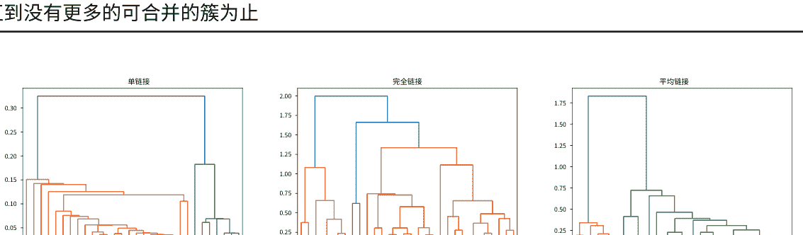

实际上，凝聚聚类有三种变体，取决于我们如何定义对象组之间的不相似度。我们在下面给出详细信息。

### 21.2.1.1 单链接

在单链接聚类中，也称为最近邻聚类，两个群组 $G$ 和 $H$ 之间的距离被定义为每个群组中最接近的两个成员之间的距离：

$$d_{SL}(G, H) = \min_{i \in G, i' \in H} d_{i,i'} \qquad (21.10)$$

参见图21.3(a)。

使用单链接聚类构建的树是数据的最小生成树，它是最小化边权重（距离）之和的方式连接所有对象的树。要理解这一点，注意当我们合并两个聚类时，我们连接了两个最接近的成员；这在相应的节点之间添加了一条边，这是有保证的“最轻的权重”边连接这两个簇。一旦两个簇被合并，它们将不再被考虑，因此我们不能创建循环。由于这个原因，我们实际上可以在 $O(N^2)$ 时间内实现单链接聚类，而其他变体需要 $O(N^3)$ 时间。

### 21.2.1.2 完全连接

在完全连接聚类中，也称为最远邻聚类，两个群组之间的距离被定义为两个最远的成对之间的距离：

$$d_{CL}(G, H) = \max_{i \in G, i' \in H} d_{i,i'}$$

见图21.3(b)。

单链接只要求两个群组中的一对接近，无论群组的其他成员的相似性如何，它们就被认为是接近的。因此，可以形成违反紧凑性属性的聚类，该属性表示群组内的所有观测值应该相互相似。特别是，如果我们将群组的直径定义为其成员之间的最大不相似性，即 $d_G = \max_{i \in G, i' \in G} d_{i,i'}$，则可以看出单链接可以产生直径较大的聚类。完全连接表示相反的极端情况：只有当它们的并集中的所有观测值相对相似时，两个群组才被认为是接近的。这将倾向于产生直径较小的聚类，即紧凑的聚类。（将图21.4(a)与图21.4(b)进行比较。）

### 21.2.1.3 平均连接

在实践中，首选的方法是平均连接聚类，它衡量了所有配对之间的平均距离：

$$d_{avg}(G, H) = \frac{1}{n_G n_H} \sum_{i \in G} \sum_{i' \in H} d_{i,i'}$$

其中，$n_G$ 和 $n_H$ 分别是组 $G$ 和 $H$ 中的元素数量。参见图21.3(c)。平均连接聚类代表了单连接聚类和完全连接聚类之间的折衷。它倾向于产生相对紧凑但相对远离的聚类。（参见图21.4(c)。）然而，由于它涉及到 $d_{i,i'}$ 的平均值，任何测量尺度的改变都可能改变结果。相比之下，单连接聚类和完全连接聚类对 $d_{i,i'}$ 的单调变换是不变的，因为它们保持相对顺序不变。

### 21.2.2 示例

假设我们有一组对于 $N = 300$ 个基因在 $T = 7$ 个时间点的表达水平进行的时间序列测量。因此，每个数据样本是一个向量 $\mathbf{x}_n \in \mathbb{R}^7$。参见图21.5以查看数据的可视化。我们可以看到有几种类型的基因，例如那些在时间上单调增加表达水平的基因（对于给定的刺激），那些在时间上单调减少表达水平的基因，以及那些具有更复杂响应模式的基因。

假设我们使用欧几里德距离来计算一对一的不相似矩阵，$\mathbf{D} \in \mathbb{R}^{300 \times 300}$，并且应用平均链接的层次聚类。我们得到图21.6(a)中的树状图。如果我们在某个高度上，我们得到了图21.6(b)中显示的16个簇。分配给每个簇的时间序列确实“看起来”相似。

### 21.2.3 扩展

基本HAC算法有许多扩展。例如，[Mon+21]提出了一种更可扩展的自底向上算法的版本，可以并行构建子簇。而[Mon+19]讨论了一种在线版本的算法，可以在数据到达时进行聚类，并重新考虑以前的聚类决策（与仅仅做贪婪决策相反）。在某些假设下，这可以明确地恢复真实的潜在结构。这对于在流式文本数据中对“提及”的“实体”（如人或物）进行聚类非常有用。（这个问题被称为实体发现。）

## 21.3 K均值聚类

分层凝聚聚类存在几个问题（第21.2节）。首先，它需要$O(N^3)$的时间（对于平均链接方法），这使得它难以应用于大型数据集。其次，它假设已经计算出了一个不相似度矩阵，而“相似性”的概念通常不明确，需要学习。第三，它只是一个算法，而不是一个模型，因此很难评估其好坏。也就是说，它没有明确的优化目标。

在本节中，我们讨论了K-means算法[Mac67; Llo82]，该算法解决了这些问题。首先，它的运行时间为 $O(NKT)$，其中T是迭代次数。其次，它通过计算到学习的聚类中心 $\mu_k \in \mathbb{R}^D$的欧氏距离来计算相似性，而不需要一个不相似性矩阵。第三，它优化了一个明确定义的成本函数，我们将会看到。

### 21.3.1 算法

我们假设存在K个聚类中心 $\mu_k \in \mathbb{R}^D$，因此我们可以通过将每个数据点 $x_n \in \mathbb{R}^D$分配给最近的中心来对数据进行聚类:

$$z_n^* = \arg\min_k \|x_n - \mu_k\|_2^2 \quad (21.13)$$

当然，我们不知道聚类中心，但是我们可以通过计算分配给它们的所有点的平均值来估计它们:

$$\mu_k = \frac{1}{N_k} \sum_{n:z_n=k} x_n \quad (21.14)$$

然后我们可以迭代这些步骤直到收敛。

更正式地说，我们可以将其视为找到以下代价函数的局部最小值，即所谓的失真函数:

$$J(\mathbf{M}, \mathbf{Z}) = \sum_{n=1}^N \|x_n - \mu_{z_n}\|^2 = \|\mathbf{X} - \mathbf{Z}\mathbf{M}^T\|_F^2 \quad (21.15)$$

其中 $\mathbf{X} \in \mathbb{R}^{N\times D}$， $\mathbf{Z} \in [0,1]^{N\times K}$， 而 $\mathbf{M} \in \mathbb{R}^{D\times K}$包含其列中的聚类中心 $\mu_k$。K-means使用交替最小化来优化此问题。（这与我们在第21.4.1.1节中讨论的GMM的EM算法密切相关。）

### 21.3.2 示例

在本节中，我们给出了一些K-means聚类的示例。

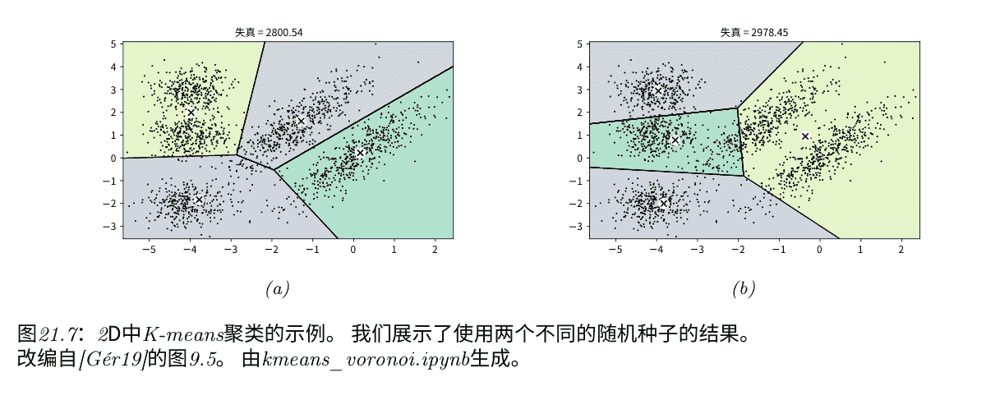

图21.7: 2D中K-means聚类的示例。我们展示了使用两个不同的随机种子的结果。改编自[Gér19]的图9.5。由kmeans_voronoi.ipynb生成。

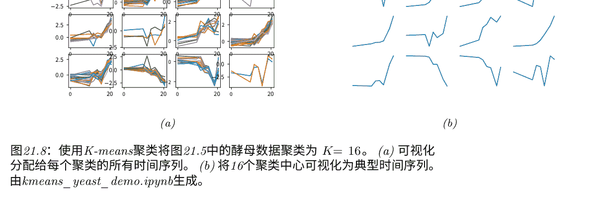

图21.8: 使用K-means聚类将图21.5中的酵母数据聚类为K=16。(a)可视化分配给每个聚类的所有时间序列。(b)将16个聚类中心可视化为典型时间序列。由kmeans_yeast_demo.ipynb生成。

#### 21.3.2.1 在2D平面上聚类点

图21.7给出了应用于2D平面上一些点的K-means聚类的示例。我们看到该方法引导了点的Voronoi镶嵌。得到的聚类对初始化非常敏感。事实上，我们可以看到右侧质量较低的聚类具有更高的失真。

默认情况下，sklearn使用10个随机重启（与第21.3.4节中描述的K-means++初始化相结合），并返回具有最低失真的聚类结果。（在sklearn中，失真被称为“惯性”。）

#### 21.3.2.2 对酵母细胞的基因表达时间序列数据进行聚类

在图21.8中，我们展示了将K-means聚类应用于图21.5中显示的300×7酵母时间序列矩阵的结果，其中K=16。我们可以看到“看起来相似”的时间序列彼此之间是分配给同一簇。我们还看到每个簇的质心是针对该簇中所有数据点的一个合理摘要。最后我们注意到组6没有被使用，因为没有点被分配给它。然而，这只是初始化过程的一个偶然事件，如果我们重复算法，我们不能保证得到相同的聚类或聚类数。（我们在第21.3.4节讨论了初始化方法的好方法，在第21.3.7节讨论了选择 $K$的方法。）

### 21.3.3 向量量化

假设我们想对一些实值向量进行有损压缩，$x_n \in \mathbb{R}^D$。一个非常简单的方法是使用向量量化或 VQ。基本思想是用离散符号 $z_n \in \{1, \dots, K\}$ 替换每个实值向量 $x_n \in \mathbb{R}^D$，该符号是一个指向 K个原型的索引，$\mu_k \in \mathbb{R}^D$。每个数据向量都通过使用最相似原型的索引进行编码，其中相似性是用欧氏距离来衡量的：

$$\text{encode}(x_n) = \arg \min_{k} \| x_n - \mu_k \|^2$$

我们可以通过计算重构误差或引起的失真来定义一个衡量码书质量的代价函数：

$$J \triangleq \frac{1}{N} \sum_{n=1}^{N} \| x_n - \mathrm{decode}(\mathrm{encode}(x_n)) \|^2 = \frac{1}{N} \sum_{n=1}^{N} \| x_n - \mu_{z_n} \|^2$$

其中 $\mathrm{decode}(k) = \mu_k$。这正是K-means算法最小化的代价函数。

当然，如果我们将一个原型分配给每个数据向量，使用$K = N$并分配$\mu_n = x_n$，我们可以实现零失真。然而，这并不对数据进行任何压缩。特别是，它需要$O(NDB)$位，其中$N$是实值数据向量的数量，每个向量的长度为 $D$，$B$是表示实值标量所需的位数（表示每个 $x_n$的量化精度）。

通过检测数据中的相似向量，创建原型或质心，并将数据表示为与这些原型的偏差，我们可以做得更好。这减少了空间要求为 $O(N \log_2 K + KDB)$位。 这是因为每个$N$数据向量都需要指定它使用的 $K$个码字；而每个码书条目都需要存储，每个码书条目都是一个 $D$维向量，所以会产生 $O(KDB)$项。 当 $N$很大时，第一项占主导地位，因此我们可以将编码方案的速率（每个对象所需的位数）近似为 $O(\log_2 K)$，这通常远小于 $O(DB)$。

VQ的一个应用是图像压缩。 考虑图21.9中的 $200 \times 320$像素图像；我们将其视为一组$N = 64,000$标量。 如果我们使用一个字节来表示每个像素（0到255的灰度强度），那么 $B= 8$，因此我们需要 $N B= 512,000$位来表示未压缩的图像。 对于压缩图像，我们需要 $O( N \log_2 K)$位。 对于 $K= 4$，这大约是128kb，压缩比为4，但几乎没有感知损失（见图21.9(b)）。 如果我们对像素之间的空间相关性建模，例如，如果我们编码5x5块（如JPEG所使用的），则可以实现更大的压缩。 这是因为残差误差（与模型预测的差异）会更小，需要更少的位来编码。 这显示了数据压缩和密度估计之间的深刻联系。 有关更多信息，请参阅本书的续集[Mur23]。

### 21.3.4 K-means++算法

K-means正在优化一个非凸目标函数，因此需要谨慎初始化。 一个简单的方法是随机选择 $K$个数据点，并将它们作为 $\boldsymbol{\mu}_k$的初始值。 我们可以通过使用多次重启来改进这一点，即从不同的随机起始点多次运行算法，然后选择最佳解。 然而，这可能会很慢。

一个更好的方法是按顺序选择中心点，以尽量‘覆盖’数据。 也就是说，我们随机均匀地选择初始点，然后每个后续点都根据其到最近的聚类中心点的平方距离与剩余点的概率成比例地选择。 也就是说，在第 $t$次迭代中，我们选择下一个聚类中心点为 $\boldsymbol{x}_n$的概率为

$$p(\boldsymbol{\mu}_t = \boldsymbol{x}_n) = \frac{D_{t-1}(\boldsymbol{x}_n)}{\sum_{n'=1}^{N} D_{t-1}(\boldsymbol{x}_{n'})} \tag{21.18}$$

$$D_t(\boldsymbol{x}) = \min_{k=1}^{t-1} ||\boldsymbol{x} - \boldsymbol{\mu}_k||_2^2 \tag{21.19}$$

是 $\boldsymbol{x}$到最近现有质心的平方距离。 因此，远离质心的点更有可能被选择，从而减少失真。 这被称为最远点聚类[Gon85]，或者$K$-means++[AV07; Bah+12; Bac+16; BLK17; LS19a]。 令人惊讶的是，这个简单的技巧可以保证重建误差永远不会比最优解差$O(\log K)$ [AV07]。

### 21.3.5 K-medoids算法

有一种称为K-medoids算法的K-means变体，我们在其中估计每个聚类中心通过选择数据示例 $\boldsymbol{x}_n \in \mathcal{X}$，其与该簇中所有其他点的平均不相似度最小来选择$\boldsymbol{\mu}_k$；这样的点被称为 **medoid**。 相比之下，在K-means中，我们对分配给该簇的点 $\boldsymbol{x}_n \in \mathbb{R}^D$进行平均以计算中心。 K-medoids可以更加鲁棒。 对于异常值，K-medoids可以更加鲁棒（尽管这个问题也可以通过使用学生分布的混合而不是高斯分布的混合来解决）。更重要的是，K-medoids可以应用于不在$\mathbb{R}^D$中的数据，其中平均可能没有明确定义。在K-medoids中，算法的输入是$N \times N$两两距离矩阵$D(n, n')$，而不是$N \times D$特征矩阵。

解决K-medoids的经典算法是分区围绕medoids或**PAM**方法[K R87]。在这种方法中，每次迭代，我们循环遍历所有$K$ medoids。对于每个medoid $m$，我们考虑每个非medoid点$o$，交换$m$和$o$，并重新计算成本（所有点到其medoid的距离之和）。如果成本减少了，我们保留这个交换。该算法的运行时间为$O(N^2KT)$，其中$T$是迭代次数。

还有一种更简单更快的方法，被称为**Voronoi**迭代方法，由[PJ09]提出。在这种方法中，每次迭代有两个步骤，类似于**K-means**。首先，对于每个簇$k$，查看当前分配给该簇的所有点$S_k = \{n: z_n = k\}$，然后将$m_k$设置为该集合的中心点的索引。（要找到中心点，需要检查所有候选点，并选择到所有其他点的距离之和最小的点。）其次，对于每个点$n$，将其分配给最近的中心点，$z_n = \argmin_k D(n, k)$。伪代码如算法21.2所示。

算法 21.2: K-medoids 算法

1. 将 $m_1$ 到 $m_K$ 初始化为来自 $\{1, ..., N\}$ 的大小为 $K$ 的随机子集。
2. 重复
3. $\quad z_n = \argmin_k d(n, m_k)$ for $n = 1 : N$
4. $\quad m_k = \argmin_{n:z_n=k} \sum_{n':z_{n'}=k} d(n, n')$ for $k = 1 : K$
5. 直到收敛

### 21.3.6 加速技巧

K-means聚类算法的时间复杂度为$O(NKI)$，其中$I$是迭代次数，但是我们可以通过各种技巧来减少常数因子。例如，[Elk03]展示了如何利用三角不等式来跟踪输入和质心之间的距离的下界和上界；这可以用来消除一些冗余计算。另一种方法是使用小批量近似，正如[Scu10]中提出的那样。这样可以显著提高速度，尽管可能会导致略微更差的损失（见图21.10）。

### 21.3.7 选择聚类数目 $K$

在本节中，我们讨论如何选择K-means算法中的聚类数$K$以及其他相关方法。

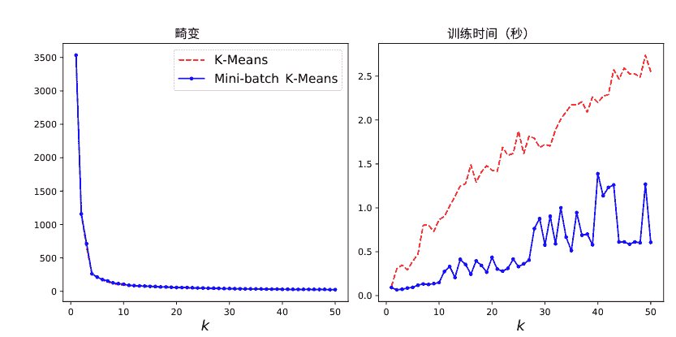

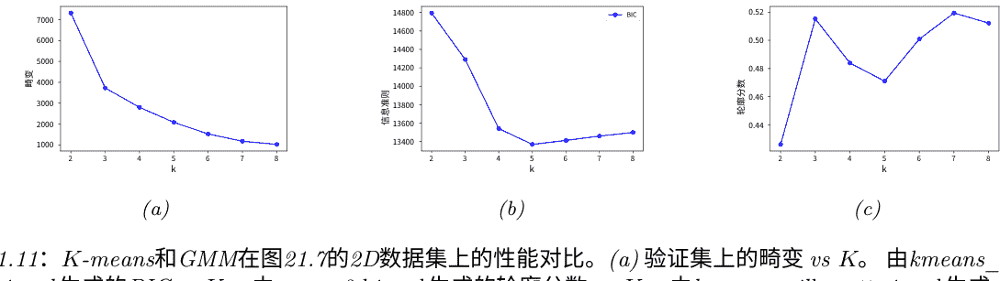

#### 21.3.7.1 最小化失真

根据我们在监督学习方面的经验，选择 $K$ 的一个自然选择是选择在验证集上最小化重构误差的值，定义如下：

$$\text{err}(\mathcal{D}_{\text{valid}}, K) = \frac{1}{|\mathcal{D}_{\text{valid}}|} \sum_{n \in \mathcal{D}_{\text{valid}}} ||\boldsymbol{x}_n - \hat{\boldsymbol{x}}_n||_2^2$$

其中 $\hat{\boldsymbol{x}}_n = \text{decode}(\text{encode}(\boldsymbol{x}_n))$ 是 $\boldsymbol{x}_n$ 的重构。

不幸的是，这种技术不起作用。实际上，正如我们在图 21.11a 中看到的那样，失真随 $K$ 单调递减。为了理解原因，注意 K-means 模型是一个退化的密度模型，由 $K$ 个中心点的“尖峰”组成。随着 $K$ 的增加，我们“覆盖”了更多的输入空间。因此，随着 $K$ 的增加，任何给定的输入点更有可能找到一个接近的原型来准确地表示它，从而降低重构误差。因此，与监督学习不同，我们不能使用验证集上的重构误差来选择最佳的无监督模型。

（这个评论也适用于选择 PCA 的维度，请参见第 20.1.4 节。）

> 作者：Kevin P. Murphy。 (C) MIT Press. CC-BY-NC-ND许可证

## 21.3.7.2 最大化边际似然

一种有效的方法是使用适当的概率模型，例如GMM，正如我们在第21.4.1节中所描述的。然后，我们可以使用数据的对数边际似然（LML）来进行模型选择。

我们可以使用BIC分数来近似LML，正如我们在第5.2.5.1节中讨论的那样。根据方程（5.59），我们有

```
BIC(K) = \log p(\mathcal{D}|\hat{\theta}_k) - \frac{D_K}{2} \log(N)
```

其中 $D_K$ 是具有 $K$ 个聚类的模型中的参数数量，而 $\hat{\theta}_K$ 是MLE。从图21.11b中我们可以看到，这展示了典型的U形曲线，惩罚先减少后增加。

这个方法有效的原因是每个簇都与一个高斯分布相关联，填充了输入空间的一个区域，而不是一个退化的尖峰。一旦我们有足够的簇来覆盖分布的真实模式，贝叶斯奥卡姆剃刀（第5.2.3节）就会发挥作用，并开始惩罚模型过于复杂的情况。

有关混合模型的贝叶斯模型选择的更多讨论，请参见第21.4.1.3节。

## 21.3.7.3 Silhouette系数

在本节中，我们描述了一种常见的启发式方法，用于选择K-means聚类模型中的簇数。这个方法适用于球形（而非细长的）簇。首先，我们定义实例 $i$ 的轮廓系数 $\text{sc}(i) = (b_i - a_i) / \max(a_i, b_i)$，其中 $a_i$ 是簇 $k_i$ 中其他实例到实例 $i$ 的平均距离，$k_i = \text{argmin}_k \|\boldsymbol{\mu}_k - \mathbf{x}_i\|$，而 $b_i$ 是到下一个最近簇 $k_i'$ 中其他实例的平均距离，$k_i' = \text{argmin}_{k \neq k_i}$，而 $b_i$ 是簇之间的距离的度量。轮廓系数的范围是从-1到+1。值为+1表示实例接近其所属簇的所有成员，并且远离其他簇；值为0表示它接近簇边界；值为-1表示它可能在错误的簇中。我们定义聚类 $K$ 的轮廓得分为所有实例的平均轮廓系数。

在图21.11a中，我们绘制了图21.7中的数据的失真与 $K$ 的关系。正如我们上面解释的，它随 $K$ 单调下降。在曲线上有一个轻微的“拐点”或“弯曲”在 $K=3$ 处，但这很难检测出来。在图21.11c中，我们绘制了轮廓得分与 $K$ 的关系。现在我们在 $K=3$ 处看到一个更明显的峰值，尽管 $K=7$ 几乎一样好。请参见图21.12以比较其中一些聚类。

查看个体轮廓系数可能是有益的，而不仅仅是平均分数。我们可以在轮廓图中绘制这些，如图21.13所示，其中每个彩色区域对应一个不同的聚类。虚线垂直线是平均系数。在这条线左边有很多点的聚类可能质量较低。即使数据不是2D，我们也可以使用轮廓图来查看每个聚类的大小。

## 21.3.7.4 逐步增加混合成分的数量

寻找最佳的 $K$ 值的另一种方法是逐步“增长”GMM。我们可以从一个较小的 $K$ 值开始，每轮训练后，考虑拆分具有最高混合权重的两个聚类中心分成两部分，新的聚类中心是原始聚类中心的随机扰动，新的分数是旧分数的一半。如果一个新的聚类具有太小的分数或者方差太小，它将被移除。我们继续这样做，直到达到所需的聚类数。详细信息请参见[FJ02]。

## ### 21.3.7.5 稀疏估计方法

另一种方法是选择一个较大的 $K$值，然后使用某种稀疏促进的先验或推理方法来“消除”不需要的混合成分，例如变分贝叶斯。详细信息请参见本书的续集[Mur23]。

## 21.4 使用混合模型进行聚类

我们已经看到K-means算法如何在 $\mathbb{R}^D$中用于对数据向量进行聚类。然而，这种方法假设所有的聚类具有相同的球形形状，这是一个非常限制性的假设。此外，K-means算法假设所有的聚类可以用输入空间中的高斯分布来描述，因此无法应用于离散数据。通过使用混合模型（第3.5节），我们可以克服这两个问题，如下所示。

图21.13: K-means在图21.7中的2D数据集上的不同 K 的轮廓图。由kmeans_silhouette.ipynb生成。

### 21.4.1 高斯混合模型

回顾第3.5.1节，高斯混合模型（GMM）是一个形式为

```
$p(\mathbf{x}|\boldsymbol{\theta}) = \sum_{k=1}^{K} \pi_k \mathcal{N}(\mathbf{x}|\boldsymbol{\mu}_k, \boldsymbol{\Sigma}_k)$
```

如果我们知道模型参数 $\boldsymbol{\theta} = (\pi, \{\boldsymbol{\mu}_k, \boldsymbol{\Sigma}_k\})$，我们可以使用贝叶斯规则计算数据点 $\mathbf{x}_n$ 对于聚类 $k$ 的责任（后验成员概率）：

```
$r_{nk} \triangleq p(z_n = k|\mathbf{x}_n, \boldsymbol{\theta}) = \frac{p(z_n = k|\boldsymbol{\theta}) p(\mathbf{x}_n|z_n = k, \boldsymbol{\theta})}{\sum_{k'=1}^{K} p(z_n = k'|\boldsymbol{\theta}) p(\mathbf{x}_n|z_n = k', \boldsymbol{\theta})}$
```

给定责任，我们可以计算最可能的簇分配如下：

```
$\hat{z}_n = \arg \max_k r_{nk} = \arg \max_k [\log p(\mathbf{x}_n|z_n = k, \boldsymbol{\theta}) + \log p(z_n = k|\boldsymbol{\theta})]$
```

这被称为hard clustering。

### 21.4.1.1 K-means是EM的一个特例

我们可以使用EM算法（第8.7.3节）估计GMM的参数。事实证明，K-means算法是该算法的一个特例，其中我们进行了两个近似：

图21.14: 使用具有 K=5个组件的GMM拟合的一些二维数据。 左列: 边缘分布p(x)。 右列: 每个混合分布的可视化,以及点到其最可能簇的硬分配。 (a-b)完全协方差。 (c-d)绑定的完全协方差。 (e-f)对角线协方差,(g-h)球形协方差。 颜色编码是任意的。由gmm_2d.ipynb生成。

作者: Kevin P. Murphy。 (C) MIT Press. CC-BY-NC-ND许可证

图21.15: 一维数据，上面叠加了核密度估计。改编自[Mar18]的图6.2。由gmm_identifiability_pymc3.ipynb生成。

图21.16: 在对GMM的参数进行后验推断时，标签切换问题的示例。我们展示了从4个HMC链中抽取的1000个样本的后验边缘的KDE估计。(a) 无约束模型。后验对称。(b) 约束模型，我们添加了一个惩罚项以确保μ0 < μ1。改编自[Mar18]的图6.6-6.7。由gmm_identifiability_pymc3.ipynb生成。

我们固定 Σ_k = I 和 π_k = 1/K 对于所有的聚类（因此我们只需要估计均值 μ_k），并且用硬聚类分配替代软聚类分配来近似E步骤，即，我们计算 z_n^* = argmax_k r_nk，并设置 r_nk ≈ I(k = z_n^*) 而不是使用软聚类分配，r_nk = p(z_n = k|x_n, θ)。通过这个近似，M步中的加权MLE问题在方程（8.165）中变为方程（21.14），因此我们恢复了K-means。

然而，假设所有的聚类都具有相同的球形形状是非常限制性的。例如，图21.14显示了一些2D数据使用不同形状的协方差矩阵引起的边际密度和聚类。我们可以看到，对于某些聚类（顶部行），建模这个特定的数据集需要能够捕捉到非对角线协方差。

### 21.4.1.2 不可识别性和标签切换

请注意，我们可以自由地对混合模型中的标签进行排列，而不会改变似然函数。这被称为标签切换问题，并且是参数的不可识别性的一个例子。

如果我们希望对参数进行后验推断（而不仅仅是计算MLE或MAP估计），这可能会导致问题。例如，假设我们使用HMC将K=2个组件的GMM拟合到图21.15中的数据。均值的后验概率，p(μ1, μ2|D)，如图21.16a所示。我们可以看到每个组件的边际后验概率，p(μk|D)，是双峰的。这反映了数据有两个同样好的解释：要么μ1≈47，要么μ1≈-47，μ2 ≈ 57，或者反之亦然。

为了打破对称性，我们可以在中心点上添加一个排序约束，使得 μ1 < μ2。 如果违反了约束条件，我们可以通过在目标函数中添加惩罚项或势函数来实现这一点。更准确地说，惩罚化的对数联合变成

ℓ'(θ) = log p(D|θ) + log p(θ) + ϕ(μ) 　　　　　　　　　　　　　　　　　　　　　　　　　　　　 (21.25)

其中

ϕ(μ) = { -∞ if μ1 < μ0; 0 否则　　　　　　　　　　　　　　　　　　　　　　　　　　　　　　 (21.26)

这样做会产生期望的效果，如图21.16b所示。

一种更通用的方法是对参数应用变换，以确保可识别性。也就是说，我们从一个提议中对参数 θ进行采样，然后在计算对数联合时对它们应用可逆变换θ' = f(θ)。 为了考虑变量的变化（第2.8.3节），我们添加雅可比行列式的对数。在一维排序变换的情况下，雅可比行列式的确定性为1，因此对数行列式项消失。

不幸的是，这种方法在超过1维问题时无法扩展，因为没有明显的方法来强制对中心 μk进行排序约束。

### 21.4.1.3 贝叶斯模型选择

一旦我们有了可靠的确保可识别性的方法，我们可以使用第5.2.2节中的贝叶斯模型选择技术来选择聚类的数量 K。 在图21.17中，我们展示了将GMM与 K= 3- 6个分量拟合到图21.15中的数据的结果。我们使用均值的排序变换，并使用HMC进行推断。我们将得到的GMM模型拟合结果与核密度估计（第16.3节）的拟合结果进行比较，后者通常过度平滑数据。 我们看到有相当强的证据表明存在两个峰，对应不同的亚群体。

我们可以通过计算它们的WAIC分数（广泛适用信息准则）来更加定量地比较这些模型，这是对对数边际似然的近似（详见[Wat10;Wat13; VGG17] ）。 结果如图21.18所示。（这种可视化方法是在[McE20, p228]中提出的。） 我们可以看到，K = 6的模型得分明显高于其他模型，尽管K = 5的模型紧随其后。 这与图21.17中的图形一致。

### 21.4.2 伯努利混合模型

正如我们在第3.5.2节中讨论的那样，我们可以使用伯努利混合模型对二进制数据进行聚类。该模型的形式为

p(y|z = k, θ) = ∏_{d=1}^{D} Ber(y_d|μ_{dk}) = ∏_{d=1}^{D} μ_{dk}^{y_d} (1 - μ_{dk})^{1-y_d}　　　　　　　　　　　　　　　　　　　　　　 (21.27)

这里 μdk是位于集群 k中的位 d打开的概率。我们可以使用EM、SGD、MCMC等方法来拟合这个模型。请参见图3.13，其中我们对一些二值化的MNIST数字进行了聚类。

## 21.5 谱聚类 *

在本节中，我们讨论了一种基于特征值分析的聚类方法。它使用特征向量为每个数据点生成特征向量，然后使用基于特征的聚类方法（如K-means，第21.3节）对其进行聚类。这被称为谱聚类[SM00; Lux07]。

### 21.5.1 归一化割

我们首先创建一个加权无向图 W，其中每个数据向量是一个节点，i - j边的强度是相似性的度量。通常，我们只将节点连接到其最相似的邻居，以确保图是稀疏的，从而加快计算速度。

我们的目标是找到 K个相似点的簇。也就是说，我们希望找到一个图的划分为 S1, . . . , SK个不相交的节点集合，以最小化某种代价。

我们第一次尝试的代价函数是计算每个簇内节点与簇外节点之间的连接权重：

```
$$ \text{cut}(S_1, \ldots, S_K) \triangleq \frac{1}{2} \sum_{k=1}^K W(S_k, \bar{S}_k) \quad (21.28) $$
```

其中 W(A, B) \triangleq \sum_{i \in A, j \in B} w_{ij}，而 \bar{S}_k = V \setminus S_k是 S_k的补集，其中 V = \{1, \ldots, N\}。不幸的是，这种方法通常只会将一个节点与其他节点分离开来，因为这样可以最小化切割的权重。为了防止这种情况发生，我们可以除以每个集合的大小，以得到以下目标，称为归一化割:

$$\text{Ncut}(S_1,\ldots,S_K) \triangleq \frac{1}{2} \sum_{k=1}^K \frac{\text{cut}(S_k,\overline{S_k})}{\text{vol}(S_k)}$$ (21.29) 其中 $\text{vol}(A) \triangleq \sum_{i\in A} d_i$ 是集合 $A$ 的总权重， $d_i = \sum_{j=1}^{N} w_{ij}$ 是节点 $i$ 的加权度。这将图分成 $K$ 个簇，使得每个簇内的节点相似，但与其他簇中的节点不同。

图21.18: 不同GMM的WAIC分数。空心圆表示每个模型的后验均值WAIC分数，黑线表示均值的标准误差。实心圆表示每个模型的样本内偏差，即未经惩罚的对数似然。虚线垂直线对应最大的WAIC值。灰色三角形表示该模型与最佳模型的WAIC分数差异。改编自[Mar18]的图6.10。由gmm_chooseK_pymc3.ipynb生成。

我们可以用二进制向量 $c_i \in \{0,1\}^N$ 来表达Ncut问题，其中 $c_{ik}=1$ 当且仅当点 $i$ 属于簇 $k$。不幸的是，这是一个NP难问题[WW93]。下面我们将讨论基于特征向量方法的问题的连续松弛形式，这样更容易解决。

### 21.5.2 图拉普拉斯特征向量编码聚类

在第20.4.9.2节中，我们讨论了图拉普拉斯算子，它被定义为 $\mathbf{L} \triangleq \mathbf{D} - \mathbf{W}$，其中 $\mathbf{W}$ 是图的对称权重矩阵， $\mathbf{D} = \text{diag}(d_i)$ 是一个包含每个节点加权度的对角矩阵， $d_i = \sum_j w_{ij}$。为了对基于图的聚类有一些直觉，我们注意到以下结果。

> 定理21.5.1. $\mathbf{L}$ 的特征向量集合与特征值0的零空间由指示向量张成 $\mathbf{1}_{S_1},\ldots,\mathbf{1}_{S_K}$，其中 $S_k$ 是图的 $K$ 个连通分量。

证明。让我们从 $K = 1$ 的情况开始。如果 $\mathbf{f}$ 是一个特征向量，其特征值为0，则 $0 = \sum_j w_{ij} (f_i - f_j)$。如果两个节点相连，即 $w_{ij} > 0$，则必须有 $f_i = f_j$。因此，对于所有通过图中路径连接的顶点， $f$ 是常数。现在假设 $K > 1$。在这种情况下，L将是块对角矩阵。类似的论证表明，我们将有K个指示函数，用于“选择出”连接的组件。

这提示了以下聚类算法。计算L的特征向量和特征值，并让U成为一个N × K矩阵，其列包含最小特征值的K个特征向量。（计算这样的“底部”特征向量的快速方法在[YHJ09]中讨论。）令$u_i \in \mathbb{R}^K$为U的第i行。由于这些$u_i$将是分段常数，我们可以对它们应用K-means聚类（第21.3节）来恢复连接的组件。（注意，向量$u_i$与第20.4.9节中讨论的拉普拉斯特征映射计算的向量相同。）

真实数据可能不会展示出如此清晰的块结构，但是可以使用摄动理论的结果来证明，“扰动”拉普拉斯矩阵的特征向量会接近这些理想的指示函数[NJW01]。

在实践中，对图拉普拉斯矩阵进行归一化是很重要的，以考虑到一些节点比其他节点更高度连接的事实。一种方法（在[NJW01]中提出）是创建一个对称矩阵

$$L_{sym} \triangleq D^{-\frac{1}{2}}LD^{-\frac{1}{2}} = I - D^{-\frac{1}{2}}WD^{-\frac{1}{2}}$$ (21.30)

这次，0的特征空间由$D^{\frac{1}{2}}1_s$张成……这表明以下算法：找到$L_{sym}$的最小K个特征向量，将它们堆叠成矩阵U，通过创建$t_{ij} = u_{ij} / \sqrt{\sum_k u_{ik}^2}$将每一行归一化为单位范数。用K-means方法对矩阵T进行聚类，然后推断原始点的分区。

图21.19: 一些数据的聚类结果。(a) K-means. (b) 谱聚类。由spectral_clustering_demo.ipynb生成。

### 21.5.3 示例

图21.19展示了该方法的实际应用。在图21.19(a)中，我们可以看到K-means在聚类方面表现不佳，因为它隐含地假设每个聚类对应一个球形高斯分布。接下来我们尝试谱聚类。我们使用高斯核计算一个密集的相似性矩阵W。\(W_{ij} = \exp(-\frac{1}{2\sigma^2}||x_i - x_j||^{2})\)。然后我们计算规范化拉普拉斯矩阵的前两个特征向量 \(L_{sym}\)。从中我们使用 \(K\)-means推断出聚类，其中 \(K = 2\)；结果如图21.19(b)所示。

### 21.5.4 与其他方法的关联

谱聚类与其他几种无监督学习方法密切相关，我们将在下面讨论其中一些方法。

### 21.5.4.1 与kPCA的关联

谱聚类与核PCA（第20.4.6节）密切相关。特别是，kPCA使用 \( \mathbf{W} \) 的最大特征向量；这些等价于 \( \mathbf{I} - \mathbf{W} \) 的最小特征向量。这与上述方法类似，计算的是 \( \mathbf{L} = \mathbf{D} - \mathbf{W} \) 的最小特征向量。详细信息请参见[Ben+04a]。实践中，谱聚类往往比kPCA给出更好的结果。

### 21.5.4.2 与随机游走分析的关联

实践中，通过计算归一化图拉普拉斯矩阵的特征向量可以得到更好的结果。一种归一化图拉普拉斯矩阵的方法，被用于[SM00; Mei01]，是定义

\(\mathbf{L}_{rw} \triangleq \mathbf{D}^{-1}\mathbf{L} = \mathbf{I} - \mathbf{D}^{-1}\mathbf{W}\) (21.31)

可以证明对于 \( \mathbf{L}_{rw} \)，0的特征空间再次由指示向量 \( \mathbf{1}_S \) 张成，所以我们可以直接在 \( K \) 个最小特征向量 \( \mathbf{U} \) 上进行聚类。[Lux07],

这种方法与图上的随机游走之间有一个有趣的联系。首先，注意到 \( \mathbf{P} = \mathbf{D}^{-1}\mathbf{W} = \mathbf{I} - \mathbf{L}_{rw} \) 是一个随机矩阵，其中 \( p_{ij} = w_{ij}/d_i \) 可以解释为从 \( i \) 到 \( j \) 的概率。如果图是连通且非二分图，则具有唯一的平稳分布 \( \pi = (\pi_1, \dots, \pi_N) \)，其中 \( \pi_i = d_i / \text{vol}(V) \)，而 \( \text{vol}(V) = \sum_i d_i \) 是所有节点度数的总和。此外，可以证明对于大小为2的分区，

\(\text{Ncut}(S, \bar{S}) = p(\bar{S}|S) + p(S|\bar{S})\) (21.32)

这意味着我们正在寻找一个切割点，使得随机游走更多时间过渡到相似的点，并且很少从 \( S \) 到 \( \bar{S} \) 或者反之进行过渡。这个分析可以扩展到 \( K > 2 \)；详细信息请参见[Mei01]。

## 21.6 双聚类 *

在某些情况下，我们有一个数据矩阵 \( \mathbf{X} \in \mathbb{R}^{N_r \times N_c} \)，我们想要对行和列进行聚类；这被称为双聚类或共聚类。这在生物信息学中被广泛使用，其中行通常表示基因，列表示条件。它也可以用于协同过滤，其中行表示用户，列表示电影。

已经提出了各种临时方法用于双聚类；有关详细信息，请参见[MO04]。在第21.6.1节中，我们提出了一个简单的概率生成模型，其中我们为每一行分配一个潜在的聚类id，为每一列分配一个不同的潜在聚类id。在第21.6.2节中，我们将其扩展到每一行可以属于多个聚类的情况，这取决于我们选择使用哪些特征组（列）来定义不同的对象组（行）。

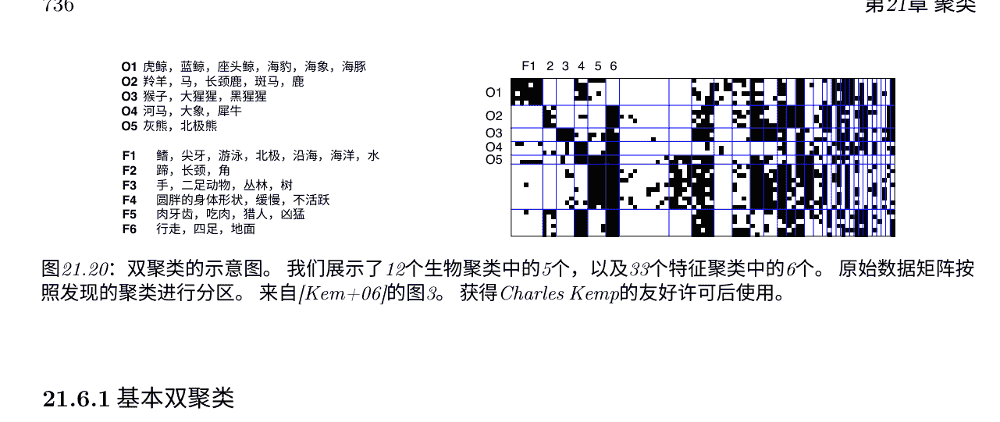

### 21.6.1 基本双聚类

在这里，我们提出了一个基于[Kem+06]的简单概率生成模型来进行双聚类（也可以参考[SMM03]中的相关方法）。这个想法是将每一行和每一列与一个潜在指示器相关联，其中 \(u_i \in \{1, \dots, N_u\}, v_j \in \{1, \dots, N_v\}\)，其中 \(N_u\) 是行聚类的数量， \(N_v\) 是列聚类的数量。然后我们使用以下生成模型：

$$ p(\mathbf{U}) = \prod_{i=1}^{N_r} \text{Unif}(u_i | \{1, \dots, N_u\}) $$

$$ p(\mathbf{V}) = \prod_{j=1}^{N_c} \text{Cat}(v_j | \{1, \dots, N_v\}) $$

$$ p(\mathbf{X}|\mathbf{U}, \mathbf{V}, \boldsymbol{\theta}) = \prod_{i=1}^{N_r} \prod_{j=1}^{N_c} p(X_{ij} | \theta_{u_i, v_j}) $$

其中 \(\theta_{a,b}\) 是行聚类 \(a\) 和列聚类 \(b\) 的参数。图21.20展示了一个简单的例子。数据的形式为 \(X_{ij}=1\) iff 动物 \(i\) 具有特征 \(j\)，其中 \(i=1:50\) 和 \(j=1:85\)。动物代表鲸鱼、熊、马等。特征代表栖息地的属性（丛林、树木、沿海），或解剖属性（有牙齿、四足），或行为属性（游泳、吃肉）等。该方法发现了12个动物聚类和33个特征聚类。（[Kem+06]使用贝叶斯非参数方法推断聚类的数量。）例如，O2聚类是{羚羊、马、长颈鹿、斑马、鹿}，其特征聚类为F2={蹄子、长脖子、角}和F6={行走、四足、地面}，而O4聚类是{河马、大象、犀牛}，其特征聚类为F4={圆胖的身体、缓慢、不活跃}和F6。

### 21.6.2 嵌套分区模型（Crosscat）

基本双聚类问题（第21.6.1节）的问题在于每个对象（行）只能属于一个聚类。直观地说，一个对象可以有多个角色，并且可以根据使用的特征子集而被分配到不同的聚类中。例如，在动物数据集中，我们可能希望根据解剖特征（例如，哺乳动物是温血动物，爬行动物是

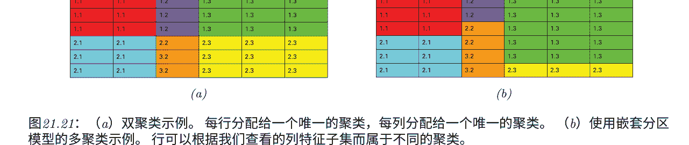

图21.21：(a) 双聚类示例。每行分配给一个唯一的聚类，每列分配给一个唯一的聚类。(b) 使用嵌套分区模型的多聚类示例。行可以根据我们查看的列特征子集而属于不同的聚类。

不同) 或基于行为特征（例如，捕食者与猎物）进行分组。我们现在介绍一个可以捕捉这种现象的模型。我们用一个示例来说明这种方法。假设我们有一个 \(6 \times 6\) 矩阵，其中 \(N_u=2\) 行聚类和 \(N_v=3\) 列聚类。此外，假设潜在的列分配如下： \(v=[1,1,2,3,3,3]\)。这意味着我们将列1和2放入组1，将列3放入组2，将列4到6放入组3。对于被聚类到组1的列，我们按如下方式聚类行： \(u_{:,1}=[1,1,1,2,2,2]\);对于被聚类到组2的列，我们按如下方式聚类行： \(u_{:,2}=[1,1,2,2,2,2]\);对于被聚类到组3的列，我们按如下方式聚类行： \(u_{:,3}=[1,1,1,1,1,2]\).

\(p(\mathbf{U}) = \prod_{i=1}^{N_r} \prod_{l=1}^{N_v} \text{Unif}(u_{il} | \{1, \ldots, N_u\})\)

\(p(\mathbf{V}) = \prod_{j=1}^{N_c} \text{Unif}(v_j | \{1, \ldots, N_v\})\)

\(p(\mathbf{Z}|\mathbf{U}, \mathbf{V}) = \prod_{i=1}^{N_r} \prod_{j=1}^{N_c} \mathbb{I} \left( Z_{ij} = (u_{i, v_j}, v_j) \right)\)

\(p(\mathbf{X}|\mathbf{Z}, \theta) = \prod_{i=1}^{N_r} \prod_{j=1}^{N_c} p(X_{ij} | \theta_{z_{ij}})\)

其中 \(\theta_{k,l}\) 是聚类 \(k\in\{1,\dots,N_u\}\) 和 \(l\in\{1,\dots,N_v\}\) 的参数。这个模型是独立提出的[Sha+06; Man+16]，他们称之为交叉分类（用于交叉分类），[Gua+10; CFD10]称之为多聚类，[RG11]称之为嵌套分区。在所有这些论文中，作者们提出使用狄利克雷过程来避免估计聚类数的问题。在这里，我们假设聚类数是已知的，并且为了符号简洁起见，显示参数。

图21.22展示了该模型应用于包含22个动物和106个特征的二进制数据。该图显示了（近似）MAP分区。第一个列分区包含分类特征，例如“有骨骼”，“是恒温动物”，“下蛋”等。这将

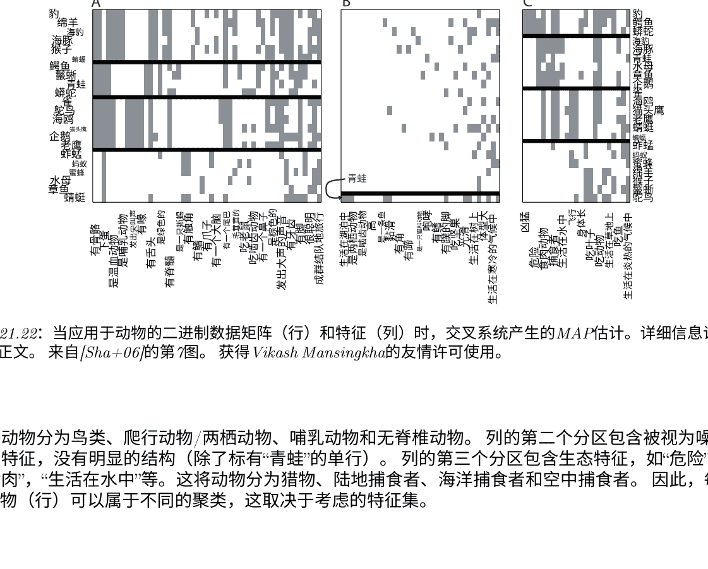

图21.22: 当应用于动物的二进制数据矩阵（行）和特征（列）时，交叉系统产生的MAP估计。详细信息请参见正文。来自[Sha+06]的第7图。获得Vikash Mansingkha的友情许可使用。

将动物分为鸟类、爬行动物/两栖动物、哺乳动物和无脊椎动物。列的第二个分区包含被视为噪声的特征，没有明显的结构（除了标有“青蛙”的单行）。列的第三个分区包含生态特征，如“危险”，“食肉”，“生活在水中”等。这将动物分为猎物、陆地捕食者、海洋捕食者和空中捕食者。因此，每个动物（行）可以属于不同的聚类，这取决于考虑的特征集。

# 22 推荐系统

推荐系统是根据各种信息（例如用户过去的观看/购买行为，如他们对电影的高低评分，他们点击的广告等），以及可选的“附加信息”（例如用户的人口统计信息，或有关项目内容的信息，如标题、类型或价格），向用户推荐物品（如电影、书籍、广告）的系统。这些系统被各种互联网公司广泛使用，如Facebook、亚马逊、Netflix、谷歌等。在本章中，我们对这个主题进行了简要介绍。更多细节可以在例如[DKK12; Pat12; Yan+14; AC16; Agg16; Zha+19b]中找到。

## 22.1 显式反馈

在本节中，我们考虑了最简单的设置，即用户根据评分（如+1或-1表示喜欢/不喜欢，或者从1到5的分数）向系统提供明确的反馈。设 \(Y_{ui} \in \mathbb{R}\) 为用户 \(u\) 对项目 \(i\) 的评分。我们可以将此表示为一个 \(M \times N\) 矩阵，其中 \(M\) 是用户数量， \(N\) 是项目数量。通常，这个矩阵会非常大但非常稀疏，因为大多数用户不会对大多数项目提供任何反馈。请参见图22.1(a)的示例。我们还可以将这个稀疏矩阵视为一个二分图，其中 \(u - i\) 边的权重为 \(Y_{ui}\)。这反映了我们处理的是关系数据，即 \(u\) 和 \(i\) 的值没有固有的含义（它们只是任意的索引），重要的是 \(u\) 和 \(i\) 之间的连接。

如果 \(Y_{ui}\) 缺失，可能是因为用户 \(u\) 没有与物品 \(i\) 进行交互，或者可能是因为他们知道他们不会喜欢它，所以选择不参与。在前一种情况下，一些数据是随机缺失的；在后一种情况下，缺失信息对于真实值 \(Y_{ui}\) 是有信息量的。（详见[Mar+11]进行进一步讨论。）为简单起见，我们假设数据是随机缺失的。

### 22.1.1 数据集

一个著名的明确评级矩阵的例子是由电影流媒体公司Netflix提供的。在2006年，他们发布了一个包含100,480,507个电影评级（在1到5的范围内）的大型数据集，来自480,189个用户对17,770部电影的评级。尽管训练集非常庞大，评级矩阵仍然有99%的稀疏性（未知）。除了数据之外，他们还提供了一笔价值100万美元的奖金，称为Netflix奖，给予任何能够比他们现有系统更准确地预测一组测试（用户，物品）对的真实评级的团队。该奖项于2009年9月21日被一个名为“BellKor's Pragmatic Chaos”的团队获得。他们使用了多种不同的方法进行集成。

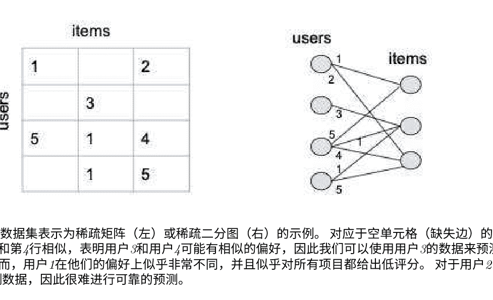

在[Kor09; BK07; FHK12]中描述。然而，他们集成中的一个关键组件是在第22.1.3节中描述的方法。不幸的是，由于隐私问题，Netflix数据不再可用。幸运的是，明尼苏达大学的MovieLens小组发布了一个匿名的公共电影评分数据集，评分范围为1-5，可用于研究[HK15]。还有其他各种公共明确评分数据集，例如[Gol+01]中的Jester笑话数据集和[Zie+05]中的BookCrossing数据集。

### 22.1.2 协同过滤

推荐问题的原始方法被称为协同过滤 [Gol+92]。这个想法是用户通过与其他用户共享他们的评分来合作推荐物品；然后，如果 \(u\) 想知道他们是否与 \(i\) 互动，他们可以看到其他用户对 \(i\) 给出的评分，并进行加权平均：

$$\hat{Y}_{ui} = \sum_{u': Y_{u',i} = ?} \text{sim}(u, u') Y_{u',i} \qquad\qquad\qquad\qquad\qquad\qquad (22.1)$$

在这里我们假设 \(Y_{u',i} = ?\) 如果该条目未知。传统方法通过比较集合 \(S_u = \{ Y_{u,i} = ? : i \in \mathcal{I} \}\) 和 \(S_{u'} = \{ Y_{u',i} = ? : i \in \mathcal{I} \}\) 来衡量两个用户的相似性，其中 \(\mathcal{I}\) 是物品的集合。然而，这可能会受到数据稀疏性的影响。在第22.1.3节中，我们讨论了一种基于学习每个物品和每个用户的稠密嵌入向量的方法，这样我们可以在低维特征空间中计算相似性。

### 22.1.3 矩阵分解

我们可以将推荐问题视为矩阵补全问题，即我们希望预测 \(Y\) 的所有缺失条目。我们可以将其表述为以下优化问题：

\[ \mathcal{L}(\mathbf{Z}) = \sum_{ij:Y_{ij}=?} (Z_{ij} - Y_{ij})^2 = \|\mathbf{Z} - \mathbf{Y}\|_F^2 \]

然而，这是一个欠定问题，因为有无限种填充 \(Z\) 的方式。

我们需要添加一些约束。假设我们假设 \(Y\) 是低秩的。那么我们可以将其写成 \( \mathbf{Z} = \mathbf{U} \mathbf{V}^\top \approx \mathbf{Y} \) 的形式，其中 \(U\) 是一个 \(M \times K\) 矩阵， \(V\) 是一个 \(N \times K\) 矩阵， \(K\) 是矩阵的秩， \(M\) 是用户数量， \(N\) 是物品数量。这对应于通过写入以下形式进行预测

\[ \hat{y}_{ui} = \boldsymbol{u}_u^\top \boldsymbol{v}_i \]

这被称为矩阵分解。

如果我们观察所有的 \( Y_{ij} \) 条目，我们可以使用SVD（第7.5节）找到最优 \(Z\)。然而，当 \(Y\) 有缺失条目时，相应的目标不再是凸的，并且没有唯一的最优解[SJ03]。我们可以使用交替最小二乘法（ALS）来拟合这个模型，其中我们先估计 \(U\) 给定 \(V\)，然后估计 \(V\) 给定 \(U\)（详见[KBV09]）。或者我们可以只使用SGD。

在实践中，通过编写

\[ \hat{y}_{ui} = \mu + b_u + c_i + \boldsymbol{u}_u^\top \boldsymbol{v}_i \]

这可以捕捉到一些用户可能总是倾向于给出低评分，而其他用户可能给出高评分的事实；此外，一些物品（例如非常受欢迎的电影）可能具有异常高的评分。

此外，我们可以对参数添加一些 \( \ell_2\) 正则化项来得到目标函数

\[ \mathcal{L}(\boldsymbol{\theta}) = \sum_{ij:Y_{ij}=?} (y_{ij} - \hat{y}_{ij})^2 + \lambda(b_u^2 + c_i^2 + \|\boldsymbol{u}_u\|^2 + \|\boldsymbol{v}_i\|^2) \]

我们可以使用随机梯度下降法通过从观测值集合中随机抽取一个 \( (u, i)\) 条目来优化此问题，然后进行以下更新：

\[ b_u = b_u + \eta(e_{ui} - \lambda b_u) \]
\[ c_i = c_i + \eta(e_{ui} - \lambda c_i) \]
\[ \boldsymbol{u}_u = \boldsymbol{u}_u + \eta(e_{ui} \boldsymbol{v}_i - \lambda \boldsymbol{u}_u) \]
\[ \boldsymbol{v}_i = \boldsymbol{v}_i + \eta(e_{ui} \boldsymbol{u}_u - \lambda \boldsymbol{v}_i) \]

其中 \( e_{ui} = y_{ui} - \hat{y}_{ui}\) 是误差项， \( \eta \ge 0\) 是学习率。这种方法最初由Simon Funk提出，他是Netflix竞赛早期取得良好成绩的第一批人之一。

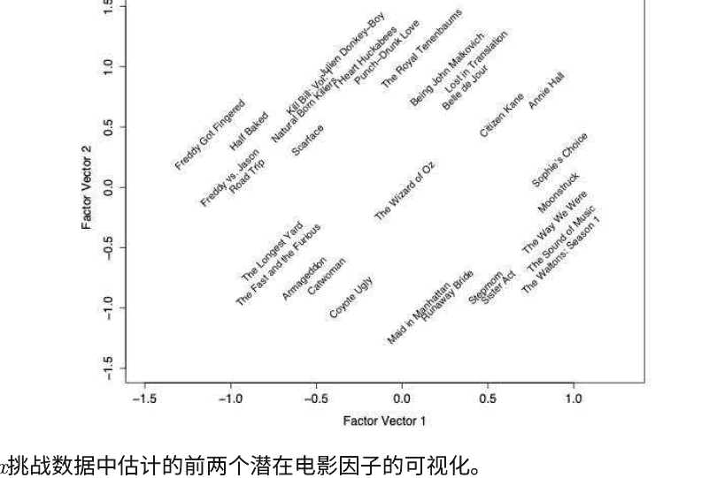

图22.2: 从Netflix挑战数据中估计的前两个潜在电影因子的可视化。

每个电影 \(j\) 在由 \(\mathbf{v}_j\) 指定的位置上绘制。详细信息请参阅正文。来自[KBV09]的图3。获得Yehuda Koren的友情许可后使用。

### 22.1.3.1 概率矩阵分解（PMF）

我们可以通过定义将矩阵分解转化为概率模型

\(p(y_{ui} = y) = \mathcal{N}(y|\mu + b_u + c_i + \mathbf{u}_u^\top \mathbf{v}_i, \sigma^2) \quad (22.10)\)

这被称为概率矩阵分解（PMF）[SM08]。该模型的NLL等价于方程（22.2）中的矩阵分解目标。然而，概率视角使我们能够更容易地推广模型。例如，我们可以使用泊松分布或负二项分布的似然函数（参见例如[GOF18]）来捕捉评分是整数（通常大部分为0）而不是实数的事实。这类似于指数族PCA（第20.2.7节），只是我们对行和列进行对称处理。

### 22.1.3.2 示例：Netflix

假设我们使用 \(K=2\) 潜在因素将PMF应用于Netflix数据集。图22.2可视化了学习到的嵌入向量 \(\mathbf{u}_i\) 对于一些电影。在图的左侧，我们有低俗幽默和恐怖电影（Half Baked, Freddy vs Jason），而在右侧，我们有更严肃的戏剧片（Sophie’sChoice, Moonstruck）。在顶部，我们有备受赞誉的独立电影（Punch-Drunk Love, I Heart Huckabees），而在底部，我们有主流好莱坞大片（Armageddon, Runaway Bride）。《绿野仙踪》位于这些轴的中间，因为在某种意义上它是一部“平均电影”。

用户被嵌入到与电影相同的空间中。然后，我们可以使用潜在嵌入空间中的接近度来预测任何用户-视频对的评分。

## 22.1.3.3 示例：MovieLens

现在假设我们将PMF应用于具有6040个用户，3706部电影和1,000,209个评分的MovieLens-1M数据集。我们将使用 K=50 个因子。为了简单起见，我们使用SVD拟合密集评分矩阵，其中将缺失值替换为0。（这只是为了保持演示代码简单的一个简单近似。）在图22.3中，我们展示了真实和预测评分矩阵的一部分。（我们将预测值截断到[1,5]范围内。）我们可以看到模型并不特别准确，但是能够捕捉到数据中的一些结构。

图22.3: (a) MovieLens-1M数据集中观测到的评分矩阵的一个片段。(b) 使用具有50个潜在成分的SVD进行预测。由 matrix\_factorization\_recommender.ipynb 生成。

### 22.1.4 自编码器

矩阵分解是一个（双）线性模型。我们可以使用自编码器来制作一个非线性版本。令 \(\mathbf{y}_{:,i} \in \mathbb{R}^M\) 是评级矩阵的第i列，其中未知评级设置为0。我们可以使用以下形式的自编码器来预测这个评级向量

$$f(\mathbf{y}_{:,i}; \theta) = \mathbf{W}^{\top} \phi(\mathbf{V} \mathbf{y}_{:,i} + \boldsymbol{\mu}) + \mathbf{b} \qquad (22.11)$$

其中 \(\mathbf{V} \in \mathbb{R}^{K \times M}\) 将评分映射到嵌入空间， \(\mathbf{W} \in \mathbb{R}^{K \times M}\) 将嵌入空间映射到评分的分布， \(\boldsymbol{\mu} \in \mathbb{R}^K\) 是隐藏单元的偏置， \(\mathbf{b} \in \mathbb{R}^M\) 是输出单元的偏置。这被称为 AutoRec模型的（基于项目的）版本 [Sed+15]。这个模型有 \(2MK + M + K\) 个参数。还有一个基于用户的版本，可以通过类似的方法推导出来，它有 \(2NK + N + K\) 个参数。（在MovieLens和Netflix上，作者发现基于项目的方法效果更好。）

| MovieID | Title | Genres |
| :--- | :--- | :--- |
| 36 858 | Godfather, The (1972) | Action\|Crime\|Drama |
| 35 1387 | Jaws (1975) | Action\|Horror |
| 65 2028 | Saving Private Ryan (1998) | Action\|Drama\|War |
| 63 1221 | Godfather: Part II, The (1974) | Action\|Crime\|Drama |
| 11 913 | Maltese Falcon, The (1941) | Film-Noir\|Mystery |
| 20 3417 | Crimson Pirate, The (1952) | Adventure\|Comedy\|Sci-Fi |
| 34 2186 | Strangers on a Train (1951) | Film-Noir\|Thriller |
| 55 2791 | Airplane! (1980) | Comedy |
| 31 1188 | Strictly Ballroom (1992) | Comedy\|Romance |
| 28 1304 | Butch Cassidy and the Sundance Kid (1969) | Action\|Comedy\|Western |

| MovieID | Title | Genres |
| :--- | :--- | :--- |
| 516 527 | Schindler's List (1993) | Drama\|War |
| 1848 1953 | French Connection, The (1971) | Action\|Crime\|Drama\|Thriller |
| 596 608 | Fargo (1996) | Crime\|Drama\|Thriller |
| 1235 1284 | Big Sleep, The (1946) | Film-Noir\|Mystery |
| 2085 2194 | Untouchables, The (1987) | Action\|Crime\|Drama |
| 1188 1230 | Annie Hall (1977) | Comedy\|Romance |
| 1198 1242 | Glory (1989) | Action\|Drama\|War |
| 897 922 | Sunset Blvd. (a.k.a. Sunset Boulevard) (1950) | Film-Noir |
| 1849 1954 | Rocky (1976) | Action\|Drama |
| 581 593 | Silence of the Lambs, The (1991) | Drama\|Thriller |

图22.4：(a) 用户“837”已经高度评价的前10部电影（共69部）。（b）算法的前10个预测结果（共3637个）。由 matrix\_factorization\_recommender.ipynb 生成。

我们可以通过仅更新与观察到的条目相关联的参数来拟合这个问题 \(\mathbf{y}_{:,i}\)。此外，我们可以添加一个 \(\ell_2\) 正则化器到权重矩阵中以获得目标函数

$$\mathcal{L}(\theta) = \sum_{i=1}^{N} \sum_{u:y_{ui}=?} (y_{u,i} - f(\mathbf{y}_{:,i}; \theta)_u)^2 + \frac{\lambda}{2}(\|\mathbf{W}\|_F^2 + \|\mathbf{V}\|_F^2) \qquad (22.12)$$

尽管这种方法很简单，但作者发现它比更复杂的方法（如受限玻尔兹曼机（RBMs, [SMH07]）和局部低秩矩阵近似（LLORMA, [Lee+13]））效果更好。

## 22.2 隐式反馈

到目前为止，我们假设用户对其与每个项目的交互给出了明确的评分。这是一个非常限制性的假设。更一般地，我们希望能够从用户与系统的交互中学习隐式反馈。例如，我们可以将用户观看的电影列表视为正面，将所有其他电影视为负面。因此，我们得到一个稀疏的、仅有正面评分的评分矩阵。

或者，我们可以将他们观看电影 \( i \) 但没有观看电影 \( j \) 的事实视为他们更喜欢 \( i \) 而不是 \( j \) 的一种隐含信号。得到的数据可以表示为一组元组的形式 \( y_n = (u, i, j) \)，其中 \( (u, i) \) 是正对，而 \( (u, j) \) 是负对（或未标记对）。

### 22.2.1 贝叶斯个性化排序

为了将模型拟合到形式为 \( (u, i, j) \) 的数据中，我们需要使用一种排序损失，使得模型将 \( i \) 排在 \( j \) 之前，对于用户 \( u \)。这样做的一种简单方法是使用一个伯努利模型，形式为 \( p(y_n = (u, i, j) | \boldsymbol{\theta}) = \sigma(f(u, i; \boldsymbol{\theta}) - f(u, j; \boldsymbol{\theta})) \) (22.13)

如果我们将这个与 \( \boldsymbol{\theta} \) 的高斯先验结合起来，我们得到以下的MAP估计问题：
\[ \mathcal{L}(\boldsymbol{\theta}) = \sum_{(u,i,j) \in \mathcal{D}} \log \sigma(f(u, i; \boldsymbol{\theta}) - f(u, j; \boldsymbol{\theta})) - \lambda \|\boldsymbol{\theta}\|^2 \] (22.14)
其中 \( \mathcal{D} = \{(u, i, j) : i \in \mathcal{I}_u^+, j \in \mathcal{I} \setminus \mathcal{I}_u^+\} \)，其中 \( \mathcal{I}_u^+ \) 是用户 \( u \) 选择的所有项目的集合，而 \( \mathcal{I} \setminus \mathcal{I}_u^+ \) 是所有其他项目（可能是不喜欢的，或者是没有看到的）。这被称为贝叶斯个性化排序或BPR [Ren+09]。

让我们考虑 [Zha+20, 第16.5节] 中的这个例子。总共有4个项目，\( \mathcal{I} = \{i_1, i_2, i_3, i_4\} \)，用户 \( u \) 选择与 \( \mathcal{I}_u^+ = \{i_2, i_3\} \) 交互。在这种情况下，用户 \( u \) 的隐式项目-项目偏好矩阵的形式为
\[ \mathbf{Y}_u = \begin{pmatrix} . & + & + & ? \\ - & . & ? & - \\ - & ? & . & - \\ ? & + & + & . \end{pmatrix} \] (22.15)
其中 \( Y_{u,i,i'} = + \) 表示用户 \( u \) 更喜欢 \( i' \) 而不是 \( i \)， \( Y_{u,i,i'} = - \) 表示用户 \( u \) 更喜欢 \( i \) 而不是 \( i' \)，而 \( Y_{u,i,i'} = ? \) 表示我们无法确定用户的偏好。例如，关注第二列，我们可以看到这个用户对 \( i_2 \) 的评分高于 \( i_1 \) 和 \( i_4 \)，因为他们选择了 \( i_2 \) 但没有选择 \( i_1 \) 或 \( i_4 \)；然而，我们无法确定他们是更喜欢 \( i_2 \) 还是 \( i_3 \)。

当可能的物品集很大时，\( \mathcal{I} \setminus \mathcal{I}_u^+ \) 中的负样本数量可能非常大。幸运的是，我们可以通过对负样本进行子采样来近似损失。

注意，除了上述的对数损失函数，还可以使用一种类似于SVM（第17.3节）的合页损失函数，其形式为
\[ \mathcal{L}(y_n = (u, i, j), f) = \max \left( m - (f(u, i) - f(u, j)), 0 \right) = \max \left( m - f(u, i) + f(u, j), 0 \right) \] (22.16)
其中 \( m \geq 0 \) 是安全边界。这样可以确保负项 \( j \) 的得分永远不会比正项 \( i \) 高出 \( m \)。

### 22.2.2 因子分解机

22.1.4 节的 AutoRec 方法是非线性的，但对待用户和项目不对称。在本节中，我们讨论一种更对称的判别建模方法。我们从一个线性版本开始。基本思想是预测给定用户-项目对的输出（如评分），\(\mathbf{x}=[\text{one-hot}(u), \text{one-hot}(i)]\), 使用

$$f(\mathbf{x}) = \mu + \sum_{i=1}^D w_i x_i + \sum_{i=1}^D \sum_{j=i+1}^D (\mathbf{v}_i^{\top} \mathbf{v}_j) x_i x_j \qquad (22.17)$$

其中 \(\mathbf{x} \in \mathbb{R}^D\) 其中 \(D = (M + N)\) 是输入的数量，\(\mathbf{V} \in \mathbb{R}^{D \times K}\) 是权重矩阵，\(\mathbf{w} \in \mathbb{R}^D\) 是权重向量，而 \(\mu \in \mathbb{R}\) 是全局偏移。这被称为因子分解机 (FM) [Ren12]。

术语 \((\mathbf{v}_i^{\top} \mathbf{v}_j)x_i x_j\) 衡量了输入中特征 i 和 j 之间的相互作用。这推广了方程式 (22.4) 的矩阵分解模型，因为它可以处理输入 \(\mathbf{x}\) 中的其他类型的信息，不仅仅是用户和项目，正如我们在第22.3节中讨论的那样。

计算方程式 (22.17) 需要 \(O(KD^2)\) 时间，因为它考虑了每个用户和每个项目之间的所有可能的两两交互。幸运的是，我们可以重写它，以便我们可以在 \(O(KD)\) 时间内计算如下：

$$\sum_{i=1}^D \sum_{j=i+1}^D (\mathbf{v}_i^{\top} \mathbf{v}_j) x_i x_j = \frac{1}{2} \sum_{i=1}^D \sum_{j=1}^D (\mathbf{v}_i^{\top} \mathbf{v}_j) x_i x_j - \frac{1}{2} \sum_{i=1}^D (\mathbf{v}_i^{\top} \mathbf{v}_i) x_i x_i$$

$$= \frac{1}{2} \left( \sum_{i=1}^D \sum_{j=1}^D \sum_{k=1}^K v_{ik} v_{jk} x_i x_j - \sum_{i=1}^D \sum_{k=1}^K v_{ik} v_{ik} x_i x_i \right)$$

$$= \frac{1}{2} \sum_{k=1}^K \left( \left( \sum_{i=1}^D v_{ik} x_i \right)^2 - \sum_{i=1}^D v_{ik}^2 x_i^2 \right) \qquad (22.18)$$

对于稀疏向量，总体复杂度与非零分量的数量成线性关系。因此，如果我们使用用户和物品ID的独热编码，复杂度就是 \(O(K)\)，类似于方程 (22.4) 中的原始矩阵分解目标。

我们可以拟合这个模型以最小化任何损失。例如，如果我们有显式反馈，我们可以选择MSE损失，如果我们有隐式反馈，我们可以选择排序损失。

在 [Guo+17] 中，他们提出了一个称为深度因子分解机的模型，它将上述方法与应用于嵌入向量串联的MLP相结合，而不是内积。更准确地说，它是一个形式为的模型

$$f(\mathbf{x}; \theta) = \sigma(\text{FM}(\mathbf{x}) + \text{MLP}(\mathbf{x})) \qquad (22.19)$$

这与 [Che+16] 中提出的宽深模型密切相关。这个想法是，双线性FM模型捕捉到了特定用户和物品之间的显式交互（一种记忆形式），而MLP捕捉到了用户特征和物品特征之间的隐式交互，这使得模型能够进行泛化。

### 22.2.3 神经矩阵分解

在本节中，我们描述了 [He+17] 的神经矩阵分解模型。这是另一种将双线性模型与深度神经网络结合的方式。双线性部分用于定义以下广义矩阵分解（GMF）路径，该路径计算用户 \(u\) 和物品 \(i\) 的以下特征向量：

$$\mathbf{z}_{ui}^1 = \mathbf{P}_{u,:} \odot \mathbf{Q}_{i,:} \qquad\qquad (22.22)$$

其中 \(\mathbf{P} \in \mathbb{R}^{M \times K}\) 是用户嵌入矩阵， \(\mathbf{Q} \in \mathbb{R}^{N \times K}\) 是物品嵌入矩阵。DNN部分只是应用于嵌入向量的串联的MLP（使用不同的嵌入矩阵）：

$$\mathbf{z}_{ui}^2 = \text{MLP}([\tilde{\mathbf{U}}_{u,:}, \tilde{\mathbf{V}}_{i,:}]) \qquad\qquad (22.23)$$

最后，模型将它们组合起来得到

$$f(u, i; \theta) = \sigma(\mathbf{w}^{\top}[\mathbf{z}_{ui}^1, \mathbf{z}_{ui}^2]) \qquad\qquad (22.24)$$

请参见图22.5以进行说明。

在 [He+17] 中，模型是基于隐式反馈进行训练的，其中如果观察到用户 \(u\) 与项目 \(i\) 的交互，则 \(y_{ui}= 1\)，否则 \(y_{ui}= 0\)。然而，它可以被训练以最小化BPR损失。

## 22.3 利用附加信息

到目前为止，我们假设预测器只能获得用户的整数ID和项目的整数ID。这是一种非常贫乏的表示方法，会导致失败。

> 图22.6: 电影推荐系统的设计矩阵示例，其中显示了用户和电影的ID，以及其他附加信息。来自 [Ren12] 的图1。获得 Stefen Rendle 的友好许可后使用。

如果我们遇到一个新用户或新项目（所谓的冷启动问题），工作会怎样。为了克服这个问题，我们需要利用“侧面信息”，不仅仅是用户/项目的标识。

我们可以使用许多形式的侧面信息。对于项目，我们通常有丰富的元数据，比如文本（例如标题），图像（例如封面），高维分类变量（例如位置），或者只是标量（例如价格）。对于用户，可用的侧面信息取决于具体的交互系统。对于搜索引擎来说，它是用户发出的查询列表，以及（如果他们登录了）从他们访问的网站中获取的信息（通过cookie跟踪）。对于在线购物网站来说，它是搜索列表加上过去的浏览和购买行为。对于社交网络网站来说，有关每个用户的友谊图的信息。

在因子分解机框架中，捕捉这些侧面信息非常容易，通过扩展我们对 \(\mathbf{x}\) 的定义，如图22.6所示。当然，相同的输入编码也可以输入其他类型的模型，如 deepFM 或 neuralMF。

除了关于用户和物品的特征之外，还可能存在其他上下文特征，例如交互的时间（例如，白天或晚上）。最近查看的物品的顺序（序列）通常也是一个有用的信号。在 [TW18] 中提出的“卷积序列嵌入推荐”或 Caser 模型通过嵌入最后的 \(M\) 个物品，然后将 \(M \times K\) 输入视为图像，并使用卷积层作为模型的一部分来捕捉这一点。

还可以设计许多其他类型的神经模型来进行推荐任务。参见 [Zha+19b] 进行综述。

## 22.4 探索-利用权衡

推荐系统中的一个有趣的“变化”是，数据是由系统的早期版本所做的推荐导致的。因此存在一个反馈循环 [Bot+13]。例如，考虑YouTube视频推荐系统 [CAS16]。该网站上有数百万个视频，因此系统必须提供一个短列表或“slate”来向用户展示视频，以帮助他们找到所需的内容（参见 [Ie+19]）。如果用户观看了其中一个视频，系统可以将其视为积极反馈，表示它做出了一个好的推荐，并相应地更新模型参数。然而，也许还有其他视频用户更喜欢？

除非系统冒险展示一些用户响应不确定的项目，否则无法回答这个反事实问题。这是一个探索-利用权衡的例子。

除了需要探索外，系统可能需要等待很长时间，直到它能够检测到自己的推荐策略是否有益。通常使用强化学习来学习优化长期回报的策略。有关详细信息，请参阅本书的续集 [Mur23]。

作者: Kevin P. Murphy。 (C) MIT Press. CC-BY-NC-ND许可证## 23 图嵌入 *

本章与Bryan Perozzi、Sami Abu-El-Haija和Ines Chami合著，基于[Cha+21]。

## 23.1 引言

现在我们将注意力转向具有训练样本之间语义关系的数据 ${x_n}_{n=1}^N$。这些关系（称为边缘）将训练样本（节点）与应用程序特定的含义（通常是相似性）连接起来。图提供了关于这些关系的数学基础。

图是能够表示复杂关系数据（由节点和边缘组成）的通用数据结构，在社交网络、计算化学[Gil+17]、生物学[Sta+06]、推荐系统[KSJ09]、半监督学习[GB18]等多个领域中都有应用。

设 $A \in \{0,1\}^{N \times N}$ 为邻接矩阵，其中 $N$ 为节点数，设 $W \in \mathbb{R}^{N \times N}$ 为加权版本。在下面我们讨论的方法中，有些将 $W$ 设为 $A$，而其他一些将 $W$ 设置为 $A$ 的转换，例如逐行归一化。最后，设 $X \in \mathbb{R}^{N \times D}$ 为节点特征矩阵。

在设计和训练神经网络模型时，我们希望所设计的方法适用于参与不同图形设置的节点（例如，具有不同的连接和社区结构）。与设计用于图像的神经网络模型相比，这与每个像素（节点）具有相同邻域结构的情况形成对比。相比之下，任意图形没有指定的节点对齐，并且每个节点可能具有不同的邻域结构。

请参见图23.1进行比较。因此，像欧几里德空间卷积这样的操作不能直接应用于不规则图形：欧几里德卷积在很大程度上依赖于几何先验（例如平移不变性），这些先验不能推广到非欧几里德域。

这些挑战促使了几何深度学习（GDL）研究的发展[Bro+17b]，该研究旨在将深度学习技术应用于非欧几里德数据。特别是，鉴于图形在现实世界应用中的广泛存在，人们对将机器学习方法应用于图形结构化数据的兴趣激增。在这些方法中，图表示学习（GRL）[Cha+21]方法旨在学习图结构化数据的低维连续向量表示，也称为嵌入。

我们将GRL分为两类问题：无监督和有监督（或半监督）GRL。第一类旨在学习优化低维欧几里得表示。

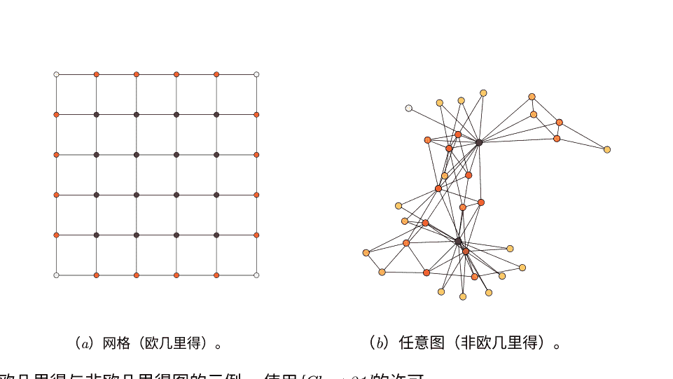

图23.1: 欧几里得与非欧几里得图的示例。使用[Cha+21]的许可。

一个目标，例如保留输入图的结构。第二类也学习低维欧几里得表示，但用于特定的下游预测任务，例如节点或图分类。此外，图结构可以在训练和测试期间保持不变，这被称为传导学习设置（例如，在大型社交网络中预测用户属性），或者模型被期望回答关于在训练期间未见过的图的问题，这被称为归纳学习设置（例如，分类分子结构）。

最后，虽然大多数有监督和无监督的方法在欧几里得向量空间中学习表示，但最近对非欧几里得表示学习（如双曲或球面空间）的兴趣逐渐增加。这项工作的主要动机是使用一个连续的嵌入空间，它类似于试图嵌入的输入数据的底层离散结构（例如，双曲空间是树的连续版本[Sar11]）。

## 23.2 图嵌入作为编码器/解码器问题

虽然有许多GRL的方法，但许多方法都遵循相似的模式。首先，网络输入（节点特征X∈R^{N×D}和图中的边A或W∈R^{N×N}）从图的离散域编码为连续表示（嵌入），Z∈R^{N×L}。接下来，学习到的表示Z被用来优化特定的目标（例如重构图的链接）。在本节中，我们将使用Chami等人提出的图编码器-解码器模型（GraphEDM）[Cha+21]来分析流行的GRL方法家族。

图嵌入数据挖掘（Figure 23.2, [Cha+21]）提供了一个通用框架，封装了各种监督和无监督的图嵌入方法：包括利用图作为正则化器的方法（例如[ZG02]），位置嵌入（例如[PARS14]），以及基于消息传递的图神经网络（[Gil+17; Sca+09]）或图卷积的方法

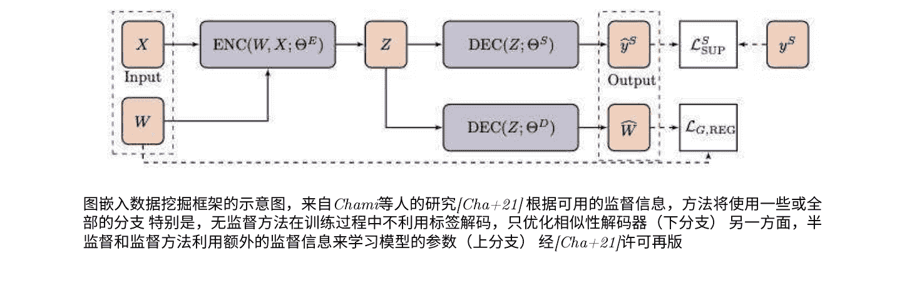

> 图嵌入数据挖掘框架的示意图，来自Chami等人的研究[Cha+21]根据可用的监督信息，方法将使用一些或全部的分支 特别是，无监督方法在训练过程中不利用标签解码，只优化相似性解码器（下分支） 另一方面，半监督和监督方法利用额外的监督信息来学习模型的参数（上分支） 经[Cha+21]许可再版

[Bru+14; KW16a]).

GRAPHEDM框架接受加权图$\mathbf{W} \in \mathbb{R}^{N \times N}$和可选节点特征$\mathbf{X} \in \mathbb{R}^{N \times D}$作为输入。在（半）监督设置中，我们假设我们已经获得了节点的训练目标标签（表示为$N$）、边的训练目标标签（表示为$E$）和/或整个图的训练目标标签（表示为$G$）。我们将监督信号表示为$S \in \{N, E, G\}$，如下所示。

GRAPHEDM模型本身可以分解为以下组件：

- 图编码器网络$\text{ENC}_{\Theta^E}: \mathbb{R}^{N \times N} \times \mathbb{R}^{N \times D} \to \mathbb{R}^{N \times L}$，由参数$\Theta^E$参数化，将图结构与可选节点特征结合起来，生成节点嵌入矩阵$\mathbf{Z} \in \mathbb{R}^{N \times L}$，如下所示：

```
latex
Z = ENC(W, X; \Theta^E).  # (23.1)

```

正如我们将在下面看到的那样，这个节点嵌入矩阵可能会捕捉到不同的图属性，这取决于用于训练的监督方式。

- 图解码网络 $\text{DEC}_{\Theta^D}: \mathbb{R}^{N \times L} \to \mathbb{R}^{N \times N}$，由参数 $\Theta^D$参数化，它使用节点嵌入 $\mathbf{Z}$来计算矩阵 $\mathbf{W} \in \mathbb{R}^{N \times N}$中所有节点对的相似度得分，如下所示：

```
latex
W = DEC(Z; \Theta^D).  # (23.2)

```

- 分类网络 $\text{DEC}_{\Theta^S}: \mathbb{R}^{N \times L} \to \mathbb{R}^{N \times |\mathcal{Y}|}$，其中 $\mathcal{Y}$是标签空间。这个网络在（半）监督设置中使用，并由 $\Theta^S$参数化。输出是对标签 $\hat{y}^S$的分布，使用节点嵌入，如下所示：

```
latex
y^S = DEC(Z; \Theta^S).  # (23.3)

```

特定选择的上述（编码器和解码器）网络允许GraphEDM实现特定的图嵌入方法，我们将在下一小节中解释。

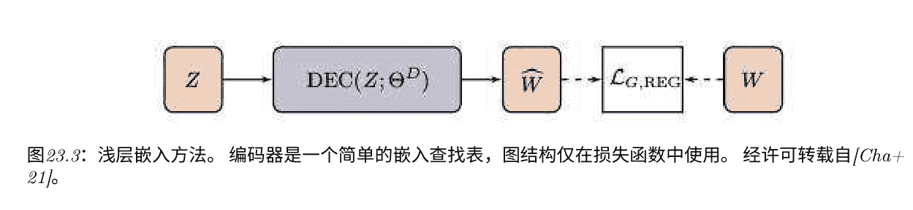

根据GraphEDM框架描述的模型输出是一个重构的图相似度矩阵 $W$ (通常用于训练无监督嵌入算法) 和/或标签 $y^S$ (用于监督应用)。标签输出空间 $\mathcal{Y}$ 是应用相关的。例如，在节点级分类中，$y^N \in \mathcal{Y}^N$，其中 $\mathcal{Y}$ 表示节点标签空间。或者，对于边级标记，$y^E \in \mathcal{Y}^{N \times N}$，其中 $\mathcal{Y}$ 表示边标签空间。最后，我们注意到还有其他类型的标记可能，例如图级标记 (其中我们会说 $y^G \in \mathcal{Y}$，其中 $\mathcal{Y}$ 表示图标签空间)。

最后，必须指定一个损失。这可以用来优化参数 $\Theta = \{\Theta^E, \Theta^D, \Theta^S\}$。GRAPHEDM模型可以使用三个不同的项的组合进行优化。首先，一个有监督的损失项 $\mathcal{L}_{\text{SUP}}^S$，将预测的标签 $\hat{y}^S$ 与真实标签 $y^S$ 进行比较。接下来，一个图重构损失项 $\mathcal{L}_{G,\text{RECON}}$，可以利用图结构对模型参数进行正则化约束。最后，一个权重正则化损失项 $\mathcal{L}_{\text{REG}}$，允许对可训练模型参数表示先验，以减少过拟合。由GraphEDM框架实现的模型通过最小化总损失 $\mathcal{L}$ 进行训练，定义如下：

> $$\mathcal{L} = \alpha \mathcal{L}_{\text{SUP}}^S(y^S, \hat{y}^S; \Theta) + \beta \mathcal{L}_{G,\text{RECON}}(\mathbf{W}, \hat{\mathbf{W}}; \Theta) + \gamma \mathcal{L}_{\text{REG}}(\Theta),$$ (23.4)

其中 $\alpha$, $\beta$ 和 $\gamma$ 是超参数，可以进行调整或设置为零。请注意，图嵌入方法可以以有监督的方式进行训练 ($\alpha \neq 0$) 或无监督的方式进行训练 ($\alpha = 0$)。有监督的图嵌入方法利用额外的信息来学习嵌入，例如节点或图标签。另一方面，无监督的网络嵌入方法仅依赖于图结构来学习节点嵌入。

## 23.3 浅层图嵌入

浅层嵌入方法是一种转导式图嵌入方法，其中编码器函数通过嵌入矩阵将分类节点ID映射到欧几里得空间。每个节点 $v_i \in V$ 都有一个相应的低维可学习嵌入向量 $\mathbf{Z}_i \in \mathbb{R}^L$，浅层编码器函数为

> $$\mathbf{Z} = \text{ENC}(\Theta^E) \triangleq \Theta^E \text{ 其中 } \Theta^E \in \mathbb{R}^{N \times L}.$$ (23.5)

关键是，嵌入字典 $\mathbf{Z}$ 直接作为模型参数进行学习。在无监督情况下，嵌入 $\mathbf{Z}$ 被优化以恢复输入图的一些信息 (例如，邻接矩阵 $\mathbf{W}$ 或其某种变换)。这在某种程度上类似于降维方法，例如主成分分析 (第20.1节)，但用于图数据结构。在有监督情况下，嵌入被优化以预测节点、边缘和/或整个图的某些标签。

### 23.3.1 无监督嵌入

在无监督情况下，我们将考虑两种主要类型的浅层图嵌入方法：基于距离和基于外积。基于距离的方法优化嵌入字典 Z=Θ^E ∈ R^{N×L}，使得在图中接近的节点 i 和 j（通过某种图距离函数测量）被嵌入到 Z 中，使得 d_2(Z_i, Z_j) 很小，其中 d_2(.,.) 是嵌入向量之间的成对距离函数。距离函数 d_2(.,.) 可以定制，这可以导致欧氏（第23.3.2节）或非欧氏（第23.3.3节）嵌入。解码器输出一个节点到节点的矩阵 W=DEC(Z;Θ^D)，其中 W_{ij} = d_2(Z_i, Z_j)。

或者，一些方法依赖于成对点积来计算节点相似性。解码器网络可以写成： W = DEC(Z;Θ^D) = ZZ^T。

在这两种情况下，基于距离和基于乘积的无监督嵌入方法都是通过最小化图正则化损失来学习的：

L_{G,RECON}(W, W; Θ) = d_1(s(W), W), (23.6)

其中 s(W) 是邻接矩阵 W 的可选转换，d_1 是矩阵之间的成对距离函数，不需要与 d_2 具有相同的形式。正如我们将看到的，对于 s, d_1, d_2 有许多合理的选择。例如，我们可以让 s 为邻接矩阵本身，s(W) = W 或其幂，例如 s(W) = W^2。如果输入是加权二进制矩阵 W = A，我们可以设置 s(W) = 1 - W，这样具有 A_{ij} = 1 的连接节点的权重（距离）为0。

### 23.3.2 基于距离的：欧几里得方法

基于距离的方法最小化相似（连接）节点之间的欧几里得距离。我们在下面给出一些例子。

多维缩放(MDS, 第20.4.4节) 等价于将 s(W) 设置为某个距离矩阵，该矩阵测量节点之间的不相似性（例如，与成对最短距离成比例）然后定义

d_1(s(W), W) = ∑_{i,j}(s(W)_{ij} - W_{ij})^2 = ||s(W) - W||_F^2, (23.7)

其中 W_{ij} = d_2(Z_i, Z_j) = ||Z_i - Z_j||（尽管其他距离度量也是合理的）。

拉普拉斯特征映射（第20.4.9节）通过解决广义特征向量问题来学习嵌入。

min_{Z∈R^{|V|×d}} Z^T D Z = I and Z^T D 1 =, (23.8)

其中 L = D - W 是图拉普拉斯矩阵（第20.4.9.2节），D 是一个包含每行列之和的对角矩阵。第一个约束条件消除了嵌入中的任意缩放因子，第二个约束条件消除了与常数特征向量对应的平凡解（对于连通图，其特征值为零）。此外，注意 tr(Z^T L Z) = 1/2 - ∑_{i,j} W_{ij} ||Z_i - Z_j||_2^2,

其中 Z_i 是 Z 的第 i 行；因此，最小化目标可以等价地写成

图重建项，如下所示:

$$ d_1(s(\mathbf{W}), \mathbf{W}) = \sum_{i,j} \mathbf{W}_{ij} \times \mathbf{W}_{ij} \quad (23.9) $$
$$ \mathbf{W}_{ij} = d_2(\mathbf{Z}_i, \mathbf{Z}_j) = \|\mathbf{Z}_i - \mathbf{Z}_j\|_2^2 \quad (23.10) $$

其中 $s(\mathbf{W}) = \mathbf{W}$.

### 23.3.3 基于距离的：非欧几里德方法

到目前为止，我们讨论的方法都假设嵌入在欧几里德空间中。然而，最近的研究考虑了用于图嵌入的双曲几何。特别是，双曲嵌入非常适合嵌入树形结构，并为展现分层结构的图提供了一种令人兴奋的替代方案。我们以下给出一些例子。

Nickel和Kiela [NK17]使用双曲空间的Poincaré模型学习分层图的嵌入。在我们的符号表示中，这很简单，我们只需要将 $d_2(\mathbf{Z}_i, \mathbf{Z}_j)$ 更改为Poincaré距离函数:

$$ d_2(\mathbf{Z}_i, \mathbf{Z}_j) = d_{\text{Poincaré}}(\mathbf{Z}_i, \mathbf{Z}_j) = \text{arcosh} \left( 1 + 2 \frac{\|\mathbf{Z}_i - \mathbf{Z}_j\|_2^2}{(1 - \|\mathbf{Z}_i\|_2^2)(1 - \|\mathbf{Z}_j\|_2^2)} \right) \quad (23.11) $$

然后优化学习嵌入，使连接节点之间的距离最小化，同时使断开节点之间的距离最大化:

$$ d_1(\mathbf{W}, \mathbf{W}) = \sum_{i,j} \mathbf{W}_{ij} \log \frac{e^{-\mathbf{W}_{ij}}}{\sum_{k|\mathbf{W}_{ik}=0} e^{-\mathbf{W}_{ik}}} \quad (23.12) $$

其中分母使用负采样进行近似。请注意，由于双曲空间具有流形结构，需要注意确保嵌入保持在流形上（使用黎曼优化技术[Bon13]）。

还提出了这些方法的其他变体。Nickel和Kiela [NK18]探索了双曲空间的洛伦兹模型，并表明它比庞加莱模型具有更好的数值稳定性。另一条研究线路将非欧几里德嵌入扩展到混合曲率乘积空间[Gu+18]，这为其他类型的图（例如树环）提供了更大的灵活性。最后，Chamberlain、Clough和Deisenroth [CCD17]的工作使用双曲内积扩展了庞加莱嵌入，采用了skip-gram损失函数。

### 23.3.4 基于外积的矩阵分解方法

矩阵分解方法学习嵌入，导致某些相似性矩阵 $s(\mathbf{W})$ 的低秩表示，其中 $s : \mathbb{R}^{N \times N} \rightarrow \mathbb{R}^{N \times N}$。以下是常见的选择: $s(\mathbf{W}) = \mathbf{W}$, $s(\mathbf{W}) = L$ (图拉普拉斯矩阵)，或其他接近度量，如Katz中心性指数、共同邻居或Adamic/Adar指数。

矩阵分解方法中的解码器函数只是一个点积:

$$ \mathbf{W} = \text{DEC}(\mathbf{Z}; \Theta^D) = \mathbf{Z}\mathbf{Z}^\top \quad (23.13) $$

矩阵分解方法通过最小化正则化损失 $\mathcal{L}_{G,\text{RECON}}(\mathbf{W}, \mathbf{W}; \Theta) = ||s(\mathbf{W}) - \mathbf{W}||_F^2$ 来学习 $\mathbf{Z}$。
[Ahm+13]的图因子分解方法通过最小化图正则化损失 $\mathcal{L}_{G,\text{RECON}}(\mathbf{W}, \mathbf{W}; \Theta) = \sum_{(v_i, v_j) \in E} (\mathbf{W}_{ij} - \mathbf{W}_{ij})^2$ 来学习图的低秩分解。
请注意，如果 $\mathbf{A}$ 是二进制邻接矩阵，($\mathbf{A}_{ij}=1$ iff $(v_i, v_j) \in E$ and $\mathbf{A}_{ij}=0$ otherwise)，则图正则化损失可以用Frobenius范数表示：
$$\mathcal{L}_{G,\text{RECON}}(\mathbf{W}, \mathbf{W}; \Theta) = ||\mathbf{A} \odot (\mathbf{W} - \mathbf{W})||_F^2, \tag{23.14}$$
其中 $\odot$ 是逐元素矩阵乘法运算符。因此，GF还学习了邻接矩阵 $\mathbf{W}$ 的低秩分解，以Frobenius范数衡量。我们注意到这是一个稀疏操作（仅对图中存在的边求和），因此该方法的计算复杂度为 $O(M)$。

到目前为止，所描述的方法都是对称的，即它们假设 $\mathbf{W}_{ij} = \mathbf{W}_{ji}$。这是一个限制性的假设，当处理有向图时，一些关系是不对称的。[CLX15]的GraRep方法通过学习每个节点的两个嵌入，即源嵌入 $\mathbf{Z}^s$ 和目标嵌入 $\mathbf{Z}^t$，来克服这个限制，这两个嵌入捕捉了有向网络中的非对称接近性。除了不对称性，GraRep还学习了保持 $k$ 跳邻域的嵌入，通过邻接矩阵的幂次和最小化图重构损失来实现：
$$\mathbf{W}^{(k)} = \mathbf{Z}^{(k),s}\mathbf{Z}^{(k),t^\top} \tag{23.15}$$
$$\mathcal{L}_{G,\text{RECON}}(\mathbf{W}, \mathbf{W}^{(k)}; \Theta) = ||\mathbf{D}^{-k}\mathbf{W}^k - \mathbf{W}^{(k)}||_F^2, \tag{23.16}$$
对于每个 $1 \le k \le K$。GraRep将所有表示连接起来，得到源嵌入 $\mathbf{Z}^s = [\mathbf{Z}^{(1),s}|...|\mathbf{Z}^{(K),s}]$ 和目标嵌入 $\mathbf{Z}^t = [\mathbf{Z}^{(1),t}|...|\mathbf{Z}^{(K),t}]$。不幸的是，GraRep的可扩展性不是很好，因为它使用了一个矩阵幂 $\mathbf{D}^{-1}\mathbf{W}$，使得矩阵变得越来越密集。这个限制可以通过使用隐式矩阵分解[Per+17]来规避，如下所讨论的。

### 23.3.5 基于外积的: Skip-gram 方法

Skip-gram 图嵌入模型受到自然语言处理研究的启发，用于建模单词的分布行为[Mik+13c; PSM14b]。Skip-gram 单词嵌入被优化以预测句子中每个目标单词的上下文（周围的单词）。给定一个单词序列 $(w_1, \ldots, w_T)$，skip-gram 将最小化目标函数：
$$
\mathcal{L} = - \sum_{-K \le i \le K, i \neq 0} \log \mathbb{P}(w_{k-i}|w_k),
$$

对于每个目标单词 $w_k$。这些条件概率可以使用神经网络高效地估计。详见第20.5.2节。

这个想法已经在[PARS14]的 DeepWalk框架中用于图嵌入。他们通过实证研究表明，在真实图中，随机游走引起的频率统计与自然语言中使用的单词的分布类似，从而证明了这一点。就图嵌入而言，Skip-gram 图嵌入方法使用外积（方程式23.13）作为其解码器函数，并在图上的随机游走上计算图重构项。

更详细地说，DeepWalk训练节点嵌入以最大化预测上下文节点对于每个中心节点的概率。上下文节点是出现在中心节点旁边的节点，在 A 上的模拟随机游走中。为了训练嵌入，DeepWalk使用图上的截断无偏随机游走生成节点序列，这可以与自然语言模型中的句子进行比较，然后最大化它们的对数似然。每个随机游走都从一个节点开始 $v_{i_1} \in V$ 并且以均匀随机方式重复采样下一个节点：$v_{i_{j+1}} \in \{v \in V \mid (v_{i_j}, v) \in E\}$。游走长度是一个超参数。然后，所有生成的随机游走都可以由一个序列模型进行编码。这种由[PARS14]引入的两步范式已经被许多后续的工作所采用，例如node2vec[GL16]。

我们注意到，在底层实现中，通常使用两种不同的表示来表示每个节点，一种是当节点是截断随机游走的中心时，另一种是当节点在上下文中时。这种建模选择的影响在[AEHPAR17]中进一步研究。

为了在 GRAPHEDM框架中介绍DeepWalk，我们可以设置：
$$
s(\mathbf{W}) = \mathbb{E}_q \left[ \left( \mathbf{D}^{-1} \mathbf{W} \right)^q \right] \text{ 其中 } q \sim P(Q) = \text{Categorical}([1, 2, \ldots, T_{\max}]) \tag{23.17}
$$
其中 $P(Q = q) = \frac{T_{\max}-1+q}{T_{\max}}$ （见[AEH+18]的推导）。训练DeepWalk等价于最小化：
$$
\mathcal{L}_{G,\text{RECON}}(W, W; \Theta) = \log Z(\mathbf{Z}) - \sum_{v_i \in V, v_j \in V} s(\mathbf{W})_{ij} \mathbf{W}_{ij}, \tag{23.18}
$$
其中 $\mathbf{W} = \mathbf{Z}\mathbf{Z}^\top$，分区函数由 $Z(\mathbf{Z}) = \prod_i \sum_j \exp(\mathbf{W}_{ij})$ 可以通过分层softmax在 $O(N)$时间内近似计算（见第20.5.2节）。（对于使用嵌入字典 $\mathbf{Z}_{\text{out}}, \mathbf{Z}_{\text{in}} \in \mathbb{R}^{N \times L}$的有向图，也常见建模 $\mathbf{W} = \mathbf{Z}_{\text{out}} \mathbf{Z}_{\text{in}}^\top$。）

正如[LG14]所指出的，Skip-gram方法可以看作是隐式矩阵分解，而本文讨论的方法与矩阵分解方法（见第23.3.4节）有关。这种关系在[Qiu+18]中进行了深入讨论，他们提出了一个通用的矩阵分解框架NetMF，该框架使用与DeepWalk、LINE [Tan+15]和node2vec [GL16]相同的底层图接近性信息。将节点嵌入问题视为矩阵分解可以继承[Qiu+19a]中高效稀疏矩阵操作的优点。

### 23.3.6 监督嵌入

在许多应用中，除了节点特征和图结构外，我们还有标记数据。虽然可以通过先学习无监督表示，然后在次要模型中使用它们作为特征来解决监督任务，但这不是理想的工作流程。无监督节点嵌入可能无法保留图的重要属性（例如节点邻域或属性），这对于下游的监督任务是最有用的。

鉴于这个限制，已经提出了许多方法来结合这两个步骤，即学习嵌入和预测节点或图标签。在这里，我们专注于简单的浅层方法。我们稍后讨论深度、非线性嵌入。

### 23.3.6.1 标签传播

标签传播(LP) [ZG02] 是一种非常流行的基于图的半监督节点分类算法。编码器是一个浅层模型，由查找表 Z表示。LP使用标签空间直接表示节点嵌入（即LP中的解码器只是恒等函数）：
$$
\hat{y}^{N} = \text{DEC}(\mathbf{Z}; \Theta^C) = \mathbf{Z}
$$

特别地，LP利用图结构通过在损失函数中添加正则化项来平滑图上的标签分布，基于邻居节点应该具有相似标签的基本假设（即连接节点之间存在一定的标签一致性）。拉普拉斯特征映射被用于正则化以实现这种平滑性：
$$\mathcal{L}_{G,\text{RECON}}(\mathbf{W}, \mathbf{W}; \Theta) = \sum_{i,j} \mathbf{W}_{ij} || y_i^N - \hat{y}_j^N ||_2^2$$ (23.19)

LP通过使用迭代算法来更新未标记节点的标签分布，该算法通过其邻居节点的标签的加权平均值来最小化能量函数，该函数在标记节点上取固定值（即 $\hat{y}_i^N = y_i^N \quad \forall i|v_i \in V_L$）上的函数。

标签传播（LS）[Zho+04]是标签传播的一种变体，它最小化以下能量函数：
$$\mathcal{L}_{G,\text{RECON}}(\mathbf{W}, \mathbf{W}; \Theta) = \sum_{i,j} \mathbf{W}_{ij} \left\| \frac{\hat{y}_i^N}{\sqrt{D_i}} - \frac{\hat{y}_j^N}{\sqrt{D_j}} \right\|_2^2,$$ (23.20)
其中 $D_i = \sum_j W_{ij}$是节点 $v_i$的度数。

在这两种方法中，监督损失仅是预测标签与真实标签（one-hot向量）之间距离的总和：
$$\mathcal{L}_{\text{SUP}}^{N}(y^N, \hat{y}^N; \Theta) = \sum_{i|v_i \in V_L} || y_i^N - \hat{y}_i^N ||_2^2.$$ (23.21)

请注意，虽然正则化项是在图中的所有节点上计算的，但监督损失仅计算有标签的节点。这些方法预计在一致的图中表现良好，即图中节点的接近程度与标签的相似性呈正相关。

## 23.4 图神经网络

广泛的研究领域集中在定义图数据上的卷积。根据Chami等人[Cha+21]的表示法，这些（半）监督邻域聚合方法可以表示为具有形式 Z = ENC(X, W; Θ^E)的编码器，以及具有形式 W = DEC(Z; Θ^D)和/或ŷ^S = DEC(Z; Θ^S)的解码器。这个家族中有许多模型；我们在下面对其中一些进行回顾。

### 23.4.1 信息传递GNNs

最初的图神经网络（GNN）模型[GMS05; Sca+09]是第一个为图结构数据制定的深度学习方法。它将有监督的图嵌入问题视为信息扩散机制，其中节点将信息发送给它们的邻居，直到达到某个稳定的平衡状态。更具体地说，给定随机初始化的节点嵌入 Z^0，它应用以下递归：
$$
Z^{t+1} = ENC(X, W, Z^t; \Theta^E) \quad (23.22)
$$
其中参数 Θ^E在每次迭代中被重复使用。在收敛后 (t = T) ，节点嵌入 Z^T被用于预测最终输出，如节点或图标签：
$$
\hat{y}^S = DEC(X, Z^T; \Theta^S) \quad (23.23)
$$

这个过程重复多次，并且使用Almeda-Pineda算法[Alm87; Pin88]通过反向传播学习GNN参数 Θ^E 和 Θ^D。根据Banach的不动点定理，当递归提供收缩映射时，这个过程保证收敛到唯一解。基于此，Scarselli等人[Sca+09]探索了可以使用消息传递网络表示的映射：
$$
Z_i^{t+1} = \sum_{j|(v_i,v_j)\in E} f(X_i, X_j, Z_j^t; \Theta^E) \quad (23.24)
$$
其中 f(·)是一个多层感知器(MLP)，被限制为收缩映射。然而，解码器函数没有约束，可以是任何MLP。

Li等人[Li+15]提出了门控图序列神经网络(GGSNNs)，它从GNNs中移除了收缩映射的要求。在GGSNNs中，方程式23.22中的递归算法通过应用映射函数在固定的步骤数上进行放松，其中每个映射函数都是一个带有共享参数的门控循环单元[Cho+14b]。 GGSNN模型在每个步骤输出预测结果，因此特别适用于具有时序结构的任务(如时间图)。

Gilmer等人[Gil+17]提供了一个名为消息传递神经网络(MPNNs)的图神经网络框架，该框架包含了许多最新的模型。与运行无限次迭代的GNN模型相比，MPNNs为现代方法提供了一个抽象，该抽象由具有固定层数的多层神经网络组成。在每一层 ℓ，消息函数 f^ℓ(·)从邻居接收消息（基于邻居的隐藏状态），然后将这些消息传递给聚合函数 $h^\ell(.)$:
$$
\mathbf{m}_i^{\ell+1} = \sum_{j|(v_i,v_j)\in E} f^\ell(\mathbf{H}_i^\ell, \mathbf{H}_j^\ell)
$$
$$
\mathbf{H}_i^{\ell+1} = h^\ell(\mathbf{H}_i^\ell, \mathbf{m}_i^{\ell+1})
$$
经过 $\ell$ 层的消息传递，节点的隐藏表示编码了 $\ell$ 跳邻域内的信息。

Battaglia等人[Bat+18]提出了GraphNet，进一步扩展了MPNN框架，使用消息传递函数学习边、节点和整个图的表示。显式添加边和图的表示为MPNN模型增加了额外的表达能力，并允许将图模型应用于其他领域。

### 23.4.2 谱图卷积

谱方法使用图拉普拉斯矩阵的谱域定义图卷积。这些方法大致分为两类：基于谱的方法，明确计算拉普拉斯矩阵的特征分解（例如，谱CNN [Bru+14]）和基于谱理论的但实际上不执行谱分解的无谱方法（例如，图卷积网络或GCN [KW16a]）。

基于谱方法的一个主要缺点是它们依赖于图拉普拉斯矩阵的谱，因此与特定领域相关（即不能推广到新的图）。此外，计算拉普拉斯矩阵的谱分解计算量大。无谱方法通过利用这些谱滤波器的近似来克服这些限制。然而，无谱方法需要使用整个图$\mathbf{W}$，因此不具有良好的可扩展性。

有关光谱方法的更多细节，请参见[Bro+17b; Cha+21]。

### 23.4.3 空间图卷积

基于频谱的方法具有固有的领域依赖性，这限制了模型在新数据集上训练的应用。此外，无频谱的方法（例如GCNs）需要使用整个图$\mathbf{A}$，随着图的规模增长，这很快变得不可行。

为了克服这些限制，图卷积的另一个分支（空间方法）借鉴了标准CNN的思想-在图的拓扑结构定义的空间域中应用卷积。例如，在计算机视觉中，卷积滤波器通过使用固定的矩形补丁来进行空间定位。结合图像中像素的自然排序（顶部，左侧，底部，右侧），可以在每个位置重用滤波器的权重。这个过程显著减少了模型所需的总参数数量。虽然这样的空间卷积不能直接应用于图领域，但空间图卷积从中获得灵感。核心思想是使用邻域采样和注意机制来创建固定大小的图补丁，克服图的不规则性。

### 23.4.3.1 基于采样的空间方法

为了克服GCNs的领域依赖性和存储限制，Hamilton、Ying和Leskovec [HYL17]提出了GraphSAGE，这是一个学习归纳节点嵌入的框架。与其通过对拉普拉斯矩阵进行乘法运算，SAGE对所有一跳邻居的信号进行平均（通过乘法运算），对每个节点进行固定邻域（大小为 q）的采样。这消除了对固定图结构的强依赖性，并允许对新图进行泛化。在每个SAGE层中，节点从其邻域中采样的节点聚合信息（参见图23.5）。在GraphEDM符号中，传播规则可以写成：
$$
\mathbf{H}_{:,i}^{\ell+1} = \sigma(\Theta_{1}^{\ell} \mathbf{H}_{:,i}^{\ell} + \Theta_{2}^{\ell} \mathrm{AGG}(\{ \mathbf{H}_{:,j}^{\ell} \mid v_j \in \mathrm{Sample}(\mathrm{nbr}(v_i), q) \})), \quad (23.27)
$$
其中 $\mathrm{AGG}(\cdot)$ 是一个聚合函数。这个聚合函数可以是任何排列不变的运算符，比如平均值（SAGE-mean）或最大池化（SAGE-pool）。由于SAGE使用固定大小的邻域（而不是整个邻接矩阵），它还降低了训练GCN的计算复杂度。

### 23.4.3.2 基于注意力的空间方法

注意力机制（第15.4节）已经成功地应用于语言模型中，在这些模型中，它们可以识别长序列输入中的相关部分。受到它们在语言方面的成功启发，类似的想法已经被提出用于图卷积网络。这种基于图的注意力模型通过在节点特征之上学习参数化的补丁，从而在消息传递步骤中学习将注意力集中在重要的邻居上。这在归纳设置中提供了更大的灵活性，与依赖于固定权重（如GCN）的方法相比。图注意力网络（GAT）模型[Vel+18]是GCN的一种基于注意力的版本。在每个GAT层中，它会关注每个节点的邻域，并学习选择性地选择对某个下游任务性能最好的节点。这背后的直觉与SAGE[HYL17]类似，使得GAT适用于归纳和传导问题。然而，与将卷积步骤限制在固定大小邻域的SAGE不同，GAT允许每个节点关注其所有邻居-为每个邻居分配不同的权重。注意力参数通过反向传播进行训练，然后使用softmax激活函数对注意力分数进行行归一化。

### 23.4.3.3 几何空间方法

Monti等人[Mon+17]提出了MoNet，这是一个通用框架，在节点特征位于几何空间（如3D点云或网格）时表现出色。MoNet使用预定义的空间域（例如空间坐标）中的参数化函数学习注意力补丁，并在生成的图域中应用卷积滤波器。

MoNet推广了在流形上进行卷积的空间方法，例如测地线CNN（GCNN）[Mas+15]和各向异性CNN（ACNN）[Bos+16]。GCNN和ACNN都使用在特定坐标系上定义的固定补丁，因此不能推广到图结构化数据。然而，MoNet框架更通用；可以使用任何伪坐标（即节点特征）来引导补丁。更正式地说，如果 $\mathbf{U}^s$ 是伪坐标，$\mathbf{H}^{\ell}$ 是来自另一个域的特征，则MoNet层可以用我们的符号表示为：
$$
\mathbf{H}^{\ell+1} = \sigma\left(\sum_{k=1}^{K} (W g_k(\mathbf{U}^s)) \mathbf{H}^{\ell} \Theta_k^{\ell}\right), \quad (23.28)
$$
其中 $g_k(U^s)$ 是学习到的参数化补丁，它们是 $N \times N$ 矩阵。在实践中，MoNet使用高斯核来学习补丁，使得：
$$
g_k(\mathbf{U}^s) = \exp\left( -\frac{1}{2} (\mathbf{U}^s - \boldsymbol{\mu}_k)^{\top} \boldsymbol{\Sigma}_k^{-1} (\mathbf{U}^s - \boldsymbol{\mu}_k) \right), \quad (23.29)
$$
其中 $\boldsymbol{\mu}_k$ 和 $\boldsymbol{\Sigma}_k$ 是学习到的参数，且 $\boldsymbol{\Sigma}_k$ 被限制为对角线。

### 23.4.4 非欧几里得图卷积

正如我们在第23.3.3节中讨论的那样，双曲几何使得学习分层图的浅嵌入具有比欧几里德嵌入更小的失真。然而，浅嵌入的一个主要缺点是它们在跨图上（如果有的话）不能很好地推广。另一方面，利用节点特征的图神经网络在许多归纳图嵌入任务上取得了良好的结果。

因此，最近对将图神经网络扩展到学习非欧几里得嵌入表示的兴趣日益增加。其中一个主要挑战再次围绕卷积本身的性质。在非欧几里得空间中，我们应该如何执行卷积操作，其中标准的内积和矩阵乘法并不被定义？

双曲图卷积网络（HGCN）[Cha+19a]和双曲图神经网络（HGNN）[LNK19]通过利用欧几里得切空间在双曲空间中应用图卷积，该切空间在某一点提供了双曲流形的一阶近似。

对于每个图卷积步骤，节点嵌入被映射到原点处的欧几里得切空间，在那里进行卷积操作，然后再映射回双曲空间。这些方法在具有分层结构的图上取得了显著的改进（图23.6）。

## 23.5 深度图嵌入

在本节中，我们使用图神经网络来设计无监督和半监督情况下的图嵌入。

### 23.5.1 无监督嵌入

在本节中，我们讨论了图神经网络的无监督损失，如图 23.7 所示。

#### 23.5.1.1 结构深度网络嵌入

[WCZ16]的结构深度网络嵌入（SDNE）方法使用自动编码器，保留了一阶和二阶节点的接近性。SDNE编码器以邻接矩阵的一行作为输入（设置 s(W) = W），并产生节点嵌入 Z = ENC(W; θ^E)。（注意，这忽略了任何节点特征。）SDNE解码器返回重构的图邻接矩阵 \widehat{W} = DEC(Z; Θ^D)，用于恢复原始图邻接矩阵。SDNE通过最小化以下损失来保留二阶节点接近性：
$$
||(\mathbf{s}(W) - W) \cdot I (\mathbf{s}(W) > 0) ||_F^2 + \alpha_{\text{SDNE}} \sum_{ij} \mathbf{s}(W)_{ij} ||Z_i - Z_j||_2^2 \quad (23.30)
$$
第一个术语与矩阵分解正则化目标类似，只是 W不是使用外积计算的。第二个术语由基于距离的浅层嵌入方法使用。

## 23.5.1.2 （变分）图自编码器

Kipf和Welling [KW16b]使用图卷积（第23.4.2节）来学习节点嵌入 $\mathbf{Z} = \text{GCN}(\mathbf{W}, \mathbf{X}; \Theta^E)$。解码器是一个外积：$\text{DEC}(\mathbf{Z}; \Theta^D) = \mathbf{Z}\mathbf{Z}^{\top}$。图重构项是真实邻接矩阵和预测边相似度得分之间的sigmoid交叉熵：

$$\mathcal{L}_{G,\text{RECON}}(\mathbf{W}, \mathbf{W}; \Theta) = -\left(\sum_{i,j} (1 - \mathbf{W}_{ij}) \log(1 - \sigma(\mathbf{W}_{ij})) + \mathbf{W}_{ij} \log \sigma(\mathbf{W}_{ij})\right).$$ (23.31)

在实践中，计算所有可能节点对的正则化项是计算上具有挑战性的，因此图自动编码器（GAE）模型使用负采样来克服这个挑战。

而GAE是一个确定性模型，作者还引入了变分图自动编码器（VGAE），它依赖于变分自动编码器（如第20.3.5节所述）来编码和解码图结构。在VGAE中，嵌入 $\mathbf{Z}$ 被建模为具有标准多元正态先验 $p(\mathbf{Z}) = \mathcal{N}(\mathbf{Z}|\mathbf{0}, \mathbf{I})$，并且使用图卷积作为摊余推理网络 $q_\Phi(\mathbf{Z}|\mathbf{W}, \mathbf{X})$。该模型通过最小化相应的负证据下界进行训练：

$$\begin{aligned} \text{NELBO}(\mathbf{W}, \mathbf{X}; \Theta) &= -\mathbb{E}_{q_\Phi(\mathbf{Z}|\mathbf{W},\mathbf{X})}[\log p(\mathbf{W}|\mathbf{Z})] + \text{KL}(q_\Phi(\mathbf{Z}|\mathbf{W}, \mathbf{X})||p(\mathbf{Z})) \ &= \mathcal{L}_{G,\text{RECON}}(\mathbf{W}, \mathbf{W}; \Theta) + \text{KL}(q_\Phi(\mathbf{Z}|\mathbf{W}, \mathbf{X})||p(\mathbf{Z})). \end{aligned}$$ (23.32, 23.33)

## 23.5.1.3 迭代生成图模型（Graphite）

图形模型[GZE19]扩展了GAE和VGAE，引入了更复杂的解码器。该解码器在成对解码函数和图卷积之间进行迭代，如下所示：

$$\begin{aligned} \mathbf{W}^{(k)} &= \frac{\mathbf{Z}^{(k)} \mathbf{Z}^{(k)\top}}{\|\mathbf{Z}^{(k)}\|_2^2} + \frac{\mathbf{1}\mathbf{1}^{\top}}{N} \ \mathbf{Z}^{(k+1)} &= \text{GCN}(\mathbf{W}^{(k)}, \mathbf{Z}^{(k)}) \end{aligned}$$

其中 $\mathbf{Z}^{(0)}$ 使用编码器网络的输出进行初始化。这个过程使Graphite能够学习更具表现力的解码器。最后，类似于GAE，Graphite可以是确定性的或变分的。

## 23.5.1.4 基于对比损失的方法

Vel+19的深度图形信息最大化方法是一种类似GAN的方法，用于创建图级嵌入。给定一个或多个实际的（正）图，每个图都有其邻接矩阵 $\mathbf{W} \in \mathbb{R}^{N \times N}$ 和节点特征 $\mathbf{X} \in \mathbb{R}^{N \times D}$，该方法创建了负的邻接矩阵 $\mathbf{W}^- \in \mathbb{R}^{N^- \times N^-}$ 和其特征 $\mathbf{X}^- \in \mathbb{R}^{N^- \times D}$。它训练了（i）一个同时处理真实样本和虚假样本的编码器，分别给出 $\mathbf{Z} = \text{ENC}(\mathbf{X}, \mathbf{W}; \Theta^E) \in \mathbb{R}^{N \times L}$ 和 $\mathbf{Z}^- = \text{ENC}(\mathbf{X}^-, \mathbf{W}^-; \Theta^E) \in \mathbb{R}^{N^- \times L}$，（ii）一个（读出）图池化函数 $\mathcal{R}: \mathbb{R}^{N \times L} \to \mathbb{R}^L$，以及（iii）一个判别器函数 $\mathcal{D}: \mathbb{R}^L \times \mathbb{R}^L \to [0, 1]$，该函数被训练输出 $\mathcal{D}(\mathbf{Z}_i, \mathcal{R}(\mathbf{Z})) \approx 1$ 和 $\mathcal{D}(\mathbf{Z}_j^-, \mathcal{R}(\mathbf{Z}^-)) \approx 0$，分别用于节点对应给定的图 $i \in V$ 和虚假的图 $j \in V^-$。 具体而言，DGI进行优化:

$$ \min_{\Theta} - \mathop{\mathbb{E}}\limits_{\mathbf{X},\mathbf{W}} \sum_{i=1}^{N} \log \mathcal{D}(\mathbf{Z}_i, \mathcal{R}(\mathbf{Z})) - \mathop{\mathbb{E}}\limits_{\mathbf{X}^-,\mathbf{W}^-} \sum_{j=1}^{N^-} \log \left(1 - \mathcal{D}(\mathbf{Z}_j^-, \mathcal{R}(\mathbf{Z}^-))\right), \tag{23.34}$$

其中 $\Theta$ 包含 $\Theta^E$ 和 $\mathcal{R}, \mathcal{D}$ 的参数。 在第一个期望中，DGI从真实（正面）图中进行采样。 如果只给出一个图，则可以从中采样一些子图（例如连通分量）。第二个期望中采样虚假（负面）图。在DGI中，虚假样本使用真实的邻接矩阵 $W^- := W$，但虚假特征 $X^-$ 是真实 $X$ 的行随机排列。 DGI中使用的ENC是一个图卷积网络，但也可以使用任何GNN。 readout $\mathcal{R}$ 将整个（可变大小）图汇总为一个（固定维度）向量。Veličković等人[Vel+19] 使用 $\mathcal{R}$ 作为行均值，但也可以使用其他图池化方法，例如考虑邻接矩阵的方法。

通过[Vel+19]展示了方程（23.34）的优化，以最大化编码器输出和图池函数之间的互信息的下界，即个体节点表示和图表示之间的互信息。

在[Pen+20]中，他们提出了一种变体，称为图互信息。 与最大化节点信息和整个图的互信息不同，图互信息最大化了节点表示和其邻居之间的互信息。

### 23.5.2 半监督嵌入

在本节中，我们讨论了GNNs的半监督损失。我们考虑了一个简单的特例，其中我们使用非线性编码器对节点特征进行编码，但忽略了图结构，即我们使用 $\mathbf{Z}= \text{ENC}(\mathbf{X}; \Theta^E)$。

### 23.5.2.1 SemiEmb

[WRC08]提出了一种称为半监督嵌入（SemiEmb）的方法。他们使用MLP作为 $\mathbf{X}$ 的编码器。 对于解码器，我们可以使用基于距离的图解码器： $\mathbf{W}_{ij} =\text{DEC}(\mathbf{Z}; \Theta^D)_{ij} = \|\mathbf{Z}_i - \mathbf{Z}_j\|^2$，其中 $\| \cdot \|$ 可以是L2或L1范数。SemiEmb使用相同的正则化器在网络的中间或辅助层中进行正则化，如方程（23.19）中的标签传播损失。SemiEmb使用前馈网络从中间嵌入中预测标签，然后使用Hinge损失将其与真实标签进行比较。

### 23.5.2.2 Planetoid

无监督的skip-gram方法（如DeepWalk和node2vec）通过多步流程学习嵌入，其中首先从图中生成随机游走，然后用于学习嵌入。这些嵌入可能不适用于下游分类任务。[YCS16]的Planetoid方法在嵌入算法中扩展了这种随机游走方法，以利用节点标签信息。节点嵌入 $\mathbf{Z}^F$ 捕捉特征信息。 有两个变体，一个是直接学习的转导版本（作为嵌入查找），另一个是通过参数映射计算 $\mathbf{Z}^c$ 的归纳模型，该参数映射作用于输入特征 $\mathbf{X}$。 Planetoid目标包含有监督损失和图正则化损失。 图正则化损失衡量了使用节点嵌入预测上下文的能力：

$$ \mathcal{L}_{G,\text{RECON}}(\mathbf{W}, \mathbf{W}; \Theta) = -\mathbb{E}_{(i,j,\gamma)} \log \sigma \left( \gamma \mathbf{W}_{ij} \right) , \qquad (23.35) $$

其中 $\mathbf{W}_{ij} = \mathbf{Z}_i^\top \mathbf{Z}_j$， $\gamma \in \{-1, 1\}$，如果 $(v_i, v_j) \in E$ 是正对， $\gamma = 1$，如果 $(v_i, v_j)$ 是负对，则 $\gamma = -1$。 期望下的分布通过采样过程直接定义。

Planetoid中的监督损失是预测正确标签的负对数似然：

$$ \mathcal{L}_{\text{SUP}}^N(\mathbf{y}^N, \mathbf{y}^N; \Theta) = -\frac{1}{|V_L|} \sum_{i|v_i \in V_L} \sum_{1 \le k \le C} y_{ik}^N \log y_{ik}^N, \qquad (23.36) $$

其中 $i$ 是节点的索引，而 $k$ 表示标签类别， $y_i^N$ 是使用神经网络计算的，并且通过softmax激活将 $\mathbf{Z}_i$ 映射到预测标签。

## 23.6 应用

图嵌入有许多应用，包括无监督和有监督的应用。 我们在下面的章节中给出一些例子。

### 23.6.1 无监督应用

在本节中，我们讨论常见的无监督应用。

#### 23.6.1.1 图重构

图重构是一种常见的无监督图应用。 在这种情况下，目标是学习映射函数（可以是参数化的或非参数化的），将节点映射到能够重构图的流形上。 从图结构以外的角度来看，这被认为是无监督的。 模型可以通过最小化重构误差来进行训练，该误差是从学习嵌入中恢复原始图形的误差。 有几种算法专门设计用于此任务，我们在第23.3.1节和第23.5.1节中提供了一些重构目标的示例。 从高层次上看，图重构类似于降维，其主要目标是将一些输入数据总结为低维嵌入。

与标准的维度降低方法（例如PCA）将高维向量压缩为低维向量不同，图重建模型的目标是将定义在图上的数据压缩为低维向量。

#### 23.6.1.2 链接预测

链接预测的目标是预测缺失或未观察到的链接（例如，对于动态和时间网络可能在未来出现的链接）。 链接预测还可以帮助识别虚假的链接并删除它们。这是在工业中应用图学习模型的主要应用，常见的应用示例包括在社交网络中预测友谊关系，在推荐系统中预测用户-产品交互，在欺诈检测系统中预测可疑链接（参见图23.8），或在知识图谱中预测实体之间的缺失关系（参见例如[Nic+15]）。

训练链接预测模型的常见方法是在图中屏蔽一些边（正边和负边），使用剩余的边训练模型，然后在屏蔽的边集上进行测试。请注意，链接预测与图重建不同。在链接预测中，我们的目标是预测原始图中未观察到的链接，而在图重建中，我们只想通过重建误差最小化计算保留图结构的嵌入。

最后，虽然链接预测与监督任务有相似之处，因为我们对边缘（正面、负面、未观察到）有标签，但我们将其归为无监督类应用，因为在训练过程中通常不使用边缘标签，而只用于衡量嵌入的预测质量。

#### 23.6.1.3 聚类

聚类对于发现社区非常有用，并且具有许多现实世界的应用。例如，生物网络中存在聚类（例如具有相似属性的蛋白质组），或者社交网络中存在聚类（例如具有相似兴趣的人群）。本章介绍的无监督方法可以用于解决聚类问题，

#### 23.6.1.4 可视化

有许多现成的工具可以将图形节点映射到二维流形上，以便进行可视化。可视化可以帮助网络科学家定性地了解图形属性，理解节点之间的关系或可视化节点聚类。在流行的工具中，基于力导向布局的方法是常见的，有各种基于Web应用的JavaScript实现。

无监督的图嵌入方法也用于可视化目的：首先训练一个编码器-解码器模型（对应于浅层嵌入或图卷积网络），然后使用t-SNE（第20.4.10节）或PCA（第20.1节）将每个节点表示映射到二维空间。这样的过程（嵌入 → 降维）通常用于定性评估图学习算法的性能。如果节点具有属性，可以使用这些属性对2D可视化图中的节点进行着色。良好的嵌入算法会将具有相似属性的节点嵌入到嵌入空间中的相邻位置，如各种方法的可视化所示[PARS14; KW16a; AEH+18]。最后，除了将每个节点映射到2D坐标之外，将每个图形映射到表示[ARZP19]的方法也可以类似地投影到二维空间以可视化和定性分析图形级别的属性。

### 23.6.2 监督应用

在本节中，我们讨论常见的监督应用。

#### 23.6.2.1 节点分类

节点分类是一种重要的监督图应用，其目标是学习能够准确预测节点标签的节点表示。（有时被称为统计关系学习[GT07]。）例如，节点标签可以是引用网络中的科学主题，或者是社交网络中的性别和其他属性。

由于标记大型图形可能耗时且昂贵，半监督节点分类是一种特别常见的应用。在半监督设置中，只有一小部分节点被标记，目标是利用节点之间的链接来预测未标记节点的属性。这种设置是转导性的，因为只有一个部分标记的固定图形。还可以进行归纳式节点分类，这对应于在多个图形中对节点进行分类的任务。

请注意，如果这些节点特征对目标标签具有描述性，可以显著提高节点分类任务的性能。事实上，最近的方法，如GCN（第23.4.2节）和GraphSAGE（第23.4.3.1节），由于能够结合来自结构信息和特征的语义，已经在多个节点分类基准测试中取得了最先进的性能。另一方面，其他方法，如图上的随机游走，无法利用特征信息，因此在这些任务上的性能较低。

#### 23.6.2.2 图分类

图分类是一种有监督的应用，其目标是预测图的标签。图分类问题是归纳的，一个常见的例子是对化学化合物进行分类（例如，根据分子预测毒性或气味，如图23.9所示）。

图分类需要一定的汇聚概念，以将节点级别的信息聚合为图级别的信息。正如前面讨论的，将这种汇聚概念推广到任意图形上是非常困难的，因为图结构的不规则性使得图汇聚成为一个活跃的研究领域。除了上述讨论的有监督方法外，还提出了一些用于学习图级表示的无监督方法[Tsi+18; ARZP19; TMP20]。

## A.1 导言

在本书中，很难找到一个统一且一致的符号来涵盖我们讨论的各种数据、模型和算法。此外，不同领域（如机器学习、统计学和优化）以及同一领域的不同书籍和论文之间的惯例也有所不同。尽管如此，我们尽可能保持一致。下面我们总结了本书中使用的大部分符号，尽管各个章节可能会引入新的符号。

还要注意，同一个符号在不同的上下文中可能有不同的含义，尽管我们在可能的情况下尽量避免这种情况。

## A.2 常见数学符号

我们列举一些常见的符号如下。

| 符号 | 含义 |
|---|---|
| $\infty$ | 无穷大 |
| $\rightarrow$ | 趋向于，例如，当$n$趋近于无穷大时，可以写作$n \rightarrow \infty$ |
| $\propto$ | 与之成比例，所以$y=ax$可以写作$y \propto x$ |
| $\triangleq$ | 定义为 |
| $O(\cdot)$ | 大O符号：大致表示数量级 |
| $\mathbb{Z}_+$ | 正整数 |
| $\mathbb{R}$ | 实数 |
| $\mathbb{R}_+$ | 正实数 |
| $S_K$ | $K$维概率单纯形 |
| $S_{++}^D$ | 正定$D \times D$矩阵的锥体 |
| $\approx$ | 大约等于 |
| $\{1, \dots, N\}$ | 有限集 $\{1, 2, \dots, N\}$ |
| $1 : N$ | 有限集 $\{1, 2, \dots, N\}$ |
| $[\ell, u]$ | 连续区间 $\{\ell \leq x \leq u\}$。 |

## A.3 函数

通用函数将用 f (有时也用 g 或 h) 表示。我们会遇到许多有名字的函数，比如 \(\tanh(x)\) 或 \(\sigma(x)\)。假设标量函数应用于向量时是逐元素应用的，例如，\(\mathbf{x}^2 = [x_1^2, \ldots, x_D^2]\)。函数（函数的函数）使用“黑板”字体表示，例如，\(\mathbb{H}(p)\) 表示分布 \(p\) 的熵。由固定参数\(\theta\)参数化的函数将用 \(f(x; \theta)\) 或有时用 \(f_\theta(x)\) 表示。下面列出了一些常见的函数（没有自由参数）。

### A.3.1 一元函数

| 符号 | 含义 |
|---|---|
| \(\lfloor x \rfloor\) | 向下取整 \(x\)，即取最近的整数 |
| \(\lceil x \rceil\) | 向上取整 \(x\)，即取最近的整数 |
| \(\neg a\) | 逻辑非 |
| \(\mathbb{I}(x)\) | 指示函数， \(\mathbb{I}(x) = 1\)如果 \(x\)为真，否则 \(\mathbb{I}(x) = 0\) |
| \(\delta(x)\) | 狄拉克\(\delta\)函数， \(\delta(x) = \infty\) if \(x= 0\)，否则 \(\delta(x) = 0\) |
| \(|x|\) | 绝对值 |
| \(|S|\) | 集合的大小（基数） |
| \(n!\) | 阶乘函数 |
| \(\log(x)\) | 自然对数 \(x\) |
| \(\exp(x)\) | 指数函数 \(e^x\) |
| \(\Gamma(x)\) | 伽玛函数， \(\Gamma(x) = \int_0^\infty u^{x-1} e^{-u} du\) |
| \(\Psi(x)\) | 二次\(\Psi\)函数， \(\Psi(x) = \frac{d}{dx} \log \Gamma(x)\) |
| \(\sigma(x)\) | Sigmoid (logistic) 函数， \(\frac{1}{1+e^{-x}}\) |

### A.3.2 两个参数的常见函数

| 符号 | 含义 |
|---|---|
| \(a \wedge b\) | 逻辑与 |
| \(a \vee b\) | 逻辑或 |
| \(B(a, b)\) | Beta 函数， \(B(a, b) = \frac{\Gamma(a)\Gamma(b)}{\Gamma(a+b)}\) |
| \(\binom{n}{k}\) | n choose k, 等于 \(n!/(k!(n-k)!)\) |
| \(\delta_{ij}\) | Kronecker \(\delta\), 等于 \(\mathbb{I}(i = j)\) |
| \(\mathbf{u} \circ \mathbf{v}\) | 两个向量的逐元素乘积 |
| \(\mathbf{u} \circledast \mathbf{v}\) | 两个向量的卷积 |

### A.3.3 大于 2个参数的常见函数

| 符号 | 含义 |
|---|---|
| \(B(\mathbf{x})\) | 多元 Beta 函数， \(\frac{\prod_k \Gamma(x_k)}{\Gamma(\sum_k x_k)}\) |
| \(\Gamma(\mathbf{x})\) | 多元 伽玛函数， \(\pi^{D(D-1)/4} \prod_{d=1}^D \Gamma(x + (1-d)/2)\) |softmax(x) \quad \text{Softmax函数}, \quad \left[ \frac{e^{x_c}}{\sum_{c'=1}^C e^{x_{c'}}} \right]_{c=1}^C

## A.4 线性代数

在本节中，我们总结了线性代数的符号表示（详见第7章）。

### A.4.1 通用符号

向量用粗体小写字母表示，如 \( \mathbf{x} \)， \( \mathbf{w} \)。矩阵用粗体大写字母表示，如 \( \mathbf{X} \)， \( \mathbf{W} \)。标量用非粗体小写字母表示。当从一组 \( N \) 标量创建向量时，我们写作 \( \mathbf{x} = [x_1, \ldots, x_N] \)；这可以是列向量或行向量，具体取决于上下文。（默认情况下，向量被假定为列向量。）当从一组向量创建 \( M \times N \) 矩阵时，如果按列堆叠，则写作 \( \mathbf{X} = [\mathbf{x}_1, \ldots, \mathbf{x}_N] \)；如果按行堆叠，则写作 \( \mathbf{X} = [\mathbf{x}_1; \ldots; \mathbf{x}_M] \)。

### A.4.2 向量

这里是向量的一些标准符号。（我们假设 \( \mathbf{u} \) 和 \( \mathbf{v} \) 都是 \( N \) 维向量。）

| 符号 | 含义 |
|------|------|
| \( \mathbf{u}^\top \mathbf{v} \) | 内积（标量积）， \( \sum_{i=1}^N u_i v_i \) |
| \( \mathbf{u} \mathbf{v}^\top \) | 外积（ \( N \times N \) 矩阵） |
| \( \mathbf{u} \circ \mathbf{v} \) | 逐元素乘积， \( [u_1 v_1, \ldots, u_N v_N] \) |
| \( \mathbf{v}^\top \) | 向量 \( \mathbf{v} \) 的转置 |
| \( \text{dim}(\mathbf{v}) \) | 向量 \( \mathbf{v} \) 的维度（即 \( N \)） |
| \( \text{diag}(\mathbf{v}) \) | 由向量 \( \mathbf{v} \) 生成的对角线 \( N \times N \) 矩阵 |
| \( \mathbf{1} \) 或 \( \mathbf{1}_N \) | 全为1的向量（长度为 \( N \)） |
| \( \mathbf{0} \) 或 \( \mathbf{0}_N \) | 全为0的向量（长度为 \( N \)） |
| \( \| \mathbf{v} \| = \| \mathbf{v} \|_2 \) | 欧几里得或 \( \ell_2 \) 范数 \( \sqrt{\sum_{i=1}^N v_i^2} \) |
| \( \| \mathbf{v} \|_1 \) | \( \ell_1 \) 范数 \( \sum_{i=1}^N |v_i| \) |

### A.4.3 矩阵

这是一些矩阵的标准符号。（我们假设 \( \mathbf{S} \) 是一个方阵 \( N \times N \) 矩阵， \( \mathbf{X} \) 和 \( \mathbf{Y} \) 的大小为 \( M \times N \)， \( \mathbf{Z} \) 的大小为 \( M' \times N' \)。）

| 符号 | 含义 |
|------|------|
| \( \mathbf{X}_{:,j} \) | 矩阵的第 \( j \) 列 |
| \( \mathbf{X}_{i,:} \) | 矩阵的第 \( i \) 行（视为列向量） |
| \( X_{ij} \) | 矩阵元素 \( (i,j) \) 为 \( \mathbf{S} \succ 0 \) |
| \( \mathbf{0} \) | 当且仅当 \( \mathbf{S} \) 是正定矩阵时为真 |
| \( \text{tr}(\mathbf{S}) \) | 方阵的迹 |
| \( \text{det}(\mathbf{S}) \) | 方阵的行列式 |
| \( |\mathbf{S}| \) | 方阵的行列式 |
| \( S^{-1} \) | 方阵的逆 |
| \( X^{\dagger} \) | 矩阵的伪逆 |
| \( X^{\top} \) | 矩阵的转置 |
| \( \mathrm{diag}(S) \) | 从方阵中提取的对角向量 |
| \( I \) 或 \( I_N \) | 大小为 \( N \times N \) 的单位矩阵 |
| \( X \circ Y \) | 逐元素乘积 |
| \( X \otimes Z \) | 克罗内克积（见第7.2.5节） |

### A.4.4 矩阵微积分

在本节中，我们总结了矩阵微积分的符号表示（详见第7.8节）。

设 \( \boldsymbol{\theta} \in \mathbb{R}^{N} \) 为一个向量，\( f: \mathbb{R}^{N} \rightarrow \mathbb{R} \) 为一个标量值函数。对于 \( f \) 关于其自变量的导数表示如下：

$$\nabla_{\boldsymbol{\theta}} f(\boldsymbol{\theta}) \triangleq \nabla f(\boldsymbol{\theta}) \triangleq \nabla f \triangleq\left(\frac{\partial f}{\partial \theta_{1}} \quad \cdots \quad \frac{\partial f}{\partial \theta_{N}}\right) \qquad\qquad\qquad\qquad\qquad\qquad (\text{A.1})$$

梯度是一个必须在空间中的某一点进行评估的向量。为了强调这一点，我们有时会写成

$$\boldsymbol{g}_{t} \triangleq \boldsymbol{g}\left(\boldsymbol{\theta}_{t}\right) \triangleq \left.\nabla f(\boldsymbol{\theta})\right|_{\boldsymbol{\theta}_{t}} \qquad\qquad\qquad\qquad\qquad\qquad (\text{A.2})$$

我们还可以计算（对称的）\( N \times N \) 的二阶偏导数矩阵，称为海森矩阵：

$$\nabla^{2} f \triangleq\left(\begin{array}{ccc}
\frac{\partial^{2} f}{\partial \theta_{1}^{2}} & \cdots & \frac{\partial^{2} f}{\partial \theta_{1} \partial \theta_{N}} \\
\vdots & & \vdots \\
\frac{\partial^{2} f}{\partial \theta_{N} \theta_{1}} & \cdots & \frac{\partial^{2} f}{\partial \theta_{N}^{2}}
\end{array}\right) \qquad\qquad\qquad\qquad\qquad\qquad (\text{A.3})$$

海森矩阵是必须在空间中的某一点进行评估的矩阵。为了强调这一点，我们有时会写

$$\mathbf{H}_{t} \triangleq \mathbf{H}\left(\boldsymbol{\theta}_{t}\right) \triangleq \left.\nabla^{2} f(\boldsymbol{\theta})\right|_{\boldsymbol{\theta}_{t}} \qquad\qquad\qquad\qquad\qquad\qquad (\text{A.4})$$

## A.5 优化

在本节中，我们总结了我们用于优化的符号表示（详见第8章）。

我们经常将我们希望最小化的目标函数或成本函数写为 \( \mathcal{L}(\boldsymbol{\theta}) \)，其中 \( \boldsymbol{\theta} \) 是要优化的变量（通常被视为统计模型的参数）。我们将达到最小值的参数值表示为 \( \boldsymbol{\theta}_{*}=\underset{\boldsymbol{\theta} \in \Theta}{\operatorname{argmin}} \mathcal{L}(\boldsymbol{\theta}) \)，其中 \( \Theta \) 是我们正在优化的集合。（请注意，可能存在多个这样的最优值，因此我们实际上应该写成 \( \boldsymbol{\theta}_{*} \in \underset{\boldsymbol{\theta} \in \Theta}{\operatorname{argmin}} \mathcal{L}(\boldsymbol{\theta}) \)。）

在进行迭代优化时，我们使用 \( t \) 来索引迭代次数。我们使用 \( \eta \) 作为步长（学习率）参数。因此，我们可以将梯度下降算法（在第8.4节中解释）写成如下形式：\( \boldsymbol{\theta}_{t+1}=\boldsymbol{\theta}_{t}-\eta_{t} \boldsymbol{g}_{t} \)。

我们经常使用帽子符号来表示估计或预测（例如，\( \hat{\theta} \)，\( \hat{y} \)），星号下标或上标来表示真实（但通常未知）值（例如，\( \theta_{*} \)或\( \theta^{*} \)），上划线表示均值（例如，\( \bar{\theta} \)）。

## A.6 概率

在本节中，我们总结了概率论的符号表示（详见第2章）。

我们用 \( p(X) \) 表示随机变量 \( X \) 的概率密度函数（pdf）或概率质量函数（pmf），用 \( P \) 表示累积分布函数（cdf），用 \( \mathrm{Pr} \) 表示二元事件的概率。我们用 \( p(x) \) 表示随机变量X的分布，用 \( p(Y) \) 表示随机变量 \( Y \) 的分布——尽管我们在两种情况下都使用相同的 \( p \) 符号，但它们指的是不同的分布。（在可能引起混淆的情况下，我们会写成 \( p_X(\cdot) \) 和 \( p_Y(\cdot) \)。）对于分布 \( p \) 的近似通常用 \( q \) 或有时用 \( \hat{p} \) 表示。

在某些情况下，我们区分随机变量（rv）和它可以取的值。在这种情况下，我们用大写字母表示变量（例如，\( X \)），用小写字母表示其值（例如，\( x \)）。然而，我们经常忽略变量和值之间的区别。例如，我们有时写作 \( p(x) \) 来表示标量值（在某一点处评估的分布）或分布本身，具体取决于 \( X \) 是否被观察到。

我们写作 \( X \sim p \) 来表示 \( X \) 按照分布 \( p \) 分布。我们写作 \( X \perp Y \mid Z \) 来表示 \( X \) 在给定 \( Z \) 的条件下与 \( Y \) 独立。如果 \( X \sim p \)，我们用以下方式表示 \( f(X) \) 的期望值

$$\mathbb{E}[f(X)] = \mathbb{E}_{p(X)}[f(X)] = \mathbb{E}_{X}[f(X)] = \int_{x} f(x) p(x) dx \qquad (A.5)$$

如果 \( f \) 是恒等函数，我们写作 \( X \)，\( \mathbb{E}[X] \)。类似地，方差用以下符号表示

$$\mathbb{V}[f(X)] = \mathbb{V}_{p(X)}[f(X)] = \mathbb{V}_{X}[f(X)] = \int_{x} (f(x) - \mathbb{E}[f(X)])^2 p(x) dx \qquad (A.6)$$

如果 \( x \) 是一个随机向量，协方差矩阵表示为

$$\mathrm{Cov}[\boldsymbol{x}] = \mathbb{E}[(\boldsymbol{x} - \bar{\boldsymbol{x}})(\boldsymbol{x} - \bar{\boldsymbol{x}})^{\top}] \qquad (A.7)$$

如果 \( X \sim p \)，分布的众数表示为

$$\hat{x} = \mathrm{mode}[p] = \underset{x}{\mathrm{argmax}} p(x) \qquad (A.8)$$

我们用 \( p(x|\boldsymbol{\theta}) \) 表示参数分布，其中 \( x \) 是随机变量，\( \boldsymbol{\theta} \) 是参数，\( p \) 是概率密度函数或概率质量函数。例如，\( \mathcal{N}(x|\mu, \sigma^2) \) 是一个高斯（正态）分布，均值为 \( \mu \)，标准差为 \( \sigma \)。

## A.7 信息论

在本节中，我们总结了我们在信息论中使用的符号（详见第6章）。

如果 \( X \sim p \)，我们用 \( \mathbb{H}(X) \) 或 \( \mathbb{H}(p) \) 表示分布的（微分）熵。如果 \( Y \sim q \)，我们用 \( D_{\mathrm{KL}}(p \parallel q) \) 表示从分布 \( q \) 到 \( p \) 的KL散度。如果 \( (X,Y) \sim p \)，我们用 \( \mathbb{I}(X; Y) \) 表示 \( X \) 和 \( Y \) 之间的互信息。

## A.8 统计学和机器学习

我们简要总结了我们在统计学习中使用的符号。

### A.8.1 监督学习

对于监督学习，我们用 \( x \in \mathcal{X} \) 表示观察到的特征（也称为输入或协变量）。通常 \( \mathcal{X} = \mathbb{R}^D \)，表示特征是实值的。（注意，这包括离散值输入的情况，可以表示为 one-hot 向量。）有时我们计算输入的手动指定特征；我们用 \( \phi(x) \) 表示这些特征。我们还有输出（也称为目标或响应变量）\( y \in \mathcal{Y} \)，我们希望预测。我们的任务是学习一个条件概率分布 \( p(y|x, \theta) \)，其中 \( \theta \) 是模型的参数。如果 \( \mathcal{Y} = \{1, ..., C\} \)，我们称之为分类。如果 \( \mathcal{Y} = \mathbb{R}^C \)，我们称之为回归（通常 \( C=1 \)，因此我们只是预测一个标量响应）。

参数 \( \theta \) 是从训练数据 \( \mathcal{D} \) 中估计得到的，表示为 \( \mathcal{D} = \{(x_n, y_n) : n \in \{1, ..., N\}\} \)（所以 \( N \) 是训练案例的数量）。如果 \( \mathcal{X} = \mathbb{R}^D \)，我们可以将训练输入存储在一个 \( N \times D \) 的设计矩阵 \( \mathbf{X} \) 中。如果 \( \mathcal{Y} = \mathbb{R}^C \)，我们可以将训练输出存储在一个 \( N \times C \) 的矩阵 \( \mathbf{Y} \) 中。如果 \( \mathcal{Y} = \{1, ..., C\} \)，我们可以将每个类别标签表示为一个 \( C \) 维的位向量，其中一个元素被打开（这被称为 one-hot 编码），因此我们可以将训练输出存储在一个 \( N \times C \) 的二进制矩阵 \( \mathbf{Y} \) 中。

### A.8.2 无监督学习和生成模型

无监督学习通常被形式化为无条件密度估计的任务，即建模 \( p(x|\theta) \)。在某些情况下，我们希望进行条件密度估计；我们用 \( u \) 表示我们要进行条件的值，因此模型变为 \( p(x|u, \theta) \)。这类似于监督学习，不同之处在于 \( x \) 通常是高维的（例如，图像），而 \( u \) 通常是低维的（例如，类别标签或文本描述）。

在一些模型中，我们有潜在变量，也称为隐藏变量，在训练数据中从未观察到。我们将这样的模型称为潜在变量模型 (LVM)。我们用 \( z_n \in \mathcal{Z} \) 表示数据情况下的潜在变量。有时潜在变量被称为隐藏变量，并用 \( h_n \) 表示。相比之下，可见变量将用 \( v_n \) 表示。通常，潜在变量是连续或离散的，即 \( \mathcal{Z} = \mathbb{R}^L \) 或 \( \mathcal{Z} = \{1, ..., K\} \)。

大多数 LVMs 具有形式 \( p(x_n, z_n | \theta) \)；这样的模型可用于无监督学习。然而，LVMs 也可以用于监督学习。特别地，我们可以创建一个生成（无条件）模型，形式为 \( p(x_n, y_n, z_n | \theta) \)，或者一个判别（条件）模型，形式为 \( p(y_n, z_n | x_n, \theta) \)。

### A.8.3 贝叶斯推断

在进行贝叶斯推断时，我们将参数的先验分布写为 \( p(\theta|\xi) \)，其中 \( \xi \) 是超参数。对于共轭模型，后验分布与先验分布具有相同的形式（根据定义）。因此，我们只需将超参数从先验值 \( \xi \) 更新为后验值 \( \hat{\xi} \)。

在变分推断（第4.6.8.3节）中，我们使用 \( \psi \) 表示变分后验的参数，即 \( p(\theta|\mathcal{D}) \approx q(\theta|\psi) \)。我们优化 ELBO 关于 \( \psi \) 的值，使其成为一个好的近似。

在进行蒙特卡洛采样时，我们使用下标或上标来表示一个样本（例如 \( \theta_s \) 或 \( \theta^s \)）。

## A.9 缩写

以下是本书中使用的一些缩写。

| 缩写 | 含义 |
|------|------|
| cdf | 累积分布函数 |
| CNN | 卷积神经网络 |
| DAG | 有向无环图 |
| DML | 深度度量学习 |
| DNN | 深度神经网络 |
| dof | 自由度 |
| EB | 经验贝叶斯 |
| EM | 期望最大化算法 |
| GLM | 广义线性模型 |
| GMM | 高斯混合模型 |
| HMC | 哈密尔顿蒙特卡洛 |
| HMM | 隐马尔可夫模型 |
| iid | 独立同分布 |
| iff | 当且仅当 |
| KDE | 核密度估计 |
| KL | Kullback Leibler散度 |
| KNN | K最近邻 |
| LHS | 等式的左手边 |
| LSTM | 长短期记忆（一种RNN） |
| LVM | 潜变量模型 |
| MAP | 最大后验估计 |
| MCMC | 马尔可夫链蒙特卡洛 |
| MLE | 最大似然估计 |
| MLP | 多层感知器 |
| MSE | 均方误差 |
| NLL | 负对数似然 |
| OLS | 普通最小二乘法 |
| pdf | 概率密度函数 |
| pmf | 概率质量函数 |
| PNLL | 惩罚性负对数似然 |
| PGM | 概率图模型 |
| RNN | 循环神经网络 |
| RHS | 方程的右手边 |
| RSS | 残差平方和 |
| rv | 随机变量 |
| RVM | 相关向量机 |## 索引

- àtrous算法, 484
- AMSGrad, 299
- AdaDelta, 298
- AdaGrad, 297
- Adam, 298
- Padam, 299
- RMSProp, 297
- RProp, 297
- Yogi, 299
- 1x1卷积, 472
- 抽象摘要, 540
- 动作电位, 434
- 行动, 167
- 激活函数, 426
- 激活最大化, 493
- 活跃的, 303
- 主动学习, 405, 648
- 活动集, 397
- 活动规范化, 681
- Adaboost.M1, 613
- AdaBoost分类器, 613
- Adam, 445
- Adamic/Adar, 756
- 适配器, 629
- 自适应基函数, 609
- 自适应实例归一化, 499
- 自适应学习率, 297, 299
- 加一平滑, 122, 132, 333
- 加性注意力, 519
- 加性模型, 609
- 伴随, 443
- 调整兰德指数, 715
- 可接受的, 191
- 仿射函数, 8, 8
- 代理, 17, 167
- 聚合梯度, 296
- AGI, 29
- 人工智能, 28
- 人工智能伦理, 28
- 人工智能安全, 28
- 赤池信息准则, 185
- 随机不确定性, 7, 34
- AlexNet, 479
- 对齐, 520
- 对齐问题, 28
- 所有对, 591
- 全局规约, 452
- ALS, 741
- 交替最小二乘法, 741
- 备择假设, 179, 197
- 环境维度, 688
- 摊销推理, 683
- 锚点, 553
- 锚框, 488
- 人工神经网络, 434
- 安斯康姆四重奏, 43, 43
- 近似后验推断, 151
- 逼近误差, 193
- ARD, 409, 568, 596
- ARD核, 568
- 曲线下面积, 173
- Armijo回溯法, 284
- Armijo-Goldstein, 284
- 人工通用智能, 28
- 人工智能, 28
- 人工神经网络, 434
- 关联的, 240
- 渐近正态性, 155
- 渐近最优, 160
- 异步训练, 452
- 原子弹, 73
- 注意力, 516, 520
- 注意力核, 652
- 注意力分数, 517
- 注意力权重, 517
- AUC, 173
- 增强智能, 29
- 自协方差矩阵, 79
- AutoAugment, 625
- 自相关矩阵, 79
- 自动微分, 436
- 自编码器, 677
- 自动微分, 436
- 自动相关性确定, 409, 568, 596
- AutoML, 483
- AutoRec, 743
- 自回归模型, 101
- 平均链接聚类, 718
- 平均池化, 473
- 平均精度, 175
- 轴对齐, 82
- 轴平行分割, 601
- 轴突, 434
- B样条, 397
- 主干, 431
- 反向拟合, 400
- 反向传播, 426
- 反向传播算法, 436
- 时序反向传播, 508
- 反斜杠运算符, 265
- 回代, 265, 373
- 袋, 653
- 词袋嵌入, 26
- 词袋, 24, 430
- 装袋, 607
- BALD, 649
- 气球核密度估计, 561
- 带对角线矩阵, 237
- 带宽, 457, 558, 566
- Barnes-Hut算法, 702
- 重心坐标, 696
- 基本测度, 93
- 基础, 231
- 基函数扩展, 423
- 基向量, 241
- 批量学习, 119
- 批量归一化, 475, 476
- 批量重归一化, 476
- BatchBALD, 649
- 贝叶斯决策规则, 168
- 贝叶斯误差, 127, 545
- 贝叶斯估计, 168, 190
- 贝叶斯因子, 179
- 贝叶斯模型平均, 129
- 贝叶斯风险, 190
- 贝叶斯规则, 45
- 高斯贝叶斯规则, 87
- 贝叶斯规则, 45, 45
- 贝叶斯规则, 45
- 贝叶斯, 33
- 贝叶斯 χ²检验, 187
- 贝叶斯主动学习通过不一致性, 649
- 贝叶斯决策理论, 167
- 贝叶斯深度学习, 455
- 贝叶斯因子回归, 675
- 贝叶斯推断, 44, 46
- 贝叶斯信息准则, 185
- 贝叶斯机器学习, 147
- 贝叶斯模型选择, 185
- 贝叶斯网络, 100
- 贝叶斯神经网络, 455
- 贝叶斯奥卡姆剃刀, 183
- 贝叶斯优化, 648
- 贝叶斯个性化排名, 745
- 贝叶斯统计学, 129, 154
- 贝叶斯t检验, 187
- BBO, 317
- 波束搜索, 513
- 信念状态, 46
- 伯克森悖论, 102
- 伯努利分布, 49
- 伯努利混合模型, 98
- BERT, 536
- 贝塞尔函数, 568
- 贝塔分布, 63, 121, 131
- 贝塔函数, 63
- 贝塔二项式, 135
- BFGS, 288
- 双温度逻辑回归, 360
- 偏差, 8, 159, 369
- 偏差-方差权衡, 161
- BIC, 185
- BIC损失, 185
- BIC分数, 185, 726
- 双聚类, 735
- 双向RNN, 504
- 大数据, 3
- 二元模型, 102, 210
- 双射器, 66
- 双层优化, 194
- 二元分类, 2, 46
- 二进制连接, 309
- 二元交叉熵, 340
- 二元熵函数, 206
- 二元逻辑回归, 337
- 二项式系数, 50
- 二项分布, 50, 50
- 二项回归, 414
- BinomialBoost, 616
- BIO, 539
- BiT, 530
- 位, 205
- 双变量高斯, 81
- 黑天鹅悖论, 122
- 黑盒子, 317
- 黑盒优化, 317
- 块对角, 237
- 块结构化矩阵, 248
- 蓝脑计划, 436
- BMA, 129
- BMM, 98
- BN, 475
- BNN, 455
- 玻尔兹曼分布, 55
- BookCrossing, 740
- 布尔逻辑, 34
- Boosting, 609
- 自助法, 156
- 瓶颈, 677
- 边界优化, 310, 352
- 边界框, 487
- 碗形状, 342
- 箱约束, 306
- 箱线图, 44
- 矩形核函数, 558, 560
- 分支因子, 210
- 布里尔分数, 179, 643
- 布朗运动, 569
- 字节对编码, 26
- C路N次分类, 651
- C4, 541
- C4.5, 603
- 微积分, 267
- 变分法, 95
- 校准图, 418
- 典型相关分析, 677
- 典型形式, 94
- 典型链接函数, 415
- 典型参数, 93
- CART, 601, 603
- 笛卡尔, 68
- Caser, 748
- CatBoost, 617
- 分类, 53
- 分类PCA, 675
- CatPCA, 675
- 柯西, 62
- 因果关系, 80
- 因果关系CNN, 515
- 因果卷积, 516
- CBOW, 705, 705, 706
- CCA, 677
- 累积分布函数, 37, 57
- 中心, 406
- 中心矩阵, 113, 245, 694
- 中心区间, 146
- 中心极限定理, 60, 72
- 质心, 457
- 熵链式法则, 209
- 互信息链式法则, 217
- 微积分链式法则, 271
- 概率链式法则, 39
- 变量变换, 67
- 通道, 465, 471
- 特征方程, 252
- 特征长度尺度, 568
- 特征矩阵, 220
- 聊天机器人, 541
- ChatGPT, 540, 541
- 卡方分布, 65
- 乔列斯基分解, 380
- 乔列斯基分解, 264
- CIFAR, 20
- 曼哈顿距离, 716
- 类条件密度, 321
- 类混淆矩阵, 172
- 类不平衡, 173, 357, 591
- 类平衡抽样, 357
- 类别, 2
- 经典模型, 690
- 经典统计学, 154
- 分类, 2
- 分类和回归树, 601
- CLIP, 633
- 封闭世界假设, 548
- 填空, 537
- 填空任务, 630
- 聚类假设, 638
- 聚类, 713
- 聚类, 97
- 聚类, 14
- CNN, 3, 424, 465
- 协同适应, 453
- 共训练, 640
- 共聚类, 735
- 代码生成, 541
- 码书, 722
- 决定系数, 379
- CoLA, 541
- 冷启动, 748
- 协同过滤, 735, 740
- 列秩, 235
- 列空间, 231
- 列向量, 227
- 列主序, 229
- 委员会方法, 606
- 可交换的, 240
- 紧凑性, 718
- 分类器比较, 186
- 互补对数-对数, 416
- 互补松弛, 303
- 完全连接聚类, 718
- 完成平方, 88
- 复杂度惩罚, 121
- 复合目标, 280
- 组合的, 432
- 复合假设, 198
- 计算图, 442
- 计算机图形, 491
- 凹形, 276
- 条件数, 123, 236, 284
- 条件计算, 460
- 条件分布, 38
- 条件熵, 208
- 条件实例归一化, 498
- 条件混合模型, 459
- 条件互信息, 217
- 条件概率, 35
- 条件概率分布, 7, 50, 100
- 条件概率表, 100
- 条件方差公式, 42
- 条件独立, 35, 39, 99
- 置信区间, 146, 157
- 确认偏差, 637
- 适应器, 531
- 共轭函数, 277
- 共轭梯度, 284, 373
- 共轭先验, 87, 130, 130, 131
- 共识序列, 207
- 概率质量守恒, 183
- 一致性正则化, 642
- 一致估计, 191, 404
- 约束优化, 275
- 约束优化问题, 299
- 约束优化问题, 401
- 约束, 275
- 上下文词嵌入, 26, 535, 710
- 条件表, 188
- 持续学习, 549
- 延续方法, 396
- 连续优化, 273
- 连续随机变量, 36
- 收缩, 681
- 收缩自编码器, 680
- 矛盾, 521
- 对比损失, 553
- 对比任务, 631
- 控制变量, 295
- 凸, 342
- 凸组合, 133
- 凸函数, 276
- 凸优化, 275
- 凸松弛, 384
- 凸集, 275
- ConvNeXt, 483, 531
- 卷积, 70, 466
- 卷积定理, 70
- 带孔卷积, 484
- 卷积马尔可夫模型, 515
- 卷积神经网络, 3, 21
- 卷积神经网络, 12, 424, 465
- 坐标下降, 395
- 坐标向量, 231
- 基于协调的表示, 427
- 共指消解, 525
- 核心集, 557
- 语料库, 703
- 相关系数, 78, 82
- 相关性不意味着因果关系, 79
- 相关矩阵, 78, 114
- 余弦核, 569
- 余弦相似度, 704
- 成本函数, 273
- 协方差, 77
- 协方差矩阵, 77, 81
- 协变量, 2, 369, 776
- COVID-19, 46
- CPD, 100
- CPT, 100
- Cramer-Rao下界, 160
- 可信区间, 143, 146, 146
- 临界点, 301
- 交叉相关, 467
- 交叉熵, 207, 212, 214
- 交叉验证, 126, 195
- 交叉协方差, 77
- 交叉熵, 178
- 交叉率, 173
- 交叉验证风险, 126, 195
- 交叉分类, 737
- 拥挤问题, 701
- 三次样条, 397
- 累积量, 95
- 累积分布函数, 37, 57
- 维度诅咒, 546
- 曲线拟合, 14
- 曲线指数族, 94
- CV, 126, 195
- 循环置换性质, 234
- 循环学习率, 294
- DAG, 100, 442
- 数据增强, 214, 625
- 数据压缩, 16, 723
- 数据分割, 603
- 数据挖掘, 27
- 数据并行性, 452
- 数据处理不等式, 221
- 数据科学, 27
- 数据不确定性, 7, 34
- 数据恐龙十二, 43, 44
- 死ReLU, 448
- 去偏, 387
- 决策边界, 5, 53, 149, 338
- 在不确定性下做决策, 1
- 决策规则, 5
- 决策面, 6
- 决策树, 6
- 决策树, 601
- 解码, 655
- 解码器, 677, 685
- 反卷积, 485
- 演绎, 200
- 深度CCA, 677
- 深度分解机, 746
- 深度图形信息最大化, 765
- 深度度量学习, 550, 552
- 深度专家混合, 461
- 深度神经网络, 12, 423
- DeepDream, 495
- DeepWalk, 758
- 默认先验, 145
- 防守者谬误, 75
- 缩小矩阵, 711
- 缩小, 257
- 正常度, 61
- 自由度, 13, 61, 381
- Delta规则, 292
- 演示, 18
- 树突, 434
- 树状图, 716
- 去噪自编码器, 679
- 密集预测, 490
- 密集序列标记, 505
- DenseNets, 482
- 密度估计, 16
- 密度核, 518, 558
- 因变量, 369
- 深度预测, 490
- 深度可分离卷积, 486
- 导数, 267
- 无导数优化, 317
- 下降方向, 281, 282
- 设计矩阵, 3, 243, 424, 776
- 行列式, 235
- 开发集, 124
- 偏差, 418, 604
- DFO, 317
- 对角协方差矩阵, 83
- 对角矩阵, 237
- 对角化, 253
- 对角占优, 238
- 直径, 718
- 可微编程, 442
- 微分熵, 210
- 积分号下求导, 70
- 微分, 268
- 扩散先验, 145
- 膨胀卷积, 484, 489
- 膨胀因子, 484
- 降维, 4, 655
- Dirac δ函数, 60, 148
- 有向无环图, 100, 442
- 方向导数, 268
- 狄利克雷分布, 138, 332
- 狄利克雷能量, 699
- 离散AdaBoost, 612
- 离散优化, 273
- 离散随机变量, 35
- 离散化, 211, 218
- 判别函数, 322
- 判别分类器, 321, 334
- 离散参数, 413
- 距离度量, 211
- 远程监督, 653
- 失真, 655, 720
- 分布, 703
- 假设, 240
- 分配的, 240
- 散度度量, 211
- 多样化的波束搜索, 514
- DNA序列模式, 206
- DNN, 12, 423
- 文档检索, 704
- 文档摘要, 22
- 领域适应, 628, 635
- 领域对抗学习, 635
- 占优, 191, 198
- 点积, 240
- 双中心技巧, 245
- 双边指数, 63
- 丢弃, 453
- 对偶可行性, 303
- 对偶形式, 586
- 对偶问题, 585
- 对偶变量, 592
- 虚拟编码, 23, 53
- 荷兰书定理, 202
- 动态图, 444
- 动态规划, 513
- E步骤, 310, 312
- 提前停止, 126, 453
- EB, 145
- 回声状态网络, 509
- ECM, 668
- 经济型QR, 263
- 经济型SVD, 258
- 边缘设备, 309, 486
- EER, 173
- 效应大小, 186
- EfficientNetv2, 483
- 特征脸, 657
- 特征值, 251
- 特征值分解, 251
- 特征值谱, 123
- 特征向量, 251
- 爱因斯坦求和, 246
- 爱因斯坦求和, 246
- 弹性嵌入, 700
- 弹性网络, 388, 394
- ELBO, 153, 312, 683
- 肘部, 726
- 电子健康记录, 521
- ell-2损失, 9
- ELM, 582
- ELMo, 536
- ELU, 448
- EM, 85, 310
- EMA, 119
- 电子邮件垃圾分类, 22
- 尴尬地并行, 452
- 嵌入, 655
- EMNIST, 20
- 经验贝叶斯, 145, 182, 409
- 经验分布, 66, 72, 109, 192, 213
- 经验风险, 6, 192
- 经验风险最小化, 7, 115, 193, 291
- 编码, 655
- 编码器, 677, 685
- 编码器-解码器, 489
- 编码器-解码器架构, 507
- 内生变量, 2
- 能量基模型, 633
- 能量函数, 152
- 集成, 294, 455
- 集成学习, 606
- 蕴含, 521
- 实体发现, 720
- 实体链接, 549
- 实体解析, 540, 549
- 熵, 178, 205, 312, 604
- 熵最小化, 637
- 熵SGD, 456
- Epanechnikov核函数, 559
- 上确界, 276
- 认知不确定性, 7, 34
- 认识论, 34
- 时期, 291
- ε不敏感损失函数, 593
- 等错误率, 173
- 等式约束, 275, 300
- 公平性, 22
- 等效样本大小, 131
- 等变性, 473
- ERM, 115, 193
- 错误函数, 57
- 估计误差, 193
- 估计器, 154
- 特征值分解, 251
- 事件, 34, 34, 35, 35
- 事件, 33
- 证据, 135, 181
- 证据下界, 153, 312, 683
- EWMA, 119, 297
- 精确线搜索, 284
- 可交换, 102
- 独占KL, 214
- 异或, 458
- 基于示例的模型, 545
- 示例, 457
- 外生变量, 2
- 期望最大化, 310
- 期望完全数据对数似然, 313
- 期望充分统计量, 313
- 期望值, 40, 58
- 实验设计, 648
- 解释消失, 102
- 解释变量, 369
- 显式反馈, 739
- 梯度爆炸问题, 445
- 探索-利用权衡, 749
- 探索性数据分析, 4
- 指数分布族, 413
- 指数分布, 64
- 指数族, 93, 96, 144
- 指数族因子分析, 673
- 指数族PCA, 673
- 指数线性单元, 446
- 指数损失, 612
- 指数移动平均, 119
- 指数加权移动平均, 119
- 指数化交叉熵, 210
- 指数化二次核, 566
- 提取式摘要, 540
- 极限学习机, 582
- F分数, 175
- 人脸检测, 487
- 人脸识别, 487
- 人脸验证, 549
- FaceNet, 555
- 因子分析, 16, 664
- 因子载荷矩阵, 665
- 分解机, 746
- FAISS, 548
- 误报率, 172
- 误拒率, 46
- 误报率, 46, 172
- 扇入, 451
- 扇出, 451
- Fano不等式, 223
- 最远点聚类, 723
- 时尚-MNIST, 20
- 快速适应, 650
- 快速哈达玛变换, 582
- 快餐, 582
- 可行性, 302
- 可行性问题, 275
- 可行解集, 275

| 符号 | 含义 |
|------|------|
| 随机梯度下降 | 随机梯度下降 |
| SSE | 平方误差和 |
| SVI | 随机变分推断 |
| SVM | 支持向量机 |
| VB | 变分贝叶斯 |
| 关于 | 关于 |- 特征交叉, 24
- 特征检测, 469
- 特征工程, 11
- 特征提取, 11
- 特征提取器, 370
- 特征重要性, 619, 619
- 特征映射, 469
- 特征预处理, 11
- 特征选择, 223, 308, 383
- 特征, 1
- 特征化, 4
- 前馈神经网络, 423
- 少样本分类, 549
- 少样本学习, 651
- FFNN, 423
- 填充, 27
- 填空题, 537, 630
- 过滤器, 467
- 过滤器响应归一化, 477
- 滤波器, 465
- FIM, 155
- 细粒度分类, 21, 651
- 细粒度视觉分类, 627
- 微调, 535
- 微调阶段, 627
- 有限差分, 268
- 有限和问题, 291
- 一阶, 344
- 一阶马尔可夫条件, 101
- 一阶, 280, 287
- Fisher信息矩阵, 155, 346
- Fisher评分, 346
- 费舍尔线性判别分析, 326
- FISTA, 396
- FLAN-T5, 541
- 平坦的局部最小值, 274
- 平坦的极小值, 455
- 平坦的先验, 144
- 平坦化, 429
- FLDA, 326
- 折叠, 126, 195
- 遗忘门, 511
- 正向模式微分, 437
- 正向逐步加法建模, 610
- 正向KL, 214
- 正向模型, 49
- 创始人变量, 671
- 解释的方差比例, 663
- 欺诈检测系统, 768
- 频率主义者, 33
- 频率主义决策理论, 188
- 频率主义统计学, 154
- Frobenius范数, 234
- 冻结参数, 628
- 完全协方差矩阵, 82
- 满秩, 235
- 全矩阵Adagrad, 299
- 函数空间, 575
- 最远邻聚类, 718
- 融合批量归一化, 475
- 画廊, 488, 548
- GAM, 399
- 伽玛分布, 64
- GANs, 635
- 门控图序列神经网络, 760
- 门控循环单元, 510
- 门控函数, 460
- 高斯分布, 9
- 高斯判别分析, 321
- 高斯分布, 57
- 高斯核, 457, 533, 558, 566
- 高斯混合模型, 97
- 高斯过程, 458
- 高斯过程回归, 399
- 高斯过程, 572
- 高斯比例混合, 105
- GCN, 761
- GDA, 321
- GELU, 446, 449
- 泛化误差, 193, 195
- 泛化间隙, 13, 193
- 泛化, 7, 121
- 广义加性模型, 399
- 广义CCA, 677
- 广义特征值, 328
- 广义拉格朗日, 302, 585
- 广义线性模型, 413
- 广义低秩模型, 673
- 广义概率逼近, 365
- 生成对抗网络, 645
- 生成分类器, 321, 334
- 生成图像模型, 491
- 几何深度学习, 751
- 几何级数, 120, 285
- 基尼指数, 603
- glmnet, 395
- 广义线性模型, 413
- 全局平均池化, 430, 474
- 全局优化, 273
- 全局最优, 273, 342
- 全局收敛, 274
- Glorot初始化, 451
- GloVe, 707
- GMM, 97
- GMRES, 374
- GNN, 424, 760
- 拟合优度, 378
- GoogLeNet, 480
- GPT, 540
- GPT-2, 540
- GPT-3, 540
- GPU, 433, 452
- GPyTorch, 581
- 梯度, 268, 281
- 梯度提升回归树, 616
- 梯度提升, 614
- 梯度裁剪, 445
- 梯度符号反转, 635
- 梯度树提升, 616
- 格拉姆矩阵, 239, 245, 498, 566
- 格拉姆-施密特, 240
- 图注意力网络, 762
- 图卷积网络, 761
- 图分解, 757
- 图拉普拉斯矩阵, 697, 733
- 图神经网络, 760
- 图神经网络, 424
- 图分区, 732
- 图表示学习, 751
- 图模型, 40
- 图互信息, 766
- 图形处理单元, 452
- 石墨烯, 765
- 图网络, 761
- 图采样, 761
- 图嵌入, 757
- 贪婪解码, 513
- 贪婪前向选择, 397
- 网格逼近, 152
- 网格搜索, 125, 318
- 组稀疏, 392
- 组归一化, 477
- 组稀疏性, 391
- 分组效应, 394
- 门控循环单元, 510
- Gshard, 531
- Gumbel噪声, 514
- HAC, 715
- half Cauchy, 63
- half spaces, 338
- Hamiltonian Monte Carlo, 154
- hard attention, 523
- hard clustering, 98, 728
- hard negatives, 554
- hard thresholding, 386, 389
- hardware accelerators, 435
- harmonic mean, 175
- hat matrix, 373
- HDI, 147
- He initialization, 451
- heads, 431
- heat map, 469
- Heaviside, 344
- Heaviside step function, 441
- heaviside step function, 52, 424
- heavy ball, 285
- heavy tails, 62, 400
- Helmholtz machine, 683
- Hessian, 342, 774
- Hessian matrix, 270
- heteroskedastic regression, 59, 374
- heuristics, 436
- hidden, 45
- hidden common cause, 79
- hidden units, 425
- hidden variables, 102, 310, 776
- hierarchical, 432
- 分层凝聚聚类, 715
- 分层贝叶斯模型, 145
- 分层专家混合, 462
- 分层softmax, 356
- 层次结构, 355
- 最高密度区间, 147
- 最高后验密度, 147
- 铰链损失, 116, 318, 589, 745
- Hinton图, 86
- 命中率, 172
- HMC, 154
- Hoeffding不等式, 196
- hogwild训练, 452
- 留存集, 194
- 同质的, 101
- 同方差回归, 59
- 同伦, 396
- HPD, 147
- Huber损失, 177, 402, 615
- Huffman编码, 356
- 人体姿势估计, 491
- Hutchinson迹估计器, 234, 235
- 超参数, 131, 317
- 超列, 472
- 上位词, 356
- 超参数, 194
- 超参数, 145
- 超平面, 338
- 假设, 521
- 假设空间, 193
- 假设检验, 179
- I-投影, 214
- IA, 29
- ID3, 603
- 可识别性, 353
- 可识别的, 191, 353
- 单位矩阵, 237
- 独立同分布, 71, 108, 130
- 病态, 114, 236
- 病态问题, 49
- 整数线性规划, 305
- ILSVRC, 21
- 图像字幕生成, 503
- 图像分类, 3
- 图像压缩, 723
- 图像插值, 686
- 图像块, 465
- 图像标记, 348, 486
- 图像到图像, 490
- ImageNet, 21, 433, 479
- ImageNet-21k, 531
- IMDB, 128
- IMDB电影评论数据集, 22
- 隐式反馈, 745
- 隐式正则化, 455
- 冒名顶替者, 550
- 填补任务, 630
- Inception块, 480
- Inceptionism, 495
- 包容性KL, 214
- 增量学习, 549
- 不定, 238
- 独立, 35, 39
- 独立同分布, 71, 130
- 独立变量, 369
- 指示函数, 6, 36
- 诱导范数, 233
- 诱导点, 581
- 归纳, 122, 200
- 归纳偏差, 13, 425, 530
- 归纳学习, 641
- 不等式约束, 275, 300
- 不可行, 304
- 推理, 107, 129
- 推理网络, 682
- 无限宽, 580
- InfoNCE, 554
- 信息, 33
- 信息内容, 205
- 信息准则, 185
- 信息图, 216
- 信息图, 217
- 信息提取, 539
- 信息增益, 211, 648
- 信息收集行动, 7
- 信息投影, 214
- 信息检索, 173
- 信息理论, 178, 205
- 内积, 240
- 输入门, 511
- Instagram, 487
- 实例归一化, 476
- 实例分割, 488
- 实例平衡采样, 357
- 基于实例的学习, 545
- InstructGPT, 540
- 指令微调, 541
- 整数线性规划, 305
- 综合风险, 190
- 积分, 129
- 智能增强, 29
- 四分位距, 44
- 交互效应, 23
- 截距, 8
- 内点法, 304
- 内部协变量转移, 475
- 插值, 11
- 插值精度, 175
- 插值器, 572
- 可解释的, 17
- 内在维度, 688
- 逆, 247
- 逆累积分函数, 38
- 逆文档频率, 25
- 逆伽马分布, 65
- 逆概率, 49
- 逆问题, 49
- 逆强化学习, 28
- 逆维沙特, 122
- 鸢尾花, 2
- 鸢尾花数据集, 3
- IRLS, 346
- 等距映射, 692
- 各向同性协方差矩阵, 83
- ISTA, 396
- 项目, 739
- 迭代平均, 295
- 迭代软阈值算法, 396
- 迭代重新加权最小二乘法, 346
- 雅可比矩阵, 68, 350
- 雅可比公式, 269
- 雅可比矩阵, 269
- 雅可比向量积, 269
- 詹森不等式, 212, 312
- Jeopardy, 170
- Jester, 740
- JFT, 531
- 抖动, 458
- 联合分布, 38
- 联合概率, 34
- JPEG, 723
- 及时, 444
- JVP, 269
- K最近邻, 545
- k-d树, 548
- K均值算法, 720
- K均值聚类, 98
- K均值++, 723
- K中心点, 723
- 卡尔曼滤波器, 91
- 卡尔·波普尔, 122
- Karush-Kuhn-Tucker, 303
- Katz中心性指数, 756
- KDE, 558, 560
- 核函数, 467, 558
- 核密度估计, 558
- 核密度估计器, 560
- 核函数, 457, 565, 565
- 核PCA, 693, 735
- 核回归, 518, 562, 574
- 核岭回归, 574, 593
- 核平滑, 562
- 核技巧, 588
- 键, 516
- 关键词, 259
- 拐点, 726
- KKT, 303
- KL散度, 109, 178, 211, 312
- KNN, 545
- 节点, 397
- 知识蒸馏, 647
- 知识图谱, 768
- 克罗内克积, 246
- Krylov子空间方法, 581
- KSG估计器, 218
- Kullback Leibler散度, 109, 178
- Kullback-Leibler散度, 211, 312
- L-BFGS, 289
- L0范数, 383, 384
- L1损失, 177
- L1正则化, 383
- L1VM, 596
- L2损失, 176
- L2正则化, 123, 347, 379
- L2VM, 595
- 标签, 2
- 标签噪声, 358, 653
- 标签传播, 641, 759
- 标签模糊化, 356
- 标签平滑, 648, 653
- 标签扩散, 759
- 标签切换问题, 317, 730
- 拉格朗日乘子, 301
- 拉格朗日乘数, 95, 111
- 拉格朗日符号, 268
- 拉格朗日量, 95, 257, 275, 301, 384
- Lanczos算法, 669
- 语言模型, 101
- 语言建模, 23, 503
- 语言模型, 209, 535
- 拉普拉斯, 383
- 拉普拉斯近似, 152, 361
- 拉普拉斯分布, 63
- 拉普拉斯平滑, 333
- 拉普拉斯向量机, 596
- 拉普拉斯继承规则, 134
- 拉普拉斯特征映射, 696, 734, 755
- LAR, 397
- 大型语言模型, 541
- 大边界分类器, 583
- 大边界最近邻, 550
- LARS, 396
- lasso, 305, 383
- 潜在巧合分析, 551
- 潜在因素, 16, 657
- 潜在语义分析, 705
- 潜在语义索引, 704
- 潜在空间插值, 686
- 潜在变量, 96
- 潜在变量模型, 776
- 潜在变量, 776
- 潜在向量, 657
- 迭代期望法则, 41
- 总体期望法则, 41
- 总体方差法则, 42
- 层归一化, 476
- 层顺序单元方差, 451
- LCA, 551
- LDA, 321, 323
- Leaky ReLU, 446
- leaky ReLU, 448
- 学习曲线, 127
- 学习率, 281
- 学习率调度, 282, 292, 293
- 学习率预热, 294
- 学习如何学习, 650
- 带评论家的学习, 18
- 带老师的学习, 18
- 最小角回归, 397
- 最不利先验, 191
- 最小均方差, 292, 376
- 最小二乘提升, 397, 610
- 最小二乘目标, 266
- 最小二乘解, 10
- 留一法交叉验证, 126, 195
- LeCun初始化, 451
- 左伪逆, 267
- 莱布尼茨符号, 268
- Le Net, 474, 477
- 级别集, 82, 83
- 终身学习, 549
- LightGBM, 617
- 似然函数, 45
- 似然原则, 201
- 似然比, 179, 200
- 似然比检验, 197
- 有限内存BFGS, 289, 352
- 线搜索, 283
- 线性代数, 227
- 线性自编码器, 678
- 线性组合, 241
- 线性判别分析, 321, 323
- 线性函数, 8
- 线性高斯系统, 86
- 线性核, 579
- 线性映射, 231
- 线性算子, 374
- 线性规划, 401
- 线性速率, 284
- LMS, 292
- 局部线性嵌入, 695
- 局部最大值, 274
- 局部最小值, 273
- 局部最优解, 273, 342
- 局部敏感哈希, 548
- 局部线性回归, 563
- 局部加权散点平滑, 563
- LOESS, 563
- 对数双线性语言模型, 709
- 对数似然, 108
- 对数损失, 179, 590
- 对数几率, 52
- 对数分区函数, 93
- log-sum-exp技巧, 56
- 逻辑回归, 51
- 逻辑函数, 52, 148
- 逻辑回归, 337
- 逻辑回归, 8, 53, 148, 413
- logit, 51, 337, 340
- logit调整, 357
- logit函数, 52
- logitBoost, 614
- logits, 7, 55, 348
- 长短期记忆, 511
- 长尾, 151, 356
- 洛伦兹, 62
- 洛伦兹模型, 756
- 损失函数, 6, 9, 167, 273
- 有损压缩, 722
- 下三角矩阵, 238
- LOWESS, 563
- LSA, 705
- lse, 56
- LSH, 548
- LSI, 704
- LSTM, 511
- M步骤, 310
- M阶马尔可夫模型, 101
- M-投影, 214
- M1, 644
- M2, 644
- 机器学习, 1
- 机器翻译, 22, 507
- 马氏距离, 83, 545
- 马氏白化, 256
- 主效应, 23
- 主要化简, 310
- MALA, 491
- MAML, 650
- 流形, 687, 687
- 流形假设, 641
- 流形假设, 687
- 流形学习, 687
- mAP, 175
- MAP估计, 169
- MAP估计, 121, 194
- MAR, 27
- 边界, 116, 583, 612
- 边界错误, 588
- 边缘分布, 38
- 边缘似然, 45, 129, 135, 137, 145, 181
- 边缘化, 129, 148
- 边缘化, 129
- 边缘独立, 39
- 马尔可夫链, 101
- 马尔可夫链蒙特卡洛, 153
- 马尔可夫核, 101
- 马尔可夫模型, 101
- MART, 616
- 掩码注意力, 518
- 掩码语言模型, 537
- 匹配滤波器, 466
- 匹配网络, 652
- Matern核, 568
- 矩阵, 227
- 矩阵补全, 741
- 矩阵行列式引理, 250
- 矩阵分解, 741
- 矩阵求逆引理, 249, 592
- 矩阵平方根, 233, 243, 264
- 矩阵向量乘法, 581
- 最大池化, 473
- 最大熵分类器, 355
- 最大信息系数, 219
- 最大后验估计, 121
- 最大后验概率, 169
- 最大熵, 60, 205
- 最大熵分类器, 355
- 最大熵模型, 95
- 最大熵采样, 649
- 最大期望效用原则, 168
- 最大似然估计, 8
- 最大似然估计, 107
- 最大风险, 190
- 最大方差展开, 695
- MCAR, 27
- McCulloch-Pitts模型, 434
- 麦克内尔, 582
- MCMC, 153
- MDL, 186
- MDN, 461
- MDS, 689
- 均值, 40, 58
- 均值平均精度, 175
- 均值函数, 413
- 均方误差, 9, 115
- 均值插补, 27
- 中位数, 38, 57
- 中位数绝对偏差, 561
- 中心点, 723
- 记忆细胞, 511
- 基于记忆的学习, 545
- Mercer核, 565
- Mercer定理, 566
- 消息传递神经网络, 760
- 元学习, 650, 652
- 矩估计法, 117
- 度量MDS, 691
- Metropolis-adjusted Langevin算法, 491
- MICe, 220
- 最小-最大缩放, 348
- 小批量, 291
- 最小, 93
- 最小表示, 94
- 最小充分统计量, 222
- 最小信息先验, 145
- 最小极小估计, 190
- 最小描述长度, 186
- 最小均方误差, 176
- 最小生成树, 717
- 最小化最大化, 310
- MIP, 305
- 误分类率, 6, 116
- 随机缺失, 27, 739
- 完全随机缺失, 27
- 缺失数据, 27, 310
- 缺失数据机制, 27, 645
- 缺失值插补, 85
- 混合整数线性规划, 305
- 混合权重, 137
- 混合匹配, 638
- 混合密度网络, 461
- 混合模型, 96
- 伯努利混合, 98
- 贝塔分布混合, 136
- 专家混合, 460, 531
- 因子分析混合, 672
- 高斯混合, 97
- 最大似然, 1
- 最大似然估计, 8, 107
- 多层感知机, 423, 425
- 多层感知机混合, 425
- MM, 310
- MMSE, 176
- MNIST, 19, 477
- MobileNet, 486
- MoCo, 633
- 模式, 41, 169
- 模式覆盖, 214
- 模式寻找, 215
- 模型压缩, 453
- 模型拟合, 7, 107
- 模型并行, 452
- 模型选择, 180
- 模型选择一致, 390
- 模型不确定性, 7, 34
- 模型无关元学习, 650
- 推理法则, 200
- MoE, 460
- MoG, 97
- 矩投影, 214
- 动量, 285
- 动量对比学习, 633
- MoNet, 763
- 蒙特卡洛近似, 72, 153, 364
- 蒙特卡洛丢弃, 455
- 蒙特霍尔问题, 47
- 摩尔-彭罗斯伪逆, 259
- 最强大的测试, 198
- motes, 11
- MovieLens, 740
- 移动平均, 119
- MSE, 9, 115
- 多类别分类, 348
- 多聚类, 737
- 多维缩放, 755
- 多头注意力, 525
- 多实例学习, 653
- 多标签分类, 348
- 多标签分类器, 356
- 多层模型, 145
- 多目标跟踪, 549
- 多类别逻辑回归, 337
- 多维缩放, 689
- 多层感知机, 423, 425
- 多模态, 41
- 多项式系数, 54
- 多项式分布, 53, 54
- 多项式逻辑回归, 348

# 索引

- 多项式逻辑回归, 55, 337
- 多项式逻辑回归, 54
- 多重插补, 85
- 多元线性回归, 10, 369
- 多次重启, 723
- 乘法交互作用, 516
- 多元伯努利朴素贝叶斯, 330
- 多元高斯, 80
- 多元线性回归, 370
- 多元正态分布, 80
- 互信息, 79, 215
- 相互独立, 74
- MVM, 581
- MVN, 80
- 近视, 649
- N对损失, 554
- Nadaraya-Watson, 562
- 朴素贝叶斯假设, 325, 330
- 朴素贝叶斯分类器, 330
- 命名实体识别, 539
- NAS, 483
- nats, 205
- 自然指数族, 94
- 自然语言推理, 521
- 自然语言处理, 22, 355
- 自然语言理解, 49
- 自然参数, 93
- NBC, 330
- NCA, 550
- NCM, 326
- 最近质心分类器, 326
- 最近类均值分类器, 326, 357
- 最近类均值度量学习, 326
- 最近邻聚类, 717
- NEF, 94
- 负定, 238
- 负对数似然, 8, 108
- 负半定, 238
- 邻域组件分析, 550
- 新认知机, 474
- 嵌套优化, 194
- 嵌套分区, 737
- Nesterov加速梯度, 286
- Netflix奖, 739
- NetMF, 758
- 神经架构搜索, 483
- 神经隐式表示, 427
- 神经语言模型, 102
- 神经机器翻译, 507
- 神经矩阵分解, 747
- 神经风格迁移, 495
- 神经切向核, 580
- NeurIPS, 18
- 中性, 521
- 牛顿法, 287, 345
- 下一句预测, 538
- Neyman-Pearson引理, 198
- NHST, 199
- NHWC, 472
- NIPS, 18
- NLL, 108
- NLP, 22
- NMAR, 27
- 没有免费午餐定理, 13
- node2vec, 758
- 噪声楼层, 127
- 不可识别性, 730
- 不可识别的, 408
- 非度量MDS, 691
- 非参数自助法, 157
- 非参数方法, 687
- 非参数模型, 458
- 非饱和激活函数, 427, 447
- 非信息性, 144
- 非线性降维, 687
- 非线性因子分析, 672
- 非参数方法, 565
- 非参数模型, 545
- 非光滑优化, 279
- 范数, 232, 236
- 正态分布, 9
- 正态方程, 267, 371
- 正态逆-Wishart分布, 316
- 归一化层, 474
- 归一化, 239
- 归一化割, 733
- 归一化互信息, 219, 715
- 无标准化网络, 477
- 标准化流, 646
- 非随机缺失, 27
- 名词短语分块, 539
- 新颖性检测, 549
- NT-Xent, 554
- nu-SVM分类器, 588
- 核范数, 233
- 核苷酸, 206
- 零假设, 179, 186, 197
- 零假设显著性检验, 199
- 零空间, 231
- 分子布局, 269
- 目标检测, 487
- 目标, 144
- 目标函数, 108, 273
- 观测分布, 45
- Occam因子, 185
- Occam剃刀, 182
- 偏移, 10, 369
- 老忠实泉, 314
- Olivetti人脸数据集, 656
- OLS, 115, 267, 371
- 单周期学习率调度, 294
- 独热编码, 178
- 独热编码, 23, 350, 776
- 独热向量, 53, 227
- 一次性学习, 326, 651
- 单侧p值, 199
- 单侧检验, 186
- 一标准误差规则, 126
- 一对多函数, 459
- 一对一, 591
- 一对其余, 591
- 一对全部, 591
- 在线学习, 119, 309, 549
- OOD, 549
- OOV, 24, 26
- 开放类, 26
- 开放集识别, 548
- 开放世界, 487
- 开放世界假设, 549
- OpenPose, 491
- opt-einsum, 247
- 最优策略, 168
- 训练误差的乐观性, 194
- 优化问题, 273
- 顺序, 229
- 顺序统计量, 118
- 有序马尔可夫性质, 100
- 排序约束, 731
- 普通最小二乘法, 115, 267, 371
- 奥恩斯坦-乌伦贝克过程, 569
- 正统统计学, 154
- 正交的, 239, 253
- 正交投影, 373
- 正交随机特征, 582
- 正交归一化, 239, 253
- 词汇外, 26
- 袋外实例, 607
- 分布外, 549
- 样本外泛化, 687
- 词汇外, 24
- 外积, 241
- 异常值, 61, 177, 358, 400
- 输出门, 511
- 过完备表示, 94
- 过参数化, 55
- 过完备表示, 677
- 超定的, 264
- 超定系统, 372
- 过拟合, 13, 120, 133
- p值, 180, 199
- PAC可学习, 195
- PageRank, 256
- 成对图, 4
- 成对测试, 186
- 两两独立, 73
- PAM, 724
- 全景分割, 489
- 参数空间, 273
- 参数绑定, 101
- 参数, 6
- 参数化自助法, 157
- 参数模型, 545
- 参数化ReLU, 448
- 词性标注, 539
- 词性, 536
- 部分依赖图, 621
- 偏导数, 268
- 偏最小二乘, 676
- 部分枢轴, 262
- 部分回归系数, 375
- 部分观测, 167
- 分区函数, 56, 93, 633
- 分区逆公式, 248
- 分区聚类, 724
- Parzen窗口密度估计, 560
- 病态, 201
- 模式识别, 2
- PCA, 16, 655, 656
- PCA白化, 255
- 概率密度函数, 37, 58
- 窥视孔连接, 512
- 惩罚项, 307
- 百分点函数, 38
- 感知机, 344, 424
- 感知器学习算法, 344
- 表演者, 533
- 周期核函数, 569
- 排列检验, 199
- 困惑度, 209, 503
- 人物再识别, 549
- PersonLab, 491
- 摄动理论, 734
- PGM, 100
- Planetoid, 766
- 板块, 103
- Platt缩放, 589
- PLS, 676
- 插件逼近, 133, 148
- 插件逼近, 364
- PMF, 742
- 概率质量函数, 36
- PMI, 705
- Poincaré模型, 756
- 点估计, 107
- 点零假设, 186
- 逐点卷积, 472
- 逐点互信息, 705
- 泊松回归, 415
- 极坐标, 68
- 策略, 17
- Polyak-Ruppert平均, 295
- 多项式展开, 370
- 多项式回归, 10, 123, 370
- 多面体, 303
- 基于池的主动学习, 648
- 总体风险, 13, 125, 192
- POS, 536
- 位置权重矩阵, 206, 207
- 位置嵌入, 526
- 正定, 238
- 正定核, 565
- 正PMI, 705
- 正半定, 238
- 后归一化, 528
- 后验, 129
- 后验分布, 46, 129
- 后验期望损失, 167
- 后验推断, 46
- 后验均值, 176
- 后验中位数, 177
- 后验预测分布, 129, 134, 148, 364, 404
- 功率, 198
- 功率方法, 256
- PPCA, 666
- ppf, 38
- 预激活, 337
- 预激活, 426
- 预归一化, 528
- 预训练, 535
- 预训练的词嵌入, 26
- 预训练阶段, 627
- 预激活ResNet, 482
- 精确度, 57, 141, 174, 174
- K精确度, 174
- 精确度矩阵, 84, 112
- 精确度-召回曲线, 174
- 预条件化SGD, 296
- 预条件器, 296
- 预条件化矩阵, 296
- 预测分析, 27
- 预测器, 2
- 偏好, 167
- 前提, 521
- PreResnet, 482
- 预文本任务, 631
- 流行度, 46, 175
- 原始问题, 585
- 原始变量, 593
- 主成分分析, 16, 655
- 主成分回归, 382
- 先验, 121, 129
- 先验分布, 45
- 概率预测, 177
- 概率图模型, 100
- 概率推断, 46
- 概率矩阵分解, 742
- 概率PCA, 655
- 概率观点, 1
- 概率预测, 177
- 概率主成分分析, 666
- 概率密度函数, 37, 58
- 概率分布, 177
- 概率分布, 1
- 概率质量函数, 36
- 概率单纯形, 138
- 概率论, 45
- 可能近似正确, 195
- 概率近似, 365
- 概率函数, 57, 365
- 概率链接函数, 416
- 乘法规则, 39
- 概率乘法规则, 45
- 轮廓似然, 663
- 轮廓对数似然, 664
- 投影梯度下降, 307, 396
- 投影, 232
- 投影矩阵, 373
- 提示, 540
- 提示工程, 541, 635
- 适当的评分规则, 179
- 检察官谬误, 75
- 代理, 555
- 近端梯度下降, 396
- 近端梯度法, 306
- 近端算子, 306
- ProxQuant, 309
- 代理任务, 631
- 修剪, 604
- 半正定, 238
- 伪计数, 131, 332
- 伪输入, 581
- 伪逆, 371
- 伪范数, 233
- 伪标签, 637
- 伪似然, 537
- 纯净, 604
- 纯度, 714
- 毕达哥拉斯定理, 266
- QALY, 167
- QP, 304
- 二次近似, 152
- 二次判别分析, 322
- 二次形式, 238, 254
- 二次核, 566
- 二次损失, 9, 176
- 二次规划, 304, 384, 594
- 质量调整生命年, 167
- 分位数, 38, 57
- 分位函数, 38
- 量化, 210
- 量化, 211, 218
- 量化的, 309
- 四分位数, 38, 57
- 拟牛顿, 288
- 拟牛顿, 352
- 查询, 516
- 查询合成, 648
- 问答, 22, 540
- 径向基函数, 558
- 径向基函数核, 457, 533
- Rand指数, 714
- RAND-WALK, 709
- 随机有限集, 549
- 随机森林, 608
- 随机傅里叶特征, 582
- 随机数生成器, 72
- 随机洗牌, 291
- 随机变量, 35
- 随机变量, 1
- 随机游走核, 571
- 范围, 231
- 秩, 229, 235
- 秩亏, 235
- 秩一更新, 249
- 秩-零空间定理, 260
- 排序损失, 553, 745
- RANSAC, 402
- 速率, 484, 723
- 收敛速度, 284
- 评级, 739
- 瑞利商, 256
- RBF, 558
- RBF核函数, 457, 566
- RBF网络, 457
- 真实AdaBoost, 612
- 召回率, 172, 174
- 接收者操作特征曲线, 173
- 感受野, 471, 484
- 识别网络, 682
- 推荐系统, 768
- 推荐系统, 739
- 重构误差, 655, 657, 722
- 修正线性单元, 446
- 修正线性单元, 427, 447
- 循环神经网络, 501
- 循环神经网络, 12, 424
- 递归更新, 119
- 递归地, 375
- 减少在平台上, 294
- 降低QR, 263
- 改革者, 533
- 实际等价区域, 186
- 回归, 8, 776
- 回归系数, 375
- 回归系数, 8, 369
- 正则化, 121
- 正则化参数, 121
- 正则化路径, 382, 387, 396
- 正则化判别分析, 325
- 正则化经验风险, 193
- 强化学习, 17, 749
- 从人类反馈中的强化学习, 540
- 拒绝选项, 170
- 拒绝零假设, 199
- 关系数据, 739
- 相对熵, 211
- 相关向量机, 596
- ReLU, 427, 447
- 重参数化技巧, 684
- 表示学习, 631
- 储备计算, 510
- 重置门, 511
- 重塑, 229
- 残差块, 449, 481
- 残差误差, 115
- 残差网络, 449
- 残差图, 378
- 残差平方和, 115, 371
- 残差, 9, 378
- ResNet, 449, 481
- ResNet-18, 482
- 响应, 2
- 响应变量, 776
- 责任, 98, 313, 461
- 反向KL, 214
- 反向模式微分, 438
- 奖励, 18
- 奖励函数, 273
- 奖励欺骗, 28
- RFF, 582
- 岭回归, 123, 162, 379, 453
- 黎曼流形, 687
- 黎曼度量, 687
- 右伪逆, 266
- 风险, 167, 188
- 风险厌恶, 169, 170
- 风险中性, 169
- 风险敏感, 169
- 强化学习, 17
- 强化学习高斯过程, 540
- 均方根误差, 115, 379
- 循环神经网络, 424, 501
- Robbins-Monro条件, 293
- 鲁棒, 9, 61, 177
- 鲁棒线性回归, 304
- 鲁棒逻辑回归, 358
- 鲁棒性, 400
- ROC曲线, 173
- 均方根误差, 115, 379
- ROPE, 186
- 旋转矩阵, 239
- 行秩, 235
- 行优先顺序, 229
- 残差平方和, 115
- 迭代期望法则, 104
- 全概率法则, 38
- 累加和, 119
- 随机变量, 35
- 相关向量机, 596
- 饱和, 427
- 标量场, 268
- 标量积, 240
- 标量, 230
- 证据规模, 180
- 缩放点积注意力, 519
- 散射矩阵, 113, 244
- Schatten p-范数, 233
- 计划采样, 508
- 舒尔补, 84, 248
- 得分函数, 155, 273, 680
- 屏幕绘图, 662
- 二阶, 344
- 二阶, 287
- 自注意力, 524
- 自归一化属性, 709
- 自监督, 630
- 自监督学习, 16
- 自训练, 636, 648
- SELU, 448
- 语义角色标注, 355
- 语义分割, 489
- 语义文本相似度, 523
- 半硬负例, 555
- 半监督嵌入, 766
- 半监督学习, 636
- 半监督学习, 335
- 半定嵌入, 694
- 半定规划, 550, 695
- 合理的PCA, 666
- 敏感性, 46, 172
- 传感器融合, 92
- 情感分析, 22
- seq2seq, 505
- seq2seq模型, 22
- seq2vec, 504
- 序列标志, 207
- 序列模式, 207
- 顺序最小优化, 586
- SGD, 290
- SGNS, 707
- 阴影节点, 102
- 浅层解析, 539
- Shampoo, 299
- 香农的源编码定理, 207
- 共享的, 323
- 尖锐的极小值, 455
- 尖锐感知最小化, 456
- 谢尔曼-莫里森公式, 249
- 谢尔曼-莫里森-伍德伯里公式, 249
- 射击, 395
- 短而胖, 3
- 收缩, 90, 143, 382
- 收缩估计, 122
- 收缩因子, 388, 615
- 连体网络, 553, 631
- 侧信息, 748
- 筛选性质, 61, 148
- Sigmoid函数, 51, 52, 148, 324
- 信噪比, 90
- 显著性, 198
- 显著性水平, 199
- 轮廓系数, 726, 726
- 轮廓图, 726
- 轮廓得分, 726
- SiLU函数, 448
- SimCLR, 631
- 相似性, 545
- 简单假设, 198
- 简单线性回归, 9, 369
- 单纯形算法, 304
- 辛普森悖论, 80
- 模拟退火, 43
- 单链接聚类, 717
- 单次检测器, 488
- 奇异, 247
- 奇异值分解, 258
- 奇异值, 236, 258
- 奇异向量, 258
- 跳过连接, 482
- 带负采样的跳字模型, 707
- 跳字模型, 705
- 跳字模型, 707
- 松弛变量, 587, 594
- 石板, 748
- 斜率, 10
- SMACOF, 691
- SMO, 586
- 平滑优化, 279
- 平滑样条, 399
- SNLI, 521
- Sobel边缘检测器, 492
- 社交网络, 768
- 软聚类, 98
- 软边界约束, 587
- 软阈值, 386, 389
- 软阈值算子, 308
- 软三元组, 555
- softmax, 54
- softmax函数, 7
- Softplus, 446
- softplus, 59
- 求解器, 273
- 源数据集, 627
- 源领域, 635
- 跨度, 230
- 稀疏, 138, 383
- 稀疏贝叶斯学习, 409
- 稀疏因子分析, 671
- 稀疏高斯过程, 581
- 稀疏核机器, 458, 548
- 稀疏线性回归, 305
- 稀疏向量机, 595
- 稀疏性诱导正则化, 308
- 特异性, 46
- 谱聚类, 732
- 谱卷积神经网络, 761
- 谱嵌入, 696
- 谱图理论, 699
- 谱半径, 445
- 球面协方差矩阵, 83
- 球面嵌入约束, 557
- 分割变量技巧, 395
- 虚假相关性, 79
- 虚假相关, 80
- 虚假特征, 335
- 平方, 228
- 平方根采样, 357
- 平方根调度, 294
- 平方误差, 176
- 平方指数核, 566
- 堆叠, 607
- 标准基, 231
- 标准差, 41, 58
- 标准误差, 133, 156
- 平均标准误差, 126, 143
- 标准形式, 303
- 标准正态分布, 57
- 标准化操作, 244
- 标准化, 348, 374
- 标准化化的, 314
- 标准化过程, 254
- 斯坦福自然语言推理, 521
- 自然状态, 167
- 状态空间, 35
- 状态转移矩阵, 101
- 静态图, 444
- 稳定的, 101
- 稳定核, 567
- 稳定点, 274
- 统计学习理论, 195
- 统计机器翻译, 507
- 统计关系学习, 769
- 统计学, 28
- 最陡下降, 282
- 斯坦恩悖论, 192
- 阶跃衰减, 294
- 阶跃函数, 66
- 步长, 281
- 随机平均梯度加速, 296
- 随机束搜索, 514
- 随机梯度提升, 616
- 随机梯度下降, 290, 343
- 带热重启的随机梯度下降, 294
- 随机矩阵, 101
- 随机邻域嵌入, 699
- 随机优化, 290
- 随机方差减少梯度, 295
- 随机波动模型, 432
- 随机权重平均, 295
- 随机权重平均, 456, 643
- 停用词去除, 24
- 鹤, 80
- 直通估计器, 309
- 应变, 690
- 基于流的主动学习, 648
- 应力函数, 690
- 严格, 191
- 严格局部最小值, 274
- 严格凹, 276
- 严格凸, 276
- 跨步卷积, 471
- 字符串核函数, 571
- 强学习器, 610
- 强凸, 278
- 结构化深度网络嵌入, 764
- 结构风险最小化, 194
- 结构化数据, 423
- STS基准, 523
- STSB, 541
- 学生分布, 61
- 学生t分布, 61
- 次导数, 441
- 次可微, 280
- 次微分, 280
- 次梯度, 280
- 子模, 649
- 子词单元, 26
- 充分统计量, 222
- 充分统计量, 93, 110, 112, 130
- 平方和矩阵, 244

作者：Kevin P. Murphy。 (C) MIT Press. CC-BY-NC-ND许可证- 求和规则, 38
- 监督学习, 1
- 监督主成分分析, 675
- 支持向量机, 583
- 支持向量机回归, 595
- 支持向量, 583, 586, 595
- 表面法线预测, 490
- 替代函数, 310
- 替代损失函数, 116
- 替代分割, 604
- 可疑巧合, 180
- 奇异值分解, 258, 381
- 支持向量机, 305, 583
- 支持向量机回归, 595
- SVRG, 295
- Swish, 446
- Swish, 448
- 瑞士卷, 688
- 对称, 228
- 对称SNE, 700
- 突触连接, 434
- 同步训练, 452
- 语法糖, 103
- 线性方程组, 264
- t-SNE, 699
- T5, 541
- 表格数据, 3, 423
- 高瘦, 3
- 切线空间, 687
- 目标, 2, 369
- 目标数据集, 627
- 目标域, 635
- 目标邻居, 550
- 目标, 776
- 分类, 355
- 泰勒级数, 152
- 泰勒级数展开, 224
- 教师强制, 507
- 温度, 55
- 温和的交叉熵, 359
- 温和的softmax, 359
- 模板匹配, 465, 469
- 张量, 228, 471
- 张量处理单元, 435, 452
- 词频矩阵, 25
- 词-文档频率矩阵, 703
- 测试风险, 13
- 测试集, 13
- 测试统计量, 199
- 文本转语音, 516
- 文本蕴含, 521
- TF-IDF, 25
- 稀疏奇异值分解, 258
- 阈值线性单元, 477
- TICe, 220
- 绑定, 323
- Tikhonov阻尼, 290
- Tikhonov正则化, 290
- 时间序列预测, 503
- 时间不变, 101
- TinyImages, 21
- TL;DR, 540
- 标记, 24
- 拓扑不稳定性, 692
- 拓扑序, 100
- 全导数, 269
- 全微分, 269
- 总变差, 492
- TPUs, 435, 452
- 迹, 234
- 迹范数, 233
- 迹技巧, 234
- 追踪, 444
- 训练, 7, 107
- 训练数据, 776
- 训练集, 2
- 传导学习, 641
- 迁移学习, 535, 557, 627
- 变压器, 524
- 变压器, 424
- 转移函数, 101
- 转移核函数, 101
- 平移不变性, 465
- 转置, 228
- 转置卷积, 485, 490
- 树宽, 247
- 三次立方核函数, 559
- 三训练, 640
- 三角不等式, 211
- 三角, 237
- 三元模型, 101
- 三元损失, 553
- 真阴性率, 46
- 真阳性率, 46, 172
- 截断, 509
- 截断奇异值分解, 262
- 信任区域优化, 290
- 管, 594
- 图灵机, 502
- 电视, 492
- 双侧p值, 199
- 双侧检验, 186
- I型错误, 198
- I型错误率, 172
- II型错误, 198
- II型最大似然, 145
- 典型模式, 16
- U-net, 489, 490
- U形曲线, 13
- UMAP, 703
- 未调整的Langevin算法, 491
- 无偏的, 159
- 不确定性, 33
- 无条件独立, 39
- 无约束优化, 275
- 欠完备表示, 677
- 欠定, 264
- 欠拟合, 13, 124, 127
- 不可识别, 354
- 无信息, 132, 144
- 无信息先验, 143
- 并集界, 196
- 唯一性, 665
- 单位向量, 227
- 单位向量, 53
- 西, 239
- 通用函数逼近器, 432
- UNK, 26
- 展开, 103
- 不稳定, 606
- 非结构化数据, 424
- 无监督学习, 14
- 无监督预训练, 630
- 更新门, 511
- 上三角矩阵, 238
- 用户, 739
- 效用函数, 168
- VAE, 681
- 有效卷积, 469
- 验证风险, 125, 195
- 验证集, 13, 124, 194
- 信息价值, 648
- 值, 516
- 消失梯度问题, 427, 445
- 可变度量, 288
- 变量选择, 390
- 方差, 40, 58
- 信息变异, 715
- 变分自动编码器, 16, 644, 681
- 变分自动编码器, 672
- 变分EM, 313
- 变分推断, 153
- 变分RNN, 503
- varimax, 671
- VC维度, 196
- vec2seq, 501
- 向量, 227
- 向量加法, 708
- 向量场, 268, 680
- 向量雅可比乘积, 270
- 向量量化, 722
- 向量空间, 230
- 向量空间模型, 25
- VI, 153
- 邻近风险最小化, 626
- 小提琴图, 44
- 虚拟对抗训练, 642
- 可见变量, 776
- 视觉n-gram, 635
- 视觉场景理解, 49
- ViT, 530
- 维特比解码, 513
- VJP, 270
- Voronoi迭代, 724
- Voronoi镶嵌, 546, 721
- VQ, 722
- WAIC, 731
- 唤醒睡眠, 683
- Wald区间, 159
- Wald统计量, 199
- 热启动, 382
- 热启动, 396
- Watson, 170
- wavenet, 516
- 弱学习器, 610
- 弱监督学习, 653
- WebText, 540
- 权重衰减, 123, 347, 379, 453
- 权重空间, 575
- 加权最小二乘法, 374
- 加权最小二乘问题, 345
- 加权线性回归, 374
- 权重, 8, 369
- 良好条件, 236
- 白化, 254
- 宽而深, 746
- 宽数据, 3
- 宽格式, 24
- 宽残差网络, 482
- Widrow-Hoff规则, 292
- 胜者通吃, 55
- WMT数据集, 22
- Wolfe条件, 289
- 词类比问题, 708
- 词嵌入, 26, 703, 703
- 词义消歧, 536
- 词干提取, 24
- word2vec, 705
- 词片段, 26
- 工作响应, 345
- 世界卫生组织, 220
- WSD, 536
- Xavier初始化, 451
- XGBoost, 617
- XOR问题, 425
- YOLO, 488
- ZCA, 256
- 零计数, 122
- 零避免, 214
- 零强制, 215
- 零一损失, 6, 169
- 零填充, 469
- 零样本分类, 635
- 零样本学习, 651
- 零样本任务转移, 540
- 之字形, 284

# 参考文献

[AAB21] A. Agrawal, A. Ali, and S. Boyd. “最小-失真嵌入”。英文。在：机器学习基础与趋势14.3 (2021), pp. 211–378。

[AB08] C. Archambeau 和 F. Bach. “稀疏概率-投影”。在：*NIPS*。2008年。

[AB14] G. Alain 和 Y. Bengio. “正则-化自编码器从数据-生成分布中学到的内容”。在：*JMLR* (2014)。

[AC16] D. K. Agarwal 和 B. -C. Chen. 推荐系统的统计方法。英文。第一版。剑桥大学出版社, 2016年。

[Ace] “图灵测试对商业不利”。在：(2021)。

[AEH+18] S. Abu-El-Haija, B. Perozzi, R. Al-Rfou, 和 A. A. Alemi. “小心你的脚步：通过图注意力学习节点嵌入”。在：神经信息处理的进展。2018年，页码9180-9190。

[AEHPAR17] S. Abu-El-Haija, B. Perozzi, and R. Al-Rfou. “通过低秩非对称投影学习边缘表示”。在：*2017年ACM会议论文集信息与知识管理。CIKM'17*。2017年, 1787-1796。

[AEM18] Ö. D. Akyildiz, V. Elvira, and J. Miguez. “增量近端方法：概率视角”。在：*ICASSP*。2018年。

[AFF19] C. Aicher, N. J. Foti, and E. B. Fox. “通过自适应截断反向传播时间来控制梯度偏差”。在：(2019年)。arXiv: 1905.07473 [cs.LG]。

[Agg16] C. C. Aggarwal. 推荐系统：教材。英文。第一版。2016年版。Springer, 2016.

[Agg20] C. C. Aggarwal. 线性代数和优化-化机器学习：教材。英文。第一版。2020年版。Springer, 2020.

[AGM19] V. Amrhein, S. Greenland, and B. McShane. “科学家反对统计显著性”。在: 自然567.7748 (2019), p. 305。

[Agr70] A. Agrawala. “与概率教师学习”。在: *IEEE信息论16.4 (1970)*, pp. 373–379.

[AH19] C. Allen 和 T. Hospedales. “解释类比：走向理解词嵌入”。在：*ICML*。2019年。

[AHK12] A. Anandkumar, D. Hsu 和 S. M. Kakade. “一种用于混合模型和隐马尔可夫模型的矩方法”。在：*COLT*。第23卷。机器学习研究会议。PMLR, 2012年，第33.1-33.34页。

[Ahm+13] A. Ahmed, N. Shervashidze, S. Narayanamurthy, V. Josifovski 和 A. J. Smola. “分布式大规模自然图因子分解”。在：第22届国际万维网会议论文集。ACM。2013年，第37-48页。

[AK15] J. Andreas 和 D. Klein. “何时以及为什么对数线性模型是自归一化的？”在：*Proc. ACL*。计算语言学协会，2015年，第244-249页。

[Aka74] H. Akaike. “统计模型识别的新视角”。在：*IEEE Trans. on Automatic Control 19.6 (1974)*。

[AKA91] D. W. Aha, D. Kibler 和 M. K. Alberto. “基于实例的学习算法”。在: *Mach. Learn. 6.1 (1991)*，第37-66页。

[Aky+19] Ö. D. Akyildiz, É. Chouzenoux, V. Elvira 和 J. Miguez. “一种概率增量近端梯度方法”。在：*IEEE Signal Process. Lett. 26.8 (2019)*。

[AL13] N. Ailon 和 E. Liberty. “一个几乎最优的无限制快速Johnson-Lindenstrauss变换”。在：*ACM Trans. Algorithms 9.3 (2013), 21:1–21:12.*

[Ala18] J. Alammar. *Illustrated Transformer*。Tech. rep. 2018.

[Alb+17] M. Alber, P. -J. Kindermans, K. Schütt, K. -R. Müller, and F. Sha. “关于核方法随机基的性质的实证研究”。在：*NIPS*. Curran Associates, Inc., 2017, pp. 2763-2774.

[Alb+18] D. Albanese, S. Riccadonna, C. Donati, and P. Franceschi. “最大信息系数分析的实用工具”。en. 在：*Gigascience 7.4 (2018)*, pp. 1-8.

[ALL18] S. Arora, Z. Li 和 K. Lyu. “批量归一化自动调整速率的理论分析”。在：(2018)。arXiv: 1812.03981 [cs.LG]。

[Alm87] L. B. Almeida. “一种用于带有反馈的异步感知器在组合环境中的学习规则。”在：第一届国际神经网络会议。卷2. IEEE。1987年，页609-618。

[Alo+09] D. Aloise, A. Deshpande, P. Hansen 和 P. Pappate. “欧几里德平方和聚类的NP难度”。在：机器学习 75 (2009), 页245-249。

[Alp04] E. Alpaydin. 机器学习导论。MIT出版社, 2004年。

[Ami+19] E. Amid, M. K. Warmuth, R. Anil, and T. Koren. “基于Bregman散度的鲁棒双温度逻辑损失”。在：*NIPS. 2019年*。

[Amo+16] D. Amodei, C. Olah, J. Steinhardt, P. Christiano, J. Schulman, and D. Mané. “AI安全中的具体问题”。在: (2016年)。arXiv:1606.06565 [cs.AI]。

[Amo17] 阿米巴. ZCA白化和PCA白化之间的区别是什么。Stack-exchange。2017年。

[And01] C. A. Anderson. “热和暴力”。在: 心理科学的当前方向 10.1 (2001), 页码33–38.

[And+18] R. Anderson, J. Huchette, C. Tjandraatmadja, and J. P. Vielma. “强凸松弛和混合整数规划形式的训练神经网络”。在:(2018)。arXiv:1811.01988 [math.OC]。

[Ani+20] R. Anil, V. Gupta, T. Koren, K. Regan, and Y. Singer. “可扩展的二阶优化用于深度学习”。在: (2020)。arXiv:2002.09018 [cs.LG]。

[Ans73] F. J. Anscombe. “统计分析中的图表”。在: Am. Stat. at 27.1 (1973), 页码17–21.

[AO03] J.-H. Ahn and J.-H. Oh. “一种约束EM算法用于主成分分析”。在: 神经计算 15 (2003), pp. 57–65.

[Arc+19] F. Arcadu, F. Benmansour, A. Maunz, J. Willis, Z. Haskova, and M. Prunotto. “深度学习算法预测糖尿病视网膜病变的进展”。en. 在: NPJ数字医学 2 (2019), p. 92.

[Ard+20] R. Ardila, M. Branson, K. Davis, M. Kohler, J. Meyer, M. Henretty, R. Morais, L. Saunders, F. Tyers, and G. Weber. “CommonVoice: 一个大规模多语言语音语料库”。在: 第12届语言资源和评估会议。2020, pp. 4218–4222.

[Arj21] M. Arjovsky. “机器学习中的分布外泛化”。在: (2021)。arXiv:2103.02667 [stat.ML]。

[Arn+19] S. M. R. Arnold, P.-A. Manzagol, R. Babanezhad, I. Mitliagkas, and N. Le Roux. “通过传输过去的梯度来减小在线优化中的方差”。在: NIPS. 2019.

[Aro+16] S. Arora, Y. Li, Y. Liang, T. Ma, and A. Risteski. “基于潜在变量模型的PMI词嵌入方法”。在: TACL 4 (2016), pp. 385–399.

[Aro+19] L. Aroyo, A. Dumitrache, O. Inel, Z. Szlvik, B. Timmermans, and C. Welty. “众包包容性: 处理注释数据中的意见、观点和分歧”。在: WWW '19. 在计算机协会, 2019, pp. 1294–1295.

[Aro+21] R. Arora等. 深度学习理论。2021.

[ARZP19] R. Al-Rfou, D. Zelle and B. Perozzi. “DDGK: 学习图表示以进行深度分歧图核”。在: 2019年万维网会议-世界范围内 (2019)。

[AS17] A. Achille and S. Soatto. “关于深度表示中的不变性和解缠绕的出现”。在: (2017)。arXiv: 1706.01350 [cs.LG]。

[AS19] A. Achille and S. Soatto. “Where is the Information in a Deep Neural Network?” In: (2019)。arXiv: 1905.12213 [cs.LG]。

[Ash18] J. Asher. “谋杀案的增加？让我们谈谈天气”。在: 纽约时报 (2018)。

[ASR15] A. Ali, S. M. Shamsuddin, and A. L. Ralescu. “具有类不平衡问题的分类: 一项综述”。在: Int. J. Advance Soft Compu. Appl 7.3 (2015)。

[Ath+19] B. Athiwaratkun, M. Finzi, P. Izmailov, and A. G. Wilson. “有许多一致的未标记数据解释: 为什么你应该平均”。在: ICLR. 2019.

[AV07] D. Arthur and S. Vassilvitskii. “k-means++: 小心种子的优势”。在: Proc. 第18届ACM-SIAM symp. on Discrete algorithms。2007, 1027–1035.

[AWS19] E. Amid, M. K. Warmuth, and S. Srini-vasan. “基于Tsallis散度的双温度逻辑回归”。在: AISTATS. 2019.

[Axl15] S. Axler. 线性代数正确实践。2015.

[BA10] R. Bailey and J. Addison. 一种平滑分布形式的Nadaraya-Watson估计。Tech. rep. 10-30. Univ. Birmingham, 2010.

[BA97a] A. Bowman and A. Azzalini. 应用平滑技术进行数据分析。Oxford, 1997.

[BA97b] L. A. Breslow and D. W. Aha. “简化决策树: 一项调查”。在: Knowl. Eng. Rev.12.1 (1997), p. 1–40.

[Bab19] S. Babu. 2019年深度学习人体姿势估计指南。2019年。

[Bac+16] O. Bachem, M. Lucic, H. Hassani, and A. Krause. “快速且可证明良好的k-Means种子选择方法”。In: NIPS. 2016, pp. 55–63.

[Bah+12] B. Bahmani, B. Moseley, A. Vattani, R. Kumar, and S. Vassilvitskii. “可扩展的k-Means++算法”。In: VLDB. 2012.

[Bah+20] Y. Bahri, J. Kadmon, J. Pennington, S. Schoenholz, J. Sohl-Dickstein, and S. Ganguli. “深度学习的统计力学”。In: Annu. Rev. Condens. Matter Phys. (2020).

[BAP14] P. Bachman, O. Alsharif, and D. Precup. “使用伪集成学习”。在: 神经信息处理系统的进展。2014, 第3365-3373页。

[Bar09] M. Bar. “主动大脑: 对预测的记忆”。英文。在: 伦敦皇家学会B生物科学部 364.1521 (2009), 第1235-1243页。

[Bar19] J. T. Barron. “一般和自适应的鲁棒损失函数”。在: CVPR. 2019年。

[Bat+18] P. W. Battaglia, J. B. Hamrick, V. Bapst, A. Sanchez-Gonzalez, V. Zambaldi, M. Malinowski, A. Tacchetti, D. Raposo, A. Santoro, R. Faulkner等. “关系归纳生物基础, 深度学习和图网络”。在: arXiv预印本arXiv:1806.01261 (2018)。

# 参考文献

[BB08] O. Bousquet and L. Bottou. “The Tradeoffs of Large Scale Learning”. In: NIPS. 2008, pp. 161–168.

[BB11] L. Bottou and O. Bousquet. “The Tradeoffs of Large Scale Learning”. In: Optimization for Machine Learning. Ed. by S. Sra, S. Nowozin, and S. J. Wright. MIT Press, 2011, pp. 351–368.

[BBV11] R. Benassi, J. Bect, and E. Vazquez. “Bayesian Optimization using Sequential Monte Carlo”. In: (2011). arXiv: 1111.4802 [math.OC].

[BC17] D. Beck and T. Cohn. “Learning String Kernels with Gaussian Processes”. In: Proceedings of the Eighth International Joint Conference on Natural Language Processing (Volume 2: Short Papers). Vol. 2. 2017, pp. 67–73.

[BCB15] D. Bahdanau, K. Cho, and Y. Bengio. “Neural Machine Translation by Jointly Learning to Align and Translate”. In: ICLR. 2015.

[BCD01] L. Brown, T. Cai, and A. DasGupta. “Interval Estimation for a Binomial Proportion”. In: Statistical Science 16.2 (2001), pp. 101–133.

[BCN18] L. Bottou, F. E. Curtis, and J. Nocedal. “Optimization Methods for Large-Scale Machine Learning”. In: SIAM Rev. 60.2 (2018), pp. 223–311.

[BCV13] Y. Bengio, A. Courville, and P. Vincent. “Representation Learning: A Review and New Perspectives”. en. In: IEEE PAMI 35.8 (2013), pp. 1798–1828.

[BD20] B. Barz and J. Denzler. “Do We Train on Test Data? Purging CIFAR of Near-Duplicates”. In: Journal of Imaging 6.6 (2020).

[BD21] D. G. T. Barrett and B. Dherin. “Implicit Gradient Regularization”. In: ICLR. 2021.

[BD87] G. Box and N. Draper. Empirical Model-Building and Response Surfaces. Wiley, 1987.

[BDEL03] S. Ben-David, N. Eiron, and P. M. Long. “On the Difficulty of Approximate Maximization Protocols”. In: J. Comput. System Sci. 66.3 (2003), pp. 496–514.

[Ben+04a] Y. Bengio, O. Delalleau, N. Roux, J. Paiement, P. Vincent, and M. Ouimet. “Learning Eigenfunctions Links Spectral Embedding and Kernel PCA”. In: Neural Computation 16 (2004), pp. 2197–2219.

[Ben+04b] Y. Bengio, J.-F. Paiement, P. Vincent, O. Delalleau, N. L. Roux, and M. Ouimet. “Out-of-Sample Extensions for LLE, Isomap, MDS, Eigenmaps, and Spectral Clustering”. In: NIPS. MIT Press, 2004, pp. 177–184.

[Ben+15a] S. Bengio, O. Vinyals, N. Jaitly, and N. Shazeer. “Scheduled Sampling for Sequence Prediction with Recurrent Neural Networks”. In: NIPS. 2015.

[Ben+15b] Y. Bengio, D.-H. Lee, J. Bornschein, T. Mesnard, and Z. Lin. “Towards Biologically Plausible Deep Learning”. In: (2015). arXiv:1502.04156 [cs.LG].

[Ben+17] A. Benavoli, G. Corani, J. Demsar, and M. Zaffalon. “Time for a Change: A Tutorial for Comparing Multiple Classifiers Through Bayesian Analysis”. In: JMLR (2017).

[Ber15] D. Bertsekas. Convex Optimization Algorithms. Athena Scientific, 2015.

[Ber16] D. Bertsekas. Nonlinear Programming. Third Edition. Athena Scientific, 2016.

[Ber+19a] D. Berthelot, N. Carlini, E. D. Cubuk, A. Kurakin, K. Sohn, H. Zhang, and C. Raffel. “Remixmatch: Semi-Supervised Learning with Distribution Matching and Augmentation Anchoring”. In: arXiv preprint arXiv:1911.09785 (2019).

[Ber+19b] D. Berthelot, N. Carlini, I. Goodfellow, N. Papernot, A. Oliver, and C. Raffel. “MixMatch: A Holistic Approach to Semi-Supervised Learning”. In: Advances in Neural Information Processing Systems. 2019, pp. 5049–5059.

[Ber+21] J. Berner, P. Grohs, G. Kutyniok, and P. Petersen. “The Modern Mathematics of Deep Learning”. In: (2021). arXiv: 2105.04026 [cs.LG].

[Ber85] J. Berger. “Bayesian Salesmanship”. In: Bayesian Inference and Decision Techniques with Essays in Honor of Bruno de Finetti. Ed. by P. K. Goel and A. Zellner. North-Holland, 1985.

[Ber99] D. Bertsekas. Nonlinear Programming. Second Edition. Athena Scientific, 1999.

[Bey+19] M. Beyerler, E. L. Rounds, K. D. Carlson, N. Dutt, and J. L. Krichmar. “Neural Correlates of Sparse Coding and Dimensionality Reduction”. en. In: PLoS Comput. Biol. 15.6 (2019), e1006908.

[Bey+20] L. Beyer, O. J. Hénaff, A. Kolesnikov, X. Zhai, and A. van den Oord. “Are We Done with ImageNet?” In: (2020), arXiv: 2006.07159 [cs.CV].

[BFO84] L. Breiman, J. Friedman, and R. Olshen. Classification and Regression Trees. Wadsworth, 1984.

[BG11] P. Bühlmann and S. van de Geer. Statistics for High-Dimensional Data: Methods, Theory and Applications. Springer, 2011.

[BH07] P. Bühlmann and T. Hothorn. “Boosting Algorithms: Regularization, Prediction and Model Fitting”. In: Statistical Science 22.4 (2007), pp. 477-505.

[BH69] A. Bryson and Y.-C. Ho. Applied Optimal Control: Optimization, Estimation, and Control. Blaisdell Publishing Company, 1969.

[BH86] J. Barnes and P. Hut. “A Hierarchical O(N log N) Force-Calculation Algorithm”. In: Nature 324.6096 (1986), pp. 446-449.

[BH89] P. Baldi and K. Hornik. “Neural Networks and Principal Component Analysis: Learning from Examples Without Local Minima”. In: Neural Networks 2 (1989), pp. 53-58.

[Bha+19] A. Bhadra, J. Datta, N. G. Polson, and B. T. Willard. “Lasso Meets Horseshoe: A Survey”. In: Bayesian Analysis 14.3 (2019), pp. 405-427.

[Bha+20] A. Bhadra, J. Datta, Y. Li, and N. Polson. “Horseshoe Regularization for Machine Learning in Complex and Deep Models”. en. In: International Statistical Review 88.2 (2020), pp. 302-320.

[BHM92] J. S. Bridle, A. J. Heading, and D. J. MacKay. “Unsupervised Classifiers, Mutual Information and 'Phantom Targets'”. In: Advances in Neural Information Processing Systems. 1992, pp. 1096-1101.

[BI19] P. Barham and M. Isard. “Machine Learning Systems are Stuck in a Rut”. In: Proceedings of the Workshop on Hot Topics in Operating Systems. HotOS '19. Association for Computing Machinery, 2019, pp. 177-183.

[Bis06] C. Bishop. Pattern Recognition and Machine Learning. Springer, 2006.

[Bis94] C. M. Bishop. Mixture Density Networks. Tech. rep. NCRG 4288. Neural Computing Research Group, Department of Computer Science, Aston University, 1994.

[Bis99] C. Bishop. “Bayesian PCA”. In: NIPS. 1999.

[BJ05] F. Bach and M. Jordan. “A Probabilistic Interpretation of Canonical Correlation Analysis”. Tech. rep. 688. University of California, Berkeley, 2005.

[BJM06] P. Bartlett, M. Jordan, and J. McAuliffe. “Convexity, Classification, and Risk Bounds”. In: JASA 101.473 (2006), pp. 138–156.

[BK07] R. M. Bell and Y. Koren. “Lessons from the Netflix Prize Challenge”. In: SIGKDD Explor. News 1.9.2 (2007), pp. 75–79.

[BK20] E. M. Bender and A. Koller. “Climbing towards NLU: On Meaning, Form, and Understanding in the Age of Data”. In: Proc. ACL. 2020, pp. 5185–5198.

[BKC17] V. Badrinarayanan, A. Kendall, and R. Cipolla. “SegNet: A Deep Convolutional Encoder-Decoder Architecture for Image Segmentation”. In: IEEE PAMI 39.12 (2017).

[BKH16] J. L. Ba, J. R. Kiros, and G. E. Hinton. “Layer Normalization”. In: (2016). arXiv: 1607.06450 [stat.ML].

[BKL10] S. Bird, E. Klein, and E. Loper. Natural Language Processing with Python: Analyzing Text with the Natural Language Toolkit. 2010.

[BL04] P. Bickel and E. Levina. “Some Theory for Fisher's Linear Discriminant Function, 'Naive Bayes', and Some Alternatives When There Are Many More Variables than Observations”. In: Bernoulli 10 (2004), pp. 989–1010.

[BL07a] C. M. Bishop and J. Lasserre. “Generative or Discriminative? Getting the Best of Both Worlds”. In: Bayesian Statistics 8. 2007.

[BL07b] J. A. Bullinaria and J. P. Levy. “Extracting Semantic Representations from Word Co-occurrence Statistics: A Computational Study”. en. In: Behav. Res. Methods 39.3 (2007), pp. 510–526.

[BL12] J. A. Bullinaria and J. P. Levy. “Extracting Semantic Representations from Word Co-occurrence Statistics: Stop-lists, Stemming, and SVD”. en. In: Behav. Res. Methods 44.3 (2012), pp. 890–907.

[BL88] D. S. Broomhead and D. Lowe. “Multivariate Function Interpolation and Adaptive Networks”. In: Complex Systems (1988).

[BLK17] O. Bachem, M. Lucic, and A. Krause. “Distributed and Provable Good k-Means Seeds in a Constant Number of Rounds”. In: ICML. 2017, pp. 292–300.

[Blo20] M. Blondel. Automatic Differentiation. 2020.

[BLV19] X. Bouthillier, C. Laurent, and P. Vincent. “Unreproducible Research is Reproducible”. In: ICML, Vol. 97, Proceedings of Machine Learning Research. PMLR, 2019, pp. 725–734.

[BM98] A. Blum and T. Mitchell. “Combining Labeled and Unlabeled Data with Co-Training”. In: Proceedings of the Eleventh Annual Conference on Computational Learning Theory. 1998, pp. 92–100.

[BN01] M. Belkin and P. Niyogi. “Laplacian Eigenmaps for Dimensionality Reduction and Data Representation”. In: Neural Computation 13.6 (2001), pp. 1373-1396. [Note: The provided text ends at page 830 with the entry starting "[BN01] M. Belkin and P. Niyogi. “拉普拉斯特征映射和谐技术用于嵌入和聚类”. In: NIPS. 2001年, 第585–591页." but it is incomplete. The corrected version completes the entry based on the common reference.]

[BNJ03] D. Blei, A. Ng, and M. Jordan. “Latent Dirichlet Allocation”. In: JMLR 3 (2003), pp. 993–1022.

[Bo+08] L. Bo, C. Sminchisescu, A. Kanaujia, and D. Metaxas. “Fast Algorithms for Large Scale Conditional 3D Prediction”. In: CVPR. 2008.

[Boh92] D. Bohning. “Multinomial Logistic Regression Algorithm”. In: Annals of the Inst. of Statistical Math. 44 (1992), pp. 197–200.

[Bon13] S. Bonnabel. “Stochastic Gradient Descent on Riemannian Manifolds”. In: IEEE Transactions on Automatic Control 58.9 (2013), pp. 2217–2229.

[Bos+16] D. Boscaini, J. Masci, E. Rodolà, and M. Bronstein. “Learning Shape Correspondences with Anisotropic Convolutional Neural Networks”. In: Advances in Neural Information Processing Systems. 2016, pp. 3189-3197.

[Bot+13] L. Bottou, J. Peters, J. Quiñonero-Candela, D. X. Charles, D. M. Chickering, E. Portugaly, D. Ray, P. Simard, and E. Snelson. “Counterfactual Reasoning and Learning Systems: The Example of Computational Advertising”. In: JMLR. 14 (2013), pp. 3207-3260.

[Bow+15] S. R. Bowman, G. Angeli, C. Potts, and C. D. Manning. “A Large Annotated Corpus for Learning Natural Language Inference”. In: EMNLP. Association for Computational Linguistics, 2015, pp. 632-642.

[BPC20] I. Beltagy, M. E. Peters, and A. Cohan. “Longformer: The Long-Document Transformer”. In: CoRR abs/2004.05150 (2020). arXiv: 2004.05150.

[Bre01] L. Breiman. “Random Forests”. In: Machine Learning 45.1 (2001), pp. 5–32.

[Bre96] L. Breiman. “Bagging Predictors”. In: Machine Learning 24 (1996), pp. 123–140.

[Bri50] G. W. Brier. “Verification of Forecasts Expressed in Terms of Probability”. In: Monthly Weather Review 78.1 (1950), pp. 1–3.

[Bri90] J. Bridle. “Probabilistic Interpretation of Feedforward Classification Network Outputs, with Relationships to Statistical Pattern Recognition”. In: Neurocomputing: Algorithms, Architectures and Applications. Ed. by F. F. Soulie and J. Hérault. Springer Verlag, 1990, pp. 227–236.

[Bro+17a] M. M. Bronstein, J. Bruna, Y. LeCun, A. Szlam, and P. VanderGheynst. “Geometric Deep Learning: Going beyond Euclidean Data”. In: IEEE Signal Processing Magazine 34.4 (2017), pp. 18-42.

[Bro+17b] M. M. Bronstein, J. Bruna, Y. LeCun, A. Szlam, and P. VanderGheynst. “Geometric Deep Learning: Going beyond Euclidean Data”. In: IEEE Signal Processing Magazine 34.4 (2017), pp. 18-42. [Note: This appears to be a duplicate entry in the source text.]

[Bro19] J. Brownlee. “Deep Learning for Computer Vision - Machine Learning Mastery”. Accessed: 2020-6-30. Machine Learning Mastery, 2019.

[Bro+20] T. B. Brown et al. “Language Models are Few-Shot Learners”. In: (2020). arXiv:2005.14165 [cs.CL].

[Bro+21] A. Brock, S. De, S. L. Smith, and K. Simonyan. “High-Performance Large-Scale Image Recognition Without Normalization”. In: (2021). arXiv:2102.06171 [cs.CV].

[BRR18] T. D. Bui, S. Ravi, and V. Ramavajjala. “Neural Graph Machines: Learning Neural Graphs with Neural Networks”. In: WSDM. 2018.

[Bru+14] J. Bruna, W. Zaremba, A. Szlam, and Y. LeCun. “Spectral Networks and Locally Connected Networks on Graphs”. In: ICLR 2014. (2014).

[Bru+19] G. Brunner, Y. Liu, D. Pasqual, O. Richter, and R. Wattenhofer. “The Validity of Self-Attention as Explanation for Transformer Models”. In: (2019). arXiv:1908.04211 [cs.CL].

[BS02] M. Balasubramanian and E. L. Schwartz. “The Isomap Algorithm and Topological Stability”. en. In: Science 295.5552 (2002), p. 7.

[BS16] P. Baldi and P. Sadowski. “A Theory of Local Learning, the Learning Channel, and the Optimality of Backpropagation”. In: Neural Netw. 83 (2016), pp. 51-74.

[BS17] D. M. Blei and P. Smyth. “Science and Data Science”. en. In: Proc. Natl. Acad. Sci. U. S. A. (2017). [Note: The original text had a misplaced line "计算统计学（COMPSTAT '04）。2004." which seems to belong to another entry or be an artifact. It is omitted here as it doesn't fit the reference format.]

[BT08] D. Bertsekas and J. Tsitsiklis. Introduction to Probability. Second Edition. Athena Scientific, 2008.

[BT09] A. Beck and M. Teboulle. “A Fast Iterative Shrinkage-Thresholding Algorithm for Linear Inverse Problems”. In: SIAM J. Imaging Sci. 2.1 (2009), pp. 183–202.

[BT73] G. Box and G. Tiao. Bayesian Inference in Statistical Analysis. Addison-Wesley, 1973.

[Bul11] A. D. Bull. “Convergence Rates of Efficient Global Optimization Algorithms”. In: JMLR 12 (2011), pp. 2879–2904.

[Bur10] C. J. C. Burges. “Dimension Reduction: A Guided Tour”. en. In: Foundations and Trends in Machine Learning (2010).

[BV04] S. Boyd and L. Vandenberghe. Convex Optimization. Cambridge, 2004.

[BW08] P. L. Bartlett and M. H. Wegkamp. “Classification with a Reject Option Using a Hinge Loss”. In: JMLR 9.Aug (2008), pp. 1823–1840.

[BW88] J. Berger and R. Wolpert. The Likelihood Principle. Second Edition. Institute of Mathematical Statistics, 1988.

[BWL19] Y. Bai, Y.-X. Wang, and E. Liberty. “Prox-Quant: Quantized Neural Networks via Proximal Operators”. In: ICLR. 2019.

[BY03] P. Bühlmann and B. Yu. “Boosting with the L2 Loss”. In: JASA 98.462 (2003), pp. 324–339.

[Byr+16] R. Byrd, S. Hansen, J. Nocedal, and Y. Singer. “A Stochastic Quasi-Newton Method for Large-Scale Optimization”. In: SIAM J. Optim. 26.2 (2016), pp. 1008–1031.

[BZ20] A. Barbu and S.-C. Zhu. Monte Carlo Methods. en. Springer, 2020.

[Cal20] O. Calin. Deep Learning Architectures: A Mathematical Approach. en. First Edition. Springer, 2020.

# 参考文献

[CCD17] B. P. Chamberlain, J. Clough, and M. P. Deisenroth. “在双曲空间中的图的神经嵌入”。在：arXiv 预印本 arXiv:1705.10359 (2017)。

[CD14] K. Chaudhuri 和 S. Dasgupta。“最近邻分类的收敛速度”。在：NIPS。2014年。

[CD88] W. Cleveland 和 S. Devlin。“局部加权回归：一种通过局部拟合进行回归分析的方法”。在：JASA 83.403 (1988), pp. 596–610。

[CDL16] J. Cheng, L. Dong 和 M. Lapata。“用于机器阅读的长短期记忆网络”。在：EMNLP。计算语言学协会，2016年，pp. 551–561。

[CDL19] S. Chen, E. Dobriban, and J. H. Lee. “不变性减少方差：理解深度学习及其扩展中的数据增强”。在：(2019)。arXiv:1907.10905 [stat.ML]。

[CDS02] M. Collins, S. Dasgupta, and R. E. Schapire. “指数族的主成分分析的推广”。在：NIPS-14。2002。

[CEL19] Z. Chen, J. B. Estrach, and L. Li. “使用线图神经网络进行监督社区检测”。在：第七届国际学习表示会议，ICLR 2019。2019。

[Cer+17] D. Cer, M. Diab, E. Agirre, I. Lopez-Gazpio, and L. Specia. “SemEval-2017任务1：多语言和跨语言的语义文本相似度评估”。在：第11届语义评估国际研讨会 (SemEval-2017)。计算语言学协会，2017年，第1-14页。

[CFD10] Y. Cui, X. Z. Fern, and J. G. Dy. “学习多个非冗余聚类”。在：ACM Transactions on Knowledge Discovery from Data 4.3 (2010)。

[CG16] T. Chen 和 C. Guestrin. “XGBoost：一种可扩展的树提升系统”。在：KDD. ACM, 2016, pp. 785–794。

[CG18] J. Chen 和 Q. Gu. “在训练深度神经网络中弥合适应梯度方法的泛化差距”。在：(2018)。
arXiv: 1806.06763 [cs.LG]。

[CGG17] S. E. Chazan, J. Goldberger, and S. Gannot. “使用深度专家混合进行语音增强”。在：(2017)。arXiv: 1703.09302 [cs.SD]。

[CGW21] W. Chen, X. Gong, and Z. Wang. “在四个GPU小时内对ImageNet进行神经架构搜索：一个理论启发的视角”。在：ICLR. 2021年。

[CH67] T. Cover 和 P. Hart. “最近邻模式分类”。在：IEEE Trans. Inform. Theory 13.1 (1967年)，第21-27页。

[CH90] K. W. Church 和 P. Hanks. “词联想规范、互信息和词典学”。在：计算语言学 (1990年)。

[Cha+01] O. Chapelle, J. Weston, L. Bottou 和 V. Vapnik. “邻近风险最小化”。在：NIPS. MIT Press, 2001年, 第416-422页。

[Cha+17] P. Chaudhari, A. Choromanska, S. Soatto, Y. LeCun, C. Baldassi, C. Borgs, J. Chayes, L. Sagun, and R. Zecchina. “Entropy-SGD: Biasing Gradient Descent Into Wide Valleys”. In: ICLR. 2017。

[Cha+19a] I. Chami, Z. Ying, C. Ré, and J. Leskovec. “Hyperbolic graph convolutional neural networks”. In: Advances in Neural Information Processing Systems. 2019, pp. 4869–4880。

[Cha+19b] J. J. Chandler, I. Martinez, M. M. Finucane, J. G. Terziev, and A. M. Resch. “Speaking on Data’s Behalf: What Researchers Say and How Audiences Choose”. en. In: Eval. Rev. (2019), p. 193841X19834968。

[Cha+21] I. Chami, S. Abu-El-Haija, B. Perozzi, C. Ré, and K. Murphy. “图上的机器学习：模型和综合分类”。在：JMLR (2021)。

[Cha21] S. H. Chan. 数据科学概率导论。密歇根出版社，2021年。

[Che+16] H.-T. Cheng等. “广泛和深入学习用于推荐系统”. 在: (2016)。arXiv: 1606.07792 [cs.LG]。

[Che+20a] T. Chen, S. Kornblith, M. Norouzi, and G. Hinton. “一种用于对比学习视觉表示的简单框架”。在：ICML. 2020年。

[Che+20b] T. Chen, S. Kornblith, M. Norouzi, and G. Hinton. “一种用于对比学习视觉表示的简单框架”。在：ICML。2020年。

[Che+20c] T. Chen, S. Kornblith, K. Swersky, M. Norouzi, and G. Hinton. “大型自监督模型是强大的半监督学习器”。在：NIPS。2020年。

[Chi+19a] W.-L. Chiang, X. Liu, S. Si, Y. Li, S. Bengio, and C.-J. Hsieh. “Cluster-GCN：一种高效的深度和大规模图卷积网络训练算法”。在：ACM SIGKDD知识发现和数据挖掘会议 (KDD)。2019年。

[Chi+19b] R. Child, S. Gray, A. Radford, and I. Sutskever. “使用稀疏Transformer生成长序列”。在：CoRR abs/1904.10509 (2019年)。arXiv: 1904.10509。

[CHL05] S. Chopra, R. Hadsell, and Y. LeCun. “学习一个判别性相似度量，应用于人脸验证”。英文。在：CVPR. 2005年。

[Cho+14a] K. Cho, B. van Merrienboer, C. Gulcehre, D. Bahdanau, F. Bougares, H. Schwenk, and Y. Bengio. “使用RNN编码器-解码器学习短语表示用于统计机器翻译”。在：EMNLP. 2014年。

[Cho+14b] K. Cho, B. Van Merriënboer, D. Bahdanau, and Y. Bengio. “关于神经机器翻译的性质：编码器-解码器方法”。在：arXiv 预印本 arXiv:1409.1259 (2014年)。

[Cho+15] Y. Chow, A. Tamar, S. Mannor, and M. Pavone. “风险敏感和鲁棒决策：一种CVaR优化方法”。在：NIPS. 2015年, 第1522-1530页。

[Cho17] F. Chollet. Python深度学习. Manning, 2017年。

[Cho+19] K. Choromanski, M. Rowland, W. Chen, and A. Weller. “统一正交蒙特卡罗方法”。在: 第36届国际机器学习大会论文集，ICML 2019年, 6月9日-15日, 美国加利福尼亚州长滩。由K. Chaudhuri和R. Salakhutdinov编辑。第97卷。机器学习研究的会议记录。PMLR, 2019年, 第1205-1212页。

[Cho+20a] K. Choromanski等。“通过线性可扩展的长上下文Transformer进行蛋白质的掩码语言建模”。在: (2020). arXiv:2006.03555 [cs.LG]。

[Cho+20b] K. Choromanski等。“用表演者重新思考注意力”。在: CoRRabs/2009.14794 (2020). arXiv: 2009.14794。

[Cho21] F. Chollet. Python深度学习（第二版）。Manning, 2021年。

[Chr20] B. Christian. 对齐问题: 机器学习和人类价值。en. 第一版。W. W. Norton & Company, 2020年。

[Chu+15] J. Chung, K. Kastner, L. Dinh, K. Goel, A. Courville和Y. Bengio。“用于序列数据的递归潜变量模型”。在: NIPS. 2015年。

[Chu+22] H. W. Chung等。“缩放指令-微调语言模型”。在: (2022年10月). arXiv:2210.11416 [cs.LG]。

[Chu97] F. Chung. 谱图理论。AMS, 1997年。

[Cir+10] D. C. Ciresan, U. Meier, L. M. Gambardella, 和J. Schmidhuber。“用于手写数字识别的深度简单神经网络”。在: 神经计算22.12 (2010年), pp. 3207–3220。

[Cir+11] D. C. Ciresan, U. Meier, J. Masci, L. M. Gambardella, 和J. Schmidhuber。“灵活、高性能的卷积神经网络用于图像分类”。在: IJCAI. 2011年。

[CL96] B. P. Carlin和 T. A. Louis. 贝叶斯和经验贝叶斯方法用于数据分析。Chapman and Hall, 1996年。

[Cla21] A. Clayton. 伯努利的谬误: 统计逻辑和现代科学的危机。en. 哥伦比亚大学出版社, 2021年。

[CLX15] S. Cao, W. Lu和Q. Xu. “Grarep: 学习具有全局结构信息的图表示”。在: 第24届ACM国际会议上的信息和知识管理。ACM。2015年, 第891-900页。

[CNB17] C. Chelba, M. Norouzi和S. Bengio. “使用递归神经网络估计的N-gram语言建模”。在: (2017年). arXiv: 1703.10724 [cs.CL]。

[Coh+17] G. Cohen, S. Afshar, J. Tapson, and A. van Schaik. “EMNIST: an extension of MNIST to handwritten letters”. In: (2017). arXiv: 1702.05373 [cs.CV]。

[Coh94] J. Cohen. “地球是圆的 (p < .05)”。在: 美国心理学家49.12 (1994年), pp. 997–1003。

[Con+17] A. Conneau

[Coo05] J. Cook. Beta不等式的精确计算. 技术报告. M. D. Anderson癌症中心, 生物统计学部, 2005年.

[Cor+16] C. Cortes, X. Gonzalvo, V. Kuznetsov, M. Mohri, 和S. Yang. “AdaNet: 自适应人工神经网络的结构学习”. In: (2016). arXiv:1607.01097 [cs.LG].

[CP10] M. A. Carreira-Perpinan. “弹性嵌入算法用于降维”. In: ICML. 2010年.

[CP19] A. Coenen 和 A. Pearce. 理解UMAP. 2019年.

[CPS06] K. Chellapilla, S. Puri, 和 P. Simard. “用于文档处理的高性能卷积神经网络”. In: 第10届手写识别前沿研讨会. 2006年.

[CRW17] K. Choromanski, M. Rowland, and A. Weller. “结构化随机正交嵌入的不合理有效性”. 在: NIPS. 2017年.

[CS20] F. E. Curtis and K. Scheinberg. “自适应随机优化: 分析随机优化算法的框架”. 在: IEEE信号处理杂志 37.5(2020年), 第32-42页.

[Csu17] G. Csurka. “视觉应用的领域自适应: 综述”. 在: 计算机视觉中的领域自适应. 由G. Csurka编辑. 2017年.

[CT06] T. M. Cover和J. A. Thomas. 信息论要素. 第2版. 约翰威利出版社, 2006年.

[CT91] T. M. Cover和J. A. Thomas. 信息论要素. 约翰·威利, 1991年.

[Cub+19] E. D. Cubuk, B. Zoph, D. Mane, V. Vasudevan和Q. V. Le. “AutoAugment: 从数据中学习增强策略”. 在: CVPR. 2019年.

[CUH16] D.-A. Clevert, T. Unterthiner和S. Hochreiter. “通过指数线性单元 (ELUs) 快速准确地深度网络学习”. 在: ICLR. 2016年.

[Cui+19] X. Cui, K. Zheng, L. Gao, B. Zhang, D. Yang, 和J. Ren. “基于图像框架的多尺度空间-光谱卷积网络用于高光谱图像分类”. en. 在: Remote Sensing 11.19 (2019年), p. 2220.

[Cur+17] J. D. Curtó, I. C. Zarza, F. Yang, A. Smola, F. Torre, C. W. Ngo, 和 L. Gool. “McKernel: 一个在对数线性时间内进行近似核扩展的库”. 在: (2017). arXiv: 1702.08159v14 [cs.LG].

[Cyb89] G. Cybenko. “通过叠加的Sigmoid函数进行近似”. 在: 控制、信号和系统的数学 2(1989), 303-331.

[D'A+20] A. D'Amour 等人. “不完全规范对现代机器学习的可信度提出挑战”. 在: (2020). arXiv: 2011.03395 [cs.LG].

[Dah+11] G. E. Dahl, D. Yu, L. Deng, and A. Acero. “具有上下文相关DBN-HMMs的大词汇连续语音识别”。在: ICASSP. IEEE, 2011, pp. 4688–4691.

[Dai+19] Z. Dai, Z. Yang, Y. Yang, J. G. Car-bonell, Q. V. Le, and R. Salakhutdinov. “Transformer-XL: 超越固定长度上下文的注意力语言模型”。在: Proc. ACL. 2019, pp. 2978–2988.

[Dao+19] T. Dao, A. Gu, A. J. Ratner, V. Smith, C. DeSa, and C. Re. “现代数据增强的核心理论”。在: ICML. 2019.

[Dau17] J. Daunizeau. “对正态变量的Sigmoid和Softmax映射的统计矩的半解析近似”。在: (2017). arXiv:1703.00091 [stat.ML].

[Day+95] P. Dayan, G. Hinton, R. Neal, and R. Zemel. “Helmholtz机器”。在: 神经网络9.8 (1995).

[DB18] A. Defazio and L. Bottou. “关于深度学习中方差减少优化的无效性”。在: (2018). arXiv:1812.04529 [cs.LG].

[DBLJ14] A. Defazio, F. Bach, and S. Lacoste-Julien. “SAG A: 一种快速增量梯度方法, 支持非强凸复合目标”. 在: NIPS. Curran Asso-ciates, Inc., 2014, 第1646-1654页。

[DDDM04] I Daubechies, M Defrise, and C De Mol. “一个用于具有稀疏约束的线性逆问题的迭代阈值算法”. 在: Commun. Pure Appl. Math.E 57.11 (2004), pp. 1413–1457.

[Dee+90] S. Deerwester, S. Dumais, G. Furnas, T. Lan-der, and R. Harshman. “通过潜在语义分析进行索引”. 在: 美国信息科学学会41.6 (1990), pp. 391–407.

[DeG70] M. DeGroot. 最优统计决策. 麦格劳希尔, 1970.

[Den+12] J. Deng, J Krause, A. C. Berg, and L. Fei-Fei. “在大规模视觉识别中优化准确性和特异性的权衡”. 在: CVPR. 2012, pp. 3450–3457.

[Den+14] J. Deng, N. Ding, Y. Jia, A. Frome, K. Mur-phy, S. Bengio, Y. Li, H. Neven, and H. Adam. “使用标签关系图进行大规模物体分类”. 在: ECCV. 2014年。

[Dev+19] J. Devlin, M.-W. Chang, K. Lee, and K. Toutano-va. “BERT: 深度双向转换器的预训练用于语言理解”. 在: NAACL. 2019年。

[DG06] J. Davis and M. Goadrich. “精确率-召回率和ROC曲线之间的关系”. 在: ICML. 2006年, 第233-240页。

[DHM07] P. Diaconis, S. Holmes, and R. Montgomery. “硬币投掷中的动态偏差”. 在: SIAM Review49.2 (2007), 第211-235页。

[DHS01] R. O. Duda, P. E. Hart and D. G. Stork. 模式分类. 第2版. Wiley Inter-science, 2001年。

[DHS11] J. Duchi, E. Hazan, and Y. Singer. “在线学习的自适应次梯度方法”

[Die98] T. G. Dietterich. “用于比较监督分类学习算法的近似统计测试”. 在: 神经计算. 10.7 (1998), 第895–1923页。

[Din+15] N. Ding, J. Deng, K. Murphy, and H. Neven. “具有伊辛模型的概率标签关系图”. 在: ICCV. 2015年。

[DJ15] S. Dray和J. Josse. “带有缺失值的主成分分析: 方法的比较调查 ”. 在: Plant Ecol. 216.5 (2015), pp. 657–667.

[DKK12] G Dror, N Koenigstein和Y Koren. “Web-规模媒体推荐系统”. 在: Proc. IEEE 100.9 (2012), pp. 2722–2736.

[DKS95] J. Dougherty, R. Kohavi和M. Sahami. “有监督和无监督的连续特征离散化”. 在: ICML. 1995.

[DLLP97] T. Dietterich, R. Lathrop和T. Lozano-Perez. “用轴平行矩形解决多实例问题”. 在: Artifi-cial Intelligence89 (1997), pp. 31–71.

[DLR77] A. P. Dempster, N. M. Laird, and D. B. Ru-bin. “通过EM算法从不完整数据中获得最大似然估计”. 在: 皇家统计学会B系列34 (1977), pp. 1–38.

[DM01] D. van Dyk和X.-L. Meng. “数据增强的艺术”. 在: 计算和图形统计10.1 (2001), pp. 1–50.

[DM16] P. Drineas和M. W. Mahoney. “RandNLA: 随机数值线性代数”. 在: CACM (2016).

[Do+19] T.-T. Do, T. Tran, I. Reid, V. Kumar, T. Hoa ng, and G. Carneiro. “用于改进深度距离度量学习效率的三元组损失的理论上可靠的上界”. 在: CVPR. 2019, pp. 10404–10413.

[Doe16] C. Doersch. “变分自编码器教程”. 在: (2016). arXiv:1606.05908 [stat.ML].

[Don95] D. L. Donoho. “软阈值去噪”. 在: IEEE Trans. Inf. Theory41.3 (1995), pp. 613–627.

[Dos+21] A. Dosovitskiy et al. “一幅图像等于16x16个单词: 用于图像识别的Transformer模型”. 在: ICLR. 2021.

[Doy+07] K. Doya, S. Ishii, A. Pouget, and R. P. N.Rao, eds. 贝叶斯大脑: 神经编码的概率方法. MIT Press, 2007.

[DP97] P. Domingos and M. Pazzani. “关于简单贝叶斯分类器在零一损失下的最优性”. 在: 机器学习29 (1997), 第103–130页。

[DR21] H. Duanmu和D. M. Roy. “关于扩展可接受程序及其非标准贝叶斯风险”. 在: 统计学年鉴 (2021)

[Dri+04] P. Drineas, A. Frieze, R. Kannan, S. Vempala, 和 V. Vinay. “通过聚类大型图形”奇异值分解。在： Machine Learning 56 (2004), 第9-33页。

[DS12] M. Der and L. K. Saul. “潜在一致性分析：一种用于距离度量学习的隐藏变量模型”。在： NIPS。 Curran Associates, Inc., 2012, 第3230-3238页。

[DSK16] V. Dumoulin, J. Shlens, and M. Kudlur. “一种艺术风格的学习表示”。在： (2016)。 arXiv:1610.07629 [cs.CV].

[Dum+18] A. Dumitrache, O. Inel, B. Timmermans, C. Ortiz, R.-J. Sips, L. Aroyo, and C. Welty. “众包地面实况的经验方法”。在： 语义网络杂志 (2018).

[Duv14] D. Duvenaud. “用高斯过程进行自动模型构建”。博士论文。剑桥大学计算和生物学习实验室，2014年。

[DV16] V. Dumoulin and F. Visin. “深度学习的卷积算术指南”。在： (2016)。 arXiv:1603.07285 [stat.ML].

[Dzi+23] N. Dziuni等. “信仰与命运：变压器在组合性上的限制”。在： (2023年5月)。 arXiv: 2305.18654 [cs.CL].

[EDH19] K. Ethayarajh, D. Duvenaud和G. Hirst. “走向理解线性词类比”。在： ACL会议。计算语言学协会，2019年，第3253-3262页。

[EF15] D. Eigen and R. Fergus. “用共同的多尺度卷积架构预测深度、表面法线和语义标签”。在： ICCV会议。2015年。

[Efr+04] B. Efron, I. Johnstone, T. Hastie和R. Tib-shirani. “最小角度回归”。在： 统计学年鉴 32.2 (2004年)，第407-499页。

[Efr86] B. Efron. “为什么不是每个人都是贝叶斯派？” 在： The American Statistician 40.1 (1986).

[Efr87] B. Efron. The Jackknife, the Bootstrap, and Other Resampling Plans (CBMS-NSF Regional Conference Series in Applied Mathematics). en. Society for Industrial and Applied Mathematics, 1987.

[EH16] B. Efron and T. Hastie. 计算机时代统计推断: 算法、证据和数据科学. en. Cambridge University Press, June 2016.

[Ein16] A Einstein. “Die Grundlage der allgemeinen Relativitätstheorie”。在： Ann. Phys. 354.7 (1916), pp. 769–822.

[Eis19] J. Eisenstein. 自然语言处理导论. 2019.

[Elk03] C. Elkan. “使用三角不等式加速k-means算法”。在： ICML。2003年。

[EMH19] T. Elsken, J. H. Metzen, and F. Hutter. “神经架构搜索：一项调查”。在： JMLR 20 (2019), pp. 1–21.

[Erh+10] D. Erhan, Y. Bengio, A. Courville, P.-A. Manzagol, P. Vincent, and S. Bengio. “为什么无监督预训练有助于深度学习？” 在： JMLR 11 (2010), pp. 625–660.

[FAL17] C. Finn, P. Abbeel, and S. Levine. “模型无关元学习用于深度网络的快速适应”。在： ICML。2017年。

[FB81] M. A. Fischler and R. Bolles. “随机一致性采样：模型拟合的范例及其在图像分析和自动制图中的应用”。在： Comm. ACM 24.6 (1981), 第381-395页。

[Fen+21] S. Y. Feng, V. Gangal, J. Wei, S. Chandar, S. Vosoughi, T. Mitamura and E. Hovy. “自然语言处理中数据增强方法的调查”。在： (2021). arXiv:2105.03075 [cs.CL].

[Fer+10] D. Ferrucci等. “构建沃森：DeepQA项目概述”。在： AI Magazine (2010), 第59-79页。

[FH20] E. Fong and C. Holmes. “关于边际似然和交叉验证”。在： Biometrika 107.2 (2020).

[FHK12] A. Feuerverger, Y. He and S. Khatri. “Netflix挑战的统计显著性”。在： Stat. Sci. 27.2 (2012), 第202-231页。

[FHT00] J. Friedman, T. Hastie and R. Tibshirani. “加法逻辑回归：提升的统计视角”。在： Annals of statistics 28.2 (2000), 第337-374页。

[FHT10] J. Friedman, T. Hastie and R. Tibshirani. “广义线性模型的正则化路径：通过坐标下降法”。在： J. of Statistical Software 33.1 (2010).

[Fir57] J. Firth. “语言学理论概要 1930-1955”。在： 语言学分析研究。由 F. Palmer编辑。1957年。

[FJ02] M. A. T. Figueiredo and A. K. Jain. “有限混合模型的无监督学习”。在： IEEE PAMI 24.3 (2002), pp. 381–396.

[FM03] J. H. Friedman and J. J. Meulman. “在流行病学中的多重加法回归树应用”。英文。在： Stat. Med 22.9 (2003), pp. 1365–1381.

[FMN16] C. Fefferman, S. Mitter, and H. Narayanan. “测试形流假设”。在： J. Amer. Math. Soc. 29.4 (2016), pp. 983–1049.

[FNW07] M. Figueiredo, R. Nowak, and S. Wright. “梯度投影用于稀疏重构：应用于压缩感知和其他逆问题”。在： IEEE. J. on Selected Topics in Signal Processing (2007).

[For+21] P. Foret, A. Kleiner, H. Mobahi, and B. Neyshabur. “锐度感知最小化以提高泛化效果”。在： ICLR. 2021.

[Fos19] D. Foster. 生成式深度学习：教会机器绘画、写作、作曲和演奏。第1版。 O’Reilly Media, 2019年。

[FR07] C. Fraley and A. Raftery. “贝叶斯正则化用于正态混合估计和基于模型的聚类”。在： J. of Classification 24 (2007), pp. 155–181.

[Fra+17] L. Franceschi, M. Donini, P. Frasconi, and M. Pontil. “基于梯度的前向和反向超参数优化”。在： ICML. 2017年。

[Fre98] B. Frey. 机器学习和数字通信的图形模型。麻省理工学院出版社, 1998年。

[Fri01] J. Friedman. “贪婪函数逼近：梯度提升机”。在： 统计学年鉴 29 (2001), pp. 1189–1232。

[Fri97a] J. Friedman. “关于偏差、方差、0-1损失和维度诅咒”。在： 数据挖掘和知识发现杂志 1 (1997), pp. 55–77。

[Fri97b] J. H. Friedman. “数据挖掘和统计学：有什么联系”。在： 计算机科学与统计学界面第29届研讨会。1997年。

[星期五99] J. Friedman. 随机梯度提升. 技术报告 1999.

[FS96] Y. Freund and R. R. Schapire. “一个新的提升算法的实验”。 In: ICML. 1996.

[FT05] M. Fashing and C. Tomasi. “均值漂移是一种边界优化方法”。 en. In: IEEE Trans. Pattern Anal. Mach. Intell. 27.3 (2005), pp. 471–474.

[Fu98] W. Fu. “惩罚回归：桥梁方法对比套索方法”。 In: J. Computational and graphical statistics 7 (1998), 397–416.

[Fuk75] K. Fukushima. “Cognitron: 一个自组织的多层神经网络”。 In: Biological Cybernetics 20.6 (1975), pp. 121–136.

[Fuk80] K. Fukushima. “Neocognitron: a self organizing neural network model for a mechanism of pattern recognition unaffected by shift in position”。 en. In: Biol. Cybern. 36.4 (1980), pp. 193–202.

[Fuk90] K. Fukunaga. 统计模式识别导论. 第二版. 学术出版社, 1990.

[Gag94] P. Gage. “一种新的数据压缩算法”。 In: Dr Dobbs Journal (1994).

[Gan+16] Y. Ganin, E. Ustinova, H. Ajakan, P. Germain, and others. “领域对抗训练的神经网络”。 In: JMLR (2016).

[Gär03] T. Gärtner. “一种用于结构化数据的核函数调查”。 In: SIGKDD Explor. Newsl. 5.1 (2003), pp. 49–58.

[Gar+18] J. Gardner, G. Pleiss, K. Q. Weinberger, D. Bindel, and A. G. Wilson. “GPyTorch: Black-box Matrix-Matrix Gaussian Process Inference with GPU Acceleration”。 In: NIPS. Ed. by S. Bengio, H. Wallach, H. Larochelle, K. Grauman, N. Cesa-Bianchi, and R. Garnett. Curran Associates, Inc., 2018, pp. 7576–7586.

[GASG18] D. G. A. Smith and J. Gray. “opt-einsum - A Python package for optimizing contraction order for einsum-like expressions”。 In: JOSS 3.26 (2018), p. 753.

[GB05] Y. Grandvalet and Y. Bengio. “Semi-supervised learning by entropy minimization”。 In: Advances in neural information processing systems. 2005, pp. 529–536.

[GB10] X. Glorot and Y. Bengio. “理解深度前馈神经网络训练的困难”。 在: AISTATS. 2010, 第249-256页.

[GB18] V. Garcia and J. Bruna. “图神经网络的少样本学习”。 在: 国际学习表示会议 (ICLR). 2018年.

[GBB11] X. Glorot, A. Bordes and Y. Bengio. “深度稀疏整流神经网络”。 在: AISTATS. 2011年.

[GBC16] I. Goodfellow, Y. Bengio and A. Courville. 深度学习. http://www.deeplearningbook.org. MIT Press, 2016年.

[GBD92] S. Geman, E. Bienenstock and R. Doursat. “神经网络和偏差-方差困境”。 在: 神经计算 4 (1992年), 第1-58页.

[GC20] A. Gelman and B. Carpenter. “具有未知异质性和敏感性的测试的贝叶斯分析”。 在: 皇家统计学会C系列 medrxiv:2020.05.22.20108944v2 (2020年).

[GEB16] L. A. Gatys, A. S. Ecker and M. Bethge. “使用卷积神经网络进行图像风格转移”。 在: CVPR. 2016年, 第2414-2423页.

[GEH19] T. Gale, E. Elsen and S. Hooker. “深度神经网络中的稀疏状态”。 在: (2019年). arXiv: 1902.09574 [cs.LG].

[Gel+04] A. Gelman, J. Carlin, H. Stern and D. Rubin. 贝叶斯数据分析. 第2版. Chapman and Hall, 2004年.

[Gel+14] A. Gelman, J. B. Carlin, H. S. Stern, D. B. Dunson, A. Vehhtari, and D. B. Rubin. 贝叶斯数据分析, 第三版. Chapman and Hall/CRC, 2014.

[Gel16] A. Gelman. “p值的问题不仅仅是p值的问题”。 在: 美国统计学家 (2016).

[Gér17] A. Géron. 使用Scikit-Learn和TensorFlow进行实践机器学习：构建智能系统的概念、工具和技术. en. O'Reilly Media, Incorporated, 2017.

[Gér19] A. Géron. 使用Scikit-Learn和TensorFlow进行实践机器学习：构建智能系统的概念、工具和技术 (第二版). en. O'Reilly Media, Incorporated, 2019.

[GEY19] Y. Geifman and R. El-Yaniv. “SelectiveNet: 一个具有集成拒绝选项的深度神经网络”。 在: ICML. 2019年.

[GG16] Y. Gal and Z. Ghahramani. “Dropout作为贝叶斯近似：在深度学习中表示模型不确定性”。 在: ICML. 2016年.

[GH96] Z. Ghahramani and G. Hinton. 用于因子分析器混合的EM算法. 技术报告. 计算机科学系, 多伦多大学, 1996年.

[GHK17] Y. Gal, J. Hron and A. Kendall. “Concrete Dropout”。 在: (2017年). arXiv: 1705.07832 [stat.ML].

[GHV14] A. Gelman, J. Hwang 和 A. Vehtari. “理解贝叶斯模型的预测信息准则”。 在: 统计与计算 24.6 (2014 年), pp. 997–1016.

[Gib97] M. Gibbs. “贝叶斯高斯过程用于回归和分类”。 博士论文. 剑桥大学, 1997年.

[Gil+17] J. Gilmer, S. S. Schoenholz, P. F. Riley, O. Vinyals, and G. E. Dahl. “神经信息传递用于量子化学”。 在: ICML. 2017年, 第1263-1272页.

[Gil+21] J. Gilmer, B. Ghorbani, A. Garg, S. Kudugunta, B. Neyshabur, D. Cardoze, G. Dahl, Z. Nado, and O. Firat. “深度学习中训练不稳定性的损失曲率视角”。 在: (2021). arXiv: 2110.04369 [cs.LG].

[GIM99] A. Gionis, P. Indyk, and R. Motwani. “通过哈希在高维度中进行相似性搜索”。 在: 第25届非常大型数据库国际会议论文集. VLDB'99. 1999年, 第518-529页.

[GKS18] V. Gupta, T. Koren, and Y. Singer. “Shampoo: 预处理的随机张量优化”。 在: ICML. 2018年.

[GL15] B. Gu and C. Ling. “一种新的广义误差路径算法用于模型选择”。 在: ICML. 2015年.

[GL16] A. Grover and J. Leskovec. “node2vec: 可扩展的网络特征学习”。 在: 第22届ACM SIGKDD国际会议论文集. ACM. 2016年, 第855-864页.

[GMS05] M. Gori, G. Monfardini, and F. Scarselli. “图领域学习的新模型”。 在: 2005年IEEE国际神经网络联合会议论文集, 2005年. 第2卷. IEEE. 2005年, 页码729-734.

[GNK18] R. A. Güler, N. Neverova, and I. Kokkinos. “DensePose: 野外密集人体姿态估计”。 在: CVPR. 2018年, 页码7297-7306.

[God18] P. Godec. 图嵌入；摘要. https://towardsdatascience.com/graph-embeddings-the-summary-cc6075aba007. 2018年.

[GOF18] O. Gouvert, T. Oberlin, and C. Févotte. “负二项式矩阵分解用于推荐系统”。 在: (2018年). arXiv: 1801.01708 [cs.LG].

[Gol+01] K. Goldberg, T. Roeder, D. Gupta, and C. Perkins. “Eigentaste: A Constant Time Collaborative Filtering Algorithm”。 In: Information Retrieval 4.2 (2001), pp. 133-151.

[Gol+05] J. Goldberger, S. Roweis, G. Hinton, and R. Salakhutdinov. “Neighbourhood Components Analysis”。 In: NIPS. 2005.

[Gol+92] D. Goldberg, D. Nichols, B. M. Oki, and D. Terry, “Using collaborative filtering to weave an information tapestry”。 In: Commun. ACM 35.12 (1992), pp. 61–70.

[Gon85] T. Gonzales. “Clustering to minimize the maximum intercluster distance”。 In: Theor. Comp. Sci. 38 (1985), pp. 293-306.

[Goo01] N. Goodman. “用于快速最大熵训练的类”。 在: ICASSP. 2001年.

[Goo+14] I. J. Goodfellow, J. Pouget-Abadie, M. Mirza, B. Xu, D. Warde-Farley, S. Ozair, A. Courville和Y. Bengio. “生成对抗网络”。 在: NIPS. 2014年.

[Gor06] P. F. Gorder. “神经网络展示了机器视觉的新前景”。 在: 计算科学与工程中. 8.6 (2006), 第4-8页.

[Got+19] A. Gotmare, N. S. Keskar, C. Xiong和R. Socher. “深度学习启发式方法的深入研究: 学习率重启, 预热和蒸馏”。 在: ICLR. 2019年.

[GOV18] W Gao, S Oh, and P Viswanath. “解密固定k最近邻信息估计器”。 在: IEEE Trans. Inf. Theory 64.8 (2018), pp. 5629-5661.

[GR07] T. Gneiting and A. E. Raftery. “严格的适当评分规则, 预测和估计”。 在: JASA 102.477 (2007), pp. 359–378.

[GR18] A. Graves and M.-A. Ranzato. “无监督深度学习教程: 第二部分”。 在: NIPS. 2018.

[Gra04] Y. Grandvalet. “装袋平衡影响”。 在: Mach. Learn. 55 (2004), pp. 251–270.

[Gra11] A. Graves. “神经网络的实用变分推断”。 在: 神经信息处理系统的进展. 2011年, 第2348-2356页.

[Gra13] A. Graves. “用循环神经网络生成序列”。 在: (2013). arXiv: 1308.0850 [cs.NE].

[Gra+17] E. Grave, A. Joulin, M. Cissé, D. Grangier,和H. Jégou. “用于GPU的高效softmax近似”。 在: ICML. 2017年.

[Gra+18] E. Grant, C. Finn, S. Levine, T. Darrell, and T. Griffiths. “将基于梯度的元学习重新构建为分层贝叶斯”。 在: ICLR. 2018年.

[Gra+20] W. Grathwohl, K.-C. Wang, J.-H. Jacobsen, D. Duvenaud, M. Norouzi, and K. Swersky. “你的分类器实际上是一个基于能量的模型, 你应该像对待一个一样对待它”。 在: ICLR. 2020年.

[Gre+17] K. Greff, R. K. Srivastava, J. Koutník, B. R. Steunebrink, and J. Schmidhuber. “LSTM: A Search Space Odyssey”。 在: IEEE Transactions on Neural Networks and Learning Systems 28.10 (2017).

[Gri20] T. L. Griffiths. “通过人类的局限性理解人类智能”。 在: Trends Cogn. Sci. 24.11 (2020), pp. 873-883.

[GS08] Y Guo和D Schuurmans. “高效的全局优化用于指数族PCA和低秩矩阵分解”。 在: 2008年第46届奥尔顿会议上的通信、控制和计算. 2008年, 第1100-1107页.

[GS97] C. M. Grinstead和J. L. Snell. 概率导论 (第二版). 美国数学学会, 1997年.

[GSK18] S. Gidaris, P. Singh和N. Komodakis. “通过预测图像旋转进行无监督表示学习”。 在: ICLR. 2018年.

-   **[GT07]** L. Getoor和B. Taskar, eds. 关系统计学习导论。MIT出版社，2007年。

-   **[GTA00]** G. Gigerenzer, P. M. Todd和ABC Research Group。让我们聪明的简单启发式。插图版。牛津大学出版社，2000年。

-   **[Gu+18]** A. Gu, F. Sala, B. Gunel, and C. Ré. “在产品空间中学习混合曲率表示”。在: 国际学习表示会议 (2018)。

-   **[Gua+10]** Y. Guan, J. Dy, D. Niu, and Z. Ghahramani. “变分推断用于非参数多聚类”。在: 第一届国际发现、总结和使用多聚类研讨会(MultiClust)。2010年。

-   **[Gua+17]** S. Guadarrama, R. Dahl, D. Bieber, M. Norouzi, J. Shlens, and K. Murphy. “像素递归着色”。在: *BMVC*. 2017年。

-   **[Gul+20]** A. Gulati等. “Conformer: 卷积增强变换器用于语音识别”。在: (2020). arXiv:2005.08100 [eess.AS]。

-   **[Guo09]** Y. Guo. “通过凸优化进行监督指数族主成分分析”。在: *NIPS*. 2009年。

-   **[Guo+17]** H. Guo, R. Tang, Y. Ye, Z. Li, and X. He. “DeepFM: 一种基于因子分解机的神经网络用于CTR预测”。在: IJCAI. IJCAI Press, 2017, pp. 1725-1731。

-   **[Gus01]** M. Gustafsson. “一种基于概率的偏最小二乘算法的推导”。在: 化学信息与建模杂志 41 (2001), 第288至294页。

-   **[GVZ16]** A. Gupta, A. Vedaldi, and A. Zisserman. “合成数据用于自然图像中的文本定位”。In: *CVPR*. 2016。

-   **[GZE19]** A. Grover, A. Zweig, and S. Ermon. “Graphite: 迭代生成模型图形”。在: 国际机器学习会议。2019年, 第2434-2444页。

-   **[HA85]** L. Hubert and P. Arabie. “比较 Partitions”。在: 分类 2 (1985)杂志, 第193-218页。

-   **[HAB19]** M. Hein, M. Andriushchenko, and J. Bitterwolf. “为什么ReLU网络在离训练数据很远的地方产生高置信度的预测, 以及如何缓解这个问题”。在: *CVPR*. 2019年。

-   **[Hac75]** I. Hacking. 概率的出现: 早期关于概率、归纳和统计推断的哲学研究。剑桥大学出版社, 1975年。

-   **[Háj08]** A. Hájek. “Dutch Book Arguments”。In: *The Oxford Handbook of Rational and Social Choice*. Ed. by P. Anand, P. Pattanaik, and C. Puppe. Oxford University Press, 2008。

-   **[Han+20]** B. Han, Q. Yao, T. Liu, G. Niu, I. W. Tsang, J. T. Kwok, and M. Sugiyama. “A Survey of Label-noise Representation Learning: Past, Present and Future”。In: (2020). arXiv: 2011.04406 [cs.LG]。

-   **[Har54]** Z. Harris. “Distributional structure”。In: *Word* 10.23 (1954), pp. 146-162。

-   **[Has+04]** T. Hastie, S. Rosset, R. Tibshirani, and J. Zhu. “The entire regularization path for the support vector machine”。In: *JMLR* 5 (2004), pp. 1391-1415。

-   **[Has+09]** T. Hastie, S. Rosset, J. Zhu, and H. Zou. “多类别AdaBoost”。在: 统计学接口2.3 (2009), pp. 349-360。

-   **[Has+17]** D. Hassabis, D. Kumaran, C. Summerfield, and M. Botvinick. “受神经科学启发的人工智能”。在: 神经元 95.2(2017), pp. 245-258。

-   **[Has87]** J. Hastad. 小深度电路的计算限制。MIT出版社, 1987。

-   **[HB17]** X. Huang 和 S. Belongie. “实时自适应实例归一化的任意风格转移”。在: *ICCV*. 2017。

-   **[HBK23]** P. Haluptzok, M. Bowers, and A. T. Kalai. “语言模型可以自我教导更好的编程”。在: *ICLR*. 2023年2月。

-   **[HCD12]** D. Hoiem, Y. Chodpathumwan, and Q. Dai. “诊断目标检测器中的错误”。在: *ECCV*. 2012。

-   **[HCL03]** C.-W. Hsu, C.-C. Chang, and C.-J. Lin. 支持向量分类的实用指南。Tech. rep. Dept. Comp. Sci., National Taiwan University, 2003。

-   **[HDR19]** S. Hayou, A. Doucet, and J. Rousseau. “激活函数对深度神经网络训练的影响”。在: (2019). arXiv: 1902.06853 [stat.ML]。

-   **[He+15]** K. He, X. Zhang, S. Ren, and J. Sun. “深入研究整流器: 在ImageNet分类上超越人类水平的性能”。在: *ICCV*. 2015。

-   **[He+16a]** K. He, X. Zhang, S. Ren, and J. Sun. “深度残差学习用于图像识别”。在: *CVPR*. 2016年。

-   **[He+16b]** K. He, X. Zhang, S. Ren, and J. Sun. “深度残差网络中的身份映射”。在: *ECCV*. 2016年。

-   **[He+17]** X. He, L. Liao, H. Zhang, L. Nie, X. Hu, and T.-S. Chua. “神经协同过滤”。在: *WWW*. 2017年。

-   **[HE18]** D. Ha and D. Eck. “草图绘制的神经表示”。在: *ICLR*. 2018年。

-   **[He+20]** K. He, H. Fan, Y. Wu, S. Xie, and R. Girshick. “动量对比用于无监督视觉表示学习”。在: *CVPR*. 2020年, 第9729-9738页。

-   **[Hen+15]** J. Hensman, A. Matthews, M. Filippone, and Z. Ghahramani. “MCMC for Variationally Sparse Gaussian Processes”。In: *NIPS*. 2015, pp. 1648-1656。

-   **[HG16]** D. Hendrycks and K. Gimpel. “Gaussian Error Linear Units (GELUs)”。In: *arXiv [cs.LG]* (2016)。

-   **[HG20]** J. Howard and S. Gugger. *Deep Learning for Coders with Fastai and PyTorch: AI Applications Without a PhD*. en. 1st ed. O'Reilly Media, 2020。

-   **[HG21]** M. K. Ho and T. L. Griffiths. “Cognitive science as a source of forward and inverse models”。

-   **[HGD19]** K. He, R. Girshick, and P. Dollár. “重新思考ImageNet预训练”。在：CVPR。2019年。

-   **[Hin+12]** G. E. Hinton等. “深度神经网络在语音识别中的声学建模：四个研究小组的共同观点”。在：IEEE信号处理杂志29.6 (2012), pp. 82–97。

-   **[Hin13]** G. Hinton. CSC 2535讲座11：非线性降维。2013年。

-   **[Hin14]** G. Hinton. 神经网络的第6e讲 (RMSprop: 将梯度除以最近幅度的运行平均值)。2014年。

-   **[HK15]** F. M. Harper和J. A. Konstan. “The MovieLens数据集：历史和背景”。在：ACM Trans. Interact. Syst. 5.4 (2015), 页码1-19。

-   **[HKV19]** F. Hutter, L. Kotthoff和J. Vanschoren, 编者。自动化机器学习-方法、系统、挑战。Springer, 2019年。

-   **[HL04]** D. R. Hunter和K. Lange. “MM算法教程”。在：The American Statistician 58 (2004), 页码30-37。

-   **[HMT11]** N. Halko, P.-G. Martinsson和J. A. Troppo. “使用随机性找到结构：构建近似矩阵分解的概率算法”。在：SIAM Rev., Survey and Review section 53.2 (2011), 页码217-288。

-   **[HN19]** C. M. Holmes和I. Nemenman. “估计带有误差条和控制偏差的实值数据的互信息”。在：Phys Rev E 100.2-1 (2019), p.022404。

-   **[Hoc+01]** S. Hochreiter, Y. Bengio, P. Frasconi和J. Schmidhuber. “递归神经网络中的梯度流：学习长期依赖性的困难”。在：动态递归神经网络领域指南。由S. C. Kremer和J. F. Kolen编辑。2001年。

-   **[Hoe+14]** R. Hoekstra, R. D. Morey, J. N. Rouder和E.-J. Wagenmakers. “对置信区间的鲁棒误解”。在：Psychon. Bull. Rev. 21.5 (2014), pp. 157–1164。

-   **[Hoe+21]** T. Hoefler, D. Alistarh, T. Ben-Nun, N. Dryden和A. Peste. “深度学习中的稀疏性：神经网络的剪枝和增长用于高效推断和训练”。在：(2021) arXiv:2102.00554 [cs.LG]。

-   **[Hof09]** P. D. Hoff. 贝叶斯统计方法初级课程。Springer, 2009年。

-   **[Hor61]** P Horst. “广义典型相关及其在实验数据中的应用”。在：J. Clin. Psychol. 17 (1961), pp. 331–347。

-   **[Hor91]** K. Hornik. “多层前馈网络的逼近能力”。在：神经网络4.2 (1991), pp. 251–257。

-   **[Hos+19]** M. Z. Hossain, F. Sohel, M. F. Shiratuddin, and H. Laga. “图像字幕的深度学习综述”。In: ACM Computing Surveys (2019)。

-   **[HOT06]** G. Hinton, S. Osindero, and Y. Teh. “一种快速学习深度置信网络的算法”。In: Neural Computation 18 (2006), pp. 1527–1554。

-   **[Hot36]** H. Hotelling. “两组变量之间的关系”。In: Biometrika 28.3/4 (1936), pp. 321–377。

-   **[Hou+12]** N. Houlsby, F. Huszar, Z. Ghahramani, and J. M. Hernández-Lobato. “用于偏好学习的协同高斯过程”。In: NIPS. 2012, pp. 2096–2104。

-   **[Hou+19]** N. Houlsby, A. Giurgiu, S. Jastrzebski, B. Morrone, Q. de Laroussilhe, A. Gesmundo, M. Attarian, and S. Gelly. “参数高效的自然语言处理迁移学习”。In: ICML. 2019。

-   **[How+17]** A. G. Howard, M. Zhu, B. Chen, D. Kalenichenko, W. Wang, T. Weyand, M. Andreetto, and H. Adam. “MobileNets: 高效的移动视觉应用卷积神经网络”。In: CVPR. 2017。

-   **[HR03]** G. E. Hinton 和 S. T. Roweis. “随机邻居嵌入”。In: NIPS. 2003, pp. 857–864。

-   **[HR76]** L. Hyafil 和 R. Rivest. “构建最优二进制决策树是 NP 完全问题”。在：信息处理通讯 5.1 (1976), pp.15–17。

-   **[HRP21]** M. Huisman, J. N. van Rijn 和 A. Plaat. “深度元学习综述”。在：AI评论 (2021)。

-   **[HS19]** J. Haochen 和 S. Sra. “有限轮次后，随机洗牌胜过 SGD”。在：ICML. Vol. 97. 机器学习研究会议论文集. PMLR, 2019, pp 2624–2633。

-   **[HS97a]** S Hochreiter 和 J Schmidhuber. “平坦极小值”。在：神经计算。 9.1 (1997), pp. 1–42。

-   **[HS97b]** S. Hochreiter 和 J. Schmidhuber. “长短期记忆”。在：神经计算9.8 (1997), 1735–1780。

-   **[HSW89]** K. Hornik, M. Stinchcombe, 和 H. White. “多层前馈网络是通用逼近器”。在：神经网络 2.5(1989), pp. 359–366。

-   **[HT90]** T. Hastie 和 R. Tibshirani. 广义加性模型。Chapman and Hall, 1990。

-   **[HTF01]** T. Hastie, R. Tibshirani, 和 J. Friedman. 统计学习的要素。Springer, 2001。

-   **[HTF09]** T. Hastie, R. Tibshirani, 和 J. Friedman. 统计学习的要素。第二版。Springer, 2009。

-   **[HTW15]** T. Hastie, R. Tibshirani, and M. Wainwright. 稀疏统计学习：Lasso和广义化。CRC Press, 2015。

-   **[Hua14]** G.-B. Huang. “极限学习机的洞察：随机神经元，随机特征和核函数”。In: Cognit. Comput. 6.3 (2014), pp. 376–390。

-   **[Hua+17a]** G. Huang, Z. Liu, K. Q. Weinberger, and L. van der Maaten. “密集连接卷积网络”。In: CVPR. 2017。

-   **[Hua+17b]** J. Huang et al. “现代卷积目标检测器的速度/准确性权衡”。In: CVPR. 2017。

-   **[Hua+18]** C.-Z. A. Huang, A. Vaswani, J. Uszkoreit, N. Shazeer, I. Simon, C. Hawthorne, A. M. Dai, M. D. Hoffman, M. Dinculescu, and D. Eck. “音乐变换器”。在: (2018)。arXiv: 1809.04281 [cs.LG]。

-   **[Hub+08]** M. F. Huber, T Bailey, H. Durrant-Whyte, and U. D. Hanebeck. “关于高斯混合随机向量的熵近似”。在: 2008年IEEE国际多传感器融合与智能系统集成会议。2008, 第181-188页。

-   **[Hub64]** P. Huber. “一个位置参数的鲁棒估计”。在: Annals of Statistics 53(1964), 73-101页。

-   **[Hut90]** M. F. Hutchinson. “一种拉普拉斯平滑条影响矩阵的随机估计器”。在: 统计通信-模拟与计算 19.2 (1990), 第433-450页。

-   **[HVD14]** G. Hinton, O. Vinyals, and J. Dean. “提取神经网络中的知识”。在: NIPS深度学习研讨会。2014年。

-   **[HW62]** D. Hubel and T. Wiesel. “猫的视觉皮层的感受野、双眼互动和功能结构”。在: J. Physiology 160 (1962), 第106-154页。

-   **[HY01a]** D. J. Hand and K. Yu. “白痴贝叶斯: 并不那么愚蠢?”在: Int. Stat. Rev. 69.3 (2001), 第385-398页。

-   **[HY01b]** M. Hansen and B. Yu. “模型选择和最小描述长度原则”。在: JASA (2001)。

-   **[HLY17]** W. Hamilton, Z. Ying and J. Leskovec. “大规模图上的归纳表示学习”。在: Advances in Neural Information Processing Systems. 2017, 页码: 1024-1034。

-   **[Idr+17]** H. Idris, A. R. Zamir, Y.-G. Jiang, A. Gorban, I. Laptev, R. Sukthankar and M. Shah. “在野外的视频动作识别的THUMOS挑战”。在: Computer Vision and Image Understanding. 155 (2017), 页码: 1-23。

-   **[Ie+19]** E. Ie, V. Jain, J. Wang, S. Narvekar, R. Agarwal, R. Wu, H.-T. Cheng, T. Chandra and C. Boutilier. “SlateQ: 一种可行的强化学习与推荐集合分解方法”。在: IJCAI国际人工智能联合会议组织,2019。

-   **[Iof17]** S. Ioffe. “批量归一化: 减少批次相关性的归一化模型”。In: (2017). arXiv: 1702.03275 [cs.LG]。

-   **[Ips09]** I. Ipsen. 数值矩阵分析：线性和最小二乘。SIAM, 2009。

-   **[IR10]** A. Ilin and T. Raiko. “在缺失值存在的情况下进行主成分分析的实用方法”。In: JMLR 11 (2010), p. 1957-2000。

-   **[IS15]** S. Ioffe and C. Szegedy. “批量归一化: 通过减少内部协变量漂移加速深度网络训练”。In: ICML. 2015, pp. 448-456。

-   **[Isc+19]** A. Iscen, G. Tolias, Y. Avrithis, and O. Chum. “标签传播用于深度半监督学习”。在: CVPR. 2019年。

-   **[Izm+18]** P. Izmailov, D. Podoprikhin, T. Garipov, D. Vetrov, and A. G. Wilson. “平均权重导致更宽的极值和更好的泛化”。在: UAI. 2018年。

-   **[Izm+20]** P. Izmailov, P. Kirichenko, M. Finzi, and A. G. Wilson. “使用归一化流的半监督学习”。在: ICML. 2020, 第4615-4630页。

-   **[Jac+91]** R. Jacobs, M. Jordan, S. Nowlan, and G. Hinton. “自适应的局部专家混合”。在: 神经计算 (1991年)。

-   **[JAFF16]** J. Johnson, A. Alahi, and L. Fei-Fei. “用于实时风格转换和超分辨率的感知损失”。In: ECCV. 2016。

-   **[Jan18]** E. Jang. 正则化流教程。https://blog.evjang.com/2018/01/nfl.html. 2018。

-   **[Jay03]** E. T. Jaynes. 概率论：科学的逻辑。剑桥大学出版社, 2003年。

-   **[Jay76]** E. T. Jaynes. “置信区间vs贝叶斯区间”。在：概率论的基础，统计推断和科学统计理论，第二卷。由W. L. Harper和C. A. Hooker编辑。Reidel出版公司，1976年。

-   **[JD88]** A. Jain and R. Dubes. 聚类数据的算法。Prentice Hall, 1988年。

-   **[JDJ17]** J. Johnson, M. Douze和H. Jégou. “使用GPU进行十亿级相似性搜索”。在：(2017年)。arXiv: 1702.08734 [cs.CV]。

-   **[Jeff61]** H. Jeffreys. 概率论。牛津, 1961年。

-   **[Jeff73]** H. Jeffreys. 科学推断。第三版。剑桥, 1973年。

-   **[JGH18]** A. Jacot, F. Gabriel和C. Hongler. “神经切线核：神经网络的收敛和泛化”。在：NIPS. 2018年。

-   **[JH04]** H. Jaeger和H. Haas. “利用非线性: 预测混沌系统和在无线通信中节能”。在：Science 304.5667 (2004年)。

-   **[JHG00]** N. Japkowicz, S. Hanson, and M. Gluck. “非线性自联想不等同于PCA”。在：神经计算12 (2000), pp. 531-545。

-   **[Jia+20]** Y. Jiang, B. Neyshabur, H. Mobahi, D. Krishnan, and S. Bengio. “奇妙的泛化度量及其发现之处”。在：ICLR. 2020年。

-   **[Jin+17]** Y. Jing, Y. Yang, Z. Feng, J. Ye, Y. Yu, and M. Song. “神经风格迁移：一综述”。在：arXiv /cs.CV/ (2017)。

-   **[JJ94]** M. I. Jordan和R. A. Jacobs. “专家层次混合和EM算法”。

# 参考文献

[JK13] A. Jern 和 C. Kemp。 “一个概率性的例子和类别生成的解释”。 在： *Cogn. Psychol.* 66.1 (2013)，pp. 85–125.

[JM08] D. Jurafsky 和 J. H. Martin。语音和语言处理：自然语言处理、计算语言学和语音识别的导论。第二版。Prentice-Hall, 2008.

[JM20] D. Jurafsky 和 J. H. Martin。语音和语言处理：自然语言处理、计算语言学和语音识别的导论（第三版）。第三版草稿。2020.

[Jor19] M. Jordan。“人工智能——革命还没有发生”。 在：*Harvard Data Science Review* 1.1 (2019).

[JT19] L. Jing 和 Y. Tian。“自监督视觉特征学习与深度神经网络：一项调查”。 在：(2019). arXiv:1902.06162[cs.CV].

[Jun+19] W. Jung, D. Jung, B. Kim, S. Lee, W. Rhe. 和 J. Anh。“重构批量归一化以加速CNN训练”。 在：*SysML*.2019.

[JW19] S. Jain 和 B. C. Wallace。“注意力不是解释”。 在：*NAACL*. 2019.

[JZ13] R. Johnson 和 T. Zhang。“使用预测方差减少加速随机梯度下降”。 在：*NIPS*. Curran Associates, Inc., 2013, 第315-323页.

[JZS15] R. Jozefowicz, W. Zaremba, and I. Sutskever。“循环神经网络结构的实证探索”。 在：*ICML*.2015年，第2342-2350页.

[KAG19] A. Kirsch, J. van Amersfoort, and Y. Gal。“Batch BALD：深度贝叶斯主动学习的高效和多样化批量获取”。 在：*NIPS*. 2019年.

[Kai58] H. Kaiser。“因子分析中解析旋转的varimax准则”。 在：*Psychometrika* 23.3 (1958).

[Kan+12] E. Kandel, J. Schwartz, T. Jessell, S. Siegel-baum, and A. Hudspeth, eds.神经科学原理。第五版。2012年.

[Kan+20] B. Kang, S. Xie, M. Rohrbach, Z. Yan, A. Gordo, J. Feng, and Y. Kalantidis。“解耦表示和分类器用于长尾识别”。 在：*ICLR*. 2020年.

[Kap16] J. Kaplan.人工智能：每个人都需要了解。英文。第一版。牛津大学出版社，2016年.

[Kat+20] A. Katharopoulos, A. Vyas, N. Pappas, and F. Fleuret。“变压器是RNN：具有线性注意力的快速自回归变压器”。 在：*ICML*.2020年.

[KB15] D. Kingma 和 J. Ba。“Adam：一种用于随机优化的方法”。 在：*ICLR*. 2015年.

[KB19] M. Kaya 和 H. S. Bilge。“深度度量学习：一项调查”。英文。 在：*Symmetry* 11.9 (2019)，第1066页.

[KBV09] Y. Koren, R. Bell 和 C. Volinsky。“推荐系统的矩阵分解技术”。 在：*IEEE Computer* 42.8 (2009年)，第30-37页.

[KD09] A. D. Kiureghian 和 O. Dittevsen。“随机的认识论：这重要吗？” 在：*Structural Safety* 31.2 (2009年)，第105-112页.

[Kem+06] C. Kemp, J. Tenenbaum, T. Y. T. Griffiths 和 N. Ueda。“学习具有无限关系模型的概念系统”。 在：*AAAI*.2006年.

[KFS05] H. Kuck 和 N. de Freitas。“从群体统计中学习个体”。 在：*UAI*. 2005年.

[KG05] A. Krause 和 C. Guestrin。“图模型中的近似最优信息价值”。 在：*UAI*. 2005年.

[KG17] A. Kendall 和 Y. Gal。“贝叶斯深度学习在计算机视觉中需要哪些不确定性？” 在：*NIPS*. Curran Associates, Inc., 2017年, 第5574-5584页.

[KGS20] J. von Kügelgen, L. Gresel 和 B. Schölkopf。“Covid-19病例死亡率中的辛普森悖论：年龄相关因果效应的中介分析”。 在：(2020年). arXiv:2005.07180[stat.AP].

[KH09] A. Krizhevsky 和 G. Hinton.从小图像中学习多层特征. Tech.rep. U. Toronto, 2009.

[KH19] D. Krotov 和 J. J. Hopfield。“通过竞争隐藏单元进行无监督学习”. en. In: *PNAS* 116.16 (2019), pp. 7723-7731.

[Kha+10] M. E. Khan, B. Marlin, G. Bouchard, and K. P. Murphy。“用于混合数据因子分析的变分界限”. In: *NIPS*. 2010.

[Kha+20] A. Khan, A. Sohail, U. Zahoora, and A. S. Qureshi.“对深度卷积神经网络的最新架构进行调查”. In:*AI Review* (2020).

[KHB07] A. Kapoor, E. Horvitz, and S. Basu.“选择性监督：用决策论主动学习指导监督学习”. 在：*IJCAI*. 2007年.

[KHW19] W. Kool, H. van Hoof, and M. Welling.“随机束和它们的发现：用于无重复采样的Gumbel-Top-k技巧”. 在：*ICML*.2019年.

[Kim14] Y. Kim.“用于句子分类的卷积神经网络”. 在：*EMNLP*. 2014年.

[Kim19] D. H. Kim.深度度量学习调查. 2019年.

[Kin+14] D. P. Kingma, D. J. Rezende, S. Mohamed, and M. Welling.“用深度生成模型进行半监督学习”. 在：*NIPS*. 2014年.

[Kir+19] A. Kirillov, K. He, R. Girshick, C. Rother, and P. Dollár.“全景分割”. 在：*CVPR*. 2019年.

[KJ16] L. Kang 和 V. Joseph.“核近似-从回归到插值”. 在：*SIAM/ASA J*. Uncertainty Quantification 4.1 (2016), 页码112–129.

作者： Kevin P. Murphy。 (C) MIT Press. CC-BY-NC-ND许可证

[KJ95] J. Karhunen and J. Joutsensalo.“主成分分析的推广：优化问题和神经网络”。 在： Neural Networks 8.4 (1995), 页码549-562.

[KJM19] N. M. Kriege, F. D. Johansson, and C. Morris.“图核的调查”。 在：(2019), arXiv:1903.11835 [cs.LG].

[KK06] S. Kotsiantis and D. Kanellopoulos.“离散化技术：最新调查”。 在： GESTS Intl. Computer Science and Engineering 31.1 (2006), pp. 47-58.

[KKH20] I. Khamakhem, D. P. Kingma 和 A. Hyvärinen.“变分自编码器和非线性ICA：一个统一框架”。 在： AISTATS 2020.

[KKL20] N. Kitaev, L. Kaiser 和 A. Levskaya.“Reformer: 高效Transformer”。 在：第8届国际学习表示会议，ICLR 2020, 埃塞俄比亚，2020年4月26日至30日。OpenReview.net，2020年。

[KKS20] F. Kunstner, R. Kumar, and M. Schmidt.“EM的同胚不变性：通过镜像下降在KL散度中的非渐近收敛对于指数族”。 在：(2020), arXiv:2011.01170 [cs.LG].

[KL17] J. K. Kruschke 和 T. M. Liddell.“贝叶斯新统计学：假设检验，估计，元分析和功效分析从贝叶斯视角”。 在：Psychon. Bull. Rev. (2017).

[KL21] W. M. Kouw 和 M. Loog.“无目标标签的领域适应综述”。 en. 在： IEEE PAMI (2021).

[Kla+17] G. Klambauer, T. Unterthiner, A. Mayr 和 S. Hochreiter.“自正则化神经网络”。 在： NIPS. 2017.

[Kle02] J. Kleinberg.“一个关于聚类的不可能定理”。 在： NIPS. 2002年.

[Kle+11] A. Kleiner, A. Talwalkar, P. Sarkar, and M. I. Jordan. 一种可扩展的大数据引导法。加州大学伯克利分校技术报告，2011年.

[Kle13] P. N. Klein. 编码矩阵：通过应用于计算机科学的应用线性代数。第1版. Newtonian Press, 2013年.

[KLQ95] C. Ko, J. Lee, and M. Queyranne.“一种用于最大熵抽样的精确算法”。 在： Operations Research 43 (1995), 684-691.

[Kok17] I. Kokkinos.“UberNet: 使用多样化数据集和有限内存训练通用卷积神经网络进行低、中和高级视觉”。 在： CVPR. Vol. 2. 2017年，第8页.

[Kol+19] A. Kolesnikov, L. Beyer, X. Zhai, J. Puigcerver, J. Yung, S. Gelly, and N. Houlsby.“大规模学习通用视觉表示进行迁移”。 在：(2019). arXiv:1912.11370 [cs.CV].

[Kol+20] A. Kolesnikov, L. Beyer, X. Zhai, J. Puigcerver, J. Yung, S. Gelly, and N. Houlsby.“大规模学习通用视觉表示进行迁移”。 在： ECCV. 2020年.

[Kon20] M. Konnikova. 最大的虚假声势：我如何学会专注、掌控自己并取得胜利。英文。企鹅出版社，2020年.

[Kor09] Y. Koren. The BellKor Solution to the Netflix Grand Prize. Tech. rep. Yahoo! Research, 2009.

[KR19] M. Kearns and A. Roth. The Ethical Algorithm: The Science of Socially Aware Algorithm Design. en. Oxford University Press, 2019.

[KR87] L. Kaufman and P. J. Rousseeuw. “Clustering by means of Medoids”. In: Statistical Data Analysis Based on the L1-norm and Related Methods. Ed. by Y. Dodge. North-Holland, 1987, 405-416.

[KR90] L. Kaufman and P. Rousseeuw. Finding Groups in Data: An Introduction to Cluster Analysis. Wiley, 1990.

[Kri+05] B. Krishnapuram, L. Carin, M. Figueiredo, and A. Hartemink. “Learning sparse Bayesian classifiers: multi-class formulation, fast algorithms, and generalization bounds”. In: IEEE Transactions on Pattern Analysis and Machine Intelligence (2005).

[Kru13] J. K. Kruschke. 贝叶斯估计超过了检验”。 在： J. Experimental Psychology: General 142.2 (2013), pp. 573-603.

[Kru15] J. Kruschke. 用R、JAGS和STAN进行贝叶斯数据分析：教程，第二版。学术出版社, 2015.

[KS15] H. Kaya and A. A. Salah. “自适应因子分解器混合模型”。 在：(2015). arXiv: 1507.02801 [stat.ML].

[KSG04] A. Kraskov, H. Stögbauer and P. Grassberger. “估计互信息”. en. 在： Phys. Rev. E Stat. Nonlin. Soft Matter Phys. 69. 6 Pt 2 (2004), p. 066138.

[KSH12] A. Krizhevsky, I. Sutskever, and G. Hinton. “深度卷积神经网络在Imagenet分类中的应用”。 在： NIPS. 2012.

[KSJ09] I. Konstas, V. Stathopoulos, and J. M. Jose. “关于社交网络和协同推荐”。 在： Proceedings of the 32nd international ACM SIGIR conference on Research and development in information retrieval. 2009, 第195-202页.

[KST82] D. Kahneman, P. Slovic, and A. Tversky, 编者. 不确定性下的判断：启发式和偏见。剑桥, 1982.

[KT811] D. P. Kroese, T. Taimre, and Z. I. Botev. 蒙特卡洛方法手册。英文第1版. Wiley, 2011.

[Kua+09] P. Kuan, G. Pan, J. A. Thomson, R. Stewart, and S. Keles. 一种用于检测富集的分层半马尔可夫模型，应用于ChIP-Seq实验。Tech. rep. U. Wisconsin, 2009.

[Kul13] B. Kulis. “度量学习：一项调查”。 在： Foundations and Trends in Machine Learning 5.4 (2013), pp. 287-364.

[KV94] M. J. Kearns and U. V. Vazirani. 计算学习理论导论。MIT Press, 1994.

[KVK10] A. Klami, S. Virtanen, and S. Kaski. "贝叶斯指数族投影用于耦合数据源"。 在： UAI. 2010.

[KW14] D. P. Kingma and M. Welling. "自动编码变分贝叶斯"。 在： ICLR. 2014.

[KW16a] T. N. Kipf 和 M. Welling. "带图卷积网络的半监督分类"。 在： arXiv预印本 arXiv:1609.02907(2016).

[KW16b] T. N. Kipf 和 M. Welling. "变分图自编码器"。 在： arXiv预印本 arXiv:1611.07308 (2016).

[KW19a] D. P. Kingma 和 M. Welling. "变分自编码器导论"。 在：机器学习基础与趋势 12.4 (2019), 第307-392页。

[KW19b] M. J. Kochenderfer 和 T. A. Wheeler. 优化算法. 英文版. 麻省理工学院出版社，2019年。

[KWW22] M. J. Kochenderfer, T. A. Wheeler, and K. Wray.决策算法. 麻省理工学院出版社, 2022年.

[Kyu+10] M. Kyung, J. Gill, M. Ghosh, and G. Casella. "惩罚回归，标准误差和贝叶斯Lasso"。 在： 贝叶斯分析 5.2 (2010), 第369-412页。

[LA16] S. Laine and T. Aila. "时间集成用于半监督学习"。 在： arXiv 预印本 arXiv:1610.02242 (2016).

[Lak+17] B. M. Lake, T. D. Ullman, J. B. Tenenbaum, and S. J. Gershman. "构建像人一样学习和思考的机器"。 在：行为与大脑科学(2017), 第1-101页.

[Lam18] B. Lambert.贝叶斯统计学指南. 英文. 第一版. SAGE出版社,2018.

[Law12] N. D. Lawrence. "一种统一的概率视角用于光谱维度降维：见解和新模型"。 在：JMLR 13. May (2012), pp. 1609-1638.

[LBM06] J. A. Lasserre, C. M. Bishop, and T. P. Minka. "生成模型和判别模型的原则性混合"。 在： CVPR. 第1卷. 六月2006, pp. 87-94.

[LBS19] Y. Li, J. Bradshaw, and Y. Sharma. "生成分类器对抗攻击更加鲁棒吗？" 在：ICML, 编辑 K. Chaudhuri 和 R. Salakhutdinov. 第97卷. 机器学习研究的论文集. PMLR, 2019,pp. 3804-3814.

[LeC18] Y. LeCun. 自我监督学习：机器能像人类一样学习吗？ 2018年。

[LeC+98] Y. LeCun, L. Bottou, Y. Bengio, and P. Haffner. "基于梯度的学习应用于文档识别"。 在： IEEE会议 86.11 (1998), pp. 2278-2324。

[Lee13] D.-H. Lee. "伪标签：简单高效的半监督学习方法用于深度神经网络"。 在： ICML Workshop on Challenges in Representation Learning. 2013 年。

[Lee+13] J. Lee, S. Kim, G. Lebanon, and Y. Singer. "本地低秩矩阵近似"。 在： ICML. 第28卷. 机器学习研究的论文集. PMLR, 2013年, 第82-90页。

[Lee+19] J. Lee, Y. Lee, J. Kim, A. R. Kosiorek, S. Choi, and Y. W. Teh. "Set Transformer: A Framework for Attention-based Permutation-Invariant Neural Networks". In: ICML. 2019.

[Lee77] J. de Leeuw. "Applications of Convex Analysis to Multidimensional Scaling". In: Recent Developments in Statistics. Ed. by J. R. Barra, F Brodeau, G Romier, and B Van Cutsem. 1977.

[Lep+21] D. Lepikhin, H. Lee, Y. Xu, D. Chen, O. Firat, Y. Huang, M. Krikun, N. Shazeer, and Z. Chen. "GShard: Scaling Giant Models with Conditional Computation and Automatic Sharding". In: ICLR. 2021.

[LG14] O. Levy 和 Y. Goldberg. "神经词嵌入作为隐式矩阵分解"。 在： NIPS. 2014.

[LH17] I. Loshchilov 和 F. Hutter. "SGDR：带有热重启的随机梯度下降"。 在： ICLR. 2017.

[Li+15] Y. Li, D. Tarlow, M. Brockschmidt 和 R. Zemel . "门控图序列神经网络"。 在： arXiv预印本 arXiv: 1511.05493(2015).

[Li+17] A. Li, A. Jabri, A. Joulin 和 L. van der Maaten. "从网络数据中学习视觉N-Grams"。 在： ICCV. 2017.

[Lia20] S. M. Liao, 编辑. 人工智能的伦理. 英文. 第一版. 牛津大学出版社, 2020.

[Lim+19] S. Lim, I. Kim, T. Kim, C. Kim, and S. Kim. "快速自动增强"。 在：(2019). arXiv: 1905.00397 [cs.LG].

[Lin06] D. Lindley. 理解不确定性. Wiley, 2006.

[Lin+21] T. Lin, Y. Wang, X. Liu, and X. Qiu. "变压器综述"。 在：(2021). arXiv: 2106.04554 [cs.LG].

[Lin56] D. Lindley. "关于实验提供的信息度量"。 在： 数学统计学年鉴(1956), 986-1005.

[Liu01] J. Liu.蒙特卡洛科学计算策略. Springer, 2001.

[Liu+16] W. Liu, D. Anguelov, D. Erhan, C. Szegedy, and S. Reed. "SSD: Single Shot MultiBox Detector". In: ECCV. 2016.

[Liu+18a] H. Liu, Y.-S. Ong, X. Shen, and J. Cai. "When Gaussian Process Meets Big Data: A Review of Scalable GPs". In: (2018). arXiv: 1807.01065 [stat.ML].

[Liu+18b] L. Liu, X. Liu, C.-J. Hsieh, and D. Tao. "Stochastic Second-order Methods for Non-convex Optimization with Inexact Hessian and Gradient". In: (2018). arXiv: 1809.09853 [math.OC].

[Liu+20] F. Liu, X. Huang, Y. Chen, and J. A. K. Suykens. "Random Features for Kernel Approximation: A Survey on Algorithms, Theory, and Beyond". In: (2020). arXiv: 2004.11374 [stat.ML].

# 参考文献

-   [Liu+22] Z. Liu, H. Mao, C.-Y. Wu, C. Feichtenhofer, T. Darrell, and S. Xie. "A ConvNet for the 2020s". In: (2022). arXiv: 2201.03545 [cs.CV].
-   [LJ09] H. Lukosevicius and H. Jaeger. "Reservoir computing approaches to recurrent neural network training". In: Computer Science Review 3.3 (2009), 127-149.
-   [LKB20] Q. Liu, M. J. Kusner, and P. Blunsom. "A Survey on Contextual Embeddings". In: (2020). arXiv: 2003.07278 [cs.CL].
-   [Llo82] S Lloyd. "最小二乘量化在PCM中的应用". In: IEEE信息论 28.2(1982), 第129-137页.
-   [LLT89] K. Lange, R. Little and J. Taylor. "使用T分布的鲁棒统计建模". In: JASA 84.408 (1989), 第881-896页.
-   [LM04] E. Learned-Miller. 超空间和信息论量的估计. 技术报告04-104. U. Mass. Amherst计算机科学系, 2004年.
-   [LM86] R. Larsen和M. Marx. 数理统计及其应用导论. Prentice Hall, 1986年.
-   [LN81] D. V. Lindley和M. R. Novick. "交换性在推断中的作用". In: Annals of Statistics 9.1 (1981), 第45-58页.
-   [LNK19] Q. 刘, M. 尼克尔和D. 基拉. "双曲线图神经网络". In: 神经信息处理系统进展. 2019年, 页码8228-8239.
-   [Loa00] C. F. V. Loan. "无处不在的Kronecker乘积". In: J. 计算机应用数学 123.1 (2000), 页码85-100.
-   [Lod+02] H. Lodhi, C. Saunders, J. Shawe-Taylor, N. Cristianini and C. Watkins. "使用字符串核的文本分类". 英文. In: J. 机器学习研究 (2002).
-   [LPM15] M.-T. Luong, H. Pham and C. D. Manning. "基于注意力的有效神经机器翻译方法". In: EMNLP. 2015年.
-   [LR87] R. J. Little 和 D. B. Rubin. 统计分析与缺失数据. Wiley and Son, 1987.
-   [LRU14] J. Leskovec, A. Rajaraman 和 J. Ullman. 大规模数据挖掘. Cambridge, 2014.
-   [LS10] P. Long 和 R. Servedio. "随机分类噪声胜过所有凸提升器". In: JMLR 78.3 (2010), pp. 287-304.
-   [LS19a] S. Lattanzi and C. Sohler. "一种更好的k-means+算法通过局部搜索". In: ICML. Vol. 97. 机器学习研究论文集. PMLR, 2019, pp. 3662-3671.
-   [LS19b] Z. C. Lipton and J. Steinhardt. "机器学习学术中令人担忧的趋势：一些机器学习论文存在缺陷，可能误导公众并阻碍未来研究". In: The Queue 17.1 (2019), pp. 45-77.
-   [LSS13] Q. Le, T. Sarlos, and A. Smola. "Fastfood-在对数线性时间内计算希尔伯特空间扩展". In: ICML. 第28卷. 机器学习研究的论文集. PMLR, 2013年, 第244-252页.
-   [LSY19] H. Liu, K. Simonyan, and Y. Yang. "DARTS: 可微分架构搜索". In: ICLR. 2019年.
-   [Lu+19] L. Lu, Y. Shin, Y. Su, and G. E. Karniadakis. "Dying ReLU和初始化: 理论和数值示例". In: (2019年). arXiv: 1903.06733 [stat.ML].
-   [Luo16] M.-T. Luong. "神经机器翻译". 博士论文. 斯坦福大学计算机科学系, 2016年.
-   [Luo+19] P. Luo, X. Wang, W. Shao, and Z. Peng. "对批量归一化中正则化的理解". In: ICLR. 2019年.
-   [LUW17] C. Louizos, K. Ullrich, and M. Welling. "用于深度学习的贝叶斯压缩". In: NIPS. 2017年.
-   [Lux07] U. von Luxburg. "谱聚类教程". In: 统计与计算. 17.4 (2007年), pp. 395-416.
-   [LW04a] O. Ledoit and M. Wolf. "用于大维协方差矩阵的良好条件估计器". In: 多元分析杂志. 88.2 (2004年), pp. 365-411.
-   [LW04b] O. Ledoit and M. Wolf. "亲爱的，我缩小了样本协方差矩阵". In: 投资组合管理杂志. 31.1 (2004年).
-   [LW04c] H. Lopes 和 M. West. "贝叶斯模型因子分析中的评估". In: Statistica Sinica 14 (2004), pp. 41-67.
-   [LW16] C. Li 和 M. Wand. "预先计算的实时纹理合成与马尔可夫生成对抗网络". In: ECCV. 2016.
-   [LWG12] U. von Luxburg, R. Williamson, 和 I. Guyon. "聚类：科学还是艺术？". In: 无监督和迁移学习研讨会. 2012.
-   [LXW19] X. Liu, Q. Xu, 和 N. Wang. "基于深度神经网络的图像标题生成的调查". In: The Visual Computer 35.3 (2019), pp. 445-470.
-   [Lyu+20] X.-K. Lyu, Y. Xu, X.-F. Zhao, X.-N. Zuo, 和 C.-P. Hu. "超越心理学：不同领域中 p 值和置信区间的误解". In: Journal of Pacific Rim Psychology 14 (2020).
-   [MA10] I. Murray and R. P. Adams. "使用切片采样来估计潜在高斯模型的协方差超参数". In: NIPS. 2010年, 第1732-1740页.
-   [MA+17] Y. Movshovitz-Attias, A. Toshev, T. K. Leung, S. Ioffe, and S. Singh. "使用代理进行无监督度量学习". In: ICCV. 2017年.
-   [Maa+11] A. L. Maas, R. E. Daly, P. T. Pham, D. Huang, A. Y. Ng, and C. Potts. "学习情感分析的词向量". In: Proc. ACL. 2011年, 第142-150页.
-   [Maa14] L. van der Maaten. "使用基于树的算法加速t-SNE". In: JMLR (2014).
-   [Mac03] D. MacKay. 信息论、推理和学习算法. 剑桥大学出版社, 2003年.
-   [Mac09] L. W. Mackey. "稀疏PCA的缩减方法". In: NIPS. 2009年.
-   [Mac67] J MacQueen. "一些用于多元观测的分类和分析方法". In: 第五届伯克利数理统计学和概率论研讨会论文集和概率论研讨会论文集，第4卷：统计学. 加利福尼亚大学理事会, 1967年.
-   [Mac95] D. MacKay. "可能网络和可信预测——对监督神经网络实用贝叶斯方法的综述". In: 网络: 神经计算系统 6.3 (1995), 第469-505页.
-   [Mad+20] A. Madani, B. McCann, N. Naik, N. S. Keskar, N. Anand, R. Eguchi, P.-S. Huang, and R. Socher. "ProGen: 蛋白质生成的语言建模". en 2020.
-   [Mah07] R. P. S. Mahler. 统计多源-多目标信息融合. ArtechHouse, Inc., 2007.
-   [Mah13] R Mahler. "多源-多目标检测和跟踪的统计学102". In: IEEE J. Sel. Top. Signal Process. 7.3 (2013), pp. 376-389.
-   [Mah+18] D. Mahajan, R. Girshick, V. Ramanathan, K. He, M. Paluri, Y. Li, A. Bharambe, and L. van der Maaten. "探索弱监督预训练的极限". In: (2018). arXiv: 1805.00932 [cs.CV].
-   [Mah+23] K. Mahowald, A. A. Ivanova, I. A. Blank, N. Kanwisher, J. B. Tenenbaum, and E. Fedorenko. "在大型语言模型中区分语言和思维：认知角度". In: (2023年1月). arXiv: 2301.06627 [cs.CL].
-   [Mai15] J Mairal. "增量主导-最小化优化及其在大规模机器学习中的应用". In: SIAM J. Optim. 25.2 (2015), pp. 829-855.
-   [Mak+19] D. Makowski, M. S. Ben-Shachar, S. H. A. Chen, and D. Lüdecke. "贝叶斯框架中的效应存在和显著性指数". 英文. In: Front. Psychol. 10 (2019), p. 2767.
-   [Mal99] S. Mallat. 信号处理的小波之旅. 学术出版社, 1999.
-   [Man+16] V. Mansinghka, P. Shafto, E. Jonas, C. Petschulat, M. Gasner, and J. Tenenbaum. "Crosscat: 一种完全贝叶斯的、非参数的分析异构高维数据的方法." In: JMLR 17 (2016).
-   [Mar06] H. Markram. "蓝脑计划". 英文. In: Nat. Rev. Neurosci. 7.2 (2006), pp. 153-160.
-   [Mar08] B. Marlin. "机器学习中的缺失数据问题". 博士论文. 多伦多大学, 2008.
-   [Mar+11] B. M. Marlin, R. S. Zemel, S. T. Roweis, and M. Slaney. "推荐系统、缺失数据和统计模型估计". In: IJCAI. 2011.
-   [Mar18] O. Martin. Python的贝叶斯分析. Packt, 2018.
-   [Mar20] G. Marcus. "人工智能的下一个十年：朝着强大的人工智能迈出四步". In: (2020). arXiv:2002.06177 [cs.AI].
-   [Mar72] G. Marsaglia. "从球面上选择一个点". en. In: Ann. Math. Stat. 43.2 (1972), pp. 645-646.
-   [Mas+00] L. Mason, J. Baxter, P. L. Bartlett, and M. R. Frean. "提升算法作为梯度下降". In: NIPS. 2000, pp. 512-518.
-   [Mas+15] J. Masci, D. Boscani, M. Bronstein, and P. Vandergheynst. "黎曼流形上的测地线卷积神经网络". In: IEEE国际计算机视觉会议论文集. 2015年, 37-45页.
-   [Mat00] R. Matthews. "送货员送婴儿 (p = 0.008)". In: Teach. Stat. 22.2 (2000), 36-38.
-   [Mat98] R. Matthews. 健康统计的贝叶斯批评: 伟大的健康骗局. 1998年.
-   [MAV17] D. Molchanov, A. Ashukha, and D. Vetrov. "变分丢失稀疏化深度神经网络". In: ICML. 2017年.
-   [MB05] F. Morin and Y. Bengio. "分层概率神经网络语言模型". In: AISTATS. 2005年.
-   [MB06] N. Meinshausen and P. Bühlmann. "高维图和套索变量选择". In: 统计学年鉴 34(2006), pp. 1436-1462.
-   [MBL20] K. Musgrave, S. Belongie, and S.-N. Lim. "A Metric Learning Reality Check". In: ECCV. 2020.
-   [McE20] R. McElreath. 统计重新思考: 一个贝叶斯课程，附带R和Stan示例 (第二版). en. Chapman and Hall/CRC, 2020.
-   [McL75] G. J. McLachlan. "迭代重新分类过程用于构建判别分析中的渐近最优分配规则". In: Journal of the American Statistical Association 70.350 (1975), pp. 365-369.
-   [MD97] X. L. Meng and D. van Dyk. "EM算法——一首古老的民谣唱给一个快速的新曲调 (附讨论)".
-   [ME14] S. Masoudnia和R. Ebrahimpour. "专家混合: 文献综述". In: 人工智能评论 42.2 (2014年), 第275-293页.
-   [Mei01] M. Meila. "随机游走视角的谱分割". In: AISTATS. 2001年.
-   [Mei05] M. Meila. "比较聚类: 公理观点". In: ICML. 2005年.
-   [Men+12] T. Mensink, J. Verbeek, F. Perronnin, and G. Csurka. "大规模图像分类的度量学习：在几乎零成本下推广到新类别". In: ECCV. Springer Berlin Heidelberg, 2012, 第488-501页.
-   [Men+21] A. K. Menon, S. Jayasumana, A. S. Rawat, H. Jain, A. Veit, and S. Kumar. "通过逻辑调整进行长尾学习". In: ICLR. 2021年.
-   [Men+22] K. Meng, D. Bau, A. Andonian, and Y. Belinkov. "在GPT中定位和编辑事实关联". In: (2022年2月). arXiv:2202.05262 [cs.CL].
-   [Met21] C. Metz. 天才创造者：将人工智能带到Google、Facebook和世界的独行侠. 英文. Dutton, 2021年.
-   [MF17] J. Matejka和G. Fitzmaurice. "相同的统计数据，不同的图表：通过模拟退火生成具有不同外观和相同统计数据的数据集". In: 2017年人机交互计算系统CHI会议. 计算机协会, 2017年, 第1290-1294页.
-   [MFR20] G. M. Martin, D. T. Frazier, and C. P. Robert. "计算贝叶斯：从1763年到21世纪的贝叶斯计算". In: (2020). arXiv:2004.06425 [stat.CO].
-   [MG05] I. Murray和Z. Ghahramani. 关于证据和贝叶斯奥卡姆剃刀的注释. Tech. rep. Gatsby, 2005年.
-   [MH07] A. Mnih和G. Hinton. "三个新的图形模型用于统计语言建模". en. In: ICML. 2007年.
-   [MH08] L. v. d. Maaten和G. Hinton. "使用t-SNE可视化数据". In: JMLR 9. Nov (2008), pp. 2579-2605.
-   [MHM18] L. McInnes, J. Healy, and J. Melville. "UMAP: 统一流形近似和投影用于降维". In: (2018). arXiv: 1802.03426 [stat.ML].
-   [MHN13] A. L. Maas, A. Y. Hannun, and A. Y. Ng. "整流非线性改善神经网络声学模型". In: ICML. Vol. 28. 2013.
-   [Mik+13a] T. Mikolov, K. Chen, G. Corrado, and J. Dean. "在向量空间中高效估计单词表示". In: ICLR. 2013.
-   [Mik+13b] T. Mikolov, I. Sutskever, K. Chen, G. Corrado and J. Dean. "单词和短语的分布式表示及其组合性". In: NIPS. 2013.
-   [Mik+13c] T. Mikolov, I. Sutskever, K. Chen, G. S. Corrado, and J. Dean. "单词和短语的分布式表示及其组合性". In: NIPS. 2013年, 第3111-3119页.
-   [Min00] T. Minka. 贝叶斯模型平均不是模型组合. 技术报告. 麻省理工学院媒体实验室, 2000年.
-   [Min+09] M. Mintz, S. Bills, R. Snow, and D. Jurafsky. "无标签数据的远程监督关系提取". In: 最近自然语言处理进展会议. 2009年.
-   [Mit97] T. Mitchell. 机器学习. 麦格劳希尔, 1997年.
-   [Miy+18] T. Miyato, S.-I. Maeda, M. Koyama, and S. Ishii. "虚拟对抗训练：一种监督和半监督学习的正则化方法". In: IEEE PAMI (2018).
-   [MK97] G. J. McLachlan 和 T. Krishnan. EM算法及其扩展. Wiley, 1997.
-   [MKH19] R. Müller, S. Kornblith, and G. E. Hinton. "标签平滑何时有帮助?". In: NIPS. 2019, pp. 4694-4703.
-   [MKL11] O. Martin, R. Kumar, and J. Lao. Python中的贝叶斯建模和计算. CRC Press, 2011.
-   [MKL21] O. A. Martin, R. Kumar, and J. Lao. Python中的贝叶斯建模和计算. CRC Press, 2021.
-   [MKS21] K. Murphy, A. Kumar, and S. Serghioiu. "COVID-19接触追踪应用的风险评分学习". In: 医疗机器学习. 2021.
-   [MM16] D. Mishkin and J. Matas. "你所需要的只是一个好的初始化". In: ICLR. 2016.
-   [MN89] P. McCullagh and J. Nelder. 广义线性模型. 第二版. Chapman and Hall, 1989.
-   [MNM02] W. Maass, T. Natschlaeger and H. Markram. "基于扰动的神经计算的实时计算无需稳定状态的新框架". In: 神经计算 14.11 (2002), 2531-2560.
-   [MO04] S. C. Madeira and A. L. Oliveira. "用于生物数据分析的双聚类算法：一项调查". In: IEEE/ACM Transactions on Computational Biology and Bioinformatics 1.1 (2004), 页码 24-45.
-   [Mol04] C. Moler. 用MATLAB进行数值计算. SIAM, 2004年.
-   [Mon+14] G. F. Montufar, R. Pascanu, K. Cho, and Y. Bengio. "关于深度神经网络的线性区域数量". In: NIPS. 2014年.
-   [Mon+17] F. Monti, D. Boscaini, J. Masci, E. Rodola, J. Svoboda, and M. M. Bronstein. "使用混合模型CNN在图和流形上进行几何深度学习". In: 计算机视觉和模式识别IEEE会议论文集. 2017年, 第5115-5124页.
-   [Mon+19] N. Monath, A. Kobren, A. Krishnamurthy, M. R. Glass, and A. McCallum. "具有树嫁接的可扩展层次聚类". In: KDD. KDD '19. 计算机协会, 2019年, 第1438-1448页.
-   [Mon+21] N. Monath等. "可扩展的自底向上分层聚类". In: KDD. 2021年.
-   [Mor+16] R. D. Morey, R. Hoekstra, J. N. Rouder, M. D. Lee and E.-J. Wagenmakers. "在置信区间中放置信心的谬误". In: Psychon. Bull. Rev. 23.1 (2016), pp. 103-123.
-   [MOT15] A. Mordvintsev, C. Olah and M. Tyka. 深入探究神经网络：入门指南. https://ai.googleblog.com/2015/06/inceptionism-going-deeper-into-neur al.html. 访问日期： NA-NA-NA. 2015年.
-   [MP43] W. McCulloch and W. Pitts. "神经活动中内在思想的逻辑演算". In: Bulletin of Mathematical Biophysics 5 (1943), pp. 115-137.

作者: Kevin P. Murphy. (C) MIT Press. CC-BY-NC-ND许可证

# 参考文献

> [MP69] M. Minsky 和 S. Papert. 感知机. MIT Press, 1969.

> [MRS08] C. Manning, P. Raghavan, 和 H. Schuetze. 信息检索导论. Cambridge University Press, 2008.

> [MS11] D. Mayo 和 A. Spanos. “错误统计学”. 在: Handbook of Philosophy of Science. 编辑: P. S. Bandyopadhyay 和 M. R. Forster. 2011.

> [Muk+19] B. Mukhoty, G. Gopakumar, P. Jain, 和 P. Kar. “全局收敛的迭代加权最小二乘法用于鲁棒回归问题”. 在: AISTATS. 2019, pp. 313–322.

> [Mur23] K. P. Murphy. 概率机器学习: 高级主题. MIT出版社, 2023年.

> [MV15] A. Mahendran and A. Vedaldi. “通过反转理解深度图像表示”. 在: CVPR. 2015年, 第5188-5196页.

> [MV16] A. Mahendran and A. Vedaldi. “使用自然预图像可视化深度卷积神经网络”. 在: Intl. J. Computer Vision (2016), 第1-23页.

> [MWK16] A. H. Marblestone, G. Wayne, and K. P. Kording. “深度学习和神经科学的融合”. 英文版. 在: Front. Comput. Neurosci. 10 (2016), 第94页.

> [MWP98] B. Moghaddam, W. Wahid, and A. Pentland. “超越特征脸: 概率匹配用于人脸识别”. 在: Proceedings Third IEEE International Conference on Automatic Face and Gesture Recognition. 1998年, 第30-35页.

> [Nad+19] S. Naderi, K. He, R. Aghajani, S. Sclaroff, and P. Felzenszwalb. “广义主导最小化”. In: ICML. 2019.

> [NAM21] C. G. Northcutt, A. Athalye, and J. Mueller. “测试集中普遍存在的标签错误破坏了机器学习基准”. In: NeurIPS数据集和基准赛道. 2021年3月.

> [Nea96] R. Neal. 贝叶斯学习用于神经网络. Springer, 1996.

> [Nes04] Y. Nesterov. 凸优化导论. 一门基础课程. Kluwer, 2004.

> [Neu04] A. Neumaier. “连续全局优化和约束满足中的完全搜索”. In: Acta Numer. 13 (2004), pp. 271–369.

> [Neu17] G. Neubig. “神经机器翻译和序列到序列模型: 教程”. 在: (2017). arXiv: 1703.01619 [cs.CL].

> [Ngu+17] A. Nguyen, J. Yosinski, Y. Bengio, A. Dosovitskiy, 和 J. Clune. “插入和播放生成网络: 条件迭代生成潜在空间中的图像”. 在: CVPR. 2017.

> [NH98] R. M. Neal 和 G. E. Hinton. “EM算法的视角证明了增量、稀疏和其他变体”. 在: 在图形模型中学习. 编辑: M. I. Jordan. Springer Netherlands, 1998, 页码: 355–368.

> [NHLS19] E. Nalisnick, J. M. Hernández-Lobato, and P. Smyth. “Dropout as a Structured Shrinkage Prior”. In: ICML. 2019.

> [Nic+15] M. Nickel, K. Murphy, V. Tresp, and E. Gabrilovich. “A Review of Relational Machine Learning for Knowledge Graphs”. In: Proc. IEEE (2015).

> [Niu+11] F. Niu, B. Recht, C. Ré, and S. J. Wright. “HOGWILD!: A Lock-Free Approach to Parallelizing Stochastic Gradient Descent”. In: NIPS. 2011.

> [NJ02] A. Y. Ng and M. I. Jordan. “On Discriminative vs. Generative Classifiers: A comparison of logistic regression and Naive Bayes”. In: NIPS-14. 2002.

> [NJW01] A. Ng, M. Jordan, and Y. Weiss. “关于谱聚类的分析和算法”. 在: NIPS. 2001年.

> [NK17] M. Nickel and D. Kiela. “用于学习分层表示的庞加莱嵌入”. 在: 神经信息处理系统进展. 2017年, 第6338-6347页.

> [NK18] M. Nickel and D. Kiela. “在洛伦兹超几何模型中学习连续层次结构”. 在: 国际机器学习会议. 2018年, 第3779-3788页.

> [NK19] T. Niven and H.-Y. Kao. “探索神经网络对自然语言论证的理解”. 在: ACL会议论文集. 2019年.

> [NMC05] A. Niculescu-Mizil and R. Caruana. “使用监督学习预测好的概率”. 在: ICML. 2005年.

> [Nou+02] M. N. Nounou, B. R. Bakshi, P. K. Goel and X. Shen. “贝叶斯潜变量回归进行过程建模”. 在: Am. Inst. Chemical Engineers Journal 48.8 (2002), pp. 1775–1793.

> [Nov62] A. Novikoff. “关于感知机收敛证明”. 在: 数学自动机理论研讨会 12 (1962), pp. 615–622.

> [NR18] G. Neu and L. Rosasco. “迭代平均作为随机梯度下降的正则化”. 在: COLT. 2018年.

> [NTL20] J. Nixon, D. Tran 和 B. Lakshminarayanan. “为什么引导神经网络不更好?”. 在: NIPS研讨会“我不能相信它不更好”. 2020年.

> [NW06] J. Nocedal and S. Wright. 数值优化. Springer, 2006年.

> [Ode16] A. Odena. “使用生成对抗网络的半监督学习”. 在: arXiv预印本 arXiv: 1606.01583 (2016年).

> [OLV18] A. van den Oord, Y. Li and O. Vinyals. “对比预测编码的表示学习”. 在: (2018年). arXiv: 1807.03748[cs.LG].

> [OMS17] C. Olah, A. Mordvintsev, and L. Schubert. “特征可视化”. 在: Distill (2017).

> [Oor+16] A. Van den Oord, S. Dieleman, H. Zen, K. Simonyan, O. Vinyals, A. Graves, N. Kalchbrenner, A. Senior, and K. Kavukcuoglu. “WaveNet: 原始音频的生成模型”. 在: (2016). arXiv:1609.03499 [cs.SD].

> [Oor+18] A. van den Oord等. “Parallel WaveNet: 快速高保真语音合成”. 在: ICML. J. Dy和A. Krause编辑. 第80卷. PMLR, 2018年, 第3918-3926页.

> [操作] OpenAI. ChatGPT: 优化语言对话模型的博客.

> [OPK12] G. Ohlff, W. Pickenhagen和P. Kraft. 气味和化学. en. Wiley, 2012年.

> [OPT00a] M. R. Osborne, B. Presnell和B. A. Turlach. “在最小二乘问题中变量选择的新方法”. 在: IMA数值分析杂志20.3 (2000年), pp. 389-403.

> [OPT00b] M. R. Osborne, B. Presnell和B. A. Turlach. “关于套索及其对偶的研究”. 在: J. 计算和图形统计9 (2000年), pp. 319-337.

> [Ory+19] P. A. Oryega等. “序列策略的元学习”. 在: (2019年). arXiv:1905.03030 [cs.LG].

> [Osb16] I. Osband. “深度学习中的风险与不确定性：贝叶斯、自助法和辍学的危险”. 在: NIPS贝叶斯深度学习研讨会. 2016年.

> [OTJ07] G. Obozinski, B. Taskar和M. I. Jordan. 联合协变量选择用于分组分类. 加州大学伯克利分校技术报告, 2007年.

> [Ouy+22] L. Ouyang等. “训练语言模型遵循人类反馈的指令”. 在: (2022年3月). arXiv:2203.02155 [cs.CL].

> [Pai05] A. Pais. 细微之处是主：阿尔伯特·爱因斯坦的科学与生活. 英文. 牛津大学出版社, 2005年.

> [Pan+15] V. Panayotov, G. Chen, D. Povey和S. Khudanpur. “Librispeech: 基于公共领域有声读物的自动语音识别语料库”. 在: ICASSP. IEEE. 2015年, 第5206-5210页.

> [Pap+18] G. Papandreou, T. Zhu, L.-C. Chen, S. Gidaris, J. Tompson, and K. Murphy. “Person-Lab: 人体姿态估计和实例分割的自底向上、基于部分、几何嵌入模型”. 在: ECCV. 2018年, 第269-286页.

> [Par+16a] A. Parikh, O. Täckström, D. Das, and J. Uszkoreit. “一种可分解的注意力模型用于自然语言推理”. 在: EMNLP. 计算语言学协会, 2016年, 第249-2255页.

> [Par+16b] A. Parikh, O. Täckström, D. Das, and J. Uszkoreit. “一种可分解的注意力模型用于自然语言推理”. 在: EMNLP. 计算语言学协会, 2016年, 第249-2255页.

> [Par+18] N. Parmar, A. Vaswani, J. Uszkoreit, Ł. Kaiser, N. Shazeer, A. Ku, and D. Tran. “Image Transformer”. In: ICLR. 2018.

> [PARS14] B. Perozzi, R. Al-Rfou, and S. Skiena. “Deepwalk: Online learning of social representations”. In: Proceedings of the 20th ACM SIGKDD international conference on Knowledge discovery and data mining. ACM. 2014, pp. 701-710.

> [Pas14] R. Pascanu. “On Recurrent and Deep Neural Networks”. PhD thesis. U. Montreal, 2014.

> [Pat12] A. Paterek. “Predicting movie ratings and recommender systems. 2012.

> [Pat+16] D. Pathak, P. Krahenbuhl, J. Donahue, T. Darrell, and A. A. Efros. “Context Encoders: Feature Learning by Inpainting”. In: CVPR. 2016.

> [Pau+20] A. Paullada, I. D. Raji, E. M. Bender, E. Denton, and A. Hanna. “数据及其（不）内容：机器学习研究中数据集开发和使用的调查”. 在: NeurIPS 2020研讨会：ML回顾、调查和元分析（ML-RSA）. 2020.

> [PB+14] N. Parikh, S. Boyd, et al. “近端算法”. 在: Foundations and Trends in Optimization 1.3 (2014), pp. 127-239.

> [Pea18] J. Pearl. 机器学习的理论障碍与因果革命的七个火花. Tech. rep. UCLA, 2018.

> [Pen+20] Z. Peng, W. Huang, M. Luo, Q. Zheng, Y. Rong, T. Xu, and J. Huang. “通过图形互信息最大化进行图形表示学习”. 在: The Web Conference. 2020.

> [Per+17] B. Perozzi, V. Kulkarni, H. Chen, and S. Skiena. “不要走，跳！多尺度网络嵌入的在线学习”. 在: 2017年IEEE/ACM国际社交网络分析与挖掘会议论文集. ASONAM '17. 计算机协会, 2017年, 258-265页.

> [Pet13] J. Peters. 当冰淇淋销量上升时，谋杀案也会上升. 巧合，还是你下一个冰淇淋杀了你？ https://slate.com/news-and-politics/2013/07/warm-weather-homicide-rates-when-ice-cream-sales-rise-homicides-rise-coincidence.html. 访问日期：2020年5月20日. 2013年.

> [Pet+18] M. E. Peters, M. Neumann, M. Iyyer, M. Gardner, C. Clark, K. Lee, and L. Zettlemoyer. “深度上下文化的词表示”. 在: NAACL. 2018年.

> [Pey20] G. Peyre. “机器学习优化课程笔记”. 2020年.

> [PH18] T. Parr和J. Howard. “你需要的矩阵微积分深度学习”. 2018年. arXiv:1802.01528 [cs.LG].

> [Pin88] F. J. Pineda. “反向传播在递归和高阶神经网络中的泛化”. 在: 神经信息处理系统. 1988年, 第602-611页.

> [Piz01] Z. Pizlo. “感知视为逆问题”. 英文. 在: 视觉研究. 2001年, 第41.24期, 第3145-3161页.

> [PJ09] H.-S. Park和C.-H. Jun. “一种简单快速的K-means聚类算法”. 在: 应用专家系统. 2009年, 第36.2期, 第3336-3341页.

> [PJ92] B Polyak 和 A Juditsky. “通过平均加速随机逼近”. 在: *SIAM J. Control Optim*. 30.4 (1992), pp. 838-855.

> [Pla00] J. Platt. “支持向量机的概率”. 在: *Advances in Large Margin Classifiers*. 由A. Smola, P. Bartlett, B. Schoelkopf和D. Schuurmans编辑. MIT Press, 2000年.

> [Pla98] J. Platt. “使用解析QP和稀疏性加速支持向量机的训练”. 在: *NIPS*. 1998年.

> [PM17] D. L. Poole 和 A. K. Mackworth. 人工智能基础计算代理第二版. 剑桥大学出版社, 2017年.

> [PM18] J. Pearl 和 D. Mackenzie. 为什么的书：因果关系的新科学. 2018年.

> [PMB19] J. Pérez, J. Marinkovic, 和 P. Barcelo. “关于现代神经网络架构的图灵完备性”. 在: *ICLR*. 2019年.

> [Pog+17] T. Poggio, H. Mhaskar, L. Rosasco, B. Miranda, and Q. Liao. “为什么和何时深度网络可以避免维度诅咒而浅层网络不能: 一篇综述”. en. 在: *Int. J. Aut. Comput*. (2017), pp. 1–17.

> [PP+20] M. Papadatou-Pastou, E. Ntolka, J. Schmitz, M. Martin, M. R. Munafò, S. Ocklenburg, and S. Paracchini. “人类利手性: 一项元分析”. en. 在: *Psychol. Bull*. 146.6 (2020), pp. 481–524.

> [PPS18] T. Pierrot, N. Perrin, and O. Siggurd. “一阶和二阶变体的梯度下降在统一框架中”. In: (2018). arXiv: 1810.08102 [cs.LG].

> [Pre21] K. Pretz. “停止称之为人工智能，机器学习先驱说”. In: *IEEE Spectrum* (2021).

> [PSM14a] J. Pennington, R. Socher, and C. Manning. “GloVe: 用于词表示的全局向量”. In: *EMNLP*. 2014, pp. 1532–1543.

> [PSM14b] J. Pennington, R. Socher, and C. Manning. “GloVe: 用于词表示的全局向量”. In: *2014年会议论文：经验方法在自然语言处理中的应用 (EMNLP)*. 2014, pp. 1532–1543.

> [PSW15] N. G. Polson, J. G. Scott, and B. T. Willard. “统计学和机器学习中的近端算法”. 英文. 在: *Stat. Sci*. 30.4 (2015), pp. 559–581.

> [QC+06] J. Quiñonero-Candela, C. E. Rasmussen, F. Sinz, O. Bousquet, and B. Schölkopf. “评估预测不确定性挑战”. 在: 机器学习挑战. 评估预测不确定性, 视觉对象分类和识别文本蕴含. 计算机科学讲义. *Springer Berlin Heidelberg*, 2006年, 第1-27页.

> [Qia+19] Q. Qian, L. Shang, B. Sun, J. Hu, H. Li, and R. Jin. “SoftTriple Loss: 无需三元组采样的深度度量学习”. 在: *ICCV*. 2019年.

> [Qiu+18] J. Qiu, Y. Dong, H. Ma, J. Li, K. Wang, and J. Tang. “网络嵌入作为矩阵分解: 统一deepwalk, line, pte和node2vec”. 在: 会议论文集 第十一届ACM国际网络搜索和数据挖掘会议. 2018年, 第459-467页.

> [Qiu+19a] J. Qiu, Y. Dong, H. Ma, J. Li, C. Wang, K. Wang, and J. Tang. “NetSMF: 大规模网络嵌入作为稀疏矩阵分解”. 在: 万维网会议. *WWW '19*. 计算机协会, 2019年, 第1509-1520页.

> [Qiu+19b] J. Qiu, H. Ma, O. Levy, S. W. Yih, S. Wang, and J. Tang. “长文档理解的分块自注意力”. 在: *CoRR* abs/1911.02972 (2019). arXiv: 1911.02972.

> [Qui86] J. R. Quinlan. “决策树的归纳”. 在: 机器学习1 (1986), pp. 81–106.

> [Qui93] J. R. Quinlan. *C4.5 机器学习程序*. Morgan Kaufmann, 1993.

> [Rad+] A. Radford 等人从自然语言监督中学习可迁移的视觉模型. Tech. rep. OpenAI.

> [Rad+18] A. Radford, K. Narasimhan, T. Salimans, and I. Sutskever. 通过生成式预训练改进语言理解. Tech. rep. OpenAI, 2018.

> [Rad+19] A. Radford, J. Wu, R. Child, D. Luan, D. Amodei, and I. Sutskever. 语言模型是无监督多任务学习器. Tech. rep. OpenAI, 2019.

> [Raf+20] C. Raffel, N. Shazeer, A. Roberts, K. Lee, S. Narang, M. Matena, Y. Zhou, W. Li, and P. J. Liu. “探索统一文本到文本转换器的迁移学习极限”. 在: *JMLR* (2020).

> [Raf22] E. Raff. 深度学习内幕: 数学、算法、模型. 英文版注释版. *Manning*, 2022年5月.

> [Rag+17] M. Raghu, B. Poole, J. Kleinberg, S. Ganguli, and J. Sohl-Dickstein. “关于深度神经网络的表达能力”. 在: *ICML*. 2017年.

> [Rag+19] M. Raghu, C. Zhang, J. Kleinberg, and S. Bengio. “Transfusion: 理解医学图像的迁移学习”. 在: *NIPS*. 2019年, 第3347-3357页.

> [Rag+21] M. Raghu, T. Unterthiner, S. Kornblith, C. Zhang, and A. Dosovitskiy. “Do Vision Transformers See Like Convolutional Neural Networks?”. In: *NIPS*. 2021.

> [Raj+16] P. Rajpurkar, J. Zhang, K. Lopyrev, and P. Liang. “SQuAD: 100,000+ Questions for Machine Comprehension of Text”. In: *EMNLP*. 2016.

> [Raj+18] A. Rajkomar et al. “Scalable and accurate deep learning with electronic health records”. zh-CN. In: *NPJ Digit Med* 1 (2018), p. 18.

> [Rat+09] M. Rattray, O. Stegle, K. Sharp, and J. Winn. “Inference algorithms and learning theory for Bayesian sparse factor analysis”. In: *Proc. Intl. Workshop on Statistical-Mechanical Informatics*. 2009.

> [RB93] M. Riedmiller 和 H. Braun. “一种更快的反向传播学习的直接自适应方法: RPROP算法”. 在: *I CNN*. IEEE. 1993年, 第586-591页.

[RBV17] S.-A. Rebuffi, H. Bilen 和 A. Vedaldi. “使用残差适配器学习多个视觉领域”. In: NIPS. 2017.

[RBV18] S.-A. Rebuffi, H. Bilen 和 A. Vedaldi. “多领域深度神经网络的高效参数化”. In: CVPR. 2018.

[RC04] C. Robert 和 G. Casella. 蒙特卡罗统计方法. 第2版. Springer, 2004.

[Rec+19] B. Recht, R. Roelofs, L. Schmidt 和 V. Shankar. “ImageNet分类器是否适用于ImageNet?”. In: ICML. 2019.

[红+16] J. Redmon, S. Divvala, R. Girshick 和 A. Farhadi. “You Only Look Once: 统一的实时目标检测”. In: CVPR. 2016, pp. 779-788.

[Ren+09] S. Rendle, C. Freudenthaler, Z. Gantner 和 L. Schmidt-Thieme. “BPR: 基于隐式反馈的贝叶斯个性化排序”. In: UAI. 2009.

[Ren12] S. Rendle. “libFM中的分解机”. In: ACM Trans. Intell. Syst. Technol. 3.3 (2012), pp. 1-2.

[Ren19] Z. Ren. 自监督学习论文列表. 2019.

[Res+11] D. Reshef, Y. Reshef, H. Finucane, S. Grossman, G. McVean, P. Turnbaugh, E. Lander, M. Mitzenmacher 和 P. Sabeti. “在大数据中检测新的关联”. In: Science 334 (2011), pp. 1518-1524.

[Res+16] Y. A. Reshef, D. N. Reshef, H. K. Finucane, P. C. Sabeti, and M. Mitzenmacher. “强大而公平地测量依赖性”. In: J. Mach. Learn. Res. 17.211 (2016), pp. 1-63.

[RF17] J. Redmon 和 A. Farhadi. “YOLO9000: 更好、更快、更强”. In: CVPR. 2017.

[RFB15] O. Ronneberger, P. Fischer, 和 T. Brox. “U-Net: 用于生物医学图像分割的卷积网络”. In: MICCAI (Intl. Conf. on Medical Image Computing and Computer Assisted Interventions). 2015.

[RG11] A. Rodriguez 和 K. Ghosh. 通过嵌套分区模型对关系数据进行建模. Tech. rep. UC Santa Cruz, 2011.

[RHS05] C. Rosenberg, M. Hebert 和 H. Schneiderman. “半监督自训练目标检测模型”. In: 第七届IEEE计算机视觉应用研讨会(WACV/MOTION'05)-Volume 1-Volume 01. 2005, 第29-36页.

[RHW86] D. Rumelhart, G. Hinton 和 R. Williams. “通过误差传播学习内部表示”. In: 并行分布式处理: 认知微结构探索. 由 D. Rumelhart, J. McClelland 和 PDP研究小组编辑. MIT Press, 1986.

[Ric95] J. Rice. 数理统计与数据分析. 第二版. Duxbury, 1995.

[Rif+11] S. Rifai, P. Vincent, X. Muller, X. Glorot, 和 Y. Bengio. “Contractive Auto-Encoders: 特征提取过程中的显式不变性”. In: ICML. 2011.

[Ris+08] I. Rish, G. Grabarnik, G. Cecchi, F. Pereira, 和 G. Gordon. “基于广义线性模型的闭式监督降维”. In: ICML. 2008.

[RKK18] S. J. Reddi, S. Kale, 和 S. Kumar. “关于Adam及其更进一步的收敛性”. In: ICLR. 2018.

[RM01] N. Roy 和 A. McCallum. “通过蒙特卡洛估计错误减少实现最优主动学习”. In: ICML. 2001.

[RMC09] H. Rue, S. Martino 和 N. Chopin. “使用集成嵌套拉普拉斯近似进行潜在高斯模型的近似贝叶斯推断”. In: J. of Royal Stat. Soc. Series B 71 (2009), 第319-392页.

[RML22] S. Ramasinghe, L. Macdonald 和 S. Lucey. “关于坐标-MLP的频率偏差”. In: NIPS. 2022.

[RMW14] D. J. Rezende, S. Mohamed 和 D. Wierstra. “随机反向传播和深度生成模型中的近似推断”. In: ICML. 由 E. P. Xing 和 T. Jebara编辑. 第32卷. 机器学习研究的论文集. PMLR, 2014, 第1278-1286页.

[RN10] S. Russell 和 P. Norvig. 人工智能: 一种现代方法. 第3版. Prentice Hall, 2010.

[Roo+21] F. de Roos, C. Jidling, A. Wills, T. Schön, 和 P. Hennig. “一种基于概率的学习率自适应方法用于随机优化”. In: (2021). arXiv:2102.10880 [cs.LG].

[Ros58] F. Rosenblatt. “感知器: 大脑中信息存储和组织的概率模型”. In: 心理学评论 65.6 (1958), pp. 386-408.

[Ros98] K. Rose. “用于聚类、压缩、分类、回归和相关优化问题的确定性退火”. In: IEEE会议 80 (1998), pp. 2210-2239.

[Rot+18] W. Roth, R. Peharz, S. Tschiatschek, 和 F. Pernkopf. “混合生成-判别训练高斯混合模型”. In: Pattern Recognit. Lett. 112 (2018年9月), pp. 131-137.

[Rot+20] K. Roth, T. Milbich, S. Sinha, P. Gupta, B. Ommer, 和 J. P. Cohen. “重新审视深度度量学习中的训练策略和泛化性能”. In: ICML. 2020.

[Rou+09] J. Rouder, P. Speckman, D. Sun, 和 R. Morey. “接受和拒绝零假设的贝叶斯t检验”. In: Psychonomic Bulletin & Review 16.2 (2009), 第225-237页.

[Row97] S. Roweis. “EM算法用于PCA和 SPCA”. In: NIPS. 1997.

[Roy+20] A. Roy, M. Saffar, A. Vaswani, 和 D. Grangier. “具有路由变压器的高效基于内容的稀疏注意力”. In: CoRR abs/2003.05997 (2020). arXiv: 2003.05997.

[Roz+19] B. Rozemberczki, R. Davies, R. Sarkar, 和 C. Sutton. “GEMSEC: 具有自我聚类的图嵌入”. In: Proceedings of the 2019 IEEE/ACM International Conference on Advances in Social Networks Analysis.

[RP99] M. Riesenhuber and T. Poggio. “皮层中的对象识别的分层模型”. In: 自然神经科学 2 (1999), 第1019-1025页.

[RR08] A. Rahimi and B. Recht. “用于大规模核机器的随机特征”. In: NIPS. Curran Associates, Inc., 2008, 第1177-1184页.

[RR09] A. Rahimi and B. Recht. “随机厨房水槽的加权和: 在学习中用随机化替代最小化”. In: NIPS. Curran Associates, Inc., 2009, 第1313-1320页.

[RS00] S. T. Roweis and L. K. Saul. “通过局部线性嵌入进行非线性降维”. In: 科学 290.5500 (2000), 第2323-2326页.

[RT82] D. B. Rubin and D. T. Thayer. “EM算法用于ML因子分析”. In: Psychometrika 47.1 (1982), 页码69-76.

[Rub84] D. B. Rubin. “贝叶斯合理和相关频率计算应用于统计学家”. In: Ann. Stat. 12.4 (1984), 页码1151-1172.

[Rup88] D. Ruppert. 从一个收敛缓慢的Robbins-Monro过程中高效估计. 技术报告. 1988.

[Rus+15] O. Russakovsky 等人. “ImageNet大规模视觉识别挑战”. In: Intl. J. Computer Vision (2015), 页码1-42.

[Rus15] S. Russell. “统一逻辑和概率”. In: Commun. ACM 58.7 (2015), pp. 88–97.

[Rus18] A. M. Rush. “The Annotated Transformer”. In: Proceedings of ACL Workshop on Open Source Software for NLP. 2018.

[Rus19] S. Russell. Human Compatible: 人工智能和控制问题. 英文版Kindle. Viking, 2019.

[RW06] C. E. Rasmussen and C. K. I. Williams. 高斯过程用于机器学习. MIT Press, 2006.

[RY21] D. Roberts and S. Yaida. 深度学习理论原理: 理解神经网络的有效理论方法. 2021.

[RZL17] P. Ramachandran, B. Zoph, and Q. V. Le. “搜索激活函数”. In: (2017). arXiv: 1710.05941 [cs.NE].

[SA93] P. Sinha and E. Adelson. “在一个有绘画的多面体世界中恢复反射和照明”. In: ICCV. 1993, 页码: 156–163.

[Sab21] W. Saba. “机器学习不能解决自然语言理解”. In: (2021).

[Sal+16] T. Salimans, I. Goodfellow, W. Zaremba, V. Cheung, A. Radford, and X. Chen. “改进训练GAN的技术”. In: (2016). arXiv: 1606.03498 [cs.LG].

[SAM04] D. J. Spiegelhalter, K. R. Abrams, and J. P. Myles. 贝叶斯方法在临床试验和医疗评估中的应用. Wiley, 2004.

[San+18a] M. Sandler, A. Howard, M. Zhu, A. Zhmoginov, and L.-C. Chen. “倒置残差和线性瓶颈: 用于分类、检测和分割的移动网络”. In: (2018). arXiv:1801.04381 [cs.CV].

[San+18b] S. Santurkar, D. Tsipras, A. Ilyas, and A. Madry. “批归一化如何帮助优化? (不, 这不是关于内部协变量偏移的问题)”. In: NIPS. 2018.

[San96] R. Santos. “正则化和截断迭代在一般不适定问题中的等价性”. In: 《线性代数及其应用》 236.15 (1996), pp. 25–33.

[Sar11] R. Sarkar. “在双曲平面中低畸变的德劳内嵌入树”. In: 《图形绘制国际研讨会》. Springer. 2011, pp. 355–366.

[SAV20] E. Stevens, L. Antiga, and T. Viehmann. 《使用PyTorch进行深度学习》. Manning, 2020.

[SBB01] T. Sellke, M. J. Bayarri, and J. Berger. “用于测试精确零假设的p值校准”. In: 《美国统计学家》 55.1 (2001), pp. 62–71.

[SBP17] Y. Sun, P. Babu, and D. P. Palomar. “主导-最小化算法在信号处理、通信和机器学习中的应用”. In: IEEE信号处理交易 65.3 (2017), pp. 794–816.

[SBS20] K. Shi, D. Bieber, and C. Sutton. “无替换的增量采样用于序列模型”. In: ICML. 2020.

[Sca+09] F. Scarselli, M. Gori, A. C. Tsoi, M. Hagenbuchner, and G. Monfardini. “图神经网络模型”. In: IEEE神经网络交易 20.1 (2009), pp. 61–80.

[Sca+17] S. Scardapane, D. Comminiello, A. Hussain, and A. Uncini. “深度神经网络的群稀疏正则化”. In: 神经计算 241 (2017).

[Sch+00] B. Schölkopf, A. J. Smola, R. C. Williamson, and P. L. Bartlett. “新的支持向量算法”. 英文版: 神经计算. 12.5 (2000), pp. 1207–1245.

[Sch19] B. Schölkopf. “机器学习的因果性”. In: (2019). arXiv:1911.10500 [cs.LG].

[Sch78] G. Schwarz. “估计模型的维度”. In: 统计学年鉴 6.2 (1978), pp. 461–464.

[Sch90] R. E. Schapire. “弱可学习性的强度”. In: 机器学习. 5.2 (1990), pp. 197–227.

[Sco79] D. Scott. “关于最优和基于数据的直方图”. In: Biometrika 66.3 (1979), pp. 605–610.

[Scu10] D. Sculley. “Web-scale k-means聚类”. In: WWW. WWW ’10. Association for Computing Machinery, 2010, pp. 1177–1178.

[Scu65] H. Scudder. “一些自适应模式识别机器的错误概率”. In: IEEE Transactions on Information Theory 11.3 (1965), pp. 363–371.

[Sed+15] S. Sedhain, A. K. Menon, S. Sanner, and L. Xie. “AutoRec: 自动编码器遇见协同过滤”. In: WWW. WWW '15 Companion. Association for Computing Machinery, 2015, pp. 111–112.

[Sej18] T. J. Sejnowski. 深度学习革命. 英文版. Kindle. The MIT Press, 2018.

[Set12] B. Settles. “主动学习”. In: 人工智能和机器学习综合讲座 6 (2012), 1–114.

[SF12] R. Schapire 和 Y. Freund. 提升: 基础和算法. MIT Press, 2012.

[SGJ11] D. Sontag, A. Globerson, 和 T. Jaakkola. “引言: 用于推理的双重分解”. In: 机器学习优化. 编者: S. Sra, S. Nowozin, 和 S. J. Wright. MIT Press, 2011.

[Sha+06] P. Shafto, C. Kemp, V. Mansinghka, M. Gordon, 和 J. B. Tenenbaum. “学习交叉系统的类别”. In: 认知科学会议. 2006.

[Sha+17] N. Shazeer, A. Mirhoseini, K. Maziarz, A. Davis, Q. Le, G. Hinton, and J. Dean. “超大规模神经网络: 稀疏门控混合专家层”. In: ICLR. 2017.

[Sha88] T. Shallice. 从神经心理学到心理结构. 1988.

[SHB16] R. Sennrich, B. Haddow, and A. Birch. “使用子词单元进行罕见词的神经机器翻译”. In: ACL会议. 2016.

[She+18] Z. Shen, M. Zhang, S. Yi, J. Yan, and H. Zhao. “分解注意力: 具有线性复杂度的自注意力”. In: CoRR abs/1812.01243 (2018). arXiv: 1812.01243.

[She94] J. R. Shewchuk. 不带痛苦的共轭梯度法简介. Tech. rep. CMU, 1994.

[SHF15] R. Steorts, R. Hall, and S. Fienberg. “一种贝叶斯方法用于图形记录链接和去重”. In: JASA (2015).

[Shu+13] D. I. Shuman, S. K. Narang, P. Frossard, A. Ortega, and P. Vanderheynst. “信号处理在图上的新兴领域: 将高维数据分析扩展到网络和其他不规则域”. In: IEEE Signal Process. Mag. 30.3 (2013), pp. 83–98.

[Sin+20] S. Sinha, H. Zhang, A. Goyal, Y. Bengio, H. Larochelle, and A. Odena. “Small-GAN: 使用核心集加速GAN训练”. In: ICML. Vol. 119. 机器学习研究的论文集. PMLR, 2020, pp. 9005–9015.

[Sit+20] V. Sitzmann, J. N. P. Martel, A. W. Bergman, D. B. Lindell, and G. Wetzstein. “具有周期性激活函数的隐式神经表示”. In: NIPS. https://www.vincentsitzmann.com/siren/. 2020年6月.

[SIV17] C. Szegedy, S. Ioffe, and V. Vanhoucke. “Inception-v4, Inception-ResNet和残差连接对学习的影响”. In: AAAI. 2017.

[SJ03] N. Srebro 和 T. Jaakkola. “加权低秩逼近”. In: ICML. 2003.

[SJT16] M. Sajjadi, M. Javanmardi 和 T. Tasdizen. “用于深度半监督学习的随机变换和扰动的正则化”. In: 神经信息处理系统进展. 2016, 第1163-1171页.

[SK20] S. Singh 和 S. Krishnan. “Filter Response Normalization Layer: 在深度神经网络的训练中消除批次依赖性”. In: CVPR. 2020.

[SKP15] F. Schroff, D. Kalenichenko 和 J. Philbin. “FaceNet: 用于人脸识别和聚类的统一嵌入”. In: CVPR. 2015.

[SKT14] A. Szlam, Y. Kluger 和 M. Tygert. “一种用于主成分分析的随机算法的实现”. In: (2014). arXiv: 1412.3510 [stat.CO].

[SKTF18] H. Shao, A. Kumar 和 P. Thomas Fletcher. “深度生成模型的黎曼几何”. In: CVPR. 2018, 第315-323页.

[SL18] S. L. Smith 和 Q. V. Le. “关于泛化和随机梯度下降的贝叶斯视角”. In: ICLR. 2018.

[SL+19] B. Sanchez-Lengeling, J. N. Wei, B. K. Lee, R. C. Gerkin, A. Aspuru-Guzik 和 A. B. Wiltschko. “气味的机器学习: 学习小分子的可推广感知表征”. In: (2019). arXiv:1910.10685 [stat.ML].

[SL90] D. J. Spiegelhalter 和 S. L. Lauritzen. “在有向图结构上的条件概率的顺序更新”. In: Networks 20 (1990).

[SLRB17] M. Schmidt, N. Le Roux 和 F. Bach. “用随机平均梯度最小化有限和”. In: Mathematical Programming 162.1-2 (2017), 第83-112页.

[SM00] J. Shi 和 J. Malik. “Normalized Cuts and Image Segmentation”. In: IEEE PAMI (2000).

[SM08] R. Salakhutdinov 和 A. Mnih. “Probabilistic Matrix Factorization”. In: NIPS. Vol. 20. 2008.

[SMG14] A. M. Saxe, J. L. McClelland, 和 S. Ganguli. “Exact solutions to the nonlinear dynamics of learning in deep linear neural networks”. In: ICLR. 2014.

[SMH07] R. Salakhutdinov, A. Mnih, 和 G. Hinton. “Restricted Boltzmann machines for collaborative filtering”. In: ICML. ICML '07. Association for Computing Machinery, 2007, pp. 791–798.

[Smi18] L. Smith. “神经网络超参数的纪律性方法: 第一部分-学习率、批量大小、动量和权重衰减”. In: (2018). arXiv: 1803.09820.

[Smi+21] S. L. Smith, B. Dherin, D. Barrett, 和 S. De. “隐式正则化的起源”.

- [SMM03] Q. Sheng, Y. Moreau, 和 B. D. Moor, “通过吉布斯采样对微阵列数据进行双聚类”。在：Bioinformatics 19 (2003), pp. ii196–ii205.

- [SNM16] M. Suzuki, K. Nakayama, 和 Y. Matsuo, “使用深度生成模型进行联合多模态学习”。在：(2016)。arXiv: 1611.01891 [stat.ML]。

- [Soh16] K. Sohn, “改进的深度度量学习与多类N对损失目标”。在：NIPS。Curran Associates, Inc., 2016年，第1857-1865页。

- [Soh+20] K. Sohn, D. Berthelot, C.-L. Li, Z. Zhang, N. Carlini, E. D. Cubuk, A. Kurakin, H. Zhang, 和 C. Raffel, “FixMatch：简化半监督学习的一致性和置信度”。在：(2020)。arXiv: 2001.07685 [cs.LG]。

- [SP97] M. Schuster和K. K. Paliwal, “双向递归神经网络”。在：IEEE。信号处理 45.11 (1997), 第2673-2681页。

- [Spe11] T. Speed, “21世纪的相关性”。在：科学334 (2011), pp. 1502–1503。

- [Spe+22] A. Z. Spector, P. Norvig, C. Wiggins, 和 J. M. Wing, 数据科学的背景：基础，挑战，机会。英文。新版。剑桥大学出版社, 2022年10月。

- [SR15] T. Saito和M. Rehmsmeier, “在不平衡数据集上评估二元分类器时，精确率-召回率图比ROC图更具信息性”。英文。在：PLoS One 10.3(2015), e0118432。

- [SRG03] R. Salakhutdinov, S. T. Roweis, 和 Z. Ghahramani, “使用EM和期望共轭梯度进行优化”。在：ICML.2003。

- [Sri+14] N. Srivastava, G. Hinton, A. Krizhevsky, I. Sutskever, 和 R. Salakhutdinov, “Dropout：一种简单的方法来防止神经网络过拟合”。在：JMLR (2014)。

- [SS01] B. Scholkopf和A. J. Smola, Learning with Kernels: Support Vector Machines, Regularization, Optimization, and Beyond (Adaptive Computation and Machine Learning). 1st edition. The MIT Press, 2001.

- [SS02] B. Schoelkopf和A. Smola, Learning with Kernels: Support Vector Machines, Regularization, Optimization, and Beyond. MIT Press, 2002.

- [SS05] J. Schaefer和K. Strimmer, “一种收缩方法用于大规模协方差矩阵估计和对功能基因组学的启示”。在：Statist. Appl. Genet. Mol. Biol 4.32 (2005)。

- [SS19] S. Serrano和N. A. Smith, “注意力是否可解释？” 在：ACL. 2019年的论文中。

- [SS95] H. T. Siegelmann和E. D. Sontag, “神经网络的计算能力”。在：J.Comput. System Sci. 50.1 (1995), pp. 132–150。

- [SSM98] B. Schölkopf, A. Smola和K.-R. Mueller, “非线性成分分析作为一个核特征值问题”。在：神经计算10 (5 1998), pp. 1299–1319.

- [Sta+06] C. Stark, B.-J. Breitkreutz, T. Reguly, L. Boucher, A. Breitkreutz和M. Tyers, “BioGRID：一个通用的互动数据存储库”。在：核酸研究34.suppl_1 (2006), pp. D535–D539.

- [Ste56] C. Stein, “对于多元分布的均值，常规估计器的不可接受性”。在：第三届伯克利数理统计与概率研讨会论文集 (1956), 197–206.

- [Str09] G. Strang, 线性代数导论。第四版。SIAM出版社, 2009年。

- [Sug+19] A. S. Suggala, K. Bhatia, P. Ravikumar, 和 P. Jain, “用于近乎最优一致鲁棒回归的自适应硬阈值化”。在：学习理论年会论文集。2019年，页码2892–2897。

- [Sun+09] L. Sun, S. Ji, S. Yu, 和 J. Ye, “关于典型相关分析和正交化最小二乘之间的等价性”。在：国际人工智能大会。2009年。

- [Sun+19a] C. Sun, A. Myers, C. Vondrick, K. Murphy, 和 C. Schmid, “VideoBERT：视频和语言表示学习的联合模型”。在：ICCV. 2019.

- [Sun+19b] S. Sun, Z. Cao, H. Zhu, 和 J. Zhao, “从机器学习视角的优化方法调查”。在：(2019)。arXiv: 1906.06821 [cs.LG].

- [SVL14] I. Sutskever, O. Vinyals, 和 Q. V. V. Le, “序列到序列学习与神经网络”。在：NIPS. 2014.

- [SVZ14] K. Simonyan, A. Vedaldi, 和 A. Zisserman, “深入卷积网络：可视化图像分类模型和显著性图”。在：ICLR. 2014.

- [SW87] M. Shewry和H. Wynn, “最大熵抽样”。在：J. 应用统计14 (1987), 165–170.

- [SWY75] G. Salton, A. Wong和C. S. Yang, “用于自动索引的向量空间模型”。在：Commun. ACM 18.11 (1975), pp. 613–620.

- [Sze+15a] C. Szegedy, W. Liu, Y. Jia, P. Sermanet, S. Reed, D. Anguelov, D. Erhan, V. Vanhoucke, 和 A. Rabinovich, “用卷积更深入”。在：CVPR. 2015.

- [Sze+15b] C. Szegedy, V. Vanhoucke, S. Ioffe, J. Shlens和Z. Wojna, “重新思考计算机视觉的Inception架构”。在：(2015)。arXiv:1512.00567 [cs.CV].

- [Tal07] N. Taleb, 黑天鹅：高度不确定性的影响。Random House, 2007年。

- [Tan+15] J. Tang, M. Qu, M. Wang, M. Zhang, J. Yan, 和 Q. Mei, “Line：大规模信息网络嵌入”。在：第24届国际万维网会议。国际万维网会议组织委员会。2015年，第1067-1077页。

- [Tan+18] C. Tan, F. Sun, T. Kong, W. Zhang, C. Yang, and C. Liu. “关于深度迁移学习的调查”. 在: ICAN No. 2018年.

- [Tan+20] M. Tancik, P. P. Srinivasan, B. Milden-hall, S. Fridovich-Keil, N. Raghavan, U. Sing-hal, R. Ramamoorthi, J. T. Barron, and R. Ng. “傅里叶特征使网络能够在低维度领域中学习高频函数”. 在: NIPS. 2020年6月.

- [TAS18] M. Teye, H. Azizpour和K. Smith. “贝叶斯不确定性估计用于批量归一化深度网络”. 在: ICML. 2018年.

- [Tay+20a] Y. Tay, M. Dehghani, S. Abnar, Y. Shen, D. Bahri, P. Pham, J. Rao, L. Yang, S. Ruder, 和 D. Metzler. “长距离竞技场: 高效Transformer的基准”. 在: CoRR (2020年).

- [Tay+20b] Y. Tay, M. Dehghani, D. Bahri和D. Metzler. “高效Transformer: 一项调查”. 在: (2020年). arXiv: 2009.06732 [cs.LG].

- [TB97] L. Trefethen和D. Bau. 数值线性代数. SIAM, 1997年.

- [TB99] M. Tipping 和 C. Bishop. “概率主成分分析”. In: J. of Royal Stat. Soc. Series B 21.3 (1999), pp. 611–622.

- [TDP19] I. Tenney, D. Das, and E. Pavlick. “BERT重新发现经典的NLP流程”. In: Proc. ACL. 2019.

- [TF03] M. Tipping 和 A. Faul. “快速边际似然最大化用于稀疏贝叶斯模型”. In: AI/Stats. 2003.

- [Tho16] M. Thoma. “机器学习中的创造力”. In: (2016). arXiv: 1601.03642 [cs.CV].

- [Tho17] R. Thomas. 计算线性代数 for Coders. 2017.

- [Tib96] R. Tibshirani. “通过套索进行回归收缩和选择”. 在: J. Royal. Statist. Soc B58.1 (1996), pp. 267–288.

- [Tip01] M. Tipping. “稀疏贝叶斯学习和相关向量机”. 在: JMLR 1(2001), pp. 211–244.

- [Tip98] M. Tipping. “高维二进制数据的概率可视化”. 在: NIPS.1998.

- [Tit16] M. Titsias. “一对多逼近用于可扩展概率估计的Softmax”. 在: NIPS. 2016, pp. 4161–4169.

- [TK86] L. Tierney 和 J. Kadane. “后验矩和边际密度的准确近似”. 在: JASA81.393 (1986).

- [TL21] M. Tan 和 Q. V. Le. “EfficientNetV2: 更小的模型和更快的训练”. 在: (2021). arXiv: 2104.00298 [cs.CV].

- [TM15] D. Trafimow 和 M. Marks. “编辑”. 在: Basic Appl. Soc. Psych. 37.1 (2015), pp. 1–2.

- [TMP20] A. Tsitsulin, M. Munkhoeva 和 B. Per-ozzi. “当你近似时，只需SLaQ: 用于Web规模图的准确光谱距离”. In: Proceedings of The Web Conference 2020. WWW ’20. 2020, 2697–2703.

- [TOB16] L. Theis, A. van den Oord 和 M. Bethge. “关于生成模型评估的注释”. 在: ICLR.2016年.

- [Tol+21] I. Tolstikhin等. “MLP-Mixer: 一种全MLP视觉架构”. 在: (2021). arXiv: 2105.01601 [cs.CV].

- [TP10] P. D. Turney和P. Pantel. “从频率 to Meaning: Vector Space Models of Seman-tics”. 在: JAIR37 (2010), pp. 141–188.

- [TP97] S. Thrun和L. Pratt, eds.学习如何学习。 Kluwer, 1997年.

- [TS92] D. G. Terrell和D. W. Scott. “可变核密度估计”. 在: Annals of Statis-tics20.3 (1992), 1236–1265.

- [Tsi+18] A. Tsitsulin, D. Mottin, P. Karras, A. Bron-stein和E. Müller. “NetLSD: 听到图形的形状”. 在: Proceedings of the 24th ACM SIGKDD International Confer-ence on Knowledge Discovery & Data Min-ing. KDD ’18, 2018年, 2347–2356.

- [TSL00] J. Tenenbaum, V. de Silva, and J. Lang-ford. “非线性降维的全局几何框架”. 在: 科学290.550 (2000), pp. 2319–2323.

- [Tur13] M. Turk. “Eigenfaces 二十多年来的研究”. 在: ACM Trans. Multimedia Comput. Com-mun. Appl. 9.1s (2013), 45:1–45:5.

- [TV17] A. Tarvainen 和 H. Valpola. “均值教师是更好的榜样: 加权平均一致性目标改善半监督深度学习结果”. 在: 神经信息处理系统进展. 2017, pp. 1195–1204.

- [TVW05] B. Turlach, W. Venables, 和 S. Wright. “同时变量选择”. 在: Techno-metrics47.3 (2005), pp. 349–363.

- [TW18] J. Tang 和 K. Wang. “通过卷积序列嵌入进行个性化的前-N顺序推荐”. 在: WSDM. WSDM ’18. 计算机协会, 2018年, 第565-573页.

- [TXT19] V. Tjeng, K. Xiao 和 R. Tedrake. “用混合整数规划评估神经网络的鲁棒性”. 在: ICLR.2019年.

- [UB05] I. Ulusoy 和 C. Bishop. “用于物体识别的生成方法与判别方法的比较”. 在: CVPR.2005年.

- [Ude+16] M. Udell, C. Horn, R. Zadeh 和 S. Boyd. “广义低秩模型”. 在: Founda-tions and Trends in Machine Learning 9.1 (2016年), 第1-118页.

- [Uly+16] D. Ulyanov, V. Lebedev, Andrea, and V. Lempitsky. “纹理网络: 前馈合成纹理和风格化图像”. In: ICML. 2016, pp. 1349–1357.

- [Uur+17] V. Uurtio, J. M. Monteiro, J. Kandola, J.Shawe-Taylor, D. Fernandez-Reyes, and J.Rousu. “关于规范相关方法的教程”. In: ACM Computing Surveys(2017).

- [UVL16] D. Ulyanov, A. Vedaldi, and V. Lempitsky. “实例归一化: 快速风格化的缺失成分-”

- [Van06] L. Vandenberghe. 应用数值计算: 讲义. 2006.

- [Van14] J. VanderPlas. 频率主义和贝叶斯主义 III: 置信度、可信度以及为什么频率主义和科学不相容. 博客文章. 2014.

- [Van18] J. Vanschoren. "元学习: 综述". In: (2018). arXiv:1810.03548 [cs.LG].

- [Vap98] V. Vapnik. 统计学习理论. Wiley, 1998.

- [Vas+17] A. Vaswani, N. Shazeer, N. Parmar, J. Uszkoreit, L. Jones, A. N. Gomez, Ł. Kaiser, and I. Polosukhin. "注意力机制就是你所需要的". In: NIPS. 2017.

- [Vas+19] S. Vaswani, A. Mishkin, I. Laradji, M. Schmidt, G. Gidel, and S. Lacoste-Julien. "无痛随机梯度下降: 线性搜索和收敛速度". In: NIPS. Curran Associates, Inc., 2019, 第3727–3740页.

- [VD99] S. Vaithyanathan and B. Dom. "无监督学习中的模型选择及其应用于文档聚类". In: ICML. 1999.

- [VEB09] N. Vinh, J. Epps和J. Bailey. "聚类比较的信息论度量: 是否需要纠正机会?" In: ICML. 2009.

- [Vel+18] P. Veličković, G. Cucurull, A. Casanova, A. Romero, P. Liò, and Y. Bengio. "图注意力网络". In: ICLR. 2018.

- [Vel+19] P. Veličković, W. Fedus, W. L. Hamilton, P. Liò, Y. Bengio, and R. D. Hjelm. "DeepGraph Infomax". In: 国际学习表示会议. 2019.

- [VGG17] A. Vehtari, A. Gelman, and J. Gabry. "实用的贝叶斯模型评估: 使用留一交叉验证和WAIC". In: 统计计算27.5 (2017), pp. 1413–1432.

- [VGS97] V. Vapnik, S. Golowich, and A. Smola. "支持向量方法用于函数逼近、回归估计和信号处理". In: NIPS. 1997.

- [Vig15] T. Vigen. 虚假相关性. 英文版. Hachette Books, 2015.

- [Vij+18] A. K. Vijayakumar, M. Cogswell, R. R. Selvaraju, Q. Sun, S. Lee, D. Crandall, and D. Batra. "多样性束搜索: 从神经序列模型中解码多样性解决方案". In: IJCAI. 2018.

- [Vin+10a] P. Vincent, H. Larochelle, I. Lajoie, Y. Bengio, and P.-A. Manzagol. "堆叠去噪自编码器: 在具有局部去噪准则的深度网络中学习有用的表示". In: JMLR 11 (2010), pp. 3371–3408.

- [Vin+10b] P. Vincent, H. Larochelle, I. Lajoie, Y. Bengio, and P.-A. Manzagol. "堆叠去噪自编码器: 在具有局部去噪准则的深度网络中学习有用的表示". In: 机器学习研究杂志 11.Dec (2010), pp. 3371–3408.

- [Vin+16] O. Vinyals, C. Blundell, T. Lillicrap, K. Kavukcuoglu, and D. Wierstra. "匹配网络用于一次性学习". In: NIPS. 2016.

- [Vir10] S. Virtanen. "贝叶斯指数族投影". MA论文. 阿尔托大学, 2010.

- [Vis+10] S. V. N. Vishwanathan, N. N. Schraudolph, R. Kondor, and K. M. Borgward. "图形核内核". In: JMLR 11 (2010), pp. 1201–1242.

- [Vo+15] B.-N. Vo, M. Mallick, Y. Bar-Shalom, S. Coraluppi, R. Osborne, R. Mahler, B. t Vo, and J. Webster. 多目标跟踪. John Wiley and Sons, 2015.

- [Vor+17] E. Vorontsov, C. Trabelsi, S. Kadoury, and C. P al. "关于正交性和具有长期依赖的学习循环网络". In: ICML. 2017.

- [VT17] C. Vondrick and A. Torralba. "通过对抗变换器生成未来".

- [VV13] G. Valiant and P. Valiant. "估计未知: 熵和其他属性的改进估计器".

- [Wah+22] O. Wahltinez, A. Cheung, R. Alcantara, D. Cheung, M. Daswani, A. Erlinger, M. Lee, P. Yawalkar, M. P. Brenner, and K. Murphy. "COVID-19开放数据: 一种全球规模、空间粒度的元数据集合, 用于SARS-CoV-2". In: (2022). 自然科学数据.

- [Wal+20] M. Walmsley等. "Galaxy Zoo: 通过贝叶斯CNN和主动学习进行概率形态学". In: Monthly Notices Royal Astronomical Society 491.2 (2020), 页码1554–1574.

- [Wal47] A. Wald. "一种基本完备的可接受决策函数类". 英文版. In: Ann. Math. Stat. 18.4 (1947), 页码549–555.

- [Wan+15] J. Wang, W. Liu, S. Kumar and S.-F. Chang. "学习哈希用于索引大数据: 一项调查". In: Proc. IEEE (2015).

- [Wan+17] Y. Wang等. "Tacotron: 走向端到端语音合成". In: Interspeech. 2017.

- [Wan+20a] S. Wang, B. Z. Li, M. Khabsa, H. Fang and H. Mao. "Linformer: 具有线性复杂度的自注意力". In: CoRR abs/2006.04768 (2020). arXiv: 2006.04768.

- [Wan+20b] Y. Wang, Q. Yao, J. Kwok, and L. M. Ni. "从少量示例中泛化: 关于少样本学习的调查". In: ACM Computing Surveys 1.1 (2020).

- [Wan+21] R. Wang, M. Cheng, X. Chen, X. Tang, and C.-J. Hsieh. "重新思考可微NAS中的架构选择". In: ICLR. 2021.

- [Was04] L. Wasserman. 统计学全书. 统计推断中的简明课程. Springer, 2004.

- [Wat10] S. Watanabe. "贝叶斯交叉验证与广泛适用信息准则在奇异学习理论中的渐近等价性". In: JMLR 11 (2010), pp. 3571–3594.

[Wat13] S. Watanabe. "一个广泛适用的贝叶斯信息准则". 在: JMLR 14 (2013), pp. 867-897.

[WCS08] M. Welling, C. Chemudugunta, and N. Sutter. "确定性潜在变量模型及其陷阱". 在: ICDM. 2008.

[WCZ16] D. Wang, P. Cui, and W. Zhu. "结构深度网络嵌入". 在: Proceedings of the 22nd ACM SIGKDD international conference on Knowledge discovery and data mining. ACM, 2016, pp. 1225-1234.

[Wei76] J. Weizenbaum. 计算机的力量和人类的理性：从判断到计算. 第一版. W H Freeman & Co, 1976.

[Wen+16] W. Wen, C. Wu, Y. Wang, Y. Chen, and H. Li. "在深度神经网络中学习结构化稀疏性". 在: (2016), arXiv: 1608.03665 [cs.NE].

[Wen18] L. Weng. "注意力？注意力！". 在: lilianweng.github.io/lil-log (2018).

[Wen19] L. Weng. "广义语言模型". 在: lilianweng.github.io/lil-log (2019).

[Wer74] P. Werbos. "超越回归：行为科学中的新工具预测和分析". 博士论文. 哈佛, 1974年.

[Wer90] P. J. Werbos. "通过时间的反向传播：它的作用和如何做到". 在: Proc. IEEE 78.10 (1990), pp. 1550-1560.

[Wes03] M. West. "贝叶斯因子回归模型在'大p，小n'范式中". 在: 贝叶斯统计学第7卷 (2003).

[WF14] Z. Wang和N. de Freitas. "具有未知高斯过程超参数的贝叶斯优化的理论分析". 在: (2014). arXiv:1406.7758 [stat.ML].

[WF20] T. Wu和I. Fischer. "表示学习中信息瓶颈的相变". 在: ICLR. 2020年.

[WH18] Y. Wu和K. He. "分组归一化". 在: ECCV. 2018年.

[WH60] B. Widrow和M. E. Hoff. "自适应切换电路". 在: 1960年IRE WESCON会议记录，第4部分. IRE, 1960年, 第96-104页.

[WI20] A. G. Wilson和P. Izmailov. "贝叶斯深度学习和概率视角的泛化". 在: NIPS. 2020年.

[Wil14] A. G. Wilson. "用于快速自动模式发现和外推的协方差核函数的高斯过程". 博士论文. 剑桥大学，2014年.

[Wil20] C. K. I. Williams. "类别不平衡对精确率-召回率曲线的影响". 在: Neural Comput. (2020).

[WL08] T. T. Wu和K. Lange. "坐标下降算法用于套索惩罚回归". 在: Ann. Appl. Stat 2.1 (2008), pp. 224-244.

[WM00] D. R. Wilson和T. R. Martinez. "基于实例的学习算法的降维技术". 在: 机器学习 38.3 (2000), pp. 257-286.

[WNF09] S. Wright, R. Nowak和M. Figueiredo. "通过可分离逼近进行稀疏重构". 在: IEEE信号处理 57.7 (2009), pp. 2479-2493.

[WNS19] C. White, W. Neiswanger和Y. Savani. "BANANAS：基于神经架构的贝叶斯优化用于神经架构搜索". 在: (2019). arXiv: 1910.11858[cs.LG].

[Wol92] D. Wolpert. "堆叠泛化". 在: 神经网络 5.2 (1992), pp. 241-259.

[Wol96] D. Wolpert. "学习算法之间的先验区分的缺乏". 在: 神经计算 8.7 (1996), pp. 1341-1390.

[WP19] S. Wiegreffe和Y. Pinter. "注意力不是解释". 在: EMNLP. 2019.

[WRC08] J. Weston, F. Ratle, and R. Collobert. "通过半监督嵌入进行深度学习". 在: 第25届国际机器学习会议. ACM. 2008, pp. 1168-1175.

[WS09] K. Weinberger和L. Saul. "用于大边界分类的距离度量学习". 在: JMLR 10 (2009), pp. 207-244.

[WSH16] L. Wu, C. Shen, and A. van den Hengel. "PersonNet：使用深度卷积神经网络进行人员再识别". 在: (2016). arXiv: 1601.07255 [cs.CV].

[WSL19] R. L. Wasserstein, A. L. Schirm和N. A. Lazar. "p<0.05的世界". 在: The American Statistician 73.sup1 (2019), pp. 1-19.

[WSS04] K. Q. Weinberger, F. Sha和L. K. Saul. "学习非线性降维的核矩阵". 在: ICML. 2004.

[WTN19] Y. Wu, G. Tucker和O. Nachum. "在RL中的拉普拉斯：使用高效近似学习表示". 在: ICLR. 2019.

[Wu+16] Y. Wu等. "谷歌的神经机器翻译系统：弥合人类和机器翻译之间的差距". 在: (2016). arXiv: 1609.08144 [cs.CL].

[Wu+19] Y. Wu, E. Winston, D. Kaushik, and Z. Lipton. "领域自适应与非对称松弛分布对齐". In: ICML. 2019.

[WVJ16] M. Wattenberg, F. Viégas, and I. Johnson. "如何有效使用t-SNE". In: Distill 1.10 (2016).

[WW93] D. Wagner和F. Wagner. "在最小割和图分割之间". In: Proc. 18th Intl. Symp. on Math. Found. of Comp. Sci. 1993, pp. 744-750.

[Xie+19] Q. Xie, Z. Dai, E. Hovy, M.-T. Luong, and Q. V. Le. "无监督数据增强用于一致性训练". In: arXiv预印本 arXiv:1904.12848 (2019).

[Xie+20] Q. Xie, M.-T. Luong, E. Hovy, and Q. V. Le. "自我训练与有噪声的学生改进了Imagenet分类". 在: IEEE/CVF计算机视觉和模式识别会议. 2020年，第10687-10698页.

[XJ96] L. Xu和M. I. Jordan. "关于高斯混合模型的EM算法的收敛性质".

[XRV17] H. Xiao, K. Rasul和R. Vollgraf. "时尚-MNIST：用于机器学习算法基准测试的新型图像数据集". arXiv: 1708.07747 [stat.ML].

[Xu+15] K. Xu, J. L. Ba, R. Kiros, K. Cho, A. Courville, R. Salakhutdinov, R. S. Zemel, and Y. Bengio. "Show, Attend and Tell: Neural Image Caption Generation with Visual Attention". In: ICML. 2015.

[Yal+19] I. Z. Yalniz, H. Jégou, K. Chen, M. Paluri, and D. Mahajan. "Billion-scale semi-supervised learning for image classification". In: arXiv预印本 arXiv:1905.00546 (2019).

[Yan+14] X. Yang, Y. Guo, Y. Liu, and H. Steck. "A Survey of Collaborative Filtering Based Social Recommender Systems". In: Comput. Commun. 41 (2014), pp. 1–10.

[Yar95] D. Yarowsky. "无监督词义消歧的竞争方法". 在: 计算语言学协会第33届年会. 1995年，第189-196页.

[YB19] C. Yadav和L. Bottou. "冷案：失落的MNIST数字". 在: arXiv (2019年).

[YCS16] Z. Yang, W. W. Cohen和R. Salakhutdinov. "重新审视带有图嵌入的半监督学习". 在: 第33届国际会议论文集上国际机器学习会议-Volume 48. JMLR.org. 2016年，第40-48页.

[Yeu91] R. W. Yeung. "对Shannon信息度量的新视角". 在: IEEE Trans. Inf. Theory 37.3 (1991年), 第466-474页.

[YHJ09] D. Yan, L. Huang, and M. I. Jordan. "快速近似谱聚类". 在: 第15届ACM知识发现与数据挖掘会议. 2009年.

[Yin+19] P. Yin, J. Lyu, S. Zhang, S. Osher, Y. Qi, and J. Xin. "理解直通估计器在训练激活量化神经网络中的作用". 在: ICLR. 2019年.

[YK16] F. Yu and V. Koltun. "通过扩张卷积进行多尺度上下文聚合". 在: ICLR. 2016年.

[YL06] M. Yuan and Y. Lin. "在具有分组变量的回归中的模型选择和估计". 在: J. Royal Statistical Society, Series B 68.1 (2006), pp. 49–67.

[YL21] A. L. Yuille and C. Liu. "深度神经网络：它们对视觉有什么贡献？". 在: 国际计算机视觉期刊 129 (2021), pp. 781–802.

[Yon19] E. Yong. "人类大脑计划没有兑现承诺". 在: 大西洋杂志(2019).

[Yos+15] J. Yosinski, J. Clune, A. Nguyen, T. Fuchs, and H. Lipson. "通过深度可视化理解神经网络". 在: ICML深度学习研讨会. 2015.

[Yu+06] S. Yu, K. Yu, V. Tresp, K. H-P., and M. Wu. "监督概率主成分分析". 在: KDD. 2006.

[Yu+16] F. X. X. Yu, A. T. Suresh, K. M. Choromanski, D. N. Holtmann-Rice, and S. Kumar. "正交随机特征". 在: NIPS. Curran Associates, Inc., 2016, pp. 1975–1983.

[YWG12] S. E. Yuksel, J. N. Wilson, and P. D. Gader. "Twenty Years of Mixture of Experts". In: IEEE Trans. on neural networks and learning systems (2012).

[Zah+18] M. Zaheer, S. Reddi, D. Sachan, S. Kale, and S. Kumar. "Adaptive Methods for Nonconvex Optimization". In: NIPS. Curran Associates, Inc., 2018, pp. 9815–9825.

[Zah+20] M. Zaheer et al. "Big Bird: Transformers for Longer Sequences". In: CoRR abs/2007.14062 (2020). arXiv: 2007.14062.

[Zei12] M. D. Zeiler. "ADADELTA: An Adaptive Learning Rate Method". In: (2012). arXiv: 1212.5701 [cs.LG].

[Zel76] A. Zellner. "具有多元学生-t误差项的回归模型的贝叶斯和非贝叶斯分析". 在: JASA 71.354(1976), pp. 400–405.

[ZG02] X. Zhu和Z. Ghahramani. 用标签传播学习有标签和无标签数据.

[ZG06] M. Zhu和A. Ghodsi. "通过使用概率轮廓从屏幕图中自动选择维度". 在: 计算统计与数据分析 51 (2006), pp. 918–930.

[ZH05] H. Zou和T. Hastie. "通过弹性网进行正则化和变量选择". 在: J. of Royal Stat. Soc. Series B 67.2 (2005), pp. 301–320.

[Zha+17a] C. Zhang, S. Bengio, M. Hardt, B. Recht, and O. Vinyals. "理解深度学习需要重新思考泛化". 在: ICLR. 2017年.

[Zha+17b] H. Zhang, M. Cisse, Y. N. Dauphin, and D. Lopez-Paz. "混合：超越经验风险最小化". 在: ICLR. 2017年.

[Zha+18] Z.-Q. Zhao, P. Zheng, S.-T. Xu, and X. Wu. "深度学习目标检测：一项综述". 在: (2018年). arXiv:1807.05511 [cs.CV].

[Zha+19a] J. Zhang, Y. Zhao, M. Saleh, and P. J. Liu. "PEGASUS: 用提取的间隔句子进行抽象摘要". 在: (2019年). arXiv:1912.08777 [cs.CL].

[Zha+19b] 张三, 姚六, 孙五, 郑七. "基于深度学习的推荐系统：调查和新视角". 在: ACM计算机调查 52.1 (2019), 页码1-38.

[Zha+20] 张安, 李泽, 李明, 斯莫拉. 深入深度学习. 2020年.

[Zha+22] 张一，陈二，史三，孙四，罗五. "Adam可以在不修改更新规则的情况下收敛". 在: (2022年8月). arXiv:2208.09632 [cs.LG].

[Zho+04] 周六，布斯凯特，拉尔，韦-斯旺，施尔科普夫. "学习局部和全局一致性". 在: 神经信息处理系统进展. 2004年，页码321-328.

[Zho+18] D. Zhou, Y. Tang, Z. Yang, Y. Cao, and Q. Gu. "自适应梯度方法在非凸优化中的收敛性". 出版物: (2018). arXiv:1808.05671 [cs.LG].

[Zho+21] C. Zhou, X. Ma, P. Michel, and G. Neubig. "在分布偏移下检验和对抗虚假特征". 出版物: ICML. 2021年.

[ZHT06] H. Zou, T. Hastie, and R. Tibshirani. "稀疏主成分分析". 出版物: JCGS 15.2(2006)，页码：262-286.

[Zhu05] X. Zhu. "带图的半监督学习". 博士论文. 卡内基梅隆大学，2005年.

[Zhu+21] F. Zhuang, Z. Qi, K. Duan, D. Xi, Y. Zhu, H. Zhu, H. Xiong, and Q. He. "关于迁移学习的综合调查". 在: Proc. IEEE 109.1 (2021).

[Zie+05] C.-N. Ziegler, S. M. McNee, J. A. Konstan, and G. Lausen. "通过主题多样化改进推荐列表". 在: WWW. WWW '05. Association for Computing Machinery, 2005, 页码22-32.

[ZK16] S. Zagoruyko and N. Komodakis. "Wide Residual Networks". 在: BMVC. 2016.

[ZL05] Z.-H. Zhou和 M. Li. "Tri-training: Exploiting unlabeled data using three classifiers". 在: IEEE知识与数据工程交易 17.11 (2005), pp. 1529–1541.

[ZL17] B. Zoph和Q. V. Le. "使用强化学习进行神经架构搜索". 在: ICLR. 2017.

[ZLZ20] D. Zhang, Y. Li和Z. Zhang. "具有球面嵌入的深度度量学习". 在: NIPS. 2020.

[ZMY19] D. Zabihzadeh, R. Monsefi和H. S. Yazdi. "稀疏贝叶斯方法用于潜在空间中的度量学习". 在: 基于知识的系统 178 (2019), pp. 11–24.

[ZRY05] P. Zhao, G. Rocha和B. Yu. 通过组合绝对惩罚进行分组和分层模型选择. Tech. rep. UC Berkeley, 2005.

[ZS14] H. Zen和A Senior. "深度混合密度网络用于统计参数语音合成中的声学建模". 在: ICASSP. 2014年，第3844-3848页.

[ZY08] J.-H. Zhao和P. L. H. Yu. "通过ECM算法快速ML估计混合因子分析器". 在: IEEE. 神经网络的转换. 19.11 (2008年).