# 计算机视觉算法与应用

## Richard Szeliski

2010年9月3日草稿

©2010 Springer

此电子草稿仅供非商业个人使用，
不得以任何形式发布或重新分发。

请将感兴趣的读者引用到书籍网站
[http://szeliski.org/Book/](http://szeliski.org/Book/)。

本书献给我的父母，
Zdzisław和Jadwiga，
以及我的家人，
Lyn，Anne和Stephen。

# 1 介绍

-   什么是计算机视觉？•简要历史 •书籍概述 •样本教学大纲 •符号

# 2 图像形成

-   几何基元和变换 •光度图像形成 •数码相机

# 3 图像处理

-   点运算符 •线性滤波 •更多邻域运算符 •傅里叶变换 •金字塔和小波 •几何变换 •全局优化

# 4 特征检测和匹配

-   点和补丁 •边缘 •线

# 5 分割

-   主动轮廓 •分割和合并 •均值漂移和模式查找 •归一化割 •图割和基于能量的方法

# 6 基于特征的对齐

-   2D和3D基于特征的对齐 •姿态估计 •几何内部校准

# 7 运动结构

-   三角测量 •两帧运动结构 •分解 •束调整 •约束结构和运动

# 8 密集运动估计 381

-   平移对齐
-   参数化运动
-   样条运动
-   光流
-   分层运动

# 9 图像拼接 427

-   运动模型
-   全局对齐
-   合成

# 10 计算摄影 467

-   光度校准
-   高动态范围成像
-   超分辨率和去模糊
-   图像抠图和合成
-   纹理分析和合成

# 11 立体对应 533

-   极线几何
-   稀疏对应
-   稠密对应
-   局部方法
-   全局优化
-   多视角立体

# 12 三维重建 577

-   X形状恢复
-   主动测距
-   表面表示
-   基于点的表示
-   体素表示
-   基于模型的重建
-   恢复纹理贴图和反射率

# 13 基于图像的渲染 619

-   视图插值
-   分层深度图
-   光场和光栅图
-   环境遮罩
-   基于视频的渲染

# 14 识别 655

-   目标检测
-   人脸识别
-   实例识别
-   类别识别
-   上下文和场景理解
-   识别数据库和测试集

# 前言

这本书的种子最早在2001年种下，当时华盛顿大学的Steve Seitz邀请我共同教授一门名为“计算机视觉与计算机图形学”的课程。当时，计算机视觉技术越来越多地被应用于计算机图形学中，用于创建基于图像的真实世界对象模型，创建视觉效果，并使用计算摄影技术合并真实世界图像。我们决定将计算机视觉应用于有趣的问题，如图像拼接和基于照片的三维建模，这似乎与我们的学生产生了共鸣。

自那时起，类似的教学大纲和以项目为导向的课程结构已经被用于在华盛顿大学和斯坦福大学教授普通计算机视觉课程。（后者是我在2003年与David Fleet共同教授的课程。）类似的课程大纲已经在许多其他大学采用，并且还被纳入了更专业的计算摄影课程中。（有关如何在您自己的课程中使用本书的想法，请参见第1.4节中的表1.1。）

这本书还反映了我在企业研究实验室从事计算机视觉研究的20年经验，主要在Digital Equipment Corporation的剑桥研究实验室和微软研究院工作。在追求我的工作时，我主要关注实际应用和在实践中表现良好的问题和解决方案技术（算法）。因此，这本书更加强调在实际条件下工作的基本技术，而不是更加深奥的数学，尽管后者具有内在的优雅，但实际应用性较少。

这本书适合在计算机科学和电气工程领域的高年级本科生课程中教授计算机视觉。我更喜欢学生在学习计算机视觉技术时，先修读图像处理或计算机图形学课程，这样他们可以花更少的时间学习一般背景数学知识，更多时间研究计算机视觉技术。这本书还适合在计算机视觉的研究生课程中教授（深入研究更具挑战性的应用和算法领域），并作为基础技术和最新研究文献的参考。为此，我尽可能地至少引用了每个子领域中的最新研究，即使这些技术细节在本书中过于复杂。

技术细节过于复杂，无法在本书中涵盖。

在教授我们的课程时，我们发现让学生尝试一些小型实现项目非常有用，这些项目通常是相互建立的，以便让他们习惯处理现实世界中的图像和所带来的挑战。然后，学生被要求为他们的小组最终项目选择一个个人主题。（有时这些项目甚至会变成会议论文！）每章末尾的练习中包含了许多关于中期小型项目的建议，以及更开放性的问题，这些问题的解决方案仍然是活跃的研究课题。在可能的情况下，我鼓励学生尝试在自己的个人照片上运行他们的算法，因为这样更能激发他们的兴趣，通常会导致问题的创造性变体，并更好地使他们熟悉现实世界图像的多样性和复杂性。

在制定和解决计算机视觉问题时，我经常发现从三个高层次的方法中汲取灵感很有用：

-   科学：建立图像形成过程的详细模型，并开发数学技术来反演这些模型，以恢复感兴趣的量（必要时，进行简化假设以使数学更易处理）。
-   统计：使用概率模型量化未知量的先验概率和产生输入图像的噪声测量过程，然后推断出所需量的最佳估计值并分析其结果的不确定性。
所使用的推断算法通常与用于反演（科学）图像形成过程的优化技术密切相关。
-   工程：开发简单描述和实施的技术，同时在实践中已知能够良好运行。测试这些技术以了解它们的限制和故障模式，以及它们的预期计算成本（运行时间性能）。

这三种方法相互依赖，并且在整本书中都有应用。

我的个人研究和开发理念（因此本书中的练习）非常强调对算法进行测试。在计算机视觉中，很容易开发出在少数图像上看起来合理但实际上是错误的算法。验证算法的最佳方法是采用三部分策略。

首先，在已知确切结果的干净合成数据上测试算法。
其次，在数据中添加噪声，并评估性能随噪声水平变化的情况。最后，使用真实世界的数据对算法进行测试，最好是从各种来源获取，例如在网络上找到的照片。只有这样，您才能真正知道您的算法是否能够处理真实世界的复杂性，即不符合某些简化模型或假设的图像。

为了帮助学生进行这个过程，本书提供了大量的补充材料，可以在书的网站http://szeliski.org/Book上找到。这些材料在附录C中有详细描述。

-   常用数据集的指针，可以在网上找到
-   软件库的指针，可以帮助学生开始进行基本任务，如读取/写入图像或创建和操作图像
-   与本书内容相对应的幻灯片集
-   本书引用的论文的BibTeX参考文献。

后两个资源可能对教师和研究人员在这个领域发表新论文更感兴趣，但即使对普通学生来说，它们也可能会派上用场。一些软件库包含各种计算机视觉算法的实现，可以让您处理更有雄心的项目（在导师的同意下）。

# 致谢

我要感谢所有对研究和探究充满热情并给予鼓励的人，他们帮助我完成了这本书的写作。

麦吉尔大学的史蒂夫·祖克首先向我介绍了计算机视觉，教导他的所有学生质疑和辩论研究结果和技术，并鼓励我在这个领域追求研究生职业。

Takeo Kanade和Geoff Hinton是我在卡内基梅隆大学的博士导师，他们教会了我良好研究、写作和演讲的基本原则。他们激发了我对视觉处理、3D建模和统计方法的兴趣，而Larry Matthies向我介绍了卡尔曼滤波和立体匹配。

Demetri Terzopoulos是我第一份工业研究工作的导师，他教会了我成功出版的诀窍。Yvan Leclerc和Pascal Fua是我在SRI International短暂停留期间的同事，他们给我带来了对计算机视觉替代方法的新视角。

在Digital Equipment Corporation的剑桥研究实验室进行的六年研究中，我有幸与一群优秀的同事合作，包括Ingrid Carlbom、Gudrun Klinker、Keith Waters、Richard Weiss、Stéphane Lavallée和Sing Bing Kang，还有一系列杰出的暑期实习生，包括David Tonnesen、Sing Bing Kang、James Coughlan和Harry Shum。这也是我与现在在Middlebury College的Daniel Scharstein开始了长期合作的地方。

在微软研究院，我有幸与世界上一些最优秀的计算机视觉和计算机图形研究人员合作，包括Michael Cohen、Hugues Hoppe、Stephen Gortler、Steve Shafer、Matthew Turk、Harry Shum、Anandan、Phil Torr、Antonio Criminisi、Georg Petschnigg、Kentaro Toyama、Ramin Zabih、Shai Avidan、Sing Bing Kang、Matt Uyttendaele、Patrice Simard、Larry Zitnick、Richard Hartley、Simon Winder、Drew Steedly、Chris Pal、Nebojsa Jojic、Patrick Baudisch、Dani Lischinski、Matthew Brown、Simon Baker、Michael Goesele、Eric Stollnitz、David Nistér、Blaise Aguera y Arcas、Sudipta Sinha、Johannes Kopf、Neel Joshi和Krishnan Ramnath。我还很幸运地拥有像Polina Golland、Simon Baker、Mei Han、Arno Schödl、Ron Dror、Ashley Eden、Jinxiang Chai、Rahul Swaminathan、Yanghai Tsin、Sam Hasinoff、Anat Levin、Matthew Brown、Eric Bennett、Vaibhav Vaish、Jan-Michael Frahm、James Diebel、Ce Liu、Josef Sivic、Grant Schindler、Colin Zheng、Neel Joshi、Sudipta Sinha、Zeev Farbman、Rahul Garg、Tim Cho、Yekun Jeong、Richard Roberts、Varsha Hedau和Dilip Krishnan这样优秀的学生作为实习生。在微软工作期间，我还有机会与华盛顿大学的优秀同事合作，我在那里担任兼职教授。我要感谢Tony DeRose和David Salesin，他们首先鼓励我参与UW的研究工作，还有我长期合作的Brian Curless，Steve Seitz，Maneesh Agrawala，Sameer Agarwal和Yasu Furukawa，以及我有幸指导和交流的学生，包括Frédéric Pighin，Yung-Yu Chuang，Doug Zongker，Colin Zheng，Aseem Agarwal，Dan Goldman，Noah Snavely，Rahul Garg和Ryan Kaminsky。正如我在前言开始时提到的，这本书的起源要归功于Steve Seitz邀请我共同教授的视觉课程，以及Steve的鼓励、课程笔记和编辑意见。

我也要感谢其他许多计算机视觉研究人员对本书提出的许多建设性建议，包括Sing Bing Kang，他是我非正式的书籍编辑，Vladimir Kolmogorov，他为MRF推理的线性规划技术贡献了附录B.5.5，Daniel Scharstein，Richard Hartley，Simon Baker，Noah Snavely，Bill Freeman，Svetlana Lazebnik，Matthew Turk，Jitendra Malik，Alyosha Efros，Michael Black，Brian Curless，Sameer Agarwal，Li Zhang，Deva Ramanan，Olga Veksler，Yuri Boykov，Carsten Rother，Phil Torr，Bill Triggs，Bruce Maxwell，Jana Kösecká，Eero Simoncelli，Aaron Hertzmann，Antonio Torralba，Tomaso Poggio，Theo Pavlidis，Baba Vemuri，Nando de Freitas，Chuck Dyer，Song Yi，Falk Schubert，Roman Pflugfelder，Marshall Tappen，James Coughlan，Sammy Rogmans，Klaus Strebel，Shanmuganathan，Andreas Siebert，Yongjun Wu，Fred Pighin，Juan Cockburn，Ronald Mallet，Tim Soper，Georgios Evangelidis，Dwight Fowler，Itzik Bayaz，Daniel O'Connor和Srikrishna Bhat。Shena Deuchers在书中做了出色的拷贝编辑工作，并提出了许多有用的改进意见，Springer的Wayne Wheeler和Simon Rees在整个出版过程中都非常有帮助。Keith Price的注释计算机视觉文献目录对我非常有价值。

追踪参考文献和寻找相关工作。

如果您对改进本书有任何建议，请给我发送电子邮件，因为我希望尽可能准确、有用和及时地保持本书。

最后，没有我家人的难以置信的支持和鼓励，这本书将不可能存在或有价值。我将这本书献给我的父母Zdzisław和Jadwiga，他们的爱、慷慨和成就一直激励着我；献给我的姐姐Basia，感谢她终生的友谊；特别是献给Lyn、Anne和Stephen，他们每天在各个方面（包括这本书项目）的鼓励使一切都变得有价值。

温纳奇湖
2010年8月

# 目录

-   前言
-   目录
-   1 引言
    -   1.1 什么是计算机视觉？ ............................................ 3
    -   1.2 简史 .................................................................... 10
    -   1.3 书籍概述 .............................................................. 19
    -   1.4 样本教学大纲 ....................................................... 26
    -   1.5 关于符号的说明 ................................................... 27
    -   1.6 附加阅读 .............................................................. 28
-   2 图像形成
    -   2.1 几何基元和变换 ................................................... 31
        -   2.1.1 几何基元 ...................................................... 32
        -   2.1.2 2D 变换 ...................................................... 35
        -   2.1.3 3D 变换 ...................................................... 39
        -   2.1.4 3D 旋转 ...................................................... 41
        -   2.1.5 3D 到 2D 投影 ............................................ 46
        -   2.1.6 镜头畸变 ...................................................... 58
    -   2.2 光度图像形成 ..................................................... 60
        -   2.2.1 光照 ............................................................ 60
        -   2.2.2 反射和阴影 .................................................. 62
        -   2.2.3 光学 ............................................................ 68

## 3 图像处理

### 3.1 点运算符

#### 3.1.1 像素变换

#### 3.1.2 颜色变换

#### 3.1.3 合成和抠图

#### 3.1.4 直方图均衡化

#### 3.1.5 应用：色调调整

### 3.2 线性滤波

#### 3.2.1 可分离滤波

#### 3.2.2 线性滤波的示例

#### 3.2.3 带通和可控滤波器

### 3.3 更多的邻域操作符

#### 3.3.1 非线性滤波

#### 3.3.2 形态学

#### 3.3.3 距离变换

#### 3.3.4 连通分量

### 3.4 傅里叶变换

#### 3.4.1 傅里叶变换对

#### 3.4.2 二维傅里叶变换

#### 3.4.3 维纳滤波

#### 3.4.4 应用：锐化、模糊和去噪

### 3.5 金字塔和小波

#### 3.5.1 插值

#### 3.5.2 降采样

#### 3.5.3 多分辨率表示

#### 3.5.4 小波

#### 3.5.5 应用程序：图像融合

### 3.6 几何变换

#### 3.6.1 参数化变换

#### 3.6.2 基于网格的变形

#### 3.6.3 应用程序：基于特征的变形

### 3.7 全局优化

#### 3.7.1 正则化

#### 3.7.2 马尔可夫随机场

#### 3.7.3 应用程序：图像恢复

### 3.8 额外阅读

### 3.9 练习

## 4 特征检测和匹配

### 4.1 点和补丁

#### 4.1.1 特征检测器

#### 4.1.2 特征描述符

#### 4.1.3 特征匹配

#### 4.1.4 特征跟踪

#### 4.1.5 应用程序：性能驱动的动画

### 4.2 边缘

#### 4.2.1 边缘检测

#### 4.2.2 边缘连接

#### 4.2.3 应用程序：边缘编辑和增强

### 4.3 线条

#### 4.3.1 逐次逼近

#### 4.3.2 Hough 变换

#### 4.3.3 消失点

#### 4.3.4 应用：矩形检测

### 4.4 额外阅读

### 4.5 练习

## 5 分割

### 5.1 主动轮廓

#### 5.1.1 蛇

#### 5.1.2 动态蛇和CONDENSATION

#### 5.1.3 剪刀

#### 5.1.4 水平集

#### 5.1.5 应用：轮廓跟踪和动画制作

### 5.2 分割和合并

#### 5.2.1 分水岭

#### 5.2.2 区域分割（分裂聚类）

### 5.4 归一化割

### 5.5 图割和基于能量的方法

#### 5.5.1 应用：医学图像分割

### 5.6 额外阅读

### 5.7 练习

## 6 基于特征的对齐

### 6.1 2D和3D基于特征的对齐

#### 6.1.1 使用最小二乘法的2D对齐

#### 6.1.2 应用：全景图

#### 6.1.3 迭代算法

#### 6.1.4 鲁棒最小二乘法和RANSAC

#### 6.1.5 3D对齐

### 6.2 姿态估计

#### 6.2.1 线性算法

#### 6.2.2 迭代算法

#### 6.2.3 应用：增强现实

### 6.3 几何内部校准

#### 6.3.1 校准模式

#### 6.3.2 消失点

#### 6.3.3 应用：单视图测量学

#### 6.3.4 旋转运动

#### 6.3.5 径向畸变

### 6.4 附加阅读

### 6.5 练习

## 7 运动结构

### 7.1 三角测量

### 7.2 两帧运动结构

#### 7.2.1 投影（非校准）重建

#### 7.2.2 自标定

#### 7.2.3 应用：视图变形

### 7.3 分解

#### 7.3.1 透视和投影分解

#### 7.3.2 应用：稀疏三维模型提取

### 7.4 捆绑调整

#### 7.4.1 利用稀疏性

#### 7.4.2 应用：匹配移动和增强现实

## 7.4.3 不确定性和模糊性 370

## 7.4.4 应用：从互联网照片重建 371

## 7.5 约束结构和运动 374

## 7.5.1 基于线的技术 374

## 7.5.2 基于平面的技术 376

## 7.6 附加阅读 377

## 7.7 练习 377

## 8 密集运动估计 381

## 8.1 平移对齐 384

### 8.1.1 分层运动估计 387

### 8.1.2 基于傅里叶变换的对齐 388

### 8.1.3 增量细化 392

## 8.2 参数化运动 398

### 8.2.1 应用：视频稳定 401

### 8.2.2 学习的运动模型 403

## 8.3 基于样条的运动 404

### 8.3.1 应用：医学图像配准 408

## 8.4 光流 409

### 8.4.1 多帧运动估计 413

### 8.4.2 应用：视频降噪 414

### 8.4.3 应用：去隔行 415

## 8.5 分层运动 415

### 8.5.1 应用：帧插值 418

### 8.5.2 透明层和反射 419

## 8.6 附加阅读 421

## 8.7 练习 422

## 9 图像拼接 427

## 9.1 运动模型 430

### 9.1.1 平面透视运动 431

### 9.1.2 应用：白板和文档扫描 432

### 9.1.3 旋转全景 433

### 9.1.4 缝隙闭合 435

### 9.1.5 应用：视频摘要和压缩 436

### 9.1.6 圆柱和球面坐标 438

## 9.2 全局对齐 441

### 9.2.1 捆绑调整 441

### 9.2.2 消除视差 445

### 9.2.3 识别全景 446

### 9.2.4 直接对比特征对齐 450

## 9.3 合成 450

### 9.3.1 选择合成表面 451

### 9.3.2 像素选择和加权（去鬼影） 453

### 9.3.3 应用：拼贴照片 459

### 9.3.4 混合 459

## 9.4 额外阅读 462

## 9.5 练习 463

## 10 计算摄影 467

## 10.1 光度校准 470

### 10.1.1 辐射响应函数 470

### 10.1.2 噪声水平估计 473

### 10.1.3 暗角 474

### 10.1.4 光学模糊（空间响应）估计 476

## 10.2 高动态范围成像 479

### 10.2.1 色调映射 487

### 10.2.2 应用：闪光灯摄影 494

## 10.3 超分辨率和模糊去除 497

### 10.3.1 彩色图像去马赛克 502

### 10.3.2 应用：上色 504

## 10.4 图像抠图和合成 505

### 10.4.1 蓝屏抠图 507

### 10.4.2 自然图像抠图 509

### 10.4.3 基于优化的抠图 513

### 10.4.4 烟雾、阴影和闪光抠图 516

### 10.4.5 视频抠图 518

## 10.5 纹理分析和合成 518

### 10.5.1 应用：填充和修复 521

### 10.5.2 应用：非真实感渲染 522

## 10.6 附加阅读 524

## 10.7 练习 526

## 11 立体对应 533

## 11.1 极线几何 537

### 11.1.1 矫正 538

### 11.1.2 平面扫描 540

## 11.2 稀疏对应 542

### 11.2.1 3D曲线和轮廓 545

## 11.3 密集对应 547

### 11.3.1 相似度测量 548

## 11.4 局部方法 551

### 11.4.1 亚像素估计和不确定性 553

### 11.4.2 应用：基于立体的头部跟踪 555

## 11.5 全局优化 557

### 11.5.1 动态规划 559

### 11.5.2 基于分割的技术 562

### 11.5.3 应用：Z键和背景替换 564

## 11.6 多视图立体 566

### 11.6.1 体素和3D表面重建 568

### 11.6.2 轮廓形状 573

## 11.7 附加阅读 575

## 11.8 练习 575

## 12 3D重建 577

## 12.1 从X形状 579

### 12.1.1 从阴影和光度立体成像 580

### 12.1.2 从纹理中获取形状 586

### 12.1.3 从焦点中获取形状 589

## 12.2 主动测距 591

### 12.2.1 范围数据合并 594

### 12.2.2 应用：数字遗产 596

## 12.3 表面表示 598

### 12.3.1 表面插值 599

### 12.3.2 表面简化 602

### 12.3.3 几何图像 605

## 12.4 基于点的表示 606

## 12.5 体积表示 608

### 12.5.1 隐式表面和水平集 610

## 12.6 基于模型的重建 613

### 12.6.1 架构 614

### 12.6.2 头部和面部 617

### 12.6.3 应用：面部动画 621

### 12.6.4 整体身体建模和跟踪 623

## 12.7 恢复纹理映射和反照率 625

### 12.7.1 估计BRDF 628

### 12.7.2 应用：3D摄影 631

## 12.8 附加阅读 633

## 12.9 练习 634

## 13 基于图像的渲染 637

## 13.1 视图插值 639

### 13.1.1 视图相关纹理映射 641

### 13.1.2 应用：照片旅游 643

## 13.2 分层深度图像 645

### 13.2.1 冒充者、精灵和图层 647

## 13.3 光场和光图 649

### 13.3.1 无结构光图 651

### 13.3.2 表面光场 653

### 13.3.3 应用：同心马赛克 654

## 13.4 环境遮罩 656

### 13.4.1 高维光场 657

### 13.4.2 建模到渲染的连续性 659

## 13.5 基于视频的渲染 661

### 13.5.1 基于视频的动画 662

### 13.5.2 视频纹理 664

### 13.5.3 应用：动画图片 666

### 13.5.4 3D视频 667

### 13.5.5 应用：基于视频的漫游 669

## 13.6 附加阅读 670

## 13.7 练习 671

## 14 识别 673

## 14.1 物体检测 675

### 14.1.1 人脸检测 676

### 14.1.2 行人检测 680

## 14.2 人脸识别 682

### 14.2.1 特征脸 683

### 14.2.2 主动外观和3D形状模型 684

### 14.2.3 应用：个人照片集 686

## 14.3 实例识别 687

### 14.3.1 几何对齐 688

### 14.3.2 大型数据库 689

### 14.3.3 应用：位置识别 693

## 14.4 类别识别 696

### 14.4.1 词袋模型 697

### 14.4.2 基于部件的模型 701

### 14.4.3 分割识别 704

### 14.4.4 应用：智能照片编辑 709

## 14.5 上下文和场景理解 712

### 14.5.1 学习和大型图像集合 714

### 14.5.2 应用：图像搜索 717

## 14.6 识别数据库和测试集 718

## 14.7 附加阅读 722

## 14.8 练习题 725

## 15 结论 731

## A 线性代数和数值技术 735

## A.1 矩阵分解 736

### A.1.1 奇异值分解 736

### A.1.2 特征值分解 737

### A.1.3 QR分解 740

### A.1.4 Cholesky分解 741

## A.2 线性最小二乘 742

### A.2.1 总最小二乘 744

## A.3 非线性最小二乘 746

## A.4 直接稀疏矩阵技术 747

### A.4.1 变量重排序 748

## A.5 迭代技术 748

### A.5.1 共轭梯度 749

### A.5.2 预处理 751

### A.5.3 多重网格 753

## B 贝叶斯建模和推断 755

## B.1 估计理论 757

### B.1.1 多元高斯噪声的似然函数 757

## B.2 最大似然估计和最小二乘 759

## B.3 鲁棒统计 760

## B.4 先验模型和贝叶斯推断 762

## B.5 马尔可夫随机场 763

### B.5.1 梯度下降和模拟退火 765

### B.5.2 动态规划 766

### B.5.3 信念传播 768

### B.5.4 图割 770

### B.5.5 线性规划 773

## B.6 不确定性估计（误差分析） 775

## C 附加材料 777

### C.1 数据集 778

### C.2 软件 780

### C.3 幻灯片和讲座 789

### C.4 参考文献 790

## 参考文献 791

## 索引 933

## 第1章 介绍

## 1.1 什么是计算机视觉？ 3

### 1.2 简史 10

### 1.3 书籍概述 19

### 1.4 样本教学大纲 26

### 1.5 关于符号的说明 27

### 1.6 附加阅读 28

图1.1 人类视觉系统可以轻松解释这张照片中的透明度和阴影的微妙变化，并正确地将物体与背景分割开来。

图1.2 一些计算机视觉算法和应用的示例。

（a）运动结构算法可以从数百张部分重叠的照片中重建大型复杂场景的稀疏3D点模型（Snavely、Seitz和Szeliski 2006）© 2006 ACM。（b）立体匹配算法可以从互联网上拍摄的数百张曝光不同的照片中构建建筑物立面的详细3D模型（Goe se le、Snavely、Curless等2007）© 2007 IEEE。（c）人物跟踪算法可以跟踪一个在杂乱背景前行走的人（Sidenbladh、Black和Fleet 2000）© 2000 Springer。（d）人脸检测算法结合基于颜色的服装和头发检测算法，可以定位和识别图像中的个体（Sivic、Zitnick和Szeliski 2006）© 2006 Springer。

### 1.1 什么是计算机视觉？

作为人类，我们以明显的轻松感知周围世界的三维结构。想象一下，当你看着桌子上的一束花时，三维感知是多么生动。通过光线和阴影在花瓣表面上播放的微妙图案，你可以分辨出每个花瓣的形状和透明度，并轻松地将每朵花与场景的背景分开（图1.1）。看着一幅装裱好的合影，你可以轻松地数（和命名）出照片中的所有人，甚至可以从他们的面部表情猜测出他们的情绪。感知心理学家们花了几十年的时间来理解视觉系统的工作原理，尽管他们可以设计出一些光学幻觉来解开其中一些原理（图1.3），但这个谜题的完整解决方案仍然难以捉摸（Marr 1982; Palmer 1999; Livingstone 2008）。

计算机视觉研究人员一直在同时开发数学技术，用于恢复图像中物体的三维形状和外观。现在我们已经有可靠的技术，可以准确计算环境的部分三维模型，使用成千上万张部分重叠的照片（图1.2a）。在给定足够多的特定对象或立面的视图的情况下，我们可以使用立体匹配创建准确的密集三维表面模型（图1.2b）。我们可以追踪一个在复杂背景下移动的人（图1.2c）。我们甚至可以尝试使用面部、服装和头发检测和识别的组合来找到并命名照片中的所有人（图1.2d）。然而，尽管所有这些进展，让计算机像两岁的孩子一样解释图像（例如，数一数图片中的动物）的梦想仍然难以实现。为什么视觉如此困难？部分原因是因为视觉是一个逆问题，我们试图在不充分的信息下恢复一些未知量，以完全确定解决方案。因此，我们必须借助基于物理和概率模型来消除潜在解决方案之间的歧义。然而，以其丰富的复杂性对视觉世界进行建模比如对产生口语声音的声道进行建模要困难得多。

我们在计算机视觉中使用的前向模型通常是在物理学（辐射学、光学和传感器设计）和计算机图形学中开发的。这两个领域都模拟了物体的运动和动画，光线如何反射物体表面，如何被大气散射，如何通过相机镜头（或人眼）折射，并最终投射到一个平面（或曲面）图像平面上。虽然计算机图形学还不完美（尚未有一部完全由计算机生成的电影成功地跨越了将真实人类与机器人和计算机生成的人类区分开的“怪异谷”²），但在有限的范围内，这种感知是由于亮度恒定，即视觉系统在解释颜色时试图消除光照效果。图片由Ted Adelson提供，http://web.mit.edu/persci/people/adelson/checkershadow illusion.html。

Hermann网格错觉的变体，由Hany Farid提供，http://www.cs.dartmouth.edu/~farid/illusions/hermann.html。当你的眼睛在图像上移动时，交叉点处会出现灰色斑点。

计算左半部分图像中的红色 Xs的数量。现在计算右半部分的数量。是否明显更难？

> 这个解释与一个弹出效应（Treisman 1985）有关，它告诉我们大脑中并行感知和整合通路的运作方式。

### 1.1 什么是计算机视觉?

在渲染由日常物品组成的静态场景或者给灭绝的生物如恐龙进行动画化等领域，真实感的错觉是完美的。

在计算机视觉中，我们试图做相反的事情，即描述我们在一个或多个图像中看到的世界，并重建其形状、照明和颜色分布等属性。令人惊奇的是，人类和动物可以毫不费力地做到这一点，而计算机视觉算法却如此容易出错。没有在这个领域工作过的人往往低估了这个问题的难度。（工作中的同事经常向我寻求软件来查找并命名照片中的所有人，以便他们可以继续进行更“有趣”的工作。）这种对视觉应该很容易的误解可以追溯到人工智能的早期（参见第1.2节），当时最初认为认知（逻辑证明和规划）部分的智能比感知组件更困难（Boden 2006）。

好消息是，计算机视觉在各种真实世界的应用中得到了广泛的应用，包括：

- 光学字符识别（OCR）：读取信件上的手写邮政编码（图1.4a），以及自动车牌识别（ANPR）；
- 机器检测：使用立体视觉和专用照明快速检查零件质量以测量飞机机翼或汽车车身零件的公差（图1.4b），或使用X射线视觉检测钢铸件的缺陷；
- 零售业：用于自动结账通道的物体识别（图1.4c）；
- 3D模型构建（摄影测量学）：从航空照片中全自动构建3D模型用于诸如Bing地图等系统；
- 医学成像：注册术前和术中图像（图1.4d），或对人们的脑形态进行长期研究；
- 汽车安全：在雷达或激光雷达等主动视觉技术效果不佳的情况下检测街上的意外障碍物，例如行人（图1.4e；也可参见Miller、Campbell、Huttenlocher等（2008）；Montemerlo、Becker、Bhat等（2008）；Urmson、Anhalt、Bagnell等（2008）的完全自动驾驶示例）；
- 匹配移动：通过跟踪源视频中的特征点来估计3D相机运动和环境形状，将计算机生成的图像（CGI）与实时拍摄的镜头合并。这些技术在好莱坞广泛应用（例如在《侏罗纪公园》等电影中）（Roble 1999; Roble and Zafar 2009）；它们还需要使用精确的抠像在前景和背景元素之间插入新元素（Chuang, Agarwala, Curless等人2002）。

图1.4 计算机视觉的一些工业应用：(a) 光学字符识别（OCR）http://yann.lecun.com/exdb/lenet/; (b) 机械检测 http://www.cognitens.com/; (c) 零售 http://www.evoretail.com/; (d) 医学成像 http://www.clarontech.com/; (e) 汽车安全 http://www.mobileye.com/; (f) 监控和交通监测 http://www.honeywellvideo.com/, 由Honeywell International Inc.提供。

### 1.1 什么是计算机视觉？

-   动作捕捉 (mocap)：使用多个摄像机或其他基于视觉的技术观察反射标记来捕捉演员进行计算机动画；
-   监控：监视入侵者，分析高速公路交通（图1.4f），监视游泳池中的溺水者；
-   指纹识别和生物特征识别：用于自动访问认证以及法医应用。

David Lowe的工业视觉应用网站 (http://www.cs.ubc.ca/spider/lowe/vision.html) 列出了许多其他有趣的工业计算机视觉应用。虽然上述应用非常重要，但它们主要涉及相当专业的图像和狭窄的领域。

在本书中，我们更关注更广泛的消费级应用，例如您可以使用自己的个人照片和视频做的有趣的事情。这些包括：

-   拼接：将重叠的照片转换为无缝拼接的全景照片（图1.5a），如第9章所述；
-   曝光调整：将在光照条件艰难的情况下（强烈阳光和阴影）拍摄的多个曝光合并为一张完美曝光的图像（图1.5b），如第10.2节所述；
-   变形：将你朋友的照片变成另一个人，使用无缝的变形过渡（图1.5c）；
-   3D建模：将一个或多个快照转换为你拍摄的物体或人的3D模型（图1.5d），如第12.6节所述；
-   视频匹配和稳定：通过自动跟踪附近的参考点（参见第7.4.2节）或使用运动估计来将2D图片或3D模型插入到你的视频中，以消除抖动（参见第8.2.1节）；
-   基于照片的漫游：通过在3D中在不同的照片之间飞行来导航大量的照片，例如你房子的内部（参见第13.1.2节和13.5.5节）；
-   人脸检测：用于改善相机对焦以及更相关的图像搜索（见第14.1.1节）；
-   视觉认证：当家庭成员坐在网络摄像头前时，自动登录到家庭计算机（见第14.2节）。

图1.5 计算机视觉的一些消费应用：（a）图像拼接：合并不同视图（Szeliski和Shum 1997）©1997 ACM；（b）曝光括号：合并不同曝光；（c）变形：在两张照片之间混合（Gomes，Darsa，Costa et al. 1999）©1999 Morgan Kaufmann；（d）将一组照片转换为3D模型（Sinha，Steedly，Szeliski et al. 2008）©2008 ACM。

### 1.1 什么是计算机视觉？

这些应用的好处是它们对大多数学生来说已经很熟悉；至少，学生可以立即欣赏并使用自己的个人媒体。由于计算机视觉是一个具有挑战性的主题，涵盖了广泛的数学知识⁴并且问题的本质上具有困难性，因此有趣且相关的问题可以极大地激发和激励人们的学习兴趣。

这本书强调应用的另一个主要原因是，它们可以用来制定和限制视觉中潜在的无限问题。例如，如果有人来找我要一个好的边缘检测器，我的第一个问题通常是问为什么？他们试图解决什么样的问题，为什么他们认为边缘检测是一个重要的组成部分？如果他们试图定位人脸，我通常会指出，大多数成功的人脸检测器使用肤色检测（练习2.8）和简单的斑点特征（第14.1.1节）的组合，而不是依赖边缘检测。如果他们试图在建筑物中匹配门和窗户的边缘以进行3D重建，我会告诉他们边缘是个好主意，但最好是调整边缘检测器以获取长边缘（参见3.2.3节和4.2节），并将它们连接成共享消失点的直线后再进行匹配（参见4.3节）。

因此，最好是从手头的问题回溯到合适的技术，而不是抓住你可能听说过的第一种技术。这种从问题到解决方案的工作方式是典型的工程方法，反映了我在这个领域的背景。首先，我提出了一个详细的问题定义，并确定了问题的约束和规范。然后，我尝试找出已知的有效技术，实施其中的几种，评估它们的性能，最后做出选择。为了使这个过程有效，拥有逼真的测试数据非常重要，包括合成数据用于验证正确性和分析噪声敏感性，以及真实世界的数据，典型地反映系统最终的使用方式。

然而，这本书不仅仅是一本工程文本（配方的来源）。它还采用了一种科学的方法来解决基本的视觉问题。在这里，我试图提出对手头系统物理的最佳模型：场景是如何创建的，光是如何与场景和大气效应相互作用的，以及传感器的工作原理，包括噪声和不确定性的来源。然后，任务就是尝试反转采集过程，得出对场景的最佳描述。

这本书经常使用统计方法来制定和解决计算机视觉问题。在适当的情况下，使用概率分布来建模场景和噪声图像获取过程。通常将先验分布与未知量相关联。

称为贝叶斯建模(附录B)。可以将风险或损失函数与错误估计的答案相关联(第B.2节)，并设置推理算法以最小化预期风险。(考虑一个机器人试图估计到障碍物的距离：通常低估比高估更安全。)使用统计技术，通常有助于收集大量的训练数据，从中学习概率模型。最后，统计方法使您能够使用经过验证的推理技术来估计最佳答案(或答案的分布)，并量化结果估计的不确定性。由于计算机视觉的很大一部分涉及解决逆问题或估计未知量，我的书还非常强调算法，特别是那些在实践中已被证明有效的算法。对于许多视觉问题，很容易提出一个数学描述，但它要么不符合现实世界的条件，要么不适合稳定估计未知量。我们需要的是既能够抵抗噪声和模型偏差，又能够在运行时间和空间资源方面相对高效的算法。在本书中，我详细介绍了这些问题，使用贝叶斯技术确保鲁棒性，并使用高效的搜索、最小化和线性系统求解算法确保效率。本书中描述的大多数算法都处于较高的层次，主要是一系列需要学生填写或通过阅读更详细的描述来完成的步骤。实际上，许多算法在练习中都有概述。

现在，我已经描述了本书的目标和我使用的框架，我将在本章的其余部分中专注于另外两个主题。第1.2节是对计算机视觉历史的简要概述。对于那些只关心本书中的新材料的人来说，可以轻松跳过这一部分，不太关心谁在何时发明了什么。

第1.3节是本书内容的概述，对于打算研究这个主题的人来说是有用的阅读材料（或者只是想跳过一部分的人，因为它描述了章节之间的相互依赖关系）。这个大纲对于希望围绕这个主题组织一个或多个课程的教师也是有用的，因为它提供了基于本书内容的样本课程设置。

### 1.2 简史

在本节中，我提供了过去30年计算机视觉主要发展的简要个人概述（图1.6）；至少是我个人认为有趣且经得起时间考验的发展。对于不感兴趣各种想法的来源和这个领域的发展的读者，可以直接跳到第1.3节的书籍概述部分。

## 1970年代。

当计算机视觉在1970年代初开始时，它被视为模仿人类智能和赋予机器智能行为的雄心勃勃计划的视觉感知组件。当时，一些人工智能和机器人学的早期先驱（如MIT，斯坦福和CMU等地的人）认为解决“视觉输入”问题将是解决更困难问题（如高级推理和规划）的一步。根据一个著名的故事，在1966年，MIT的马文·明斯基问他的本科生杰拉尔德·杰伊·萨斯曼

> “花个夏天将相机连接到计算机并让计算机描述它所看到的”（Boden 2006，第781页）。我们现在知道这个问题比那个稍微困难一些。5

计算机视觉与已经存在的数字图像处理领域（Rosenfeld和Pfaltz 1966；Rosenfeld和Kak 1976）的区别在于希望从图像中恢复出世界的三维结构，并将其作为全景理解的基石。Winston（1975）和Hanson和Riseman（1978）提供了这个早期时期的经典论文的两个很好的收藏。

早期的场景理解尝试涉及提取边缘，然后根据2D线条的拓扑结构推断出对象或“块世界”的3D结构（Roberts 1965）。那个时候开发了几种线条标记算法（图1.7a）。

(Huffman 1971; Clowes 1971; Waltz 1975; Rosenfeld, Hummel, and Zucker 1976; Kanade 1980). Nalwa (1993) 给出了一个很好的综述。边缘检测的主题也是

5Boden (2006) 引用了（Crevier 1993）作为原始来源。实际的视觉备忘录是由Seymour Papert (1966) 撰写的，并涉及了一整批学生。
6要了解机器人视觉在过去四十年中取得了多大的进展，请查看折叠毛巾机器人的网址http://rll.eecs.berkeley.edu/pr/icra10/ (Maitin-Shepard, Cusumano-Towner, Lei et al. 2010).

图1.7 一些早期（1970年代）的计算机视觉算法示例：(a) 线标签 (Nalwa 1993) © 1993 Addison-Wesley, (b) 图像结构 (Fischler and Elschlager 1973) © 1973 IEEE, (c) 关节体模型 (Marr 1982) © 1982 David Marr, (d) 内在图像 (Barrow and Tenenbaum 1981) © 1981 IEEE, (e) 立体对应 (Marr 1982) © 1982 David Marr, (f) 光流 (Nagel and Enkelmann 1986) © 1986 IEEE。

一个活跃的研究领域；关于当代工作的良好调查可以在 (Davis 1975) 中找到。

非多面体对象的三维建模也正在研究中 (Baumgart 1974; Baker 1977)。一种常用的方法是使用广义圆柱体，即旋转体和扫描封闭曲线 (Agin and Binford 1976; Nevatia and Binford 1977)，以及由部分关系组成的十进制 (Hinton 1977; Marr 1982) (图1.7c)。Fischler and Elschlager (1973)称这种弹性部分排列为图像结构 (图1.7b)。这是目前在物体识别中使用的一种受欢迎的方法 (参见第14.4节和Felzenszwalb and Huttenlocher 2005)。

通过理解强度和阴影变化的定性方法，并通过图像形成现象 (如表面方向和阴影) 来解释它们, Barrow and Tenenbaum (1981)在他们关于内在图像 (图1.7d) 的论文中提出了这一观点，以及Marr (1982)关于相关的 2 ½ -D草图的想法。这种方法在Tap pen, Freeman, and Adelson (2005)的工作中再次得到了一些复兴。

在此期间，还开发了更多定量方法来处理计算机视觉问题，包括第一个基于特征的立体对应算法 (图1.7e) (Dev

### 1.2 简史

1974年；Marr和Poggio 1976年；Moravec 1977年；Marr和Poggio 1979年；Mayhew和Frisby 1981年；Baker 1982年；Barnard和Fischler 1982年；Ohta和Kanade 1985年；Grimson 1985年；Pollard，Mayhew和Frisby 1985年；Prazdny 1985年）和基于强度的光流算法（图1.7f）（Horn和Schunck 1981年；Huang 1981年；Lucas和Kanade 1981年；Nagel 1986年）。同时恢复3D结构和相机运动的早期工作（见第7章）也始于此时（Ullman 1979年；Longuet-Higgins 1981年）。

在当时，关于视觉如何工作的许多哲学观点都总结在大卫·马尔（1982）的书中。8特别是，马尔引入了他对（视觉）信息处理系统的三个层次描述的概念。这三个层次，根据我自己的理解，可以简单概括如下：

-   计算理论：计算（任务）的目标是什么，已知的或可以应用于问题的约束条件是什么？
-   表示和算法：输入、输出和中间信息是如何表示的，使用哪些算法来计算所需的结果？
-   硬件实现：表示和算法如何映射到实际硬件上，例如生物视觉系统或专用硅片？相反，硬件约束如何指导表示和算法的选择？随着图形芯片（GPU）和多核架构在计算机视觉中的日益广泛应用（参见第C.2节），这个问题再次变得非常重要。

正如我在本介绍中提到的，我坚信通过对问题规范和已知约束条件（科学和统计方法）进行仔细分析，必须与高效且稳健的算法（工程方法）相结合，才能设计出成功的视觉算法。因此，似乎马尔的理念在今天的领域中作为解决问题的指南和框架，与25年前一样好。

## 1980年代。

在1980年代，人们对于执行定量图像和场景分析的更复杂的数学技术进行了大量关注。图像金字塔（参见第3.5节）开始被广泛用于执行诸如图像混合（图1.8a）和粗到细的对应搜索（Rosenfeld 1980; Burt and Adelson 1983a,b; Rosenfeld 1984; Quam 1984; Anandan 1989）等任务。还开发了使用尺度空间处理概念的金字塔的连续版本（Witkin 1983; Witkin, Terzopoulos, and Kass 1986; Lindeberg 1990）。在1980年代末，小波（参见第3.5.4节）开始在某些应用中取代或增强常规图像金字塔。

> 8视觉感知理论的更多最新发展在（Palmer 1999; Livingstone 2008）中有所涵盖。

(Adelson, Simoncelli, 和 Hingorani 1987; Mallat 1989; Simoncelli 和 Adelson 1990a,b; Simoncelli, Freeman, Adelson et al. 1992).

图1.8 上世纪80年代的计算机视觉算法示例：（a）金字塔混合（Burt和Adelson 1983b）©1983 ACM，（b）形状恢复（Freeman和Adelson 1991）©1991 IEEE，（c）边缘检测（Freeman和Adelson 1991）©1991 IEEE，（d）基于物理的模型（Terzopoulos和Witkin 1988）©1988 IEEE，（e）基于正则化的表面重建（Terzopoulos 1988）©1988 IEEE，（f）范围数据获取和合并（Banno，Masuda，Oishi et al. 2008）©2008 Springer。

立体视觉作为一种定量形状线索的使用被广泛扩展，包括形状来自阴影（图1.8b）（参见第12.1.1节和Horn 1975; Pentland 1984; Blake, Zimmerman, 和 Knowles 1985; Horn 和 Brooks 1986, 1989），光度立体（参见第12.1.1节和Woodham 1981），纹理立体（参见第12.1.2节和Witkin 1981; Pentland 1984; Malik 和 Rosenholtz 1997），以及焦点立体（参见第12.1.3节和Nayar, Watanabe, 和 Noguchi 1995）。Horn (1986) 对这些技术进行了很好的讨论。

在这一时期，对边缘和轮廓检测的研究（图1.8c）（参见第4.2节）也非常活跃（Canny 1986; Nalwa and Binford 1986），包括引入动态演化轮廓跟踪器（第5.1.1节）如蛇（Kass, Witkin, and Terzopoulos 1988），以及三维基于物理的模型（图1.8d）（Terzopoulos, Witkin, and Kass 1987; Kass, Witkin, and Terzopoulos 1988; Terzopoulos and Fleischer 1988; Terzopoulos, Witkin, and Kass 1988）。

研究人员注意到立体、流动、形状推断和边缘检测等方面存在很多问题

### 1.2 简史

如果将问题表述为变分优化问题（参见第3.7节）并使用正则化（图1.8e）使其更加健壮（良好定义），那么算法可以统一或至少描述为相同的数学框架（参见Terzopoulos 1983；Poggio，Torre和Koch 1985；Terzopoulos 1986b；Blake和Zisserman 1987；Bert ero，Poggio和Torre 1988；Terzopoulos 1988）。与此同时，Geman和Geman（1984）指出这类问题也可以使用离散马尔可夫随机场（MRF）模型来表述（参见第3.7.2节），这使得可以使用更好（全局）的搜索和优化算法，例如模拟退火算法。

稍后引入了使用卡尔曼滤波器对不确定性进行建模和更新的MRF算法的在线变体(Dickmanns和Graefe 1988; Matthies, Kanade和Szeliski 1989; Szeliski 1989)。还尝试将正则化和MRF算法映射到并行硬件上(Poggio和Koch 1985; Poggio, Little, Gamble等人1988; Fischler, Firschein, Barnard等人1989)。Fischler和Firschein(1987)的书中收集了一些关于这些主题(立体、流动、正则化、MRFs甚至更高级别的视觉)的文章。

在这十年中，三维范围数据处理(获取、合并、建模和识别;参见图1.8f)仍然受到积极探索(Agin和Binford 1976; Besl和Jain 1985; Faugeras和Hebert 1987; Curless和Levoy 1996)。Kanade(1987)的编译中包含了很多有趣的论文。

## 1990年代。

使用投影不变量进行识别的活动激增（Mundy和Zisserman 1992），演变为解决运动结构问题的协同努力（见第7章）。最初的活动主要集中在投影重建上，不需要相机标定知识（Faugeras 1992；Hartley，Gupta和Chang 1992；Hartley 1994a；Faugeras和Luong 2001；Hartley和Zisserman 2004）。同时，开发了因子化技术（第7.3节）来高效解决适用于正交相机近似的问题（图1.9a）（Tomasi和Kanade 1992；Poelmann和Kanade 1997; Anandan和Irani 2002），然后扩展到透视情况（Christy和Horaud 1996; Triggs 1996）。最终，该领域开始使用全局优化（参见第7.4节和Taylor, Kriegman和Anandan 1991; Szeliski和Kang 1994; Azarbayejani和Pentland 1995），后来被认为与传统的摄影测量中使用的束调整技术相同（Triggs, McLauchlan, Hartley等人1999）。使用这些技术构建了完全自动化（稀疏）3D建模系统（Beardsley, Torr和Zisserman 1996; Schaffalitzky和Zisserman 2002; Brown和Lowe 2003; Snavely, Seitz和Szeliski 2006）。

工作始于20世纪80年代，使用了详细的颜色和强度测量的组合凭借准确的辐射传输和彩色图像形成物理模型，创建了自己的子领域，即基于物理的视觉。关于这个主题，可以在这个三卷集合中找到一份很好的调查报告 (Wolff, Shaf er 和 Healey 1992a；Healey 和 Shafer 1992；Shafer, Healey 和 Wolff 1992)。

光流方法（见第8章）继续改进（Nagel 和 Enkelmann 1986；Bolles, Baker 和 Marimont 1987；Horn 和 Weldon Jr. 1988；Anandan 1989；Bergen, Anandan, Hanna 等 1992；Black 和 Anandan 1996；Bruhn, Weickert 和 Schnörr 2005；Papenberg, Bruhn, Brox 等 2006），其中（Nagel 1986；Barron, Fleet 和 Beauchemin 1994；Baker, Black, Lewis 等 2007）是很好的综述。同样，在密集立体对应算法方面取得了很大进展（见第11章，Okutomi 和 Kanade（1993, 1994）；Boykov, Veksler 和 Zabih（1998）；Birchfield 和 Tomasi（1999）；Boykov, Veksler 和 Zabih（2001），以及 Scharstein 和 Szeliski（2002）中的综述和比较），最重要的突破可能是使用图割技术进行全局优化（图1.9b）（Boykov, Veksler 和 Zabih 2001）。

多视图立体算法（图1.9c）可以生成完整的3D表面（参见第11.6节），这也是一个活跃的研究课题（Seitz 和 Dyer 1999; Kutulakos 和 Seitz 2000），至今仍然活跃（Seitz, Curless, Diebel 等 2006）。从二进制轮廓生成3D体积描述的技术（参见第11.6.2节）继续发展（Potmesil 1987; Srivasan, Liang 和 Hackwood 1990; Szeliski 1993; Laurentini 1994），还有基于跟踪和重建平滑遮挡轮廓的技术（参见第11.2.1节和 Cipolla 和 Blake 1992; Vaillant 和 Faugeras 1992; Zheng 1994; Boyer 和 Berger 1997; Szeliski 和 Weiss 1998; Cipolla 和 Giblin 2000）。跟踪算法也有很大的改进，包括使用主动轮廓进行轮廓跟踪（参见第5.1节），例如蛇算法（Kass, Witkin 和 Terzopoulos 1988），粒子滤波器（Blake 和 Isard 1998）和水平集（Malladi, Sethian 和 Vemuri 1995），以及基于强度的（直接）技术（Lucas 和 Kanade 1981; Shi 和 Tomasi 1994; Rehg 和 Kanade 1994），通常应用于跟踪人脸（图1.9d）（Lanitis, Taylor 和 Cootes 1997; Matthews 和 Baker 2004; Matthews, Xiao 和 Baker 2007）和整个身体（Sidenbladh, Black 和 Fleet 2000; Hilton, Fua 和 Ronfard 2006; Moeslund, Hilton 和 Krüger 2006）。图像分割（见第5章）（图1.9e），这是自计算机视觉的早期以来一直活跃的主题（Brice 和 Fennema 1970; Horowitz 和 Pavlidis 1976; Riseman 和 Arbib 1977; Rosenfeld 和 Davis 1979; Haralick 和 Shapiro 1985; Pavlidis 和 Liow 1990），也是一个活跃的研究主题，产生了基于最小能量（Mumford 和 Shah 1989）和最小描述长度（Leclerc 1989）的技术，标准化割（Shi 和 Malik 2000）和均值漂移（Comaniciu 和 Meer 2002）。

统计学习技术开始出现，首先应用于主成分特征脸分析进行人脸识别（图1.9f）（参见第14.2.1节和 Turk 和 Pentland 1991a），以及线性动态系统用于曲线跟踪（参见第5.1.1节和 Blake 和 Isard 1998）。

也许在这十年中，计算机视觉领域最显著的发展是与计算机图形学的增加互动（Seitz 和 Szeliski 1999），尤其是在基于图像的建模和渲染的跨学科领域（参见第13章）。首次引起关注的是直接操纵现实世界图像以创建新动画的想法，首先是图像变形技术（图1.5c）（参见第3.6.3节和 Beier 和 Neely 1992），然后应用于视图插值（Chen 和 Williams 1993; Seitz 和 Dyer 1996），全景图像拼接（图1.5a）（参见第9章和 Mann 和 Picard 1994; Chen 1995; Szeliski 1996; Szeliski 和 Shum 1997; Szeliski 2006a），以及全光场渲染（图1.10a）（参见第13.3节和 Gortler, Grzeszczuk, Szeliski 等 1996; Levoy 和 Hanrahan 1996; Shade, Gortler, He 等 1998）。与此同时，还引入了基于图像的建模技术（图1.10b），用于从图像集合中自动创建逼真的3D模型（Beardsley, Torr 和 Zisserman 1996; Debevec, Taylor 和 Malik 1996; Taylor, Debevec 和 Malik 1996）。

2000年代。过去的十年继续加深了视觉和图形领域之间的相互作用。特别是，在基于图像的渲染的框架下引入的许多主题，如图像拼接（见第9章），光场捕捉和渲染（见第13.3节），以及高动态范围（HDR）图像通过曝光分段捕捉（图1.5b）（见第10.2节和 Mann 和 Picard 1995; Debevec 和 Malik 1997），被重新命名为计算摄影（见第10章），以承认这些技术在日常数字摄影中的增加使用。例如，快速采用曝光分段技术创建高动态范围图像，需要开发色调映射算法（图1.10c）（见第10.2.1节）将这些图像转换回可显示的结果（Fattal, Lischinski, 和 Werman 2002; Durand 和 Dorsey 2002; Reinhard, Stark, Shirley 等 2002; Lischinski, Farbman, Uyttendaele 等 2006a）。除了合并多个曝光，还开发了将闪光灯图像与非闪光灯图像合并的技术（Eisemann 和 Durand 2004; Petschnigg, Agrawala, Hoppe 等 2004），以及交互式或自动选择重叠图像中的不同区域的技术（Agarwala, Dontcheva, Agrawala 等 2004）。

纹理合成（图1.10d）（参见第10.5节），拼贴（Efros 和 Leung 1999; Efros 和 Freeman 2001; Kwatra, Schödl, Essa 等 2003）和修复（Bertalmio, Sapiro, Caselles 等 2000; Bertalmio, Vese, Sapiro 等 2003; Criminisi, Pérez 和 Toyama 2004）是可以归类为计算摄影技术的其他主题，因为它们重新组合输入图像样本以生成新的照片。

在过去的十年中，第二个显著趋势是特征为基础的技术（结合学习）在目标识别中的出现（参见第14.3节和 Ponce, Hebert, Schmid 等 2006）。在这个领域中一些值得注意的论文包括 Fergus，Perona 和 Zisserman（2007）的星座模型（图1.10e）和 Felzenszwalb 和 Huttenlocher（2005）的图像结构。基于特征的技术也主导其他识别任务，如场景识别（Zhang, Marszalek, Lazebnik 等 2007）和全景和位置识别（Brown 和 Lowe 2007; Schindler, Brown 和 Szeliski 2007）。虽然兴趣点（基于补丁）特征在当前研究中占主导地位，但一些团队正在追求基于轮廓（Belongie，Malik 和 Puzicha 2002）和区域分割（图1.10f）（Mori，Ren，Efros 等 2004）的识别。

过去十年中的另一个重要趋势是针对复杂全局优化问题开发了更高效的算法（参见3.7节、B.5节和 Szeliski, Zabih, Scharstein 等 2008；Blake, Kohli 和 Rother 2010）。虽然这一趋势始于对图割的研究（Boykov, Veksler 和 Zabih 2001；Kohli 和 Torr 2007），但在消息传递算法方面也取得了很大进展，例如循环置信传播（LBP）（Yedidia, Freeman 和 Weiss 2001；Kumar 和 Torr 2006）。

最后一个趋势，现在在我们的社区中主导了很多视觉识别研究，就是将复杂的机器学习技术应用于计算机视觉问题（参见14.5.1节和 Freeman, Perona 和 Schölkopf 2008）。这一趋势与互联网上大量部分标记数据的可用性增加相吻合，这使得在没有仔细的人工监督的情况下学习对象类别更加可行。

### 1.3 书籍概述

在本介绍的最后部分，我对本书的内容进行了简要介绍，并提供了一些关于符号和其他一般参考资料的附注。由于计算机视觉是一个如此广泛的领域，可以研究其中的某些方面，例如几何图像形成和三维结构恢复，而不涉及其他部分，例如反射率和阴影的建模。本书中的一些章节与其他章节只有松散的联系，不一定需要按顺序阅读所有内容。

图1.11显示了本书内容的大致布局。由于计算机视觉涉及从图像到场景的结构描述（而计算机图形学则相反），我根据它们所涉及的主要组件将章节水平排列，并根据它们的依赖性垂直排列。

从左到右，我们可以看到主要的列标题为图像（二维性质），几何（包括三维描述）和光度学（包括物体外观）。（这两个后者的另一种标签也可以是形状和外观——参见第13章和 Kang, Szeliski 和 Anandan (2000)。）从上到下，我们可以看到越来越高级的建模和抽象级别，以及建立在先前开发的算法基础上的技术。当然，这个分类法应该以一种非常谨慎的态度来对待，因为这个图表中的处理和依赖关系并不是严格的顺序，还存在一些微妙的附加依赖关系和关系（例如，一些识别技术利用了三维信息）。沿着水平轴的主题安排也应该谨慎对待，因为大多数视觉算法涉及至少两种不同表示之间的映射。⁹

本书中穿插着一些示例应用程序，这些示例将各章节中介绍的算法和数学材料与实际有用的应用相联系。这些应用程序中的许多也在练习部分中呈现，以便学生可以编写自己的应用程序。

在每个章节的末尾，我提供了一系列练习题，学生可以用来实现、测试和改进每个章节中介绍的算法和技术。其中一些练习适合作为书面作业，另一些适合作为较短的一周项目，还有一些适合作为开放性研究问题，可以作为具有挑战性的最终项目。

有动力的学生如果完成了这些练习的合理子集，到本书结束时，将拥有一个可以用于各种有趣任务和项目的计算机视觉软件库。

作为一本参考书，我尽可能地讨论了哪些技术和算法在实践中表现良好，并提供了最新研究成果的最新指引。这些练习可以用来建立自己的个人视觉算法库，经过自我测试和验证的视觉算法库在长期来看更有价值（假设你有时间），而不仅仅是一个性能你并不真正了解的库中提取算法。

本书从第2章开始，回顾了创建图像的图像形成过程，这些图像是我们看到和捕捉到的。如果你想以科学（基于模型）的方式进行计算机视觉，理解这个过程是基础。渴望立即开始实施算法的学生（或者时间有限的课程）可以直接跳到下一章并深入研究这个材料。在第二章中，我们将图像形成分解为三个主要组成部分。几何图像形成（第2.1节）涉及点、线和平面，以及如何使用投影几何和其他模型（包括径向镜头畸变）将它们映射到图像上。光度图像形成（第2.2节）涵盖了辐射度学，描述了光如何与世界上的表面相互作用，以及光如何投射到传感器平面上。最后，第2.3节介绍了传感器的工作原理，包括采样和混叠、颜色感知以及相机内压缩等主题。

第3章介绍了几乎所有计算机视觉应用中所需的图像处理。这包括线性和非线性滤波（第3.3节）、傅里叶变换（第3.4节）、图像金字塔和小波变换（第3.5节）、几何变换（如图像扭曲）（第3.6节）以及全局优化技术（如正则化和马尔可夫随机场）（第3.7节）。尽管大部分材料都在图像处理的课程和教科书中涵盖，但优化技术的使用更常见于计算机视觉（尽管 MRFs 现在也广泛用于图像处理）。关于 MRFs 的部分也是对贝叶斯推理技术的首次介绍，在附录 B 中以更抽象的方式进行介绍。第3章还介绍了无缝图像融合和图像恢复等应用。

在第4章中，我们涵盖了特征检测和匹配。许多当前的3D重建和识别技术都是基于提取和匹配特征点（第4.1节）的，因此这是许多后续章节（第6、7、9和14章）所需的基本技术。我们还在第4.2节和第4.3节中介绍了边缘和直线检测。第5章涵盖了区域分割技术，包括主动轮廓检测和跟踪（第5.1节）。分割技术包括自顶向下（分割）和自底向上（合并）技术，均值漂移技术可以找到聚类的模式，以及各种基于图的分割方法。所有这些技术都是广泛应用于各种应用程序的基本构建模块，包括性能驱动的动画、交互式图像编辑和识别。

在第6章中，我们涵盖了几何对齐和相机标定。我们在第6.1节介绍了基于特征的对齐的基本技术，并展示了如何根据所涉及的运动选择线性或非线性最小二乘法来解决这个问题。我们还介绍了其他概念，如不确定性加权和鲁棒回归，这些对于使实际系统工作至关重要。然后使用基于特征的对齐作为3D姿态估计（外部标定）的构建模块，在第6.2节和相机（内部标定）在第6.3节中进行标定。第6章还描述了这些技术在翻页动画的照片对齐、手持相机的3D姿态估计和建筑模型的单视图重建中的应用。

第7章涵盖了运动结构的主题，其中涉及从一组跟踪的2D特征中同时恢复3D相机运动和3D场景结构的过程。特征。本章从较简单的3D点三角测量问题（第7.1节）开始，即在已知相机位置的情况下，从匹配的特征中重建出3D点。然后描述了两帧运动结构（第7.2节），其中存在代数技术，以及可以排除错误特征匹配的鲁棒采样技术，如RANSAC。第7章的后半部分描述了多帧运动结构的技术，包括因子分解（第7.3节）、束调整（第7.4节）和约束运动和结构模型（第7.5节）。它还介绍了视图变形、稀疏3D模型构建和匹配移动的应用。

在第8章中，我们回到了一个直接处理图像强度（而不是特征轨迹）的主题，即密集的基于强度的运动估计（光流）。我们从最简单的运动模型开始（第8.1节），并涵盖诸如分层（粗到细）运动估计、基于傅里叶的技术和迭代细化等主题。然后，我们介绍参数化运动模型，可以用于补偿相机旋转和缩放，以及仿射或平面透视运动（第8.2节）。然后将其推广到基于样条的运动模型（第8.3节），最后到一般的逐像素光流（第8.4节），包括分层和学习的运动模型（第8.5节）。这些技术的应用包括自动变形、帧插值（慢动作）和基于运动的用户界面。

第9章专门讨论了图像拼接，即构建大型全景图和组合图像。尽管拼接只是计算摄影的一个例子（见第10章），但这里有足够的深度来需要一个单独的章节。我们首先讨论各种可能的运动模型（第9.1节），包括平面运动和纯相机旋转。然后我们讨论全局对齐（第9.2节），这是一种特殊（简化）的通用束调整情况，然后介绍全景图识别，即自动发现哪些图像实际上形成重叠的全景图的技术。最后，我们涵盖了图像合成和混合的主题（第9.3节），这涉及选择要使用的哪些图像的像素以及将它们混合在一起以掩盖曝光差异。

图像拼接是一个很棒的应用，它将本书前面部分的大部分内容联系在一起。它还可以作为一个很好的中期课程项目，可以建立在先前开发的技术（如图像变形和特征检测与匹配）的基础上。第9章还介绍了更专门的拼接变体，如白板和文档扫描、视频摘要、全景摄影、全景图和交互式拼贴，用于将重复的动作照片混合在一起。

第10章介绍了计算摄影的额外示例，这是根据图像形成过程的精确建模和校准，从一个或多个输入照片创建新图像的过程（第10.1节）。计算摄影技术包括合并多个曝光以创建高动态范围图像（第10.2节），通过去除模糊和超分辨率来提高图像分辨率（第10.3节），以及图像编辑和合成操作（第10.4节）。我们还在第10.5节涵盖了纹理分析、合成和修复（填充空洞），以及非真实感渲染（第10.5.2节）。

第10.5节还涵盖了纹理分析、合成和修复（填充空洞），以及非真实感渲染（第10.5.2节）。

在第11章中，我们转向立体对应的问题，可以将其视为已知相机位置的运动估计的特殊情况（第11.1节）。这种额外的知识使得立体算法能够在更小的对应空间中进行搜索，并且在许多情况下能够产生密集的深度估计，可以转换为可见的表面模型（第11.3节）。我们还介绍了多视角立体算法，它们构建了一个真正的3D表面表示，而不仅仅是单个深度图（第11.6节）。立体匹配的应用包括头部和注视跟踪，以及基于深度的背景替换（Z键控）。

第12章介绍了额外的3D形状和外观建模技术。这些技术包括经典的形状恢复技术，如形状恢复、纹理恢复和焦点恢复（第12.1节），以及形状恢复平滑遮挡轮廓（第11.2.1节）和轮廓（第12.5节）。所有这些被动计算机视觉技术的替代方法是使用主动测距（第12.2节），即通过三角测量将有图案的光投射到场景中并恢复3D几何。处理所有这些3D表示通常涉及插值或简化几何（第12.3节），或使用替代表示，如表面点集（第12.4节）。从一个或多个图像到部分或完整的3D模型的技术集合通常被称为基于图像的建模或3D摄影。第12.6节探讨了三个更专业的应用领域（建筑、人脸和人体），可以使用基于模型的重建将参数化模型拟合到感测数据中。第12.7节讨论了外观建模的主题，即用于估计纹理映射、反射率甚至完整的双向反射分布函数（BRDFs）的技术，描述了3D表面的外观。

在第13章中，我们讨论了过去二十年中发展起来的大量基于图像的渲染技术，包括简单的技术如视图插值（第13.1节），分层深度图像（第13.2节）以及精灵和图层（第13.2.1节），以及更一般的光场和Lumigraphs框架（第13.3节）和环境遮罩等高阶场（第13.4节）。这些技术的应用包括使用照片旅游导航三维照片集合以及将三维模型视为物体电影。

在第13章中，我们还讨论了基于视频的渲染，这是基于图像渲染的时间扩展。我们涵盖的主题包括基于视频的动画（第13.5.1节），将周期性视频转化为视频纹理（第13.5.2节）以及由多个视频流构建的三维视频（第13.5.4节）。这些技术的应用包括视频去噪、变形和基于360度视频的导览。

### 1.3 书籍概述

第14章描述了识别的不同方法。它首先介绍了检测和识别人脸的技术（第14.1节和第14.2节），然后介绍了寻找和识别特定对象（实例识别）的技术（第14.3节）。接下来，我们涵盖了最困难的识别变体，即对广泛类别（如汽车、摩托车、马和其他动物）的识别（第14.4节），以及场景背景在识别中的作用（第14.5节）。

为了支持本书作为教材的使用，附录和相关网站包含了更详细的数学主题和额外的材料。附录A涵盖了线性代数和数值技术，包括矩阵代数、最小二乘法和迭代技术。附录B涵盖了贝叶斯估计理论，包括最大似然估计、鲁棒统计学、马尔可夫随机场和不确定性建模。附录C描述了本书的补充材料，包括图像和数据集、软件指针、课程幻灯片和在线参考文献。

### 1.4 样本教学大纲

在一个季度或学期的课程中教授本书中涵盖的所有材料是一项艰巨的任务，可能不值得尝试。最好是简单地挑选和选择与讲师的偏好重点相关的主题，并根据学生的一组迷你项目进行调整。

Steve Seitz和我成功地使用了一个类似于表1.1所示的10周教学大纲，既是本科生课程，也是研究生课程。本科生课程<sup>10</sup>在数学方面较轻松，并花更多时间复习基础知识，而研究生课程<sup>11</sup>则更深入地探讨技术，并假设学生已经在视觉或相关数学技术方面有扎实的基础。（另请参阅斯坦福大学的计算机视觉导论课程<sup>12</sup>，该课程使用类似的课程设置。）还有关于3D摄影<sup>13</sup>和计算摄影<sup>14</sup>的相关课程。

当史蒂夫和我教这门课时，我们更喜欢在课程初期给学生们几个小的编程项目，而不是专注于书面作业或测验。通过选择合适的主题，这些项目可以相互建立。例如，早期引入特征匹配可以在第二个任务中用于图像对齐和拼接。或者，可以使用直接（光流）技术来进行对齐，并更加关注图割缝选择或多分辨率混合技术。

我们还要求学生在课程中间提出一个最终项目（对于那些需要想法的人，我们提供了一组建议的主题），并将课程的最后一周保留给学生演讲。幸运的是，这些最终项目中的一些实际上可以成为会议的提交！

无论你决定如何组织课程或如何使用这本书，我鼓励你至少尝试几个小的编程任务，以对视觉技术的工作方式有一个良好的感觉，并了解它们何时不起作用。更好的是，选择一些有趣的主题，并尝试推动你的创造力边界，以获得令人惊喜的结果。

### 1.5 关于符号的说明

不管好坏，计算机视觉和多视图几何教材中的符号表示方式都各不相同（Faugeras 1993; Hartley and Zisserman 2004; Girod, Greiner, and Niemann 2000; Faugeras and Luong 2001; Forsyth and Ponce 2003）。在本书中，我使用了我在高中物理课上学到的约定（以及后来的多元变量微积分和计算机图形学课程），即向量v为小写粗体，矩阵M为大写粗体，标量(T, s)为混合大小斜体。除非另有说明，向量作为列向量进行运算，即它们与矩阵相乘，Mv，尽管有时会将它们写成逗号分隔的括号列表x=(x, y)，而不是用方括号表示的列向量x=[x y]^T。一些常用的矩阵符号是旋转矩阵R，标定矩阵K和单位矩阵I。齐次坐标（第2.1节）用向量上的波浪线表示，例如x̃=(x̃,ỹ,w̃)=w̃(x,y,1)=w̃x in P2。矩阵形式的叉乘运算符用[]_x表示。

### 1.6 附加阅读

本书试图自给自足，以便学生可以在这里实现基本的作业和算法，而无需外部参考。然而，它确实假设读者对线性代数和数值技术的基本概念有一般的熟悉，并在附录A中进行了回顾，并在第3章中对图像处理进行了回顾。

想要深入研究这些主题的学生可以参考(Golub and Van Loan 1996)关于矩阵代数和(Strang 1988)关于线性代数的书籍。在图像处理中，有许多流行的教材，包括(Crane 1997; Gomes and Velho 1997; Jähne 1997; Pratt 2007; Russ 2007; Burger and Burge 2008; Gonzales and Woods 2008)。对于计算机图形学，流行的教材包括(Foley, van Dam, Feiner et al. 1995; Watt 1995)，而(Glassner 1995)则提供了更深入地了解图像形成和渲染的内容。对于统计学和机器学习，Chris Bishop的(2006)书是一本精彩而全面的介绍，其中包含丰富的练习题。学生还可以查阅其他计算机视觉教材，以获取我们在这里没有涵盖的材料，以及额外的项目想法(Ballard and Brown 1982; Faugeras 1993; Nalwa 1993; Trucco and Verri 1998; Forsyth and Ponce 2003)。

然而，没有什么能替代阅读最新的研究文献，无论是为了获取最新的想法和技术，还是为了获取与相关文献最新的参考资料。15在本书中，我尽力引用了每个领域中最新的工作，以便学生们可以直接阅读并将其作为自己工作的灵感。浏览近几年的主要视觉和图形会议的会议记录，如CVPR、ECCV、ICCV和SIGGRAPH，将提供大量的新思路。这些会议提供的教程，其幻灯片或笔记通常可以在线获取，也是一种宝贵的资源。

## 第二章 图像形成

- 2.1 几何基元和变换 . . . . . . . . . . . . . . . . . . . . . . . . . . . . . . 31
  - 2.1.1 几何基元 . . . . . . . . . . . . . . . . . . . . . . . . . . . . . . 32
  - 2.1.2 2D 变换 . . . . . . . . . . . . . . . . . . . . . . . . . . . . . . 35
  - 2.1.3 3D 变换 . . . . . . . . . . . . . . . . . . . . . . . . . . . . . . 39
  - 2.1.4 3D 旋转 . . . . . . . . . . . . . . . . . . . . . . . . . . . . . . 41
  - 2.1.5 3D 到 2D 投影 . . . . . . . . . . . . . . . . . . . . . . . . . . . 46
  - 2.1.6 镜头畸变 . . . . . . . . . . . . . . . . . . . . . . . . . . . . . . 58
- 2.2 光度图像形成 . . . . . . . . . . . . . . . . . . . . . . . . . . . . . . 60
  - 2.2.1 光照 . . . . . . . . . . . . . . . . . . . . . . . . . . . . . . 60
  - 2.2.2 反射和阴影 . . . . . . . . . . . . . . . . . . . . . . . . . . . 62
  - 2.2.3 光学 . . . . . . . . . . . . . . . . . . . . . . . . . . . . . . 68
- 2.3 数字相机 . . . . . . . . . . . . . . . . . . . . . . . . . . . . . . 73
  - 2.3.1 采样和混叠 . . . . . . . . . . . . . . . . . . . . . . . . . . . 77
  - 2.3.2 颜色 . . . . . . . . . . . . . . . . . . . . . . . . . . . . . . 80
  - 2.3.3 压缩 . . . . . . . . . . . . . . . . . . . . . . . . . . . . . . 90
- 2.4 附加阅读 . . . . . . . . . . . . . . . . . . . . . . . . . . . . . . 93
- 2.5 练习 . . . . . . . . . . . . . . . . . . . . . . . . . . . . . . 93

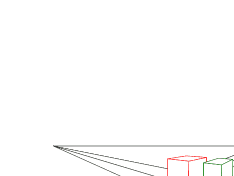

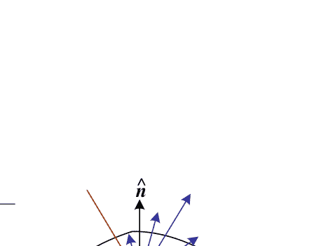

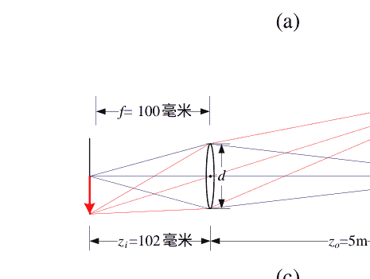

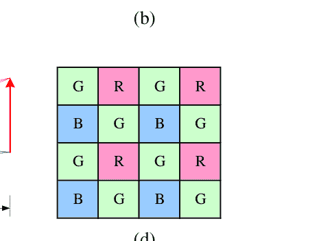

图2.1 图像形成过程的几个组成部分：(a) 透视投影；(b) 光线在表面上散射；(c) 镜头光学；(d) Bayer彩色滤光片阵列。

### 2.1 几何基元和变换

在我们能够智能地分析和处理图像之前，我们需要建立一个词汇来描述场景的几何形状。我们还需要了解图像形成过程，即在一组光照条件、场景几何形状、表面特性和相机光学的情况下生成特定图像的过程。在本章中，我们介绍了这样一个图像形成过程的简化模型。

第2.1节介绍了本书中使用的基本几何原语（点、线和平面）以及将这些3D量投影到2D图像特征的几何变换（图2.1a）。第2.2节描述了光照、表面特性（图2.1b）和相机光学（图2.1c）如何相互作用以产生落在图像传感器上的颜色值。第2.3节描述了连续的彩色图像如何在图像传感器内转换为离散的数字样本（图2.1d），以及如何避免（或至少表征）采样缺陷，如混叠现象。

本章所涵盖的材料只是对非常丰富和深入的一系列主题的简要总结，传统上这些主题在许多不同的领域中进行讨论。关于点、线、平面和投影的几何学更详细的介绍可以在多视角几何学教材（Hartley和Zisserman 2004; Faugeras和Luong 2001）和计算机图形学教材（Foley、van Dam、Feineret al.1995）中找到。图像形成（合成）过程传统上是作为计算机图形学课程的一部分教授的（Foley、van Dam、Feineret al.1995; Glass-ner 1995; Watt 1995; Shirley 2005），但它也在基于物理的计算机视觉中进行研究（Wolff、Shafer和Healey 1992a）。摄像机镜头系统的行为在光学中进行研究（M¨oller 1988; Hecht 2001; Ray 2002）。关于颜色理论的两本好书是(Wyszecki andStiles 2000; Healey and Shafer 1992)，而(Livingstone 2008)则提供了一个更有趣和非正式的颜色感知主题的介绍。关于采样和混叠的主题在信号和图像处理的教材中有所涉及(Cra ne 1997; J¨ahne 1997; Oppen-heim and Schafer 1996; Oppenheim, Schafer, and Buck 1999; Pratt 2007; Russ 2007; Burgerand Burge 2008; Gonzales and Woods 2008)。

给学生的一条提示：如果你已经学过计算机图形学，你可能想要浏览第2.1节的内容，尽管第2.1.5节末尾关于投影深度和物体中心投影的部分可能对你来说是新的。同样，物理学生（以及计算机图形学学生）大部分对第2.2节应该是熟悉的。最后，具有良好图像处理背景的学生应该已经熟悉采样问题（第2.3节）以及第3章的一些内容。

### 2.1 几何基元和变换

在本节中，我们介绍了本教材中使用的基本2D和3D基元，即点、线和平面。我们还描述了如何将3D特征投影到2D特征中。

关于这些主题的更详细描述（以及更温和和更直观的介绍）可以在多视角几何的教科书中找到（Hartley和Zisserman 2004；Faugeras和Luong 2001）。

#### 2.1.1 几何基元

几何原语是用来描述三维形状的基本构建块。在本节中，我们介绍点、线和面。本书的后续章节讨论曲线（第5.1节和第11.2节）、曲面（第12.3节）和体积（第12.5节）。

2D点。2D点（图像中的像素坐标）可以用一对值表示，

```
$$\boldsymbol{x} = (x, y) \in \mathcal{R}^2$$，或者，$$\boldsymbol{x} = \begin{bmatrix} x \\ y \end{bmatrix}. \quad (2.1)$$
```

（正如在引言中所述，我们使用 \((x_1, x_2, ...)\) 表示列向量。）2D点也可以使用齐次坐标表示，\(\tilde{\boldsymbol{x}} = (\tilde{x}, \tilde{y}, \tilde{w}) \in \mathcal{P}^2\)，其中，只有尺度不同的向量被视为等价的。\(\mathcal{P}^2 = \mathcal{R}^3 - \{(0,0,0)\}\) 被称为二维投影空间。

一个齐次向量 \(\tilde{\boldsymbol{x}}\) 可以通过除以最后一个元素 \(\tilde{w}\) 来转换回一个非齐次向量 \(\boldsymbol{x}\)。

```
$$\tilde{\boldsymbol{x}} = (\tilde{x}, \tilde{y}, \tilde{w}) = \tilde{w}(x, y, 1) = \tilde{w}\bar{\boldsymbol{x}}. \quad (2.2)$$
```

其中 \(\bar{\boldsymbol{x}} = (x, y, 1)\) 是增广向量。齐次点的最后一个元素为 \(\tilde{w} = 0\) 被称为理想点或无穷远点，并且没有对应的非齐次表示。

2D线条。2D线条也可以使用齐次坐标 \(\tilde{\boldsymbol{l}} = (a, b, c)\) 来表示。相应的线条方程是

```
$$\bar{\boldsymbol{x}} \cdot \tilde{\boldsymbol{l}} = ax + by + c = 0. \quad (2.3)$$
```

我们可以将线性方程向量规范化，使得 \(\boldsymbol{l} = (\hat{n}_x, \hat{n}_y, d) = (\hat{\boldsymbol{n}}, d)\) 且 \(\|\hat{\boldsymbol{n}}\| = 1\)。在这种情况下，\(\hat{\boldsymbol{n}}\) 是垂直于直线的法向量，\(d\) 是它到原点的距离（图2.2）。（唯一的例外是无穷远处的直线 \(\tilde{\boldsymbol{l}} = (0, 0, 1)\)，它包括所有无穷远处的（理想）点。）

我们还可以将 \(\hat{\boldsymbol{n}}\) 表示为旋转角度 \(\theta\) 的函数，\(\hat{\boldsymbol{n}} = (\hat{n}_x, \hat{n}_y) = (\cos \theta, \sin \theta)\)（图2.2a）。这种表示方法在Hough变换线条检测中常用。

| 周材料 | 项目 |
|---|---|
| 1. 第2章 图像形成 | |
| 2. 第3章 图像处理 | |
| 3. 第4章 特征检测和匹配 | P1 |
| 4. 第6章 基于特征的对齐 | |
| 5. 第9章 图像拼接 | P2 |
| 6. 第8章 密集运动估计 | |
| 7. 第7章 运动结构 | PP |
| 8. 第14章 识别 | |
| 9. 第10章 计算摄影 | |
| 10. 第11章 立体对应 | |
| 11. 第12章 3D重建 | |
| 12. 第13章 基于图像的渲染 | |
| 13. 最终项目演示 | FP |

表1.1 10周和13周课程的示例教学大纲。括号中的周数不适用于较短的版本。P1和P2是两个早期的小型项目，PP是（学生选择的）最终项目提案截止日期，FP是最终项目演示。

### 2.1 几何基元和变换

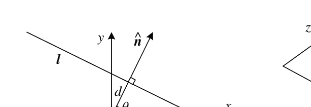

图2.2 (a) 2D线性方程和(b) 3D平面方程，以法向量$\hat{n}$和到原点的距离$d$表示。

算法，在第4.3.2节中讨论。组合$(\theta, d)$也被称为极坐标。

$$\tilde{x} = \tilde{l}_1 \times \tilde{l}_2, \quad (2.4)$$

其中$\times$是叉乘运算符。同样，连接两点的线可以写成

$$\tilde{l} = \tilde{x}_1 \times \tilde{x}_2. \quad (2.5)$$

当尝试将交点拟合到多条线或者反过来，将线拟合到多个点时，可以使用最小二乘技术（第6.1.1节和附录A.2），如习题2.1中所讨论的。

### 2D圆锥曲线

还有其他可以用简单的多项式齐次方程表示的代数曲线。例如，圆锥曲线（因为它们是平面和三维圆锥的交点而得名）可以用二次方程来表示。

$$\tilde{x}^T Q \tilde{x} = 0. \quad (2.6)$$

二次方程在多视角几何和相机校准（Hartley和Zisserman 2004; Faugeras和Luong 2001）的研究中起到了有用的作用，但在本书中并没有广泛使用。

### 3D点

三维空间中的点坐标可以用非齐次坐标$\mathbf{x} = (x, y, z) \in \mathcal{R}^3$或齐次坐标$\tilde{x} = (\tilde{x}, \tilde{y}, \tilde{z}, \tilde{w}) \in \mathcal{P}^3$来表示。与之前一样，有时候用增广向量$\bar{x} = (x, y, z, 1)$来表示一个三维点是很有用的。

$$\tilde{x} = \tilde{w}\bar{x}.$$

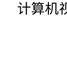

**3D平面。** 3D平面也可以用齐次坐标表示 $\tilde{m} = (a, b, c, d)$ 具有相应的平面方程
$$\bar{x} \cdot \tilde{m} = ax + by + cz + d = 0. \tag{2.7}$$
我们也可以将平面方程规范化为 $\boldsymbol{m} = (\hat{n}_x, \hat{n}_y, \hat{n}_z, d) = (\hat{\boldsymbol{n}}, d)$ 其中 $\|\hat{\boldsymbol{n}}\| = 1$. 在这种情况下， $\hat{\boldsymbol{n}}$ 是垂直于平面的法向量， $\boldsymbol{d}$ 是它到原点的距离（图2.2b）。与2D线的情况一样，包含所有无穷远点的无穷远平面 $\tilde{m} = (0, 0, 0, 1)$，无法规范化（即，它没有唯一的法向量或有限的距离）。

我们可以将 $\hat{\boldsymbol{n}}$ 表示为两个角度 $(\theta, \phi)$ 的函数，
$$\hat{\boldsymbol{n}} = (\cos \theta \cos \phi, \sin \theta \cos \phi, \sin \phi), \tag{2.8}$$
即，使用球坐标来表示，但这种方式比极坐标少见，因为它们不能均匀地采样可能的法向量空间。

**3D线。** 在3D中，线比2D中的线或3D中的平面更不优雅。一种可能的表示方法是使用线上的两个点， $(\boldsymbol{p}, \boldsymbol{q})$。线上的任意其他点都可以表示为这两个点的线性组合。
$$\boldsymbol{r} = (1 - \lambda)\boldsymbol{p} + \lambda\boldsymbol{q}, \tag{2.9}$$
如图2.3所示。如果我们限制 $0 \leq \lambda \leq 1$，我们得到连接 $\boldsymbol{p}$ 和 $\boldsymbol{q}$ 的线段。如果我们使用齐次坐标，我们可以将线表示为
$$\tilde{\boldsymbol{r}} = \mu \tilde{\boldsymbol{p}} + \lambda \tilde{\boldsymbol{q}}. \tag{2.10}$$
这种情况的特例是当第二个点在无穷远处时，即 $\tilde{\boldsymbol{q}} = (\hat{d}_x, \hat{d}_y, \hat{d}_z, 0) = (\hat{\boldsymbol{d}}, 0)$。在这里，我们可以看到 $\hat{\boldsymbol{d}}$ 是线的方向。然后，我们可以将非齐次三维线方程重写为
$$\boldsymbol{r} = \boldsymbol{p} + \lambda \hat{\boldsymbol{d}}. \tag{2.11}$$

三维线段的端点表示法的一个缺点是它具有过多的自由度，即六个（每个端点三个）而不是三维线真正具有的四个自由度。然而，如果我们将线上的两个点固定在特定的平面上，我们可以得到一个具有四个自由度的表示。例如，如果我们表示几乎垂直的线，则 $z=0$ 和 $z=1$ 形成两个合适的平面，即两个平面中的 $(x, y)$ 坐标提供了描述线的四个坐标。这种两平面参数化方法在第13章中描述的基于光场和Lumigraph的图像渲染系统中用于表示相机在物体前移动时所看到的光线集合。两端点表示法也适用于表示线段，即使无法准确看到它们的端点（只能猜测）。

如果我们希望表示所有可能的线条而不偏向任何特定方向，我们可以使用普吕克尔坐标（Hartley和Zisserman 2004年，第2章; Faugeras和Luong 2001年，第3章）。这些坐标是4×4反对称矩阵中的六个独立非零元素

$$L = \tilde{p}\tilde{q}^T - \tilde{q}\tilde{p}^T$$

其中 $\tilde{p}$ 和 $\tilde{q}$ 是线上的任意两个（非相同的）点。这种表示只有四个自由度，因为 $L$ 是齐次的，并且还满足 $\det (L) = 0$，这导致了对普吕克尔坐标的二次约束。

在实践中，最小表示对大多数应用程序并不重要。通过估计线的方向（可能事先已知，例如用于建筑）和线的可见部分内的某个点（参见第7.5.1节）或使用两个端点，可以获得对3D线的充分模型，因为线通常作为有限线段可见。然而，如果您对最小线参数化的更多细节感兴趣，Förstner（2005）讨论了在射影几何中推断和建模3D线的各种方法，以及如何估计这种拟合模型的不确定性。

### 3D二次曲面

三维空间中的二次曲面是二维曲线的类比。

$$\bar{x}^T Q \bar{x} = 0$$

（Hartley和Zisserman 2004年，第2章）。尽管二次曲面在多视图几何的研究和建模中非常有用（如球体、椭球体、圆柱体），但我们在本书中不会对其进行详细研究。

#### 2.1.2 2D 变换

在定义了基本的几何原语之后，我们现在可以关注它们如何进行变换。最简单的变换发生在二维平面中，并在图2.4中进行了说明。

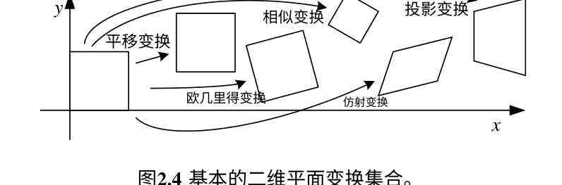

图2.4 基本的二维平面变换集合。

平移变换。2D平移可以表示为 $x' = x + t$ 或

$$x' = \left[\begin{array}{cc} I & t \end{array}\right] \bar{x} \tag{2.14}$$

其中 $I$ 是$(2 \times 2)$单位矩阵或

$$\bar{x}' = \left[\begin{array}{cc} I & t \\ 0^T & 1 \end{array}\right] \bar{x} \tag{2.15}$$

其中 $\mathbf{0}$是零向量。使用 $2 \times 3$矩阵可以得到更紧凑的表示，而使用满秩 $3 \times 3$矩阵（可以通过在 $2 \times 3$矩阵后附加一个 $[\mathbf{0}^T~1]$行）可以通过矩阵乘法链接变换。请注意，在任何方程中，如果增广向量（如 $\bar{x}$）出现在两边，它总是可以用完全齐次向量 $\bar{x}$来替换。

旋转 + 平移。这个变换也被称为2D刚体运动或2D欧几里德变换（因为欧几里德距离被保持不变）。它可以写成 $x' = Rx + t$ 或

$$x' = \left[\begin{array}{cc} R & t \end{array}\right] \bar{x} \tag{2.16}$$

其中

$$R = \left[\begin{array}{cc} \cos\theta & -\sin\theta \\ \sin\theta & \cos\theta \end{array}\right] \tag{2.17}$$

是一个正交旋转矩阵，满足 $RR^T = I$和 $|R| = 1$。

缩放旋转。也被称为相似变换，这个变换可以表示为 $x' = sRx + t$，其中 $s$是任意的比例因子。也可以写成

$$x' = \left[\begin{array}{cc} sR & t \end{array}\right] \bar{x} = \left[\begin{array}{ccc} a & -b & t_x \\ b & a & t_y \end{array}\right] \bar{x}, \tag{2.18}$$

不再要求 $a^2 + b^2 = 1$。相似变换保持线之间的角度。

仿射变换。仿射变换可以写成 $x' = A \bar{x}$，其中 $A$是任意的 $2 \times 3$矩阵，即

$$x' = \begin{bmatrix} a_{00} & a_{01} & a_{02} \\ a_{10} & a_{11} & a_{12} \end{bmatrix} \bar{x}. \tag{2.19}$$

平行线在仿射变换下保持平行。

投影。这个变换，也被称为透视变换或者单应性变换，作用于齐次坐标上，

$$\tilde{x}' = \tilde{H} \tilde{x}, \tag{2.20}$$

其中 $\tilde{H}$是任意的 $3 \times 3$矩阵。注意 $\tilde{H}$是齐次的，即它只定义了一个尺度，而且两个只有尺度不同的 $\tilde{H}$矩阵是等价的。得到的齐次坐标 $\tilde{x}'$必须进行归一化才能得到一个非齐次的结果 $x$，即，

$$x' = \frac{h_{00} x + h_{01} y + h_{02}}{h_{20} x + h_{21} y + h_{22}} \quad \text{和} \quad y' = \frac{h_{10} x + h_{11} y + h_{12}}{h_{20} x + h_{21} y + h_{22}}. \tag{2.21}$$

透视变换保持直线不变（即，在变换后仍然是直线）。

2D变换的层次结构。前面的一系列变换在图2.4中有所说明，并在表2.1中进行了总结。最简单的方法是将它们视为对2D齐次坐标向量进行操作的一组（可能受限制的）3 × 3矩阵。

> Hartley和Zisserman（2004）对2D平面变换的层次结构进行了更详细的描述。

上述变换形成了一个嵌套的群集合，即它们在组合下是封闭的，并且其逆变换是同一群的成员。（在第3.6节将这些变换应用于图像时，这将非常重要。）每个（更简单的）群是更复杂群的子集。

共变量。虽然上述变换可以用来转换二维平面上的点，但它们也可以直接用来转换直线方程吗？考虑齐次方程 $\tilde{l} \cdot \tilde{x} = 0$。如果我们进行变换 $\tilde{x}' = \tilde{H} \tilde{x}$，我们得到

$$\tilde{l}' \cdot \tilde{x}' = \tilde{l}^T \tilde{H} \tilde{x} = (\tilde{H}^T \tilde{l})^T \tilde{x} = \tilde{l} \cdot \tilde{x} = 0, \tag{2.22}$$

因此，对于二维线或三维法线等共变量的射影变换可以用矩阵的转置逆来表示，这等价于 $\tilde{H}$ 的伴随矩阵，因为射影变换矩阵是齐次的。

Blinn (1998) 在第9章和第10章中描述了符号和操作共变量的细节。
虽然上述变换是我们最广泛使用的变换，但有时还会使用其他一些变换。

拉伸/压缩。这种变换改变图像的纵横比，
$$
\begin{aligned}
x' &= s_x x + t_x \\
y' &= s_y y + t_y,
\end{aligned}
$$
并且是仿射变换的一种受限形式。不幸的是，它与表2.1中列出的群组嵌套不清晰。

平面表面流动。这是一个八参数变换 (Horn 1986; Bergen, Anandan, Hanna et al. 1992; Girod, Greiner, and Niemann 2000),
$$
\begin{aligned}
x' &= a_0 + a_1 x + a_2 y + a_6 x^2 + a_7 xy \\
y' &= a_3 + a_4 x + a_5 y + a_7 x^2 + a_6 xy,
\end{aligned}
$$
当一个平面表面经历微小的3D运动时出现。因此，它可以被看作是对完整单应性的小运动近似。它的主要吸引力在于它在运动参数中是线性的，$a_k$，这些通常是被估计的量。

表2.1 2D坐标变换的层次结构。每个变换还保持下面行中列出的属性，即相似性不仅保持角度，还保持平行性和直线。这些2×3矩阵通过添加第三行 $[0^T 1]$ 来形成用于齐次坐标变换的完整3×3矩阵。

| 变换 | 矩阵 | # 自由度保持 | 图标 |
| :--- | :--- | :--- | :--- |
| 平移变换 | $[\begin{array}{c\|c} I & t \end{array}]_{2\times 3}$ | 2 | 方向 | □ |
| 刚性 (欧几里得) | $[\begin{array}{c\|c} R & t \end{array}]_{2\times 3}$ | 3 | 长度 | ◇ |
| 相似变换 | $[\begin{array}{c\|c} sR & t \end{array}]_{2\times 3}$ | 4 | 角度 | ◇ |
| 仿射 | $[\begin{array}{c} A \end{array}]_{2\times 3}$ | 6 | 平行性 | ▱ |
| 投影变换 | $[\begin{array}{c} \tilde{H} \end{array}]_{3\times 3}$ | 8 | 直线 | ⏔ |

表2.2 三维坐标变换的层次结构。每个变换还保持了下面行中列出的属性，即相似性不仅保持角度，还保持平行和直线。3 × 4矩阵通过添加第四行 $[0^T 1]$来扩展为齐次坐标变换的完整 4 × 4矩阵。助记符图标是在2D中绘制的，但意味着发生在完整3D立方体中的变换。

| 变换 | 矩阵 | # 自由度保持 | 图标 |
|------|------|--------------|------|
| 平移变换 | $[I \mid t]_{3\times4}$ | 3 | 方向 | □ |
| 刚性（欧几里得） | $[R \mid t]_{3\times4}$ | 6 | 长度 | ◇ |
| 相似变换 | $[sR \mid t]_{3\times4}$ | 7 | 角度 | ◇ |
| 仿射 | $[A]_{3\times4}$ | 12 | 平行性 | ▱ |
| 投影变换 | $[\tilde{H}]_{4\times4}$ | 15 | 直线 | ⊓ |

双线性插值器。这个八参数变换（Wolberg 1990），

$$
\begin{aligned}
x' &= a_0 + a_1 x + a_2 y + a_6 x y \\
y' &= a_3 + a_4 x + a_5 y + a_7 x y
\end{aligned}
$$

可以用来插值由正方形的四个角点的运动引起的变形。（实际上，它可以插值任意四个非共线点的运动。）虽然变形在运动参数中是线性的，但通常不保持直线（只保持与正方形轴平行的线）。然而，它通常非常有用，例如，在使用样条插值法（第8.3节）插值稀疏网格时。

#### 2.1.3 3D 变换

三维坐标变换集合与二维变换非常相似，并在表2.2中总结。与二维一样，这些变换形成了一个嵌套的群集。Hartley和Zisserman（2004年，第2.4节）对此层次结构给出了更详细的描述。

平移。3D平移可以写成 $x' = x + t$ 或

$$x' = [ I \mid t ] \bar{x}$$

其中 $\boldsymbol{I}$ 是（$3 \times 3$）单位矩阵，$\boldsymbol{0}$ 是零向量。

**旋转+平移。也称为3D刚体运动或3D欧几里德变换，可以写成 $x' = \boldsymbol{R}x + \boldsymbol{t}$ 或**

$$
x' = \begin{bmatrix} \boldsymbol{R} & \boldsymbol{t} \end{bmatrix} \bar{x} \qquad\qquad (2.24)
$$

其中 $\boldsymbol{R}$ 是一个 $3 \times 3$ 正交旋转矩阵，满足 $\boldsymbol{R}\boldsymbol{R}^T = \boldsymbol{I}$ 和 $|\boldsymbol{R}| = 1$。请注意，有时候用描述刚体运动更方便

$$
x' = \boldsymbol{R}(x - c) = \boldsymbol{R}x - \boldsymbol{R}c, \qquad\qquad (2.25)
$$

其中 $c$ 是旋转中心（通常是相机中心）。

紧凑地参数化3D旋转是一个非常复杂的任务，我们将在下面更详细地描述。

缩放旋转。3D相似变换可以表示为 $x' = s\boldsymbol{R}x + \boldsymbol{t}$ 其中 $s$ 是任意的比例因子。也可以写成

$$
x' = \begin{bmatrix} s\boldsymbol{R} & \boldsymbol{t} \end{bmatrix} \bar{x}. \qquad\qquad (2.26)
$$

这个变换保持线和平面之间的角度。

仿射。仿射变换可以写成 $x' = \boldsymbol{A}\bar{x}$，其中 $\boldsymbol{A}$ 是任意的 $3 \times 4$ 矩阵，即

$$
x' = \begin{bmatrix} a_{00} & a_{01} & a_{02} & a_{03} \\ a_{10} & a_{11} & a_{12} & a_{13} \\ a_{20} & a_{21} & a_{22} & a_{23} \end{bmatrix}. \qquad\qquad (2.27)
$$

平行线和平面在仿射变换下保持平行。

投影。这种变换，也被称为三维透视变换、单应性变换或共线性变换，作用于齐次坐标，

$$
\tilde{x}' = \tilde{\boldsymbol{H}}\tilde{x}, \qquad\qquad (2.28)
$$

其中 $\tilde{\boldsymbol{H}}$ 是任意的 $4 \times 4$ 齐次矩阵。与二维情况类似，得到的齐次坐标 $\tilde{x}'$ 必须进行归一化，以得到非齐次结果 $x$。透视变换保持直线的直线性（即，在变换后仍然是直线）。

#### 2.1.4 3D 旋转

2D和3D坐标变换之间最大的区别在于3D旋转矩阵 \(R\) 的参数化不像2D那样直接，但存在几种可能性。

## 欧拉角

一个旋转矩阵可以由三个绕三个基准轴的旋转的乘积形成，例如，\(x\)，\(y\)和\(z\)，或者\(x\)，\(y\)和\(x\)。总的来说，这是一个不好的主意，因为结果取决于应用变换的顺序。更糟糕的是，不总是可能在参数空间中平滑移动，即有时候欧拉角中的一个或多个会对旋转的微小变化产生剧烈变化。$^1$ 出于这些原因，在本书中我们甚至不给出欧拉角的公式-有兴趣的读者可以查阅其他教材或技术报告 (Faugeras 1993; Diebel 2006)。请注意，在某些应用中，如果旋转被知道是一组单轴变换，它们总是可以用一组明确的刚性变换来表示。

## 轴/角（指数扭曲）

旋转可以用旋转轴 \(\hat{n}\) 和角度 \(\theta\) 来表示，或者等价地用一个三维向量 \(\omega = \theta\hat{n}\) 来表示。图2.5展示了我们如何计算等效的旋转。首先，我们将向量 \(v\) 投影到轴 \(\hat{n}\) 上，得到

$$v_{\|} = \hat{n}(\hat{n} \cdot v) = (\hat{n}\hat{n}^{T})v,$$

这是旋转不受影响的 \(v\) 的分量。接下来，我们计算 \(v\) 到 \(\hat{n}\) 的垂直残差，

$$v_{\perp} = v - v_{\|} = (I - \hat{n}\hat{n}^{T})v.$$

$^1$ 在机器人学中，这有时被称为万向锁。

我们可以使用叉乘将该向量旋转 90°。

$$v_{\times} = \hat{n} \times v = [\hat{n}]_{\times} v, \tag{2.31}$$

其中 $[\hat{n}]_{\times}$ 是向量 $\hat{n} = (\hat{n}_x, \hat{n}_y, \hat{n}_z)$ 的叉积运算符的矩阵形式，

$$[\hat{n}]_{\times} = \begin{bmatrix} 0 & -\hat{n}_z & \hat{n}_y \\ \hat{n}_z & 0 & -\hat{n}_x \\ -\hat{n}_y & \hat{n}_x & 0 \end{bmatrix}. \tag{2.32}$$

请注意，将该向量旋转 90° 等同于再次进行叉积运算，

$$v_{\times\times} = \hat{n} \times v_{\times} = [\hat{n}]_{\times}^2 v = -v_{\perp},$$

因此

$$v_{\parallel} = v - v_{\perp} = v + v_{\times\times} = (I + [\hat{n}]_{\times}^2) v.$$

我们现在可以计算旋转向量 $u$ 的平面分量

$$u_{\perp} = \cos\theta v_{\perp} + \sin\theta v_{\times} = (\sin\theta [\hat{n}]_{\times} - \cos\theta [\hat{n}]_{\times}^2) v.$$

将所有这些项放在一起，我们得到最终的旋转向量

$$u = u_{\perp} + v_{\parallel} = (I + \sin\theta [\hat{n}]_{\times} + (1 - \cos\theta) [\hat{n}]_{\times}^2) v, \tag{2.33}$$

因此，我们可以写出对应于绕轴 $\hat{n}$ 旋转 $\theta$ 旋转的旋转矩阵

$$R(\hat{n}, \theta) = I + \sin\theta [\hat{n}]_{\times} + (1 - \cos\theta) [\hat{n}]_{\times}^2, \tag{2.34}$$

被称为罗德里格斯公式 (Ayache 1989)。

轴 $\hat{n}$ 和角度 $\theta$ 的乘积 $\omega = \theta \hat{n} = (\omega_x, \omega_y, \omega_z)$, 是三维旋转的最小表示。如果 $\theta$ 以度数存储，那么常见角度的旋转，如 90° 的倍数，可以精确表示（并转换为精确矩阵）。不幸的是，这种表示并不唯一，因为我们总是可以在 $\theta$ 上加上 360° ($2\pi$弧度) 的倍数，得到相同的旋转矩阵。同样地，$(\hat{n}, \theta)$ 和 $(-\hat{n}, -\theta)$ 表示相同的旋转。

然而，对于小的旋转（例如，对旋转的修正），这是一个很好的选择。特别是对于小的（无穷小或瞬时的）旋转和 $\theta$ 以弧度表示，罗德里格斯公式简化为

$$R(\omega) \approx I + \sin\theta [\hat{n}]_{\times} \approx I + [\theta \hat{n}]_{\times} = \begin{bmatrix} 1 & -\omega_z & \omega_y \\ \omega_z & 1 & -\omega_x \\ -\omega_y & \omega_x & 1 \end{bmatrix}, \tag{2.35}$$

这给出了旋转参数ω和R之间的良好线性关系。我们还可以写成R(ω)v ≈ v + ω × v，这在我们想要计算Rv关于ω的导数时非常方便，

$$
\frac{\partial \boldsymbol{Rv}}{\partial \boldsymbol{\omega}^\top} = -[\boldsymbol{v}]_\times = \begin{bmatrix} 0 & z & -y \\ -z & 0 & x \\ y & -x & 0 \end{bmatrix}
$$

通过指数扭曲（Murray, Li, and Sastry 1994）是导出旋转的另一种方法。通过角度θ旋转等效于通过θ/k旋转k次。当k→∞时，我们得到

$$
\boldsymbol{R}(\hat{\boldsymbol{n}}, \theta) = \lim_{k \to \infty} \left( \boldsymbol{I} + \frac{1}{k}[\theta \hat{\boldsymbol{n}}]_\times \right)^k = \exp \left( [\boldsymbol{\omega}]_\times \right)
$$

如果我们将矩阵指数展开为泰勒级数（使用恒等式[ⁿ]ₓᵏ⁺² = -[ⁿ]ₓᵏ，k > 0，并再次假设θ以弧度表示），

$$
\exp \left( [\boldsymbol{\omega}]_\times \right) = \begin{aligned} & \boldsymbol{I} + \theta [\hat{\boldsymbol{n}}]_\times + \frac{\theta^2}{2} [\hat{\boldsymbol{n}}]_\times^2 + \frac{\theta^3}{3!} [\hat{\boldsymbol{n}}]_\times^3 + \cdots \\ & = \boldsymbol{I} + \left( \theta - \frac{\theta^3}{3!} + \cdots \right) [\hat{\boldsymbol{n}}]_\times + \left( \frac{\theta^2}{2} - \frac{\theta^3}{4!} + \cdots \right) [\hat{\boldsymbol{n}}]_\times^2 \\ & = \boldsymbol{I} + \sin \theta [\hat{\boldsymbol{n}}]_\times + (1 - \cos \theta) [\hat{\boldsymbol{n}}]_\times^2 \end{aligned}
$$

这导致了熟悉的罗德里格斯公式。

## 单位四元数

单位四元数表示与角度/轴表示密切相关。单位四元数是一个单位长度的4维向量，其分量可以写为q=(qₓ, qᵧ, q_z, q_w)或q=(x, y, z, w)简写。单位四元数位于单位球面上‖q‖=1，而q和 -q表示相同的旋转（图2.6）。除了这种歧义性（双重覆盖）外，旋转的单位四元数表示是唯一的。

此外，表示是连续的，即旋转矩阵连续变化，可以找到连续的四元数表示，尽管四元数球上的路径可能会绕一圈后返回到“原点”q₀=(0,0,0,1)。出于以下原因和其他原因，四元数在姿态和计算机图形中的插值中是一种非常流行的表示方法（Shoemake 1985）。

四元数可以通过轴/角度表示法推导出公式

$$
\boldsymbol{q} = (\boldsymbol{v}, w) = \left( \sin \frac{\theta}{2} \hat{\boldsymbol{n}}, \cos \frac{\theta}{2} \right)
$$

其中 $\hat{\boldsymbol{n}}$ 和 $\theta$ 是旋转轴和角度。使用三角恒等式 $\sin \theta = 2 \sin \frac{\theta}{2} \cos \frac{\theta}{2}$ 和 $(1 - \cos \theta) = 2 \sin^2 \frac{\theta}{2}$，罗德里格斯公式可以转换为

$$\boldsymbol{R}(\hat{\boldsymbol{n}}, \theta) = \boldsymbol{I} + \sin \theta[\hat{\boldsymbol{n}}]_\times + (1 - \cos \theta)[\hat{\boldsymbol{n}}]_\times^2 = \boldsymbol{I} + 2w[\boldsymbol{v}]_\times + 2[\boldsymbol{v}]_\times^2. \tag{2.40}$$

这表明可以通过一系列的叉积、缩放和加法来快速旋转一个向量 $\boldsymbol{v}$。为了得到 $\boldsymbol{R}(\boldsymbol{q})$ 作为 $(x, y, z, w)$ 的函数的公式，回忆一下

$$[\boldsymbol{v}]_\times = \begin{bmatrix} 0 & -z & y \\ z & 0 & -x \\ -y & x & 0 \end{bmatrix} \quad \text{和} \quad [\boldsymbol{v}]_\times^2 = \begin{bmatrix} -y^2 - z^2 & xy & xz \\ xy & -x^2 - z^2 & yz \\ xz & yz & -x^2 - y^2 \end{bmatrix}.$$

因此我们得到

$$\boldsymbol{R}(\boldsymbol{q}) = \begin{bmatrix} 1 - 2(y^2 + z^2) & 2(xy - zw) & 2(xz + yw) \\ 2(xy + zw) & 1 - 2(x^2 + z^2) & 2(yz - xw) \\ 2(xz - yw) & 2(yz + xw) & 1 - 2(x^2 + y^2) \end{bmatrix}. \tag{2.41}$$

通过用 $1 - 2(y^2 + z^2)$ 替换对角线项可以使其更对称 $(x^2 + w^2 - y^2 - z^2)$ 等等。

单位四元数最好的一点是，存在一种简单的代数方法来组合以单位四元数表示的旋转。给定两个四元数 $\boldsymbol{q}_0 = (\boldsymbol{v}_0, w_0)$ 和 $\boldsymbol{q}_1 = (\boldsymbol{v}_1, w_1)$，四元数乘法运算符定义为

$$\boldsymbol{q}_2 = \boldsymbol{q}_0 \boldsymbol{q}_1 = (\boldsymbol{v}_0 \times \boldsymbol{v}_1 + w_0 \boldsymbol{v}_1 + w_1 \boldsymbol{v}_0, \; w_0 w_1 - \boldsymbol{v}_0 \cdot \boldsymbol{v}_1), \tag{2.42}$$

具有 $R(q_2) = R(q_0)R(q_1)$ 的性质。请注意，四元数乘法不满足交换律，就像3D旋转和矩阵乘法一样。

取一个四元数的逆很容易：只需改变 $v$ 或 $w$ 的符号（但不能同时改变两者！） （你可以验证这样做会得到期望的结果，即转置 $R$ 矩阵（2.41）中的效果。） 因此，我们也可以将四元数除法定义为

$$ q_2 = q_0/q_1 = q_0 q_{\mathrm{I}}^{-1} = (v_0 \times v_1 + w_0 v_1 - w_1 v_0, -w_0 w_1 - v_0 \cdot v_1) \tag{2.43} $$

当需要计算两个旋转之间的增量旋转时，这非常有用。

特别地，如果我们想确定两个给定旋转之间的中间旋转，我们可以计算增量旋转，取角度的一部分，并计算新的旋转。 这个过程被称为球面线性插值（Spherical Linear Interpolation）或简称为SLERP（Shoemake 1985），并在算法2.1中给出。 请注意，Shoemake还提供了除此之外的两个公式。 在将原始四元数乘以alpha之前，首先对 $q_r$ 进行指数运算。

$$ q_2 = q_r^\alpha q_0 \tag{2.44} $$

而第二个将四元数视为球面上的4维向量，并使用

$$ q_2 = \frac{\sin(1 - \alpha)\theta}{\sin\theta} q_0 + \frac{\sin\alpha\theta}{\sin\theta} q_1 \tag{2.45} $$

其中 $\theta = \cos^{-1}(q_0 \cdot q_1)$ 且点积直接作用于四元数4维向量之间。 所有这些公式都可以得到相似的结果，但是当 $q_0$ 和 $q_1$ 非常接近时需要小心，这就是为什么我更喜欢使用反正切来确定旋转角度的原因。

## 哪种旋转表示更好？

选择3D旋转的表示方式部分取决于应用程序。轴/角度表示是最简单的，因此不需要对参数进行任何额外的约束（每次更新后无需重新归一化）。 如果角度以度数表示，那么更容易理解姿态（比如，90度绕x轴扭转），也更容易表示精确的旋转。 当角度以弧度表示时，可以轻松计算 $R$ 相对于 $\omega$ 的导数（2.36）。

另一方面，四元数在表示中没有不连续性，因此如果你想要跟踪平滑移动的相机，四元数更好。 在旋转之间进行插值和链接刚性变换也更容易（Murray, Li和Sastry 1994; Bregler和Malik 1998）。

我通常更喜欢使用四元数，但是使用增量旋转来更新它们的估计，如6.2.2节所述。

过程球面线性插值\((q_0, q_1, \alpha)\):

-  \(q_r = q_1 / q_0 = (v_r, w_r)\)
-  如果 \(w_r < 0\)，那么 \(q_r \leftarrow -q_r\)
-  \(\theta_r = 2 \tan^{-1}(\|v_r\| / w_r)\)
-  \(\hat{r} = \mathcal{N}(v_r) = v_r / \|v_r\|\)
-  \(\theta_{\alpha} = \alpha \, \theta_r\)
-  \(q_{\alpha} = \left( \sin \frac{\theta_{\alpha}}{2} \, \hat{r}, \cos \frac{\theta_{\alpha}}{2} \right)\)
-  返回 \(q_2 = q_{\alpha} q_0\)

算法2.1 球面线性插值（slerp）。首先从四元数比率计算轴和总角度。（此计算可以在生成一组用于动画的插值位置的内部循环之外进行。）然后计算增量四元数并与起始旋转四元数相乘。

#### 2.1.5 3D 到 2D 投影

现在我们知道如何表示2D和3D几何图元以及如何对它们进行空间变换，我们需要指定如何将3D图元投影到图像平面上。我们可以使用线性的3D到2D投影矩阵来实现这一点。最简单的模型是正交投影，它不需要除法来获得最终的（非齐次）结果。更常用的模型是透视投影，因为它更准确地模拟了真实相机的行为。

## 正交投影和平行透视

正交投影只是将三维坐标的 \(z\) 分量丢弃，得到二维点 \(x\)。（在本节中，我们使用 \(p\) 表示三维点，使用 \(x\) 表示二维点。）这可以写成

\(x = [\mathbf{I}_{2 \times 2} | \mathbf{0}] \, p\). \(\quad\) (2.46)

如果我们使用齐次（投影）坐标，我们可以写成

\(\tilde{x} = \begin{bmatrix} 1 & 0 & 0 & 0 \\ 0 & 1 & 0 & 0 \\ 0 & 0 & 0 & 1 \end{bmatrix} \tilde{p},\) \(\quad\) (2.47)

图2.7 常用的投影模型：(a) 世界的3D视图，(b) 正交投影，(c) 缩放正交投影，(d) 平行透视，(e) 透视投影，(f) 物体中心投影。每个图示都显示了投影的俯视图。请注意，在非透视投影中，地面平面上的平行线和盒子的边仍然保持平行。

即，我们去掉 z分量，但保留 w分量。正交投影是对于长焦距（望远镜）镜头和深度相对较浅的物体（Sawhney和Hanson 1991）的近似模型。它只对于远心镜头（Baker和Nayar 1999, 2001）是精确的。

在实践中，世界坐标（可能以米为单位测量尺寸）需要缩放以适应图像传感器（在物理上以毫米为单位测量，但最终以像素为单位测量）。因此，实际上更常用的是缩放正交投影。

$$\boldsymbol{x}=[s\boldsymbol{I}_{2\times2}|\boldsymbol{0}]\boldsymbol{p}_\circ \quad (2.48)$$

该模型等效于首先将世界点投影到本地正交图像平面，然后使用常规透视投影对该图像进行缩放。缩放可以对场景的所有部分都相同（图2.7b），也可以对独立建模的对象有所不同（图2.7c）。更重要的是，在估计运动结构时，缩放可以在帧与帧之间变化，这可以更好地模拟对象靠近相机时发生的尺度变化。

缩放正交投影是一种用于重建远离相机的物体的三维形状的流行模型，因为它极大地简化了某些计算。例如，可以使用简单的最小二乘法（第6.2.1节）估计姿态（相机方向）。在正交投影下，可以同时估计结构和运动，使用因子分解（奇异值分解），如第7.3节所讨论的（Tomasi和Kanade 1992）。

一个密切相关的投影模型是para-perspective（Aloimonos 1990; Poelman和Kanade 1997）。在这个模型中，物体点首先再次投影到与图像平面平行的局部参考平面上。然而，与其被正交投影到该平面上，它们被投影parallel到物体中心的视线上（图2.7d）。然后再进行常规投影到最终的图像平面上，这又相当于一个缩放。

因此，这两个投影的组合是仿射的，并且可以写成

$$\tilde{\boldsymbol{x}}=\begin{bmatrix} a_{00} & a_{01} & a_{02} & a_{03} \\ a_{10} & a_{11} & a_{12} & a_{13} \\ 0 & 0 & 0 & 1 \end{bmatrix}\tilde{\boldsymbol{p}}. \quad (2.49)$$

请注意，在图2.7b-d中，3D中的平行线在投影后仍然保持平行。Para-perspective提供了比缩放正交投影更准确的投影模型，而不会增加每像素透视除法的复杂性，这使得传统的因子分解方法无效（Poelman和Kanade 1997）。

## 透视

在计算机图形学和计算机视觉中，最常用的投影是真正的3D透视（图2.7e）。在这里，通过将点除以它们的z分量，将它们投影到图像平面上。使用非齐次坐标，这可以写成

$$\tilde{x} = \mathcal{P}_z(\mathbf{p}) = \begin{bmatrix} x/z \\ y/z \\ 1 \end{bmatrix}. \quad (2.50)$$

在齐次坐标中，投影具有简单的线性形式，

$$\tilde{x} = \begin{bmatrix} 1 & 0 & 0 & 0 \\ 0 & 1 & 0 & 0 \\ 0 & 0 & 1 & 0 \end{bmatrix} \tilde{p}, \quad (2.51)$$

即，我们丢弃 p 的 w 分量。因此，在投影之后，无法从图像中恢复3D点的距离，这对于2D成像传感器是有意义的。

在计算机图形系统中经常见到的一种形式是两步投影，首先将3D坐标投影到范围为 $(x, y, z) \in [-1, 1] \times [-1, 1] \times [0, 1]$ 的标准化设备坐标中，然后使用视口变换(Watt 1995; OpenGL-ARB 1997)将这些坐标重新缩放为整数像素坐标。（初始）透视投影然后用一个 $4 \times 4$ 矩阵表示

$$\tilde{x} = \begin{bmatrix} 1 & 0 & 0 & 0 \\ 0 & 1 & 0 & 0 \\ 0 & 0 & -z_{\text{远}} / z_{\text{范围}} & z_{\text{近}}z_{\text{远}}/z_{\text{范围}} \\ 0 & 0 & 1 & 0 \end{bmatrix} \tilde{p}, \quad (2.52)$$

其中 $z_{\text{近}}$ 和 $z_{\text{远}}$ 是近和远剪裁平面，$z_{\text{范围}} = z_{\text{远}} - z_{\text{近}}$。注意实际上前两行是由焦距和宽高比缩放的，以便将可见光线映射到 $(x, y, z) \in [-1, 1]^2$。保留第三行而不是删除它的原因是可见性操作，如深度缓冲，需要为每个正在渲染的图形元素提供深度。

如果我们将 $z_{\text{near}}=1$, $z_{\text{far}} \to \infty$, 并且改变第三行的符号，规范化屏幕向量的第三个元素就变成了逆深度，即视差(Okutomi and Kanade 1993)。在许多情况下，这可以非常方便，因为对于在户外移动的相机来说，相机到逆深度通常是一个更好条件的参数化方式，而不是直接的3D距离。

虽然常规的2D图像传感器无法测量到表面点的距离，但是范围传感器(第12.2节)和立体匹配算法(第11章) 可以计算出这样的值。因此，如果我们使用一个满秩的 $4 \times 4$ 矩阵来表示透视投影，就可以方便地从基于传感器的深度或视差值 $d$ 直接映射回一个3D位置，这可以通过 $4 \times 4$ 矩阵的逆矩阵来实现(第2.1.5节)。我们可以通过像(2.64)中那样使用一个满秩的 $4 \times 4$ 矩阵来表示透视投影。

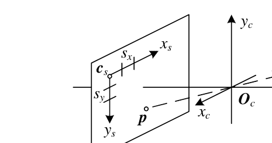

## 相机内参

一旦我们使用投影矩阵将3D点投影到理想针孔上，我们仍然需要根据像素传感器间距和传感器平面相对于原点的相对位置来转换结果坐标。图2.8展示了相关的几何形状。在本节中，我们首先使用传感器单应性 $M_s$将2D像素坐标映射到3D射线，因为这样更容易用物理可测量的量来解释。然后，我们将这些量与更常用的相机内参矩阵 $K$相关联，该矩阵用于将3D相机中心点 $p_c$映射到2D像素坐标 $\tilde{x}_s$。

图像传感器返回由整数像素坐标索引的像素值 $(x_s, y_s)$，通常从图像的左上角开始向下和向右移动。（并非所有图像库都遵循此约定，但调整其他坐标系统很简单。）为了将像素中心映射到3D坐标，我们首先通过像素间距 $(s_x, s_y)$（有时以微米为单位表示固态传感器）缩放 $(x_s, y_s)$值，然后使用原点$c_s$和3D旋转 $R_s$（图2.8）描述传感器阵列相对于相机投影中心 $O_c$的方向。然后，将组合的2D到3D投影表示为

$$p = \begin{bmatrix} R_s \mid c_s \end{bmatrix} \begin{bmatrix} s_x & 0 & 0 \\ 0 & s_y & 0 \\ 0 & 0 & 0 \\ 0 & 0 & 1 \end{bmatrix} \begin{bmatrix} x_s \\ y_s \\ 1 \end{bmatrix} = M_s \tilde{x}_s. \qquad (2.53)$$

矩阵 $M_s$的前两列是对应于图像像素阵列中沿着 $x_s$和 $y_s$方向的单位步长的3D向量，而第三列是3D图像阵列的原点 $c_s$。矩阵 $M_s$ 由八个未知数参数化：描述旋转 $R_s$ 的三个参数，描述平移 $c_s$ 的三个参数，以及两个比例因子。请注意，我们在这里忽略了图像平面上两个轴之间的倾斜可能性，因为固态制造技术使其可以忽略不计。在实践中，除非我们对传感器间距或传感器方向有准确的外部知识，否则只有七个自由度，因为仅凭外部图像测量无法区分传感器距离原点的距离和传感器间距。

然而，估计具有所需的七个自由度的相机模型 $M_s$ 是不切实际的，（即，在适当的重新缩放后，前两列是正交的）所以大多数从业者假设一个一般的 $3 \times 3$ 齐次矩阵形式。

3D像素中心 $p$ 和3D相机中心点 $p_c$ 之间的关系是由一个未知的缩放因子 $s$ 给出的，$p = s p_c$。因此，我们可以将相机中心点 $p_c$ 和像素地址的齐次版本 $\tilde{x}_s$ 之间的完整投影表示为

$$\tilde{x}_s = \alpha M_s^{-1} p_c = K p_c.$$

矩阵 $K$ 被称为校准矩阵，描述了相机的内参（与相机在空间中的方向相对应，称为外参）。从上面的讨论中，我们可以看出，$K$ 在理论上有七个自由度，在实践中有八个自由度（一个 $3 \times 3$ 齐次矩阵的完整维度）。

那么，为什么大多数关于3D计算机视觉和多视图几何的教科书 (Faugeras1993; Hartley and Zisserman 2004; Faugeras and Luong 2001) 将 $K$ 视为具有五个自由度的上三角矩阵？

虽然这通常在这些书中没有明确说明，但这是因为我们无法仅基于外部测量恢复出完整的 $K$ 矩阵。当校准相机（第6章）基于外部3D点或其他测量 (Tsai 1987) 时，我们通过一系列测量同时估计内部的 ($K$) 和外部的 ($R, t$) 相机参数。

$$\tilde{x}_s = K \begin{bmatrix} R & t \end{bmatrix} p_w = P p_w,$$

其中 $p_w$ 是已知的3D世界坐标，而

$$P = K[R|t]$$

被称为相机矩阵。检查这个方程，我们可以后乘以 $K$，$K$ 乘以 $R_1$ 并且前乘以 $[R|t]$ 乘以 $R_1^T$，仍然得到有效的校准。因此，仅根据图像测量无法确定传感器的真实方向和真实相机内参。

选择上三角形式的 $K$ 似乎是常规的。给定一个完整的 $3 \times 4$ 相机矩阵 $P = K[R|t]$，我们可以使用QR分解计算出一个上三角形式的 $K$ 矩阵因子分解 (Golub和Van Loan 1996)。（注意术语的不幸冲突：在矩阵代数教材中，R表示上三角（对角线右侧）矩阵；在计算机视觉中，R是正交旋转。）

有几种方法可以写出K的上三角形式。一种可能性是

$$K = \begin{bmatrix} f_x & s & c_x \\ 0 & f_y & c_y \\ 0 & 0 & 1 \end{bmatrix}$$

其中使用独立的焦距$f_x$和$f_y$来表示传感器的x和y维度。该条目$s$编码了由于传感器不垂直于光轴而导致的传感器轴之间的任何可能的倾斜，而$(c_x, c_y)$表示以像素坐标表示的光学中心。另一种可能性是

$$K = \begin{bmatrix} f & s & c_x \\ 0 & a f & c_y \\ 0 & 0 & 1 \end{bmatrix}$$

其中明确了纵横比$a$，并使用了一个常见的焦距$f$。

实际上，对于许多应用程序，可以通过设置$a = 1$和$s = 0$来获得更简单的形式。

$$K = \begin{bmatrix} f & 0 & c_x \\ 0 & f & c_y \\ 0 & 0 & 1 \end{bmatrix}.$$

通常，将原点设置在图像的大致中心，例如，$(c_x, c_y) = (W/2, H/2)$，其中 $W$ 和 $H$是图像的高度和宽度，可以得到一个完全可用的相机模型，只有一个未知数，即焦距 $f$。

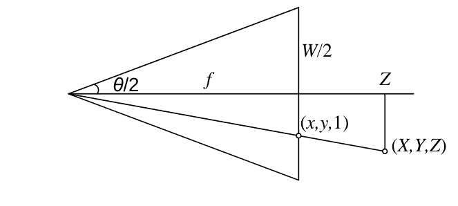

图2.10中心投影，显示了3D和2D坐标之间的关系，以及焦距 f，图像宽度 W和视野 θ之间的关系。

图2.9显示了这些量如何作为简化成像模型的一部分进行可视化。请注意，现在我们将图像平面放在了镜头的节点点（投影中心）之前。y轴的方向也已经翻转，以与大多数成像库处理垂直（行）坐标的方式兼容。某些图形库，如Direct3D，使用左手坐标系，这可能会导致一些混淆。

## 关于焦距的注释

如何表达焦距的问题经常在实现计算机视觉算法和讨论结果时引起困惑。这是因为焦距取决于用于测量像素的单位。

如果我们使用整数值对像素坐标进行编号，例如 [0, W) × [0, H)，焦距 f和相机中心 (c_x, c_y)在公式(2.59)中可以表示为像素值。这些量与摄影师常用的焦距有什么关系？

图2.10说明了焦距 f、传感器宽度 W和视场 θ之间的关系，它们遵循以下公式

$$\tan \frac{\theta}{2} = \frac{W}{2f} \quad \text{or} \quad f = \frac{W}{2} \left[ \tan \frac{\theta}{2} \right]^{-1}$$

对于传统胶片相机，W = 35mm，因此焦距也以毫米表示。由于我们使用数字图像，更方便地以像素表示 W，以便在校准矩阵 K中直接使用焦距 f（如（2.59）所示）。另一种可能性是将像素坐标缩放，使其沿着较长的图像维度从 [-1,1)变化，沿着较短的轴从 [-a^{-1}, a^{-1})变化，其中 a ≥ 1是图像的纵横比（与之前介绍的传感器单元纵横比相对）。这可以

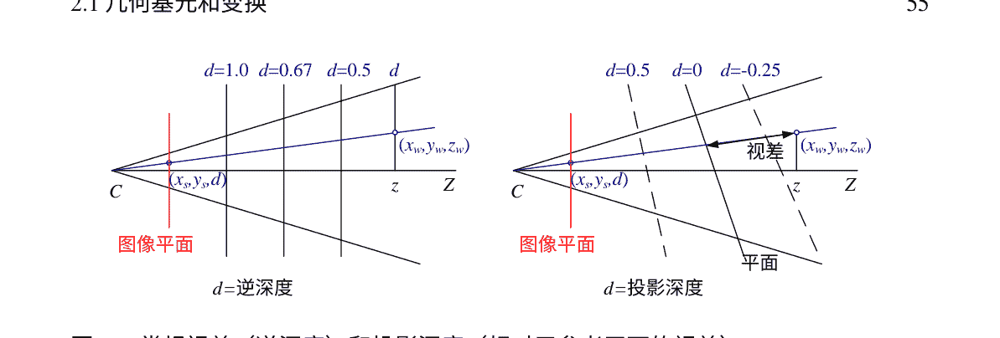

## 平面加视差（投影深度）

一般来说，当使用 $4 \times 4$ 矩阵 $\tilde{P}$ 时，我们可以自由地重新映射最后一行，以适应我们的目的（而不仅仅是将视差解释为逆深度的“标准”解释）。让我们将 $\tilde{P}$ 的最后一行重新写为 $p_3 = s_3 [\hat{n}_0 | c_0]$，其中 $\|\hat{n}_0\| = 1$。然后我们有方程

$$ d = \frac{s_3}{z} (\hat{n}_0 \cdot p_w + c_0), $$

其中 $z = p_2 \cdot \bar{p}_w = r_z \cdot (p_w - c)$ 是相机中心 $C$ (2.25)沿光轴 $Z$ (图2.11) 到物体点 $p_w$ 的距离。因此，我们可以将 $d$ 解释为三维场景点 $p_w$ 到参考平面 $\hat{n}_0 \cdot p_w + c_0 = 0$ 的投影视差或投影深度 (Szeliski和Coughlan 1997; Szeliski和Golland 1999; Shade, Gortler, Heet al. 1998;Baker, Szeliski和Anandan 1998)。（在使用术语平面加视差的重建算法中，投影深度有时也被称为视差 (Kumar, Anandan和Hanna 1994; Sawhney 1994)。）设置 $\hat{n}_0 = 0$ 和 $c_0 = 1$，即将参考平面设置为无穷远，得到更标准的 $d = 1/z$ 视差版本 (Okutomi和Kanade1993)。

另一种看待这个问题的方式是反转 $\tilde{P}$ 矩阵，这样我们就可以直接将像素加上视差映射回三维点。

$$ \tilde{p}_w = \tilde{P}^{-1} x_s. $$

一般来说，我们可以选择 $\tilde{P}$ 的形式，以便方便使用，即使用任意投影对空间进行采样。当设置多视图立体重建算法时，这将特别方便，因为它允许我们用最佳匹配感知图像运动的可变（投影）采样通过空间中的一系列平面（第11.1.2节）进行扫描 (Collins 1996; Szeliski and Golland 1999; Saito and Kanade 1999)。

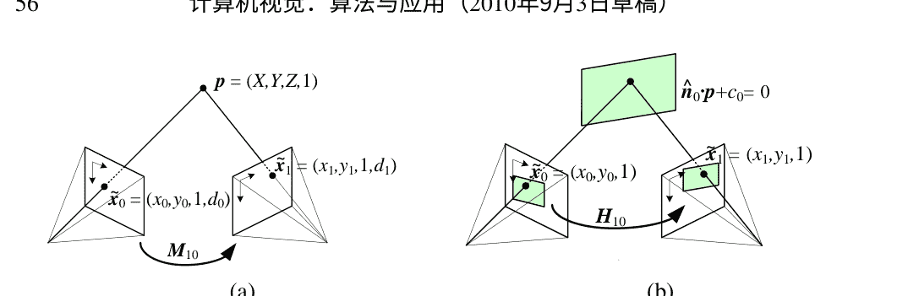

图2.12 一个点被投影到两个图像中：(a) 3D点坐标 $(X, Y, Z, 1)$和2D投影点 $(x, y, 1, d)$ 的关系；(b) 平面单应性引起的共面点 $\hat{\mathbf{n}}_0 \cdot \mathbf{p} + c_0 = 0$。

## 从一个相机到另一个相机的映射

当我们从不同的相机位置或方向拍摄一个3D场景的两张图像时会发生什么 (图2.12a)? 使用完全秩 $4 \times 4$ 相机矩阵 $\tilde{P} = \tilde{K} E$ (来自(2.64)), 我们可以将世界坐标到屏幕坐标的投影表示为

$$\tilde{x}_0 \sim \tilde{K}_0 E_0 p = \tilde{P}_0 p. \tag{2.68}$$

假设我们知道一个图像中像素的z-buffer或视差值 $d_0$, 我们可以计算出3D点的位置 $\mathbf{p}$ 。

$$\mathbf{p} \sim \mathbf{E}_0^{-1} \tilde{\mathbf{K}}_0^{-1} \tilde{x}_0 \tag{2.69}$$

然后将其投影到另一个图像中，得到

$$\tilde{x}_1 \sim \tilde{K}_1 E_1 p = \tilde{K}_1 E_1 E_0^{-1} \tilde{K}_0^{-1} \tilde{x}_0 = \tilde{P}_1 \tilde{P}_0^{-1} \tilde{x}_0 = M_{10} \tilde{x}_0. \tag{2.70}$$

不幸的是，我们通常无法获得常规照片图像中像素的深度坐标。然而，对于平面场景，在(2.66)中讨论过的情况下，我们可以用一个通用的平面方程替换(2.64)中的$P_0$的最后一行，即$\hat{\mathbf{n}}_0 \cdot \mathbf{p} + c_0$，将平面上的点映射到$d_0=0$的值（图2.12b）。因此，如果我们设置$d_0=0$，我们可以忽略(2.70)中$M_{10}$的最后一列以及最后一行，因为我们不关心最终的z-buffer深度。因此，映射方程(2.70)简化为

$$\tilde{x}_1 \sim \tilde{H}_{10} \tilde{x}_0, \tag{2.71}$$

其中$\tilde{H}_{10}$是一个通用的$3 \times 3$单应矩阵，$\tilde{x}_1$和$\tilde{x}_0$现在是2D齐次坐标（即3维向量）（Szeliski 1996）。这证明了8参数单应性作为平面场景拼接的通用对齐模型的使用（Mann和Picard 1994; Szeliski 1996）。

### 2.1 几何基元和变换

另一种特殊情况是，我们不需要知道深度来执行相机间映射的情况是当相机正在进行纯旋转时（第9.1.3节），即当 \( t_0 = t_1 \) 时。在这种情况下，我们可以写成

$$ \tilde{x}_1 \sim K_1 R_1 R_0^{-1} K_0^{-1} \tilde{x}_0 = K_1 R_{10} K_0^{-1} \tilde{x}_0, \quad (2.72) $$

这又可以用一个 \( 3 \times 3 \) 单应性矩阵表示。如果我们假设校准矩阵具有已知的纵横比和投影中心（2.59），则该单应性矩阵可以由旋转量和两个未知的焦距参数化。这种特定的表达方式通常在图像拼接应用中使用（第9.1.3节）。

## 物体中心投影

当使用长焦距镜头时，仅通过图像测量很难可靠地估计焦距。这是因为焦距和物体距离高度相关，很难将这两个效应区分开来。例如，通过变焦远摄镜头观察的物体的尺度变化既可能是由于变焦的改变，也可能是由于向用户移动。（这种效果在阿尔弗雷德·希区柯克的电影《旋风杀机》中被巧妙地运用，同时变焦和相机运动产生了一种令人不安的效果。）

如果我们写出与简单校准矩阵 \( K \) (2.59)对应的投影方程，这种歧义就变得更清晰了。

$$ x_s = f \frac{ r_x \cdot p + t_x }{ r_z \cdot p + t_z } + c_x \quad (2.73) $$

$$ y_s = f \frac{ r_y \cdot p + t_y }{ r_z \cdot p + t_z } + c_y, \quad (2.74) $$

其中 \( r_x \)、\( r_y \) 和 \( r_z \) 是 \( R \) 的三行。如果到物体中心的距离 \( t_z \gg \|p\| \) (物体的大小)，分母近似为 \( t_z \)，而投影物体的整体比例取决于 \( f \) 与 \( t_z \) 的比值。因此，很难将这两个量分开。

为了更清楚地看到这一点，让 \( \eta_z = t_z^{-1} \) 和 \( s = \eta_z f \)。我们可以将上述方程重新写成

$$ x_s = s \frac{ r_x \cdot p + t_x }{ 1 + \eta_z r_z \cdot p } + c_x \quad (2.75) $$

$$ y_s = s \frac{ r_y \cdot p + t_y }{ 1 + \eta_z r_z \cdot p } + c_y \quad (2.76) $$

> (Szeliski和Kang 1994; Pighin, Hecker, Lischinski等1998年)。

投影的尺度如果我们看的是一个已知的物体（即，3D坐标 \( p \) 已知），则可以可靠地估计尺度 \( s \)。

逆距离 \( \eta_z \) 现在大部分与 \( s \) 和 foreshortening 的估计解耦，可以根据物体旋转时的 foreshortening 量来估计。此外，随着镜头变长，即投影模型变为正交投影，无需用正交投影模型替换透视投影模型，因为可以使用相同的方程，其中 \( \eta_z \to 0 \) （而不是 \( f \) 和 \( t_z \) 都趋向于无穷大）。这使得我们能够在正交重建技术（如因子分解）和投影/透视对应技术之间建立自然的联系（第7.3节）。

#### 2.1.6 镜头畸变

上述成像模型都假设相机遵循线性投影模型，在图像中直线在世界中也是直线。（这是线性矩阵运算应用于齐次坐标的自然结果。）不幸的是，许多广角镜头存在明显的径向畸变，这表现为直线投影中的可见曲率。（有关镜头光学的更详细讨论，请参见第2.2.3节，包括色差。）除非考虑到这种畸变，否则将无法创建高度准确的逼真重建。例如，在构建图像拼接时，如果不考虑径向畸变，通常会因为对应特征点在像素混合之前的错位而导致模糊（第9章）。

幸运的是，在实践中补偿径向畸变并不难。对于大多数镜头，简单的四次畸变模型可以产生良好的结果。设（\( x_c \), \( y_c \)）为透视除法后但在焦距 \( f \) 缩放和光学中心（\( c_x \), \( c_y \)）平移之前的像素坐标，即

$$ \begin{aligned} x_c &= \frac{\boldsymbol{r}_x \cdot \boldsymbol{p} + t_x}{\boldsymbol{r}_z \cdot \boldsymbol{p} + t_z} \\ y_c &= \frac{\boldsymbol{r}_y \cdot \boldsymbol{p} + t_y}{\boldsymbol{r}_z \cdot \boldsymbol{p} + t_z}. \end{aligned} \qquad (2.77) $$

径向畸变模型表明，观测图像中的坐标被偏移离开（桶形畸变）或朝向（枕形畸变）图像中心移动，移动量与其径向距离成比例（图2.13a-b）。最简单的径向畸变模型使用低阶多项式，例如，

$$ \begin{aligned} \hat{x}_c &= x_c(1 + \kappa_1 r_c^2 + \kappa_2 r_c^4) \\ \hat{y}_c &= y_c(1 + \kappa_1 r_c^2 + \kappa_2 r_c^4), \end{aligned} \qquad (2.78) $$

其中 \( r_c^2 = x_c^2 + y_c^2 \) 和 \( \kappa_1 \) 和 \( \kappa_2 \) 被称为径向畸变参数。\( ^4 \) 在径向畸变步骤之后，可以使用以下公式计算最终像素坐标

$$ \begin{aligned} x_s &= f \hat{x}_c + c_x \\ y_s &= f \hat{y}_c + c_y. \end{aligned} \qquad (2.79) $$

可以使用各种技术来估计给定镜头的径向畸变参数，如第6.3.5节所讨论的。

有时候上述简化模型不能准确地模拟复杂镜头产生的真实畸变（尤其是在非常宽的角度下）。一个更完整的解析模型还包括切向畸变和偏心畸变（Slama 1980），但这些畸变在本书中没有涉及。

鱼眼镜头（图2.13c）需要一个与传统多项式径向畸变模型不同的模型。鱼眼镜头在第一近似下表现为离光轴角度的等距投影器（Xiong and Turkowski 1997），这与方程（9.22-9.24）描述的极坐标投影相同。Xiong and Turkowski（1997）描述了如何通过在 \( \phi \) 中添加额外的二次校正以及如何使用直接（基于强度）的非线性最小化算法从一组重叠的鱼眼图像中估计未知参数（投影中心、缩放因子 \( s \) 等）。

对于更大、更不规则的畸变，可能需要使用样条参数化畸变模型（Goshtasby 1989）。如果镜头没有单一的投影中心，它可能需要分别对应于每个像素的3D线（而不是方向）进行建模（Gremban, Thorpe, and Kanade 1988; Champleboux, Lavallée, Sautot et al. 1992; Grossberg and Nayar 2001; Sturm and Ramalingam 2004; Tardif, Sturm, Trudeau et al. 2009）。其中一些技术在第6.3.5节中有更详细的描述，该节讨论了如何校准镜头畸变。

简单的径向畸变模型存在一个微妙的问题，通常被忽略。我们在透视投影和最终传感器阵列投影步骤之间引入了非线性。因此，我们通常不能将任意的 \( 3 \times 3 \) 矩阵 \( K \) 与旋转后置相乘，使其变为上三角形式并吸收到全局旋转中。然而，这种情况并没有看起来那么糟糕。对于许多应用程序来说，保持简化的对角形式（2.59）仍然是一个足够好的模型。此外，如果我们将径向和其他畸变校正到直线保持的精度，我们实际上将传感器转换回线性成像器，并且先前的分解仍然适用。

> 有时候，\( x_c \) 和 \( \hat{x}_c \) 之间的关系是相反的，即 \( x_c = \hat{x}_c(1 + \kappa_1 \hat{r}_c^2 + \kappa_2 \hat{r}_c^4) \)。如果我们通过 \( f \) 将图像像素映射到（扭曲的）光线中，这是很方便的。然后我们可以对光线进行去畸变，得到真实的三维光线在空间中。

### 2.2 光度图像形成

在对图像形成过程进行建模时，我们描述了世界中的3D几何特征如何投影到图像中的2D特征。然而，图像不是由2D特征组成的。相反，它们由离散的颜色或强度值组成。这些值从哪里来？它们与环境中的光照、表面特性和几何、相机光学以及传感器特性有什么关系（图2.14）？在本节中，我们开发了一组模型来描述这些相互作用，并制定了图像形成的生成过程。关于这些主题的更详细的处理可以在其他计算机图形学和图像合成的教材中找到（Glassner 1995; Weyrich, Lawrence, Lensch et al. 2008; Foley, van Dam, Feiner et al. 1995; Watt 1995; Cohen and Wallace 1993; Sillion and Puech 1994）。

#### 2.2.1 光照

图像不能没有光。要生成一幅图像，场景必须被一个或多个光源照亮。（某些模态，如荧光显微镜和X射线断层扫描不符合这个模型，但本书不涉及这些内容。）光源通常可以分为点光源和面光源。

点光源起源于空间中的一个单一位置（例如，一个小灯泡），可能是无限远处的（例如，太阳）。（请注意，对于一些应用，如建模软阴影（半影），太阳可能需要被视为一个面光源。）除了位置外，点光源还具有强度和颜色光谱，即在波长 \( L(\lambda) \)。光源的强度随着光源和被照亮物体之间的距离的平方衰减，因为同样的光被扩散到一个更大的（球形）区域。光源也可能有方向性衰减，但在我们简化的模型中忽略这一点。

面光源更加复杂。一个简单的面光源，比如带有漫射器的荧光灯天花板灯具，可以被建模为一个有限的矩形区域，在所有方向上均匀发光（Cohen和Wallace 1993; Sillion和Puech 1994; Glassner 1995）。当分布具有明显的方向性时，可以使用四维光场代替（Ashdown 1993）。

一个更复杂的光分布，可以近似地表示为室外庭院中物体上的入射照明，通常可以使用环境贴图来表示（Greene 1986）（最初称为反射贴图（Blinn和Newell 1976））。这种表示将入射光方向 \( \hat{v} \) 映射到颜色值（或波长 \( \lambda \)）

$$ L(\hat{v}; \lambda), \quad (2.80) $$

并且等同于假设所有光源都在无限远处。环境贴图可以表示为一个立方面的集合（Greene 1986），一个经度-纬度贴图（Blinn and Newell 1976），或者一个反射球的图像（Watt 1995）。获取真实世界环境贴图的一种方便方法是拍摄一个反射镜面球的图像，并将该图像展开到所需的环境贴图上（Debevec 1998）。

Watt（1995）对环境贴图进行了很好的讨论，包括了三种最常用表示法中将方向映射到像素所需的公式。

#### 2.2.2 反射和阴影

当光线照射到物体表面时，它会散射和反射（图2.15a）。已经开发了许多不同的模型来描述这种相互作用。在本节中，我们首先描述最一般的形式，即双向反射分布函数，然后再看一些更专门的模型，包括漫反射、镜面反射和Phong着色模型。我们还讨论了这些模型如何用于计算与场景相对应的全局照明。

#### 双向反射分布函数（BRDF）

光散射的最一般模型是双向反射分布函数（BRDF）。相对于表面上的某个局部坐标系，BRDF是一个四维函数，描述了每个波长在入射方向 \( \hat{v}_i \) 到达时有多少被反射方向 \( \hat{v}_r \) 发射出去（图2.15b）。该函数可以用入射和反射方向相对于表面坐标系的角度来表示。

$$ f_r(\theta_i, \phi_i, \theta_r, \phi_r; \lambda). \quad (2.81) $$

BRDF是互易的，即由于光传输的物理性质，你可以交换 \( \hat{v}_i \) 和 \( \hat{v}_r \) 的角色，仍然得到相同的答案（有时被称为 Helmholtz 互易性）。

实际上，还存在更一般的光传输模型，包括一些模拟表面上的空间变化、次表面散射和大气效应的模型—参见第12.7.1节—（Dorsey、Rushmeier和Sillion 2007；Weyrich、Lawrence、Lensch et al. 2008）。

大多数表面是各向同性的，即就光传输而言，表面上没有优先方向。（例外情况是各向异性表面，如刷状（划痕）铝，其中反射率取决于光线方向与划痕方向的关系。）对于各向同性材料，我们可以简化BRDF为

$$ f_r(\theta_i, \theta_r, |\phi_r - \phi_i|; \lambda) \text{ 或 } f_r(\hat{v}_i, \hat{v}_r, \hat{n}; \lambda), \quad (2.82) $$

由于量 \( \theta_i \)、\( \theta_r \) 和 \( \phi_r - \phi_i \) 可以从方向 \( \hat{v}_i \)、\( \hat{v}_r \) 和 \( \hat{n} \) 计算得出。

为了计算在给定照明条件下，从表面点 \( p \) 中以方向 \( \hat{v}_r \) 出射的光的数量，我们将入射光 \( L_i(\hat{v}_i; \lambda) \) 与BRDF（一些作者称这一步为卷积）进行积分。考虑到缩短因子 \( \cos^+ \theta_i \)，我们得到

$$ L_r(\hat{v}_r; \lambda) = \int L_i(\hat{v}_i; \lambda) f_r(\hat{v}_i, \hat{v}_r, \hat{n}; \lambda) \cos^+ \theta_i \, d\hat{v}_i, \quad (2.83) $$

其中

$$ \cos^+ \theta_i = \max(0, \cos \theta_i). \quad (2.84) $$

如果光源是离散的（有限数量的点光源），我们可以用求和替代积分，

$$ L_r(\hat{v}_r; \lambda) = \sum_i L_i(\lambda) f_r(\hat{v}_i, \hat{v}_r, \hat{n}; \lambda) \cos^+ \theta_i. \quad (2.85) $$

给定表面的BRDF可以通过物理建模（Torrance和Sparrow 1967; Cook和Torrance 1982; Glassner 1995）、启发式建模（Phong 1975）或经验观察（Ward 1992; Westin, Arvo和Torrance 1992; Dana, van Ginneken, Nayak et al. 1999; Dorsey, Rushmeier和Sillion 2007; Weyrich, Lawrence, Lensch et al. 2008）获得。典型的BRDF通常可以分为漫反射和镜面反射两个部分，如下所述。

#### 漫反射

漫反射成分（也称为兰伯特或哑光反射）将光均匀地散射到所有方向，这是我们通常与阴影相关联的现象，例如观察雕像时看到的表面法线的平滑（非光亮）强度变化（图2.16）。漫反射还经常给光线带来强烈的本体颜色，因为它是由物体内部光的选择性吸收和再发射引起的（Shafer 1985; Glassner 1995）。

尽管光在所有方向上均匀散射，即BRDF是恒定的，

$$ f_d(\hat{v}_i, \hat{v}_r, \hat{n}; \lambda) = f_d(\lambda), \quad (2.86) $$

光的数量取决于入射光方向和表面法线之间的角度 \( \theta_i \)。这是因为暴露给一定量光的表面积在斜角下变大，当出射表面法线指向光源时完全自遮挡（图2.17a）。（想想你如何将自己朝向太阳或壁炉以获得最大的温暖，以及斜射在墙上的手电筒比直接对准墙的手电筒亮度较低。）因此，对于漫反射的着色方程可以写成

$$ L_d(\hat{v}_r; \lambda) = \sum_i L_i(\lambda) f_d(\lambda) \cos^+ \theta_i = \sum_i L_i(\lambda) f_d(\lambda) [\hat{v}_i \cdot \hat{n}]^+, \quad (2.87) $$

其中

$$ [\hat{v}_i \cdot \hat{n}]^+ = \max(0, \hat{v}_i \cdot \hat{n}). \quad (2.88) $$

#### 镜面反射

典型BRDF的第二个主要组成部分是镜面（光泽或高光）反射，它强烈依赖于出射光的方向。考虑光线反射在一个镜面表面上（图2.17b）。入射光线以绕表面法线旋转180°的方向反射。使用与方程（2.29-2.30）相同的符号表示法，我们可以计算出镜面反射方向 \( \hat{s}_i \) 为

$$ \hat{s}_i = v_{\parallel} - v_{\perp} = (2\hat{n}\hat{n}^T - I)v_i. \quad (2.89) $$

在给定方向上反射的光的数量 \( \hat{v}_r \)，因此取决于视角 \( \theta_s = \cos^{-1}(\hat{v}_r \cdot \hat{s}_i) \)，即视角 \( \hat{v}_r \) 和镜面方向 \( \hat{s}_i \) 之间的夹角。例如，Phong（1975）模型使用角度的余弦的幂，

$$ f_s(\theta_s; \lambda) = k_s(\lambda) \cos^{k_e} \theta_s, \quad (2.90) $$

而Torrance和Sparrow（1967）微平面模型使用高斯分布，

$$ f_s(\theta_s; \lambda) = k_s(\lambda) \exp(-c_s^2 \theta_s^2). \quad (2.91) $$

较大的指数 \( k_e \)（或逆高斯宽度 \( c_s \)）对应于具有明显高光的镜面表面，而较小的指数更好地模拟具有柔和光泽的材料。

#### 冯氏着色

冯氏（1975年）将漫反射和镜面反射的成分与另一个术语相结合，他称之为环境光照。这个术语考虑到物体通常不仅受到点光源的照明，还受到一般的漫反射照明的影响，这种照明对应于间接反射（例如房间的墙壁）或远程光源，比如天空。环境光照项通常被建模为一个常数，与表面法线无关，

$$ L_a(\lambda) = k_a(\lambda) L_a^e(\lambda), \quad (2.92) $$

其中 \( L_a^e(\lambda) \) 是环境光的强度，\( k_a(\lambda) \) 是表面的环境反射率（通常与漫反射率相同）。

将环境光、漫反射和镜面反射项加在一起，我们得到了Phong着色模型：

$$ L(\hat{v}_r; \lambda) = L_a(\lambda) + L_d(\hat{v}_r; \lambda) + L_s(\hat{v}_r; \lambda). \quad (2.93) $$

这个模型可以进一步扩展，包括其他项，如透射（阴影）或更复杂的镜面反射模型。然而，在计算机图形学中，Phong模型或其变体（如Blinn-Phong模型）由于其简单性和视觉效果，仍然被广泛使用。

在图像形成和计算机视觉中，我们通常使用更简单的着色模型，如兰伯特漫反射（方程2.87）或更复杂的基于物理的渲染（PBR）模型，这些模型在近年来变得流行。在第12.7.1节中，我们将更详细地讨论这些高级模型。

蓝天。在冯氏模型中，环境项不依赖于表面方向，但依赖于环境光照 $L_a(\lambda)$ 和物体 $k_a(\lambda)$ 的颜色。

$f_a(\lambda) = k_a(\lambda)L_a(\lambda).$ (2.92)

将所有这些术语放在一起，我们得到了Phong着色模型，

$L_r(\hat{v}_r; \lambda) = k_a(\lambda)L_a(\lambda) + k_d(\lambda) \sum_i L_i(\lambda)[\hat{v}_i \cdot \hat{n}]^+ + k_s(\lambda) \sum_i L_i(\lambda)(\hat{v}_r \cdot \hat{s}_i)^{k_e}.$ (2.93)

图2.18显示了一个典型的Phong着色模型组件，作为离开表面法线的角度的函数（在包含光照方向和观察者的平面上）。

通常，环境和漫反射反射颜色分布 $k_a(\lambda)$ 和 $k_d(\lambda)$ 是相同的，因为它们都是由表面材料内部的次表面散射（体反射）引起的（Shafer 1985）。镜面反射分布 $k_s(\lambda)$ 通常是均匀的（白色），因为它是由不改变光颜色的界面反射引起的。（例外情况是金属材料，例如铜，而不是更常见的电介质材料，例如塑料。）

环境照明 $L_a(\lambda)$ 通常与直接光源 $L_i(\lambda)$ 有不同的色调，例如，阳光明媚的户外场景可能呈蓝色，而烛光或白炽灯照明的室内场景可能呈黄色。（阴影区域中存在的环境天空照明经常导致阴影比场景中对应的照亮部分更蓝。）还要注意，Phong模型（或任何着色模型）的漫反射成分取决于入射光源 $\hat{v}_i$ 的角度，而镜面反射成分取决于观察者 $v_r$ 和镜面反射方向 $\hat{s}_i$ 之间的相对角度（这本身又取决于入射光方向 $\hat{v}_i$ 和表面法线 $\hat{n}$）。

### 2.2 光度图像形成

在计算机图形学中，Phong着色模型在物理准确性方面已被一些最近开发的模型所取代，包括Cook和Torrance（1982）基于Torrance和Sparrow（1967）原始微平面模型的模型。直到最近，大多数计算机图形硬件实现的是Phong模型，但最近出现的可编程像素着色器使得使用更复杂的模型成为可能。

### 双色反射模型

Torrance和Sparrow（1967）的反射模型也是Shafer（1985）的双色反射模型的基础，该模型指出，单一光源照亮的均匀材料的表面颜色取决于两个项的总和，

$L_r(\hat{v}_r; \lambda) = L_i(\hat{v}_r, \hat{v}_i, \hat{n}; \lambda) + L_b(\hat{v}_r, \hat{v}_i, \hat{n}; \lambda) \quad (2.94)$

$= c_i(\lambda) m_i(\hat{v}_r, \hat{v}_i, \hat{n}) + c_b(\lambda) m_b(\hat{v}_r, \hat{v}_i, \hat{n}), \quad (2.95)$

即，光在界面处反射的亮度 $L_i$，以及在表面体上反射的亮度 $L_b$。这些中的每一个，依次是相对功率谱 $c(\lambda)$（仅取决于波长）和幅度 $m(\hat{v}_r, \hat{v}_i, \hat{n})$（仅取决于几何形状）的简单乘积。（这个模型可以通过假设单一光源和无环境照明，并重新排列项，从Phong模型的广义版本中轻松推导出来。）二色模型已经成功地用于计算机视觉中的镜面彩色物体分割，这些物体的阴影变化很大（Klinker 1993），并且最近还启发了用于应用如Bayer模式去马赛克的局部双色模型（Bennett, Uytten-daele, Zitnick et al. 2006）。

### 全局照明（光线追踪和辐射度）

迄今为止，简单的着色模型假设光线从光源发出，反射到相机可见的表面上，从而改变强度或颜色，并到达相机。实际上，光源可以被遮挡，光线在场景中多次反射，从光源到相机的行程中进行。

传统上有两种方法用于模拟这种效果。如果场景主要是镜面反射的（经典例子是由玻璃物体和镜面或高度抛光的球体构成的场景），首选的方法是光线追踪或路径追踪（Glassner 1995; Akenine-Möller and Haines 2002; Shirley 2005），它跟踪从相机到光源（或反之）的每个光线在多次反射中的路径。如果场景主要由均匀反射率、简单几何形状的光源和表面组成，首选的方法是辐射度（全局照明）技术（Cohen and Wallace 1993; Sillion and Puech 1994; Glassner 1995）。

这两种技术的组合也已经被开发出来（Wallace，Cohen和Greenberg 1987），以及用于模拟涟漪水引起的焦散效果等更一般的光传输技术。基本的光线追踪算法将每个像素与光线关联起来，并找到它与最近表面的交点。然后，可以使用之前提出的简单着色方程（例如，方程（2.93））计算出一个主要贡献，对于所有对该表面元素可见的光源。（计算哪些表面被光源照亮的另一种技术是计算一个阴影图，或阴影缓冲区，即从光源视角渲染场景，然后将正在渲染的像素的深度与该图进行比较（Williams 1983; Akenine-Möller and Haines 2002）。）然后，可以沿着镜面方向投射附加次要光线到场景中的其他物体，跟踪镜面反射引起的任何衰减或颜色变化。

辐射度通过将光亮度值与场景中的矩形表面区域（包括面光源）关联起来工作。场景中任意两个（相互可见）区域之间交换的光量可以被捕捉为一个形状因子，该因子取决于它们的相对方向和表面反射特性，以及光随着距离的增加而分布在一个较大有效球面上的 $1/r^2$ 衰减（Cohen和Wallace 1993; Sillion和Puech 1994; Glassner 1995）。然后可以建立一个大型线性系统来解决每个区域块的最终亮度，使用光源作为强制函数（右手边）。

一旦系统被解决，可以从任何所需的视点渲染场景。在某些情况下，可以使用计算机视觉技术从照片中恢复场景的全局照明（Yu，Debevec，Malik等人1999年）。基本的辐射度算法不考虑某些近场效应，如角落和划痕内的变暗，或者由其他表面的部分阴影引起的有限环境照明。这些效果已经在许多计算机视觉算法中被利用（Nayar, Ikeuchi和Kanade 1991; Langer和Zucker 1994）。

虽然所有这些全局光照效果都会对场景的外观产生很大影响，从而影响其三维解释，但本书不会对其进行更详细的介绍。（但请参阅第12.7.1节，了解从真实场景和物体中恢复BRDF的讨论。）

#### 2.2.3 光学

一旦来自场景的光线到达相机，它仍然必须通过镜头才能到达传感器（模拟胶片或数字硅）。对于许多应用程序来说，将镜头视为一个理想的针孔，只需将所有光线投射到一个公共的投影中心即可（图2.8和2.9）。然而，如果我们想要处理焦点、曝光、暗角和畸变等问题，为了解决这个问题，我们需要开发一个更复杂的模型，这就是光学研究的领域（Möller 1988; Hecht 2001; Ray 2002）。

图2.19显示了最基本的镜头模型，即由一块玻璃组成的薄透镜，两侧曲率非常低且相等。根据透镜定律（可以通过简单的光线折射几何论证推导出），物体距离 $z_o$ 与形成聚焦图像的镜头后方距离 $z_i$ 之间的关系可以表示为

$1/z_o + 1/z_i = 1/f, (2.96)$

其中 $f$ 被称为镜头的焦距。如果我们让 $z_o$ 趋于 $\infty$，即调整镜头（移动图像平面），使得远处的物体聚焦，我们得到 $z_i = f$，这就是为什么我们可以将焦距为 $f$ 的镜头（在一定程度上）等效于距离焦平面 $f$ 的针孔（图2.10），其视场由（2.60）给出。如果焦平面远离其正确的聚焦位置 $z_i$（例如，通过扭动镜头上的对焦环），则 $z_o$ 处的物体不再聚焦，如图2.19所示。聚焦不准确的程度由 $c$ 的混淆圆（在灰色平面上显示为短粗蓝线段）来衡量。⁷ 混淆圆的方程可以使用类似三角形推导得出；它取决于在焦平面上的移动距离 $\Delta z_i$ 相对于原始焦距 $z_i$ 和光圈的直径 $d$（参见练习2.4）。

⁷ 如果光圈不完全是圆形的，例如，如果是由六边形光圈引起的，有时可以在实际模糊函数（Levin, Fergus, Durand et al. 2007; Joshi, Szeliski和Kriegman 2008）或拍摄太阳时看到“闪光点”中看到这种效果。

图2.20常规和变焦镜头的景深指示器。

限制混淆圆的深度变化到可接受的数量的场景允许深度通常称为景深，并且是焦距和光圈的函数，如许多镜头标记所示（图2.20）。由于这个景深取决于光圈直径 $d$，我们还必须知道这如何随常显示的 $f$-number（通常表示为 $f/#$ or $N$）变化，并且被定义为

$$ f/# = N = \frac{f}{d} $$ (2.97)

其中焦距 $f$ 和光圈直径 $d$ 以相同单位（例如，毫米）测量。

写 $f$ 数的常规方法是用实际数字替换 $\#$，即，$f/1.4$, $f/2$, $f/2.8$, ..., $f/22$。（或者，我们可以说 $N=1.4$ 等等）解释这些数字的简单方法是注意将焦距除以 $f$ 数得到直径 $d$，因此这些只是光圈直径的公式。$^8$

注意通常的 $f$ 数值的进展是以全光圈为单位的，这些单位是倍数 $\sqrt{2}$，因为这对应着每次选择较小的 $f$ 数值时，入射瞳孔的面积加倍。（这种加倍也被称为改变一个曝光值或EV。它对达到传感器的光线量有与曝光时间加倍相同的效果，例如从 $1/125$ 到 $1/250$，参见练习2.5。）

现在你知道如何在 $f$ 数和光圈直径之间进行转换后，你可以根据焦距 $f$、焦散圈 $c$ 和焦距 $z_0$ 构建自己的景深图，并根据练习2.4中的说明，观察实际镜头（如图2.20所示）上的匹配程度。

当然，真实的镜头并不是无限薄的，因此除非使用复合元件来纠正它们，否则会受到几何像差的影响。经典的五个 $Seidel$ 像差，在使用三阶光学时会出现，包括球面像差、彗差、像散、场曲率和畸变（Möller 1988; Hecht 2001; Ray 2002）。

这也解释了为什么变焦镜头的 $f$ 数会随着当前变焦（焦距）设置而变化。

### 色差

由于玻璃的折射率会随波长略微变化，简单透镜会受到色差的影响，即不同颜色的光会在稍微不同的距离上聚焦（因此也具有稍微不同的放大倍数），如图2.21所示。波长相关的放大倍数，即横向色差，可以被建模为每种颜色的径向畸变（第2.1.6节），因此可以使用第6.3.5节中描述的技术进行校准。由纵向色差引起的波长相关模糊可以使用第10.1.4节中描述的技术进行校准。不幸的是，由纵向色差引起的模糊可能更难恢复，因为高频率可能会被强烈衰减，因此难以恢复。

为了减少色差和其他类型的像差，大多数摄影镜头如今都是由不同的玻璃元素（具有不同的涂层）组成的复合镜头。这样的镜头不再能被建模为具有一个单一的节点点 $P$，通过该点必须通过所有的光线（当用针孔模型近似镜头时）。相反，这些镜头既有一个前节点点，光线通过该点进入镜头，也有一个后节点点，光线通过该点离开并传向传感器。在实践中，只有前节点点的位置在进行精确的相机校准时才是感兴趣的，例如，在确定围绕哪个点旋转以捕捉无视差全景图时（参见第9.1.3节）。然而，并非所有的镜头都可以被建模为具有一个单一的节点点。特别是，非常广角的镜头，如鱼眼镜头（第2.1.6节）和由镜头和曲面镜子组成的某些猫眼反射成像系统（Baker和Nayar 1999）不具有一个单一的通过所有获取的光线的点。在这种情况下，最好明确地构建一个像素坐标和空间中的3D光线之间的映射函数（查找表）（Gremban，Thorpe和Kanade 1988；Champleboux，Lavallée，Sautot et al. 1992；Grossberg和Nayar 2001；Sturm和Ramalingam 2004；Tardif，Sturm，Trudeau et al. 2009），如2.1.6节所述。

### 暗角

实际镜头的另一个特性是暗角，即图像亮度向图像边缘逐渐减弱的趋势。

通常有两种现象导致这种效果（Ray 2002）。第一种被称为自然暗角，是由于物体表面、投影像素和镜头光圈的透视效果造成的，如图2.22所示。考虑离轴角度为 $\alpha$ 的物体表面大小为 $\delta o$ 的光线离开物体表面补丁。由于这个补丁相对于相机镜头而言是透视的，达到镜头的光线量会减少一个因子 $\cos \alpha$。达到镜头的光线量也受到通常的 $1/r^2$ 衰减；在这种情况下，距离 $r_o = z_o / \cos \alpha$。光线通过的光圈的实际面积还会被一个额外的因子 $\cos \alpha$ 透视，即从点 $O$ 看到的光圈是一个尺寸为 $d \times d \cos \alpha$ 的椭圆。将所有这些因素综合起来，我们可以看到从 $O$ 离开并通过光圈到达位于 $I$ 的图像像素的光量与

$$ \frac{\delta o \cos \alpha}{r_o^2} \pi \left( \frac{d}{2} \right)^2 \cos \alpha = \delta o \frac{\pi d^2}{4 z_o^2} \cos^4 \alpha. $$ (2.98)

由于三角形 $\Delta OPQ$ 和 $\Delta IPJ$ 相似，物体表面的投影面积 $\delta o$ 和图像像素 $\delta i$ 的比例是相同的（平方）比例 $z_o : z_i$,

$$ \frac{\delta o}{\delta i} = \frac{z_o^2}{z_i^2}. $$ (2.99)

将它们放在一起，我们得到光线到达的最终关系，像素 $i$ 和光圈直径 $d$，聚焦距离 $z_i \approx f$，以及离轴角 $\alpha$ 之间的关系，

$$ \delta o \frac{\pi}{4} \frac{d^2}{z_o^2} \cos^4 \alpha = \delta i \frac{\pi}{4} \frac{d^2}{z_i^2} \cos^4 \alpha \approx \delta i \frac{\pi}{4} \left( \frac{d}{f} \right)^2 \cos^4 \alpha, \tag{2.100} $$

这被称为场景辐射度 $L$ 和光线（辐照度）$E$ 之间的基本辐射关系，

$$ E = L \frac{\pi}{4} \left( \frac{d}{f} \right)^2 \cos^4 \alpha, \tag{2.101} $$

(Horn 1986; Nalwa 1993; Hecht 2001; Ray 2002)。请注意，在这个方程中，光的数量取决于像素表面积（这就是为什么点拍照相机中的较小传感器比数码单反相机噪声要大得多），光圈的倒数平方 $N = f/d$ (2.97)，以及 $\cos^4 \alpha$ 离轴衰减的四次方，这是自然的暗角项。

另一种主要的暗角现象，称为机械暗角，是由于复合镜头中镜片边缘附近的光线内部遮挡而引起的，不能轻易地用数学方法描述，除非对实际镜头设计进行完整的光线追踪。⁹ 然而，与自然暗角不同，机械暗角可以通过减小相机光圈（增加光圈值）来减少。它也可以通过使用特殊设备（如积分球、均匀照明目标或相机旋转）进行校准（以及自然暗角），如第10.1.3节所讨论的。

### 2.3 数字相机

从一个或多个光源开始，经过世界上的一个或多个表面反射，并通过相机的光学系统（镜头）传递，光最终到达成像传感器。当光子到达传感器时，它们如何转换为我们在查看数字图像时观察到的数字（R、G、B）值？在本节中，我们将开发一个简单的模型，考虑到最重要的影响因素，如曝光（增益和快门速度）、非线性映射、采样和混叠以及噪声。图2.23基于Healey和Kondepudy（1994）；Tsin、Ramesh和Kanade（2001）；Liu、Szeliski、Kang等人（2008）开发的相机模型，展示了现代数码相机中发生的简化处理阶段。Chakrabarti、Schärstein和Zickler（2009）开发了一个复杂的24参数模型，更好地匹配了当今相机中的处理过程。

⁹ 有一些经验模型在实践中表现良好（Kang和Weiss 2000; Zheng, Lin和Kang 2006）。

光线落在成像传感器上通常由一个活动感知区域接收，持续曝光时间（通常以秒的分数表示，例如，$\frac{1}{125}$，$\frac{1}{60}$，$\frac{1}{30}$），然后传递给一组感应放大器。今天在数码相机和摄像机中使用的两种主要传感器是电荷耦合器件（CCD）和互补金属氧化物半导体（CMOS）。

在CCD中，光子在每个活动并在曝光时间内积累。然后，在传输阶段，电荷从一个井传输到另一个井，类似于“桶兵队”直到它们被沉积在感应放大器上，放大信号并传递给模数转换器（ADC）。[^10]旧的CCD传感器容易溢出，当一个过曝像素的电荷溢出到相邻像素时，但大多数新的CCD都具有防溢出技术（“槽”可以溢出多余的电荷）。

在CMOS中，光子直接影响传感器的导电性（或增益），可以选择性地进行门控以控制曝光时间，并在使用多路复用方案进行读出之前进行局部放大。传统上，CCD传感器在质量敏感的应用中优于CMOS，例如数码单反相机，而CMOS在低功耗应用中更好，但如今大多数数码相机都使用CMOS。

影响数字图像传感器性能的主要因素包括快门速度、采样间距、填充因子、芯片尺寸、模拟增益、传感器噪声以及分辨率（和质量）。

在数码相机中，完整的帧被捕获，然后一次顺序读出。然而，如果正在捕获视频，则通常使用滚动快门，即分别曝光和传输每一行。在旧的视频相机中，首先扫描偶场（行），然后扫描奇场，这个过程称为隔行扫描。

模拟数字转换器的这些参数的许多实际值可以从嵌入在数字图像中的EXIF标签中读取。而其他参数可以从相机制造商的规格表或相机评测或校准网站上获得。

快门速度。快门速度（曝光时间）直接控制着达到传感器的光线量，从而确定图像是过曝还是欠曝。（对于亮场景，摄影师有时会使用中性密度滤镜，以获得大光圈或慢快门速度，从而获得浅景深或运动模糊。）对于动态场景，快门速度还决定了结果图片中的运动模糊程度。

通常，较高的快门速度（较少的运动模糊）使后续分析更容易（参见第10.3节中去除此类模糊的技术）。然而，在捕捉用于显示的视频时，一些运动模糊可能是有益的，以避免频闪效果。

采样间距。采样间距是成像芯片上相邻传感器单元之间的物理间距。采样间距较小的传感器具有更高的采样密度，因此在给定的有效芯片面积上提供更高的分辨率（以像素为单位）。然而，较小的间距也意味着每个传感器的面积较小，无法累积太多的光子；这使得它不太灵敏，并且更容易受到噪声的影响。

填充因子。填充因子是活动感应区域大小与理论上可用感应区域（水平和垂直采样间距的乘积）的比例。通常情况下，较高的填充因子更可取，因为它们能够捕捉更多的光线并减少混叠现象（参见2.3.1节）。然而，这必须与在活动感应区域之间放置额外电子元件的需求进行平衡。相机的填充因子可以通过光度相机校准过程来确定（参见10.1.4节）。

芯片尺寸。传统上，视频和点拍照相机使用较小的芯片面积（1/4英寸到1/2英寸传感器），而数码单反相机则试图接近传统的35mm胶片尺寸。当整体设备尺寸不重要时，拥有更大的芯片尺寸更可取，因为每个传感器单元可以更具光敏性。（对于紧凑型相机，较小的芯片意味着所有光学元件可以成比例缩小。）然而，在较新的数码相机中，用户现在可以通过ISO设置对这个增益进行一些额外的控制，通常以ISO标准单位表示，如100、200或400。由于大多数相机的自动曝光控制还会调整光圈和快门速度，手动设置ISO会从相机的控制中去除一个自由度，就像手动指定光圈和快门速度一样。理论上，较高的增益使相机在低光条件下表现更好（在光圈已经达到最大时减少运动模糊由于长曝光时间）。然而，在实践中，较高的ISO设置通常会放大传感器噪声。

传感器噪声。在整个感知过程中，噪声来自各种来源，包括固定模式噪声、暗电流噪声、光子噪声、放大器噪声和量化噪声。采样图像中存在的噪声量取决于所有这些量，以及入射光（由场景辐照度和光圈控制）、曝光时间和传感器增益。此外，在光线较暗的条件下，噪声是由于光子计数较低，使用泊松噪声模型可能比高斯模型更合适。

正如在第10.1.1节中更详细地讨论的那样，Liu、Szeliski、Kang等人使用这个模型，以及由Grossberg和Nayar获得的相机响应函数（CRFs）的经验数据库，来估计给定图像的噪声水平函数（NLF），它预测了给定像素的整体噪声方差作为其亮度的函数（为每个颜色通道估计一个单独的NLF）。另一种方法是，在拍照之前可以访问相机，通过拍摄包含各种颜色和亮度的场景的重复照片来预校准NLF，例如图10.3b中显示的Macbeth Color Chart。（在估计方差时，请确保丢弃或降低具有大梯度的像素，因为曝光之间的小偏移会影响这些像素的感知值。）不幸的是，由于感知系统内发生的复杂相互作用，预校准过程可能需要针对不同的曝光时间和增益设置进行重复。

在实践中，大多数计算机视觉算法，如图像去噪、边缘检测和立体匹配，都至少需要对噪声水平进行初步估计。除非能够对相机进行预校准或对同一场景进行重复拍摄，否则最简单的方法是寻找近似恒定值的区域，并估计这些区域的噪声方差。

### 2.3 数字相机

ADC分辨率。图像传感器中模拟处理链中的最后一步是模拟到数字转换（ADC）。虽然有多种技术可以用来实现这个过程，但感兴趣的两个量是该过程的分辨率（产生多少位）和噪声水平（实际上有多少位是有用的）。

对于大多数相机来说，所引用的位数（压缩JPEG图像为8位，某些数码单反相机提供的RAW格式为名义上的16位）超过了实际可用的位数。判断的最佳方法是简单地校准给定传感器的噪声，例如，通过对同一场景进行重复拍摄，并绘制估计的噪声与亮度的关系图。

数字后处理。一旦到达传感器的辐照度值被转换为数字位，大多数相机在压缩和存储像素值之前会执行各种数字信号处理（DSP）操作来增强图像。这些操作包括彩色滤波阵列（CFA）解码、白点设置以及通过伽马函数将亮度值映射到信号的感知动态范围增加。我们在第2.3.2节中介绍了这些主题，但在此之前，我们将回到关于混叠的话题，这与传感器阵列填充因子有关。

#### 2.3.1 采样和混叠

当光场照射到图像传感器上的活动感应区时会发生什么？到达每个活动单元的光子被积分然后被数字化。然而，如果芯片上的填充因子很小且信号没有其他带宽限制，会出现视觉上不令人愉悦的混叠现象。

为了探索混叠现象，让我们首先看一维信号（图2.24），其中有两个正弦波，一个频率为 f = 3/4，另一个频率为 f = 5/4。如果我们以频率 fs= 2 对这两个信号进行采样，我们可以看到它们产生了相同的样本（显示为黑色），因此我们说它们是混叠的。为什么这是一个不好的效果？实际上，我们无法再重构原始信号，因为我们不知道这两个原始频率中的哪一个存在。

事实上，香农的采样定理表明，重构信号所需的最小采样率（Oppenheim and Schafer 1996; Oppenheim, Schafer, and Buck 1999）从其瞬时样本中恢复信号的最低采样频率必须至少是最高频率的两倍， fs ≥ 2fmax

信号中的最大频率被称为奈奎斯特频率，最小采样频率的倒数 rs = 1/fs 被称为奈奎斯特率。

然而，你可能会问，由于成像芯片实际上是对光场在一个有限区域上进行平均，点采样的结果仍然适用吗？对传感器区域进行平均确实会减弱一些较高频率的信号。然而，即使填充因子为100%，如图2.24右侧的图像，超过奈奎斯特极限（采样频率的一半）的频率仍会产生混叠信号，尽管幅度较之对应的带限信号要小。

通过使用质量较差的滤波器（如方形滤波器）对信号进行下采样可以更加直观地说明混叠的问题。图2.25展示了一个高频率的扫频图像（因为频率随时间增加），以及使用25%填充因子区域传感器、100%填充因子传感器和高质量的9点滤波器对其进行采样的结果。更多关于下采样（抽取）滤波器的示例可以在第3.5.2节和图3.30中找到。

预测成像系统（甚至图像处理算法）产生的混叠量的最佳方法是估计点扩散函数（PSF），它表示特定像素传感器对理想点光源的响应。PSF是光学系统（镜头）引起的模糊和芯片传感器的有限积分区域的组合（卷积）。如果我们知道镜头的模糊函数和成像芯片的填充因子（传感器区域的形状和间距）（还可以选择性地知道抗混叠滤波器的响应），我们可以将它们卷积（如第3.2节所述）以获得点扩散函数（PSF）。图2.26a显示了一个PSF的一维横截面，其中镜头的模糊函数被假设为半径等于像素间距 s 的圆盘，加上一个水平填充因子为 80%的感光芯片。对这个PSF进行傅里叶变换（第3.4节），我们可以得到调制传递函数（MTF），从中我们可以估计混叠的程度，即傅里叶幅度在 f ≤ fs 奈奎斯特频率之外的面积。如果我们调焦镜头，使模糊函数的半径为 2s（图2.26c），我们会发现混叠的程度显著减少，但图像细节的数量也减少了（接近 f = fs 的频率）。

在实验室条件下，可以通过观察背后照亮的黑色纸板上的针孔等点光源来估计PSF（以像素精度）。然而，这个PSF（针孔的实际图像）只能准确到像素分辨率，虽然它可以模拟更大的模糊（如由于散焦引起的模糊），但不能模拟PSF的亚像素形状并预测混叠的程度。另一种技术是观察校准图案（例如由倾斜的阶梯边缘组成的图案），其理想外观可以重新合成到亚像素精度。除了在图像采集过程中出现外，混叠还可以在各种图像处理操作中引入，例如重采样、上采样和下采样。第3.4节和第3.5.2节讨论了这些问题，并展示了如何通过精心选择滤波器来减少混叠操作引入的混叠量。

#### 2.3.2 颜色

在第2.2节中，我们看到光照和表面反射是波长的函数。当入射光线照射到成像传感器上时，来自光谱不同部分的光线以某种方式集成到我们在数字图像中看到的离散红、绿和蓝（RGB）颜色值中。这个过程是如何工作的，我们如何分析和操作颜色值？

你可能还记得小时候通过混合颜料颜色来获得新颜色的神奇过程。你可能还记得蓝色+黄色得到绿色，红色+蓝色得到紫色，红色+绿色得到棕色。如果你在后来的年龄重新学习这个主题，你可能会了解到适当的减法原色实际上是青色（一种浅蓝绿色），洋红色（粉红色）和黄色（图2.27b），尽管黑色在四色印刷（CMYK）中也经常使用。（如果你后来参加了任何绘画课程，你会发现颜色甚至可以有更多的变化，比如茜素红、天蓝和黄绿色。减色法的颜色被称为减色，因为颜料在绘画中吸收了光谱中的某些波长。

后来，你可能学到了加色的原色（红、绿和蓝）以及它们如何通过幻灯片投影仪或计算机显示器相加来产生青色、洋红色、黄色、白色和我们通常在电视和显示器上看到的其他颜色（图2.27a）。

两种不同的颜色，比如红色和绿色，是如何相互作用产生第三种颜色，比如黄色的？波长是否以某种方式混合在一起产生新的波长？

你可能知道正确答案与物理上混合波长无关。相反，三原色的存在是人类视觉系统的三刺激（或三色）性质的结果，因为我们有三种不同类型的视锥细胞，每种对颜色光谱的不同部分有选择性地响应。请注意，对于机器视觉应用，如遥感和地形分类，最好使用更多的波长。同样，监控应用通常可以从近红外（NIR）范围的感知中受益。

### CIE RGB和XYZ

为了测试和量化三色理论的感知，我们可以尝试将所有单色（单一波长）颜色作为三个适当选择的原色的混合物来复制。（纯波长光可以通过棱镜或特制的彩色滤光片获得。）在1930年代，国际照明委员会（CIE）通过使用红色（700.0nm波长）、绿色（546.1nm）和蓝色（435.8nm）的原色进行这样的颜色匹配实验，标准化了RGB表示。

图2.28显示了使用标准观察者对大量受试者的感知结果进行平均的实验结果。您会注意到，在蓝绿色光谱的某些纯光谱中，需要添加负的红光量，即需要在匹配的颜色中添加一定量的红光才能获得颜色匹配。这些结果还为存在于不同光谱但在感知上无法区分的颜色（称为变色龙）提供了一个简单的解释。请注意，在不同的照明条件下，两种织物或油漆颜色在一个光源下可能是变色龙，但在另一个光源下可能不再是。

由于与混合负光线相关的问题，CIE还开发了一个名为XYZ的新颜色空间，其中包含其正半轴内的所有纯光谱颜色。（它还将Y轴映射到亮度，即感知的相对亮度，并将纯白映射到对角线（相等值）向量。）从RGB到XYZ的转换由以下给出

$$ \begin{bmatrix} X \\ Y \\ Z \end{bmatrix} = \frac{1}{0.17697} \begin{bmatrix} 0.49 & 0.31 & 0.20 \\ 0.17697 & 0.81240 & 0.01063 \\ 0.00 & 0.01 & 0.99 \end{bmatrix} \begin{bmatrix} R \\ G \\ B \end{bmatrix} . \quad \text{(2.103)} $$

虽然CIE XYZ标准的官方定义使得对应于纯红的Y值为1的矩阵归一化，但更常用的形式是省略前导小数点分数，使得第二行加起来等于1，即RGB三元组 (1, 1, 1) 映射到Y值为1。根据 (2.103)，线性混合图2.28a中的 $(\bar{r}(\lambda), \bar{g}(\lambda), \bar{b}(\lambda))$ 曲线，我们得到图2.28b中显示的结果 $(\bar{x}(\lambda), \bar{y}(\lambda), \bar{z}(\lambda))$ 曲线。请注意，现在所有三个光谱（颜色匹配函数）都只有正值，并且 $\bar{y}(\lambda)$ 曲线与人类感知的亮度相匹配。

如果我们将XYZ值除以X+Y+Z的总和，我们得到色度坐标

$$x = \frac{X}{X + Y + Z}, \quad y = \frac{Y}{X + Y + Z}, \quad z = \frac{Z}{X + Y + Z}, \qquad (2.104)$$

它们的总和为1。色度坐标丢弃了给定颜色样本的绝对强度，只表示其纯色。如果我们在图2.28b中从 $\lambda=380\text{nm}$ 到 $\lambda=800\text{nm}$ 扫描单色光 $\lambda$ 参数，我们得到熟悉的色度图，如图2.29所示。该图显示了大多数人可感知的每种颜色值的 $(x, y)$ 值。（当然，本书中的CMYK复制过程实际上并没有涵盖所有可感知颜色的整个色域。）外部曲线边缘表示所有纯单色值在 $(x, y)$ 空间中的映射，而连接两个端点的下方直线称为紫线。

当我们想要分离亮度和色度时，颜色值的一个方便的表示是Yxy（亮度加上两个最显著的色度分量）。

### L*a*b*颜色空间

虽然XYZ颜色空间具有许多方便的特性，包括能够将亮度与色度分离，但它实际上并不能预测人类对颜色或亮度差异的感知程度。因为人类视觉系统的响应大致是对数的（我们可以感知大约1%的相对亮度差异），CIE定义了一种非线性重新映射XYZ空间的方法，称为L*a*b*（有时也称为CIELAB），在这种空间中，亮度或色度的差异更加感知均匀。光度的L*分量被定义为

$$ L^* = 116 f\left( \frac{Y}{Y_n} \right), $$ (2.105)

其中 Y_n 是标准白色的亮度值，并且

$$ f(t) = \begin{cases} t^{1/3} & t > \delta^3 \\ t/(3\delta^2) + 2\delta/3 & \text{else}, \end{cases} $$ (2.106)

是对立方根的有限斜率近似，其中 δ=6/29。结果0...100尺度大致测量了相等的亮度可感知性。

类似地，a*和b*分量被定义为

$$ a^* = 500 \left[ f\left( \frac{X}{X_n} \right) - f\left( \frac{Y}{Y_n} \right) \right] \quad \text{和} \quad b^* = 200 \left[ f\left( \frac{Y}{Y_n} \right) - f\left( \frac{Z}{Z_n} \right) \right], $$ (2.107)

再次，(X_n, Y_n, Z_n) 是测量的白点。图2.32i-k显示了一个样本彩色图像的L*a*b*表示。

### ## 彩色相机

尽管前面的讨论告诉我们如何唯一地描述任何颜色（光谱分布）的感知三刺激描述，但它并没有告诉我们RGB静态和视频相机实际上是如何工作的。它们只是测量红色（700.0nm）、绿色（546.1nm）和蓝色（435.8nm）的光量吗？彩色显示器只是发射这些波长吗？如果是这样，它们如何发射负的红光来再现青色范围的颜色？

事实上，RGB视频摄像机的设计历来都是基于彩色荧光粉的可用性，这些荧光粉用于电视机。当标准清晰度彩色电视发明时（NTSC），在阴极射线管（CRT）中驱动三个彩色枪的RGB值和明确定义感知颜色的XYZ值之间定义了一个映射（这个标准被称为ITU-R BT.601）。随着HDTV和新型显示器的出现，创建了一个名为ITU-R BT.709的新标准，该标准规定了XYZ。

每个色彩原色的值

$$\left[\begin{array}{l} X \\ Y \\ Z \end{array}\right]=\left[\begin{array}{rrr} 0.412453 & 0.357580 & 0.180423 \\ 0.212671 & 0.715160 & 0.072169 \\ 0.019334 & 0.119193 & 0.950227 \end{array}\right]\left[\begin{array}{l} R_{709} \\ G_{709} \\ B_{709} \end{array}\right] . \quad(2.108)$$

实际上，每个彩色摄像机根据其红、绿和蓝传感器的光谱响应函数集成光线。

$$\begin{aligned} R & =\int L(\lambda) S_{R}(\lambda) d \lambda, \\ G & =\int L(\lambda) S_{G}(\lambda) d \lambda, \\ B & =\int L(\lambda) S_{B}(\lambda) d \lambda, \end{aligned} \quad(2.109)$$

其中 $L(\lambda)$ 是给定像素的入射光谱， $\{S_{R}(\lambda), S_{G}(\lambda), S_{B}(\lambda)\}$ 是相应传感器的红色、绿色和蓝色光谱敏感度。

我们能否确定相机实际上具有哪些光谱敏感度？除非相机制造商向我们提供这些数据，或者我们观察相机对整个光谱的单色光的响应，否则这些敏感度不会被像BT.709这样的标准所规定。重要的是给定颜色的三刺激值能够产生指定的RGB值。制造商可以自由使用与标准XYZ定义不匹配的传感器敏感度，只要它们可以通过线性变换后转换为标准颜色。

同样，尽管电视和计算机显示器应该按照方程（2.108）规定产生RGB值，但它们可以使用数字逻辑将传入的RGB值转换为不同的信号驱动每个颜色通道，这是没有问题的。正确校准的显示器可以将这些信息提供给执行颜色管理的软件应用程序，以便在现实生活中、屏幕上和打印机上尽可能地匹配颜色。

## 彩色滤光阵列

早期的彩色电视摄像机使用三个图像管（管）进行感应，后来的摄像机使用三个独立的RGB感应芯片，而今天大多数的数码相机和摄像机使用彩色滤光阵列（CFA），其中交替的传感器被不同的彩色滤光片覆盖。$^{20}$

$^{20}$Foveon (http://www.foveon.com) 的一种新型芯片设计将红、绿、蓝传感器堆叠在一起，但它尚未得到广泛采用。

图2.30 贝尔RGB模式：（a）颜色滤光阵列布局；（b）插值像素值，未知（猜测）值显示为小写字母。

如今，彩色相机中最常用的模式是贝尔模式（Bayer1976），它在传感器的一半上放置绿色滤光片（以棋盘格模式），在剩余的传感器上放置红色和蓝色滤光片（图2.30）。之所以绿色滤光片的数量是红色和蓝色的两倍，是因为亮度信号主要由绿色值决定，而视觉系统对亮度的高频细节比色度更敏感（这是色彩图像压缩中利用的事实-参见第2.3.3节）。将缺失的颜色值进行插值，以便为所有像素获得有效的RGB值的过程称为解马赛克，并在第10.3.1节中详细介绍。同样，彩色液晶显示器通常使用红色、绿色和蓝色滤光片的交替条纹放置在每个液晶活动区域的前面，以模拟全彩色显示的体验。与以前一样，由于视觉系统在亮度上具有更高的分辨率（锐度），因此可以对RGB（和单色）图像进行数字预滤波，以增强清晰度的感知（Betrisey，Blinn，Dresevic等人2000年；Platt 2000年）。

## 色彩平衡

在对感知到的RGB值进行编码之前，大多数相机会执行某种形式的色彩平衡操作，以尝试将给定图像的白点移动到纯白色（相等的RGB值）附近。如果颜色系统和照明是相同的（BT.709系统使用日光照明D65作为参考白色），变化可能很小。然而，如果照明具有明显的颜色，例如白炽灯室内照明（通常会产生黄色或橙色色调），补偿可能非常显著。执行颜色校正的一种简单方法是将每个RGB值乘以不同的因子（即，在RGB颜色空间中应用对角矩阵变换）。更复杂的变换有时是映射到XYZ空间然后返回的结果，实际上执行颜色扭曲，即使用通用的3×3颜色转换矩阵。$^{21}$练习2.9让你探索其中的一些问题。

$^{21}$ 实际上执行颜色扭曲，即使用通用的3×3颜色转换矩阵。

## 伽马

在黑白电视的早期，CRT中的荧光物质对输入电压的响应是非线性的。 电压和结果亮度之间的关系由一个称为伽马（$\gamma$）的数字来描述，因为公式大致上是 $B = V^\gamma$，$\gamma$的值约为 2.2。 为了补偿这种效应，电视摄像机中的电子设备会通过反伽马对感知的亮度 $Y$进行预映射，$Y' = Y^{1/\gamma}$，典型值为 $1/\gamma = 0.45$。

在传输之前通过这种非线性映射信号的副作用是：传输过程中添加的噪声（记住，那时是模拟信号！）会在信号的较暗区域（图2.31）中减少（在接收端应用伽马后），因为在那里噪声更加可见。$^{22}$（记住，我们的视觉系统对亮度的相对差异比较敏感。）

$^{22}$ 在传输过程中引入的噪声被压缩在暗区域，这对应于视觉系统中更敏感于噪声的区域。

当彩色电视被发明时，决定将红色、绿色和蓝色信号分别通过相同的伽马非线性传递，然后再进行编码。今天，尽管我们的传输系统中不再有模拟噪声，但在压缩过程中仍然对信号进行量化（参见第2.3.3节），因此对感知值应用逆伽马仍然很有用。

不幸的是，对于计算机视觉和计算机图形学来说，图像中的伽马常常是一个问题。例如，正确模拟辐射现象（如阴影，参见第2.2节和方程（2.87））发生在线性辐射空间中。一旦所有计算都完成，应该在显示之前应用适当的伽马值。不幸的是，许多计算机图形系统（如着色模型）直接操作RGB值并直接显示这些值。（幸运的是，新的彩色图像标准，如16位scRGB使用线性空间，这使得这个问题变得不那么严重（Glassner 1995）。）

在计算机视觉中，情况可能更加令人望而却步。准确确定表面法线，使用诸如光度立体（第12.1.1节）或者甚至是准确图像去模糊等技术，需要测量结果在一个线性强度空间中。因此，在进行这些详细的定量计算时，首先需要撤销伽马校正和感知色彩值中的每个图像的颜色重新平衡。Chakrabarti、Scharstein和Zickler（2009）开发了一个复杂的24参数模型，它与当今数字相机的处理相匹配；他们还提供了一个颜色图像数据库，供您自己进行测试。然而，对于其他视觉应用，例如特征检测或立体和运动估计中的信号匹配，这种线性化步骤通常是不必要的。实际上，确定是否需要撤销伽马校正可能需要一些仔细的思考，例如在图像拼接中补偿曝光变化的情况（参见练习2.7）。如果所有这些处理步骤听起来让人困惑，那是正常的。练习2.10要求您尝试通过经验研究来解析其中的一些现象，即拍摄影色图表并比较RAW和JPEG压缩的颜色值。

## 其他颜色空间

虽然RGB和XYZ是用于描述颜色信号的光谱内容（因此是三刺激响应）的主要颜色空间，但在视频和静态图像编码以及计算机图形学中，还开发了各种其他表示方法。

最早用于视频传输的颜色表示是在北美开发的NTSC视频的YIQ标准和在欧洲开发的PAL的YUV标准。在这两种情况下，都希望有一个与常规黑白电视信号相当的亮度信道Y（所谓的亮度信道，因为它只是粗略地模拟真实的亮度），以及两个较低频率的色度信道。

在这两个系统中，Y信号（或更恰当地说，Y'亮度信号，因为它是经过伽马压缩的）是从 $Y'_{601} = 0.299R' + 0.587G' + 0.114B'$ 导出的，其中R'G'B'是伽马压缩的颜色分量三元组。 当在BT.709中使用较新的高清电视的颜色定义时，公式为 $Y'_{709} = 0.2125R + 0.7154G' + 0.0721B'$。

UV分量是从 $(B' - Y')$ 和 $(R' - Y')$ 的缩放版本中派生的，即 $U = 0.492111(B' - Y')$ 和 $V = 0.877283(R' - Y')$。而IQ分量是通过旋转UV分量33度得到的。 在复合（NTSC和PAL）视频中，色度信号在水平方向上经过低通滤波后，被调制并叠加在Y'亮度信号之上。 通过让旧的黑白电视机有效地忽略高频色度信号（因为电子元件较慢）或者最坏的情况下，将其作为高频图案叠加在主信号之上，实现了向后兼容。

虽然这些转换在计算机视觉的早期非常重要，当时帧捕获器直接将复合电视信号数字化，但如今所有数字视频和静态图像压缩标准都基于更新的YCbCr转换。 YCbCr与YUV密切相关（$C_b$和$C_r$信号携带蓝色和红色差异信号，并且比UV具有更有用的助记符），但使用不同的比例因子以适应数字信号的八位范围。

对于视频，Y'信号重新缩放以适应值范围为 $[16...235]$ 的值，而Cb和Cr信号则缩放以适应值范围为 $[16...240]$ 的值（Gomes和Velho 1997; Fairchild 2005）。 对于静态图像，JPEG标准使用完整的八位范围，没有保留值。

$$\begin{bmatrix} Y' \\ C_b \\ C_r \end{bmatrix} = \begin{bmatrix} 0.299 & 0.587 & 0.114 \\ -0.168736 & -0.331264 & 0.5 \\ 0.5 & -0.418688 & -0.081312 \end{bmatrix} \begin{bmatrix} R' \\ G' \\ B' \end{bmatrix} + \begin{bmatrix} 0 \\ 128 \\ 128 \end{bmatrix}$$

其中R'G'B'值是八位伽马压缩的颜色分量（即，当我们打开或显示JPEG图像时获得的实际RGB值）。 对于大多数应用程序来说，这个公式并不重要，因为您的图像阅读软件将直接提供八位伽马压缩的R'G'B'值。

然而，如果您想要进行精确的图像去块化（练习3.30），这些信息可能会有用。你可能会遇到的另一种颜色空间是色调、饱和度、明度(HSV)，它是将RGB颜色立方体投影到非线性色度角、径向饱和度百分比和亮度启发的值上。更详细地说，明度被定义为平均或最大颜色值，饱和度被定义为与对角线的缩放距离，色调被定义为围绕色轮的方向（具体公式由Hall（1989）；Foley，van Dam，Feiner et al.(1995)描述）。这种分解在图形应用中非常自然，比如颜色选择（它近似于用于颜色描述的Munsell图表）。图2.32l-n显示了一个样本彩色图像的HSV表示，其中饱和度使用灰度表示（饱和度高=较暗），色调以颜色表示。

如果你想让你的计算机视觉算法只影响图像的亮度值（亮度），而不影响饱和度或色调，一个更简单的解决方案是使用在（2.104）中定义的Yxy（亮度+色度）坐标或更简单的颜色比例。

$$r = \frac{R}{R + G + B}, \quad g = \frac{G}{R + G + B}, \quad b = \frac{B}{R + G + B} \tag{2.116}$$

（图2.32e-h）。在操作亮度（2.112）之后，例如通过直方图均衡化（第3.1.4节）的过程，您可以将每个颜色比例乘以新旧亮度的比例，以获得调整后的RGB三元组。

虽然所有这些颜色系统听起来可能令人困惑，但最终可能并不重要使用哪个。Poynton在他的Color FAQ中指出，感知动机的L*a*b*系统在定性上与我们主要处理的伽马压缩的R‘G’B’系统相似，因为两者在实际强度值和被操作的数字之间具有分数幂缩放（近似对数响应）。与所有情况一样，在决定使用哪种技术之前，请仔细考虑您想要实现的目标。$^{24}$

$^{24}$ 虽然所有这些颜色系统听起来可能令人困惑，但最终可能并不重要使用哪个。

#### 2.3.3 压缩

相机处理流程的最后阶段通常是某种形式的图像压缩（除非您使用无损压缩方案，如相机原始格式或PNG）。所有彩色视频和图像压缩算法都会首先将信号转换为Y CbCr（或某种密切相关的变体），以便它们可以比色度信号更高保真度地压缩亮度信号。（请记住，人类视觉系统对色度信号的处理能力较差，对于颜色而言，频率响应比亮度变化更为明显。在视频中，通常会将Cb和Cr水平下采样两倍；对于静态图像（JPEG），下采样（平均）同时在水平和垂直方向上进行。

一旦亮度和色度图像经过适当的下采样并分离成单独的图像，它们就会被传递到块变换阶段。这里最常用的技术是离散余弦变换（DCT），它是离散傅里叶变换（DFT）的实值变体（参见第3.4.3节）。DCT是对自然图像块的Karhunen-Loève或特征值分解的合理近似，即同时将最多的能量打包到第一个系数中，并对像素之间的联合协方差矩阵进行对角化（使变换系数最大化）。统计独立。MPEG和JPEG都使用8 × 8 DCT变换（Wallace 1991; Le Gall 1991），尽管较新的变体使用较小的4 × 4块或替代变换，例如小波变换（Taubman和Marcellin 2002）和重叠变换（Malvar 1990, 1998, 2000）现在也被使用。

在变换编码之后，系数值被量化为一组小整数值，可以使用可变位长度方案（如Huffman编码或算术编码）进行编码（Wallace 1991）。（最低频率）系数也可以根据前一个块的DC值自适应地进行预测。术语“DC”来自“直流”，即信号的非正弦或非交替部分。量化中的步长是由JPEG文件上的质量设置控制的主要变量（图2.33）。对于视频，通常还会执行基于块的运动补偿，即对每个块与从前一帧中移动的块获得的预测像素值的差异进行编码。（例外是在旧的DV摄像机中使用的运动JPEG方案，它实际上只是一系列单独的JPEG压缩图像帧。）基本MPEG使用16 × 16运动补偿块和整数运动值（Le Gall 1991），较新的标准使用自适应大小的块、亚像素运动和引用来自旧帧的块的能力。为了更优雅地从故障中恢复并允许对视频流进行随机访问，预测的P帧被插入到独立编码的I帧之间。（有时也使用双向B帧。）压缩算法的质量通常使用其峰值信噪比（PSNR）来报告，该值由平均均方误差派生而来。

$$ MSE = \frac{1}{n} \sum_{x} \left[ I(x) - \hat{I}(x) \right]^2, \tag{2.117}$$

其中 $I(x)$ 是原始未压缩图像，$\hat{I}(x)$ 是其压缩对应物，或者等效地，均方根误差（RMS误差），定义为

$$ RMS = \sqrt{MSE}. \tag{2.118}$$

$$P S N R = 10 \log_{10} \frac{I_{\max}^2}{MSE} = 20 \log_{10} \frac{I_{\max}}{RMS}, \tag{2.119}$$

其中 $I_{\max}$ 是最大信号范围，例如，对于8位图像，为255。虽然这只是对图像压缩工作原理的高级概述，但了解这一点很有用，以便在各种计算机视觉应用中补偿这些技术引入的伪影。

## 2.4 附加阅读

正如我们在本章开头提到的，它只是对一个非常丰富和深入的主题的简要总结，传统上涵盖在许多不同领域中。

关于点、线、平面和投影的几何学更详细的介绍可以在多视图几何学的教科书中找到（Hartley和Zisserman 2004; Faugeras和Luong 2001）以及计算机图形学（Foley, van Dam, Feiner et al. 1995; Watt 1995; OpenGL-ARB 1997）。更深入地讨论的主题包括高阶基元，如二次曲线、圆锥曲线和三次曲线，以及三视图和多视图几何。

图像形成（合成）过程通常作为计算机图形学课程的一部分教授（Foley, van Dam, Feiner et al. 1995; Glassner 1995; Watt 1995; Shirley 2005），但它也在基于物理的计算机视觉中研究（Wolff, Shafer和Healey 1992a）。

摄像机镜头系统的行为在光学中进行研究（M¨oller 1988; Hecht 2001; Ray 2002）。

一些关于色彩理论的好书由Healey和Shafer（1992）; Wyszecki和Stiles（2000）; Fairchild（2005）写作，Livingstone（2008）提供了一个更有趣和信息性的关于色彩感知主题的介绍。 Mark Fairchild的色彩书籍和链接$^{25}$列出了许多其他来源。

$^{25}$ Mark Fairchild的色彩书籍和链接列出了许多其他来源。

关于采样和混叠的主题在信号和图像处理的教科书中有所涉及（Crane 1997; J¨ahne 1997; Oppenheim和Schafer 1996; Oppenheim, Schafer和Buck 1999; Pratt 2007; Russ 2007; Burger和Burge 2008; Gonzales和Woods 2008）。

### 2.5 练习

给学生的一条说明：本章节相对较少练习，因为它主要包含背景材料而不是太多可用的技术。 如果你真的想理解，如果你想全面地了解多视图几何，我鼓励你阅读并完成哈特利和齐瑟曼（2004）提供的练习。同样，如果你想做一些与图像形成过程相关的练习，格拉斯纳（1995）的书中充满了具有挑战性的问题。

### 例2.1：最小二乘交点和直线拟合-高级

方程（2.4）展示了如何将两条二维直线的交点表示为它们的叉积，假设直线以齐次坐标表示。

-   1. 如果给定多于两条直线，并且想要找到一个点 $\tilde{x}$，使得到每条直线的距离平方和最小，$D = \sum_i (\tilde{x} \cdot \tilde{l}_i)^2$，你如何计算这个量？（提示：将点积写成 $\tilde{x}^T \tilde{l}_i$，并将平方量转化为一个二次型，$\tilde{x}^T A \tilde{x}$。）
-   2. 为了适应一堆点，你可以计算点的质心（均值）以及围绕该质心的点的协方差矩阵。证明通过质心沿着协方差椭球的主轴（最大特征向量）的直线最小化到点的平方距离之和。
-   3. 这两种方法在根本上是不同的，尽管投影对偶性告诉我们点和直线是可互换的。为什么这两种算法看起来如此不同？它们实际上是在最小化不同的目标吗？

### 例2.2：2D变换编辑器

编写一个程序，可以交互地创建一组矩形，然后修改它们的“姿态”（2D变换）。你应该实现以下步骤：

-   1. 打开一个空窗口（“画布”）。
-   2. 按住Shift并拖动鼠标（橡皮筋效果）来创建一个新的矩形。
-   3. 选择变形模式（运动模型）：平移、刚体、相似、仿射或透视。
-   4. 拖动轮廓的任意角来改变其变换。

这个练习应该建立在一组像素坐标和变换类的基础上，可以是你自己实现的，也可以来自一个软件库。还应该支持创建表示的持久性（保存和加载）（对于每个矩形，保存其变换）。

## 练习2.3：3D查看器
编写一个简单的3D点、线和多边形查看器。导入一组点和线命令（基本图元），以及一个视图变换。交互地修改对象或相机变换。这个查看器可以是你在（练习2.2）中创建的一个扩展。只需用它们的3D等效物替换视图变换即可。
（可选）为多边形添加z缓冲区以进行隐藏表面消除。
（可选）使用一个3D绘图包，只需编写查看器控制部分。

## 练习2.4：焦距和景深
弄清楚镜头上的焦距和景深指示器是如何确定的。
- 1. 计算并绘制焦距 z 随着从焦距 Δz_i 的距离变化的函数图像 f - z_i（假设焦距为 f，例如100mm）。这是否解释了你在典型镜头上看到的焦距超越的双曲线进展（图2.20）？
- 2. 计算给定焦距设置 z 的景深（最小和最大焦距）作为圆形混淆直径 c（将其作为传感器宽度的一部分），焦距 f 和光圈数 N（与光圈直径 d 相关）。这是否解释了镜头上通常用于标记景深的标记，如图2.20a中的对焦标记之间的范围？
- 3. 现在考虑一个焦距可变的变焦镜头 f。假设在变焦时，镜头保持对焦，即从后焦点到传感器平面的距离 z_i 自动调整为固定的焦距 z。焦深度指示器如何随着焦距的变化而变化？你能否重现模仿图2.20b中镜头上看到的曲线景深线的二维图？

## 例2.5：F数和快门速度
列出相机提供的常见F数和快门速度。在旧型号的单反相机上，它们可见于镜头和快门速度拨盘上。在新型相机上，您必须在手动调整曝光时查看电子取景器（或LCD屏幕/指示器）上的信息。
- 1. 这些是否构成等比数列；如果是，比值是多少？这与曝光值（EV）有什么关系？
- 2. 如果您的相机具有1秒和60秒的快门速度，以及1/125秒，您认为这两个速度是否完全相差两倍还是125/60 = 2.083倍？
- 3. 您认为这些数字有多准确？您能想出一种方法来准确测量光圈对传感器接收到的光线量以及实际曝光时间的影响吗？

## 例2.6：噪声水平校准
通过在三脚架上安装相机对场景进行多次拍摄，估计相机中的噪声量。（如果你拥有一台数码单反相机，购买一个遥控快门释放器是一个不错的投资。）或者，拍摄一个具有恒定颜色区域（如色彩校准卡）的场景，并通过对每个颜色区域拟合平滑函数，然后计算与预测函数的差异来估计方差。
- 1. 将估计的方差作为每个颜色通道的函数进行绘图。
- 2. 改变相机的ISO设置；如果无法这样做，减少场景中的总体光线（关闭灯光，拉上窗帘，等到黄昏时分）。ISO/增益与噪声的关系是否变化很大？
- 3. 将你的相机与另一台不同价格或制造年份的相机进行比较。有证据表明“一分钱一分货”吗？数码相机的质量是否随时间推移而改善？

## 例2.7：图像拼接中的伽马校正
这是一个相对简单的谜题。假设你有两张要拼接的全景图像（见第9章）。这两张图像是用不同曝光度拍摄的，所以你想要调整RGB值使它们在接缝线上匹配。为了实现这一点，有必要撤销颜色值中的伽马校正吗？

## 例2.8：肤色检测
根据色度或其他颜色属性设计一个简单的肤色检测器（Forsyth和Fleck 1999年；Jones和Rehg 2001年；Vezhnevets，Sazonov和Andreeva 2003年；Kakumanu，Makrogianis和Bourbakis 2007年）。
- 1. 拍摄各种人物照片，并计算每个像素的xy色度值。
- 2. 裁剪照片或用绘图工具指示可能是皮肤的像素（例如脸部和手臂）。
- 3. 为这些像素计算颜色（色度）分布。你可以使用简单的均值和协方差测量，也可以使用复杂的均值漂移分割算法（见第5.3.2节）。你还可以选择使用非皮肤像素来建模背景分布。
- 4. 使用计算得到的分布在图像中找到皮肤区域。一种简单的可视化方法是将所有非皮肤像素涂成给定的颜色，比如白色或黑色。
- 5. 你的算法对颜色平衡（场景光照）有多敏感？

## 例2.9：白点平衡-棘手的
一种常见的（相机内或后期处理）白点调整技术是拍摄一张白纸的照片，并调整图像的RGB值使其成为中性色。
- 1. 描述如何调整图像中的RGB值，给定一个样本“白色”为 $(R_w, G_w, B_w)$，使得该颜色中性化（不过度改变曝光）。
- 2. 你的转换是否涉及RGB值的简单（逐通道）缩放，还是需要一个完整的 $3 \times 3$ 色彩扭曲矩阵（或其他）？
- 3. 将RGB值转换为XYZ。适当的校正现在只依赖于XY（或xy）值吗？如果是这样，当你转换回RGB空间时，是否需要一个完整的 $3 \times 3$ 色彩扭曲矩阵来实现相同的效果？
- 4. 如果你在直接RGB模式下使用纯对角缩放，但在XYZ空间中却出现扭曲，你如何解释这种明显的二分法？哪种方法是正确的？（或者可能两种方法都不正确？）如果你想知道你的相机实际上是如何工作的，请继续下一个练习。

## 例2.10：相机内部的颜色处理-挑战
如果你的相机支持原始像素模式，拍摄一对原始和JPEG图像，并尝试推断相机在将原始像素值转换为最终的颜色校正和伽马压缩的8位JPEG像素值时所做的操作。
- 1. 通过原始和颜色映射像素值之间的对应关系推断出你的彩色滤波阵列中的模式。如果使用彩色校准卡会让你的工作更容易，请在此阶段使用。你可能会发现将原始图像分成四个单独的图像（对偶列和行进行子采样），并将每个新图像视为“虚拟”传感器会有所帮助。
- 2. 通过拍摄包含强烈颜色边缘的具有挑战性场景（如第10.3.1节中所示的场景）来评估解模糊算法的质量。
- 3. 如果你可以在改变相机的色彩平衡值后拍摄相同的照片，比较这些设置对处理的影响。
- 4. 将你的结果与Chakrabarti、Scharstein和Zickler（2009）提出的结果进行比较，或使用他们的彩色图像数据库中可用的数据。

### 2.5 练习
6. 一个更简单的色度测量，比如色彩比（2.116），是否同样有效？

## 第3章 图像处理
+ 3.1 点运算符 ............................................................. 101
    3.1.1 像素变换 ............................................................. 103
    3.1.2 颜色变换 ............................................................. 104
    3.1.3 合成和抠图 ......................................................... 105
    3.1.4 直方图均衡化 ..................................................... 107
    3.1.5 应用       ：色调调整 ..................................................... 111
+ 3.2 线性滤波 ............................................................. 111
    3.2.1 可分离滤波 ......................................................... 115
    3.2.2 线性滤波的示例 ................................................. 117
    3.2.3 带通和可控滤波器 ............................................. 118
+ 3.3 更多的邻域操作符 ................................................. 122
    3.3.1 非线性滤波 ......................................................... 122
    3.3.2 形态学 ............................................................... 127
    3.3.3 距离变换 ........................................................... 129
    3.3.4 连通分量 ........................................................... 131
+ 3.4 傅里叶变换 ......................................................... 132
    3.4.1 傅里叶变换对 ..................................................... 136
    3.4.2 二维傅里叶变换 ................................................. 140
    3.4.3 维纳滤波 ........................................................... 140
    3.4.4 应用：锐化、模糊和去噪 ................................. 144
+ 3.5 金字塔和小波 ..................................................... 144
    3.5.1 插值 ................................................................. 145
    3.5.2 降采样 ............................................................... 148
    3.5.3 多分辨率表示 ................................................... 150
    3.5.4 小波 ................................................................. 154
    3.5.5   应用程序 ：图像融合 ......................................... 160
+ 3.6 几何变换 ............................................................. 162
    3.6.1 参数化变换 ......................................................... 163
    3.6.2 基于网格的变形 ................................................. 170
    3.6.3   应用程序 ：基于特征的变形 ............................. 173
+ 3.7 全局优化 ............................................................. 174
    3.7.1 正则化 ............................................................... 174
    3.7.2 马尔可夫随机场 ................................................. 180
    3.7.3   应用程序 ：图像恢复 ......................................... 192
+ 3.8 额外阅读 ............................................................. 192
+ 3.9 练习 ................................................................. 194

图3.1一些常见的图像处理操作：（a）原始图像；（b）增加对比度；（c）改变色调；（d）“海报化”（量化颜色）；（e）模糊；（f）旋转。

现在我们已经看到了通过3D场景元素、光照和相机光学和传感器的相互作用形成图像的过程，让我们来看看大多数计算机视觉应用中的第一阶段，即使用图像处理对图像进行预处理并将其转换为适合进一步分析的形式。这些操作的示例包括曝光校正和色彩平衡、减少图像噪声、增加清晰度或通过旋转图像来校正图像（图3.1）。虽然有些人可能认为图像处理不属于计算机视觉的范畴，但大多数计算机视觉应用，如计算摄影甚至识别，都需要在设计图像处理阶段时注意以达到可接受的结果。

在本章中，我们回顾了将像素值从一个图像映射到另一个图像的标准图像处理算子。图像处理通常在电气工程系的信号处理入门课程之后作为后续课程来教授（Oppenheim和Schafer 1996; Oppenheim，Schafer和Buck 1999）。有几本流行的图像处理教材（Crane 1997; Gomes和Velho 1997; Jähne 1997; Pratt 2007; Russ 2007; Burger和Burge 2008; Gonzales和Woods 2008）。

我们从最简单的图像变换开始，即独立于其邻居的每个像素的变换（第3.1节）。这种变换通常被称为点操作符或点处理。接下来，我们将研究邻域（面积）操作符，其中每个新像素的值取决于少量相邻输入值（第3.2节和第3.3节）。分析（有时加速）这种邻域操作的方便工具是傅里叶变换，我们将在第3.4节中介绍。邻域操作符可以级联形成图像金字塔和小波，用于在各种分辨率（尺度）上分析图像并加速某些操作（第3.5节）。另一个重要的全局操作符类别是几何变换，如旋转、剪切和透视变形（第3.6节）。最后，我们介绍了图像处理的全局优化方法，涉及能量函数的最小化或等效地使用贝叶斯马尔可夫随机场模型的最优估计（第3.7节）。

### 3.1 点运算符
最简单的图像处理转换是点操作，其中每个输出像素的值仅取决于相应的输入像素值（加上可能的一些全局收集的信息或参数）。这类操作符的例子包括亮度和对比度调整（图3.2），以及颜色校正和转换。在图像处理文献中，这类操作也被称为点过程（Crane 1997）。

我们从简单的点操作（如亮度）开始本节的讨论。缩放和图像相加。接下来，我们将讨论如何操作图像中的颜色。然后，我们介绍图像合成和抠图操作，在计算摄影（第10章）和计算机图形应用中起着重要作用。最后，我们描述了直方图均衡化的更全局的过程。我们以一个应用示例结束，该示例通过调整色调值（曝光和对比度）来改善图像外观。

#### 3.1.1 像素变换
一个通用的图像处理运算符是一个接受一个或多个输入图像并生成一个输出图像的函数。在连续域中，可以表示为
$$g(x) = h(f(x)) \text{ or } g(x) = h(f_0(x), \ldots, f_n(x)), \quad \text{(3.1)}$$
其中 $x$ 在函数的D维定义域中（通常 $D= 2$ 表示图像），函数 $f$ 和 $g$ 在某个范围内操作，该范围可以是标量或矢量值，例如，用于彩色图像或2D运动。对于离散（采样）图像，域由有限数量的像素位置, $x= (i, j)$ 组成，我们可以写成
$$g(i, j) = h(f(i, j)). \quad \text{(3.2)}$$
图3.3展示了图像可以通过其颜色（外观），作为数字网格或二维函数（曲面图）来表示。

两种常用的点处理方法是乘法和加法与常数。
$$g(x) = a f(x) + b. \quad \text{(3.3)}$$
参数 $a > 0$ 和 $b$ 通常被称为增益和偏置参数；有时这些参数被称为控制对比度和亮度的参数（图3.2b-c）。¹

¹图像的亮度特性也可以通过其关键（平均亮度）和范围来总结（Kopf, Uyttendaele, Deussen et al. 2007）。

偏置和增益参数也可以是空间变化的。

$$g(x) = a(x)f(x) + b(x). \quad (3.4)$$

例如，模拟摄影师用于有选择性地加深天空或模拟光学系统中的暗角时使用的分级密度滤镜。乘法增益（全局和空间变化）是一个线性操作，因为它遵循叠加原理。

$$h(f_0 + f_1) = h(f_0) + h(f_1). \quad (3.5)$$

（我们将在第3.2节中更多地讨论线性平移不变算子。）诸如图像平方（通常用于获取带通滤波信号的局部能量估计，参见第3.5节）的算子不是线性的。

另一个常用的二元（两个输入）算子是线性混合算子。

$$g(x) = (1 - \alpha)f_0(x) + \alpha f_1(x). \quad (3.6)$$

通过改变 $\alpha$ 从 $0 \rightarrow 1$，该运算符可以用于执行两个图像或视频之间的时间交叉溶解，如幻灯片和电影制作中所见，或作为图像变形算法的组成部分（第3.6.3节）。

在进一步处理之前，经常对图像应用的一种高度使用的非线性变换是伽马校正，它用于消除输入辐射和量化像素值之间的非线性映射（第2.3.2节）。为了反转传感器应用的伽马映射，我们可以使用

$$g(x) = [f(x)]^{1/\gamma}, \quad (3.7)$$

其中，$\gamma \approx 2.2$ 是大多数数码相机的合理拟合值。

#### 3.1.2 颜色变换

虽然彩色图像可以被视为任意的矢量值函数或独立波段的集合，但通常将其视为与图像形成过程（第2.2节）、传感器设计（第2.3节）和人类感知（第2.3.2节）密切相关的信号。例如，通过向所有三个通道添加一个常数值来使图片变亮，如图3.2b所示。你能看出这是否实现了使图像看起来更亮的效果吗？你能看到任何不良的副作用或伪影吗？

事实上，将相同的值添加到每个颜色通道中不仅会增加每个像素的表面强度，还会影响像素的色调和饱和度。我们如何定义和操作这些数量，以实现所需的感知效果？

如第2.3.2节所讨论的，色度坐标（2.104）或更简单的颜色比率（2.116）可以首先计算，然后在操作（例如，变亮）亮度 $Y$ 后重新计算具有相同色调和饱和度的有效RGB图像。图2.32g-i显示了一些颜色比率图像，乘以中灰值以获得更好的可视化效果。

类似地，颜色平衡（例如，用于补偿白炽灯照明）可以通过将每个通道乘以不同的比例因子或通过更复杂的过程（映射到XYZ颜色空间，更改名义白点，并映射回RGB）来执行，可以使用线性 $3\times 3$ 颜色扭曲变换矩阵来表示。

练习2.9和3.1让你探索了其中一些问题。

在掌握本章其他内容之后，另一个有趣的项目是拍摄一张有彩虹的照片，并增强彩虹的强度（练习3.29）。

#### 3.1.3 合成和抠图

在许多照片编辑和视觉效果应用程序中，通常希望从一个场景中剪切出一个前景对象，并将其放在不同的背景上（图3.4）。从原始图像中提取对象的过程通常称为抠图（Smith和Blinn 1996），而将其插入到另一个图像中（无可见伪影）的过程称为合成（Porter和Duff 1984; Blinn 1994a）。

在这两个阶段之间用于前景对象的中间表示被称为alpha-matted彩色图像（图3.4b-c）。除了三个颜色RGB通道外，alpha-matted图像还包含第四个alpha通道 $\alpha$（或 $A$），该通道描述每个像素的不透明度或覆盖度（图3.4c和3.5b）。不透明度与透明度相反。对象内的像素完全不透明（$\alpha = 1$），而对象外的像素完全透明（$\alpha = 0$）。对象边界上的像素在这两个极端之间平滑变化，这隐藏了感知上可见的锯齿状。

图3.5合成方程 $C = (1-\alpha)B + \alpha F$。这些图像是从图3.4中狮子右上部分头发区域的近距离拍摄的。

如果只使用二进制不透明度，会出现这些问题。

为了在旧的（背景）图像上叠加一个新的（前景）图像，首先使用了由Porter和Duff（1984）首次提出，然后由Blinn（1994a; 1994b）广泛研究的叠加运算符，

$$C= (1 - \alpha)B + \alpha F. \quad (3.8)$$

这个运算符通过因子 $(1 - \alpha)$ 来减弱背景图像 $B$ 的影响，并添加与前景图层 $F$ 对应的颜色（和不透明度）值，如图3.5所示。

在许多情况下，以预乘形式表示前景色更方便，即直接存储（和操作）$\alpha F$ 值。正如Blinn（1994b）所示，预乘RGBA表示法在几个方面都更受欢迎，包括能够在没有任何额外复杂性的情况下对alpha-matted图像进行模糊或重新采样（例如旋转）（只需独立处理每个RGBA通道）。然而，当使用局部颜色一致性进行抠图时（Ruzon和Tomasi 2000; Chuang, Curless, Salesin et al. 2001），使用纯粹的未预乘前景色 $F$，因为在物体边缘附近这些颜色保持恒定（或变化缓慢）。

覆盖操作并不是唯一可以使用的合成操作。Porter和Duff（1984）描述了许多在照片编辑和视觉效果应用中有用的附加操作。在本书中，我们只关注一个额外且常见的情况（但请参见练习3.2）。

当光线反射在干净透明的玻璃上时，通过玻璃传递的光线和反射在玻璃上的光线简单地相加在一起（图3.6）。这个模型在透明运动的分析中很有用（Black和Anand 1996; Szeliski, Avidan和Anandan 2000），当从移动相机观察这样的场景时发生（见第8.5.2节）。

实际的抠图过程，即从一个或多个图像中恢复前景、背景和alpha通道值，有着丰富的历史，我们在第10.4节中进行研究。

图3.6 一个透明玻璃画框反射光的例子 (Black and Anandan 1996) © 1996 Elsevier。你可以清楚地看到画框内的女人肖像与玻璃上男人脸的反射重叠。

Smith和Blinn（1996）对传统蓝屏抠图技术进行了很好的调查，而Toyama、Krumm、Brumitt等人（1999）则对差异抠图进行了回顾。最近，与自然图像抠图相关的计算摄影领域出现了很多活动（Ruzon和Tomasi 2000；Chuang、Curless、Salesin等人2001；Wang和Cohen 2007a），这些活动试图从单个自然图像（图3.4a）或扩展的视频序列中提取抠图（Chuang、Agarwala、Curless等人2002）。所有这些技术在第10.4节中有更详细的描述。

#### 3.1.4 直方图均衡化

虽然在第3.1.1节中描述的亮度和增益控制可以改善图像的外观，但我们如何自动确定它们的最佳值呢？一种方法可能是查看图像中最暗和最亮的像素值，并将它们映射为纯黑和纯白。另一种方法可能是找到图像中的平均值，将其推向中间灰色，并扩展范围，使其更接近可显示的值（Kopf, Uyttendaele, Deussen et al., 2007年）。

为了测试其中一些启发式方法，我们如何可视化图像中的亮度值集合？答案是绘制各个颜色通道和亮度值的直方图，如图3.7b所示。从这个分布中，我们可以计算相关的统计数据，如最小值、最大值和平均强度值。请注意，图3.7a中的图像既有过多的暗值和亮值，但中间范围的值很少。如果我们能同时提亮一些值，岂不是更好？

直方图是每个灰度级值的像素数量的计数。对于一个八位图像，需要一个具有256个条目的累积表。对于更高的位深度，应该使用具有适当数量条目的表（可能少于完整的灰度级数）。

图3.7 直方图分析和均衡化：（a）原始图像（b）颜色通道和亮度（亮度）直方图；（c）累积分布函数；（d）均衡化（传输）函数；（e）完全直方图均衡化；（f）部分直方图均衡化。

如何在保持可用动态范围的同时，暗化一些暗值并使一些亮值变暗？你能想到一个可能做到这一点的映射吗？

对于这个问题，一个流行的答案是执行直方图均衡化，即找到一个强度映射函数 $f(I)$，使得结果直方图是平坦的。找到这样一个映射的技巧与人们用来生成随机样本的技巧相同。

概率密度函数的计算方法是首先计算累积分布函数，如图3.7c所示。

将原始直方图 $h(I)$ 视为某次考试后班级中成绩的分布。我们如何将特定成绩映射到相应的百分位数，以便在百分之75的百分位数范围内，学生的成绩比 $3/4$ 的同学更好？答案是对分布 $h(I)$ 进行积分，得到累积分布 $c(I)$。

$$c(I) = \frac{1}{N} \sum_{i=0}^{I} h(i) = c(I-1) + \frac{1}{N} h(I), \quad (3.9)$$

其中 $N$ 是图像中的像素数或班级中的学生数。对于给定的成绩或强度，我们可以查找其对应的百分位数 $c(I)$，并确定像素应该采取的最终值。在处理8位像素值时，$I$ 和 $c$ 轴从 $[0,255]$ 重新缩放。

图3.8 局部自适应直方图均衡化： (a) 原始图像; (b) 块直方图均衡化; (c) 完全局部自适应均衡化。

图3.7d显示了将 $f(I)=c(I)$ 应用于原始图像的结果。正如我们所看到的，得到的直方图是平坦的；因此，得到的图像也是“平坦”的，即缺乏对比度和模糊的外观。一种补偿这种情况的方法是只部分补偿直方图的不均匀性，例如使用映射函数 $f(I)=\alpha c(I)+(1-\alpha)I$，它是累积分布函数和恒等变换（一条直线）之间的线性混合。正如您在图3.7e中所看到的，得到的图像在保持更多原始灰度分布的同时具有更吸引人的平衡。

直方图均衡化（或者一般的图像亮度增强）的另一个潜在问题是，暗区域的噪声可能被放大并变得更加明显。练习3.6提出了一些可能的方法来缓解这个问题，以及保持原始图像对比度和“冲击力”的替代技术（Larson, Rushmeier和Piatko 1997; Stark 2000）。

### 局部自适应直方图均衡化

虽然全局直方图均衡化可能有用，但对于某些图像，可能更倾向于在不同区域应用不同类型的均衡化。例如，在图3.8a中的图像具有广泛的亮度值范围。如果我们将图像分成 $M \times M$ 像素块，并在每个子块中进行单独的直方图均衡化，而不是计算单个曲线，会发生什么？如图3.8b所示，结果图像在块边界处出现了很多阻塞伪影，即强度不连续性。

消除阻塞伪影的一种方法是使用移动窗口，即在每个像素点处以 $M \times M$ 块为中心重新计算直方图。这个过程可能会很慢（每个像素点 $M^2$ 次操作），尽管通过巧妙的编程只需要更新与进入和离开块的像素对应的直方图条目（在图像上进行光栅扫描）（每个像素点 $M$ 次操作）。请注意，这个操作是我们在3.3.1节中更详细研究的非线性邻域操作的一个例子。一种更高效的方法是像以前一样计算非重叠的基于块的均衡化函数，但在移动过程中平滑地插值传递函数。

图3.9 使用相对（s, t）坐标的局部直方图插值：(a) 基于块的直方图，块中心显示为圆圈；(b) 基于角点的“样条”直方图。像素位于网格交叉点上。黑色方块像素的传递函数是使用四个相邻查找表（灰色箭头）根据计算得到的（s, t）值进行插值的。块边界显示为虚线。

块。这种技术被称为自适应直方图均衡化（AHE），其对比度受限（增益受限）版本被称为CLAHE（Pizer, Amburn, Austin等，1987）。给定像素（i, j）的加权函数可以根据其在块内的水平和垂直位置（s, t）计算，如图3.9a所示。为了混合四个查找函数 $\{f_{00}, ..., f_{11}\}$，使用双线性混合函数，

$$f_{s,t}(I) = (1 - s)(1 - t)f_{00}(I) + s(1 - t)f_{10}(I) + (1 - s)t f_{01}(I) + s t f_{11}(I) \quad (3.10)$$

可以使用。（见第3.5.2节关于这种样条函数的高阶推广）。请注意，我们可以不必为每个输出像素混合四个查找表（这样做会非常慢），而是可以通过四个相邻查找的结果进行混合，将给定像素映射到四个邻近查找中。这个算法的一个变体是将查找表放置在每个 $M \times M$ 块的角落上（参见图3.9b和练习3.7）。除了混合四个查找以计算最终值外，我们还可以在直方图累积阶段将每个输入像素分布到四个相邻的查找表中（请注意图3.9b中的灰色箭头指向两个方向）。

$$h_{k,l}(I(i,j)) += w(i,j,k,l), \quad (3.11)$$

其中 $w(i, j, k, l)$ 是像素 $(i, j)$ 和查找表 $(k, l)$ 之间的双线性加权函数。这是一个软直方图的例子，它在各种其他应用中使用，包括SIFT特征描述符的构建（第4.1.3节）和词汇树（第14.3.2节）。

#### 3.1.5 应用：色调调整

点对点图像处理运算符最广泛使用的应用之一是在照片中调整对比度或色调，使其看起来更有吸引力或更易于解释。您可以通过打开任何照片处理工具并尝试各种对比度、亮度和颜色操作选项来了解可能的操作范围，如图3.2和3.7所示。

练习3.1、3.5和3.6要求您实现一些基本的图像处理运算符，以便熟悉基本的图像处理运算符。更复杂的调色技术（Reinhard、Ward、Pattanaik et al. 2005; Bae、Paris和Durand 2006）在高动态范围色调映射（第10.2.1节）中有所描述。

### 3.2 线性滤波

局部自适应直方图均衡化是邻域操作符或局部操作符的一个例子，它使用给定像素附近的一组像素值来确定其最终输出值（图3.10）。除了执行局部色调调整外，邻域操作符还可以用于对图像进行滤波，以添加柔和模糊、增强细节、突出边缘或去除噪声（图3.11b-d）。在本节中，我们将介绍线性滤波操作符，它涉及小邻域中像素的加权组合。

在第3.3节中，我们将介绍非线性操作符，如形态学滤波器和距离变换。

最常用的邻域操作符是线性滤波器，其中输出像素的值被确定为输入像素值的加权和（图3.10）。

$$ g(i, j) = \sum_{k,l} f(i + k, j + l) h(k, l). $$

权重卷积核或掩模 $h(k, l)$ 中的条目通常被称为滤波器系数。上述相关运算符可以更简洁地表示为

$$ g = f \otimes h. $$

这个公式的一个常见变体是

$$ g(i, j) = \sum_{k,l} f(i - k, j - l) h(k, l) = \sum_{k,l} f(k, l) h(i - k, j - l), $$

偏移量在 $f \otimes h$ 中的符号已经被反转。这被称为卷积算子，

$$ g = f * h, \quad (3.15)$$

然后 $h$ 被称为冲激响应函数。之所以这样命名是因为核函数 $h$ 与冲激信号 $\delta(i, j)$（一个在原点以外处处为0的图像）进行卷积会产生自身 $h * \delta = h$，而相关则产生反射信号。（自己尝试验证一下吧。）

事实上，方程式（3.14）可以解释为输入像素值 $f(k, l)$ 乘以平移后的冲激响应函数 $h(i-k, j-l)$ 的叠加（相加）。卷积还具有其他良好的性质，例如，它既是可交换的又是可结合的。此外，两个卷积图像的傅里叶变换是它们各自傅里叶变换的乘积（第3.4节）。

相关性和卷积都是线性平移不变（LSI）运算符，遵循叠加原理（3.5），

$$h \circ (f_0 + f_1) = h \circ f_0 + h \circ f_1, \quad (3.16)$$

以及平移不变性原理，

$$g(i, j) = f(i+k, j+l) \Leftrightarrow (h \circ g)(i, j) = (h \circ f)(i+k, j+l), \quad (3.17)$$

这意味着移动信号与应用运算符（$\circ$ 代表LSI运算符）是可交换的。另一种思考平移不变性的方式是运算符“在任何地方都表现相同”。

图3.10 邻域滤波（卷积）：左侧的图像与中间的滤波器进行卷积，得到右侧的图像。浅蓝色像素表示浅绿色目标像素的源邻域。

图3.11 一些邻域操作：(a) 原始图像；(b) 模糊；(c) 锐化；(d) 用边缘保留滤波器平滑；(e) 二值图像；(f) 膨胀；(g) 距离变换；(h) 连通分量。对于膨胀和连通分量，假设黑色（墨水）像素是活动的，即在方程（3.41-3.45）中具有值1。

图3.12 一维信号卷积作为稀疏矩阵-向量乘积， $g = Hf$。

偶尔，可能会使用移位变体的相关或卷积，例如，

$$g(i, j) = \sum_{k,l} f(i - k, j - l) h(k, l; i, j), \tag{3.18}$$

其中 $h(k, l;i, j)$是卷积核在像素 $(i, j)$处的位置。 例如，这样一个空间变化的卷积核可以用来模拟由于变量深度相关散焦而导致的图像模糊。

相关和卷积都可以写成矩阵-向量乘法，只要我们先将二维图像 $f(i, j)$和 $g(i, j)$转换为栅格顺序的向量 $f$和 $g$，

$$g = Hf, \tag{3.19}$$

其中（稀疏） $H$矩阵包含卷积核。图3.12展示了如何用矩阵-向量形式表示一维卷积。

## 填充（边界效应）

敏锐的读者会注意到图3.12中显示的矩阵乘法存在边界效应，即以这种形式过滤图像的结果会导致角落像素的变暗。这是因为原始图像在卷积核超出原始图像边界的地方被填充为0值。

为了补偿这一点，已经开发了许多替代的填充或扩展模式（图3.13）：

- 零：将源图像外的所有像素设置为0（适用于$\alpha$通道剪影图像）；
- 常数（边界颜色）：将源图像外的所有像素设置为指定的边界值；
- 夹紧（复制或夹紧到边缘）：无限重复边缘像素；
- （循环）环绕（重复或平铺）：在“环绕”图像的“环形”配置中循环；
- 镜像：将像素反射到图像边缘；
- 扩展：通过减去信号的镜像版本来扩展信号，从而得到边缘像素值。

在计算机图形学文献中（Akenine-Moller和Haines 2002，第124页），这些机制被称为包裹模式（OpenGL）或纹理寻址模式（Direct3D）。每种模式的公式留给读者自己推导（练习3.8）。图3.13展示了使用上述机制填充图像并对结果填充图像进行模糊处理的效果。正如您所见，零填充会使边缘变暗，夹紧（复制）填充会向内传播边界值，镜像（反射）填充会保留靠近边界的颜色。扩展填充（未显示）会保持边界像素不变（在模糊处理期间）。

一种替代填充的方法是对零填充的RGBA图像进行模糊处理，然后通过其alpha值除以结果图像，以消除变暗效果。结果可能非常好，如图3.13中的归一化零图像所示。

#### 3.2.1 可分离滤波

执行卷积的过程需要每个像素 K^2（乘加）次操作，其中 K是卷积核的大小（宽度或高度），例如图中的盒子滤波器图3.14a。在许多情况下，这个操作可以通过先执行一维水平卷积，然后执行一维垂直卷积（每个像素需要总共2K次操作）来显著加速。如果一个卷积核可以进行这样的操作，则称其为可分离的。

很容易证明，与水平核 h 和垂直核 v 连续卷积对应的二维核 K 是这两个核的外积。

$$K = vh^T \quad (3.20) \text{（见图3.14中的一些示例）}$$

。由于效率的提高，计算机视觉应用中的卷积核设计通常受到其可分离性的影响。

我们如何判断给定的核 K 是否可分离？通常可以通过检查或查看核的解析形式（Freeman和Adelson 1991）来完成。一种更直接的方法是将二维核视为二维矩阵 K，并进行奇异值分解（SVD）。

$$K = \sum_i \sigma_i u_i v_i^T \quad (3.21)$$

（有关SVD的定义，请参见附录A.1.1）。如果只有第一个奇异值 σ0 非零，则该核是可分离的，√σ0 u0 和 √σ0 v0^T 提供了垂直和水平方向卷积核（Perona 1995）。例如，高斯拉普拉斯卷积核（3.26和4.23）可以实现为两个可分离滤波器（4.24）的和（Wiejak，Buxton和Buxton 1985）。
如果你的卷积核不可分离，但你仍然希望有一种更快的实现方法，怎么办？Perona（1995）首次将卷积核的可分离性与SVD联系起来，建议在（3.21）级数中使用更多项，即对一些可分离卷积进行求和。
是否值得这样做取决于 K 的相对大小和显著奇异值的数量，以及其他考虑因素，如缓存一致性和内存局部性。

#### 3.2.2 线性滤波的示例

现在我们已经描述了线性滤波的过程，让我们来看一些经常使用的滤波器。

最简单的滤波器是移动平均或盒式滤波器，它只是对一个 K × K 窗口中的像素值进行平均。这相当于将图像与一个全为1的卷积核进行卷积，然后进行缩放（图3.14a）。对于大型卷积核，更高效的实现方法是在每个扫描线上滑动一个移动窗口（在可分离滤波器中），同时添加最新的像素并从运行总和中减去最旧的像素。这与积分图像的概念有关，我们将在稍后介绍。

通过使用分段线性的“帐篷”函数（也称为巴特利特滤波器），可以获得更平滑的图像。图3.14b显示了这个滤波器的 3 × 3 版本，它被称为双线性卷积核，因为它是两个线性（一阶）样条的外积（参见第3.5.2节）。

将线性帐篷函数与自身卷积得到三次逼近样条，称为Burt和Adelson（1983a）的“高斯”核（图3.14c）在Lapla-金字塔表示（第3.5节）。请注意，也可以通过与盒子滤波器的迭代卷积来获得近似的高斯核（Wells 1986）。在需要滤波器真正具有旋转对称性的应用中，应使用经过精心调整的采样高斯的版本（Freeman和Adelson 1991）（练习3.10）。

我们刚刚讨论的核都是模糊（平滑）或低通核（因为它们通过较低的频率而衰减较高的频率）。
它们在这方面有多好？在第3.4节中，我们使用频率空间傅里叶分析来检查这些滤波器的精确频率响应。我们还介绍了 sinc（（sin x）/x）滤波器，它执行理想低通滤波。

在实践中，通常使用平滑核来减少高频噪声。我们稍后会详细讨论使用平滑变体来去除噪声的更多内容（参见3.3.1节、3.4节和3.7节）。

令人惊讶的是，平滑核还可以用于使用一种称为锐化的过程来增强图像非锐化掩蔽。由于模糊图像会降低高频信号，将原始图像与模糊图像之间的差异添加到图像中使其更加清晰，

$$g_{锐} = f + \gamma (f - h_{模糊} * f). \qquad (3.22)$$

事实上，在数字摄影出现之前，这是在暗房中锐化图像的标准方法：通过错误对焦从原始底片创建一个模糊的（“正”）底片，然后在打印最终图像之前将两个底片叠加在一起，这对应于

$$g_{非锐} = f (1 - \gamma h_{模糊} * f). \qquad (3.23)$$

这不再是一个线性滤波器，但它仍然工作良好。
线性滤波也可以用作预处理阶段，用于边缘提取（第4.2节）和兴趣点检测（第4.1节）算法。图3.14d显示了一个简单的 $3 \times 3$ 边缘提取器，称为Sobel算子，它是水平中心差分（因为水平导数以像素为中心）和垂直张力滤波器（用于平滑结果）的可分离组合。正如您在下面的图像中可以看到的那样，该滤波器有效地强调了水平边缘。
简单的角点检测器（图3.14e）寻找同时具有水平和垂直的二阶导数。然而，正如您所看到的，它不仅响应正方形的角，还沿对角线边缘响应。更好的角点检测器，或者至少更具旋转不变性的兴趣点检测器，在第4.1节中有描述。

#### 3.2.3 带通和可控滤波器

Sobel和角点运算符是带通和定向滤波器的简单示例。通过首先使用（单位面积）高斯滤波器对图像进行平滑，可以创建更复杂的卷积核。

$$G(x, y; \sigma) = \frac{1}{2\pi\sigma^2} e^{-\frac{x^2+y^2}{2\sigma^2}}, \qquad (3.24)$$

然后取一阶或二阶导数（Marr 1982；Witkin 1983；Freeman and Adelson 1991）。这些滤波器被统称为带通滤波器，因为它们过滤掉低频和高频。
二维图像的（无向）二阶导数，

$$\nabla^2 f = \frac{\partial^2 f}{\partial x^2} + \frac{\partial^2 f}{\partial y^2}, \qquad (3.25)$$

被称为拉普拉斯算子。用高斯模糊图像然后取其拉普拉斯算子等效于直接与高斯拉普拉斯（LoG）滤波器卷积。

$$\nabla^2 G(x, y; \sigma) = \left( \frac{x^2 + y^2}{\sigma^4} - \frac{2}{\sigma^2} \right) G(x, y; \sigma), \qquad (3.26)$$

它具有一些良好的尺度空间特性(Witkin 1983; Witkin, Terzopoulos, and Kass 1986)。五点拉普拉斯算子只是对这个更复杂的滤波器的紧凑近似。

同样，Sobel算子是一个简单的近似方向或定向滤波器，可以通过用高斯（或其他滤波器）平滑，然后取方向导数 ∇_û来获得。∂_û，这是通过梯度场 ∇和单位方向 û = (cos θ, sin θ) 的点积得到的。

$$u^\cdot \nabla (G \star f) = \nabla_{u^\wedge} (G \star f) = (\nabla_{u^\wedge} G) \star f_o \quad (3.27)$$

平滑的方向导数滤波器，

$$G_{\hat{u}} = uG_x + vG_y = u\frac{\partial G}{\partial x} + v\frac{\partial G}{\partial y}, \quad (3.28)$$

其中 û = (u, v) ，是一个可操控的滤波器的例子，因为图像与 G_û 卷积的值可以通过先与一对滤波器 (G_x, G_y) 卷积，然后通过将该梯度场与单位向量 û 相乘来操控滤波器（可能是局部的）来计算（Freeman and Adelson 1991）。这种方法的优点是可以以很小的成本评估整个滤波器家族。

如何使用方向二阶导数滤波器 ∇_û · ∇_û G_û，这是先进行（平滑的）方向导数，然后再进行方向导数的结果？

例如，G_{xx}是在 x方向上的二阶方向导数。

乍一看，似乎这个技巧不起作用，因为对于每个方向 û，我们需要计算不同的一阶方向导数。有点令人惊讶的是，Freeman和Adelson（1991）证明，对于方向高斯导数，是可能的使用相对较少的基函数来控制任意阶导数的方向。例如，对于二阶方向导数，只需要三个基函数。

$$G_ûû = u²G_xx + 2uvG_xy + v²G_yy。$$

此外，每个基础滤波器虽然本身不一定是可分离的，但可以使用少量可分离滤波器的线性组合来计算（Freeman和Adelson 1991）。

这一显著结果使得构建具有越来越大方向选择性的方向导数滤波器成为可能，即只响应具有强烈局部方向一致性的边缘（图3.15）。此外，高阶可控滤波器可以响应给定位置上的多个边缘方向，并且可以响应条形边缘（细线）和经典的阶跃边缘（图3.16）。然而，为了实现这一点，需要使用完整的Hilbert变换对于二阶及更高阶滤波器，如（Freeman和Adelson 1991）中所述。

可定向滤波器常用于构建特征描述符（第4.1.3节）和边缘检测器（第4.2节）。虽然Freeman和Adelson（1991年）开发的滤波器最适合于检测线性（类似边缘的）结构，但Koethe（2003年）的最新研究表明，可以使用组合的2×2边界张量来编码边缘和交叉点（“角落”）特征。练习3.12要求你实现这样的可定向滤波器，并将其应用于查找边缘和角落特征。

### 积分图（总和图）

如果一幅图像将被重复卷积于不同大小和位置的盒式滤波器（尤其是不同尺寸的滤波器），你可以预先计算总和图（Crow 1984年)，它只是从原点开始的所有像素值的累加和。

$$s(i, j) = \sum_{k=0}^{i} \sum_{l=0}^{j} f(k, l) \tag{3.30}$$

这可以通过递归（光栅扫描）算法高效地计算得到。

$$s(i, j) = s(i - 1, j) + s(i, j - 1) - s(i - 1, j - 1) + f(i, j) \tag{3.31}$$

图像 $s(i, j)$ 也经常被称为积分图像(见图3.17)，如果使用单独的行和来计算，每个像素只需要两次加法 (Viola和Jones 2004)。为了找到矩形 $[i_0, i_1] \times [j_0, j_1]$ 内的累加面积(积分)，我们只需从累加面积表中组合四个样本。

$$S(i_0 \ldots i_1, j_0 \ldots j_1) = \sum_{i=i_0}^{i_1} \sum_{j=j_0}^{j_1} s(i_1, j_1) - s(i_1, j_0 - 1) - s(i_0 - 1, j_1) + s(i_0 - 1, j_0 - 1) \tag{3.32}$$

(3.32)总和表的一个潜在缺点是，与原始图像相比，它们需要 $\log M + \log N$ 额外的位数在累积图像中，其中 $M$ 和 $N$ 是图像的宽度和高度。总和表的扩展还可以用于近似其他卷积核（Wolberg（1990年，第6.5.2节）中包含了一份综述）。

在计算机视觉中，总和表已经被用于人脸检测（Viola和Jones 2004年）来计算简单的多尺度低级特征。这些特征由正负值的相邻矩形组成，也被称为 *boxlets*（Simard, Bottou, Haffner等人1998年）。原则上，和面积表也可以用于计算和差平方和（SSD）立体和运动算法（第11.4节）中的和。实际上，可分离的移动平均滤波器通常更受青睐（Kanade, Yoshida, Oda等人1996年），除非考虑了许多不同的窗口形状和大小（Veksle r 2003年）。

### 递归滤波

累加公式（3.31）是一个递归滤波的例子，即其值取决于先前滤波的输出。在信号处理文献中，这样的滤波器被称为无限冲激响应（IIR），因为对于冲激（单个非零值）的滤波器输出会一直持续下去。例如，对于一个累加表，一个冲激会在冲激下方和右方生成一个无限的矩形区域。我们在本章中之前学习的滤波器，涉及图像与有限范围的核，被称为有限冲激响应（FIR）。

二维IIR滤波器和递归公式有时用于计算涉及大面积相互作用的量，例如二维距离函数（第3.3.3节）和连通组件（第3.3.4节）。

然而，更常见的是，在一维可分离滤波阶段内使用IIR滤波器来计算大范围平滑核，例如高斯和边缘滤波器的高效近似(Deriche 1990; Nielsen, Florack, and Deriche 1997)。基于金字塔的算法(第3.5节)也可以用于执行这种大范围平滑计算。

### 3.3 更多的邻域操作符

正如我们刚刚看到的，线性滤波器可以执行各种图像变换。然而，非线性滤波器，如保边中值滤波器或双边滤波器，有时可以表现得更好。邻域操作符的其他示例包括作用于二值图像的形态学操作符，以及在二值图像中计算距离变换和查找连通分量的半全局操作符(图3.11f-h)。

#### 3.3.1 非线性滤波

到目前为止，我们所看到的滤波器都是线性的，即它们对两个信号的响应与各个响应的和相同。这相当于说每个输出像素是一些输入像素的加权求和(3.19)。线性滤波器更容易组合，并且适合频率响应分析(第3.4节)。然而，在许多情况下，通过使用邻域像素的非线性组合可以获得更好的性能。例如，考虑图3.18e中的图像

### 3.2 线性滤波

| 3 | 2 | 7 | 2 | 3 |
|---|---|---|---|---|
| 1 | 5 | 1 | 3 | 4 |
| 5 | 1 | **3** | 5 | 1 |
| 4 | 3 | 2 | 1 | 6 |
| 2 | 4 | 1 | 4 | 8 |

| 3 | 5 | 12 | 14 | 17 |
|---|---|---|---|---|
| 4 | 11 | **19** | 24 | 31 |
| 9 | 17 | **28** | 38 | 46 |
| 13 | 24 | 37 | 48 | 62 |
| 15 | 30 | 44 | 59 | 81 |

| **3** | 5 | 12 | **14** | 17 |
|---|---|---|---|---|
| 4 | 11 | 19 | 24 | 31 |
| 9 | 17 | 28 | 38 | 46 |
| **13** | 24 | 37 | **48** | 62 |
| 15 | 30 | 44 | 59 | 81 |

(a) S = 24                (b) s = 28                (c) S = 24

图3.17累加区域表: (a) 原始图像; (b) 累加区域表; (c) 面积和的计算。累加区域表中的每个值(i,j)(红色)都是从其三个相邻的(蓝色)邻居(3.31)递归计算得到的。面积和 S(绿色)通过组合矩形角上的四个值(紫色)(3.32)来计算。正值以粗体显示，负值以斜体显示。

噪声，而不是高斯噪声，是射击噪声，即偶尔会有非常大的值。在这种情况下，使用高斯滤波器进行常规模糊处理无法去除噪点，反而将其变成了更柔和（但仍可见）的斑点（图3.18f）。

## 中值滤波

在这种情况下，更好的滤波器是中值滤波器，它从每个像素的邻域中选择中值（图3.19a）。中值可以使用预期的线性时间使用随机选择算法（Cormen 2001）计算，并且还可以通过Tomasi和Manduchi（1998）以及Bovik（2000，第3.2节）开发的增量变体进行计算。由于射击噪声值通常远远超出邻域中的真实值，中值滤波器能够过滤掉这些坏像素（图3.18c）。

中值滤波器的一个缺点是，除了计算成本适中之外，由于它只选择一个输入像素值来替换每个输出像素，它在消除常规高斯噪声方面不如高效（Huber 1981; Hampel, Ronchetti, Rousseeuw等人1986; Stewart 1999）。更好的选择可能是α修剪均值（Lee and Redner 1990）（Crane 1997, p. 109），它将除了α分数最小和最大的像素之外的所有像素进行平均（图3.19b）。

另一种可能性是计算加权中值，其中每个像素根据其与中心的距离使用多次。这实际上等价于最小化加权目标函数

$$\sum_{k,l} w(k,l)|f(i+k, j+l) - g(i, j)|^p, \quad \quad (3.33)$$

其中$g(i, j)$是期望的输出值，而$p=1$表示加权中位数。数值$p=2$是通常的加权平均值，等同于通过权重总和进行归一化后的相关性（Bovik 2000，第3.2节）（Haralick and Shapiro 1992, 第7.2.6节）。加权平均值还与鲁棒统计学中的其他方法有深刻的联系（参见附录B.3），例如影响函数（Huber 1981; Hampel, Ronchetti, Rousseeuw et al.1986）。

非线性平滑还具有另一个可能更重要的特性，特别是在当今相机中很少出现散斑噪声的情况下。这种滤波更能保持边缘，即在滤除高频噪声时不太容易使边缘变模糊。

考虑图3.18a中的噪声图像。为了去除大部分噪声，高斯滤波器被迫平滑高频细节，这在强边缘附近最为明显。中值滤波效果更好，但如前所述，对于平滑不连续性的效果不如其他滤波器好。参见（Tomasi和Manduchi 1998）以获取有关保边平滑技术的其他参考文献。

虽然我们可以尝试使用α修剪均值或加权中值，但这些技术仍然有舍入尖锐角的倾向，因为平滑区域中的大多数像素来自背景分布。

## 双边滤波

如果我们将加权滤波核的思想与更好的异常值拒绝版本结合起来会怎样？如果我们不是固定拒绝一个百分比α，而是简单地（以柔和的方式）拒绝与中心像素值差异太大的像素会怎样？这就是双边滤波的基本思想，它首先由Tomasi和Manduchi（1998）在计算机视觉界广为流行。Chen，Paris和Durand（2007）以及Paris，Kornprobst，Tumblin等人（2008）引用了类似的早期工作（Aurich和Weule 1995; Smith和Brady 1997），以及计算机视觉和计算摄影中丰富的后续应用。

在双边滤波器中，输出像素值取决于邻近像素值的加权组合

$$g(i, j) = \frac{\sum_{k,l} f(k,l) w(i,j,k,l)}{\sum_{k,l} w(i,j,k,l)}$$

加权系数 $w(i, j, k, l)$ 取决于一个域核（图3.19c）,

$$d(i, j, k, l) = \exp \left( -\frac{(i-k)^2 + (j-l)^2}{2\sigma_d^2} \right),$$

以及一个数据相关的范围核（图3.19d）,

$$r(i, j, k, l) = \exp \left( -\frac{\| f(i,j) - f(k,l) \|^2}{2\sigma_r^2} \right).$$

当它们相乘时，它们产生了数据相关的双边权重函数

$$w(i, j, k, l) = \exp \left( -\frac{(i-k)^2 + (j-l)^2}{2\sigma_d^2} - \frac{\| f(i,j) - f(k,l) \|^2}{2\sigma_r^2} \right).$$

图3.20展示了一个噪声阶跃边缘的双边滤波示例。请注意，域核是通常的高斯核，范围核测量与中心像素的外观（强度）相似性，并且双边滤波核是这两者的乘积。请注意，范围滤波器（3.36）使用中心像素和相邻像素之间的向量距离。这在彩色图像中非常重要，因为任何一个颜色通道中的边缘都表示材料的变化，因此需要降低像素的影响力。$^{5}$

> Tomasi和Manduchi（1998）表明，使用向量距离（而不是分别过滤每个颜色通道）可以减少颜色边缘效应。他们还建议在更具感知统一性的CIELAB颜色空间中考虑颜色差异（见第2.3.2节）。

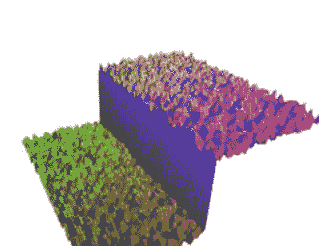

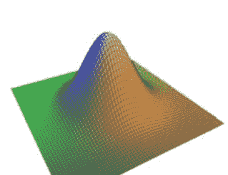

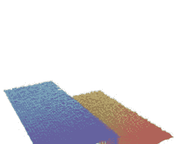

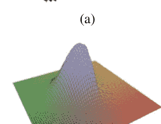

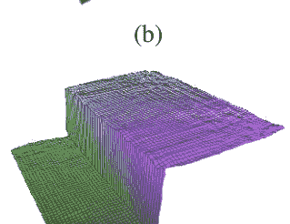

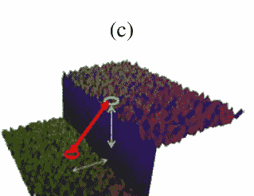

图3.20 双边滤波（Durand和Dorsey 2002） © 2002 ACM: (a) 噪声阶跃边缘输入；(b) 域滤波器（高斯）；(c) 范围滤波器（与中心像素值的相似性）；(d) 双边滤波器；(e) 滤波后的阶跃边缘输出；(f) 像素之间的3D距离。

由于双边滤波与常规可分离滤波相比较慢，因此已经开发了一些加速技术（Durand和Dorsey 2002；Paris和Durand2006；Chen，Paris和Durand 2007；Paris，Kornprobst，Tumblin et al.2008）。不幸的是，这些技术往往比常规滤波使用更多的内存，因此不能直接应用于全彩色图像的滤波。

## 迭代自适应平滑和各向异性扩散

双边（和其他）滤波器也可以以迭代的方式应用，特别是当希望得到类似“卡通”的外观时（Tomasi和Manduchi 1998）。当应用迭代滤波时，通常可以使用更小的邻域。

例如，考虑仅使用四个最近的邻居，即在（3.34）中限制 |k - i| + |l - j| ≤ 1。观察到

$$
d(i, j, k, l) = \exp\left(-\frac{(i - k)^2 + (j - l)^2}{2\sigma_d^2}\right) \quad (3.38)
$$
$$
= \begin{cases}
1, & |k - i| + |l - j| = 0, \\
\lambda = e^{-1/2\sigma_d^2}, & |k - i| + |l - j| = 1。
\end{cases} \quad (3.39)
$$

### 3.3 更多的邻域操作符

因此，我们可以将（3.34）重新写为

$$
f^{(t+1)}(i, j) = \frac{f^{(t)}(i, j) + \eta \sum_{k,l} f^{(t)}(k, l) r(i, j, k, l)}{1 + \eta \sum_{k,l} r(i, j, k, l)} \quad (3.40)
$$
$$
= f^{(t)}(i, j) + \frac{\eta}{1 + \eta R} \sum_{k,l} r(i, j, k, l)[f^{(t)}(k, l) - f^{(t)}(i, j)],
$$

其中 $R = \sum_{(k,l)} r(i, j, k, l)$，$(k, l)$是 $(i, j)$的$\mathcal{N}_4$邻居，我们已经明确了滤波的迭代性质。

正如Barash (2002)所指出的，(3.40)与Perona和Malik (1990b)首次提出的离散各向异性扩散方程相同。⁶自其最初引入以来，各向异性扩散已被扩展并应用于广泛的问题领域（Nielsen, Florack, and Deriche 1997; Black, Sapiro, Marimont et al.1998; Weickert, ter Haar Romeny, and Viergever1998; Weickert 1998）。它还被证明与其他自适应平滑技术（Saint-Marc, Chen, and Medioni 1991; Barash 2002; Barash and Comaniciu2004）以及可以从图像统计中推导出的具有非线性平滑项的贝叶斯正则化密切相关（Scharr, Black, and Haussecker 2003）。

在其一般形式中，范围核函数 $r(i, j, k, l) = r(\|f(i, j) - f(k, l)\|)$，通常被称为增益或边缘停止函数，或扩散系数，可以是任何单调递增的函数，其中 $r'(x) \rightarrow 0$当 $x \rightarrow \infty$。Black, Sapiro, Marimont等人(1998)展示了各向异性扩散等价于在图像梯度上最小化鲁棒惩罚函数，我们在第3.7.1节和第3.7.2节中讨论。Scharr, Black和Haussecker(2003)展示了如何从局部图像统计中以原则性的方式推导出边缘停止函数。他们还将扩散邻域从 $\mathcal{N}_4$扩展到 $\mathcal{N}_8$，这使他们能够创建一个旋转不变且包含局部结构张量特征值信息的扩散算子。

请注意，如果没有对原始图像进行偏差项处理，各向异性扩散和迭代自适应平滑将收敛到一个恒定的图像。除非使用少量迭代次数（例如，为了提高速度），通常最好将平滑问题表述为平滑项和数据适应性项的联合最小化问题，如第3.7.1节和第3.7.2节以及Scharr, Black和Haussecker（2003）所讨论的，它们以一种原则性的方式引入了这样的偏差。

#### 3.3.2 形态学

虽然非线性滤波器通常用于增强灰度和彩色图像，但它们也广泛用于处理二值图像。这种图像通常在阈值处理之后出现

> ⁶在各向异性扩散中不存在 $1/(1+\eta R)$因子，但当 $\eta \rightarrow 0$时，它变得可以忽略。


## 图3.21 二值图像形态学: (a) 原始图像; (b) 膨胀; (c) 腐蚀; (d) 多数; (e) 开运算; (f) 闭运算。所有示例的结构元素是一个 $5 \times 5$ 的正方形。

多数的影响是对尖角的微妙舍入。由于它不够宽，开运算无法消除点。

操作，

$$
\theta(f, t) = \begin{cases} \text{如果 } f \geq t, \text{则为} 1, \\ \text{否则为} 0, \end{cases} \quad (3.41)
$$

例如，将扫描的灰度文档转换为二值图像以进行进一步处理，例如光学字符识别。

最常见的二值图像操作被称为形态学操作，因为它们改变了底层二值对象的形状（Ritter和Wilson 2000年，第7章）。要执行这样的操作，我们首先将二值图像与二值结构元素进行卷积，然后根据卷积的阈值结果选择二值输出值。（这不是描述这些操作的常规方式，但我发现这是一种很好的简单方式来统一这些过程。）结构元素可以是任何形状，从简单的 $3 \times 3$ 盒子滤波器到更复杂的圆盘结构。它甚至可以对应于图像中正在寻找的特定形状。

图3.21展示了一个二值图像 $f$ 与一个 $3 \times 3$ 结构元素进行卷积的近景图以及下面描述的操作的结果图像。

$$
c = f \otimes s \quad (3.42)
$$

假设整数值 $count$ 表示在扫描图像时结构元素内部的1的数量，$S$ 表示结构元素的大小（像素数）。二值形态学中使用的标准操作包括：

- 膨胀 : dilate(f, s) = θ(c, 1);
- 腐蚀 : erode(f, s) = θ(c, S);
- 多数投票: maj(f, s) = θ(c, S/2);
- 开运算 : open(f, s) = dilate(erode(f, s), s);
- 关闭 : close(f, s) = erode(dilate(f, s), s).

从图3.21中我们可以看到，膨胀操作会使由1组成的对象变粗，而腐蚀操作会使其变细。开运算和闭运算操作通常不会对大区域和平滑边界产生影响，而会去除小对象或孔洞并平滑边界。

虽然在本书的其余部分中我们不会经常使用数学形态学，但它是一个方便的工具，可以在需要清理一些阈值图像时使用。关于形态学的更多细节可以在计算机视觉和图像处理的其他教材中找到（Haralick和Shapiro 1992，第5.2节）（Bovik 2000，第2.2节）（Ritter和Wilson 2000，第7节），以及专门讨论此主题的文章和书籍（Serra 1982；Serra和Vincent 1992；Yuille，Vincent和Geiger 1992；Soille 2006）。

#### 3.3.3 距离变换

距离变换在快速预计算曲线或一组点到距离的时候非常有用，使用双通栅格算法（Rosenfeld和Pfaltz 1966；Danielsson 1980；Borgefors 1986；Paglieroni 1992；Breu，Gil，Kirkpatrick et al.1995；Felzenszwalb和Huttenlocher2004a；Fabbri，Costa，Torelli et al.2008）。它有许多应用，包括水平集（第5.1.4节），快速chamfer匹配（二值图像对齐）（Huttenlocher，Klanderman和Rucklidge 1993），图像拼接和混合中的羽化（第9.3.2节）以及最近点对齐（第12.2.1节）。

二值图像b (i, j) 的距离变换D (i, j) 定义如下。让 d (k, l) 是像素偏移之间的某种距离度量。两种常用的度量包括城市块或曼哈顿距离

$$d_1(k, l) = |k| + |l| \quad (3.43)$$

和 欧几里得 距离

$$d_2(k, l) = \sqrt{k^2 + l^2} \quad (3.44)$$

然后，距离变换被定义为

$$D(i, j) = \min_{k,l:b(k,l)=0} d(i - k, j - l) \quad (3.45)$$

即，它是到最近的背景像素（值为0）的距离。D1城市街区距离变换可以使用简单的栅格扫描算法的前向和后向传递高效计算，如图3.22所示。在前向传递过程中，b中的每个非零像素都被其北方或西方邻居的距离加1的最小值所替代。在后向传递过程中，相同的情况发生，只是最小值同时考虑了当前值D和南方和东方邻居的距离加1（图3.22）。

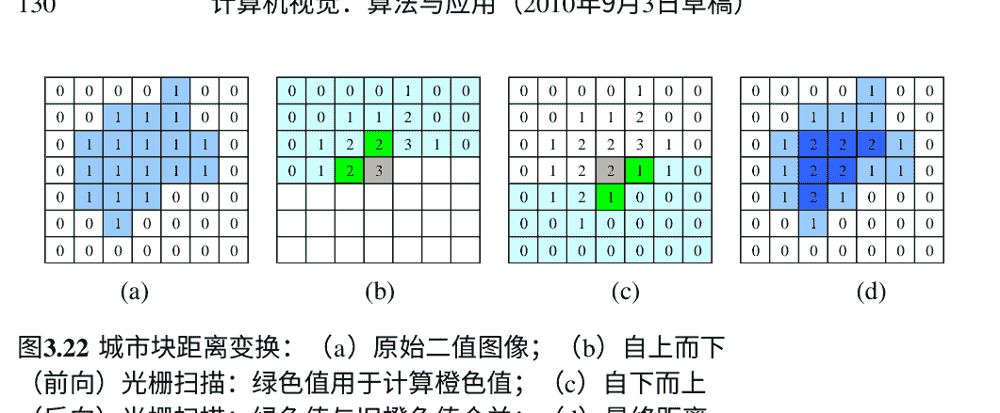

高效计算欧几里得距离变换更加复杂。在这里，仅仅在两次遍历期间保持到边界的最小标量距离是不够的。

相反，必须保持一个包含距离到边界的 x 和 y 坐标的向量值距离，并使用平方距离（斜边）规则进行比较。此外，需要使用更大的搜索区域才能获得合理的结果。与其详细解释算法（Danielsson 1980; Borgefors 1986），我们将其作为一个练习留给有动力的读者（练习3.13）。

图3.11g显示了从二进制图像计算得出的距离变换。注意如何值从黑色（墨水）区域增长并在原始图像的白色区域形成脊。由于从起始边界像素开始的线性增长，距离变换有时也被称为草火变换，因为它描述了在黑色区域内开始的火灾在任何给定像素上消耗的时间，或者称为 chamfer，因为它类似于木工和工业设计中使用的类似形状。距离变换中的脊变成了计算变换的区域的骨架（或中轴变换（MAT）），由等距离于两个（或多个）边界的像素组成（Tek和Kimia 2003; Sebastian和Kimia 2005）。

基本距离变换的一个有用扩展是有符号距离变换，它计算所有像素到边界像素的距离（Lavallée和Szeliski 1995）。创建这个最简单的方法是计算原始二进制图像及其补集的距离变换，并在合并之前对其中一个进行取反。由于这种距离场往往是平滑的，可以使用在四叉树或八叉树数据结构上定义的样条更紧凑地存储它们（Lavallée和Szeliski 1995; Szeliski和Lavallée 1996; Frisken, Perry, Rockwood et al. 2000）。这种预计算的有符号距离变换在高效地对齐和合并2D曲线和3D曲面方面非常有用（Huttenlocher, Klanderman和Rucklidge 1993年；Szeliski和Lavall’ée 1996年；Curless和Levoy 1996年），特别是如果存储和插值距离变换的矢量版本，即从每个像素或体素到最近边界或表面元素的指针。有符号距离场也是水平集演化的重要组成部分（第5.1.4节），在那里它们被称为特征函数。

#### 3.3.4 连通分量

另一个有用的半全局图像操作是找到连通分量，它们被定义为具有相同输入值（或标签）的相邻像素的区域。（在本节的其余部分中，如果像素是立即的N₄邻居并且它们具有相同的输入值，则认为它们是相邻的。）连通分量可以用于各种应用，例如在扫描文档中查找单个字母或在二值图像中查找对象（例如细胞）并计算其面积统计信息。

考虑图3.23a中的灰度图像。这个图中有四个连通分量：最外层的白色像素集，大环状的灰色像素，白色封闭区域和单个灰色像素。这些在图3.23c中以伪彩色显示，分别为粉色、绿色、蓝色和棕色。

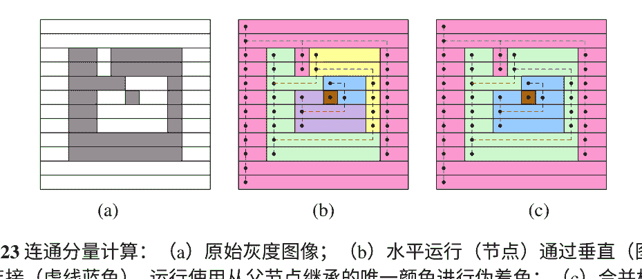

图3.23 连通分量计算：（a）原始灰度图像；（b）水平运行（节点）通过垂直（图）边连接（虚线蓝色）- 运行使用从父节点继承的唯一颜色进行伪着色；（c）合并相邻段后重新着色。

为了计算图像的连通分量，我们首先（概念上）将图像分割成水平相邻像素的运行，并使用唯一的标签对运行进行着色，尽可能地重用垂直相邻运行的标签。在第二阶段，不同颜色的相邻运行被合并。

虽然这个描述有点简略，但足以让有动力的学生实现这个算法（练习3.14）。Haralick和Shapiro（1992年，第2.3节）提供了各种连通分量算法的更长描述，包括一些算法。

避免创建一个潜在的大型重新着色（等价）表。在大多数图像处理库中也提供了经过良好调试的连通分量算法。一旦将二进制或多值图像分割成其连接的组件，通常有用的是计算每个单独区域 ℛ 的面积统计数据。这些统计数据包括：

-   面积（像素数）；
-   周长（边界像素数）；
-   质心（平均 x 和 y 值）；
-   二阶矩，

$$
M = \sum_{(x,y)\in\mathcal{R}} \begin{bmatrix} x - \bar{x} \\ y - \bar{y} \end{bmatrix} \begin{bmatrix} x - \bar{x} & y - \bar{y} \end{bmatrix}, \quad (3.46)
$$

通过特征值分析，可以使用这些统计数据计算主轴和次轴的方向和长度。

然后可以将这些统计数据用于进一步处理，例如按面积大小对区域进行排序（首先考虑最大的区域）或用于不同图像中区域的初步匹配。

### 3.4 傅里叶变换

在第3.2节中，我们提到傅里叶分析可以用于分析各种滤波器的频率特性。在本节中，我们解释了傅里叶分析如何帮助我们确定这些特性（或等效地，图像的频率内容）以及如何使用快速傅里叶变换（FFT）在时间上执行与卷积核大小无关的大核卷积。Bracewell（1986）；Glassner（1995）；Oppenheim和Schafer（1996）；Oppenheim，Schafer和Buck（1999）提供了更全面的傅里叶变换介绍。

我们如何分析给定滤波器对高频、中频和低频的影响？答案是简单地通过已知频率的正弦波通过滤波器，并观察它被衰减了多少。

$$
s(x) = \sin(2\pi f x + \phi_i) = \sin(\omega x + \phi_i) \quad (3.47)
$$

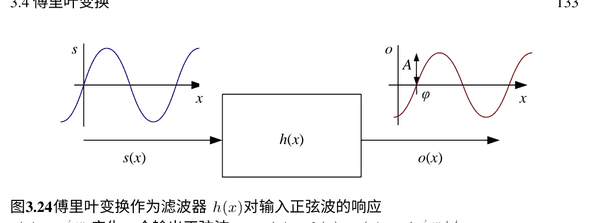

$s(x) = e^{j\omega x}$ 产生一个输出正弦波　　$o(x) = h(x) * s(x) = A e^{j\omega x+\phi}$。

假设输入正弦信号的频率为 $f$，角频率为 $\omega=2\pi f$，相位为 $\phi_i$。请注意，在本节中，我们使用变量 $x$ 和 $y$ 来表示图像的空间坐标，而不是像前几节中使用的 $i$ 和 $j$。这是因为字母 $i$ 和 $j$ 被用于表示虚数（具体取决于您是否在阅读复数变量或电气工程文献），并且在频率空间中如何区分水平 ($x$) 和垂直 ($y$) 分量更清晰。在本节中，我们使用字母 $j$ 表示虚数，因为这是信号处理文献中更常见的形式 (Bracewell 1986; Oppenheim and Schafer 1996; Oppenheim, Schafer, and Buck 1999)。

如果我们将正弦信号 $s(x)$ 与脉冲响应为 $h(x)$ 的滤波器进行卷积，我们将得到具有相同频率但不同幅度 $A$ 和相位 $\phi$ 的另一个正弦信号。

$$o(x) = h(x) * s(x) = A \sin(\omega x + \phi_o), \tag{3.48}$$

如图3.24所示。要看到这一点，记住卷积可以表示为移位输入信号的加权求和(3.14)，而相同频率的一堆移位正弦信号的求和只是该频率上的单一正弦信号。⁸新的幅度 $A$ 被称为滤波器的增益或幅度 of the filter，而相位差 $\Delta\phi = \phi_o - \phi_i$ 被称为移位或相位的差。

事实上，更紧凑的表示法是使用复数值的正弦波

$$s(x) = e^{j\omega x} = \cos \omega x + j \sin \omega x. \tag{3.49}$$

在这种情况下，我们可以简单地写成，

$$o(x) = h(x) * s(x) = A e^{j\omega x+\phi}. \tag{3.50}$$

§如果h是一个一般的（非线性）变换，会引入额外的谐波频率。这在传统上是音响发烧友的噩梦，他们坚持使用没有谐波失真的设备。现在数字音频引入了纯净无失真的声音，一些音响发烧友购买复古的真空管放大器或数字信号处理器器来模拟这种失真，因为它们有“更温暖的声音”。

傅里叶变换只是在每个频率上列出幅度和相位响应的表格。

$$H(\omega) = \mathcal{F}\{h(x)\} = A e^{j\phi} \quad (3.51)$$

即，它是通过滤波器$h(x)$通过的频率为$\omega$的复正弦波的响应。

傅里叶变换对也经常写作

$$h(x) \overset{\mathcal{F}}{\leftrightarrow} H(\omega) \quad (3.52)$$

不幸的是，(3.51)并没有给出一个实际的计算傅里叶变换的公式。

相反，它给出了一个步骤，即将滤波器与正弦波卷积，观察幅度和相位移，重复。

幸运的是，傅里叶变换的闭合形式方程在连续域和离散域中都存在。

$$H(\omega) = \int_{-\infty}^{\infty} h(x) e^{-j\omega x} dx \quad (3.53)$$

以及在离散域中，

$$H(k) = \frac{1}{N} \sum_{x=0}^{N-1} h(x) e^{-j\frac{2\pi k x}{N}} \quad (3.54)$$

其中 $N$是信号或分析区域的长度。这些公式适用于滤波器，如 $h(x)$，以及信号或图像，如 $s(x)$或 $g(x)$。

傅里叶变换的离散形式 (3.54) 被称为离散傅里叶变换 (DFT)。请注意，虽然 (3.54) 可以对任意的 $k$值进行计算，但只有在 $k \in [-\frac{N}{2},\frac{N}{2}]$的范围内才有意义。这是因为较大的 $k$值会与较低的频率混叠，因此不提供额外的信息，这在第2.3.1节的混叠讨论中有解释。

从表面上看，DFT需要 $O(N^2)$次操作（乘加）来进行计算。幸运的是，存在一种更快的算法称为快速傅里叶变换 (FFT)，它只需要$O(N \log_2 N)$次操作 (Bracewell 1986; Oppenheim, Schafer, and Buck 1999)。我们在这里不解释算法的细节，只是说它涉及一系列的 $\log_2 N$阶段，每个阶段执行小的 $2 \times 2$变换（具有已知系数的矩阵乘法），然后进行一些半全局的排列。（你经常会看到术语“蝶形”应用于这些阶段，因为信号处理图形的形状与蝴蝶相似。）FFT的实现可以在大多数数值和信号处理库中找到。

现在我们已经定义了傅里叶变换，那么它有哪些性质，以及如何使用它们呢？表3.1列出了一些有用的性质，我们将在下面稍微详细地描述：

| 性质 | 信号 | 变换 |
| :--- | :--- | :--- |
| 叠加 | $f_1(x) + f_2(x)$ | $F_1(\omega) + F_2(\omega)$ |
| 平移 | $f(x - x_0)$ | $F(\omega)e^{-j\omega x_0}$ |
| 反转 | $f(-x)$ | $F^*(\omega)$ |
| 卷积 | $f(x) * h(x)$ | $F(\omega)H(\omega)$ |
| 相关 | $f(x) \otimes h(x)$ | $F(\omega)H^*(\omega)$ |
| 乘法 | $f(x)h(x)$ | $F(\omega) * H(\omega)$ |
| 微分 | $f'(x)$ | $j\omega F(\omega)$ |
| 域缩放 | $f(ax)$ | $1/a F(\omega/a)$ |
| 真实图像 | $f(x) = f^*(x)$ $\Leftrightarrow$ | $F(\omega) = F(-\omega)$ |
| Parseval定理 | $\sum_{x} [f(x)]^2$ = | $\sum_{\omega} [F(\omega)]^2$ |

表3.1 傅里叶变换的一些有用性质。原始变换对是 $F(\omega) = \mathcal{F}\{f(x)\}$。

-   叠加：信号的和的傅里叶变换是它们傅里叶变换的和。因此，傅里叶变换是一个线性算子。
-   平移：平移信号的傅里叶变换是原始信号的变换乘以一个线性相位移（复正弦波）。
-   反转：反转信号的傅里叶变换是信号变换的复共轭。
-   卷积：卷积信号对的傅里叶变换是它们变换的乘积。
-   相关：相关的傅里叶变换是第一个变换乘以第二个变换的共轭。
-   乘法：两个信号乘积的傅里叶变换是它们变换的卷积。
-   微分：信号导数的傅里叶变换是信号变换乘以频率。换句话说，微分线性地强调（放大）高频率。
-   域缩放：拉伸信号的傅里叶变换是原始变换的等效压缩（和缩放）版本，反之亦然。
-   实图像：实值信号的傅里叶变换在原点周围对称。这个事实可以用来节省空间并将图像FFT的速度加倍，通过将交替的扫描线打包到被变换的信号的实部和虚部中。
-   Parseval定理：信号的能量（平方和）与其傅里叶变换的能量相同。

所有这些性质相对来说都比较容易证明（参见练习3.15），并且它们在本书后面会派上用场，例如，在设计最优维纳滤波器（第3.4.3节）或执行快速图像相关性（第8.1.2节）时。

#### 3.4.1 傅里叶变换对

现在我们已经掌握了这些性质，让我们来看一些常见滤波器和信号的傅里叶变换对，如表3.2所列。更详细地说，这些对应关系如下：

-   冲激响应：冲激响应具有恒定的（所有频率）变换。
-   平移冲激：平移冲激具有单位幅度和线性相位。
-   方框滤波器：方框（移动平均）滤波器
    $$
    \text{box}(x) = \begin{cases} 1 & \text{if } |x| \le 1 \\ 0 & \text{else} \end{cases} \quad (3.55)
    $$
    具有sinc傅里叶变换，
    $$
    \text{sinc}(\omega) = \dfrac{\sin \omega}{\omega}, \quad (3.56)
    $$
    它有无限多个旁瓣。相反，sinc滤波器是理想的低通滤波器。对于非单位盒子，盒子的宽度 $a$和sinc $1/a$中的零交叉间距成反比。
-   Tent函数：分段线性的帐篷函数，
    $$
    \text{tent}(x) = \max(0, 1 - |x|), \quad (3.57)
    $$
    具有sinc $^2$傅里叶变换。
-   高斯函数：宽度为 $\sigma$ 的（单位面积）高斯函数，
    $$
    G(x; \sigma) = \dfrac{1}{\sqrt{2\pi}\sigma} e^{-\dfrac{x^2}{2\sigma^2}}, \quad (3.58)
    $$
    具有宽度为 $\sigma^{-1}$的（单位高度）高斯函数作为其傅里叶变换。

| 姓名 | 信号 | 变换 |
| :--- | :--- | :--- |
| 冲击 | 波形图：冲击函数 | $\delta(x) \quad \Leftrightarrow \quad 1$ |
| 移位冲击 | 波形图：移位冲击函数 | $\delta(x - u) \quad \Leftrightarrow \quad e^{-j\omega u}$ |
| 盒子滤波器 | 波形图：盒子函数 | $\text{盒子}(x/a) \quad \Leftrightarrow \quad a\text{sinc}(a\omega)$ |
| 帐篷 | 波形图：帐篷函数 | $\text{帐篷}(x/a) \quad \Leftrightarrow \quad a\text{sinc}^2(a\omega)$ |
| 高斯 | 波形图：高斯函数 | $G(x; \sigma) \quad \Leftrightarrow \quad \frac{\sqrt{2\pi}}{\sigma} G(\omega; \sigma^{-1})$ |
| 高斯拉普拉斯 | 波形图：高斯拉普拉斯函数 | $(\frac{x^2}{\sigma^4} - \frac{1}{\sigma^2})G(x; \sigma) \quad \Leftrightarrow \quad -\frac{\sqrt{2\pi}}{\sigma} \omega^2 G(\omega; \sigma^{-1})$ |
| Gabor | 波形图：Gabor函数 | $\cos(\omega_0 x)G(x; \sigma) \quad \Leftrightarrow \quad \frac{\sqrt{2\pi}}{\sigma} G(\omega \pm \omega_0; \sigma^{-1})$ |
| 锐化掩蔽 | 波形图：锐化掩蔽函数 | $(1 + \gamma)\delta(x) - \gamma G(x; \sigma) \quad \Leftrightarrow \quad (1 + \gamma) - \frac{\sqrt{2\pi}\gamma}{\sigma} G(\omega; \sigma^{-1})$ |
| 窗口化的 sinc | 波形图：窗口化sinc函数 | $\text{rcos}(x / (aW)) \quad \text{sinc}(x/a) \quad \Leftrightarrow \quad \text{(见图3.29)}$ |

表3.2 一些有用的（连续）傅里叶变换对：移位脉冲的傅里叶变换中的虚线表示其（线性）相位。所有其他变换的相位都为零（它们是实值的）。请注意，这些图形不一定按比例绘制，而是绘制以说明滤波器或其响应的一般形状和特性。特别地，高斯拉普拉斯算子被绘制为倒置，因为它更像一个“墨西哥帽”，有时也被称为如此。

-   高斯拉普拉斯算子：宽度为 $\sigma$ 的高斯函数的二阶导数，
    $$
    LoG(x;\sigma)=\left(\frac{x^2}{\sigma^4} - \frac{1}{\sigma^2}\right)G(x;\sigma)\qquad(3.59)
    $$
    具有带通响应的
    $$
    -\frac{\sqrt{2\pi}}{\sigma}\omega^2G(\omega;\sigma^{-1})\qquad(3.60)
    $$
    作为其傅里叶变换。
-   Gabor：偶数Gabor函数是频率 $\omega_0$ 的余弦函数和宽度 $\sigma$ 的高斯函数的乘积，其变换是宽度为 $\sigma^{-1}$ 的两个高斯函数在 $\omega=\pm\omega_0$ 处的和。奇数Gabor函数使用正弦函数，是两个这样的高斯函数的差。Gabor函数常用于定向和带通滤波，因为它们比高斯导数更具频率选择性。
-   Unsharp mask：在(3.22)中引入的unsharp mask的变换是在高频处略有增强的单位响应。
-   窗口化sinc函数：表3.2中显示的窗口化（掩蔽）sinc函数具有逐渐添加额外旁瓣（增加W）时越来越接近理想低通滤波器的响应函数。图3.29显示了这些滤波器的形状以及它们的傅里叶变换。对于这些示例，我们使用了一个单瓣的raised cosine函数。
    $$
    rcos(x)=\frac{1}{2}(1+\cos\pi x)\text{box}(x),\qquad(3.61)
    $$
    也被称为Hann窗口，作为窗函数。Wolberg (1990)和Oppenheim, Schafer, and Buck (1999)讨论了其他窗函数，其中包括Lanczos窗口，正弦函数的第一个正瓣。

我们还可以计算图3.14中显示的小离散核的傅里叶变换（参见表3.3）。请注意，移动平均滤波器不均匀地抑制高频率，因此可能会产生振铃伪影。二项式滤波器（Gomes and Velho 1997）在Burt and Adelson (1983a) 的拉普拉斯金字塔中用作“高斯”滤波器（参见第3.5节），可以很好地分离高频率和低频率，但仍然保留了相当多的高频细节，这可能会导致降采样后的混叠现象。Sobel边缘检测器首先线性强调频率，但在较高频率下衰减，因此难以检测到细小的边缘，例如相邻的黑白列。我们在第3.5.2节中查看了更多小核傅里叶变换的示例，其中我们研究了在缩小尺寸之前进行预滤波的更好核。

| 姓名 | 核心 | 变换 | 绘图 |
| :--- | :--- | :--- | :--- |
| 盒子-3 | $\frac{1}{3}$ [1][1][1] | $\frac{1}{3}(1+2\cos\omega)$ | (图表内容) |
| 盒子-5 | $\frac{1}{5}$ [1][1][1][1][1] | $\frac{1}{5}(1+2\cos\omega+2\cos2\omega)$ | (图表内容) |
| 线性 | $\frac{1}{4}$ [1][2][1] | $\frac{1}{2}(1+\cos\omega)$ | (图表内容) |
| 二项式 | $\frac{1}{16}$ [1][4][6][4][1] | $\frac{1}{4}(1+\cos\omega)^2$ | (图表内容) |
| Sobel | $\frac{1}{2}$ [-1][0][1] | $\sin\omega$ | (图表内容) |
| 角点 | $\frac{1}{2}$ [-1][2][-1] | $\frac{1}{2}(1-\cos\omega)$ | (图表内容) |

表3.3图3.14中显示的可分离核的傅里叶变换。

#### 3.4.2 二维傅里叶变换

我们为一维信号及其变换所开发的公式和见解直接适用于二维图像。在这里，我们不仅可以指定水平或垂直频率 $\omega_x$ 或 $\omega_y$，还可以创建一个方向性频率为

$$
(\omega_x, \omega_y)
$$

$$
s(x, y) = \sin(\omega_x x + \omega_y y)
$$

然后对应的二维傅里叶变换为

$$
H(\omega_x, \omega_y) = \int_{-\infty}^{\infty} \int_{-\infty}^{\infty} h(x, y) e^{-j (\omega_x x + \omega_y y)} dx dy
$$

以及在离散域中，

$$
H(k_x, k_y) = \frac{1}{M N} \sum_{x=0}^{M-1} \sum_{y=0}^{N-1} h(x, y) e^{-j 2\pi \frac{k_x x + k_y y}{M N}}
$$

其中 M 和 N 是图像的宽度和高度。

如果我们用二维向量替代标量变量 x, $\omega$, $x_0$ 和 a, 即 $\mathbf{x} = (x, y)$, $\boldsymbol{\omega} = (\omega_x, \omega_y)$, $\mathbf{x}_0 = (x_0, y_0)$, 和 $\mathbf{a} = (a_x, a_y)$, 并且使用向量内积代替乘法，那么表3.1中的所有傅里叶变换性质都适用于二维情况。

#### 3.4.3 维纳滤波

傅里叶变换是分析滤波器核或图像频率特性的有用工具，但也可以用来分析整个图像类的频谱。

图像的一个简单模型是假设它们是随机噪声场，其每个频率的期望幅度由功率谱 $P_s(\omega_x, \omega_y)$ 给出，即

$$
\langle [S(\omega_x, \omega_y)]^2 \rangle = P_s(\omega_x, \omega_y)
$$

其中尖括号 $\langle \cdot \rangle$ 表示随机变量的期望（均值）值。为了生成这样的图像，我们只需创建一个随机高斯噪声图像 $S(\omega_x, \omega_y)$, 其中每个“像素”都是均值为零、方差为 $P_s(\omega_x, \omega_y)$ 的高斯分布，并进行逆FFT。信号谱捕捉空间统计的一阶描述这一观察在信号和图像处理中被广泛使用。特别是，假设图像是一个## 3.4 傅里叶变换

从相关高斯随机噪声场中采样结合测量过程的统计模型，得到一种最优恢复滤波器，称为维纳滤波器。为了推导维纳滤波器，我们独立地分析信号的每个频率分量的傅里叶变换。噪声图像形成过程可以写成

```
$$o(x, y) = s(x, y) + n(x, y), \quad (3.66)$$
```

其中 $s(x, y)$ 是我们试图恢复的（未知）图像，$n(x, y)$ 是加性噪声信号，而 $o(x, y)$ 是观察到的噪声图像。由于傅里叶变换的线性性质，我们可以写成

```
$$O(\omega_x, \omega_y) = S(\omega_x, \omega_y) + N(\omega_x, \omega_y), \quad (3.67)$$
```

其中上述方程中的每个量都是相应图像的傅里叶变换。

在每个频率 $(\omega_x, \omega_y)$ 处，我们从图像谱中得知未知的变换分量 $S(\omega_x, \omega_y)$ 具有一个先验分布，该分布是一个均值为零的高斯分布，方差为 $P_s(\omega_x, \omega_y)$。我们还有带噪声的测量 $O(\omega_x, \omega_y)$，其方差为 $P_n(\omega_x, \omega_y)$，即噪声的功率谱，通常假设为常数（白噪声），$P_n(\omega_x, \omega_y) = \sigma_n^2$。

根据贝叶斯定理（附录B.4），$S$ 的后验估计可以写成

```
$$p(S|O) = \frac{p(O|S)p(S)}{p(O)}, \quad (3.68)$$
```

其中 $p(O) = \int p(O|S)p(S)$ 是用来使 $p(S|O)$ 分布正常化（积分为1）的归一化常数。先验分布 $p(S)$ 给出为

```
$$p(S) = e^{-\frac{(S-\mu)^2}{2P_s}}, \quad (3.69)$$
```

其中 $\mu$ 是该频率的期望均值（除了原点外处处为0），测量分布 $p(O|S)$ 给出为

```
$$p(O|S) = e^{-\frac{(S-O)^2}{2P_n}}, \quad (3.70)$$
```

对 (3.68) 两边取负对数并设置 $\mu=0$ 以简化，我们得到

```
$$- \log p(S|O) = - \log p(O|S) - \log p(S) + C \quad (3.71)$$
$$= 1/2 P_n^{-1} (S - O)^2 + 1/2 P_s^{-1} S^2 + C, \quad (3.72)$$
```

这个数量的负后验对数似然。这个数量的最小值很容易计算，

```
S_{\text{opt}} = \frac{P_n^{-1}}{P_n^{-1} + P_s^{-1}} O = \frac{P_s}{P_s + P_n} O = \frac{1}{1 + P_n / P_s} O
```

数量

```
W(\omega_x, \omega_y) = \frac{1}{1 + \sigma_n^2 / P_s(\omega_x, \omega_y)}
```

是用于去除功率谱为 \( P_s(\omega_x, \omega_y) \) 的图像中的噪声所需的最优Wiener滤波器的傅里叶变换。

请注意，该滤波器具有正确的定性特性，即在功率谱为低频时，\( P_s \gg \sigma_n^2 \)，它具有单位增益，而在高频时，它通过因子 \( P_s / \sigma_n^2 \) 来衰减噪声。图3.25显示了常见情况下的一维变换 \( W(f) \) 和相应的滤波器核 \( w(x) \)，其中 \( P(f) = f^{-2} \) (Field 1987)。练习3.16要求你将Wiener滤波器作为去噪算法与手动调整的高斯平滑进行比较。

上述用于推导维纳滤波器的方法可以很容易地扩展到观察到的图像是原始图像的噪声模糊版本的情况下，

```
o(x, y) = b(x, y) * s(x, y) + n(x, y)
```

其中 \( b(x, y) \) 是已知的模糊核。与其推导相应的维纳滤波器，我们将其作为一个练习留给你（练习3.17），这也鼓励你将去模糊的结果与不锐化掩蔽和朴素逆滤波进行比较。关于去模糊的更复杂算法在第3.7节和第10.3节中进行了讨论。

维纳的发音为“veener”，因为在德语中，“w”发音为“v”。记住下次点“维也纳炸肉排”时。

## 3.4.3 离散余弦变换

离散余弦变换（DCT）是一种特别适用于以块方式压缩图像的傅里叶变换的变体。一维DCT通过将每个 \( N \) 宽的像素块与一组余弦函数进行点积来计算不同的频率，

```
$$F(k) = \sum_{i=0}^{N-1} \cos\left(\frac{\pi}{N}\left(i + \frac{1}{2}\right)k\right) f(i), \qquad \text{(3.76)}$$
```

其中 $k$ 是系数（频率）索引，使用 $1/2$ 像素偏移使基函数系数对称（Wallace 1991）。图3.26显示了一些离散余弦基函数。正如你所看到的，第一个基函数（直线蓝线）编码了像素块中的平均直流值，而第二个基函数编码了稍微弯曲的斜率版本。

事实证明，离散余弦变换（DCT）是对自然图像统计的最优Karhunen-Loève分解的很好近似，可以通过对图像执行主成分分析（PCA）来获得，如第14.2.1节所述。KL-变换最优地去相关信号（假设信号由其频谱描述），因此在理论上导致最优压缩。

二维DCT的定义类似，

```
$$F(k, l) = \sum_{i=0}^{N-1} \sum_{j=0}^{N-1} \cos\left(\frac{\pi}{N}\left(i + \frac{1}{2}\right)k\right) \cos\left(\frac{\pi}{N}\left(j + \frac{1}{2}\right)l\right) f(i, j). \qquad \text{(3.77)}$$
```

与二维快速傅里叶变换（FFT）类似，二维DCT也可以分别实现，即首先计算块中每行的DCT，然后计算每个结果列的DCT。与FFT类似，每个DCT也可以在 $O(N \log N)$ 时间内计算。

正如我们在第2.3.3节中提到的，DCT广泛应用于今天的图像和视频压缩算法中，尽管它正在逐渐被小波算法（Simoncelli和Adelson 1990b）所取代，如第3.5.4节所讨论的，并且DCT的重叠变体（Malvar 1990, 1998, 2000）也被用于新的JPEG XR标准。新的算法对于由每个块（通常为 8 × 8）中的像素独立变换和量化而导致的阻塞伪影（可见的边缘对齐不连续性）的影响较小。请参考练习3.30，了解如何从压缩的JPEG图像中去除阻塞伪影的想法。

#### 3.4.4 应用：锐化、模糊和去噪

图像处理的另一个常见应用是通过锐化和去噪操作来增强图像，这需要一定的邻域处理。传统上，这些操作使用线性滤波器来执行（参见第3.2节和第3.4.3节）。如今，更常见的是使用非线性滤波器（第3.3.1节），如加权中值或双边滤波器（3.34–3.37节），各向异性扩散（3.39–3.40节）或非局部均值（Buades，Coll和Morel 2008）。变分方法（第3.7.1节），尤其是使用非二次（鲁棒）范数（称为总变差）的方法，也经常被使用。图3.19展示了使用线性和非线性滤波器去除噪声的一些示例。

在测量图像去噪算法的有效性时，通常会将结果报告为峰值信噪比（PSNR）测量（2.119），其中I(x)是原始（无噪声）图像，I`(x)是去噪后的图像；这适用于噪声图像是合成生成的情况，因此干净图像是已知的。更好的衡量质量的方法是使用基于感知的相似度度量，例如结构相似性（SSIM）指数（Wang，Bovik，Sheikh等，2004；Wang，Bovik和Simoncelli，2005）。

练习3.11、3.16、3.17、3.21和3.28要求你实现其中一些操作并比较它们的有效性。在第10.3节中讨论了更复杂的模糊去除和超分辨率相关任务的技术。

### 3.5 金字塔和小波

到目前为止，在本章中，我们所研究的所有图像转换都会产生与输入图像相同大小的输出图像。然而，通常情况下，我们可能希望在继续处理之前改变图像的分辨率。例如，我们可能需要对一个小图像进行插值，使其分辨率与输出打印机或计算机屏幕的分辨率相匹配。另外，我们可能希望减小图像的大小，以加快算法的执行速度，节省存储空间或传输时间。

有时候，我们甚至不知道图像的适当分辨率应该是多少。例如，考虑在图像中找到一个人脸的任务（第14.1.1节）。由于我们不知道人脸将以何种比例出现，我们需要生成一个完整的金字塔以不同尺寸的图像，并扫描每个图像以寻找可能的人脸。（生物视觉系统也是按照一系列尺度进行操作的（Marr 1982）。）这样的金字塔在加速对象搜索方面也非常有帮助，首先在较粗糙的金字塔层次上找到对象的较小实例，然后只在粗糙层次检测到的附近寻找完整分辨率的对象（第8.1.1节）。最后，图像金字塔在执行多尺度编辑操作（如保持细节的图像混合）时非常有用。

在本节中，我们首先讨论改变图像分辨率的好滤波器，即上采样（插值，第3.5.1节）和下采样（抽取，第3.5.2节）。然后我们介绍了多分辨率金字塔的概念，它可以用来创建一系列不同尺寸的图像，并实现各种应用程序（第3.5.3节）。一个密切相关的概念是小波，它是一种具有更高频率选择性和其他有用属性的特殊金字塔（第3.5.4节）。最后，我们介绍了金字塔的一个有用应用，即以一种隐藏图像边界接缝的方式混合不同的图像（第3.5.5节）。

#### 3.5.1 插值

为了将图像插值（或上采样）到更高的分辨率，我们需要选择一些插值核函数与图像进行卷积。

```
$$g(i, j) = \sum_{k,l} f(k, l)h(i - rk, j - rl). \quad (3.78)$$
```

这个公式与离散卷积公式（3.14）相关，只是我们将 k 和 l 在 h() 中替换为 rk 和 rl，其中 r 是上采样率。图3.27a展示了如何将这个过程看作是样本加权插值核的叠加，每个核都以输入样本 k 为中心。图3.27b展示了另一种思维模型，其中核以输出像素值 i 为中心（两种形式是等价的）。后一种形式有时被称为多相滤波器形式，因为核值 h(i) 可以存储为 r 个单独的核，每个核根据输入样本与上采样网格的 phase 相对于 i 的选择进行卷积。

什么样的核函数可以产生良好的插值器？答案取决于应用程序和所涉及的计算时间。在适当的重新缩放后，可以使用表3.2和表3.3中显示的任何平滑核函数。$^{13}$ 线性插值器（对应于帐篷核函数）产生插值的分段线性曲线，应用于图像时会产生不吸引人的折痕（图3.28a）。离散的 $\frac{1}{2}$ 像素采样的三次B样条，出现在表3.3中的二项式核函数，是一个逼近核函数（插值图像不通过输入数据点），从而产生具有减少高频细节的软图像。通过将帐篷函数（线性B样条）与自身卷积，可以最容易地推导出三次B样条的方程。

虽然大多数图形卡使用双线性内核（可选与MIP-映射结合使用—参见第3.5.3节），但大多数照片编辑软件使用双三次插值。cubic插值器是一个 $C^1$（导数连续）分段三次样条（“样条”一词与“分段多项式”同义）$^{14}$ 其方程为

```
$$h(x) = \begin{cases} 1 - (a + 3)x^2 + (a + 2)|x|^3 & \text{if } |x| < 1 \\ a(|x| - 1)(|x| - 2)^2 & \text{如果 } 1 \leq |x| < 2 \\ 0 & \text{否则,} \end{cases}$$ (3.79)
```

其中 $a$ 指定了在 $x=1$ 处的导数（Parker, Kenyon, and Troxel 1983）。通常将 $a$ 设置为 $-1$，因为这最符合sinc函数的频率特性（图3.29）。它还引入了一小部分锐化效果，这在视觉上很吸引人。不幸的是，这个选择不能线性插值直线（强度斜坡），因此可能会出现一些可见的振铃。对于大量的插值，更好的选择可能是 $a = -0.5$，它产生一个二次再生样条；它可以精确地插值线性和二次函数（Wolberg 1990, Section 5.4.3）。图3.29显示了 $a = -1$ 和 $a = -0.5$ 的立方插值核以及它们的傅里叶变换；图3.28b和c显示它们被应用于二维插值。

由于能够在控制点处精确指定导数并具有高效的增量算法进行评估（Bartels、Beatty和Barsky 1987；Farin 1992、1996），样条曲线长期以来一直被用于函数和数据值插值。尽管样条曲线在几何建模和计算机辅助设计（CAD）应用中被广泛使用，但它们开始被细分曲面所取代（Zorin, Schr¨oder, and Sweldens 1996; Petersand Reif 2008）。在计算机视觉中，样条经常用于弹性图像变形（第3.6.2节），运动估计（第8.3节）和曲面插值（第12.3节）。实际上，通过将图像表示为样条并在多分辨率框架中操作它们，可以执行大多数图像处理操作（Unser 1999）。

普遍认为，最高质量的插值器是窗口化的sinc函数，因为它既保留了低分辨率图像中的细节，又避免了混叠现象。（也可以通过在零交叉点处匹配其导数（Szeliski和Ito 1986）来构造窗口化的sinc的C^1分段三次逼近。）然而，一些人反对窗口化的sinc引入的过度振铃现象以及振铃频率的重复性（见图3.28d）。因此，一些摄影师更喜欢通过微小的分数量重复插值图像（这样可以使原始像素网格与最终图像解耦）。其他可能性包括使用双边滤波器作为插值器（Kopf, Cohen, Lischinski等, 2007），使用全局优化（第3.6节）或幻想细节（第10.3节）。

表3.3中的平滑核函数具有单位面积。要将它们转换为插值核函数，我们只需通过插值率 r 将它们放大。

#### 3.5.2 降采样

虽然插值可以用来增加图像的分辨率，但是降采样（下采样）是必需的来降低分辨率。为了进行降采样，我们首先（在概念上）将图像与低通滤波器卷积（以避免混叠），然后保留每个 r 个样本。

在实践中，我们通常只在每个 r 个样本处评估卷积。

$$g(i, j) = \sum_{k,l} f(k, l) h(ri - k, rj - l), \quad (3.80)$$

如图3.30所示。请注意，平滑核 h（k，l），在这种情况下，通常是插值核的拉伸和重新缩放版本。或者，我们可以写成

$$g(i, j) = \frac{1}{r} \sum_{k,l} f(k, l) h(i - k/r, j - l/r) \quad (3.81)$$

并且保持相同的核 h（k，l）用于插值和降采样。

常用的一种滤波器是由Burt和Adelson（1983a）引入的二项式滤波器，用于（r = 2）降采样。如表3.3所示，该核心在分离高频和低频方面做得相当不错，但仍然保留了相当多的高频细节，这可能导致降采样后的混叠现象。然而，对于像图像混合这样的应用（本节后面讨论），这种混叠并不重要。

然而，如果降采样后的图像将直接显示给用户或与其他分辨率混合（如MIP映射，第3.5.3节），则需要更高质量的滤波器。对于高降采样率，窗口化的sinc预滤波器是一个很好的选择（图3.29）。然而，对于小的降采样率，例如，r=2，需要更仔细的滤波器设计。

表3.4显示了一些常用的下采样滤波器，而图3.31显示了它们对应的频率响应。这些滤波器包括：

-   线性 [1, 2, 1] 滤波器的响应相对较差；
-   二项式 [1, 4, 6, 4, 1] 滤波器截断了很多频率，但对计算机视觉分析金字塔很有用；
-   三次滤波器来自(3.79)；$a = -1$ 滤波器的衰减比 $a = -0.5$ 滤波器更陡峭（图3.31）；

| $|n|$ | 线性 | 二项式 | 三次 | $a = -1$ | $a = -0.5$ | 窗口化 sinc | QMF-9 | JPEG 2000 |
|---|---|---|---|---|---|---|---|---|
| 0 | 0.50 | 0.3750 | 0.5000 | 0.50000 | 0.4939 | 0.5638 | 0.6029 |
| 1 | 0.25 | 0.2500 | 0.3125 | 0.28125 | 0.2684 | 0.2932 | 0.2669 |
| 2 | | 0.0625 | 0.0000 | 0.00000 | 0.0000 | -0.0519 | -0.0782 |
| 3 | | | -0.0625 | -0.03125 | -0.0153 | -0.0431 | -0.0169 |
| 4 | | | | | 0.0000 | 0.0198 | 0.0267 |

表3.4 2×降采样的滤波系数。这些滤波器的长度为奇数，对称，并且归一化为单位DC增益（总和为1）。请参见图3.31以获取它们的相关频率响应。

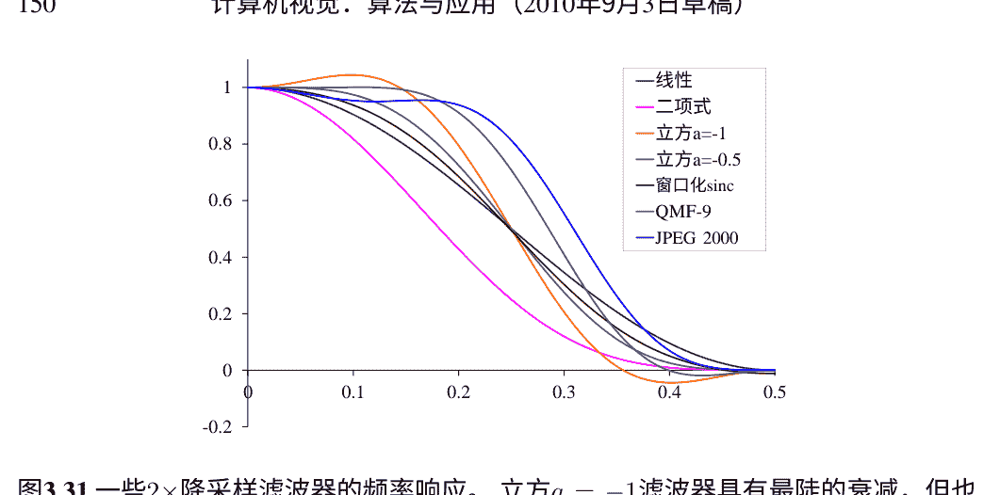

+   - 余弦窗口化sinc函数（表3.2）；
- Simoncelli和Adelson（1990b）的QMF-9滤波器用于小波去噪和存在一定程度的混叠（注意，原始滤波器系数已经归一化√2增益以便可以“自反转”）
- 来自JPEG 2000的9/7分析滤波器（Taubman和Marcellin 2002）

有关某些这些系数的完整精度值，请参阅原始论文。

#### 3.5.3 多分辨率表示

现在我们已经描述了插值和抽取算法，我们可以构建一个完整的图像金字塔（图3.32）。正如我们之前提到的，金字塔可以用于加速粗到细的搜索算法，以在不同尺度上查找对象或模式，并执行多分辨率混合操作。它们还广泛用于计算机图形硬件和软件中，使用MIP-map进行分数级别的抽取，我们在第3.6节中介绍。

在计算机视觉中，最著名（也可能是最广泛使用）的金字塔是Burt和Adelson的（1983a）拉普拉斯金字塔。为了构建金字塔，我们首先对原始图像进行模糊处理和下采样，缩小两倍，并将其存储在金字塔的下一层中（图3.33）。由于金字塔中相邻的层之间的采样率为r=2，这种金字塔被称为八度金字塔。Burt和Adelson最初提出了一个

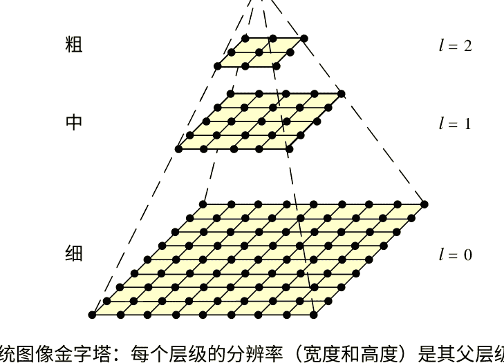

图3.32 传统图像金字塔：每个层级的分辨率（宽度和高度）是其父层级的四分之一。

形式为的五点核

| c | b | a | b | c | (3.82) |

在实践中，a=3/8，这导致了熟悉的二项式核。

| 1/16 | 1 | 4 | 6 | 4 | 1 | (3.83) |

使用移位和加法实现起来特别容易。（这在乘法器昂贵的时代非常重要。）他们之所以将他们的结果金字塔称为高斯金字塔，是因为重复卷积的二项式核收敛到高斯核。¹⁶为了计算拉普拉斯金字塔，伯特和阿德尔森首先对低分辨率图像进行插值，以获得原始图像的重建低通版本（图3.34b）。然后，他们从原始图像中减去这个低通版本，得到带通的“拉普拉斯”图像，可以存储以供进一步处理。结果金字塔具有完美的重建能力，即拉普拉斯图像加上基准高斯图像（图3.34b中的L₂）足以精确重建原始图像。图3.33以信号处理图的形式展示了一维情况下的相同计算，完全捕捉了分析和重合成阶段的计算过程。

Burt和Adelson还描述了拉普拉斯金字塔的一个变体，其中低通图像是从原始模糊图像中获取的，而不是从重建的金字塔中获取（直接将L盒的输出导入到图3.34b中的减法运算中）。这个变体具有更少的

> ¹⁶然而，对于任何平滑核来说，这也是正确的（Wells 1986）。

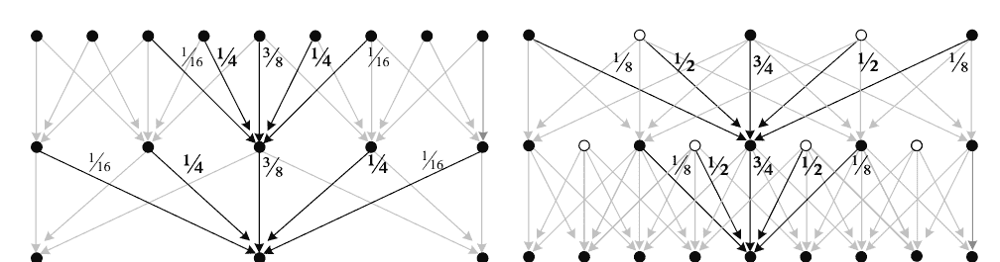

图3.33 高斯金字塔显示为信号处理图表：（a）分析和（b）重合成阶段显示为使用类似计算的阶段。白色圆圈表示通过↑2上采样操作插入的零值。请注意，重建滤波器系数是分析系数的两倍。计算被显示为沿着页面向下流动，无论我们是从粗到细还是从细到粗。

混叠，因为它避免了一次下采样和上采样的往返，但它不是自我反转的，因为拉普拉斯图像不再足以重现原始图像。

与高斯金字塔一样，拉普拉斯金字塔这个术语有点不准确，因为它们的带通图像实际上是（近似）高斯函数的差异，或者说是DoGs，

```
DoG{I; σ1, σ2} = G_{σ1} * I - G_{σ2} * I = (G_{σ1} - G_{σ2}) * I.    (3.84)
```

高斯拉普拉斯（我们在（3.26）中看到的）实际上是它的二阶导数，

```
LoG{I; σ} = ∇^2(G_{σ} * I) = (∇^2 G_{σ}) * I.    (3.85)
```

其中

```
∇^2 = ∂^2/∂x^2 + ∂^2/∂y^2    (3.86)
```

是一个函数的拉普拉斯（算子）。图3.35展示了高斯差分和高斯拉普拉斯在空间和频率上的样子。

高斯拉普拉斯算子具有优雅的数学特性，在尺度空间社区（Witkin 1983; Witkin, Terzopoulos, and Kass 1986; Lindeberg 1990; Nielsen, Florack, and Deriche 1997）中得到广泛研究，并可用于各种应用，包括边缘检测（Marr and Hildreth 1980; Perona and Malik 1990b）、立体匹配（Witkin, Terzopoulos, and Kass 1987）和图像增强（Nielsen, Florack, and Deriche 1997）。

一种较少使用的变体是半八度金字塔，如图3.36a所示。这些最初由Crowley和Stern（1984）引入到视觉社区，他们称之为低通差分（DOLP）变换。由于相邻图像之间的小尺度变化,

### 3.5 金字塔和小波

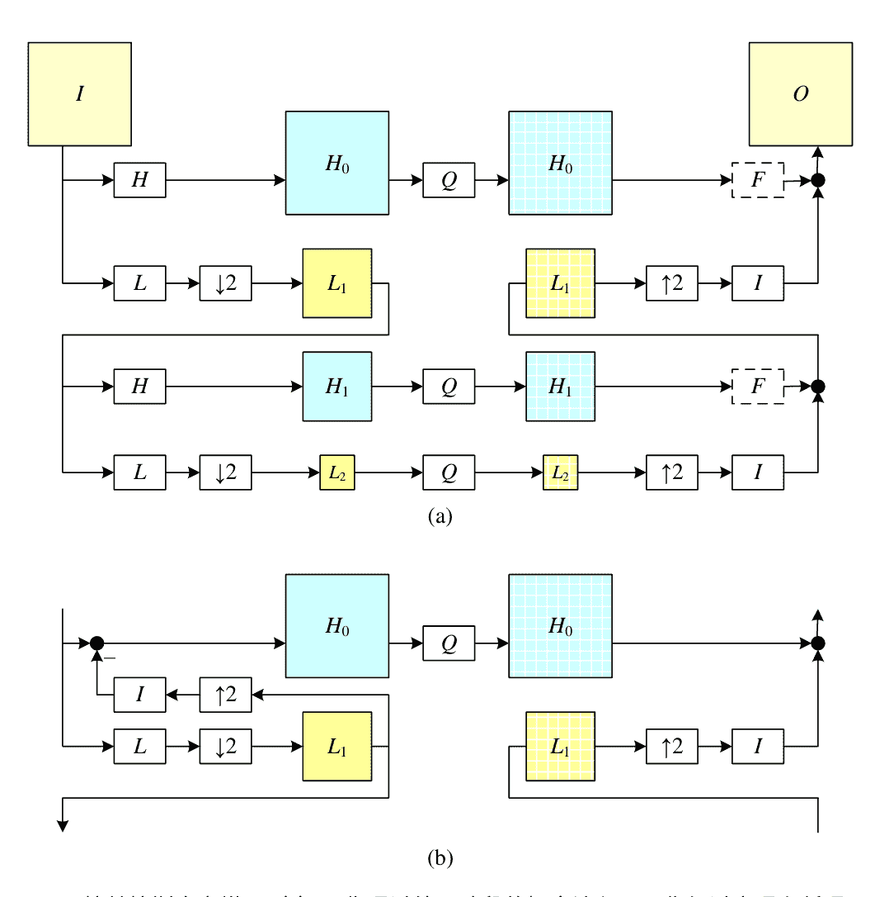

图3.34 拉普拉斯金字塔：(a) 图像通过处理阶段的概念流程：图像经过高通和低通滤波，低通滤波后的图像在金字塔的下一个阶段进行处理。在重建过程中，插值图像和（可选的滤波）高通图像被加在一起。Q盒表示量化或其他金字塔处理，例如通过得分来去除噪声（将小小的小波值设为0）。 (b) 高通滤波器的实际计算涉及首先插值下采样的低通图像，然后减去它。当Q是单位矩阵时，可以实现完美重建。高通（或带通）图像通常称为拉普拉斯图像，而低通图像称为高斯图像。

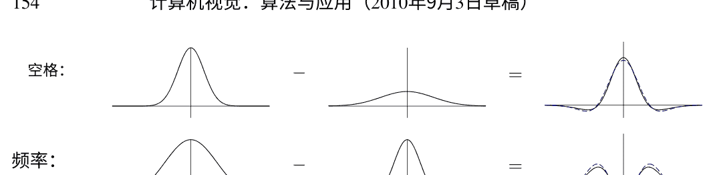

图3.35 两个低通滤波器的差异结果是一个带通滤波器。虚线蓝线显示了与半个八度高斯拉普拉斯曲线的紧密拟合。

在不同的级别上，作者声称粗到细的算法表现更好。在图像处理社区中，半个八度金字塔结合棋盘格采样网格被称为交错采样（Feilner, Van De Ville和Unser 2005）。在检测多尺度特征（第4.1.1节）中，通常常用半个八度甚至四分之一八度金字塔（Lowe 2004; Triggs 2004）。然而，在这种情况下，子采样仅在每个八度级别发生，即图像被重复使用更宽的高斯模糊，直到达到完整的八度分辨率变化（图4.11）。

#### 3.5.4 小波

尽管金字塔在计算机视觉应用中被广泛使用，但有些人使用小波分解作为替代方法。小波是一种在空间和频率上定位信号的滤波器（就像表3.2中的Gabor滤波器），并且在一系列尺度上定义。

小波提供了一种平滑地将信号分解为频率分量的方法，而不会产生阻塞，并且与金字塔密切相关。

小波最初是在应用数学和信号处理社区中开发的，并由Mallat（1989年）引入到计算机视觉社区。Strang（1989年）；Simoncelli和Adelson（1990b）；Riou和Vetterli（1991）；Chui（1992）；Meyer（1993）都提供了关于该主题的良好介绍和历史回顾，而Chui（1992）则提供了更全面的评论和应用调查。Sweldens（1997年）描述了我们不久将讨论的更近期的提升方法。

小波在计算机图形学界被广泛应用于多分辨率几何处理（Stollnitz, DeRose和Salesin 1996），在计算机视觉中也被用于类似的应用（Szeliski 1990b; Pentland 1994; Gortler和Cohen 1995; Yaou和Chang 1994; Lai和Vemuri 1997; Szeliski 2006b），以及多尺度方向滤波（Simoncelli, Freeman, Adelson et al. 1992）和去噪（Portilla, Strela,

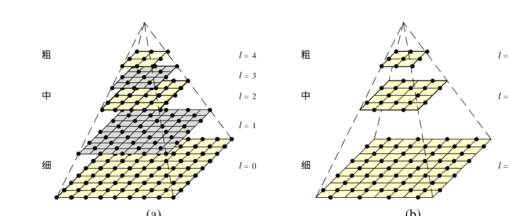

> Wainwright等2003年）。

由于图像金字塔和小波分解都将图像分解为在空间和频率上都局部化的多分辨率描述，它们有何不同？通常的答案是传统金字塔是过完备的，即它们使用比原始图像更多的像素来表示分解，而小波提供了一个紧框架，即它们保持分解的大小与图像相同（图3.36b）。然而，一些小波族实际上是过完备的，以提供更好的可移动性或方向控制（Simoncelli, Freeman, Adelson等，1992年）。因此，更好的区别可能是小波比常规带通金字塔更具方向选择性。

二维小波如何构建？图3.37a显示了（递归）粗到细构造（分析）流水线的一个阶段的高级图示，以及互补的重构（合成）阶段。在这个图示中，高通滤波器后的抽取保留了原始像素的3/4，而低频系数的1/4传递给下一个阶段进行进一步分析。实际上，滤波通常被分解为两个可分离的子阶段，如图3.37b所示。结果得到的三个小波图像有时被称为高-高（HH），高-低（HL）和低-高（LH）图像。高低和低高图像突出水平和垂直边缘和梯度，而高高图像包含出现较少的混合导数。

高通滤波器 H 和低通滤波器 L 如何选择，并且如何计算相应的重建滤波器 I 和 F ？可以设计滤波器吗？

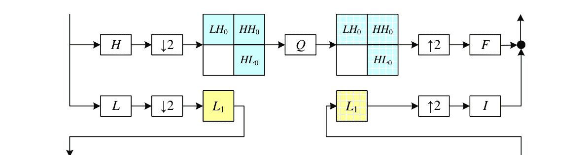

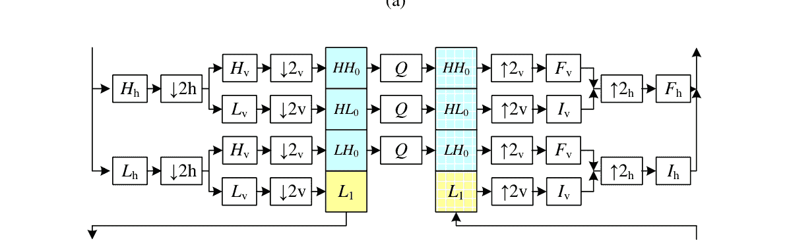

图3.37 二维小波分解：(a) 高级图表显示低通和高通变换为单个框; (b) 可分离实现，首先水平执行小波变换，然后垂直执行。重建图像所需的插值和滤波框 I 和 F。

它们都具有有限冲激响应吗？这个主题在小波领域已经研究了二十多年。答案在很大程度上取决于预期的应用，例如，小波是否用于压缩、图像分析（特征提取）或去噪。Simoncelli和Adelson（1990b）在表4.1中展示了一些好的奇数长度的正交镜像滤波器（QMF）系数，在实践中似乎效果很好。

由于小波滤波器的设计是一门棘手的艺术，也许有更好的方法吗？事实上，一个更简单的方法是将信号分解为偶数和奇数分量，然后对每个序列进行可逆滤波操作，以产生所谓的提升小波（图3.38和3.39）。Sweldens（1996）对第二代小波的提升方案进行了非常易懂的介绍，随后进行了全面的回顾（Sweldens 1997）。

如图3.38所示，与其先对整个输入序列（图像）进行滤波处理

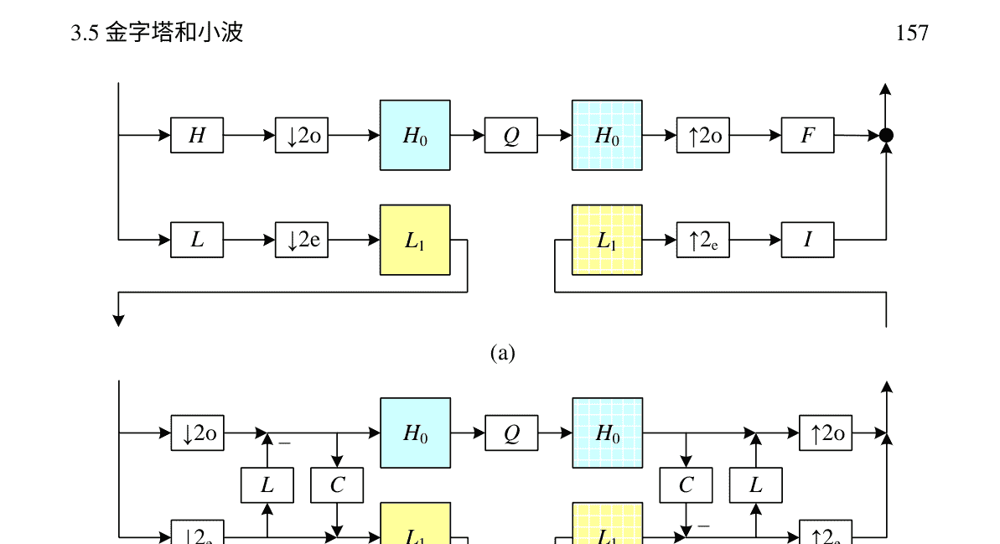

通过高通和低通滤波器并保留奇数和偶数子序列，提升方案首先将序列分成其偶数和奇数子分量。使用低通滤波器 L 对偶数序列进行滤波并从偶数序列中减去结果是可以逆转的：只需执行相同的滤波然后将结果加回去即可。此外，这个操作可以原地执行，从而节省了大量的空间。

同样适用于使用校正滤波器 C 对偶数序列进行滤波，以确保偶数序列为低通。可以使用一系列这样的提升步骤来创建具有低计算成本和可逆性的更复杂的滤波器响应。

通过考虑图3.39中的信号处理图，可以更容易地理解这个过程。在分析过程中，从偶数值中减去平均值，得到高通小波系数。然而，偶数样本仍然包含低频信号的混叠样本。为了补偿这一点，将一小部分高通小波添加回偶数序列中，以使其正确地进行低通滤波。

（很容易证明，有效的低通滤波器为 [-1/8, 1/4, 3/4, 1/4, -1/8]，这是-

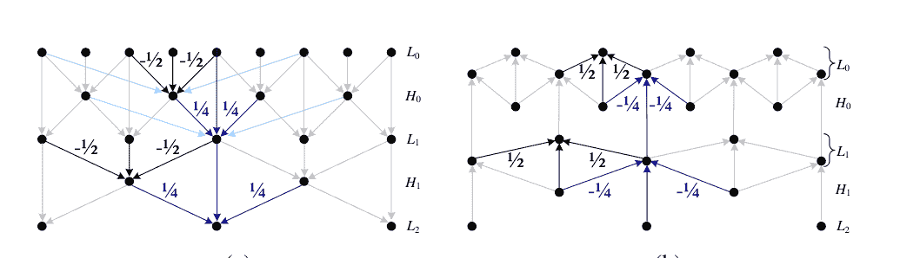

在合成过程中，通过改变符号，可以将相同的操作反转。

当然，我们不必局限于两个点的滤波器。图3.39显示了作为轻蓝色箭头的额外滤波器系数，可以选择性地添加到提升方案中，而不影响其可逆性。实际上，低通和高通滤波操作可以互换，例如，我们可以先在奇数序列（加上中心值）上使用一个五点立方低通滤波器，然后使用一个四点立方低通预测器来估计小波，尽管我没有见过这个方案的书面记录。

被称为抬升小波的原因是它们可以轻松适应非规则采样拓扑结构，例如在计算机图形应用中出现的多分辨率表面操作（Schröder和Sweldens 1995）。事实证明，被称为抬升加权小波的小波，即其系数适应正在解决的基础问题（Fattal 2009），对于低级图像处理任务和在我们在第3.7节中讨论的基于优化的视觉算法中出现的稀疏线性系统的预处理非常有效（Szeliski 2006b）。

与广泛使用的“可分离”小波构造方法相比，该方法将每个级别分解为水平、垂直和“交叉”子带，使用更具旋转对称性和方向选择性的表示方法，并避免了采样信号在其奈奎斯特频率以下的混叠现象。<sup>17</sup>Simoncelli, Freeman, Adelson et al. (1992) 介绍了这样一种表示方法，他们称之为pyramidal radial frequency

> 17这种别名现象通常可以看作是信号内容在原始信号缓慢移动时在频带之间移动。

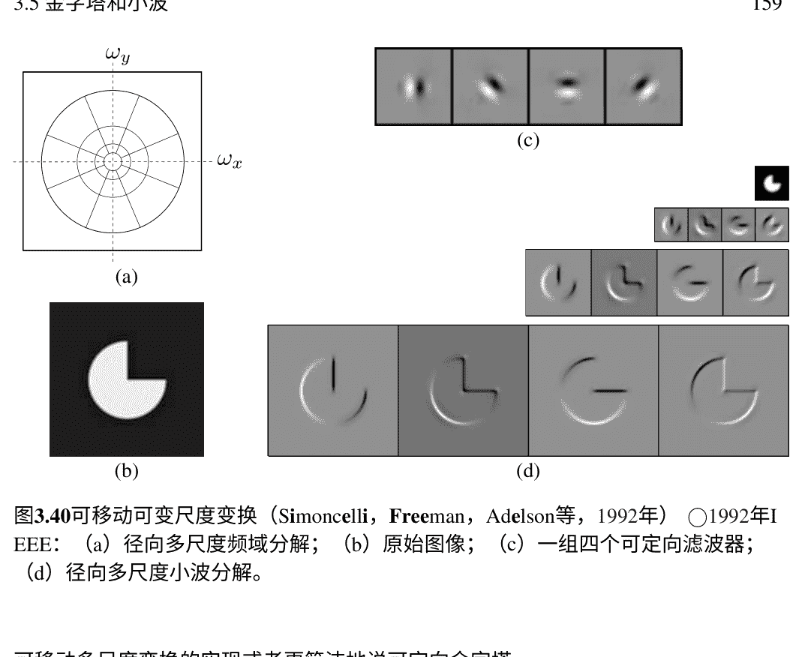

图3.40 可移动可变尺度变换（Simoncelli，Freeman，Adelson等，1992年）○1992年IEEE：（a）径向多尺度频域分解；（b）原始图像；（c）一组四个可定向滤波器；（d）径向多尺度小波分解。

可移动多尺度变换的实现或者更简洁地说可定向金字塔。它们的表示不仅是过完备的（消除了别名问题），而且还具有方向选择性，并且具有相同的分析和合成基函数，即它是自反的，就像“常规”小波一样。因此，这使得可定向金字塔在计算机视觉中常用的结构分析和匹配任务中成为更有用的基础。

图3.40a展示了这种分解在频率空间中的样子。不再递归地将频域划分为2×2的方块，这样会产生棋盘状的高频率，而是改用径向弧线。图3.40b展示了得到的金字塔子带。尽管表示是过完备的，即小波系数比输入像素多，但附加的频率和方向选择性使得这种表示在纹理分析和合成（Portilla和Simoncelli 2000）以及图像去噪（Portilla，Strela，Wainwright等人2003；Lyu和Simoncelli 2009）等任务中更可取。

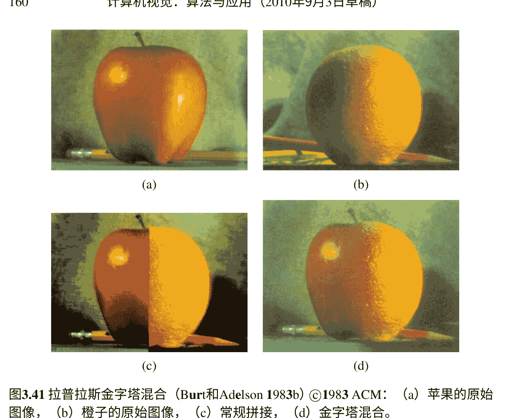

图3.41 拉普拉斯金字塔混合（Burt和Adelson 1983b）©1983 ACM：（a）苹果的原始图像，（b）橙子的原始图像，（c）常规拼接，（d）金字塔混合。

## 3.5.5 应用程序 ：图像融合

在第3.5.3节中，拉普拉斯金字塔最有趣和吸引人的应用之一是创建混合复合图像，如图3.41所示（Burt和Adelson 1983b）。将苹果和橙子图像沿中线拼接在一起会产生明显的切割，而将它们拼接在一起（正如Burt和Adelson（1983b）所称的过程）会产生一个真正混合水果的美丽幻觉。他们方法的关键在于将红苹果和橙子之间的低频颜色变化平滑混合，而每个水果上的高频纹理则更快地混合以避免两个纹理叠加时产生的“幽灵”效果。

为了创建混合图像，首先将每个源图像分解为自己的拉普拉斯金字塔（图3.42，左列和中列）。然后，将每个频带乘以一个平滑的加权函数，其范围与金字塔级别成比例。创建这些权重的最简单和最通用的方法是使用二进制掩模图像（图3.43c）构建一个高斯金字塔。然后，对每个拉普拉斯金字塔图像进行

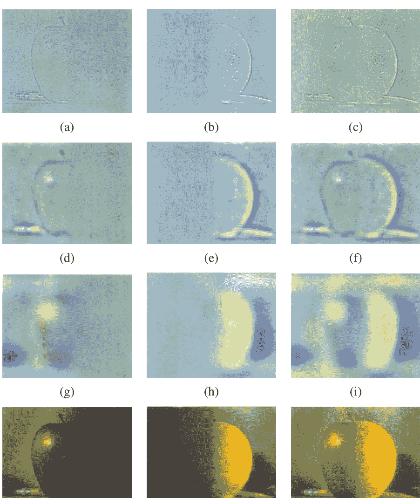

图3.42 拉普拉斯金字塔混合细节（Burt和Adelson 1983b）©1983 ACM。前三行显示了拉普拉斯金字塔的高频、中频和低频部分（取自0级、2级和4级）。左列和中列显示了原始苹果和橙子图像加权插值函数的结果，而右列显示了平均贡献。


图3.43 任意形状的两个图像的拉普拉斯金字塔混合（Burt和Adelson1983b） ©1983 ACM： (a) 第一个输入图像；(b) 第二个输入图像；(c) 区域掩码；(d) 混合图像。

乘以相应的高斯掩码，然后将这两个加权金字塔的和用于构建最终图像（图3.42，右列）。

图3.43显示了这个过程可以应用于任意的掩模图像，并产生令人惊讶的结果。将金字塔混合扩展到任意数量的图像也很简单，这些图像的像素来源由整数值标签图像指示（参见练习3.20）。这在图像拼接和合成应用中特别有用，其中不同图像之间的曝光可能会有所不同，如第9.3.4节所述。

### 3.6 几何变换

在前面的章节中，我们看到了如何使用插值和抽样来改变图像的分辨率。在本节中，我们将介绍如何执行更一般的变换，如图像旋转或一般的扭曲。与我们在第3.1节中看到的点过程不同，在那里应用于图像的函数转换了图像的范围，

```
$$g(x) = h(f(x)),$$
```

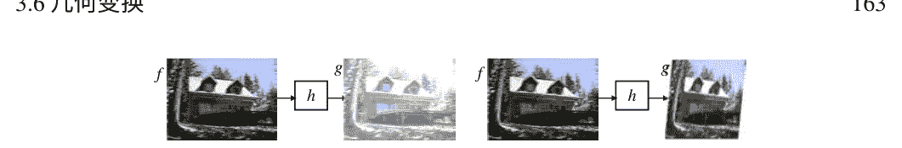

图3.44 图像扭曲涉及修改图像函数的定义域，而不是其值域。

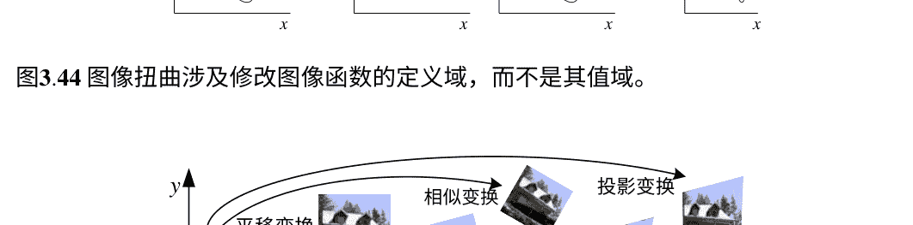

图3.45 2D几何图像变换的基本集合。

在这里，我们看一下将域转换的函数，$g(x) = f(h(x))$ (3.88) （见图3.44）。

我们首先研究全局参数化的2D变换，该变换首次在第2.1.2节中引入。（这种变换被称为参数化，因为它由少量参数控制。）然后，我们将注意力转向更局部的一般变形，例如那些在网格上定义的变形（第3.6.2节）。最后，我们展示了如何将图像扭曲与交叉溶解相结合，以在第3.6.3节中创建有趣的变形（中间动画）。对于对这些主题更详细了解的读者，Heckbert（1986）的调查报告非常出色，Wolberg（1990）、Gomes、Darsa、Costa等人（1999）和Akenine-Möller和Haines（2002）的教材也非常易于理解。请注意，Heckbert的调查报告是关于纹理映射的，这是计算机图形学界对图像扭曲主题的称呼。

#### 3.6.1 参数化变换

参数化变换对图像应用全局变形，变换的行为由少量参数控制。图3.45展示了一些例子| 变换 | 矩阵 | 自由度保持 | 图标 |
|------|------|------------|------|
| 平移变换 | [ I | t ]_{2×3} | 2 方向 | □ |
| 刚性（欧几里得） | [ R | t ]_{2×3} | 3 长度 | ◇ |
| 相似变换 | [ sR | t ]_{2×3} | 4 角度 | ◇ |
| 仿射 | [ A ]_{2×3} | 6 平行性 | ▱ |
| 投影变换 | [ H ]_{3×3} | 8 直线 | ∟ |

表3.5 2D坐标变换的层次结构。每个变换还保留了下面行中列出的属性，即相似性不仅保留了角度，还保留了平行性和直线性。2×3矩阵通过添加第三行 [0^T 1] 来扩展为完整的 3×3 齐次坐标变换矩阵。

这些变换的示例基于图2.4中显示的2D几何变换，在表2.1中最初给出了这些变换的公式，并在此处以表3.5的形式重现以便参考。

一般来说，给定一个由公式 x' = h(x) 指定的变换和一个源图像 f(x)，我们如何计算新图像中像素的值 g(x)，如式(3.88)所示？在继续之前，请花一分钟思考一下，看看你能不能弄明白。如果你和大多数人一样，你会想出一个类似于算法3.1的算法。这个过程被称为前向映射或正向映射，如图3.46a所示。你能想到这种方法存在哪些问题吗？

```
过程 forwardWarp(f, h, out g):
    对于每个像素 x 在 f(x)
    1. 计算目标位置 x' = h(x)。
    2. 将像素 f(x) 复制到 g(x')。
```

算法3.1 前向映射算法，用于通过参数化变换将图像 f(x) 转换为图像 g(x')，其中 x' = h(x)。

事实上，这种方法存在一些限制。复制像素的过程 f(x) 到位置 x' in g 时，当 x' 具有非整数值时，定义不清楚。在这种情况下我们该怎么办？你会怎么做？你可以将 x' 的值四舍五入为最近的整数坐标，并将像素复制到那里，但是结果图像会有严重的混叠现象，并且在动画变换时像素会跳动很多。你还可以以加权（双线性）的方式将该值分配给其四个最近邻居，跟踪每个像素的权重并在最后进行归一化。这种技术被称为“splatting”，有时在图形学界用于体积渲染（Levoy和Whitted 1985; Levoy 1988; Westover 1989; Rusinkiewicz和Levoy 2000）。不幸的是，它既存在适度的混叠现象，又存在相当多的模糊（失去高分辨率细节）。

前向映射的第二个主要问题是在放大图像时出现裂缝和孔洞，尤其是当放大图像时。用附近的邻居填充这些孔洞可能会导致进一步的混叠和模糊。

那么我们应该怎么办呢？一个更好的解决方案是使用逆向映射（算法3.2），其中目标图像中的每个像素 g(x') 从原始图像 f(x) 中采样（图3.47）。这与前向映射算法有什么不同？首先，由于 g(x') 中的每个像素 g(x')（可能）都有定义，我们不再有孔洞。更重要的是，对非整数位置进行图像重采样是一个经过充分研究的问题（一般图像插值，参见第3.5.2节），可以使用控制混叠的高质量滤波器。函数 ĥ(x') 从哪里来？通常情况下，它可以简单地计算为 h(x) 的反函数。实际上，表3.5中列出的所有参数化变换都有闭合形式的逆变换解：只需取指定变换的 3 × 3 矩阵的逆。

在其他情况下，更倾向于将图像变形问题表述为从目标像素 x' 到源像素 x 的重采样问题，给定映射 x = ĥ( x')。例如，在光流（第8.4节）中，我们估计光流场为

```
过程 inverseWarp(f, h, out g):
对于每个像素 x' 在 g(x') 中
1. 计算源位置 x = ĥ(x')
2. 在位置x处对 f(x) 进行重采样，并复制到 g(x') 中
```

算法3.2 逆变形算法，用于根据参数化变换 x' = h(x) 从图像 f(x) 创建图像 g(x')。

图3.47 反向变形算法：(a) 从对应位置采样像素 g(x'); (b) 源像素和目标像素位置的细节。

当前像素的流被估计时，计算产生该像素的源像素的位置，而不是计算它要去的目标像素。同样，在校正径向畸变时（第2.1.6节），我们通过计算最终（无畸变）图像中每个像素在原始（畸变）图像中的对应位置来校准镜头。

哪种插值滤波器适用于重采样过程？我们在第3.5.2节中学习的任何滤波器都可以使用，包括最近邻插值、双线性插值、双三次插值和窗函数。虽然双线性插值通常用于速度较快的情况（例如，在补丁跟踪算法的内部循环中，参见第8.1.3节），但在视觉质量重要的情况下，双三次插值和窗函数更可取。

要计算在非整数位置 x 处的 f(x) 的值，我们只需应用我们通常的FIR重采样滤波器，

$$g(x, y) = \sum_{k,l} f(k, l) h(x - k, y - l), (3.89)$$

其中 (x, y) 是亚像素坐标值，h(x, y) 是一些插值或平滑核函数。回顾第3.5.2节，当执行抽取操作时，平滑核函数会根据下采样率 r 进行拉伸和重新缩放。

不幸的是，对于一般的（非缩放）图像变换，重采样率 r 并不明确定义。考虑一个将 x 维度拉伸而压缩 y 维度。重采样核应该在 x 维度上执行常规插值，在 y 维度上进行平滑处理（以抗锯齿模糊图像）。对于一般的仿射或透视变换，情况变得更加复杂。

我们能做什么？幸运的是，傅里叶分析可以提供帮助。表3.1中给出的一维域缩放定律的二维推广是

$$g(\boldsymbol{A} \boldsymbol{x}) \Leftrightarrow |\boldsymbol{A}|^{-1} G(\boldsymbol{A}^{-T} \boldsymbol{f}). (3.90)$$

对于表3.5中的所有变换，除了透视变换，矩阵 $\boldsymbol{A}$ 已经定义好了。对于透视变换，矩阵 $\boldsymbol{A}$ 是透视变换的线性化导数（图3.48a），即投影引起的局部仿射近似（Heckbert 1986; Wolberg 1990; Gomes, Darsa, Costa等1999; Akenine-Möller和Haines 2002）。

图3.48 各向异性纹理滤波：（a）变换的雅可比矩阵 A 及其引起的水平和垂直重采样率 {a_{x'x}, a_{x'y}, a_{y'x}, a_{y'y}}；（b）EWA平滑核的椭圆足迹；（c）沿主轴使用多个样本的各向异性滤波。图像像素位于线交点处。

为了防止混叠，我们需要使用一个滤波器对图像 $f(\boldsymbol{x})$ 进行预滤波，其频率响应是通过 $\boldsymbol{A}^{-T}$ 变换得到的最终期望频谱的投影（Szeliski, Winder和Uyttendaele 2010）。一般来说（对于非缩放变换），这个滤波器是非可分离的，因此计算速度非常慢。因此，在实践中使用了许多对这个滤波器的近似方法，包括MIP映射、椭圆加权高斯平均和各向异性滤波（Akenine-Möller和Haines 2002）。

### MIP映射

MIP映射最早由Williams（1983年）提出，作为在计算机图形学中用于纹理映射的图像的快速预过滤方法。MIP映射是一种标准图像金字塔 (图3.32) 是一种MIP映射，每个级别都使用高质量的滤波器进行预过滤，而不是使用较差的近似方法，例如Burt和Adelson (1983b) 的五点二项式。要从MIP映射中重新采样图像，首先计算出重采样率的标量估计 r。例如，r 可以是 A 中绝对值的最大值 (抑制混叠) 或最小值 (减少模糊)。Akenine-Möller和Haines (2002) 更详细地讨论了这些问题。

一旦指定了重采样率，就可以使用基于2的对数计算出一个分数金字塔级别,

$$l = \log_2 r (3.91)$$

一个简单的解决方案是从更高或更低的金字塔级别重新采样纹理，具体取决于更倾向于减少混叠还是模糊。更好的解决方案是重新采样两个图像，并使用 l 的分数部分进行线性混合。由于大多数MIP-map实现在每个级别内使用双线性重采样，因此通常称为三线性MIP-map。计算机图形渲染API (如OpenGL和Direct3D) 具有可以用于选择使用哪种MIP-map变体 (以及采样率 r 计算的哪种变体) 的参数，具体取决于所需的速度和质量之间的权衡。练习3.22要求您更详细地研究其中一些权衡。

### 椭圆加权平均

椭圆加权平均 (EWA) 滤波器由Greene和Heckbert (1986) 发明，基于以下观察结果：仿射映射 x = A x' 在每个源像素 x (图3.48a) 附近定义了一个倾斜的二维坐标系。对于每个目标像素 x'，计算了 x' 在 x 上的椭圆投影的小像素网格 (图3.48b)。然后，使用一个协方差矩阵为该椭圆的高斯函数来对源图像 g(x)进行滤波。

尽管椭圆加权平均被认为是一种高质量的滤波器 (Akenine-Möller和Haines 2002)，但我们在我们的工作中 (Szeliski, Winder和Uyttendaele 2010) 发现，由于使用了高斯核，该技术同时受到模糊和混叠的影响，与高质量的滤波器相比。椭圆加权平均也非常慢，尽管基于MIP映射的更快的变种已经被提出 (Szeliski, Winder和Uyttendaele (2010) 提供了一些额外的参考文献)。

### 各向异性滤波

另一种处理方向纹理的方法是使用各向异性滤波 (Barkans 1997; Akenine-Möller and Haines 2002)，有时会在图形硬件 (GPU) 中实现。在这种方法中，不同分辨率 (MIP-map中的分数级别) 上的几个样本沿着EWA高斯的主轴进行组合 (图3.48c)。

### 3.6 几何变换

### 多通道变换

在没有过度模糊或混叠的情况下，对图像进行变形的最佳方法是在每个像素处使用理想低通滤波器对源图像进行自适应预过滤，即使用定向倾斜的sinc函数或低阶（例如，三次）逼近（图3.48a）。图3.49展示了这在一维中的工作原理。信号首先（理论上）被插值为连续的波形，（理想地）低通滤波到新的奈奎斯特率以下，然后重新采样到最终所需的分辨率。在实践中，插值和抽取步骤被连接成一个单一的多相数字滤波操作（Szeliski, Winder和Uyttendaele 2010）。

对于参数化变换，可以使用一系列一维重采样和剪切变换（Catmull和Smith 1980; Heckbert 1989; Wolberg 1990; Gomes, Darsa, Costa et al. 1999; Szeliski, Winder和Uyttendaele 2010）来近似定向的二维滤波和重采样操作。使用一系列一维变换的优点是它们比大型的非可分离的二维滤波器核心更高效（从基本算术运算的角度来看）。

为了防止混叠，可能需要在应用剪切变换之前在相反方向上采样（Szeliski, Winder和Uyttendaele 2010）。

图3.50显示了旋转过程，其中在水平剪切（和上采样）阶段之前添加了垂直上采样阶段。上部图像显示了字母旋转的外观，而下部图像显示了其相应的傅里叶变换。

图3.50 四次旋转（Szeliski, Winder和Uyttendaele 2010）：（a）原始像素网格，图像及其傅里叶变换；（b）垂直上采样；（c）水平剪切和上采样；（d）垂直剪切和下采样；（e）水平下采样。一般仿射情况看起来类似，只是前两个阶段执行一般重采样。

#### 3.6.2 基于网格的变形

虽然由少量全局参数指定的参数化变换有许多用途，但通常需要具有更多自由度的局部变形。

例如，考虑将面部的表情从皱眉变为微笑（图3.51a）。在这种情况下，需要将嘴角向上弯曲，同时保持面部的其余部分不变。为了执行这样的变换，需要在图像的不同部分使用不同程度的运动。图3.51显示了一些常用的方法。

第一种方法，如图3.51a-b所示，是制定一组稀疏的对应点。然后可以使用各种技术（Nielson 1993）将这些点的位移插值为密集的位移场（第8章）。一种可能性是在一幅图像中对点集进行三角剖分（de Berg, Cheong, van Kreveld等，2006；Litwinowicz和Williams，1994；Buck, Finkelstein, Jacobs等，2000），并在每个三角形内使用由三个三角形顶点指定的仿射运动模型（表3.5）。如果目标根据新的顶点位置对图像进行三角剖分，可以使用逆变形算法 (图3.47)。如果源图像被三角剖分并用作纹理映射，计算机图形渲染算法可以用来绘制新图像 (但在三角形边缘处需要注意避免潜在的混叠现象)。

图3.51 图像变形的替代方法 (Gomes, Darsa, Costa等1999年) ©1999 MorganKaufmann: (a) 稀疏控制点 → 变形网格; (b) 更密集的控制点对应; (c) 定向线对应; (d) 均匀四边形网格。

插值稀疏位移的替代方法包括移动附近的四边形网格顶点，如图3.51a所示，使用正则化 (Litwinowicz和Williams 1994) 等变分 (能量最小化) 插值器，参见第3.7.1节，或使用局部加权 (径向基函数) 组合位移 (Nielson 1993)。有关其他散乱数据插值技术，请参见 (第12.3.1节)。如果使用四边形网格，则可能希望使用平滑插值器 (如二次B样条) 将位移插值到单个像素值 (Farin 1996; Lee, Wolberg, Chwa等1996)。

在某些情况下，例如，如果为图像估计了密集的深度图 (Shade, Gortler, He等1998)，我们只知道每个像素的正向位移。如前所述，将源像素绘制到其目标位置，即正向扭曲 (图3.46)，存在一些潜在问题，包括混叠和出现小裂缝。在这种情况下，一种替代技术是将位移场 (或深度图) 向前扭曲将其移动到新位置，填补结果地图中的小孔，然后使用逆变形进行重采样（Shade，Gortler，He et al.1998）。这通常比正向变形效果更好的原因是位移场往往比图像平滑得多，因此在位移场的正向变形中引入的混叠效应要小得多。

用于局部变形的指定位移的第二种方法是使用相应的定向线段（Beier和Neely 1992），如图3.51c和3.52所示。沿着每个线段的像素按照指定的方式从源到目标进行转移，其他像素使用这些位移的平滑插值进行变形。每个线段对应指定了平移、旋转和缩放，即相似变换（表3.5），对其附近的像素产生影响，如图3.52a所示。线段通过依赖于到线段的最小距离的加权函数来影响图像的整体位移（如果u∈[0,1]，则为v在图3.52a中的值，否则为到P和Q的两个距离中较短的距离）。

对于每个像素X，计算每个线段对应的目标位置X′，该位置的权重取决于距离和线段长度（图3.52b）。所有目标位置X′_i的加权平均值成为最终的目标位置。请注意，虽然Beier和Neely将该算法描述为正向变形，但是可以通过遍历目标像素来编写等效的算法。由于线段长度或到线段的距离可能不同，因此得到的变形不完全相同。练习3.23要求你实现Beier-Neely（基于线段）变形，并将其与其他许多局部变形方法进行比较。

创建图像变形的另一种指定对应关系的方法是使用蛇（第5.1.1节）结合B样条（Lee，Wolberg，Chwa等，1996年）。这种技术在苹果的Shake软件中使用，并在医学成像界很受欢迎。

图3.53 图像变形 (Gomes, Darsa, Costa等, 1999年) ©1999 Morgan Kaufmann。顶行：如果两个图像只是混合在一起，会产生可见的幽灵效果。底行：首先将两个图像都变形到相同的中间位置（例如，向另一个图像的一半位置）然后将结果变形的图像混合在一起，从而实现无缝融合。

指定位移场的最后一种可能性是使用针对底层图像内容特定调整的网格，如图3.51d所示。手动指定这样的网格可能需要相当多的工作；Gomes, Darsa, Costa等（1999年）描述了一个交互式系统来完成这个任务。一旦两个网格被指定，就可以使用线性插值生成中间变形，并且可以使用样条插值来插值网格节点处的位移。

### 3.6.3 应用程序 ：基于特征的变形

虽然变形可以用来改变或者动画化单个图像的外观，但是通过变形和混合两个或多个图像可以获得更强大的效果，这个过程现在通常被称为变形 (Beier和Neely 1992; Lee，Wolberg, Chwa et al.1996; Gomes, Darsa, Costa et al.1999)。

图3.53展示了图像变形的本质。在两个图像之间简单地交叉混合会导致幽灵效果，如顶部行所示，而在混合之前，每个图像都会朝着另一个图像进行变形，如底部行所示。如果对应关系设置得好（使用图3.51中显示的任何技术），相应的特征将对齐，不会产生幽灵效果。

在生成过程中，对于每个中间帧，重复上述过程使用不同的混合（和变形量）在每个间隔上。让 t ∈ [0,1] 是描述插值帧序列的时间参数。混合中两个变形图像的加权函数为 (1 - t)和 t。相反，图像0在时间 t 下经历的运动量是由对应关系指定的总运动量的 t。然而，在定义向目标部分变形的含义时，需要注意一些问题，特别是如果所需运动远离线性运动（Sederberg, Gao, Wang et al.1993）。练习3.25要求你实现一个变形算法，并在这些具有挑战性的条件下进行测试。

### 3.7 全局优化

到目前为止，在本章中，我们已经涵盖了大量的图像处理算子，它们以一个或多个图像作为输入，并产生这些图像的一些经过滤波或变换的版本。在许多应用中，更有用的是首先使用一些优化准则来制定所需转换的目标，然后找到或推断出最符合这个准则的解决方案。

在本节的最后一部分，我们介绍了两种不同（但密切相关）的变体。第一种方法通常被称为正则化或变分方法（第3.7.1节），它构建了一个描述解决方案所需特征的连续全局能量函数，然后使用稀疏线性系统或相关的迭代技术找到最小能量解。第二种方法使用贝叶斯统计来制定问题，对产生输入图像的噪声测量过程以及关于解空间的先验假设进行建模，这些先验假设通常使用马尔可夫随机场（第3.7.2节）进行编码。

这类问题的示例包括从散乱数据中进行表面插值（图3.54），图像去噪和恢复缺失区域（图3.57），以及将图像分割为前景和背景区域（图3.61）。

#### 3.7.1 正则化

正则化理论最初是由统计学家们开发的，他们试图将模型拟合到严重欠约束的解空间中（Tikhonov和Arsenin 1977; Engl, Hanke和Neubauer 1996）。例如，考虑找到通过（或接近）一组测量数据点的平滑曲面（图3.54）。这样的问题被描述为病态问题，因为许多可能的曲面都可以拟合这些数据。由于输入的微小变化有时会导致拟合结果的巨大变化（例如，如果我们使用多项式插值），因此这类问题通常也是病态问题。由于我们正在尝试恢复未知函数 f(x, y) 从中采样数据点 d(xi, yi) 的问题，也经常被称为## 3.7 全局优化

图3.54一个简单的表面插值问题：(a)九个高度不同的数据点散布在一个网格上；(b)二阶、可控连续性的薄板样条插值器，左边有一个撕裂，右边有一个褶皱 (Szeliski 1989) ©1989 Springer.

逆问题. 许多计算机视觉任务可以看作是逆问题，因为我们试图从有限的图像集中恢复对3D世界的完整描述。

为了量化“找到一个 smooth解”的含义，我们可以在解空间上定义一个范数。对于一维函数 \( f(x) \)，我们可以对函数的平方一阶导数进行积分，

$$
\mathcal{E}_1 = \int f_x^2(x) dx \quad (3.92)
$$

或者积分二次导数的平方，

$$
\mathcal{E}_2 = \int f_{xx}^2(x) dx. \quad (3.93)
$$

(在这里，我们使用下标表示微分。) 这样的能量度量是函数的例子，它们是将函数映射到标量值的运算符。它们也经常被称为变分方法，因为它们衡量函数的变化（非光滑性）。

在二维空间中（例如图像、流场或曲面），相应的光滑性函数是

$$
\mathcal{E}_1 = \int f_x^2(x, y) + f_y^2(x, y) dx dy = \int \|\nabla f(x, y)\|^2 dx dy \quad (3.94)
$$

和

$$
\mathcal{E}_2 = \int f_{xx}^2(x, y) + 2f_{xy}^2(x, y) + f_{yy}^2(x, y) dx dy, \quad (3.95)
$$

需要混合 \(2f_{xy}^2\) 项来使得测量具有旋转不变性 (Grimson 1983)。

一阶导数范数通常被称为薄膜，因为使用这个度量插值一组数据点会得到一个像帐篷一样的结构。（实际上，这个公式是表面积的一个小偏差近似，这也是肥皂泡所最小化的。）

二阶范数被称为薄板样条，因为它近似了薄板（如柔性钢）在小变形下的行为。两者的混合被称为受张力约束的薄板样条；其中每个导数项都乘以一个局部加权函数的版本被称为控制连续性样条（Terzopoulos 1988）。图3.54显示了一个简单的受控连续性插值器适应九个散点数据的示例。在实践中，更常见的是在图像和流场（第8.4节）中使用一阶平滑项，而在表面（第12.3.1节）中使用二阶平滑项。

除了平滑项之外，正则化还需要一个数据项（或数据惩罚）。对于散乱数据插值（Nielson 1993），数据项衡量函数 f (x, y) 和一组数据点 d_i = d (x_i, y_i) 之间的距离。

$$
\mathcal{E}_d = \sum_{i} [f (x_i, y_i) - d_i]^2. \tag{3.96}
$$

对于噪声去除这样的问题，可以使用这个度量的连续版本，

$$
\mathcal{E}_d = \int [f (x, y) - d (x, y)]^2 \,dx\,dy. \tag{3.97}
$$

为了得到一个可以最小化的全局能量，通常将这两个能量项相加，

$$
\mathcal{E} = \mathcal{E}_d + \lambda \mathcal{E}_s, \tag{3.98}
$$

其中 \(\mathcal{E}_s\) 是平滑惩罚（\(\mathcal{E}_1\)， \(\mathcal{E}_2\) 或一些加权混合）和 λ 是正则化参数，控制解决方案的平滑程度。

为了找到这个连续问题的最小值，通常首先将函数 f(x, y) 在一个规则网格上离散化。最合理的离散化方法是使用有限元分析，即用分段连续的样条函数来近似函数，然后进行解析积分（Bathe 2007）。

幸运的是，对于一阶和二阶平滑性函数，选择适当的有限元素会导致特别简单的离散形式（Terzopoulos 1983）。相应的离散平滑能量函数变为

$$
\begin{aligned} E_1 &= \sum_{i,j} s_x(i, j) [f(i+1, j) - f(i, j) - g_x(i, j)]^2 \\ &\quad + s_y(i, j) [f(i, j+1) - f(i, j) - g_y(i, j)]^2 \end{aligned} \tag{3.99}
$$

和

$$
E_2 = h^{-2} \sum_{i,j} c_x(i, j) [f(i+1, j) - 2f(i, j) + f(i-1, j)]^2 \tag{3.100}
$$

$$
+ 2c_m(i,j)[f(i+1,j+1) - f(i+1,j) - f(i,j+1) + f(i,j)]^2 \\ + c_y(i,j)[f(i,j+1) - 2f(i,j) + f(i,j-1)]^2,
$$

在这里 h是有限元网格的大小。这个 h因子只有在能量以不同的分辨率离散化时才重要，比如在粗到细或多网格技术中。

可选的平滑权重 s_x(i,j)和 s_y(i,j)控制表面中水平和垂直的撕裂（或弱点）的位置。对于其他问题，比如着色（Levin, Lischinski, and Weiss 2004）和交互式色调映射（Lischinski, Farbman, Uyttendaele et al. 2006a），它们控制插值色度或曝光场中的平滑度，并且通常与局部亮度梯度强度成反比。

对于二阶问题，折痕变量 c_x(i,j), c_m(i,j)和 c_y(i,j)控制表面上折痕的位置（Terzopoulos 1988; Szeliski 1990a）。

数据值 g_x(i,j)和 g_y(i,j)是由算法使用的梯度数据项（约束条件），例如光度立体（第12.1.1节），HDR色调映射（第10.2.1节）（Fattal, Lischinski和Werman 2002），泊松混合（第9.3.4节）（Pérez, Gangnet, 和Blake 2003），以及梯度域混合（第9.3.4节）（Levin, Zomet, Peleg et al. 2004）。当仅离散化传统的一阶平滑性函数（3.94）时，它们被设为零。

二维离散数据能量的表示形式为

$$E_d = \sum_{i,j} w(i,j)[f(i,j) - d(i,j)]^2, \quad (3.101)$$

其中局部权重 w(i,j)控制数据约束的强度。当没有数据时，这些值被设为零，并且当有数据时可以设为数据测量的逆方差（如Szeliski（1989）和第3.7.2节中所讨论的）。现在，离散问题的总能量可以写成一个二次形式。

$$E = E_d + \lambda E_s = \mathbf{x}^T \mathbf{A} \mathbf{x} - 2\mathbf{x}^T \mathbf{b} + c, \quad (3.102)$$

其中 \mathbf{x}=[f(0,0)...f(m-1,n-1)]被称为状态向量。

稀疏对称正定矩阵 \mathbf{A}被称为海森矩阵因为它编码了能量函数的二阶导数。对于一维的一阶问题，\mathbf{A}是三对角矩阵；对于二维的一阶问题，它是多带状矩阵，每行有五个非零元素。我们称 \mathbf{b}为加权数据向量。最小化上述二次形式等价于求解稀疏线性系统

$$\mathbf{A}\mathbf{x} = \mathbf{b}, \quad (3.103)$$

我们使用 \mathbf{x}而不是 \mathbf{f}因为这是数值分析文献中更常见的形式（Golub and Van Loan 1996）。在数值分析中，\mathbf{A}被称为系数矩阵（Saad 2003）；在有限元分析中（Bathe 2007），它被称为刚度矩阵。

图3.55对一阶正则化的图形模型解释。白色圆圈是未知数$f(i, j)$而黑色圆圈是输入数据$d(i, j)$。在电阻网格解释中，$d$和$f$的值编码输入和输出电压，黑色方块表示电阻，其电导率设置为$s_x(i, j)$，$s_y(i, j)$和$w(i, j)$。在弹簧质点系统类比中，圆圈表示高度，黑色方块表示弹簧。同样的图形模型可以用来描述一阶马尔可夫随机场（图3.56）。

可以使用各种稀疏矩阵技术来完成，例如多重网格（Briggs, Henson和McCormick 2000）和分层预处理器（Szeliski 2006b），如附录A.5所述。

尽管正则化最初是由Poggio, Torre和Koch（1985）和Terzopoulos（1986b）引入到视觉社区中，用于诸如表面插值等问题，但它很快被其他视觉研究人员用于边缘检测（第4.2节），光流（第8.4节）和形状恢复（第12.1节）等各种问题（Poggio, Torre, and Koch 1985; Horn and Brooks 1986; Terzopoulos 1986b; Bertero, Poggio, and Torre 1988; Brox, Bruhn, Papenberg et al. 2004）。Poggio, Torre和Koch（1985）还展示了如何在电阻网格中实现由方程（3.100-3.101）定义的离散能量，如图3.55所示。在计算摄影（第10章）中，正则化及其变体通常用于解决诸如高动态范围色调映射（Fattal, Lischinski, and Werman 2002; Lischinski, Farbman, Uyttendaele et al. 2006a），泊松和梯度域混合（Pérez, Gangnet, and Blake 2003; Levin, Zomet, Peleg et al. 2004; Agarwala, Dontcheva, Agrawala et al. 2004），上色（Levin, Lischinski, and Weiss 2004）和自然图像抠图（Levin, Lischinski, and Weiss 2008）等问题。

## 鲁棒正则化

虽然正则化通常使用二次（$L_2$）范数来表示（与（3.92-3.95）中的平方导数和（3.100-3.101）中的平方差异进行比较），但它可以

$$E_{1r} = \sum_{i,j} s_x(i,j) \rho(f(i+1,j) - f(i,j)) \\ \quad + s_y(i,j) \rho(f(i, j+1) - f(i,j)),$$

其中 \(\rho(x)\) 是某个单调递增的惩罚函数。例如，范数 \(\rho(x) = |x|^p\) 被称为 \(p\)-范数。当 \(p < 2\) 时，得到的平滑项比完全平滑更具有分段连续性，这可以更好地模拟图像、流场和3D表面的不连续性。

早期的一个鲁棒正则化的例子是由Blake和Zisserman（1987）引入的渐进非凸（GNC）算法。在这里，数据和导数的范数被限制在一个最大值内。

$$\rho(x) = \min(x^2, V).$$

由于得到的问题是高度非凸的（有很多局部最小值），提出了一种连续方法，其中一个二次范数（凸的）逐渐被非凸的鲁棒范数替代（Allgower和Georg 2003）。（与此同时，Terzopoulos（1988）也在他的曲面插值问题中使用连续方法来推断撕裂和褶皱变量。）

如今，更常见的是使用 \(L_1\)（\(p=1\)）范数，通常称为总变差（Chan, Osher和Shen 2001; Tschumperlé和Deriche 2005; Tschumperlé 2006; Kaftory, Schechner和Zeevi 2007）。其他范数，其影响（导数）更快地衰减为零，由Black和Rangarajan（1996）; Black, Sapiro, Marimont et al.（1998）提出，并在附录B.3中讨论。

最近更多地，基于观察到图像导数的对数似然分布遵循一个 \(p \approx 0.5-0.8\) 的斜率，因此超拉普拉斯分布的范数在 \(p < 1\) 的情况下变得流行起来（Simoncelli 1999; Levin and Weiss 2007; Weiss and Freeman 2007; Krishnan and Fergus 2009）。这样的范数更倾向于偏好大的不连续性而不是小的不连续性。请参阅第3.7.2节（3.114）中的相关讨论。

虽然使用最小二乘正则化问题可以使用线性系统来解决，但是使用其他 \(p\)-范数需要不同的迭代技术，例如迭代重新加权最小二乘法(IRLS)，Levenberg-Marquardt或者在局部非线性子问题和全局二次正则化之间交替的技术(Krishnan和Fergus 2009)。这些技术在第6.1.3节和附录A.3和B.3中进行了讨论。

#### 3.7.2 马尔可夫随机场

正如我们刚刚看到的，正则化涉及对（分段）连续函数定义的能量泛函进行最小化，可以用来制定和解决各种低级计算机视觉问题。另一种技术是制定一个贝叶斯模型，该模型分别对噪声图像形成（测量）过程进行建模，并假设解空间上存在统计先验模型。在本节中，我们将研究基于马尔可夫随机场的先验，其对数似然可以使用局部邻域交互（或惩罚）项来描述（Kindermann和Snell 1980; Geman和Geman 1984; Marroquin，Mitter和Poggio 1987; Li 1995; Szeliski，Zabih，Scharstein et al. 2008）。使用贝叶斯建模相比正则化有几个潜在的优势（也请参见附录B）。能够统计地建模测量过程使我们能够从每个测量中提取尽可能多的信息，而不仅仅是猜测给予数据的权重。同样，先验分布的参数通常可以通过观察我们正在建模的类别的样本来学习（Roth和Black 2007a; Tappen 2007; Li和Huttenlocher 2008）。此外，由于我们的模型是概率的，理论上可以估计完整的概率分布 over 未知变量的恢复，并特别对解决方案中的不确定性进行建模，这在后续处理阶段中可能很有用。最后，马尔可夫随机场模型可以定义在离散变量上，例如图像标签（其中变量没有适当的排序），对于这种情况，正则化不适用。

回想一下，在第3.4.3节中的(3.68)式(或参见附录B.4)，根据贝叶斯定理，对于给定的一组测量值 $y$，与先验分布 $p(x)$ 关于未知数 $x$，可以表示为

$$p(x|y) = \frac{p(y|x)p(x)}{p(y)} \tag{3.106}$$

其中 $p(y) = \int_x p(y|x)p(x)$ 是用来使 $p(x|y)$ 分布正规化的常数（使其积分为1）。对(3.106)式两边取负对数，我们得到

$$- \log p(x|y) = - \log p(y|x) - \log p(x) + C \tag{3.107}$$

这是负后验对数似然。

为了找到最可能的（最大后验概率或MAP）解 $x$，给定一些测量 $y$，我们只需最小化这个负对数似然，也可以看作是一个能量，

$$E(x, y) = E_d(x, y) + E_p(x) \tag{3.108}$$

（我们忽略常数 $C$，因为其值在能量最小化过程中无关紧要。）第一项 $E_d (x, y)$ 是数据能量或数据惩罚；它衡量了负对数似然数据在未知状态 $x$ 下被观察到。 第二项 $E_p(x)$ 是先验能量；它在正则化中起到类似平滑能量的作用。 请注意，MAP估计可能并不总是理想的，因为它选择了后验分布中的“峰值”，而不是一些更稳定的统计量—请参见附录B.2和Levin、Weiss、Durand等人(2009)的讨论。

对于图像处理应用，未知变量 $x$ 是输出像素的集合

$$x = [f(0,0) \dots f(m-1, n-1)],$$

而数据（在最简单的情况下）是输入像素

$$y = [d(0,0) \dots d(m-1, n-1)]$$

如图3.56所示。

对于马尔可夫随机场，概率 $p(x)$ 是一个吉布斯或波尔兹曼分布，根据Hammersley-Clifford定理的负对数似然可以写成一对交互势能的和，

$$E_p(\boldsymbol{x}) = \sum_{\{(\boldsymbol{i},\boldsymbol{j}),(\boldsymbol{k},\boldsymbol{l})\} \in \mathcal{N}} V_{i,j,k,l}(f(i,j), f(k,l)), \quad (3.109)$$

其中 $\mathcal{N}(i, j)$ 表示像素 $(i, j)$ 的邻居。 事实上，定理的一般版本说能量可能需要在更大的一组团上进行评估，这取决于马尔可夫随机场的顺序（Kindermann和Snell 1980; Geman和Geman 1984; Bishop 2006; Kohli, Ladický和Torr 2009; Kohli, Kumar和Torr 2009）。在马尔可夫随机场建模中，最常用的邻域是 $\mathcal{N}_4$ 邻域，其中场中的每个像素 $f(i, j)$ 只与其直接邻居相互作用。图3.56中的模型，我们之前在图3.55中用来说明第一阶段规则化的离散版本，显示了一个 $\mathcal{N}_4$ MRF。黑色方框表示随机场中相邻节点之间的任意相互作用势，而 $w(i, j)$ 表示数据惩罚函数。这些方形节点也可以解释为（无向）图模型（Bishop 2006）中的因子的版本，这是相互作用势的另一个名称。 （严格来说，这些因子是（不恰当的）概率函数，其乘积是（未归一化的）后验分布。）正如我们将在（3.112–3.113）中看到的，这些相互作用势与规则化图像恢复问题的离散化版本之间存在密切关系。 因此，对于第一次近似，我们可以将解决规则化问题时进行的能量最小化和在MRF中进行的最大后验推断视为等效。

虽然 $\mathcal{N}_4$ 邻域最常用，在某些应用中 $\mathcal{N}_8$（甚至更高阶）邻域在图像分割等任务中表现更好，因为

图3.56 $\mathcal{N}_4$邻域马尔可夫随机场的图形模型。（蓝色边是为了 $\mathcal{N}_8$邻域添加的。）白色圆圈是未知变量 $f（i, j）$，而黑色圆圈是输入数据 $d（i, j）$。黑色方框表示随机场中相邻节点之间的任意相互作用势能，而 $w（i, j）$ 表示数据惩罚函数。同样的图形模型可以用来描述离散版本的一阶正则化问题（图3.55）。

它们可以更好地模拟不同方向上的不连续性（Boykov和Kolmogorov 2003；Rother, Kohli, Feng等2009年；Kohli, Ladick´y和Torr 2009年；Kohli, Kumar和Torr 2009年）。

#### 二值MRFs

马尔可夫随机场的最简单的例子是二值场。这种场的例子包括1位（黑白）扫描文档图像以及分割成前景和背景区域的图像。

为了去噪扫描图像，我们将数据惩罚设置为反映扫描图像和最终图像之间的一致性，

$$E_d(i, j) = w\delta(f(i, j), d(i, j)) \tag{3.110}$$

和平滑惩罚反映了相邻像素之间的一致性。

$$E_p(i, j) = E_x(i, j) + E_y(i, j) = s\delta(f(i, j), f(i+1, j)) + s\delta(f(i, j), f(i, j+1)). \tag{3.111}$$

一旦我们制定了能量函数，我们如何最小化它？最简单的方法是进行梯度下降，一次翻转一个状态，如果它产生了更低的能量。这种方法被称为上下文分类（Kittler and F`oglein 1984），迭代条件模式（ICM）（Besag 1986）或最高置信度优先（HCF）（Chou and Brown 1990），如果选择具有最大能量减少的像素首先。

不幸的是，这些下降方法很容易陷入局部最小值。另一种方法是在过程中添加一些随机性，这被称为随机梯度下降 (Metropolis, Rosenbluth, Rosenbluth et al. 1953; Geman and Geman 1984)。当噪声量随时间减少时，这种技术被称为模拟退火 (Kirkpatrick, Gelatt, 和 Vecchi 1983; Carnevali, Coletti, 和 Patarnello 1985; Wolberg and Pavlidis 1985; Swendsen and Wang 1987)，并首先由 Geman 和 Geman (1984) 在计算机视觉中普及，然后由 Barnard (1989) 等人应用于立体匹配。

然而，即使这种技术也表现不佳 (Boykov, Veksler, 和 Zabih 2001)。对于二值图像，一个更好的技术是将能量最小化重新表述，这个技术由 Boykov，Veksler 和 Zabih (2001) 引入到计算机视觉社区中，即一个最大流/最小割图优化问题 (Greig, Porteous 和 Seheult 1989)。这种技术在计算机视觉社区中非正式地被称为图割 (Boykov 和 Kolmogorov 2010)。对于简单的能量函数，例如，对于非相邻像素的惩罚是一个常数，该算法保证产生全局最小值。Kolmogorov 和 Zabih (2004) 正式刻画了二元能量势 (正则条件) 的类别，这些结果成立，而 Komodakis, Tziritas 和 Paragios (2008) 以及 Rother, Kolmogorov, Lempitsky 等人的新工作 (2007) 为这些情况提供了良好的算法。

除了上述提到的技术之外，还开发了许多其他用于 MRF 能量最小化的优化方法，例如 (循环) 置信传播和一维问题的动态规划。这些在附录 B.5 中更详细地讨论，以及 Szeliski, Zabih, Scharstein 等人的综述论文 (2008)。

## 有序值 MRFs

除了二值图像外，马尔可夫随机场还可以应用于有序值标签，例如灰度图像或深度图。术语“有序”表示标签具有隐含的顺序，例如较高的值表示较亮的像素。在下一节中，我们将研究无序标签，例如用于图像合成的源图像标签。

在许多情况下，将二进制数据和平滑性先验项扩展为常见操作。

$$E_d(i, j) = w(i, j) \rho_d(f(i, j) - d(i, j)) \quad \text{(3.112)}$$

和

$$E_p(i, j) = s_x(i, j) \rho_p(f(i, j) - f(i+1, j)) + s_y(i, j) \rho_p(f(i, j) - f(i, j+1)), \quad \text{(3.113)}$$

这些是二次惩罚项 (3.101) 和 (3.100) 的稳健推广，首次在 (3.105) 中引入。与之前一样，可以使用 (i, j) 位置的权重 (w(i, j), s_x(i, j) 和 s_y(i, j)) 来局部控制数据加权和水平垂直平滑度。

然而，使用二次惩罚时，会使用一个一般的单调递增惩罚函数 ρ()。（数据项和平滑项可以使用不同的函数。）例如，ρ_p(d) 可以是一个超拉普拉斯惩罚。

$$\rho_p(d) = |d|^p, \ p < 1, \qquad (3.114)$$

它比二次或线性（总变差）惩罚更好地编码了图像中的梯度分布（主要是边缘）。^24 Levin 和 Weiss (2007) 使用这样的惩罚来将传输和反射图像（图 8.17）分离开，鼓励梯度位于一个图像中而不是两个图像中。最近，Levin，Fergus，Durand 等人 (2007) 将超拉普拉斯作为图像去卷积（去模糊）的先验，而 Krishnan 和 Fergus (2009) 则开发了一种更快的算法来解决这类问题。对于数据惩罚，ρ_d 可以是二次的（用于建模高斯噪声）或污染高斯的对数（附录 B.3）。当 ρ_p 是二次函数时，得到的马尔可夫随机场被称为高斯马尔可夫随机场（GMRF），可以通过稀疏线性系统求解（3.103）来找到其最小值。当权重函数是均匀的时，GMRF 成为维纳滤波的特例（第 3.4.3 节）。允许权重函数依赖于输入图像（一种特殊的条件随机场，我们将在下面描述）可以执行相当复杂的图像处理算法，包括上色（Levin，Lischinski 和 Weiss 2004），交互式色调映射（Lischinski，Farbman，Uyttendaele 等人 2006a），自然图像抠图（Levin，Lischinski 和 Weiss 2008）和图像恢复（Tappen，Liu，Freeman 等人 2007）。

^24 请注意，与二次惩罚不同，水平和垂直导数的和 p-范数不具有旋转不变性。更好的方法可能是在局部估计梯度方向，并对垂直和平行分量施加不同的范数，Roth 和 Black (2007b) 称之为可控随机场。

当 ρ_d 或 ρ_p 是非二次函数时，可以使用梯度下降技术，如非线性最小二乘法或迭代重新加权最小二乘法（附录 A.3）。然而，如果搜索空间有很多局部最小值，就像立体匹配的情况一样（Barnard 1989; Boykov, Veksler, and Zabih 2001），则需要使用更复杂的技术。

图割技术扩展到多值问题的方法最早由 Boykov, Veksler, and Zabih (2001) 提出。在他们的论文中，他们开发了两种不同的算法，称为交换移动和扩展移动，这些算法在一系列二值标记子问题之间迭代，以找到一个好的解决方案（图 3.58）。请注意，由于一般能量函数的问题是可证明的 NP 难问题，因此通常无法获得全局解。因为这两个算法在其内部循环中使用二值 MRF 优化，所以它们受到二值标记情况下能量函数的约束（Kolmogorov and Zabih 2004）。附录 B.5.4 更详细地讨论了这些算法，以及一些最近针对这个问题开发的方法。

另一种 MRF 推理技术是置信传播 (BP)。虽然置信传播最初是为了在树上进行推理而开发的，其中是精确的（Pearl 1988），但最近已经应用于具有循环的图，例如马尔可夫随机场（Freeman, Pasztor 和 Carmichael 2000; Yedidia, Freeman 和 Weiss 2001）。事实上，一些表现较好的立体匹配算法使用循环置信传播（LBP）来进行推理（Sun, Zheng 和 Shum 2003）。LBP 在附录 B.5.3 中有更详细的讨论，以及关于 MRF 优化的比较调查论文（Szeliski, Zabih, Scharstein 等人 2008）。

图 3.57 显示了使用非二次能量函数（非高斯 MRF）进行图像去噪和修复（填充空洞）的示例。原始图像被噪声污染，并且一部分数据已被删除（黑色条）。在这种情况下，循环置信传播算法计算的能量稍低，并且图割算法生成的图像更加平滑。

当然，上述平滑项的公式（3.113）只是显示了最简单的情况。在最近的工作中，Roth 和 Black（2009）提出了一个专家场（FoE）模型，它将大量指数化的局部滤波器输出相加，以得到平滑惩罚。Weiss 和 Freeman（2007）分析了这种方法，并将其与自然图像统计的简化超拉普拉斯模型进行了比较。Lyu 和 Simoncelli（2009）使用高斯尺度混合（GSMs）构建了一个非均匀多尺度 MRF，其中一个（正指数）GMRF 调制另一个高斯 MRF 的方差（振幅）。

还可以将测量模型扩展到使采样（受噪声干扰的）输入像素对应于未知（潜在）图像像素的混合，如图 3.59 所示。这在尝试去模糊图像时通常发生。虽然这种模型仍然是传统的生成式马尔可夫随机场，但找到最优解可能会很困难，因为团大小变得更大。在这种情况下，可以使用梯度下降技术，例如迭代重新加权最小二乘法（Joshi，Zitnick，Szeliski 等人，2009）。

练习 3.31 让你探索其中一些问题。

## 无序标签

另一个具有多值标签的案例，马尔可夫随机场经常应用于无序标签，即两个标签之间的数值差异没有语义意义。例如，如果我们从航空影像中对地形进行分类，将森林、田地、水域和道路分配的标签之间的数值差异是没有意义的。事实上，这些不同类型地形的相邻性具有不同的可能性，因此使用形式为的先验更有意义

$$E_p(i, j) = s_x(i, j) V(l(i, j), l(i+1, j)) + s_y(i, j) V(l(i, j), l(i, j+1)) \quad (3.115)$$

其中 $V(l_0, l_1)$ 是一个通用的兼容性或潜力函数。（注意，我们还替换了 $f(i, j)$ 为 $l(i, j)$，以使其更清晰地表示这些是标签而不是离散函数样本。）写这个先验能量的另一种方式（Boykov，Veksler 和 Zabih 2001；Szeliski，Zabih，Scharstein 等人 2008）是

$$E_p = \sum_{(p,q) \in \mathcal{N}} V_{p,q}(l_p, l_q) \quad (3.116)$$

其中 $(p, q)$ 是相邻的像素，并且对于每对相邻像素，都会评估一个空间变化的潜力函数 $V_{p,q}$。

无序 MRF 标签的一个重要应用是图像合成中的接缝查找（Davis 1998；Agarwala，Dontcheva，Agrawala 等人 2004）（见图 3.60，更详细地解释在第 9.3.2 节）。在这里，兼容性 $V_{p,q}(l_p, l_q)$ 衡量了将图像 $l_p$ 中的像素 $p$ 放置在图像 $l_q$ 中的像素 $q$ 旁边所产生的视觉外观的质量。与大多数 MRF 一样，我们假设 $V_{p,q}(l, l) = 0$，即从同一图像中选择连续像素是完全可以的。然而，对于不同的标签，兼容性 $V_{p,q}(l_p, l_q)$ 可能取决于底层像素 $I_{l_p}(p)$ 和 $I_{l_q}(q)$。

例如，考虑一种情况，其中一个图像 $I_0$ 全部是天空蓝色，即 $I_0(p) = I_0(q) = B$，而另一个图像 $I_1$ 从天空蓝色 $I_1(p) = B$ 到森林绿色 $I_1(q) = G$ 的过渡。在这种情况下，$V_{p,q}(1,0) = 0$（颜色一致），而 $V_{p,q}(0,1) > 0$（颜色不一致）。

## 条件随机场

在经典的贝叶斯模型中 (3.106–3.108)，

$$p(x|y) \propto p(y|x)p(x), \tag{3.117}$$

先验分布 $p(x)$ 与观测 $y$ 无关。然而，有时候，根据感知到的数据，修改我们关于待估计场的平滑性的先验假设是有用的。从概率的角度来看，这是否合理是我们在解释新模型之后讨论的问题。

考虑图 3.61 中显示的交互式图像分割问题 (Boykov and Funka-Lea 2006)。在这个应用中，用户绘制前景（红色）和背景（蓝色）的笔画，然后系统通过解决二元 MRF 标签问题来估计前景对象的范围。除了最小化数据项，该项衡量像素颜色与推断的区域分布之间的逐点相似性（第 5.5 节），MRF 在图 3.56 和（3.113）中，平滑度项 $s_{x}(x, y)$ 和 $s_{y}(x, y)$ 的计算方式被修改，取决于相邻像素之间的梯度大小。^25

由于平滑度项现在依赖于数据，贝叶斯定理（3.117）不再适用。相反，我们使用一个直接模型来表示后验分布 $p(\mathbf{x}|\mathbf{y})$，其负对数似然可以写成

$$
\begin{aligned}
E(\mathbf{x}|\mathbf{y}) &= E_d(\mathbf{x}, \mathbf{y}) + E_s(\mathbf{x}, \mathbf{y}) \\
&= \sum_p V_p(x_p, \mathbf{y}) + \sum_{(p,q)\in \mathcal{N}} V_{p,q}(x_p, x_q, \mathbf{y}),
\end{aligned}
\qquad (3.118)
$$

使用 (3.116) 中引入的符号，得到的概率分布称为条件随机场 (CRF)，最早由 Kumar 和 Hebert (2003) 在计算机视觉领域引入，基于 Lafferty、McCallum 和 Pereira (2001) 在文本建模方面的先前工作。

图 3.62 显示了一个图形模型，其中平滑项取决于数据值。在这个特定的模型中，每个平滑项只取决于其相邻的一对数据值，即形式为 $V_{p,q}(x_p, x_q, y_p, y_q)$ in (3.118)。

根据输入数据修改平滑项的想法并不新鲜。例如，Boykov 和 Jolly（2001）在交互式分割中使用了这个想法，如图 3.61 所示，并且现在在图像分割（第 5.5 节）中广泛使用（Blake，Rother，Brown 等人 2004; Rother, Kolmogorov, and Blake 2004），去噪 (Tappen, Liu, Freeman 等人 2007)，和物体识别 (第 14.4.3 节) (Winn and Shotton 2006; Shotton, Winn, Rother 等人 2009)。

在立体匹配中，鼓励视差不连续与强度边缘相一致的想法可以追溯到优化和基于 MRF 的算法的早期阶段 (Poggio, Gamble, and Little 1988; Fua 1993; Bobick and Intile 1999; Boykov, Veksler, and Zabih 2001), 并在 (第 11.5 节) 中进行了更详细的讨论。除了使用适应输入数据的平滑项外，Kumar and Hebert (2003) 还为每个 $V_p(x_p, y)$ 项计算了一个邻域函数，如图 3.63 所示，而不是使用经典的一元 MRF 数据项 $V_p(x_p, y_p)$ 如图 3.56 所示。^26 因为这样的邻域函数可以被看作是判别函数（在机器学习中广泛使用的术语 (Bishop 2006)），他们将结果图模型称为判别性随机场 (DRF)。在他们的论文中，Kumar and Hebert (2006) 展示了 DRF 在结构检测（图 3.64）和二值图像去噪等多个应用中的优越性。

在这里，人们可以争论以前的立体对应算法也会查看输入数据的邻域，无论是显式地，因为它们计算相关性度量 (Criminisi, Cross, Blake 等人, 2006) 作为数据项，还是隐式地，因为即使是像素级的视差成本也会查看左侧或右侧图像中的多个像素 (Barnard 1989; Boykov, Veksler 和 Zabih 2001)。

^26 Kumar 和 Hebert (2006) 称一元势能 $V_p (x_p, y)$ 为关联势能和二元势能 $V_{p,q} (x_p, x_q, y)$ 为交互势能。

那么，使用条件或判别式随机场而不是 MRF 的优缺点是什么？

经典贝叶斯推断（MRF）假设数据的先验分布与测量无关。这是很有道理的：如果你在第一次掷骰子时看到一对六，假设它们以后总会出现是不明智的。然而，如果你在玩了很长时间后发现有统计学上显著的偏差，你可能需要调整你的先验。CRF 的本质是根据观察到的数据选择或修改先验模型。这可以看作是对额外的隐藏变量或未知量（比如标签、深度或清晰图像）与已知量（观察到的图像）进行部分推断。

在某些情况下，CRF 方法是很有道理的，事实上，也是唯一合理的方法。例如，在灰度图像上色（第 10.3.2 节）（Levin、Lischinski 和 Weiss 2004）中，将连续性信息从输入灰度图像传递到未知的彩色图像的最佳方法是修改局部平滑约束。

同样，对于同时分割和识别（Winn 和 Shotton 2006; Shotton, Winn, Rother 等人 2009），允许强颜色边缘影响语义图像标签的连续性是有意义的。

在其他情况下，例如图像去噪，情况更加微妙。使用非二次（鲁棒）平滑项（如（3.113）中的项）在定性上起到了与基于局部梯度信息设置平滑度的高斯 MRF（GMRF）（Tappen, Liu, Freeman 等人 2007）类似的作用。（在最近的工作中，田中和奥久富（2008）在相关的高斯 MRF 上使用了更大的邻域和完整的协方差矩阵。）高斯 MRF 的优点是，当能够正确推断出平滑度时，可以在单个步骤中最小化得到二次能量。然而，对于输入数据中不明显存在不连续性的情况，例如分段平滑稀疏数据插值（Blake 和 Zisserman 1987; Terzopoulos 1988），经典的鲁棒平滑能量最小化-tion可能更可取。因此，与大多数计算机视觉算法一样，需要仔细分析手头的问题以及所需的鲁棒性和计算约束，才能选择最佳技术。

正如Kumar和Hebert（2006）所争论的，CRFs和DRFs的最大优势可能是学习模型参数有时更容易。Tappen，Liu，Freeman等人（2007）和Blake，Rother，Brown等人（2004）也提出了类似的观点。虽然我们在本书中不涉及MRFs及其变体中的参数学习问题，但感兴趣的读者可以在最近发表的文章中找到更多细节（Kumar和Hebert 2006; Roth和Black 2007a; Tappen，Liu，Freeman等人2007; Tappen 2007; Li和Huttenlocher 2008）。

## 3.7.3 应用程序：图像恢复

在第3.4.4节中，我们看到二维线性和非线性滤波器如何用于去除图像中的噪声或增强清晰度。然而，有时图像会受到更大的问题的影响，例如划痕和斑点（Kokaram 2004）。在这种情况下，可以使用贝叶斯方法（如MRFs）来建模空间变化的逐像素测量噪声，而不是使用。另一种选择是使用孔填充或修复技术（Bertalmio，Sapiro，Caselles等人2000; Bertalmio，Vese，Sapiro等人2003; Criminisi，Pérez和Toyama 2004），如第5.1.4节和第10.5.1节所讨论的。

图3.57展示了使用马尔可夫随机场进行图像去噪和修复（填充空洞）的示例。原始图像被噪声污染，并且部分数据已被删除。在这种情况下，循环置信传播算法计算出稍低的能量，并且比alpha-expansion图割算法得到更平滑的图像。

### 3.8 额外阅读

如果您对图像处理的主题更深入地进行探索，一些流行的教材由Lim（1990）；Cran e（1997）；Gomes和Velho（1997）；J'ahne（1997）；Pratt（2007）；Russ（2007）；Burger和Burge（2008）；Gonzales和Woods（2008）编写。在这个领域中，卓越的会议和期刊是IEEE图像处理会议和IEEE图像处理交易。

对于图像合成运算符，开创性的参考文献是由Porter和Duff（1984）提供的，而Blinn（1994a，b）提供了更详细的教程。对于图像合成，Smith和Blinn（1996）是第一个引起图形界关注这个主题的人，而Wang和Cohen（2007a）提供了最近的深入调查。

在线性滤波的领域中，Freeman和Adelson（1991）对可分离和可操纵的定向带通滤波器提供了很好的介绍，而Perona（1995）则展示了如何将任何滤波器近似为可分离的组件的总和。

非线性滤波的文献非常广泛和多样化；它包括双边滤波（Tomasi和Manduchi 1998；Durand和Dorsey 2002；Paris和Durand 2006；Chen，Paris和Durand 2007；Paris，Kornprobst，Tumblin等人2008），相关的迭代算法（Saint-Marc，Chen和Medioni 1991；Nielsen，Florack和Deriche 1997；Black，Sapiro，Marimont等人1998；Weickert，ter Haar Romeny和Viergever 1998；Weickert 1998；Barash 2002；Scharr，Black和Haussecker 2003；Barash和Comaniciu 2004），以及变分方法（Chan，Osher和Shen 2001；Tschumperlé和Deriche 2005；Tschumperlé 2006；Kaftory，Schechner和Zeevi 2007）。

关于图像形态学的好参考资料包括（Haralick和Shapiro 1992，第5.2节；Bovik 2000，第2.2节；Ritter和Wilson 2000，第7节；Serra 1982；Serra和Vincent 1992；Yuille，Vincent和Geiger 1992；Soille 2006）。

图像金字塔和金字塔混合的经典论文是由Burt和Adelson（1983a，b）撰写的。小波最早由Mallat（1989）引入计算机视觉界，有很多好的教程和综述论文和书籍可供参考（Strang 1989；Simoncelli和Adelson 1990b；Riou和Vetterli 1991；Chui 1992；Meyer 1993；Sweldens 1997）。小波在计算机图形学界被广泛应用于多分辨率几何处理（Stollnitz，DeRose和Salesin 1996），并且在计算机视觉中也被用于类似的应用（Szeliski 1990b；Pentland 1994；Gortler和Cohen 1995；Yaou和Chang 1994；Lai和Vemuri 1997；Szeliski 2006b），以及多尺度定向滤波（Simoncelli，Freeman，Adelson et al.1992）和去噪（Portilla，Strela，Wainwright et al.2003）。

尽管图像金字塔（第3.5.3节）通常使用线性滤波算子构建，但最近的一些研究开始探索非线性滤波器，因为这些滤波器可以更好地保留细节和其他显著特征。计算机视觉领域的一些代表性论文包括Gluckman（2006a，b）；Lyu和Simoncelli（2008）以及计算摄影领域的Bae，Paris和Durand（2006）；Farbman，Fattal，Lischinski等人（2008）；Fattal（2009）。

关于图像变形和重采样的高质量算法在图像处理文献（Wolberg 1990；Dodgson 1992；Gomes，Darsa，Costa等人1999；Szeliski，Winder和Uyttendaele 2010）和计算机图形学（Williams 1983；Heckbert 1986；Barkans 1997；Akenine-Möller和Haines 2002）中都有涉及，它们被称为纹理映射。图像变形和图像融合技术的组合被用于实现图像之间的变形，这在一系列重要的论文和书籍中有所涉及（Beier和Neely 1992；Gomes，Darsa，Costa等人1999）。

正则化方法首次由Poggio、Torre和Koch（1985）以及Terzopoulos（1986a、b、1988）引入到计算机视觉问题中，并继续成为制定和解决低级视觉问题的流行框架（Ju、Black和Jepson 1996; Nielsen、Florack和Deriche 1997; Nordström 1990; Brox、Bruhn、Papenberg等2004；Levin、Lischinski和Weiss 2008）。更详细的数学处理和额外的应用可以在应用数学和统计学文献中找到（Tikhonov和Arsenin 1977；Engl、Hanke和Neubauer 1996）。

关于马尔可夫随机场的文献非常庞大，其中包括在优化和控制理论等相关领域的出版物，而这些领域的视觉从业者甚至都不知道。了解最新技术的好指南是由Blake、Kohli和Rother（2010）编辑的书籍。其他最近的文章中包含了很好的文献综述或实验比较（Boykov和Funka-Lea 2006；Szeliski、Zabih、Scharstein等2008；Kumar、Veksler和Torr 2010）。

关于马尔可夫随机场的开创性论文是Geman和Geman（1984）的工作，他们将这种形式主义引入计算机视觉研究者，并引入了线性过程的概念，这些线性过程是额外的二进制变量，用于控制是否强制执行平滑惩罚。Black和Rangarajan（1996）展示了如何用强健的成对潜力替代独立的线性过程；Boykov，Veksler和Zabih（2001）开发了用于优化多标签MRF的迭代二进制图割算法；Kolmogorov和Zabih（2004）表征了这些技术所需的二进制能量潜力的类别；Freeman，Pasztor和Carmichael（2000）推广了在MRF推理中使用循环信念传播的方法。在第3.7.2节、第5.5节和附录B.5中可以找到更多的参考资料。

### 3.9 练习

### 例3.1：颜色平衡
编写一个简单的应用程序，通过将每个颜色值乘以不同的用户指定常数来改变图像的颜色平衡。如果你想要更高级一点，你可以使用滑块来使这个应用程序具有交互性。

- 1. 如果你在进行乘法之前或之后去掉伽马变换，你会得到不同的结果吗？为什么或为什么不？
- 2. 使用不同的色彩平衡设置拍摄同一张照片（大多数相机都可以通过菜单控制色彩平衡）。你能够恢复出不同设置之间的色彩平衡比例吗？你可能需要将相机放在三脚架上，并手动或自动对齐图像才能使其正常工作。或者，使用一个色彩校准卡（图10.3b），如2.3节和10.1.1节所讨论的那样。
- 3. 如果你可以获得相机的RAW图像，可以自行进行去马赛克处理（10.3.1节）或降低图像分辨率以获得“真实”的RGB图像。你的相机是否在RAW值和JPEG中的平衡值之间执行简单的线性映射？一些高端相机具有RAW+JPEG模式，这使得比较更容易。
- 4. 你能想到为什么要对图像执行颜色扭曲（第3.1.2节）的任何原因吗？另请参阅练习2.9以获取一些相关的想法。

### 练习3.2：合成和反射
第3.1.3节描述了在另一张图像的顶部合成一个alpha-matted图像的过程。回答以下问题，并可选择通过实验证实它们：

- 1. 大多数捕获的图像都应用了伽马校正。这是否使基本合成方程（3.8）无效？如果是，应该如何修复？
- 2. 加法（纯反射）模型可能有局限性。如果玻璃被着色，特别是非灰色色调，会发生什么？如果玻璃脏了或有污迹，会怎样？你如何对波状玻璃或其他折射物体建模？

### 例3.3：蓝屏抠图
设置一个蓝色或绿色的背景，例如购买一块大的彩色海报板。拍摄一张空白背景的照片，然后再拍摄一张有新物体在前面的背景照片。使用每个彩色像素与其假定对应的背景像素之间的差异，使用第3.1.3节中描述的技术之一或Smith和Blinn（1996）的方法来提取遮罩。

### 例3.4：差异键控
实现一个差异键控算法（参见第3.1.3节）（Toyama, Krumm, Brumitt等，1999），包括以下步骤：

- 1. 计算“空白”视频序列中每个像素的均值和方差（或中位数和鲁棒方差）。
- 2. 对于每个新帧，将每个像素分类为前景或背景（将背景像素设置为RGBA=0）。
- 3. （可选）计算 alpha 通道并在新背景上合成。
- 4. （可选）使用形态学（第3.3.1节）清理图像，标记连接的组件（第3.3.4节），计算它们的质心，并从帧到帧进行跟踪。使用此功能构建“人数计数器”。

### 练习3.5：照片效果
编写各种照片增强或效果滤镜：对比度，极化（量化）等。哪些是有用的（进行合理的校正），哪些是更有创意的（创建不寻常的图像）？

### 练习3.6：直方图均衡化
计算图像的灰度级（亮度）直方图，并进行均衡化，使色调看起来更好（并且图像对曝光设置不太敏感）。您可能希望按照以下步骤进行：

- 1. 将彩色图像转换为亮度（第3.1.2节）。
- 2. 计算直方图、累积分布和补偿传输函数（第3.1.4节）。
- 3. （可选）尝试通过确保某一部分像素（例如5%）映射为纯黑和白来增加图像的“冲击力”。
- 4. （可选）在传输函数中限制局部增益 $f'(I)$。一种方法是在执行累积（3.9）时限制 $f(I) < \gamma I$ 或 $f'(I) < \gamma$，并保留任何未累积的值。（我会让你自己弄清楚具体细节。）
- 5. 通过查找表补偿亮度通道，并使用颜色比例（2.116）重新生成彩色图像。
- 6. （可选）在原始图像中被剪切的颜色值，即具有一个或多个饱和的颜色通道，当重新映射为非剪切值时可能显得不自然。扩展你的算法以某种有用的方式处理这种情况。

### 例3.7：局部直方图均衡化
计算每个补丁的灰度级（亮度）直方图，但根据距离（样条）将其添加到顶点上。

- 1. 在练习3.6（亮度计算）的基础上进行扩展。
- 2. 将值（计数）分配给相邻的顶点（双线性插值）。
- 3. 转换为CDF（查找函数）。
- 4. （可选）使用CDF的低通滤波。
- 5. 插值相邻的CDF以进行最终查找。

### 例3.8：邻域操作的填充
写出计算填充像素值 $\tilde{f}(i, j)$ 作为原始像素值 $f(k, l)$ 和图像的宽度和高度 $(M, N)$ 的函数的公式，对于图3.13中显示的每种填充模式，例如，对于复制（夹紧）

```
$$ \tilde{f}(i, j) = f(k, l), \quad k = \max(0, \min(M-1, i)), \ l = \max(0, \min(N-1, j)) $$
```

（提示：除了常规算术运算符外，您可能还想使用min、max、mod和绝对值运算符。）

- 更详细地描述这些不同模式的优缺点。
- （可选）通过绘制一个纹理映射的矩形来检查您的图形卡，其中纹理坐标超出 [ 0.0,1.0]范围，并使用不同的纹理夹取模式。

### 例3.9：可分离滤波器
使用可分离核进行卷积。输入应为灰度或彩色图像以及水平和垂直核。确保支持前面练习中开发的填充机制。您将在后面的练习中需要这个功能。如果您已经可以在您使用的图像处理软件包（如IPL）中进行可分离滤波，则可以跳过此练习。

- （可选）使用Pietro Perona（1995年）的技术来近似将卷积表示为一系列可分离的核之和。让用户指定核的数量，并报告一些合理的近似度量。

### 例3.10：离散高斯滤波器
讨论以下实施离散高斯滤波器的问题：

- 如果只在离散位置采样连续高斯滤波器的方程，是否会得到期望的属性，例如，系数是否总和为0？同样，如果对高斯的导数进行采样，样本是否总和为0或具有消失的高阶矩？
- 是否更好地采用原始信号，用sinc进行插值，用连续高斯进行模糊处理，然后在重新采样之前用sinc进行预滤波？在频域中是否有更简单的方法来实现这一点？
- 在傅里叶域中产生高斯频率响应，然后进行逆FFT以获得离散滤波器，这样会更有意义吗？
- 截断滤波器会如何改变其频率响应？它会引入任何额外的伪影吗？
- 结果得到的二维滤波器是否与其连续模拟器一样具有旋转不变性？有没有办法改进这个？事实上，任何2D离散（可分离或不可分离）滤波器是否真正具有旋转不变性？

### 例3.11：锐化、模糊和去噪
实现一些柔化、锐化和非线性扩散（选择性锐化或去噪）滤波器，如高斯、中值和双边（第3.3.1节），如第3.4.4节所讨论的。拍摄模糊或有噪声的图像（在低光条件下拍摄是获得两者的好方法），并尝试改善它们的外观和可读性。

### 例3.12：可操纵滤波器
实现Freeman和Adelson（1991）的可操纵滤波器算法。输入应为灰度或彩色图像，输出应为由 $G^0$ 和 $G^1$ 滤波器的系数组成的多频带图像，系数可以在Freeman和Adelson（1991）的论文中找到。在选择的多个图像上测试各种顺序滤波器，并查看是否能够可靠地找到角点和交叉点特征。这些滤波器在后面检测细长结构（如线条）时非常有用（第4.3节）。

### 例3.13：距离变换
实现一些（光栅扫描）城市街区和欧几里德距离变换算法。你能在不查阅文献的情况下完成吗（Danielsson 1980; Borgefors 1986）？如果可以，你遇到了哪些问题并解决了？稍后，您可以使用计算的距离函数在图像拼接（第9.3.2节）期间执行羽化。

### 例3.14：连通组件
从Haralick和Shapiro的书（1992年）的第3.3.4节或第2.3节中实现一个连通组件算法，并讨论其计算复杂性。

- 阈值化或量化图像以获得各种输入标签，然后计算您找到的区域的面积统计信息。
- 使用您找到的连通组件来跟踪或匹配不同图像或视频帧中的区域。

### 例3.15：傅里叶变换
证明表3.1中列出的傅里叶变换的性质，并推导出表3.2和表3.3中列出的傅里叶变换的公式。如果您想熟练使用傅里叶变换进行分析和设计许多计算机视觉算法的行为和效率，这些练习非常有用。

### 例3.16：维纳滤波
估计您个人照片集合的频谱，并使用它对具有不同噪声程度的几张图像进行维纳滤波。

- 1. 通过重新缩放图像以适应 $512 \times 512$ 窗口并裁剪它们，收集几百张图像。
- 2. 对它们进行傅里叶变换，丢弃相位信息，并将所有频谱平均在一起。
- 3. 选择两张你最喜欢的图像，并添加不同数量的高斯噪声，$\sigma_n \in \{1, 2, 5, 10, 20\}$ 灰度级。
- 4. 对于每个图像和噪声的组合，通过肉眼判断哪个高斯模糊滤波器的宽度 σ_s 给出最好的去噪结果。你需要在锐度和噪声之间做出主观决策。
- 5. 计算所有噪声图像的维纳滤波版本，并将它们与你手动调整的高斯平滑图像进行比较。
- 6. (可选) 你的图像频谱是否在水平和垂直轴上有很多能量集中 (f_x = 0 and f_y = 0)? 你能想出一个解释吗？旋转图像样本 45°是否将这种能量移动到对角线上？如果不是，这可能是傅里叶变换中的边缘效应吗？你能提出一些减少这种效应的技术吗？

### 例3.17：使用维纳滤波去模糊
使用维纳滤波去模糊一些图像。

- 1. 修改维纳滤波推导 (3.66-3.74) 以包含模糊 (3.75)。
- 2. 从噪声抑制和频率增强特性方面讨论结果的维纳滤波器。
- 3. 假设模糊核是高斯的，图像频谱遵循反频率定律，计算维纳滤波器的频率响应，并将其与锐化掩蔽进行比较。
- 4. 用不同半径的高斯模糊核合成模糊的两个样本图像，添加噪声，然后进行维纳滤波。
- 5. 使用“药丸”（圆盘）模糊核（这是有限孔径镜头的特点）重复上述实验。将这些结果与高斯模糊核进行比较（确保检查频率图）。
- 6. 有人建议常规光圈对去模糊是有害的，因为它们在感知频谱中引入了零点 (Veeraraghavan, Raskar, Agrawal et al.2007)。证明如果没有对信号假设先验模型，即 P_s^{-1} l1，这确实是一个问题。如果假设一个合理的功率谱，这仍然是一个问题吗（我们仍然会得到条纹或振铃伪影）？

### 练习3.18：高质量图像重采样
实现第3.5.2节中介绍的几种低通滤波器，以及表3.2和图3.29中显示的窗口化sinc的讨论。可以自由实现其他滤波器（Wolberg 1990; Unser 1999）。将你的滤波器应用于连续调整图像的大小，包括放大（插值）和缩小（抽取）；比较几种滤波器的结果动画。同时使用## 3.5 小波构造和应用

实现第3.5.4节或Simoncelli和Adelson（1990b）中描述的其中一种小波族，以及基本的拉普拉斯金字塔（练习3.19）。将得到的表示应用于以下两个任务之一：

- **压缩**：计算不同小波实现中每个频带的熵，假设给定量化水平（例如，$\frac{1}{4}$灰度级，以保持舍入误差可接受）。量化小波系数并重建原始图像。哪种技术表现更好？（参见（Simoncelli和Adelson 1990b）或大量小波压缩论文中的一些典型结果。）

- **去噪**：计算小波后，使用分段线性或其他$C^0$函数抑制小值，即将小值设为零。比较使用不同小波和金字塔表示进行去噪的结果。

## 练习3.22：参数化图像变形

编写代码进行仿射和透视图像变形（可选择双线性插值）。尝试使用各种插值方法，并报告它们的视觉质量。特别是，讨论以下内容：

- 在MIP贴图中，仅选择与计算的分数级别相邻的较粗级别将产生模糊的图像，而选择较细级别将导致混叠现象。解释为什么会这样，并讨论混合混叠和模糊图像（三线性MIP贴图）是否是一个好主意。
- 当水平和垂直重采样率的比例变得非常不同（各向异性）时，MIP贴图的性能甚至更差。提出一些减少这类问题的方法。

## 例3.23：本地图像变形

打开一张图像并以以下方式改变其外观：

1. 点击一些像素并将它们移动（拖动）到新位置。插值得到稠密的运动场（第3.6.2节和第3.5.1节）。
2. 在图像中画出一些线条。移动线条的端点以指定它们的新位置，并使用Beier-Neeley插值算法（Beier和Neely 1992）来获得稠密的运动场（第3.6.2节）。
3. 叠加样条控制网格，并逐个移动一个网格点（可选择变形的级别）。
4. 拥有稠密的逐像素流场，并使用软“画笔”设计水平和垂直速度场。
5. （可选）：证明贝尔-尼利变形是否会随着线段变短（变成点）而减少为稀疏的点变形。

## Ex 3.24：前向变形

给定前一个练习中的位移场，编写一个前向变形算法：

1. 使用点插值或软累积（第3.6.1节）编写一个前向变形器。
2. 编写一个两步算法，前向变形位移场，填补小孔，然后使用逆向变形（Shade, Gortler, He et al. 1998）。
3. 比较这两种算法的质量。

## Ex 3.25：基于特征的变形

扩展你在练习3.23中编写的变形代码，导入两个不同的图像并指定两个图像之间的对应关系（点、线或网格）。

1. 通过部分变形图像并交叉溶解来创建一个变形图（第3.6.3节）。
2. 尝试使用你的变形算法进行图像旋转，并讨论它是否表现出你想要的行为。

## Ex 3.26：2D图像编辑器

扩展你在练习2.2中编写的程序，以导入图像并让你创建图片的“拼贴画”。你应该实现以下步骤：

1. 打开一个新的图像（在一个单独的窗口中）。
2. 拖动鼠标（橡皮筋）来裁剪一个子区域（或选择整个图像）。
3. 粘贴到当前画布中。
4. 选择变形模式（运动模型）：平移、刚体、相似、仿射或透视。
5. 拖动轮廓的任意角来改变其变换。
6. （可选）更改图像的相对顺序和当前正在操作的图像。

用户应该看到各个图像片段叠加在一起的组合。
这个练习应该建立在软件库支持的图像变换类的基础上。所创建的表示的持久性（保存和加载）也应该得到支持（对于每个图像，保存其变换）。

## Ex 3.27：3D纹理映射查看器

扩展Exercise 2.3中创建的查看器，以包括纹理映射的多边形渲染。将每个多边形增加（u，v，w）坐标到图像中。

## Ex 3.28：图像去噪

实现本章描述的至少两种不同的图像去噪技术，并在合成噪声图像序列和真实世界（低光）序列上进行比较。算法的性能是否取决于正确选择的噪声水平估计？你能得出哪些技术效果更好的结论吗？

## 例3.29：彩虹增强器 - 具有挑战性

拍摄一张包含彩虹的照片，例如图3.66，并增强彩虹的强度（饱和度）。

1. 在图像中绘制一个弧线，勾勒出彩虹的范围。
2. 对这个弧线拟合一个加法彩虹函数（解释为什么是加法），最好使用线性化的像素值，使用光谱作为横截面，并估计弧线的宽度和添加的颜色量。这是问题中最棘手的部分，因为你需要分离出（低频）彩虹模式和隐藏在其后的自然图像。
3. 放大彩虹信号并将其添加回图像中，如果需要，重新应用伽马函数以生成最终图像。

## 例3.30：图像去块化 - 具有挑战性

现在你已经掌握了一些区分信号和噪声的好技术，开发一种技术来去除在高压缩设置下JPEG产生的块状伪影（第2.3.3节）。你的技术可以简单到寻找块边界上的意外边缘，或者观察量化步骤作为将变换系数空间的凸区域投影到相应量化值上的投影。

1. 在JPEG头信息中，压缩因子的知识是否有助于更好地进行去块处理？
2. 由于量化发生在DCT变换的YCbCr空间中（2.115），在这个空间中进行分析可能更好。另一方面，图像先验在RGB空间中更有意义（或者不是这样吗？）。决定如何处理这种二分法，并讨论你的选择。
3. 在进行YCbCr转换之后，由于色度子采样阶段（在DCT之前）会导致一些高频色度信号的丢失，看看是否可以使用本章讨论的更好的恢复技术来恢复一些丢失的高频色度信号。
4. 如果你的相机有原始+JPEG模式，你能接近无噪声的真实像素值吗？（这个建议可能没有那么有用，因为相机通常对其原始+JPEG模式使用相当高的质量设置。）

## 例3.31：去模糊推理 - 挑战性

写下与图3.59相对应的图形模型，用于非盲目图像去模糊问题，即模糊核提前已知。

你能想到什么样的高效推理（优化）算法来解决这类问题？

## 第四章 特征检测和匹配

- 4.1 点和补丁 ... 207
  - 4.1.1 特征检测器 ... 209
  - 4.1.2 特征描述符 ... 222
  - 4.1.3 特征匹配 ... 225
  - 4.1.4 特征跟踪 ... 235
  - 4.1.5 应用程序：性能驱动的动画 ... 237
- 4.2 边缘 ... 238
  - 4.2.1 边缘检测 ... 238
  - 4.2.2 边缘连接 ... 244
  - 4.2.3 应用程序：边缘编辑和增强 ... 249
- 4.3 线条 ... 250
  - 4.3.1 逐次逼近 ... 250
  - 4.3.2 Hough变换 ... 251
  - 4.3.3 消失点 ... 254
  - 4.3.4 应用：矩形检测 ... 257
- 4.4 额外阅读 ... 257
- 4.5 练习 ... 259

特征检测和匹配是许多计算机视觉应用的重要组成部分。考虑图4.2中显示的两对图像。对于第一对图像，我们可能希望将两个图像对齐，以便它们可以无缝地拼接成一个组合镶嵌图（第9章）。对于第二对图像，我们可能希望建立一组密集的对应关系，以便构建一个3D模型或生成一个中间视图（第11章）。在这两种情况下，为了建立这样的对齐或对应关系，你应该检测并匹配哪些特征呢？在阅读之前，请花几分钟时间思考一下。

你可能会注意到的第一类特征是图像中的特定位置，例如山峰、建筑物的角落、门口或有趣形状的雪块。这些局部特征通常被称为关键点特征或兴趣点（甚至是角点），通常通过点位置周围像素块的外观来描述（第4.1节）。另一类重要的特征是边缘，例如山脉与天空的轮廓（第4.2节）。这些特征可以根据它们的方向和局部外观（边缘轮廓）进行匹配，也可以是图像序列中物体边界和遮挡事件的良好指示器。边缘可以组成更长的曲线和直线段，可以直接匹配或分析以找到消失点，从而确定内部和外部相机参数（第4.3节）。

在本章中，我们描述了一些实用的方法来检测这些特征，并讨论了如何在不同图像之间建立特征对应关系。点特征现在在各种应用中被广泛使用，因此阅读和实现一些算法（第4.1节）是一个好的实践。边缘和线条提供了与关键点和基于区域的描述符互补的信息，并且非常适合描述物体边界和人造物体。这些替代描述符非常有用，但在简短的入门课程中可以跳过。

### 4.1 点和补丁

点特征可以用于在不同图像中找到一组稀疏的对应位置，通常作为计算相机姿态（第7章）的先导，这是计算使用立体匹配（第11章）的更密集的对应关系的先决条件。这些对应关系还可以用于对齐不同的图像，例如拼接图像拼贴或进行视频稳定（第9章）。它们还广泛用于执行对象实例和类别识别（第14.3节和14.4节）。关键点的一个重要优势是它们可以在存在杂乱（遮挡）和大尺度和方向变化的情况下进行匹配。

自从立体视觉的早期，基于特征的对应技术就被使用了（Hannah 1974; Moravec 1983; Hannah 1988），最近在图像拼接应用（Zoghlami, Faugeras, and Deriche 1997; Brown and Lowe 2007）以及完全自动化的三维建模（Beardsley, Torr, and Zisserman 1996; Schaffalitzky and Zisserman 2002; Brown and Lowe 2003; Snavely, Seitz, and Szeliski 2006）中变得越来越流行。

寻找特征点及其对应关系有两种主要方法。第一种方法是在一幅图像中找到可以使用局部搜索技术（如相关性或最小二乘法）准确跟踪的特征（第4.1.4节）。第二种方法是独立地在所有考虑的图像中检测特征，然后根据它们的局部外观进行特征匹配（第4.1.3节）。前一种方法更适用于从近点视点拍摄的图像或快速连续拍摄的情况（例如，视频序列），而后一种方法更适用于预期存在大量运动或外观变化的情况，例如拼接全景图（Brown and Lowe 2007）、建立宽基线立体视觉的对应关系（Schaffalitzky and Zisserman 2002）或进行目标识别（Fergus, Perona, and Zisserman 2007）。

在这一部分中，我们将关键点检测和匹配流程分为四个独立的阶段。在特征检测（提取）阶段（第4.1.1节）中，每个图像都会被搜索可能在其他图像中匹配良好的位置。在特征描述阶段（第4.1.2节）中，每个检测到的关键点位置周围的区域会被转换为更紧凑和稳定（不变）的描述符，可以与其他描述符进行匹配。特征匹配阶段（第4.1.3节）在其他图像中高效地搜索可能的匹配候选选项。特征跟踪阶段（第4.1.4节）是第三阶段的替代方案，仅在每个检测到的特征周围搜索一个小邻域，因此更适用于视频处理。

所有这些阶段的一个很好的例子可以在David Lowe（2004）的论文中找到，该论文描述了他的尺度不变特征变换（SIFT）的开发和改进。关于替代技术的全面描述可以在一系列调查和评估论文中找到，涵盖了特征检测（Schmid，Mohr和Bauckhage 2000；Mikolajczyk，Tuytelaars，Schmid et al. 2005；Tuytelaars和Mikolajczyk 2007）和特征描述符（Mikolajczyk和Schmid 2005）。Shi和Tomasi（1994）和Triggs（2004）还提供了特征检测技术的良好综述。

#### 4.1.1 特征检测器

我们如何找到图像位置，以便我们可以可靠地找到与其他图像的对应关系，即，什么是好的特征跟踪（Shi和Tomasi 1994；Triggs 2004）？再次看一下图4.3中显示的图像对和三个示例补丁，看看它们匹配或跟踪得有多好。正如您可能注意到的，无纹理的补丁几乎不可能定位。具有大对比度变化（梯度）的补丁更容易定位，尽管单一方向上的直线段受到光圈问题（Horn和Schunck 1981；Lucas和Kanade 1981；Anandan 1989）的影响，即，只能沿着边缘方向的法线方向对齐补丁（图4.4b）。至少有两个（显著）不同方向的梯度最容易定位，如图4.4a所示。

这些直觉可以通过查看最简单的匹配准则来形式化，即比较两个图像块的（加权）总平方差，
$$E_{\mathrm{WSSD}}(\boldsymbol{u}) = \sum_{i} w(\boldsymbol{x}_{i})[I_{1}(\boldsymbol{x}_{i}+\boldsymbol{u})-I_{0}(\boldsymbol{x}_{i})]^{2},$$ (4.1)
其中 $I_{0}$ 和 $I_{1}$ 是被比较的两个图像， $\boldsymbol{u}=(u, v)$ 是位移向量，$w(\boldsymbol{x})$ 是一个空间变化的加权（或窗口）函数，求和 $i$ 是在补丁中的所有像素上进行的。请注意，这是我们后来用于估计完整图像之间运动的相同公式（第8.1节）。

在进行特征检测时，我们不知道特征最终会与哪些其他图像位置匹配。因此，我们只能通过将图像补丁与自身进行比较来计算该度量在位置 $\Delta \boldsymbol{u}$ 的小变化下的稳定性，这被称为自相关函数或表面。
$$E_{\mathrm{AC}}(\Delta \boldsymbol{u}) = \sum_{i} w(\boldsymbol{x}_{i})[I_{0}(\boldsymbol{x}_{i}+\Delta \boldsymbol{u})-I_{0}(\boldsymbol{x}_{i})]^{2}$$ (4.2)
（图4.5）。¹注意纹理花坛的自相关表面（图4.5b和图4.5a右下象限的红十字）显示出强烈的最小值，表明它可以很好地定位。与屋顶边缘对应的相关表面（图4.5c）在一个方向上存在强烈的模糊，而与云区域对应的相关表面（图4.5d）没有稳定的最小值。

¹严格来说，相关是两个补丁的乘积（3.12）；在这里，我在更定性的意义上使用这个术语。加权平方差之和通常被称为SSD表面（第8.1节）。

使用图像函数的泰勒级数展开 $I_0(\boldsymbol{x}_i + \Delta \boldsymbol{u}) \approx I_0(\boldsymbol{x}_i) + \nabla I_0(\boldsymbol{x}_i) \cdot \Delta \boldsymbol{u}$ (Lucas and Kanade 1981; Shi and Tomasi 1994)，我们可以近似表示自相关曲面为
\begin{align*}
E_{\text{AC}}(\Delta \boldsymbol{u}) &= \sum_{i} w(\boldsymbol{x}_i) [I_0(\boldsymbol{x}_i + \Delta \boldsymbol{u}) - I_0(\boldsymbol{x}_i)]^2 \\
&\approx \sum_{i} w(\boldsymbol{x}_i) [I_0(\boldsymbol{x}_i) + \nabla I_0(\boldsymbol{x}_i) \cdot \Delta \boldsymbol{u} - I_0(\boldsymbol{x}_i)]^2 \\
&= \sum_{i} w(\boldsymbol{x}_i) [\nabla I_0(\boldsymbol{x}_i) \cdot \Delta \boldsymbol{u}]^2 \\
&= \Delta \boldsymbol{u}^T \boldsymbol{A} \Delta \boldsymbol{u},
\end{align*}
其中 $\nabla I_0(\boldsymbol{x}_i) = \left( \frac{\partial I_0}{\partial x}, \frac{\partial I_0}{\partial y} \right)(\boldsymbol{x}_i)$ (4.7)是 $\boldsymbol{x}_i$处的图像梯度。

可以使用多种技术计算该梯度(Schmid, Mohr, and Bauckhage 2000)。经典的“Harris”检测器(Harris and Stephens 1988)使用一个[-2 -1 0 1 2]的滤波器，但更现代的变种(Schmid, Mohr, and Bauckhage 2000; Triggs 2004)将图像与水平和垂直导数的高斯进行卷积(通常 σ=1)。

自相关矩阵 $\boldsymbol{A}$可以写成
$$\boldsymbol{A} = w * \begin{bmatrix} I_x^2 & I_x I_y \\ I_x I_y & I_y^2 \end{bmatrix},$$
在这里，我们用离散卷积替代了加权求和，权重为 $w$的卷积核。这个矩阵可以被解释为一个张量（多波段）图像，其中梯度的外积 $\nabla I$与加权函数 $w$进行卷积，以提供每个像素的局部（二次）自相关函数的估计。

正如Anandan（1984；1989）首次展示并在8.1.3节和（8.44）中进一步讨论的那样，矩阵 $\boldsymbol{A}$的逆提供了匹配补丁位置不确定性的下界。因此，它是可靠匹配的有用指标。可视化和推理这种不确定性的最简单方法是对自相关矩阵 $\boldsymbol{A}$进行特征值分析，得到两个特征值（$\lambda_0$，$\lambda_1$）和两个特征向量方向（图4.6）。由于较大的不确定性取决于较小的特征值，即 $\lambda_0^{-1/2}$，因此在较小的特征值中寻找极大值以定位好的特征点是有意义的（Shi和Tomasi 1994）。

#### Förstner-Harris

虽然Anandan和Lucas和Kanade（1981）是第一个分析自相关矩阵不确定性结构的人，但他们是在将确定性与光流测量相关联的背景下的。Förstner（1986）和Harris和Stephens（1988）独立地提出了使用该矩阵来检测图像中可跟踪的特征点。

## 图4.6 对应于自相关矩阵的特征值分析的不确定性椭圆 A.

Harris和Stephens（1988）首次提出使用从自相关矩阵导出的旋转不变标量度量的局部极大值来定位关键点，以实现稀疏特征匹配的目的。（Schmid、Mohr和Bauckhage（2000）；Triggs（2004）更详细地回顾了特征检测算法的历史。）这两种技术还提出使用高斯加权窗口代替先前使用的方形补丁，使得检测器响应对于平面内图像旋转不敏感。

最小特征值 λ₀（Shi和Tomasi 1994）不是唯一可以用来找到关键点的量。Harris和Stephens（1988）提出的一个更简单的量是

`det(𝐀) − α trace(𝐀)² = λ₀λ₁ − α(λ₀ + λ₁)²`

with α= 0.06。与特征值分析不同，这个数量不需要使用平方根，但仍然具有旋转不变性，并且降低了边缘特征的权重，其中λ₁ ≫ λ₀。 Triggs (2004) 建议使用这个数量

`λ₀ − αλ₁`

(比如, with α= 0.05), 这也降低了1D边缘的响应，其中混叠误差有时会放大较小的特征值。 他还展示了如何将基本的 2×2 Hessian扩展到参数化运动，以检测在尺度和旋转上也能准确定位的点。 另一方面，Brown、Szeliski和Winder (2005) 使用调和平均值，

`det 𝐀 / tr 𝐀 = λ₀λ₁ / (λ₀ + λ₁)`

这是一个在 λ₀ ≈ λ₁ 区域更平滑的函数。 图4.7显示了各种兴趣点算子的等值线，从中我们可以看出如何混合两个特征值来确定最终的兴趣值。

## 图4.7 流行的关键点检测函数的等值线图（Brown, Szeliski和Winder 2004）。

每个检测器都寻找矩阵 A = w * ∇I∇I^T 的特征值 λ0, λ1 都很大的点A。

- 1. 通过与高斯导数（第3.2.3节）卷积原始图像，计算图像 I_x 和 I_y 的水平和垂直导数。
- 2. 计算与这些梯度的外积对应的三个图像。（矩阵 A是对称的，因此只需要三个条目。）
- 3. 将这些图像中的每一个与一个较大的高斯函数卷积。
- 4. 使用上面讨论的公式之一计算标量兴趣度量。
- 5. 找到高于某个阈值的局部极大值，并将它们报告为检测到的特征点位置。

## 算法4.1 基本特征检测算法的概述。

圆圈的大小和颜色表示检测到每个兴趣点的尺度。请注意这两个检测器倾向于在互补的位置响应。

基于自相关的关键点检测算法的步骤总结如算法4.1所示。图4.8显示了经典哈里斯检测器以及下面讨论的差分高斯（DoG）检测器的兴趣点算子响应。

## 自适应非极大值抑制（ANMS）。

尽管大多数特征检测器只是在兴趣函数中寻找局部极大值，但这可能导致图像中特征点的分布不均匀，例如，点在对比度较高的区域会更密集。为了解决这个问题，Brown、Szeliski和Winder（2005）只检测那些既是局部极大值又比其邻域内所有点的响应值显著（10%）大的特征。他们通过首先按响应强度对它们进行排序，然后创建一个按减小的抑制半径排序的第二个列表，将所有局部极大值与抑制半径关联起来（Brown、Szeliski和Winder 2005）。

图4.9展示了选择前n个特征并使用ANMS的定性比较。

## 测量重复性。

鉴于计算机视觉中已经开发出大量的特征检测器，我们如何决定使用哪些呢？Schmid、Mohr和Bauckhage（2000）是第一个提出测量特征检测器重复性的人，他们将其定义为在一个图像中检测到的关键点在变换图像中对应位置的像素距离不超过1.5个像素的频率。在他们的论文中，他们通过应用旋转、尺度变化、光照变化、视角变化和添加噪声来转换他们的平面图像。他们还测量了每个检测到的特征点的信息内容，他们将其定义为一组旋转不变的局部灰度描述符的熵。

在他们调查的技术中，他们发现改进的（高斯导数）Harris算子的版本，其中σ_d=1（导数高斯的尺度）和σ_i=2（积分高斯的尺度）效果最好。

> 图4.9 自适应非极大值抑制（ANMS）（Brown，Szeliski和Winder2005）©2005 IEEE：上面两幅图显示了最强的250和500个兴趣点，而下面两幅图显示了通过自适应非极大值抑制选择的兴趣点，以及相应的抑制半径r。请注意，后者的特征在图像上具有更均匀的空间分布。

## 尺度不变性

在许多情况下，检测最稳定尺度的细节可能不合适。例如，在匹配具有较少高频细节的图像（例如云）时，可能不存在细小尺度的特征。

解决这个问题的一种方法是在各种尺度上提取特征，例如通过在金字塔中的多个分辨率上执行相同的操作，然后在相同级别上匹配特征。这种方法适用于被匹配的图像没有经历大尺度变化的情况，例如匹配从飞机上连续拍摄的航空图像或使用固定焦距相机拼接全景图像。图4.10显示了Brown，Szeliski和Winder（2005）的多尺度定向块检测器的输出，显示了五个不同尺度上的响应。

然而，对于大多数目标识别应用程序来说，图像中的对象尺度是未知的。与提取许多不同尺度的特征并匹配所有尺度不同，提取在位置和尺度上都稳定的特征更加高效（Lowe2004; Mikolajczyk和Schmid 2004）。

早期对尺度选择的研究由Lindeberg（1993; 1998b）进行，他首次提出使用高斯拉普拉斯（LoG）函数的极值作为兴趣点位置。基于这项工作，Lowe（2004）提出计算一组亚八度高斯差分滤波器（图4.11a），在结果结构中寻找3D（空间+尺度）极大值（图4.11b），然后使用二次拟合计算亚像素空间+尺度位置（Brown和Lowe 2002）。经过仔细的实证研究，确定了亚八度级别的数量，这对应于四分之一八度金字塔，这与Triggs（2004）使用的相同。

与哈里斯算子一样，当局部曲率的指示函数（在本例中为DoG）存在强烈的不对称性时，像素会被拒绝。这是通过首先计算差异图像 $D$ 的局部Hessian矩阵来实现的，

$$H = \begin{bmatrix} D_{xx} & D_{xy} \\ D_{xy} & D_{yy} \end{bmatrix}$$

然后拒绝满足以下条件的关键点

$$\frac{\text{Tr}(\boldsymbol{H})^2}{\text{Det}(\boldsymbol{H})} > 10.$$

## 图4.11 使用亚八度高斯差金字塔进行尺度空间特征检测 (Lowe 2004) ©2004 Springer

（a）亚八度高斯金字塔的相邻层相减得到高斯差图像；（b）在结果的三维体积中，通过将像素与其26个邻居进行比较来检测极值点（最大值和最小值）。

虽然Lowe的尺度不变特征变换（SIFT）在实践中表现良好，但它并不基于与基于自相关的检测器相同的最大空间稳定性的理论基础。（事实上，它的检测位置通常与这些技术产生的位置互补，因此可以与这些其他方法结合使用。）为了给Harris角点检测器添加一个尺度选择机制，Mikolajczyk和Schmid（2004）在每个检测到的Harris点（在多尺度金字塔中）上评估高斯拉普拉斯函数，并仅保留那些拉普拉斯值极值（大于或小于其更粗糙和更精细级别的值）的点。还提出并评估了一个可选的迭代细化方法，用于尺度和位置。Mikolajczyk、Tuytelaars、Schmid等人（2005）以及Tuytelaars和Mikolajczyk（2007）还讨论了尺度不变区域检测器的其他示例。

## 旋转不变性和方向估计

除了处理尺度变化外，大多数图像匹配和目标识别算法需要处理（至少）平面内图像旋转。解决这个问题的一种方法是设计具有旋转不变性的描述符（Schmid和Mohr 1997），但这样的描述符具有较差的可辨识性，即它们将不同外观的图像块映射到相同的描述符。

更好的方法是在每个检测到的关键点上估计一个主导方向。一旦估计出关键点的局部方向和尺度，就可以提取并使用围绕检测到的点的缩放和定向的图像块来形成特征描述符（图4.10和4.17）。

最简单的方向估计是在关键点周围的区域内计算平均梯度。如果使用高斯加权函数（Brown， Szeliski和Winder 2005），这个平均梯度等同于一个一阶可定向滤波器（第3.2.3节），即可以使用高斯滤波器的水平和垂直导数进行图像卷积计算（Freeman和Adelson 1991）。为了使这个估计更可靠，通常最好使用比检测窗口更大的聚合窗口（高斯核大小）（Brown， Szeliski和Winder 2005）。图4.10中显示的正方形框的方向是使用这种技术计算的。

然而，有时候区域内的平均（有符号）梯度可能很小，因此不可靠作为方向指示器。一种更可靠的技术是查看计算在关键点周围的方向的直方图。Lowe（2004）计算了一个36-bin的边缘方向直方图，根据梯度幅值和到中心的高斯距离加权，找到全局最大值的80%范围内的所有峰值，然后使用三-bin的抛物线拟合计算更准确的方向估计（图4.12）。

## 图4.12 通过创建所有梯度方向的直方图（按其幅度加权或在阈值小的梯度之后），然后找到该分布中的显著峰值（Lowe 2004），可以计算出主导方向估计 © 2004 Springer。

## 仿射不变性

虽然尺度和旋转不变性是非常理想的，但对于许多应用，如宽基线立体匹配（Pritchett和Zisserman 1998； Schaffalitzky和Zisserman 2002）或位置识别（Chum， Philbin， Sivic等，2007），完全的仿射不变性更受青睐。

## 图4.13 使用仿射区域检测器匹配两幅从截然不同视角拍摄的图像（Mikolajczyk和Schmid 2004）©2004 Springer。

仿射不变性检测器不仅在尺度和方向变化后在一致的位置响应，而且在仿射变形（如（局部）透视缩短）中也一致响应（图4.13）。实际上，对于足够小的补丁，任何连续的图像变形都可以很好地近似为仿射变形。

为了引入仿射不变性，一些作者提出了将椭圆拟合到自相关或Hessian矩阵（使用特征值分析）中，然后使用该拟合的主轴和比例作为仿射坐标系（Lindeberg和Garding 1997; Baumberg 2000; Mikolajczyk和Schmid 2004; Mikolajczyk, Tuytelaars, Schmid等人2005; Tuyte-laars和Mikolajczyk 2007）。图4.14显示了如何使用矩阵的平方根将局部补丁转换为类似的帧，直到旋转为止。

## 图4.14 使用第二矩阵进行仿射归一化，如Mikolajczyk, Tuytelaars, Schmid等（2005）所述©2005 Springer。经过矩阵 $A_0^{-1/2}$ 和 $A_1^{-1/2}$ 变换后的图像坐标。它们通过纯旋转 $R$ 相关，可以使用主导方向技术进行估计。

另一个重要的仿射不变区域检测器是由Matas、Chum、Urban等人开发的最大稳定极值区域(MSER)检测器(2004年)。为了检测MSERs，通过对图像在所有可能的灰度级上进行阈值处理来计算二进制区域(因此该技术仅适用于灰度图像)。这个操作可以通过首先按灰度值对所有像素进行排序，然后在阈值改变时逐渐添加像素到每个连接组件中来高效地执行(Nist´er和Stew´enius 2008)。当阈值改变时，监测每个组件(区域)的面积;定义那些面积随着阈值变化的变化率最小的区域为最大稳定。这样的区域因此，它们对仿射几何和光度（线性偏差增益或平滑单调）变换都具有不变性（图4.15）。如果需要，可以使用其二阶矩阵来适应每个检测到的区域的仿射坐标系。

特征点检测器的领域仍然非常活跃，每年都会在主要的计算机视觉会议上发表论文（Xiao和Shah 2003; Koethe 2003; Carneiro和Jepson 2005; Kenney，Zuliani和Manjunath 2005; Bay，Tuytelaars和Van Gool 2006; Platel，Balmachnova，Florack et al. 2006; Rosten和Drummond 2006）。Mikolajczyk，Tuyte-laars，Schmidet al. (2005) 对一些流行的仿射区域检测器进行了调查，并对它们对常见图像变换（如缩放、旋转、噪声和模糊）的不变性进行了实验比较。这些实验结果、代码和对调查论文的指引可以在他们的网站上找到，网址为http://www.robots.ox.ac.uk/~vgg/research/affine/。当然，关键点不是注册图像时唯一可以使用的特征。

Zoghlami，Faugeras和Deriche (1997) 使用线段和点特征来估计图像对之间的单应性，而Bartoli，Coquerelle和Sturm (2004) 使用线段和边缘上的局部对应关系来提取3D结构和运动。Tuytelaars和Van Gool (2004) 使用仿射不变区域来检测宽基线立体匹配的对应关系，而Kadir，Zisserman和Brady (2004) 检测出在补丁熵及其与尺度变化率局部最大的显著区域。Corso和Hager (2005) 使用了一种相关技术来拟合2D定向高斯核到均匀区域。有关查找和匹配曲线、线段和区域的技术的更多细节可以在本章后面找到。

## 图4.17 MOPS描述符是使用偏置和增益归一化强度值的8×8采样形成的，与检测尺度相对于采样间隔为五个像素（Brown，Szeliski和Winder 2005）©2005 IEEE。这种低频采样使得特征对于兴趣点位置误差具有一定的鲁棒性，并且通过在比检测尺度更高的金字塔层级上进行采样来实现。

#### 4.1.2 特征描述符

在检测到特征点（关键点）之后，我们必须进行匹配，即确定不同图像中对应位置的特征点。在某些情况下，例如对于视频序列（Shi和Tomasi 1994）或已经进行矫正的立体图像对（Zhang，Deriche，Faugeras等1995；Loop和Zhang 1999；Scharstein和Szeliski 2002），每个特征点周围的局部运动可能主要是平移的。在这种情况下，可以使用简单的误差度量，例如在第8.1节中描述的平方差之和或归一化互相关，直接比较每个特征点周围小区域的强度。（Mikolajczyk和Schmid（2005）的比较研究在下面讨论了互相关。）由于特征点可能不完全准确地定位，可以通过执行增量运动细化来计算更准确的匹配分数，如第8.1.3节所述，但这可能耗时，并且有时甚至会降低性能（Brown，Szeliski和Winder 2005）。

然而，在大多数情况下，特征的局部外观会在方向和尺度上发生变化，有时甚至会发生仿射变形。因此，提取局部尺度、方向或仿射帧的估计，然后在形成特征描述符之前对该补丁进行重采样通常是更可取的（图4.17）。

即使在补偿这些变化之后，图像补丁的局部外观通常仍会因图像而异。在保持不同（非对应）补丁之间的可区分性的同时，如何使图像描述符对这些变化更具不变性（图4.16）？Mikolajczyk和Schmid（2005）回顾了一些最近开发的视角不变的局部图像描述符，并在实验中比较了它们的性能。在下面，我们更详细地描述了其中一些描述符。

## 偏差和增益归一化（MOPS）。

对于不具有大量透视缩短的任务，例如图像拼接，简单的归一化强度补丁表现得相当不错，并且实现简单（Brown，Szeliski和Winder 2005）（图4.17）。为了补偿特征点检测器（位置、方向和尺度）的轻微不准确性，这些多尺度定向补丁（MOPS）相对于检测尺度以五个像素的间距进行采样，使用图像金字塔的较粗级别以避免混叠。

为了补偿仿射光度变化（线性曝光变化或偏差和增益，（3.3）），补丁强度被重新缩放，使其平均值为零，方差为一。

## 尺度不变特征变换（SIFT）。

SIFT特征是通过在检测到的关键点周围的一个16×16窗口中计算每个像素的梯度来形成的，使用关键点被检测到的高斯金字塔的适当级别。梯度幅值通过高斯衰减函数进行降权（在（图4.18a）中显示为蓝色圆圈），以减少远离中心的梯度的影响，因为这些梯度更容易受到小的错配的影响。

在每个4×4象限中，通过（概念上）将加权梯度值添加到八个方向直方图柱中形成梯度方向直方图。为了减少位置和主导方向估计错误的影响，每个原始的256个加权梯度幅值通过三线性插值软性地添加到2×2×2直方图柱中。

在任何计算直方图的应用中，将值平滑地分配到相邻的直方图箱中通常是一个好主意，例如用于霍夫变换（第4.3.2节）或局部直方图均衡化（第3.1.4节）的应用。

得到的128个非负值构成了SIFT描述符向量的原始版本。为了减小对比度或增益的影响（由梯度已经去除了加性变化），128维向量被归一化为单位长度。为了进一步使描述符对其他光度变化具有鲁棒性，将值剪切到0.2，并再次将结果向量归一化为单位长度。

## PCA-SIFT。

Ke和Sukthankar（2004）提出了一种更简单的计算描述符的方法，受到SIFT的启发；它计算了一个39×39的块上的x和y（梯度）导数，然后使用主成分分析（PCA）（第14.2.1节和附录A.1.2）将结果的3042维向量降低到36维。SIFT的另一个流行变体是SURF（Bay、Tuytelaars和Van Gool 2006），它使用盒子滤波器来近似SIFT中使用的导数和积分。

## 梯度位置-方向直方图（GLOH）。

这个描述符是由Mikolajczyk和Schmid（2005）开发的，它是SIFT的一个变种，它使用了一个对数极坐标的分bin结构，而不是Lowe（2004）使用的四个象限（图4.19）。空间bin的半径为6，## 4.1.3 特征匹配

一旦我们从两个或多个图像中提取了特征及其描述符，下一步是在这些图像之间建立一些初步的特征匹配。在本节中，我们将这个问题分为两个独立的组成部分。第一个是选择一个匹配策略，确定哪些对应关系将传递到下一阶段进行进一步处理。第二个是设计高效的数据结构和算法，以尽快地进行匹配。（请参阅第14.3.2节中相关技术的讨论。）

## 匹配策略和错误率

确定哪些特征匹配是合理继续处理的取决于匹配所处的上下文。假设我们有两个重叠的图像（例如，图像拼接中的图4.16或视频中的物体跟踪），我们知道一个图像中的大多数特征可能与另一个图像匹配，尽管有些特征可能不匹配，因为它们被遮挡或外观变化太大。

另一方面，如果我们试图识别出一个杂乱场景中出现了多少个已知物体（图4.21），大多数特征可能不匹配。此外，需要搜索大量可能匹配的对象，这需要更高效的策略，如下所述。

首先，我们假设特征描述符已经设计得可以直接使用特征空间中的欧几里德（向量大小）距离来对潜在匹配进行排序。如果某些参数（轴）在描述符中比其他参数更可靠，通常最好提前重新缩放这些轴，例如通过确定与其他已知良好匹配相比时它们的变化程度（Hua、Brown和Winder 2007）。更一般的过程，涉及将特征向量转换为新的缩放基础，称为白化，并在特征人脸识别（第14.2.1节）的上下文中进行了更详细的讨论。

给定欧几里德距离度量，最简单的匹配策略是设置一个阈值（最大距离），并返回其他图像中在此阈值内的所有匹配项。将阈值设置得太高会导致太多错误的正匹配，即返回错误的匹配项。将阈值设置得太低会导致太多错误的负匹配，即错过太多正确的匹配项（图4.22）。

我们可以通过一个特定阈值来量化匹配算法的性能。

11和15，有八个角度区间（除了中心区域），总共有17个空间区间和16个方向区间。然后，将272维的直方图通过在大型数据库上训练的PCA投影到128维的描述符上。在他们的评估中，Mikolajczyk和Schmid（2005）发现GLOH在整体性能上表现最好，比SIFT稍微好一些。

可定向滤波器。可定向滤波器（第3.2.3节）是高斯导数滤波器的组合，可以快速计算出所有可能方向上的偶数和奇数（对称和反对称）边缘和角点特征（Freeman和Adelson 1991）。由于它们使用相对宽广的高斯函数，它们对于定位和方向误差也有一定的鲁棒性。

局部描述符的性能。在Mikolajczyk和Schmid（2005）比较的局部描述符中，他们发现GLOH表现最好，紧随其后的是SIFT（见图4.25）。他们还展示了许多其他本书未涵盖的描述符的结果。特征描述符领域仍在快速发展中，一些较新的技术考虑了局部颜色信息（van de Weijer和Schmid 2006；Abdel-Hakim和Farag 2006）。Winder和Brown（2007）开发了一个多阶段的特征描述符计算框架，它包含了SIFT和GLOH（图4.20a），并且还允许他们学习优化参数以超越以前手动调整的描述符。

描述符。Hua，Brown和Winder（2007）通过学习具有最佳区分能力的高维描述符的低维投影来扩展这项工作。这两篇论文都使用了一个真实世界图像块数据库（图4.20 b），该数据库是通过在可靠匹配的位置上对互联网照片集合（Snavely，Seitz和Szeliski 2006；Goeesele，Snavely，Curless et al.2007）应用鲁棒的结构运动算法进行采样获得的。在并行工作中，Tola，Lepetit和Fua（2010）为稠密立体匹配开发了类似的DAISY描述符，并根据地面实况立体数据优化了其参数。

虽然这些技术构建了优化所有对象类别的可重复性的特征检测器，但也可以开发出类别或实例特定的特征检测器，以最大化与其他类别的可区分性（Ferencz，Learned-Miller和Malik 2008）。

首先根据以下定义（Fawcett 2006）计算真匹配、假匹配和匹配失败的数量：

- TP：真正例，即正确匹配的数量；
- FN：假反例，未正确检测到的匹配；
- FP：假正例，错误的提议匹配；
- TN：真阴性，被正确拒绝的非匹配项。

表4.1显示了一个包含这些数字的样本混淆矩阵（列联表）。我们可以通过定义以下数量（Fawcett 2006）将这些数字转换为单位比率：

```
TPR = \frac{TP}{TP+FN} = \frac{TP}{P};
```

```
FPR = \frac{FP}{FP+TN} = \frac{FP}{N};
```

```
PPV = \frac{TP}{TP+FP} = \frac{TP}{P'};
```

```
ACC = \frac{TP+TN}{P+N}.
```

|| 真匹配 | 真非匹配 |
| :--- | :--- | :--- |
| 预测匹配 | 真正的阳性 (TP) = 18 | 假阳性 (FP) = 4 |
| 预测非匹配 | 假阴性 (FN) = 2 | 真阴性 (TN) = 76 |
|| 阳性 (P) = 20 | 非匹配 (N) = 80 |

表4.1 特征匹配算法正确和错误估计的匹配数量，显示真正例（TP），假正例（FP），假反例（FN）和真反例（TN）的数量。列总和等于实际正例（P）和负例（N）的数量，而行总和等于预测正例（P'）和负例（N'）的数量。真正例率（TPR），假正例率（FPR），阳性预测值（PPV）和准确率（ACC）的公式在文本中给出。

在信息检索（或文档检索）文献中（Baeza-Yates和Ribeiro-Neto 1999; Manning, Raghavan和Schütze 2008），术语精确率（返回的相关文档数量）代替了PPV，而召回率（找到的相关文档的比例）代替了TPR。

任何特定的匹配策略（在特定的阈值或参数设置下）都可以通过TPR和FPR的数值进行评估；理想情况下，真正的阳性率应接近1，假阳性率应接近0。当我们改变匹配阈值时，我们得到一系列这样的点，它们被称为接收者操作特性（ROC曲线）（Fawcett 2006）（图4.23a）。这条曲线越靠近左上角，即曲线下面积（AUC）越大，性能越好。图4.23b展示了我们如何根据特征间距离d来绘制匹配和非匹配数量的变化。

然后可以使用这些曲线绘制ROC曲线（练习4.3）。ROC曲线还可以用于计算平均准确率（PPV），即在选择最佳结果的阈值变化时的平均准确率，然后是前两个最佳结果等等。

使用固定阈值的问题在于很难设置；有用的范围

图4.21 在杂乱场景中识别物体 (Lowe 2004) ©2004 Springer。数据库中的两个训练图像显示在左侧。这些图像与中间的杂乱场景使用SIFT特征进行匹配，在右侧图像中显示为小方块。每个识别的数据库图像在场景中的仿射变换显示为右侧图像中的较大平行四边形。

图4.22 假阳性和假阴性：黑色的数字1和2是与其他图像中的特征数据库进行匹配的特征。在当前的阈值设置下（实心圆），绿色的1是一个真正的阳性（匹配正确），蓝色的1是一个假阴性（匹配失败），红色的3是一个假阳性（匹配错误）。如果我们将阈值设置得更高（虚线圆），蓝色的1变成了一个真正的阳性，但棕色的4成为了一个额外的假阳性。

阈值的选择在特征空间的不同部分可能会有很大的变化（Lowe 2004; Mikolajczyk and Schmid 2005）。在这种情况下，更好的策略是在特征空间中匹配最近的邻居。由于某些特征可能没有匹配项（例如，在对象识别中可能是背景杂乱的一部分，或者在另一幅图像中可能被遮挡），仍然需要使用阈值来减少误报的数量。

理想情况下，这个阈值本身会适应特征空间的不同区域。如果有足够的训练数据可用（Hua, Brown, and Winder 2007），有时可以为不同的特征学习不同的阈值。然而，通常情况下，我们只是给出一组要匹配的图像，例如，拼接图像或从无序的照片集合中构建3D模型（Brown and Lowe 2007, 2003; Snavely, Seitz, and Szeliski 2006）。在这种情况下，一个有用的启发式方法是将最近邻距离与第二最近邻距离进行比较，最好是从已知不匹配目标的图像中获取（例如，数据库中的不同对象）（Brown and Lowe 2002; Lowe 2004）。我们可以将这个最近邻距离比率定义为（Mikolajczyk and Schmid 2005）

```
NNDR = \frac{d_1}{d_2} = \frac{\| D_A - D_B \|}{\| D_A - D_C \|}, \quad (4.18)
```

其中 \(d_1\) 和 \(d_2\) 是最近和次近的邻居距离，\(D_A\) 是目标描述符，\(D_B\) 和 \(D_C\) 是它的两个最近邻居（图4.24）。

Mikolajczyk和Schmid（2005）评估的特征描述符使用这三种不同的匹配策略的效果如图4.25所示。如您所见，最近邻居和NNDR策略产生了改进的ROC曲线。

图4.23 ROC曲线及其相关率：（a）ROC曲线绘制了特征提取和匹配算法的真正例率与假正例率的关系。理想情况下，真正例率应接近1，而假正例率应接近0。ROC曲线下的面积（AUC）通常用作算法性能的单一（标量）度量。或者，有时使用等错误率。（b）正例（匹配项）和负例（非匹配项）的分布作为特征间距离d的函数。随着阈值θ的增加，真正例（TP）和假正例（FP）的数量增加。

## 高效匹配

一旦我们决定了匹配策略，我们仍然需要高效地搜索潜在的候选点。找到所有对应的特征点的最简单方法是在每对可能匹配的图像中将所有特征与其他特征进行比较。不幸的是，这对于大多数应用程序来说，由于特征提取数量的平方级增长，是不切实际的。

更好的方法是设计一种索引结构，比如多维搜索树或哈希表，以便快速搜索给定特征附近的特征。这种索引结构可以为每个图像单独构建（如果我们只想考虑某些潜在匹配，例如搜索特定对象，则非常有用），也可以全局为给定数据库中的所有图像构建，这样可能更快，因为它不需要迭代每个图像。对于非常大的数据库（数百万张或更多的图像），甚至可以使用基于文档检索思想的更高效的结构（例如词汇树，（Nistér和Stewénius 2006））（第14.3.2节）。

实现的一种较简单的技术是多维哈希，它根据应用于每个描述符向量的某个函数将描述符映射到固定大小的桶中。在匹配时间，每个新特征都被散列到一个桶中，并使用附近的桶进行搜索，以返回潜在的候选项，然后可以对其进行排序或评分以确定哪些是有效的匹配。

哈希的一个简单示例是Brown、Szeliski和Winder在他们的MOPS论文中使用的Haar小波（2005）。在匹配结构构建过程中，每个8×8缩放、定向和归一化的MOPS补丁通过对补丁的不同象限进行求和转换为一个三元素索引（图4.26）。然后，通过其预期标准差对得到的三个值进行归一化，然后映射到两个（其中b=10）最近的1D bin。通过连接三个量化值形成的三维索引用于索引存储（添加）特征的8个bin。在查询时间，只使用主要（最接近的）索引，因此只需要一个三维bin。

图4.24 固定阈值、最近邻和最近邻距离比匹配。在固定距离阈值（虚线圆）下，描述符 \(D_A\) 无法匹配 \(D_B\)，而错误匹配 \(D_C\) 和 \(D_E\)。如果选择最近邻，\(D_A\) 正确匹配 \(D_B\)，但 \(D_D\) 错误匹配 \(D_C\)。使用最近邻距离比（NNDR）匹配，小的NNDR \(d_1/d_2\) 正确匹配 \(D_A\) 和 \(D_B\)，而大的NNDR \(d'_1/d'_2\) 正确拒绝匹配 \(D_D\)。

要检查。然后可以使用bin中的系数来选择k近似最近邻居进行进一步处理（例如计算NNDR）。

一种更复杂但更广泛适用的散列版本被称为局部敏感散列，它使用独立计算的散列函数的并集来索引特征（Gionis、Indyk和Motwani 1999；Shakhnarovich、Darrell和Indyk 2006）。

Shakhnarovich、Viola和Darrell（2003）将这种技术扩展为对参数空间中的点分布更敏感的参数敏感散列。更近期的工作将高维描述符向量转换为可以使用汉明距离进行比较的二进制码（Torralba、Weiss和Fergus 2008；Weiss、Torralba和Fergus 2008），或者可以适应任意核函数的二进制码（Kulis和Grauman 2009；Raginsky和Lazebnik 2009）。

另一个广泛使用的索引结构类别是多维搜索树。其中最著名的是k-d树，也经常写作kd树，它沿着交替的轴对齐超平面划分多维特征空间，选择每个轴上的阈值以最大化某个准则，例如搜索树平衡（Samet 1989）。图4.27显示了一个二维k-d树的示例。在这里，八个不同的数据点A-H显示为排列在二维平面上的小菱形。k-d树

递归地沿着轴对齐（水平或垂直）切割平面。每个切割可以用维度编号和切割值（图4.27b）表示。切割被安排成尽量平衡树，即保持其最大深度尽可能小。

在查询时，经典的k-d树搜索首先将查询点（+）定位到适当的bin（D），然后在树中搜索附近的叶子（C，B，...），直到可以保证找到最近的邻居。最佳bin优先（BBF）搜索（Beis和Lowe 1999）按照与查询点的空间接近程度的顺序搜索bin，因此通常更高效。

多年来，已经开发了许多额外的数据结构来解决最近邻问题（Arya，Mount，Netanyahu et al. 1998；Liang，Liu，Xue et al. 2001；Hjaltason和Samet 2003）。例如，Nene和Nayar（1997）开发了一种称为切片的技术，它使用在不同维度上排序的点列表上的一系列1D二分搜索，以高效地剔除查询点所在超立方体内的候选点列表。Grauman和Darrell（2005）在索引树的不同级别上重新加权匹配，这使得他们的技术对树构建中的离散化误差不太敏感。Nistér和Stewénius（2006）使用度量树，在层次结构的每个级别将特征描述符与少量原型进行比较。由此产生的量化视觉词可以与经典的信息检索（文档相关性）技术一起使用，从数百万张图像的数据库中快速筛选出一组潜在候选者（第14.3.2节）。Muja和Lowe（2009）比较了其中一些方法，介绍了他们自己的新方法（基于层次k均值树的优先搜索），并得出多个随机化k-d树通常提供最佳性能的结论。尽管所有这些有希望的工作，但快速计算图像特征对应仍然是一个具有挑战性的开放性研究问题。

图4.25 由Mikolajczyk和Schmid（2005）评估的特征描述符的性能，©2005 IEEE，显示了三种匹配策略：（a）固定阈值；（b）最近邻；（c）最近邻距离比（NNDR）。请注意，算法的排序并没有发生太大变化，但是不同的匹配策略之间的整体性能差异很大。

图4.26 用于哈希MOPS描述符的三个Haar小波系数，由Brown，Szeliski和Winder（2005）提出，通过对亮灰色和暗灰色区域上的每个8×8归一化补丁求和并取其差值来计算。

图4.27 K-d树和最佳bin优先（Beis和Lowe 1999）©1999 IEEE：（a）使用虚线显示轴对齐切割平面的空间排列。个别数据点显示为小菱形。（b）相同的细分可以表示为一棵树，其中每个内部节点表示一个轴对齐的切割平面（例如，顶部节点在值为.34的d1维度上切割），每个叶节点是一个数据点。在BBF搜索期间，查询点（用“+”表示）首先查找其所在的bin（D），然后查找其最近的相邻bin（B），而不是树中最近的邻居（C）。

## 特征匹配验证和稠密化

一旦我们有了一些假设的匹配，我们通常可以使用几何对齐（第6.1节）来验证哪些匹配是内点，哪些是外点。例如，如果我们期望整个图像在匹配视图中进行平移或旋转，我们可以拟合一个全局几何变换，并仅保留那些与此估计的变换足够接近的特征匹配。选择一小种子匹配，然后验证一大组匹配的过程通常称为随机抽样或RANSAC（第6.1.4节）。一旦建立了初始的对应关系集合，一些系统会寻找额外的匹配，例如，沿着极线（第11.1节）或基于全局变换的估计位置附近的额外对应关系。这些主题在第6.1节、第11.2节和第14.3.1节中进一步讨论。

#### 4.1.4 特征跟踪

在所有候选图像中独立地找到特征，然后进行匹配的一个替代方法是在第一张图像中找到一组可能的特征位置，然后在后续图像中搜索它们的对应位置。这种检测然后跟踪的方法更广泛地用于视频跟踪应用，其中相邻帧之间预期的运动量和外观变形较小。

选择好的特征进行跟踪的过程与选择好的特征进行更一般的识别应用密切相关。实际上，具有高梯度的区域，即在自相关矩阵（4.8）中具有高特征值的区域，提供了稳定的位置来寻找对应关系（Shi和Tomasi 1994）。

在后续帧中，搜索相应补丁的坐标位置具有较低的平方差（4.1）通常效果良好。然而，如果图像经历了亮度变化，明确补偿这种变化（8.9）或使用归一化互相关（8.11）可能更可取。如果搜索范围很大，通常更高效的方法是使用分层搜索策略，在较低分辨率的图像中使用匹配结果提供更好的初始猜测，从而加快搜索速度（第8.1.1节）。这种策略的替代方法涉及学习被跟踪补丁的外观，并在其预测位置附近搜索它（Avidan 2001；Jurie和Dhome 2002；Williams，Blake和Cipolla 2003）。这些主题在第8.1.3节中有更详细的介绍。

如果特征在较长的图像序列中被跟踪，它们的外观可能会发生较大的变化。然后，您必须决定是继续与最初检测到的补丁（特征）进行匹配，还是在匹配位置重新对每个后续帧进行采样。前一种策略容易失败，因为原始补丁可能会发生外观变化，如透视变形。后一种策略存在特征从其原始位置漂移到图像中的其他位置的风险（Shi和Tomasi，1994年）。（从数学上讲，小的错位误差会累积形成马尔可夫随机游走，从而导致随时间的漂移增大。）

更好的解决方案是使用仿射运动模型（第8.2节）将原始补丁与后续图像位置进行比较。Shi和Tomasi（1994年）首先使用平移模型在相邻帧中比较补丁，然后使用此步骤产生的位置估计来初始化当前帧中的补丁与首次检测到特征的基准帧之间的仿射配准（图4.28）。在他们的系统中，特征仅在跟踪失败的区域偶尔被检测到。通常情况下，使用增量配准算法（第8.1.3节）在当前特征的预测位置周围搜索区域。结果得到的跟踪器通常被称为Kanade-Lucas-Tomasi（KLT）跟踪器。

图4.28 使用仿射运动模型进行特征跟踪（Shi和Tomasi 1994）© 1994 IEEE。顶行：跟踪特征位置周围的图像块。底行：通过仿射变形将图像块向第一帧反向扭曲后的图像块。尽管从帧到帧速度标志变大，但仿射变换仍然保持原始和后续跟踪帧之间的良好相似性。

自从他们在特征跟踪方面的原始工作以来，Shi和Tomasi的方法已经产生了一系列有趣的后续论文和应用。Beardsley, Torr和Zisserman（1996）使用扩展的特征跟踪结合运动结构（第7章）从视频序列中逐步构建稀疏的3D模型。Kang, Szeliski和Shum（1997）将相邻（定期网格化）块的角点连接起来，以提供一些额外的跟踪稳定性，但代价是处理遮挡较差。Tommasini, Fusiello, Trucco et al.（1998）为基本的Shi和Tomasi算法提供了更好的虚假匹配拒绝准则，Collins和Liu（2003）提供了更好的特征选择机制和处理随时间变化的较大外观变化的方法，Shafique和Shah（2005）开发了用于具有大量移动对象或点的视频的特征匹配（数据关联）算法。Yilmaz, Javed和Shah（2006）以及Lepetit和Fua（2005）调查了更大范围的目标跟踪领域，其中不仅包括基于特征的技术，还包括基于轮廓和区域的替代技术（第5.1节）。

特征跟踪中最新的发展之一是使用学习算法构建特殊用途的识别器，以快速搜索图像中的任何匹配特征（Lepetit, Pilet, and Fua 2006; Hinterstoisser, Benhimane, Navab et al. 2008; Rogez, Rihan, Ramalingam et al. 2008; Ozuysal, Calonder, Lepetit et al. 2010)²。通过对样本补丁及其仿射变形进行训练分类器，可以构建非常快速和可靠的特征检测器，从而支持更快的运动（图4.29）。将这些特征与可变形模型（Pilet, Lepetit, and Fua 2008）或运动结构算法（Klein and Murray 2008）相结合，甚至可以实现更高的稳定性。

图4.29 使用Lepetit, Pilet, and Fua (2004)的快速训练分类器进行实时头部跟踪© 2004 IEEE。

## 4.1.5 应用程序：性能驱动的动画

快速特征跟踪最引人注目的应用之一是基于性能驱动的三维图形模型变形，即基于跟踪用户动作进行交互式变形（Williams 1990; Litwinowicz and Williams 1994; Lepetit, Pilet, and Fua 2004）。

Buck, Finkelstein, Jacobs等人（2000）提出了一个系统，可以跟踪用户的面部表情和头部动作，然后使用它们在一系列手绘草图之间进行变形。动画师首先从每个草图中提取眼睛和嘴巴区域，并在每个图像上绘制控制线（图4.30 a）。运行时，面部跟踪系统（Toyama 1998）确定这些特征的当前位置（图4.30b）。动画系统根据最近邻特征外观匹配和三角形重心插值决定要变形的输入图像。它还计算跟踪特征的全局位置和方向。然后，将变形后的眼睛和嘴巴区域合成到整体头部模型中，得到一帧手绘动画（图4.30d）。

在最近的研究中，Barnes, Jacobs, Sanders等人（2008）观察用户在桌子上制作纸质剪影动画，然后将结果的动作和绘画转化为无缝的2D动画。

图4.30 基于性能驱动的手绘动画（Buck, Finkelstein, Jacobs等人2000）© 2000 ACM：(a) 手绘草图的眼睛和嘴巴部分及其叠加的控制线；(b) 带有跟踪特征的输入视频帧；(c) 不同的输入视频帧及其(d) 相应的手绘动画。

### 4.2 边缘

虽然兴趣点对于在2D中准确匹配的图像位置很有用，但边缘点更加丰富，并且通常具有重要的语义关联。例如，物体的边界，也对应于3D中的遮挡事件，通常由可见的轮廓勾勒出来。其他类型的边缘对应于阴影边界或折痕边缘，其中表面方向迅速变化。孤立的边缘点也可以组成更长的曲线或轮廓，以及直线段（第4.3节）。有趣的是，即使年幼的孩子也能轻松地从这样简单的线条图中识别出熟悉的物体或动物。

#### 4.2.1 边缘检测

给定一张图像，我们如何找到显著的边缘？考虑图4.31中的彩色图像。如果有人要求你指出最“显著”或“最强”的边缘或物体边界（Martin, Fowlkes, and Malik 2004; Arbeláez, Maire, Fowlkes et al. 2010），你会追踪哪些边缘？你的感知与图4.31中显示的边缘图像有多接近？

从定性上讲，边缘出现在不同颜色、强度或纹理的区域边界上。不幸的是，将图像分割成连贯的区域是一项困难的任务，我们在第5章中进行了讨论。通常，仅使用纯粹的局部信息来检测边缘是更可取的。

在这种情况下，一个合理的方法是将边缘定义为快速变化的位置。将图像视为高度场。在这样的表面上，边缘出现在陡峭的斜坡位置，或者等效地说，在轮廓线紧密排列的区域上（在地形图上）。

数学上定义表面的斜率和方向的一种方法是通过其梯度。

$$ J(x) = \nabla I(x) = \left( \frac{\partial I}{\partial x}, \frac{\partial I}{\partial y} \right)(x). $$ (4.19)

局部梯度向量 $J$ 指向强度函数中最陡上升的方向。它的大小表示变化的斜率或强度，而它的方向指向局部轮廓的垂直方向。

不幸的是，图像导数会强调高频率，因此放大了噪声，因为在高频率下噪声与信号的比例更大。因此，在计算梯度之前，最好使用低通滤波器对图像进行平滑处理。由于我们希望边缘检测器的响应与方向无关，所以需要一个圆对称的平滑滤波器。正如我们在第3.2节中所看到的，高斯滤波器是唯一的可分离的圆对称滤波器，因此它被用于大多数边缘检测算法中。

> Canny（1986）讨论了替代滤波器和一些研究者对替代边缘检测算法进行了比较（Davis 1975; Nalwa and Binford 1986; Nalwa 1987; Deriche 1987; Freeman and Adelson 1991; Nalwa 1993; Heath, Sarkar, Sanocki et al. 1998; Crane 1997; Ritter and Wilson 2000; Bowyer, Kranenburg, and Dougherty 2001; Arbeláez, Maire, Fowlkes et al. 2010）。

因为微分是线性操作，它与其他线性滤波操作可交换。因此，平滑图像的梯度可以写成

$J_{\sigma}(\boldsymbol{x}) = \nabla[G_{\sigma}(\boldsymbol{x}) * I(\boldsymbol{x})] = [\nabla G_{\sigma}](\boldsymbol{x}) * I(\boldsymbol{x})$

即，我们可以将图像与高斯的水平和垂直导数进行卷积核函数，

$\nabla G_{\sigma}(\boldsymbol{x}) = \left( \frac{\partial G_{\sigma}}{\partial x}, \frac{\partial G_{\sigma}}{\partial y} \right)(\boldsymbol{x}) = [-x \ -y] \frac{1}{\sigma^{3}} \exp \left( -\frac{x^{2}+y^{2}}{2\sigma^{2}} \right)$

（参数 σ 表示高斯的宽度。）这是Freeman和Adelson（1991）的一阶可定向滤波器执行的相同计算，我们已经在第3.2.3节中介绍过。

然而，对于许多应用，我们希望将这样的连续梯度图像变细，仅返回孤立的边缘，即沿着边缘轮廓的离散位置的单个像素。这可以通过在边缘方向的垂直方向上寻找边缘强度（梯度幅度）的最大值来实现，即沿着梯度方向。

找到这个最大值对应于在梯度方向上取方向导数，然后寻找零交叉点。所需的方向导数等于第二个梯度算子与第一次结果的点积。

$S_{\sigma}(\boldsymbol{x}) = \nabla \cdot \boldsymbol{J}_{\sigma}(\boldsymbol{x}) = [\nabla^{2} G_{\sigma}](\boldsymbol{x}) * I(\boldsymbol{x})$

梯度算子与梯度的点积被称为拉普拉斯算子。卷积核

$\nabla^{2} G_{\sigma}(\boldsymbol{x}) = \frac{1}{\sigma^{3}} \left( 2 - \frac{x^{2}+y^{2}}{2\sigma^{2}} \right) \exp \left( -\frac{x^{2}+y^{2}}{2\sigma^{2}} \right)$

因此被称为高斯拉普拉斯（LoG）卷积核（Marr和Hildreth 1980）。这个卷积核可以分为两个可分离的部分，

$\nabla^{2} G_{\sigma}(\boldsymbol{x}) = \frac{1}{\sigma^{3}} \left( 1 - \frac{x^{2}}{2\sigma^{2}} \right) G_{\sigma}(x)G_{\sigma}(y) + \frac{1}{\sigma^{3}} \left( 1 - \frac{y^{2}}{2\sigma^{2}} \right) G_{\sigma}(y)G_{\sigma}(x)$

（Wiejak, Buxton, and Buxton 1985）允许使用可分离滤波（第3.2.1节）进行更高效的实现。

实际上，用高斯拉普拉斯卷积替换高斯差分（DoG）计算是很常见的，因为核形状在质量上是相似的（图3.35）。如果已经计算了“拉普拉斯金字塔”（第3.5节），这将特别方便。实际上，在计算边缘场时，不一定需要在相邻层之间进行差分。想想“广义”高斯差分图像中的零交叉点代表什么。更细（较小的核）的高斯是原始图像的降噪版本。更粗（较大的核）的高斯是较大区域内平均强度的估计。因此，每当DoG图像改变符号时，这对应于图像（稍微模糊）从相对较暗到相对较亮，与该邻域中的平均强度相比。

一旦我们计算出符号函数 $S(x)$，我们必须找到它的零交叉点并将其转换为边缘元素（edgels）。检测和表示零交叉点的一种简单方法是寻找相邻的像素位置 $x_i$ 和 $x_j$，其中符号的值发生变化，即 $[S(x_i) >0] = [S(x_j) > 0]$。可以通过计算连接 $S(x_i)$ 和 $S(x_j)$ 的“线”的“x截距”来获得此交叉点的亚像素位置。

$x_z = \frac{x_i S(x_j) - x_j S(x_i)}{S(x_j) - S(x_i)}$ (4.25)

可以通过线性插值计算原始像素网格上的梯度值来获得这些边缘元素的方向和强度。

通过将相邻的边缘连接在双网格上，可以获得另一种边缘表示，形成的边缘位于原始像素网格的四个相邻像素所形成的每个方格内。⁵ 这种表示的（潜在）优势在于，边缘现在位于比原始像素网格偏移半个像素的网格上，因此更容易存储和访问。与之前一样，可以通过插值梯度场或从高斯差分图像估计这些值来计算边缘的方向和强度（参见练习4.7）。

在边缘方向的准确性更重要的应用中，可以使用高阶可定向滤波器（Freeman和Adelson 1991）（参见第3.2.3节）。这些滤波器对于更长的边缘更具选择性，并且还可以更好地建模曲线交叉点，因为它们可以表示同一像素上的多个方向（图3.16）。它们的缺点是计算成本更高，并且边缘强度的方向导数没有简单的闭式解。⁶

### 尺度选择和模糊估计

正如我们之前提到的，导数、拉普拉斯和高斯差分滤波器（4.20–4.23）都需要选择一个空间尺度参数 σ。如果我们只对检测锐利边缘感兴趣，滤波器的宽度可以根据图像噪声特性确定（Canny 1986; Elder和Zucker 1998）。然而，如果我们想要检测出在不同分辨率下出现的边缘（图4.32b-c），可能需要一种在不同尺度上检测并选择边缘的尺度空间方法（Witkin 1983; Lindeberg 1994, 1998a; Nielsen、Florack和Deriche 1997）。

Elder和Zucker（1998）提出了一种解决这个问题的原则性方法。给定已知图像噪声水平，他们的技术计算出每个像素可可靠检测到边缘的最小尺度（图4.32d）。他们的方法首先计算通过在不同尺度上选择基于梯度幅度的梯度估计之间的梯度密集地覆盖图像。然后，它对定向二阶导数进行类似的最小尺度估计，并使用该后者的数量的零交叉点来稳健地选择边缘（图4.32e–f）。作为可选的最后一步，可以从第二导数响应中极值之间的距离减去高斯滤波器的宽度来计算每个边缘的模糊宽度。

⁵ 该算法是3D marching cubes等值面提取算法（Lorensen和Cline 1987）的2D版本。
⁶ 事实上，边缘方向对于“条形边缘”可能存在180°的歧义，这使得导数中的零交叉计算更加棘手。

## 颜色边缘检测

虽然大多数边缘检测技术是针对灰度图像开发的，但彩色图像可以提供额外的信息。例如，明显的等亮度颜色之间的边缘（具有相同亮度的颜色）是有用的线索，但无法被灰度边缘算子检测到。

一种简单的方法是将每个颜色通道上运行的灰度检测器的输出组合起来。⁷ 但是，需要注意一些细节。例如，如果我们简单地将每个颜色通道的梯度相加，有符号的梯度实际上可能会相互抵消！（例如，考虑纯红到绿的边缘。）我们还可以在每个通道中独立检测边缘，然后取它们的并集，但这可能导致加粗或重复的边缘，难以连接。

更好的方法是计算每个通道中的定向能量（Morrone和Burr 1988; Perona和Malik 1990a），例如使用二阶可定向滤波器（第3.2.3节）（Freeman和Adelson 1991），然后将定向加权能量相加并找到它们的最佳联合方向。不幸的是，这种能量的方向导数可能没有闭合形式的解（如有符号的一阶可定向滤波器的情况），因此无法使用简单的零交叉策略。然而，Elder和Zucker（1998）描述的技术可以用于数值计算这些零交叉点。

另一种方法是估计每个像素周围区域的局部颜色统计（Ruzon和Tomasi 2001; Martin，Fowlkes和Malik 2004）。这样做的好处是可以使用更复杂的技术（例如3D颜色直方图）来比较区域统计数据，并且还可以考虑其他指标，如纹理。图4.33显示了这些检测器的输出。

当然，还有许多其他方法用于检测颜色边缘，可以追溯到Nevatia（1977）的早期工作。Ruzon和Tomasi（2001）以及Gevers, van de Weijer和Stokman（2006）对这些方法进行了很好的综述，其中包括使用多个通道的输出融合，使用多维梯度和基于向量的方法。

⁷ 可以使用更具感知统一性的颜色空间（例如L*a*b*，参见第2.3.2节）代替使用原始的RGB空间。当试图达到人类的表现水平时（Martin，Fowlkes和Malik 2004），这是有意义的。然而，从图像形成和感知的物理角度来看，这可能是一个值得怀疑的策略。

## 结合边缘特征线索

如果边缘检测的目标是与人类边界检测性能相匹配（Bowyer，Kranenburg和Dougherty 2001；Martin，Fowlkes和Malik 2004；Arbeláez，Maire，Fowlkes等人2010），而不仅仅是寻找稳定的特征进行匹配，那么可以通过结合亮度、颜色和纹理等多个低级线索来构建更好的检测器。

Martin，Fowlkes和Malik（2004）描述了一个系统，该系统结合了亮度、颜色和纹理边缘，以在手动分割的自然彩色图像数据库上实现最先进的性能（Martin，Fowlkes，Tal等人2001）。首先，他们构建和训练了8个单独的半圆形检测器，用于测量亮度（亮度）、颜色（a*和b*通道，响应求和）和纹理（来自Malik，Belongie，Leung等人2001年的非归一化滤波器响应）。然后，使用软非极大抑制技术对其中一些响应进行锐化。最后，使用各种机器学习技术将三个检测器的输出组合起来，其中逻辑回归被发现在速度、空间和准确性之间具有最佳的权衡。

所得系统（见图4.33的一些示例）被证明优于先前开发的技术。Maire，Arbelaez，Fowlkes等人（2008年）通过将基于局部外观的检测器与基于光谱（分割为基础）的检测器（Belongie和Malik 1998年）相结合，改进了这些结果。在最近的工作中，Arbeláez，Maire，Fowlkes等人（2010年）使用一种变体的分水岭算法在这个边缘检测器的基础上构建了一个分层分割。

#### 4.2.2 边缘连接

虽然孤立的边缘可以用于各种应用，如线检测（第4.3节）和稀疏立体匹配（第11.2节），但当它们连接成连续的轮廓时，它们变得更加有用。

如果边缘是使用某个函数的零交叉点检测到的，将它们连接起来是很简单的，因为相邻的边缘共享公共端点。将边缘连接成链条涉及选择一个未连接的边缘，并在两个方向上跟随其邻居。可以使用排序后的边缘列表（首先按x坐标排序，然后按y坐标排序，例如）或2D数组来加速邻居查找。如果没有使用零交叉检测到边缘，则找到边缘的延续可能会很棘手。在这种情况下，可以通过比较相邻边缘的方向（和可选的相位）来进行判断。

⁸ 训练使用200个标记图像，测试在另一组100个图像上进行。

图4.33 综合亮度、颜色、纹理边界检测器（Martin，Fowlkes和Malik 2004）© 2004 IEEE。连续的行显示亮度梯度（BG），颜色梯度（CG），纹理梯度（TG）和综合（BG+CG+TG）检测器的输出。最后一行显示从手动分割图像数据库中导出的人工标记边界（Martin，Fowlkes，Tal et al. 2001）。

消除歧义。有时候，可以借鉴连通分量计算的思想，使边缘链接过程更快（参见练习4.8）。

一旦边缘点被链接成链，我们可以应用一个可选的带滞后的阈值处理，以去除低强度的轮廓段（Canny 1986）。滞后的基本思想是设置两个不同的阈值，并允许曲线在高阈值上跟踪，直到低阈值下降强度。

链接边缘列表可以使用各种替代表示更紧凑地编码。链码使用三位代码编码连接点列表，这些点位于一个N8网格上，对应八个基本方向（N，NE，E，SE，S，SW，W，NW）之间的一个点和其后继点（图4.34）。虽然这种表示比原始边缘列表更紧凑（特别是如果使用预测可变长度编码），但它不太适合进一步处理。

一种更有用的表示是轮廓的弧长参数化，其中s表示曲线上的弧长。考虑图4.35a中显示的边缘链集。我们从一个点开始（图4.35a中的点(1.0,0.5)），并在坐标上绘制它s=0（图4.35b）。下一个点(2.0,0.5)在s=1处绘制，下一个点(2.5,1.0)在s=1.707 1处绘制，即我们按每个边段的长度增加s。在进一步处理之前，可以在常规（例如整数）s网格上对结果进行重新采样。

图4.37 使用高斯核进行曲线平滑（Lowe 1988）©1998 IEEE：(a) 没有收缩校正项；(b) 有收缩校正项。

图4.38 改变曲线的特性而不影响其扫描（Finkelstein and Salesin 1994）©1994 ACM：可以用样式库中的示例替换高频小波以实现不同的局部外观。

将每个规范化描述符视为复数，其中每个 $x=(x,y)$ 值都被视为复数。如果原始曲线相同（除了未知的比例和旋转），则得到的傅里叶变换只会在幅度上发生比例变化和常数复相移，这是由于旋转引起的，以及在域中的线性相移，这是由于不同的起始点 $s$（参见练习4.9）。

弧长参数化也可以用于平滑曲线，以消除数字化噪声。然而，如果我们只是应用常规平滑滤波器，曲线往往会收缩在自身上（图4.37a）。Lowe（1989）和Taubin（1995）描述了通过基于二阶导数估计或较大的平滑核（图4.37b）添加偏移项来补偿这种收缩的技术。基于有选择地修改小波分解中的不同频率的曲线的方法由Finkelstein和Salesin（1994）提出。除了控制收缩而不影响其“扫过”，小波还允许交互地修改曲线的“特征”，如图4.38所示。曲线在平滑和简化过程中的演变与“火草”（dis-）距离）变换和区域骨架（第3.3.3节）（Tek和Kimia 2003），并且可以用于基于轮廓形状识别对象（Sebastian和Kimia 2005）。曲线形状的更多局部描述符，例如形状上下文（Belongie, Malik和Puzicha 2002），也可以用于识别，并且对由于遮挡而导致的缺失部分更具鲁棒性。

轮廓检测和连接领域仍在快速发展，现在包括全局轮廓分组、边界完成和交点检测技术（Maire, Arbelaez, Fowlkes et al. 2008），以及将轮廓分组成可能的区域（Arbel'aez, Maire, Fowlkes et al. 2010）和宽基线对应（Meltzer和Soatto 2008）。

## 4.2.3 应用程序：边缘编辑和增强

尽管边缘可以用作目标识别的组件或匹配的特征，但它们也可以直接用于图像编辑。

实际上，如果保留每个边缘的边缘幅度和模糊估计，可以从这些信息中重建出一个视觉上相似的图像（Elder 1999）。基于这个原则，Elder和Goldberg（2001）提出了一个“轮廓域图像编辑”系统。他们的系统允许用户选择性地删除与不需要的特征相对应的边缘，例如镜面反射、阴影或分散注意力的视觉元素。从剩余的边缘重建图像后，不需要的视觉特征已被移除（图4.39）。

另一个潜在的应用是在简化底层图像的同时增强感知显著边缘，从而产生类似卡通或“钢笔画”风格的图像（DeCarlo和Santella 2002）。这个应用在第10.5.2节中有更详细的讨论。

### 4.3 线条

虽然边缘和一般曲线适合描述自然物体的轮廓，但人造世界充满了直线。检测和匹配这些直线在各种应用中都很有用，包括建筑模型、城市环境中的姿态估计和印刷文件布局的分析。

在本节中，我们介绍一些从前一节计算的曲线中提取分段线性描述的技术。我们首先介绍一些将曲线近似为分段线性折线的算法。然后，我们描述了霍夫变换，它可以用于将边缘点分组成线段，即使存在间隙和遮挡。最后，我们描述了如何将具有共同消失点的三维线段分组在一起。这些消失点可以用于校准相机并确定其相对于矩形场景的方向，如第6.3.2节所述。

#### 4.3.1 逐次逼近

正如我们在4.2.2节中所看到的，将曲线描述为一系列2D位置 $x_i = x(s_i)$ 的方法提供了一种适用于匹配和进一步处理的一般表示。然而，在许多应用中，更倾向于用更简单的表示来近似这样的曲线，例如分段线性折线或B样条曲线（Farin 1996），如图4.40所示。多年来已经开发出许多技术来执行这种近似，也被称为线简化。最古老、最简单的之一是提出的Ramer (1972年) 和Douglas和Peucker (1973年) 通过递归地将曲线细分为离两个端点 (或当前粗略折线近似) 最远的点，如图4.40所示。Hershberger和Snoeyink (1992年) 提供了一种更高效的实现，并引用了该领域的其他相关工作。

一旦线简化计算完成，就可以用它来近似原始曲线。如果需要更平滑的表示或可视化，可以使用逼近或插值样条或曲线 (第3.5.1节和第5.1.1节) (Szeliski和Ito 1986年; Bartels, Beatty和Barsky 1987年; Farin 1996年)，如图4.40c所示。

### 4.3.2 Hough变换

虽然使用折线进行曲线近似通常可以成功提取线条，但现实世界中的线条有时会被分成不连续的组件或由许多共线线段组成。在许多情况下，将这些共线线段分组成扩展线条是可取的。在进一步的处理阶段 (在第4.3.3节中描述)，我们可以将这些线条分组为具有共同消失点的集合。

霍夫变换 (Hough 1962) 是一种著名的技术，它的命名来自于其原始发明者，用于让边缘“投票”以确定可能的直线位置 (Duda和Hart 1972; Ballard 1981; Illingworth和Kittler 1988)。在其原始公式 (图4.41) 中，每个边缘点都为通过它的所有可能直线进行投票，然后检查与高累加器或bin值对应的直线以确定潜在的拟合直线。⁹除非线上的点真正是点状的，否则更好的方法 (根据我的经验) 是使用每个边缘点的局部方向信息为单个累加器单元进行投票 (图4.42)，如下所述。一种混合策略。

> ⁹霍夫变换还可以推广到寻找其他几何特征，如圆 (Ballard 1981)，但本书不涵盖这些扩展内容。

图4.42 定向霍夫变换：（a）一个边缘点在极坐标（

图4.43 2D线方程以法向量 n 和到原点的距离表示 d.

在估计方向周围，每个边缘都会投票给一些可能的方向或位置对，这在某些情况下可能是有益的。

在我们为线假设投票之前，我们必须首先选择一个合适的表示方式。

图4.43（从图2.2a复制）显示了线的法向量-距离 (n, d)参数化。由于线由边缘段组成，我们采用约定，线的法向量n与图像梯度 J(x) = ∇I(x)(4.19)具有相同的方向（即具有相同的符号）。为了得到线的最小二参数表示，我们将法向量转换为角度

```
$\theta = \tan^{-1} n_y/n_x, (4.26)$
```

如图4.43所示。可能的范围 (θ, d)值为 [-180°, 180°] × [-√2, √2]，假设我们使用归一化的像素坐标(2.61)，其范围为 [-1,1]。沿每个轴使用的柱数取决于位置和方向估计的准确性以及期望的线密度，并且最好通过对一些样本图像进行一些实验性的测试运行来设置。

给定线参数化，Hough变换的步骤如算法4.2所示。

```
过程 Hough({(x, y, θ)}):
1. 清除累加器数组。
2. 对于每个检测到的边缘点位于 (x, y)和方向 θ= tan^{-1} n_y/n_x，计算值
   d = x n_x + y n_y
   并增加对应的累加器 (θ, d)。
3. 找到对应于线条的累加器中的峰值。
4. 可选择性地将线条重新拟合为组成的边缘点。
```

**算法4.2** 基于定向边缘段的Hough变换算法概述。

请注意，Hough变换的原始公式假设不知道边缘的方向 θ，在第2步内有一个额外的循环，迭代所有可能的 θ值，并增加一系列累加器。

在使Hough变换正常工作方面有很多细节，但最好通过编写实现并在样本数据上进行测试来解决这些问题。练习4.12更详细地描述了其中一些步骤，包括在投票过程中使用边缘段的长度或强度，在累加器数组中保持组成边缘的列表以便于后处理，并可选择将不同‘极性’的边缘合并为相同的线段。

对于线条的二维极坐标 (θ, d)表示的替代方法是使用完整的三维 m = (n̂, d)线方程，投影到单位球上。虽然球体可以使用球坐标 (2.8) 进行参数化，

```
$$\hat{m} = (\cos \theta \cos \phi, \sin \theta \cos \phi, \sin \phi),$$ (4.27)
```

但这样并不能均匀采样球体，仍然需要使用三角函数。可以通过使用一个立方体贴图来获得另一种表示，即将 m投影到一个单位立方体的面上（图4.44a）。要计算一个三维向量m的立方体贴图坐标，首先找到 m的最大（绝对值）分量，即 m = ± max(|n_x|, |n_y|, |d|)，然后使用这个分量来选择六个立方体面之一。将剩下的两个坐标除以 m，并将其作为立方体面的索引。虽然这样可以避免使用三角函数，但仍然需要一些决策逻辑。

使用立方体贴图的一个优点，由Tuytelaars、Van Gool和Proesmans（1997）首次指出，是通过一个点的所有线都对应于线段

如果使用原始（完全投票）变体的霍夫变换，这在立方体面上是有用的。在他们的工作中，他们将线方程表示为 ax + b + y = 0，这不对待 x 和 y 轴对称。请注意，如果我们通过忽略边缘方向（梯度符号）的极性来限制 d ≥ 0，我们可以使用半立方体，只需要三个立方体面即可表示，如图4.44b所示 (Tuytelaars、Van Gool和Proesmans 1997)。

基于RANSAC的线检测。霍夫变换的另一种替代方法是随机抽样一致性 (RANSAC) 算法，在第6.1.4节中有更详细的描述。简而言之，RANSAC随机选择一对边缘点形成一条线的假设，然后测试有多少其他边缘点落在这条线上。（如果边缘方向足够准确，单个边缘点就可以产生这个假设。）具有足够多内点（匹配边缘点）的线段被选为所需的线段。

RANSAC的一个优点是不需要累加器数组，因此算法可以更节省空间，并且可能不太容易受到bin大小的选择的影响。缺点是可能需要生成和测试更多的假设，而不仅仅是在累加器数组中找到峰值。

总的来说，关于哪种线估计技术表现最好，还没有明确的共识。因此，认真思考手头的问题并实施几种方法（连续逼近、Hough和RANSAC）来确定最适合您应用的方法是一个好主意。

#### 4.3.3 消失点

在许多场景中，结构上重要的线条具有相同的消失点，因为它们在3D中是平行的。这些线条的例子包括水平和垂直的建筑边缘、斑马线、铁路轨道、家具的边缘（如桌子和梳妆台）以及无处不在的校准图案（图4.45）。找到这些共同的消失点

线集可以帮助精确定位图像中的位置，并在某些情况下帮助确定相机的内部和外部方向 (第6.3.2节)。

多年来，已经开发了大量的技术来寻找消失点，包括 (Quan和Mohr 1989; Collins和Weiss 1990; Brillaut-O'Mahoney 1991; McLean和Kotturi 1995; Becker和Bove 1995; Shufelt 1999; Tuytelaars, Van Gool和Proesmans 1997; Schaffalitzky和Zisserman 2000; Antone和Teller 2002; Rother 2002; Ko`seck`a和Zhang 2005; Pflugfelder 2008; Tardif 2009) - 请参阅一些更近期的论文以获取更多参考资料。在本节中，我们提出了一种基于线对为潜在消失点位置投票的简单Hough技术，然后进行了稳健的最小二乘拟合阶段。有关其他方法，请参阅上面列出的一些较新的论文。

我的消失点检测算法的第一阶段使用Hough变换来累积可能的消失点候选的投票。与线拟合一样，一种可能的方法是让每条线对所有可能的消失点方向进行投票，可以使用立方体贴图 (Tuytelaars, Van Gool和Proesmans 1997; Antone和Teller 2002) 或高斯球面。

(Collins和Weiss 1990) ，可以选择使用关于消失点位置的不确定性的知识来进行加权投票 (Collins和Weiss 1990; Brillaut-O'Mahoney 1991; Shufelt 1999) 。我首选的方法是使用检测到的线段对形成候选消失点位置。设 \(\hat{m}_i\) 和 \(\hat{m}_j\) 为一对线段的 (单位法向量) 线方程，\(l_i\) 和 \(l_j\) 为它们对应的线段长度。相应消失点假设的位置可以计算为

```
\[v_{ij} = \hat{m}_i \times \hat{m}_j\]
```

以及相应的权重设置为

```
\[w_{ij} = \|v_{ij}\| l_i l_j.\]
```

图4.46 线段端点 pi0 和 pi1 与消失点 v 的三重积。面积 A 与垂直距离 d1 和另一个端点 pi0 与消失点之间的距离成比例。

这样可以有效地减小（近）共线线段和短线段的权重。Hough空间本身可以用球坐标（4.27）或立方体贴图（图4.44a）表示。

一旦Hough累加器空间被填充，可以类似于之前讨论的线检测方法来检测峰值。给定一组候选线段，它们为一个消失点投票，可以选择在每个Hough累加器单元中保留为列表，然后使用鲁棒最小二乘拟合来估计每个消失点的更准确位置。

考虑两条线段端点 {pi0, pi1} 和消失点 v 之间的关系，如图4.46所示。由这三个点组成的三角形的面积 A 是它们的三重积的大小

Ai = |(pi0 × pi1) · v|, （4.30）

与每个端点和通过 v 和另一个端点的直线之间的垂直距离 d1 成正比，以及 pi0 和 v 之间的距离。假设拟合线段的准确性与其端点的准确性成正比（练习4.13），因此这是衡量消失点与一组提取的线段拟合程度的最佳度量标准（Leibowitz（2001年，第3.6.1节）和Pflugfelder（2008年，第2.1.1.3节））。因此，消失点的鲁棒最小二乘估计（附录B.3）可以写成

ε = ∑_i ρ(Ai) = v^T (∑_i wi(Ai) mi mi^T) v = v^T M v, （4.31）

其中 mi = pi0 × pi1 是由其长度加权的线段方程 li 的权重，而 wi = ρ′(Ai)/Ai 是每个鲁棒化（重新加权）测量对最终误差的影响（附录B.3）。请注意，这个度量与成对加权Hough变换累积步骤的原始公式密切相关。计算 v 的最终期望值是 M 的最小特征向量。

虽然上述技术分为两个离散阶段进行，但通过在分配线到消失点和重新拟合消失点位置之间交替进行，可以获得更好的结果（Antone和Teller 2002；Ko`seck`a和Zhang 2005；Pflugfelder 2008）。通过同时搜索互相正交的消失点对或三元组，可以使检测到的单个消失点的结果更加稳健（Shufelt 1999；Antone and Teller 2002；Rother 2002；Sinha, Steedly, Szeliski等2008年）。可以在图4.45中看到一些这种消失点检测算法的结果。

#### 4.3.4 应用：矩形检测

一旦检测到一组互相正交的消失点，就可以在图像中搜索3D矩形结构（图4.47）。在过去的十年中，已经开发出了各种技术来寻找这样的矩形，主要集中在建筑场景上（Ko`seck`a and Zhang 2005；Han and Zhu 2005；Shaw and Barnes 2006；Mi`cu`s`ik, Wildenauer, and Ko`seck`a 2008；Schindler, Krishnamurthy, Lublinerman等2008年）。

在检测到正交消失方向后，Ko`seck`a和Zhang（2005）会优化拟合的直线方程，在线交叉点附近搜索角点，然后通过校正相应的补丁并寻找水平和垂直边缘的优势来验证矩形假设（图4.47a-b）。在后续的工作中，Mi`cu`s`ik，Wildenauer和Ko`seck`a（2008）使用马尔可夫随机场（MRF）来消除潜在重叠的矩形假设。他们还使用平面扫描算法来匹配不同视图之间的矩形（图4.47d-f）。

Han和Zhu（2005）提出了一种不同的方法，他们使用潜在矩形形状和嵌套结构的语法（在矩形和消失点之间）来推断线段最可能分配给矩形（图4.47c）。

### 4.4 额外阅读

关于特征检测、描述和匹配的开创性论文之一是由Lowe（2004）撰写的。关于这些技术的全面调查和评估已由Schmid、Mohr和Bauckhage（2000）；Mikolajczyk和Schmid（2005）；Mikolajczyk、Tuytelaars、Schmid等人（2005）；Tuytelaars和Mikolajczyk（2007）进行，而Shi和Tomasi（1994）和Triggs（2004）也提供了很好的评论。

在特征检测器领域（Mikolajczyk、Tuytelaars、Schmid等人，2005年），除了经典方法如F`orstner–Harris（F`orstner 1986；Harris和Stephens 1988）和高斯差分（Lindeberg 1993, 1998b；Lowe 2004）之外，最大稳定极值区域（MSERs）广泛用于需要仿射不变性的应用（Matas、Chum，Urbanet al.2004; Nistér 和 Stewénius 2008). 更近期的兴趣点检测器由 Xiao 和 Shah (2003); Koethe (2003); Carneiro 和 Jepson (2005); Kenney, Zuliani, and Manjunath (2005); Bay, Tuytelaars, and Van Gool (2006); Platel, Balmachnova, Florack et al. (2006); Rosten 和 Drummond (2006) 讨论， 以及基于线条的技术(Zoghlami, Faugeras, and Deriche 1997; Bartoli, Coquerelle, and Sturm 2004) 和基于区域的检测(Kadir, Zisserman, and Brady 2004; Matas, Chum, Urbanet al.2004; Tuytelaars and Van Gool 2004; Corso and Hager 2005).

Mikolajczyk和Schmid (2005) 对各种本地特征描述符 (和匹配启发式算法) 进行了调查和比较。 这个领域的更近期的出版物包括van de Weijer和Schmid (2006); Abdel-Hakim和Farag (2006); Winder和Brown (2007); Hua, Brown和Winder (2007)。 高效匹配特征的技术包括k-d树 (Beis和Lowe 1999; Lowe 2004; Muja和Lowe 2009), 金字塔匹配核 (Grauman和Darrell 2005), 度量 (词汇) 树 (Nistér和Stewénius 2006), 以及各种多维哈希技术 (Shakhnarovich, Viola和Darrell 2003; Torralba, Weiss和Fergus 2008; Weiss, Torralba和Fergus 2008; Kulis和Grauman 2009; Raginsky and Lazebnik 2009).

特征检测和跟踪的经典参考文献是（Shi and Tomasi 1994）。在这个领域的最新研究集中在为特定特征学习更好的匹配函数上（Avidan 2001; Jurie and Dhome 2002; Williams, Blake, and Cipolla 2003; Lepetit and Fua 2005; Lepetit, Pilet, and Fua 2006; Hinterstoisser, Benhimane, Navab et al.2008; Rogez, Rihan, Ramalingam et al.2008; Özuysal, Calonder, Lepitet al.2010）。

一个被广泛引用和使用的边缘检测器是Canny（1986）开发的那个。可以在Nalwa and Binford (1986); Nalwa (1987); Deriche (1987); Freeman and Adelson(1991); Nalwa (1993); Heath, Sarkar, Sanocki et al. (1998); Crane (1997); Ritter and Wilson (2000); Bowyer, Kranenburg, and Dougherty (2001); Arbeláez, Maire, Fowlkes et al. (2010)的出版物中找到其他边缘检测器以及实验比较。边缘检测中的尺度选择问题在Elder和Zucker (1998)中得到了很好的处理，而颜色和纹理边缘检测的方法可以在(Ruzon和Tomasi 2001; Martin, Fowlkes, and Malik 2004; Gevers, van de Weijer, and Stokman 2006)中找到。 最近，边缘检测器还与区域分割技术相结合，进一步改善了语义显著边界的检测(Maire, Arbelaez, Fowlkes et al.2008; Arbeláez, Maire, Fowlkes et al.2010)。 将边缘链接成轮廓可以进行平滑处理和艺术效果操作(Lowe 1989; Finkelstein and Salesin 1994; Taubin 1995)， 并用于识别(Belongie, Malik, and Puzicha 2002; Tek and Kimia 2003; Sebastian and Kimia 2005)。

关于图像中直线提取的早期、有声望的论文是由Burns、Hanson和Riseman（1986）撰写的。 更近期的技术经常将线检测与消失点检测相结合（Quan和Mohr 1989; Collins和Weiss 1990; Brillaut-O’Mahoney 1991; McLean和Kotturi 1995; Becker和Bove 1995; Shufelt 1999; Tuytelaars、 Van Gool和Proesmans 1997; Schaffalitzky和Zisserman 2000; Antone和Teller 2002; Rother 2002; Ko`seck´a和Zhang 2005; Pflugfelder 2008; Sinha、 Steedly、 Szeliski等人2008; Tardif 2009）。

### 4.5 练习

### 例4.1: 兴趣点检测器
实现一个或多个关键点检测器，并比较它们的性能（与你自己的或与同学的检测器进行比较）。 可能的检测器：

- 拉普拉斯或高斯差分；
- Förstner–Harris Hessian（尝试(4.9–4.11)中给出的不同公式变体）；
- 定向/可控滤波器，寻找窗口中的二阶高二次响应或两个边缘（Koethe 2003），如4.1.1节所讨论的。

其他检测器由Mikolajczyk、Tuytelaars、Schmid等人(2005)描述；Tuytelaars和Mikolajczyk(2007)。其他可选步骤可能包括：

1. 在子八度金字塔上计算检测结果并找到3D极值点。
2. 使用可控滤波器响应或梯度直方图-最小化方法找到局部方向估计。
3. 实现非极大值抑制，例如Brown、Szeliski和Winder(2005)的自适应技术。
4. 改变窗口的形状和大小（预处理和聚合）。

为了测试可重复性，请从http://www.robots.ox.ac.uk/~vgg/research/affine/ (Mikolajczyk，Tuytelaars，Schmid et al.2005; Tuytelaars and Mikolajczyk 2007) 下载代码，或者简单地旋转或剪切您自己的测试图像。（选择一个您以后可能想要使用的领域，例如户外拼接。）

一定要测量并报告您的尺度和方向估计的稳定性。

### 练习4.2：兴趣点描述符
实现一个或多个描述符（针对局部尺度和方向进行调整），并比较它们的性能（与您自己或同学的检测器进行比较）。

- 对比度归一化的补丁（Brown，Szeliski和Winder 2005）；
- SIFT (Lowe 2004);
- GLOH (Mikolajczyk和Schmid 2005) ;
- DAISY (Winder和Brown 2007; Tola, Lepetit和Fua 2010)。

其他检测器由Mikolajczyk和Schmid (2005) 描述。

### 练习4.3：ROC曲线
计算给定一对曲线（直方图），将匹配和非匹配特征的数量作为欧氏距离的函数进行绘制，如图4.23b所示，推导出绘制ROC曲线（图4.23a）的算法。特别地，让t（d）为真实匹配的分布，f（d）为（假的）非匹配的分布。

写出ROC的方程，即TPR（FPR）和AUC。

提示：绘制累积分布 $T(d) = \int t(d)$ 和 $F(d) = \int f(d)$ 并查看是否这些有助于推导给定阈值$\theta$下的TPR和FPR。

### 例4.4: 特征匹配器
在从一组重叠或失真的图像中提取特征后，通过它们的描述符将它们进行匹配，可以使用最近邻匹配或更高效的匹配策略，如k-d树。

看看是否可以使用最近邻距离比等技术来提高匹配的准确性。

### 例4.5: 特征跟踪器
不是在多个图像中独立地找到特征点，然后进行匹配，而是在视频或图像序列的第一帧中找到特征点，然后使用搜索和梯度下降（Shi和Tomasi 1994）或学习的特征检测器（Lepetit，Pilet和Fua 2006；Fossati，Dimitrijevic，Lepitit等2007）在下一帧中重新定位相应的点。当跟踪点的数量低于阈值或图像中出现新区域时，找到额外的点进行跟踪。

（可选）通过估计单应性（6.19-6.23）或基本矩阵（第7.2.1节）来筛选出不正确的匹配项。

（可选）使用迭代注册算法（第8.2节和练习8.2）来提高匹配的准确性。

### 练习4.6: 面部特征跟踪器
将特征跟踪器应用于追踪人脸上的点，可以手动初始化到有趣的位置，如眼角，也可以自动初始化到兴趣点。

（可选）在两个人之间匹配特征，并使用这些特征进行图像变形（练习3.25）。

### 练习4.7: 边缘检测器
实现你选择的边缘检测器。将其性能与你同学的检测器或从互联网下载的代码进行比较。可以按照以下步骤创建一个简单但性能良好的亚像素边缘检测器：

1. 稍微模糊输入图像，
$$B_{\sigma}(x) = G_{\sigma}(x) * I(x).$$
2. 构建高斯金字塔（练习3.19），
$$P = \text{金字塔} \{B_{\sigma}(x)\}$$
3. 从原始分辨率模糊图像中减去插值的较粗级金字塔图像，
$$S(x) = B_{\sigma}(x) - P.\text{插值级别} (L).$$
4. 对于每个像素的四边形，{(i, j), (i+1, j), (i, j+1), (i+1, j+1)}，计算沿着四条边的零交叉点的数量。
5. 当恰好有两个零交叉点时，使用（4.25）计算它们的位置，并将这些边缘端点以及中点存储在边缘结构中（图4.48）。
6. 对于每个边缘点，通过计算沿着零交叉边缘的S值的水平和垂直差异来计算局部梯度。
7. 将该梯度的大小作为边缘强度，并将其方向或连接边缘点的线段的方向作为边缘方向存储。
8. 将边缘点添加到边缘点列表中，或将其存储在一个由像素坐标寻址的二维边缘点数组中。

图4.48显示了每个计算的边缘的可能表示。

```
struct SEdgel {
    float e[2][2];        // 边缘端点（零交叉）
    float x, y;           // 亚像素边缘位置（中点）
    float n_x, n_y;       // 方向，作为法向量
    float theta;          // 方向，作为角度（度）
    float length;         // 边缘长度
    float strength;       // 边缘强度（梯度幅度）
};

struct SLine : public SEdgel {
    float line_length; // 线段长度（从椭圆估计）
    float sigma;       // 估计的边缘噪声标准差
    float r;           // 线段方程：x * n_y - y * n_x = r
};
```

图4.48 一个潜在的C++结构，用于边缘和线段元素。

### 练习4.8：边缘链接和阈值化
将前面练习中计算的边缘连接成链，并可选择使用滞后阈值化进行处理。

这些步骤可能包括：

1. 将边缘点存储在一个二维数组中（例如，一个整数图像，其中索引指向边缘点列表），或者首先按（整数）x坐标，然后按y坐标对边缘点列表进行预排序，以便更快地找到邻居。
2. 从未链接的边缘列表中选择一个边缘，并在两个方向上找到其邻居，直到找不到邻居或获得一个闭合的轮廓。在访问边缘时将其标记为已链接，并将其推入已链接边缘的列表中。
3. 或者，将先前开发的连通组件算法（练习3.14）推广为只需进行两次栅格扫描即可进行链接。
4. （可选）基于滞后的阈值处理（Canny 1986）。使用两个阈值“hi”和“lo”来确定边缘强度。如果候选边缘的强度超过“hi”阈值，或者其强度超过“lo”阈值并且与先前检测到的边缘（递归地）连接，则将其视为边缘。
5. （可选）连接具有小间隙但端点方向相似的轮廓。
6. （可选）找到相邻轮廓之间的交叉点，例如使用Maire、Arbelaez、Fowlkes等人（2008年）的一些思想（或参考资料）。

### 例4.9：轮廓匹配
将闭合轮廓（链接的边缘列表）转换为其弧长参数化，并使用此方法匹配物体轮廓。

这些步骤可能包括：

1. 沿着轮廓行走，并使用弧长公式创建一个 $(x_i, y_i, s_i)$ 三元组列表。
   $s_{i+1} = s_i + \|x_{i+1} - x_i\|.$ (4.32)
2. 使用线性插值将此列表重新采样到一组规则的 $(x_j, y_j, j)$ 样本上。
3. 计算 $x$ 和 $y$ 的平均值，即 $\bar{x}$ 和 $\bar{y}$，并从采样曲线点中减去它们。
4. 将原始的 $(x_i, y_i, s_i)$ 分段线性函数重新采样到一个与长度无关的样本集上，例如 $j \in [0, 1023]$。（使用长度为2的幂次方便后续的傅里叶变换更方便。）
5. 计算曲线的傅里叶变换，将每个 $(x, y)$ 对视为一个复数。
6. 为了比较两条曲线，拟合一个线性方程到两条曲线之间的相位差。（注意：相位在 $360^\circ$ 处会回绕。此外，您可能希望按照它们的傅里叶谱幅度对样本进行加权处理—请参阅第8.1.2节。）
7. (可选)证明常数相位分量对应于时间偏移in s，而线性分量对应于旋转。

当然，您可以随意尝试计算机视觉文献中的任何其他曲线描述符和匹配技术(Tek and Kimia 2003; Sebastian and Kimia 2005)。

### 练习4.10：拼图游戏求解器—具有挑战性
编写一个程序，自动从一组扫描的拼图碎片中解决拼图游戏。 您的软件可能包括以下组件：

1. 使用具有独特颜色背景的平板扫描仪扫描碎片（正面朝上或背面朝上）。
2. （可选）扫描盒顶部以用作低分辨率参考图像。
3. 使用基于颜色的阈值分离碎片。
4. 使用边缘检测和连接提取每个碎片的轮廓。
5. （可选）使用弧长或其他重新参数化方法重新表示每个轮廓。将轮廓分解为有意义的可匹配碎片。（这个难吗？）
6. （可选）将颜色值与每个轮廓关联以帮助匹配。
7. （可选）使用一些具有旋转不变特征描述符的方法将碎片与参考图像匹配。
8. 解决全局优化或（回溯）搜索问题，将碎片拼合在一起并将它们放置在相对于参考图像的正确位置。
9. 在一系列更困难的拼图上测试您的算法，并与其他人的结果进行比较。

### 例4.11：连续逼近线检测器
实现一种线简化算法(第4.3.1节) (Ramer 1972; Douglas and Peucker 1973) ，将手绘曲线（或链接边缘图像）转换为一小组折线。 (可选) 使用逼近或插值样条曲线或贝塞尔曲线 (Szeliski and Ito 1986; Bartels, Beatty, and Barsky 1987; Farin 1996) 重新渲染此曲线。

### 例4.12：霍夫变换线检测器
实现一种用于在图像中找到线条的霍夫变换：

1. 创建一个适当大小的累加器数组并清除它。用户可以指定方向间隔的度数和距离间隔的像素数。该数组可以分配为整数（用于简单计数），浮点数（用于加权计数），或作为一个向量数组，用于保留组成边缘的后向指针。
2. 对于每个检测到的边缘点位于位置 $(x, y)$ 和方向 $\theta = \tan^{-1} n_y / n_x$，计算的值为
$$d = x n_x + y n_y \quad (4.33)$$
并增加对应于 $(\theta, d)$ 的累加器。
(可选) 根据其长度（参见练习4.7）或梯度强度加权每个边缘的投票。
3. (可选) 通过添加其相邻值来平滑标量累加器数组。这可以帮助抵消仅对单个bin投票的离散化效果—参见练习3.7。
4. 在对应于线条的累加器中找到最大峰值（局部最大值）。
5. (可选) 对于每个峰值，使用总最小二乘法（附录A.2）重新拟合构成边缘点的线条。使用原始边缘长度或强度权重加权最小二乘拟合，以及假设的线条方向与边缘方向之间的一致性。确定这些启发式方法是否有助于提高拟合的准确性。
6. 在拟合每个峰值后，将该峰值及其相邻的数组中的峰值置零或消除，并继续处理下一个最大的峰值。

在各种室内外图像以及棋盘格校准模式上测试您的霍夫变换。

对于棋盘格模式，您可以通过将反极点的bins $(\theta \pm 180^{\circ}, -d)$ 与 $(\theta, d)$ 合并来找到不关心极性变化的线。你能想到现实世界图像中可能也需要这样做的例子吗？

### 例4.13: 线拟合的不确定性
使用不确定性分析估计线拟合的不确定性（协方差）。

1. 在确定哪些边缘属于线段（使用逐步逼近或霍夫变换）之后，使用总体最小二乘法重新拟合线段（Van Huffel和Vandewalle 1991；Van Huffel和Lemmerling 2002），即找到边缘的平均值或质心，然后使用特征值分析找到主导方向。
2. 计算垂直误差（偏差）到直线，并使用诸如MAD（附录B.3）的估计器鲁棒地估计拟合噪声的方差。
3. （可选）通过丢弃异常值或使用鲁棒范数或影响函数重新拟合直线参数。
4. 估计直线段的垂直位置误差和方向误差。

### 例4.14：消失点
使用4.3.3节中描述的技术之一计算图像中的消失点，并可选择改进与每个消失点相关联的原始直线方程。您的结果可以在以后用于跟踪目标（练习6.5）或重建建筑物（第12.6.1节）。

### 例4.15：消失点不确定性
对估计的消失点进行不确定性分析。您需要决定如何表示您的消失点，例如，在球面上的齐次坐标，以处理接近无穷远的消失点。

参考Bingham分布的讨论，由Collins和Weiss（1990）提出的一些想法。

## 第5章

## 分割

- 5.1 主动轮廓 . . . . . . . . . . . . . . . . . . . . . . . . . . 270
  - 5.1.1 蛇 . . . . . . . . . . . . . . . . . . . . . . . . . . 270
  - 5.1.2 动态蛇和CONDENSATION . . . . . . . . . . . . . . . . . . . . . 276
  - 5.1.3 剪刀 . . . . . . . . . . . . . . . . . . . . . . . . . . 280
  - 5.1.4 水平集 . . . . . . . . . . . . . . . . . . . . . . . . . . 281
  - 5.1.5 应用：轮廓跟踪和动画制作 . . . . . . . . . . . . . . . . . . . 282
- 5.2 分割和合并 . . . . . . . . . . . . . . . . . . . . . . . . . . 284
  - 5.2.1 分水岭 . . . . . . . . . . . . . . . . . . . . . . . . . . 284
  - 5.2.2 区域分割（分裂聚类） . . . . . . . . . . . . . . . . . . . 286
  - 5.2.3 区域合并（凝聚聚类） . . . . . . . . . . . . . . . . . . . 286
  - 5.2.4 基于图的分割 . . . . . . . . . . . . . . . . . . . . . . 286
  - 5.2.5 概率聚合 . . . . . . . . . . . . . . . . . . . . . . . . . . 288
- 5.3 均值漂移和模式查找 . . . . . . . . . . . . . . . . . . . . . . . 289
  - 5.3.1 K均值和高斯混合 . . . . . . . . . . . . . . . . . . . . . . 289
  - 5.3.2 均值漂移 . . . . . . . . . . . . . . . . . . . . . . . . . . 292
- 5.4 归一化割 . . . . . . . . . . . . . . . . . . . . . . . . . . . . 296
- 5.5 图割和基于能量的方法 . . . . . . . . . . . . . . . . . . . . . . . 300
  - 5.5.1 应用：医学图像分割 . . . . . . . . . . . . . . . . . . . . 304
- 5.6 额外阅读 . . . . . . . . . . . . . . . . . . . . . . . . . . . . 305
- 5.7 练习 . . . . . . . . . . . . . . . . . . . . . . . . . . . . . . . 306

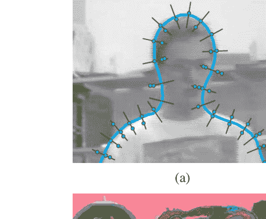

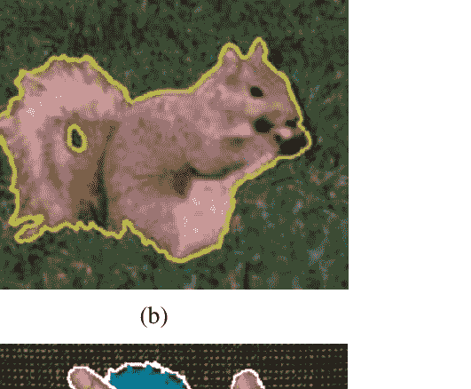

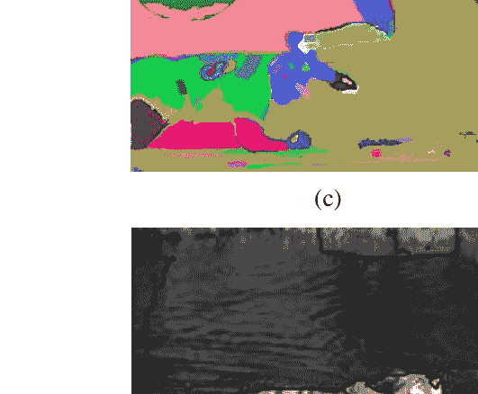

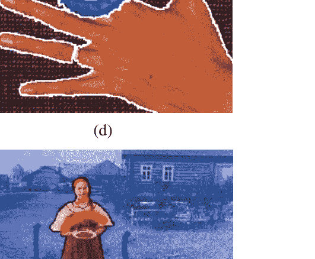

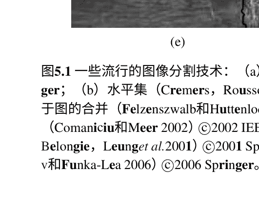

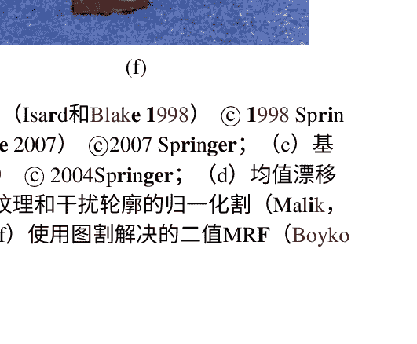

图5.1 一些流行的图像分割技术：（a）主动轮廓（Isard和Blake 1998）©1998 Springer；（b）水平集（Cremers，Rousson和Deriche 2007）©2007 Springer；（c）基于图的合并（Felzenszwalb和Huttenlocher 2004b）©2004 Springer；（d）均值漂移（Comaniciu和Meer 2002）©2002 IEEE；（e）纹理和干扰轮廓的归一化割（Malik，Belongie，Leung et al.2001）©2001 Springer；（f）使用图割解决的二值MRF（Boykov和Funka-Lea 2006）©2006 Springer。

图像分割是找到“一起”的像素组的任务。在统计学中，这个问题被称为聚类分析，并且是一个广泛研究的领域，有数百种不同的算法（Jain和Dubes 1988; Kaufman和Rousseuw 1990; Jain, Duin和Mao 2000; Jain, Topchy, Law等人2004）。

在计算机视觉中，图像分割是最古老且最广泛研究的问题之一（Brice和Fennema 1970; Pavlidis 1977; Riseman和Arbib 1977; Ohlander, Price和Reddy 1978; Rosenfeld和Davis 1979; Haralick和Shapiro 1985）。早期的技术倾向于使用区域分割或合并（Brice和Fennema 1970; Horowitz和Pavlidis 1976; Ohlander, Price和Reddy 1978; Pavlidis和Liow 1990），这对应于聚类文献中的分裂和聚合算法（Jain, Topchy, Law等人2004）。更近期的算法通常优化一些全局准则，如区域内一致性和区域间边界长度或不相似度（Leclerc 1989; Mumford和Shah 1989; Shi和Malik 2000; Comaniciu和Meer 2002; Felzenszwalb和Huttenlocher 2004b; Cremers, Rousson和Deriche 2007）。

我们已经在第3.3.2节和第3.7.2节中看到了图像分割的示例。在本章中，我们将回顾一些为图像分割开发的附加技术。这些技术包括基于活动轮廓的算法（第5.1节）和水平集（第5.1.4节），区域分割和合并（第5.2节），均值漂移（模式查找）（第5.3节），基于像素相似度度量的归一化割（第5.4节），以及使用图割解决的二值马尔可夫随机场（第5.5节）。图5.1展示了这些技术应用于不同图像的一些示例。

由于图像分割的文献如此广泛，了解一些表现较好的算法的好方法是查看人工标记数据库的实验比较（Arbeláez, Maire, Fowlkes等，2010年）。其中最著名的是伯克利分割数据集和基准测试¹（Martin, Fowlkes, Tal等，2001年），该数据集包含了来自Corel图像数据集的1000张图像，由30名人类主体手动标记。

许多较新的图像分割算法在这个数据库上报告了比较结果。例如，Unnikrishnan, Pantofaru和Hebert（2007）提出了用于比较这些算法的新度量标准。Estrada和Jepson（2009）在伯克利数据集上比较了四种著名的分割算法，并得出结论，尽管他们自己的SE-MinCut算法（Estrada、Jepson和Chennubhotla 2004）在一定程度上优于其他算法，但自动化和人工分割性能之间仍存在很大差距。² Alpert、Galun、Basri等人（2007）还提供了一个新的前景和背景分割数据库。³

> ¹ http://www.eecs.berkeley.edu/Research/Projects/CS/vision/grouping/segbench/

> ² 关于他们的ROC曲线的一个有趣观察是，自动化技术在相似曲线上紧密聚集，而人工性能则千差万别。

> ³ http://www.wisdom.weizmann.ac.il/~vision/Seg_Evaluation_DB/index.html

### 5.1 主动轮廓

在人造世界中，直线、消失点和矩形很常见，而在自然环境中，对应于物体边界的曲线更加常见。在本节中，我们描述了三种相关的方法来定位图像中的边界曲线。

最初被其发明者（Kass、Witkin和Terzopoulos 1988）称为“蛇”（第5.1.1节），它是一种能量最小化的二维样条曲线，会向图像特征（如强边缘）演化（移动）。第二种方法是“智能剪刀”（Mortensen和Barrett 1995）（第5.1.3节），允许用户实时绘制一个贴合物体边界的曲线。最后，水平集技术（第5.1.4节）将曲线演化为一个特征函数的零集，这使得它们能够轻松改变拓扑结构并结合基于区域的统计信息。

这三个都是主动轮廓的例子（Blake and Isard 1998; Mortensen 1999），因为这些边界检测器在图像和可选的用户引导力的组合下迭代地向最终解决方案移动。

#### 5.1.1 蛇

蛇是一维能量最小化样条的二维推广，首次在第3.7.1节中引入

$$ \mathcal{E}_{\text{int}} = \int \alpha(s) \| \boldsymbol{f}_s(s) \|^2 + \beta(s) \| \boldsymbol{f}_{ss}(s) \|^2 ds, $$

其中 $ s $ 是曲线上的弧长 $ \boldsymbol{f}(s) = (x(s), y(s)) $，$ \alpha(s) $ 和 $ \beta(s) $ 是类似于 $ s(x, y) $ 和 $ c(x, y) $ 项的一阶和二阶连续性加权函数，引入于(3.100–3.101)。我们可以通过沿着曲线的长度均匀采样初始曲线位置（图4.35）来离散化这个能量，以获得

$$ E_{\text{int}} = \sum_{i} \alpha(i) \| \boldsymbol{f}(i+1) - \boldsymbol{f}(i) \|^2 / h^2 + \beta(i) \| \boldsymbol{f}(i+1) - 2\boldsymbol{f}(i) + \boldsymbol{f}(i-1) \|^2 / h^4, $$

其中 $ h $ 是步长，如果我们在每次迭代后重新采样曲线的弧长，可以忽略它。

除了这个内部样条能量，蛇还同时最小化外部基于图像和约束的势能。基于图像的势能是几个项的总和

$$ \mathcal{E}_{\text{image}} = w_{\text{line}} \mathcal{E}_{\text{line}} + w_{\text{edge}} \mathcal{E}_{\text{edge}} + w_{\text{term}} \mathcal{E}_{\text{term}}, $$

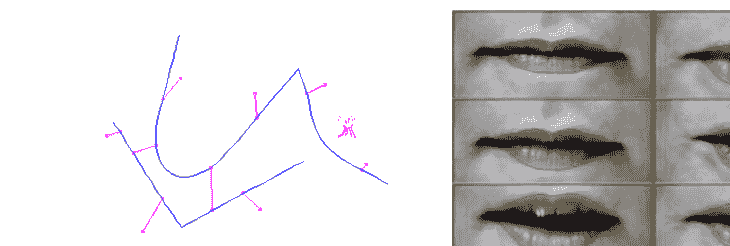

图5.2 蛇 (Kass, Witkin和Terzopoulos 1988) ©1988 Springer: (a) 用于交互控制形状的“蛇坑”; (b) 唇部跟踪。

当线条吸引蛇到黑暗的脊线时，边缘吸引蛇到强梯度（边缘），而术语吸引蛇到线条终止处。在实践中，大多数系统只使用边缘项，它可以直接与图像梯度成正比，

$$E_{\text{edge}} = \sum_i -\|\nabla I(\boldsymbol{f}(i))\|^2, \tag{5.4}$$

或者与图像拉普拉斯的平滑版本成正比，

$$E_{\text{edge}} = \sum_i -|(G_\sigma * \nabla^2 I)(\boldsymbol{f}(i))|^2. \tag{5.5}$$

人们有时也会提取边缘，然后使用到边缘的距离图作为这两个最初提出的势能的替代。

在交互式应用中，还可以添加各种用户放置的约束，例如，朝锚点施加吸引（弹簧）力$\boldsymbol{a}(i)$,

$$E_{\text{spring}} = k_s\|\boldsymbol{f}(i) - \boldsymbol{a}(i)\|^2 + \text{“火山”力} \tag{5.6}$$

通过最小化能量来进化时，它们经常“蠕动”和“滑动”，这解释了它们的常用名称。

图5.2b显示了蛇被用来追踪一个人的嘴唇。

由于常规蛇有收缩的倾向（练习5.1），通常最好将它们初始化为在要跟踪的对象之外绘制的蛇。或者，可以在动力学中添加一个膨胀力（Cohen和Cohen 1993），从本质上将每个点沿着其法线向外移动。

为了高效地解决蛇能量最小化产生的稀疏线性系统，可以使用稀疏直接求解器（附录A.4），因为该线性系统本质上是五对角线的。蛇的演化通常是在这个线性系统之间交替进行的。一个闭合的蛇具有Toeplitz矩阵形式，可以在$O(N)$时间内进行分解和求解。

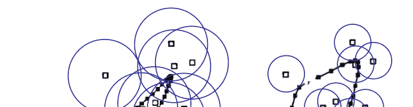

临时解决方案和非线性约束的线性化，如边缘能量。寻找全局能量最小值的更直接的方法是使用动态规划（Amini，Weymouth和Jain 1990；Williams和Shah 1992），但这在实践中很少使用，因为它已经被更高效或交互式的算法所取代，如智能剪刀（第5.1.3节）和GrabCut（第5.5节）。

## 弹性网络和滑动弹簧

一种有趣的蛇变体，最初由Durbin和Willshaw（1987）提出，后来由Durbin，Szeliski和Yuille（1989）在能量最小化框架中重新制定，是旅行推销员问题（TSP）的弹性网格公式。回想一下，在TSP中，推销员必须访问每个城市一次，同时最小化总距离。一个被限制通过每个城市的蛇可以解决这个问题（没有任何最优性保证），但是无法提前确定哪个蛇控制点应与每个城市相关联。

与（5.6）中蛇节点和城市之间的固定约束不同，假设一个城市在旅行途中经过某个点附近（图5.3）。在概率解释中，每个城市被生成为以每个旅行点为中心的高斯混合物。

$$p(\boldsymbol{d}(j)) = \sum_i p_{ij} \quad \text{与} \quad p_{ij} = e^{-d_{ij}^2/(2\sigma^2)} \tag{5.7}$$

其中 $\sigma$ 是高斯函数的标准差，

$$d_{ij} = \| \boldsymbol{f}(i) - \boldsymbol{d}(j) \| \tag{5.8}$$

是旅行点 $\boldsymbol{f}(i)$ 和城市位置 $\boldsymbol{d}(j)$ 之间的欧氏距离。对应的数据拟合能量（负对数似然）为

$$E_{\text{slippery}} = -\sum_{j} \log p(\boldsymbol{d}(j)) = -\sum_{j} \log \left[ \sum_{i} e^{-\|\boldsymbol{f}(i)-\boldsymbol{d}(j)\|^{2} / 2\sigma^{2}} \right]. \tag{5.9}$$

这个能量的名称源于一个事实，即与常规弹簧不同，常规弹簧将给定的蛇点与给定的约束（5.6）耦合起来，而这种替代能量定义了一个滑动弹簧，允许约束（城市）和曲线（旅行）点之间的关联随时间演变（Szeliski 1989）。请注意，这是流行的迭代最近点数据约束的软变体，常用于将曲面与数据点或彼此对齐（第12.2.1节）（Besl和McKay 1992；Zhang 1994）。

为了计算旅行商问题的一个好解，滑动弹簧数据关联能量与一个常规的一阶内部平滑能量（5.3）结合起来，来定义一条旅行的成本。旅行 $\boldsymbol{f}(s)$ 被初始化为围绕城市点的平均值的一个小圆，并且 $\sigma$ 逐渐降低（图5.3）。对于较大的 $\sigma$ 值，旅行试图保持在点的质心附近，但是随着 $\sigma$ 的减小，每个城市对其最近的旅行点产生越来越强的吸引力（Durbin, Szeliski和Yuille 1989）。当 $\sigma \rightarrow 0$ 时，每个城市都保证至少捕获一个旅行点，并且相邻城市之间的旅行变成直线。

## 样条和形状先验

虽然蛇在捕捉许多现实世界轮廓中的细节和不规则性方面非常出色，但有时它们展示出过多的自由度，这使得它们更容易在演化过程中陷入局部最小值。

解决这个问题的一个方法是通过使用B样条近似来控制蛇的自由度更少（Menet, Saint-Marc, and Medioni 1990b,a; Cipolla and Blake 1990）。得到的B-蛇可以写成

$$\boldsymbol{f}(s) = \sum_{k} B_{k}(s) \mathbf{x}_{k} \tag{5.10}$$

或者离散形式为

$$\boldsymbol{F} = B \boldsymbol{X} \tag{5.11}$$

其中

$$\boldsymbol{F} = \begin{bmatrix} \boldsymbol{f}^{T}(0) \\ \vdots \\ \boldsymbol{f}^{T}(N) \end{bmatrix}, \quad B = \begin{bmatrix} B_{0}(s_{0}) & \cdots & B_{K}(s_{0}) \\ \vdots & \ddots & \vdots \\ B_{0}(s_{N}) & \cdots & B_{K}(s_{N}) \end{bmatrix}, \quad \text{以及} \quad \boldsymbol{X} = \begin{bmatrix} \mathbf{x}^{T}(0) \\ \vdots \\ \mathbf{x}^{T}(K) \end{bmatrix}. \tag{5.12}$$

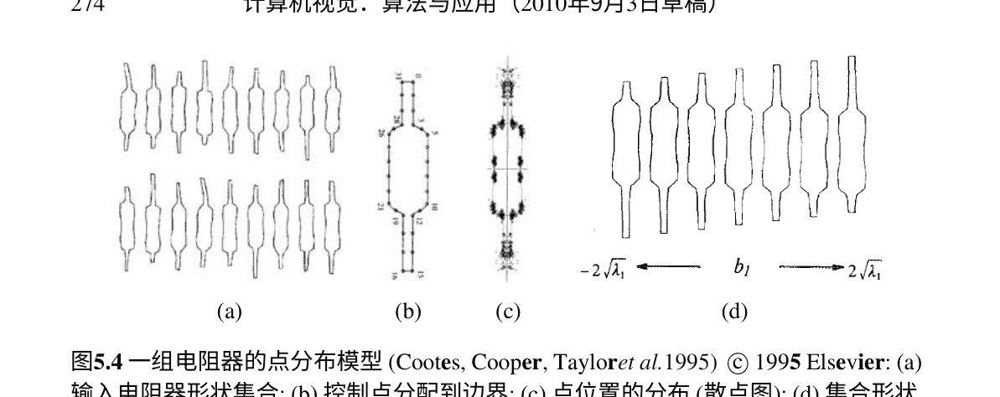

图5.4 一组电阻器的点分布模型 (Cootes, Cooper, Taylor et al. 1995) © 1995 Elsevier: (a) 输入电阻器形状集合; (b) 控制点分配到边界; (c) 点位置的分布 (散点图); (d) 集合形状中的第一个 (最大) 变化模式。

如果被跟踪或识别的物体在位置、尺度或方向上有很大变化，这些可以被建模为对控制点的额外变换，例如，$\mathbf{x}'_k = s R \mathbf{x}_k + \mathbf{t}$ (2.18)，这可以在同一时间估计控制点的值。或者，可以先运行分别的检测和对齐阶段来定位和定向感兴趣的的对象 (Cootes, Cooper, Taylor等, 1995年)。

在B-snake中，由于蛇受到较少的自由度控制，因此与原始蛇使用的内部平滑力相比，对其进行的需求较小，尽管仍然可以使用有限元分析导出和实现这些力，即，对B样条基函数进行导数和积分 (Terzopoulos 1983; Bathe 2007)。

在实践中，更常见的是对控制点的典型分布估计一组形状先验 (Cootes, Cooper, Taylor等, 1995年)。考虑图5.4a中所示的一组电阻器形状。如果我们用图5.4b中所示的控制点集来描述每个轮廓，我们可以在散点图中绘制每个点的分布，如图5.4c所示。

描述这个分布的一个潜在方法是通过每个个体点 $\mathbf{x}_k$ 的位置 $\bar{\mathbf{x}}_k$ 和2D协方差 $C_k$ 来进行。然后可以将其转化为点位置的二次惩罚（先验能量）

$$ E_{loc}(\mathbf{x}_k) = \frac{1}{2} (\mathbf{x}_k - \bar{\mathbf{x}}_k)^T C_k^{-1} (\mathbf{x}_k - \bar{\mathbf{x}}_k). \tag{5.13} $$

然而，在实践中，点位置的变化通常高度相关。

更可取的方法是同时估计所有点的联合协方差。首先，将所有点的位置 $\{\mathbf{x}_k\}$ 连接成一个单独的向量 $\mathbf{x}$，例如，通过交错每个点的 $x$ 和 $y$ 位置。这些向量在所有训练中的分布图5.5 主动形状模型（ASM）：（a）对一组面部变化前四个形状参数的影响（Cootes，Taylor，Lanitis et al.1993）©1993 IEEE；（b）沿着每个控制点法线搜索最强梯度（Cootes，Cooper，Taylor et al.1995）©1995 Elsevier。

例子（图5.4a）可以用均值和协方差来描述

$$ C = \frac{1}{P} \sum_{p} (x_p - \bar{x})(x_p - \bar{x})^T, $$

其中$x_p$是$P$训练样本。使用特征值分析（附录A.1.2），也称为主成分分析（$PCA$）（附录B.1.1），协方差矩阵可以写成

$$ C = \Phi \ \text{diag}(\lambda_0 \ldots \lambda_{K-1}) \Phi^T. $$

在大多数情况下，点的可能外观可以使用具有最大特征值的几个特征向量来建模。得到的点分布模型（Cootes, Taylor, Lanitis等，1993; Cootes, Cooper, Taylor等，1995）可以写成

$$ x = \bar{x} + \hat{\Phi} \ b, $$

其中$b$是一个$M \ll K$元素的形状参数向量，$\hat{\Phi}$是$\Phi$的前$m$列。为了将形状参数限制在合理的范围内，我们可以使用二次惩罚的形式

$$ E_{\text{shape}} = \frac{1}{2} b^T \text{diag}(\lambda_0 \ldots \lambda_{M-1}) b = \sum_{m} b_m^2 / 2\lambda_m. $$

或者，允许的$b_m$值的范围可以限制在某个范围内，例如，$|b_m| \leq 3\sqrt{\lambda_m}$(Cootes, Cooper, Taylor et al. 1995)。Isard和Blake（1998）对于推导一组形状向量的替代方法进行了综述。

通过在范围 $-2\sqrt{\lambda_m} \leq b_m \leq 2\sqrt{\lambda_m}$ 内变化各个形状参数 $b_m$，可以很好地显示外观的预期变化，如图5.4d所示。另一个与面部轮廓相关的示例如图5.5a所示。

为了将点分布模型与图像对齐，每个控制点在与轮廓法线方向相垂直的方向上搜索，以找到最有可能对应的图像边缘点（图5.5b）。这些单独的测量结果可以与对形状参数（如果需要，还包括位置、尺度和方向参数）的先验知识相结合，估计出一组新的参数。得到的主动形状模型（ASM）可以通过迭代最小化来适应非刚性变形的对象，例如医学图像或手部等（Cootes、Cooper、Taylor等，1995年）。ASM还可以与底层灰度分布的主成分分析相结合，创建主动外观模型（AAM）（Cootes、Edwards和Taylor，2001年），我们将在第14.2.2节中详细讨论。

#### 5.1.2 动态蛇和CONDENSATION

在许多主动轮廓的应用中，感兴趣的的对象在变形和演化过程中被从帧到帧进行跟踪。在这种情况下，利用前一帧的估计结果来预测和约束新的估计结果是有意义的。

一种实现这一点的方法是使用卡尔曼滤波，这导致了一个称为卡尔曼蛇的公式(Terzopoulos和Szeliski 1992; Blake，Curwen和Zisserman 1993)。卡尔曼滤波器基于形状参数演化的线性动态模型，

$$ x_t = Ax_{t-1} + w_t, \quad (5.18) $$

其中 $x_t$ 和 $x_{t-1}$ 是当前和先前的状态变量， $A$ 是线性转移矩阵， $w$ 是一个噪声（扰动）向量，通常被建模为高斯（Gelb1974）。矩阵 $A$ 和噪声协方差可以通过观察被跟踪对象的典型序列提前学习（Blake和Isard 1998）。

卡尔曼滤波器的定性行为可以在图5.6a中看到。线性动态模型导致先前估计的确定性变化（漂移），而过程噪声（扰动）导致系统熵（不确定性）的随机扩散。来自当前帧的新测量恢复了更新估计中的一些确定性（峰值-度）。

然而，在许多情况下，例如在杂乱环境中进行跟踪时，如果我们去除了分布为高斯分布的假设，可以获得更好的轮廓估计，这正是卡尔曼滤波器所需的。在这种情况下，传播的是一般的多模态分布，如图5.6b所示。为了对这种多模态分布进行建模，Isard和Blake（1998）引入了粒子滤波器的使用，应用于计算机视觉领域。$^5$

图5.6概率密度传播（Isard和Blake 1998） 1998 Springer。在每个估计步骤的开始时，根据线性动态模型（确定性漂移）更新概率密度，并由于过程噪声（随机扩散）而降低其确定性。新的测量引入了额外的信息，有助于改进当前的估计。（a）卡尔曼滤波器将分布建模为单模态，即使用均值和协方差。（b）某些应用需要更一般的多模态分布。

图5.7 使用粒子滤波器的因子采样在CONDENSATION算法中（Isard和Blake 1998）c ○1998 Springer: （a）每个密度分布使用加权粒子的叠加表示；（b）使用随机采样，扰动和重新加权阶段实现的漂移-扩散-测量循环。

### 5.1 主动轮廓

图5.8 使用CONDENSATION进行头部跟踪（Isard和Blake 1998）© 1998 Springer：(a) 头部估计分布的样本集表示；(b) 每个控制顶点位置的多个测量；(c) 随时间的多假设跟踪。

粒子滤波技术使用一组加权的点样本来表示概率分布（图5.7a）(Andrieu, de Freitas, Doucet et al. 2003; Bishop 2006; Koller and Friedman 2009)。根据线性动力学（确定性漂移）更新样本的位置，样本的中心根据（5.18）进行更新，并为每个点生成多个样本（图5.7b）。然后，为了考虑随机扩散，即通过从 w 的分布中取随机向量将它们的位置移动。最后，这些样本的权重乘以测量概率密度，即我们取每个样本并测量其在当前（新）测量下的可能性。因为点样本表示和传播多模态密度的条件估计，Isard和Blake（1998）将他们的算法称为CONDENSATION或CONDitional DENSity propagATION。

图5.8a展示了一个头部追踪器的分解样本可能的样子，为被追踪的粒子中的每一个绘制了一个红色B样条轮廓。图5.8b展示了为什么测量密度本身通常是多模态的：与样条曲线垂直的边缘位置可能由于背景杂波而具有多个局部最大值。

最后，图5.8c展示了条件密度（头部和肩部追踪器质心的x坐标）随时间的演变，它在跟踪几个人员时进行追踪。

假设追踪（Bar-Shalom和Fortmann 1988; Cham和Rehg 1999）。

6请注意，由于这些步骤的结构，可以使用非线性动力学和非高斯噪声。

#### 5.1.3 剪刀

主动轮廓允许用户粗略指定感兴趣的边界，并使系统将轮廓演化到更准确的位置，并随时间跟踪它。然而，这种曲线演化的结果可能是不可预测的，并且可能需要额外的基于用户的提示来达到期望的结果。

另一种方法是在用户绘制时实时优化轮廓（Mortensen 1999）。Mortensen和Barrett（1995）开发的智能剪刀系统正是这样做的。当用户绘制出粗略轮廓（图5.9a中的白色曲线）时，系统计算并绘制出一个更好的曲线，该曲线紧贴高对比度边缘（橙色曲线）。

为了计算最优曲线路径（活线），首先对图像进行预处理，将可能是边界元素的边缘（相邻水平、垂直和对角线，即 N₈邻居之间的链接）与低成本相关联。他们的系统使用零交叉、梯度幅值和梯度方向的组合来计算这些成本。

接下来，当用户绘制一个粗略的曲线时，系统会使用Dijkstra算法连续重新计算起始种子点和当前鼠标位置之间的最低成本路径，这是一种广度优先的动态规划算法，它在当前目标位置终止。

为了防止系统不可预测地跳动，系统会在一段时间的不活动后“冻结”当前的曲线（重置种子点）。为了防止活线跳到相邻的高对比度轮廓上，系统还会“学习”强度

在当前优化的曲线下，系统会优先保持线条沿着相同（或类似的）边界移动，并使用这个偏好来保持线条的移动（图5.9b-c）。

在基本算法的基础上，已经提出了几种扩展，即使在其原始形式下也能表现出色。Mortensen和Barrett（1999）使用了滑雪运动，这是一种简单的分水岭区域分割形式，将图像预分割为边界成为优化曲线路径的候选区域。生成的区域边界被转换为一个更小的图形，其中节点位于三个或四个区域相交的位置。然后在这个简化的图形上运行Dijkstra算法，从而实现更快（通常更稳定）的性能。智能剪刀的另一个扩展是使用概率框架，考虑到边界的当前轨迹，从而形成一个称为JetStream的系统（Pérez，Blake和Gangnet 2001）。

不需要在每个时间点重新计算最优曲线，可以通过将当前鼠标位置“捕捉”到最近的可能边界点来开发一个更简单的系统（Gleicher 1995）。将这些边界提取技术应用于图像剪切和粘贴在第10.4节中介绍。

#### 5.1.4 水平集

基于参数曲线形式 f(s) 的主动轮廓的一个限制是，在其演化过程中改变曲线的拓扑结构是具有挑战性的。例如，蛇形轮廓、B-蛇形轮廓和CONDENSATION。此外，如果形状发生剧烈变化，可能还需要对曲线进行重新参数化。

对于这种闭合轮廓的另一种表示方法是使用水平集，其中特征函数（或有符号距离（第3.3.3节）函数）的零交叉点定义了曲线。

水平集通过修改底层的嵌入函数 $\phi(x, y)$而不是曲线 $f(s)$来适应和跟踪感兴趣的对象。为了减少计算量，每一步只需要更新当前零交叉点周围的一个小区域（前沿），这就是所谓的快速行进方法。

演化方程的一个例子是由Caselles、Kimmel和Sapiro（1997）以及Yezzi、Kichenasamy、Kumar等人提出的测地线主动轮廓。
$$
\frac{d\phi}{dt} = |\nabla \phi| \text{div} \left( g(I) \frac{\nabla \phi}{|\nabla \phi|} \right) 
= g(I)|\nabla \phi| \text{div} \left( \frac{\nabla \phi}{|\nabla \phi|} \right) + \nabla g(I) \cdot \nabla \phi, \tag{5.19}
$$
其中 $g(I)$是蛇边缘势能（5.5）的广义版本。为了直观地了解曲线的行为，假设嵌入函数 $\phi$是离曲线的有符号距离函数（图5.10），在这种情况下 $|\phi|=1$。方程（5.19）中的第一项将曲线移动到其曲率的方向，即它作用于 $g(I)$的调制函数。第二项将曲线沿 $g(I)$的梯度向下移动，鼓励曲线向 $g(I)$的最小值迁移。

虽然这个水平集的公式可以轻松改变拓扑结构，但它仍然容易受到局部最小值的影响，因为它基于图像梯度等局部测量。另一种方法是将问题重新转化为分割框架，其中能量度量了图像统计的一致性（例如颜色、纹理、运动）在分割区域内外的差异（Cremers、Rousson和Deriche 2007；Rousson和Paragios 2008；Houhou、Thiran和Bresson 2008）。这些方法建立在Leclerc（1989）、Mumford和Shah（1989）以及Chan和Vese（1992）引入的基于能量的分割框架之上，更详细地讨论在第5.5节。这些水平集分割的示例显示在图5.11中，它展示了一系列分布的圆向最终二进制分割的水平集的演变。

有关水平集及其应用的更多信息，请参阅Osher和Paragios（2003）编辑的论文集，以及Paragios、Faugeras、Chan等人（2005）编辑的计算机视觉中的变分和水平集方法研讨会系列，以及Paragios和Sgallari（2009）编辑的计算机视觉中的尺度空间和变分方法专题。

#### 5.1.5 应用：轮廓跟踪和动画制作

主动轮廓可以用于各种目标跟踪应用（Blake和Isard 1998；Yilmaz、Javed和Shah 2006）。例如，它们可以用于跟踪面部特征

用于性能驱动的动画（Terzopoulos和Waters 1990; Lee，Terzopoulos和Waters 1995; Parker和Waters 1996; Bregler，Covell和Slaney 1997）（图5.2b）。它们还可以用于跟踪头部和人体，如图5.8所示，以及移动车辆（Paragios和Deriche 2000）。其他应用包括医学图像分割，在计算机断层扫描（3D医学图像）中可以跟踪轮廓从切片到切片（Cootes和Taylor 2001）或随时间变化，如超声扫描。

更接近计算机动画和视觉效果的一个有趣的应用是 *rotoscoping*，它使用跟踪的轮廓来变形一组手绘动画（或修改或替换原始视频帧）。⁷ Agarwala, Hertzmann, Seitz et al. (2004) 提出了一种基于跟踪手绘B样条轮廓的系统，在选择的关键帧上绘制，使用几何和外观为基础的标准（图5.12）。他们还提供了对以前的rotoscoping和基于图像的轮廓跟踪系统的出色回顾。

⁷这个术语来自于一个设备（一个转影仪），它在一个醋酸盐下方投射了一个实时动作电影的帧，以便艺术家可以直接在演员的形状上绘制动画。

图5.12基于关键帧的转影绘制（Agarwala， Hertzmann， Seitz等，2004年）© 2004AC M： (a) 原始帧； (b) 转影轮廓； (c) 重新上色的衬衫； (d) 转影手绘动画。

转影绘制的其他应用（物体轮廓检测和分割），例如从一张照片剪切和粘贴物体到另一张照片中，在第10.4节中介绍。

### 5.2 分割和合并

正如在本章引言中提到的，对于分割灰度图像来说，最简单的技术是选择一个阈值，然后计算连通分量（第3.3.2节）。不幸的是，由于光照和物体内部统计变化的原因，单个阈值很少足够整个图像。

在本节中，我们描述了一些算法，这些算法要么通过基于区域统计的递归方式将整个图像分割成片段，要么以分层的方式将像素和区域合并在一起。还可以通过从中等粒度的分割（在四叉树表示中）开始，然后允许合并和分割操作（Horowitz和Pavlidis 1976； Pavlidis和Liow 1990）来结合分割和合并。

#### 5.2.1 分水岭

与阈值处理相关的一种技术是分水岭计算（Vincent和Soille 1991），因为它在灰度图像上操作。这种技术将图像分割成几个集水盆，这些集水盆是图像的区域（被解释为高度场或地形）的区域。

雨水会流入同一个湖泊。计算这些区域的一种高效方法是从所有局部最小值开始对地形进行洪水填充，并在不同演化的组件相遇处标记山脊。整个算法可以使用像素的优先队列和广度优先搜索 (Vincent和Soille 1991) 来实现。⁸

由于图像很少有由较亮的山脊分隔的暗区域，分水岭分割通常应用于梯度幅度图像的平滑版本，这也使其可用于彩色图像。作为替代方案，可以使用可定向滤波器 (3.28-3.29) 中的最大定向能量 (Freeman和Adelson 1991) 作为定向分水岭变换的基础，该变换由Arbel´aez、Maire、Fowlkes等人开发 (2010)。这些技术最终找到由可见 (较高梯度) 边界分隔的平滑区域。由于这些边界通常是主动轮廓所遵循的，主动轮廓算法 (Mortensen和Barrett 1999; Li、Sun、Tang等人2004) 通常使用分水岭或相关的滑雪技术 (第5.1.3节) 预计算这样的分割。

不幸的是，分水岭分割将每个局部极小值与一个唯一的区域关联起来，这可能导致过分割。因此，分水岭分割通常作为交互系统的一部分使用，用户首先标记种子位置 (通过点击或短划线)，这些位置对应于不期望组件的中心。图5.13显示了在共焦显微镜图像上手动放置标记后运行分水岭算法的结果。它还展示了一种改进的分水岭算法的结果，该算法使用局部形态学来平滑和优化分割区域之间的边界 (Beare 2006)。

⁸相关算法可以高效地计算极大稳定极值区域 (MSERs) (第4.1.1节) (Nist´er和Stew´enius 2008)。

#### 5.2.2 区域分割（分裂聚类）

将图像分割成逐渐细化的区域是计算机视觉中最古老的技术之一。Ohlander、Price和Reddy（1978）提出了这样一种技术，首先为整个图像计算直方图，然后找到最佳分离直方图中的大峰值的阈值。这个过程重复进行，直到区域变得相对均匀或小于某个特定大小为止。

更近期的分割算法通常优化一些区域内相似度和区域间不相似度的度量。这些在第5.4节和第5.5节中有详细介绍。

### 5.2.3 区域合并（凝聚聚类）

区域合并技术也可以追溯到计算机视觉的起源。Brice和Fennema（1970）使用双网格表示像素之间的边界，并根据相对边界长度和这些边界上可见边缘的强度合并区域。

在数据聚类中，算法可以根据最近点之间的距离（单链接聚类），最远点之间的距离（完全链接聚类）或介于两者之间的距离将聚类链接在一起（Jain，Topchy，La wet al.2004）。Kamvar，Klein和Manning（2002）对这些算法提供了概率解释，并展示了如何在该框架中引入附加模型。

基于像素的简单合并的一个版本是将平均颜色差异低于阈值或区域过小的相邻区域合并。将图像分割成这种不具有语义意义的超像素（Mori，Ren，Efroset al.2004），可以作为预处理阶段，以便进行更高级别的算法，如立体匹配（Zitnick，Kang，U yttenadaeleet al.2004；Taguchi，Wilburn和Zitnick 2008），光流。

(Zitnick, Jojic, and Kang 2005; Brox, Bregler, and Malik 2009)，以及识别(Mori, Ren, Efros et al. 2004; Mori 2005; Gu, Lim, Arbelaez et al. 2009; Lim, Arbeláez, Gu et al. 2009)都更快且更稳健。

### 5.2.4 基于图的分割

虽然许多合并算法只是应用固定规则将像素和区域组合在一起，但Felzenszwalb和Hut tenlocher(2004b)提出了一种合并算法，该算法使用区域之间的相似性来确定应该合并哪些区域；它产生了一种可以证明优化全局分组度量的算法。他们从像素到像素的不相似度度量 w(e)开始，该度量可以测量例如N_{8}邻居之间的强度差异。（或者，他们可以使用Comaniciu和Meer(2002)在第5.3.2节中介绍的联合特征空间距离(5.42)。）

### 5.2 分割和合并

对于任何区域 $R$，其内部差异定义为该区域最小生成树中的最大边权重，

$$Int(R) = \min_{e \in MST(R)} w(e). \tag{5.20}$$

对于至少有一条边连接其顶点的两个相邻区域，这两个区域之间的差异定义为连接两个区域的最小权重边，

$$Dif(R_1, R_2) = \min_{e=(v_1, v_2) \mid v_1 \in R_1, v_2 \in R_2} w(e). \tag{5.21}$$

他们的算法将差异小于两个相邻区域的最小内部差异的任意两个相邻区域合并在一起，

$$MInt(R_1, R_2) = \min(Int(R_1) + \tau(R_1), Int(R_2) + \tau(R_2)), \tag{5.22}$$

其中 $\tau(R)$ 是Felzenszwalb和Huttenlocher (2004b) 设置为 $k/|R|$ 的启发式区域惩罚，但可以设置为任何特定应用的区域度量。

通过按照分隔它们的边的递减顺序合并区域（可以使用Kruskal的最小生成树算法的变体进行高效评估），他们可以证明产生的分割既不太细（存在可以合并的区域），也不太粗（存在可以分割但无法合并的区域）。对于固定大小的像素邻域，该算法的运行时间为 $O(N \log N)$，其中 $N$ 是图像像素的数量，使其成为最快的分割算法之一（Paris和Durand 2007）。图5.14显示了使用他们的技术进行分割的两个图像示例。

图5.15 粗到细的节点聚合在加权聚合分割中(SWA) (Sharon, Galun, Sharon等，2006) c ①2006 Macmillan Publishers Ltd [Nature]:(a)原始灰度像素网格;(b) 像素之间的耦合，粗线表示更强的耦合;(c) 经过一级粗化，每个原始像素与一个粗级节点强耦合;(d) 经过两级粗化后。

### 5.2.5 概率聚合

Alpert, Galun, Basri等，(2007) 基于两个线索，即灰度相似性和纹理相似性，开发了一种概率合并算法。 区域$R_i$和$R_j$之间的灰度相似性基于与其他相邻区域的最小外部差异，

$\sigma_{local}^+ = \min(\Delta_i^+, \Delta_j^+)$  (5.23)

其中 $\Delta_i^+ = \min_k |\Delta_{ik}|$且 $\Delta_{ik}$是区域 $R_i$ 和 $R_k$之间的平均强度差异。 这与平均强度差异进行比较,

$\sigma_{local}^- = \frac{\Delta_i^- + \Delta_j^-}{2}$  (5.24)

其中 $\Delta_i^- = \sum_k (\tau_{ik}\Delta_{ik}) / \sum_k (\tau_{ik})$且 $\tau_{ik}$是区域 $R_i$和$R_k$之间的边界长度。 纹理相似性使用简单定向Sobel滤波器响应的直方图柱之间的相对差异来定义。 配对统计量 $\sigma_{local}^+$ 和 $\sigma_{local}^-$ 用于计算两个区域合并的可能性 $p_{ij}$。 （更多细节请参阅Alpert、Galun、Basri等人的论文（2007年）。）

合并过程以一种层次化的方式进行，受到代数多重网格技术的启发 (Brandt 1986; Briggs, Henson, and McCormick 2000) ，并且之前由Alpert、Galun、Basri等人在他们的加权聚合分割算法（SWA）中使用（Sharon、Galun、Sharon等人2006） ，我们在第5.4节中讨论。 使用到所有原始节点（区域）的（集体）强耦合的节点子集CCV 用于在更粗的尺度上定义问题（图5.15） ，其中强耦合被定义为

$\frac{\sum_{j \in C} p_{ij}}{\sum_{j \in V} p_{ij}} > \phi,$  (5.25)

通常将ϕ设置为0.2。使用加权平均递归计算更粗节点的强度和纹理相似性统计，其中粗细级别节点之间的相对强度（耦合）基于它们的合并概率$p_{ij}$。这使得算法可以在基本上$O(N)$时间内运行，使用与金字塔滤波或预处理算法中使用的层次聚合操作相同的类型。在更粗的层次上确定了分割后，通过将粗级别的分配传播到它们的更细级别的“子节点”来计算每个像素的确切成员资格（Sharon、Galun、Sharon等人2006 ; Alpert、Galun、Basri等人2007）。图5.22显示了该算法产生的分割与其他流行的分割算法的比较。

### 5.3 均值漂移和模式查找

均值漂移和模式查找技术，如k-means和高斯混合模型，将与每个像素相关联的特征向量（例如颜色和位置）建模为从未知概率密度函数中的样本，然后尝试在该分布中找到聚类（模式）。

考虑图5.16a中显示的彩色图像。仅基于颜色，你会如何对该图像进行分割？图5.16b显示了L*u*v*空间中像素的分布，这相当于忽略空间位置的视觉算法所看到的内容。为了使可视化更简单，让我们只考虑L*u*坐标，如图5.16c所示。你看到了多少个明显的（细长的）聚类？你会如何找到这些聚类？

k-means和高斯混合模型技术使用参数模型来回答这个问题，即它们假设密度是一小部分更简单分布（例如高斯分布）的叠加，可以估计这些分布的位置（中心）和形状（协方差）。另一方面，均值漂移平滑分布并找到其峰值，以及与每个峰值对应的特征空间区域。由于正在建模完整的密度，这种方法被称为非参数方法（Bishop 2006）

让我们更详细地看看这些技术。

### 5.3.1 K均值和高斯混合

虽然k-means隐式地将概率密度建模为球对称分布的叠加，但它不需要任何概率推理或建模（Bishop 2006）。相反，算法给出了要找到的聚类数目$k$，然后根据最接近每个中心的样本迭代更新聚类中心的位置。该算法可以通过从输入特征向量中随机采样$k$个中心来进行初始化。还开发了一些技术来拆分或合并聚类中心。基于它们的统计数据，并加速寻找最近均值中心的过程 (Bishop 2006)。

在高斯混合模型中，每个聚类中心都会增加一个协方差矩阵，其值是从相应样本重新估计的。不再使用最近邻方法将输入样本与聚类中心关联，而是使用马氏距离 (附录B.1.1)：

$$d(\mathbf{x}_i, \boldsymbol{\mu}_k; \boldsymbol{\Sigma}_k) = \|\mathbf{x}_i - \boldsymbol{\mu}_k\|_{\boldsymbol{\Sigma}_k^{-1}} = (\mathbf{x}_i - \boldsymbol{\mu}_k)^T \boldsymbol{\Sigma}_k^{-1} (\mathbf{x}_i - \boldsymbol{\mu}_k) \quad (5.26)$$

其中 $x_i$ 是输入样本， $\mu_k$ 是聚类中心， $\Sigma_k$ 是它们的协方差估计。样本可以与最近的聚类中心关联（硬分配成员资格），也可以软分配给几个附近的聚类。

后一种更常用的方法对应于迭代地重新估计高斯混合密度函数的参数,

$$p(\mathbf{x}|\{\pi_k, \boldsymbol{\mu}_k, \boldsymbol{\Sigma}_k\}) = \sum_k \pi_k \mathcal{N}(\mathbf{x}|\boldsymbol{\mu}_k, \boldsymbol{\Sigma}_k), \quad (5.27)$$

其中 $\pi_k$ 是混合系数, $\mu_k$ 和 $\Sigma_k$ 是高斯均值和协方差, 并且

$$\mathcal{N}(\mathbf{x}|\boldsymbol{\mu}_k, \boldsymbol{\Sigma}_k) = \frac{1}{|\boldsymbol{\Sigma}_k|} e^{-d(\mathbf{x},\boldsymbol{\mu}_k; \boldsymbol{\Sigma}_k)} \quad (5.28)$$

是正态（高斯）分布 (Bishop 2006)。

为了迭代地计算未知混合参数的最大似然估计，期望最大化 (EM) 算法 (Dempster, Laird和Rubin 1977) 分为两个交替阶段进行:

-   1. 期望阶段（E步骤）估计责任
    $$ z_{ik} = \frac{1}{Z_i} \pi_k \mathcal{N}(x|\mu_k, \Sigma_k) \quad \text{与} \quad \sum_k z_{ik} = 1, \tag{5.29} $$
    这些是样本 $x_i$ 从第 $k$ 个高斯簇生成的可能性的估计值。

-   2. 最大化阶段（M步骤）更新参数值
    $$ \mu_k = \frac{1}{N_k} \sum_i z_{ik} x_i, \tag{5.30} $$
    $$ \Sigma_k = \frac{1}{N_k} \sum_i z_{ik} (x_i - \mu_k)(x_i - \mu_k)^T, \tag{5.31} $$
    $$ \pi_k = \frac{N_k}{N}, \tag{5.32} $$

其中

$N_k = \sum_{i} z_{ik} \quad (5.33)$

是每个簇分配的样本点数量的估计值。

Bishop（2006）对高斯混合估计和期望最大化的更一般主题有很好的阐述。

在图像分割的背景下，Ma、Derksen、Hong等人（2007）对使用高斯混合进行分割进行了很好的回顾，并基于最小描述长度（MDL）编码开发了自己的扩展，他们展示了在伯克利分割数据库上产生了良好的结果。

### 5.3.2 均值漂移

虽然k-means和高斯混合使用参数形式来建模被分割的概率密度函数，均值漂移隐式地使用平滑连续的非参数模型来建模这个分布。均值漂移的关键是一种在不计算完整函数的情况下，高效地寻找高维数据分布中的峰值的技术（Fukunaga和Hostetler 1975; Cheng 1995; Comaniciu和Meer 2002）。

再次考虑图5.16c中显示的数据点，可以将其视为从某个概率密度函数中抽取出来的。如果我们能够计算出这个密度函数，如图5.16e所示，我们就可以找到它的主要峰值（模式）并确定与相同峰值相连的输入空间区域作为同一区域的一部分。这是第5.2.1节中描述的分水岭算法的逆过程，该算法向下爬坡以找到吸引盆地。

那么，第一个问题是如何在给定稀疏样本的情况下估计密度函数。最简单的方法之一是对数据进行平滑处理，例如通过与固定宽度的核进行卷积。

$$f(\boldsymbol{x}) = \sum_{i} K(\boldsymbol{x} - \boldsymbol{x}_i) = \sum_{i} k\left( \frac{\|\boldsymbol{x} - \boldsymbol{x}_i\|^2}{h^2} \right) \quad (5.34)$$

其中 $\boldsymbol{x}_i$ 是输入样本，$k(r)$ 是核函数（或Parzen窗口）。这种方法被称为核密度估计或Parzen窗口技术（Duda，Hart和Stork 2001年，第4.3节；Bishop 2006年，第2.5.1节）。一旦我们计算出 $f(\boldsymbol{x})$，如图5.16e和5.17所示，我们可以使用梯度上升或其他优化技术找到其局部最大值。

这种“蛮力”方法的问题是，在更高的维度下，计算整个搜索空间上的$f(\boldsymbol{x})$是计算上的障碍。$^{10}$相反，均值漂移使用了一种在优化文献中被称为“多次重启梯度下降”的变体。从某个局部最大值的猜测开始，$\boldsymbol{y}_k$，可以是一个随机输入数据点$\boldsymbol{x}_i$，均值漂移计算密度估计$f(\boldsymbol{x})$ at $\boldsymbol{y}_k$的梯度，并朝着该方向上坡迈出一步（图5.17）。密度函数$f(\boldsymbol{x})$的梯度由以下公式给出

$$\nabla f(\boldsymbol{x}) = \sum_{i} (\boldsymbol{x}_i - \boldsymbol{x})G(\boldsymbol{x} - \boldsymbol{x}_i) = \sum_{i} (\boldsymbol{x}_i - \boldsymbol{x})g\left( \frac{\|\boldsymbol{x} - \boldsymbol{x}_i\|^2}{h^2} \right), \tag{5.35}$$

其中

$$g(r) = -k'(r), \tag{5.36}$$

并且 $k^\prime(r)$是 $k(r)$的一阶导数。 我们可以将密度函数的梯度重新写成

$$\nabla f(\boldsymbol{x}) = \left[ \sum_{i} G(\boldsymbol{x} - \boldsymbol{x}_i) \right] \boldsymbol{m}(\boldsymbol{x}), \tag{5.37}$$

其中向量

$$\boldsymbol{m}(\boldsymbol{x}) = \frac{\sum_{i} \boldsymbol{x}_i G(\boldsymbol{x} - \boldsymbol{x}_i)}{\sum_{i} G(\boldsymbol{x} - \boldsymbol{x}_i)} - \boldsymbol{x} \tag{5.38}$$

被称为均值漂移，因为它是邻居的加权平均值与当前值的差异$\boldsymbol{x}_i$围绕 $\boldsymbol{x}$的加权平均值与当前值的差异。即使对于一维空间，如果空间非常稀疏，也可能效率低下。

在均值漂移过程中，迭代$k$时，模式 $y_k$ 的当前估计被其局部加权平均值所取代

$$ y_{k+1} = y_k + m(y_k) = \frac{\sum_i x_i G(y_k - x_i)}{\sum_i G(y_k - x_i)} $$

Comaniciu和Meer (2002) 证明了该算法在核 $k(r)$ 的合理弱条件下收敛于 $f(x)$ 的局部最大值，即它是单调递减的。除非使用适当的步长控制，否则常规梯度下降法不能保证收敛。

Comaniciu和Meer (2002) 研究的两个核函数是Epanechnikov核函数和高斯（正态）核函数。

$$ k_E(r) = \max(0, 1 - r) $$

这是一个双线性核函数的径向推广，以及高斯（正态）核函数。

$$ k_N(r) = \exp\left(-\frac{1}{2}r\right) $$

相应的导数核函数 $g(r)$ 分别是一个单位球和另一个高斯函数。使用Epanechnikov核函数可以在有限步数内收敛，而高斯核函数具有更平滑的轨迹（并产生更好的结果），但在模态附近收敛非常缓慢（练习5.5）。

应用均值漂移的最简单方法是在每个输入点 $x_i$ 上开始一个单独的均值漂移模式估计$y$，并迭代固定步数或直到均值漂移幅度低于阈值。更快的方法是对输入点进行随机子采样。$x_i$并跟踪每个点的时间演变。然后，可以根据最近的演化路径（Comaniciu和Meer 2002）对剩余的点进行分类。Paris和Durand（2007）回顾了其他更高效的均值漂移实现，包括他们自己的方法，该方法基于使用完整的低分辨率估计空间的多维空间 $f(x)$以及其静止点。

图5.16中显示的基于颜色的分割仅在确定最佳聚类时考虑像素颜色。因此，它可能将具有相同颜色的小孤立像素聚类在一起，这可能不对应于图像的语义有意义的分割。

通过在颜色和位置的联合域of中进行聚类，通常可以获得更好的结果。在这种方法中，图像的空间坐标 $x_s = (x, y)$，称为空间域，与颜色值 $x_r$，称为范围域，连接在一起，并在这个五维空间 $x_j$ 中应用均值漂移聚类。由于位置和颜色可能具有不同的尺度，因此相应地调整核函数，即使用以下形式的核函数。

$$ K(x_j) = k\left(\frac{\|x_r\|^2}{h_r^2}\right) k\left(\frac{\|x_s\|^2}{h_s^2}\right) $$

图 5.18使用参数 $(h_s, h_r, M) = (16, 19, 40)$进行均值漂移颜色图像分割(Comaniciu and Meer 2002)©2002 IEEE。

其中分别使用参数 $h_s$ 和 $h_r$ 来控制空间和范围带宽的滤波器核。图5.18展示了联合域中均值漂移聚类的一个示例，使用参数 $(h_s, h_r, M) = (16, 19, 40)$，其中包含少于 $M$ 个像素的空间区域被消除。

联合域滤波器核(5.42)的形式类似于第3.3.1节讨论的双边滤波器核(3.34–3.37)。然而，均值漂移和双边滤波器的区别在于均值漂移会调整每个像素的空间坐标和颜色值，使得像素更快地向具有相似颜色的其他像素迁移，从而可以用于聚类和分割。

确定最佳带宽参数 $h$ 与均值漂移一起使用仍然是一种艺术，尽管已经探索了许多方法。这些方法包括优化偏差-方差权衡，寻找聚类数量变化缓慢的参数范围，优化某些外部聚类准则，或使用自顶向下（应用领域）知识（Comaniciu和Meer 2003）。还可以在联合参数空间中更改内核的方向，用于时空（视频）分割等应用（Wang, Thieson, Xuet al.2004）。

均值漂移已应用于计算机视觉中的许多不同问题，包括人脸跟踪，2D形状提取和纹理分割（Comaniciu和Meer 2002），以及最近在立体匹配（第11章）（Wei和Quan 2004），非照片真实渲染（第10.5.2节）（DeCarlo和Santella 2002）以及视频编辑（第10.4.5节）（Wang, Bhat, Colburnet al.2005）。Paris和Durand（2007）对这些应用进行了很好的回顾，以及更有效地解决均值漂移方程并生成分层分割的技术。

|     | $A$ | $B$ | 总和 |
| :--- | :--- | :--- | :--- |
| $A$ | 关联 $(A, A)$ | 切割$(A, B)$ | 关联 $(A, V)$ |
| $B$ | 切割$(B, A)$ | 关联 $(B, B)$ | 关联 $(B, V)$ |
| 总和 | 关联 $(A, V)$ | 关联 $(B, V)$ | |

图5.19 样本加权图及其归一化切割: (a) 一个小样本图及其最小归一化切割; (b) 该图的关联和切割的表格形式。 关联和切割的条目是通过关联权重矩阵 $W$ (Figure 5.20) 的面积和计算得出的。 通过对行或列求和对表格条目进行归一化，得到归一化的关联和切割$Nassoc$和$Ncut$。

### 5.4 归一化割

底部向上合并技术将区域聚合成连贯的整体，均值漂移技术尝试通过模式查找来找到相似像素的聚类，而由Shi和Malik (2000)引入的归一化切割技术则检查相邻像素之间的相似性，并试图分离通过弱相似性连接的群组。

考虑图5.19a中显示的简单图。组 $A$中的像素都具有高相似度，用粗红线表示，组 $B$中的像素也是如此。 这两个组之间的连接，用较细的蓝线表示，相对较弱。 两个组之间的归一化割，用虚线表示，将它们分成两个簇。

两个组 $A$和 $B$之间的割是指被切割的所有权重的总和，

$$割(A, B) = \sum_{i \in A, j \in B} w_{ij}, \tag{5.43}$$

其中两个像素（或区域） $i$和 $j$之间的权重衡量它们的相似性。 然而，使用最小割作为分割准则并不能得到合理的簇，因为最小割通常涉及孤立一个像素。

分割的更好度量是归一化割，其定义为

$$Ncut(A, B) = \frac{cut(A, B)}{assoc(A, V)} + \frac{cut(A, B)}{assoc(B, V)}, \tag{5.44}$$

其中 $assoc(A, A) = \sum_{i \in A, j \in A} w_{ij}$是一个簇内的关联权重之和，而 $assoc(A, V) = assoc(A, A) + cut(A, B)$是所有与节点A关联的权重之和。图5.19b展示了如何将切割和关联视为权重矩阵$W=[w_{ij}]$中的面积和，其中矩阵的条目被排列，使得节点$A$先出现，节点$B$后出现。图5.20展示了一个实际的权重矩阵，可以计算出这些面积和。将每个区域的面积除以相应的行和（图5.19b的最右列）得到归一化的切割和关联值。这些归一化值更好地反映了特定分割的适应性，因为它们寻找相对于特定区域内部和发出的所有边的所有边的集合。

不幸的是，计算最优归一化割是NP完全的。相反，Shi和Malik (2000) 建议计算节点到组的实值分配。设$x$为指示向量其中$x_i = +1$当且仅当$i \in A$且$x_i = -1$当且仅当$i \in B$。设$d = W1$为对称矩阵和$D = diag(d)$为相应的对角矩阵。Shi和Malik (2000) 证明，最小化所有可能的指示向量$x$上的归一化割等价于最小化

$$\min_{y} \frac{y^{T}(D-W)y}{y^{T}Dy}, \tag{5.45}$$

其中$y = ((1+x) - b(1-x))/2$是由所有$1$和$-b$组成的向量，使得$y \cdot d = 0$。将这个瑞利商最小化等同于求解广义特征值系统

$$(D - W)y = \lambda Dy, \tag{5.46}$$

可以将其转化为一个常规特征值问题

$$(I - N)z = \lambda z, \tag{5.47}$$

其中$N = D^{-1/2}WD^{-1/2}$是归一化的亲和矩阵 (Weiss 1999)，$z = D^{1/2}y$。因为这些特征向量可以被解释为弹簧质点系统中的大振动模式，归一化割是图像分割的一种谱方法的例子。

扩展了最初由Scott和Longuet-Higgins (1990) 提出的想法，Weiss (1999) 建议对亲和矩阵进行归一化，然后使用前$k$个特征向量重构一个$Q$矩阵。其他论文通过不同的方式修改亲和矩阵，寻找更好的离散解决方案来扩展基本的归一化割框架，或者应用多尺度技术 (Meil\`a和Shi 2000, 2001; Ng, Jordan和Weiss 2001; Yu和Shi 2003; Cour, B\`en\`ezit和Shi 2005; Tolliver和Miller 2006)。图5.20b显示了与图5.20a中显示的权重矩阵对应的第二小 (实值) 特征向量。(在这里，行已经被重新排列以分离属于该特征向量不同分量的两组变量。) 在计算出这个实值向量之后，对应于正和负的变量特征向量值与两个切割组件相关联。这个过程可以进一步重复，以分层地细分图像，如图5.21所示。

Shi和Malik（2000）提出的原始算法使用空间位置和图像特征差异来计算逐像素的亲和性，

$w_{ij} = \exp\left(-\frac{\|F_i - F_j\|^2}{\sigma_F^2} - \frac{\|x_i - x_j\|^2}{\sigma_x^2}\right)$

对于半径$\|x_i - x_j\| < r$内的像素，其中F是由强度、颜色或定向滤波器直方图组成的特征向量。（注意（5.48）是联合特征空间距离（5.42）的负指数。）

在随后的工作中，Malik、Belongie、Leung等人(2001)寻找像素i和j之间的干预轮廓，并定义了干预轮廓权重

$w_{ij}^{IC} = 1 - \max_{x \in l_{ij}} p_{con}(x)$

其中，$l_{ij}$是连接像素i和j的图像线，$p_{con}(x)$是垂直于该线的干预轮廓的概率，它被定义为垂直方向上的负指数能量。他们将这些权重与基于texton的纹理相似度度量相乘，并使用基于局部像素特征的初始过分割来重新估计区域中的干预轮廓和纹理统计。图5.22显示了在多个测试图像上运行这个改进算法的结果。

由于需要解决大规模稀疏特征值问题，归一化割可能会非常慢。Sharon、Galun、Sharon等人(2006)提出了一种加速归一化割计算的方法，该方法受代数多重网格(Brandt, Briggs, Henson和McCormick 2000年)的启发。为了粗化原始问题，他们选择了较少的变量，以便剩余的细粒度变量与至少一个粗粒度变量强耦合。图5.15以示意图的形式展示了这个过程，而 (5.25) 给出了强耦合的定义，除了在这种情况下，使用原始权重的归一化割中的权重$w_{ij}$在归一化割中使用，而不是合并概率 $p_{ij}$。

一旦选择了一组粗变量，就使用类似于(5.25)左侧的元素的插值矩阵来定义归一化割问题的简化版本。除了使用基于插值的粗化来计算权重矩阵之外，还使用额外的区域统计信息来调节权重。在分析的最粗糙级别上计算了归一化割后，通过插值父节点的值和映射值来计算更细级别节点的成员值，其中 $\epsilon=0.1$ of 0 and 1 to pure Boolean values.

加权聚合 (SWA) 产生的分割示例如图5.22所示，以及Alpert、Galun、Basri等人在第5.2节中描述的最新概率自下而上合并算法。在更近期的工作中，Wang和Oliensis (2010) 展示了如何直接从亲和图中估计分割的统计信息（例如，平均区域大小）。他们使用这个方法来产生相对于其他可能的分割更加中心的分割。

### 5.5 图割和基于能量的方法

图像分割算法中的一个共同主题是希望将具有相似外观（统计）的像素分组，并且使不同区域像素之间的边界长度较短且跨越可见的不连续性。如果我们将边界测量限制为相邻像素之间，并通过对像素求和来计算区域成员统计量，我们可以将其表述为经典的基于像素的能量函数，可以使用变分形式（正则化，参见第3.7.1节）或二元马尔可夫随机场（第3.7.2节）。

连续方法的示例包括（Mumford和Shah 1989; Chan和Vese 1992; Zhu和Yuille 1996; Tabb和Ahuja 1997），以及第5.1.4节中讨论的水平集方法。将区域和边界能量项结合起来的离散标记问题的早期示例是Leclerc (1989) 的工作，他使用最小描述长度（MDL）编码推导出被最小化的能量函数。

Boykov和Funka-Lea (2006) 对二进制对象分割的各种基于能量的技术进行了精彩的调查，其中我们将在下面讨论一些。

正如我们在第3.7.2节中看到的，与分割问题对应的能量可以表示为写成（参见方程（3.100）和（3.108–3.113））

$$E(f) = \sum_{i,j} E_r(i,j) + E_b(i,j) \tag{5.50}$$

其中区域项

$$E_r(i,j) = E_S(I(i,j); R(f(i,j))) \tag{5.51}$$

是像素强度（或颜色）$I(i,j)$与区域$R(f(i,j))$的统计一致性的负对数似然，以及边界项

$$E_b(i,j) = s_x(i,j)\delta(f(i,j)-f(i+1,j)) + s_y(i,j)\delta(f(i,j)-f(i,j+1)) \tag{5.52}$$

通过本地水平和垂直平滑项调制的$N_4$邻居之间的一致性测量 $s_x(i,j)$和$s_y(i,j)$之间的一致性。

区域统计量可以是简单的平均灰度级或颜色（Leclerc 1989），在这种情况下

$$E_S(I; \mu_k) = \|I - \mu_k\|^2$$

或者，它们可以更复杂，例如区域强度直方图（Boykov and Jolly 2001）或颜色高斯混合模型（Rother, Kolmogorov, and Blake 2004）。对于平滑（边界）项，通常将平滑度$s_x(i,j)$的强度与局部边缘强度成反比关系（Boykov, Veksler, and Zabih 2001）。

最初，基于能量的分割问题是使用迭代梯度下降技术进行优化的，这种方法速度慢且容易陷入局部最小值。Boykov和Jolly（2001年）首次将由Greig，Porteous和Seheult（1989年）开发的二元MRF优化算法应用于二元对象分割。

在这种方法中，用户首先使用图像笔划（图3.61）在背景和前景区域中勾画像素。然后，这些像素成为将节点与源标签$S$和汇标签$T$（图5.23a）相连的种子。种子像素还可以用于估计前景和背景区域的统计数据（强度或颜色直方图）。

图中其他边的容量是根据区域和边界能量项导出的，即与前景或背景区域更兼容的像素与相应源或汇之间的连接更强；具有更大平滑度的相邻像素也具有更强的连接。一旦使用多项式时间算法（Goldberg和Tarjan 1988; Boykov和Kolmogorov 2004）解决了最小割/最大流问题，计算得到的割将两侧的像素标记为与其仍然连接的源或汇（图5.23b）。虽然图割只是MRF能量最小化的几种已知技术之一（附录B.5.4），但它仍然是解决二元MRF问题最常用的方法之一。

Boykov和Jolly（2001）的基本二进制分割算法已经在许多方向上进行了扩展。Rother, Kolmogorov和Blake（2004）的GrabCut系统迭代地重新估计区域统计数据，这些数据在颜色空间中被建模为高斯混合。这使得他们的系统可以在最小的用户输入下运行，例如一个单一的边界框（图5.24a）-背景颜色模型从边界框周围的像素条初始化。（前景颜色模型从内部像素初始化，但很快收敛到对对象的更好估计。）用户还可以放置额外的笔画来改进分割，随着解决方案的进展。在最近的工作中，Cui, Yang, Wen等人（2008）使用从类似对象的先前分割中导出的颜色和边缘模型来改进GrabCut中使用的局部模型。对原始的二进制分割公式的另一个重要扩展是添加有向边，允许边界区域定向，例如，偏好从亮到暗的过渡或者相反(Kolmogorov和Boykov 2005)。图5.25显示了一个例子，有向图割能够正确地将浅灰色的肝脏从其深灰色的周围分割出来。相同的方法可以用来测量从一个区域流出的流量，即，法向区域边界的有符号梯度投影。将定向图与更大的邻域结合起来，可以近似连续问题，例如传统上使用水平集解决的问题，在全局最优图割框架中 (Boykov和Kolmogorov 2003; Kolmogorov和Boykov 2005)。

基于图割的分割技术中，甚至还包括添加连接先验以强制前景为单一的一部分 (Vicente, Kolmogorov和Rother 2008)，以及添加形状先验在分割过程中使用关于对象形状的知识 (Lempitsky和Boykov 2007; Lempitsky，Blake和Rother 2008)。

尽管优化二进制MRF能量（5.50）需要使用组合优化技术，如最大流，但可以通过将二进制能量项转换为定义在连续的[0, 1]随机场上的二次能量项来获得近似解，然后成为经典的基于膜的正则化问题（3.100-3.102）。然后，可以使用标准线性系统求解器（3.102-3.103）来解决得到的二次能量函数，尽管如果速度是一个问题，应该使用多重网格或其变体之一（附录A.5）。一旦计算出连续解，可以将其阈值设为0.5以得到二进制分割。

连续优化问题 [0, 1] 也可以解释为计算每个像素上，一个随机行走者从该像素开始最终到达标记种子像素之一的概率，也等同于计算电阻网格中的电位，其中电阻等于边缘权重（Grady 2006; Sinop and Grady 2007）。$K$路分割也可以通过迭代种子标签来计算，使用一个二进制问题，其中一个标签设置为1，其他所有标签设置为0，以计算每个像素的相对成员概率。在后续的工作中，Grady和Ali（2008）使用线性系统的特征向量的预计算使具有新颖种子集的解决方案更快，这与第10.4.3节中介绍的拉普拉斯抠图问题相关（Levin, Acha, and Lischinski 2008）。Couprie, Grady, Najman等人（2009）将随机行走者与水域分割和其他分割技术联系起来。Singaraju, Grady, and Vidal（2008）添加有向边约束以支持流量，使能量成为分段二次函数，因此不能作为单个线性系统求解。随机行走算法还可以用于解决Mumford-Shah分割问题（Grady and Alvino 2008）和计算快速多网格解（Grady 2008）。Singaraju, Grady, Sinop等人（2010）对这些技术进行了很好的综述。

计算连续[0, 1]近似分割的一种更快的方法是计算0和1种子区域之间的加权测地距离(Bai和Sapiro 2009)，这也可以用于估计软阿尔法蒙版(第10.4.3节)。Criminisi、Sharp和Blake(2008)的相关方法可以用于找到一般二元马尔可夫随机场优化问题的快速近似解。

#### 5.5.1 应用：医学图像分割

图像分割最有前景的应用之一是在医学成像领域，它可以用于分割解剖组织以进行后续的定量分析。图5.25显示了使用有向边进行肝脏组织(浅灰色)与周围骨骼(白色)和肌肉(深灰色)组织分割的二进制图割。图5.26显示了在256 × 256 × 119计算的X射线断层扫描(CT)体积中对骨骼进行分割。在今天的图像分割算法中，没有强大的优化技术，这样的处理过程就需要更多费力的手动追踪每个X射线切片。

医学图像分割（McInerney和Terzopoulos 1996）和医学图像配准（Kybic和Unser 2003）（第8.3.1节）是研究丰富的研究领域，拥有自己的专门会议，如医学图像计算和计算机辅助干预（MICCAI），$^{11}$和期刊，如医学图像分析和IEEE医学成像交易。这些可以是研究这个领域的参考和思路的好来源。

### 5.6 额外阅读

图像分割的主题与聚类技术密切相关，在许多专著和综述文章中有所涉及（Jain和Dubes 1988; Kaufman和Rousseeuw 1990; Jain，Duin和Mao 2000; Jain，Topchy，Law et al.2004）。一些早期的分割技术包括Brice和Fennema（1970）描述的技术; Pavlidis（1977）; Riseman和Arbib（1977）; Ohlander，Price和Reddy（1978）; Rosenfeld和Davis（1979）; Haralick and Shapiro（1985），而较新技术的例子则由Leclerc（1989）; Mumford和Shah（1989）; Shi和Malik（2000）; Felzenszwalb和Huttenlocher（2004b）开发。

Arbel´aez, Maire, Fowlkes et al. (2010) 对自动分割技术进行了很好的综述，并在伯克利分割数据集和基准测试上进行了性能比较（Martin，Fowlkes，Tal et al.2001）。$^{12}$其他比较论文和数据库包括Unnikrishnan，Pantofaru和Hebert（2007）; Alpert，Galun，Basri et al.（2007）; Estrada和Jepson（2009）。

主动轮廓的主题有着悠久的历史，始于关于蛇和其他能量最小化变分方法的开创性工作（Kass，Witkin和Terzopoulos 1988; Cootes，Cooper，Taylor et al.1995; Blake和Isard 1998），通过智能剪刀等技术（Mortensen和Barrett 1995, 1999; P´erez，Blake和Gangnet 2001），并以水平集结束（Malladi，Sethian和Vemuri 1995; Caselles，Kimmel和Sapiro 1997; Sethian 1999; Paragios和Deriche 2000; Sapiro 2001; Osher和Paragios 2003; Paragios，Faugeras，Chan et al.2005; Cremers，Rousson和Deriche 2007; Rousson和Paragios 2008; Paragios和Sgallari 2009），这些方法目前是最广泛使用的

$^{12}$ http://www.eecs.berkeley.edu/Research/Projects/CS/vision/grouping/segbench/.

使用主动轮廓方法。

基于局部像素相似性结合聚合或分割方法的图像分割技术包括分水岭（Vincent和Soille 1991; Beare 2006; Arbel´aez, Maire, Fowlkes等2010），区域分割（Ohlander, Price和Reddy 1978），区域合并（Brice和Fennema 1970; Pavlidis和Liow 1990; Jain, Topchy, Law等2004），以及基于图形和概率的多尺度方法（Felzenszwalb和Huttenlocher 2004b; Alpert, Galun, Basri等2007）。

Mean-shift算法通过在像素的密度函数表示中找到模式（峰值），由Comaniciu和Meer (2002)；Paris和Durand (2007)提出。参数化的高斯混合模型也可以用来表示和分割这样的像素密度（Bishop 2006; Ma, Derksen, Hong等2007）。

关于图像分割的谱（特征值）方法的开创性工作是Shi和Malik (2000) 的归一化割算法。相关工作包括Weiss (1999)；Meil`a和Shi (2000, 2001)；Malik, Belongie, Leung等人 (2001)；Ng, Jordan和Weiss (2001)；Yu和Shi (2003)；Cour, B´enezit和Shi (2005)；Sharon, Galun, Sharon等人 (2006)；Tolliver and Miller (2006)；Wang and Oliensis (2010)。

基于连续能量的交互式分割方法包括Leclerc (1989)；Mumford and Shah (1989)；Chan and Vese (1992)；Zhu and Yuille (1996)；Tabb and Ahuja (1997)。这类问题的离散变体通常使用二进制图割或其他组合能量最小化方法进行优化 (Boykov and Jolly 2001；Boykov and Kolmogorov 2003；Rother, Kolmogorov, and Blake 2004；Kolmogorov and Boykov 2005；Cui, Yang, Wen et al. 2008；Vicente, Kolmogorov, and Rother 2008；Lempitsky and Boykov 2007；Lempitsky, Blake, and Rother 2008)，尽管也可以使用连续优化技术后跟阈值化处理 (Grady 2006；Grady and Ali 2008；Singaraju, Grady, and Vidal 2008；Criminisi, Sharp, and Blake 2008；Grady 2008；Bai and Sapiro 2009；Couprie, Grady, Najman et al. 2009)。Boykov and Funka-Lea (2006) 对于二值物体分割的各种基于能量的技术进行了很好的调查。

### 5.7 练习

### 例5.1

蛇的演化证明，在没有外力的情况下，无论是使用一阶平滑还是二阶平滑（或其组合），蛇都会收缩成一个小圆圈，最终变成一个点。

（提示：如果你能证明 $x(s)$ 和 $y(s)$ 的演化是独立的，你可以更容易地分析一维情况。）

### 例5.2

蛇追踪器实现基于蛇的轮廓追踪器:

1.  决定是使用大量轮廓点还是较少数量的插值点与B样条曲线相结合。
2.  定义内部平滑能量函数，并决定使用哪些基于图像的吸引力力。
3.  在每次迭代中，设置带状线性方程组（二次能量函数）并使用带状Cholesky分解（附录A.4）进行求解。

### 例5.3

智能剪刀实现智能剪刀（活线）交互式分割算法（Mortensen和Barrett 1995），并设计一个图形用户界面（GUI），让您在图像上绘制此类曲线并将其用于分割。

### 例5.4

区域分割实现本章描述的一种区域分割算法。

一些流行的分割算法包括：

-   k-means（第5.3.1节）；
-   高斯混合（第5.3.1节）；
-   均值漂移（第5.3.2节）和练习5.5；
-   归一化割（第5.4节）；
-   基于相似性图的分割（第5.2.4节）；
-   使用图割解决的二值马尔可夫随机场（第5.5节）。

将区域分割应用于视频序列，并用它来跟踪移动区域从一帧到另一帧。

或者，可以在伯克利分割数据库上测试你的分割算法（Martin， Fowlkes， Tal et al. 2001）。

### 例5.5

为彩色图像开发一个均值漂移分割算法（Comaniciu and Meer 2002）。

1.  将图像转换为L*a*b*空间，或者保持原始的RGB颜色，并增加像素 $(x, y)$ 的位置信息。
2.  对于每个像素 $(L, a, b, x, y)$，使用单位球（Epanechnikov核函数）或有限半径的高斯函数，或其他你选择的核函数，计算其邻居的加权平均值。对颜色和空间尺度进行不同的加权，例如使用以下值 $(h_s, h_r, M) = (16, 19, 40)$ 如图5.18所示。
3.  用加权平均值替换当前值，并迭代直到运动低于阈值或者达到有限步数。
4.  聚类所有在阈值范围内的最终值（模式），即找到连通的组件。由于每个像素与最终均值漂移（模式）值相关联，这导致图像分割，即每个像素都带有其最终组件的标签。
5.  （可选）使用像素的随机子集作为起始点，并通过找到其最近邻或者通过迭代均值漂移直到找到相邻的均值漂移值轨迹来确定每个未标记像素属于哪个组件。描述你用于提高效率的数据结构。
6.  （可选）均值漂移通过将核密度函数估计除以局部加权来获得保证收敛但可能较慢的步长。从优化文献中使用替代的步长估计算法，看看是否可以使算法收敛更快。

## 第6章

## 基于特征的对齐

-   6.1 2D和3D基于特征的对齐
    -   6.1.1 使用最小二乘法的2D对齐
    -   6.1.2 应用 ：全景图
    -   6.1.3 迭代算法
    -   6.1.4 鲁棒最小二乘法和RANSAC
    -   6.1.5 3D对齐
-   6.2 姿态估计
    -   6.2.1 线性算法
    -   6.2.2 迭代算法
    -   6.2.3 应用 ：增强现实
-   6.3 几何内部校准
    -   6.3.1 校准模式
    -   6.3.2 消失点
    -   6.3.3 应用 ：单视图测量学
    -   6.3.4 旋转运动
    -   6.3.5 径向畸变
-   6.4 附加阅读
-   6.5 练习

图6.1 几何对齐和校准：(a)用于拼接的2D图像的几何对齐(Szeliski和Shum 1997)©1997 ACM；(b)二维校准目标(Zhang 2000)©2000 IEEE；(c)通过消失点进行校准；(d)具有易于找到的线和消失方向的场景(Criminisi、Reid和Zisserman 2000)©2000 Springer。

一旦我们从图像中提取出特征，许多视觉算法的下一个阶段就是在不同的图像之间匹配这些特征(第4.1.3节)。匹配的一个重要组成部分是验证匹配特征集是否在几何上一致，例如，特征位移是否可以用简单的2D或3D几何变换来描述。然后，计算得到的运动可以在其他应用中使用，例如图像拼接(第9章)或增强现实(第6.2.3节)。

在本章中，我们将讨论几何图像配准的主题，即计算将一个图像中的特征映射到另一个图像的二维和三维变换（第6.1节）。这个问题的一个特殊情况是姿态估计，即确定相机相对于已知的三维物体或场景的位置（第6.2节）。另一个情况是计算相机的内部校准，包括焦距和径向畸变等内部参数（第6.3节）。在第7章中，我们将研究如何从二维匹配中估计三维点结构（三角测量）以及如何同时估计三维几何和相机运动（运动结构）。

### 6.1 2D和3D基于特征的对齐

基于特征的对齐是估计两个或多个匹配的二维或三维点之间的运动的问题。在本节中，我们限制在全局参数化变换，例如第2.1.2节中描述的变换，并在表2.1和图6.2中显示，或者用于曲面的高阶变换 (Shashua和Toelg 1997; Can, Stewart, Roysam等人2002)。非刚性或弹性变形的应用 (Bookstein 1989; Szeliski和Lavall'ee 1996; Torresani，Hertzmann和Bregler 2008) 在第8.3节和第12.6.4节中进行了研究。

| 变换       | 矩阵                                                                                       | 参数 $p$                          | 雅可比矩阵 $J$                                                                                                                                                                                                                                                                                                                                                                                                                                |
| :--------- | :----------------------------------------------------------------------------------------- | :-------------------------------- | :--------------------------------------------------------------------------------------------------------------------------------------------------------------------------------------------------------------------------------------------------------------------------------------------------------------------------------------------------------------------------------------------------------------------------------------------- |
| 平移变换   | $\begin{bmatrix} 1 & 0 & t_x \\ 0 & 1 & t_y \end{bmatrix}$                                | $(t_x, t_y)$                      | $\begin{bmatrix} 1 & 0 \\ 0 & 1 \end{bmatrix}$                                                                                                                                                                                                                                                                                                                                                                                              |
| 欧几里得变换 | $\begin{bmatrix} c_{\theta} & -s_{\theta} & t_x \\ s_{\theta} & c_{\theta} & t_y \end{bmatrix}$ | $(t_x, t_y, \theta)$              | $\begin{bmatrix} 1 & 0 & -s_{\theta} x - c_{\theta} y \\ 0 & 1 & c_{\theta} x - s_{\theta} y \end{bmatrix}$                                                                                                                                                                                                                                                                 |
| 相似变换   | $\begin{bmatrix} 1 + a & -b & t_x \\ b & 1 + a & t_y \end{bmatrix}$                        | $(t_x, t_y, a, b)$                | $\begin{bmatrix} 1 & 0 & x & -y \\ 0 & 1 & y & x \end{bmatrix}$                                                                                                                                                                                                                                                                                                                                                                               |
| 仿射       | $\begin{bmatrix} 1 + a_{00} & a_{01} & t_x \\ a_{10} & 1 + a_{11} & t_y \end{bmatrix}$     | $(t_x, t_y, a_{00}, a_{01}, a_{10}, a_{11})$ | $\begin{bmatrix} 1 & 0 & x & y & 0 & 0 \\ 0 & 1 & 0 & 0 & x & y \end{bmatrix}$                                                                                                                                                                                                                                                                                                                                                               |
| 投影变换   | $\begin{bmatrix} 1 + h_{00} & h_{01} & h_{02} \\ h_{10} & 1 + h_{11} & h_{12} \\ h_{20} & h_{21} & 1 \end{bmatrix}$ | $(h_{00}, h_{01}, \ldots, h_{21})$ | (见第6.1.3节)                                                                                                                                                                                                                                                                                                                                                                                                                                 |

表6.1 二维坐标变换的雅可比矩阵 $x' = f(x; p)$在表2.1中显示，我们重新参数化运动，使其在 $p= 0$时为单位运动。

#### 6.1.1 使用最小二乘法的2D对齐

给定一组匹配的特征点 $\{(x_i, x_i')\}$ 和一个平面参数化变换$^1$ of 的形式

$$x' = f(x; p), \tag{6.1}$$

我们如何产生最佳的运动参数 $p$ 的估计？通常的做法是使用最小二乘法，即最小化平方残差的和

$$E_{\text{LS}} = \sum_i \|r_i\|^2 = \sum_i \|f(x_i; p) - x_i'\|^2, \tag{6.2}$$

其中

$$r_i = f(x_i; p) - x_i' = \hat{x}_i' - \tilde{x}_i' \tag{6.3}$$

是测量位置 $\hat{x}_i'$ 和其对应的当前预测位置 $\tilde{x}_i' = f(x_i; p)$ 之间的残差。(更多关于最小二乘法的内容请参见附录A.2，关于统计学证明请参见附录B.2。)

$^1$ 关于非平面参数模型（如二次曲面），请参考Shashua和Toelg（1997）；Shashua和Wexler（2001）的研究。

### 6.1 2D和3D基于特征的对齐

在第2.1.2节和表2.1中介绍的许多运动模型，例如平移、相似和仿射，与运动量 $\Delta x = x' - x$和未知参数 $p$之间存在线性关系。

$$\Delta x = x' - x = J(x)p, \tag{6.4}$$

其中 $J = \partial f/\partial p$是变换 $f$相对于运动参数 $p$的雅可比矩阵（见表6.1）。在这种情况下，可以将简单的线性回归（线性最小二乘问题）表示为

$$E_{LLS} = \sum_{i} \|J(x_i)p - \Delta x_i\|^2 \tag{6.5}$$
$$= p^T \left[ \sum_{i} J^T(x_i)J(x_i) \right] p - 2p^T \left[ \sum_{i} J^T(x_i)\Delta x_i \right] + \sum_{i} \|\Delta x_i\|^2 \tag{6.6}$$
$$= p^T A p - 2p^T b + c. \tag{6.7}$$

通过求解对称正定（SPD）法线方程组来找到最小值²

$$Ap = b, \tag{6.8}$$

其中

$$A = \sum_{i} J^T(x_i)J(x_i) \tag{6.9}$$

被称为 Hessian矩阵。对于纯平移的情况，结果方程具有特别简单的形式，即平均平移是相应点之间的平均平移，或者等效地，点的平移是质心的平移。

**不确定性加权。** 上述最小二乘公式假设所有特征点具有相同的匹配精度。然而，这通常不是真实情况，因为某些点可能位于比其他点更纹理丰富的区域。如果我们将标量方差估计 $\sigma_i^2$与每个对应关系相关联，我们可以最小化加权最小二乘问题，即³

$$E_{WLS} = \sum_{i} \sigma_i^{-2} \|r_i\|^2. \tag{6.10}$$

如第8.1.3节所示，基于补丁匹配的协方差估计可以通过将补丁 Hessian $A_i$(8.55)的逆与每像素噪声协方差 $\sigma^2_n$(8.44)相乘来获得。通过将每个平方残差乘以其逆协方差 $\Sigma^{-1}_i = \sigma^{-2}_n A_i$(称为信息矩阵)，我们得到

$$E_{CWLS} = \sum_{i} \| \mathbf{r}_{i} \|_{\Sigma_{i}^{-1}}^{2} = \sum_{i} \mathbf{r}_{i}^{T} \Sigma_{i}^{-1} \mathbf{r}_{i} = \sum_{i} \sigma_{n}^{-2} \mathbf{r}_{i}^{T} A_{i} \mathbf{r}_{i}. \quad (6.11)$$

> ²对于条件较差的问题，最好使用QR分解来解决线性方程组 $J(x_i)p = \Delta x_i$而不是正规方程(Björck 1996; Golub and Van Loan 1996)。然而，在图像配准中很少出现这样的情况。
> ³每个测量值的方差或确定性不同的问题被称为异方差模型。

图6.3一个由三个图像自动对齐并平均的简单全景图。

## 6.1.2 应用 ：全景图

图像对齐的最简单（也是最有趣）的应用之一是一种特殊形式的图像拼接，称为全景图。在全景图中，图像在进行简单平均混合之前，可以进行平移、旋转和缩放（图6.3）。这个过程模仿了艺术家大卫·霍克尼创作的照片拼贴，尽管他的作品使用了不透明的叠加模型，由常规照片创建而成。

在网络上看到的大多数示例中，图像是手动对齐以达到最佳艺术效果。然而，也可以使用特征匹配和对齐技术自动进行注册（Nomura、Zhang和Nayar 2007；Zelnik-Manor和Perona 2007）。

考虑一个简单的平移模型。我们希望不同图像中的所有对应特征尽可能地对齐。设 $\mathbf{t}_{j}$ 为全局组合框架中 $j$th 图像坐标系的位置， $\mathbf{x}_{ij}$ 为 $j$th 图像中 $i$th 匹配特征的位置。为了对齐图像，我们希望最小化最小二乘误差。

$$E_{PLS} = \sum_{ij} \| (\mathbf{t}_{j} + \mathbf{x}_{ij}) - \mathbf{x}_{i} \|^{2}. \quad (6.12)$$

其中 $x_i$ 是特征 $i$ 在全局坐标系中的共识（平均）位置。
（另一种方法是分别注册每对重叠图像，然后计算每个帧的共识位置-参见练习6.2。）
上述最小二乘问题是不确定的（您可以为所有帧和点位置 $t_j$ 和 $x_i$ 添加一个常数偏移量）。为了解决这个问题，要么选择一个帧作为原点，要么添加一个约束使平均帧偏移量为0。
添加旋转和缩放变换的公式很简单，作为练习留给读者（练习6.2）。看看你能否创建一些你愿意与他人分享的拼贴画。

⁴ http://www.flickr.com/groups/panography/.

#### 6.1.3 迭代算法

虽然线性最小二乘法是估计参数的最简单方法，但大多数计算机视觉问题在测量和未知数之间没有简单的线性关系。在这种情况下，所得到的问题被称为非线性最小二乘法或非线性回归。

例如，考虑在两组点之间估计刚性欧几里得2D变换（平移加旋转）的问题。如果我们将这个变换的参数化表示为平移量 $(t_x, t_y)$ 和旋转角度 $\theta$，如表2.1所示，那么在表6.1中给出的这个变换的雅可比矩阵取决于当前的 $\theta$ 值。请注意，在表6.1中，我们重新参数化了运动矩阵，使其在原点 $p=0$ 处始终为单位矩阵，这样更容易初始化运动参数。

为了最小化非线性最小二乘问题，我们通过最小化当前参数估计 $p$ 的更新 $\Delta p$ 来迭代地找到解。

$$E_{NLS}(\Delta p) = \sum_i \| f(x_i; p + \Delta p) - x_i' \|^2 \tag{6.13}$$
$$\approx \sum_i \| J(x_i; p) \Delta p - r_i \|^2 \tag{6.14}$$
$$= \Delta p^T \left[ \sum_i J^T J \right] \Delta p - 2 \Delta p^T \left[ \sum_i J^T r_i \right] + \sum_i \| r_i \|^2 \tag{6.15}$$
$$= \Delta p^T A \Delta p - 2 \Delta p^T b + c, \tag{6.16}$$

其中“Hessian” $A$ 与方程（6.9）相同，右手边的向量

$$b = \sum_i J^T(x_i) r_i \tag{6.17}$$

> ⁵这个“Hessian” $A$ 不是非线性最小二乘问题（6.13）的真正Hessian（二阶导数）。相反，它是近似Hessian，忽略了 $f(x_i; p+\Delta p)$ 的二阶（及更高阶）导数。

现在是残差向量的雅可比加权和。这在直觉上是有意义的，因为参数被拉向预测误差的方向，其强度与雅可比成比例。

一旦计算出 \(A\) 和 \(b\)，我们就可以求解 \(\Delta p\)。

\[ (A + \lambda \text{diag}(A)) \Delta p = b, \tag{6.18}\]

然后相应地更新参数向量 \(p \leftarrow p + \Delta p\)。参数 \(\lambda\) 是一个额外的阻尼参数，用于确保系统在能量（平方误差）上向“下坡”迈进，它是Levenberg-Marquardt算法的一个重要组成部分（在附录A.3中有更详细的描述）。在许多应用中，如果系统成功收敛，可以将其设置为0。

对于我们的二维平移+旋转情况，我们得到一个 \(3 \times 3\) 的正规方程组，未知数为 \((\delta t_x, \delta t_y, \delta \theta)\)。可以通过拟合 \((t_x, t_y, c, s)\) 的四参数相似变换来获得 \((t_x, t_y, \theta)\) 的初始猜测，然后设置 \(\theta = \tan^{-1}(s/c)\)。另一种方法是使用二维点的质心估计平移参数，然后使用极坐标估计旋转角度（练习6.3）。对于其他二维运动模型，表6.1中的导数都相当直观，除了在图像拼接应用（第9章）中出现的投影二维运动（单应性）。这些方程可以从（2.21）中以新的参数形式重新写成

\[ x' = \frac{(1 + h_{00})x + h_{01}y + h_{02}}{h_{20}x + h_{21}y + 1} \quad \text{而且} \quad y' = \frac{h_{10}x + (1 + h_{11})y + h_{12}}{h_{20}x + h_{21}y + 1}. \tag{6.19}\]

因此，雅可比矩阵为

\[ J = \frac{\partial f}{\partial p} = \frac{1}{D} \begin{bmatrix} x & y & 1 & 0 & 0 & 0 & -x'x & -x'y \\ 0 & 0 & 0 & x & y & 1 & -y'x & -y'y \end{bmatrix}, \tag{6.20}\]

其中 \(D = h_{20}x + h_{21}y + 1\) 是(6.19)中的分母，它依赖于当前的参数设置（以及 \(x'\) 和 \(y'\)）。

通过将方程（6.19）两边乘以分母，可以得到八个未知数的初始猜测 \(\{h_{00}, h_{01}, \ldots, h_{21}\}\)，这样可以得到线性方程组，

\[ \begin{bmatrix} \hat{x}' - x \\ \hat{y}' - y \end{bmatrix} = \begin{bmatrix} x & y & 1 & 0 & 0 & 0 & -\hat{x}'x & -\hat{x}'y \\ 0 & 0 & 0 & x & y & 1 & -\hat{y}'x & -\hat{y}'y \end{bmatrix} \begin{bmatrix} h_{00} \\ \vdots \\ h_{21} \end{bmatrix}. \tag{6.21}\]

然而，从统计角度来看，这种方法并不是最优的，因为用于乘以每个方程的分母 \(D\) 可能在不同点上变化很大。⁶

> Hartley和Zisserman（2004）称这种从有理方程中形成线性方程的策略为直接线性变换，但这个术语更常与姿态估计（第6.2节）相关。还要注意，我们对 \(h_{ij}\) 参数的定义与他们的书中使用的定义不同，因为我们将 \(h_{ii}\) 定义为与1的差异，并且我们不将 \(h_{22}\) 作为一个自由参数，这意味着我们无法处理某些极端的单应性。

一种补偿的方法是通过当前分母的倒数来重新加权每个方程，$D$，

\[ \frac{1}{D} \begin{bmatrix} \hat{x}' - x \\ \hat{y}' - y \end{bmatrix} = \frac{1}{D} \begin{bmatrix} x & y & 1 & 0 & 0 & 0 & -\hat{x}'x & -\hat{x}'y \\ 0 & 0 & 0 & x & y & 1 & -\hat{y}'x & -\hat{y}'y \end{bmatrix} \begin{bmatrix} h_{00} \\ \vdots \\ h_{21} \end{bmatrix}. \tag{6.22}\]

虽然这乍一看似乎是与(6.21)中的方程组完全相同，因为最小二乘法被用来解决超定方程组，但权重确实很重要，并且在实践中产生了不同的正规方程组，性能更好。

然而，最合理的估计方法是直接最小化平方残差方程(6.13)，使用高斯-牛顿近似，即在 $\mathbf{p}$ 上进行一阶泰勒级数展开，如(6.14)所示，得到一组方程

\[ \begin{bmatrix} \hat{x}' - \tilde{x}' \\ \hat{y}' - \tilde{y}' \end{bmatrix} = \frac{1}{D} \begin{bmatrix} x & y & 1 & 0 & 0 & 0 & -\tilde{x}'x & -\tilde{x}'y \\ 0 & 0 & 0 & x & y & 1 & -\tilde{y}'x & -\tilde{y}'y \end{bmatrix} \begin{bmatrix} \Delta h_{00} \\ \vdots \\ \Delta h_{21} \end{bmatrix}. \tag{6.23}\]

虽然这些看起来与 (6.22) 相似，但在两个重要方面有所不同。首先，左侧不是点位移，而是未加权的预测误差，解向量是参数向量 $\mathbf{p}$ 的扰动。其次，$\mathbf{J}$ 的内部量涉及预测的特征位置 $(\tilde{x}', \tilde{y}')$ 而不是检测到的特征位置 $(x', y')$。这两个差异都很微妙，但它们导致的算法与适当检查下坡步骤（如Levenberg-Marquardt算法）相结合，将收敛到局部最小值。请注意，迭代方程 (6.22) 不能保证收敛，因为它不是在最小化一个明确定义的能量函数。

方程 (6.23) 类似于直接基于强度的配准的加法算法（第8.2节），因为正在计算完整变换的变化。如果我们将增量单应性前置到当前单应性中，即使用组合算法（第8.2节中描述），我们得到 $D=1$（因为 $\mathbf{p}=0$），上述公式简化为

\[ \begin{bmatrix} \hat{x}' - x \\ \hat{y}' - y \end{bmatrix} = \begin{bmatrix} x & y & 1 & 0 & 0 & 0 & -x^2 & -xy \\ 0 & 0 & 0 & x & y & 1 & -xy & -y^2 \end{bmatrix} \begin{bmatrix} \Delta h_{00} \\ \vdots \\ \Delta h_{21} \end{bmatrix}. \tag{6.24}\]

为了简洁起见，我们用 $(\tilde{x}', \tilde{y}')$ 替换了 $(x, y)$。（注意这导致与 (8.63) 相同的雅可比矩阵。）

### 6.1 2D和3D基于特征的对齐

#### 6.1.4 鲁棒最小二乘法和RANSAC

当噪声遵循正态（高斯）分布时，常规最小二乘法是首选的方法，但当对应关系中存在异常值时（几乎总是存在的），需要使用更健壮的最小二乘法版本。在这种情况下，最好使用M-估计器（Huber 1981; Hampel, Ronchetti, Rousseeuw et al. 1986; Black and Rangarajan 1996; Stewart 1999），它涉及将鲁棒惩罚函数ρ(r)应用于残差。

\[ E_{RLS}(\Delta p) = \sum_i \rho(\|r_i\|) \]

而不是对它们进行平方。我们可以对这个函数关于 p 的导数进行求解，并将其设为0，

\[ \sum_i \psi(\|r_i\|) \frac{\partial \|r_i\|}{\partial p} = \sum_i \frac{\psi(\|r_i\|)}{\|r_i\|} r_i^T \frac{\partial r_i}{\partial p} = 0, \]

其中 ψ(r) = ρ'(r)是 ρ的导数，被称为影响函数。如果我们引入一个权重函数, w(r) = ψ(r)/r, 我们观察到使用(6.26)找到(6.25)的稳定点等价于最小化迭代重新加权最小二乘(IRLS)问题

\[ E_{IRLS} = \sum_i w(\|r_i\|) \|r_i\|^2, \]

其中 w(\|r_i\|)在(6.10)中扮演与 σ_i^{-2}相同的局部加权角色。IRLS算法交替计算影响函数 w(\|r_i\|)并解决带有固定 w值的加权最小二乘问题。其他增量鲁棒最小二乘算法可以在Sawnhey和Ayer（1996）的工作中找到；Black和Anandan（1996）；Black和Rangarajan（1996）；Baker, Gross, Ishikawa et al.（2003）以及关于鲁棒统计的教材和教程（Huber 1981；Hampel, Ronchetti, Rousseeuw et al.1986；Rousseeuw和Leroy 1987；Stewart 1999）。

虽然M-estimators可以帮助减少异常值的影响，但在某些情况下，如果初始值中有太多的异常值，IRLS（或其他梯度下降算法）将无法收敛到全局最优解。更好的方法通常是找到一组起始的内点对应关系，即与主导运动估计一致的点。解决这个问题的两种广泛使用的方法分别称为RANDom SAmple Consensus（RANSAC）（Fischler和Bolles 1981）和最小中值平方（LMS）（Rousseeuw 1984）。这两种技术都是通过随机选择一个子集 k对应关系开始的，然后用于计算初始估计值 $p$。然后计算完整对应关系的残差

\[ r_i = \tilde{x}'_i(x_i; p) - x_i \]

其中 $\tilde{x}'_i$ 是估计的（映射的）位置，$x_i$ 是检测到的特征点位置。

然后RANSAC技术计算在预测位置范围内的内点数量，即满足 $\|r_i\| \le \epsilon$ 的数量。（$\epsilon$ 的值取决于应用，但通常在1-3个像素左右。）最小中值平方法找到 $\|r_i\|^2$ 值的中值。随机选择过程重复 $S$ 次，并保留具有最多内点（或具有最小中值残差）的样本集作为最终解。然后将初始参数猜测 $p$ 或计算得到的完整内点集传递给下一个数据拟合阶段。

当测量数量非常大时，最好只对初始轮次中的一部分测量进行评分，选择最可信的假设进行额外评分和选择。这种修改RANSAC的方法可以显著加快其性能，称为预先RANSAC（Nistér 2003）。在另一种称为PROSAC（PROgressive SAmple Consensus）的RANSAC变体中，从最“可信”的匹配中最初添加随机样本，从而加快找到（统计上）可能是好的内点集的过程（Chum and Matas 2005）。

为了确保随机采样有很大的机会找到真正的内点集，必须尝试足够多的试验 $S$。设 $p$ 为任何给定对应关系有效的概率，$P$ 为经过 $S$ 次试验后的总成功概率。在一次试验中，所有 $k$ 个随机样本都是内点的概率为 $p^k$。因此，$S$ 次这样的试验都失败的概率为

\[ 1 - P = (1 - p^k)^S \]

和所需的最小试验次数是

\[ S = \frac{\log(1 - P)}{\log(1 - p^k)} \]

Stewart (1999)给出了达到99%成功概率所需的试验次数 $S$。从表6.2可以看出，随着使用的样本点数量的增加，试验次数增长迅速。这为在实践中通常如何使用RANSAC提供了强大的动力，即在任何给定的试验中使用尽可能少的样本点 $k$。

## 不确定性建模

除了稳健地计算出良好的对齐外，某些应用还需要计算不确定性（见附录B.6）。对于线性问题，可以通过反转Hessian矩阵（6.9）并将其乘以特征位置噪声（如果这些尚未用于加权个别测量，如方程（6.10）和6.11）来解决问题。在统计学中，Hessian矩阵，即逆协方差，有时被称为（Fisher）信息矩阵（附录B.1.1）。

当问题涉及非线性最小二乘时，Hessian矩阵的逆提供了协方差矩阵的Cramer-Rao下界，即它提供了给定解决方案中的最小协方差量，如果能量在局部最小值处找到最优解，则实际上可能具有更广泛的分布（“更长的尾巴”）。

#### 6.1.5 3D对齐

许多计算机视觉应用程序不是对齐2D图像特征集，而是对齐3D点。在3D变换的运动参数中是线性的情况下，例如平移、相似性和仿射变换，可以使用常规最小二乘法（6.5）来解决。

\[ E_{\text{R3D}} = \sum_{i} \| x_i' - R x_i - t \|^2, \quad (6.31) \]

更常见的是被称为绝对定位问题（Horn1987），需要稍微不同的技术。如果只使用标量权重（而不是完整的3D每点各向异性协方差估计），则可以使用两个点云的加权质心 $c$ 和 $c'$ 来估计平移 $t = c' - Rc$。 然后我们面临的问题是估计两组以原点为中心的点之间的旋转 $\{\hat{x}_i = x_i - c\}$ 和 $\{\hat{x}_i' = x_i' - c'\}$。

一个常用的技术称为正交Procrustes算法（Golub and Van Loan 1996, p. 601），它涉及计算奇异值分解（SVD）的 $3 \times 3$ 相关矩阵

\[ C = \sum_{i} \hat{x}' \hat{x}^{T} = U \Sigma V^{T}. \tag{6.32} \]

然后，旋转矩阵可表示为 $R = U V^{T}$。（验证自己当 $\hat{x}' = R\hat{x}$ 时。）另一种技术是绝对定位算法（Horn 1987），用于估计与旋转矩阵 $R$ 相对应的单位四元数，其中涉及将 $C$ 中的条目形成 $4 \times 4$ 矩阵，然后找到与其最大正特征值相关联的特征向量。

Lorusso、Eggert和Fisher（1995）在实验中将这两种技术与文献中提出的另外两种技术进行了比较，但发现精度差异微不足道（远低于测量噪声的影响）。

在一些情况下，这些闭式算法不适用，例如当使用完整的3D协方差或者当3D对齐是某个更大优化的一部分时，可以使用第2.1.4节介绍的增量旋转更新（2.35-2.36），该更新由瞬时旋转向量 $\omega$ 参数化（有关应用于图像拼接的应用，请参见第9.1.3节）。

在某些情况下，例如合并范围数据图时，数据点之间的对应关系是未知的先验。在这种情况下，可以使用迭代算法，首先匹配附近的点，然后更新最可能的对应关系（Besl和McKay 1992; Zhang 1994; Szeliski和Lavall´ee 1996; Gold，Rangarajan，Lu et al .1998; David，DeMenthon，Duraiswami et al.2004; Li和Hartley 2007; Enqvist，Josephson 和Kahl 2009）。这些技术在第12.2.1节中有更详细的讨论。

### 6.2 姿态估计

特征点对齐的一个特定实例是从一组二维点投影中估计物体的三维姿态。这个姿态估计问题也被称为外部标定，与内部相机参数的内部标定相对应，我们在第6.3节中讨论。从三个对应关系中恢复姿态，这是必要的最小信息量，被称为透视三点问题（P3P），扩展到更多点的问题被称为PnP（Haralick，Lee，Ottenberg等，1994年; Quan和Lan 1999年; Moreno-Noguer，Lepetit和Fua 2007年）。

在本节中，我们将介绍一些已经开发出来解决这类问题的技术，首先是直接线性变换（DLT），它恢复了一个 $3 \times 4$ 相机矩阵，然后是其他“线性”算法，最后是统计上最优的迭代算法。

#### 6.2.1 线性算法

恢复相机姿态的最简单方法是形成一组线性方程，类似于用于2D运动估计（6.19）的相机矩阵形式的透视投影（2.55-2.56）的方程。

\[ \begin{aligned} x_{i} &=\frac{p_{00} X_{i}+p_{01} Y_{i}+p_{02} Z_{i}+p_{03}}{p_{20} X_{i}+p_{21} Y_{i}+p_{22} Z_{i}+p_{23}}, & (6.33) \\ y_{i} &=\frac{p_{10} X_{i}+p_{11} Y_{i}+p_{12} Z_{i}+p_{13}}{p_{20} X_{i}+p_{21} Y_{i}+p_{22} Z_{i}+p_{23}}. & (6.34) \end{aligned} \]

其中 \((x_i, y_i)\) 是测量得到的2D特征位置，\((X_i, Y_i, Z_i)\) 是已知的3D特征位置（图 6.4）。与（6.21）一样，可以通过在方程两边乘以分母来以线性方式解决相机矩阵 \(P\) 中的未知数。⁹ 得到的算法称为直接线性变换（DLT），通常归功于Sutherland（1974）。（有关更深入的讨论，请参阅Hartley和Zisserman（2004）的工作。）为了计算 \(P\) 中的12（或11）个未知数，至少必须知道3D和2D位置之间的六个对应关系。

与估计单应性矩阵（6.21-6.23）的情况类似，通过直接最小化方程组（6.33-6.34）的集合，可以获得更准确的 \(P\) 条目结果，使用非线性最小二乘法进行少量迭代。

一旦恢复了 \(P\) 的条目，就可以通过观察方程（2.56）来恢复内部校准矩阵 \(K\) 和刚性变换 \((R, t)\)

\[ P = K[R|t]. \qquad (6.35) \]

由于 \(K\) 按照惯例是上三角形（见第2.1.5节的讨论），可以通过RQ分解（Golub和Van Loan 1996）从 \(P\) 的前 \(3 \times 3\) 子矩阵中获得 \(K\) 和 \(R\)。

然而，在大多数应用中，我们对内部校准矩阵 \(K\) 有一些先验知识，例如像素是正方形的，倾斜很小，光学中心靠近图像中心（2.57-2.59）。这些约束可以纳入到 \(K\) 和 \((R, t)\) 参数的非线性最小化中，如第6.2.2节所述。在相机已经校准的情况下，即矩阵 \(K\) 已知（第6.3节），我们可以使用至少三个点进行姿态估计（Fischler和Bolles 1981; Haralick, Lee, Ottenberg等1994; Quan和Lan 1999）。这些线性PnP（透视n点）算法所使用的基本观察是任何两个点之间的视觉角度。

| k | p | S |
|---|---|---|
| 3 | 0.5 | 35 |
| 6 | 0.6 | 97 |
| 6 | 0.5 | 293 |

表6.2 达到99%成功概率所需的试验次数 $S$ (Stewart 1999)。

### 6.2 姿态估计

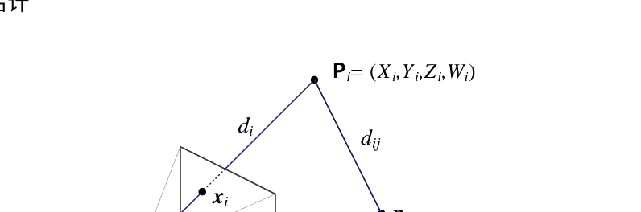

2D点对 $\hat{\boldsymbol{x}}_i$ 和 $\hat{\boldsymbol{x}}_j$ 的角度必须与它们对应的3D点 $\boldsymbol{p}_i$ 和 $\boldsymbol{p}_j$ 的角度相同（图6.4）。

给定一组对应的2D和3D点 $\{(\hat{\boldsymbol{x}}_i, \boldsymbol{p}_i)\}$，其中 $\hat{\boldsymbol{x}}_i$ 是通过将2D像素测量 $\boldsymbol{x}_i$ 转换为单位范数3D方向 $\hat{\boldsymbol{x}}_i$ 通过逆标定矩阵 $\boldsymbol{K}$ 获得的。

$\hat{\boldsymbol{x}}_i = \mathcal{N}(\boldsymbol{K}^{-1} \boldsymbol{x}_i) = \boldsymbol{K}^{-1} \boldsymbol{x}_i / \|\boldsymbol{K}^{-1} \boldsymbol{x}_i\|,$

未知数是相机原点 $\boldsymbol{c}$ 到三维点 $\boldsymbol{p}_i$ 的距离 $d_i$，其中

$\boldsymbol{p}_i = d_i \hat{\boldsymbol{x}}_i + \boldsymbol{c}$

（图6.4）。三角形 $\Delta(\boldsymbol{c}, \boldsymbol{p}_i, \boldsymbol{p}_j)$ 的余弦定理给出

$f_{ij}(d_i, d_j) = d_i^2 + d_j^2 - 2 d_i d_j c_{ij} - d_{ij}^2 = 0,$

其中

$c_{ij} = \cos \theta_{ij} = \hat{\boldsymbol{x}}_i \cdot \hat{\boldsymbol{x}}_j$

和

$d_{ij}^2 = \|\boldsymbol{p}_i - \boldsymbol{p}_j\|^2.$

我们可以通过Sylvester resultants (Cox, Little, and O’Shea 2007)来消除任意三个约束 $(f_{ij}, f_{ik}, f_{jk})$ 并得到一个四次方程式 $d_i^2$，

$g_{ijk}(d_i^2) = a_4 d_i^8 + a_3 d_i^6 + a_2 d_i^4 + a_1 d_i^2 + a_0 = 0.$

给定五个或更多的对应关系，我们可以生成 $\frac{(n-1)(n-2)}{2}$ 三元组以获得对 $(d_i^8, d_i^6, d_i^4, d_i^2)$ 的线性估计值（使用SVD）(Quan and Lan 1999)。估计值为 $d_i^2$ 可以计算为连续比率的比值 $d_i^{2(n+2)}/d_i^{2n}$ 的估计值，这些可以取平均值得到一个最终的 $d_i^2$（因此也是 $d_i$）的估计值。一旦计算出 $d_i$距离的个体估计值，我们可以生成一个由缩放点方向 $d_i\hat{x}_i$组成的3D结构，然后可以使用绝对定位（第6.1.5节）将其与3D点云 $\{p_i\}$对齐，从而获得所需的姿态估计。Quan和Lan（1999）给出了这种和其他技术的准确性结果，这些技术使用较少的点，但需要更复杂的代数操作。Moreno-Noguer、Lepetit和Fua（2007）的论文回顾了更近期的替代方法，并提供了一个复杂度较低的算法，通常产生更准确的结果。

不幸的是，由于最小化PnP解决方案对噪声非常敏感，并且还会遇到基准浮雕模糊（例如，深度反转）（第7.4.3节），通常最好使用线性六点算法猜测初始姿态，然后使用第6.2.2节中描述的迭代技术优化此估计。

另一种姿态估计算法涉及使用缩放正交投影模型开始，然后使用更准确的透视投影模型迭代地改进此初始估计（DeMenthon和Davis 1995）。正如论文标题所述，这个模型的吸引力在于它可以用“25行[Mathematica]代码”实现。

#### 6.2.2 迭代算法

估计姿态的最准确（和灵活）的方法是直接最小化未知姿态参数的二维点的平方（或鲁棒）重投影误差 $(R,t)$并且可以选择使用非线性最小二乘法 (Tsai 1987; Bogart 1991; Gleicher and Witkin 1992)。我们可以将投影方程写成

$$x_i = f(p_i; R, t, K) \tag{6.42}$$

并且迭代地最小化鲁棒化线性化的重投影误差

$$E_{NLP} = \sum_i \rho \left( \frac{\partial f}{\partial R} \Delta R + \frac{\partial f}{\partial t} \Delta t + \frac{\partial f}{\partial K} \Delta K - r_i \right), \tag{6.43}$$

其中 $r_i = \tilde{x}_i - \hat{x}_i$是当前残差向量（预测位置的2D误差），偏导数是关于未知的姿态参数（旋转、平移和可选的标定）的。请注意，如果对于2D特征位置有完整的2D协方差估计，上述平方范数可以通过逆点协方差矩阵加权，如公式（6.11）所示。

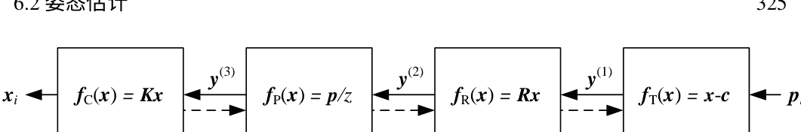

图6.5通过一系列变换 \( f^{(k)} \) 将3D点 \( p_i \) 投影到2D测量值 \( x_i \) 的一组链接变换。每个变换由其自己的一组参数控制。虚线表示在反向传播过程中计算偏导数时信息的流动。

例如平移、旋转或透视除法（图6.5）。得到的投影方程可以写成

\[
\begin{aligned}
y^{(1)} &= f_T(p_i; c_j) = p_i - c_j, \quad (6.44) \\
y^{(2)} &= f_R(y^{(1)}; q_j) = R(q_j) y^{(1)}, \quad (6.45) \\
y^{(3)} &= f_P(y^{(2)}) = \frac{y^{(2)}}{z^{(2)}}, \quad (6.46) \\
x_i &= f_C(y^{(3)}; k) = K(k) y^{(3)}. \quad (6.47)
\end{aligned}
\]

请注意，在这些方程中，我们通过索引j对相机中心 \( c_j \) 和相机旋转四元数 \( q_j \) 进行编号，以防使用多个标定物体的姿态（也请参阅第7.4节）。我们还使用相机中心 \( c_j \) 而不是世界平移 \( t_j \)，因为这是一个更自然的参数来估计。

这种链接的转换集的优点是，每个转换对其参数和输入都有一个简单的偏导数。因此，一旦基于3D点位置 \( p_i \) 和当前姿态的当前值计算出 \( \bar{x}_i \) 的预测值参数 \( (c_j, q_j, k) \)，我们可以使用链式法则获得所有所需的偏导数。

\[ \frac{\partial r_i}{\partial \rho^{(\kappa)}} = \frac{\partial \rho_i}{\partial \gamma^{(\kappa)}} \frac{\partial \gamma^{(\kappa)}}{\partial \rho^{(\kappa)}}, \quad (6.48) \]

其中 \( \rho^{(\kappa)} \) 表示正在优化的参数向量之一。（同样的“技巧”在神经网络中也被用作反向传播算法的一部分（Bishop 2006）。在这个公式中，有一个特殊情况可以大大简化计算，即旋转更新的计算。不直接计算 \( 3 \times 3 \) 旋转矩阵 \( R(q) \) 关于单位四元数的导数，可以将方程（2.35）中给出的增量旋转矩阵 \( \Delta R(\omega) \) 添加到当前旋转矩阵前面，并计算

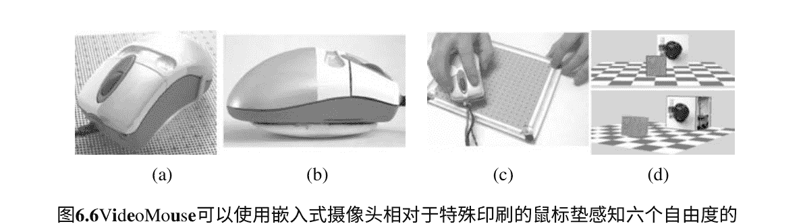

图6.6VideoMouse可以使用嵌入式摄像头相对于特殊印刷的鼠标垫感知六个自由度的运动（Hinckley, Sinclair, Hanson等人，1999）1999ACM：（a）鼠标的俯视图；（b）鼠标的侧视图，显示了弯曲的底座以实现摇晃；（c）用另一只手移动鼠标垫可以扩展交互功能；（d）屏幕上显示的移动结果。

对于这些参数的变换的偏导数，其结果是反向链接偏导数和出射3D向量（2.36）的简单叉积。

#### 6.2.3 应用：增强现实

姿态估计的一个广泛应用是增强现实，其中虚拟的3D图像或注释被叠加在实时视频流的顶部，可以通过透明眼镜（头戴式显示器）或常规计算机或移动设备屏幕来实现（Azuma, Baillot, Behringer等，2001年; Haller, Billinghurst和Thomas，2007年）。在一些应用中，跟踪卡片或书中打印的特殊图案以执行增强（Kato, Billinghurst, P oupyrev等，2000年; Billinghurst, Kato和Poupyrev，2001年）。

对于桌面应用程序，可以通过嵌入在增强鼠标中的摄像头跟踪鼠标垫上的点阵，使用户在3D空间中完全控制六个自由度的位置和方向（Hinckley, Sinclair, Hanson等，1999年），如图6.6所示。

有时候，场景本身提供了一个方便的对象来跟踪，比如矩形defining a desktop used in through-the-lens camera control (Gleicher and Witkin 1992)。在室外场景中，比如电影拍摄现场，更常见的是在场景中放置特殊标记物，比如brightly colored balls，以便更容易找到并跟踪它们 (Bogart 1991)。在早期的应用中，使用测量技术来确定这些球的位置before filming。如今，更常见的是直接对电影镜头进行运动结构分析 (Section 7.4.2)。

快速姿态估计也是追踪手持遥控器位置和方向的关键，这种遥控器常用于任天堂的Wii游戏系统。遥控器中嵌入了一台高速摄像机，用于跟踪红外（IR）LED灯条的位置安装在电视监视器上。然后使用姿态估计来推断遥控器的位置和方向，帧率非常高。Wii系统可以通过将传感器条安装在手持设备上来扩展到各种其他用户交互应用，正如Johnny Lee所描述的那样。¹¹

练习6.4和6.5要求您为增强现实应用程序实现两种不同的跟踪和姿态估计系统。第一个系统跟踪矩形物体的轮廓，例如书皮或杂志页面，第二个系统要求您跟踪手持魔方的姿态。

### 6.3 几何内部校准

如上所述，在方程（6.42-6.43）中，计算内部（内在）相机校准参数可以与相机相对于已知校准目标的（外在）姿态估计同时进行。事实上，这是摄影测量学（Slama 1980）和计算机视觉（Tsai 1987）社区中使用的“经典”相机校准方法。在本节中，我们将研究替代的公式（可能不涉及非线性回归问题的完整解决方案），使用替代校准目标以及估计相机光学的非线性部分，如径向畸变。¹²

#### 6.3.1 校准模式

使用校准图案或一组标记是估计相机内部参数的更可靠的方法之一。在摄影测量中，通常会在一个大的场地中设置一个相机，观察远处的预先计算好位置的校准目标（Slama 1980; Atkinson 1996; Kraus 1997）。在这种情况下，姿态的平移分量变得无关紧要，只需要恢复相机的旋转和内部参数。

如果需要使用较小的校准装置，例如用于室内机器人应用或携带自己的校准目标的移动机器人，最好的方法是校准物体能够尽可能覆盖工作空间的大部分区域（图6.8a），因为平面目标通常无法准确预测远离平面的姿态分量。确定校准是否成功的一个好方法是估计参数的协方差（第6.1.4节），然后将工作空间中的各个点的三维坐标投影到图像中，以估计它们的二维位置不确定性。

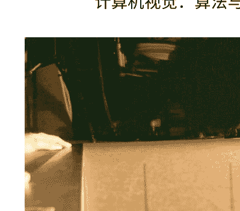

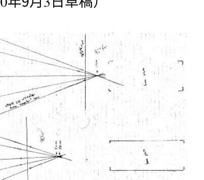

图6.7通过在硬纸板上画直线来校准镜头 (Debevec, Wenger, Tchou等, 2002) ©2002 ACM: (a) 由视频摄像机拍摄的图像，显示手持金属尺的右边缘在图像中垂直；(b) 在硬纸板上绘制的一组线条，汇聚在镜头的前焦点（投影中心）上，并指示水平视场。

估计镜头焦距和投影中心的另一种方法是将相机放在一块大的平坦硬纸板上，并使用一把长金属尺在硬纸板上绘制在图像中垂直的线条，如图6.7a所示 (Debevec, Wenger, Tchou等, 2002)。这些线条位于与相机传感器的垂直轴平行的平面上，并通过镜头的前焦点。通过相交这些线条并测量它们的角度范围（图6.7b），可以恢复出焦点的位置（在垂直投影到硬纸板平面上）和水平视场的大小。

如果没有校准图案可用，也可以同时进行结构和姿态恢复的校准（第6.3.4节和第7.4节），这被称为自校准 (Faugeras, Luong和Maybank 1992; Hartley和Zisserman 2004; Moons, VanGool和Vergauwen 2010)。然而，这种方法需要大量的图像才能准确。

### 平面校准图案

当使用有限的工作空间和精确的加工和运动控制平台时，执行校准的一种好方法是通过工作空间体积以受控的方式移动平面校准目标。这种方法有时被称为N-平面校准方法 (Gremban, Thorpe和Kanade 1988; Champleboux, Lavall'ee, Szeliski等1992; Grossberg和Nayar 2001)，其优点是每个相机像素可以映射到空间中的唯一3D射线，这可以处理线性效应模型化的问题。

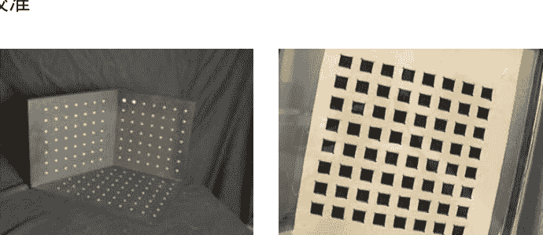

图6.8校准图案：(a) 三维目标（Quan和Lan 1999）©1999IEEE；(b) 二维目标（Zhang 2000）©2000 IEEE。请注意，这些图像中需要去除径向畸变才能用于校准的特征点。

通过校准矩阵K和非线性效应（如径向畸变）（第6.3.5节）。可以通过在相机前面挥动一个平面校准图案（图6.8b）来获得一个不那么繁琐但也不那么准确的校准。在这种情况下，理论上需要恢复图案的姿态以及内参。在这种技术中，每个输入图像用于计算单独的单应性变换（6.19-6.23）Ĥ将平面的校准点$(X_i, Y_i, 0)$映射到图像坐标$(x_i, y_i)$。

$$\boldsymbol{x}_i = \begin{bmatrix} x_i \\ y_i \\ 1 \end{bmatrix} \sim \boldsymbol{K} \begin{bmatrix} \boldsymbol{r}_0 & \boldsymbol{r}_1 & \boldsymbol{t} \end{bmatrix} \begin{bmatrix} X_i \\ Y_i \\ 1 \end{bmatrix} \sim \tilde{\boldsymbol{H}} \boldsymbol{p}_i,$$ (6.49)

其中，$\boldsymbol{r}_i$是$\boldsymbol{R}$的前两列，$\sim$表示尺度相等。从中，张（2000）展示了如何对$\boldsymbol{B} = \boldsymbol{K}^{-T}\boldsymbol{K}^{-1}$矩阵，从中可以使用矩阵的平方根和逆矩阵恢复出标定矩阵$\boldsymbol{K}$。（矩阵$\boldsymbol{B}$在投影几何中被称为绝对圆的图像（IAC），常用于相机标定（Hartley和Zisserman 2004年，第7.5节）。）如果只恢复焦距，则可以使用消失点的更简单方法。

#### 6.3.2 消失点

在实践中经常出现的标定常见情况是相机拍摄的是一个人造场景，其中包含强烈的扩展矩形物体，如盒子或房间墙壁。在这种情况下，我们可以相交对应于3D平行线的2D线来计算它们的消失点，如第4.3.3节所述，并使用这些点来确定内部和外部标定参数（Caprile和Torre 1990年；Becker和Bove 1995年；Liebowitz and Zisserman 1998; Cipolla, Drummond, and Robertson 1999; Antone and Teller 2002; Criminisi, Reid, and Zisserman 2000; Hartley and Zisserman 2004; Pflugfelder 2008)。

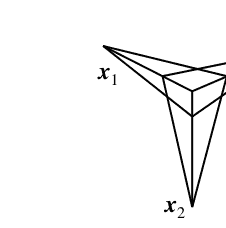

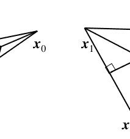

图6.9 通过消失点进行校准：(a) 任意一对有限消失点 (\hat{x}_i, \hat{x}_j) 可以用来估计焦距；(b) 消失点三角形的正交中心 gives the optical center of the image \mathbf{c}。

假设我们已经检测到两个或更多正交消失点，所有这些点都是有限的，即它们不是从图像平面上看起来是平行的线获得的(Figure 6.9a)。让我们还假设校准矩阵 \mathbf{K} 的简化形式，其中只有焦距是未知的(2.59)。(对于粗略的三维建模，通常可以假设光学中心位于图像中心，纵横比为1，没有倾斜。)在这种情况下，消失点的投影方程可以写成

\hat{x}_i = \begin{bmatrix} x_i - c_x \\ y_i - c_y \\ f \end{bmatrix} \sim \mathbf{R p}_i = \mathbf{r}_i, \quad\quad (6.50)

其中 \mathbf{p}_i 对应于基本方向之一 (1,0,0), (0,1,0), 或 (0,0,1)，而 \mathbf{r}_i 是旋转矩阵 \mathbf{R} 的第 i 列。

根据旋转矩阵列之间的正交性，我们有

\mathbf{r}_i \cdot \mathbf{r}_j \sim (x_i - c_x)(x_j - c_y) + (y_i - c_y)(y_j - c_y) + f^2 = 0 \quad\quad (6.51)

从中我们可以得到对 f^2 的估计。请注意，随着消失点越靠近图像中心，这个估计的准确性会增加。换句话说，最好在 45^\circ 轴周围适当倾斜校准图案，如图6.9a所示。一旦确定了焦距 f，可以通过归一化(6.50)式的左边并进行叉积来估计 \mathbf{R} 的各个列。另外，可以使用初始 \mathbf{R} 估计的奇异值分解(SVD)，这是正交Procrustes (6.32)的一种变体。

#### 6.3.3 应用：单视图测量学

消失点估计和相机校准的有趣应用是由Criminisi, Reid和Zisserman (2000) 开发的单视图计量系统。他们的系统允许人们交互式测量高度和其他尺寸，以及构建分段平面的三维模型，如图6.10所示。

他们系统的第一步是在地面上识别两个正交消失点和垂直方向的消失点，可以通过在图像中绘制一些平行线集来完成。（或者，也可以使用自动化技术，如第4.3.3节所讨论的技术，或者Schaffalitzky和Zisserman (2000) 提出的技术。）然后用户在图像中标记一些尺寸，例如参考物体的高度，系统可以自动计算另一个物体的高度。墙壁和其他平面伪装（几何）也可以被描绘和重建。

在最初由Criminisi, Reid和Zisserman (2000) 开发的公式中，系统产生一个仿射重建，即只知道每个轴上一组独立缩放因子。可以构建一个更有用的系统，假设相机的校准已知，但焦距未知，可以通过从正交（有限）消失方向中恢复来确定。一旦完成这一步骤，用户可以在地面上指示一个原点和另一个已知距离的点。从这里，地面上的点可以直接投影到3D空间中。

与地平面投影配对的地平面上方的点也可以被恢复。然后可以完全度量重建场景。

练习6.9要求您实现这样一个系统，并使用它对一些简单的3D场景进行建模。第12.6.1节描述了其他可能的多视图方法，用于建筑重建，包括使用消失点来确定3D线方向和平面法线的交互式分段平面建模系统（Sinha，Steedly，Szeliski et al.2008）。

#### 6.3.4 旋转运动

当没有校准目标或已知结构可用，但可以围绕其前焦点旋转相机（或等效地，在所有物体都远离的大型开放环境中工作），可以通过假设相机正在进行纯旋转运动来从一组重叠图像中校准相机，如图6.11所示（Stein 1995; Hartley1997b; Hartley, Hayman, de Agapito et al.2000; de Agapito, Hayman, and Reid 2001; Kang and Weiss 1999; Shum and Szeliski 2000; Frahm and Koch 2003）。当使用完整的360°运动进行校准时，可以获得焦距f的非常准确的估计，因为该估计的准确性与结果圆柱全景图中的像素总数成比例（第9.1.6节）（Stein 1995; Shum and Szeliski 2000）。

为了使用这种技术，我们首先计算所有重叠图像对之间的单应性矩阵$\hat{H}_{ij}$，如方程（6.19–6.23）所解释的。然后，我们使用方程（2.72）中首次提出并在第9.1.3节（9.5）中详细探讨的观察结果，即每个单应性矩阵与相机间旋转$R_{ij}$通过（未知的）标定矩阵Ki和Kj相关联 $K_i$ 和 $K_j$,

$$\tilde{H}_{ij} = K_i R_i R_j^{-1} K_j^{-1} = K_i R_{ij} K_j^{-1}.\tag{6.52}$$

获得标定的最简单方法是使用标定矩阵 (2.59) 的简化形式，其中我们假设像素是正方形且光学中心位于图像中心，即 $K_k = \mathrm{diag}(f_k, f_k, 1)$。 (我们根据像素坐标进行编号，即将像素 $(x, y) = (0,0)$ 放在图像中心。) 然后，我们可以将方程 (6.52) 重写为

$$R_{10} \sim K_1^{-1} \tilde{H}_{10} K_0 \sim \begin{bmatrix} h_{00} & h_{01} & f_0^{-1}h_{02} \\ h_{10} & h_{11} & f_0^{-1}h_{12} \\ f_1h_{20} & f_1h_{21} & f_0^{-1}f_1h_{22} \end{bmatrix},\tag{6.53}$$

其中 $h_{ij}$ 是 $\tilde{H}_{10}$ 的元素。利用旋转矩阵 $R$ 的正交性质以及 (6.53) 式右侧只能确定到一个尺度，我们得到

$$h_{00}^2 + h_{01}^2 + f_0^{-2}h_{02}^2 = h_{10}^2 + h_{11}^2 + f_0^{-2}h_{12}^2\tag{6.54}$$

和

$$h_{00}h_{10} + h_{01}h_{11} + f_0^{-2}h_{02}h_{12} = 0.\tag{6.55}$$

从这个中，我们可以计算出 $f_0$ 的估计值

$$f_0^2 = \frac{h_{12}^2 - h_{02}^2}{h_{00}^2 + h_{01}^2 - h_{10}^2 - h_{11}^2} \quad \text{如果} h_{00}^2 + h_{01}^2 = h_{10}^2 + h_{11}^2\tag{6.56}$$

或者

$$f_0^2 = -\frac{h_{02}h_{12}}{h_{00}h_{10} + h_{01}h_{11}} \quad \text{如果} h_{00}h_{10} = -h_{01}h_{11}.\tag{6.57}$$

(注意，Szeliski和Shum (1997) 最初给出的方程是错误的；正确的方程由Shum和Szeliski (2000) 给出。) 如果这两个条件都不成立，我们还可以计算第一行（或第二行）与第三行之间的点积。通过分析 $\tilde{H}_{10}$ 的列，也可以得到类似的结果，用于 $f_1$。如果两个图像的焦距相同，我们可以将 $f_0$ 和 $f_1$ 的几何平均值作为估计的焦距 $f = \sqrt{f_1f_0}$。当存在多个 $f$ 的估计值时，例如来自不同的单应性，可以使用中值作为最终的估计值。

在固定参数相机 $K$ 的情况下，可以通过Hartley (1997b) 的技术获得更一般的（上三角形）估计 $K$。从 (6.52) 中可以观察到 $R_{ij} \sim K^{-1} \tilde{H}_{ij} K$ 和 $R_{ij}^{-T} \sim K^T \tilde{H}_{ij}^{-T}$。将 $R_{ij} = R_{ij}^{-T}$ 等式两边相等，我们得到

$$K^{-1} \tilde{H}_{ij} K \sim K^T \tilde{H}_{ij}^{-T} K^{-T},$$

由此我们得到

$$\tilde{H}_{ij} (K K^T) \sim (K K^T) \tilde{H}_{ij}^{-T}.\tag{6.58}$$

这为我们提供了一些关于$\boldsymbol{A}=\boldsymbol{K}\boldsymbol{K}^T$中条目的齐次线性约束，这被称为绝对圆图像的对偶(Hartley 1997b; Hartley and Zisserman 2004)。（回想一下，当我们估计单应性时，我们只能恢复到一个未知的尺度。）通过足够数量的独立单应性估计$\tilde{\boldsymbol{H}}_{ij}$，我们可以使用奇异值分解或特征值分析来恢复$\boldsymbol{A}$（尺度上）。然后恢复通过Cholesky分解（附录A.1.4）进行K扩展。Hartley，Hayman，de Agapitoet al. (2000) 和de Agapito，Hayman和Reid (2001) 讨论了在时间上变化的校准参数和非平稳相机的情况。

通过构建一个完整的360°全景图，可以大大提高内部相机参数的质量，因为错误估计焦距将导致序列中的第一幅图像与自身拼接时出现间隙（或过度重叠）（图9.5）。由此产生的错位可以用于改进焦距的估计并重新调整旋转估计，如第9.1.4节所述。围绕其光轴旋转相机90°并重新拍摄全景图是检查纵横比和倾斜像素问题的好方法，如果有足够的纹理，则可以生成一个完整的半球形全景图。

然而，最准确的标定参数估计（包括径向畸变）可以通过对内部和外部（旋转）参数进行完全同时非线性最小化来获得，如第9.2节所述。

#### 6.3.5 径向畸变

当使用广角镜头拍摄图像时，通常需要对镜头畸变进行建模，如径向畸变。如第2.1.6节所讨论的，径向畸变模型表明观测图像中的坐标会根据其径向距离（图2.13a-b）与图像中心的距离成比例地偏离（桶形畸变）或朝向（枕形畸变）。最简单的径向畸变模型使用低阶多项式（参见方程（2.78））。

$$\begin{aligned}\hat{x} &= x(1 + \kappa_1 r^2 + \kappa_2 r^4) \\ \hat{y} &= y(1 + \kappa_1 r^2 + \kappa_2 r^4),\end{aligned}\tag{6.59}$$

其中$r^2=x^2+y^2$，$\kappa_1$和$\kappa_2$被称为径向畸变参数(Brown 1971; Slama 1980).<sup>13</sup>

可以使用多种技术来估计给定镜头的径向畸变参数。<sup>14</sup>其中最简单且最有用的方法之一是拍摄一个具有大量场景的图像，尤其是与图像边缘对齐和靠近边缘的直线。然后可以调整径向畸变参数，直到图像中的所有直线都变直，这通常被称为垂直线方法（Brown 1971; Kang 2001; El-Melegy andFarag 2003）。练习6.10提供了如何实现这种技术的更多细节。另一种方法是使用几个重叠的图像，并将径向畸变参数的估计与图像对齐过程相结合，即通过扩展第9.2.1节中用于拼接的流程。Sawhney和Kumar（1999）在粗到精的策略中使用运动模型的层次结构（平移、仿射、投影），并结合二次径向畸变校正项。他们使用直接（基于强度）最小化来计算对齐。Stein（1997）使用基于特征的方法结合通用的3D运动模型（和二次径向畸变），这需要比无视差旋转全景更多的匹配，但可能更通用。更近期的方法有时同时计算未知的内部参数和径向畸变系数，这些系数可能包括高阶项或更复杂的有理或非参数形式（Claus and Fitzgibbon 2005; Sturm 2005; Thirthala and Pollefeys2005; Barreto and Daniilidis 2005; Hartley and Kang 2005; Steele and Jaynes 2006; Tardif,Sturm, Trudeauet al.2009）。

当使用已知的校准目标时（图6.8），径向畸变估计可以合并到其他内部和外部参数的估计中（Zhang 2000; Hartley and Kang 2007; Tardif, Sturm, Trudeauet al.2009）。这可以看作是在图6.5中所示的一般非线性最小化流程中添加了另一个阶段，在内部参数乘法框 fc 和透视除法框 fP 之间（有关平面校准目标的更多详细信息，请参见练习6.11）。当然，如第2.1.6节所讨论的那样，有时可能需要更一般的镜头畸变模型，例如鱼眼和非中心投影。虽然这类镜头的参数化可能更复杂（第2.1.6节），但可以使用两种方法来进行校准：使用已知的3D位置进行校准装置或通过使用多个重叠图像自校准（Hartley and Kang 2007; Tardif, Sturm, andRoy 2007）。用于校准径向畸变的相同技术也可以用于通过分别校准每个颜色通道并将通道扭曲以使其重新对齐来减少色差（练习6.12）。

## 6.4 附加阅读

Hartley和Zisserman（2004）对基于特征的对齐和最优运动估计的主题提供了精彩的介绍，以及对相机标定和姿态估计技术的深入讨论。

关于鲁棒估计的技术在附录B.3中进行了更详细的讨论，并在关于此主题的专著和综述文章中进行了讨论 (Huber 1981; Hampel, Ronchetti, Rousseeuw等1986; Rousseeuw和Leroy 1987; Black和Rangarajan 1996; Stewart 1999)。计算机视觉中最常用的鲁棒初始化技术是RANdom Sample Consensus (RANSAC) (Fischler和Bolles 1981)，它衍生出一系列更高效的变体 (Nist´er 2003; Chum和Matas 2005)。

注册3D点数据集的主题被称为绝对定向 (Horn 1987) 和3D姿态估计 (Lorusso, Eggert和Fisher 1995)。已经开发出各种技术，可以同时计算3D点对应和它们对应的刚性变换 (Besl和McKay 1992; Zhang 1994; Szeliski和Lavall´ee 1996; Gold, Rangarajan, Lu等1998; David, DeMenthon, Duraiswami等2004; Li和Hartley 2007; Enqvist, Josephson和Kahl 2009)。

相机标定最初在摄影测量学中进行研究 (Brown 1971; Slama 1980; Atkinson 1996; Kraus 1997)，但也在计算机视觉中得到广泛研究 (Tsai 1987; Gremban, Thorpe和Kanade 1988; Champleboux, Lavall´ee, Szeliski等1992; Zhang 2000; Grossberg和Nayar 2001)。从矩形标定物体或人造建筑物中观察到的消失点经常用于执行基本标定 (Caprile和Torre 1990; Becker和Bove 1995; Liebowitz和Zisserman 1998; Cipolla, Drummond和Robertson 1999; Antone和Teller 2002; Criminisi, Reid和Zisserman 2000; Hartley和Zisserman 2004; Pflugfelder 2008)。在没有使用已知目标的情况下进行相机标定被称为自标定，并在运动结构的教材和调查中进行了讨论 (Faugeras, Luong和Maybank 1992; Hartley和Zisserman 2004; Moons, Van Gool和Vergauwen 2010)。这类技术的一个流行子集使用纯旋转运动 (Stein 1995; Hartley 1997b; Hartley, Hayman, de Agapito等2000; de Agapito, Hayman和Reid 2001; Kang和Weiss 1999; Shum和Szeliski 2000; Frahm和Koch 2003)。

### 6.5 练习

### 例6.1：基于特征的图像对齐用于翻页动画

拍摄一组动作场景或肖像的照片（最好使用连拍模式），并将它们对齐以制作合成或翻页动画。

- 1. 使用第4.1.1-4.1.2节中描述的一些技术提取特征和特征描述符。
- 2. 使用最近邻匹配和最近邻距离比测试（4.18）对特征进行匹配。
- 3. 使用最小二乘法（第6.1.1节）和可选的RANSAC（第6.1.4节）计算第一幅图像与所有后续图像之间的最佳二维平移和旋转，以提高鲁棒性。
- 4. 使用双线性或双三次重采样将所有图像重新采样到第一幅图像的坐标框架上（第3.6.1节），并可选择将它们裁剪到共同区域。
- 5. 将生成的图像转换为动画GIF（使用网络上可用的软件），或者选择实现交叉溶解以将其转换为“慢动作”视频。
- 6. （可选）将此技术与基于特征的（练习3.25）变形相结合。

### 练习6.2：全景摄影创建

在第6.1.2节中讨论的全景照片，并在网络上常见。

- 1. 拍摄一系列有趣的重叠照片。
- 2. 使用在练习4.1-4.4中开发的特征检测器、描述符和匹配器（或现有软件）在图像之间匹配特征。
- 3. 将每个匹配特征的连通分量转换为一个轨迹，即为每个轨迹分配一个唯一的索引i，并丢弃任何不一致的轨迹（包含同一图像中的两个不同特征）。
- 4. 使用公式（6.12）为每个图像计算全局平移。
- 5. 由于你的匹配可能包含错误，将上述最小二乘度量转化为鲁棒度量（6.25），并使用迭代重新加权最小二乘法重新解决你的系统。
- 6. 计算生成的复合画布的大小，并将每个图像重新采样到其在画布上的最终位置。（跟踪边界框将使此过程更加高效。）
- 7. 对所有图像求平均，或选择某种排序方式并实现透明的覆盖合成（3.8）。
- 8. （可选）将你的参数化运动模型扩展到包括旋转和缩放，即表6.1中给出的相似变换。讨论如何处理仅包含平移和旋转（不包含缩放）的情况。
- 9. （可选）编写一个简单的工具，让用户调整排序和不透明度，并添加或删除图像。
- 10. (可选) 写下一个涉及图像成对匹配的不同最小二乘问题。讨论为什么这可能比全局匹配公式 (6.12) 更好或更差。

### 例6.3：2D刚性/欧几里得匹配

在第6.1.3节中给出了几种替代方法用于估计2D刚性 (欧几里得) 对齐。

- 1. 在合成数据上实现各种替代方法，并比较它们在噪声特征位置的随机2D点云上的准确性。
- 2. 一种方法是从质心估计平移，然后在极坐标中估计旋转。您是否需要以某种方式加权从极分解中获得的角度，以获得统计上正确的估计？
- 3. 您如何修改您的技术以考虑标量 (6.10) 或完整的二维点协方差加权 (6.11) ? 之前开发的所有“捷径”是否仍然有效，还是完全加权需要迭代优化？

### 例6.4：2D匹配移动/增强现实

用不同的图像或视频替换杂志或书中的图片。

- 1. 使用网络摄像头拍摄杂志或书页的照片。
- 2. 用矩形勾勒出页面上的图形或图片，即按照图像中出现的四边绘制。
- 3. 将这个区域中的特征与每个新的图像帧进行匹配。
- 4. 用“广告”插入物替换原始图像，使用适当的单应性变换对新图像进行扭曲。
- 5. 尝试在体育赛事的片段 (例如室内或室外足球) 上使用您的方法来实现广告牌替换。

### 示例6.5：3D摇杆

跟踪魔方以实现3D摇杆/鼠标控制。

- 1. 找出一只旧魔方 (或向父母借一只) 。
- 2. 编写一个程序来检测每个彩色方块的中心。
- 3. 将这些中心点分组成线，并找到每个面的消失点。
- 4. 从消失点估计旋转角度和焦距。

## 第6章 相机标定

- 5. 通过使用张（2000）开发的技术，通过找到一个或多个3×3网格并从已知的单应性中恢复平面的完整方程，估计完整的三维姿态（包括平移）。
- 6. 或者，由于您已经知道旋转，可以通过使用立方体上已知的三维角点及其测量的二维位置之间的线性或非线性最小二乘法来估计未知的平移。
- 7. 使用三维旋转和位置来控制VRML或3D游戏查看器。

## Ex 6.6: 基于旋转的校准

使用具有非常小视差的旋转相机的室内或室外序列，并使用第6.3.4节或第9.1.3-9.2.1节中描述的技术来校准相机的焦距。

- 1. 使用来自练习6.10-6.11中的一种技术或使用您的教师提供的给定相机的参数来消除图像中的径向畸变。
- 2. 检测并匹配相邻帧之间的特征点，并将它们链接成特征轨迹。
- 3. 计算重叠帧之间的单应性，并使用方程（6.56-6.57）来估计焦距。
- 4. 计算完整的360°全景，并更新焦距估计以填补差距（第9.1.4节）。
- 5. （可选）对旋转矩阵和焦距进行完整的束调整，以获得最高质量的估计（第9.2.1节）。

## 练习6.7: 基于目标的校准

使用三维目标来校准您的相机。

- 1. 构建一个具有已知三维位置的三维校准图案。要获得高精度并不容易，除非您使用机械加工厂，但是您可以使用重型胶合板和打印的图案来接近。
- 2. 找到角点，例如使用线条查找器并相交线条。
- 3. 实现在Tsai（1987）；Bogart（1991）；Gleicher和Witkin（1992）中描述的迭代标定和姿态估计算法之一，或在第6.2.2节中描述的系统。
- 4. 在不同距离和方向上拍摄许多照片，报告重新投影误差和准确性。（为了做后者，您可能需要使用模拟数据。）

## Ex 6.8: 校准精度

比较三种校准技术（基于平面、基于旋转和基于3D目标）。

一种方法是让不同的学生分别实现每种方法并比较结果。另一种方法是使用合成数据，可能会重复使用您为练习2.3开发的软件。使用合成数据的优点是您知道校准和姿态参数的真实值，可以轻松运行大量实验，并且可以合成地改变测量中的噪声。

以下是构建测试集的一些可能准则：

- 1. 假设一个中等宽的焦距（比如，50度视场）。
- 2. 对于基于平面的技术，生成一个二维网格目标并在不同的倾斜角度下进行投影。
- 3. 对于一个三维目标，创建一个内部立方体角点，并将其定位在填充大部分视场的位置。
- 4. 对于旋转技术，均匀地在球体上散布点，直到获得与其他技术相似数量的点。

在比较技术之前，预测哪种技术将是最准确的（通过使用点数的平方根对结果进行归一化）。向测量结果添加不同程度的噪声，并描述各种技术的噪声敏感性。

## 练习6.9: 单视图计量

使用可见消失方向（第6.3.3节）（Criminisi、Reid和Zisserman 2000）的单幅图像实现一个系统来测量尺寸并重建三维模型。

- 1. 从平行线中找到三个正交消失点，并使用它们建立三个坐标轴（相机相对场景的旋转矩阵 R）。如果两个消失点是有限的（不是无穷远点），则可以使用它们来计算焦距，假设已知光学中心。否则，找到其他校准相机的方法；可以使用Schaffalitzky和Zisserman（2000）描述的一些技术。
- 2. 点击地平面上的一个点来确定原点，并点击一个已知距离的点来确定场景比例。这样可以计算相机和场景之间的平移 t。作为替代，点击一对点，一个在地平面上，一个在其上方，并使用已知高度来确定场景比例。
- 3. 编写一个用户界面，让您点击地平面上的点以恢复它们的3D位置。（提示：您已经知道相机矩阵，因此只需知道一个点的 z 值就足以恢复其3D位置。）点击一对点（一个在地平面上，一个在其上方）来测量垂直高度。
- 4. 通过使用Sinha、Steedly、Szeliski等人（2008年）描述的一些技术，将场景中的四边形与世界中的轴对齐矩形相对应，扩展您的系统。将您的3D矩形导出为VRML或PLY^{15}文件。
- 5.（可选）使用正确的单应性将四边形包围的像素进行扭曲，以生成每个平面多边形的纹理映射。

## **Ex 6.10: 使用铅垂线进行径向畸变**

实现一个铅垂线算法来确定径向畸变参数。

- 1. 拍摄一些场景图像，其中包含许多直线，例如您家或办公室的走廊，并尽可能将一些直线靠近图像边缘。
- 2. 提取边缘并将它们连接成曲线，如第4.2.2节和练习4.8中所述。
- 3. 使用一种对链接边缘进行二次或椭圆曲线拟合的算法的推广，该算法在第4.3.1节和练习4.11中描述，并保留适合这种形式的曲线。
- 4. 对于每个曲线段，拟合一条直线，并在调整径向畸变参数的同时最小化曲线与直线之间的垂直距离。
- 5. 在重新拟合直线和调整径向畸变参数之间交替进行，直到收敛。

## **Ex 6.11: 使用校准目标进行径向畸变**

使用网格校准目标确定径向畸变参数。

- 1. 打印一个平面校准目标，将其安装在坚硬的板上，并使其填满您的视野。
- 2. 检测校准目标中的正方形、线条或点。
- 3. 从没有任何径向畸变的图像的中心部分估计将目标映射到相机的单应性。
- 4. 预测剩余目标的位置，并利用观测和预测位置之间的差异来估计径向畸变。
- 5. （可选）使用一般样条模型（用于严重畸变）而不是四次畸变模型进行拟合。
- 6. （可选）将您的技术扩展到校准鱼眼镜头。

**Ex 6.12:** 色差

使用在前一练习中计算的每个颜色通道的径向畸变估计来通过将所有通道扭曲对齐来清理广角镜头图像。（可选）同时将图像拉直。

您能想到为什么这种扭曲策略可能并不总是有效的原因吗？

## 第7章

## 运动结构

- 7.1 三角测量 ........................ 345
- 7.2 两帧运动结构 ........................ 347
  - 7.2.1 投影（非校准）重建 ........................ 353
  - 7.2.2 自标定 ........................ 355
  - 7.2.3 应用 ：视图变形 ........................ 357
- 7.3 分解 ........................ 357
  - 7.3.1 透视和投影分解 ........................ 360
  - 7.3.2 应用 ：稀疏三维模型提取 ........................ 362
- 7.4 捆绑调整 ........................ 363
  - 7.4.1 利用稀疏性 ........................ 364
  - 7.4.2 应用：匹配移动和增强现实 ........................ 368
  - 7.4.3 不确定性和模糊性 ........................ 370
  - 7.4.4 应用：从互联网照片重建 ........................ 371
- 7.5 约束结构和运动 ........................ 374
  - 7.5.1 基于线的技术 ........................ 374
  - 7.5.2 基于平面的技术 ........................ 376
- 7.6 附加阅读 ........................ 377
- 7.7 练习 ........................ 377

## 图7.1 运动结构系统：

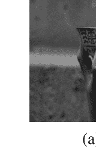

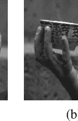

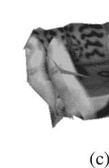

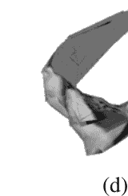

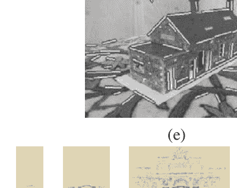

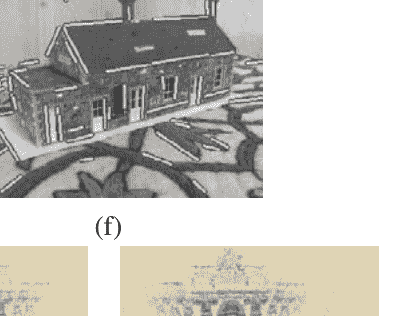

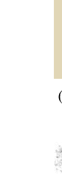

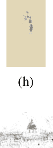

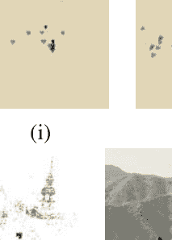

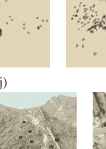

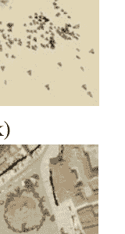

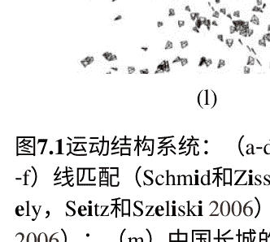

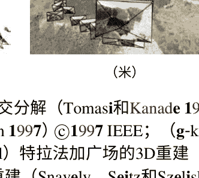

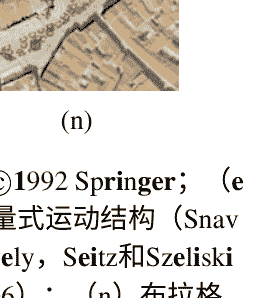

(a-d) 正交分解 (Tomasi和Kanade 1992) ©1992 Springer; (e-f) 线匹配 (Schmid和Zisserman 1997) ©1997 IEEE; (g-k) 增量式运动结构 (Snavely, Seitz和Szeliski 2006) ; (l) 特拉法加广场的3D重建 (Snavely, Seitz和Szeliski 2006) ; (m) 中国长城的3D重建 (Snavely, Seitz和Szeliski 2006) ; (n) 布拉格老城广场的3D重建 (Snavely, Seitz和Szeliski 2006) ©2006 ACM。

在前一章中，我们看到了如何对齐2D和3D点集，并且如何使用这些对齐来估计相机的姿态和内部校准参数。 在本章中，我们将研究从多个图像中仅给定稀疏的图像特征对应关系的情况下，估计3D点的位置的相反问题。

虽然这个过程通常涉及同时估计3D几何（结构）和相机姿态（运动），但它通常被称为运动结构（Ullman 1979）。

投影几何和运动结构的主题非常丰富，已经有一些优秀的教材和调查报告写过它们（Faugeras和Luong 2001; Hartley和Zisserman 2004; Moons, Van Gool和Vergauwen 2010）。 本章跳过了这些书中可用的更丰富的材料，如三焦张量和完全自校准的代数技术，而是集中在我们在此大规模基于图像的重建问题中发现有用的基础知识上（Snavely, Seitz和Szeliski 2006）。

我们首先简要讨论三角测量（第7.1节），它是在多个摄像头中观察到一个点的三维位置的估计问题。 接下来，我们将研究两帧运动结构问题（第7.2节），它涉及确定两个摄像头之间的极线几何，并可以用于通过自标定恢复关于摄像头内参的某些信息（第7.2.2节）。 第7.3节介绍了使用正交逼近来同时估计大量点轨迹的结构和运动的分解方法。

然后，我们开发了一种更通用和有用的结构运动方法，即同时调整所有摄像头和三维结构参数的捆绑调整（第7.4节）。 我们还研究了场景中存在更高级结构（如线条和平面）时出现的特殊情况（第7.5节）。

### 7.1 三角测量

确定一个点的三维位置的问题，从一组对应的图像位置和已知的相机位置中，被称为三角测量。 这个问题是我们在第6.2节中研究的姿态估计问题的逆问题。

解决这个问题的最简单的方法之一是找到与2D匹配特征位置 $\{x_j\}$ 相对应的所有3D射线最近的3D点 $p$，这些射线由相机 $\{P_j = K_j[R_j|t_j]\}$ 观察到，其中 $t_j = -R_j c_j$， $c_j$ 是第 $j$ 个相机的中心（2.55-2.56）。 正如你在图7.2中所看到的，这些射线起源于 $c_j$，方向为 $\hat{v}_j = \mathcal{N}(R_j^{-1} K_j^{-1} x_j)$。 距离这条射线上最近的点，我们将其表示为 $q_j$，最小化距离

$$\|c_j + d_j\hat{v}_j - p\|^2,$$ (7.1)

在 $d_j = \hat{v}_j \cdot (p - c_j)$ 处取得最小值。因此，

$$q_j = c_j + (\hat{v}_j \hat{v}_j^T)(p - c_j) = c_j + (p - c_j)_{\parallel}, \quad (7.2)$$

根据方程式 (2.29) 的符号， $p$ 和 $q_j$ 之间的平方距离为

$$r_j^2 = \|(I - \hat{v}_j \hat{v}_j^T)(p - c_j)\|^2 = \|(p - c_j)_{\perp}\|^2. \quad (7.3)$$

最优值 $p$，它最接近所有射线，可以通过对所有 $r_j^2$ 求和并找到 $p$ 的最优值来计算，这是一个常规的最小二乘问题。

$$p = \left[ \sum_j (I - \hat{v}_j \hat{v}_j^T) \right]^{-1} \left[ \sum_j (I - \hat{v}_j \hat{v}_j^T) c_j \right]. \quad (7.4)$$

另一种更统计优化的形式是通过最小化测量方程中的残差来产生更好的估计，如果某些相机比其他相机更接近三维点，则可以得到更好的估计结果。

$$x_j = \frac{p_{00}^{(j)} X + p_{01}^{(j)} Y + p_{02}^{(j)} Z + p_{03}^{(j)} W}{p_{20}^{(j)} X + p_{21}^{(j)} Y + p_{22}^{(j)} Z + p_{23}^{(j)} W} \quad (7.5)$$
$$y_j = \frac{p_{10}^{(j)} X + p_{11}^{(j)} Y + p_{12}^{(j)} Z + p_{13}^{(j)} W}{p_{20}^{(j)} X + p_{21}^{(j)} Y + p_{22}^{(j)} Z + p_{23}^{(j)} W}, \quad (7.6)$$

其中 $(x_j, y_j)$ 是测量的二维特征位置， $\{p_{00}^{(j)} ... p_{23}^{(j)} \}$ 是已知的相机矩阵 $P_j$ (Sutherland 1974) 中的条目。

与方程式 (6.21, 6.33, 和 6.34) 一样，通过乘以分母的两边，这组非线性方程可以转化为线性最小二乘问题。请注意，如果

我们使用齐次坐标 \( p = (X, Y, Z, W) \)，得到的方程组是齐次的，最好通过奇异值分解（SVD）或特征值问题来解决（寻找最小奇异向量或特征向量）。如果我们设置 \( W = 1 \)，我们可以使用常规的线性最小二乘法，但是得到的系统可能是奇异的或者条件较差，即如果所有的视线都是平行的，就像远离相机的点一样。

出于这个原因，通常更倾向于使用齐次坐标来参数化3D点，特别是如果我们知道相机与点之间的距离可能差异很大。当然，使用非线性最小二乘法来最小化观测集合（7.5-7.6），如（6.14和6.23）所述，无论选择哪种表示方法，都比使用线性最小二乘法更可取。

对于两个观测的情况，事实证明，能够精确最小化真实重投影误差（7.5-7.6）的点的位置 \( p \) 可以使用六次方程的解来计算（Hartley和Sturm 1997）。三角测量时需要注意的另一个问题是手性问题，即确保重建的点位于所有相机的前方（Hartley 1998）。虽然无法始终保证这一点，但一个有用的启发式方法是选择位于相机后方的点，因为它们的光线是发散的（想象一下图7.2中光线互相指向 \( away \) 的情况），并将它们放置在无穷远处的平面上，将它们的 \( W \) 值设为0。

### 7.2 两帧运动结构

到目前为止，在我们对3D重建的研究中，我们总是假设3D点的位置或3D相机的姿态之一是事先已知的。在本节中，我们首次研究了运动结构，即从图像对应中同时恢复3D结构和姿态。

考虑图7.3，它显示了一个被两个相机观察的3D点 \( p \)，相机的相对位置可以用旋转 \( R \) 和平移 \( t \) 来编码。由于我们对相机位置一无所知，在不失一般性的情况下，我们可以将第一个相机设置在原点 \( c_0 = 0 \)，并处于规范方向 \( R_0 = I \)。

现在注意到第一个图像中点 \( p \) 的观测位置，\( p_0 = d_0 \hat{x}_0 \) 通过变换映射到第二个图像中

$$d_1 \hat{x}_1 = \boldsymbol{p}_1 = \boldsymbol{R} \boldsymbol{p}_0 + \boldsymbol{t} = \boldsymbol{R} (d_0 \hat{\boldsymbol{x}}_0) + \boldsymbol{t},$$ (7.7)

其中 \( \hat{\boldsymbol{x}}_j = \boldsymbol{K}_j^{-1} \boldsymbol{x}_j \) 是（局部）光线方向向量。将两边都与 \( \boldsymbol{t} \) 叉乘，以消除右边的 \( \boldsymbol{t} \)，得到¹

$$d_1 [\boldsymbol{t}]_{\times} \hat{\boldsymbol{x}}_1 = d_0 [\boldsymbol{t}]_{\times} \boldsymbol{R} \hat{\boldsymbol{x}}_0.$$ (7.8)

> ¹叉乘运算符 \( [\cdot]_{\times} \) 是在（2.32）中引入的。

将两边点乘以 \(\hat{x}_1\) 得到

$$d_0\hat{x}_1^T([t]_\times \mathbf{R})\hat{x}_0 = d_1\hat{x}_1^T[t]_\times \hat{x}_1 = 0,\tag{7.9}$$

因为右边是一个具有两个相同项的三重积。（另一种说法是，当与同一个向量进行前乘和后乘时，叉乘矩阵 \([t]_\times\) 是反对称的，并且返回0。）因此，我们得到了基本的对极约束

$$\hat{x}_1^T \mathbf{E} \hat{x}_0 = 0,\tag{7.10}$$

其中

$$\mathbf{E} = [t]_\times \mathbf{R}\tag{7.11}$$

被称为本质矩阵(Longuet-Higgins 1981)。

推导对极约束的另一种方法是注意到为了使相机以使光线 \(\hat{x}_0\) 和 \(\hat{x}_1\) 在三维空间中相交于点 \(p\)，连接两个相机中心 \(c_1 - c_0 = -\mathbf{R}_1^{-1}t\) 的向量和与像素 \(x_0\) 和 \(x_1\) 对应的光线 \(\mathbf{R}_j^{-1}\hat{x}_j\) 必须共面。这要求三重积

$$(\hat{x}_0, \mathbf{R}^{-1}\hat{x}_1, -\mathbf{R}^{-1}t) = (\mathbf{R}\hat{x}_0, \hat{x}_1, -t) = \hat{x}_1 \cdot (t \times \mathbf{R}\hat{x}_0) = \hat{x}_1^T ([t]_\times \mathbf{R})\hat{x}_0 = 0.\tag{7.12}$$

注意，本质矩阵 \(\mathbf{E}\) 将图像0中的点 \(\hat{x}_0\) 映射到图像1中的线 \(l_1 = \mathbf{E}\hat{x}_0\)，因为 \(\hat{x}_1^T l_1 = 0\)（图7.3）。所有这样的线都必须通过第二个极点 \(e_1\)，因此它被定义为 \(\mathbf{E}\) 的左奇异向量，其奇异值为0，或者等价地，是向量 \(t\) 在图像1中的投影。这些的对偶（转置）## 7.2 两帧运动结构

关系给出了第一幅图像中的极线为 \( l_0 = E^T \hat{x}_1 \) 和 \( E \) 的零特征向量为 \( e_0 \)。

在给定这个基本关系 (7.10) 的情况下，我们如何使用它来恢复编码在本质矩阵 \( E \) 中的相机运动？如果我们有 \( N \) 个对应的测量 \( \{(x_{i0}, x_{i1})\} \)，我们可以得到 \( E \) 的九个元素的 \( N \) 个齐次方程组成的方程组 \( = \{e_{00} ... e_{22}\} \)，

```
x_{i0} x_{i1} e_{00} + y_{i0} x_{i1} e_{01} + x_{i1} e_{02} + \\
x_{i0} y_{i1} e_{00} + y_{i0} y_{i1} e_{11} + y_{i1} e_{12} + \\
x_{i0} e_{20} + y_{i0} e_{21} + e_{22} = 0
```

其中 \( x_{ij} = (x_{ij}, y_{ij}, 1) \)。这可以更简洁地写成

```
[x_{i1} x_{i0}^T] \otimes E = Z_i \otimes E = z_i \cdot f = 0,
```

其中 \( \otimes \) 表示矩阵元素的逐元素乘法和求和，\( z_i \) 和 \( f \) 是 \( Z_i = \hat{x}_{i1} \hat{x}_{i0}^T \) 和 \( E \) 矩阵的栅格化（向量）形式。²给定 \( N \geq 8 \) 这样的方程，我们可以使用奇异值分解计算 \( E \) 中条目的估计（缩放）。在存在噪声测量的情况下，这个估计与统计上的最优有多接近？

如果你看一下 (7.13) 中的条目，你会发现一些条目是图像测量的乘积，如 \( x_{i0} y_{i1} \)，而其他条目是直接的图像测量（甚至是身份）。如果测量具有相似的噪声，那些测量的乘积项的噪声会被乘积中的另一个元素放大，这可能导致非常糟糕的缩放，例如，具有大坐标（远离图像中心）的点具有非常大的影响力。

为了对抗这一趋势，Hartley (1997a) 建议将点坐标进行平移和缩放，使其质心位于原点，方差为单位，即

```
\tilde{x}_i = s(x_i - \mu_x) \\
\tilde{y}_i = s(y_i - \mu_y)
```

使得 \( \sum_i \tilde{x}_i = \sum_i \tilde{y}_i = 0 \) 且 \( \sum_i \tilde{x}_i^2 + \sum_i \tilde{y}_i^2 = 2n \)，其中 \( n \) 是点的数量。³

一旦从转换后的坐标 \( \{(\tilde{x}_{i0}, \tilde{x}_{i1})\} \) 计算出本质矩阵 \( E \)，原始本质矩阵 \( E \) 可以恢复为

```
E = T_1 \tilde{E} T_0.
```

²我们使用 \( f \) 而不是 \( e \) 来表示 \( E \) 的栅格化形式，以避免与极点 \( e_j \) 混淆。

³更准确地说，Hartley (1997a) 建议缩放点“使得与原点的平均距离相等 to \( \sqrt{2} \)”，但单位方差的启发式方法计算速度更快（不需要每个点的平方根）并且应该产生相似的改进。

在他的论文中，Hartley (1997a) 比较了由他的重新归一化策略引起的改进与其他人提出的替代距离度量（如Zhang (1998a, b)）并得出结论在大多数情况下，他简单的重新归一化策略与（或优于）替代技术相比是有效的。Torr和Fitzgibbon (2004) 推荐了这种算法的变体，其中 \( E \) 的上 \( 2 \times 2 \) 子矩阵的范数设置为1，并且显示它在2D坐标变换方面具有更好的稳定性。

一旦估计了本质矩阵 \( E \)，可以估计出平移向量 \( t \) 的方向。请注意，仅通过图像测量，无论使用多少相机或点，都无法恢复两个相机之间的绝对距离。要建立最终的比例、位置和方向，始终需要了解绝对相机和点的位置或距离，通常在摄影测量中称为地面控制点。

要估计这个方向 \( \hat{t} \)，观察在理想无噪声条件下，本质矩阵 \( E \) 是奇异的，即 \( \hat{t}^T E = 0 \)。当对 \( E \) 进行奇异值分解时，这种奇异性会表现为奇异值为0。

$$ E = [\hat{t}]_{\times} \mathbf{R} = U\Sigma V^{T} = \begin{bmatrix} u_0 & u_1 & \hat{t} \end{bmatrix} \begin{bmatrix} 1 & & \\ & 1 & \\ & & 0 \end{bmatrix} \begin{bmatrix} v_0^{T} \\ v_1^{T} \\ v_2^{T} \end{bmatrix} \quad (7.18) $$

当从嘈杂的测量中计算出 \( E \) 时，与小的奇异值相关联的奇异向量给出了 \( \hat{t} \)。（另外两个奇异值应该是相似的，但通常不等于1，因为 \( E \) 只计算到一个未知的比例尺。）因为 \( E \) 是秩缺失的，事实上我们只需要七个对应关系来估计这个矩阵，而不是八个（Hartley 1994a; Torr and Murray 1997; Hartley and Zisserman 2004）。（在RANSAC鲁棒拟合阶段使用更少的对应关系的优点是需要生成更少的随机样本。）从这七个齐次方程组（我们可以将其堆叠成一个 \( 7 \times 9 \) 矩阵进行SVD分析）中，我们可以找到两个独立的向量，比如 \( f_0 \) 和 \( f_1 \)，使得 \( z_i \cdot f_j = 0 \)。这两个向量可以转换回 \( 3 \times 3 \) 矩阵 \( E_0 \) 和 \( E_1 \)，它们构成了解空间。

$$ E = \alpha E_0 + (1 - \alpha) E_1. \quad (7.19) $$

为了找到正确的 \( \alpha \) 值，我们观察到 \( E \) 的行列式为零，因为它是秩不足的，因此

$$ \det |\alpha E_0 + (1 - \alpha) E_1| = 0. \quad (7.20) $$

这给我们一个三次方程，其中 \( \alpha \) 有一个或三个解（根）。将这些值代入 (7.19) 以获得 \( E \)，我们可以将这个本质矩阵与其他未使用的特征对应关系进行测试，以选择正确的一个。

一旦 \(\hat{t}\) has been recovered, 我们如何估计相应的旋转矩阵 \(R\)? 回想一下, 叉积运算符 \([\hat{t}]_\times\)(2.32)将一个向量投影到一组正交基向量上, 其中包括 \(\hat{t}\) , 将 \(\hat{t}\) 分量置零, 并将其他两个向量旋转 90°。

$$ [\hat{t}]_{\times} = S Z R_{90^{\circ}} S^{T} = \begin{bmatrix} s_{0} & s_{1} & \hat{t} \end{bmatrix} \begin{bmatrix} 1 & & \\ & 1 & \\ & & 0 \end{bmatrix} \begin{bmatrix} 0 & -1 & \\ 1 & 0 & \\ & & 1 \end{bmatrix} \begin{bmatrix} s_{0}^{T} \\ s_{1}^{T} \\ \hat{t}^{T} \end{bmatrix}, \quad (7.21) $$

从方程 (7.18和7.21) 中, 我们得到

$$ E = [\hat{t}]_{\times} R = S Z R_{90^{\circ}} S^{T} R = U \Sigma V^{T}, \quad (7.22) $$

由此我们可以得出结论 \(S = U\). 回想一下, 对于一个无噪声的本质矩阵, (\(\Sigma = Z\)), 因此

$$ R_{90^{\circ}} U^{T} R = V^{T} \quad (7.23) $$

和

$$ R = U R_{90^{\circ}}^{T} V^{T}. \quad (7.24) $$

不幸的是, 我们只知道 \(E\) 和 \(\hat{t}\) 的符号。此外, 矩阵 \(U\) 和 \(V\) 不能保证是旋转矩阵（你可以翻转它们的符号仍然得到一个有效的SVD）。因此, 我们必须生成所有四个可能的旋转矩阵

$$ R = \pm U R_{\pm 90^{\circ}}^{T} V^{T} \quad (7.25) $$

并保留行列式 \(|R|= 1\) 的两个。为了消除剩余的一对可能的旋转之间的歧义（Hartley 和 Zisserman 2004, 第240页）, 我们需要将它们与平移方向的两个可能的符号 \(\pm\hat{t}\) 配对, 并选择在两个相机前面看到最多点的组合。点必须位于相机前方, 即沿着从相机发出的视线的正距离处, 这被称为手性（Hartley 1998）。除了确定旋转和平移的符号, 如上所述, 重建中点的手性（距离的符号）可以在RANSAC过程中（以及重投影误差一起）用于区分可能和不可能的配置。手性还可以用于将投影重建（第7.2.1节和7.2.2节）转换为准仿射重建（Hartley 1998）。

上述归一化的“八点算法”（Hartley 1997a）并不是从对应关系估计相机运动的唯一方式。变种包括使用七个点⁴，在强制执行秩二约束的同时，在 \(E\) (7.19-7.20) 中使用了一个五点算法，需要找到一个10次多项式的根（Nistér 2004）。由于这种算法使用较少的点来计算它们的估计值，所以当作为随机抽样（RANSAC）策略的一部分时，它们对异常值的敏感性较低。

⁴在无噪声的情况下，一个点就足够了。然而，更安全的做法是测试所有或足够数量的点，对那些接近无穷远平面的点进行降权处理，因为这些点很容易产生深度反转。

⁵请注意，随着点离相机越来越远，即接近无穷远平面，手性错误变得更加可能。

## 纯平移（已知旋转）

在我们已知旋转的情况下，我们可以将第二幅图像中的点进行预旋转，以匹配第一幅图像的视角。得到的一组3D点都朝着（或远离）扩张焦点（FOE）移动，如图7.4所示。⁶得到的本质矩阵 \(E\)（在无噪声的情况下）是斜对称的，因此可以通过在（7.13）中设置 \(e_{ij} = -e_{ji}\) 和 \(e_{ii} = 0\) 来更直接地估计。现在，具有非零视差的两个点足以估计FOE。

通过最小化三重积可以得到更直接的FOE估计推导

$$ \sum_i (x_{i0}, x_{i1}, e)^2 = \sum_i ((x_{i0} \times x_{i1}) \cdot e)^2, \qquad\qquad (7.26) $$

这相当于找到方程组的零空间

$$ (y_{i0} - y_{i1})e_0 + (x_{i1} - x_{i0})e_1 + (x_{i0}y_{i1} - y_{i0}x_{i1})e_2 = 0. \qquad\qquad (7.27) $$

请注意，在计算此估计之前，建议将2D点归一化为单位方差。

在存在大量无穷远点的情况下，例如在拍摄户外场景或相机运动与远处物体相比较小的情况下，这表明了一种用于估计相机运动的替代RANSAC策略。首先，选择一对点来估计旋转，希望这两个点都位于无穷远处（离得很远）

⁶《星际迷航》和《星球大战》的粉丝会认出这是“超空间跳跃”的视觉效果。

的摄像机）。然后，计算FOE并检查残差误差是否很小（表示与此旋转假设一致）以及是否朝向或远离极点（FOE）的运动都是同一方向（忽略非常小的运动，可能受到噪声污染）。

## 纯旋转

纯旋转的情况会导致本质矩阵 \(E\) 和平移方向 \(\hat{t}\) 的估计退化。首先考虑旋转矩阵已知的情况。FOE的估计将会退化，因为 \(x_{i0} \approx x_{i1}\)，因此 (7.27) 是退化的。

类似的论证表明本质矩阵 (7.13) 的方程也是秩降的。

这表明在计算完整的本质矩阵之前，可能最好先使用(6.32)计算一个旋转估计 \(R\)，可能只使用少量的点，然后在旋转点之后计算残差，然后再进行完整的 \(E\) 计算。

#### 7.2.1 投影（非校准）重建

在许多情况下，例如从没有任何EXIF标签的未知相机拍摄的互联网或传统照片中尝试构建3D模型时，我们事先不知道与输入图像相关联的内部校准参数。在这种情况下，我们仍然可以估计两帧重建，尽管真实的度量结构可能不可用，例如，世界上的正交线或平面可能不会被重建为正交。考虑我们用于估计本质矩阵 \(E\) (7.10–7.12) 的推导。在未校准的情况下，我们不知道校准矩阵 \(K_j\)，因此我们无法使用归一化的射线方向 \(\hat{x}_j = K_j^{-1} x_{jo}\)。相反，我们只能访问图像坐标 \(x_j\)，因此本质矩阵(7.10)变为

$$ \hat{x}_1^T E \hat{x}_1 = x_1^T K_1^{-T} E K_0^{-1} x_0 = x_1^T F x_0 = 0, \tag{7.28} $$

其中

$$ F = K_1^{-T} E K_0^{-1} = [e]_{\times} \tilde{H} \tag{7.29} $$

被称为基础矩阵（Faugeras 1992; Hartley, Gupta, and Chang 1992; Hartley and Zisserman 2004）。

与本质矩阵一样，基础矩阵（原则上）是二阶的，

$$ F = [e]_{\times} \tilde{H} = U \Sigma V^T = \begin{bmatrix} u_0 & u_1 & e_1 \end{bmatrix} \begin{bmatrix} \sigma_0 & 0 & 0 \\ 0 & \sigma_1 & 0 \\ 0 & 0 & 0 \end{bmatrix} \begin{bmatrix} v_0^T \\ v_1^T \\ e_0^T \end{bmatrix}. \tag{7.30} $$

它的最小左奇异向量表示图像1中的极点 \( e_1 \)，而最小右奇异向量是 \( e_0 \)（图7.3）。在 (7.29) 中的单应性矩阵 \( \tilde{H} \)，原则上应该等于

$$ \tilde{H} = K_1^{-T} R K_0^{-1}, \tag{7.31} $$

无法从 \( F \) 中唯一恢复，因为任何形式的单应性变换 \( \tilde{H}' = \tilde{H} + e v^T \) 都会得到相同的 \( F \) 矩阵。（注意 \( [e]_\times \) 会使 \( e \) 的任意倍数归零。）这些有效的单应性变换 \( \tilde{H} \) 之一将某个平面从一个图像映射到另一个图像。在没有选择四个或更多共面对应点作为 \( F \) 估计过程的一部分（类似于猜测旋转矩阵 \( E \)）或将一个图像中的所有点映射到另一个图像中之前，无法事先确定是哪一个。

为了创建场景的投影重建，我们可以选择满足方程 (7.29) 的任何有效单应性变换 \( \tilde{H} \)。例如，按照类似于方程 (7.18-7.24) 的技术，我们得到

$$ F = [e]_\times \tilde{H} = S Z R_{90^\circ} S^T \tilde{H} = U \Sigma V^T \tag{7.32} $$

因此

$$ \tilde{H} = U R_{90^\circ}^T \Sigma V^T, \tag{7.33} $$

其中 \( \Sigma \) 是奇异值矩阵，最小值被替换为一个合理的替代值（比如中间值）。⁸然后我们可以形成一对相机矩阵

$$ P_0 = [I | 0] \quad \text{和} \quad P_1 = [\tilde{H} | e], \tag{7.34} $$

通过三角测量可以计算出场景的投影重建（第7.1节）。

虽然投影重建在实践中可能没有用处，但通常可以升级为仿射或度量重建，如下所述。即使没有这一步，基本矩阵 \( F \) 在寻找额外对应点时也非常有用，因为它们必须位于对应的极线上，即图像0中的任何特征点 \( x_0 \) 必须在图像1中的关联极线 \( l_1 = F x_0 \) 上，假设点的运动是由刚性变换引起的。

#### 7.2.2 自标定

如果从运动计算得到的结果更有用（和可理解），那么获得一个度量重建是非常有用的，即平行线是平行的，正交墙壁是直角的，重建模型是实际的缩放版本。多年来，已经开发了大量的自标定（或自动标定）技术，用于将投影重建转换为度量重建，这相当于恢复与每个图像相关的未知标定矩阵 \(K_j\)（Hartley and Zisserman 2004; Moons, Van Gool, and Vergauwen 2010）。

在已知场景的某些附加信息的情况下，可以采用不同的方法。例如，如果场景中存在平行线（通常，多条线收敛到同一消失点是很好的证据），可以使用三个或更多消失点来建立无穷远平面的单应性变换，从而恢复焦距和旋转。

如果已经观察到两个或更多有限正交消失点，则可以使用基于消失点的单幅图像标定方法（第6.3.2节）代替。

在没有这样的外部信息的情况下，仅通过对应关系无法恢复每个图像的完全参数化独立标定矩阵 \(K_j\)。要理解这一点，考虑所有相机矩阵 \(P_j = K_j[R_j|t_j]\) 投影世界坐标的集合。 \(p_i= (X_i, Y_i, Z_i, W_i)\) 转换为屏幕坐标 \(x_{ij} \sim P_j p_i\)。现在考虑通过任意的 \(4 \times 4\) 投影变换 \(\tilde{H}\) 将三维场景 \(\{p_i\}\) 转换为一个新模型，该模型由点 \(p'_i = \tilde{H} p_i\) 组成。通过后乘每个 \(P_j\) 矩阵与 \(\tilde{H}^{-1}\) 相乘，仍然可以得到相同的屏幕坐标，并且可以通过对新的相机矩阵 \(P'_j = P_j \tilde{H}^{-1}\) 应用RQ分解来计算新的校准矩阵。

因此，所有自标定方法都假设校准矩阵具有某种受限形式，要么通过设置或等同一些元素，要么假设它们随时间不变。尽管Hartley和Zisserman（2004）；Moons, Van Gool和Vergauwen（2010）讨论的大多数技术需要三个或更多帧，但在本节中，我们提出了一种简单的技术，可以从基础矩阵 \(F\) 中恢复出两个图像的焦距\((f_0, f_1)\)。

为了实现这一点，我们假设相机没有倾斜，具有已知的纵横比（通常设置为1），并且具有已知的光学中心，如方程（2.59）所示。这个假设在实践中有多合理？答案，就像很多问题一样，“这取决于情况”。

如果需要绝对的度量精度，比如在摄影测量应用中，就必须使用第6.3节中的一种技术对相机进行预校准，并使用地面控制点来确定重建结果。相反，如果我们只是希望为可视化或基于图像的渲染应用重建世界，就像Snavely、Seitz和Szeliski（2006）的Photo Tourism系统一样，在实践中这个假设是相当合理的。

今天 的大多数相机都具有方形像素和接近图像中心的光学中心，并且由于径向畸变（第6.3.5节），它们更有可能偏离简单的相机模型，因此应尽可能进行补偿。最大的问题发生在图像被剪裁偏离中心的情况下，此时光学中心将不再位于中心位置，或者当透视图片被拍摄成不同图片的情况下，此时需要使用通用相机矩阵。

在考虑这些限制条件的情况下，基于Hartley和Zisserman（2004年，第456页）提出的Kruppa方程的两帧焦距估计算法的步骤如下。取基础矩阵 $F$(7.30)的左右奇异向量 $\{u_0, u_1, v_0, v_1\}$及其关联的奇异值 $\{\sigma_0, \sigma_1\}$，并形成以下方程组：

$$\frac{u_1^T D_0 u_1}{\sigma_0^2 v_0^T D_1 v_0} = -\frac{u_0^T D_0 u_1}{\sigma_0 \sigma_1 v_0^T D_1 v_1} = \frac{u_0^T D_0 u_0}{\sigma_1^2 v_1^T D_1 v_1}, \quad (7.35)$$

其中两个矩阵

$$D_j = K_j K_j^T = \text{diag}(f_j^2, f_j^2, 1) = \begin{bmatrix} f_j^2 & & \\ & f_j^2 & \\ & & 1 \end{bmatrix}, \quad (7.36)$$

编码未知的焦距。为了简单起见，让我们将(7.35)中的每个分子和分母重写为

$$e_{ij0}(f_0^2) = u_i^T D_0 u_j = a_{ij} + b_{ij} f_0^2, \quad (7.37)$$
$$e_{ij1}(f_1^2) = \sigma_i \sigma_j v_i^T D_1 v_j = c_{ij} + d_{ij} f_1^2. \quad (7.38)$$

注意到这些方程中的每一个都是关于 $f_0^2$ 或 $f_1^2$ 的仿射（线性加常数）的。因此，我们可以交叉相乘这些方程，得到关于 $f_j^2$ 的二次方程，可以很容易地求解。（另请参阅Bougnoux（1998）的一些替代公式。）另一种解决方法是观察到我们有一组由未知标量 $\lambda$ 相关的三个方程，即

$$e_{ij0}(f_0^2) = \lambda e_{ij1}(f_1^2) \quad (7.39)$$

（Richard Hartley，个人通信，2009年7月）。这些可以很容易地解决 $(f_0^2, \lambda f_1^2, \lambda)$ 因此 $(f_0, f_1)$。

这种方法在实践中效果如何？在某些退化的配置中，例如没有旋转或光轴相交时，它根本不起作用。（在这种情况下，您可以改变相机的焦距并获得

## 7.2.3 应用 ：视图变形

基本的两帧运动结构的一个有趣应用是视图变形（也称为视图插值，参见第13.1节），它可以用来从一个3D场景的一个视图生成平滑的3D动画到另一个视图（Chen和Williams 1993; Seitz和Dyer 1996）。

要创建这样的过渡，首先必须平滑地插值相机矩阵，即相机位置、方向和焦距。虽然可以使用简单的线性插值（将旋转表示为四元数（第2.1.4节）），但通过使用raised cosine来逐渐引入和逐渐淡出相机参数，以及沿着更圆形的轨迹移动相机，可以获得更令人愉悦的效果（Snavely，Seitz和Szeliski 2006）。

要生成中间帧，要么需要建立完整的3D对应关系（第11.3节），要么必须为每个参考视图创建3D模型（代理）。第13.1节描述了解决这个问题的几种广泛使用的方法。最简单的方法之一是在每个图像中对匹配的特征点进行三角测量，例如使用Delaunay三角测量。当3D点重新投影到它们的中间视图时，可以使用仿射或投影映射（Szeliski和Shum 1997）将像素从原始源图像映射到新视图。然后使用两个参考图像的线性混合来合成最终图像，就像通常的变形一样（第3.6.3节）。

### 7.3 分解

在处理视频序列时，我们经常从中获得扩展的特征轨迹（第4.1.4节），可以使用一种称为因子分解的过程来恢复结构和运动。考虑一个被标记了点的旋转乒乓球生成的轨迹，以使其形状和运动更加可辨认（图7.5）。从轨迹的形状我们可以清楚地看到移动的物体必须是一个球体，但是我们如何在数学上推断出这一点呢？

事实证明，在我们下面讨论的正交或相关模型下，可以同时使用奇异值分解恢复形状和运动 (Tomasi and Kanade 1992)。考虑到正交和弱透视投影模型，引入方程式 (2.47–2.49)。由于最后一行始终为[0 0 0 1]，因此没有透视除法，我们可以写成

$$x_{ji} = \tilde{P}_j \bar{p}_i, \quad (7.40)$$

其中 $x_{ji}$是第 $j$帧中第 $i$个点的位置，$\tilde{P}_j$是投影矩阵 $P_j$的上 $2 \times 4$部分，而 $\bar{p}_i=(X_i, Y_i, Z_i, 1)$是增广的3D点位置。${}^{10}$暂时假设每个点 $i$在每个帧 $j$中都可见。我们可以

在帧 $j$中取投影点位置 $x_{ji}$的质心（平均值）

$$\bar{x}_j = \frac{1}{N} \sum_i x_{ji} = \tilde{P}_j \frac{1}{N} \sum_i \bar{p}_i = \tilde{P}_j \bar{c}, \quad (7.41)$$

其中 $\bar{c} = (\bar{X}, \bar{Y}, \bar{Z}, 1)$是点云的增强3D质心。

由于结构运动中的世界坐标系总是任意的，即我们无法在没有地面控制点（已知测量）的情况下恢复真实的3D位置，因此我们可以将世界原点放在点的质心上，即 $\bar{X}=\bar{Y}=\bar{Z}=0$，这样$\bar{c}=(0,0,0,1)$。从中我们可以看出，每个帧中2D点的质心 $\bar{x}_j$直接给出了 $\tilde{P}_j$的最后一个元素。

令 $\tilde{x}_{ji} = x_{ji} - \bar{x}_j$为图像质心减去后的2D点位置。我们现在可以写成

$$\tilde{x}_{ji} = M_j p_i, \quad (7.42)$$

${}^{10}$在本节中，我们将2D点位置索引为 $x_{ji}$而不是 $x_{ij}$，因为这是因子分解论文 (Tomasi和Kanade 1992)采用的约定，并且与 (7.43) 中给出的因子分解一致。

其中 $M_j$ 是投影矩阵 $P_j$ 的上 $2 \times 3$ 部分，$p_i = (X_i, Y_i, Z_i)$。我们可以将所有这些测量方程连接成一个大矩阵

$$\hat{X} = \begin{bmatrix} \tilde{x}_{11} & \cdots & \tilde{x}_{1i} & \cdots & \tilde{x}_{1N} \\ \vdots & & \vdots & & \vdots \\ \tilde{x}_{j1} & \cdots & \tilde{x}_{ji} & \cdots & \tilde{x}_{jN} \\ \vdots & & \vdots & & \vdots \\ \tilde{x}_{M1} & \cdots & \tilde{x}_{M i} & \cdots & \tilde{x}_{M N} \end{bmatrix} = \begin{bmatrix} M_1 \\ \vdots \\ M_j \\ \vdots \\ M_M \end{bmatrix} \begin{bmatrix} p_1 & \cdots & p_i & \cdots & p_N \end{bmatrix} = \hat{M}\hat{S}. \quad (7.43)$$

$\hat{X}$ 被称为 测量 矩阵，$\hat{M}$ 和 ($\hat{S}$ 是 运动 ) 和 结构 矩阵，分别 (Tomasi and Kanade 1992)。
因为运动矩阵 $\hat{M}$ 是 $2M \times 3$ 和结构矩阵 $\hat{S}$ 是 $3 \times N$，对 $\hat{X}$ 应用SVD只有三个非零奇异值。在测量值带有噪声的情况下，SVD以最小二乘的方式返回与 $\hat{X}$ 最接近的秩三分解 (Tomasi and Kanade 1992; Golub and Van Loan 1996; Hartley and Zisserman2004)。

如果SVD直接返回矩阵 $\hat{M}$ 和 $\hat{S}$，那就太好了，但事实并非如此。相反，我们可以写出以下关系

$$\hat{X} = U \Sigma V^T = [U Q][Q^{-1} \Sigma V^T] \quad (7.44)$$

并且设 $\hat{M} = U Q$ 和 $\hat{S} = Q^{-1} \Sigma V^T$。$^{11}$
我们如何恢复 $3 \times 3$ 矩阵 $Q$ 的值？这取决于所使用的运动模型。在正交投影 (2.47) 的情况下，$M_j$ 中的条目是旋转矩阵 $R_j$ 的前两行，因此我们有

$$\begin{aligned} m_{j0} \cdot m_{j0} &= u_{2j} Q Q^T u_{2j}^T = 1, \\ m_{j0} \cdot m_{j1} &= u_{2j} Q Q^T u_{2j+1}^T = 0, \\ m_{j1} \cdot m_{j1} &= u_{2j+1} Q Q^T u_{2j+1}^T = 1, \end{aligned} \quad (7.45)$$

其中 $u_k$ 是矩阵 $U$ 的 $3 \times 1$ 行。这给我们提供了一个大量的方程组，用于计算矩阵 $Q Q^T$ 的条目，从中可以使用矩阵平方根 (附录A.1.4) 恢复矩阵 $Q$。如果我们有缩放正交法 (2.48)，即 $M_j = s_j R_j$，则第一个和第三个方程等于 $s_j$，并且可以相互设置为相等。
请注意，即使 $Q$ 已经恢复，仍然存在一个浮雕模糊性，即我们永远无法确定物体是从左到右旋转还是其深度反转版本在向另一个方向移动。（这可以在经典的旋转内克尔立方体视觉幻觉中看到。）

$^{11}$Tomasi和Kanade（1992年）首先对 $\Sigma$ 进行平方根处理，并将其分配给 $U$ 和 $V$，但没有特定的原因这样做。

其他线索，如点的出现和消失，或者透视效果，都可以用来消除这种歧义。

对于除纯正交外的其他运动模型，例如缩放正交或者弱透视，上述方法必须以适当的方式进行扩展。这些技术相对来说比较容易从第一原理推导出来；更多细节可以在将基本分解方法扩展到这些更灵活模型的论文中找到 (Poelman和Kanade 1997)。原始分解算法的其他扩展包括多体刚体运动 (Costeira和Kanade 1995)，对分解的顺序更新 (Morita和Kanade 1997)，添加线条和平面 (Morris和Kanade 1998)，以及重新缩放测量值以包含个体位置不确定性 (Anandan和Irani 2002)。

分解方法的一个缺点是它们需要一个完整的轨迹集，即每个点在每一帧中都必须可见，才能使分解方法正常工作。Tomasi和Kanade (1992) 通过首先将分解应用于较小、更密集的子集，然后使用已知的相机 (运动) 或点 (结构) 估计来虚拟额外的缺失值，从而允许他们逐步合并更多的特征和相机。Huynh、Hartley和Heyden (2003) 将这种方法扩展到将缺失数据视为异常值的特殊情况。Buchanan和Fitzgibbon (2005) 开发了用于处理带有缺失数据的大型矩阵分解的快速迭代算法。关于带有缺失数据的主成分分析 (PCA) 的一般主题也出现在其他计算机视觉问题中 (Shum、Ikeuchi和Reddy 1995; De la Torre和Black 2003; Gross、Matthews和Baker 2006; Torresani、Hertzmann和Bregler 2008; Vidal、Ma和Sastry 2010)。

#### 7.3.1 透视和投影分解

常规因子分解的另一个缺点是它无法处理透视相机。解决这个问题的一种方法是先进行初始仿射 (例如，正交) 重建，然后以迭代方式校正透视效果 (Christy和Horaudo 1996)。

观察到对象中心投影模型 (2.76)

$x_{ji} = s_j \frac{\boldsymbol{r}_{xj} \cdot \boldsymbol{p}_i + t_{xj}}{1 + \eta_j \boldsymbol{r}_{zj} \cdot \boldsymbol{p}_i} \quad \text{(7.46)}$

$y_{ji} = s_j \frac{\boldsymbol{r}_{yj} \cdot \boldsymbol{p}_i + t_{yj}}{1 + \eta_j \boldsymbol{r}_{zj} \cdot \boldsymbol{p}_i} \quad \text{(7.47)}$

与缩放正交投影模型 (7.40) 不同，它包括分母项 $(1 + \eta_j \boldsymbol{r}_{zj} \cdot \boldsymbol{p}_i)$。

如果我们知道正确的值ηj = t_zj⁻¹和结构和运动参数Rj和pi，我们可以通过交叉乘积左边（可见点测量xji和yji）乘以分母并得到校正值，其中双线性投影模型（7.40）是精确的。实际上，在初始重建之后，可以通过比较重建和感知点位置独立地估计每个帧的ηj的值。（旋转矩阵rzj的第三行始终可用作前两行的叉积。）请注意，由于ηj是从图像测量中确定的，因此相机不需要进行预校准，即它们的焦距可以从fj = sj/ηj中恢复。

一旦估计出ηj，则可以在应用另一轮因子分解之前对特征位置进行校正。请注意，由于初始深度反转的不确定性，计算ηj时必须尝试两种重建。（错误的重建将导致负的ηj，这在物理上没有意义。）Christy和Horaud（1996）报告说，他们的算法通常在三到五次迭代中收敛，大部分时间花在SVD计算上。

另一种方法是不假设部分校准的相机（已知光学中心、方形像素和零倾斜），而是执行完全投影分解（Sturm和Triggs 1996; Triggs 1996）。在这种情况下，相机矩阵的第三行包含在（7.40）中，等效于将每个重建测量xji = Mjpi乘以其逆（投影）深度ηji = d_ji⁻¹ = 1/(Pj2pi)或者等效地，将每个测量位置乘以其投影深度d_ji。

$$\hat{X} = \begin{bmatrix} d_{11}\tilde{x}_{11} & \cdots & d_{1i}\tilde{x}_{1i} & \cdots & d_{1N}\tilde{x}_{1N} \\ \vdots & & \vdots & & \vdots \\ d_{j1}\tilde{x}_{j1} & \cdots & d_{ji}\tilde{x}_{ji} & \cdots & d_{jN}\tilde{x}_{jN} \\ \vdots & & \vdots & & \vdots \\ d_{M1}\tilde{x}_{M1} & \cdots & d_{Mi}\tilde{x}_{Mi} & \cdots & d_{MN}\tilde{x}_{MN} \end{bmatrix} = \hat{M}\hat{S}. \quad (7.48)$$

在Sturm和Triggs（1996）的原始论文中，投影深度dji是通过两帧重建获得的，而在后续的工作中（Triggs 1996; Oliensis和Hartley 2007），它们在每次迭代后被初始化为dji = 1并进行更新。Oliensis和Hartley（2007）提出了一个保证收敛到固定点的更新公式。这些作者都没有建议在投影深度计算中实际估计Pj的第三行。

无论如何，如果用于初始化所有参数的完全投影重建与部分标定的重建相比，哪种方法更好尚不清楚。

分解方法的吸引力之一在于它们提供了一种“闭合形式”（有时称为“线性”）的方法来初始化迭代技术，例如束调整。另一种初始化技术是估计对应于一些

所有相机都能看到的公共平面（Rother和Carlsson 2002）。在校准相机的设置中，这可以对应于为所有相机估计一致的旋转，例如使用匹配的消失点（Antone和Teller 2002）。一旦这些被恢复，相机位置可以通过解线性系统获得（Antone和Teller 2002；Rother和Carlsson 2002；Rother 2003）。

#### 7.3.2 应用：稀疏三维模型提取

一旦估计出场景的多视角三维重建，就可以创建一个纹理映射的三维模型，并从新的方向观察它。
第一步是创建比结构运动产生的稀疏点云更密集的三维模型。一种替代方法是运行密集的多视角立体匹配（第11.3-11.6节）。另一种简单的技术是使用三维三角测量，如图7.6所示，其中207个重建的三维点被三角测量以生成表面网格。

为了创建一个更真实的模型，可以为每个三角面提取纹理映射。将三维三角形表面上的点映射到二维图像的方程很简单：只需将三角形上的局部二维坐标通过3×4相机投影矩阵传递，即可获得3×3的单应性变换（平面透视投影）。当有多个源图像可用时，通常在多视角重建中可以使用最接近和最正对的图像，或者可以混合多个图像来处理视角相关的缩短（Wang, Kang, Szeliski等, 2001年）或获得超分辨率结果（Goldluecke和Cremers, 2009年）。另一种选择是从每个参考相机创建一个单独的纹理映射，并在渲染过程中在它们之间进行混合，这被称为视角相关的纹理映射（第13.1.1节）（Debevec, Taylor和Malik, 1996年; Debevec, Yu和Borshukov, 1998年）。

图7.7 一组链接的变换，用于将3D点 p_i 投影到2D测量值 x_{ij} 通过一系列变换 f^{(k)}，每个变换都由其自己的参数控制。虚线表示在反向传播过程中计算偏导数时信息的流动。径向畸变函数的公式为 f_{RD}(x) = (1 + κ_1 r^2 + κ_2 r^4)x。

### 7.4 捆绑调整

正如我们之前多次提到的，恢复结构和运动的最准确的方法是执行测量（重新投影）误差的鲁棒非线性最小化，这在摄影测量学（现在也包括计算机视觉）社区中通常被称为束调整。特里格斯、麦克劳克拉克、哈特利等人（1999）对这个主题进行了全面的概述，包括其历史发展、指向摄影测量学文献的指引（Slama 1980；Atkinson 1996；Kraus 1997）以及与度规模疑义有关的微妙问题。这个主题在多视角几何的教材和调查中也得到了深入的讨论（Faugeras和Luong 2001；Hartley和Zisserman 2004；Moons、Van Gool和Vergauwen 2010）。

我们在关于迭代姿态估计（第6.2.2节）的讨论中已经介绍了束调整的要素，即方程（6.42-6.48）和图6.5.这些公式与完整的束调整之间最大的区别在于我们的特征位置测量 x_{ij} now不仅取决于点（轨迹索引） i，还取决于相机姿态索引 j。

$x_{ij} = f(\mathbf{p}_i, \mathbf{R}_j, \mathbf{c}_j, \mathbf{K}_j)$, (7.49)

)并且3D点位置 p_i 也同时被更新。此外，通常还会添加一个用于估计径向畸变参数的阶段（2.78），

$f_{RD}(\mathbf{x}) = (1 + κ_1 r^2 + κ_2 r^4)\mathbf{x}$, (7.50)

如果使用的相机没有进行预校准，如图7.7所示。

13术语“束”指的是连接相机中心和3D点的光束束，术语“调整”指的是迭代最小化重投影误差。在视觉领域中，对此的替代术语包括最优运动估计（Weng、Ahuja和Huang 1993）和非线性最小二乘（附录A.3）（Taylor、Kriegman和Anandan 1991；Szeliski和Kang 1994）。

在图7.7中，大多数方框（变换）都已经在6.4.7中解释过了，但最左边的方框还没有。该方框在测量噪声协方差 $\Sigma_{ij}$ 的重新缩放后，对预测和测量的2D位置 $\hat{x}_{ij}$ 和 $\tilde{x}_{ij}$ 进行了鲁棒比较。更详细地说，这个操作可以写成

$$
r_{ij} = \tilde{x}_{ij} - \hat{x}_{ij}, \\
s_{ij}^2 = r_{ij}^T \Sigma_{ij}^{-1} r_{ij}, \\
e_{ij} = \hat{\rho}(s_{ij}^2),
$$

相应的雅可比矩阵（偏导数）可以写成

$$
\frac{\partial e_{ij}}{\partial s_{ij}^2} = \hat{\rho}'(s_{ij}^2), \\
\frac{\partial s_{ij}^2}{\partial \tilde{x}_{ij}} = \Sigma_{ij}^{-1} r_{ij}.
$$

上述链式表示的优点在于，它不仅使得偏导数和雅可比矩阵的计算更简单，而且还可以适应任何相机配置。例如，考虑一个安装在机器人上并在世界中移动的摄像头对，如图7.8a所示。通过用图7.8b中显示的变换替换图7.7中最右边的两个变换，我们可以同时恢复机器人在每个时间点的位置、每个摄像头相对于装置的校准，以及世界的三维结构。

#### 7.4.1 利用稀疏性

大型捆绑调整问题，例如从成千上万张互联网照片中重建三维场景（Snavely、Seitz和Szeliski 2008b；Agarwal、Snavely、Simon等人2009；Agarwal、Furukawa、Snavely等人2010；Snavely、Simon、Goesele等人2010），可能需要解决具有数百万个测量（特征匹配）和数万个未知参数（三维点位置和相机姿态）的非线性最小二乘问题。如果不加以注意，这类问题可能变得难以处理，因为（直接）求解密集最小二乘问题的复杂度与未知数的数量呈立方关系。

幸运的是，运动结构是一个结构和运动的二分问题。给定图像中的每个特征点 $x_{ij}$ 依赖于一个3D点的位置 $p_i$ 和一个3D相机的姿态 $(R_j, c_j)$。这在图7.9a中有所说明，其中每个圆圈（1-9）表示一个3D点，每个方块（A-D）表示一个相机，线（边）表示哪些点在哪些相机中可见（2D特征）。如果所有点的值都已知或固定，那么所有相机的方程变得独立，反之亦然。

图7.8 一个相机架和其相关的变换链。(a) 当移动架（机器人）在世界中移动时，其在时间 $t$ 的世界坐标被捕捉到 $(R_t^r, c_t^r)$。每个相机相对于架的姿态被捕捉到 $(R_j^c, c_j^c)$。(b) 一个具有世界坐标 $p_i^w$ 的3D点首先被转换为架坐标 $p_i^r$，然后通过相机特定的链路，如图7.7所示。

图7.9 (a) 一个玩具结构运动问题的二分图和 (b) 其关联的雅可比矩阵 $J$ 和 (c) 黑塞矩阵 $A$。数字表示3D点，字母表示相机。虚线弧和浅蓝色方块表示在消除结构（点）变量时发生的填充。

如果我们在黑塞矩阵 $A$（因此也是右手边向量 $b$）中将结构变量排在运动变量之前，我们得到一个如图7.9c所示的结构。当使用稀疏Cholesky分解（参见附录A.4）（Björck 1996; Golub and Van Loan 1996）求解这样的系统时，填充发生在较小的运动黑塞矩阵 $A_{cc}$（Szeliski and Kang 1994; Triggs, McLauchlan, Hartley et al. 1999; Hartley and Zisserman 2004; Lourakis and Argyros 2009; Engels, Stewénius, and Nistér 2006）。一些最近的论文（Byröd and øAström 2009），Jeong, Nistér, Steedly et al. (2010)和（Agarwal, Snavely, Seitz et al. 2010）探讨了使用迭代（共轭梯度）技术解决束调整问题的方法。

更详细地说，使用舒尔补计算减少运动Hessian矩阵，

$$A_{cc}^{'} = A_{cc} - A_{pc}^{T} A_{pp}^{-1} A_{pc}$$

其中 $A_{pp}$ 是点（结构）Hessian矩阵（图7.9c的左上角块），$A_{pc}$ 是点-相机Hessian矩阵（图7.9c的右上角块），$A_{cc}$ 和 $A_{cc}^{'}$ 是点变量消除之前和之后的运动Hessian矩阵（图7.9c的右下角块）。请注意，如果两个相机共同看到任何3D点，则 $A_{cc}^{'}$ 之间会有非零元素。这在图7.9a的虚线弧和图7.9c的浅蓝色方块中表示出来。每当重建算法中存在全局参数时，例如对所有相机都通用的相机内参，或者相机固定校准参数（如图7.8所示），它们应该放在最后（沿着 $A$ 的右边和底边），以减少填充。

Engels, Stewénius和Nistér (2006) 提供了一种用于稀疏束调整的好方法，包括初始化迭代所需的所有步骤，以及在实时环境中使用固定数量的向后查看帧的典型计算时间。他们还建议使用齐次坐标来表示结构参数 $p_i$，这是一个好主意，因为它避免了接近无穷远点的点的数值不稳定性。

束调整现在是大多数运动结构问题的标准方法，并常用于具有数百个弱校准图像和数万个点的问题，例如Photosynth等系统。（摄影测量和航空影像通常解决更大的问题，但通常经过精心校准并使用测量的地面控制点。）然而，随着问题规模的增大，每次迭代重新解决完整的束调整问题变得不切实际。

处理这个问题的一种方法是使用增量算法，随着时间的推移添加新的摄像机。（如果数据是从中获取的，则这是特别有意义的

> 14当摄像机少于3D点时，这种排序更可取，这是通常情况。例外情况是当我们通过许多视频帧跟踪少量点时，此时应该反转此排序。

可以使用卡尔曼滤波器在获取新信息时逐步更新估计值。不幸的是，这种顺序更新仅对于线性最小二乘问题而言在统计上是最优的。

对于非线性问题，例如运动结构，需要使用扩展卡尔曼滤波器，该滤波器在当前估计周围线性化测量和更新方程（Gelb 1974; Vi´eville and Faugeras 1990）。为了克服这个限制，可以通过数据进行多次遍历（Azarbayejani and Pentland 1995）。由于点从视野中消失（旧摄像机变得无关紧要），可以使用可变状态维度滤波器（VSDF）随时间调整状态变量集，例如，只保留在最后k帧中看到的摄像机和点轨迹（McLauchlan 2000）。使用固定帧数的更灵活的方法是通过点和摄像机向后传播校正，直到参数的变化低于阈值（Steedly and Essa 2001）。这些技术的变体，包括使用固定窗口进行束调整的方法（Engels, Stewénius, and Nistér 2006）或选择关键帧进行完整束调整的方法（Klein and Murray 2008），现在在实时跟踪和增强现实应用中广泛使用，如第7.4.2节所讨论的。

当需要最大准确性时，仍然更倾向于对所有帧执行完整的束调整。为了控制计算复杂性，一种方法是将帧的子集锁定在局部刚性配置中，并优化这些群集的相对位置（Steedly、Essa和Dellaert 2003年）。另一种方法是选择较少的帧来形成一个跨越整个数据集并产生具有可比准确性的重建的骨架集（Snavely、Seitz和Szeliski 2008b年）。我们在第7.4.4节中更详细地描述了后一种技术，其中我们讨论了从运动到大型图像集的应用。

虽然束调整和其他鲁棒非线性最小二乘技术是大多数结构运动问题的首选方法，但它们存在初始化问题，即如果不够接近全局最优解，则可能陷入局部能量最小值。许多系统尝试通过在早期执行保守的重建以及添加到解决方案的相机和点来缓解这个问题（第7.4.4节）。然而，另一种选择是使用支持计算全局最优解的范数重新构建问题。

Kahl和Hartley（2008）描述了在几何重建问题中使用 $L_\infty$ 范数的技术。这种范数的优点是可以使用二阶锥规划（SOCP）高效计算全局最优解。缺点是 $L_\infty$ 范数对异常值非常敏感，因此在使用之前必须与良好的异常值拒绝技术相结合。

#### 7.4.2 应用：匹配移动和增强现实

从运动中估计3D摄像机的运动以及3D场景的几何形状，以便将3D图形或计算机生成的图像（CGI）叠加在场景上，是结构从运动中最巧妙的应用之一。在视觉效果行业中，这被称为匹配移动问题（Roble 1999），因为用于渲染图形的合成3D摄像机的运动必须与现实世界摄像机的运动匹配。对于非常小的运动或仅涉及纯相机旋转的运动，一个或两个跟踪点就足以计算所需的视觉运动。对于在3D中移动的平面表面，需要四个点来计算单应性，然后可以用于插入平面叠加，例如在体育赛事期间替换广告牌的内容。

这个问题的一般版本需要估计完整的3D相机姿态，以及镜头的焦距（缩放）和可能的径向畸变参数（Roble 1999）。当场景的3D结构事先已知时，可以使用姿态估计技术，如视图相关性（Bogart 1991）或透过镜头的相机控制（Gleicher and Witkin 1992），如第6.2.3节所述。

对于更复杂的场景，通常最好使用结构运动技术同时恢复3D结构和相机运动。使用这些技术的关键是为了防止合成图形和实际场景之间出现任何可见的抖动，必须对特征进行非常高的准确度跟踪，并且在插入位置附近必须有足够的特征轨迹。如今一些最知名的匹配移动软件包，如2d3的boujou软件包（2002年获得艾美奖），起源于计算机视觉社区的结构运动研究（Fitzgibbon and Zisserman 1998）。

与匹配移动问题密切相关的是机器人导航，其中机器人必须估计其相对于环境的位置，同时避免任何危险的障碍。这个问题通常被称为同时定位与地图构建（SLAM）（Thrun，Burgard和Fox 2005）或视觉里程计（Levin和Szeliski 2004; Nistér，Nar-o ditsky和Bergen 2006; Maimone，Cheng和Matthews 2007）。这类算法的早期版本使用了测距技术，如超声波、激光测距仪或立体匹配，来估计局部三维几何，然后将其融合成一个三维模型。新的技术可以仅基于视觉特征跟踪来执行相同的任务，有时甚至不需要立体摄像机组（Davison，Reid，Moltonet al.2007）。

另一个密切相关的应用是增强现实，其中3D对象实时插入视频流中，通常用于注释或帮助用户理解场景（Azuma，Baillot，Behringer等人，2001年）。传统系统需要对场景或被视觉跟踪的对象有先验知识（Rosten和Drummond，2005年），而新系统可以同时建立一个3D环境模型并进行跟踪，以便可以叠加图形。

图7.10 3D增强现实：(a) 达斯·维达和一群伊沃克在桌面上进行战斗，使用实时的基于关键帧的运动结构恢复（Klein和Murray，2007年）©2007 IEEE；(b) 一个虚拟茶壶固定在一个真实的咖啡杯顶部，每个时间帧都重新识别其姿态（Gordon和Lowe，2006年）©2007 Springer。

Klein和Murray (2007) 描述了一个并行跟踪和映射（PTAM）系统，该系统同时对从视频流中选择的关键帧进行完整的束调整，并在中间帧上执行鲁棒的实时姿态估计。图7.10a显示了他们系统的一个使用示例。一旦初始的3D场景被重建，就会估计出一个主导平面（在本例中是桌面），并且虚拟插入3D动画角色。Klein和Murray (2008) 通过添加边缘特征来扩展他们之前的系统，以处理更快的相机运动，即使兴趣点变得模糊，边缘特征仍然可以被检测到。他们还使用直接（基于强度）的旋转估计算法来处理更快的运动。

Gordon和Lowe (2006) 不是将整个场景建模为一个刚性参考帧，而是首先使用特征匹配和运动结构建立一个单独对象的3D模型。一旦系统被初始化，对于每个新帧，他们使用3D实例识别算法找到对象及其姿态，然后将一个图形对象叠加到该模型上，如图7.10b所示。

虽然可靠地跟踪这些对象和环境现在是一个已经解决的问题，确定前景场景元素应该被遮挡的像素仍然是一个未解决的问题（Chuang, Agarwala, Curless et al.2002; Wang和Cohen 2007a）。

#### 7.4.3 不确定性和模糊性

由于运动结构涉及到估计许多高度耦合的参数，通常没有已知的“地面真实”组件，因此由运动结构算法产生的估计结果往往会出现大量的不确定性（Szeliski和Kang 1997）。

一个例子是经典的浮雕模糊，它使得同时估计场景的三维深度和相机运动量变得困难（Oliensis 2005）。如前所述，从单目视觉测量中无法恢复重建场景的唯一坐标系和尺度。（当使用立体摄像机组时，如果我们知道摄像机之间的距离（基线），则可以恢复尺度。）这种七自由度标度模糊使得计算与三维重建相关的协方差矩阵变得棘手（Triggs, McLauchlan, Hartleyet al.1999; Kanatani和Morris 2001）。计算忽略标度自由度（不确定性）的协方差矩阵的一种简单方法是丢弃信息矩阵（逆协方差）的七个最小特征值，其值相当于问题Hessian $A$ 的噪声缩放（参见第6.1.4节和附录B.6）。在这样做之后，可以求逆得到参数协方差的估计。

Szeliski和Kang（1997）使用这种方法来可视化典型的运动结构中最大的变化方向。毫不奇怪，他们发现（忽略规范自由度），对于观察一个物体从少数附近视点的问题，最大的不确定性在于相机运动的深度相对于3D结构的范围。

还可以估计单个参数的局部或边际不确定性，这只是从完整协方差矩阵中取块子矩阵。在某些条件下，例如当相机姿态相对于3D点位置相对确定时，这种不确定性估计可能是有意义的。然而，在许多情况下，单个不确定性测量可能掩盖了重建误差的相关程度，这就是为什么查看最大联合变化的前几个模式可能是有帮助的原因。

规范模糊性影响结构运动的另一种方式，特别是束调整，是使系统的Hessian矩阵 $A$ 秩亏（rank-deficient），因此无法求逆。已经提出了许多技术来缓解这个问题（Triggs, McLauchlan, Hartley等, 1999年; Bartoli 2003年）。然而，在实践中，似乎只需将Hessian对角线的一小部分 $\lambda \text{diag}(A)$ 添加到Hessian $A$ 本身中，就像在Levenberg-Marquardt非线性最小二乘算法（附录A.3）中所做的那样，通常效果很好。

#### 7.4.4 应用：从互联网照片重建

从运动中恢复结构最广泛应用的领域是从视频序列和图像集合中重建三维物体和场景 (Pollefeys和Van Gool 2002)。过去十年间，出现了大量的技术，可以自动地执行这项任务，无需任何手动对应或预测的地面控制点 (Pollefeys和Van Gool 2002)。很多这些技术假设场景是由同一台相机拍摄的，因此图像都具有相同的内参 (Fitzgibbon和Zisserman 1998; Koch, Polle-feys和Van Gool 2000; Schaffalitzky和Zisserman 2002; Tuytelaars和Van Gool 2004;Pollefeys, Nistér, Frahmet al.2008; Moons, Van Gool和Vergauwen 2010)。许多这些技术使用稀疏特征匹配和从运动计算的结果，然后使用多视图立体技术计算密集的三维表面模型 (第11.6节) (Koch, Pollefeys和Van Go ol 2000; Pollefeys和Van Gool 2002; Pollefeys, Nistér, Frahmet al.2008; Moons, Van G ool和Vergauwen 2010)。

在这个领域中最新的创新是将结构运动和多视图立体技术应用于从互联网上获取的数千张图片，对于拍摄这些照片的相机几乎一无所知 (Snavely、Seitz和Szeliski 2008a)。在进行结构运动计算之前，首先需要建立不同图像对之间的稀疏对应关系，然后将这些对应关系链接到特征轨迹上，将个体的2D图像特征与全局3D点关联起来。由于对所有图像对进行 $O(N^2)$ 比较可能非常缓慢，因此在识别领域中开发了许多技术来加速这个过程 (第14.3.2节) (Nistér和Stewénius 2006; Philbin、Chum、Sivic等人2008; Li、Wu、Zach等人2008; Chum、Philbin和Zisserman 2008; Chum和Matas 2010)。

为了开始重建过程，选择一对好的图像非常重要，其中既有大量一致的匹配点（以降低不正确的对应关系的可能性），又有大量的平面外视差，以确保可以获得稳定的重建结果 (Snavely、Seitz和Szeliski，2006年)。与照片相关的EXIF标签可以用于获得相机焦距的良好初始估计，尽管这并不总是严格必要的，因为这些参数会在捆绑调整过程中重新调整。

一旦重建了初始的一对图像，就可以估计能够看到足够数量的3D点的相机的姿态 (第6.2节)，并且可以使用完整的相机和特征对应关系集合来执行另一轮的捆绑调整。图7.11显示了增量式捆绑调整算法的进展，每次捆绑调整后添加一组相机，而图7.12显示了一些额外的结果。一种替代这种种子和生长方法的方法是首先重建图像的三元组，然后将三元组分层合并成更大的集合，如Fitzgibbon和Zisserman（1998）所述。

不幸的是，随着增量式结构运动算法继续添加更多的相机和点，它可能变得非常缓慢。直接解决相机姿态更新的稠密系统的 $O(N)$ 方程组可以花费 $O(N^3)$ 时间；虽然运动结构问题很少是稠密的，但是像城市广场这样的场景中，有很高比例的相机看到共同的点。在每次添加几个相机后重新运行捆绑调整算法会导致运行时间与数据集中图像数量的四次方比例增长。解决这个问题的一种方法是选择较少数量的图像进行原始场景重建，并在最后将剩余的图像合并进去。Snavely，Seitz和Szeliski（2008b）开发了一种算法来计算这样一个骨架集合图像，它保证产生的重建误差在有界因子内。他们的算法首先评估重叠图像之间的所有成对不确定性（位置协方差），然后将它们链接在一起以估计任何远距离对的相对不确定性的下界。骨架集合的构建方式是使得任何一对之间的最大不确定性增长不超过一个常数因子。图7.13显示了在罗马万神殿的784张图像中计算出的骨架集合的示例。正如您所看到的，即使骨架集合只包含原始图像的一小部分，骨架集合和完整的捆绑调整重建几乎无法区分。

自动从大型非结构化图像集合中重建3D模型的能力已经开辟了各种各样的附加应用，包括自动化能力-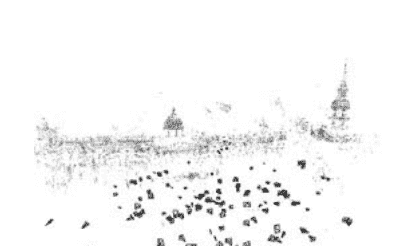

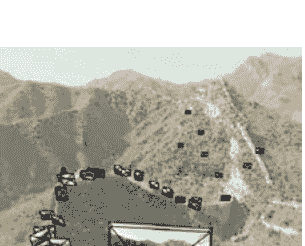

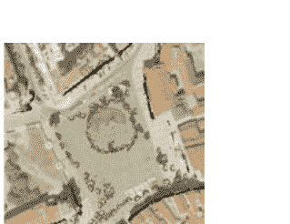

图7.12 由Snavely、Seitz和Szeliski（2006）开发的增量式运动结构算法产生的3D重建结果：（a）Trafalgar Square的相机和点云；（b）中国长城上的相机和点在图像上的叠加；（c）布拉格老城广场重建的俯视图与航拍照片对准。

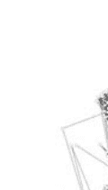

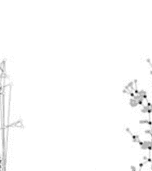

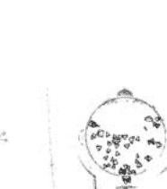

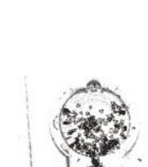

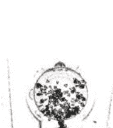

图7.13 使用骨架集进行大规模运动结构（Snavely、Seitz和Szeliski 2008b） © 2008 IEEE:（a）784张图像的原始匹配图；（b）包含101张图像的骨架集；（c）从骨架集重建的场景（万神殿）的俯视图；（d）使用姿态估计添加剩余图像后的重建结果；（e）最终的捆绑调整重建结果，几乎相同。

自动地找到和标记感兴趣的位置和区域 (Simon, Snavely, and Seitz 2007; Simon and Seitz 2008; Gammetter, Bossard, Quack et al. 2009)，并对大型图像集合进行聚类，以便可以自动标记 (Li, Wu, Zach et al. 2008; Quack, Leibe, and Van Gool 2008)。这些应用的一些细节在第13.1.2节中进行了讨论。

### 7.5 约束结构和运动

最通用的运动结构算法对于重建的对象或场景没有任何先验假设。然而，在许多情况下，场景包含更高级的几何基元，例如线和面。这些基元可以提供与兴趣点互补的信息，并且还可以用作三维建模和可视化的有用构建块。此外，这些基元通常以特定的关系排列，即许多线和平面要么平行，要么垂直于彼此。这在建筑场景和模型中尤为明显，我们在第12.6.1节中详细研究。有时，可以利用场景结构中的规则性，也可以利用受限的运动模型。例如，如果感兴趣的对象在一个转盘上旋转 (Szeliski 1991b)，即围绕一个固定但未知的轴旋转，可以使用专门的技术来恢复此运动 (Fitzgibbon, Cross, and Zisserman 1998)。在其他情况下，摄像机本身可能在固定的弧线上围绕某个旋转中心移动 (Shum and He 1999)。专门的捕捉设置，例如移动立体摄像机架或配备多个固定摄像头的移动车辆，也可以利用知识，即单个摄像头（大多数情况下）与捕捉架固定，如图7.8所示。

#### 7.5.1 基于线的技术

众所周知，即使相机已经校准，也无法仅通过线匹配来恢复成对的极线几何关系。为了理解这一点，想象将每个图像中的线投影到空间中的一组三维平面。你可以将两个相机移动到任何你喜欢的配置，并且仍然可以获得有效的三维线重建。

当线在三个或更多视图中可见时，可以使用三重张量将线从一对图像转移到另一对图像 (Hartley和Zisserman 2004)。三重张量也可以仅基于线匹配来计算。

Schmid和Zisserman (1997) 描述了一种广泛使用的基于2D线匹配的技术，该技术基于沿其上的所有像素评估的15 × 15像素相关分数的平均值。

由于机械柔顺性和抖动，允许相机在名义位置周围略微旋转可能是明智的。

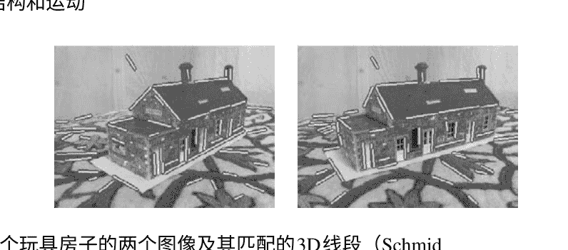

图7.14 一个玩具房子的两个图像及其匹配的3D线段（Schmid和Zisserman 1997）©1997 Springer。

常见的线段相交。²⁰在他们的系统中，假设已知极线几何关系，例如通过点匹配计算得到。对于宽基线，使用通过3D线段的平面对应的所有可能的单应性来扭曲像素，并使用最大相关分数。对于图像三元组，使用三焦张量来验证线段在几何上的对应关系，然后再评估线段之间的相关性。图7.14显示了使用他们的系统的结果。

Bartoli和Sturm（2003）描述了一个完整的系统，用于将从手动线段对应计算得到的三视图关系（三焦张量）扩展到所有线段和相机参数的完全束调整。他们方法的关键是使用Plücker坐标（2.12）来参数化线段，并直接最小化重投影误差。也可以通过端点表示3D线段，并测量每个图像中检测到的2D线段的垂直重投影误差，或者使用与线段方向对齐的延长不确定性椭圆测量2D误差（Szeliski和Kang 1994）。

Bay、Ferrari和Van Gool（2005）不再重建3D线条，而是使用RANSAC算法将线条分组为可能共面的子集。随机选择四条线来计算单应性矩阵，然后通过评估基于颜色直方图的相关性得分来验证这些线段匹配以及其他可能的线段匹配。属于同一平面的线的二维交点被用作虚拟测量，用于估计极线几何，这比直接使用单应性矩阵更准确。

将线条按平行性分组是将线条分组为共面子集的另一种选择。当三条或更多的二维线共享一个共点时，它们在三维空间中很可能是平行的。通过在图像中找到多个共点（第4.3.3节），并在不同图像中建立这些共点之间的对应关系，可以直接估计各个图像之间（通常还包括相机内参）的相对旋转（第6.3.2节）。

Shum, Han, and Szeliski (1998)描述了一个3D建模系统，该系统首先从多个图像中构建校准全景图（第7.4节），然后用户在图像中绘制垂直线和水平线来标记平面区域的边界。这些线条最初用于为每个全景图建立绝对旋转，并且稍后用于推断3D结构（连同推断的顶点和平面），可以从一个或多个图像中恢复出尺度（图12.15）。

Werner和Zisserman（2002）提出了一种基于线条的运动结构的全自动方法。在他们的系统中，首先找到线条并按照每个图像中的共同消失点进行分组（第4.3.3节）。然后使用消失点对相机进行校准，即执行“度量升级”（第6.3.2节）。然后使用外观（Schmid和Zisserman 1997）和三焦张量来匹配对应于共同消失点的线条。图12.16a显示了按照共同消失方向（3D方向）进行颜色编码的一组3D线条。然后使用这些线条来推断平面和场景的块状模型，更详细地描述在第12.6.1节中。

#### 7.5.2 基于平面的技术

在富有平面结构的场景中，例如建筑和某些类型的制造物品（如家具），可以直接估计不同平面之间的单应性，使用基于特征或基于强度的方法。原则上，这些信息可以用于同时推断相机姿态和平面方程，即从运动中计算基于平面的结构。

Luong和Faugeras（1996）展示了如何使用代数运算和最小二乘法直接从两个或多个单应性中计算基本矩阵。不幸的是，这种方法通常表现不佳，因为代数误差与有意义的重投影误差不对应（Szeliski和Torr 1998）。

更好的方法是在每个单应性计算区域内虚拟生成点对应，并将它们输入标准的结构运动算法（Szeliski和Torr 1998）。更好的方法是使用明确的平面方程进行完全束调整，以及额外的约束来强制重建的共面特征完全位于其对应的平面上。（一种有原则的方法是为每个平面建立一个坐标系，例如在一个特征点上，并对其他点使用2D平面内参数化）。Shum，Han和Szeliski（1998）开发的系统展示了这种方法的一个示例，其中场景中的线和平面的法线方向由用户预先指定。

## 7.6 附加阅读

在多视角几何（Faugeras和Luong 2001; Hartley和Zisserman 2004; Moons, Van Gool和Vergauwen 2010）的书籍和评论文章中广泛涵盖了运动结构的主题。对于两帧重建，Hartley（1997a）撰写了一篇高度引用的论文，介绍了用于计算基本或本质矩阵的“八点算法”和合理的点归一化。当相机被校准时，可以使用Nistér（2004）的五点算法与RANSAC结合使用，从最少数量的点中获得初始重建。当相机未校准时，可以在Hartley和Zisserman（2004）；Moons，Van Gool和Vergauwen（2010）的工作中找到各种自校准技术。我只简要提到了其中一种最简单的技术，即Kruppa方程（7.35）。

在从帧到帧跟踪点的应用中，可以使用基于正交相机模型（Tomasi和Kanade 1992；Poelman和Kanade 1997；Costeira和Kanade 1995；Morita和Kanade 1997；Morris和Kanade 1998；Anandan和Irani 2002）或投影扩展（Christy和Horaud 1996；Sturm和Triggs 1996；Triggs 1996；Oliensis和Hartley 2007）的因子分解技术。

Triggs，McLauchlan，Hartley等人（1999）提供了关于束调整的良好教程和调查，而Lourakis和Argyros（2009）以及Engels，Stewénius和Nistér（2006）则提供了有关实施和有效实践的建议。束调整也在多视角几何的教材和调查中有所涉及（Faugeras和Luong 2001；Hartley和Zisserman 2004；Moons，Van Gool和Vergauwen 2010）。Snavely，Seitz和Szeliski（2008b）；Agarwal，Snavely，Simon等人（2009）；Jeong，Nistér，Steedly等人（2010）；Agarwal，Snavely，Seitz等人（2010）描述了处理更大问题的技术。尽管捆绑调整通常被称为增量重建算法的内循环（Snavely，Seitz和Szeliski 2006），但层次化（Fitzgibbon和Zisserman 1998；Farenzena，Fusiello和Gherardi 2009）和全局（Rother和Carlsson 2002；Martinec和Pajdla 2007）初始化方法也是可能的，甚至可能更好。随着运动结构开始应用于动态场景，非刚性运动结构（Torresani，Hertzmann和Bregler 2008）的主题将变得更加重要，这本书不涵盖该主题。

### 7.7 练习

例7.1：三角测量 使用您在练习6.7中构建和测试的校准图案来测试您的三角测量精度。作为替代方案，生成合成的3D点和相机，并向2D点测量添加噪声。

习题7.2：本质矩阵和基础矩阵 实现第7.2节中介绍的两帧 $E$和 $F$ 矩阵估计技术，以更好的抗噪声能力进行适当的重新缩放。

- 1. 使用练习7.1的数据验证你的算法，并报告它们的准确性。
- 2. （可选）实现改进的 $F$ 或 $E$ 估计算法之一，例如使用重归一化（Zhang 1998b; Torr and Fitzgibbon 2004; Hartley and Zisserman 2004），RANSAC（Torr and Murray 1997），最小中值平方（LMS）或由Nistér（2004）开发的五点算法。

习题7.3：视图变形和插值 实现自动视图变形，即从运动中计算出两帧结构，然后使用这些结果生成平滑的动画，从一幅图像过渡到下一幅图像（第7.2.3节）。

- 1. 决定如何表示您的3D场景，例如计算匹配点的Delaunay三角剖分，并决定如何处理边界附近的三角形。（提示：尝试拟合一个平面到场景中，例如在大多数点的后面。）
- 2. 计算你的相机中间位置和方向。
- 3. 将每个三角形变形到其新位置，最好使用正确的透视投影（Szeliski和Shum 1997）。
- 4. （可选）如果你有一个更密集的3D模型（例如来自立体声），决定在“裂缝”处如何处理。
- 5. （可选）对于非刚性场景，例如两张具有不同表情的脸部照片，不是所有匹配点都遵守极线几何。决定如何处理它们以达到最佳效果。决定如何处理它们以达到最佳效果。

例7.4：因子分解 使用你在练习4.5中计算的点轨迹实现描述在第7.3节中的因子分解算法。

- 1. (可选) 实现不确定性重新缩放（Anandan和Irani 2002），并评论这是否改善了你的结果。
- 2. (可选) 实现在第7.3.1节中讨论的因子分解的透视改进之一（Christy和Horaud 1996; Sturm和Triggs 1996; Triggs 1996）。这是否显著降低了重投影误差？你能将这个重建升级为度量重建吗？

例7.5：捆绑调整器 实现一个完整的捆绑调整器。这听起来可能令人生畏，但实际上并不是这样。

- 1. 设计内部数据结构和外部文件表示，以保存相机参数（位置、方向和焦距）、3D点位置（欧几里得或齐次）和2D点轨迹（帧和点标识以及2D位置）。
- 2. 使用其他技术（例如因子分解）从2D轨迹（例如在所有帧中出现的一部分点）初始化3D点和相机位置。
- 3. 实现与图7.7中的正向变换对应的代码，即对于每个2D点测量，将相应的3D点通过相机变换（包括透视投影和焦距缩放）映射，并将其与2D点测量进行比较以获得残差误差。
- 4. 将残差误差带入反向链接中，计算其对所有未知运动和结构参数的导数，如图7.7和方程式（6.47）所示。这将给出在方程式（6.13–6.17）和方程式（6.43）中使用的稀疏雅可比矩阵 J。
- 5. 使用稀疏最小二乘或线性系统求解器，例如MATLAB、SparseSuite或SPARSKIT（参见附录A.4和A.5），来解决相应的线性化系统，添加一小部分对角线预处理，如Levenberg–Marquardt中所述。
- 6. 更新参数，确保旋转矩阵仍然正交（例如，通过从四元数重新计算它们），并在监视残差误差的同时继续迭代。
- 7. (可选) 使用“舒尔补技巧”（7.56）来减小正在解决的系统的大小（Triggs, McLauchlan, Hartley et al. 1999; Hartley和Zisserman 2004; Lourakis和Argyros 2009; Engels, Stewénius和Nistér 2006）。
- 8. (可选) 实现自己的迭代稀疏求解器，例如共轭梯度，并将其性能与直接方法进行比较。
- 9. (可选) 使您的捆绑调整器对异常值具有鲁棒性，或尝试添加 (Engels, Stewénius和Nistér 2006) 中讨论的其他改进。您能想到使算法更快或更鲁棒的其他方法吗?

习题7.6：匹配移动和增强现实 使用前面练习的结果，在视频上叠加渲染的3D模型。有关更多详细信息和想法，请参见第7.4.2节。检查对象的“锁定程度”。

习题7.7：基于线的重建 将先前开发的捆绑调整器扩展到包括线条，可能具有已知的3D方向。可选地，使用共面点和线条来假设平面并强制共面性 (Schaffalitzky和Zisserman 2002; Robertson和Cipolla 2002)。

例7.8：灵活的捆绑调整器 设计一个允许任意链式变换和关于未知数的先验知识的捆绑调整器，如图7.7-7.8所示。

例7.9：无序图像匹配 从任意一组照片中计算场景的相机姿态和3D结构 (Brown和Lowe 2003; Snavely, Seitz和Szeliski 2006)。

## 第8章 密集运动估计

- 8.1 平移对齐
  - 8.1.1 分层运动估计
  - 8.1.2 基于傅里叶变换的对齐
  - 8.1.3 增量细化
- 8.2 参数化运动
  - 8.2.1 应用：视频稳定
  - 8.2.2 学习的运动模型
- 8.3 基于样条的运动
  - 8.3.1 应用：医学图像配准
- 8.4 光流
  - 8.4.1 多帧运动估计
  - 8.4.2 应用：视频降噪
  - 8.4.3 应用：去隔行
- 8.5 分层运动
  - 8.5.1 应用：帧插值
  - 8.5.2 透明层和反射
- 8.6 附加阅读
- 8.7 练习

### 8.1 平移对齐

建立两个图像或图像块之间的对齐的最简单方法是将一个图像相对于另一个图像进行平移。给定一个在离散像素位置上采样的模板图像$I_0(\boldsymbol{x})$，我们希望找到它在图像$I_1(\boldsymbol{x})$中的位置。解决这个问题的最小二乘解是找到平方差和（SSD）函数的最小值。

$$E_{SSD}(\boldsymbol{u}) = \sum_i [I_1(\boldsymbol{x}_i + \boldsymbol{u}) - I_0(\boldsymbol{x}_i)]^2 = \sum_i e_i^2,$$ (8.1)

其中$\boldsymbol{u}=(u, v)$是位移和$e_i = I_1(\boldsymbol{x}_i + \boldsymbol{u}) - I_0(\boldsymbol{x}_i)$被称为残差误差（或视频编码文献中的位移帧差异）。¹（我们暂时忽略$I_0$的部分可能位于$I_1$的边界之外或以其他方式不可见。）假设两个图像中对应的像素值保持不变，这通常被称为亮度恒定约束。²

通常情况下，位移$\boldsymbol{u}$可以是分数，因此必须对图像$I_1(\boldsymbol{x})$应用适当的插值函数。在实践中，通常使用双线性插值器，但双三次插值可以得到稍微更好的结果（Szeliski和Scharstein 2004）。彩色图像可以通过对三个颜色通道的差异求和来处理，尽管也可以将图像转换为不同的颜色空间或仅使用亮度（这在视频编码器中经常使用）。

鲁棒误差度量。我们可以通过用鲁棒函数$\rho(e_i)$（Huber 1981; Hampel, Ronchetti, Rousseeuw et al. 1986; Black and Anandan 1996; Stewart 1999）替换平方误差项来使上述误差度量更具鲁棒性，从而得到

$$E_{SRD}(\boldsymbol{u}) = \sum_i \rho(I_1(\boldsymbol{x}_i + \boldsymbol{u}) - I_0(\boldsymbol{x}_i)) = \sum_i \rho(e_i),$$ (8.2)

鲁棒范数$\rho(e)$是一个增长速度比最小二乘法的二次惩罚项更慢的函数。一种常用于视频编码中的运动估计的函数，因为其速度快，是绝对差值之和（SAD）度量³或$L_1$范数，即

$$E_{SAD}(\boldsymbol{u}) = \sum_i |I_1(\boldsymbol{x}_i + \boldsymbol{u}) - I_0(\boldsymbol{x}_i)| = \sum_i |e_i|,$$ (8.3)

然而，由于这个函数在原点处不可微分，它不适合梯度下降方法，如第8.1.3节中所介绍的方法。

相反，通常使用一个平滑变化的函数，对于小值是二次的，但是远离原点时增长较慢。Black和Rangarajan（1996）讨论了各种这样的函数，包括Geman-McClure函数。

$$\rho_{\text{GM}}(x) = \frac{x^2}{1 + x^2 / a^2} \tag{8.4}$$

其中 $a$ 是一个可以被视为异常值阈值的常数。阈值的适当值可以使用鲁棒统计学（Huber 1981; Hampel, Ronchetti, Rousseeuw等1986; Rousseeuw和Leroy 1987）自身推导出来，例如，通过计算中位数绝对偏差 $MAD = \mathrm{med}_i |e_i|$，并将其乘以1.4以获得内点噪声过程的鲁棒估计标准差（Stewart 1999）。

空间变化的权重。上述误差度量忽略了一个事实，即对于给定的对齐，一些被比较的像素可能位于原始图像边界之外。此外，我们可能希望部分或完全降低某些像素的贡献。例如，在拼接镶嵌图像时，我们可能希望有选择性地“擦除”图像的某些部分，其中不需要的前景对象已被剪切掉。对于背景稳定化等应用，我们可能希望降低图像中间部分的权重，该部分通常包含由相机跟踪的独立移动对象。

通过将每个匹配的两个图像与空间变化的每像素权重值相关联，可以完成所有这些任务。然后，误差度量变为加权（或窗口化）SSD函数，

$$E_{\text{WSSD}}(\mathbf{u}) = \sum_i w_0(\mathbf{x}_i) w_1(\mathbf{x}_i + \mathbf{u}) [I_1(\mathbf{x}_i + \mathbf{u}) - I_0(\mathbf{x}_i)]^2 \tag{8.5}$$

其中加权函数 $w_0$ 和 $w_1$ 在图像边界之外为零。

如果允许大范围的潜在运动，上述度量标准可能对较小的重叠解决方案有偏见。为了抵消这种偏见，可以将窗口化的SSD分数除以重叠区域。

$$A = \sum_i w_0(\mathbf{x}_i) w_1(\mathbf{x}_i + \mathbf{u}) \tag{8.6}$$

计算每个像素（或平均）的平方像素误差 $E_{\text{WSSD}} / A$。该数量的平方根是均方根强度误差。

$$RMS = \sqrt{E_{\text{WSSD}} / A} \tag{8.7}$$

通常在比较研究中报告。

偏差和增益（曝光差异）。通常，对齐的两幅图像不是以相同的曝光拍摄的。两幅图像之间的线性（仿射）强度变化的简单模型是偏差和增益模型，

$$I_1(\boldsymbol{x} + \boldsymbol{u}) = (1 + \alpha) I_0(\boldsymbol{x}) + \beta, \quad (8.8)$$

其中 $\beta$ 是偏差， $\alpha$ 是增益（Lucas和Kanade 1981; Gennert 1988; Fuh和Maragos 1991; Baker, Gross和Matthews 2003; Evangelidis和Psarakis 2008）。最小二乘法的表达式则变为

$$E_{\mathrm{BG}}(\boldsymbol{u}) = \sum_{i} [I_{1}(\boldsymbol{x}_{i} + \boldsymbol{u}) - (1 + \alpha) I_{0}(\boldsymbol{x}_{i}) - \beta]^{2} = \sum_{i} [\alpha I_{0} (\boldsymbol{x}_{i}) + \beta - e_{i}]^{2}. \quad (8.9)$$

与其对应的补丁之间进行简单的平方差，需要执行线性回归（附录A.2），这在某种程度上更加昂贵。

请注意，对于彩色图像，可能需要为每个颜色通道估计不同的偏差和增益，以补偿某些数码相机执行的自动颜色校正（第2.3.2节）。偏差和增益补偿也用于视频编解码器，其中被称为加权预测（Richardson 2003）。

在配准过程中，使用了一种更一般的（空间变化的，非参数的）强度变化模型，该模型是作为配准过程的一部分计算出来的（Negahdaripour 1998; Jia and Tang 2003; Seitz and Baker 2009）。这对于处理局部变化非常有用，例如由广角镜头、大光圈或镜头外壳引起的暗角。在比较图像值之前，还可以对图像进行预处理，例如使用带通滤波器的图像（Anandan 1989; Bergen, Anandan, Hanna et al. 1992）、梯度（Scharstein 1994; Papenberg, Bruhn, Brox et al. 2006）或使用其他局部变换，例如直方图或秩变换（Cox, Roy, and Hingorani 1995; Zabih and Woodfill 1994），或者最大化互信息（Viola and Wells III 1997; Kim, Kolmogorov, and Zabih 2003）。

Hirschmüller和Scharstein（2009）比较了其中一些方法，并报告了在具有曝光差异的场景中它们的相对性能。

相关性。另一种方法是执行相关性，即最大化两个对齐图像的乘积（或互相关）

$$E_{\mathrm{CC}}(\boldsymbol{u}) = \sum_{i} I_{0} (\boldsymbol{x}_{i}) ~ I_{1} (\boldsymbol{x}_{i} + \boldsymbol{u}). \quad (8.10)$$

乍一看，这似乎使得偏差和增益建模变得不必要，因为图像将倾向于对齐，而不考虑它们的相对比例和偏移。然而，事实并非如此。如果 $I_{1} (x)$ 中存在非常亮的区域，则最大乘积实际上可能位于该区域。

因此，更常用的是归一化互相关。

$$E_{\text{NCC}}(\boldsymbol{u}) = \frac{\sum_i [I_0(\boldsymbol{x}_i) - \overline{I_0}] [I_1(\boldsymbol{x}_i + \boldsymbol{u}) - \overline{I_1}]}{\sqrt{\sum_i [I_0(\boldsymbol{x}_i) - \overline{I_0}]^2} \sqrt{\sum_i [I_1(\boldsymbol{x}_i + \boldsymbol{u}) - \overline{I_1}]^2}}$$

其中

$$\overline{I_0} = \frac{1}{N} \sum_i I_0(\boldsymbol{x}_i)$$

和

$$\overline{I_1} = \frac{1}{N} \sum_i I_1(\boldsymbol{x}_i + \boldsymbol{u})$$

是相应补丁的平均图像，N是补丁中的像素数。归一化互相关分数始终保证在范围[-1,1]内，这使得在一些更高级的应用中更容易处理，例如确定哪些补丁真正匹配。当匹配具有不同曝光的图像时，归一化相关性效果很好，例如创建高动态范围图像（第10.2节）。然而，请注意，如果两个补丁中的任何一个方差为零，则NCC分数未定义（实际上，在嘈杂的低对比度区域中，其性能可能会下降）。

NCC的变体与匹配分数（8.9）中的偏差-增益回归有关，是归一化的SSD分数

$$E_{\text{NSSD}}(\boldsymbol{u}) = \frac{1}{2} \frac{\sum_i \left[ [I_0(\boldsymbol{x}_i) - \overline{I_0}] - [I_1(\boldsymbol{x}_i + \boldsymbol{u}) - \overline{I_1}] \right]^2}{\sum_i [I_0(\boldsymbol{x}_i) - \overline{I_0}]^2 + [I_1(\boldsymbol{x}_i + \boldsymbol{u}) - \overline{I_1}]^2}$$

Criminisi、Shotton、Blake等人最近提出的（2007年）。在他们的实验中，他们发现它在应用于大量重叠的补丁时，产生与NCC相当的结果，但更高效（第3.2.2节）。

#### 8.1.1 分层运动估计

现在我们有了一个明确定义的对齐成本函数来优化，我们如何找到它的最小值？最简单的解决方案是在一定范围的位移上进行全搜索，使用整数或亚像素步长。这通常是在运动补偿视频压缩中用于块匹配的方法，其中探索可能的运动范围（例如±16像素）。

为了加速这个搜索过程，通常会使用分层运动估计：构建图像金字塔（第3.5节），并在较少的离散像素上进行搜索（对应于相同运动范围）首先在较粗的层次上执行（Quam 1984; Anandan 1989; Bergen, Anandan, Hanna等1992年）。然后，金字塔的一个层次的运动估计被用来初始化下一个更精细层次的较小局部搜索。或者，也可以使用来自粗糙层次的几个种子（好的解决方案）来初始化细粒度搜索。虽然这不能保证产生与完全搜索相同的结果，但通常效果几乎一样好且速度更快。

更正式地说，让

$$I_k^{(l)}(\boldsymbol{x}_j) \leftarrow \tilde{I}_k^{(l-1)}(2\boldsymbol{x}_j)  (8.15)$$

是通过对第$l$级图像进行下采样（降采样）得到的平滑版本的图像进行下采样得到的第$l$级图像。请参阅第3.5节，了解如何在不引入太多混叠的情况下执行所需的下采样（金字塔构建）操作。

在最粗糙的级别上，我们搜索最小化图像 $I_0^{(l)}$ 和 $I_1^{(l)}$ 之间差异的最佳位移 $\boldsymbol{u}^{(l)}$。通常，这是通过在某个位移范围 $\boldsymbol{u}^{(l)} \in 2^{-l}[-S, S]^2$ 上进行完全搜索来完成的，在最精细（原始）分辨率级别上，可以选择性地进行增量细化步骤，该步骤在第8.1.3节中有描述。

一旦合适的运动矢量被估计出来，它被用来预测可能的位移

$$\hat{\boldsymbol{u}}^{(l-1)} \leftarrow 2\boldsymbol{u}^{(l)}  (8.16)$$

对于下一个更精细的层级。⁵然后在更精细的层级上重复位移搜索，搜索范围更窄，例如 $\hat{\boldsymbol{u}}^{(l-1)} \pm 1$，再加上增量细化步骤（Anandan 1989）。或者，可以通过当前的运动估计对其中一个图像进行扭曲（重采样），在这种情况下，只需要在更精细的层级上计算小的增量运动。对整个过程的一个很好的描述，扩展到参数化运动估计（第8.2节），由Bergen、Anandan、Hanna等人提供（1992年）。

#### 8.1.2 基于傅里叶变换的对齐

当搜索范围对应于较大图像的显著部分时（如图像拼接中的情况，请参见第9章），分层方法可能效果不佳，因为在显著特征被模糊化之前，往往无法将表示粗化太多。在这种情况下，傅里叶变换方法可能更可取。

基于傅里叶变换的对齐依赖于一个事实，即移位信号的傅里叶变换具有与原始信号相同的幅度，但具有线性变化的相位（第3.4节）。

$$\mathcal{F}\{I_1(\boldsymbol{x}+\boldsymbol{u})\} = \mathcal{F}\{I_1(\boldsymbol{x})\} e^{-j\boldsymbol{u}\cdot\boldsymbol{\omega}} = \mathcal{I}_1(\boldsymbol{\omega}) e^{-j\boldsymbol{u}\cdot\boldsymbol{\omega}}$$

其中 $\omega$ 是傅里叶变换的矢量值角频率，我们使用花体符号 $\mathcal{I}_1(\boldsymbol{\omega}) = \mathcal{F}\{I_1(\boldsymbol{x})\}$来表示信号的傅里叶变换（第3.4节）。

傅里叶变换的另一个有用性质是，空间域中的卷积对应于傅里叶域中的乘法（第3.4节）。因此，互相关函数 $E_{\text{CC}}$的傅里叶变换可以写成

$$\mathcal{F}\{E_{\text{CC}}(\boldsymbol{u})\} = \mathcal{F}\left\{\sum_i I_0(\boldsymbol{x}_i) I_1(\boldsymbol{x}_i+\boldsymbol{u})\right\} = \mathcal{F}\{I_0(\boldsymbol{u}) \bar{*} I_1(\boldsymbol{u})\} = \mathcal{I}_0(\boldsymbol{\omega}) \mathcal{I}_1^*(\boldsymbol{\omega})$$

其中

$$f(\boldsymbol{u}) \bar{*} g(\boldsymbol{u}) = \sum_i f(\boldsymbol{x}_i) g(\boldsymbol{x}_i+\boldsymbol{u})$$

是互相关函数，即一个信号与另一个信号的反转的卷积，而 $\mathcal{I}_1^*(\boldsymbol{\omega})$是 $\mathcal{I}_1(\boldsymbol{\omega})$的复共轭。这是因为卷积被定义为一个信号与另一个信号的反转的求和（第3.4节）。

因此，为了高效地计算所有可能值范围内的 $E_{\text{CC}}$，我们对两个图像 $I_0(\boldsymbol{x})$和 $I_1(\boldsymbol{x})$进行傅里叶变换，将两个变换相乘（第二个变换取共轭），然后取结果的逆变换。快速傅里叶变换算法可以在$O(N M \log N M)$的操作中计算一个 $N \times M$图像的变换（Bracewell 1986）。当考虑到图像重叠的全部范围时，这比需要$O(N^2 M^2)$操作进行完全搜索要快得多。

尽管基于傅里叶变换的卷积通常用于加速图像相关性的计算，但它也可以用于加速平方差函数（及其变体）的计算。考虑式（8.1）给出的SSD公式。它的傅里叶变换可以写成

$$\mathcal{F}\{E_{\text{SSD}}(\boldsymbol{u})\} = \mathcal{F}\left\{\sum_i [I_1(\boldsymbol{x}_i+\boldsymbol{u}) - I_0(\boldsymbol{x}_i)]^2\right\} = \delta(\boldsymbol{\omega}) \sum_i [I_0^2(\boldsymbol{x}_i) + I_1^2(\boldsymbol{x}_i)] - 2\mathcal{I}_0(\boldsymbol{\omega}) \mathcal{I}_1^*(\boldsymbol{\omega})$$

因此，SSD函数可以通过两倍的相关函数减去两个图像中能量的总和来计算。

> 实际上，傅里叶位移性质（8.17）是通过观察到移位等效于与位移的δ函数进行卷积而导出的。

> 图8.1运动估计：(a-b) 基于正则化的光流（Nagel和Enkelmann 1986）©1986 IEEE；(c-d) 分层运动估计（Wang和Adelson 1994）©1994 IEEE；(e-f) 来自评估数据库的样本图像和地面真实流（Baker, Black, Lewis et al. 2007）©2007 IEEE。

在计算机视觉中，用于对齐图像和估计视频序列中的运动的算法是最广泛使用的。例如，帧率图像对齐广泛应用于摄像机和数码相机中，以实现图像稳定功能。

早期一个广泛使用的图像配准算法是基于补丁的平移对齐（光流）技术，由Lucas和Kanade（1981）开发。这个算法的变种被用于几乎所有运动补偿视频压缩方案，如MPEG和H.263（Le Gall 1991）。类似的参数化运动估计算法已经在各种应用中得到广泛应用，包括视频摘要（Teodosio和Bender 1993; Irani和Anandan 1998），视频稳定（Hansen, Anandan, Dana等1994; Srinivasan, Chellappa, Veeraraghavan等2005; Matsushita, Ofek, Ge等2006），以及视频压缩（Irani, Hsu和Anandan 1995; Lee, Ge Chen, Lung Bruce Lin等1997）。还开发了更复杂的图像配准算法，用于医学成像和遥感。图像配准技术由Brown（1992）, Zitová和Flusser（2003）, Goshtasby（2005）和Szeliski（2006a）进行了调查。

为了估计两个或多个图像之间的运动，必须首先选择一个合适的误差度量来比较图像（第8.1节）。一旦确定了这一点，就必须设计一种合适的搜索技术。最简单的技术是穷举尝试所有可能的对齐方式，即进行全搜索。实际上，这可能太慢了，所以通常使用基于图像金字塔的分层粗细技术（第8.1.1节）。另外，傅里叶变换（第8.1.2节）可以用来加速计算。

为了在对齐中获得亚像素精度，通常使用基于图像函数的泰勒级数展开的增量方法（第8.1.3节）。这些方法也可以应用于参数化运动模型（第8.2节），该模型对全局图像变换（如旋转或剪切）进行建模。通过学习场景或被跟踪对象的典型动态或运动统计信息，例如行人的自然步态（第8.2.2节），可以使运动估计更可靠。对于更复杂的运动，可以使用分段参数化样条运动模型（第8.3节）。在存在多个独立的（可能是非刚性的）运动的情况下，需要使用通用的光流技术（或光学流技术）（第8.4节）。对于包含大量遮挡的更复杂的运动，可以使用分层运动模型（第8.5节），该模型将场景分解为一致移动的层。

在本章中，我们将更详细地描述这些技术。有关运动估计的评论和比较评估论文中可以找到更多详细信息（Barron, Fleet和Beauchemin 1994; Mitiche和Bouthemy 1996; Stiller和Konrad 1999; Szeliski 2006a; Baker, Black, Lewis等人2007）。

窗口相关性。不幸的是，傅里叶卷积定理仅适用于在两个图像中对所有像素进行求和时，使用图像的循环移位来访问原始边界之外的像素。尽管对于小的位移和大小相当的图像是可以接受的，但当图像有一小部分重叠或一个图像是另一个图像的子集时，这是没有意义的。

$$
E_{\text{WCC}}(\boldsymbol{u}) = \sum_i w_0(\boldsymbol{x}_i) I_0(\boldsymbol{x}_i) w_1(\boldsymbol{x}_i + \boldsymbol{u}) I_1(\boldsymbol{x}_i + \boldsymbol{u}), \\
= [w_0(\boldsymbol{x}) I_0(\boldsymbol{x})] \star [w_1(\boldsymbol{x}) I_1(\boldsymbol{x})]
$$

其中权重函数 $w_0$ 和 $w_1$ 在图像的有效范围之外为零并且两个图像都被填充，以便循环移位在原始图像之外返回0值边界。

更有趣的情况是计算加权SSD函数的情况，该函数在方程（8.5）中引入

$$
E_{\text{WSSD}}(\boldsymbol{u}) = \sum_i w_0(\boldsymbol{x}_i) w_1(\boldsymbol{x}_i + \boldsymbol{u}) [I_1(\boldsymbol{x}_i + \boldsymbol{u}) - I_0(\boldsymbol{x}_i)]^2.
$$

将其展开为相关性的和，并推导出适当的傅里叶变换集留给练习8.1完成。

同样的推导方法也可以应用于偏差-增益校正的平方差函数 $E_{\text{BG}}$(8.9)。同样，可以使用傅里叶变换来高效地计算所需的所有相关性，以执行偏差和增益参数的线性回归，以估计每个潜在移位的曝光补偿差异（练习8.1）。

相位相关。相位相关是正常相关（8.18）的一种变体，有时用于运动估计（Kuglin和Hines 1975; Brown 1992）。在这里，通过将（8.18）中的每个频率乘积除以傅里叶变换的幅度，将要匹配的两个信号的频谱进行白化处理，

$$
\mathcal{F} \{ E_{\text{PC}}(\boldsymbol{u}) \} = \frac{\mathcal{I}_0(\boldsymbol{\omega}) \mathcal{I}_1^*(\boldsymbol{\omega})}{\|\mathcal{I}_0(\boldsymbol{\omega})\| \|\mathcal{I}_1(\boldsymbol{\omega})\|}
$$

在进行最终的逆傅里叶变换之前。在没有噪声的信号和完美（循环）移位的情况下，我们有 $I_1(\boldsymbol{x}+\boldsymbol{u})=I_0(\boldsymbol{x})$，因此，根据方程（8.17），我们得到

$$
\mathcal{F} \{ I_1(\boldsymbol{x}+\boldsymbol{u}) \} = \mathcal{I}_1(\boldsymbol{\omega}) e^{-2\pi j \boldsymbol{u} \cdot \boldsymbol{\omega}} = \mathcal{I}_0(\boldsymbol{\omega}) \text{ 和} \\
\mathcal{F} \{ E_{\text{PC}}(\boldsymbol{u}) \} = e^{-2\pi j \boldsymbol{u} \cdot \boldsymbol{\omega}}.
$$

## 旋转和尺度。

傅里叶变换对齐主要用于估计图像之间的平移偏移，但在某些有限条件下，也可以用于估计平面旋转和尺度。考虑两个纯粹通过旋转相关的图像，即

$I_1(\hat{R} x) = I_0(x). \qquad\qquad (8.26)$

如果我们将图像重新采样为极坐标，

$\tilde{I}_0(r, \theta) = I_0(r \cos\theta, r \sin\theta) \text{ and } \tilde{I}_1(r, \theta) = I_1(r \cos\theta, r \sin\theta), \qquad\qquad (8.27)$

我们获得

$\tilde{I}_1(r, \theta + \hat{\theta}) = \tilde{I}_0(r, \theta). \qquad\qquad (8.28)$

然后可以使用基于快速傅里叶变换（FFT）的移位技术估计所需的旋转。

如果两个图像也存在比例关系，

$I_1(e^{\hat{s}} \hat{R} x) = I_0(x), \qquad\qquad (8.29)$

我们可以重新采样为对数极坐标，

$\tilde{I}_0(s, \theta) = I_0(e^s \cos\theta, e^s \sin\theta) \text{ and } \tilde{I}_1(s, \theta) = I_1(e^s \cos\theta, e^s \sin\theta), \qquad\qquad (8.30)$

以获得

$\tilde{I}_1(s + \hat{s}, \theta + \hat{\theta}) = I_0(s, \theta). \qquad\qquad (8.31)$

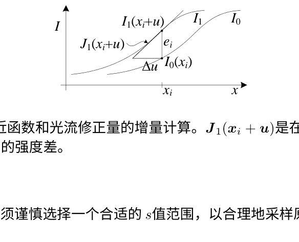

在这种情况下，必须谨慎选择一个合适的 $s$ 值范围，以合理地采样原始图像。

对于也被小幅平移的图像，

$$I_1(e^{s\hat{R}}x + t) = I_0(x),$$ (8.32)

De Castro和Morandi（1987）提出了一个巧妙的解决方案，使用几个步骤来估计未知参数。首先，将两个图像转换为傅里叶域，仅保留转换后图像的幅度。原则上，傅里叶幅度图像对图像平面上的平移不敏感（尽管通常要注意边界效应）。然后，使用极坐标或对数极坐标表示将两个幅度图像进行旋转和缩放对齐。一旦估计出旋转和缩放，就可以对其中一个图像进行去旋转和缩放，并应用常规的平移算法来估计平移位移。

不幸的是，这个技巧只适用于图像有较大重叠（小的平移运动）的情况。对于图像或图像块的更一般运动，需要使用第8.2节中描述的参数化运动估计器或第6.1节中描述的基于特征的方法。

#### 8.1.3 增量细化

到目前为止描述的技术可以估计到最近的像素对齐（如果使用较小的搜索步长，则可能是分数像素）。一般来说，图像稳定和拼接应用需要更高的准确性才能获得可接受的结果。

为了获得更好的亚像素估计，我们可以使用天和Huhns（1986）描述的几种技术之一。一种可能性是在迄今为止找到的最佳值周围评估几个离散（整数或分数）的（u, v）值，并对匹配分数进行插值以找到解析最小值。

### 8.1 平移对齐

一种更常用的方法，最初由Lucas和Kanade（1981）提出，是对SSD能量函数（8.1）进行梯度下降，使用图像函数的Taylor级数展开（图8.2）。

$$
E_{\text{LK-SSD}}(u + \Delta u) = \sum_i [I_1(x_i + u + \Delta u) - I_0(x_i)]^2 \quad (8.33) \\
\approx \sum_i [I_1(x_i + u) + J_1(x_i + u)\Delta u - I_0(x_i)]^2 \quad (8.34) \\
= \sum_i [J_1(x_i + u)\Delta u + e_i]^2, \quad (8.35)
$$

其中

$$
J_1(x_i + u) = \nabla I_1(x_i + u) = \left(\frac{\partial I_1}{\partial x}, \frac{\partial I_1}{\partial y}\right)(x_i + u) \quad (8.36)
$$

是图像梯度或雅可比矩阵在 $(x_i + u)$ 处

$$
e_i = I_1(x_i + u) - I_0(x_i), \quad (8.37)
$$

首次引入于（8.1），是当前的强度误差。在特定子像素位置 $(x_i + u)$ 可以使用多种技术计算梯度，其中最简单的方法是仅仅取像素之间的水平和垂直差异 $x$ 和 $x+(1,0)$ 或 $x+(0,1)$。更复杂的导数有时可以导致明显的性能改进。

增量更新到SSD误差（8.35）的线性化形式通常被称为光流约束或亮度恒定约束方程

$$
I_x u + I_y v + I_t = 0, \quad (8.38)
$$

其中 $I_x$ 和 $I_y$ 的下标表示空间导数，$I_t$ 被称为时间导数，如果我们计算视频序列中的瞬时速度，这是有意义的。当平方并在区域上求和或积分时，可以用于计算光流（Horn和Schunck 1981）。

上述最小二乘问题（8.35）可以通过求解相关的法线方程（附录A.2）来最小化，

$$
A \Delta u = b \quad (8.39)
$$

其中

$$
A = \sum_i J_1^T(x_i + u) J_1(x_i + u) \quad (8.40)
$$

和

$$ \mathbf{b} = -\sum_i e_i \mathbf{J}_1^T (\mathbf{x}_i + \mathbf{u}) $$

分别称为（Gauss-Newton逼近的）Hessian矩阵和梯度加权残差向量。这些矩阵通常也被写作

$$ \mathbf{A} = \begin{bmatrix} \sum I_x^2 & \sum I_x I_y \\ \sum I_x I_y & \sum I_y^2 \end{bmatrix} \quad \text{和} \quad \mathbf{b} = - \begin{bmatrix} \sum I_x I_t \\ \sum I_y I_t \end{bmatrix} $$

计算 $\mathbf{J}_1 (\mathbf{x}_i + \mathbf{u})$ 所需的梯度可以与估计 $I_1 (\mathbf{x}_i + \mathbf{u})$ 所需的图像变形同时计算（第3.6.1节（3.89）），实际上，它们通常作为图像插值的副产品计算。如果效率是一个问题，这些梯度可以用模板图像中的梯度来替代，

$$ \mathbf{J}_1(\mathbf{x}_i + \mathbf{u}) \approx \mathbf{J}_0(\mathbf{x}_i), $$

由于正确对齐附近，模板和位移目标图像应该看起来相似。这样做的好处是可以预先计算Hessian和Jacobian图像，从而可以节省大量计算资源（Hager和Belhumeur 1998；Baker和Matthews 2004）。通过将用于计算 $e_i$ 的扭曲图像 $I_1(\mathbf{x}_i + \mathbf{u})$ 写成 $I_1$ (Peleg和Rav-Acha 2006)中离散样本的亚像素插值滤波器的卷积，可以进一步减少计算量。预先计算梯度场和 $I_1$ 的移位版本之间的内积，可以使迭代重新计算 $e_i$ 的时间保持恒定（与像素数量无关）。

上述增量更新规则的有效性依赖于泰勒级数逼近的质量。当远离真实位移（比如1-2个像素）时，可能需要多次迭代。然而，可以通过对一系列较大位移进行最小二乘拟合来估计 $\mathbf{J}_1$ 的值，以增加收敛范围（Jurie和Dhome 2002），或者为给定的补丁“学习”一个特定用途的识别器（Avi-dan 2001; Williams, Blake, and Cipolla 2003; Lepetit, Pilet, and Fua 2006; Hinterstoisser, Benhimane, Navabet al.2008; “Ozuysal, Calonder, Lepet itet al.2010），如第4.1.4节所讨论的。

增量更新的常用停止准则是监测位移修正的大小 $\|\mathbf{u}\|$，并在其低于某个阈值时停止（比如，$1/10$ of a pixel）。对于较大的运动，通常将增量更新规则与分层粗到细的搜索策略相结合，如第8.1.1节所述。

### 8.1 平移对齐

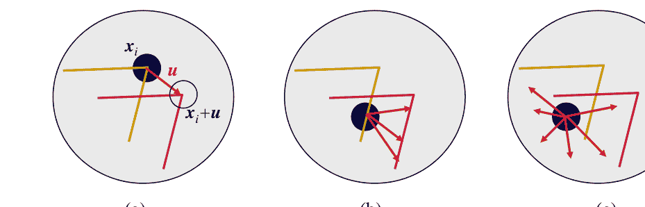

图8.3不同图像区域的光圈问题，用橙色和红色表示 L 形结构，叠加在同一图像中，以便更容易绘制流程图。(a) 以 $x_i$ 为中心的窗口 $w(x_i)$ (黑色圆圈) 可以唯一地与第二个 (红色) 图像中的相应结构匹配。(b) 以边缘为中心的窗口展示了经典的光圈问题，因为它可以与一维可能位置的一组匹配。(c) 在完全无纹理的区域中，匹配变得完全无约束。

条件和光圈问题。有时，线性系统 (8.39) 的反演可能由于补丁中缺乏二维纹理而条件较差。这种情况的一个常见例子是光圈问题，最早在光流的早期论文中被发现 (Horn和Schunck 1981)，然后由 Anandan (1989) 进行了更深入的研究。考虑一个由斜边组成的图像块向右移动 (图8.3)。在这种情况下，只能可靠地恢复速度 (位移) 的法向分量。这在 (8.39) 中表现为一个秩亏的矩阵 $A$，即其较小的特征值非常接近于零。$^{9}$

当求解方程 (8.39) 时，沿边缘的位移分量条件非常差，可能在小的噪声扰动下导致错误的猜测。缓解这个问题的一种方法是对预期运动范围添加先验 (软约束) (Simoncelli, Adelson和Heeger 1991; Baker, Gross和Matthews 2004; Govindu 2006)。这可以通过在 $A$ 的对角线上添加一个小值来实现，这实际上是将解决方案偏向于仍然 (大部分) 最小化平方误差的较小 $\Delta u$ 值。然而，在实践中，使用简单 (固定) 二次先验时假设的纯高斯模型并不总是成立，例如，由于沿着强边缘的混叠 (Triggs 2004)。因此，在进行矩阵求逆之前，可能明智地将较大特征值的一小部分 (例如5%) 添加到较小特征值上。

$^{9}$矩阵 $A$ 通过构造始终保证是对称正半定的，即具有实数非负特征值。

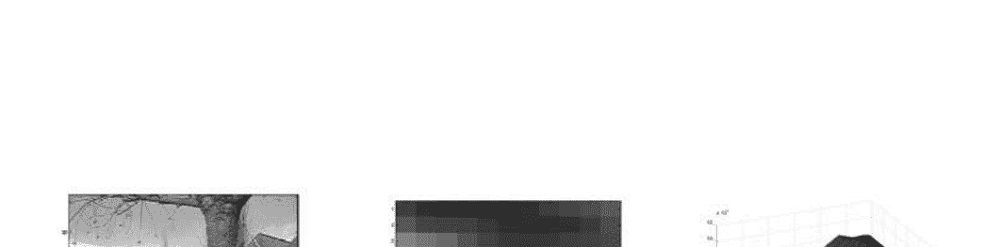

(a)

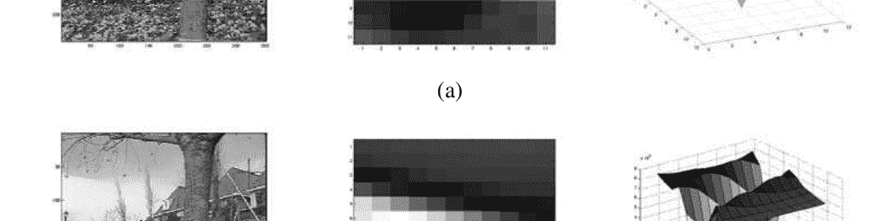

(b)

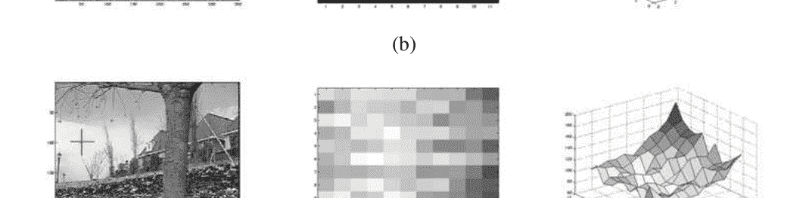

(c)

图8.4对应于图像中三个位置（红色十字）的SSD曲面：（a）高纹理区域，强最小值，低不确定性；（b）强边缘，光圈问题，在一个方向上不确定性高；（c）弱纹理，没有明确的最小值，不确定性大。

不确定性建模。特定基于补丁的运动估计的可靠性可以用一个不确定性模型更正式地捕捉到。最简单的这种模型是一个协方差矩阵，它捕捉到了在所有可能方向上运动估计的预期方差。
如第6.1.4节和附录B.6所讨论的，在小量加性高斯噪声下，可以证明协方差矩阵 $\Sigma_u$ 与Hessian $A$ 的逆成正比。

$$ \Sigma_u = \sigma_n^2 A^{-1}, \tag{8.44} $$

其中 $\sigma_n^2$ 是加性高斯噪声的方差（Anandan 1989; Matthies, Kanade, and Szeliski 1989; Szeliski 1989）。
对于更大量的噪声，Lucas-Kanade算法在（8.35）中进行的线性化只是近似的，因此上述数量成为真实协方差的Cramer-Rao下界。因此，Hessian $A$ 的最小和最大特征值现在可以解释为运动最不确定和最确定方向上的（缩放的）逆方差。（使用更现实的图像噪声模型进行更详细的分析由Steele和Jaynes（2005）给出。）图8.4显示了图像中三个不同像素位置的局部SSD曲面。正如你所看到的，该曲面在高纹理区域有一个明显的最小值，并且在强边缘附近存在光圈问题。

偏差和增益，加权和鲁棒误差度量。**Lucas-Kanade**更新规则也可以应用于偏差-增益方程（8.9）以获得

$$ E_{\text{LK-BG}}(\boldsymbol{u} + \Delta \boldsymbol{u}) = \sum_{i} [\boldsymbol{J}_1(\boldsymbol{x}_i + \boldsymbol{u}) \Delta \boldsymbol{u} + e_i - \alpha I_0(\boldsymbol{x}_i) - \beta]^2 \tag{8.45} $$

(Lucas and Kanade 1981; Gennert 1988; Fuh and Maragos 1991; Baker, Gross, and Matthews 2003)。由此得到的 $4 \times 4$ 方程组可以同时求解出平移位移更新 $\Delta \boldsymbol{u}$ 和偏差和增益参数 $\beta$ 和 $\alpha$。

对于具有线性外观变化的图像（模板），可以得到类似的表达式

$$ I_1(\boldsymbol{x} + \boldsymbol{u}) \approx I_0(\boldsymbol{x}) + \sum_{j} \lambda_j B_j(\boldsymbol{x}), \tag{8.46} $$

其中 $B_j(\boldsymbol{x})$ 是基础图像，$\lambda_j$ 是未知系数（Hager和Belhumeur 1998; Baker, Gross, Ishikawa et al. 2003; Baker, Gross和Matthews 2003）。潜在的线性外观变化包括光照变化（Hager和Belhumeur 1998）和小的非刚性变形（Black和Jepson 1998）。Lucas-Kanade算法的加权（窗口化）版本也是可能的：

$$ E_{\text{LK-WSSD}}(\boldsymbol{u} + \Delta \boldsymbol{u}) = \sum_{i} w_0(\boldsymbol{x}_i) w_1(\boldsymbol{x}_i + \boldsymbol{u}) [\boldsymbol{J}_1(\boldsymbol{x}_i + \boldsymbol{u}) \Delta \boldsymbol{u} + e_i]^2. \tag{8.47} $$

请注意，在从原始加权SSD函数（8.5）推导出Lucas-Kanade更新时，我们忽略了对 $w_1(x_i + u)$ 加权函数关于 $u$ 的导数，这在实践中通常是可以接受的，特别是如果加权函数是具有相对较少过渡的二进制掩码。

Baker、Gross、Ishikawa等人（2003年）仅使用 $w_0 (x)$ 项，如果两个图像具有相同的范围并且在重叠区域没有（独立的）切割，这是合理的。他们还讨论了将加权比例与 $\nabla I (x)$ 成正比的想法，这对于噪声很大的图像很有帮助，其中梯度本身就是噪声。其他研究光流的研究人员（Weber和Malik 1995；Bab-Hadiashar和Suter 1998b；M'uhlich和Mester 1998）也提出了类似的观察，用总最小二乘法（Van Huffel和Vandewalle 1991；Van Huffel和Lemmerling 2002）来表达。最后，Baker、Gross、Ishikawa等人（2003年）展示了如何仅在最可靠的（最高梯度）像素处评估方程（8.47），即使只使用5-10%的像素，也不会显著降低性能。（这个想法最初是由Dellaert和Collins（1999年）提出的，他们使用了更复杂的选择标准。）

Lucas-Kanade增量细化步骤也可以应用于第8.1节介绍的鲁棒误差度量。

```
$$E_{LK-SRD}(u + \Delta u) = \sum_{i} \rho(J_1(x_i + u)\Delta u + e_i)$$
```

可以使用在第6.1.4节中描述的迭代重新加权最小二乘技术来解决。

### 8.2 参数化运动

许多图像对齐任务，例如使用手持相机进行图像拼接，需要使用更复杂的运动模型，如第2.1.2节所述。由于这些模型，例如仿射变形，通常具有比纯平移更多的参数，因此在可能的值范围上进行完全搜索是不切实际的。相反，增量Lucas-Kanade算法可以推广到参数化运动模型，并与分层搜索算法结合使用（Lucas和Kanade 1981；Rehg和Witkin 1991；Fuh和Maragos 1991；Bergen，Anandan，Hanna et al.1992；Shashua和Toelg 1997；Shashua and Wexler 2001；Baker和Matthews 2004）。

对于参数化运动，我们使用一个空间变化的运动场或对应关系图，由低维向量 $p$ 参数化，其中 $x'(x; p)$ 可以是第2.1.2节中介绍的任何运动模型之一，而不是使用单个常数平移向量 $u$。

参数化增量运动更新规则现在变为

```
$$\begin{aligned} E_{\text{LK-PM}}(\boldsymbol{p}+\Delta\boldsymbol{p})&=\sum_{i}[I_{1}(\boldsymbol{x}'(\boldsymbol{x}_{i};\boldsymbol{p}+\Delta\boldsymbol{p}))-I_{0}(\boldsymbol{x}_{i})]^{2}\quad(8.49)\\ &\approx\sum_{i}[I_{1}(\boldsymbol{x}'_{i})+\boldsymbol{J}_{1}(\boldsymbol{x}'_{i})\Delta\boldsymbol{p}-I_{0}(\boldsymbol{x}_{i})]^{2}\quad(8.50)\\ &=\sum_{i}[\boldsymbol{J}_{1}(\boldsymbol{x}'_{i})\Delta\boldsymbol{p}+e_{i}]^{2},\quad(8.51)\end{aligned}$$
```

雅可比矩阵现在在哪里

```
$$\boldsymbol{J}_{1}(\boldsymbol{x}'_{i})=\frac{\partial I_{1}}{\partial\boldsymbol{p}}=\nabla I_{1}(\boldsymbol{x}'_{i})\frac{\partial\boldsymbol{x}'}{\partial\boldsymbol{p}}(\boldsymbol{x}_{i}),\quad(8.52)$$
```

即图像梯度 $\nabla I_{1}$ 与对应场的雅可比矩阵的乘积，$\boldsymbol{J}_{\boldsymbol{x}'}=\partial\boldsymbol{x}'/\partial\boldsymbol{p}_{\circ}$

在第2.1.2节和表2.1中介绍的2D平面变换的运动雅可比矩阵 $\boldsymbol{J}_{\boldsymbol{x}}$ 在表6.1中给出。请注意，我们重新参数化了运动矩阵，使其在原点 $\boldsymbol{p}=0$ 处始终为单位矩阵。这在后面讨论组合和逆组合算法时非常有用。（这也使得对运动施加先验更容易。）

对于参数化运动，(高斯-牛顿)海森矩阵和梯度加权残差向量-变得

```
$$\boldsymbol{A}=\sum_{i}\boldsymbol{J}_{\boldsymbol{x}'}^{T}(\boldsymbol{x}_{i})[\nabla I_{1}^{T}(\boldsymbol{x}'_{i})\nabla I_{1}(\boldsymbol{x}'_{i})]\boldsymbol{J}_{\boldsymbol{x}'}(\boldsymbol{x}_{i})\quad(8.53)$$
```

和

```
$$\boldsymbol{b}=-\sum_{i}\boldsymbol{J}_{\boldsymbol{x}'}^{T}(\boldsymbol{x}_{i})[e_{i}\nabla I_{1}^{T}(\boldsymbol{x}'_{i})].\quad(8.54)$$
```

注意方括号内的表达式与简单的平移运动情况(8.40-8.41)中的表达式相同。

基于块的近似。对于参数化运动，计算海森矩阵和残差向量的代价比平移情况要高得多。.对于具有 $n$ 个参数和 $N$ 个像素的参数化运动，累积 $\boldsymbol{A}$ 和 $\boldsymbol{b}$ 需要 $O(n^{2}N)$ 的操作次数(Baker和Matthews 2004)。减少这个代价的一种方法是将图像分成较小的子块(补丁) $P_{j}$，并且只在像素级别累积方括号内的简单 $2\times 2$ 量(Shum和Szeliski 2000)。

```
$$\begin{aligned} \boldsymbol{A}_{j}&=\sum_{i\in P_{j}}\nabla I_{1}^{T}(\boldsymbol{x}'_{i})\nabla I_{1}(\boldsymbol{x}'_{i})\quad(8.55)\\ \boldsymbol{b}_{j}&=\sum_{i\in P_{j}}e_{i}\nabla I_{1}^{T}(\boldsymbol{x}'_{i}).\quad(8.56)\end{aligned}$$
```

然后可以近似计算完整的Hessian矩阵和残差

```
$$A \approx \sum_j J_{x'}^T(\hat{x}_j) [\sum_{i \in P_j} \nabla I_1^T(x_i') \nabla I_1(x_i')] J_{x'}(\hat{x}_j) = \sum_j J_{x'}^T(\hat{x}_j) A_j J_{x'}(\hat{x}_j)$$
```

和

```
$$b \approx -\sum_j J_{x'}^T(\hat{x}_j) [\sum_{i \in P_j} e_i \nabla I_1^T(x_i')] = -\sum_j J_{x'}^T(\hat{x}_j) b_j$$
```

其中 \hat{x}_j 是每个补丁 P_j 的中心(Shum和Szeliski 2000)。这相当于用分段常数逼近替换真实的运动雅可比。在实践中，这非常有效。这种逼近与基于特征的配准的关系在第9.2.4节中讨论。

### 组合方法

对于复杂的参数化运动，如单应性，运动雅可比的计算变得复杂，并且可能涉及每个像素的除法。.Szeliski和Shum（1997）观察到，这可以通过首先根据当前的运动估计 x'(x; p) 对目标图像 I_1 进行变形来简化，

```
$$\tilde{I}_1(x) = I_1(x'(x; p)),$$
```

然后将这个扭曲的图像与模板 I_0(x) 进行比较,

```
$$E_{\text{LK-SS}}(\Delta p) = \sum_i [\tilde{I}_1(\hat{x}(x_i; \Delta p)) - I_0(x_i)]^2$$
$$\approx \sum_i [\tilde{J}_1(x_i)\Delta p + e_i]^2$$
$$= \sum_i [|\nabla \tilde{I}_1(x_i) J_{\hat{x}}(x_i) \Delta p + e_i|^2.$$
```

请注意，由于假设这两个图像相似，只需要进行增量参数化运动，即可以在 p=0 附近进行增量运动的评估，这可以带来相当大的简化。例如，平面投影变换（6.19）的雅可比矩阵现在变为

```
$$J_{\hat{x}} = \frac{\partial \tilde{x}}{\partial p}\bigg|_{p=0} = \begin{bmatrix} x & y & 1 & 0 & 0 & 0 & -x^2 & -xy \\ 0 & 0 & 0 & x & y & 1 & -xy & -y^2 \end{bmatrix}$$
```

一旦增量运动 \tilde{x} 被计算出来，它可以被添加到先前估计的运动中，对于使用变换矩阵表示的运动来说，这是很容易的，比如表2.1和6.1中给出的运动。Baker和Matthews（2004）称之为正向组合算法，因为目标图像正在被重新扭曲，最终的运动估计正在被组合。

如果扭曲图像和模板图像的外观足够相似，我们可以用之前建议的方法（8.43）将 $\tilde{I}_1(x)$ 的梯度替换为 $I_0(x)$ 的梯度。这样做的一个重要优势是可以预先计算（和求逆）方程（8.53）中给出的 Hessian 矩阵 $\boldsymbol{A}$。残差向量 $\boldsymbol{b}$（8.54）也可以部分预计算，即可以预先计算并存储后续与 $I_1(x)-I_0(x)$ 误差图像（Baker 和 Matthews 2004）相乘的最陡下降图像 $\nabla I_0(x) \boldsymbol{J}_{\tilde{\boldsymbol{x}}}(x)$。这个想法最早由 Hager 和 Belhumeur（1998）在 Baker 和 Matthews（2004）中提出，他们称之为逆加法方案。

-   Baker 和 Matthews（2004）引入了另一种变体，他们称之为逆组合算法。与其（概念上）重新扭曲扭曲的目标图像 $\tilde{I}_1(x)$ ，他们而是扭曲模板图像 $I_0(x)$ 并最小化

```
$$
E_{\mathrm{LK-BM}}(\Delta \boldsymbol{p}) = \sum_i [\tilde{I}_1(\boldsymbol{x}_i) - I_0(\tilde{\boldsymbol{x}}(\boldsymbol{x}_i; \Delta \boldsymbol{p}))]^2 \quad\quad (8.64)\\
\approx \sum_i [\nabla I_0(\boldsymbol{x}_i) \boldsymbol{J}_{\tilde{\boldsymbol{x}}}(\boldsymbol{x}_i) \Delta \boldsymbol{p} - e_i]^2. \quad\quad (8.65)
$$
```

这与前向扭曲算法（8.62）完全相同，只是梯度 $\nabla \tilde{I}_1(x)$ 被梯度 $\nabla I_0(x)$ 替换，除了 $e_i$ 的符号。所得到的更新 $\Delta \boldsymbol{p}$ 是通过修改的方程（8.62）计算得到的更新的负数，因此增量变换的逆变换必须添加到当前变换中。由于逆组合算法有可能预计算逆 Hessian 矩阵和最陡下降图像，这使得它成为 Baker 和 Matthews（2004）调查的首选方法。图8.5（Baker，Gross，Ishikawa等，2003）生动地展示了实现逆组合算法所需的所有步骤。

Baker 和 Matthews（2004）还讨论了使用高斯-牛顿迭代（即最小二乘的一阶展开，如上所述）相比其他方法（如最陡下降和 Levenberg-Marquardt）的优势。系列的后续部分（Baker，Gross，Ishikawa 等人，2003 年；Baker，Gross 和 Matthews，2003 年，2004 年）讨论了更高级的主题，如像素加权，像素选择以提高效率，对鲁棒度指标和算法的更深入讨论，线性外观变化以及参数先验。对于任何对实现高度调优的增量图像配准感兴趣的人来说，它们都是无价之宝。-   Evangelidis 和 Psarakis（2008）对这些和其他相关方法进行了一些详细的实验评估。

#### 8.2.1 应用：视频稳定

视频稳定是参数化运动估计的最广泛应用之一（Hansen，Anandan，Dana 等人，1994 年；Irani，Rousso 和 Peleg，1997 年；Morimoto 和 Chellappa 1997; Srinivasan, Chellappa, Veeraraghavanet al.2005)。用于稳定化的算法可以运行在硬件设备（如摄像机和相机）和用于提高抖动视频视觉质量的软件包中。

在他们关于全画幅视频稳定化的论文中，Matsushita, Ofek, Geet al.(2006)对稳定化的三个主要阶段进行了详细介绍，即运动估计、运动平滑和图像变形。运动估计算法通常使用相似性变换来处理相机的平移、旋转和缩放。关键部分是使这些算法锁定背景运动，这是相机移动的结果，而不被独立移动的前景物体所干扰。运动平滑算法恢复运动的低频（缓慢变化）部分，然后估计需要去除的高频抖动成分。最后，图像变形算法将高频校正应用于原始帧，使其看起来就像相机只经历了平滑运动一样。

结果稳定算法可以极大地改善抖动视频的外观但它们通常仍然包含视觉伪影。例如，图像扭曲可能导致图像周围的边缘丢失这些边缘必须被裁剪，使用其他帧的信息进行填充，或使用修复技术进行虚构（第10.5.1节）。此外，快速运动期间捕获的视频帧通常模糊。它们的外观可以通过去模糊技术（第10.3节）或从运动较少或焦点更好的其他帧中窃取更清晰的像素来改善（Matsushita，Ofek，Geet al.2006年）。练习8.3要求您实现并测试其中的一些想法。

在相机在3D空间中大量平移的情况下，例如，当摄影师在行走时，更好的方法是计算相机运动和3D场景的完整结构重建。然后可以计算出平滑的3D相机路径，并使用插值的3D点云重新渲染原始视频，同时保留显著特征（Liu，Gleicher，Jin et al.2009年）。如果您可以访问相机阵列而不是单个视频相机，则可以使用光场渲染方法（第13.3节）获得更好的效果（Smith，Zhang，Jin et al.2009年）。

#### 8.2.2 学习的运动模型

将运动场用几何变形（如仿射变换）参数化的替代方法是学习一组适用于特定应用的基函数（Black，Yacoob，Jepson等，1997年）。首先，从一组训练视频中计算出一组密集的运动场（第8.4节）。接下来，对运动场堆栈应用奇异值分解（SVD）来计算前几个奇异向量（v_k(x)）。最后，对于一个新的测试序列，使用粗到精的算法估计一个新的流场。

未知系数 $a_k$ 在参数化流场中

```
$$\boldsymbol{u}(\boldsymbol{x}) = \sum_{k} a_k \boldsymbol{v}_k(\boldsymbol{x}). \qquad (8.66)$$
```

图8.6a展示了通过观察行走动作视频学习到的一组基础场。图8.6b展示了基础系数的时间演化以及一些恢复的参数化运动场。请注意，类似的思想也可以应用于特征轨迹（Torresani、Hertzmann和Bregler 2008），这是我们在4.1.4和12.6.4节中更详细讨论的一个主题。

### 8.3 基于样条的运动

虽然参数化运动模型在各种应用中很有用（如视频稳定和映射到平面表面），但大多数图像运动太复杂，无法通过这种低维模型捕捉。

传统上，光流算法（第8.4节）为每个像素计算独立的运动估计，即计算的流向量数量等于输入像素的数量。因此，光流的一般模拟方程（8.1式）可以写成

```
$$E_{\mathrm{SSD-OF}}(\{\boldsymbol{u}_i\}) = \sum_i \left[ I_1(\boldsymbol{x}_i + \boldsymbol{u}_i) - I_0(\boldsymbol{x}_i) \right]^2. \qquad (8.67)$$
```

请注意，在上述方程中，变量 $\{u_i\}$ 的数量是测量数量的两倍，因此问题是不完全约束的。

我们在第8.4节中研究了解决这个问题的两种经典方法，一种是在重叠区域上进行求和（基于块或窗口的方法），另一种是在 $\{u_i\}$ 场上添加平滑项，使用正则化或马尔可夫随机场（第3.7节）。在本节中，我们描述了一种介于一般光流（每个像素独立流动）和参数化流动（少量全局参数）之间的替代方法。该方法是将运动场表示为由较少数量的控制顶点 $\{\hat{u}_j\}$ 控制的二维样条（图8.7），

$$ u_i = \sum_j \hat{u}_j B_j(x_i) = \sum_j \hat{u}_j w_{i,j}, \tag{8.68} $$

其中 $B_j(x_i)$ 被称为基函数，并且仅在一个小的有限支持区间上非零（Szeliski和Coughlan 1997）。我们将 $w_{ij} = B_j(x_i)$ 权重称为强调 $\{u_i\}$ 是 $\{\hat{u}_j\}$ 的已知线性组合。一些常用的样条基函数在图8.8中显示。

将单个像素流向向量 $u_i$ （8.68）的公式代入SSD误差度量（8.67）中，得到类似于方程（8.50）的参数化运动公式。最大的区别是雅可比矩阵 $J_l(x_i')$ （8.52）现在由权重矩阵 $W = [w_{ij}]$ 中的稀疏条目组成。

在我们对运动场景有更多了解的情况下，例如，当运动是由相机在静态场景中移动时，我们可以使用更专门的运动模型。例如，平面加视差模型（第2.1.5节）可以自然地与基于样条的运动表示相结合，其中平面内的运动由齐次变换（6.19）表示，平面外的视差由每个样条上的标量变量表示。

图8.8样条基函数示例（Szeliski和Coughlan 1997）©1997 Springer。块（常数）插值器/基函数对应于基于块的运动估计（Le Gall 1991）。有关样条函数的更多细节，请参见第3.5.1节。

### 8.3 基于样条的运动

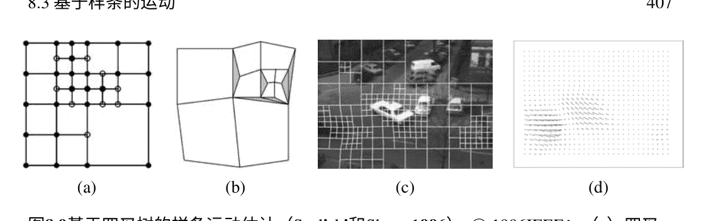

图8.9基于四叉树的样条运动估计 (Szeliski和Shum 1996) © 1996IEEE: (a) 四叉树样条表示，(b) 可能导致裂缝，除非白色节点依赖于其父节点; (c) 变形的四叉树样条网格叠加在灰度图像上; (d) 流场可视化为针图。

控制点 (Szeliski和Kang 1995; Szeliski和Coughlan 1997)

在许多情况下，样条顶点的数量很少，导致了一个良好条件的运动估计问题。然而，如果大面积无纹理区域（或者受到光圈问题的影响的细长边缘）在几个样条片段中持续存在，可能需要添加一个正则化项来使问题成为良好定义的（第3.7.1节）。最简单的方法是直接在样条控制网格{u_j}中的相邻顶点之间添加平方差惩罚项，如（3.100）所示。如果正在使用多分辨率（由粗到细）策略，则在从一级到另一级时重缩放这些平滑项非常重要。

与基于样条的运动估计器对应的线性系统是稀疏和规则的。由于它通常具有适度的大小，因此通常可以使用直接技术（如Cholesky分解）来求解（附录A.4）。另外，如果问题变得过大并且受到过多的填充影响，则可以使用迭代技术（如分层预处理共轭梯度法）来求解（附录A.5）。由于其鲁棒性，基于样条的运动估计已被用于许多应用，包括视觉效果（Roble 1999）和医学图像配准（第8.3.1节）（Szeliski和Lavallée 1996; Kybic和Unser 2003）。

然而，基本技术的一个缺点是，除非使用过多的节点，否则模型在运动不连续性附近的表现较差。为了解决这个问题，Szeliski和Shum（1996）建议在样条控制网格中嵌入一个四叉树表示（图8.9a）。大单元格用于表示平滑运动的区域，而在运动不连续性的区域添加了较小的单元格（图8.9c）。为了估计运动，使用了从粗到细的策略。从一个在低分辨率图像上施加的常规样条开始，获得初始的运动估计。运动不一致的样条补丁，即平方残差（8.67）超过阈值的补丁，被细分为较小的补丁。为了避免在结果运动场中出现裂缝（图8.9b），需要限制细化网格中某些节点的值，即那些与较大单元相邻的节点，以使它们依赖于其父节点的值。这可以通过使用四叉树样条的分层基函数表示（Szeliski 1990b），并选择性地将一些分层基函数设置为0来实现，如（Szeliski和Shum 1996）中所述。

#### 8.3.1 应用：医学图像配准

由于它们擅长表示平滑的弹性变形场，基于样条的运动模型在医学图像配准中得到了广泛应用（Bajcsy和Kovacic 1989; Szeliski和Lavallée 1996; Christensen, Joshi和Miller 1997）。配准技术既可以用于跟踪个体患者随时间的发展或进展（纵向研究），也可以将不同患者的图像匹配在一起，以寻找共同点和检测变异或病理变化（横向研究）。当注册不同的成像模态时，例如计算机断层扫描（CT）和磁共振图像（MRI），通常需要使用互信息相似度度量（Viola和Wells III 1997; Maes, Collignon, Van dermeulen等1997年）。

Kybic和Unser（2003）提供了一篇很好的文献综述，并描述了一个完整的工作系统，该系统将图像和变形场都表示为多分辨率样条。图8.10显示了Kybic和Unser系统用于将患者的脑MRI与标记的脑图像进行配准的示例。该系统可以完全自动运行。

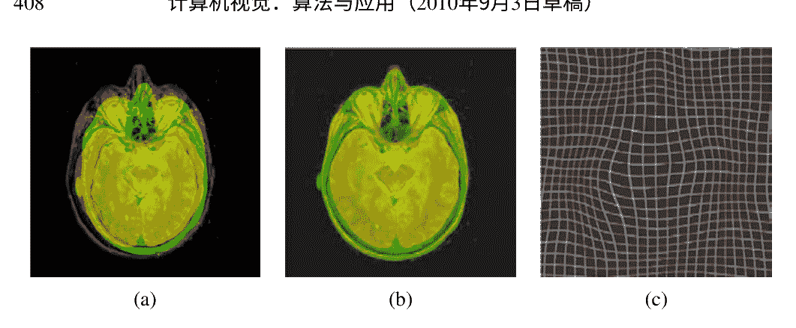

图8.10 弹性脑注册（Kybic和Unser 2003）©2003 IEEE：(a) 原始脑图谱和患者MRI图像以红绿叠加；(b) 在八个用户指定的地标（未显示）上进行弹性注册后；(c) 一个立方B样条变形场，显示为变形的网格。

在计算机图形学中，这种弹性体积变形被称为自由形变（Sederberg和Parry 1986; Coquillart 1990; Celniker和Gossard 1991）。

自动模式可以获得更准确的结果，但通过定位一些关键的地标可以获得更准确的结果。最近关于可变形医学图像配准的论文，包括性能评估，包括（Klein，Staring和Pluim 2007; Glocker, Komodakis, Tziritas等人2008）。与其他应用程序一样，可以使用选择性的方法来增强常规体积样条。在3D体积图像或表面配准的情况下，这些被称为八叉树样条（Szeliski和Lavallée 1996），并且已被用于注册来自不同患者的医学表面模型，如椎骨和面部（图8.11）。

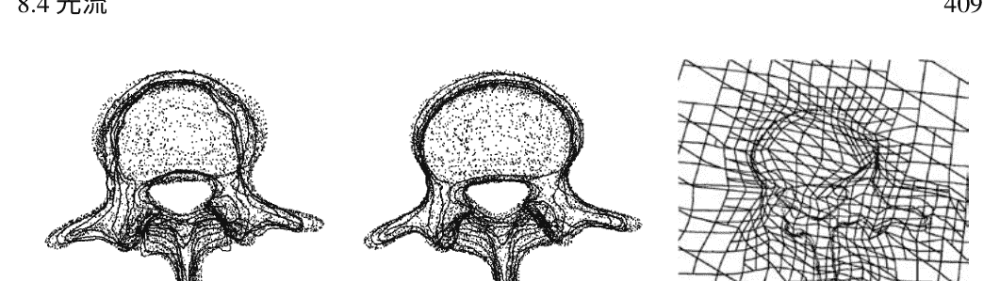

图8.11 基于八叉树样条的图像配准两个椎体表面模型（Szeliski和Lavallée 1996）©1996 Springer：（a）初始刚性对齐后；（b）弹性对齐后；（c）通过适应的八叉树样条变形场的横截面。

### 8.4 光流

运动估计的最一般（也是最具挑战性）的版本是计算每个像素的独立运动估计，通常称为光流。正如我们在前一节中提到的，这通常涉及最小化图像上对应像素之间的亮度或颜色差异的总和。

> E_SSD-OF({u_i}) = ∑[I1(x_i + u_i) - I0(x_i)]^2 (8.69)

由于变量的数量{u_i}是测量数量的两倍，所以问题是欠定的。解决这个问题的两种经典方法是在重叠区域上进行局部求和（基于块或基于窗口的方法），或者在{u_i}场上添加平滑项，使用正则化或马尔可夫随机场（第3.7节），并寻找全局最小值。

基于块的方法通常涉及使用位移图像函数（8.35）的泰勒级数展开，以获得亚像素估计（Lucas和Kanade 1981）。Anandan（1989）展示了如何在粗到精的金字塔方案中，将一系列局部离散搜索步骤与Lucas-Kanade增量细化步骤交错进行，从而允许估计大运动（如第8.1.1节所述）。他还分析了局部运动估计的不确定性与局部Hessian矩阵$A_i$（8.44）的特征值之间的关系，如图8.3-8.4所示。

Bergen, Anandan, Hanna等人（1992年）提出了一个描述参数化（第8.2节）和基于补丁的光流算法的统一框架，并对这个主题进行了很好的介绍。在粗到细的金字塔中的每次光流估计迭代之后，他们重新对其中一幅图像进行重映射，以便只计算增量光流估计（第8.1.1节）。当使用重叠补丁时，一种高效的实现方法是首先计算每个像素处的梯度和强度误差（8.40-8.41）的外积，然后使用移动平均滤波器执行重叠窗口求和。¹Horn和Schunck（1981年）开发了一个基于正则化的框架，通过同时最小化（8.69）来约束所有流向量$\{u_i\}$的问题。为了限制问题，将平滑性约束，即对流导数的平方惩罚，添加到基本的逐像素误差度量中。因为这项技术最初是在变分（连续函数）框架中针对小运动开发的，所以与（8.35）相对应的线性化亮度恒定约束（8.38）更常被写成解析积分的形式。

$$E_{\text{HS}} = \int (I_x u + I_y v + I_t)^2 \, dx \, dy, \quad (8.70)$$

其中 $(I_x, I_y) = \nabla I_1 = J_1$ 且 $I_t = e_i$ 是时间导数，即图像之间的亮度变化。Horn和Schunck模型也可以看作是基于样条的运动估计的极限情况，当样条变为1x1像素块时。

通过使用局部聚合（而不是单像素）的Hessian作为亮度恒定项（Bruhn, Weickert和Schnörr 2005），还可以将局部和全局流估计的思想结合到一个框架中。考虑离散模拟(8.35)到解析全局能量(8.70),

$$E_{\text{HSD}} = \sum_i u_i^T [J_i J_i^T] u_i + 2 e_i J_i^T u_i + e_i^2. \quad (8.71)$$

如果我们用面积聚合的版本（8.40-8.41）替换每个像素（秩1）的Hessian矩阵 $A_i = [J_i J_i^T]$ 和残差 $b_i = J_i e_i$，我们可以得到一个全局最小化算法，其中使用了基于区域的亮度约束。

基本光流模型的另一个扩展是使用全局（参数化）和局部运动模型的组合。例如，如果我们知道运动是由相机在静态场景中移动的相机（刚性运动），我们可以重新定义问题，估计每个像素的深度以及全局相机运动的参数（Adiv 1989; Hanna1991; Bergen, Anandan, Hannaet al.1992; Szeliski and Coughlan 1997; Nir, Bruckstein,and Kimmel 2008; Wedel, Cremers, Pocket al.2009）。这些技术与立体匹配（第11章）密切相关。或者，我们可以估计每个图像或每个段落的仿射运动模型，结合每个像素的残差修正（Black and Jepson 1996;Ju, Black, and Jepson 1996; Chang, Tekalp, and Sezan 1997; M‘emin and P’erez 2002）。我们将在第8.5节重新讨论这个主题。

当然，图像亮度可能并不总是一个适当的度量来衡量外观的一致性，例如当图像中的光照变化时。如第8.1节所讨论的，匹配梯度、滤波图像或其他度量，如图像Hessians（二阶导数测量）可能更合适。还可以在图像中局部计算可定向滤波器的相位，这对于偏置和增益变换都不敏感（Fleet和Jepson 1990）。Papenberg, Bruhn, Brox等人（2006）回顾和探索了这些约束，并对增量流计算过程中的图像重新变形进行了详细分析和证明。

由于亮度恒定约束是在每个像素独立评估的，而不是在可能违反常数流假设的补丁上求和，全局优化方法在运动不连续性附近的性能更好。如果在平滑约束中使用鲁棒度量，这一点尤为真实（Black和Anandan 1996; Bab-Hadiashar和Suter 1998a）。¹²一个流行的鲁棒度量选择是L1范数，也称为总变差（TV），其结果是一个凸能量函数，可以找到其全局最小值（Bruhn, Weickert和Schnörr 2005; Papenberg, Bruhn, Brox等人2006）。各向异性平滑先验，在图像梯度平行和垂直方向上应用不同的平滑性，是另一个常见的选择（Nagel和Enkelmann 1986; Sun, Roth, Lewis等人2008; Werlberger, Trobin, Pock等人2009）。还可以从一组配对的流和强度图像中学习一组更好的平滑约束（导数滤波器和鲁棒函数）（Sun, Roth, Lewis等人2008）。关于其中一些技术的更多细节可以在Baker, Black, Lewis等人（2007）和Baker, Scharstein, Lewis等人（2009）中找到。

由于估计流的大型二维搜索空间，大多数算法使用梯度下降和粗到细的迭代方法来最小化全局能量函数。这与立体匹配形成鲜明对比（立体匹配是一个“更容易”的一维视差估计问题），在过去的十年中，组合优化技术一直是首选的方法。

幸运的是，基于马尔可夫随机场的组合优化方法是

### Optical flow evaluation results

Statistics: Average SD R0.5 R1.0 R2.0 A50 A75 A95
Error type: endpoint angle interpolation normalized interpolation

| Average endpoint error | avg rank | Army (Hidden texture) GT all disc untext | Mequon (Hidden texture) GT all disc untext | Schefflera (Hidden texture) GT all disc untext | Wooden (Hidden texture) GT all disc untext | Grove (Synthetic) GT all disc untext | Urban (Synthetic) GT all disc untext | Yosemite (Synthetic) GT all disc untext | Teddy (Stereo) GT all disc untext |
|------------------------|----------|------------------------------------------|-------------------------------------------|-----------------------------------------------|--------------------------------------------|--------------------------------------|--------------------------------------|---------------------------------------|----------------------------------|
| Adaptive [20]          | 4.4      | 0.09 0.26 0.06 0.23                      | 0.18 0.78 0.35 0.42                       | 0.54 1.11 0.77 0.21                          | 0.18 0.91 0.10 0.08                       | 0.88 1.25 0.73 0.72                 | 0.50 1.28 0.31 0.14                 | 0.14 0.16 0.22 0.03                  | 0.65 1.37 0.79 0.54                |
| Complementary OF [21]  | 5.7      | 0.11 0.28 0.10 0.17                      | 0.18 0.63 0.11 0.42                       | 0.21 0.75 0.18 0.22                          | 0.19 0.97 0.12 0.10                       | 0.97 1.31 1.00 0.14                 | 1.78 1.73 0.87 0.11                 | 0.11 0.12 0.22 0.08                  | 0.68 1.48 0.95 0.46                |
| Aniso. Huber-L1 [22]   | 5.8      | 0.10 0.28 0.08 0.15                      | 0.31 1.09 0.86 0.28                       | 0.47 1.15 0.29 0.14                          | 0.20 0.92 0.13 0.10                       | 0.84 1.20 0.70 0.13                 | 0.39 1.23 0.28 0.17                 | 0.17 0.15 0.27 0.06                  | 0.64 1.36 0.79 0.24                |
| DPOF [18]              | 6.1      | 0.13 0.35 0.09 0.08                      | 0.25 0.79 0.16 0.34                       | 0.44 1.18 0.23 0.18                          | 0.19 0.62 0.15 0.09                       | 0.74 1.09 0.49 0.10                 | 0.88 1.80 0.63 0.18                 | 0.19 0.17 0.35 0.05                  | 0.50 1.08 0.55 0.16                |
| TV-L1-improved [17]    | 7.2      | 0.09 0.26 0.07 0.02                      | 0.20 0.71 0.13 0.16                       | 0.53 1.18 0.25 0.05                          | 0.21 1.24 0.11 0.14                       | 0.90 1.51 1.12 0.18                 | 1.34 1.93 0.84 0.11                 | 0.18 0.16 0.27 0.08                  | 0.73 1.62 0.97 0.07                |
| CBF [12]               | 7.8      | 0.10 0.28 0.09 0.04                      | 0.34 0.80 0.37 0.22                       | 0.39 0.95 0.24 0.16                          | 0.21 1.14 0.13 0.18                       | 0.89 1.27 0.82 0.10                 | 0.41 1.23 0.30 0.23                 | 0.23 0.19 0.39 0.10                  | 0.76 1.56 1.02 0.16                |
| Brox et al. [5]        | 8.4      | 0.11 0.32 0.11 0.12                      | 0.27 0.93 0.10 0.22                       | 0.43 0.94 0.27 0.08                          | 0.24 1.25 0.13 0.14                       | 1.10 1.39 1.43 0.07                 | 0.89 1.77 0.55 0.07                 | 0.10 0.13 0.11 0.03                  | 0.91 1.83 1.13 0.07                |
| Rannacher [23]         | 8.5      | 0.11 0.31 0.09 0.04                      | 0.25 0.84 0.21 0.15                       | 0.58 1.27 0.26 0.04                          | 0.24 1.32 0.13 0.06                       | 1.13 1.39 1.32 0.07                 | 1.49 1.95 0.78 0.09                 | 0.15 0.14 0.27 0.08                  | 0.69 1.58 0.86 0.06                |
| F-TV-L1 [15]           | 8.8      | 0.14 0.35 0.14 0.06                      | 0.34 0.98 0.12 0.26                       | 0.59 1.19 0.16 0.28                          | 0.27 1.36 0.16 0.21                       | 0.90 1.30 0.76 0.03                 | 0.54 1.62 0.36 0.04                 | 0.13 0.15 0.20 0.06                  | 0.68 1.56 0.68 0.03                |
| Second-order prior [8] | 9.0      | 0.11 0.31 0.09 0.04                      | 0.26 0.93 0.20 0.18                       | 0.57 1.25 0.26 0.06                          | 0.20 1.04 0.12 0.04                       | 0.94 1.34 0.83 0.01                 | 0.61 1.93 0.47 0.04                 | 0.20 0.16 0.34 0.02                  | 0.77 1.64 1.07 0.02                |
| Fusion [6]             | 9.4      | 0.11 0.34 0.10 0.05                      | 0.19 0.69 0.13 0.16                       | 0.29 0.66 0.23 0.06                          | 0.20 1.19 0.14 0.06                       | 1.07 1.42 1.22 0.07                 | 1.35 1.49 0.86 0.07                 | 0.20 0.18 0.28 0.04                  | 1.07 2.07 1.39 0.04                |
| Dynamic MRF [7]        | 11.1     | 0.12 0.34 0.11 0.12                      | 0.22 0.89 0.16 0.15                       | 0.44 1.13 0.20 0.14                          | 0.24 1.29 0.14 0.11                       | 1.11 1.52 1.13 0.13                 | 1.54 2.37 0.93 0.03                 | 0.13 0.12 0.31 0.01                  | 1.27 2.33 1.66 0.01                |
| SegOF [10]             | 11.7     | 0.15 0.38 0.10 0.08                      | 0.57 1.16 0.59 0.08                       | 0.88 1.24 0.64 0.02                          | 0.32 0.86 0.28 0.05                       | 1.18 1.50 1.47 0.06                 | 1.63 2.09 0.96 0.08                 | 0.08 0.13 0.12 0.05                  | 0.70 1.50 0.89 0.02                |
| Learning Flow [11]     | 13.3     | 0.11 0.32 0.09 0.15                      | 0.29 0.99 0.13 0.23                       | 0.55 1.24 0.29 0.12                          | 0.28 1.56 0.25 0.11                       | 1.25 1.64 1.41 0.17                 | 1.35 2.32 0.85 0.04                 | 0.14 0.18 0.24 0.02                  | 1.09 2.09 1.27 0.01                |
| Filter Flow [19]       | 14.3     | 0.17 0.39 0.13 0.13                      | 0.43 1.09 0.14 0.38                       | 0.75 1.34 0.78 0.13                          | 0.70 1.54 0.88 0.21                       | 1.13 1.38 1.51 0.14                 | 0.57 1.32 0.44 0.04                 | 0.22 0.23 0.26 0.06                  | 0.98 2.16 1.04 0.06                |
| GraphCuts [14]         | 14.5     | 0.16 0.38 0.14 0.09                      | 0.58 1.36 0.46 0.29                       | 0.59 1.07 0.64 0.18                          | 0.26 1.14 0.17 0.07                       | 0.96 1.35 1.04 0.08                 | 2.25 1.79 1.22 0.07                 | 0.22 0.17 0.43 0.03                  | 1.22 2.05 1.78 0.03                |
| Black & Anandan [4]    | 15.0     | 0.18 0.42 0.19 0.08                      | 0.58 1.31 0.51 0.09                       | 0.95 1.58 0.70 0.04                          | 0.49 1.59 0.45 0.04                       | 1.21 1.42 1.32 0.03                 | 1.43 2.28 0.83 0.10                 | 0.15 0.17 0.17 0.02                  | 1.11 1.98 1.30 0.04                |
| SPSA-learn [13]        | 15.7     | 0.18 0.45 0.17 0.16                      | 0.57 1.32 0.18 0.51                       | 0.84 1.50 0.72 0.17                          | 0.52 1.64 0.49 0.14                       | 1.12 1.42 1.39 0.08                 | 1.75 2.14 1.06 0.06                 | 0.13 0.13 0.19 0.02                  | 1.32 2.08 1.73 0.03                |
| GroupFlow [9]          | 15.9     | 0.21 0.51 0.21 0.19                      | 0.79 1.69 0.72 0.11                       | 0.86 1.64 0.74 0.04                          | 0.30 1.07 0.26 0.02                       | 1.29 1.21 1.82 0.02                 | 1.94 2.30 1.36 0.02                 | 0.11 0.14 0.19 0.01                  | 1.06 1.96 1.35 0.03                |
| 2D-CLG [1]             | 17.4     | 0.28 0.62 0.21 0.07                      | 0.67 1.21 0.67 0.10                       | 1.12 1.80 0.99 0.06                          | 0.26 2.06 1.12 0.05                       | 1.23 1.52 1.62 0.06                 | 1.54 2.15 1.67 0.04                 | 0.10 0.11 0.16 0.02                  | 1.38 2.26 1.83 0.02                |
| Horn & Schunck [16]    | 18.6     | 0.21 0.55 0.22 0.10                      | 0.61 1.53 0.52 0.02                       | 1.01 1.73 0.80 0.02                          | 0.78 2.02 0.77 0.01                       | 1.26 1.58 1.55 0.01                 | 1.43 2.59 1.00 0.01                 | 0.16 0.18 0.15 0.01                  | 1.51 2.50 2.01 0.01                |
| TI-DOFE [24]           | 19.6     | 0.38 0.64 0.47 0.34                      | 1.16 1.72 1.26 0.17                       | 1.39 2.06 1.17 0.11                          | 1.29 2.21 1.41 0.13                       | 1.27 1.61 1.57 0.11                 | 1.28 2.57 1.01 0.01                 | 0.13 0.15 0.14 0.01                  | 1.87 2.71 2.53 0.01                |
| FOLKI [16]             | 22.6     | 0.29 0.73 0.33 0.16                      | 1.52 1.96 1.80 0.23                       | 1.23 2.04 0.95 0.02                          | 0.92 2.21 1.08 0.03                       | 1.53 1.85 2.07 0.02                 | 2.14 3.23 1.60 0.02                 | 0.28 0.21 0.68 0.02                  | 2.67 3.27 4.32 0.02                |
| Pyramid LK [2]         | 23.7     | 0.39 0.61 0.61 0.37                      | 1.67 1.78 2.00 0.28                       | 1.50 1.97 1.38 0.21                          | 1.57 2.39 1.78 0.26                       | 2.94 3.72 2.98 0.24                 | 3.33 2.74 2.43 0.04                 | 0.30 0.24 0.73 0.02                  | 3.80 5.08 4.88 0.02                |

Move the mouse over the numbers in the table to see the corresponding images. Click to compare with the ground truth.

### Color encoding of flow vectors

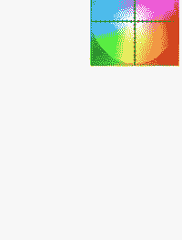

### Schefflera - Complementary-OF flow

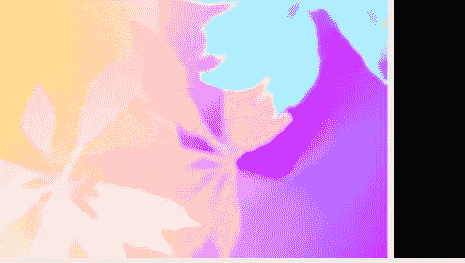

### flow error

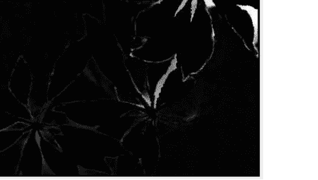

图8.12评估24种光流算法的结果，2009年10月，http://vision.middlebury.edu/flow/，（Baker， Scharstein， Lewis等人2009）。通过将鼠标指针移动到下划线下的性能分数上，用户可以交互地查看相应的流和误差图。点击分数可以在计算的流和真实流之间切换。在每个分数旁边，当前列的相应排名由较小的蓝色数字表示。每列中的最小（最佳）分数以粗体显示。表格按照平均排名排序（在所有24列，每个序列的三个区域掩码中计算）。平均排名作为所选度量/统计下的性能的近似度量。

开始出现并且倾向于成为最佳表现的方法之一，最近发布的光流数据库上（Baker，Black，Lewis等人，2007年）。<sup>13</sup>

这些技术的例子包括Glocker，Paragios，Komodakis等人开发的技术（2008年），他们使用粗到细的策略进行像素级2D不确定性估计，然后用于引导下一级的细化和搜索。他们使用Fast-PD算法（Komodakis，Tziritas和Paragios，2008年）执行离散位移标签的组合搜索（能够找到更好的能量极小值），而不是使用梯度下降来改进流估计。

Lempitsky，Roth和Rother（2008年）使用基本流算法（Horn和Schunck，1981年；Lucas和Kanade，1981年）生成的提议上的融合移动（Lempitsky，Rother和Blake，2007年）来找到好的解决方案。融合移动的基本思想是用更基本的技术（或其移位版本）生成的假设替换当前最佳估计的部分，并与局部梯度下降交替使用以实现更好的能量最小化。

准确的运动估计领域正在以快速的速度不断发展，每年都有显著的性能提升。光流评估网站(http://vision.middlebury.edu/flow/) 是一个指向最近开发的高性能算法的良好资源(图8.12)。

#### 8.4.1 多帧运动估计

到目前为止，我们将运动估计视为一个两帧问题，目标是计算一个运动场，将一幅图像中的像素与另一幅图像中的像素对齐。在实际应用中，运动估计通常应用于视频，可以利用整个序列的帧来执行此任务。

多帧运动的一个经典方法是使用定向或可操纵滤波器对时空体积进行滤波（Heeger 1988），类似于定向边缘检测（第3.2.3节）。图8.13显示了常用的花园序列中的两帧图像，以及通过时空体积的水平切片，即将所有视频帧堆叠在一起形成的三维体积。由于像素运动主要是水平的，可以清楚地看到各个（纹理）像素轨迹的斜率，这些斜率对应于它们的水平速度。时空滤波使用每个像素周围的三维体积来确定空间-时间中最佳的方向，这直接对应于像素的速度。

不幸的是，为了在图像的任何地方获得合理准确的速度估计，时空滤波器需要具有相当大的范围，这严重降低了在运动不连续性附近的估计质量。（这个问题在基于2D窗口的运动估计器。）与全时空滤波相比，一种替代方法是估计更局部的时空导数，并在全局优化框架内使用它们来填充无纹理区域（Bruhn，Weickert和Schnörr 2005；Govindu 2006）。另一种选择是同时估计多个运动估计，同时可选择性地推理遮挡关系（Szeliski 1999）。图8.13c以示意图的方式展示了解决这个问题的一个潜在方法。水平箭头显示了估计运动的关键帧位置，而其他切片表示与关键帧之间插值预测的视频帧 t 的颜色匹配。运动估计可以被视为一个全局能量最小化问题，同时最小化关键帧和其他帧之间的亮度兼容性和流兼容性项，以及使用鲁棒平滑项。

多视图框架对于刚性场景运动（多视图立体）（第11.6节）可能更加合适，其中每个像素的未知数是视差，遮挡关系可以直接从像素深度中确定（Szeliski 1999；Kolmogorov and Zabih 2002）。然而，它也可能适用于一般运动，需要添加对象加速度和遮挡关系模型。

### 8.4.2 应用 ：视频降噪

视频去噪是从电影和视频中去除噪声和其他伪影的过程（Kokaram 2004）。与单幅图像去噪不同，视频去噪器可以对相邻帧进行平均或借用信息。然而，为了在不引入模糊或抖动（不规则运动）的情况下进行此操作，需要准确的逐像素运动估计。

练习8.7列出了一些所需的步骤，包括确定是否具备能力当前的运动估计足够准确，可以与其他帧进行平均。 Gai和Kang（2009）描述了他们最近开发的修复过程，其中涉及一系列额外的步骤来处理复古电影的特殊特征。

### 8.4.3 应用 ：去隔行

逐像素运动估计的另一个常用应用是视频去隔行，这是将使用交替的偶数和奇数行的视频转换为非隔行信号的过程（de Haan和Bellers1998）。 两种简单的去隔行技术是 bob，它从同一场的上方或下方复制缺失的行，和 weave，它从之前或之后的场中复制相应的行。 这两种简单技术产生的视觉伪影得名：bob在强水平线上引入上下跳动的运动；weave会在水平平移的边缘上产生“拉链”效果。 用平均值替换这些复制操作可以有所帮助，但不能完全消除这些伪影。

针对这一过程，已经开发出了各种改进的技术，通常嵌入在计算机内的专用DSP芯片中，用于视频数字化板（由于广播视频通常是交错的，而计算机显示器则不是）。 这些技术的一个大类估计了局部像素运动，并从空间和时间相邻的场中可用信息中插值出缺失的数据。 Dai、Baker和Kang（2009）回顾了这些文献，并提出了他们自己的算法，该算法使用MRF框架在每个像素中选择七种不同的插值函数。

### 8.5 分层运动

在许多情况下，视觉运动是由场景中不同深度的少数物体的移动引起的。 在这种情况下，如果将像素分组到适当的对象或层中，可以更简洁地描述像素运动（并更可靠地估计）（Wang和Adelson 1994）。

图8.14以示意图的形式显示了这种方法。 这个序列中的运动是由方格背景的平移运动和前景手的旋转引起的。 完整的运动序列可以从前景和背景元素的外观中重建，这可以表示为alpha-matted图像（精灵或视频对象）和与每个图层对应的参数化运动。 按照后向前的顺序（第3.1.3节）位移和合成这些图层可以重新创建原始视频序列。

分层运动表示不仅可以导致紧凑的表示（Wang和Adelson 1994; Lee, ge Chen, lung Bruce Linet al.1997），而且还可以利用多个视频帧中可用的信息，以及准确地建模外观在运动不连续性附近的像素。这使它们特别适合作为基于图像的渲染（第13.2.1节）(Shade, Gortler, He等, 1998年; Zitnick, Kang, Uyttendaele等, 2004年)以及物体级视频编辑的表示。

为了计算视频序列的分层表示，Wang和Adelson（1994年）首先估计一组不重叠补丁上的仿射运动模型，然后使用k-means对这些估计进行聚类。然后，他们在分配像素到层和使用分配像素重新计算每个层的运动估计之间交替进行，这是由Darrell和Pentland（1991年）首次提出的技术。一旦对每个帧独立地计算出参数化运动和像素级分层分配，就通过扭曲和合并来构建各个帧的各个层片段。中值滤波用于产生锐利的复合层，这些层对小强度变化具有鲁棒性，并推断层之间的遮挡关系。图8.15显示了这个过程在花园序列上的结果。您可以看到一个帧的初始和最终层分配，以及复合流和带有相应流矢量的alpha-matted层。

在后续的工作中，Weiss和Adelson（1996）使用一个形式化的概率混合模型来推断最佳层数和每个像素的层分配。Weiss（1997）进一步推广了这种方法，通过用平滑的正则化每像素运动估计替换每层仿射运动模型，使系统能够更好地处理曲线和波动的层，例如大多数实际序列中所见到的层。

然而，上述方法仍然区分估计运动和层分配，然后再估计层颜色。在Baker，Szeliski和Anandan（1998）描述的系统中，图8.14所示的生成模型被推广到考虑现实世界的刚性运动场景。每个帧的运动使用3D相机模型描述，每个层的运动使用3D平面方程加上每个像素的深度偏移描述（平面加视差表示（第2.1.5节））。初始层估计的过程与Wang和Adelson（1994）类似，只是使用刚性平面运动（单应性）代替仿射运动模型。

然而，最终模型的优化同时重新优化了层像素颜色和不透明度值 L_l 以及3D深度、平面和运动参数 z_l, n_l, 和 P_t 通过最小化重新合成和观察到的运动序列之间的差异（Baker，Szeliski和Anandan 1998）。

图8.16显示了使用该算法获得的最终结果。正如您所看到的，运动边界和层分配比图8.15中的要清晰得多。由于每个像素的深度偏移，各个层的颜色值也比使用仿射或平面运动模型获得的更清晰。虽然Baker，Szeliski和Anandan（1998）的原始系统需要对像素进行粗略的初始分配，但Torr，Szeliski和Anandan（2001）描述了自动贝叶斯技术来初始化该系统并确定最佳层数。

分层运动估计仍然是一个活跃的研究领域。在这个领域的代表性论文包括（Sawhney和Ayer 1996; Jojic和Frey 2001; Xiao和Shah 2005; Kumar，Torr和Zisserman 2008; Thayananthan，Iwasaki和Cipolla 2008; Schoenemannand Cremers 2008）。

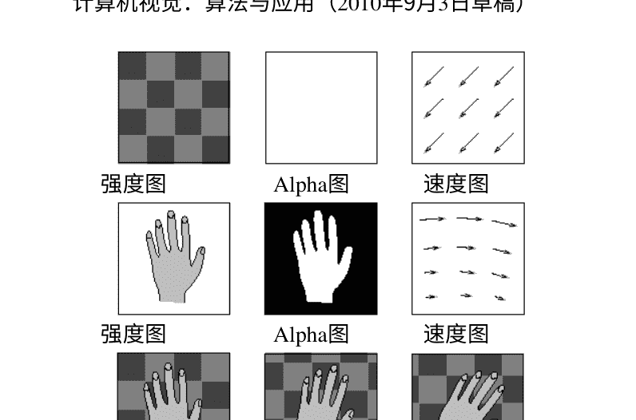

图8.14 分层运动估计框架（Wang和Adelson 1994） © 1994IEEE：前两行描述了两个图层，每个图层由一个强度（颜色）图像，一个alpha掩模（黑色=透明）和一个参数化运动场组成。使用不同的运动量合成图层以重新创建视频序列。

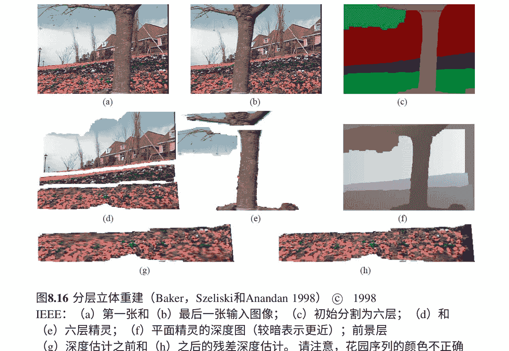

图8.16 分层立体重建（Baker，Szeliski和Anandan 1998） 1998 IEEE：（a）第一张和（b）最后一张输入图像；（c）初始分割为六层；（d）和（e）六层精灵；（f）平面精灵的深度图（较暗表示更近）；前景层（g）深度估计之前和（h）之后的残差深度估计。请注意，花园序列的颜色不正确；正确的颜色（黄色花朵）在图8.15中显示。

当然，层次结构并不是引入运动估计分割的唯一方式。已经开发了大量的算法，它们在估计光流向量和将其分割为连贯区域之间交替进行（Black和Jepson 1996; Ju，Black和Jepson 1996; Chang，Tekalp和Sezan 1997; M'emin和P'erez 2002; Cremers和Soatto 2005）。一些较新的技术依赖于首先对输入的彩色图像进行分割，然后估计每个分割的运动，以产生一个连贯的运动场，同时还对遮挡进行建模（Zitnick，Kang，Uyttendaele等人2004; Zitnick，Jojic和Kang 2005; Stein，Hoiem和Hebert 2007; Thayanathan，Iwasaki和Cipolla 2008）。

### 8.5.1 应用:帧插值

帧插值是运动估计的另一个广泛应用，通常在与去隔行硬件相同的电路中实现，以匹配输入视频的实际刷新率到监视器的实际刷新率。与去隔行一样，需要从前后帧中插值出新的中间帧的信息。如果能够在每个未知像素的位置计算出准确的运动估计，就可以获得最佳结果。然而，除了计算运动之外，遮挡信息对于防止颜色被移动的前景物体污染也是至关重要的，这些物体可能会遮挡前后帧中的特定像素。

稍微详细地看一下图8.13c，并假设箭头表示我们希望在其间插值额外图像的关键帧。这个图中条纹的方向编码了各个像素的速度。如果在图像$I_{0}$中的位置$x_{0}$处获得的运动估计$u_{0}$与在图像$I_{1}$中的位置$x_{0}+u_{0}$处获得的运动估计相同，则流向量被认为是一致的。这个运动估计可以传递到正在生成的图像$I_{t}$中的位置$x_{0}+t u_{0}$处，其中$t\in(0,1)$是插值的时间。像素$x_{0}+t u_{0}$处的最终颜色值可以计算为线性混合。

$$I_{t}(x_{0}+t u_{0})=(1-t) I_{0}(x_{0})+t I_{1}(x_{0}+u_{0}).\qquad(8.72)$$

然而，如果在相应的位置上运动矢量不同，则必须使用某种方法来确定哪个是正确的，哪个图像包含被遮挡的颜色。实际的推理比这更微妙。这种插值算法的一个例子，基于早期的深度图插值工作（Shade, Gortler, He et al. 1998; Zitnick, Kang, Uyttendaele et al. 2004），这是在Baker, Black, Lewis et al. (2007) 的流评估论文中使用的一种，Baker, Scharstein, Lewis et al. (2009)。Mahajan, Huang, Matusik et al. (2009) 提出了一种更高质量的帧插值算法，该算法使用基于梯度的重建方法。

#### 8.5.2 透明层和反射

分层运动的一个特殊情况是透明运动，通常是由窗户和画框中的反射引起的（图8.17和8.18）。在这个领域的早期工作中，一些处理透明运动的方法要么只估计组成部分的运动（Shizawa和Mase 1991; Bergen, Burt, Hingorani等人1992; Darrell和Simoncelli 1993; Irani, Rousso和Peleg 1994），要么将单个像素分配给竞争的运动层（Darrell和Pentland 1995; Black和Anandan 1996; Ju, Black和Jepson 1996），这适用于部分通过细小遮挡物（例如树叶）看到的场景。然而，要准确地分离真正的透明层，需要一个更好的反射运动模型。由于光线既从玻璃表面反射又透过玻璃表面传播，正确的反射模型是一个加性模型，每个移动层对最终图像贡献一定的强度（Szeliski, Avidan和Anandan 2000）。

如果各个层的运动已知，则恢复各个层是一个简单的约束最小二乘问题，其中各个层的图像受到正约束。然而，这个问题可能会受到扩展的低频模糊的影响，特别是如果其中一个层缺少暗（黑色）像素或者运动是单向的。在他们的论文中，Szeliski，Avidan和Anandan (2000) 表明，通过交替地鲁棒地计算运动层，然后保守地（上界或下界）估计层强度，可以同时估计运动和层值。然后，可以使用梯度下降对联合约束最小二乘公式进行优化，类似于 (Baker，Szeliski和Anandan 1998)，其中合成运算符被替换为加法。

图8.17和8.18展示了将这些技术应用于两个不同的图片框架并考虑了反射效果的结果。注意，在第二个序列中，反射光的数量相对于透射光（女孩的图片）非常低，但算法仍然能够恢复出两个层次。

不幸的是，(Szeliski, Avidan, and Anandan 2000)中使用的简单参数化运动模型仅适用于平面反射器和浅景深场景。这些技术的扩展已经研究过，适用于曲面反射器和具有显著景深的场景。(Swaminathan, Kang, Szeliski等2002; Criminisi, Kang, Swaminathan等2005), 以及对具有更复杂3D深度的场景的扩展(Tsin, Kang, and Szeliski 2006)。

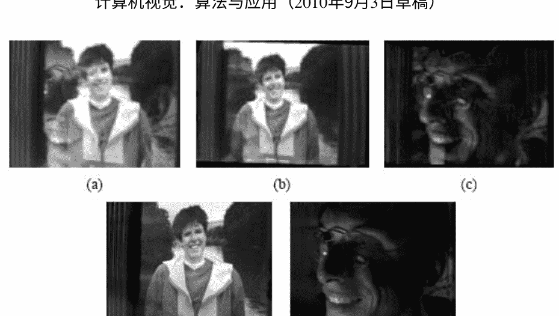

图8.17 光线反射在图片框的透明玻璃上：(a) 输入序列的第一张图像；(b) 主要运动层最小合成；(c) 次要运动残差层最大合成；(d-e) 最终估计的图片和反射层。原始图像来自Black和Anandan (1996)，而分离的层来自Szeliski，Avidan和Anandan (2000) ©2000 IEEE。

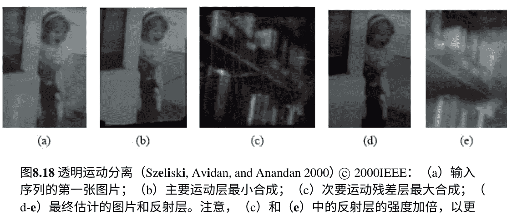

## 8.6 附加阅读

一些最早用于运动估计的算法是为运动补偿视频编码开发的(Netravali and Robbins 1979), 这些技术在现代编码标准如MPEG、H.263和H.264中仍然被使用(Le Gall 1991; Richardson 2003)。¹⁴在计算机视觉中, 这个领域最初被称为图像序列分析(Huang 1981)。一些早期的重要论文包括Horn和Schunck(1981)以及Nagel和Enkelmann(1986)开发的变分方法, 以及Lucas和Kanade(1981)开发的基于补丁的平移对齐技术。这些算法的分层(由粗到细)版本由Quam(1984)、Anandan(1989)和Bergen、Anandan、Hanna等(1992)开发, 尽管它们在视频编码的运动估计中也长期被使用。

Rehg和Witkin (1991), Fuh和Maragos (1991), 以及Bergen, Anandan, Hanna等人 (1992) 将平移运动模型推广为仿射运动, 并将其推广为Shashua和Toelg (1997) 和Shashua和Wexler (2001) 的二次参考曲面-参见Baker和Matthews (2004) 的详细评论。这些参数化运动估计算法在视频摘要 (Teodosio和Bender 1993; Irani和Anan-dan 1998), 视频稳定化 (Hansen, Anandan, Dana等人1994; Srinivasan, Chellappa, Veeraraghavan等人2005; Matsushita, Ofek, Ge等人2006), 以及视频压缩 (Irani, Hsu, 和Anandan 1995; Lee, ge Chen, lung Bruce Lin等人1997) 中得到了广泛应用。参数化图像配准的调查包括Brown (1992) , Zitov’ aa和Flusser (2003) , Goshtasby (2005) 和Szeliski (2006a) 的调查。

> ¹⁴ http://www.itu.int/rec/T-REC-H.264.

关于光流算法的良好综述和比较包括Ag-garwal和Nandhakumar (1988)，Barron，Fleet和Beauchemin (1994)，Otte和Nagel (1994)，Mitiche和Bouthemy (1996)，Stiller和Konrad (1999)，McCane, Novins, Cran-nitchet al. (2001)，Szeliski (2006a) 和Baker, Black, Lewiset al. (2007)。关于匹配基元的主题，即在匹配之前使用滤波或其他技术对图像进行预处理，有许多论文进行了研究 (Anandan 1989; Bergen, Anandan, Hannaet al.1992; Scharstein 1994; Zabih和Woodfill 1994; Cox, Roy和Hingorani 1995; Viola和Wells III 1997; Negahdaripour 1998; Kim, Kolmogorov和Zabih 2003; Jia和Tang 2003; Papenberg, Bruhn, Broxet al.2006; Seitz和Baker 2009)。Hirschmüller和Scharstein (2009) 比较了其中一些方法，并报告了它们在曝光差异场景中的相对性能。

评估光流算法的新基准的发布 (Baker, Black, Lewiset al.2007) 导致了估计算法质量的快速提升，以至于可能很快需要新的数据集。根据他们的最新技术报告 (Baker, Scharstein, Lewiset al.2009)，大多数表现最佳的算法使用鲁棒数据和平滑度规范（通常为 L1TV）和连续变分优化技术，尽管一些技术使用离散优化或分割 (Papenberg, Bruhn, Broxet al.2006; Trobin, Pock, Cremerset al. 2008; Xu, Chen, and Jia 2008; Lempitsky, Roth, and Rother. 2008; Werlberger, Trobin, Pocket al.2009; Lei and Yang 2009; Wedel, Cremers, Pocket al.2009)。

### 8.7 练习

例8.1：相关性实现并比较以下相关性算法的性能：

- 平方差之和 (8.1)
- 鲁棒差之和 (8.2)
- 绝对差之和 (8.3)
- 偏差-增益补偿的平方差之和 (8.9)
- 归一化互相关 (8.11)- 上述算法的窗口版本 (8.22-8.23)
- 基于傅里叶变换的上述度量的实现 (8.18-8.20)
- 相位相关 (8.24)
- 梯度互相关 (Argyriou和Vlachos 2003年)。

使用不同的运动序列和不同数量的噪声、曝光变化、遮挡和频率变化（例如高频纹理，如沙子或布料，和低频图像，如云朵或运动模糊的视频）比较您的算法。一些具有光照变化和地面真实对应关系（水平运动）的数据集可以在http://vision.middlebury.edu/u/stereo/data/ (2005年和2006年数据集)找到。一些其他的想法、变体和问题：

- 1. 你认为相位相关何时能够胜过常规相关或SSD? 你能通过实验证明这一点吗? 或者你能从分析上证明吗?
- 2. 对于基于傅里叶变换的掩膜或窗口相关和平方差之和，结果应该与直接实现相同。请注意，你需要将(8.5)展开为一系列成对相关的和，就像(8.22)中一样。 (这是练习的一部分。)
- 3. 对于偏差-增益校正的平方差变体(8.9)，你还需要将项展开，最终得到一个3×3 (最小二乘) 方程组。如果实现快速傅里叶变换版本，你需要弄清楚如何在傅里叶域中计算所有这些条目。
- 4. (可选) 实现Hirschmüller和Scharstein (2009)研究的一些附加技术，并查看你的结果是否与他们一致。

## 例8.2: 仿射配准实现一个从粗到细的直接方法，用于仿射和投影图像对齐。

- 1. 在金字塔的较粗层次上使用低阶（简单）模型是否有帮助 (Bergen, Anandan, Hanna et al. 1992)?
- 2. (可选) 实现基于补丁的加速 (Shum和Szeliski 2000; Baker和Matthews 2004)。
- 3. 更多比较和想法，请参阅Baker和Matthews (2004)的调查报告。

## 例8.3: 稳定化编写一个程序来稳定化输入的视频序列。你应按照8.2.1节中的描述执行以下步骤：

- 1. 计算连续帧之间的平移（和可选的旋转），并进行鲁棒的异常值拒绝。
- 2. 对运动参数进行时域高通滤波以去除低频分量（平滑运动）。
- 3. 为了避免丢失边缘像素，对高频运动进行补偿，稍微放大（用户指定的量）。
- 4. （可选）不要放大，而是从前一帧或后一帧中借用像素来填充。
- 5. （可选）通过从相邻帧中“窃取”更高的频率来补偿由于快速运动而模糊的图像。

## 例8.4：光流使用本章描述的一种或多种技术，在两个图像之间计算光流（基于样条或逐像素），

- 1. 在http://vision.middlebury.edu/flow/或http://people.csail.mit.edu/celiu/motionAnnotation/上测试您的算法，并将结果（视觉上）与这些网站上提供的结果进行比较。如果您认为您的算法与最佳算法相媲美，请考虑提交进行正式评估。
- 2. 通过使用帧内插值（练习8.5）生成中间图像来可视化结果的质量。
- 3. 你对你的方法的相对效率（速度）有什么看法？

## 练习8.5：自动变形/帧插值编写一个程序，自动在图像对之间进行变形。按照Baker、Scharstein、Lewis等人（2009）在第8.5.1节中概述的步骤进行实现。

- 1. 计算双向光流（上一个练习）。考虑使用多帧（n > 2）技术来更好地处理遮挡区域。
- 2. 对于每个中间（变形）图像，计算一组光流向量和应该在最终合成中使用的图像。
- 3. 混合（交叉溶解）图像，并使用序列查看器查看。

尝试在你的朋友和同事的图像上进行测试，看看你能得到什么样的变形。或者，拍摄一个视频序列并进行高质量的慢动作效果。将你的算法与简单的交叉淡入淡出进行比较。

## **例8.6：** 基于运动的用户交互编写一个程序来计算低分辨率的运动场，以便交互地控制一个简单的应用程序（Cutler和Turk 1998）。例如：

- 1. 使用金字塔对每个图像进行降采样，并从上一帧计算光流（基于样条或基于像素）。
- 2. 将每个训练视频序列分割成不同的“动作”（例如，手向内移动，向上移动，无运动），并“学习”与每个动作相关的速度场。（你可以简单地找到每个运动场的均值和方差，或者使用更复杂的方法，如支持向量机（SVM）。）
- 3. 编写一个识别器，找到大致正确持续时间的连续动作，并将其与交互式应用程序（例如声音生成器或计算机游戏）连接起来。
- 4. 请你的朋友来测试一下。

## **练习8.7：** 视频去噪实现应用8.4.2中概述的算法。你的算法应包含以下步骤：

- 1. 计算准确的逐像素流动。
- 2. 确定参考图像中与其他帧有良好匹配的像素。
- 3. 要么对所有匹配的像素求平均，要么选择最清晰的图像（如果要补偿模糊）。不要忘记在解决方案中使用常规的单帧去噪技术（参见第3.4.4节、第3.7.3节和练习3.11）。
- 4. 为那些你认为流动估计不够准确的区域设计一个备用策略。

## **例8.8：** 运动分割编写一个程序，将图像分割成独立的运动区域或可靠地找到运动边界。

使用人工辅助的运动分割数据库，网址为http://people.csail.mit.edu/celiu/motionAnnotation/，作为一些测试数据。

## **例8.9：** 分层运动估计将使用移动相机拍摄的场景的视频序列（第8.5节）分解为单独的层：

- 1. 通过计算块或找到鲁棒估计然后迭代重新拟合异常值的方法，找到一组主导（仿射或平面透视）运动。
- 2. 确定哪些像素与每个运动相关联。
- 3. 通过混合来自不同帧的像素来构建层。
- 4. （可选）添加每像素的残差流或深度。
- 5. （可选）使用迭代的全局优化技术来改进估计。
- 6. （可选）编写一个交互式渲染器来生成中间帧或从不同视角查看场景（Shade, Gortler, He et al. 1998）。
- 7. （可选）从更复杂的场景中构建一个展开的马赛克，并使用它进行一些视频编辑（Rav-Acha, Kohli, Fitzgibbon et al. 2008）。

## 练习8.10：透明运动和反射估计拍摄一个通过窗户（或画框）看的视频序列，并尝试去除反射，以便更好地看到里面的内容。

这些步骤在第8.5.2节和Szeliski，Avidan和Anandan（2000）中有描述。可以在Shizawa和Mase（1991），Bergen, Burt, Hingorani et al.（1992），Darrell和Simoncelli（1993），Darrell和Pentland（1995），Irani, Rousso和Peleg（1994），Black和Anandan（1996）以及Ju, Black和Jepson（1996）的研究中找到其他方法。

## 第9章 图像拼接

- 9.1 运动模型 430
  - 9.1.1 平面透视运动 431
  - 9.1.2 应用：白板和文档扫描 432
  - 9.1.3 旋转全景 433
  - 9.1.4 缝隙闭合 435
  - 9.1.5 应用：视频摘要和压缩 436
  - 9.1.6 圆柱和球面坐标 438
- 9.2 全局对齐 441
  - 9.2.1 捆绑调整 441
  - 9.2.2 消除视差 445
  - 9.2.3 识别全景 446
  - 9.2.4 直接对比特征对齐 450
- 9.3 合成 450
  - 9.3.1 选择合成表面 451
  - 9.3.2 像素选择和加权（去鬼影） 453
  - 9.3.3 应用：拼贴照片 459
  - 9.3.4 混合 459
- 9.4 额外阅读 462
- 9.5 练习 463

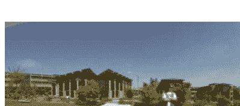

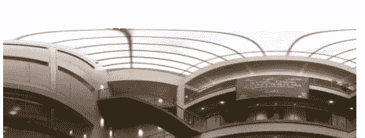

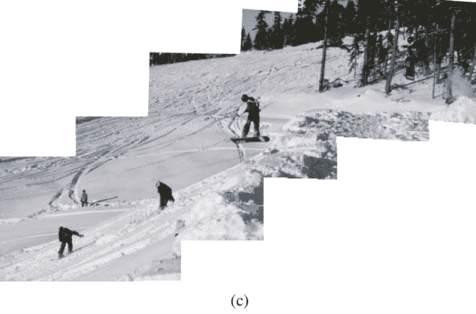

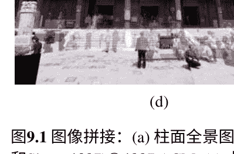

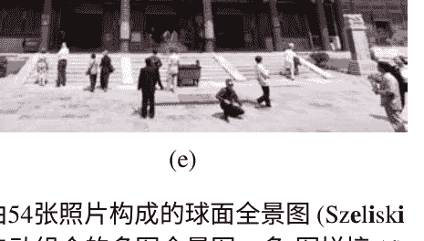

图9.1 图像拼接 (a) 柱面全景图的一部分和(b) 由54张照片构成的球面全景图 (Szeliski和Shum 1997)©1997 ACM; (c) 由无序照片集合自动组合的多图全景图; 多图拼接 (d) 无移动物体移除和(e) 有移动物体移除 (Uyttendaele，Eden和Szeliski 2001)©2001 IEEE。

用于对齐图像并将它们拼接成无缝照片拼贴的算法是计算机视觉中最古老且最广泛使用的算法之一(Milgram 1975; Peleg 1981)。图像拼接算法用于创建高分辨率的照片拼贴，用于生成今天的数字地图和卫星照片。它们还随大多数数码相机捆绑销售，并可用于创建美丽的超广角全景照片。

图像拼接起源于摄影测量学界，那里使用更多基于测量地面控制点或手动注册关联点的手动方法来将航空照片注册到大规模照片拼接中（Slama 1980）。

这个领域的一个关键进展是束调整算法（第7.4节）的发展，它可以同时解决所有相机位置的定位问题，从而得到全局一致的解决方案（Triggs, McLauchlan, Hartley等, 1999年）。创建照片拼接中的另一个经常出现的问题是消除可见接缝，多年来已经开发了各种技术来解决这个问题（Milgram 1975，1977；Peleg 1981；Davis 1998；Agarwala, Dontcheva, Agrawala等, 2004年）。在胶片摄影中, 20世纪90年代开发了特殊相机，用于通过在其轴上旋转时通过垂直缝隙曝光胶片拍摄超广角全景照片（Meehan 1990）。20世纪90年代中期，图像对齐技术开始应用于使用普通手持相机构建宽角度无缝全景照片（Mann和Picard 1994；Chen 1995；Szeliski 1996）。这个领域的最新研究解决了计算全局一致对齐的需求（Szeliski和Shum 1997；Sawhney和Kumar 1999；Shum和Szeliski 2000），消除了由视差和物体运动引起的“幽灵”（Davis 1998；Shum和Szeliski 2000；Uyttendaele, Eden和Szeliski 2001；Agarwala, Dontcheva, Agrawala等, 2004年），以及处理不同曝光（Mann和Picard 1994；Uyttendaele, Eden和Szeliski 2001；Levin, Zomet, Peleg等, 2004年；Agarwala, Dontcheva, Agrawala等, 2004年；Eden, Uyttendaele和Szeliski 2006；Kopf, Uyttendaele, Deussen等, 2007年）。这些技术催生了大量的商业拼接产品（Chen 1995；Sawhney, Kumar, Gendel等, 1998年），可以在网络上找到评论和比较。

尽管早期的大多数技术是通过直接最小化像素之间的不相似性来工作的，但是最近的算法通常会提取一组稀疏的特征并将它们匹配在一起，如第4章所述。这种基于特征的图像拼接方法具有更强的抗场景运动能力，并且如果正确实现，可能更快。然而，它们最大的优势在于能够“识别全景图像”，即自动发现无序图像集合之间的邻接（重叠）关系，这使它们非常适合完全自动化的拼接由普通用户拍摄的全景图像（Brown和Lowe 2007）。

那么，图像拼接中的关键问题是什么？与图像对齐一样，我们首先必须确定一个适当的数学模型，将一个图像中的像素坐标与另一个图像中的像素坐标相关联；第9.1节回顾了我们研究过的基本模型，并介绍了一些与全景图像拼接特定相关的新的运动模型。接下来，我们必须以某种方式估计各个图像对（或集合）之间的正确对齐关系。第4章讨论了如何在每个图像中找到独特的特征，然后高效地将它们匹配以快速建立图像对之间的对应关系。第8章讨论了如何使用直接像素对比结合梯度下降（和其他优化技术）来估计这些参数。当全景图像中存在多个图像时，可以使用捆绑调整（第7.4节）来计算一组全局一致的对齐关系，并高效地发现哪些图像彼此重叠。在第9.2节中，我们将看看如何修改先前开发的每种技术，以利用常用于创建全景图像的成像设置。

一旦我们对图像进行了对齐，我们必须选择一个最终的合成表面来进行变形对齐图像（第9.3.1节）。我们还需要算法来在存在视差、镜头畸变、场景运动和曝光差异的情况下，无缝地剪切和混合重叠图像（第9.3.2-9.3.4节）。

### 9.1 运动模型

在注册和对齐图像之前，我们需要建立数学关系，将像素坐标从一个图像映射到另一个图像。有各种各样的参数化运动模型，从简单的2D变换到平面透视模型、3D相机旋转、镜头畸变和映射到非平面（例如圆柱形）表面。

我们已经在第2.1节和第6.1节中介绍了几种这样的模型。特别是我们在第2.1.5节中看到了描述平面表面在不同位置被观察时的参数化运动如何可以用八参数单应性（2.71）来描述（Mann和Picard 1994; Szeliski 1996）。我们还看到相机进行纯旋转时会引发一种不同类型的单应性（2.72）。

在本节中，我们将回顾这两种模型，并展示它们如何应用于不同的拼接情况。我们还介绍了球面和柱面合成表面，并展示了在有利条件下如何使用纯平移进行对齐（第9.1.6节）。确定哪种对齐模型最适合特定情况或数据集是一个模型选择问题（Hastie，Tibshirani和Friedman 2001；Torr 2002；Bishop 2006；Robert 2007），这是一个重要的主题，本书不涉及。

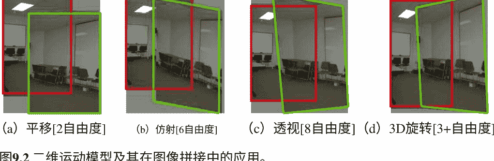

#### 9.1.1 平面透视运动

在对齐图像时，最简单的运动模型就是在二维平面上简单地进行平移和旋转（图9.2a）。这正是在有重叠的照片上使用的运动方式。这也是大卫·霍克尼（David Hockney）喜欢使用的技术，他称之为“拼贴”（Zelnik-Manor和Perona 2007; Nomura, Zhang和Nayar 2007）。创建这样的拼贴作品，显示出可见的接缝和不一致性，增加了艺术效果，在Flickr等网站上很受欢迎，通常被称为“全景摄影”（第6.1.2节）。在应用中，平移和旋转通常足以补偿小型相机运动，例如照片和视频稳定和合并（练习6.1和第8.2.1节）。在第6.1.3节中，我们看到了描述两个观察共面的相机之间的映射可以使用3×3单应性矩阵（2.71）来描述。考虑到当将一个像素映射到一个三维点，然后再映射回第二个图像时产生的矩阵M10，

$$
\tilde{x}_1 \sim \tilde{P}_1 \tilde{P}_0^{-1} \tilde{x}_0 = M_{10} \tilde{x}_0. \tag{9.1}
$$

当矩阵的最后一行被替换为一个平面方程 $\hat{n}_0 \cdot p + c_0$，并且假设点位于这个平面上，即它们的视差为 $d_0 = 0$，我们可以忽略矩阵 $M_{10}$ 的最后一列和最后一行，因为我们不关心最终的z-buffer深度。得到的单应矩阵 $\tilde{H}_{10}$（矩阵 $M_{10}$ 的左上 $3 \times 3$ 子矩阵）描述了两个图像之间的映射关系。

$$
\tilde{x}_1 \sim \tilde{H}_{10} \tilde{x}_0. \tag{9.2}
$$

这一观察结果成为了一些最早的自动图像拼接算法的基础（Mann和Picard 1994; Szeliski 1994, 1996）。因为可靠的特征匹配技术尚未开发出来，这些算法使用直接像素值匹配，即直接参数化运动估计，如第8.2节和方程（6.19-6.20）所述。

更近期的拼接算法首先提取特征，然后进行匹配，通常使用鲁棒技术（如RANSAC，第6.1.4节）来计算一组良好的内点。最终计算单应性矩阵（9.2），即给定对应特征点对的最小二乘拟合问题的解决方案，

$$
x_1 = \frac{(1 + h_{00})x_0 + h_{01}y_0 + h_{02}}{h_{20}x_0 + h_{21}y_0 + 1} \quad \text{和} \quad y_1 = \frac{h_{10} + (1 + h_{11})y_0 + h_{12}}{h_{20}x_0 + h_{21}y_0 + 1} \tag{9.3}
$$

使用迭代最小二乘法，如第6.1.3节和方程 (6.21-6.23) 所述。

#### 9.1.2 应用：白板和文档扫描

最简单的图像拼接应用是将多个扫描仪扫描的图像拼接在一起，这些图像是在平板扫描仪上扫描的。假设你有一张大地图，或者一幅儿童的艺术作品，它太大了，无法放在扫描仪上。只需多次扫描文档，确保扫描之间有足够的重叠部分，以确保有足够的共同特征。接下来，取相互重叠的连续图像对，提取特征，匹配它们，并估计2D刚性变换，

$$
x_{k+1} = R_k x_k + t_k \tag{9.4}
$$

使用两点RANSAC，如果需要，找到最佳匹配特征的一组内点。然后，在最终的合成表面上（例如与第一个扫描对齐），重新采样图像（第3.6.1节）并将它们平均在一起。你能看到这个方案存在哪些潜在问题吗？

一个复杂之处在于2D刚性变换在旋转角度 $\theta$ 中是非线性的，所以你必须使用非线性最小二乘法或者将 $R$ 约束为正交的，如第6.1.3节所述。

更大的问题在于成对对齐过程。随着对齐越来越多的成对，解决方案可能会漂移，以至于不再全局一致。在这种情况下，可能需要进行全局优化过程，如第9.2节所述。这种全局优化通常需要解决一个大型非线性方程组，尽管在某些情况下，如线性化的单应性变换（第9.1.3节）或相似变换（第6.1.2节），正则最小二乘法可能是一个选择。

一个稍微复杂的情况是当你拍摄多个重叠的手持照片时，例如白板或其他大型平面物体（He和Zhang 2005; Zhang和He 2007）。在这种情况下，使用的自然运动模型是单应性，尽管原则上可以使用更复杂的模型来估计相对于平面的三维刚体运动（加上焦距，如果未知）。

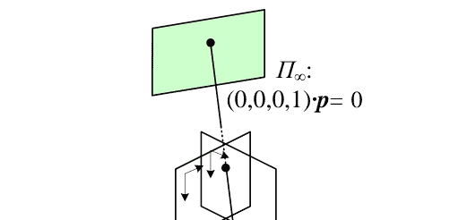

图9.3 纯3D相机旋转。单应性（映射）的形式特别简单，只取决于3D旋转矩阵和焦距。

#### 9.1.3 旋转全景

全景图像拼接最典型的情况是相机进行纯旋转。想象一下站在大峡谷的边缘。相对于场景中的远处几何体，当你拍摄时，相机正在进行纯旋转，这相当于假设所有点都离相机很远，即在无穷远的平面上（图9.3）。设置 $t_0 = t_1 = 0$，我们得到简化的 $3 \times 3$ 单应性。

$$
\tilde{H}_{10} = K_1 R_1 R_0^{-1} K_0^{-1} = K_1 R_{10} K_0^{-1}, \tag{9.5}
$$

其中 $K_k = \text{diag}(f_k, f_k, 1)$ 是简化的相机内部矩阵 (2.59)，假设 $c_x = c_y = 0$，即我们从光学中心开始索引像素 (Szeliski 1996)。

这也可以重写为

$$
\left[\begin{array}{c} x_1 \\ y_1 \\ 1 \end{array}\right] \sim \left[\begin{array}{ccc} f_1 & & \\ & f_1 & \\ & & 1 \end{array}\right] \mathbf{R}_{10} \left[\begin{array}{ccc} f_0^{-1} & & \\ & f_0^{-1} & \\ & & 1 \end{array}\right] \left[\begin{array}{c} x_0 \\ y_0 \\ 1 \end{array}\right] \tag{9.6}
$$

或者

$$
\left[\begin{array}{c} x_1 \\ y_1 \\ f_1 \end{array}\right] \sim \mathbf{R}_{10} \left[\begin{array}{c} x_0 \\ y_0 \\ f_0 \end{array}\right], \tag{9.7}
$$

这揭示了映射方程的简单性，并使所有运动参数都变得明确。因此，与一对图像相关的一般八参数单应性相比，我们得到了对应于焦距 $f$ 已知、固定或可变的三、四或五参数 $3D$ 旋转运动模型 (Szeliski and Shum 1997)。估计与每个图像相关的三维旋转矩阵（以及可选的焦距）是

可以使用描述在第6.3.4节中的内部校准技术或从EXIF标签中获得焦距的初始估计。

从本质上讲，使用具有完整八个自由度的单应性估计要比使用具有更稳定性，这使得它成为大规模图像拼接算法的首选方法（Szeliski和Shum 1997; Shum和Szeliski 2000; Brown和Lowe 2007）。

在给定这种表示的情况下，我们如何更新旋转矩阵以最佳对齐两个重叠的图像？在给定对单应性的当前估计 $\tilde{H}_{10}$ (9.5) 的情况下，更新 $R_{10}$的最佳方法是在当前估计 $R_{10}$之前添加一个增量旋转矩阵 $R(\omega)$ (Szeliski和Shum 1997; Shum和Szeliski 2000)

$$\tilde{H}(\omega) = K_1R(\omega)R_{10}K_0^{-1} = [K_1R(\omega)K_1^{-1}][K_1R_{10}K_0^{-1}] = D\tilde{H}_{10}.\quad\quad(9.8)$$

请注意，在这里我们以组合形式写出了更新规则，其中增量更新 $D$被预置到当前单应性 $\tilde{H}_{10}$之前。使用小角度近似来表示 $R(\omega)$（见式 (2.35)），我们可以将增量更新矩阵写成

$$D = K_1R(\omega)K_1^{-1} \approx K_1(I + [\omega]_{\times})K_1^{-1} = \left[\begin{array}{ccc} 1 & -\omega_z & f_1\omega_y \\ \omega_z & 1 & -f_1\omega_x \\ -\omega_y/f_1 & \omega_x/f_1 & 1 \end{array}\right].\quad\quad(9.9)$$

请注意，现在 $D$ 矩阵中的条目与表6.1和方程（6.19）中使用的参数 $h_{00},\ldots$ 之间存在良好的一对一对应关系，即表6.1和方程（6.19）中使用的参数$h_{21}$。

$$(h_{00}, h_{01}, h_{02}, h_{00}, h_{11}, h_{12}, h_{20}, h_{21}) = (0, -\omega_z, f_1\omega_y, \omega_z, 0, -f_1\omega_x, -\omega_y/f_1, \omega_x/f_1).\quad\quad(9.10)$$

因此，我们可以对方程 (6.24和9.10) 应用链式法则来得到

$$\left[\begin{array}{c} \hat{x}' - x \\ \hat{y}' - y \end{array}\right] = \left[\begin{array}{ccc} -xy/f_1 & f_1 + x^2/f_1 & -y \\ -(f_1 + y^2/f_1) & xy/f_1 & x \end{array}\right] \left[\begin{array}{c} \omega_x \\ \omega_y \\ \omega_z \end{array}\right],\quad\quad(9.11)$$

这给出了我们估计 $\omega = (\omega_x, \omega_y, \omega_z)^\top$。注意这个更新规则依赖于目标视图的焦距 $f_1$，并且与模板视图的焦距 $f_0$无关。这是因为组合算法基本上对目标进行小幅扰动。一旦增量旋转向量 $\omega$计算出来，$R_1$旋转矩阵可以使用 $R(\omega)\ R_1$进行更新。更新焦距估计的公式稍微复杂一些，可以在 (Shum and Szeliski 2000) 中找到。我们不会在这里重复它们，因为在9.2.1节中给出了一种基于最小化反投影3D射线差异的替代更新规则。图9.4展示了在3D旋转运动模型下四个图像的对齐情况。

这与瞬时刚性流的旋转分量相同（Bergen, Anandan, Hanna et al. 1992）以及Szeliski和Shum（1997）和Shum和Szeliski（2000）给出的更新方程。

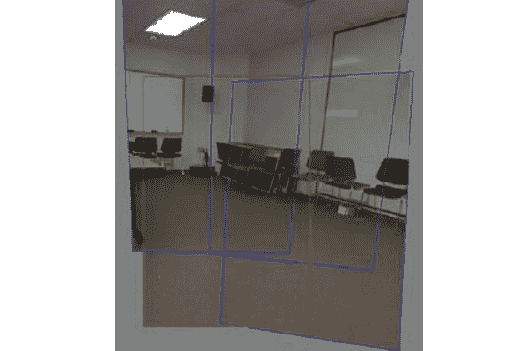

#### 9.1.4 缝隙闭合

本节介绍的技术可用于估计一系列旋转矩阵和焦距，这些矩阵可以链接在一起创建大型全景图。不幸的是，由于累积误差，这种方法很少能产生闭合的 360°全景图。

相反，通常会出现间隙或重叠（图9.5）。

我们可以通过将序列中的第一幅图像与最后一幅图像进行匹配来解决这个问题。与重复的第一幅图像相关的两个旋转矩阵估计之间的差异表示了错配的程度。这个误差可以通过将与这些旋转相关的两个四元数的商除以序列中图像的数量（假设帧间旋转相对稳定）来均匀分布到整个序列中。我们还可以根据错配的程度更新估计的焦距。为了做到这一点，我们首先将误差四元数转换为一个间隙角度θg，然后使用公式

$$f' = f(1 - \theta_g / 360°)$$

来更新焦距。

图9.5a显示了已注册图像序列的末尾和第一幅图像。事实上，最后一幅图像和第一幅图像是相同的，它们之间存在一个很大的间隙。这个间隙是32°，因为使用了错误的焦距估计值（$f= 510$）。图9.5b显示了使用正确的焦距（$f= 468$）关闭间隙后的配准结果。请注意，除了间隙处，两个镶嵌图像都几乎没有视觉错配，然而图9.5a使用了有9%误差的焦距计算。Hartley（1994b）、McMillan和Bishop（1995）、Stein（1995）和Kang和Weiss（1997）等人已经开发了相关方法，用于使用纯平移运动和柱面图像解决焦距估计问题。

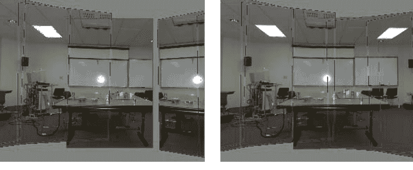

图9.5 间隙闭合（Szeliski和Shum 1997）©1997 ACM：（a）当焦距错误时可见间隙（$f = 510$）。（b）当焦距正确时不可见间隙（$f= 468$）。

不幸的是，这种特定的间隙闭合启发式方法只适用于相机连续向同一方向旋转的“一维”全景图。在第9.2节中，我们描述了一种适用于任意相机运动的消除间隙和重叠的不同方法。

#### 9.1.5 应用：视频摘要和压缩

图像拼接的一个有趣应用是能够对使用全景相机拍摄的视频进行摘要和压缩。这个应用最早由Teodosio和Bender（1993）提出，他们称之为基于马赛克的摘要为“显著静止图像”。这些想法随后被Irani，Hsu和Anandan（1995），Kumar，Anandan，Irani et al.（1995）和Irani和Anandan（1998）扩展到其他应用，如视频压缩和视频索引。尽管这些早期方法使用了仿射运动模型，因此仅限于长焦距，但是李，陈，林等人（1997年）通过将技术推广为完整的八参数单应性，并将其纳入MPEG-4视频压缩标准中，其中拼接的背景层被称为视频精灵（图9.6）。尽管视频拼接在很多方面都是多图像拼接的直接推广（Steedly，Pal和Szeliski 2005；Baudisch，Tan，Steedly等人（2006年）），但大量独立运动，相机缩放以及对动态事件的可视化需求带来了额外的挑战。例如，可以使用中值滤波来去除移动前景物体。或者，前景物体可以提取到单独的图层中（Sawhney和Ayer 1996），然后再合成回拼接全景图中，有时作为多个实例以给出“Chronophotograph”的印象。

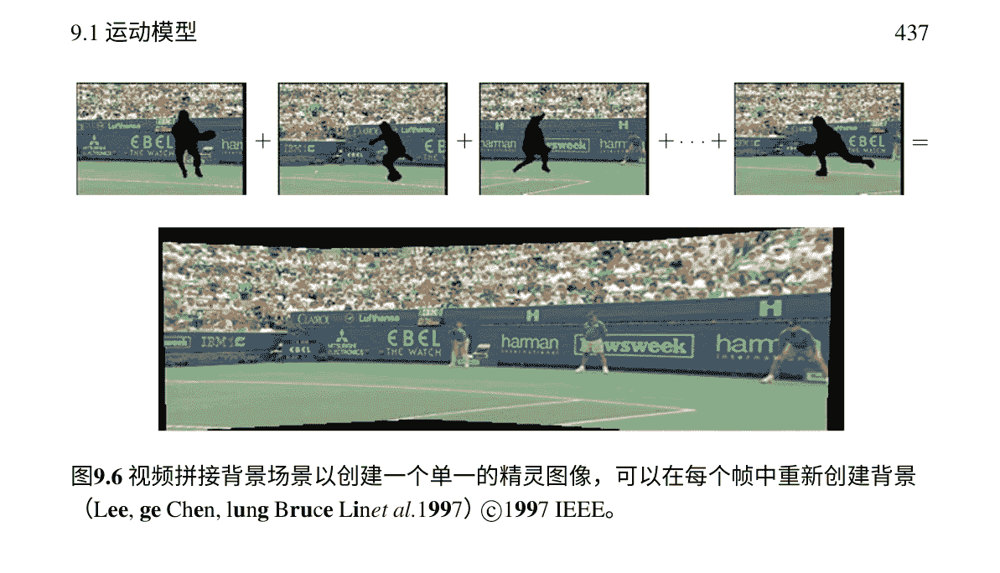

> 图9.6 视频拼接背景场景以创建一个单一的精灵图像，可以在每个帧中重新创建背景 (Lee, ge Chen, lung Bruce Lin et al. 1997) ©1997 IEEE。

（Massey和Bender 1996）有时也作为视频叠加（Irani和Anandan 1998）使用。视频还可以用于创建动画的全景视频纹理（第13.5.2节），其中全景场景的不同部分使用独立移动的视频循环进行动画处理（Agarwala，Zheng，Palet al.2005；Rav-Acha，Pritch，Lischinskiet al.2005），或者将“视频手电筒”照射到场景的复合镶嵌图上（Sawhney，Arpa，Kumaret al.2002）。视频还可以为从移动相机拍摄的全景图创建有趣的内容提供来源。虽然这使得通常的单一视点（光学中心）的假设无效，但仍然可以获得有趣的结果。例如，Sawhney，Kumar，Gendelet al.（1998）的VideoBrush系统使用从图像中心获取的细条来创建从水平移动相机拍摄的全景图。这个想法可以推广到其他相机运动和合成表面，使用自适应流形的拼贴概念（Peleg，Rousseau，Rav-Achaet al.2000），并且还可以用于生成全景立体图（Peleg，Ben-Ezra和Pritch 2001）。相关的想法已被用于创建多平面动画的全景马特画（Wood，Finkelstein，Hugheset al.1997），用于创建具有视差的场景的拼接图像（Kumar，Anandan，Iraniet al.1995），以及用于更复杂场景的3D表示使用多个投影中心图像（Rademacher和Bishop 1998）和多视角全景（Román，Garg和Levoy 2004；Román和Lensch 2006；Agrawala，Agrawala，Cohenet al.2006）。另一种有趣的基于视频的全景图变体是同心拼贴（第13.3.3节）（Shum和He 1999）。在这里，不是试图生成单个全景图像，而是保留完整的原始视频，并使用光线重映射（光场渲染）重新合成视图（来自不同的相机原点），从而赋予全景图以3D感。

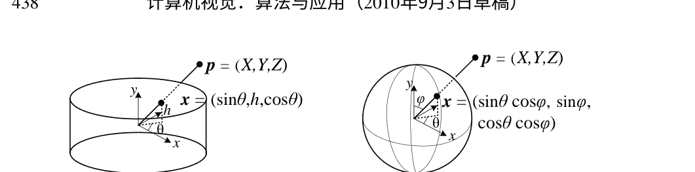

深度。同一数据集也可以使用多基线立体视觉明确重建深度（Peleg, Ben-Ezra, and Pritch 2001; Li, Shum, Tang et al. 2004; Zheng, Kang, Cohen et al. 2007）。

#### 9.1.6 圆柱和球面坐标

将图像转换为圆柱坐标，然后使用纯平移模型对其进行对齐是一种替代使用单应性或3D运动对齐图像的方法（Chen 1995; Szelinski 1996）。不幸的是，这仅适用于所有图像都是水平拍摄的情况或者具有已知倾斜角度的情况。

暂时假设相机处于其规范位置，即其旋转矩阵为单位矩阵，$R = I$，使得光轴与$z$轴对齐，$y$轴垂直对齐。因此，与一个$(x, y)$像素对应的三维射线为$(x, y, f)$。

我们希望将这个图像投影到一个单位半径的圆柱面上（Szelinski 1996）。这个表面上的点由角度$\theta$和高度$h$参数化，对应的三维圆柱坐标为$(\theta, h)$，如下所示：

$$(\sin\theta, h, \cos\theta) \propto (x, y, f)。\quad(9.12)$$

根据这个对应关系，我们可以计算出扭曲或映射的坐标公式（Szelinski and Shum 1997）。

$$x' = s\theta = s \tan^{-1} \frac{x}{f},\quad (9.13)$$

$$y' = sh = s \frac{y}{\sqrt{x^2 + f^2}},\quad (9.14)$$

其中$s$是任意的缩放因子（有时称为圆柱体的半径），可以设置为$s = f$以最小化图像中心附近的失真（缩放）。其逆 $s$比例也可以根据所需的输出全景分辨率设置为较大或较小的值，参见第9.3节。

这个映射方程为

$$\begin{aligned}
x &= f \tan \theta = f \tan \frac{x^{\prime}}{s}, \\
y &= h \sqrt{x^{2} + f^{2}} = \frac{y^{\prime}}{s} f \sqrt{1 + \tan ^{2} (x^{\prime} / s)} = f \frac{y^{\prime}}{s} \sec \frac{x^{\prime}}{s}.
\end{aligned}$$

图像也可以投影到一个球面上（Szeliski和Shum 1997），这在最终全景包括一个完整的球体或半球体的视图时非常有用，而不仅仅是一个圆柱形条带。在这种情况下，球体由两个角度（$\theta$, $\phi$）参数化，3D球坐标由以下给出

$$(\sin \theta \cos \phi, \sin \phi, \cos \theta \cos \phi) \propto (x, y, f),\quad (9.16)$$

> 如图9.7b所示。⁶坐标之间的对应关系由(Szeliski and Shum 1997)给出：

$$\begin{aligned}
x^{\prime} &= s \theta = s \tan ^{-1} \frac{x}{f}, \\
y^{\prime} &= s \phi = s \tan ^{-1} \frac{y}{\sqrt{x^{2} + f^{2}}},
\end{aligned}\quad (9.17)$$

而逆函数则为

$$\begin{aligned}
x &= f \tan \theta = f \tan \frac{x^{\prime}}{s}, \\
y &= \sqrt{x^{2} + f^{2}} \tan \phi = \tan \frac{y^{\prime}}{s} f \sqrt{1 + \tan ^{2} (x^{\prime} / s)} = f \tan \frac{y^{\prime}}{s} \sec \frac{x^{\prime}}{s}.
\end{aligned}\quad (9.18)$$

请注意，根据方程(9.17)生成一个缩放的 $(x, y, z)$方向，然后通过 $z$进行透视除法和 $f$ 进行缩放可能更简单。

当相机已知水平且仅围绕其垂直轴旋转时，最常用的是圆柱形图像拼接算法(Chen 1995)。在这些条件下，不同旋转角度的图像通过纯水平平移相关。⁷这使得它成为入门计算机视觉课程中的一个初始课程项目，因为可以避免透视对齐算法(第6.1节、第8.2节和第9.1.3节)的全部复杂性。图9.8展示了水平旋转全景图中两个圆柱形变形图像之间的纯平移关系(Szeliski and Shum 1997)。

专业全景摄影师经常使用平移-倾斜云台，以便轻松控制倾斜角度并停在特定的旋转角度上。电动旋转云台也是常见的选择

> ⁶请注意，这不是通常在方程（2.8）中介绍的球面坐标。在这里，$y$轴指向北极，而不是$z$轴，因为我们习惯于水平拍摄的图像，即$z$轴指向重力矢量的方向。

> ⁷小的垂直倾斜有时可以通过垂直平移来补偿。

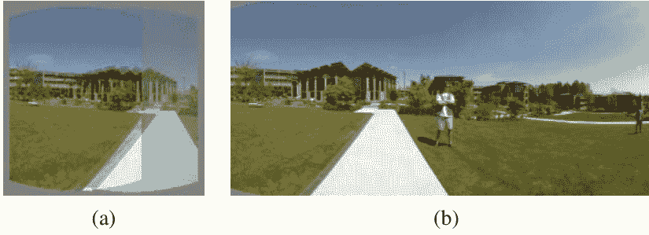

图9.8 一个柱面全景图（Szeliski和Shum 1997）©1997 ACM: (a) 通过水平平移相关的两个柱面翘曲图像; (b) 由一系列图像组合而成的柱面全景图的一部分。

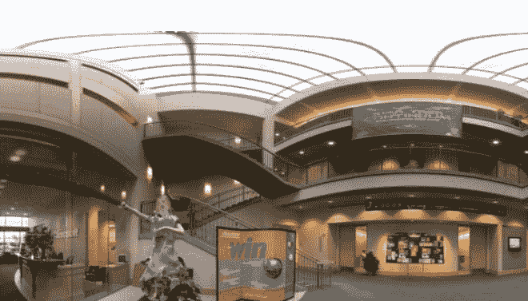

图9.9 由54张照片构建的球面全景图（Szeliski和Shum 1997）©1997 ACM。

有时用于获取更大的全景图（Kopf, Uyttendaele, Deussen等, 2007年）。它们不仅确保视觉领域的均匀覆盖，并具有所需的图像重叠量，而且还可以使用柱面或球面坐标和纯平移来拼接图像。在这种情况下，像素坐标（x, y, f）必须先使用已知的倾斜和旋转角度进行旋转，然后投影到柱面或球面坐标中（Chen 1995年）。大致已知的旋转角度也使得计算对齐更容易，因为所有输入图像的粗略相对定位在预先已知，从而为对齐提供了减少的搜索范围。图9.9显示了一个完整的3D旋转全景图展开到球体表面上（Szeliski和Shum 1997年）。

还值得一提的是一种最终的坐标映射，即极坐标映射，其中北极点位于光轴上而不是垂直轴上，

$$(\cos\theta \sin\phi, \sin\theta \sin\phi, \cos\phi) = s (x, y, z) 。\quad (9.22)$$

在这种情况下，映射方程变为

$$\begin{aligned}
x' &= s\phi \cos\theta = s \frac{x}{r} \tan^{-1} \frac{r}{z}, \quad (9.23) \\
y' &= s\phi \sin\theta = s \frac{y}{r} \tan^{-1} \frac{r}{z}, \quad (9.24)
\end{aligned}$$

其中 $r = \sqrt{x^2 + y^2}$ 是 $(x, y)$ 平面上的径向距离，$s\phi$ 在 $(x', y')$ 平面上起到类似的作用。这种映射为某些宽角全景图提供了一种有吸引力的可视化表面，也是鱼眼镜头引起的畸变的良好模型，如第2.1.6节所讨论的。请注意，对于 $(x, y)$ 的小值，映射方程简化为 $x' \approx s x / z$，这表明 $s$ 起到了类似焦距的作用。

### 9.2 全局对齐

到目前为止，我们已经讨论了如何使用各种运动模型来注册图像对。在大多数应用中，我们会给出不止一对图像来进行注册。然后，目标是找到一组全局一致的对齐参数，以最小化所有图像对之间的错配（Szeliski和Shum 1997; Shum和Szeliski 2000; Sawney和Kumar 1999; Coorg和Teller 2000）。

在本节中，我们将将配对匹配准则（6.2、8.1和8.50）扩展到涉及所有图像姿态参数的全局能量函数（第9.2.1节）。一旦我们计算出全局对齐，我们通常需要进行局部调整，例如去除视差，以减少由于局部错配而导致的重影和模糊（第9.2.2节）。最后，如果我们给出一个无序的图像集来进行注册，我们需要发现哪些图像组合在一起形成一个或多个全景图。这个全景识别过程在第9.2.3节中描述。

#### 9.2.1 捆绑调整

注册大量图像的一种方法是逐个将新图像添加到全景图中，将最新的图像与已经在集合中的先前图像对齐（Szeliski和Shum 1997），并在必要时发现它与哪些图像重叠（Sawney和Kumar 1999）。在360度全景图的情况下，累积误差可能导致全景图两端之间存在间隙（或过度重叠），这可以修复。

通过拉伸所有图像的对齐，使用一种称为间隙闭合的过程 (Szeliski 和 Shum 1997)。然而，更好的选择是使用最小二乘框架同时对齐所有图像，以正确分配任何错配误差。

同时调整大量重叠图像的姿态参数的过程在摄影测量学界被称为束调整 (Triggs, McLauchlan, Hartley et al. 1999)。在计算机视觉中，它首先应用于一般的结构运动问题 (Szeliski 和 Kang 1994)，然后专门用于全景图像拼接 (Shum 和 Szeliski 2000; Sawhney 和 Kumar 1999; Coorg 和 Teller 2000)。

在本节中，我们使用基于特征的方法来制定全局对齐问题，因为这样可以得到一个更简单的系统。可以通过将图像分成补丁并为每个补丁创建一个虚拟特征对应关系（如第 9.2.4 节和 Shum 和 Szeliski (2000) 中所讨论的）或者通过用每个像素的度量替换每个特征的误差度量来获得等效的直接方法。

考虑方程 (6.2) 中给出的基于特征的对齐问题，即
$$E_{\text{成对}-\text{LS}} = \sum_{i} \| \boldsymbol{r}_i \|^2 = \| \tilde{\boldsymbol{x}}'_i(\boldsymbol{x}_i; \boldsymbol{p}) - \hat{\boldsymbol{x}}'_i \|^2. \tag{9.25}$$

对于多图像对齐，我们不再只有一组成对特征对应关系 $\{(\boldsymbol{x}_i, \hat{\boldsymbol{x}}'_i)\}$，而是有一组特征，其中第 $i$ 个特征点在第 $j$ 个图像中的位置用 $\boldsymbol{x}_{ij}$ 表示，其标量置信度（即逆方差）用 $c_{ij}$ 表示。每个图像还有一些相关的姿态参数。

在本节中，我们假设这个姿态由旋转矩阵 $\boldsymbol{R}_j$ 和焦距 $f_j$ 组成，尽管也可以用单应性来表示 (Szeliski 和 Shum 1997; Sawhney 和 Kumar 1999)。将一个三维点 $\boldsymbol{x}_i$ 映射到一个点在帧 $j$ 中，将点$\boldsymbol{x}_{ij}$ 重新写成方程 (2.68) 和 (9.5) 的形式
$$\tilde{\boldsymbol{x}}_{ij} \sim \boldsymbol{K}_j \boldsymbol{R}_j \boldsymbol{x}_i \text{ 和 } \boldsymbol{x}_i \sim \boldsymbol{R}_j^{-1} \boldsymbol{K}_j^{-1} \tilde{\boldsymbol{x}}_{ij}, \tag{9.26}$$
其中 $\boldsymbol{K}_j = \text{diag} (f_j, f_j, 1)$ 是标定矩阵的简化形式。将点 $\boldsymbol{x}_{ij}$ 从帧 $j$ 映射到点 $\boldsymbol{x}_{ik}$ 在帧 $k$ 中的运动类似地给出
$$\tilde{\boldsymbol{x}}_{ik} \sim \tilde{\boldsymbol{H}}_{kj} \tilde{\boldsymbol{x}}_{ij} = \boldsymbol{K}_k \boldsymbol{R}_k \boldsymbol{R}_j^{-1} \boldsymbol{K}_j^{-1} \tilde{\boldsymbol{x}}_{ij}. \tag{9.27}$$

给定从链接成对配准获得的初始集合 $\{ (\boldsymbol{R}_j, f_j) \}$ 估计，我们如何改进这些估计？

一种方法是直接将成对能量 $E_{\text{pairwise}-\text{LS}}$ (9.25) 扩展到多视图公式中，
$$E_{\text{all-pairs-2D}} = \sum_{i} \sum_{jk} c_{ij} c_{ik} \| \tilde{\boldsymbol{x}}_{ik}(\tilde{\boldsymbol{x}}_{ij}; \boldsymbol{R}_j, f_j, \boldsymbol{R}_k, f_k) - \hat{\boldsymbol{x}}_{ik} \|^2, \tag{9.28}$$
其中，在图像 $j$ 中看不到的特征 $c_{ij}=0$。我们还可以使用 $2 \times 2$ 逆协方差矩阵 $\boldsymbol{\Sigma}_{ij}^{-1}$ 代替 $c_{ij}$，如公式 (6.11) 所示。

其中，$\tilde{x}_{ik}$ 函数是由公式 (9.27) 给出的特征 $i$ 在帧 $k$ 中的预测位置。$\hat{x}_{ij}$ 是观测到的位置，下标中的“2D”表示最小化的是图像平面误差 (Shum 和 Szeliski 2000)。需要注意的是，由于 $\tilde{x}_{ik}$ 依赖于观测值 $\hat{x}_{ij}$，实际上我们面临的是一个变量误差问题，原则上需要比最小二乘法更复杂的技术来解决 (Van Huffel 和 Lemmerling 2002; Matei 和 Meer 2006)。然而，在实践中，如果我们有足够的特征，我们可以直接使用常规非线性最小二乘法来最小化上述数量，并获得准确的多帧对齐。

虽然这种方法在实践中效果很好，但它存在两个潜在的缺点。首先，由于对具有相应特征的所有配对进行求和，因此在最终解决方案中，观察到多次的特征被赋予了过大的权重。（实际上，观察到的特征多次被计算了）。其次，对于 $\{(R_j, f_j)\}$ 的导数有些繁琐，尽管在第 9.1.3 节中引入了增量校正来使其更易处理。

另一种优化问题的表述方式是使用真正的束调整，即不仅求解位姿参数 $\{(R_j, f_j)\}$，还求解三维点位置 $\{x_i\}$。
$$E_{BA-2D} = \sum_i \sum_j c_{ij} ||\tilde{x}_{ij}(x_i; R_j, f_j) - \hat{x}_{ij}||^2, \tag{9.29}$$
其中 $\tilde{x}_{ij}(x_i; R_j, f_j)$ 由式 (9.26) 给出。完全束调整的缺点是需要要求解更多的变量，因此每次迭代以及整体收敛可能会更慢。（想象一下每次旋转矩阵更新时三维点需要如何“移动”）。然而，每个线性化的高斯-牛顿步骤的计算复杂度可以通过使用稀疏矩阵技术（第 7.4.1 节）来降低 (Szeliski 和 Kang 1994; Triggs, McLauchlan, Hartley et al. 1999; Hartley 和 Zisserman 2004)。

另一种表述是最小化 3D 投影射线方向的误差 (Shum 和 Szeliski 2000)，即
$$E_{BA-3D} = \sum_i \sum_j c_{ij} ||\tilde{x}_i(\hat{x}_{ij}; R_j, f_j) - x_i||^2 \tag{9.30}$$
其中 $\tilde{x}_i(\hat{x}_{ij}; R_j, f_j)$ 由 (9.26) 的后半部分给出。这与 (9.29) 相比没有特别的优势。实际上，由于在 3D 射线空间中最小化误差，估计的焦距越长，射线之间的角度就越小。

然而，如果我们消除 3D 射线 $x_i$，我们可以推导出在 3D 射线空间中的成对能量 (Shum 和 Szeliski 2000)
$$E_{all-pairs-3D} = \sum_i \sum_{jk} c_{ij} c_{ik} ||\tilde{x}_i(\hat{x}_{ij}; R_j, f_j) - \tilde{x}_i(\hat{x}_{ik}; R_k, f_k)||^2 \tag{9.31}$$
这导致了最简单的更新方程组 (Shum 和 Szeliski 2000)，因为 $f_k$ 可以折叠到齐次坐标向量的创建中，如方程 (9.7) 所示。因此，即使这个公式过度加权了更频繁出现的特征，它仍然是 Shum 和 Szeliski (2000) 以及 Brown，Szeliski 和 Winder (2005) 所使用的方法。为了减少对较长焦距的偏好，我们将每个残差（3D 误差）乘以 $\sqrt{f_j f_k}$，这类似于将 3D 光线投影到中间焦距的“虚拟相机”中。

### 竖直方向选择
如上所述，通过上述方法计算得到的 3D 相机存在全局模糊。虽然这可能看起来无关紧要，但人们更喜欢最终拼接图像是“直立”的，而不是扭曲或倾斜的。更具体地说，人们习惯于看到照片以使垂直（重力）轴在图像中指向正上方。考虑一下你通常拍摄照片的方式：虽然你可以任意平移和倾斜相机，但通常会保持相机的水平边缘（其 $x$ 轴）与地平面平行（垂直于世界重力方向）。从数学上讲，这对旋转矩阵的约束可以表示如下。回顾方程 (9.26)，3D 到 2D 投影由以下公式给出
$$
\tilde{x}_{ik} \sim \boldsymbol{K}_k \boldsymbol{R}_k \boldsymbol{x}_i. \tag{9.32}
$$
我们希望在每个旋转矩阵 $\boldsymbol{R}_k$ 后面乘以一个全局旋转 $\boldsymbol{R}_g$，使得全局的投影 $y$ 轴，$\hat{\jmath} = (0, 1, 0)$ 与图像的 $x$ 轴，$\hat{\imath} = (1, 0, 0)$ 垂直。这个约束可以写成
$$
\hat{\imath}^T \boldsymbol{R}_k \boldsymbol{R}_g \hat{\jmath} = 0. \tag{9.33}
$$
（注意，校准矩阵的缩放在这里是无关紧要的）。这相当于要求 $\boldsymbol{R}_k$ 的第一行与 $\boldsymbol{R}_g$ 的第二列垂直，这组约束条件（每个输入图像一个）可以写成最小二乘问题，
$$
r_{\mathrm{g}1} = \arg\min_{\boldsymbol{r}} \sum_k (\boldsymbol{r}^T \boldsymbol{r}_{k0})^2 = \arg\min_{\boldsymbol{r}} \boldsymbol{r}^T \left[ \sum_k \boldsymbol{r}_{k0} \boldsymbol{r}_{k0}^T \right] \boldsymbol{r}. \tag{9.34}
$$
因此，$r_{\mathrm{g}1}$ 是由各个相机旋转向量张成的散射矩阵的最小特征向量，通常应为 $(c, 0, s)$ 的形式，当相机直立时。

为了完全指定 $\boldsymbol{R}_g$ 全局旋转，我们需要指定一个额外的约束。这与视图选择问题有关，该问题在第 9.3.1 节中讨论。一个简单的启发式方法是偏好个别旋转矩阵的平均 $z$ 轴，$k = \sum \hat{k}^T R_k$ 接近于世界 $z$ 轴，$r_{g2} = R_g \hat{k}$。因此，我们可以通过三个步骤计算完整的旋转矩阵 $R_g$：

-   1. $r_{g1}$ = 最小特征向量 ($\sum_k r_{k0} r_{k0}^T$);
-   2. $r_{g0} = \mathcal{N}((\sum_k r_{k2}) \times r_{g1});$
-   3. $r_{g2} = r_{g0} \times r_{g1},$

其中 $\mathcal{N}(v) = v/||v||$ 对向量 $v$ 进行归一化。

#### 9.2.2 消除视差
一旦我们优化了相机的全局方向和焦距，我们可能会发现图像仍然不完全对齐，即生成的拼接图在某些地方看起来模糊或有幽灵影像。这可能是由多种因素引起的，包括未建模的径向畸变，3D 视差（未能围绕光学中心旋转相机），小场景运动（如摇摆的树枝）和大尺度场景运动（如人物进出图片）。

这些问题可以用不同的方法来解决。径向畸变可以使用第 2.1.6 节讨论的技术之一进行估计（可能是提前进行）。例如，垂线法 (Brown 1971; Kang 2001; El-Melegy and Farag 2003) 调整径向畸变参数，直到略微弯曲的线条变直，而基于镶嵌的方法则调整参数，直到图像重叠区域的错配减少 (Stein 1997; Sawhney and Kumar 1999)。

通过进行完整的 3D 捆绑调整，即用方程 (2.68) 替换方程 (9.29) 中用于建模相机平移的投影方程 (9.26)，可以处理 3D 视差。然后可以同时恢复匹配特征点和相机的 3D 位置，尽管这可能比无视差图像配准要昂贵得多。一旦恢复了 3D 结构，理论上可以将场景投影到一个不含视差的单一（中心）视点。然而，为了实现这一点，需要执行密集的立体匹配（第 11.3 节）(Li, Shum, Tang 等, 2004; Zheng, Kang, Cohen 等, 2007)，如果图像仅包含部分重叠，则可能无法实现。在这种情况下，可能需要仅在重叠区域中纠正视差，这可以通过使用多透视平面扫描 (MPPS) 算法来实现 (Kang, Szeliski 和 Uyttendaele, 2004; Uyttendaele, Criminisi, Kang 等, 2004)。当场景中的运动非常大，即对象完全出现和消失时，一个明智的解决方案是仅从一个图像中选择像素作为最终合成的源 (Milgram, 1977; Davis, 1998; Agarwala, Dontcheva, Agrawala et al. 2004)，如第 9.3.2 节所讨论的那样。然而，当运动相对较小（大约几个像素）时，可以使用一般的 2D 运动估计（光流）来执行适当的校正，然后使用称为本地对齐的过程进行混合 (Shum 和 Szeliski 2000; Kang, Uyttendaele, Winder et al. 2003)。这个相同的过程也可以用来补偿径向畸变和 3D 视差，尽管它使用了一个较弱的运动模型，因此可能更容易失败或引入不希望的畸变。

由 Shum 和 Szeliski (2000) 引入的本地对齐技术从优化相机姿态的全局束调整 (9.31) 开始。一旦这些被估计出来，一个 3D 点 $x_i$ 的期望位置可以被估计为反投影的 3D 位置的平均值，$\bar{x}_i \sim \sum_j c_{ij} \tilde{x}_i(x_{ij}; R_j, f_j) \bigg/ \sum_j c_{ij}$ (9.35)。可以将其投影到每个图像 $j$ 中以获得目标位置 $\bar{x}_{ij}$。目标位置 $\bar{x}_{ij}$ 与原始特征 $x_{ij}$ 之间的差异提供了一组局部运动估计。$u_{ij} = \bar{x}_{ij} - x_{ij}$ (9.36)。可以插值得到一个密集的校正场 $u_j(x_j)$。在他们的系统中，Shum 和 Szeliski (2000) 使用了一种逆向变形算法，其中稀疏的 $-u_{ij}$ 值被放置在新的目标位置 $\bar{x}_{ij}$ 上，使用双线性核函数 (Nielsen 1993) 进行插值，然后在计算变形（校正）图像时将其添加到原始像素坐标中。

为了获得一个相对密集的特征集来进行插值，Shum 和 Szeliski (2000) 在每个补丁的中心放置一个特征点（补丁大小控制局部对齐阶段的平滑度），而不是依赖于使用兴趣算子提取的特征（图 9.10）。

Kang, Uyttendaele, Winder 等人 (2003) 提出了一种基于运动的去鬼影的替代方法，他们在每个输入图像和一个中心参考图像之间估计密集光流。在考虑给定的扭曲像素是否有效并用于计算高动态范围辐射估计之前，使用光度一致性测量检查流向量的准确性，这是他们整体算法的目标。对于参考图像的要求使得他们的方法在一般图像拼接中的适用性较低，尽管可以设想将其扩展到这种情况。

#### 9.2.3 识别全景
实现完全自动化图像拼接所需的最后部分是一种识别图像实际配对的技术，Brown 和 Lowe (2007) 称之为识别全景图的技术。

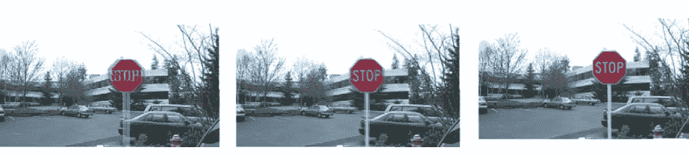

图 9.10 使用视差去除马赛克 (Shum 和 Szeliski 2000) © 2000 IEEE：(a) 带有视差的合成图像；(b) 经过一次去马赛克步骤后 (补丁大小为 32)；(c) 经过多次步骤后 (大小为 32、16 和 8)。

如果用户按顺序拍摄图像，使每个图像与前一个图像重叠，并指定要拼接的第一个和最后一个图像，则可以使用捆绑调整和拓扑推断的过程自动组装全景图 (Sawhney 和 Kumar 1999)。然而，用户在拍摄全景图时经常跳跃，例如，在上一行的顶部开始新的一行，跳回去拍摄重复的照片，或者创建需要发现端到端重叠的 360° 全景图。此外，能够发现用户在一段时间内拍摄的多个全景图对于用户来说非常方便。

为了识别全景图，Brown 和 Lowe (2007) 首先使用基于特征的方法找到所有成对图像的重叠区域，然后在重叠图中找到连接的组件来“识别”单个全景图（图 9.11）。特征匹配阶段首先从所有输入图像中提取尺度不变特征变换 (SIFT) 特征位置和特征描述符 (Lowe 2004)，并将它们放入索引结构中，如第 4.1.3 节所述。对于考虑的每一对图像，使用索引结构快速找到每个特征在第一个图像中的最近匹配邻居，然后比较特征描述符找到最佳匹配。RANSAC 用于找到一组内点匹配；匹配对用于假设相似性运动模型，然后用于计算内点的数量。(Brown, Hartley 和 Nist´er (2007) 描述了一种专门针对旋转全景图的最新 RANSAC 算法。) 在实践中，使完全自动化的拼接算法正常工作最困难的部分是确定哪些图像对实际上对应于场景的相同部分。

当使用基于特征的方法时，重复结构（图 9.12）可能会导致错误匹配。缓解这个问题的一种方法是在注册图像之间执行直接的像素比较，以确定它们是否实际上是同一场景的不同视图。不幸的是，如果场景中有移动物体（图 9.13），这种启发式方法可能会失败。除了完全理解场景之外，通过应用领域特定的方法可能可以进一步改进。

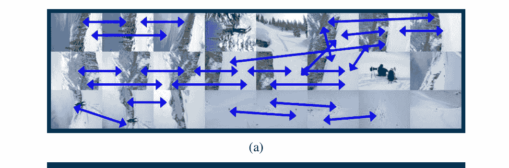

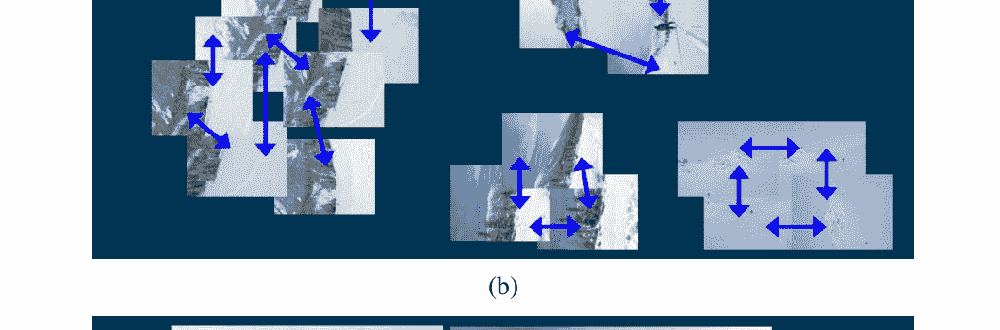

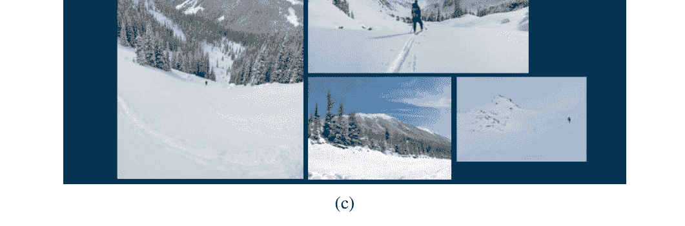

图 9.11 识别全景图 (Brown, Szeliski 和 Winder 2005)，图像由 Matthew Brown 提供：(a) 成对匹配的输入图像；(b) 图像分组成连接组件（全景图）；(c) 单个全景图注册并混合成拼接的复合图像。

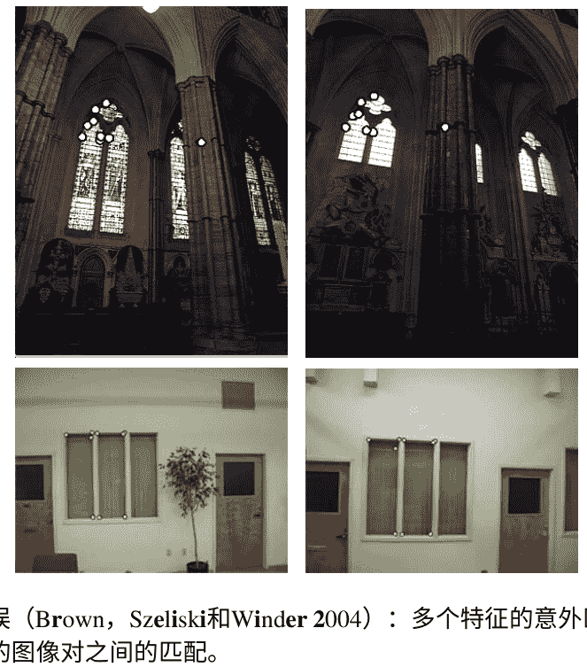

图9.12 匹配错误（Brown, Szeliski和Winder 2004）：多个特征的意外匹配可能导致实际上不重叠的图像对之间的匹配。

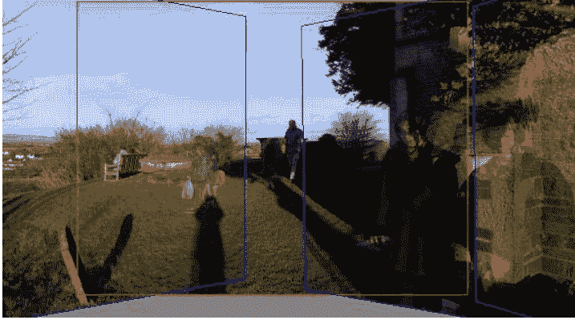

图9.13 通过直接像素误差比较验证图像匹配可能失败，当场景中包含移动物体时（Uyttendaele, Eden和Szeliski 2001）©2001 IEEE。

启发式方法，例如对典型相机运动的先验知识以及应用于匹配验证问题的机器学习技术。

#### 9.2.4 直接对比特征对齐

鉴于存在这两种对齐图像的方法，哪种更可取？早期基于特征的方法在纹理过于丰富或纹理不足的区域会产生混淆。特征通常在图像上分布不均匀，从而无法匹配本应对齐的图像对。此外，建立对应关系依赖于围绕特征点的补丁之间的简单互相关，这在图像旋转或由于单应性而产生的透视变形时效果不佳。

如今，特征检测和匹配方案非常稳健，甚至可以用于从远距离视角进行已知对象识别（Lowe 2004）。特征不仅对高“角点”区域（Förstner 1986; Harris和Stephens 1988）有响应，还对“斑点状”区域（Lowe 2004）和均匀区域（Matas, Chum, Urban et al. 2004; Tuytelaars和Van Gool 2004）有响应。此外，由于它们在尺度空间中操作并使用主导方向（或方向不变描述符），它们可以匹配在尺度、方向甚至透视变形上有差异的图像。我们在使用基于特征的方法时的经验是，如果特征在图像上分布均匀且描述符设计合理以实现重复性，通常可以找到足够的对应关系来进行图像拼接（Brown, Szeliski和Winder 2005）。

直接基于像素的对齐技术的最大缺点是其收敛范围有限。尽管它们可以在分层（粗到细）估计框架中使用，但在实践中很难使用超过两到三个金字塔级别，否则重要细节开始模糊。¹¹对于匹配视频中的连续帧，直接方法通常可以工作。然而，对于部分重叠的照片拼接或者对于对比度或内容变化太大的图像集合，它们经常失败，因此更倾向于使用基于特征的方法。

### 9.3 合成

一旦我们将所有输入图像相对于彼此进行了注册，我们需要决定如何生成最终的拼接图像。这涉及选择最终的合成表面（平面、圆柱、球面等）和视图（参考图像）。它还涉及选择

> ¹¹基于傅里叶变换的相关性（Szeliski 1996; Szeliski and Shum 1997）可以扩展这个范围，但需要圆柱形图像或运动预测才能发挥作用。

#### 9.3.1 选择合成表面

首先要做出的选择是如何表示最终的图像。如果只有几张图像被拼接在一起，一个自然的方法是选择其中一张图像作为参考，并将所有其他图像变换到它的参考坐标系中。结果合成图有时被称为平面全景图，因为投影到最终表面上仍然是透视投影，因此直线仍然保持直线（这通常是一个理想的属性）。

然而，对于更大的视野，我们无法在不过度拉伸图像边缘像素的情况下保持平坦的表示。（实际上，一旦视野超过90°左右，平面全景图开始严重失真。）制作较大全景图的常见选择是使用柱面（Chen 1995; Szeliski 1996）或球面（Szeliski and Shum 1997）投影，如第9.1.6节所述。事实上，计算机图形学中用于环境映射的任何表面都可以使用，包括立方体贴图，它用一个立方体的六个平面来表示完整的视野球面（Greene 1986; Szeliski and Shum 1997）。制图师还开发了许多代表地球的替代方法（Bugayevskiy and Snyder 1995）。

参数化的选择在一定程度上取决于应用，并涉及在保持局部外观不失真（例如，保持直线直）和在环境中提供合理均匀的采样之间的权衡。自动进行此选择并根据全景的范围平滑过渡是当前研究的一个活跃领域（Kopf, Uyttendaele, Deussen等, 2007）。全景摄影中一个有趣的最新发展是使用立体投影向下看地面（在室外场景中）创建“小行星”渲染。

### 视图选择
一旦我们选择了输出参数化，我们仍然需要确定场景的哪个部分将在最终视图中居中。如上所述，对于平面复合图像，我们可以选择其中一张图像作为参考。通常，一个合理的选择是几何上最中心的图像。例如，对于表示为一组3D旋转矩阵的旋转全景图像，我们可以选择其z轴最接近平均z轴的图像（假设视野合理）。或者，我们可以使用平均z轴（或四元数，但这更加复杂）来定义参考旋转矩阵。

对于较大的，例如柱面或球面全景图像，如果已经拍摄了观察球的子集，我们可以使用相同的启发式方法。对于全360°全景图像，更好的选择可能是从输入序列中选择中间图像，或者有时选择第一张图像，假设其中包含最感兴趣的对象。在所有这些情况下，用户控制最终视图通常是非常理想的。如果“上向量”计算在第9.2.1节中描述的工作正确，这可以简单地是在图像上平移或设置垂直的“中心线”来生成最终全景图像。

### 坐标转换
在选择参数化和参考视图之后，我们仍然需要计算输入和输出像素坐标之间的映射。

如果最终的合成表面是平面的（例如，单个平面或立方体贴图的面）并且输入图像没有径向畸变，则坐标转换是由（9.5）描述的简单单应性。这种变形可以通过适当设置纹理映射坐标并渲染单个四边形在图形硬件中执行。如果最终的合成表面具有其他解析形式（例如，圆柱形或球形），我们需要将最终全景中的每个像素转换为视线（3D点），然后根据投影（和可选的径向畸变）方程将其映射回每个图像。通过预计算一些查找表（例如，将圆柱形或球形坐标映射到3D坐标所需的部分三角函数或每个像素的径向畸变场），可以使此过程更加高效。还可以通过在较粗的网格上计算精确的像素映射，然后插值这些值来加速此过程。

当最终的合成表面是一个纹理映射的多面体时，必须使用稍微复杂一些的算法。不仅需要正确处理3D和纹理映射坐标，还需要在纹理映射的三角形足迹之外留出一小部分超出绘制，以确保在3D渲染过程中插值的纹理像素具有有效值（Szeliski和Shum 1997）。

### 采样问题
虽然上述计算可以得到每个输入图像中正确的（分数）像素地址，但我们仍然需要注意采样问题。例如，对于“小行星投影”，如果最终全景图的分辨率低于输入图像，则需要对输入图像进行预过滤以避免混叠。这些问题在图像处理和计算机图形学界得到了广泛研究。基本问题是计算适当的预过滤器，这取决于源图像中相邻样本之间的距离（和排列）。如第3.5.2节和3.6.1节所讨论的，图形学界已经开发了各种近似解决方案，例如MIP映射（Williams 1983）或椭圆加权高斯平均（Greene和Heckbert 1986）。为了获得最高的视觉质量，可能需要使用更高阶（例如三次）插值器结合空间自适应预过滤器（Wang，Kang，Szeliski等，2001）。在某些条件下，还可以使用超分辨率过程（第10.3节）生成比输入图像更高分辨率的图像。

#### 9.3.2 像素选择和加权（去鬼影）

一旦源像素被映射到最终的合成表面上，我们仍然需要决定如何混合它们以创建一个吸引人的全景图。如果所有图像都完全对齐并且曝光相同，那么这是一个简单的问题，即任何像素或组合都可以。然而，对于真实的图像，由于曝光差异而产生可见的接缝，由于错位而产生模糊，或者由于移动物体而产生幽灵效果。创建干净、令人愉悦的全景图既涉及决定使用哪些像素，又涉及如何加权或混合它们。这两个阶段之间的区别有点模糊，因为每个像素的加权可以被看作是选择和混合的组合。在本节中，我们将讨论空间变化的加权、像素选择（接缝放置）以及更复杂的混合。

### 羽化和中心加权
创建最终合成图像的最简单方法是在每个像素上取平均值。

```
$$C(x)=\sum_{k} w_{k}(x) \tilde{I}_{k}(x) \bigg/ \sum_{k} w_{k}(x) , \qquad(9.37)$$
```
其中$\tilde{I}_{k}(x)$是经过变形（重新采样）的图像，$w_{k}(x)$在有效像素处为1，在其他地方为0。在计算机图形硬件上，可以在累积缓冲区中执行这种求和操作（使用$A$通道作为权重）。

简单的平均通常效果不好，因为曝光差异、错位和场景移动都非常明显（图9.14a）。如果快速移动的物体是唯一的问题，可以使用中值滤波器（一种像素选择操作符）来去除它们（图9.14b）（Irani和Anandan，1998年）。相反，中心加权（下面讨论）和最小似然选择（Agarwala，Dontcheva，Agrawala等人2004年）的方法有时可以使用Agrawala等人（2004年）的方法来保留移动物体的多个副本（图9.17）。

更好的平均方法是对图像中心附近的像素进行加权，并对边缘附近的像素进行降权。当图像有一些剪切区域时，降低剪切区域和图像边缘附近的像素权重是更好的选择。这可以通过计算距离图或草地火变换来实现。

$$w_k(\boldsymbol{x}) = \arg \min_{\boldsymbol{y}} \{ \|\boldsymbol{y}\| \mid \tilde{I}_k(\boldsymbol{x}+\boldsymbol{y}) \text{ 是无效的} \}, \tag{9.38}$$
其中每个有效像素都标记有其到最近无效像素的欧氏距离（第3.3.3节）。欧氏距离图可以使用两次扫描栅格算法（Danielsson 1980; Borgefors 1986）高效计算。

带有距离图的加权平均通常被称为羽化（Szeliski and Shum1997; Chen and Klette 1999; Uyttendaele, Eden, and Szeliski 2001），并且在混合曝光差异方面做得相当好。然而，模糊和幽灵效应仍然可能是问题（图9.14c）。请注意，加权平均不同于使用经典的 over操作（Porter and Duff 1984; Blinn 1994a）合成各个图像，即使使用权重值（归一化为总和为一）作为 alpha（半透明度）通道。这是因为覆盖操作会减弱来自更远表面的值，因此不等同于直接求和。

改善羽化的一种方法是将距离图的值提高到某个较大的幂次，即在方程（9.37）中使用 $w_k^{\ p}(\boldsymbol{x})$。加权平均值则主要由较大的值主导，即它们在某种程度上起到了类似于p-范数的作用。得到的合成图像通常能在可见的曝光差异和模糊之间提供一个合理的折衷方案（图9.14d）。当 $p \to \infty$ 时，只有具有最大权重的像素被选中。

$$C(\boldsymbol{x}) = \tilde{I}_{l(\boldsymbol{x})}(\boldsymbol{x}), \tag{9.39}$$
$$l = \arg \max_k w_k(\boldsymbol{x}) \tag{9.40}$$
是选择标签或像素的选择函数，它在每个像素处选择要使用的图像。这种硬像素选择过程产生了一种对可见性掩码敏感的Voronoi图，它将每个像素分配给集合中最近的图像中心（Wood，Finkelstein，Hughes等，1997; Peleg, Rousso, Rav-Acha等，2000）。得到的合成图像在艺术指导和高重叠全景图像（流形拼接）中非常有用，但当曝光差异较大时，往往会出现明显的接缝和硬边缘（图9.14e）。

Xiong和Turkowski（1998）使用这个Voronoi的想法（grassfire transform的局部最大值）来选择Laplacian金字塔混合的接缝线（下面会讨论）。然而，由于接缝线的选择是顺序执行的，随着新图像的添加，可能会出现一些伪影。

### 最优接缝线选择
计算Voronoi图是选择不同图像贡献于最终合成图的接缝线的一种方法。然而，Voronoi图完全忽略了接缝线下的局部图像结构。

更好的方法是将接缝线放置在图像一致的区域，以便从一个源到另一个源的过渡不可见。通过这种方式，算法避免了在移动物体上“切割”接缝线，这样接缝线看起来就不自然了（Davis 1998）。对于一对图像，这个过程可以被描述为一个简单的动态规划，从重叠区域的一边开始，到另一边结束（Milgram 1975, 1977; Davis 1998; Efros and Freeman 2001）。

当多个图像被合成时，动态规划的思想不容易推广。（对于依次合成的方形纹理瓦片，Efros和Freeman（2001）沿着每个瓦片的四个边运行动态规划。）

为了克服这个问题，Uyttendaele、Eden和Szeliski（2001）观察到，在注册良好的图像中，移动物体产生最明显的伪影，即半透明的幽灵。因此，他们的系统决定保留哪些对象，删除哪些对象。首先，算法比较所有重叠的输入图像对，确定图像不一致的区域（RODs）。然后，构建一个图，其中RODs作为顶点，边表示在最终合成中重叠的ROD对（图9.15）。由于边的存在表示存在不一致的区域，必须从最终合成中删除顶点（区域），直到没有边跨越剩余顶点的一对。

可以使用顶点覆盖算法计算最小的这样的集合。由于可能存在多个这样的覆盖，因此使用加权顶点覆盖，其中顶点权重通过计算ROD中的特征权重之和来计算（Uyttendaele、Eden和Szeliski 2001）。因此，该算法更喜欢移除靠近图像边缘的区域，从而减少部分可见对象出现在最终合成图像中的可能性。（这是还可以通过区域差异的“边缘性”（像素差异）来推断差异区域中的前景对象，当存在对象时，边界上的像素差异应该更高（Herley 2005）。一旦删除了所需的多余差异区域，最终的合成图像可以通过羽化（图9.14f）来创建。

Agarwala、Dontcheva、Agrawala等人（2004）描述了一种不同的像素选择和接缝放置方法。他们的系统计算了最优标签分配，使两个目标函数的总和最大化。第一个目标函数是每个像素的图像目标，用于确定哪些像素可能产生良好的合成图像。

```
$$C_D = \sum_{x} D(x, l(x)),$$
```
其中 $D(x, l)$是与选择图像 $l$在像素 $x$处相关联的数据惩罚。

在他们的系统中，用户可以通过“绘制”所需对象或外观的图像来选择要使用的像素，这会将 $D(x, l)$设置为除所选标签 $l$之外的所有标签$l$的较大值（图9.16）。或者，也可以使用自动选择标准，例如最大似然，它偏好在背景中重复出现的像素（用于对象去除），或者最小似然，用于不经常出现的对象，即移动对象保留。使用更传统的中心加权数据项倾向于偏好位于输入图像中心的对象（图9.17）。

第二项是一个无缝目标，它惩罚相邻图像之间标签差异，

```
$$C_S = \sum_{(x,y) \in \mathcal{N}} S(x, y, l(x), l(y)),$$
```
其中 $S(x, y, l_x, l_y)$ 是图像相关的交互惩罚或缝隙成本，用于在像素 $x$ 和 $y$ 之间放置缝隙， $\mathcal{N}$ 是 $\mathcal{N}_4$ 个相邻像素的集合。 例如， (Kwatra, Schödl, Essaet al.2003; Agarwala,Dontcheva, Agrawalaet al.2004)中使用的简单基于颜色的缝隙惩罚可以写成

```
$S(x, y, l_x, l_y) = ||\tilde{I}_{l_x}(x) - \tilde{I}_{l_y}(x)|| + ||\tilde{I}_{l_x}(y) - \tilde{I}_{l_y}(y)||.$  (9.43)
```

更复杂的缝隙惩罚也可以考虑图像梯度或图像边缘的存在 (Agarwala, Dontcheva, Agrawalaet al.2004) 。 缝隙惩罚在其他计算机视觉应用中广泛使用，例如立体匹配 (Boykov, Veksler, and Zabih 2001) ， 以使标签函数具有一致性或平滑性。 另一种方法是使用分水岭计算将缝隙放置在重叠图像中的强一致边缘上， Soille (2006) 对此进行了描述。

这两个目标函数的总和导致了一个马尔可夫随机场 (MRF) ，在第3.7.2节、 第5.5 节和附录B.5中描述了良好的优化算法。对于这种类型的标签计算， Boykov、 Veksler 和Zabih (2001) 开发的 $\alpha$ 扩展算法特别有效 (Szeliski, Zabih, Scharsteinet al.2008) 。

对于图9.14g中显示的结果， Agarwala， Dontcheva， Agrawala等人 (2004年) 对无效像素使用较大的数据惩罚，对有效像素使用0。 注意缝隙放置算法如何避免差异区域，包括那些与图像接壤的区域，可能导致物体被切断。图割 (Agarwala， Dontcheva， Agrawala等人2004年) 和## 9.3.3 应用：拼贴照片

尽管图像拼接通常用于合成部分重叠的照片，但也可以用于合成重复拍摄的场景，以获得每个元素的最佳组合和外观。

图9.16展示了由Agarwala、Dontcheva、Agrawala等人（2004）开发的Photomontage系统，用户在一组预对齐的图像上绘制笔画，指示他们希望从每个图像中保留哪些区域。一旦系统解决了由多标签图割（9.41-9.42）产生的问题，就会使用Poisson图像融合的变体（9.44-9.46）将从每个源照片中取出的各个部分混合在一起。他们的系统还可以用于从一系列曝光不同的对焦图像中自动合成全焦点图像（Hasinoff、Kutulakos、Durand等人，2009），或者从一组照片中去除电线和其他不需要的元素。习题9.10要求你实现这个系统并尝试一些变体。

#### 9.3.4 混合

一旦确定了图像之间的接缝并移除了不需要的对象，我们仍然需要对图像进行混合，以补偿曝光差异和其他不对齐问题。先前讨论的空间变化加权（羽化）通常可以用来实现这一点。然而，在实践中很难在平滑低频曝光变化和保持足够锐利的过渡以防止模糊之间取得令人满意的平衡（尽管在羽化中使用高指数可以有所帮助）。

拉普拉斯金字塔混合。解决这个问题的一个有吸引力的方法是由Burt和Adelson（1983b）开发的拉普拉斯金字塔混合技术，在第3.5.5节中我们讨论过。不同于使用单一的过渡宽度，通过创建一个带通（拉普拉斯）金字塔，并使每个级别内的过渡宽度成为级别的函数，即相同的像素宽度。.在实践中，较少的级别，例如仅有两个（Brown和Lowe 2007），可能足以弥补曝光差异。应用这种金字塔混合的结果如图9.14h所示。

梯度域混合。多频带图像混合的另一种方法是在梯度域中执行操作。.从梯度场中重建图像在计算机视觉中有着悠久的历史（Horn 1986），最初是从工作开始的。亮度恒定性（Horn 1974），形状恢复（Horn和Brooks 1989）和光度立体（Woodham 1981）等方面的研究。最近，相关的思想已被用于从边缘中重建图像（Elder和Goldberg 2001），从图像中去除阴影（Weiss 2001），从单个图像中分离反射（Levin，Zomet和Weiss 2004；Levin和Weiss 2007），以及通过减小图像边缘（梯度）的幅度来进行色调映射高动态范围图像（Fattal，Lischinski和Werman 2002）。

Pérez，Gangnet和Blake（2003）展示了如何使用梯度域重建来在图像编辑应用程序中进行无缝对象插入（图9.18）。不是复制像素，而是复制新图像片段的梯度。然后，通过求解泊松方程来计算复制区域的实际像素值，该方程在局部匹配梯度的同时遵守边界处的固定迪里希特（精确匹配）条件。Pérez，Gangnet和Blake（2003）表明，这相当于计算源图像和目标图像之间不匹配的添加膜插值沿边界的结果。14在早期的工作中，Peleg（1981）还提出添加平滑函数以强制沿接缝曲线保持一致性。

Agarwala，Dontcheva，Agrawala等人（2004）将这个想法扩展到多源公式中，其中不再有一个必须在接缝处精确匹配像素值的目标图像。相反，每个源图像都贡献其自己的梯度场，并且使用Neumann边界条件解决泊松方程，即丢弃涉及图像边界外像素的任何方程。Agarwala, Dontcheva, Agrawala等人 (2004) 直接最小化一个变分问题，而不是求解泊松偏微分方程。

$$ \min_{C(\boldsymbol{x})} \| \nabla C(\boldsymbol{x}) - \nabla \tilde{I}_{l(\boldsymbol{x})}(\boldsymbol{x}) \|^2. \quad (9.44) $$

这个方程的离散形式是一组梯度约束方程

$$ C(\boldsymbol{x} + \boldsymbol{i}) - C(\boldsymbol{x}) = \tilde{I}_{l(\boldsymbol{x})}(\boldsymbol{x} + \boldsymbol{i}) - \tilde{I}_{l(\boldsymbol{x})}(\boldsymbol{x}) \quad \text{和} \quad (9.45) $$
$$ C(\boldsymbol{x} + \boldsymbol{j}) - C(\boldsymbol{x}) = \tilde{I}_{l(\boldsymbol{x})}(\boldsymbol{x} + \boldsymbol{j}) - \tilde{I}_{l(\boldsymbol{x})}(\boldsymbol{x}), \quad (9.46) \text{其中 } \boldsymbol{i} = (1,0) \text{和 } \boldsymbol{j} = (0,1) \text{是单位向量，分别表示在 } x \text{和 } y \text{方向上。} $$

然后他们解决了相关的稀疏最小二乘问题。 由于这个方程组只有一个可加约束，Agarwala, Dontcheva, Agrawala等人(2004) 要求用户选择一个像素的值。 实际上，一个更好的选择可能是在解决方案中对原始颜色值进行弱偏置。

为了加速这个稀疏线性系统的解，Fattal, Lischinski, 和Werman (2002) 使用多重网格，而Agarwala, Dontcheva, Agrawala等人(2004) 使用分层基础预条件共轭梯度下降 (Szeliski 1990b, 2006b) (附录 A.5)。在随后的工作中，Agarwala (2007) 展示了如何使用四叉树表示解，进一步加速计算并且几乎不损失精度，而Szeliski, Uyttendaele, 和Steedly (2008) 展示了如何使用更粗的样条曲线表示每个图像的偏移场，以获得更快的速度。后续的工作还指出，在对数域中进行混合，即使用乘法偏移而不是加法偏移，更能匹配接缝边界上的纹理对比度。得到的接缝混合在实践中效果非常好(图 9.14h)，但是在复制接近接缝的大梯度值时需要注意，以免引入“双边缘”。

在缝隙放置后，直接从源图像复制梯度只是梯度域融合的一种方法。Levin, Zomet, Peleg等人（2004）的论文研究了这种方法的几个不同变体，他们称之为梯度域图像拼接（GIST）。他们研究的技术包括从源图像中进行羽化（混合）梯度，以及在图像重建中使用L1范数，而不是像式（9.44）中使用L2范数。他们首选的技术是在原始图像梯度上进行羽化（混合）代价函数的L1优化（他们称之为GIST1-l1）。由于使用线性规划的L1优化可能很慢，他们在多网格框架中开发了一种更快的迭代中值算法。

他们首选方法与他们称之为梯度上的最优缝隙（等同于Agarwala, Dontcheva, Agrawala等人（2004）的方法)进行了视觉比较，结果相似，同时在金字塔混合和羽化算法上有显著改进。

曝光补偿。 金字塔和梯度域混合可以很好地补偿图像之间的适度曝光差异。. 然而，当曝光差异变大时，可能需要采用其他方法。

Uyttendaele、Eden和Szeliski（2001）在每个源图像和混合复合图像之间迭代地估计局部校正。 首先，在每个源图像和初始羽化复合图像之间拟合基于块的二次传递函数。 接下来，将传递函数与其邻居平均以获得更平滑的映射，并通过在相邻块值之间进行样条插值计算每个像素的传递函数。 一旦每个源图像被平滑调整，就会计算出一个新的羽化复合图像，并重复该过程（通常三次）。 Uyttendaele、Eden和Szeliski（2001）展示了这种方法在曝光补偿方面比简单的羽化效果更好，并且可以处理由于镜头暗角等效果引起的曝光局部变化。

然而，处理曝光差异的最有原则的方法是在辐射度域中拼接图像，即使用每个图像的曝光值将其转换为辐射度图像，然后创建一个拼接的高动态范围图像，如第10.2节所讨论的（Eden, Uyttendaele和Szeliski 2006）.

### 9.4 额外阅读

图像拼接的文献可以追溯到1970年代的摄影测量学界的工作（Milgram 1975, 1977; Slama 1980）.在计算机视觉领域，论文开始出现在20世纪80年代初（Peleg 1981），而完全自动化技术的发展则在十年后出现（Mann和Picard 1994; Chen 1995; Szeliski 1996; Szeliski和Shum 1997; Sawhney和Kumar 1999; Shum和Szeliski 2000）.这些技术使用直接基于像素的对齐，但现在基于特征的方法已经成为常态（Zoghlami，Faugeras和Deriche 1997; Capel和Zisserman 1998; Cham和Cipolla 1998; Badra，Qumsieh和Dudek 1998; McLauchlan和Jaenicke 2002; Brown和Lowe 2007）. Benosman和Kang（2001）的书中收集了其中一些论文. Szeliski（2006a）提供了关于图像拼接的综述，本章的内容基于该综述.

优化缝合线查找和混合的高质量技术是图像拼接系统的另一个重要组成部分。 在这个领域的重要发展包括Milgram（1977）、Burt和Adelson（1983b）、Davis（1998）、Uyttendaele、Eden和Szeliski（2001）、Pérez、Gangnet和Blake（2003）、Levin、Zomet、Peleg et al.(2004)、Agarwala、Dontcheva、Agrawala et al.(2004)、Eden、Uyttendaele和Szeliski（2006）以及Kopf、Uyttendaele、Deussen et al.(2007)的工作。

除了合并多个重叠的航空或地面摄影所拍摄的照片之外，对于地面全景图像的创建，可以使用拼接技术进行自动化的白板扫描（He和Zhang 2005; Zhang和He 2007），使用鼠标进行扫描（Nakao，Kashitani和Kaneyoshi 1998），以及视网膜图像拼接（Can，Stewart，Roysam等2002）。它们还可以应用于视频序列（Teodosio和Bender 1993; Irani，Hsu和Anandan 1995; Kumar，Anandan，Irani等1995; Sawhney和Ayer 1996; Massey和Bender 1996; Irani和Anandan 1998; Sawhney，Arpa，Kumar等2002; Agarwala，Zheng，Pal等2005; Rav-Acha，Pritch，Lischinski等2005; Steedly，Pal和Szeliski 2005; Baudisch，Tan，Steedly等2006），甚至可以用于视频压缩（Lee，Ge Chen，Lung Bruce Lin等1997）。

### 9.5 练习

Ex 9.1: 直接基于像素的对齐拍摄一对图像，计算粗到细的仿射对齐（练习8.2），然后使用平均值（练习6.2）或拉普拉斯金字塔（练习3.20）将它们混合在一起。将你的运动模型从仿射扩展到透视（单应性），以更好地处理旋转镶嵌和在任意运动下看到的平面表面。

Ex 9.2: 基于特征的拼接将你的基于特征的对齐技术从练习6.2扩展到使用完整的透视模型，然后使用平均值或更复杂的基于距离的羽化（练习9.9）混合生成的镶嵌图像。

Ex 9.3: 圆柱形条形全景图要从水平移动（旋转）的相机生成圆柱形或球形全景图，最好使用三脚架。设置相机以拍摄50%重叠的照片，然后按照以下

1.  通过在图像边缘附近拍摄大量直线的照片，并使用练习6.10中的铅垂线方法来估计径向畸变的程度。
2.  通过使用尺子和纸张（如图6.7所示（Debevec，Wenger，Tchou et al.2002））或者在三脚架上旋转相机，使图像完全重叠，计算焦距。计算方法是计算制作一个360°全景图需要多少张图像。
3.  使用（9.12–9.16）将每个图像转换为柱面坐标。
4.  使用直接基于像素的技术（如粗到细的增量法或FFT）或基于特征的技术，使用平移运动模型对图像进行对齐。
5.  （可选）如果制作一个完整的360°全景图，则对齐第一张和最后一张图像。计算累积垂直错位量，并在图像之间重新分配。
6.  使用羽化或其他技术混合生成的图像。

例9.4: 粗对齐使用FFT或相位相关（第8.1.2节）估计连续图像之间的初始对齐。这个方法效果如何？在什么范围内重叠？如果不起作用，对齐子区域（例如，四分之一）是否更好？

例9.5: 自动拼接使用基于特征的四点RANSAC对齐进行单应性匹配（第6.1.3节，方程（6.19-6.23）），或者使用基于三点RANSAC的旋转运动匹配（Brown，Hartley和Nistér 2007）来匹配所有重叠图像对。通过找到一棵图的生成树来合并这些成对的估计关系。可视化结果的全局对齐，例如通过显示每个图像与所有重叠它的其他图像的混合图像。为了增加鲁棒性，尝试多个生成树（可能是基于成对对齐的置信度随机抽样），看看是否可以从不良的成对匹配中恢复（Zach，Klopschitz和Pollefeys 2010）。作为适应度的度量，计算与全局对齐一致的成对估计的数量。

例9.6: 全局优化使用前一个算法的初始化来执行完整的捆绑调整，包括所有相机旋转和焦距，如第7.4节和Shum和Szeliski（2000）所述。可选地，也可以估计径向畸变参数或支持鱼眼镜头（第2.1.6节）。与前一个练习一样，通过创建每个输入图像与其邻居的复合图像来可视化您的配准质量，可选择在原始图像和复合图像之间闪烁，以更好地观察错位伪影。

例9.7: 去鬼影使用前一个捆绑调整的结果来预测共识几何中每个特征的位置。使用预测特征位置与实际特征位置之间的差异来纠正小的错配，如第9.2.2节和Shum和Szeliski（2000）所述。

例9.8: 合成表面选择一个合成表面（第9.3.1节），例如，一个扩展到更大平面的单个参考图像，使用柱面或球面坐标表示的球体，一个立体投影的“小行星”或一个立方体贴图。将所有图像投影到这个表面上，并以相等的权重混合它们，目前为止（只是为了看到原始图像的接缝）。

例9.9: 羽化和混合为每个变形的源图像计算一个羽化（距离）图，并使用这些图来混合变形的图像。或者，使用拉普拉斯金字塔混合（练习3.20）或梯度域混合。

例9.10: 拼贴和物体去除实现一个“PhotoMontage”系统，用户可以使用笔画或其他基本图形（如边界框）指示预注册图像中的所需或不需要的区域。（可选）通过分析哪些不一致的区域在某种共识（例如中值滤波）下更或更少典型来设计自动移动物体去除器（或“保留器”）。对齐图像。图9.17显示了一个保留移动物体的示例。尝试使这个方法适用于具有大量重叠的序列，并考虑对图像进行平均处理，使移动物体看起来更像幽灵。

## 第10章

## 计算摄影

- 10.1 光度校准 ................... 470
    - 10.1.1 辐射响应函数 ................... 470
    - 10.1.2 噪声水平估计 ................... 473
    - 10.1.3 暗角 ................... 474
    - 10.1.4 光学模糊（空间响应）估计 ................... 476
- 10.2 高动态范围成像 ................... 479
    - 10.2.1 色调映射 ................... 487
    - 10.2.2 应用：闪光灯摄影 ................... 494
- 10.3 超分辨率和模糊去除 ................... 497
    - 10.3.1 彩色图像去马赛克 ................... 502
    - 10.3.2 应用：上色 ................... 504
- 10.4 图像抠图和合成 ................... 505
    - 10.4.1 蓝屏抠图 ................... 507
    - 10.4.2 自然图像抠图 ................... 509
    - 10.4.3 基于优化的抠图 ................... 513
    - 10.4.4 烟雾、阴影和闪光抠图 ................... 516
    - 10.4.5 视频抠图 ................... 518
- 10.5 纹理分析和合成 ................... 518
    - 10.5.1 应用：填充和修复 ................... 521
    - 10.5.2 应用：非真实感渲染 ................... 522
- 10.6 附加阅读 ................... 524
- 10.7 练习 ................... 526

图10.1计算摄影：（a）合并多个曝光以创建高动态范围图像（Debevec和Malik 1997）©1997 ACM；（b）合并闪光灯和非闪光灯照片；（Petschnigg，Agrawala，Hoppe等人2004）©2004 ACM；（c）图像抠图和合成；（Chuang，Curless，Salesin等人2001）©2001 IEEE；（d）修补孔洞（Criminisi，Pérez和Toyama 2004）©2004 IEEE。

将多个图像拼接成宽视场全景图，我们在第9章中介绍过，可以创造出普通相机无法捕捉到的照片。这只是计算摄影的一个例子，其中图像分析和处理算法被应用于一个或多个照片，以创造出超越传统成像系统能力的图像。其中一些技术现在直接被应用于数码相机中。例如，一些较新的数码相机具有扫描全景模式，并在低光条件下拍摄多张照片以减少图像噪点。

在本章中，我们介绍了许多额外的计算摄影算法。我们首先回顾了光度图像校准（第10.1节），即相机和镜头响应的测量，这是我们后面描述的许多算法的先决条件。然后我们讨论了高动态范围成像（第10.2节），通过使用多个曝光来捕捉场景中的全部亮度范围（图10.1a）。我们还讨论了色调映射算子，将丰富的图像映射回常规显示设备，如屏幕和打印机，以及合并闪光灯和常规图像以获得更好曝光的算法（图10.1b）。

接下来，我们讨论如何通过合并多张照片或使用复杂的图像先验来改善图像的分辨率（第10.3节）。这包括从大多数相机中存在的图案化贝叶斯马赛克中提取全彩色图像的算法。

在第10.4节中，我们讨论从一张照片中剪切图像片段并将它们粘贴到其他照片中的算法（图10.1c）。在第10.5节中，我们描述了如何从真实世界样本中生成新颖的纹理，用于填补图像中的空洞（图10.1d）。我们最后简要概述了非照片真实渲染（第10.5.2节），它可以将常规照片转化为类似传统绘画和绘画的艺术渲染。

本书中我们没有详细介绍新颖的计算传感器、光学和相机。可以在Nayar (2006) 的一篇文章、Raskar和Tumblin (2010) 的一本最近出版的书以及更近期的研究论文（Levin、Fergus、Durand等，2007）中找到一份很好的调查。还可以在第10.2节和第13.3节中找到一些相关讨论。

关于计算摄影的一个很好的面向普通读者的介绍可以在Hayes (2008) 的文章中找到，以及Nayar (2006)，Cohen和Szeliski (2006)，Levoy (2006) 和Debevec (2006) 的调查论文。Raskar和Tumblin (2010) 对这个领域的主题进行了广泛的研究，特别强调计算相机和传感器。高动态范围成像的子领域有一本专门讨论该领域研究的书（Reinhard，Ward，Pattainaik et al. 2005），以及一本更针对专业摄影师的精彩书籍（Freeman 2008）。Wang和Cohen (2007a) 提供了关于图像抠图的很好的调查。

还有一些关于计算摄影的课程，其中讲师们提供了大量的在线资料，例如麻省理工学院的Frédo Durand的计算摄影课程，卡内基梅隆大学的Alyosha Efros的课程，斯坦福大学的Marc Levoy的课程，以及一系列关于计算摄影的SIGGRAPH课程。

### 10.1 光度校准

在我们成功地合并多张照片之前，我们需要对将入射辐照度映射为像素值的函数以及每张图像中存在的噪声量进行表征。在本节中，我们将研究影像处理流程的三个组成部分（图10.2），这些部分会影响到这种映射。

第一个是辐射响应函数（Mitsunaga和Nayar 1999），它将到达镜头的光子映射为存储在图像文件中的数字值（第10.1.1节）。第二个是暗角效应，它使图像边缘附近的像素值变暗，尤其是在大光圈下（第10.1.3节）。第三个是点扩散函数，它描述了由镜头、抗锯齿滤波器和有限传感器区域引起的模糊效果（第10.1.4节）。本节的内容是基于第2.2.3节和第2.3.3节中描述的图像形成过程的，所以如果你很久没有看过那些部分，请返回并复习一下。

#### 10.1.1 辐射响应函数

正如我们在图10.2中所看到的，许多因素会影响光强度到达镜头时如何映射到存储的数字值。暂时忽略镜头内可能发生的非均匀衰减，我们将在第10.1.3节中介绍。影响这种映射的第一个因素是光圈和快门速度（第2.3节），可以将其建模为对传入光线的全局乘数，最方便地以曝光值（以2为底的对数亮度比）来衡量。接下来，传感芯片上的模拟到数字（A/D）转换器应用电子增益，通常由相机上的ISO设置控制。虽然理论上这种增益是线性的，但与任何电子设备一样，可能存在非线性。

² Gulbins和Gulbins (2009) 讨论了相关的摄影技术。

³ MIT 6.815/6.865, http://stellar.mit.edu/S/course/6/sp08/6.815/materials.html。

⁴ CMU 15-463, http://graphics.cs.cmu.edu/courses/15-463/。

⁵ Stanford CS 448A, http://graphics.stanford.edu/courses/cs448a-10/。

⁶ http://web.media.mit.edu/~raskar/photo/。

⁷ 其他光度学相机和镜头效果包括传感器眩光、开花和色差，也可以看作是一种光谱变化的几何像差形式（第2.2.3节）。

图10.2 图像感知流水线：(a) 块图显示各种噪声源以及典型的数字后处理步骤；(b) 等效信号变换，包括卷积、增益和噪声注入。缩写词有：RD = 径向畸变，AA = 抗锯齿滤波器，CFA = 彩色滤光片阵列，Q1和Q2 = 量化噪声。

图10.3 辐射响应校准：(a) 典型的相机响应函数，显示了入射对数辐照度（曝光）和输出八位像素值之间的映射，对于一个颜色通道（Debevec和Malik 1997）©1997 ACM; (b) 色彩检查器图表。

无论是无意还是有意，都会出现这种情况。暂时忽略光子噪声、芯片噪声、放大器噪声和量化噪声，我们很快会讨论它们，你通常可以假设入射光与RAW相机文件中存储的值之间的映射大致是线性的（如果您的相机支持此功能）。

如果图像以更常见的JPEG格式存储，相机的数字信号处理器（DSP）接下来执行Bayer模式解码（第2.3.2节和第10.3.1节），这是一个基本上线性（但通常是非平稳）的过程。通常还会在这个阶段应用一些锐化处理。接下来，颜色值会乘以不同的常数（或者有时是一个 3 × 3 颜色扭曲矩阵）来进行颜色平衡，即将白点移近纯白。最后，在每个颜色通道的强度上应用标准的伽马校正，并将颜色转换为YCbCr格式，然后通过DCT进行变换，量化，最后压缩为JPEG格式（第2.3.3节）。图10.2以图示形式展示了所有这些步骤。

鉴于所有这些处理的复杂性，很难从第一原理建模相机响应函数（图10.3a），即入射辐照度和数字RGB值之间的映射。更实际的方法是通过测量入射光和最终值之间的对应关系来校准相机。

最准确但最昂贵的方法是使用一个积分球，它是一个精心涂上白色哑光漆的大型球体（通常直径为1米）。顶部的精确校准光控制球内的辐射量（由于球的辐射度处处相同），侧面的小孔允许安装相机/镜头组合。通过缓慢变化进入光源的电流，可以建立入射辐射度和测量像素值之间的准确对应关系。

测量像素值。还可以同时确定相机的暗角和噪声特性。

更实际的替代方法是使用校准图表（图10.3b），例如Macbeth或Munsell ColorChecker Chart。⁸ 这种方法的最大问题是确保光照均匀。一种方法是使用一个大的黑暗房间和一个高质量的光源远离（并垂直于）图表。另一种方法是将图表放在户外远离任何阴影。（结果将在这两种条件下有所不同，因为光源的颜色将不同）。

最简单的方法可能是在相机固定在三脚架上的同时对同一场景进行多次曝光，并通过同时估计每个像素的入射辐照度和响应函数（Mann和Picard 1995; Debevec和Malik 1997; Mitsunaga和Nayar 1999）来恢复响应函数。这种方法在高动态范围成像的第10.2节中有更详细的讨论。

如果其他方法都失败了，即你只有一个或多个不相关的照片，你可以使用国际色彩协会（ICC）相机配置文件（Fairchild 2005）。⁹ 更简单的方法是，如果它们是RAW文件，你可以假设响应是线性的，并且图像具有线性。如果它们是JPEG图像，则对每个RGB通道应用了一个 γ=2.2 的非线性变换（加上剪切）。

#### 10.1.2 噪声水平估计

除了了解相机响应函数之外，了解在特定相机设置下注入的噪声量（例如，ISO/增益水平）也往往很重要。噪声的最简单特征是一个单一的标准差，通常以灰度级表示，与像素值无关。通过估计噪声水平作为像素值的函数（图10.4），可以得到更准确的模型，这被称为噪声水平函数（Liu, Szeliski, Kang等人，2008年）。

与相机响应函数一样，估计这些量的最简单方法是在实验室中使用积分球或校准图表。噪声可以通过在每个像素独立地进行重复曝光并计算测量值的时间方差（Healey和Kondepudy 1994），或者通过假设在某个区域内像素值应该都相同（例如，在彩色检查器方块内部）并计算空间方差来进行估计。

这种方法可以推广到存在恒定或缓慢变化强度区域的照片中（Liu, Szeliski, Kang等人2008）。首先，将图像分割成这样的区域，并在每个区域内拟合一个恒定或线性函数。接下来，测量噪声输入像素与平滑拟合函数之间的（空间）标准差。

⁸ http://www.xrite.com.

⁹ 另请参阅ICC有关配置文件的信息, http://www.color.org/info_profiles2.xalter.

图10.4 从一张彩色照片中获取的噪声水平函数估计（Liu, Szeliski, Kang等, 2008年）©2008 IEEE。彩色曲线是估计的NLF拟合，作为测量偏差之间的噪声分段平滑图像的概率下界。通过对29张图像进行平均得到的地面真实NLF以灰色显示。

远离大梯度和区域边界。将这些作为输出级别的函数绘制在每个颜色通道上，如图10.4所示。最后，拟合一个下界到这个分布，以忽略异常像素或偏差。（Liu, Szeliski，Kang等, 2008年）提出了一种完全贝叶斯方法来建模每个数量的统计分布。一个更简单的方法是，对于大多数情况，将一个低维函数（例如，正值B样条）拟合到下界（参见练习10.2），这应该产生有用的结果。

在最近的工作中，Matsushita和Lin（2007）提出了一种基于水平相关噪声分布的偏斜（不对称性）同时估计相机响应和噪声水平函数的技术。他们的论文还包含了对这些领域先前工作的广泛参考文献。

#### 10.1.3 暗角

使用广角和大光圈镜头的一个常见问题是图像在角落变暗（图10.5a）。这个问题通常被称为暗角，并且有几种不同的形式，包括自然、光学和机械暗角（第2.2.3节）（Ray 2002）。与辐射响应函数校准一样，校准暗角的最准确的方法是使用积分球或均匀着色和照明的空白墙的图片。

另一种方法是拼接全景场景，并假设每个像素的真实辐射来自每个输入图像的中心部分。如果辐射响应函数已知（例如通过使用RAW模式拍摄）并且曝光保持恒定，则更容易实现此操作。如果响应函数、图像曝光和暗角函数未知，仍然可以通过优化大型最小二乘拟合来恢复它们。

图10.5 单幅图像暗角校正（Zheng, Yu, Kang等人，2008年）© 2008 IEEE：（a）具有明显暗角的原始图像；（b）根据Zheng, Zhou, Georgescu等人（2006年）的描述进行暗角补偿；（c-d）根据Zheng, Yu, Kang等人（2008年）的描述进行暗角补偿。

图10.6 同时估计暗角、曝光和辐射响应（Goldman 2011年）©2011年IEEE：（a）输入图像的平均值；（b）进行暗角补偿后；（c）仅使用梯度域混合（注意剩余的斑点状外观）；（d）进行暗角补偿和混合后。

问题（Litvinov和Schechner 2005年；Goldman 2011年）。图10.6显示了从一组重叠的照片中同时估计暗角、曝光和辐射响应函数的示例（Goldman 2011年）。请注意，除非对暗角进行建模和补偿，否则常规的梯度域图像混合（第9.3.4节）将无法创建出吸引人的图像。

如果只有一张图像可用，可以通过查找径向方向上缓慢一致的强度变化来估计暗角。郑、林和康（2006年）提出的原始算法首先将图像预分割为平滑变化的区域，然后在每个区域内进行分析。郑、于、康等人（2008年）不再预分割图像，而是计算所有像素的径向梯度，并利用该分布中的不对称性（因为远离中心的梯度平均略为负值）来估计暗角。

#### 10.1.4 光学模糊（空间响应）估计

你应该校准的成像系统的最后一个特征是空间响应函数，它编码了与传入图像卷积以产生点采样图像的光学模糊。卷积核的形状，也称为点扩散函数（PSF）或光学传递函数，取决于多个因素，包括镜头模糊和径向畸变（第2.2.3节），传感器前的抗锯齿滤波器，以及每个活动像素区域的形状和范围（第2.3节）（图10.2）。对于多图像超分辨率和去模糊等应用，需要对该函数进行良好的估计（第10.3节）。

从理论上讲，可以通过观察图像中的一个无限小的点光源来估计PSF。在实践中，通过在一个黑暗的板上钻孔并用非常亮的光源背光来创建一个样本数组是困难的。

一个更实际的方法是观察由长直线或条纹组成的图像，因为这些可以适应任意精度。由于水平或垂直边缘的位置在采集过程中可能会出现混叠，稍微倾斜的边缘更受青睐。这样的边缘的剖面和位置可以估计到亚像素精度，这使得可以以亚像素分辨率估计PSF

（Reichenbach, Park和Narayanswamy 1991; Burns和Williams 1999; Williams和Burns 2001; Goesele, Fuchs和Seidel 2003）。

Murphy（2005）的论文包含了相机校准的所有方面的详细调查，包括空间频率响应（SFR），空间均匀性，色调再现，色彩再现，噪声，动态范围，色彩通道注册和景深。它还包括了一个名为sfrmat2的倾斜边缘校准算法的描述。

（Williams 1999年）。

斜边技术可以用来恢复二维点扩散函数（PSF）的一维投影，例如，稍微垂直的边缘被用来恢复水平线扩散函数（LSF）。

然后，LSF通常被转换为傅里叶域，并将其幅度绘制为一维调制传递函数（MTF），该函数指示了在采集过程中丢失（模糊）和混叠的图像频率（第2.3.1节）。对于大多数计算摄影应用程序来说，直接估计完整的二维PSF更可取，因为从其投影中恢复很困难

（Williams 1999年）。

图10.7显示了一个包含所有方向边缘的模式，可以用来直接恢复二维PSF。首先，在感知图像中提取边缘，连接它们，并找到圆弧的交点来定位模式中的角点。

接下来，理想模式已知其解析形式，通过单应性变换进行扭曲

图10.7 校准模式，边缘在所有方向上均匀分布，可用于PSF和径向畸变估计（Joshi, Szeliski和Kriegman 2008）© 2008 IEEE。实际感知图像的一部分显示在中间，理想模式的放大图显示在右侧。

适应输入图像的中心部分，并调整其强度以适应感知图像中的强度。如果需要，可以以比输入图像更高的分辨率呈现模式，从而实现对PSF的亚像素分辨率估计（图10.8a）。最后，解决一个大型线性最小二乘系统以恢复未知的PSF核 K，

$$K = \arg \min_{K} \|B - D(I * K)\|^2, \quad (10.1)$$

其中 B是感知（模糊）图像，I是预测（清晰）图像，D是一个可选的降采样运算符，用于匹配理想图像和感知图像的分辨率（Joshi, Szeliski和Kriegman 2008年）。根据第3.4.3节介绍的符号（3.75），这也可以写成

$$b = \arg \min_{b} \|o - D(s * b)\|^2, \quad (10.2)$$

其中 o是观察到的图像，s是清晰图像，b是模糊核。

如果在图像的重叠补丁中局部估计PSF的过程，它还可以用于估计镜头引起的径向畸变和色差（图10.8b）。因为将理想目标映射到感知图像的单应性变换是在图像的中心（无畸变）部分估计的，光学引起的（每通道）位移表现为PSF中心的位移。补偿这些位移可以消除色差径向畸变和导致可见色差的通道间位移。色差引起的色彩相关模糊（图2.21）也可以使用讨论的去模糊技术去除

这个过程使几何和光度校准之间的区别变得混淆。原则上，任何几何失真都可以通过空间变化的位移PSF进行建模。实际上，将任何大的位移折叠到几何校正组件中更容易。

图10.8 使用校准目标进行点扩散函数估计（Joshi， Szeliski和Kriegman 2008）©2008 IEEE。（a）逐渐增加分辨率的亚像素PSF（注意方形感应区域和圆形镜头模糊之间的相互作用）。（b）也可以估计和去除径向畸变和色差。（c）对于一个失焦（模糊）镜头的PSF，在角落中显示一些衍射和暗角效应。

第10.3节。图10.8b显示了径向畸变和色差如何表现为拉长和位移的PSF，以及在校准目标区域中去除这些效果的结果。

本地2D PSF估计技术也可以用于估计暗角。图10.8c显示了机械暗角如何在图像的角落中表现为PSF的剪切。为了正确捕捉与暗角相关的整体变暗，最好从中心对理想模式的修改强度进行外推，这可以通过均匀照明的目标来实现。

在处理RAW Bayer模式图像时，估计PSF的正确方法是仅在感知像素值处评估（10.1）中的最小二乘项，同时对理想图像进行插值到所有值。对于JPEG图像，您应该首先线性化强度，例如，从估计的辐射响应函数中去除伽马和任何其他非线性。

如果您有一张使用未校准相机拍摄的图像怎么办？您仍然可以恢复PSF并用它来校正图像吗？实际上，通过轻微修改，先前的算法仍然有效。

不要假设已知的校准图像，可以检测到强烈的拉伸边缘，并在这些区域拟合理的阶跃边缘（图10.9b），从而得到清晰的图像。

图10.9 在不使用校准图案的情况下估计PSF (Joshi, Szeliski和Kriegman 2008) © 2008 IEEE：(a) 带有蓝色横截面（剖面）位置的输入图像，(b) 感测和预测的阶跃边缘的剖面，(c-d) 边缘附近预测颜色的位置和值。

在图10.9d中。对于每个被完整一组有效估计邻居（图10.9c中的绿色像素）包围的像素，应用最小二乘公式（10.1）来估计核 K。由于可以计算出通道间PSF之间的相对位移，因此可以使用得到的局部估计PSF来校正色差，如Joshi, Szeliski和Kriegman (2008)所示。

练习10.4提供了一些更详细的指导，用于实现和测试基于边缘的PSF估计算法。另一种方法是不需要显式检测边缘，而是使用图像统计（梯度分布）来代替，由Fergus、Singh、Hertzmann等人在2006年提出。

### 10.2 高动态范围成像

正如我们在本章前面提到的，拍摄在不同曝光下的注册图像可以用来校准相机的辐射响应函数。更重要的是，它们可以帮助您在光线明亮等具有挑战性的条件下拍摄曝光良好的照片。

图10.10 室内样本图像，窗外区域过曝，室内区域过暗。

图10.11 不同场景的相对亮度，从黑暗房间内的1到看太阳的2000000。照片由Paul Debevec提供。

场景中任何一个曝光都包含过曝和过暗区域（图10.10）。这个问题非常常见，因为自然界包含的辐射值范围远大于任何摄影传感器或胶片所能捕捉的范围（图10.11）。拍摄一组曝光（相机在自动曝光分段（AEB）模式下拍摄的曝光，故意欠曝和过曝图像）可以为您提供创建曝光正确的照片的素材，如图10.12所示 (Reinhard, Ward, Pattanaik等人, 2005; Freeman, 2008; Gulbins和Gulbins, 2009; Hasinoff, Durand和Freeman, 2010)。

虽然可以直接将不同曝光的像素组合成最终的合成图像

图10.12 一组括号内的拍摄图像（使用相机的自动曝光括号（AEB）模式）和生成的高动态范围（HDR）合成图像。

（Burt和Kolczynski 1993; Mertens, Kautz和Reeth 2007），这种方法有可能产生对比度反转和光晕。相反，更常见的方法是分为三个阶段进行：

1. 从对齐的图像中估计辐射响应函数。
2. 通过选择或混合不同曝光的像素来估计辐射图。
3. 将生成的高动态范围（HDR）图像进行色调映射，使其适应显示范围。

估计辐射响应函数的思想相对简单 (Mann和Picard 1995; Debevec和Malik 1997; Mitsunaga和Nayar 1999; Reinhard, Ward, Pattanaik et al. 2005)。假设你在不同曝光（快门速度）下拍摄了三组图像，例如±2曝光值。如果我们能够确定辐照度（曝光）E_i在每个像素（2.101）上，我们可以将其与测量的像素值z_ij相对应的曝光时间t_j绘制成图10.13所示。

不幸的是，我们不知道辐照度值E_i，因此这些值必须在辐射响应函数f的同时进行估计，可以写成 (Debevec和Malik 1997)

`$z_{ij} = f(E_i t_j)$`

其中t_j是第j张图像的曝光时间。反响应曲线$f^{-1}$由以下给出

`$f^{-1}(z_{ij}) = E_i t_j$`

对两边取对数（以2为底是方便的，因为我们现在可以用EVs来测量数量），我们得到

`$g(z_{ij}) = \log f^{-1}(z_{ij}) = \log E_i + \log t_j$`

其中$g = \log f^{-1}$（将像素值$z_{ij}$映射到对数辐照度）是我们正在估计的曲线（图10.13被侧过来）。

Debevec和Malik (1997) 假设曝光时间$t_j$已知。（回想一下，这些可以从相机的EXIF标签中获得，但实际上它们遵循2的幂次递增...，1/128，1/64，1/32，1/16，1/8，...而不是标记的...，1/125，1/60，1/30，值参见练习）。因此，未知数是每个像素的曝光$E_i$和响应值$g_k = g(k)$，其中g可以根据常见的八位图像中观察到的256个像素值离散化。（响应曲线分别校准每个颜色通道。）

## 计算机视觉：算法与应用（2010年9月3日草稿）

图10.13 使用多个曝光进行辐射校准 (Debevec和Malik 1997)。相应的像素值被绘制为对数曝光（辐照度）的函数。左侧的曲线被移动以考虑每个像素的未知辐射，直到它们全部对齐成为一条平滑的曲线。

为了使响应曲线平滑，Debevec和Malik (1997) 添加了二阶平滑约束

`$$\lambda \sum_{k} g''(k)^2 = \lambda \sum_{k} [g(k-1) - 2g(k) + g(k+1)]^2, \tag{10.6}$$`

这与蛇（5.3）中使用的方法类似。由于像素值在其范围的中间更可靠（并且 $g$ 函数在饱和值附近变得奇异），他们还添加了一个权重（帽子）函数 $w(k)$，该函数在像素值范围的两端衰减为零

`$$w(z) = \begin{cases} z - z_{\min} & z \leq (z_{\min} + z_{\max})/2 \\ z_{\max} - z & z > (z_{\min} + z_{\max})/2. \end{cases} \tag{10.7}$$`

将所有这些项放在一起，他们得到了一个未知数的最小二乘问题 $\{g_k\}$ 和 $\{E_i\}$，

`$$E = \sum_{i}\sum_{j} w(z_{i,j})[g(z_{i,j}) - \log E_i - \log t_j]^2 + \lambda \sum_{k} w(k) g''(k)^2. \tag{10.8}$$`

（为了消除响应曲线和辐照度值的整体偏移不确定性，响应曲线的中间被设为0。）Debevec和Malik (1997) 展示了如何用21行MATLAB代码实现这一点，这在一定程度上解释了他们的技术的流行程度。

虽然Debevec和Malik (1997) 假设曝光时间 $t_j$ 是准确已知的，但没有理由不能将这些额外的变量纳入最小二乘问题中，将它们的最终估计值约束在其名义值 $\hat{t}_j$ 附近，带有额外的项

`$$\eta \sum_{j} (t_j - \hat{t}_j)^2.$$`

### 10.2 高动态范围成像

图10.14 显示了数码相机的恢复辐射响应函数，以及整体辐射图中的选择（相对）辐射值。图10.15显示了在彩色胶片上捕获的带括号的输入图像和相应的辐射图。虽然Debevec和Malik (1997) 使用了一个通用的二阶平滑曲线$g$来参数化他们的响应曲线，但Mann和Picard (1995) 使用了一个三参数函数

$f(E) = \alpha + \beta E^{\gamma}$ \quad (10.9)

而Mitsunaga和Nayar (1999) 对于反响应函数 $g$ 使用了一个低阶 ($N \leq 10$) 多项式。Pal, Szeliski, Uyttendaele et al. (2004) 推导出了一个贝叶斯模型，用于估计每个图像的独立平滑响应函数，这可以更好地模拟当今数码相机中更复杂（因此更不可预测）的自动对比度和色调调整。

一旦估计出响应函数，创建高动态范围照片的第二步是将输入图像合并成一个复合辐射图。如果响应函数和图像完全已知，即它们没有噪声，你可以通过将其映射到反响应曲线 $E = g(z)$ 来使用任何非饱和像素值来估计相应的辐射。

不幸的是，像素是嘈杂的，特别是在低光条件下，当传感器接收到的光子较少时。为了补偿这一点，Mann和Picard (1995) 使用响应函数的导数作为权重来确定最终的辐射估计，因为曲线的“平坦”区域对于入射辐照度的了解较少。Debevec和Malik (1997) 使用一个帽函数 (10.7)，它突出了中间色调的像素，同时避免了饱和值。

Mitsunaga和Nayar (1999) 证明为了最大化信噪比 (SNR)，加权函数必须强调转换函数中的较高像素值和较大梯度，即

`$$w(z) = g(z)/g'(z), \tag{10.10}$$`

其中权重 w用于形成最终的辐照度估计

`$$\log E_i = \frac{\sum_j w(z_{ij})[g(z_{ij}) - \log t_j]}{\sum_j w(z_{ij})} \tag{10.11}$$`

练习10.1要求你实现一种辐射响应函数校准技术，并使用它创建辐射图。

在真实世界的条件下，随意获取的图像可能不完全注册，并且可能包含移动物体。Ward (2003)使用全局（参数化）变换来对齐输入图像，而Kang, Uyttendaele, Winder等人 (2003) 提出了一种算法，将全局注册与局部运动估计（光流）相结合，以准确对齐图像并混合它们的辐照度估计（图10.16）。由于图像可能由于曝光差异很大，估计运动时必须小心，这些运动本身必须检查一致性，以避免产生幽灵和物体碎片。

图10.15 使用胶片相机拍摄的一组曝光图像和结果以伪彩色显示的辐射图像 (Debevec和Malik 1997) © 1997 ACM。

图10.16 合并多个曝光图像以创建高动态范围合成图像 (Kang, Uyttendaele, Winder et al. 2003)：（a-c）三个不同的曝光图像；（d）使用经典算法合并曝光图像（注意由于马头移动而导致的幽灵效果）；（e）使用运动补偿合并曝光图像。

然而，即使采用这种方法，当相机同时经历大范围的平移运动和曝光变化时，可能无法正常工作，这在随意获取的全景图中是常见的情况。在这种情况下，图像的不同部分可能以一个或多个曝光度显示。设计一种方法来混合所有这些不同的来源，同时避免锐利的过渡并处理场景运动是一个具有挑战性的问题。一种方法是首先找到共识拼贴图，然后有选择地计算欠曝光和过曝光区域的辐射值 (Eden, Uyttendaele和Szeliski 2006)，如图10.17所示。最近，一些相机，如Sony α550和Pentax K-7，已经开始将多重曝光合并和色调映射直接集成到相机机身中。在未来，通过相机传感器技术的进步（图10.18）(Yang, El Gamal, Fowler et al. 1999; Nayar和Mitsunaga 2000; Nayar和Branzoi 2003; Kang, Uyttendaele, Winder et al. 2003; Narasimhan和Nayar 2005; Tumblin, Agrawal和Raskar 2005)，可能不再需要从多个曝光中计算高动态范围图像。然而，混合这些图像并将它们映射到低色域显示器上的需求可能仍然存在。

图10.17 具有大量运动的HDR合并 (Eden, Uyttendaele和Szeliski 2006) © 2006 IEEE：（a） 注册的曝光输入图像；（b） 第一次图像选择后的结果：参考标签，图像和色调映射图像；（c） 第二次图像选择后的结果：最终标签，压缩的HDR图像和色调映射图像

图10.18 富士SuperCCD高动态范围图像传感器。成对的大和小活动区域提供了两种不同的有效曝光。

### HDR图像格式

在讨论将HDR图像映射回可显示色域的技术之前，我们应该讨论存储HDR图像的常用格式。
如果存储空间不是问题，将每个R、G和B值存储为32位IEEE float是最佳解决方案。常用的便携式像素图（.ppm）格式支持值的未压缩ASCII和原始二进制编码，可以通过修改头部将其扩展为便携式浮点图（.pfm）格式。TIFF还支持完全浮点数值。
更紧凑的表示是Radiance格式（.pic，.hdr）(Ward 1994)，它使用单个公共指数和每个通道的尾数（10.19b）。中间编码-

图10.19 HDR图像编码格式：(a) 便携式PixMap (.ppm); (b) 辐射度 (.pic, .hdr); (c) OpenEXR (.exr).

ILM的OpenEXR<sup>12</sup>使用16位浮点数表示每个通道 (10.19c)，这是大多数现代GPU原生支持的格式。Ward (2004)更详细地描述了这些和其他数据格式，Larson (1998)的LogL uv也有更详细的描述，Reinhard, Ward, Pattanaik *et al.* (2005)和Freeman (2008)的书籍也有相关内容。更近期的HDR图像格式是JPEG XR标准。<sup>13</sup>

#### 10.2.1 色调映射

一旦计算出辐射度图，通常需要在低色域的屏幕或打印机上显示它。为了实现这个目的，已经开发出了各种色调映射技术，包括计算空间变化的传输函数或减小图像梯度以适应可用的动态范围 (Reinhard, Ward, Pattanaik *et al.* 2005)。将高动态范围的辐射度图像压缩为低动态范围的色域的最简单方法是使用全局传输曲线 (Larson, Rushmeier, and Piatko 1997)。图10.20展示了一个这样的例子，其中使用伽马曲线将HDR图像映射回

图10.20 全局色调映射：（a）输入HDR图像，线性映射；（b）分别应用于每个颜色通道的伽马值；（c）应用于强度的伽马值（颜色不那么褪色）。原始HDR图像由Paul Debevec提供，http://ict.debevec.org/~debevec/Research/HDR/。处理后的图像由Frédo Durand提供，MIT 6.815/6.865计算摄影课程。

转换为可显示的色域。 如果将伽马值分别应用于每个通道（图10.20b），颜色会变得暗淡（饱和度较低），因为较高值的颜色通道对最终颜色的贡献较小（比例上）。 将图像分解为亮度和色度（例如，L*a*b*）分量（第2.3.2节），将全局映射应用于亮度通道，然后重新构建彩色图像效果更好（图10.20c）。 不幸的是，当图像具有非常宽的曝光范围时，这种全局方法仍然无法保留具有广泛曝光差异的区域的细节。 相反，需要类似于摄影师在暗房中进行的闪避和烧制的操作。 从数学上讲，这类似于将每个像素除以该像素周围区域的平均亮度。

图10.21展示了这个过程的工作原理。 与之前一样，图像被分割成亮度和色度通道。对数亮度图像

`$$H(x, y) = \log L(x, y) \quad (10.12)$$`

然后进行低通滤波以产生一个基础层

`$$H_L(x, y) = B(x, y) * H(x, y), \quad (10.13)$$`

和一个高通细节层

`$$H_H(x, y) = H(x, y) - H_L(x, y). \quad (10.14)$$`

然后通过缩放将基础层的对比度降低到所需的对数亮度范围内，

`$$H'_L(x, y) = s H_L(x, y) \quad (10.15)$$`

并将其添加到细节层中以产生新的对数亮度图像

`$$I(x, y) = H_{H}(x, y) + H'_{L}(x, y),$$`

然后可以对其进行指数运算，以产生色调映射（压缩）亮度图像。请注意，该过程等效于将每个亮度值除以（在该像素周围区域的平均对数亮度值的单调映射）。图10.21显示了低通和高通对数亮度图像以及生成的色调映射彩色图像。请注意，细节层在高对比度边缘周围可见光晕，在最终的色调映射图像中可见。这是因为线性滤波不具有边缘保持性，在细节层中产生光晕（图10.23）。解决这个问题的方法是使用边缘保持滤波器创建基础层。Durand和Dorsey (2002) 研究了许多这样的边缘保持滤波器，包括各向异性和鲁棒各向异性扩散，并选择双边滤波（第3.3.1节）作为他们的边缘保持滤波器。（Farbman, Fattal, Lischinski等人 (2008) 的一篇较新的论文提出使用加权最小二乘（WLF）滤波器作为双边滤波器的替代方案，并且Paris, Kornprobst, Tumblin等人 (2008) 回顾了双边滤波器及其在计算机视觉和计算摄影中的应用。）图10.22显示了用双边滤波器替换线性低通滤波器如何产生没有可见光晕的色调映射图像。图10.24总结了该过程中的完整信息流，从对数亮度和色度图像的分解，双边滤波，对比度降低，到最终输出图像的重新组合。

压缩基层的另一种方法是压缩其导数，即对数亮度图像的梯度 (Fattal, Lischinski, and Werman 2002)。图10.25说明了这个过程。对数亮度图像求导得到梯度图像

`$$H^{'}(x, y) = \nabla H(x, y)。$$`

然后，通过空间变化的衰减函数 $\Phi(x, y)$ 来衰减这个梯度图像,

`$$G(x, y) = H^{'}(x, y) \Phi(x, y)。$$`

衰减函数 $\Phi(x, y)$ 被设计用于衰减大尺度的亮度变化（图10.26a），并且被设计用于考虑不同空间尺度上的梯度 (Fattal, Lischinski, and Werman 2002)。经过衰减后，通过解决一个一阶变分（最小二乘）问题重新积分得到的梯度场。

`$$\min \int \int \| \nabla I(x, y) - G(x, y) \|^{2} dx dy$$`

图10.21 使用线性滤波器的局部色调映射：(a) 低通和高通滤波后的对数亮度图像和彩色（色度）图像；(b) 经过衰减的低通对数亮度图像的结果色调映射图像显示出树木周围可见的光晕。经过处理的图像由MIT 6.815/6.865计算摄影课程的Frédo Durand提供。

图10.22 使用双边滤波器的局部色调映射（Durand和Dorsey 2002）：(a) 低通和高通双边滤波后的对数亮度图像和彩色（色度）图像；(b) 经过衰减的低通对数亮度图像的结果色调映射图像没有光晕。经过处理的图像由MIT 6.815/6.865计算摄影课程的Frédo Durand提供。

图10.23 高斯 vs. 双边滤波（Petschnigg, Agrawala, Hoppe等人，2004年）©2004 ACM：高斯低通滤波器在所有边缘上都会产生模糊，从而在细节图像中产生强烈的峰值和谷值，导致光晕。双边滤波器不会在强边缘上进行平滑处理，从而减少光晕，同时保留细节。

图10.24 使用双边滤波器进行局部色调映射（Durand和Dorsey，2002年）：算法工作流程摘要。图片由Frédo Durand提供，MIT 6.815/6.865计算摄影课程。

图10.25 梯度域色调映射（Fattal, Lischinski和Werman, 2002年）©2002 ACM。首先将具有动态范围2415:1的原始图像转换为对数域，H(x)，并计算其梯度，H'(x)。这些梯度根据局部对比度，G(x)，进行衰减（压缩），并进行积分以生成新的对数曝光图像I(x)，然后进行指数运算以生成最终的强度图像，其动态范围为7.5:1。

获取压缩的对数亮度图像 I(x, y)。这个最小二乘问题与泊松混合（第9.3.4节）中使用的问题相同，最早在我们对正则化的研究中引入（第3.7.1节，3.100节）。可以使用多重网格和分层基础预处理技术（Fattal, Lischinski, and Werman 2002; Szeliski 2006b; Farbman, Fattal, Lischinski et al. 2008）高效地解决这个问题。一旦计算出新的亮度图像，就会与原始彩色图像结合使用

$$C_{输出} = \left( \frac{C_{in}}{L_{in}} \right)^s L_{输出} \quad (10.20)$$

其中 C = (R, G, B) 和 L_in 和 L_out 是原始和压缩的亮度图像。指数 s 控制颜色的饱和度，通常在范围 s ∈ [0.4, 0.6] 内。图10.26b显示了最终的色调映射彩色图像，尽管输入辐射值变化极大，但没有可见的光晕。

另一种替代这两种方法的方法是使用局部选择性操作符进行局部闪避和燃烧（Reinhard, Stark, Shirley et al. 2002）。图10.27显示了这样一个尺度选择操作符如何确定仅包括的半径（尺度）在内圈内具有相似的颜色值，同时避免周围圈内明亮的值。在实践中，通过内部高斯响应归一化的高斯差分在一系列尺度上进行评估，并选择其度量低于阈值的最大尺度（Reinhard, Stark, Shirley et al. 2002）。

所有这些技术的共同之处在于它们自适应地减弱或增强图像的不同区域，以便在有限的色域中显示而不损失对比度。Lischinski, Farbman, Uyttendaele et al. (2006b) 引入了一种交互技术，通过插值一组稀疏的用户绘制的调整（笔画和相关曝光值校正）到分段连续的曝光校正图上（图10.28）。插值是通过最小化局部加权最小二乘（WLS）变分问题来执行的。

$$\min \int\int w_d(x, y) \| f(x, y) - g(x, y) \|^2 dx dy + \lambda \int\int w_s(x, y) \| \nabla f(x, y) \|^2 dx dy, (10.21)$$

其中 g(x, y) 和 f(x, y) 是输入和输出的对数曝光（衰减）图（图10.28）。数据加权项 w_d(x, y) 在笔画位置为1，在其他地方为0。平滑度加权项 w_s(x, y) 与对数亮度梯度成反比，

$$w_s = \frac{1}{\| \nabla H \|^{\alpha} + \epsilon} (10.22)$$

从而鼓励 f(x, y) 图在低梯度区域比高梯度不连续性更平滑。¹⁴相同的方法也可以用于完全自动的色调映射，通过在每个像素上设置目标曝光值并允许加权最小二乘法将其转换为分段平滑调整图来进行补偿。

加权最小二乘法算法最初用于图像着色应用（Levin, Lischinski和Weiss 2004），最近已应用于一般的边缘保持平滑，如对比度增强（Bae, Paris和Durand 2006）和色调映射（Farbman, Fattal, Lischinski等2008），其中双边滤波先前被使用。它还可以同时执行HDR合并和色调映射（Raman和Chaudhuri 2007, 2009）。

鉴于已经开发出了广泛的本地自适应色调映射算法，实际应该使用哪些算法？Freeman (2008) 对商业可用算法、它们的伪影以及可以用来控制它们的参数进行了深入讨论。他还提供了丰富的HDR摄影和工作流程技巧。我强烈推荐他的书给任何考虑在这个领域进行额外研究（或个人摄影）的人。

#### 10.2.2 应用：闪光灯摄影

虽然高动态范围成像结合了在不同曝光下拍摄的场景图像，但也可以结合闪光灯和非闪光灯图像以获得更好的曝光和色彩平衡，并减少噪声（Eisemann和Durand 2004; Petschnigg, Agrawala, Hoppe et al. 2004）。

闪光灯图像的问题在于颜色通常不自然（无法捕捉环境照明），可能存在强烈的阴影或镜面反射，并且从相机向外有一个辐射状的亮度衰减（图10.1b和10.29a）。非闪光照片在低光条件下拍摄的照片通常会出现过多的噪声（因为高ISO增益和低光子计数）和模糊（由于曝光时间较长）。有没有办法将闪光灯拍摄之前的非闪光照片与闪光照片结合起来，以产生具有良好色彩值、清晰度和低噪声的图像？¹⁵

Petschnigg、Agrawala、Hoppe等人（2004）通过首先使用一种称为联合双边滤波器的变体对无闪光（环境）图像 $A$ 进行滤波来解决这个问题¹⁶。其中范围核（3.36）在闪光图像$F$上进行评估，而不是环境图像$A$，因为闪光图像的噪声较少，边缘更可靠（图10.29b）。由于闪光图像在阴影和高光区域内部和边界的内容可能不可靠，因此在这些区域检测到并使用常规双边滤波图像$A_{\text{Base}}$代替（图10.30）。他们算法的第二阶段计算闪光细节图像。

$$r(i, j, k, l) = \exp \left( - \frac{\|f(i, j) - f(k, l)\|^2}{2\sigma_r^2} \right) \qquad (10.23)$$

$$F^{\text{细节}} = \frac{F + \epsilon}{F_{\text{基础}} + \epsilon}, \qquad (10.24)$$

其中 $F_{\text{基础}}$是闪光图像 $F$ 的双边滤波版本和 $\epsilon= 0.02$。这个细节图像（图10.29c）编码了可能被噪声减少的无闪光图像 $A^{NR}$滤掉的细节，以及闪光相机创建的额外细节，通常增加了清晰度。细节图像用于调制噪声减少的环境图像 $A^{NR}$以产生最终结果

$$A_{\text{最终}} = (1 - M) A^{NR} F^{\text{细节}} + M A_{\text{基础}} \qquad (10.25)$$

如图10.1b和10.29d所示。

Eisemann和Durand（2004）提出了一种共享一些基本概念的替代算法。这两篇论文都值得阅读和对比（练习10.6）。闪光图像还可以用于各种其他应用，例如提取对象的更可靠的前景遮罩（Raskar, Tan, Feris et al. 2004; Sun, Li, Kan et al. 2006）。闪光摄影只是更一般的主动照明主题的一个实例，Raskar和Tumblin（2010）对此进行了更详细的讨论。

¹⁴ 在实践中，x和y的离散导数分别加权（Lischinski, Farbman, Uyttendaele等，2006(b)）。它们的默认参数设置为 λ=0.2，α=1，和 ε=0.0001。
¹⁵ 图10.1b和10.29显示了闪光/非闪光融合的结果。
¹⁶ 联合双边滤波器也称为交叉双边滤波器。

图10.30 闪光/无闪光摄影算法（Petschnigg，Agrawala，Hoppe等，2004）©2004 ACM。环境（无闪光）图像 A通过常规双边滤波器进行滤波，生成 ABase，用于阴影和高光区域，以及联合双边滤波降噪图像 ANR。闪光图像 F通过双边滤波器进行滤波，生成基础图像 FBase和细节（比例）图像 FDetail，用于调制去噪环境图像。阴影/高光掩码 M通过比较线性化的闪光和无闪光图像来计算。

### 10.3 超分辨率和模糊去除

高动态范围成像使我们能够获得比单个常规图像更大动态范围的图像，而超分辨率使我们能够创建具有更高空间分辨率和比常规相机图像更少噪声的图像（Chaudhuri 2001; Park, Park, and Kang 2003; Capel and Zisserman 2003; Capel 2004; van Ouwerkerk 2006）。最常见的情况是，超分辨率是指将几个输入图像对齐和合并以产生这种高分辨率复合图像的过程（Irani and Peleg 1991; Cheeseman, Kanefsky, Hanson等1993; Pickup, Capel, Roberts等2009）。然而，一些较新的技术可以对单个图像进行超分辨率处理（Freeman, Jones, and Pasztor 2002; Baker and Kanade 2002; Fattal 2007），因此与去除模糊的技术密切相关（第3.4.3节和第3.4.4节）。

最有原则的解决超分辨率问题的方法是写出随机图像形成方程和图像先验，并使用贝叶斯推断来恢复超分辨率（原始）清晰图像。我们可以通过推广图像用于图像去模糊（第3.4.3节）的形成方程（3.75），我们还在（10.2）中用于模糊核（PSF）估计（第10.1.4节）来做到这一点。在这种情况下，我们有几个观察到的图像{o_k(x)}，以及每个观察到的图像的图像变形函数\hat{h}_k(x)（图3.47）。结合所有这些元素，我们得到（带噪声的）观测方程¹⁷

$$o_k(x) = D\{b(x) * s(\hat{h}_k(x))\} + n_k(x), \quad\quad (10.26)$$

其中 D 是下采样运算符，在超分辨率（锐化）扭曲图像 s(\hat{h}_k(x))经模糊核 b(x)卷积后进行操作。上述图像形成方程导致以下最小二乘问题：

$$\sum_k \| o_k(x) - D\{b_k(x) * s(\hat{h}_k(x))\} \|^2. \quad\quad (10.27)$$

在大多数超分辨率算法中，对齐（扭曲）\hat{h}_k是使用其中一个输入帧作为参考帧来估计的；可以使用基于特征的（第6.1.3节）或直接的（基于图像的）（第8.2节）参数化对齐技术。（一些算法，例如Schultz和Stevenson（1996）或Capel（2004）描述的算法使用密集的（每像素流）估计。）更好的方法是在计算出初始估计的 s(x)后，通过直接最小化（10.27）来重新计算对齐（Hardie, Barnard和Armstrong1997），或者完全边缘化运动参数（Pickup, Capel, Robertset al.2007）-另请参阅Protter和Ela d（2009）的相关视频超分辨率工作。

点扩散函数（模糊核）b_k可以通过对图像形成过程的了解（例如，运动或散焦模糊的程度和相机传感器光学）进行推断，或者通过测试图像或观察图像{o_k}之一的校准技术来进行校准，如第10.1.4节所述。同时推断模糊核和清晰图像的问题被称为盲目图像去卷积（Kundur和Hatzinakos 1996; Levin2006）。¹⁸

给定\hat{h}_k和 b_k(x)的估计，（10.27）可以使用矩阵/向量表示法重新写成未知超分辨率像素值的大型稀疏最小二乘问题 s，

$$\sum_k \| o_k - D B_k W_k s \|^2. \quad\quad (10.28)$$

（回顾一下 (3.89) 中的内容，一旦知道了变形函数 \hat{h}_k，s（\hat{h}_k（x））的值就线性依赖于 s（x）中的值。）解决这个最小二乘问题的一种高效方法是使用预条件共轭梯度下降（Capel 2004），尽管一些早期的算法，例如Irani和Peleg（1991）开发的算法，使用了常规梯度下降（也称为迭代反投影（IBP），在计算机断层扫描文献中）。上述公式假设变形可以表示为超分辨锐化图像的简单（sinc或bicubic）插值重采样，然后是一个静止的（空间不变的）模糊（PSF）和区域积分过程。然而，如果表面严重缩短，我们必须考虑图像变形期间发生的空间变化滤波（第3.6.1节），然后才能对光学和相机传感器引起的PSF进行建模（Wang、Kang、Szeliski等人2001；Capel 2004）。

这个最小二乘（MLE）方法对超分辨率的效果如何？在实践中，这在很大程度上取决于相机光学系统中的模糊和混叠程度，以及运动和PSF估计的准确性（Baker和Kanade 2002；Jiang，Wong和Bao 2003；Capel 2004）。更少的模糊和更多的混叠意味着有更多（混叠的）高频信息可供恢复。然而，由于最小二乘（最大似然）公式不使用图像先验，因此会引入大量高频噪声到解决方案中（图10.31c）。

因此，大多数超分辨率算法假设某种形式的图像先验。其中最简单的是对图像导数施加惩罚，类似于方程（3.105和3.113），例如，

$$\rho_p \sum_{(i,j)} (s(i,j) - s(i+1,j)) + \rho_p (s(i,j) - s(i,j+1))。 \quad (10.29)$$

如在第3.7.2节中讨论的，当 \rho_p 是二次的时候，这是Tikhonov正则化的一种形式（第3.7.1节），整体问题仍然是线性最小二乘问题。得到的先验图像模型是一个高斯马尔可夫随机场（GMRF），可以扩展到其他（例如，对角线）差异，如（Capel 2004）（图10.31）。

不幸的是，GMRF往往会产生具有可见波纹的解决方案，这也可以解释为中频率中增加的噪声敏感性（练习3.17）。更好的图像先验是鼓励分段连续解决方案的鲁棒先验（Black和Rangarajan 1996），请参见附录B.3。这种先验的示例包括Huber势（Schultz和Stevenson 1996；Capel和Zisserman 2003），它是高斯分布和长尾拉普拉斯分布的混合，以及Levin、Fergus、Durandet al.（2007）和Krishnan和Fergus（2009）使用的更稀疏（更重尾）的超拉普拉斯分布。还可以使用交叉验证（Capel 2004；Pickup 2007）来学习这种先验的参数。

虽然稀疏（鲁棒）导数先验可以减少波纹效应并增加边缘锐度，但它们无法幻想更高频率的纹理或细节。为了做到这一点，需要进行训练，使用一组样本图像可以找到低频原始图像和缺失的高频之间的合理映射。受我们在第10.5节中讨论的一些基于示例的纹理合成算法的启发，Freeman、Jones和Pasztor (2002) 开发的基于示例的超分辨率算法使用训练图像来学习局部纹理块和缺失的高频细节之间的映射。为了确保重叠的块在外观上相似，使用马尔可夫随机场并使用置信传播 (Freeman, Pasztor, and Carmichael 2000) 或光栅扫描确定性变体 (Freeman, Jones, and Pasztor 2002) 进行优化。图10.32展示了使用这种方法幻化缺失细节的结果，并将这些结果与Fattal (2007) 的一种更近期的算法进行了比较。后一种算法根据像素相对于最近检测到的边缘的位置以及相应的边缘统计量（幅度和宽度），学习预测细分辨率图像中的定向梯度幅度。还可以将稀疏（鲁棒）导数先验与基于示例的超分辨率相结合，如Tappen、Russell和Freeman (2003) 所示。

幻觉的另一种（但密切相关的）形式是识别低分辨率像素可能对应的图像训练数据库的部分。在他们的工作中，Baker和Kanade (2002) 使用局部高斯导数滤波器响应作为特征，然后以类似于De Bonet (1997) 的方式匹配父结构向量。¹⁹随后，每个识别的训练图像位置的高频梯度与超分辨率图像一起用作约束，以及通常的重建（预测）方程（10.27）。图10.33显示了从低分辨率输入中幻觉出更高分辨率面孔的结果；Baker和Kanade (2002) 还展示了超分辨已知字体文本的示例。

练习10.7详细介绍了如何实现和测试这些超分辨率技术中的一个或多个。

在有利条件下，超分辨率和相关的上采样技术可以增加拍摄良好的图像或图像集合的分辨率。当输入图像本身模糊时，人们通常能够做的最好的事情就是减少模糊的程度。这个问题与超分辨率密切相关，最大的区别在于模糊核 b 通常要大得多，而下采样因子 D 是单位。关于图像去模糊的大量文献已经存在；一些最近的出版物中有很好的文献综述，包括Fergus、Singh、Hertzmann等人 (2006年)、Yuan、Sun、Quan等人 (2008年) 以及Joshi、Zitnick、Szeliski等人 (2009年)。还可以通过将锐利（但有噪声）的图像与模糊（但更清晰）的图像结合起来来减少模糊 (Yuan、Sun、Quan等人, 2007年)，进行大量快速曝光²⁰ (Hasinoff和Kutulakos, 2008年; Hasinoff、Kutulakos、Durand等人, 2009年; Hasinoff、Durand和Freeman, 2010年)，或者使用编码孔径技术同时进行。

¹⁷ 还可以为每个观测添加一个未知的偏置-增益项（Capel 2004），就像在运动估计中所做的那样（8.8）。
¹⁸ 请注意，如果模糊核和超分辨率图像都未知，则存在鸡生蛋的问题。可以通过对清晰图像进行结构假设（例如，边缘的存在）或对图像进行先验建模（例如，边缘稀疏性）来“打破”这一问题（Joshi、Szeliski和Kriegman 2008；Fergus、Singh、Hertzmann等人2006）。
¹⁹ 对于面部超分辨率，所有图像都是预对齐的，只有不同图像中的对应像素被检查。
²⁰ SONY DSC-WX1拍摄多张照片以获得更好的低光照片。

图10.31 使用各种图像先验进行超分辨率结果（Capel 2001）：
- (a) 低分辨率ROI（双三次3×缩放）；
- (b) 平均图像；
- (c) MLE @ 1.25×像素缩放；
- (d) 简单||x||²先验（λ=0.004）；
- (e) GMRF（λ=0.003）；
- (f) HMRF（λ=0.01，α=0.04）。
每种情况下都使用10个图像作为输入，并产生一个3×超分辨率图像，除了（c）中的MLE结果。

图10.32 基于示例的超分辨率：
- (a) 原始32×32低分辨率图像；
- (b) 基于示例的超分辨率256×256图像（Freeman, Jones, and Pasztor 2002）© 2002 IEEE；
- (c) 通过施加边缘统计的上采样（Fattal 2007）©2007 ACM。

图10.33 基于识别的超分辨率（Baker和Kanade 2002）©2002 IEEE。幻像列显示了基于识别的算法与Hardie，Barnard和Armstrong（1997）的基于正则化的方法的比较结果。

估计深度并减少模糊（Levin，Fergus，Durand等，2007; Zhou，Lin和Nayar，2009）。

#### 10.3.1 彩色图像去马赛克

超分辨率的一个特殊情况是在大多数数码相机中每天使用的过程，即将来自彩色滤光片阵列（CFA）的样本解码为全彩RGB图像。图10.34显示了最常用的CFA，即Bayer模式，它具有两倍于红色和蓝色传感器的绿色（G）传感器。

从已知的CFA像素值到完整的RGB图像的过程非常具有挑战性。与常规超分辨率不同，猜测未知值时的小误差通常会导致模糊或混叠，解码伪影常常产生虚假的颜色或高频图案的拉链，这对肉眼来说非常明显（图10.35b）。多年来，已经开发出了各种图像解码技术（Kimmel 1999）。Bennett，Uyttendaele，Zitnick等人（2006）提出了一种最近开发的算法，并附带一些良好的参考文献，而Longere，Delahunt，Zhang等人（2002）和Tappen，Russell和Freeman（2003）则使用感知度指标比较了一些先前开发的技术。为了减少拉链效应，大多数技术使用边缘或从绿色通道中获取梯度信息，这更可靠，因为它的采样更密集，以推断红色和蓝色通道的合理值，这些通道的采样更稀疏。

为了减少色彩边缘，一些技术执行颜色空间分析，例如，在颜色对手通道上使用中值滤波（Longere, Delahunt, Zhang等，2002）。Bennett, Uyttendaele, Zitnick等人（2006）的方法从初始的解码结果中局部形成一个双色模型，使用一个移动的5×5窗口来找到两个主导颜色（图10.36）。一旦在每个像素处估计了局部颜色模型，就会使用贝叶斯方法来鼓励像素值沿着每条颜色线分布，并围绕主导颜色值进行聚类，从而减少光晕（图10.35d）。贝叶斯方法还支持解码和超分辨率的同时应用，即多个CFA输入可以合并成更高质量的全彩色图像，这在当今相机中越来越重要，因为额外的处理被纳入其中。

## 10.3.2 应用 : 上色

虽然不严格属于超分辨率的例子，但是着色的过程，即手动为“黑白”（灰度）图像添加颜色，是稀疏插值问题的另一个例子。在大多数着色应用中，用户在某些区域中绘制一些涂鸦，表示所需的颜色（图10.37a），然后系统进行插值，将指定的色度 $(u, v)$ 值应用于整个图像，然后与输入的亮度通道重新组合，生成最终的彩色图像，如图10.37b所示。在Levin、Lischinski和Weiss（2004）开发的系统中，插值是使用局部加权正则化（3.100）进行的，其中局部平滑权重与亮度梯度成反比。这种局部加权正则化的方法启发了后来的高动态范围色调映射算法（Lischinski、Farbman、Uyttendaele等，2006a），参见第10.2.1节，以及加权最小二乘（WLS）公式的其他应用（Farbman、Fattal、Lischinski等，2008）。Yatziv和Sapiro（2006）提出了一种基于测地线（边缘感知）距离的稀疏色度插值的替代方法。

### 10.4 图像抠图和合成

图像抠图和合成是将前景对象从一幅图像中剪切出来，并将其粘贴到新的背景上的过程（Smith和Blinn 1996；Wang和Cohen 2007a）。它常用于电视和电影制作中，将真人演员与计算机生成的图像（如天气地图或3D虚拟角色和场景）进行合成（Wright 2006；Brinkmann 2008）。

我们已经看到了一些用于交互式分割图像中对象的工具，包括蛇（第5.1.1节），剪刀（第5.1.3节）和GrabCut分割（第5.5节）。虽然这些技术可以生成合理的像素精确的分割，但它们无法捕捉到边界上混合像素处前景和背景颜色的微妙相互作用（Szeliski和Golland 1999）（图10.38a）。

为了成功地从一幅图像中复制前景对象到另一幅图像中，需要为了消除可见的离散化伪影，我们需要提取一个遮罩，即从输入合成图像C中估计一个软不透明度通道α和未受污染的前景颜色F。回顾第3.1.3节（图3.4）中的合成方程（3.8）可以写成

$$C = (1 - \alpha)B + \alpha F \quad (10.30)$$

该运算符通过因子(1-α)减弱背景图像B的影响，并添加与前景元素F相对应的（部分）颜色值。

尽管合成操作很容易实现，但给定输入图像C的反向抠图操作，即估计F、α和B，要困难得多（图10.39）。要了解其中的原因，观察一下，虽然合成像素颜色C提供了三个测量值，但F、α和B这些未知数总共有七个自由度。设计技术来估计这些未知数，尽管问题的约束性不足，这是图像抠图的本质。

在本节中，我们将回顾一些图像抠图技术。我们从蓝屏抠图开始，假设背景是一个已知的恒定颜色，并讨论它的变体，双屏抠图（可以使用多个背景）和差异抠图（已知背景是任意的）。然后我们讨论自然图像抠图的局部变体，其中前景和背景都是未知的。在这些应用中，通常首先需要指定一个trimap，即将图像分为前景、背景和未知区域的三种标签（图10.39b）。接下来，我们介绍一些全局优化方法来进行自然图像抠图。最后，我们讨论抠图问题的变体，包括阴影抠图、闪光抠图和环境抠图。

#### 10.4.1 蓝屏抠图

蓝屏抠图涉及在恒定颜色的背景前拍摄演员（或物体）。虽然最初亮蓝色是首选颜色，但现在更常用的是亮绿色（Wright 2006; Brinkmann 2008）。Smith和Blinn（1996）讨论了一些蓝屏抠图的技术，这些技术大多在专利中描述，而不是在公开的研究文献中。早期的技术使用对象颜色通道的线性组合和用户调整的参数来估计不透明度 α。

Chuang, Curless, Salesin等人（2001）描述了一种称为Mishima算法的新技术，该技术涉及拟合两个多面体表面（以平均背景颜色为中心），分离前景和背景颜色分布，然后测量新颜色相对于这些表面的相对距离以估计 α（图10.41e）。虽然这种技术在许多工作室环境中效果很好，但仍然可能出现蓝色溢出的问题，即物体边缘周围的半透明像素会获得一些背景蓝色（图10.40）。

双屏抠图。在他们的论文中，Smith和Blinn（1996）还介绍了一种称为三角剪裁抠图的算法，该算法使用多个已知的背景颜色来过度约束估计不透明度 α和前景颜色 F 所需的方程。例如，在合成方程（10.30）中将背景颜色设置为黑色，即 B= 0。因此，得到的合成图像 C 等于 αF。将背景颜色替换为不同的已知非零值 B 现在会导致

C - αF = (1 - α)B, (10.31)

这是一个过约束的（颜色）方程组，用于估计 α。在实践中，应选择 B，以免使 C 饱和，并且为了获得最佳准确性，应使用几个 B 值。在处理之前，对颜色进行线性化也很重要，这对于所有图像抠图算法都是如此。用于评估目的生成真实的alpha抠图的论文通常使用这些技术来获得准确的抠图估计（Chuang, Curless, Salesin等，2001; Wang和Cohen, 2007b; Levin, Acha和Lischinski, 2008; Rhemann, Rother, Rav-Acha等, 2008; Rhemann, Rother, Wang等, 2009)。练习10.8也要求你这样做。

差异抠图。 当背景不规则但已知时，一种相关方法称为差异抠图(Wright 2006; Brinkmann 2008)。它最常用于演员或物体在静态背景下拍摄的场景，例如办公室视频会议，人员跟踪应用程序 (Toyama, Krumm, Brummitt等, 1999)，或用于生成体积三维重建技术的轮廓(第11.6.2节) (Szeliski 1993; Seitz和Dyer 1997; Seitz, Curless, Diebold等, 2006)。它还可以与摄像机平移一起使用，其中背景是由已删除前景的帧合成的使用垃圾抠图(第10.4.5节) (Chuang, Agarwala, Curless等, 2002)。另一个最近的应用是检测电影中的视觉连续性错误，即在后来的拍摄时背景发生变化 (Pickup and Zisserman 2009)。

在前景和背景运动都可以用参数化变换来指定的情况下，可以使用三角剖分抠图的一般化方法（Wexler、Fitzgibbon和Zisserman 2002）提取高质量的抠图。然而，当需要独立处理帧时，结果通常质量较差（图10.42）。在这种情况下，使用一对立体摄像机作为输入可以显著提高结果的质量（Criminisi、Cross、Blake等, 2006； Yin、Criminisi、Winn等, 2007）。

#### 10.4.2 自然图像抠图

图像抠图的最一般化版本是除了对场景进行粗略分割为前景、背景和未知区域之外，对背景一无所知的情况下，这被称为三元剪切（图10.39b）。然而，一些最近的技术放宽了这个要求，允许用户在图像中只画几笔或涂鸦，参见图10.45和10.46 (Wang和Cohen 2005； Wang、Agrawala和Cohen 2007； Levin、Lischinski和Weiss 2008； Rhemann、Rother、Rav-Acha等, 2008； Rhemann、Rother和Gelautz 2008)。也有报道完全自动化的单幅图像抠图结果 (Levin、Acha和Lischinski 2008； Singaraju、Rother和Rhemann 2009)。 Wang和Cohen (2007a) 的调查论文详细描述和比较了所有这些技术，下面简要描述了其中的一些选择。

一个相对简单的自然图像抠图算法是Knockout，由Chuang、Curless、Salesin等人在2001年描述，并在图10.41f中进行了说明。在这个算法中，通过确定图像空间中最近的已知前景和背景像素，并与相邻的已知像素混合，产生每个像素的前景 F和背景 B颜色估计。然后，调整背景颜色，使测量的颜色 C位于 F和 B之间的直线上。最后，透明度 α是基于每个通道进行估计，并根据每个通道的颜色差异进行组合。（这是对 α的最小二乘解的近似。）图10.42显示，当背景由多个主导局部颜色组成时，Knockout存在问题。如果我们... 图10.41g-h)。Ruzon和Tomasi（2000）将局部颜色分布建模为（不相关的）高斯混合，并在条带中计算这些模型。然后，他们找到最能描述观察到的颜色C的混合分量F和B的配对，计算α作为这些均值之间的相对距离，并调整F和B的估计值，使其与C共线。

Chuang，Curless，Salesin等人（2001）和Hillman，Hannah和Renshaw（2001）使用完整的3×3颜色协方差矩阵来建模相关高斯的混合，并独立地为每个像素计算估计值。抠图提取从已知颜色值开始，逐渐扩展到未知区域，以便最近计算的F和B颜色可以在后续阶段中使用。

为了估计未知像素的不透明度和（未混合的）前景和背景颜色的最可能值，Chuang等人使用了一个完全贝叶斯公式来最大化

$$P(F, B, \alpha|C) = P(C|F, B, \alpha)P(F)P(B)P(\alpha)/P(C). \quad (10.32)$$

这相当于最小化负对数似然

$$L(F, B, \alpha|C) = L(C|F, B, \alpha) + L(F) + L(B) + L(\alpha) \quad (10.33)$$

（因为它是常数，所以省略了 L (C) 项。

让我们依次检查这些项。第一个项， L (C|F, B, α) ，是在给定未知数 (F, B, α) 的情况下观察到像素颜色 C 的可能性。如果我们假设观测中存在方差为 σ_C^2 的高斯噪声，则这个负对数似然（数据项）为

$$L(C) = \frac{1}{2} \|C - [\alpha F + (1 - \alpha)B]\|^2 / \sigma_C^2, \quad (10.34)$$

如图10.41h所示。

第二项， L (F) ，对应于特定前景颜色 F 来自高斯混合分布的可能性。在将样本前景颜色分成簇之后，计算加权平均值和协方差，其中权重与给定前景像素的不透明度和与未知像素的距离成比例。因此，每个簇的负对数似然为

$$L(F) = (F - \bar{F})^T \Sigma_F^{-1} (F - \bar{F}). \quad (10.35)$$

类似的方法用于估计未知的背景颜色分布。如果背景已知，例如蓝屏或差异抠图应用程序，则使用其测量的颜色值和方差。

将前景和背景颜色分布建模为高斯混合的替代方法是保留原始颜色样本，并计算最可能的配对来解释观察到的颜色 C (Wang和Cohen 2005, 2007b)。这些技术在 (Wang和Cohen 2007a) 中有更详细的描述。

在他们的贝叶斯抠图论文中，Chuang, Curless, Salesin等 (2001) 假设 L (α) 的分布是常数（非信息）分布。最近的论文假设该分布更集中在 0 和 1 附近，或者有时使用马尔可夫随机场 (MRFs) 来定义全局相关先验 P (α) (Wang和Cohen 2007a)。

为了计算最可能的估计值 (F, B, α)，贝叶斯抠图算法在计算 (F, B) 和 α 之间交替进行，因为每个问题都是二次的，因此可以作为一个小型线性系统来解决。当估计出多个颜色簇时，使用最可能的前景和背景颜色簇的配对。

贝叶斯图像抠图算法改进了Ruzon和Tomasi (2000) 的原始自然图像抠图算法，如图10.42所示。然而，与更近期的技术 (Wang和Cohen 2007a) 相比，它在复杂背景或不准确的修剪图上的性能不如好 (图10.44)。

#### 10.4.3 基于优化的抠图

一个替代方案是使用全局优化来计算抠图，考虑到相邻α值之间的相关性。这方面的两个例子是GrabCut交互式分割系统中的边界抠图（Rother, Kolmogorov和Blake 2004）和Poisson抠图（Sun, Jia, Tang等, 2004）。

边缘抠图首先通过Grab-Cut（第5.5节）产生的二值分割结果对周围区域进行膨胀，然后对边界上的每个点求解亚像素边界位置Δ和模糊宽度σ（图10.38）。通过正则化强制实现这些参数在边界上的平滑，并使用动态规划进行优化。虽然这种技术可以获得平滑边界的良好结果，比如人脸，但对于细节，比如头发，有困难。

泊松抠图（Sun, Jia, Tang等, 2004）假设修剪图中每个像素的前景和背景颜色是已知的（与贝叶斯抠图类似）。然而，它不是独立地估计每个α值，而是假设alpha遮罩的梯度和彩色图像的梯度相关。

$$\nabla \alpha = \frac{F - B}{\|F - B\|^2} \cdot \nabla C, \quad (10.36)$$

可以通过对（10.30）两边取梯度并假设前景和背景变化缓慢来推导出。然后将每个像素的梯度估计集成到一个连续的α(x)场中，使用正则化（最小二乘）技术首先在第3.7.1节（3.100）中描述，然后在泊松混合（第9.3.4节，9.44）和基于梯度的动态范围压缩映射（第10.2.1节，10.19）中使用。当有好的前景和背景颜色估计可用且这些颜色变化缓慢时，这种技术效果很好。

Levin、Lischinski和Weiss（2008）不是计算每个像素的前景和背景颜色，而是假设这些颜色分布在局部上可以很好地近似为两种颜色的混合，这被称为颜色线模型（图10.43a-c）。在这个假设下，对于每个像素i在一个（比如3×3）窗口Wk中，α的闭式估计如下给出

$$\alpha_i = \mathbf{a}_k \cdot (C_i - \mathbf{B}_0) = \mathbf{a}_k \cdot \mathbf{C} + b_k, \quad (10.37)$$

其中C_i被视为一个三维向量的像素颜色，B_0是沿着背景颜色线的任意像素，而a_k是连接前景和背景颜色线上两个最近点的向量，如图10.43c所示。（请注意，此图中显示的几何推导是Levin、Lischinski和Weiss（2008）提出的代数推导的替代方法。）最小化α_i与其相应颜色的偏差图10.43 颜色线抠图（Levin、Lischinski和Weiss 2008）：(a) 局部3×3颜色块 (b) α值的潜在分配；(c) 前景和背景颜色线，连接它们最近交点的向量$a_k$，以及常数α值的平行平面族，$\alpha_i = \mathbf{a}_k \cdot (C_i - B_0)$；(d) 样本颜色的散点图和两个样本颜色$C_i$和$C_j$与均值$\mu_k$的偏差。

在线模型（10.37）在图像中的所有重叠窗口$W_k$上发生成本

$$E_{\alpha} = \sum_{k} \left( \sum_{i \in W_k} (\alpha_i - \mathbf{a}_k \cdot C_i - b_k)^2 + \epsilon \|\mathbf{a}_k\| \right), \quad (10.38)$$

其中，$\epsilon$项用于规范化$\mathbf{a}_k$的值，当两个颜色分布重叠时（即在常数α区域）。

因为这个公式对未知数{ ($\mathbf{a}_k$, $b_k$) }是二次的，它们可以在每个窗口$W_k$内被消除，导致最终能量

$$E_{\alpha} = \alpha^T \mathbf{L} \alpha, \quad (10.39)$$

其中$L$矩阵中的条目由以下给出

$$L_{ij} = \sum_{k:i \in W_k \wedge j \in W_k} \left( \delta_{ij} - \frac{1}{M} \left( 1 + (C_i - \mu_k)^T \hat{\Sigma}_k^{-1} (C_j - \mu_k) \right) \right), \quad (10.40)$$

其中$M = |W_k|$是每个（重叠的）窗口中的像素数，$\mu_k$是窗口$W_k$中像素的平均颜色，$\hat{\Sigma}_k$是像素颜色的$3\times3$协方差加上$\epsilon/MI_0$。

图10.43d展示了这个亲和矩阵中条目的直观理解，它被称为抠图拉普拉斯矩阵。注意当两个像素$C_i$和$C_j$在$W_k$中指向远离均值$\mu_k$的相反方向时，它们的加权点积接近$-1$，因此它们的亲和度接近于0。在颜色空间中彼此接近的像素（因此具有类似的预期α值）将具有接近$-2/M$的亲和度。

通过已知的$\alpha = \{0,1\}$在涂鸦中，最小化二次能量(10.39)只需要求解一组稀疏的线性方程，这就是为什么图10.44中等准确度的抠图结果比较。Wang和Cohen (2007a)描述了正在比较的各种技术。

作者将他们的技术称为自然图像抠图的闭式解。一旦计算出 α，使用最小二乘法估计前景和背景颜色，通过空间变化的一阶平滑性对合成方程(10.30)进行正则化，

$$E_{B,F} = \sum_{i} ||C_{i} - [\alpha_{i} F_{i} + (1-\alpha_{i}) B_{i}]||^{2} + \lambda |\nabla\alpha_{i}| (||\nabla F_{i}||^{2} + ||\nabla B_{i}||^{2}), \quad (10.41)$$

其中，$|\nabla\alpha_{i}|$权重分别应用于 $F$ 和 $B$ 导数的 $x$ 和 $y$ 分量 (Levin, Lischinski, and Weiss 2008)。

拉普拉斯（闭式）抠图只是Wang和Cohen（2007a）调查和比较的许多基于优化的技术之一。其中一些技术使用了对 α 抠图的替代公式或平滑项的替代形式，使用了诸如信念传播等替代估计技术，或使用了替代表示方法（例如，局部直方图）来建模局部前景和背景颜色分布（Wang和Cohen 2005，2007b，c）。其中一些技术还可以在用户绘制轮廓线或稀疏的涂鸦（Wang，Agrawala和Cohen 2007；Rhemann，Rother，Rav-Acha et al.2008）时提供实时结果，甚至可以将图像预分割为少量的抠图，用户可以通过简单的点击来选择（Levin，Acha和Lischinski 2008）。

图10.44展示了在指定了一个trimap的玩具动物毛发区域上运行了多个调查算法的结果，而图10.45展示了只需少量涂鸦作为输入即可生成遮罩的技术的结果。图10.46展示了一种更近期的算法（Rhemann，Rother，Rav-Acha et al.2008），声称优于Wang和Cohen（2007a）调查的所有技术。

粘贴。一旦从图像中提取了遮罩，通常会直接将其合成到新的背景上，除非剪切和背景区域之间存在接缝。如果要隐藏，则可以使用泊松混合（Pérez，Gangnet和Blake 2003）（第9.3.4节）。

在后一种情况下，如果遮罩边界通过具有很少纹理或在旧图像和新图像中看起来相似的区域，这将很有帮助。贾，孙，唐等人（2006年）和王和科恩（2007c年）的论文解释了如何做到这一点。

#### 10.4.4 烟雾、阴影和闪光抠图

除了用分数边界抠出实心物体外，还可以用遮罩抠出如烟雾（Chuang，Agarwala，Curless等人2002年）等半透明介质。从视频序列开始，每个像素被建模为其（未知的）背景颜色和所有像素共同的恒定前景（烟雾）颜色的线性组合。颜色投票使用空间来估计前景色，并且沿着每条颜色线的距离用于估计每个像素的时间变化的alpha值（图10.47）。

使用相关技术（Chuang, Goldman, Curless等人2003年），也可以提取和重新插入阴影。在这里，不再假设一个恒定的前景色，而是假设每个像素在完全亮和完全阴影的颜色之间变化，这可以通过在阴影经过场景时以（鲁棒的）最小值和最大值来估计时间上的阴影颜色范围来实现（练习10.9）。得到的分数阴影抠图可以用于将阴影重新投影到新场景中。如果目标场景具有非平面几何形状，则可以通过在场景上方挥动一根直杆阴影来扫描它。然后，可以使用计算得到的变形场将新的阴影抠图正确地覆盖在新场景上（图10.48）。

通过使用更复杂的采集系统，还可以提高抠图算法的质量和可靠性。例如，拍摄一对闪光和非闪光图像可以可靠地提取前景抠图，这些抠图在两个图像之间的光照变化较大的区域中显示出来（Sun，Li，Kang等，2006年）。同时拍摄聚焦在不同距离的视频流（McGuire，Matusik，Pfister等，2005年）或使用多摄像头阵列（Joshi，Matusik和Avidan，2006年）也是生成高质量的遮罩的好方法。这些技术在（Wang和Cohen2007a）中有更详细的描述。最后，将折射物体摄影在多个图案背景前，可以将物体放置在新颖的3D环境中。这些环境抠图技术（Zongker，Werner，Curlesset al.1999；Chuang，Zongker，Hindorff et al.2000）在第13.4节中讨论。

### 10.5 纹理分析和合成

尽管纹理分析和合成起初似乎不像是计算摄影技术，但实际上它们被广泛用于修复图像中的缺陷，如小孔，或者从常规照片中创建非真实主义的绘画效果。

纹理合成问题可以如下形式化：给定一个小的“纹理”样本（图10.49a），生成一个更大的类似的图像（图10.49b）。可以想象，对于某些样本纹理，这个问题可能非常具有挑战性。

传统的纹理分析和合成方法尝试在匹配源图像的频谱的同时生成噪声。仅仅匹配频率特征，即匹配空间相关性本身是不够的。不同频率响应的分布也必须匹配。Heeger和Bergen（1995）开发了一种算法，该算法在匹配多尺度（可定向金字塔）响应的直方图和匹配最终图像直方图之间交替进行。Portilla和Simoncelli（2000）改进了这种技术，还在不同尺度和方向上匹配成对统计数据。De Bonet（1997）使用粗到细的策略来找到与源纹理具有相似特征的父结构，即类似的多尺度定向滤波器响应，然后随机选择其中一个匹配位置作为当前样本值。

最近的纹理合成算法通过查找源纹理中与当前合成图像相似的邻域，顺序生成纹理像素(Efros和Leung 1999)。考虑图10.50左侧部分构建的纹理中的（未知的）像素p。由于其某些邻居像素已经合成，我们可以在右侧的样本纹理图像中寻找相似的部分邻域，并随机选择其中之一作为p的新值。这个过程可以在新图像中向下重复，可以按照光栅方式进行，也可以在填充孔时围绕边缘进行扫描（“洋葱剥皮”），如（10.5.1节）中所讨论的。在他们的实际实现中，Efros和Leung (1999)找到最相似的邻域，然后将所有其他邻域包括在一个距离d = (1 + ε)距离内，其中ε = 0.1。他们还可以通过相似度度量d来加权随机像素选择。

为了加快这个过程并提高其视觉质量，魏和Levoy (2000) 通过使用粗到细的生成过程扩展了这个技术，在金字塔的较粗级别中，已经合成的部分也在匹配过程中考虑在内 (De Bonet 1997)。为了加速最近邻查找，使用了树状结构的矢量量化。Efros和Freeman (2001) 提出了一种替代加速和提高视觉质量的图像拼贴修正技术。与其逐个合成像素，而是使用与先前合成区域相似性选择重叠的方形块（图10.51）。一旦选择了适当的块，就会使用动态规划确定新重叠块之间的接缝。（不需要完整的图形剪切接缝选择，因为垂直边界只需要一行一个接缝位置。）因为这个过程涉及选择小块并将它们拼接在一起，Efros和Freeman（2001）将他们的系统称为图像拼贴。Komodakis和Tziritas（2007b）提出了这个块合成算法的基于MRF的版本，该版本使用了一种称为“Priority-BP”的新的高效循环置信传播算法。

#### 10.5.1 应用：填充和修复

填补照片中被切除的物体或缺陷留下的空洞，这被称为修复，是纹理合成的最常见应用之一。这些技术不仅用于从照片中移除不需要的人或闯入者（King 1997），还用于修复旧照片和电影中的小缺陷（刮痕去除）或在拍摄过程中移除支撑道具或演员的电线（线条去除）。Bertalmio、Sapiro、Caselles等人（2000）通过沿等值线（常值）方向传播像素值，并与一些各向异性扩散步骤交替进行来解决这个问题（图10.52a-b）。Telea（2004）开发了一种更快的技术，使用了水平集的快速行进方法（第5.1.4节）。然而，这些技术无法在缺失区域中生成纹理。Bertalmio、Vese、Sapiro等人（2003）通过向填充区域添加合成纹理来增强他们早期的技术。

在前一节中讨论的基于示例的（非参数化）纹理生成技术也可以通过从外部填充孔洞来使用（“洋葱剥皮”或“渲染”）。然而，这种方法可能无法传播强有向结构。Criminisi、P\'erez和Toyama（2004）使用基于示例的纹理合成，其中合成的顺序由区域边界上的梯度强度决定（图10.1d和10.52c-d）。Sun、Yuan、Jiaet al.（2004）提出了一种相关方法，用户可以绘制交互式线条来指示应优先传播的结构位置。与这些方法相关的其他技术包括Drori、Cohen-Or和Yeshurun（2003）开发的技术，Kwatra、Sch\'odl、Essaet al.（2003），Kwatra、Essa、Bobicket al.（2005），Wilczkowiak、Brostow、Tordoffet al.（2005），Komodakis和Tziritas（2007b），以及Wexler、Shechtman和Irani（2007）。

大多数孔填充算法借用原始图像的小部分来填补孔洞。当有大量的源图像数据库可用时，例如从照片分享网站或互联网获取图像时，有时可以复制单个连续的图像区域来填补孔洞。Hays和Efros（2007）提出了一种使用图割和泊松混合的图像上下文和边界兼容性来选择源图像的技术，然后将其与原始（有孔）图像混合。有关该技术的更多详细信息，请参见第14.4.4节和图14.46。

#### 10.5.2 应用：非真实感渲染

基于示例的纹理合成思想的另外两个应用是纹理转移（Efros和Freeman 2001）和图像类比（Hertzmann, Jacobs, Oliver et al. 2001），它们都是非真实感渲染的示例（Gooch和Gooch 2001）。

除了使用源纹理图像外，纹理转移还需要参考（或目标）图像，并尝试将目标图像的某些特征与新合成的图像匹配。例如，图10.53c中正在渲染的新图像不仅尝试满足与图10.53b中源纹理的通常相似性约束，还尝试匹配参考图像的亮度特征。Efros和Freeman（2001）提到，模糊图像强度或局部图像方向角是可以匹配的替代量。

> Hertzmann, Jacobs, Oliver等（2001）提出了以下问题：
给定一对图像A和A'（未经滤波的源图像和经过滤波的源图像，分别），以及一些额外的未经滤波的目标图像B，合成一个新的经过滤波的目标图像B'，使得
A : A' :: B : B'.

不需要用户编写特定的非真实感渲染效果，只需提供示例的前后图像，让系统使用基于示例的合成方法合成新图像，如图10.54所示。解决图像类比的算法类似于纹理合成算法（Efros和Leung 1999; Wei和Levoy 2000）。一旦为所有源图像和参考图像计算了高斯金字塔，算法就会寻找源图像 A' 生成的滤波金字塔中与 B' 中部分构建的邻域相似的邻域，同时在 A 和 B 的相应位置具有类似的多分辨率外观。与纹理传输一样，外观特征不仅可以包括（模糊的）颜色或亮度值，还可以包括方向。

这个通用框架允许将图像类比应用于各种渲染任务。除了基于示例的非真实感渲染，图像类比还可以用于传统纹理合成、超分辨率和纹理转移（使用相同的纹理图像作为 A 和 A'）。如果只有经过滤波（渲染）的图像 A' 可用，就像绘画一样，可以使用智能（边缘保留）模糊算子来虚构缺失的参考图像 A。最后，可以训练一个系统来执行纹理按数字进行，通过手动在自然图像上绘制与像素语义意义相对应的伪彩色，例如水、树木和草地（图10.55a-b）。然后，生成的系统可以将新颖的草图转换为完全渲染的合成照片（图10.55c-d）。在更近期的工作中，Cheng、Vishwanathan和Zhang（2008）在基本图像类比算法中加入了图像拼贴（Efros和Freeman 2001）和MRF推理（Komodakis、Tziritas和Paragios 2008）的思想，而Ramanarayanan和Bala（2007）将这个过程重新定义为能量最小化，这意味着它也可以被视为条件随机场（第3.7.2节），并设计了一个高效的算法来找到一个好的最小值。

更传统的滤波和特征检测技术也可以用于非真实感渲染。

图10.55 纹理按数字分类（Hertzmann, Jacobs, Oliver et al. 2001）©2001 ACM。给定一个纹理图像 A' 和一个手工标记的（绘制的）版本 A，合成一个新图像 B' 只给出绘制的版本 B。

图10.56 照片的非真实主义抽象：（a）DeCarlo和Santella（2002）©2002 ACM和（b）Farbman, Fattal, Lischinski et al.（2008）©2008 ACM。

逼真的渲染。²³ 例如，钢笔和墨水插图（Winkenbach和Salesin 1994）和绘画渲染技术（Litwinowicz 1997）使用局部颜色，强度和方向估计作为其过程渲染算法的输入。用于风格化和简化照片和视频的技术（DeCarlo和Santella 2002；Winnemöller, Olsen和Gooch 2006；Farbman, Fattal, Lischinski et al. 2008），如图10.56所示，使用边缘保留模糊（第3.3.1节）和边缘检测和增强（第4.2.3节）的组合。

## 10.6 附加阅读

关于计算摄影的良好概述可以在Raskar和Tumblin（2010）的书中找到，Nayar（2006），Cohen和Szeliski（2006），Levoy（2006）的调查文章。

Debevec（2006）和Hayes（2008），以及由Bimber编辑的两个特刊（2006）和Durand和Szeliski（2007）也是很好的参考资料。本章开头提到的计算摄影课程的笔记是另一个很好的资料和参考来源。²⁴

高动态范围成像的子领域有一本专门讨论该领域研究的书（Reinhard, Ward, Pattanaik等，2005），以及一些描述相关摄影技术的书籍（Freeman 2008; Gulbins和Gulbins 2009）。关于相机辐射响应函数校准的算法可以在Mann和Picard（1995），Debevec和Malik（1997），Mitsunaga和Nayar（1999）的文章中找到。

色调映射的主题在（Reinhard, Ward, Pattanaik et al. 2005）中得到了广泛的讨论。关于这个主题的大量文献中的代表性论文包括Tumblin和Rushmeier（1993），Larson, Rushmeier和Piatko（1997），Pattanaik, Ferwerda, Fairchild et al.（1998），Tumblin和Turk（1999），Durand和Dorsey（2002），Fattal, Lischinski和Werman（2002），Reinhard, Stark, Shirley et al.（2002），Lischinski, Farbman, Uyttendaele et al.（2006b）和Farbman, Fattal, Lischinski et al.（2008）。

超分辨率这个术语通常描述了将多个图像对齐和合并以产生更高分辨率合成图像的技术（Keren, Peleg和Brada 1988; Irani和Peleg 1991; Cheeseman, Kanefsky, Hanson et al. 1993; Mann和Picard 1994; Chiang和Boult 1996; Bascle, Blake和Zisserman 1996; Capel和Zisserman 1998; Smelyanskiy, Cheeseman, Maluf et al. 2000; Capel和Zisserman 2000; Pickup, Capel, Roberts et al. 2009; Gulbins和Gulbins 2009）。然而，也已经开发出了单图像超分辨率技术（Freeman, Jones和Pasztor 2002; Baker和Kanade 2002; Fattal 2007）。

关于图像抠图的一份很好的调查由Wang和Cohen（2007a）给出。代表性的论文，包括与之前的工作进行了广泛比较的论文，包括Chuang, Curless, Salesin等人（2001），Wang和Cohen（2007b），Levin, Acha和Lischinski（2008），Rhemann, Rother, Rav-Acha等人（2008），以及Rhemann, Rother, Wang等人（2009）。

关于纹理合成和孔洞填充的文献包括传统的纹理合成方法，试图在源图像和目标图像之间匹配图像统计信息（Heeger和Bergen 1995; De Bonet 1997; Portilla和Simoncelli 2000），以及较新的方法，它们在源样本内部搜索匹配的邻域或补丁（Efros和Leung 1999; Wei和Levoy 2000; Efros和Freeman 2001）。在类似的思路中，传统的孔洞填充方法涉及解决局部变分（平滑连续性）问题（Bertalmio, Sapiro, Caselles等人2000; Bertalmio, Vese, Sapiro等人2003; Telea 2004）。更近期的技术使用数据驱动的纹理合成方法（Drori, Cohen-Or, and Yeshurun 2003; Kwatra, Schödl, Essa et al. 2003; Criminisi, Pérez, and Toyama 2004; Sun, Yuan, Jia et al. 2004; Kwatra, Essa, Bobick et al. 2005; Wilczkowiak, Brostow, Tordoff et al. 2005; Komodakis and Tziritas 2007b; Wexler, Shechtman, and Irani 2007）。

### 10.7 练习

- 例10.1：辐射校准实现第10.2节中描述的多曝光辐射校准算法（Debevec和Malik 1997; Mitsunaga和Nayar 1999; Reinhard, Ward, Pattanaik等, 2005年）。这种校准在许多不同的应用中都很有用，例如使用不同曝光度拼接图像或进行立体匹配和形状阴影。

  1. 使用三脚架拍摄一系列曝光不同的图像。如果您的相机具有自动曝光分段（AEB）模式，则拍摄三张图像可能足以校准相机的大部分动态范围，尤其是如果场景中有许多明亮和暗淡的区域。（最好在户外或在阳光明媚的窗户上拍摄。）
  2. 如果您的图像不是在三脚架上拍摄的，请先进行全局对齐（相似变换）。
  3. 使用上述技术之一估计辐射响应函数。
  4. 通过从不同曝光中选择或混合像素来估计高动态范围辐射图像（Debevec和Malik 1997; Mitsunaga和Nayar 1999; Eden, Uyttendaele和Szeliski 2006）。
  5. 在不同条件下重复校准实验，例如在白炽灯下室内进行，以了解相机施加的色彩平衡效果范围。
  6. 如果您的相机支持RAW和JPEG模式，请同时对两组图像进行校准，并相互校准（每个像素的辐射将对应）。看看您能否为相机的工作方式建立一个模型，例如它是否将色彩平衡视为对角线或完整的3×3矩阵乘法，是否在伽马之外还使用非线性，是否在“开发”JPEG图像时对图像进行锐化等。
  7. 开发一个交互式查看器，根据鼠标周围区域的平均曝光来改变图像的曝光。（一个变体是显示调整后的图像在鼠标周围的窗口内。另一种方法是根据鼠标位置调整完整的图像。）
  8. 实现一个色调映射算子（练习10.5），并使用它将你的辐射图像映射到可显示的色域。

- Ex 10.2：噪声水平函数使用多张照片或分析平滑区域来确定你的相机的噪声水平函数。

  1. 将相机安装在三脚架上，对准校准目标或静态场景，确保输入级别和颜色有很好的变化。（检查相机的直方图，确保所有值都被采样。）
  2. 重复拍摄同一场景的图像（最好使用遥控快门释放），并对它们进行平均处理，以计算每个像素的方差。丢弃接近高梯度的像素（受相机运动影响），绘制每个颜色通道的标准差作为输出值的函数。
  3. 将这些测量值拟合成一个下包络，并将其作为噪声水平函数。你在输入水平的函数中看到了多少变化？这中间有多少是显著的，即远离相机响应函数的平坦区域，在这些区域中你不希望进行采样？
  4. （可选）使用相同的图像，开发一种将图像分割成近似恒定区域的技术（Liu, Szeliski, Kang等人，2008年）。（如果你拍摄了一个校准图表，这会更容易。）计算每个区域与单个图像的偏差，并用它们来估计NLF。这与多图像技术相比如何？你的估计从图像到图像有多稳定？

- 练习10.3：暗角估计使用以下三种技术之一（或自行设计）估计一些镜头的暗角量：

  1. 拍摄一张大面积均匀亮度的图像（照亮的墙壁或蓝天），并拟合一个径向多项式曲线来估计暗角效应。
  2. 构建一个中心加权全景图，并将这些像素值与输入图像的像素值进行比较，以估计暗角函数。在变化缓慢的区域中更高地加权像素，因为在高梯度处，小的错位会导致较大的误差。可选择性地估计辐射响应函数（Litvinov和Schechner 2005；Goldman 2011）。
  3. 分析径向梯度（尤其是在低梯度区域）并将这些梯度的稳健均值拟合到暗角函数的导数上，如Zheng，Yu，Kang等人（2008）所述。

  对于你的暗角函数的参数形式，你可以使用一个简单的径向函数，例如

  ```
  $$f(r) = 1 + \alpha_1 r + \alpha_2 r^2 + \cdots \quad (10.42)$$
  ```

  或者使用Kang和Weiss（2000）以及Zheng，Lin和Kang（2006）开发的专门方程之一。

  在所有这些情况下，请确保您使用的是线性化的强度测量值，通过使用RAW图像或通过辐射响应函数线性化的图像，或者至少去除了伽马曲线的图像。

  （可选）如果您在拟合（乘法）暗角函数之前忘记撤销伽马曲线会发生什么？

- Ex 10.4：光学模糊（PSF）估计使用已知的光学PSF计算目标（图10.7）或通过检测和拟合阶跃边缘（第10.1.4节）（Joshi, Szeliski,和Kriegman 2008）。

  1. 检测强边缘至亚像素精度。
  2. 对每个定向边缘拟合局部轮廓，并将这些像素填充到理想目标图像中，可以是图像分辨率或更高分辨率（图10.9c-d）。
  3. 使用最小二乘法（10.1）在有效像素上估计PSF核 $K$，可以是全局的或图像的局部重叠子区域。
  4. 可视化恢复的PSF并使用它们去除色差或去模糊图像。

- Ex 10.5：色调映射实现Section 10.2.1中讨论的任一色调映射算法（Durand和Dorsey 2002; Fattal, Lischinski和Werman 2002; Reinhard, Stark, Shirley et al. 2002; Lischinski, Farbman, Uyttendaele et al. 2006b）或Reinhard, Ward, Pattanaik et al. (2005) 和 http://stellar.mit.edu/S/course/6/sp08/6.815/materials.html 中讨论的其他众多算法。

  （可选）将您的算法与本地直方图均衡化（第3.1.4节）进行比较。

- 例10.6：闪光增强开发一种算法，将闪光和非闪光照片以最佳效果结合起来。您可以使用Eisemann和Durand（2004）以及Petschnigg，Agrawala，Hoppe等人（2004）的想法，或者您认为可能效果很好的其他任何东西。

- 例10.7：超分辨率实现一个或多个超分辨率算法，并比较它们的性能。

  1. 使用手持相机拍摄同一场景的一组照片（以确保照片之间存在一些抖动）。
  2. 使用Exercise 10.4中的技术之一确定您要超分辨率的图像的PSF。
  3. 或者，通过拍摄高质量的照片（避免具有压缩伪影的照片）并应用自己的预滤波核和下采样来模拟一组低分辨率图像。
  4. 使用参数化平移和旋转运动估计算法（第6.1.3节或第8.2节）估计图像之间的相对运动。
  5. 通过最小化观察到的图像和下采样图像之间的差异来实现基本的最小二乘超分辨率算法（10.27-10.28节）。
  6. 添加梯度图像先验，可以作为另一个最小二乘项或作为可以使用迭代重新加权最小二乘法来最小化的鲁棒项（附录A.3）。
  7. （可选）实现基于示例的超分辨率技术之一，其中匹配一组示例图像用于推断要添加到重建中的高频信息（Freeman、Jones和Pasztor 2002年）或用于匹配超分辨率图像中的高频梯度（Baker和Kanade 2002年）。
  8. （可选）使用局部边缘统计信息来改善超分辨率图像的质量（Fattal 2007年）。

- 例10.8：图像抠图开发一种从自然图像中提取前景抠图的算法，如第10.4节所述。

  1. 确保你拍摄的图像是线性化的（练习10.1和第10.1节）并且你的相机曝光是固定的（完全手动模式），至少在拍摄同一场景的多张照片时。
  2. 为了获取真实数据，请将你的物体放在计算机显示器前面，并显示各种纯色背景以及一些自然图像。
  3. 移除你的物体并重新显示相同的图像以获取已知的背景颜色。
  4. 使用三角测量抠图（Smith和Blinn 1996）来估计物体的真实不透明度α和预乘的前景颜色αF。
  5. 实现一个或多个在第10.4节中描述的自然图像抠图算法，并将结果与你计算的真实值进行比较。或者，使用 http://alphamatting.com/ 上发布的抠图测试图像。
  6. （可选）在使用相同校准相机拍摄的其他图像上运行您的算法（或其他您觉得有趣的图像）。

- 例10.9：烟雾和阴影抠图从一个场景中提取烟雾或阴影抠图并将它们插入到另一个场景中（Chuang，Agarwala，Curless等人2002年；Chuang，Goldman，Curless等人 2003年）。

  1. 拍摄带有间歇性烟雾和阴影的静态或视频图像序列。（在进行任何计算之前，请记得线性化您的图像。）
  2. 对于每个像素，拟合观察到的颜色值的直线。
  3. 如果进行烟雾抠图，请鲁棒地计算这些直线的交点以获得烟雾颜色估计。然后，将背景颜色估计为另一个极值（除非您已经拍摄了无烟雾的背景图像）。如果进行阴影抠图，请计算每个像素的鲁棒阴影（最小值）和光照（最大值）。
  4. 从每个帧中提取烟雾或阴影的遮罩，作为这两个值之间的比例（背景和烟雾或阴影和光照）。
  5. 扫描一个新的（目标）场景或使用图像编辑器修改原始背景。
  6. 重新插入烟雾或阴影遮罩，以及您可能提取的任何其他前景对象。
  7. （可选）使用一系列投射的棍影，估计目标场景的变形场，以便正确地将阴影覆盖在新的几何体上。（这与Bouguet和Perona（1999）开发的阴影扫描技术相关，并在练习12.2中实现。）
  8. （可选）Chuang，Goldman，Curless等人（2003）仅演示了他们在平面源几何体上的技术。您能否扩展他们的技术以捕捉从不规则源几何体获得的阴影？
  9. （可选）您能否改变阴影的方向，即模拟改变光源方向的效果？

- 例题 10.10：纹理合成实现第10.5节中介绍的纹理合成或孔洞填充算法。以下是一种可能的步骤：

  1. 实现基本的Efros和Leung（1999）算法，即从外部开始（用于孔洞填充）或按栅格顺序（用于纹理合成），在源纹理图像中搜索相似的邻域，并复制该像素。
  2. 添加Wei和Levoy（2000）的扩展，以粗到细的方式生成像素，即生成较低分辨率的合成纹理（或填充图像），并将其用作匹配较高分辨率版本中的区域的指南。
  3. 添加Criminisi，Pérez和Toyama（2004）的想法，通过某种局部结构的函数（梯度或方向强度）对要填充的像素进行优先排序。
  4. 通过选择源纹理中的子块并使用优化来确定新块与现有图像之间的接缝（Efros和Freeman 2001），扩展上述任何算法。
  5. （可选）实现其中一种等值线（平滑延续）修复算法（Bertalmio，Sapiro，Caselles et al. 2000；Telea 2004）。
  6. （可选）添加提供目标（参考）图像的能力（Efros和Freeman 2001），或提供样本过滤或未过滤（参考和渲染）图像的能力（Hertzmann，Jacobs，Oliver et al. 2001），参见第10.5.2节。

- Ex 10.11：上色实现Levin，Lischinski和Weiss（2004）在第10.3.2节和图10.37中概述的上色算法。找一些历史黑白照片和一些现代彩色照片。编写一个交互式工具，让您从现代照片中“选择”颜色并覆盖旧照片。调整算法参数以获得良好的结果。您对结果满意吗？您能想到使它们看起来更“古董”的方法吗？例如，使用柔和（饱和度较低和边缘模糊）的颜色？

## 第11章

## 立体对应

- 11.1 极线几何 ........... 537
  - 11.1.1 矫正 ........... 538
  - 11.1.2 平面扫描 ....... 540
- 11.2 稀疏对应 ........... 543
  - 11.2.1 3D曲线和轮廓 ... 543
- 11.3 密集对应 ........... 545
  - 11.3.1 相似度测量 ..... 546
- 11.4 局部方法 ........... 548
  - 11.4.1 亚像素估计和不确定性 ... 550
  - 11.4.2 应用：基于立体的头部跟踪 ... 551
- 11.5 全局优化 ........... 552
  - 11.5.1 动态规划 ....... 554
  - 11.5.2 基于分割的技术 . 556
  - 11.5.3 应用：Z键和背景替换 ... 558
- 11.6 多视图立体 ......... 558
  - 11.6.1 体素和3D表面重建 ... 562
  - 11.6.2 轮廓形状 ....... 567
- 11.7 附加阅读 ........... 570
- 11.8 练习 ............... 571

## 11 立体对应

立体匹配是通过在图像中找到匹配像素并将其2D位置转换为3D深度来获取场景的两个或多个图像并估计3D模型的过程。在第6-7章中，我们描述了恢复相机位置和构建场景或对象的稀疏3D模型的技术。在本章中，我们解决了一个问题如何构建一个更完整的3D模型，例如，一个稀疏或密集的深度图，它为输入图像中的像素分配相对深度。我们还研究了多视图立体算法，可以生成完整的3D体积或基于表面的对象模型。

为什么人们对立体匹配感兴趣？从最早的对视觉感知的研究开始，人们就知道我们通过左右眼之间的外观差异来感知深度。1 作为一个简单的实验，把手指垂直地放在眼前，轮流闭上每只眼睛。你会注意到手指相对于场景的背景左右跳动。同样的现象在图像对中也可见，如图11.1a-b所示，前景物体相对于背景左右移动。

正如我们很快将看到的，在简单的成像配置下（双眼或摄像机正视前方），水平运动或视差的量与观察者距离成反比。虽然关于视差与场景结构之间的基本物理学和几何学关系已经被很好地理解（第11.1节），但通过建立密集且准确的图像间对应来自动测量这种视差是一项具有挑战性的任务。

最早的立体匹配算法是在摄影测量领域开发的，用于从重叠的航空影像中自动构建地形高程图。在此之前，操作员会使用摄影测量立体绘图仪，该仪器会将这些图像的不同版本显示给每只眼睛，并允许操作员在等高线上浮动一个点光标（图11.1g）。全自动立体匹配算法的发展是该领域的一项重大进展，使航空影像的处理速度更快、成本更低（Hannah 1974; Hsieh, McKeown, and Perlant 1992）。

在计算机视觉中，立体匹配一直是最广泛研究和基础性问题之一（Marr and Poggio 1976; Barnard and Fischler 1982; Dhond and Aggarwal 1989; Scharstein and Szeliski 2002; Brown, Burschka, and Hager 2003; Seitz, Curless, Diebel等人2006），并且仍然是最活跃的研究领域之一。虽然摄影测量匹配主要集中在航空影像上，但计算机视觉应用包括对人类视觉系统进行建模（Marr 1982），机器人导航和操作（Moravec 1983; Konolige 1997; Thrun, Montemerlo, Dahlkamp等人2006），以及视角插值和基于图像的渲染（图11.2a-d），3D模型构建（图11.2e-f和h-j），以及将实时动作与计算机生成的图像混合（图11.2g）。

在本章中，我们将描述立体匹配背后的基本原理，接着由Scharstein和Szeliski（2002）提出的一般分类法。我们从第11.1节开始，回顾了立体图像匹配的几何学，即如何计算给定图像中一个像素在另一个图像中可能出现的位置范围，即其对极线。我们描述了如何预处理图像，使得对应的对极线重合（矫正）。我们还描述了一种称为平面扫描的通用重采样算法，可用于执行具有任意相机配置的多图像立体匹配。

接下来，我们简要介绍了稀疏立体匹配兴趣点和边缘特征的技术（第11.2节）。然后，我们转向本章的主题，即以密集像素对应的形式估计视差图（图11.1c）。这首先涉及选择像素匹配准则（第11.3节），然后使用局部基于区域的聚合（第11.4节）或全局优化（第11.5节）来帮助消除潜在的匹配。在第11.6节中，我们讨论了多视图立体方法，旨在重建完整的3D模型，而不仅仅是单个视差图（图11.1d-f）。

### 11.1 极线几何

给定一幅图像中的一个像素，我们如何计算它在另一幅图像中的对应像素？在第8章中，我们看到可以使用各种搜索技术来基于像素的局部外观和相邻像素的运动来匹配像素。然而，在立体匹配的情况下，我们还有一些额外的信息可用，即拍摄同一静态场景的相机的位置和校准数据（第7.2节）。我们如何利用这些信息来减少潜在的对应关系数量，从而加快匹配速度并提高可靠性？图11.3a显示了一个像素在一幅图像中的投影x0如何在另一幅图像中形成一个对应的极线段。该段在一端由原始视线在无穷远处的投影p∞界定，在另一端由原始相机中心c0在第二个相机中的投影界定，这被称为极点e1。如果我们将第二幅图像中的极线投影回第一幅图像，我们会得到另一条线（段），这次由另一个对应的极点e0界定。将两条线段延伸到无穷远，我们得到一对对应的极线（图11.3b），它们是两个图像平面与通过两个相机中心c0和c1以及兴趣点p的极平面的交线（Faugeras和Luong 2001; Hartley和Zisserman 2004）。

#### 11.1.1 矫正

正如我们在第7.2节中所看到的，一对相机的极线几何在相机的相对位姿和校准中是隐含的，并且可以通过使用基础矩阵（或校准的本质矩阵的五个或更多点）从七个或更多点匹配中轻松计算出来 (Zhang 1998a,b; Faugeras and Luong 2001; Hartley and Zisserman 2004)。一旦计算出这种几何关系，我们可以使用一个图像中与像素对应的极线来限制在另一个图像中寻找对应像素的搜索。一种方法是使用通用的对应算法，例如光流 (第8.4节)，但只考虑沿着极线的位置 (或将任何偏离的光流向量投影回极线上)。

通过首先对输入图像进行矫正 (即变形)，使得对应的水平扫描线成为极线，可以得到更高效的算法 (Loop和Zhang，1999年；Faugeras和Luong，2001年；Hartley和Zisserman，2004年)。2之后，可以独立地匹配水平扫描线或在计算匹配分数时水平移动图像 (图11.4)。

矫正两个图像的一种简单方法是首先旋转两个相机，使其垂直于连接相机中心的线 c0 和 c1。由于倾斜存在一定的自由度，因此应该使用最小的旋转来实现这一点。接下来，为了确定光轴周围的所需扭曲，将上向量 (相机 y轴)

2如果相机彼此相邻，则这样做最有意义，尽管通过旋转相机，可以对任何不太聚焦或具有太大尺度变化的图像对进行矫正。在这些后一种情况下，使用平面扫描 (下文) 或在3D中假设小的平面补丁位置 (Goeesele，Snavely，Curless等人，2007年) 可能更可取。

垂直于相机中心线。这确保了对应的对极线是水平的，并且无穷远处的点的视差为0。最后，根据需要重新调整图像的尺度，以考虑不同的焦距，将较小的图像放大以避免混叠。
（有关此过程的详细信息，请参见Fusiello, Trucco和Verri（2000）和Ex-ercise 11.1。）请注意，通常情况下，不可能同时校正任意一组图像，除非它们的光学中心共线，尽管将相机旋转使其指向同一方向可以将相机间的像素移动减少为缩放和平移。

得到的标准矫正几何在许多立体相机设置和立体算法中使用，并导致3D深度 Z和视差 d之间的非常简单的反向关系，

`d = f \frac{B}{Z}, \quad \quad \quad (11.1)`

其中 f是焦距（以像素为单位），B是基线，而

`x' = x + d(x, y), \quad y' = y \quad \quad \quad (11.2)`

描述了左右图像中对应像素坐标之间的关系（Bolles, Baker和Marimont 1987; Okutomi和Kanade 1993; Scharstein和Szeliski 2002）。从一组图像中提取深度的任务变成了估计视差图d(x,y)的任务。

矫正后，我们可以轻松比较对应位置(x, y)和(x', y') = (x + d, y)像素的相似性，并将它们存储在一个视差空间图像(DSI)C(x, y, d)中以进行进一步处理(图11.5)。视差空间(x, y, d)的概念可以追溯到立体匹配的早期工作(Marr和Poggio 1976)，而视差空间图像(体积)的概念通常与Yang、Yuille和Lu(1993)以及Intille和Bobick(1994)相关联。

#### 11.1.2 平面扫描

在匹配之前，一种替代方法是在场景中扫描一组平面，并测量不同图像在重新投影到这些平面上时的光照一致性（图11.6）。这个过程通常被称为平面扫描算法（Collins1996; Szeliski and Golland 1999; Saito and Kanade 1999）。

正如我们在第2.1.5节中所看到的，我们介绍了投影深度（也称为平面加视差）（Kumar, Anandan, and Hanna 1994; Sawhney 1994; Szeliski and Coughlan 1997年），完全秩为 $4 \times 4$投影矩阵 $\tilde{P}$ 的最后一行可以设置为任意平面方程 $p_3 = s_3[\hat{n}_0|c_0]$。结果得到的四维投影变换（共线）（2.68）将3D世界点 $\boldsymbol{p} = (X, Y, Z, 1)$映射到屏幕坐标 $\boldsymbol{x}_s = (x_s, y_s, 1, d)$，其中投影深度（或视差） $d$（2.66）在参考平面上为0（图2.11）。如图11.6a所示，通过一系列视差假设扫描 $d$，对应于将每个输入图像映射到定义视差空间的虚拟摄像头 $\tilde{P}$通过一系列单应性（2.68-2.71）进行。

`$$\tilde{\boldsymbol{x}}_k \sim \tilde{\boldsymbol{P}}_k \tilde{\boldsymbol{P}}^{-1} \boldsymbol{x}_s = \tilde{\boldsymbol{H}}_k \tilde{\boldsymbol{x}} + \boldsymbol{t}_k d = (\tilde{\boldsymbol{H}}_k + \boldsymbol{t}_k [0\ 0\ d]) \tilde{\boldsymbol{x}}, \quad\quad (11.3)$$`

如图2.12b所示，其中 $\tilde{\boldsymbol{x}}_k$ 和 $\tilde{\boldsymbol{x}}$ 是源图像和虚拟（参考）图像中的齐次像素坐标（Szeliski和Golland 1999）。齐次变换簇 $\tilde{\boldsymbol{H}}_k(d) = \tilde{\boldsymbol{H}}_k + \boldsymbol{t}_k [0\ 0\ d]$ 的成员之间通过添加一个秩为1的矩阵进行参数化，它们与彼此相关联通过一个平面同构（Hartley和Zisserman 2004, A5.2）。

虚拟相机和参数化的选择取决于应用程序，并且正是这一点赋予了该框架很大的灵活性。在许多应用中，其中一个输入相机（参考相机）被使用，因此计算出与其中一个输入图像对齐的深度图，后者可以在基于图像的渲染中使用（第13.1节和第13.2节）。在其他应用中，例如用于视频会议中的凝视校正的视图插值（第11.4.2节）(Ott, Lewis, and Cox 1993; Criminisi, Shotton, Blakeet al.2003)，两个输入相机之间的中心相机更可取，因为它提供了所需的每像素视差来产生虚拟中间图像。

视差采样的选择，即零视差平面的设置和整数视差的缩放，也取决于应用，并且通常设置为包围感兴趣范围，即工作体积，同时缩放视差以对图像进行像素（或亚像素）偏移采样。例如，在机器人导航中使用立体视觉进行避障时，最方便的是设置视差以测量每像素相对于地面的高度（Ivanchenko, Shen, and Coughlan 2009）。

将每个输入图像根据视差参数化的当前平面进行扭曲，可以将其堆叠成用于进一步处理的广义视差空间图像$\tilde{I}(x, y, d, k)$（图11.6b）（Szeliski and Golland 1999）。在大多数立体算法中，与参考图像$I_r$相对于光照一致性（例如，平方和或鲁棒差异）进行计算并存储在DSI中。

`$C(x, y, d) = \sum_{k} \rho(\tilde{I}(x, y, d, k) - I_r(x, y)).$ (11.4)`

然而，也可以计算其他统计量，如鲁棒方差、焦点或熵（第11.3.1节）（Vaish、Szeliski、Zitnick等，2006年），或者使用这种表示来推理遮挡（Szeliski和Golland，1999年；Kang和Szeliski，2004年）。当我们回到多视图立体视觉的主题时，广义DSI将非常方便（第11.6节）。

当然，平面不是唯一可以用来定义通过感兴趣空间的三维扫描的表面。圆柱面，尤其是与全景摄影（第9章）结合使用时，经常被使用（Ishiguro、Yamamoto和Tsuj，1992年；Kang和Szeliski，1997年；Shum和Szeliski，1999年；Li、Shum、Tang等，2004年；Zheng、Kang、Cohen等，2007年）。还可以定义其他流形拓扑，例如相机围绕固定轴旋转的情况（Seitz，2001年）。

一旦DSI被计算出来，在大多数立体对应算法中，下一步是在视差空间中产生一个单值函数$d(x, y)$，它最好地描述了场景中的表面形状。这可以被视为在视差空间图像中找到一个嵌入的表面，具有某种最优性质，比如最低成本和最好的（分段）平滑性（Yang、Yuille和Lu 1993）。图11.5显示了一个典型DSI的切片示例。这类图像的更多图例可以在Bobick和Intille（1999）的论文中找到。

### 11.2 稀疏对应

早期的立体匹配算法是基于特征的，即它们首先使用兴趣算子或边缘检测器提取一组可能匹配的图像位置，然后使用基于补丁的度量在其他图像中搜索相应的位置（Hannah 1974; Marr和Poggio 1979; Mayhew和Frisby 1980; Baker和Binford 1981; Arnold 1983; Grimson 1985; Ohta和Kanade 1985; Bolles、Baker和Marimont 1987; Matthies、Kanade和Szeliski 1989; Hsieh、McKeown和Perlant 1992; Bolles、Baker和Hannah 1993）。这种对稀疏对应的限制部分是由于计算资源的限制，但也是由于立体算法产生的答案被限制为具有高确定性的匹配。在一些应用中，还希望匹配可能具有非常不同的照明条件的场景，其中边缘可能是唯一稳定的特征（Collins 1996）。这样的稀疏3D重建可以使用表面拟合算法进行插值，例如第3.7.1节和第12.3.1节中讨论的算法。

在这个领域的更近期的工作主要集中在首先提取高可靠性的特征，然后使用这些特征作为种子来生成额外的匹配（Zhang and Shan 2000; Lhuillier and Quan 2002）。类似的方法也已经扩展到宽基线多视图立体问题，并与3D表面重建相结合（Lhuillier and Quan 2005; Strecha, Tuytelaars, and Van Gool 2003; Goesele, Snavely, Curless et al. 2007）或自由空间推理（Taylor 2003），更详细地描述在第11.6节中。

#### 11.2.1 3D曲线和轮廓

稀疏对应的另一个例子是匹配剖面曲线（或遮挡轮廓），它们出现在物体的边界上（图11.7），以及内部自遮挡处，其中曲面远离相机视点。

在匹配轮廓曲线时的困难在于一般情况下，轮廓曲线的位置会随着相机视角的变化而变化。因此，在两幅图像中直接匹配曲线，然后三角化这些匹配结果可能会导致错误的形状测量。幸运的是，如果有三个或更多紧密间隔的帧可用，就可以将局部圆弧拟合到相应边缘的位置上（图11.7a），从而直接从匹配结果（图11.7c和g）中获得半稠密的曲面网格。匹配这些曲线的另一个优点是可以用于重建无纹理表面的形状，只要前景色和背景色之间有可见的差异。

多年来，已经开发出了许多不同的技术来从轮廓曲线中重建表面形状（Giblin和Weiss 1987; Cipolla和Blake 1992; Vaillant和Faugeras 1992; Zheng 1994; Boyer和Berger 1997; Szeliski和Weiss 1998）。Cipolla和Giblin（2000）描述了许多这些技术，以及相关主题，如-

图11.1 立体重建技术可以将 (a-b) 一对图像转换为 (c) 深度图 (http://vision.middlebury.edu/stereo/data/scenes2003/) 或 (d-e) 一系列图像转换为 (f) 3D模型 (http://vision.middlebury.edu/mview/data/)。 (g) 由Kenney Aerial Mapping, Inc提供的分析立体绘图仪可以生成 (h) 等高线图。

> 图11.2 立体视觉的应用：（a）输入图像，（b）计算得到的深度图，以及（c）多视图立体生成的新视图（Matthies，Kanade和Szeliski 1989）© 1989Springer；（d）两个图像之间的视图变形（Seitz和Dyer 1996）©1996 ACM；（e-f）3D人脸建模（图片由Frédéric Deverna提供）；（g）实时和计算机生成的图像的z键合成（Kanade，Yoshida，Oda et al.1996） © 1996 IEEE；（h-j）从多个视频流中构建虚拟现实中的3D表面模型（Kanade，Rander和Narayanan 1997）。

图11.3 极线几何：(a) 对应于一条射线的极线线段; (b) 对应的极线集合及其极线平面。

³视差这个术语最早是在人类视觉文献中引入的，用于描述左眼和右眼看到的对应特征的位置差异（Marr 1982）。水平视差是最常研究的现象，但如果眼睛聚焦，垂直视差也是可能的。

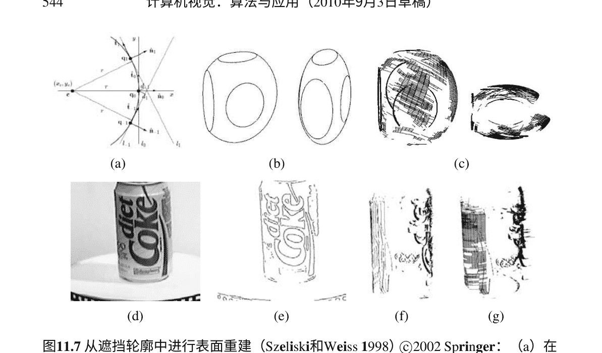

## 图11.7 从遮挡轮廓中进行表面重建（Szeliski和Weiss 1998）©2002 Springer：（a）在极线平面上进行圆弧拟合；（b）具有截断侧面和椭圆表面标记的椭球的合成示例；（c）从斜视和俯视角度看到的部分重建表面网格；（d）转盘上的苏打罐的真实图像序列；（e）提取的边缘；（f）部分重建的剖面曲线；（g）部分重建的表面网格。（为了不使图像混乱，只显示部分重建。）

从剖面曲线序列中推断相机运动。 下面，我们总结了Szeliski和Weiss（1998）提出的方法，该方法假设存在一组离散的图像，而不是在连续的微分框架中制定问题。

让我们假设相机移动得足够平滑，以至于局部极线几何变化缓慢，即连续相机中心和正在考虑的边缘下的极线平面几乎共面。处理流程中的第一步是提取并链接每个输入图像中的边缘（图11.7b和e）。接下来，使用成对的极线几何、接近性和（可选）外观来匹配连续图像中的边缘点。

这提供了一个在时空体积中连接的边集，有时被称为编织墙（Baker 1989）。

为了重建单个边缘的三维位置，以及其局部平面法线和曲率，我们将对应于其邻居的视线投影到由相机中心、视线和相机速度定义的瞬时对极平面上，如图11.7a所示。然后，我们将投影线拟合为渐近圆，进行参数化，通过其中心点 $c = (x_c, y_c)$ 和半径 $r$ 来描绘圆形，

$$c_i x_c + s_i y_c + r = d_i, \tag{11.5}$$

其中 $c_i = \hat{t}_i \cdot \hat{t}_0$ 和 $s_i = -\hat{t}_i \cdot \hat{n}_0$ 是视线$i$和中心视线0之间的角度的余弦和正弦， $d_i = (q_i - q_0) \cdot \hat{n}_0$ 是视线 $i$ 和局部原点 $q_0$ 之间的垂直距离，$q_0$ 是靠近线交点的中心视线上选择的一个点（Szeliski和Weiss 1998年）。可以使用最小二乘法解决得到的一组线性方程，并且解的质量（残差误差）可以用来检查错误的对应关系。

由于它们的空间（在图像中）和时间（在图像之间）邻居，得到的3D点集形成了一个具有局部法线和曲率估计的3D表面网格（图11.7c和g）。请注意，每当曲线是由于表面标记或尖锐折痕边缘而不是光滑表面的轮廓曲线时，这将显示为曲率半径为0或很小的情况。这样的曲线会导致孤立的3D空间曲线，而不是光滑表面网格的元素，但仍然可以在表面插值的后期阶段将其纳入3D表面模型中（第12.3.1节）。

### 11.3 密集对应

虽然稀疏匹配算法仍然偶尔被使用，但今天大多数立体匹配算法都专注于密集对应，因为这对于诸如基于图像的渲染或建模的应用是必需的。这个问题比稀疏对应更具挑战性，因为在无纹理区域推断深度值需要一定的猜测。（想象一下透过栅栏看到的纯色背景。它应该是什么深度？）

在本节中，我们首先回顾了由Scharstein和Szeliski（2002）首次提出的密集对应算法的分类和分类方案。这个分类包括一组算法的“构建块”，可以从中构建出大量的算法。它基于以下观察结果：立体匹配算法通常执行以下四个步骤的某个子集：

-   1. 匹配成本计算；
    2. 成本（支持）聚合；
    3. 视差计算和优化；以及
    4. 视差细化。

例如，局部（基于窗口）算法（第11.4节）在给定点的视差计算仅依赖于有限窗口内的强度值，通常通过聚合支持来隐含地做出平滑性假设。其中一些算法可以清晰地分解为步骤1、2、3。例如，传统的平方差和（SSD）算法可以描述为：

-   1. 匹配成本是给定视差处强度值的平方差。
    2. 聚合是通过对具有恒定视差的方形窗口上的匹配成本求和来完成的。
    3. 视差是通过选择每个像素点上最小（获胜）的聚合值来计算的。

然而，一些局部算法将步骤1和2结合起来，并使用基于支持区域的匹配成本，例如归一化互相关（Hannah 1974; Bolles, Baker, and Hannah 1993）和秩变换（Zabih and Woodfill 1994）以及其他序数测量（Bhat and Nayar 1998）。（这也可以视为预处理步骤；参见第11.3.1节。）另一方面，全局算法明确地做出平滑性假设，然后解决一个全局优化问题（第11.5节）。这类算法通常不执行聚合步骤，而是寻求最小化由数据（步骤1）项和平滑项组成的全局成本函数的视差分配（步骤3）。这些算法之间的主要区别在于所使用的最小化过程，例如模拟退火（Marroquin, Mitter, and Poggio 1987; Barnard 1989）、概率（均场）扩散（Scharstein and Szeliski 1998）、期望最大化（EM）（Birchfield, Natarajan, and Tomasi 2007）、图割（Boykov, Veksler, and Zabih 2001）或循环置信传播（Sun, Zheng, and Shum 2003），仅举几例。

在这两个广泛的类别之间，有一些迭代算法，它们没有明确地指定要最小化的全局函数，但其行为与迭代优化算法（Marr和Poggio 1976; Zitnick和Kanade 2000）非常相似。分层（粗到细）算法类似于这些迭代算法，但通常在图像金字塔上操作，其中来自较粗级别的结果用于约束更细级别的更局部的搜索（Witkin, Terzopoulos和Kass 1987; Quam 1984; Bergen, Anandan, Hanna et al. 1992）。

#### 11.3.1 相似度测量

任何密集立体匹配算法的第一个组成部分是相似度度量，它比较像素值以确定它们在对应关系中的可能性。在本节中，我们简要回顾了第8.1节中介绍的相似度度量，并提到了一些专门为立体匹配开发的算法（Scharstein和Szeliski，2002年；Hirschmüller和Scharstein，2009年）。

最常见的基于像素的匹配代价包括平方强度差异之和（SSD）（Hannah，1974年）和绝对强度差异（SAD）（Kanade，1994年）。在视频处理界，这些匹配准则被称为均方误差（MSE）和平均绝对差异（MAD）测量；位移帧差分（displaced frame difference）这个术语也经常被使用（Tekalp，1995年）。

最近，提出了鲁棒度量（8.2），包括截断二次函数和受污染的高斯函数（Black和Anandan，1996年；Black和Rangarajan，1996年；Scharstein和Szeliski，1998年）。这些度量很有用，因为它们限制了聚合过程中不匹配的影响。Vaish, Szeliski, Zitnick等人（2006年）比较了许多这样的鲁棒度量，包括一种基于像素值熵的新方法（Zitnick, Kang, Uyttendaele等人，2004年），在多视角立体匹配中特别有用。

其他传统的匹配成本包括归一化互相关（8.11）（Hannah 1974; Bolles, Baker, and Hannah 1993; Evangelidis and Psarakis 2008），它的行为类似于平方差和（SSD），以及二进制匹配成本（即匹配或不匹配）（Marr and Poggio 1976），基于二进制特征，如边缘（Baker and Binford 1981; Grimson 1985）或拉普拉斯的符号（Nishihara 1984）。由于它们的差异性差，简单的二进制匹配成本不再用于密集立体匹配。

一些成本对相机增益或偏差的差异不敏感，例如梯度-基于测量（Seitz 1989; Scharstein 1994），相位和滤波器响应（Marr and Poggio 1979; Kass 1988; Jenkin, Jepson, and Tsotsos 1991; Jones and Malik 1992），去除正常或鲁棒（双边滤波）均值的滤波器（Ansar, Castano, and Matthies 2004; Hirschmüller and Scharstein 2009），密集特征描述符（Tola, Lepetit, and Fua 2010），以及非参数测量，如秩和普查变换（Zabih and Woodfill 1994），序数测量（Bhat and Nayar 1998），或熵（Zitnick, Kang, Uyttendaele et al. 2004; Zitnick and Kang 2007）。普查变换将移动窗口内的每个像素转换为表示中心像素上方或下方邻居的位向量，Hirschmüller and Scharstein (2009) 发现它对大规模、非稳态曝光和照明变化非常稳健。

通过执行预处理或迭代细化步骤来估计图像间偏差-增益变化的全局回归（Gennert 1988）、直方图均衡化（Cox、Roy和Hingorani 1995）或互信息（Kim、Kolmogorov和Zabih 2003；Hirschmüller 2008）也可以纠正不同全局相机特性。还提出了局部、平滑变化的补偿场（Strecha、Tuytelaars和Van Gool 2003；Zhang、McMillan和Yu 2006）。

为了补偿采样问题，即高频区域中像素值差异巨大，Birchfield和Tomasi（1998）提出了一种匹配成本，对图像采样的偏移不敏感。他们不仅仅比较整数偏移的像素值（可能会错过有效匹配），还将参考图像中的每个像素与另一幅图像的线性插值函数进行比较。这些以及其他匹配成本的更详细研究在（Szeliski和Scharstein 2004；Hirschmüller和Scharstein 2009）中进行。特别是，如果您预计要匹配的图像之间存在显著的曝光或外观变化，那么应该使用一些在Hirschmüller和Scharstein（2009）的评估中表现良好的更健壮的度量方法，如普查变换（Zabih和Woodfill 1994）、序数度量（Bhat和Nayar 1998）、双边减法（Ansar、Castano和Matthies 2004）或分层互信息（Hirschmüller 2008）。

### 11.4 局部方法

本地和基于窗口的方法通过在DSI $C(x, y, d)$中对匹配成本进行求和或平均来聚合匹配成本。⁴支持区域可以是二维的（有利于正交表面），也可以是三维的（支持倾斜表面）。使用方形窗口或高斯卷积（传统方法），以不同点为锚点的多个可移动窗口（Arnold 1983; Fusiello, Roberto, and Trucco 1997; Bobick and Intille 1999），自适应大小的窗口（Okutomi and Kanade 1992; Kanade and Okutomi 1994; Kang, Szeliski, and Chai 2001; Veksler 2001, 2003），基于恒定视差的连通分量窗口（Boykov, Veksler, and Zabih 1998），或基于颜色分割的结果（Yoon and Kweon 2006; Tombari, Mattoccia, Di Stefano et al. 2008）已经实现了二维证据聚合。已经提出的三维支持函数包括有限视差差异（Grimson 1985），有限视差梯度（Pollard, Mayhew, and Frisby 1985），Prazdny的一致性原则（Prazdny 1985），以及Zitnick和Kanade（2000）的最新工作（包括可见性和遮挡推理）。可以使用二维或三维卷积来执行固定支持区域的聚合。

$$C(x, y, d) = w(x, y, d) * C_0(x, y, d), \tag{11.6}$$

或者，在矩形窗口的情况下，使用高效的移动平均盒子滤波器（第3.2.2节）（Kanade, Yoshida, Oda et al. 1996; Kimura, Shinbo, Yamaguchi et al. 1999）。可移动窗口也可以使用可分离的滑动最小滤波器（图11.8）（Scharstein和Szeliski 2002，第4.2节）进行高效实现。通过首先计算积分图来更高效地选择不同形状和大小的窗口。

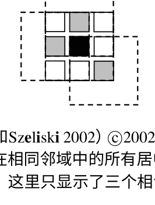

图11.8 可移动窗口 (Scharstein和Szeliski 2002) ©2002 Springer。尝试所有黑色像素周围的3×3移动窗口的效果与在相同邻域中的所有居中（非移动）窗口中取最小匹配分数相同。（为了清晰起见，这里只显示了三个相邻的移动窗口。）

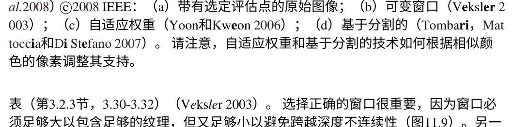

图11.9 根据图像内容调整的聚合窗口大小和权重 (Tombari, Mattoccia, Di Stefano et al. 2008) ©2008 IEEE: (a) 带有选定评估点的原始图像；(b) 可变窗口 (Veksler 2003)；(c) 自适应权重 (Yoon和Kweon 2006)；(d) 基于分割的 (Tombari, Mattoccia和Di Stefano 2007)。请注意，自适应权重和基于分割的技术如何根据相似颜色的像素调整其支持。

表（第3.2.3节，3.30-3.32）（Veksler 2003）。选择正确的窗口很重要，因为窗口必须足够大以包含足够的纹理，但又足够小以避免跨越深度不连续性（图11.9）。另一种聚合的方法是迭代扩散，即重复地将每个像素的成本与其相邻像素的成本的加权值相加（Szeliski和Hinton 1985；Shah 1993；Scharstein和Szeliski 1998）。

在Gong、Yang、Wang等人（2007）和Tombari、Mattoccia、Di Stefano等人（2008）比较的局部聚合方法中，Veksler（2003）的快速可变窗口方法和Yoon和Kweon（2006）开发的局部加权方法始终表现出最佳的性能和速度之间的平衡。特别是局部加权技术非常有趣，因为它不使用具有均匀加权的方形窗口，而是在聚合窗口内的每个像素都影响最终匹配结果，基于颜色相似性和空间距离的成本聚合，就像双线性滤波一样（图11.9c）。（实际上，他们的聚合步骤与在颜色/视差图像上进行联合双边滤波密切相关，只是在参考和目标图像中都对称地进行。）Tombari、Mattoccia和Di Stefano的基于分割的聚合方法（2007）效果更好，尽管尚未存在这种算法的快速实现。

在局部方法中，重点是匹配成本计算和成本聚合步骤。计算最终视差很简单：只需在每个像素处选择与最小成本值相关联的视差。因此，这些方法在每个像素处执行局部的“赢家-通吃”（WTA）优化。这种方法（以及许多其他对应算法）的局限性在于，只有一个图像（参考图像）强制执行匹配的唯一性，而另一个图像中的点可能与多个点匹配，除非使用交叉检查和后续的空洞填充（Fua 1993; Hirschmüller和Scharstein 2009）。

#### 11.4.1 亚像素估计和不确定性

大多数立体匹配算法在某个离散化空间中计算一组视差估计，例如对于整数视差（例外包括连续优化技术，如光流（Bergen, Anandan, Hanna等, 1992）或样条（Szeliski和Coughlan, 1997））。对于机器人导航或人物跟踪等应用来说，这些估计可能是完全足够的。然而，对于基于图像的渲染，这种量化的映射会导致非常不吸引人的视图合成结果，即场景看起来由许多薄的剪切层组成。为了解决这个问题，许多算法在初始离散对应阶段之后应用亚像素细化阶段。（另一种选择是从更多的离散视差级别开始（Szeliski和Scharstein，2004）。）

亚像素视差估计可以通过多种方式计算，包括迭代梯度下降和拟合曲线到离散视差级别上的匹配成本（Ryan, Gray和Hunt, 1980; Lucas和Kanade, 1981; Tian和Huhns, 1986; Matthies, Kanade和Szeliski, 1989; Kanade和Okutomi, 1994）。这提供了一种简单的方法来增加立体算法的分辨率，而几乎不需要额外的计算。然而，为了能够良好地工作，被匹配的强度必须变化平滑，并且计算这些估计的区域必须在同一个（正确的）表面上。

最近，关于将相关曲线拟合到整数采样的匹配成本的可行性的问题已经被提出（Shimizu和Okutomi 2001）。当使用不受采样影响的差异度量时，情况可能会更糟（Birchfield和Tomasi 1998）。Szeliski和Scharstein（2004）更深入地探讨了这些问题。除了亚像素计算之外，还有其他方法来后处理计算得到的视差。可以使用交叉检查来检测遮挡区域，即比较从左到右和从右到左的视差图（Fua 1993）。可以应用中值滤波器来清除杂乱的不匹配，并且由于遮挡而产生的空洞可以通过曲面拟合或者分布邻近视差估计（Birchfield和Tomasi 1999; Scharstein 1999; Hirschmuller和Scharstein 2009）来填充。

另一种后处理方法是将置信度与每个像素的深度估计关联起来（图11.10），这可以通过观察相关曲面的曲率来实现，即DSI图像中最小值的强度。Matthies、Kanade和Szeliski（1989）证明，在小噪声、光度校准图像和密集采样视差的假设下，可以估计局部深度估计的方差。

$$Var(d) = \frac{\sigma_I^2}{a}, \quad (11.7)$$

其中a是DSI的曲率作为d的函数，可以使用局部抛物线拟合或通过对窗口中的所有水平梯度进行平方来测量，$\sigma_I^2$是图像噪声的方差，可以从最小SSD分数估计得到。（另请参见第6.1.4节，（8.44）和附录B.6。）

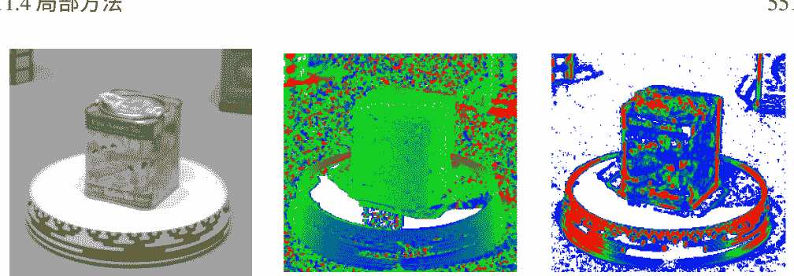

图11.10 立体深度估计的不确定性（Szeliski 1991b）：（a）输入图像；（b）估计的深度图（蓝色更近）；（c）估计的置信度（红色更高）。正如你所看到的，纹理更丰富的区域具有更高的置信度。

### 11.4.2 应用 ：基于立体的头部跟踪

实时立体算法的常见应用是跟踪用户与计算机或游戏系统的位置。与使用单眼色彩和强度信息相比，立体视觉可以显著提高这种系统的可靠性。一旦恢复，这些信息可以用于各种应用，包括控制虚拟环境或游戏。

在视频会议期间纠正视线，以及背景替换。我们在下面讨论前两个应用，并将背景替换的讨论推迟到第11.5.3节。

在计算机显示器上观看3D物体或环境时，使用头部跟踪来控制用户的虚拟视点有时被称为“鱼缸虚拟现实”，因为用户观察的是一个仿佛被包含在鱼缸内的3D世界。这些系统的早期版本使用机械式头部跟踪设备和立体眼镜。如今，这种系统可以通过基于立体视觉的头部跟踪来控制，而立体眼镜可以被自动立体显示器取代。头部跟踪还可以用于构建“虚拟镜子”，可以实时修改用户的头部并应用各种视觉效果。

立体头部追踪和3D重建的另一个应用是凝视校正（Ott，Lewis和Cox 1993）。当用户参与桌面视频会议或视频聊天时，摄像头通常放置在显示器的顶部。由于用户凝视屏幕上的某个窗口，他们看起来好像在向下看，而不是直接看着其他参与者。用两个或更多摄像头替换单个摄像头可以在他们注视的位置构建一个虚拟视图从而实现虚拟眼神交流。实时立体匹配用于构建准确的3D头部模型，视图插值（第13.1节）用于合成新颖的中间视图（Criminisi，Shotton，Blake等人2003）。

### 11.5 全局优化

全局立体匹配方法在视差计算阶段之后执行一些优化或迭代步骤，通常完全跳过聚合步骤，因为全局平滑性约束起到了类似的作用。许多全局方法都是在能量最小化框架中进行的，正如我们在3.7节（3.100-3.102）和8.4节中所看到的目标是找到一个最小化全局能量的解 d

```
$$E(d) = E_d(d) + \lambda E_s(d). \quad (11.8)$$
```

数据项，E_d(d)，衡量了视差函数 d 与输入图像对的匹配程度。利用我们之前定义的视差空间图像，我们将其定义为能量

```
$$E_d(d) = \sum_{(x,y)} C(x, y, d(x, y)), \quad (11.9)$$
```

其中 C 是（初始或聚合的）匹配成本DSI。

平滑项 E_s(d) 编码了算法所做的平滑假设。

为了使优化在计算上可行，平滑项通常受到限制。

只测量相邻像素视差之间的差异，

```
$$E_s(d) = \sum_{(x,y)} \rho(d(x,y) - d(x+1, y)) + \rho(d(x,y) - d(x, y+1))$$
```

其中 $\rho$ 是一些单调递增的视差差异函数。也可以使用更大的邻域，例如 $\mathcal{N}_8$，这可以导致更好的边界（Boykov和Kolmogorov 2003），或者使用二阶平滑项（Woodford, Reid, Torr et al. 2008），但这些项需要更复杂的优化技术。平滑度函数的替代方法是使用低维表示，例如样条曲线（Szeliski and Coughlan 1997）。

在标准正则化（第3.7.1节）中，$\rho$ 是一个二次函数，这使得 $d$ 处处平滑，并可能导致在物体边界处结果不佳。不具有这个问题的能量函数被称为保持不连续性的，并且基于鲁棒的 $\rho$ 函数（Terzopoulos 1986b; Black and Rangarajan 1996）。Geman和Geman（1984）的开创性论文给出了这类能量函数的贝叶斯解释，并提出了基于马尔可夫随机场（MRFs）和附加 line processes 的保持不连续性的能量函数，这些附加的二进制变量控制是否强制执行平滑度惩罚。Black和Rangarajan（1996）展示了如何用鲁棒的成对视差项替换独立的线程过程变量。

$E_s$中的项也可以依赖于强度差异，例如，

```
$$\rho_d(d(x,y) - d(x+1, y)) \cdot \rho_I(||I(x,y) - I(x+1, y)||)$$
```

其中 $\rho_I$ 是某种随着强度差异降低而降低平滑度成本的单调递减函数。这个想法（Gamble和Poggio 1987; Fua 1993; Bobick和Intille 1999; Boykov, Veksler和Zabih 2001）鼓励视差不连续性与强度或颜色边缘相一致，并且似乎解释了一些全局优化方法的良好性能。尽管大多数研究人员根据经验设置这些函数，但Scharstein和Pal（2007）展示了如何从地面实况视差图中学习这种条件随机场（第3.7.2节，（3.118））中的自由参数。

一旦全局能量被定义，可以使用各种算法来找到一个（局部）最小值。与正则化和马尔可夫随机场相关的传统方法包括连续化（Blake和Zisserman 1987），模拟退火（Geman和Geman 1984; Marroquin, Mitter和Poggio 1987; Barnard 1989），最高置信度优先（Chou和Brown 1990），以及均值场退火（Geiger和Girosi 1991）。

最近，最大流和图割方法已被提出来解决一类特殊的全局优化问题（Roy和Cox 1998; Boykov, Veksler和Zabih 2001; Ishikawa 2003）。这些方法比模拟退火更高效，并且已经产生了良好的结果，基于循环信念传播的技术也是如此（Sun, Zheng和Shum 2003年；Tappen和Freeman 2003年）。附录B.5和最近的一篇关于MRF推理的调查论文（Szeliski, Zabih, Scharsteinet al.2008）详细讨论和比较了这些技术。

虽然全局优化技术目前产生了最好的立体匹配结果，但还有一些值得研究的替代方法。

合作算法。合作算法，受到人类立体视觉的计算模型的启发，是最早提出的视差计算方法之一（Dev1974年；Marr和Poggio 1976年；Marroquin 1983年；Szeliski和Hint on 1985年；Zitnick和Kanade2000年）。.这些算法使用非线性操作迭代更新视差估计，从而产生与全局优化算法类似的整体行为。实际上，对于其中一些算法，可以明确地说明正在最小化的全局函数（Scharstein和Szeliski 1998年）。

粗到细和增量变形。今天大多数最好的算法首先枚举所有可能的匹配和所有可能的视差，然后以某种方式选择最佳匹配集。有时可以使用受经典（无穷小）光流计算启发的方法来获得更快的方法。.在这里，图像被连续变形，视差估计被逐步更新，直到达到满意的注册。这些技术通常在粗到细的层次化细化框架中实现（Quam 1984; Bergen, Anandan, Hannaet al.1992; Barron, Fleet, and Beauchemin 1994; Szeliskiland Co ughlan 1997）。

#### 11.5.1 动态规划

另一类全局优化算法基于动态规划。尽管对于常见的光滑函数类别，二维优化方程（11.8）的求解被证明是NP难问题（Veksler 1999），但动态规划可以在多项式时间内找到独立扫描线的全局最小值。动态规划首次用于稀疏、基于边缘的立体视觉方法（Baker and Binford 1981; Ohta and Kanade1985）。最近的方法更加关注密集（基于强度）的扫描线匹配问题（Belhumeur 1996; Geiger, Ladendorf, and Yuille 1992; Cox, Hingorani, Rao etal.1996; Bobick and Intille 1999; Birchfield and Tomasi 1999）。这些方法通过计算两个相应扫描线之间所有成对匹配成本的矩阵的最小成本路径来工作，即通过DSI的水平切片。部分遮挡通过将一个图像中的一组像素分配给另一个图像中的单个像素来明确处理。图11.11以示例方式显示了动态规划的工作原理，而图11.5f显示了应用动态规划的DSI切片的实际情况。

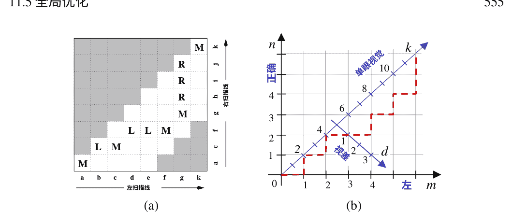

图11.11 使用动态规划进行立体匹配，如(a) Scharstein和Szeliski (2002)©2002 Springer 和 (b) Kolmogorov, Criminisi, Blakeet al.(2006).©2006 IEEE. 对于每一对对应的扫描线，选择一条最小化路径通过所有成对匹配成本的矩阵(DSI)。小写字母(a–k)表示每条扫描线上的强度。大写字母表示通过矩阵的选定路径。

匹配点由M表示，而部分遮挡的点（具有固定成本）由L或R表示，分别对应于仅在左图像或右图像中可见的点。通常，只考虑有限的视差范围（图中的0-4，由非阴影方块表示）。（a）中的表示允许对角线移动，而（b）中的表示不允许。请注意，这些图表使用了深度的Cyclopean表示，即相对于两个输入相机之间的相机深度，显示了一个“未扭曲”的x-dslice通过DSI。

为了实现对于扫描线 $y$ 的动态规划，通过组合DSI值计算2D成本矩阵 $D(m, n)$ 中的每个条目（状态）。 $C'(m, n) = C(m + n, m - n, y)$ (11.12)

与其前身的成本值之一。使用图11.11a中所示的表示方法，允许“对角线”移动，可以递归地计算聚合匹配成本为 $$ \begin{aligned} D(m, n, M) &= \min(D(m-1, n-1, M), D(m-1, n, L), D(m-1, n-1, R)) + C'(m, n) \\ D(m, n, L) &= \min(D(m-1, n-1, M), D(m-1, n, L)) + O \\ D(m, n, R) &= \min(D(m, n-1, M), D(m, n-1, R)) + O, \end{aligned} $$ (11.13)

其中 $O$ 是每个像素的遮挡成本。与图11.11b相对应的聚合规则由Kolmogorov、Criminisi、Blake等人（2006年）给出，他们还使用了一个双层分割的前景-背景模型。

动态规划立体匹配存在的问题包括选择遮挡像素的正确成本和强制实施扫描线间的一致性的困难，尽管有几种方法提出了解决后者的方法（Ohta和Kanade 1985；Bel humeur 1996；Cox、Hingorani、Rao等人1996；Bobick和Intille 1999；Birchfield和To masi 1999；Kolmogorov、Criminisi、Blake等人2006）。另一个问题是动态规划方法需要强制实施单调性或排序约束（Yuille和Poggio 1984）。这个约束要求扫描线上像素的相对顺序在两个视图之间保持一致，而在包含狭窄前景物体的场景中可能不是这样。

Scharstein和Szeliski（2002）提出了一种替代传统动态规划的方法，即在（11.10）中忽略垂直平滑约束，只需在全局能量函数（11.8）中对独立的扫描线进行优化，这可以通过递归算法轻松实现。

D (x, y, d) = C (x, y, d) + 最小值{D (x – 1, y, d′) + ρ_d (d – d′) }。 (11.14)

这种扫描线优化算法的优点是它计算相同的表示，并最小化与完整的2D能量函数（11.8）相同的能量函数的简化版本。不幸的是，它仍然会出现与动态规划相同的条纹伪影问题。

一种更好的方法是从多个方向（如八个基本方向N、E、W、S、NE、SE、SW、NW）评估累积成本函数（11.14）（Hirschm¨uller 2008）。由此产生的半全局优化效果非常好，并且非常高效易于实现。

尽管动态规划和扫描线优化算法通常不能产生最准确的立体重建结果，但当与复杂的聚合策略结合使用时，它们可以产生非常快速和高质量的结果。

#### 11.5.2 基于分割的技术

虽然大多数立体匹配算法是基于像素的计算，但一些较新的技术首先将图像分割成区域，然后尝试为每个区域标记视差。

例如，Tao、Sawhney和Kumar（2001）对参考图像进行分割，使用局部技术估计每个像素的视差，然后在每个分割内进行局部平面拟合，最后在相邻分割之间应用平滑约束。Zitnick、Kang、Uyt-tendaele等人（2004）和Zitnick和Kang（2007）使用过分割来减轻初始的错误分割。在每个分割中存储了一组初始代价值之后

一个视差空间分布（DSD）中，通过迭代松弛（或循环置信传播，在

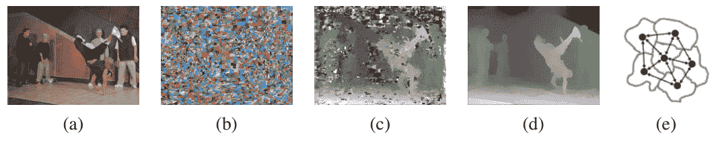

图11.12 基于分割的立体匹配（Zitnick，Kang，Uyttendaele等人2004年） 2004年ACM: (a) 输入彩色图像; (b) 基于颜色的分割; (c) 初始视差估计; (d) 最终分段平滑的视差; (e) 在视差空间分布中定义的MRF邻域 (Zitnick和Kang 2007年) ©2007年Springer。

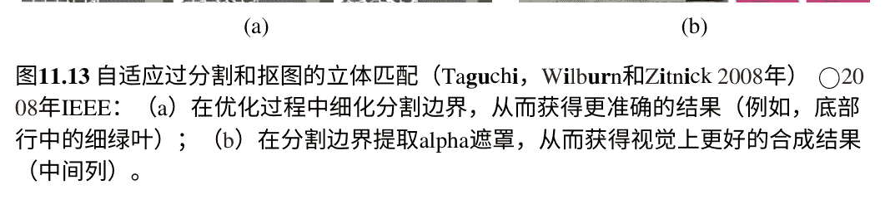

图11.13 自适应过分割和抠图的立体匹配（Taguchi，Wilburn和Zitnick 2008年） 2008年IEEE: (a) 在优化过程中细化分割边界，从而获得更准确的结果（例如，底部行中的细绿叶）；(b) 在分割边界提取alpha遮罩，从而获得视觉上更好的合成结果（中间列）。

Zitnick和Kang（2007）的更多最新工作）用于调整每个段的视差估计，如图11.12所示。Taguchi，Wilburn和Zitnick（2008）在优化过程中改进了段的形状，从而得到了大大改善的结果，如图11.13所示。

Klaus，Sormann和Karner（2006）通过使用均值漂移对参考图像进行分割，运行一个小的（3 × 3）SAD加梯度SAD（通过交叉检查加权）来获得初始视差估计，拟合局部平面，再用全局平面重新拟合，然后在平面分配上运行最终的MRF与循环置信传播。

当该算法在2006年首次引入时，它是http://vision.middlebury.edu/stereo评估网站上排名最高的算法；在2010年初，它仍然是新评估数据集上的排名第一。

最高排名的算法，由王和郑（2008）提出，采用类似的方法对图像进行分割，进行局部平面拟合，然后进行合作优化

相邻平面拟合参数的另一个高排名的算法，由杨，王，杨等人（2009）提出，采用了Yoon和Kweon（2006）的颜色相关方法和分层信念传播来获得初始的视差估计集合。在进行左右一致性检查以检测遮挡像素之后，使用基于分割的平面拟合和一轮或多轮分层信念传播重新计算低置信度和遮挡像素的数据项，以获得最终的视差估计。

基于分割的立体算法的另一个重要能力，与使用显式层（Baker, Szeliski和Anandan 1998; Szeliski和Golland 1999）或边界提取（Hasinoff, Kang和Szeliski 2006）的算法共享的能力是在深度不连续处提取分数像素的alpha遮罩（Bleyer, Gelautz, Rother等人2009）。当尝试创建虚拟视图插值而不粘连边界或撕裂伪影（Zitnick, Kang, Uyttendaeleet al. 2004）以及无缝插入虚拟对象（Taguchi, Wilburn和Zitnick 2008）时，这种能力至关重要，如图11.13b所示。由于每年都会引入新的立体匹配算法，定期检查Middlebury评估网站http://vision.middlebury.edu/stereo以获取最新的算法列表是一个好主意。

## 11.5.3 应用：Z键和背景替换

实时立体匹配的另一个应用是深度信息分割前景演员与背景，通常用于将背景替换为一些计算机生成的图像，如图11.2g所示。

最初，z-keying系统需要昂贵的定制硬件以实时生成所需的深度图，并因此仅限于广播工作室应用（Kanade, Yoshida, Odaet al.1996; Iddan和Yahav 2001）。还开发了离线系统，用于从视频流中估计3D多视点几何（第13.5.4节）（Kanade, Rander和Narayanan 1997; Carranza, Theobalt, Magnoret al.2003; Zitnick, Kang, Uyttendaeleet al. 2004; Vedula, Baker和Kanade 2005）。然而，最近高度准确的实时立体匹配的进展使得在普通PC上执行z-keying成为可能，从而实现了桌面视频会议应用，如图11.14所示（Kolmogorov, Criminisi, Blakeet al.2006）。

### 11.6 多视图立体

虽然匹配图像对是获取深度信息的一种有用方法，但匹配更多图像可以获得更好的结果。在本节中，我们不仅回顾了技术，还介绍了改进深度图质量的简单技术。

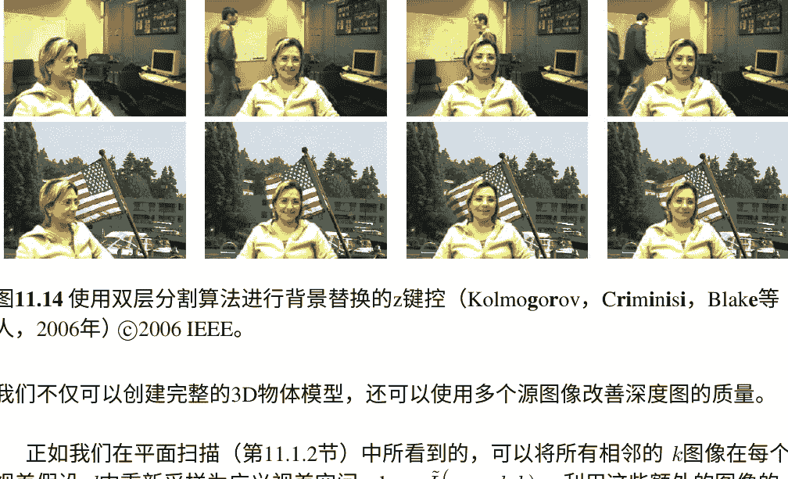

图11.14使用双层分割算法进行背景替换的z键控（Kolmogorov， Criminisi， Blake等人， 2006年）©2006 IEEE。

我们不仅可以创建完整的3D物体模型，还可以使用多个源图像改善深度图的质量。

正如我们在平面扫描（第11.1.2节）中所看到的，可以将所有相邻的 \(k\) 图像在每个视差假设 \(d\) 中重新采样为广义视差空间volume \(\tilde{I}(x, y, d, k)\)。利用这些额外的图像的最简单方法是将它们与参考图像 \(I_r\) 的差异相加，如（11.4）中所示，

```
\[C(x, y, d) = \sum_{k} \rho(\tilde{I}(x, y, d, k) - I_r(x, y)). \quad (11.15)\]
```

这是众所周知的求和平方差（SSSD）和SSAD方法的基础（Okutomi和Kanade 1993; Kang, Webb, Zitnick et al.1995），可以扩展到推断遮挡的可能模式（Nakamura, Matsuyama, Sato et al.1996）。

Gallup, Frahm, Mordohai et al.（2008）的最新工作展示了如何根据预期深度调整基线，以在几何精度（宽基线）和遮挡鲁棒性（窄基线）之间取得最佳平衡。替代的多视图成本度量包括合成焦点清晰度和像素颜色熵的测量（Vaish, Szeliski, Zitnick et al.2006）。

一种有用的方法是通过查看由所有图像的对应扫描线堆叠形成的极线平面图（EPI）来可视化多帧立体估计问题，如图8.13c和11.15所示（Bolles, Baker和Marimont 1987; Baker和Bolles1989; Baker 1989）。如图11.15所示，在水平平移摄像机时（在标准的水平矫正几何中），不同深度的物体以与其深度成反比的速度向侧面移动（11.1）。⁶前景物体遮挡背景物体，可以看作是EPI条带（Criminisi, Kang, Swaminathan et al.2005）遮挡其他物体。

在EPI中的条带。如果我们有足够密集的图像集，我们可以找到这样的条带，并推理出它们之间的关系，以便重建3D场景并推断出关于半透明物体（Tsin，Kang和Szeliski 2006）和镜面反射（Swaminathan，Kang，Szeliski等人2002；Criminisi，Kang，Swaminathan等人2005）的信息。或者，我们可以将一系列图像视为一组顺序观测，并使用卡尔曼滤波（Matthies，Kanade和Szeliski 1989）或最大似然推断（Cox 1994）将它们合并。

当可用的图像较少时，必须退回到滑动窗口或全局优化等聚合技术。然而，随着额外的输入图像，遮挡的可能性增加。因此，不仅要使用可移动窗口方法调整最佳窗口位置，如图11.16a所示，还要选择一组相邻帧的子集，以排除那些感兴趣区域被遮挡的图像，如图11.16b所示（Kang，Szeliski和Chai 2001）。

图11.16 时空可移动窗口（Kang，Szeliski和Chai 2001）© 2001IEEE：一个简单的三帧序列（中间帧是参考图像），其中有一个移动的前方灰色方块（标记为F）和一个静止的背景。区域B，C，D和E部分被遮挡。（a）在这些区域中匹配像素时，常规SSD算法会出错（例如，在区域B中以黑色像素为中心的窗口）以及在跨越深度不连续性的窗口中（在区域F中以白色像素为中心的窗口）。（b）可移动窗口有助于减轻部分遮挡区域和接近深度不连续性的问题。在区域F中以白色像素为中心的移动窗口在所有帧中都正确匹配。在区域B中以黑色像素为中心的移动窗口在左图像中正确匹配，但需要时间选择来禁用右图像的匹配。

图11.15b显示了与该序列对应的EPI，并更详细地描述了时间选择的工作原理。

图11.15b显示了这种时空选择或窗口移动如何对应于在极线平面图像体积中选择最可能的非遮挡体积区域。

将这些技术应用于多帧花园图像序列的结果显示在图11.17中，该图比较了使用常规（非移动）SSD与空间移动窗口和完整时空窗口选择的结果。（将立体视觉应用于由移动相机拍摄的刚性场景的任务有时被称为运动立体视觉）。（Kang和Szeliski 2004）报告了使用时空选择的类似改进，并且即使将局部测量与全局优化相结合，这些改进也是明显的。

尽管从多个输入计算深度图优于成对立体匹配，但通过同时估计多个深度图可以获得更显著的改进（Szeliski 1999；Kang和Szeliski 2004）。多个深度图的存在使得关于遮挡的推理更加准确，因为在一幅图像中被遮挡的区域可能在其他图像中是可见的（并且可以匹配）。多视图重建问题可以被表述为在关键帧（图8.13c）上同时估计深度图，同时最大化光照一致性、分段视差平滑性以及不同帧之间视差估计的一致性。尽管Szeliski（1999）和Kang Szeliski (2004) 使用软（基于惩罚）约束来鼓励多个视差图保持一致，Kolmogorov和Zabih (2002) 展示了这种一致性度量如何被编码为硬约束，这保证了多个深度图在重叠区域不仅相似而且实际上是相同的。同时估计多个视差图的新算法包括Maitre，Shinagawa和Do (2008) 以及Zhang，Jia，Wong等人 (2008) 的论文。

多帧立体估计的一个密切相关的主题是场景流，在其中使用多个摄像机捕捉动态场景。任务是同时恢复物体在每个瞬间的3D形状，并估计帧之间每个表面点的完整3D运动。这个领域的代表性论文包括Vedula、Baker、Rander等人的论文(2005年)，Zhang和Kambhamettu的论文(2003年)，Pons、Keriven和Faugeras的论文(2007年)，Huguet和Devernay的论文(2007年)，以及Wedel、Rabe、Vaudrey等人的论文(2008年)。图11.18a展示了图11.2h-j中的探戈舞者的3D场景流图像，而图11.18b展示了为了避免障碍物而从移动车辆捕捉到的3D场景流。除了支持测量和安全应用外，场景流还可以用于支持空间和时间视图插值(第13.5.4节)，正如Vedula、Baker和Kanade(2005年)所演示的那样。

#### 11.6.1 体素和3D表面重建

根据Seitz, Curless, Diebel等人 (2006年)：

> 多视角立体视觉的目标是从已知相机视点拍摄的图像集合中重建完整的三维物体模型。

多视角立体视觉重建中最具挑战性但潜力最大的变体是创建全局一致的三维模型。这个主题在计算机视觉领域有着悠久的历史，从表面网格重建技术开始，比如由Fua和Leclerc(1995年)开发的技术(图11.19a)。解决这个问题使用了各种方法和表示方法，包括3D体素表示(Seitz和Dyer, 1999年; Szeliski和Golland, 1999年; De Bonet和Viola, 1999年; Kutulakos和Seitz, 2000年; Eisert, Steinbach和Girod, 2000年; Slabaugh, Culbertson, Slabaugh等人, 2004年; Sinha和Pollefeys, 2005年; Vogiatzis, Hernandez, Torr等人, 2007年; Hiep, Keriven, Pons等人, 2009年), 水平集(Faugeras和Keriven, 1998年; Pons, Keriven和Faugeras, 2007年), 多边形网格(Fua和Leclerc 1995年; Narayanan, Rander和Kanade, 1998年; Hernandez和Schmitt, 2004年; Furukawa和Ponce, 2009年), 以及多个深度图(Kolmogorov和Zabih, 2002年)。图11.19显示了使用这些技术重建的3D物体模型的代表性示例。

为了组织和比较所有这些技术，Seitz、Curless、Diebel等人（2006年）开发了一个六点分类法，可以根据场景表示、照片一致性测量、可见性模型、形状先验、重建算法和初始化要求来分类算法。下面，我们总结了其中一些选择，并列出了一些代表性的论文。更多详细信息，请参阅完整的调查论文（Seitz、Curless、Diebel等人，2006年）和评估网站http://vision.middlebury.edu/mview/，该网站包含了指向更多最新论文和结果的链接。

### 场景表示。

更受欢迎的3D表示之一是均匀的3D体素网格，可以使用各种雕刻（Seitz和Dyer 1999; Kutulakos和Seitz 2000）或优化（Sinha和Pollefeys 2005; Vogiatzis、Hernandez、Torr等人2007; Hiep、Keriven、Pons等人2009）技术进行重建。水平集技术（第5.1.4节）也在均匀网格上操作，但是，它们不是表示二进制占用图，而是表示到表面的有符号距离（Faugeras和Keriven 1998; Pons、Keriven和Faugeras 2007），可以编码更细节的级别。多边形网格是另一种流行的表示方法，可以方便地支持可见性和遮挡的计算。最后，正如我们在前一节中讨论的那样，还可以使用多个深度图（Szeliski 1999; Kolmogorov和Zabih 2002; Kang和Szeliski 2004）。许多算法还使用多个表示方法，例如，它们可以先计算多个深度图，然后将它们合并成一个3D对象模型（Narayanan，Rander和Kanade 1998; Furukawa和Ponce 2009; Goesele，Curless和Seitz 2006; Goesele，Snavely，Curless et al.2007; Furukawa，Curless，Seitz et al.2010）。

7对于无限远的户外场景，空间的非均匀网格可能更可取（Slabaugh，Culbertson，Slabaugh等，2004年）。

图11.19多视图立体算法： (a) 基于表面的立体匹配（Fua和Leclerc，1995年）; (b) 体素着色（Seitz和Dyer，1999年）©1999年Springer; (c) 深度图合并（Narayanan，Rander和Kanade，1998年）; (d) 水平集演化（Faugeras和Keriven，1998年）©1998年IEEE; (e) 轮廓和立体融合（Hernandez和Schmitt，2004年）©2004年Elsevier; (f) 多视图图像匹配（Pons，Keriven和Faugeras，2005年）©2005年IEEE; (g) 体积图割（Vogiatzis，Torr和Cipolla，2005年）©2005年IEEE; (h) 雕刻的视觉外壳（Furukawa和Ponce，2009年）©2009年Springer。

特征表示（Fua和Leclerc 1995; Narayanan，Rander和Kanade 1998; Isidoro和Sclaroff 2003; Hernandez和Schmitt 2004; Furukawa和Ponce 2009; Hiep，Keriven，Pons et al.2009)。网格是计算机图形学中使用的标准表示方法，也可以方便地支持可见性和遮挡的计算。最后，正如我们在前一节中讨论的那样，还可以使用多个深度图（Szeliski 1999; Kolmogorov和Zabih 2002; Kang和Szeliski 2004）。许多算法还使用多个表示方法，例如，它们可以先计算多个深度图，然后将它们合并成一个3D对象模型（Narayanan，Rander和Kanade 1998; Furukawa和Ponce 2009; Goesele，Curless和Seitz 2006; Goesele，Snavely，Curless et al.2007; Furukawa，Curless，Seitz et al.2010）。

### 光度一致性测量。

正如我们在（第11.3.1节）中讨论的，可以使用各种相似度测量方法来比较不同图像中的像素值，包括试图消除光照效果或对异常值不敏感的测量方法。在多视图立体视觉中，算法可以选择直接在模型的表面上计算这些测量值，即在场景空间中，或者将像素值从一幅图像（或纹理模型）投影回另一幅图像，即在图像空间中。（后者更接近贝叶斯方法，因为输入图像是有噪声的彩色3D模型的测量值。）当对象的几何形状，即与每个相机的距离和局部表面法线，可用时，可以使用它们来调整计算中使用的匹配窗口，以考虑透视变形和尺度变化（Goesele, Snavely, Curless et al. 2007）。

### 可见性模型。

多视角立体匹配算法相对于单深度图方法的一个重要优势是能够以原则性的方式推理可见性和遮挡。使用当前3D模型状态来预测每个图像中可见的表面像素的技术（Kutulakos和Seitz 2000; Faugeras和Keriven 1998; Vogiatzis, Hernandez, Torr等2007; Hiep, Keriven, Pons等2009）被归类为使用几何可见性模型（Seitz, Curless, Diebel等2006）的分类。选择匹配的邻近图像子集的技术被称为准几何技术（Narayanan, Rander和Kanade 1998; Kang和Szeliski 2004; Hernandez和Schmitt 2004），而使用传统鲁棒相似度度量的技术被称为基于异常值的技术。虽然完全的几何推理是最原则和准确的方法，但评估速度很慢，并且依赖于当前表面估计质量的演变来预测可见性，这可能是一个鸡生蛋的问题，除非使用保守的假设，就像Kutulakos和Seitz（2000）所使用的那样。

### 形状先验。

由于立体匹配通常是不完全约束的，特别是在无纹理区域，大多数匹配算法采用（明确或隐式地）某种形状的先验模型。许多依赖优化的技术使用3D平滑性或基于区域的光强一致性约束，由于光滑表面向内收缩的自然倾向，通常会导致最小曲面先验（Faugeras和Keriven 1998; Sinha和Pollefeys 2005; Vogiatzis, Hernandez, Torr等人2007）。在空间中雕刻体积的方法通常在找到一致性解后停止（Seitz和Dyer 1999; Kutulakos和Seitz 2000），这对应于最大曲面偏差，即这些技术往往会高估真实形状。最后，多个深度图方法通常采用传统的基于图像的平滑性（正则化）约束。

### 重建算法。

实际重建算法的细节是多视图立体算法中最多样化和最具创新性的地方，可以找到。一些方法使用全局优化来恢复完整的表面，该优化定义在三维光照一致性体上。基于图割的方法使用多项式复杂度的二进制分割算法来恢复定义在体素网格上的对象模型（Sinha和Pollefeys 2005；Vogiatzis，Hernandez，Torr et al.2007；Hiep，Keriven，Pons et al.2009）。水平集方法使用连续的表面演化来找到潜在表面的良好最小值，因此需要合理的初始化（Faugeras和Keriven 1998；Pons，Keriven和Faugeras 2007）。为了使光照一致性体有意义，需要以某种鲁棒的方式计算匹配成本，例如使用有限视图集或聚合多个深度图。

一种替代的全局优化方法是在计算光照一致性和可见性的同时，通过3D体积进行扫描。Seitz和Dyer（1999）的体素着色算法执行前向后向平面扫描。在每个平面上，任何足够光照一致的体素都被标记为对象的一部分。源图像中的相应像素可以被“擦除”，因为它们已经被考虑在内，因此不会对进一步的光照一致性计算产生影响。（Szeliski和Golland（1999）也使用了类似的方法，尽管没有前向后向扫描顺序。）在无噪声和重采样的条件下，得到的3D体积保证产生一个光照一致的3D模型，并包围生成图像的真实3D对象模型。

不幸的是，体素着色只有在所有相机都位于扫描平面的同一侧时才能保证工作，这在一般的环形相机配置中是不可能的。Kutulakos和Seitz（2000）将体素着色推广到空间雕刻，其中迭代地选择满足体素着色约束的相机子集，并沿不同轴交替雕刻3D体素网格。

多视图立体匹配的另一种流行方法是首先独立计算多个深度图，然后将这些部分图合并成完整的3D模型。深度图合并的方法在第12.2.1节中有更详细的讨论，包括由Goesele、Curless和Seitz（2006）使用的符号距离函数（Curless and Levoy 1996）以及由Goesele、Snavely、Curless等人使用的Poisson表面重建方法（Kazhdan，Bolitho，and Hoppe 2006）（2007）。还可以重建稀疏表示，如3D点和线，并将其插值为完整的3D表面（第12.3.1节）（Taylor 2003）。

### 初始化要求。

Seitz，Curless，Diebel等人（2006）讨论的最后一个要素是不同算法所需的不同程度的初始化。因为一些算法会改进或演化一个粗糙的3D模型，所以它们需要一个相当准确（或过度完整）的初始模型，这通常可以通过从对象重建一个体积来获得。如第11.6.2节所讨论的，如果算法执行全局优化（Kolev，Klodt，Brox等人2009；Kolev和Cremers 2009），那么对初始化的依赖就不是一个问题。

### 经验评估。

为了评估多视角立体的大量设计选择，Seitz，Curless，Diebel等人（2006）使用球形支架收集了一组校准图像数据集。图11.20显示了六个数据集中的每个代表性图像，尽管目前只有前两个数据集已经完全处理和用于评估。图11.21显示了在示例数据集上运行七种不同算法的结果。正如您所看到的，大多数技术在捕捉柱子的细节方面做得很出色，尽管很明显，这些技术在实现这些结果时采用了不同程度的平滑处理。

自从Seitz，Curless，Diebel等人（2006）的调查报告发表以来，多视角立体领域以快速的速度不断发展（Strecha，Fransens和Van Gool 2006；Hernandez，Vogiatzis和Cipolla 2007；Habbecke和Kobbelt 2007；Furukawa和Ponce 2007；Vogiatzis，Hernandez，Torr等人2007；Goesele，Snavely，Curless等人2007；Sinha，Mordohai和Pollefeys 2007；Gargallo，Prados和Sturm 2007；Merrell，Akbarzadeh，Wang等人2007；Zach，Pock和Bischof 2007b；Furukawa和Ponce 2008；Hornung，Zeng和Kobbelt 2008；Bradley，Boubekeur和Heidrich 2008；Zach 2008；Campbell，Vogiatzis，Hernández等人2008；Kolev，Klodt，Brox等人2009；Hiep，Keriven，Pons等人2009；Furukawa，Curless，Seitz等人2010）。多视角立体评估网站，http://vision.middlebury.edu/mview/，提供了这些算法的定量结果以及找到这些论文的指引。

#### 11.6.2 轮廓形状

在许多情况下，对感兴趣的对象进行前景-背景分割是初始化或拟合3D模型的好方法（Grauman，Shakhnarovich和Darrell 2003；Vlasic，Baran，Matusik等2008）或者对多视角立体视觉施加一组凸约束（Kolev和Cremers 2008）。多年来，已经开发了许多技术来从投影到三维空间的二进制轮廓的交集中重建三维体积模型。由此产生的模型被称为视觉外壳（有时也称为线外壳），类似于一组点的凸包，因为体积在视觉轮廓上是最大的，而表面元素沿着轮廓边界的视线（线）是切线的（Laurentini 1994）。还可以通过多视角立体视觉（Sinha和Pollefeys 2005）或分析投射阴影（Savarese、Andreetto、Rushmeier等2007）来削减更准确的重建。

一些技术首先用多边形表示近似每个轮廓，然后在三维空间中相交产生多面体模型（Baumgart 1974；Martin and Aggarwal 1983；Matusik，Buehler，and McMillan 2001），可以使用三角样条进行细化（Sullivan and Ponce 1998）。其他方法使用基于体素的表示，通常编码为八叉树（Samet 1989），因为可以获得空间和时间上的效率。图11.22a-b展示了一个3D八叉树模型及其关联的彩色树，其中黑色节点位于模型内部，白色节点位于外部，灰色节点包含表面。

图11.22 从二进制轮廓中重建体素八叉树 (Szeliski 1993) ©1993 Elsevier: (a) 八叉树表示及其对应的 (b) 树结构; (c) 转盘上的物体的输入图像; (d) 计算得到的3D体素八叉树模型。

节点是外部的，灰色节点是混合占用的。基于八叉树的重建方法的例子包括Potmesil (1987)，Noborio, Fukada和Arimoto (1988)，Srivasa n, Liang和Hackwood (1990) 以及Szeliski (1993) 的方法。

Szeliski (1993) 的方法首先将每个二进制轮廓转换为一个单面的距离图的变体，其中地图中的每个像素表示完全在轮廓内部（或外部）的最大正方形。这使得将八叉树单元投影到轮廓中以确认其完全在对象内部还是外部变得快速，从而可以将其着色为黑色、白色或保留为灰色（混合），以便在较小的网格上进行进一步的细化。八叉树构建算法按照粗到细的方式进行，首先在相对粗糙的分辨率下构建八叉树，然后通过重新访问和细分所有尚未确定占用的灰色（混合）单元的输入图像来进行改进。

图11.22d显示了从一个在转盘上旋转的咖啡杯计算得出的八叉树模型。

最近关于视觉外壳计算的工作借鉴了基于图像渲染的思想，因此被称为基于图像的视觉外壳(Matusik, Buehler, Raskar等, 2000年)。不是预先计算全局3D模型，而是为每个新的图像重新计算基于图像的视觉外壳。

通过连续地将视线射线段与每个图像中的二进制轮廓相交，可以得到视点。这不仅导致了快速计算算法，还能够使用输入图像中的颜色值快速为恢复的模型进行纹理处理。这种方法还可以与高质量的可变形模板相结合，以捕捉和重新激活整个身体的运动（Vlasic, Baran, Matusik等人, 2008年）。

## 11.7 附加阅读

立体对应和深度估计领域是计算机视觉中最古老且广泛研究的主题之一。多年来已经有很多好的综述文章被撰写出来（Marr和Poggio 1976; Barnard和Fischler 1982; Dhond和Aggarwal 1989; Scharstein和Szeliski 2002; Brown, Burschka和Hager 2003; Seitz, Curless, Diebelet al.2006），它们可以作为这个广泛文献的良好指南。

由于计算能力的限制和寻找外观不变的对应关系的愿望，早期的算法通常专注于寻找稀疏的对应关系（Hannah1974; Marr and Poggio 1979; Mayhew and Frisby 1980; Baker and Binford 1981; Arnold1983; Grimson 1985; Ohta and Kanade 1985; Bolles, Baker, and Marimont 1987; Matthies, Kanade, and Szeliski 1989; Hsieh, McKeown, and Perlant 1992; Bolles, Baker, and Hannah1993）。

计算极线几何和预校正图像的主题在第7.2节和第11.1节中有所涉及，并且也在多视角几何的教材中有所讨论（Faugeras and Luong 2001; Hartley and Zisserman 2004），以及专门讨论此主题的文章（Torr and Murray 1997; Zhang 1998a,b）。视差空间和视差空间图像的概念通常与Marr (1982)的开创性工作以及Yang, Yuille, and Lu (1993)和Intille and Bobick (1994)的论文相关联。平面扫描算法首先由Collins (1996)推广，并由Szeliski and Golland (1999)和Saito and Kanade (1999)推广到完全任意的投影设置。平面扫描也可以使用柱面表面进行公式化处理（Ishiguro, Yamamoto, and Tsuji 1992; Kang and Szeliski 1997; Shum and Szeliski 1999; Li, Shum, Tang et al.2004; Zheng, Kang, Cohen et al.2007），甚至可以使用更一般的拓扑结构（Seitz 2001）。

一旦成本体积或DSI的拓扑结构设置好了，我们需要计算每个像素和潜在深度的实际光度一致性度量。已经提出了许多这样的度量方法，如第11.3.1节所讨论的。其中一些在最近的匹配成本调查和评估中进行了比较（Scharstein和Szeliski 2002; Hirschmuller和Scharstein 2009）。

要从这些成本中计算出实际的深度图，必须使用某种形式的优化或选择准则。其中最简单的是各种滑动窗口。

在第11.4节中讨论了这些，并由Gong，Yang，Wang等人进行了调查。(2007)和Tombari，Mattoccia，Di Stefano等人。(2008)。更常见的是，全局优化框架被用于计算最佳视差场，如第11.5节所述。这些技术包括动态规划和真正的全局优化算法，如图割和循环置信传播。由于这方面的文献非常广泛，因此在第11.5节中对其进行了更详细的描述。在这个领域中，寻找最新结果的好地方是Middlebury立体视觉页面，网址为http://vision.middlebury.edu/stereo。多视图立体视觉算法通常分为两类。第一类包括使用多幅图像计算传统深度图的算法，用于计算光度一致性度量(Okutomi和Kanade 1993; Kang，Webb，Zitnick等人1995; Nakamura，Matsuura，Satoh等人1996; Szeliski和Golland 1999; Kang，Szeliski和Chai 2001; Vaish，Szeliski，Zitnick等人2006; Gallup，Frahm，Mordohai等人2008)。可选地，其中一些技术计算多个深度图并使用额外的约束条件来鼓励不同的深度图保持一致(Szeliski 1999; Kolmogorov和Zabih 2002; Kang和Szeliski 2004; Maitre，Shinagawa和Do 2008; Zhang，Jia，Wong等人2008)。第二类包括计算真实的三维体积或基于表面的物体模型的论文。同样，由于这个主题上发表的论文数量很大，所以我们不在这里引用它们，而是参考第11.6.1节的材料，Seitz的调查报告，Curless，Diebel等人(2006)，以及位于http://vision.middlebury.edu/mview/的在线评估网站。

### 11.8 练习

### 例子 11.1：立体对齐 实现以下简单算法 (第11.1.1节)：

- 1. 将两个相机旋转，使它们垂直于连接两个相机中心的线 $c_0$ 和 $c_1$。最小旋转可以通过原始光轴和期望光轴的叉积计算得到。
- 2. 扭曲光轴，使每个相机的水平轴指向另一个相机的方向。（再次，第一个旋转后的当前 $x$ 轴和连接相机的线的叉积给出旋转。）
- 3. 如果需要，将较小（较少细节）的图像放大，使其具有与另一个图像相同的分辨率（因此具有逐行对应关系）。

现在将你的结果与Loop和Zhang（1999年）提出的算法进行比较。你能想到他们的方法可能更好的情况吗？

### 例子11.2: 刚性直接对齐 修改你的基于样条或光流运动估计的算法，使用极线几何，即仅估计视差。

（可选）通过估计与主要运动对应的基础单应性来同时估计极线几何（无需首先使用点对应），然后通过估计剩余视差（运动）的极点来估计参考平面的基础单应性。

### 练习11.3: 从轮廓中恢复表面模型从一系列边缘图像中重建表面模型（第11.2.1节）

- 1. 提取边缘并将它们连接起来（练习4.7-4.8）。
- 2. 基于先前计算的极线几何，在图像的三元组（或更长的集合）中匹配边缘。
- 3. 使用渐近圆恢复曲线的三维位置（11.5节）。
- 4. 将生成的三维表面模型渲染为稀疏网格，即绘制重建的三维轮廓曲线和相邻图像中具有相似渐近圆的三维点之间的连接。

### 例子11.4: 平面扫描实现一个平面扫描算法（第11.1.2节）。

如果图像已经预校正，这只需将图像相对于彼此进行移动并比较像素。如果图像没有预校正，为每个平面计算将目标图像重新采样到参考图像的坐标系的单应性矩阵。

评估以下相似度度量的子集（第11.3.1节），并通过可视化视差空间图像（DSI）比较它们的性能，对于正确深度的像素，DSI应该是暗的：

- 平方差（SD）；
- 绝对差（AD）；
- 截断或鲁棒度量；
- 梯度差异；
- 秩或普查变换（后者通常表现更好）；
- 从预计算的联合密度函数中计算的互信息。

考虑使用Birchfield和Tomasi（1998）的技术来比较相邻像素之间的范围（不同的移动或变形图像）。此外，尝试使用第11.3.1节中讨论的一种或多种技术对图像进行偏差或增益变化的预补偿。

### 例11.5: 聚合和基于窗口的立体匹配实现11.4节中描述的一个或多个匹配代价聚合策略:

- 使用盒状或高斯核进行卷积;
- 通过应用最小滤波器（Scharstein和Szeliski 2002）来移动窗口位置;
- 选择最大化某些匹配可靠性度量的窗口（Veksler 2001, 2003）;
- 按照与中心像素相似度加权像素（Yoon和Kweon 2006）。

一旦在DSI中聚合了代价，在每个像素上选择获胜者（取胜者全取），然后可选择执行以下一个或多个后处理步骤:

- 1. 双向计算匹配并仅选择可靠的匹配（用另一种颜色绘制其他匹配）;
- 2. 标记不确定的匹配（置信度过低的匹配）;
- 3. 从相邻值中填充不确定的匹配;
- 4. 通过将抛物线拟合到DSI值周围的赢家或使用Lukas-Kanade的迭代，可以将匹配精度提高到亚像素视差。

### Ex 11.6: 基于优化的立体视觉使用Exercise 11.4中实现的技术之一计算视差空间图像(DSI) 体积，然后实现第11.5节中描述的一种或多种全局优化技术来计算深度图。可能的选择包括:

- 动态规划或扫描线优化（相对容易）;
- 半全局优化（Hirschmuller 2008），它是扫描线优化的简单扩展，并且表现良好;
- 使用alpha扩展的图割（Boykov，Veksler和Zabih 2001），您需要找到一个最大流或最小割算法（http://vision.middlebury.edu/stereo）;
- 循环置信传播（附录B.5.3）。

通过在Middlebury立体数据集上运行算法来评估它。你的算法对局部聚合（Yoon和Kweon 2006）的表现如何？你能想到一些扩展或修改来使它变得更好吗？

### Ex 11.7: 视图插值，重新审视使用上述技术之一计算密集深度图，并使用它（或者最好是每个源图像的深度图）从立体数据集生成平滑的中间视图。

将你的结果与使用地面真实深度数据（如果有的话）进行比较。
你看到了什么样的伪影？ 你能想到减少它们的方法吗？
有关实现此类算法的更多细节，请参见第13.1节和练习13.1-13.4。

### Ex 11.8: 多帧立体扩展你之前的技术以使用多个输入帧（第11.6节），并尝试改进仅使用两个视图获得的结果。

如果有帮助的话，可以尝试使用时间选择 (Kang和Szeliski 2004) 来处理多帧数据集中增加的遮挡物数量。
你还可以尝试同时估计多个深度图并使它们保持一致 (Kolmogorov和Zabih 2002; Kang和Szeliski 2004)。
在一些标准的多视图数据集上测试你的算法。

### 习题11.9: 体积立体视觉将体素着色 (Seitz和Dyer 1999) 作为对你在习题11.4中实现的平面扫描算法的简单扩展。

- 1. 不要一次性计算完整的DSI，而是逐个平面地从前到后评估每个平面。
- 2. 将光度一致性低于某个阈值的每个体素标记为对象的一部分，并记住其平均（或鲁棒）颜色 (Seitz和Dyer 1999; Eisert、Steinbach和Girod 2000; Kutulakos 2000; Slabaugh、Culbertson、Slabaughet al.2004)。
- 3. 在输入图像中擦除与输入图像中标记的体素对应的像素，例如，通过将它们的alpha值设置为0（或某个减小的值，取决于占用情况）。
- 4. 在评估下一个平面时，使用源图像的alpha值来修改你的光照一致性得分，例如，只考虑具有完整alpha值的像素或通过它们的alpha值对像素进行加权。
- 5. 如果相机不都在平面扫描的同一侧，请使用空间雕刻 (Kutulakos和Seitz 2000) 在不同的方向上循环遍历不同的源图像子集，同时从不同的方向雕刻体积。

### 练习11.10: 深度图合并使用你在练习11.8中开发的多帧立体技术或其他技术，例如Goeesele、Snavely、Curless等人描述的技术（2007年），为每个输入图像计算深度图。

将这些深度图合并成一个连贯的3D模型，例如使用泊松表面重建算法（Kazhdan、Bolitho和Hoppe 2006）。

### 例11.11：基于轮廓的形状构建一个基于轮廓的体积重建算法（第11.6.2节）。使用八叉树或其他你选择的表示方法。

## 第12章

## # 三维重建

- 12.1 从X形状 . . . . . . . . . . . . . . . . . . . . . . . . . . . . . . . . . . . . . . . . . . . . . . . . . . . 580
  - 12.1.1 从阴影和光度立体成像 . . . . . . . . . . . . . . . . . . . . . . . . . . . . . . . . . . 580
  - 12.1.2 从纹理中获取形状 . . . . . . . . . . . . . . . . . . . . . . . . . . . . . . . . . . . . . . 583
  - 12.1.3 从焦点中获取形状 . . . . . . . . . . . . . . . . . . . . . . . . . . . . . . . . . . . . . . 584
- 12.2 主动测距 . . . . . . . . . . . . . . . . . . . . . . . . . . . . . . . . . . . . . . . . . . . . . . . . . . . . 585
  - 12.2.1 范围数据合并 . . . . . . . . . . . . . . . . . . . . . . . . . . . . . . . . . . . . . . . . . . 588
  - 12.2.2 应用    ：数字遗产 . . . . . . . . . . . . . . . . . . . . . . . . . . . . . . . . . . . . . . 590
- 12.3 表面表示 . . . . . . . . . . . . . . . . . . . . . . . . . . . . . . . . . . . . . . . . . . . . . . . . . . . . 591
  - 12.3.1 表面插值 . . . . . . . . . . . . . . . . . . . . . . . . . . . . . . . . . . . . . . . . . . . . . . 592
  - 12.3.2 表面简化 . . . . . . . . . . . . . . . . . . . . . . . . . . . . . . . . . . . . . . . . . . . . . . 594
  - 12.3.3 几何图像 . . . . . . . . . . . . . . . . . . . . . . . . . . . . . . . . . . . . . . . . . . . . . . 594
- 12.4 基于点的表示 . . . . . . . . . . . . . . . . . . . . . . . . . . . . . . . . . . . . . . . . . . . . . . . . . . 595
- 12.5 体积表示 . . . . . . . . . . . . . . . . . . . . . . . . . . . . . . . . . . . . . . . . . . . . . . . . . . . . . . 596
  - 12.5.1 隐式表面和水平集 . . . . . . . . . . . . . . . . . . . . . . . . . . . . . . . . . . . . . . . 596
- 12.6 基于模型的重建 . . . . . . . . . . . . . . . . . . . . . . . . . . . . . . . . . . . . . . . . . . . . . . . . 598
  - 12.6.1 架构 . . . . . . . . . . . . . . . . . . . . . . . . . . . . . . . . . . . . . . . . . . . . . . . . . . . . 598
  - 12.6.2 头部和面部 . . . . . . . . . . . . . . . . . . . . . . . . . . . . . . . . . . . . . . . . . . . . . 601
  - 12.6.3 应用    ：面部动画 . . . . . . . . . . . . . . . . . . . . . . . . . . . . . . . . . . . . . . . . . 603
  - 12.6.4 整体身体建模和跟踪 . . . . . . . . . . . . . . . . . . . . . . . . . . . . . . . . . . . . . . 605
- 12.7 恢复纹理映射和反照率 . . . . . . . . . . . . . . . . . . . . . . . . . . . . . . . . . . . . . . . . . . . 610
  - 12.7.1 估计BRDF . . . . . . . . . . . . . . . . . . . . . . . . . . . . . . . . . . . . . . . . . . . . . . . 612
  - 12.7.2 应用    ：3D摄影 . . . . . . . . . . . . . . . . . . . . . . . . . . . . . . . . . . . . . . . . . 613
- 12.8 附加阅读 . . . . . . . . . . . . . . . . . . . . . . . . . . . . . . . . . . . . . . . . . . . . . . . . . . . . . 614
- 12.9 练习 . . . . . . . . . . . . . . . . . . . . . . . . . . . . . . . . . . . . . . . . . . . . . . . . . . . . . . . . . 616图12.13D形状获取和建模技术：(a) 阴影图像（Zhang、Tsai、Cryer等1999年）©1999 IEEE；(b) 纹理梯度（Garding 1992年）©1992 Springer；(c) 实时焦点深度（Nayar、Watanabe和Noguchi 1996年）©1996 IEEE；(d) 使用棍影扫描场景（Bouguet和Perona 1999年）©1999 Springer；(e) 将范围图合并为3D模型（Curless和Levoy 1996年）©1996 ACM；(f) 基于点的表面建模（Pauly、Keiser、Kobbelt等2003年）©2003 ACM；(g) 使用线条和平面自动建模3D建筑（Werner和Zisserman 2002年）©2002 Springer；(h) 时空立体视觉的3D人脸模型（Zhang、Snavely、Curless等2004年）©2004 ACM；(i) 人物跟踪（Sigal、Bhatia、Roth等2004年）©2004 IEEE。

正如我们在前一章中所看到的，已经开发出了多种立体匹配技术，可以从两个或多个图像中重建高质量的3D模型。然而，立体视觉仅仅是从图像中推断形状的众多潜在线索之一。在本章中，我们将研究一些这样的技术，其中包括不仅仅是视觉线索（如阴影和焦点），还包括将多个距离或深度图像合并成3D模型的技术，以及重建特定模型（如头部、身体或建筑）的技术。

在可以推断形状的各种线索中，表面上的阴影（图12.1a）可以提供关于局部表面方向和整体表面形状的大量信息（第12.1.1节）。当可以单独打开和关闭来自不同方向的光源时，这种方法变得更加强大（光度立体）。

纹理梯度（图12.1b），即当表面倾斜或弯曲远离相机时，正常图案的缩短，可以提供类似的局部表面方向线索（第12.1.2节）。焦点是另一个强大的场景深度线索，特别是当使用具有不同焦点设置的两个或多个图像时（第12.1.3节）。

使用主动照明技术（如光条（图12.1d）或飞行时间测距仪（第12.2节））也可以估计3D形状。使用这些技术（或基于被动图像的立体视觉）获得的部分表面模型可以合并成更连贯的3D表面模型（图12.1e），如第12.2.1节所讨论的那样。这些技术已被用于构建文化遗产（如历史遗址）的高度详细和准确的模型（第12.2.2节）。然后，可以简化生成的表面模型以支持在不同分辨率下的查看和通过网络进行流式传输（第12.3.2节）。与处理连续表面相反，另一种方法是将3D表面表示为密集的3D定向点集（第12.4节）或体积原语（第12.5节）。如果我们了解要重建的对象，3D建模可以更高效和有效。在第12.6节中，我们将介绍三个常见的专业示例，即建筑（图12.1g），头部和面部（图12.1h）以及整个身体（图12.1i）。除了对人物进行建模外，我们还讨论了跟踪技术。

形状和外观建模的最后阶段是提取一些纹理来绘制到我们的3D模型上（第12.7节）。一些技术甚至超越了这一点，实际上估计了完整的BRDF（第12.7.1节）。

由于存在着各种各样的3D建模技术，本章不会详细介绍其中任何一种。鼓励读者在引用的参考文献或更专业的出版物和会议上寻找更多信息，例如国际三维数据处理、可视化和传输研讨会（3DPVT）、国际三维数字成像和建模会议（3DIM）、国际自动人脸和手势识别会议（FG）、IEEE人脸和手势分析建模研讨会以及国际图像序列中人类运动跟踪评估研讨会（THEMIS）。

### 12.1 从X形状

除了双目视差外，阴影、纹理和焦点也在我们感知形状的过程中起着作用。从这些线索中推断形状的研究有时被称为X的形状，因为单个实例被称为阴影的形状，纹理的形状，以及焦点的形状。在本节中，我们将研究这三个线索以及它们如何用于重建三维几何。关于所有这些主题的良好概述可以在Wolff、Shafer和Healey（1992b）编辑的基于物理的形状推断论文集中找到。

#### 12.1.1 从阴影和光度立体成像

当您查看光滑阴影对象的图像时，例如图12.2中显示的对象，您可以仅通过阴影变化清楚地看到对象的形状。这是如何可能的？答案是，随着物体表面法线在物体上的变化，表面的明亮度会随着局部表面方向与入射光之间的角度变化而改变，如图2.15（第2.2.2节）所示。

从这种强度变化中恢复表面形状的问题被称为阴影恢复，是计算机视觉中的经典问题之一（Horn 1975）。Horn和Brooks（1989）编辑的论文集是关于这个主题的重要信息来源，特别是关于变分方法的章节。Zhang、Tsai、Cryer等人（1999）的调查不仅回顾了更近期的技术，还提供了一些比较结果。

大多数阴影恢复算法假设所考虑的表面具有均匀的反射率和反射性，并且光源方向要么已知，要么可以通过使用参考物体进行校准。在远光源和观察者的假设下，强度变化（辐照度方程）纯粹成为局部表面方向的函数。

```
I (x, y) = R (p (x, y) , q (x, y) ) 。  (12.1)
```

其中 (p, q) = (z_x, z_y) 是深度图的导数， R(p, q)被称为反射率图。例如，漫反射（兰伯特）表面具有反射率图，该图是非负点积(2.88)在表面法线 $\hat{n} = (p, q, 1)/\sqrt{1 + p^2 + q^2}$ 和光源方向 $v= (v_x, v_y, v_z)$ 之间。

```
$R(p, q) = \text{最大值} \left( 0, \rho \frac{pv_x + qv_y + v_z}{\sqrt{1 + p^2 + q^2}} \right),$
```

其中 $\rho$是表面反射因子(反照率)。

原则上，方程(12.1-12.2)可以用于使用非线性最小二乘法或其他方法估计 $(p, q)$。不幸的是，除非施加额外的约束条件，否则每个像素 $(p, q)$中有更多未知数 $(I)$。一个常用的约束条件是平滑性约束，

```
$\mathcal{E}_s = \int p_x^2 + p_y^2 + q_x^2 + q_y^2 dx dy = \int \|\nabla p\|^2 + \|\nabla q\|^2 dx dy,$
```

这是我们在第3.7.1节 (3.94) 中已经看到的。另一个是可积性约束。

```
$\mathcal{E}_i = \int (p_y - q_x)^2 dx dy,$
```

这是自然而然的，因为对于一个有效的深度图 z (x, y) ，我们有 (p, q) = (z_x, z_y) 。 p_y = z_xy = z_yx = q_x。 不是先恢复方向场 (p, q) 并将其积分以获得表面，也可以直接最小化图像形成方程 (12.1) 中的差异，同时找到最佳深度图 z (x, y) (Horn 1990) 。 不幸的是 ，形状恢复从阴影中容易受到搜索空间中的局部最小值的影响，并且像其他涉及同时估计许多变量的变分问题一样，也可能收敛缓慢。 使用多分辨率技术 (Szeliski 1991 a) 可以加快收敛速度，而使用更复杂的优化技术 (Dupuis和Oliensis 1994) 可以避免局部最小值。

在实践中，除了石膏铸件以外的表面很少具有单一均匀的反射率。 因此，从阴影中获取形状需要与其他技术相结合或在某种程度上进行扩展，以使其有用。 一种方法是将其与立体匹配 (Fua和Leclerc 1995) 或已知纹理 (表面模式) (White和Forsyth 2006) 相结合。 立体和纹理组件提供纹理区域的信息，而从阴影中获取的形状则有助于填补均匀着色区域的信息，并提供更精细的表面形状信息。

光度立体。 使从阴影中获取形状更可靠的另一种方法是使用可以选择性地打开和关闭的多个光源。这种技术被称为光度立体，因为光源的作用类似于传统立体中位于不同位置的相机 (Woodham 1981) 。对于每个光源，我们都有一个不同的反射率图，R1 (p, q) ，R2 (p, q) ，等等。在像素处给定相应的强度I1，I2等，我们原则上可以恢复未知的反射率ρ和表面方向估计 (p, q) 。

对于漫反射表面 (12.2) ，如果我们通过 n̂对局部方向进行参数化，我们得到 （对于非阴影像素）一组形式为的线性方程 I_k = ρ n̂ · v_k, (12.5) 通过线性最小二乘法，我们可以恢复 ρ n̂。 只要（三个或更多）向量 v_k线性独立，即它们不沿着相同的方位角（远离观察者的方向），这些方程就是良条件的。

一旦在每个像素处恢复了表面法线或梯度，可以使用一种正则化表面拟合的变体 (3.100) 将其集成到深度图中。 (Nehab、Rusinkiewicz、Davis et al. (2005) 和Harker和O'Leary (2008) 在这个领域做了一些最新的工作。）

### 12.1 从X形状

当表面是镜面反射时，可能需要超过三个光源方向。 事实上， (12.1) 中给出的辐照度方程不仅要求光源和相机远离表面，还忽略了互反射，这可能是物体表面上观察到的阴影的一个重要来源，例如在凹陷结构内部看到的变暗，如凹槽和裂缝 (Nayar, Ikeuchi和Kanade 1991)。

#### 12.1.2 从纹理中获取形状

在规则纹理中观察到的透视变化也可以提供有用的信息，关于局部表面方向。 图12.3显示了这样一个模式的例子，以及估计的局部表面方向。 纹理形状算法需要一系列的处理步骤，包括提取重复的模式或测量局部频率，以计算局部仿射变形，并推断局部表面方向的后续阶段。 关于这些不同阶段的详细信息可以在研究文献中找到 (Witkin 1981; Ikeuchi 1981; Blostein and Ahuja 1987; Garding 1992; Malik and Rosenholtz 1997; Lobay and Forsyth 2006)。

当原始模式是规则的时，可以将一个稍微变形的规则网格拟合到图像中，并使用该网格进行各种图像替换或分析任务 (Liu, Collins, and Tsin 2004; Liu, Lin, and Hays 2004; Hays, Leordeanu, Efros et al.2006; Lin, Hays, Wu et al.2006; Park, Brocklehurst, Collins et al.2009)。 如果使用特制的纹理布料图案，这个过程甚至更容易 (White and Forsyth 2006; White, Crane, and Forsyth 2007)。

当一个规则的图案在弯曲的镜子的反射中被观察时，会引起变形，如图12.3c-d所示，可以用来恢复表面的形状 (Savarese, Chen, and Perona 2005; Rozenfeld, Shimshoni, and Lindenbaum 2007)。也可以从移动相机观察时的镜面流动（Oren和Nayar 1997; Zisserman, Giblin和Blake 1989; Swaminathan, Kang, Szeliski等人2002）推断出局部形状信息。

#### 12.1.3 从焦点中获取形状

物体深度的一个强烈线索是模糊的程度，随着物体表面远离相机的聚焦距离而增加。如图2.19所示，将物体表面移离焦平面会增加混淆圆，根据一个使用相似三角形容易建立的公式（练习2.4）。

已经开发了许多技术来估计从模糊度（从模糊度估计深度）（Pentland 1987; Nayar和Nakagawa 1994; Nayar, Watanabe和Noguchi 1996; Watanabe和Nayar 1998; Chaudhuri和Rajagopalan 1999; Favaro和Soatto 2006）中估计深度。为了使这种技术实用化，需要解决一些问题：

- 随着离焦平面的移动，模糊程度在两个方向上都增加。因此，需要使用两个或更多以不同焦点拍摄的距离设置 (Pentland 1987; Nayar, Watanabe和Noguchi 1996) 或者在深度上平移物体并寻找最大清晰度点 (Nayar和Nakagawa 1994)。

- 物体的放大倍数会随着焦距的改变或物体的移动而变化。这可以通过显式建模 (使对应更加困难) 或使用远心光学来实现，远心光学近似于正交相机，并需要在镜头前面放置一个光圈 (Nayar、Watanabe和Noguchi 1996)。

- 必须可靠地估计模糊量。一种简单的方法是在区域内平均平方梯度，但这会导致几个问题，包括上述的图像放大问题。更好的解决方案是使用精心设计的有理滤波器 (Watanabe和Nayar 1998)。

图12.4显示了一个实时的由模糊深度传感器，它采用了两个在略微不同深度上共享一个公共光学路径的成像芯片，以及一个从相同方向投射棋盘格图案的主动照明系统。如图12.4b-g所示，该系统可以为静态和动态场景生成高精度的实时深度图。

### 12.2 主动测距

正如我们在前一节中所看到的，积极地照明场景，无论是为了使用光度立体测量法估计法线，还是为了为形状从虚焦中添加人工纹理，都可以极大地提高视觉系统的性能。这种主动照明从机器视觉的早期就被用来构建高度可靠的传感器用于使用各种测距技术（Besl 1989；Curless 1999；Hebert 2000）估计3D深度图像。

最受欢迎的主动照明传感器之一是激光或光条传感器，在观察场景或物体时，它会在一个偏移的视点上扫过一束光平面，如图12.5b所示（Rioux和Bird 1993；Curless和Levoy 1995）。当光条落在物体上时，它会根据所照亮的表面的形状来改变其形状。

然后，使用光学三角测量方法估计特定光条中看到的所有点的三维位置就变得很简单。更详细地说，了解光条的三维平面方程使我们能够推断与每个照亮像素对应的三维位置，如（2.70-2.71）中讨论的那样。通过找到每个像素的精确时间峰值来提高光条技术的准确性（Curless和Levoy 1995）。

通过使用倾斜边缘调制技术，即通过成像校准物体上的锐利折痕，可以确定扫描仪的最终精度（Goesele、Fuchs和Seidel 2003）。

Bouguet和Perona（1999）提出了一种有趣的光条测距变体。他们不是投射光条，而是简单地挥动一根棍子，在被点光源（如灯或太阳）照亮的场景或物体上投下阴影（图12.6a）。当阴影落在已知相对于相机的两个背景平面上（或在预校准期间推断出来），则可以从两条投影线推断出每个条纹的平面方程，其3D方程已知（图12.6b）。随着阴影穿过被扫描的物体的变形，可以揭示其3D形状，就像常规的光条测距一样（练习12.2）。这种技术还可以用于估计背景场景的3D几何形状以及随着其进入阴影而变化的外观，以便将新的阴影投射到场景中（Chuang、Goldman、Curless等）。

使用光条技术扫描物体所需的时间与深度平面的数量成比例，通常与图像的像素数相当。通过以结构化的方式打开和关闭不同的投影仪像素，可以构建一个更快的扫描仪，例如使用二进制或格雷码（Besl 1989）。例如，假设我们使用的LCD投影仪有1024列像素。根据每列地址的10位二进制代码（0...1023），我们先投射第一位，然后是第二位，依此类推。在10次投射后（例如，对于一个同步的30Hz相机-投影仪系统来说，大约需要三分之一秒），相机中的每个像素都知道它所看到的是投影仪光的哪一列。通过在物体后面放置一个显示器，也可以使用类似的方法来估计物体的折射特性（Zongker, Werner, Curless等，1999年；Chuang, Zongker, Hindorff等，2000年）（第13.4节）。也可以使用单个激光束构建非常快速的扫描仪，即实时飞行点光学三角测量扫描仪（Rioux, Bechthold, Taylor等，1987年）。

如果需要更快的帧率扫描，我们可以将单个纹理图案投影到场景中。Proesmans、Van Gool和Defoort（1998）描述了一个系统，该系统将棋盘格投影到物体（例如人脸）上，并利用格子的变形来推断3D形状。不幸的是，这种技术只有在表面足够连续以连接所有格点时才有效。

使用高速定制照明和传感硬件可以构建一个更好的系统。Iddan和Yahav（2001）描述了他们的3DV Zcam视频速率深度感测相机的构造，该相机将脉冲光平面投射到场景中，然后在短时间间隔内积分返回的光，从而实际上获得了对场景中各个像素距离的飞行时间测量。关于早期飞行时间系统的良好描述，包括用于LIDAR的幅度和频率调制方案，可以在（Besl 1989）中找到。

除了使用单个摄像头外，还可以使用立体成像设置构建主动照明范围传感器。最简单的方法是将随机条纹模式投影到场景上，以创建合成纹理，从而帮助匹配无纹理表面（Kang，Webb，Zitnick et al.1995）。投影已知系列条纹，就像编码模式单摄像头测距一样，使像素之间的对应关系变得明确，可以恢复仅在单个摄像头中看到的像素的深度估计（Scharstein和Szeliski 2003）。这种技术已被用于生成大量高度准确的注册多图像立体对和深度图，用于评估立体对应算法（Scharstein和Szeliski 2002；Hirschmüller和Scharstein 2009）以及学习深度图先验和参数（Scharstein和Pal 2007）。虽然投影多个模式通常要求场景或对象保持静止，但通过附加处理可以实现实时深度图生成。

基本思想 (Davis, Ramamoorthi和Rusinkiewicz 2003; Zhang, Curless和Seitz 2003) 是假设在每个像素周围的3D时空窗口内深度几乎是恒定的，并使用3D窗口进行匹配和重建。根据表面形状和运动，这个假设可能是容易出错的，如 (Davis, Nahab, Ramamoorthi et al. 2005) 所示。为了更准确地建模形状，Zhang, Curless和Seitz (2003) 在时空窗口内建模线性视差变化，并显示通过在视频体积上全局优化视差和视差梯度估计可以获得更好的结果 (Zhang, Snavely, Curless et al. 2004)。图12.7展示了将该系统应用于人脸的结果；然后可以使用帧率为3D表面模型进行基于模型的进一步拟合和计算机图形处理 (第12.6.2节)。

#### 12.2.1 范围数据合并

虽然单个范围图像可以用于实时Z键合或面部动作捕捉等应用，但它们通常被用作更完整的3D对象建模的构建块。在这些应用中，处理的下两个步骤是部分3D表面模型的配准（对齐）和它们的整合成连贯的3D表面 (Curless 1999)。如果需要，可以使用参数化表示 (如广义圆柱体) 或非参数化模型 (如三角网格或基于物理的模型) 进行模型拟合阶段 (Agin和Binford 1976; Nevatia和Binford 1977; Marr和Nishihara 1978; Brooks 1981; Pentland 1986; Solina和Bajcsy 1990; Terzopoulos和Metaxas 1991; Boissonnat 1984; Terzopoulos, Witkin和Kass 1988; Delingette, Hebert和Ikeuchi 1992; Terzopoulos和Metaxas 1991; McInerney和Terzopoulos 1993; Terzopoulos 1999)。还开发了许多技术，用于将范围图像分割成更简单的组成表面 (Hoover, Jean-Baptiste, Jiang et al. 1996)。最常用的3D配准技术是迭代最近点 (ICP) 算法，它在寻找两个表面之间的最接近点匹配和解决3D绝对定位问题之间交替进行（第6.1.5节，(6.31-6.32)）(Besl和McKay 1992; Chen和Medioni 1992; Zhang 1994; Szeliski和Lavallée 1996; Gold, Rangarajan, Lu et al. 1998; David, DeMenthon, Duraiswami et al. 2004; Li和Hartley 2007; Enqvist, Josephson和Kahl 2009)。由于两个被对齐的表面通常只有部分重叠并且可能还有异常值，通常使用鲁棒的匹配准则（第6.1.4节和附录B.3）。为了加快确定最接近点的速度，并使距离-表面计算更准确，可以将两个点集之一（例如，当前合并模型）转换为带符号距离函数，可选地使用八叉树样条表示以节省空间（Lavallée和Szeliski 1995）。

基于基本ICP算法的变种可以用于在非刚性变形下注册3D点集，例如医学应用（Feldmar和Ayache 1996; Szeliski和Lavallée 1996）。与点或范围测量相关的颜色值也可以作为注册过程的一部分，以提高鲁棒性（Johnson和Kang 1997; Pulli 1999）。

不幸的是，ICP算法及其变种只能在3D表面之间找到局部最优的对齐。如果这不是先验已知的话，需要使用基于局部描述符的全局对应或搜索技术，这些描述符对3D刚性变换是不变的。这样一个描述符的例子是旋转图像，它是围绕局部法线轴的3D表面块的局部圆形投影（Johnson和Hebert 1999）。另一个（较早的）例子是由Stein和Medioni（1992）引入的溅射表示。

一旦两个或更多的3D表面对齐，它们可以合并成一个单一的模型。一种方法是使用三角网格表示每个表面，并使用一种称为“拉链”（Soucy和Laurendeau 1992; Turk和Levoy 1994）的过程将这些网格组合起来。另一种现在更广泛使用的方法是计算适合所有3D数据点的有符号距离函数（Hoppe, DeRose, Duchamp等 1992; Curless和Levoy 1996; Hilton, Stoddart, Illingworth等 1996; Wheeler, Sato和Ikeuchi 1998）。

图12.8显示了一种这样的方法，即由Curless和Levoy（1996）开发的体积范围图像处理（VRIP）技术，它首先从每个范围图像计算加权有符号距离函数，然后使用加权平均过程将它们合并。为了使表示更紧凑，使用游程编码来编码空、可见和变化（有符号距离）体素，只存储每个表面附近的有符号距离值。一旦计算出合并的有符号距离函数，就可以使用零交叉表面提取算法（如Marching Cubes）来恢复网格化表面模型。图12.9显示了一个例子。

一些技术，例如Chen和Medioni（1992）开发的技术，使用局部表面切平面来使计算更准确并加快收敛速度。另一种更紧凑的表示方法是使用八叉树（Lavallée和Szeliski 1995）。

完整的范围数据合并和等值面提取流程。

基于有符号距离或特征（内部-外部）函数的体积范围数据合并技术也被广泛用于从定向或非定向点集中提取平滑且良好行为的表面（Hoppe, DeRose, Duchamp et al. 1992; Ohtake, Belyaev, Alexa et al. 2003; Kazhdan, Bolitho和Hoppe 2006; Lempitsky和Boykov 2007; Zach, Pock和Bischof 2007b; Zach 2008），更详细地讨论在第12.5.1节中。

#### 12.2.2 应用：数字遗产

主动测距技术结合表面建模和外观建模技术（第12.7节），广泛应用于考古学和历史保护领域，通常也被称为数字遗产（MacDonald 2006）。在这些应用中，文化物品的详细3D模型被获取并用于分析、保护、修复和制作复制品（Rioux and Bird 1993）。

最近的一个例子是Levoy、Pulli、Curless等人的Digital Michelangelo项目（2000年），该项目使用Cyberware激光条纹扫描仪和高质量的数码单反相机安装在大型龙门架上，对佛罗伦萨的米开朗基罗的大卫和其他雕塑进行了详细扫描。该项目还对罗马的古代石质地图Forma Urbis Romae进行了扫描，该地图已经破碎成碎片，使用数字技术获得了新的匹配。整个过程，从最初的规划到软件开发、获取和后期处理耗时数年（并有许多志愿者参与），并产生了大量的三维形状和外观建模技术。

现在甚至有更大规模的项目正在进行，例如扫描整个寺庙遗址，如吴哥窟 (Ikeuchi和Sato 2001; Ikeuchi和Miyazaki 2007; Banno, Masuda, Oishi et al. 2008)。图12.10显示了该项目的细节，包括一张样本照片，从地面扫描的详细三维（雕塑）头部模型，以及使用气球获取的最终合并的三维场景模型的航拍概览。

### 12.3 表面表示

在之前的章节中，我们已经看到了不同的表示方法被用于整合3D范围扫描。现在我们更详细地看一下其中几种表示方法。显式表面表示，如三角网格、样条曲线 (Farin 1992, 1996) 和细分曲面 (Stollnitz, DeRose, and Salesin 1996; Zorin, Schröder, and Sweldens 1996; Warren and Weimer 2001; Peters and Reif 2008)，不仅可以创建高度详细的模型，还可以进行插值（第12.3.1节）、修整或平滑、简化和减少（第12.3.2节）等处理操作。我们还将研究离散点表示（第12.4节）和体积表示（第12.5节）。

图12.10 吴哥窟（Banno, Masuda, Oishi et al. 2008）的激光测距建模©2008 Springer：（a）现场的样本照片；（b）从地面扫描得到的详细头部模型；（c）使用气球上安装的激光测距传感器扫描的寺庙的最终合并的3D模型。

#### 12.3.1 表面插值

表面上最常见的操作之一是从一组稀疏的数据约束中重建它们，即散乱数据插值。在制定这样的问题时，表面可以被参数化为高度场 $f(x)$，三维参数化表面 $f(x)$，或者非参数化模型，如三角形集合。

在图像处理部分，我们看到了如何将二维函数插值和逼近问题 $\{d_i\} \rightarrow f(x)$ 转化为能量最小化问题，使用正则化（第3.7.1节 (3.94–3.98)）。这样的问题还可以指定表面上的不连续点的位置以及局部方向约束（Terzopoulos 1986b; Zhang, Dugas-Phocion, Samson等人 2002）。

解决这类问题的一种方法是使用有限元分析（3.100–3.102）在离散网格或网格上离散化表面和能量（Terzopoulos 1986b）。这样的问题可以使用稀疏系统求解技术来解决，例如多重网格 (Briggs, Henson, and McCormick 2000) 或者分层预处理共轭梯度 (Szeliski 2006b)。表面还可以使用多层次B样条的层次组合来表示 (Lee, Wolberg, and Shin 1996)。

另一种方法是使用径向基（或核）函数 (Boult and Kender 1986; Nielson 1993)。为了通过（或接近）位于 $x_i$ 的一些数据值 $d_i$ 来插值一个场 $f(x)$，径向基函数方法使用

$$f(x) = \frac{\sum_i w_i(x) d_i}{\sum_i w_i(x)} \quad (12.6)$$

其中权重 $w_i(x) = K(\|x - x_i\|)$，使用径向基函数 $K(r)$ 计算。

插值和逼近的区别在于前者要求曲面或函数通过数据，而后者允许函数在数据附近通过，因此也可以用于曲面平滑。

如果我们希望函数 $f(x)$ 能够准确地插值数据点，核函数必须在原点处奇异，即 $\lim_{r \to 0} K(r) \to \infty$ (Nielson 1993)，或者必须解决一个密集的线性系统来确定与每个基函数相关联的幅度（Boult and Kender 1986）。事实证明，对于某些正则化问题，例如(3.94-3.96)，存在径向基函数（核函数）可以给出与完全解析解相同的结果 (Boult and Kender 1986)。不幸的是，由于密集系统求解在数据点数量上是立方级的，基函数方法只能用于小问题，例如基于特征的图像变形 (Beier and Neely 1992)。

当建模三维参数化曲面时，向量值函数 $f$ 在（12.6）或（3.94-3.102）中编码曲面上的三维坐标 $(x, y, z)$，而域 $x=(s, t)$ 编码曲面参数化。这种曲面的一个例子是寻找对称的参数化模型，它们是广义圆柱体^6 (Terzopoulos, Witkin和Kass 1987) 的弹性可变形版本。在这些模型中，$s$ 是可变形管道的脊柱参数，$t$ 是管道周围的参数。在将模型拟合到基于图像的轮廓曲线时，使用各种平滑和径向对称力来约束模型。

还可以定义非参数化曲面模型，例如一般三角化网格，并使用有限元分析为这些网格配备内部平滑度度量和外部数据拟合度量（Sander和Zucker 1990; Fua和Sander 1992; Delingette, Hebert和Ikeuchi 1992; McInerney和Terzopoulos 1993）。尽管大多数这些方法假设使用二次内部平滑度项的标准弹性变形模型，但也可以使用亚线性能量模型以更好地保持曲面褶皱（Diebel, Thrun和Brünig 2006）。三角形网格还可以通过添加样条元素（Sullivan和Ponce 1998）或细分曲面（Stollnitz, DeRose和Salesin 1996; Zorin, Schröder和Sweldens 1996; Warren和Weimer 2001; Peters和Reif 2008）来产生具有更好平滑度控制的曲面。参数化和非参数化曲面模型都假设曲面的拓扑结构是已知且固定的。为了更灵活地建模曲面，我们可以将曲面表示为定向点的集合（第12.4节），或者使用3D隐式函数（第12.5.1节），这也可以与弹性3D曲面模型相结合（McInerney和Terzopoulos 1993）。

^6 广义圆柱体（Brooks 1981）是一个旋转体，即围绕一个轴旋转的（通常是光滑的）曲线的结果。它也可以通过沿轴线缓慢变化的圆形横截面进行扫描生成。（这两种解释是等价的。）

图12.11 飞机模型的渐进网格表示（Hoppe 1996）© 1996 ACM：（a）基础网格 $M^0$（150个面）；（b）网格 $M^{175}$（500个面）；（c）网格 $M^{425}$（1000个面）；（d）原始网格 $M = M^n$（13,546个面）。

#### 12.3.2 表面简化

一旦从3D数据创建了三角形网格，通常希望创建一个网格模型的层次结构，例如，控制计算机图形应用程序中显示的细节级别（LOD）。（本质上，这是对图像金字塔（第3.5节）的三维类比。）一种实现这一目标的方法是用具有细分连接性的网格近似给定的网格，然后在其上计算一组三角形小波系数（Eck, DeRose, Duchamp等，1995）。一种更连续的方法是使用顺序边折叠操作，从原始的高分辨率网格到粗糙的基础网格（Hoppe 1996）。得到的渐进网格（PM）表示可以用于以任意细节级别渲染3D模型，如图12.11所示。

#### 12.3.3 几何图像

虽然多分辨率表面表示（例如Eck, DeRose, Duchamp等 1995; Hoppe 1996）支持细节级别操作，但它们仍由不规则的三角形集合组成，这使得它们更难以压缩和以高缓存效率的方式存储。为了使三角剖分完全规则（均匀和网格化），Gu, Gortler和Hoppe（2002）描述了如何通过沿着精心选择的线切割表面网格并将结果表示“展平”成一个正方形的几何图像。图12.12a显示了映射到单位正方形上的表面网格的结果（x, y, z）值，而图12.12b显示了与每个网格顶点关联的（n_x, n_y, n_z）法线图，即与每个网格顶点关联的表面法线，如果原始几何图像被大量压缩，可以用来补偿视觉保真度的损失。

^7 细分三角剖分，例如(Eck, DeRose, Duchamp等人 1995)中的那些，是半规则的，即在每个细分的基本三角形内是规则的（有序且嵌套的）。

### 12.4 基于点的表示

正如我们之前提到的，基于三角形的表面模型假设3D模型的拓扑结构（通常也包括大致形状）是事先已知的。虽然在模型被变形或拟合时重新网格化是可能的，但更简单的解决方案是完全摒弃显式的三角形网格，而是让三角形顶点行为像定向点、粒子或表面元素（surfels）（Szeliski和Tonnesen 1992）。

为了赋予结果粒子系统内部的平滑约束，可以定义近似等效弹性弯曲能量的成对相互作用势，这些势可以通过局部有限元分析来获得。^8 不需要提前为每个粒子（顶点）定义有限元邻域，而是使用软影响函数将附近的粒子耦合在一起。由此产生的3D模型可以随着演化而改变拓扑和粒子密度，因此可以用来插值具有空洞的部分3D数据（Szeliski, Tonnesen和Terzopoulos 1993b）。表面方向和折痕曲线的不连续性也可以建模（Szeliski, Tonnesen和Terzopoulos 1993a）。

为了将粒子系统渲染为连续的表面，可以使用局部动态三角剖分启发式算法（Szeliski和Tonnesen 1992）或直接表面元素喷洒（Pfister, Zwicker, van Baar et al. 2000）。另一种选择是首先将点云转换为隐式符号距离或内外函数，可以使用最小符号距离到定向点（Hoppe, DeRose, Duchamp et al. 1992）或通过插值特征（内外）函数使用径向基函数（Turk和O’Brien 2002; Dinh, Turk和Slabaugh 2002）。通过计算移动最小二乘法（MLS）估计的有符号距离函数（Alexa, Behr, Cohen-Or et al. 2003; Pauly, Keiser, Kobbelt et al. 2003），可以获得对隐式函数拟合的更高精度，包括处理不规则点密度的能力，如图12.13所示。进一步的改进可以通过使用局部球拟合（Guennebaud和Gross 2007）、更快更准确的重新采样（Guennebaud, Germann和Gross 2008）以及核回归来更好地容忍异常值（Oztireli, Guennebaud和Gross 2008）。

### 12.5 体积表示

建模三维表面的第三种选择是构建三维体积内外函数。我们已经在第11.6.1节中看到了一些例子，我们在那里讨论了用于立体匹配的体素颜色插值（Seitz和Dyer 1999）、空间雕刻（Kutulakos和Seitz 2000）和水平集（Faugeras和Keriven 1998; Pons, Keriven和Faugeras 2007）技术，以及在第11.6.2节中，我们讨论了使用二进制轮廓图像重建体积的方法。在本节中，我们将研究连续的隐式（内外）函数来表示三维形状。

#### 12.5.1 隐式表面和水平集

虽然多面体和基于体素的表示可以以任意精度表示三维形状，但它们缺乏连续隐式曲面所具有的一些固有平滑性质，连续隐式曲面使用一个指示函数（特征函数）$F(x, y, z)$ 来指示哪些三维点在 $F(x, y, z) < 0$ 或 $F(x, y, z) > 0$ 之内。

### 12.5 体积表示

在计算机视觉中，使用隐式函数对3D物体建模的一个早期示例是超四面体，它是四面体（例如椭球形）参数体积模型的推广。

```
F(x, y, z) = \left( \left( \frac{x}{a_1} \right)^{2/\epsilon_2} + \left( \frac{y}{a_2} \right)^{2/\epsilon_2} \right)^{\epsilon_2/\epsilon_1} + \left( \frac{z}{a_1} \right)^{2/\epsilon_1} - 1 = 0 \quad (12.8)
```

(Pentland 1986; Solina and Bajcsy 1990; Waithe and Ferrie 1991; Leonardis, Jaklič, and Solina 1997). The values of (a_1, a_2, a_3) control the extent of model along each (x, y, z) axis, while the values of (\epsilon_1, \epsilon_2) control how “square” it is. To model a wider variety of shapes, superquadrics are usually combined with either rigid or non-rigid deformations (Terzopoulos and Metaxas 1991; Metaxas and Terzopoulos 2002). Superquadric models can either be fit to range data or used directly for stereo matching.

通过在规则的三维网格上定义带符号距离函数，可以构建一种不同类型的隐式形状模型，可以选择使用八叉树样条来更粗略地表示远离其表面（零集）的函数（Lavallée和Szeliski 1995；Szeliski和Lavallée 1996；Frisken, Perry, Rockwood et al. 2000；Ohtake, Belyaev, Alexa et al. 2003）。我们已经看到了使用带符号距离函数来表示距离变换（第3.3.3节），2D轮廓拟合和跟踪的水平集（第5.1.4节），体积立体（第11.6.1节），范围数据合并（第12.2.1节）和基于点的建模（第12.4节）的示例。直接在网格上表示这样的函数的优点是可以快速轻松地查找任何（x，y，z）位置的距离函数值，并且可以使用Marching Cubes算法轻松提取等值面（Lorensen and Cline 1987）。Ohtake, Belyaev, Alexa et al.（2003）的工作特别值得注意，因为它允许同时使用多个距离函数，然后在局部组合这些函数以产生锐利的特征，如褶皱。

泊松表面重建（Kazhdan, Bolitho和Hoppe 2006）使用了一个密切相关的体积函数，即平滑的0/1内外（特征）函数，可以将其视为剪切的有符号距离函数。这个函数的梯度被设置为沿着已知表面点附近的定向表面法线，并在其他地方为0。函数本身使用八叉树上的二次张量积B样条表示，这提供了一个紧凑的表示，远离表面或点密度较低的区域具有较大的单元，并且还允许有效地解决相关的泊松方程（3.100-3.102），参见第9.3.4节（Pérez, Gangnet和Blake 2003）。

符号距离函数在水平集演化方程中也起着重要作用（第5.1.4节和11.6.1节），其中网格上的距离变换值随着表面的演化而更新，以适应多视角立体照片一致性测量（Fa ugeras和Keriven 1998年）。

### 12.6 基于模型的重建

当我们事先了解我们要建模的对象时，我们可以使用专门的技术和表示方法构建更详细和可靠的3D模型。例如，建筑通常由大型平面区域和其他参数形式（如旋转曲面）组成，通常垂直于重力和彼此（第12.6.1节）。头部和面部可以使用低维、非刚性形状模型来表示，因为人脸的形状和外观的变化虽然非常大，但仍然是有限的（第12.6.2节）。人体或部分，如手，形成高度关节化的结构，可以使用由关节连接的分段刚性骨骼元素的运动链来表示（第12.6.4节）。

在本节中，我们重点介绍了用于这三种情况的一些主要思想、表示和建模算法。更多详细信息和参考资料可以在专门针对这些主题的会议和研讨会上找到，例如国际三维数据处理、可视化和传输研讨会（3DPVT）、国际三维数字成像和建模会议（3DIM）、国际自动人脸和手势识别会议（FG）、IEEE人脸和手势分析建模研讨会以及国际人类运动图像序列跟踪评估研讨会（THEMIS）。

#### 12.6.1 架构

建筑建模，特别是从航空摄影中进行建模，一直是摄影测量学和计算机视觉领域中研究时间最长的问题之一（Walker和Herman 1988年）。最近，可靠的基于图像的建模技术的发展，以及数字相机和3D电脑游戏的普及，再次引起了对这个领域的兴趣。

Debevec、Taylor和Malik（1996）的工作是最早的混合几何-和基于图像的建模和渲染系统之一。他们的Facade系统将交互式图像引导的几何建模工具与基于模型的（局部平面加视差）立体匹配和视角相关纹理映射相结合。在交互式摄影测量建模阶段，用户选择块元素并将其边缘与输入图像中的可见边缘对齐（图12.14a）。然后，系统使用约束优化自动计算块的尺寸和位置以及相机位置（图12.14b–c）。这种方法比基于特征的普通运动结构更可靠，因为它利用了块基元中可用的强几何性质。Becker和Bove（1995），Horry，Anjyo和Arai（1997）以及Criminisi，Reid和Zisserman（2000）的相关工作利用了类似的从消失点获得的信息。

在Sinha, Steedly, Szeliski等人（2008）的交互式基于图像的建模系统中，消失点方向用于指导用户绘制多边形，然后使用运动结构自动拟合稀疏的3D点。

一旦粗略的几何形状被估计出来，可以使用局部平面扫描为每个平面生成更详细的偏移图，Debevec，Taylor和Malik（1996）称之为基于模型的立体视觉。最后，在渲染过程中，根据相机在场景中移动的过程，使用一种称为视角相关纹理映射（图12.14d）的过程（与光场和Lumigraph渲染相关，参见第13.3节），将来自不同视角的图像进行扭曲和混合。

对于室内建模，与单张图片一起工作相比，使用全景图更有用，因为你可以看到更大范围的墙壁和其他结构。Shum、Han和Szeliski（1998）开发的3D建模系统首先从多个图像中构建校准全景图（第7.4节），然后用户在图像中绘制垂直和水平线来标记平面区域的边界。这些线最初用于为每个全景图建立绝对旋转，并且稍后用于优化3D结构，可以从一个或多个图像中恢复出比例（图12.15）。360°高动态范围全景图也可用于室外建模，因为它们提供了相对相机方向和消失点方向的高度可靠的估计（Antone和Teller 2002；Teller、Antone、Bodnar等人2003）。早期基于图像的建模系统需要一些用户创作，Werner和Zisserman（2002）提出了一个完全自动化的基于线条的重建系统。如第7.5.1节所述，他们首先检测线条和消失点，并使用它们校准相机；然后他们使用外观匹配和三焦张量建立线条对应关系，从而能够重建一系列3D线段，如图12.16a所示。然后他们使用共面的3D线条和基于交叉相关得分在兴趣点处评估的平面扫描（第11.1.2节）生成平面假设。

平面的交点用于确定每个平面的范围，即初始的粗略几何，然后通过添加矩形或楔形凹陷和凸出来进行细化（图12.16c）。请注意，当建筑物的自顶向下地图可用时，可以用它们进一步约束3D建模过程（Robertson和Cipolla 2002, 2009）。使用匹配的3D线来估计消失点方向和主平面的想法在许多最近的完全自动化的基于图像的建筑模型系统中仍然被使用（Zebedin，Bauer，Karner等人2008；Mičušík和Košecká 2009；Furukawa，Curless，Seitz等人2009b；Sinha，Steedly和Szeliski 2009）。建筑的另一个常见特征是重复使用诸如窗户、门和柱廊等基本元素。建筑模型系统可以设计为搜索这些重复元素并将它们作为结构推断过程的一部分使用（Dick，Torr和Cipolla 2004；Mueller，Zeng，Wonka等人2007；Schindler，Krishnamurthy，Lublin-erman等人2008；Sinha，Steedly，Szeliski等人2008）。

所有这些技术的组合现在使得能够重建大型三维场景的结构（Zhu和Kanade 2008）。例如，Pollefeys，Nistér，Frahm et al.（2008）的Urbanscan系统可以从使用GPS设备的车辆获取的视频中重建城市街道的纹理映射的三维模型。为了获得实时性能，他们使用了优化的在线运动结构算法和GPU实现。

平面扫描立体视觉对齐主导平面和深度图融合。Cornelis, Leibe, Cornelis等人（2008）提出了一个相关系统，该系统还使用了与垂直建筑物立体视觉对齐的平面扫描，结合目标识别和分割来识别车辆。Mičušík和Košecká（2009）在这些结果的基础上，使用全向图像和基于超像素的立体匹配沿主导平面方向进行了改进。直接从主动式范围扫描数据中重建，结合经过曝光和光照变化补偿的彩色图像也是可能的（Chen和Chen 2008；Stamos，Liu，Chen等人2008；Troccoli和Allen 2008）。

#### 12.6.2 头部和面部

另一个专门形状和外观模型非常有帮助的领域是头部和面部建模。尽管人的外貌乍一看似乎是无限变化的，但一个人的头部和面部的实际形状可以用几十个参数来描述得相当好（Pighin，Hecker，Lischinski等人1998；Guenter，Grimm，Wood等人1998；DeCarlo，Metaxas和Stone 1998；Blanz和Vetter 1999；Shan，Liu和Zhang 2001）。

图12.17展示了一个基于图像的建模系统的示例，其中用户指定的关键点在多个图像中用于将通用头部模型拟合到人脸上。如图12.17c所示，在指定了100多个关键点之后，脸部的形状已经适应并且可识别。从原始图像中提取纹理映射，然后应用于头部模型，可以得到具有引人注目的视觉保真度的可动画模型（图12.18a）。

通过将主成分分析（PCA）应用于一组3D扫描的人脸，可以构建一个更强大的系统，这是我们在第12.6.3节中讨论的一个主题。如图12.19所示，然后可以将可变形的3D模型拟合到单个图像上。

图12.17 3D模型拟合到一组图像：（Pighin, Hecker, Lischinski et al.1998）©1998 ACM：（a）五个输入图像及用户选择的关键点；（b）完整的关键点和曲线集合；（c）三个网格-原始网格，在13个关键点之后适应，以及在额外99个关键点之后适应；（d）将图像分割为可分别动画化的区域。

图12.18 使用可变形的3D模型进行头部和表情跟踪和重建。（a）模型直接适应五个输入视频流（Pighin, Szeliski和Salesin 2002）©2002 Springer：底部行显示了使用姿势和表情参数适应顶部行中输入图像的合成纹理映射的3D模型的结果。（b）模型适应帧速率时空立体表面模型（Zhang, Snavely, Curless et al.2004）© 2004 ACM：顶部行显示了带有合成绿色标记的输入图像，而底部行显示了适应的3D表面模型。

使用这些模型进行各种动画和视觉效果（Blanz和Vetter 1999）。还可以设计直接优化头部模型参数的立体匹配算法（Shan，Liu和Zhang 2001；Kang和Jones 2002），或者使用实时立体视觉与主动照明的输出（Zhang，Snavely，Curless等人2004）（图12.7和12.18b）。

随着3D面部捕捉系统的复杂性不断发展，重建模型中的细节和逼真度也在不断提高。新的系统可以实时捕捉不仅表面细节，如皱纹和褶皱，还可以准确地模拟皮肤反射、透明度和次表面散射（Weyrich、Matusik、Pfister等人，2006；Golovinskiy、Matusik、Pfister等人，2006；Bickel、Botsch、Angst等人，2007；Igarashi、Nishino和Nayar，2007）。一旦构建了3D头部模型，它可以用于各种应用，例如头部跟踪（Toyama，1998；Lepetit、Pilet和Fua，2004；Matthews、Xiao和Baker，2007），如图4.29和14.24所示，以及面部转换，即在视频中用另一个人的脸替换一个人的脸（Bregler、Covell和Slaney，1997；Vlasic、Brand、Pfister等人，2005）。其他应用包括通过将面部图像变形为更具吸引力的“标准”来美化面部（Leyvand、Cohen-Or、Dror等人，2008），用于隐私保护的面部去识别（Gross、Sweeney、De la Torre等人，2008）和面部交换（Bitouk、Kumar、Dhillon等人，2008）。

#### 12.6.3 应用：面部动画

3D头部建模最广泛应用的可能是面部动画。一旦形状和外观（表面纹理）的参数化3D模型构建完成，就可以直接用于跟踪人脸运动（图12.18a）并为不同的角色赋予相同的运动和表情（Pighin，Szeliski和Salesin 2002）。

可以通过首先对可能的头部形状和面部外观空间应用主成分分析（PCA）来构建这种系统的改进版本。Blanz和Vetter（1999）描述了一个系统，他们首先捕捉了一组200个彩色范围扫描的面部（图12.19a），可以表示为大量的（X，Y，Z，R，G，B）样本（顶点）。为了使3D变形有意义，不同人的扫描中的对应顶点必须首先对应起来（Pighin，Hecker，Lischinski等人1998）。完成这一步骤后，可以应用PCA来更自然地参数化3D可变模型。通过在不同的子区域（如眼睛，鼻子和嘴巴）中执行单独的分析，可以增加该模型的灵活性，就像模块化特征空间中一样（Moghaddam和Pentland 1997）。

图12.19 3D可塑面部模型（Blanz和Vetter 1999）©1999 ACM：（a）原始3D面部模型加上特定方向上的形状和纹理变化：与平均值的偏差（漫画），性别，表情，体重和鼻形；（b）将3D可塑模型拟合到单个图像，然后可以操纵其权重或表情；（c）另一个示例是3D重建以及不同的3D操作，如光照和姿势变化。

在计算子空间表示之后，该空间中的不同方向可以与不同的特征相关联，例如性别，面部表情或面部特征（图12.19a）。与Rowland和Perrett（1995）的工作一样，面部可以通过夸张其与平均图像的位移来变成漫画。

使用梯度下降法在输入图像和重新合成的模型图像之间的误差上，可以将3D可变模型拟合到单个图像上，在模型大致正确的姿势、比例和位置（图12.19b-c）之后，进行初始手动放置。可以使用逆合成图像对齐（8.64-8.65）来提高这个拟合过程的效率，如Romdhani和Vetter（2003）所述。

然后可以修改生成的纹理映射的3D模型，以产生各种视觉效果，包括改变一个人的体重或表情，或者三维效果，如重新照明或基于3D视频的动画（第13.5.1节）。这样的模型也可以用于视频压缩，例如，只传输少量的面部表情和姿势参数来驱动合成的角色（Eisert, Wiegand和Girod 2000; Gao, Chen, Wang等人, 2003）。

3D面部动画通常与演员的表演相匹配，这被称为性能驱动动画（第4.1.5节）（Williams 1990）。传统的性能驱动动画系统使用基于标记的动作捕捉（Ma, Jones, Chi等人, 2008），而一些较新的系统使用视频镜头来控制动画（Buck, Finkelstein, Jacobs等人, 2000; Pighin, Szeliski和Salesin, 2002; Zhang, Snavely, Curless等人, 2004; Vlasic, Brand, Pfister等人, 2005）。

后一种方法的一个例子是为电影《本杰明·巴顿奇事》开发的系统，其中Digital Domain使用了来自Mova的CONTOUR系统来捕捉演员Brad Pitt的面部动作和表情（Roble和Zafar, 2009）。CONTOUR使用荧光涂料和多个高分辨率摄像头的组合来实时捕捉演员的3D范围扫描。然后，这些3D模型被转化为面部动作编码系统（FACS）的形状和表情参数（Ekman和Friesen，1978），以驱动一个不同（更老的）合成动画的计算机生成图像（CGI）角色。

#### 12.6.4 整体身体建模和跟踪

跟踪人类、建模他们的形状和外貌以及识别他们的活动是计算机视觉中最活跃研究领域之一。每年都有会议和特刊（Hilton、Fua和Ronfard 2006）专门讨论这个主题，还有两篇最近的综述（Forsyth、Arikan、Ikemoto等人2006; Moeslund、Hilton和Krüger 2006）列举了超过400篇论文专门研究这些主题。

HumanEva数据库包含了人类动作的多视角视频序列，以及相应的运动捕捉数据、评估代码和基于粒子滤波的参考3D跟踪器。Sigal、Bal an和Black (2010) 的伴随论文不仅描述了数据库和评估，还对这个领域的重要工作进行了综述。

鉴于这个领域的广度，很难对所有这些研究进行分类，特别是因为不同的技术通常是相互建立的。Moeslund、Hilton和Krüger (2006) 将他们的调查分为初始化、跟踪（包括背景建模和分割）、姿态估计和动作（活动）识别。Forsyth、Arikan、Ikemoto等人 (2006) 将他们的调查分为跟踪（背景减除、可变形模板、流动和概率模型）、从2D观测中恢复3D姿态以及数据关联和身体部分。他们还包括了一个关于运动合成的部分，这在计算机图形学中得到了广泛研究（Arikan和Forsyth 2002；Kovar、Gleicher和Pighin 2002；Lee、Chai、Reitsma等人2002；Li、Wang和Shum 2002；Pullen和Bregler 2002），详见第13.5.2节。在这个领域的工作中，另一个潜在的分类方法是根据使用2D还是3D（或多视图）图像作为输入以及使用2D还是3D运动模型。

在本节中，我们简要回顾了一些在背景减除、初始化和检测、带有流动的跟踪、3D运动学模型、概率模型、自适应形状建模和活动识别等领域中更具影响力和广泛引用的论文。对于其他主题和更多细节，我们将读者参考之前提到的调查报告。

- 背景减除

在许多（但并非全部）人类跟踪系统中，第一步是对背景进行建模，以提取与人对应的移动前景对象（轮廓）。Toyama、Krumm、Brumitt等人（1999）回顾了几种不同的抠像和背景维护（建模）技术，并对这个主题进行了很好的介绍。Stauffer和Grimson（1999）描述了一些基于混合模型的技术，而Sidenbladh和Black (2003) 则开发了一种更全面的方法，不仅模拟了背景图像的统计特性，还模拟了前景对象的外观，例如它们的边缘和运动（帧差异）统计特性。

一旦从一个或多个摄像机中提取出轮廓，就可以使用可变形模板或其他轮廓模型对其进行建模（Baumberg和Hogg 1996; Wren, Azarbayejani, Darrell等人1997）。跟踪这些轮廓随时间的变化支持对场景中多个人移动的分析，包括建筑物的形状和外观模型。

> 12较早的调查包括Gavrila (1999) 和Moeslund和Granum (2001) 的调查。一些关于手势识别的调查，在本书中我们不涉及，包括Pavlovi´c, Sharma和Huang (1997) 以及Yang, Ahuja和Tabb (2002) 的调查。
>
> 13 http://vision.cs.brown.edu/humaneva/.

并检测他们是否携带物体（Haritaoglu， Harwood和Davis 2000; Mittal和Davis 2003; Dimitrijevic， Lepetit和Fua 2006）。

## 初始化和检测。

为了以完全自动化的方式跟踪人员，必须首先在各个视频帧中检测（或重新获取）他们的存在。这个主题与行人检测密切相关，行人检测通常被视为一种对象识别（Mori、 Ren、 Efros等， 2004年; Felzenszwalb和Huttenlocher， 2005年; Felzenszwalb、 McAllester和Ramanan， 2008年）的一种形式，因此在第14.1.2节中更详细地讨论。基于2D图像初始化3D跟踪器的其他技术包括Howe、 Leventon和Freeman（2000年）描述的技术， Rosales和Sclaroff（2000年）描述的技术， Shakhnarovich、 Viola和Darrell（2003年）描述的技术， Sminchisescu、 Kanaujia、 Li等（2005年）描述的技术， Agarwal和Triggs（2006年）描述的技术， Lee和Cohen（2006年）描述的技术， Sigal和Black（2006年）描述的技术， 以及Stenger、 Thayanathan、 Torr等（2006年）描述的技术。单帧人体检测和姿态估计算法有时可以单独用于执行跟踪（Ramanan、 Forsyth和Zisserman， 2005年; Rogez、 Rihan、 Ramanalingam等， 2008年; Bourdev和Malik， 2009年）， 如第4.1.4节所述。然而， 它们通常与帧间跟踪技术结合使用， 以提供更好的可靠性（Fossati、 Dimitrijevic、 Lepetit等， 2007年; Andriluka、 Roth和Schiele， 2008年; Ferrari、 Marin-Jimenez和Zisserman， 2008年）。

## 跟踪与流动。

从一帧到另一帧， 通过计算光流或匹配肢体外观来跟踪人物及其姿势可以得到增强。例如， Ju、 Black和Yacoob（1996）的纸板人模型将每个腿部部分（上部和下部）建模为移动的矩形， 并使用光流来估计它们在每个后续帧中的位置。 Cham和Rehg（1999）以及Sidenbladh、 Black和Fleet（2000）使用光流和模板来跟踪肢体， 同时处理多个假设和不确定性的技术。 Bregler、 Malik和Pullen（2004）使用完整的三维肢体和身体运动模型， 如下所述。 还可以将估计的运动场本身与一些原型进行匹配， 以识别奔跑动作的特定阶段， 或者匹配两个低分辨率视频部分以进行视频替换（Efros、 Berg、 Mori等， 2003年）。

## 3D运动学模型。

使用更准确的人体形状和动作的3D模型可以极大地提高人体建模和跟踪的效果。在这些表示的基础上， 这些表示在游戏和特效中的3D计算机动画中无处不在， 是一个运动学模型或运动链， 它指定了骨架中每个肢体的长度以及肢体或段之间的2D或3D旋转角度（图12.20a-b）。 从可见表面点的位置推断关节角度的值被称为逆运动学（IK）， 在计算机图形学中得到广泛研究。

图12.20 3D人体运动跟踪：（a）人手的运动链模型（Rehg，Morris和Kanade 2003）©2003，经SAGE许可再版；（b）在视频序列中跟踪运动链斑点模型（Bregler，Malik和Pullen 2004）©2004 Springer；（c-d）概率松散的身体部位集合（Sigal，Bhatia，Roth等人2004）

图12.20a显示了Rehg、Morris和Kanade（2003）用于跟踪视频中手部运动的人手运动学模型。正如你所看到的，手指和拇指之间的连接点有两个自由度，而手指关节本身只有一个自由度。使用这种模型可以极大地增强基于边缘的跟踪器处理快速运动、3D姿态的模糊和部分遮挡的能力。

运动链模型甚至更广泛地用于整体建模和跟踪（O'Rourke和Badler 1980；Hogg 1983；Rohr 1994）。一种常见的方法是将椭球或超椭球与运动学模型中的每个刚性肢体相关联，如图12.20b所示。然后，可以通过匹配从已知背景中提取的轮廓或匹配和跟踪遮挡边缘的位置来将该模型拟合到一个或多个视频流中的每一帧中（Gavrila和Davis 1996；Kakadiaris和Metaxas 2000；Bren-gler、Malik和Pullen 2004；Kehl和Van Gool 2006）。请注意，一些技术使用与2D测量耦合的2D模型，一些使用3D测量（距离数据或多视图视频）与3D模型，一些使用单目视频直接推断和跟踪3D模型。还可以使用时间模型来改进周期性运动（如行走）的跟踪，通过分析关节角度作为时间函数（Polana和Nelson 1997；Seitz和Dyer 1997；Cutler和Davis 2000）。通过使用主成分分析（Sidenbladh、Black和Fleet 2000；Urtasun、Fleet和Fua 2006）学习典型的运动模式，可以提高这些技术的普适性和适用性。

### 概率模型。

由于跟踪可能是一项非常困难的任务，通常使用复杂的概率推断技术来估计被跟踪人员的可能状态。一种流行的方法，称为粒子滤波（Isard和Blake 1998），最初用于跟踪人和手的轮廓，如第5.1.2节所述。

图12.21使用参数化的3D模型从单个图像中估计人体形状和姿势（Guan，Weiss，B`alan等，2009）©2009 IEEE。

（图5.6–5.8）。随后应用于全身跟踪（Deutscher，Blake和Reid 2000；Sidenbladh，Black和Fleet 2000；Deutscher和Reid 2005），并继续在现代跟踪器中使用（Ong，Micilotta，Bowden等，2006）。处理跟踪中固有的不确定性的替代方法包括多重假设跟踪（Cham和Rehg 1999）和膨胀协方差（Sminchisescu和Triggs 2001）。图12.20c–d显示了一个复杂的时空概率图模型的示例，称为松散肢体人，它不仅模拟了各个肢体之间的几何关系，还模拟了它们可能的时间动态（Sigal，Bhatia，Roth等，2004）。各个肢体和时间实例之间的条件概率是从训练数据中学习的，并且使用粒子滤波来执行最终的姿势推断。

### 自适应形状建模。

整体建模和跟踪的另一个重要组成部分是将参数化形状模型拟合到视觉数据中。正如我们在第12.6.3节（图12.19）中所看到的，大量注册的3D范围扫描数据可以用来创建形状和外观的可变模型（Allen，Curless和Popovi´c 2003）。在这项工作的基础上，Anguelov，Srinivasan，Koller等人（2005）开发了一个名为SCAPE（Shape Completion and Animation for PEople）的复杂系统，该系统首先

获取大量不同人和不同姿势下一个人的范围扫描数据，然后使用半自动化标记点放置来注册这些扫描数据。注册的数据集被用来建模形状随个人特征和骨骼姿势变化的情况，例如某些关节弯曲时肌肉的膨胀（图12.21，顶行）。

然后可以使用得到的系统进行形状补全，即从少量捕获的标记中恢复完整的3D网格模型，通过找到最佳的形状和姿态空间中适合测量数据的模型参数。

由于它完全是由贴身服装的人体扫描构建而成，并使用参数化形状模型，因此SCAPE系统无法处理穿着宽松服装的人。B`alan和Black（2008）通过估计在多个姿势中观察到的同一人的视觉外壳内适合的身体形状来克服这个限制，而Vlasic、Baran、Matusik等人（2008）则将初始表面网格与参数化形状模型相匹配以更好地匹配视觉外壳。

虽然前面的身体拟合和姿势估计系统使用多个视图来估计身体形状，但是Guan、Weiss、B`alan等人（2009）的最新工作可以将人体形状和姿势模型拟合到自然背景上的单个人物图像中。使用手动初始化来估计粗略的姿势（骨架）和身高模型，然后使用Grab Cut分割算法（第5.5节）来分割人物的轮廓。形状和姿势估计然后使用轮廓边缘线索和阴影信息的组合进行改进（图12.21）。得到的3D模型可以用于创建新颖的动画。

### 活动识别。

人体建模中最后一个广泛研究的主题是运动、活动和动作识别（Bobick 1997; Hu, Tan, Wang et al.2004; Hilton, Fua, and Ronfard2006）。常见的被识别的动作包括走路、跑步、跳跃、跳舞、捡起物体、坐下和站起来、挥手。最近关于这些主题的代表性论文由Robertson和Reid（2006）、Smin-chisesecu、Kanaujia和Metaxas（2006）、Weinland、Ronfard和Boyer（2006）、Yilmaz和Shah（2006）、以及Gorelick、Blank、Shechtman et al.(2007)撰写。

### 12.7 恢复纹理映射和反照率

在获取了物体或人的3D模型之后，建模的最后一步通常是恢复一个描述物体表面外观的纹理映射。这首先需要建立一个参数化来描述3D表面位置的（u，v）纹理坐标的函数关系。一种简单的方法是将每个三角形（或一对三角形）关联到一个单独的纹理映射。更节省空间的技术涉及将表面展开到

一个或多个地图，例如使用细分网格（第12.3.2节）（Eck，DeRose，Duchamp等，1995年）或几何图像（第12.3.3节）（Gu，Gortler和Hoppe，2002年）。一旦每个三角形的（u，v）坐标被固定，从纹理（u，v）到图像j的像素（u_j，v_j）坐标系的透视投影方程可以通过连接仿射（u，v）→（X，Y，Z）映射与透视变换（X，Y，Z）→（u_j，v_j）（Szeliski和Shum，1997年）来获得。然后可以重新采样和存储纹理映射的（u，v）颜色值，或者可以使用原始图像作为纹理源使用投影纹理映射（OpenGL-ARB，1997年）。

当有多个源图像可用于外观恢复时，情况变得更加复杂，这是通常的情况。一种可能性是使用视角相关的纹理映射（第13.1.1节），其中根据虚拟相机、表面法线和源图像之间的角度，为每个多边形面使用不同的源图像（或源图像的组合）（Debevec, Taylor, and Malik 1996; Pighin, Hecker, Lischinskiet al.1998）。另一种方法是估计每个表面点的完整表面光场（Wood, Azuma, Aldingeret al.2000），如第13.3.2节所述。在某些情况下，例如在传统3D游戏中使用模型时，最好在预处理期间将所有源图像合并为一个连贯的纹理映射。

理想情况下，每个表面三角形应选择最直接（垂直于其法线）且与纹理映射分辨率最匹配的源图像。这可以被视为一个图割优化问题，其中平滑项鼓励相邻三角形使用相似的源图像，然后进行混合以补偿曝光差异（Lempitsky and Ivanov 2007; Sinha, Steedly, Szeliskiet al.2008）。

通过明确建模源图像之间的几何和光度不匹配，可以获得更好的结果（Shum和Szeliski 2000; Gal, Wexler, Ofek等2010年）。

当光照相对于物体保持固定时，这些方法产生良好的结果，即当相机围绕物体或空间移动时。然而，当光照强烈定向且物体相对于光照移动时，可能会出现强烈的阴影效果或镜面反射，这将干扰纹理（反射率）图的可靠恢复（Sato和Ikeuchi 1996; Sato, Wheeler和Ikeuchi 1997; Yu和Malik 1998; Yu, Debevec, Malik等1999年）。图12.22显示了一种方法的结果，其中首先去除了镜面反射，同时估计了哑光反射分量（反射率），然后通过估计Torrance-Sparrow反射模型（2.91）中的镜面分量k_s重新引入。

当表面以斜视角看时，可能需要将不同的图像混合在一起以获得最佳分辨率（Wang，Kang，Szeliski等，2001年）。

图12.22估计扫描的3D模型的漫反射反照率和反射参数（Sato，Wheeler和Ikeuchi，1997年） ©1997 ACM：（a）投影到模型上的一组输入图像；（b）完整的漫反射（反照率）模型；（c）包括镜面成分的反射模型的渲染。

#### 12.7.1 估计BRDF

解决视角相关外观建模问题的更有雄心的方法是估计物体表面上每个点的双向反射分布函数（BRDF）。Dana, van Ginneken, Nayar等（1999年），Jensen, Marschner, Levoy等（2001年），以及Lensch, Kautz, Goesele等（2003年）提出了不同的技术来估计这些函数，而Dorsey, Rushmeier和Sillion（2007年）以及Weyrich, Lawrence, Lensch等（2008年）则提供了关于BRDF建模，恢复和渲染的最新调查。

正如我们在2.2.2节（2.81）中所看到的，BRDF可以写成

```
$f_r(\theta_i, \phi_i, \theta_r, \phi_r; \lambda)$, (12.9)
```

其中 $(\theta_i, \phi_i)$和$(\theta_r, \phi_r)$是入射光线和反射光线与局部表面坐标系$(d_x, d_y, \hat{n})$的夹角，如图2.15所示。当建模一个物体的外观时，与建模材料补丁的外观不同，我们需要在物体表面的每个点 $(x, y)$上估计这个函数，这给我们提供了空间变化的BRDF，或者说SVBRDF（Weyrich, Lawrence, Lenschet al.2008）

```
$f_v(x, y, \theta_i, \phi_i, \theta_r, \phi_r; \lambda)$. (12.10)
```

如果正在建模次表面散射效应，例如通过像雪花石膏这样的材料的长程光传输，那么将使用八维双向散射-表面反射分布函数（BSSRDF）代替。

```
$f_e(x_i, y_i, \theta_i, \phi_i, x_e, y_e, \theta_e, \phi_e; \lambda)$, (12.11)
```

其中下标现在表示发射而不是反射光线的方向。

图12.23 基于图像的外观和详细几何重建（Lensch，Kautz，Goeesele等，2003）©2003 ACM。（a）外观模型（BRDFs）使用分裂聚类重新估计。（b）为了建模详细的空间变化外观，每个亮度像素都被投影到由聚类材料形成的基上。

Weyrich, Lawrence, Lensch等人（2008年）对这些和相关主题进行了很好的调查，包括基本光度学、BRDF模型、传统的BRDF采集使用gonio reflec-tometry（对视觉角度和反射率的精确测量）、多路复用照明（Schechner，Nayar和Bel/humeur 2009年）、皮肤建模（Debevec，Hawkins，Tchou等人2000年；Weyrich，Matusik，Pfister等人2006年）以及基于图像的采集技术，可以同时从多张照片中恢复物体的3D形状和反射率。

Lensch, Kautz, Goeesele等人（2003年）开发的系统是这种后一种方法的一个很好的例子，他们估计局部变化的BRDF并使用局部表面法线的估计来改进他们的形状模型。为了建立他们的模型，他们首先将包含3D位置、表面法线和一组稀疏辐射样本的lumitexels与每个表面点关联起来。接下来，他们使用Lafortune反射模型（Lafortune，Foo，Torrance等人1997年）和分裂聚类方法（图12.23a）将这些lumitexels聚类成共享相同属性的材料。最后，为了建模详细的空间变化外观，每个lumitexel（表面点）被投影到聚类外观模型的基础上（图12.23b）。

尽管本节讨论的大多数技术需要大量的视图来估计表面属性，但一个具有挑战性的未来方向是将这些技术带出实验室，应用于真实世界，并将它们与常规和互联网照片图像建模方法相结合。

### 12.7.2 应用 ：3D摄影

本章描述的从多个图像构建完整的3D模型，然后恢复其表面外观的技术开辟了一系列新的应用，通常被称为3D摄影。Pollefeys和Van Gool（2002）对这个领域进行了很好的介绍，包括特征匹配的处理步骤。

运动恢复结构，密集深度图估计，3D模型构建和纹理图恢复。一个完整的基于Web的系统，可以自动执行所有这些任务，称为ARC3D，由Vergauwen和Van Gool（2006）以及Moons，Van Gool和Vergauwen（2010）进行了描述。后一篇论文不仅提供了对整个领域的深入调查，还详细描述了他们的完整端到端系统。

一种替代完全自动化系统的方法是将用户置于循环中，有时被称为交互式计算机视觉。van den Hengel, Dick, Thornhlen等人（2007年）描述了他们的VideoTrace系统，该系统可以从视频中进行自动化的点跟踪和3D结构恢复，然后让用户在生成的点云上绘制三角形和表面，并交互地调整模型顶点的位置。Sinha, Steedly, Szeliski等人（2008年）描述了一个相关系统，该系统使用多个图像中匹配的消失点（图4.45）来推断3D线的方向和平面的法线。然后，这些信息被用来指导用户绘制与轴对齐的平面，这些平面会自动适应恢复的3D点云。Zebedin, Bauer, Karner等人（2008年），Furukawa, Curless, Seitz等人（2009a），Furukawa, Curless, Seitz等人（2009b），Micusik和Kosecka（2009年），以及Sinha, Steedly和Szeliski（2009年）描述了这些思想的完全自动化变体。

随着这些技术的复杂性和可靠性不断提高，我们可以期待从图像中进行逼真的三维建模的更多用户友好的应用程序（练习12.8）。

## 12.8 附加阅读

从阴影中恢复形状是计算机视觉中的经典问题之一（Horn 1975）。在这个领域中的一些代表性论文包括Horn（1977），Ikeuchi和Horn（1981），Pentland（1984），Horn和Brooks（1986），Horn（1990），Szeliski（1991a），Mancini和Wolff（1992），Dupuis和Oliensis（1994），以及Fua和Leclerc（1995）。Horn和Brooks（1989）编辑的论文集是关于这个主题的一个很好的信息来源，特别是关于变分方法的章节。Zhang，Tsai，Cryer等人（1999）的调查不仅回顾了更近期的技术，还提供了一些比较结果。

Woodham (1981)写了光度立体的开创性论文。纹理形状技术包括Witkin (1981), Ikeuchi (1981), Blostein和Ahuja (1987), Gard-ing (1992), Malik和Rosenholtz (1997), Liu, Collins和Tsin (2004), Liu, Lin和Hays(2004), Hays, Leordeanu, Efroset al.(2006), Lin, Hays, Wuet al.(2006), Lobay和Forsyth (2006), White和Forsyth (2006), White, Crane和Forsyth (2007), 以及Park, Brocklehurst, Collinset al.(2009)。关于从虚焦中获取深度的好论文和书籍已经由Pentland (1987), Nayar和Nakagawa (1994), Nayar, Watanabe和Noguchi (1996)写成。

Watanabe和Nayar（1998年），Chaudhuri和Rajagopalan（1999年）以及Favaro和Soatto（2006年）。从各种照明效果中恢复形状的其他技术，包括互反射（Nayar, Ikeuchi和Kanade 1991年），在由Wolff, Shafer和Healey（1992b年）编辑的形状恢复书籍中进行了讨论。

主动测距系统使用激光或自然光照射到场景中，已经被Besl（1989年），Rioux和Bird（1993年），Kang, Webb, Zitnick et al.（1995年），Curless和Levoy（1995年），Curless和Levoy（1996年），Proesmans, Van Gool和Defoort（1998年），Bouguet和Perona（1999年），Curless（1999年），Hebert（2000年），Iddan和Yahav（2001年），Goesele, Fuchs和Seidel（2003年），Scharstein和Szeliski（2003年），Davis, Ramamoorthi和Rusinkiewicz（2003年），Zhang, Curless和Seitz（2003年），Zhang, Snavely, Curless et al.（2004年）和Moons, Van Gool和Vergauwen（2010年）描述过。使用3D对应和距离优化技术（如迭代最近点和其变种）可以对单个范围扫描进行对齐（Besl和McKay 1992; Zhang 1994; Szeliski and Lavallée 1996; Johnson and Kang 1997; Gold, Rangarajan, Lu et al. 1998; Johnson and Hebert 1999; Pulli 1999; David, DeMenthon, Duraiswami et al. 2004; Li and Hartley 2007; Enqvist, Josephson, and Kahl 2009）。一旦对齐，可以使用模拟表面到体积采样点的有符号距离的技术将范围扫描合并（Hoppe, DeRose, Duchamp et al. 1992; Curless and Levoy 1996; Hilton, Stoddart, Illingworth et al. 1996; Wheeler, Sato, and Ikeuchi 1998; Kazhdan, Bolitho, and Hoppe 2006; Lempitsky and Boykov 2007; Zach, Pock, and Bischof 2007b; Zach 2008）。构建完成后，可以使用各种三维表示方法对3D表面进行建模和操作，包括三角形网格（Eck, DeRose, Duchamp et al. 1995; Hoppe 1996）、样条曲线（Farin 1992, 1996; Lee, Wolberg, and Shin 1996）、细分曲面（Stollnitz, DeRose, and Salesin 1996; Zorin, Schröder, and Sweldens 1996; Warren and Weimer 2001; Peters and Reif 2008）和几何图像（Gu, Gortler, and Hoppe 2002）。

或者，它们可以被表示为具有局部方向估计的点样本集合（Hoppe, DeRose, Duchamp等, 1992年; Szeliski和Tonnesen, 1992年; Turk和O’Brien, 2002年; Pfister, Zwicker, van Baar等, 2000年; Alexa, Behr, Cohen-Or等, 2003年; Pauly, Keiser, Kobbelt等, 2003年; Diebel, Thrun和Brünig, 2006年; Guennebaud和Gross, 2007年; Guennebaud, Germann和Gross, 2008年; Oztireli, Guennebaud和Gross, 2008年）。它们也可以使用隐式内外特征或在规则或不规则（八叉树）体积网格上采样的符号距离函数进行建模（Lavallée和Szeliski, 1995年; Szeliski和Lavallée, 1996年; Frisken, Perry, Rockwood等, 2000年; Dinh, Turk和Slabaugh, 2002年; Kazhdan, Bolitho和Hoppe, 2006年; Lempitsky和Boykov, 2007年; Zach, Pock和Bischof, 2007b年; Zach, 2008年）。

基于模型的三维重建的文献非常广泛。针对建筑和城市场景的建模，已经开发出了交互式和完全自动化的系统。专门针对大规模三维场景重建的期刊专题（朱和金岛2008）是一个很好的参考来源，Robertson和Cipolla（2009）对一个完整系统给出了很好的描述。在第12.6.1节中可以找到很多额外的参考资料。面部和整体身体建模和跟踪是计算机视觉中非常活跃的子领域，有自己的会议和研讨会，例如国际自动面部和手势识别会议（FG），IEEE面部和手势分析建模研讨会，以及国际人类在图像序列中运动跟踪评估研讨会（THEMIS）。关于整体身体建模和跟踪的最新综述文章包括Forsyth，Arikan，Ikemoto等人（2006），Moeslund，Hilton和Krüger（2006），以及Sigal，Balan和Black（2010）的文章。

### 12.9 练习

**例子12.1：焦点成像** 使用数码单反相机拍摄一系列焦点图像，设置为手动对焦（或者使用支持编程对焦控制的相机），恢复物体的深度。

1.  拍摄一些校准图像，例如棋盘图案，以便计算出焦点调节量与对焦设置之间的映射关系。
2.  尝试使用正对平面目标和倾斜的目标，以覆盖传感器的工作范围。哪一个效果更好？
3.  现在将一个真实的物体放入场景中，并进行类似的焦点扫描。
4.  对于每个像素，计算局部清晰度，并在焦点设置上拟合一个抛物线曲线，以找到最清晰的设置。
5.  将这些焦点设置映射到深度，并将结果与真实值进行比较。如果你使用的是已知的简单物体，例如球体或圆柱体（球或汽水罐），测量其真实形状很容易。
6.  （可选）看看你能否仅通过两个或三个焦点设置来恢复深度图。
7.  （可选）使用LCD投影仪将人工纹理投射到场景中。使用一对相机来比较从焦点和立体技术中获取形状的准确性。
8.  （可选）使用Agarwala、Dontcheva、Agrawala等人的技术创建一个全焦点图像。（2004年）

**Ex 12.2：阴影条纹** 实现Bouguet和Perona（1999）的手持阴影条纹系统。基本步骤包括以下内容。

1.  在感兴趣的对象后面设置两个背景平面，并计算它们相对于观察者的方向，例如使用标记物。
2.  用棍子在场景中投射移动阴影；录制视频或使用网络摄像头捕获数据。
3.  从投射到两个背景上的阴影的投影中估计每个光平面方程。
4.  对每条曲线上的剩余点进行三角化，得到一个三维条纹，并使用三维图形引擎显示条纹。
5.  （可选）使用Bouguet和Perona（1999）描述的技术，消除对已知第二个（垂直）平面的要求，并推断其位置（或光源的位置）。Exercise 10.9中的技术在这里也可能有帮助。

**Ex 12.3: 范围数据配准** 使用迭代最近点（ICP）（Besl和McKay 1992; Zhang 1994; Gold, Rangarajan, Lu等1998）或八叉树有符号距离场（Szeliski和Lavallée 1996）（第12.2.1节）注册两个或多个3D数据集。将您的技术应用于窄基线立体对，例如通过围绕物体移动相机来获得，使用运动结构恢复相机姿态，并使用标准立体匹配算法。

**例子12.4: 范围数据合并** 使用有符号距离场（Curless和Levoy 1996; Hilton, Stoddart, Illingworth et al. 1996）合并在先前练习中注册的数据集。如果您已经在先前的注册步骤中实现了八叉树来表示和压缩该场，则可以选择使用八叉树。使用Marching Cubes从有符号距离场中提取网格化表面模型，并显示结果模型。

**例子12.5: 表面简化** 使用渐进网格（Hoppe 1996）或来自第12.3.2节的其他技术创建您的表面模型的分层简化。

**例子12.6: 建筑建模器** 从一系列手持广角照片中构建一个三维室内或室外建筑结构模型，例如您的房子。

1.  提取线条和消失点（练习4.11-4.15）来估计每个图像中的主导方向。
2.  使用运动结构来恢复所有相机姿态并匹配消失点。
3.  让用户通过在图像上绘制与墙底部、顶部和水平范围相对应的线条来勾勒墙壁的位置（Sinha、Steedly、Szeliski等人，2008年）-另请参见练习6.9。对于门窗和简单家具（桌子和台面），也可以采取类似的方法。
4.  将得到的多边形网格转换为3D模型（例如，VRML），并可选择从图像上纹理映射这些表面。

**Ex 12.7: 人体追踪器** 从HumanEva网站下载视频序列。16可以从头开始实现一个人体运动追踪器，或者以某种有趣的方式扩展该网站上的代码（Sigal、Balan和Black，2010年）。

**例12.8: 3D摄影** 结合之前开发的技术，制作一个能够拍摄一系列照片或视频并构建逼真纹理映射的3D模型的系统。

## 第13章 基于图像的渲染

- 13.1 视图插值
    - 13.1.1 视图相关纹理映射
    - 13.1.2 应用 ：照片旅游
- 13.2 分层深度图像
    - 13.2.1 冒充者、精灵和图层
- 13.3 光场和光图
    - 13.3.1 无结构光图
    - 13.3.2 表面光场
    - 13.3.3 应用 ：同心马赛克
- 13.4 环境遮罩
    - 13.4.1 高维光场
    - 13.4.2 建模到渲染的连续性
- 13.5 基于视频的渲染
    - 13.5.1 基于视频的动画
    - 13.5.2 视频纹理
    - 13.5.3 应用 ：动画图片
    - 13.5.4 3D 视频
    - 13.5.5 应用 ：基于视频的漫游
- 13.6 附加阅读
- 13.7 练习

在过去的二十年中，基于图像的渲染已经成为计算机视觉中最令人兴奋的应用之一（Kang，Li，Tong等，2006年；Shum，Chan和Kang，2007年）。在基于图像的渲染中，将计算机视觉的三维重建技术与使用场景的多个视图创建交互式逼真体验的计算机图形渲染技术相结合，例如图13.1a中显示的Photo Tourism系统。这类系统的商业版本包括在线地图系统中的沉浸式街景导航¹以及从大量随意获取的照片中创建3D Photosynths²。

在本章中，我们将探讨各种基于图像的渲染技术，例如图13.1中所示的技术。我们从视图插值（第13.1节）开始，该技术使用一个或多个预先计算的深度图在一对参考图像之间创建无缝过渡。与此思想密切相关的是视图相关纹理映射（第13.1.1节），它在3D模型的表面上混合多个纹理映射。视图插值中用于颜色图像和三维几何的表示包括一些巧妙的变体，例如分层深度图（第13.2节）和带有深度的精灵（第13.2.1节）。我们继续探索基于图像的渲染，使用光场和Lumigraph四维表示来呈现场景的外观（第13.3节），这可以用于从任意视点渲染场景。这些表示的变体包括非结构化Lumigraph（第13.3.1节），表面光场（第13.3.2节），同心镶嵌（第13.3.3节）和环境遮罩（第13.4节）。

本章的最后一部分探讨了基于视频的渲染的主题，它使用一个或多个视频来创建新颖的基于视频的体验（第13.5节）。我们涵盖的主题包括基于视频的面部动画（第13.5.1节），以及视频纹理（第13.5.2节），其中短视频剪辑可以无缝循环以创建动态实时的基于视频的场景渲染。我们最后讨论了由多个视频流创建的3D视频（第13.5.4节），以及基于视频的环境漫游（第13.5.5节），这在沉浸式户外地图和驾驶导航系统中得到了广泛应用。

### 13.1 视图插值

虽然“基于图像的渲染”一词最早出现在Chen（1995）和McMillan和Bishop（1995）的论文中，但Chen和Williams（1993）关于视图插值的工作被认为是该领域的开创性论文。在视图插值中，渲染的彩色图像对与预先计算的深度图结合起来生成插值视图，模拟在两个参考视图之间虚拟相机所看到的内容。

视图插值结合了计算机视觉和计算机图形学中先前使用的两个思想。第一个思想是将恢复的深度图与其计算中使用的参考图像配对，然后使用生成的纹理映射的3D模型生成新视图（图11.1）。第二个思想是形变（第3.6.3节）（图3.53），其中使用图像对之间的对应关系将每个参考图像扭曲到中间位置，同时在两个扭曲图像之间进行交叉混合。

图13.2更详细地说明了这个过程。首先，使用参考和虚拟3D相机姿态以及每个图像的深度图（2.68-2.70），将两个源图像都变形到新视角。在Chen和Williams（1993）的论文中，使用了一种前向变形算法（算法3.1和图3.46）。深度图以四叉树的形式表示，以提高空间和渲染时间的效率（Samet 1989）。

在正向变形过程中，多个像素（彼此遮挡）可能会落在同一个目标像素上。为了解决这个冲突，可以为每个目标像素关联一个 z-buffer深度值，或者按照后向顺序对图像进行变形，这可以根据对极几何的知识进行计算（Chen和Williams 1993; Laveau和Faugeras 1994; McMillan和Bishop 1995）。

一旦两个参考图像被变形到新视角（图13.2a-b），它们可以合并成一个连贯的复合图像（图13.2c）。当其中一个图像有一个洞（用青色像素表示）时，另一个图像被用作最终值。当两个图像都有像素可以贡献时，可以像通常的变形一样混合它们，即根据虚拟相机和源相机之间的相对距离。请注意，如果两个图像的曝光非常不同，这在对真实图像进行视角插值时可能会发生，填补洞的区域和混合区域的曝光将不同，导致对微小的伪影。

视图插值的最后一步（图13.2d）是填补由于前向变形过程或缺乏源数据（场景可见性）而产生的任何剩余的孔洞或裂缝。这可以通过从孔旁边的更远的像素复制像素来完成。（否则，前景物体会受到“变胖效应”的影响。）

上述过程对于刚性场景效果良好，尽管其视觉质量（缺乏混叠）可以通过使用双通道、前向-后向算法（第13.2.1节）（Shade, Gortler, He et al. 1998）或完整的3D渲染（Zitnick, Kang, Uyttendaele et al. 2004）来改进。在两个参考图像是非刚性场景的情况下，例如一个图像中的人微笑，另一个图像中的人皱眉，可以使用视图变形（view morphing）来结合视图插值和常规变形的思想（Seitz and Dyer 1996）。

虽然原始视图插值论文描述了如何基于类似的预计算（线性透视）图像生成新视图，但McMillan和Bishop（1995）的光场建模论文认为应该使用圆柱形图像来存储预计算的渲染或真实世界图像。（Chen 1995）还提出使用环境贴图（圆柱形、立方体或球形）作为视图插值的源图像。

#### 13.1.1 视图相关纹理映射

视角相关纹理映射（Debevec、Taylor和Malik 1996）与视角插值密切相关。与将每个输入图像关联一个单独的深度图不同，对于场景，创建一个单一的3D模型，但根据虚拟相机的当前位置使用不同的图像作为纹理映射源（图13.3a）。

更详细地说，给定一个新的虚拟相机位置，比较该相机对每个多边形（或像素）的视图与潜在源图像的相似性。然后使用与虚拟视图和源视图之间的角度 α_i 成反比的权重进行混合（图13.3a）。尽管几何模型可能相当粗糙（图13.3b），但在不同视角之间的混合给出了更详细几何的强烈感觉，因为对应像素之间存在视差（视觉运动）。尽管原始论文在每个像素或粗化的多边形面上分别执行加权混合计算，但由Debevec、Yu和Borshukov（1998）进行的后续工作提出了一种基于预计算视图空间各部分的贡献然后使用投影纹理映射（OpenGL-ARB 1997）的更高效实现。

视角相关纹理映射的概念已经在大量的后续基于图像的渲染系统中使用，包括面部建模和动画（Pighin, 3

¹http://maps.bing.com 和 http://maps.google.com.
² http://photosynth.net.
³现在常用来描述从多个图像创建纹理映射的3D模型的术语“基于图像的建模”似乎首次由Debevec，Taylor和Malik（1996）使用，他们还使用了“摄影测量建模”这个术语来描述相同的过程。

Hecker, Lischinski等人1998）和3D扫描和可视化（Pulli, Abi-Rached, Duchamp等人1998）。与视角相关纹理映射密切相关的是在4D空间中混合光线的概念，这是Lumigraph和非结构化Lumigraph系统的基础（第13.3节）（Gortler, Grzeszczuk, Szeliski等人1996；Buehler, Bosse, McMillan等人2001）。

为了在他们的立面系统中提供更多的真实感，Debevec、Taylor和Malik（1996）还包括了一个基于模型的立体组件，可选择计算偏移量（视差）地图用于其3D模型的每个粗糙平面面片。他们将结果分析和渲染系统称为混合几何和基于图像的方法，因为它使用传统的3D几何建模来创建全局3D模型，但是使用局部深度偏移以及视图插值来增加视觉真实感。

#### 13.1.2 应用：照片旅游

虽然视图插值最初是为了加速在低功耗处理器和没有图形加速的系统上渲染3D场景而开发的，但事实证明它可以直接应用于大量随意获取的照片集合。Snavely、Seitz和Szeliski（2006）开发的照片旅游系统使用运动结构来计算拍摄图像的所有相机的3D位置和姿态，以及场景的稀疏3D点云模型（第7.4.4节，图7.11）。

为了对结果的图像进行基于图像的探索（Aliaga, Funkhouser, Yanovsky等, 2003年），照片旅游首先将每个图像与3D代理相关联。虽然从点云中获得的三角网格有时可以形成一个合适的代理，例如用于室外地形模型，但是对于每个图像中可见的3D点的简单主导平面拟合

通常表现更好，因为它不包含任何错误的片段或连接，不会出现伪影。然而，随着自动化三维建模技术的不断改进，可能会回到更详细的三维几何模型（Goesele, Snavely, Curless et al. 2007; Sinha, Steedly和Szeliski 2009）。

生成的基于图像的导航系统允许用户从照片到照片移动，可以通过从场景的俯视图中选择相机（图13.4a）或通过在图像中选择感兴趣的区域，导航到附近的视图，或选择相关的缩略图（图13.4b）来实现。为了创建一个用于3D场景的背景，例如从上方查看时，可以使用非照片真实技术（第10.5.2节），如半透明的彩色洗涤或突出显示的3D线段（图13.4a）。该系统还可以用于注释图像的区域，并自动将这些注释传播到其他照片中。

在Photo Tourism和相关的Photosynth系统中使用的3D平面代理产生了非照片真实的过渡效果，类似于“翻页”等视觉效果。为所有平面选择一个稳定的3D轴可以减少游泳效应并增强对3D的感知（图13.4c）（Snavely, Garg, Seitz等人, 2008年）。还可以自动检测场景中从多个视角看到的对象，并围绕这些对象创建视点“轨道”。此外，无论是在3D位置还是视角上附近的图像都可以链接起来创建“虚拟路径”，然后用于在任意一对图像之间导航，例如在流行的旅游景点四处走动时拍摄的图像（Snavely, Garg, Seitz等人, 2008年）。

Photo Tourism通过图像特征和区域的空间匹配还可以从大型图像集合中推断出更多信息。例如，Simon, Snavely和Seitz（2007年）展示了流行旅游景点图像之间的匹配图。

可以用来在集合中找到最具代表性的（常见的拍摄）对象，以及它们的相关标签。在后续的工作中，Simon和Seitz（2008）展示了如何使用图像中心部分的3D点的分析，将这些标签传播到每个图像的子区域。这些技术的扩展应用于世界上的所有图像，包括使用GPS标签（如果有）的研究也已经进行过（Li, Wu, Zach等, 2008年; Quack, Leibe和Van Gool, 2008年; Crandall, Backstrom, Huttenlocher等, 2009年; Li, Crandall和Huttenlocher, 2009年; Zheng, Zhao, Song等, 2009年）。

### 13.2 分层深度图像

传统的视角插值技术将单个深度图与每个源图像或参考图像相关联。不幸的是，当这样的深度图被扭曲到新视角时，前景对象后面不可避免地出现空洞和裂缝。缓解这个问题的一种方法是在参考图像的每个像素处保留多个深度和颜色值（深度像素）（图13.5）。所得到的数据结构称为分层深度图（LDI），可以使用前向背后投影（喷洒）算法（Shade, Gortler, He等, 1998年）来渲染新视角。

#### 13.2.1 冒充者、精灵和图层

在像素的每个位置上保留颜色深度值列表的替代方法是将对象组织成不同的层或精灵。精灵这个术语起源于计算机游戏行业，在游戏中用于指代平面动画角色，如Pac-Man或Mario Bros。当放置在3D环境中时，这些对象通常被称为impostors，因为它们使用一块平面的、带有alpha通道的几何形状来表示相机远离的3D对象的简化版本（Shade, Lischinski, Salesin等, 1996年; Lengyel和Snyder, 1997年; Torborg和Kajiya, 1996年）。在计算机视觉中，这种表示通常被称为层（Wang和Adelson, 1994年; Baker, Szeliski和Anandan, 1998年; Torr, Szeliski和Anandan, 1999年; Birchfield, Natarajan和Tomasi, 2007年）。第8.5.2节讨论了透明层和反射的主题，这些主题出现在具有镜面和透明表面的物体上，如玻璃。

虽然平面图层通常可以作为远处物体的足够表示，并且在几何和外观上看起来不错，但是通过模拟相对于基准平面的每个像素的偏移量，可以实现更好的几何保真度，如图13.5和13.6a-b所示。这种表示在计算机视觉文献中被称为平面加视差（Kumar, Anandan和Hanna 1994; Sawhney 1994; Szeliski和Coughlan 1997; Baker, Szeliski和Anandan 1998），如第8.5节（图8.16）所讨论的。除了完全自动化的立体技术之外，还可以绘制深度图层（Kang 1998; Oh, Chen, Dorsey等2001年）；

（Shum, Sun, Yamazaki et al. 2004）或从单眼图像线索中推断它们的3D结构（第14.4.4节）（Hoiem, Efros和Hebert 2005b; Saxena, Sun和Ng 2009）。

我们如何从新的视点渲染具有深度的精灵？一种可能性，与常规深度图一样，只是将每个像素向前变形到其新位置，这可能会导致混叠和裂缝。一种更好的方法，我们在第3.6.2节中已经提到过，首先将深度（或(u, v)位移）图变形到新视点，填补裂缝，然后使用更高质量的逆变形对颜色图像进行重新采样（Shade, Gortler, Hee t al. 1998）。

图13.6d展示了应用这种双通道渲染算法的结果。从这个静止图像中，你可以欣赏到前景精灵看起来更加圆润；然而，要完全欣赏到现实主义的改进，你需要观看实际的动画序列。

具有深度的精灵也可以使用传统的图形硬件进行渲染，如（Zitnick, Kang, Uyttendaele et al. 2004）所述。Rogmans, Lu, Bekaert et al.（2009）描述了实时立体匹配和实时前向和反向渲染算法的GPU实现。

### 13.3 光场和光图

虽然基于图像的渲染方法可以从新视点合成场景渲染，但它们引出了以下更一般的问题：

> > 是否可能从所有可能的视点捕捉和渲染场景的外观，如果可能的话，结果结构的复杂性是多少？

让我们假设我们正在观察一个静态场景，即物体和光源是固定的，只有观察者在周围移动。在这些条件下，我们可以通过虚拟相机的位置和方向（6自由度）以及其内部参数（例如焦距）来描述每个图像。然而，如果我们在每个可能的相机位置捕捉一个二维的球面图像，我们可以从这些信息中重新渲染任何视图。因此，将相机位置的三维空间与球面图像的二维空间进行叉乘，我们得到了Adelson和Bergen（1991）的5Dplenoptic function，这构成了McMillan和Bishop的基于图像的渲染系统的基础。

（1995）。

然而，请注意，当场景中没有光的散射，即没有烟雾或雾气时，所有沿着自由空间的一部分（在实体或折射物体之间）的重合光线具有相同的颜色值。在这些条件下，我们可以将5D光场函数简化为

所有可能光线的4D光场（Gortler, Grzeszczuk, Szeliski等人1996年；Levoy和Hanrahan 1996年；Levoy 2006年）。

为了使这个4D函数的参数化更简单，让我们在3D场景中放置两个大致包围感兴趣区域的平面，如图13.7a所示。任何终止于位于前st平面上的相机的光线（假设该空间为空）都会通过两个平面的(s, t)和(u, v)点，并可以用其4D坐标来描述

(s, t, u, v)。这个图示（和参数化）可以被解释为描述了一个位于st平面上的相机族群，其图像平面是uv平面。可以将uv平面放置在无穷远处，这对应于所有虚拟相机都朝着同一个方向观察。

实际上，如果平面有限，可以使用有限的光线平板L(s, t, u, v)来生成相机通过（有限的）st平面上视口完全与远uv平面相交的任何合成视图。为了使相机能够完全绕过一个物体移动，可以将围绕物体的3D空间分割成多个域，每个域都有自己的光线平板参数化。相反，如果相机在有界的自由空间内移动并向外观察，可以使用围绕相机的多个立方体面作为(s, t)平面。

思考4D空间是困难的，所以让我们将可视化降低一个维度。如果我们固定行值t并限制相机沿着s轴移动并观察uv平面，我们可以堆叠相机看到的所有稳定图像来获得(u, v, s)视差体积，这在第11.6节中讨论过。通过这个体积的“水平”横截面是众所周知的视差平面图像（Bolles, Baker, and Marimont 1987），它是图13.7b中显示的usslice。

正如您在这个切片中所看到的，每个彩色像素沿着与其深度（视差）与uv平面相关的线性轨迹移动。（位于uv平面上的像素看起来“垂直”，即它们随着相机沿着s移动而不移动。）此外，像素轨迹会相互遮挡，就像它们对应的3D表面元素一样。然而，半透明像素会将背景像素覆盖（第3.1.3节，（3.8）），而不是遮挡它们。

因此，我们可以将相邻像素视为共享相似平面几何的EPI条带或EPI管道（Criminisi, Kang, Swaminathan等人，2005年）。将像素(x, y)映射到虚拟相机和相应的方程相对简单(s, t, u, v)坐标相对容易推导，并在练习13.7中概述。还可以证明，对应于常规正交或透视相机的像素集合，即在3D点和(x, y)像素之间具有线性投影关系（2.63）的相机，位于(s, t, u, v)光场中的二维超平面上（练习13.7）。

### 13.3 光场和光图

虽然光场可以用于从新视点渲染复杂的3D场景，但如果了解其3D几何信息，可以获得更好的渲染效果（减少幽灵效应）。Gortler, Grzeszczuk, Szeliski等人的Lumigraph系统（1996年）通过考虑与每个3D射线对应的表面点的3D位置来扩展基本的光场渲染方法。

考虑到射线(s, u)对应于图13.8中的虚线，该射线与物体表面在距离z处与uv平面相交。当我们在相机i中查找像素的颜色时（假设光场在规则的4D (s, t, u, v)网格上离散采样），实际的像素坐标是u'，而不是由射线(s, u)指定的原始u值。类似地，对于相机i+1（其中i ≤ s ≤ si+1），使用像素地址u''。因此，为了确定给定射线周围最近采样的(s, t, u, v)值的四线性插值来确定其颜色，每个离散的(si, ti)相机的(u, v)值都被修改。

图13.8还展示了相同的推理在射线空间中。在这里，原始的连续-值(s, u)射线被表示为一个三角形，附近的离散采样值被表示为圆圈。与仅仅混合四个最近的样本不同，如垂直和水平虚线所示，修改后的(si, u')和(si+1, u'')值被采样，然后它们的值被混合。

所得到的渲染系统产生的图像质量比无代理的光场要好得多，并且是在可以推断出3D几何的情况下的首选方法。在随后的工作中，Isaksen、McMillan和Gortler（2000）展示了如何使用场景的平面代理，即一个更简单的3D模型，来简化重采样方程。他们还描述了如何通过混合更多附近的样本（Levoy和Hanrahan 1996）来创建合成孔径照片，这些照片模仿了广角光圈镜头可能看到的内容。类似的方法可以用于重新聚焦使用平光（微透镜阵列）相机（Ng、Levoy、Br’e edif et al. 2005；Ng 2005）或光场显微镜（Levoy、Ng、Adams et al. 2006）拍摄的图像。它还可以用于透视障碍物，使用极大的合成孔径聚焦在可以模糊前景物体并使其呈半透明状态的背景上（Wilburn、Joshi、Vaish et al. 2005；Vaish、Szeliski、Zitnick et al. 2006）。

现在我们了解了如何从光场中渲染新图像，那么我们如何获取这样的数据集呢？一个答案是使用带有运动控制装置的校准相机进行移动或门式架。6另一种方法是使用手持照片，并使用校准舞台或运动结构确定每个图像的姿态和内部校准。在这种情况下，图像需要在使用之前被重新分组成一个常规的4D (s, t, u, v)空间（Gortler, Grzeszczuk, Szeliski等人1996年）。或者，可以直接使用原始图像，使用一种称为非结构化光场的过程

在下面描述。

由于涉及到大量的图像，光场和Lumigraphs在存储和传输方面可能非常庞大。幸运的是，正如您从图13.7b中可以看到的那样，光场中存在着大量的冗余性（一致性），可以通过首先计算3D模型（如Lumigraph）来更加明确地表示。已经开发了许多技术来压缩和逐步传输这种表示（Gortler, Grzeszczuk, Szeliski等，1996年; Levoy和 Hanrahan，1996年; Rademacher和Bishop，1998年; Magnor和Girod，2000年; Wood, Azuma, Aldinger等，2000年; Shum, Kang和Chan，2003年; Magnor, Ramanathan和Girod，2003年; Shum, Chan和Kang，2007年）。

#### 13.3.1 无结构光图

当在Lumigraph中获取图像时以非结构化（不规则）方式进行，将结果光线重新采样到一个规则的分箱（s, t, u, v）数据结构中可能会适得其反。这是因为重新采样总是会引入一定程度的混叠，并且由于结果网格化的光场可能非常稀疏或不规则，因此也会适得其反。

另一种选择是直接从获取的图像中进行渲染，通过找到虚拟相机中每个光线在原始图像中最接近的像素。Buehler、Bosse、McMillan等人（2001）的非结构化Lumigraph渲染（ULR）系统描述了如何通过结合多个保真度准则来选择这些像素，包括视差一致性（光线到源相机中心的距离）、角度偏差（表面上的类似入射方向）、分辨率（表面上的类似采样密度）、连续性（到附近像素）和一致性（沿光线）。所有这些准则都可以组合起来确定每个虚拟相机像素与一些候选输入相机之间的加权函数，从中可以获取颜色。为了使算法更加高效，计算是通过对虚拟相机的图像平面进行离散化，使用与多面体对象网格模型和输入相机投影中心重叠的规则网格，并在顶点之间插值加权函数来执行的。

非结构化Lumigraph推广了以往的图像渲染和光场渲染的工作。当输入的相机是网格化的时候，ULR的行为与常规的Lumigraph渲染相同。当相机数量较少但几何时，该算法的行为类似于视角相关纹理映射（第13.1.1节）。

#### 13.3.2 表面光场

当然，对于光场的双平面参数化并不是唯一的选择。

（这通常是首先介绍的，因为投影方程和可视化最容易绘制和理解。）正如我们在光场压缩主题中提到的，如果我们知道正在建模的物体或场景的三维形状，我们可以有效地压缩光场，因为从附近表面元素发出的附近光线具有相似的颜色值。

事实上，如果物体完全漫反射，忽略遮挡，可以使用三维图形算法或z缓冲处理，通过给定表面点的所有射线将具有相同的颜色值。因此，光场“折叠”为通常的二维纹理映射，定义在物体表面上。相反，如果表面完全是镜面反射（例如，镜面），每个表面点反射出环绕该点的环境的缩小副本。在没有互反射的情况下（例如，凸物体在一个大的开放空间中），每个表面点只是反射远场环境映射（第2.2.1节），再次是二维的。因此，重新参数化四维光场以位于物体表面上似乎非常有益。

这些观察结果是Wood、Azuma、Aldinger等人在2000年引入的表面光场表示的基础。在他们的系统中，建立了对象的准确3D模型。然后估计或捕获了从每个表面点发出的所有光线的Lumisphere（图13.9）。附近的Lumispheres将高度相关，因此易于压缩和处理。

为了估计每个Lumisphere的漫反射分量，首先对每个通道的所有可见出射方向进行中值滤波。一旦从Lumisphere中减去了这部分值，剩下的值应该主要由镜面成分组成，它们围绕局部表面法线（2.89）反射，从而将每个Lumisphere变成该点周围的局部环境的副本。然后可以使用预测编码、矢量量化或主成分分析对附近的Lumisphere进行压缩。

将图像分解为漫反射和镜面反射两个部分，可以用于执行编辑或操作，例如重新绘制表面、改变反射的镜面反射部分（例如通过模糊或锐化镜面光斑）或保持对象的详细表面外观的几何变形。

### 13.3.3 应用 ：同心马赛克

光场渲染的一个有用且简单的版本是具有视差的全景图像，即从摄像机在某个旋转点前摆动拍摄的视频或一系列照片。可以通过将相机放在三脚架上的摆杆上进行拍摄，或者更简单地，通过将相机伸出手臂的长度，围绕一个固定轴旋转身体来拍摄这样的全景图。

所得到的一组图像可以被看作是一个同心镶嵌（Shum和He 1999年；Shum，Wang，Chai等人2002年）或一个分层深度全景图（Zheng，Kang，Cohen等人2007年）。术语“同心镶嵌”来自于一种特定的结构，可以用来重新分组所有采样光线，从而将每一列像素与其所切线的同心圆的“半径”相关联（Shum和He 1999年；Peleg，Ben-Ezra和Pritch 2001年）。

从这样的数据结构渲染是快速和直接的。如果我们假设场景足够远，对于任何虚拟相机位置，我们可以将虚拟相机中的每一列像素与输入图像集中最近的列像素相关联。（对于一组定期捕获的图像，可以通过分析计算来执行此计算。）如果我们对这些像素的深度有一些粗略的了解，可以垂直拉伸列以补偿两个相机之间的深度变化。如果我们有一个更详细的深度图（Peleg，Ben-Ezra和Pritch 2001；Li，Shum，Tang等2004；Zheng，Kang，Cohen等2007），我们可以进行逐像素的深度校正。虚拟相机的运动受限于原始相机的平面内和原始捕获环的半径内，结果体验可能会展示出复杂的渲染现象，如反射和透明度，这些无法使用纹理映射的3D模型捕捉到。

练习 13.10要求您从一系列手持照片或视频构建一个同心镶嵌渲染系统。

### 13.4 环境遮罩

到目前为止，在本章中，我们已经处理了视图插值和光场，这些是用于对不同视点下的复杂静态场景进行建模和渲染的技术。如果我们不是围绕虚拟相机移动，而是将一个复杂的折射物体，例如图13.10中显示的水杯，放在一个新的背景前面，会怎么样？

> 图13.10 环境遮罩：(a–b)一个折射物体可以放在一系列背景前面，它们的光模式将被正确地折射(Zongker, Werner, Curless et al.1999) (c)多重折射可以使用高斯混合模型来处理，(d)实时遮罩可以使用单一分级彩色背景来提取(Chuang,Zongker, Hindorff et al.2000)©2000 ACM.

与其对场景中发出的光线的4D空间进行建模，我们现在需要对我们所看到的物体中的每个像素进行建模，以模拟其环境中的入射光线是如何折射的。

这种表示的内在维度是多少，我们如何捕捉它呢？假设我们从相机的像素 (x, y) 向物体追踪一束光线，它会以一个角度 (φ, θ)反射或折射回其环境中。如果我们假设其他物体和光源足够远（与我们在第13.3.2节中对表面光场所做的假设相同），这个4D映射 (x, y) → (φ, θ)可以捕捉到折射物体与其环境之间的所有信息。Zongker、Werner、Curless等人（1999年）将这种表示称为环境遮罩，因为它将物体抠图（第10.4节）的过程推广到不仅可以将一个图像中的物体剪切并粘贴到另一个图像中，还可以考虑到物体与其环境之间微妙的折射或反射相互作用。

> $$C_i = \alpha_i F_i + (1 - \alpha_i) B_i, \quad (13.1)$$

从方程（3.8）和（10.30）中可以回忆起，前景对象可以用其预乘颜色和不透明度 (αF, α) 来表示。然后，可以使用这样的遮罩将其合成到一个新的背景 B中 其中 i 是要考虑的像素。在环境抠图中，我们通过添加反射或折射项来扩展这个方程，以模拟环境和相机之间的间接光线路径。在Zongker、Werner、Curless等人的原始工作中（1999年），这个间接成分 I_i被建模为

> $$I_i = R_i \int_{A_i} A_i(\mathbf{x}) B(\mathbf{x}) d\mathbf{x}, \quad (13.2)$$

透射率（用于彩色光泽表面或玻璃）， $B (x)$ 是背景（环境）图像，其在区域 $A_i (x)$ 上积分。在后续的工作中，Chuang, Zongker, Hindorff等人（2000年）使用了定向高斯的叠加。

> $$I_i = \sum_j R_{ij} \int G_{ij}(x)B(x)dx, \quad (13.3)$$

其中每个2D高斯

> $$G_{ij}(x) = G_{2D}(x; c_{ij}, \sigma_{ij}, \theta_{ij}) \quad (13.4)$$

由其中心 $c_{ij}$，未旋转的宽度 $\sigma_{ij}= (\sigma_{ijx}, \sigma_{ijy})$ 和方向 $\theta_{ij}$ 建模。

给定环境遮罩的表示，我们如何估计特定对象的遮罩？关键是将对象放在显示器前面（或被一组显示器包围），我们可以改变照明模式 $B (x)$ 并观察每个组合像素 $C_i$的值。${}^7$

与传统的双屏抠像（第10.4.1节）一样，我们可以使用各种纯色背景来估计每个像素的前景颜色 $\alpha_i F_i$和部分覆盖（不透明度） $\alpha_i$。为了估计支持区域 $A_i$在（13.2）中，Zongker, Werner, Curless等人（1999）使用一系列具有不同频率和相位的周期性水平和垂直实线条纹，这让人想起了结构光测距中使用的结构光图案（第12.2节）。对于更复杂的高斯混合模型（13.3），Chuang, Zongker, Hindorff等人（2000）在四个不同方向（水平，垂直和两个对角线）上扫描一系列窄的高斯条纹，这使他们能够估计每个像素的多个定向高斯响应。

一旦环境抠像完成，用新图像 $B (x)$ 替换背景以获得放置在不同环境中的对象的新颖合成图像（图13.10a-c）。然而，在抠像过程中使用多个背景会导致无法在动态场景中使用该技术，例如水倒入玻璃中（图13.10d）。在这种情况下，可以使用单一分级颜色背景来估计每个像素的单一2D单色位移（Chuang, Zongker, Hindorff等人2000年）。

#### 13.4.1 高维光场

从前面的讨论中可以看出，环境遮罩原则上将每个像素 $(x, y)$映射到光线的4D分布中，因此是一个六维表示。（实际上，每个2D像素的响应使用十几个参数进行参数化，

> ${}^7$如果我们放松环境远离的假设，监视器可以放置在几个深度上来估计深度相关的映射函数（Zongker，Werner，Curless等人1999）。

图13.11基于图像的渲染中的几何图像连续体（Kang， Szeliski， Anandan 2000）©2000 IEEE。光谱左侧的表示使用更详细的几何和更简单的图像表示，而光谱右侧的表示和算法使用更多的图像和较少的几何。

例如， {$F, \alpha, B, R, A$}，而不是完整的映射。）如果我们想要从每个潜在视角对物体的折射特性进行建模怎么办？在这种情况下，我们需要从每个进入的4D光线到每个潜在的出射的4D光线的映射，这是一个8D表示。如果我们使用与表面光场相同的技巧，可以通过其4D BRDF参数化每个表面点，将此映射减少到6D，但这会丧失处理多个折射路径的能力。

如果我们想处理动态光场，我们需要添加另一个时间维度。（Wenger， Gardner， Tchou等人（2005）给出了一个关于动态外观和照明获取系统的很好的例子。）同样，如果我们想要一个连续的波长分布，这就成为了另一个维度。

这些例子说明了通过采样来建模视觉场景的完整复杂性可能非常昂贵。幸运的是，构建专门的模型，利用对光传输物理的了解以及现实世界对象的自然一致性，可以使这些问题更易处理。

#### 13.4.2 建模到渲染的连续性

我们在本章中研究的基于图像的渲染表示和算法涵盖了从经典的3D纹理映射模型到纯采样的射线表示（图13.11）的连续范围。诸如视角依赖纹理映射和Lumigraphs之类的表示仍然使用单个全局几何模型，但从附近的图像中选择颜色映射到这些表面。视角依赖几何，例如多个深度图，避免了连贯的3D几何需求，并且有时可以更好地建模局部非刚性效果，例如镜面运动（Swaminathan, Kang, Szeliski等, 2002年; Criminisi, Kang, Swaminathan等, 2005年）。具有深度和分层深度的精灵图像使用基于图像的颜色和几何表示，可以使用扭曲操作而不是3D几何光栅化进行高效渲染。

表示和渲染算法的最佳选择取决于输入图像的数量和质量以及预期的应用。当渲染附近的视图时，基于图像的表示捕捉到更多真实世界的视觉保真度，因为它们直接采样其外观。另一方面，如果只有少量输入图像可用或需要操作基于图像的模型，例如更改其形状或外观，则更抽象的3D表示，如几何和局部反射模型更合适。随着我们继续捕捉和处理越来越大量的视觉数据，对基于图像建模和渲染的这些方面的研究将继续发展。

### 13.5 基于视频的渲染

由于多个图像可以用于生成新的图像或交互式体验，是否可以用类似的方法处理视频？事实上，在基于视频的渲染和基于视频的动画领域已经做了相当多的工作，这两个术语最早由Schödl、Szeliski、Salesin等人在2000年引入，用于表示从捕获的视频镜头生成新的视频序列的过程。这样的工作的一个早期例子是视频重写（Bregler, Covell和Slaney 1997），其中档案视频镜头通过让演员说出新的话语来“重新激活”。最近，一些研究人员还使用术语基于视频的渲染来表示从放置在工作室中的一组同步视频摄像机中创建虚拟摄像机移动的过程（Magnor 2005）。（有时也会使用自由视点视频和3D视频这两个术语，请参见第13.5.4节。）

在本节中，我们介绍了一些基于视频的渲染系统和应用。我们从基于视频的动画开始（第13.5.1节），其中视频镜头被重新排列或修改，例如捕捉和重新渲染面部表情。这是基于视频的纹理的一个特殊情况（第13.5.2节），其中源视频被自动切割成片段并循环播放，从而创建出无限长的视频动画。还可以通过将图像分割成独立移动的区域，并使用随机运动场来对其进行动画化（第13.5.3节），从静态图片或绘画中创建这样的动画。接下来，我们将注意力转向3D视频（第13.5.4节），其中使用多个同步的视频摄像机从不同的方向拍摄场景。然后可以使用基于图像的渲染技术（例如视角插值）重新组合源视频帧，以作为实时观看体验的一部分，在源摄像机之间创建虚拟摄像机路径。最后，我们讨论通过驾驶或步行穿越环境来捕捉环境的全景视频摄像机，以创建交互式基于视频的漫游体验（第13.5.5节）。

#### 13.5.1 基于视频的动画

正如我们上面提到的，基于视频的动画的一个早期例子是视频重写，其中原始视频片段的帧被重新排列以与新的口语表达相匹配，例如用于电影配音（图13.12）。这在精神上类似于拼接式语音合成系统的工作方式（Taylor 2009）。

图13.12 视频重写（Bregler, Covell和Slaney 1997）©1997 ACM：视频帧由与新音轨匹配的旧视频片段组成。

在他们的系统中，Bregler, Covell和Slaney（1997）首先使用语音识别从源视频材料和新的音频流中提取音素。音素被分组成三音素（三个音素的组合），因为这样更好地模拟了人们说话时的协同效应。然后在源镜头和音轨中找到匹配的三音素。然后，将所选视频帧对应的嘴部图像剪切并粘贴到正在重新动画化或配音的目标视频片段中，同时进行适当的几何变换以考虑头部运动。在分析阶段，使用计算机视觉技术跟踪与嘴唇、下巴和头部相对应的特征。在合成过程中，使用图像变形技术将相邻嘴形状混合和拼接成一个更连贯的整体。在更近期的工作中，Ezzat, Geiger和Poggio（2002）描述了如何使用多维可塑模型（第12.6.2节）结合正则化轨迹合成来改进这些结果。

这个系统的一个更复杂的版本，称为面部转换，使用了一种新颖的源视频，而不仅仅是一个音频轨道，来驱动以前捕获的视频的动画，即重新渲染一个带有适当的视觉语音、表情和头部姿势元素的说话人的视频（Vlasic, Brand, Pfister et al. 2005）。这项工作是许多性能驱动的动画系统（第4.1.5节）中的一项，这些系统通常用于给3D面部模型添加动画效果（图12.18–12.19）。传统的性能驱动动画系统使用基于标记的动作捕捉（Williams 1990; Litwinowicz和Williams 1994; Ma, Jones, Chiang et al.2008），现在视频镜头通常可以直接用来控制动画（Buck, Finkelstein, Jacobs et al.2000; Pighin, Szeliski和Salesin 2002; Zhang, Snavely, Curless et al.2004; Vlasic, Brand, Pfister et al.2005; Robble和Zafar 2009）。

除了最常见的应用于面部动画之外，基于视频的动画还可以应用于整体身体运动（第12.6.4节），例如通过匹配两个不同源视频之间的流场并使用一个来驱动另一个（Efros, Berg, Mori et al.2003）。基于视频的渲染的另一种方法是使用流场或3D建模将表面纹理展开为稳定的图像，然后可以对其进行操作和重新渲染到原始视频中（Pighin, Szeliski和Salesin 2002; Rav-Acha, Kohli, Fitzgibbon et al.2008）。

#### 13.5.2 视频纹理

基于视频的动画是通过重新利用现有的视频镜头来创建逼真的视频的强大手段，以匹配其他所需的活动或脚本。如果我们不是构建特殊的动画或叙述，而只是希望视频以合理的方式继续播放呢？例如，许多网站使用图像或视频来突出它们的目的地，例如展示有吸引力的海滩，有冲浪和棕榈树在风中摇曳。

不使用静态图像或循环时有不连续的视频剪辑，我们能否将视频剪辑转换为无限长度的动画，永远播放？

这个想法是视频纹理的基础，通过重新排列视频帧来任意延长短片视频剪辑，同时保持视觉连续性（Schödl, Szeliski, Salesin等，2000年）。创建视频纹理的基本问题是如何进行这种重新排列而不引入视觉伪影。你能想到如何做到这一点吗？

最简单的方法是通过视觉相似性（例如，L2距离）匹配帧，并在看起来相似的帧之间跳转。不幸的是，如果两个帧中的运动不同，将会出现明显的视觉伪影（视频将出现“卡顿”）。例如，如果我们无法匹配图13.13a中的钟摆运动，它可能会在摆动中突然改变方向。

我们如何扩展基本的帧匹配以匹配运动？原则上，我们可以在每个帧上计算光流并进行匹配。然而，流估计通常不可靠（特别是在无纹理区域），并且不清楚如何相对于视觉和运动相似性进行加权。作为一种替代方案，Schödl, Szeliski, Salesin等人（2000）建议匹配三元组或相邻视频帧的更大邻域，就像Video Rewrite匹配三音素一样。一旦我们构建了所有视频帧之间的n×n相似性矩阵（其中n是帧数），一个简单的

图13.13 视频纹理（Schödl, Szeliski, Salesin等人, 2000）©2000 ACM: (a) 一个钟摆，显示正确匹配的运动方向；(b) 一个蜡烛火焰，显示时间过渡弧线；(c) 使用跳跃生成的旗帜，显示形态变化；(d) 篝火使用更长的交叉溶解；(e) 瀑布同时交叉溶解几个序列；(f) 一个微笑的动画面孔；(g) 两个摇摆的孩子分别进行动画处理；(h) 气球被自动分割为单独的移动区域；(i) 由气泡，植物和鱼组成的合成鱼缸。对应这些图像的视频可以在http://www.cc.gatech.edu/gvu/perception/projects/videotexture/找到。

有限冲激响应（FIR）滤波器可以用于强调与匹配序列相符的子序列。

这个匹配计算的结果给出了原始视频中任意两帧之间的跳转表或者等效地说，转换的概率。 如图13.13b所示，这被用红色弧线表示，其中红色条表示当前显示的视频帧，弧线在进行正向或反向转换时亮起。 我们可以将这些转换概率视为潜在的隐马尔可夫模型，它是随机视频生成过程的基础。

有时，在原始视频中找不到完全匹配的子序列是不可能的。 在这种情况下，可以使用变形（即在转换过程中扭曲和混合帧）来隐藏视觉差异（图13.13c）。如果运动足够混乱，例如篝火或瀑布（图13.13d-e），简单的混合（扩展交叉溶解）可能就足够了。 通过对转换周围的时空体积进行3D图割，还可以获得改进的转换效果（Kwatra，Schödl，Essa等人，2003年）。视频纹理不一定局限于火、风和水等混乱的随机现象。 可以创建出令人愉悦的视频纹理，例如人的笑脸（如图13.13f）或者在跑步机上跑步的人（Schödl，Szeliski，Salesin等人，2000年）。 当多个人或物体独立移动时，如图13.13g-h所示，我们必须首先将视频分割成独立移动的区域，并分别对每个区域进行动画处理。

还可以从缓慢移动的相机中创建大型全景视频纹理（Agarwala，Zheng，Palet al. 2005）。

视频纹理不仅可以以随机方式播放原始帧，还可以用于创建脚本化或交互式动画。 如果我们将单独的元素提取出来，例如鱼缸中的鱼（图13.13i），并将它们转化为单独的视频精灵，我们可以沿着预先指定的路径对它们进行动画处理（通过匹配路径方向与原始精灵运动方向），使我们的视频元素以所需的方式移动（Schödl和Essa 2002）。 事实上，对视频纹理的研究启发了从动作捕捉数据中重新合成新的运动序列的系统研究，有些人称之为“mocap soups”（Arikan和Forsyth 2002；Kovar，Gleichert和Pighin 2002；Lee，Chai，Reitsmaet al.2002；Li，Wang和Shum 2002；Pullen和Bregler 2002）。

虽然视频纹理主要将视频作为一系列帧（或区域）来分析，可以在时间上重新排列，时间纹理（Sszummer和Picard 1996；Bar-Joseph，El-Yaniv，Lischinskiet al.2001）和动态纹理（Doretto，Chiuso，Wuet al.2003；Yuan,Wen，Liuet al.2004；Doretto和Soatto 2006）将视频视为具有纹理属性的三维时空体积，可以使用自回归时间模型来描述。

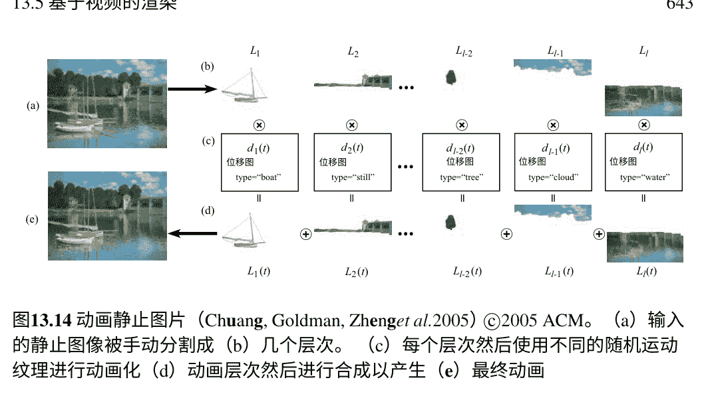

#### 13.5.3 应用：动画图片

虽然视频纹理可以将短视频剪辑变成无限长的视频，但是是否可以用一张静止图像做同样的事情呢？ 答案是肯定的，只要你愿意首先将图像分割成不同的层次，然后分别对每个层次进行动画化。

Chuang, Goldman, Zhenget al. (2005) 描述了如何使用交互式抠图技术将图像分解为单独的层次。 然后使用类别特定的合成运动对每个层次进行动画化。 如图13.14所示，船只来回摇晃，树木在风中摇摆，云朵水平移动，水面波纹，使用形状噪声位移图。 所有这些效果都可以与一些全局控制参数相关联，例如虚拟风的速度和方向。 在单独进行动画化之后，可以将这些层次进行合成以创建最终的动态渲染。

## 13.5.4 3D 视频

近年来，3D电影的流行度急剧增长，最近的发行范围从汉娜·蒙塔娜到U2的3D音乐会电影，再到詹姆斯·卡梅隆的《阿凡达》。目前，这些发行作品是使用立体摄像机设备拍摄并在影院中播放的。 (或在家里)给戴着偏振眼镜的观众。8然而，在将来，家庭观众可能希望使用多区域自动立体显示器观看这样的电影，每个人都可以获得自己定制的立体流，并可以在场景中移动以从不同角度观看不同的观点。9

计算机视觉社区中开发的立体匹配技术以及图形学中的基于图像渲染（视角插值）技术在这些场景中都是必不可少的组成部分，有时被称为自由视点视频（Carranza, Theobalt, Magnor等, 2003年）或虚拟视点视频（Zitnick, Kang, Uyttendaele等, 2004年）。除了解决一系列逐帧重建和视角插值问题之外，分析阶段产生的深度图或代理必须在时间上保持一致，以避免闪烁伪影。

Shum, Chan和Kang（2007年）以及Magnor（2005年）对各种视频视角插值技术和系统进行了很好的概述。 这些包括Kanade, Rander和Narayanan（1997年）以及Vedula, Baker和Kanade（2005年）的Virtualized Reality系统, Immersive Video（Moezzi, Katkere, Kuramura等, 1996年）, 基于图像的视觉外壳（Matusik, Buehler, Raskar等, 2000年; Matusik, Buehler和McMillan, 2001年）, 以及自由视点视频（Carranza, Theobalt, Magnor等, 2003年）, 它们都使用全局三维几何模型（基于表面（第12.3节）或体积（第12.5节））作为渲染的代理。 Vedula、Baker和Kanade（2005）的工作还计算了场景流，即对应表面元素之间的三维运动，然后可以用来执行多视角视频流的时空插值。

# Zitnick、Kang、Uyttendaele等人（2004）的虚拟视点视频系统

另一方面，它将每个输入图像与一个双层深度图关联起来，这样可以准确地建模遮挡效应，例如发生在物体边界处的混合像素。他们的系统由八个同步的视频摄像机连接到一个磁盘阵列（图13.15a），首先使用基于分割的立体视觉提取每个输入图像的深度图（图13.15e）。在物体边界附近（深度不连续处），背景层沿着前景物体后面的一个条带延伸（图13.15c），并且其颜色是从未被遮挡的相邻图像估计的（图13.15d）。然后使用自动抠图技术（第10.4节）来估计前景层边界像素的不透明度和颜色（图13.15f）。

在渲染时，给定一个位于原始相机之间的新虚拟相机，邻近相机中的图层被渲染为纹理映射的三角形，然后前景图层（可能具有分数不透明度）与背景图层进行合成（图13.15b）。生成的两个图像通过比较它们各自的z缓冲值进行合并和混合。（每当两个z值足够接近时，计算两种颜色的线性混合。）交互式渲染系统使用常规图形硬件实时运行。因此，它可以用于在播放视频时更改观察者的视点，或者冻结场景并以3D方式探索。最近，Rogmans、Lu、Bekaert等人（2009年）开发了GPU实现的实时立体匹配和实时渲染算法，使他们能够在实时环境中探索算法替代方案。

目前，使用离线立体匹配从八个立体相机计算得到的深度图产生了与实时视频相关的最高质量深度图。¹⁰ 因此，它们经常被用于3D视频压缩的研究中，这是一个活跃的研究领域（Smolic和Kauff 2005; Gotchev和Rosenhahn 2009）。主动视频速率深度感知相机，例如3DV Zcam（Iddan和Yahav 2001），我们在第12.2.1节中讨论过，是另一个潜在的数据来源。

当有大量密集相机可用时，如斯坦福光场相机（Wilburn, Joshi, Vaish et al.2005），不一定总是需要计算显式深度图来创建基于视频的渲染效果，尽管如果计算了深度图，结果通常会更高质量（Vaish, Szeliski, Zitnick et al.2006）。

#### 13.5.5 应用：基于视频的漫游

视频摄像机阵列可以同时捕捉来自多个视点的3D动态场景，然后使观众能够从原始捕捉位置附近的视点探索场景。如果我们希望捕捉一个扩展区域，比如一个家庭、一个电影场景，甚至是整个城市，会怎样呢？ 在这种情况下，将摄像机移动到环境中并将视频作为交互式基于视频的漫游进行播放更有意义。为了让观众能够在所有方向上观察，最好使用全景视频摄像机（Uyttendaele、Criminisi、Kang等，2004年）。11

一种构建采集过程的方法是在房间内叠加网格的2D水平平面上捕捉这些图像。生成的图像海（Aliaga、Funkhouser、Yanovsky等，2003年）可以用于实现在捕捉位置之间的连续运动。然而，将这个想法扩展到更大的环境，例如超出单个房间，可能变得繁琐和数据密集。

相反，探索空间的一种自然方式通常是沿着一些预定路径行走，就像博物馆或家庭导览一样，引导用户沿着特定的路径，比如每个房间的中间。13同样，城市级的探索可以通过沿着每条街道的中间行驶，并允许用户在每个交叉口分支。这个想法可以追溯到阿斯彭电影地图项目（Lippman 1980），该项目记录了从移动车辆上拍摄的模拟视频，并将其存储在光盘上以供后期交互式播放。

最近视频技术的改进现在可以使用小型共位摄像机阵列（例如Point Grey Ladybug摄像机14（图13.16b））来捕捉全景（球形）视频，这是由Uyttendaele、Criminisi、Kang等人（2004年）为他们的交互式基于视频的漫游项目开发的。在他们的系统中，来自六个摄像机的同步视频流（图13.16a）使用一系列专门为该项目开发的技术拼接在一起，形成360°全景图像。

由于相机的投影中心不相同，相机之间的视差可能导致重叠视野中出现幽灵影像（图13.16c）。为了消除这个问题，在重叠区域的每一列使用多视角平面扫描立体算法来估计每个像素的深度。为了将相机相对于彼此进行校准，相机在原地旋转，并使用约束结构运动算法（图7.8）来估计相对相机姿态和内参。然后，在漫游视频上运行特征跟踪，以稳定视频序列。刘、格利彻、金等人（2009）在这方面进行了更近期的研究。

室内带有窗户的环境以及阳光明媚的户外环境中，往往具有超出视频传感器能力的动态范围。因此，Ladybug相机具有可编程曝光功能，可以在后续视频帧中进行曝光分组。为了合并生成的视频

11 请参阅http://www.cis.upenn.edu/~kostas/omni.html了解全景（全向）视觉系统及相关研讨会的描述。
12 （Snavely、Seitz和Szeliski（2006）的照片旅游系统将这个想法应用于结构较少的集合。
13 在电脑游戏中，将玩家限制在沿预定路径前进和后退的运动中称为基于轨道的游戏。
14 http://www.ptgrey.com/。

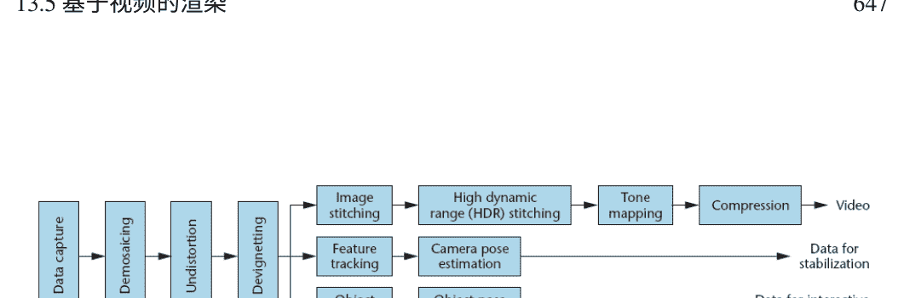

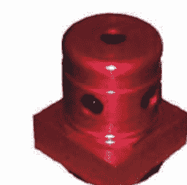

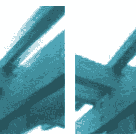

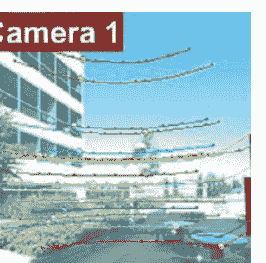

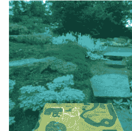

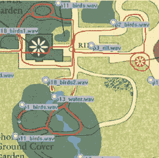

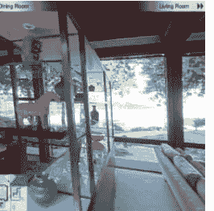

图13.16 基于视频的漫游（Uyttendaele、Criminisi、Kang等人，2004年）© 2004IEEE ：（a）视频预处理的系统图；（b）Point Grey Ladybug相机；（c）使用多透视平面扫描进行幽灵去除；（d）点跟踪，用于校准和稳定化；（e）带有下方地图的交互式花园漫游；（f）顶视图制作和声音放置；（g）带有导航栏（顶部）和感兴趣的图标（底部）的交互式家庭漫游。

在将帧转换为高动态范围（HDR）视频之前，需要对相邻帧的像素进行运动补偿，然后再进行合并（Kang，Uyttendaele，Winder等，2003年）。如果体验中有概览地图，则交互式漫游体验将变得更加丰富和可导航。在图13.16f中，地图上有注释，这些注释可以在漫游过程中显示，并且有本地化的声源，当观看者靠近时会播放（具有不同的音量）。使用一种称为地图相关性（Levin和Szeliski，2004年）的过程，可以自动将视频序列与地图对齐。

所有这些元素结合在一起，为用户提供了丰富、交互和沉浸式的体验。图13.16e显示了贝尔维尤植物园的漫游，下方是透视图的概览地图。地面上的箭头用于指示可能的行进方向。观看者只需将视线朝向其中一个箭头（可以使用游戏控制器驱动体验），然后沿着所需路径“行走”向前。

图13.16g展示了一个室内家庭导览体验。除了左下角的示意图和顶部导航栏上的相邻房间名称之外，当主窗口中出现感兴趣的物品（例如房主的艺术品）时，底部会出现图标。然后可以点击这些图标以提供更多信息和3D视图。

交互式视频导览的发展引发了对基于360°视频的虚拟旅行和地图体验的新兴兴趣，商业网站（如Google的Street View和Bing Maps）证明了这一点。这些视频还可以用于生成逐步驾驶方向，利用扩展的视野和基于图像的渲染来增强体验（Chen，Neubert，Ofek等，2009年）。

随着我们越来越多地使用大量高质量的图像和视频来捕捉我们的现实世界，本章所描述的交互式建模、探索和渲染技术将在将基于世界上偏远地区的虚拟体验带给每个人方面发挥更重要的作用。

## 13.6 附加阅读

关于基于图像的渲染的两篇较好的最近综述是Kang，Li，Tong等人（2006）和Shum，Chan和Kang（2007），早期综述可从Kang（1999），McMillan和Gortler（1999）以及Debevec（1999）获得。图像渲染的术语是由McMillan和Bishop（1995）引入的，尽管该领域的开创性论文是由Chen和Williams（1993）撰写的视图插值论文。Debevec，Taylor和Malik（1996）描述了他们的Facade系统，该系统不仅创建了各种基于图像的建模工具，还引入了广泛使用的视角相关纹理映射技术。

关于平面冒牌和图层的早期工作是由Shade， Lischinski， Salesin等人（1996），Lengyel和Snyder（1997）以及Torborg和Kajiya（1996）进行的，而基于深度的精灵的新工作是由Shade， Gortler， He等人（1998）描述的。

基于图像的渲染的两篇基础论文是由Levoy和Hanrahan（1996）撰写的光场渲染和由Gortler， Grzeszczuk， Szeliski等人（1996）撰写的Lumigraph。Buehler， Bosse， McMillan等人（2001年）将Lumigraph方法推广到不规则间隔的图像集合，而Levoy（2006年）对光场和基于图像的渲染主题进行了调查和更温和的介绍。

表面光场（Wood， Azuma， Aldinger等人2000年）为具有准确已知表面几何和支持更好的压缩以及编辑表面属性的光场提供了一种替代参数化方法。同心镶嵌（Shum和He 1999; Shum， Wang， Chai等人2002年）和具有深度的全景图（Peleg， Ben-Ezra和Pritch 2001; Li， Shum， Tang等人2004年; Zheng， Kang， Cohen等人2007年）为使用全景相机捕获的光场提供了有用的参数化方法。多视角图像（Rademacher和Bishop 1998年）和流形投影（Peleg和Herman 1997年），虽然不是真正的光场，但也与这些思想密切相关。

在光场向更高维结构的可能扩展中，环境遮罩（Zongker， Werner， Curless et al. 1999; Chuang， Zongker， Hindorff et al. 2000）是最有用的，特别是用于将捕捉到的物体放置到新场景中。

基于视频的渲染，即重用视频来创建新的动画或虚拟体验，始于Szummer和Picard（1996）的开创性工作，Bregler， Covell， 和Slaney（1997），以及Schödl， Szeliski， Salesin et al. （2000）。对这些基本重新定位方法的重要后续工作由Schödl和Essa（2002）， Kwatra， Schödl， Essa et al. （2003）， Doretto， Chiuso， Wu et al. （2003）， Wang和Zhu（2003）， Zhong和Sclaroff（2003）， Yuan， Wen， Liu et al. （2004）， Doretto和Soatto（2006）， Zhao和Pietikäinen（2007），以及Chan和Vasconcelos（2009）进行。

允许用户根据多个同步的视频流改变其3D视点的系统包括Moezzi、 Katkere、 Kuramura等人（1996年）、 Kanade、 Rander和Narayanan（1997年）、 Matusik、 Buehler、 Raskar等人（2000年）、 Matusik、 Buehler和McMillan（2001年）、 Carranza、 Theobalt、 Magnor等人（2003年）、 Zitnick、 Kang、 Uyttendaele等人（2004年）、 Magnor（2005年）和Vedula、 Baker和Kanade（2005年）。3D（多视点）视频编码和压缩也是一个活跃的研究领域（Smolic和Kauff 2005; Gotchev and Rosenhahn 2009），预计到2010年底，使用多视点视频编码（MVC）扩展到H.264/MPEG-4 AVC的3D蓝光光盘将问世。

### 13.7 练习

例13.1: 深度图像渲染 开发一个“视图外推”算法，重新渲染先前计算的立体深度图与其对应的参考彩色图像。

- 1. 使用一个3D图形网格渲染系统，如OpenGL或Direct3D，每个像素四边形使用两个三角形，并采用透视（投影）纹理映射 (Debevec, Yu和Borshukov 1998)。
- 2. 或者，使用你在练习3.24中构建的一次或两次前向变形器，使用 (2.68-2.70) 将视差或深度转换为位移。
- 3. （可选）在视图插值或外推过程中引入的直线上的瑕疵在视觉上是明显的，这也是图像变形系统允许您指定线对应关系的原因之一 (Beier和Neely 1992)。修改你的深度估计算法，以匹配和估计直线的几何形状，并将其合并到基于图像的渲染算法中。

例子 13.2: 视图插值 扩展你在前一个练习中创建的系统，以渲染两个参考视图，然后使用z缓冲、孔洞填充和混合（变形）的组合来混合图像，以创建最终图像 (第13.1节)。

- 1. （可选）如果两个源图像的曝光差异很大，填充孔洞的区域和混合区域的曝光将不同。 你能扩展你的算法来减轻这个问题吗?
- 2. （可选）扩展你的算法以在相邻视图之间执行三向（三线性）插值。 你可以对参考相机姿势进行三角剖分，并使用重心坐标来确定虚拟相机的混合权重。

例子 13.3: 视图变形 修改你的视图插值算法，以执行非刚性物体（如人物表情变化）之间的变形。

- 1. 不使用纯立体算法，而是使用一般的流算法来计算位移，但将其分为由相机运动引起的刚性位移和非刚性变形。
- 2. 在渲染时，使用刚性几何确定新的像素位置，然后再添加一部分非刚性位移。
- 3. 或者，计算立体深度图，但让用户指定额外的对应点，或者使用基于特征的匹配算法自动提供对应点。

## 例13.4: 视角相关纹理映射

使用你创建的3D模型和原始图像来实现视角相关纹理映射系统。

1. 使用你在练习7.3、11.9、11.10或12.8中开发的3D重建技术，从多张照片中构建一个三角形化的基于图像的3D模型。
2. 从你的照片中提取每个模型面的纹理，可以通过执行适当的重采样或通过弄清楚如何使用纹理映射软件直接访问源图像来实现。
3. 在运行时，对于每个新的相机视图，选择每个可见模型面的最佳源图像。
4. 将此扩展到在顶部两个或三个纹理之间进行混合。这更加棘手，因为它涉及纹理混合或像素着色器的使用（Debevec, Taylor和Malik 1996; Debevec, Yu和Borshukov 1998; Pighin, Hecker, Lischinski等1998）。

## 例子13.5: 分层深度图像

扩展你的视图插值算法（练习13.2）以存储每个像素的多个深度或颜色值（Shade, Gortler, He et al. 1998），即分层深度图像（LDI）。相应地修改你的渲染算法。对于你的数据，你可以使用合成光线追踪，分层重建模型或体积重建。

## 例子13.6: 从精灵或图层渲染

扩展你的视图插值算法以处理多个平面或精灵（第13.2.1节）（Shade, Gortler, He et al. 1998）。

1. 使用你在练习8.9中开发的技术提取你的图层。
2. 或者，使用交互式绘画和3D放置系统提取你的图层（Kang 1998; Oh, Chen, Dorsey et al. 2001; Shum, Sun, Yamazaki et al. 2004）。
3. 根据预期的可见性确定一个从后到前的顺序，或者在渲染算法中添加一个z缓冲区来处理遮挡问题。
4. 渲染和合成所有生成的图层，可选择使用alpha抠图来处理图层和精灵的边缘。

## 例子13.7: 光场变换

推导出将常规图像与4D光场坐标相关联的方程。

1. 确定远平面 $(u, v)$坐标与虚拟相机的 $(x, y)$坐标之间的映射关系。
   (a) 通过参数化 $uv$平面上的一个3D点，以其 $(u, v)$坐标为参数。
   (b) 使用常规的 $3 \times 4$相机矩阵 $P(2.63)$，将得到的3D点投影到相机像素 $(x, y, 1)$上。
   (c) 推导出关联 $(u, v)$和 $(x, y)$坐标的2D单应性矩阵。
2. 为 $(s, t)$到 $(x, y)$坐标写下一个类似的转换。
3. 证明如果虚拟相机实际上在 $(s, t)$平面上，那么 $(s, t)$的值仅取决于相机的光学中心，与 $(x, y)$无关。
4. 证明由常规正交或透视相机拍摄的图像，即在三维点和 $(x, y)$像素之间具有线性投影关系的图像 $(2.63)$，在二维超平面上采样 $(s, t, u, v)$光场。

## 练习13.8: 光场和Lumigraph渲染

实现一个光场或Lumigraph渲染系统：

1. 从http://lightfield.stanford.edu/下载一个光场数据集。
2. 编写一个算法，使用四线性插值从这个光场中合成一个新的视图，使用的是 $(s, t, u, v)$光线样本。
3. 尝试改变对应于所需视图的焦平面（Isaksen, McMillan和Gortler 2000），看看结果图像是否更清晰。
4. 确定场景中物体的三维代理。您可以通过对其中一个光场运行多视图立体匹配来获得每个图像的深度图。
5. 实现Lumigraph渲染算法，根据每个表面元素的三维位置修改光线采样。
6. 自己收集一组图像，并使用运动结构确定它们的姿态。
7. 实现来自Buehler, Bosse, McMillan et al. (2001)的非结构化Lumigraph渲染算法。

## 例子13.9: 表面光场

构建一个表面光场 (Wood, Azuma, Aldinger et al. 2000)，并看看你能压缩得多好。

1. 获取一个有趣的镜面场景或物体的光场，或从 http://lightfield.stanford.edu/ 下载一个。
2. 使用一个对于镜面反射具有鲁棒性的多视角立体匹配算法构建物体的三维模型。
3. 估计物体上每个表面点的光球体。
4. 估计其漫反射分量。中位数是这样做的最好方式吗？为什么不使用最小颜色值？如果漫反射分量上有Lambertian阴影会发生什么？
5. 使用Wood, Azuma, Aldinger et al.(2000)建议的技术之一或者发明一种自己的方法对光球体的剩余部分进行建模和压缩。
6. 研究你的压缩算法的效果以及产生的伪影。
7. (可选) 开发一个系统来编辑和操作你的表面光场。

## 例子13.10: 手持同心镶嵌

开发一个系统来导航手持同心镶嵌。

1. 站在一个房间的中间，将一个摄像机伸在你前面的手臂长度处，然后转一圈。
2. 使用一个运动结构系统来确定每个输入帧的相机姿态和稀疏的三维结构。
3. (可选) 将你的图像像素重新分配到一个更规则的同心镶嵌结构中。
4. 在视图时间，根据新相机的视角(应该接近于原始捕捉平面)，确定要显示的源像素。你可以简化计算，为每个输出列确定一个源列(和缩放)。
5. (可选) 使用稀疏的三维结构，插值为密集的深度图，以改善你的渲染 (Zheng, Kang, Cohen等, 2007年)。

## 例子13.11: 视频纹理

捕捉一些自然现象的视频，比如喷泉、火焰或微笑的脸，并将视频无缝循环成无限长度的视频(Schoedl, Szeliski, Salesin et al. 2000)。

1. 使用 $L_2$（平方差之和）度量来比较原始剪辑中的所有帧。（这假设视频是在三脚架上拍摄的或已经被稳定过。）
2. 在时间上对比较表进行滤波，以突出匹配良好的时间子序列。
3. 通过某种指数分布将相似性表转换为跳转概率表。确保修改接近结尾的转换，以免“卡住”在最后一帧。
4. 从第一帧开始，使用转换表决定是向前跳转、向后跳转还是继续到下一帧。
5. （可选）将原始视频纹理的任何其他扩展添加到想法中，例如多个移动区域、交互控制或图割时空纹理拼接。

## 第14章 识别

- 14.1 物体检测 ......................... 658
  - 14.1.1 人脸检测 .................... 658
  - 14.1.2 行人检测 .................... 666
- 14.2 人脸识别 ........................ 668
  - 14.2.1 特征脸 ...................... 671
  - 14.2.2 主动外观和3D形状模型 .......... 679
  - 14.2.3 应用：个人照片集 ............ 684
- 14.3 实例识别 ........................ 685
  - 14.3.1 几何对齐 .................... 686
  - 14.3.2 大型数据库 .................. 687
  - 14.3.3 应用：位置识别 .............. 693
- 14.4 类别识别 ........................ 696
  - 14.4.1 词袋模型 .................... 697
  - 14.4.2 基于部件的模型 .............. 701
  - 14.4.3 分割识别 .................... 704
  - 14.4.4 应用：智能照片编辑 .......... 709
- 14.5 上下文和场景理解 ............... 712
  - 14.5.1 学习和大型图像集合 ........... 714
  - 14.5.2 应用：图像搜索 ............... 717
- 14.6 识别数据库和测试集 ............. 718
- 14.7 附加阅读 ........................ 722
- 14.8 练习题 .......................... 725

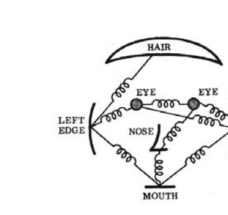
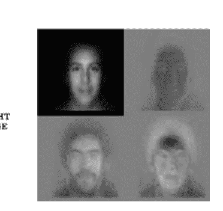
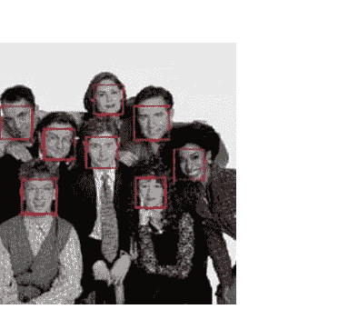
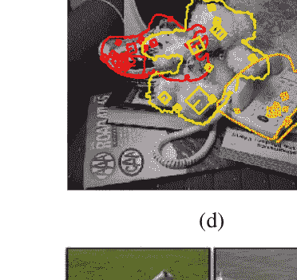
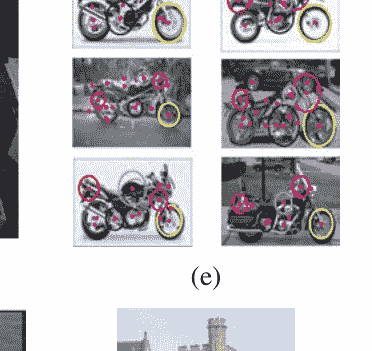
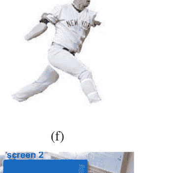
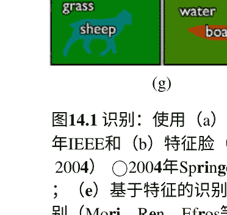
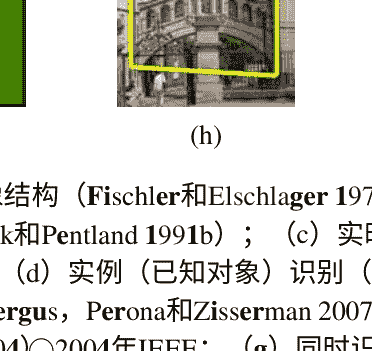
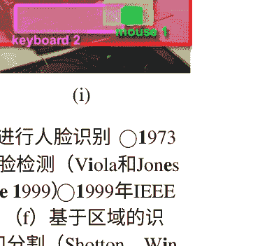

图14.1 识别：使用（a）图像结构（Fischler和Elschlager 1973）进行人脸识别；（b）特征脸（Turk和Pentland 1991b）；（c）实时人脸检测（Viola和Jones 2004）；（d）实例（已知对象）识别（Lowe 1999）；（e）基于特征的识别（Fergus, Perona和Zisserman 2007）；（f）基于区域的识别（Mori, Ren, Efros等2004）；（g）同时识别和分割（Shotton, Winn, Rother等2009）；（h）位置识别（Philbin, Chum, Isard等2007）；（i）使用上下文（Russell, Torralba, Liu等2007）。

在我们可能要求计算机执行的所有视觉任务中，分析场景并识别所有组成对象仍然是最具挑战性的。虽然计算机在准确重建来自不同视角拍摄的图像的场景的三维形状方面表现出色，但它们无法命名图片中出现的所有对象和动物，即使是一个两岁的孩子也做不到。甚至在研究人员中，对于何时能够达到这种水平的性能也没有共识。

为什么识别如此困难？真实世界由一堆物体组成，它们相互遮挡并以不同的姿势出现。此外，类内的变异性（例如，狗）由于复杂的非刚性关节和形状外观的极端变化（例如，不同品种之间的变化）使得我们不太可能简单地对数据库中的示例进行详尽的匹配。¹

识别问题可以从几个方面进行分解。例如，如果我们知道我们在寻找什么，问题就是一个对象检测问题（第14.1节），它涉及快速扫描图像以确定可能出现匹配的位置（图14.1c）。如果我们有一个特定的刚性对象要识别（实例识别，第14.3节），我们可以搜索特征点（第4.1节）并验证它们以几何合理的方式对齐（第14.3.1节）（图14.1d）。

最具挑战性的识别版本是一般类别（或类）识别（第14.4节），它可能涉及识别极其多样化的类别实例，如动物或家具。一些技术纯粹依赖于特征的存在（称为“词袋”模型—参见第14.4.1节），它们的相对位置（基于部件的模型（第14.4.2节）），图14.1e，而其他技术则涉及将图像分割成语义上有意义的区域（第14.4.3节）（图14.1f）。在许多情况下，识别严重依赖于周围对象和场景元素的上下文（第14.5节）。所有这些技术都融入了学习的主题（第14.5.1节），因为手工制作特定的对象识别器似乎是一种徒劳的方法，考虑到问题的复杂性。

鉴于这个主题的极其丰富和复杂的性质，本章节的结构是从简单的概念逐渐构建到更复杂的概念。我们首先讨论面部和物体检测（第14.1节），在这里我们介绍了一些机器学习技术，如提升、神经网络和支持向量机。接下来，我们研究面部识别（第14.2节），这是识别的更广为人知的应用之一。这个主题作为对子空间（PCA）模型和贝叶斯方法进行识别和分类的介绍。然后，我们介绍实例识别的技术（第14.3节），建立在本书中之前的主题基础上，如特征检测、匹配和几何对齐（第14.3.1节）。我们介绍了来自信息和文档检索社区的主题，如频率向量、特征量化和倒排索引。

然而，一些最近的研究表明，对于足够大的数据库，直接图像匹配可能是可行的（Russell, Torralba, Liu等，2007年；Malisiewicz和Efros，2008年；Torralba, Freeman和Fergus，2008年）（第14.3.2节）。我们还介绍了位置识别的应用（第14.3.3节）。在本章的后半部分，我们讨论了最具挑战性的识别变体，即类别识别问题（第14.4节）。这包括使用特征包（第14.4.1节）、部件（第14.4.2节）和分割（第14.4.3节）的方法。我们展示了这些技术如何用于自动化照片编辑任务，例如3D建模、场景补全和创建拼贴画（第14.4.4节）。接下来，我们讨论了上下文在个体对象识别和整体场景理解中的作用（第14.5节）。我们在本章中还讨论了用于构建和评估识别系统的数据库和测试集（第14.6节）。

虽然没有关于对象识别的全面参考资料，但在ICCV 2009短期课程（Fei-Fei, Fergus和Torralba 2009）、Antonio Torralba更全面的MIT课程（Torralba 2008）以及最近的两个论文集（Ponce, Hebert, Schmid等2006; Dickinson, Leonardis, Schiele等2007）和关于对象分类的调查（Pinz 2005）中可以找到一套优秀的笔记。一些最佳性能识别算法的评估可以在PASCAL视觉对象类（VOC）挑战网站上找到，网址为http://pascallin.ecs.soton.ac.uk/challenges/VOC/。

### 14.1 物体检测

如果我们有一张要分析的图像，比如图14.2中的集体肖像，我们可以尝试将识别算法应用于该图像中的每个可能的子窗口。这样的算法很可能既慢又容易出错。相反，更有效的方法是构建特定的检测器，它们的任务是快速找到可能出现特定对象的区域。

我们从人脸检测器开始介绍本节内容，这是一些较为成功的识别示例之一。例如，这样的算法已经内置在大多数现代数码相机中，用于增强自动对焦功能，并且内置在视频会议系统中用于控制云台。然后，我们将介绍行人检测器，作为对象检测的更一般方法的示例。这样的检测器可以用于汽车安全应用，例如从移动车辆中检测行人和其他车辆（Leibe, Cornelis, Cornelis et al. 2007）。

#### 14.1.1 人脸检测

在将人脸识别应用于一般图像之前，首先必须找到任何人脸的位置和大小（图14.1c和14.2）。原则上，我们可以在每个像素和尺度上应用人脸识别算法（Moghaddam和Pentland 1997），但在实践中这样的过程太慢了。

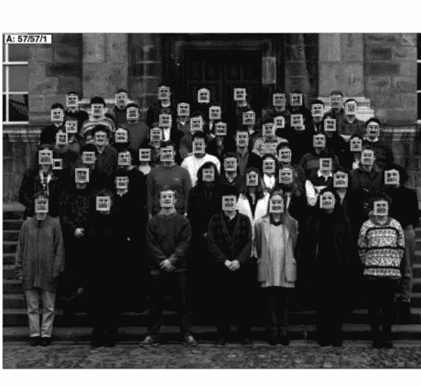

图14.2 Rowley, Baluja和Kanade（1998a）产生的人脸检测结果 ©1998 IEEE。你能找到57个真正的正面结果中的一个假阳性（一个非人脸的框）吗？

多年来，已经开发出了各种快速人脸检测算法。Yang, Kriegman和Ahuja（2002）对这个领域的早期工作进行了全面的调查；Yang的ICPR 2004教程²和Torralba（2007）的短期课程提供了更近期的评论。³

根据Yang, Kriegman和Ahuja（2002）的分类法，人脸检测技术可以分为基于特征、基于模板或基于外观。基于特征的技术试图找到独特图像特征（如眼睛、鼻子和嘴巴）的位置，然后验证这些特征是否以合理的几何排列方式存在。这些技术包括早期的人脸识别方法（Fischler和Elschlager 1973；Kanade 1977；Yuille 1991），以及基于模块化特征空间（Moghaddam和Pentland 1997）、局部滤波器组（Leung, Burl和Perona 1995；Penev和Atick 1996；Wiskott, Fellous, Krüger等人1997）、支持向量机（Heisele, Ho, Wu等人2003；Heisele, Serre和Poggio 2007）和提升（Schneiderman和Kanade 2004）的最新方法。

基于模板的方法，如主动外观模型（AAMs）（第14.2.2节），可以处理广泛的姿态和表情变化。通常，它们需要在真实脸部附近进行良好的初始化，因此不适合作为快速人脸检测器。

² http://vision.ai.uiuc.edu/mhyang/face-detection-survey.html.
³ 检测人脸的另一种方法是在图像中寻找肤色区域（Forsyth和Fleck 1999; Jones和Rehg 2001）。参见练习2.8以获取一些额外的讨论和参考资料。

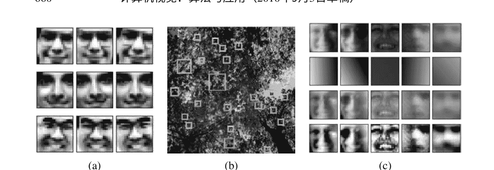

基于外观的方法通过扫描图像的小重叠矩形补丁来搜索可能的人脸候选区域，然后可以使用一系列更昂贵但更有选择性的检测算法（Sung和Poggio 1998; Rowley, Baluja和Kanade 1998a; Romdhani, Torr, Schölkopf等人2001; Fleuret和Geman 2001; Viola和Jones 2004）来进一步改进。为了处理尺度变化，通常将图像转换为子八度金字塔，并在每个级别上执行单独的扫描。大多数基于外观的方法今天都依赖于使用带有标记的人脸和非人脸补丁的训练分类器。

Sung和Poggio（1998）以及Rowley, Baluja和Kanade（1998a）提出了两种最早的基于外观的人脸检测器，并引入了许多创新，这些创新在后来的工作中被广泛使用。

首先，这两个系统都会收集一组带有标签的人脸图像块（图14.2），以及一组来自不包含人脸的图像（如航拍图像或植被图像）的图像块（图14.3b）。收集到的人脸图像会通过人工镜像、旋转、缩放和平移等方式进行增强，以减少人脸检测器对这些效果的敏感性（图14.3a）。

在收集到一组初始训练图像后，可以进行一些可选的预处理操作，例如从图像中减去平均梯度（线性函数）以补偿全局阴影效果，并使用直方图均衡化来补偿不同相机对比度的变化（图14.3c）。

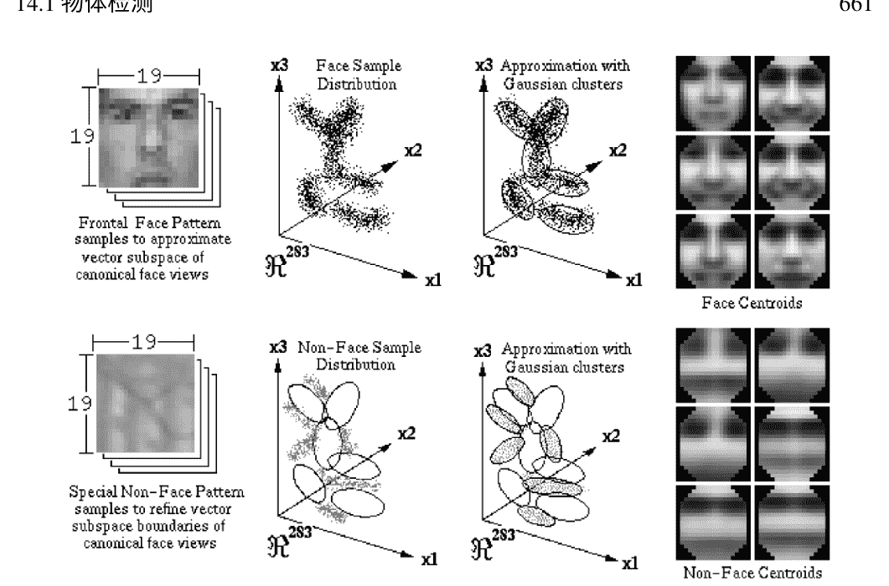

图14.4 学习混合高斯模型进行人脸检测（Sung和Poggio 1998）©1998 IEEE。首先，将人脸和非人脸图像（19²维向量）分别使用k-means进行聚类，然后使用PCA进行分析。聚类中心显示在右侧列中。

聚类和主成分分析。一旦面部和非面部模式经过预处理，Sung和Poggio（1998）使用k-means将这些数据集分成六个独立的聚类，并对每个结果的12个聚类拟合PCA子空间（图14.4）。在检测时，首先使用Moghaddam和Pentland（1997）开发的DIFS和DFFS度量（见图14.14和（14.14））产生24个马氏距离测量（每个聚类两个）。得到的24个测量值输入到多层感知器（MLP）中，它是一个具有加权求和和Sigmoid非线性的神经网络，使用“反向传播”算法进行训练（Rumelhart，Hinton和Williams 1986）。

神经网络。Rowley，Baluja和Kanade（1998a）不是首先对数据进行聚类并计算到聚类中心的马氏距离，而是直接将神经网络（MLP）应用于灰度强度的20×20像素补丁，使用各种不同大小的手工制作的“感受野”来捕捉大尺度和小尺度结构（图14.5）。得到的神经网络直接输出中心处面部的可能性。在多分辨率金字塔中的每个重叠补丁上。由于在人脸附近可能会有几个重叠的补丁（在空间和分辨率上），因此还使用了一个额外的合并网络来合并重叠的检测结果。作者还尝试了训练多个网络并合并它们的输出。图14.2显示了他们人脸检测器的一个样本结果。

为了使检测器运行更快，还训练了一个单独的网络，用于检测30×30的补丁中的人脸和偏移±5像素的人脸。该网络在图像的每个第10个像素（水平和垂直）处进行评估，并使用这个“粗糙”或“松散”的检测器的结果来选择要运行较慢的单像素重叠技术的区域。

为了处理人脸的平面旋转，Rowley、Baluja和Kanade（1998b）训练了一个路由器网络来估计输入补丁的可能旋转角度，然后将估计的旋转应用于每个补丁，在通过他们的正立人脸检测器运行结果之前。

## 支持向量机。

Osuna、Freund和Girosi（1997）不使用神经网络来分类补丁，而是使用支持向量机（SVM）（Hastie、Tibshirani和Friedman 2001；Schölkopf和Smola 2002；Bishop 2006；Lampert 2008）来分类相同的预处理补丁，就像Sung和Poggio（1998）一样。SVM在特征空间中寻找不同类别（在本例中是人脸和非人脸补丁）之间的一系列最大间隔分离平面。在线性分类边界不足以解决问题的情况下，可以使用核函数（Hastie、Tibshirani和Friedman 2001；Schölkopf和Smola 2002；Bishop 2006）将特征空间提升到更高维度的特征。SVM已经被其他研究人员用于人脸检测和人脸识别（Heisele、Ho、Wu等，2003年）；Heisele，Serre和Poggio 2007年）是目标识别中广泛使用的工具。

提升。在当前使用的所有人脸检测器中，**Viola和Jones**（2004年）引入的人脸检测器可能是最为人所知并且最广泛使用的。他们的技术是第一个将提升概念引入计算机视觉领域的技术，该技术涉及训练一系列越来越具有区分能力的简单分类器，然后将它们的输出进行融合（Hastie，**Tibshirani**和Friedman 2001年；**Bishop** 2006年）。

更详细地说，提升(boosting)涉及构建一个分类器 $h(x)$ 作为简单弱学习器的总和，

$$h(\boldsymbol{x}) = \text{符号} \left[ \sum_{j=0}^{m-1} \alpha_j h_j(\boldsymbol{x}) \right], \quad (14.1)$$

其中每个弱学习器 $h_j(\boldsymbol{x})$ 都是输入的极其简单的函数，因此不会对分类性能有太大贡献（单独来看）。

在大多数提升算法的变体中，弱学习器是阈值函数，

$$h_j(\boldsymbol{x}) = a_j [f_j < \theta_j] + b_j [f_j \geq \theta_j] = \begin{cases} a_j & \text{if } f_j < \theta_j \\ b_j & \text{otherwise}, \end{cases} \quad (14.2)$$

这些也被称为决策桩（基本上是决策树的最简单版本）。在大多数情况下，传统上（也更简单）将 $a_j$ 和 $b_j$ 设置为 $\pm 1$，即 $a_j = -s_j, b_j = +s_j$，这样只有特征 $f_j$、阈值 $\theta_j$ 和阈值的极性 $s_j \in \pm 1$ 需要被选择。

$^{4}$一些变种，例如Viola和Jones (2004)的方法，使用 $(a_j, b_j) \in [0,1]$ 并调整学习算法。

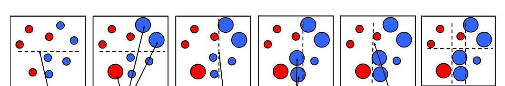

图14.7增强的示意图，由Svetlana Lazebnik提供，根据Paul Viola和David Lowe的原始插图。在选择每个弱分类器（决策树桩或超平面）之后，被错误分类的数据点的权重增加。最终分类器是简单弱分类器的线性组合。

在许多增强应用中，特征仅仅是坐标轴 $x_k$，即增强算法选择输入向量的一个分量作为最佳阈值。在Viola和Jones的人脸检测器中，特征是输入补丁中矩形区域的差异，如图14.6所示。使用这些特征的优点是，虽然它们比单个像素更具有区分性，但一旦预先计算了总和区域表（如3.2.3节所述），它们的计算速度非常快。基本上，对于图像中像素数量为$N$的$O(N)$预计算阶段的成本，可以在$4r$次加法或减法中计算出矩形的差异，其中$r∈\{2,3,4\}$是特征中的矩形数量。

增强的成功关键在于增量选择弱学习器的方法，并在每个阶段重新加权训练样本（图14.7）。Ad-Boost（自适应增强）算法（Hastie，Tibshirani和Friedman 2001；Bishop 2006）通过根据每个阶段的正确分类情况对每个样本进行重新加权，并使用阶段平均分类错误来确定弱分类器之间的最终权重$α_j$，如算法14.1所述。虽然得到的分类器在实践中非常快，但由于需要在每个阶段检查大量特征（矩形差异）假设，训练时间可能相当慢（几周的数量级）。

为了进一步提高检测器的速度，可以创建一个级联的分类器，其中每个分类器使用少量的测试（比如，一个两项AdaBoost分类器）来拒绝大部分非人脸，同时尝试通过所有潜在的人脸候选者（Fleuret和Geman 2001；Viola和Jones 2004）。最近，Brubaker、Wu、Sun等人（2008）开发了一种更快的级联学习算法。

相应地。

-   1. 输入正面和负面训练样本以及它们的标签 $\{ (x_i, y_i) \}$，其中 $y_i = 1$ 表示正面（人脸）样本，$y_i = -1$ 表示负面样本。

- 2. 将所有权重初始化为 $w_{i,1} \leftarrow \frac{1}{N}$，其中 $N$ 是训练样本的数量。（Viola和Jones (2004) 对正面和负面样本使用单独的 $N_1$ 和 $N_2$。）

- 3. 对于每个训练阶段 $j = 1 \dots M$:
   (a) 重新归一化权重，使它们总和为1（将它们除以它们的和）。
   (b) 通过找到最小化加权分类错误的那个来选择最佳分类器 $h_j(x; f_j, \theta_j, s_j)$。
      $$
      e_j = \sum_{i=0}^{N-1} w_{i,j} e_{i,j}, \quad (14.3)
      $$
      $$
      e_{i,j} = 1 - \delta(y_i, h_j(x_i; f_j, \theta_j, s_j)). \quad (14.4)
      $$
      对于任何给定的 $f_j$ 函数，可以使用加权中位数计算的变体在线性时间内找到 $(\theta_j, s_j)$ 的最优值（练习14.2）。
   (c) 计算修改后的错误率 $\beta_j$ 和分类器权重 $\alpha_j$，
      $$
      \beta_j = \frac{e_j}{1 - e_j} \quad \text{并且} \quad \alpha_j = -\log \beta_j. \quad (14.5)
      $$
   (d) 根据分类错误更新权重 $e_{i,j}$
      $$
      w_{i,j+1} \leftarrow w_{i,j} \beta_j^{1 - e_{i,j}}, \quad (14.6)
      $$
      即，根据整体分类错误比例降低正确分类的训练样本的权重。

- 4. 将最终分类器设置为
   $$
   h(x) = \text{符号} \left[ \sum_{j=0}^{m-1} \alpha_j h_j(x) \right]. \quad (14.7)
   $$

## 算法14.1 AdaBoost训练算法，改编自Hastie、Tibshirani和Friedman (2001), Viola和Jones (2004), 以及Bishop (2006)。

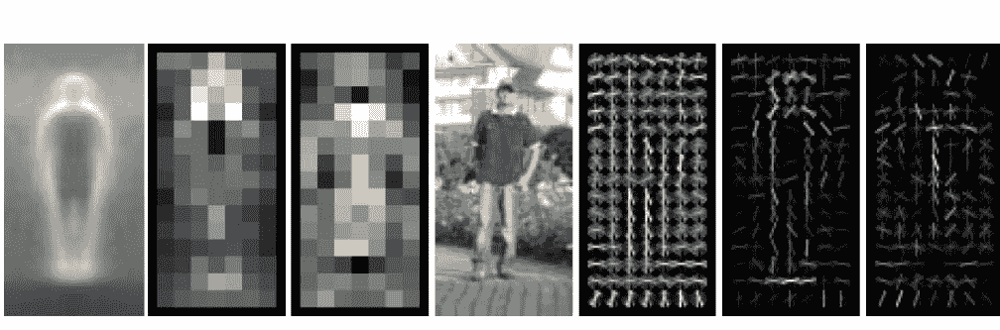

图14.8 使用梯度直方图的行人检测（Dalal和Triggs 2005）© 2005 IEEE：（a）训练样本的平均梯度图像；（b）每个“像素”显示以该像素为中心的块中最大的正SVM权重；（c）同样，显示负SVM权重；（d）测试图像；（e）计算得到的R-HOG（矩形梯度直方图）描述符；（f）由正SVM权重加权的R-HOG描述符；（g）由负SVM权重加权的R-HOG描述符。

#### 14.1.2 行人检测

虽然很多关于物体检测的研究都集中在人脸上，但对其他物体（如行人和汽车）的检测也受到了广泛关注（Gavrila和Philomin 1999; Gavrila 1999; Papageorgiou和Poggio 2000; Mohan, Papageorgiou和Poggio 2001; Schneiderman和Kanade 2004）。其中一些技术与人脸检测一样注重速度和效率。然而，其他一些技术则更注重准确性，将检测视为一种更具挑战性的通用类别识别变体（第14.4节），在这种变体中，需要尽可能准确地确定物体的位置和范围。

> > （例如，参见PASCAL VOC检测挑战，http://pascallin.ecs.soton.ac.uk/challenges/VOC/。）

一个著名的行人检测器示例是Dalal和Triggs（2005）开发的算法，他们使用一组重叠的方向梯度直方图（HOG）描述符输入到支持向量机（图14.8）。每个HOG都有单元格来累积特定方向上梯度的幅度加权投票，就像Lowe（2004）在第4.1.2节和图4.18中讨论的尺度不变特征变换（SIFT）一样。然而，与SIFT不同的是，SIFT仅在兴趣点位置进行评估，HOG在规则重叠的网格上进行评估，并且它们的描述符幅度使用更粗的网格进行归一化；它们仅在单一尺度和固定方向上计算。为了捕捉人物轮廓周围细微的方向变化，使用了大量的方向分bin，并且在中心差分梯度计算中不进行平滑处理-有关更多实现细节，请参阅Dalal和Triggs（2005）的工作。

图14.8d显示了一个示例输入图像，而图14.8e显示了相关的HOG描述符。

一旦计算出描述符，就会在生成的高维连续描述符向量上训练支持向量机（SVM）。图14.8b-c显示了每个块中（最）正和负SVM权重的图表，而图14.8f-g显示了中心输入图像的相应加权HOG响应。正如你所看到的，在人的头部、躯干和脚周围有相当数量的正响应，而负响应相对较少（主要在毛衣的中部和颈部附近）。

过去十年中，行人和一般物体检测领域一直在快速发展（Belongie、Malik和Puzicha 2002；Mikolajczyk、Zis-serman 2004；Leibe、Seemann和Schiele 2005；Opelt、Pinz和Zisserman 2006；Tor-ralba 2007；Andriluka、Roth和Schiele 2009, 2010；Dollár、Belongie和Perona 2010）。Munder和Gavrila（2006）比较了许多行人检测器，并得出结论，基于局部感受野和SVM的方法表现最佳，而基于提升的方法也表现不错。Maji、Berg和Malik（2008）通过使用非重叠多分辨率HOG描述符和基于空间金字塔匹配核的直方图交集核SVM，改进了这些方法中最好的结果，该核来自Lazebnik、Schmid和Ponce（2006）。

当同时构建多个不同类别的检测器时，Tor-ralba、Murphy和Freeman（2007）表明，在检测器之间共享特征和弱学习器可以提高性能，无论是在计算时间上还是在训练样本数量上。为了找到在共享方式下效果最好的特征和决策树桩，他们引入了一种新颖的联合增强算法，该算法使用Friedman、Hastie和Tibshirani（2000）的“gentleboost”算法，在每个阶段优化总和的期望指数损失函数。

在最近的工作中，Felzenszwalb、McAllester和Ramanan（2008）将有向梯度直方图人体检测器扩展为包含灵活的部件模型（第14.4.2节）。每个部件都是在整体对象模型下面两个金字塔级别上评估的HOG上进行训练和检测的，并且还学习并在识别过程中使用与父节点（整体边界框）的部件位置相关的信息（图14.9b）。为了弥补训练样本边界框的不准确性或不一致性（图14.9c中的虚线白线），父节点（蓝色）边界框的“真实”位置被视为潜在（隐藏）变量，并在训练和识别过程中进行推断。由于部件的位置也是潜在的，因此该系统可以以半监督的方式进行训练，无需在训练数据中使用部件标签。该系统的扩展版本（Felzenszwalb、Girshick、McAllester等人，2010年）在2008年视觉对象类别检测挑战赛中是两个最佳的目标检测系统之一，其中包括了一个简单的上下文模型。最近对基于部件的人体检测和姿态估计的改进包括-

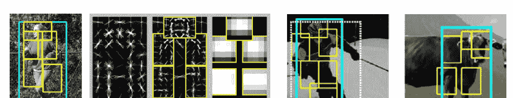

图14.9 基于部件的目标检测（Felzenszwalb，McAlister和Ramanan 2008）
© 2008 IEEE：（a）输入照片及其相关人物（蓝色）和部件（黄色）的检测结果。
（b）检测模型由粗略模板、几个更高分辨率的部件模板和每个部件位置的空间模型定义。（c）滑雪者的真正阳性检测和（d）错误的阳性检测（标记为人物）的牛。

- 包括Andriluka，Roth和Schiele（2009）以及Kumar，Zisserman和H.S.Torr（2009）的工作。

Rogez，Rihan，Ramalingam等人（2008）提出了一个更准确的人体姿势和位置估计方法，他们使用在HOGs上构建的随机森林计算人的步行周期的相位和各个关节的位置（图14.11）。由于他们的系统提供了完整的3D姿势信息，因此在应用领域上更接近于3D人体跟踪器（Sidenbladh，Black和Fleet 2000；Andriluka，Roth和Schiele 2010），我们在第12.6.4节中讨论过。

关于人物和物体检测的最后一点说明。当视频序列可用时，光流和运动不连续性中的附加信息可以极大地帮助检测任务，如Efros、Berg、Mori等人所讨论的(2003年)，Viola、Jones和Snow(2003年)，以及Dala、Triggs和Schmid(2006年)。

### 14.2 人脸识别

在计算机可能被要求执行的各种识别任务中，人脸识别可以说是它们取得最大成功的一个。⁵虽然计算机不能从成千上万的人群中辨认嫌疑人(即使人们也不能轻易区分与他们不熟悉的相似人(O'Toole、Jiang、Roark等人2006年；O'Toole、Phillips、Jiang等人2009年))，但它们有能力区分

⁵实例识别，即对已知对象（如位置或平面对象）的重新识别，是一般图像识别的另一个最成功的应用。在生物识别的一般领域中，即身份识别，专门的图像，如虹膜和指纹，表现得更好(Jain、Bolle和Pankanti 1999年；Pankanti、Bolle和Jain 2000年；Daugman 2004年)。

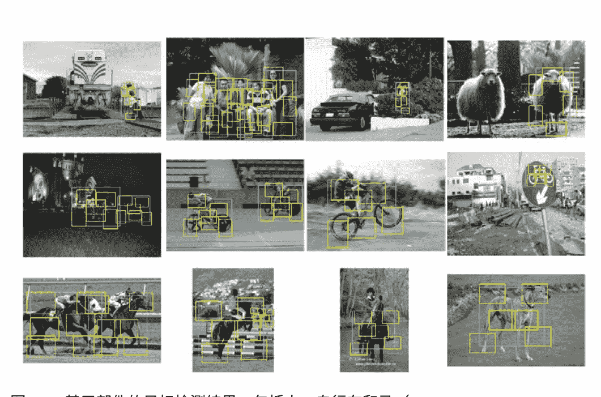

图14.10 基于部件的目标检测结果，包括人、自行车和马（Felzen-szwalb，McAllister和Ramanan 2008）©2008 IEEE。前三列显示正确的检测结果，而最右列显示误报。

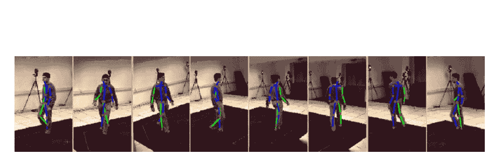

图14.11 使用随机森林进行姿态检测（Rogez，Rihan，Ramalingamet al. 2008）© 2008 IEEE。估计的姿态（运动模型的状态）绘制在每个输入帧上。

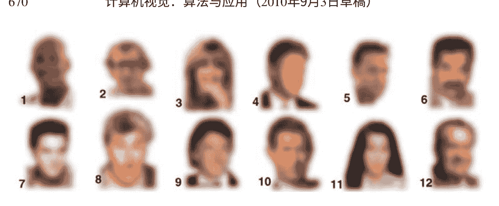

在一小部分家庭成员和朋友中，面部识别已经在消费级照片应用程序中得到应用，例如Picasa和iPhoto。面部识别还可以用于各种其他应用，包括人机交互（HCI），身份验证（Kirovski，Jojic和Jancke 2004），桌面登录，家长控制和患者监测。

(Zhao, Chellappa, Phillips等，2003年)。 如今的人脸识别器在相对均匀的照明条件下给出正面人脸图像时效果最好，尽管已经收集了包含大量姿态和光照变化的数据库（Phillips, Moon, Rizvi等，2000年; Sim, Baker和Bsat，2003年; Gross, Shi和Cohn，2005年; Huang, Ramesh, Berg等，2007年; Phillips, Scruggs, O’Toole等，2010年）。（更多细节请参见第14.6节的表14.1。）最早的人脸识别方法之一是找到图像中独特特征的位置，如眼睛、鼻子和嘴巴，并测量这些特征位置之间的距离（Fischler和Elschlager，1973年; Kanade，1977年; Yuille，1991年）。

更近期的方法依赖于比较投影到称为特征脸（第14.2.1节）的低维子空间上的灰度图像，并使用主动外观模型（第14.2.2节）共同建模形状和外观变化（忽略姿态变化）。

关于这个主题的其他人脸识别技术的描述可以在一些调查和书籍中找到（Chellappa, Wilson, and Sirohey 1995; Zhao, Chellappa, Phillips等人2003; Li and Jain 2005），以及人脸识别网站。Sinha, Balas, Ostrovsky等人（2006）关于人类面部识别的调查也值得一读；它包含了一些令人惊讶的结果，比如人类能够识别低分辨率的熟悉面孔（图14.12），以及眉毛在识别中的重要性。

#### 14.2.1 特征脸

特征脸依赖于 Kirby 和 Sirovich (1990) 首次观察到的一个现象：任意面部图像 $x$ 可以通过从平均图像 $m$ (图 14.1b) 开始并添加少量缩放的有符号图像 $u_i$ 来进行压缩和重建$^7$。

$$
\tilde{x} = m + \sum_{i=0}^{M-1} a_i u_i
$$

其中有符号基础图像 (图 14.13b) 可以使用一组训练图像进行派生主成分分析 (也称为特征值分析或 Karhunen-Loève 变换)。Turk 和 Pentland (1991a) 认识到特征脸展开中的系数 $a_i$ 本身可以用于构建快速图像匹配算法。

更详细地说，让我们从一组训练图像 $\{x_j\}$ 开始，从中我们可以计算出平均图像 $m$ 和散布 (或协方差) 矩阵

$$
C = \frac{1}{N} \sum_{j=0}^{N-1} (x_j - m)(x_j - m)^T
$$

我们可以应用特征值分解 (A.6) 来表示这个矩阵

$$
C = U \Lambda U^T = \sum_{i=0}^{N-1} \lambda_i u_i u_i^T
$$

其中 $\lambda_i$ 是 $C$ 的特征值，$u_i$ 是特征向量。对于一般的图像，Kirby 和 Sirovich (1990) 称这些向量为特征图；对于人脸，Turk 和 Pentland (1991a) 将其称为特征脸 (图 14.13b)$^8$。

在之前的章节中，我们用 $I$ 表示图像；在本章中，我们使用更抽象的量 $x$ 和 $u$ 来表示图像中的像素集合。

特征值分解的两个重要性质是，对于任何新图像 $x$，最优 (最佳近似) 系数 $a_i$ 可以计算为

$$a_i = (x - m) \cdot u_i \tag{14.11}$$

并且，假设特征值 $\{\lambda_i\}$ 按降序排序，在任意点 $M$ 处截断 (14.8) 中给出的近似值可以得到 $\tilde{x}$ 和 $x$ 之间的最佳近似 (最小误差)。图 14.13c 显示了与图 14.13a 对应的结果近似，并显示了它在压缩面部图像方面比 JPEG 更好。在 $M$ 个分量之后截断面部图像的特征脸分解 (14.8) 等效于将图像投影到线性子空间 $F$，我们可以称之为面部空间 (图 14.14)。因为特征向量 (特征脸) 是正交的并且单位规范，所以投影面 $\tilde{x}$ 到平均面 $m$ 的距离可以写为

$$\text{DIFS} = \|\tilde{x} - m\| = \sqrt{\sum_{i=0}^{M-1} a_i^2} \tag{14.12}$$

其中 DIFS 代表面部空间中的距离 (Moghadam 和 Pentland 1997)。原始图像 $x$ 与其在面部空间上的投影之间的剩余距离称为 DFFS (面部空间中的面部距离)，可以直接在像素空间中计算，并表示特定图像的“面部特征”。还可以测量面部空间中两个不同面部之间的距离，如

$$
\mathrm{DIFS}(\boldsymbol{x}, \boldsymbol{y})=\|\tilde{\boldsymbol{x}}-\tilde{\boldsymbol{y}}\|=\sqrt{\sum_{i=0}^{M-1}\left(a_{i}-b_{i}\right)^{2}}
$$

其中 $b_{i}=\left(\boldsymbol{y}-\boldsymbol{m}\right) \cdot \boldsymbol{u}_{i}$ 是对应于 $\boldsymbol{y}$ 的特征脸系数。然而，在欧几里得向量空间中计算这样的距离并没有利用我们协方差矩阵 (14.10) 的特征值分解提供的附加信息。如果我们将协方差矩阵 $C$ 解释为多变量高斯分布的协方差 (附录 B.1.1)，我们可以通过计算 Mahalanobis 距离将 DIFS 转化为对数似然。

$$
\mathrm{DIFS}^{\prime}=\|\tilde{\boldsymbol{x}}-\boldsymbol{m}\|_{\boldsymbol{C}^{-1}}=\sqrt{\sum_{i=0}^{M-1} a_{i}^{2} / \lambda_{i}^{2}}
$$

与测量脸部空间中每个主成分上的平方距离不同，马氏距离测量的是平方距离与相应方差 $\sigma_{i}^{\ 2}=\lambda_{i}$ 的比值，并将这些平方比率 (每个成分的对数似然) 相加。

另一种实现方法是通过每个特征向量的倒数平方根来预缩放。

$$
\boldsymbol{U}^{\wedge}=\boldsymbol{U} \boldsymbol{\Lambda}^{-1 / 2}
$$

这种白化变换意味着特征 (脸) 空间中的欧氏距离现在直接对应于对数似然 (Moghadam, Jebara 和 Pentland 2000)。(这种相同的白化方法也可以用于基于特征的匹配算法，如第 4.1.3 节所讨论的。)

如果在特征脸空间中的分布非常细长，马氏距离会适当地缩放分量，从而得出一个合理的 (概率的) 距离。类似的分析可以用于计算从面部空间到面部差异的合理差异 (DFFS) (Moghadam 和 Pentland 1997)，这两个术语可以结合起来产生对真实面部的可能性的估计，这在进行面部检测时非常有用 (第 14.1.1 节)。关于概率和贝叶斯 PCA 的更详细解释可以在统计学习的教材中找到 (Hastie, Tibshirani 和 Friedman 2001; Bishop 2006)，这些教材还讨论了选择最佳组件数 $M$ 用于建模分布的技术。

图 14.15 Belhumeur, Hespanha 和 Kriegman (1997) 使用的哈佛数据库中的图像 ©1997 IEEE。注意到广泛的照明变化范围，这可能比人际变化更加戏剧性。

使用特征脸的最大优势之一是它们将新的人脸图像与原型 (训练) 人脸图像进行比较的过程从像素空间中的 P 维差异减少到人脸空间中的 M 维差异 (参见图 14.14 中的彩色 x)。

$$||x - x_k|| = ||a - a_k||, \quad (14.16)$$

其中 $a = U^T(x - m)$ (14.11) 是计算差异图像 $(x - m)$ 与每个特征脸 $u_i$ 之间的点积。然而，这种欧氏距离再次忽略了我们在训练图像分布中有关人脸可能性的更多信息。

考虑图 14.15 中显示的同一人在各种照明条件下拍摄的图像集合。如您所见，这些图像中的人内部变化比在相同照明下拍摄的任意两个人之间的人外部变化要大得多。常规 PCA 分析无法区分这两种变化来源，并且实际上可能将大部分主成分用于建模人内部变化。

如果我们要通过线性子空间来近似人脸，那么拥有一个能够区分不同类别 (人) 并且对类内变化不敏感的空间会更有用 (Belhumeur, Hespanha 和 Kriegman 1997)。请参考图 14.16 中以不同颜色表示的三个类别。正如您所看到的，类别内的分布 (由倾斜的彩色轴表示) 在主要人脸空间 PCA 上是拉长和倾斜的。

图 14.16 Fisher 线性判别分析的简单示例。样本来自三个不同的类别，用不同的颜色表示，并显示它们的主轴，这些主轴被缩放为 $2\sigma_{i0}$。(倾斜轴的交点是类别均值 $m_k$。) 虚线是 (主导的) Fisher 线性判别方向，实线是类别之间的线性判别。请注意，判别方向是类间和类内散布矩阵的主要方向之间的混合。它与黑色的 X 和 Y 轴对齐。我们可以计算总的类内散布矩阵如下

$$
S_W = \sum_{k=0}^{K-1} S_k = \sum_{k=0}^{K-1} \sum_{i \in C_k} (x_i - m_k)(x_i - m_k)^T
$$

其中 $m_k$ 是类别 $k$ 的均值， $S_k$ 是其类内散布矩阵$^{11}$。同样地，我们可以计算类间散布矩阵如下

$$
S_B = \sum_{k=0}^{K-1} N_k (m_k - m)(m_k - m)^T
$$

其中 $N_k$ 是每个类别的样本数， $m$ 是总体均值。对于图 14.16 中显示的三个分布，我们有

$$
S_W = 3N \begin{bmatrix} 0.246 & 0.183 \\ 0.183 & 0.457 \end{bmatrix} \quad \text{和} \quad S_B = N \begin{bmatrix} 6.125 & 0 \\ 0 & 0.375 \end{bmatrix}
$$

其中 $N = N_k = 13$ 是每个类别中的样本数。

为了计算最具有区分性的方向，费舍尔线性判别 (FLD) (Belhumeur, Hespanha, and Kriegman 1997; Hastie, Tibshirani, and Friedman 2001; Bishop 2006)，也被称为线性判别分析 (LDA)，选择了使得类间投影和类内变化之间比率最大的方向 $u$。

$$ u^* = \arg \max_u \frac{u^T S_B u}{u^T S_W u} \tag{14.20} $$

这相当于求解广义特征值问题中对应最大特征值的特征向量。

$$ S_B u = \lambda S_W u \quad \text{or} \quad \lambda u = S_W^{-1} S_B u \tag{14.21} $$

对于图 14.16 中所示的问题，

$$ S_W^{-1} S_B = \begin{bmatrix} 11.796 & -0.289 \\ -4.715 & 0.3889 \end{bmatrix} \quad \text{和} \quad u = \begin{bmatrix} 0.926 \\ -0.379 \end{bmatrix} \tag{14.22} $$

正如你所看到的，使用这个方向可以更好地区分类别，而不是使用主要的 PCA 方向，即水平轴。在他们的论文中，Belhumeur、Hespanha 和 Kriegman (1997) 表明，Fisherfaces 算法明显优于原始的 eigenfaces 算法，特别是当面部有大量的光照变化时，如图 14.15 所示。

一种对类内 (个人内部) 和类间 (个人之间) 变化进行建模的替代方法是分别对每个分布进行建模，然后使用贝叶斯技术找到最接近的示例 (Moghaddam, Jebara 和 Pentland 2000)。不要计算每个类别的均值，然后计算类内和类间分布，考虑评估差异图像

$$ \Delta_{ij} = x_i - x_j \tag{14.23} $$

在所有训练图像对 $(x_i, x_j)$ 之间。将属于同一类别 (同一个人) 的图像对的差异用于估计个人内协方差矩阵 $\Sigma_I$，而不同人之间的差异用于估计个人间协方差矩阵 $\Sigma_E$。这两个类别对应的主成分 (特征脸) 如图 14.17 所示。

在识别时，我们可以计算新面孔 $x$ 与存储的训练图像 $x_i$ 之间的距离 $\Delta_i$，并评估其个人内可能性。

$$ p_I(\Delta_i) = p_N(\Delta_i; \Sigma_I) = \frac{1}{|2\pi\Sigma_I|^{1/2}} \exp -\|\Delta_i\|_{\Sigma_I^{-1}}^2 \tag{14.24} $$

其中 $p_N$ 是具有协方差 $\mathbf{\Sigma}_I$ 的正态 (高斯) 分布

$$|2\pi \mathbf{\Sigma}_I|^{1/2} = (2\pi)^{M/2} \prod_{j=1}^{M} \lambda_j^{1/2} \tag{14.25}$$

是其体积。马氏距离 $\|\mathbf{\Delta}_i\|_{\mathbf{\Sigma}_I^{-1}}^2 = \mathbf{\Delta}_i^T \mathbf{\Sigma}_I^{-1} \mathbf{\Delta}_i = \|\mathbf{a}^I - \mathbf{a}_i^I\|^2$ (14.26) 可以通过首先将新图像 $x$ 投影到白化的个人内部人脸空间 (14.15) 中来更高效地计算 $\mathbf{a}^I = \hat{\mathbf{U}}^I x$ (14.27)，然后计算与训练图像向量 $\mathbf{a}_i^I$ 之间的欧几里德距离，这可以离线预先计算。

类似地，可以计算外部概率 $p_E(\mathbf{\Delta}_i)$。一旦计算出内部和外部概率，我们可以计算新图像 $x$ 与训练图像 $x_i$ 匹配的贝叶斯概率。

$$p(\mathbf{\Delta}_i) = \frac{p_I(\mathbf{\Delta}_i) l_I}{p_I(\mathbf{\Delta}_i) l_I + p_E(\mathbf{\Delta}_i) l_E} \tag{14.28}$$

其中 $l_I$ 和 $l_E$ 是两个图像属于相同或不同类别的先验概率 (Moghaddam, Jebara 和 Pentland 2000)。一种更简单的方法是不需要计算外部概率，只需选择训练图像中最高似然度 $p_I(\Delta_i)$。在这种情况下，可以使用在预先计算的 $\{a^I_i\}$ 向量所张成的空间中的最近邻搜索技术来加速找到最佳匹配$^{13}$。

改进基于特征脸的方法的另一种方式是将图像分成独立的区域，例如眼睛、鼻子和嘴巴 (图 14.18)，并独立地匹配每个区域的模块化特征空间 (Moghaddam 和 Pentland 1997; Heisele, Ho, Wu 等人 2003; Heisele, Serre 和 Poggio 2007)。这种模块化方法的优点是可以容忍更广泛的视角，因为每个部分可以相对于其他部分移动。它还支持更多种类的组合，例如，我们可以将一个人建模为鼻子狭窄和眉毛浓密，而不需要特征脸跨越所有可能的鼻子、嘴巴和眉毛的组合。(如果你记得可以选择不同的上下面的纸板儿童书，或者土豆先生，你就明白了。)

处理外观变化较大的另一种方法是创建基于视图的特征空间，如图 14.19 所示 (Moghaddam 和 Pentland, 1997)。我们可以将这些基于视图的特征空间视为选择不同轴的局部描述符，具体取决于人脸空间的哪个部分。但是，请注意，这种方法可能需要大量的训练数据，即每个可能的姿势或表情下的每个人的照片。这与我们研究的形状和外观模型形成对比。

请注意，虽然协方差矩阵 $\Sigma_I$ 和 $\Sigma_E$ 是通过查看图像之间的差异来计算的，但运行时评估会选择最近的图像来确定面部身份。这是否在统计上正确在练习 14.4 中进行了探讨。

图 14.19 基于视图的特征空间 (Moghaddam 和 Pentland, 1997) ©1997 IEEE。(a) 常规 (参数化) 特征空间重建 (中间列) 与基于视图的特征空间重建 (右列) 与输入图像 (左列) 的比较。顶部行来自训练图像，底部行来自测试集。(b) 两种方法的示意图，显示每个视图如何计算其自己的局部基表示。

还可以将 PCA 和 SVD 中隐含的双线性分解推广到能够同时建模多个相互作用因素的多线性 (张量) 公式中 (Vasilescu 和 Terzopoulos 2007)。这些思想与机器学习中的当前活跃主题相关，例如子空间学习 (Cai, He, Hu 等人 2007)，局部距离函数 (Frome, Singer, Sha 等人 2007) 和度量学习 (Ramanan 和 Baker 2009)。学习方法在人脸识别中发挥越来越重要的作用，例如 Sivic, Everingham 和 Zisserman (2009) 以及 Guillaumin, Verbeek 和 Schmid (2009) 的工作。

#### 14.2.2 主动外观和3D形状模型

对于人脸识别，使用模块化或基于视图的特征空间的需求是一种症状，即面部外观和可识别性与形状、颜色或纹理一样重要 (这是特征脸所捕捉的内容)。此外，在处理 3D 头部旋转时，应在执行识别时忽略人头的姿势。

事实上，最早的人脸识别系统，如 Fischler 和 Elschlager (1973)、Kanade (1977) 和 Yuille (1991) 的系统，是在面部图像上找到独特的特征点，并根据它们的相对位置或距离进行识别的。新的技术，如局部特征分析 (Penev 和 Atick 1996) 和弹性束图匹配 (Wiskott, Fellous, Kr¨uger 等 1997)，将局部滤波器响应 (jets) 结合在一起，以区分特征位置与形状模型一起进行识别。

一个视觉上引人注目的例子是 Rowland 和 Perrett (1995) 的工作，他们手动追踪面部特征的轮廓，然后使用这些轮廓将每个图像归一化 (扭曲) 到一个规范形状。在分析形状和颜色图像与平均值的偏差后，他们能够将某些形状和颜色变形与个人特征 (如年龄和性别) 关联起来 (图 14.20)。他们的工作表明，形状和颜色对这些特征的感知都有重要影响。

图 14.20 通过形状和颜色改变面部外貌 (Rowland 和 Perrett 1995) ©1995 IEEE。通过向输入图像 (b) 添加或减去特定于性别的形状和颜色特征，可以引起不同程度的性别变化。添加的数量 (相对于平均值) 为：(a) +50% (性别增强)，(c) -50% (接近“中性”)，(d) -100% (性别切换) 和 (e) -150% (增强相反性别属性)。

与此同时，计算机视觉领域的研究人员开始使用同时形状变形和纹理插值来建模由身份或表情引起的面部外观的可变性 (Beymer 1996; Vetter and Poggio 1997)，开发了诸如 Active Shape Models (Lanitis, Taylor 和 Cootes 1997)，3D Morphable Models (Blanz and Vetter 1999) 和 Elastic Bunch Graph Matching (Wiskott, Fellous, Kr¨uger 等 1997) 等技术。

在所有这些技术中，Cootes、Edwards 和 Taylor (2001) 的主动外观模型 (AAMs) 是最广泛用于人脸识别和跟踪的模型之一。与其他形状和纹理模型一样，AAM 模型同时对图像的形状变化进行建模，通常通过图像上关键特征点的位置 (图 14.21b) 进行编码。

---
$^7$ 在实际应用中，不会计算完整的 $P \times P$ 散布矩阵 (14.9)。相反，会累积一个较小的 $N \times N$ 矩阵，其中包含所有有符号偏差之间的内积 $(x_i - m)$。详细信息请参见附录 A.1.2 (A.13–A.14)。
$^8$ 在实际应用中，不会计算完整的 $P \times P$ 散布矩阵 (14.9)。相反，会累积一个较小的 $N \times N$ 矩阵，其中包含所有有符号偏差之间的内积 $(x_i - m)$。详细信息请参见附录 A.1.2 (A.13–A.14)。
$^{11}$ 为了与 Belhumeur、Hespanha 和 Kriegman (1997) 保持一致，我们在这里使用 $S_W$ 和 $S_B$ 来表示散布矩阵，尽管我们在其他地方使用 $C$ (14.9)。
$^{13}$ 请注意，虽然协方差矩阵 $\Sigma_I$ 和 $\Sigma_E$ 是通过查看图像之间的差异来计算的，但运行时评估会选择最近的图像来确定面部身份。这是否在统计上正确在练习 14.4 中进行了探讨。

# 图14.21 主动外观模型（Cootes、Edwards和Taylor 2001）© 2001 IEEE：（a）带有注册特征点的输入图像；（b）特征点（形状向量s）；（c）无形状的外观图像（纹理向量t）。

同时，它还对纹理的变化进行建模，这些纹理在分析之前被归一化为规范形状（图14.21c）。

形状和纹理都表示为相对于平均形状 $\bar{s}$ 和纹理 $\bar{t}$ 的偏差
$$
s = \bar{s} + U_s a
$$
$$
t = \bar{t} + U_t a
$$
其中 $U_s$ 和 $U_t$ 的特征向量已经进行了预缩放（白化），使得 $a$ 中的单位向量表示训练数据中观察到的变化的一个标准差。除了这些主要变形之外，形状参数还通过全局相似性变换来匹配给定人脸的位置、大小和方向。类似地，纹理图像包含了一个比例和偏移量，以最佳匹配新的光照条件。

正如你所看到的，在（14.29-14.30）中，相同的外观参数 $a$ 同时控制了形状和纹理相对于平均值的变形，如果我们认为它们是相关的，这是有意义的。图14.22显示了沿着前四个主要方向移动三个标准差会改变一个人外貌中的几个相关因素，包括表情、性别、年龄和身份。

为了将主动外观模型适应到新的图像中，Cootes、Edwards和Taylor（2001）预先计算了一组“差异分解”图像，使用了与其他快速增量跟踪技术相关的方法，例如我们在4.1.4节、8.1.3节和8.2节中讨论的那些方法（Gleicher 1997；Hager和Belhumeur 1998），这些方法通常学习了匹配错误和增量位移之间的判别映射（Avidan 2001；Jurie和Dhome 2002；Liu、Chen和Kumar 2003；Sclaroff和Isidoro 2003；Romdhani和Vetter 2003；Williams、Blake和Cipolla 2003）。

图14.22 主动外观模型中的主要变化模式（Cootes、Edwards和Taylor 2001）©2001 IEEE。这四幅图像展示了同时改变形状和纹理的前四个变化模式对平均值的影响，变化范围为±σ。你可以清楚地看到脸部的形状和阴影同时受到影响。

更详细地说，Cootes、Edwards和Taylor（2001）使用有限差分计算一组训练图像相对于 $a$ 中的每个参数的导数，然后计算一组位移权重图像。

$$ W = \left[ \frac{\partial x^T}{\partial a} \frac{\partial x}{\partial a} \right]^{-1} \frac{\partial x^T}{\partial a} $$ (14.31)

这些权重可以乘以当前误差残差以产生参数更新步骤，即 $ \delta a = -W r$。Matthews和Baker（2004）使用他们的逆组合方法，该方法首先用于参数光流（8.64-8.65），以进一步加快主动外观模型的拟合和跟踪速度。图14.23展示了AAMs拟合到两个输入图像的示例。

尽管主动外观模型主要设计用于准确捕捉面部特征的外观和变形的可变性，但它们可以通过计算一个将身份变化与照明、姿势和表情等其他可变性分离的身份子空间来适应面部识别（Costen, Cootes, Edwards等，1999年）。这个基本思想是在特征脸（Belhumeur, Hespanha和Kriegman, 1997年；Moghaddam, Jebara和Pentland, 2000年）的类似工作之后建模的，即计算个人内部和个人外部变化的分离统计，并在这些子空间中找到有区别的方向。虽然有时直接使用AAM进行识别（Blanz和Vetter, 2003年），但它们在识别的背景下的主要用途是将面部对齐到规范姿势（Liang, Xiao, Wen等, 2008年），以便更传统的面部方法可以使用。

识别（Penev和Atick 1996; Wiskott, Fellous, Kruger等 1997; Ahonen, Hadid, 和Pietikainen 2006; Zhao和Pietikainen 2007; Cao, Yin, Tang等 2010）可以使用。AAMs（或者实际上是它们的简化版本，主动形状模型（ASMs））也可以用于对齐面部图像以执行自动变形（Zanella和Fuentes 2004）。

主动外观模型仍然是一个活跃的研究领域，通过改进来处理光照和视角变化（Gross, Baker, Matthews等, 2005），以及遮挡（Gross, Matthews和Baker, 2006）。最重要的扩展之一是构建形状的3D模型（Matthews, Xiao和Baker, 2007），这些模型在捕捉和解释面部外观在姿势发生大变化时的完全可变性方面要好得多。

> 图14.25 使用结合的面部、头发和躯干模型进行人物检测和重新识别（Sivic，Zitnick 和Szeliski，2006）©2006 Springer。（a）仅使用面部检测，会错过几个头部。（b）结合面部和服装模型成功重新找到所有的人。

这样的模型可以通过单目视频序列（Matthews, Xiao, and Baker 2007）构建，如图14.24所示，也可以通过多视角视频序列（Ramnath, Koterba, Xiao et al. 2008）构建，这样可以提供更高的重建和跟踪可靠性和准确性。（有关头部姿态估计进展的最新综述，请参阅Murphy-Chutorian和Trivedi（2009）的综述论文。）

#### 14.2.3 应用：个人照片集

除了数码相机自动找到人脸以帮助自动对焦和视频摄像机在视频会议中找到人脸以对准发言者（无论是机械方式还是数字方式），人脸检测还广泛应用于大多数消费级照片组织软件，如iPhoto、Picasa和Windows Live Photo Gallery。找到人脸并允许用户标记它们可以更容易地在以后找到所选人的照片，或者自动与朋友分享。事实上，在照片中标记朋友的能力是Facebook上最受欢迎的功能之一。

然而，有时候，面部可能很难找到和识别，特别是如果它们很小的话，转向摄像机，或者被其他物体遮挡。在这种情况下，将人脸识别与人体检测和服装识别相结合，可以非常有效，如图14.25所示 (Sivic, Zitnick和Szeliski 2006)。将人体识别与其他类型的上下文结合，例如位置识别 (第14.3.3节) 或活动或事件识别，也可以提高性能 (Lin, Kapoor, Hua等 2010)。

### 14.3 实例识别

一般的物体识别可以分为两大类，即实例识别和类别识别。前者涉及重新识别已知的2D或3D刚体物体，可能是从新的视角观察，背景杂乱，并且有部分遮挡。后者，也被称为类别级别或通用物体识别 (Ponce, Hebert, Schmid等, 2006)，是更具挑战性的问题，即识别特定类别的任何实例，如“猫”、“汽车”或“自行车”。

多年来，已经开发了许多不同的算法用于实例识别。Mundy (2006) 调查了早期的方法，重点是从图像中提取线条、轮廓或3D表面，并将其与已知的3D物体模型进行匹配。另一种流行的方法是从大量的视角和光照条件下获取图像，并使用特征空间分解进行表示 (Murase和Nayar, 1995)。更近期的方法 (Lowe, 2004; Rothganger, Lazebnik, Schmid等, 2006; Ferrari, Tuytelaars和Van Gool, 2006b; Gordon和Lowe, 2006; Obdrzalek和Matas, 2006; Sivic和Zisserman, 2009) 倾向于使用视角不变的2D特征，就像我们在第4.1.2节中看到的那样。

在从新图像和数据库中提取信息稀疏的2D特征之后，图像特征与对象数据库进行匹配，使用第4.1.3节中描述的稀疏特征匹配策略之一。一旦找到足够数量的匹配项，通过找到对齐两组特征的几何变换来验证它们（图14.26）。

下面，我们描述了一些用于表示这些特征之间几何关系的技术（第14.3.1节）。我们还讨论了如何利用文本和信息检索的思想使特征匹配过程更加高效（第14.3.2节）。

#### 14.3.1 几何对齐

为了识别一种或多种已知对象的实例，例如图14.26左列中所示的对象，识别系统首先在每个数据库图像中提取一组兴趣点，并将相关描述符（和原始位置）存储在搜索树等索引结构中（第4.1.3节）。在识别时，从新图像中提取特征并与存储的对象特征进行比较。每当找到足够数量的匹配特征（例如三个或更多）与给定对象匹配时，系统会调用一个匹配验证阶段，其任务是确定匹配特征的空间排列是否与数据库图像中的特征一致。

由于图像可能非常杂乱，相似的特征可能属于多个对象，原始的特征匹配集合可能有很多异常值。因此，Lowe（2004）建议使用霍夫变换（第4.3.2节）来累积可能的几何变换的投票。在他的系统中，他使用数据库对象和场景特征集合之间的仿射变换，这对于大部分是平面的对象或至少有几个对应特征共享准平面几何的对象效果很好。16由于SIFT特征携带它们自己的位置、尺度和方向，Lowe使用四维相似变换作为原始的霍夫分组结构，即每个分组表示对象中心、尺度和平面旋转的特定位置。每个匹配特征为最近的 $2^4$ 个分组投票，然后选择变换中的峰值进行更仔细的仿射运动拟合。图14.26（右图）显示了系统识别出的左侧两个对象的三个实例。Obdrzalek和Matas（2006）将Lowe的方法推广为使用具有完整局部仿射框架的特征描述符，并在多个对象识别数据库上评估了他们的方法。

另一个使用局部仿射框架的系统是由Rothganger、Lazebnik，施密德等人（2006年）开发的。在他们的系统中，使用Mikolajczyk和Schmid（2004年）的仿射区域检测器来矫正局部图像块（图14.27d），从中计算出SIFT描述符和一个 $10 \times 10$ 的UV颜色直方图，并用于匹配和识别。使用同一对象在不同视图中的对应块以及它们的局部仿射变形，使用第7.3节的因子分解算法的扩展来计算对象的3D仿射模型，然后可以升级为欧几里德重建（Tomasi和Kanade 1992）。

在识别时，使用局部欧几里德邻域约束来过滤潜在匹配，类似于Lowe（2004年）和Obdrzalek和Matas（2006年）使用的仿射几何约束。图14.27显示了使用这种方法在杂乱场景中识别五个对象的结果。

虽然基于特征的方法通常用于检测和定位场景中已知的物体，但也有可能基于这些匹配得到场景的像素级分割。Ferrari、Tuytelaars和Van Gool（2006b）描述了这样一个系统，可以同时识别物体并对场景进行分割，而Kannala、Rahtu、Brandt等人（2008）则将这种方法扩展到非刚性变形。第14.4.3节在通用类别识别的背景下重新讨论了联合识别和分割的主题。

#### 14.3.2 大型数据库

当数据库中的对象数量开始变得很大（比如说，搜索数百万个对象或视频帧），用于将新图像与每个数据库图像进行匹配的时间可能变得很长，这是不可接受的。需要一些技术来快速缩小搜索范围，而不是逐个比较图像，然后可以使用更详细和保守的验证阶段来比较几个可能的图像。

图14.28 从椭圆归一化仿射区域中获取的视觉词（Sivic和Zisserman 2009）©2009 IEEE。（a）从每个帧中提取仿射不变区域，并使用学习的马氏距离对SIFT描述符进行k-means聚类，将其聚类为视觉词。（b）每个网格中的中心补丁显示查询，周围的补丁显示最近的邻居。

快速查找文档之间的部分匹配问题是信息检索（IR）中的一个核心问题（Baeza-Yates和Ribeiro-Neto 1999; Manning, Raghavan和Schutze 2008）。快速文档检索算法中的基本方法是预先计算单词与文档（或网页或新闻报道）之间的倒排索引。更准确地说，使用特定单词在文档中的出现频率可以快速找到与特定查询匹配的文档。

Sivic和Zisserman（2009）是第一个将IR技术应用于视觉搜索的人。在他们的Video Google系统中，首先在所有视频帧中检测到不变形特征，使用了Harris特征点周围的形状适应区域（Schaffalitzky和Zisserman 2002; Mikolajczyk and Schmid 2004）和极值稳定区域（Matas, Chum, Urban等 2004）（第4.1.1节），如图14.28a所示。然后，从每个归一化区域（即图14.28b中的补丁）计算128维的SIFT描述符。然后，通过累积从帧到帧跟踪的特征的统计数据来估计这些描述符的平均协方差矩阵。特征描述符协方差 $\Sigma$ 然后用于定义特征描述符之间的马氏距离。

$$ d(\boldsymbol{x}_0, \boldsymbol{x}_1) = \|\boldsymbol{x}_0 - \boldsymbol{x}_1\|_{\boldsymbol{\Sigma}^{-1}} = \sqrt{(\boldsymbol{x}_0 - \boldsymbol{x}_1)^T \boldsymbol{\Sigma}^{-1} (\boldsymbol{x}_0 - \boldsymbol{x}_1)}. \qquad (14.32) $$

在实践中，特征描述符通过预乘以 $\Sigma^{-1/2}$ 进行白化，以便可以使用欧几里得距离。17

17 请注意，从匹配的特征点计算特征协方差比简单地在描述符空间上执行PCA更加合理（Winder和Brown 2007）。这大致对应于我们在第14.2.1节中学习的类内散布矩阵（14.17）。

Sivic和Zisserman (2003) 使用k-means聚类执行此映射，而下面讨论的一些新方法 (Nister和Stewenius 2006; Philbin, Chum, Isard等 2007) 使用其他技术，例如词汇树或随机森林。为了使聚类时间可控，只使用了几百个视频帧来学习聚类中心，这仍然涉及从约300,000个描述符中估计出数千个聚类。在视觉查询时，将新查询区域中的每个特征 (例如，图14.28a，它是从较大视频帧中裁剪的区域) 映射到其相应的视觉词。为了防止常见模式污染结果，创建了一个停用词列表，其中包含最常见的视觉词，并且这些词被从进一步考虑中删除。

一旦查询图像或区域被映射为其组成的视觉单词，就必须从数据库中检索出可能匹配的图像或视频帧。信息检索系统通过匹配单词分布 (即词频) 在查询和目标文档之间的 $n_{id}/n_d$ 来实现这一点，其中 $n_{id}$ 是单词 $i$ 在文档 $d$ 中出现的次数，而 $n_d$ 是文档 $d$ 中的总单词数。为了降低频繁出现的单词权重，并将搜索集中在更罕见 (因此更具信息量) 的术语上，应用了逆文档频率权重 $\log N/N_i$，其中 $N_i$ 是包含单词 $i$ 的文档数，而 $N$ 是数据库中的总文档数。这两个因素的结合导致了术语频率-逆文档频率 (tf-idf) 度量。

$$ t_i = \frac{n_{id}}{n_d} \log \frac{N}{N_i} . $$

在匹配时，每个文档 (或查询区域) 都由其tf-idf向量表示。

$$ \boldsymbol{t} = (t_1, \ldots, t_i, \ldots t_m). $$

两个文档之间的相似度通过它们对应的归一化向量之间的点积来衡量 $\hat{\boldsymbol{t}} = \boldsymbol{t} / \|\boldsymbol{t}\|$ ，这意味着它们的不相似度与它们的欧氏距离成正比。在他们的期刊论文中，Sivic和Zisserman (2009) 进行了比较

#### 14.3.2 大型数据库

### 1. 构建词汇表（离线）
-   (a) 从每个数据库图像中提取仿射不变区域。
-   (b) 计算描述符，并可选择对其进行白化以使欧氏距离有意义（Sivic和Zisserman 2009）。
-   (c) 将描述符聚类成视觉词，可以使用k-means（Sivic和Zisserman 2009）、层次聚类（Nister和Stewenius 2006）或随机k-d树（Philbin, Chum, Isard等 2007）。
-   (d) 决定哪些词太常见并将它们放入停用词列表中。

### 2. 数据库构建（离线）
-   (a) 计算每个图像中视觉单词的词频，每个单词的文档频率，以及每个文档的归一化 tf-idf向量。
-   (b) 从视觉单词到图像的倒排索引（带有单词计数）进行计算。

### 3. 图像检索（在线）
-   (a) 提取区域、描述符和视觉单词，并计算查询图像或区域的 tf-idf向量。
-   (b) 通过穷举比较稀疏tf-idf向量（Sivic和Zisserman，2009）或使用倒排索引仅检查图像子集（Nister和Stewenius，2006）来检索前面的图像候选项。
-   (c) 可选择重新排序或验证所有候选匹配，使用空间一致性（Sivic和Zisserman，2009）或仿射（或更简单）变换模型（Philbin, Chum, Isard等 2007）。
-   (d) 可选择通过重新提交高排名的匹配项作为新查询来扩展答案集（Chum，Philbin，Sivic等 2007）。

**算法 14.2** 使用视觉词进行图像检索（Sivic和Zisserman 2009; Nister和Stewenius 2006; Philbin, Chum, Isard等 2007; Chum, Philbin, Sivic等 2007; Philbin, Chum, Sivic等 2008）。

将简单的度量标准扩展到其他几种度量标准，并得出结论，它的性能几乎与更复杂的度量标准相当。由于典型查询或文档中非零 $t_i$ 项的数量很小（$M \approx 200$），与视觉词（$V \approx 20,000$）的数量相比，（稀疏）$tf-idf$向量对之间的距离可以很快计算出来。

在根据单词频率检索到前 $N$ 个文档之后，Sivic和Zisserman (2009) 使用空间一致性重新对这些结果进行排序。这一步骤涉及获取每个匹配特征并计算与其匹配的相邻特征的数量，其中 $k=15$ 个最近的相邻特征也在两个文档之间匹配。（后面的过程使用倒排文件加速，我们将在下面更详细地讨论。）如图14.29所示，这一步骤有助于去除虚假的正匹配，并产生对视频中的帧和区域实际上是真实匹配的更好估计。算法14.2总结了使用视觉词进行图像检索的处理步骤。

虽然这种方法对于成千上万个视觉词和数千个关键帧效果很好，但随着数据库的规模继续增长，量化每个特征和查找潜在匹配帧或图像的时间可能变得不可行。Nistér和Stewénius (2006) 通过构建一个分层的词汇树来解决这个问题，其中特征向量被分层聚类成一个 $k$ 路的原型树。（这种技术也被称为树状向量量化 (Gersho和Gray 1991) 。）在数据库构建时间和查询时间，每个描述符向量与词汇树中的几个原型进行比较，并选择与最接近原型的分支进行进一步的改进 (图14.30)。通过这种方式，可以支持具有数百万（$10^6$）个词的词汇表，这使得每个词都具有更强的区分能力，同时只需要 $10 \cdot 6$ 次比较来量化每个描述符。

在查询时，词汇树中的每个节点都保留着自己的倒排文件索引，这样可以快速将与树中特定节点匹配的特征映射到潜在的匹配图像上。（内部叶节点只使用其对应的叶节点后代的倒排索引。）使用$L_p$度量对特定查询$tf-idf$向量$_q$与所有文档向量$\{t_j\}$ 进行评分时， $_q$中的非零$i_q$条目用于获取相应的非零$t_{ij}$条目，并且$L_p$范数可以高效地计算为

$$\|t_q - t_j\|_p^p = 2 + \sum_{i|t_{iq}>0\land t_{ij}>0} (|t_{iq} - t_{ij}|^p - |t_{iq}|^p - |t_{ij}|^p). \quad (14.35)$$

为了减轻描述符向量中噪声引起的量化误差，Nistér和Stewénius (2006) 不仅对词汇树中的叶节点（对应于视觉词）进行评分，还对树中的内部节点进行评分，这些节点对应于相似视觉词的聚类。

18在他们的实际实现中，Nistér和Stewénius (2006) 使用了 $L_1$ 度量。

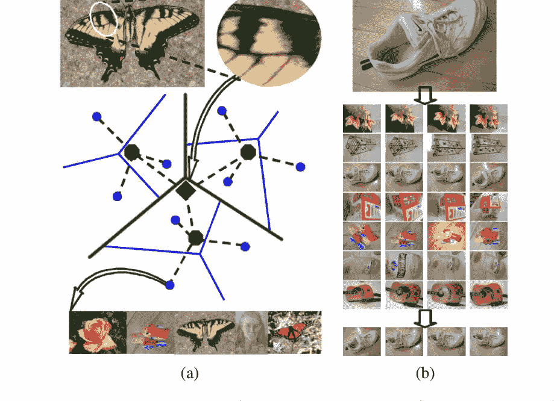

图14.30使用词汇树进行可扩展识别（Nistér和Stewénius 2006）©2006 IEEE。(a) 每个MSER椭圆区域都被转换为SIFT描述符，然后通过与词汇树中的一些原型描述符进行分层比较来进行量化。每个叶节点都将自己的倒排索引（非零 tf-idf计数的稀疏列表）存储在包含该特征的图像中。(b) 一个识别结果，显示一个查询图像（顶部行）被索引到一个包含6000个测试图像的数据库中，并正确找到相应的四个图像。

由于在量化和评分特征方面具有高效率，他们基于词汇-树的识别系统能够实时处理来自40000张CD封面数据库的图像，并在匹配来自六部特色电影的一百万帧数据库时以1Hz的速度进行。图14.30b显示了一些典型的图像，这些图像是在不同视角和光照下拍摄的对象数据库，用于训练和测试词汇树识别系统。

实例识别的最新技术不断取得进步。Philbin、Chum、Isard等人（2007年）表明，随机森林的k-d树在大规模位置识别任务中的表现优于词汇树（图14.31）。他们还比较了在验证阶段使用不同的2D运动模型（第2.1.2节）的效果。在后续的工作中，Chum、Philbin、Sivic等人（2007年）应用了信息检索中的另一个思想，即查询扩展, 它涉及重新提交初始查询的排名靠前的图像作为生成额外候选结果的附加查询，以进一步提高对于困难（遮挡或倾斜）示例的识别率。Philbin, Chum, Sivic等人（2008年）展示如何使用软分配来减轻视觉词选择中的量化问题，其中每个特征描述符根据其与聚类原型的距离映射到多个视觉词。从这些距离中得出的软权重被用于加权在 *tf-idf* 向量中使用的计数，并检索以供以后验证的其他图像。综合起来，这些最新进展有望将当前的实例识别算法扩展到执行Web规模的检索和匹配任务（Agarwal, Snavely, Simon等人, 2009年; Agarwal, Furukawa, Snavely等人，2010年; Snavely, Simon, Goesele等人, 2010年）。

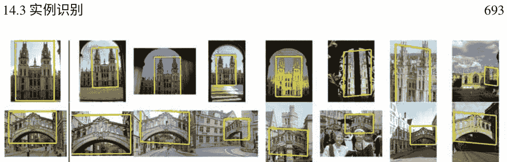

图14.31 使用随机树进行位置或建筑物识别（Philbin, Chum, Isard 等人, 2007年）©2007年IEEE。左图是查询图像，其他图像是排名最高的结果。

#### 14.3.3 应用：位置识别

当今实例识别最令人兴奋的应用之一是在位置识别领域，它可以在桌面应用程序（我在哪里拍的这个假期照片？）和移动（手机）应用程序中使用。后一种情况不仅包括根据手机图像确定您当前的位置，还可以为您提供导航方向或为您的图像注释有用的信息，例如建筑物名称和餐厅评论（即增强现实的便携形式）。

某些位置识别方法假设照片由建筑场景组成，可以使用消失方向对图像进行预校正以便更容易进行匹配（Robertson和Cipolla 2004年）。其他方法使用一般的仿射不变兴趣点进行宽基线匹配（Schaffalitzky和Zisserman 2002年）。Snavely, Seitz和Szeliski（2006年）的Photo Tourism系统（第13.1.2节）是第一个将这些想法应用于大规模图像匹配和（隐式）位置识别的系统。

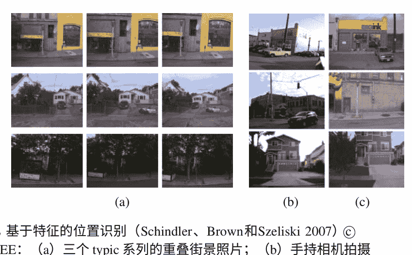

在各种观测条件下拍摄的互联网照片集合。

位置识别的主要困难在于处理像 Flickr（Philbin、Chum、Isard et al.2007；Chum、Philbin、Sivic et al.2007；Philbin、Chum、Sivic et al.2008；Turcott和Lowe2009）或商业捕获的数据库（Schindler、Brown和Szeliski 2007）等网站上的极大社区（用户生成）照片集合。常见元素（如植被、标志和常见建筑元素）的普遍存在进一步复杂化了任务。图14.31展示了来自社区照片集合的一些位置识别结果，而图14.32展示了来自更密集的商业获取数据集的样本结果。在后一种情况下，相邻数据库图像之间的重叠可以用于使用“时间”过滤验证和修剪潜在匹配，即在接受匹配之前要求查询图像与附近重叠的数据库图像匹配。

另一种位置识别的变体是自动发现地标，即经常拍摄的物体和地点。Simon、Snavely和Seitz（2007）展示了如何通过分析作为Photo Tourism 3D建模过程的一部分构建的匹配图来发现这些类型的物体。最近的研究利用了高效的聚类技术（Philbin和Zisserman 2008；Li、Wu、Zachet et al.2008；Chum、Philbin和Zisserman 2008；Chum和Matas 2010）以及将GPS和文本标签与视觉搜索相结合的元数据（Quack、Leibe和Van Gool 2008；Crandall、Backstrom、Huttenlocher et al.2009），如图14.33所示。现在甚至可以根据它们在多个松散标记的图像中的共现自动将对象标签与图像关联起来（Simon和Seitz 2008；Gammeter、Bossard、Quack等人2009年）。

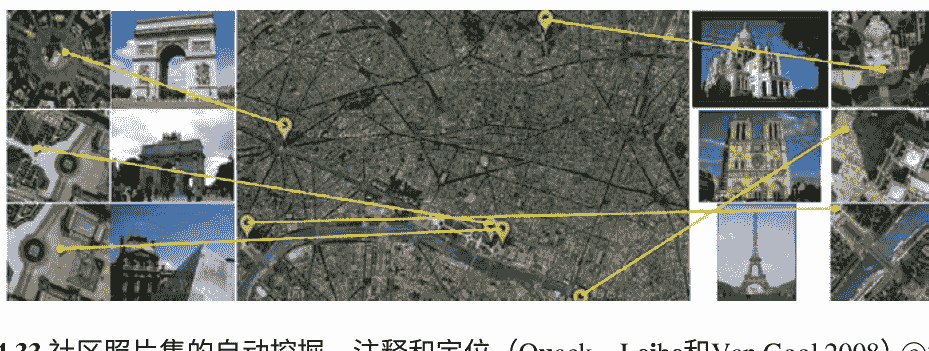

> 图14.33 社区照片集的自动挖掘、注释和定位 (Quack、Leibe和Van Gool 2008) ©2008 ACM。此图未显示文本注释或相应的维基百科条目，这些也是被发现的。

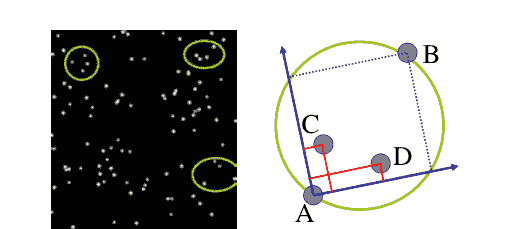

> 图14.34 使用天文学定位星场，http://astrometry.net/。 (a) 输入星场和一些选择的星四边形。 (b) 星C和D的2D坐标相对于由A和B定义的单位正方形进行编码。

通过位置组织世界照片集的概念甚至最近扩展到组织宇宙（天文学）照片的应用程序中，称为 *astrometry*，http://astrometry.net/。匹配任意两个星场的技术是使用附近星星的四元组（一对星星和另一对在其直径内的星星）来形成一个30位的几何哈希，通过编码第二对点的相对位置，以内切正方形作为参考框架，如图14.34所示。然后使用传统的信息检索技术（为天空图集的不同部分构建的k-d树）来查找匹配的四元组作为潜在的星场位置假设，然后可以使用相似性变换来验证。

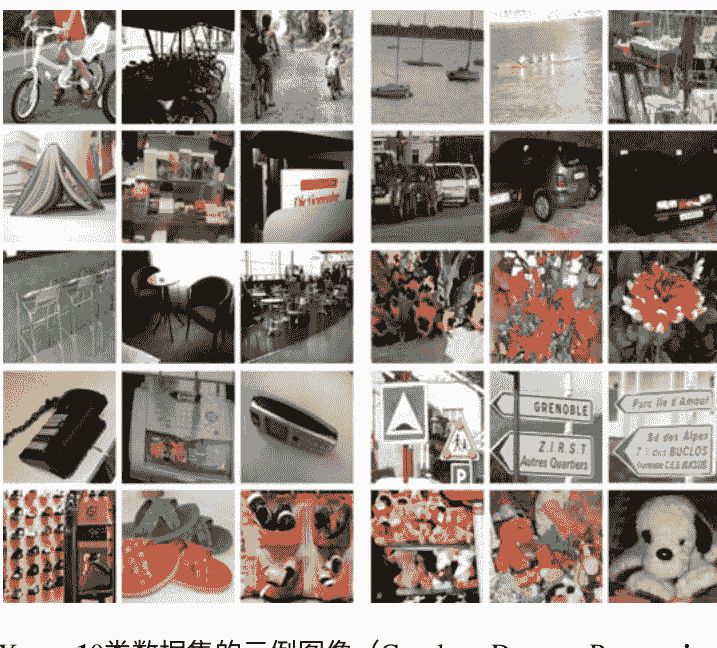

图14.35来自Xerox 10类数据集的示例图像 (Csurka, Dance, Perronnin etal. 2006) © 2007 Springer。想象一下，试图编写一个程序来区分这些图像与其他照片。

### 14.4 类别识别

虽然实例识别技术相对成熟，并且在商业应用中被使用，例如Photosynth（第13.1.2节），但通用类别（类）识别仍然是一个基本未解决的问题。例如，考虑图14.35中的照片集合，它显示了来自10个不同视觉类别的对象。（我将让你来为每个类别命名。）如果你要编写一个程序来将这些图像分类到适当的类别中，特别是如果你还可以选择“无”，你会怎么做？

从这个例子中可以看出，视觉类别识别是一个极具挑战性的问题；迄今为止，还没有人构建出一个接近两岁儿童表现水平的系统。然而，从过去十年的算法与今天的算法相比，该领域取得了相当大的进展。

图14.54显示了2008年PASCAL视觉对象类别挑战赛中使用的20个类别的样本图像。黄色框表示给定图像中每个对象的范围。在这种封闭世界的集合中，任务是在20个类别中进行决策，今天的分类算法可以做得非常好。

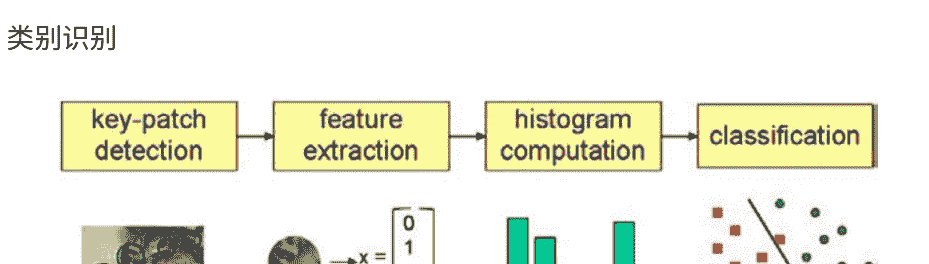

图14.36一个典型的词袋类别识别系统的处理流程（Csurka, Dance, Perronnin等人 2006）○ 2007 Springer。首先在关键点提取特征，然后量化以获得学习到的视觉词汇（特征聚类中心）的分布（直方图）。特征分布直方图用于使用分类算法（如支持向量机）学习决策面。

在本节中，我们将介绍解决类别识别问题的几种方法。虽然在历史上，基于部件的表示和识别算法（第14.4.2节）是首选方法（Fischler和Elschlager 1973; Felzenszwalb和Huttenlocher 2005; Fergus, Perona和Zisserman 2007），但我们首先描述更简单的特征词袋方法（第14.4.1节），将对象和图像表示为无序的特征描述符集合。然后，我们将研究同时分割图像和识别对象的问题（第14.4.3节），并介绍一些将这些技术应用于照片处理的应用（第14.4.4节）。在第14.5节中，我们将研究上下文和场景理解以及机器学习如何提高整体识别结果。有关本节中介绍的技术的更多细节，请参阅（Pinz 2005; Ponce, Hebert, Schmid等人2006; Dickinson, Leonardis, Schiele等人2007; Fei-Fei, Fergus和Torralba 2009）。

#### 14.4.1 词袋模型

对于类别识别来说，最简单的算法之一是袋子模型（也称为特征袋子或关键点袋子）方法（Csurka、Dance、Fan等人，2004年；Lazebnik、Schmid和Ponce，2006年；Csurka、Dance、Perronnin等人，2006年；Zhang、Marszalek、Lazebnik等人，2007年）。如图14.36所示，该算法简单地计算查询图像中发现的视觉单词的分布（直方图），并将该分布与训练图像中发现的分布进行比较。我们已经在第14.3.2节中看到了这种方法的一些元素，即方程式（14.33-14.35）和算法14.2。与实例识别不同的最大区别是缺少几何验证阶段（第14.3.1节），因为通用视觉类别的个体实例（如图14.35所示）的特征相对较少的空间一致性（但请参阅Lazebnik、Schmid和Ponce (2006))。

Csurka, Dance, Fan等人(2004)是第一个使用“关键点集合”这个术语来描述这种方法，并且是最早展示了基于频率的技术在类别识别中的实用性。他们最初的系统使用仿射不变区域和SIFT描述符，k-means可视化词汇构建，以及朴素贝叶斯分类器和支持向量机进行分类。（后者表现更好。）他们的新系统（Csurka, Dance, Perronnin等人2006）使用常规（非仿射）的SIFT补丁，使用提升方法而不是支持向量机，并且包含少量几何一致性信息。

Zhang, Marszalek, Lazebnik等人(2007)对这种特征集合系统进行了更详细的研究。他们比较了多种特征检测器（Harris-Laplace (Mikolajczyk和Schmid 2004) 和 Laplacian (Lindeberg 1998b)），描述符（SIFT、RIFT和SPIN (Lazebnik, Schmid, and Ponce 2005)）以及支持向量机核函数。为了估计核函数的距离，他们形成了一个图像签名

$$S = ((t_1, m_1), \ldots, (t_m, m_m)), \quad (14.36)$$

类似于 tf-idf 向量 t 在 (14.34) 中，其中聚类中心 m_i 被明确表示。然后他们研究了两种不同的核函数来比较这种图像签名。第一个是地球移动距离(EMD) (Rubner, Tomasi, and Guibas 2000),

$$EM D(S, S') = \frac{\sum_i \sum_j f_{ij} d(m_i, m_j')}{\sum_i \sum_j f_{ij}}, \quad (14.37)$$

其中 f_{ij} 是一个可以使用线性规划计算的流值，而 d(m_i, m_j') 是 m_i 和 m_j' 之间的 ground distance(欧几里德距离)。请注意，EMD可以用来比较长度不同的两个签名，其中条目不需要对应。第二个是一个 χ² 距离

$$\chi^2(S, S') = \frac{1}{2} \sum_i \frac{(t_i - t_i')^2}{t_i + t_i'}, \quad (14.38)$$

它衡量了两个签名生成自一致随机过程的可能性。然后将这些距离度量转换为使用广义高斯核的SVM核函数。

$$K(S, S') = \exp \left( -\frac{1}{A} D(S, S') \right), \quad (14.39)$$

其中 A 是一个缩放参数，设置为训练图像之间的平均距离。在他们的实验中，他们发现EMD对于视觉类别识别效果最好，而χ²度量对于纹理识别效果最好。

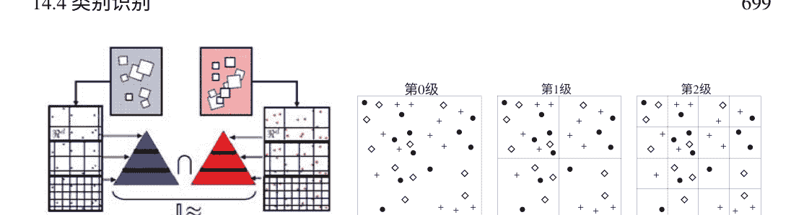

图14.37 使用金字塔匹配比较特征向量集合。(a) 特征空间金字塔匹配核（Grauman和Darrell 2007b）在高维特征空间中构建金字塔，并使用它计算特征向量集合之间的距离（和隐式对应关系）。(b) 空间金字塔匹配（Lazebnik，Schmid和Ponce 2006）○2006 IEEE将图像分割成池化区域的金字塔，并在每个空间区域内计算单独的视觉词直方图（分布）。

Grauman和Darrell（2007b）不是将特征向量量化为视觉词，而是开发了一种直接计算两个可变大小的特征向量集合之间近似距离的技术。他们的方法是将特征向量分组到在特征空间中定义的多分辨率金字塔中（图14.37a），并计算落入相应区域$B_{il}$和$B'_{il}$（图14.38a-c）的特征数量。两个特征向量集合之间的距离（可以看作是高维空间中的点）使用相应区域之间的直方图交集进行计算。

因为金字塔匹配核心（）只是直方图交集的加权和$l = \sum\limits_{i} \min(B_{il}, B'_{il})$ (14.40)，并且因为对于正数，，我们可以将 实现为所有分辨率上所有通道的适当加权。直方图连接的每个直方图交集然后以加权的方式相加。通道和 个级别，得到的向量的维度为 。第 节中报告的几个实验使用$N_l$与 $N_l = C_l - C_{l-1}$ 以及 $w_l = \frac{1}{d^{2^l}}$ (14.41)。和 的设置，导致 维直方图交集。然而，这些操作是高效的，因为直方图向量非常稀疏（实际上，图像维一样，这会在更精细的级别上减少已经找到的匹配，并更重视更细的匹配。(d是特征数量成线性关系） 。之后，我们没有观察到任何显著的性能提升，其 中连接的直方图是 如何使用哈希技术避免显式构建金字塔。

受到这项工作的启发，Lazebnik，Schmid和Ponce(2006)展示了如何利用类似的思想来增强关键点的袋子，带有松散的2D空间位置概念

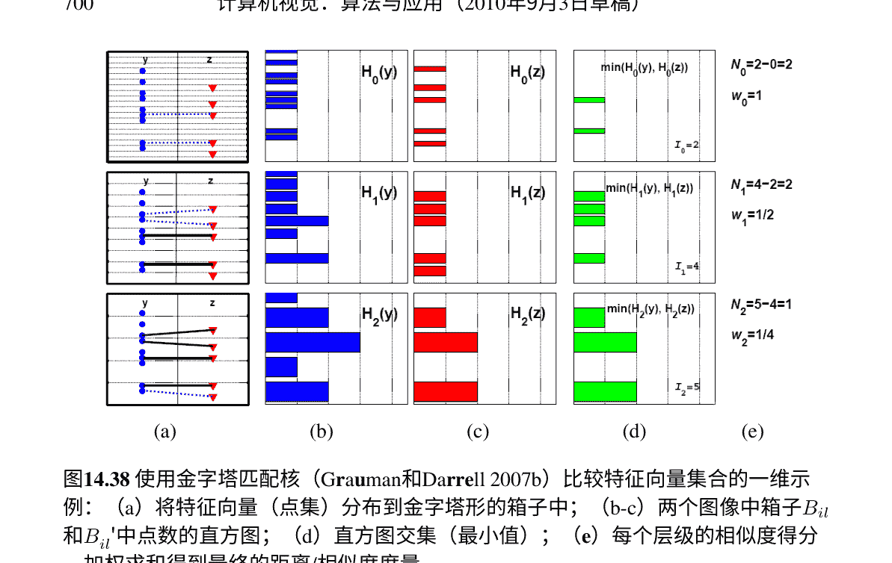

类似于SIFT（Lowe 2004）和“gist”（Torralba, Murphy, Freeman等人, 2003）所执行的池化操作。在他们的工作中，他们提取仿射区域描述符（Lazebnik, Schmid和Ponce 2005）并将其量化为视觉词汇。（基于Fei-Fei和Perona（2005）的先前结果，特征描述符在图像上密集提取（在规则网格上），这对于描述无纹理区域（如天空）非常有帮助。）然后，他们形成一个包含词频（直方图）的空间金字塔，如图14.37b所示，并使用类似的金字塔匹配核以分层方式组合直方图交集计数。

关于使用量化特征描述符还是连续描述符以及使用稀疏特征还是密集特征的辩论至今仍在继续。Boiman、Shechtman和Irani（2008）表明，如果将查询图像与表示给定类别的所有特征进行比较，而不仅仅是每个类别图像单独比较，那么最近邻匹配后跟朴素贝叶斯分类器的性能优于量化视觉词（图14.39）。一些作者在使用特定于类别的特征时，而不是使用通用特征检测器和描述符进行了研究（Ferencz、Learned-Miller和Malik 2008），通常使用随机森林（Philbin、Chum、Isard等2007; Moosmann、Nowak和Jurie 2008; Shotton、Johnson和Cipolla 2008）或将特征生成和图像分类结合起来。

#### 14.4.2 基于部件的模型

通过找到对象的组成部分并测量它们的几何关系来识别对象是最古老的对象识别方法之一（Fischler和Elschlager 1973； Kanade 1977； Yuille 1991）。我们已经看到部分方法被用于人脸识别的例子（图14.18）（Moghaddam和Pentland 1997； Heisele， Ho， Wu et al.2003； Heisele， Serre和Poggio 2007）和行人检测（图14.9）（Felzen-szwalb， McAllester和Ramanan 2008）。

在本节中，我们更详细地研究了部分识别中的一些核心问题，即几何关系的表示，个体部分的表示以及学习这些描述并在运行时进行识别的算法。

有关用于识别的基于部分模型的更多细节可以在Fergus（2007b， 2009）的课程笔记中找到。

最早用于表示几何关系的方法被Fischler和Elschlager（1973）称为图像结构，并由不同特征位置之间的弹簧连接组成（图14.1a）。为了将图像结构适配到图像中，需要计算能量形式的函数

$$E = \sum_{i} V_i(l_i) + \sum_{ij \in E} V_{ij}(l_i, l_j) \qquad\qquad (14.42)$$

在所有潜在的部分位置或姿势 $\{l_i\}$ 和部分对 $(i, j)$ 的情况下，最小化此能量 $E$。注意这个能量与马尔可夫随机场（3.108-3.109）中使用的能量密切相关，马尔可夫随机场可以用于在概率框架中嵌入图像结构，从而使参数学习更容易（Felzenszwalb和Huttenlocher 2005）。

基于部分的模型可以具有不同的几何连接拓扑结构（图14.41）。例如，Felzenszwalb和Huttenlocher（2005）将连接限制为树形结构（图14.41d），这使得学习和推理更易于处理。树形结构使得可以使用递归的维特比（动态规划）算法（Pearl 1988; Bishop 2006），其中首先优化叶节点作为其父节点的函数，然后将结果值插入并从能量函数中消除-请参阅附录B.5.2。维特比算法在 $O(N^2|E|+NP)$ 时间内计算最优匹配，其中 $N$ 是每个部分的潜在位置或姿势的数量，$|E|$ 是边的数量（成对约束），$P = |V|$ 是部分的数量（图形模型中的顶点数，树中等于 $|E|+1$）。为了进一步提高推理算法的效率，Felzenszwalb和Huttenlocher（2005）将成对能量函数 $V_{ij}(l_i, l_j)$ 限制为位置变量函数的马氏距离，然后使用快速距离变换算法在接近线性时间内最小化每个成对交互。

图14.40展示了使用他们的图形结构算法拟合关节的结果。通过背景分割将人体模型转换为二进制图像。在这个图像结构的应用中，部件通过其近似矩形的位置、大小和方向进行参数化。一元匹配势函数 V_i(l_i) 通过计算每个部件表示的倾斜矩形内外的前景和背景像素的百分比来确定。

在过去的十年中，已经提出了大量不同的图形模型来进行基于部件的识别，如图14.41所示。Carneiro和Lowe (2006) 讨论了其中一些模型，并提出了他们自己的模型，称为稀疏灵活模型；它涉及对部件进行排序，并且每个部件的位置最多依赖于其祖先位置中的 k 个位置。

最简单的模型是我们在第14.4.1节中看到的词袋模型，其中不同部件或特征之间没有几何关系。虽然这样的模型非常高效，但它们在表达部件的空间排列方面具有非常有限的能力。树和星形图（树的特殊情况，其中所有叶节点直接连接到一个共同的根节点）在推理和学习方面是最高效的（Felzenszwalb和Hutten-locher 2005; Fergus, Perona和Zisserman 2005; Felzenszwalb, McAllester和Ramanan 2008）。有向无环图（图14.41f-g）在复杂性方面排在其后，尽管需要对因果结构进行约束，但仍然可以支持高效的推理。

部分模型（Bouchard和Triggs 2005； Carneiro和Lowe 2006）。k-粉丝，其中一个大小为k的团形成了一个星形模型的根（图14.41c），具有推理复杂度O（Nk+1），但是通过距离变换和高斯先验，可以降低到O（Nk）（Crandall, Felzenszwalb和Huttenlocher 2005； Crandall和Huttenlocher 2006）。

最后，完全连接的星座模型（图14.41a）是最通用的，但是对于适度数量的部分 P，将特征分配给部分变得棘手，因为这种分配的复杂度是 O（NP）（Fergus, Perona和Zisserman 2007）。

最初的星座模型由Burl, Weber和Perona（1998）开发，它由一些部分组成，它们的相对位置由它们的平均位置编码和一个完整的协方差矩阵，用于表示位置的不确定性和不同部分之间的潜在相关性（协方差）（图14.42a）。Weber, Welling和Perona（2000）将这种技术扩展到了一个弱监督的设置中，其中仅通过整个图像标签自动学习每个部分的外观和位置。Fergus, Perona和Zisserman（2007）进一步扩展了这种方法，从尺度不变的关键点检测中同时学习外观和形状模型。

图14.42a展示了为摩托车类学习的形状模型。顶部图显示了每个部分的平均相对位置以及它们的位置协方差（未显示部分间协方差）和出现的可能性。底部曲线显示了相对于“地标”特征的每个部分的相对对数尺度的高斯概率密度函数。

图14.42b展示了为每个部分学习的外观模型，以最佳匹配外观模型的训练数据库中检测到的特征周围的补丁进行可视化。图14.42c显示了在测试数据库中检测到的特征（粉色点）以及它们被分配到的相应部分（彩色圆圈）。正如您所看到的，该系统已经成功地学习并使用了一个相当复杂的摩托车外观模型。

基于部分的识别方法还可以通过利用为其他类别开发的识别组件从少量示例中学习新类别（Fei-Fei, Fergus和Perona 2006）。可以使用语法的概念开发更复杂的基于部分的分层模型（Bouchard和Triggs 2005； Zhu和Mumford 2006）。使用部分的更简单的方法是将被识别为属于某个类的关键点投票给估计的部分位置，如图14.43顶行所示（Leibe, Leonardis和Schiele 2008）。（隐含地，这对应于具有星形几何模型。）

#### 14.4.3 分割识别

通用物体识别中最具挑战性的版本是同时进行准确边界分割的识别（Fergus 2007a）。例如识别（第14.3.1节），这有时可以通过将物体模型反投影到场景（Lowe 2004）如图14.1d所示，或将新场景的匹配部分与预先学习的（分割的）对象模型（Ferrari, Tuytelaars和Van Gool 2006b; Kannala, Rahtu, Brandt et al.2008）进行匹配。

对于更复杂（灵活）的对象模型，例如人类的模型（图14.1f），一种不同的方法是将图像预分割为较大或较小的部分（第5章），然后将这些部分与模型的部分进行匹配（Mori, Ren, Efros et al.2004; Mori 2005; He, Zemel和Ray 2006; Gu, Lim, Arbel aez et al.2009）。

Leibe, Leonardis和Schiele（2008）提出的另一种方法是在前一节中介绍的，根据与预聚类视觉码书条目（图14.43）对应的特征的检测结果，为潜在的对象位置和尺度进行投票。为了支持分割，每个码书条目都有一个相关的前景-背景掩码，该掩码是从预标记的对象分割掩码中作为码书聚类过程的一部分学习得到的。在识别过程中，一旦在投票空间中找到最大值，与投票给该实例的条目相关联的掩码将被组合以获得对象分割，如图14.43左侧所示。

更全面的识别和分割方法是将问题表述为在图像中为每个像素标记其类别成员资格，并解决这个问题-使用能量最小化或贝叶斯推断技术，即条件随机场（第3.7.2节，（3.118））（Kumar和Hebert 2006； He，Zemel和Carreira-Perpiñán2004）。Shotton，Winn，Rother et al.（2009）的TextonBoost系统使用基于图像特定颜色分布（第5.5节）（Boykov和Jolly2001； Rother，Kolmogorov和Blake 2004），位置信息（例如，前景对象更可能位于图像中间，天空更可能较高，道路更可能较低）和使用共享增强训练的新颖纹理布局分类器的像素一元（逐像素）潜力。它还使用传统的成对潜力，观察图像颜色梯度（Veksler 2001； Boykov和Jolly 2001； Rother，Kolmogorov和Blake 2004）。texton-layout特征首先使用一系列17个定向滤波器对图像进行滤波，然后聚类响应以将每个像素分类为30个不同的texton类别（Malik，Belongie，Leung et al.2001）。然后使用使用联合增强训练的偏移矩形区域对响应进行滤波（Viola和Jones2004），以产生用作一元潜力的texton-layout特征。

图14.44a展示了使用TextonBoost成功标记和分割图像的一些示例，而图14.44b展示了它效果不佳的示例。正如你所看到的，这种语义标记非常具有挑战性。

TextonBoost条件随机场框架已经通过Winn和Shotton（2006）扩展为LayoutCRFs，他们加入了额外的约束条件来识别多个对象实例并处理遮挡（图14.45），最近由Hoiem，Rother和Winn（2007）进一步扩展为包含完整的3D模型。

条件随机场在同时识别和分割应用中继续被广泛使用和扩展（Kumar和Hebert2006； He，Zemel和Ray 2006； Levin和Weiss 2006； Verbeek和Triggs 2007； Yang，Meer和Foran 2007； Rabi-novich，Vedaldi，Galleguilloset al.2007； Batra，Sukthankar和Chen 2008； Larlus和Jurie2008年； He和Zemel 2008年； Kumar，Torr和Zisserman 2010年），在困难的PASCAL VOC分割挑战中取得了一些最好的结果（Shotton，Johnson和Cipolla 2008年； Kohli，Ladick´y和Torr 2009年）。首先将图像分割为唯一或多个分割（Borenstein和Ullman 2008年； He，Zemel和Ray 2006年； Russell，Efros，Sivic等2006年）（可能与CRF模型结合）也表现出色：Csurka和Perronnin（2008年）在VOC分割挑战中拥有顶级算法之一。

分层（多尺度）和语法（解析）模型有时也会被使用（Tu, Chen, Yuille et al.2005; Zhu, Chen, Lin et al. 2008）。

#### 14.4.4 应用：智能照片编辑

目标识别和场景理解的最新进展极大地增强了智能（半自动）照片编辑应用的能力。一个例子是Lalonde, Hoiem, Efros et al.（2007）的PhotoClip Art系统，它可以识别和分割互联网照片集合中的感兴趣对象，例如行人，并允许用户将它们粘贴到自己的照片中。另一个例子是Hays和Efros（2007）的场景补全系统，它解决了我们在第10.5节中研究的同样的修复问题。给定一张我们希望擦除和填充一个大区域的图像（图14.46a-b），我们从哪里获取像素来填充编辑后图像中的空白部分？传统方法要么使用平滑延续（Bertalmio, Sapiro, Caselles et al.2000），要么从图像的其他部分借用像素（Efros and Leung 1999; Criminisi, P´erez, and Toyama 2004; Efros and Freeman2001）。随着Web上大量图像库的出现（我们将在第14.5.1节中讨论此话题），找到一张不同的图像作为缺失像素的来源往往更有意义。

在他们的系统中，Hays和Efros（2007）计算每个图像的要点（Oliva和Tor-ralba 2001; Torralba, Murphy, Freeman et al.2003）寻找颜色和构图相似的图像。然后，他们运行一个最小化图像梯度差异的图割算法并使用泊松图像混合（第9.3.4节）将新的替换部分合成到原始图像中（P'erez, Gangnet和Blake 2003）。图14.46d显示了结果图像，其中擦除的前景屋顶区域被帆船替换。

图像识别和分割的另一个应用是通过识别特定场景结构从单张照片中推断出3D结构。例如，Criminisi、Reid和Zisserman（2000）检测消失点，并要求用户绘制基本结构，如墙壁，以推断出3D几何（第6.3.3节）。另一方面，Hoiem、Efros和Hebert（2005a）处理更“有机”的场景，如图14.47所示。他们的系统使用各种分类器和从标记图像中学习的统计数据来将每个像素分类为地面、垂直或天空（图14.47d）。为了做到这一点，他们首先计算超像素（图14.47b），然后将它们分组成可能共享相似几何标签的合理区域（图14.47c）。在所有像素都被标记之后，垂直和地面像素之间的边界可以用来推断出沿着图像可以折叠成“弹出”（在去除天空像素后）的3D线条，如图14.47e所示。在相关工作中，Saxena、Sun和Ng（2009）开发了一个系统，直接推断出每个像素的深度和方向，而不仅仅使用三个几何类别标签。

人脸检测和定位也可以用于各种照片编辑应用程序（除了在相机中用于提供更好的焦点、曝光和闪光灯设置）。Zanella和Fuentes（2004年）使用主动形状模型（第14.2.2节）来注册面部特征以创建自动化的变形。Rother、Bordeaux、Hamadi等人（2006年）使用面部和天空检测来确定感兴趣的区域，以决定从图像集合中选择哪些部分拼接成拼贴画。Bitouk、Kumar、Dhillon等人（2008年）描述了一个系统将给定的人脸图像与大量的互联网人脸图像进行匹配，然后可以使用（通过仔细的重新照明算法）替换原始图像中的人脸。他们描述的应用包括去标识化和获得最好的微笑。

### 14.5 上下文和场景理解

“爆发模式”团体照片中的每个人。Leyvand, Cohen-Or, Dror等人（2008）展示了如何使用主动形状模型（Cootes, Edwards和Taylor 2001; Zhou, Gu和Zhang 2003）准确地定位面部特征，并将这些特征（以及图像）变形成类似于那些被高度评价面部吸引力的图像中发现的配置，从而“美化”图像而不完全丧失个人的身份。

这些技术大多数依赖于一组标记的训练图像，这是所有学习技术的一个基本组成部分，或者是互联网上可用图像的最近爆炸。在某些工作中的假设（以及基于这些非常大的数据库的识别系统（第14.5.1节））是，随着可访问（并且可能部分标记）的图像集合越来越大，找到一个接近的匹配变得更容易。正如Hays和Efros（2007）在摘要中所述：“我们的主要观点是，虽然图像是空间有效无限的，但语义可区分场景的空间实际上并不那么大。”在对他们的论文的有趣评论中，Levoy（2008）对此观点提出了质疑，声称“自然场景中的特征形成了一个重尾分布，这意味着虽然照片中的一些特征比其他特征更常见，但较不常见的特征的相对出现频率下降缓慢。换句话说，世界上有很多不寻常的照片。”然而，他同意在计算摄影中，就像在许多其他应用程序中一样，如果在足够大的数据库上进行训练，“简单的机器学习算法通常优于更复杂的算法。”他还继续指出这些系统的潜在优势，例如更好的自动颜色平衡，以及这些新方法可能导致的图像伪造的潜在问题和陷阱。

有关照片编辑和计算摄影应用的其他示例，通过互联网计算机视觉实现，请参阅最近关于该主题的研讨会，以及特刊（Avidan, Baker和Shan 2010），以及Tamara Berg（2008）的互联网视觉课程。

到目前为止，我们主要考虑了在孤立的对象中识别和定位对象的任务，而没有考虑对象出现的场景（上下文）的理解。这是一个严重的限制，因为上下文在人类对象识别中起着非常重要的作用（Oliva和Torralba 2007）。正如我们将在本节中看到的，它可以极大地提高对象识别算法的性能（Divvala, Hoiem, Hays等人 2009），并为一般场景理解提供有用的语义线索（Torralba 2008）。

请看图14.48a-b中的两张照片。你能否命名所有的物体，特别是图像(c-d)中圈出的物体？现在仔细看一下圈出的物体。你能看出它们的形状有什么相似之处吗？事实上，如果你将它们旋转90°，它们都与图14.48e中显示的“斑点”相同。这就是我们通过形状来识别物体的能力！在图14.49中还展示了另一个（也许更人为的）上下文识别的例子。试着命名所有的字母和数字，然后看看你猜对了吗。

尽管我们在本章的前面没有明确讨论上下文，但我们已经看到了几个使用这个一般思想的实例。将空间信息纳入识别算法的一种简单方法是计算不同区域的特征统计，就像Lazebnik, Schmid和Ponce（2006）的空间金字塔系统中那样。基于部件的模型（第14.4.2节，图14.40-14.43）使用一种局部上下文，各个部件需要以适当的几何关系排列才能构成一个物体。

基于部分和上下文模型之间最大的区别在于后者将对象组合成场景，并且每个类别的组成对象数量事先不知道。实际上，可以将基于部分和上下文模型结合在一起。

识别架构（Murphy, Torralba和Freeman 2003; Sudderth, Torralba, Freeman et al. 2008; Crandall和Huttenlocher 2007）。
考虑图14.50a-b中显示的街道和办公场景。如果我们有足够多的带有标记区域的训练图像，例如建筑物、汽车和道路或监视器、键盘、和鼠标，我们可以开发一个几何模型来描述它们的相对位置。Sudderth, Torralba, Freeman et al.（2008）开发了这样一个模型，可以看作是一个两级星座模型。在顶层，对象之间的分布（例如，建筑物相对于汽车）被建模为高斯分布（图14.50c，右上角）。在底层，部件（仿射不变特征）相对于对象中心的分布使用高斯混合模型进行建模（图14.50c，下两行）。然而，由于场景中的对象数量和每个对象中的部件数量是未知的，潜在狄利克雷过程（LDP）被用于在生成框架中建模对象和部件的创建。所有对象和部件的分布都是从一个大型标记数据库中学习的，然后在推理（识别）过程中用于标记场景的元素。

上下文的另一个例子是在同时分割和识别中（第14.4.3节）（图14.44–14.45），其中场景中各种对象的排列被用作标签过程的一部分。Torralba, Murphy和Freeman（2004）描述了一个条件随机场，其中建筑物和道路的估计位置影响了汽车的检测，并且使用增强学习来学习CRF的结构。Rabinovich, Vedaldi, Galleguillos等人（2007）利用上下文来改善CRF分割的结果，指出某些邻接关系比其他邻接关系更有可能发生，例如，一个人更有可能在马上而不是在狗上。

上下文还在从单个图像进行3D推断中起着重要作用（图14.47），使用计算机视觉技术将像素标记为属于地面、垂直表面或天空（Hoiem, Efros和Hebert 2005a,b）。这一工作已经扩展到更全面的方法，同时考虑对象身份、位置、表面方向、遮挡和相机视角参数（Hoiem, Efros和Hebert 2008a,b）。

许多方法使用场景的要点（Torralba 2003; Torralba, Murphy, Freeman et al. 2003）来确定特定对象的实例可能出现的位置。例如，Murphy, Torralba和Freeman（2003）训练一个回归器，根据图像的要点来预测对象（如行人、汽车和建筑物，或者室内办公场景中的屏幕和键盘）的垂直位置。然后，将这些位置分布与经典的对象检测器结合使用，以提高检测器的性能。要点还可以直接用于匹配完整的图像，就像我们在Hays和Efros（2007）的场景补全工作中看到的那样。

最近在场景理解方面的一些最新工作利用了大量标记（甚至未标记）的图像，直接对整个图像进行匹配，图像本身隐含地编码了对象之间的预期关系（图14.51）（Russell, Torralba, Liu et al. 2007; Malisiewicz和Efros 2008）。我们将在下一节讨论这些技术，看看大型图像数据库对对象识别和场景理解的影响。

#### 14.5.1 学习和大型图像集合

鉴于学习技术广泛应用于识别算法中，你可能会想知道学习的主题是否值得拥有自己的部分（甚至章节），或者它是否只是所有识别任务的基本组成部分。事实上，试图构建一个识别系统，除了基本模式（如UPC码）之外，没有大量的训练数据已经被证明是一个惨败的尝试。

在本章中，我们已经看到了许多从机器学习、统计学和模式识别社区借鉴的技术。这些技术包括主成分、子空间和判别分析（第14.2.1节），以及更复杂的判别分类算法，如神经网络、支持向量机和提升（第14.1.1节）。在具有挑战性的识别基准上，一些表现最佳的技术（Varma和Ray 2007; Felzenszwalb, McAllester和Ramanan 2008; Fritz和Schiele 2008; Vedaldi, Gulshan, Varma et al. 2009）严重依赖于最新的机器学习技术，其发展往往受到具有挑战性的视觉问题的推动（Freeman, Perona, and Schölkopf 2008）。

在识别社区中，有时会区分大部分感兴趣的变量（例如，部分）已经（部分）标记的问题和学习更少监督下的问题结构的系统（Fergus, Perona和Zisserman 2007; Fei-Fei, Fergus和Perona 2006）。事实上，Sivic, Russell, Zisserman et al.（2008）的最新工作已经证明了在完全无监督的框架中学习视觉层次结构（具有相关视觉外观的对象部分层次结构）和场景分割的能力。识别社区中最引人注目的变化可能是出现了非常大的训练图像数据库。早期基于学习的算法，例如人脸和行人检测（第14.1节），使用相对较少的（数百个）标记示例来训练识别算法参数（例如，提升中使用的阈值）。到今天，一些识别算法使用像LabelMe这样的数据库（Russell, Torralba, Murphy et al. 2008），其中包含数万个标记示例。

这样大型数据库的存在打开了直接与训练图像进行匹配的可能性，而不是用它们来学习识别算法的参数。Russell, Torralba, Liu等人（2007年）描述了一个系统，其中新图像与每个训练图像进行匹配，从而可以推断出场景中未知对象的共识标签，如图14.51所示。Malisiewicz和Efros（2008年）首先对每个图像进行过分割，然后使用LabelMe数据库搜索相似图像和配置，以获得每像素的类别标签。还可以将基于特征的对应算法与大型标记数据库相结合，以执行同时识别和分割（Liu, Yuen和Torralba 2009）。当图像数据库变得足够大时，甚至可以直接匹配完整的图像，以期找到一个好的匹配。Torralba, Freeman和Fergus（2008）从8000万个微小（32 × 32）图像数据库开始，并通过使用语义分类（Wordnet）来推断新图像的最可能标签，从而弥补了图像标签的低准确性，这些标签是从互联网自动收集的。在8000万张图像中，有足够的示例与他们系统中使用的Wordnet的75000个非抽象名词相关联。图14.52显示了一些示例识别结果。

另一个具有大规模标记图像数据库的例子是ImageNet（Deng, Dong, Socher等，2009年），它正在为WordNet中的80000个名词（同义词集）收集图像（Fellbaum 1998）。截至2010年4月，对于14841个名词，已经仔细审核了约500-1000个示例。已收集了同义词集（图14.53）。Deng, Dong, Socher等人（2009年）的论文还对相关数据库进行了很好的回顾。

正如我们在第14.4.3节中提到的，大型部分标记的互联网图像数据库的存在催生了一个新的互联网计算机视觉子领域，拥有自己的研讨会和一个特刊（Avidan, Baker和Shan 2010年）。

### 14.5.2 应用 : 图像搜索

尽管从某些方面来看，视觉识别算法仍处于初级阶段，但它们已经开始对图像搜索产生一些影响，即使用关键词和视觉相似性的组合从网络中检索图像。如今，大多数图像搜索引擎主要依赖于标题、附近文本和文件名中的文本关键词，再加上用户点击数据（Craswell和Szummer 2007年）。然而，随着识别算法的不断改进，视觉特征和视觉相似性将开始用于识别具有缺失或错误关键词的图像。

通过视觉相似性搜索的主题有着悠久的历史，并且有多种名称，包括基于内容的图像检索（CBIR）（Smeulders, Worring, Santini等, 2000年；Lew, Sebe, Djeraba等, 2006年；Vasconcelos, 2007年；Datta, Joshi, Li等, 2008年）和基于图像内容的查询（QBIC）（Flickner, Sawhney, Niblack等, 1995年）。这些领域的原始出版物主要基于简单的整体图像相似性度量，例如颜色和纹理（Swain和Ballard, 1991年；Jacobs, Finkelstein和Salesin, 1995年；Manjunathi和Ma, 1996年）。

在最近的工作中，Fergus, Perona和Zisserman（2004年）使用基于特征的学习和识别算法对传统的基于关键字的图像搜索引擎的输出进行重新排序。在后续的工作中，Fergus, Fei-Fei, Perona等（2005年）使用概率最新语义分析（PLSA）的扩展对图像搜索返回的结果进行聚类（Hofmann，1999年），然后选择与排名最高的结果相关联的聚类作为该类别的代表图像。

更近期的工作依赖于精心注释的图像数据库，例如LabelMe（Russell, Torralba, Murphy等，2008年）。例如，Malisiewicz和Efros（2008年）描述了一个系统，可以在给定查询图像的情况下找到类似的LabelMe图像，而Liu, Yuen和Torralba（2009年）将基于特征的对应算法与标记数据库相结合，以进行同时识别和分割。

### 14.6 识别数据库和测试集

除了机器学习和统计建模技术的快速进展之外，继续改进识别算法的关键因素之一是图像识别数据库的可用性和质量的提高。

表14.1和14.2基于Fei-Fei, Fergus和Torralba（2009年）中的类似表格，更新了更多最新的条目和URL，显示了一些广泛使用的识别数据库。其中一些数据库，例如用于人脸识别和定位的数据库，可以追溯到十多年前。最新的数据库，例如PASCAL数据库，每年都会更新，提供更具挑战性的问题。表14.1显示了主要用于（整个图像）识别的数据库示例，而表14.2显示了可用并期望更准确的定位或分割信息的数据库。

Ponce, Berg, Everingham等（2006年）讨论了早期数据集的一些问题，并描述了最新的PASCAL视觉对象类别挑战如何克服这些问题。2008年挑战中的20个视觉类别的一些示例显示在图14.54中。来自VOC研讨会的幻灯片是目前最佳识别技术的指引来源。

识别数据库中最近的两个趋势是基于Web的注释和数据收集工具的出现，以及使用搜索和识别算法构建数据库（Ponce, Berg, Everingham等人 2006年）。关于图像的人类注释中一些最有趣的工作来自一系列互动多人游戏，例如ESP（von Ahn和Dabbish 2004）和Peekaboom（von Ahn, Liu和Blum 2006）。在这些游戏中，人们通过给出有关其内容的文本提示来帮助彼此猜测隐藏图像的身份，这隐含地标记整个图像或仅标记区域。更多关于视觉数据收集工具的细节，以及它们在训练识别算法中的使用，在另一个最近的调查中给出（Deng, Dong, Socher等，2009年）。

| 姓名 / 网址 | 范围 | 内容 / 参考 |
|-------------|------|-------------|
| **人脸和人物识别** | | |
| 耶鲁人脸数据库<br>http://www1.cs.columbia.edu/~belhumeur/ | 居中的人脸图像 | 正面人脸<br>Belhumeur, Hespanha, 和 Kriegman (1997) |
| 人脸检测资源<br>http://vision.ai.uiuc.edu/mhyang/face-detection-survey.html | 各种数据库 | 各种姿势的人脸<br>Yang, Kriegman, 和 Ahuja (2002) |
| FERET<br>http://www.frvt.org/FERET | 居中的人脸图像 | 正面人脸<br>Phillips, Moon, Rizvi 等 (2000) |
| FRVT<br>http://www.frvt.org/ | 居中的人脸图像 | 各种姿势的人脸<br>Phillips, Scruggs, O’Toole 等 (2010) |
| CMU PIE数据库<br>http://www.ri.cmu.edu/projects/project_418.html | 居中的人脸图像 | 各种姿势的人脸<br>Sim, Baker, and Bsat (2003) |
| CMU Multi-PIE数据库<br>http://multipie.org | 居中的人脸图像 | 各种姿势的人脸<br>Gross, Matthews, Cohn 等人 (2010) |
| 野外人脸<br>http://vis-www.cs.umass.edu/lfw/ | 互联网图像 | 各种姿势的人脸<br>Huang, Ramesh, Berg 等人 (2007) |
| 消费者图像人物数据库<br>http://chenlab.ece.cornell.edu/people/Andy/GallagherDataset.html | 完整的图像 | 人物<br>Gallagher and Chen (2008) |
| **物体识别** | | |
| Caltech 101<br>http://www.vision.caltech.edu/Image.Datasets/Caltech101/ | 分割掩模 | 101个类别<br>Fei-Fei, Fergus, and Perona (2006) |
| Caltech 256<br>http://www.vision.caltech.edu/Image.Datasets/Caltech256/ | 居中的物体 | 256个类别和杂乱<br>Griffin, Holub和Perona (2007年) |
| COIL-100<br>http://www1.cs.columbia.edu/CAVE/software/softlib/coil-100.php | 居中的物体 | 100个实例<br>Nene, Nayar和Murase (1996年) |
| ETH-80<br>http://www.mis.tu-darmstadt.de/datasets | 居中的物体 | 8个实例，10个视图<br>Leibe和Schiele (2003年) |
| 实例识别基准物体在不同的姿势<br>http://vis.uky.edu/~stewe/ukbench/ | | 2550个对象<br>Nistér和Stewénius (2006年) |
| 牛津建筑数据集<br>http://www.robots.ox.ac.uk/~vgg/data/oxbuildings/ | 建筑物的图片 | 5062张图片<br>Philbin, Chum, Isard et al. (2007年) |
| NORB<br>http://www.cs.nyu.edu/~ylclab/data/norb-v1.0/ | 边界框 | 50个玩具<br>LeCun, Huang和Bottou (2004年) |
| 微小图像<br>http://people.csail.mit.edu/torralba/tinyimages/ | 完整的图像 | 75,000个（Wordnet）物体<br>Torralba, Freeman和Fergus (2008年) |
| ImageNet<br>http://www.image-net.org/ | 完整的图像 | 14,000个（Wordnet）物体<br>Deng, Dong, Socher等 (2009年) |

> 表14.1 用于识别的图像数据库，改编和扩展自Fei-Fei, Fergus和Torralba (2009年)。

表14.2 用于检测和定位的图像数据库，改编和扩展自Fei-Fei, Fergus和Torralba (2009年)。

| 姓名 / 网址 | 范围 | 内容 / 参考 |
| :--- | :--- | :--- |
| 目标检测/定位 | | |
| CMU正面人脸 http://vasc.ri.cmu.edu/idb/html/face/frontal_images | 补丁 | 正面人脸 Rowley, Baluja和Kanade (1998a) |
| MIT正面人脸 http://cbcl.mit.edu/software-datasets/FaceData2.html | 补丁 | 正面人脸 Sung和Poggio (1998年) |
| CMU人脸检测数据库 多个人脸 http://www.ri.cmu.edu/research_project_detail.html?project_id=419 | | 各种姿势的人脸 Schneiderman和Kanade (2004年) |
| UIUC图像数据库 http://l2r.cs.uiuc.edu/~cogcomp/Data/Car/ | 边界框 | 汽车 Agarwal和Roth (2002年) |
| Caltech行人数据集 http://www.vision.caltech.edu/Image_Datasets/CaltechPedestrians/ | 边界框 | 行人 Dollár, Wojek, Schiele等 (2009年) |
| Graz-02数据库 http://www.emt.tugraz.at/~pinz/data/GRAZ_02/ | 分割掩模 | 自行车，汽车，人 Opelt, Pinz, Fussenegger等 (2006年) |
| ETHZ玩具 http://www.vision.ee.ethz.ch/~calvin/datasets.html | 杂乱的图像 | 玩具、盒子、杂志 Ferrari, Tuytelaars和Van Gool (2006b) |
| TU Darmstadt DB http://www.vision.ee.ethz.ch/~bleibe/data/datasets.html | 分割掩模 | 摩托车、汽车、牛 Leibe, Leonardis和Schiele (2008) |
| MSR Cambridge http://research.microsoft.com/en-us/projects/objectclassrecognition/ | 分割掩模 | 23个类别 Shotton, Winn, Rother等 (2009) |
| LabelMe数据集 http://labelme.csail.mit.edu/ | 多边形边界 | >500个类别 Russell, Torralba, Murphy等 (2008) |
| Lotus Hill http://www.imageparsing.com/ | 分割掩模 | 场景和层次结构 Yao, Yang, Lin等 (2010) |
| 在线标注工具 | | |
| ESP游戏 http://www.gwap.com/gwap/ | 图像描述 | 网络图片 von Ahn和Dabbish (2004年) |
| Peekaboom http://www.gwap.com/gwap/ | 标记的区域 | 网络图片 von Ahn, Liu和Blum (2006年) |
| LabelMe http://labelme.csail.mit.edu/ | 多边形边界 | 高分辨率图像 Russell, Torralba, Murphy等 (2008年) |
| 挑战的集合 | | |
| PASCAL http://pascallin.ecs.soton.ac.uk/challenges/VOC/ | 分割，框 | 各种 Everingham, Van Gool, Williams等 (2010年) |

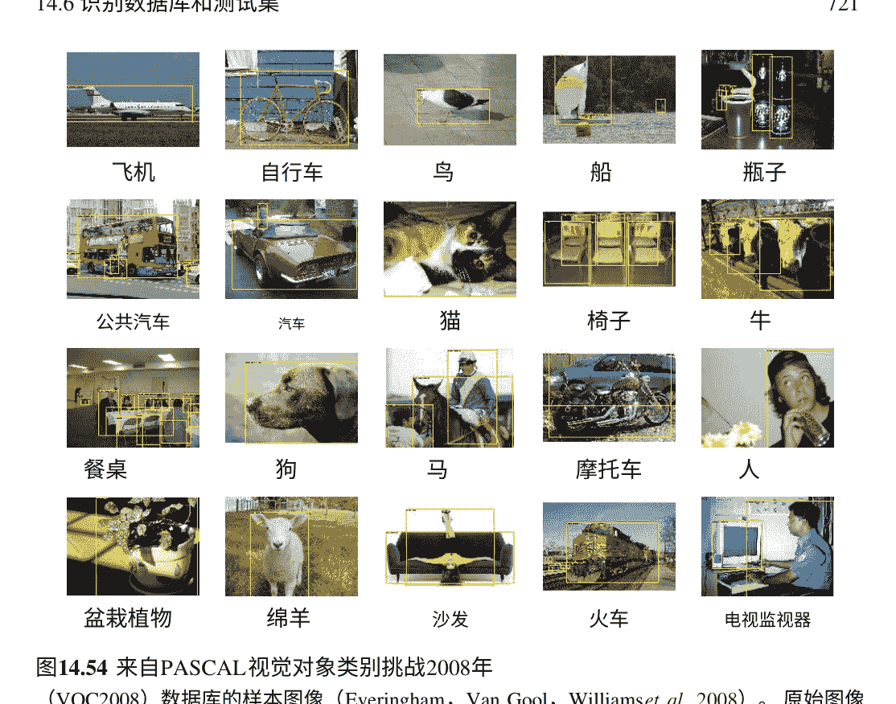

图14.54 来自PASCAL视觉对象类别挑战2008年 (VOC2008) 数据库的样本图像 (Everingham, Van Gool, Williams et al. 2008)。原始图像来自flickr (http://www.flickr.com/)，数据库权利在 http://pascallin.ecs.soton.ac.uk/challenges/VOC/voc2008/上有解释。

“严肃”的志愿者工作是LabelMe数据库，其中视觉研究人员贡献手动多边形区域注释以换取访问数据库的权限 (Russell, Torralba, Murphy et al. 2008)。

计算机视觉算法用于收集识别数据库的使用可以追溯到Fergus，Fei-Fei，Perona et al. (2005) 的工作，他们使用PLSA的扩展对Google图像搜索返回的结果进行聚类，然后选择与排名最高的结果相关联的聚类。更近期的相关技术示例包括Berg和Forsyth (2006) 以及Li和Fei-Fei (2010) 的工作。

无论使用何种方法来收集和验证识别数据库，它们都将在大小、实用性和难度上不断增长。它们还将继续成为研究识别和场景理解问题的重要组成部分，这些问题始终是计算机视觉的重大挑战。

## 14.7 附加阅读

尽管目前还没有专门讨论图像识别和场景理解的教科书，但可以找到一些调查报告（Pinz 2005）和论文集（Ponce、Hebert、Schmid等人2006；Dickinson、Leonardis、Schiele等人2007），描述了最新的方法。其他关于这个主题的最新研究资料还包括课程，例如ICCV 2009的短期课程（Fei-Fei、Fergus和Torralba 2009）和Antonio Torralba更全面的MIT课程（Torralba 2008）。PASCAL VOC Challenge网站包含了总结当今最佳算法的研讨会幻灯片。

关于人脸、行人、汽车和其他物体检测的文献非常广泛。人脸检测的开创性论文包括Osuna、Freund和Girosi（1997）、Sung和Poggio（1998）、Rowley、Baluja和Kanade（1998a）以及Viola和Jones（2004），而Yang、Kriegman和Ahuja（2002）则提供了该领域早期工作的综述。

更近期的例子包括（Heisele、Ho、Wu等人，2003；Heisele、Serre和Poggio，2007）。

行人和汽车检测的早期工作由Gavrila和Philomin（1999）、Gavrila（1999）、Papageorgiou和Poggio（2000）、Mohan、Papageorgiou和Poggio（2001）以及Schneiderman和Kanade（2004）完成。更近期的例子包括Belongie、Malik和Puzicha（2002）、Mikolajczyk、Schmid和Zisserman（2004）、Dalal和Triggs（2005）、Leibe、Seemann和Schiele（2005）、Dalal、Triggs和Schmid（2006）、Opelt、Pinz和Zisserman（2006）、Torralba（2007）、Andriluka、Roth和Schiele（2008）、Felzenszwalb、McAllester和Ramanan（2008）、Rogez、Rihan、Ramalingam等人（2008）、Andriluka、Roth和Schiele（2009）、Kumar、Zisserman和H.S.Torr（2009）、Dollár、Belongie和Perona（2010）。以及Felzenszwalb、Girshick、McAllester等人（2010）。虽然最早的人脸识别方法涉及到寻找显著的图像特征并测量它们之间的距离（Fischler和Elschlager，1973；Kanade，1977；Yuille，1991），但更近期的方法依赖于比较灰度图像，通常投影到较低维度的子空间上（Turk和Pentland，1991a；Belhumeur、Hespanha和Kriegman，1997；Moghaddam和Pentland，1997；Moghaddam、Jebara和Pentland，2000；Heisele、Ho、Wu等人，2003；Heisele、Serre和Poggio，2007）。有关主成分分析（PCA）及其贝叶斯对应方法的详细信息可以在附录B.1.1和有关该主题的书籍和文章中找到（Hastie、Tibshirani和Friedman，2001；Bishop，2006；Roweis，1998；Tipping和Bishop，1999；Leonardis和Bischof，2000；Vidal、Ma和Sastry，2010）。子空间学习、局部距离函数和度量学习的主题由Cai、He、Hu等人（2007）、Frome、Singer、Sha等人（2007）、Guillaume、Verbeek和Schmid（2009）、Ramanan和Baker（2009）以及Sivic、Everingham和Zisserman（2009）进行了研究。与直接匹配灰度图像或补丁不同，一种替代方法是使用非线性局部变换，如局部二值模式（Ahonen、Hadid和Pietikäinen，2006；Zhao和Pietikäinen，2007；Cao、Yin、Tang等人，2010）。

为了提高基本上是2D外观模型的性能，已经开发了各种形状和姿态变形模型（Beymer 1996; Vetter and Poggio 1997），包括主动形状模型（Lanitis，Taylor和Cootes 1997; Cootes，Cooper，Taylor et al. 1995; Davies，Twining和Taylor 2008），弹性束图匹配（Wiskott，Fellous，Krüger et al. 1997），3D可塑模型（Blanz和Vetter 1999），以及主动外观模型（Costen，Cootes，Edwards et al. 1999; Cootes，Edwards，和Taylor 2001; Gross，Baker，Matthews et al. 2005; Gross，Matthews，和Baker 2006; Matthews，Xiao，和Baker 2007; Liang，Xiao，Wen et al. 2008; Ramnath，Koterba，Xiao et al. 2008）。特别是关于头部姿态估计的主题，在Murphy-Chutorian和Trivedi（2009）的最新调查中有所涵盖。

关于人脸识别的更多信息可以在许多调查和关于这个主题的书籍中找到（Chellappa，Wilson，and Sirohey 1995; Zhao，Chellappa，Phillips et al. 2003; Li and Jain 2005），以及在人脸识别网站上。23关于人脸识别的数据库的讨论由Phillips，Moon，Rizvi et al. (2000)，Sim，Baker，and Bsat (2003)，Gross，Shi，and Cohn (2005)，Huang，Ramesh，Berg et al. (2007)，以及Phillips，Scruggs, O’Toole et al. (2010)进行。

用于实例识别的算法，即检测外观略有变化但可能在3D姿态上有所变化的静态人造物体，大多基于检测2D感兴趣点并使用视点不变描述符来描述它们（Lowe 2004; Rothganger，Lazebnik，Schmid et al. 2006; Ferrari，Tuytelaars，and Van Gool 2006b; Gordon and Lowe 2006; Obdrzálek and Matas 2006; Kannala，Rahtu，Brandt et al. 2008; Sivic and Zisserman 2009）。

随着匹配的数据库大小增加，将视觉描述符量化为单词（Sivic和Zisserman 2003; Schindler，Brown和Szeliski 2007; Sivic和Zisserman 2009; Turcot和Lowe 2009）并使用信息检索技术，如倒排索引（Nistér和Stewénius 2006; Philbin，Chum，Isard et al. 2007; Philbin，Chum，Sivic et al. 2008），查询扩展（Chum，Philbin，Sivic et al. 2007; Agarwal，Snavely，Simon et al. 2009），和最小哈希（Philbin和Zisserman 2008; Li，Wu，Zach et al. 2008; Chum，Philbin和Zisserman 2008; Chum和Matas 2010）来进行高效的检索和聚类变得更加高效。

关于类别识别的主题已经有很多调查、论文集和课程笔记（Pinz 2005; Ponce，Hebert，Schmid et al. 2006; Dickinson，Leonardis，Schiele et al. 2007; Fei-Fei，Fergus，and Torralba 2009）写过。关于整体图像类别识别的词袋（关键点词袋）方法的一些开创性论文是由Csurka，Dance，Fan et al. (2004)，Lazebnik，Schmid，and Ponce (2006)，Csurka，Dance，Perronnin et al. (2006)，Grauman and Darrell (2007b)，and Zhang，Marszalek写的。

Lazebnik et al. (2007). 在这个领域中，还有一些更多和更新的论文，包括Sivic, Russell, Efros et al. (2005), Serre, Wolf, and Poggio (2005), Opelt, Pinz, Fussenegger et al. (2006), Grauman and Darrell (2007a), Torralba, Murphy, and Freeman (2007), Boiman, Shechtman, and Irani (2008), Ferencz, Learned-Miller, and Malik (2008), and Mutch and Lowe (2008)。还可以根据物体的轮廓来识别物体，例如使用形状上下文（Belongie, Malik和Puzicha 2002）或其他技术（Jurie和Schmid 2004; Shotton, Blake和Cipolla 2005; Opelt, Pinz和Zisserman 2006; Ferrari, Tuytelaars和Van Gool 2006a）。

许多物体识别算法使用基于部分的分解来提供更大的不变性以适应关节和姿势。早期的算法关注部分的相对位置（Fischler和Elschlager 1973; Kanade 1977; Yuille 1991），而较新的算法则使用更复杂的外观模型（Felzenszwalb和Huttenlocher 2005; Fergus, Perona和Zisserman 2007; Felzenszwalb, McAllester和Ramanan 2008）。关于基于部分模型的识别的良好概述可以在Fergus 2007b; 2009的课程笔记中找到。

Carneiro和Lowe (2006) 讨论了一些用于基于部件识别的图形模型，包括树和星形（Felzenszwalb和Huttenlocher 2005; Fergus, Perona和Zisserman 2005; Felzenszwalb, McAllester和Ramanan 2008），k-fans (Crandall, Felzenszwalb和Huttenlocher 2005; Crandall和Huttenlocher 2006) 以及星座（Burl, Weber和Perona 1998; Weber, Welling和Perona 2000; Fergus, Perona和Zisserman 2007）。其他使用基于部件识别的技术包括Dorkó和Schmid (2003) 以及Bar-Hillel, Hertz和Weinshall (2005) 开发的技术。

将物体识别与场景分割相结合可以产生很大的好处。一种方法是将图像预分割成片段，然后将这些片段与模型的部分进行匹配（Mori, Ren, Efros et al. 2004; Mori 2005; He, Zemel和Ray 2006; Russell, Efros, Sivic et al. 2006; Borenstein和Ullman 2008; Csurka和Perronnin 2008; Gu, Lim, Arbelaez et al. 2009）。另一种方法是根据物体检测为潜在的物体位置和尺度进行投票（Leibe, Leonardis和Schiele 2008）。目前最流行的方法之一是使用条件随机场（Kumar和Hebert 2006; He, Zemel和Carreira-Perpiñán 2004; He, Zemel和Ray 2006; Levin和Weiss 2006; Winn和Shotton 2006; Hoiem, Rother和Winn 2007; Rabinovich, Vedaldi, Galleguillos et al. 2007; Verbeek and Triggs 2007; Yang, Meer和Foran 2007; Batra, Sukthankar和Chen 2008; Larlus和Jurie 2008; He和Zemel 2008; Shotton, Winn, Rother et al. 2009; Kumar, Torr和Zisserman 2010)，这些方法在困难的PASCAL VOC segmentation挑战赛（Shotton, Johnson和Cipolla 2008; Kohli, Ladický和Torr 2009）上取得了最好的结果。

越来越多的识别算法开始使用场景上下文作为其识别策略的一部分。这个领域的代表性论文包括Torralba (2003) 的论文，Torralba, Murphy, Freeman等人的论文 (2003)，Murphy, Torralba和Freeman (2003) 的论文，Torralba, Murphy和Freeman (2004) 的论文，Crandall和Huttenlocher (2007) 的论文，Rabinovich, Vedaldi, Galleguillos等人的论文 (2007)，Russell, Torralba, Liu等人的论文 (2007)，Hoiem, Efros和Hebert (2008a) 的论文，Hoiem, Efros和Hebert (2008b) 的论文，Sudderth, Torralba, Freeman等人的论文 (2008)，以及Divvala, Hoiem, Hays等人的论文 (2009)。

leguillos等人 (2007)，Russell, Torralba, Liu等人 (2007)，Hoiem, Efros和Hebert (2008a)，Hoiem, Efros和Hebert (2008b)，Sudderth, Torralba, Freeman等人 (2008)，以及Divvala, Hoiem, Hays等人 (2009)。

复杂的机器学习技术也成为成功的目标检测和识别算法的关键组成部分 (Varma和Ray 2007; Felzenszwalb, McAllester和Ramanan 2008; Fritz和Schiele 2008; Sivic, Russell, Zisserman et al. 2008; Vedaldi, Gulshan, Varma et al. 2009)，利用大型人工标注数据库也是如此 (Russell, Torralba, Liu et al. 2007; Malisiewicz和Efros 2008; Torralba, Freeman和Fergus 2008; Liu, Yuen和Torralba 2009)。粗糙的三维模型也在一些最近的论文中得到了证明 (Savarese和Fei-Fei 2007, 2008; Sun, Su, Savarese et al. 2009; Su, Sun, Fei-Fei et al. 2009)。一如既往，计算机视觉领域的最新会议是您了解这个快速发展领域中最新算法的最佳参考。

## 14.8 练习题

### 例子14.1: 人脸检测
构建并测试14.1.1节中介绍的一个人脸检测器。

- 1. 从表14.2中下载一个或多个带标签的人脸检测数据库。
- 2. 通过找到不包含任何人的照片来生成自己的负例。
- 3. 实现以下其中一个人脸检测器 (或者设计自己的):
    - 基于简单区域特征的提升算法 (算法14.1)，可选使用级联检测器 (Viola和Jones 2004)；
    - PCA人脸子空间 (Moghaddam和Pentland 1997)；
    - 到聚类人脸和非人脸原型的距离，然后使用神经网络 (Sung和Poggio 1998) 或SVM (Osuna, Freund和Girosi 1997) 分类器；
    - 直接在归一化灰度补丁上训练的多分辨率神经网络 (Rowley, Baluja和Kanade 1998a)。
- 4. 通过在子八度金字塔中的每个位置评估检测器，测试您的检测器的性能。可选择在非人脸图像上重新训练您的检测器以获取假阳性示例。

### Ex 14.2: 确定AdaBoost的阈值
给定训练示例 \(x_i\)上的一组函数评估 \(y_i = f(x_i) \in \pm 1\)，训练标签 \(y_i \in \pm 1\)，权重 \(w_i \in (0, 1)\)，如算法14.1中所解释的，设计一个高效的算法来找到最大化 $\theta$ 和 $s=\pm 1$ 的值

$$\sum_{i} w_i y_i h(sf_i, \theta), \qquad \qquad (14.43)$$

其中 $h(x, \theta) = \mathrm{sign}(x - \theta)$.

### Ex 14.3：使用特征脸进行人脸识别
收集一组人脸照片，然后构建一个识别系统来重新识别相同的人。

- 1. 对每个同学拍摄多张照片并存储它们。
- 2. 通过自动或手动检测眼睛的角落并使用相似变换将每个图像拉伸和旋转到规范位置来对齐图像。
- 3. 计算平均图像和人脸图像的PCA子空间。
- 4. 一周后拍摄一组新的照片，并将它们用作测试集。
- 5. 将每个新图像与数据库图像进行比较，并选择最近的图像作为识别的身份。验证在PCA空间中的距离是否接近使用完整SSD（平方差和）度量计算的距离。
- 6. （可选）为身份和表情计算不同的主成分，并使用它们来改进识别结果。

### 例14.4：贝叶斯人脸识别
Moghaddam，Jebara和Pentland（2000）通过观察图像对之间的差异来计算分别的协方差矩阵 $\Sigma_I$ 和 $\Sigma_E$。在运行时，他们选择最近的图像来确定面部身份。估计所有图像对的统计数据并将它们用于测试到最近示例的距离，这样做是否有意义？讨论这是否在统计上是正确的。

全对内个人协方差矩阵 $\Sigma_I$ 与类内散布矩阵 $S_W$ 有什么关系？类似的关系是否存在于 $\Sigma_E$ 和 $S_B$ 之间？

### 例14.5：模块化特征脸
扩展你的人脸识别系统，分别匹配眼睛、鼻子和嘴巴区域，如图14.18所示。

- 1. 将人脸图像归一化到一个规范的尺度和位置后，手动分割出一些眼睛、鼻子和脸部区域。
- 2. 为这三个（或四个）种类的区域构建单独的检测器，可以使用子空间（PCA）方法或本节中介绍的技术之一。
- 3. 对于要识别的每个新图像，首先检测面部特征的位置。
- 4. 然后，将各个特征与数据库进行匹配，并记录这些特征的位置。
- 5. 训练和测试一个分类器，该分类器使用个体特征匹配的ID以及（可选地）特征位置来进行人脸识别。

### 例子14.6：基于识别的颜色平衡
构建一个系统，能够识别常见照片中最重要的颜色区域（天空、草地、皮肤）并根据此进行颜色平衡。有关皮肤检测的一些参考和想法可以在练习2.8和Forsyth和Fleck（1999）、Jones和Rehg（2001）、Vezhnevets、Sazonov和Andreeva（2003）以及Kakumanu、Makroggiannis和Bourbakis（2007）的著作中找到。这些可能会给你一些关于如何检测其他区域的想法，或者你可以尝试更复杂的基于MRF的方法（Shotton、Winn、Rother等人，2009年）。

### 例子14.7：行人检测
构建并测试14.1.2节中介绍的一个行人检测器。

### 例子14.8：简单实例识别
使用你在练习4.1-4.4和9.2中开发的特征检测、匹配和对齐算法，给定一个查询图像或区域（图14.26），找到匹配的图像。

评估几种特征检测器、描述符和鲁棒几何验证策略，可以自己进行评估，也可以与同学的结果进行比较。

### Ex 14.9：大型数据库和位置识别
使用量化的视觉词和信息检索技术对之前的练习进行扩展，如算法14.2所述。

在大型数据库上测试你的算法，例如Nist´er和Stew´enius（2006）或Philbin，Chum，Sivic et al.（2008）所使用的数据库，这些数据库在表14.1中列出。或者，可以在网络上或照片分享网站上使用关键词搜索（例如城市）来创建自己的数据库。

### Ex 14.10：词袋
将在练习14.8中开发的特征提取和匹配流程适应于类别（类）识别，使用14.4.1节中描述的一些技术。

- 1. 从表14.1和14.2中列出的一个或多个数据库中下载训练和测试图像，例如Caltech 101，Caltech 256或PASCAL VOC。
- 2. 从每个训练图像中提取特征，对其进行量化，并计算 tf-idf 向量（词袋直方图）。
- 3. 作为一种选择，可以考虑不对特征进行量化，并使用金字塔匹配（14.40-14.41）（Grauman和Darrell 2007b）或使用空间金字塔以获得更高的选择性（Lazebnik, Schmid和Ponce 2006）。
- 4. 选择一个分类算法（例如最近邻分类或支持向量机）并“训练”你的识别器，即建立适当的数据结构（例如k-d树）或设置适当的分类器参数。
- 5. 使用在步骤2-4中开发的相同流程在测试数据集上测试算法，并将结果与最佳报告结果进行比较。
- 6. 解释为什么你的结果与先前报告的结果不同，并提出一些改进系统的想法。

您可以在PASCAL Visual Object Classes Challenge的报告中找到最佳分类算法及其方法的简介，该报告可以在他们的网站上找到（http://pascallin.ecs.soton.ac.uk/challenges/VOC/）。

### Ex 14.11：对象检测和定位
扩展前一个练习中开发的分类算法，通过报告每个检测到的对象周围的边界框来定位图像中的对象。最简单的方法是使用滑动窗口的方法。关于这个领域最近的技术指南可以在与**PASCAL VOC 2008 Challenge**相关的研讨会中找到。

### 例子14.12：基于部分的识别
选择14.4.2节中描述的一种或多种技术，并实现一个基于部分的识别系统。由于这些技术相当复杂，您需要阅读该领域的几篇研究论文，选择您想要遵循的一般方法，然后实现您的算法。一个很好的起点可能是**Felzenszwalb, McAllester和Ramanan（2008）**的论文，因为它在**PASCAL VOC 2008检测挑战**中表现良好。

### 例子14.13：识别和分割
选择14.4.3节中描述的一种或多种技术，并实现一个同时进行识别和分割的系统。由于这些技术相当复杂，您需要阅读该领域的几篇研究论文，选择您想要遵循的一般方法，然后实现您的算法。

在表14.2中的一个或多个分割数据库上测试您的算法。

### 例子14.14：上下文
在第14.5节中描述的上下文和场景理解系统中实现一个或多个，并报告你的经验。上下文或整个场景理解在命名对象方面是否比独立系统表现更好？

### 例子14.15：小图像
从http://people.csail.mit.edu/torralba/tinyimages/下载小图像数据库并基于将你的测试图像直接与所有标记的训练图像进行比较来构建一个分类器。

这个方法看起来有希望吗？

## 计算机视觉：算法与应用（2010年9月3日草稿）

# 第15章

## 结论

在这本书中，我们涵盖了广泛的计算机视觉主题。从图像形成开始，我们看到如何对图像进行预处理以去除噪声或模糊，将其分割成区域，或将其转换为特征描述符。多个图像可以匹配和注册，结果可用于估计运动，跟踪人员，重建3D模型，或将图像合并成更有吸引力和有趣的合成图像和渲染。图像也可以被分析以生成其内容的语义描述。然而，在这个领域，计算机和人类的表现之间的差距仍然很大，并且在很多年内可能仍然如此。

我们的研究还使我们接触到了各种数学技术。这些技术包括连续数学，如信号处理，变分方法，三维和投影几何，线性代数和最小二乘法。我们还学习了离散数学和计算机科学的主题，如图算法，组合优化，甚至用于信息检索的数据库技术。由于计算机视觉中的许多问题都是从嘈杂的输入数据中估计未知量的逆问题，因此我们还研究了贝叶斯统计推断技术，以及利用大量训练数据学习概率模型的机器学习技术。

随着互联网上部分标记的视觉图像的可用性呈指数级增长，后一种方法将继续对我们的领域产生重大影响。你可能会问：为什么我们的领域如此广泛，难道没有可以简化我们学习的统一原则吗？答案的一部分在于计算机视觉的广泛定义，即图像和视频的分析，以及视觉图像形成中的难以置信的复杂性。在某些方面，我们的领域与汽车工程的研究一样复杂，需要理解内燃机，力学，空气动力学，人体工程学，电路和控制系统等等主题。计算机视觉同样依赖于各种子学科，这使得在一个学期的课程中涵盖它变得具有挑战性，更不用说在研究生学习过程中掌握它了。相反，计算机视觉问题的广度和技术复杂性吸引了许多人进入这个研究领域。

由于这种丰富性和难以进行进展的困难，我试图在我的学生和本书读者中灌输一种基于工程学、科学和统计学原理的纪律。

解决问题的工程方法是首先仔细定义正在解决的整体问题，并质疑这个过程中固有的基本假设和目标。一旦这样做了，就会实施一些替代的解决方案或方法，并进行仔细测试，注意可靠性和计算成本等问题。最后，一个或多个解决方案将在实际环境中部署和评估。因此，本书为解决视觉问题提供了许多不同的替代方案，其中许多在练习中概述，供学生自行实施和测试。科学方法建立在对物理原理的基本理解之上。在计算机视觉的情况下，这包括人造和自然结构的物理学、图像形成（包括光照和大气效应）、光学和噪声传感器。任务是使用稳定和高效的算法反演这种形成，以获得场景的可靠描述和其他感兴趣的量。科学方法还鼓励我们制定和测试假设，这类似于工程学科中的广泛测试和评估。

最后，由于图像形成过程中存在很多不确定性和模糊性，通常需要采用统计方法来建模世界的不确定性（例如图片中动物的数量和类型）以及图像形成过程中的噪声。贝叶斯推理技术可以用来结合先验模型和测量模型来估计未知量并建模其不确定性。机器学习技术可以用来创建概率模型。高效的学习和推理算法，如动态规划、图割和信念传播，在这个过程中起着关键作用。

鉴于我们在本书中涵盖的广泛内容，未来我们可能会看到哪些新的发展？正如我之前提到的，计算机视觉领域的一个最新趋势是利用互联网上大量部分标记的视觉数据作为学习场景和物体视觉模型的来源。我们已经看到数据驱动的方法在相关领域取得了成功，例如语音识别、机器翻译、语音和音乐合成，甚至计算机图形学（包括基于图像的渲染和动作捕捉的动画）。类似的过程也在计算机视觉领域发生，其中一些最令人兴奋的新工作发生在目标识别和机器学习领域的交叉点上。

在计算机视觉中，一些传统的定量技术，如运动估计、立体对应和图像增强，都受益于更好的先验模型，包括图像、运动和视差，以及高效的统计推断技术，如非均匀和高阶马尔可夫随机场的技术。一些技术，如特征匹配和运动结构，已经成熟到可以应用于几乎任意静态场景图像的集合。这导致了对互联网数据集中的3D建模工作的爆炸式增长，这与从大量数据中进行视觉识别有关。

虽然这些都是令人鼓舞的进展，但人类和机器在语义场景理解方面的表现仍存在很大差距。也许还需要很多年，计算机才能像两岁的孩子一样，能够命名并勾勒出照片中的所有物体。然而，我们必须记住，人类的表现往往是多年的训练和熟悉的结果，并且在特定的生态重要情境中效果最好。例如，虽然人类在面部识别方面似乎是专家，但当我们看到我们不太熟悉的人时，我们的实际表现并不好。将视觉算法与关于现实世界的一般推理技术相结合，可能会带来更多突破，尽管其中一些问题可能会被认为是“AI完全”的，即需要完全模拟人类的经验和智能。

无论这些研究努力的结果如何，计算机视觉已经在许多领域产生了巨大的影响，包括数字摄影、视觉效果、医学成像、安全监控和基于Web的搜索。这个领域中存在的问题和技术的广度，加上数学的丰富性和所得算法的实用性，将确保这仍然是一个令人兴奋的研究领域，未来几年内都会如此。

# 线性代数和数值技术

- A.1 矩阵分解
    - A.1.1 奇异值分解
    - A.1.2 特征值分解
    - A.1.3 QR分解
    - A.1.4 Cholesky分解
- A.2 线性最小二乘
    - A.2.1 总最小二乘
- A.3 非线性最小二乘
- A.4 直接稀疏矩阵技术
    - A.4.1 变量重排序
- A.5 迭代技术
    - A.5.1 共轭梯度
    - A.5.2 预处理
    - A.5.3 多重网格

在这个附录中，我们介绍了一些在线性代数和数值技术方面的基本元素，这些元素在本书的其他地方使用。我们从矩阵代数中的一些基本分解开始，包括奇异值分解（SVD）、特征值分解和其他矩阵分解（因子分解）。接下来，我们来看一下线性最小二乘问题，可以使用QR分解或正规方程来解决。然后是非线性最小二乘问题，当测量方程中的未知数不是线性的或者使用了鲁棒误差函数时，会出现这种问题。这些问题需要迭代来找到解决方案。接下来，我们来看一下稀疏问题的直接解法（因子分解）技术，其中变量的排序对计算和内存需求有很大的影响。最后，我们讨论解决大型线性（或线性化）最小二乘问题的迭代技术。关于这方面的大部分材料，良好的参考资料包括Björck（1996）、Golub和Van Loan（1996）、Trefethen和Bau（1997）、Meyer（2000）、Nocedal和Wright（2006）以及Björck和Dahlquist（2010）的著作。

关于向量和矩阵索引的注释。为了与本书的其余部分和计算机科学和计算机视觉社区的一般用法保持一致，我采用基于0的索引方案来进行向量和矩阵元素索引。请注意，大多数数学教科书和论文使用基于1的索引，因此在阅读本书时需要注意这些差异。

软件实现。高度优化和经过测试的库与附录C.2中描述的算法相对应，并且可以轻松获得。

### A.1 矩阵分解

为了更好地理解矩阵的结构并更稳定地执行反转和系统求解等操作，可以使用多种分解（或因子分解）。在本节中，我们回顾奇异值分解（SVD）、特征值分解、QR分解和Cholesky分解。

#### A.1.1 奇异值分解

矩阵代数中最有用的分解之一是奇异值分解（SVD），它表明任何实值$M \times N$矩阵$A$都可以写成

$$A_{M \times N} = U_{M \times P} \Sigma_{P \times P} V_{P \times N}^{T} \qquad\qquad (A.1)$$

$$\begin{bmatrix} \boldsymbol{u}_0 \big| & \cdots & \big| \boldsymbol{u}_{p-1} \end{bmatrix} \begin{bmatrix} \sigma_0 & & \ & \ddots & \ & & \sigma_{p-1} \end{bmatrix} \begin{bmatrix} \overline{\boldsymbol{v}_0^{T}} \ \vdots \ \overline{\boldsymbol{v}_{p-1}^{T}} \end{bmatrix},$$

其中 $P = \min(M, N)$。矩阵 $\boldsymbol{U}$ 和 $\boldsymbol{V}$ 是正交的，即 $\boldsymbol{U}^T\boldsymbol{U} = \boldsymbol{I}$ 和 $\boldsymbol{V}^T\boldsymbol{V} = \boldsymbol{I}$，它们的列向量也是正交的，

$$\boldsymbol{u}_i \cdot \boldsymbol{u}_j = \boldsymbol{v}_i \cdot \boldsymbol{v}_j = \delta_{ij}. \qquad (\text{A.2})$$

奇异值都是非负的，并且可以按降序排列

$$\sigma_0 \ge \sigma_1 \ge \cdots \ge \sigma_{p-1} \ge 0. \qquad (\text{A.3})$$

通过将 $\boldsymbol{A} = \boldsymbol{U}\boldsymbol{\Sigma}\boldsymbol{V}^T$ 在(A.2)中重新写成，可以获得矩阵 $\boldsymbol{A}$ 的奇异值分解的几何直观

$$\boldsymbol{A}\boldsymbol{V} = \boldsymbol{U}\boldsymbol{\Sigma} \quad \text{或} \quad \boldsymbol{A}\boldsymbol{v}_j = \sigma_j \boldsymbol{u}_j. \qquad (\text{A.4})$$ 这个公式表示矩阵 $\boldsymbol{A}$ 将任何基向量 $\boldsymbol{v}_j$ 映射到长度为 $\sigma_j$ 的方向 $\boldsymbol{u}_j$，如图A.1所示

如果只有前 $r$ 个奇异值为正，矩阵 $\boldsymbol{A}$ 的秩为 $r$，在SVD分解(A.2)中的索引 $p$ 可以被替换为 $r$。(换句话说，我们可以忽略最后一个 $p-r$ 列的 $\boldsymbol{U}$ 和 $\boldsymbol{V}$。

奇异值分解的一个重要性质（对于实对称非负定矩阵的特征值分解也是如此）是，如果我们截断展开式

$$\boldsymbol{A} = \sum_{j=0}^{t} \sigma_j \boldsymbol{u}_j \boldsymbol{v}_j^{T}, \qquad (\text{A.5})$$

我们得到了对原始矩阵 $\boldsymbol{A}$ 的最佳最小二乘逼近。这在基于特征脸的人脸识别系统（第14.2.1节）和卷积核的可分离逼近（3.21）中都有应用。

#### A.1.2 特征值分解

如果矩阵 $\boldsymbol{C}$ 是对称的 ($m = n$)，¹它可以被写成特征值分解的形式，

$$\begin{aligned} \boldsymbol{C} &= \boldsymbol{U}\boldsymbol{\Lambda}\boldsymbol{U}^T = \begin{bmatrix} \boldsymbol{u}_0 \big| & \cdots & \big| \boldsymbol{u}_{n-1} \end{bmatrix} \begin{bmatrix} \lambda_0 & & \ & \ddots & \ & & \lambda_{n-1} \end{bmatrix} \begin{bmatrix} \overline{\boldsymbol{u}_0^{T}} \ \vdots \ \overline{\boldsymbol{u}_{n-1}^{T}} \end{bmatrix} \ &= \sum_{i=0}^{n-1} \lambda_i \boldsymbol{u}_i \boldsymbol{u}_i^{T}. \end{aligned} \qquad (\text{A.6})$$

¹在这个附录中，我们用 $\boldsymbol{C}$ 表示对称矩阵，用 $\boldsymbol{A}$ 表示一般矩形矩阵。

### A.1 矩阵分解

矩阵 $A$ 的作用可以通过将定义域视为由一组正交向量 $\boldsymbol{v}_j$ 张成的空间来可视化，其中每个向量都被转换为一个新的正交向量 $\boldsymbol{u}_j$，其长度为 $\sigma_j$。当 $A$ 被解释为协方差矩阵并进行特征值分解时，每个 $\boldsymbol{u}_j$ 轴表示一个主方向（分量），每个 $\sigma_j$ 表示沿该方向的一个标准差。

（特征向量矩阵 $U$ 有时写作 $\Phi$，特征向量 $\boldsymbol{u}$ 写作 $\boldsymbol{\phi}$。）在这种情况下，特征值 $\lambda_0 \geq \lambda_1 \geq \cdots \geq \lambda_{n-1}$ （A.7）可以是正数也可以是负数。

对称矩阵 $C$ 的一个特殊情况是将其构造为一些外积的和
$$C = \sum_i \boldsymbol{a}_i \boldsymbol{a}_i^T = \boldsymbol{A}\boldsymbol{A}^T, \tag{A.8}$$
这经常在解最小二乘问题（附录A.2）时发生，其中矩阵 $\boldsymbol{A}$ 由所有的列向量 $\boldsymbol{a}_i$ 堆叠而成。 在这种情况下，我们保证所有的特征值 $\lambda_i$ 都是非负的。 相关矩阵 $C$ 是半正定的

$$\boldsymbol{x}^T C \boldsymbol{x} \geq 0, \quad \forall \boldsymbol{x}. \tag{A.9}$$
如果矩阵 $C$ 的秩是满秩的，则特征值都是正的，该矩阵被称为对称正定 (SPD)。

对称正半定矩阵也出现在数据的统计分析中，因为它们表示一组 $\{\boldsymbol{x}_i\}$ 点围绕其均值 $\bar{\boldsymbol{x}}$ 的协方差矩阵。
$$C = \frac{1}{n} \sum_i (\boldsymbol{x}_i - \bar{\boldsymbol{x}})(\boldsymbol{x}_i - \bar{\boldsymbol{x}})^T. \tag{A.10}$$
在这种情况下，进行特征值分解被称为主成分分析(PCA)，因为它模拟了点的主要方向（和大小）的变化。

分布围绕其均值，如第5.1.1节（5.13–15），第14.2.1节（14.9）和附录B.1.1（B.10）所示。图A.1显示了协方差矩阵 C 的主成分表示不确定性椭球的主轴 $\boldsymbol{u}_j$，对应于这个点分布，以及 $\sigma_j = \sqrt{\lambda_j}$ 表示每个轴上的标准差。

C 的特征值和特征向量以及 A 的奇异值和奇异向量密切相关。给定

$$
A = U\Sigma V^T, \tag{A.11}
$$

我们得到

$$
C = AA^T = U\Sigma V^T V\Sigma U^T = U\Lambda U^T. \tag{A.12}
$$

从这个关系中，我们可以看出 $\lambda_i = \sigma_i^2$，而 A 的左奇异向量是 C 的特征向量。

这个关系为我们提供了一种计算特征值分解的高效方法，适用于具有秩亏的大矩阵，例如计算特征脸（第14.2.1节）中观察到的散布矩阵。注意，协方差矩阵 C 在（14.9）中与（A.8）中的 C 完全相同。还要注意，个体差值图像 $\boldsymbol{a}_i = \boldsymbol{x}_i - \bar{\boldsymbol{x}}$ 是长度为 P（图像中的像素数）的长向量，而样本总数 N（训练数据库中的人脸数）要小得多。我们不再形成 $C = AA^T$，而是形成矩阵

$$
\hat{C} = A^T A, \tag{A.13}
$$

它是 N × N 的。（这涉及计算每对差异图像 $\boldsymbol{a}_i$ 和 $\boldsymbol{a}_j$ 之间的点积。）$\hat{C}$ 的特征值是 A 的平方奇异值，即 $\Sigma^2$，也是 C 的特征值。$\hat{C}$ 的特征向量是 A 的右奇异向量 V，通过它可以计算出所需的特征脸 U，即 A 的左奇异向量。

$$
U = AV\Sigma^{-1}. \tag{A.14}
$$

这最后一步实质上是将特征脸表示为差异图像的线性组合（Turk和Pentland 1991a）。如果你可以使用高质量的线性代数库，比如LAPACK，通常会提供用于高效计算矩阵 A 的少量左奇异向量和奇异值的例程（附录C.2）。然而，如果将所有图像存储在内存中是不可行的，可以使用（A.13）中的 $\hat{C}$ 的构建方法。

如何计算特征值和奇异值分解？注意
特征向量由方程定义

$$
\lambda_i u_i = Cu_i \quad \text{or} \quad (\lambda_i I - C)u_i = 0. \tag{A.15}
$$

（这可以通过在两边后乘以 $u_i$ 从(A.6)推导出来。由于后一个方程是齐次的，即右边为零，只有在系统秩不足的情况下，$u_i$ 才有一个非零（非平凡）解。

$$|(\lambda I - C)| = 0. \tag{A.16}$$

计算这个行列式可以得到一个特征多项式方程，可以用闭式解法解决小问题，例如 $2 \times 2$ 或 $3 \times 3$ 矩阵。

对于较大的矩阵，通常使用迭代算法，首先使用正交变换将矩阵 $C$ 化为实对称的三对角形式，然后执行QR迭代（Golub和Van Loan 1996; Trefethen和Bau 1997; Björck和Dahlquist 2010）。由于这些技术相当复杂，最好使用线性代数包，如LAPACK(Anderson, Bai, Bischof et al.1999)—见附录C.2。

缺失数据的分解需要不同类型的迭代算法，这些算法要么幻想缺失的项，要么最小化某个加权重构度量，这在本质上比常规分解要困难得多。这个领域在计算机视觉中得到了广泛研究（Shum，Ikeuchi和Reddy 1995; De la Torre和Black 2003; Huynh，Hartley和Heyden 2003; Buchanan和Fitzgibbon 2005; Gross，Matthews和Baker 2006; Torresani，Hertzmann和Bregler 2008），有时被称为广义 $PCA$。然而，这个术语有时也用来表示代数子空间聚类技术，这是Vidal，Ma和Sastry（2010）即将出版的专著的主题。

#### A.1.3 QR分解

一种广泛使用的技术，用于稳定地解决条件较差的最小二乘问题（Björck1996），并作为更复杂算法的基础，例如计算SVD和特征值分解，是QR分解。

$$A = QR, \tag{A.17}$$

其中 $Q$ 是正交（或酉）矩阵 $QQ^T = I$，$R$ 是上三角矩阵。在计算机视觉中，QR可以用于将相机矩阵转换为旋转矩阵和上三角标定矩阵（6.35），并且还可以用于各种自标定算法（第7.2.2节）。计算QR分解的最常见算法，修改的Gram-Schmidt算法，Householder变换和Givens旋转，由Golub和Van Loan（1996），Trefethen和Bau（1997）以及Björck和Dahlquist（2010）描述。

过程 Cholesky(C, R):
    R = C
    对于 i = 0 . . . n - 1
        对于 j = i + 1 . . . n - 1
            R_{j, j:n-1} = R_{j, j:n-1} - r_{ij} r_{ii}^{-1} R_{i, j:n-1}
    R_{i, i:n-1} = r_{ii}^{-1/2} R_{i, i:n-1}

算法 A.1 将矩阵 C 进行 Cholesky 分解为其上三角形式 R。

也可以在 LAPACK 中找到。与 SVD 和特征值分解不同，QR 分解不需要迭代，并且可以精确计算 $O(M N^2 + N^3)$ 次操作，其中 M 是行数， N 是列数（对于高矩阵）。

#### A.1.4 Cholesky分解

Cholesky分解可以应用于任何对称正定矩阵 C，将其转化为对称下三角矩阵和上三角矩阵的乘积，

$$C = L L^{T} = R^{T} R, \tag{A.18}$$

其中 L 是下三角矩阵， R 是上三角矩阵。与高斯消元不同，Cholesky分解对于正定矩阵保持稳定性，不需要进行枢轴选择（行和列重新排序）或变得不稳定（对舍入误差或重新排序敏感）。正定矩阵可以从最小二乘问题的法线方程中得到（附录A.2）。由于 (A.18) 的形式，矩阵 L 和 R 有时被称为矩阵的平方根。

计算矩阵 C 的上三角 Cholesky 分解的算法是高斯消元的对称推广，基于分解 (Björck 1996; Golub and Van Loan 1996)

$$C = \begin{bmatrix} \gamma & c^T \\ c & C_{11} \end{bmatrix} \tag{A.19}$$
$$= \begin{bmatrix} \gamma^{1/2} & 0 \\ c \gamma^{-1/2} & I \end{bmatrix} \begin{bmatrix} I & 0 \\ 0 & C_{11} - \gamma^{-1} c c^T \end{bmatrix} \begin{bmatrix} \gamma^{1/2} & \gamma^{-1/2} c^T \\ 0 & I \end{bmatrix} \tag{A.20}$$

> 事实上，存在一个完整的矩阵平方根家族。任何形式为 $L Q$ 或 $Q R$ 的矩阵，其中 Q 是一个酉矩阵，都是 C 的平方根。

$$= R_0^T C_1 R_0, \tag{A.21}$$

通过递归，可以将其转化为

$$C = R_0^T \dots R_{n-1}^T R_{n-1} \dots R_0 = R^T R. \tag{A.22}$$

如果需要，算法A.1提供了更多的过程化定义，可以将上三角矩阵 R 存储在与 C相同的空间中。对于密集矩阵，Cholesky分解的总操作次数为 $O(N^3)$，但对于具有低填充的稀疏矩阵来说，可以显著降低（附录A.4）。

请注意，Cholesky分解也可以应用于块结构矩阵，其中(A.19)中的项 $\gamma$ 现在是一个方块子矩阵，$c$ 是一个矩形矩阵（Golub和Van Loan 1996）。通过将平方根保留在（A.20）中间因子的对角线上，可以避免计算平方根，从而得到 $C = LDL^T$ 分解，其中 D 是一个对角矩阵。然而，由于现代计算机上的平方根计算速度相对较快，这并不值得费心，通常优先选择Cholesky分解。

### A.2 线性最小二乘

最小二乘拟合问题在计算机视觉中普遍存在。例如，基于匹配特征点的图像对齐涉及最小化平方距离目标函数（6.2）

$$E_{\text{LS}} = \sum_i \|r_i\|^2 = \sum_i \|f(x_i; p) - x_i'\|^2, \tag{A.23}$$

其中

$$r_i = f(x_i; p) - x_i' = \hat{x}_i' - \tilde{x}_i' \tag{A.24}$$
是测量位置 $\hat{x}_i'$ 与其对应的当前预测位置 $\tilde{x}_i' = f(x_i; p)$ 之间的残差。更复杂的最小二乘问题版本，如大规模运动结构（第7.4节），可能涉及对数千个变量的函数最小化。即使是图像滤波（第3.4.3节）和正则化（第3.7.1节）等问题也可能涉及最小化平方误差的求和。

图A.2a展示了一个简单的最小二乘线拟合问题的示例，其中被估计的量是线方程的参数 $(m, b)$。当假设采样的垂直值 $y_i$ 是线上点的噪声版本 $y = mx + b$ 时，最优估计 $(m, b)$ 可以通过最小化平方垂直残差来找到。

$$E_{\text{VLS}} = \sum_i |y_i - (m x_i + b)|^2. \tag{A.25}$$

请注意，被拟合的函数本身不必是线性的，只需要函数在未知参数上是线性的。例如，多项式拟合可以写成

$$E_{\mathrm{PLS}} = \sum_{i} \left| y_i - \left( \sum_{j=0}^{p} a_j x_i^{j} \right) \right|^{2}, \tag{A.26}$$

当具有未知振幅 $A$ 和相位 $\phi$（但已知频率 $f$）的正弦曲线拟合可以表示为

$$E_{\mathrm{SLS}} = \sum_{i} \left| y_i - A \sin(2\pi f x_i + \phi) \right|^{2} = \sum_{i} \left| y_i - (B \sin 2\pi f x_i + C \cos 2\pi f x_i) \right|^{2}, \tag{A.27}$$

其中 $(B, C)$ 是线性的。

通常，使用 $\boldsymbol{x}$ 来表示未知参数，并将线性最小二乘法的一般形式写为

$$E_{\mathrm{LLS}} = \sum_{i} \left| \boldsymbol{a}_i^T \boldsymbol{x} - b_i \right|^{2} = \left\| \boldsymbol{A} \boldsymbol{x} - \boldsymbol{b} \right\|^{2}. \tag{A.28}$$

展开上述方程得到

$$E_{\mathrm{LLS}} = \boldsymbol{x}^{T} (\boldsymbol{A}^{T} \boldsymbol{A}) \boldsymbol{x} - 2 \boldsymbol{x}^{T} (\boldsymbol{A}^{T} \boldsymbol{b}) + \|\boldsymbol{b}\|^{2}, \tag{A.29}$$

其最小值对应的 $\boldsymbol{x}$ 可以通过求解相关的正规方程 (Björck 1996; Golub and Van Loan 1996)找到

$$(\boldsymbol{A}^{T} \boldsymbol{A}) \boldsymbol{x} = \boldsymbol{A}^{T} \boldsymbol{b}. \tag{A.30}$$

解正规方程的首选方法是使用Cholesky分解。让

$$\boldsymbol{C} = \boldsymbol{A}^{T} \boldsymbol{A} = \boldsymbol{R}^{T} \boldsymbol{R}, \tag{A.31}$$

其中 $\boldsymbol{R}$ 是Hessian矩阵 $\boldsymbol{C}$ 的上三角Cholesky分解因子，而

$$\boldsymbol{d} = \boldsymbol{A}^{T} \boldsymbol{b}. \tag{A.32}$$

在分解后，可以通过以下方式获得 $\boldsymbol{x}$ 的解

$$\boldsymbol{R}^{T} \boldsymbol{z} = \boldsymbol{d}, \quad \boldsymbol{R} \boldsymbol{x} = \boldsymbol{z}, \tag{A.33}$$

这涉及到两个三角系统的求解，即前向和后向代换 (Björck 1996)。

图A.2最小二乘回归。(a) 通过最小化数据点与直线之间的垂直残差的平方和，将直线 $y = mx + b$ 拟合到四个噪声数据点 $\{(x_i, y_i)\}$，用 × 表示。(b) 当假设测量数据 $\{(x_i, y_i)\}$ 在所有方向上都有噪声时，到直线的正交平方距离之和 $\sum_i \|ax_i + by_i + c\|^2$ 通过使用总体最小二乘法进行最小化。

在最小二乘问题在数值上条件较差的情况下（通常通过添加足够的正则化或关于参数的先验知识来避免，（附录A.3）），可以直接在矩阵A上使用QR分解或SVD，例如，

$$A\boldsymbol{x} = Q R \boldsymbol{x} = \boldsymbol{b} \longrightarrow R \boldsymbol{x} = Q^T \boldsymbol{b}. \tag{A.34}$$

请注意，由 C 的 Cholesky 分解产生的上三角矩阵 R 和 A 的 QR 分解产生的上三角矩阵 R 是相同的，但是解(A.34)通常更稳定（对舍入误差不太敏感），但速度较慢（乘以一个常数因子）。

### A.2.1 总体最小二乘

在某些问题中，例如在2D图像中执行几何线拟合或3D平面拟合到点云数据时，测量点在所有方向上都存在不确定性，这被称为变量误差模型（Van Huffel和Lemmerling 2002; Matei和Meer 2006）。在这种情况下，更合理的是最小化一组齐次平方误差的形式

$$E_{TLS} = \sum_i (\boldsymbol{a}_i^T \boldsymbol{x})^2 = \|\boldsymbol{A} \boldsymbol{x}\|^2, \tag{A.35}$$

这被称为 总体最小二乘 (TLS) (Van Huffel and Vandewalle 1991; Björck 1996; Golub and Van Loan 1996; Van Huffel and Lemmerling 2002).

上述误差度量在 $\boldsymbol{x}=0$ 处有一个平凡的最小解，并且实际上在 $\boldsymbol{x}$ 中是齐次的。因此，我们通过要求 $\|\boldsymbol{x}\|^2=1$ 来增加这个最小化问题。 这导致了特征值问题

$$\boldsymbol{x} = \arg \min_{\boldsymbol{x}} \boldsymbol{x}^T (\boldsymbol{A}^T \boldsymbol{A}) \boldsymbol{x} \quad \text{such that} \quad \|\boldsymbol{x}\|^2 = 1. \tag{A.36}$$

使得这个约束问题最小化的 $\boldsymbol{x}$ 的值是与 $\boldsymbol{A}^T \boldsymbol{A}$ 的最小特征值相关联的特征向量。 这与 $\boldsymbol{A}$ 的最后一个右奇异向量相同，因为

$$\begin{aligned} \boldsymbol{A} &= U\Sigma V^T, \quad (A.37) \\ \boldsymbol{A}^T \boldsymbol{A} &= V\Sigma^2 V^T, \quad (A.38) \\ \boldsymbol{A}^T \boldsymbol{A} \boldsymbol{v}_k &= \sigma_k^2 \boldsymbol{v}_k, \quad (A.39) \end{aligned}$$

通过选择最小的 $\sigma_k$ 值来最小化该值。

图A.2b展示了一个直线拟合问题，在这种情况下，假设测量误差在 $(x, y)$ 中是各向同性的。 最佳直线方程 $ax + by + c= 0$ 的解通过最小化来找到。

$$E_{\text{TLS-2D}} = \sum_{i} (a x_i + b y_i + c)^2, \tag{A.40}$$

即找到与最小特征值相关联的特征向量

$$C = \boldsymbol{A}^T \boldsymbol{A} = \sum_{i} \begin{bmatrix} x_i \\ y_i \\ 1 \end{bmatrix} \begin{bmatrix} x_i & y_i & 1 \end{bmatrix}. \tag{A.41}$$

然而，请注意，最小化 $\sum_{i} (\boldsymbol{a}_i^T \boldsymbol{x})^2$ 在(A.35)中只有在所有测量项中的测量项，例如 $(x_i, y_i, 1)$ 测量项，具有相等的噪声时，才是统计上最优的（附录B.1.1）。 这在图A.2b (A.40) 的线拟合示例中显然不是这种情况，因为 1 值是无噪声的。 为了减轻这个问题，我们首先从所有测量点中减去均值 $x$ 和 $y$ 值

$$\begin{aligned} \hat{x}_i &= x_i - \bar{x}, \quad (A.42) \\ \hat{y}_i &= y_i - \bar{y}, \quad (A.43) \end{aligned}$$

然后通过最小化来拟合2D线方程 $a\hat{x}_i + b\hat{y}_i = 0$

$$E_{\text{TLS-2Dm}} = \sum_{i} (a \hat{x}_i + b \hat{y}_i)^2. \tag{A.44}$$

> 同样，在这里要小心变量名。 测量方程是 $\boldsymbol{a}_i = (x_i, y_i, 1)$, 未知参数为 $\boldsymbol{x} = (a, b, c)$。

更一般的情况是，每个单独的测量分量可以有不同的噪声水平，就像在估计本质矩阵和基础矩阵（第7.2节）中的情况一样，这被称为异方差误差变量（HEIV）模型，并由Matei和Meer（2006）讨论。

### A.3 非线性最小二乘

在许多视觉问题中，例如从运动中恢复结构，最小二乘问题（A.23）中涉及的函数 f (x_i; p)在未知参数 p中不是线性的。这个问题被称为非线性最小二乘或非线性回归（Björck 1996; Madsen, Nielsen, and Tingleff 2004; Nocedal and Wright 2006）。通常通过迭代地围绕当前对 p的估计重新线性化（A.23），使用梯度导数（Jacobian） J = ∂ f/∂p并计算增量改进 Δp来解决。

如公式（6.13-6.17）所示，这导致

$$
E_{\text{NLS}}(\Delta p) = \sum_i \|f(x_i; p + \Delta p) - x_i'\|^2 \quad (A.45)
$$
$$
\approx \sum_i \|J(x_i; p)\Delta p - r_i\|^2 \quad (A.46)
$$

其中雅可比矩阵 J(x_i; p)和残差向量 r_i在形成法线方程时起着与（A.28）中的 a_i和 b_i相同的作用。

由于上述近似仅在局部最小值附近或 Δp的值较小时成立，更新 p ← p + Δp可能不总是减小总和平方残差误差（A.45）。缓解这个问题的一种方法是采取较小的步长，

$p \leftarrow p + \alpha \Delta p, \quad 0 < \alpha \le 1. \quad (A.47)$

确定一个合理的 α值的简单方法是从1开始，逐步减半该值，这是一种简单的线搜索形式(Al-Baali和Fletcher. 1986; Björck 1996; Nocedal和Wright 2006)。

确保误差下降的另一种方法是在近似的Hessian矩阵中添加对角阻尼项。

$C = \sum_i J^T(x_i)J(x_i), \quad (A.48)$

即解决

$[C + \lambda \text{diag}(C)] \Delta p = d, \quad (A.49)$

其中

$d = \sum_i J^T(x_i)r_i, \quad (A.50)$

### A.4 直接稀疏矩阵技术

这被称为阻尼的高斯-牛顿方法。如果平方残差的减小速度不如预期快，即不符合(A.46)的预测，阻尼参数 λ会增加；如果获得了预期的减小，阻尼参数会减小(Madsen, Nielsen, and Tingleff 2004)。牛顿（一阶泰勒级数）近似（A.46）和自适应阻尼参数 λ的组合通常被称为Levenberg-Marquardt算法（Leven-berg 1944; Marquardt 1963），是更一般的信赖域方法的一个例子，更详细的讨论可参见(Björck 1996; Conn, Gould, and Toint 2000; Madsen, Nielsen,and Tingleff 2004; Nocedal and Wright 2006)。

当初始解远离其二次收敛区域时，例如，大残差方法，如牛顿类型方法，在(A.46)的泰勒级数展开中添加二阶项，可能收敛更快。如果内存大小是一个问题，那么只需要梯度评估的拟牛顿方法，如BFGS，也可能很有用。这些技术在数值优化的教科书和论文中有所讨论（Toint 1987; Björck 1996; Conn, Gould, and Toint 2000; Nocedal and Wright 2006）。

计算机视觉中的许多优化问题，例如束调整（Szeliski andKang 1994; Triggs, McLauchlan, Hartleyet al.1999; Hartley and Zisserman 2004; Snavely,Seitz, and Szeliski 2008b; Agarwal, Snavely, Simonet al.2009），其雅可比矩阵和（近似的）海森矩阵非常稀疏（第7.4.1节）。例如，图7.9a显示了典型的运动结构问题的二分图模型，在该模型中，大多数点只被相机的一个子集观察到，这导致了图7.9b-c中所示的雅可比矩阵和海森矩阵的稀疏模式。

当Hessian矩阵足够稀疏时，使用稀疏的Cholesky分解比常规的Cholesky分解更高效。在这种稀疏直接技术中，Hessian矩阵 C及其相关的Cholesky分解 R以压缩形式存储，其中存储量与（可能的）非零元素的数量成比例（Björck 1996; Davis 2006）。从雅可比矩阵 J的稀疏模式计算 C和 R的非零元素的算法由Björck（1996年，第6.4节）给出，一旦计算出稀疏模式并分配了存储空间，计算数值Cholesky和QR分解的算法由Björck（1996年，第6.5节）讨论。

> 例如，您可以存储一个（i，j，c_{ij}）三元组的列表。一种这样的方案的例子是压缩稀疏行（CSR）存储。一种另外的存储方法称为 skyline，它存储非零元素的相邻垂直跨度（Bathe 2007），有时在有限元分析中使用。像蛇（5.3）这样的带状系统可以仅存储非零带元素（Björck 1996，第6.2节），并且可以在 O（nb^2）的时间复杂度内求解，其中 n是变量的数量，b是带宽。

#### A.4.1 变量重排序

使用直接（非迭代）技术高效解决稀疏问题的关键是确定变量的高效排序，从而减少填充（即原始C矩阵中为零的R中的非零条目数量）。我们已经在第7.4.1节中看到，将更多的3D点参数存储在相机参数之前，并使用舒尔补（7.56）会得到更高效的算法。同样，按时间对参数进行排序通常会导致更低的填充。此外，任何邻接图（对应于稀疏模式的图）是树的问题都可以通过适当的重新排序变量（将所有子节点放在父节点之前）在线性时间内解决。所有这些都是良好重新排序技术的示例。

在非结构化数据的一般情况下，有许多启发式方法可用于找到良好的重新排序（Björck 1996; Davis 2006）。对于一般的邻接（稀疏）图，最小度数排序通常会产生良好的结果。对于平面图，通常出现在图像或样条网格上（第8.3节），递归地沿着边界大小较小的边界（或边界）将图分割成两个相等的半部分的嵌套切割通常效果很好。这种域分解（或多前端）技术还可以利用并行处理，因为独立的子图可以在单独的处理器上并行处理（Davis 2008）。

用于执行稀疏最小二乘问题直接解的总体步骤总结在算法A.2中，该算法是Björck（1996年，第6.6节）的算法6.6.1的修改版本。如果正在解决一系列相关的最小二乘问题，如迭代非线性最小二乘（附录A.3）中的情况，可以提前执行步骤1-3，并在每次使用不同的C和d值进行新调用时重复使用。当问题具有块结构时，例如在从运动中恢复点（结构）变量具有稠密3×3子条目的情况下，以及相机具有6×6（或更大）条目的情况下，执行重新排序计算的成本与实际数值因子分解相比较小，后者可以从块结构矩阵运算中受益（Golub和Van Loan 1996）。还可以将稀疏重新排序和多前端技术应用于QR分解（Davis 2008），当最小二乘问题条件较差时，这可能更可取。

### A.5 迭代技术

当问题变得很大时，存储Hessian矩阵C及其因子 R所需的内存量以及计算因子的时间都可能变得非常大，特别是当存在大量的填充时。这通常

### A.5 迭代技术

**过程** `SparseCholeskySolve(C, d)`:

- 1. 符号地确定 C 的结构，即邻接图。
- 2. (可选) 计算变量的重排序，考虑问题中固有的块结构。
- 3. 确定 R 的填充模式，并为 R 分配压缩存储空间以及为排列后的右手边 d̂ 分配存储空间。
- 4. 根据计算得到的排序，将 C 和 d 的元素复制到 R 和 d̂ 中，按照计算的排序重新排列值。
- 5. 使用算法 A.1 对 R 进行数值分解。
- 6. 解决已分解的系统(A.33)，即
   `R^T z = d̂, Rx = z.`
- 7. 撤销排列后返回解 x。

算法A.2使用矩阵 C 的稀疏 Cholesky 分解进行稀疏最小二乘。

在像素网格上定义图像处理问题的情况下，即使使用最优的重新排序（嵌套分解），填充量仍然可能很大。解决这种线性系统的首选方法是使用迭代技术，该技术计算一系列收敛到最终解的估计值，例如通过在能量函数（A.29）中进行一系列下坡步骤。

多年来已经开发了大量的迭代技术，包括诸如逐次超松弛和多网格等众所周知的算法。这些算法在专门讨论迭代解法的教材（Axelsson 1996; Saad 2003）以及关于数值线性代数和最小二乘技术的更一般的书籍（Björck 1996; Golub and Van Loan 1996; Trefethen and Bau 1997; Nocedal and Wright 2006; Björck and Dahlquist 2010）中有描述。

#### A.5.1 共轭梯度

通常表现最佳的迭代解决技术是共轭梯度下降法，它采用一系列相对于 C 矩阵互为共轭的下降步骤。

即，如果u和v下降方向满足u^T C v= 0。在实践中，共轭梯度下降法优于其他种类的梯度下降算法，因为其收敛速度与C的条件数的平方根成正比，而不是条件数本身。⁹Shewchuk (1994)对这个主题提供了一个很好的介绍，清晰地解释了共轭梯度算法及其性能背后的推理。

算法A.3描述了共轭梯度算法及其相关的最小二乘对应算法，当原始的最小二乘线性方程组以Ax = b(A.28)的形式可用时，可以使用该算法。虽然很容易让自己相信这两种形式在数学上是等价的，但如果由于糟糕的条件而导致舍入误差影响结果，最小二乘形式更可取。如果由于A的稀疏结构，与原始A矩阵的乘法比与C的乘法更快或更节省空间，则可能更可取。

共轭梯度算法首先计算当前残差r_0 = d - Cx_0，这是能量函数（A.28）最陡下降的方向。它将原始下降方向p_0 = r_0设置为这个残差。接下来，它将下降方向乘以二次形式（Hessian）矩阵C，并将其与残差结合起来估计最优步长α_k。

然后，使用这个步长更新解向量x_k和残差向量r_k。（请注意，共轭梯度算法的最小二乘变体将矩阵C = A^T A的乘法分为步骤4和8。）最后，通过首先计算当前和先前残差幅度之比作为因子β来计算新的搜索方向。然后，将新的搜索方向p_{k+1}设置为残差加上β乘以旧的搜索方向p_k，这样可以保持相对于C共轭的方向。

事实证明，共轭梯度下降法也可以直接应用于非二次能量函数，例如非线性最小二乘问题（附录A.3）。非线性共轭梯度下降法在每次迭代中直接计算能量函数E（A.45）的梯度，并将其用于设置搜索方向（Nocedal和Wright 2006）。而不是显式地形成局部二次逼近C，然后计算残差R_k，

由于对能量函数的二次逼近可能不存在或不准确，通常使用线搜索确定步长α_k。此外，为了补偿寻找真实函数最小值时的误差，可以使用多种β_{k+1}的替代公式，例如Polak-Ribi`ere,

$$ \beta_{k+1} = \frac{\nabla E(\mathbf{x}_{k+1})[\nabla E(\mathbf{x}_{k+1}) - \nabla E(\mathbf{x}_{k})]}{||\nabla E(\mathbf{x}_{k})||^2} \quad (A.51) $$

通常被使用 (Nocedal 和 Wright 2006)。

> ⁹条件数κ(C)是C的最大和最小特征值的比值。实际收敛速度取决于特征值的聚类情况，详见本节引用的参考文献。

共轭梯度法 (C, d, x0)

- 1. r0 = d - Cx0
- 2. p0 = r0
- 3. for k = 0 ...
- 4. wk = Cpk
- 5. αk = ||rk||^2/(pk · wk)
- 6. x_{k+1} = x_k + α_k p_k
- 7. r_{k+1} = r_k - α_k w_k
- 8.
- 9. β_{k+1} = ||r_{k+1}||^2/||r_k||^2
- 10. p_{k+1} = r_{k+1} + β_k p_k

共轭梯度最小二乘 (A, b, x0)

- 1. q0 = b - Ax0, r0 = A^T q0
- 2. p0 = r0
- 3. for k = 0 ...
- 4. vk = Apk
- 5. αk = ||rk||^2/||vk||^2
- 6. x_{k+1} = x_k + α_k p_k
- 7. q_{k+1} = q_k - α_k v_k
- 8. r_{k+1} = A^T q_{k+1}
- 9. β_{k+1} = ||r_{k+1}||^2/||r_k||^2
- 10. p_{k+1} = r_{k+1} + β_k p_k

算法A.3 共轭梯度和共轭梯度最小二乘算法。该算法在文本中有更详细的描述，但简要来说，它们选择下降方向。pk彼此关于C共轭，通过计算一个因子β来对先前的搜索方向pk-1进行折扣。然后他们找到最优步长α，并采取下坡步长为αk pk。

#### A.5.2 预处理

正如我们之前提到的，共轭梯度算法的收敛速度在很大程度上由条件数κ(C)决定。因此，通过重新缩放x中的元素（例如，通过重新缩放C中的行和列），可以大大提高其效果。

一般来说，预处理通常被认为是从向量x到一个新向量的基变换。

$\hat{x} = Sx$ \quad (A.52)

解决的相应线性系统则变为

$AS^{-1}\hat{x} = S^{-1}b$ or $\hat{A}\hat{x} = \hat{b}$ \quad (A.53)

相应的最小二乘能量（A.29）的形式为

> $$E_{PLS} = \hat{x}^T (S^{-T} C S^{-1}) \hat{x} - 2\hat{x}^T (S^{-T} d) + \|\hat{b}\|^2. \quad (A.54)$$

实际的预处理矩阵 $\hat{C} = S^{-T} C S^{-1}$通常不会被显式计算。而是通过在适当的位置插入 $S^{-T}$和 $S^T$操作来扩展算法A.3 (Björck 1996; Golub and Van Loan 1996; Trefethen and Bau 1997; Saad 2003; Nocedal and Wright 2006) 。

一个好的预处理器 $S$易于计算且廉价，但也是对 $C$的平方根的一个不错的近似，使得 $\kappa(S^{-T} C S^{-1})$更接近于1。最简单的选择是对角矩阵 $S = D^{1/2}$的平方根，其中 $D= \text{diag}(C)$。这样做的好处是变量的任何标量变化（例如，使用弧度而不是度来测量角度）对迭代技术的收敛范围没有影响。对于自然上具有块结构的问题，例如结构运动，其中估计3D点位置或6D相机姿态，块对角预处理器通常是一个很好的选择。

多年来已经开发出各种各样更复杂的预处理器 (Björck 1996; Golub and Van Loan 1996; Trefethen and Bau 1997; Saad 2003; Nocedal and Wright 2006) ，其中许多可以直接应用于计算机视觉问题 (Byr¨od and ¨Astr¨om 2009; Jeong, Nist¨er, Steedly et al. 2010; Agarwal, Snavely, Seitz et al. 2010) 。其中一些基于 $C$的不完全Cholesky分解，即 $R$中的填充量严格受限，例如，仅限于 $C$中的原始非零元素。^{10}其他预处理器基于对 $C$的稀疏化，例如基于树或聚类的近似 (Koutis 2007; Koutis and Miller 2008; Grady 2008; Koutis, Miller, and Tolliver 2009) ，因为已知这些具有高效的求逆性质。

对于基于网格的图像处理应用程序，并行或分层预处理器通常表现出色 (Yserentant 1986; Szeliski 1990b; Pentland 1994; Saad 2003;Szeliski 2006b) 。这些方法使用了一种基底变换 $S$类似于第3.5节讨论的金字塔或小波表示，并且适用于并行和基于GPU的实现。新表示中的较粗元素迅速收敛到解的低频分量，而较细级别的元素编码了高频分量。Saad (2003)和Szeliski (2006b)探讨了分层预处理器、不完全Cholesky分解和多重网格技术之间的一些关系。

> 如果使用完全的Cholesky分解 $C = R^T R$，我们得到 $\hat{C} = R^{-T} C R^{-1} = I$，并且所有迭代算法在一步中收敛，因此不需要使用它们，但完全分解通常太昂贵。请注意，不完全分解也可以从重新排序中受益。

#### A.5.3 多重网格

在计算机视觉中，另一类广泛使用的迭代技术是多网格技术(Briggs, Henson, and McCormick 2000; Trottenberg, Oosterlee, and Schuller 2000)，它已经应用于诸如表面插值 (Terzopoulos 1986a)，光流(Terzopoulos 1986a; Bruhn, Weickert, Kohlbergeret al.2006)，高动态范围色调映射 (Fattal, Lischinski, and Werman 2002)，着色 (Levin, Lischinski, and Weiss2004)，自然图像抠图 (Levin, Lischinski, and Weiss 2008)，以及分割 (Grady2008)等问题。

多网格的主要思想是形成问题的粗略 (低分辨率) 版本，并使用它们来计算解的低频分量。 然而，与简单的粗到细技术不同，后者使用粗略解来初始化细解，多网格技术仅纠正当前解的低频分量，并使用多轮粗化和细化 (通常称为金字塔中的“V”和“W”运动模式) 来实现快速收敛。在某些简单的均匀问题 (例如求解泊松方程) 上，多网格技术可以实现最佳性能，即计算时间与变量数量成线性关系。 然而，对于更不均匀的问题或不规则网格上的问题，这些技术的变体，如代数多网格 (AMG)方法，通过考察C的结构来导出粗级问题，可能更可取。 Saad (2003) 对多网格和并行预处理器之间的关系以及使用多网格或共轭梯度方法的相对优点进行了很好的讨论。

# 附录B
# 贝叶斯建模与推断

- B.1 估计理论 757
  - B.1.1 多元高斯噪声的似然函数 757
- B.2 最大似然估计和最小二乘 759
- B.3 鲁棒统计 760
- B.4 先验模型和贝叶斯推断 762
- B.5 马尔可夫随机场 763
  - B.5.1 梯度下降和模拟退火 765
  - B.5.2 动态规划 766
  - B.5.3 信念传播 768
  - B.5.4 图割 770
  - B.5.5 线性规划 773
- B.6 不确定性估计（误差分析） 775

在本书中，以下问题经常出现：给定一些测量值（图像、特征位置等），估计一些未知结构或参数的值（相机位置、物体形状等）。这些问题通常被称为逆问题，因为它们涉及估计未知模型参数而不是模拟正向形成方程。¹计算机图形学是一个经典的正向建模问题（给定一些对象、相机和光照，模拟可能产生的图像），而计算机视觉问题通常是逆问题（给定一个或多个图像，恢复产生这些图像的场景）。

对于一个逆问题的实例，一般有几种方法可以进行。例如，通过巧妙（或有时直接）的代数操作，有时可以推导出未知数的闭式解。例如，考虑相机矩阵校准问题（第6.2.1节）：给定一个由已知的3D点位置组成的校准图案的图像，计算将这些点映射到图像平面上的 $3 \times 4$ 相机矩阵 $P$。

更详细地说，我们可以将这个问题写成(6.33–6.34)

$$x_i = \frac{p_{00} X_i + p_{01} Y_i + p_{02} Z_i + p_{03}}{p_{20} X_i + p_{21} Y_i + p_{22} Z_i + p_{23}} \qquad\qquad \text{(B.1)}$$
$$y_i = \frac{p_{10} X_i + p_{11} Y_i + p_{12} Z_i + p_{13}}{p_{20} X_i + p_{21} Y_i + p_{22} Z_i + p_{23}}, \qquad\qquad \text{(B.2)}$$

其中 $(x_i, y_i)$ 是图像平面上测量到的第 $i$ 个点的特征位置，$(X_i, Y_i, Z_i)$ 是相应的三维点位置，$p_{ij}$ 是相机矩阵 $P$ 的未知项。将分母移到左边，我们得到一组同时线性方程，

$$x_i(p_{20} X_i + p_{21} Y_i + p_{22} Z_i + p_{23}) = p_{00} X_i + p_{01} Y_i + p_{02} Z_i + p_{03}, \qquad\qquad \text{(B.3)}$$
$$y_i(p_{20} X_i + p_{21} Y_i + p_{22} Z_i + p_{23}) = p_{10} X_i + p_{11} Y_i + p_{12} Z_i + p_{13}, \qquad\qquad \text{(B.4)}$$

我们可以使用线性最小二乘法（附录A.2）来解决这个问题，从而得到 $P$ 的估计值。然后问题就出现了：这组方程是否是我们要解决的正确方程？如果测量数据完全没有噪声，或者我们不关心得到最佳答案，那么答案是肯定的。然而，一般情况下，除非我们对可能的误差来源进行建模并设计一个在这些潜在误差下表现尽可能好的算法，否则我们无法确定我们是否有一个合理的算法。

> ¹在机器学习中，这些问题被称为回归问题，因为我们试图从有噪声的输入中估计一个连续的数量，而不是离散的分类任务（Bishop 2006）。

### B.1 估计理论

从有噪声数据中进行推断的研究通常被称为估计理论（Gelb 1974），而在我们明确选择损失函数的问题上的推断被称为统计决策理论（Berger 1993; Hastie, Tibshirani, and Friedman 2001; Bishop 2006;Robert 2007）。我们首先写下从未知数（和已知数）到一组受噪声污染的测量结果的正向过程。然后，我们设计一个算法，该算法将给出对噪声不敏感（尽可能好的）的估计值（或一组估计值），并量化这些估计值的可靠性。

上述特定方程（B.1）只是更一般的一组测量方程的一个特例,

$$ y_i = f_i(x) + n_i. \quad (B.5) $$

这里，$y_i$是受噪声干扰的测量值，例如 $(x_i, y_i)$在方程（B.1）中，$x$是未知状态向量.$^{2}$

每个测量都有其相关的测量模型 $f_i(x)$，它将未知量映射到该特定测量中。另一种表述方式是使用一个通用函数 $f(x, p_i)$，并使用每个测量的参数向量 $p_i$ 来区分不同的测量，例如 $(X_i, Y_i, Z_i)$在方程（B.1）中。请注意，使用 $f_i(x)$ 形式可以轻松处理不同维度的测量，这在添加先验信息时非常有用（附录B.4）。每个测量还受到一些噪声的污染$_i$。在方程（B.5）中，我们指出$_i$是一个均值为零的正态（高斯）随机变量，其协方差矩阵为 $\Sigma_i$。一般来说，噪声不一定是高斯的，事实上，假设某些测量可能是异常值通常是明智的。然而，在我们更全面地探讨简单的高斯噪声情况之后，我们将此讨论推迟到附录B.3中。我们还假设噪声向量$_i$是独立的。在它们不独立的情况下（例如，当某个常数增益或偏移污染给定图像中的所有像素时），我们可以将此效应添加为状态向量$_i$的一个干扰参数，并在后期估计其值（如果需要的话，可以丢弃它）。

#### B.1.1 多元高斯噪声的似然函数

给定所有受噪声污染的测量 $\boldsymbol{y} = \{y_i\}$，我们希望推断出未知的 $x$向量的概率分布。我们可以将观察到的 $\{y_i\}$ 在给定 $x$ 的特定值的情况下写成似然函数。

$$ L = p(\boldsymbol{y}|\boldsymbol{x}) = \prod_{i} p(y_i|\boldsymbol{x}) = \prod_{i} p(y_i|f_i(\boldsymbol{x})) = \prod_{i} p(n_i)。 \quad (B.6) $$

当每个噪声向量 $n_i$ 是具有协方差 $\Sigma_i$ 的多元高斯分布时，

$$n_i \sim \mathcal{N}(0, \Sigma_i), \tag{B.7}$$

我们可以将这个似然函数写成

$$\begin{aligned} L &= \prod_i |2\pi\Sigma_i|^{-1/2} \exp \left( -\frac{1}{2} (\mathbf{y}_i - \mathbf{f}_i(\mathbf{x}))^T \Sigma_i^{-1} (\mathbf{y}_i - \mathbf{f}_i(\mathbf{x})) \right) \ &= \prod_i |2\pi\Sigma_i|^{-1/2} \exp \left( -\frac{1}{2} \|\mathbf{y}_i - \mathbf{f}_i(\mathbf{x})\|_{\Sigma_i^{-1}}^2 \right), \end{aligned} \tag{B.8}$$

其中矩阵范数 $\|x\|_A^2$ 是一个简写符号，表示 $x^T A x$。

范数 $\|\mathbf{y}_i - \mathbf{f}_i(\mathbf{x})\|_{\Sigma_i^{-1}}$ 通常称为马氏距离(5.26和14.14)，用于测量测量值与多元高斯分布均值之间的距离。等马氏距离轮廓是等概率轮廓。注意当测量协方差是各向同性的（在所有方向上相同），即，当$\Sigma_i = \sigma_i^2 I$时，似然函数可以写成

$$L = \prod_i (2\pi\sigma_i^2)^{-N_i/2} \exp \left( -\frac{1}{2\sigma_i^2} \|\mathbf{y}_i - \mathbf{f}_i(\mathbf{x})\|^2 \right), \tag{B.9}$$

其中 $N_i$ 是第 $i$ 个测量向量 $\mathbf{y}_i$ 的长度。

如果我们首先对协方差矩阵（A.6）进行特征值分解或主成分分析（PCA），我们可以更容易地可视化协方差矩阵的结构和对应的马氏距离。

$$\Sigma = \Phi \, \text{diag}(\lambda_0 \ldots \lambda_{N-1}) \, \Phi^T. \tag{B.10}$$

相应的多元高斯分布的等概率轮廓，也是马氏距离中的等距轮廓（图14.14），是多维椭球，其轴方向由 $\Phi$（特征向量）的列给出，长度由 $\sigma_j$ 给出。

$\lceil \lambda_j \rceil$ （图A.1）.

通常更方便使用负对数似然，我们可以将其视为成本或能量

$$\begin{aligned} E = -\log L &= \frac{1}{2} \sum_i (\mathbf{y}_i - \mathbf{f}_i(\mathbf{x}))^T \Sigma_i^{-1} (\mathbf{y}_i - \mathbf{f}_i(\mathbf{x})) + k \ &= \frac{1}{2} \sum_i \|\mathbf{y}_i - \mathbf{f}_i(\mathbf{x})\|_{\Sigma_i^{-1}}^2 + k, \end{aligned} \tag{B.11, B.12}$$

其中 $k = \sum_i \log |2\pi\Sigma_i|$ 是一个依赖于测量方差的常数，但与测量值 $\mathbf{x}$ 无关。

请注意，逆协方差 $C_i = \Sigma_i^{-1}$ 在每个测量误差残差上起到了加权的作用，即受污染的测量值 $y_i$ 与其未受污染（预测）值 $f_i(x)$ 之间的差异。 事实上，逆协方差通常被称为（Fisher）信息矩阵（Bishop 2006），因为它告诉我们一个给定测量中包含了多少信息，即它对最终估计的约束程度。 我们还可以将这个矩阵看作是每个测量所关联的置信度的量度（因此使用字母 $C$）。

在这个公式中，一些信息矩阵是奇异的（具有退化秩）甚至为零（如果测量完全缺失）。 秩缺陷的测量经常发生，例如，在使用线特征或边缘来测量3D边缘特征时，因为其沿边缘的确切位置是未知的（具有无限或极大方差） §8.1.3。

为了使噪声污染的测量与其特定设置下的期望值 $x$ 之间的区别更加明确，我们采用符号 $\tilde{y}$ 表示前者（将波浪线视为近似或噪声值），采用符号 $\hat{y} = f_i(x)$ 表示后者（将帽子视为预测或期望值）。 然后我们可以将负对数似然函数写为

$$E = -\log L = \sum_i \|\tilde{y}_i - \hat{y}_i\|_{\Sigma_i^{-1}} + \text{常数} \tag{B.13}$$

### B.2 最大似然估计和最小二乘

现在我们已经介绍了似然函数和对数似然函数，那么我们如何找到我们状态估计 $x$ 的最优值呢？ 一个合理的选择可能是选择使得 $L = p(\boldsymbol{y} | \boldsymbol{x})$ 最大化的 $x$ 的值。 事实上，在没有任何先验模型 $x$ 的情况下（附录B.4），我们有

$$L = p(\boldsymbol{y} | \boldsymbol{x}) = p(\boldsymbol{y}, \boldsymbol{x}) = p(\boldsymbol{x} | \boldsymbol{y}).$$

因此，选择使得似然函数最大化的 $x$ 的值等价于选择使得 $x$ 的概率密度估计最大化的值。

什么时候这可能是一个好主意呢？ 如果数据（测量）限制了 $x$ 的可能值，使得它们都紧密地聚集在一个值周围（例如，如果分布 $p(\boldsymbol{x} | \boldsymbol{y})$ 是一个单峰高斯分布），最大似然估计是最优的，因为它既无偏又具有最小的方差。 在许多其他情况下，例如，如果只需要一个估计值，它仍然经常是最佳估计。$^3$ 然而，如果概率是多峰的，即对数似然函数有多个局部最小值（图5.7），则需要更加小心。

$^3$ 根据高斯-马尔可夫定理，最小二乘法产生了最佳线性无偏估计器（BLUE）对于线性测量模型，无论实际噪声分布如何，假设噪声为零均值且不相关。

可能需要。特别是，在采取更多测量之前，可能需要推迟某些决策（例如正在跟踪的对象的最终位置）。在第5.1.2节中介绍的CONDENSATION算法是一种建模和更新多模态分布的可能方法，但只是更一般的粒子滤波和马尔可夫链蒙特卡罗（MCMC）技术的一个示例（Andrieu，de Freitas，Doucet等，2003年；Bishop 2006；Koller和Friedman 2009）。

选择最佳估计的另一种可能方法是最大化预期效用（或相反，最小化预期风险或损失）与获得正确估计相关联，即通过最小化

$$E_{\text{损失}}(x, y) = \int l(x - z) p(z | y) dz. \qquad\qquad (B.14)$$

例如，如果机器人想要尽一切可能避免撞到墙壁，当估计值低估了到墙壁的真实距离时，损失函数将会很高。当 $l(x - y) = \delta(x - y)$ 时，我们得到最大似然估计，而当 $l(x - y) = \|x - y\|^2$ 时，我们得到均方误差（MSE）或期望值估计。显式建模一个效用或损失函数是统计决策理论的特征（Berger 1993；Hastie，Tibshirani，and Friedman 2001；Bishop 2006；Robert 2007）。

我们如何找到最大似然估计？如果测量噪声是高斯的，我们可以最小化二次目标函数（B.13）。如果测量方程是线性的，这甚至更简单，即

$$f_i(x) = H_i x, \qquad\qquad (B.15)$$

其中 $H$ 是将未知状态变量 $x$ 与测量 $\tilde{y}$ 相关的测量矩阵。在这种情况下，(B.13)变为

$$E = \sum_i \| \tilde{y}_i - H_i x \|_{\Sigma_i^{-1}} = \sum_i (\tilde{y}_i - H_i x)^T C_i (\tilde{y}_i - H_i x), \qquad\qquad (B.16)$$

这是一个简单的二次形式，可以使用线性最小二乘法解决（附录A.2）。当测量是非线性的时候，系统必须使用非线性最小二乘法进行迭代求解（附录A.3）。

### B.3 鲁棒统计

在附录B.1.1中，我们假设添加到每个测量（B.5）的噪声是多元高斯分布（B.7）。如果噪声是由许多微小误差相加而成的，例如来自硅成像器的热噪声，则这是一个合适的模型。然而，在大多数情况下，测量可能会受到较大的异常值的污染，即出现严重故障的情况。

测量过程。 这些异常值的例子包括错误的特征匹配（第6.1.4节），立体匹配中的遮挡（第11章），以及在平滑图像、深度图或标签图中的不连续性（第3.7.1节和第3.7.2节）。

在这种情况下，使用长尾污染噪声模型（如拉普拉斯模型）来建模测量噪声更有意义。在这种情况下，负对数似然函数（B.12-B.16）不再是测量残差的二次函数，而是具有更慢的增长速度，以考虑大误差的增加可能性。

这种推断问题的表述在鲁棒统计学文献中被称为M-估计（Huber 1981；Hampel，Ronchetti，Rousseeuw等人1986；Black and Rangarajan 1996；Stewart 1999），它涉及将鲁棒惩罚函数ρ（r）应用于残差。

$$E_{\text{RLS}}(\Delta p) = \sum_i \rho(\|r_i\|) \tag{B.17}$$

而不是对它们进行平方。

正如我们在第6.1.4节中提到的，我们可以对这个函数关于p求导并将其设为0，

$$\sum_i \psi(\|r_i\|) \frac{\partial \|r_i\|}{\partial p} = \sum_i \frac{\psi(\|r_i\|)}{\|r_i\|} r_i^T \frac{\partial r_i}{\partial p} = 0, \tag{B.18}$$

其中 ψ（r） = ρ′（r） 是 ρ 的导数，被称为影响函数。 如果我们引入一个权重函数，w（r） = Ψ（r） /r，我们观察到使用（B.18）找到（B.17）的驻点等价于最小化迭代重新加权最小二乘（IRLS）问题

$$E_{\text{IRLS}} = \sum_i w(\|r_i\|)\|r_i\|^2, \tag{B.19}$$

其中 w （‖ri‖） 起到与（B.12）中的 Ci = Σ_i^{-1}相同的局部加权作用。Black和Anandan（1996）描述了各种鲁棒惩罚函数及其相应的影响和加权函数。

IRLS算法在计算影响函数 w(‖ri‖)和解决结果加权最小二乘问题（使用固定 w值 ）之间交替进行。 在Sawhney和Ayer（1996）；Black和Anandan（1996）；Black和Rangarajan（1996）；Baker，Gross，Ishikawa等人（2003）的工作以及关于鲁棒统计的教材和教程（Huber 1981；Hampel，Ronchetti，Rousseeuw等人1986；Rousseeuw和Leroy 1987；Stewart 1999）中可以找到其他增量鲁棒最小二乘算法。 还可以直接将通用优化技术（附录A.3）应用于非线性成本函数（方程（B.19）），这样可能会有更好的收敛性能。

大多数鲁棒惩罚函数都涉及一个尺度参数，该参数通常应设置为非受污染方差（或标准差，取决于公式)

(内点) 噪声。然而，直接从测量或其残差中估计这种噪声水平可能存在问题，因为这些估计本身会受到异常值的污染。鲁棒统计学文献中包含了各种技术来估计这些参数。其中最简单且最有效的之一是中位绝对偏差 (MAD)，

$$MAD = \mathrm{med}_i\|\boldsymbol{r}_i\|,$$

将其乘以1.4后，可以得到内点噪声过程的鲁棒标准差的估计值。

如第6.1.4节所述，通常最好通过首先随机选择一小部分测量值的子集，直到找到一组好的内点集合，然后在良好解附近开始迭代非线性最小化技术 (如IRLS)。这些技术中最为人所知的是RANDOM SAmpie Consensus (RANSAC) (Fischler和Bolles 1981)，尽管后来还开发出了更好的变体，如Preemptive RANSAC (Nist'er 2003) 和PROgressive SAmpie Consensus (PROSAC) (Chum和Matas 2005)。

### B.4 先验模型和贝叶斯推断

虽然最大似然估计通常可以得到良好的解，但在某些情况下，与测量一致的可能解的范围太大，无法提供有用的信息。例如，考虑图像去噪的问题 (第3.4.4节和第3.7.3节)。如果我们仅仅基于噪声版本的每个像素单独进行估计，我们无法取得任何进展，因为每个噪声测量可能导致大量的数值。相反，我们需要依赖于图像的典型特性，例如它们倾向于分段平滑 (第3.7.1节)。

图像倾向于分段平滑可以通过先验分布进行编码$p(\boldsymbol{x})$，它衡量图像是自然图像的可能性。例如，为了编码分段平滑性，我们可以使用马尔可夫随机场模型 (3.109和B.24)，其负对数似然与图像平滑性 (梯度幅值) 的鲁棒度量成比例。

先前的模型不需要局限于图像处理应用。例如，我们可能对正在扫描的物体的大致尺寸有一些外部知识，正在校准的镜头的焦距，或者特定物体出现在图像中的可能性。所有这些都是先验分布或概率的例子，它们可以用来产生更可靠的估计。

正如我们在 (3.68) 和 (3.106) 中已经看到的，贝叶斯规则指出，给定测量值$\boldsymbol{y}$，可以通过将未知数$\boldsymbol{x}$的后验分布$p(\boldsymbol{x}|\boldsymbol{y})$乘以测量概率$p(\boldsymbol{y}|\boldsymbol{x})$和先验分布$p(\boldsymbol{x})$来获得。

事实上，最大似然估计就是噪声图像本身。

测量概率 $p(y|x)$ 乘以先验分布 $p(x)$ 的结果是测量概率 $p(y|x)$ 和先验分布 $p(x)$ 的乘积。

$$p(x|y) = \frac{p(y|x)p(x)}{p(y)}, \tag{B.21}$$

其中 $p(y) = \int p(y|x)p(x)dx$ 是归一化常数。对方程 (B.21) 两边取负对数，我们得到

$$-\log p(x|y) = -\log p(y|x) - \log p(x) + \log p(y), \tag{B.22}$$

这是负后验对数似然。通常可以忽略常数项 $\log p(y)$，因为在能量最小化过程中其值并不重要。然而，如果先验分布 $p(x)$ 依赖于一些未知参数，我们可能希望保留 $\log p(y)$ 以便使用奥卡姆剃刀原则计算这些参数的最可能值，即通过最大化观测值的似然性，或者使用模型选择来选择正确的自由参数数量 (Hastie, Tibshirani, and Friedman 2001; Torr 2002; Bishop 2006; Robert 2007)。

为了找到最可能的（最大后验概率或MAP）解 $x$，给定一些测量 $y$，我们只需最小化这个负对数似然，也可以看作是一个能量。

$$E(x, y) = E_d(x, y) + E_p(x). \tag{B.23}$$

第一项 $E_d(x, y)$ 是数据能量或数据惩罚，它衡量了在未知状态 $x$ 下观测到测量值 $y$ 的负对数似然性。第二项 $E_p(x)$ 是先验能量，它在正则化中起到类似平滑能量的作用。需要注意的是，MAP估计值并不总是理想的，因为它选择了后验分布中的“峰值”，而不是一些更稳定的统计量，如均方误差（MSE）—请参见附录B.2中关于损失函数和决策理论的讨论。

### B.5 马尔可夫随机场

马尔可夫随机场（Blake，Kohli和Rother 2010）是最流行的先验模型类型，用于网格状图像数据，包括常规自然图像（第3.7.2节）以及二维场，如光流（第8章）或深度图（第11章），以及二值场，如分割（第5.5节）。正如我们在第3.7.2节中讨论的那样，马尔可夫随机场的先验概率 $p(x)$ 是 *Gibbs* 或 *Boltzmann* 分布，其负对数似然（根据 Hammer-Slater-克利福德定理)可以写成一系列相互作用势的和，

$$E_p(\mathbf{x}) = \sum_{\{(i,j),(k,l)\} \in \mathcal{N}} V_{i,j,k,l}(f(i,j), f(k,l)), \tag{B.24}$$

其中 $\mathcal{N}(i,j)$ 表示像素 $(i,j)$ 的邻居。在更一般的情况下，MRFs也可以包含一元势，以及定义在更大基数的团上的高阶势(Kindermann and Snell 1980; Geman and Geman 1984; Bishop 2006; Potetz and Lee 2008; Kohli, Kumar, and Torr 2009; Kohli, Ladický, and Torr 2009; Rother, Kohli, Feng et al. 2009; Alahari, Kohli, and Torr 2011)。它们还可以包含线性过程，即在相邻元素之间介导不连续性的附加二元变量(Geman and Geman 1984)。Black和Rangarajan (1996)展示了如何使用鲁棒的成对惩罚函数将独立的线性过程变量消除并合并到常规MRFs中。

在马尔可夫随机场建模中，最常用的邻域是 $N_4$邻域，其中场中的每个像素 $f(i,j)$ 只与其直接邻居相互作用—图B.1展示了这样一个 $N_4$ MRF。其中的 $s_x(i,j)$和 $s_y(i,j)$黑色方框表示随机场中相邻节点之间的任意互作用势能， $w(i,j)$表示 $E_d$(B.23)中的元素数据惩罚项。这些方形节点也可以解释为无向图模型 (Bishop 2006; Wainwright and Jordan 2008; Koller and Friedman 2009) 中的因子，这也是交互势能的另一个名称。(严格来说，这些因子是不合适的概率函数，其乘积是未归一化的后验分布。)

更复杂和高维的交互模型和邻域也是可能的。例如，2D网格可以通过添加对角连接（一个 N8邻域）或更多的成对项（Boykov和Kolmogorov 2003; Rother, Kolmogorov, Lempitsky等人2007）来增强。 3D网格可以用于计算3D体积医学图像中的全局最优分割（Boykov和Funka-Lea 2006）（第5.5.1节）。高阶团也可以用于开发更复杂的模型 (Potetz和Lee 2008; Kohli, Ladický和Torr 2009; Kohli, Kumar和Torr 2009)。

在使用MRF模型中最大的挑战之一是开发高效的推理算法，以找到低能量解决方案（Veksler 1999; Boykov, Veksler和Zabih 2001; Kohli 2007; Kumar 2008）。 多年来，已经开发出了各种各样的算法，包括模拟退火、图割和循环置信传播。 推理技术的选择可以极大地影响视觉系统的整体性能。 例如，Middlebury立体评估页面上大多数表现最好的算法要么使用置信传播，要么使用图割。

在接下来的几个小节中，我们将回顾一些更广泛使用的MRF推理技术。 关于这些算法的更深入描述可以在最近出版的一本关于MRF技术进展的书中找到（Blake, Kohli和Rother 2010）。实验比较以及测试数据集和参考软件由Szeliski, Zabih, Scharstein等人提供（2008）。

#### B.5.1 梯度下降和模拟退火

最简单的优化技术是梯度下降，通过改变独立节点的子集来使能量最小化。 这些技术有各种名称，包括上下文分类（Kittler和Föglein 1984）和迭代条件模式（ICM）（Besag 1986）。变量可以按顺序更新，例如，按光栅扫描，也可以并行更新，例如，在棋盘上使用红黑着色。 Chou和Brown（1990）建议首先使用最高置信度（HCF），即根据它们在降低能量方面的差异大小选择变量。

梯度下降的问题在于容易陷入局部最小值，这在MRF问题中几乎总是发生的情况。 解决这个问题的一种方法是使用随机梯度下降或马尔可夫链蒙特卡洛(MCMC)方法（Metropolis, Rosenbluth, Rosenbluth et al. 1953），即随机地偶尔向上走一步，以摆脱这样的最小值。 一种常用的更新规则是Gibbs采样器(Geman and Geman 1984)；它不是选择更新变量的最低能量状态，而是选择具有最低能量的概率

$$p(\mathbf{x}) \propto e^{-E(\mathbf{x})/T}, \quad (B.25)$$

其中 $T$ 被称为温度并控制系统选择更多随机更新的可能性。随机梯度下降通常与模拟退火结合使用(Kirkpatrick, Gelatt, and Vecchi 1983)，它从相对较高的温度开始，随机探索状态空间的大部分，并逐渐冷却（退火）温度以找到一个良好的局部最小值。在1980年代后期，模拟退火是解决MRF推理问题的首选方法（Szeliski 1986; Marroquin, Mitter, and Poggio 1985; Barnard 1989）。

模拟退火的另一种变体是Swendsen-Wang算法（Swendsen and Wang 1987; Barbu and Zhu 2003, 2005）。在这里，不是“翻转”（改变）单个变量，而是选择一组连接的变量作为基本更新单元，选择方法基于MRF连接强度的随机行走。这有时可以帮助实现更大的状态变化，从而在更短的时间内找到更高质量的解决方案。

#### B.5.2 动态规划

动态规划（DP）是一种适用于任何树状图模型的高效推理过程，即不包含任何循环的模型。给定这样一棵树，选择任意节点作为根节点 $r$ 并通过根节点将树提起。根据根节点到其他节点的深度或距离，可以对顶点进行部分排序，通过任意打破平局可以得到完全排序。现在让我们将这个图形布局成一棵树，根节点在右侧，索引从左到右递增，如图B.2a所示。在描述DP算法之前，让我们以更一般但简洁的形式重新编写方程（B.24）的潜力函数。

$$E(\mathbf{x}) = \sum_{(i,j) \in \mathcal{N}} V_{i,j}(x_i, x_j) + \sum_{i} V_i(x_i), \quad (B.26)$$

在这里，我们不再使用像素索引 $(i,j)$ 和 $(k,l)$，而是使用标量索引变量 $i$ 和 $j$。我们还用更简洁的符号 $x_i$ 代替了函数值 $f(i,j)$，其中 $\{x_i\}$ 变量构成了状态向量 $\mathbf{x}$。通过为每个具有非零 $V_i(x_i)$ 的节点（顶点）$i$ 添加虚拟节点，我们可以进一步简化这个函数，并设置 $V_{i,i^-}(x_i, x_{i^-}) = V_i(x_i)$，这样我们就可以从（B.26）中省略 $V_i$ 项。

动态规划按照从左到右的顺序计算部分和，即按照变量索引递增的顺序。设 $C_k$ 为 $k$ 的子节点，即 $i < k, (i,k) \in \mathcal{N}$)。然后，定义

$$\tilde{E}_k(\mathbf{x}) = \sum_{i<k, j\le k} V_{i,j}(x_i, x_j) = \sum_{i\in C_k} \left[ V_{i,k}(x_i, x_k) + \tilde{E}_i(\mathbf{x}) \right], \quad (B.27)$$

作为(B.26)的部分和，覆盖所有变量直到并包括 $k$，即图B.2a中显示的图的左侧 $x_k$。这个和取决于 $\mathbf{x}$ 中所有未知变量的状态，其中 $i \le k$。

现在假设我们希望找到使这个和最小化的所有变量 $i < k$ 的设置。事实证明，我们可以使用一个简单的递归公式

$$\hat{E}_k(x_k) = \min_{\{x_i,\ i<k\}} \tilde{E}_k(\mathbf{x}) = \sum_{i\in C_k} \min_{x_i} \left[ V_{i,k}(x_i, x_k) + \hat{E}_i(x_i) \right] \quad (B.28)$$

找到这个最小值。从视觉上来看，这很容易理解。观察图B.2a，将能量 $\hat{E}_k(x_k)$ 与每个节点 $k$ 和其值 $x_k$ 的每个可能设置相关联，该设置基于该节点左侧变量的最佳设置。很容易让自己相信，在这个图中，你只需要知道 $\hat{E}_i(x_i)$ 和 $\hat{E}_j(x_j)$ 才能计算出这个值。

一旦树中的信息流从左到右被处理完毕，根节点的 $\hat{E}_r(x_r)$ 的最小值给出了 $E(\mathbf{x})$ 的MAP（最低能量）解。根节点被设置为最小化该函数的 $x_r$ 的选择，其他节点通过选择原始递归 (B.28) 中最小的子节点 $i \in C_k$ 的值进行向后链接。

动态规划不仅限于具有成对势的树。图B.2b显示了树中三元势 $V_{ijk}(x_i, x_j, x_k)$ 的一个示例。为了计算 $\hat{E}_k(x_k)$ 的最优值，现在需要在可能导致因子节点（灰色框）的所有状态值组合中评估最小值。

因此，动态规划通常在团的大小方面具有指数级的复杂度，即每个节点上具有 $l$ 个标签的大小为 $n$ 的团需要评估 $l^{n-1}$ 个可能状态（Potetz和Lee 2008; Kohli, Kumar和Torr 2009）。然而，对于某些类型的势函数 $V_{i,k}(x_i, x_k)$，包括Potts模型（delta函数），绝对值（总变差）和二次（高斯MRF），Felzenszwalb和Huttenlocher（2006）展示了如何将最小查找步骤（B.28）的复杂度从 $O(l^2)$ 降低到 $O(l)$。在附录B.5.3中，我们还讨论了Potetz和Lee（2008）如何降低特殊类型的高阶团的复杂度，即线性求和后跟非线性。

图B.2a还显示了在节点 $i$ 和 $j$ 之间添加额外因子会发生什么。在这种情况下，图不再是一棵树，即它包含一个循环。由于 $\hat{E}_i(x_i)$ 现在在求和中出现在两个不同的项中，即作为节点 $j$ 和 $k$ 的子节点，并且相同的设置对于 $x_i$ 可能不能同时最小化两者。因此，不再可能使用递归公式(B.28)。换句话说，当存在循环时，变量的排序无法使得(B.28)中的递归（消除）有良好的基础。

然而，可以将小循环转换为高阶因子并解决这些问题，如图B.2b所示。然而，具有长循环或网格的图导致极大的团大小，因此计算量可能与图的大小呈指数增长。

#### B.5.3 信念传播

信念传播是一种最初用于树结构的推理技术（Pearl 1988），但最近也扩展到了“循环”（循环）图，如MRFs（Frey和MacKay 1997；Freeman, Pasztor和Carmichael 2000；Yedidia, Freeman和Weiss 2001；Weiss和Freeman 2001a, b；Yuille 2002；Sun, Zheng和Shum 2003；Felzenszwalb和Huttenlocher 2006）。它与动态规划密切相关，因为这两种技术都在树或图上前前后后传递消息。实际上，信念传播的两个变体之一，即最大乘积规则，执行与动态规划完全相同的计算（推理），只是使用概率而不是能量。

回想一下，在MAP估计（B.26）中我们要最小化的能量是一个分解的Gibbs后验分布的负对数似然（B.12，B.13和B.22）。

$$p(\boldsymbol{x}) = \prod_{(i,j) \in \mathcal{N}} \phi_{i,j}(x_i, x_j), \tag{B.29}$$

其中

$$ \phi_{i,j}(x_i, x_j) = e^{-V_{i,j}(x_i, x_j)} \tag{B.30} $$

是成对的相互作用势。我们可以将(B.27)重写为

$$ \tilde{p}_k(\boldsymbol{x}) = \prod_{i<k, j\le k} \phi_{i,j}(x_i, x_j) = \prod_{i \in \mathcal{C}_k} \tilde{p}_{i,k}(\boldsymbol{x}), \tag{B.31} $$

其中

$$ \tilde{p}_{i,k}(\boldsymbol{x}) = \phi_{i,k}(x_i, x_k)\tilde{p}_i(\boldsymbol{x}). \tag{B.32} $$

因此，我们可以将(B.28)重写为

$$ \hat{p}_k(x_k) = \max_{\{x_i, i<k\}} \tilde{p}_k(\boldsymbol{x}) = \prod_{i \in \mathcal{C}_k} \hat{p}_{i,k}(\boldsymbol{x}), \tag{B.33} $$

其中

$$ \hat{p}_{i,k}(\boldsymbol{x}) = \max_{x_i} \phi_{i,k}(x_i, x_k)\hat{p}_i(\boldsymbol{x}). \tag{B.34} $$

方程式 (B.34) 是在图 B.2a 中的所有方框因子上评估的 \emph{max}更新规则，而 (B.33) 是在节点上评估的 \emph{product}规则。 概率分布 \( \hat{p}_{i,k}(x) \)经常被解释为关于子节点 \( i \)传递给父节点 \( k \)的 \emph{message}信息，因此写作 \( m_{i,k}(x_k) \)(Yedidia, Freeman, and Weiss 2001) 或 \( \mu_{i\rightarrow k}(x_k) \)(Bishop 2006)。

最大乘积规则可以用于使用与动态规划相同的前向和后向扫描来计算树中的MAP估计值（有时被称为 \emph{max-sum}算法 (Bishop 2006)）。另一种规则，称为\emph{sum–product}，对 (B.34) 中的所有可能值求和，而不是取最大值，从本质上计算期望分布而不是最大似然分布。这产生了一组概率估计值，可以用于计算边缘分布 \( b_i(x_i) = \sum_{\boldsymbol{x} \setminus x_i} p(\boldsymbol{x}) \) (Pearl 1988; Yedidia, Freeman, and Weiss 2001; Bishop 2006)。

信念传播在循环图中可能无法产生最优估计，原因与动态规划无法工作相同，即因为具有多个父节点的节点可能对每个父节点都采用不同的最优值，即不存在唯一的消除顺序。早期将信念传播扩展到具有循环图的算法，被称为“循环信念传播”，在图上并行执行更新，即使用同步更新 (Frey and MacKay 1997; Freeman, Pasztor, and Carmichael 2000; Yedidia, Freeman, and Weiss 2001; Weiss and Freeman 2001a,b; Yuille 2002; Sun, Zheng, and Shum 2003; Felzenszwalb and Huttenlocher 2006)。

例如，Felzenszwalb和Huttenlocher（2006）将一个 \( \mathcal{N}_4 \)图分割成其红色和黑色（棋盘格）组件，并在红色节点之间和黑色节点之间交替发送消息。他们还使用多网格（粗略级别）更新来加快收敛速度。如前所述，为了降低基本最大乘积更新规则 (B.28) 的复杂性从 $O(l^2)$ 降低到 $O(l)$，他们为几个成本函数 $V_{i,k}(x_i, x_k)$ 开发了专门的更新算法，包括波茨模型 (delta函数)，绝对值 (总变差) 和二次 (高斯 MRF)。相关算法，均值场扩散 (Scharstein和Szeliski 1998) 也使用节点之间的同步更新来计算边缘分布。Yuille (2010) 讨论了均值场理论和循环置信传播之间的关系。

最近的循环置信传播算法及其变体通过图中的顺序扫描 (Szeliski, Zabih, Scharstein et al. 2008) 进行。例如，Tappen和Free-man (2003) 沿着每一行从左到右传递消息，然后在到达末尾时反转方向。这类似于将每一行视为独立的树 (链)，只是还将上下节点的消息合并在一起。然后他们沿着列执行类似的计算。这些顺序更新使信息能够比同步更新更快地在图像中传播。

Szeliski, Zabih, Scharstein et al. (2008) 测试的另一种置信传播变体，称为BP-S 或TRW-S，基于Kolmogorov (2006) 对Wainwright, Jaakkola和Willsky (2005) 的树重新加权消息传递的顺序扩展。TRW首先从邻域图中选择一组树，并计算每棵树上的一组概率分布。然后，这些概率分布用于重新加权在循环置信传播过程中传递的消息。TRW的顺序版本称为TRW-S，按照扫描线顺序处理节点，进行前向和后向传递。在前向传递中，每个节点向其右侧和下方的邻居发送消息。在后向传递中，消息被发送到左侧和上方的邻居。TRW-S还计算能量的下界，Szeliski, Zabih, Scharstein et al. (2008) 使用该下界估计正在评估的所有MRF推理算法与最佳解决方案的接近程度。

与动态规划一样，信念传播技术在每个因子团的顺序增加时也变得不那么高效。Potetz和Lee (2008) 展示了如何将这种复杂性降低到线性级别，适用于涉及线性求和后跟非线性的连续值问题，这是更复杂的MRF模型 (如专家领域 (Roth和Black 2009) 和可操纵的随机场 (Roth和Black 2007b) ) 的典型情况。Kohli, Kumar和Torr (2009) 以及Alahari, Kohli和Torr (2011) 在图割算法的背景下开发了处理高阶团的替代方法。

#### B.5.4 图割

计算机视觉界采用“图割”作为非正式名称，用于描述基于解决一个或多个最小割或最大流问题的MRF推理算法的大家族 (Boykov, Veksler和Zabih 2001; Boykov和Kolmogorov 2010; Boykov, Veksler和Zabih 2010; Ishikawa和Veksler 2010)。MRF图割的最简单示例是二进制MRF的多项式时间算法，最初由Greig，Porteous和Seheult（1989）开发，并由Boykov，Veksler和Zabih（2001）以及Boykov和Jolly（2001）引起了计算机视觉界的关注。从MRF能量函数构建最小割图的基本方法如图B.3所示，并在第3.7.2节和第5.5节中进行了描述。简而言之，MRF中的节点连接到特殊的源节点和汇节点，并使用多项式时间最大流算法计算这两个节点之间的最小割，其成本正好等于二进制标签分配下的MRF能量（Goldberg和Tarjan 1988; Boykov和Kolmogorov 2004）。

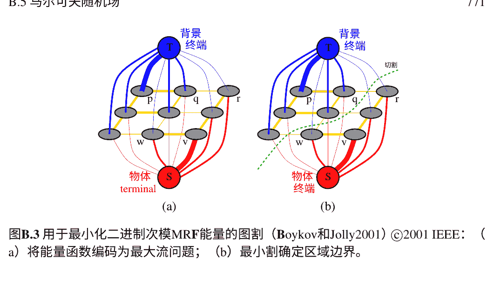

正如在第5.5节中讨论的那样，对于有向边（Kolmogorov和Boykov 2005）、更大的邻域（Boykov和Kolmogorov 2003; Kolmogorov和Boykov 2005）、连接先验（Vicente, Kolmogorov和Rother 2008）和形状先验（Lempitsky和Boykov 2007; Lempitsky, Blake和Rother 2008）的情况，这种基本算法已经进行了重要的扩展。Kolmogorov和Zabih（2004）正式刻画了这些算法找到全局最小值的二元能量势（正则条件）的类别。Komodakis, Tziritas和Paragios（2008）以及Rother, Kolmogorov, Lempitsky et al.（2007）为它们不适用的情况提供了良好的算法。

二元MRF问题也可以通过将其转化为连续[0, 1]问题来近似解决，可以将其作为线性系统进行求解（Grady 2006; Sinop and Grady 2007; Grady and Alvino 2008; Grady 2008; Grady and Ali 2008; Singaraju, Grady, and Vidal 2008; Couprie, Grady, Najman et al. 2009）（随机行走模型）或通过计算测地线来求解。多值MRF推理问题通常需要解决一系列相关的二进制MRF问题（Boykov, Veksler和Zabih 2001），尽管对于特殊情况，例如某些凸函数，一个图割可能足够（Ishikawa 2003; Schlesinger和Flach 2006）。这个领域的开创性工作是由Boykov, Veksler和Zabih（2001）完成的，他们引入了两个算法，称为交换移动和扩展移动，这两个算法的概述如图B.4所示。α-β-交换移动选择两个标签（通常通过循环遍历所有可能的配对）然后制定一个二进制MRF问题，允许当前标记为α或β的任何像素可选择将其值切换到另一个标签。α-扩展移动允许MRF中的任何像素采用α标签或保持其当前标识。通过检查很容易看出，这两个移动都会产生具有明确定义的能量函数的二进制MRF。

因为这些算法在其内部循环中使用了二进制MRF优化，所以它们受到了能量函数在二进制标记情况下的约束条件的限制（Kolmogorov和Zabih 2004）。然而，最近的算法，如Komodakis, Tziritas和Paragios（2008）以及Rother, Kolmogorov, Lempitsky等人（2007）可以用来提供更一般能量函数的近似解。为在线应用程序开发了用于重新使用先前解决方案的高效算法（流-剪切回收）（Kohli和Torr 2005; Juan和Boykov 2006; Alahari, Kohli和Torr 2011）和粗到细带状图割（Agarwala, Zheng, Pal等人2005; Lombaert, Sun, Grady等人2005; Juan和Boykov 2006）。现在还可以通过alpha扩展过程来最小化使用的标签数量（Delong, Osokin, Isack等人2010）。

在实验比较中，α-扩展通常比α-β交换（Szeliski, Zabih, Scharstein等人，2008）更快地收敛到一个好的解决方案，特别是对于涉及大区域相同标签的问题，例如图像拼接中源图像的标签化（图3.60）。对于定义在序数值上的截断凸能量函数，已经开发出更准确的算法，这些算法考虑每个最小割内部的完整标签范围，并且通常产生更低的能量（Veksler 2007; Kumar and Torr 2008; Kumar, Veksler, and Torr 2010）。高效MRF推理算法的整个领域正在迅速发展，最近的一期专题杂志（Kohli and Torr 2008; Komodakis, Tziritas, and Paragios 2008; Olsson, Eriksson, and Kahl 2008; Potetz and Lee 2008）中有所体现，文章（Alahari、Kohli和Torr 2011）和一本即将出版的书（Blake、Kohli和Rother 2010）。

#### B.5.5 线性规划

许多成功的MRF优化算法都基于能量函数（Weiss、Yanover和Meltzer 2010）的线性规划（LP）松弛。对于一些实际的MRF问题，基于LP的技术可以产生全局最小解（Meltzer、Yanover和Weiss 2005），尽管MRF推理通常是NP难的。为了描述这种松弛，让我们首先将能量函数（B.26）重新写成：

$$
\begin{aligned}
E(\boldsymbol{x}) &= \sum_{(i,j) \in \mathcal{N}} V_{i,j}(x_i, x_j) + \sum_i V_i(x_i) & \text{(B.35)} \\
&= \sum_{i,j,\alpha,\beta} V_{i,j}(\alpha, \beta)x_{i,j;\alpha,\beta} + \sum_{i,\alpha} V_i(\alpha)x_{i;\alpha} & \text{(B.36)}
\end{aligned}
$$

满足条件：
$$
\begin{aligned}
x_{i;\alpha} &= \sum_{\beta} x_{i,j;\alpha,\beta} \quad \forall (i,j) \in \mathcal{N},\alpha, & \text{(B.37)} \\
x_{j;\beta} &= \sum_{\alpha} x_{i,j;\alpha,\beta} \quad \forall (i,j) \in \mathcal{N},\beta, \quad \text{and} & \text{(B.38)} \\
x_{i;\alpha}, \quad x_{i,j;\alpha,\beta} &\in \{0, 1\}. & \text{(B.39)}
\end{aligned}
$$

在这里，α和β取值范围为标签值，$x_{i;\alpha} = \delta(x_i - \alpha)$和 $x_{ij;\alpha\beta} = \delta(x_i - \alpha)\delta(x_j - \beta)$ 是分配的指示变量，分别表示 $x_i = \alpha$ 和 $(x_i, x_j) = (\alpha, \beta)$。通过用线性约束替换离散约束(B.39)，可以得到LP松弛。很容易证明(B.36)的最优值是(B.26)的下界。

这种松弛在文献中得到了广泛研究，始于Schlesinger（1976）的工作。一个重要 的问题是如何高效地解决这个线性规划问题。不幸的是，通用的线性规划求解器无法 处理视觉中的大规模问题（Yanover，Meltzer和Weiss 2006）。已经提出了大量定 制的迭代技术。其中大多数解决了对偶问题，即他们制定了（B.36）的一个下界， 然后试图最大化这个下界。该下界通常使用树的凸组合来制定，如（Wainwright，Jaakkola和Willsky 2005）中所提出的。

线性规划的下界可以通过多种技术进行最大化，例如最大和扩散（Werner 2007） ，树加权消息传递（TRW）（Wainwright，Jaakkola和Willsky 2005; Kolmogorov 2006 ），次梯度方法（Schlesinger和Giginyak 2007a，b; Komodakis，Paragios和Tziritas 200 7）和Bregman投影（Ravikumar，Agarwal和Wainwright 2008）。请注意，最大和扩 散算法和TRW算法不能保证收敛到线性规划的全局最大值-它们可能会停留在次优点 （Kolmogorov 2006; Werner 2007）。然而，在实践中，这似乎不是一个问题。

对于一些视觉应用，基于松弛算法(B.36)的算法产生了出色的结果。然而，并非 所有情况下都能保证这一点-毕竟，这个问题是NP难的。最近，研究人员已经研究了 替代的线性规划松弛方法(Sontag和Jaakkola 2007; Sontag，Meltzer，Globerson等人200 8; Komodakis和Paragios 2008; Schraudolph 2010)。这些算法能够以额外的计算成本产 生比(B.36)更紧的界限。

线性规划松弛和alpha扩展。 解线性规划会产生满足互补松弛条件的原始和对偶解。. 一般来说，(B.36)的原始解不一定是整数值的，因此在实践中，我们可能需要将其四 舍五入以获得有效的标签x。Komodakis和Tziritas (2007a); Ko-modakis，Tziritas和Paragios (2007)提出了一种替代方法，即寻找满足近似互补松弛条件且原始解是整数值 的原始和对偶解。(Komodakis和Tziritas 2007a; Komodakis，Tziritas和Paragios 2007) 提出了几种基于最大流的算法，其中Fast-PD方法(Komodakis，Tziritas和Paragios 20 07)表现最好。在度量相互作用的情况下，Fast-PD的默认版本产生与alpha扩展算法( Boykov，Veksler和Zabih 2001)相同的原始解。这为alpha扩展算法尝试近似解决松弛 问题(B.36)提供了一个有趣的解释。

与标准的alpha扩展算法不同，Fast-PD还维护了一个对偶解因此在实践中运行更快 。Fast-PD可以扩展到半度量交互的情况下（Komodakis，Tziritas和Paragios 2007）。 这种扩展的原始版本是...

### B.6 不确定性估计（误差分析）

除了计算最可能的估计值之外，许多应用还需要对此估计值的不确定性进行估计。 这样做的最一般方法是计算一个完整的概率分布，涵盖所有未知数，但这通常是难以处理的。唯一的特殊情况是，在具有高斯噪声的线性估计问题中，很容易获得对该分布的简单描述，其中联合能量函数（后验估计的负对数似然）是二次的。在这种情况下，后验分布是多变量的高斯分布，协方差可以直接从问题的逆Hes-ian计算得到。（在这种简单情况下，逆协方差矩阵的另一个名称，等于Hessian的矩阵，是信息矩阵。）

然而，即使在这种情况下，完整的协方差矩阵可能太大而无法计算和存储。例如，在大型运动结构问题中，大型稀疏Hessian通常会导致完整的稠密协方差矩阵。在这种情况下，通常只报告估计量的方差或单个参数的简单协方差估计，例如3D点位置或相机姿态估计（Szeliski 1990a）。使用特征值分析可以获得对问题的更多洞察，例如主要的不确定性模式（Szeliski和Kang 1997）。

对于后验能量非二次的问题，例如非线性或鲁棒化最小二乘问题，在最优解附近仍然通常可以获得Hessian的估计。在这种情况下，不确定性（协方差）的Cramer-Rao下界可以计算为Hessian的逆。换句话说，虽然局部Hessian可能低估了能量函数的“宽度”，但协方差永远不会小于基于这个局部二次近似的估计。在使用图割进行MAP推断的一般MRF中，还可以估计不同类型的不确定性（最小边际能量）（Kohli和Torr 2008）。

虽然许多计算机视觉应用忽略了不确定性建模，但计算这些估计值通常是有用的，只是为了对估计值的可靠性有直观的感觉。某些应用，如卡尔曼滤波，需要计算这种不确定性（无论是显式地作为后验协方差还是隐式地作为逆协方差），以便将新测量与先前计算的估计值进行最优集成。

# 附录C

## 补充材料

-   C.1 数据集
-   ...（此处省略了原文中的省略号和点状占位符）在这最后的附录中，我总结了一些对学生、教师和研究人员有用的补充材料。本书的网站http://szeliski.org/Book上包含了更新的数据集和软件列表，请也在那里查看。

### C.1 数据集

开发可靠的视觉算法的关键之一是在具有挑战性和代表性的数据集上测试您的程序。当有真实数据或其他人的结果可用时，这样的测试甚至可以提供更多信息（和定量分析）。

多年来，已经开发了大量数据集来测试和评估计算机视觉算法。其中一些数据集（和软件）在计算机视觉主页上进行了索引。一些较新的网站，如CVonline（http://homepages.inf.ed.ac.uk/rbf/CVonline/）、VisionBib.Com（http://datasets.visionbib.com/）和计算机视觉在线（http://computervisiononline.com/），提供了更近期的指引。

下面，我列出了一些更受欢迎的数据集，按照它们最接近的书籍章节进行分组：

### 第2章：图像形成

- CUReT：哥伦比亚-乌得勒支反射和纹理数据库，http://www1.cs.columbia.edu/CAVE/software/curet/（Dana、van Ginneken、Nayaret al. 1999）。
- Middlebury彩色数据集：由不同相机拍摄的注册彩色图像，用于研究它们如何转换色域和颜色，http://vision.middlebury.edu/color/data/（Chakrabarti、Scharstein和Zickler 2009）。

### 第三章：图像处理

- Middlebury测试数据集用于评估MRF最小化/推理算法，http://vision.middlebury.edu/MRF/results/（Szeliski, Zabih, Scharstein 等 2008）。

### 第四章：特征检测和匹配

- Affine Covariant特征数据库用于评估特征检测器和描述符匹配质量和重复性，http://www.robots.ox.ac.uk/~vgg/research/affine/（Mikolajczyk和Schmid 2005; Mikolajczyk, Tuytelaars, Schmid等2005）。
- 匹配图像补丁的数据库用于学习和特征描述符评估，http://cvlab.epfl.ch/~brown/patchdata/patchdata.html（Winder和Brown 2007; Hua, Brown和Winder 2007）。

### 第5章：分割

- 伯克利分割数据集和由30个人标记的1000张图像的基准测试，以及一个评估，http://www.eecs.berkeley.edu/Research/Projects/CS/vision/grouping/segbench/ （Martin, Fowlkes, Tal et al. 2001）。
- Weizmann分割评估数据库包含100个灰度图像和地面真实分割，http://www.wisdom.weizmann.ac.il/~vision/Seg_Evaluation_DB/index.html （Alpert, Galun, Basri et al. 2007）。

### 第8章：密集运动估计

- Middlebury光流评估网站，http://vision.middlebury.edu/flow/data (Baker, Scharstein, Lewis et al. 2009)。
- 人工辅助运动注释数据库，http://people.csail.mit.edu/celiu/motionAnnotation/ (Liu, Freeman, Adelson 等 2008)

### 第10章：计算摄影

- 高动态范围辐射图，http://www.debevec.org/Research/HDR/ (Debevec和Malik 1997)。
- Alpha抠图评估网站，http://alphamatting.com/ (Rhemann, Rother, Wang 等 2009)。

### 第11章：立体对应

- Middlebury立体数据集和评估，http://vision.middlebury.edu/stereo/ (Scharstein和Szeliski 2002)。
- 立体分类和不同聚合代价的性能评估立体匹配，http://www.vision.deis.unibo.it/spe/SPEHome.aspx (Tombari, Mattocci, Di Stefano 等 2008)。
- Middlebury多视角立体数据集，http://vision.middlebury.edu/mview/data/ (Seitz, Curless, Diebel等，2006年)。
- 多视角和牛津学院建筑重建，http://www.robots.ox.ac.uk/~vgg/data/data-mview.html。
- 多视角立体数据集，http://cvlab.epfl.ch/data/strechamvs/ (Strecha, Fransens, 和Van Gool 2006年)。
- 多视角评估，http://cvlab.epfl.ch/~strecha/multiview/ (Strecha, von Hansen, Van Gool et al. 2008年)。

### 第12章：3D重建

- HumanEva：用于评估关节人体运动的同步视频和动作捕捉数据集，http://vision.cs.brown.edu/humaneva/ (Sigal, Balan和Black 2010年)。

### 第13章：基于图像的渲染

- （新）斯坦福光场存档，http://lightfield.stanford.edu/ (Wilburn, Joshi, Vaish等人, 2005年)
- 虚拟视点视频：带有逐帧深度图的多视点视频，http://research.microsoft.com/en-us/um/redmond/groups/ivm/vvv/ (Zitnick, Kang, Uytten-daele等人, 2004年)

### 第14章：识别

有关视觉识别数据集的列表，请参见表14.1–14.2。除了这些之外，还有：

- Buffy姿势类别，http://www.robots.ox.ac.uk/~vgg/data/buffy_pose_classes/和Buffy stickmen V2.1, http://www.robots.ox.ac.uk/~vgg/data/stickmen/index.html (Ferrari, Marin-Jimenez和Zisserman, 2009年; Eichner和Ferrari, 2009年)
- H3D数据库包含了人体姿势/关节标注的照片，网址为http://www.eecs.berkeley.edu/~lbourdev/h3d/ (Bourdev和Malik 2009)。
- 动作识别数据集，网址为http://www.cs.berkeley.edu/projects/vision/action，提供了几个动作和活动识别的数据集，以及一些论文。 人体动作数据库位于http://www.nada.kth.se/cvap/actions/，包含了更多的动作序列。

### C.2 软件

计算机视觉算法的最佳来源之一是开源计算机视觉（OpenCV）库（http://opencv.willowgarage.com/wiki/），该库由Gary Bradski和他在Intel的同事们开发，并在Willow Garage (Bradsky和Kaehler 2008) 进行维护和扩展。 从http://opencv.willowgarage.com/documentation/cpp/获取的可用函数的部分列表包括：

- 图像处理和变换（滤波、形态学、金字塔）；
- 几何图像变换（旋转、调整大小）；
- 杂项图像变换（傅里叶变换、距离变换）；
- 直方图；
- 分割（分水岭、均值漂移）；
- 特征检测（Canny、Harris、霍夫、MSER、SURF）；
- 运动分析和目标跟踪（Lucas-Kanade、均值漂移）；
- 相机标定和三维重建；
- 机器学习（k最近邻、支持向量机、决策树、提升、随机树、期望最大化和神经网络）；

Intel Performance Primitives（IPP）库，http://software.intel.com/en-us/intel-ipp/，包含了针对各种图像处理任务进行高度优化的代码。OpenCV中的许多例程都利用了这个库，如果安装了它，运行速度会更快。在功能上，它具有与OpenCV中相同的运算符，还有额外的库用于图像和视频压缩、信号和语音处理以及矩阵代数。

MATLAB图像处理工具箱，http://www.mathworks.com/products/image/，包含了空间变换（旋转、调整大小）、归一化互相关、图像分析和统计（边缘、霍夫变换）、图像增强（自适应直方图均衡化、中值滤波）和恢复（去模糊）、线性滤波（卷积）、图像变换（傅里叶和离散余弦变换）以及形态学操作（连通分量和距离变换）的例程。

两个较旧的库，似乎不再处于活跃开发状态，但包含了许多有用的例程，分别是VXL（用于计算机视觉研究和实现的C++库，http://vxl.sourceforge.net/）和LTI-Lib 2（http://www.itcr.ac.cr/palvarado/ltilib-2/homepage/）。

照片编辑和查看软件，如Windows Live Photo Gallery、iPhoto、Picasa、GIMP和IrfanView，可以用于执行常见的处理任务、转换格式和查看结果。它们还可以作为你尝试从头开始开发的图像处理算法（如色调校正或去噪）的有趣参考实现。

还有一些软件包和基础设施可以帮助构建实时视频处理演示。Vision on Tap (http://www.visionontap.com/) 提供了一个Web服务，可以实时处理您的网络摄像头视频 (Chiu和Raskar 2009)。 Video-Man (Video Manager, http://videomanlib.sourceforge.net/) 可以用于运行实时基于视频的演示和应用程序。 您还可以使用MATLAB中的 `imread` 从任何URL直接读取，例如网络摄像头。

下面，我列出了一些可以在网络上找到的附加软件，按照它们最相应的书籍章节进行分组:

### 第三章：图像处理

- matlabPyrTools—Laplacian金字塔、QMF/Wavelets和可操纵金字塔的MATLAB源代码，http://www.cns.nyu.edu/~lcv/software.php (Simoncelli和Adelson 1990a; Simoncelli, Freeman, Adelson et al. 1992)。
- BLS-GSM图像去噪，http://decsai.ugr.es/~javier/denoise/ (Portilla, Strela, Wainwright et al. 2003)。
- 快速双边滤波代码，http://people.csail.mit.edu/jiawen/#code (Chen, Paris, and Durand 2007)。
- 快速距离变换算法的C++实现，http://people.cs.uchicago.edu/~pff/dt/ (Felzenszwalb and Huttenlocher 2004a)。
- GREYC的魔术图像转换器，包括使用正则化和各向异性扩散的图像恢复软件，http://gmic.sourceforge.net/gimp.shtml (Tschumperlé and Deriche 2005)。

### 第四章：特征检测和匹配

- VLFeat，一个开放和可移植的计算机视觉算法库，http://vlfeat.org/ (Vedaldi and Fulkerson 2008)。
- SiftGPU：尺度不变特征变换（SIFT）的GPU实现，http://www.cs.unc.edu/~ccwu/siftgpu/ (Wu 2010)。
- SURF：加速鲁棒特征，http://www.vision.ee.ethz.ch/~surf/ (Bay, Tuytelaars和Van Gool 2006)。
- FAST角点检测，http://mi.eng.cam.ac.uk/~er258/work/fast.html (Rosten和Drummond 2005, 2006)。
- Linux二进制文件用于仿射区域检测器和描述符，以及用于计算重复性和匹配分数的MATLAB文件，http://www.robots.ox.ac.uk/~vgg/research/affine/。
- Kanade–Lucas–Tomasi特征跟踪器: KLT，http://www.ces.clemson.edu/~stb/klt/ (Shi和Tomasi 1994)；GPU-KLT，http://cs.unc.edu/~cmzach/opensource.html (Zach, Gallup和Frahm 2008)；以及Lucas–Kanade 20年后，http://www.ri.cmu.edu/projects/project_515.html (Baker和Matthews 2004)。

### 第5章: 分割

- 高效基于图的图像分割, http://people.cs.uchicago.edu/~pff/segment/ (Felzenszwalb和Huttenlocher 2004b)。
- EDISON, 边缘检测和图像分割, http://coewww.rutgers.edu/riul/research/code/EDISON/ (Meer和Georgescu 2001; Comaniciu和Meer 2002)。
- 包括干预轮廓的归一化割分割, http://www.cis.upenn.edu/~jshi/software/ (Shi和Malik 2000; Malik, Belongie, Leung et al. 2001)。
- 加权聚合分割 (SWA), http://www.cs.weizmann.ac.il/~vision/SWA/ (Alpert, Galun, Basri et al. 2007)。

### 第6章: 基于特征的对齐和校准

- 非迭代PnP算法, http://cvlab.epfl.ch/software/EPnP/ (Moreno-Noguer, Lepetit和Fua 2007)。
- Tsai相机标定软件, http://www-2.cs.cmu.edu/~rgw/TsaiCode.html (Tsai 1987)。
- 简易相机标定工具包, http://research.microsoft.com/en-us/um/people/zhang/Calib/ (Zhang 2000)。
- MATLAB相机标定工具箱, http://www.vision.caltech.edu/bouguetj/calib.doc/; OpenCV中包含了C版本。
- MATLAB多视图几何函数, http://www.robots.ox.ac.uk/~vgg/hzbook/code/ (Hartley和Zisserman 2004)。

### 第7章: 运动结构

- SBA: 基于Levenberg–Marquardt算法的通用稀疏束调整C/C++包, http://www.ics.forth.gr/~lourakis/sba/ (Lourakis和Argyros 2009)。
- 简单稀疏束调整 (SSBA), http://cs.unc.edu/~cmzach/opensource.html。

### 第8章：密集运动估计

- 光流软件，http://www.cs.brown.edu/~black/code.html (Black和Anandan 1996)。
- 使用总变差和共轭梯度下降的光流，http://people.csail.mit.edu/celiu/OpticalFlow/ (Liu 2009)。
- 在GPU上的TV-L1光流，http://cs.unc.edu/~cmzach/opensource.html (Zach, Pock和Bischof 2007a)。
- elastix：图像的刚性和非刚性配准工具箱，http://elastix.isi.uu.nl/ (Klein, Staring和Pluim 2007)。
- 使用离散优化的可变形图像配准，http://www.mrf-registration.net/deformable/index.html (Glocker, Komodakis, Tziritas et al. 2008)。

### 第9章：图像拼接

- 用于拼接图像的Microsoft Research图像合成编辑器，http://research.microsoft.com/en-us/um/redmond/groups/ivm/ice/。

### 第10章：计算摄影

- HDRShop软件用于将曝光不同的图像合并成高动态范围辐射图像，http://projects.ict.usc.edu/graphics/HDRShop/。
- 超分辨率代码，http://www.robots.ox.ac.uk/~vgg/software/SR/ (Pickup 2007; Pickup, Capel, Roberts et al. 2007, 2009)。

### 第11章：立体对应

- StereoMatcher，独立的C++立体匹配代码，http://vision.middlebury.edu/stereo/code/ (Scharstein and Szeliski 2002)。
- 基于补丁的多视图立体软件（PMVS版本2），http://grail.cs.washington.edu/software/pmvs/ (Furukawa和Ponce 2011)。

### 第12章：3D重建

- Scanalyze：用于对齐和合并范围数据的系统，http://graphics.stanford.edu/software/scanalyze/ (Curless和Levoy 1996)。

MeshLab: 用于处理、编辑和可视化非结构化3D三角网格的软件，http://meshlab.sourceforge.net/。

VRML查看器（各种）也是可视化贴图的3D模型的好方法。

## 第12.6.4节：整体建模和跟踪

贝叶斯3D人体跟踪，http://www.cs.brown.edu/~black/code.html （Sidenbladh, Black和Fleet 2000; Sidenbladh和Black 2003）。

HumanEva: 用于跟踪关节人体动作的基准代码，http://vision.cs.brown.edu/humaneva/ (Sigal, Balan, and Black 2010).

## 第14.1.1节：人脸检测

示例人脸检测代码和评估工具，http://vision.ai.uiuc.edu/mhyang/face-detection-survey.html.

## 第14.1.2节：行人检测

一个简单的物体检测器，使用提升算法，http://people.csail.mit.edu/torralba/shortCourseRLOC/boosting/boosting.html (Hastie, Tibshirani, and Friedman 2001; Torralba, Murphy, and Freeman 2007).

经过区分训练的可变形部件模型，http://people.cs.uchicago.edu/~pff/latent/ (Felzenszwalb, Girshick, McAllester et al. 2010).

上半身检测器，http://www.robots.ox.ac.uk/~vgg/software/UpperBody/ (Ferrari, Marin-Jimenez, and Zisserman 2008).

2D关节人体姿势估计软件，http://www.vision.ee.ethz.ch/~calvin/关节人体姿势估计代码/ (Eichner和Ferrari 2009)。

## 第14.2.2节：主动外观和3D形状模型

AAMtools: 一种主动外观建模工具箱，http://cvsp.cs.ntua.gr/software/AAMtools/ (Papandreou和Maragos 2008)。

## 第14.3节：实例识别

FASTANN和FASTCLUSTER用于近似k-means（AKM），http://www.robots.ox.ac.uk/~vgg/software/ (Philbin, Chum, Isard et al. 2007)。

使用快速近似最近邻进行特征匹配，http://people.cs.ubc.ca/~mariusm/index.php/FLANN/FLANN (Muja和Lowe 2009)。

## 第14.4.1节：词袋模型

两个词袋分类器，http://people.csail.mit.edu/fergus/iccv2005/bagwords.html (Fei-Fei和Perona 2005; Sivic, Russell, Efros et al. 2005)。

特征词袋和分层k-means，http://www.vlfeat.org/ (Nistér和Stewénius 2006; Nowak，Jurie和Triggs 2006)。

## 第14.4.2节：基于部件的模型

一个简单的部件和结构目标检测器，http://people.csail.mit.edu/fergus/iccv2005/partsstructure.html (Fischler和Elschlager 1973; Felzenszwalb和Huttenlocher 2005)。

## 第14.5.1节：机器学习软件

支持向量机 (SVM) 软件 (http://www.support-vector-machines.org/SVM_soft.html) 有很多SVM库的指针，包括SVM<sup>light</sup>，http://svmlight.joachims.org/; LIBSVM，http://www.csie.ntu.edu.tw/~cjlin/libsvm/ (Fan, Chen, and Lin 2005); 和LIBLINEAR，http://www.csie.ntu.edu.tw/ ~cjlin/liblinear/ (Fan, Chang, Hsieh et al. 2008)。

核机器：链接到支持向量机、高斯过程、提升和其他机器学习算法的算法，http://www.kernel-machines.org/software.

多核用于图像分类，http://www.robots.ox.ac.uk/~vgg/software/MKL/ (Varma和Ray 2007; Vedaldi, Gulshan, Varma et al. 2009)。

## 附录A.1-A.2：矩阵分解和线性最小二乘

BLAS（基本线性代数子程序），http://www.netlib.org/blas/ (Blackford, Demmel, Dongarra et al. 2002)。

LAPACK（线性代数包），http://www.netlib.org/lapack/ (Anderson, Bai, Bischof et al. 1999)。

GotoBLAS，http://www.tacc.utexas.edu/tacc-projects/。

ATLAS（自动调整线性代数软件），http://math-atlas.sourceforge.net/ (Demmel, Dongarra, Eijkhout et al. 2005)。

Intel数学核心库 (MKL)，http://software.intel.com/en-us/intel-mkl/。

AMD核心数学库 (ACML)，http://developer.amd.com/cpu/Libraries/acml/Pages/default.aspx。

感谢Sameer Agarwal建议并描述了大部分这些网站。

## 附录A.3：非线性最小二乘

-   MINPACK， http://www.netlib.org/minpack/。
-   levmar： Levenberg-Marquardt非线性最小二乘算法， http://www.ics.forth.gr/~lourakis/levmar/ （Madsen, Nielsen, and Tingleff 2004）。

## 附录A.4-A.5：直接和迭代稀疏矩阵求解器

-   SuiteSparse（各种重排序算法， CHOLMOD）和SuiteSparse QR， http://www.cise.ufl.edu/research/sparse/SuiteSparse/ （Davis 2006, 2008）。
-   PARDISO（迭代和稀疏直接求解）， http://www.pardiso-project.org/。
-   TAUCS（稀疏直接、迭代、外存、预处理器）， http://www.tau.ac.il/~stoledo/taucs/。
-   HSL数学软件库， http://www.hsl.rl.ac.uk/index.html。
-   线性系统解决方案模板， http://www.netlib.org/linalg/html/templates/Templates.html（Barrett, Berry, Chan et al. 1994）。 下载PDF以获取软件使用说明。
-   ITSOL， MIQR和其他稀疏求解器， http://www-users.cs.umn.edu/~saad/software/（Saad 2003）。
-   ILUPACK， http://www-public.tu-bs.de/~bolle/ilupack/。

## 附录B：贝叶斯建模和推断

-   Middlebury MRF最小化源代码， http://vision.middlebury.edu/MRF/code/（Szeliski, Zabih, Scharstein et al. 2008）。
-   C++代码用于早期视觉的高效信念传播， http://people.cs.uchicago.edu/~pff/bp/（Felzenszwalb和Huttenlocher 2006）。
-   FastPD MRF优化代码， http://www.csd.uoc.gr/~komod/FastPD（Komodakis and Tziritas 2007a; Komodakis, Tziritas和Paragios 2008）

```
c
double urand()
{
    return ((double) rand()) / ((double) RAND_MAX);
}
void grand(double& g1, double& g2)
{
#ifndef M_PI
#define M_PI 3.14159265358979323846
#endif // M_PI

    double n1 = urand();
    double n2 = urand();
    double x1 = n1 + (n1 == 0); /* 防止log(0) */
    double sqlogn1 = sqrt(-2.0 * log(x1));
    double angl = (2.0 * M_PI) * n2;
    g1 = sqlogn1 * cos(angl);
    g2 = sqlogn1 * sin(angl);
}
```

算法 C.1 C 算法用于生成高斯随机噪声，使用 Box-Muller 变换。

高斯噪声生成。许多基本软件包都配备了均匀随机噪声生成器（例如 Unix 中的 rand() 函数），但并非所有都配备了高斯随机噪声生成器。要计算一个正态分布的随机变量，可以使用 Box-Muller 变换（Box 和 Muller 1958），其 C 代码在算法 C.1 中给出——请注意此例程返回随机变量对。生成高斯随机数的替代方法由 Thomas、Luk、Leong 等人提供（2007）。

伪彩色生成。在许多应用中，能够可视化分配给图像（或图像特征，如线条）的标签集合是很方便的。最简单的方法之一是为每个整数标签分配一个唯一的颜色。在我的工作中，我发现将这些标签以准均匀的方式分布在 RGB 色彩立方体周围是很方便的，使用以下思路。

对于每个（非负）标签值，将位数分为三个颜色通道，例如，对于一个九位值，位可以标记为RGBRGBRGB。收集每个颜色值后，反转位，使得低位变化最快。

在实践中，对于八位颜色通道，这种位反转可以存储在表中，或者可以预先计算从标签到伪彩色的完整映射表（例如，使用4092个条目）。
图8.16显示了这种伪彩色映射的一个示例。

## GPU实现

可编程GPU的出现，具有像素着色器和计算着色器等功能，为实时应用（如分割、跟踪、立体和运动估计）的快速计算机视觉算法的开发提供了可能（Pock、Unger、Cremers等，2008年；Vineet和Narayanan，2008年；Zach、Gallahp和Frahm，2008年）。
了解此类算法的一个好的来源是CVPR 2008年关于GPU上的视觉计算机视觉研讨会（CVGPU），网址为http://www.cs.unc.edu/~jmf/Workshop on Computer Vision on GPU.html，其论文可以在CVPR 2008年会议DVD上找到。GPU算法的其他来源包括GPGPU网站和研讨会，网址为http://gpgpu.org/，以及OpenVIDIA网站，网址为http://openvidia.sourceforge.net/index.php/OpenVIDIA。

### C.3 幻灯片和讲座

正如我在前言中提到的，我希望能够发布与本书内容相对应的幻灯片。
在这些幻灯片准备好之前，你最好查看我在华盛顿大学合作教授的课程的幻灯片，以及使用类似教学大纲的相关课程。
以下是部分这类课程的列表：

-   UW 455：本科生计算机视觉课程，http://www.cs.washington.edu/education/courses/455/。
-   UW 576：研究生计算机视觉课程，http://www.cs.washington.edu/education/courses/576/。
-   斯坦福CS233B：计算机视觉导论，http://vision.stanford.edu/teaching/cs223b/。
-   MIT 6.869：计算机视觉进展，http://people.csail.mit.edu/torralba/courses/6.869/6.869.computervision.htm。
-   伯克利CS 280：计算机视觉，http://www.eecs.berkeley.edu/~trevor/CS280.html。
-   UNC COMP 776：计算机视觉，http://www.cs.unc.edu/~lazebnik/spring10/。
-   Middlebury CS 453：计算机视觉，http://www.cs.middlebury.edu/~schar/courses/cs453-s10/。

相关课程还涉及计算摄影等主题，例如

-   CMU 15-463: 计算摄影，http://graphics.cs.cmu.edu/courses/15-463/。
-   MIT 6.815/6.865: 高级计算摄影，http://stellar.mit.edu/S/course/6/sp09/6.815/。
-   Stanford CS 448A: 手机上的计算摄影，http://graphics.stanford.edu/courses/cs448a-10/。
-   SIGGRAPH关于计算摄影的课程，http://web.media.mit.edu/~raskar/photo/。

还有一套优秀的在线讲座，涵盖了各种计算机视觉主题，如置信传播和图割，在UW-MSR视觉算法课程中可获得，网址为http://www.cs.washington.edu/education/courses/577/04sp/。

### C.4 参考文献

尽管这本书的网站上提供了一个包含所有引用文献的参考文献（BibTex .bib 文件），但是 Keith Price 在 http://iris.usc.edu/Vision-Notes/bibliography/contents.html 上维护了一个更全面的部分注释的计算机视觉出版物参考文献。此外，http://www.siggraph.org/publications/bibliography/ 上还有一个可搜索的计算机图形学参考文献。技术论文的其他好来源包括 Google Scholar 和 CiteSeerx。

## 参考文献

Abdel-Hakim, A. E. 和 Farag, A. A. (2006). CSIFT: 具有颜色不变特性的 SIFT 描述符。 在 IEEE 计算机学会计算机视觉和模式识别会议（CVPR'2006）上，第 1978-1983 页，纽约市，纽约。

Adelson, E. H. 和 Bergen, J. (1991). 光场函数和早期视觉的要素。 在视觉处理的计算模型中，第 3-20 页。

Adelson, E. H., Simoncelli, E., 和 Hingorani, R. (1987). 正交金字塔变换用于图像编码。 在*SPIE Vol. 845*, 视觉通信和图像处理 *II*, pp. 50–58, 麻省剑桥。

Adiv, G. (1989). 从嘈杂的流场中恢复3D运动和结构的固有模糊。 *IEEE模式分析与机器智能*,11(5):477–490.

Agarwal, A. 和 Triggs, B. (2006). 从单眼图像中恢复3D人体姿势。 *IEEE模式分析与机器智能*, 28(1):44–58.

Agarwal, S. 和 Roth, D. (2002). 学习稀疏表示进行目标检测。 在第七届欧洲计算机视觉大会 (*ECCV 2002*), pp. 113–127, 哥本哈根。

Agarwal, S., Snavely, N., Seitz, S. M., 和 Szeliski, R. (2010). 大规模下的捆绑调整。 在第十一届欧洲计算机视觉大会（*ECCV 2010*）中, Heraklion, 克里特岛。

Agarwal, S., Snavely, N., Simon, I., Seitz, S. M., 和 Szeliski, R. (2009). 在第十二届*IEEE*国际计算机视觉大会（*ICCV 2009*）中, 京都, 日本。

Agarwal, S., Furukawa, Y., Snavely, N., Curless, B., Seitz, S. M., 和 Szeliski, R. (2010). 重建罗马。 计算机, 43(6):40–47.

Agarwala, A. (2007). 使用四叉树的高效梯度域合成。 ACM图形学交易, 26(3).

Agarwala, A., Hertzmann, A., Seitz, S., 和 Salesin, D. (2004). 基于关键帧的跟踪用于动画和动画制作。ACM图形学交易（SIGGRAPH 2004年会议），23（3）：584–591。

Agarwala, A., Agrawala, M., Cohen, M., Salesin, D., 和 Szeliski, R. (2006). 用多视点全景拍摄长场景。ACM图形学交易（SIGGRAPH 2006年会议），25（3）：853–861。

Agarwala, A., Dontcheva, M., Agrawala, M., Drucker, S., Colburn, A., Curless, B., Salesin, D. H., 和 Cohen, M. F. (2004). 交互式数字拼贴。ACM图形学交易（SIGGRAPH 2004年会议），23（3）：292–300。

Agarwala, A., Zheng, K. C., Pal, C., Agrawala, M., Cohen, M., Curless, B., Salesin, D., and Szeliski, R. (2005). 全景视频纹理。ACM图形学交易（SIGGRAPH 2005），24（3）：821-827。

Aggarwal, J. K. and Nandhakumar, N. (1988). 从图像序列中计算运动的方法-综述。IEEE会议录，76（8）：917-935。

Agin, G. J. and Binford, T. O. (1976). 曲线对象的计算机描述。IEEE计算机交易，C-25（4）：439-449。

Ahonen, T., Hadid, A., and Pietik¨ainen, M. (2006). 基于局部二进制模式的人脸描述：应用于人脸识别。IEEE模式分析与机器智能交易，28（12）：2037-2041。

Akenine-M¨oller, T. 和 Haines, E. (2002). 实时渲染. A K Peters, Wellesley, 马萨诸塞州, 第二版.

Al-Baali, M. 和 Fletcher., R. (1986). 一种用于非线性最小二乘的高效线搜索. Journal of Optimization Theory and Applications, 48(3):359–377.

Alahari, K., Kohli, P., 和 Torr, P. (2011). 离散MAP MRF推理的动态混合算法.IEEE Transactions on Pattern Analysis and Machine Intelligence.

Alexa, M., Behr, J., Cohen-Or, D., Fleishman, S., Levin, D., 和 Silva, C. T. (2003). 计算和渲染点集表面.IEEE Transactions on Visualization and Computer Graphics, 9(1):3–15.

Aliaga, D. G., Funkhouser, T., Yanovsky, D., 和 Carlbom, I. (2003). 图像之海.IEEE 计算机图形学与应用, 23(6):22–30.

Allen, B., Curless, B., and Popovi´c, Z. (2003). 人体形状空间：从范围扫描中的重建和参数化。ACM图形学交易（SIGGRAPH 2003会议），22（3）：587-594。

Allgower, E. L. and Georg, K. (2003). 数值延续方法导论。工业和应用数学学会。

Aloimonos, J. (1990). 透视近似。图像与视觉计算, 8: 177-192.

Alpert, S., Galun, M., Basri, R., and Brandt, A. (2007). 通过概率自下而上聚合和线索集成进行图像分割。在IEEE计算机学会计算机视觉和模式识别会议 (CVPR 2007) 中, 明尼阿波利斯, MN.

Amini, A. A., Weymouth, T. E., and Jain, R. C. (1990). 使用动态规划解决视觉中的变分问题。IEEE模式分析和机器智能交易, 12 (9): 855-867.

Anandan, P. (1984). 在包含遮挡的场景中使用置信度测量计算密集位移场。在图像理解研讨会上, 第236-246页, 新奥尔良.

Anandan, P. (1989). 一种用于测量视觉运动的计算框架和算法。国际计算机视觉杂志, 2(3):283–310.

Anandan, P. and Irani, M. (2002). 带有不确定性的因式分解。国际计算机视觉杂志, 49(2-3):101–116.

Anderson, E., Bai, Z., Bischof, C., Blackford, S., Demmel, J. W. et al. (1999). LAPACK用户指南。工业和应用数学学会, 第3版.

Andrieu, C., de Freitas, N., Doucet, A., and Jordan, M. I. (2003). 马尔科夫链蒙特卡洛方法在机器学习中的介绍。机器学习, 50(1-2):5–43.

Andriluka, M., Roth, S., and Schiele, B. (2008). 人物跟踪通过检测和人物-检测通过跟踪。在IEEE计算机学会计算机视觉和模式识别会议 (CVPR 2008), 阿拉斯加州安克雷奇.

Andriluka, M., Roth, S., and Schiele, B. (2009). 图像结构再探：人物检测和关节姿势估计。在 IEEE计算机学会计算机视觉和模式识别会议 (CVPR 2009), 佛罗里达州迈阿密海滩.

Andriluka, M., Roth, S., and Schiele, B. (2010). 通过检测进行眼部3D姿势估计和跟踪。在 IEEE计算机学会计算机视觉和模式识别会议 (CVPR 2010), 加利福尼亚州旧金山.

Anguelov, D., Srinivasan, P., Koller, D., Thrun, S., Rodgers, J., and Davis, J. (2005). SCAPE: 人形状补全和动画。ACM图形学交易 (SIGGRAPH 2005会议论文), 24(3): 408-416.

Ansar, A., Castano, A. and Matthies, L. (2004). 使用双边滤波的增强实时立体视觉。在国际三维数据处理、可视化和传输研讨会 (3DPVT) 中.

Antone, M. and Teller, S. (2002). 可扩展的全向图像外部校准网络。国际计算机视觉杂志, 49(2-3): 143-174.

Arbel´aez, P., Maire, M., Fowlkes, C. and Malik, J. (2010). 轮廓检测和分层图像分割。技术报告UCB/EECS-2010-17, EECS系, 加州大学伯克利分校。提交给PAMI.

Argyriou, V. and Vlachos, T. (2003). 使用梯度交叉相关估计亚像素运动。Electronic Letters, 39(13):980–982.

Arikan, O. and Forsyth, D. A. (2002). 从示例中生成交互式运动。ACM图形学交易, 21(3):483–490.

Arnold, R. D. (1983). 自动立体感知。技术报告AIM-351, Stanford University 人工智能实验室.

Arya, S., Mount, D. M., Netanyahu, N. S., Silverman, R., and Wu, A. Y. (1998). 在固定维度中近似最近邻搜索的最优算法。ACM杂志, 45(6):891–923.

Ashdown, I. (1993). 近场光度测量：一种新方法。Illuminating Engineering Society 杂志, 22(1):163–180.

Atkinson, K. B. (1996). 近距离摄影测量与机器视觉。Whittles 出版社, 苏格兰, 英国.

Aurich, V. and Weule, J. (1995). 非线性高斯滤波器执行边缘保持 diffusion。在第17届DAGM-Symposium, 第538-545页, 比勒费尔德.

Avidan, S. (2001). 支持向量跟踪。在 IEEE计算机学会计算机视觉和模式识别会议 (CVPR'2001) , 第283-290页, 夏威夷卡乌艾岛.

Avidan, S., Baker, S., and Shan, Y. (2010). 互联网视觉专题。IEEE会议论文集, 98(8):1367–1369.

Axelsson, O. (1996). 迭代解法方法。剑桥大学出版社, 剑桥.

Ayache, N. (1989). 立体视觉和多传感器感知。InterEditions, 巴黎.

Azarbayejani, A. and Pentland, A. P. (1995). 递归估计运动、结构和焦距。IEEE模式分析与机器智能交易, 17(6): 562–575.

Azuma, R. T., Baillot, Y., Behringer, R., Feiner, S. K., Julier, S. and MacIntyre, B. (2001). 增强现实的最新进展。IEEE计算机图形与应用, 21(6): 34–47.

Bab-Hadiashar, A. and Suter, D. (1998a). 稳健的光流计算。国际计算机视觉杂志, 29(1): 59–77.

Bab-Hadiashar, A. and Suter, D. (1998b). 基于稳健的总最小二乘光流计算。在亚洲计算机视觉会议 (ACCV'98), 第566–573页, 香港.

Badra, F., Qumsieh, A., and Dudek, G. (1998). 图像拼接中的旋转和缩放。在 IEEE计算机视觉应用研讨会 (WACV'98), pp. 50–55, 普林斯顿.

Bae, S., Paris, S., and Durand, F. (2006). 用于摄影外观的双尺度色调管理。ACM图形学交易, 25(3):637–645.

Baeza-Yates, R. and Ribeiro-Neto, B. (1999). 现代信息检索。Addison Wesley.

Bai, X. and Sapiro, G. (2009). 测地线抠图：快速交互式图像和视频分割和抠图的框架。国际计算机视觉杂志, 82(2):113–132.

Bajcsy, R. and Kovacic, S. (1989). 多分辨率弹性匹配。计算机视觉、图形和图像处理, 46(1):1–21.

Baker, H. H. (1977). 三维建模。在第五届国际人工智能联合会议 (IJCAI-77) 上, 第649-655页.

Baker, H. H. (1982). 基于边缘和强度的立体深度。技术报告AIM-347, 斯坦福大学人工智能实验室.

Baker, H. H. (1989). 构建演化表面：编织墙。国际计算机视觉杂志, 3(1): 50-71.

Baker, H. H. and Binford, T. O. (1981). 基于边缘和强度的立体深度。在 IJCAI81, 第631-636页.

Baker, H. H. and Bolles, R. C. (1989). 在时空表面上推广极线平面图像分析。国际计算机视觉杂志, 3(1): 33-49.

Baker, S. and Kanade, T. (2002). 超分辨率的限制及如何突破。IEEE模式分析与机器智能交易, 24(9):1167–1183.

Baker, S. and Matthews, I. (2004). Lucas-Kanade 20年：一个统一的框架：第一部分：近似的数量，变形更新规则和梯度下降近似。国际计算机视觉杂志, 56(3):221–255.

Baker, S. and Nayar, S. (1999). 单视点全景图像形成理论。国际计算机视觉杂志, 5(2):175–196.

Baker, S. and Nayar, S. K. (2001). 单视点全景相机。在Benosman, R. and Kang, S. B. (eds), 全景视觉：传感器、理论和应用, pp. 39–71, Springer, 纽约.

Baker, S., Gross, R., and Matthews, I. (2003). Lucas-Kanade 20年后：一个统一的框架：第3部分。技术报告CMU-RI-TR-03-35, 机器人学研究所, 卡内基梅隆大学.

Baker, S., Gross, R., and Matthews, I. (2004). Lucas-Kanade 20年后：一个统一的框架：第4部分。技术报告CMU-RI-TR-04-14, 机器人学研究所, 卡内基梅隆大学.

Baker, S., Szeliski, R., and Anandan, P. (1998). 一种分层的立体重建方法。在IEEE计算机学会计算机视觉和模式识别会议 (CVPR'98) , pp. 434–441, 圣巴巴拉.

Baker, S., Gross, R., Ishikawa, T., and Matthews, I. (2003). Lucas-Kanade 20年后：一个统一的框架：第2部分。技术报告CMU-RI-TR-03-01, 机器人学研究所, 卡内基梅隆大学.

Baker, S., Black, M., Lewis, J. P., Roth, S., Scharstein, D., and Szeliski, R. (2007). 一个database和evaluation methodology for optical flow。在第十一届国际计算机视觉会议 (ICCV 2007) , 里约热内卢, 巴西.

Baker, S., Scharstein, D., Lewis, J., Roth, S., Black, M. J., and Szeliski, R. (2009). 一个database和evaluation methodology for optical flow。Technical Report MSR-TR-2009-179, 微软研究院.

Ballard, D. H. (1981). 将Hough变换推广到检测任意模式。Pattern Recognition, 13(2):111–122.

Ballard, D. H. and Brown, C. M. (1982). 计算机视觉。Prentice-Hall, Englewood Cliffs, 新泽西.

Banno, A., Masuda, T., Oishi, T., and Ikeuchi, K. (2008). 飞行激光测距传感器用于大规模场景建模及其在巴戎数字档案项目中的应用。国际计算机视觉杂志, 78(2-3):207–222.

Bar-Hillel, A., Hertz, T., and Weinshall, D. (2005). 通过增强学习基于部分模型的目标类别识别。在IEEE计算机学会计算机视觉和模式识别会议 (CVPR'2005) , pp. 701–708, 圣地亚哥, 加利福尼亚.

Bar-Joseph, Z., El-Yaniv, R., Lischinski, D., and Werman, M. (2001). 使用统计学习进行纹理混合和纹理电影合成。IEEE可视化交易和计算机图形学, 7(2):120–135.

Bar-Shalom, Y. and Fortmann, T. E. (1988). 跟踪和数据关联。学术出版社, 波士顿.

Barash, D. (2002). 双边滤波、自适应平滑和非线性扩散方程之间的基本关系。IEEE 模式分析与机器智能交易, 24(6):844–847.

Barash, D. and Comaniciu, D. (2004). 非线性扩散、自适应平滑、双边滤波和均值漂移的共同框架。图像与视觉计算, 22(1):73–81.

Barbu, A. and Zhu, S.-C. (2003). 通过Swendsen-Wang切割进行图分割。在第九届国际计算机视觉会议 (ICCV 2003), 第320-327页, 法国尼斯.

Barbu, A. and Zhu, S.-C. (2005). 将Swendsen-Wang推广到采样任意后验概率。IEEE模式分析与机器智能交易, 27(9):1239–1253.

Barkans, A. C. (1997). 使用Talisman架构进行高质量渲染。在图形硬件的Eurographics研讨会上.

Barnard, S. T. (1989). 尺度上的随机立体匹配。国际计算机视觉杂志, 3(1): 17–32.

Barnard, S. T. and Fischler, M. A. (1982). 计算立体。计算调查, 14(4): 553–572.

Barnes, C., Jacobs, D. E., Sanders, J., Goldman, D. B., Rusinkiewicz, S., Finkelstein, A., and Agrawala, M. (2008). 视频木偶：一个用于剪纸动画的表演界面。ACM图形学交易, 27(5).

Barreto, J. P. and Daniilidis, K. (2005). 具有径向畸变的相机的基本矩阵。在 Beijing, China 的第十届国际计算机视觉会议 (ICCV 2005) 上, pp. 625–632.

Barrett, R., Berry, M., Chan, T. F., Demmel, J., Donato, J. et al. (1994). 线性系统求解模板：迭代方法的基本构件, 第二版。SIAM, 费城, 宾夕法尼亚州.

Barron, J. L., Fleet, D. J., and Beauchemin, S. S. (1994). 光流技术的性能。国际计算机视觉杂志, 12(1):43–77.

Barrow, H. G. and Tenenbaum, J. M. (1981). 计算视觉。IEEE会议论文集, 69(5):572–595.

Bartels, R. H., Beatty, J. C., and Barsky, B. A. (1987). 用于计算机图形学和几何建模的样条曲线介绍。摩根考夫曼出版社, 洛斯阿尔托斯.

Bartoli, A. (2003). 朝着规范不变的束调整：基于规范相关阻尼的解决方案。在第九届国际计算机视觉会议 (ICCV2003), 第760-765页, 法国尼斯.

Bartoli, A. and Sturm, P. (2003). 多视图结构和运动的线对应关系。在第九届国际计算机视觉会议 (ICCV 2003), 第207-212页, 法国尼斯.

Bartoli, A., Coquerelle, M., and Sturm, P. (2004). 一种基于点集的结构运动框架。在第八届欧洲计算机视觉会议 (ECCV 2004), 第28-40页, 捷克布拉格.

Bascle, B., Blake, A., and Zisserman, A. (1996). 从图像序列中进行运动去模糊和超分辨率。在第四届欧洲计算机视觉会议 (ECCV'96), 第573-582页, 英国剑桥.

Bathe, K.-J. (2007). 有限元程序。Prentice-Hall, Inc., Englewood Cliffs, 新泽西州.

Batra, D., Sukthankar, R., and Chen, T. (2008). 学习类别特定的图像标签亲和性。在IEEE计算机学会计算机视觉和模式识别会议 (CVPR 2008), 阿拉斯加州安克雷奇.

Baudisch, P., Tan, D., Steedly, D., Rudolph, E., Uyttendaele, M., Pal, C., and Szeliski, R. (2006). 对实时全景摄影的用户界面设计的探索。澳大利亚信息系统杂志, 13(2).

Baumberg, A. (2000). 在广泛分离的视图之间进行可靠的特征匹配。在 IEEE计算机学会计算机视觉和模式识别会议 (CVPR'2000), pp. 774–781, 希尔顿海岛.

Baumberg, A. M. and Hogg, D. C. (1996). 从示例中生成时空模型。图像与视觉计算, 14(8):525–532.

Baumgart, B. G. (1974). 计算机视觉的几何建模。技术报告 AIM-249, 斯坦福大学人工智能实验室.

Bay, H., Ferrari, V., and Van Gool, L. (2005). 具有线段的宽基线立体匹配。在IEEE计算机学会计算机视觉和模式识别会议 (CVPR'2005), pp. 329–336, 圣地亚哥, 加利福尼亚.

Bay, H., Tuytelaars, T., and Van Gool, L. (2006). SURF: 加速鲁棒特征。在第九届欧洲计算机视觉大会 (ECCV 2006), pp. 404–417.

Bayer, B. E. (1976). 彩色成像阵列。美国专利号 3,971,065.

Beardsley, P., Torr, P., and Zisserman, A. (1996). 从扩展的图像序列中获取3D模型。在第四届欧洲计算机视觉会议 (ECCV'96) 中, 第683-695页, 英国剑桥.

Beare, R. (2006). 一种局部约束的分水岭变换。IEEE模式分析与机器智能交易, 28(7): 1063-1074.

Becker, S. and Bove, V. M. (1995). 从非校准的2D相机视图中半自动提取3D模型。在 SPIE Vol. 2410, 视觉数据探索与分析II, 第447-461页, 圣何塞.

Beier, T. and Neely, S. (1992). 基于特征的图像变形。计算机图形学 (SIGGRAPH '92), 26(2):35-42.

Beis, J. S. and Lowe, D. G. (1999). 在三维物体识别中无不变量的索引。IEEE模式分析与机器智能交易, 21(10):1000–1015.

Belhumeur, P. N. (1996). 一个贝叶斯方法用于双目立体视觉。国际计算机视觉杂志, 19(3):237–260.

Belhumeur, P. N., Hespanha, J. P., and Kriegman, D. J. (1997). 特征脸 vs. Fisher-faces: 使用类别特定线性投影进行识别。IEEE模式分析与机器智能交易, 19(7):711–720.

Belongie, S. and Malik, J. (1998). 在自然图像中找到边界：一种使用点描述符和区域补全的新方法。在第五届欧洲计算机视觉大会 (ECCV'98), 页码751–766, 德国弗莱堡.

Belongie, S., Malik, J., and Puzicha, J. (2002). 形状匹配和物体识别使用形状上下文。IEEE模式分析与机器智能, 24(4):509–522.

Belongie, S., Fowlkes, C., Chung, F., and Malik, J. (2002). 使用Nyström扩展的不定核的谱分割。在第七届欧洲计算机视觉大会 (ECCV 2002) , pp. 531–543, 哥本哈根.

Bennett, E., Uyttendaele, M., Zitnick, L., Szeliski, R., and Kang, S. B. (2006). 使用双色图像先验的视频和图像贝叶斯去马赛克。在第九届欧洲计算机视觉大会 (ECCV 2006) , pp. 508–521, 格拉茨.

Benosman, R. and Kang, S. B. (编者). (2001). 全景视觉: 传感器、理论和应用, Springer, 纽约.

Berg, T. (2008). 互联网视觉。SUNY Stony Brook 课程 CSE 690, http://www.tamaraberg.com/teaching/Fall_08/## 参考文献

Berg, T. 和 Forsyth, D. (2006). 网络上的动物. 在IEEE计算机学会计算机视觉和模式识别会议(CVPR’2006), pp. 1463–1470, 纽约市, 纽约.

Bergen, J. R., Anandan, P., Hanna, K. J., 和 Hingorani, R. (1992). 分层基于模型的运动估计. 在第二届欧洲计算机视觉会议(ECCV’92), pp. 237–252, 圣玛格丽塔利格雷, 意大利.

Bergen, J. R., Burt, P. J., Hingorani, R., 和 Peleg, S. (1992). 一个用于估计两个分量图像运动的三帧算法. IEEE模式分析和机器智能, 14(9):886–896.

Berger, J. O. (1993). 统计决策理论和贝叶斯分析. Springer, 纽约, 第二版.

Bertalmio, M., Sapiro, G., Caselles, V., 和 Ballester, C. (2000). 图像修复. 在ACM SIGGRAPH 2000会议论文集, pp. 417–424.

Bertalmio, M., Vese, L., Sapiro, G., 和 Osher, S. (2003). 同时结构和纹理图像修复. IEEE图像处理, 12(8):882–889.

Bertero, M., Poggio, T. A., 和 Torre, V. (1988). 早期视觉中的不适定问题. IEEE的论文集, 76(8):869–889.

Besag, J. (1986). 关于肮脏图片的统计分析. 皇家统计学会B的期刊, 48(3):259–302.

Besl, P. (1989). 主动光学范围成像传感器. 在Sanz, J. L. (ed.)的机器视觉进展, 第1章, 第1-63页, Springer-Verlag.

Besl, P. J. 和 Jain, R. C. (1985). 三维物体识别. 计算调查, 17(1):75–145.

Besl, P. J. 和 McKay, N. D. (1992). 一种用于三维形状配准的方法. IEEE模式分析与机器智能, 14(2):239–256.

Betrisey, C., Blinn, J. F., Dresevic, B., Hill, B., Hitchcock, G. et al. (2000). 用于图案显示的位移滤波器- 在信息显示学会研讨会上, 第296-299页。

Beymer, D. (1996). 通过交错形状和纹理计算进行特征对应- 在IEEE计算机学会计算机视觉和模式识别会议（CVPR’96）上, 第921-928页, 旧金山。

Bhat, D. N. and Nayar, S. K. (1998). 图像对应的序数度量-IEEE模式分析与机器智能交易, 20(4):415-423。

Bickel, B., Botsch, M., Angst, R., Matusik, W., Otaduy, M., Pfister, H., and Gross, M. (2007). 面部几何和动作的多尺度捕捉-ACM图形交易, 26(3)。

Billinghurst, M., Kato, H., 和 Poupyrev, I. (2001). 魔法书：一种过渡性的AR界面。计算机与图形, 25:745–753.

Bimber, O. (2006). 计算摄影-下一个重要的步骤。 计算机, 39(8):28–29.

Birchfield, S. 和 Tomasi, C. (1998). 一种对图像采样不敏感的像素差异度量。 IEEE模式分析与机器智能,20(4):401–406.

Birchfield, S. 和 Tomasi, C. (1999). 像素对像素立体视觉中的深度不连续性。 国际计算机视觉杂志, 35(3):269–293.

Birchfield, S. T., Natarajan, B., 和 Tomasi, C. (2007). 基于能量的对应关系分割。 图像与视觉计算, 25(8):1329–1340.

Bishop, C. M. (2006). 模式识别和机器学习。 斯普林格，纽约，纽约。

Bitouk, D., Kumar, N., Dhillon, S., Belhumeur, P., and Nayar, S. K. (2008). 面部交换：自动替换照片中的面部ACM图形学交易， 27(3)。

Björck, A. (1996).最小二乘问题的数值方法。 工业和应用数学学会。

Björck, A. and Dahlquist, G. (2010). 科学计算的数值方法。 . Volume II, 工业和应用数学学会。

Black, M., Yacoob, Y., Jepson, A. D., and Fleet, D. J. (1997). 学习参数化的图像运动模型。 在IEEE计算机学会计算机视觉和模式识别会议 (CVPR'97), 第561-567页, 圣胡安，波多黎各。 Black, M. J. and Anandan, P. (1996). 多个运动的鲁棒估计：参数-化和分段平滑流场。 计算机视觉和图像理解, 63(1):75-104。

Black, M. J. 和 Jepson, A. D. (1996). 使用具有局部变形的可变阶参数模型估计分割图像中的光流。 IEEE模式分析与机器智能交易, 18(10):972–986.

Black, M. J. 和 Jepson, A. D. (1998). EigenTracking: 使用基于视图的表示的鲁棒匹配和跟踪关节对象。 国际计算机视觉杂志, 26(1):63–84.

Black, M. J. 和 Rangarajan, A. (1996). 关于线过程、异常值拒绝和鲁棒统计在早期视觉中的应用的统一。 国际计算机视觉杂志, 19(1):57–91.

Black, M. J., Sapiro, G., Marimont, D. H., 和 Heeger, D. (1998). 鲁棒各向异性扩散。IEEE图像处理交易, 7(3):421–432.

Blackford, L. S., Demmel, J., Dongarra, J., Duff, I., Hammarling, S. et al. (2002). 一个更新的基本线性代数子程序集（BLAS）。ACM Transactions on Mathematical Software, 28(2):135–151.

Blake, A. and Isard, M. (1998). 主动轮廓：从图形、视觉、控制理论和统计学到形状运动的视觉跟踪的应用。Springer Verlag, 伦敦.

Blake, A. and Zisserman, A. (1987). 视觉重建. MIT Press, 剑桥, 马萨诸塞州.

Blake, A., Curwen, R., and Zisserman, A. (1993). 在视觉轮廓跟踪中的时空控制框架。国际计算机视觉杂志, 11(2):127–145.

Blake, A., Kohli, P., 和 Rother, C. (编者). (2010). 马尔科夫随机场的进展, 麻省理工学院出版社.

Blake, A., Zimmerman, A., 和 Knowles, G. (1985). 来自立体和阴影的表面描述图像与视觉计算, 3(4):183–191.

Blake, A., Rother, C., Brown, M., Perez, P., 和 Torr, P. (2004). 使用自适应GMMRF模型的交互式图像分割- 在第八届欧洲计算机视觉大会(ECCV 2004), 第428-441页, 布拉格.

Blanz, V. 和 Vetter, T. (1999). 用于合成3D人脸的可塑模型. 在ACM SIGGRAPH 1999会议论文集, 第187-194页.

Blanz, V. 和 Vetter, T. (2003). 基于拟合3D可塑模型的人脸识别. IEEE模式分析与机器智能交易, 25():1063–1074.

Bleyer, M., Gelautz, M., Rother, C., 和 Rhemann, C. (2009). 一种通过图像变形处理抠图问题的立体方法. 在IEEE计算机学会计算机视觉和模式识别会议（CVPR 2009）, 迈阿密海滩，佛罗里达州. Blinn, J. (1998).Dirty Pixels. 摩根考夫曼出版社, 旧金山。Blinn, J. F. (1994a). Jim Blinn的角落：合成，第1部分：理论。IEEE计算机图形与应用, 14(5):83–87.

Blinn, J. F. (1994b). Jim Blinn的角落：合成，第2部分：实践。IEEE计算机图形与应用, 14(6):78–82.

Blinn, J. F. 和 Newell, M. E. (1976). 纹理和反射在计算机生成图像中的应用. ACM通信, 19(10):542–547.

Blostein, D. 和 Ahuja, N. (1987). 纹理形状： 纹理元素提取和表面估计的整合. IEEE模式分析和机器智能, 11(12):1233–1251.

Bobick, A. F. (1997). 运动、活动和行为： 知识在运动感知中的作用.伦敦皇家学会会议, B 352:1257–1265.

Bobick, A. F. 和 Intille, S. S. (1999). 大遮挡立体视觉. 国际计算机视觉杂志, 33(3):181–200.

Boden, M. A. (2006).心智如机器： 认知科学的历史. 牛津大学出版社,英格兰.

Bogart, R. G. (1991). 视图相关性. 在Arvo, J. (ed.),图形宝石II, 第181-190页, 学术出版社, 波士顿.

Boiman, O., Shechtman, E., 和 Irani, M. (2008). 为最近邻基础的图像分类辩护. 在IEEE计算机学会计算机视觉和模式识别会议 (CVPR 2008) , 安克雷奇, 阿拉斯加州.

Boissonat, J.-D. (1984). 用Delaunay三角剖分表示2D和3D形状. 在第七届国际模式识别大会 (ICPR'84) , 第745-748页, 蒙特利尔, 加拿大.

Bolles, R. C., Baker, H. H., 和 Hannah, M. J. (1993). JISCT立体评估. 在图像理解研讨会, 第263-274页.

Bolles, R. C., Baker, H. H., 和 Marimont, D. H. (1987). 视差平面图像分析： 从运动中确定结构的方法. 国际计算机视觉杂志, 1:7–55.

Bookstein, F. L. (1989). 主要变形： 薄板样条和变形的分解。 IEEE模式分析和机器智能交易, 11(6):567–585.

Borenstein, E. 和 Ullman, S. (2008). 组合自上而下/自下而上分割。 IEEE模式分析和机器智能交易, 30(12):2109–2125.

Borgefors, G. (1986). 数字图像中的距离变换。 计算机视觉、图形和图像处理, 34(3): 227–248.

Bouchard, G. 和 Triggs, B. (2005). 分层基于部件的视觉对象分类. 在IEEE计算机学会计算机视觉和模式识别会议 (CVPR'2005) , pp. 709–714, 圣地亚哥, 加利福尼亚.

Bougnoux, S. (1998). 从投影到欧几里德空间在任何实际情况下, 自标定的批评. 在第六届国际计算机视觉会议 (ICCV'98) , pp. 790–798, 孟买.

Bouguet, J.-Y. 和 Perona, P. (1999). 使用双空间几何中的阴影进行3D摄影.国际计算机视觉杂志, 35(2):129–149.

Boult, T. E. 和 Kender, J. R. (1986). 使用稀疏深度数据进行视觉表面重建. 在IEEE计算机学会计算机视觉和模式识别会议 (CVPR'86) , pp. 68–76, 迈阿密海滩.

Bourdev, L. 和 Malik, J. (2009). 使用3D人体姿势注释训练的身体部位检测器Poselets. 在第十二届国际计算机视觉会议 (ICCV 2009) , 京都, 日本.

Bovik, A. (ed.). (2000).图像和视频处理手册, 学术出版社, 圣地亚哥.

Bowyer, K. W., Kranenburg, C., and Dougherty, S. (2001). 使用经验ROC曲线进行边缘检测评估。计算机视觉和图像理解, 84(1):77–103.

Box, G. E. P. 和 Muller, M. E. (1958). 关于生成随机正态分布的注释。数理统计学年鉴, 29(2).

Boyer, E. 和 Berger, M. O. (1997). 使用遮挡轮廓进行3D表面重建。国际计算机视觉杂志, 22(3):219–233.

Boykov, Y. 和 Funka-Lea, G. (2006). 图割和高效的N-D图像分割。国际计算机视觉杂志, 70(2):109–131.

Boykov, Y. 和 Jolly, M.-P. (2001). 交互式图割用于N维图像中的边界和区域分割。在第八届国际计算机视觉会议 (ICCV 2001) 上，第105-112页，加拿大温哥华。

Boykov, Y. 和 Kolmogorov, V. (2003). 通过图割计算测地线和最小曲面。在第九届国际计算机视觉会议 (ICCV 2003) 上，第26-33页，法国尼斯。

Boykov, Y. 和 Kolmogorov, V. (2004). 视觉中能量最小化的最小割/最大流算法的实验比较。IEEE模式分析和机器智能交易，26(9):1124–1137。

Boykov, Y. 和 Kolmogorov, V. (2010). 基本图割算法。在Blake, A., Kohli, P., 和 Rother, C. (eds),马尔可夫随机场的进展，MIT出版社。

Boykov, Y., Veksler, O., 和 Zabih, R. (1998). 一种早期视觉的可变窗口方法。IEEE模式分析与机器智能交易，20(12):1283–1294.

Boykov, Y., Veksler, O., 和 Zabih, R. (2001). 通过图割快速近似能量最小化 .IEEE模式分析与机器智能交易, 23(11):1222–1239.

Boykov, Y., Veksler, O., 和 Zabih, R. (2010). 通过移动算法优化多标签MRFs. 在Blake, A., Kohli, P., 和 Rother, C. (eds),马尔可夫随机场的进展, MIT出版社.

Boykov, Y., Kolmogorov, V., Cremers, D., 和 Delong, A. (2006). 通过Geo-cuts对表面演化PDEs的积分解决方案. 在第九届欧洲计算机视觉会议(ECCV 2006), pp. 409–422 .

Bracewell, R. N. (1986).傅里叶变换及其应用 McGraw-Hill, 纽约, 第二版.

Bradley, D., Boubekeur, T., 和 Heidrich, W. (2008). 使用稳健的双目立体视觉和表面网格进行准确的多视图重建. 在IEEE计算机学会计算机视觉和模式识别会议（CVPR 2008）, 阿拉斯加州安克雷奇.Bradsky, G. 和 Kaehler, A. (2008).学习OpenCV: 使用OpenCV进行计算机视觉库. O’Reilly, 加利福尼亚州塞巴斯托波尔.

Brandt, A. (1986). 代数多重网格理论：对称情况.应用数学和计算, 19(1-4):23–56.

Bregler, C. 和 Malik, J. (1998). 使用扭曲和指数映射跟踪人物. 在IEEE计算机学会计算机视觉和模式识别会议（CVPR'98） , 第8-15页, 圣巴巴拉.

Bregler, C., Covell, M., 和 Slaney, M. (1997). 视频重写：用音频驱动视觉语音. 在ACM SIGGRAPH 1997会议论文集, 第353-360页.

Bregler, C., Malik, J., 和 Pullen, K. (2004). 基于扭曲的动物和人类运动学的获取和跟踪.国际计算机视觉杂志,56(3):179-194.

Breu, H., Gil, J., Kirkpatrick, D., 和 Werman, M. (1995). 线性时间欧几里得距离变换算法.IEEE模式分析和机器智能交易,17(5):529-533.

Brice, C. R. 和 Fennema, C. L. (1970). 使用区域进行场景分析. 人工智能, 1(3-4):205-226.

Briggs, W. L., Henson, V. E., 和 McCormick, S. F. (2000).一个多重网格教程. 工业和应用数学学会, 费城, 第二版.

Brillaut-O’Mahoney, B. (1991). 消失点检测的新方法. 计算机视觉, 图形和图像处理, 54(2):289–300.

Brinkmann, R. (2008). 数字合成的艺术与科学.. Morgan Kaufmann 出版商, 旧金山, 第二版.

Brooks, R. A. (1981). 三维模型和二维图像之间的符号推理。 人工智能, 17:285–348.

Brown, D. C. (1971). 近距离相机校准. 摄影测量工程, 37(8):855–866.

Brown, L. G. (1992). 图像配准技术综述。 计算调查, 24(4):325–376。

Brown, M. and Lowe, D. (2002). 兴趣点群的不变特征。 在英国机器视觉会议上，第6 56-665页，威尔士卡迪夫。

Brown, M. and Lowe, D. (2003). 无监督的三维物体识别和重建在无序数据集中。 在国际三维成像和建模会议上，第1218-1225页，法国尼斯。

Brown, M. and Lowe, D. (2007). 使用不变特征的自动全景图像拼接。国际计算机视觉杂志, 74(1):59–73。

Brown, M., Hartley, R., and Nistér, D. (2007). 全景拼接的最小解决方案。 在IEEE计算机学会计算机视觉和模式识别会议 (CVPR 2007) 中，明尼阿波利斯，明尼苏达州。

Brown, M., Szeliski, R., 和 Winder, S. (2004).多图像匹配使用多尺度定向补丁. 技术报告 MSR-TR-2004-133, 微软研究院.Brown, M., Szeliski, R., 和 Winder, S. (20 05). 多图像匹配使用多尺度定向补丁. 在IEEE 计算机学会计算机视觉和模式识别会议 (CVPR'2005), pp. 510–517, 圣地亚哥, 加利福尼亚.

Brown, M. Z., Burschka, D., 和 Hager, G. D. (2003). 计算立体视觉的进展. IEEE 模式分析与机器智能交易, 25(8):993–1008.

Brox, T., Bregler, C., 和 Malik, J. (2009). 大位移光流. 在IEEE 计算机学会计算机视觉和模式识别会议 (CVPR 2009),迈阿密海滩, 佛罗里达州.

Brox, T., Bruhn, A., Papenberg, N., 和 Weickert, J. (2004). 基于变形理论的高精度光流估计. 在第八届欧洲计算机视觉大会 (ECCV 2004) 上, 第25-36页, 布拉格.

Brubaker, S. C., Wu, J., Sun, J., Mullin, M. D., 和 Rehg, J. M. (2008). 关于级联增强集合用于人脸检测的设计. 计算机视觉国际期刊, 77(1-3):65–86.

Bruhn, A., Weickert, J., 和 Schnörr, C. (2005). Lucas/Kanade meets Horn/Schunck:结合局部和全局光流方法. 计算机视觉国际期刊, 61(3):211–231.

## 参考文献

- Bruhn, A., Weickert, J., Kohlberger, T., and Schnörr, C. (2006). A multigrid platform for real-time motion computation with discontinuity-preserving variational methods. International Journal of Computer Vision, 70(3):257–277.

- Buades, A., Coll, B., and Morel, J.-M. (2008). A review of image denoising algorithms, with a new one. International Journal of Computer Vision, 76(2):123–139.

- Balan, A. O. and Black, M. J. (2008). The naked truth: Estimating body shape under clothing. In European Conference on Computer Vision (ECCV 2008), pages 15–29, Marseille.

- Buchanan, A. and Fitzgibbon, A. (2005). Damped Newton algorithms for matrix factorization with missing data. In IEEE Computer Society Conference on Computer Vision and Pattern Recognition (CVPR'2005), pages 316–322, San Diego, CA.

- Buck, I., Finkelstein, A., Jacobs, C., Klein, A., Salesin, D. H., Seims, J., Szeliski, R., and Toyama, K. (2000). Performance-driven hand-drawn animation. In Non-Photorealistic Animation and Rendering Symposium, pages 101–108, Annecy.

- Buehler, C., Bosse, M., McMillan, L., Gortler, S. J., and Cohen, M. F. (2001). Unstructured lumigraph rendering. In ACM SIGGRAPH 2001 Conference Proceedings, pages 425–432.

- Bugayevskiy, L. M. and Snyder, J. P. (1995). Map Projections: A Reference Manual. CRC Press.

- Burger, W. and Burge, M. J. (2008). Digital Image Processing: An Algorithmic Approach Using Java. Springer, New York, NY.

- Burl, M. C., Weber, M., and Perona, P. (1998). A probabilistic approach to object recognition using local photometry and global geometry. In European Conference on Computer Vision (ECCV'98), pages 628–641, Freiburg, Germany.

- Burns, J. B., Hanson, A. R., and Riseman, E. M. (1986). Extracting straight lines. IEEE Transactions on Pattern Analysis and Machine Intelligence, PAMI-8(4):425–455.
- Burns, P. D. and Williams, D. (1999). Color calibration measurement using slanted edge analysis. In IS&T PICS Conference, pages 51–53.

- Burt, P. J. and Adelson, E. H. (1983a). The Laplacian pyramid as a compact image code. IEEE Transactions on Communications, COM-31(4):532–540.

- Burt, P. J. and Adelson, E. H. (1983b). A multiresolution spline with application to image mosaics. ACM Transactions on Graphics, 2(4):217–236.

- Burt, P. J. and Kolczynski, R. J. (1993). Enhanced image capture through fusion. In International Conference on Computer Vision (ICCV'93), pages 173–182, Berlin, Germany.

- Byröd, M. and Åström, K. (2009). Bundle adjustment using conjugate gradients with multiscale preconditioning. In British Machine Vision Conference (BMVC 2009).

- Cai, D., He, X., Hu, Y., Han, J., and Huang, T. (2007). Learning a spatially smooth subspace for face recognition. In IEEE Computer Society Conference on Computer Vision and Pattern Recognition (CVPR 2007), Minneapolis, MN.

- Campbell, N. D. F., Vogiatzis, G., Hernández, C., and Cipolla, R. (2008). Using multiple hypotheses to improve multi-view stereo depth maps. In European Conference on Computer Vision (ECCV 2008), pages 766–779, Marseille.

- Can, A., Stewart, C., Roysam, B., and Tanenbaum, H. (2002). A feature-based, robust, hierarchical algorithm for registering pairs of images of human retinal curves. IEEE Transactions on Pattern Analysis and Machine Intelligence, 24(3):347–364.

- Canny, J. (1986). A computational approach to edge detection. IEEE Transactions on Pattern Analysis and Machine Intelligence, PAMI-8(6):679–698.

- Cao, Z., Yin, Q., Tang, X., and Sun, J. (2000). Face recognition with learning-based descriptor. In IEEE Computer Society Conference on Computer Vision and Pattern Recognition (CVPR 2010), San Francisco, CA.

- Capel, D. (2004). Image Mosaicing and Super-Resolution. Distinguished Dissertations Series, British Computer Society, Springer-Verlag.

- Capel, D. and Zisserman, A. (1998). Automatic mosaicing with super-resolution zoom. In IEEE Computer Society Conference on Computer Vision and Pattern Recognition (CVPR'98), pages 885–891, Santa Barbara.

- Capel, D. and Zisserman, A. (2000). Super-resolution enhancement of text image sequences. In International Conference on Pattern Recognition (ICPR'2000), pages 600–605, Barcelona, Spain.

- Capel, D. and Zisserman, A. (2003). Computer vision applied to super-resolution. IEEE Signal Processing Magazine, 20(3):75–86.

- Capel, D. P. (2001). Super-resolution and Image Mosaicing. PhD thesis, University of Oxford.

- Caprile, B. and Torre, V. (1990). Using vanishing points for camera calibration. International Journal of Computer Vision, 4(2):127–139.

- Carneiro, G. and Jepson, A. (2005). The distinctive, detectable and robust nature of local image features. In IEEE Computer Society Conference on Computer Vision and Pattern Recognition (CVPR'2005), pages 296–301, San Diego, CA.

- Carneiro, G. and Lowe, D. (2006). Sparse flexible models of local features. In European Conference on Computer Vision (ECCV 2006), pages 29–43.

- Carnevali, P., Coletti, L., and Patarnello, S. (1985). Image processing by simulated annealing. IBM Journal of Research and Development, 29(6):569–579.

- Carranza, J., Theobalt, C., Magnor, M. A., and Seidel, H.-P. (2003). Free-viewpoint video of human actors. ACM Transactions on Graphics (SIGGRAPH 2003 Conference Proceedings), 22(3):569–577.

- Carroll, R., Agrawala, M., and Agarwala, A. (2009). Optimizing content-preserving projections for wide-angle images. ACM Transactions on Graphics, 28(3).

- Caselles, V., Kimmel, R., and Sapiro, G. (1997). Geodesic active contours. International Journal of Computer Vision, 22(1):61–79.

- Catmull, E. and Smith, A. R. (1980). 3-D transformations of images in scanline order. Computer Graphics (SIGGRAPH '80 Conference Proceedings), 14(3):279–285.

- Celniker, G. and Gossard, D. (1991). Deformable curve and surface finite-elements for free-form shape design. Computer Graphics (SIGGRAPH'91), 25(4):257–266.

- Chakrabarti, A., Scharstein, D., and Zickler, T. (2009). An empirical camera model for internet color vision. In British Machine Vision Conference (BMVC 2009), London, UK.

- Cham, T. J. and Cipolla, R. (1998). A statistical framework for long-range feature matching in uncalibrated image mosaicing. In IEEE Computer Society Conference on Computer Vision and Pattern Recognition (CVPR'98), pages 442–447, Santa Barbara.
- Cham, T.-J. and Rehg, J. M. (1999). A multiple hypothesis approach to figure tracking. In IEEE Computer Society Conference on Computer Vision and Pattern Recognition (CVPR'99), pages 239–245, Fort Collins.

- Champleboux, G., Lavallée, S., Sautot, P., and Cinquin, P. (1992). Accurate calibration of cameras and range imaging devices: the NPBS method. In IEEE International Conference on Robotics and Automation, pages 1552–1558, Nice, France.

- Champleboux, G., Lavallée, S., Szeliski, R., and Brunie, L. (1992). From accurate range imaging sensor calibration to accurate model-based 3D object定位. In IEEE Computer Society Conference on Computer Vision and Pattern Recognition (CVPR'92), pages 83–89, Champaign, Illinois.

- Chan, A. B. and Vasconcelos, N. (2009). Layered dynamic textures. IEEE Transactions on Pattern Analysis and Machine Intelligence, 31(10):1862–1879.

- Chan, T. F. and Vese, L. A. (1992). Active contours without edges. IEEE Transactions on Image Processing, 10(2):266–277.

- Chan, T. F., Osher, S., and Shen, J. (2001). The digital TV filter and nonlinear denoising. IEEE Transactions on Image Processing, 10(2):231–241.

- Chang, M. M., Tekalp, A. M., and Sezan, M. I. (1997). Simultaneous motion estimation and segmentation. IEEE Transactions on Image Processing, 6(9):1326–1333.

- Chaudhuri, S. (2001). Super-Resolution Imaging. Springer.

- Chaudhuri, S. and Rajagopalan, A. N. (1999). Depth from Defocus: A Real Aperture Imaging Approach. Springer.

- Cheeseman, P., Kanefsky, B., Hanson, R., and Stutz, J. (1993). Multi-image surface reconstruction. Technical Report FIA-93-02, NASA Ames Research Center, Artificial Intelligence Branch.

- Chellappa, R., Wilson, C., and Sirohey, S. (1995). Human and machine recognition of faces: A survey. Proceedings of the IEEE, 83(5):705–740.

- Chen, B., Neubert, B., Ofek, E., Deussen, O., and Cohen, M. F. (2009). Integrated video and maps for driving navigation. In UIST'09: 22nd Annual ACM Symposium on User Interface Software and Technology, pages 223–232, Victoria, BC, Canada, New York, NY, USA.

- Chen, C.-Y. and Klette, R. (1999). Image stitching – comparisons and new techniques. In Computer Analysis of Images and Patterns (CAIP'99), pages 615–622, Ljubljana.
- Chen, J. and Chen, B. (2008). Architectural modeling from sparsely range scanned points. International Journal of Computer Vision, 78(2-3):223–236.

- Chen, J., Paris, S., and Durand, F. (2007). Real-time edge-aware image processing with the bilateral grid. ACM Transactions on Graphics, 26(3).

- Chen, S. E. and Williams, L. (1993). View interpolation for image synthesis. In ACM SIGGRAPH 1993 Conference Proceedings, pages 279–288.

- Chen, S. E. (1995). QuickTime VR – an image-based approach to virtual environment navigation. In ACM SIGGRAPH 1995 Conference Proceedings, pages 29–38, Los Angeles.
- Chen, Y. and Medioni, G. (1992). Object modelling by registration of multiple range images. Image and Vision Computing, 10(3):145–155.

- Cheng, L., Vishwanathan, S. V. N., and Zhang, X. (2008). Consistent image analogies using semi-supervised learning. In IEEE Computer Society Conference on Computer Vision and Pattern Recognition (CVPR 2008), Anchorage, Alaska.

- Cheng, Y. (1995). Mean shift, mode seeking, and clustering. IEEE Transactions on Pattern Analysis and Machine Intelligence, 17(8):790–799.

- Jiang, M.-C. and Boult, T. E. (1996). Efficient image warping and super-resolution. In IEEE Workshop on Applications of Computer Vision (WACV'96), pages 56–61, Sarasota.

- Qiu, K. and Rasool, S. (2009). Visually trustworthy computing for computer vision. In Second IEEE Workshop on Internet Vision, Miami Beach, FL.

- Zhou, P. B. and Brown, C. M. (1990). Bayesian reasoning for image interpretation. International Journal of Computer Vision, 4(3):185–210.

- Christensen, G., Joshi, S., and Miller, M. (1997). Volumetric transformation of brain anatomy. IEEE Transactions on Medical Imaging, 16(6):864–877.

- Christy, S. and Horaud, R. (1996). Euclidean shape and motion from multiple perspective views by affine iterations. IEEE Transactions on Pattern Analysis and Machine Intelligence, 18(11):1098–1104.

- Chuang, Y.-Y., Curless, B., Salesin, D. H., and Szeliski, R. (2001). A Bayesian approach to digital matting. In IEEE Computer Society Conference on Computer Vision and Pattern Recognition (CVPR'2001), pages 264–271, Kauai, Hawaii.

- Chuang, Y.-Y., Agarwala, A., Curless, B., Salesin, D. H., and Szeliski, R. (2002). Video matting of complex scenes. ACM Transactions on Graphics (SIGGRAPH 2002 Conference), 21(3):243–248.

- Chuang, Y.-Y., Goldman, D. B., Curless, B., Salesin, D. H., and Szeliski, R. (2003). Shadow matting. ACM Transactions on Graphics (SIGGRAPH 2003 Conference), 22(3):494–500.

- Chuang, Y.-Y., Goldman, D. B., Zheng, K. C., Curless, B., Salesin, D. H., and Szeliski, R. (2005). Animating pictures with stochastic motion textures. ACM Transactions on Graphics (SIGGRAPH 2005 Conference), 24(3):853–860.

- Chuang, Y.-Y., Zongker, D., Hindorff, J., Curless, B., Salesin, D. H., and Szeliski, R. (2000). Environment matting extensions: towards higher accuracy and real-time capture. In ACM SIGGRAPH 2000 Conference Proceedings, pages 121–130, New Orleans.
- Chui, C. K. (1992). An Introduction to Wavelets. Academic Press, New York.
- Chum, O. and Matas, J. (2005). Matching with PROSAC – progressive sample consensus. In IEEE Computer Society Conference on Computer Vision and Pattern Recognition (CVPR'2005), pages 220–226, San Diego, CA.

- Chum, O. and Matas, J. (2010). Large-scale discovery of spatially related images. IEEE Transactions on Pattern Analysis and Machine Intelligence, 32(2):371–377.

- Chum, O., Philbin, J. and Zisserman, A. (2008). Near duplicate image detection: min-Hash and tf-idf weighting. In British Machine Vision Conference (BMVC 2008), Leeds, England.

- Chum, O., Philbin, J., Sivic, J., Isard, M. and Zisserman, A. (2007). Total recall: Automatic query expansion with a generative feature model for object retrieval. In International Conference on Computer Vision (ICCV 2007), Rio de Janeiro, Brazil.
- Cipolla, R. and Blake, A. (1990). Surface shape from the deformation of apparent contours. In International Conference on Computer Vision (ICCV'90), pages 616–623, Osaka, Japan.
- Cipolla, R. and Blake, A. (1992). Surface shape from the deformation of apparent contours. International Journal of Computer Vision, 9(2):83–112.

- Cipolla, R. and Giblin, P. (2000). Visual Motion of Curves and Surfaces. Cambridge University Press, Cambridge.

- Cipolla, R., Drummond, T., and Robertson, D. P. (1999). Camera calibration from vanishing points in images of architectural scenes. In British Machine Vision Conference (BMVC99).

- Claus, D. and Fitzgibbon, A. (2005). A rational function lens distortion model for general cameras. In IEEE Computer Society Conference on Computer Vision and Pattern Recognition (CVPR'2005), pages 213–219, San Diego, CA.
- Clowes, M. B. (1971). On seeing things. Artificial Intelligence, 2:79–116.

- Cohen, L. D. and Cohen, I. (1993). Finite-element methods for active contour models and balloons for 2-D and 3-D images. IEEE Transactions on Pattern Analysis and Machine Intelligence, 15(11):1131–1147.

- Cohen, M. and Wallace, J. (1993). Radiosity and Realistic Image Synthesis. Morgan Kaufmann.

- Cohen, M. F. and Szeliski, R. (2006). The Moment Camera. Computer, 39(8):40–45.

- Collins, R. T. (1996). A space-sweeping approach to true multi-image matching. In IEEE Computer Society Conference on Computer Vision and Pattern Recognition (CVPR'96), pages 358–363, San Francisco.

- Collins, R. T. and Liu, Y. (2003). On-line selection of discriminative tracking features. In International Conference on Computer Vision (ICCV 2003), pages 346–352, Nice, France.

- Collins, R. T. and Weiss, R. S. (1990). Vanishing point computation as a statistical inference on the unit sphere. In International Conference on Computer Vision (ICCV'90), pages 400–403, Osaka, Japan.

- Comaniciu, D. and Meer, P. (2002). Mean shift: A robust approach toward feature space analysis. IEEE Transactions on Pattern Analysis and Machine Intelligence, 24(5):603–619.

## 参考文献

- Comaniciu, D. 和 Meer, P. (2003). 一种数据驱动的带宽选择算法。 IEEE模式分析与机器智能汇刊，25(2): 281–288.

- Conn, A. R., Gould, N. I. M., 和 Toint, P. L. (2000). 信任区域方法. 工业和应用数学学会，费城。

- Cook, R. L. 和 Torrance, K. E. (1982). 用于计算机图形学的反射模型。 ACM图形学汇刊，1(1): 7–24.

- Coorg, S. 和 Teller, S. (2000). 使用四元数和密集相关性的球面镶嵌。 国际计算机视觉杂志，37(3): 259–273.

- Cootes, T., Edwards, G. J., 和 Taylor, C. J. (2001). 主动外观模型。 IEEE模式分析与机器智能汇刊，23(6): 681–685.

- Cootes, T., Cooper, D., Taylor, C., 和 Graham, J. (1995). 主动形状模型的训练和应用。 计算机视觉和图像理解，61(1): 38–59.

- Cootes, T., Taylor, C., Lanitis, A., Cooper, D., 和 Graham, J. (1993). 构建和使用灰度信息的灵活模型。 在第四届国际计算机视觉会议(ICCV’93)，pp. 242–246, 德国柏林。

- Cootes, T. F. 和 Taylor, C. J. (2001). 医学图像分析和计算机视觉的外观统计模型。在医学成像中。

- Coquillart, S. (1990). 扩展自由形变：三维几何建模的雕刻工具。计算机图形学（SIGGRAPH '90），24(4): 187–196。

- Cormen, T. H. (2001). 算法导论。 MIT出版社，马萨诸塞州剑桥。

- Cornelis, N., Leibe, B., Cornelis, K., and Van Gool, L. (2008). 3D城市场景建模集成识别和重建。 国际计算机视觉杂志，78(2-3): 121–141。

- Corso, J. and Hager, G. (2005). 一致区域用于简洁和稳定的图像描述。 在IEEE计算机学会计算机视觉和模式识别会议（CVPR’2005），pp. 184–190，圣地亚哥，加利福尼亚。

- Costeira, J. and Kanade, T. (1995). 一种用于运动分析的多体分解方法。 在第五届国际计算机视觉会议（ICCV’95），pp. 1071–1076，马萨诸塞州剑桥。

- Costen, N., Cootes, T. F., Edwards, G. J., 和 Taylor, C. J. (1999). 同时提取功能面部子空间。 在IEEE计算机学会计算机视觉和模式识别会议（CVPR'99）, pp. 492–497, Fort Collins.

- Couprie, C., Grady, L., Najman, L., 和 Talbot, H. (2009). 功率分水岭：扩展图割、随机行走和最优生成树的新图像分割框架。

- Cour, T., Bén´ezit, F., 和 Shi, J. (2005). 多尺度图形分解的光谱分割。 在IEEE计算机学会计算机视觉和模式识别会议 (CVPR'2005), pp. 1123–1130, 圣地亚哥, CA.

- Cox, D., Little, J., 和 O’Shea, D. (2007). 理想、变量和算法：计算代数几何和交换代数导论. Springer.

- Cox, I. J. (1994). 一种最大似然N相机立体算法。 在IEEE计算机学会计算机视觉和模式识别会议 (CVPR'94), pp. 733–739, 西雅图.

- Cox, I. J., Roy, S., 和 Hingorani, S. L. (1995). 图像对的动态直方图配准以保持图像亮度不变。 在IEEE国际图像处理会议 (ICIP'95), pp. 366–369.

- Cox, I. J., Hingorani, S. L., Rao, S. B., 和 Maggs, B. M. (1996). 一种最大似然立体算法。 计算机视觉和图像理解, 63(3): 542–567.

- Crandall, D. 和 Huttenlocher, D. (2007). 用于类别识别的对象和场景的组合模型。 在IEEE计算机学会计算机视觉和模式识别会议 (CVPR 2007), 明尼阿波利斯, 明尼苏达州.

- Crandall, D., Felzenszwalb, P. 和 Huttenlocher, D. (2005). 使用统计模型的基于部件的空间先验知识。 在 IEEE计算机学会计算机视觉和模式识别会议 (CVPR' 2005), pp. 10-17, 圣地亚哥, 加利福尼亚州.

- Crandall, D., Huttenlocher, D. 和 Kleinberg, J. (2009). 绘制世界的照片。 在第18届国际万维网会议, pp. 761-770, 马德里.

- Crandall, D. J. 和 Huttenlocher, D. P. (2006). 弱监督学习基于部件的空间模型用于视觉对象识别。 在第九届欧洲计算机视觉会议 (ECCV 2006), pp. 16-29.

- Crane, R. (1997). 图像处理的简化方法. Prentice Hall, Upper Saddle River, NJ.

- Craswell, N. and Szummer, M. (2007). 在点击图上的随机游走. 在ACM SIGIR 研究与开发会议, pp. 239–246, 纽约 纽约.

- Cremers, D. and Soatto, S. (2005). 运动竞争：分段参数化运动分割的变分框架. 国际计算机视觉杂志, 62(3): 249–265.

- Cremers, D., Rousson, M., and Deriche, R. (2007). 对水平集分割的统计方法的综述：整合颜色、纹理、运动和形状. 国际计算机视觉杂志, 72(2): 195–215.

- Crevier, D. (1993). AI: 寻找人工智能的动荡之旅. BasicBooks, 纽约, 纽约.

- Criminisi, A., Pérez, P., 和 Toyama, K. (2004). 通过示例填充区域和对象去除. IEEE图像处理汇刊, 13(9): 1200–1212.

- Criminisi, A., Reid, I., 和 Zisserman, A. (2000). 单视图计量学. 国际计算机视觉杂志, 40(2): 123–148.

- Criminisi, A., Sharp, T., 和 Blake, A. (2008). Geos: 测地线图像分割. 在第十届欧洲计算机视觉会议(ECCV 2008), pp. 99–112, 马赛。

- Criminisi, A., Cross, G., Blake, A., 和 Kolmogorov, V. (2006). 实时视频的双层分割. 在IEEE计算机学会计算机视觉和模式识别会议(CVPR’2006), pp. 53–60, 纽约市, 纽约.

- Criminisi, A., Shotton, J., Blake, A., 和 Torr, P. (2003). 用于一对一视频会议的凝视操纵. 在第九届国际计算机视觉会议（ICCV 2003）中，pp. 191–198, 法国尼斯。

- Criminisi, A., Kang, S. B., Swaminathan, R., Szeliski, R., 和 Anandan, P. (2005). 使用极线平面图像分析提取图层并分析其镜面特性。计算机视觉和图像理解, 97(1): 51–85。

- Criminisi, A., Shotton, J., Blake, A., Rother, C., 和 Torr, P. H. S. (2007). 通过四状态动态规划实现高效的稠密立体匹配，包括遮挡. 国际计算机视觉杂志, 71(1): 89–110。

- Crow, F. C. (1984). 纹理映射的累加区域表. 计算机图形学 (SIGGRAPH ’84), 18(3): 207–212.

- Crowley, J. L. 和 Stern, R. M. (1984). 低通变换的差分的快速计算方法. IEEE模式分析与机器智能, 6(2): 212–222.

- Csurka, G. 和 Perronnin, F. (2008). 一种简单高效的语义分割方法. 在英国机器视觉会议 (BMVC 2008), 利兹.

- Csurka, G., Dance, C. R., Perronnin, F., 和 Willamowski, J. (2006). 使用弱几何特征的通用视觉类别化. 在Ponce, J., Hebert, M., Schmid, C., 和 Zisserman, A. (eds), 朝向类别级别的目标识别, pp. 207–224, Springer, 纽约.

- Csurka, G., Dance, C. R., Fan, L., Willamowski, J., and Bray, C. (2004). 基于关键点的视觉分类。 在ECCV国际统计学习计算机视觉研讨会，布拉格。

- Cui, J., Yang, Q., Wen, F., Wu, Q., Zhang, C., Van Gool, L., and Tang, X. (2008). 透明物体剪裁。 在IEEE计算机学会计算机视觉和模式识别会议（CVPR 2008），阿拉斯加州安克雷奇。

- Curless, B. (1999). 从范围扫描到3D模型。计算机图形学, 33(4): 38–41。

- Curless, B. and Levoy, M. (1995). 通过时空分析获得更好的光学三角测量。 在第五届国际计算机视觉会议（ICCV'95），第987-994页，马萨诸塞州剑桥市。

- Curless, B. 和 Levoy, M. (1996). 一种从范围图像中构建复杂模型的体积方法。 在ACM SIGGRAPH 1996年会议论文集中，第303-312页，新奥尔良。

- Cutler, R. 和 Davis, L. S. (2000). 鲁棒的实时周期运动检测、分析和应用。 IEEE模式分析与机器智能汇刊, 22(8): 781-796。

- Cutler, R. 和 Turk, M. (1998). 基于视图的实时光流解释用于手势识别。 在IEEE国际自动人脸和手势识别会议中, 第416-421页，日本奈良。

- Dai, S., Baker, S. 和 Kang, S. B. (2009). 一种基于MRF的去隔行算法，带有基于示例的细化。 IEEE图像处理汇刊, 18(5): 956-968。

- Dalal, N. 和 Triggs, B. (2005). 用于人体检测的方向梯度直方图. 在IEEE计算机学会计算机视觉和模式识别会议(CVPR'2005), pp. 886–893, 圣地亚哥, 加利福尼亚.

- Dalal, N., Triggs, B., 和 Schmid, C. (2006). 使用方向直方图检测人体的流动和外观. 在第九届欧洲计算机视觉会议(ECCV 2006), pp. 428–441.

- Dana, K. J., van Ginneken, B., Nayar, S. K., 和 Koenderink, J. J. (1999). 真实世界表面的反射和纹理. ACM图形学汇刊, 18(1): 1–34.

- Danielsson, P. E. (1980). 欧几里德距离映射. 计算机图形学和图像处理, 14(3): 227–248.

- Darrell, T. 和 Pentland, A. (1991). 多层运动表示的鲁棒估计。 在IEEE视觉运动研讨会,第173-178页, 新泽西州普林斯顿。

- Darrell, T. 和 Pentland, A. (1995). 使用支持层的合作鲁棒估计。 IEEE模式分析与机器智能汇刊, 17(5): 474–487.

- Darrell, T. 和 Simoncelli, E. (1993). “Nulling” filters 和透明分离运动。 在IEEE计算机学会计算机视觉和模式识别会议 (CVPR'93) , 第738-739页, 纽约。

- Darrell, T., Gordon, G., Harville, M., 和 Woodfill, J. (2000). 使用立体、颜色和模式检测的综合人员跟踪。 国际计算机视觉杂志, 37(2): 175–185.

- Darrell, T., Baker, H., Crow, F., Gordon, G., 和 Woodfill, J. (1997). 魔法变形镜：面部敏感的扭曲和夸张。 在ACM SIGGRAPH 1997视觉会议，洛杉矶。

- Datta, R., Joshi, D., Li, J., 和 Wang, J. Z. (2008). 图像检索：新时代的思想、影响和趋势。 ACM Computing Surveys, 40(2).

- Daugman, J. (2004). 虹膜识别的工作原理。 IEEE Transactions on Circuits and Systems for Video Technology, 14(1): 21–30.

- David, P., DeMenthon, D., Duraiswami, R., 和 Samet, H. (2004). SoftPOSIT: 同时确定姿态和对应关系。 国际计算机视觉杂志, 59(3): 259–284.

- Davies, R., Twining, C., and Taylor, C. (2008). 形状的统计模型. Springer-Verlag, 伦敦.

- Davis, J. (1998). 带有移动物体的场景镶嵌. 在IEEE计算机学会计算机视觉和模式识别会议 (CVPR'98) , pp. 354–360, 圣塔芭芭拉.

- Davis, J., Ramamoorthi, R., and Rusinkiewicz, S. (2003). 时空立体：三角测量的统一框架. 在 IEEE计算机学会计算机视觉和模式识别会议 (CVPR'2003) , pp. 359–366, 麦迪逊, WI.

- Davis, J., Nahab, D., Ramamoorthi, R., and Rusinkiewicz, S. (2005). 时空立体：三角测量的统一框架. IEEE模式分析和机器智能汇刊, 27(2): 296–302.

- 戴维斯, L. (1975). 边缘检测技术综述。 计算机图形学和图像处理, 4(3): 248–270.

- 戴维斯, T. A. (2006). 稀疏线性系统的直接方法. SIAM.

- 戴维斯, T. A. (2008). 多前端多线程的稀疏QR分解算法. ACM数学软件汇刊, (已提交).

- 戴维森, A., 里德, I., 莫尔顿, N. D., 和斯塔斯, O. (2007). MonoSLAM: 实时单目相机SLAM. IEEE模式分析与机器智能, 29(6): 1052–1067.

- 德·阿加皮托，L.，海曼，E.，和里德，I. (2001). 旋转和缩放相机的自标定。国际计算机视觉杂志，45(2): 107–127.

- de Berg, M., Cheong, O., van Kreveld, M., and Overmars, M. (2006). 计算几何：算法与应用. Springer, 纽约, 纽约, 第三版.

- De Bonet, J. (1997). 多分辨率采样过程用于纹理图像的分析和合成。在ACM SIGGRAPH 1997会议论文集, 第361-368页, 洛杉矶.

- De Bonet, J. S. and Viola, P. (1999). Poxels: 概率体素化体积重建。在第七届国际计算机视觉会议 (ICCV'99) , 第418-425页, 希腊克基拉.

- De Castro, E. and Morandi, C. (1987). 使用有限傅里叶变换对平移和旋转图像进行配准。IEEE模式分析与机器智能汇刊, PAMI-9(5): 700-703.

- de Haan, G. 和 Bellers, E. B. (1998). 去隔行扫描-概述。IEEE会议论文集, 86: 1839–1857。

- De la Torre, F. 和 Black, M. J. (2003). 鲁棒子空间学习框架。国际计算机视觉杂志, 54(1/2/3): 117–142。

- Debevec, P. (1998). 将合成对象渲染到真实场景中：通过全局照明和高动态范围摄影来连接传统和基于图像的图形。在ACM SIGGRAPH 1998会议论文集, pp. 189–198。

- Debevec, P. (2006). 虚拟电影制作：通过计算进行重新照明。计算机, 39(8): 57–65。

- Debevec, P., Hawkins, T., Tchou, C., Duiker, H.-P., Sarokin, W. 和 Sagar, M. (2000). 获取人脸的反射场。在ACM SIGGRAPH 2000会议论文集, 第145-156页。

- Debevec, P., Wenger, A., Tchou, C., Gardner, A., Waese, J., 和 Hawkins, T. (2002). 一种用于实时合成的光照复制方法。ACM Transactions on Graphics (Proc. SIGGRAPH 2002), 21(3): 547–556.

- Debevec, P. E. (1999). 基于图像的建模和照明。计算机图形学, 33(4): 46–50.

- Debevec, P. E. 和 Malik, J. (1997). 从照片中恢复高动态范围辐射图。在ACM SIGGRAPH 1997会议论文集, 第369-378页。

- Debevec, P. E., Taylor, C. J., 和 Malik, J. (1996). 从照片中建模和渲染建筑物：一种混合几何和基于图像的方法。在ACM SIGGRAPH 1996会议论文集, 第11-20页, 新奥尔良。

Debevec, P. E., Yu, Y., 和 Borshukov, G. D. (1998). 具有投影纹理映射的高效视角相关的基于图像的渲染. 在*Eurographics Rendering Workshop 1998*, pp. 105–116.

DeCarlo, D. 和 Santella, A. (2002). 照片的风格化和抽象化. *ACM Transactions on Graphics (Proc. SIGGRAPH 2002)*, 21(3):769–776.

DeCarlo, D., Metaxas, D., 和 Stone, M. (1998). 使用变分技术的人体测量面部模型. 在*ACM SIGGRAPH 1998 Conference Proceedings*, pp. 67–74.

Delingette, H., Hebert, M., 和 Ikeuichi, K. (1992). 使用可变形表面的形状表示和图像分割. 图像和视觉计算, 10(3):132–144.

Dellaert, F. 和 Collins, R. (1999). 通过选择性像素积分进行快速基于图像的跟踪. 在*ICCV Workshop on Frame-Rate Vision*, pp. 1–22.

Delong, A., Osokin, A., Isack, H. N., 和 Boykov, Y. (2010). 通过标签成本进行快速近似能量最小化. 在IEEE计算机学会计算机视觉和模式识别会议（*CVPR 2010*）中, 旧金山, 加利福尼亚州.

DeMenthon, D. I. 和 Davis, L. S. (1995). 基于模型的物体姿态在25行代码中. 国际计算机视觉杂志, 15(1-2):123–141.

Demmel, J., Dongarra, J., Eijkhout, V., Fuentes, E., Petitet, A.*et al*. (2005). 自适应线性代数算法和软件. *IEEE会议论文集*, 93(2):293–312.

Dempster, A., Laird, N. M., 和 Rubin, D. B. (1977). 通过EM算法从不完全数据中获得最大似然估计. *Journal of the Royal Statistical Society B*, 39(1):1–38.

Deng, J., Dong, W., Socher, R., Li, L.-J., Li, K., 和 Fei-Fei, L. (2009). ImageNet: 一个大规模的分层图像数据库. 在IEEE计算机学会计算机视觉和模式识别会议（*CVPR 2009*）中, 迈阿密海滩, 佛罗里达州.

Deriche, R. (1987). 使用Canny的标准来推导递归实现的最优边缘检测器. *International Journal of Computer Vision*, 1(2):167–187.

Deriche, R. (1990). 用于低级视觉的快速算法. *IEEE模式分析和机器智能交易*, 12(1):78–87.

Deutscher, J. 和 Reid, I. (2005). 通过随机搜索进行关节体运动捕捉. 国际计算机视觉杂志, 61(2):185–205.

Deutscher, J., Blake, A., 和 Reid, I. (2000). 通过退火粒子滤波进行关节体运动捕捉. 在*IEEE计算机学会计算机视觉和模式识别会议（CVPR'2000）*中, pp. 126–133, Hilton Head Island.

Dev, P. (1974). 视觉感知中的分割过程：一个合作神经模型. COINS技术报告74C-5, 阿默斯特大学.

Dhond, U. R. 和 Aggarwal, J. K. (1989). 立体视觉结构—一项综述. IEEE交易-系统、人类和控制论, 19(6):1489–1510.

Dick, A., Torr, P. H. S., 和 Cipolla, R. (2004). 建筑模型和解释来自多个图像. 国际计算机视觉杂志, 60(2):111–134.

Dickinson, S., Leonardis, A., Schiele, B., 和 Tarr, M. J. (eds). (2007). 对象类别-化：计算机和人类视觉视角, 剑桥大学出版社, 纽约.

Dickmanns, E. D. 和 Graefe, V. (1988). 动态单目机器视觉. 机器视觉和应用, 1:223–240.

Diebel, J. (2006). 姿态表示：欧拉角、四元数和旋转向量. 技术报告, 斯坦福大学. http://ai.stanford.edu/~diebel/attitude.html.

Diebel, J. R., Thrun, S., 和 Brünig, M. (2006). 一种概率表面重建和简化的贝叶斯方法. ACM图形学交易, 25(1).

Dimitrijevic, M., Lepetit, V., 和 Fua, P. (2006). 使用贝叶斯时空模板进行人体姿势检测. 计算机视觉和图像理解, 104(2-3):127–139.

Dinh, H. Q., Turk, G., 和 Slabaugh, G. (2002). 使用径向基函数进行体积正则化重建表面. IEEE模式分析和机器智能, 24(10):1358–1371.

Divvala, S., Hoiem, D., Hays, J., Efros, A. A., 和 Hebert, M. (2009). 关于对象检测中上下文的实证研究. 在 IEEE计算机学会计算机视觉和模式识别会议（CVPR 2009）, 迈阿密, FL.

Dodgson, N. A. (1992). 图像重采样. 技术报告TR261, Wolfson学院和剑桥大学计算机实验室.

Dollár, P., Belongie, S., 和 Perona, P. (2010). 西部最快的行人检测器. 在英国机器视觉会议（BMVC 2010）中, 阿伯里斯特威斯, 威尔士, 英国.

Dollár, P., Wojek, C., Schiele, B., 和 Perona, P. (2009). 行人检测：一个基准. 在IEEE计算机学会计算机视觉和模式识别会议（CVPR 2009）中, 迈阿密海滩, 佛罗里达州.

Doretto, G. 和 Soatto, S. (2006). 动态形状和外观模型. IEEE模式分析与机器智能交易, 28(12):2006–2019.

Doretto, G., Chiuso, A., Wu, Y. N., 和 Soatto, S. (2003). 动态纹理. 国际计算机视觉杂志, 51(2):91–109.

Dorkó, G. 和 Schmid, C. (2003). 选择尺度不变的目标类别识别部分. 在第九届国际计算机视觉会议（ICCV 2003）中, 第634–640页, 法国尼斯.

Dorsey, J., Rushmeier, H., 和 Sillion, F. (2007). 数字材料外观建模. *Morgan Kaufmann*, 旧金山.

Douglas, D. H. 和 Peucker, T. K. (1973). 用于减少表示数字化线条或其漫画所需点数的算法. 加拿大地图制图师, 10(2):112–122.

Drori, I., Cohen-Or, D., 和 Yeshurun, H. (2003). 基于片段的图像补全. *ACM图形学交易 (SIGGRAPH 2003会议论文)*, 22(3):303–312.

Duda, R. O. 和 Hart, P. E. (1972). 使用Hough变换在图片中检测直线和曲线. *ACM通信*, 15(1):11–15.

Duda, R. O., Hart, P. E., 和 Stork, D. G. (2001). 模式分类. *John Wiley & Sons*, 纽约, 第二版.

Dupuis, P. 和 Oliensis, J. (1994). 一个形状重建问题的最优控制公式和相关数值方法. *应用概率学报*, 4(2):287–346.

Durand, F. 和 Dorsey, J. (2002). 用于显示高动态范围图像的快速双边滤波. *ACM图形学交易 (SIGGRAPH 2002会议论文集)*, 21(3):257–266.

Durand, F. 和 Szeliski, R. (2007). 计算摄影. *IEEE计算机图形和应用*, 27(2):21-22. 特刊的客座编辑介绍.

Durbin, R. 和 Willshaw, D. (1987). 使用弹性网方法解决旅行推销员问题的模拟方法. *自然*, 326:689-691.

Durbin, R., Szeliski, R. 和 Yuille, A. (1989). 弹性网方法分析旅行推销员问题. *神经计算*, 1(3):348-358.

Eck, M., DeRose, T., Duchamp, T., Hoppe, H., Lounsbery, M. 和 Stuetzle, W. (1995). 任意网格的多分辨率分析. 在 *ACM SIGGRAPH 1995会议论文集*, pp. 173-182, 洛杉矶.

Eden, A., Uyttendaele, M., 和 Szeliski, R. (2006). 具有大运动和曝光差异的场景的无缝图像拼接. 在 *IEEE计算机学会计算机视觉和模式识别会议 (CVPR'2006)*, pp. 2498–2505, 纽约, NY.

Efros, A. A. 和 Freeman, W. T. (2001). 用于纹理合成和转移的图像拼贴. 在 *ACM SIGGRAPH 2001会议论文集*, pp. 341–346.

## 计算机视觉：算法与应用（2010年9月3日草稿）

Efros, A. A. 和 Leung, T. K. (1999). 非参数采样的纹理合成. 在第七届国际计算机视觉会议（ICCV'99）, pp. 1033–1038, Kerkýra, 希腊.

Efros, A. A., Berg, A. C., Mori, G., 和 Malik, J. (2003). 远距离识别动作. 在第九届国际计算机视觉会议（ICCV 2003）中, 第726-733页, 尼斯, 法国.

Eichner, M. 和 Ferrari, V. (2009). 更好的外观模型用于图像结构. 在英国机器视觉会议（BMVC 2009）中.

Eisemann, E. 和 Durand, F. (2004). 通过内在重新照明来增强闪光摄影. ACM Transactions on Graphics, 23(3):673–678.

Eisert, P., Steinbach, E., 和 Girod, B. (2000). 从多个未校准的摄像机视图中自动重建静止的三维物体. IEEE Transactions on Circuits and Systems for Video Technology, 10(2):261–277.

Eisert, P., Wiegand, T., 和 Girod, B. (2000). 模型辅助编码：将面部动画纳入运动补偿视频编码的新方法. IEEE Transactions on Circuits and Systems for Video Technology, 10(3):344–358.

Ekman, P. 和 Friesen, W. V. (1978). 面部动作编码系统：一种测量面部运动的技术. Consulting Psychologists Press, Palo Alto, CA.

El-Melegy, M. 和 Farag, A. (2003). 非度量镜头畸变校准：闭式解、鲁棒估计和模型选择. 在第九届国际计算机视觉会议（ICCV 2003）, 第554-559页, 法国尼斯.

Elder, J. H. (1999). 边缘是否不完整？计算机视觉国际期刊, 34(2/3):97-122.

Elder, J. H. 和 Goldberg, R. M. (2001). 轮廓域中的图像编辑. IEEE模式分析与机器智能交易, 23(3):291-296.

Elder, J. H. 和 Zucker, S. W. (1998). 边缘检测和模糊估计的局部尺度控制. IEEE模式分析与机器智能交易, 20(7):699-716.

Engels, C., Stewénius, H., 和 Nistér, D. (2006). 捆绑调整规则. 在摄影测量计算机视觉（PCV'06）中, 德国波恩.

Engl, H. W., Hanke, M., 和 Neubauer, A. (1996). 逆问题的正则化. Kluwer Academic Publishers, Dordrecht.

Enqvist, O., Josephson, K., 和 Kahl, F. (2009). 从成对约束中获得最佳对应关系. 在第十二届国际计算机视觉会议（ICCV 2009）中, 日本京都.

## 参考文献

Estrada, F. J. 和 Jepson, A. D. (2009). 基准图像分割算法. 国际计算机视觉杂志, 85(2):167–181.

Estrada, F. J., Jepson, A. D., 和 Chennubhotla, C. (2004). 图像分割的谱嵌入和最小割. 在英国机器视觉会议（BMVC 2004）中, pp. 317–326, 伦敦.

Evangelidis, G. D. 和 Psarakis, E. Z. (2008). 使用增强的相关系数最大化的参数图像对齐. IEEE模式分析和机器智能交易, 30(10):1858-1865.

Everingham, M., Van Gool, L., Williams, C. K. I., Winn, J. 和 Zisserman, A. (2008). PASCAL视觉对象类别挑战2008（VOC2008）结果. http://www.pascal-network.org/challenges/VOC/voc2008/workshop/index.html.

Everingham, M., Van Gool, L., Williams, C. K. I., Winn, J. 和 Zisserman, A. (2010). PASCAL视觉对象类别（VOC）挑战. 计算机国际期刊视觉, 88(2):147-168.

Ezzat, T., Geiger, G., 和 Poggio, T. (2002). 可训练的逼真语音动画. ACM图形学交易（SIGGRAPH 2002会议论文集）, 21(3):388–398.

Fabbri, R., Costa, L. D. F., Torelli, J. C., 和 Bruno, O. M. (2008). 2D欧几里德距离变换算法：一项比较调查. ACM计算调查, 40(1).

Fairchild, M. D. (2005). 颜色外观模型. Wiley, 第二版.

Fan, R.-E., Chen, P.-H., 和 Lin, C.-J. (2005). 使用二阶信息进行工作集选择以训练支持向量机. 机器学习研究杂志, 6:1889–1918.

Fan, R.-E., Chang, K.-W., Hsieh, C.-J., Wang, X.-R., 和 Lin, C.-J. (2008). LIBLINEAR: 一个用于大规模线性分类的库. 机器学习研究杂志, 9:1871–1874.

Farbman, Z., Fattal, R., Lischinski, D., 和 Szeliski, R. (2008). 边缘保留的多尺度色调和细节分解. ACM图形学交易(SIGGRAPH 2008会议论文), 27(3).

Farenzena, M., Fusiello, A., 和 Gherardi, R. (2009). 基于分层聚类树的结构与运动流程. 在IEEE国际三维数字成像和建模研讨会(3DIM 2009), 日本京都.

Farin, G. (1992). 从圆锥曲线到NURBS：教程和调查. IEEE计算机图形与应用, 12(5):78–86.

Farin, G. E. (1996). 计算机辅助几何设计的曲线和曲面：实用指南. 学术出版社, 马萨诸塞州波士顿, 第四版.

Fattal, R. (2007). 通过强制边缘统计进行图像上采样. ACM图形学交易, 26(3).

Fattal, R. (2009). 避免边缘的小波及其应用. ACM图形学交易, 28(3).

Fattal, R., Lischinski, D., 和 Werman, M. (2002). 梯度域高动态范围压缩. ACM图形学交易 (SIGGRAPH 2002会议论文集), 21(3):249–256.

Faugeras, O. (1993). 三维计算机视觉：几何视角. MIT出版社, 麻省剑桥.

Faugeras, O. 和 Keriven, R. (1998). 变分原理、表面演化、偏微分方程、水平集方法和立体问题. IEEE图像处理交易, 7(3):336–344.

Faugeras, O. 和 Luong, Q.-T. (2001). 多图像的几何. MIT出版社, 剑桥, 马萨诸塞州.

Faugeras, O. D. (1992). 未校准立体摄像机可以看到什么三维物体？ 在第二届欧洲计算机视觉会议 (ECCV'92), 第563-578页, 意大利圣玛格丽塔利格雷.

Faugeras, O. D. 和 Hebert, M. (1987). 从距离数据中表示、识别和定位三维形状. 在 Kanade, T. (编), 三维机器视觉, 第301-353页, 波士顿, Kluwer学术出版社.

Faugeras, O. D., Luong, Q.-T. 和 Maybank, S. J. (1992). 相机自校准：理论和实验. 在第二届欧洲计算机视觉会议 (ECCV'92), 第321-334页, 意大利圣玛格丽塔利格雷.

Favaro, P. 和 Soatto, S. (2006). 3-D 形状估计和图像恢复：利用散焦和运动模糊. Springer.

Fawcett, T. (2006). ROC 分析简介. 模式识别信件, 27(8):861–874.

Fei-Fei, L. 和 Perona, P. (2005). 用于学习自然场景类别的贝叶斯分层模型. 在 IEEE 计算机学会计算机视觉和模式识别会议 (CVPR'2005), pp. 524–531, 圣地亚哥, 加利福尼亚.

Fei-Fei, L., Fergus, R., 和 Perona, P. (2006). 一次性学习物体类别. IEEE 模式分析与机器智能交易, 28(4):594–611.

Fei-Fei, L., Fergus, R., 和 Torralba, A. (2009). ICCV 2009 关于识别和学习物体类别的短期课程. 在第十二届国际计算机视觉会议 (ICCV 2009), 京都, 日本. http://people.csail.mit.edu/torralba/shortCourseRLOC/.

Feilner, M., Van De Ville, D., and Unser, M. (2005). 具有连续可调阶数的正交五点星小波的正交族. IEEE 图像处理, 14(4): 499–520.

Feldmar, J. and Ayache, N. (1996). 刚性、仿射和局部仿射的自由形式表面配准. 国际计算机视觉杂志, 18(2): 99–119.

Fellbaum, C. (ed.). (1998). WordNet: 电子词汇数据库. Bradford Books.

Felzenszwalb, P., McAllester, D., and Ramanan, D. (2008). 一种经过区分训练的、多尺度的、可变形的部件模型. 在 IEEE 计算机学会计算机视觉与模式识别会议 (CVPR 2008), 阿拉斯加州安克雷奇.

Felzenszwalb, P. F. and Huttenlocher, D. P. (2004a). 采样函数的距离变换. 技术报告 TR 2004-1963, 康奈尔大学计算与信息科学.

Felzenszwalb, P. F. and Huttenlocher, D. P. (2004b). 高效基于图的图像分割. 国际计算机视觉杂志, 59(2): 167–181.

Felzenszwalb, P. F. and Huttenlocher, D. P. (2005). 物体识别的图像结构. 国际计算机视觉杂志, 61(1): 55–79.

Felzenszwalb, P. F. and Huttenlocher, D. P. (2006). 早期视觉的高效信念传播. 国际计算机视觉杂志, 70(1): 41–54.

Felzenszwalb, P. F., Girshick, R. B., McAllester, D., and Ramanan, D. (2010). 基于部分模型的目标检测. IEEE 模式识别与机器智能交易, 32(9): 1627–1645.

Ferencz, A., Learned-Miller, E. G., and Malik, J. (2008). 学习定位有信息的视觉识别特征. 国际计算机视觉杂志, 77(1-3): 3–24.

Fergus, R. (2007a). 综合分割和识别. 在 CVPR 2007 短期课程上识别和学习对象类别. http://people.csail.mit.edu/torralba/shortCourseRLOC/.

Fergus, R. (2007b). 基于部分模型. 在 CVPR 2007 短期课程上识别和学习对象类别. http://people.csail.mit.edu/torralba/shortCourseRLOC/.

Fergus, R. (2009). 经典的目标识别方法. 在 ICCV 2009 短期课程上识别和学习对象类别, 日本京都. http://people.csail.mit.edu/torralba/shortCourseRLOC/.

Fergus, R., Perona, P., and Zisserman, A. (2004). 一个用于 Google 图像的视觉类别过滤器. 在第八届欧洲计算机视觉大会 (ECCV 2004) 上, 第 242-256 页, 布拉格.

Fergus, R., Perona, P., and Zisserman, A. (2005). 一种用于高效学习和全面识别的稀疏对象类别模型. 在 IEEE 计算机学会计算机视觉和模式识别大会 (CVPR 2005) 上, 第 380-387 页, 圣地亚哥, 加利福尼亚.

Fergus, R., Fei-Fei, L., Perona, P., and Zisserman, A. (2005). 从 Google 图像搜索中学习对象类别. 在第十届国际计算机视觉大会 (ICCV 2005) 上, 第 1816-1823 页, 北京, 中国.

Fergus, R., Singh, B., Hertzmann, A., Roweis, S. T., and Freeman, W. T. (2006). 从单张照片中去除相机抖动. ACM 图形学交易, 25(3): 787–794.

Ferrari, V., Marin-Jimenez, M., and Zisserman, A. (2009). 姿势搜索：通过姿势检索人物. 在 IEEE 计算机学会计算机视觉和模式识别会议 (CVPR 2009), 迈阿密海滩, 佛罗里达州.

Ferrari, V., Marin-Jimenez, M. J., and Zisserman, A. (2008). 渐进式搜索空间缩减用于人体姿势估计. 在 IEEE 计算机学会计算机视觉和模式识别会议 (CVPR 2008), 阿拉斯加州锚地.

Ferrari, V., Tuytelaars, T., and Van Gool, L. (2006a). 通过轮廓分段网络进行目标检测. 在第九届欧洲计算机视觉会议 (ECCV 2006), 第 14-28 页.

Ferrari, V., Tuytelaars, T., and Van Gool, L. (2006b). 同时进行对象识别和分割，从单个或多个模型视图中. 国际计算机视觉杂志, 67(2): 159–188.

Field, D. J. (1987). 自然图像的统计特性与皮层细胞的响应特性之间的关系. 美国光学学会杂志, 4(12): 2379–2394.

Finkelstein, A. and Salesin, D. H. (1994). 多分辨率曲线. 在 ACM SIGGRAPH 1994 会议论文集, pp. 261–268.

Fischler, M. A. and Bolles, R. C. (1981). 随机样本一致性：一种用于模型拟合的范例，适用于图像分析和自动制图. ACM 通信, 24(6): 381–395.

Fischler, M. A. and Elschlager, R. A. (1973). 图像的表示和匹配结构. IEEE 计算机交易, 22(1): 67-92.

Fischler, M. A. and Firschein, O. (1987). 计算机视觉读物. Morgan Kaufmann 出版商, Inc., 洛斯阿尔托斯.

Fischler, M. A., Firschein, O., Barnard, S. T., Fua, P. V. and Leclerc, Y. (1989). 视觉问题：利用并行计算. 技术说明 458, SRI 国际, 门洛帕克.

Fitzgibbon, A. W. and Zisserman, A. (1998). 封闭和开放图像序列的自动相机恢复. 在第五届欧洲计算机视觉会议 (ECCV'98), pp. 311-326, 德国弗莱堡.

Fitzgibbon, A. W., Cross, G., and Zisserman, A. (1998). 自动三维模型构建用于转盘序列. 在欧洲多图像三维结构研讨会 (SMILE), pp. 155–170, 弗莱堡.

Fleet, D. and Jepson, A. (1990). 从局部相位信息计算分量图像速度. 国际计算机视觉杂志, 5(1): 77–104.

Fleuret, F. and Geman, D. (2001). 粗到细的人脸检测. 国际计算机视觉杂志, 41(1/2): 85–107.

Flickner, M., Sawhney, H., Niblack, W., Ashley, J., Huang, Q. et al. (1995). 基于图像和视频内容的查询：QBIC 系统. 计算机, 28(9): 23–32.

Foley, J. D., van Dam, A., Feiner, S. K., and Hughes, J. F. (1995). 计算机图形学：原理与实践. Addison-Wesley, Reading, MA, 第 2 版.

Förstner, W. (1986). 一种基于特征的图像匹配对应算法. 国际摄影测量与遥感学报, 26(3): 150–166.

Förstner, W. (2005). 不确定性和投影几何. 在 Bayro-Corrochano, E. (ed.), 几何计算手册, pp. 493–534, Springer, 纽约.

Forsyth, D. and Ponce, J. (2003). 计算机视觉：现代方法. Prentice Hall, Upper Saddle River, NJ.

Forsyth, D. A. and Fleck, M. M. (1999). 自动检测人体裸体. 国际计算机视觉杂志, 32(1): 63–77.

Forsyth, D. A., Arikan, O., Ikemoto, L., O'Brien, J., and Ramanan, D. (2006). 计算-人类运动的研究：第一部分，跟踪和运动合成. 计算机图形学和计算机视觉的基础与趋势, 1(2/3): 77–254.

Fossati, A., Dimitrijevic, M., Lepetit, V., and Fua, P. (2007). 填补 3D 单目视频运动捕捉中检测和跟踪之间的差距. 在 IEEE 计算机学会计算机视觉和模式识别会议 (CVPR 2007), 明尼阿波利斯, 明尼苏达州.

Frahm, J.-M. and Koch, R. (2003). 已知旋转的相机校准. 在第九届国际计算机视觉会议 (ICCV 2003), pp. 1418–1425, 尼斯, 法国.

Freeman, M. (2008). 掌握 HDR 摄影. Amphoto Books, 纽约.

Freeman, W., Perona, P., and Schölkopf, B. (2008). 客座编辑：机器学习在视觉中的特刊. 国际计算机视觉杂志, 77(1-3): 1.

Freeman, W. T. (1992). 可定向滤波器和图像结构的局部分析. 博士学位论文, 麻省理工学院.

Freeman, W. T. and Adelson, E. H. (1991). 可定向滤波器的设计和使用. IEEE 模式分析与机器智能交易, 13(9): 891–906.

Freeman, W. T., Jones, T. R., and Pasztor, E. C. (2002). 基于示例的超分辨率. IEEE 计算机图形与应用, 22(2): 56–65.

Freeman, W. T., Pasztor, E. C., and Carmichael, O. T. (2000). 学习低级视觉. 国际计算机视觉杂志, 40(1): 25–47.

Frey, B. J. and MacKay, D. J. C. (1997). 一场革命：在带有 cycles 的图中进行信念传播. 在神经信息处理系统进展中.

Friedman, J., Hastie, T., and Tibshirani, R. (2000). 加法逻辑回归：提升的统计视角. 统计学年鉴, 38(2): 337–374.

Frisken, S. F., Perry, R. N., Rockwood, A. P., and Jones, T. R. (2000). 自适应采样距离场：计算机图形学中的一种通用形状表示. 在 ACM SIGGRAPH 2000 会议论文集中, pp. 249–254.

Fritz, M. and Schiele, B. (2008). 使用主题模型进行视觉类别的分解、发现和检测. 在 IEEE 计算机学会计算机视觉和模式识别会议 (CVPR 2008) 中, 阿拉斯加州安克雷奇.

Frome, A., Singer, Y., Sha, F. and Malik, J. (2007). 学习全局一致的基于形状的图像检索和分类的局部距离函数. 在第十一届国际计算机视觉会议 (ICCV 2007) 中, 巴西里约热内卢.

Fua, P. (1993). 一种产生密集深度图并保留图像特征的并行立体算法. 机器视觉和应用, 6(1): 35-49.

Fua, P. and Leclerc, Y. G. (1995). 以物体为中心的表面重建：结合多图像立体和阴影. 国际计算机视觉杂志, 16(1): 35-56.

Fua, P. and Sander, P. (1992). 将非结构化的 3D 点分割成表面. 在第二届欧洲计算机视觉会议 (ECCV'92), pp. 676–680, 圣玛格丽塔利古雷, 意大利.

Fuh, C.-S. and Maragos, P. (1991). 使用仿射模型进行图像匹配的运动位移估计. 光学工程, 30(7): 881–887.

Fukunaga, K. and Hostetler, L. D. (1975). 密度梯度的估计函数，应用于模式识别. IEEE 信息理论, 21: 32-40.

Furukawa, Y. and Ponce, J. (2007). 准确、密集和稳健的多视图立体视觉. 在 IEEE 计算机学会计算机视觉和模式识别会议 (CVPR 2007) 中, 明尼阿波利斯, 明尼苏达州.

Furukawa, Y. and Ponce, J. (2008). 从多视图立体和束调整中进行准确的校准. 在 IEEE 计算机学会计算机视觉和模式识别会议 (CVPR 2008), 阿拉斯加州安克雷奇.

Furukawa, Y. and Ponce, J. (2009). 基于图像的建模的雕刻视觉外壳. 国际计算机视觉杂志, 81(1): 53-67.

Furukawa, Y. and Ponce, J. (2011). 准确、密集和稳健的多视图立体视觉. IEEE 模式分析和机器智能交易.

Furukawa, Y., Curless, B., Seitz, S. M., and Szeliski, R. (2009a). 曼哈顿世界立体. 在 IEEE 计算机学会计算机视觉和模式识别会议 (CVPR 2009), 迈阿密, 佛罗里达州.

Furukawa, Y., Curless, B., Seitz, S. M., and Szeliski, R. (2009b). 从图像中重建建筑内部. 在第十二届 IEEE 国际计算机视觉会议 (ICCV 2009), 京都, 日本.

Furukawa, Y., Curless, B., Seitz, S. M., and Szeliski, R. (2010). 朝着互联网规模的多视图立体. 在 IEEE 计算机学会计算机视觉和模式识别会议 (CVPR 2010), 旧金山, 加利福尼亚州.

Fusiello, A., Roberto, V., and Trucco, E. (1997). 具有多窗口的高效立体. 在 IEEE 计算机学会计算机视觉和模式识别会议 (CVPR'97), 页码: 858-863, 圣胡安, 波多黎各.

Fusiello, A., Trucco, E., and Verri, A. (2000). 一种紧凑的立体图像校正算法. 机器视觉和应用, 12(1): 16-22.

Gai, J. and Kang, S. B. (2009). 基于亮度的复古视频修复. IEEE 图像处理交易, 18: 2185-2197.

Gal, R., Wexler, Y., Ofek, E., Hoppe, H., and Cohen-Or, D. (2010). 无缝拼接用于纹理建模. 在 Eurographics 2010 会议论文集中.

Gallagher, A. C. and Chen, T. (2008). 多图像图割服装分割用于人物识别. 在 IEEE 计算机学会计算机视觉和模式识别会议 (CVPR 2008) 中, 阿拉斯加州安克雷奇.

Gallup, D., Frahm, J.-M., Mordohai, P., and Pollefeys, M. (2008). 可变基线/分辨率立体视觉. 在 IEEE 计算机学会计算机视觉和模式识别会议 (CVPR 2008) 中, 阿拉斯加州安克雷奇.

Gamble, E. and Poggio, T. (1987). 视觉整合和不连续性检测：强调强度边缘的关键作用. A. I. Memo 970, 人工智能实验室, 麻省理工学院.

Gammeter, S., Bossard, L., Quack, T., and Van Gool, L. (2009). 我知道你去年做了什么：假日快照的对象级自动标注. 在第十二届国际计算机视觉会议 (ICCV 2009) 中, 日本京都.

Gao, W., Chen, Y., Wang, R., Shan, S., and Jiang, D. (2003). 从视频序列中学习和合成与 MPEG-4 兼容的 3D 面部动画. IEEE Transactions on Circuits and Systems for Video Technology, 13(11): 1119–1128.

Garding, J. (1992). 透视投影中光滑曲面的纹理形状. 数学成像与视觉杂志, 2: 329–352.

Gargallo, P., Prados, E., and Sturm, P. (2007). 从图像中最小化重投影误差的表面重建. 在第十一届国际计算机视觉会议 (ICCV 2007) 中, 巴西里约热内卢.

Gavrila, D. M. (1999). 人类运动的视觉分析：一项调查. 计算机视觉和图像理解, 73(1): 82–98.

Gavrila, D. M. and Davis, L. S. (1996). 3D 模型驱动的人体动作跟踪：一种多视角方法. 在 IEEE 计算机学会计算机视觉和模式识别会议 (CVPR'96), pp. 73–80, 旧金山.

Gavrila, D. M. and Philomin, V. (1999). 智能车辆的实时物体检测. 在第七届国际计算机视觉会议 (ICCV'99), pp. 87–93, 克基拉, 希腊.

Geiger, D. and Girosi, F. (1991). 用于 MRF 的并行和确定性算法：表面重建. IEEE 模式分析和机器智能交易, 13(5): 401–412.

Geiger, D., Ladendorf, B., and Yuille, A. (1992). 遮挡和双目立体视觉. 在第二届欧洲计算机视觉会议 (ECCV'92), 第 425-433 页, 圣玛格丽塔利格雷, 意大利.

Gelb, A. (编). (1974). 应用最优估计. MIT 出版社, 麻萨诸塞州剑桥.

Geller, T. (2008). 克服诡异山谷现象. IEEE 计算机图形与应用, 28(4): 11-17.

Geman, S. and Geman, D. (1984). 随机松弛, Gibbs 分布, 和贝叶斯图像恢复. IEEE 模式分析与机器智能, PAMI-6(6): 721-741.

Gennert, M. A. (1988). 基于亮度的立体匹配. 在第二届国际计算机视觉会议 (ICCV'88), 第 139-143 页, 坦帕.

Gershon, R. and Gray, R. M. (1991). 矢量量化和信号压缩. 斯普林格.

Gershun, A. (1939). 光场. 数学和物理学杂志, XVIII: 51–151.

Gevers, T., van de Weijer, J. and Stokman, H. (2006). 颜色特征检测. 在 Lukac, R. and Plataniotis, K. N. (eds), 颜色图像处理: 方法和应用, CRC 出版社.

Giblin, P. and Weiss, R. (1987). 从轮廓重建表面. 在第一届国际计算机视觉会议 (ICCV'87), pp. 136–144, 伦敦, 英格兰.

Gionis, A., Indyk, P. and Motwani, R. (1999). 通过哈希在高维空间中进行相似性搜索. 在第 25 届国际大型数据库会议 (VLDB'99), pp. 518–529.

Girod, B., Greiner, G., and Niemann, H. (eds). (2000). 3D 图像分析和合成原理, Kluwer, 波士顿.

Glassner, A. S. (1995). 数字图像合成原理. Morgan Kaufmann 出版商, 旧金山.

Gleicher, M. (1995). 图像捕捉. 在 ACM SIGGRAPH 1995 会议论文集, pp. 183–190.

Gleicher, M. (1997). 具有差异分解的投影注册. 在 IEEE 计算机视觉和模式识别会议 (CVPR'97), pp. 331–337, 圣胡安, 波多黎各.

Gleicher, M. and Witkin, A. (1992). 通过镜头控制相机. 计算机图形学 (SIGGRAPH '92), 26(2): 331–340.

Glocker, B., Komodakis, N., Tziritas, G., Navab, N., and Paragios, N. (2008). 通过 MRFs 和高效线性规划的密集图像配准. 医学图像分析, 12(6): 731–741.

Glocker, B., Paragios, N., Komodakis, N., Tziritas, G., and Navab, N. (2008). 通过动态 MRFs 进行光流估计的不确定性. 在 IEEE 计算机学会计算机视觉与模式识别会议 (CVPR 2008), 安克雷奇, AK.

## 参考文献

Gluckman, J. (2006a). 高阶图像金字塔。在第九届欧洲计算机视觉大会（ECCV 2006），pp. 308–320.

Gluckman, J. (2006b). 尺度变体图像金字塔。在IEEE计算机学会计算机视觉与模式识别会议（CVPR'2006），pp. 1069–1075，纽约市，纽约州。

Goesele, M., Curless, B., and Seitz, S. (2006). 多视角立体视觉再探讨。在IEEE计算机学会计算机视觉与模式识别会议（CVPR'2006）中，第2402-2409页，纽约市，纽约州。

Goesele, M., Fuchs, C., and Seidel, H.-P. (2003). 通过测量倾斜边调制传递函数来测量3D范围扫描仪的精度。在第四届国际三维数字成像与建模会议，班夫。

Goesele, M., Snavely, N., Curless, B., Hoppe, H., and Seitz, S. M. (2007). 用于社区照片集合的多视角立体视觉。在第十一届国际计算机视觉会议（ICCV 2007），巴西里约热内卢。

Gold, S., Rangarajan, A., Lu, C., Pappu, S., and Mjolsness, E. (1998). 用于2D和3D点匹配的新算法：姿态估计和对应关系。模式识别，31(8):1019-1031。

Goldberg, A. V. 和 Tarjan, R. E. (1988). 最大流问题的新方法. ACM杂志, 35(4):921–940.

Goldluecke, B. 和 Cremers, D. (2009). 用于多视角重建的超分辨率纹理贴图. 在第十二届国际计算机视觉会议（ICCV 2009）,日本京都.

Goldman, D. B. (2011). 暗角和曝光校准和补偿.IEEE模式分析和机器智能.

Golovinskiy, A., Matusik, W., Peiser, H. P., Rusinkiewicz, S., 和 Funkhouser, T. (2006). 用于合成详细面部几何的统计模型. ACM图形学杂志, 25(3):1025–1034.

Golub, G. 和 Van Loan, C. F. (1996). 矩阵计算，第三版. The John Hopkins University Press, 巴尔的摩和伦敦.

Gomes, J. 和 Velho, L. (1997). 图形计算机图像处理. Springer-Verlag, 纽约.

Gomes, J., Darsa, L., Costa, B., 和 Velho, L. (1999).图形对象的扭曲和变形. Morgan Kaufmann Publishers, 旧金山.

Gong, M., Yang, R., Wang, L., 和 Gong, M. (2007). 实时立体匹配中不同代价聚合方法的性能研究。国际计算机视觉杂志, 75(2):283–296.

Gonzales, R. C. 和 Woods, R. E. (2008).数字图像处理. Prentice-Hall, Upper Saddle River, NJ, 第三版.

Gooch, B. 和 Gooch, A. (2001).非照片真实渲染. A K Peters, Ltd, Natick, 马萨诸塞州.

Gordon, I. 和 Lowe, D. G. (2006). 什么和哪里：准确的3D物体识别姿态。在 Ponce, J., Hebert, M., Schmid, C., 和 Zisserman, A. (eds),朝向类别级别物体识别, pp. 67–82, Springer, 纽约.

Gorelick, L., Blank, M., Shechtman, E., Irani, M., 和 Basri, R. (2007). 动作作为时空形状。IEEE模式分析与机器智能, 29(12):2247–2253.

Gortler, S. J. 和 Cohen, M. F. (1995). 分层和变分几何建模使用小波。在交互式3D图形研讨会, pp. 35–43, Monterey, CA.

Gortler, S. J., Grzeszczuk, R., Szeliski, R., 和 Cohen, M. F. (1996). The Lumigraph。在 ACM SIGGRAPH 1996会议论文集, pp. 43–54, 新奥尔良.

Goshtasby, A. (1989). 使用Bézier补丁校正镜头畸变的图像变形计算机视觉，图形和图像处理,47(4):385–394.

Goshtasby, A. (2005).2-D和3-D图像配准. Wiley, 纽约。

Gotchev, A.和Rosenhahn, B. (eds). (2009).第三届3DTV会议论文集：真实视觉-3D视频的捕捉、传输和显示, IEEE计算机学会出版社.

Govindu, V. M. (2006). 重新审视亮度约束：概率形式和算法。在第九届欧洲计算机视觉大会(ECCV 2006), 第177-第188页.

Grady, L. (2006). 用于图像分割的随机游走。IEEE模式分析与机器智能交易, 28(11):1768-1783.

Grady, L. (2008). 用于解决不均匀泊松方程的保格网格方法，用于图像分析。在第十届欧洲计算机视觉大会(ECCV 2008), 第252-第264页, 马赛。

Grady, L. 和 Ali, S. (2008). 使用特征向量预计算的快速近似随机行者分割。在IEEE计算机学会计算机视觉和模式识别会议（CVPR 2008），阿拉斯加州安克雷奇。

Grady, L. 和 Alvino, C. (2008). 在图上重新制定和优化Mumford-Shah函数-功能-更快，能量更低的解决方案。在第十届欧洲计算机视觉大会（ECCV 2008），第248-261页，马赛。

Grauman, K. 和 Darrell, T. (2005). 使用局部不变特征的分布进行高效图像匹配。在IEEE计算机学会计算机视觉和模式识别会议（CVPR’2005），第627-634页，圣地亚哥，加利福尼亚州。

Grauman, K. 和 Darrell, T. (2007a). 金字塔匹配哈希：亚线性时间索引-部分对应关系。在IEEE计算机学会计算机视觉和模式识别会议（CVPR 2007），明尼阿波利斯，明尼苏达州。

Grauman, K.和Darrell, T. (2007b). 金字塔匹配核：具有特征集的高效学习。机器学习研究杂志，8：725-760。

Grauman, K., Shakhnarovich, G.和Darrell, T. (2003). 使用统计图像形状模型推断3D结构。在第九届国际计算机视觉会议（ICCV 2003），第641-648页，法国尼斯。

Greene, N. (1986). 环境映射和其他世界投影的应用。IEEE计算机图形与应用，6（11）：21-29。

Greene, N.和Heckbert, P. (1986). 使用椭圆加权平均滤波器从多个透视视图创建光栅Omnimax图像。IEEE计算机图形和应用，6（6）：21-27。

Greig, D., Porteous, B., 和 Heult, A. (1989). 二值图像的精确最大后验估计Journal of the Royal Statistical Society, Series B, 51(2):271–279.

Gremban, K. D., Thorpe, C. E., 和 Kanade, T. (1988). 使用线性方程组进行几何相机校准 在IEEE国际机器人与自动化会议, pp. 562–567, Philadelphia.

Griffin, G., Holub, A., 和 Perona, P. (2007).Caltech-256对象类别数据集.Technical Report 7694, 加州理工学院.

Grimson, W. E. L. (1983). 一个计算视觉表面插值的实现计算机视觉、图形和图像处理,22:39–69.

Grimson, W. E. L. (1985). 基于特征的立体视觉算法的计算实验。IEEE模式分析与机器智能交易，PAMI-7(1):17–34.

Gross, R., Matthews, I., and Baker, S. (2006). 具有遮挡的主动外观模型。图像与视觉计算，24(6):593–604.

Gross, R., Shi, J., and Cohn, J. F. (2005). Quo vadis人脸识别？在计算机视觉的经验评估方法的IEEE研讨会上，圣地亚哥。

Gross, R., Baker, S., Matthews, I., and Kanade, T. (2005). 面部识别跨姿势和光照。在Li, S. Z.和Jain, A. K. (eds),面部识别手册，Springer.

Gross, R., Sweeney, L., De la Torre, F., and Baker, S. (2008). 半监督学习的多因素模型用于人脸去识别。在计算机视觉和模式识别的IEEE计算机学会会议（CVPR 2008），阿拉斯加州安克雷奇。

Gross, R., Matthews, I., Cohn, J., Kanade, T., and Baker, S. (2010). Multi-PIE.图像与视觉计算, 28(5):807–813.

Grossberg, M. D. and Nayar, S. K. (2001). 一个通用的成像模型和一种方法来找到它的参数。在第八届国际计算机视觉会议(ICCV 2001), pp. 108–115, 加拿大温哥华.

Grossberg, M. D. and Nayar, S. K. (2004). 建模相机响应函数的空间。IEEE模式分析与机器智能交易, 26(10):1272–1282.

Gu, C., Lim, J., Arbelaez, P., and Malik, J. (2009). 使用区域进行识别。在 IEEE计算机学会计算机视觉与模式识别会议(CVPR 2009), 迈阿密海滩, 佛罗里达州.

Gu, X., Gortler, S. J., 和 Hoppe, H. (2002). 几何图像。ACM Transactions on Graphics, 21(3):355–361.

Guan, P., Weiss, A., Bălan, A. O., 和 Black, M. J. (2009). 从单张图像中估计人体形状和姿势。在第十二届国际计算机视觉会议 (ICCV 2009), 京都, 日本。

Guennebaud, G.和Gross, M. (2007). 代数点集曲面。ACM Transactions on Graphics, 26(3).

Guennebaud, G.，Germann, M.和Gross, M. (2008). 代数点集曲面的动态采样和渲染。计算机图形学论坛, 27(2):653–662.

Guenter, B., Grimm, C., Wood, D., Malvar, H.和Pighin, F. (1998). 制作面孔。在 ACM SIGGRAPH 1998会议论文集, pp. 55–66.

Guillaumin, M., Verbeek, J., 和 Schmid, C. (2009). 是你吗? 用于人脸识别的度量学习方法。在第十二届国际计算机视觉会议（ICCV 2009）中，日本京都。

Gulbins, J. 和 Gulbins, R. (2009). 摄影多重拍摄技术：高动态范围，超分辨率，扩展景深，拼接。Rocky Nook.

Habbecke, M. 和 Kobbelt, L. (2007). 一种基于表面生长的多视图立体重建方法。在IEEE计算机学会计算机视觉和模式识别会议（CVPR 2007）中，明尼阿波利斯，明尼苏达州。

Hager, G. D. 和 Belhumeur, P. N. (1998). 具有几何和光照参数模型的高效区域跟踪。IEEE模式分析与机器智能交易，20(10):1025–1039.

Hall, R. (1989).计算机生成图像中的照明和颜色。Springer-Verlag，纽约。

Haller, M.，Billinghurst, M.和Thomas, B. (2007).增强现实的新兴技术：界面和设计。IGI出版社。

Hampel, F. R., Ronchetti, E. M., Rousseeuw, P. J.和Stahel, W. A. (1986).鲁棒统计：基于影响函数的方法。Wiley，纽约。

Han, F.和Zhu, S.-C. (2005).属性图形语法下的自底向上/自顶向下图像解析。在第十届国际计算机视觉会议（ICCV 2005），第1778-1785页，中国北京。

Hanna, K. J. (1991).直接多分辨率估计自运动和结构从运动中。在IEEE视觉运动研讨会，第156-162页，新泽西州普林斯顿。

Hanna, M. J. (1974).计算机匹配立体图像中的区域。斯坦福大学博士论文。

Hannah, M. J. (1988). SRI的立体系统测试结果。在图像理解研讨会上，第740-744页，马萨诸塞州剑桥。

Hansen, M., Anandan, P., Dana, K., van der Wal, G., and Burt, P. (1994). 实时场景稳定和镶嵌构建。在IEEE计算机视觉应用研讨会(WACV'94)上，第54-62页，萨拉索塔。

Hanson, A. R. and Riseman, E. M. (eds). (1978). 计算机视觉系统，学术出版社，纽约。

Haralick, R. M. and Shapiro, L. G. (1985). 图像分割技术。计算机视觉、图形和图像处理，29(1):100-132。

Haralick, R. M. and Shapiro, L. G. (1992).计算机和机器人视觉。Addison-Wesley，雷丁，马萨诸塞州。

Haralick, R. M., Lee, C.-N., Ottenberg, K., and Nölle, M. (1994). 三点透视姿态估计问题的解决方案的回顾和分析。国际计算机视觉杂志，13(3):331–356。

Hardie, R. C., Barnard, K. J., and Armstrong, E. E. (1997). 使用一系列欠采样图像的联合MAP注册和高分辨率图像估计。IEEE图像处理交易，6(12):1621-1633。

Haritaoglu, I., Harwood, D., and Davis, L. S. (2000). W⁴：实时监视人们及其活动。IEEE模式分析与机器智能交易，22(8):809-830。

Harker, M. and O’Leary, P. (2008). 从测量的梯度场中最小二乘曲面重建。在IEEE计算机学会计算机视觉和模式识别会议 (CVPR 2008)，阿拉斯加州安克雷奇。

Harris, C.和Stephens, M. J. (1988).一个综合的角点和边缘检测器。在Alvey Vision Conference，第147-152页。

Hartley, R.和Kang, S. B. (2007).无参数径向畸变校正与畸变中心估计。IEEE模式分析和机器智能交易，31 (8) : 1309-1321。

Hartley, R., Gupta, R.和Chang, T. (1992).估计未校准相机的相对位置。在第二届欧洲计算机视觉会议 (ECCV'92)，第579-587页，意大利圣玛格丽塔利格雷。

Hartley, R. I. (1994a).来自多个图像的投影重建和不变量。IEEE模式分析和机器智能交易，16 (10) : 1036-1041。

Hartley, R. I. (1994b). 从旋转相机的多视图标定.在第三届欧洲计算机视觉会议 (ECCV'94)，第471-478页, 斯德哥尔摩, 瑞典.

Hartley, R. I. (1997a).为了保护8点算法.IEEE模式分析与机器智能, 19(6):580–593.

Hartley, R. I. (1997b).静止相机的自标定. 国际计算机视觉杂志, 22(1):5–23.

Hartley, R. I. (1998).手性.国际计算机视觉杂志, 26(1):41–61.

Hartley, R. I. and Kang, S. B. (2005).无参数径向畸变校正与畸变中心估计.在第十届国际计算机视觉会议 (ICCV 2005)，第1834-1841页, 北京, 中国.

Hartley, R. I和Sturm, P. (1997).三角测量。计算机视觉和图像理解，68 (2) : 146-157。

Hartley, R. I和Zisserman, A. (2004).多视角几何。剑桥大学出版社，英国剑桥。

Hartley, R. I., Hayman, E., de Agapito, L.和Reid, I. (2000).相机校准和无限搜索。在IEEE计算机学会计算机视觉和模式识别会议 (CVPR'2000)，第510-517页，希尔顿海岛。

Hasinoff, S. W.和Kutulakos, K. N. (2008).高效光照摄影。在第十届欧洲计算机视觉会议 (ECCV 2008)，第45-59页，马赛。

Hasinoff, S. W., Durand, F.和Freeman, W. T. (2010).高动态范围摄影的噪声最优捕捉。在IEEE计算机学会计算机视觉和模式识别会议 (CVPR 2010)，旧金山，加利福尼亚州。

Hasinoff, S. W., Kang, S. B., 和 Szeliski, R. (2006). 边界抠图用于视图合成. 计算机视觉和图像理解, 103(1):22–32.

Hasinoff, S. W., Kutulakos, K. N., Durand, F., 和 Freeman, W. T. (2009). 时间-受限摄影. 在第十二届国际计算机视觉会议 (ICCV 2009), 京都, 日本.

Hastie, T., Tibshirani, R., 和 Friedman, J. (2001). 统计学习的要素: 数据挖掘, 推理和预测. Springer-Verlag, 纽约.

Hayes, B. (2008). 计算摄影.美国科学家, 96:94–99.

Hays, J. 和 Efros, A. A. (2007). 使用数百万张照片进行场景补全.ACM 图形学交易, 26(3).

Hays, J., Leordeanu, M., Efros, A. A., 和 Liu, Y. (2006). 发现纹理规律作为高阶对应问题。在第九届欧洲计算机视觉大会 (ECCV 2006), 第522-535页。

He, L.-W. 和 Zhang, Z. (2005). 实时白板捕捉和处理使用视频摄像头进行远程会议。在IEEE国际声学、语音和信号处理会议 (ICASSP 2005), 第1113-1116页, 费城。

He, X. 和 Zemel, R. S. (2008). 使用部分标记数据学习混合模型进行图像注释。在神经信息处理系统进展.

He, X., Zemel, R. S., 和 Carreira-Perpiñán, M. A. (2004). 多尺度条件随机场用于图像标注。在IEEE计算机学会计算机视觉和模式识别会议 (CVPR'2004), 第695-702页, 华盛顿特区。

He, X., Zemel, R. S., 和 Ray, D. (2006). 学习和整合自上而下的线索图像分割。在第九届欧洲计算机视觉大会 (ECCV 2006), 第338-351页。

Healey, G. E. 和 Kondepudy, R. (1994). 辐射学 CCD 相机校准和噪声估计.IEEE 模式分析和机器智能, 16(3):267–276.

## 参考文献

Healey, G. E. 和 Shafer, S. A. (1992). 颜色. 基于物理的视觉：原理和实践, Jones & Bartlett, Cambridge, MA.

Heath, M. D., Sarkar, S., Sanocki, T., 和 Bowyer, K. W. (1998). 边缘检测器的比较.计算机视觉和图像理解, 69(1):38–54.

Hebert, M. (2000). 机器人的主动和被动范围感知. 在IEEE 国际机器人和自动化会议, pp. 102–110, 旧金山.

Hecht, E. (2001). 光学. Pearson Addison Wesley, Reading, MA, 第四版.

Heckbert, P. (1986). 纹理映射调查. IEEE计算机图形与应用, 6(11):56–67.

Heckbert, P. (1989). 纹理映射和图像变形基础. 硕士论文，加利福尼亚大学伯克利分校.

Heeger, D. J. (1988). 使用时空滤波器的光流. 国际计算机视觉杂志, 1(1):279–302.

Heeger, D. J. and Bergen, J. R. (1995). 基于金字塔的纹理分析/合成. 在 ACM SIGGRAPH 1995会议论文集, pp. 229–238.

Heisele, B., Serre, T., and Poggio, T. (2007). 面部检测和识别的组件化框架.国际计算机视觉杂志, 74(2):167–181.

Heisele, B., Ho, P., Wu, J., 和 Poggio, T. (2003). 人脸识别：基于组件的与全局方法的比较. 计算机视觉和图像理解, 91(1-2):6–21.

Herley, C. (2005). 从最少数量的图像中自动去除遮挡. 在国际图像处理会议(ICIP 2005), pp. 1046–1049, Genova.

Hernandez, C. 和 Schmitt, F. (2004). 轮廓和立体融合用于3D物体建模. 计算机视觉和图像理解, 96(3):367–392.

Hernandez, C. 和 Vogiatzis, G. (2010). 自校准实时单目3D面部捕捉系统. 在第五届国际3D数据处理、可视化和传输研讨会(3DPVT'10), 巴黎.

Hernandez, C., Vogiatzis, G., 和 Cipolla, R. (2007). 多视角立体视觉的概率可见性. 在 IEEE计算机学会计算机视觉和模式识别会议（CVPR 2007）, 明尼阿波利斯, 明尼苏达州.

Hernandez, C., Vogiatzis, G., Brostow, G. J., Stenger, B., 和 Cipolla, R. (2007). 带有彩色光源的非刚性光度立体视觉. 在第十一届国际计算机视觉会议（ICCV 2007）, 里约热内卢, 巴西.

Hershberger, J. 和 Snoeyink, J. (1992). 加速Douglas-Peucker线段简化算法. 技术报告 TR-92-07, 计算机科学系,英属哥伦比亚大学.

Hertzmann, A., Jacobs, C. E., Oliver, N., Curless, B., 和 Salesin, D. H. (2001). 图像类比. 在ACM SIGGRAPH 2001会议论文集, 第327-340页.

Hiep, V. H., Keriven, R., Pons, J.-P., 和 Labatut, P. (2009). 朝着高分辨率大规模多视角立体视觉. 在 IEEE计算机学会计算机视觉和模式识别会议 (CVPR 2009), 迈阿密海滩, 佛罗里达州.

Hillman, P., Hannah, J., 和 Renshaw, D. (2001). 高分辨率图像和图像序列中的Alpha通道估计. 在IEEE计算机学会计算机视觉和模式识别会议 (CVPR'2001), 第1063-1068页, 夏威夷卡乌艾岛.

Hilton, A., Fua, P., 和 Ronfard, R. (2006). 建模人物：基于视觉的对人的形状、外貌、动作和行为的理解. 计算机视觉和图像理解, 104(2-3):87–89.

Hilton, A., Stoddart, A. J., Illingworth, J., and Windeatt, T. (1996). 可靠的表面重建从多个范围图像. 在第四届欧洲计算机视觉会议 (ECCV'96), 第117-126页, 英国剑桥.

Hinckley, K., Sinclair, M., Hanson, E., Szeliski, R., and Conway, M. (1999). 视频-鼠标: 基于摄像头的多自由度输入设备. 在第12届年度ACM用户界面软件和技术研讨会 (UIST'99), 第103-112页.

Hinterstoisser, S., Benhimane, S., Navab, N., Fua, P., and Lepetit, V. (2008). 在线学习补丁透视校正以实现高效的目标检测. 在IEEE计算机学会计算机视觉和模式识别会议 (CVPR 2008), 阿拉斯加州安克雷奇.

Hinton, G. E. (1977). 放松及其在视觉中的作用. 博士论文, 爱丁堡大学.

Hirschmüller, H. (2008). 半全局匹配和互信息的立体处理. IEEE模式分析与机器智能交易, 30(2):328–341.

Hirschmüller, H. and Scharstein, D. (2009). 评估具有辐射差异的图像的立体匹配成本. IEEE模式分析与机器智能交易, 31(9):1582–1599.

Hjaltason, G. R. and Samet, H. (2003). 指标驱动的度量空间相似性搜索. ACM数据库系统交易, 28(4):517–580.

Hofmann, T. (1999). 概率潜在语义索引. 在ACM SIGIR会议上研究和开发信息检索, pp. 50–57, 加利福尼亚州伯克利.

霍格, D. (1983). 基于模型的视觉：一个看到行走人的程序. 图像和视觉计算, 1(1):5–20.

Hoiem, D., Efros, A. A., 和 Hebert, M. (2005a). 自动照片弹出. ACM图形学交易 (SIGGRAPH 2005会议论文), 24(3):577–584.

Hoiem, D., Efros, A. A., 和 Hebert, M. (2005b). 从单一图像中获取几何上下文. 在第十届国际计算机视觉会议 (ICCV 2005), pp. 654–661,中国北京.

Hoiem, D., Efros, A. A., 和 Hebert, M. (2008a). 在场景解释中闭环. 在IEEE计算机学会计算机视觉和模式识别会议 (CVPR 2008), 阿拉斯加州安克雷奇.

Hoiem, D., Efros, A. A., 和 Hebert, M. (2008b). 将物体放入透视图中. 国际计算机视觉杂志, 80(1):3–15.

Hoiem, D., Rother, C., 和 Winn, J. (2007). 3D LayoutCRF 用于多视角物体类别识别和分割. 在 IEEE计算机学会计算机视觉和模式识别会议 (CVPR 2007), 明尼阿波利斯,明尼苏达州.

Hoover, A., Jean-Baptiste, G., Jiang, X., Flynn, P. J., Bunke, H. et al. (1996). 一种范围图像分割算法的实验比较. IEEE模式分析与机器智能交易, 18(7):673–689.

Hoppe, H. (1996). 渐进网格. 在ACM SIGGRAPH 1996会议论文集, pp. 99–108, 新奥尔良.

Hoppe, H., DeRose, T., Duchamp, T., McDonald, J., 和 Stuetzle, W. (1992). 从无组织的点重建表面. 计算机图形学 (SIGGRAPH '92), 26(2):71–78.

Horn, B. K. P. (1974). 从图像中确定亮度. 计算机图形学和图像处理, 3(1):277–299.

Horn, B. K. P. (1975). 从阴影信息中获取形状. 在 Winston, P. H. (ed.), 计算机视觉的心理学, pp. 115–155, McGraw-Hill, 纽约.

Horn, B. K. P. (1977). 理解图像强度. 人工智能, 8(2):201–231.

Horn, B. K. P. (1986). 机器人视觉. MIT出版社, 麻省剑桥.

Horn, B. K. P. (1987). 使用单位四元数的绝对定位的闭式解. 美国光学学会杂志A, 4(4):629–642.

Horn, B. K. P. (1990). 高度和梯度的阴影. 国际计算机视觉杂志, 5(1):37–75.

Horn, B. K. P. 和 Brooks, M. J. (1986). 从阴影中获取形状的变分方法. 计算机视觉、图形和图像处理, 33:174–208.

Horn, B. K. P. 和 Brooks, M. J. (eds). (1989). 从阴影中获取形状, 麻省理工学院出版社, 马萨诸塞州剑桥市.

Horn, B. K. P. 和 Schunck, B. G. (1981). 确定光流. 人工智能, 17:185–203.

Horn, B. K. P. 和 Weldon Jr., E. J. (1988). 恢复运动的直接方法. 国际计算机视觉杂志, 2(1):51–76.

Hornung, A., Zeng, B., 和 Kobbelt, L. (2008). 图像选择以改善多视角立体视觉. 在IEEE计算机学会计算机视觉和模式识别会议（CVPR 2008）, 阿拉斯加州安克雷奇.

Horowitz, S. L. 和 Pavlidis, T. (1976). 通过树遍历算法进行图片分割. ACM杂志, 23(2):368–388.

Horry, Y., Anjyo, K.-I., 和 Arai, K. (1997). 进入图片：使用蜘蛛网格界面从单张图片制作动画. 在ACM SIGGRAPH 1997会议论文集, 第225–232页.

Hough, P. V. C. (1962). 识别复杂模式的方法和手段. 美国专利, 3,069,654.

Houhou, N., Thiran, J.-P., 和 Bresson, X. (2008). 使用形状算子和活动轮廓进行快速纹理分割. 在IEEE计算机学会计算机视觉和模式识别会议（CVPR 2008）, 阿拉斯加州安克雷奇.

Howe, N. R., Leventon, M. E., 和 Freeman, W. T. (2000). 贝叶斯重建3D人体运动的单摄像头视频. 在神经信息处理进展中.

Hsieh, Y. C., McKeown, D., 和 Perlant, F. P. (1992). 用于制图特征提取的场景注册和立体匹配性能评估. IEEE模式分析与机器智能交易, 14(2):214–238.

Hu, W., Tan, T., Wang, L., 和 Maybank, S. (2004). 关于物体运动和行为的视觉监控调查. IEEE系统、人类和控制论交易,第C部分: 应用和评论, 34(3):334–352.

Hua, G., Brown, M., 和 Winder, S. (2007). 用于局部图像的判别嵌入. 在第十一届国际计算机视觉会议 (ICCV 2007),巴西里约热内卢.

Huang, G. B., Ramesh, M., Berg, T., 和 Learned-Miller, E. (2007). 野外标记人脸：用于研究非受限制环境下人脸识别的数据库. 技术报告 07-49, 麻省大学, 阿默斯特.

Huang, T. S. (1981). 图像序列分析. Springer-Verlag, 柏林, 海德堡.

Huber, P. J. (1981). 鲁棒统计. John Wiley & Sons, 纽约.

Huffman, D. A. (1971). 不可能的物体和无意义的句子. 机器智能, 8:295–323.

Huguet, F. 和 Devernay, F. (2007). 一种基于变分方法的场景流估计方法从立体序列中. 在第十一届国际计算机视觉会议 (ICCV 2007), 里约热内卢, 巴西.

Huttenlocher, D. P., Klanderman, G., 和 Rucklidge, W. (1993). 使用Hausdorff距离比较图像. IEEE模式分析和机器智能交易, 15(9):850–863.

Huynh, D. Q., Hartley, R., 和 Heyden, A. (2003). 用于仿射相机的图像序列异常校正. 在第九届国际计算机视觉会议(ICCV2003), pp. 585–590, 法国尼斯.

Iddan, G. J. 和 Yahav, G. (2001). 在工作室和其他地方的3D成像. 在三维图像捕捉和应用IV, pp. 48–55.

Igarashi, T., Nishino, K., 和 Nayar, S. (2007). 人类皮肤的外观：一项调查. 计算机图形学和计算机视觉的基础与趋势, 3(1): 1-95.

Ikeuchi, K. (1981). 从规则模式中获取形状. 人工智能, 22(1): 49-75.

Ikeuchi, K. and Horn, B. K. P. (1981). 通过阴影和遮挡边界进行数值形状恢复. 人工智能, 17: 141-184.

Ikeuchi, K. and Miyazaki, D. (eds). (2007). 数字化存档文化物品, Springer, 波士顿, 马萨诸塞州.

Ikeuchi, K. and Sato, Y. (eds). (2001). 从现实建模, Kluwer Academic Publishers, 波士顿.

Illingworth, J. and Kittler, J. (1988). Hough变换综述. 计算机视觉、图形和图像处理, 44 : 87-116.

Intille, S. S. 和 Bobick, A. F. (1994). 视差空间图像和大遮挡立体视觉. 在第三届欧洲计算机视觉会议 (ECCV’94) , 瑞典斯德哥尔摩.

Irani, M. 和 Anandan, P. (1998). 基于镶嵌表示的视频索引. IEEE会议论文集, 86(5):905–921.

Irani, M. 和 Peleg, S. (1991). 通过图像配准提高分辨率. 图形模型和图像处理, 53(3):231–239.

Irani, M., Hsu, S., 和 Anandan, P. (1995). 使用镶嵌表示的视频压缩. 信号处理：图像通信, 7:529–552.

Irani, M., Rousso, B., 和 Peleg, S. (1994). 计算遮挡和透明运动. 国际计算机视觉杂志, 12(1):5–16.

Irani, M., Rousso, B., and Peleg, S. (1997). 使用图像稳定化恢复自我运动. IEEE模式分析与机器智能交易, 19(3):268–272.

Isaksen, A., McMillan, L., and Gortler, S. J. (2000). 动态重新参数化光场. 在ACM SIGGRAPH 2000会议论文集, pp. 297–306.

Isard, M. and Blake, A. (1998). CONDENSATION—条件密度传播用于视觉跟踪. 国际计算机视觉杂志, 29(1):5–28.

Ishiguro, H., Yamamoto, M., and Tsuji, S. (1992). 全向立体. IEEE模式分析与机器智能交易, 14(2):257–262.

Ishikawa, H. (2003). 具有凸先验的马尔可夫随机场的精确优化. IEEE模式分析与机器智能交易, 25(10):1333-1336.

Ishikawa, H. and Veksler, O. (2010). 凸和截断凸先验用于多标签 MRFs. 在Blake, A., Kohli, P. and Rother, C. (eds), 马尔可夫随机场的进展, MIT出版社.

Isidoro, J. and Sclaroff, S. (2003). 随机细化视觉外壳以满足光度和轮廓一致性约束. 在第九届国际计算机视觉会议 (ICCV 2003), 第1335-1342页, 法国尼斯.

Ivanchenko, V., Shen, H. and Coughlan, J. (2009). 基于高程的实时GPU实现的立体视觉. 在IEEE计算机视觉应用研讨会 (WACV2009), 犹他州Snowbird.

Jacobs, C. E., Finkelstein, A., 和 Salesin, D. H. (1995). 快速多分辨率图像查询. 在ACM SIGGRAPH 1995年会议论文集, 第277-286页.

Jähne, B. (1997). 数字图像处理. Springer-Verlag, 柏林.

Jain, A. K. 和 Dubes, R. C. (1988). 数据聚类算法. Prentice Hall, Englewood Cliffs, 新泽西.

Jain, A. K., Bolle, R. M., 和 Pankanti, S. (eds). (1999). 生物特征识别：网络化社会中的个人身份识别, Kluwer.

Jain, A. K., Duin, R. P. W., 和 Mao, J. (2000). 统计模式识别：一项综述. IEEE模式分析与机器智能交易, 22(1): 4-37.

Jain, A. K., Topchy, A., Law, M. H. C., and Buhmann, J. M. (2004). 聚类算法的景观. 在国际模式识别大会(ICPR 2004), pp. 260-263.

Jenkin, M. R. M., Jepson, A. D., and Tsotsos, J. K. (1991). 视差测量技术. CVGIP: 图像理解, 53(1): 14-30.

Jensen, H. W., Marschner, S. R., Levoy, M., and Hanrahan, P. (2001). 一个实用的次表面光传输模型. 在ACM SIGGRAPH 2001会议论文集, pp. 511-518.

Jeong, Y., Nistér, D., Steedly, D., Szeliski, R., and Kweon, I.-S. (2010). 推动现代束调整方法的极限. 在IEEE计算机学会计算机视觉和模式识别大会(CVPR 2010), 旧金山, 加利福尼亚.

Jia, J. and Tang, C.-K. (2003). 全局和局部亮度对齐的图像配准. 在第九届国际计算机视觉大会(ICCV 2003), pp. 156-163, 法国尼斯.

Jia, J., Sun, J., Tang, C.-K., and Shum, H.-Y. (2006). 拖放粘贴. ACM图形交易, 25(3):631-636.

Jiang, Z., Huang, T.-T., and Bao, H. (2003). 实用的超分辨率从动态视频序列. 在IEEE计算机学会计算机视觉和模式识别会议（CVPR'2003）, pp. 549-554, 麦迪逊, WI.

Johnson, A. E. and Hebert, M. (1999). 在杂乱的3D场景中使用旋转图像进行高效的对象识别. IEEE模式分析和机器智能交易, 21(5):433-448.

Johnson, A. E. and Kang, S. B. (1997). 纹理3D数据的注册和集成. 在国际会议上最新进展的3D数字成像和建模, pp. 234-241, 渥太华.

Jojic, N. and Frey, B. J. (2001). 学习视频层中的灵活精灵. 在IEEE计算机学会计算机视觉和模式识别会议（CVPR'2001）中, 第199-206页, 夏威夷卡乌艾岛.

Jones, D. G. and Malik, J. (1992). 从一组线性空间滤波器中确定立体对应的计算框架. 在第二届欧洲计算机视觉会议（ECCV'92）中, 第397-410页, 意大利圣玛格丽塔利格雷.

Jones, M. J. and Rehg, J. M. (2001). 具有皮肤检测应用的统计颜色模型. 国际计算机视觉杂志, 46(1):81-96.

Joshi, N., Matusik, W. and Avidan, S. (2006). 使用相机阵列进行自然视频抠像. ACM图形学交易, 25(3): 779–786.

Joshi, N., Szeliski, R., 和 Kriegman, D.J. (2008年)。使用锐利边缘进行PSF估计预测。在 IEEE 计算机学会计算机视觉和模式识别会议 (CVPR 2008) 中，阿拉斯加州安克雷奇。

Joshi, N., Zitnick, C.L., Szeliski, R., 和 Kriegman, D.J. (2009年)。使用颜色先验进行图像去模糊和去噪。在 IEEE 计算机学会计算机视觉和模式识别会议 (CVPR 2009) 中，佛罗里达州迈阿密。

Ju, S.X., Black, M.J., 和 Jepson, A.D. (1996年)。皮肤和骨骼：多层，局部仿射，光流和透明度正则化。在 IEEE 计算机学会计算机视觉和模式识别会议 (CVPR'96) 中，第 307-314 页，旧金山。

Ju, S. X., Black, M. J., 和 Yacoob, Y. (1996). 纸板人：一个参数化模型的关节图像运动。在第二届国际自动人脸和手势识别会议，第 38-44 页，基林顿，VT。

Juan, O. 和 Boykov, Y. (2006). 主动图割。在 IEEE 计算机学会计算机视觉和模式识别会议 (CVPR'2006)，第 1023-1029 页，纽约市，NY。

Jurie, F. 和 Dhome, M. (2002). 超平面逼近模板匹配。IEEE 模式分析与机器智能交易，24(7):996-1000。

Jurie, F. 和 Schmid, C. (2004). 尺度不变形状特征用于对象识别。在 IEEE 计算机学会计算机视觉和模式识别会议 (CVPR'2004)，第 90-96 页，华盛顿，DC。

Kadir, T., Zisserman, A., 和 Brady, M. (2004). 一个仿射不变的显著区域检测器。在第八届欧洲计算机视觉大会 (ECCV 2004)，第 228-241 页，布拉格。

Kaftory, R., Schechner, Y., 和 Zeevi, Y. (2007). 变分距离依赖图像恢复。在 IEEE 计算机学会计算机视觉和模式识别大会 (CVPR 2007)，明尼阿波利斯，明尼苏达州。

Kahl, F. 和 Hartley, R. (2008). 在 l∞-范数下的多视角几何。IEEE 模式分析与机器智能交易，30(11):1603-1617。

Kakadiaris, I. 和 Metaxas, D. (2000). 基于模型的3D人体运动估计。IEEE 模式分析与机器智能交易，22(12):1453-1459。

Kakumanu, P., Makrogiiannis, S., 和 Bourbakis, N. (2007). 皮肤颜色模型的调查和检测方法。模式识别，40(3):1106-1122。

Kamvar, S. D., Klein, D., 和 Manning, C. D. (2002). 使用基于模型的方法解释和扩展经典的凝聚聚类算法。国际机器学习会议，pp. 283–290。

Kanade, T. (1977). 计算机识别人脸。Birkhauser, Basel。

Kanade, T. (1980). 折纸世界的理论。人工智能，13:279–311。

Kanade, T. (ed.). (1987). 三维机器视觉，Kluwer Academic Publishers, Boston。

Kanade, T. (1994). 发展一个视频级立体机器。在图像理解研讨会，第 549-557 页，蒙特雷。

Kanade, T. 和 Okutomi, M. (1994). 一种具有自适应窗口的立体匹配算法：理论和实验。IEEE 模式分析和机器智能，16(9):920-932。

Kanade, T., Rander, P. W., 和 Narayanan, P. J. (1997). 虚拟现实：从真实场景构建虚拟世界。IEEE 多媒体杂志，4(1):34-47。

Kanade, T., Yoshida, A., Oda, K., Kano, H., 和 Tanaka, M. (1996). 用于视频级密集深度映射及其新应用的立体机器。在 IEEE 计算机学会计算机视觉和模式识别会议 (CVPR'96)，第 196-202 页，旧金山。

Kanatani, K. 和 Morris, D. D. (2001). 用于不确定性几何结构描述的量规和量规变换。IEEE Transactions on Information Theory，47(5):2017–2028。

Kang, S. B. (1998). 基于图像的渲染应用的深度绘画。技术报告，康柏电脑公司，剑桥研究实验室。

Kang, S. B. (1999). 图像渲染技术综述。在 Videometrics VI，pp. 2–16，圣何塞。

Kang, S. B. (2001). 径向畸变蛇。IEICE Trans. Inf. & Syst.，E84-D(12):1603–1611。

Kang, S. B. 和 Jones, M. (2002). 基于外观的结构运动使用线性3D模型类。国际计算机视觉杂志，49(1):5–22。

Kang, S. B. 和 Szeliski, R. (1997). 使用全向多基线立体视觉恢复三维场景数据。国际计算机视觉杂志，25(2):167–183。

Kang, S. B. 和 Szeliski, R. (2004). 从一组图像中提取视角相关的深度图。国际计算机视觉杂志，58(2):139–163。

Kang, S. B. 和 Weiss, R. (1997). 合成全景图像中的错误特征。在 IEEE 计算机学会计算机视觉和模式识别会议 (CVPR'97)，pp. 103–109，圣胡安，波多黎各。

Kang, S. B. 和 Weiss, R. (1999). 合成全景图像中的错误特征。计算机视觉和图像理解，73(2):269–280。

Kang, S. B. 和 Weiss, R. (2000). 我们能够使用一张平坦、无纹理的 Lambertian 表面的图像来校准相机吗？在第六届欧洲计算机视觉会议 (ECCV 2000)，第 640-653 页，爱尔兰都柏林。

Kang, S. B., Szeliski, R., 和 Anandan, P. (2000). 几何图像表示与渲染的权衡。在国际图像处理会议 (ICIP-2000)，第 13-16 页，温哥华。

Kang, S. B., Szeliski, R., 和 Chai, J. (2001). 处理密集多视角立体视觉中的遮挡问题。在 IEEE 计算机学会计算机视觉和模式识别会议 (CVPR'2001)，第 103-110 页，夏威夷考艾岛。

Kang, S. B., Szeliski, R., 和 Shum, H.-Y. (1997). 一个用于扩展图像序列的并行特征跟踪器。计算机视觉和图像理解，67(3):296–310。

Kang, S. B., Szeliski, R., 和 Uyttendaele, M. (2004). 使用多视角平面扫描进行无缝拼接。技术报告 MSR-TR-2004-48，微软研究院。

Kang, S. B., Li, Y., Tong, X., 和 Shum, H.-Y. (2006). 基于图像的渲染。计算机图形学和计算机视觉的基础和趋势，2(3):173–258。

Kang, S. B., Uyttendaele, M., Winder, S., 和 Szeliski, R. (2003). 高动态范围视频。ACM Transactions on Graphics (Proc. SIGGRAPH 2003)，22(3):319–325。

Kang, S. B., Webb, J., Zitnick, L., 和 Kanade, T. (1995). 一个多基线立体系统具有主动照明和实时图像采集。在第五届国际计算机视觉会议 (ICCV'95)，pp. 88–93，麻省剑桥。

Kannala, J., Rahtu, E., Brandt, S. S., 和 Heikkilä, J. (2008). 通过非刚性准稠密匹配进行目标识别和分割。在 IEEE 计算机学会计算机视觉和模式识别会议 (CVPR 2008)，阿拉斯加州安克雷奇。

Kass, M. (1988). 立体视觉中的线性图像特征。国际计算机视觉杂志，1(4):357–368。

Kass, M., Witkin, A., 和 Terzopoulos, D. (1988). 蛇：主动轮廓模型。国际计算机视觉杂志，1(4):321–331。

Kato, H., Billinghurst, M., Poupyrev, I., Imamoto, K., 和 Tachibana, K. (2000). 在桌面增强现实环境中的虚拟物体操作。在国际增强现实研讨会 (ISAR 2000) 上。

Kaufman, L. 和 Rousseeuw, P. J. (1990). 在数据中找到群组：聚类分析的介绍。John Wiley & Sons, Hoboken。

Kazhdan, M., Bolitho, M., 和 Hoppe, H. (2006). 泊松表面重建。在欧洲图形学几何处理研讨会上，第 61-70 页。

Ke, Y. 和 Sukthankar, R. (2004). PCA-SIFT：一种更具特色的局部图像描述符。在 IEEE 计算机学会计算机视觉和模式识别会议 (CVPR'2004) 上，第 506-513 页，华盛顿特区。

Kehl, R. 和 Van Gool, L. (2006). 无标记跟踪复杂人体动作从多视角。计算机视觉和图像理解，104(2-3):190-209。

Kenney, C., Zuliani, M., 和 Manjunath, B. (2005). 角点检测的公理方法。在 IEEE 计算机学会计算机视觉和模式识别会议 (CVPR'2005)，pp. 191-197，圣地亚哥，加利福尼亚。

Keren, D., Peleg, S., 和 Brada, R. (1988). 使用亚像素位移的图像序列增强。在 IEEE 计算机学会计算机视觉和模式识别会议 (CVPR'88)，pp. 742-746，安娜堡，密歇根。

Kim, J., Kolmogorov, V., 和 Zabih, R. (2003). 使用能量最小化和互信息的视觉对应。在第九届国际计算机视觉会议 (ICCV 2003)，pp. 1033-1040，尼斯，法国。

Kimmel, R. (1999). Demosaicing：从彩色 CCD 样本中重建图像。IEEE 图像处理交易，8(9):1221-1228。

Kimura, S., Shinbo, T., Yamaguchi, H., Kawamura, E., 和 Nakano, K. (1999). 一个基于卷积器的实时立体机器 (SAZAN)。在 IEEE 计算机学会计算机视觉和模式识别会议 (CVPR'99)，pp. 457-463，Fort Collins。

Kindermann, R. 和 Snell, J. L. (1980). 马尔可夫随机场及其应用。美国数学学会。

King, D. (1997). 消失的政委。亨利·霍尔特和公司。

Kirby, M. 和 Sirovich, L. (1990). 卡尔胡宁-洛夫过程在人脸特征化中的应用。IEEE 模式分析与机器智能交易，12(1):103-108。

Kirkpatrick, S., Gelatt, C. D. J., 和 Vecchi, M. P. (1983). 模拟退火优化科学，220:671-680。

Kirovski, D., Jojic, N., 和 Jancke, G. (2004). 防篡改生物特征身份证。在 ISSE 2004 - 保护电子商务流程：信息安全解决方案欧洲 2004 年会议，pp. 160-175。

Kittler, J. 和 Föglein, J. (1984). 多光谱像素数据的上下文分类。图像与视觉计算，2(1):13-29。

Klaus, A., Sormann, M., 和 Karner, K. (2006). 基于分割的立体匹配使用置信传播和自适应不相似度量。在国际会议模式识别 (ICPR 2006)，pp. 15–18。

Klein, G. 和 Murray, D. (2007年). 用于小型 AR 工作空间的并行跟踪和建图。在国际混合与增强现实研讨会 (ISMAR 2007) 中，奈良。

Klein, G. 和 Murray, D. (2008年). 提高基于关键帧的 SLAM 的灵活性。在第十届欧洲计算机视觉会议 (ECCV 2008) 中，第 802-815 页，马赛。

Klein, S., Staring, M. 和 Pluim, J. P. W. (2007年). 使用互信息和 B 样条进行非刚性医学图像配准的优化方法评估。IEEE 图像处理，16(12)：2879-2890。

Klinker, G. J. (1993年). 一种对彩色图像理解的物理方法。A K Peters，韦尔斯利，马萨诸塞州。

Klinker, G. J., Shafer, S. A. 和 Kanade, T. (1990年). 一种对彩色图像理解的物理方法。国际计算机视觉杂志，4(1)：7-38。

Koch, R., Pollefeys, M., 和 Van Gool, L. J. (2000). 从未校准的图像序列中实现真实的三维场景重建。Journal Visualization and Computer Animation，11:115–127。

Koenderink, J. J. (1990). Solid Shape。MIT Press，麻省理工学院出版社，麻省剑桥市。

Koethe, U. (2003). 使用边界张量进行边缘和交叉点检测。在第九届国际计算机视觉会议 (ICCV 2003) 上，第 424-431 页，尼斯，法国。

Kohli, P. (2007). 通过图割最小化动态和高阶能量函数。牛津布鲁克斯大学博士论文。

Kohli, P. 和 Torr, P. H. S. (2005). 使用图割高效解决动态马尔可夫随机场。在第十届国际计算机视觉会议 (ICCV 2005) 上，第 922-929 页，北京，中国。

Kohli, P. 和 Torr, P. H. S. (2007年). 动态图割用于马尔可夫随机场中的高效推断。IEEE 模式分析与机器智能交易，29(12)：2079-2088。

Kohli, P. 和 Torr, P. H. S. (2008年). 测量图割解决方案的不确定性。计算机视觉和图像理解，112(1)：30-38。

Kohli, P., Kumar, M. P. 和 Torr, P. H. S. (2009年). P^3 及以上：用于解决高阶函数的移动算法。IEEE 模式分析与机器智能交易，31(9)：1645-1656。

Kohli, P., Ladický, L. 和 Torr, P. H. S. (2009年). 强大的高阶潜力以确保标签一致性。国际计算机视觉杂志，82(3)：302-324。

Kokaram, A. (2004). 关于退化视频和电影档案的缺失数据处理：一项调查和新的贝叶斯方法。IEEE 图像处理期刊，13(3):397–415。

Kolev, K. 和 Cremers, D. (2008). 通过凸函数在凸域上集成多视角立体和轮廓。在第十届欧洲计算机视觉会议 (ECCV 2008) 中，页码 752–765，马赛。

Kolev, K. 和 Cremers, D. (2009). 通过凸松弛优化连续比率，应用于多视角三维重建。在 IEEE 计算机学会计算机视觉和模式识别会议 (CVPR 2009) 中，迈阿密海滩，佛罗里达。

Kolev, K., Klodt, M., Brox, T., 和 Cremers, D. (2009). 在多视角三维重建中的连续全局优化。国际计算机视觉期刊，84(1):80–96。

Koller, D. 和 Friedman, N. (2009年). 概率图模型：原理和技术。麻省理工学院出版社，马萨诸塞州剑桥市。

Kolmogorov, V. (2006年). 收敛的树重新加权消息传递用于能量最小化。IEEE 模式分析与机器智能，28(10)：1568–1583。

Kolmogorov, V. 和 Boykov, Y. (2005年). 什么度量可以通过几何切割或全局优化长度/面积和流量来近似。在第十届国际计算机视觉大会 (ICCV 2005)，第 564-571 页，中国北京。

Kolmogorov, V. 和 Zabih, R. (2002年). 通过图割进行多摄像机场景重建。在第七届欧洲计算机视觉大会 (ECCV 2002)，第 82-96 页，哥本哈根。

Kolmogorov, V. 和 Zabih, R. (2004). 哪些能量函数可以通过图割进行最小化？IEEE 模式分析与机器智能交易，26(2):147–159。

Kolmogorov, V., Criminisi, A., Blake, A., Cross, G., 和 Rother, C. (2006). 用于双层分割的立体视觉与颜色对比度的概率融合。IEEE 模式分析与机器智能交易，28(9):1480–1492。

Komodakis, N. 和 Paragios, N. (2008). 超越松弛线性规划：通过修复循环优化 MRFs。在第十届欧洲计算机视觉大会 (ECCV 2008) 中，pp. 806–820，Marseilles。

Komodakis, N. 和 Tziritas, G. (2007a). 基于线性规划的图割近似标记。IEEE 模式分析与机器智能交易，29(8):1436–1453。

Komodakis, N. 和 Tziritas, G. (2007b). 使用高效的置信传播通过优先调度和动态修剪进行图像补全。IEEE 图像处理，29(11):2649–2661。

Komodakis, N., Paragios, N., 和 Tziritas, G. (2007). 通过双重分解进行 MRF 优化：重新考虑消息传递。在第十一届国际计算机视觉会议 (ICCV 2007)，里约热内卢，巴西。

Komodakis, N., Tziritas, G., 和 Paragios, N. (2007). 快速、近似最优的单一和动态 MRF 解决方案。在 IEEE 计算机学会计算机视觉和模式识别会议 (CVPR 2007)，明尼阿波利斯，明尼苏达州。

Komodakis, N., Tziritas, G., 和 Paragios, N. (2008). 性能与计算效率的权衡：通过原始对偶策略设置单一和动态 MRF 的最新技术。计算机视觉和图像理解，112(1):14–29。

Konolige, K. (1997). 小型视觉系统：硬件和实现。在第八届国际机器人研究会议上，第 203-212 页，日本早山。

Kopf, J., Cohen, M. F., Lischinski, D., 和 Uyttendaele, M. (2007). 联合双边上采样。ACM 图形学交易，26(3)。

Kopf, J., Uyttendaele, M., Deussen, O., 和 Cohen, M. F. (2007). 捕捉和查看千兆像素图像。ACM 图形学交易，26(3)。

Kopf, J., Lischinski, D., Deussen, O., Cohen-Or, D., 和 Cohen, M. (2009). 本地适应投影以减少全景失真。计算机图形学论坛 (EGSR 2009 会议论文集)，28(4)。

Koutis, I. (2007). 组合和代数工具用于最优多级算法。博士论文，卡内基梅隆大学。技术报告 CMU-CS-07-131。

Koutis, I. 和 Miller, G. L. (2008). 图分割成孤立的高导电簇：理论，计算和预处理应用。在并行算法和体系结构研讨会中，第 137-145 页，慕尼黑。

Koutis, I., Miller, G. L., 和 Tolliver, D. (2009). 组合预处理器和多级求解器用于计算机视觉和图像处理问题。在第 5 届国际视觉计算研讨会 (ISVC09) 中，拉斯维加斯。

Kovar, L., Gleicher, M., 和 Pighin, F. (2002). 运动图。ACM 图形学交易，21(3)：473-482。

Koščka, J. 和 Zhang, W. (2005). 基于主导矩形结构的特征提取、匹配和姿态恢复。计算机视觉和图像理解，100(3):174–293。

Kraus, K. (1997). 摄影测量 . Dümmler, Bonn.

Krishnan, D. 和 Fergus, R. (2009). 使用超拉普拉斯先验进行快速图像去卷积。 在神经信息处理系统进展中。

Kuglin, C. D. 和 Hines, D. C. (1975). 相位相关图像对齐方法。 在IEEE 1975年控制论与社会学会议中，第163-165页，纽约。

Kulis, B. 和 Grauman, K. (2009). 用于可扩展图像搜索的核化局部敏感哈希。 在第十二届国际计算机视觉会议 (ICCV 2009) 中，京都，日本。

Kumar, M. P. (2008). 组合优化和凸优化在计算机视觉中的应用. 博士论文, 牛津布鲁克斯大学.

Kumar, M. P. and Torr, P. H. S. (2006). 高效的内存友好的广义置信传播算法. 在第九届欧洲计算机视觉大会(ECCV 2006), 第451-463页.

Kumar, M. P. and Torr, P. H. S. (2008). 改进的截断凸模型移动算法. 在神经信息处理系统进展中.

Kumar, M. P., Torr, P. H. S., and Zisserman, A. (2008). 学习视频的分层运动分割算法. 国际计算机视觉杂志, 76(3):301–319.

Kumar, M. P., Torr, P. H. S., and Zisserman, A. (2010). OBJCUT: 使用自上而下和自下而上线索的高效分割算法. IEEE模式分析与机器智能交易, 32(3).

Kumar, M. P., Veksler, O., 和 Torr, P. H. S. (2010). 改进的截断凸模型的移动。 机器学习研究杂志, (已提交).

Kumar, M. P., Zisserman, A., 和 H.S.Torr, P. (2009). 高效的基于部件模型的判别学习 。 在第十二届国际计算机视觉大会 (ICCV 2009), 京都, 日本.

Kumar, R., Anandan, P., 和 Hanna, K. (1994). 基于视差的多视图形状直接恢复方法。 在第十二届国际模式识别大会 (ICPR '94), 第685-688页, 耶路撒冷, 以色列.

Kumar, R., Anandan, P., Irani, M., Bergen, J., 和 Hanna, K. (1995). 从图像集合中表示场景。 在IEEE视觉场景表示研讨会, 第10-17页, 麻省剑桥.

Kumar, S. 和 Hebert, M. (2003). 判别式随机场： 用于分类中的上下文交互的判别式框架。 在第九届国际计算机视觉会议 (ICCV 2003) 上，第1150-1157页，法国尼斯。

Kumar, S. 和 Hebert, M. (2006). 判别式随机场。国际计算机视觉杂志, 68(2):179-202。

Kundur, D. 和 Hatzinakos, D. (1996). 盲图像去卷积。*IEEE信号处理杂志*, 13(3):43-64。

Kutulakos, K. N. (2000). 近似N视图立体。在第六届欧洲计算机视觉会议 (*ECCV 2000*) 上, 第67-83页, 爱尔兰都柏林。

Kutulakos, K. N. 和 Seitz, S. M. (2000). 一种形状的空间雕刻理论。国际计算机视觉杂志, 38(3):199-218。

Kwatra, V., Essa, I., Bobick, A., 和 Kwatra, N. (2005). 图割纹理：使用图割进行图像和视频合成。*ACM图形学交易 (SIGGRAPH 2005会议论文集)*, 24(5):795-802。

Kwatra, V., Schödl, A., Essa, I., Turk, G., 和 Bobick, A. (2003). 图割纹理：使用图割进行图像和视频合成。*ACM图形学交易 (SIGGRAPH 2003会议论文集)*, 22(3):277-286。

Kybic, J. 和 Unser, M. (2003). 快速参数弹性图像配准。*IEEE图像处理交易*, 12(11):1427-1442。

Lafferty, J., McCallum, A., 和 Pereira, F. (2001). 条件随机场：用于分割和标记序列数据的概率模型。在国际机器学习会议上。

Lafortune, E. P. F., Foo, S.-C., Torrance, K. E., 和 Greenberg, D. P. (1997). 非线性逼近反射函数。在*ACM SIGGRAPH* 1997会议论文集, 第117-126页, 洛杉矶。

Lai, S.-H. 和 Vemuri, B. C. (1997). 基于物理的自适应预处理用于早期视觉。*IEEE模式分析与机器智能交易*, 19(6):594-607。

Lalonde, J.-F., Hoiem, D., Efros, A. A., Rother, C., Winn, J., 和 Criminisi, A. (2007). 照片剪贴艺术。*ACM图形学交易*, 26(3)。

Lampert, C. H. (2008). 计算机视觉中的核方法。计算机图形学和计算机视觉的基础和趋势, 4(3): 193-285。

Langer, M. S. and Zucker, S. W. (1994). 阴影形状在多云天气下。*Journal Optical Society America, A*, 11(2): 467-478。

Lanitis, A., Taylor, C. J., and Cootes, T. F. (1997). 使用灵活模型自动解释和编码面部图像。*IEEE模式分析和机器智能交易*, 19(7): 742-756。

Larlus, D. and Jurie, F. (2008). 结合外观模型和马尔可夫随机场进行类别级别的对象分割。 在IEEE计算机学会计算机视觉和模式识别会议（CVPR 2008），安克雷奇，阿拉斯加。

Larson, G. W. (1998). LogLuv编码用于全色域、高动态范围图像。Journal of Graphics Tools, 3(1): 15-31。

Larson, G. W., Rushmeier, H., and Piatko, C. (1997). 一种用于高动态范围场景的可见性匹配色调再现运算符。 IEEE可视化和计算机图形学交易，3(4): 291-306。

Laurentini, A. (1994). 基于轮廓的图像理解的视觉外壳概念。 IEEE模式分析和机器智能交易，16(2): 150-162。

Lavallée, S. and Szeliski, R. (1995). 使用3D距离图从图像轮廓中恢复自由形状对象的位置和方向。 IEEE模式分析和机器智能交易，17(4): 378-390。

Laveau, S. and Faugeras, O. D. (1994). 3D场景表示为图像集合。 在第十二届国际模式识别大会（ICPR'94）中，第689-691页，以色列耶路撒冷。

Lazebnik, S., Schmid, C., and Ponce, J. (2005). 使用稀疏纹理表示局部仿射区域。 IEEE模式分析与机器智能交易，27(8):1265–1278。

Lazebnik, S., Schmid, C., and Ponce, J. (2006). 超越特征包：空间金字塔匹配以识别自然场景类别。 在IEEE计算机学会会议-计算机视觉与模式识别（CVPR’2006），pp. 2169–2176，纽约市，纽约州。

Le Gall, D. (1991). MPEG：多媒体应用的视频压缩标准。 ACM通信，34(4):46–58。

Leclerc, Y. G. (1989). 构建简单稳定的图像分区描述。 国际计算机视觉杂志，3(1):73–102。

LeCun, Y., Huang, F. J., 和 Bottou, L. (2004). 具有对姿态和光照不变性的通用物体识别学习方法。 在IEEE计算机学会计算机视觉和模式识别会议（CVPR'2004）, pp. 97–104, 华盛顿,DC。

Lee, J., Chai, J., Reitsma, P. S. A., Hodgins, J. K., 和 Pollard, N. S. (2002). 使用人体动作数据交互控制动画化的角色。 ACM图形学交易,21(3):491–500。

## 计算机视觉：算法与应用（2010年9月3日草稿）

Lee, M.-C., Ge Chen, W., Lung Bruce Lin, C., Gu, C., Markoc, T., Zabinsky, S. I., 和 Szeliski, R. (1997). 使用精灵和仿射运动模型的分层视频对象编码系统。 IEEE视频技术电路与系统交易, 7(1):130–145.

Lee, M. E.和 Redner, R. A. (1990). 关于在计算机图形中使用非线性滤波的注释。 IEEE计算机图形与应用，10(3):23-29。

Lee, M. W.和 Cohen, I. (2006). 一种基于模型的方法用于估计静态图像中的人体3D姿势。 IEEE模式分析和机器智能交易，28(6):905-916。

Lee, S., Wolberg, G.和 Shin, S. Y. (1996). 使用多级b样条进行数据插值。 IEEE可视化和计算机图形交易，3(3):228-244。

Lee, S., Wolberg, G., Chwa, K.-Y.和 Shin, S. Y. (1996). 具有分散特征约束的图像变形。 IEEE可视化和计算机图形交易，2(4):337-354。

李, Y. D., 特尔佐普洛斯, D., 和沃特斯, K. (1995). 逼真的面部建模用于动画。 在ACM SIGGRAPH 1995年会议论文集，第55-62页。

雷, C.和 杨, Y.-H. (2009). 使用离散优化进行粗到细区域树的光流估计。 在第十二届国际计算机视觉会议 (ICCV 2009), 日本京都。

Leibe, B.和 Schiele, B. (2003). 分析基于外观和轮廓的物体分类方法。 在IEEE计算机学会计算机视觉和模式识别会议 (CVPR'2003), 第409-415页, 麦迪逊, 威斯康星州。

Leibe, B., Leonardis, A.和 Schiele, B. (2008). 具有交错分类和分割的鲁棒物体检测。 国际计算机视觉杂志, 77(1-3):259-289。

Leibe, B., Seemann, E., 和 Schiele, B. (2005). 拥挤场景中的行人检测。 在IEEE计算机学会计算机视觉和模式识别会议 (CVPR'2005), pp. 878–885, 圣地亚哥, 加利福尼亚。

Leibe, B., Cornelis, N., Cornelis, K., 和 Van Gool, L. (2007). 从移动车辆进行动态3D场景分析。 在IEEE计算机学会计算机视觉和模式识别会议 (CVPR 2007), 明尼阿波利斯, 明尼苏达州。

Leibowitz, D. (2001). 相机标定和几何重建. 博士论文, 牛津大学。

Lempitsky, V. 和 Boykov, Y. (2007). 形状拟合的全局优化。 在IEEE计算机学会计算机视觉和模式识别会议 (CVPR 2007), 明尼阿波利斯，明尼苏达州。

## 参考文献

Lempitsky, V.和 Ivanov, D. (2007). 基于图像纹理映射的无缝拼接。在IEEE计算机学会计算机视觉和模式识别会议（CVPR 2007）中，明尼阿波利斯，明尼苏达州。

Lempitsky, V., Blake, A.和 Rother, C. (2008). 基于分支和最小割的图像分割。在第十届欧洲计算机视觉大会（ECCV 2008）上，第15-29页，马赛。

Lempitsky, V., Roth, S.和 Rother, C. (2008). FlowFusion：离散连续优化用于光流估计。在IEEE计算机学会计算机视觉和模式识别大会（CVPR 2008）上，阿拉斯加州安克雷奇。

Lempitsky, V., Rother, C.和 Blake, A. (2007). Log cut-用于马尔可夫随机场的高效图割优化。在第十一届国际计算机视觉大会（ICCV 2007）上，里约热内卢，巴西。

Lengyel, J. 和 Snyder, J. (1997). 使用一致的层进行渲染. 在ACM SIGGRAPH 1997年会议论文集, 第233-242页, 洛杉矶.

Lensch, H. P. A., Kautz, J., Goesele, M., Heidrich, W., 和 Seidel, H.-P. (2003). 基于图像的空间外观和几何细节重建. ACM Transactions on Graphics, 22(2):234–257.

Leonardis, A. 和 Bischof, H. (2000). 使用特征图进行鲁棒识别. 计算机视觉与图像理解, 78(1):99–118.

Leonardis, A., Jaklič, A., 和 Solina, F. (1997). 用于分割和建模范围数据的超椭球体. IEEE Transactions on Pattern Analysis and Machine Intelligence,19(11):1289–1295.

Lepetit, V. 和 Fua, P. (2005). 基于单目模型的刚体物体三维跟踪。计算机图形学和计算机视觉的基础与趋势, 1(1).

Lepetit, V., Pilet, J., 和 Fua, P. (2004). 将点匹配作为快速和鲁棒的物体姿态估计的分类问题。在IEEE计算机学会计算机视觉和模式识别会议（CVPR'2004）中, pp. 244–250, 华盛顿特区。

Lepetit, V., Pilet, J., 和 Fua, P. (2006). 使用随机树进行关键点识别. IEEE模式分析与机器智能交易, 28(9):1465–1479.

Leung, T. K., Burl, M. C., 和 Perona, P. (1995). 在杂乱场景中找到人脸使用随机标记图匹配。在第五届国际计算机视觉会议（ICCV'95）中, pp. 637–644, 麻省剑桥。

Levenberg, K. (1944). 最小二乘法中解决某些问题的方法。应用数学季刊, 2:164–168。

Levin, A. (2006). 使用图像统计进行盲目运动去模糊。 在神经信息处理系统的进展中 。

Levin, A. and Szeliski, R. (2004). 视觉里程计和地图相关性。 在计算机视觉和模式识别的IEEE计算机学会会议（CVPR'2004）中，pp. 611–618，华盛顿特区。

Levin, A. and Szeliski, R. (2006). 运动不确定性和视野。 . 技术报告MSR-TR-2006-37，微软研究。

Levin, A. and Weiss, Y. (2006). 学习如何结合自下而上和自上而下的分割。 在第九届欧洲计算机视觉会议（ECCV 2006）中，pp. 581–594。

Levin, A.和 Weiss, Y. (2007). 使用稀疏先验从单个图像中辅助用户分离反射 IEEE模式分析和机器智能交易，29(9):1647–1654.

Levin, A., Acha, A. R.和 Lischinski, D. (2008). 光谱抠图。 IEEE模式分析和机器智能交易，30(10):1699–1712.

Levin, A., Lischinski, D.和 Weiss, Y. (2004). 使用优化进行着色。 ACM图形交易，23(3):689–694.

Levin, A., Lischinski, D.和 Weiss, Y. (2008). 自然图像抠图的闭式解决方案。 IEEE模式分析和机器智能交易，30(2):228–242.

Levin, A., Zomet, A., 和 Weiss, Y. (2004). 使用局部特征从单张图像中分离反射 在 IEEE计算机学会计算机视觉和模式识别会议（CVPR'2004）, pp. 306–313, 华盛顿特区.

Levin, A., Fergus, R., Durand, F., 和 Freeman, W. T. (2007). 使用编码孔径的传统相机的图像和深度 ACM图形学交易, 26(3).

Levin, A., Weiss, Y., Durand, F., 和 Freeman, B. (2009). 理解和评估盲反卷积算法. 在IEEE计算机学会计算机视觉和模式识别会议（CVPR 2009）, 迈阿密海滩, 佛罗里达州.

Levin, A., Zomet, A., Peleg, S., 和 Weiss, Y. (2004). 在梯度域中无缝图像拼接 在第八届欧洲计算机视觉会议（ECCV 2004）, pp. 377–389, 布拉格.

Levoy, M. (1988). 显示体积数据的表面。 IEEE计算机图形与应用，8(3): 29-37.

Levoy, M. (2006). 光场和计算成像。 计算机，39(8): 46-55.

Levoy, M. (2008). 大规模图像计算摄影的技术视角。ACM通信, 51(10): 86.

Levoy, M. and Hanrahan, P. (1996). 光场渲染。 在ACM SIGGRAPH 1996会议论文集, 第31-42页, 新奥尔良。

Levoy, M. and Whitted, T. (1985). 使用点作为显示基元。. 技术报告85-022, 北卡罗来纳大学教堂山分校。

Levoy, M., Ng, R., Adams, A., Footer, M., and Horowitz, M. (2006). 光场显微镜。 ACM图形学交易, 25(3): 924-934。

Levoy, M., Pulli, K., Curless, B., Rusinkiewicz, S., Koller, D. et al. (2000). 数字米开朗基罗项目：大型雕塑的3D扫描。 在ACM SIGGRAPH 2000会议-论文集, 第131-144页。

Lew, M. S., Sebe, N., Djeraba, C., and Jain, R. (2006). 基于内容的多媒体信息检索：现状和挑战。ACM多媒体计算、通信和应用, 2(1):1-19.

Leyvand, T., Cohen-Or, D., Dror, G., and Lischinski, D. (2008). 数据驱动的面部吸引力增强。ACM图形学交易, 27(3).

Lhuillier, M. and Quan, L. (2002). 基于图像的建模和渲染的匹配传播。 IEEE模式分析和机器智能交易, 24(8):1140-1146.

Lhuillier, M.和 Quan, L. (2005). 一种准稠密的方法用于从非标定图像中重建表面。 IEEE模式分析与机器智能交易, 27(3):418–433.

Li, H.和 Hartley, R. (2007). 3D-3D注册问题再探讨。 在第十一届国际计算机视觉会议 (ICCV 2007), 巴西里约热内卢。

Li, L.-J.和 Fei-Fei, L. (2010). Optimol:通过增量模型学习自动对象图片收集。国际计算机视觉杂志, 88(2):147–168.

Li, S. (1995). 计算机视觉中的马尔可夫随机场建模。 Springer-Verlag.

Li, S. Z.和 Jain, A. K. (eds). (2005). 人脸识别手册, Springer.

Li, X., Wu, C., Zach, C., Lazebnik, S., and Frahm, J.-M. (2008). 使用标志性场景图对地标图像集进行建模和识别。 在第十届欧洲计算机视觉大会 (ECCV 2008) 上, 第427-440页, 马赛。

Li, Y. and Huttenlocher, D. P. (2008). 使用随机优化学习光流。 在第十届欧洲计算机视觉大会 (ECCV 2008) 上, 第379-391页, 马赛。

Li, Y., Crandall, D. J., and Huttenlocher, D. P. (2009). 在大规模图像集中进行地标分类。在第十二届国际计算机视觉大会（ICCV 2009）上，日本京都。

Li, Y., Wang, T., and Shum, H.-Y. (2002). 运动纹理：用于角色运动合成的两级统计模型。ACM图形学交易，21(3):465-472。

Li, Y., Shum, H.-Y., Tang, C.-K., and Szeliski, R. (2004). 从多视角全景图中进行立体重建。IEEE模式分析与机器智能，26(1):44–62。

Li, Y., Sun, J., Tang, C.-K., and Shum, H.-Y. (2004). 懒惰的剪贴。ACM图形学交易（SIGGRAPH 2004会议论文集），23(3):303–308。

Liang, L., Xiao, R., Wen, F., and Sun, J. (2008). 通过基于组件的判别搜索进行人脸对齐。在第十届欧洲计算机视觉大会（ECCV 2008）中，pp. 72–85, 马赛。

Liang, L., Liu, C., Xu, Y.-Q., Guo, B., and Shum, H.-Y. (2001). 基于补丁采样的实时纹理合成。ACM图形学交易,20(3):127–150。

Liebowitz, D. and Zisserman, A. (1998). 透视图像的度量校正平面。在IEEE计算机学会计算机视觉和模式识别会议（CVPR'98）, pp. 482–488, 圣巴巴拉。

Lim, J. (1990). 二维信号和图像处理。 Prentice-Hall, Englewood, NJ.

Lim, J. J., Arbeláez, P., Gu, C., and Malik, J. (2009). 通过区域祖先进行上下文。在第十二届国际计算机视觉会议（ICCV 2009）, 京都, 日本。

Lin, D., Kapoor, A., Hua, G., and Baker, S. (2010). 使用跨域上下文在个人照片集中进行人物、事件和位置识别。在第十一届欧洲计算机视觉会议（ECCV 2010）, 克里特岛, 希腊。

Lin, W.-C., Hays, J., Wu, C., Kwatra, V., and Liu, Y. (2006). 定量评估近似规则纹理合成算法。在IEEE计算机学会计算机视觉和模式识别会议（CVPR'2006）, pp. 427–434, 纽约市,纽约。

Lindeberg, T. (1990). 离散信号的尺度空间。IEEE模式识别与机器智能交易, 12(3):234–254。

Lindeberg, T. (1993). 检测显著的类似斑点的图像结构及其尺度，使用一个尺度空间原始草图：一种关注焦点的方法。国际计算机视觉杂志, 11(3):283–318。

Lindeberg, T. (1994). 尺度空间理论：分析不同尺度结构的基本工具。应用统计学杂志, 21(2):224–270。

Lindeberg, T. (1998a). 边缘检测和脊检测与自动尺度选择。国际计算机视觉杂志, 30(2): 116–154。

Lindeberg, T. (1998b). 特征检测与自动尺度选择。国际计算机视觉杂志, 30(2): 79–116。

Lindeberg, T. and Garding, J. (1997). 从局部2-D亮度结构的仿射变形中估计3-D形状线索的形状自适应平滑。图像和视觉计算, 15(6): 415–434。

Lippman, A. (1980). 电影地图：光学视频光盘在计算机图形学中的应用。计算机图形学（SIGGRAPH '80）, 14(3): 32–43。

Lischinski, D., Farbman, Z., Uyttendaele, M., and Szeliski, R. (2006a). 交互式局部调整色调值。ACM图形学交易（SIGGRAPH 2006会议）, 25(3): 646–653。

Lischinski, D., Farbman, Z., Uyttendaele, M., and Szeliski, R. (2006b). 交互式局部调整色调值。ACM图形学交易, 25(3):646–653。

Litvinov, A. and Schechner, Y. Y. (2005). 辐射度图像拼接框架。美国光学学会杂志A, 22(5):839–848。

Litwinowicz, P. (1997). 处理图像和视频以产生印象派效果。在ACM SIGGRAPH 1997会议论文集, pp. 407–414。

Litwinowicz, P. and Williams, L. (1994). 用绘画动画图像。在ACM SIGGRAPH 1994会议论文集, pp. 409–412。

Liu, C. (2009).超越像素：探索运动分析的新表示和应用。麻省理工学院博士论文。

Liu, C., Yuen, J., and Torralba, A. (2009). 非参数场景解析：通过密集场景对齐进行标签传递。在IEEE计算机学会计算机视觉和模式识别会议（CVPR 2009），迈阿密海滩，佛罗里达州。

Liu, C., Freeman, W. T., Adelson, E., and Weiss, Y. (2008). 人工辅助运动注释。在 IEEE计算机学会计算机视觉和模式识别会议（CVPR 2008），安克雷奇，阿拉斯加州。

Liu, C., Szeliski, R., Kang, S. B., Zitnick, C. L., and Freeman, W. T. (2008). 自动估计和去除单幅图像中的噪声。IEEE模式分析和机器智能交易, 30(2):299–314。

Liu, F., Gleicher, M., Jin, H., and Agarwala, A. (2009). 保持内容的3D视频稳定变形。ACM图形交易, 28(3).

Liu, X., Chen, T., and Kumar, B. V. (2003). 使用特征流进行多主体人脸认证。模式识别, 36(2):313–328。

Liu, Y., Collins, R. T., and Tsin, Y. (2004). 基于镶嵌和壁纸群的周期图案感知的计算模型。IEEE模式分析与机器智能交易, 26(3):354–371。

Liu, Y., Lin, W.-C., and Hays, J. (2004). 近似规则纹理分析和处理。ACM图形交易, 23(3):368–376。

Livingstone, M. (2008).视觉与艺术：视觉生物学。 Abrams, New York。

Lobay, A. and Forsyth, D. A. (2006). 无边界纹理形状。国际计算机视觉交易, 67(1):71–91。

Lombaert, H., Sun, Y., Grady, L., and Xu, C. (2005). 一种多层带状图割快速图像分割方法。在第十届国际计算机视觉大会(ICCV 2005), pp. 259–265, 中国北京。

Longere, P., Delahunt, P. B., Zhang, X., and Brainard, D. H. (2002). 感知评估去马赛克算法性能。IEEE会议论文集, 90(1):123–132。

Longuet-Higgins, H. C. (1981). 一种从两个投影中重建场景的计算机算法。自然, 293:133–135。

Loop, C. and Zhang, Z. (1999). 计算矫正单应性矩阵用于立体视觉。在IEEE计算机学会计算机视觉与模式识别大会 (CVPR’99), pp. 125–131, Fort Collins。

Lorensen, W. E. and Cline, H. E. (1987). Marching cubes: 一种高分辨率的3D表面构建算法。计算机图形学 (SIGGRAPH ’87), 21(4):163–169。

Lorusso, A., Eggert, D., and Fisher, R. B. (1995). 四种估计3D刚性变换的算法比较。 在英国机器视觉会议 (BMVC95), pp. 237–246, 英国伯明翰。

Lourakis, M. I. A. and Argyros, A. A. (2009). SBA: 用于通用稀疏束调整的软件包。ACM数学软件交易, 36(1).

Lowe, D. G. (1988). 多尺度平滑图像曲线的组织。在第二届国际计算机视觉会议 (ICCV’88), pp. 558–567, 坦帕。

Lowe, D. G. (1989). 多尺度平滑图像曲线的组织。国际计算机视觉杂志, 3(2):119–130。

Lowe, D. G. (1999). 基于局部尺度不变特征的目标识别。 在第七届国际计算机视觉会议（ICCV'99），pp. 1150–1157, 希腊克基拉。

Lowe, D. G. (2004). 基于尺度不变关键点的显著图像特征。 国际计算机视觉杂志, 60(2):91–110。

Lucas, B. D. and Kanade, T. (1981). 一种迭代的图像配准技术及其在立体视觉中的应用。 在第七届国际人工智能联合会议（IJCAI-81）, pp. 674–679, 温哥华。

Luong, Q.-T. and Faugeras, O. D. (1996). 基础矩阵：理论、算法和稳定性分析。国际计算机视觉杂志,17(1):43–75。

Luong, Q.-T. and Viéville, T. (1996). 多个投影视图的几何规范表示。计算机视觉和图像理解, 64(2):193–229。

Lyu, S. and Simoncelli, E. (2008). 使用分割归一化的非线性图像表示。在IEEE计算机学会计算机视觉和模式识别会议（CVPR 2008）中，阿拉斯加州安克雷奇。

Lyu, S. and Simoncelli, E. (2009). 用高斯尺度混合场对摄影图像的多尺度子带进行建模。IEEE模式分析和机器智能交易, 31(4):693–706。

Ma, W.-C., Jones, A., Chiang, J.-Y., Hawkins, T., Frederiksen, S., Peers, P., Vukovic, M., Ouhyoung, M., and Debevec, P. (2008). 使用变形驱动的多项式位移图进行面部表演合成。ACM图形交易, 27(5)。

Ma, Y., Derksen, H., Hong, W., and Wright, J. (2007). 通过有损数据编码和压缩对多变量混合数据进行分割。IEEE模式分析与机器智能,29(9):1546–1562。

MacDonald, L. (编). (2006). 数字遗产：将数字成像应用于文化遗产。Butterworth-Heinemann。

Madsen, K., Nielsen, H. B., and Tingleff, O. (2004). 非线性最小二乘问题的方法。Informatics and Mathematical Modelling, 丹麦技术大学(DTU)。

Maes, F., Collignon, A., Vandermeulen, D., Marchal, G., and Suetens, P. (1997). 通过最大化互信息进行多模态图像配准。IEEE医学成像交易,16(2):187–198。

Magnor, M. (2005). 基于视频的渲染。 A. K. Peters, Wellesley, MA。

Magnor, M. and Girod, B. (2000). 用于光场渲染的数据压缩。 IEEE视频技术电路与系统交易, 10(3):338–343。

Magnor, M., Ramanathan, P., and Girod, B. (2003). 使用三维场景几何的图像基于视图编码。 IEEE视频技术电路与系统交易, 13(11):1092–1106。

Mahajan, D., Huang, F.-C., Matusik, W., Ramamoorthi, R., and Belhumeur, P. (2009). 移动梯度：一种合理的图像插值方法。ACM图形交易, 28(3)。

Maimone, M., Cheng, Y., and Matthies, L. (2007). 火星探测车上两年的视觉里程计。Journal of Field Robotics, 24(3)。

Maire, M., Arbelaez, P., Fowlkes, C., and Malik, J. (2008). 使用轮廓在自然图像中检测和定位交叉点。在 IEEE计算机学会计算机视觉和模式识别会议（CVPR 2008），阿拉斯加州安克雷奇。

Maitin-Shepard, J., Cusumano-Towner, M., Lei, J., and Abbeel, P. (2010). 基于多视角几何线索的布料抓取点检测及其在机器人折叠毛巾中的应用。在 IEEE国际机器人与自动化会议，阿拉斯加州安克雷奇。

Maitre, M., Shinagawa, Y., and Do, M. N. (2008). 来自平面相机阵列的对称多视图立体重建。在IEEE计算机学会计算机视觉和模式识别会议（CVPR 2008），阿拉斯加州安克雷奇。

Maji, S., Berg, A., and Malik, J. (2008). 使用交集核支持向量机进行分类是高效的。在IEEE计算机学会计算机视觉和模式识别会议（CVPR 2008），阿拉斯加州安克雷奇。

Malik, J. and Rosenholtz, R. (1997). 从纹理中计算曲面的局部方向和形状。国际计算机视觉杂志, 23(2):149–168。

Malik, J., Belongie, S., Leung, T., and Shi, J. (2001). 轮廓和纹理分析用于图像分割。国际计算机视觉杂志, 43(1):7–27。

Malisiewicz, T. and Efros, A. A. (2008). 通过学习每个实例的距离进行关联识别。在 IEEE计算机学会计算机视觉和模式识别会议（CVPR 2008），阿拉斯加州安克雷奇。

Malladi, R., Sethian, J. A., and Vemuri, B. C. (1995). 形状建模与前向传播。IEEE模式分析与机器智能交易, 17(2):158–176。

Mallat, S. G. (1989). 多分辨率信号分解的理论：小波表示。IEEE模式分析与机器智能交易, PAMI-11(7):674–693。

## 参考文献

Malvar, H. S. (1990). 用于高效变换/子带编码的重叠变换。 IEEE声学、语音和信号处理交易, 38(6):969–978。

Malvar, H. S. (1998). 用于减少阻塞和振铃伪影的双正交和非均匀重叠变换的变换编码。 IEEE信号处理交易, 46(4):1043–1053。

Malvar, H. S. (2000). 快速渐进式图像编码无需小波。 在 IEEE数据压缩会议, pp. 243–252, Snowbird, UT。

Malvar, H. S., He, L.-W., and Cutler, R. (2004). 高质量的线性插值用于 Bayer模式彩色图像的去马赛克。 在IEEE国际会议上声学、语音和信号处理 (ICASSP’04) , pp. 485–488, Montreal。

Mancini, T. A. and Wolff, L. B. (1992). 3D形状和光源位置从深度和反射。 在IEEE计算机学会计算机视觉和模式识别会议 (CVPR’92) , pp. 707–709, Champaign, Illinois。

Manjunathi, B. S. and Ma, W. Y. (1996). 纹理特征用于浏览和检索图像数据。 IEEE模式分析和机器智能交易, 18(8):837–842。

Mann, S. and Picard, R. W. (1994). 虚拟风箱：从视频中构建高质量图像。 在第一届IEEE国际图像处理会议 (ICIP-94) 中, pp. 363–367， 奥斯汀。

Mann, S. and Picard, R. W. (1995). 在数字相机上‘非数字化’：通过组合不同曝光的照片来扩展动态范围。 在IS & T的第48届年会上, pp. 422–428， 华盛顿特区。

Manning, C. D., Raghavan, P. and Schütze, H. (2008). 信息检索导论。 .剑桥大学出版社。

Marquardt, D. W. (1963). 一种用于非线性参数最小二乘估计的算法。工业和应用数学学会杂志, 11 (2) : 431–441。

Marr, D. (1982). 视觉：对人类视觉信息的计算研究和处理的探索。 W. H. Freeman,旧金山。

Marr, D. and Hildreth, E. (1980). 边缘检测理论。 伦敦皇家学会会议, B 207:187–217。

Marr, D. and Nishihara, H. K. (1978). 三维形状的空间组织的表示和识别。 Proc. Roy. Soc. London, B, 200:269–294。

Marr, D. and Poggio, T. (1976). 立体视差的合作计算。 科学, 194:283–287。

Marr, D. and Poggio, T. (1979). 人类立体视觉的计算理论。伦敦皇家学会会议, B 204:301–328。

Marroquin, J., Mitter, S., and Poggio, T. (1985). 在计算机视觉中解决不适定问题的概率解法。 在图像理解研讨会上，第293-309页，迈阿密海滩。

Marroquin, J., Mitter, S., and Poggio, T. (1987). 在计算机视觉中解决不适定问题的概率解法。 美国统计协会杂志, 82(397):76–89。

Marroquin, J. L. (1983).合作网络的设计。 工作论文253，麻省理工学院人工智能实验室。

Martin, D., Fowlkes, C., and Malik, J. (2004). 使用局部亮度、颜色和纹理线索学习检测自然图像边界。IEEE模式分析和机器智能交易, 26(5):530–549。

Martin, D., Fowlkes, C., Tal, D., and Malik, J. (2001). 一个人类分割的数据库自然图像及其在评估分割算法和测量生态统计方面的应用。 在第八届国际计算机视觉会议（ICCV 2001），第416-423页，加拿大温哥华。

Martin, W. N. and Aggarwal, J. K. (1983). 从多个视角对对象进行体积描述。 IEEE模式分析与机器智能交易, PAMI-5(2):150–158。

Martinec, D. and Pajdla, T. (2007). 在多视图重建中的稳健旋转和平移估计。 在IEEE计算机学会计算机视觉和模式识别会议（CVPR 2007），明尼阿波利斯，明尼苏达州。

Massey, M. and Bender, W. (1996). 显著的静止画：过程和实践。 IBM系统杂志, 35(3&4):557–573。

Matas, J., Chum, O., Urban, M., and Pajdla, T. (2004). 稳定极值区域的鲁棒宽基线立体视觉。 图像与视觉计算, 22(10):761–767。

Matei, B. C. and Meer, P. (2006). 用于计算机视觉应用的非线性误差-变量模型估计。 IEEE模式分析和机器智能, 28(10):1537–1552。

Matsushita, Y. and Lin, S. (2007). 从噪声分布进行辐射校准。 在IEEE计算机学会计算机视觉和模式识别会议（CVPR 2007）中，明尼阿波利斯，明尼苏达州。

Matsushita, Y., Ofek, E., Ge, W., Tang, X., and Shum, H.-Y. (2006). 带有运动修复的全帧视频稳定化。 IEEE模式分析和机器智能交易, 28(3):436–445。

## 参考文献

智能，28(7):1150–1163。

Matthews, I. 和 Baker, S. (2004). 活动外观模型再探讨. 国际计算机视觉杂志, 60(2):135–164.

Matthews, I., Xiao, J., 和 Baker, S. (2007). 2D vs. 3D 可变形人脸模型：表示能力、构建和实时拟合. 国际计算机视觉杂志, 75(1):93–113.

Matthies, L., Kanade, T., 和 Szeliski, R. (1989). 基于卡尔曼滤波的算法用于从图像序列中估计深度. 国际计算机视觉杂志,3(3):209–236.

Matusik, W., Buehler, C., 和 McMillan, L. (2001). 用于实时渲染的多面体视觉外壳. 在第12届欧洲图形学渲染技术研讨会, pp. 115–126,伦敦.

Matusik, W., Buehler, C., Raskar, R., Gortler, S. J., 和 McMillan, L. (2000). 基于图像的视觉外壳。在ACM SIGGRAPH 2000会议论文集, 第369-374页。

Mayhew, J. E. W. 和 Frisby, J. P. (1980). 双目边缘的计算。感知, 9:69-87。

Mayhew, J. E. W. 和 Frisby, J. P. (1981). 心理物理学和计算研究人类立体视觉的理论。人工智能, 17(1-3):349-408。

McCamy, C. S., Marcus, H., 和 Davidson, J. G. (1976). 一个色彩再现图表。应用摄影测量工程杂志, 2(3):95-99。

McCane, B., Novins, K., Crannitch, D., 和 Galvin, B. (2001). 关于基准光学流的测试计算机视觉和图像理解, 84(1):126–143.

McGuire, M., Matusik, W., Pfister, H., Hughes, J. F., 和 Durand, F. (2005). 虚焦视频抠像ACM Transactions on Graphics (Proc. SIGGRAPH 2005), 24(3):567–576.

McInerney, T. 和 Terzopoulos, D. (1993). 一个用于3D形状重建和非刚性运动跟踪的有限元模型。在第四届国际计算机视觉会议(ICCV’93), pp. 518–523, 德国柏林.

McInerney, T. 和 Terzopoulos, D. (1996). 医学图像分析中的可变形模型：一项调查医学图像分析, 1(2):91–108.

McInerney, T. 和 Terzopoulos, D. (1999). 拓扑自适应变形表面用于医学图像体积分割。IEEE医学成像交易, 18 (10)：840-850。

McInerney, T. 和 Terzopoulos, D. (2000). T-snakes：拓扑自适应蛇。医学图像分析, 4: 73-91。

McLauchlan, P. F. (2000). 用于3D场景重建的批处理/递归算法。在IEEE计算机学会计算机视觉和模式识别会议（CVPR'2000），pp. 738-743，希尔顿岛。

McLauchlan, P. F. 和 Jaenicke, A. (2002). 使用顺序束调整的图像拼接。图像和视觉计算，20（9-10）：751-759。

McLean, G. F. 和 Kotturi, D. (1995). 通过线聚类检测消失点。IEEE模式分析和机器智能交易，17 (11)：1090-1095。

McMillan, L. 和 Bishop, G. (1995). 光场建模：基于图像的渲染系统。 在ACM SIGGRAPH 1995年会议论文集, 第39-46页。

McMillan, L. 和 Gortler, S. (1999). 基于图像的渲染：计算机视觉和计算机图形之间的新接口。计算机图形学, 33(4):61–64.

Meehan, J. (1990). 全景摄影. Watson-Guptill.

Meer, P. 和 Georgescu, B. (2001). 嵌入置信度的边缘检测。 IEEE模式分析与机器智能, 23(12):1351–1365.

Mémin, É. 和 Pérez, P. (2002). 密集运动场的分层估计和分割fields. 国际计算机视觉杂志, 44(2):129–155.

Menet, S., Saint-Marc, P., 和 Medioni, G. (1990a). 主动轮廓模型：概述，实现和应用。在IEEE国际系统、人类和控制论大会, pp. 194–199, 洛杉矶.

Menet, S., Saint-Marc, P., 和 Medioni, G. (1990b). B-snakes: 实现和应用于立体视觉。在图像理解研讨会, pp. 720–726, 匹兹堡.

Merrell, P., Akbarzadeh, A., Wang, L., Mordohai, P., Frahm, J.-M., Yang, R., Nister, D., 和 Pollefeys, M. (2007). 实时基于可见性的深度图融合。 在第十一届国际计算机视觉大会 (ICCV 2007), 里约热内卢, 巴西.

Mertens, T., Kautz, J., 和 Reeth, F. V. (2007). 曝光融合。 在Pacific Graphics 2007会议, pp. 382–390.

Metaxas, D. 和 Terzopoulos, D. (2002). 具有约束的固体基元的动态变形。ACM图形学交易（SIGGRAPH 2002会议论文集）, 21(3):309–312.

Metropolis, N., Rosenbluth, A. W., Rosenbluth, M. N., Teller, A. H., 和 Teller, E. (1953). 通过快速计算机进行状态方程计算。化学物理学杂志, 21:1087–1091.

Meyer, C. D. (2000). 矩阵分析与应用线性代数。工业和应用数学学会, 费城。

Meyer, Y. (1993). 小波：算法与应用。工业和应用数学学会, 费城。

Mikolajczyk, K. 和 Schmid, C. (2004). 尺度和仿射不变的兴趣点检测器。国际计算机视觉杂志, 60(1):63–86.

Mikolajczyk, K. 和 Schmid, C. (2005). 局部描述符的性能评估. IEEE模式分析与机器智能交易, 27(10):1615–1630.

Mikolajczyk, K., Schmid, C., 和 Zisserman, A. (2004). 基于鲁棒部件检测器的人体检测的概率组装. 在第八届欧洲计算机视觉会议(ECCV 2004), pp. 69–82, 布拉格.

Mikolajczyk, K., Tuytelaars, T., Schmid, C., Zisserman, A., Matas, J., Schaffalitzky, F., Kadir, T., 和 Van Gool, L. J. (2005). 仿射区域检测器的比较.国际计算机视觉杂志, 65(1-2):43–72.

Milgram, D. L. (1975). 用于创建照片马赛克的计算机方法。IEEE计算机交易, C-24(11):1113–1119.

Milgram, D. L. (1977). 用于照片马赛克的自适应技术。IEEE计算机交易, C-26(11):1175–1180.

Miller, I., Campbell, M., Huttenlocher, D., Kline, F.-R., Nathan, A. et al. (2008). 团队康奈尔的天网：城市环境中的强大感知和规划。Journal of Field Robotics, 25(8):493–527.

Mitiche, A. 和 Bouthemay, P. (1996). 图像运动的计算和分析：当前问题和方法的概述。国际计算机视觉杂志,19(1):29–55.

Mitsunaga, T. 和 Nayar, S. K. (1999). 辐射自校准.在IEEE计算机学会计算机视觉和模式识别会议(CVPR'99), 第374–380页, Fort Collins.

Mittal, A. 和 Davis, L. S. (2003). M₂跟踪器：在杂乱场景中分割和跟踪人物的多视角方法.国际计算机视觉杂志, 51(3):189–203.

Micušík, B. 和 Košecká, J. (2009). 分段平面城市3D建模来自街景全景序列.在IEEE计算机学会计算机视觉和模式识别会议 (CVPR 2009), 迈阿密海滩, FL.

Micušík, B., Wildenauer, H., 和 Košecká, J. (2008). 矩形结构的检测和匹配.在 IEEE计算机学会计算机视觉和模式识别会议 (CVPR 2008), 安克雷奇, AK.

Moeslund, T. B. 和 Granum, E. (2001). 基于计算机视觉的人体运动捕捉调查.计算机视觉和图像理解, 81(3):231–268.

Moeslund, T. B., Hilton, A., 和 Krüger, V. (2006). 基于视觉的人体运动捕捉和分析进展调查.计算机视觉和图像理解,104(2-3):90–126.

Moezzi, S., Katkere, A., Kuramura, D., 和 Jain, R. (1996). 从多个视频序列进行现实建模和可视化.IEEE计算机图形与应用,16(6):58–63.

Moghaddam, B. 和 Pentland, A. (1997). 用于对象表示的概率视觉学习.IEEE模式分析与机器智能交易,19(7):696–710.

Moghaddam, B., Jebara, T., 和 Pentland, A. (2000). 贝叶斯人脸识别.模式识别,33(11):1771–1782.

Mohan, A., Papageorgiou, C., 和 Poggio, T. (2001). 基于示例的图像目标检测.IEEE模式分析与机器智能,23(4):349–361.

Møller, K. D. (1988). 光学. University Science Books, Mill Valley, CA.

Montemerlo, M., Becker, J., Bhat, S., Dahlkamp, H., Dolgov, D. et al. (2008). Junior: The Stanford entry in the Urban Challenge. Journal of Field Robotics, 25(9):569–597.

Moon, P. 和 Spencer, D. E. (1981). 光场. MIT Press, Cambridge, Massachusetts.

Moons, T., Van Gool, L., 和 Vergauwen, M. (2010). 从多个图像中进行3D重建.计算机图形学和计算机视觉的基础和趋势, 4(4)。

Moosmann, F., Nowak, E., 和 Jurie, F. (2008). 用于图像分类的随机聚类森林.IEEE模式分析和机器智能交易, 30(9): 1632–1646。

Moravec, H. (1977). 朝着自动视觉避障。在第五届国际人工智能联合会议（IJCAI'77），第584页，马萨诸塞州剑桥市。

Moravec, H. (1983). 斯坦福大学车和CMU漫游者。IEEE会议论文集, 71(7): 872–884。

Moreno-Noguer, F., Lepetit, V., 和 Fua, P. (2007). 准确的非迭代O(n)PnP问题的解决方案。在第十一届国际计算机视觉会议（ICCV2007），巴西里约热内卢。

Mori, G. (2005). 使用分割引导模型搜索。在第十届国际计算机视觉会议（ICCV 2005）上，第1417-1423页，中国北京。

Mori, G., Ren, X., Efros, A., 和 Malik, J. (2004). 恢复人体配置：结合分割和识别。在IEEE计算机学会计算机视觉和模式识别会议（CVPR'2004）上，第326-333页，华盛顿特区。

Mori, M. (1970). The uncanny valley. Energy, 7(4):33–35. [http://www.androidscience.com/theuncannyvalley/proceedings2005/uncannyvalley.html](http://www.androidscience.com/theuncannyvalley/proceedings2005/uncannyvalley.html)

Morimoto, C. 和 Chellappa, R. (1997). 快速3D稳定和拼接构建。在IEEE计算机学会计算机视觉和模式识别会议（CVPR'97）上，第660-665页，波多黎各圣胡安。

Morita, T. 和 Kanade, T. (1997). 一种从图像流中恢复形状和运动的顺序分解方法。IEEE模式分析和机器智能交易, 19（8）：858-867。

Morris, D. D. 和 Kanade, T. (1998). 一种用于带有不确定性模型的点、线段和平面的统一分解算法。在第六届国际计算机视觉会议（ICCV'98）中，第696-702页，孟买。

Morrone, M. 和 Burr, D. (1988). 人类视觉中的特征检测：一个相位依赖的能量模型。伦敦皇家学会会议录, 235：221-245。

Mortensen, E. N. (1999). 视觉辅助图像编辑。计算机图形学, 33（4）：55-57。

Mortensen, E. N. 和 Barrett, W. A. (1995). 智能剪刀用于图像合成。在ACM SIGGRAPH 1995年会议论文集中，第191-198页。

Mortensen, E. N. 和 Barrett, W. A. (1998). 智能剪刀的交互式分割.图形模型和图像处理, 60(5):349–384.

Mortensen, E. N. 和 Barrett, W. A. (1999). 基于雪橇的智能剪刀与四参数边缘模型.在IEEE计算机学会计算机视觉和模式识别会议（CVPR'99）, pp. 452–458, Fort Collins.

Mueller, P., Zeng, G., Wonka, P., 和 Van Gool, L. (2007). 基于图像的立体建模的立体建模.ACM图形学交易, 26(3).

Mühlich, M. 和 Mester, R. (1998). 全最小二乘在运动分析中的作用. 在第五届欧洲计算机视觉会议 (ECCV'98), pp. 305–321, Freiburg, Germany.

Muja, M. 和 Lowe, D. G. (2009). 使用自动算法配置的快速近似最近邻. 在国际计算机视觉理论和应用会议 (VISAPP) 中，里斯本，葡萄牙。

Mumford, D. 和 Shah, J. (1989). 通过分段平滑函数和变分问题的最佳逼近. Comm. Pure Appl. Math., XLII (5) : 577–685。

Munder, S. 和 Gavrila, D. M. (2006). 关于行人分类的实验研究. IEEE模式分析与机器智能交易, 28 (11) : 1863–1868。

Mundy, J. L. (2006). 几何时代的物体识别：回顾. 在Ponce, J., Hebert, M., Schmid, C. 和 Zisserman, A. (eds), 朝向类别级别的物体识别, 第3-28页, Springer, 纽约。

Mundy, J. L. 和 Zisserman, A. (eds). (1992). 计算机视觉中的几何不变性. 麻省理工学院出版社, 麻省剑桥.

Murase, H. 和 Nayar, S. K. (1995). 从外观中学习和识别三维物体的视觉国际计算机视觉杂志, 14(1):5–24.

Murphy, E. P. (2005). 用于成像文化遗产的数字相机的颜色和空间质量的测试程序.. 硕士论文, 罗切斯特理工学院.

Murphy, K., Torralba, A., 和 Freeman, W. T. (2003). 利用森林看到树木: 一个关联特征、物体和场景的图形模型. 在神经信息处理系统进展中.

Murphy-Chutorian, E. 和 Trivedi, M. M. (2009). 计算机视觉中的头部姿态估计: 一项调查. IEEE模式分析和机器智能交易, 31(4):607–626.

Murray, R. M., Li, Z. X., 和 Sastry, S. S. (1994). 机器人学的数学导论. CRC出版社.

Mutch, J. 和 Lowe, D. G. (2008). 使用有限感受野的稀疏特征进行物体类别识别和定位. 国际计算机视觉杂志, 80(1):45–57.

- Nagel, H. H. (1986). 图像序列-十（八进制）年-从现象学到理论基础。在第八届国际模式识别大会（ICPR'86）, pp. 1174–1185, 巴黎。

- Nagel, H.-H. 和 Enkelmann, W. (1986). 对图像序列中位移矢量场估计的平滑约束的研究。*IEEE模式分析与机器智能交易*, PAMI-8(5):565–593.

- Nakamura, Y., *Matsuura, T.*, Satoh, K., 和 Ohta, Y. (1996). 可检测遮挡的立体视觉-相机矩阵中的遮挡模式。在*IEEE计算机学会计算机视觉和模式识别大会（CVPR'96）*, pp. 371–378, 旧金山.

- Nakao, T., Kashitani, A., 和 Kaneyoshi, A. (1998). 使用附加到鼠标上的小型相机扫描文档。在*IEEE计算机视觉应用研讨会（WACV'98）*, pp. 63–68, 普林斯顿.

- Nalwa, V. S. (1987). 通过图像插值改善边缘检测器分辨率。*IEEE模式分析与机器智能交易*, PAMI-9(3):446–451.

- Nalwa, V. S. (1993). 计算机视觉导览。*Addison-Wesley*, 阅读, 马萨诸塞州。

- Nalwa, V. S. and Binford, T. O. (1986). On detecting edges. *IEEE模式分析与机器智能交易*, PAMI-8(6):699–714.

- Narasimhan, S. G. and Nayar, S. K. (2005). 使用各种像素增强多个成像维度的分辨率。*IEEE模式分析与机器智能交易*, 27(4):518–530.

- Narayanan, P., Rander, P., and Kanade, T. (1998). 使用密集立体构建虚拟世界。在第六届国际计算机视觉会议（ICCV'98）中，第3-10页，孟买。

- Nayar, S., Watanabe, M., 和 Noguchi, M. (1995). 实时焦距传感器。在第五届国际计算机视觉会议 (ICCV'95), 第995–1001页, 麻省剑桥.

- Nayar, S. K. (2006). 计算摄像机：重新定义图像。*计算机*, 39(8):30–38.

- Nayar, S. K. 和 Branzoi, V. (2003). 自适应动态范围成像：光学控制像素曝光的空间和时间。在第九届国际计算机视觉会议 (ICCV 2003), 第1168–1175页, 法国尼斯.

- Nayar, S. K. 和 Mitsunaga, T. (2000). 高动态范围成像：空间变化像素曝光。在*IEEE计算机学会计算机视觉和模式识别会议 (CVPR'2000)*, 第472–479页, 希尔顿海岛.

- Nayar, S. K. 和 Nakagawa, Y. (1994). 焦点成像。*IEEE模式识别与机器智能交易*, 16(8):824–831.

- Nayar, S. K., Ikeuchi, K., 和 Kanade, T. (1991). 反射成像。国际计算机视觉杂志, 6(3):173–195.

- Nayar, S. K., Watanabe, M., 和 Noguchi, M. (1996). 实时焦距传感器。*IEEE模式识别与机器智能交易*, 18(12):1186–1198.

- Negahdaripour, S. (1998). 光流的修订定义：动态场景分析的辐射和几何线索的整合。*IEEE模式识别与机器智能交易*, 20(9):961–979.

- Nehab, D., Rusinkiewicz, S., Davis, J., 和 Ramamoorthi, R. (2005). 高效地结合位置和法线以获得精确的3D几何。*ACM图形学交易 (SIGGRAPH 2005会议论文集)*, 24(3):536–543.

- Nene, S. 和 Nayar, S. K. (1997). 高维度中最近邻搜索的简单算法。*IEEE模式分析与机器智能交易*, 19(9):989–1003.

- Nene, S. A., Nayar, S. K., 和 Murase, H. (1996). 哥伦比亚对象图像库 (COIL-100)。技术报告CUCS-006-96, 哥伦比亚大学计算机科学系。

- Netravali, A. 和 Robbins, J. (1979). 运动补偿电视编码：第1部分。贝尔系统技术., 58(3):631–670.

- Nevatia, R. (1977). 一种彩色边缘检测器及其在场景分割中的应用。*IEEE Transactions on Systems, Man, and Cybernetics*, SMC-7(11):820–826.

- Nevatia, R. and Binford, T. (1977). 曲线物体的描述和识别。人工智能, 8:77–98.

- Ng, A. Y., Jordan, M. I., and Weiss, Y. (2001). 关于谱聚类的分析和一个算法。在神经信息处理系统进展, pp. 849–854.

- Ng, R. (2005). 傅里叶切片摄影。*ACM图形学交易 (SIGGRAPH 2005会议论文集)*, 24(3):735–744.

- Ng, R., Levoy, M., Brédif, M., Duval, G., Horowitz, M., and Hanrahan, P. (2005). 手持全像相机的光场摄影。技术报告CSTR 2005-02, 斯坦福大学。

- Nielsen, M., Florack, L. M. J., 和 Deriche, R. (1997). 正则化，尺度空间和边缘检测滤波器。数学成像与视觉杂志, 7(4):291–307.

- Nielson, G. M. (1993). 散乱数据建模。IEEE计算机图形与应用，13(1):60–70.

- Nir, T., Bruckstein, A. M., 和 Kimmel, R. (2008). 过参数化变分光学流。国际计算机视觉杂志，76(2):205–216.

- Nishihara, H. K. (1984). 实时成像立体匹配器。OptEng，23(5):536–545.

- Nistér, D. (2003). 用于实时结构和运动估计的抢先RANSAC。在第九届国际计算机视觉会议 (ICCV 2003), pp. 199–206, 法国尼斯。

- Nistér, D. (2004). 五点相对位姿问题的高效解决方案。IEEE模式分析与机器智能交易，26(6):756–777.

- Nistér, D. 和 Stewénius, H. (2006). 具有词汇树的可扩展识别。在IEEE计算机学会计算机视觉和模式识别会议 (CVPR'2006), pp. 2161–2168, 纽约市, 纽约州.

- Nistér, D. 和 Stewénius, H. (2008). 线性时间最大稳定极值区域。在第十届欧洲计算机视觉大会(ECCV 2008), pp. 183–196, 马赛。

- Nistér, D., Naroditsky, O., 和 Bergen, J. (2006). 用于地面车辆的视觉里程计应用。机器人领域杂志, 23(1):3–20.

- Noborio, H., Fukada, S., 和 Arimoto, S. (1988). 使用多视图构建近似八叉树的三维对象。IEEE模式分析与机器智能, PAMI-10(6):769–782.

- Nocedal, J. 和 Wright, S. J. (2006). 数值优化. Springer, 纽约, 第二版.

- Nomura, Y., Zhang, L., 和 Nayar, S. K. (2007). 场景拼贴和灵活相机阵列. 在Eurographics渲染研讨会上.

- Nordström, N. (1990). 有偏向各向异性扩散：边缘检测的统一正则化和扩散方法.图像与视觉计算, 8(4):318–327.

- Nowak, E., Jurie, F., 和 Triggs, B. (2006). 用于特征包分类的采样策略.在第九届欧洲计算机视觉大会 (ECCV 2006),pp. 490–503.

- Obdržálek, S. 和 Matas, J. (2006). 使用局部仿射框架在极值稳定区域上进行目标识别. 在 Ponce, J., Hebert, M., Schmid, C., 和 Zisserman, A.(eds),朝向类别级目标识别, pp. 83–104, Springer, 纽约.

- Oh, B. M., Chen, M., Dorsey, J., 和 Durand, F. (2001). 基于图像的建模和照片编辑。在ACM SIGGRAPH 2001年会议论文集，第433-442页。

- Olander, R., Price, K., 和 Reddy, D. R. (1978). 使用递归区域分割方法进行图像分割。计算机图形学和图像处理，8(3):313-333。

- Ohta, Y. 和 Kanade, T. (1985). 使用动态规划进行内部和跨扫描线搜索的立体视觉。IEEE模式分析与机器智能交易，PAMI-7(2):139-154。

- Ohtake, Y., Belyaev, A., Alexa, M., Turk, G., 和 Seidel, H.-P. (2003). 多层次的统一隐式分区。ACM图形交易 (SIGGRAPH 2003年会议论文集), 22(3):463-470。

- Okutomi, M. 和 Kanade, T. (1992). 一种局部自适应的信号匹配窗口。国际计算机视觉杂志, 7(2):143–162.

- Okutomi, M. 和 Kanade, T. (1993). 一种多基线立体视觉。IEEE模式分析与机器智能交易, 15(4):353–363.

- Okutomi, M. 和 Kanade, T. (1994). 一种具有自适应窗口的立体匹配算法：理论与实验。IEEE模式分析与机器智能交易, 16(9):920–932.

- Oliensis, J. (2005). 基于无穷小运动的最小二乘误差结构。国际计算机视觉杂志,61(3):259–299.

- Oliensis, J. 和 Hartley, R. (2007). Sturm/Triggs算法的迭代扩展：收敛和非收敛。IEEE模式分析与机器智能交易,29(12):2217–2233.

- Oliva, A. 和 Torralba, A. (2001). 对场景形状的建模：空间包络的整体表示。国际计算机视觉杂志,42(3):145–175.

- Oliva, A. 和 Torralba, A. (2007). 上下文在物体识别中的作用。趋势在认知科学,11(12):520–527.

- Olsson, C., Eriksson, A. P. 和 Kahl, F. (2008). 改进的谱松弛方法二次二次优化问题。计算机视觉和图像理解,112(1):3–13.

- Omer, I. 和 Werman, M. (2004). 彩色线条：图像特定的颜色表示。在IEEE计算机学会计算机视觉和模式识别会议(CVPR'2004), pp. 946–953, 华盛顿特区。

- Ong, E.-J., Micilotta, A. S., Bowden, R., 和 Hilton, A. (2006). 视点不变的基于示例的3D人体跟踪。计算机视觉和图像理解,104(2-3):178–189.

- Opelt, A., Pinz, A., 和 Zisserman, A. (2006). 用于物体检测的边界片段模型. 在第九届欧洲计算机视觉大会(ECCV 2006), pp. 575–588.

- Opelt, A., Pinz, A., Fussenegger, M., 和 Auer, P. (2006). 使用提升算法的通用物体识别. IEEE模式分析与机器智能交易, 28(3):614–641.

- OpenGL-ARB. (1997). OpenGL参考手册：OpenGL官方参考文档，版本1.1. Addison-Wesley, 阅读, 麻省, 第二版.

- Oppenheim, A. V. 和 Schafer, A. S. (1996). 信号与系统 . Prentice Hall, Englewood Cliffs, 新泽西州, 第二版.

- Oppenheim, A. V., Schafer, R. W., 和 Buck, J. R. (1999). 离散时间信号处理. Prentice Hall, Englewood Cliffs, 新泽西州, 第二版.

- Oren, M. 和 Nayar, S. (1997). 一种镜面表面几何的理论. 国际计算机视觉杂志, 24(2):105–124.

- O’Rourke, J. 和 Badler, N. I. (1980). 基于模型的人体运动图像分析使用约束传播. IEEE模式分析和机器智能交易, 2(6):522–536.

- Osher, S. 和 Paragios, N. (eds). (2003). 几何水平集方法在成像、视觉和图形中, Springer.

- Osuna, E., Freund, R., and Girosi, F. (1997). 训练支持向量机：应用于人脸检测。在IEEE计算机学会计算机视觉和模式识别会议（CVPR'97），第130-136页，圣胡安，波多黎各。

- O'Toole, A. J., Jiang, F., Roark, D., and Abdi, H. (2006). 预测人脸识别。在Zhao, W.-Y.和Chellappa,R. (eds), Face Processing: Advanced Methods and Models, Elsevier.

- O'Toole, A. J., Phillips, P. J., Jiang, F., Ayyad, J., Pénard, N., and Abdi, H. (2009). 面部识别算法在光照变化下超越人类匹配面部。IEEE模式分析和机器智能交易，29(9):1642-1646。

- Ott, M., Lewis, J. P., 和 Cox, I. J. (1993). 使用虚拟camera进行远程会议的眼神接触。在INTERACT'93和CHI'93人机交互会议的伴随会议中, pp. 109–110, 阿姆斯特丹。

- Otte, M. 和 Nagel, H.-H. (1994). 光流估计：进展和比较。在第三届欧洲计算机视觉会议(ECCV'94), pp. 51–60, 斯德哥尔摩, 瑞典。

- Oztireli, C., Guennebaud, G., 和 Gross, M. (2008). 特征保持的点集表面。计算机图形学论坛, 28(2):493–501.

- Lepetit, V. 和 Fua, P. (2006). 随机蕨类快速识别关键点。*IEEE模式分析与机器智能交易*, 32(3).

- Paglieroni, D. W. (1992). 距离变换：性质和机器视觉应用。图形模型和图像处理, 54(1):56-74.

- Pal, C., Szeliski, R., Uyttendaele, M., and Jojic, N. (2004). 高动态范围成像的概率模型。在IEEE计算机学会计算机视觉和模式识别会议 (CVPR'2004) 中，第173-180页，华盛顿特区。

- Palmer, S. E. (1999). 视觉科学：从光子到现象学。麻省理工学院出版社，马萨诸塞州剑桥市。

- Pankanti, S., Bolle, R. M., and Jain, A. K. (2000). 生物特征识别：身份验证的未来。计算机, 21(2):46-49.

- Papageorgiou, C. and Poggio, T. (2000). 一种可训练的目标检测系统。国际计算机视觉杂志, 38(1):15-33.

- Papandreou, G. 和 Maragos, P. (2008). 自适应和约束算法用于逆组合主动外观模型拟合。在IEEE计算机学会计算机视觉和模式识别会议 (CVPR 2008)，阿拉斯加州安克雷奇。

- Papenberg, N., Bruhn, A., Brox, T., Didas, S., 和 Weickert, J. (2006). 具有理论上证明的变形的高精度光流计算。国际计算机视觉杂志, 67(2):141–158.

- Papert, S. (1966). 夏季视觉项目。技术报告AIM-100, 麻省理工学院人工智能组。http://hdl.handle.net/1721.1/6125.

- Paragios, N. 和 Deriche, R. (2000). 测地线主动轮廓和水平集用于检测和跟踪移动物体。*IEEE模式分析和机器智能交易*, 22(3):266–280.

- Paragios, N. 和 Sgallari, F. (2009). 在计算机视觉中的尺度空间和变分方法的特刊国际计算机视觉杂志, 84(2).

- Paragios, N., Faugeras, O. D., Chan, T. 和 Schnörr, C. (编). (2005). 计算机视觉中的变分、几何和水平集方法的第三届国际研讨会 (VLSM 2005)，斯普林格。

- Paris, S. 和 Durand, F. (2006). 使用信号处理方法快速近似双边滤波器。在第九届欧洲计算机视觉大会 (ECCV 2006), pp. 568–580.

- Paris, S. 和 Durand, F. (2007). 使用均值漂移的拓扑方法进行分层分割。 在IEEE计算机学会计算机视觉和模式识别会议（CVPR 2007），明尼阿波利斯，MN。

- Paris, S., Kornprobst, P., Tumblin, J., and Durand, F. (2008). 双边滤波：理论和应用。计算机图形学和计算机视觉的基础和趋势，4(1):1-73.

- Park, M., Brocklehurst, K., Collins, R. T., and Liu, Y. (2009). 在真实世界图像中使用均值漂移置信传播进行变形格点检测。 IEEE模式识别与机器智能，31(10):1804-1816.

- Park, S. C., Park, M. K., and Kang, M. G. (2003). 超分辨率图像重建：技术概述。 IEEE信号处理杂志，20:21-36.

- Parke, F. I. and Waters, K. (1996). 计算机面部动画. A K Peters, Wellesley, Massachusetts.

- Parker, J. A., Kenyon, R. V., 和 Troxel, D. E. (1983). 图像重采样的插值方法比较。 IEEE医学成像交易, MI-2(1):31–39.

- Pattanaik, S. N., Ferwerda, J. A., Fairchild, M. D., 和 Greenberg, D. P. (1998). 适应和空间视觉的多尺度模型，用于逼真图像显示。 在ACM SIG-GRAPH 1998会议论文集, pp. 287–298, 奥兰多。

- Pauly, M., Keiser, R., Kobbelt, L. P., 和 Gross, M. (2003). 使用点采样几何进行形状建模。 ACM图形学交易（SIGGRAPH 2003会议论文集） ,21(3):641–650.

- Pavlidis, T. (1977). 结构模式识别. Springer-Verlag, 柏林; 纽约.

- Pavlidis, T. 和 Liow, Y.-T. (1990). 整合区域生长和边缘检测。 IEEE模式分析和机器智能交易，12(3):225–233.

- Pavlović, V., Sharma, R., and Huang, T. S. (1997). 手势的视觉解释用于人机交互：一篇综述。 IEEE模式分析和机器智能，19(7):677–695.

- Pearl, J. (1988). 智能系统中的概率推理：合理推断网络。 Morgan Kaufmann Publishers, Los Altos.

- Peleg, R., Ben-Ezra, M., and Pritch, Y. (2001). 全景立体成像。 IEEE模式分析和机器智能，23(3):279–290.

- Peleg, S. (1981). 消除拼接照片中的接缝。 计算机视觉、图形和图像处理，16(1):1206–1210.

# 参考文献## 参考文献

Peleg, S. and Herman, J. (1997). 通过流形投影制作全景拼接图。在 IEEE 计算机学会计算机视觉和模式识别会议（CVPR'97），pp. 338–343, 圣胡安, 波多黎各。

Peleg, S.和Rav-Acha, A. (2006年)。 Lucas-Kanade无迭代变形。在国际图像处理会议 (ICIP-2006) 上，第1097-1100页，亚特兰大。

Peleg, S., Rousso, B., Rav-Acha, A.和Zomet, A. (2000年)。 自适应流形上的镶嵌。IEEE模式分析和机器智能交易，22 (10) : 1144-1154。

Penev, P.和Atick, J. (1996年)。 局部特征分析：对象表示的一般统计理论。网络计算和神经系统, 7: 477-500。

Pentland, A. P. (1984年)。 局部阴影分析。IEEE模式分析和机器智能交易, PAMI-6 (2) : 170-179。

Pentland, A. P. (1986). 感知组织和自然形式的表示。人工智能, 28(3):293–331。

Pentland, A. P. (1987). 一种新的景深感。IEEE模式识别与机器智能交易, PAMI-9(4): 523–531。

Pentland, A. P. (1994). 使用小波基函数的插值。IEEE模式识别与机器智能交易, 16(4) :410–414。

Pérez, P., Blake, A., and Gangnet, M. (2001). JetStream: 基于粒子的概率轮廓提取。在第八届国际计算机视觉会议 (ICCV 2001) 中, pp. 524–531, 加拿大温哥华。

Pérez, P., Gangnet, M., and Blake, A. (2003). 泊松图像编辑。ACM图形交易 (SIGGRAPH 2003会议记录) , 22(3):313–318。

Perona, P. (1995). 可变形核用于早期视觉。IEEE模式识别与机器智能交易, 17(5): 488–499。

Perona, P. and Malik, J. (1990a). 检测和定位由步骤、峰值和屋顶组成的边缘。在计算机视觉国际会议(ICCV'90)上, 第52-57页, 日本大阪。

Perona, P. and Malik, J. (1990b). 尺度空间和边缘检测使用各向异性扩散。IEEE模式识别与机器智能交易, 12(7): 629–639。

Peters, J. and Reif, U. (2008). 细分曲面。Springer。

Petschnigg, G., Agrawala, M., Hoppe, H., Szeliski, R., Cohen, M., and Toyama, K. (2004). 数字摄影与闪光灯和非闪光灯图像对。ACM图形学交易-ics (SIGGRAPH 2004会议论文集) , 23 (3) : 664-672。

Pfister, H., Zwicker, M., van Baar, J., 和Gross, M. (2000年)。 Surfels: 表面元素作为渲染基元。在ACM SIGGRAPH 2000会议论文集，pp. 335-342。

Pflugfelder, R. (2008年)。 视频监控中的自校准相机。博士论文，格拉茨科技大学。

Philbin, J.和Zisserman, A. (2008年)。 使用匹配图在非常大的图像集合上进行对象挖掘。在印度计算机视觉、图形学和图像处理会议，印度布巴内斯瓦尔。

Philbin, J., Chum, O., Isard, M., Sivic, J., 和Zisserman, A. (2007年)。 使用大词汇和快速空间匹配的对象检索。在IEEE计算机学会计算机视觉和模式识别会议 (CVPR 2007)，明尼阿波利斯，MN。

Philbin, J., Chum, O., Sivic, J., Isard, M., 和Zisserman, A. (2008年)。 在大规模图像数据库中改进特定对象检索：量化中的迷失。在IEEE计算机学会计算机视觉和模式识别会议 (CVPR 2008)，安克雷奇，AK。

Phillips, P. J., Moon, H., Rizvi, S. A., 和 Rauss, P. J. (2000). FERET评估人脸识别算法的方法论. IEEE模式分析和机器智能, 22(10):1090–1104.

Phillips, P. J., Scruggs, W. T., O’Toole, A. J., Flynn, P. J., Bowyer, K. W. et al. (2010). FRVT 2006和ICE 2006大规模实验结果.IEEE模式分析和机器智能, 32(5):831–846.

Phong, B. T. (1975). 计算机生成图片的照明.ACM的通信, 18(6):311–317.

Pickup, L. C. (2007). 多帧图像超分辨率的机器学习.. 博士学位论文，牛津大学.

Pickup, L. C. 和 Zisserman, A. (2009). 电影中视觉连续性错误的自动检索 在ACM国际图像和视频检索会议, 圣托里尼,希腊.

Pickup, L. C., Capel, D. P., Roberts, S. J., 和 Zisserman, A. (2007). 在图像超分辨率中克服配准不确定性：最大化还是边缘化？ EURASIP信号处理进展杂志, 2010(文章编号 23565).

Pickup, L. C., Capel, D. P., Roberts, S. J., 和 Zisserman, A. (2009). 贝叶斯方法用于图像超分辨率。计算机杂志, 52.

Pighin, F., Szeliski, R., 和 Salesin, D. H. (2002). 从图像中建模和动画化逼真的面部国际计算机视觉杂志, 50(2):143–169.

Pighin, F., Hecker, J., Lischinski, D., Salesin, D. H., and Szeliski, R. (1998). 从照片中合成逼真的面部表情。在ACM SIGGRAPH 1998会议论文集, 第75-84页, 奥兰多。

Pilet, J., Lepetit, V., and Fua, P. (2008). 快速非刚性表面检测、配准和逼真增强。国际计算机视觉杂志, 76(2).

Pinz, A. (2005). 物体分类。计算机图形学和计算机视觉的基础与趋势, 1(4):255–353.

Pizer, S. M., Amburn, E. P., Austin, J. D., Cromartie, R., Geselowitz, A. et al. (1987). 自适应直方图均衡化及其变种。计算机视觉、图形和图像处理, 39(3): 355-368。

Platel, B., Balmachnova, E., Florack, L., and ter Haar Romeny, B. (2006). 用于图像匹配的顶点作为兴趣点。在第九届欧洲计算机视觉大会 (ECCV 2006), 第418-429页。

Platt, J. C. (2000). 用于图案显示的最优滤波。IEEE信号处理信息, 7(7): 179-180。

Pock, T., Unger, M., Cremers, D., and Bischof, H. (2008). 在CVPR 2008 GPU上的视觉计算机视觉研讨会上，快速而准确地解决总变差模型。，安克雷奇，阿拉斯加。

Poelman, C. J. 和 Kanade, T. (1997). 一种用于形状和运动恢复的平行透视分解方法。IEEE模式分析与机器智能交易, 19(3):206–218.

Poggio, T. 和 Koch, C. (1985). 早期视觉中的不适定问题：从计算理论到模拟网络。伦敦皇家学会会议, B 226:303–323.

Poggio, T., Gamble, E., 和 Little, J. (1988). 视觉模块的并行集成。科学, 242(4877):436–440.

Poggio, T., Torre, V., 和 Koch, C. (1985). 计算视觉和正则化理论。自然, 317(6035):314–319.

Poggio, T., Little, J., Gamble, E., Gillet, W., Geiger, D. et al. (1988). MIT视觉机器。在图像理解研讨会上, pp. 177–198, 波士顿。

Polana, R. 和 Nelson, R. C. (1997). 周期性、非刚性运动的检测和识别。国际计算机视觉杂志, 23(3):261–282.

Pollefeys, M. 和 Van Gool, L. (2002). 从图像到3D模型。ACM通信, 45(7):50–55.

Pollefeys, M., Nistér, D., Frahm, J.-M., Akbarzadeh, A., Mordohai, P.et al. (2008). 详细的实时城市3D重建视频。国际计算机视觉杂志, 78(2-3):143–167.

Ponce, J., Hebert, M., Schmid, C., 和 Zisserman, A. (eds). (2006).朝向类别级别的目标识别，Springer，纽约。

Ponce, J., Berg, T., Everingham, M., Forsyth, D., Hebert, M. et al. (2006). 数据集问题在目标识别中。在Ponce, J., Hebert, M., Schmid, C., 和 Zisserman, A. (eds), 朝向类别级别的目标识别, pp. 29–48, Springer, 纽约。

Pons, J.-P., Keriven, R., 和 Faugeras, O. (2005). 通过注册-多视图图像序列建模动态场景。在IEEE计算机学会计算机视觉与模式识别会议（CVPR’2005），pp. 822–827，圣地亚哥，加利福尼亚。

Pons, J.-P., Keriven, R., 和 Faugeras, O. (2007). 多视图立体重建和场景流估计与全局基于图像的匹配得分。国际计算机视觉杂志, 72(2):179–193.

Porter, T.和Duff, T. (1984年)。合成数字图像。计算机图形学（SIGGRAPH’84），18 (3)：253-259。

Portilla, J.和Simoncelli, E. P. (2000年)。基于复杂小波系数的联合统计参数纹理模型。国际计算机视觉杂志, 40 (1)：49-71。

Portilla, J., Strela, V., Wainwright, M., and Simoncelli, E. P. (2003). 在小波域中使用高斯混合模型进行图像去噪IEEE图像处理交易, 12(11):1338–1351.

Potetz, B. and Lee, T. S. (2008). 使用线性约束节点的高阶团体的高效置信传播计算机视觉和图像理解, 112(1):39–54.

Potmesil, M. (1987). 从图像序列中的轮廓生成3D物体的八叉树模型。计算机视觉、图形和图像处理, 40:1–29。

Pratt, W. K. (2007). 数字图像处理。. Wiley-Interscience, Hoboken, NJ, 第4版。

Prazdny, K. (1985). 双目视差检测。生物控制, 52:93–99。

Pritchett, P. and Zisserman, A. (1998). 宽基线立体匹配。在计算机视觉国际会议(ICC V’98)上，第六届，pp. 754–760，孟买。

Proesmans, M., Van Gool, L., and Defoort, F. (1998). 读取线之间的内容-一种提取带纹理的动态3D的方法。 在计算机视觉国际会议(ICCV'98)上，第六届，pp. 1081–1086，孟买。

Protter, M.和Elad, M. (2009年)。 具有概率运动估计的超分辨率。IEEE图像处理交易，18（8）：1899-1904。

Pullen, K.和Bregler, C. (2002年)。 动作捕捉辅助动画：纹理和合成。ACM图形交易，21（3）：501-508。

Pulli, K. (1999年)。 大数据集的多视图注册。 在第二届国际三维数字成像和建模会议（3DIM'99），第160-168页，加拿大渥太华。

Pulli, K., Abi-Rached, H., Duchamp, T., Shapiro, L.和Stuetzle, W. (1998年)。 彩色3D物体的获取和可视化。在国际模式识别会议（ICPR'98），第11-15页。

Quack, T., Leibe, B., 和 Van Gool, L. (2008). 从社区照片集中挖掘世界范围的对象和事件。 在图像和视频检索会议上，pp. 47–56, 尼亚加拉瀑布。

Quam, L. H. (1984). 分层变形立体。 在图像理解研讨会上，pp. 149–155, 新奥尔良。

Quan, L. 和 Lan, Z. (1999). 线性N点相机姿态确定。IEEE Transactions on Pattern Analysis and Machine Intelligence, 21(8):774–780。

Quan, L. 和 Mohr, R. (1989). 使用分层霍夫变换确定透视结构。Pattern Recognition Letters, 9(4):279–286。

Rabinovich, A., Vedaldi, A., Galleguillos, C., Wiewiora, E., 和 Belongie, S. (2007). 上下文中的物体。 在第十一届国际计算机视觉会议（ICCV 2007）中，巴西里约热内卢。

Rademacher, P. 和 Bishop, G. (1998). 多中心投影图像。 在ACM SIGGRAPH 1998会议论文集中，第199-206页，奥兰多。

Raginsky, M. 和 Lazebnik, S. (2009). 基于平移不变核的局部敏感二进制码。 在神经信息处理系统进展中。

Raman, S. 和 Chaudhuri, S. (2007). 一种无背景的自动场景合成变分方法。 在第十一届国际计算机视觉会议（ICCV 2007）中，巴西里约热内卢。

Raman, S. 和 Chaudhuri, S. (2009). 基于双边滤波器的可变曝光摄影合成。 在Eurographics 2009会议论文集中。

Ramanan, D.和Baker, S. (2009). 本地距离函数：分类法，新算法和评估。在第十二届国际计算机视觉会议（ICCV 2009）中，日本京都。

Ramanan, D., Forsyth, D和Zisserman, A. (2005). 摆个姿势：通过寻找风格化姿势来追踪人物。在IEEE计算机学会计算机视觉和模式识别会议（CVPR'2005）上，pp. 271-278，圣地亚哥，加利福尼亚。

Ramanarayanan, G.和Bala, K. (2007). 通过能量最小化进行约束纹理合成。IEEE可视化和计算机图形学交易，13(1):167-178。

Ramer, U. (1972). 一种用于平面曲线多边形逼近的迭代过程。计算机图形学和图像处理，1(3):244-256。

Ramnath, K., Koterba, S., Xiao, J., Hu, C., Matthews, I., Baker, S., Cohn, J., and Kanade, T .(2008). 多视角AAM拟合和构建。国际计算机视觉杂志,76(2):183–204.

Raskar, R. and Tumblin, J. (2010). 计算摄影：掌握新技术-镜头、照明和传感器.. A K Peters, Wellesley, Massachusetts.

Raskar, R., Tan, K.-H., Feris, R., Yu, J., and Turk, M. (2004). 非真实感相机：深度边缘检测和风格化渲染使用多闪光成像。ACM图形学交易,23(3):679–688.

Rav-Acha, A., Kohli, P., Fitzgibbon, A., and Rother, C. (2008). 展开马赛克：一种新的视频编辑表示。ACM图形学交易,27(3).

Rav-Acha, A., Pritch, Y., Lischinski, D., and Peleg, S. (2005). Dynamosaics: 非时间顺序的视频镶嵌.在IEEE计算机学会计算机视觉和模式识别会议（CVPR'2005）, pp. 58–65, 圣地亚哥, 加利福尼亚.

Ravikumar, P., Agarwal, A., and Wainwright, M. J. (2008). 用于图结构线性规划的消息传递: 近端投影, 收敛和舍入方案. 在国际机器学习会议, pp. 800–807.

Ray, S. F. (2002).应用摄影光学.Focal Press, 牛津, 第三版.

Rehg, J. and Kanade, T. (1994). 高自由度关节结构的视觉跟踪: 人手跟踪应用.在第三届欧洲计算机视觉会议（ECCV'94）, pp. 35–46, 斯德哥尔摩, 瑞典.

Rehg, J. 和 Witkin, A. (1991). 使用变形模型的视觉跟踪.在IEEE国际机器人与自动化会议, pp. 844–850, Sacramento.

Rehg, J., Morris, D. D., 和 Kanade, T. (2003). 使用二维和三维模型进行关节物体视觉跟踪的歧义.国际机器人研究杂志,22(6):393–418.

Reichenbach, S. E., Park, S. K., 和 Narayanswamy, R. (1991). 表征数字图像采集设备.光学工程, 30(2):170–177.

Reinhard, E., Stark, M., Shirley, P., 和 Ferwerda, J. (2002). 数字图像的照片色调再现。 A CM图形学交易（SIGGRAPH 2002会议论文集） ,21(3):267–276.

Reinhard, E., Ward, G., Pattanaik, S., and Debevec, P. (2005). 高动态范围成像：采集、显示和基于图像的照明.. Morgan Kaufmann.

Rhemann, C., Rother, C., and Gelautz, M. (2008). 改进透明度抠图的颜色建模。 在英国机器视觉会议（BMVC 2008） ,利兹。

Rhemann, C., Rother, C., Rav-Acha, A., and Sharp, T. (2008). 通过交互式 trimap分割实现高分辨率抠图。 在IEEE计算机学会计算机视觉与模式识别会议（CVPR 2008） ,安克雷奇,阿拉斯加。

Rhemann, C., Rother, C., Wang, J., Gelautz, M., Kohli, P., and Rott, P. (2009). 一个基于感知的在线图像抠图基准。 在IEEE计算机学会计算机视觉与模式识别会议（CVPR 2009） ,迈阿密海滩,佛罗里达州。

Richardson, I. E. G. (2003). H.264和MPEG-4视频压缩：面向下一代多媒体的视频编码 . Wiley.

Rioul, O.和Vetterli, M. (1991). 小波和信号处理。 IEEE信号处理杂志，8(4)：14-38.

Rioux, M.和Bird, T. (1993). 白光激光，同步扫描。 IEEE计算机图形和应用，13(3)：15-17.

Rioux, M., Bechthold, G., Taylor, D.和Duggan, M. (1987). 设计一个大景深的三维相机用于机器人视觉。 光学工程，26(12)：1245-1250.

Riseman, E. M.和Arbib, M. A. (1977). 在静态场景的视觉分割中的计算技术。 计算机图形学和图像处理，6(3)：221-276.

Ritter, G. X. 和 Wilson, J. N. (2000).图像代数中的计算机视觉算法手册. CRC出版社，博卡拉顿，第二版。

Robert, C. P. (2007). 贝叶斯选择：从决策理论基础到计算实现.. 斯普林格出版社，纽约。

Roberts, L. G. (1965). 三维固体的机器感知。 在Tippett, J. T., Borkowitz, D. A., Clapp, L. C., Koester, C. J., 和 Vanderburgh Jr., A. (eds), Optical and Electro-Optical Information Processing, pp. 159–197, MIT出版社, 剑桥,马萨诸塞州。

## 参考文献

Robertson, D. 和 Cipolla, R. (2004). 一种基于图像的城市导航系统。 In British Machine Vision Conference, pp. 656–665, Kingston.

Robertson, D. P. 和 Cipolla, R. (2002). 使用地图约束从多个视角构建建筑模型。 In European Conference on Computer Vision (ECCV2002), pp. 155–169, Copenhagen.

Robertson, D. P. 和 Cipolla, R. (2009). 建筑建模。 In Varga, M. (ed.), Practical Image Processing and Computer Vision, John Wiley.

Robertson, N. 和 Reid, I. (2006). 一种用于视频中人类活动识别的通用方法。 Computer Vision and Image Understanding, 104(2-3):232–248.

Roble, D. (1999). 电影和特效中的视觉。 Computer Graphics, 33(4):58–60.

Roble, D. 和 Zafar, N. B. (2009). 不要相信你的眼睛：尖端视觉效果。 Computer, 42(7): 35–41.

Rogez, G., Rihan, J., Ramalingam, S., Orrite, C., 和 Torr, P. H. S. (2008). 用于人体姿势检测的随机树。 In IEEE Conference on Computer Vision and Pattern Recognition (CVPR 2008), Anchorage, Alaska.

Rogmans, S., Lu, J., Bekaert, P., 和 Lafruit, G. (2009). 实时基于立体视图合成算法：一个统一的框架和在通用GPU上的评估。 Signal Processing: Image Communication, 24: 49–64.

Rohr, K. (1994). 向基于模型的图像序列中人体动作识别靠拢。 Computer Vision, Graphics, and Image Processing, 59(1): 94–115.

Román, A. 和 Lensch, H. P. A. (2006). 自动多视角图像。 In Eurographics Workshop on Rendering, pp. 83–92.

Román, A., Garg, G., 和 Levoy, M. (2004). 用于可视化城市景观的多视角图像交互设计。 In IEEE Visualization 2004, pp. 537–544, Minneapolis.

Romdhani, S. 和 Vetter, T. (2003). 高效、稳健和准确的三维可塑模型拟合。 In International Conference on Computer Vision (ICCV 2003), pp. 59–66, Nice, France.

Romdhani, S., Torr, P. H. S., Schölkopf, B., 和 Blake, A. (2001). 计算效率高的人脸检测。 In International Conference on Computer Vision (ICCV2001), pp. 695–700, Vancouver, Canada.

Rosales, R. 和 Sclaroff, S. (2000). 推断身体姿势而不跟踪身体部位。 In IEEE Conference on Computer Vision and Pattern Recognition (CVPR'2000), pp. 721–727, Hilton Head.

Rosenfeld, A. (1980). 用于模式识别和图像处理的四叉树和金字塔。 In International Conference on Pattern Recognition (ICPR'80), pp. 802–809, Miami Beach.

Rosenfeld, A. (ed.). (1984). Multiresolution Image Processing and Analysis, Springer-Verlag, New York.

Rosenfeld, A. 和 Davis, L. S. (1979). 图像分割和图像模型。 Proceedings of the IEEE, 67(5):764–772.

Rosenfeld, A. 和 Kak, A. C. (1976). Digital Image Processing. Academic Press, New York.

Rosenfeld, A. 和 Pfaltz, J. L. (1966). 数字图像处理中的顺序操作。 Communications of the ACM, 13(4):471–494.

Rosenfeld, A., Hummel, R. A., 和 Zucker, S. W. (1976). 通过放松操作进行场景标记。 IEEE Transactions on Systems, Man, and Cybernetics, SMC-6:420–433.

Rosten, E. 和 Drummond, T. (2005). 融合点和线以实现高性能跟踪。 In International Conference on Computer Vision (ICCV 2005), pp. 1508–1515, Beijing, China.

Rosten, E. 和 Drummond, T. (2006). 用于高速角点检测的机器学习。 In European Conference on Computer Vision (ECCV 2006), pp. 430–443.

Roth, S. 和 Black, M. J. (2007a). 关于光流的空间统计学。 International Journal of Computer Vision, 74(1):33–50.

Roth, S. 和 Black, M. J. (2007b). 可操纵的随机场。 In International Conference on Computer Vision (ICCV 2007), Rio de Janeiro, Brazil.

Roth, S. 和 Black, M. J. (2009). 专家领域。 International Journal of Computer Vision, 82(2):205–229.

Rother, C. (2002). 在建筑环境中检测消失点的新方法。 Image and Vision Computing, 20(9-10):647–656.

Rother, C. (2003). 使用参考平面进行点、线、平面和相机的线性多视图重建。 In International Conference on Computer Vision (ICCV 2003), pp. 1210–1217, Nice, France.

Rother, C., Bordeaux, L., Hamadi, Y., 和 Blake, A. (2006). Autocollage. ACM Transactions on Graphics, 25(3):847–852.

Rother, C., Kohli, P., Feng, W., 和 Jia, J. (2009). 最小化稀疏高阶能量函数的离散变量。 In IEEE Conference on Computer Vision and Pattern Recognition (CVPR 2009), Miami Beach, FL.

Rother, C., Kolmogorov, V., Lempitsky, V., 和 Szummer, M. (2007). 通过扩展的屋顶对偶优化二进制MRFs。 In IEEE Conference on Computer Vision and Pattern Recognition (CVPR 2007), Minneapolis, MN.

Rother, C., Kumar, S., Kolmogorov, V., 和 Blake, A. (2005). 数字挂毯。 In IEEE Conference on Computer Vision and Pattern Recognition (CVPR'2005), pp. 589–596, San Diego, California.

Rothganger, F., Lazebnik, S., Schmid, C., 和 Ponce, J. (2006). 3D物体建模和使用局部不变图像描述符和多视角空间约束进行识别。 International Journal of Computer Vision, 66(3):231–259.

Rousseeuw, P. J. (1984). 最小中值平方回归。 Journal of the American Statistical Association, 79:871–880.

Rousseeuw, P. J. 和 Leroy, A. M. (1987). Robust Regression and Outlier Detection. Wiley, New York.

Rousson, M. 和 Paragios, N. (2008). 先验知识，水平集表示和视觉分组。 International Journal of Computer Vision, 76(3):231–243.

Roweis, S. (1998). EM算法用于PCA和SPCA。 In Advances in Neural Information Processing Systems, pp. 626–632.

Rowland, D. A. 和 Perrett, D. I. (1995). 通过形状和颜色操纵面部外貌。 IEEE Computer Graphics and Applications, 15(5):70–76.

Rowley, H. A., Baluja, S., 和 Kanade, T. (1998a). 基于神经网络的人脸检测。 IEEE Transactions on Pattern Analysis and Machine Intelligence, 20(1):23–38.

Rowley, H. A., Baluja, S., 和 Kanade, T. (1998b). 旋转不变的基于神经网络的人脸检测。 In IEEE Conference on Computer Vision and Pattern Recognition (CVPR '98), pp. 38–44, Santa Barbara.

Roy, S. 和 Cox, I. J. (1998). N相机立体匹配问题的最大流形式。 In International Conference on Computer Vision (ICCV'98), pp. 492–499, Mumbai.

Rubner, Y., Tomasi, C. 和 Guibas, L. J. (2000). 地球移动距离作为图像检索的度量标准。 International Journal of Computer Vision, 40(2):99–121.

Rumelhart, D. E., Hinton, G. E. 和 Williams, R. J. (1986). 通过误差传播学习内部表示。 In Rumelhart, D. E., McClelland, J. L. 和 the PDP Research Group (eds), Parallel Distributed Processing: Explorations in the Microstructure of Cognition, Volume 1, pp. 318–362, MIT Press, Cambridge, MA.

Rusinkiewicz, S. 和 Levoy, M. (2000). Qsplat：用于大型网格的多分辨率点渲染系统。 In Proceedings of ACM SIGGRAPH 2000, pp. 343–352.

Russ, J. C. (2007). The Image Processing Handbook. CRC Press, Boca Raton, 5th edition.

Russell, B., Efros, A., Sivic, J., Freeman, W. 和 Zisserman, A. (2006). 使用多个分割来发现图像集合中的对象及其范围。 In IEEE Conference on Computer Vision and Pattern Recognition (CVPR'2006), pp. 1605–1612, New York, NY.

Russell, B. C., Torralba, A., Murphy, K. P. 和 Freeman, W. T. (2008). LabelMe：用于图像注释的数据库和基于Web的工具。 International Journal of Computer Vision, 77(1-3):157–173.

Russell, B. C., Torralba, A., Liu, C., Fergus, R., 和 Freeman, W. T. (2007). 通过场景对齐进行目标识别。 In Advances in Neural Information Processing Systems.

Ruzon, M. A. 和 Tomasi, C. (2000). 自然图像中的Alpha估计。 In IEEE Conference on Computer Vision and Pattern Recognition (CVPR'2000), pp. 18–25, Hilton Head.

Ruzon, M. A. 和 Tomasi, C. (2001). 使用颜色分布进行边缘、交叉点和角点检测。 IEEE Transactions on Pattern Analysis and Machine Intelligence, 23(11):1281–1295.

Ryan, T. W., Gray, R. T., 和 Hunt, B. R. (1980). 在立体图像对中预测相关误差。 Optical Engineering, 19(3):312–322.

Saad, Y. (2003). Iterative Methods for Sparse Linear Systems. Society for Industrial and Applied Mathematics, 2nd edition.

Saint-Marc, P., Chen, J. S., and Medioni, G. (1991). 自适应平滑：早期视觉的通用工具。 IEEE Transactions on Pattern Analysis and Machine Intelligence, 13(6):514–529.

Saito, H. and Kanade, T. (1999). 从大量图像中的投影网格空间中进行形状重建。 In IEEE Conference on Computer Vision and Pattern Recognition (CVPR'99), pp. 49–54, Fort Collins.

Samet, H. (1989). Design and Analysis of Spatial Data Structures. Addison-Wesley, Reading, MA.

Sander, P. T. and Zucker, S. W. (1990). 从3D图像中推断表面痕迹和差异结构。 IEEE Transactions on Pattern Analysis and Machine Intelligence, 12(9):833–854.

Sapiro, G. (2001). Geometric Partial Differential Equations and Image Analysis. Cambridge University Press.

Sato, Y. and Ikeuchi, K. (1996). 用于3D计算机图形模型生成的反射分析。 Graphical Models and Image Processing, 58(5):437–451.

Sato, Y., Wheeler, M., and Ikeuchi, K. (1997). 从观察中建模物体形状和反射。 In Proceedings of ACM SIGGRAPH 1997, pp. 379–387, Los Angeles.

Savarese, S. and Fei-Fei, L. (2007). 3D通用物体分类、定位和姿态估计。 In International Conference on Computer Vision (ICCV 2007), Rio de Janeiro, Brazil.

Savarese, S. and Fei-Fei, L. (2008). 用于识别未见姿势的物体视图合成。 In European Conference on Computer Vision (ECCV 2008), pp. 602–615, Marseille.

Savarese, S., Chen, M., 和 Perona, P. (2005). 从镜面反射中获取局部形状。 International Journal of Computer Vision, 64(1):31–67.

Savarese, S., Andreetto, M., Rushmeier, H. E., Bernardini, F., 和 Perona, P. (2007). 通过阴影雕刻进行3D重建：理论和实际评估。 International Journal of Computer Vision, 71(3):305–336.

Sawhney, H. S. (1994). 使用平面视差和图像变形简化运动和结构分析。 In International Conference on Pattern Recognition (ICPR'94), pp. 403–408, Jerusalem, Israel.

Sawhney, H. S. 和 Ayer, S. (1996). 通过主要多重运动估计对视频进行紧凑表示。 IEEE Transactions on Pattern Analysis and Machine Intelligence, 18(8):814–830.

Sawhney, H. S. 和 Hanson, A. R. (1991). 对一系列图像中的‘浅’环境结构进行识别和三维描述。 In IEEE Conference on Computer Vision and Pattern Recognition (CVPR'91), pp. 179–185, Maui, Hawaii.

Sawhney, H. S. 和 Kumar, R. (1999). 真正的多图像对齐及其在拼接和镜头畸变校正中的应用。 IEEE Transactions on Pattern Analysis and Machine Intelligence, 21(3):235–243.

Sawhney, H. S., Kumar, R., Gendel, G., Bergen, J., Dixon, D., and Paragano, V. (1998). VideoBrush：消费者视频镶嵌的经验。 In IEEE Workshop on Applications of Computer Vision (WACV'98), pp. 56–62, Princeton.

Sawhney, H. S., Arpa, A., Kumar, R., Samarasekera, S., Aggarwal, M., Hsu, S., Nister, D., 和 Hanna, K. (2002). 视频闪光灯：实时渲染多个视频以沉浸式模型可视化。 In Proceedings of the 13th Eurographics Workshop on Rendering, pp. 157–168, Pisa, Italy.

Saxena, A., Sun, M., 和 Ng, A. Y. (2009). Make3D：从一张静止图像学习3D场景结构。 IEEE Transactions on Pattern Analysis and Machine Intelligence, 31(5):824–840.

Schaffalitzky, F. 和 Zisserman, A. (2000). 平面分组用于自动检测消失线和点。 Image and Vision Computing, 18:647–658.

Schaffalitzky, F. 和 Zisserman, A. (2002). 多视图匹配无序图像集，或者“我如何组织我的假期照片？”。 In European Conference on Computer Vision (ECCV 2002), pp. 414–431, Copenhagen.

Scharr, H., Black, M. J., 和 Haussecker, H. W. (2003). 图像统计和各向异性扩散。 In International Conference on Computer Vision (ICCV 2003), pp. 840–847, Nice, France.

Scharstein, D. (1994). 通过比较它们的梯度场来匹配图像。 In International Conference on Pattern Recognition (ICPR'94), pp. 572–575, Jerusalem, Israel.

Scharstein, D. (1999). View Synthesis Using Stereo Vision. Volume 1583, Springer-Verlag.

Scharstein, D. 和 Pal, C. (2007). 学习用于立体视觉的条件随机场。 In IEEE Conference on Computer Vision and Pattern Recognition (CVPR 2007), Minneapolis, MN.

Scharstein, D. 和 Szeliski, R. (1998). 非线性扩散的立体匹配。 International Journal of Computer Vision, 28(2):155–174.

Scharstein, D. 和 Szeliski, R. (2002). 密集两帧立体对应算法的分类和评估。 International Journal of Computer Vision, 47(1):7–42.

Scharstein, D. 和 Szeliski, R. (2003). 使用结构化光的高精度立体深度图。 In IEEE Conference on Computer Vision and Pattern Recognition (CVPR'2003), pp. 195–202, Madison, Wisconsin.

Schechner, Y. Y., Nayar, S. K. 和 Belhumeur, P. N. (2009). 用于最佳照明的多路复用。 IEEE Transactions on Pattern Analysis and Machine Intelligence, 29(8):1339–1354.

Schindler, G., Brown, M., and Szeliski, R. (2007). 城市规模的位置识别。 In IEEE Conference on Computer Vision and Pattern Recognition (CVPR 2007), Minneapolis, MN.

Schindler, G., Krishnamurthy, P., Lubliner, R., Liu, Y., and Dellaert, F. (2008). 在城市环境中检测和匹配重复模式以实现自动地理标记。 In IEEE Conference on Computer Vision and Pattern Recognition (CVPR 2008), Anchorage, Alaska.

Schlesinger, D. and Flach, B. (2006). 将任意min-sum问题转化为二进制问题. Technical Report TUD-FI06-01, Technische Universität Dresden.

Schlesinger, M. I. (1976). 在嘈杂的条件下对二维视觉信号进行句法分析。 Kibernetika, 4:113–130.

Schlesinger, M. I. and Giginyak, V. V. (2007a). 通过等效变换解决结构识别 (max,+)-问题 – 第1部分. Control Systems and Computers, 2007(1):3–15.

Schlesinger, M. I. 和 Giginyak, V. V. (2007b). 通过等效变换解决结构识别 (max,+)-问题 – 第2部分. Control Systems and Computers, 2007(2):3–18.

Schmid, C. 和 Mohr, R. (1997). 用于图像检索的局部灰度不变量。 IEEE Transactions on Pattern Analysis and Machine Intelligence, 19(5):530–534.

Schmid, C. 和 Zisserman, A. (1997). 跨视图自动线匹配。 In IEEE Conference on Computer Vision and Pattern Recognition (CVPR'97), pp. 666–671, San Juan, Puerto Rico.

Schmid, C., Mohr, R., 和 Bauckhage, C. (2000). 兴趣点检测器的评估。 International Journal of Computer Vision, 37(2):151–172.

Schneiderman, H. 和 Kanade, T. (2004). 使用部分统计的目标检测. International Journal of Computer Vision, 56(3):151–177.

Schodl, A. 和 Essa, I. (2002). 视频精灵的控制动画. In ACM SIGGRAPH Symposium on Computer Animation, San Antonio.

Schödl, A., Szeliski, R., Salesin, D. H., 和 Essa, I. (2000). 视频纹理. 在ACM *SIGGRAPH 2000*会议论文集, pp. 489–498, 新奥尔良.

Schoenemann, T. 和 Cremers, D. (2008). 使用双空间图割的高分辨率运动层分解. 在IEEE计算机学会计算机视觉和模式识别会议 (*CVPR 2008*), 安克雷奇, 阿拉斯加.

Schölkopf, B. 和 Smola, A. (eds). (2002). 使用核函数学习: 支持向量机, 正则化, 优化和更多.. MIT出版社, 剑桥, 马萨诸塞州.

Schraudolph, N. N. (2010). 通过重新加权完美匹配, 在NP难的二进制MRF中进行多项式时间精确推理。 在第13届人工智能和统计国际会议(*AISTATS*)上, 第717–724页。

Schröder, P. and Sweldens, W. (1995). 球面小波: 高效地表示球面上的函数。 在ACM *SIGGRAPH 1995*会议论文集上, 第161–172页。

Schultz, R. R. and Stevenson, R. L. (1996). 从视频序列中提取高分辨率帧。 *IEEE图像处理交易*, 5(6):996–1011.

Sclaroff, S. and Isidoro, J. (2003). 活动斑点: 基于区域的可变形外观模型。 计算机视觉和图像理解, 89(2-3):197–225.

Scott, G. L. 和 Longuet-Higgins, H. C. (1990). 通过重新定位近邻矩阵的特征向量进行特征分组。 在英国机器视觉会议上, 第103–108页。

Sebastian, T. B. 和 Kimia, B. B. (2005). 曲线与骨架在物体识别中的比较。 信号处理, 85(2):246–263。

Sederberg, T. W. 和 Parry, S. R. (1986). 对实体几何模型进行自由形变。 计算机图形学 (*SIGGRAPH '86*) , 20(4):151–160。

Sederberg, T. W., Gao, P., Wang, G., 和 Mu, H. (1993). 2D形状混合: 顶点路径问题的内在解决方案。 在ACM *SIGGRAPH 1993*会议论文集中, 第15–18页。

Seitz, P. (1989). 使用局部方向信息作为图像基元进行鲁棒的物体识别。 在SPIE Vol. 1199, 视觉通信和图像处理 IV, pp. 1630–1639.

Seitz, S. (2001). 所有立体图像的空间。 在第八届国际计算机视觉会议 (*ICCV 2001*), pp. 26–33, 加拿大温哥华.

Seitz, S. and Szeliski, R. (1999). 计算机视觉在计算机图形学中的应用。 计算机图形学, 33(4):35–37. 特刊的客座编辑介绍。

Seitz, S., Curless, B., Diebel, J., Scharstein, D., and Szeliski, R. (2006). 多视角立体重建算法的比较和评估。在IEEE计算机学会计算机视觉和模式识别会议 (*CVPR 2006*), pp. 519–526, 纽约, 纽约州.

Seitz, S. M.和Baker, S. (2009). 过滤器流。在第十二届国际计算机视觉会议 (*ICCV 2009*) 中，日本京都。

Seitz, S. M.和Dyer, C. M. (1996). 视图变形。在ACM SIGGRAPH 1996会议论文集, 第21–30页, 新奥尔良。

Seitz, S. M.和Dyer, C. M. (1997). 通过体素着色实现场景重建。在IEEE计算机学会计算机视觉和模式识别会议 (*CVPR'97*) 中, 波多黎各圣胡安, 第1067–1073页。

Seitz, S. M.和Dyer, C. M. (1999). 通过体素着色实现场景重建。国际计算机视觉杂志, 35(2):151–173。

Seitz, S. M.和Dyer, C. R. (1997). 循环运动的视角不变分析。国际计算机视觉杂志, 25(3):231–251。

Serra, J. (1982). 图像分析和数学形态学。学术出版社, 纽约。

Serra, J.和Vincent, L. (1992). 形态学滤波的概述。电路、系统和信号处理, 11(1):47–108。

Serre, T., Wolf, L.和Poggio, T. (2005). 受视觉皮层启发的特征的物体识别。在IEEE计算机学会计算机视觉和模式识别会议 (*CVPR'2005*), pp. 994–1000, 圣地亚哥, 加利福尼亚。

Sethian, J. (1999). 水平集方法和快速行进方法。剑桥大学出版社, 剑桥, 第二版。

Shade, J., Gortler, S., He, L., 和 Szeliski, R. (1998). 分层深度图像。在 ACM SIGGRAPH 1998会议论文集, 第231–242页, 奥兰多。

Shade, J., Lischinski, D., Salesin, D., DeRose, T., 和 Snyder, J. (1996). 用于加速复杂环境漫游的分层图像缓存。在 ACM SIGGRAPH 1996会议论文集, 第75–82页, 新奥尔良。

Shafer, S. A. (1985). 使用颜色分离反射成分。*COLOR Research and Applications*, 10(4):210–218.

Shafer, S. A., Healey, G., 和 Wolff, L. (1992). 基于物理的视觉：原理和实践. Jones & Bartlett, 剑桥, 麻省.

Shafique, K. 和 Shah, M. (2005). 一种非迭代的贪婪算法用于多帧点对应。 *IEEE模式分析与机器智能交易*, 27(1):51–65。

Shah, J. (1993). 一种用于立体视觉中不连续视差和半遮挡的非线性扩散模型。 在 *IEEE计算机学会计算机视觉和模式识别会议 (CVPR'93)*, pp. 34–40, 纽约。

Shakhnarovich, G., Darrell, T., 和 Indyk, P. (eds). (2006). 学习和视觉中的最近邻方法：理论与实践, *MIT出版社*。

Shakhnarovich, G., Viola, P., 和 Darrell, T. (2003). 使用参数敏感哈希的快速姿态估计。 在第九届国际计算机视觉会议 (*ICCV 2003*), pp. 750–757, 尼斯, 法国。

Shan, Y., Liu, Z., 和 Zhang, Z. (2001). 基于模型的捆绑调整及其在面部建模中的应用. 在第八届国际计算机视觉会议(*ICCV 2001*)中, pp. 644–641, 加拿大温哥华.

Sharon, E., Galun, M., Sharon, D., Basri, R., 和 Brandt, A. (2006). 分割视觉场景中的层次和适应性. *自然*, 442(7104):810–813.

Shashua, A. 和 Toelg, S. (1997). 二次参考曲面：理论与应用. *国际计算机视觉杂志*, 23(2):185–198.

Shashua, A. 和 Wexler, Y. (2001). Q-弯曲：二次参考曲面的直接计算. *IEEE模式分析与机器智能交易*, 23(8):920–925.

Shaw, D. 和 Barnes, N. (2006). 透视矩形检测. 在*ECCV 2006*的计算机视觉应用研讨会上.

Shewchuk, J. R. (1994). 一种不带痛苦的共轭梯度法介绍. 未发表的手稿, 作者主页上可获得 (http://www.cs.berkeley.edu/~jrs/). 早期版本作为卡内基梅隆大学技术报告 CMU-CS-94-125发表过.

Shi, J. 和 Malik, J. (2000). 归一化割和图像分割. *IEEE模式分析与机器智能交易*, 22(8):888–905.

Shi, J. 和 Tomasi, C. (1994). 用于跟踪的好特征. 在*IEEE计算机学会计算机视觉和模式识别会议(CVPR'94)*上, pp. 593–600, 西雅图.

Shimizu, M. 和 Okutomi, M. (2001). 在第八届国际计算机视觉会议(*ICCV 2001*)上, pp. 90–97, 温哥华, 加拿大.

Shirley, P. (2005). 计算机图形学基础. A K Peters, Wellesley, Massachusetts, 第二版.

Shizawa, M. and Mase, K. (1991). 基于特征能量分析的运动透明度和运动边界的统一计算理论. 在IEEE计算机学会计算机视觉和模式识别会议（*CVPR'91*）中, 第289–295页, 夏威夷的Maui岛.

Shoemake, K. (1985). 用四元数曲线实现旋转动画. 计算机图形学 (*SIGGRAPH '85*), 19(3):245–254.

Shotton, J., Blake, A., and Cipolla, R. (2005). 基于轮廓的目标检测学习. 在第十届国际计算机视觉会议 (*ICCV 2005*) 中, 第503–510页, 中国北京.

Shotton, J., Johnson, M., and Cipolla, R. (2008). 用于图像分类和分割的语义文本树林。 在IEEE计算机学会计算机视觉和模式识别会议 (*CVPR 2008*), 阿拉斯加州安克雷奇。

Shotton, J., Winn, J., Rother, C., and Criminisi, A. (2009). Textonboost用于图像理解：通过联合建模外观、形状和上下文进行多类对象识别和分割。国际计算机视觉杂志，81(1):2–23。

Shufelt, J. (1999). 消失点检测技术的性能评估和分析。 *IEEE模式分析与机器智能交易*，21(3):282–288。

Shum, H.-Y. and He, L.-W. (1999). 用同心马赛克进行渲染。 在ACM SIGGRAPH 1999会议论文集，pp. 299–306，洛杉矶。

Shum, H.-Y. 和 Szeliski, R. (1999). 多视角全景立体重建。在第七届国际计算机视觉会议(*ICCV'99*), pp. 14–21, 希腊克基拉岛.

Shum, H.-Y. 和 Szeliski, R. (2000). 全局和局部对齐的全景拼接。 国际计算机视觉杂志, 36(2):101–130. 勘误发表于2002年7月, 48(2):151–152.

Shum, H.-Y., Chan, S.-C., 和 Kang, S. B. (2007). 基于图像的渲染. Springer, 纽约, 纽约州.

Shum, H.-Y., Han, M., 和 Szeliski, R. (1998). 从全景拼接中交互式构建3D模型。 在IEEE计算机学会计算机视觉和模式识别会议(*CVPR '98*), pp. 427–433, 圣巴巴拉.

Shum, H.-Y., Ikeuchi, K., 和 Reddy, R. (1995). 主成分分析与缺失数据及其在多面体建模中的应用。 *IEEE模式分析与机器智能交易*, 17(9):854–867。

Shum, H.-Y., Kang, S. B., 和 Chan, S.-C. (2003). 基于图像的表示和压缩技术调查。 *IEEE视频电路与系统交易*, 13(11):1020–1037。

Shum, H.-Y., Wang, L., Chai, J.-X., 和 Tong, X. (2002). 通过流形跳跃进行渲染。国际计算机视觉杂志，50(2):185–201。

Shum, H.-Y., Sun, J., Yamazaki, S., Li, Y., 和 Tang, C.-K. (2004). 弹出式光场：一个交互式基于图像的建模和渲染系统。ACM图形交易，23(2):143–162。

Sidenbladh, H.和Black, M. J. (2003). 学习图像和视频中的人物统计。国际计算机视觉杂志，54(1):189–209。

Sidenbladh, H., Black, M. J.和Fleet, D. J. (2000). 使用2D图像运动随机跟踪3D人体figures。 在第六届欧洲计算机视觉大会（*ECCV 2000*），第702–718页，爱尔兰都柏林。

Sigal, L.和Black, M. J. (2006). 从2D图片预测3D人物。 在AMDO 2006 - IV关节运动和可变形物体会议，第185–195页，马略卡岛，西班牙。

Sigal, L., Balan, A.和Black, M. J. (2010). Humaneva: 同步视频和运动捕捉数据集和评估关节人体运动的基准算法。国际计算机视觉杂志，87(1–2): 4–27。

Sigal, L., Bhatia, S., Roth, S., Black, M. J., 和Isard, M. (2004). 追踪松散的人。 在IEEE计算机学会计算机视觉和模式识别会议（*CVPR'2004*），第421–428页，华盛顿特区。

Sillion, F.和Puech, C. (1994). 辐射度和全局照明. Morgan Kaufmann.

Sim, T., Baker, S., 和Bsat, M. (2003). CMU姿势，照明和表情数据库。 *IEEE模式分析与机器智能交易*，25(12):1615–1618。

Simard, P. Y., Bottou, L., Haffner, P., 和Cun, Y. L. (1998). Boxlets：一种用于信号处理和神经网络的快速卷积算法。 在神经信息处理系统13，第571–577页。

Simon, I. 和 Seitz, S. M. (2008). 使用众包的场景分割. 在第十届欧洲计算机视觉大会（*ECCV 2008*）上，第541–553页，马赛。

Simon, I., Snavely, N., 和 Seitz, S. M. (2007). 在线图像集合的场景摘要. 在第十一届国际计算机视觉大会（*ICCV 2007*）上，里约热内卢，巴西.

Simoncelli, E. P. (1999). 小波域中视觉图像的贝叶斯去噪. 在Müller, P. 和 Vidakovic, B. (eds), 基于小波的模型中的贝叶斯推断，第291–308页，Springer-Verlag, 纽约.

Simoncelli, E. P. 和 Adelson, E. H. (1990a). 多维度的非可分离的正交镜像滤波器扩展. *IEEE会议论文*, 78(4):652–664.

Simoncelli, E. P. 和 Adelson, E. H. (1990b). 子带变换。在 Woods, J. (ed.), 子带编码, pp. 143–191, Kluwer Academic Press, Norwell, MA.

Simoncelli, E. P., Adelson, E. H., 和 Heeger, D. J. (1991). 光流的概率分布。在IEEE 计算机学会计算机视觉和模式识别会议（*CVPR'91*）, pp. 310–315, 夏威夷的毛伊岛.

Simoncelli, E. P., Freeman, W. T., Adelson, E. H., 和 Heeger, D. J. (1992). 可移动的多尺度变换。*IEEE 信息论交易*, 38(3):587–607.

Singaraju, D., Grady, L., 和 Vidal, R. (2008). 通过在有向图上最小化二次能量进行交互式图像分割。在IEEE 计算机学会计算机视觉和模式识别会议（*CVPR 2008*）, 阿拉斯加州安克雷奇.

Singaraju, D., Rother, C., 和 Rhemann, C. (2009). 自然图像抠图的新外观模型。在IEEE 计算机学会计算机视觉和模式识别会议（*CVPR 2009*）, 迈阿密海滩, 佛罗里达州.

Singaraju, D., Grady, L., Sinop, A. K., 和 Vidal, R. (2010). 用于图像分割的连续值MRF. 在Blake, A., Kohli, P., 和 Rother, C. (eds), Advances in Markov Random Fields, MIT Press.

Sinha, P., Balas, B., Ostrovsky, Y., 和 Russell, R. (2006). 人类的人脸识别：所有计算机视觉研究人员都应该了解的19个结果。*IEEE 会议记录*, 94(11):1948–1962.

Sinha, S., Mordohai, P., 和 Pollefeys, M. (2007). 通过自适应四面体网格的对偶图割进行多视角立体视觉. 在第十一届国际计算机视觉会议(*ICCV 2007*), 巴西里约热内卢.

Sinha, S. N. 和 Pollefeys, M. (2005). 多视角重建使用照片一致性和精确轮廓约束：最大流公式。在第十届国际计算机视觉会议（*ICCV 2005*）, 第349–356页, 中国北京.

Sinha, S. N., Steedly, D., 和 Szeliski, R. (2009). 基于图像的分段平面立体视觉渲染。在第十二届IEEE国际计算机视觉会议（*ICCV 2009*）, 日本京都。

Sinha, S. N., Steedly, D., Szeliski, R., Agrawala, M., 和 Pollefeys, M. (2008). 从无序照片集合中进行交互式3D建筑建模。 *ACM图形学交易（SIGGRAPH Asia 2008会议论文）*, 27(5).

Sinop, A. K. 和 Grady, L. (2007). 一个种子图像分割框架，统一了图割和随机行者，从而产生了一个新的算法。 在第十一届国际计算机视觉会议（*ICCV 2007*）中，位于巴西里约热内卢。

Sivic, J. 和 Zisserman, A. (2003). Video Google：一种在视频中进行对象匹配的文本检索方法。 在第九届国际计算机视觉会议（*ICCV 2003*）中，位于法国尼斯，页码为1470–1477。

Sivic, J. 和 Zisserman, A. (2009). 将视频视为文本检索的高效视觉搜索。*IEEE模式分析与机器智能交易*，31(4): 591–606。

Sivic, J., Everingham, M., 和 Zisserman, A. (2009). “你是谁？”—从视频中学习个人特定的分类器。 在IEEE计算机学会计算机视觉和模式识别会议（*CVPR 2009*）中，位于佛罗里达迈阿密海滩。

Sivic, J., Zitnick, C. L., 和 Szeliski, R. (2006). 在同一场景的重复镜头中寻找人物。 在英国机器视觉会议（*BMVC 2006*）中，第909–918页，爱丁堡。

Sivic, J., Russell, B., Zisserman, A., Freeman, W. T., 和 Efros, A. A. (2008). 无监督发现视觉对象类层次结构。 在IEEE计算机学会计算机视觉和模式识别会议（*CVPR 2008*）中，安克雷奇，阿拉斯加。

Sivic, J., Russell, B. C., Efros, A. A., Zisserman, A., 和 Freeman, W. T. (2005). 在图像中发现对象及其定位。 在第十届国际计算机视觉会议（*ICCV 2005*）中，第370–377页，北京，中国。

Slabaugh, G. G., Culbertson, W. B., Slabaugh, T. G., Culbertson, B., Malzbender, T., and Stevens, M. (2004). 三维视觉场景的体积重建方法。 国际计算机视觉杂志, 57(3):179–199.

Smeulders, A. W. M., Worring, M., Santini, S., Gupta, A., and Jain, R. C. (2000). 基于内容的图像检索在早期年代末。IEEE模式分析与机器智能汇刊, 22(12):477–490.

Sminchisescu, C.和Triggs, B. (2001). 协方差缩放采样用于单目3D人体跟踪。在IEEE计算机学会计算机视觉和模式识别会议（CVPR'2001）中，第447-454页，夏威夷卡乌艾岛。

Sminchisescu, C., Kanaujia, A.和Metaxas, D. (2006). 条件模型用于上下文人体运动识别。计算机视觉和图像理解, 104(2-3):210-220.

Sminchisescu, C., Kanaujia, A., Li, Z.和Metaxas, D. (2005). 用于3D人体运动估计的判别密度传播。在IEEE计算机学会计算机视觉和模式识别会议（CVPR'2005）中，第390-397页，圣地亚哥，加利福尼亚。

Smith, A. R. 和 Blinn, J. F. (1996). 蓝屏抠像。在ACM SIGGRAPH 1996会议论文集，第259-268页，新奥尔良。

Smith, B. M., Zhang, L., Jin, H., 和 Agarwala, A. (2009). 光场视频稳定。在第十二届国际计算机视觉会议 (ICCV 2009)，京都，日本。

Smith, S. M. 和 Brady, J. M. (1997). SUSAN—一种新的低层图像处理方法。国际计算机视觉杂志, 23(1):45–78.

Smolic, A. 和 Kauff, P. (2005). 交互式3D视频表示和编码技术。IEEE会议论文集, 93(1):98–110.

Snavely, N., Seitz, S. M., 和 Szeliski, R. (2006). 照片旅游：在3D中探索照片集合。ACM图形学汇刊（SIGGRAPH 2006会议论文集）, 25(3):835–846.

Snavely, N., Seitz, S. M., 和 Szeliski, R. (2008a). 从互联网照片集合建模世界。国际计算机视觉杂志, 80(2):189–210.

Snavely, N., Seitz, S. M., 和 Szeliski, R. (2008b). 用于高效结构运动的骨架图。在IEEE计算机学会计算机视觉和模式识别会议（CVPR 2008），阿拉斯加州安克雷奇。

Snavely, N., Garg, R., Seitz, S. M., 和 Szeliski, R. (2008). 通过世界照片寻找路径。ACM图形学汇刊（SIGGRAPH 2008会议）, 27(3).

Snavely, N., Simon, I., Goesele, M., Szeliski, R., 和 Seitz, S. M. (2010). 从社区照片集合中进行场景重建和可视化。IEEE会议论文集, 98(8):1370–1390.

Soatto, S., Yezzi, A. J., 和 Jin, H. (2003). 多视角立体视觉中的形状和辐射故事。在第九届国际计算机视觉会议 (ICCV 2003)，第974-981页，尼斯，法国。

Soille, P. (2006). 形态学图像合成。IEEE模式分析与机器智能汇刊, 28(5):673–683.

Solina, F. 和 Bajcsy, R. (1990). 从深度图像中恢复参数模型：全局变形的超椭球体案例。IEEE模式分析与机器智能汇刊, 12(2):131–147.

Sontag, D. 和 Jaakkola, T. (2007). 边际多面体的新外界。在神经信息处理系统进展。

Sontag, D., Meltzer, T., Globerson, A., Jaakkola, T., 和 Weiss, Y. (2008). 使用消息传递收紧MAP的LP松弛。在人工智能不确定性 (UAI)。

Soucy, M.和Laurendeau, D. (1992)。多分辨率表面建模来自多个范围视图。在IEEE计算机学会计算机视觉和模式识别会议 (CVPR'92)，第348-353页，伊利诺伊州香槟市。

Srinivasan, S., Chellappa, R., Veeraraghavan, A., 和Aggarwal, G. (2005)。电子图像稳定和镶嵌算法。在Bovik, A. (编辑), 图像和视频处理手册，学术出版社。

Srivastava, P., Liang, P., 和Hackwood, S. (1990)。计算几何方法在体积交叉点中的三维重建。模式识别, 23(8):843-857。

Stamos, I., Liu, L., Chen, C., Wolberg, G., Yu, G., 和Zokai, S. (2008)。将自动范围注册与多视角几何相结合，用于逼真建模大规模场景。国际计算机视觉杂志, 78(2-3):237-260。

Stark, J. A. (2000). 使用直方图均衡的自适应图像对比度增强。IEEE图像处理汇刊, 9(5):889–896。

Stauffer, C. and Grimson, W. (1999). 自适应背景混合模型用于实时跟踪。在IEEE计算机学会计算机视觉和模式识别会议 (CVPR'99)，第246-252页，Fort Collins。

Steedly, D. and Essa, I. (2001). 在非线性最小二乘结构运动中传播创新信息。在第八届国际计算机视觉会议 (ICCV 2001)，第223-229页，加拿大温哥华。

Steedly, D., Essa, I., and Dellaert, F. (2003). 用于结构运动的谱分区。在第九届国际计算机视觉会议 (ICCV 2003)，第996-1003页，法国尼斯。

Steedly, D., Pal, C., 和 Szeliski, R. (2005). 高效地将视频注册到全景拼接图中。在第十届国际计算机视觉大会 (ICCV 2005) 上，第1300-1307页，中国北京。

Steele, R. 和 Jaynes, C. (2005). 由协变图像噪声引起的特征不确定性。在IEEE计算机学会计算机视觉和模式识别大会 (CVPR'2005) 上，第1063-1070页，美国加利福尼亚州圣地亚哥。

Steele, R. M. 和 Jaynes, C. (2006). 过约束的径向畸变和多视图几何的线性估计。在第九届欧洲计算机视觉大会 (ECCV2006) 上，第253-264页。

Stein, A., Hoiem, D., 和 Hebert, M. (2007). 学习使用运动线索提取物体边界。在第十一届国际计算机视觉大会 (ICCV 2007) 上，巴西里约热内卢。

Stein, F. 和 Medioni, G. (1992). 结构索引：高效的三维物体识别。IEEE模式分析与机器智能汇刊, 14(2):125–145。

Stein, G. (1995). 使用旋转进行准确的内部相机校准，分析误差来源。在第五届国际计算机视觉会议(ICCV'95)，第230–236页，麻省剑桥。

Stein, G. (1997). 使用点对应进行镜头畸变校准。在IEEE计算机学会计算机视觉和模式识别会议(CVPR'97)，第602–608页，圣胡安，波多黎各。

Stenger, B., Thayananthan, A., Torr, P. H. S., 和 Cipolla, R. (2006). 基于模型的手部跟踪使用分层贝叶斯滤波器。IEEE模式分析与机器智能汇刊, 28(9):1372–1384。

Stewart, C. V. (1999). 在计算机视觉中的鲁棒参数估计。SIAM评论, 41(3):513–537。

Stiller, C. and Konrad, J. (1999). 图像序列中的运动估计：关于2D运动建模和计算的教程。IEEE信号处理杂志, 16(4):70–91。

Stollnitz, E. J., DeRose, T. D., and Salesin, D. H. (1996).计算机图形学中的小波：理论与应用。摩根·考夫曼，旧金山。

Strang, G. (1988). 线性代数及其应用。Harcourt, Brace, Jovanovich，出版商，圣地亚哥，第三版。

Strang, G. (1989). 小波和膨胀方程：简介。SIAM评论, 31(4):614–627。

Strecha, C., Fransens, R., 和 Van Gool, L. (2006). 多视角立体视觉中的深度和异常值估计。在IEEE计算机学会计算机视觉和模式识别会议（CVPR'2006），第2394–2401页，纽约市，纽约。

Strecha, C., Tuytelaars, T., 和 Van Gool, L. (2003). 多个宽基线视图的密集匹配。在第九届国际计算机视觉会议（ICCV 2003），第1194–1201页，尼斯，法国。

Strecha, C., von Hansen, W., Van Gool, L., Fua, P. 和 Thoinessen, U. (2008). 关于相机标定和多视角立体视觉的基准测试。在IEEE计算机学会计算机视觉和模式识别会议（CVPR 2008），安克雷奇，阿拉斯加州。

Sturm, P. (2005). 多视角几何用于通用相机模型。在IEEE计算机学会计算机视觉和模式识别会议（CVPR'2005），第206-212页，圣地亚哥，加利福尼亚。

Sturm, P.和Ramalingam, S. (2004). 相机标定的通用概念。在第八届欧洲计算机视觉会议（ECCV 2004），第1-13页，布拉格。

Sturm, P.和Triggs, W. (1996). 一种基于因子分解的多图像投影结构和运动算法。在第四届欧洲计算机视觉会议（ECCV'96），第709-720页，剑桥，英格兰。

Su, H., Sun, M., Fei-Fei, L.和Savarese, S. (2009). 学习用于检测、视点分类和对象类别合成的密集多视图表示。在第十二届国际计算机视觉会议（ICCV 2009），京都，日本。

Sudderth, E. B., Torralba, A., Freeman, W. T.和Willsky, A. S. (2008). 使用转换对象和部分描述视觉场景。国际计算机视觉杂志, 77(1-3):291-330。

Sullivan, S.和Ponce, J. (1998). 使用三角样条从照片中自动构建模型和姿态估计。IEEE模式分析与机器智能汇刊, 20(10):1091-1096。

Sun, D., Roth, S., Lewis, J. P.和Black, M. J. (2008). 学习光流。在第十届欧洲计算机视觉会议（ECCV 2008）中，第83-97页，马赛。

Sun, J., Zheng, N.和Shum, H. (2003). 使用信念传播进行立体匹配。IEEE模式分析与机器智能汇刊, 25(7):787-800。

Sun, J., Jia, J., Tang, C.-K.和Shum, H.-Y. (2004). 泊松抠图。ACM图形汇刊（SIGGRAPH 2004会议）, 23(3):315-321。

Sun, J., Li, Y., Kang, S. B., 和 Shum, H.-Y. (2006). 闪光抠图。ACM图形学汇刊, 25(3):772–778。

Sun, J., Yuan, L., Jia, J., 和 Shum, H.-Y. (2004). 结构传播的图像补全。ACM图形学汇刊（SIGGRAPH 2004会议论文集）, 24(3):861-868。

Sun, M., Su, H., Savarese, S., 和 Fei-Fei, L. (2009). 用于3D物体类别的多视图概率模型。在IEEE计算机学会计算机视觉和模式识别会议 (CVPR 2009)，迈阿密海滩，FL。

Sung, K.-K. 和 Poggio, T. (1998). 基于示例的学习用于基于视图的人脸检测。IEEE模式分析与机器智能汇刊, 20(1):39-51。

Sutherland, I. E. (1974). 通过平板进行三维数据输入。IEEE会议论文集, 62(4):453-461。

Swain, M. J. 和 Ballard, D. H. (1991). 颜色索引。国际计算机视觉杂志, 7(1):11-32。

Swaminathan, R., Kang, S. B., Szeliski, R., Criminisi, A., 和 Nayar, S. K. (2002). 关于图像序列中镜面反射的运动和外观。在第七届欧洲计算机视觉大会(ECCV 2002)，第508-523页，哥本哈根。

Sweldens, W. (1996). 小波和提升方案：5分钟导览。Z. Angew. Math.Mech., 76(Suppl. 2):41-44。

Sweldens, W. (1997). 提升方案：第二代小波的构建。SIAM J. 数学分析, 29(2):511-546。

Swendsen, R. H. 和 Wang, J.-S. (1987). 蒙特卡洛模拟中的非通用临界动力学。物理评论快报, 58(2):86-88。

Szeliski, R. (1986). 合作算法解决随机点立体图。技术报告CMU-CS-86-133，卡内基梅隆大学计算机科学系。

Szeliski, R. (1989). 贝叶斯建模低级视觉不确定性。Kluwer学术出版社，波士顿。

Szeliski, R. (1990a). 贝叶斯建模低级视觉不确定性。国际计算机视觉杂志, 5(3):271-301。

Szeliski, R. (1990b). 使用分层基函数的快速表面插值。IEEE模式分析与机器智能汇刊, 12(6):513-528。

Szeliski, R. (1991a). 快速形状从阴影中恢复。CVGIP：图像理解, 53(2):129-153。

Szeliski, R. (1991b). 旋转形状恢复。在IEEE计算机学会计算机视觉和模式识别会议 (CVPR'91)，第625-630页，夏威夷毛伊岛。

Szeliski, R. (1993). 从图像序列快速构建八叉树。CVGIP: 图像理解, 58(1):23–32。

Szeliski, R. (1994). 用于远程现实应用的图像拼接。在IEEE计算机视觉应用研讨会（WACV'94），第44–53页，萨拉索塔。

Szeliski, R. (1996). 用于虚拟环境的视频拼接。IEEE计算机图形与应用, 16(2):22–30。

Szeliski, R. (1999). 一种多视角的运动和立体视觉方法。在IEEE计算机学会计算机视觉和模式识别会议（CVPR'99），第157–163页，Fort Collins。

Szeliski, R. (2006a). 图像对齐和拼接：教程。计算机图形学和计算机视觉基础与趋势, 2(1):1–104。

Szeliski, R. (2006b). 本地自适应的分层基础预处理。ACM图形学汇刊（SIGGRAPH 2006会议论文）, 25(3):1135–1143。

Szeliski, R. and Coughlan, J. (1997). 基于样条的图像配准。国际计算机视觉杂志, 22(3):199–218。

Szeliski, R. and Golland, P. (1999). 具有透明度和抠图的立体匹配。国际计算机视觉杂志, 32(1):45–61。Marr奖论文专题。

Szeliski, R.和Hinton, G. (1985)。使用热方程解决随机点立体图。在IEEE计算机学会计算机视觉和模式识别会议（CVPR'85）中，第284-288页，旧金山。

Szeliski, R.和Ito, M. R. (1986)。用于二维曲线生成的新Hermite立方插值器。IEEE Proceedings E, 133(6):341-347。

Szeliski, R.和Kang, S. B. (1994)。使用非线性最小二乘法从图像流中恢复3D形状和运动。视觉通信和图像表示杂志, 5(1):10-28。

Szeliski, R.和Kang, S. B. (1995)。用于视觉场景重建的直接方法。在IEEE视觉场景表示研讨会上，第26-33页，马萨诸塞州剑桥。

Szeliski, R.和Kang, S. B. (1997)。从运动中的形状模糊。IEEE模式分析与机器智能汇刊, 19(5):506–512。

Szeliski, R.和Lavall'ee, S. (1996)。使用八叉树样条匹配3D解剖表面与非刚性变形。国际计算机视觉杂志, 18(2):171–186。

Szeliski, R.和Scharstein, D. (2004)。对视差空间图进行采样。IEEE模式分析与机器智能汇刊, 26(3):419–425。

Szeliski, R.和Shum, H.-Y. (1996)。使用四叉树样条进行运动估计。IEEE模式分析与机器智能汇刊, 18(12):1199–1210。

Szeliski, R.和Shum, H.-Y. (1997)。创建全景图像拼接和纹理映射模型。在ACM SIGGRAPH 1997年会议论文集，第251-258页，洛杉矶。

Szeliski, R.和Tonnesen, D. (1992)。使用定向粒子系统进行表面建模。计算机图形学 (SIGGRAPH '92), 26(2):185-194。

Szeliski, R.和Torr, P. (1998)。几何约束下的运动结构：平面上的点。在欧洲大规模多图像三维结构研讨会 (SMILE)，第171-186页，德国弗莱堡。

Szeliski, R.和Weiss, R. (1998)。使用线性平滑器从遮挡轮廓中恢复稳健的形状。国际计算机视觉杂志, 28(1):27-44。

Szeliski, R., Avidan, S., and Anandan, P. (2000). 从包含反射和透明度的多个图像中提取图层。在IEEE计算机学会计算机视觉和模式识别会议 (CVPR'2000) 上，第246-253页，希尔顿海德岛。

Szeliski, R., Tonnesen, D., and Terzopoulos, D. (1993a). 在SPIE Vol. 2031中，计算机视觉中的几何方法II，第172-181页，圣地亚哥。

Szeliski, R., Tonnesen, D., and Terzopoulos, D. (1993b). 用动态粒子建模任意拓扑的表面。在IEEE计算机学会计算机视觉和模式识别会议 (CVPR'93) 上，第82-87页，纽约。

Szeliski, R., Uyttendaele, M., 和 Steedly, D. (2008)。使用多重-样条的快速泊松混合。技术报告 MSR-TR-2008-58，微软研究院。

Szeliski, R., Winder, S., 和 Uyttendaele, M. (2010)。高质量的多通道图像重采样。技术报告 MSR-TR-2010-10，微软研究院。

Szeliski, R., Zabih, R., Scharstein, D., Veksler, O., Kolmogorov, V., Agarwala, A., Tappen, M., 和 Rother, C. (2008). 基于平滑先验的马尔可夫随机场能量最小化方法的比较研究。IEEE模式分析与机器智能汇刊, 30(6):1068–1080。

Szummer, M.和Picard, R. W. (1996)。时间纹理建模。在IEEE国际图像处理会议 (ICIP-96)，第823-826页，洛桑。

Tabb, M.和Ahuja, N. (1997年)。通过集成边缘和区域检测的多尺度图像分割。IEEE图像处理交易，6 (5)：642-655。

Taguchi, Y., Wilburn, B.和Zitnick, C. L. (2008年)。使用自适应过分割的混合像素立体重建。在IEEE计算机学会计算机视觉和模式识别会议（CVPR 2008），阿拉斯加州安克雷奇。

田中，M.和奥富美，M. (2008年)。用于平移变体MRF的局部自适应学习图像先验。在IEEE计算机学会计算机视觉和模式识别会议（CVPR 2008），阿拉斯加州安克雷奇。

Tao, H., Sawhney, H. S., 和 Kumar, R. (2001). 用于立体视觉计算的全局匹配框架。在第八届国际计算机视觉会议（ICCV 2001）上，第532-539页，加拿大温哥华。

Tappen, M. F. (2007). 利用变分优化学习马尔可夫随机场。在IEEE计算机学会计算机视觉和模式识别会议（CVPR 2007）中，明尼阿波利斯，明尼苏达州。

Tappen, M. F. 和 Freeman, W. T. (2003). 使用相同的MRF参数，比较图割和信念传播在立体视觉中的应用。在第九届国际计算机视觉会议（ICCV 2003）上，第900-907页，法国尼斯。

Tappen, M. F., Freeman, W. T., 和 Adelson, E. H. (2005). 从单张图像中恢复内在图像。IEEE模式分析与机器智能交易，27(9):1459-1472.

Tappen, M. F., Russell, B. C., 和 Freeman, W. T. (2003). 利用稀疏导数先验进行超分辨率和图像去马赛克。在第三届国际视觉统计和计算理论研讨会，法国尼斯。

Tappen, M. F., Liu, C., Freeman, W., 和 Adelson, E. (2007). 学习高斯条件随机场用于低层次视觉。在IEEE计算机学会计算机视觉和模式识别会议（CVPR 2007），明尼阿波利斯，明尼苏达州。

Tardif, J.-P. (2009). 非迭代方法用于快速准确的消失点检测。在第十二届国际计算机视觉会议（ICCV 2009），日本京都。

Tardif, J.-P., Sturm, P., 和 Roy, S. (2007). 基于平面的径向畸变自标定。在第十一届国际计算机视觉会议（ICCV 2007）中，位于巴西里约热内卢。

Tardif, J.-P., Sturm, P., Trudeau, M., 和 Roy, S. (2009). 校准具有径向对称畸变的相机。IEEE模式分析与机器智能交易，31 (9) : 1552-1566。

Taubin, G. (1995). 曲线和曲面平滑而不收缩。 在第五届国际计算机视觉会议（ICCV '95）中，位于马萨诸塞州剑桥市，页码852-857。

Taubman, D. S. 和 Marcellin, M. W. (2002). Jpeg2000：交互式成像标准。 IEEE会议论文集，90（8）：1336-1357。

Taylor, C. J. (2003). 基于特征的立体视觉表面重建。 在第九届国际计算机视觉会议（ICCV 2003）中，位于法国尼斯，页码184-190。

Taylor, C. J., Debevec, P. E., 和 Malik, J. (1996). 从照片中重建建筑场景的多面体模型。 在第四届欧洲计算机视觉会议（ECCV'96）中，位于英国剑桥市，页码659-668。

Taylor, C. J., Kriegman, D. J., 和 Anandan, P. (1991). 从多个图像中的二维结构和运动：最小二乘法方法。 在 IEEE视觉运动研讨会上，第242-248页，新泽西州普林斯顿。

Taylor, P. (2009). 文本到语音合成。 剑桥大学出版社，剑桥。

Tek, K. 和 Kimia, B. B. (2003). 通过波动传播的自由形式曲线段的对称映射。 国际计算机视觉杂志，54(1-3):35–81。

Tekalp, M. (1995). 数字视频处理。 Prentice Hall, Upper Saddle River, NJ。

Telea, A. (2004). 一种基于快速行进方法的图像修复技术。 图形工具杂志，9(1):23–34。

Teller, S., Antone, M., Bodnar, Z., Bosse, M., Coorg, S., Jethwa, M., 和 Master, N. (2003). 校准、注册的城市区域图像。 国际计算机视觉杂志，53(1):93–107.

Teodosio, L. 和 Bender, W. (1993). 显著的视频截图：内容和上下文保留。 在ACM Multimedia 93, pp. 39–46，加利福尼亚州阿纳海姆。

Terzopoulos, D. (1983). 用于视觉表面重建的多级计算过程。 计算机视觉、图形和图像处理，24:52–96.

Terzopoulos, D. (1986a). 使用多网格松弛方法的图像分析。 IEEE模式分析与机器智能交易，PAMI-8(2):129–139.

Terzopoulos, D. (1986b). 正则化的逆视觉问题涉及不连续性。 IEEE模式分析与机器智能交易，PAMI-8(4):413–424.

Terzopoulos, D. (1988). 可见表面表示的计算。 IEEE模式分析与机器智能交易，PAMI-10(4):417–438。

Terzopoulos, D. (1999). 计算机动画的视觉建模：具有视觉效果的图形。 计算机图形学，33(4):42–45。

Terzopoulos, D. 和 Fleischer, K. (1988). 可变形模型。可视化计算机, 4(6):306–331.

Terzopoulos, D. 和 Metaxas, D. (1991). 具有局部和全局变形的动态3D模型：可变形超椭球。IEEE模式分析和机器智能交易, 13(7):703–714.

Terzopoulos, D. 和 Szeliski, R. (1992). 使用卡尔曼蛇进行跟踪。在Blake, A.和Yuille, A. L. (eds),主动视觉, pp. 3–20, MIT Press, Cambridge, Massachusetts.

Terzopoulos, D. 和 Waters, K. (1990). 使用物理和解剖模型分析面部图像。在第三届国际计算机视觉会议(ICCV'90), pp. 727–732, 日本大阪。

Terzopoulos, D. 和 Witkin, A. (1988年)。具有刚性和可变形组件的基于物理的模型。IEEE计算机图形与应用, 8 (6) : 41-51。

Terzopoulos, D., Witkin, A. 和 Kass, M. (1987年)。对称寻找模型和3D物体重建。国际计算机视觉杂志, 1 (3) : 211-221。

Terzopoulos, D., Witkin, A. 和 Kass, M. (1988年)。可变形模型的约束：恢复3D形状和非刚性运动。人工智能, 36 (1) : 91-123。

Thayanathan, A., Iwasaki, M. 和 Cipolla, R. (2008年)。基于高级模型和低级线索的运动分割的原则性融合。在IEEE计算机学会会议-计算机视觉与模式识别 (CVPR 2008), 阿拉斯加州安克雷奇。

Thirthala, S. 和 Pollefeys, M. (2005年)。径向三焦张量：校准广角相机的径向畸变的工具。在IEEE计算机学会会议-计算机视觉与模式识别 (CVPR'2005), pp. 321-328, 加利福尼亚州圣地亚哥。

Thomas, D. B., Luk, W., Leong, P. H. 和 Villasenor, J. D. (2007年)。高斯随机数生成器。ACM计算调查, 39 (4)。

Thrun, S., Burgard, W., 和 Fox, D. (2005). 概率机器人学。 The MIT Press, 剑桥, 马萨诸塞州.

Thrun, S., Montemerlo, M., Dahlkamp, H., Stavens, D., Aron, A. 等人. (2006). Stanley, the 赢得DARPA大挑战的机器人。Journal of Field Robotics, 23(9):661–692.

Tian, Q. 和 Huhns, M. N. (1986). 亚像素配准算法。计算机视觉, 图形和图像处理, 35:220–233.

Tikhonov, A. N. 和 Arsenin, V. Y. (1977). 解决病态问题。 V. H. Winston, 华盛顿特区.

Tipping, M. E. 和 Bishop, C. M. (1999). 概率主成分分析。 《皇家统计学会杂志B系列》, 61(3):611–622.

Toint, P. L. (1987). 关于大规模非线性最小二乘计算的研究。*SIAM J. Sci. Stat. Comput.*, 8(3):416–435.

Tola, E., Lepetit, V., 和 Fua, P. (2010). DAISY: 一种应用于宽基线立体视觉的高效密集描述符。*IEEE模式分析与机器智能交易*, 32(5):815–830.

Tolliver, D. 和 Miller, G. (2006). 基于谱舍入的图分割：应用于图像分割和聚类。在*IEEE计算机学会计算机视觉和模式识别会议（CVPR'2006）*, pp. 1053–1060, 纽约市,纽约.

Tomasi, C. 和 Kanade, T. (1992). 正交视图下的图像流形状和运动：一种因子分解方法。*国际计算机视觉杂志*, 9(2):137–154.

Tomasi, C. 和 Manduchi, R. (1998). 灰度和彩色图像的双边滤波。在第六届国际计算机视觉会议(ICCV'98)上, 第839–846页, 孟买.

Tombari, F., Mattoccia, S., 和 Di Stefano, L. (2007). 基于分割的自适应支持用于准确的立体对应。 在太平洋图像和视频技术研讨会上.

Tombari, F., Mattoccia, S., Di Stefano, L., 和 Addimanda, E. (2008). 用于立体对应的代价聚合方法的分类和评估。在IEEE计算机学会计算机视觉和模式识别会议(CVPR 2008)上, 安克雷奇, 阿拉斯加州.

Tommasini, T., Fusiello, A., Trucco, E., 和 Roberto, V. (1998). 使好的特征更好地跟踪。在IEEE计算机学会计算机视觉和模式识别会议(CVPR '98)上, 第178–183页, 圣巴巴拉.

Torborg, J. 和 Kajiya, J. T. (1996年)。 Talisman: 用于PC的商品实时3D图形。在*ACM SIGGRAPH 1996年会议论文集*, 第353-363页, 新奥尔良。

Torr, P. H. S. (2002年)。 贝叶斯模型估计和选择用于极线几何和通用流形拟合。*国际计算机视觉杂志*, 50（1）：35-61。

Torr, P. H. S. 和 Fitzgibbon, A. W. (2004年)。 不变拟合的两视图几何。*IEEE模式分析和机器智能交易*, 26（5）：648-650。

Torr, P. H. S. 和 Murray, D. (1997年)。 鲁棒方法的开发和比较-用于估计基本矩阵。*国际计算机视觉杂志*, 24（3）：271-300。

Torr, P. H. S., Szeliski, R., 和 Anandan, P. (1999). 一种集成的贝叶斯方法用于从图像序列中提取层次结构。 在第七届国际计算机视觉会议（ICCV'99）上, pp. 983–990, 希腊克基拉.

Torr, P. H. S., Szeliski, R., 和 Anandan, P. (2001). 一种集成的贝叶斯方法用于从图像序列中提取层次结构。IEEE模式分析和机器智能, 23(3):297–303.

Torralba, A. (2003). 对象检测的上下文启动。国际计算机视觉杂志, 53(2):169–191.

Torralba, A. (2007). 基于分类器的方法。在CVPR 2007短期课程上识别和学习对象类别。 http://people.csail.mit.edu/torralba/shortCourseRLOC/

Torralba, A. (2008). 目标识别和场景理解。 MIT 6.870课程, http://people.csail.mit.edu/torralba/courses/6.870/6.870.recognition.htm.

Torralba, A., Freeman, W. T., 和 Fergus, R. (2008). 8000万个小图像：一个大型非参数化目标和场景识别数据集。IEEE模式识别与机器智能交易, 30(11):1958–1970.

Torralba, A., Murphy, K. P., 和 Freeman, W. T. (2004). 基于增强随机场的上下文模型的目标检测。 在神经信息处理进展中.

Torralba, A., Murphy, K. P., 和 Freeman, W. T. (2007). 共享视觉特征用于多类和多视角目标检测。 IEEE模式分析和机器智能交易, 29(5):854–869.

Torralba, A., Weiss, Y., 和 Fergus, R. (2008). 用于目标识别的小代码和大型图像数据库。在IEEE计算机学会计算机视觉和模式识别会议（CVPR 2008），阿拉斯加州安克雷奇。

Torralba, A., Murphy, K. P., Freeman, W. T., 和 Rubin, M. A. (2003). 基于上下文的视觉系统用于地点和目标识别。 在第九届国际计算机视觉会议（ICCV 2003），第273-280页，法国尼斯。

Torrance, K. E. 和 Sparrow, E. M. (1967). 粗糙表面的离散反射理论。美国光学学会杂志A，57(9):1105–1114。

Torresani, L., Hertzmann, A., 和 Bregler, C. (2008). 非刚性结构运动：使用分层先验估计形状和运动。 IEEE模式分析和机器智能交易，30(5):878–892。

Toyama, K. (1998). 鲁棒人脸跟踪导论。技术报告MSR-TR-98-65，微软研究院。

Toyama, K., Krumm, J., Brumitt, B., 和 Meyers, B. (1999). Wallflower: 背景维护的原理和实践。在第七届国际计算机视觉会议（ICCV'99），第255-261页，希腊科基拉。

Tran, S. 和 Davis, L. (2002). 使用带有表面约束的图割进行3D表面重建。 在第七届欧洲计算机视觉会议（ECCV 2002），第219-231页，哥本哈根。

Trefethen, L. N. 和 Bau, D. (1997). 数值线性代数。 SIAM.

Treisman, A. (1985). 视觉中的预注意处理。 计算机视觉、图形和图像处理, 31(2):156–177。

Triggs, B. (1996). 因子分解方法用于投影结构和运动。 在 IEEE 计算机学会计算机视觉和模式识别会议（CVPR'96）， pp. 845–851，旧金山。

Triggs, B. (2004). 在光照变化下检测具有稳定位置、方向和尺度的关键点。 在第八届欧洲计算机视觉会议（ECCV 2004），pp. 100–113，布拉格。

Triggs, B., McLauchlan, P. F., Hartley, R. I., 和 Fitzgibbon, A. W. (1999). 捆绑调整 - 一种现代综合。 在视觉算法国际研讨会，pp. 298–372，希腊克基拉。

Trobin, W., Pock, T., Cremers, D., 和 Bischof, H. (2008). 通过重复二进制融合进行连续能量最小化。 在第十届欧洲计算机视觉会议（ECCV 2008），pp. 677–690，马赛。

Troccoli, A. 和 Allen, P. (2008). 构建照明一致的大规模三维模型室外场景。 国际计算机视觉杂志, 78(2-3):261–280.

Trottenberg, U., Oosterlee, C. W., 和 Schuller, A. (2000). 多重网格。 学术出版社。

Trucco, E. 和 Verri, A. (1998). 三维计算机视觉入门技术。 Prentice Hall, Upper Saddle River, NJ.

Tsai, P. S. 和 Shah, M. (1994). 利用线性逼近进行阴影恢复。 图像和视觉计算, 12:487–498.

Tsai, R. Y. (1987). 一种适用于高精度三维机器视觉计量的通用相机标定技术，使用现成的电视摄像机和镜头。 IEEE机器人与自动化杂志, RA-3(4):323–344.

Tschumperlé, D. (2006). 使用PDE对多值图像进行曲率保持正则化。在第九届欧洲计算机视觉大会（ECCV 2006）上，第295-307页。

Tschumperlé, D. 和 Deriche, R. (2005). 基于PDE的矢量值图像正则化：不同应用的共同框架。 IEEE模式分析与机器智能交易，27:506-517。

## 参考文献

Tsin, Y., Kang, S. B.和Szeliski, R. (2006). 线性叠加层的立体匹配。IEEE模式分析与机器智能汇刊，28(2):290-301。

Tsin, Y., Ramesh, V.和Kanade, T. (2001). CCD成像过程的统计校准。在第八届国际计算机视觉大会（ICCV 2001）上，第480-487页，加拿大温哥华。

Tu, Z., Chen, X., Yuille, A. L., 和 Zhu, S.-C. (2005). 图像解析：统一分割-检测和识别。国际计算机视觉杂志, 63(2):113–140。

Tumblin, J. 和 Rushmeier, H. E. (1993). 真实图像的色调再现。IEEE计算机图形学与应用, 13(6):42–48。

Tumblin, J. 和 Turk, G. (1999). LCIS：用于保留细节对比度的边界层次结构降低。在ACM SIGGRAPH 1999会议论文集, pp. 83–90, 洛杉矶。

Tumblin, J., Agrawal, A., 和 Raskar, R. (2005). 为什么我想要一个梯度相机。在IEEE计算机学会计算机视觉和模式识别会议 (CVPR'2005), pp. 103–110, 圣地亚哥, 加利福尼亚。

Turcot, P. 和 Lowe, D. G. (2009). 更少特征的更好匹配：在大型数据库识别问题中选择有用特征。在ICCV Workshop on Emergent Issues in Large Amounts of Visual Data (WS-LAVD), 京都, 日本。

Turk, G. 和 Levoy, M. (1994). 从范围图像中生成拉链多边形网格。在 ACM SIGGRAPH 1994 Conference Proceedings, 第311-318页。

Turk, G. 和 O'Brien, J. (2002). 使用隐式曲面进行建模。ACM Transactions on Graphics, 21(4):855–873。

Turk, M. 和 Pentland, A. (1991a). 用于识别的特征脸。Journal of Cognitive Neuroscience, 3(1):71–86。

Turk, M. 和 Pentland, A. (1991b). 使用特征脸进行人脸识别。在IEEE Computer Society Conference on Computer Vision and Pattern Recognition (CVPR'91), 第586-591页, 夏威夷。

Tuytelaars, T. 和 Mikolajczyk, K. (2007). 局部不变特征检测器。计算机图形学和计算机视觉的基础和趋势, 3(1)。

Tuytelaars, T. 和 Van Gool, L. (2004). 基于仿射不变区域的广泛分离视图匹配。国际计算机视觉杂志, 59(1):61–85。

Ullman, S. (1979). 从运动中解释结构。伦敦皇家学会会议，B-203:405–426。

Unnikrishnan, R., Pantofaru, C., 和 Hebert, M. (2007). 朝着客观评估图像分割算法。IEEE模式分析和机器智能汇刊，29(6):828–944。

Unser, M. (1999). 样条曲线：信号和图像处理的完美拟合。IEEE信号处理杂志，16(6):22–38。

Urmson, C., Anhalt, J., Bagnell, D., Baker, C., Bittner, R. 等 (2008). 城市环境中的自主驾驶：Boss和城市挑战。Journal of Field Robotics, 25(8):425–466。

Urtasun, R., Fleet, D. J., and Fua, P. (2006). 用于单目和多视图3D人体跟踪的时间运动模型。计算机视觉和图像理解, 104(2-3):157–177。

Uyttendaele, M., Eden, A., and Szeliski, R. (2001). 消除图像拼接中的幽灵和曝光伪影。在IEEE计算机学会计算机视觉和模式识别会议（CVPR'2001）中，第509-516页，夏威夷卡乌艾。

Uyttendaele, M., Criminisi, A., Kang, S. B., Winder, S., Hartley, R., and Szeliski, R. (2004). 基于图像的实时环境交互式探索。IEEE计算机图形与应用，24(3):52–63。

Vaillant, R. 和 Faugeras, O. D. (1992). 使用极值边界进行3D物体建模。IEEE模式分析与机器智能汇刊，14(2):157-173。

Vaish, V., Szeliski, R., Zitnick, C. L., Kang, S. B., 和 Levoy, M. (2006). 使用合成光圈重建遮挡表面：焦点形状与立体形状。在IEEE计算机学会计算机视觉和模式识别会议 (CVPR'2006), pp. 2331-2338, 纽约，纽约。

van de Weijer, J. 和 Schmid, C. (2006). 着色局部特征提取。在第九届欧洲计算机视觉会议 (ECCV 2006), pp. 334-348。

van den Hengel, A., Dick, A., Thormahlen, T., Ward, B., 和 Torr, P. H. S. (2007). Video-trace：从视频快速交互式场景建模。ACM Transactions on Graphics, 26(3)。

Van Huffel, S. 和 Lemmerling, P. (编). (2002). 总最小二乘和误差-变量建模, Springer。

Van Huffel, S. 和 Vandewalle, J. (1991). 总最小二乘问题：计算和分析方面。Society for Industrial and Applied Mathematics, 费城。

van Ouwerkerk, J. D. (2006). 图像超分辨率综述。图像与视觉计算，24(10):1039–1052。

Varma, M. 和 Ray, D. (2007). 学习判别力和不变性的权衡。在第十一届国际计算机视觉大会 (ICCV 2007), 里约热内卢，巴西。

Vasconcelos, N. (2007). 从像素到语义空间：基于内容图像检索的进展。Computer, 40(7):20–26。

Vasilescu, M. A. O. 和 Terzopoulos, D. (2007). 多线性 (张量) 图像合成，分析和识别。IEEE信号处理杂志，24(6):118-123。

Vedaldi, A. 和 Fulkerson, B. (2008). VLFeat: 一个开放和可移植的计算机视觉算法库。http://www.vlfeat.org/。

Vedaldi, A., Gulshan, V., Varma, M. 和 Zisserman, A. (2009). 用于目标检测的多核。在第十二届国际计算机视觉大会 (ICCV 2009), 日本京都。

Vedula, S., Baker, S. 和 Kanade, T. (2005). 基于图像的时空建模和动态事件视图插值。ACM Transactions on Graphics, 24(2):240-261。

Vedula, S., Baker, S., Rander, P., Collins, R., and Kanade, T. (2005). 三维场景流。IEEE模式分析与机器智能汇刊, 27(3):475-480。

Veeraraghavan, A., Raskar, R., Agrawal, A., Mohan, A., and Tumblin, J. (2007). 斑驳的摄影：用于异频光场和编码孔径重焦的掩膜增强相机。ACM Transactions on Graphics, 26(3)。

Veksler, O. (1999). 计算机视觉中高效基于图的能量最小化方法。康奈尔大学博士论文。

Veksler, O. (2001). 通过紧凑窗口的最小比例循环进行立体匹配。在第八届国际计算机视觉会议(ICCV 2001)，第540-547页，加拿大温哥华。

Veksler, O. (2003). 使用积分图像的快速可变窗口进行立体对应。在IEEE计算机学会计算机视觉和模式识别会议 (CVPR'2003) 上，第556-561页，麦迪逊，威斯康星州。

Veksler, O. (2007). 基于图割的具有截断凸先验的MRF优化。在IEEE计算机学会计算机视觉和模式识别会议 (CVPR 2007) 中，明尼阿波利斯，明尼苏达州。

Verbeek, J. and Triggs, B. (2007). 使用马尔可夫场方面模型进行区域分类。在IEEE计算机学会计算机视觉和模式识别会议（CVPR 2007）中，明尼阿波利斯，明尼苏达州。

Vergauwen, M. and Van Gool, L. (2006). 基于Web的3D重建服务。Machine Vision and Applications, 17(2):321-329。

Vetter, T. and Poggio, T. (1997). 线性物体类别和从单个示例图像合成图像。IEEE模式分析与机器智能汇刊, 19(7):733-742。

Vezhnevets, V., Sazonov, V., 和 Andreeva, A. (2003). 基于像素的肤色检测技术综述。在GRAPHICON03, pp. 85–92。

Vicente, S., Kolmogorov, V., 和 Rother, C. (2008). 基于图割的图像分割与连接先验。在IEEE计算机学会计算机视觉和模式识别会议（CVPR 2008）, Anchorage, AK。

Vidal, R., Ma, Y., 和 Sastry, S. S. (2010). 广义主成分分析。Springer。

Viéville, T. 和 Faugeras, O. D. (1990). 从一系列2D线段匹配中的前馈恢复运动和结构。在第三届国际计算机视觉会议（ICCV'90）, pp. 517–520, 日本大阪。

Vincent, L. 和 Soille, P. (1991). 数字空间中的分水岭：一种基于浸润模拟的高效算法。IEEE模式分析与机器智能汇刊, 13(6):583–596。

Vineet, V. 和 Narayanan, P. J. (2008). CUDA剪切：GPU上的快速图割。在 CVPR 2008年GPU上的视觉计算机视觉研讨会(CVGPU), 安克雷奇, 阿拉斯加。

Viola, P. 和 Wells III, W. (1997). 通过最大化互信息进行对齐。国际计算机视觉杂志, 24(2):137–154。

Viola, P., Jones, M. J., 和 Snow, D. (2003). 使用运动和外观模式检测行人。在第九届国际计算机视觉会议(ICCV 2003), pp. 734–741, 尼斯, 法国。

Vogiatzis, G., Torr, P., 和 Cipolla, R. (2005). 通过体积图割的多视角立体视觉。在IEEE计算机学会计算机视觉和模式识别会议(CVPR'2005), pp. 391–398, 圣地亚哥, 加利福尼亚。

Vogiatzis, G., Hernandez, C., Torr, P., and Cipolla, R. (2007). 基于体积图割和鲁棒性照片一致性的多视角立体视觉。IEEE Transactions on Pattern Analysis and Machine Intelligence, 29(12):2241–2246。

von Ahn, L. and Dabbish, L. (2004). 用计算机游戏标记图像。在 CHI'04: SIGCHI Conference on Human Factors in Computing Systems, pp. 319–326, Vienna, Austria。

von Ahn, L., Liu, R., and Blum, M. (2006). Peekaboom: 一个用于在图像中定位对象的游戏。在 CHI'06: SIGCHI Conference on Human Factors in Computing Systems, pp. 55–64, Montréal, Québec, Canada。

Wainwright, M. J. 和 Jordan, M. I. (2008). 图形模型, 指数族和变分推断。Foundations and Trends in Machine Learning, 1(1-2): 1–305。

Wainwright, M. J., Jaakkola, T. S. 和 Willsky, A. S. (2005). 通过树的一致性在树上进行MAP估计: 消息传递和线性规划。IEEE Transactions on Information Theory, 51(11): 3697–3717。

Waits, P. 和 Ferrie, F. (1991). 从不确定性到视觉探索。IEEE模式分析与机器智能汇刊, 13(10): 1038–1049。

Walker, E. L. 和 Herman, M. (1988). 从图像构建3D场景描述的几何推理。Artificial Intelligence, 37: 275–290。

Wallace, G. K. (1991). JPEG静态图像压缩标准。Communications of the ACM, 34(4):30–44。

Wallace, J. R., Cohen, M. F., and Greenberg, D. P. (1987). 解渲染方程的两步解决方案: 光线追踪和辐射度法的综合。Computer Graphics (SIGGRAPH '87), 21(4):311–320。

Waltz, D. L. (1975). 理解带有阴影的场景线条绘图。在 Winston, P. H. (ed.), 计算机视觉心理学, 麦格劳-希尔, 纽约。

Wang, H. and Oliensis, J. (2010). 通过分割平均进行形状匹配。IEEE模式分析与机器智能汇刊, 32(4):619–635。

Wang, J. and Cohen, M. F. (2005). 一种迭代优化方法用于统一的图像分割和抠图。在第十届国际计算机视觉会议(ICCV 2005), 中国北京。

Wang, J. 和 Cohen, M. F. (2007a). 图像和视频抠图: 一项综述。Foundations and Trends in Computer Graphics and Vision, 3(2)。

Wang, J. 和 Cohen, M. F. (2007b). 用于稳健抠图的优化颜色采样。在IEEE计算机视觉和模式识别会议（CVPR 2007）中，明尼阿波利斯，明尼苏达州。

Wang, J. 和 Cohen, M. F. (2007c). 同时抠图和合成。在IEEE计算机视觉和模式识别会议（CVPR 2007）中，明尼阿波利斯，明尼苏达州。

Wang, J., Agrawala, M. 和 Cohen, M. F. (2007). 软剪刀：实时高质量抠图的交互工具。ACM Transactions on Graphics, 26(3)。

Wang, J., Thiesson, B., Xu, Y., 和 Cohen, M. (2004). 图像和视频分割通过各向异性核均值漂移。在第八届欧洲计算机视觉大会 (ECCV 2004), 第238-249页, 布拉格。

Wang, J., Bhat, P., Colburn, R. A., Agrawala, M., 和 Cohen, M. F. (2005). 视频剪辑。ACM Transactions on Graphics (Proc. SIGGRAPH 2005), 24(3):585–594。

Wang, J. Y. A. 和 Adelson, E. H. (1994). 用层表示移动图像。IEEE Transactions on Image Processing, 3(5):625–638。

Wang, L., Kang, S. B., Szeliski, R., 和 Shum, H.-Y. (2001). 从多个视图中进行最佳纹理映射重建。在IEEE计算机学会计算机视觉与模式识别大会 (CVPR '2001), 第347-354页, 夏威夷卡乌艾岛。

Wang, Y. 和 Zhu, S.-C. (2003). 建模纹理运动：粒子、波和草图。在第九届国际计算机视觉大会 (ICCV 2003), 第213-220页, 尼斯, 法国。

Wang, Z., Bovik, A. C., 和 Simoncelli, E. P. (2005). 图像质量评估的结构方法。在 Bovik, A. C. (ed.), 图像和视频处理手册, pp. 961–974, Elsevier Academic Press。

Wang, Z., Bovik, A. C., Sheikh, H. R., 和 Simoncelli, E. P. (2004). 图像质量评估：从错误可见性到结构相似性。IEEE Transactions on Image Processing, 13(4):600–612。

Wang, Z.-F. 和 Zheng, Z.-G. (2008). 基于区域的立体匹配算法使用协同优化。在IEEE 计算机学会计算机视觉和模式识别会议 (CVPR 2008), Anchorage, AK。

Ward, G. (1992). 测量和建模各向异性反射。Computer Graphics (SIGGRAPH '92), 26(4):265–272。

Ward, G. (1994). 辐射照明模拟与渲染系统。在ACM SIGGRAPH 1994年会议论文集, 第459-472页。

Ward, G. (2003). 用于合成高动态范围照片的快速、鲁棒的图像配准。Journal of Graphics Tools, 8(2):17-30。

Ward, G. (2004). 高动态范围图像编码。http://www.anyhere.com/gward/hdrenc/hdr.encodings.html。

Ware, C., Arthur, K., and Booth, K. S. (1993). 鱼缸虚拟现实。在 INTERCHI'93, 第37-42页，阿姆斯特丹。

Warren, J. and Weimer, H. (2001). 几何设计的细分方法：一种建设性方法。Morgan Kaufmann。

Watanabe, M. and Nayar, S. K. (1998). 用于被动式景深的有理滤波器。International Journal of Computer Vision, 27(3):203–225。

Watt, A. (1995). 3D计算机图形。Addison-Wesley, 英国哈洛, 第三版。

Weber, J. 和 Malik, J. (1995). 在多尺度差分框架中稳健计算光流。International Journal of Computer Vision, 14(1):67–81。

Weber, M., Welling, M. 和 Perona, P. (2000). 无监督学习模型进行识别。在第六届欧洲计算机视觉会议(ECCV 2000), 第18–32页，爱尔兰都柏林。

Wedel, A., Krames, D., Pock, T. 和 Bischof, H. (2009). 结构和运动自适应高精度光流正则化。在第十二届国际计算机视觉会议(ICCV 2009), 日本京都。

Wedel, A., Rabe, C., Vaudrey, T., Brox, T., Franke, U., 和 Cremers, D. (2008). 从稀疏或密集的立体数据中获得高效的场景流。在第十届欧洲计算机视觉大会 (ECCV 2008) 上, 第739-751页，马赛。

Wei, C. Y. 和 Quan, L. (2004). 基于区域的渐进立体匹配。在IEEE计算机视觉与模式识别大会 (CVPR'2005) 上, 第106-113页，华盛顿特区。

Wei, L.-Y. 和 Levoy, M. (2000). 使用树结构向量量化进行快速纹理合成。在ACM SIGGRAPH 2000会议论文集上, 第479-488页。

Weickert, J. (1998). 图像处理中的各向异性扩散。Teubner, 斯图加特。

Weickert, J., ter Haar Romeny, B. M., 和 Viergever, M. A. (1998). 非线性扩散滤波的高效可靠方案。IEEE Transactions on Image Processing, 7(3):398-410。

Weinland, D., Ronfard, R., 和 Boyer, E. (2006). 使用运动历史体积的自由视点动作识别。Computer Vision and Image Understanding, 104(2-3):249–257。

## 参考文献

Weiss, Y. (1997). 层次平滑性: 使用非参数混合估计进行运动分割. 在 *IEEE计算机学会计算机视觉和模式识别会议(CVPR'97)*, pp. 520–526, 圣胡安, 波多黎各.

Weiss, Y. (1999). 使用特征向量的分割: 一个统一的视角. 在第七届国际计算机视觉会议(ICCV'99), *pp. 975–982*, 克基拉, 希腊.

Weiss, Y. (2001). 从图像序列中推导出内在图像. 在第八届国际计算机视觉会议(ICCV 2001), *pp. 7–14*, 温哥华, 加拿大.

Weiss, Y. 和 Adelson, E. H. (1996). 用于运动分割的统一混合框架: 结合空间一致性和估计模型数量. 在IEEE计算机学会计算机视觉和模式识别会议(CVPR'96), *pp. 321–326*, 旧金山.

Weiss, Y. 和 Freeman, B. (2007). 什么使得自然图像的模型好？ 在 *IEEE计算机学会计算机视觉和模式识别会议 (CVPR 2007)*，明尼阿波利斯，明尼苏达州。

Weiss, Y. 和 Freeman, W. T. (2001a). 高斯图模型中置信传播的正确性任意拓扑结构。神经计算, 13(10):2173–2200.

Weiss, Y. 和 Freeman, W. T. (2001b). 在任意图中，最大乘积置信传播算法的解的最优性。 *IEEE信息论*, 47(2):736–744.

Weiss, Y., Torralba, A., 和 Fergus, R. (2008). 光谱哈希。 在神经信息处理系统进展。

Weiss, Y., Yanover, C., 和 Meltzer, T. (2010). 线性规划和变种的置信传播。 在Blake, A., Kohli, P., 和 Rother, C. (eds), 马尔可夫随机场进展, MIT出版社。

Wells, W. M. (1986). 通过级联均匀滤波器高效合成高斯滤波器。 *IEEE模式分析与机器智能交易*, 8(2):234–239。

Weng, J., Ahuja, N., 和 Huang, T. S. (1993). 最佳运动和结构估计。 *IEEE模式分析与机器智能交易*, 15(9):864–884。

Wenger, A., Gardner, A., Zhou, C., Wenger, J., Hawkins, T., 和 Debevec, P. (2005). 通过时间多路复用照明进行性能重照和反射变换。 *ACM图形交易 (SIGGRAPH 2005会议记录)*，24(3):756–764。

Werlberger, M., Trobin, W., Pock, T., Bischof, H., Wedel, A., and Cremers, D. (2009). 各向异性Huber-L1光流。 在英国机器视觉会议 (BMVC 2009) 中，伦敦。

Werner, T. (2007). 线性规划方法解决最大和问题：综述。*IEEE模式分析与机器智能交易*, 29(7):1165–1179.

Werner, T. 和 Zisserman, A. (2002). 从照片中自动重建建筑的新技术。在第七届欧洲计算机视觉会议 (*ECCV 2002*) 中，第541-555页，哥本哈根。

Westin, S. H., Arvo, J. R. 和 Torrance, K. E. (1992). 从复杂表面预测反射函数。计算机图形学 (*SIGGRAPH'92*), 26(4):255–264。

Westover, L. (1989). 交互式体渲染。在体可视化研讨会上，第9-16页，教堂山。

Wexler, Y., Fitzgibbon, A., 和 Zisserman, A. (2002). 从多个图像中的贝叶斯估计层次。在第七届欧洲计算机视觉大会 (*ECCV 2002*) 中，pp. 487–501，哥本哈根。

Wexler, Y., Shechtman, E., 和 Irani, M. (2007). 视频的时空补全。*IEEE模式分析与机器智能*, 29(3):463–476。

Weyrich, T., Lawrence, J., Lensch, H. P. A., Rusinkiewicz, S., 和 Zickler, T. (2008). 外观获取和表示原理。*计算机图形学和计算机视觉的基础和趋势*, 4(2):75–191。

Weyrich, T., Matusik, W., Pfister, H., Bickel, B., Donner, C. *et al.* (2006). 使用基于测量的皮肤反射模型分析人脸。*ACM图形学交易*, 25(3):1013–1024。

Wheeler, M. D., Sato, Y., 和 Ikeuchi, K. (1998). 用于从多个距离图像建模3D对象的共识曲面。在第六届国际计算机视觉会议 (*ICCV'98*), pp. 917–924，孟买。

White, R. 和 Forsyth, D. (2006). 结合线索：形状和纹理的阴影。在*IEEE计算机学会计算机视觉和模式识别会议 (CVPR'2006)*，pp. 1809–1816，纽约市，纽约州。

White, R., Crane, K., 和 Forsyth, D. A. (2007). 捕捉和动画化被遮挡的布料。*ACM图形学交易*, 26(3)。

Wiejak, J. S., Buxton, H., 和 Buxton, B. F. (1985). 用于早期图像处理的可分离掩模卷积。计算机视觉，图形和图像处理, 32(3):279–290。

Wilburn, B., Joshi, N., Vaish, V., Talvala, E.-V., Antunez, E. *et al.* (2005). 使用大型相机阵列的高性能成像。*ACM图形学交易 (Proc. SIGGRAPH 2005)*, 24(3):765–776。

Wilczkowiak, M., Brostow, G. J., Tordoff, B., and Cipolla, R. (2005). 通过拼贴填补孔洞。在英国机器视觉会议 (BMVC 2005) 中，第492-501页，牛津布鲁克斯。

Williams, D. and Burns, P. D. (2001). 使用MTF进行数字捕捉的诊断。在IS&T PICS会议中，第227-232页。

Williams, D. J. and Shah, M. (1992). 一种用于主动轮廓和曲率估计的快速算法。计算机视觉，图形和图像处理, 55(1):14-26。

Williams, L. (1983). 金字塔参数。计算机图形学 (SIGGRAPH '83), 17(3):1-11。

Williams, L. (1990). 性能驱动的面部动画。计算机图形学 (SIGGRAPH '90), 24(4):235-242。

Williams, O., Blake, A. 和 Cipolla, R. (2003). 一种稀疏的概率学习算法用于实时跟踪。在第九届国际计算机视觉会议 (ICCV 2003)，第353-360页，法国尼斯。

Williams, T. L. (1999). 成像系统的光学传递函数。物理学研究所出版，伦敦。

Winder, S. 和 Brown, M. (2007). 学习本地图像描述符。在IEEE计算机学会计算机视觉和模式识别会议 (CVPR 2007)，明尼阿波利斯，MN。

Winkenbach, G. 和 Salesin, D. H. (1994). 计算机生成的钢笔和墨水插图。在ACM SIGGRAPH 1994年会议论文集，第91-100页，佛罗里达奥兰多。

Winn, J. 和 Shotton, J. (2006). 用于识别和分割部分遮挡对象的布局一致的随机场。在IEEE计算机学会计算机视觉和模式识别会议 (CVPR'2006)，第37-44页，纽约市，纽约。

Winnemöller, H., Olsen, S. C. 和 Gooch, B. (2006). 实时视频抽象。ACM图形学交易, 25(3):I221-I226。

Winston, P. H. (编). (1975). 计算机视觉心理学，麦格劳希尔，纽约。

Wiskott, L., Fellous, J.-M., Krüger, N., and von der Malsburg, C. (1997). 人脸识别通过弹性束图匹配。IEEE模式分析与机器智能, 19(7):775-779.

Witkin, A. (1981). 从纹理中恢复表面形状和方向。人工智能, 17(1-3):17-45.

Witkin, A. (1983). 尺度空间滤波。 在第八届国际联合会议上人工智能 (IJCAI-83), pp. 1019–1022.

Witkin, A., Terzopoulos, D., 和 Kass, M. (1986). 通过尺度空间进行信号匹配。 在第五届全国人工智能大会上 (AAAI-86), pp. 714–719, 费城.

Witkin, A., Terzopoulos, D., 和 Kass, M. (1987). 通过尺度空间进行信号匹配。 国际计算机视觉杂志, 1:133–144.

Wolberg, G. (1990). 数字图像变形。 IEEE计算机学会出版社. 洛杉矶.

Wolberg, G. 和 Pavlidis, T. (1985). 使用模拟退火进行二值图像恢复。模式识别快报, 3:375–388.

Wolff, L. B., Shafer, S. A., 和 Healey, G. E. (eds). (1992a). 辐射计量。基于物理的视觉：原理与实践, Jones & Bartlett, 剑桥, 麻省.

Wolff, L. B., Shafer, S. A., 和 Healey, G. E. (eds). (1992b). 形状恢复。基于物理的视觉：原理与实践, Jones & Bartlett, 剑桥, 麻省.

Wood, D. N., Finkelstein, A., Hughes, J. F., Thayer, C. E., 和 Salesin, D. H. (1997). 多角度全景图用于动画制作。 在ACM SIGGRAPH 1997年会议论文集, 第243-250页, 洛杉矶。

Wood, D. N., Azuma, D. I., Aldinger, K., Curless, B., Duchamp, T., Salesin, D. H., and Stuetzle, W. (2000). 用于3D摄影的表面光场。 在ACM SIGGRAPH 2000年会议论文集, 第287-296页。

Woodford, O., Reid, I., Torr, P. H., and Fitzgibbon, A. (2008). 全局立体重建-在二阶平滑先验下。 在IEEE计算机学会计算机视觉和模式识别会议 (CVPR 2008), 阿拉斯加州安克雷奇。

Woodham, R. J. (1981). 分析曲面图像。 人工智能, 17:117-140。

Woodham, R. J. (1994). 从光度立体中获得梯度和曲率，包括局部置信度估计。 美国光学学会杂志, A, 11:3050–3068。

Wren, C. R., Azarbayejani, A., Darrell, T., and Pentland, A. P. (1997). Pfinder: 实时跟踪人体。 IEEE模式分析和机器智能, 19(7):780–785。

Wright, S. (2006). 电影和视频数字合成。 Focal Press, 第二版。

Wu, C. (2010). SiftGPU: 一个GPU实现的尺度不变特征变换 (SIFT)。 http://www.cs.unc.edu/~ccwu/siftgpu/。

Wyszecki, G. and Stiles, W. S. (2000). 色彩科学：概念和方法，定量数据和公式。 John Wiley & Sons, 纽约，第二版。

Xiao, J. 和 Shah, M. (2003). 两帧宽基线匹配。 在第九届国际计算机视觉会议(ICCV 2003)上, pp. 603–609, 法国尼斯。

Xiao, J. 和 Shah, M. (2005). 在遮挡存在的情况下使用图割进行运动层提取。IEEE模式分析与机器智能交易, 27(10):1644–1659。

Xiong, Y. 和 Turkowski, K. (1997). 使用自校准的鱼眼镜头创建基于图像的虚拟现实。 在IEEE计算机学会计算机视觉和模式识别会议(CVPR '97)上, pp. 237–243, 波多黎各圣胡安。

Xiong, Y. 和 Turkowski, K. (1998). 在创建高质量全景图中的注册、校准和混合。 在IEEE计算机视觉应用研讨会(WACV'98)上, pp. 69–74, 普林斯顿。

Xu, L., Chen, J., 和 Jia, J. (2008). 一种基于分割的变分模型用于准确的光流估计。 在第十届欧洲计算机视觉会议 (ECCV 2008) 上，第671-684页，马赛。

Yang, D., El Gamal, A., Fowler, B., 和 Tian, H. (1999). 一种具有超宽动态范围浮点像素级ADC的640x512 CMOS图像传感器。 IEEE固态电路杂志, 34(12):1821–1834。

Yang, L. 和 Albregtsen, F. (1996). 使用离散格林定理快速准确计算笛卡尔几何矩。 模式识别, 29(7):1061–1073。

Yang, L., Meer, P., 和 Foran, D. (2007). 使用统一框架的多类分割，基于均值漂移的补丁。 在IEEE计算机学会计算机视觉和模式识别会议 (CVPR 2007) 上，明尼阿波利斯，明尼苏达州。

将判别性视觉码本生成与分类器训练统一起来，用于对象类别识别。 在IEEE计算机学会计算机视觉和模式识别会议 (CVPR 2008) 上，安克雷奇，阿拉斯加州。

Yang, M., Ahuja, N., Tabor, M. (2002). 提取2D运动轨迹和其在手势识别中的应用。 IEEE模式分析和机器智能交易, 24(8):1061–1074.

Yang, M., Kriegman, D. J., Ahuja, N. (2002). 在图像中检测人脸：一项调查。 IEEE模式分析和机器智能交易, 24(1):34–58.

Yang, Q., Wang, L., Yang, R., Stewénius, H., Nistér, D. (2009). 使用颜色加权相关性、分层信念传播和遮挡处理的立体匹配。 IEEE模式分析和机器智能交易, 31(3):492–504。

Yang, Y., Yuille, A., Lu, J. (1993). 局部、全局和多层次立体匹配。在IEEE计算机学会计算机视觉和模式识别会议（CVPR'93），第274-279页，纽约。

Yanover, C., Meltzer, T., 和 Weiss, Y. (2006). 线性规划松弛和信念传播一项实证研究。机器学习研究杂志, 7:1887–1907。

Yao, B. Z., Yang, X., Lin, L., Lee, M. W., 和 Zhu, S.-C. (2010). I2T: 图像解析为文本描述。IEEE会议录, 98(8):1485–1508。

Yaou, M.-H. 和 Chang, W.-T. (1994). 使用多分辨率小波进行快速表面插值。IEEE模式分析与机器智能交易, 16(7):673–689。

Yatziv, L. 和 Sapiro, G. (2006). 使用色度混合的快速图像和视频上色。IEEE图像处理交易, 15(5):1120–1129。

Yedidia, J. S., Freeman, W. T., 和 Weiss, Y. (2001). 理解信念传播和其推广。在国际人工智能联合会议(IJCAI 2001)。

Yezi, Jr., A. J., Kichenassamy, S., Kumar, A., Olver, P., 和 Tannenbaum, A. (1997). 用于医学图像分割的几何蛇模型。IEEE Transactions on Medical Imaging, 16(2):199–209。

Yilmaz, A. 和 Shah, M. (2006). 在相机运动存在的情况下匹配动作。计算机视觉和图像理解, 104(2-3):221–231。

Yilmaz, A., Javed, O., 和 Shah, M. (2006). 目标跟踪：一项调查。ACM Computing Surveys, 38(4)。

Yin, P., Criminisi, A., Winn, J., 和 Essa, I. (2007). 基于树的双层视频分割分类器。在IEEE计算机学会计算机视觉和模式识别会议（CVPR 2007）, 明尼阿波利斯, 明尼苏达州。

Yoon, K.-J. 和 Kweon, I.-S. (2006). 自适应支持权重方法用于对应搜索。IEEE模式分析与机器智能, 28(4):650–656。

Yserentant, H. (1986). 关于有限元空间的多级分割。数值数学, 49:379–412。

Yu, S. X. 和 Shi, J. (2003). 多类别谱聚类。在第九届国际计算机视觉会议（ICCV 2003）, pp. 313–319, 尼斯, 法国。

Yu, Y. 和 Malik, J. (1998). 从照片中恢复建筑场景的光度属性。在ACM SIGGRAPH 1996会议论文集, 第207-218页, 奥兰多。

Yu, Y., Debevec, P., Malik, J., 和 Hawkins, T. (1999). 逆全局照明：从照片中恢复真实场景的反射模型。在ACM SIGGRAPH 1999会议论文集, 第215-224页。

Yuan, L., Sun, J., Quan, L., 和 Shum, H.-Y. (2007). 使用模糊/噪声图像对进行图像去模糊。ACM图形学交易, 26(3)。

Yuan, L., Sun, J., Quan, L., 和 Shum, H.-Y. (2008). 渐进的尺度间和尺度内非盲图像去卷积。ACM图形学交易, 27(3)。

Yuan, L., Wen, F., Liu, C., 和 Shum, H.-Y. (2004). 用闭环线性动态系统合成动态纹理。在第八届欧洲计算机视觉大会（ECCV 2004）上，第603-616页，布拉格。

Yuille, A. (1991). 用于人脸识别的可变形模板。Journal of Cognitive Neuroscience, 3(1):59–70。

Yuille, A. (2002). CCCP算法最小化Bethe和Kikuchi自由能：收敛的信念传播的替代方法。神经计算, 14(7):1691–1722。

Yuille, A. (2010). 循环信念传播，均值场和Bethe近似。在Blake, A., Kohli, P., 和 Rother, C. (eds), 马尔可夫随机场的进展, MIT Press。

Yuille, A. 和 Poggio, T. (1984). 一般化的立体匹配约束。 A. I. Memo 777, 人工智能实验室, 麻省理工学院。

Yuille, A., Vincent, L., 和 Geiger, D. (1992). 统计形态学和贝叶斯重建。Journal of Mathematical Imaging and Vision, 1(3):223–238。

Zabih, R. 和 Woodfill, J. (1994). 用于计算视觉对应的非参数局部变换。在第三届欧洲计算机视觉会议（ECCV'94）, pp. 151–158, 瑞典斯德哥尔摩。

Zach, C. (2008). 快速高质量的深度图融合。在第四届国际三维数据处理、可视化和传输研讨会（3DPVT'08）, 亚特兰大。

Zach, C., Gallup, D., and Frahm, J.-M. (2008). 在GPU上快速增益自适应KLT跟踪。在CVPR 2008 GPU上的视觉计算机视觉研讨会（CVGPU），安克雷奇，阿拉斯加。

## 参考文献

Zach, C., Klopschitz, M., 和 Pollefeys, M. (2010). 通过循环约束消除视觉关系歧义。在IEEE计算机学会计算机视觉和模式识别会议（CVPR 2010），加利福尼亚州旧金山。

Zach, C., Pock, T., 和 Bischof, H. (2007a). 一种基于对偶的实时TV-L1光流方法。在模式识别（DAGM 2007）。

Zach, C., Pock, T., 和 Bischof, H. (2007b). 一种全局最优的鲁棒TV-L¹范围图像融合算法。在第十一届国际计算机视觉会议（ICCV 2007），巴西里约热内卢。

Zanella, V.和Fuentes, O. (2004年)。一种自动变形正面人脸图像的方法。在墨西哥人工智能国际会议（MICAI 2004年）中，第679-687页，墨西哥城。

Zebedin, L., Bauer, J., Karner, K.和Bischof, H. (2008年)。融合特征和区域信息进行城市建筑物建模的方法。在第十届欧洲计算机视觉会议（ECCV 2008年）中，第873-886页，马赛。Zelnik-Manor, L.和Perona, P. (2007年)。自动连接器。在非照片式动画和渲染研讨会上，安纳西。

Zhang, G., Jia, J., Wong, T.-T.和Bao, H. (2008年)。通过束优化恢复一致的视频深度图。在IEEE计算机学会计算机视觉和模式识别会议（CVPR 2008年）中，阿拉斯加州安克雷奇。

Zhang, J., McMillan, L., 和 Yu, J. (2006). 在可变照明下的鲁棒跟踪和立体匹配. 在IEEE计算机学会计算机视觉和模式识别会议（CVPR'2006）, pp. 871–878, 纽约市, 纽约.Zhang, J., Marszalek, M., Lazebnik, S., 和 Schmid, C. (2007). 纹理和物体类别的局部特征和核函数的分类研究.国际计算机视觉杂志, 73(2):213–238.

Zhang, L., Curless, B., 和 Seitz, S. (2003). 时空立体：动态场景的形状恢复. 在IEEE计算机学会计算机视觉和模式识别会议（CVPR'2003）, pp. 367–374, 麦迪逊, 威斯康星州.

Zhang, L., Dugas-Phocion, G., Samson, J.-S., and Seitz, S. M. (2002). 单视角模型-自由形式场景建模。可视化与计算机动画杂志, 13(4):225–235.

Zhang, L., Snavely, N., Curless, B., and Seitz, S. M. (2004). 时空面部：高分辨率捕捉用于建模和动画。ACM图形学交易, 23(3):548–558.

Zhang, R., Tsai, P.-S., Cryer, J. E., and Shah, M. (1999). 形状由阴影生成：一项调查。IEEE模式分析与机器智能交易, 21(8):690–706.

Zhang, Y. and Kambhamettu, C. (2003). 关于从多视图图像序列中恢复3D场景流和结构。IEEE系统、人和控制论交易, 33(4):592–606.

张, Z. (1994). 迭代点匹配用于自由曲线和曲面的配准。国际计算机视觉杂志, 13(2):119–152.

张, Z. (1998a). 确定极线几何及其不确定性：一项综述。国际计算机视觉杂志, 27(2):161–195.

张, Z. (1998b). 关于两视图运动分析中使用的优化准则。IEEE模式分析与机器智能交易, 20(7):717–729.

张, Z. (2000). 一种灵活的相机标定新技术。IEEE模式分析与机器智能交易, 22(11):1330–1334.

张, Z. 和何, L.-W. (2007). 白板扫描和图像增强。数字信号处理, 17(2):414–432.

Zhang, Z. 和 Shan, Y. (2000). 一种用于立体匹配的渐进方案. 在第二届欧洲大规模环境多图像三维结构研讨会(SMILE 2000), pp. 68–85, 爱尔兰都柏林.

Zhang, Z., Deriche, R., Faugeras, O., 和 Luong, Q. (1995). 一种通过恢复未知的极线几何来匹配两幅未标定图像的鲁棒技术. 人工智能, 78:87–119.

Zhao, G. 和 Pietik¨ainen, M. (2007). 使用局部二进制模式进行动态纹理识别，以及面部表情的应用。IEEE模式分析和机器智能交易, 29(6):915–928.

Zhao, W., Chellappa, R., Phillips, P. J., 和 Rosenfeld, A. (2003). 人脸识别：一项文献调查。ACM计算调查, 35(4):399–358.

郑, J. Y. (1994). 从轮廓序列中获取3D模型。IEEE模式分析和机器智能交易, 16(2): 163-178。

郑, K. C., 康, S. B., 科恩, M., 和斯泽利斯基, R. (2007). 分层深度全景图。在IEEE计算机学会计算机视觉和模式识别会议(CVPR 2007)中，明尼阿波利斯, 明尼苏达州。

郑, Y., 林, S., 和康, S. B. (2006). 单图像暗角校正。在IEEE计算机学会计算机视觉和模式识别会议(CVPR'2006), 第461-468页, 纽约市, 纽约。

## 计算机视觉：算法与应用（2010年9月3日草稿）

郑, Y., 于, J., 康, S.-B., 林, S., 和坎巴梅图, C. (2008). 使用径向梯度对称性进行单图像暗角校正。 在IEEE计算机学会计算机视觉和模式识别会议(CVPR 2008)， 安克雷奇， 阿拉斯加。 郑, Y., 周, X. S., 乔治埃斯库, B., 周, S. K., 和科马尼修, D. (2006). 基于示例的非刚性形状检测。 在第九届欧洲计算机视觉会议(ECCV 2006), 第423-436页。

Zheng, Y.-T., Zhao, M., Song, Y., Adam, H., Buddemeier, U., Bissacco, A., Brucher, F., Chua, T.-S., and Neven, H. (2009). 环游世界：构建一个大规模的地标识引引擎。 在 IEEE计算机学会计算机视觉和模式识别会议（CVPR 2009）， 迈阿密海滩， 佛罗里达州。

Zhong, J. and Sclaroff, S. (2003). 通过稳健的卡尔曼滤波器从动态纹理背景中分割前景对象。 在第九届国际计算机视觉会议（ICCV 2003）， 第44-50页， 法国尼斯。

Zhou, C., Lin, S., and Nayar, S. (2009). 编码孔径对于从离焦中获取深度。 在第十二届国际计算机视觉会议（ICCV 2009）， 日本京都。 Zhou, Y., Gu, L., and Zhang, H.-J. (2003). 贝叶斯切线形状模型：通过贝叶斯推断估计形状和姿态参数。 在IEEE计算机学会计算机视觉和模式识别会议（CVPR'2003）， 第109-116页， 麦迪逊， 威斯康星州。

Zhu, L., Chen, Y., Lin, Y., Lin, C., and Yuille, A. (2008). 递归分割和2D解析的识别模板。 在神经信息处理的进展系统中。

Zhu, S.-C. and Mumford, D. (2006). 图像的随机语法。 计算机图形学和计算机视觉的基础和趋势, 2(4).

Zhu, S. C. and Yuille, A. L. (1996). 区域竞争：统一蛇、区域生长和贝叶斯/MDL多波段图像分割。 IEEE模式分析和机器智能, 18(9):884–900.

Zhu, Z. and Kanade, T. (2008). 大规模3D场景的建模和表示。 国际计算机视觉杂志, 78(2-3):119–120.

Zisserman, A., Giblin, P. J., 和 Blake, A. (1989). 从镜面反射中对移动观察者可见的信息。 图像与视觉计算, 7(1):38–42.

Zitnick, C. L. 和 Kanade, T. (2000). 一种用于立体匹配和遮挡检测的合作算法。 IEEE模式分析与机器智能, 22(7):675–684.

Zitnick, C. L. 和 Kang, S. B. (2007). 基于图像超分割的图像渲染立体视觉。国际计算机视觉杂志，75(1):49–65.

Zitnick, C. L., Jojic, N., 和 Kang, S. B. (2005). 用于光流估计的一致分割。在第十届国际计算机视觉会议(ICCV 2005), pp. 1308–1315, 中国北京.

Zitnick, C. L., Kang, S. B., Uyttendaele, M., Winder, S., and Szeliski, R. (2004). 使用分层表示的高质量视频视图插值。ACM Transactions onGraphics (Proc. SIGGRAPH 2004), 23(3):600–608.

Zitov’aa, B. and Flusser, J. (2003). 图像配准方法：一项调查。图像与视觉计算, 21:997–1000.

Zoghlami, I., Faugeras, O., and Deriche, R. (1997). 使用几何角点从一组图像构建2D镶嵌。在IEEE计算机学会计算机视觉和模式识别会议（CVPR'97）, pp. 420–425, 圣胡安, 波多黎各。

Zongker, D. E., Werner, D. M., Curless, B., and Salesin, D. H. (1999). 环境抠图和合成。在ACM SIGGRAPH 1999会议论文集, pp. 205–214.

Zorin, D., Schr¨oder, P., 和 Sweldens, W. (1996). 用于具有任意拓扑结构的网格的插值细分。在ACM SIGGRAPH 1997会议论文集, 第189–192页, 新奥尔良。

## 索引

- 3D旋转, 见 旋转
- 3D对齐, 320
  - 绝对定位, 320, 588
  - 正交Procrustes, 320
- 3D摄影, 613
- 3D视频, 643
- 绝对定位, 320, 588
- 主动外观模型 (AAM), 680
- 主动轮廓, 270
- 主动照明, 585
- 主动测距, 585
- 主动形状模型 (ASM), 276, 680
- 活动识别, 610
- 自适应平滑, 127
- 仿射变换, 37, 40
- 仿射性 (分割), 296
  - 归一化, 297
- 代数多重网格, 288
- 算法
  - 测试, viii
- 混叠, 77, 476
- 对齐, 见 图像对齐
- Alpha
  - 不透明度, 106
  - 预乘, 106
- Alpha遮罩, 105
- 环境照明, 65
- 模拟到数字转换（ADC）, 77
- 各向异性扩散, 127
- 各向异性滤波, 168
- 抗锯齿滤波器, 78, 476
- 光圈, 69
- 光圈问题, 394
- 应用, 5
  - 3D模型重建, 362, 371
  - 3D摄影, 613
  - 增强现实, 326, 368
  - 汽车安全, 5
  - 背景替换, 558
  - 生物识别, 668
  - 上色, 504
  - 去隔行, 415
  - 数字遗产, 590
  - 文档扫描, 432
  - 边缘编辑, 249
  - 面部动画, 603
  - 闪光摄影, 494
  - 帧插值, 418
  - 凝视校正, 552
  - 头部跟踪, 551
  - 填补空洞, 521
  - 图像恢复, 192
  - 图像搜索, 717
  - 工业， 7
  - 智能照片编辑， 709
  - 互联网照片， 371
  - 位置识别， 693
  - 机器检查， 5
  - 匹配移动， 368
  - 医学成像， 5, 304, 408
  - 变形， 173
  - 基于马赛克的视频压缩， 436
  - 非照片真实渲染， 522
  - 光学字符识别（OCR）， 5
  - 全景摄影， 314
  - 性能驱动动画， 237
  - 照片弹出， 710
  - 照片旅游， 624
  - 照片拼贴， 459
  - 平面图案跟踪， 326
  - 动画描边， 282
  - 场景补全， 709
  - 刮痕去除， 521
  - 单视图重建， 331
  - 色调调整， 111
  - 视频降噪， 414
  - 视频稳定， 401
  - 视频摘要， 436
  - 基于视频的漫游， 645
  - VideoMouse, 326
  - 视图变形， 357
  - 视觉效果， 5
  - 白板扫描， 432
  - z键分割， 558
- 曲线的弧长参数化， 246
- 建筑重建， 598
- 面积统计， 132
  - 平均值（质心）， 132
  - 周长， 132
  - 二阶矩（惯性）， 132
- 纵横比，52,53
- 增强现实， 326, 338, 368
- 自动校准， 355
- 自动增益控制（AGC）， 76
- 轴/角度表示的旋转， 41
- B-snake, 273
- B样条， 171, 172, 250, 273, 279, 408
  - 三次样条， 146
  - 多层次， 592
  - 八叉树， 597
- 背景板， 518
- 背景减除（维护）， 606词袋（关键点）， 697,727距离度量， 698带通滤波器， 118巴特利特滤波器，参见双线性核贝尔模式（RGB传感器马赛克）， 85去马赛克， 86,502贝叶斯定理， 141,180,762MAP（最大后验）估计， 763后验分布， 762贝叶斯建模， 180,762MAP估计， 180,180,763抠图， 510后验分布， 180,762先验分布， 180,762不确定性， 180信念传播（BP）， 185,768更新规则， 769偏差， 104,386
- 双向反射分布函数（BRDF），请参见BRDF双边滤波器， 125联合， 496范围核， 125色调映射， 489双线性混合， 110
- 双线性核, 117
- 生物特征识别, 668
- 二分图问题, 364
- 盲目图像反卷积, 498
- 基于块的运动估计（块匹配）, 387
- 块世界, 11
- 蓝屏抠图, 106, 195, 507
- 模糊核, 69
  - 估计, 476, 528
  - 去模糊, 144, 197
- 身体颜色, 63
- 玻尔兹曼分布, 181, 763
- 增强, 663
  - AdaBoost算法, 665
  - 决策树桩, 663
  - 弱学习器, 663
- 边界（边界）效应, 114, 196
- 边界检测, 24
- 盒子滤波器, 117
- 盒子, 121
- BRDF, 62
  - 各向异性, 62
  - 各向同性, 62
  - 恢复, 612
  - 空间变化（SVBRDF）, 612
- 亮度, 104
- 亮度恒定性, 3, 384
- 亮度恒定性约束, 384, 393, 410
- 束调整, 363
- 校准, 见相机校准
- 校准矩阵, 51
- 相机校准, 50, 97
  - 准确性, 340
  - 混叠, 476
  - 外参, 51, 321
  - 内参, 50, 327
  - 光学模糊, 476, 528
  - 图案, 327
  - 光度学, 470
  - 铅垂线法, 335, 341
  - 点扩散函数, 476, 528
  - 径向畸变, 334
  - 辐射度学, 470, 481, 526
  - 旋转运动, 332, 339
  - 倾斜边缘, 476
  - 消失点, 329
  - 暗角, 474
- 相机矩阵, 51, 54
- 折反射光学, 71
- 类别级别识别, 696
  - 词袋, 697, 727
  - 数据集, 718
  - 基于部件的, 701
  - 分割, 704
  - 调查, 723
- CCD, 74
  - 溢出, 74
- 中心差分, 118
- 链式变换, 325, 364
- Chamfer匹配, 129
- 特征函数, 131, 281, 590, 596
- 特征多项式, 740
- 手性, 347, 351
- Cholesky分解, 741
  - 算法, 741
  - 不完全, 752
  - 稀疏, 749
- 色差, 71, 342
- 色度坐标, 83
- CIE L*a*b*, 见 颜色
- CIE L*u*v*, 见 颜色
- CIE XYZ, 见 颜色
- 焦散圆, 69
- CLAHE，参见直方图均衡化
- 聚类
  - 凝聚，286
  - 聚类分析，269, 305
  - 分裂，286
- CMOS, 74
- 共矢量, 37
- 系数矩阵, 177
- 共线性, 40
- 颜色, 80
  - 平衡, 86, 97, 194
  - 相机, 84
  - 去马赛克, 86, 502
  - 色差, 504
  - 色调, 饱和度, 明度 (HSV), 90
  - L*a*b*, 83
  - L*u*v*, 84, 289
  - 原色, 81
  - 配置文件, 473
  - 比例, 90
  - RGB, 81
  - 转换, 104
  - 扭曲, 86, 105
  - XYZ, 81
  - YIQ, 88
  - YUV, 88
- 彩色滤光阵列 (CFA), 85, 502
- 彩色线模型, 513
- ColorChecker图表, 473
- 上色, 504
  - 合成, 105, 192, 195
  - 图像拼接, 450
  - 不透明度, 106
  - 叠加运算符, 106
  - 表面, 451
  - 透明度, 106
- 压缩, 90
- 计算摄影, 467
  - 主动照明, 496
  - 闪光和非闪光, 494
  - 高动态范围, 479
  - 参考文献, 469, 524
  - 色调映射, 487
- 同心马赛克, 437, 634
- CONDENSATION, 279
- 条件数, 750
- 条件随机场 (CRF), 188, 553, 708
- 混淆矩阵 (表), 226
- 圆锥曲线, 33
- 共轭梯度下降 (CG), 749
  - 算法, 751
  - 非线性, 750
  - 预处理, 751
- 连通组件, 131, 198
- 星座模型, 704
- 基于内容的图像检索 (CBIR), 717
- 连续方法, 179
- 轮廓
  - 弧长参数化, 246
  - 链码, 246
  - 匹配, 248, 263
  - 平滑, 248
- 对比度, 104
- 控制连续样条, 175
- 卷积, 112
  - 内核, 111
  - 掩模, 111
  - 叠加, 112
- 腐蚀, 153, 201
- 相关性, 111, 386
  - 窗口化, 390
- 对应关系图, 398
- Cramer-Rao下界, 320, 397, 775
- 立方体贴图
  - 霍夫变换, 253## 索引

图像拼接，451

## 曲线

弧长参数化，246
演化，248
匹配，248
平滑，248
柱面坐标，438

## 抽取核

数据能量（项），181, 763
数据集和测试数据库，778
识别，718
去隔行，415
抽取，148

双三次，150
二项式，148, 150
QMF，150
窗函数sinc，148

去马赛克（Bayer），86, 502
通过离焦获得深度，584
深度图，参见视差图
景深，69, 95
二色反射模型，67
差异抠图（键控），106, 195, 508, 606
高斯差分（DoG），152
低通差分（DOLP），152
漫反射，63

## 扩散

各向异性，127

## 数码相机

彩色，84
彩色滤波阵列（CFA），85
压缩，90
直流（DC），92
直接线性变换（DLT），322
直接稀疏矩阵技术，747
方向导数，119
选择性，120
离散余弦变换（DCT），91, 142
离散傅里叶变换（DFT），134
判别式随机场（DRF），190
视差，49, 539
视差图，540, 562
多个，561
视差空间图像（DSI），540
广义，542
位移帧差（DFD），384
位移场，170
面部空间距离（DFFS），672
面部空间距离（DIFS），672
距离图，参见距离变换
距离变换，129, 198
欧几里得，129
图像拼接，455
曼哈顿（城市街区），129
有符号，130
函数的定义域，103
定义域缩放定律，167
下采样，参见抽取
动态规划（DP），554, 766
单调性，556
排序约束，556
扫描线优化，556
动态蛇，276
动态纹理，642
地球移动距离（EMD），698
边缘检测，238, 261
边界检测，244
Canny，239
链码，246
颜色，243
高斯差分，240
边缘元素，241
滞后，246
高斯拉普拉斯，240
连接，244, 262
行进立方体，241
尺度选择，242
可操纵滤波器，241
零交叉，241
特征脸，671
特征值分解，275, 671, 737
特征向量，737
弹性变形，408
图像配准，408
弹性网络，272
椭圆加权平均（EWA），168
环境贴图，61, 633
环境遮罩，634
Epanechnikov核，294
极线约束，348
极线几何，348, 537
纯旋转，353
纯平移，352
极线，537
极线平面，537, 544
图像（EPI），559, 629
极线体积，629
极点，348, 537

## 错误率

准确率（ACC），229
假阴性（FN），226
假阳性（FP），226
阳性预测值（PPV），229
精确度，229
召回率，229
ROC曲线，229
真阴性（TN），226
真阳性（TP），226
变量误差模型，442, 744
异方差，746
本质矩阵，348
5点算法，352
八点算法，349
重归一化，350
七点算法，350
双绞线，351
估计理论，757
欧几里得变换，36, 40
欧拉角，41
期望最大化（EM），291
指数扭曲，43
曝光补偿，480
曝光值（EV），70, 470
F数（光圈），69, 95

## 人脸检测

增强，663
级联分类器，664
聚类和PCA，660
数据集，718
神经网络，661
支持向量机，662

## 人脸建模

人脸识别，668
主动外观模型，680
数据集，718
特征脸，671
弹性束图匹配，679
局部二值模式（LBP），722
局部特征分析，679
人脸转换，639
面部动作捕捉，603, 605, 639
因子图，181, 764, 768
分解，15, 357
缺失数据，360
投影，360
快速傅里叶变换（FFT），134
快速行进法（FMM），282
特征描述符，222, 260
偏差和增益归一化，222
GLOH, 223
补丁，222
PCA-SIFT, 223
性能（评估），224
量化，234, 691, 698
SIFT, 223
可操纵滤波器，224

## 特征检测

自适应非极大值抑制，215
仿射不变性，219
自相关，210
Förstner, 212
Harris, 212
高斯拉普拉斯，217
MSER, 220
区域，221
可重复性，215
旋转不变性，218
尺度不变性，216

## 特征匹配

密集化，234
效率，232
错误率，226
哈希，232
索引结构，232
k-d树，233
局部敏感哈希，233
最近邻，229
策略，226
验证，234

## 特征跟踪

仿射，235
学习，236
特征轨迹，357, 371

## 基于特征的对齐

2D, 311
3D, 320
迭代，315
雅可比，312
最小二乘，312
匹配验证，686
RANSAC, 318
鲁棒，318
专家领域（FoE），186
填充因子，75
填充，366, 748

## 滤波器

自适应，127
带通，118
双边，125
方向导数，119
边缘保持，124, 127
高斯拉普拉斯，119
中值，124
移动平均，117
非线性，122
可分离，115, 197
可操纵，119, 198
滤波器系数，111
滤波核，参见核
人脸检测，参见人脸检测
有限元分析，176
刚度矩阵，177
有限脉冲响应（FIR）滤波器，111, 122
费舍尔信息矩阵，313, 320, 758, 775
费舍尔线性判别（FLD），676
鱼眼镜头，59
闪光灯和非闪光灯合并，494
闪光抠图，517
翻页动画，336
飞行点扫描仪，587
焦距，52, 53, 69
焦点，69
形状恢复，584, 616
扩展焦点（FOE），352
形状因子，68
正向映射，参见正向变形
正向变形，164, 202
傅里叶变换，132, 198
离散，134
示例，136
幅度（增益），133
对，136
Parseval定理，136
相位（移位），133
功率谱，140
属性，134
二维，140
基于傅里叶的运动估计，388
旋转和缩放，391
帧插值，418
自由视点视频，644
基础矩阵，353
估计，参见本质矩阵
基本辐射关系，73
增益，104, 386
伽马，104
伽马校正，87, 96
间隙闭合（图像拼接），435
垃圾遮罩，518
高斯核，117
高斯马尔可夫随机场（GMRF），184, 191, 499
高斯混合，见高斯混合模型
高斯金字塔，150
高斯尺度混合（GSM），186
凝视校正，552
Geman-McClure函数，385
广义圆柱体，12, 588, 593
测地线主动轮廓，282
测地距离（分割），304

## 几何图像形成

几何透镜畸变，70
几何基元，32
齐次坐标，32
线，32, 34
法向量，32
法向量，34
平面，33
点，32, 33

## 几何变换

2D, 35, 163
3D, 39
3D透视，40
3D旋转，41
仿射，37, 40
双线性，39
校准矩阵，51
共线性，40
欧几里得，36, 40
前向变形，164, 202
层次结构，37
单应性，37, 40, 56, 431
反向变形，165
透视，37
投影，46
投影性，37
刚体，36, 40
缩放旋转，36, 40
相似性，36, 40
平移，36, 39
几何图像，594
手势识别，605
吉布斯分布，181, 763
吉布斯采样器，765
万向锁，41
场景要点，709, 714
全局照明，67
全局优化，174
GPU算法，789
梯度位置-方向直方图（GLOH），223
毕业非凸性（GNC），179

## 图割

MRF推理，183, 770
归一化割，296
基于图的分割，286
Grassfire变换，130, 248, 455
地面控制点，350, 429
Hammersley-Clifford定理，181, 763
Hann窗口，138
Harris角点检测器，参见特征检测

## 头部跟踪

主动外观模型（AAM），680
Helmholtz互易性，62
Hessian，177, 213, 313, 315, 320, 394, 399, 743
特征值，397
图像，394, 411
逆，320, 397, 401
局部，410
基于补丁，400
秩亏，370
减少运动，366
稀疏，366, 379, 747
异方差，313, 746
隐马尔可夫模型（HMM），642
分层运动估计，387

## 高动态范围（HDR）成像

格式，486
色调映射，487
最高置信度优先，765
最高置信度优先（HCF），182
Hilbert变换对，120
直方图均衡化，107, 196
局部自适应，109, 196
直方图交集，698
方向梯度直方图（HOG），666
计算机视觉历史，10
填充孔洞，521
齐次坐标，32, 347
单应性，37, 56, 431
霍夫变换，251, 264
级联，253
立方体贴图，253
广义，251
人体形状建模，609
人体运动跟踪，605

## 活动识别

自适应形状建模，609

## 背景减除

基于流的，607
初始化，607
运动学模型，607
粒子滤波，608
概率模型，608
超拉普拉斯，179, 184, 186
理想点，32
病态问题，175
错觉，3

## 图像对齐

基于特征，311, 543
基于强度，384
基于强度与基于特征的比较，450
图像类比，522

## 图像融合

羽化，455
GIST，461
梯度域，459
图像拼接，453
泊松，460
金字塔，160, 459
图像合成，参见合成
图像压缩，90
图像抽取，148
图像去卷积，参见模糊去除
图像滤波，111

## 图像形成

几何，31
光度，60
图像梯度，119, 127, 392
约束，177
图像插值，145
图像抠图，505, 529

## 图像处理

教材，101, 192
图像金字塔，144, 200
图像重采样，163, 199
测试图像，200
图像恢复，144, 192
模糊去除，144, 197, 199
去块，204
修复，192
去噪，144, 197, 203
使用MRFs，192
图像搜索，717
图像分割，参见分割
图像感知，参见感知
图像统计，132

## 图像拼接

自动，446
束调整，441
合成，450
坐标转换，452
立方体映射，451
柱面，438, 463
去鬼影，446, 456, 464
直接与基于特征的，450
曝光补偿，462
羽化，455
缝隙闭合，435
全局对齐，441
单应性，431
运动模型，430
全景图，314
消除视差，445
摄影测量，429
像素选择，453
平面透视运动，431
识别全景图，446
旋转运动，433
缝合选择，456
球面，439
上向量选择，444
图像变形，163, 201, 388
基于图像的建模，623
基于图像的渲染，619
同心镶嵌，634
环境遮罩，634
虚拟物体，626
分层深度图像，626
图层，626
光场，628
Lumigraph，628
建模与渲染的连续性，637
虚拟物体，626
表面光场，632
非结构化Lumigraph，632
视图插值，621
视角相关纹理映射，623
基于图像的视觉外壳，569
ImageNet，716
隐式曲面，596
虚拟物体，参见Sprites
脉冲响应，112
增量细化
运动估计，388, 392
增量旋转，45
索引结构，232
指示函数，596
工业应用，7
无限冲激响应（IIR）滤波器，122
影响函数，179, 318, 761
信息矩阵，313, 320, 370, 758, 775
修复，521

## 实例识别

算法，690
数据集，718
几何对齐，686
倒排索引，687
大规模，687
匹配验证，686
查询扩展，692
停用词列表，689
视觉词，688
词汇树，691
可积约束，581
积分图像，120
积分球，472
智能剪刀，280
交互势能，181, 763, 768
交互式计算机视觉，614
国际色彩协会（ICC），473
互联网照片，371
插值，145

## 插值核

双三次，146
双线性，145
二项式，145
sinc, 148
样条，148
内部相机校准，327
内部图像，12
逆运动学（IK），607
逆映射，参见逆变形
逆问题，3, 175
逆变形，165
ISO设置，76
迭代最近点（ICP），272, 321, 588
迭代条件模式（ICM），182, 765
迭代反投影（IBP），499
迭代特征对齐，315
迭代稀疏矩阵技术，748
共轭梯度，749
迭代加权最小二乘（IRLS），318, 324, 398, 761
雅可比矩阵，312, 325, 364, 392, 746
图像，394
运动，399
稀疏，366, 379, 747
联合双边滤波器，496
联合域（特征空间），294
K-d树，233
K-means, 289
卡尔曼蛇，276
Kanade-Lucas-Tomasi（KLT）跟踪器，235
Karhunen-Loève变换，143, 671

## 核函数

双线性，117
高斯，117
低通，117
Sobel算子，118
非锐化掩膜，117
核基函数，176
核密度估计，292
关键点检测，参见特征检测
运动模型（链），607
Kruppa方程，356
L\*a\*b\*，查看颜色
L\*u\*v\*，查看颜色
L₁范数，179, 385, 411, 597
L∞范数，367
兰伯特反射，63
拉普拉斯抠图，515
高斯拉普拉斯（LoG）滤波器，119
拉普拉斯金字塔，151
混合，160, 200, 459
完美重建，151
潜在狄利克雷过程（LDP），713
分层深度图像（LDI），626
分层深度全景图，634
分层运动估计，415
透明，419
图层
基于图像的渲染，626
布局一致的随机场，708
计算机视觉中的学习，714
最小中值平方（LMS），318

## 最小二乘

迭代求解器，324, 748
线性，94, 312, 320, 384, 738, 742, 756, 760, 786
非线性，315, 324, 347, 746, 760, 787
鲁棒性，参见鲁棒最小二乘法
稀疏，364, 748, 787
总计，744
加权，313, 494, 498, 505

## 镜头

复合，71
焦点，71
薄，69
镜头畸变，58
校准，334
偏心，59
径向，58
基于样条的，59
切向，59
镜头定律，69
细节级别（LOD），594
水平集，281, 282
快速行进方法，282
测地线主动轮廓，282
Levenberg-Marquardt，316, 371, 379, 747, 783
提升，参见小波

## 光场

高维，636
光板，629
射线空间，631
渲染，628
表面，632
亮度，84
无穷远线，32

## 线检测

霍夫变换，251, 264
RANSAC, 254
简化，250, 264
逐次逼近，251, 264
线方程，32, 34
线拟合，94, 264
不确定性，265
线外壳，参见视觉外壳
线标记，11
线过程，194, 553, 764
线扩散函数（LSF），476
基于线的运动结构，374
线性代数，735
最小二乘法，742
矩阵分解，736
参考文献，736
线性混合，104
线性判别分析（LDA），676
线性滤波，111
线性算子，104
叠加，104
线性平移不变（LSI）滤波器，112
活线，280
局部距离函数，679
局部算子，111- 局部敏感哈希（LSH），233
- 局部自适应直方图均衡化，109
- 位置识别，693
- 循环置信传播（LBP），185, 769
- 低通滤波器，117
  - sinc，117
- 光线图，628
  - 非结构化，632
- 亮度，82
- 亮度球，633
- M-估计器，318, 384, 761
- 马氏距离，291, 673, 677, 758
- 流形马赛克，455, 649
- 马尔可夫链蒙特卡罗（MCMC），760, 765
- 马尔可夫随机场，180, 763
  - 团，181, 764
  - 有向边，302
  - 动态，772
  - 流量，302
  - 推理，见MRF推理
  - 布局一致，708
  - 学习参数，180
  - 线性处理，194, 553, 764
  - 邻域，181, 763
  - 顺序，181, 765
  - 随机行走者，303
  - 立体匹配，553
- Marr的框架，13
  - 计算理论，13
  - 硬件实现，13
  - 表示和算法，13
- Match move，368
- 矩阵分解，736
  - Cholesky，741
  - 特征值（ED），737
  - QR，740
- 奇异值（SVD），736
- 平方根，741
- Matte反射，63
- Matting，105, 106, 505, 529
  - alpha matte，105
  - 贝叶斯，510
  - 蓝屏，106, 195, 507
  - 差异，106, 195, 508, 606
  - 闪光，517
  - GrabCut，513
  - Laplacian，514
  - 自然，509
  - 基于优化的，513
  - Poisson，513
  - 阴影，517
  - 烟雾，516
  - 三角测量，507, 518
  - trimap，509
  - 双屏幕，507
  - 视频，518
- 最大稳定极值区域（MSER），220
- 最大后验（MAP）估计，180, 763
- 平均绝对差（MAD），547
- 平均精度，229
- 均值漂移，289, 292
  - 带宽选择，295
- 均方误差（MSE），92, 547
- 测量方程（模型），346, 757
- 测量矩阵，359
- 测量模型，见 贝叶斯模型
- 中轴变换（MAT），130
- 中位绝对偏差（MAD），385
- 中值滤波器，124
  - 加权，124
- 医学图像配准，408
- 医学图像分割，304
- 膜，175
- 基于网格的变形，170, 201
- 元色，82
- 度量学习，679
- 度量树，234
- MIP映射，167
  - 三线性，168
- 高斯混合模型，272, 279, 289
  - 颜色模型，509
  - 期望最大化 (EM)，291
  - 混合系数，291
  - 软分配，291
- 模型选择，430, 763
- 基于模型的重建，598
  - 架构，598
  - 头部和面部，601
  - 人体，605
- 基于模型的立体视觉，599, 624
- 模型
  - 贝叶斯，180, 762
  - 前向，3
  - 基于物理的，14
  - 基于物理的，3
  - 概率性，3
- 模块化特征空间，678
- 调制传递函数 (MTF)，79, 476
- 可塑模型
  - 身体，609
  - 面部，603, 639
  - 多维，639
- 变形，173, 202, 622, 623
  - 3D身体，609
  - 3D人脸，603
  - 自动化，424
  - 面部特征，639
  - 基于特征的，173, 202
  - 基于流的，424
  - 视频纹理，642
- 视图变形，623, 650
- 形态学运算符，127
  - 闭运算，128
  - 膨胀，128
  - 腐蚀，128
  - 开运算，128
- 形态学，127
- 马赛克，参见图像拼接
- 马赛克运动模型，430
- 视频压缩，436
- 白板和文档扫描，432
- 运动补偿视频压缩，387, 421
- 运动补偿，92
- 运动估计，383
- 仿射，398
- 孔径问题，394
- 组合，400
- 基于傅里叶变换的，388
- 帧插值，418
- 分层，387
- 增量细化，392
- 分层，415
- 学习，403, 411
- 线性外观变化，397
- 光流，409
- 参数化，398
- 基于补丁的，384, 399
- 相位相关，390
- 四叉树样条基础，407
- 反射，419
- 基于样条的，404
- 平移，384
- 透明，419
- 不确定性建模，395
- 运动场，398
- 运动模型
- 学习, 403
- 运动分割, 425
- 运动立体, 561
- 基于运动的用户交互, 425
- 最小二乘法 (MLS), 596
- MRF推理, 182, 765
  - alpha扩展, 185, 772
  - 信念传播, 185, 768
  - 动态规划, 766
  - 扩展移动, 185, 772
  - 梯度下降, 765
  - 图割, 183, 770
  - 最高置信度优先, 182
  - 最高置信度优先 (HCF), 765
  - 迭代条件模式, 182, 765
  - 线性规划 (LP), 773
  - 循环信念传播, 185, 769
  - 马尔可夫链蒙特卡罗, 765
  - 模拟退火, 182, 766
  - 随机梯度下降, 182, 765
  - 交换移动 (alpha-beta), 185, 772
  - Swendsen-Wang, 766
- 多帧运动估计, 413
- 多通道变换, 169
- 多视角全景, 437
- 多视角平面扫描 (MPPS), 445
- 多视图立体, 558
  - 极线平面图像, 559
  - 评估, 567
  - 初始化要求, 566
  - 重建算法, 565
  - 场景表示, 563
  - 形状先验, 565
  - 轮廓, 567
  - 空间雕刻, 566
  - 时空可移动窗口, 560
  - 分类法, 563
  - 可见性, 565
- 体积渲染, 562
- 体素着色, 566
- 多网格, 753
  - 代数 (AMG), 288, 753
- 多假设跟踪, 279
- 多中心投影图像, 437, 649
- 多分辨率表示, 150
- 互信息, 386, 408
- 自然图像抠图, 509
- 最近邻距离比 (NNDR), 230
- 匹配, 参见特征匹配
- 负后验对数似然, 180, 758, 762
- 邻域操作符, 111, 122
- 神经网络, 661
- 任天堂Wii, 326
- 节点, 71
- 噪声传感器, 76, 473
- 噪声水平函数 (NLF), 76, 96, 473, 527
- 噪声去除, 144, 197, 203
- 非线性滤波器, 122, 193
- 非线性最小二乘, 参见最小二乘, 315
- 非极大值抑制, 参见特征检测
- 非参数密度建模, 292
- 非照片真实渲染 (NPR), 522
- 非刚性运动, 377
- 法线方程, 313, 393, 743, 746
- 法线贴图 (几何图像), 594
- 法线向量, 34
- 归一化互相关 (NCC), 386, 422, 547
- 归一化割, 296
- 干涉轮廓，298
- 归一化设备坐标 (NDC)，49, 54
- 归一化平方差和（NSSD），387
- 范数
  - $L_1$，179, 385, 411, 597
  - $L_\infty$，367
- 奈奎斯特率/频率，78
- 目标检测，658
  - 汽车，666, 722
  - 人脸，658
  - 基于部件的，667
  - 行人，666, 684
- 物体中心投影，57
- 遮挡轮廓，543
- 八叉树重建，569
- 八叉树样条，409
- 全方位视觉系统，646
- 不透明度，106
- 算子
  - 线性性，104
- 光流，参见光学流
- 光学中心，52
- 光流，409
  - 各向异性平滑性，411
  - 评估，413
  - 融合移动，413
  - 全局和局部，410
  - 马尔可夫随机场，411
  - 多帧，413
  - 法线流，394
  - 基于块的，409
  - 基于区域的，417
  - 正则化，410
  - 鲁棒正则化，411
  - 平滑性，410
  - 总变差，411
- 光流约束方程，393
- 光学错觉，3
- 光学传递函数（OTF），79, 476
- 光学三角测量，586
- 光学，68
  - 色差，71
  - Seidel像差，70
  - 暗角，72, 527
- 最优运动估计，363
- 定向粒子（点），595
- 正交Procrustes，320
- 正交投影，46
- 渐近圆，544
- Over运算符，106
- 概述，19
- 填充，114, 196
- 全景摄影，314, 337
- 全景图，参见图像拼接
- 具有深度的全景图，438, 542, 634
- 平行透视投影，48
- 平行跟踪和映射（PTAM），369
- 参数敏感哈希，233
- 参数化运动估计，398
- 参数化曲面，593
- 参数化变换，163, 201
- Parseval定理，参见傅里叶变换
- 基于部件的识别，701
  - 星座模型，704
- 粒子滤波，279, 608, 760
- Parzen窗口，292
- PASCAL视觉对象类别挑战(VOC)，718
- 基于补丁的运动估计，384
- 峰值信噪比(PSNR)，92, 144
- 行人检测，666
- 半影，60
- 性能驱动的动画，237, 605, 639
- 透视n点问题(PnP)，322
- 透视投影，48
- 透视变换(2D)，37
- 相位相关，390, 422
- 冯氏着色，65
- 照片弹出，710
- 照片旅游，624
- 照片马赛克，429
- 光度一致性，540, 565
- 光度图像形成，60
  - 校准，470
  - 全局光照，67
  - 照明，60
  - 光学，68
  - 辐射度，67
  - 反射率，62
  - 着色，65
- 光度立体，582
- 光度学，60
- 拼贴照片，459
- 基于物理的模型，14
- 基于物理的视觉，16
- 图像结构，12, 19, 701
- 像素变换，103
- 普吕克坐标，35
- 平面图案跟踪，326
- 无穷远平面，34
- 平面方程，33
- 平面加视差，55, 405, 417, 540, 626
- 平面扫描，540, 572
- 基于平面的运动结构，376
- 光场函数，628
- 光场建模，623
- 铅垂线校准方法，335, 341
- 点分布模型，275
- 点运算符，101
- 点过程，101
- 点扩散函数（PSF），78
  - 估计，476, 528
- 基于点的表示，595
- 无穷远点，32
- 泊松
  - 混合，460
  - 方程，597
  - 抠图，513
  - 噪声，76
  - 表面重建，597
- 极坐标，33
- 极坐标投影，59, 440
- 多相滤波器，145
- 突出效果，4
- 姿态估计，321
  - 迭代，324
- 功率谱，140
- 精度，见错误率
- 平均平均，229
- 预处理，751
- 主成分分析（PCA），275, 660, 671, 738, 758
  - 面部建模，601
  - 广义，740
  - 缺失数据，360, 740
  - 先验能量（项），181, 763
  - 先验模型，参见贝叶斯模型
- 轮廓曲线，543
- 渐进网格（PM），594
- 投影
  - 物体中心，57
  - 正交，46
  - 平行透视，48
  - 透视，48
- PROSAC（渐进采样一致性），319
- 峰值信噪比（PSNR），参见峰值信噪比
- 金字塔，144, 200
  - 混合，160, 200
  - 高斯，150
  - 半八度，152
  - 拉普拉斯，151
  - 运动估计，387
  - 八度，150
  - 径向频率实现，159
  - 可操纵，159
- 金字塔匹配核，698
- QR分解，740
- 二次形式，177
- 正交镜像滤波器（QMF），150
- 二次方程，33, 35
- 四叉树样条
  - 运动估计，407
  - 受限制，407
- 四元数，43
  - 对偶，43
  - 乘法，44
- 按图像内容查询（QBIC），717
- 查询扩展，692
- 菱形采样，152
- 径向基函数，171, 176, 592
- 径向畸变，58
  - 桶形畸变，58
  - 校准，334
  - 参数，58
  - 枕形畸变，58
- 辐射度图，483
- 辐射度图像形成，60
- 辐射度响应函数，470
- 辐射度学，60
- 辐射度，68
- 随机行走者，303, 771
- 函数的范围，103
- 范围数据，参见范围扫描
- 范围图像，参见范围扫描
- 范围扫描
  - 对齐，588, 617
  - 大场景，590
  - 合并，589
  - 注册，588, 617
  - 分割，588
  - 体积测量，590
- 范围感知（测距），585
  - 编码模式，587
  - 光条纹，586
  - 阴影条纹，586, 616
  - 时空立体，587
  - 立体，587
  - 纹理模式（棋盘格），587
  - 飞行时间，587
- RANSAC
  - （随机抽样一致性），318
  - 内点，319
  - 抢占式，319
  - 渐进式（PROSAC），319
- 原始图像格式，77
- 光场空间，631
- 光线追踪，68
- 瑞利商，297
- 召回率，参见错误率
- 接收器操作特性
  - 曲线下面积（AUC），229
  - 平均精度，229
  - ROC曲线，229, 260
- 识别，655
  - 3D模型，725
  - 类别（类），696
  - 颜色相似度，717
  - 上下文，712
  - 基于轮廓，724
  - 数据集，718
  - 人脸，668
  - 实例，685
  - 大规模，715
  - 学习，714
  - 基于部件，701
  - 场景理解，712
  - 分割，704
  - 形状上下文，724
- 矩形检测，257
- 矫正，538, 571
  - 标准矫正几何，539
- 递归滤波器，122
- 参考平面，55
- 反射率，62
- 反射率图，580
- 反射率建模，611
- 反射二色性，67
  - 漫反射，63
  - 镜面反射，64
- 区域合并，286
  - 分割，286
- 鲁棒最小二乘法，255, 256, 318, 384, 761
- 迭代重新加权，318, 324, 398, 761
- 鲁棒惩罚函数，178, 384, 397, 499, 542, 547, 548, 553, 761
- 鲁棒正则化，178
- 鲁棒统计，385, 760
  - 内点，319
  - M-估计，318, 384, 761
- 罗德里格斯公式，42
- 均方根误差（RMS），92, 385
- 旋转，41
  - 欧拉角，41
  - 轴/角度，41
  - 指数扭曲，43
  - 增量，45
  - 插值，45
  - 四元数，43
  - 罗德里格斯公式，42
- 采样，77
- 尺度不变特征变换（SIFT），223
- 尺度空间，13, 119, 152, 282
- 散射矩阵，671
  - 类间，675
  - 类内，674
- 散点数据插值，171, 592
- 场景补全，709
- 场景流，562, 644
- 场景理解，712
  - 主题，709, 714
- 场景对齐，715
- 舒尔补，366, 748
- 去除划痕，521
- 缝线选择
  - 图像拼接，456
- 区域分割，参见分割
- 配准，参见图像对齐
  - 基于特征，311
  - 基于强度，384
  - 医学图像，408
- 正则化，174, 407
  - 鲁棒，178
- 正则化参数，176
- 残差误差，312, 318, 346, 363, 384, 393, 399, 410, 411, 742, 750
- RGB（红绿蓝），参见颜色
- 刚体变换，36, 40
- 鲁棒误差度量，参见鲁棒惩罚函数
- 二阶锥规划 (SOCP)，367
- 种子和生长
  - 立体视觉，543
  - 运动结构，371
- 分割，267
  - 主动轮廓，270
  - 仿射变换，296
  - 二值MRF，182, 300
  - CONDENSATION，279
  - 连通组件，131, 198
  - 基于能量的，300
  - 用于识别，704
  - 测地线主动轮廓，282
  - 测地线距离，304
  - GrabCut，301, 513
  - 图割，300
  - 基于图的，286
  - 分层，285, 288
  - 智能剪刀，280
  - 联合特征空间，294
  - k-means，289
  - 水平集，281
  - 均值漂移，289, 292
  - 医学图像，304
  - 合并，286
  - 最小描述长度 (MDL)，300
  - 高斯混合，289
  - Mumford-Shah，300
  - 非参数，292
  - 归一化割，296
  - 概率聚合，288
  - 随机行走者，303
  - 蛇，270
  - 分割，286
  - 立体匹配，556
  - 阈值化，127
- 雪橇运动，281, 285
- 分水岭，284
- 加权聚合 (SWA)，300
- Seidel像差，70
- 自校准，355
  - 束调整，357
  - Kruppa方程，356
- 感知，73
- 混叠，77, 476
- 颜色，80
  - 色彩平衡，86
  - 伽马，87
- 流水线，74, 471
- 采样，77
  - 采样间距，75
- 传感器噪声，76, 473
  - 放大器，76
  - 暗电流，76
  - 固定模式，76
  - 拍摄噪声，76
- 可分离滤波，115, 197
- 阴影，65
  - 方程，64
  - 形状来自，580
- 阴影抠图，517
- 形状上下文，249, 724
- 来自
  - 焦点，584, 616
  - 光度立体，582
  - 轮廓，543
  - 阴影，580
  - 轮廓，567
  - 高光，584
  - 立体，533
  - 纹理，583
- 形状参数，275, 681
- 来自X，14
  - 焦点，14
  - 光度立体，14
  - 阴影，14
  - 纹理，14
- 平移不变性，112
- 可平移多尺度变换，159
- 快门速度，75
- 有符号距离函数，281, 589, 595, 597
- 基于轮廓的重建，567
  - 八叉树，569
  - 视觉外壳，567
- 相似变换，36, 40
- 模拟退火，182, 766
- 同时定位与地图构建 (SLAM)，368
- Sinc滤波器
  - 插值，148
  - 低通，117
  - 窗口化，148
- 单视图测量，331, 340
- 奇异值分解(SVD)，736
- 骨架集，367, 372
- 骨架，130, 248
- 倾斜，50, 52
- 肤色检测，96
- 斜边校准，476
- 滑动弹簧，273
- 烟雾抠图，516
- 平滑性约束，176
- 平滑性惩罚，176
- 蛇形曲线，270
  - 膨胀，271
  - 动态，276
  - 内部能量，270
  - 卡尔曼，276
  - 形状先验，274
  - 滑动弹簧，273
- 软分配，291
- 软件，780
- 空间雕刻
  - 多视角立体视觉，566
- 时空立体视觉，587
- 稀疏弹性模型，703
- 稀疏矩阵，747, 787
  - 压缩稀疏行 (CSR)，747
  - 天际线存储，747
- 稀疏方法
  - 直接法，747, 787
  - 迭代法，748, 787
- 空间金字塔匹配，699
- 光谱响应函数，85
- 光谱敏感度，85
- 镜面流动，584
- 镜面反射，64
- 球面坐标，34, 253, 256, 439
- 球面线性插值，45
- 自旋图像，589
- 喷洒，见前向变形
- 体积渲染，595
- 样条
  - 控制连续性，175
  - 八叉树，409
  - 四叉树，407
  - 薄板样条，175
  - 基于样条的运动估计，404
  - 样条化图像，见拉普拉斯金字塔混合
- 精灵
  - 基于图像的渲染，626
  - 运动估计，415
  - 视频，642
  - 视频压缩，436
  - 带深度，627
- 统计决策理论，757, 760
- 可操纵滤波器，119, 198
- 可操纵金字塔，159
- 可操纵随机场，184# 索引

- 立体声, 533
- 聚合方法, 549, 573
- 由粗到细, 554
- 合作算法, 554
- 对应关系, 535
- 基于曲线, 543
- 密集对应, 545
- 深度图, 535
- 动态规划, 554
- 基于边缘, 543
- 极线几何, 537
- 基于特征, 543
- 全局优化, 552, 573
- 图割, 553
- 层次, 558
- 局部方法, 548
- 基于模型, 599, 624
- 多视图, 558
- 非参数相似度度量, 547
- 光度一致性, 540
- 平面扫描, 540, 572
- 矫正, 538, 571
- 基于区域, 548
- 扫描线优化, 556
- 种子和生长, 543
- 基于分割, 548, 556
- 半全局优化, 556
- 可移动窗口, 560
- 相似度度量, 546
- 时空, 587
- 稀疏对应, 543
- 亚像素细化, 550
- 支持区域, 548
- 分类, 535, 545
- 不确定性, 551
- 基于窗口, 548, 573
- 胜者通吃 (WTA), 550
- 基于立体声的头部跟踪, 551
- 刚度矩阵, 177
- 拼接, 参见图像拼接
- 随机梯度下降, 182
- 结构相似性 (SSIM) 指数, 144
- 运动结构, 345
- 仿射, 359
- 浮雕模糊, 370
- 束调整, 363
- 约束, 374
- 分解, 357
- 特征轨迹, 371
- 迭代分解, 360
- 基于线条的, 374
- 多帧, 357
- 非刚性, 377
- 正交, 357
- 基于平面的, 362, 376
- 投影分解, 360
- 种子和生长, 371
- 自校准, 355
- 骨架集, 367, 372
- 双帧, 347
- 不确定性, 370
- 细分曲面, 593
- 细分连接, 594
- 子空间学习, 679
- 绝对差值之和 (SAD), 384, 422, 547
- 平方差之和 (SSD), 384, 422, 547
- 偏差和增益, 386
- 基于傅里叶的计算, 389
- 归一化, 387
- 表面, 210, 396
- 加权, 385
- 窗口化, 385
- 平方差之和的总和 (SSSD), 559
- 累加区域表, 120
- 超分辨率, 497, 529
- 基于示例的, 499
- 面部, 501
- 幻觉, 499
- 先验, 499
- 叠加原理, 104
- 超椭球, 597
- 支持向量机（SVM）, 662, 667
- 表面元素（surfel）, 595
- 表面插值, 592
- 表面光场, 632
- 表面表示, 591
- 非参数化, 593
- 参数化, 593
- 基于点的, 595
- 简化, 594
- 样条, 593
- 细分表面, 593
- 对称性寻求, 593
- 三角网格, 593
- 表面简化, 594
- Swendsen-Wang 算法, 766
- 远心镜头, 48, 585
- 时间导数, 393, 410
- 时间纹理, 642
- 词频-逆文档频率（TF-IDF）, 689
- 测试算法, viii
- TextonBoost, 706
- 纹理
  - 形状来自, 583
- 纹理寻址模式, 115
- 纹理映射
  - 恢复, 610
  - 视角相关, 611, 623
- 纹理映射
  - 各向异性滤波, 168
  - MIP映射, 167
  - 多通道, 169
  - 三线性插值, 168
- 纹理合成, 518, 531
  - 按数字, 523
  - 填补空洞, 521
  - 图像拼接, 519
  - 非参数, 519
  - 转换, 522
- 薄透镜, 69
- 薄板样条, 175
- 阈值化, 127
- 透镜相机控制, 326, 368
- 滑雪, 281, 285
- 色调调整, 111, 196
- 色调映射, 487
  - 自适应, 488
  - 双边滤波器, 489
  - 全局, 487
  - 梯度域, 489
  - 光晕, 489
  - 交互式, 493
  - 局部, 488
  - 尺度选择, 492
- 总最小二乘法(TLS), 265, 398, 744
- 总变差, 179, 411, 597
- 跟踪
  - 特征, 235
  - 头部, 551
  - 人体运动, 605
  - 多重假设, 279
  - 平面模式, 326
  - PTAM, 369
  - 平移运动估计, 384
  - 偏差和增益, 386
- 透明度, 106
- 旅行推销员问题（TSP）, 272
- 三色感应, 81
- 三刺激值, 81, 85
- 三角测量, 345
- 三线性插值, 参见MIP映射
- 三元分割（抠图）, 509
- 信任区域方法, 747
- 二维傅里叶变换, 140
- 反常谷, 3
- 不确定性
  - 对应, 313
  - 建模, 319, 775
  - 加权, 313
- 不锐化掩蔽, 117
- 上采样, 参见插值
- 消失点检测, 254, 266
  - 霍夫, 255
  - 最小二乘, 256
  - 建模, 599
  - 不确定性, 266
- 变量重新排序, 748
  - 最小度, 748
  - 多正面, 748
  - 嵌套切割, 748
- 变量状态维度滤波器（VSDF）, 367
- 变分方法, 175
- 视频压缩运动补偿, 387
- 视频压缩（编码）, 421
- 视频去噪, 414
- 视频抠图, 518
- 视频对象（编码）, 415
- 视频精灵, 642
- 视频稳定, 401, 423
- 视频纹理, 640
- 基于视频的动画, 639
- 基于视频的渲染, 638
- 3D视频, 643
  - 动画图片, 643
  - 精灵, 642
  - 视频纹理, 640
  - 虚拟视点视频, 644
    - 漫游, 645
- VideoMouse, 326
- 视图相关性, 368
- 视图插值, 357, 621, 650
- 视图变形, 357, 623, 642
- 基于视图的特征空间, 678
- 视图相关纹理映射, 623
- 暗角, 72, 386, 474, 527
  - 机械暗角, 73
  - 自然暗角, 72
- 虚拟视点视频, 644
- 视觉外壳, 567
  - 基于图像的, 569
- 视觉错觉, 3
- 视觉里程计, 368
- 视觉词, 234, 688, 697
- 词汇树, 234, 691
- 体积三维重建, 562
- 体积范围图像处理（VRIP）, 589
- 体积表示, 596
- 沃罗诺伊图, 455
- 体素着色
  - 多视图立体, 566
- 分水岭, 284, 292
  - 流域, 284, 292
  - 定向, 285
- 小波, 154, 201
  - 压缩, 201
  - 提升, 156
  - 过完备, 155, 159
  - 第二代, 158
  - 自反, 159
  - 紧框架, 155
  - 加权, 158
- 编织墙, 544
- 加权最小二乘（WLS）, 493, 505
- 加权预测（偏差和增益）, 386
- 白平衡, 86, 97
- 白化变换, 673
- 维纳滤波器, 140, 142, 198
- 去线, 521
- 包裹模式, 115
- XYZ, 参见颜色
- 拉链, 589