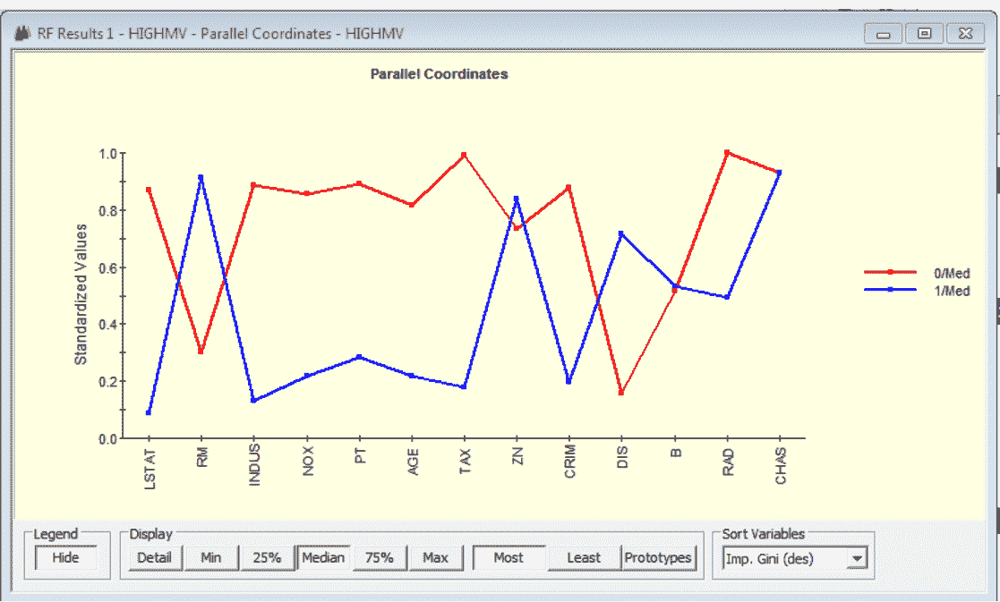

# 面向初学者的随机森林

利用多种替代分析、随机化策略和集成学习的力量。

## Salford Systems 和 Random Forests

Salford Systems 自 1990 年以来一直与加州大学伯克利分校和斯坦福大学的世界领先的数据挖掘研究人员合作，提供最佳的机器学习和预测分析软件和解决方案。我们强大、易用易用的工具已经成功地应用于数据分析的各个领域。应用程序数量达到数千个，包括在线定向营销、互联网和信用卡欺诈检测、文本分析、信用风险和保险风险、大规模零售销售预测、新颖的分割方法、生物和医学研究以及制造质量控制。

![图片]

在 Twitter 上关注我们 @SALFORDSYSTEMS

Random Forests® 是 Leo Breiman、Adele Cutler 和 Salford Systems 的注册商标

## 初学者的随机森林简介

# 目录

- [什么是随机森林？](#) / 4
- [宽数据](#) / 36
- [随机森林的优势和劣势](#) / 40
- [简单示例：波士顿房屋数据](#) / 45
- [真实世界示例](#) / 56
- [为什么选择 Salford Systems？](#) / 67

## 第 1 章

### 什么是随机森林？

随机森林是最强大的完全自动化的机器学习技术之一。几乎不需要数据准备或建模专业知识，分析师可以轻松获得令人惊讶的有效模型。“随机森林”是现代数据科学家工具包中的一个重要组成部分，在这个简要概述中，我们涉及到这种突破性方法的基本要素。

### 先决条件

随机森林是由决策树构建而成的，因此，建议本简明指南的用户熟悉这种基本的机器学习技术。

如果你对决策树不熟悉，我们建议你访问我们的网站，查看一些我们关于 CART(分类和回归树) 的入门材料。你不需要成为决策树的专家，但是是一些基本的理解将有助于使这里的讨论更加易懂。

我们还建议您访问我们的网站，查看一些我们关于 CART(分类和回归树) 的入门材料。您不需要成为决策的专家。

你还应该大致了解什么是预测模型以及数据通常为这些模型进行分析组织。

![图片]

### Leo Breiman

随机森林最初由加州大学伯克利分校开发。在 1999 年，他发表了一篇论文，在此之前，他一直在做有影响力的研究，包括 CART 决策树。

### 与他的长期合作伙伴一起工作

与他的合作者和前博士生 Adele Cutler 一起开发了 Random Forests 的最终形式，包括允许更深入数据的复杂图形理解。

![图片]

### Adele Cutler

随机森林是一种利用许多决策树、谨慎的随机化和集成学习来产生令人惊讶的准确预测模型、有洞察力的变量重要性排名的工具。

### 决策树的力量、谨慎的随机化和集成学习

产生令人惊讶的准确预测模型、有洞察力的变量重要性排名。
缺失值插补，新颖的分割和基于记录的精确报告。
深入了解数据。

### 准备工作

- 我们从一组合适的数据开始，包括我们想要预测或理解的变量和相关的预测因子。
- 随机森林可以用来预测连续变量，例如网站上的产品销售或预测保险索赔的损失。
- 随机森林还可以用来估计特定事件发生的概率，例如，预测某个疾病的患病概率。

#### 结果类型

- 结果可以是“是/否”事件或者是一个多种可能性之一，比如顾客会购买哪种型号的手机。
- 可能有很多种可能的结果，但是通常多类问题有 8 个或者更少的结果。

### 基本要素

- 随机森林是由决策树组成的集合，共同产生对数据结构的预测和深入洞察。
- 随机森林的核心构建模块是受 CART® 启发的决策树。
- Leo Breiman 最早版本的随机森林是“Bagging"。
- 想象一下从主数据库中随机抽取样本并构建一个在这个随机样本上的决策树。
- 这个“样本”通常会使用一半的数据，虽然它可以是主数据集的不同部分。

### 更多要点

- 现在重复这个过程。绘制第二个不同的随机样本并生长第二棵决策树。这第二棵决策树所做的预测通常会与第一棵树的预测有所不同（至少有一点）。
- 继续生成更多的树，每棵树都建立在稍微不同的样本上，并且每次生成的预测至少会稍微有所不同。
- 这个过程可以继续进行无限期，但我们通常会生长 200 到 500 棵树。

### 预测

- 我们的每棵树都会为数据库中的每个记录生成自己的具体预测。
- 为了结合所有这些独立的预测，我们可以使用平均或投票。
- 对于预测销售量等项目，我们会对树的预测进行平均。
- 为了预测分类结果，例如“点击/不点击”，我们可以收集投票的计数。有多少树投票“点击”vs.有多少“无点击”将决定预测。
- 对于分类，我们还可以产生每个可能结果的预测概率。基于每个结果的相对投票份额，我们也可以产生结果的预测概率。

### Bagging 的弱点

刚才描述的过程被称为“Bagging"。我们省略了许多细节，但我们已经介绍了基本要点。

当它在 1994 年首次引入时，Bagging 代表了机器学习的重大进展。Breiman 发现 Bagging 是一个重要的发现，好的机器学习方法，但不如他希望的那样准确。

分析了许多模型的细节后，他得出结论，Bagging 中的树太相似了。

他的修复方法是找到一种使树明显不同的方式。

### 将随机性引入随机森林

- 布雷曼的关键新想法是不仅在训练样本中引入随机性，而且还在实际的树生长过程中引入随机性。
- 在生成决策树时，我们通常会对所有可能的预测变量进行详尽搜索，以找到每个节点中数据的可能分割树的最佳分割器。
- 假设不是总是选择最佳分割器，我们随机选择了分割器。
- 这将确保不同的树彼此之间非常不相似。

### 随机森林应该有多随机？

- 在一个极端情况下，如果我们随机选择每个分割器，那么树中的随机性将无处不在。通常情况下，这种方法的性能不是很好。
- 一种不那么极端的方法是先随机选择一部分候选预测变量，然后通过选择来进行分割。最好的分割器实际上是可用的。
- 如果我们有 1,000 个预测变量，我们可能会在每个节点中选择一个随机的 30 个集合，然后使用 30 个可用的最佳预测变量进行分割，而不是在全部 1,000 个变量中选择最佳的。

### 更多关于随机分割的内容

- 初学者常常认为我们在分析开始时只选择一个随机子集的预测变量，然后使用该子集来构建整个决策树。
- 这不是随机森林的工作方式。
- 在随机森林中，我们在每个节点中选择一个新的随机子集的预测变量。在一棵树中，完全不同的预测变量子集可能在不同节点中被考虑。
- 如果决策树增长得很大，那么在整个过程结束时会有相当多的预测变量有机会影响决策树。

### 控制随机性的程度

如果我们 在 构建每棵树的每个节点 中 始终搜索所有的预测变量，我们构建的模型 通常 不会 表现 出色。

如果我们 只 搜索一部分变量，模型 通常 会有所改善。在每个节点 中 只 关注一个随机子集的变量，而不是所有的变量，通常 会有所 帮助。

要 考虑 多少个 变量 是一个 关键 的 控制 因素。我们 需要 进行 实验 来 找到 最佳 值。

Breiman 建议从可用预测变量的平方根开始。

在每个节点 中 只 允许搜索一个变量，几乎 总是 会 产生 较差 的 结果，但是允许搜索 2 或 3 个变量，通常 会 产生 令人 印象深刻 的 结果。

### 每个节点有多少个预测器？

| N 个预测器 | sqrt | 0.5 的平方根 | 2 的平方根 | ln2 |
| :--- | :--- | :--- | :--- | :--- |
| 100 | 10 | 5 | 20 | 6 |
| 1,000 | 31 | 15.5 | 62 | 9 |
| 10,000 | 100 | 50 | 200 | 13 |
| 100,000 | 316 | 158 | 632 | 16 |
| 1,000,000 | 1000 | 500 | 2000 | 19 |

在上面的表格中，我们展示了一些布雷曼和卡特勒建议的值。他们建议了四个可能的规则：平方根预测变量的总数，或者是一半或者是两倍的平方根，以及以 2 为底的对数。

我们建议尝试一些其他值。所选择的值在整个森林中保持不变，并且在每棵树的每个节点中保持相同。

### 随机森林预测

- 对于一个森林，我们会生成预测，就像我们对于 Bagging 所做的那样，通过平均或投票。
- 如果你想，你可以获得由每棵树生成并保存到数据库或电子表格中的预测。
- 然后，你可以创建自己的定制加权平均值或利用个别树预测的变异性。
- 例如，一个记录被预测为在所有树中，销售额相对较窄范围内的记录比平均预测相同但个别树预测变化较大的记录不确定性较小。
- 最简单的方法是让随机森林自动为你完成工作并保存最终预测结果。

### 袋外 (OOB) 数据

如果我们在生成树之前从可用的训练数据中进行抽样，那么我们自动获得可用的留存数据（对于该树）。

在随机森林中，这些留存数据被称为“袋外”数据。

目前不需要担心这个术语的理由。

我们生成的每棵树都有一个不同的留存样本与之相关，因为每棵树都有一个不同的训练样本。

或者，主数据中的每条记录都将“在袋子里”用于某些树的训练，并且“不在袋子里”用于其他树的生长。

### 测试和评估

- 跟踪特定记录在哪些树中是 OOB，可以轻松有效地评估森林的性能。
- 假设给定的记录在 250 棵树中是袋内的，在另外 250 棵树中是袋外的。
- 我们可以仅使用袋外树为这个具体记录生成预测。
- 结果将为我们提供对森林可靠性的真实评估，因为这条记录从未被使用过生成 250 棵树中的任何一棵。
- 始终具有 OOB 数据意味着我们可以有效地处理相对较少的记录数。

#### 更多的测试和评估

- 我们可以对数据中的每条记录使用 OOB 思想。
- 请注意，每个记录都根据其自己特定的 OOB 树子集进行评估。通常，没有两个记录会共享相同的 in-bag 与 out-of-bag 树模式。
- 我们可以始终保留一些额外的数据作为传统的保留样本，但是对于随机森林来说这并不是必要的。
- OOB 测试的概念是随机森林数据分析的一个重要组成部分。

### 测试 vs. 评分

对于使用 OOB 数据进行模型评估，我们使用树的子集（OOB 树）为每个记录进行预测。

在预测或评分新数据时，我们会利用森林中的每棵树，因为没有一棵树是使用新数据构建的。

通常这意味着评分结果比内部 OOB 结果更好，性能更好。

原因是在评分中，我们可以利用整个森林，从而受益于对更多树的预测结果进行平均。

### 随机森林和分割

随机森林分析中的另一个重要概念是“接近度”或者数据记录之间的相似程度。考虑选择的两条数据记录从我们的数据库中。我们想要知道这些记录之间的相似程度彼此之间。将这对记录放入每棵树中，并注意它们是否最终落入相同的终端节点或不是。计算记录“匹配”的次数，并除以测试的树的数量。

### 相似矩阵

- 我们可以通过这种方式计算出每对记录中找到的匹配次数，在数据中。
- 这会产生一个可能非常庞大的矩阵。一个包含 1,000 条记录的数据库将产生一个 1,000 x 1,000 的矩阵，共有 100 万个条目。
- 矩阵中的每个条目显示两个数据记录之间的接近程度。
- 如果我们希望利用它提供的数据洞察力，需要注意这个矩阵的大小。为了保持我们的测量结果准确，我们可以选择性地使用这些树。
- 我们可以只使用那些其中一个或两个记录是 OOB 的树，以保持诚实的测量结果，而不是对于每对记录都使用每棵树。
- 这不会影响矩阵的大小，但会影响相似度测量的可靠性。

### 相似度矩阵的特点

- 随机森林的相似度矩阵相对于传统的近邻测量具有一些重要优势。
- 随机森林自然地处理连续和分类数据的混合。
- 无需提出适用于特定变量的接近度测量方法。随机森林使用所有变量一起直接测量接近度或距离。
- 缺失值也不是问题，因为它们在树构建过程中会自动处理。森林与所有变量一起工作以测量。不需要针对特定变量进行测量接近度的方法。随机森林使用所有变量一起直接测量接近度或距离。

### 邻近洞察

Breiman 和 Cutler 在各种方式中使用了邻近矩阵。其中一种用途是识别“异常值”。异常值是与我们所期望的所有数据值明显不同的数据值。其他相关信息。因此，异常值将远离我们所期望的记录。与之接近，我们期望的记录是“事件”。与“非事件”相比，我们期望的记录更接近其他“事件”。没有任何合适的附近邻居的记录是自然的异常值候选者。Random Forests 为每个记录生成一个“异常值分数”。

#### 接近度可视化

- 理想情况下，我们希望绘制数据中的记录以揭示聚类和异常值。
- 可能还有一群异常值，最好通过视觉检测出来。
- 在随机森林中，我们通过将接近度矩阵的投影绘制到 3D 近似中来实现这一点。
- 这些图表可以提示有多少个聚类在数据中自然出现（至少如果只有几个）。我们稍后在这些笔记中展示这样的图形。
- 缺失值。

### 经典随机森林提供两种处理缺失值的方法

简单方法和默认方法是用整体的平均值或最常见的值来填补缺失值。

在这种方法中，例如，所有具有缺失年龄的记录将被填充为相同的平均值。虽然简单，但简单方法有效。

由于随机森林中的大量随机化和平均化，表现出惊人的效果。

对于分类预测变量，经典随机森林提供两种处理缺失值的方法。

### 接近度和缺失值

处理缺失值的第二种“高级”方法涉及多次构建森林。

我们从简单的方法开始，生成接近度矩阵。

然后用新的插补值替换数据中的简单插补值。

我们不再使用无权重平均值来计算插补值，而是根据接近度对数据进行加权。为了对特定记录的 X 进行插补，我们实际上是查看与具有缺失值的记录最接近的记录中的 X 的良好值。

因此，每条数据记录都可以获得一个唯一的填充值。

### 缺失值填充

这种高级方法实际上是很常识的。假设我们缺少一个特定客户的年龄。我们使用森林来确定距离有多近。问题记录与其他所有记录相关。通过产生加权平均值来填补缺失值，与其他客户的年龄一样。对那些最重要的客户给予最大的权重。需要插补的“喜欢”。

在即将发布的 2014 年 4 月版本的 SPM 中，你可以将这些填充值保存到一个新的数据集中。

#### 变量重要性

随机森林包括一种创新的方法，来衡量任何预测变量的相对重要性。该方法基于测量，如果我们失去了对给定变量真实值的访问权限，会对我们的预测模型造成多大影响。为了模拟失去对预测变量的访问权限，我们随机打乱其值在数据中的位置。数据。也就是说，我们将属于特定数据行的值移动到另一行。我们一次只打乱一个预测器，并测量由于预测准确性而导致的损失。

#### 变量重要性 - 详细信息

- 如果我们只对一个变量的值进行一次混淆，然后测量对预测性能造成的损害，我们将依赖于单一的随机化。
- 在随机森林中，我们在森林中的每棵树中重新随机排列数据以测试预测变量。
- 因此，我们摆脱了单次抽样的运气依赖。如果我们在 500 棵树前重新随机排列一个预测变量 500 次，结果应该是非常可靠的。

#### 变量重要性问题

如果我们的数据包括同一概念的几种替代度量，则一次只对其中一种进行重新排列可能对模型的性能造成很小的损害。

> 例如，如果我们有几个信用风险评分，我们可能会被误导以为其中一个评分不重要。

分别对每个信用评分进行重新排列测试，可能得出的结论是每个评分单独考虑时都不重要。

因此，在对重要性进行排名之前，消除使用的预测变量中的这种冗余可能非常重要。

最后观察：变量重要性。

在考虑每个变量时，可能得出的结论是每个变量单独考虑时都不重要。

因此，在对重要性进行排名之前，消除使用的预测变量中的这种冗余可能非常重要。

#### 变量重要性：最后观察

- 数据混淆方法来衡量变量重要性是基于失去对模型性能的信息访问的影响。
- 但一个变量不一定是不重要的，只是因为我们可以没有它也能做得很好。
- 需要意识到，如果可用，预测变量将被模型使用，但如果不可用，则替换变量可以用来代替。
- “Gini”指标基于预测变量的实际作用，并提供了一种替代的重要性评估方法。

### 自助采样法

到目前为止，我们的讨论中，建议 Random Forests 的抽样技术是为每棵树随机抽取可用数据的 50%。

这种抽样方式非常简单易懂，也是一种合理的方法理解和使用的方式，开发一个随机森林。

从技术上讲，随机森林使用了一种稍微复杂的方法，被称为自助重采样。

然而，自助采样和随机半抽样足够相似，我们不需要深入讨论细节。

请参考我们的培训材料以获取更多技术细节。

### 技术算法

- 假设训练案例的数量为 N，分类器中的变量数量为 M。
- 我们被告知决策树节点的输入变量数量为 m，应该小于甚至远小于 M。
- 通过从所有可用的训练案例中进行 N 次有放回的抽样，为该树选择一个训练集（即进行自助采样）。使用剩余的案例来估计树的错误，通过预测它们的类别（OOB 数据）。对于树的每个节点，随机选择 m 个变量来基于它们进行决策。
- 在训练集中，基于这些 m 个变量计算最佳分割。每棵树都是完全生长的，没有修剪。在构建普通树分类器时完成。
- 对于预测一个新样本，它会被推到树中。它被分配到它所在的叶节点的训练样本的标签。这个过程在集成中的所有树上迭代，并且所有树的众数投票被报告为随机森林的预测。

## 第 2 章

### 适用于大数据

文本分析、在线行为预测、社交网络分析和生物医学研究可能都可以访问成千上万个预测变量。随机森林对于分析这样的数据可能是理想且高效的。

#### 大数据

- 大数据是具有大量可用预测变量的数据，数量可能达到数万、数十万甚至数百万。
- 在文本挖掘中经常遇到大数据。
- 每个在文档语料库中找到的单词或短语都由一个预测变量表示。
- 在文档语料库中，每个预测变量都代表一个数据特征。
- 在社交网络中也会遇到宽数据。
- 网络分析、在线行为。
- 大数据也出现在社交网络分析、在线行为建模、化学等许多类型的数据中。
- 基因研究。
- 统计学家通常将数据称为“宽”。
- 如果预测变量的数量远远超过数据记录的数量。

### 随机森林和宽数据

- 假设我们可以访问 100,000 个预测变量，并且我们在每个树的每个节点上使用 317 个随机选择的预测变量构建一个随机森林。
- 在任何一个树的节点中，我们将跳过超过 99% 的预测变量。
- 经验表明，这样的森林可以在保持预测准确性的同时生成可靠的预测变量重要性排名。
- 仅仅从计算节省的角度来看，随机森林可能是分析宽数据的理想工具。
- 随机森林有时被用作预测变量选择技术，以彻底减少我们最终需要考虑的预测变量的数量。

#### 宽数据

- 在宽数据中，我们面临着很多列和相对较少的数据行。
- 想象一个有 2,000 行和 500,000 列的数据库。
- 在这里，随机森林不仅可以有效地提取相关的预测变量，还可以进行聚类。
- 接近度矩阵只有 2000 x 2000，无论预测变量的数量如何。

## 第 3 章

### 随机森林的优势和弱点

随机森林具有非常少的控制参数，易于学习和并行化处理。但模型的大小可能远远超过原始数据的规模。

### 随机森林：学习和设置的控制很少

- RandomForests 几乎没有控制参数。
- 最重要的是预测因子的数量在分割节点时要考虑的因素。
- 要构建的树的数量。
- 对于分类问题，如果我们将每棵树生长到其最大可能的大小，我们可以获得最佳结果。
- 对于预测连续目标，可能需要限制终端节点的最小大小，从而有效地限制树的大小。

### 易于并行化

- 随机森林是一个由独立构建的决策树组成的集成。
- 集成中的每棵树都不以任何方式依赖于其他树。
- 因此，树可以在不同的计算机上生长（只需使用相同的主数据）。
- 不同的树也可以在同一台计算机的不同核心上生长。
- 允许进行超快速分析。
- 评分也可以并行化以相同的方式。

### 随机森林的弱点

- 当树生长到非常大的规模时，随机森林模型表现最佳。
- 一个粗略的经验法则是，如果你有 N 个训练记录，你可以预期生长一棵具有 N/2 个叶节点的树。
- 因此，100 万个训练记录往往会生成具有 50 万个叶节点的树。
- 500 棵这样的树产生了 2.5 亿个终端节点和总共 5 亿个节点。
- 每个节点都需要在部署的模型中进行管理。

### 小结

随机森林非常适合分析嵌入在包含潜在数百万列但只有适度行数的数据集中的复杂数据结构。我们推荐其他工具，如 TreeNet，用于更大的数据库。

## 第 4 章

### 简单示例：波士顿房屋数据预测高于平均房价

#### 波士顿房屋数据

大波士顿地区的 506 个人口普查区，每个区域都有生活质量数据和中位房价。通常是回归分析的主题，但在这里，我们使用中位数值大于 23 的区域创建一个二进制指示器，编码为 1，其余编码为 0。

预测因子包括 FBI 官方犯罪统计数据、居民的社会经济水平、空气污染、距离主要就业中心的距离、商业或工业用途的分区以及其他一些因素。我们在培训视频中详细描述了这些数据。

#### 运行 RF 模型

在下面的屏幕截图中，我们设置了 RF 模型，选择了目标、合法的预测因子和分析引擎。

#### RF 控制

基本控制参数包括树的数量、每个节点使用的预测因子数量，以及是否将大量计算资源用于后续处理。

处理森林

#### 结果摘要

性能概述（OOB）和访问许多详细报告和图表。

#### 混淆矩阵 OOB

更多性能指标

| Actual Class | Total Class | Percent Correct | Predicted 0 (N=286) | Predicted 1 (N=220) |
|---|---|---|---|---|
| 0 | 316.00 | 84.49% | 84.49 | 15.51 |
| 1 | 190.00 | 90.00% | 10.00 | 90.00 |
| Total: | 506.00 | | | |
| Average: | | 87.25% | | |
| Overall % Correct: | | 86.56% | | |
| Specificity | | 84.49% | | |
| Sensitivity/Recall | | 90.00% | | |
| Precision | | 77.73% | | |
| F1 statistic | | 83.41% | | |

每个节点中随机选择的 3 个预测变量，共有 500 棵树。

#### 变量重要性

典型房屋的大小和邻居类型似乎最重要。

| Variable | Score |
| :--- | :--- |
| LSTAT | 100.0000 |
| RM | 55.7399 |
| INDUS | 27.5702 |
| AGE | 27.0975 |
| NOX | 25.3911 |
| PT | 19.1573 |
| CRIM | 13.6443 |
| TAX | 13.6127 |
| DIS | 11.0725 |
| ZN | 7.5072 |
| B | 5.1335 |
| RAD | 4.6879 |
| CHAS | 0.2266 |

### 最有可能与不太可能平行坐标图

将典型邻居与最有可能高于平均水平的邻居之一进行对比，与另一个极端的典型邻居进行对比。

这里我们从每个区域中取出 25 个邻居预测概率的末尾（最高 25 个和最低 25 个）并绘制平均结果。

#### 平行坐标图

我们在这里寻找的只是蓝色（高值）和红色（低值）线之间的大间隔。蓝线位于不良特征的低位置，而红线位于良好特征的高位置。这些图表用于暗示方向。

任何预测变量的影响有三个变量在两个组之间显示基本相同的值，这意味着它们自己无法用来区分这些群体。

#### 异常值

得分大于 10 被认为是值得关注的，在这里我们看到了按照记录 ID 排序的得分列表。根据这个度量，有 11 个记录看起来很奇怪。

#### 接近度和聚类

下面的图绘制了所有 506 个数据点，使用随机森林的接近度度量来显示相对距离的点。聚在一起的点在这个度量中非常相似。蓝色点是高价值的社区。

## 第 5 章

### 真实世界的例子：阿拉斯加项目的未来，预测阿拉斯加的生态系统在第 22 个世纪

### 大规模分析

- 为了帮助与阿拉斯加的生物自然资源相关的长期规划，阿拉斯加大学的研究人员领导由 Falk Huettmann 教授领导建立了预测气候变化对阿拉斯加许多植物和动物影响的模型。
- 作为野生动物生态学副教授，Huettmann 博士负责运营 EWHALE（生态野生动物栖息地数据分析用于陆地和海洋景观）实验室与阿拉斯加大学的北极生物学研究所、生物学和野生动物部门（UAF）。

### 挑战

目标：预测气候变化、人类活动、自然灾害（洪水、野火）和灾难性事件（大规模火山喷发、极地冰盖融化）可能如何影响阿拉斯加的生态系统在未来 100 年内。

分析了 400 多种物种的数据（动物）、数千种植物物种和多样化的景观生物群落（北极苔原、沿海苔原平原、山地和高山地区）、落叶林、树栖森林、沿海雨林和内陆。

### 一些基本问题：

- 融化的冰会创造新的航运航道吗？
- 开发天然气和油田会更容易还是找到新的？
- 北极缩小会如何影响极地熊、迁徙动物、商业捕鱼、植被（会出现新的可耕地吗）？
- 它会如何影响全球气候？

Dr. Huettmann 专注于生物群落和五个关键物种，这些物种应该是所有物种的典型代表。这些包括迁徙驯鹿、水鸟、入侵植物物种和阿拉斯加旱獭。后者被选中因为气候变暖和北极的融化严重限制了旱獭的自然栖息地，它没有其他去处。

### 解决方案

Dr. Huettmann 选择使用 Salford Systems 的 RandomForests 预测软件。

> 正如 Huettmann 博士解释的那样，“RandomForests 非常适合处理基于 GIS、空间和时间数据的数据。它提供由于数据库的巨大规模和涉及的统计相互作用，我们的研究需要高度准确性和泛化能力，其他解决方案无法实现。随机森林以惊人的速度实现了这一点。重要的是，RandomForests 软件可以与 Java、Python 等语言以及来自科学程序（如全球气候变化预测模型）的输出配合使用，提供单一且自动化的工作流程。与更加限制性的解决方案不同，RandomForests 预测建模软件产生更强有力的陈述、更先进的统计学和更好的泛化能力。对于预测工作来说，这是理想的，创造了新的视角和机会。”

### 结果

博士 Huettmann 的阿拉斯加未来报告为土地管理者、政府机构、社区、企业、学术界和非利润组织基于大量和透明的数据，提供了一系列可能的未来和场景。该报告提供了一种独特而有用的方式来评估气候变化及其像碳排放、栖息地这样的贡献者变化和消耗正在影响阿拉斯加的生态系统。它将指导那些关心海洋、野生动物的更好管理和可持续发展决策的人们。濒危物种。

### 客户支持

胡特曼教授还引用了 Salford Systems 的客户支持。

> “他们帮助我们安装和设置程序以取得进展，”胡特曼博士总结道。“总有人可以回答问题，这在与学生合作时非常重要...当教授无法回答时。他们的客户支持和开发团队中包括一些 Some of 这是我曾经有幸与之合作的最有知识的人之一。”

## 第 6 章

### 为什么选择 Salford Systems

### 为什么选择 Salford Systems?

- 有几个商业和开源的实现，为什么选择 Salford Systems 来实现随机森林？
- 一个令人信服的原因是你将获得更好的结果。
- 更高的准确性。
- 更可靠的变量重要性排名。
- 内置的建模自动化。
- 内置的并行处理。

### Salford 独有的

- Salford Systems 共同拥有随机森林商标和知识产权。
- 我们的实现是基于 Leo Breiman 提供给 Salford Systems 的源代码。
- Salford 一直与共同创始人 Adele Cutler 一起继续改进和完善 Random Forests 方法论。
- 学术研究证实了 Salford 随机森林的优越性。

### 测量随机森林的投资回报率

了解你在随机森林上的投资是否有回报。注册 Salford System 的 30 天试用，获取一些有见地的分析。随机森林是否值得投资。注册 Salford System 的 30 天试用，获取一些有见地的分析。

>>> www.salford-systems/home/downloadspm